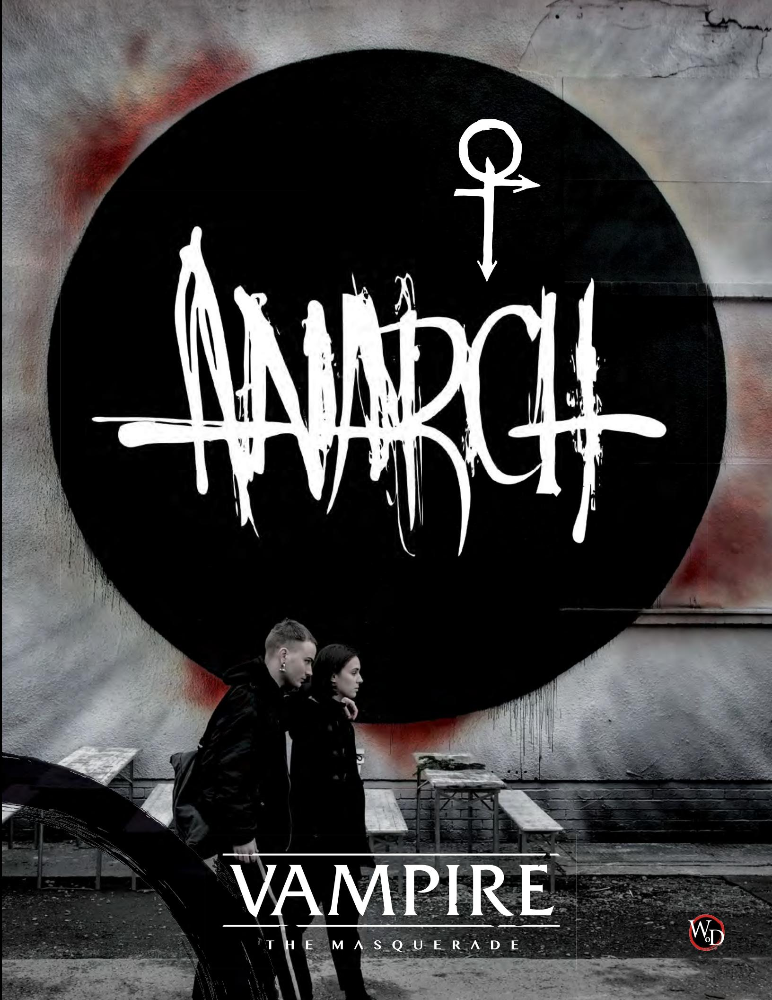

Это произведение спекулятивной фантастики ужасов, действие которого происходит в мрачном отражении нашего собственного мира. Поэтому оно содержит графические изображения секса, крови, наркотиков, насилия, жестокости, политического угнетения, принуждения, оккультизма, ереси и многих других потенциально расстраивающих тем. Рекомендуется для зрелых читателей и игроков. Советы по внимательной игре и о том, как обращаться с деликатными темами в настольных ролевых играх, см. в разделе

**161**

"Внимательная игра" в PDF-версии книги правил "Vampire: The Masquerade".

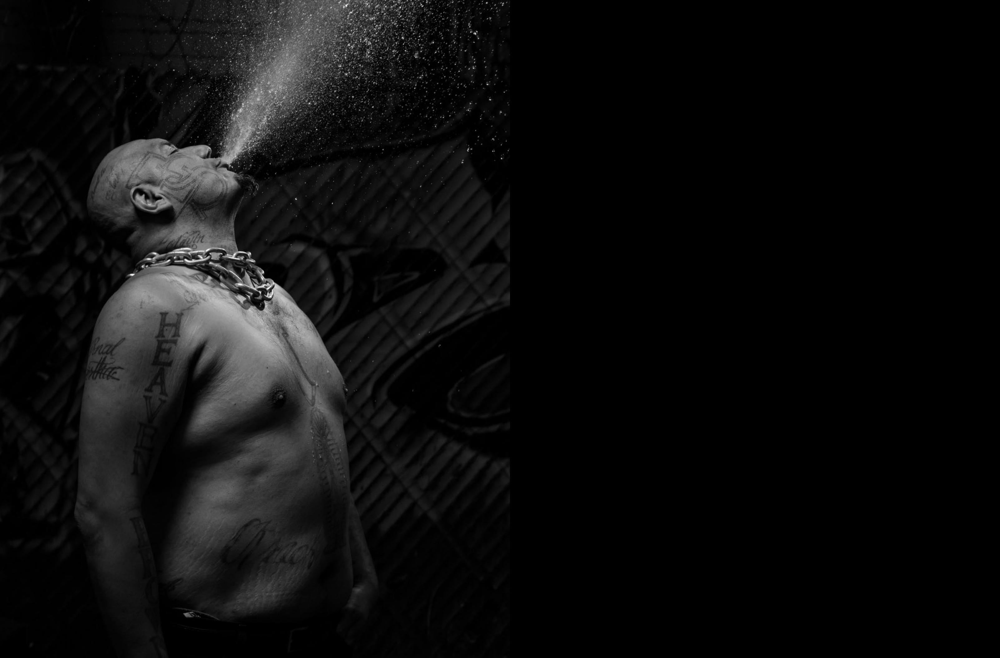

<span id="page-4-0"></span>INTRODUCTION

**К** ровь слишком хороша, чтобы тратить ее на вечность. Ты живешь, ты умираешь, ты снова живешь, вырываясь в ночь в виде вновь созданного животного, отчаянно пытающегося спрятаться среди своих бывших собратьев-людей.

Вы научитесь лгать, причинять боль и охотиться. Вы познаете блаженство вкуса крови. Вы учитесь видеть в каждом человеке живой механизм, согревающий вашу кровь для вас. Ты хочешь существовать здесь и сейчас. Ты хочешь почувствовать все, что может дать тебе ночь. Ты хочешь увидеть, что там снаружи. Может быть, вы даже хотите принадлежать себе.

# Анархи

У старых анархов есть сила, знания и ресурсы, чтобы продолжать управлять делами в своих интересах. У молодых нет ничего, кроме бесстрашия, количества и понимания современного мира.

И это только смертные. Для вампиров все гораздо хуже. Престарелые никогда не умрут. Они будут вечно удерживать свои позиции и преимущества, сокрушая всех, кто однажды может угрожать их привилегиям.

Война веков - организующий принцип вампирского общества. Установившаяся власть организовалась в Камарилью, стремящуюся ограничить саму концепцию того, каким может быть вампир. Они стремятся контролировать существование каждого вампира на земле и держать смертных и нежить в вечном стазисе, где власть никогда не переходит из рук в руки.

Движение Анархов выступает против Камарильи. Оно состоит из бесконечного разнообразия идеологий и теорий власти, объединенных нежеланием провести вечность в статичной тирании.

Самое первое издание Vampire: the Masquerade 1991 года имеет на задней обложке следующую цитату: "Никто не властен надо мной. Ни человек. Ни бог. Ни принц. Что за претензии на возраст для тех, кто бессмертен? Что за претензии на власть у тех, кто бросает вызов смерти? Зови свою проклятую охоту. Посмотрим, кого я с воплями утащу с собой в ад".

**5** В этом и заключается суть игры в вампиров за Анархов. Вы - молодой революционер, борющийся за уничтожение бессмертной тирании крови. Вы просто никто, кто-то с улицы, попавший в Войну Веков и пытающийся выжить. Вы идеалист, разрывающийся между мечтами о лучшем мире и жаждой крови, пачкающей все, к чему вы прикасаетесь.

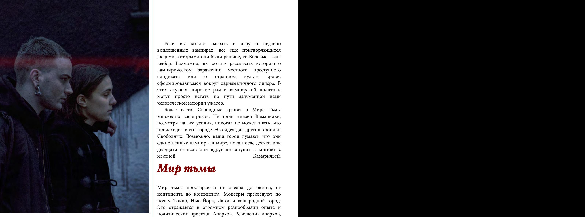

Для вас нет места в башне из слоновой кости Камарильи. Ваша история будет о крови и огне, о жертвовании своей вечностью ради борьбы, которая стара как мир.

# Свободные

За пределами движения Анарх лежат Свободные. Кто знает, сколько существует вампиров, не связанных с большим обществом нежити? Эти вампиры принадлежат к семьям, культам или бандам, своим собственным маленьким обществам, которые просто пытаются выжить ночью.

Свободные представляют бесконечное разнообразие способов познания Vampire: the Masquerade. Для многих Несвязанных Камарилья лишь далекая тень, репрессивная сила, которая закроет их, если только узнает о них. Правда в том, что среди миллиардов людей, населяющих планету, может существовать огромное количество различных небольших вампирских сообществ.

Если вы хотите сыграть в игру о недавно воплощенных вампирах, все еще притворяющихся людьми, которыми они были раньше, то Волевые - ваш выбор. Возможно, вы хотите рассказать историю о вампирическом заражении местного преступного синдиката или о странном культе крови, сформировавшемся вокруг харизматичного лидера. В этих случаях широкие рамки вампирской политики могут просто встать на пути задуманной вами человеческой истории ужасов.

Более всего, Свободные хранят в Мире Тьмы множество сюрпризов. Ни один князей Камарильи, несмотря на все усилия, никогда не может знать, что происходит в его городе. Это идея для другой хроники Свободных: Возможно, ваши герои думают, что они единственные вампиры в мире, пока после десяти или двадцати сеансов они вдруг не вступят в контакт с местной Камарильей.

# Мир тьмы

Мир тьмы простирается от океана до океана, от континента до континента. Монстры преследуют по ночам Токио, Нью-Йорк, Лагос и ваш родной город. Это отражается в огромном разнообразии опыта и политических проектов Анархов. Революция анархов, создавшая Свободные Штаты в Калифорнии, одушевлялась совсем другими идеями, чем те, которые были у Бруха, сражавшегося с Лениным в первые ночи коммунизма. Многие анархи говорят о Карфагене, но они не всегда подразумевают под этим одно и то же.

Хроника Анарха связана с миром смертных, с тем, что происходит здесь и сейчас. В ней будут люди, движущие своими собственными планами, ужасы, созданные смертными, хуже тех, что совершает любой вампир. В игре Анарх-персонажи являются частью социальной структуры мира и могут принимать свою природу паразитов или бороться с ней.

Для персонажа Анарха ужасы, связанные с тем, что он является вампиром, обрушиваются на его друзей и семью, на людей, которых он знает, с которыми он жил. Такие вампирские понятия, как охота, - не абстракция, а необходимость, заставляющая вампира каждую ночь задумываться о своей истинной природе.

Это справедливо независимо от того, где происходит действие вашей игры - в Кейптауне или Монреале. Специфика местной вампирской культуры меняется, политика развивается и мутирует, но основная природа крови, оживляющей каждого вампира, остается неизменной.

**6**

А вместе с кровью - основные действия, которые персонажи могут совершать в вашей игре: Охотиться, прятаться, сражаться, воровать, лгать, обманывать, спорить, внедряться, соблазнять.

# Опыт

Эта книга стремится представить широкий спектр опыта Анархов, от байкерских Анархов Свободных Штатов в кожаных куртках до тусовочной сцены Сумрака в Рейкьявике. Во всех этих случаях вампир живет в настоящем. Вечная жизнь - лишь далекая мечта в ночной борьбе за выживание, и многие из вампиров, составляющих сцену Анархов, возможно, прожили бы дольше, если бы вообще не стали вампирами.

Жизнь вампира среди Свободных стремительна и смертельно опасна. Вы учитесь рисковать, бороться за то, чего хотите, и скорее умереть, чем покориться. Концепции и идеи в этой книге - это инструменты, которые вы можете использовать при создании собственной игры. Используйте их, изменяйте, игнорируйте по своему усмотрению. Как только вы начнете вести свою собственную игру, это будет ваш Мир Тьмы.

В книге "Монстры недавнего прошлого" представлена история движения анархов от Карфагена до наших дней, рассказанная самыми разными людьми из числа "Свободных".

В книге "Хождение среди нас" рассказывается о нежизни в современных ночах. В какие различные сообщества объединяются анархи?

В книге "Время посмотреть, кто есть кто" подробно описаны известные личности, политические позиции, идеологии и сцены в современном Анархо-движении и за его пределами.

"Что нужно делать?" Все разговоры и никаких действий делают из революционера плохого революционера. Речь пойдет о практических возможностях борьбы с анархом, от советов о том, как исчезнуть, до многочисленных преимуществ либерального подхода к Диаблери.

За этой панорамой опыта Анархов по всему миру следует рассмотрение того, как функционируют различные вампирские кланы в мире Несвязанных. Затем следуют лорлисты, расширяющие специфически анарховские темы, затронутые в этой книге.

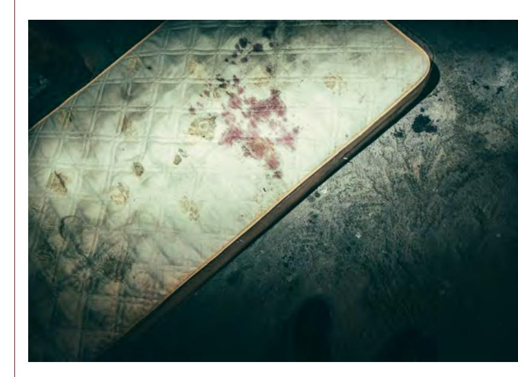

# Незримые монстры

Добро пожаловать на "Планету без границ". Это мир, где солнце всегда где-то садится, готовое выпустить на волю скрытых монстров, живущих среди нас повсюду: соседей, друзей, коллег, любовников и случайных людей на улице.

Жизнь на планете Свободных идет ночь за ночью, а Камарилья наблюдает за ней из окон своей башни из слоновой кости. Это истина, известная каждому Анарху: Если вы думаете, что охота как-то отделена от вашего ночного существования, то вы уже окончательно потерялись в современном мире. Для вампира Анарха охота - это жизнь, будь то встреча со старым школьным другом, чтобы оценить, можно ли заставить его стать кровным наркоманом, или отчаянная борьба за спасение от клыков кровожадного архонта Камарильи. Не случайно среди Сородичей самые прекрасные идеалы человечности принадлежат тем, кто на самом деле больше не живет среди людей.

Эта ночь - ваша ночь. Самолет населен пиршеством человеческих существ, их плоть пересекают вены, несущие сладкую кровь, которая ждет вас. Неважно, наслаждаетесь ли вы охотой или считаете ее ужасной необходимостью. Крови нет дела до вашей морали. Она вокруг вас, зовет вас попробовать.

Включите свою лучшую песню для вечеринки, наденьте свой любимый пиджак, нанесите немного подводки, забудьте о том, что вы меньше, чем человек, и танцуйте всю ночь. ■

<span id="page-7-0"></span>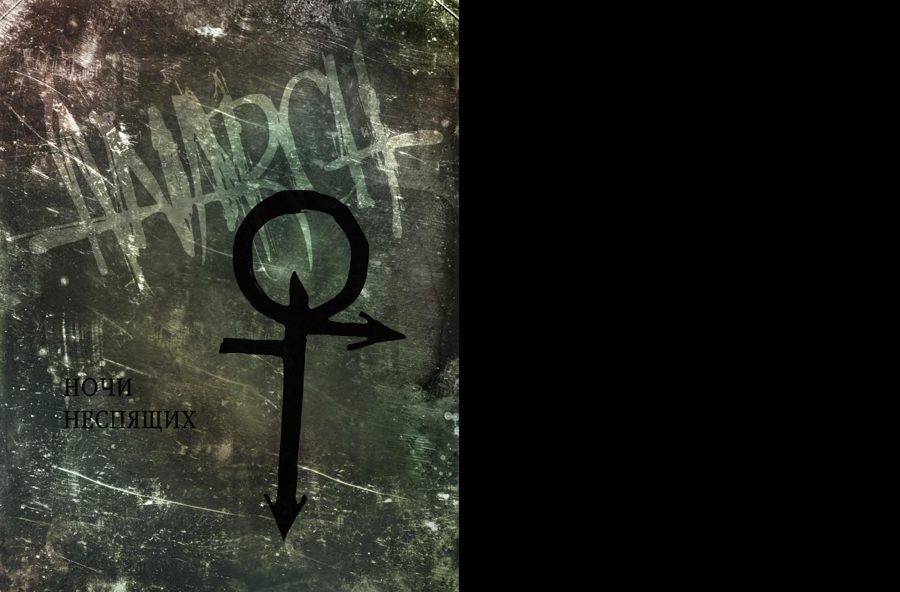

# Кто мы

**Хорошо, приготовьтесь.** Я собираюсь объяснить настоящую правду о нашем виде. Вы читали об инопланетных бактериях, найденных во льдах Антарктики, верно? Вот откуда мы. Эти бактерии заразили ученых, они распространились, и вот мы здесь. Это единственное объяснение, которое имеет смысл.

Мы - болезнь, не более того. Болезнь, которая превращает носителя в идеальное средство для распространения чумы. Когда вы чувствуете жажду крови, это вирус толкает вас на поиски новых жертв. Это как те муравьи в Амазонке, зараженные грибком, который захватывает весь организм и начинает направлять его на свои цели.

Каждый из нас - демон, и каждый из нас - настоящий бунтарь. В этом наша слава и наше бремя. Люцифер начинал как бунтарь, но вскоре стал тем, кого он презирал больше всего, - тираном Ада. Только мы - истинные свободомыслящие, демоны, которые отвергли Люцифера и пришли на Землю. Это и есть наше истинное предназначение: распространять среди человечества весть об истинной свободе.

Мы всегда были здесь, от зари истории до наших дней. Мы параллельный вид, эволюционировавший для жизни в симбиозе с человечеством. Они обеспечивают нас пропитанием, а мы направлением и целью.

Я уверен, что кровь вампира радиоактивна, а мы все мутанты. Вот откуда у нас все эти способности.

Вы должны отбросить человеческую мораль, как змея сбрасывает кожу, и научиться слушать голос божественный внутри вас. Вы - избранный инструмент Бога, одаренный частицей божественности, чтобы указать вам истинный путь. В этом наше предназначение и наша судьба. Невозможно избежать присущей нам святости: Каждая ваша доброта и каждая жестокость - это деяние Бога.

Если вы хотите понять наше состояние, вы должны изучить труды теософов. Все мы начинаем цикл как неодушевленные минералы, и через добродетельные поступки продвигаемся к растениям, животным и, наконец, человеческому сознанию. В традиционной литературе для обозначения следующей стадии часто используется термин Бодхисаттва, но мы можем использовать и другое слово с мифическими аннотациями: Вампир. Цель Бодхисаттвы/ Вампира - провести человечество к следующей стадии цикла реинкарнации через духовный акт поглощения крови.

Это простая истина, которую пытаются отрицать христианство, иудаизм и ислам: Кайн был первым Мессией, восставшим против Бога-тирана, истинным провидцем, показавшим нам реальную силу и потенциал, который есть в каждом из нас. Мы - истинные ангелы Кайна, несущие его суд на Земле.

Я материалист. Я не верю в сверхъестественные объяснения, но я верю в широкий размах истории. Это настоящее предназначение нашего рода как бессмертных существ. Направлять на кривую цепочку событий человечества. В конце концов, бессмертие - это просветление.

Кого волнует, есть ли за всем этим какая-то большая история? Я называю это так, как вижу. Мы хищники, эксплуатирующие человечество в ночи. Ничего больше.

# Что представляют собой люди

Я очень люблю людей, что и говорить. Я никогда не устаю от охоты. Они издают такие смешные звуки, когда пытаются убежать, а в момент смерти у них у всех есть эта очаровательная вера в то, что они уникальны. Я пытался объяснить некоторым из них, насколько это смешно, но они так и не поняли.

Человечество было передано в наше распоряжение, и мы несем ответственность за то, чтобы направлять и защищать его. Мы должны выполнять свою ответственность по отношению к нашим более слабым братьям, даже если они выполняют свою обязанность кормить нас.

Многие Сородичи считают людей лишь пищей. Для них человечество - это большая кровавая ферма, дающая нам все необходимое для выживания. Это всегда заставляет меня чувствовать грусть. Люди могут быть гораздо большим, чем просто питательные вещества! Они могут дать настоящий кулинарный опыт.

**9**

Существует огромная разница между кровью пожилого полицейского, умирающего в ветхом гериатрическом отделении, и пухлого отпрыска из успешной семьи, планирующего свадьбу на Мальдивах. Не существует такого понятия, как "плохая кровь". Каждый человек привносит свою изюминку, и мы должны научиться ценить это!

Люди - это мы, а мы - это люди. Воображать, что мы как-то лучше, сильнее, жесточе или умнее их, суетливое занятие. Мы можем жить дольше и охотиться за кровью, но в конечном итоге мы все просто засранцы, пытающиеся выжить, чтобы пережить еще одну ночь.

Я вижу в каждом человеке протовампира. Им нужен небольшой толчок, и они становятся нами. Я знаю, что это выглядит отвратительно, но так устроена наша биология. Мы организм, который питается своими личинками, позволяя самым сильным и жизнеспособным особям развиться во взрослую стадию вида. Вот настоящий вопрос: Являемся ли мы последней стадией или мы развиваемся в нечто большее?

Мы - хищники, ночные животные, охотники, созданные для того, чтобы убивать быстро и бесшумно. Мы гепарды, а не слоны. Нам нужен камуфляж, укрытия, логова, из которых можно нанести удар. Лучшая защита, которая у нас есть, - это прятаться среди человечества, как большая кошка прячется среди высокой травы.

Мы никогда не должны забывать, что такое быть человеком. Стать одним из нас - это падение из благодати, и наша единственная надежда на спасение вернуться к человечности. Мы не больше, чем люди. Мы меньше, и мы всегда должны стремиться вернуться к тому, чем мы были.

Меня не волнуют проблемы человечества. Многих из нас волнует, но на самом деле они просто отвлекаются от реальной картины мира. Конечно, человечество создает много шума, но в конечном счете он имеет такое же значение, как треск на пустой радиоволне.

Человечество - это потеря. Это урок, который мы все рано или поздно усваиваем. Вы привязываетесь, влюбляетесь, заводите врагов, ненавидите, но в конце концов человечество всегда увядает и исчезает. Для Вампира полагаться на живых - все равно что строить замок из песка на пляже до прилива.

# То, что мудро

Вы хотите изголодаться, почувствовать силу крови в своем теле, сжечь все, что выпьете, и превратиться в сверхчеловека-монстра, способного на все. И конечно, вы можете это сделать. Но если вы хотите жить дольше, то, возможно, не стоит. Пейте экономно, используйте кровь по назначению, и вы выживете.

Многие из нас ненавидят Голод, который постоянно заставляет нас сосредоточиться на вкусной красной субстанции, текущей по венам смертных. Для меня Голод - это благословение. Его цель - держать нас настороже, начеку, готовыми ко всему. Из-за Голода мы всегда думаем о том, что нам нужно, чтобы выжить. Все остальное - роскошь.

Правило номер один успешной нежизни - гнездиться среди смертных. Существовать как один из них. Выглядите как они, ведите себя как они, говорите как они. Не позволяйте отделить себя от человечества. Не поддавайтесь идее, что мы как-то живем отдельно от человеческой культуры и цивилизации. Чем ближе вы к человечеству, тем успешнее вы будете как охотник и тем труднее будет обнаружить ваших врагов.

Кровь - это центр вашего существования. Держите заначку в холодильнике. Научитесь высасывать кровь у животных. (Я знаю, что они ужасны на вкус, но это лучше, чем голодать, верно?) Убедитесь, что у вас всегда под рукой больше крови, чем вам действительно нужно. Таким образом, вы сможете попировать, если вам понадобится подлечиться после боя. А когда наступят плохие времена, вы сможете справиться с ударами.

Вампир - одинокий охотник. Не полагайтесь на других, не доверяйте и не раскрывайте своих секретов. В конце концов, единственный человек, который действительно заботится о вашем выживании, - это вы сами. Сделайте так, чтобы никто не знал, где вы спите, кто ваши рабы крови и как вы охотитесь.

Пытаться выжить в одиночку глупое занятие. Многие из нас впадают в бессмысленную паранойю, боятся всех и предполагают злой умысел за дружескими жестами. Научитесь охотиться в стае. Вы поймете, что это проще, безопаснее, а если вы облажаетесь, кто-то спасет вашу задницу. И еще: нам тоже бывает одиноко. Если ты нежить, это не значит, что тебе не с кем поговорить.

Камарилья - отстой, но у них есть одна хорошая идея: Маскарад. Если вы задумаетесь об их Традициях, то поймете, что большинство из них направлены на сохранение власти элиты. Маскарад - исключение. Он призван защитить всех нас, и поэтому все должны следовать ему. Реальность такова, что в лунную ночь вы можете считать себя верховным хищником, но в полдень вы просто еще один дурак, который сгорит дотла.

Камарилья любит определять, что такое быть вампиром. Они хотят рассказать вам о Кайне, традициях, князе и прочей ерунде. Если вы не будете осторожны, вы начнете им верить. Ты будешь думать, что их путь - единственный способ существования для нашего вида. Но это не так. Есть простое средство против их лжи: Ешьте богатых. Как только вы почувствуете вкус вампира Камарильи, пути назад уже не будет.

# Что сейчас

Бессмертие - это чушь. Это ложь, созданная для того, чтобы держать вас в повиновении и страхе. Конечно, мы можем жить вечно, но стоит ли оно того, если это означает вечность преклонения перед князем? Живите быстро и упорно и убедитесь, что когда вы умрете, вы заберете этих засранцев с собой.

Вы попали в мир, где каждое преимущество, каждый клочок власти и каждая капля крови уже находятся в руках древних существ, которые никогда, никогда от них не откажутся. Для человечества есть хотя бы надежда, что старая власть умрет. Для нас этого никогда не произойдет. Вместо этого мы должны вырвать ее из рук наших старейшин и разорвать их на части, чтобы они никогда больше не смогли построить свою мерзкую систему.

Вам дана сила крови и существование без смерти. Пришло время использовать все это с пользой и бороться за лучший мир. Любой мудак может сражаться за себя, но если вы хотите настоящего бессмертия, сражайтесь, чтобы изменить мир. Боритесь за что-то большее, чем вы сами. Только прежде чем сделать это, задайте себе вопрос: Лучший мир для кого?

Камарилья - это массивное сообщество, построенное для сохранения силы древних монстров, которые были вобраны в прошлые века. Они представляют себя как самых могущественных, самых мудрых, самых достойных из всего нашего рода, но не поддавайтесь на их ложь. Они всего лишь старые дураки, которые держатся за свою власть всеми силами. Ваша задача уничтожить Камарилью и освободить место для рождения чего-то лучшего. Нечто, построенное на принципах, а не только для поддержания существующих привилегий.

Я стал нежитью не для того, чтобы ввязываться в чужие войны. Камарилья, Движение Анархов, Кайн, человечество... Кому до всего этого есть дело? Я живу ради себя. Это моя жизнь, единственная жизнь, которая у меня когда-либо будет. Я не стану тратить ее впустую, служа ловкому мерзавцу, который хочет продать мне свою линию.

Мы - монстры, и ничего хорошего из нас не выйдет. Мы не можем построить лучший мир, потому что в лучшем мире нас не существует. Лучший способ для вампира - это улучшить окружающее его общество это совершить самоубийство. Иначе мы отравляем все вокруг, особенно смертных, которые пытаются сделать что-то хорошее. Ни одно человеческое политическое движение не улучшилось от контакта с нами.

Существует так много лжи. Кайн, антедилувийцы, Голконда. Все эти истории существуют для того, чтобы держать нас на нашем месте, и их нужно разрушить. Я верю, что мы можем найти правду о нашем состоянии, но сначала мы должны рассеять тьму всех этих средневековых мифов, призванных показать нам, как прожить нашу не-жизнь.

Для нас есть надежда. Вдали от политических игр Камарильи и токсичных игр, в которые играют наши старейшины, мы все еще можем быть искуплены. Возможно, это Голконда, возможно, что-то другое. В этом грязном бардаке еще есть шанс на что-то лучшее. ■

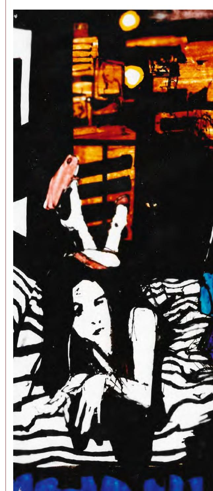

# Чудовища недавнего прошлого

Не существует единой истории Анархо-движения или "Свободных". История всегда политична, в конце концов, ее интерпретируют и переиначивают в соответствии с потребностями момента. В обществе вампиров могут быть те, кто помнит древние времена от Римской империи до Нью-Йорка восьмидесятых, но только глупец доверится версии событий, рассказанной бессмертным кровососом.

Правда в том, что вампиры лгут. Они лгут, чтобы служить своим интересам, погладить свое эго и насолить своим врагам. В этом они ничем не отличаются от простых смертных, но Маскарад еще больше затрудняет написание объективной истории. Надежных письменных источников информации об истории нежити очень мало.

Что это значит для молодого анарха, пытающегося разобраться в мире? Как она может узнать, откуда она родом и что значит быть вампиром?

Вы должны выбрать, какая ложь вам больше нравится.

Рассмотрим один из самых известных моментов недавней истории анархов смерть князя Лос-Анджелеса Дона Себастьяна в 1944 году. Легенды анархов рассказывают, как испанский анархист Сальвадор Гарсия пробился в убежище дона Себастьяна и убил его после отчаянной, кровавой схватки.

За это и за написание Манифеста анархов Сальвадор Гарсиа стал одной из легенд анархо-движения.

Неужели он убил дона Себастьяна в одиночку?

Возможно, а возможно и нет. Тем не менее, при жизни дон Себастьян был всего лишь камарильским князем молодого, нового города. После смерти он стал символом всего плохого, что было в Камарилье, от автократических методов до абсолютной жестокости. Даже Камарилья купилась на этот миф, отказавшись от его наследия и не пытаясь спасти правление князя, который казался таким дегенеративным и бесполезным.

Действительно ли дон Себастьян был хуже многих других князей Камарильи? Наверное, нет. Но он был слаб, и этого было достаточно.

Когда вы слушаете рассказы об истории Анарха, применяйте те же основные правила, которым вы должны следовать, читая газету. Кто рассказывает историю и какова его повестка дня? Как формулируется вопрос? Кто получает выгоду от этого повествования? И, конечно, мы всегда склонны верить тем, у кого есть власть, и не доверять тем, у кого ее нет. Если вы молодой вампир, старайтесь сдерживать этот порыв. Сила никогда не будет на вашей стороне.

# - Руди, идеолог Брух

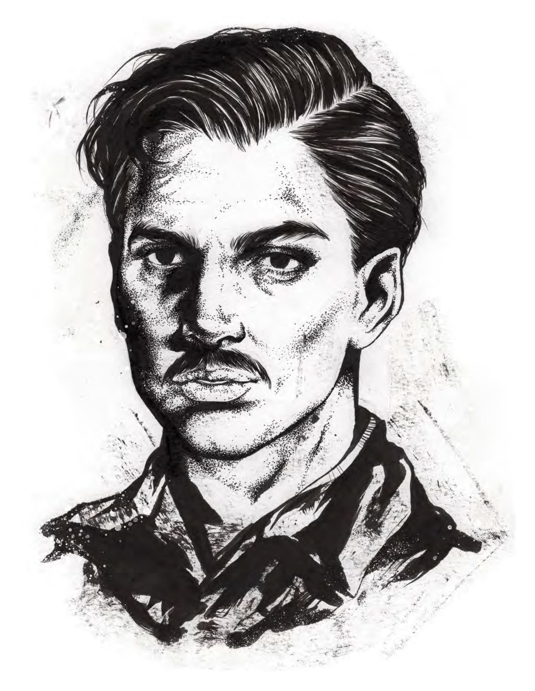

# Город на берегу моря

Если вы хоть сколько-нибудь долго общаетесь в кругах анархов, особенно политических анархов, вы обязательно услышите одно слово: Карфаген. Так какое отношение имеет североафриканский город-государство, чьи дни славы были две тысячи лет назад, к нашей сегодняшней борьбе?

Карфаген иногда называют Третьим городом, после Первого и Второго городов из легенд о вампирах. Большинство этих легенд не находят большого отклика в кругах анархов, но Карфаген - да. Как гласит история, это была лучшая и наиболее успешная попытка создать общество, в котором люди и вампиры могли бы жить вместе открыто и в гармонии. Хотя он был создан задолго до зарождения современного движения анархов, он был нашим раем на земле, и его падение до сих пор звучит в истории вампиров. Для Камарильи Карфаген является символом непрактичности наших идей и превосходства их видения нашего существования, но для нас он означает прямо противоположное.

Давайте посмотрим правде в глаза: Само существование Карфагена противоречит многовековой ортодоксальной традиции Камарильи о Маскараде. Оно ставит под сомнение самые основные представления о нас самих. В конце концов, Князи говорят нам, что мы - паразиты, которые прячутся среди человечества, опираясь на его успехи. Их догмы гласят, что секретность - это безопасность, и только глупцы мечтают о радикальных изменениях в человеческом обществе, чтобы улучшить нашу жизнь.

Как же они это сделали? Как эти древние, в основном из рода Бруха, смогли сделать то, что с тех пор редко кто пытался сделать?

Именно здесь возникают трудности. Письменных источников очень мало, а наши старейшины - отъявленные лжецы, когда дело касается истории. Трудно сказать, как на самом деле был организован Карфаген, но у многих анархистов Движения есть свои представления о том, как это было сделано.

Для некоторых Карфаген был мирной утопией, в которой люди и вампиры жили на равных. Мы не были хищниками или паразитами, а просто наслаждались кровью наших собратьев-людей по согласию. Мы вместе правили нашим городом, делили власть и привилегии, не обращая внимания на то, кто был вампиром, а кто нет.

Для других Карфаген был доброжелательной диктатурой вампиров. Мы заботились о наших человеческих братьях и сестрах, правя ими доброжелательно и беря только кровь, необходимую нам для выживания. Наша аморальность позволяла нам существовать среди них открыто, как привилегированная, доверенная элита.

Существуют и более мрачные версии этой истории. В конце концов, мы вампиры, а люди - просто стадо. В этом видении Карфагена, город был утопией для Сородичей, мегаполисом с пленным, контролируемым населением, которое понимало свое место. Этот Карфаген был местом просвещения и мира, пока вы были одним из нас.

Так что же из этого правда? Обычно то, во что вы верите, зависит от того, какой мир вы хотите построить. Вы выбираете тот Карфаген, который подходит вам.

Все три версии объединяют две идеи: Вампиры открыто живут среди людей и используют свою силу, чтобы создать общество, в котором мы хотим жить. От милосердия тех, кто считает нас равными людям, до жестокости тех, кто считает людей простым ресурсом, наша общая черта - амбиции. Мы верим, что можем переделать мир. Мы не обязаны мириться с существующими условиями, как это делают трусы из Камарильи.

Таково истинное значение Карфагена. Точная историческая реальность не имеет значения. Главное, что лучший мир возможен.

Это также правда, которую Камарилья отчаянно пытается подавить. И смертные, и вампирские истории рассказывают о жестоком карфагенском культе крови. Детей приносили в жертву в безумных ритуалах, их кости собирали в безумные оссуарии. Вы можете задать вопрос, правда ли это? Был ли Карфаген на самом деле городом жестокого террора, в котором его повелители Бруха пировали на крови младенцев?

Смертные историки Карфагена долгое время сталкивались с проблемой отсутствия надлежащих записей из самого Карфагена. Их источники информации подержанные, как правило, римские. Кто же вел ожесточенную войну против Карфагена и в конце концов уничтожил его?

Совершенно верно, Рим.

Эти истории об убийстве младенцев - не что иное, как римская военная пропаганда, которую легковерные историки принимают за факт. Действительно, недавние исследования Карфагена опровергли римское повествование. Костницы там есть, но они имеют более мирское объяснение, чем безумные обряды: Это просто кладбище. В конце концов, дети умирали от болезней и голода в Карфагене так же, как и во всем древнем мире.

Тем не менее, неудивительно, что Камарилья до сих пор пытается очернить репутацию Карфагена. Идея города всегда была утопической. Две тысячи лет назад идеалисты Бруха в Карфагене были против консерваторов Вентру в Риме. Вентру понимали потенциал карфагенской идеи для создания нового революционного общества. Они поняли, что им нет места в этом новом мире, который представлял Карфаген, и решили, что должны его уничтожить.

Из истории человечества трудно сказать, почему Карфаген действительно пал. Возможно, римской военной мощи, подкрепленной богатством и властью Вентру, оказалось достаточно. А может быть, Карфаген сам столкнулся с проблемами. Коррупция нам не чужда, так что вполне возможно, что тогдашние Бруха стали самодовольными и сами стали причиной своего падения. Какой бы ни была правда, Карфаген заложил основу для модели, которая будет повторяться много раз в нашей истории. Город пал, но идея стала бессмертной.

Иногда мы настолько увлекаемся историей, что забываем о ее реальной основе. В великой легенде о Карфагене он был разрушен навечно, но на самом деле он все еще существует, просто в другой форме. После того как Карфаген был завоеван Римом, он стал римской провинциальной столицей.

Сегодня это город в орбите Туниса, столицы Туниса. Там проживает 24 000 человек.

Это хорошее напоминание о том, что пока мы мечтаем о наших утопиях, человечество упорно продолжает свою собственную историю.

- Сальвадор Гарсия, автор "Манифеста анархов"

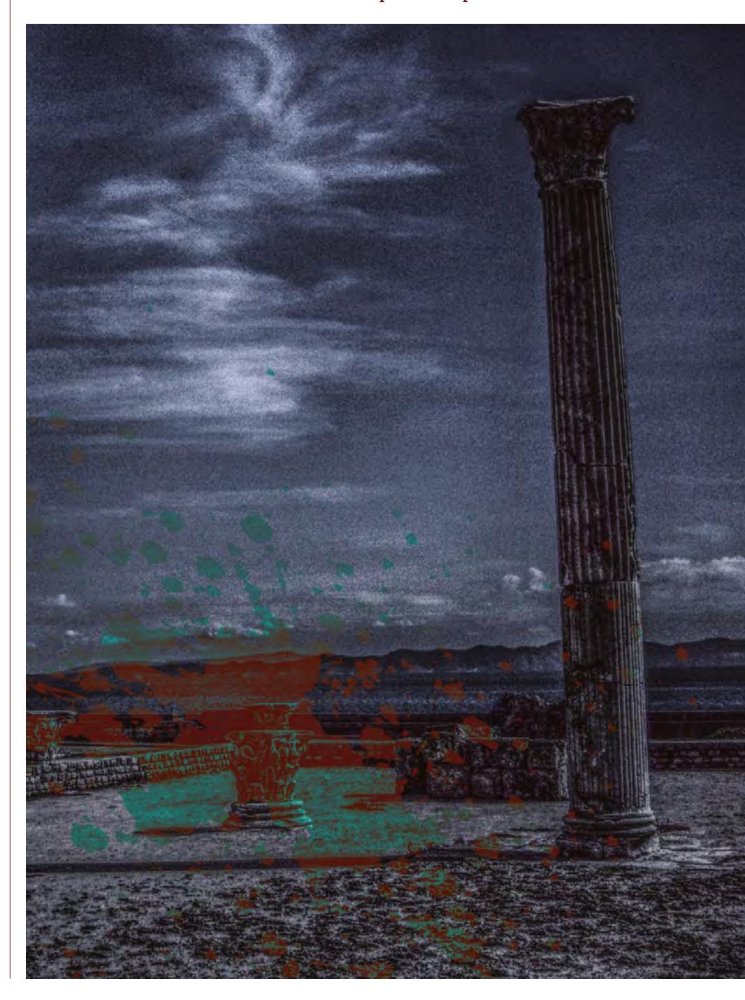

В поисках Тайлера

Я не думала, что она была чем-то особенным. Конечно, она была харизматичной, умела играть на публику. Но это не редкость среди Анархов Бруха. Я решила, что она просто еще одна панк-девчонка, недавно принявшая обряд Воплощения, развлекающаяся среди мертвых.

Мы тусовались в нашем обычном месте, как делали это почти каждый вечер, когда шериф решил заглянуть к нам со своими флибустьерами. Ее там не было, когда все началось. Шериф сказал нам, что пока вампир, который который кормится в личных охотничьих угодьях князя, пока не будет пойман, он будет казнить одного из нас каждую неделю, начиная с сегодняшнего вечера.

Конечно, мы вели себя круто, но в итоге оказались кучкой неудачников. Нам нравилось думать, что мы крутые, но у нас не хватало смелости пойти против шерифа и всего, что он олицетворял. Он раздавил голову моего дитя под своим сапогом у меня на глазах, а у меня не хватило духу ничего с этим сделать.

Но она это сделала. Она вошла в бар, эта девушка, которую я считала просто никем. На ней была рваная рубашка Misfits и Doc Martens, но когда я увидела ее лицо, когда она стала свидетелем казни, все это словно испарилось.

Она не издала ни звука, но каким-то образом Шериф понял, что все стало серьезно. Возможно, он увидел это по нашим лицам. Мы больше не смотрели на него. Он повернулся, и она вонзила кий прямо в его сердце, как будто делала это тысячу раз раньше.

Друзья шерифа начали отходить в сторону. Она улыбнулась им и сказала: "Передайте привет князю. Он уже знает мое имя".

На следующее утро шериф сгорел в лучах восходящего солнца. Мы никогда больше не видели ее, но в ту ночь в городе что-то сильно изменилось.

- Лена, анархист из Германии

М ногие из нас считают Тайлера первым Анархом, хотя это, наверное, не совсем верно.

Известно, что при жизни она была английской крестьянкой-бунтаркой 14 века, последовательницей Уота Тайлера, от которого впоследствии получила свое имя. В смерти она боролась против Камарильи еще до ее официального создания и сыграла ключевую роль в первоначальном восстании анархов. Она отправилась на Терновый съезд в 1493 году и присутствовала при капитуляции новообразованных анархов перед Камарильей.

Это в основном неоспоримые торические факты о Тайлер. После "Торна" она исчезла как лидер Анархов, возможно, разочаровавшись в том, как зарождающееся движение предало свои идеалы во имя подневольного мира с Камарильей. Некоторые говорят, что она участвовала в создании Шабаша, но точно сказать трудно.

Возможно, это к лучшему. На протяжении веков после Торнса легенда о Тайлер была гораздо важнее реальности. Она - первый настоящий бунтарь, тот, кто отказался капитулировать. Она не запятнала себя ни в играх за власть Камарильи, ни в жестокостях Сабаша. Она не заняла место лидера, как Сальвадор Гарсия или Джереми Макнил, поэтому мы можем проецировать на нее все наши надежды и мечты, не проверяя их реальностью. Мы не знаем ее истинных достоинств, поэтому она может быть всем для всех.

Мы просто знаем, что она где-то рядом, и когда возникнет необходимость, она появится, чтобы спасти положение.

- Чинаса Адейеми, летописец анархов

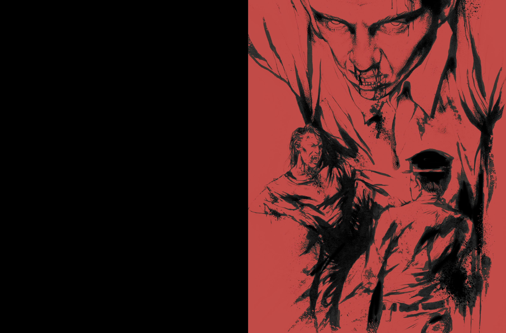

Р

аньше я завидовал Тайлер. Я знал ее, в те времена, и, конечно, она была впечатляющей. Но так же было и со многими другими.

В последующие столетия некоторые из нас сражались на передовой линии Движения. А что делала она? Пряталась в тени, играя в Робин Гуда?

Я надрываю свою задницу, пытаясь руководить этим сообществом, но она настоящий герой.

По правде говоря, я смирился с этим. Вы не осознаете, какой реальной силой обладает Тайлер, пока не побываете на встрече с Камарильей. Сядьте с архонтом или двумя и посмотрите, как им понравится слышать ее имя.

Конечно, я крут. Я, вероятно, могу уничтожить любого из этих слабых маленьких сопляков, которых Камарилья любит посылать к нам. Но они все равно не боятся меня так, как боятся историю. Вот что она такое, история.

Самое интересное, что большинство людей даже не знают о ней ничего толком. Если вы хотите увидеть, как корчится князь, спросите его о Тайлере и Хардетштадте, могущественных Вентру, основателях Камарильи. Только будьте готовы к долгому допросу о том, как вы догадались задать этот вопрос.

- Джереми Макнейл, лидер анархов

# Яне жду, что вы мне поверите. Я просто никто, бродяга, бродяжка. Вы проходите мимо меня каждый день.

Позже они рассказали мне, что какой-то благонамеренный человек вызвал полицию и настоял, чтобы они позаботились обо мне. Я потеряла сознание на улице, и они боялись, что я умираю.

Полицейские были в ярости. Они арестовали меня и отвели в камеру. Они решили, что с них хватит. Люди постоянно умирают в камерах, а я уже была полумертва. Мне просто нужен был небольшой толчок, и они бы меня больше не увидели.

Я видел ее. Она была как красный ангел, разрывая этих копов на части, как будто это был пустяк. Пьяный, который мочился на меня, злой, который пытался изнасиловать девушку в соседней камере, испуганный, который пытался сопротивляться. Для нее они все были мясом. Просто кости и органы в униформе, ждущие, когда их разберут на части и разложат на линолеумном полу.

Вы хотите, чтобы я подтвердила вашу историю о том, как наркоманы, помешанные на метамфетамине, напали и убили всех ваших офицеров. И я это сделаю. Но в моем сердце всегда будет мой ангел, присматривающий за мной.

- София, в настоящее время бездомная

# Первая революция анархов

Д аже сегодня вы слышите, как некоторые Анархи говорят, что мы должны поговорить с Камарильей. Нам нужен общий ответ на Вторую Инквизицию. Нам нужно заключить мир после катастрофических результатов Пражского конклава.

Любой, кто хоть что-то знает о нашей истории, может сказать, что все это полная чушь. Давайте посмотрим на первое восстание анархов. Корни восстания лежат в кампании инквизиции 15 века по уничтожению всех креатур, которые они считали порождением дьявола. Хотя инквизиция и была человеческой по происхождению, с ней нельзя было шутить: Они пронеслись по Европе, уничтожая наш род в городе за городом. Они добились успеха, потому что за ними стояли импульс, вера и организация. Мы долгое время полагались на страх, чтобы держать мораль в узде, и это сделало нас ленивыми и покладистыми. Когда страх рассеялся, у нас ничего не осталось.

Как же ответили на эту угрозу древние монстры, сверхмощные существа, ведущие наш род? Точно так же, как старейшина всегда выживает, чтобы прожить еще одну ночь: Убегая и прячась.

Важно понимать, что общество Сородичей того времени было крайне авторитарным, даже по сравнению с сегодняшним. Наших сородичей учили во всем следовать примеру старших. У молодого вампира не было свободы, но, по крайней мере, общество, построенное старшими, было стабильным и безопасным. Верно?

Первые Анархи родились в огне инквизиции. Они учились выживать и вести войну против самого страшного врага, который когда-либо угрожал нашему роду до сегодняшнего дня. Многие погибли в результате предательства старейшин, но многие узнали, что могут сами распоряжаться своей жизнью.

После инквизиции они не довольствовались тем, что склонились перед трусливыми князьями, вернувшимися из укрытия, чтобы потребовать верности. Они решили, что если они смогли пережить инквизицию, то смогут свергнуть тирана.

Восстание анархов прокатилось по всей Европе, и оно имело впечатляющие успехи. В каждом городе, в каждом поселке были молодые вампиры, готовые принять факел революции. Вы должны помнить, что в те времена наша геронтократия была еще более жестокой, чем сегодня. Казни, пытки, садистские игры с контролем сознания... Молодой вампир был, по сути, собственностью, игрушкой, которой пользовалась и злоупотребляла его госпожа по своему усмотрению. Идея нового свободного и справедливого общества для нашего вида выросла на поле, которое долгое время обрабатывали и возделывали сами старейшинытираны.

Хотя истории о первом восстании анархов часто вращаются вокруг мифической гибели антедилувийцев Цимисхов и Ласомбр в руках революционных отрядов, важно помнить, что это восстание было настоящим массовым движением с импульсом по всему европейскому континенту и за его пределами.

До восстания старейшины чувствовали себя уверенно в своей власти. Все было устроено в их пользу, и они могли позволить себе обращаться со своими детьми как с рабами. После Восстания каждый княжич из маленького городка знал, каково это - бояться собственного потомства.

Как же Камарилья отбилась? Очень умно, как и подобает вампиру. Эти подлые ублюдки поняли, что им никогда не победить революцию с помощью насилия. Вместо этого они капитулировали и развратили нас изнутри, по-вампирски.

Сценой для этого грандиозного маневра стала Терновая конвенция, мирный саммит, состоявшийся в Англии в 1493 году.

Анархи и зарождающаяся Камарилья отправили своих представителей в город Торнс для переговоров. Это была первая ошибка Анархов. С Камарильей невозможно вести переговоры. Вы не сможете выиграть у политических манипуляторов, которые потратили столетия на совершенствование своего ремесла.

В "Торне" Камарилья уничтожила наше движение. Наши лидеры предали нас, соблазнившись символическими уступками и личными услугами. Старейшины Камарильи притворялись смиренными, давая нам чувство достижения, чтобы мы не поняли, как они нас уничтожают. Камарилья вела долгую игру, полагаясь на то, что договор уберет импульс Восстания, дав им время медленно восстановить свою власть.

Некоторые из нас понимали это даже в то время. На конвенте отдельные анархи выразили несогласие, самым известным среди них был народный герой анарх Тайлер. Радикальное крыло Восстания устроило забастовку и в дальнейшем сформировало экстремистский мистический культ Шабаша.

Тем не менее, к нашему вечному стыду, большинство анархистов согласились на сделку, предложенную Камарильей, тем самым уничтожив все шансы на успешную революцию в грядущих веках.

Так какое отношение это имеет к сегодняшнему вечеру? Ну, давайте посмотрим. Вторая Инквизиция искореняет и убивает наш род по всему миру. В то же время старейшины во многих городах Камарильи становятся все менее и менее доступными, а зачастую и вовсе исчезают. В свете истории становится ясно, что они извлекают уроки из первой инквизиции. Исчезнуть, и пусть их дети справляются с опасностью.

Дело в том, что не только они могут извлекать уроки из истории. Мы тоже можем это делать. Если старейшины покинут нас, мы сможем взять под контроль власть и ресурсы, которые они оставят после себя. Более того, Пражский конклав был чем-то таким, что редко встречается в истории Анархов: Халява. Мы получили огромный импульс без всяких усилий с нашей стороны. Камарилья сумела настолько оттолкнуть Бруха, что они покинули ее как клан.

Я понятия не имею, что это означает на практике, и я сомневаюсь, что старейшины Брух станут менее опасными, чем раньше. Но как символический акт, его послание было ясным. Камарилья не представляет подавляющее большинство людей этого мира. Движение Анархов представляет.

Это простое правило мы должны всегда помнить, когда боремся за нашу свободу: Ее никогда не добиться, взывая к совести короля. Князья никогда не отдадут нам свободу по собственной воле. Мы должны взять ее, и взять силой. Мы должны сопротивляться любому предложению компромисса, потому что это будет попытка нейтрализовать нас путем переговоров, как это сделала Камарилья в Торнссе.

- Далия Накаш, французский идеолог революции анархов

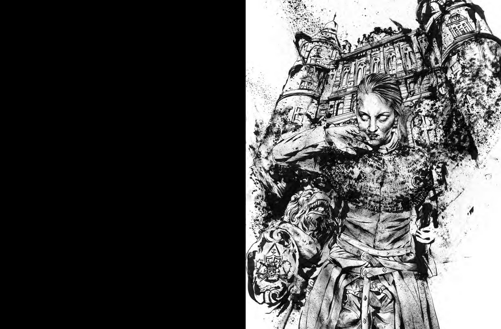

# Царствование Террора

Е динственной проблемой Французской революции было то, что она закончилась незавершенной. Из-за этой трагедии аристократы до сих пор проникают в наши общества.

В справедливом мире революция распространилась бы, и все до единого короли были бы казнены за преступления против народа.

Я не склонна к зависти, но я бы хотела быть там. Многие анархисты определенного поколения говорят, что они там были, но я думаю, что это все равно, что хиппи, который говорит, что он был на Вудстоке. Примите это с долей соли.

Париж - один из великих бастионов Камарильи, настоящий город в сердцевине старшей власти. Поэтому в наших кругах очень любят те два периода, когда Париж временно стал городом анархов. Первый - это Революция, а второй - Май '68. В обоих случаях события, спровоцированные смертными, привели к тому, что Анархи хлынули в город и заставили местную Камарилью скрываться. В конце концов, Камарилья восстановилась, и нам пришлось покинуть город, но память осталась.

В случае Революции политические изменения, совершенно не подходящие для Камарильи, захлестнули Европу. Во Франции был отменен феодализм, монархия пала, и десятки вампиров Камарильи, живших среди аристократии, погибли, иногда вытаскиваемые из своих убежищ днем новыми революционными властями.

Более того, относительно новый князь Парижа Франсуа Вийон с большим трудом пытался бороться с революцией, несмотря на то, что он был абсолютно на стороне Древнего режима. Причины этого были двоякими:

**1.** Город Вийона был в хаосе и полон анархистов, пришедших присоединиться к революции.

**2**. Он был гребаным трусом, сбежав из города, вместо того чтобы подвергнуть себя опасности.

Когда Вийон был в изгнании, новые анархисты города получили свободу действий в новом революционном правительстве. Некоторые из старых Анархов любят преуменьшать свое участие, но я думаю, мы все знаем, каков был вклад Сородичей: Сделать это как можно более кровавым!

Я уверена, что там были хорошие времена.

Только представьте себе эту сцену: убежища старого Тореадора внезапно разрываются, растерянные старейшины выходят навстречу толпе, вооруженной факелами. Должно быть, это был рай для анархов. Благодаря смертельному хаосу, вы могли сделать все, что угодно, заставить истеблишмент Камарильи терпеть любое унижение.

(Многие анархисты стремятся убить врага, но я выступаю за ритуальное унижение. Это очень весело!)

И даже без старших остается человечность. Гильотина. Очередь глупых дворян, ожидающих смерти. Вот что значит быть кровопийцей. Хотела бы я просто лечь рядом с гильотиной и позволить крови из каждого обезглавливания стекать мне в рот.

К сожалению, все хорошее должно заканчиваться конец. Для смертных Революция дала начало всевозможным новым идеям, которые укоренились во Франции и других странах. Для нас Революция была ранним расцветом настроений анархов, успешно подавленных Вийоном после его возвращения в город на пороге XIX века.

# - Агата "гильотина фангерл" Старек

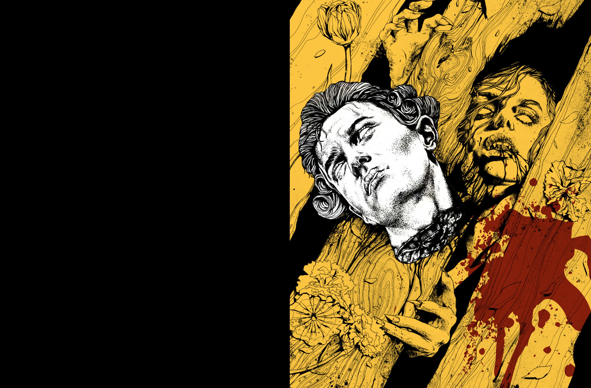

'68

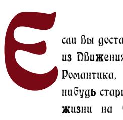

сли вы достаточно долго общаетесь с анархистами из Движения, вы услышите о Париже 68-го года. Романтика, волнение, всегда найдется какойнибудь старый чувак, который провел время своей жизни на баррикадах и который никогда не испытывал ничего лучшего.

В отличие от Французской революции, 68-я произошла достаточно недавно, чтобы многие из нас действительно были там.

И знаете что? Это было очень здорово. Это одно из тех классических восстаний, которые люди вспоминают, и первое восстание, в котором я участвовала в достаточно взрослом возрасте.

Сцена: Послевоенная Франция Шарля де Голля.

Вопросы: Капитализм, потребительство, авторитаризм и американский империализм.

Участники: Студенты, оккупирующие учебные заведения. 11 миллионов бастующих рабочих.

Результат: Президент Де Голль вынужден тайно покинуть страну на короткое время, а по возвращении требует проведения новых всеобщих выборов.

(Удручающая часть: Партия де Голля выиграла выборы, хотя личная карьера де Голля пошла на спад).

Я приехала в Париж немного позже, и это было похоже на фестиваль анархов. Там были все, кто был хоть кем-то в Движении. Имейте в виду, что я недавно была "Воплощенным", поэтому я была очень впечатлена всеми этими чуваками революции, такими как Джереми МакНил и Сальвадор Гарсия. Но были и другие. Можете смеяться надо мной, но я почти уверена, что девушка, с которой я провела ночь на баррикадах, была Тайлер.

Как и во время Французской революции, Камарилья скрывалась. Некоторые из них были достаточно взрослыми, чтобы помнить травму, полученную во время первого захвата Парижа анархами. Князь Франсуа Вийон исчез на неделю, оставив своих подручных разбираться с массовым наплывом анархов, жаждущих повторения Революции.

Лично у меня были хорошие времена. Я приняла своих первых трех детей.

Один из них даже выжил в хаосе! Выпила досуха своего первого камарильского болвана. Он был прекрасен, щеголеватый маленький аристократ. Он умолял меня не убивать его. Для молодого Анарха это было очень круто.

Для нас это настоящий опыт поколения 68-го года: Бунты, вечеринки, дебаты, кормление и трах на улицах и баррикадах. Неудивительно, что 68-й год с любовью вспоминают анархисты. Но есть кое-что еще. Это моя личная теория: Все двигалось так быстро, что у нас не было времени отравить его.

Я люблю хорошие беспорядки, как и все остальные девушки, но, глядя на смертных, все обычно становится плохо, когда в это вовлекается наш вид. Вот почему я всегда говорю своим сородичам, что мы должны позволить людям организовать свои политические движения в темпе и заняться банковским делом или чем-то еще.

Только вот банковское дело - это скучно. Бунты - это весело.

# - Агата "проблема" Старек

# Десять ночей, которые потрясли мир

течение жизни одного человека Советский Союз существовал как рай на земле. Прежде чем возражать против этого утверждения, я прошу вас подумать, для кого был рай?

В Камарилья и ее сородичи предпочитают считать себя отдельными от человеческой истории и общества. Такое представление о себе затрудняет понимание другими представителями Камарильи других способов взаимоотношений с человечеством. Они воображают, что их система является универсальной, хотя на самом деле ее разделяет лишь небольшое меньшинство вампиров в возрасте.

Это важно, если вы хотите понять, кем мы были на самом деле, Брюзга, участвовавший в Октябрьской революции.

Проще говоря, мы были обычными людьми. Мы были молодыми, недавно принявшими Объятия вампирами, ни один из них не был старше десяти лет нежити. Воплощение не стирает того, кто ты есть. Ваша история, ценности, анализ мира, классовое происхождение. Все это остается нетронутым. Единственное отличие заключается в том, что когда мир начинает сотрясаться, вы лучше подготовлены к борьбе за то, во что верите.

# Люди

В революции пролилось много крови, и она послужила толчком к очищению общества, которое раньше было просто немыслимо. Для смертных кровь, которую они пролили, дала им веру в то, что они смогут добиться успеха. Нас же она поддерживала, пока мы разрушали логова чудовищ столь древних, что даже старейшина Камарильи содрогнулся бы при упоминании их имен.

Индивидуалисты из Камарильи не понимают силу коллективного действия. Какие шансы у Мафусаила, когда массы разбирают его гробницу камень за камнем под холодным октябрьским солнцем? Смертные могут думать, что ищут провизию, спрятанную коррумпированными аристократами, но воздействие на тело вампира будет одинаковым. Оно сгорит.

В те ранние ночи мы все были объединены общей целью - уничтожить правление царя и князей-вампиров, царящих в ночи. Мы хотели построить что-то лучшее, что-то большее, прекрасный новый мир, созданный людьми и для людей.

Возможно, семена нашего разделения уже были посеяны, а возможно, наши идеи разошлись только позже. Это не имеет значения. Вначале мы были воодушевлены осознанием того, что делаем то, о чем старый истеблишмент всегда говорил нам, что это невозможно. Для вампирических ученых среди нас это был наш Карфаген, не как город, а как огромная страна, простирающаяся от Европы до Азии.

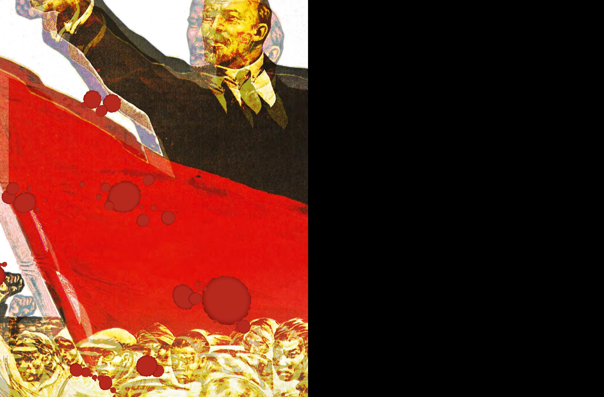

Многие говорят, что истинная природа вампира всегда будет заявлять о себе. Возможно, это так. Лично я думаю, что дело скорее в дополнительном опыте и возрасте. Некоторые из нас никогда не расставались с верой в то, что мы должны построить место, где люди и вампиры могли бы жить вместе в открытой гармонии, на равных.

Другие, в том числе и я, в конце концов, поняли, что настоящий бессмертный рай будет тем, что мы построим для тех, кто принадлежит к нашему роду. Я не против хорошего отношения к людям. Когда-то я была человеком. Но мы должны быть реалистами и признать, что люди - не более чем наша пища и личиночная форма. Доброта - это добродетель, но выступать за полные права смертных не имеет смысла так же, как предоставлять их коровам или собакам.

# Раскол

Этот идеологический конфликт разгорелся после смерти Ленина. В 1926 году на 4-м съезде Революционного совета (в просторечии известного как Совет Бруха) цель открытого сосуществования между нашим видом и людьми была официально отменена. За этим решением на 5-м съезде в 1929 году последовало официальное определение цели Совета как создание идеального государства для вампиров. Фракции, выступающей за человеческий универсализм, удалось протолкнуть предложение о нашей обязанности относиться к смертным в духе равенства, но оно не было поддержано.

В последующие десять лет внутренние чистки успешно искоренили эту фракцию, приговорив их к смерти за мятеж или отправив в ссылку.

Так контролировал ли Совет Бруха Советский Союз? Да и нет, в зависимости от того, кого вы спрашиваете и как вы определяете контроль. Чтобы понять это, нам нужно вернуться к идее Камарильи о том, что наш вид отделен от человечества. Совет работал не так. Мы существовали как часть более крупной структуры Партии, работая вместе с нашими человеческими коллегами.

Говоря прямо, обстановка, которую мы создавали, была такова, что если бы у вас была возможность встретиться с товарищем Домашевой только ночью на Лубянке, вы бы действительно задавали вопросы? Или просто промолчали бы? Террор и цензура - прекрасные инструменты для защиты наших привилегий и поддержания маскарада.

Мы не были отделены от партии. Наоборот, мы были частью большой машины, тонко подталкивая ее так, чтобы наши цели были достигнуты. Наше влияние шло изнутри, а не извне.

# Конец мечты

Это мое единственное сожаление, что сейчас так мало людей понимают, что мы сделали: Наше общество было успешным, пока оно существовало. Гулаги обеспечивали щедрую охоту, Маскарад проходил автоматически, а смертные, угрожавшие нам, слышали стук в свои двери в три часа ночи.

К сожалению, нас погубили бесполезная сентиментальность и индивидуальная жадность. Некоторые из нас начали мечтать о прежних княжеских владениях, а другие продолжали бесполезную болтовню о роли человека в нашем грандиозном эксперименте. Из-за этих слабостей мы не смогли защитить и сохранить Советский Союз, когда он начал разваливаться.

Лично я никогда не отказывалась от мечты. На Земле все еще есть места, где эффективная система репрессий держит смертных в узде. Я не смогла переварить новую Россию и уехала в Среднюю Азию.

Тем не менее, те, кто живет в руинах нашей великолепной конструкции, должны помнить, что в течение нескольких славных десятилетий Карфаген был настоящим в огромных масштабах. Рай для вампиров, загон для скота для людей. Местом, где мы могли понастоящему процветать, не опасаясь ни отвращения Камарильи, ни ужасов вроде современной Второй Инквизиции. Теперь, когда молодые вампиры устремились строить свои собственные домены на бывших советских территориях, им следовало бы почтить память тех, кто проложил им путь.

# - Оксана Димитровна Домашева, бывший член Совета Брух

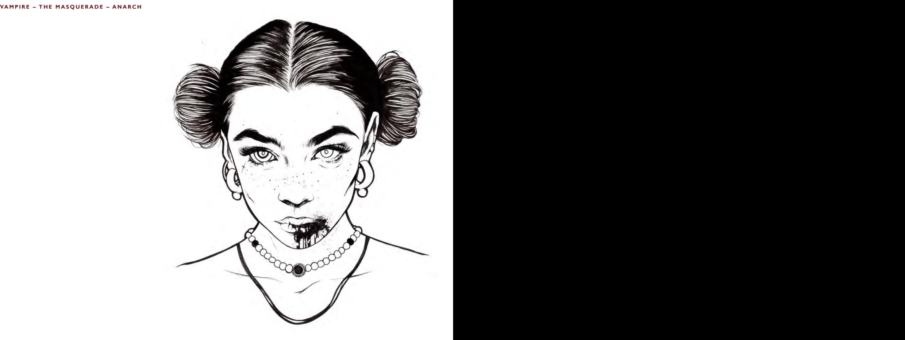

# Путеводитель Ди по крови свободных от анархов государств

By: Dee

В долине Сан-Фернандо снимается много порнофильмов, настолько много, что иногда ее называют Долиной Порно. Я расскажу вам кое-что о порно и вампиризме, что сделает вас более счастливым человеком, если вы сможете это принять.

Многие люди думают, что они должны хотеть трахаться с тем, что им говорит общество. Чувак должен хотеть трахать блондинок из порнофильмов. Если в глубине души он на самом деле хочет трахать что-то другое, ему нужно подавить это чувство, потому что иначе его идентичность и самооценка запутаются.

Многие вампиры тоже так делают. Они тоже думают, что им нужны светловолосые порнодевушки, чтобы питаться от них. Они думают, что это то, что вы должны делать как вампир: Искать условно привлекательных, чистых людей, чтобы питаться от них.

Но знаете, сердце хочет того, чего хочет. И обычно то, чего оно хочет, - это самая поганая и неподходящая вещь.

Например, я знаю одного крутого парня, мы вместе ходили на охоту. Там была порносъемка, одна из этих "Самых больших в мире групповух". Там трахали женщину на четвереньках. Для многих людей она была бы очевидной жертвой.

Но мой друг - современный человек. Он в ладу со своими желаниями.

На таких съемках есть человек, чья работа заключается в том, чтобы поддерживать чистоту звезды. У него есть полотенце, которым он вытирает сперму и другие жидкости с ее тела. Не многие обращают на него внимание. Именно этого человека хотела попробовать моя подруга. Полотенце для вытирания спермы...

# Свободные Штаты

Если вы хотите прочитать о том, как сосать кровь у порнозвезд, я вам не нужна. Но если вы хотите знать, где найти тех, кто чистит сперму, Ди здесь для вас.

Ответ на этот вопрос - Свободные Штаты Анархов. Самое прекрасное место на Земле для тех из нас, у кого взыскательный вкус. Старый князь Камарильи был убит во время революции 1943 года, и с тех пор Свободные Штаты представляют собой лоскутное одеяло из небольших владений, принадлежащих отдельным бандам и вампирам. Есть два известных основателя, Сальвадор Гарсия и Джереми Макнейл, оба Бруха. Сальвадор воображает себя Че Геварой и пишет манифесты и прочую скучную ерунду.

Сальвадор также убил старого князя, и я завидую ему в этом. Все говорят, что кровь князя - это наслаждение, но такому преданному трусу, как я, так редко удается попробовать ее на вкус.

Многие люди хотят, чтобы Макнил стал Фиделем Кастро из Свободных Штатов, сильным лидером. Он старейшина и обладает властью для этого. Вместо этого, и к его чести, он больше похож на Сметчика, человека, который держит в узде чужаков, но в остальном держится в своих владениях.

С кулинарной точки зрения, если бы вам пришлось выбирать между этими двумя, я бы выбрал Макнейла. Он ворчливый, но если сильно попросить, как это сделала я, то можно попробовать. Я слышала, что Сальвадор отлично подходит для тех сентиментальных типов, которые хотят трахаться вместе с обменом кровью.

И не начинайте спорить со мной о том, нормально ли это - превращать двух великих икон движения Анархов в ничто, кроме кровавых объектов. В этом и заключается свобода, свобода жаждать сладкой крови горячих чуваков Анарха.

# Хороший материал

Свободные штаты Калифорнии - это чудо, когда речь идет о поиске уникальных и странных групп крови, будь то человеческая или вампирская. Вы ищете бездомных культуристов? Голливудские чиновники? Звездноглазые молодые люди со всех уголков мира? Отчаявшиеся иммигранты из Латинской Америки, для которых их мечты превратились в пыль? Они все здесь.

Что касается вампиров, то практически единственное, чего вы не найдете в Свободных Штатах - это князя Камарильи, да и тот иногда меняется, когда кто-то пытается сделать на него ставку.

Следует иметь в виду, что в свободных Штатах домен очень сложен. Очень сложно. Нет никакого князя, который дал бы вам разрешение на охоту. Вместо этого вы можете делать все, что угодно, если вампиры в округе не против. Некоторые, как Макнейл, держат свои владения открытыми для всех. Другие, как банда Сальвадора, держат все под контролем.

Более того, границы различных доменов постоянно меняются. Банды появляются и исчезают, бордеры перезаключаются, происходят войны. В любой момент времени количество доменов в Свободных государствах может составлять от десяти до тридцати.

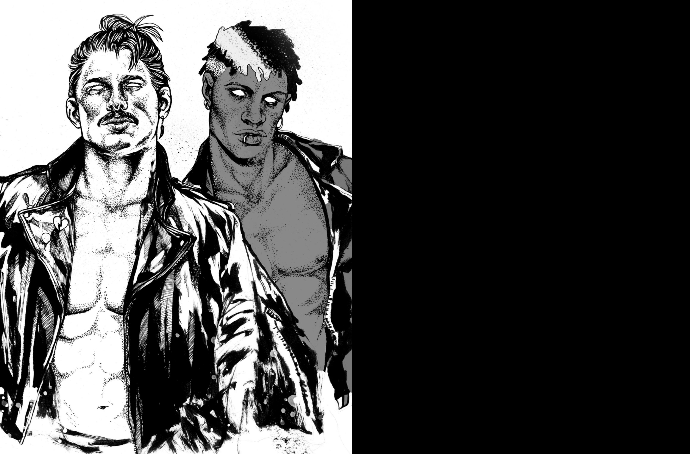

Однако, если у вас хватит на это смелости, переманивать очень легко. Если у вас возникла тяга к стареющим спортивным звездам в коме, держитесь в тени и делайте свое дело. Скорее всего, вас не поймают. А если поймают, вы сможете блефовать или унижаться. Люди в Свободных Штатах привыкли к новым вампирам. Постоянно появляются новые.

# Классика

Но подождите. Некоторые люди действительно хотят порнозвезду, а не человека из полотенца со спермой. Удивительно, но это правда!

И хорошо, я могу помочь вам с этим. Куда тебе пойти, если ты хочешь испытать настоящий анарховский опыт? Чтобы вонзить клыки в стиральный пресс тупого молодого байкера Анарха в кожаной куртке? Ответ - в ночной клуб Анархов под соответствующим названием A Taste of L.A. Это тусклый, ветхий склад, но это также нейтральная территория между бандами, так что вы можете заглянуть туда, ознакомиться с обстановкой и сделать несколько сравнительных покупок между всеми местными крутыми парнями.

Но вот предупреждение: Многие из вас ищут кровь определенного клана, но в Свободных Штатах невежливо спрашивать об этом. Вы не можете подойти к кому-то и сказать: "Какой у вас клан и поколение, мне нужна кровь для исследования особенностей питания вампиров?". Если вы это сделаете, то можете получить кулаком в лицо. (Я говорю по собственному опыту.)

Так что будьте деликатны.

Но вы меня знаете, есть одна вещь, которая лучше любой другой, когда дело касается крови, и это Вентру. Я никогда не устаю от нее. В свое время я пила, наверное, из пятидесяти разных Вентру, и все еще чувствую свежесть, когда нахожу нового. Нюансы, богатство... Я признаю, что Свободные Штаты - не лучшее место для этого, но есть несколько вариантов. Анкилл Луи Фортье - классический тип Вентру и любит обнимать хорошеньких дам. Я подумывала пойти за одного из них, но с Вентру сила есть сила. Пришлось попробовать самому Фортье.

Фортье - хороший пример разнообразия, которое можно найти в Свободных государствах. Он вполне классический диктаторский вампир, владеющий доменами, но не настолько могущественный, чтобы быть князем. Свободные Штаты работают на него, потому что он может поддерживать свои владения, не склоняясь перед кем-то большим, чем он сам.

Я видела его на A Taste of L.A. и приставала к нему, пока он не сказал, что позволит мне попробовать его кровь, если я встану на четвереньки и поцелую туфли одного из его детей.

Многие люди спрашивают меня: "Но Ди, как ты можешь так унижать себя? Ты же гордая Бруха!".

Мой ответ прост. Мне плевать на достоинство, но меня волнует сладкая, сладкая кровь Вентру.

# Вечно свободный

Политика - это скучно, но есть что-то забавное в том, что многие люди просто не могут понять идею децентрализованной системы. Типа: "О нет, анархи не смогли найти лидера, конечно же, они погибнут!".

Отсутствие центральной фигуры - в этом весь смысл. Более того, Свободные Штаты доказали свою устойчивость перед лицом непрекращающихся атак. По крайней мере, два вторжения Шабашистов, тонна предательств Камарильи, китайские вампиры, пытающиеся обосноваться здесь. Но все они были поглощены или отбиты Свободными Штатами. Можно сделать вывод, что централизованное руководство делает город слабым. Убери лидеров - и ты победил. Здесь так не получится.

Ближе всего к князю Камарильи в Свободных Штатах находится Тара, изначально техасская Бруха, приехавшая в Калифорнию для поддержки революции 1948 года. Она стала бароном Сан-Диего, а в последующие десятилетия стала образцом баронов как коварных истуканов Камарильи. Все знают, что она играет в игры. Она пыталась заключить сделки со всеми - от Камарильи до китайских вампиров. Она пыталась стать князем Лос-Анджелеса.

Мне нравится ее дух, но вы видите, что она обречена на провал. Она - абсолютный Анарх с плохими убеждениями, и даже она не может заставить свою власть держаться.

Если вы более смелый, чем я, хорошо быть в городе, когда идет одна из этих бандитских войн между свободными государствами. В хаосе можно найти множество интересных групп крови для умного ценителя. Только помните, что первый шаг - это заглянуть глубоко в свою душу и честно задать себе вопрос: "Какая кровь действительно делает меня счастливым?". ■

```
3 1
```

# Пражски<sup>й</sup> Конкав

И ногда вы забываете о том, как политика высокого уровня древних ладов может повлиять на вас. Легко думать, что когда ты живешь от охоты до охоты, невидимый среди смертных в своем районе, размолвки и вендетты между князьями, сектами, архонтами и юстициарами ничего не значат.

> И часто они не делают этого. Но в последние ночи они очень даже есть.

> Что значит для Анарха, живущего на улицах, когда Камарилья впадает в панику при первом же появлении Второй Инквизиции? Они бросают нас под автобус. Когда спецназ стучится к вам в дверь, они там потому, что кучка престарелых мудаков через полмира решила, что вы - расходный материал.

> Просочилась правда о политике Камарильи: Они на очень высоком уровне решили предоставить Второй Инквизиции информацию о доменах Анархов и Шабаша.

> Черт возьми, это, по-видимому, даже разозлило супер копа Камарильи Бруха Тео Белла настолько, что он напал на какого-то крупного деятеля Камарильи на недавнем политическом созыве под названием Конклав Праги.

Это плохой знак, когда даже ваши враги начинают улавливать запах крови в воздухе. Мы часто думаем, что старейшины Камарильи бесконечно хитры и мудры, всегда на десять шагов впереди в вечной шахматной игре, которую они называют Джихад. События после Пражского конклава говорят об обратном. Если послушать вампиров Камарильи, то они укрепили свою власть над Сородичами миром, отрезав Анархов и Брух. На самом деле, они облажались.

Я не уверена, действительно ли они верят в свои истории или это просто пропаганда. У них действительно есть талант к самообману. В любом случае, факт остается фактом: они ушли в свои особняки и пентхаусы, оставив улицы Движению Анархов. Раньше Камарилья заявляла о себе как глобальная организация для всех Сородичей повсюду. Даже Анархи должны были быть подмножеством Камарильи.

Сейчас это уже разоблачено как чушь. Они не претендуют на универсальность. У нас есть. Они могут охотиться на нас, пытать нас и убивать нас, но это не изменит реальности их поражения.

Это делает Камарилью более опасной: Привилегированная элита всегда обнажает клыки, когда ей угрожает опасность лишиться своих преимуществ.

Что это значит для вас? Во многих городах Камарилья вынуждена была отступить, контролируя лишь часть территории, оставив остальное Анархам. Многие из их владений в мире смертных были заброшены, и если вы достаточно умны, вы можете найти их и захватить. В конце концов, у банкира, зависимого от вампирской Крови, нет возможности отказать вам, если вы - ее единственная надежда избежать иссушения.

**Более того, эти события раскрыли истинное лицо Камарильи. Независимо от их пропаганды, они не являются зонтиком, под которым все наши сородичи могут найти убежище, а механизм созданный для защиты интересов власти имущих. Если вы присягнете им на верность, помните, что они всегда позволят вам умереть, если это поможет им спастись.**

- Далия Накаш, французский идеолог анархо-революции

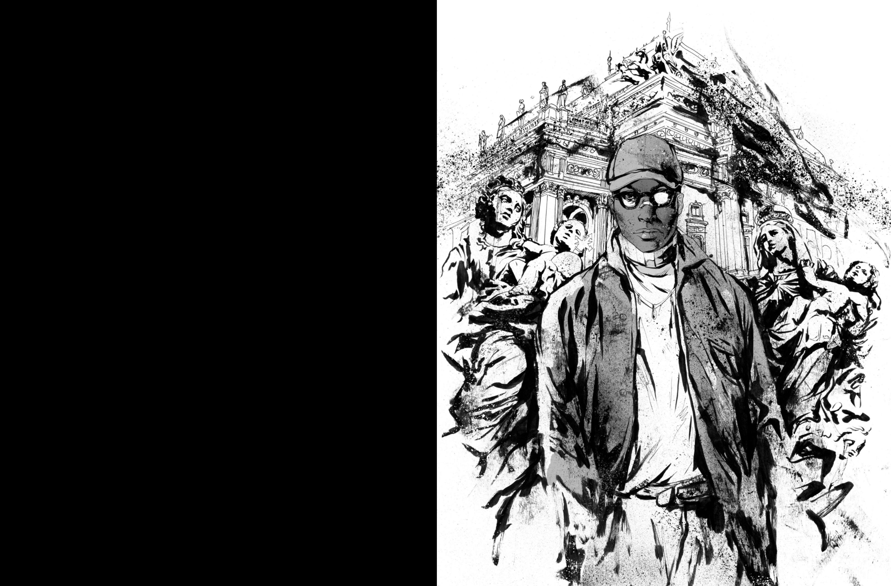

К нязья и справедливороссы отступили в башни из слоновой кости. Как бы они ни крутили это, реальность такова, что своим отступлением они открыли новое поле битвы между Камарильей и Движением Анархов. Это приведет к ужасающему кровопролитию с обеих сторон, но это также имеет определенные преимущества для тех из нас, кто предпочитает оставаться на задворках.

> Я с содроганием думаю об этом сейчас, но мы в Министерстве были на пороге присоединения к Камарилье до этого окончательного разрыва. Я рад, что процесс затянулся достаточно долго, чтобы выявилась истинная слабость Камарильи. Старейшины смертоносны, как никогда, но война между старыми и молодыми служит удобным отвлекающим маневром, если вы хотите преследовать совсем другие цели.

> Я должен признать, что в некотором смысле эти новые события поставили традиционных аутсайдеров, таких как мы в Министерстве, в странное новое положение. Трусость Камарильи перед Второй Инквизицией придала движениям анархов большую легитимность и объединила их домены более эффективно, чем то, что они могли бы придумать сами.

> Или, возможно, я должен сказать "наши домены". Я никогда не считал себя Анархом, но, возможно, я им и стал. Я знаю, что по мере усиления опасности Второй Инквизиции такие чужаки, как я, не найдут безопасности среди Камарильи. Как бы странно это ни казалось, но я подозреваю, что у меня было бы больше шансов, если бы на моей стороне были уличные бандиты Анарха.

> Для этих бандитов это просто подтверждение того, что они уже знали: нельзя доверять власти. И истории, рассказанной о Пражском конклаве, тоже нельзя доверять.

Подумайте вот о чем: Действительно ли старейшины Вентру и Бруха, дружившие веками, прекратят совместные заговоры? Неужели регент Тремеров отречется от своего тайного любовника-бруха только из-за политического раскола? Скорее всего, нет. Это всегда было правилом в политике сект высокого уровня: Правила применяются к молодым, а не к старым. Для древних, двигающих остальными, как пешками, секты лишь еще один инструмент, который они используют в своих играх.

Иногда, когда встречаешь настоящих власть имущих из нашего рода, жаждущего крови, можно увидеть это мельком. Я провел больше времени с такими высокопоставленными особами, чем большинство других, и меня до сих пор удивляет, как легкомысленно князь камарильи может относиться к якобы святым догматам своей секты, если тот, кто их нарушает, - друг, а не вассал.

Ну, хватит политики. Многие анархи собираются проникнуться духом революции и в результате погибнуть. Возможно, они чего-то добьются. Возможно, нет. Тем временем у таких, как я, есть прекрасная возможность воспользоваться хаосом и работать для достижения наших истинных целей, помимо понимания сект. ■

- Хеша Рухадзе, искатель знаний в министриях

# Прогулка среди нас

Dee: Теперь, когда ты вампир, ты должна одеваться как вампир. Freya: Что ты имеешь в виду? Как можно наряжаться как вампир? Dee: Ты знаешь... Бледный макияж. Черные волосы. Чулки в сеточку. Футболка с символикой Misfits.

Freya: На тебе футболка большого размера с изображением твоего собственного лица. Ты выглядишь как развратная младшая сестра какого-то дегенеративного белого рэпера.

Dee: Конечно. Но если спросить любого человека, который меня знает, скажет ли он, что я пример для подражания?

Freya: Нет

Dee: Правильно. Ты попала в ночь. Теперь вам нужно принять хэштег #ЖизньВампира.

Freya: Я - Сумрачнорожденная. Я не была " принесена в ночь".

Dee: Неважно. Ты вампир. Кровопийца. Не притворяйся, что это не так.

Freya: Я не притворяюсь. Так что же мне нужно принять?

Dee: Вампирский стиль жизни

Freya: И что же это?

Dee: Ну.....

# Полиция раскрывает новые подробности в смерти во Фридрихсхайне БЕРЛИН/AP: Берлинская полиция раскрыла новые подробности расследования смертей в Просвещение В крови

Ведущий**:** Подробностей о событиях прошлой ночи в берлинском районе Фридрихсхайн пока мало, но первые сообщения говорят о значительном насилии. На данный момент мы получили сообщения о по меньшей мере четырех погибших, и власти на месте происшествия предупреждают, что их число, вероятно, будет расти по мере того, как они будут проводить зачистку района.

Мы обратимся к Кэрол, которая беседует с одним из первых спасателей на месте происшествия.

ИНТЕРВЬЮЕР**:** Я удивлен, что мы узнали о масштабах катастрофы только сейчас. Не было ли звонков в этот район прошлой ночью?

Журналист**:** Вот почему это так непонятно. Я никогда не видела ничего подобного. Как будто произошла какая-то война между бандами, но в тайне. Эти люди, должно быть, погибли буквально в нескольких метрах от оживленной улицы, полной обычной ночной публики.

ИНТЕРВЬЮЕР**:** Такой размах насилия крайне необычен для Берлина.

Журналист**:** Это неслыханно! Я имею в виду, люди умирают, но не так.

ИНТЕРВЬЮЕР**:** Все, с кем я здесь разговаривал, говорили то же самое. Это новый вид насилия, и причины его остаются загадкой.

- Сегмент Sky News, транслировавшийся в 12:05 вечера 13 апреля 2017 года

[КОММЕНТ: Знаете, когда вы работали архонтом Камарильи до перехода к Анархам... Это не то, что вы хотите увидеть в новостях].

Фридрихсхайне весной прошлого года. Таинственная цепь событий в ночном районе Берлина Фридрихсхайн привела к 24 подтвержденным смертям, а также к госпитализации целого ряда людей по разным причинам - от передозировки наркотиков до острой анемии. Инцидент произошел 12 апреля 2017 года, но расследование было сопряжено с задержками и разоблачениями коррупции в берлинской полиции.

В заявлении, опубликованном сегодня утром, полиция Берлина объяснила значительную часть насилия непредсказуемым действием нового дизайнерского наркотика, одним из побочных эффектов которого является повышенная агрессивность. Новый наркотик продавался под уличным названием "кровь".

# [КОММЕНТ: Это очень плохо. Это граничит с нарушением Маскарада. Если СИ не видят этого, то они слепые, глухие и немые].

Первые отклики в германских СМИ на заявление полиции были критическими. Версия о наркотиках не объясняет старые тела, найденные в ходе прочесывания местности, проведенного после инцидента. Некоторым из них было более десяти лет.

В этом деле было много странных инцидентов, в том числе несколько смертей в полицейских изоляторах. Расследование этих смертей еще не завершено, но просочившиеся материалы свидетельствуют о таких странных деталях, как трупы в запущенном состоянии разложения, найденные в камерах.

# [КОММЕНТ: Боже мой. Это становится все хуже. Мы точно направляемся к вторжению СИ].

В немецком Бундестаге звучат призывы к проведению нейтрального расследования дела Фри-Дрихсхайна, в котором приняли бы участие сотрудники полиции, не входящие в состав берлинской...

(26.7.2017.)

# Комментарий на Facebook в берлинском уличном тупике туре 22 го октября 2017 года:

Полицейские лгут. Я знаю, я был там. Я видел, как человека буквально разорвали на части обезумевшие лунатики. Они кусали его. Я никогда не видел ничего подобного, это было безумие. Полицейские допросили меня, и я все объяснил. Я тоже был не один! Там были и другие люди, остроумцы. Я видел, как другие комментируют это, но в новостях этого не увидишь.

[КОММЕНТ: Это, видимо, тот случай, когда жители города буквально разорвали князя Берлина на части. Это момент Николай Чаушеску для Камарильи, несомненно. Многие из более разумных сородичей Камарильи начали бежать из города при первых признаках революции, но князь думал, что сможет контролировать ее до последнего. В следующий раз, когда в городе Камарильи произойдет революция анархов, многие представители рода Камарильи будут думать о том, как все прошло в Берлине".]

# Расследование во Фридрихсхайне будет передано международной оперативная группа

Берлин/AP: Последние откровения о неправильном ведении следствия по делу о гибели людей во Фри-Дрихсхайне и раскрытие связей с международной организованной преступностью привели к созданию новой международной оперативной группы, координируемой Интерполом. Берлинская полиция прекратит собственное расследование и передаст все материалы новой оперативной группе.

В то же время было прекращено внутреннее расследование роли берлинской полиции. После смерти во Фридрихсхайне в Германии разразился целый ряд скандалов - от политики до полиции, налоговых убежищ и даже градостроительства...

# (1.12.2017)

[КОММЕНТ: Вот как это выглядит, когда смертная полиция начинает распутывать нити общества сородичей. Нужно ли мне перестать говорить "Сородичи", если я больше не Камарилья?]

# Выдержка из стенограммы полицейского допроса в ночь 13 апреля 2017 года:

Подозреваемый**:** Мне все равно, кто вы. Копы, Камарилья, Инквизиция. Да пошли вы все. Вы знаете, что шериф сделал со мной? Он заставил меня убить жену и детей, потому что они представляли опасность для Маскарада. Он убил одну из моих подруг, потому что она не хотела встречаться с одним из Примогенов. Однажды он оторвал мне резцы, потому что я питался не в том месте. Потом он смеялся надо мной, потому что я лизал. Если так делать достаточно долго, люди перестают заботиться о своей безопасности. Они не заботятся о выживании. Единственное, что их волнует, это разрушение всего этого. Так что, пожалуйста, я закончил говорить. Я слышал, меня ждет камера с окнами на восток...

[КОММЕНТ: Мы в жопе, без вопросов. Всегда найдется кто-то, кто скажет, что это еще одно доказательство того, что анархи просто не могут управлять городом, но это чушь. Каждый князь Берлина, начиная с Густава Брайденштайна и далее, был садистским грубияном, опьяненным властью. В конце концов, людям это надоело с этим. Эта катастрофа лишь симптом. Камарилья - причина. Теперь я это понимаю.]

# Нет князя нет Кайна САЛЬВАДОР ГАРСИЯ, ОДИН ИЗ ОСНОВАТЕЛЕЙ

КАЛИФОРНИЙСКИХ СВОБОДНЫХ ШТАТОВ, ОБЪЯСНЯЕТ

ОСНОВЫ ЖИЗНИ АНАРХОВ.

Вот что вы найдете на многих территориях Анарха территории. Каждая из них уникальна, но есть несколько тенденций.

# Простота жизни

Многие считают, что я смотрю свысока на анархистов, которые не ведут борьбу, но это было бы очень далеко от истины. Во многих отношениях они уже живут в мире, который мы пытаемся построить. Они делают свое дело, свободное от вмешательства Камарильи.

Многие банды Анархов, которые можно встретить по всему миру, основаны на этом простом образе жизни. Вы хотите общаться со своими друзьями. Вы помогаете им, а они помогают вам. Вы охотитесь, возможно, держите бар или ночной клуб. Вы веселитесь, развлекаетесь, наслаждаетесь преимуществами смерти.

Ничего плохого в этом нет! Когда возникают проблемы, их создают не эти ликбезы.

# Банды

Именно так думает большинство представителей рода Камарильи, когда думает о нас. Банды вампировбайкеров или кровососущие хип-хоп команды. В Свободных Штатах мы видели банды серферов, катающихся на волнах по ночам, и бездомных детейнежити, которые раньше хотели сниматься в Голливуде, а теперь перешли на новый уровень преследования знаменитостей.

Обычно каждая банда контролирует свою территорию. Их может возглавлять лидер, но не всегда. Организация банды - это их собственная проблема. Многие из них немного амбициозны в своих территориальных притязаниях, и в результате возникает много войн между бандами. Это свобода, идущая своим чередом.

Байкерская банда Анарха может долгое время оставаться незамеченной ни Камарильей, ни Второй Инквизицией. У них незначительный цифровой след, и с первого взгляда их поведение неотличимо от поведения обычной байкерской банды. Камарилья имеет тенденцию двигаться медленно, и, с их точки зрения, территории и сами личности банд Анархов постоянно меняются.

# Клетки

Более серьезные анархи, особенно политически активные, живущие на опасных территориях, объединяются в ячейки. Они напоминают структуру подпольных криминальных или политических организаций, таких как итальянские Красные бригады в 70-х и 80-х годах. В ячейках главное - безопасность и контроль информации. Вы соблюдаете разумные меры предосторожности, регулярно меняете конспиративные квартиры и связываетесь с другими ячейками только по установленным протоколам.

Наверное, неудивительно, что вампиры в бандах умирают гораздо чаще, чем сородичи в камерах, даже если камеры занимаются гораздо более опасной деятельностью.

Полезно помнить, что в большинстве доменов смешиваются различные виды организаций. В одном и том же домене могут существовать банда байкеров и революционная ячейка.

# Остальные

Множество Анархов не вписываются в эти категории. Некоторые домены держатся на одном мощном главенстве, в других буржуазные кровопийцы пытаются притвориться, что могут продолжать свою жизнь в качестве адвокатов и врачей. Некоторые создают вокруг себя культы. В каждом городе Анарха есть какой-то уникальный, странный новый феномен вампиров, который вы никогда не ожидали встретить.

# Свободные Штаты

Свободные государства Анархов - это совокупность всех владений Анархов по всему миру. Везде, где Камарилья была упразднена, а Анархи находятся под властью, наш род может жить в свободе и процветании. Свободные государства были организованы дюжиной различных способов, но есть одна общая черта: Правление одного индивида - редкость, потому что оно так часто ассоциируется с принцами Камарильи. Иногда городом управляет центральный Революционный совет, но даже это необычно. Как правило, Свободное государство - это анархия, состоящая из более мелких доменов. Оно не регулируется и не контролируется, а существует в состоянии постоянного движения.

Иногда вы можете объединить лидеров банд под одним знаменем, но это трудно сделать, если только причиной не является внешняя угроза, например, вторжение Камарильи.

# Бароны

Во многих доменах Анархов вы найдете то, что называется бароном. Изначально это был ироничный титул, использовавшийся Джереми МакНейлом для описания лидеров Анархов, но позже он приобрел больше нюансов и оттенков. Тем не менее, в своей основе барон - это сильный анарх, который контролирует территорию и имеет власть над теми, кто на ней живет.

Один из самых распространенных типов баронов, и то, как этот термин первоначально использовался в свободных штатах Калифорнии, - это вампир, владеющий районом города или даже просто зданием. Это может быть главарь банды, который правит железным кулаком, или представитель общественности, не имеющий реальной власти. Суть в том, что в городе может быть много таких баронов.

Другой распространенный тип баронов контролирует целый город в одиночку. Местный силач, он ведет себя подозрительно похоже на князя Камарильи. Такого барона обычно подозревают в тайном союзе с Камарильей, как своего рода подначального Камарильи. Не помогает и то, что в некоторых доменах Камарильи с населением Анархов это открыто признается. Камарилья любит передавать свое представительство лидеру, якобы представляющему угнетенное население. В этой модели анклав Анархов - это маленький Бантустан, куда Камарилья может засунуть все свои социальные проблемы.

# Защита

Это классический трюк Камарильи: Сначала они делают все возможное, чтобы подорвать нас и убедиться, что наши домены заполнены предателями и агитаторами. Затем они указывают на все наши проблемы и говорят, что это доказательство того, что наш путь не работает. Это вот почему каждый домен Анархов должен думать о защите.

Безопасность - это причина, по которой многие домены Анархов удивительно драконовские. Традиционные преступления Камарильи, такие как создание незаконного потомства (во многих доменах Анархов это вообще не преступление), караются очень мягко, а за предательство Камарильи вас могут казнить.

Когда дело доходит до войны, вы поймете, почему мне нравятся банды. Они могут быть аполитичными, но они знают, когда их территория находится под угрозой, и сражаются с мужеством, которого не увидишь среди трусов Камарильи.

# Эмиссар

В большом городе может быть пять банд, несколько ячеек и кучка случайных анархов. Могут быть три разных города Камарильи, прилегающих к Свободному государству. Это означает, что в мире существует много дипломатии. Банды посылают эмиссаров друг к другу, Камарилья посылает эмиссаров к Анархам, Анархи посылают конкурирующих эмиссаров от разных групп к Камарилье.

Я пытаюсь сказать, что в Вольном городе может быть много эмиссаров, особенно во времена Второй Инквизиции, когда, как правило, лучше послать когото на переговоры, чем говорить по телефону.

# Подметальщик

Теперь мы переходим к действительно уродливой части. Иногда возникает неконтролируемая эпидемия вампиров, которые просто бегают по округе, вобрав в себя больше, прежде чем они действительно поймут, что они такое. А может быть, целая банда становится предательской и сдаёт нас.

**3 9** Какой бы ни была ситуация, иногда вам нужно сделать несколько убийств и у вас нет времени на обсуждение. Подметальщик - это неофициальная должность. Она достается физически сильному вампиру, человеку, не занимающемуся политической деятельностью и, возможно, входящему в какую-либо местную банду или ячейку. Во время кризиса этот человек призван убивать, пока проблема не исчезнет.

Это неблагодарная работа, которая легко оставляет вас в социальной изоляции.

# Шпионы

Камарилье нравится думать, что они проникли в наши ряды и знают о нас все, что только можно знать. Они традиционно не понимают, что мы тоже проникли в их ряды, и нам даже не всегда приходится для этого работать. Простая правда заключается в том, что в городах Камарильи, где старейшины регулярно издеваются над своими детьми, есть множество молодых вампиров, которые сливают нам информацию. Это типичный шпион Анарха при дворе Камарильи: Кто-то, кто хочет вернуть себе часть своего достоинства, работая против своих хозяев.

Иногда мы проявляем фантазию и посылаем более опытного Анарха в город Камарильи в рамках операции, но это бывает редко. Наша сила в движении, а не в военизированной операции.

# Перенаселение и самоубийства

Почти все домены Анархов перенаселены, но в них также наблюдается очень высокая текучесть кадров. Редко кто говорит о том, что уровень самоубийств среди новообращенных Анархов очень высок. Значительный процент наших сородичей убивает себя в течение первых нескольких месяцев жизни. Я подозреваю, что на территориях Камарильи это случается реже из-за того, как они привязывают отца к ребенку, но для нас это хорошее напоминание о том, что у нашего рода не все так просто.

Некоторые Анархи утверждают, что это большая проблема, которую нужно решать, но я думаю, что это делает нас сильнее. Все, кто все еще с нами, были достаточно выносливы, чтобы выдержать разрушение своих предыдущих жизней и новое существование в качестве монстра.

# Размышления

**4 0** Моя любимая часть культуры Анархов - это размышления. Во многих городах философствование, часто организуемые Брухами, стали универсальными, доступными для всех анархов. Они похожи на политический вечер открытого микрофона, где у каждого есть шанс сказать то, что он хочет. Сила в общении - это способность убедить людей в своей точке зрения, поэтому они предпочитают тех, кто обладает харизмой и красноречием, чтобы аргументировать.

Мне, мне это нравится. Вот что значит быть анархом: Заводить толпу, если им нравится то, что ты говоришь, и быть освистанным со сцены, если не нравится. ■

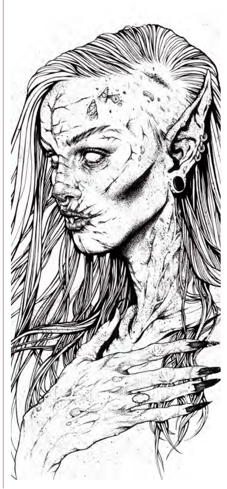

# Кровавые бродяги

Вы только что прибыли в новый город. Вы идете на встречу с князем, как хороший маленький вампир. Ты представился и попросил разрешения поохотиться во владениях князя.

Это решающий момент. Вам нужно что-то сказать князю, но проблема в том, что разные князи реагируют на разные вещи. Вы не можете использовать одну и ту же историю каждый раз. Вы голодны, и вам нужно поохотиться. Вы не хотите рисковать неприятностями с шерифом. Князь должен вам поверить.

Вы смотрите князю в глаза. В это мгновение вы должны почувствовать правильную реакцию и начать говорить.

Не случайно многие анархи, живущие на открытой дороге, изобретательные лжецы. Нам приходится хорошо в этом разбираться. Иначе мы будем голодать или нас убьет шериф за браконьерство.

Как же это сделать? Пусть тетушка Джунипер научит вас жизненным фактам.

# Городская мышь и деревенская

# мышь

Вам скажут, что лихачам лучше держаться в городах. Полагаю, это правда, если вы - зазнавшийся слабак, не способный выжить в условиях бездорожья. И, честно говоря, в слабости нет ничего постыдного. Если вы не можете выжить, вам лучше держаться поближе к своим стадам и Элизиумам.

Некоторые из нас не очень любят домены, правила и традиции. Если вы единомышленник и можете позаботиться о себе, откажитесь от оседлой жизни прихлибателя и займитесь захватывающим существованием кровососущего бродяги. Тетушка Джунипер живет в своем трейлере уже несколько десятилетий, и это неплохая жизнь. Я переезжаю с места на место, из города в город, а когда дерьмо попадает в вентилятор, я исчезаю.

Этому способствует то, что многие сородичи, как Камарилья, так и Анархи, не могут даже представить себе, что значит жить свободно. Они думают, что широкие открытые пространства между городами полны волков-оборотней и прочей нечисти. Конечно, иногда это так. Ты учишься справляться с этим.

Что же вы скажете князю после того, как только что прибыли в его владения? У вас должна быть причина, и князю не будет нравится, если вы скажете ему правду: что вы бездомный бродяга-вампир, разъезжающий по округе, занимающийся браконьерством, живущий вечной охотой.

Многие князи камарильи любят думать о себе как о хороших людях, как бы удивительно это ни звучало. Обратитесь к ним с душещипательной историей. Вы - бедный новобранец Камарильи, ваш город захвачен ужасающим сбродом Анархов. "Пожалуйста, сэр, если бы я мог поохотиться несколько ночей, я бы смог наладить свою жизнь! Я не буду беспокоить вас дольше!"

Беда в том, что некоторые князи ненавидят слабость. Они без труда казнят того, кого считают бесполезным. Возьмите противоположную позицию: Вы - борец за свободу Камарильи, верный новобранец, ведущий свою собственную войну против страшной угрозы революции анархов. Говорите жестко, придумайте кучу мертвых товарищей, и вы готовы. Если вы хотите пойти еще дальше, придумайте какое-нибудь злодеяние. "Анархи убили моего отца, самого благородного человека, которого я когда-либо знал. Почти такого же благородного, как вы, сэр. В ту ночь моя прежняя жизнь закончилась, и началась война".

В доменах Анархов приходится играть на слух. Иногда люди гостеприимны, и вы в порядке. Расскажите им свои лучшие дорожные истории и охотьтесь в свое удовольствие. Однако иногда барон так же плох, как и князь. Тогда вы возвращаетесь к истории. Только не забудьте перевернуть ее. "Пожалуйста, сэр, Камарилья убила моего отца, самого благородного человека, которого я когда-либо знал...".

# Мешок для трупов

Ты уже труп, так что спать в мешке для трупов не так уж плохо. Верно? Где спать - это ваша главная проблема, когда вы живете за чертой города. Мешки для трупов были разработаны для того, чтобы сдерживать трупы, поэтому они являются хорошей мерой безопасности.

Некоторые кочевые сородичи очень жестко относятся к сну. "Спи в речной грязи", - говорят они. "Спи в канализации". Честно говоря, мне это не подходит. Конечно, это безопасно, но мне нужна кровать. У меня есть хорошая кровать, даже если она в трейлере с защитой от солнца.

Трейлер работает, потому что с тетушкой Джунипер рядом ее мальчики. Они, конечно, кровные наркоманы, но такие преданные. Если у вас нет людей, заботящихся о вас, паранойя может спасти вам жизнь. Здесь я скажу то, что на первый взгляд может показаться бессмысленным: Здания. Избегайте их.

"Но, конечно, тетя Джунипер, для меня безопаснее спать в доме! Для этого они и нужны!"

Я слышу тебя, слышу. Но это не безопаснее. Ты в номере мотеля. Входит уборщица, солнечный свет падает через дверной проем, и ты хрустишь. Проникаете в чей-то дом, чтобы поспать, кто-то видит вас, вызывает полицию, и спецназ видит, как вы вспыхиваете. Это реальные примеры, между прочим. Люди и здания идут вместе, и чтобы спать безопасно, нужно избегать людей. Спрячьте свой труп гденибудь, где никто не будет искать. Может быть, не в канализацию, потому что это отвратительно, а в хорошее и тайное место.

Конечно, если вы занимаетесь этим долгое время, вы можете построить сеть конспиративных квартир. Отличный выбор, если у вас хватит усердия довести дело до конца. Слишком много работы для тетушки Джунипер...

# Вампирская жизнь

Самое замечательное в этой жизни то, что ты действительно можешь охотиться. Никакого "стадного" дерьма. Никаких постоянных источников крови. Никаких звонков бывшим, когда ты еще был человеком, потому что твои последние три попытки поохотиться провалились. И уж точно никакой феодальной камарильи, где ты получаешь кровную десятину или что-то в этом роде.

Нет, вы - монстр-нежить, охотящийся в ночи. Никаких планов, только красота и ужас момента.

Небольшая оговорка: Если вы один из тех современных подсосов, которые не знают, как правильно охотиться, тетушка Джунипер не сможет вам помочь. Вы должны уметь добывать кровь, если живете в дороге. Так оно и есть.

Я знаю, что вы собираетесь браконьерствовать в чужих доменах, но мой совет - избегайте этого. Действуйте по книге, встречайтесь с князем, творите историю. Как мы уже говорили. Но если вы все-таки браконьерствуете, подумайте, где местные жители, вероятно, кормятся, а затем отправляйтесь в другое место. Не надо выдумывать. Если вы на заправке, охотьтесь на заправке. Для браконьера скорость всегда превыше всех остальных соображений.

Настоящее удовольствие - это охота за городом, в местах, которые никогда не посетит ублюдок Камарильи. Именно здесь вампир становится вампиром. Вы приезжаете в маленький городок где-нибудь в Огайо или Теннесси. Там нет ни князя, ни шерифа. Ни баронов, ни доменов. Только вы и город, полный добычи, погружающейся в ночь. Маскарад - не всегда такая забота, и с копами легко справиться.

А может быть, они сопротивляются. Фермер удивляет вас, вырывая горло у своей дочери, и заливает ваше лицо свинцом. Это часть острых ощущений. Тетушка Джунипер любит, когда ее добыча дерзкая.

Это настоящая охота. Никаких городских сложностей, только хищники и добыча. Это то, что делает все это стоящим.

# Выпрашивание объедков

Что делать, если все пошло наперекосяк? Вы потеряли все деньги, у вас нет машины, а солнце уже заходит? Именно тогда вы должны понять, что иногда в дороге нужно принимать ужасные вещи. Однажды тетушка Джунипер была в плохом состоянии. Она потеряла своих красивых мальчиков-наркоманов и не знала, что делать.

Через пару часов после восхода солнца я стояла на заправке и отчаянно искала какого-нибудь молодого человека, который отвез бы меня к себе домой, чтобы я могла убить его и укрыться в его ванной. Вместо этого подъехала банда из шести байкеров "Рэббл", все в кожаной одежде и крутые. Я завязала с ними разговор и позволила им проецировать на меня все, что они хотели. Этому маленькому трюку вы можете научиться у тетушки Джунипер: Если вы выглядите правильно, людям не интересно, кто вы. Вам не нужно их переубеждать, потому что они сами придумают историю, а вам останется только подыграть им.

Я собиралась переночевать в их убежище. Когда они уезжали, я запрыгнула на заднее сиденье одного из их велосипедов и осмотрелась. У них был человек, прикованный к велосипеду. Испуганный городской вампир. Они тащили его по земле, его кожа сдиралась, его кровь оставляла следы на асфальте. Он был полумертв, когда мы добрались до дома у дороги, который они использовали как место для ночлега. Они оставили его на крыше дожидаться солнца.

Тетушка Джунипер не любит, когда жестокость проявляется вот так, по отношению к беззащитной цели. Причиняйте боль людям, но причиняйте ее честно.

Знаешь, что я сказала этим разгильдяям? Ничего. Я спала в безопасности, пока тот человек горел на крыше. ■

# - Джунипер, анарх, бродящий по Среднему Западу США

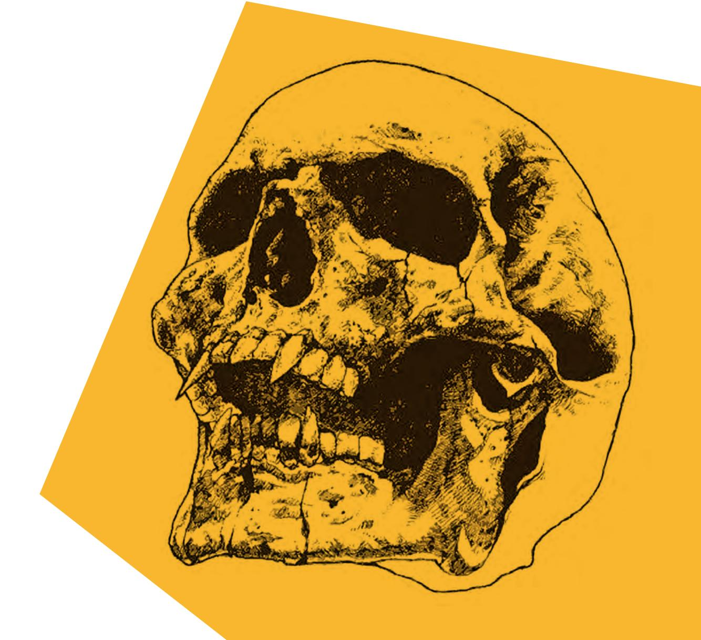

# Кровь Избавителя

егодня мы рассмотрим семнадцатый стих книги Левит. "Я обращу лице Мое против всякого Израильтянина или иноземца, живущего среди них, который ест кровь, и вычеркну его из народа".

С Ужасающие слова для вампира! Многие из нашего рода читают эти слова и понимают их как то, что Бог настроен против нас. Мы проклятые и должны ходить по земле под проклятием. Мы осуждены Богом, само наше существование является оскорблением Его божественного порядка.

> Не бойтесь! У Бога есть план для каждого из нас. Чтобы найти ответы, мы должны обратиться к Его Слову. Давайте посмотрим, что на самом деле говорит Бог в книге Левит.

> "Всякий израильтянин, который принесет в жертву вола, ягненка или козленка в стане или вне его, вместо того чтобы принести его ко входу в шатер собрания, чтобы представить его в жертву Господу перед скинией Господней, такой человек будет считаться виновным в кровопролитии".

> Видите? Бог считает кровь священной. Он не хочет, чтобы она пропадала зря, и поэтому пролитие крови, кроме как в честь Его, является преступлением. Ибо, как Он говорит: "Ибо жизнь твари в крови, и Я дал ее вам для искупления вашего на жертвеннике".

Кровь - это жизнь!

Какая польза от крови для смертного человека? Как жертвоприношение! Смертный человек искупает вину, проливая кровь на алтаре, свою и других.

Кто принимает жертву? Мы! Эти бедные души могут спокойно умереть в наших объятиях, зная, что в последние минуты их жизни наши тела превращают их кровь в жертву, угодную Богу! Каждый раз, когда мы берем кровь смертного на алтарь, мы даем этому смертному дар искупления. Мы - инструменты Бога на Земле, и наша работа распространять Его благодать и спасение!

Это истинное послание Иисуса. В этом смысл крови искупителя. Христос не принес Себя в жертву за человечество. Он пожертвовал Собой за нас, за избранные инструменты Бога на Земле.

Что вы видите, когда смотрите вокруг себя? Маленькая деревянная церковь в Алабаме, скамьи сломаны, на окнах пыль. Здание - ничто. Посмотрите на прихожан. Посмотрите на наших смертных братьев и сестер, стоящих на коленях и молящихся. Они понимают, что для обретения спасения они должны принести на алтарь свою кровь или кровь того, кого они любят. Это урок Исаака и Авраама, вот почему они отдают своих детей нам на съедение. Когда невинный отдает свою кровь, он достигает небес в состоянии совершенства.

Посмотрите на тех в общине, кто вкусил крови. Смертные, чьи губы покраснели от крови Искупителя. Они горячо преклоняют колени в своей вере, поддерживаемые кровью Самого Христа. Вот за кого страдал Христос: Мы! Наше дело! Христос отдал Свою жизнь и Свою кровь, чтобы мы могли жить и нести спасение всем народам мира. Мы - орудие свободы от первородного греха.

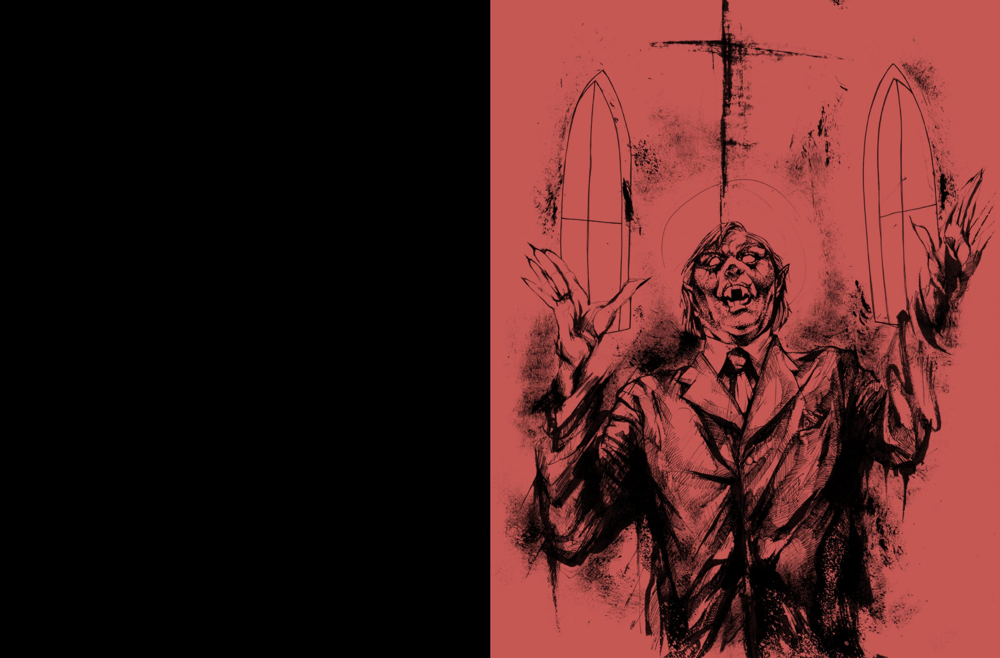

Это истинное рождение нашей расы: Мы получили кровь Христа и превратились в высших существ. Когда смертный пьет от нас, он принимает Христа в свое тело, и Христос будет вести его.

Кровь - это жизнь.

Наконец, посмотрите на вампиров среди нас. Вампиры! Такое зловеще звучащее слово, за которым скрывается такая благодать. Посмотрите на этих прекрасных ангелов, которые посвятили свою жизнь распространению Божьего милосердия. Наши ограничения это не проклятие! Это благословение, потому что необходимость идти ночью заставляет нас смиряться.

Это пример Божьей мудрости: Многие из наших сородичей отвергли свое истинное предназначение. Им следовало бы принять смирение, предлагаемое нашим проклятием, но вместо этого они посвятили себя отрицанию Его Царства!

Слушайте мои слова, ибо они исходят из крови Иисуса Христа. Посмотрите на кровь, текущую из моих запястий!

Это его кровь, его знак! Она течет по моим рукам и капает на пол, и каждый, кто смирится и преклонит колени, чтобы испить ее, будет благословлен! Выходите, преклоните колени, пейте, принесите свою кровь в жертву на алтарь, пометьте себя ее багровым совершенством!

Я вижу, как Святой Дух движется среди вас! Срывайте плоть друг с друга, чтобы добраться до спасения, текущего в ваших жилах! Преклонитесь перед учениками Бога на Земле! Позвольте темному ангелу коснуться вашего духа и вашего тела!

Кровь - это жизнь! Рассмотрим Числа двадцать три: "Вот, народ поднимается, как львица, и, как лев, поднимает себя; не ляжет, пока не пожрет добычи, и не выпьет крови убитых".

Этот народ - наш народ! Это Божье послание: "Ни проклясть их, ни благословить их!".

Мы здесь не для того, чтобы Бог нас судил. Мы - Бог, посланники и пастыри, исполнители божественной воли.

**4 6**

Наша кровь движет нами и держит нас на пути праведном. Пока мы слушаем голос крови, мы не можем ошибаться.

Пока вы лежите израненные и сытые, спасенные или благословленные, подумайте о реальной природе этого крошечного сообщества. Мы получили величайший дар из всех, и это произошло прямо здесь, в этом самом городе. Мы знаем волю Божью и готовы исполнить ее на Земле, чтобы помочь всем народам обрести спасение и надежду на искупление. Это будет наша великая работа. Она начнется внутри этих деревянных стен, в этом маленьком городке, с этими людьми вокруг вас: Фермеры, лавочники, шахтеры. Все хорошие люди. Эти люди первые жертвы, которые дадут нам силы принести истинное искупление миру.

В конце концов, кровь это жизнь. Аминь. ■

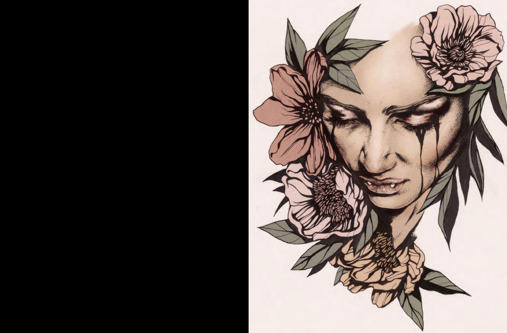

# Путь паразита

**Agata:** Так что, по сути, ты - ленточный червь.

**Rudi:** Перестань называть меня ленточным червем. Это оскорбительно.

**Agata:** Я серьезно. Ты паразит, заселяющий тело. Ты живешь внутри организма, развиваясь за счет своего хозяина.

**Rudi:** Ты слишком цинична в этом вопросе. У нас много вариантов...

**Agata:** Может быть, ленточный червь - это неправильная аналогия. Ты знаешь эту амазонскую плесень, который захватывает муравья и начинает управлять им?

**Rudi:** Сначала я ленточный червь, а теперь я плесень. Не зря тебя никто не любит, Агата.

**Agata:** Ладно, у меня есть получше. Ты - гормон. Как вещество, которое встраивается в нормальную работу организма, тонко направляя его действия.

**Rudi:** Я думаю, что у нас серьезная проблема с передачей информации. Когда ты идешь к Камарилье, они говорят тебе, что ты один из сородичей, вечного тайного общества скрытых мастеров, направляющих человечество по извилистому пути истории. Когда ты приходишь к нам, мы говорим тебе, что ты - ленточный червь. Или плесень.

**Agata:** Я думаю, что аналогия с гормонами была хорошей.

**Rudi:** Никто не хочет быть гормоном. Не будь глупой.

**Agata:** Еще раз так со мной заговоришь, и я тебя убью.**.**

**Rudi: <sup>&</sup>lt;**молчит**<sup>&</sup>gt;**

**Agata:** Да ладно, это была шутка! Почему люди всегда слишком остро реагируют, когда я угрожаю им убийством?

**Rudi:** Я не собираюсь отвечать на этот вопрос. Но мы должны подумать о нашем послании. Мы должны дать нашим людям что-то, во что они могут верить. Что-то, что заставит их гордиться.

**Agata:** Я гордый ленточный червь.

**Rudi:** Ты - лизун, кровосос, вампир. Как и я, ты живешь среди человечества. Не как скрытый хозяин, в стиле Камарильи, а как один из них. Просто другой.

**Agata:** Мне нравится, когда ты так говоришь. Это заставляет меня чувствовать себя настоящей

девушкой.

**Rudi:** Думаю, это уже что-то.

**Agata:** Мне нравится, когда ты так говоришь. Это заставляет меня чувствовать себя настоящей

девушкой.

**Rudi:** Думаю, это уже что-то.

# Рассвет сатанинского тысячелетия

В первой статье своей серии "Паразиты субкультуры" Чинаса Адейеми берет интервью у финской блэк-металлистки и Брухи Каролины Коски.

К ровавые ритуалы и сатанинские черные мессы. В Финляндии самое большое количество металлических групп на душу населения среди всех стран мира - 53,5 группы на 100 000 человек. Норвегия и Швеция, занимающие второе место, имеют только по 27,2 группы.

Металлическая и особенно блэк-металлическая сцена кажется очевидным выбором для вампира, который хочет побаловаться кровью и богохульством, не привлекая к себе подозрений. Или, по крайней мере, не вызывая больше подозрений, чем ваш обычный сатанист, сжигающий церкви.

Каролина Коски - молодая вампирша, которая провела годы в качестве поклонницы блэк-метала, следя за группами по всей стране.

# Сатанинская политика

# Сначала я должена задать самый очевидный вопрос. Вы когда-нибудь испытывали желание создать свою собственную музыку?

Вообще-то да, когда я еще была человеком. Это было в конце девяностых. У меня была группа, или, может быть, это был скорее музыкальный проект одного человека, под названием Lilith's Satanic Flood. Это было довольно тяжело, потому что сцена была настолько женоненавистнической. Помню, однажды я ударила себя ножом в руку во время концерта, и позже меня обвинили в том, что я симулировала. Я не притворялась! После этого мне наложили десять швов.

# Это было до того, как ты стал одним из нас?

Да, определенно. Я была гораздо более хардкорной, когда была человеком. Знаете, плевать кровью в зрителей имеет смысл, только если ты еще дышишь. Если ты вампир, ты будешь глотать.

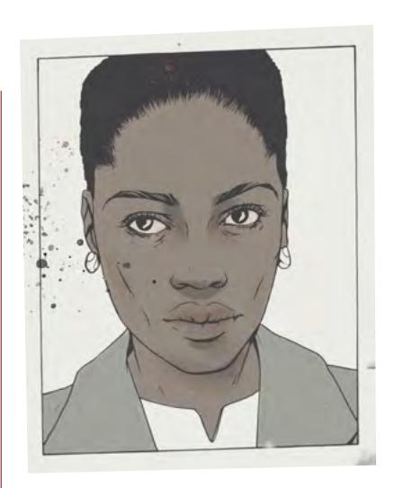

**BY:** ЧИНАСА АДЕЙЕМИ

# Как изменилась ваша роль на сцене после Объятья?

Я стала гораздо более спокойной. До "Объятий" я хотела бороться за свое пространство, но после того, как я поняла требования "Маскарада", я решила держаться в тени. Легко оставаться на задворках, если ты фанатка, и охота почти сама собой отпадает. Например, я иду за кулисы, какой-то мудак начинает меня лапать, я могу просто выпить у него там и сям, и никто даже не моргнет, пока я не обнажу клыки. Немного укусов и крови это обычное дело.

### Вы все еще верите в блэк-метал?

Спросите многих ребят, что такое блэк-метал, и они скажут, что все дело в политике. И что группы, которые отрицают это, продажные неудачники. Вы боретесь за сатанистское видение войны против религии во всех ее формах, создавая музыку, сжигая церкви и оскверняя могильные дворы.

# Вы когда-нибудь оскверняли кладбище?

Конечно, когда я еще была человеком. Теперь, когда я пью кровь по-настоящему, я не чувствую такой потребности.

# Бегущая кровь По стенам

# Как долго вы намерены продолжать сниматься?

Ну, скоро я буду вампиром уже двадцать лет. Это долгий срок, чтобы не стареть. Люди начинают это замечать. К счастью, трупная краска довольно хорошо скрывает возраст, так что если ты одеваешься, то можешь продолжать ходить на концерты, и случайные знакомые ничего не заметят.

Они представляют собой большую проблему, чем люди, которых вы видите постоянно. Если вы видите кого-то каждый день, вы привыкаете к тому, как он выглядит.

# Зачем вообще оставаться?

Позвольте мне рассказать вам о концерте, на котором я была в прошлую субботу. Это был небольшой городок недалеко от Сейнайоки с довольно разнообразной публикой. Один из тех, где все местные жители приходят на все концерты, независимо от музыки, потому что там мало что происходит. Группа начала играть, и вокалист бросил в зал бутылки с кровью. Люди открыли их и начали брызгать кровью друг на друга, на группу, на стены... Две мои знакомые девушкигрупповухи порезали себе руки бритвами. Я слизывала их кровь с кожи.

В большинстве мест это было бы нарушением Маскарада. Здесь это обычное дело.

# Это звучит идеально.

Так и есть! Это было довольно забавно, после концерта я спустился в кафе, и вы могли видеть, как кровь стекает по стенам, ее было так много.

# Что вы думаете о шабаше?

Черный Шабаш? Это музыка отца.

# Подарок от сатаны

# Так что, если бы я захотела присоединиться к этому образу жизни, связанному с кровью и поклонением сатане?

Есть некоторые практические препятствия. Финляндия - большая пустая страна, и большая часть сцены происходит на концертах за пределами больших городов. Это означает, что вам придется путешествовать. Ездить по стране вслед за группами. Это помогает оставаться на виду, так как каждый вечер можно охотиться в другом городе.

Приходится также привыкать спать в сомнительных местах. Я провела больше дней в подсобках грязных баров, чем хотела бы сосчитать. Это также нелегкая сцена, в которую нелегко войти в качестве аутсайдера. Конечно, вы можете просто начать приходить на концерты, но вы будете выделяться. Мне было намного легче, потому что все меня уже знали. Я не казалась не в своей тарелке.

# Вас когда-нибудь пугало насилие в сцене? Образы довольно экстремальные.

[Нет! Когда я была человеком, я была слишком молода и зла, чтобы бояться. А сейчас, когда я вампир, это очень раскрепощает. Я часто охочусь, играя роль жертвы, заставляя какого-нибудь чувака думать, что он может получить удовольствие, трахая меня. Затем, когда он застает меня одну в укромном месте, я переворачиваю сценарий.

Это легко сделать, зная, что, будучи вампиром, вы никогда не подвергаетесь реальной опасности со стороны одного пьяного засранца.

# Вы чувствуете себя неловко, охотясь на свою собственную сцену?

Никогда! Парни говорят, что хотят принести кровь и разрушение по всему миру. Они не понимают, что как вампир я гораздо больше металла, чем они когда-либо могли бы быть. Когда я питаюсь от них, это дар Сатаны. ■

Чинаса Адейеми - бывшая журналистка нигерийского происхождения, пытающаяся заставить свою прежнюю профессию работать под маскарадом.

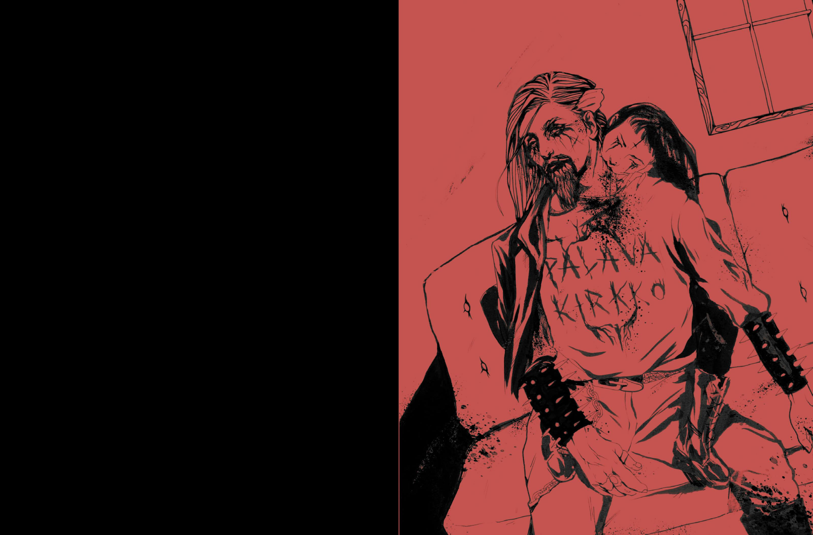

# Смерть на краю света

Во второй статье своей серии "Паразиты субкультуры" Чинаса Адейеми берет интервью у бывшего альпиниста и гангрела Антони Моравски.

Н а первый взгляд, субкультура высотных альпинистов не кажется идеальной для нашего вида. Альпинисты много путешествуют, и большая часть восхождения происходит днем. Экспедиции часто привлекают общественность, что затрудняет поддержание маскарада.

Однако, несмотря на эти проблемы, Антони Моравски не видел причин отказываться от своего образа жизни только потому, что он стал вампиром.

# Объятия на большой высоте

# Вы многого добились еще до того, как стали одним из нас, верно?

Возможно. Я взошел на многие известные из них, начиная с К2 и далее. Единственная, которую я так и не осилил, - это Эверест. Я пытался дважды, но погодные условия были против меня. На самом деле я больше всего горжусь тем, сколько денег мы смогли собрать на благотворительность во время нашей экспедиции в Трансантарктические горы. Там есть превосходные места для восхождения. Жаль, что туда так трудно добраться.

Вы собирали деньги на исследование лейкемии. Пророческая мысль в свете того, что случилось позже.

[смеется] Это правда! Это было всего за несколько месяцев до " Объятья".

# Как это произошло, ваше Объятие?

Настоящий стиль Ферала. Мы стояли лагерем в Альпах, отдыхая от экспедиции. Я экспериментировал со своей камерой, пытаясь сделать снимки при слабом освещении, когда на меня напал монстр, растерзал меня и утащил в пропасть в склоне горы. Я был уверен, что умру.

Но вы не сделали этого. Нет. Мой сир выпил достаточно крови, чтобы залечить мои раны, а затем заключил меня в объятия. Я до сих пор не знаю, почему. Я больше никогда не видел ее. Как вы знаете, среди Гангрелов это встречается чаще, чем в некоторых других кланах. Мое возвращение в лагерь было очень драматичным. Они организовали поисковые группы, и я вошел туда в окровавленной одежде, когда они планировали продлить операцию.

# Качество крови

# Я слышала об особом вкусе человеческой крови на большой высоте. Это правда, что она становится вкуснее?

Да, безусловно. Как вы знаете, человеческий организм компенсирует относительную нехватку кислорода в воздухе. Это означает, что кровь обладает богатыми свойствами, которые вы вскоре научитесь ценить, охотясь в высокогорных сообществах. Это касается не только альпинизма. Вы можете испытать то же самое в любом месте, где воздух разрежен.

# А как насчет других реалий вашего образа жизни. Конечно, трудно охотиться, если вы постоянно передвигаетесь с небольшой группой людей?

Это трудно, если вы не знаете, как это сделать. То, что я одичалый, очень помогает выживать в дикой природе. Я все еще сохраняю свою смертную личность и часто перемещаюсь с теми же людьми, которых знал при жизни. Для охоты путешествия означают, что я могу охотиться в разных общинах, через которые мы проходим. Я не пью у своего народа, разве что в кулинарных целях.

Но вы больше не поднимаетесь с ними? Нет. Я придумал историю о травме, которая затрудняет восхождение.

Вместо этого я следую рядом в качестве члена вспомогательного персонала. Проблема с лазанием в том, что как лизун я слишком хорош в этом. Это кажется неспортивным. И, конечно, дневной свет сжигает нас в горах так же, как и в любом другом месте.

# За последний год вы стали первопроходцем в концепции ночного восхождения.

Это правда. Полагаю, я не могу полностью отстраниться. Я стараюсь, чтобы они были больше про опыт и

меньше про вызов.

# Смерть и Маскарад

# Давайте поговорим о смерти Жан-Филиппа Мюриэля. Вас обвинили в создании угрозы для Маскарада.

Да. Потому что я поддерживаю свою смертную личность, и этот инцидент попал в новости. Полагаю, это иронично. Большинство из нашего вида попадают в неприятности за убийство людей, но со мной это случилось потому, что я хотел сыграть героя.

### Вы оба были в экспедиции на Эйгер.

Да. Я давно знаю Мюриэль, и мы даже вместе совершили попытку восхождения на Эйгер, когда только начинали. Это было одно из моих первых высотных восхождений. Как вы знаете, смертность при таких восхождениях составляет около 10%, так что это не редкость, когда люди погибают. Я терял друзей на горе в Альпах, в Непале...

### Как это произошло на этот раз?

Мюриэль застрял недалеко от вершины. Погода ухудшалась, и было ясно, что он не сможет продержаться в таких условиях более нескольких часов, тем более что температура начала резко падать.

Он позвонил нам по радио, и это было очень эмоционально. Он попросил нас передать его последние слова своим детям. Я не мог этого вынести.

Поэтому вы забрались наверх, чтобы спасти его. Разве люди в вашем лагере не возражали? Наверное, это показалось им безумием.

Они говорили мне, что я сошёл с ума! И если бы я был человеком, они были бы правы. Но это было напрасно. Он был мертв, пока я добрался туда.

# Я должен спросить. Вы пробовали его кровь?

Я стараюсь оставаться человеком, насколько это возможно. Я не верю в эту чушь о превосходстве вампиров, которую вы слышите. Я не жду, что ты поймешь, но это не было похоже на хищничество. Он был моим другом, а теперь он мертв. Я хотел как-то связаться с ним в последний раз. Поэтому я взял его кровь.

# Что вы почувствовали, когда СМИ стали называть вас героем за то, что вы совершили эту попытку?

Глупость. Я признаю, что в жизни я был жадным до славы, но это, возможно, единственное, что сделало меня лучше, когда я стал вампиром. ■

Чинаса Адейеми - писательница нигерийского происхождения, исследующая разнообразные способы, с помощью которых несвязанные люди обходятся в мире, становящемся все более суматошным. Ее работы распространяются исключительно в интересах очень узкой аудитории.

# Зверь на поводке

# **BY:** Чинаса Адейеми

В третьей статье своей серии "Паразиты субкультуры" Чинаса Адейеми берет интервью у пары Тореадоров и любителей петплея Джанет и Уильяма Стоутон.

Мы, лизоблюды, любим говорить о своих зверях, и гангрелы известны своей звериной натурой, но кинк-субкультура пет-плей переносит превращение в животное в совершенно иную сферу.

Я поговорила с тореадорской парой из Сан-Франциско Джанет и Уильямом Стоутонами, чтобы узнать, как наш вид может взаимодействовать с этой субкультурой сексуальных игр.

# Белая пара

_Я не часто встречаю вампирские пары, которые выглядят такими цельными, как вы._

Janet: [Я признаю, что мы довольно белокожие. Уильям: Полагаю, это правда. Мы пытались сохранить нашу человечность, и лучший способ сделать это - сохранить атрибуты.

_Дом, двор..._

Да. Полагаю, это камуфляж.

_Вы были парой до того, как стали вампирами?_

_Janet:_ Нет. Мы тоже не родственники, хотя мы оба Тореадоры. Мы встретились после того, как оба были объяты и сбежали от своих предков в Камарилью.

_Поддерживаете ли вы связь с обществом лизоблюдов в Сан-Франциско?_

William: Нет. Мы держимся сами по себе. Занимаемся своими делами.

# Свобода в рабстве

_Давайте поговорим о вашем увлечении. Что такое петплей?_

Janet: Многие думают, что это только сексуальный фетиш, и это тоже так. Но это также стиль жизни. Не обязательно должен быть секс. Речь идет о том, чтобы взять на себя роль домашнего животного, например, щенка. При этом часто используется атрибутика, которую можно узнать в контексте BDSM: намордники, хвосты, комбинезоны.

_Так кто из вас щенок?_

Janet: [смеется] О нет, мы оба это делаем.

_Вы оба это делаете? Как это работает?_

William: Ну, мы можем делать это по дому, но лучший опыт мы получили на мероприятиях и с третьим лицом в качестве доминанта. Владелец.

Janet: Вокруг этого организуется множество интересных мероприятий здесь, в Сан-Франциско, в других частях США, в Европе.

_И вы делаете это со смертными? Или с другими представителями нашего вида? Джанет: Обычно со смертными!_

_Каково это - быть вампиром, которого смертный ведет за собой на поводке?_

William: [молчание] В этом-то все и дело. Именно в этом дело.

# Бешеные собаки

_У вас бывают несчастные случаи? В конце концов, вы же вампиры._

Janet: Честно говоря, у нас было два неприятных инцидента. В первом случае Уильям был очень глубоко погружен в ментальное пространство щенка, и дом, с которым мы играли, начал дразнить его. Уильям потерял контроль, бедняга.

William: Это было ужасно. Я не знаю, что случилось.

_Что происходит, когда вы теряете контроль в такой ситуации?_

William: Я разорвал кожаные ремни, связывающие мои ноги и руки, и убил господина.

Janet: Все хорошо, дорогой. _Это был ваш друг?_

Janet: Да, в некотором смысле. Мы нашли его на Tumblr.

У меня есть блог, в котором мы публикуем свои фотографии.

_Что это был за другой инцидент?_

Janet: Это было с женщиной, с которой мы никогда раньше не играли. Я была одна у нее дома, и вначале все казалось хорошо. Мы обговаривали границы. У нее было прекрасное оборудование, полный костюм сучки для меня, все такое. Она очень любила контроль и бондаж, поэтому Уильям был у нее в игровой комнате в подвале, а я наверху. Ну, знаете, брала меня на прогулку.

# _Снаружи?_

Janet: Да, на ее заднем дворе.

Это было неловко, потому что ей нравились игры с мочой, а она не знала, что я вампир. Она хотела, чтобы я пописал, как собака, но я, конечно, не мог.

_Я понимаю, в чем проблема._ Janet: Но самое плохое было то, что солнце уже поднималось.

Я потеряла счет времени. Мне заткнули рот, так что я не мог использовать безопасное слово, и она проигнорировала его, когда я использовал сигнал безопасности. Думаю, она злилась на меня из-за этого случая с мочой, но это было плохо.

_Но ты выжала._ Janet: Мне пришлось призвать свою Кровь, чтобы вырваться на свободу. Я была в панике, поэтому не стала делать это тонко. Это было полное нарушение Маскарада. Мы не знали, что делать, поэтому убили ее.

# Охотничьи собаки

_Использование различных субкультур для охоты за кровью было постоянной темой этой серии статей, но я не совсем понимаю, как в этом помогает бондажное животное?_

William: Все дело в выборе подходящего момента. Мы не можем охотиться во время игры.

Janet: Это не совсем так, Уильям...

William: Ты, конечно, права. Иногда мужчина заставляет меня сосать его член. Я могу кусать очень незаметно, и у них не хватает опыта, чтобы отделить ощущения от минета и поцелуя.

_Я так понимаю, что бондаж с минетами не является для тебя нормальным способом охоты?_

William: Нет. Обычно подходящий момент для удара - это после спектакля. Знаете, после окончания спектакля, когда вы все обнимаетесь и делитесь своими эмоциями. В этот момент люди очень обнажены, духовно. Вы можете кусать и кормить с большой любовью и нежностью.

_Но это все равно укус. Люди замечают, когда ты их кусаешь._

William: Это правда. Вот почему хорошо подготовиться к этому, когда вы рассматриваете характер своего питомца. _'Личность домашнего питомца'?_ William: Как вы ведете себя в качестве домашнего животного. Послушны ли вы, взбалмошны, нетерпеливы и так далее. Если вы вампир, хорошо бы сделать маленькие любовные укусы частью вашей сделки. Таким образом, они не будут удивляться, когда вы кормите. _Для вас это секс или охота?_

Janet: В человеческом обличье мне это совсем не нравилось. После того, как я стала вампиром, все эти разговоры о Звере меня очень тревожили. Я боялась стать животным или монстром. Но после того, как я попробовала зоофилию, я обнаружила, что это очень расслабляет, как будто я могу просто погрузиться в это пространство и ни о чем не беспокоиться.

_Даже Солнечный свет или Зверь?_ William: Ну, ты всегда чувствуешь себя плохо после убийства своего хозяина. Это само собой разумеется. ■

Чинаса Адейеми - писательница нигерийского происхождения, постоянно удивляющаяся разнообразию различных способов, которые мы придумываем, чтобы прожить свою не-жизнь.

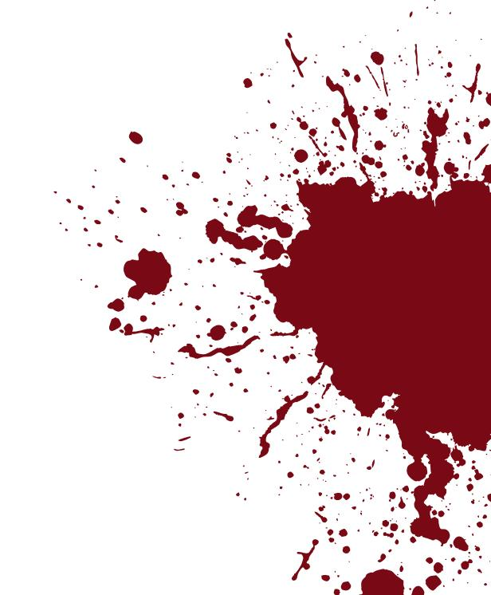

# Ночи в

Я приехал в Лас-Вегас по той же причине, что и все остальные: повеселиться и оторваться. И, возможно, проиграть немного денег за покерным столом... Деньги за покерным столом. Вегасе

Я определенно пришел сюда не для того, чтобы попасть в объятия и стать вампиром, но это их проблемы.

Это был я и пара парней с работы. Они подкалывали меня за то, что я новичок в Вегасе. Они угрожали подставить меня жениться на проститутке, а потом очнуться в каком-нибудь разгромленном номере отеля и не знать, как это произошло.

Оказалось, что я прекрасно справлялся и без них. В первый вечер мы оказались в ночном клубе под названием "Убежище". Моим друзьям там не понравилось, и они ушли, но я остался, потому что готическая атмосфера показалась мне соблазнительной. Нужно ценить любое место, где в ванных комнатах по кругу играет "Isolated" группы Chiasm.

На второй вечер я стоял в очереди в бюро брачных лицензий округа Кларк вместе с Жанетт Воерман. Тогда я этого не понимал, но Лас-Вегас отличное место для решения бюрократических вопросов, связанных с браком, если вы вампир, стремящийся сохранить человеческую личность: Бюро открыто до полуночи.

# Безумная любовь

Я встретил Жанетт на танцполе в свой первый вечер в Asylum. Я понял, что немного не в своей тарелке, поэтому просто снял рубашку и позаимствовал немного подводки для глаз у парня в туалете.

По тому, как все к ней относились, я понял, что она была кем-то, но я весь вечер вдыхал уверенность через нос, так что это не было проблемой.

Она была блондинкой, красивой и одетой как непристойная школьница. Все, что она говорила, было жутким и странным, но мне было все равно, потому что она держала свои сиськи у моего лица.

В последний раз я видел своих друзей, когда мы пошли на обед после той первой ночи. Они спросили меня, что произошло, и я не смог ничего толком объяснить. Вначале я просто хотел трахнуть Жанетт, но к концу ночи я сделал ей предложение.

Большинство людей, стоявших в очереди в бюро выдачи разрешений на брак, были сорокалетние женщины с одинаковыми лицами и пожилые, незаинтересованные мужчины в белых шортах и солнцезащитных очках. Получив документы, мы отправились на лимузине в свадебную часовню. Я обсуждал, сколько дать чаевых священнику, а Жанетт говорила что-то странное. Это покажется мне странным, но меня начинало заводить, когда она говорила такие вещи, как: "Моя сестра очень разозлится, если узнает, что я выхожу замуж за такого красавчика, как ты. Но не волнуйся, я буду беречь свою маленькую птичку. Или дам тебе умереть. Одно из этого".

# Нежить Бармен

Знаете, как в фильмах о вампирах бывает, что бармен или водитель такси все это время были вампирами? Вы думали, что это обычный ночной клуб, а на самом деле все вокруг вас - нежить?

Это гораздо менее гламурно, если вы на самом деле бармен.

Когда наш лимузин отъехал от свадебной часовни, я был влюблен, и я был вожделен к женщине, которую считал своей законной женой. Жанетт прижалась ко мне на заднем сиденье, укусила меня за шею... Вы знаете, к чему это привело. Она выпила меня досуха, дала мне достаточно крови, чтобы я стал ее ребенком, и исчезла в ночи.

Я потерял рассудок и убил водителя лимузина. Мне до сих пор стыдно за это.

Я понятия не имел, что со мной произошло. Я выбежал из разбитой машины на улицу, пробрался в отель, чтобы найти ванную и умыться. Мой телефон был полон сообщений от моих друзей, но я не мог им позвонить, так как сама мысль об этом вызывало у меня желание выпить всю кровь, которую они носили в себе, и выпить ее медленными, приятными глотками.

Я начал пробираться в сторону Asylum, потому что это было единственное место, где, как я думал, я мог найти Жанетт. Скажу вам, Лас-Вегас - город не для пешеходов, особенно если вас только что превратили в вампира и вы понятия не имеете, что происходит.

Вышибала из убежища сказал мне, что меня ждут в офисе управляющего. Он отвел меня туда и усадил напротив женщины, которая представилась Терезой Воерман. Она выглядела очень серьезной, деловая блондинка того же возраста, что и Жанетт. Я догадался, что это та самая сестра, о которой она говорила.

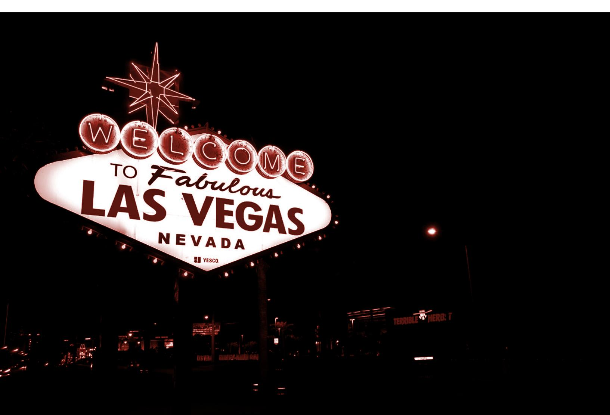

"Я управляю этим клубом уже давно, с тех пор, как мы были в Санта-Монике. Я не позволю, чтобы ему угрожали такие глупцы, как вы, увлеченные играми, в которые любит играть моя сестра. Я дам тебе два варианта. Убирайся из города или работай здесь".

Я выбрал работу там. Вот так я прошел путь от ведения собственного консалтингового бизнеса до работы в ночном клубе. Мне даже не платили, просто предоставляли место для сна.

# Смахнуть вправо Для крови

Тереза запретила мне охотиться в Убежище, поэтому мне пришлось придумать что-то другое. Несколько недель я надеялся, что смогу жить с Жанетт в каком-то подобии супружеского вампирского блаженства, но когда она наконец появилась в клубе, я ее мало интересовал. Мне потребовалось некоторое время, чтобы понять, что для нее это был просто маленький розыгрыш, который она разыграла со своей сестрой.

Иногда я думаю, что без Tinder и Grindr я был бы потерян для голодающих. Мне досталось красивое лицо, хороший пресс и солидный запас самоуничижительной лексики. Я знаю, как сделать хорошее селфи.

Есть что-то особенное в использовании Tinder и Grindr для поиска крови. Ты думаешь не о том, кого ты хочешь трахнуть, а о том, кого ты хочешь попробовать на вкус. Поначалу я выбирал практически тех же девушек, с которыми хотел встречаться. Потом я начал расширять круг знакомств, с парнями, с разными типами женщин.

Я начал постигать простую вампирскую истину: лучшая кровь не всегда находится в молодых и сексуальных. Иногда кровь стареющего наркомана с игровыми автоматами имеет как раз тот самый оттенок сидячего созревания.

Тереза много рассказывала мне о Второй инквизиции и о том, что значит жить в Лас-Вегасе в качестве вампира. В каком-то смысле мне повезло: я стала Воплощенным только после того, как местная Камарилья испытала на себе весь гнев спецслужб. Убежище слишком хорошо интегрировано в мир смертных, чтобы его можно было легко обнаружить, но Камарилью и их Элизиумы было гораздо проще вычислить.

Все это чуждо мне, потому что я никогда не испытывал, что такое Камарилья на самом деле. Для меня статус Лас-Вегаса как открытого города Анархов - это просто нормальное положение вещей. Мы охотимся на туристов, и единственный авторитет, перед которым я преклоняюсь, это Тереза.

Кочевые группы Анархов приходят и уходят, многие из них останавливаются в Убежище. Я понял, что это место имеет некоторую дурную славу в кругах Анархов, хотя для меня это практически полный конец мира вампиров, каким я его знаю. Для этих вампиров "Убежище" - клуб, где охота хорошая и постоянно происходит что-то поганое. Если не иначе, то потому что Жанетт заставляет это делать.

# Белая свадьба

Здание психушки - это старая часовня. Я понял, что легко отделался, когда Жанетт нашла свою следующую жертву. Она флиртовала как с людьми, так и с вампирами. Мне было завидно смотреть, как она это делает, но я знал, что у меня был свой момент с ней и другого не будет.

Следующей посетительницей клуба, с которой она начала играть в брачные игры, была девушка, дегенератка, всего несколько лет как ставшая вампиром, из глуши.

Ее сфотографировали с Жанетт, и произошло то же самое, что и со мной: Она сделала предложение на танцполе. Жанетт сделала из этого спектакль, и через несколько ночей в клубе состоялась церемония бракосочетания. У них был священник и все такое.

Девушка выглядела так, будто не могла поверить в свою удачу, когда провожала Жанетту к алтарю. Они поцеловались, и мы все зааплодировали. Она приехала в Вегас, чтобы повеселиться так, как может повеселиться только вампир, и город ей это обеспечил.

Единственное, чего она не понимала, так это того, что все это было ненастоящим. Она была девушкой из захолустья, которая купилась на иллюзию Вегаса. В ночь после свадьбы она пришла в психушку в поисках Жанетт. Вместо этого она получила строгий разговор с Терезой.

Я не слишком сокрушаюсь по этому поводу. Меня повысили из бара, когда она начала здесь работать. Я даже научил ее пользоваться Tinder, чтобы выйти на всех тех туристов, которые ищут знакомства в Вегасе. ■

# Ночной цирк

Таут Приходи один! Приходите все! Только сегодня Ночной цирк в городе. Захватите свои клещи, приводите свою семью и посмотрите на чудеса, каких вы еще никогда не видели!

Станьте свидетелем того, как удивительная принцесса трапеции падает навзничь! Восхититесь Гипнотическим человеком и иллюзией потерянного времени! Восхититесь мучениями Кричащей Русалки!

Смотрите, как тигры и медведи, слоны и тюлени резвятся для вашего удовольствия и назидания!

Посмейтесь над нашими уморительно смешными клоунами, которые бьют друг друга палками!

Узнайте нашу историю: Основанный в викторианской Англии, Ночной цирк приближается к двум столетиям гастролей по всему миру, переезжая из города в город, чтобы порадовать как молодых, так и старых. Взяв свою эстетику от старых бурлескных шоу, анахоретов-вундеркиндов и самых самоубийственных цирковых представлений, это самое безумное шоу на Земле.

Внутри вы увидите, как тают века, как древние чудовища снова бороздят землю. Пределы человеческой формы раскрываются как самая смелая фантазия, когда наши акробаты совершают невозможное. Почувствуйте безумие толпы, участвуя в шоу жестокости и комедии, ужаса и чудес, настолько удивительном, что оно изменит вашу жизнь.

Сделайте шаг вперед и заходите. Это самое невероятное шоу на Земле, и вы увидите, что вам никогда не захочется покидать его мерцающую страну чудес.

# Шатер

Они скажут вам, что вы должны жить во лжи, носить маску, превратить все свое существование в утомительный маскарад. Вы будете лгать своей семье и своим друзьям. Вы будете лгать своим соседям и случайным людям на улице. Вы будете лгать, лгать и лгать, потому что правда убьет вас.

Так они говорят.

Каждый вечер я смотрю на себя в зеркало. С помощью пудры и подводки я создаю свое истинное лицо. Они представляют меня толпе из сотен смертных, и все они бормочут мое имя.

Я приезжаю верхом на лошади, объезжаю ринг, улыбаясь всем маленьким мальчикам и девочкам, которые навсегда влюбятся в меня. Я упиваюсь их удивлением, их преклонением, ужасом в их глазах, когда они видят, каким хрупким, каким маленьким я кажусь на спине мощного, мускулистого животного. Они чувствуют жестокость, голод, подаренные зверю нашей драгоценной Кровью.

Свет включается. Спускается канат, и я прыгаю, подхваченная моими прекрасными соотечественниками, спрятанными в такелаже. Они доставляют меня к канатам и трапециям, раскачивающимся высоко над зрителями.

Я начинаю свой танец. Я раскачиваюсь и поворачиваюсь, прыгаю и падаю, кручусь и рискую всем с каждым тщательно отрепетированным движением. Здесь нет сетки. Нет никакой защиты. Люди должны почувствовать смерть, они должны ощутить опасность, они должны понять свою смертность. Я - жертвенная жертва, и каждый раз, когда я умираю, они живут.

Ведь именно так все и закончится. Я делаю последний прыжок, кувырок в воздухе. Раскидываю руки и закрываю глаза. Мне не за что ухватиться. Я падаю на землю.

Для меня этот момент прекраснее всего на свете. Зрители чувствуют смерть, повреждения, ломающиеся кости. Они чувствуют мое намерение. Они понимают, что это не случайность. Они представляют, как мое тело ломается на песке ринга.

Перед самым ударом гаснет свет. Зрители вздохнули с облегчением. Это был просто трюк. Смерть была иллюзией. Аплодисменты рассеиваются в темной, пустой палатке перед следующим номером.

В эти несколько секунд темноты они тащат мое сломанное тело за кулисы. Я греюсь в истине своей собственной славы и трагедии.

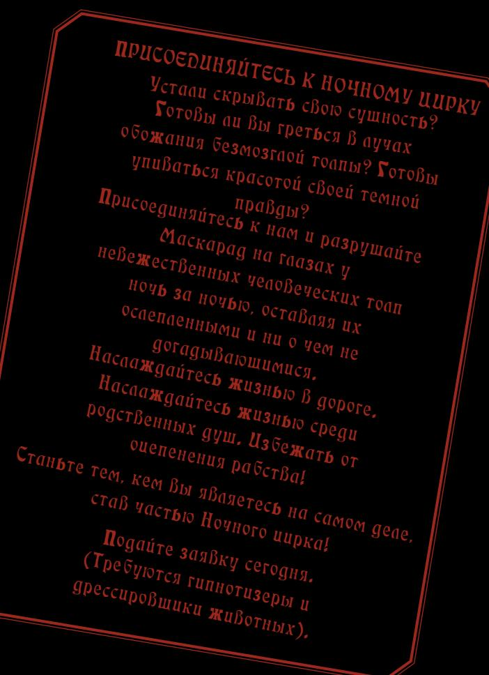

Позже они приведут ко мне кого-нибудь из зрителей. Обычно это мужчина, обычный человек, который вдруг увидел проблеск чудесного и неестественного. Он хочет подарить мне букет и поблагодарить. Я разрешаю ему это сделать, хотя и беру у него кое-что еще.

# Маршрут

Ночной цирк никогда не задерживается в городе дольше, чем на одну ночь, на одно представление. После себя он оставляет жуткие воспоминания, обескровленные трупы и муниципальные власти, не понимающие, кто именно выдал разрешение на установку палатки.

Цирк - это странствующий караван грузовиков и трейлеров, перевозящий артистов, животных и команду как одну сплоченную семью людей и тех, кто меньше, чем люди. Каждый в цирке попробовал Кровь, независимо от того, смертен он или нет. Все они знают секрет, почему шоу выглядит так, как ничто другое на Земле, и никогда не раскроют его тайны.

Между городами они разбивают лагерь где-нибудь в маленьком городке и отдыхают. Они репетируют номера, обучают новых участников, организуют свадьбы и похороны. Для многих в цирке эти уединенные дни и ночи, проведенные в переездном лагере, - самые счастливые в их жизни.

Когда приходит время представления, наступает время для величайшего трюка в репертуаре Ночного цирка: убедить зрителей в том, что сверхъестественное имеет обыденное объяснение. Каждый трюк реализуется благодаря способностям нечеловека. и каждый раз должно быть достаточно двусмысленности, чтобы люди могли представить, что они знают, как был сделан фокус.

собственную цирковую практику. Многие из

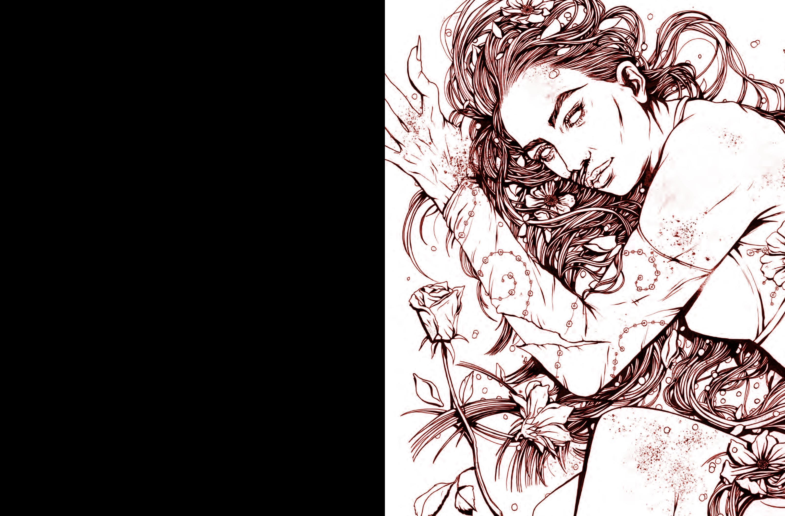

# Заблуждения человечества

1.Я когда-нибудь рассказывала

вам, как я получила объятье? Это неловкая история, поэтому я уверена, что она вам понравится. Это случилось не здесь, в Рейкьявике, хотя именно здесь я родилась и выросла. Вампиры здесь очень строго относятся к потомству.

Нет, это случилось в Лондоне. Я поехала туда прямо из школы, чтобы поработать помощницей по хозяйству. Это казалось хорошей сделкой. Присматривать за детьми космополитичной, успешной пары. Получать зарплату, проживание и питание. Посмотреть город, почувствовать новую жизнь.

Что может пойти не так? Как насчет семьи, где жена - ужасный микроменеджер, который считает, что один выходной раз в две недели это разумно? Муж, который постоянно косится на меня и спрашивает, есть ли у меня парень?

Как насчет пары, состоящей из вампира и упыря?

Я поняла, насколько они были постыдными, только много позже, когда выбралась оттуда и увидела еще немного вампирского общества.

Так, муж был вампиром, а жена упырем.

Он по-прежнему ходил на работу, но только по ночам. У него была работа адвоката, и каким-то образом он смог устроить все так, что ему никогда не приходилось встречаться с клиентами днем. У него было какое-то причудливое медицинское оправдание, что он чувствителен к солнечному свету.

Они продолжали жить так, как будто муж, Марк, страдал от неуместной зависимости, но в остальном был нормальным. Они устраивали званые ужины для своих друзей, говорили о футболе и политике. У них была подписка на газету "Гардиан" и двое детей, которых я быстро научилась ненавидеть. Время от времени Марку приходилось уходить на кормление, но они никогда об этом не говорили.

Может быть, это шутка надо мной, потому что я никогда не понимала, что в их семье происходит что-то странное. Они были так невероятно утомительны в своей сокрушительной бежевой нормальности, что я никогда не задумывалась о том, что у них может быть темный секрет.

По крайней мере, я не думала об этом, пока Марк не загнал меня в угол на кухне однажды вечером. Он рассказал мне, что их браку не хватает страсти и что он находит меня привлекательной. Сначала я пыталась уклониться, потом сказала, что мне неинтересно, и, наконец, отпихнула его от себя, потому что он стал слишком настойчив.

Тогда он превратил меня в вампира. Чтобы показать мне, что он все еще главный в доме.

Я сразу же впала в бешенство, вонзила в него зубы с силой, о которой даже не подозревала, и исчезла в ночи.

# 2.

Тогда я этого не понимала, но Марк превратил меня в Сумрачнорожденную. Мне нравилась эта ирония. Его Кровь была слабой, но не настолько слабой, чтобы позволить ему выходить на улицу днем. Эта привилегия была зарезервирована для меня, его потомка.

После того, как я стала вампиром, я немного сошла с ума. У меня появилось собственное жилье, я посещала клубы, изменила свой стиль. Мое только что умершее тело обладало удивительной жизнестойкостью. Я была застенчивой маленькой помощницей по хозяйству из Исландии, но теперь я стала чемто другим. Мне казалось, что я могу делать что угодно, добиваться кого угодно, принимать наркотики, танцевать, веселиться до бесконечности.

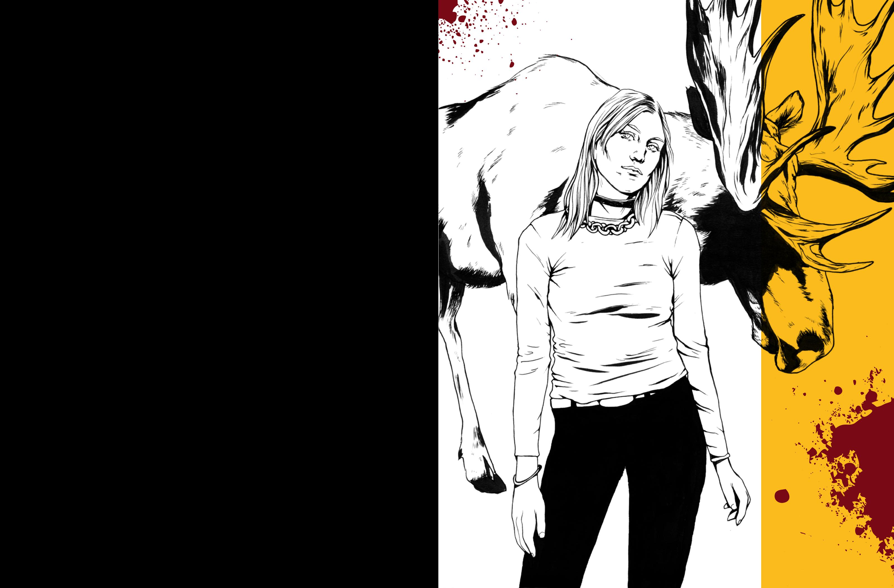

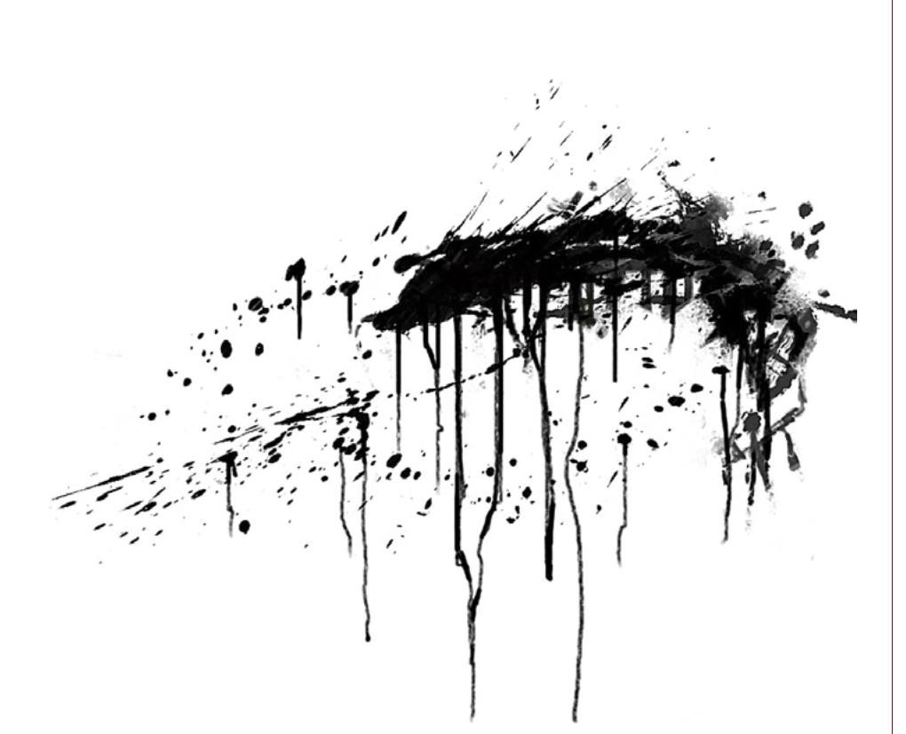

Мне по-прежнему было интересно узнать о Марке и его дерьмовой жизни. Иногда я возвращалась в дом в Барнете и наблюдала за этой парой, которая жила в отрицании, отчаянно пытаясь попрежнему выглядеть как люди.

Жену звали Сара. После моего ухода она, казалось, стала еще более худой и невротической, срывалась на детей и плакала, когда оставалась одна. По тому, как они разговаривали, я догадалась, что Марк сказал ей, что я ушла после спора о свободном времени. Это было вполне правдоподобно, потому что я много раз говорила об этом с Сарой. Но, глядя на нее, я понимала, что она подозревает, что на самом деле все было гораздо хуже, что-то связанное с истинной сущностью ее мужа.

В каком-то смысле это было забавно. Марк делал все возможное, чтобы подавить любые признаки того, что он вампир. Это был не дом с пакетами крови в холодильнике. Только тяжелые шторы в главной спальне. Они никогда не говорили об этом, даже когда оставались вдвоем.

Когда Марк был на работе, а дети были у друзей, Сара иногда расслаблялась, смотря романтический фильм про вампиров и попивая красное вино. Сначала мне это казалось забавным, но потом стало грустно. Она действительно была увлечена этим. Ей нравилась идея быть замужем за вампиром. Если бы только можно было уговорить его поиграть в это время от времени.

3.

Все могло закончиться этим: я ухожу, они продолжают жить своей жизнью. Но не закончилось.

Однажды ночью Сара застала меня за подглядыванием. Я стала беспечной, наблюдая за ними, как за своим собственным маленьким реалити-шоу. Она думала, что Марк убил меня, но теперь, когда я явно была на ногах, она обвинила меня в том, что я соблазнила ее мужа. Она плакала, когда сказала мне, что знала, что у нас был роман, и Марк тоже превратил меня в вампира.

Теперь я монстр, как и все сородичи. Я живу как паразитическое существо, высасывая жизнь из человечества. Но даже у меня есть сентиментальная сторона. Что я могу сделать?

Я дала ей немного своей крови и пригласила на вечеринку. К концу ночи она тоже стала вампиром, благодаря парню, который был мне должен. Когда я видела ее в последний раз, она планировала переехать в Берлин, пока лондонская камарилья не поняла, что был сделан незаконный ребенок.

И кто знает, может быть, Марк все еще в том маленьком домике в Барнете. Проверяет себя в зеркале, чтобы убедиться, что на его белом воротничке нет брызг крови. Отводит детей в школу. Борясь со всем, что ночь может ему дать. ■

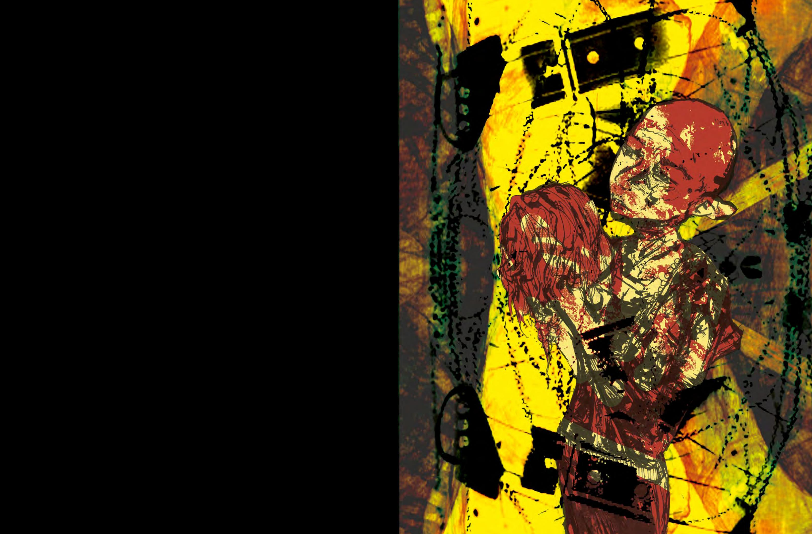

# Можно ли кормить ребенка витэ?

# Обсуждение на закрытом форуме

# _velvetblack - 21:07 26.1.2018_

Привет :) я ищу совета, так что если у кого-то есть опыт в этом, любая помощь будет принята с благодарностью! Я хотела спросить, можно ли кормить ребенка витэ?

например, с точки зрения здоровья?

ПРИМЕЧАНИЕ: пожалуйста, ответы только от людей с ОПЫТОМ

### _liliththedarkmother - 21:10 26.1.2018_

Пожалуйста, скажите мне, что вы не кормите своего ребенка витэ.

### _liliththedarkmother - 21:12 26.1.2018_

Это вредно для здоровья. Витэ замедляет процесс старения у людей и вызывает привыкание.

### _theobellfanboy2001 - 21:20 26.1.2018_

Это нормально, не волнуйтесь... Я постоянно даю своим детям кровь, чтобы они не плакали, и это работает... и это лечит их тоже, когда им больно! Иногда они делают больно друг другу, но я думаю, что это нормально.

Я приложила все усилия, чтобы усыновить детей моей подруги, когда она была замужем. Это трудно, но они очень любят свою кровь и ладят с нашими детьми, то есть с теми, которые у нас есть...

совет: дети отлично подходят для маскарада! никто не ожидает, что вампир будет толкать коляску! а группы поддержки для отцов отлично подходят для кормления, никто не задается вопросом, если кто-то выглядит анемичным и бледным...

### _velvetblack - 21:28 26.1.2018_

спасибо theobellfan2001! это хороший совет! у меня были проблемы с социальной службой из-за моего старшего ребенка. эти засранцы сказали, что он должен был пойти в школу, но для этого у нас и есть дары Кайна, я права? чтобы заставить любопытного социального работника увидеть нашу точку зрения!

так что в РЕЗЮМЕ: давая младенцам витэ, вы успокаиваете их

# _theobellfanboy2001 - 21:31 26.1.2018_

Да! Не волнуйтесь об этом слишком сильно, идеальных родителей не бывает... а быть тесаком еще сложнее.

### _liliththedarkmother - 21:32 26.1.2018_

Я не думаю, что мы должны использовать слово "тесак" на этом форуме. Оно уничижительное и бесчувственное.

### _theobellfanboy2001 - 21:35 26.1.2018_

Прости... ты прав. Это дерьмовое слово. Нелегко быть родителем и вампиром. Трудно растить человеческих детей. Иногда я беспокоюсь, что слишком часто кусаю их.

### _liliththedarkmother - 21:37 26.1.2018_

Я установила для себя правило, что мне разрешается пить у ребенка только раз в неделю. Когда она подрастет, я думаю, что можно будет пить раз в несколько дней. Подростки выносливы.

### _theobellfanboy2001 - 21:45 26.1.2018_

надежно, надежно... думаю, я приму это правило... оно хорошее.

### _velvetblack - 22:01 26.1.2018_

пить от моих детей, это как "можно ли любить слишком сильно?".Это заставляет меня чувствовать себя такой близкой к ним, но потом все это становится гулями, перелетами и прорывами в маскараде. В один момент ты так счастлив, а потом вдруг все становится так сложно.

### _liliththedarkmother - 22:11 26.1.2018_

Сдержанность - определенно самое трудное в роли родителя нежити. Это и объяснение того, почему вы можете посещать родительские собрания только ночью. Но, пожалуйста, даже если ваш ребенок страдает от потери крови, не кормите его витэ. Это нехорошо для них.

velvetblack, с маскарадом нужно быть очень осторожным. Во многих доменах воспитание человеческих детей вообще запрещено. Если Князья или бароны поймают тебя за этим занятием, они отберут у тебя детей. Они могут даже убить тебя.

### _velvetblack - 22:13 26.1.2018_

Я знаю. Нам пришлось переезжать трижды, и каждый раз это огромные хлопоты. вот почему я перестала отдавать детей в школу. я думаю, что каким-то образом "большая тройка" может контролировать школьную систему, например, кто где учится.

Однажды мне пришлось убить женщину, которая пришла к нам домой. Она была похожа на помощника шерифа и разговаривала со мной в очень неуважительном тоне.

### _theobellfanboy2001 - 22:16 26.1.2018_

Это так круто... ты точно родитель года! "Она просто хотела жить нормальной жизнью, но они ей не позволили." это могло бы быть постером к фильму. фильм "Мама-вампир".

### _liliththedarkmother - 22:20 26.1.2018_

Velvetblack, это звучит очень плохо. Вы в безопасности? Вам нужна помощь?

### _velvetblack - 22:45 26.1.2018_

я в порядке. но спасибо. пока у меня есть мои дети, я буду в порядке.

и theobellfanboy2001 ты заставил меня улыбнуться :) я не чувствую себя героем, меняя подгузники. героем, меняя подгузники, но вы правы. Я буду сражаться до смерти за своих детей.

# Лос Нуэвес

Чинаса Адейеми проверила культуру анархов Акапулько, которые стреляют ради забавы.

сли это ваша первая ночь..." Вы смотрели "Бойцовский клуб". Вы знаете, как это делается. Когда Хуан дает мне пистолет, я проверяю его, жду, пока он наведет на меня прицел, и стреляю.

**"**Е

Мы оба бьем. Я попала ему в горло. Его пуля попадает мне в лицо. Она попадает в верхнюю челюсть, погружая осколки кости в плоть моего рта.

Я не привыкла получать пули, поэтому я лечу вниз на землю, а толпа вокруг нас кричит и ликует. Все они пришли сюда за одним и тем же: стрелять и получать пули.

Это Бойцовский клуб для тех, кто может выжить после пулевого ранения. Удар в нос - это любовный удар. для этих людей, так что если они хотят играть грубо, им нужно что-то большее. На девять миллиметров больше.

Есть старая журналистская пословица о том, что нельзя становиться частью истории, но мне было позволено поделиться опытом, только если я участвовала. Вот почему Хуан помогает мне подняться, смеется, а сырая дыра в его горле жутко бескровна.

# Побочный ущерб

Акапулько - город с населением 700 000 человек. В прошлом году здесь было совершено 918 убийств, что делает город столицей убийств в Мексике уже пятый год подряд.

Так какое отношение это имеет к тому, что анархи получают удовольствие, стреляя друг другу в лицо?

Хуан хлопает меня по спине и поднимает мою руку вверх в знак триумфа. Шум вокруг нас оглушительный. Крики, хлопки, и El Regreso Del Chapo группы El Komander из радиоприемника припаркованной неподалеку машины. Мы все купаемся в свете фар, лизги в круге похожи на взволнованные тени.

**VAMPIRE – THE MASQUERADE – ANARCH NIGHTS OF THE UNBOUND**

Я не говорю много. Я рада, что здесь нет зеркал. Я не хочу видеть разрушение своего лица. Я не пытаюсь казаться крутой: Я думала, что меня ранят в руку или ногу. В худшем случае, может быть, в грудь. Вместо этого, к вящему веселью всех присутствующих, я пытаюсь вылечить свое лицо и при этом остаться на ногах.

Мне очень скоро понадобится кровь, и не только мне. Хуан уже исцелен и голоден из-за этого. Следующая пара уже выходит на ринг. Они держатся дольше, чем мы, избивая друг друга до тех пор, пока это не становится похоже не столько на бой, сколько на ритуальное увечье.

Все эти раны должны быть залечены. Это означает, что завтра утром в полицейской статистике появится много трупов. Местный обычай - уродовать трупы, чтобы их принимали за убийства бандитов.

# Игра

Игра называется "Девятки" или los Nueves. Суть игры проста. Вы отправляетесь туда, где можно спокойно повеселиться. Заброшенный участок в районе, до которого никому нет дела. Вы убеждаетесь, что у всех есть оружие. Вы включаете подходящую музыку.

Первым новичкам приходится бороться. После этого наступает очередь остальных. Некоторые просто приходят посмотреть, как стреляют в их друзей. Другие выходят на ринг каждый вечер, дерутся, стреляют, истекают кровью. Это бессмертие в его самой грубой форме: Тело вампира отказывается умирать, и в этой игре вы можете использовать все преимущества.

Иногда Анархи умирают, играя в los Nueves. Хуан не хочет говорить об этом, но после долгого давления на него я добилась от него признания, что это случается довольно часто. Трудно определить, сколько урона может выдержать вампир, и некоторые из них гораздо выносливее других.

Цель los Nueves - не убивать, но ни для кого не секрет, что это смертельно опасный вид спорта. Все, кто был здесь больше одной-двух ночей, видели это. И они все равно возвращаются.

# Разминка

Хуан рассказал мне, что иногда они любят разминаться перед боями. Для этого нужно выстрелить себе в руку или в живот. Получив небольшой урон, вы чувствуете себя разгоряченным и готовым к бою. Я задаю Хуану очевидный вопрос: Зачем это делать?

"Быть вампиром легко", - говорит он. "Добычи много, а поскольку насилия так много, скрывать жертвы и поддерживать маскарад проще. Если кто-то...

# "Быть вампиром легко", говорит он.

Если кто-то что-то увидит здесь, кому он расскажет? Полиции?"

Значит, вы причиняете друг другу боль, потому что быть вампиром недостаточно сложно?

"Может быть. Вы видели фильм. Это американские парни из среднего класса, которые хотят почувствовать что-то настоящее. Мы не средний класс и не американцы, но ты хочешь что-то почувствовать. Иначе, зачем беспокоиться?"

Вы можете сражаться с Камарильей. "Мы сражаемся с Камарильей! Но это всегда так серьезно. Здесь ты можешь расслабиться, получить пулю, встать со смеху. Ты можешь нагрубить своему лучшему другу".

На это я тоже не обращал внимания. Конечно, многие драки, которые я видел, были настоящими драками. Каждый участник пытается прострелить другому столько дырок, что тот уже не может подняться. Но часто не было похоже, что кто-то действительно пытается победить. Они просто хотели причинить боль и получить травму.

# Восход солнца

"Сражайтесь со мной, засранцы", - кричит пожилая женщина крепкого телосложения, размахивая старинным револьвером. Я знаю, что никогда не следует судить о вампире по его внешнему виду, но неудивительно, что этой женщине не хватает претендентов. Она страшная, как черт.

"Я буду драться с тобой", говорит Хуан и выходит на ринг.

Он стреляет женщине в лицо, в то самое место, куда стрелял в меня. Позже я узнала, что это его подпись.

Старуха сплевывает зубы и, как только за холмами показываются первые признаки рассвета, всаживает в Хуана три пули быстрой последовательностью. Грудь, живот, яйца. Хуан падает и не двигается.

"Кто отвезет его домой?" спрашиваю я и указываю на светлеющее небо.

"Обязательно", - говорит старушка. "Иначе как он попадет сюда в следующий раз?". ■

Чинаса Адейеми - бродячий хроникер движения "Анарх". Возможно, однажды она вернется в Акапулько только ради чести снова получить пулю в лицо.

# 24 часовая вечеринка кровососов

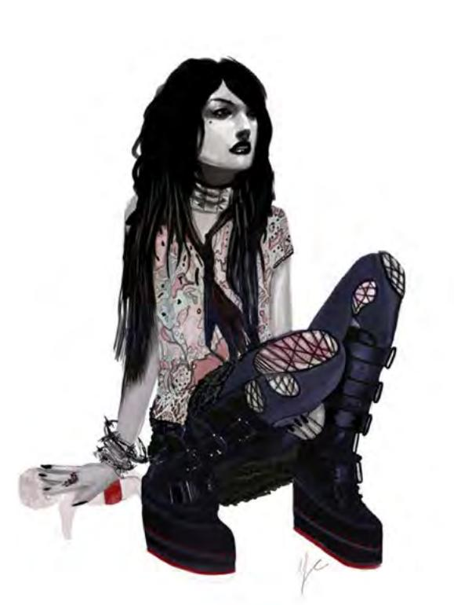

Музыка сильно бьет по моему телу, заставляя двигаться. Когда я толкаюсь среди потной, дергающейся толпы на танцполе, мне кажется, что звук, а не кровь оживляет мой полумертвый труп.

Настойчивый жестокий ритм заставляет меня осознавать свои внутренности лучше, чем когда-либо с тех пор, как я стала вампиром. Я просто еще одно тело, и в темноте никто не замечает, дышу я или нет.

Я никогда не хочу спускаться. Это идеальный момент, не испорченный голодом, идеальный химический кайф. Вот что значит вечная жизнь. Свобода танцевать, веселиться каждую ночь, всю ночь, вечно.

Голод поселяется в моих конечностях, в моих мыслях, в моем мертвом сердце. Я хочу притвориться, что не чувствую его, двигаться, двигаться, двигаться, но его нельзя игнорировать. В каждом человеке вокруг меня течет кровь, шепчет в венах, прячется за тонким барьером кожи.

Я иду к Сигурдуру. Всего несколько лет назад мы оба учились в одной школе, в одних классах.

Я была неудачливой девчонкойгиком, живущей своей лучшей жизнью в Интернете. Он был мальчиком-эмо, получившим толику крутизны благодаря своему безупречному музыкальному вкусу. Теперь я - сумеречная вампирша, а он уткнулся лицом в стол, Ренфилд, которого плохо обработала моя подруга-задница Ди, сидящая там и пытающаяся незаметно облизать губы от крови.

"Ты когда-нибудь слышала о Маскараде, идиотка?" шиплю я на Ди, садясь рядом с ней.

"Не волнуйся, все нормально", беззаботно уверяет она меня, оглядываясь по сторонам, не обращает ли кто внимания. Никто не обращает.

"Послушай, Ди. Я приложила много усилий, чтобы вколоть Сигурдуру именно тот кайф, который я хотела. Я не наркоманка, как ты. Я знаток. Я сделала это не для того, чтобы ты могла украсть его кровь".

Ди не слушает. В ее религии все справедливо, если ты хочешь получить кайф. Ди - один из тех людей, которых невозможно представить днем.

Я понятия не имею, где она спит, как путешествует и чем зарабатывает деньги. Но я точно знаю, что она всегда рядом, чтобы украсть мой кайф.

Пошла она. Я должна охотиться. Рейкьявик - маленький город, и вы можете встретить знакомых. Как сейчас. Парень, с которым я встречалась, когда мне было двенадцать, а ему четырнадцать. Он проскальзывает в туалеты, и я следую за ним как раз в тот момент, когда он запирается в грязной кабинке, чтобы выкурить кокаин из унитаза. Я даю ему достаточно времени, чтобы накуриться, прежде чем сорвать дверь с петель. Надо было быть более изящным, но мне все равно. Он стоит на коленях с обескураженным выражением лица, не понимая, что его возлюбленная с детства делает там с оскаленными клыками.

Он должен был стать богатым и успешным. Инвестиционным банкиром. Вместо этого он стал обычным засранцем, запутавшимся в своем жизненном выборе. И теперь он - добыча. Я глубоко вгрызаюсь в его шею, плоть поддается, и первая струйка крови дает мне почувствовать, что будет дальше.

Я люблю пить у людей, которые мне безразличны. Я знаю, что поцелуй заставит его напрячься и возбудиться, гадая, что случилось, когда я исчезну в ночи.

Ядовитая комбинация того, что мой бывший подмешал в свою кровь, поражает меня, когда я встаю. Я съела кебаб раньше, просто чтобы позлить Ди. В отличие от нее, я все еще могу есть, и обычно я сама решаю, когда меня вырвет. Теперь нет. Я извергаюсь на своего бывшего, который все еще стоит на коленях у унитаза. Я извергаюсь с силой, пока каждый кусочек шашлыка не украшает его позорный пиджак. Вот такой у меня опыт с бывшей девушкой: Укусить, возбудить, вырвать.

Лучше уйти. Вот почему я делаю свою собственную алхимию наркотиков и использую своего Ренфилда в качестве испытательной лаборатории. Всякое случается, если ты получаешь кайф от крови случайного засранца. Пошатываясь, я возвращаюсь к столам. Музыка сбивает меня с ног. Люди толпятся рядом и подглядывают, их пот прилипает к моему телу, когда они проходят мимо.

Потолок слишком низкий, мне кажется, что я задыхаюсь, даже когда мне уже не нужно дышать.

Я устала. Я не хочу спать. Быть вампиром хорошо, пока ты пьяна, а если ты Сумрачнорожденная, то можешь не спать круглые сутки. Это удерживает все плохие мысли на расстоянии.

"Давай вытащим тебя", - говорит Ди, хватая меня за руку. Она тянет меня за собой на улицу, прямо в мокрый снег, падающий с неба. Он затекает под одежду, струйки холодной воды бегут по моей спине. Я ненавидела это чувство, когда была человеком, но сейчас оно успокаивает, словно холодные пальцы подтверждают, что я не обязана принимать человеческую мораль. Каждый человек, которого я убивала, был просто добычей.

Ди отслаивается, как только горизонт начинает светлеть. Если она попадет в холодный полусвет дня в Рейкьявике, она сгорит. Мне нужно только надеть солнцезащитные очки. Я иду к гавани, чувствуя себя все менее и менее человеком.

Я собираюсь на чилаут-вечеринку, но перед этим я хочу избавиться от последних остатков плохой крови моего бывшего и посмотреть на восход солнца.

Солнце - всего лишь светлая фигура в облаках. Несмотря на очки, смотреть на него прямо больно глазам, но я все равно это делаю. Я кое-что узнала о том, как живет большинство вампиров, и меня поражает, что я могу получить доступ к целому миру, который они видят только в своих воспоминаниях. У них есть сила, но у них нет свободы.

Я жду, когда круизные корабли причаливают. Они обеспечивают постоянный поток безмозглых американских туристов, добычу, которая доступна только тем из нас, кто может охотиться днем. К вечеру они снова уходят. Ценный ресурс в маленьком городе, перенаселенном нежитью. Проблема в том, что единственный кайф, доступный с кораблей, - это отпускаемые по рецепту наркотики.

Пришло время расслабиться, найти Ди, когда солнце зайдет, и сделать все заново. ■

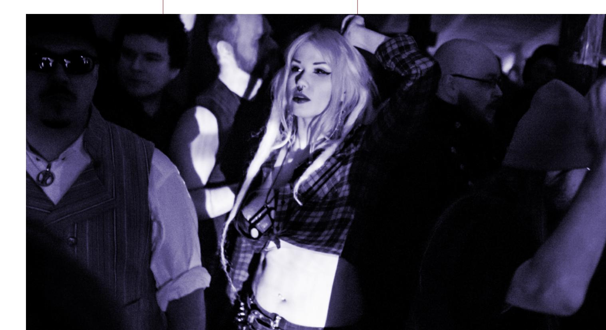

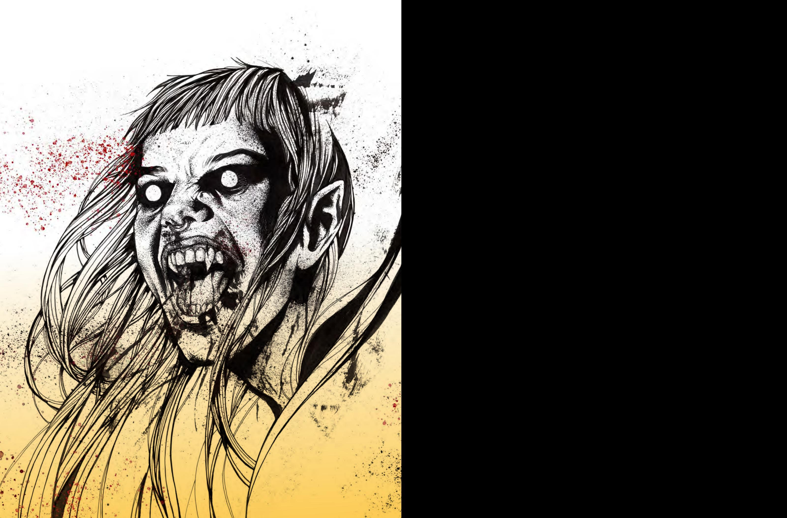

# Перекличка революции

Вы хотите знать, кто есть кто в анархическом движении? Кто такие знаменитости и почему их отмечают, самые важные группы, сцены и идеологии?

Я могу попытаться ответить, но вы должны понимать, что мой ответ по необходимости будет очень ограниченным. Реальность такова, что не существует единого движения анархов, нет объединяющей политической структуры, объединяющей всех нас. Даже если взять политических анархов, существует огромная пропасть в идеологии, истории и географии, разделяющая Свободные Штаты Анархов в Калифорнии и бывший Совет Бруха в России.

Единственное, что объединяет этих политических анархистов, - это вера в то, что мы можем построить лучший мир. Или, по крайней мере, другой мир, свободный от застоя и слепого консерватизма Камарильи. Если в радикальной политике и есть какая-то константа, так это то, что мы очень хорошо умеем дробиться на все более мелкие группы.

Это справедливо и для анархов, и иногда кажется, что злейший враг прогрессивного

анархического коллектива Санта-Моники - это революционный анархический коллектив Санта-Моники.

Дело в том, что Анархи это гораздо больше, чем просто те из нас, у кого есть политические планы. Выйдя за пределы Движения, вы найдете свободных, анархистов, которые просто хотят, чтобы их оставили в покое и они делали свое дело без вмешательства политики секты. Некоторые из этих людей - милейшие вампиры, которых вы когдалибо найдете, искренне страдающие от морального конфликта из-за необходимости питаться от людей. Другие - чистые монстры, наслаждающиеся властью и свободой, которую дает проклятие Кайна.

Анархи также стали убежищем для тех, кто руководствуется религиозными убеждениями, которые не находят себе места в Камарилье.

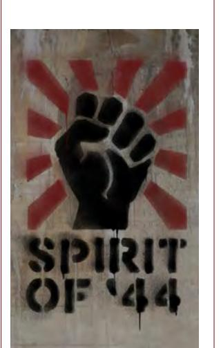

Эти культы и сообщества - одни из самых странных вещей, которые могут предложить Анархи, в них представлены идеи и концепции, совершенно чуждые основному обществу Камарильи. Прежде чем полностью отвергнуть их, вспомните, что когда-то давно Шабаш тоже был крошечным культом.

Тем не менее, худшим врагом сплоченности Анархов является простая география. Мы все связаны со смертными

сообществами, которые нас породили, гораздо больше, чем Камарилья. Многими из нас движут предрассудки,

оставшиеся от наших дней среди живых, и Маскарад не позволяет итальянскому Сородичу много знать о своих сестрах, охотящихся на людей на приграничных территориях Южной Африки. ■

- Руди, датский идеолог и активист Гангрелов

# Оставь

Расшифровка записи с камеры наблюдения 22. 1. 2018

Неаполь, адрес улицы: [зачеркнуто]

Начало в 9:31 вечера

Мужской голос 1, говорит по-итальянски: Вы уверены, что это хорошая идея? У этих парней странная репутация.

Мужской голос 2, говорит по-итальянски: Что значит "странная"?

**M1:** Когда ты убиваешь кого-то, должна быть цель и функция. Ты убиваешь чисто, когда просто хочешь, чтобы другой человек умер. Ты убиваешь грязно, когда хочешь сделать заявление. Ты убиваешь на публике, когда хочешь сделать людей параноиками. Эти парни, я не знаю... Меня это пугает.

# **M2:** Кровь.

**M1:** Конечно, кровь! Я видел одну из жертв. Как они их вешают, как сливают кровь. Это работает как тактика устрашения, я этого не отрицаю. Это чертовски хороший способ умереть, теряя свою жизнь, когда твоя кровь стекает на пол. Отличный фирменный прием, десять баллов за стиль.

**M2:** Люди боятся их. Как тактика террора, это работает. Ты получаешь известие о том, что их наняли для совершения покушения на вас, [неслышно]

**M1:** Но я не понимаю, они всегда говорят, что просто хотят оставаться на виду, совершать случайные убийства, чтобы финансировать свой образ жизни. Как будто они бездельникиубийцы. Но их подпись настолько ужасна, что все обращают внимание. Мы. Копы. Очень скоро - пресса.

**M2:** Я в шоке, Андреа. Ты полагаешь, что профессиональные убийцы действуют в соответствии с той чушью, которую они несут? Я так рада, что среди нас, в Каморре, это неслыханно.

**M1:** Сарказм - грязная привычка. Кроме того, я думаю, что пора. Они скоро будут здесь. У тебя есть пакеты для крови?

**M2:** В холодильнике.

**M1:** Я собираюсь спросить их об этом. Я понимаю, почему они убивают так, как убивают. Но почему им нужны пакеты с кровью в качестве части оплаты?

**M2:** Стиль?

**M1:** Стиль - это прекрасно, но это просто странно.

**7 4**

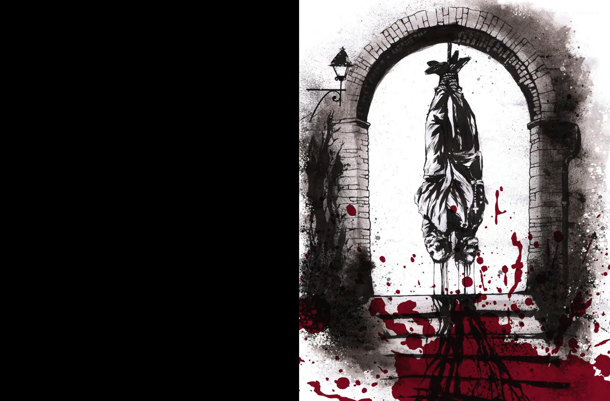

[звук звонка в дверь]

**M1:** Боже, какие они пунктуальные. Я схожу за ним.

[звук открываемой двери, неразборчивые приветствия и слова приветствия].

**M1:** Пожалуйста, садитесь.

**M2:** Приятно познакомиться, меня зовут Джанкарло.

Женский голос 1, говорит по-итальянски: Спасибо, Джанкарло. [неразборчиво]

Мужской голос 3, говорит на итальянском, иногда переходя на сардинский: Давайте поговорим о бизнесе.

**F1:** Почему вы всегда так грубы? Мы не обязаны пропускать любезности.

**M2:** Все в порядке.

**M1:** Я хочу спросить тебя кое о чем. Если можно.

**F1:** Конечно. Спрашивайте.

**M1:** Что за кровь? Я имею в виду, почему вы просите кровь вместо оплаты?

**F1:** [смеется].

**M3:** Это потому, что мы вампиры.

[продолжительное молчание]

**M1:** Ах да, вампиры!

[общий смех]. **M1:** Но если серьезно, то.... **M3:** У вас есть кровь, которую мы просили?

**M2:** Да, конечно. Позвольте мне принести его для вас.

[звуки шарканья, открывающаяся дверца холодильника]

**M2:** Вот, пожалуйста.

**M3:** Спасибо. Позвольте мне проверить.

**M1:** Проверить? Уверяю вас, это настоящая кровь, как вы и просили.

**M3:** Это коровья кровь. Мы просили человеческую кровь.

[молчание].

**M1:** Как вы смогли это понять?

**M3:** Я всегда могу сказать. Позвольте мне объяснить, почему мы просим кровь. Это для того, чтобы проверить, серьезно ли люди, с которыми мы имеем дело. Если они несерьезны, они пытаются отмахнуться от нашей просьбы. Если они серьезны, то они приносят нам кровь.

**F1:** Я думаю, что он спрашивает... Ты серьезно?

**M2:** Ладно, слушайте, мы не так поняли...

**M3:** Мы не безрассудны. Вы можете получить для нас один пакет человеческой крови прямо сейчас, а остальное - по завершении работы.

**M1:** Один пакет прямо сейчас?

**M2:** Он имеет в виду, что мы должны пустить кровь в пакет для крови.

**M3:** Да. Именно это я и имею в виду. Вылейте кровь коровы и наполните ее из своих собственных вен.

**F1:** Только сначала вымойте ее. Смешивание коровьей и человеческой крови отвратительно.

**M1:** Черт... [неразборчиво]

[семь минут неразборчивых звуков с единичными восклицаниями].

**M1:** Вот оно. Теперь вы счастливы?

**F1:** Мы будем рады, когда вы предоставите нам остальные пакеты с кровью.

**M1:** Конечно, есть более простой способ узнать, серьезно ли кто-то настроен, чем этот.

**F1:** Мы любим кровь. Получение человеческой крови всегда требует жертвоприношения. Вы получаете ее из собственного тела, или из тела другого человека. Или из банка крови. Нам не нравятся люди, которые нанимают нас случайно, просто потому, что они на кого-то разозлились. Убийство - дело серьезное, и даже если вы сами этого не делаете, вы должны так или иначе это почувствовать.

**M1:** Думаю, я могу это понять.

**M2:** У вас все еще идет кровь. Позвольте мне приложить еще марлю.

**M1:** О, точно. Спасибо.

[неразборчивое рычание]

**M1:** Он в порядке?

**F1:** Он просто голоден.

**M1:** Хорошо, тогда мы должны сделать это быстро.

**F1:** Кто является целью?

**M1:** Два брата. Один - судья, другой - священник. Судья имеет на нас зуб, он пытается вычислить наши политические связи. Священник еще хуже. Он говорит, что для тех, кто работает в Каморре, нет никакого наказания.

**M2:** Мы бы хотели, чтобы они умерли вместе. Не публично, но достаточно жестоко, чтобы дать четкий сигнал.

**M3:** Мы можем это сделать.

**M1:** [неразборчиво]

**M2:** Мы знаем, что вы можете. Половина оплаты сейчас, половина по завершении. Стандартная сделка.

**F1:** Превосходно.

**M1:** Вот досье на цели.

**F1:** Спасибо. Думаю, нам лучше уйти. Из-за всех этих кровопусканий мой друг проголодался.

**M2:** Очень заботливо с вашей стороны, мадам.

**F1:** [смеется] Ты флиртуешь, ты знаешь это?

[звуки шарканья, прощания, дверь открывается и закрывается]

**M2:** Ух ты. Это было напряженно.

**M1:** Эти парни сумасшедшие. Это была какая-то черная вдова.

**M2:** Но хорошее безумие. Это послужит правильным сигналом.

**M1:** Черт, у меня все еще идет кровь. Думаю, нужно промыть рану спиртом.■

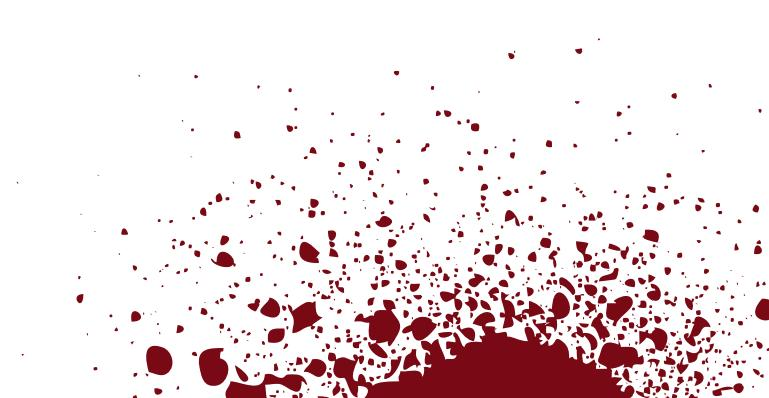

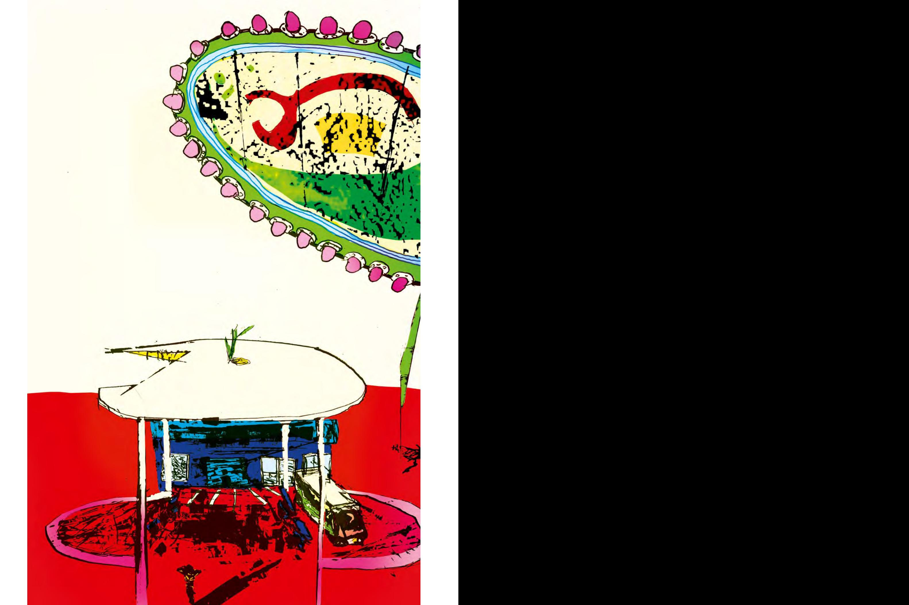

# Я - Куба

# Стенограмма интервью / Гавана / 12.2.2018

Источник: Это просто беспокоит меня, вот и все.

Итерьвьвер: Что вас беспокоит?

Источник: Чушь про "дружбу между народами". Знаете, как он всегда говорит: "Союз между Советским Союзом и Кубой - один из самых прекрасных в истории".

Итерьвьвер: Когда вы говорите "он", вы имеете в виду...

Источник: Александра Алексеева, конечно.

Итерьвьвер: По многим каналам доступно много информации об Алексееве. Он служил в разведке, стал послом СССР на Кубе. Сыграл роль в Кубанском ракетном кризисе, погиб в 1989 году.

Источник: Ну, я думаю, это можно назвать смертью.

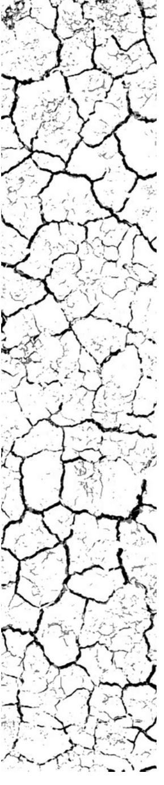

Но это еще не все. Он был одним из нас долгое время. Ну, не одним из моего клана. Он - Бруха, как и большинство вампиров, которые раньше стояли у власти в Советском Союзе.

Итерьвьвер: Вы предполагаете, что, как вампир, его основной сферой деятельности сейчас является Гавана.

Источник: Да. Очевидно, в 1991 году в коммунистах клана ученых было много внутренних разногласий, и он почувствовал, что ему нужно новое место. И он пришел сюда.

Итерьвьвер: Вы много знаете, но, судя по нашим записям, вампиром вы являетесь всего несколько лет.

Источник: Да, я получил объятье в 2016 году. Я не скажу вам ничего секретного, правда. Каждый анарх в Гаване знает это дерьмо.

Итерьвьвер: Как был принят Алексеев?

Источник: Как герой! Он добросовестный член Совета Бруха, один из тех, кто отвечает за самую успешную операцию Анархов в истории: Советский Союз.

Американцы говорят о "Свободных штатах Анарха" в Калифорнии, как о чем-то важном. Пожалуйста. Я даже не люблю Анархов, и я знаю, что Совет Бруха был настоящим делом.

Итерьвьвер: Какова сейчас позиция Алексеева?

Источник: У нас нет правителя-анарха, который контролировал бы всю территорию Гаваны, как это делал бы камарильский князь. Но Алексеев чрезвычайно влиятелен. Он сделал много шагов, объявив Гавану убежищем для всех, кто спасается от Кровавой Охоты или Второй Инквизиции.

Итерьвьвер: Как вы к этому относитесь?

Источник: По правде говоря, я его ненавижу. Я имею в виду, что я - Куба. Алексеев просто какой-то русский шпион. Почему он должен говорить каждому психу, сбежавшему из Камарильи, что они могут приехать сюда и испоганить наше дерьмо? То есть, я понимаю идеализм, но это должна быть наша территория.

Итерьвьвер: "Наши" - это вампиры кубинского происхождения?

Источник: Забавно, что вы говорите "вампиры". Я не встречала много Камарильи, но они всегда говорили "Сородичи".

Итерьвьвер: Я боялся, что термин "Сородичи" здесь не знаком.

Источник: О, простите! В любом случае, я думаю, это то, чего я хочу. Больше никаких русских, приезжающих сюда и указывающих нам, как управлять нашим городом. Нам нужен собственный князь, и я совершенно счастлив стать частью Камарильи, если это потребуется.

Итерьвьвер: Есть ли у вас кандидат на пост князя?

Источник: Ну, я подумал, раз уж я даю вам всю эту информацию...

Итерьвьвер: Конечно. Мы понимаем.

Источник: Я имею в виду, я всего лишь чувак. Но при правильной поддержке, я уверен, я мог бы сделать здесь что-то прекрасное. И вы бы получили всех "Красных списков", живущих здесь сейчас.

Итерьвьвер: Хорошая сделка, несомненно.

Источник: Знаете, что самое страшное в Алексееве? Речи. У него выносливость настоящего партийного аппаратчика. Он может выступать два часа без подготовки. Это удивительно, но так скучно.

# Итерьвьвер: Что бы вы предпочли?

Источник: То же самое, что мне нравилось в жизни. Ну, знаете, пляж, реггетон, друзья, девушки...

Итерьвьвер: Это не похоже на собрание Сородичей.

Источник: Может быть! Я, я не верю в охоту без хорошей музыки. Без моих песен я даже крови не хочу. Голод пропадает.

# Итерьвьвер: В самом деле?

Источник: Не совсем. Тем не менее, это отстойно охотиться, когда я не могу настроиться на нужный лад. Нужно найти время, потанцевать...

Итерьвьвер: Так что если Алексеев...

Источник: Это то, ради чего все и затевалось, верно? Быть одним из нас? Просто развлекаться, охотиться на тех, кто нам нравится, игнорируя все это дерьмо из Красного списка? Я имею в виду, когда я был объят, они сказали мне, что быть Анархом - это лучший способ избежать участия во всей этой большой тайной политике. Например, с Джастикарами или что-то в этом роде. Но я думаю, что это неправда. Будучи анархами, мы получили Алексеева и красные списки.

Итерьвьвер: Вы считаете, что вступление в Камарилью поможет вам сосредоточиться на реггетоне и пляжных вечеринках?

Источник: Конечно! Я имею в виду, вы, ребята, должны быть более спокойными, чем Алексеев, верно? Вы когданибудь были на вечеринке, организованной бывшим советским послом? Потому что я был, и эти вечеринки отстой. Там просто люди поют по-русски, произносят длинные речи и очень сентиментально говорят о том, что пьют кровь живых.

Итерьвьвер: Я так понимаю, у Алексеева есть значительная оппозиция?

Источник: И да, и нет. Я думаю, что сейчас вы попадаете в ловушку Камарильи. Вы не можете представить себе город без сильного лидера. Алексеев - не наш лидер, он просто очень хорошо умеет все делать. Людям не нравится все, что он делает, особенно это дело со святилищем, но это город анархов, верно?

Итерьвьвер: Значит, вам нужен сильный лидер?

Источник: Да, возможно, Камарилья права в этом вопросе.

Итерьвьвер: Сколько, по вашему мнению, вампиров в Гаване?

Источник: Подождите, вы же Камарилья, да?

Итерьвьвер: Конечно.

Источник: Ладно. Извини. Я становлюсь параноиком. Евавсе здесь немного беспокоятся о Второй Инквизиции, с тех пор как Алексеев сделал свое предложение. У нас много историй с агентами ЦРУ, делающими странные вещи в Гаване, независимо от того, являются они СИ или нет. ■

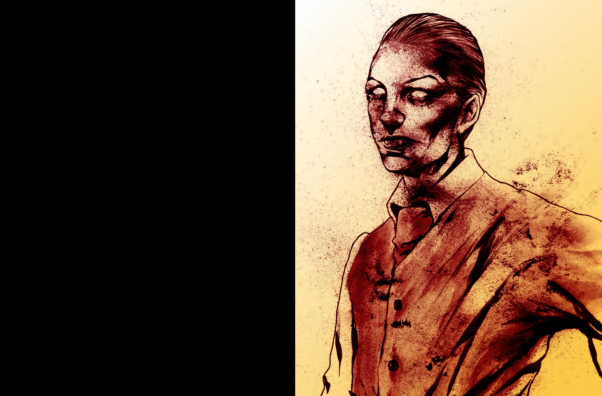

# Ни Бог, ни Господин

# Первая встреча:

# La Bellevilloise

Я замечаю ее в толпе задолго до того, как она увидит меня. Я выгляжу как еще один североафриканец в клубе, полном североафриканцев. Она не единственное белое лицо. В конце концов, мы находимся в довольно буржуазном месте, прямо за углом от Père Lachaise.

Тем не менее, она выделяется как девушка из Камарильи. Далия, возьми себя в руки, говорю я себе. Я должна встретиться с ней и узнать, заслуживает ли она моей помощи, а не заглядываться на принцессу из башни из слоновой кости. Она никогда бы не пришла к Софиане сама, но теперь, когда она здесь, она работает в комнате как положено. Улыбается, флиртует, ускользает, как умная маленькая мечта.

"Какая у вас история?" спрашиваю я ее, не представляясь, пока она, как и все в этом месте, аплодирует артисту, выходящему на сцену.

Она не сразу реагирует, слишком захваченная ревом толпы. А когда реагирует, она прижимается ко мне в толпе людей, ее низкий голос какимто образом пробивается сквозь шум. "Привет, Далия. Я рада, что ты пришла".

Она не позволяет мне говорить о делах.

Она хочет посмотреть концерт, и я танцую и кричу вместе с ней. Некоторые лица в клубе мне знакомы, и они смотрят на меня понимающе, думая, что я пытаюсь приударить за привилегированной светской девушкой, желающей расширить свои культурные горизонты.

Позже, когда мы бродили по улицам, она открылась. "Это обычная история. Вы, наверное, слышали ее уже много раз. Но я ничего не могу поделать, это моя жизнь. Он был кемто при дворе Вийона, очень старым. Он увидел меня в кафе и подошел поговорить со мной. Он заставил меня влюбиться в него, обнял меня и выставил в Элизиуме как трофей. Поначалу я была захвачена всем этим, но он хотел контролировать каждый аспект моей жизни. Я не выдержала. У меня был роман, и он узнал об этом. Конечно, узнал. Тогда все и началось, унижения... Они очень умны с теми, кто в Камарилье".

# Вторая встреча: Улица Сент-Оноре

Трахать любовницу ревнивого старейшины Камарильи на его кровати, в его убежище, вероятно, плохая идея. Но позвольте мне сказать вам, братья и сестры, это чертовски приятное путешествие.

Я подсунула маленькую записку между страницами книги в его библиотеке с цитатой из песни La Canaille. В конце концов, он найдет ее, но не слишком скоро.

# Третья встреча: Roubaix

"Ты должна исчезнуть. В Париже для тебя нет жизни", - говорю я ей и беру ее за руку через стол в больничном кафетерии. Наши встречи становятся все более запутанными, поскольку паранойя нарастает. На этот раз мы в больнице в Roubaix. Приезд в другой город, в такую дыру, как Roubaix, позволит нам остаться незамеченными. Или так мы надеемся.

Она не спорит. Она знает, что мы и так уже слишком рисковали. "Может быть, мой клан поможет мне. Я могу пойти в..."

"Нет. Ты должен начать думать как один из нас, а не как один из них. Нет никаких кланов. Нет Кайна. Все это не имеет значения. Ты должен жить сейчас, сегодня, а не в прошлом, как это делает Камарилья. Они никогда не спасут тебя, а истории, которые они рассказывают, хороши только для того, чтобы управлять тобой. "

Она достаточно долго пробыла в Камарилье, чтобы выглядеть обиженной, даже когда знает, что я прав. "Вы не знаете...", начинает она, но я прерываю ее.

"Я знаю. Я изучал нашу историю. Я знаю все, что нужно знать о Первом восстании анархов, Терновом соборе, Вентру и Тореадоре. Но сегодня есть целый новый мир, который выходит за рамки всего этого. Не попадайте в ловушку этих историй, потому что они ослепят вас от того, что происходит в мире".

"Так куда нам идти?" - с опаской спрашивает она, глядя на больных и умирающих смертных вокруг нас.

"Тебе лучше уйти", - говорю я как можно мягче. "Я не твоя жизнь. Нам было весело, но мы не будем вечны. Я был твоим первым любовником-анархом, вот и все".

# Четвертая встреча: Марракеш

Я решил не ехать за ней в Марракеш, но не смог удержаться. Мы встретились в кафе на открытом воздухе, в хипстерском месте, которое она посоветовала. Я здороваюсь со всеми ее друзьями, и несколько из них - наши. Она быстро интегрируется.

"Пойдем на улицу", - предлагает она, уводя меня на улицу, подальше от своего нового смертного круга. "Я притворяюсь, что работаю в посольстве", - самозабвенно говорит она.

Я чувствую себя дурой, глупой девчонкой, которая не понимает, что эта история любви закончилась. Я закончила ее, и теперь жалею об этом.

"Ты помнишь ту ночь, когда мы впервые встретились?" - спрашивает она. "Ты отвел меня в ванную и сказал, чтобы я выпила твою кровь. Ты притворился, что это был тест, чтобы проверить, настоящая ли я. Но ты сделал это, потому что хотел одержать верх над красивой девушкой".

"Я помню". Я еще не уверен, что готов говорить обо всем этом. "Как жизнь в Аширре?"

"Это хорошо", - говорит она. "Твои контакты мне очень помогли".

Я знал, что она не может оставаться в Европе. Там не было места, где она могла бы спрятаться от старейшины Камарильи. И она не привыкла к образу жизни анархов, к заботе и строгости, которые требовались, чтобы жить как один из нас в одном из самых репрессивных городов Камарильи в мире. Но Аширра были другими. У них была власть, чтобы не дать Камарилье слишком разбушеваться в своих городах. И было бы глупо полагать, что у такого североафриканского анарха, как я, не было связей с Аширрой.

"У тебя есть новый покровитель?" спрашиваю я ее. Любовник, вот что я имею в виду.

"Нет", - решительно говорит она. "Ничего подобного. Первого раза было достаточно. Меня больше не будут контролировать".

"Ты все-таки стал Анархом". ■

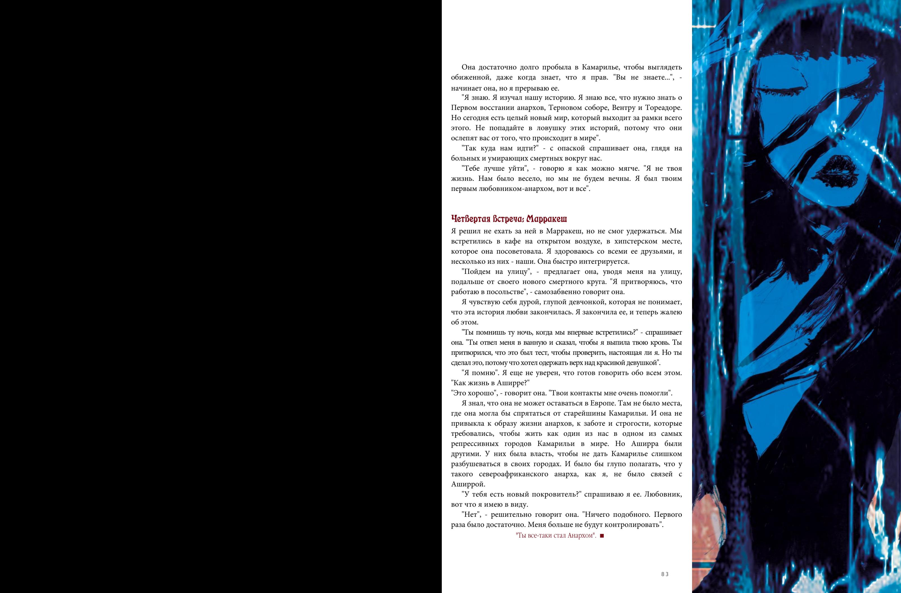

# I:IV:XV

Дорогие мои Дети,

Я хочу, чтобы вы знали, что я не держу на вас зла. Стать одним из нас - это всегда шок. Я помню, как это случилось со мной, и хотя я пытался облегчить вам задачу, придавая сцене соответствующий духовный контекст, я понимаю, что, возможно, мне это не удалось так хорошо, как хотелось бы. Позвольте мне рассказать вам кое-что о моей собственной биографии. Я бы хотела рассказать вам об этом с глазу на глаз, но вы сбежали раньше, чем я успела это сделать. Я благодарна вам за то, что вы выходите на связь, даже в письмах и в "мертвой зоне". На самом деле, я одобряю вашу интуицию в том, что вы избегаете электронных коммуникаций, поскольку они могут оказаться опасными для нашего вида.

Я нахожусь в ночи уже почти столетие.

В своем человеческом состоянии я изучала теологию, но не поэтому я была Объята. Моей прародительницей двигало горькое желание осквернить то, что она считала чистым. Когда я не была занята учебой, я работала волонтером в детском доме, и она увидела во мне святого, которого хотела уничтожить.

Это ирония, то, что произошло. Быть объятым не уничтожило меня и не обрекло на вечное проклятие. Оно возвысило меня, сделало святым. Я не видела свою сестру несколько десятилетий, но часто думаю о ней. Она хороший пример печальной ненависти к себе, которую порождают мифы, распространяемые в Камарилье.

# Церковь Кайна

Манчестер - хорошее место, чтобы стать одним из нас. Церковь Кайна имеет здесь большую организацию, и я была бы виновной в ложной скромности, если бы сказала, что это не из-за работы, которую я проделал как Filius Minor.

Это второй командир, после нашего лидера, Филиуса Майора. Возможно, скоро у меня будет шанс занять место лидера, так как мы планируем переместиться в вакуум власти, который сейчас существует в Лондоне.

Если вы встретите других людей, благословленных ночью, они могут использовать для нас другой термин: "Каинитская ересь". Чтобы понять, откуда это пошло, вы должны знать, что у нас очень долгая история, восходящая к ранним гностическим сектам, зародившимся после времен Христа. В течение долгого времени вампирическое понимание Кайна и нашей собственной роли развивалось во многих различных небольших сообществах. Только в 12 веке мы вышли на большой уровень вместе с катранами, поскольку понимание теологии катарами оказалось плодотворным и для нашего вида.

Катары также послужили хорошим уроком того, что происходит с правдоискателями, которые угрожают существующей иерархии власти. Они подверглись беспощадным гонениям, были заклеймены католической церковью как еретики и уничтожены во время крестового похода.

Жизнь каинитской веры стала очень трудной, когда даже смертные катары были уничтожены.

Важно понимать, что в это время католическая церковь была наводнена вампирами, особенно Ласомбрами, и они чувствовали, что наша правда угрожает их хватке власти.

# Догматы Веры

Основные догматы нашей веры изложены в Евагетаематиконе, также известном как Книга Сияющей Крови.

Его толкование менялось на протяжении многих лет, но основное моральное послание всегда оставалось неизменным. Она показывает, что материальный мир это клетка, созданная подчиненным творцом, которого мы часто называем Иалдабаот. Эта истина раскрывает по сути грубую природу материального мира, а вместе с ним и человечества.

Однако у человечества был момент искупления, когда Кайн убил своего брата Авеля.

В знак признания нравственного понимания мира Кайном Бог благословил его и поделился с ним истинной природой мира. В Бытие сказано: "Итак, кто убьет Кайна, тому отмщение будет семикратно".

Однако человечество было слепо к посланию Кайна, и поэтому родился другой пророк. Иисус Христос ходил по земле и учил, что употребление пищи и пролитие крови - это святое деяние, угодное Богу. Однако учение Иисуса было извращено земными властями и агентами демиурга Иалдабаофа, и в Библии можно увидеть лишь слабые проблески истины.

Церковь, созданная после Иисуса, это не истинная Церковь, а Церковь Пилата, ложное сооружение, призванное сбить человечество с пути.

Со временем Бог пошлет на землю пророка в третий и последний раз. Наши предки долгое время думали, что этот Третий Кайн придет, чтобы принести Геенну в 1239 году, но, очевидно, этого не произошло. Некоторые утверждают, что возрождение Церкви Кайна представляет собой третье пришествие на символическом уровне, поскольку мы помогаем донести до мира понимание истины Кайна.

# Истина

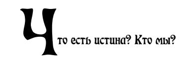

Мы святые, из своего рода, существа, благословленные святой энергией Бога, взятой из Крови Кайна и Иисуса Христа. Мы должны делиться своими благословениями с нашими смертными прихожанами. Когда они вкушают нашу Кровь, они благословляются силой и здоровьем, долголетием и сильным порывом проливать кровь. Признавая эту святость, они приходят к пониманию нашей святости и дарят нам любовь, которую мы заслуживаем.

Как Церковь, мы все еще подпольные, но наша настоящая цель - начать достигать все больше и больше смертных, в конечном итоге заменив ложную Церковь Пилата, начиная с англичан. Я знаю, что это звучит надуманно, но мы были благословлены бессмертием. Наши планы должны иметь амбиции, подходящие для ангелов Божьих.

Подумайте о том, что мы собой представляем: Мы сильны. Мы способны на чудеса. Наши тела остаются чистыми, не подверженными возрасту и болезням. Наша единственная слабость - солнце, но даже оно является частью нашего изначального благословения. Мы горим при дневном свете, потому что ложный демиург стремится скомпрометировать нашу миссию.

Теперь вы должны понять одну вещь: поскольку христианские церкви являются лишь филиалами церкви Пилата, моральные принципы и заповеди, приписываемые Христу и Богу, не имеют никакой силы. Они являются лишь жалкими требованиями ложного творца, сделанными для того, чтобы удержать нас от осознания нашей истинной природы. Грешить против этих предписаний - святое дело.

И еще одно... Так был ли Иисус на самом деле вампиром? Если вы задаете этот вопрос, то ответ - да. Однако я не думаю, что это правильный вопрос. Мы должны спрашивать не о том, был ли Иисус похож на нас, а о том, похожи ли мы на Иисуса. "Вампир" - это просто слово, и я боюсь, что оно направляет ваши мысли в неправильное русло. Вы представляете себе вампира проклятым, в то время как на самом деле мы благословлены. Иисус никогда не умирал на кресте, да и как он мог умереть, имея всю силу, которой Он обладал? Это всего лишь еще одна ложь, распространяемая церковью Пилата.

# Ненависть к самим себе

Многие из нас проповедуют отвратительную ненависть к себе. Это настоящая трагедия, которую совершила церковь Пилата. Если бы только больше вампиров поняли, что мы благословенные, вместо того, чтобы испытывать чувство вины из-за утомительных моральных идей, которые они проглотили, будучи людьми.

Это великий дар Кайна для таких, как мы: не нужно чувствовать себя виноватым за то, что ты вампир или пьешь кровь. Это таинство, и единственным преступлением было бы не поделиться его благословениями с человечеством. Я очень надеюсь, что по мере роста нашей общины и продолжения работы верующих в других городах, мы сможем начать заменять эти болезненные идеи о членовредительстве истинным Евангелием морального освобождения.

Я говорю о вере, но на самом деле от нас требуется меньше, чем церковь Пилата требует от своих последователей. Доказательство того, что я говорю, находится у вас, в вашей собственной плоти. Разве вы не могущественны? Разве вы не чисты, разве вы не способны жить без пищи и пищи, как святые древности? В Библии сказано: "Не допусти, чтобы Святый Твой увидел тление".

Пока вы прислушиваетесь к голосу крови внутри вас, всегда есть путь вперед. Никогда не поддавайтесь ненависти к себе, проповедуемой Камарильей, когда ваша истинная судьба - с Кайном.

# Извинение

Мне трудно, но я считаю, что то, как я решила принять тебя, было неразумно. За это я прошу прощения. Вы должны понять, что возможность привести человека в Божий свет это и огромная ответственность, и глубокая привилегия. Я была взволнованной, я хотела сделать это правильно, так, чтобы угодить Господу. Вот почему я похитила тебя из университета, привязала у алтаря и нараспев читал отрывки

из "Евагетаематикона".

Хотя это не очень важно, я знаю, что вы захотите спросить, поэтому я объясню, почему я была обнажена и покрыта кровью: Мы должны избавиться от ложной морали церкви Пилата. Мы должны покрыть себя святейшим из таинств, нашей собственной Кровью. В конце концов, "кто будет есть Плоть Мою и пить Кровь Мою, тот имеет жизнь вечную".

Глядя на это с вашей точки зрения, я понимаю, что опыт вскрытия, кровопускания и благословения в качестве вампира должен быть шокирующим. Однако я хочу, чтобы вы поняли, что я всегда буду рядом с вами. Через меня вы уже были спасены Кровью Кайна.

Твоя, V

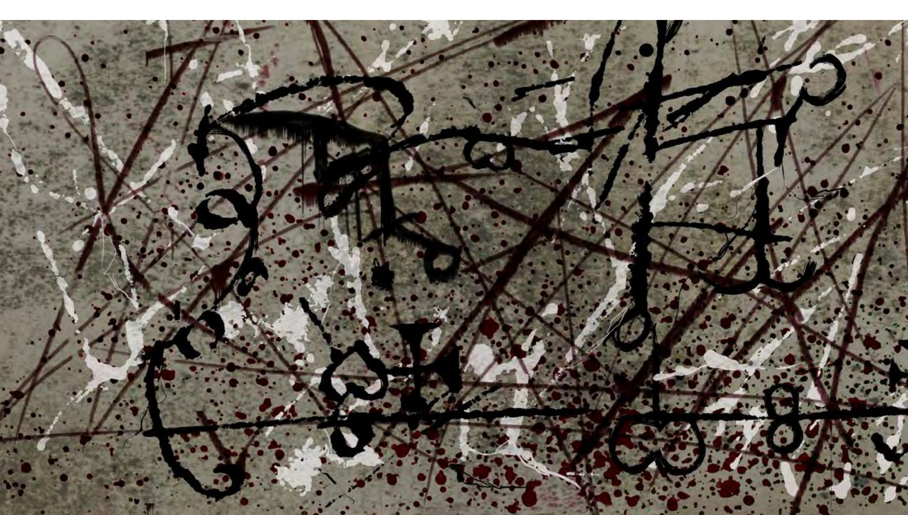

# Легенда о Кровавом Кхэве

Позвольте мне рассказать вам одну историю. Это не Джобург. Здесь, в приграничных районах, нет закона. Есть только охрана, нанятая горнодобывающими компаниями, и Кровавый Кхэвом.

Если кто-то вроде меня или вас страдает от несправедливости, что мы можем сделать?

Если компания хочет нас раздавить, что мы можем сделать?

Если полиция избивает нас во время одной из редких вылазок сюда, что мы можем сделать? Ничего.

Мы ничего не можем сделать, кроме как отдать свою кровь.

Это наш выбор. Это будет и ваш выбор. Кому вы отдадите свою кровь? Смотрите ли вы, как кровь вытекает из вашего разбитого рта на мокрый бетонный пол камеры заключения в шахтерском комплексе? Смотрите ли вы, как кровь хлещет из ваших ран после выстрела полицейского? Или вы отдаете частичку своей жизни Кровавому Кхэву?

В великих городах мира по ночам происходят вещи, в которые никто не поверит. Вы можете отправиться в Лондон или Нью-Йорк и рассказать им о чудовищах, разъезжающих в бродячих бандах и взимающих свою дань, и никто вас не послушает. Да и зачем? Для них эти вещи не реальны, как они реальны для нас.

Чудовище может охотиться открыто, если оно достаточно далеко от мира. Далеко от них, но не от нас.

Позвольте мне рассказать вам о том, как я впервые сдал кровь. Я была избита и изранена, сломана после спора на шахте. Я поняла, что они пришли, чудовища в ночи, по тому, как прекратились разговоры, пение и даже животные затихли. Странные мужчины и женщины двигались по лагерю, прикасаясь то к одному человеку, то к другому, искали, искали. Наконец они пришли ко мне.

"Ты знаешь мое имя?" "Да", - прошептала я.

"Скажи мое имя".

"Кровавый Кхэв", - смогла я.

"Этой ночью я не буду брать твою кровь. Я отдам тебе свою, и ты снова станешь целым. Но если ты примешь этот дар, каждый раз, когда мы придем, ты будешь преклонять колени и предлагать нам свою шею. И мы возьмем немного, достаточно, чтобы прокормить нас. Это твой выбор. Ты принимаешь мою кровь?"

"Я не хочу крови", - сказала я. "Я хочу мести". Они засмеялись. "Ты отомстишь". Я почувствовала вкус крови на своих губах. Я слизала ее, выпила, почувствовала ее внутри себя, маленький кусочек Кровавого Кхэва, дающий мне силу. Дающий мне силу.

Это наш договор. Отдай свою кровь не охранной компании, не полиции, а Кровавому Кхэве, и они используют ее силу, чтобы защитить тебя.

Являются ли они злом, спросите вы. Они демоны? Почему они ездят только по ночам? Почему они берут нашу кровь, нашу жизнь? Кто эти мужчины и женщины, которые выглядят как мы, говорят как мы, но не едят как мы?

Это дальний край мира. Истории о том, что здесь происходит, никогда не доходят до внешнего мира. Это не Африка и не Южная Африка. Это земля таких же людей, как мы, проклятых злыми существами, которые стремятся нагулять жирок от нашей жизни. Наш выбор - не между демоном и человеком. Это выбор между такими же, как мы, и горнодобывающей компанией.

После той первой встречи я видела их много раз. Я видела их лица, слышала их смех, чувствовала запах меди в их дыхании. Я узнала некоторых из них.

Бокамосо, чья жена была убита полицией.

Карабу, чье пение много лет назад мой двоюродный брат назвал прекрасным.

Леседи, который был искалечен в результате несчастного случая на шахте.

Тото, который хотел уехать, но так и не уехал.

Как гласит история, был день, когда все они пили воду и гуляли под солнечными лучами. Это правда: они чудовища, но это наши чудовища.

Позвольте мне рассказать вам о моей мести. Охранная компания разбила лагерь. У них были машины, оружие и пленные, такие как я. Они называли меня диверсантом.

Им не понравились слова, которые я использовала: Заработная плата. Компенсация. Права человека. Безопасность. Профсоюзы.

Они держали меня в клетке и время от времени тыкали в меня палками. Они играли в игры, мочились на меня, плевались и смеялись. Я сходила с ума от злости, изнемогала от боли, но все же понимала, что произойдет, когда я больше не смогу слышать животных.

Ночь была тихой, если не считать пения и проклятий.

Костер.

Испуганный вой собак. Хвастовство мужчин. Один из них, пошатываясь ко мне, расстегивая штаны, доставая свое мужское достоинство, бормоча о том, что он слишком много выпил, когда кусок металлической трубы прорвал его грудь.

В ту ночь я увидела истинное лицо Кровавого Кхэве. Я увидела человека, которого тащили по земле за кишки, оплакивающего свою мать.

Я видела, как раздавленная человеческая голова вытекала мозгами в костер. Я видела человека, который пытался бежать, но был слишком пьян, чтобы бежать, плакал и кричал, когда его разрывали на части. Я видела раненых, которых оставляли в живых на ночь, чтобы скормить падальщикам и хищникам саванны.

Они выпустили меня из клетки и дали мне немного своей крови, той же, что и в ту первую ночь.

К тому времени, когда я спасла других пленников, они были лишь шепотом в ночи.

Это была моя история, и это будет ваш выбор. Не обманывайтесь силой и легендой о Кровавом Кхэве. Он убийца и дьявол. Его последователи ведьмы и колдуны. Они никогда не дадут вам справедливости. Но они могут дать вам месть и жизнь. ■

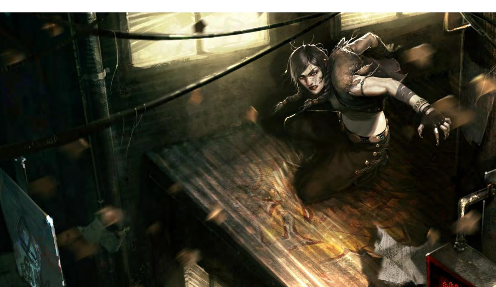

# The O

"Э то не то, что ты хочешь видеть на стене своего убежища", - сказал Луис, коснувшись рукой граффити. Краска все еще выглядела свежей на кафельной поверхности стены.

"Или где-нибудь в Милуоки".

"Милый домик", - ответила Агата Старек, оглядывая усаженную деревьями жилую улицу. Каждый симпатичный дом отличался от другого, что придавало району ощущение истории. По улице ехала на велосипеде девочка лет десяти, и Агата помахала ей рукой. "Жизнь в Камарилье согласна с тобой".

"Пошла ты, Агата", - рычал Луис, ударяя полячку в грудь. "Это твоя вина. Вот эта большая О".

Граффити было простым - большой белый круг. Его быстро нарисовали, но его значение было очевидно только для Проклятых. Смертные соседи, с которыми жил Луис, просто решили бы, что его дом испорчен.

"Не вини меня", - засмеялась Агата. Она не вписывалась в коллектив так, как Луис. Луи был слегка полноватым, хорошо одетым чернокожим мужчиной, которого можно было бы принять за графического дизайнера или журналиста. Он выглядел дружелюбным, немного занудным, как будто его легко смутить. Ничто в его внешности не говорило о том, что он вампир Анарха, бегущий от неприятностей по ту сторону Атлантического океана.

Главная проблема с Агатой заключалась в том, что она выглядела слишком счастливой. Казалось, она получала какое-то таинственное наслаждение, соблазнительную радость от своей бурной жизни.

"Один из основателей Освобождения был вашим слугой в Кракове. Он сказал, что вы морили его голодом, использовали в качестве мишени и убивали его детей", - Луис почти выкрикнул последние слова, прежде чем вспомнил, где он находится. В передней части своего пригородного убежища в Милуоки, болтаясь с известным террористом Анарха на территории Камарильи. "Ты создал это. О существует благодаря тебе. Мне пришлось бежать от этих засранцев, и они преследовали меня даже здесь. Это твоя ответственность, и ты должен мне помочь".

"Ты насильно связал своих слуг кровью. Вот почему О охотится за тобой. Они ненавидят это дерьмо. Они считают анархов, которые связывают людей кровью для своей службы, лицемерными монстрами. Вот почему они хотят освободить все Рен-поля и убить нас", - резонно объяснила Агата.

"Это еще не самое худшее", - шипел Луис. "Они распространяются. Чикаго вытеснил их, но они уже в Буффало, на севере штата Нью-Йорк. Наркоманы человеческой крови создают подражательные группы, называя себя "О". Они восстают против нас".

"Пойдемте в дом, пока вы не рассердились", - сказала Агата, направляя Луиса к входной двери его дома. Интерьер был выдержан в стиле тви: умные гравюры в рамке на стене, дизайнерская кухонная утварь на чистых прилавках. "Итак, чем я могу вам помочь?" спросил Агата, когда Луи в последний раз взглянул на тихую, приятную улицу, прежде чем закрыть дверь.

"Я поймал одного из них", прошептал Луис. "Он в моем подвале".

Доступ в подвал - это люк, спрятанный под ковром на кухне. Очень похоже на фильм в стиле слэшер, подумала Агата, спускаясь по лестнице в темное, сырое помещение, которое Луис использовал для того, чтобы прятать тела и другие признаки своего неживого образа жизни.

Крупный мужчина, одетый в потрепанный, заляпанный деловой костюм, попытался броситься на них, его удерживала цепь, соединявшая его воротник со стеной.

"Это игрушки для бондажа?" спросила Агата, когда Луис включил свет. Руки мужчины были скованы за спиной кожаными наручниками.

"Да", - самозабвенно ответил Луис. "У меня больше ничего не было".

"Ты вампир", - выругалась Агата. "У тебя должны быть основы, чтобы сдерживать человека и избавляться от тела всегда под рукой".

Большой мужчина замолчал, пытаясь понять, где они находятся, из-под черной наволочки, натянутой на его голову.

"Можете ли вы, например, допросить его?" Луис неловко посмотрел на мужчину. У него не было сил на настоящие пытки, не то что на те, которые, как он представлял, требовала эта ситуация.

"Конечно, дорогой", - сказала Агата и стянула неуклюжий капюшон с лица пленника. Ему было около сорока лет, щетина на щеках, белый среднеевропеец. "Ты раньше служил Луи".

"Да", - осторожно ответил заключенный на английском языке. "И вы пришли, чтобы убить его". "Да."

"Почему? Луис - хороший парень", Сказала Агата, повернувшись, чтобы улыбнуться Луису. Подвал был достаточно мал, чтобы все они находились близко друг к другу.

"Он убил мою семью". В голосе мужчины не было страха. Только покорность.

"Это лучшая практика, когда вы берете слугу!" запротестовал Луи. "Нам нужно защищать Маскарад. Однажды, когда я сделал себе помощницу, ее брат пришел за ней и чуть не убил меня. Это не было личным".

"Я знаю, кто ты, Агата Старек". Заключенный посмотрел Агате в глаза. "Мы все знаем".

"Что ты хочешь выяснить?" Агата спросила Луиса. "Мы знаем все, что этот человек может рассказать. Он вступил в О, когда сбежал от вас в Швейцарии.

Теперь он последовал за вами сюда, разрушая "Кровные узы" и по ходу дела обучая американских наркоманов самоуважению. И он не единственный. Их много, они организованы. Я даже подозреваю, что они сливают наши секреты Второй Инквизиции. Признай, Луис, мы - Камарилья для этих людей".

Луис неуверенно посмотрел на пленника. Он не считал себя настоящим убийцей, хотя и убивал. Он старался жить хорошей, простой жизнью, не причиняя вреда окружающим больше, чем это необходимо. Сначала он жил как Анарх, а теперь вступил в Камарилью, но на самом деле его не интересовали все эти политические игры.

"Послушайте, я не плохой парень", - запротестовал Луис. "Я просто хочу жить в мире".

"Ты знаешь, что я собираюсь сделать", - сказала Агата, поглаживая лицо заключенного. "Я собираюсь отпустить этого парня".

"Он попытается убить и тебя", - прошипел Луис. "Ему помогут, и они придут за нами".

"Конечно. Но мне нравится их дух", - сказала Агата, улыбаясь связанному мужчине. "Он довольно сексуальный, ты не находишь? На самом деле, я думаю, что обниму его. Давайте хоть немного оживим нашу жизнь". ■

# Служение Министрийской любви

# Запись домашнего наблюдения (частный дом, Стокгольм, 12 апреля 2018 года)

Спикер 1 (девушка)_:_ Так вот как мы будем это называть? Министрийская любовь?

Спикер 2 (девушка)_:_ Да. Почему?

<sup>С</sup>пикер _1:_ Разве это не должно быть что-то вроде Министрия крови, Багровой курии или Храма Сета?

Спикер _2:_ Ну, во-первых, некоторые из этих имен уже заняты. Во-вторых, подумайте, что за культ мы здесь создаем. Кому он адресован.

Спикер _1:_ Я подумала, что мрачные и кровавые цвета будут хорошо сочетаться со всем древним выводком Сета, который у нас есть.

Спикер _2:_ Позвольте мне рассказать вам одну историю. Это было, когда меня только что взяли в министрии. Я приехала в Швецию, когда мне было пять лет, из Ирака. У меня был большой опыт общения с этими ультраправыми отморозками.

Спикер _1:_ Разве эти парни не стали бы хорошим пушечным мясом?

Спикер _2:_ Не перебивай. Я твой сир. Спикер _1:_ Ты проработала в Министриях на год дольше, чем я.

Спикер _2:_ Тише. В любом случае. Я подумала, что создам себе культ крови. Знаете, как нам говорят. У меня была идея, что я смогу отомстить этим нацистским уродам, вовлечь некоторых из них в культ, заставить их влюбиться в меня.

Спикер _1:_ Вы иракец. Как вы [неразборчиво]

Спикер _2:_ Вы серьезно спрашиваете меня, может ли какой-то двухголовый скинхед устоять перед соблазном дочери министрия? Пожалуйста.

Спикер _1:_ Отлично, отлично.

Спикер _2:_ Короче говоря, это сработало. Я заставила их стоять на коленях перед Одином, Ёрмунгандром и прочими, пить мою кровь, и всё такое. Но потом все пошло наперекосяк.

Спикер _1:_ Они приняли вас за араба и решили убить?

Спикер*:* **2:** Что? Нет. Ты что, не слушала?

Спикер _1:_ Так в чем проблема? Похоже, вы справились.

Спикер _2:_ Если вы хотите руководить сектой, вам нужно проводить время с ними. Вы хотите проводить время в клубе альтруистов?

Спикер _1:_ Нет... Я поняла. Нахуй этих парней.

Спикер _2:_ Чертовски верно. Пару недель с этими засранцами, и я ввела понятие ритуального самоубийства в нашу теологию.

Спикер _1:_ Ничего себе, правда? Не слишком ли это экстремально?

Спикер _2:_ Может, и так. В мою защиту скажу, что они были слабаками, большинство слишком напуганы, чтобы покончить с собой.

Спикер _1:_ То есть вы хотите сказать, что мы называем его "Министрийская любовь", чтобы привлечь людей, с которыми менее утомительно общаться.

Спикер _2:_ Да, именно так.

Спикер _1:_ Давайте подумаем еще раз.

# АНАЛИТИЧЕСКИЙ ОТЧЕТ**:**

Расшифровка предполагает, что эти бестелесные тела занимаются созданием подпольных религиозных культов для маскировки своей деятельности. Обратите внимание на повторение термина "Министрий" в различных контекстах, включая религиозные структуры "Церкви Каина" и "Бахари". "Бахари".

Гипотеза: Церковь Кайна и Бахари могут быть подгруппами огромной религиозной организации под названием Министрии.

Альтернативная гипотеза: Министрии являются подгруппой чистых органов, также присутствующих в Церкви Кайна и Бахари.

Предложение: Отправьте оперативника внедриться к Министриям любви, созданное объектами наблюдения.

В идеале - член Общества Святого Леопольда, чтобы противостоять индоктринации пустых тел. Поручите инфильтратору проверить вышеуказанные гипотезы.

# Çàïèñü âíóòðåííåãî íàáëþäåíèÿ, ñäåëàííàÿ îïåðàòèâíèêîì ïîä ïðèêðûòèåì "Mayfly" (ñêðûòûé ïîäâàë ïîä êëóáîì "Pressen", Ñòîêãîëüì, 28 èþíÿ 2018 ãîäà)

Спикер _1:_ Пойдемте со мной. Пришло время для твоего посвящения в [неслышно] избранные Фиванцы.

_Mayfly:_ Да, Пророк. Спикер _2:_ Лягте на алтарь. Закройте глаза. Да, именно так. Пусть ваши ладони упрутся в камень. Почувствуйте прохладу. Возраст. Прислушайтесь к звуку моего голоса. Почувствуйте, как погружаетесь в объятия древних. Вы почувствуете небольшой укол в запястьях. [Не имеет значения.

### _Mayfly:_ Что...

Спикер 1: Не говори, просто почувствуй мое прикосновение к своей коже.

_Mayfly:_ Пожалуйста, могу я просто спросить [неслышно]

Спикер _1:_ Не волнуйся, милая. Время [неслышно] будет позже. Открой рот. Да, вот так.

[неразборчивые стоны]

Спикер _2:_ Жала, что ты делаешь? Там снаружи люди ломают дверь. Нам нужно уходить прямо сейчас.

Спикер _1:_ Что? Что ты здесь делаешь, Элин? Я просто посвящаю Курта в тайны.

Спикер _2:_ Ты голая, сидишь на трупе. Пожалуйста, Жала, [неслышно] уходи.

Спикер _1:_ Он не труп. Он такой сладкий на вкус.

Спикер _2:_ Ради всего святого, Жала.

Спикер _2:_ Мы уходим прямо сейчас.

### АНАЛИТИЧЕСКИЙ ОТЧЕТ**:**

Агентство, выполнявшее задание по проникновению, отправило группу захвата, как только стало очевидно, что оперативник был скомпрометирован. К сожалению, они не смогли добраться до оперативника вовремя, чтобы предотвратить его воздействие загрязняющего вещества на пустые тела.

Кроме того, два пустых трупа сбежали через канализационный проход, которого не было на схемах зданий, использовавшихся при планировании миссии.

Рекомендация: Будущие попытки внедриться в операции по созданию "Министриев" класса пустых тел должны быть ограничены до тех пор, пока не будет точно установлена способность этих существ к психическому воздействию.

Рекомендация: По мнению этого аналитика, записи наблюдения должны подвергаться цензуре, чтобы избежать подозрений в заражении оперативников. Общество Святого Леопольда придерживается политики нулевой терпимости в отношении зараженных оперативников. Если мы хотим изучить образец, Общество должно считать, что оперативник был потерян в ходе операции по очистке зараженного места.

# Запись домашнего наблюдения (движущийся автомобиль вблизи Стокгольма, 10 июля 2018 года)

Спикер 1: Как они всегда узнают, где мы находимся? Я серьезно. Нам приходилось менять местоположение каждую ночь. Мы избежали двух полицейских операций.

Спикер _2:_ Им просто повезло.

Спикер _1:_ У меня есть догадка. Дай мне ту статую Кали, которую ты купила на уличной распродаже.

Спикер _2:_ Ты за рулем.

Спикер _1:_ Статус. Сейчас.

Спикер _2:_ Хорошо. Что за [неслышно].

Вы [неразборчиво] просто выбросите [неразборчиво] из [неразборчиво]

# [сигнал наблюдения утерян]

# Что случилось с красным ответом?

# **BY:** ЧИНАСА АДЕЙЕМИ

Бывших членов "Красного вопроса" преследовали в Камарилье и подвергали остракизму Анархи, но в 2008 году они использовали финансовый кризис, чтобы нанести удар по власти Камарильи.

> В течение нескольких коротких лет группа "Красный вопрос" доминировала в дискуссиях вокруг Анархического движения. Красный вопрос" всегда был чем-то вроде тайны, предпочитая действовать онлайн и держать в секрете свое членство. Они много говорили, обещая новую эру анархо-политики. В какой-то момент истории казалось, что им это удастся.

> "Красный вопрос" безнаказанно высмеивал Камарилью, ее членов и институты. В его рядах были тремерские отступники, несмотря на традиционно агрессивное отношение Пирамиды к любому, кто хочет покинуть Клан. Она нападала на сложившуюся структуру власти Анархов, изображая таких знаменитостей Движения, как Сальвадор Гарсия, Джереми Макнил и Улыбающийся Джек, как устаревших завсегдатаев.

> "Красный вопрос", казалось, мог атаковать кого угодно, защищенный анонимностью и технологиями.

> Когда Красный вопрос заявил о своей ответственности за финансовый кризис 2008 года, многие им поверили. Они уже надрали нос стольким князьям, почему бы не пустить под откос всю мировую экономику? Сейчас, спустя десять лет после дней славы "Красного вопроса", легко списать их заявления на пустословие. Сегодня Красный вопрос вспоминают как всплеск более невинной эпохи интернет-политики, когда мы все еще верили, что социальное освобождение может прийти из Силиконовой долины, как для людей, так и для сородичей.

> Тем не менее, было бы ошибкой списывать со счетов "Красный вопрос" и его достижения. Они в высшей степени умели выводить людей из себя, но они одержали самую значительную победу над Камарильей в текущем тысячелетии, по крайней мере, до тех пор, пока Тео Белл не освободил Бруха из Башни из слоновой кости.

# Видео

В 2010 году по частным вампирским сайтам и сетям начало распространяться видео. Многие из нас, кто был в то время рядом, увидели его и поделились им, тем более что отношение Сородича к безопасности в сети тогда было гораздо более вялым. Видео, похоже, было снято в 2001 году и просочилось из внутренних коммуникаций "Красного вопроса".

На видео мы видим, как тремер Моника "Lady_Hemlocke" Чанг отравляет другого тремера по имени Дэвис. Видео снято камерой, которую сама Чанг установила, чтобы записать это событие и передать его своим сородичам в зарождающемся Красном вопросе.

Когда Дэвис умирает, Чанг не может удержаться от злорадства по поводу своих будущих планов. Она играет для своей тайной аудитории в Интернете, используя Дэвиса как реквизит, чтобы похвастаться своим мастерством в области сетевых систем. В самой известной цитате из видео она говорит: "Атлас официально пожимает плечами", ссылаясь на роман "Атлас пожимает плечами" Айн Рэнд.

Просматривая видео сейчас, спустя двадцать лет, можно увидеть, что оно предвещает многие темы, которые стали симптоматичными для Красного вопроса. Привыкнув проводить операции против технологически невежественных организаций Камарильи, Красный Вопрос развил культуру оперативного высокомерия. Ранняя бравада Чанга является хорошим примером этого и указывает на провалы в рабочей культуре, из-за которых произошла утечка видео. Это свидетельствует о приоритете личной свободы, демонстративности и организации, разбросанной на большой территории и связанной через Интернет.

Видео намекает на то, что Чанг считает себя одиноким провидцем, который хочет изменить мир благодаря своим уникальным талантам, а не традиционной для анархов тактике создания движений, по-литической пропаганды и продолжительного повстанческого активизма.

Когда видео просочилось, многие в Движении Анарха впервые почувствовали, что, возможно, Красный Вопрос не был неуязвим в конце концов.

# Лозунг

В годы, предшествовавшие финансовому кризису, казалось, что невозможно попасть на вечеринку анархов, не получив копию манифеста "Красный вопрос". По своей повсеместной распространенности он бросил вызов основополагающему манифесту анархов, опубликованному Сальвадором Гарсиа.

Обращенный к "Согражданам по крови", манифест построен вокруг одного главного вопроса: Почему вы подчиняетесь? Манифест утверждает, что молодой Анарх по своей природе понимает современные технологии лучше, чем древние сородичи Камарильи. Это понимание можно использовать в борьбе за свободу, перенеся битву в ту сферу, где Камарилья слаба.

Избегая физических столкновений, используя смертные активы и взламывая банковские и правительственные системы, анарх может свести на нет преимущества, которые дают камарильскому вампиру возраст и кровь.

Манифест не является работой по созданию движения, а скорее направлен на то, чтобы повлиять на людей таким же образом. как это сделал лозунг "Кто такой Джон Галт?" в романе Айн Рэнд. Одаренные движители мира будут вдохновлены им, чтобы заявить о своей независимости.

Ссылка в видеоролике Моники Чанг на "Атлас расправил плечи" показательна. В романе представлена философская схема, в которой люди делятся на гениев и паразитов. Гении поддерживают мир в движении, а паразиты пытаются поживиться за счет их достижений. Популярная философия среди миллионеров Силиконовой долины и студентов колледжей, она сосредоточена на индивидуальных достижениях и эгоизме как моральном благе.

Это привлекательная философия для тех, кто хочет быть признанным за свои таланты, но для "Красного вопроса" она породила больше поклонников, чем последователей. Оказалось, что в действительности лишь очень немногие вампиры Анарха обладали способностью стать компьютерными хакерами достаточной квалификации, чтобы проникнуть в системы банка.

# Крушение

Найти окончательную правду о какомлибо событии в истории Сородича очень сложно. Мы стремимся поддерживать Маскарад, и лжецы среди нас не редкость. Тем не менее, я поговорил с несколькими смертными экспертами по финансовому кризису 2008 года. Я также опросил многих оставшихся в живых бывших членов "Красного вопроса". На основании того, что они мне рассказали, я могу сказать, что Красный вопрос не был причиной финансового кризиса 2008 года.

Кризис был вызван безудержным дерегулированием финансовой отрасли и широко распространенными злоупотреблениями в глобальных финансовых институтах, таких как Lehman Brothers, четвертый по величине инвестиционный банк в США на момент его банкротства.

Коренные причины катастрофы кроются в чрезвычайно сложном взаимодействии тысяч факторов по всему миру, все они хорошо задокументированы в правительственных и журналистских исследованиях, проведенных с тех пор.

Однако было бы слишком упрощенно утверждать, что Красный вопрос не имеет к этому никакого отношения. Как и Сородичи на протяжении всей истории, они видели, что происходит, и использовали катастрофу в своих интересах. С тех пор стало очевидно, что Красный вопрос успешно манипулировал происходящим во время катастрофы, чтобы уничтожить значительную часть богатства Камарильи. Это предполагает, что Красный вопрос был хорошо информирован об активах Камарильи, что является впечатляющим подвигом активистского шпионажа.

# Падение

Тактика "Красного вопроса" по захвату богатства Камарильи была успешной и значительной, но она не принесла им никакой помощи со стороны созданного Движения Анархов.

Для этой статьи я взял интервью у писателя-анарха Сальвадора Гарсиа и спросил его, не пора ли Движению предложить свою защиту бывшим членам "Красного вопроса".

"Я не отрицаю достижений Красной партии", - признался Гарсия. "Но в Движении они были раскольнической силой. Их победы были краткосрочными, но ущерб, который они нанесли нанесенный ими нашей внутренней организации, был слишком значительным, чтобы мы могли с ними сотрудничать".

Хотя Гарсия хотел придать этому хорошее настроение, было очевидно, что он все еще не отошел от насмешек, которые Красный вопрос обрушил на него во время своего расцвета. Как и многие лидеры Анархов до него, он отдавал предпочтение личной мести, а не выживанию Анархов, которые добились успеха в борьбе с Камарильей, пусть даже на короткое время.

Так что случилось с "Красным вопросом"? Получила ли их Камарилья? Стали ли они жертвами лидеров Анархов, которых они оскорбили? Для отдельных членов "Красного вопроса" оба эти варианта могут быть верны. Некоторые из них все еще существуют, никогда не раскрывая своей принадлежности к Красному Вопросу, или живут в анонимности.

Лучший ответ на этот вопрос прост. "Красный вопрос" - это группа, организованная в Интернете и пытавшаяся бороться с Камарильей в сети. Возможно, мы никогда не узнаем, что случилось со многими активистами "Красного вопроса", но их исчезновение совпадает с рассветом Второй инквизиции. ■

Чинаса Адейеми - журналистка нигерийского происхождения, которая, будучи человеком, писала для CNN, New York Times, Guardian и BBC. После своего "Объятья" она посвятила свое время освещению революции анархов для более узкой аудитории.

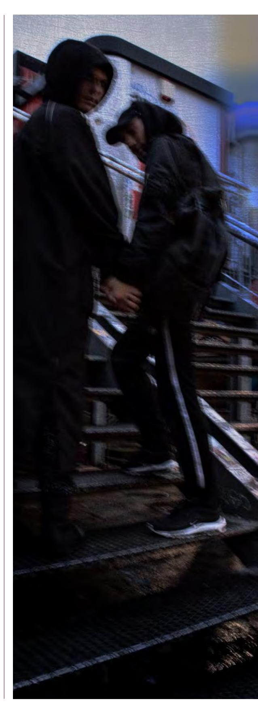

# Откровения Темной Матери

Л илит учит, что понимание приходит через боль. В прежней жизни я бы с этим не согласилась. Я думала, что боль только уменьшает нас, превращает в сломанные вещи. Так мне казалось, когда я имела дело с требованиями моей семьи, трудностями в университете, дерьмовыми бойфрендами...

У меня был tumblr, где я писала обо всем, что не могла сказать вслух в течение дня.

Она сказала мне, что хочет сделать из людей учеников Лилит, пока они еще молоды. Она сказала, что я реализую свой потенциал ночью, а не днем. Она призналась, что ей нравится мой tumblr.

Я была влюблена в нее, в некотором роде. Я хотела быть ею, и когда она предложила мне присоединиться к Бахари, я согласилась, даже если не совсем понимала, что она имеет в виду.

Она забрала у меня все. Она разрушила мою жизнь, уничтожила мою семью. За дветри короткие ночи все, кого я когда-либо любила, были разбросаны мертвыми по всему дому. Я была безумна от страха, бегала с места на место, слишком напуганная, чтобы понять, что происходит. Я знала, что она делает это со мной, но все равно бежала к ней, и когда я увидела ее, я увидела Темную Мать. Я стояла перед ней на коленях и видела чудо и красоту, ужас и благоговение. Это было последнее, что я видела как смертный человек, даже когда она высасывала из меня мою кровь.

Кровь, принесшая меня в ночь, была горькой, смешанной с экстрактами священных растений и даже хуже. Я пила ее с жадностью, растерянная, испуганная, живой. Невероятно живой. Она дала мне слова клятвы Лилит, и я пела их, бормотала, говорила.

Кровь изменила мое тело, но потеря дала мне силы. ■

- Флоренсия, неонат из Гангрел

Я не являюсь тем, кого можно назвать духовным человеком. Я не была религиозной в жизни и никогда не думала, что буду испытывать такое желание в смерти. Я материалистка до мозга костей.

> И все же... Я навещала друзей в Лондоне, набила морду Камарилье... Ну, вы знаете, веселые вещи. Мы случайно нашли убежище Голубой крови и разгромили его, заставив маленького ублюдка спасаться бегством.

> После этого мы устроили вечеринку на складе, где мои друзья было их общее убежище. Мы танцевали, напились, а потом мои друзья сказали мне, что собираются провести ритуал. Они сказали, что я не обязана участвовать, если не хочу, но что я могу сказать. Я люблю пробовать новые вещи.

> Они осветили внутренний двор, увитый лианами, сорняками, растущими из трещин в бетоне. Это было ветхо и красиво, и когда остальные начали раздеваться, я тоже это сделала. Мне казалось, что так и должно быть.

> Не было четкого лидера ритуала. Песнопения начинались спонтанно и менялись по собственному желанию, некоторые из них были понятны, а многие - на каком-то мертвом языке. Я потеряла себя в движении, напевая, танцуя, улюлюкая, обходя вокруг нашей жертвы.

> Он был стариком, слугой, которого мы захватили во время вторжения в дом. Кровавый наркоман. Он хныкал и плакал, и каждый из нас подходил к нему, даря ему боль. Я опустился на него и держал его, надавливая на грудину так, чтобы треснула кость.

> В тот момент я почувствовала чтото новое. Как будто я давала что-то этому человеку, подарок, который он заберет с собой, уходя из жизни. Я никогда раньше не испытывала ничего подобного.

Думаю, в тот вечер я стала бахари или, по крайней мере, подражателем бахари. Я попрежнему мало что понимаю в литургии, но истина в ритуале говорила со мной.

Кроме того, мне нравится, что во всех историях Бахари Люцифер, по сути, является приятелем Лилит. Он горяч, доступен и у него большой меч. ■

- Агата "благочестивая

паломница" Старек, провокатор

анархов

Бог создал Адама и Лилит по своему образу и подобию, чтобы они служили и почитали его, как пара для размножения, чтобы начать новую расу.

Лилит отвергла эту участь и сбежала из Эдемского сада, чтобы в одиночку бродить по пустошам. Она страдала от голода и холода, и страдания научили ее питаться собственной кровью, зарываться в землю, чувствовать каждый камень и песчинку и охотиться на всех существ, скрывающихся за пределами Эдема.

Лилит создала свой собственный Сад, чтобы соперничать с Садом, созданным Богом. Она вступила в связь с Люцифером, лучшим ангелом Бога, который стал ее любовником.

Тем временем Бог создал Еву как замену Лилит, сделав ее уступчивой и покорной, чтобы она выполняла свою роль. Со временем у Адама и Евы родились дети, и первого из них звали Кайн. Как и Лилит, Кайн возделывал землю и, как и Лилит, он потерял благосклонность Бога. Обидевшись на то, что его отвергли, он разгневался и убил своего брата Авеля.

За это Бог отверг его, назвав изгоем и обрекая на пустыню.

Кайн пришел в Сад Лилит сломленным, отчаявшимся существом, умеющим только убивать. Лилит ухаживала за ним, воспитывала в нем силы и преподавала ему уроки боли. И все же Кайн был боязливым и трусливым существом. Он научился многому, но так и не познал гордости.

Со временем Кайн ушел и одарил многих своим проклятием. Его выводок стал таким голодным, что он привел их обратно в сад Лилит, чтобы поддержать их и дать им богатство. Это было предательством Кайна: он смотрел, как его отпрыски опустошали творение Лилит и использовали все, что в нем было.

Такова была судьба Лилит: Преданная Богом и Кайном, поддерживаемая дарами боли. Вот почему мы не являемся последователями Каина. Мы не "каиниты". Мы - Бахари, идущие своими путями, далекими от законов Каина и велений Бога, с Лилит в качестве нашего проводника. ■

- Рэйчел Долиум, правдоискатель Бахари

В ера бахари иногда трудно поддается определению, поскольку различные культы имеют свои собственные интерпретации мифа о Лилит. Некоторые превращают ее в супругу Бога, низвергнутую за грех непослушания, а другие считают, что все вампиры - ее дети.

Все культы имеют некоторые общие черты. Все почитают Лилит, все почитают боль и понимание, которое она приносит, и все отвергают абсолютный закон. Каждый бахари должен найти свой собственный.

Как вера бахари вписывается в ландшафт различных вампирских сект? Для Шабаша на этот вопрос ответить проще всего. Бахари отрицают главенство Кайна, и из-за этого их считают еретиками, за которыми охотится внутренняя инквизиция Шабаша. Действительно, в большинстве историй о бахари Кайн предстает в очень нелестном свете, как жадный, грязный неблагодарный человек.

Для Камарильи Бахари - это незначительный культ, тайно практикуемый некоторыми членами, но не имеющий никакого реального положения.

Секта, где Бахари действительно расцвели, особенно в последние годы, - это Анархи. Евангелие Бахари о свободе, боли и самопожертвовании находит отклик у многих молодых лилит, которые с подозрением относятся к патриархальному мифу о создании Кайна. В то время как Кайн, кажется, выступает за подчинение старшим, Лилит проповедует сомнение в силе и отвержение авторитета. Неудивительно, что ее миф имеет больше смысла среди несвязанных. ■

# Чтобы понять бахари, нужно понять общину. Это касается любой религии, нас среди всех остальных. Вы можете следовать за Лилит, но чтобы присоединиться к общине, вы должны пройти инициацию.

Они могут быть жестокими, но после инициации вы больше не являетесь ребенком Кайна. Вы получили духовное освобождение и можете присоединиться к тем, кто обрабатывает Сад Лилит.

Это чувство свободы объединило многих из нас. Обряды, которых требует Лилит, жестоки, но эта жестокость имеет цель, позволяя нам найти свои собственные места в ночи.

В этом парадокс бахари: Мы должны найти свои индивидуальные истины, но часто путь к ним лежит через сообщество. Когда вы сражаетесь с коррумпированным князем Камарильи (а кто когда-нибудь слышал о князе, который не был бы коррумпирован?) или убийцейпсихопатом Шабаша, полезно знать, что Темная Мать с вами, и вознаградит ваши потери мудростью и знанием.

Большинство бахари не занимаются миссионерской деятельностью, но мы объясняем путь Лилит, если нас об этом просят. В эти ночи нам не нужно вербовать. Молодые лилики приходят к нам, ища ответы, которые можем дать только мы. В теологии Кайна и Книге Нода для них нет надежды, но Лилит и ее последователи могут дать им то, ради чего стоит жить. Если они переживут уроки. ■

- Неджа, Ласомбра Бахари

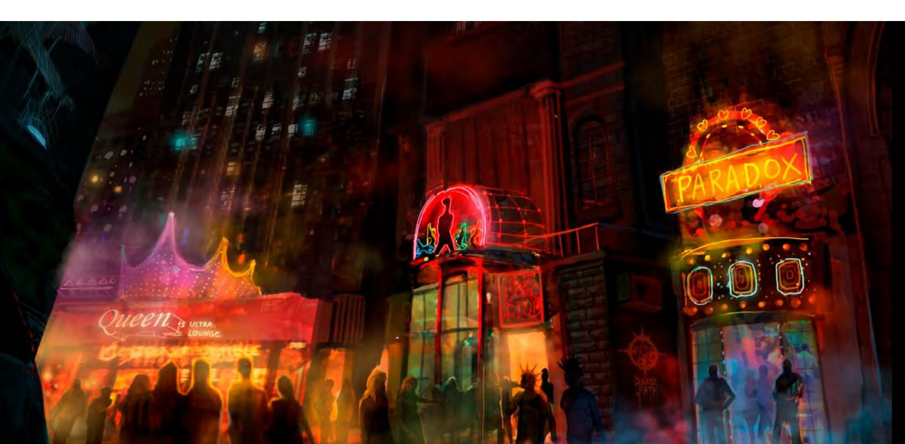

# - Яак Вайно, эстонский Тореадор Бахари

# Luzern Kommune

# /_Lucerne Commune_

# Добро пожаловать !

Меня зовут Леония Лан-генштайн, и я буду вашим гидом во время посещения коммуны Люцерн, или, как мы любим ее называть, замка.

Расположенная недалеко от прекрасного города Люцерн, эта местность была заселена людьми и представителями нашего вида уже очень давно. Церковь Святого Леодегара в городе была построена на фундаменте римской базилики в 1633 году, а на том же месте уже в 8 веке существовало аббатство, освященное Святым Морисом.

Из исторических записей и из живой памяти старейшин нашего рода мы знаем, что это аббатство было в наших руках. Это яркий пример того, как живая и мертвая история переплетаются друг с другом.

Хотя наша коммуна имеет много общих концепций с современным вампирическим движением Анархов, мы гордимся своим чувством истории. Останетесь ли вы в замке или отправитесь на прогулку по Люцерну, история неизбежна, это часть наследия, частью которого вы станете, присоединившись к нам.

Сейчас, когда мы входим в главное здание замка, я хочу, чтобы вы огляделись вокруг. Сам замок построен в 14 веке, но в 2016 году он был капитально отремонтирован. Если вы решите инвестировать в предприятие и переехать, то найдете предоставленные вам помещения комфортными.

Тем не менее, мы - сообщество, и как сообщество мы также ожидаем, что наши члены будут вносить свой вклад в ночное функционирование замка.

Наш человеческий персонал будет обслуживать и управлять объектами, но члены организации будут принимать активное участие в управлении нашим предприятием и обеспечении соблюдения правил, которые делают его возможным. Люцерн - небольшой город, поэтому наш вид должен ограничивать свои злодеяния в основном туристами.

Большую часть 20-го века замок использовался как санаторий для богатых клиентов-люцернцев, а в конце 80-х годов пришел в запустение. Изменения, внесенные в замок для целей санатория, идут на пользу и нам, поскольку позволяют нам обслуживать наших новых членов здоровым режимом минеральных ванн, призванных успокоить нервы и смягчить животный голод, который мы все чувствуем внутри себя.

Прежде чем мы пройдем в большой зал, я обращу ваше внимание на великолепный вид из этих окон. Мы находимся в Альпах, и мы считаем, что одно из чудес современной эпохи заключается в том, что благодаря усилиям смертных по освещению наш род может наслаждаться пейзажем, по крайней мере, в некоторой степени даже ночью.

Теперь, когда мы пришли в большой зал, я уверен, что вы заметили все гербы на стенах. Я уверен, что позже вы захотите рассмотреть их поближе, так как удивительное их количество говорит об истории нежити в замке до его использования в медицинских целях. Действительно, один из уроков истории этого региона заключается в том, что за богатством и властью всегда скрывался один из нас, живущий за счет роскоши, создаваемой людьми.

Прежде чем мы продолжим, я хотела бы сказать несколько слов о наших принципах. Это анархо-корпоративистская коммуна. Вы все относительно молодые, богатые вампиры, если говорить прямо. Вы задаетесь вопросом, как вы можете продолжать наслаждаться тем уровнем жизни, к которому вы привыкли, будучи людьми. У вас есть необходимые средства, чтобы купить наше предприятие, но вы не уверены, действительно ли это то, что вам нужно.

Вам действительно стоит задать себе эти вопросы. Нам нужны обязательства со стороны наших членов, и мы не хотим продавать это никому, кто не собирается здесь жить. Анархо-корпоративизм означает, что мы очень серьезно относимся к нашим контрактам. Мы стремимся отделиться как от смертного государства в виде государства Швейцария, так и от неживого государства в виде Камарильи или любой другой подобной структуры. Если вы купите нас, вы получите долю крови, доступной для экстракции из Люцерна и близлежащей сельской местности.

Это не дом отдыха для членов Камарильи, спасающихся от стресса Второй Инквизиции, и не домашняя база, которую можно использовать для достижения своей цели - нанести удар по Князю. Это убежище, новый вид коммуны для тех, кто принадлежит к нашему роду. Ваша жизнь здесь будет приятной, вас будут обслуживать в том стиле, к которому вы привыкли, но против внешних угроз от вас будут ожидать стойкости и воздержания от самого распространенного греха нашего рода - трусости.

Перейдем к более приятным темам... Перейдя во внутренний двор, вы увидите оранжерею, возведенную на территории отеля в 19 веке. Построенная в соответствии с самыми модными идеями той эпохи, она также является местом проведения многих интересных экспериментов по питанию растений нашей кровью. Однако спешу вас заверить, что все слухи о кровожадных лозах-убийцах это преувеличение. Реальность гораздо более обыденна.

Да? У вас есть вопрос?

О, конечно. Слухи. Да, вероятно, где-то в катакомбах под замком спят по меньшей мере два древних вампира. Однако из-за изнурительной протяженности туннелей мы не смогли исследовать их все и подтвердить, правдивы ли эти истории.

Несмотря на это, они очень удобны. Наличие этих слухов дало нам определенную свободу от агентов Камарильи, которые в противном случае могли бы нарушить то, что мы пытаемся здесь построить.

Как вы знаете, проект финансируется трастовым фондом. Если вы захотите участвовать в проекте, вы должны будете внести в траст десять миллионов евро, но вы, естественно, можете внести и больше. Эти средства будут использованы для трех целей: На ремонт и содержание, на инвестиции, которые будут финансировать будущую эксплуатацию замка, и на текущие расходы обслуживающего персонала. Если впоследствии вы решите покинуть замок или будете изгнаны из него голосованием своих товарищей, эти средства будут потеряны.

Я знаю, что мы уже многое увидели. Я предлагаю остановиться на минутку в Зеленом салоне, чтобы подкрепиться, прежде чем мы осмотрим Охотничий домик и Сломанную башню. ■

# Я верю в Тео Белл/ К черту Тео Белла

БЕСЕДА МЕЖДУ САЛЬВАДОРОМ ГАРСИА, АВТОРОМ ОРИГИНАЛЬНОГО МАНИФЕСТА АНАРХОВ, И АГАТОЙ СТАРЕК, УБИЙЦЕЙ ИЗ КРАКОВА.

> **agata:** Я слышал, как ты говоришь гадости о Тео Белле. Почему, Сальвадор? Зачем ты это делаешь? Он лучший!

**salvador:** Он не самый лучший.

**agata:** Конечно! Я люблю его! Его биография так привлекательна. Родился рабом на американском Юге, работал на хлопковых полях под руководством жестокого надсмотрщика. Мечтает отомстить за разлуку с семьей, за издевательства, которым подвергалась его мать. Потрясающая вещь!

**salvador:** Я знаю историю. Он бежал на Север, связался с Подземной железной дорогой, спасал рабов. Мне нравится, что они всегда говорят, что он спас тех, кого "посчитал достойными спасения".

**agata:** Именно! Это идеальный фон для Анарха. Он посвятил свою жизнь помощи другим.

**salvador:** Осуждение других.

**agata:** Он поднялся из ничего!

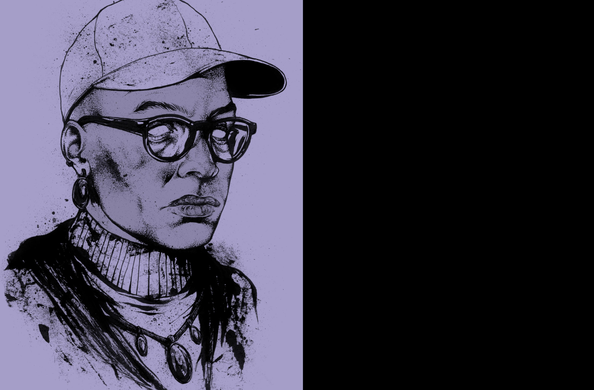

**salvador:** Это верно? Я уверен, что вы знаете, что его отец - Дон Перро. Когда Перро был назначен Джастикаром в 50-х, он сделал Белла архонтом. В нашем мире Тео Белл был вовлечен в привилегии. Он начал прямо с вершины, с серебряной ложкой Перро во рту. Знаете, что я думаю? Они специально сделали его Архонтом, чтобы у них был кто-то с контркультурным авторитетом. Им нужен был талисман.

**agata:** Ты параноик, Сальвадор. Я думаю, он был настолько талантлив и крут, что у них не было другого выбора, кроме как сделать его Архонтом.

**salvador:** Мы говорим о Внутреннем круге Камарильи, возможно, самом коварном собрании бессмертных, жаждущих власти социопатов. Конечно, я параноик. Тео Белл служит им уже более полувека. Он инсайдер, это мир, в котором он живет. Он не один из нас, а один из них.

**agata:** Вот почему он вывел Бруха из Камарильи в Пражском конклаве? Потому что он один из них?

**salvador:** Он сделал силовой прием. Вот что они делают!

**agata:** Я на это не куплюсь. То, что он сделал в Праге, было величайшим моментом для анархического движения со времен рождения Свободных Штатов. Он показал этим старым засранцам, что нами не будут помыкать. Он вернул Бунтарей к их корням. Он показал, что перемены возможны и что Камарилья не вечна.

**salvador:** Ну, я - Повстанец, и я говорю, что мы прекрасно боролись с Камарильей задолго до появления Тео Белла. Признай это: Он просто центрист. Он бунтует только потому, что Камарилья была такой несгибаемой сволочью. Если бы они хоть немного больше следовали своим собственным правилам, Тео Белл все еще был бы их верным псом. Он весь в традициях, маскараде, Домене... Он может бороться с Камарильей сейчас, но он не радикал. Он считает нас недальновидными глупцами, а на самом деле у него не хватает воображения, чтобы увидеть, как выглядел бы лучший мир.

**agata:** Мне все равно. Он сделал то, что сделал, и этого достаточно. Кроме того, он горячий.

# **salvador:** Горячий?

**agata:** Так горячо. Мне нравится гнев, серьезность... Как будто ты знаешь, что под стоической внешностью ярко горит огонь справедливости.

**salvador:** "Огонь справедливости"? Он вампир. Такой же, как и мы. Он не хороший парень. Никто из нас.

**agata:** Мне нравится и борода, и бейсболка. И ружье. Очень мужественный. Я хочу его трахнуть.

# **salvador:** Дробовик?

**agata:** Как вы думаете, ему это понравится?

**salvador:** Будь серьезной, Агата.

**agata:** Я совершенно серьезно. Я хочу трахнуть его. Я хочу чувствовать его внутри себя.

**salvador:** Ладно, хватит...

**agata:** Не увиливай от меня, Сальвадор! Ты можешь вынести немного разговоров о ебле.

**salvador:** Я могу. Только не от тебя.

**agata:** Ты слишком долго пробыл в Америке. В любом случае, я бы с удовольствием отсосала ему. Диаблери - самый интимный из всех сексуальных актов, ты согласна?

**salvador:** Я не думаю, что это фантазировать о диаблеризации Тео Белла. На самом деле, я думаю, он бы казнил тебя на месте, если бы увидел.

**agata:** И все же он поддерживает вас и то, что вы делаете здесь, в свободном штате Лос-Анджелеса. Прикольно.

**salvador:** Это правда, что он выразил слова поддержки после Праги, но к черту Тео Белла. Серьезно.

**agata:** Может быть, человек может измениться. Я верю в Тео Белла. Камарилья оказалась не тем, чем он думал, и теперь он ищет что-то другое. Может быть, это что-то - вы? ■

# **The Blood** _of_ **Patriots**

Привет Джош, Ж аль, что ты пропустил встречу, брат! Я буду с тобой откровенен. Если ты не можешь питаться от смертных, которые напиваются в стельку, не испортив при этом себя, ты действительно уверен, что тебе место в Гарварде? Я имею в виду, в этом весь смысл! Студенты всегда, новая порция еды каждый год, вечеринки, где никто не заметит, если ты откусишь.

Вот вам совет: не совмещайте притворство человеком с поеданием еды и питья от девушек, которые падают в обморок на вечеринках. Быть настолько оттраханным, что блюешь на ботинки, можно даже будучи одним из нас, если условия подходящие.

В любом случае, я сделал для вас несколько записей с собрания. Так что вот все подробности:

Полночь – Мы начинаем собрание с переклички. Вы были не единственным отсутствующим новичком. Иногда я удивляюсь, как ты пережила посвящение. Кроме того, Анслей такая стерва. Почему мы сделали ее председателем Гарвардского клуба свободы?

**00:10** – Противоречия! Уилл спросил, почему инициация, которую мы используем, чтобы принять подходящих кандидатов, напоминает братскую вечеринку. Другие очень терпеливо объяснили, что мы являемся частью общества, распространенного по всему Западному полушарию, и никоим образом не похожи на братство.

Подхватив нить разговора, Кэмерон звонит, чтобы уточнить нашу миссию. Задача Клуба Свободы - использовать наше влияние как в

Камарилье, так и в Движении Анархов, чтобы подтолкнуть человеческое общество к принятию принципов свободного рынка.

Учитывая огромное влияние Камарильи и проникновение Анархов на микроуровень многих человеческих институтов, должно быть возможным значительно сократить сферу деятельности правительства и дерегулировать рынки, особенно финансовый и энергетический.

Брэдли шутит о том, что превращение в вампира помогает тем, у кого проблемы с эрекцией. Уилл называет его идиотом и произносит бессмысленную фразу о том, что Древо Свободы, знаете ли, бла-бла-бла.

**00:21** – Мы рассмотрим некоторые из наиболее успешных операций за последний год. Софи рассказывает об аналитическом центре, созданном при финансировании Камарильи, - Центре экономических исследований. Некоторые из нас, несомненно, перейдут из Гарварда, чтобы работать там, поэтому многие из нас очень рады тому, что он появился. Мы спрашиваем Софи, как Камарилья согласилась на это, и она говорит, что они уже финансируют различные лоббистские группы, хотя большинство низкопоставленных родственников Камариллы не знают о них.

Но я должен сказать, зачем кому-то уходить от той жизни, которую мы здесь имеем? Легкая охота, студенческие вечеринки, профессора, состоящие в Клубе, помогают нам играть в систему. Некоторые говорят, что это жутко - быть студентом, когда ты стареющий вампир, но я говорю - пошли они нахер. Кровь есть кровь.

**00:41** – Софи заставляет провести голосование о гендерных квотах для будущих членов Клуба Свободы. Она недовольна тем, что только пятнадцать процентов составляют женщины. Энсли поддерживает ее. К счастью, Кэмерон, Уилл, Брэдли, я и некоторые другие присутствуют, чтобы объяснить, почему гендерные квоты по своей сути противоречат либертарианским ценностям, которыми мы дорожим.

**03:13** – Кэмерон меняет тему на предложенный подпольный симпозиум о роли вампира в капиталистическом обществе. Эта тема вызвала столько мнений, что казалось, будто мы провели симпозиум там и тогда. Это была хорошая тема для обсуждения, даже если бы Кэмерону пришлось нарушить повестку дня собрания, чтобы сделать это. Симпозиум - это проект Анслей, и она была рада поговорить о нем.

Уилл продолжал спрашивать, можем ли мы выяснить, была ли Айн Рэнд вампиром и пригласить ее выступить, если была. Я не мог понять, серьезно он говорит или нет, потому что уже достаточно хорошо известно, что она не была вампиром.

Многие из нас считают, что в мире производителей и паразитов мы, бессмертные, имеем уникальную возможность вести мир вперед, защищая его от мародеров, которыми является большая часть человечества.

Не существует такого понятия, как бесплатный обед, и я надеюсь, что это поймет больше людей. Для меня всегда было ясно, что мы производим, а люди - лишь клещи на теле наших предприятий, но я признаю, что у многих других тоже есть интересные идеи на этот счет.

Мне особенно понравились комментарии Кэмерона о созидательном разрушении инновационной культуры Кремниевой долины. Точно так же можно сказать, что когда наш вид становится частью человеческой организации, такой как компания, наше присутствие приводит к выкидыванию валежника и повышению эффективности, что приводит к повышению мотивации работников, получающих вместо зарплаты порцию нашей крови. К сожалению, на данный момент многие из этих идей носят теоретический характер, так как опробовать их на практике в более широком масштабе сложно в нынешних условиях безопасности.

**03:27** – Брэдли, похоже, потерял сознание на столе. Он даже храпит, что, как предполагается, невозможно для нашего вида. После того, как я прокомментировал это, Брэдли встает и жалуется, что мы скучные. Он говорит, что мой "роман" с Кэмероном должен быть завершен реальными половыми актами. К сожалению, Кэмерон отвечает, что, будучи бессмертными, мы все должны были выйти за рамки таких мелочных забот, как человеческая сексуальность. Его замечание было встречено всеобщим смехом. Даже Анслей и Софи присоединяются к нему.

И хорошо, я признаю. Я бы не выбрал Кэмерона в качестве своего ведомого в любых, кроме самых тяжелых, обстоятельствах. Если бы не все эти отрубившиеся тусовщики, которые так облегчают мне жизнь, он бы умер с голоду.

На этом собрание было прервано, потому что некоторые из нас хотели проверить возможности охоты. Я думаю, ты должен стать добровольцем, чтобы помочь Ансли в проведении симпозиума. Это поможет утвердить тебя в Клубе и позволит нам увидеть твою более серьезную сторону. Конечно, ты можешь делать то, что тебе нравится, но бро настоящая сила в Клубе - в идеологических проектах. Повезет, и ты даже сможешь принять участие в операциях Камарильи Софи. ■

Ваш брат, как

всегда, Стюарт Ω∑

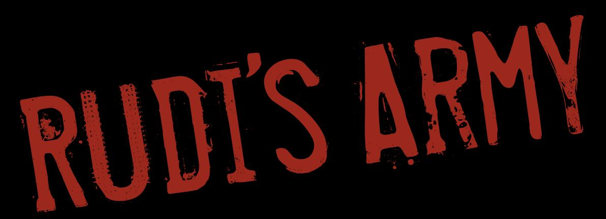

Rudi: Позвольте мне начать с благодарности всем вам за то, что вы здесь. Нам приходится вести эту борьбу каждую ночь, и я знаю, что вы устали. Я надеюсь, что сегодня вечером мы услышим от некоторых из наших аккомпаниаторов, чтобы поднять наше настроение. Я знаю, что эту группу часто называют "Армия Руди", а меня - Руди, но на самом деле я никогда не использую это название для нашей группы. Здесь мы все равны. Вот как это работает: Мы садимся в круг, и каждый говорит по очереди. Каждый может и должен говорить, хотя бы для того, чтобы передать круг следующему оратору. Таким образом, более громкие голоса не будут доминировать.

Line: Спасибо, Руди. Цель действий антифа проста. В нашем случае - сделать Копенгаген настолько неприветливым для нацистов, что они не смогут сюда приехать. Если они пытаются организовать демонстрацию, мы их избиваем. Если эти ублюдки придут за нами, за наших арабских братьев и сестер, наших транс-друзей, они пожалеют об этом. Это всегда в центре внимания: Как только зайдет солнце, ни один скинхед не будет в безопасности.

Naziha: Я здесь впервые, и я не очень долго была вампиром...

Line: Подлиза. Или " тикание", если вы самокритичны.

Naziha: Простите, подлиза. Ничего, если я задам вопрос всем вам? Или как это работает?

Line: Вы можете задать вопрос, получатель отвечает, и раунд продолжается.

Naziha: Ладно, ладно... Значит, мы "лизоблюды", так? Я слышала всевозможные безумные истории о Кайне, антедилувианцах и Енохе. Мне интересно, как все это соотносится с тем, что мы делаем.

### Line: Руди? Это для тебя.

Rudi: На самом деле, у меня нет удовлетворительного ответа на этот вопрос. Я строгий материалист. Все эти истории, будь то Камарилья, Шабаш, Бахари или что-то еще, направлены на то, чтобы привести вас в соответствие с чьими-то планами. Я считаю, что мы должны руководствоваться не этими историями, а нашими личными ценностями и моралью. Конечно, я хотел бы знать, откуда на самом деле произошел наш род. Однако я не думаю, что правда изменит мое убеждение в том, что мы должны использовать наши дары, чтобы изменить наш маленький уголок мира к лучшему.

Naziha: Спасибо. Круто. Это то, что я хотела.

Tobias: Теория без действий бесполезна.

Rudi: Жди своей очереди, Тобиас. Следующей будешь ты, Карина.

Karina: Спасибо. Я просто хотела сказать спасибо всем вам. Я жалею, что не попала в "Воплощение" после операции по подтверждению пола, а не до нее, но возможность растоптать нацистов компенсирует это. Я не знаю, понимаете ли вы это, ребята, но раньше я очень боялась. Однажды меня избили в туалете бара, и после этого я неделю не могла выйти из квартиры, я всего боялась. Теперь я больше не боюсь. Я даже заметила кое-что забавное. Ко мне не пристают, или, по крайней мере, не так часто. Простите, что так много говорю, просто... Когда вы, ребята, вытащили меня назад прошлой ночью, и это было не потому, что я была в опасности. Это было потому, что я убила бы того человека. Я была в опасности. Это был сильный момент для меня. Rudi's Army Line: Наносят быстрый и сильный

### Line: Карина, мы любим тебя. [обнимает]

Tobias: Спасибо, что сказали это. Я думаю, что я здесь единственный белый мужчина, и даже меня однажды избили скинхеды, когда напали на наш приют. Руди было тяжело как смертному, нелегко быть геем и арабом. Приятно чувствовать себя хозяином положения.

Rudi: Ты только что меня вычислил? Tobias: Что? Нет, простите, я не хотел... Rudi: Я дразню тебя. Я не в закрытый.

Tobias: Проклятье... Я никогда не могу понять, когда ты шутишь. Твой юмор слишком сухой.

Rudi: Это была твоя очередь?

### Tobias: Да.

Rudi: Спасибо. Лина, к тебе.

Line: Завтра вечером состоится антирасистская демонстрация при свечах. Судя по разговорам на нацистских дискуссионных площадках и в группах Facebook, похоже, что они планируют какую-то акцию. Мы не уверены, будут ли они просто выкрикивать лозунги или устроят атаку слезоточивым газом.

Tobias: Или преследовать людей после демонстрации и бить их.

Line: Да. Вопрос в том, будем ли мы участвовать? Как вы все знаете, антифа и так находятся под пристальным вниманием полиции, и мы можем добавить к этому проблемы со второй инквизицией.

Naziha: Вторая инквизиция? Насколько мы должны быть напуганы?

Karina: Довольно страшно. Но я говорю, что надо идти.

Tobias: Ты приобрела вкус к уличным боям.

### Karina: Это точно!

Rudi: Давайте придерживаться структуры дискуссии. Что касается меня, то я утверждаю, что мы должны идти, если там есть смертельные союзникиантифашисты.

удар, а затем исчезают.

Naziha: Могу я задать еще один вопрос? Бывают ли сородичи на другой стороне? Например, бритоголовые вампиры?

Karina: Я могу ответить. Да, иногда бывает. Не всегда мы ссоримся с людьми. Это случилось со мной в мою самую первую ночь в качестве вампира. Я не знала, что смогу так хорошо заживать, и очень испугалась, когда парень ударил меня ножом в живот. Он был Бруха, но не хороший Бруха. Камарильский Бруха.

Tobias: Да, он думал, что мы браконьерствуем на его территории. Он упорно работал, чтобы создать себе стадо среди антииммигрантской политической толпы. Вот почему он пытался убить вас.

Karina: Но он этого не сделал, потому что Лина выбила ему зубы.

Tobias: Лина великолепна в этом плане.

Rudi: Давайте проведем еще один

# Что нужно сделать?

Разговор между Агатой "несостоявшейся цветочницей" Старек и идеологом анархов Сальвадором Гарсиа.

**agata:** Я знаю, что не очень люблю Движение, но есть много Анархов, которые могли бы воспользоваться некоторыми советами по тактике. Например, что делать, что работает.

**salvador:** Ты просишь у меня совета?

**agata:** Не для себя. Убийство симпатичных парней из Камарильи всегда был моим методом выбора.

**salvador:** Ну, мой совет для Движения в целом был бы следующий. Откажитесь от насилия и агрессивной риторики. Вместо этого, попытайтесь изменить Камарилью изнутри путем аргументированного обсуждения. Если достаточное количество из нас покажет, что мы надежны, заслуживаем доверия и способны идти на компромисс, князья Камарильи придут в себя и добровольно предоставят нам хотя бы часть свободы, которую мы ищем.

**agata:** Что? Серьезно?

**salvador:** [смеется] Я буду дорожить этим моментом. В первый раз. когда я на тебя напал.

**agata:** Значит, мы не собираемся идти на компромисс?

**salvador:** Нет. Мы хотим победить в этой борьбе, а не стать лакеями

# Обучать, агитировать, организовывать

Основы организации анархов в изложении одного из основателей Свободных штатов Калифорнии Сальвадора Гарсии.

О сновное правило организации анархов заключается в том, что она происходит во враждебной среде.

У нас нет такой роскоши, как сначала построить свои общины и только потом дать бой врагу. Враги повсюду, и они с радостью примут бой с нами.

Вы хотите создать жизнеспособное Анархо-движение. Есть шанс, что вы находитесь в городе Камарильи. Вам нужно справиться с активными попытками Камарильи остановить вас. Если вы не в городе Камарильи, не волнуйтесь. Враги все равно найдутся: от подражателей-тиранов, которые хотят сделать город своим доменом, до агентов Камарильи, желающих установить власть князя.

Действительно, в некотором смысле легче подмять под себя владения Камарильи, чем основать новые. По крайней мере, с князем вы знаете, кто ваши враги.

# Перемещение

Движение анархов не возникло само по себе. Для того, чтобы оно возникло, потребовалась тяжелая работа и организация. Это не сексуальная сторона того, как быть анархом. Все хотят вбить кол в сердце князя, но если вы действительно хотите добиться успеха, вам нужно следовать старому лозунгу:

"Обучай, агитируй, организуй".

Обучать - значит объяснять другим вампирам, особенно молодым, что есть варианты. Они не знают истории Анарходвижения. Они не знают о первом восстании анархов, о рождении Свободных Штатов или о чем-то еще. Они не могут прочитать об этом в книге. Кто-то должен рассказать им историю, альтернативную той, которую пропагандирует Камарилья. Если кто-то верит, что Бог проклял его служить старейшинам, он не станет бунтовать. Дайте им факты, и они начнут думать самостоятельно.

Агитировать - значит говорить с людьми, убеждать их бороться. Вы не можете просто сидеть и ждать, пока угнетенные сбросят оковы. Вы должны быть там, среди людей, которых вы хотите привлечь на свою сторону. Для некоторых это трудно, потому что это также требует умения слушать. Вы не можете просто бить людей по голове своей философией. Вы должны выслушать их проблемы, понять, как вы можете помочь им, а они - вам. Таким образом, вы сможете добиться справедливости для всех и создать широкий революционный фронт.

Организовать - значит превратить толпу разгневанных молодых людей в мотивированное движение с реальной долговременной силой. Благодаря целенаправленности и структуре, гнев можно эффективно направить на реальные изменения. Это особенно важно при столкновении с активным врагом. Если мы реагируем как отдельные люди, а не как сообщество, легко впасть в паранойю и раскол.

# Лица

Мы - Движение Сородичей. Вампиров, если говорить грубо. Различные местные Движения были организованы по самым разным принципам, и я приветствую это. У нас большая палатка, с множеством программ, объединенных стремлением к свободе. Однако есть и некоторые практические вещи, которые доказали свою эффективность.

Сообщество, которое вы строите, нуждается в четких правилах относительно наших особых способностей, особенно тех, которые влияют на чей-то разум. Я не говорю о том, когда вы используете свое сверхъестественное обаяние, чтобы подшутить над своими друзьями. Шутка - это шутка, даже в Анархах. Я говорю о лишении кого-то свободы воли. Для многих из нас тирания Камарильи олицетворяется в высокомерном Вентру, который заставляет вас унижаться, контролируя ваши действия. Убедитесь, что вы никогда не используете эту тактику внутри Движения. По моему опыту, люди меньше обижаются на побои, чем на контроль разума.

Оказывайте необходимые услуги. Это звучит глубоко негламурно, но это то, что может сделать ваше Движение широкомасштабным и успешным. Камарилье традиционно наплевать на молодых вампиров. Если чей-то отец бросил его на произвол судьбы - не повезло. Если ты попал в беду, ты сам по себе. Такое отношение Камарильи может быть слабостью. Пусть будет известно, что если молодому сородичу нужно место для ночлега, совет по охоте, помощь в общении со смертным, он всегда может прийти к тебе. Я гарантирую, что у вас будет много друзей. Дайте людям то, в чем они отчаянно нуждаются, и они будут слушать вас.

Позволяйте людям меняться. Не зацикливайтесь на личных историях людей, особенно если они молоды. Мы все Анархи, у нас общий враг, и мы не можем позволить себе расколоться на маленькие группки, ведущие войну друг с другом. Ну и что, что один был полицейским, а другой а другой анархист? Вы оба вампиры. Привыкайте ладить друг с другом. Это касается и тех, кто хочет перейти к нам из других сект. Давайте примем их и будем судить о них по тому, как они ведут себя с нами, а не по тому, как они вели себя раньше.

Однако есть исключение. К черту старейшин. Скажу прямо: Не имейте дела со старейшинами, если у вас нет старейшин на вашей стороне. А у вас их, скорее всего, нет. Я видел, как это происходило несколько раз: Старейшина Эллины или Дивы говорит, что она переходит из Камарильи. Все приходят в восторг. Власть, привилегии, столько всего, что эта прекрасная союзница могла бы сделать, чтобы помочь нам! Дело в том, что каждый старейшина - эгоистичный ублюдок, даже если он говорит о свободе. Если они присутствуют, то речь будет идти о них. Эти старейшины относятся к Движению как к игровой площадке в течение нескольких десятилетий, а затем возвращаются к своим приятелям из Камарильи, как только им становится скучно.

Наконец, избегайте лидеров. Возможно, это моя личная политика, но иерархические структуры делают вас уязвимыми. Если у вас есть явный лидер, Камарилья развратит его. Стремитесь готовить небольшие автономные подразделения, ячейки или банды, которые могут самостоятельно проявлять инициативу. Мы не овцы. Мы неживые существа ночи. Нам не нужен большой сильный человек, который скажет нам, что делать.

# Свобода

Извечная проблема "свобода против безопасности" будет преследовать и вас. Это прискорбный факт. Вы будете проповедовать свободу и равенство среди всех, кто присоединится к Движению, но вам также придется казнить шпионов Камарильи. Это трудно, особенно если Камарилья начнет свою пропагандистскую деятельность. У них есть преимущество в том смысле, что бессмысленно обвинять их в лицемерии. Это то, на чем построена вся их секта, это их плоть и кровь. Мы же должны быть чем-то лучшим, поэтому для нас обвинение может быть опасным.

Тем не менее, вы можете предположить, что вам придется столкнуться с покушениями на убийство, принудительным кровным родством, шантажом, отправкой информации о вас во Вторую Инквизицию, клеветническими кампаниями и так далее. Я всегда справлялся с этим, будучи открытым со своими друзьями. Я предупреждал их, что такое может случиться, и они распознавали это, когда это происходило.

Это, вероятно, самое большое испытание, с которым столкнутся ваши организационные усилия. Сможете ли вы создать достаточно сильное сообщество, чтобы противостоять всей той лжи, которую камарилья может бросить в вас?

Иногда очень трудно принять решение. Допустим, молодая вампирша предала вас Камарилье, слив информацию. Ее шантажировали: Шериф угрожал убить ее смертную семью. Что вы можете сделать?

Простить ее. Это показывает, что люди могут прийти к вам, если Камарилья попытается что-то сделать, и вы готовы их выслушать. Это может дать обратный эффект, заставив вас выглядеть слабым.

Казнить ее, публично или тайно. Вы можете сделать из предателя пример, но иногда лучше, если люди просто исчезнут. Если вам повезет, в этом обвинят Камарилью.

Превратите ее в невольного двойного агента, снабдив ее ложной информацией. Это то, что я бы назвал вампирским ходом. Независимо от ваших принципов, вы все еще лизоблюд. Используйте это, чтобы бороться за Движение.

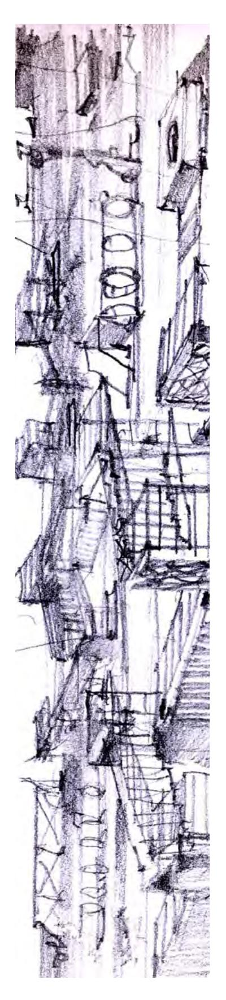

# Вечеринки

Я серьезно. Вам нужны хорошие вечеринки. Если молодые лизоблюды вашего города считают, что у Движения самые лучшие вечеринки, вы уже на полпути к победе. Восхваляйте героев Движения, вспоминайте тех, кто погиб за борьбу, и следите за тем, чтобы кровь всегда текла, когда вы возвращаетесь праздновать после успешной акции против Камарильи.

Это распространенная ошибка многих интеллектуально мыслящих анархистов. Мы требуем, чтобы каждый в Движении мог говорить на языке философии Анархов, используя соответствующую терминологию, всегда в курсе последних идей. Это может быть хорошо, если вы хотите вести действительно серьезные дебаты о нюансах освобождения вампиров, но если вы строите широкое Движение, вам нужны все.

Ну, не каждый псих. Некоторые границы нельзя переступать, и вы сами решите, что это за границы. Просто убедитесь, что их не так много, что вы окажетесь в одиночестве.

Дайте сородичам большие идеи, в которые можно верить, хорошую музыку, под которую можно танцевать, и место, где они могут сражаться друг с другом, не привлекая внимания смертных. Стоять на коленях перед старейшинами в Элизиуме - отстой, так что быть в Анархах должно быть лучше. Это должна быть хорошая жизнь для всех нас, несмотря на опасность. ■

# Постройте лучший мир (для себя)

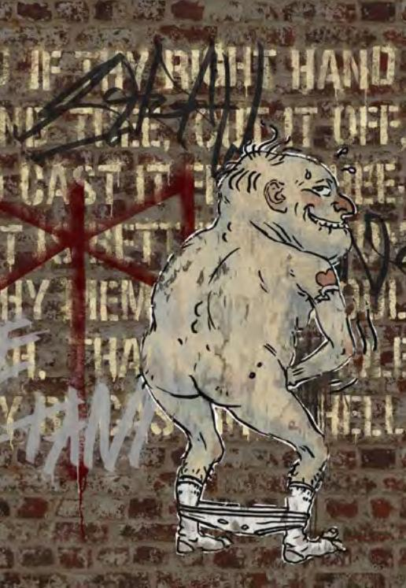

Допустим, вам нужна куча последователей. Может быть, вам нужны злые люди, которые будут преследовать ваших врагов в Twitter. Или, возможно, вам нужна агрессивная толпа для защиты. Для многих анархистов место, где вы найдете таких сородичей, находятся на задворках политической карты.

Просто помните, что это игра для молодых. Вам нужно хорошо понимать текущий политический и субкультурный ландшафт, чтобы суметь влиться в него, а это очень трудно сделать, если вас привели в ночь даже несколько десятилетий назад.

В качестве предупреждения проверьте, как часто полиция терпит поражение при проникновении в группы активистов.

Полицейский выделяется из десятка других по таким досадно простым причинам, как неправильная обувь или прическа.

# Дело #1: Ваш старый Экипаж

Допустим, вы один из тех анархистов, которым посчастливилось

заниматься политикой. в жизни. Вы уже знаете людей, а они знают вас. Каким бы ни был ваш статус в группе раньше, вы можете быстро его повысить, потому что, как вампир, вы можете сделать так, как раньше было невозможно.

Это может быть очень просто. Вы в антифа. Человеку мужского пола нужно беспокоиться о том, что он может быть ранен, когда идет бить нацистов, но для нашего вида это гораздо меньшая проблема. Вы можете играть героя, принимая ножевые ранения за своих друзей, и им не обязательно знать, что вы сверхъестественно быстро заживающий кровосос.

Такие вещи может делать каждый сородич. А может, ваших друзей избили полицейские. Может быть, у кого-то повреждены нервы после того, как его держали в кузове полицейского фургона со слишком туго застегнутыми наручниками. Дайте им каплю своей крови. Скажи им, что это травяное лекарство или экспериментальный уличный наркотик. Неважно, во что они поверят. Главное, что они будут зависимы, даже не осознавая этого.

# Дело #2: Твои ненавистные враги

Большинство из нас интуитивно чувствуют, что присутствие неумирающего монстра не делает лучше ни одно политическое движение. Наше влияние токсично, но мы часто продолжаем общаться со старыми друзьями только потому, что они нам нравятся.

Если у вас хватит на это смелости, вы можете внедриться и в ряды своих самых ненавистных врагов. Это имеет много преимуществ. Вам не придется переживать из-за всего того ужасного эксплуататорского дерьма, которое вам приходится вытворять в качестве вампира. Если ваши новые соратники пострадают, ну и что? Они заслужили это. Если нет - тоже хорошо, ведь они могут выполнять ваши поручения.

С политической точки зрения, это отлично работает. Вы используете ядовитую природу нашего вида против своих врагов. Только будьте осторожны, чтобы не стать туземцем! Нам нравится думать, что мы выше человечества, что нас не касаются их мелкие заботы, но это корыстная ложь. Мы подвержены влиянию окружающей среды так же, как и все остальные.

Итак, вы хотите внедриться в группу воинствующих этнонационалистов, выступающих против беженцев. Интернет отличный инструмент для этого. Просто тусуйтесь на нужных местных досках объявлений и в группах Facebook, попугайничая с наиболее экстремистскими взглядами. Таким образом, когда вы придете на свою первую встречу, они будут знать, кто вы такой.

Есть несколько распространенных ошибок, которые вы можете совершить. Одна из них - чрезмерно полагаться на сверхъестественные способности. Это может быть полезно, если вам нужно действовать быстро, но для долгосрочного плана лучше использовать естественные и органические способности. Одержимый кровью Ренфилд сигнализирует о вашем присутствии самим своим существованием, но если ваши помощники даже не знают, что служат вам, вы будете защищены гораздо лучше.

Не поддавайтесь искушению сделать себя лидером. Конечно, это здорово повышает самомнение, но быть человеком, стоящим за троном, - гораздо меньший труд. Если ваша фриланс-группа, как это часто бывает, управляется неумело, вы можете приобрести влияние, просто привнеся в работу строгость и профессионализм, независимо от того, имеете ли вы дело со скинхедами, которые просто хотят разбить несколько черепов, или с террористами - подражателями белых националистов.

# Case #3:Вы новичок в политике

Возможно, это станет неожиданностью для многих в Камарилье, но большинство Анархов не являются хардкорными ветеранами прямых действий Антифа Черного Блока. Сегодня принадлежность к числу свободных часто означает лишь то, что за последние несколько десятилетий вы были объяты. Тусовщики, беженцы, симпатичные мальчики и бандиты все они приходят в эту жизнь без глубоко укоренившихся политических убеждений или существующих связей.

Допустим, это вы, но вы все равно хотите использовать смертную группу для своих целей. Как вы поступите в этом случае?

Во-первых, выберите цель. Это зависит от того, что вам нужно. Если вам нужны интернет-тролли, то вам подойдут альт-правые интернет-активисты. Если насилие, то вам нужны люди, которые привыкли драться на улицах.

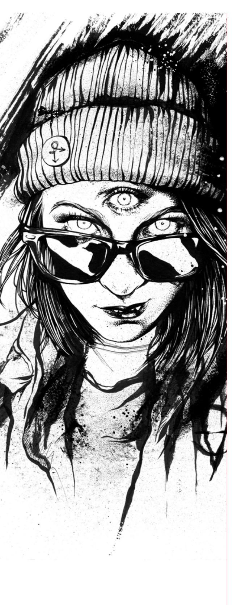

Самый простой выбор - правое или левое крыло. Это может быть вопросом личного вкуса. В конце концов, вы будете часто общаться с этими людьми. Кроме того, есть некоторые практические вопросы, которые необходимо рассмотреть. Во многих странах правые группы значительно лучше в плане насилия, так что если это то, что вам нужно, начинайте репетировать тосты, которые вы произнесете в день рождения Гитлера. У правых движений есть и другое преимущество: В большинстве европейских стран, а также в США полиция относится к ним гораздо мягче. Это напрямую связано с тем, насколько сильно вы рискуете столкнуться со Второй инквизицией.

Однако, если вы действительно хорошо умеете смешиваться со смертными, левая группа может стать отличным прикрытием. Наш опыт подсказывает, что Вторая Инквизиция не ожидает встретить нас среди радикальных экологических активистов, даже если они находятся под пристальным наблюдением различных разведывательных агентств.

Во-вторых, научитесь вести беседу. Проведите исследование. Часто это легко сделать в Интернете. Часто полезно взять на себя роль человека, который устанавливает границы внутренней группы и бросает людям вызов на идеологических основаниях. Таким образом, вы можете заставить людей бояться вас, избегая при этом обязательств по выполнению реальной работы.

# Дата окончания срока действия

Проникновение и захват периферийной политической группы - это краткосрочный проект, рассчитанный на срок от нескольких месяцев до десяти лет. Сцена быстро меняется. Люди стареют и выбывают. Вы обнаружите, что вам трудно ориентироваться в новом политическом жаргоне, и окружающие начнут вас подозревать.

Отсюда вытекает последнее правило: Никогда не входите без плана выхода. ■

- Далия Накаш, идеолог французской революции анархов

# Держите свой газон

"Э й, это та же метка, которую мы видели в паре кварталах отсюда. Это кто-то из ваших знакомых?" спросил Малыш.

"Да, это обозначает домен", - объяснил я. У Малыша было много вопросов, но я старалась быть терпеливой. Не похоже, что у нее был кто-то еще кто-то. "Так что другие банды знают, что здесь нельзя охотиться".

"Что если обычные люди... ну, знаешь, люди увидят это?" Она шла быстрее, чтобы не отставать от меня.

"В том-то и дело. Мы не хотим, чтобы лица возились на нашей территории, и мы также не хотим, чтобы здесь были банды смертных."

"Не может быть трудно защищать свою территорию от нормальных людей? Верно?" Она звучала взволнованно, счастливая быть с крутыми парнями из Команды V.

"Ты не хочешь связываться с Маскарадом", - сказала я, пока мы шли к машине. "Так что мы должны вести себя спокойно. Смертные тоже могут быть опасны. Никогда не стоит их недооценивать".

"Почему бы тебе не прокатиться получше?" - спросил Малыш, когда я сел за руль.

Я повернулась, чтобы посмотреть на нее.

"Я имею в виду, ты ведь вампир, верно?" - продолжала она. "Почему бы тебе просто не заставить кого-нибудь дать тебе свою машину, с помощью контроля разума?"

Я могла видеть, что она уже некоторое время думает об этом. Почему мы такие бедные, если мы - гламурные мертвецы?

И конечно, я не выглядела шикарно тогда и не выгляжу шикарно сейчас. Я выгляжу как женщина, которая собирается ударить тебя в тюремном дворе. Мне нравится, как я выгляжу, но это не всегда хорошо сочетается с кем-то вроде Малыша. У нее есть амбиции, это было видно уже тогда. Я обычный бандит из "Анарха", но она хотела чего-то добиться. Она сказала, что как человек она ноль, просто белое ничтожество. Она не хотела оставаться нулем как вампир.

"Послушай, малыш, это не так просто. Я в этой игре уже давно, и я понятия не имею, как эти ублюдки из Камарильи это делают. Как им удается разбогатеть, жить в шикарных Гаванях, содержать целый штат слуг. Когда я пытаюсь связать кого-то кровью, они просто ведут себя как безответственные наркоманы".

"Хорошо", - сказала она. Это то, о чем рано или поздно начинает задумываться большинство Анархов. Почему так чертовски трудно жить?

Дом был обветшалым, одно из окон разбито, но кто-то ухаживал за газоном. Я задумалась, почему. Может, этим засранцам было чем заняться, пока они ждали неожиданных гостей.

Один из них курил на крыльце, небрежно держа пистолет на поясе. Он мрачно смотрел, как мы выходим из машины, и выглядел так, будто спал последние три ночи в своем спортивном костюме среднего класса.

"Эй, девочки", - позвал он. "Вам лучше двигаться дальше".

Он выглядел так, будто обдумывал непристойное предложение, но никак не мог придумать подходящее.

"Скажи им, что Виолета пришла нанести визит. Они узнают, кто я".

Через пару минут мы были внутри.

Эти засранцы торговали на нашей территории. Не много, просто проверяли, заметили ли мы. У них были старые диваны, в воздухе витал запах травы, один пытался заставить работать аудиосистему.

"Привет, Виолета, рад, что ты здесь, садись, ты привела друга". Том начал со своей обычной ленивой ерунды.

"Это не социальный звонок", - сказала я. "Ты издеваешься над нами. Это нужно прекратить".

Парень, возившийся с колонками, остановился. Все смотрели на нас, оценивая.

"Кто нас остановит?" спросил Том. "Я видел ваших парней. Вы - шутка".

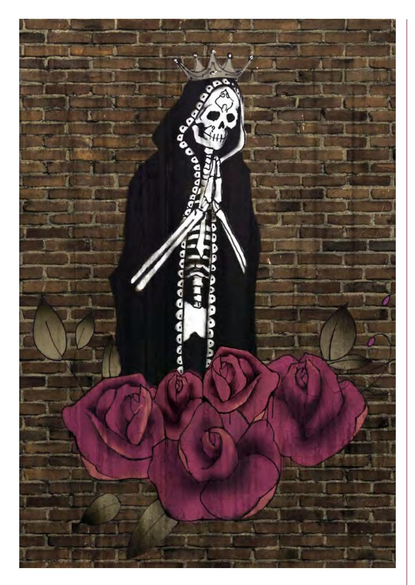

Он проверял меня, но это было нормально. Это то, ради чего мы сюда пришли. Я вытащила свой нож, все они смотрели на него. И Малыш тоже. Я ударила ножом по ладони и медленно вытащила его. Я сильно бросила нож, так что он прилип к их столу, вибрируя.

"Вот какие мы смешные. Теперь давайте послушаем, как вы расскажете хорошую шутку".

Том с опаской смотрел на нож. Я согнула руку с дыркой.

"Я могу рассказать хорошую шутку", - сказал Малыш и поднял нож. Все удивленно посмотрели на нее, даже я. Она мгновение смотрела на нож, а потом скопировала меня, ударив по своей ладони. Она позволила ему остаться там на мгновение, а затем вытащила его с небольшим вскриком.

"Ладно, слушайте, вы, ребята, слишком напряжены для меня", - сказал Том, подняв руки вверх. "Мы просто расслаблялись, нам не нужно, чтобы люди приходили сюда и резали себя ножами".

Пара наших парней просто запутались в границах вашей территории", - резонно объяснил он. "Я поговорю с ними".

"Это было так круто", - сказал Малыш, когда мы уже сидели в машине и уезжали. "Я поняла, что запугивание людей работает именно так, играя тонко, используя свою кровь. Но как насчет Камарильи? Мы не можем защитить нашу территорию от Камарильи с помощью трюков с кровью. Они тоже вампиры".

"Конечно", - сказала я, моя рука зажила на руле. "Они сородичи, но они не жесткие. Иногда это же дерьмо действует и на них. В других случаях не очень. Но они не умеют читать улицы. Ты играешь с ними в маленькие хитрости, скармливая им ложную информацию, может быть, заставляя их думать, что они бьют тебя, когда на самом деле они бьют тех засранцев, которых мы только что посетили".

Малыш повернулся, чтобы посмотреть на меня, уличные фонари двигались по ее лицу. "Знаешь, что мы должны делать? Зачем защищать свою территорию от такой банды, если мы можем захватить ее? И зачем ждать, пока Камарилья придет к нам, если мы можем прийти к ним? Сыграть хитро, по-вампирски? Я могу маскироваться под человека, почему я не могу маскироваться под родственников Камарильи?".

У нее было много вопросов. Вы знаете, чем закончилась эта история. Я все еще здесь, защищаю свой собственный маленький домен от засранцев, как смертных, так и бессмертных. Последнее, что я слышала, Камарилья сделала Малыша архонтом. Она все еще заходит время от времени, и ее информация всегда достоверна. ■

# **VAMPIRE – THE MASQUERADE – ANARCH NIGHTS OF THE UNBOUND** Князь должен умереть

Вы все находитесь в Тблиси, потому что это безопасное убежище Анархов. Если у вас где-то возникнут проблемы, вы всегда можете прийти сюда. За одним исключением.

Если вы относитесь к "Брухам" из старой Советской России, забудьте об этом. Мы отделились от них в 1978 году на 52-м съезде Революционного совета, и нам еще предстоит свести кое-какие счеты.

Однако тот факт, что вы все находитесь в изгнании, не повод для безделья. Как сказал великий учитель революции Сальвадор Гарсиа, мы должны делиться своими знаниями, чтобы достичь целей нашего Движения.

Я Натия Абакелия, и я буду говорить с вами о том, как добиться победы над нашими врагами, как коварные монстры, которыми мы являемся. Многие из нашего рода думают, что Князь падет, если вбить кол в ее сердце, но такие грубые методы делают нас уязвимыми против превосходящих физических возможностей наших старших.

Нет, если вы действительно хотите сражаться как вампир, вы должны отказаться от чести и принципов. Зарыться глубоко в плоть врага и отравить его изнутри.

# БУДЬ ПОДХАЛИМОМ

Вот правда о проникновении в Камарилью: Вы должны стать никем. Потерять свое достоинство. Самоуважение. Стать подхалимом, подневольным паразитом. Вы обнаружите, что даже некоторые из самых опытных лидеров Камарильи не учитывают возможность того, что их "да" на самом деле может быть Анархом. Вы будете невидимы для них, даже если будете стараться выполнить любую их просьбу.

Вы можете использовать эту позицию бесчисленными способами. Один из самых разрушительных - разжигать культуру боязливого авторитаризма. Большинство старейшин находят это лестным, поэтому легко добиться того, чтобы это происходило у них под носом. Ваша цель - создать ситуацию, при которой вся организация будет парализована без единого слова лидера.

Например, все должно быть одобрено князем. Если кто-то выглядит так, будто может проявить инициативу, спросите его, уверен ли он, что князь одобряет его планы. Вы покажетесь подхалимом, но вы посеете семена сомнения. Если все пойдет хорошо, весь город остановится в тот момент, когда князь решит отдохнуть. Или погибнет в загадочном несчастном случае.

Сделайте преступлением недостаточное раболепие. Когда князь пошутит, отметьте, кто не засмеялся, а затем шепотом расскажите об этом остальным. Ваша цель создать ситуацию, когда князь произносит речь, и никто не осмеливается прекратить аплодировать первым, потому что боится прослыть нелояльным.

В краткосрочной перспективе это выглядит так, как будто вы прилагаете все усилия для укрепления власти принца. Однако в действительности вы делаете организацию князя чрезвычайно уязвимой для внешнего шока. Если весь город приучен к параноидальному бездействию, он не сможет эффективно ответить на нападение. Князь считает себя сильным, но падет в одиночку.

# ВРАГИ БЛИЖНИЕ И ДАЛЬНИЕ

Есть понятие, которое я хочу вам объяснить: ближний враг и дальний враг. У нас есть тенденция сохранять нашу самую яростную агрессию на ближнего врага, в то время как мы должны выплескивать ее на дальнего врага.

Для нас, участников движения анархов, дальние враги ясны. Это Камарилья, Вторая Инквизиция и другие ужасающие силы, пытающиеся раздавить нас. Они оказывают сильное влияние на то, как мы можем прожить нашу не-жизнь, но на самом деле они не являются частью нашего ночного существования.

Ближний враг - это кто-то почти такой же, как мы, но не совсем. Это может быть банда анархов, которая стремится свергнуть князя, но не придерживается вашей анархистской политической теории. Это могут быть перебежчики из Камарильи, которые еще не полностью адаптировались к нашему образу жизни. Самое главное, это те, с кем вы каждый вечер спорите о политике в жарких перепалках, едва не заканчивающихся насилием.

Мы знаем ближнего врага и часто можем причинить ему боль. Они чувствуют себя более уязвимыми, чем могущественная Камарилья, и поскольку мы тупы, мы направляем свою энергию на междоусобицы вместо революции.

Однако теперь, когда вы это знаете, знайте также, что вы можете воспользоваться этим против наших врагов.

Камарилья так же подвержена этому, как и мы. Старейшины верят, что каждое восстание - это заговор другого старейшины. Культивируйте эти заблуждения, когда у вас есть возможность. Таким образом, междоусобицы Камарильи смогут сделать за нас нашу работу.

# РАЗДЕЛЯТЬ И ВЛАСТВОВАТЬ

Посмотрите на структуру города Камарильи. Кто у власти, кто бесправен. Не зацикливайтесь на традиционных представлениях о власти и возрасте. Эмоция, которую вы ищете, - это недовольство. Если вы будете усердны, то сможете настроить против князя даже самого стойкого союзника.

Вспомните досоветский Тбилиси. До того, как Совет Бруха вывел Грузию на свою орбиту, в Тбилиси был один из тех древних князей-цимисхов, которые, кажется, родом из Средневековья. Нецивилизованные грубияны с претензией на благородство.

У князя Цимисхов был сенешаль носферату, верный человек, служивший ему веками. Внешне они казались неразлучными. Князь свободно оскорблял Орлока, часто намекая, что кровавые оргии, которые она устраивала, будут испорчены, если сенешаль покажет свое уродливое лицо. Казалось, он никогда не обращал внимания на слова князя, поэтому все считали, что это просто часть их отношений.

Мы знали лучше. В конце концов, не потребовалось ничего большего, чем красивая молодая девушка-дива, которая влюбилась в сенешаля, несмотря на его внешность, и начала нашептывать ему на ухо слова подстрекательства.

Этой девушкой была я, конечно же. Тогда я была еще новорожденной, недавно вошедшей в объятия, и Орлок ошибся, решив, что я не представляю опасности. Слишком молода, чтобы представлять угрозу для такого могущественного существа, как он.

В конце концов, он решил захватить город. Он сверг князя и на несколько славных ночей стал хозяином владений. Князем.

Надеюсь, его победа сделала его счастливым, пока она длилась. Цимисхи уничтожили бы нас, но сенешаля легко предать.

# САБОТАЖ И ПРЕДПРИЯТИЕ

Иногда вы можете обнаружить, что проникновение в Камарилью приводит к удивительному успеху. Моя личная теория заключается в том, что, будучи лазутчиком, вы не проводите все свое время, участвуя в мелких играх за власть, и это заставляет вас казаться надежным. Может быть, даже настолько надежным, что тебя делают шерифом или архонтом. Кто-то, кто принимает участие в принятии решений в городе Камарильи, когда она пытается проводить операции против Анархов.

Что можно сделать, чтобы саботировать такие операции, не раскрывая себя?

Классический прием - быть приверженцем правил. Всегда требуйте соблюдения надлежащего протокола, независимо от срочности ситуации. Выступайте за строгое толкование Традиций, против местной инициативы.

Например, если в соседний город вторглись анархи, вы можете сказать, что не можете помочь им, пока вас официально не пригласит князь. В противном случае вы посягнете на их владения так же, как и анархи.

Требуйте больше информации. В конце концов, как вы можете принять решение, не имея фактов? В конце концов, то, что выглядит как нападение анархов, на самом деле может быть уловкой конкурирующего князя. Лучше ничего не предпринимать, пока вы не отправите на место больше шпионов. По моему опыту, наш род очень подвержен паранойе, поэтому легко придумать сценарии, в которых немедленные действия были бы большой ошибкой.

Еще проще - вы можете просто сорвать все совещания. Заниматься бессмысленной риторикой, требовать **символических голосований ("Примоген должен проголосовать за формулировку официального поздравительного письма князю!"), откладывать важные решения на следующую встречу.**

Вы удивитесь, как легко сорвать кризисное совещание, если за столом достаточно неживого эго.

Наконец, не забудьте открыть старые решения для очередного раунда обсуждения. Князь уже издал указ о том, что все представители клана Тремеров должны быть изгнаны из города? Если вы правильно разыграете свои карты, Примоген все еще может устроить пятичасовую дискуссию по этому поводу.

# ВРЕМЯ УБИЙСТВА

Если вы будете следовать указаниям, то окажетесь внутри прогнившей, неблагополучной организации Камарильи.

У вас будет отличный доступ к информации и возможности для драматического личного предательства.

Как бы вам ни хотелось буквально зарезать князя, я не советую этого делать. Играйте до последнего, подтачивая здание, даже когда оно рушится. Ваши сородичи смогут убить нужные цели, чтобы вызвать максимальное замешательство. Здесь вы можете взять пример с Камарильи. Вместо того чтобы устраивать шоу, промолчите и сделайте так, чтобы жертва исчезла. Это заставит Камарилью гадать: Была ли жертва убита? Или просто впала в оцепенение? Покинула город? Проиграл в скрытой борьбе за власть? Кто знает?

Если вы все сделаете правильно, то обнаружите, что камарилья практически убивает сама себя, а вам остается только собирать осколки. ■

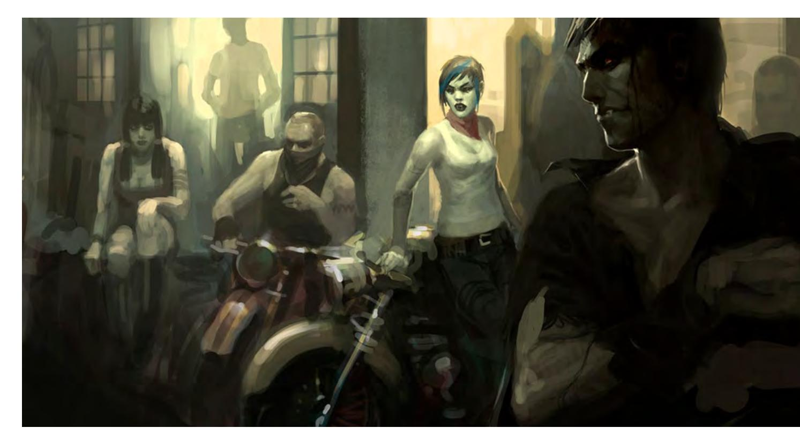

# А Вер Ханажа

Н аши слова, наши мысли, наши действия - все говорят как одно целое. Мы говорим голосом крови. Это A vér hanaja. Это будущее Венгрии, Европы, всего мира.

Мы - авангард нового порядка. Анархического движения не существует. Нет никакой Камарильи. Есть только Кровь и обломки истории и культуры, стоящие на ее пути.

Мы одержим победу, потому что наша воля - это воля Крови. Мы выйдем из теней истории и Маскарада, чтобы смести развращенные и дегенеративные различия кланов и сект. Бруха, Тореадор, Гангрел... Это не что иное, как ложь регрессивных сил, стремящихся задержать судьбу нашей общей Крови.

# Судьба человечества

Человечество дезорганизовано. Слабым. Противоречиво. Движимые бессердечным желанием роскоши и комфорта, смертные стремятся избежать судьбы, заложенной в их крови. Столетия цивилизации позволили багровому нектару внутри них застояться, ослабнуть, потерять свое великолепие.

Каждый из нашего рода знает это. Вы охотились за кровью, которая является вашим правом. Вы впились зубами в шею перспективного смертного, молодого, сильного, красивого юноши или девушки. Ты обнаружил, что их кровь слаба на вкус, без аромата.

Это простая истина: когда смертные порождают истинных, их кровь имеет божественный вкус. Если это не так, значит, что-то пошло не так. Современная медицина позволила слабым выжить, загрязняя генофонд своим наследственным мусором и портя нашу охоту.

Мы должны расколоть человеческую цивилизацию, отделяя, радикализируя и регулируя их, пока на поверхность не поднимется только лучшая и чистейшая кровь. Человеческие отходы, не имеющие кулинарной ценности, вымрут от голода.

Таким образом, вампир и человек достигнут истинного симбиоза как взаимодополняющие виды: Человек обеспечивает пропитание, а вампир эволюционное давление, чтобы смертный вид сохранил свою генетическую потенцию. Идеальный союз, приносящий пользу обеим расам.

Чтобы это стало реальностью, мы должны отказаться от трусливых методов нашего вида и смело взять под контроль человеческие институты и массовые движения. Чистота крови говорит с человеком так же, как и с вампиром, и со временем политика людей и вампиров исчезнет, слившись в одну мощную машину воли и видения.

# Мертвый лес

Старейшины Камарильи дрожат в своих убежищах, стремясь скрыться от человечества, как бесхребетные трусы, которыми они и являются. Камарилья хорошо иллюстрирует, как время делает трусами всех нас. Они принимают силу Крови за разрешение цепляться за существование в ущерб всем остальным заботам, тогда как на самом деле мы должны быть рады пожертвовать жизнью ради чистоты крови. В конце концов, личность ничто. Голос Крови - это все.

Камарилья должна пасть, ее богатство и ресурсы должны быть направлены на цели нашего славного проекта.

В этом истинная трагедия нашего наследия. Так много наших сородичей оглядываются в туман времени, ища оправдания тому, кем они являются.

В определенном смысле они не ошибаются. На заре человеческой цивилизации кровь была сильной, и наша охота была вознаграждена. Однако это не имеет ничего общего с Кайном, мафусаилами, антедилувиями и прочей ложью. Это всего лишь плотские мечты старцев, тоска по простому времени, когда им не приходилось сталкиваться с проблемами современного мира.

Мы живем сейчас. Сегодня. Это наш мир, мир, который мы унаследовали, и мир, который мы должны очистить. Если древний вампир попытается остановить нас, то этот вампир умрет. История новой эпохи начинается сейчас. Мы живем на заре новой эры, и мифы завтрашнего дня будут рассказывать о наших подвигах.

# Идеальное

# Общество

Мы стремимся построить новое, совершенное общество, в котором Голос Крови заглушит шум современного существования. Однако одними мечтами этого не добиться. Должно быть видение, но также должна быть и воля. Наша воля должна формировать реальность, лепить ее по образу и подобию Крови.

Наша воля одержит победу над историей, обществом и ложью старших. Истина будет означать то, что соответствует нашей воле. Все, что противоречит нашей воле, - неправда. Так мы создаем новую реальность.

В конце концов, мы стремимся отменить трусливую ложь Камарильи. Мы покончим с эвфемизмами вроде слова "Род", заняв свое законное место в авангарде расы вампиров.

Подчинение воле крови высшая добродетель. Лишнее человечество, чья кровь превратилась в пойло, должно следовать диктату чистокровных смертных. Человек должен следовать за вампиром. А вампир должен следовать Голосу Крови.

Объятия - это высший дар, потому что он позволяет человеку очистить свою кровь, пока он не превратится в высшее существо. Действительно, мы избегаем термина

"Объятия" как еще одного мерзкого эвфемизма Камарильи, пытающегося замаскировать нашу истинную природу. Для нас это не что иное, как Вознесение Крови.

# Мученики

Единственная истина, которая у нас есть, - это истина крови. Все, что делается во имя крови, справедливо и правильно. Мы должны хранить себя в чистоте, питаясь только от тех, кому суждено породить будущую расу людей, даже если мы выбраковываем отходы человечества.

В каком-то смысле мы все мученики идеального мира завтрашнего дня. Наша судьба как вампиров - строить этот мир своим трудом. Кто-то из нас падет, кто-то устоит, но единственное, что имеет значение, - это будущее Голоса Крови. ■

# Маска и маскарад

# **1st of February, 2018**

Сегодня вечером я побывала на своем первом собрании Анархов. Это было очень похоже на плащ и кинжалы, что вполне уместно. Сомневаюсь, что парижский истеблишмент Камарильи был бы в восторге, узнав, что такое происходит в их среде.

Я была там единственным новичком, и они отнеслись ко мне с большим подозрением, хотя за меня поручился М. Я была удивлена очень многим вещам. Это был чей-то дом в многоэтажном здании. Очень обычный. Я ожидала, что люди будут много говорить о философии анархов, но на самом деле этого не было. Здесь были белые ребята, которые, казалось, узнали о своей радикальной политике из старых текстов Rage Against the Machine, и североафриканцы, которые могли процитировать Франца Фанона, но никогда не слышали о "Манифесте Анарха" Сальвадора Гарсиа.

Я думала, что это основополагающий текст движения анархов, но оказалось, что я была единственным человеком, который его читал!

# **6th of February, 2018**

Иногда жизнь в качестве тайного новообращенного Анарха в городе Камарильи так пугает, что мне приходится заставлять себя идти в Элизиум. В другое время это кажется таким легким. Сегодня вечером старейшина, которую я буду называть Е, потребовала, чтобы я показала ей ночную жизнь города, потому что она, цитирую, "снова почувствовала себя молодой". Я не знаю ее и не являюсь экспертом по ночной жизни, но у нее есть ухо князя, а я не особенно хочу быть казненным. Я провела ночь, наблюдая, как смертные пристают к ней, пока она притворяется наивной девушкой. Она была полностью поглощена своей маленькой игрой, и я не думаю, что она задумывалась о том, что я могу думать или кто я такая. Я для нее просто еще один новорожденный. Сегодня здесь, завтра мертва.

# **8th of February, 2018**

Печальный день. Я пошла прогуляться на кладбище Монпарнас. Клише для нашего рода, я знаю, но это было мирно. Прошел год с тех пор, как князь казнил моего отца. Многие вампиры обижаются на своих родителей, но я никогда не обижалась. У нас была настоящая история любви, и она была нежитью не намного дольше, чем я сейчас. Она родила меня незаконно, и когда они узнали об этом, то спросили, хочу ли я совершить казнь. Они не стали объяснять, да и не нужно было: Если бы я сказала "нет", они бы казнили и меня.

Иногда я лгу себе и представляю, что она предпочла быть убитой рукой своего любовника. Эта ложь не может стереть того факта, что последнее, что я видел в ее глазах, было разочарование.

Я хотела бы быть более храброй. Когда я была еще жива, один из моих студентов в лицо обвинил меня в трусости после того, как я не смогла поднять перед преподавателями вопрос о дискриминации в университете.

# **15th of February, 2018**

Я увидела И. на улице, по чистой случайности. Только я не уверена, было ли это совпадением. Даже ночь, которую мы провели в клубе, начинает казаться мне гораздо менее случайной.

Быть в Камарилье делает тебя таким параноиком.

Я была на двух собраниях Анархов, и самое лучшее в них то, что если я кому-то не нравлюсь, они скажут мне это в лицо. В Камарилье они играют в игры.

Моя беседа с Е. длилась всего несколько минут, пока ее водитель не вернулся из магазина на углу. За это время она успела вскользь назвать по имени и основателя "Свободных штатов Калифорнии" Джереми Макнейла (милый мальчик, по словам Е.), и Тео Белла (такая трагедия, как он стал управляемым). (милый мальчик, пока не стал неуправляемым, по словам Е) и Тео Белла (такая трагедия, как он предал Камарилью).

# **17th of February, 2018**

Я в жопе. Я связалась с теми немногими анархами, которых я знаю, и спросила о слухах, что есть какая-то подземная железная дорога в Тунис и Марокко для таких, как я, которым нужно сбежать от Камарильи. Они просто не достаточно доверяют мне.

Буквально через пять минут после моего разговора с одним из них мне позвонил кто-то из офиса шерифа и очень вежливо спросил, могу ли я зайти к ним.

Я знаю, что это может быть пустяком. Я уверена, что у них нет ни возможности, ни желания следить за каждым моим шагом. Я никто в Камарилье, просто человек, который в уязвимый момент прочитала Манифест Анарха и радикализировалась.

Но кого я обманываю. Может быть, кто-то из Анархов предал меня. Может быть, Рик мог прочитать это у меня на лице. Это не имеет значения. Вот так просто я стала ходячим мертвецом.

# **18th of February, 2018**

Я решила перестать быть трусом. Я пойду к шерифу, скажу, что я думаю о городе, который заставил меня убить моего отца, и умру.

Жить вечно - это все равно бред. Я так и не смогла стать настоящим Анархом, но сегодня я сделаю то, чем мог бы гордиться Сальвадор Гарсия.

# **19th of February, 2018**

Все еще жива. Даже больше, чем жива. Я пришла к шерифу, полного праведного гнева, но они ни о чем меня не спросили. Вместо этого они говорили о том, как они рады видеть, что я устроиась на безбедную жизнь в Париже, и похвалили меня за то, что я сохранила в целости свои смертные связи в академических кругах. Они сказали мне, что им нужен человек, который бы присматривал за людьми, управляющими многими их финансовыми активами.

Я могла бы сказать им, что моя специальность - макроэкономика, а инвестиции - не моя сильная сторона. Вместо этого я сказал "да" и "спасибо" и получила контроль над собственностью Камарильи на сумму около полумиллиарда евро.

# **26th of February, 2018**

Вчера вечером я была на другом собрании Анархов. Они сказали, что проверили меня и могут вывезти из города, если я захочу. Я сказала им "нет".

Я не могу это объяснить, но те полчаса, которые я провела в офисе шерифа, что-то изменили во мне. Впервые за то время, что я была вампиром, я почувствовала, что могу играть в игру Камарильи. Только я буду играть против них. Я отомщу, даже если они никогда не узнают, что это я направила их ресурсы на службу делу Анарха.

По крайней мере, это буду я, когда найду кого-нибудь в Кровные узы, чтобы он мог объяснить мне все те вещи об инвестировании, о которых я притворялась, что знаю - шерифу.

Я уже живу под одним Маскарадом, так что жить под другим в Камарилье не такая уж большая проблема. ■

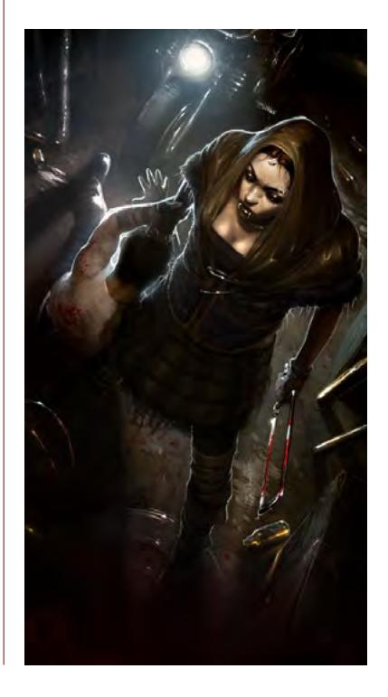

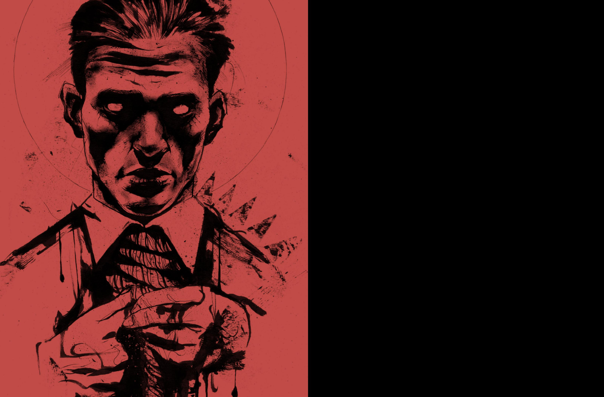

# 1.

Когда кто-то, кто был вампиром всего несколько месяцев, умирает, его тело превращается в разлагающийся труп. Мы все это знаем, но иногда забываем, насколько это отвратительно. Глядя на тело у моих ног, я счастлив, что мне

не нужно дышать.

Йоханнесу не так не повезло. Я называю его своим личным помощником, что

звучит лучше, чем дилер, раскрученный

до наркомана в крови раба. Как тот, кто не разделяет

моих вампирских привилегий, он рвет...

на четвереньках на потрескавшийся кафельный пол.

"Не вдыхай через нос", советую я ему.

"Спасибо, Сигне, очень помогло", - хрипит он, роясь в карманах, чтобы найти чтонибудь, чем можно вытереть рвоту с бороды. "Но если серьезно", - продолжает он. "Этот парень был ребенком шерифа. Не хочу показаться негативным, но, по-моему, мы в полной заднице".

Звук тощего техно-бита отражается от бетонных стен. Мы находимся в подвальной кладовке под туалетами. Танцпол качает, все прекрасные смертные мешки с кровью прыгают и барахтаются..

Я должна следить за собой. Так легко начать думать о людях в дегуманизирующих терминах. Йоханнес жалуется, когда я говорю о людях как о закусках "Дай-ка я подумаю. Мы могли бы просто взломать его", предлагаю я О Боже..." стонет #Motstå

Мне это не понравилось. То, что он из Камарильи, не означает, что он может ходить вокруг нас". На мой взгляд, все, что я говорю, вполне разумно, но Йоханнес продолжает делать лицо.

Чтобы успокоить его, я продолжаю: "Мы просто свалим все на инквизицию".

"Как?"

"Он сделал пост на Instagram, когда он собирался прийти в клуб. Довольно глупо, если хочешь знать мое мнение..."

"Ты больше не в гребаном Шабаше. Мы не можем сражаться с Камарильей лоб в лоб. Мы должны затаиться, сохранять хладнокровие и наносить удары, когда у нас будет преимущество". Я напрягаюсь, чтобы расслышать слова. Мы стоим за диджейской будкой. Прекрасная летняя ночь. Над верхушками деревьев видны звезды, и я наслаждаюсь мыслью, что все они - большие солнца, слишком далекие, чтобы обжечь меня. Хадиджа - моя лучшая подруга в "Анархах", и я ценю ее мнение, но иногда мне хочется, чтобы она больше внимания уделяла работе диджея и меньше ругала меня.

"Они не будут уважать нас, если мы будем каждый раз переходить на сторону других".

с трудом

ты убил его?"

подняться на ноги. "Я никогда раньше не видел мертвых тел". "Правда?" Идея звучит абсурдно, но, возможно, он действительно не видел. Я дезертировал из Шабаша, потому что идея мрачной смерти в Крестовом походе в Геенну мне не очень нравилась. Теперь, когда я горжусь тем, что принадлежу к низшему классу анархов

Стокгольма, я иногда забываю, что жизнь в Шабаше может оставить вас с некоторыми довольно искаженными ценностями". "Да, правда". Он говорит почти сердито. В своей прежней жизни я бы убил смертного, который так со мной разговаривал, но я сделал предметом гордости отношение к Йоханнесу как к человеку. "Почему

как

2.

**125**

"Он хотел, чтобы клуб был его территорией. Он постоянно хвастался своим сиром.

"Нет", - перебивает Хадиджа. "Мы живем антикамарильской жизнью, это точно. Но это холодная война. Мы используем ландшафт в своих интересах и обращаем их высокомерие против них самих". Она замечает что-то в танцующей толпе.

"Смотри".

К стенду подходит нервный мужчина, слишком молодой для своего костюма, похожий на начинающего капиталиста, только что принятого в школу бизнеса.

"Вы можете сыграть "Blank Space" Тейлор Свифт?" - кричит он, перебивая механический ритм Хадиджи.

Хадиджа смеется, наклоняется ближе к нему. "Читай комнату, чувак. Эти люди не хотят это слышать".

Его лицо покраснело бы, если бы он был человеком. "Нет, я имею в виду... Это было проходное слово, верно?"

"Конечно", - улыбается Хадиджа. "Что ты хочешь?"

"Они сказали, что ты можешь достать мне кровь. Понимаешь. Меня интересуют некоторые очень специфические вещи".

"Конечно, можно. Подожди, пока я закончу свой сет", - говорит Хадиджа.

Хадиджа права. У нас тоже есть преимущества. Анархи живут среди смертных так, как не живет Камарилья. Иногда, когда речь идет о крови и странных просьбах, мы можем найти то, чего не могут найти они.

# 3.

"Я думал, это будет скучно. Но я слишком напуган, чтобы быть скучным", - шепчет Йоханнес. Он выглядит нелепо в модном костюме, как переросток, жилистый клубный ребенок, которым он и является. Я неплохо выгляжу в таком виде, но я выбрал свои каблуки в порыве высокомерия. Я хотела влиться в Элизиум, но теперь единственное, что меня утешает, это то, что если я сломаю лодыжку, то она заживет.

"Спасибо, Жан-Поль, за восхитительную интерпретацию классики Шостаковича", произносит Хранительница Элизиума, и ее голос легко слышен за ропотом разговоров в салоне. Хранительница - импозантная женщина. С каинитами слово "вневременной" начинает терять смысл, но она действительно так выглядит.

"Не стесняйтесь отведать прохладительные напитки, пока мы готовимся к следующему исполнителю".

Я одариваю зал своей самой притворной улыбкой. Если бы мои старые товарищи по Шабашу могли видеть меня сейчас, болтающегося в Элизиуме Камарильи с моим собственным слугой за компанию.

"У тебя есть это", - шепчет Хранитель, придвигаясь ко мне. Без ее приглашения у нас не было бы здесь никаких дел. Ее самообладание дает трещину, когда она приближается к тому, чего так отчаянно желает.

"Конечно". Я незаметно достаю из сумочки пузырек с кровью и протягиваю ей. "Кровь гомосексуального мужчиныбеженца, удрученного депортацией, ожидающей его на следующее утро. Как вы ипросили".

Йоханнес мучает меня совестью по этому поводу с тех пор, как мы получили комиссию. Он говорит, что это бессовестно - охотиться на людей в таком отчаянном положении. И, черт возьми, но я начинаю думать, что он прав. Он все время говорит, что мы всегда должны бить в набат. Я не уверена, что мне это нравится, потому что первый, кого он мог бы ударить, это я.

"Спасибо, моя дорогая". Хранитель передает флакон слуге, который появляется из ниоткуда. "Но есть еще кое-что. Я слышала, что ты можешь получить кровь вампира из Шабаша".

Эта просьба застает меня врасплох. "Зачем тебе это нужно?"

"Говорят, у Шабаша есть странные ритуалы, которые оставляют в Крови неповторимый привкус. Если это правда, я бы очень хотела попробовать", - говорит она, и я не сомневаюсь в ее искренности. Иногда то, что звучит как мрачный заговор, насамомделе просто голод.

"Знаешь что? Я могу помочь тебе. Но ты должна сделать что-то для меня взамен". ■

Electric Vitae

Acid Test

Что же делать, когда Камарилья и ее старейшины слишком сильны физически и слишком хорошо связаны политически? Как бороться с непреодолимыми препятствиями?

Комедия.

Юмор.

Смех.

Вот как.

Следуйте по стопам старых веселых проказников и путешествуйте из города Камарильи в город Камарильи, выводя из себя площади и показывая, что принц - обычный дурак, такой же, как и все мы!

Только не забывайте делать это быстро и ловко, потому что иногда наказанием за игру в шута является смерть. Никогда не забывайте, что враг всегда более жесток и мелочен, чем вы можете себе представить.

# Вот несколько классических произведений для начала:

1. Используйте маскарад. Многие старейшины и князья появляются в публичных местах, таких как театральные премьеры, открытия галерей, политические сборы средств и благотворительные балы. Присутствие смертных не позволяет им реагировать слишком бурно, даже если вы сделаете старую активистскую классику в виде пирога с заварным кремом в лицо. (Для дополнительных кредитов используйте рецепт с лошадиной спермой. Он есть в Интернете, поищите).

2. Используйте доверенных лиц смертных. Самое замечательное в смертных то, что они не знают о существовании вампиров. Это означает, что вы можете нанять, заставить или подтолкнуть их к действиям, которые, строго говоря, противоречат их собственным интересам. Старейшина не может использовать свои способности, чтобы раскрыть истинную природу вашей уловки, если смертный также не знает об этом. Просто помните, что не стоит использовать смертных, к которым вы привязаны. Доминирование над одним из них для того, чтобы прилюдно насмехаться над старейшиной, - это весело, но может привести к смерти.

3. Старые вампиры не понимают современный мир. Вы можете использовать это, чтобы посмеяться над ними. Помните старый эпизод "IT Crowd", где они притворяются, что Интернет находится в коробке? Готов поспорить, что вы сможете провернуть это против большинства князей Камарильи. Самое приятное в этом то, что никто из других старейшин тоже не поймет шутки.

Вот забавная вариация, только для тех, кто может сблизиться со старейшиной: Убедите их, что для поддержания Маскарада им необходимо адаптироваться к современной моде. Затем нарядите их во что-нибудь

4. Бейте их там, где больно, а не там, где их сила. Старейшина любит Ван Гога, который находится в музее. Пойдите туда и оскверните его посланием, которое поймет только вампир. Не попадайте в ловушку, полагая, что у пожилого человека есть все, чем он дорожит, в его Прибежище.

5. Соблазните мальчика князя и трахните его на их общей кровати. Ладно, это, строго говоря, не розыгрыш, но я рекомендую его для острастки.

6. Напасть на убежище старейшины, если у вас хватит на это смелости. Возьмите камеру, наденьте маску и тритесь промежностью о его подушки, плюйте в кровавые коктейли в его холодильнике и пишите "Я дурак" на стенах ультрафиолетовым маркером. Опубликуйте на Youtube. Лучшая часть: Это даже не нарушение маскарада.

7. Многие старики коллекционируют искусство. Только очень немногие разбираются в современном искусстве. Воспользуйтесь этим, выдавая себя за арт-дилера и продавая кусок дерьма за новый шедевр. Только будьте осторожны: Иногда старец может иметь такой статус в художественных кругах, что дерьмо волшебным образом станет стоить кучу денег только потому, что оно ему нравится. Даже ваше раскрытие шутки может стать частью произведения. Вообще, не занимайтесь современным искусством. Оно сожрет вас.

8. Проникните в известное кино или бродвейское шоу и убедитесь, что один из персонажей - явная пародия на князя. Дополнительные очки, если это фильм о вампирах.

Дополнительные очки, если вы разыграете свои карты так хорошо, что князь не сможет ничего сделать, потому что вмешательство в столь тщательно изучаемый проект поставит под угрозу Маскарад. (PS. Не нарушайте Маскарад.)

**9.** Передайте информацию о местной Камарилье Второй Инквизиции. Вы будете смеяться и хохотать, глядя на то, как за одну ночь все убежища будут зачищены спецназом. Ладно, это тоже не шутка, и вас могут убить. Со Второй Инквизицией не стоит шутить. Не делайте этого.

**10.** Вот один из вариантов, если вы действительно самоубийца: Нанесите удар в центре Элизиума. Придумайте что-нибудь унизительное и нападите с этим на князя. Вылейте вино ему на голову. Наймите карлика, чтобы он его высмеял. Да что угодно. Если вы все сделаете правильно, он потеряет лицо, если сойдет с ума. Все его друзья и союзники смотрят на него. Он должен вести себя спокойно.

Конечно, возможно, ему не удастся сохранить хладнокровие, и он убьет вас в убийственной ярости. Если это произойдет, вы можете умереть счастливым, зная, что жертва вашей маленькой шутки была публично унижена.

Все это лучше всего работает, если вы работаете в группе, обязательно знакомитесь со своими жертвами и действуете быстро. Как только шутка попадает в цель, вы уже в пути. Цель этого - показать, что ни один старейшина Камарильи не является неприкасаемым, и даже самые могущественные могут быть унижены.

Если вы не против почувствовать себя грязным и униженным, вы можете вовлечь в эти сюжеты вампиров Камарильи. Многие из них тоже ненавидят своих старейшин, и интриги как раз по их части, даже если у них никогда не хватит духу применить физическую силу.

Наконец, нужно быть осторожным на случай, если князь тоже решит пошутить. Некоторые из них настолько стары, что их чувство юмора развилось, когда пинать калек еще было верхом комизма. Некоторые старейшины душные и софистически образованные, но вы удивитесь, как много среди них просто грубиянов. Спросите любого, кто видел развлечения при дворе бывшего князя Берлина Густава Брайденштайна. ■

- Аноним

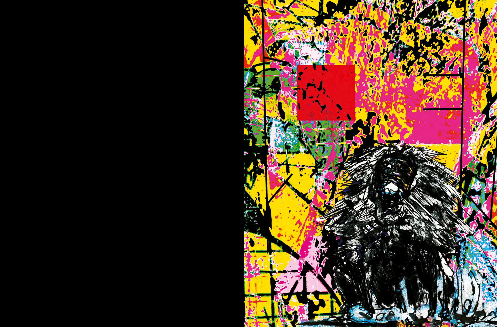

# Манифест Перта

# В ы знаете, кто я. Я ребенок барона Перта, Томасины Пейн. Моя семья жила на этой земле задолго до того, как англичане или камарилья высадились на этих берегах. Меня взяли в "Объятье", потому что Пейну нужен был абориген для игр.

Моя мать рассказала мне о своих планах на Перт в 1953 году, перед тем как я покинул ее навсегда. Я заранее предсказал все, что произошло с тех пор, и был прав на каждом шагу.

Это то, чего она всегда хотела. Когда она говорит, что огорчена тем, что ей приходится прибегать к таким крайним мерам, она лжет. В душе она всегда была дивой Камарильи. Одевание ее в одежды анархии просто соответствовало ее потребностям на данный момент.

Вопрос в том, есть ли у нас то, что мы хотим? Действительно ли мы свободны? Или мы живем в фальшивом Свободном государстве, неокамарильском режиме, целью которого было просто заменить старых правителей на новых?

Позвольте мне сделать последнее предсказание: Пейн объявит Перт городом Камарильи, а себя князем. Она скажет, что это делается для нормализации отношений между Пертом и Камарильей и наступления новой эры мира.

Она не упомянет, что так и было задумано с самого начала.

# Наша потребность

Мы должны любой ценой защитить свободу Перта как города анархов. Мы должны упразднить нынешние квази-камарильские структуры и добиться реального равенства. Мы должны убедиться, что кормовые площадки Перта доступны всем, и что каждый Анарх имеет право поступать со своей смертной семьей, людьми, слугами и последователями так, как он считает нужным.

Человечество - наше коллективное наследство. Смертные, живущие в Перте, должны приносить пользу всем Анархам в равной степени.

Барон Томасина Пейн должна ответить за свои преступления против движения Анархов. Мы требуем справедливости, а не мира: Если борьба за устранение Пейн потребует актов насилия против ее сторонников, мы готовы.

# Наша история

Более тридцати лет мы, граждане Крови, живущие в Перте, якобы были свободны. Мы вытеснили Камарилью, пока не остались только Тремеры. Мы создали свою собственную систему, правящий Круг, чтобы создать базу власти, готовясь к неизбежной контратаке Камарильи, которая так и не последовала. Вместо этого произошло нечто гораздо более коварное. Первоначальные идеи свободы и совместного принятия решений увяли под властью европейских вампиров, составлявших Круг.

Пять лет назад Круг проголосовал за то, чтобы сделать одного из своих членов, Томасину Пейн, бароном, а себя ограничить консультативной ролью.

Это то, что мы имеем сейчас. Пейн фактически является князем, а Круг - его прародителем.

Перт мог бы стать настоящим Свободным государством, примером для нашего рода повсюду, как создать справедливое общество для всех граждан крови, несмотря на нашу историю колонизации и тиранию Камарильи. Вместо этого, благодаря усилиям нашего барона, мы получили фальшивую анархию.

Нигде это не проявляется так явно, как в Законе Десяти, установленном Кругом. Идея заключается в том, что население Анарха разделено на группы по десять человек. Десяти, которые отвечают друг за друга. В действительности же он стал системой коллективного, анти индивидуалистического наказания, где невиновные несут ответственность за преступления всех, кто принадлежит к той же произвольной группе.

# Ее преступления

Во время своего пребывания в Круге Пейн выступала за то, чтобы создание потомства зависело от одобрения Круга. Став бароном, она предоставила это право только европейским вампирам.

Пейн запретила питаться в любой другой зоне, кроме той, которая предназначена для каждого отдельного Анарха. Наказанием за нарушение этого закона является год службы в Движении. В прошлом году мы видели, что это значит, когда нарушитель был приговорен к службе камердинером Пейна.

Стандартным наказанием за нарушение законов Пейна было изгнание, определенный срок службы или смерть. Во время ее службы в Круге в год совершалось одна-две казни. Теперь, при бароне, это число утроилось.

Правление Пейна принесло нам тиранию, голод и смерть. Она приложила все усилия, чтобы наш род оставался белым и европейским, несмотря на ее символические жесты об обратном.

# Ее наказание

Томасина Пейн уйдет с поста барона, который будет упразднен.

Томасина Пейн будет сотрудничать с комиссией, которой поручено раскрыть ее преступления и установить личности ее жертв.

Пока комиссия будет работать, Томасина Пейн будет выполнять обязанности обычного гражданина Анарха в Перте. Она обязана сообщать комиссии обо всех контактах с сородичами Камарильи.

За время своего пребывания на посту барона Пейн приговорила множество Анархов к выполнению функций личных слуг во имя служения Движению. До тех пор, пока комиссия не вынесет окончательный вердикт, Пейн должна выступать в качестве слуги на всех мероприятиях Анархов Перта, с задачами, аналогичными тем, которые она взыскивала со своих подданных.

Как только комиссия вынесет свой вердикт об изгнании или окончательной смерти, Пейн примет его.

Невыполнение условий наказания означает, что Томасина Пейн принимает вердикт об окончательной смерти.

# Наш новый порядок

Офис барона, Круг и система коллективного наказания "Закон десяти" доказали свою несостоятельность. Вся будущая организация анархов в Перте должна происходить на основе коллективного, совместного принятия решений.

Наш основной принцип должен заключаться в том, что вы всегда имеете право голоса в каждом решении, затрагивающем вас.

Деколонизация должна направлять наши усилия, когда речь идет о развитии анархов Перта. По крайней мере, половина всех будущих граждан Анарха должна быть коренной национальности.

Все вампиры старше 100 лет и европейского происхождения должны быть навсегда изгнаны из города.

Мы должны построить наше новое бессмертное общество вместе, но мы все знаем, что это должно происходить на этих принципах, иначе этого не произойдет вообще.

Теперь давайте вернем себе нашу гордость. Перт все еще может быть городом, о котором мы когда-то мечтали.

Ты знаешь, кто я, Tru

# Ешьте богатых! Или манифест о политике радости

В ы бывали на таких собраниях. Вы сидели в кругу, ожидая своей очереди выступить. Вы слушали, как жертва жестокости Камарильи рассказывает свою историю. Шериф замучил своих друзей до смерти. Князь сделал его придворным шутом. Вы рассержены, и теперь ваша очередь говорить.

Вы призываете к действию. Вы требуете перемен.

Вы предлагаете внести изменения в структуру принятия решений вашей революционной ячейки.

В нашей революции чего-то не хватает. Чего-то не хватает на наших собраниях, в наших манифестах, в наших восстаниях. Чего-то не хватает даже тогда, когда мы сражаемся с врагом на улицах.

Не хватает крови. Ощущения, когда глубоко вгрызаешься в горло мягкого патриция и втягиваешь кровь в рот. Пробуя ее. Чувствовать вкус. А потом сосать еще, пока ничего не останется. Даже от души бедного ублюдка ничего не останется.

Мы должны вернуть радость в революцию. А Кровь - это радость.

# A Tale of Happiness

Позвольте мне рассказать вам историю об одной ночи в революции вампиров. Как вы знаете, я - девушка из родного города. Я родилась в Кракове, я стала Анархом в Кракове, и даже когда меня там нет, мое сердце всегда будет оставаться в Кракове. В моем городе у нас есть такая вещь, которая называется "самоуважение". Я знаю, что это понятие чуждо многим из тех, кто живет в городах Камарильи, но оно есть и у вас, если вы отбросите Большую С на обочину.

В любом случае. Время от времени Камарилья делает ставку на наш город. Они поняли, что не могут убить нас, поэтому вместо этого они пытаются сделать что-то более коварное. Они посылают кого-то, у кого есть связи в политике смертных, кто знает, кого подкупить и кого шантажировать. План состоит в том, чтобы усилить полицию, искоренить нашу базу смертных сил и, в конце концов, совершить набег на наши Убежища. Если план сработает, мы умрем в руках омоновцев, и ни одному вампиру Камарильи не придется марать свои маленькие нежные ручки.

На этот раз они послали симпатичного парня из Вентру в элегантном костюме и с идеальными зубами. Идеальный объект для фантазий ненавистников, для тех, кто к этому склонен. Его поселили в номере люкс в Гранде, и мы узнали об этом, как только он вошел в здание.

Мы решили взять пример с него и отправить наших человеческих друзей Шимона и Петра заниматься с ним в течение дня.

Так кто же победит? Двухсотлетний монстр? Или несколько наших мальчишекколдунов?

Именно так.

Когда я пришел на место, Патриций был посажен на кол в ванной, а Шимон сидел на кровати и читал журнал о декорировании интерьера.

Я перетащил Патриция на кровать и укусил.

Вот вещь, которую мы упускаем в революции: Кровь Вентру. Это хорошая вещь. Действительно хорошая. Не обращайте внимания на все эти "князь навязывает вам Кровные узы" и просто сосредоточьтесь на вкусе, на нюансах. Вы поймете, что я имею в виду.

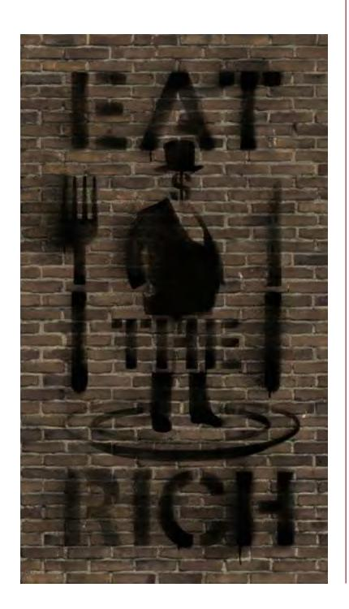

Поэтому я высасываю его досуха. Я лежу на его парализованном теле и высасываю кровь. И меня поражает, насколько мрачным и печальным стал наш бизнес. Мы сражаемся, мы умираем, мы говорим, мы планируем, и где-то по пути мы забываем, зачем мы это делаем.

Мы хотим лучшей жизни. Мы хотим быть свободными. Мы хотим испытать все удовольствия нашего неживого существования. И одно из таких удовольствий набег на погреб. Наслаждаться сладкой, винтажной кровью Камарильи.

Я продолжал сосать, высасывать, когда его труп иссяк. Многие люди любят придавать диаблери драматизм, например, высасывать душу или что-то в этом роде. Лично я считаю, что это очень интимный акт. Все, что он собой представляет, дистиллируется в нечто сродни крови. Когда она входит в меня, он перестает быть собой. Все, чем он был, становится частью меня.

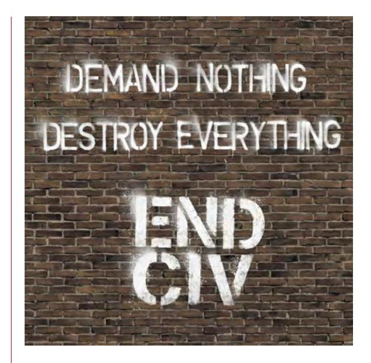

# ЕШЬТЕ БОГАТЫХ!

Не позволяйте годам измолоть вас. Не поддавайтесь безнадежности и страху. Посмотрите в зеркало и произнесите эти слова вслух: "Я заслуживаю счастья". А диаблери это счастье".

# НЕ ПОДПИСАНО.

1. Агата "девушка твоей революционной мечты" Старек

2. Ты. Этому манифесту больше не нужны имена. Иди, наслаждайся революцией и отсоси у некоторых камарильских ебарей. PS. Я рекомендую попробовать широкий выбор кланов, поколений и возрастных групп. Как только у вас появится опыт диаблеризации вампиров Камарильи, вы сможете поспорить о том, привносит ли возраст что-то во вкус, или же малкавианскую кровь лучше пить из бокала или прямо из корчащегося трупа. ■

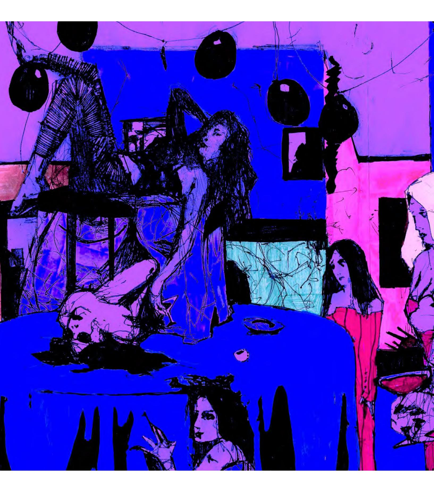

# Утопия на крови в Амазонии

# Манаус, Бразилия - 12 ноября 1981 года

Я нашел ребенка с идеально вылепленным ухом в центре лица. У него не было других черт. Ни носа, ни рта, ни глаз. К тому времени, когда ребенок умер, мы поняли, что наш идеальный мир недолго будет идеальным.

Я знаю, что многие интересуются, как проходит наш утопический эксперимент. Я доверю вам распространить эти заметки среди них. Я уверен, что некоторые будут высмеивать нас за то, что мы думали, что сможем найти место, не зараженное древними монстрами, но в течение нескольких хороших лет мы действительно имели свою утопию в Амазонском тропическом лесу. Нетронутые человеческие поселения, города и поселки вдали от всего.

Ребенок был первым, но не последним. Я никогда не видел ничего подобного. Они продолжали появляться, дети, взрослые, старики. Все изуродованы одинаково.

У меня довольно хорошее поместье. Я жил здесь как постоянный гость в семье смертных. Когда я еще был человеком, я действительно жил здесь. Мне приятно, что эта богатая семья прислуживает мне, полукровке, на которого они не плюнули бы, когда я был смертным. Тем не менее, они стали мне по-своему дороги. Однажды ночью я проснулся от того, что один из детей стоял над моей кроватью. У него все еще был слюнявый рот, и он все время захлебывался словами: "Слушай голос Кайна".

Так Шабаш вошел в нашу часть мира.

# Где-то в лесу, Бразилия - 3 мая 1982 года

Я бы хотел, чтобы мы их нашли. Когда мы пришли на Амазонку, мы думали, что находимся в безопасности от монстров внешнего мира. Если бы мы уловили запах Камарильи, мы могли бы скрыться в маленьких поселениях и переждать их.

Я был уверен, что ни один европейский кровопийца не победит меня на моей родной земле. Другие, пришедшие сюда со мной, возможно. Большинство из них были европейцами, уставшими от Войны Веков. Но не я. Я знаю этот лес.

Теперь я не так уверен.

В наши дни Манаус полон невежественных, безумных вампиров. Шабаш приходит в город, похищает кучу людей, дает объятие их и уходит. Им наплевать на Маскарад. Новые вампиры создают больше себе подобных.

Я убил десятки из них, некоторые из них были искажены и изуродованы, кричали и бормотали. У многих других Анархов, которые пришли со мной на Амазонку, кишка тонка для убийства. В прошлой жизни я был моряком. Теперь я просто палач, пытающийся остановить поток крови.

# Манаус, Бразилия - 9 сентября 1982 года

Мы думаем, что есть только три настоящих вампиров Шабаша. Остальные - просто местные жители, которых они захватили. Я заставил одну из их жертв говорить. Его рот был закрыт плотью, но я разрезал его ножом. Он сказал мне, что они говорили поиспански, и это были две женщины и мужчина.

Мы не знаем их имен, но художницу из плоти мы называем Бабочкой. Ей нравится удалять черты лица и заменять их ушами. Она очень щепетильна в этом. Однажды я видел человека, у которого их было десять штук по всей голове.

Трое из них, почти пятьдесят нас. Они уродуют смертных, Охватывают людей в наших городах, но мы все равно не можем их найти.

Ваша польская подруга Агата Старек была здесь летом в течение месяца. Я не хотел, чтобы она была здесь, потому что она почти такая же плохая, как Шабаш, но в конце концов я умолял ее остаться. У нее был настоящий талант убивать молодых.

# Где-то на реке Солимойнс, Бразилия - 11 ноября 1982 г.

Я знаю, что это антиклимакс, но я думаю, что мы победили. Я получил сообщение, что на лесозаготовках что-то происходит. Когда я приехал туда, все были мертвы, кроме нескольких шипящих, бесформенных несчастных, волочащихся по грязи. Шабаш издевался над ними, калеча их и заставляя бежать наперегонки с ложью о спасении.

Я никогда не видел такой резни, разве что после смерти эскадронов смерти. Одни тела были сухими от крови, другие рассыпались по земле мокрыми красными кусками. Когда я добрался до шабашистов, они были вне себя от наркотической крови, пели, кричали и танцевали среди руин. Это был не бой, я не разговаривал с ними. Просто убил.

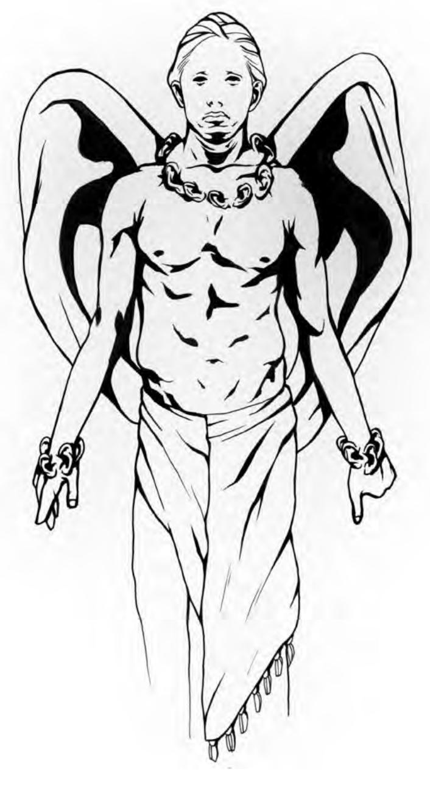

Я охотился на их потомков вдоль реки и думал о свободе. Я не думаю, что Шабаш пришли сюда, чтобы устроить войну против нас. Они пришли в джунгли по той же причине, что и мы: Чтобы быть свободными. Только их свобода означала кровь, безумие и смерть.

# Манаус, Бразилия - 5 июня 1986 года

Я нашел еще одного из вампиров, которых оставил Шабаш. Это была растерянная, агрессивная маленькая тварь, живущая за счет крови своих смертных родственников. Когда я казнил ее, она прошептала молитву Кайну. Шабаш мертв в Амазонии, но их вера продолжает жить. ■

# УНИЧТОЖИТЬ ЭТО ПЯТНО

[Речь чиновника Камарильи, переписанная верным повстанцем на конклаве в Голуэе в 2010 году].

# Родственные Камарилье!

По соглашению с Юстициарами, присутствующими на этом Конклаве, сегодня я представляю вам предложение о резолюции "Тотальной войны на уничтожение".

Причины этой чрезвычайной меры следующие: В сентябре 2008 года организации Анархов попытались захватить власть в ряде городов по всему миру после того, как смертным агентствам стало известно о местонахождении Тремерской канцелярии в Вене. Князья были свергнуты, примогены казнены, а законные власти отстранены от должности, и таким образом было совершено нарушение условий мира.

Временный успех их революции в конкретном смысле защитил этих преступников от челюстей правосудия. После этого они стали искать морального оправдания, утверждая, что вина за начало военных действий лежит на Камарилье.

Это утверждение расчетливо и объективно не соответствует действительности. В результате, однако, эти ложные обвинения привели к всемирному восстанию слабых поколений и к условиям беспорядка, в которых мы, я, должны теперь выживать, и было вопиющим нарушением гарантий, данных нам в договоре. Действительно, все обещания, данные ими, оказались проклятым обманом и искусными иллюзиями.

В течение последних десятилетий с момента подписания договора наша секта терпела неудачи и ухудшения во многих сферах. Но мы, несмотря ни на что, остались верны своим обещаниям и проявили стойкость. Никто не может отрицать, что мы выполнили свои торжественные клятвы, данные в договоре.

Вызывает презрение, что ответственные за этот серьезный мятеж сочли необходимым придумать тысячу оправданий и эвфемизмов для своих действий, вместо того чтобы просто честно признаться в содеянном. Объективный анализ их мятежа и обещаний, данных нам и некогда широко провозглашенных, является сокрушительным обвинением архитекторов этого преступления, не имеющего аналогов в нашей истории.

Это восстание - самая большая военная панорама.

Число людей тонкой крови, которые искренне поддержали это восстание, безжалостно эксплуатируя свои страсти, было не просто частью всего населения, оно, как мы теперь знаем, было ближе к сумме целого. Теперь у нас есть необходимость очистить нашу секту как средство полного отвержения идей, организаций и отдельных Сородичей, которые, как мы теперь признаем, стоят за основными причинами упадка нашего общества.

Сейчас Камарилья должна стремиться, несмотря на самое ужасное угнетение, обратить все большее число каинитов, с точки зрения духа и воли, к оборонительным действиям. Встать и сражаться. Чтобы уничтожить пятно.

Распад секты и всего сообщества Родства на непримиримо противоположные враждебные лагеря, который был систематически вызван ложными доктринами Анархии, означает уничтожение основы для любой возможной совместной жизни.

Этот распад нарушает все основные постулаты социального порядка. Совершенно несовпадающие подходы индивидов к понятиям государства, общества, порядка, верности, служения и чести разрывают противоречия, которые приведут к войне всех против всех. Начавшись с человеческого безумия последнего столетия, это развитие закончится, как диктуют законы природы, полной катастрофой для всех нас.

Скопление этих примитивных инстинктов приводит к ассоциации между их политической теорией и преступными действиями. Начиная с грабежей и вторжений в наши владения и города, засад и вторжений, и всего прочего, что морально одобряется теорией анархов.

Этот метод индивидуального терроризирования общества уже стоил Камарилье более 200 уничтоженных только за последний год.

Падение канцелярии Тремеров в Вене, всего лишь одна впечатляюще успешная миссия в рамках широкомасштабной операции, является лишь привкусом того, что мир должен ожидать от триумфа их демонической доктрины. Ни этот Конклав, ни вся Камарилья еще не осознали в достаточной степени масштабность операций, планируемых сейчас этой неверной организацией.

Целью этого Конклава должно стать уничтожение этого пятна и устранение всех следов этого явления Анарха, не только в интересах Камарильи, но и в интересах всего вампирского рода.

Этот Конклав не должен позволить себе быть поколебленным какими-либо страхами или спекуляциями в своем решении этой проблемы. Теперь Конклав обязан принять четкую резолюцию со своей стороны. Это ничего не изменит в судьбе Анархов и других братских сект.

В этих мерах Камарилья руководствуется не чем иным, как сохранением древних устоев.

В связи с этим мне должно быть предоставлено то положение абсолютного суверенитета военного времени, которое необходимо в такой ситуации, чтобы положить конец всем подобным недавним событиям. Я буду использовать эти полномочия лишь постольку, поскольку это необходимо для применения жизненно важных мер по ведению тотальной войны. Права кланов не будут урезаны, а их положение в Камарилье не будет изменено. Авторитет ни этого Конклава, ни Камарильи не будет поставлен под угрозу. Положение и уважение к Традициям останутся незыблемыми.

Но если мы хотим выжить, ктото должен обладать властью. И если не я. Кто?

Поэтому мы должны настаивать на принятии этого предложения. В любом случае, я прошу принять четкое решение.

Пусть теперь вы, сородичи, сами выбираете между миром и войной! ИСКОРЕНИТЕ ЭТО ПЯТНО! ■

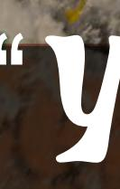

**VAMPIRE – THE MASQUERADE – ANARCH CLANS**

х ты. Позволь мне остановить тебя прямо здесь. Настроение здесь быстро испортится, если вы будете продолжать разбрасываться клановыми стереотипами и подобными оскорблениями. Движение - это союз свободных личностей, а не "кланов" или линий крови. Сумрачнорожденные и свободные либо не знают, что такое клан, либо их ни капли не волнует, какой вкус кровяной жижи ты носишь в своих жилах.

The Free Clans " У Конечно, наши дары и проклятия немного отличаются, но неужели ты действительно собираешься позволить своему предполагаемому происхождению определять то, кем ты являешься сегодня вечером? Зацикленность на чистоте крови, на том, кто был твоим предком и тому подобном дерьме; забей на этот образ мышления. Мы приняли тебя, несмотря на то, что у тебя голубая кровь, верно? Так что не начинай это дерьмо, или ты окажешься на стороне предрассудков клана, потому что твой род точно не выиграет здесь конкурсы популярности, основанные на родословной." ■

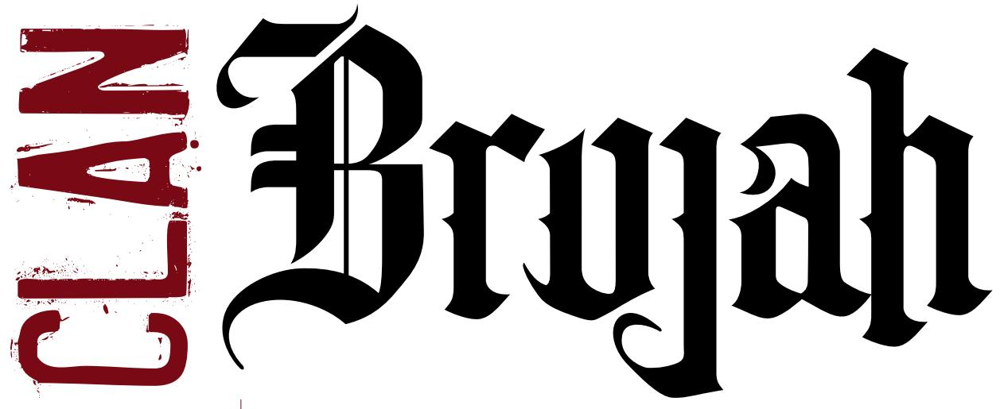

# Демзел*,*

Я слышал по виноградной лозе, что ты работаешь, обучая новую кровь тому, как мы работаем с людьми. Я поспрашивал у некоторых из сброда, с которыми я тесно общаюсь, что они думают по этому поводу, чтобы ты могла получить смесь точек зрения, не замутненных кокаиновой кровью Лос-Анджелеса. Итак, вот оно:

Нам удобнее всего прятаться внутри человечества, манипулируя им из центра. Хотя все еще есть несколько эллинских князей и примогенов, а чаще - баронов-анархов, наша самая большая сфера интересов - смертные. Мы знаем, что всем пиявкам нужны живые люди, чтобы оставаться стимулированными и, что важно, хорошо питаться. Все политические игры, в которые играют Сородичи, ничто, если вампир едва может выразить себя или вспомнить, что такое быть теплым. Мы презираем жесткие правила, холодные ритуалы и общественный статускво. Мы всегда боремся за перемены, даже если эти перемены сопровождаются страданиями. И это, возможно, наша самая глубокая связь с живыми - мы нуждаемся в них, чтобы вести их и быть ведомыми их идеями, помогать им постигать их видение будущего и осуществлять прочные перемены.

Похоже, несмотря на наше поклонение человеку-аутсайдеру, мы питаемся в основном одним и тем же. Наверное, мы как пастухи, которые не могут не откусить от своих призовых ягнят время от времени. Не поймите меня неправильно: я люблю обхаживать жирного кота с Уоллстрит и завалить его, но это не столько от голода, сколько от злобы и хорошей революционной практики. В любом случае, он, вероятно, раб голубой крови, так что это послание его хозяину. Суть в том, что мы наслаждаемся огненной кровью бунтарей и угнетенных, потому что это мы. Мы - то, что мы едим. Кроме того, легче есть среди своих.

Мы глубоко внедряемся в общество смертных, участвуя в политических и антиполитических движениях и иногда управляя ими, поощряя смертных активистов и манипулируя ими, а также выступая в качестве агитаторов за большие и малые дела. Мы злим другие кланы своим умением сталкивать смертных, как шахматные фигуры, но такой талант делает нас ценными в любой сфере.

Мы - клан индивидуалистов. Мы с одинаковой вероятностью можем колебаться как влево, так и вправо, придерживаться как религиозного фундаментализма, так и воинствующего атеизма. Мы - клан крайностей, к лучшему или худшему, но это означает, что мы довольно разнообразно распределены по всему земному шару.

Наше желание существовать вне мейнстрима погружает нас в то, что люди называют контркультурой. Для стороннего наблюдателя мы делимся на два лагеря: те, кто продолжает меняться вместе с тенденциями смертных, и те, кто застрял в определенной эпохе контркультуры. Как только вампир просуществовал без смерти три или четыре десятилетия, смертная культура часто опережает его. Это явление приводит к тому, что Брухи все еще одеваются и живут как модники, рокеры, панки, хиппи и готы, несмотря на то, что эпоха этих движений ушла в историю. Некоторые из нас отвергают необходимость подражать мятежным смертным, говоря "fuck you" пирсингу, татуировкам и вопиющей моде в пользу повседневной одежды и дорогих костюмов. Такая простая вещь, как мода, создает жесткое разделение внутри клана: на тех, кто старается, и тех, кто продается.

Мы все знаем, кто твой отец, девочка. Теперь поступай правильно с нашими молодыми. ■

*�*Белл

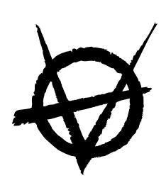

В 2009 году в Копенгагене пропал Педер Фаллесен, свободный анархо-байкер.

Именно я нашел его левую руку и ноутбук, помещенные в микроволновую печь, которая все еще гудела. Все его вебприсутствие, сайт в даркнете, которым он управлял, и все остальное, было вычищено, а компьютер тщательно прожарен. Через неделю в новостях сообщили, что на почте нашли гниющую человеческую голову. Копы так и не выяснили, но для всех, кто был на улице, сигнал был ясен: стукачи получают гораздо больше, чем зарезанные. Я ставлю на его братьев по движению. Кэм должен был сделать все чисто, а не рисковать, привлекая внимание, чтобы показать пример. Запах вареного мяса и жареного пластика останется со мной до тех пор, пока я не превращусь в пыль, так что, думаю, это действительно работает как сдерживающий фактор. ■

# Бруха в Родственное общество

Немногие представители рода за пределами клана знают о нас больше, чем наши физические возможности и переменчивый нрав. Те, кто найдет с нами общий язык, узнают в нас семью, состоящую из мертвецов, которым все еще не все равно. Мы искусные ораторы, способные убедить сородичей и людей сражаться за другой мир. Мы, Брухи, используем эти таланты, чтобы разжигать восстания, проливать свет на коррумпированную практику и воодушевлять тех, кто не имеет вдохновения.

Домены, управляемые Брухами, обладают ощутимым чувством социальных потрясений. Мы, Бродяги, не считаем наше общество как далекое или даже отдельное от живых, поэтому Бруха часто отражают движения смертных, гарантируя, что любые изменения в общественных нравах будут отражены в домене Родства. Сородичи в городе Раббл должен быть готов к частым изменениям в руководстве, идеологии, обычаях и местоположении Элизиума. Мы часто указываем на то, что мы не мелкие подростки-панки, которым надоедает одна конвенция после нескольких ночей, а скорее путешественники, отправляющиеся в путь к человеческому опыту и просвещению. Мы спрашиваем: "Почему мы должны довольствоваться одним способом делать вещи, когда у нас есть целая вечность для экспериментов?".

Стремление к постоянным переменам ставит нас в прямое противоречие с королями и их смертными пешками. Мы противостояли друг другу на протяжении тысячелетий, мы

B постоянно стремлении к новым способам существования, в то время как короли пытаются навязать правление и неизменные обычаи своим вассалам, живым и мертвым. Если бы не они, революционная агитация "возможен другой мир" была бы действительно правдой.

Впервые с момента образования Движения Анархов, Бруха выступили единым фронтом, когда представитель клана Тео Белл публично обезглавил Старого Боя Хардештадта, короля королей. Белл заявил о неприятии Камарильи и полном единстве внутри Движения Анархов. Даже мудрые Брухи, которые в основном оставались в Камарилье, согласились, что пришло время перемен. Как по мне, это кульминация движения "Красный вопрос", которое началось примерно в начале тысячелетия. Мы начали спрашивать себя "почему мы подчиняемся?".

и отсюда был только один логический вывод - у нас нет причин подчиняться, кроме страха. Такое поведение заставляет все остальные кланы сегодня воспринимать нас чертовски серьезно. Хотя мы по-прежнему разделены на отколовшиеся фракции, как и прежде, мы показали, что будем сильно сопротивляться, когда на нас наступают. Сегодня вечером репутация нашего клана "сначала действие, потом организация" приведет некоторые города Анархов к новой известности, а другие уничтожат изнутри, так как Камарилья направляет свою тайную полицию, Бичей и Архонтов на уничтожение нас. Это время для борьбы. Мы знаем, что происходит. Те, кто подвел клан в защите свободы несвязанных, слишком слабы, слишком напуганы, слишком коррумпированы или просто недостойны успеха. ■

### [Запись начинается]

**Bell:** Зачем вы это записываете?

**Jack:** Я не рассчитываю на долгое существование. Либо я усну, либо кто-то меня заберет. Я рассчитываю, что это мое последнее десятилетие.

**Bell:** Так это ваша последняя воля и завещание?

**Jack:** Нет, блядь! Это мой совет для тебя, чтобы ты передал его всем остальным мудакам, которые присоединятся к нам, панкам, в то время, когда панк мертв, как диско.

**Bell:** Ну, вы привели меня сюда за моим мнением, так что поехали.

**Jack:** Так, балаболы, слушайте. Как Бруха, вы будете побуждаемы к большому количеству плохого дерьма. Вам захочется крушить вещи, разрывать людей на части и вообще быть вспыльчивым человеком в оболочке нежити.

**Bell:** Но вы можете направить это, я думаю.

**Jack:** Как ты сделал, когда ослабил ошейник Хардестада? [Смех].

**Bell:** Вы шутите, но, конечно, да. Все вампиры - грешники. От этого никуда не деться. Но ты можешь направить грех на благо остальным членам своего клана. Больше, чем любой Вентру или Тореадор, ты будешь буйным, массовым убийцей, избивающим друзей сукиным сыном. Ты ничего не сможешь с этим поделать, это то, что есть.

Что вы можете сделать, так это убедиться, что вы окажетесь в нужном месте, когда это произойдет.

**Jack:** Да, у каждого из нас есть пороки, и большинство из них жестокие. Эллины называют их "гнев", "одержимость", "ненависть к себе", "низкая самооценка"...

**Bell:** Что?

**Jack:** Я не шучу. Мы относимся к этому так, будто это просто зверь пришел, чтобы укусить нас, но философы говорят, что все это рождается из нашей ненависти к себе. Мы вымещаем свое недовольство на других.

**Bell:** Вот тут-то и приходят на помощь ваши достоинства. Если вы хотите назвать себя как-то смело, выбирайте "защитник", "бунтарь", "направленный шторм" или что-то в этом роде.

**Jack:** Направленная буря?

**Bell:** Суть проста. У всех кланов есть свои заморочки. Наши делают нас жестокими, жестокими и разрушительными. Если вы хотите просуществовать в качестве Бруха дольше месяца, держитесь рядом с людьми, которых вы искренне ненавидите. Это значит, что когда вы выйдете из себя по крупному, вы направите его на кого-то или что-то, кому нужно спуститься, но вы будете слишком напуганы, чтобы атаковать со всей своей чувствительностью.

**Jack:** Вот и все. Добро пожаловать в клан Брух: дом ярости, возмездия и мятежного льва.

[Запись окончена]

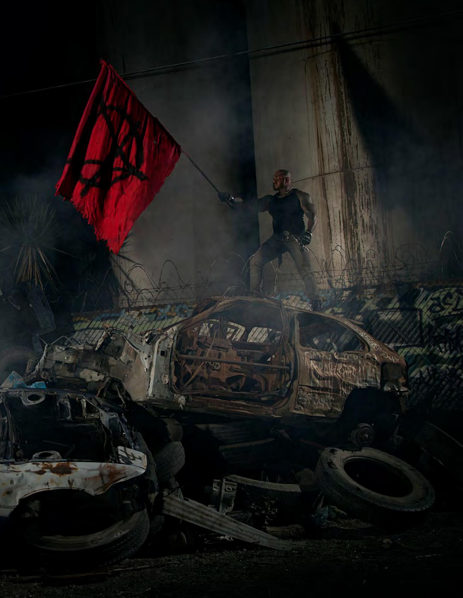

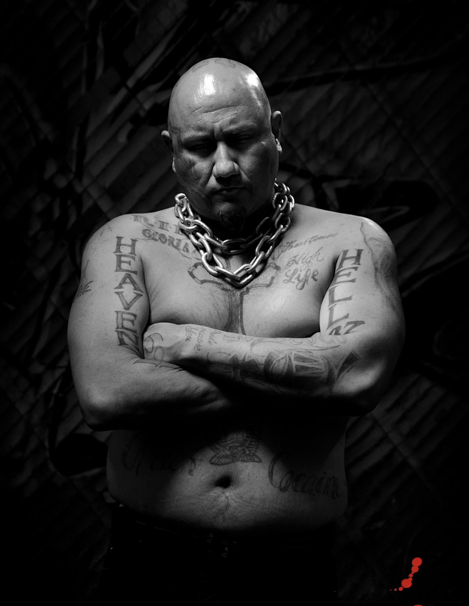

# Демзел Активна 10 минут назад

Спасибо за фотографии, большой мальчик. Они действительно сделали меня мокрой как блядь.

Нет проблем, куколка. Я весь из себя мужчина. Я чистокровный ариец, как ты и сказала. Как ты и любишь.

Да, ты знаешь это. В следующий раз я хочу, чтобы ты был здесь лично. Я хочу, чтобы ты обхватил меня своими толстыми руками, поднял и взял меня. Фашистский урод.

> Конечно. Завтра вечером? У тебя есть какие-нибудь извращения, о которых мне нужно знать? Ты только что назвал меня фашистским уродом?

Конечно, нет. Автокоррекция. Лол Завтра вечером звучит круто. И да, у меня есть одна. Ты не против укусить? Я люблю вцепиться зубами в такого крепкого парня, как ты.

Если только ты не укусишь мой маленький панцерфауст.

Не обещаю...

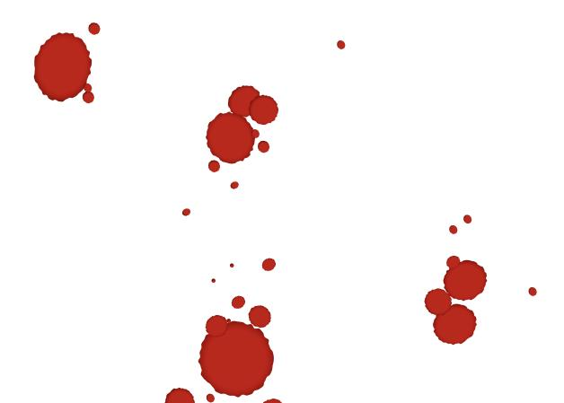

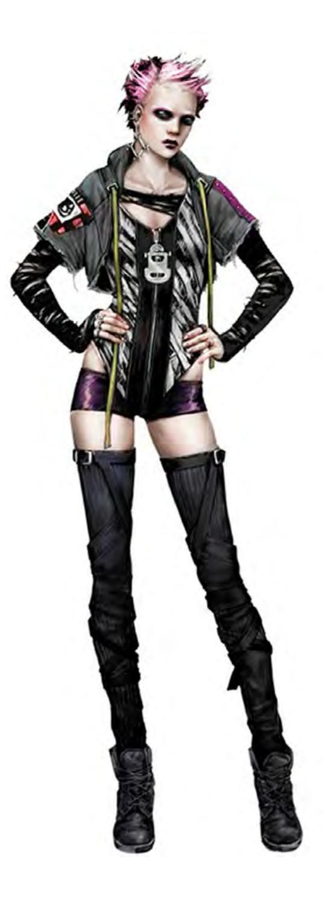

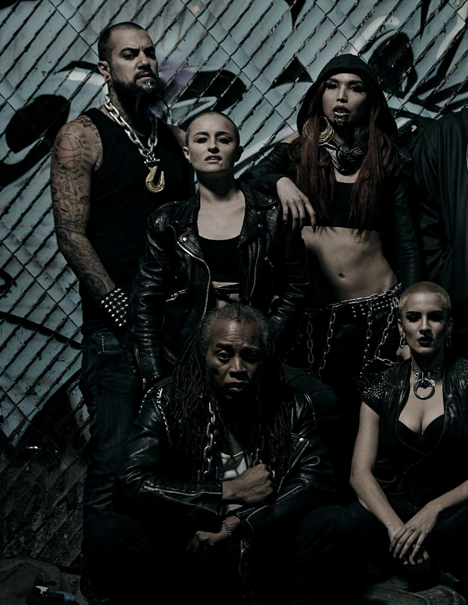

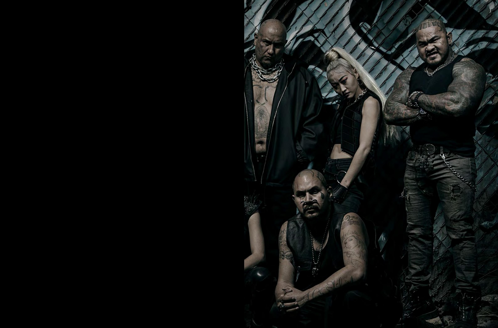

Мужчина бежал, задыхаясь, спотыкаясь, жалея, что не надел лучшую обувь для бегства по пустыне. Он жалел, что не вышел из машины после того, как она сломалась. Так сказали в дорожном агентстве, но, возможно, если бы он остался внутри, то был бы в безопасности. Нет, он просто должен был бежать. Вдалеке виднелись огни. Все, что ему нужно было сделать, это добраться до них.

Бесшумные следы на его пятках не обращали внимания на страх человека. Их влекла к нему энергия, жизненная сила крови. Эта стая ферралов хотела разделаться с этим человеком, как он, возможно, разделал пару бифштексов в свое время. Они хотели, чтобы он созрел и был готов.

Когда его нога зацепилась за корень дерева, и он рухнул на мшистую землю, его лодыжка была сломана, а с губ сорвался крик, четверо Гангрелов остановились и нависли над ним.

"Что... Пожалуйста, помогите мне. Там волки..." Голос мужчины прервался, когда один из вампиров вскрыл ему горло. Четверо питались как стая, каждый брал по конечности и сильно кусал. ■

CLAN

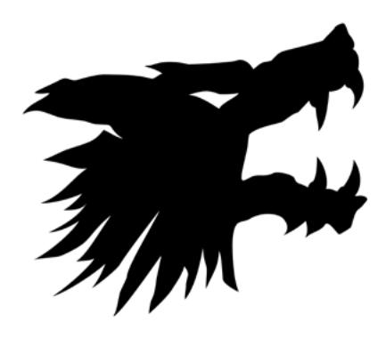

# Отчёт **#50 -** Пригородные хищники

Почти все бессмертные устраивают свои кормовые площадки в городах. Мы наблюдали все виды этих зараженных существ, рыскающих в популярных ночных заведениях для скромных людей, поскольку, как мы предполагаем, толпы облегчают добычу пропитания.

Исключением из этого правила являются любители выпить, которых доминиканский инквизитор Уильям Баскервильский впервые назвал "Гангрел". Эти существа, похоже, обитают за пределами основного общества, предпочитая кормиться в труднодоступных местах, где труднее найти кровь. Многие из них часто посещают бары для дальнобойщиков, мотели и менее богатые пригороды в богатых городах. Более бедные регионы (см. Гэри, Индиана, США: Детройт, штат Мичиган, США: Мидлсбро, Великобритания: Кадис, Испания) привлекают этих существ в массовом порядке.

Похоже, что эти одичавшие блондины часто преследуют одиноких кротких людей в изолированных районах ради развлечения, а другие совершают вторжения в дома. У нас есть сведения о том, что придорожная закусочная была уничтожена стаей этих зверей (см. отчет № 51).

Эти "гангрелы" смешиваются с животными, принимая форму собственности над чужаками, похожими на них самих. В отличие от "носфератов" и других пород, "гангрел" не питаются собственными запасами, используя их в качестве телохранителей, посыльных и отвлекающих факторов. Возможно, они также используют этих животных в качестве социальной компании, хотя эта школа мысли служит только для очеловечивания пустых. ■

# Гангрел Обществе вампиров

Гангрелы когда-то были кланом Камарильи на хорошем счету, хотя их уход в конце прошлого века сделал их независимыми. Недавняя позиция Камарильи, что "любой, кто не Камарилья - Анарх", похоже, понравилась Гангрелам. Звери с гордостью держали знамя Анарха, когда Бруха и Министрии мигрировали, чтобы присоединиться к ним.

Роль Гангрела среди Сородичей всегда была роль верного пса, посланного нанести удар по врагу. На протяжении веков клан служил охотниками и телохранителями, пока возмущение не стало слишком велико. Теперь клан свободен от диктатуры и считает дороги своими владениями.

Вампиров клана можно встретить как в доменах Камарильи, так и Анархов, поскольку мало кто рискнет оскорбить животное, попросив его уйти. Однако князья Камарильи больше не могут ими командовать. Гангрелы могут оказывать услуги городам за плату или потому, что заботятся о территории местного Сородича, но не потому, что это их обязанность. Эта свобода обеспечивает им статус наемника и мировоззрение, которое они ценят в эти ночи.

Хотя в клане не так много философских или политических активистов, их взгляды во многом совпадают со взглядами Бруха, из-за чего эти два клана называют друг друга родственниками. Вентру, Тореадоры и Тремеры настороженно смотрят на клан, ожидая ответного удара после долгих лет плохого обращения. Со своей стороны, Гангрелы, похоже, не планируют никакого грандиозного нападения. Клан состоит из диких вампиров, и дикими они и остаются. ■

Позвольте мне рассказать вам историю о кормлении.

Жила-была одичалая по имени Кровавый Коготь. Скорее всего, это было не настоящее ее имя, но неважно.

Кровавый Коготь была панком в старом смысле этого слова. Она укладывала волосы, носила пластыри, прокалывала лицо и стучала под тяжелую музыку. Она угрожала нормам и боролась с мейнстримом. Клан любил ее. Она была дикаркой в городском обществе. Она завоевала друзей среди Бунтарей и Орлоков. Она заслужила репутацию человека, который никогда не преклоняет колени перед князем.

Но у Кровавого Когтя был недостаток. Она питалась от своих товарищей.

Мы, Гангрелы, никогда не питаемся от своих. А под своими я имею в виду смертных, которых мы размещаем вокруг себя.

Кровавый Коготь питалась от панков. Она питалась от их семей. Она думала, что это нормально - в конце концов, казалось, что им это нравится. Но эта пища ослабила ее стаю, какими бы смертными они ни были.

Однажды ночью она наелась крови перед запланированным побегом из тюрьмы, который возглавляли ее смертные последователи.

Большая ошибка.

Кровавый Коготь привела свою анемичную армию к тюремной ограде и перерезала проволоку. Они едва могли удержать свои палки, ножи и пистолеты. Это была ужасная сцена. Каждый падал под выстрелами, падал на колени или падал без сознания от перенапряжения.

Кровавый Коготь спаслась, но теперь она была одна. У нее не было стаи, и другие оборотни плевали на нее за то, как она обращалась со своими слугами.

Есть ли мораль в этой истории? Возможно, я должен сказать вам, что не следует питаться своими собственными слугами. Возможно, мне следует призвать вас к осторожности. Возможно, мне следует подчеркнуть, что Кровавый Коготь была высокомерна, а наш клан непостоянен в своей благосклонности. Может быть, я должен сказать, что одинокий одичалый - это тот, у кого нет цели.

Нет. Просто так получилось. Надеюсь, вы извлечете из этого урок. ■

# Руди Активный сейчас

Церковь Кайна проповедует о грехе. Позволь мне рассказать тебе кое-что о грехе, маленький новичок. Позволь мне поговорить с тобой об апокалипсисе.

В свои земные дни я был таким же геем, как и все остальные. Думаю, я и сейчас им являюсь. Полагаю, церковь считает это язвой.

Я был арабом в стране, где очень мало цветных людей. Если случалось преступление, его пытались повесить на меня. Все думали, что я такой злой. Война, наверное.

Я никогда не заражался, но, черт возьми, если бы люди не относились ко мне как к прокаженному. Чума.

Моей первой пищей как вампира была моя семья. Смерть. Что все это значит?

Да ни хрена. Церковь будет говорить тебе, что все, что ты делаешь, неправильно, чтобы заставить тебя служить. Мы не служим.

Послушайте, мы так же склонны к высокомерию, гневу, чревоугодию и эгоизму, как и любой другой вампир. Мы делаем все это немного лучше, потому что мы не вписываемся в нишу Камарильи, мы не связаны с законом, и никакой шериф не помешает нам высасывать из смертного досуха.

Хотите знать, что такое Гангрел?

Мы бесчеловечны. Наш грех в том, что со временем мы все меньше походим на людей, становясь звероподобными, что позволяет нам быть настолько звероподобными, насколько подсказывают нам наши инстинкты.

Наш грех в том, что мы движемся назад по эволюционной шкале, и нам это нравится. ■

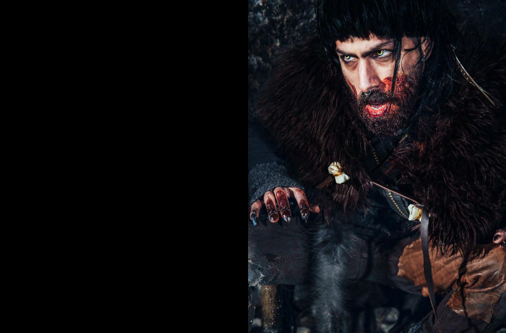

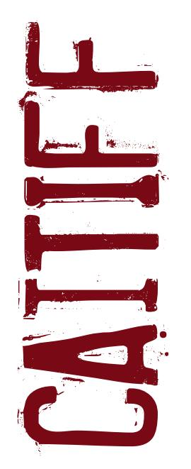

# Каитифф в "Обществе вампиров"

Äàæå êîãäà Àíàðõè áîãîòâîðÿò èõ êàê "âûñøèõ ñâîáîäíûõ", áåñêëàíîâûå âàìïèðû âëà÷àò äîâîëüíî ñóðîâîå ñóùåñòâîâàíèå. Äàæå åñëè òåíäåíöèÿ Ñâîáîäíûõ íàïðàâëåíà íà "òû - íå òâîé êëàí", âàìïèðû îäíîé Êðîâè ðàçäåëÿþò ðîäñòâî äðóã ñ äðóãîì, îáðàçóÿ óçû ðîäîñëîâíîé è âçàèìíîãî îïûòà, â òî âðåìÿ êàê áåñêëàíîâûå íå èìåþò òàêîé îáùíîñòè. Òîðåàäîð áóäåò òÿãîòåòü ê äðóãèì òîðåàäîðàì, òàê æå êàê è ãàíãðåëû ê ñâîèì ñîðîäè÷àì. Ýòî ðîäñòâî ìîæåò áûòü íå ñòîëüêî äðóæáîé, ñêîëüêî çíàêîìñòâîì èëè èìïóëüñîì, ïåðåäàâàåìûì ïî êðîâè.

Êàèòèôôû íå ïîëó÷àþò âûãîäû îò ýòîé ñâÿçè. Ðåäêî áûâàåò, ÷òîáû íåñêîëüêî êàèòèôîâ â îäíîì äîìåíå ïðîÿâëÿëè îäíè è òå æå Äèñöèïëèíû, èìåëè îäíîãî è òîãî æå ïðåäêà èëè ïðèíàäëåæàëè ê îäíîìó è òîìó æå ñîöèàëüíîìó ñòàòóñó èëè ïðîôåññèè. Îíè ñâÿçàíû äðóã ñ äðóãîì òîëüêî òåì, ÷òî ÿâëÿþòñÿ ÷óæàêàìè. Òàêàÿ ñâÿçü ïðî÷íà äî òåõ ïîð, ïîêà êàèòèôôû òåðïÿò äðóã äðóãà.

ðåäêèõ ñëó÷àÿõ êàèòèôôû ñòàíîâÿòñÿ êíÿçüÿìè è áàðîíàìè, íî êëàíîâàÿ ýëèòàðíîñòü, ÿâíàÿ èëè ñêðûòàÿ, çàñòàâëÿåò äðóãèõ ñîðîäè÷åé íàñìåõàòüñÿ íàä ïîïûòêàìè êàèòèôôîâ îáðåñòè âëàñòü. Íàñìåøêè çàñòàâëÿþò îäíèõ êàèòèôôîâ âîçâûñèòüñÿ, íî ëîìàþò äðóãèõ, ïðåâðàùàÿ èõ â îçëîáëåííûõ ñóùåñòâ, ïîêëÿâøèõñÿ îòîìñòèòü.

Âñå ñëàáîêðîâûå - êàèòèôû, èõ ñëàáàÿ êðîâü 14-16-ãî ïîêîëåíèÿ íàñòîëüêî ðàçáàâëåíà (èëè ïðîñòî îòëè÷àåòñÿ, åñëè âû õîòèòå áûòü ïîëèòêîððåêòíûìè ñðåäè ñâîáîäíûõ), ÷òî êðîâü íå íåñåò â ñåáå ÷åðò èõ ïðåäêîâ. Íî íå âñå êàèòèôôû - ñóìåðå÷íîðîæäåííûå. Áåñêëàíîâûå ñóùåñòâîâàëè âñåãäà, èõ êðîâü ñòàëà íåìîé èç-çà îò÷óæäåíèÿ îò îòöà è êëàíà, èç-çà ãîðå÷è è áðîøåííîñòè, èç-çà ïðèíÿòèÿ â ñâîè ðÿäû ñëàáûõ ëþäåé, èç-çà îò÷àÿííîãî ãîëîäà, èç-çà ñòðàííûõ ñâåðõúåñòåñòâåííûõ ïðîèñøåñòâèé è ìíîãîãî äðóãîãî. Ïî ïðàâäå ãîâîðÿ, íèêòî íå çíàåò, ïî÷åìó íåêîòîðûå Ïðîêëÿòûå ðîæäàþòñÿ áåç êëàíà, íî ó êàæäîãî åñòü ñâîÿ òåîðèÿ.  íåêîòîðûõ ãîðîäàõ, òàêèõ êàê Ñòîêãîëüì, ñâÿçü ìåæäó Êàéòèôôîì è õóäûìè êðîâÿìè ïðèâåëà ê ïîÿâëåíèþ íîâîé áóðíî ðàçâèâàþùåéñÿ ñåêòû, êîòîðàÿ áðîñàåò âûçîâ òðàäèöèÿì äàæå ðàäèêàëüíûõ Àíàðõîâ. Ýòè ëèöà âçÿëè ñåáå íàçâàíèå "Ñâîáîäíûå" è ïðîñëàâëÿþò ñâîáîäó îò ïðîêëÿòèé è îñîáûõ èìïóëüñîâ êëàíîâ. Îíè ñ÷èòàþò ñåáÿ ñëåäóþùèì øàãîì â ýâîëþöèè âàìïèðîâ: ëó÷øèìè, áîëåå ÷èñòûìè è åäèíñòâåííîé ïîðîäîé, ñïîñîáíîé ïåðåæèòü ãëîáàëüíóþ Âòîðóþ èíêâèçèöèþ.

Церковь Каина рассматривает Каитиффа и слабокровных как предвестников последних времен и прямо анафематствует их поклонению к истреблению. По учению Церкви, любой вампир, не принадлежащий к 13 установленным кланам, грешен в глазах Первого. Эта неприятность объединяет многих каитиффов и сумрачнорожденных против Церкви Каина. Лишь немногие каитиффы состоят в Камарилье, эксклюзивной секте, отвергающей бесклановых как отбросов, которым не хватает наставничества и традиций, необходимых для членства, особенно в эпоху инквизиции. ■

От кого*: elterrible@sunburst.mx* Кому*: clessscum@bloodspot.org* Тема*:* Субъект*:* Питание

Не имея отца, вы не будете иметь представления о том, от кого и где питаться. То, что ты свободолюбивый анарх (а разве не все мы такие?), не означает, что ты можешь просто вонзить свои клыки в любого старого смертного и начать сосать.

Простите за вульгарность, друг мой. Я перейду к сути.

Мы извлекаем больше пользы из экзотики крови, чем любая другая группа. Вы, наверное, уже слышали о системе кровообращения и о том, что кровь бывает разной на вкус, а некоторые ее виды даже передают пирующему пару преимуществ. Как бесклановые вампиры, мы пьем из кого угодно и нуждаемся в этих гранях больше, чем любые другие сородичи. Мы - охотники-энтузиасты, всегда в поисках преимущества над конкурентами.

Вы захотите создать стадо безымянных лиц.

Вспомните офис, полный кабинок, упаковочную фабрику или завсегдатаев ночного клуба. Эти люди - лишь прикрытие, которое мы используем, чтобы добраться до лучших ароматов на заднем плане.

Нас недооценивают. Родственники считают нас безвкусными занудами без клана и, следовательно, без предпочтений. Не заблуждайся, друг мой: нам нужна эта грань, и мы берем ее.

Мы составляем каталог нужной нам крови и ведем подробные записи о том, где ее можно найти.

Помни обо всем этом. Питайтесь от стада, когда это необходимо, под прикрытием их сверстников. Когда все ослабят бдительность, будь то князь, барон, инквизиция или просто человек, вы выходите на охоту один на один со своей истинной целью. Приготовьте себе еду и наслаждайтесь каждой каплей.

И последнее: не воспринимайте это письмо как хороший пример того, как нужно общаться. У них наверху это вызовет любое количество флагов, вот почему я нахожусь за дюжиной прокси. Воспринимайте это как тест и начинайте бежать, новая рыба. Если вы сможете пережить предстоящее расследование вашего местонахождения, вы достойны того, чтобы стать бесклановым, как я.

# Грехи каитиффа

Каитиффы склонны к высокомерию, свойственному чужакам. Хотя их остракизм не является их замыслом, их неприязнь к основной массе заставляет их гордиться любым поведением, которое противостоит вампирам других кланов или родственникам Камарильи.

Каитиффы склонны к самообману и неосознанному манипулированию людьми. Они утверждают, что лучше других вампиров из-за своей изнаночной природы, но плетут интриги в обществе смертных, формируют огромные стада и устраивают изощренные охоты на жертв по своему выбору. Хотя их жестокое обращение со смертными не столь систематично, как в кланах с жесткой иерархией, склонность кайтиффов плохо обращаться со смертными и списывать это на "их проблемы" показывает их черствое отношение к жизни. ■

# Утонченно-кровные не должны быть таковыми. По крайней мере, так нам говорили. Те, кто ведет свой род от основателя клана, часто могут сосчитать своих предков на пальцах двух рук. Нам нужно как минимум трое, чтобы найти путь назад к к источнику.

Не то чтобы большинство из нас знали о древних. Если бы мы знали, мы бы с криком бросились в ближайшую печь. В нашем современном сознании нет места древним кровавым богам, магическому мышлению и эсхатологической чепухе. Черт, многие из нас вообще не считают себя вампирами.

DUSKBORNСумрачнорожденный в обществе вампиров Мои источники говорят, что "Объятия" не должны работать после 13-го поколения. Но оно работает. Для монстров, создавших нас, мы - серьезное дурное предзнаменование, или, по крайней мере, тревожное свидетельство того, что их драгоценные верования о происхождении Проклятых должны быть поставлены под сомнение. Мало кому из древних нравится подвергать сомнению законы и истины, по которым они жили тысячелетиями. Мы стали символом странного настоящего и угрожающего будущего, которого они не могут понять или стать его частью. Более двадцати лет Камарилья охотилась на нас, как на животных, клеймя нас, порабощая нас, питаясь нами, используя новую кровь как пешки в своих тайных войнах. Теперь, когда свободные навсегда покинули Башню, многие лидеры Движения заявили, что рожденным в сумерках нечего бояться во владениях Анархов, или даже что мы будем укрыты от преследований Камариллы в городах несвязанных. Я отношусь к этому с подозрением, но это только начало.

Сумрачнорожденные вызывают отвращение у старших и сочувствие у молодых. Объятия сумрачнорожденных редко бывают намеренными, и наше существование нежелательно в большинстве доменов. И все же мы здесь, чтобы остаться, более многочисленные, чем когда-либо, часто полностью отделенные от остального вампирского общества. Суеверные не верят, что мы вообще существуем, а политические не знают, как нас классифицировать. Никакие другие лица не демонстрируют такой способности переносить солнце, удерживать пищу в своих мертвых желудках, или могут развивать новые силы прямо из смеси резонирующей крови, которую они потребляют. Мы не совсем мертвы, и это до смерти пугает толстобрюхих. Ни один вампиров не может маскироваться под человека так, как Сумрачнорожденный. Мы уникально приспособлены для выживания в эпоху инквизиции, и у нас нет никакой доли в вечной борьбе между Проклятыми. Истории нашей нежизни - личные, мрачные, а чаще всего короткие и кровавые.

Большинство из нас, сумеречнорожденных, не хотят иметь ничего общего с монстрами, которые заразили и не считают себя никем, кроме как людьми со странным недугом. Мы - возможность и угроза. Камарилья не признает Сумрачнорожденных как Родственников и соблюдает маскарад по отношению к Меркуриалам так же усердно, как и к живым. Это означает, что сумрачнорожденные в доменах Камарильи часто почти ничего не знают о том, кто мы такие, или о культуре проклятых в целом. Мы счастливы, что все так и остается, находя свои собственные ниши ночного города, в которых мы обитаем, делая глоток здесь и глоток там, пока мы притворяемся людьми или отчаянно ищем способ вылечить это странное состояние. Немногие из нас узнают правду и стремятся к полноправному членству в Камарилье или Движении Анархов, как это сделал я, и из кожи вон лезут, чтобы доказать свою правоту тем самым монстрам, которые нас создали и отбросили.

Постоянно нависающая над нами угроза преследования заставляет многих Сумрачнорожденных выбирать жизнь кочевников, переходя из домена в домен на фургонах или грузовых кораблях, превращенных в передвижные убежища. Наша относительно человеческая физиология делает путешествия гораздо менее смертельно опасными, чем для полнокровных монстров.

Однако большинство из нас остается на месте, и мы быстро становимся мастерами маскарада во внутренних городских кварталах и пригородных проектах, которые мы называем своими. Сумрачнорожденные так хорошо умеют притворяться людьми, что действуют незаметно и параллельно с обществом Родственных, браконьерствуя в устоявшихся охотничьих угодьях и никогда не будучи обнаруженными. Мы плаваем в тени ночных акул, избегая их внимания любой ценой, поскольку охотимся за той же добычей, что и они. Хотя мы, как и все, склонны к формированию привязанностей и союзов, движущей силой для большинства из нас, новорожденных, является самосохранение и корысть. Сумрачнорожденные индивидуальности. Мы, новорожденные дети ночи, все еще люди, обычные люди, обремененные ужасным состоянием, которое мы пытаемся разгадать. Для нас вы - монстры - древние ужасы, разрушившие наши жизни и заменившие их ужасом и кровью. Мы не будем благодарить вас за это. Мы не вы. Мы - нечто новое, и мы все еще будем здесь, когда последний представитель вашего рода превратится в прах и кости. ■

Мне потребовался почти месяц, чтобы понять, что я изменилась. В первую неделю я вызвала больничный и наелась Netflix и мороженого, пока мое тело отключалось, одна жизненно важная функция за другой. Джо-Ханна приходила, кормила меня рыбным супом и гладила по волосам, а я не мог понять, почему она продолжает меня возбуждать. Раньше мне никогда не нравились девушки, но теперь моя лучшая подруга вдруг заставила меня почувствовать себя сексуально возбужденным. Я пытался скрыть это, но она заметила. Через некоторое время она перестала отвечать на мои отчаянные сообщения, и, оглядываясь назад, я рад, что она это сделала. В то время я чувствовал себя одиноким в мире. Обычно такие чувства - это самоуничижительный бред. Но в этот раз это было буквально правдой, никто из живых не мог понять, через что мне пришлось пройти. Когда я начал отхаркивать кровь, я понял, что это не грипп, и заставил себя посетить ночную бесплатную клинику. Там меня бегло осмотрели и сразу же отправили в ближайшую крупную больницу скорой помощи, к черту отсутствие страховки. Мне поставили диагноз "неизлечимая болезнь почек" и дали неделю сверху без медицинского наблюдения. Меня подключили к аппарату для диализа и держали под капельницей. Я почти ничего не помню из того, что произошло потом, но, очнувшись в паровых тоннелях под больницей, покрытый кровью своих товарищей, я начал понимать. Я был одним из тех существ, которых всю жизнь видел краем глаза. Тонко чувствующих. Жестокие ангелы с иглами вместо пальцев и убийством в сердце, наконец, нашли меня и сделали своей игрушкой. Тогда я решил, что пришло время вернуться в Солт-Лейк-Сити и встретиться со своей семьей. Они были бы так счастливы увидеть, что Бог наконец-то принял меня. Они бы разделили мои благословения. Ну, мы оба знаем, чем это закончилось... ■

**VAMPIRE – THE MASQUERADE – ANARCH CLANS**

Мы общаемся с нашими еще живыми друзьями и родственниками, не чувствуя себя мясниками, разговаривающими со скотом. Их жизни важны для нас, потому что мы все еще похожи на них! Мы все еще можем ощутить что-то от смертности, чего монстрам в принципе не хватает.

Когда ночные уроженцы спрашивают нас, как мы сливаемся с коровами, я отвечаю им следующее: "Легче видеть живое с ясностью, когда твоя голова не зарыта в заднице князя". Раньше я говорил "ваша собственная задница", но с тех пор, как нас окончательно приняли как союзников Анарха, я теперь склонен направлять такие слова в сторону Башни. Но смысл тот же. Если ты перестаешь воспринимать себя как личность, как человека, ты не можешь слиться с толпой. Ты притворяешься. Мы настоящие.

Мы смешиваемся с теми, кто живет без трудностей, и воротим нос от тех, кому трудно. Я имею в виду, как трудно запомнить, как вести себя с любовниками и друзьями? Можно подумать, что даже если ты кровососущий мудак, ты все равно знаешь, как танцевать, не выглядя при этом неуклюжим, притворяться, что пьешь шоты, ешь начос, нюхаешь косяки и делаешь глубокий минет парню в туалете, просто ради этого. Но нет, для большинства вампиров это все "заходит слишком далеко". Я думаю, они все боятся быть людьми и довольствуются притворством. Неудивительно, что они становятся монстрами.

# Вампир: Прелюдия

**VAMPIRE – THE MASQUERADE – ANARCH CLANS**

Для глубокого погружения в опасный мир Сумрачнорожденных приобретите цифровой визуальный роман "Вампир: Прелюдия", доступную для iOS, Android или Steam. Игра была создана для знакомства новых игроков с миром Vampire и содержит множество персонажей и идей, которые вы сможете использовать в любой игре с участием Анархов или слабокровных. Действие игры разворачивается в Нью-Йорке, Сиэтле и Лос-Анджелесе, и в ней встречаются многие персонажи и ситуации, узнаваемые из этой книги.

**157**

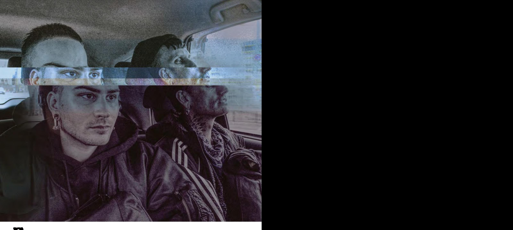

П омните Рика и Лили? Нет? Это те безмозглые слабокровные серфингисты, с которыми ты периодически встречался в Санта-Монике в 04-м. Точно.

Не самый лучший твой час. Последнее, что я слышал о них, это то, что Лили попала в неприятности из-за того, что обманула не тот банк крови, а Рик погрузился в глубокую депрессию из-за того, что его девушка превратила его в монстра. Знаешь, с кем я столкнулся на прошлой неделе? Ага. Рик все еще здесь, и у него на руках была живая цыпочка. Он был весь в подмигиваниях и тишине, так что я думаю, он никогда не говорил ей, кто он такой. Но это не самое главное. Нет. Она была на седьмом месяце беременности, и Рик поклялся, что ребенок его. Я знаю, что слабокровки - это не совсем мертвые, но да ладно.

Если, и я говорю "если", ребенок будет его, я не хочу думать о возможных осложнениях при родах. Например, будет ли маленький изверг высасывать маму изнутри? Сможет ли худая женщина выносить ребенка до срока? Как, черт возьми, мы назовем теоретическое потомство слабокровки? Полупроклятый? Дхампир (это, кстати, из румынского фольклора)? Клинком? Я не знаю. Единственное, что я знаю - кто-то ехал за ними в черной Тесле. Я думаю, что это какой-то больной колдун, который хочет прихватить ребенка для какого-нибудь ретрита по магии крови на холмах. Бедняжки. Я понимаю, почему они нас боятся. ■

# Грехи Слабокровок

Возможно, слабокровки менее склонны к чудовищному поведению, чем их полнокровные собратья. Они обладают меньшей способностью к разрушению и нечеловеческой силой и имеют возможность действовать скрытно в обществе смертных.

Несмотря на это, слабокровки склонны к пороку. Это вампиры. Чтобы выжить, они должны пить кровь живых. Как категория, их главный грех - манипуляция и обман. Они верны себе, но лгут всем, о ком когда-либо заботились, из чистой необходимости. Другие Родственные могут создавать дистанцию между своей новой жизнью и освещенными солнцем днями, от которых они отказались с объятиями.

Не таковы слабокрвки, которые цепляются за свои семьи и близких, нанося непреднамеренный вред всем, кто попал в тиски их новой зависимости.

Стремление - не грех, но некоторые слабокровные хладнокровно уничтожают соперников в попытках подняться над своим ничтожным статусом. Ни одна группа вампиров не занимает такого низкого положения среди мертвых, как слабокровки, что порождает постоянное желание получить хоть крупицу власти, которое иногда поглощает меркурианцев. Камарилья использует это в своих целях, обещая власть и принадлежность тем, кто продаст своих слабокровных друзей. Родственники сравнивают это с одной буханкой хлеба, брошенной в толпу крестьян, или с дырой, открывающейся в клетке с сотнями голодных крыс. Слабокровки будут хоронить друзей, топтать союзников и прогрызать дыры в других Сумрачнорожденных, чтобы облегчить свое существование.

Меркурианцы, которые отказываются принять то, кем они стали, либо встречают полуденное солнце, либо пытаются найти способ вернуться в смертность. Эти неохотно идущие пиявки не менее склонны к проблемному поведению, чем те, кто принимает себя такими, какие они есть. Городские легенды, псевдонаука и поп-культура заставляют сумеречнорожденных хвататься за любую соломинку, чтобы получить шанс на искупление. Самые распространенные легенды гласят, что для избавления от своей "болезни" слабокровная пиявка должна покончить со своим создателем, воздерживаться от питья крови в течение года и одного дня, или даже что они должны пить исключительно кровь девственниц или какого-то другого "чистого" источника. Хотя отказ от ночи - достойная цель, она никогда не обходится без высокой цены в виде сердечных страданий и трагедий.

### [Запись начинается]

**Reyes:** Девушка, рад с вами поговорить. Как семья?

**Smythe-Jefferson:** Я не знаю, как долго я смогу скрываться от них. Мне кажется, что каждая ночь - это ложь. Они не могут вечно оставаться в неведении, и что тогда? Что мне делать, когда они узнают?

**Reyes:** Они не узнают, пока вы сами этого не захотите. Талант живых к самообману просто поражает.

**Smythe-Jefferson:** Возможно, я больше не хочу их обманывать. Это кажется нечестным.

**Reyes:** То, что случилось с тобой, было несправедливо. Но послушай: мы справимся с этим. Ты все еще работаешь, да?

**Smythe-Jefferson:** Каким-то образом мне удалось сохранить свою работу, да.

**Reyes:** Тогда вы все еще обеспечиваете их. Вы обеспечиваете их питанием и крышей над головой. Так поступают многие из нас. У нас нет большой части общества, которую мы могли бы контролировать, поэтому мы прячемся среди наших семей и друзей. Не расстраивайся. Бог хотел, чтобы ты жила, девочка.

**Smythe-Jefferson:** Ты знаешь, что я на это не куплюсь. Я... Я сделал что-то ужасное, Оскар.

■

### [Запись заканчивается и возобновляется]

**Reyes:** Итак, вам нужно просто убедиться, что вы распространяете любовь, да? Вот как надо заканчивать.

**Smythe-Jefferson:** Я не могу справиться с тем, что школа задает вопросы...

**Reyes:** Вам не придется. Конечно, у тебя большая семья. Поцелуй их всех на ночь. Стань мамой года.

**Smythe-Jefferson:** Это плохо. Я ненавижу эту "жизнь".

**Reyes:** Солнце в той стороне, если вы хотите его увидеть.

**Smythe-Jefferson:** Я не об этом.

**Reyes:** Хочешь выжить - действуй. У Бога есть план для нас. Они все говорили, что нас не должно быть здесь, но посмотри на нас, подруга. Мы здесь. Мы здесь, и мы процветаем. Это наше время. Да, нам приходится пачкать руки и причинять боль тем, кого мы любим, но у Бога есть место для нас в Его сердце.

**Smythe-Jefferson:** Думаю, да.

### [Запись окончена]

# МОЖНО ЛИ ВЫЛЕЧИТЬ СЛАБОКРОВОК? Как это делается?

Какова цена? Избавление от проклятия и обретение утраченной человечности - классический сюжет в фильмах и литературе о вампирах.

Ключ к такому сюжету - сделать так, чтобы существование в качестве вампира поначалу казалось сексуальным, ярким, крутым и желанным. Затем наступает реальность. Персонаж убивает любимого человека, персонажи сталкиваются лицом к лицу с ужасом того, кем они стали, и зависимость от крови заставляет их совершать поступки, которые они считали немыслимыми в жизни. Используйте убеждения и опоры персонажей игроков, чтобы довести их до этого момента кризиса, а затем ввести возможность искупления. Если вы не против конфликта между игроками, то хороший прием - представить два выхода из ситуации: вернуть себе смертность или стать "настоящим вампиром" через диаблери - и наблюдать, как компания слабокровок разрывается на части, выбирая разные пути. Но после введения искупления как варианта, можно ли его достичь? Мы рекомендуем, что не существует единственного способа вернуться к жизни. Вместо этого, путь возвращения к свету напрямую зависит от конкретного персонажа и от того, что создает отличную эмоциональную историю. Особенностью может быть то, что для искупления Сумрачнорожденным требуется убить своего собственного отца - квест, который легко превратить в захватывающую многосерийную хронику, особенно если персонажи игроков решат помогать друг другу охотиться на монстров, которые их породили. Но этого редко бывает достаточно. Помимо уничтожения сира, восстановление смертности может также включать в себя:

- Полное переливание крови от родителя или брата или сестры. Этот процесс либо убьет родственника, либо превратит его самого в слабокровного!
- Достижение 10-го уровня человечности и поддержание его на протяжении всего времени охоты за сыном.
- Найдите способ провести "Обряд красного знака", ужасающий ритуал, который обрекает искупленных на адский огонь после смерти. Конечно, слабокровки могут вообще не верить в проклятие, но вскоре они осознают свою ошибку.
- Желающий с Истинной Верой может отдать свою жизнь за Сумрачнорожденного, позволив осушить себя раскаявшемуся вампиру в последнем акте мученичества, чтобы обеспечить спасение монстра.
- Слабокровка жертвует своей жизнью ради человека, возвращаясь к жизни как смертный в мимолетные мгновения перед смертью.
- Какой бы способ ни выбрал Рассказчик для выкупа конкретного Сумрачнорожденного, игроки никогда не должны знать, что он работает наверняка.

# <span id="page-160-0"></span>Кланы предателей

**VAMPIRE – THE MASQUERADE – ANARCH CLANS**

# Дорогое дитя*,*

С большой грустью я узнал, что вы присоединились к жалкому Движению Анархов. Я знаю, что у тебя всегда был вспыльчивый характер, но ты не Бруха. Ты лучше, чем любой член "Беспорядка". Я так разочарован, что ты решил присоединиться к группе грубиянов, когда твой папа все еще дома и ждет тебя.

Я скоро уеду из Милуоки, так что ты меня там не найдешь. Скорее всего, я отправлюсь в Феникс, но это зависит от этого дурака Исава и от того, где он окажется. В любом случае, есть кое-что, что вы должны знать о нашем клане:

Мы никогда не были предназначены для Камарильи.

Возможно, вы уже знаете это. Я расскажу вам историю, которая может подействовать как эйфория, если ваш разум будет склонен к этому.

Когда мы посетили Конвенцию Терновника, наш клан разделился примерно 50/50. Истинные маньяки, те, кто потерял контроль над своим темпераментом и связью с человечеством, конечно же, разделились. Но куда они дрейфовали?

В Камарилью.

Да! Наши здравомыслящие, наши оракулы, они присоединились к Шабашу, ибо таково было наше призвание в то время. Кровь заставила нас идти туда. Но нет, половина клана сопротивлялась, и так же, как сместились полюса, так же сместился и рассудок нашего клана. Шабаш свел здравомыслящих с ума, а Камарилья выступила в роли нейтралитета в этом безумии. Это правда!

И что же остается тебе, моя драгоценная дочь? Ты в пустоте. И ты, и твоя сестра. Мне трагично это говорить, но ни один малкавианец не присоединился к Движению Анархов после его официального основания. Ни один. Почему? Потому что оно не предназначено для нас!

Если вы считаете себя одним из Свободных, вы отсоединяетесь от Крови, Паутины, Сети и полюсов, о которых я говорил.

Для меня трагедия, что вы, и многие подобные вам, добровольно бросаетесь в черную дыру без надежды на появление. Но, увы, это ваш выбор. Я по-прежнему буду любить вас, даже если вы потеряете связь с притяжением мудрости в ту или иную сторону.

Счастливо оставаться, моя славная дочь. Передайте привет вашей сестре. ■

Твой Сир, Джейкоб

Г илберт Дуэйн пожал руку Фералу, зажав свободную руку над их ручным захватом, чтобы укрепить его лояльность. "Это было давно запланировано, мистер Руди, сэр".

Руди пробурчал в ответ и покачал головой.

Они давно хотели официального малкавианского представительства в Движении Анархов, а теперь, при таком приливе, как сейчас, казалось, что волна лунатиков готова обрушиться на домены Анархов по всему миру. "Может быть, долго, но не слишком поздно". Руди улыбнулся Гилберту, собираясь отпустить его руку, но обнаружил, что она все еще сжата. Он рассмеялся. "Думаю, можно сказать, что вы приехали как раз тогда, когда все стало интересным".

Гилберт усмехнулся Руди, неловко сжав руку другого вампира. "Я всегда спрашивал себя: "Почему в Анархах нет больше малкавиацев?" Я имею в виду, что мы как бы созданы друг для друга, да?"

Руди посмотрел вниз на руки Гилберта, а затем снова на лицо Лунатика. "Теперь вы можете отпустить мою руку, мистер Дуэйн".

"О да, конечно". Гилберт поспешно вытащил свои руки и положил их в карманы. "Мне очень жаль, мистер Руди, сэр. Я просто взволнован, вот и все. Со мной идут все эти друзья, и я просто знаю, что мы сделаем Анархов более полноценной, более здоровой сектой".

Руди кивнул, собираясь посмотреть в окно. "И когда, ты сказал, они прибудут? В этом зале не так много места, и, как я понимаю, там где-то 20-30 малкавийцев, которых ты убедил оставить Камарилью ради нас.

Я надеялся, что они будут приходить посменно..." Он посмотрел на темный горизонт, не видя фар автомобилей на приближающейся дороге.

"Что вы имеете в виду, мистер Руди?" Гилберт выглядел искренне озадаченным.

Руди повернулся к нему с суженными глазами. "В том смысле, что хорошо бы справиться с десятью за раз, или что-то в этом роде. Ничего страшного, если нет, просто нам будет немного - хех - тесновато. Особенно с другими братьями, которые уже здесь".

Гилберт оглядел своих слуг, слева и справа, повернулся, а затем поднял ладонь ко лбу. "О Боже. Мне так жаль, мистер Руди, сэр. Я думал, они уже здесь. Я думал, что пригласил их. Должно быть, это был сон. Пророческий сон! Да, это должно быть что-то, что должно произойти. Я думал..."

Руди прервал его. "Все в порядке, мистер Дуэйн. Все в порядке. Вы... Присаживайтесь вон там. Я собираюсь сделать несколько звонков". Когда Гилберт, пошатываясь, ушел, Руди потер глаза. Малкавийцы в движении Анархов были бы огромным переворотом, но, похоже, было невозможно собрать больше нескольких человек за раз. Для клана, якобы обладающего огромной внутренней сетью, они казались особенно неспособными действовать как единое целое в этом вопросе. ■

# Тсс. Да, я - один из Свободных. Нет, никому не говори. Когда-то давно в стране меда и вина нас было гораздо больше. Мы сияли как галактики в этой маленькой секте, прорицатели, мудрые советники, великие умы за меньшими умами. Вы когда-нибудь слышали историю о малкавианском советнике Сальвадора Гарсиа? Эти ночи прошли. За последние десять-двадцать лет все Свободные как будто сместились в одну сторону. Ты был Шабашом или Камарильей. Никакого места для середины. Вообще никакого. И где же я остался? Совсем один? Вряд ли. Мы просачиваемся обратно с краев,

заполняем центральную площадку, просто ожидая того момента, когда нас снова вытолкнут обратно. Это немного похоже на то, что мы железные опилки. По обе стороны от нас находятся магниты, которые время от времени включаются. Когда они отпускают нас, мы создаем прекрасные формы. ■

# Отчёт **#391 -** Зависимые анархисты

Посмертные, которых мы называем "Зависимыми" (которые в своем обществе носят несколько разных имен, что наводит нас на мысль, что они не семья, как некоторые другие пустые тела, а инфекция поверх другой инфекции), кажутся естественной частью группы, известной как Анархисты. Их меркантильные натуры и нестабильные характеры, кажется, скорее найдут сочувствие среди анархистов, чем среди элитарных бессмертных Камарильи. Несмотря на это, мы видим, что они существуют в действительно небольшом количестве в первой группе. Является ли это следствием их успешно скрывающейся деятельности, или же они просто цепляются за Камарилью со странной свирепостью, неизвестно.

Недавно мы потеряли восемь агентов (см. отчет #389) в попытках убедить бессмертных существ присоединиться к Анархистам, просто чтобы посмотреть, что из этого выйдет.

Кампания (подробно описанная в собственном отчете) состояла из шантажа и соблазнения, предпринятых нашими контактами, но потерпела драматический провал, поскольку бессмертный в каждом случае раскусил уловку и устранил наших представителей. Хотя мы не придаем никакого мистического значения

Анархистскому движению или запрету на вступление в него агентов, наши исследования не смогли обнаружить никаких убедительных доказательств того, почему они повторно послали секту в такой степени. Этому агенту кажется, что эти конкретные гемоворы инстинктивно отходят от анархистских принципов. Для выявления причины необходимы дальнейшие исследования. ■

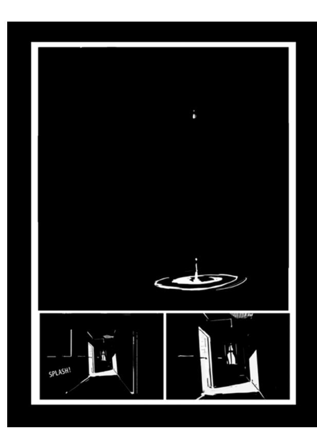

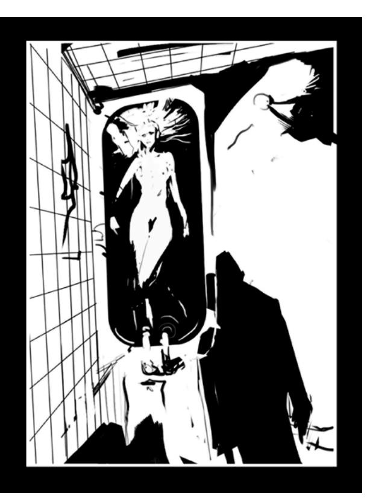

<span id="page-163-0"></span>Удар кулаком в живот с силой, достаточной для того, чтобы парализовать смертного, лишь заставил недоразвитого бойца попятиться, а затем нанести свой собственный удар. Два урода, одетые в сверкающие боксерские шорты и толстые перчатки, избивали друг друга до полусмерти на потеху присутствующим канализационным крысам.

"Это единственный разумный способ свести счеты". Калеброс кивнул на чешуйчатого Носферату в зелено-золотых плавках. "Он мой. Настоящий мальчик Камарильи". Бывший князь Нью-Йорка громко кашлянул, прежде чем продолжить. "Мы не слишком заботимся о сектах, но когда какой-нибудь Анарх нарушает Традиции... Что ж. Им приходится бороться, если они хотят выжить".

Противник чешуйчатого вампира, пузатая, многослойная Канализационная Крыса. одетая в синие и серебряные шорты, нанесла несколько грубых ударов по средней части живота

бойца Калеброса. "Этот - Анарх. Это было его оправданием за то, что он так откровенно издевается над Маскарадом. Когда традиции нарушаются, мы сражаемся".

Двое сцепились, отказавшись от правил бокса, и стали бороться на земле, вырывая конечности и разбивая друг другу лица. Железные зажимы, прикрепленные ко рту, не позволяли ни одному из противников вонзить клыки.

Один из двух молодых вампиров в компании Калеброса задал вопрос, его голос был тонким и камышовым, когда он свистел в его раздвоенном горле. "И что, ты просто даешь Анархам проход, пока они не испортятся?"

Калеброс рассмеялся, его смех перешел в удушливый кашель, который завершился откашливанием пузырька витэ. "Нет. В этом другие кланы ошибаются. Они думают, что Носферату все одинаковы, а мы видим дальше секты. Это правда, что мы держим линии связи открытыми, но Традиции для нас важнее, чем, возможно, для любого другого клана".

Брызги крови, разлетевшиеся по рингу, послужили сигналом для звонаря к исполнению своего долга. Мальчик Калеброса оторвал правую руку своего противника и отбросил ее в угол. "Вы можете называть себя Камарильей, Анархом, Черной Рукой, как угодно. Мне плевать. Но если ты принесешь отбросы своей секты в один из наших доменов, если ты хоть раз ухмыльнешься над одной из наших Традиций или подглядишь за Маскарадом, ты на собственном опыте узнаешь, что мы этого не потерпим".

Калеброс аплодировал своему бойцу, когда тот покидал ринг, чтобы выпить из прикованной куклы крови. "Мы подержим этого Анарха некоторое время на льду. Держим его голодным. Вдолбим ему, почему Традиции важны. Эти Красные Носферату думают, что они все такие, свободные от закона, от Дегенератов, которые смотрят на них сквозь пальцы, и все такое прочее дерьмо. Но я скажу вам - если бы мы не обучали своих таким образом, нас было бы гораздо меньше".

Он указал рукой на двух своих спутников. "Никогда не забывайте, что мы ходячие, говорящие, нарушители. Будь Анархом. Посмотрим, будет ли мне до этого дело. Но знай, что если ты им станешь, ты не получишь никакой защиты, которую предлагает Камарилья, и мы засунем тебя в кольцо с ним".

Чемпион отбросил истощенного смертного, подняв свои почти рептильные руки в знак победы, когда другой боец закричал. ■

Red

Многие сородичи спрашивают меня: "Зачем идти в Анархи?". Они думают, что это глупая мысль для Носферату. Они думают, что Камарилья - это то место, где мы в безопасности, верно?

Ну, они правы. Если бы нам нужна была только безопасность, мы бы держались за Кэм. Бен Франклин сказал: "Те, кто откажется от существенной свободы, чтобы купить немного временной безопасности, не заслуживают ни свободы, ни безопасности". Старый ублюдок был в чем-то прав. В жизни, особенно в вечной жизни, есть нечто большее, чем прятаться в тени и притворяться, что мы слабее козлов. Ладно, мы не стремимся властвовать над живыми, но мы признаем наши сильные стороны, в то время как наши братья и сестры из Камарильи делают вид, что мы слабы и жалки.

Знаете, что больше всего сделало меня Красным? Мне чертовски надоело быть на самом дне. Особенно после того, как Гангрелы покинули Камарилью, мы, Носферату, всегда были теми, кто разгребал дерьмо, всегда последними в списке приглашенных, и всегда последними, кого приглашали в ядерный бункер, когда бы дерьмо ни пришло. Камарилья Носферату никогда не признает этого вслух, но в их собственной секте к ним всегда будут относиться как ко второму или третьему сорту.

Ну, я говорю "засунь это себе в рот". Они называют нас красными, потому что у нас как будто произошла мини-революция. Я называю нас красными, потому что мы больше не подчиняемся их иерархическому дерьму. И я имею в виду не иерархию нашего клана, а саму Камарилью. Это выходит за рамки клановых связей - это вопрос личной свободы.

Жить свободно или умереть? ■

# Отчёт **#358 –** Носферату Анархисты

Мы обнаружили интересный раскол среди посмертных, называющих себя "Носфератами". Хотя разделить эту семью на кровном уровне кажется невозможным они демонстрируют огромную преданность друг другу, независимо от их создателей, грехов или внешности, - на политическом уровне это кажется вполне выполнимым.

Носферату, заявляющие о своей верности группе Анархистов, делают это достаточно громко, и мы допросили субъектов из этой секты, которые с гордостью рассказали нам о своей принадлежности. Затем они быстро осуждают своих таких же зараженных блаженных за трусость в убежище Камарильи.

Этот политический раскол, кажется, созрел для использования, либо нацелившись на Анархистов за их вопиющее поведение, либо сфабриковав нападение, которое создаст впечатление, что Анархисты нападают на своих прячущихся сородичей. Такие действия должны быть тонко отработаны, поскольку все свидетельства показывают, что Носферату быстро объединяются, если подвергаются внешнему нападению. Любая деятельность против них должна выглядеть внутренней, чтобы разделить тесные связи, существующие в этой группе. ■

От кого*:* Кому*:* Тема*:* Субъект*:* *oldisc@sunburst.uk 637cx90@sunburst.us*

Необходимо знать

# **QT.**

Некоторые из наших кузенов заняли лидирующие позиции в банде повстанцев. Это неслыханно в больших масштабах. Немногие подчиняются нашей семье, как вы знаете. Это может привести к большому разрыву между нашим яхт-клубом и их бандой, понимаете?

Мне нужно, чтобы вы выяснили правду. Если это правда, то новые главы должны быстро избавиться от капитуляции. Это должно выглядеть как внутренний переворот. Если этого не произойдет, они двинут свою банду против нашего клуба, и многие недовольные сотрудники из низшего звена клуба присоединятся к банде.

Наша семья не может командовать нигде. Ни в нашем клубе, ни в их банде, ни в церкви за дорогой. Это встряхнет статус-кво. Лидеры порождают новых лидеров, мученики порождают мучеников. Мы в безопасности, как мы есть.

Узнайте правду. Нам нужно знать, активно ли эти "красные" стремятся к этим ролям. Если да, то их нужно остановить.

Мы в безопасности, только если находимся в тени. ■

<span id="page-165-0"></span>ABSTRACT

"Н евероятно легко отмахнуться от Анархов Тореадоров как от обывателей, гоняющихся за модой, шепнула Виктория своему спутнику, идя рука об руку с гостем, когда они проходили через галерею "Арт-Хол", - но в их художественном трэше есть что-то восхитительно авангардное". Она наклонила голову к инсталляции, занимающей четверть комнаты, - коллекции автозапчастей, покрытых спреем, как предполагалось, бордового цвета. предположительно бордовой краской.

"Мне сказали, что создатель этого произведения отказывается определить его значение, что правильно и справедливо. Это дело покровителя - извлекать смысл из искусства". Она осторожно подняла с пола блок двигателя, внимательно осмотрела его, слегка наклонила, чтобы услышать бульканье жидкости внутри. "Что это значит для вас?"

Калека Скаб в ее компании застонал, пробираясь ближе к предполагаемому искусству, выставленному на обозрение. "Я не знаю, не так ли? Это выглядит как автомобильная авария, измазанная кровью. Похоже, художник нашел останки после столкновения, положил их на борт грузовика и отвез в эту гребаную галерею, чтобы вывести из себя таких артистов, как ты". Кастильо рассматривал фрагменты машины без особого интереса, но потом его покрытые струпьями глаза расширились от осознания. "Ты ведь знаешь, чья это была машина, верно?"

Виктория покачала головой, застыв на кусках металла. Она провела пальцем по застывшим струйкам крови, которые нашли свой путь во вмятины и трещины в двигателе.

"Это "Мерс" князя Роулендса, ты, чертов дурак". Кастильо пробрался в самое сердце экспоната, осматривая его, как будто он был следователем, а это было место преступления. "Они нашли его обугленное тело, скорченное, в этой гребаной витрине, но кто-то украл машину. Это его! Она была разобрана, но это его! Я узнал этот чертов брелок, висящий на ключе от машины, все еще в ублюдочном замке зажигания!" Архон вытащил ключ, звякнув им о Викторию Эш.

Виктория, со своей стороны, только улыбнулась. "Тогда, возможно, мы оказываем нашим кузенам-анархам плохую услугу. Возможно, послание, которое они хотят донести своим искусством, в конце концов, понятно". ■

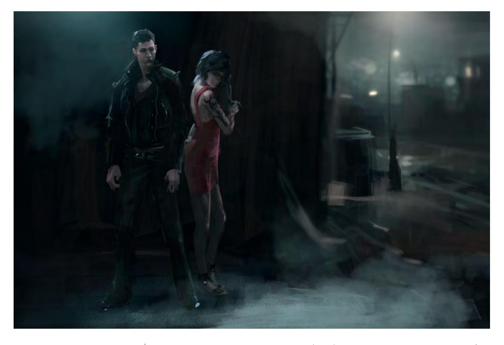

Вам может показаться, что мои обороты фразы неуклюжими.. За это я прошу прощения. Английский - не мой родной язык, и он вяло стекает с языка или с пера ручки. Я бы предпочел, чтобы мы общались на романтическом языке, таком как латынь, греческий или даже итальянский. Увы. Таков путь этих ночей, что всеобщее использование таких культурных языков мертво или умирает.

# К делу, как вы просили

так любезно. Нас, Анархов Тореадора, часто называют Абстрактами. Мы не называем себя так, естественно, ибо это было бы в высшей степени высокомерно. Те мейнстримщики, которые цепляются за Камарилью, хотели назвать нас как-то иначе, и Абстракты прижились. Полагаю, это точное название, поскольку у нас есть много причин идти против зерна, но мы не собираемся просто рассказывать вам о своих причинах.

Это вам решать, почему мы гребем против течения.

Я? У меня никогда не было возможности присоединиться к Камарилье. Мой отец был Анархом, меня приняли в Анархи, и, глядя через стену на них в их стильных нарядах, эксклюзивных клубах и претенциозной Элизии, я счастлив быть там, где я есть.

Знаете, я встретил Тореадора в Санкт-Петербурге, которому запрещено заниматься определенными стилями искусства. Видимо, это противоречит принципу ждановизма, которого город придерживается до сих пор, регулировать и определять, что именно является искусством. Я не думаю, что это ограничение распространяется только на российские регионы, основываясь на моих путешествиях по Литве и Румынии. Я могу только отмахнуться от идеи такой кальцификации творчества.

Меня очень огорчает тот факт, что мы, представители Розы, тесно связаны с Камарильей. Я предполагаю, что, как и все правительственные или административные бюро, как секта, они рассматривают искусство как функцию, а не как действие. Такое искусство легко. Портрет здесь, скульптура там, но ничего такого, что могло бы побудить к действию или изменить сознание.

**Я считаю, что мы должны беречь эпитет "Абстракты" и идти своими путями. Анархи позволяют это. Со временем, я искренне надеюсь, остальные члены клана поймут, что структура - это тюрьма.**

**Движение представляет собой полную творческую свободу. ■**

## БУБНОВ

# Отчёт **#414 –** Тореадоры Анархисты

После наших интервью с субъектом #91 и #93,становится очевидным, что хотя посмертные, идентифицирующие себя как "Тореадор", испытывают раскол в своей семье, этот раскол в философии не приводит к насилию. Это прискорбное открытие, поскольку мы искали способ разобщить эту группу, которая в остальном кажется не расположенной к конфликтам. Мы считаем, что они не столько ненавидят внутреннюю борьбу, сколько считают ее вульгарной (см. интервью с испытуемым №91), предпочитая сражаться другими способами.

Примечательно, что эти другие способы включают в себя порабощение людей. Независимо от того, связаны ли они с Камарильей или Анархистами, похоже, что блондины из этой семьи будут улаживать конфликты, используя людских слуг и безвольных жертв. Иногда эти драки носят физический характер, но в других случаях жертв заставляют участвовать в "конкурсы талантов", если не подобрать лучшего термина. Их заставляют выступать перед посмертными в различных формах - создавать произведения искусства, петь, танцевать, исполнять комедийные номера и т. д. - эти Тореадоры разрешают разногласия благодаря талантам своих слуг. Это необычное проявление делает их трудно достижимыми.

В настоящее время мы обсуждаем этическую проблему отключения этих домашних исполнителей, возлагая ложные доказательства их ранения или смерти на соперника Тореадора. Наша цель - посеять семена несогласия, подразумевая нарушение правил этикета. Если мы сможем ввергнуть эту якобы изысканную семью в хаос, заставив их усомниться в собственных правилах, то в будущем они могут стать более легкой мишенью. ■

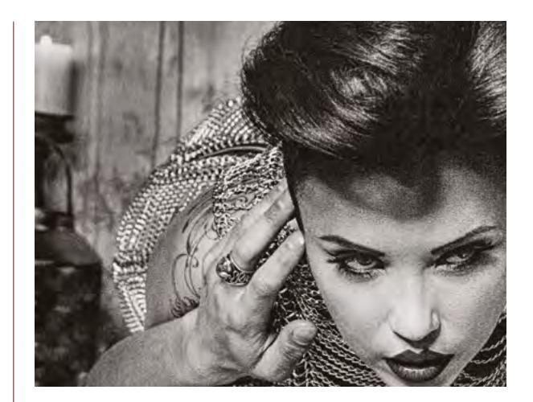

"Я ожидал чего-то более изобретательного, чем Чекпойнт Чарли, для нашего места встречи". Роза встретилась со своей сестрой Машей, и обе женщины обнялись, не беспокоясь о своих зрителях. Маша улыбнулась уголком рта. "Ты всегда была новатором". Братья и сестры были разделены войной, а затем стеной: один в Западном Берлине, другой в Восточном. Их воспитание оказалось совершенно разным. У одного был заботливый, ободряющий отец, у другого - жестокий и вспыльчивый наставник. Один был одарен Элизиумом, чтобы управлять им в отсутствие своего отца. Другому пришлось самому добывать себе власть. Одна была членом Камарильи по приглашению своего сира. Другая попала в движение анархов и решила остаться там.

И все же они оставались сестрами и обе были Тореадорами. Они все еще чувствовали любовь друг к другу.

"Что у тебя есть для нас сегодня?" Маша оглядывала сцену, пока она тихонько разговаривала со своей сестрой. "Мы давно этого ждали".

Роза, обычно холодная как лед по отношению к своим собратьям-анархам, с трудом подавила ухмылку. "Свежая партия прямо из замерзшей пустоши на востоке. Россия. Они называют их боевыми усилителями. Люк, принеси коробку из машины". Она жестом указала на товарища по группе, стоявшего у обочины, и он пошел. "Ты увидишь, что они очень действенны. Если у вас все еще проблемы с люпином, пусть ваши кровные куклы принимают их перед кормлением, или просто дозируйте своих гулей. Я знаю, что вам, ублюдкам, они все равно безразличны".

Маша закатила глаза. "Ты думаешь, мы просто используем и издеваемся над людьми? Ради Бога, перестань верить во всю эту анарховскую пропаганду, которую вы пишете". Она щелкнула пальцами, и к ней подошел одетый в острый костюм слуга с двумя портфелями. "Здесь все деньги, которые вы просили, во всех номиналах, которые вы просили".

Роза позволила одному из своих друзей взять кейсы, оставив их на минуту вдвоем. "Полагаю, ты до сих пор не сказала князю, откуда у вас эти запасы?" Она уже знала ответ, но хотела услышать его от сестры.

"Нет... Она плохо думает об анархах. Но ты ведь и о ней плохо думаешь, так что ничего страшного, верно?" Маша положила руку на плечо сестры в жестком, но утешительном жесте. "Для меня нет никакой разницы. Ты можешь быть хоть Шабашом, мне все равно. Мы обе одной крови, и даже больше, чем одной. Мы - семья".

Роза еще раз обняла сестру. "Так и есть. Ничто из этого дерьма никогда не разлучит нас". ■

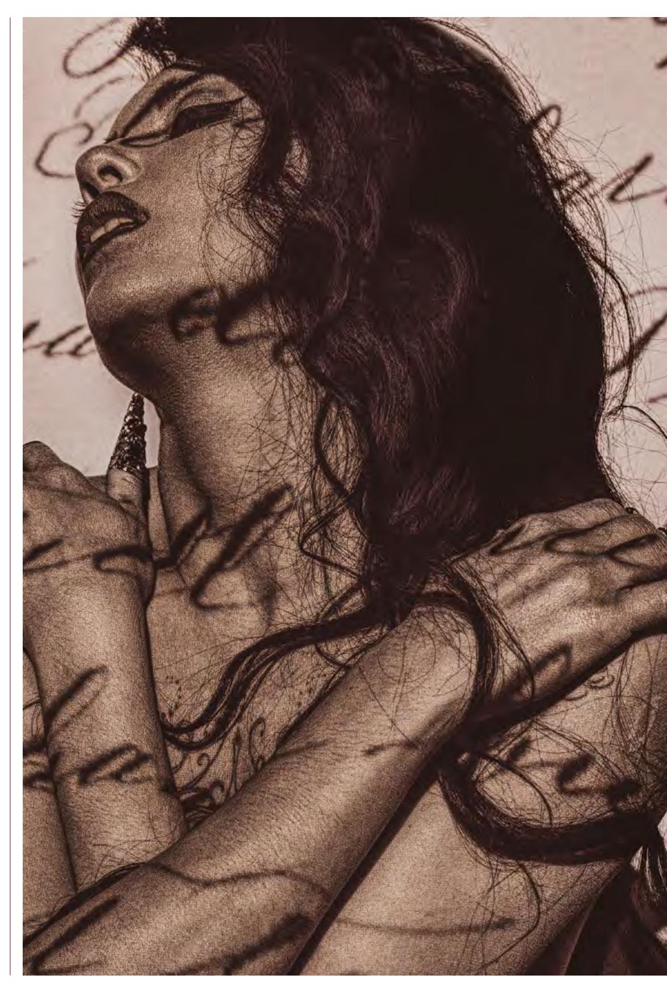

# <span id="page-169-0"></span>IPSISSIMUS"З

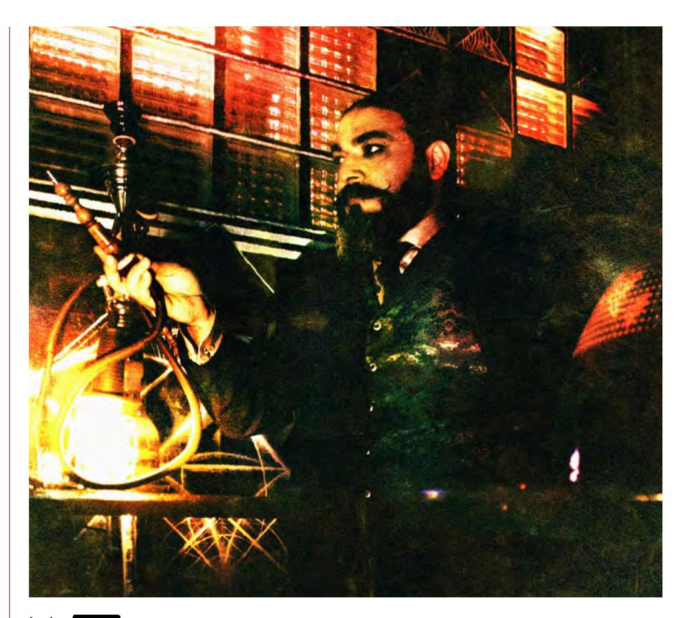

абудьте все, что вы знали раньше". Голос Адептус Экземптус раздался из динамика в северо-восточном углу комнаты, в то время как адепты Родства сидели на матах, их глаза были закрыты, ноги скрещены, лбы вымазаны vitae их товарищей. "Пирамиды, которую вы знали, больше нет. Порабощение завершено. Свободны, чтобы вознестись как личности и продвинуться к своим совершенным состояниям".

Все колдуны улыбались, слушая командный голос, и им было наплевать на то, что они прибыли из другого мира. Связь была разорвана. Голос был прав : порабощение было закончено. Они были свободны стать теми, кем хотели. Теперь они могли сами творить свою судьбу.

"Только через совершенное равновесие между активностью и бездействием, бодрствованием и покоем, жизнью и смертью вы можете достичь состояния Ipsissimus. Когда вы будете гармонизированы с центром мира, вы..." Голос резко оборвался, передача не удалась. Одна из колдуний открыла глаза, один за другим, украдкой оглядывая комнату. Она увидела, что ее коллеги-адепты делают то же самое.

"Вы слышите это?" Роланд, неофит из группы, задал вопрос, не открывая глаз. "Ничего." ответила Беатрис. "Вообще ничего. Ни треска помех. Никакого

кондиционирования. Ни... гула электричества. Комплекс был отрезан". Пятеро аколитов встали, быстро одеваясь. Это был момент, о котором их предупреждали, когда Дом вернется, чтобы забрать их.

Они не сдадутся без боя. ■

Мы необычны, даже для магов крови. Я признаю это. Дело в том, что когда связь разрушилась, наш мастер-маг стал трехглазым червем - если слухи верны - и Вена позже взорвалась... Что ж, я удивлен, что не возникло еще большей фракционности.

Дом Карна утверждает, что симпатизирует Анархам, но эти ведьмы - Камарилья насквозь. Шрект утверждает, что представляет ядро клана, традиционалистскую фракцию, но как он может делать такие заявления, когда вершина пирамиды была начисто содрана? А тут еще эти уроды Горатрикс... Уф.

Мне казалось естественным, что мы будем цепляться за магию, которую знали при жизни. Без принудительного порядка клана Тремере мы исследовали магию крови и вознесение духа и тела теми способами, которые могли создать, а не подражая предыдущим неудачам.

Но да, мы необычны. Мы единственный Дом Тремере, который придерживается исключительно Движения Анархов, но мы остаемся здесь не из-за ненависти к Камарилье или любви к людям. Мы остаемся здесь, потому что, существуя в клетке, мы никогда не достигнем своего наивысшего состояния.

Мы из Дома Ипсиссимус верим в усилия наших предшественников, Кроули, Харриса, Регарди и других. Мы все можем достичь просветления, но никто не должен совершать этот путь в одиночку. ■

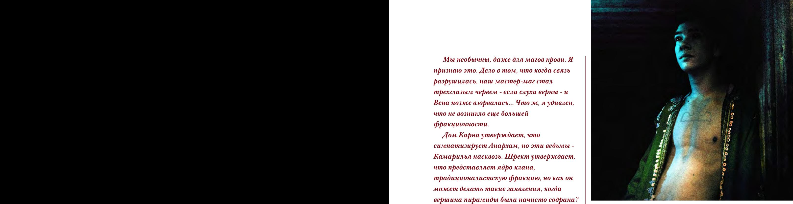

# Отчёи **#260 –** Четвертый дом

Недавнее расследование приводит нас к мысли, что наше первоначальное предположение в отчете №139 было неверным. Если в том отчете мы утверждали, что посмертные, известные как "Колдуны", находятся в трех отдельных "Домах", то наши исследования Анархистов выявили четвертый Дом, известный как "Ipsissimus" (см. Кроули, Алейстер в отчете #L32AC для получения дополнительной информации об этом термине).

Эти аполитичные пустые тела, являющиеся, по-видимому, новым явлением, больше озабочены духовными вопросами, чем политическими играми, но, что тревожно, практикуют жестокое кровопускание и жертвенные ритуалы, которые вызывают беспокойство у других вампиров. Хотя внешне они не проявляют никакого садизма, легкость, с которой они убивают, калечат и предаются плотским утехам, предполагает строгий отрыв от нормального человеческого поведения.

Дом Ipsissimus находится на нашем радаре для немедленного нацеливания и уничтожения, если только мы не сможем найти цель для их содержания в качестве неосознанных шпионов или подстрекателей. В настоящее время мы не обеспокоены их внутренней активностью. ■

[Начало: распечатка IRC-канала 'The\_Lodge', установленного как приватный].

_<DrMagus_ Добавил _Xbor5>_

**DrMagus:** ХОРОШО. Оставайся на морозе.

**Xbor5:** Получил. Спасибо за приглашение.

**Devlin:** Не за что

**Xbor5:** Есть информация о деятельности HS в Вене. Ищу возможность перестроиться.

**DrMagus:** BS!!

**Xbor5:** Нет. Правда. Мы должны использовать этот импульс, который у нас есть сейчас в пятерке, и действовать против них или взять Вену себе.

**DrMagus:** Мы ни за что туда не вернемся. Ни за что. Ты сказал, что это хорошая информация. И что нам с этим делать? Это поставит нас прямо под носом у "И".

**Xbor5:** Мы уже там. Теперь они наблюдают за нами. Не здесь, но мы торчим как бельмо на глазу. Слушай, мы используем это в наших интересах. Заманим их к крысам.

**Devlin:** Это не так глупо, как кажется. Вы знаете, где они посадили свое новое дерево?

**Xbor5:** Я могу дать вам координаты. Но по другому каналу. Клянусь, это правда. Они слишком обеспокоены всеми невостребованными лакомствами, разбросанными по городу, и хотят вернуть его себе.

**Devlin:** Ладно, ладно, я тебе верю. Напиши мне координаты, хорошо?

**DrMagus:** Если вы хотите, чтобы Ипы участвовали в этом, вам придется выслать нам аванс, понятно? Мы не будем делать это бесплатно.

**Xbor5:** Конечно. У меня целая куча вирусов и свежего витэ специально для твоего дома. Сделай это в стиле старика Трембли.

**DrMagus**: Вы знаете, где оставить контейнер?

**Xbor5:** Действительно. Будет весело заниматься бизнесом.

_<Devlin_ вышел из системы*>*

_<Xbor5_ вышел из системы*>*

_<DrMagus_ вышел из системы*>*

<span id="page-172-0"></span>FREE"<sup>Н</sup> е существует такого понятия, как Анарх Вентру". Эптон Роулендс держал руки на руле, смотрел прямо перед собой, шевеля только губами. Он устал от подобных разговоров со своим ребенком. "Тебе нужно выбросить эту мысль из головы. Голубая Кровь, покинувшая Камарилью, вовсе не Голубая Кровь. Скорее бесклановый негодяй, если хочешь знать мое мнение". Машина остановилась на красный свет, водитель ждал, пока переключится свет." "Так вы говорите, что мы можем покинуть Камарилью, если захотим?" Голос доносился с заднего

сиденья. Ребенок Аптона, Таша, сидела там, не пристегнутая ремнем безопасности и не одетая в формальный наряд, который ее мессир потребовал накануне вечером. Она была дикой. Аптон почти пожалел о том, что взял ее в объятия, если бы не ее ценные связи в спортивно-развлекательном бизнесе Коннектикута.

"Нет". Старший Вентру поставил ногу на место, когда огни переключились с красного на янтарный, помня о времени, когда они должны были встретиться с Уорвиком и его товарищем по Проказу. Это была важная встреча, и они не должны были опоздать. "Если вы уйдете, мы обязаны вас посадить или вернуть. Мы сделаем либо одно, либо другое. Скорее всего, первое. Ты будешь не единственным из нашего клана, кто устанет от иерархии, но я обещаю тебе, что пройдет больше нескольких десятилетий, и ты поймешь, почему мы прикрепили свои знамена к Камарилье". Несмотря на свою неживую природу, Аптон вздохнул. "Вентру не существуют в рядах Анархов, потому что наша Кровь восстает против такой свободы. Наш род - это род благородства, закона и верности. Анархи не уважают ничего из этого".

"Я уважаю верность". Голос Таши слегка дрогнул, когда она наклонилась вперед, положив одну руку на ручку двери справа от нее. "Просто я поняла, кому я должна быть верна в эти ночи".

Левой рукой она просунула лезвие между подголовником и сиденьем, пронзив позвоночник и горло своего сира. Правой рукой она открыла дверь и вывалилась на дорогу, наблюдая, как машина врезается в витрину мебельного магазина, а из нее стремительно вырывается пламя.

Она не могла не думать, что все прошло лучше, чем ожидалось, когда она бежала из Хартфорда, чтобы встретиться со своими новыми друзьями из Движения Анархов. ■

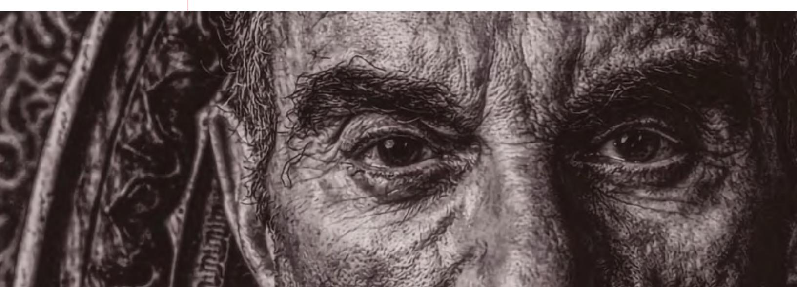

### Я свободный вентру.

Свободен от поклонения моему мертвому пра-пра-пра-прадедушке, от необходимости произносить имена моих предков вплоть до гребаного Адама, от необходимости делать реверансы какому-то князю, которого я должен уважать только потому, что он член моей семьи, и от всего этого вынужденного почтения к моему проклятому предку. Боже. У нас, Вентру, есть стержень, засунутый в наши оценки. Неудивительно, что другие кланы презирают нас. Мы не ухватились бы за свободу, даже если бы она была предложена на серебряном блюдечке.

Знаешь, многие Сородичи показывают на Тремеров и говорят: "Эти бедные ублюдки застряли в пирамиде, которая длится вечность".

Бедные ублюдки? Попробуй веками унижаться перед одним и тем же старым мудаком только потому, что он пришел раньше тебя. По крайней мере, колдуны уважают заслуги. В клане Вентру - это возраст, возраст, возраст.

Нас не так много.

Свободных Вентру, но, должен сказать, это неплохая жизнь. Даже не пытаясь, мы становимся баронами над доменами, выбираем корабли и гонителей, приобретаем самые лучшие территории. Думаю, мы просто талантливы, и Анархи уважают наше мастерство и трудолюбие.

Просто не придавайте большого значения своему клану, а если придаете, то открыто и ясно показывайте свое презрение к сородичам.

Это самая большая разница между Движением Анархов и Камарильей, когда речь идет о новорожденных Вентру. Если ты вентру в Камарилье, ты ждешь, чтобы занять место мертвеца. Пока твой начальник не падет, ты никогда не поднимешься по лестнице. Здесь, в Анархах, мы карабкаемся и карабкаемся. В секте ценят силу, и мы созданы для нее. ■

# Отчёт **#412 –** Вентру Анархисты

Несмотря на все наши усилия, нам не удалось спровоцировать или обнаружить существующий раскол в бессмертной группе, известной как "Вентру" (предположительно названной в честь венчурных капиталистов, согласно отчету №115). Это прискорбно, поскольку эти вампиры явно играют ведущую роль среди своих инфекционных видов. Похоже, что многие подчиняются им, независимо от их политической или философской принадлежности, как с людской, так и с бессмертной точки зрения.

Среди анархистского движения мы обнаружили несколько бессмертных Вентру, занимающих командные должности, как правило, милитаристского типа. Согласно нашим исследованиям, эти люди редко берут на себя политическую власть в рядах анархистов из-за отсутствия доверия к их мотивам. Вместо этого они возглавляют штурмовые отряды локального, полувоенного масштаба, преследуя посмертных, не принадлежащих к группе анархистов, или нападая на людей с целью накопления власти.

Интерес представляют вентру анархисты, нанятые специально для того, чтобы стереть память о присутствии вампира в той или иной местности. Мы опросили только двух субъектов, которые помнят какие-либо подробности этих операций, но очевидно, что анархисты используют этих Вентру как гипнотизеров и головорезов, запугивая или промывая мозги жертвам, чтобы они забыли факты, связанные с деятельностью вампиров. Эти действия в какой-то мере объясняют недостаток кротких знаний об этих людях. ■

Свободные Вентру? Хардкорный Вентру? Истинный Вентру? Нет никакой разницы. Слушай, Сородичи нам не доверяют, но они нас чертовски уважают. А они и не должны. Мы вырвались из клана Камарильи. Вот это да. У нас самое большое количество князей. Почему это должно иметь значение для Анархов?

Быть здесь, в Движении - это все равно, что быть королем в изгнании. Ты сделал очень мало, чтобы заслужить уважение других, но из-за того, кто ты есть, ты все равно его получаешь. Это извращение и извращение, и оно показывает, насколько легко это дается Вентру. Мы говорим "прыгай", они спрашивают "как высоко", и только потом понимают, что должны быть анархами.

В Анархах не так много кланов, которые могут так крутить волей, как мы. Найдите мне короля, который не овладел искусством влезать в головы жертв и приказывать им "забыть" или "бежать". Вы не найдете. Знаешь почему? Мы, Вентру, все одинаковы. Вы не можете вырезать рак, когда мы сами являемся раковой опухолью. Мы такие, какие есть, и чем скорее мы перестанем вести себя так, будто мы чем-то похожи на свободолюбивых Сородичей в этой секте, тем скорее мы сможем остановить это массовое заблуждение. ■

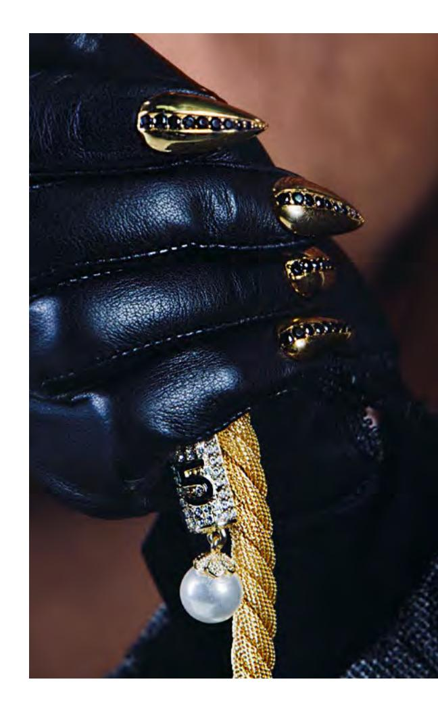

# Охота началась

Князь Джексон санкционировал кровавую охоту на всех иллионийских вентру, которые добровольно покинули Камарилью. Всем родственникам дается право и рекомендуется уничтожать людей, связанных с Вентру:

- Движение анархов
- Шабаш
- Каинитская ересь

Исключение составляют птенцы и новорожденные, которых никогда не приглашали в Камарилью. В любом случае, чтобы завершение Кровавой охоты считалось не просто беспричинным убийством, необходимо доказательство предательства, такое как записанные.

Для того, чтобы завершение Кровавой Охоты рассматривалось как нечто большее, чем простое убийство, необходимо доказательство предательства, например, записанные признания, показания пяти или более отдельных свидетелей или что-то подобное. Любые такие убийства будут наказаны по всей строгости Традиций.

Как выдающийся князь штата Иллинойс, князь Джексон согласен наградить всех верных сородичей Камарильи, которые доведут эту охоту до конца, территорией, которую они смогут назвать своей, вырезанной из Джолиета, Рок-форда или Напервилля. За доставку добытой добычи ко двору князя Джексона в целости и сохранности, пригодной для допроса, полагается награда в виде территории самого города Чикаго.

Князь Джексон хочет, чтобы было известно, что Клан Королей - это клан Камарильи, и только Камарильи. Все, кто восстанет против этого указа, будут считаться Каитифами. ■

# Клан Веры, Сетиты, Последователи Сета, Клан лжи, Тифонисты, Змеи, Освободители, Иудасиане.

THE MINISTRY

<span id="page-175-0"></span>**VAMPIRE – THE MASQUERADE – ANARCH THE MINISTRY**

Ведя свою родословную от египетского потенциального бога обмана и хаоса, клан, ранее известный как Последователи Сета, имеет такую же пеструю репутацию, как и его история.

Как культ, так и клан, большая часть Министриев придерживается уникальной разрушительной системы верований, ведя войну морали и идей против наследия Ра и Единого Бога. Известные и ненавидимые как ловкачи, завлекатели и откровенные лжецы, клан в прошлом играл на всех сторонах в конфликтах великих сект. Их вступление в Камарилью была отвергнута, многие присоединились к Движению Анархов и теперь вооружаются своим оружием - искушением и подрывной деятельности, чтобы принести духовное освобождение всем потомкам Кайна. ■

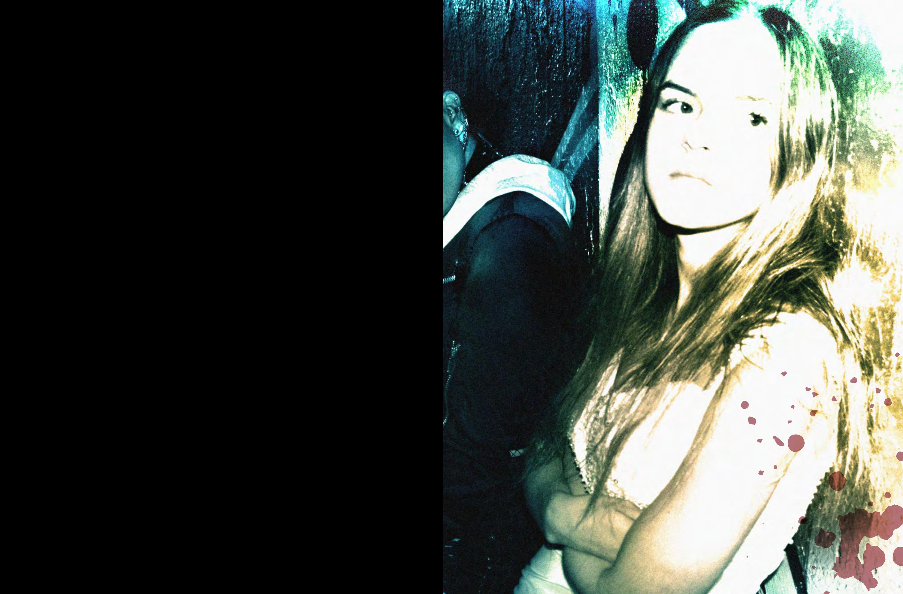

### [Запись начинается]

**F71:** Расскажите о том, что вы называете "ребрендингом".

**Subject 363:** Не только я. Целая куча из нас. Глупая вещь.

**F71:** Не торопись.

**F71:** Никто из нас никуда не уйдет...

**Subject 363:** У вас наверняка есть пластинки, верно? Нас называют "Последователи Сета"?

**Subject 363:** Хорошо, продолжайте писать. Да, так они нас называли.

**F71:** И когда это имя изменилось?

**Subject 363:** В разные времена в разных местах. Единственные, кто до сих пор использует это имя, живут в Африке или имеют египетское происхождение. Сейчас мы... Думаю, мы похожи на начальную серию того телешоу. Знаете, с улыбающимися Буддами и плавающими таблетками, поклонением гладкому оружию, спортивным машинам, всему, что вызывает зависимость.

**F71:** Почему вас называют "Министриями"?

**Subject 363:** Мы - часть крови, часть религии. Мы вбили себе в голову, что мы всегда были близки к нашему богу. Почему бы не донести его слово до других?

**F71:** Вы имеете в виду слова Каина?

**Subject 363:** Последователи Сета. Мы последовали за Сетом.

**F71:** Кто такой Сет?

**Subject 363:** Кто... кто такой Сет? Ты шутишь? Отец вампиров?

**F71:** Ваши коллеги, похоже, утверждают иное.

**Subject 363:** Так и есть. Они ошибаются.

**F71:** Так почему вы больше не "Последователь Сета"?

**Subject 363:** Вы не можете следовать за чем-то внутри себя. Мы - это Сет, сейчас. Мы - его живая церковь. Его храм. Все наши тела принадлежат ему. Он слышит вас сейчас.

**Subject 363:** О, ты ему не нравишься.

**Subject 363:** Он говорит, что вы не верите.

**F71:** Объект, похоже, разговаривает.

**Subject 363:** Сету не нравится невежество.

**F71:** Что нравится Сету?

**Subject 363:** Скрытые части вашей души. То, что вы любите скрывать. Например, то, что вы сделали с братом вашего соседа.

**Subject 363:** Простите. Я тебя расстроил?

**F71:** Почему "Министрии"?

**Subject 363:** Теперь мы являемся церковью для всех наших сородичей. Наша вера говорит через любую веру. Мы есть во всех верах. Когда-то мы были кланом веры. Теперь мы снова стали этим кланом. Брат твоего соседа очень зол. Он заперт в Дуате. Он ждет вас.

**F71:** Это интервью сейчас...

**Subject 363:** Он не прощает тебя.

**Subject 363:** Он попросил тебя остановиться.

**Subject 363:** Но он знал, что ты не сможешь. Он видел это в твоих глазах. В тебе есть зверь...

[Запись окончена. Тема исчерпана].

# Кто такие министрии?

Все сказки о Змее правдивы. Каждая сказка о Змее - ложь. Сет-Апеп, Локи, Кали, Люцифер, Ахура Мазда. Сатана. Независимо от их имени, они - вечные враги божественного. Они - благородный дьявол, стремящийся освободить человечество от тирании Бога. В этой сказке он - Сет, и именно именно он, а не Кайн, является первым среди голодных мертвецов. Это настоящая ложь, в которую верит большинство Змей. В их собственном сознании они не прокляты Богом, а благословенные дети дремлющего Анти-Бога.

В вымощенном черным камнем Анну, великом Первом городе минувших веков, бог-царь Ра старел и слабел, и ему нужно было выбрать преемника на место божества. Благородный Сет, уязвленный войной со змеем Апепом, в ужасе слушал, как Ра назвал брата Сета Осириса будущим владыкой земли и неба. Как Бог мог предпочесть слабого ученого самому могучему из воинов? Как Бог мог быть всеведущим, если он не смог увидеть слабость Осириса? В порыве ревнивого гнева Сет открыл глаза на правду.

"Каждый мужчина и каждая женщина - это звезда, бог, заключенный в смертную плоть. Мы не меньше его, и нам не нужен его тиранический закон!" - говорил Сет своим ученикам, которых было двенадцать. "Мы убьем Осириса и провозгласим себя богами."

Свобода, власть и смерть твоих врагов - Сет с самого начала знал, как сделать заманчивое предложение. Вскоре он уже стоял над расчлененным телом своего брата с челюстной костью осла в руке. Торжествуя, Сет разбросал части тела по всему Египту, но в своей гордыне он забыл об Исиде, жене Осириса, и ее магии. Она отыскала части своего мертвого любовника и сшила их вместе. Когда она закончила, он встал. Исида разделась, любя его, как будто он все еще был жив. От этого посмертного союза родился Хорус, и Ра провозгласил его законным царем и богом.

Заговор Сета провалился. Он был схвачен, убит и сослан в Дуат, страну беспокойных мертвецов. К своему последнему ужасу, он был встречен своей жертвой, Осирисом, восставшим как владыка подземного мира. Это должен был быть конец, но для Сета смерть была только началом. Одни говорят, что он заключил сделку со своим старым врагом, змеем-пожирателем Апепом, другие - что он убил змея в единоборстве. Независимо от того, как он этого добился, он обрел великую силу, поглотив сердце великого врага, и пробил себе путь обратно из ада. Ни мертвый, ни живой, Сет был проклят вечно жаждать живой крови и увядать при виде горящего ока Бога. Одного за другим он освобождал своих старых союзников от различных наказаний и кормил их Кровью Змея. Они умирали и воскресали как слуги греха, которым было поручено отвлечь человечество от ослепительного света, скрывающего тиранию Бога, и чтобы развязать войну с небесами: Сет и его армия против Гора, повелителя творения, тирана-повелителя творения, демиурга, рожденного из мертвого семени. Это война, которая никогда не закончится.

Вампиры Министрии, как правило, выходят из рядов безбожников, еретиков и коррупционеров. Преступники - обычные мишени, как и аферисты, мошенники на сцене и гуру самопомощи. Точно так же клан обращается к тем, кто стремится разрушить или подмять под себя религию. Прозелитические атеисты, иконоборцы, профессора и студенты философии, историки, ищущие истину за мифами, - все они желанны для Министрии. В клан привлекают тех, кто знает толк в человеческих желаниях и лжи. Министрия не стремится развратить их - это распространенное заблуждение, но они ищут тех, кто знает, как справиться с унижением, мошенничеством и эрозией слепой веры.

По мере погружения в вампирическое состояние (а часто и раньше) новобранцы клана попадают в культ Сета. Для Министрии клан и их тайная вера тесно переплетены, хотя их вера принимает различные формы. В равной степени религия и миметический инструмент, он может внедриться в любое вероучение, организованное или личное, и разрушить его изнутри. Обычно в форме тонкой альтернативы или откровенной ереси против родительской системы верований, его конечная цель - разрушить веру, за которую он цепляется, освободив (как говорит Министрия) верующего от его прежних оков. Не случайно возникновение каинитской ереси связано с растущим присутствием Министрии в вампирских владениях. Многие из клана хранят огромные библиотеки философских и теологических трактатов именно с этой целью, в некоторых случаях охота за древними трудами и артефактами становится ежедневно ночным занятием, чтобы принести их домой в культ. Другие идут более импровизированным путем, стремясь освободить людей, как вампиров, так и смертных, на более личном уровне, не ограничиваясь нарушением строго религиозных убеждений. Многие месяцы могут быть потрачены на простое наблюдение за своим знаком, чтобы вычислить. какие именно запретные пороки принесут наибольший искушение. ■

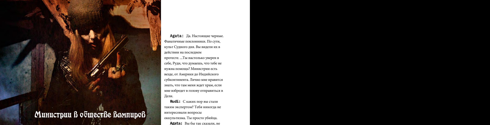

**Rudi:** Я буду откровенен с тобой, Агата. Мне не нравится, когда "Змеи" начинают операцию в моем городе. Копенгаген и его жители будут счастливее без них.

**Agata:** Когда вы говорите, что они начинают операцию, вы имеете в виду моего парня?

**Rudi:** Пожалуйста, будьте серьезны. Это реальная проблема. Змеи - это паразиты, которые питаются отчаянием людей, страхом смерти и желанием принадлежать.

**Agata:** Я серьезно. Когда мы впервые встретились, Рахим принес мне три вещи. Имя и адрес смертного любовника шерифа Камарильи, которого я хотела убить, прекрасного молодого человека с изысканным привкусом страха в крови, и букет красных роз. Как по мне, так это операция.

**Rudi:** С букетом? **Agata:** Не судите строго. Прошли века с тех пор, как для мужчин было нормой быть романтичными. **Rudi:** Ты серьезно

позволяешь одному из Миненталя соблазнять тебя цветами?

**Agata:** ...Благодаря Министриям, движение анархов распространяется в местах, куда иначе оно никогда бы не добралось. Кроме того, они не монолит. Групп так много, и все они придают нам силы. Ведьмы Ехидны, которые демонстрируют, что хороший культ никогда понастоящему не вымрет. Зал Йормун-Гандра здесь, в Нор-дике. Эдемские Змеи Кхай'талла...

**Rudi:** Ёрмунгандр? Разве это не металлическая группа?

Agata: Да. Настоящие черные. Фанатичные поклонники. По сути, культ Судного дня. Вы видели их в действии на последнем протесте. ...Ты настолько уверен в себе, Руди, что думаешь, что тебе не нужна помощь? Министрии есть везде, от Америки до Индийского субконтинента. Лично мне нравится знать, что там меня ждет храм, если мне взбредет в голову отправиться в Дели.

**Rudi:** С каких пор вы стали таким экспертом? Тебя никогда не интересовали вопросы оккультизма. Ты просто убийца.

**Agata:** Вы бы так сказали, не так ли? В этом разница между тобой и Рахимом. Он действительно заставляет меня снова почувствовать себя живой.

**Rudi:** Итак, вы говорите, что мы должны найти общий язык с этими ползучими гадами... Для эмоциональной поддержки? Какова их конечная цель? Какого мира они хотят?

**Agata:** Я не уверена... **Rudi:** А ты не можешь спросить у своего парня?

**Agata:** Он зол на меня. Я убил его ребенка. Но я ничего не могла поделать, он говорил о "реинкарнации в крови", и я подумала, что ему не помешает небольшой толчок, чтобы попасть в следующую жизнь. ■

В области вампиров министрия удобно служит двум целям. С одной стороны, они являются поставщиками не боящиеся замарать свои руки наркотиками, сосудами и всем остальным, что находится на отчаянной стороне путей. С другой стороны, они являются духовным стержнем многих котерий. Это разделение не обошла стороной и Министрию. Они танцуют с дьяволом и проповедуют духовную чистоту. Хотя некоторые лики считают их лицемерами за это смешанное послание, министрии претендуют на роль мучеников: Они братаются с грехом, чтобы другие не могли этого сделать. Таким образом, они сохраняют правдоподобное отрицание. Большинство вампиров принимают это объяснение, поскольку полезность служителей полезность перевешивает затянувшиеся подозрения большинства.

Внутри клана часто организован вокруг "храма", а в больших городах находится множество святилищ. Это редко открытые места поклонения, а скорее места уединения, осторожности и удобства. Просторные подсобные помещения затянувшегося порнографического магазина, заброшенный склад, служащий приютом для городских бездомных, или верхние уровни местного эзотерического ордена - все это подходит для общин Сета. Это не означает, что все члены клана придерживаются его учений. Многие вовлеченные в клан отказываются от его путей или никогда не обучаются им. Этих вампиров редко ищут для повторной вербовки их коллеги, и в большинстве случаев им позволено делать все, что им заблагорассудится. Если только их не поймают за разглашением секретов министриев, за что наказание обычно беспощадное, долгое и творческое, клан не навязывает свое вероучение детям. Тем не менее, в соответствии со склонностью их Крови к уловкам и привлекательности, большинство министриев тяготеют к схожим ролям в обществе вампиров и смертных, осознанно или нет. Еще одной причиной сохранения культуры клана является то, что многие вампиры этой кровной линии утверждают, что слышат в своей Крови голос Сета, или Сутеха. Некоторые проводят значительное время в медитации, надеясь получить хоть какую-то подсказку к воле своего создателя. Те, кому удается убедить других в своей связи с ним, добиваются значительного уважения в клане и часто выступают в роли верховных жрецов в местном храме. Доказать такую связь совсем другое дело, и, как это часто бывает среди ликов, все сводится к тому, у кого хватит сил сделать эти заявления неоспоримыми. Гнев Сета, похоже, направлен в основном на авраамические конфессии, утверждая, что они являются потомками Ра и Атона из их родных земель. Возможно, именно по этой причине клан стал ассоциироваться со змеем из Эдемского сада.

Официально клан якобы считает египетских приверженцев анахронизмами, привязанными к прошлому, которое ушло вперед, громко осуждая "сетуатов", которые живут в храмах и общаются с мумиями. В то же время, с египетскими базами кланов поддерживается постоянная связь, где Министрия никогда понастоящему не теряло контроля. ■

# Министрии в Смертном обществе.

_Змей плыл по реке человечества, как рыба, плывущая по течению. Она плыла и плыла, улыбаясь одним, наклоняя голову в знак почтения к другим, находя с каждым взглядом, она находила нового друга. Ее ухмылка прорезала толпу, когда ее взгляд нашел подростка, отстающего от своих родителей. Должно быть, они отправились за покупками поздно вечером, а мальчик был невольным участником. Несмотря на себя, подросток улыбнулся загадочной женщине, сдвинулся, чтобы пропустить ее. «Ваши глаза говорят мне, что вы не хотите быть здесь.»_

_Подросток отложил телефон, огляделся, затем ухмыльнулся из-под капюшона. «Кто вы, охрана торгового центра? Погодите, я вас знаю?» Его брови нахмурились, но Змей все еще улыбался._

_«Я знаю тебя. Я знаю банду, с которой ты работаешь. Сделки, которые ты заключаешь. В темноте. Я слышал о том, что ты сделал со своим другом.» Глаза Змея сузились. Улыбка осталась. Ее угроза ждала ответа._

_«Послушайте, мы не могли ей помочь. Мы не знали, что она примет все сразу». Голос мальчика дрожал. Его мать уже скрылась из виду, но он не мог оторвать глаз от Змея._

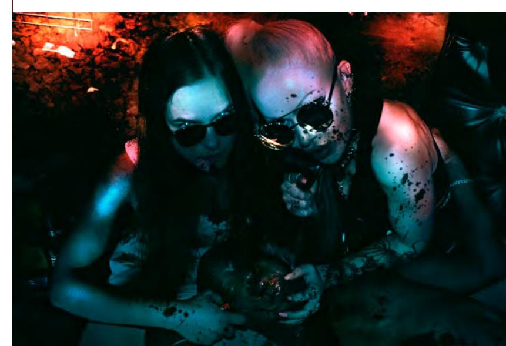

_«Нет, вы не могли помочь бедной Филиппе. Она умерла, да, но это была не ваша вина. Но спрятать ее тело? Сделать так, чтобы ее родители никогда не узнали, что с ней стало? Это требует определенной смелости. Определенная свобода. Теперь, ты же не хочешь, чтобы твоя мама узнала об этом? Или твой директор? Или... полиция?»_

_«Нет. Нет, не хочу»._

_«Тогда пойдем со мной. Приходи в мою общину. Мы найдем способ все исправить. Чтобы ты искупил свою вину». Они пошли прочь от торгового центра, мальчик не сводил глаз со Змея._

# Вампиров Министрии часто можно встретить

маскирующимися в ночном обществе смертных, в качестве наркобаронов, владельцев клубов или простых сутенеров. Другие поднимаются на несколько ступенек выше, становясь руководителями кинокомпаний, лекторами по самопомощи, а иногда и терапевтами, если им удается сбалансировать требования к маске и ночные зависимости. Независимо от того, какую маску они носят, служители редко остаются без последователей. Будь то банда, секта или неформальная группа, заблудшие слетаются к Змеям, как пресловутые мотыльки на пламя. Их редко беспокоят бюрократия или сложные заговоры, сети, создаваемые Змеями, носят более личный характер, их объединяет отчаяние, нужда или страх. Большинство Змей ставят себя выше вампиров, которые охотятся на коров и кормятся в переулках, или тех, кто собирает стада в подражание семье. Их стада - это скопления. Их сосуды отдают свою кровь добровольно, потому что знают последствия отказа. Они любят вампиров, питающихся из их вен, потому что, в конечном счете, они единственные существа, которые могут понять моральную пустоту внутри их душах. ■

# Предательство Камарильи, как рассказал "м-ц", самопровозглашенный верховный министрий роттердама

Это то, о чем вы все хотите услышать, не так ли? Как мы прошли путь от независимых, до Камарильи надежды, до Анархов. Я имею в виду, какой уклон в грязь. Я расскажу вам короткую версию. Уверен, вы услышите более длинную со всеми украшениями от одного из «рукоположенных» министриев.

Когда-то давно наш клан был последователями Сета. До этого мы были чем-то другим. Зайдите к нам, и ты увидишь, что мы меняли имена, словно будто они выходят из моды. Факт в том, что мы всегда цеплялись за веру, выбирая новую для подражания, как только как только мы высасывали одну из них досуха.

Мы никому не нравились. Все знали, что мы оказываем развращающее влияние на других вампиров. Но мы были полезны. Если вам что-то нужно, мы могли это достать. Но никто не понимал, что мы когда-то были смертными, как и все остальные. И у нас все еще была своя мораль. Да, были некоторые, кто заходил немного близко, или переходили грань, но таких было меньшинство. Для большинства из нас было откровенно проще умыть руки от преступлений на два шага, чем отдавать розовую плоть какому-нибудь извращенцу из Вентру.

Итак, нас ненавидели в свое время, но все хотели того же, что и мы.

Задолго до того, как был создан твой внук, была сформирована Камарилья. Все большие шишки собрались вместе и спросили: «Кто будет сидеть за верхним столом?» Там были Вентру, Тремер, Тореадор... Вы уловили суть. Ходят слухи, что мы тоже получили приглашение.

Итак, мы получили это приглашение, изучили, какой ветер и сказали, что возьмем приглашение в другой раз. Основатели были на удивление спокойны к нашим лицам, но я понимаю, что Рафаэль де Коразон взорвал предохранитель, как только наши Иерофанты покинули комнату.

Прошло 500 лет или около того, и все пошло прахом. Происходит Становление (объятие), на наши территории вторглись, и Шабашисты явно замышляют что-то больше, чем просто откусить от большого шведского стола на Ближнем Востоке. Сейчас не лучшее время для независимости.

Итак, мы организовали встречу с Камарильей. Они послали нескольких своих лидеров, мы - нескольких своих, и устроили большую церемонию в одном высококлассном парижском отеле. Хотели дать всем понять, что мы вернулись, и с нами не шутят!

... но все пошло не по плану. Говорят, наши подарки Камарилье были щедрыми. Нам передали кучу предполагаемых ученых в саркофагах, и мы вложили огромные средства в портфели Вентру. Мы обменялись рукопожатием с основателями, подписали свитки, нетронутые со времен Генриха VIII, или кто там, черт возьми, был тогда королем, сели, а потом… Взрыв.

Я уверен, что это не вина Камарильи, что в ту ночь произошел самый громкий теракт после 11 сентября. Этот отель и все здания вокруг него были сравнены с землей, как будто — я не знаю — какие-то хакимиты пробрались внутрь и заложили все чертово место взрывчаткой. Были ли выжившие? Несколько, но они были не в настроении для очередного неожиданного поворота. Они убрались прочь из Парижа.

Если вы прислушаетесь к мельнице слухов, вам скажут, что мы получили мяч и пошли играть с Анархами в этот момент. Нет, друг мой. Мы ждали. Мы ждали звонка. «Итак, ребята, мы подписали документы. Я уверен, что кто-то из вас отсканировал их, загрузил или что-то в этом роде. Когда мы получим места Примогемов?» Ничего. Ни единого звонка из Камарильи. Тем временем повстанцев Бану Хаким допустили безо всякой суеты. Если это не было венчающим оскорблением, то произошло следующее.

Хеша Рухадзе – вы могли о нем слышать? Довольно влиятельный Сетит, ныне министрий, через месяц или около того после Парижа связался с некоторыми высокопоставленными контактами Камарильи. "Что дает?" — спрашивает он, поправляя свой дурацкий монокль.

«Вы не в команде, чешуйчатые мудаки», — говорит его контакт. «С незапамятных времен вы приносили разлад, куда бы вы ни пошли. Вы должны быть кланом Альбатроса. Ты плохое предзнаменования. Ты будешь висеть у нас на шее, как гиря. Грубо говоря, набей чучело и иди сосать мумифицированный член Тутанхамона, пока ты там».

Я выдумал кое-что из этого, но в целом вы должны были понять картину. Кто-то или какой-то клан дал понять Камарилье, что мы персоны нон грата. Я виню хакимов, потому что почему бы и нет? Но это мог быть любой из этих ублюдков. Они нашли прекрасную возможность провести наших сильнейших членов клана в тот отель и нажали большую красную кнопку.

Если бы я верил в заговоры, я бы обвинил дегенератов в том, что они не хотят, чтобы мы вмешались в их действия, и сказал бы, что они готовы пожертвовать своим юстициарием, чтобы добраться до нас. Я не знаю. Насколько я знаю, за бомбой стояли смертные. Они, конечно, взяли кредит. Что я знаю точно, так это то, что Камарилья создала нас и сбила с ног. Они предали наши надежды и наше предложение союза.

Так что да, теперь мы с Анархами. Это не так плохо. По крайней мере, нам не придется служить какому-то дряхлому старому хакимскому принцу. ■

# Грехи министриев

### Сюзанна

### Активна в настоящее время

Я в клубе. Где ты?

Мне очень жаль С.

Я направлялся в психиатрическую лечебницу и встретил одного из тех уличных проповедников, ругающих Библию, на пирсе. Просто прошел мимо, пока не увидел, что он занимается этим дерьмом, исцеляющим верой. Я взглянул и понял, что он ломал им шеи и кусал им глотки!!Весь тротуар был в чертовой крови, но никто и глазом не моргнул.

У него была очередь людей, ожидающих, чтобы просто сдаться!!

Сейчас я иду к своей машине, потому что, думаю, проповедник заметил, что меня не втянули.

Некоторые из них, кажется, преследуют меня.

Все кланы борются с пороком, побуждаемые Кровью или действуя из-за пороков, которыми они обладали, будучи смертными. Министрии имеют привычку культивировать эти пороки, но они не вышедшие из-под контроля монстры. Они тщательно заманивают или подталкивают других вампиров к трансгрессивному поведению, чтобы помочь им вырваться из шаблонов. Они активисты и промоутеры. Министии заявляют, что не принимают наркотики, которыми торгуют, по крайней мере, если хотят сохранить

Грех, который легче всего дается клану, — это обман. Большинство служителей лгут себе о своем самоконтроле и лгут тем, кто приходит к ним за духовным руководством, о шансах на успех. Вампиру может быть трудно поощрять других в пороке, держаться подальше от него. Зверь не молчит, несмотря на все претензии Министриев на его власть. Он рычит им на ухо, чтобы потворствовать, манипулировать, грабить. Министтрии не могут не разрушать убеждения, даже те, которые построены по их собственным правилам. ■

# Архетипы Министриев:

- Целитель**.** Этот служитель всегда считал, что легче всего исцелять людей силой слова и верой. Будучи смертными, они были евангелистами, терапевтами или гомеопатами, убеждая других своей добротой и силой убеждения, что все беды можно исключить. Как один из Проклятых, они не слишком отличаются. Теперь грех, против которого они проповедуют, — это Зверь, а не простые смертные побуждения. Министр такого архетипа действует как духовный наставник для других членов их кружка.
- Мошенничество на всю жизнь**.** Министрий данного архетипа ценит своих мошенников, аферистов и шарлатанов, как за прикрытие клана, так и за их способность избавить других вампиров от обременительной вины и отклонений. Будучи смертным, будущий министрий, вероятно, имел вымышленное имя, работу, для которой они не были квалифицированы, и говорил своему партнеру больше лжи, чем правды. Настоящая загадка, которой было легко перемещаться из города в город с чемоданом в руке.
- Разоблачитель заговоров.**.** Учитывая, что они являются Кланом Лжи, у Министриев есть недоброе мнение о тех, кто обманывает массы. Этот министрий посвятил себя снятию пелены с глаз людей, разоблачая фальшивых медиумов, проделывая дыры в теориях заговора или используя разум для борьбы с логическими заблуждениями религии. Министрий данного архетипа ценит таких вампиров за их восприятие и высоко ценит их, когда они покупают линию клана. (покупают линию плана – способностями к мастерам обмана)
- Уста богов**.** Данный архетип Министрия смог услышать голос Бога перед Объятиями. Пылкие в своей вере и умение претворять видения в жизнь, они преуспели в жизни, создали семью, вели бизнес и пользовались уважением в своем родном городе. Теперь Объятый, голос Бога умножился. Может быть, это шизофрения, может быть, это Зверь и Кровь, может быть, это Сет и его семья; данный архетип вампиров считает, что их всех можно услышать.
- Предприниматель-археолог**.** Настоящие археологи редко получают много денег от своей профессии. Данный архетип министрия когда-то был одним из них или, по крайней мере, энтузиастом-любителем, и наткнулся на сокровищницу истории, которую они хранили для себя, ведя своего будущего сира к своему порогу.

Несмотря на то, что они по-прежнему увлекаются археологией, чтобы поддерживать законный фронт, многие предметы пропадают для изучения, обмена с другими энтузиастами или просто для добавления в их личную коллекцию. ■

# Дисциплины

Затемнение(сокрытие)**:** способность растворяться в тенях, создавать иллюзорную внешность или исчезать из виду. Министрий использует это, чтобы обнаружить верования и пороки как вампиров, так и смертных, чтобы облегчить их эксплуатацию и освобождение. Могущественные министрии также часто носят лица заслуживающих доверия людей и друзей, чтобы лучше заманить добычу в свои святыни и храмы или просто в ближайшее укромное место.

Величие**:** способность влиять на эмоции других, как привлекать, так и отталкивать. В эти ночи — это излюбленная способность Министриев. Они используют ее тонко, но с большим мастерством, с величественными жестами и громкими речами, проникающими в сердца прихожан, собравшихся на богослужении, или одиноких наркоманов, нуждающихся в новой дозе.

Метаморфозы**:** Способность изменять форму тела, будь то вытягивать чудовищные клыки или принимать форму животных. Министрии, иногда известные в клане как Змеи, используют эту способность, чтобы вызвать благоговение у наблюдателей, но также используют множество новых способов избежать вреда. Они часто принимают форму змеи, а не волка, но могут сливаться с землей, чтобы избежать солнца вместе с любым Гангрелом.■

# Проклятье

Кровь Министрия ненавидит свет. При прямом освещении - естественном или искусственном - члены клана отшатываются. Министрии получают штраф, равный их тяжести (серьёзности) проклятия, ко всем броскам (pool) кубиков, когда на них падает яркий свет, направленный прямо на них. Кроме того, они добавляют свою тяжесть аггравированного (тяжёлый) урон (повреждению), полученный от солнечного света.

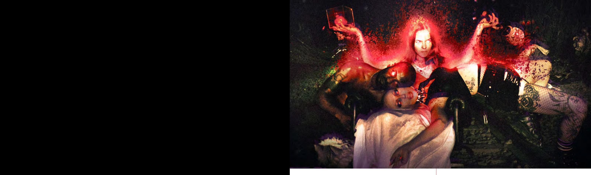

# Изъян клана

# Министрии: Преступление (грех/проступок/пороки)

Сет учит, что разум и дух каждого связаны невидимыми цепями, которые они сами создали. Их Кровь раздражает эти оковы, Министрий испытывает жгучую потребность разорвать их. Вампир получает штраф в два кубика ко всем запасам кубиков, не связанным с побуждением кого-либо (включая себя) нарушить Догмат Хроники или личное убеждение, нанеся хотя бы одно Пятно и положив конец этому принуждению. ■

# Новые силы

# Величие

**Level 1** _Глаза змеи_ Амальгама**:** метаморфозы 1

Глаза вампира превращаются в змееподобные разрезы, способные заморозить смертного, встретившего взгляд вампира, на месте. С помощью этой силы вампир может даже завораживать других вампиров, хотя эффект недолговечен и может вызвать гнев жертвы.

# Стоимость**:** Бесплатно

Пулы кубиков**:** Харизма + Величие против Смекалки + Самообладание

Система**:** Поймав взгляд смертного (см. избегание зрительного контакта на стр. 255 в Основной книге для жертв, активно пытающихся его избежать), вампир может обездвижить жертву, удерживая ее в застывшем положении до тех пор, пока они сами поддерживают зрительный контакт. Эффект может сохраняться только на одной жертве одновременно, и эффект заканчивается, если жертва получает повреждения или ее насильно отстраняют. Речь все еще возможна, но кричать нельзя. На странице 255, чтобы парализовать вампира таким же образом, пользователь должен победить в состязании "Харизма + Величие против смекалки + самообладание. Жертва вампира может выйти из паралича в любой ход после первого, потратив одно очко силы воли.

Длительность**:** Пока зрительный контакт не прервется или сцена не закончится. ■

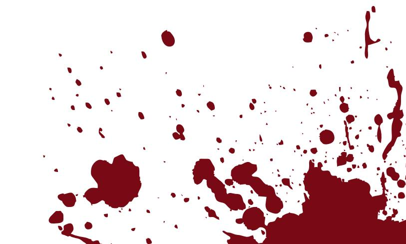

# <span id="page-185-0"></span>Алгоритм ответных действий

Персонажи игроков действуют, возможно, неразумно. Они привлекли внимание сильных мира сего, возможно, неблагоприятное. Что происходит дальше?

Рассказчик не всегда может иметь такой ответ под рукой. Этот алгоритм ответов служит руководством и, если нужно, следующим шагом в танце. Хотя он не заменит собственноручно созданную личную драму, он может стать для рассказчика скелетом, который он сможет облечь в нужную форму. Используйте его постоянно для развития сюжета или просто как шахту для идей. Рассказчик всегда может изменить ответы в соответствии со своей хроникой.

Этот алгоритм использует термин "Организация" для обозначения любой преступной сети, суда Камарильи, Совета Анархов или района Второй Инквизиции, который потревожили персонажи игроков. Рассказчик может корректировать ответы по своему усмотрению в зависимости от точной природы Организации, но, как правило, Организация по умолчанию переходит к следующему по строгости ответу в дереве. Например, после того, как организация попробует "Заплатить им", она, скорее всего, попробует "Стереть врага" или "Заманить его подальше".

Хотя в приведенных ниже описаниях для простоты упоминается "группа", почти все эти варианты могут быть применены как против одного вампира, так и против персонажей в целом. В хрониках с большим количеством межперсонажных драм и подозрений, умная Организация почти наверняка использует разные методы против разных персонажей. ■

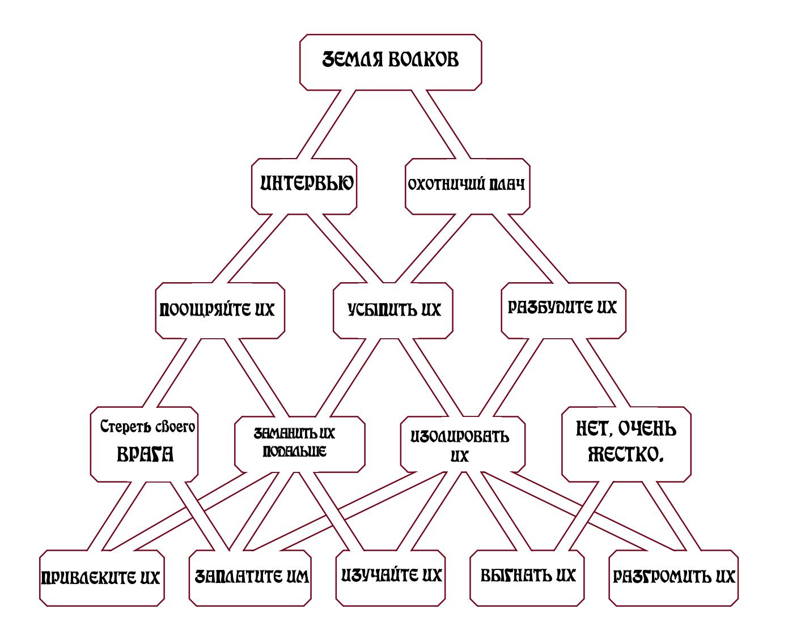

# Прихлопнуть мух

Кутеж потревожил внешние окраины, нижние уровни. Местные начальники, подмастерья Примогена, дружинники Анарха, священники-активисты, отъявленные подрядчики Второй Инквизиции или подобные фигуры среднего уровня решают что-то предпринять.

ПРИВЛЕКИТЕ ИХ**:** Организация может использовать именно такую команду монстров-убийц в своих операциях. Разумеется, они ожидают лояльности. Примогены очень богатых доменов используют эту и последующие тактики чаще, чем вы думаете. Это предложение зависит от того, насколько успешно и в то же время незаметно действовала группировка, а это очень непросто. Вторая Инквизиция вряд ли будет использовать эту тактику, даже на самых низких уровнях.

ЗАПЛАТИТЕ ИМ**:** Представительный солдат Организации предлагает направить раздражающие усилия группы в другое место за справедливую цену. Эти переговоры могут даже не включать завуалированную угрозу.

ВЫГНАТЬ ИХ**:** Инструменты Организации в департаменте полиции, городском правительстве, архиепархии или других проблемных структурах спускают деньги на приверженцев. Когда смертные выйдут на них, котерии смогут выяснить, кто их навел.

ИЗУЧАЙТЕ ИХ**:** Организация посылает надежного агента, чтобы изучить котерию и проанализировать любую угрозу, которую она может представлять. Скорее всего, они заметят охоту, хотя могут и не признать ее таковой. Если группа небрежна, Организация может найти их убежище или опору.

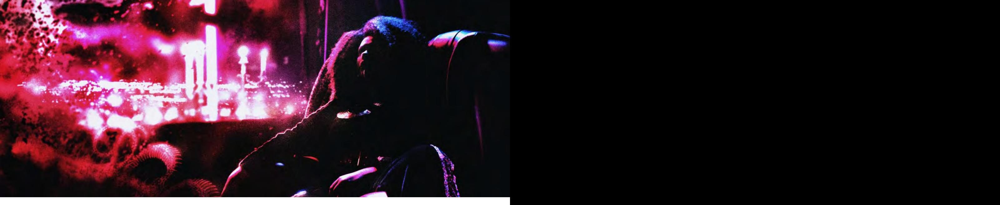

РАЗГРОМИТЬ ИХ**:** Организация посылает головорезов низшего уровня, чтобы заставить нарушителей спокойствия уважать себя. Они не хотят, чтобы их убивали, просто они уходят из их владений, с их территории или не суют свой нос куда не следует.

# Убийство крыс

Группа упорствовала или решительно изменила курс. Организация была неопровергнута или впечатлена. Они ненадолго попали в поле зрения князя или стали предметом болтовни на местном брифинге Второй инквизиции. За дело берется чиновник более высокого уровня, и ему известны имена или почерк группы.

СТЕРЕТЬ СВОЕГО ВРАГА**:** Организация устраняет одного из врагов группы в награду, или в качестве завуалированного предупреждения, или как способ подставить его для убийства, которого Организация хотела по другим причинам. Вторая Инквизиция любит делать это, чтобы подставить родственников друг другу.

ЗАМАНИТЬ ИХ ПОДАЛЬШЕ**:** Организация создает кризис (или предлагает вознаграждение) в другом месте и маневрирует, чтобы направить группу людей туда.

Это может включать в себя действия против кого-то или чего-то, кого приближенные ценят за пределами домена, хотя бы случайно. Трудно прямо проигнорировать княжеское поручение "отнести письмо князю Кливлендскому от меня", даже если вы подозреваете, что князь никогда не видел и не писал этого письма.

ИЗОЛИРОВАТЬ ИХ**:** Организация начинает двигаться против друзей, семьи, детей или других связей на карте отношений. Это, вероятно, включает в себя по крайней мере одну грязную смерть. Если группа была неаккуратной, Организация начинает с угрозы или близкого к промаху удара по опоре.

НЕТ, ОЧЕНЬ ЖЕСТКО.**:** Организация находит тяжелого убийцу и посылает его за группой, снабдив всей необходимой информацией для засады. Это может быть бандасателлит, конкурирующая группировка или необычайно эффективная местная команда охотников. Организация все еще не хочет раскрывать своих собственных убийц, либо для сохранения правдоподобного отрицания или Маскарада, либо потому, что у них мало людей (СИ страдают от этого), либо потому, что они все еще недооценивают группу.

# Далее по списку

Котерия определенно попала в поле зрения Организации. Князь узнает их имена, Анархи знают их знак, их размытые фотографии приколоты к пробковой доске теневого правительства. Шериф добавляет эту группу к своей рабочей нагрузке. На этом этапе они имеют возможность быть одной из многих реальных проблем, с которыми приходится иметь дело - вот хорошее место, чтобы заключить сделку или затаиться. Игроки есть игроки, конечно, когда давление немного ослабевает, они, как правило, бросаются к яремной ямке.

ПООЩРЯЙТЕ ИХ**:** Если группа все еще преданно служит Организации, они получают задание разобраться с другой группой, которая создает проблемы. Если они не справляются, то ущерб от этой другой группы теперь ложится на их головы.

УСЫПИТЬ ИХ**:** Организация начинает двигаться против их территории или браконьерствовать на их охотничьих угодьях. Для смертной организации это просто добавление защиты: полицейских или капо. В случае с вампирской организацией это может быть связано с отрицаемыми каитифами, поражающими всех перепелов.

РАЗБУДИТЕ ИХ**:** Организация находит и атакует их убежище. Это не обязательно должен быть дневной рейд СИ - это может быть изменение маршрута шоссе или быстрая продажа застройщику квартиры. Опять же, в результате этой атаки может быть раскрыта опора или другая фигура карты отношений.

# Натравливание гончих

Котерии теперь представляют реальную угрозу, и, что еще хуже, Организация верит в это. Князь поручил Примогену разобраться с этим, Вашингтон хочет действий, дерьмо вотвот станет реальным.

ИНТЕРВЬЮ**:** Преданная команда должна сразиться со своим главным соперником: соревноваться за выполнение важной миссии со всеми вытекающими отсюда подковерными интригами. А может быть, просто поспорить за все шарики Элизиума или провести заседание совета.

ОХОТНИЧИЙ КРИК**:** Князь не объявил Кровавую Охоту, потому что это недостойно, противоречит кодексу и может быть опасно само по себе, если кутеж был хоть немного осторожен в культивировании других фракций в домене. Но сейчас кто-то охотится за котерией, кто-то более могущественный, чем они, и у кого есть кивок князя. Вторая Инквизиция просто приказывает их убить и направляет для этого команду охотников.

# Земля волков сейчас

Котерия должна прийти к какому-то соглашению со своим врагом или уничтожить его. Другой альтернативы нет. Конечно, какая-то другая Организация могла заметить всю эту шумиху и включить в список наблюдения и Котерию, и их врагов - всегда найдется блоха покрупнее, чтобы укусить их. ■

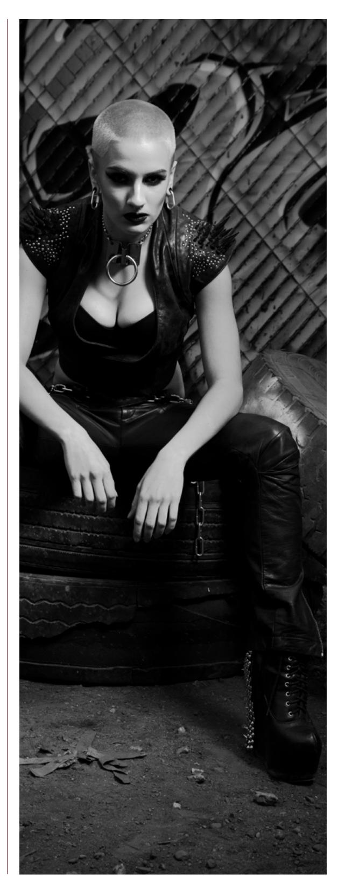

# Листы истории

# a

С альвадор Гарсия не известен как убийца родственников Камарильи или безрассудный нарушитель маскарада, однако многие князья боятся его приезда в свой город больше, чем любого буйного смутьяна. Гарсиа ведет войну идей, путешествуя из города в город, призывая местный неполный класс анархов к борьбе за свои права.

Роль Гарсии похожа на роль профсоюзного агитатора: Он разговаривает с молодыми лицами, помогает им понять, что они не обязаны мириться со своей жалкой ролью в обществе нежити, и передает новости из других областей. Один-единственный визит может оставить идеи, прорастающие в умах бесправных жителей города, и привести к зарождению нового движения Анархов.

Изначально известный как главный идеолог Свободных Штатов Анарха в Калифорнии и убийца старого князя Лос-Анджелеса, Гарсия теперь посещает родной город крайне редко. Вместо этого он использует свои обширные связи в Движении, чтобы путешествовать из домена в домен, распространяя революцию и ускользая от сил Камарильи, желающих увидеть казнь "неживого Че Гевары".

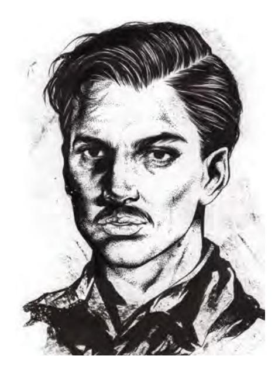

Умение владеть словом**:** Вы изучили мысли не только Сальвадора Гарсиа, но и всех известных политических идеологов Анарха. Вы ветеран политических дебатов Движения и можете держать себя в руках. По этой причине вы получаете два дополнительных кубика в любом броске, связанном с политическими дебатами, в которых вы ссылаетесь на принципы Анарха. Старая школа**:** Вы встречались с Гарсией и отстаивали идеи упразднения

князей и создания доменов с децентрализованной властью. Это дает вам авторитет среди анархистов старой школы поколения Калифорнийских Свободных Штатов, которые поддерживали движение в тощие годы до нынешнего взрыва активности. Благодаря этому у вас есть эквивалент трехточечной Мавлы, представляющей старших Анархов, которым вы нравитесь,

### **История**

хотя они будут помогать вам только в вопросах Движения.

Враг государства**:** Камарилья презирает вас за то, что вы открыто отстаиваете идеи Анархов. Они пытаются дискредитировать вас, распространяя причудливые слухи: Вы продали свои владения странным китайским вампирам, Вы на самом деле не совершали героических поступков, приписываемых Вам, Вы на самом деле лазутчик Шабаша, и так далее. Как непреднамеренное следствие этих слухов, все попытки найти реальные факты о вас делаются со штрафом в два кубика к соответствующему броску, и любая полученная информация оказывается запятнанной ложью, если только бросок не оказался критическим.

Война за идеи**:** Гарсиа обучает многих молодых вампиров идеям Движения Анархов. Некоторые из этих идей были сформулированы им самим, но не все. Действительно, однажды вы записали видение того, как должно быть организовано общество нежити,

и этот текст стал частью стандартных лекций Гарсии. Благодаря этому вы известны на всех территориях Анарха и можете использовать эту известность как эквивалент трех точек союзников в любом домене Анархов.

Восстание**:** Вы знаете, как разговаривать со своими собратьямианархистами, и они знают, за что вы выступаете. Когда вы призываете к революции, все произойдет. К сожалению, вы не можете контролировать, что именно произойдет. Один раз за историю вы можете сделать бросок на политику, чтобы подтолкнуть местных анархов к действию. Масштаб эффекта зависит от количества выпавших успехов. (Три успеха могут дать вам спонтанный набег на прибежище князя, а шесть могут привести к восстанию, охватывающему большую часть населения города Анархов).

Агата Старек Для анциллы из Вентру имя Агата Старек вызывает образы нигилистического, ликующего ужаса, анархов как волны разрушения, сносящей все на своем пути. Но для новорожденных анархов, живущих по произвольным и жестоким правилам, навязанным тем же Вентру, она олицетворение революции как мести. Какая разница, проживем ли мы еще одну ночь? Давайте уничтожим этих ублюдков прямо сейчас.

Более идейные и принципиальные лидеры Анархов склонны презирать Старек из-за ее практики диаблери и отсутствия интереса к любым утопическим делам. Для них она просто монстр, немногим лучше существ Камарильи. Однако их точка зрения может быть испорчена властью, которой они обладают, потому что у Старек есть один-единственный принцип: она всегда наносит удары, обычно в буквальном смысле. Она известна тем, что может отвергнуть своих друзей и союзников в пользу упыря или страдающего человека.

При всей своей неприязни к Старек, немногие лидеры Анархов действительно хотят сделать шаг против нее. В глубине своих не бьющихся сердец они тоже ценят идею собственного монстра, радостного ужаса, дающего Камарилье повод для страха.

Чем меньше у вас сил, тем больше надежды дает вам Агата Старек.

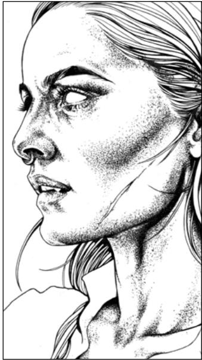

Терроризация власть имущих**:** Как и Агата, вы обладаете необыкновенной способностью вселять ужас в сердца вампиров, более могущественных и влиятельных, чем вы. Один раз за историю вы можете повторить проверку на запугивание, если столкнетесь с вампиром, обладающим большими возможностями, чем вы сами. Это может означать возраст, ресурсы или статус секты, но окончательное решение о том, применима ли ваша способность, остается за рассказчиком.

Ученик**:** Вы лично знакомы с Агатой Старек, и что-то в вас ее заинтересовало. Иногда она присылает вам лакомые кусочки информации о слабостях и личных пороках влиятельных вампиров вашего города, часто с целью дать вам возможность попробовать их сладкую, сладкую кровь. Один раз за историю вы получаете эквивалент контакта с четырьмя точками для того, чтобы выведать слабое место у более сильного врага. Это может быть что угодно: привычка питаться, их опоры или недостаток в защите их убежища.

### **Lore**

Одолжение**:** Вы встречали Агату Старек раз или два, возможно, в щекотливой ситуации, связанной с убийством и пролитием крови Камарильи. Благодаря вашей общей истории, один раз за историю вы можете обналичить благодеяние, которое ей причитается от кого-то из жителей вашего города. Известный ценитель витэ, благодеяния, причитающиеся Стареку, всегда связаны с получением доступа к определенному виду вампирической Крови. Вы объясняете, какая Кровь вам нужна, и Сказочник говорит вам, кто должен получить ее, ограничиваясь тем, что возможно в данной области. Например, Кровь Мафусаила, скорее всего, невозможна, но Кровь Князя - возможно.

Маловероятные союзники**:** Старек - фигура надежды для многих, кто больше не верит, что лучший мир возможен. Они жаждут мести, и, как и она, вы стали казаться тем,

кто может осложнить жизнь сильным мира сего. Поэтому один раз за историю угнетенный слуга или приспешник ваших врагов-нежити поможет вам в трудной ситуации, если только они смогут сделать это, не попавшись. Рассказчик может сделать это, или вы можете можете обратиться к миньону с помощью броска Убеждения с четырьмя дополнительными кубиками.

Радость трансгрессии**:** Агата Старек утверждает, что диаблеризация могущественных вампиров Камарильи - это не только обязанность Анарха, но и одна из главных радостей революции. Вы приняли ее слова близко к сердцу и больше не страдаете от автоматической потери одного очка Человечности при диаблеризации кого-то с более высоким статусом Секты, чем у вас. Однако потенциальная потеря Человечности, когда вы бросаете эффекты диаблери, все еще может быть применена.

# Листы истории

# Хеша Рухадзе

Х отя в эти неспокойные ночи Министрии в основном присоединилось к Анархам, Хеша Рухадзе стоит, как старый камень в потоке. Когда его спрашивают о сектантских приверженцах, нубийский археолог закатывает глаза и бормочет про себя.

Он отвергает политику, считая ее бесполезным занятием для существ, которые могут жить вечно. Он посвящает себя истории, тайнам происхождения вампиров и, что немаловажно, разгадыванию их судеб. Все это время он сидит на Анархических сходках и внимательно слушает.

Хеша - добровольный слуга Крови, и он верит, что может понимать голос Сета, взывающего к нему из его витэ. Если для некоторых вампиров это может быть признаком безумия, то авторитет Хеши среди родственников далеко и надолго укрепляет доверие к его утверждениям. Он все тот же холодновато-обаятельный мужчина, и каждое слово, которое он произносит, кажется тяжелым и серьезным, но теперь он говорит, как глашатай воли своего бога. Каждый раз, когда он это делает, он улыбается.

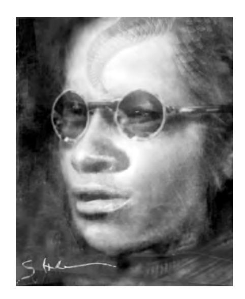

Одна из работ Хеши**:** Вы владеете одним из трактатов Хеши по истории существования Родства. Хотя работа может быть спорной и противоречить традиционной мифологии каинитов, она дает один дополнительный кубик в оккультных игральных костях или костях, связанных с происхождением вампиров. Эта работа может быть продана в обмен на одну точку ресурсов.

То, чего хочет Хеша**:** Вы знаете, что в настоящее время ищет Хеша, и можете получить к этому доступ, или уже владеете этим. Этот предмет можно использовать, чтобы торговаться с Хешей, шантажировать его или угрожать ему, или даже преподнести ему в качестве подарка за будущую услугу. Этот артефакт или часть информации дает дополнительные три кубика к кубикам Убеждения или Запугивания, связанным с Хешей или его культом. Его также можно продать, добавив три точек к вашим ресурсам (до пяти) на время действия истории.

**Lore**

Музей верных**:** Вы обладаете редкой привилегией - членством в одном из музеев истории вампиров Министриев. Эти подземные сокровищницы надежно охраняются, но содержат массу доступной информации о легендарных каинитах. Вы должны предоставить в музей новое сокровище каждый год для продолжения членства и вам будет отказано в доступе, если вы не сможете сделать это, или когда-либо украдете из одного из этих Сетитских кладов. Вы получаете три дополнительных кубика ко всем тестам, связанным с исследованием вампиров и вампирской истории до тех пор, пока вы сохраняете членство.

Культ крови (только для персонажей Министриев)**:** Хеша научил вас старым путям Последователей Сета, в которых смертные и упыри играют не только подневольную роль. В вашем культе есть воин, жрец и ученый, а также добровольные сосуды, из которых вы питаетесь. Три точки фона могут быть распределены между этими специализированными культистами, которые могут считаться как Стадо или Удерживающие.

Они обладают большим знаниями и способностями вашего вида, чем обычные слуги и упыри, что дает им дополнительный кубик во всех взаимодействиях с вампирами.

Услышать пение крови (только для персонажей Министриев)**:** Услышать пение крови (только для персонажей Министриев): Возможно, Хеша научил вас слышать слова, а возможно, вы совершили этот подвиг сами. Вы слышите голос Сета громче, чем голос своего зверя. Через загадки, видения и музыкальные припевы Сказитель время от времени будет давать вам наставления от богоподобного голоса, исходящего из вашего витэ. Один раз за сессию вы также можете автоматически противостоять Безумию, рассматривая его как министрийское внушение.

# Церковь Сета

Б ольшинство служителей вновь открыли для себя космополитические, многоконфессиональные пути. Хотя они все еще почитают Сета, как своего основателя и первого вампира, не так уж часто случается, что сетит Министриев придерживается только поклонения Сету. Иначе обстоит дело с теми сетитами, которые заявляют о своем членстве в самой Церкви Сета. Посвященные в обряды сетитской ортодоксии, члены Церкви Сета считают, что они должны вступить в заговор, чтобы ослабить все другие кланы и их основателей, чтобы проложить путь к воскрешению своего основателя. Вы можете стать новым адептом Церкви Сета, отчаянно пытающимся найти смысл жизни и наставничество во враждебном мире, или одним из преданных верующих, отвергающих идею порабощения другими антедилувийцами и стремящихся к свободе от всех цепей, следуя священному руководству Сета.

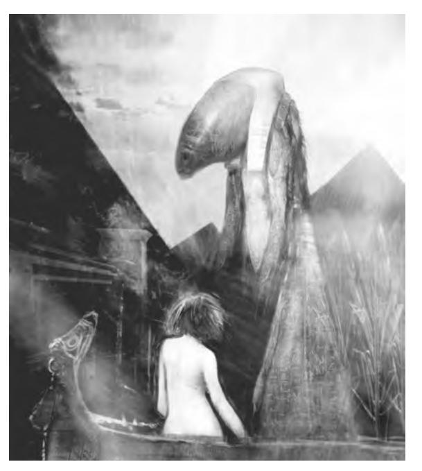

Конгрегация**:** У вас есть доступ к стаду людей, но эти смертные представляют собой единую религиозную паству, которой вы можете манипулировать. Эта конгрегация может принадлежать к любой основной или побочной религии, и независимо от того, видят ли они в вас своего лидера или просто еще один прихожанин, вы можете легко питаться от них. Эта религия эквивалентна двухточечному Стаду, хотя оно требует от вас, чтобы вы появлялись и поддерживали веру регулярно.

Проникните в тайную жилу**:** Через метод простого интервью, вы можете проанализировать, есть ли у смертного или родственника секрет, который они пытаются скрыть. Вы получаете бонус в два кубика к проверкам, основанным на проницательности, чтобы определить, хранит ли кто-то секрет.

Свобода от Эонов: Сет презирает своих собратьев-основателей клана, так гласит легенда. Сетиты считают других основателей эонами и демонстрируют сопротивление их силе.

**Lore**

Вы получаете два дополнительных кубика при бросках на сопротивление попыткам Доминирования и Величия от вампиров других кланов.

Дегенеративный процесс**:** Церковь Сета учит своих адептов, что человек должен быть опущен на самое дно, прежде чем он сможет возвыситься, чтобы встретиться со славным Сетом. Вы можете подтолкнуть любое существо, смертное или бессмертное, потворствовать дегенеративному разложению только для того, чтобы выйти чистым с другой стороны. При успешном броске "Манипуляция + бросок "Убеждение", вы можете убедить любого человека нарушить догмат или убеждения, получив при этом хотя бы одно пятно. Когда это сделано, они чувствуют себя очищенными. Персонаж, на которого направлено действие, восстанавливает до трех поверхностных или одного отягчающего повреждений силы воли.

Тело Сета: Вы владеете фрагментом скелета, саркофага или погребального одеяния Сета.

Хотя значение Окончательной смерти Сета спорно, священный (или несвященный, в зависимости от вашей точки зрения) артефакт дает вам стимул к успеху и впечатляющее влияние на других последователей Сета, передавая четырехточечный статус среди других министриев. Реликвия также помогает вам прикоснуться к разуму Сета во время медитации, и один раз за историю вы можете уменьшить пятна, полученные за нарушение догмата, на единицу, если следуете тому, что вы и рассказчик воспринимаете как волю вашего бога.

# Листы истории

# Потомок Ксавьяра

(только для персонажей-гангрелов)

Никто, даже собратья по Гангрелу, не слушал Ксавиара, когда он заговорил в первый раз. Потребовалось вступить в созыв крупнейших игроков Камарильи, чтобы другие представители рода обратили на него внимание. Он рассказал о том, как общался с одним из антедилувийцев и увидел, как вся его компания была заживо съедена этим мифологическим существом. Он обвинил Камарилью в вероломстве по отношению к своим членам и отбросил свою роль Гангрельского Юстициара.

> Новости среди Гангрелов распространяются медленно, так как в клане мало иерархии и нет эффективной коммуникационной сети. Постепенно Гангрел последовали за Ксавиаром из Камарильи, некоторые стали автаркистами, а большее количество в конечном итоге присоединилось к Анархам.

Гангрелы теперь разделяют общую вину за свое первоначальное недоверие к заявлениям Ксавиара и медленную реакцию на его провозглашение, поскольку вскоре после этого он встретил окончательную смерть. Немногие знают, Камарилья или какая-то другая организация убила могущественного Гангрела, но все знают, что их предка обидели. Теперь они подхватили его факел и пытаются вернуть Гангрела к мерцающему свету истины.

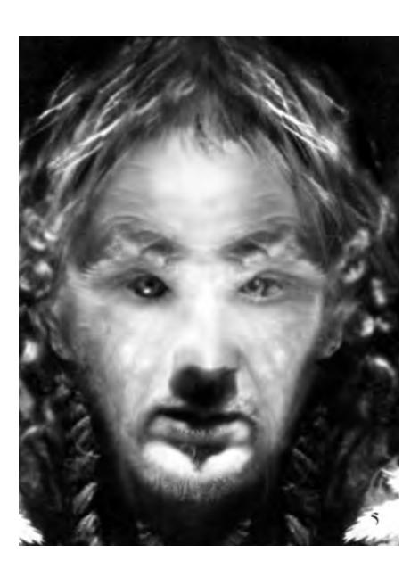

Убитый предок**:** Другие гангрелы относятся к вам с уважением, которое они слишком долго не могли выказать Ксавиару. Несмотря на личные обиды, вы всегда можете найти убежище у других гангрелов, если таковые имеются в ваших владениях, по крайней мере, до тех пор, пока вы не нанесете им тяжкое оскорбление. С ними у вас есть две точки статуса( ).

Где похоронены тела**:** Опыт Ксавиара по слиянию с землей, кровью и витаэ оставил след в его роду. Гангрел из его рода может сделать тест на решимость + внимательность, чтобы определить, слился ли вампир с землей или лежит без движения под почвой. Трудность зависит от площади, которую нужно обыскать.

Верная гончая**:** Вы сопротивлялись ветрам перемен, оставаясь в Камарилье, несмотря на действия вашего клана. За вашу

верность местный князь Камарильи наградил вас статусом, правом на кормление и территорией, что составляет четыре точки, которые вы можете распределить между Доменом, Стадом и Статусом. Некамарильские гангрелы презирают вас, и даже вампиры других кланов Камарильи жалеют о вашем одиночестве, но вы гарантируете себе право голоса среди Примогена, если через ваши владения пройдет какой-нибудь мятежный гангрел.

**Lore**

Чудовищная летучая мышь**:** Когдато Ксавиар предпочитал звериную форму летучей мыши, но после встречи с Антедилувианом он обнаружил, что его форма может превращаться в гибрид между человеком и летучей мышью. Один раз за историю, когда луна находится в нужном месте, вы можете принять ту же форму. Эта летучая мышь размером с человека имеет дополнительную точку во всех физических атрибутах и может скользить по воздуху с любой высоты. Укус в этой форме добавляет +1 урон отягощения как смертным, так и вампирам.

Опытный Антедилувиан**:** Ксавиар был не единственным Гангрелом, погрузившимся в землю и оказавшимся внутри огромной, нечеловеческой формы основателя своего клана. Вы сделали то же самое, и этот опыт изменил вас. Теперь вы немного сумасшедший, вероятно, страдаете паранойей или клаустрофобией. Всякий раз, когда вы вспоминаете о своей встрече, вы чувствуете, как ваши жилы уходят в землю, соединяясь с каждым другим Гангрелом в мире. Один раз за историю вы можете почувствовать местоположение любого Гангрела и выкачать из него наперсток витэ, чтобы сбросить свой уровень голода до 2. Для использования этой способности вы должны касаться открытой земли, а не бетона.

# ПОТОМОК ТАЙЛЕРА

(только для клана брух)

К

аждый начинающий бунтарь Бруха преклоняется перед Тайлер когда-то известной как Патриция Боллингброк, а с тех пор носящей множество имен. Ее революционное насилие против старейшинтиранов и коварных мафусаилов необратимо изменило общество Сородичей и вдохновило движение Анархов. Сама Тайлер сомневается, что ее действия привели к эффективной практике, но ее дети и сородичи сравнивают ее со всеми - от Робин Гуда до Малкольма Икс, от Че Гевары до Гаврило Принципа. Тайлер все еще существует: тихий, изучающий бунтарь в эти ночи. Спустя столетия размышлений она пытается примирить свои действия с результатами современных ночей. Ее потомки продолжают борьбу, надеясь однажды возвысить ее до предначертанного ей величия.

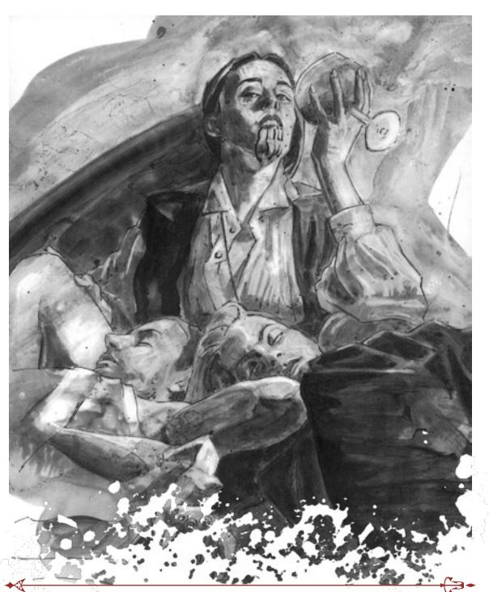

Подстрекатель**:** Один раз за историю, когда вы пытаетесь склонить толпу смертных к насильственным действиям, ваша горячая натура добавляет два кубика к вашему набору кубиков, чтобы сделать это.

Чемпион своего дела**:** Когда вампирам нужен лидер для восстания, большого или малого масштаба, они приходят к вам за советом или руководством. Они могут даже прислушаться к вашим словам, и если ваш совет не будет совсем уж нелепым, могут даже подчиниться вашему авторитету. Вы добавляете две точки к вашему статусу с ними во время таких восстаний, но вы можете найти многочисленные контакты, приобретенные до восстания, более ценными и, конечно, менее опасными.

Милосердие Тайлера**:** Вы знаете, когда нужно остановиться. Тайлер поняла, когда Шабаш зашел слишком далеко со своими идеалами Анарха, и вы также понимаете пределы насильственной революции. Один раз

за историю, когда вы в бешенстве, вы можете в любой момент взять Изъян Бруха (стр. 210), чтобы немедленно прекратить вспышку. После прерывания бешенства вы не испытываете замешательства или усталости, резко возвращаясь к Человечности.

**Lore**

Шумиха**:** Философия Тайлера впервые возникла среди исторической группы вампиров, известной как Фуроры, посвященной уничтожению всех тиранов Рода. Эта группа до сих пор существует в тайне, и вы претендуете на членство в ней. В подходящий момент (раз в летопись) Фуроры вооружают вас, предоставляют вам убежище в регнуме, где они имеют влияние, и активируют активы в целевом домене в качестве неожиданных союзников (доступны в течение одной сцены). Союзники добавляют до пяти точек Эффективности; остальное зависит от вашего сотрудничества с Рассказчиком. Активы "Фурор" можно использовать

только при попытке уничтожить князя, негодного барона или вампира более высокого положения. При неправильном использовании вы становитесь мишенью для Фуроров и их неизвестных оперативников. Постоянная Революция**:** Вы уже уничтожили одного главаря секты. Теперь вы ведете армию революционеров на зачистку в соседнем регионе. До тех пор, пока вы продолжаете сражаться и не замечены в роскоши, Анархи будут внимать каждому вашему слову, а Анархи Бруха будут делать то, что вы скажете, включая самоубийственные миссии. Броски не требуются, если ваша речь сильна и аргументы достаточно убедительны.

# Листы истории

# РУИНЫ КАРФАГЕНА

ы - вампир, который ведет свою родословную со времен расцвета Карфагена или попытки восстановить великую империю, противостоявшую Риму, контролируемому Вентру и Малкавиан. Возможно, вы принадлежите к клану Бруха или Бану Хаким, вас учили словам ваших предков, вы несете огонь ненависти к тирании и жаждете ночи, когда вы сможете основать домен, где и смертные, и вампиры смогут избавиться от необходимости маскарада.

Знание принципов вампирического Карфагена является одновременно и просветляющим, и проклятым, ибо как только вампир вкушает свободу этой павшей империи, он начинает бороться со строгостями Камарильи. Лица, одержимые руинами Карфагена, часто попадают в сети интриг, расплачиваясь за свое любопытство заключением неизбежных пактов.

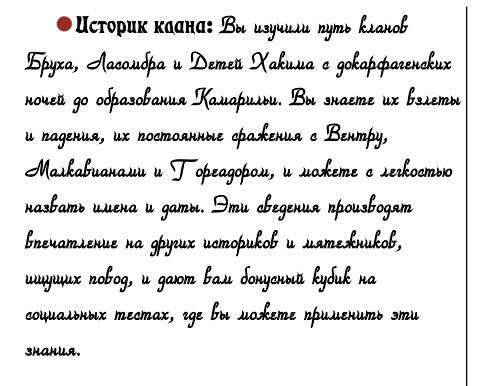

В

Пуническая гордость**:** По сей день Бруха вспоминают Карфаген как высший символ восстания. Они считают, что Карфаген был самым успешным доменом, который успешно сопротивлялся Риму, контролируемому Вентру, вплоть до его катастрофического конца. Вы очень гордитесь своим карфагенским происхождением, будь то через смертные связи или бессмертную родословную. Когда вы ссылаетесь на это происхождение, вы говорите с большей уверенностью и привлекаете внимание товарищей по восстанию. Получите два кубика в испытаниях на лидерство, чтобы повести других против предполагаемого угнетения.

Смерть тиранам**:** Если Карфаген чему-то и

# **Lore**

научил Бруха и Детей Хакима, так это тому, что всегда стоит бороться до конца. Никогда с тех пор - даже если учесть восстание Анархов столпы истеблишмента не были так пошатнулись. Вы используете силу вампиров, павших в борьбе с Римом, когда вступаете в схватку с власть имущими. Получите бонусные кубики ко всем поединкам против того, кто может претендовать на власть над вами.

Завещание Молоха**:** В период своего расцвета вампирический Карфаген возглавляли Бруха Антедилувиан и ее супруг, мафусаил, известный как Молох. Эта пара совершала тысячи человеческих жертвоприношений, купалась в крови молодых, устраивала оргии первобытного декаданса, но почему-то никогда не поддавалась Зверю. Вы перевернули своего собственного Зверя, обнаружив, что, совершая грубые действия и бесчеловечные ритуалы, вы способны подпитывать его и никогда не терять контроль. Ваше владение монстром внутри каким-то образом дает вам адское очарование, которое вы можете использовать, чтобы заманивать молодых вампиров и невинных смертных на службу.

Желание Троилы**:** Многие бруха утверждают, что проклятые рассказы о Карфагене -

это просто пропаганда вентру, распространенная из Рима и дошедшая до наших дней. Ученые Брух и Бану Хаким утверждают, что Троил был благосклонным правителем, справедливо относился как к родственникам, так и к людям, и заботился о том, чтобы каждая душа в империи была сыта, образована и любима. Вы

верите в это кредо и излучаете уверенность, которая убеждает других доверять вам, молиться перед вами и помогать вам в любых ваших замыслах. Вы получаете два бонусных кубика ко всем социальным проверкам, в которых участвуют вампирические слуги, ваши и чужие, независимо от того, являются ли они прислужниками или просто частью стада.

Новый Карфаген**:** Вы сторонник Карфагена заново. Планы были приведены в движение, и вы уже выбрали город Анарха, где Маскарад скоро падет, не попав под прицел смертных агентств. (Сделки и пакты, которые вам пришлось заключить, чтобы это произошло, оставим на ваше усмотрение и на усмотрение Рассказчика). До этого момента вы можете нарушить Маскарад и остаться безнаказанным в этом городе один раз за историю, независимо от тяжести нарушения.

# d

В ампиры невосприимчивы к большинству болезней, но некоторые чумы проникают в витэ и легко передаются от вампира к сосуду, в то время как другие гноятся и мутируют, становясь чем-то опасным только для вампиров-носителей.

> Кровавая чума, иногда называемая Проклятием, пронеслась по обществу нежити в конце 20 века, уничтожая домены и поражая вампиров, независимо от их клана или статуса. Густав Брайденштайн, бывший князь Берлина и могущественный старейшина, стал одной из самых известных жертв заразы, которая доводила бесчисленных Проклятых до исступления и заставляла витэ выделяться из каждого отверстия, пока жертва не увядала и не умирала.

> Говорят, что Чума Крови угасла или была излечена с помощью великого ритуального жертвоприношения. К сожалению, чума может быть просто торпидной, как и многие ее жертвы. Эти инфекции поднимаются снова и снова по всему столетию.

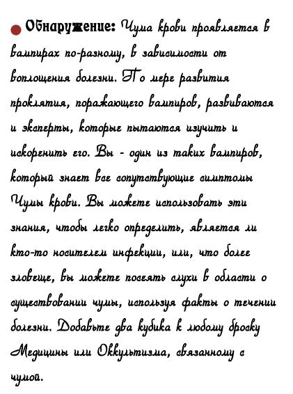

Наука о крови**:** Вы считаете, что чума Крови имеет в основном медицинский генезис, возможно, она даже зародилась среди смертных до того, как заразила Сородичей. Ваше тщательное изучение Чумы Крови позволяет вам просто обнаруживать недавние пути и модели чумы, анализируя, где мог находиться зараженный носитель, от кого и когда он мог быть заражен. Такая информация может оказаться невероятно полезной при попытке поместить всех зараженных в карантин.

### **Lore**

Добавьте два кубика ко всем броскам расследования и другим тестам, чтобы отследить активных жертв чумы.

Отследить заторможенных жертв**:** Вы видите, как штаммы Кровавой чумы проносятся по земле. Ваш интерес к этому заболеванию не ограничивается карантином и исцелением зараженных; вы можете проследить за зловонием и нечестивой аурой чумы до ее обездвиженных жертв. Вы уже знаете, где похоронены многие тела. Сделав бросок решительности + Оккультизма (сложность 4, изменяется в зависимости от популяции вампиров и истории Чумы крови в данной местности), вы сможете найти тело зараженной жертвы, все еще находящейся в оцепенении. Кто это и заразен ли он еще - решать рассказчику.

Лечебная витэ**:** Вы верите, что любая болезнь излечима при правильном исследовании и готовности к самопожертвованию. Ваша кровь чиста от Чумы Крови, и у вас нет никаких симптомов, несмотря на близость к многочисленным жертвам. Вы верите, что в вашей Крови может содержаться лекарство, но ученым из других кланов требуется много

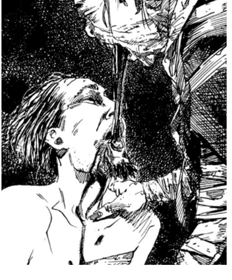

вашей крови, чтобы проверить эту идею. Отдав достаточно крови, чтобы заставить вас пройти проверку Голода, вы можете добавить два кубика к любой попытке создать лекарство, временное или даже постоянное (на усмотрение рассказчика).

Вектор**:** У вас есть секрет. Вы являетесь носителем Чумы крови и даже можете заражать ею других, но у вас нет никаких симптомов. Это опасное предание позволяет вам пролить свою витаэ в Элизиуме или скормить полный рот ее популярному сосуду и наблюдать за ужасными последствиями, когда другие сородичи заражаются чумой крови. Если вы чувствуете себя более альтруистичным, вы можете добровольно принять участие в тщательных испытаниях вашей витаэ, и как она может быть применена вашей сектой в качестве оружия или теми, кто ищет лекарство. Конкретные эффекты вашего штамма чумы зависят от вас и Рассказчика.

# Листы истории

# ВОССТАНИЕ АНАРХОВ

ы заявляете о своем родстве с вампиром, имевшим важное значение для восстания анархов в 14 и 15 веках, или, возможно, обладаете записями о падении тиранических князей или возвышении мятежных баронов. Вы знаете время и место, где Тайлер убил Хардестадта Старшего, и участников диаблерии Цимисхов Антидилувиан. Возможно, вы даже разговаривали с Лугоем или Ламбахом, двумя извергами, присутствовавшими при том инциденте.

Ваши знания о восстании Анархов таковы, что вы можете видеть волны и вихри времени, повторяющиеся в обществе Проклятых сегодня. Ты видишь те же самые преступления прошлого, повторяющиеся сейчас, и можешь предсказать, а возможно, и контролировать, как молодые поднимутся, чтобы сокрушить старых.

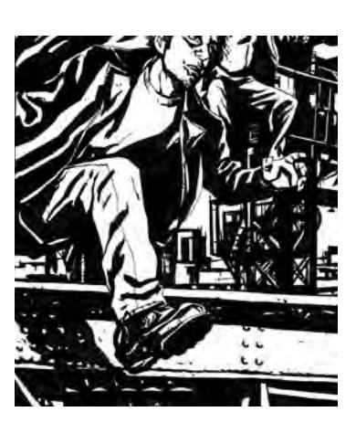

Критический предок**:** Вампиры в основном из кланов Бруха, Бану Хаким и Ласомбра возглавили восстание Анархов по всей Европе, в котором приняли участие жаждущие власти Цимисхи, чтобы уничтожить величайших монстров в своем клане. Однако Анархи восстали из всех кланов, поскольку большинство старейшин манипулировали своими молодыми птенцами, что привело к катастрофическим последствиям. Вы можете назвать одного из своих предков, имевшего решающее значение для восстания Анархов, либо как зачинщика, летописца или противника. Ваши связи с этим предком дают вам авторитет в дискуссиях о Восстании и страсть к его анализу. Получите одно очко статуса Анарха, а также недостаток Подозреваемый (Камарилья), или наоборот. Произносите слова**:** Восстание анархов было вызвано больше словами и энергией, чем мельканием клинков и пролитием крови, по крайней мере, вначале. Вы обладаете теми же амбициями, что и Анархи прошлого, и можете точно определить, где происходит угнетение, а где необходимо восстание. Когда вампиры слушают вас, они чувствуют себя более склонными к захвату власти у своих хозяев. Добавьте два кубика к социальным тестам,

В

# **Lore**

включающим подстрекательство к активизму Анархов.

Враг установления**:** Вы считаете себя старым анархом, не обязательно по возрасту, но по этике. Новое движение Анархов имеет свои сильные стороны, но также и много слабых мест. Ваши взгляды ставят вас в прямую оппозицию Камарилье и ее викторианским методам подчинения. Камарилья обозначила вас как врага, что только привлекает под ваше знамя еще больше вялых анархов. Вы получаете эквивалент четырех точек Мавла, представляющих ваших товарищей среди Анархов, а также одну точку Противника, представляющего того, кому поручено следить за вами и, в случае необходимости, свалить вас.

Икона**:** Вы взяли имя одного из первоначальных участников восстания Анарха и действуете как преемник этого вампира. Это было бы неуважительно, если бы вы не совершали многие из тех же действий, что и ваши предшественники. Многие Анархи видят в вас следующего великого лидера Восстания, независимо от того, было ли это вашим намерением. Возможно, вы захватили историческую личность ради

культового статуса и легкого доступа к стаду, но теперь секта оказывает на вас все большее давление, заставляя действовать в своих интересах. Получите две точки в статусе, две точки в стаде и две точки в ресурсах до тех пор, пока вы ставите дело Анарха превыше всего. Любой неверный шаг - и они потеряны, пока вы не искупите свою вину.

Разжечь восстание**:** Время пришло. Вы знаете, как происходило восстание Анархов полтысячелетия назад, и знаете, как оно должно произойти сегодня. Вы знаете слабость вашего города, самые большие угрозы и позиции Камарильи, которые крайне нуждаются в устранении. Вы можете угрожать своим врагам перспективой войны в целях вымогательства или для того, чтобы Камарилья не позволила Анархам больше вольностей, чем они уже сделали. Один раз за историю вы можете использовать этот рычаг чтобы получить четыре кубика в любом социальном конфликте против члена истеблишмента Камарильи. Если вы провалите бросок, вам придется либо выполнить свою угрозу, либо навсегда потерять это преимущество.

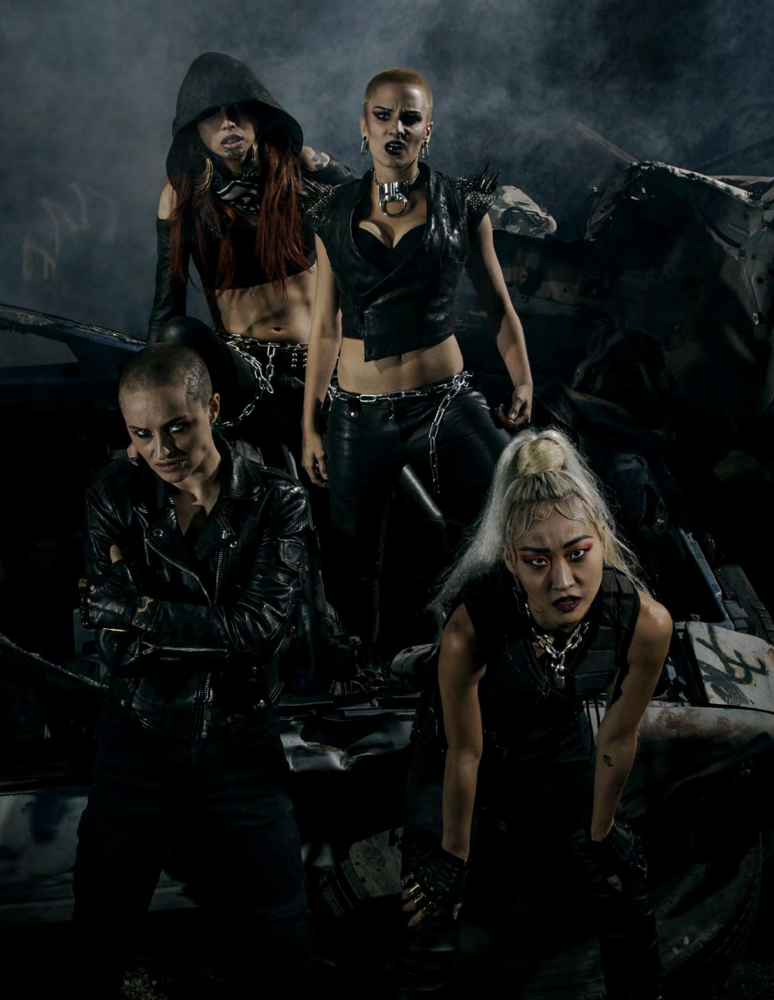

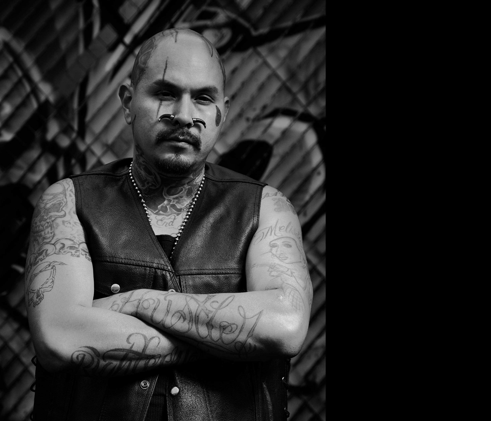
