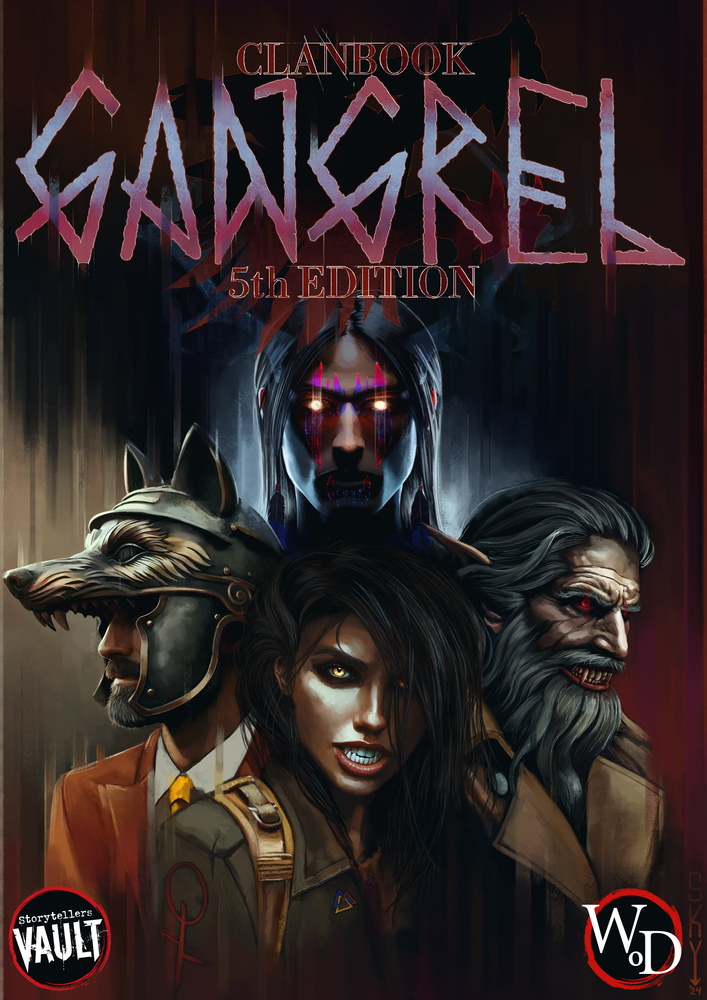

Written by Sky Bradley and Henry Langdon

Art by Sky Bradley, Henry Langdon, and Dennis Tristram

Photography by Henry Langdon

World of Darkness, Vampire: ķe Masquerade, Vampire: ķe Dark Ages, Victorian Age: Vampire, Werewolf: ķe Apocalypse,
Werewolf: ķe Wild Wesɭ, Mage: ķe Ascension, Mage: ķe Sorcerers Crusade, Wraith: ķe Oblivion, Wraith: ķe Great War,
Changeling: ķe Dreaming, Hunter: ķe Reckoning, Demon: ķe Fallen, Mummy: ķe Resurrection, Orpheus, Exalted,
Chronicles of Darkness, Vampire:ķe Requiem, Werewolf: ķe Forsaken, Mage: ķe Awakening, Changeling: ķe Losɭ, Hunter:
ķe Vigil, Giest: ķe Sin Eaters, Demon: ķe Descenɭ, Mummy: ķe Curse, Beast: ķe Primordial, Promethean: ķe Created,
World of Darkness, Storyteller System™, Storytelling System™, and Storytellers Vault™and their respective logos, icons and
symbols are trademarks or registered trademarks of World of Darkness Enterɭainment AB. All rights reserved.

Łis work contains material that is copyright of World of Darkness Entertainment. Such material is used with
permission under the Community Content Agreement for the Storytellers Vault.

©2018 World of DarknessWhite Wolf Entertainment AB, Västgötagatan 5, SE-118 27 Stockholm, Sweden.

1

T A B L E O F C O N T E N T S

---
36
Country Gangrel
37
Blood Ravens
39
Regal Knights of Avalon
41
Einherjar & Łe Valkyries
43
Laibon of the Wise Spider
45
Coyotes of the Cities
47
Kin Eaters
49
Mariner
51

WHO ARE THE GANGREL?
3
Additional Archetypes
4

---
6
Animalism
6
Auspex & Celerity
8
Fortitude
9
Obfuscate
10
Potence & Presence
11
Protean
12
Blood Sorcery & Rituals
14

GANGREL IN MODERN
NIGHTS
53

Shaped by the Will to Survive
54
Łe Nomadic Life
55
A Political Animal
57
Clan and Culture
62
Łe World Outside
68

NEW PREDATOR TYPES
16

OPTIONAL ADVANTAGES
19
Bestial
19
Bonding & Feeding
20
Looks, Mythic & Psychological
21

WILDERNESS IN YOUR
CHRONICLE
70

Haven Addon & Domain
22

Tension
71
Chronicle Hooks for Wilderness
Excursions
72

LORESHEETS
22
Blood of Artio
23
Casimir Bane of Cities
24
Eremites of the Perfect Beast
25
Feral Child
26
Łe Hushed Chorus
27
Łe INVICTI
28
Lorekeeper
29
Pagans of the Old Ways
30
Protege of Inspector Wolfe
31
Łe Łing Łat's Seen You
32
Łe World Anew
33
Trails of the Beast
34
Wolves of Wall Street
35

TOOLS
80
Aerial Animals
80
Terrestrial Animals
83
Aʖuatic Animals
89
Strange Creatures
91
Mortals
94
Łings in the Dark
97
Typical Bloodsuckers
99
Strange Kindred
102
Dyscrasia Animals
103
Animals for Feral Whispers
106
Whispers & Rumors
110
Gangrel Myths & Tales
112

2

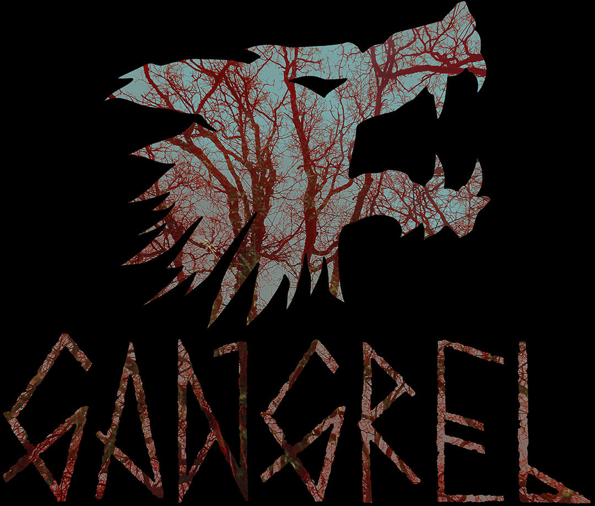

# WHO ARE THE GANGREL?

“Even at the first city of Uruk our kind lived on the periphery, waking the beast in the hearts of men. Leading the barbarian
hordes to delve into its hearɭ, where we cast their gods down onto the streets. ķen when the other Cainites rose up and
defended the walls they'd builɭ, we pulled back into the wilderness. ķere we became the monsters in the dark: the flesh
goring cannibals, the bête of Guévaudon, the giants and trolls of the world, but still the city pushed out into us. When the
Sect wars began we played our role as their soldiers and trackers, we brought death and destruction in their names –yet still
they kept us at arms length. But now something is differenɭ, in the chaos and uncerɭainty of these new nights. Our kind is
beginning to thrive once more, the walls are crumbling, and when they do the wolves will prowl those cities once more and
again shall their gods be cast down.''

–Shamshaɭ, Childer of Enkidu

3

CLANBOOK: GANGREL 5TH EDITION

SURVIVALIST
It goes without saying that Kindred have been having a
rough time in recent nights, from sect wars to the
second inʖuisition, there is no shortage of things trying
to bring an end to a Kindred's existence. Unlike others
you not only intend to survive each night, you have
been taking active measures to secure that survival.
Some might call you a bit paranoid, but it's not about
whether you're paranoid, it's if you're paranoid enough.

ild creatures of the night, the
Gangrel prowl the edges of
civilization as hunters, nomads, and
mercenaries. Having been aptly
called Wolves, Barbarians, Outcasts, and Strays, though
their most common name, used even among themselves,
is Ferals. While some might ʹnd these brands an insult,
many Gangrel have appropriated them as badges of
honor, and they wholly accept their nature as
primordial creatures of the night, viewing the trappings
of society as shackles that once bound them to the wills
of others, and their Beast as a driving instinct for
survival and adaptation.

SUGGESTED CONVICTIONS: Always persist regardless of
opposition or circumstance, nothing is greater than to
survive, avoid unnecessary danger

MERCENARY
Maybe in life you were a hitman, or you never really
believed in a cause. Being turned hasn't changed your
habits much, or if it has it's granted you a realization
that your new powers and skills can be honed and sold.
You're good at what you do, and others are willing to
pay you for it. Whether it's a means to an end or a
simple way to eke out an existence doesn't matter. Life
has a price, and if someone is willing to pay enough,
you'll take that life.

In the previous eras, the Ferals were the loyal dogs
of the Camarilla serving as the claws and fangs of the
High Clans, but have since leʨ and become
independent, taking up their own aims. Many that leʨ
behind their nights in the Ivory Tower now ʹnd the
lack of structure freeing, ʹnding their own
self-determination and ambitions giving them new
purpose and strength in these uncertain nights. Łough
not usually political as a whole, many Ferals have taken
up the banner of local Anarch movements, or assist and
facilitate those movements, and ʹnd themselves
regularly standing shoulder-to-shoulder with the
Brujah. Other Gangrel use their talents as hired hands;
Mercenaries, messengers, bodyguards, and spies, and
move between the lines of civilization and wilderness,
from wealthy to impoverished, and from High to Low.
As a whole, the Clan of the Beast cares not for the
conʹnes of the labels others might give them, and so
freely move amongst all territories, castes, and status
–apart from them all.

SUGGESTED CONVICTIONS: Never do anything for free,
Don't die for another's cause, I come ʹrst

ANARCH HARDLINER
Society is a social construct, and in your opinion the
systems and destructions it brings are unnatural. Łe
entitled God and His church, the CEO and his
unrelenting greed, roads that carve through the
countryside like black veins of corruption to bring
forth poison-belching machines and trash trailing
tourists. You've endured the destructive expansion of
civilization for long enough, and even when you ʺed to
the forest, it wasn't content to leave you alone. You've
heard how your Clan prospered before the industrial
age and the monolithic Sects of the night, and vowed a
return to those primal times.

# Additional Gangrel Archetypes

HUNTER
For this vampire, every night exists only for the thrill of
the hunt. Wishing only to prove that they are the
ultimate predator in the city, willing to compete with
any other Kindred to prove superior. Rarely is this for
power or inʺuence, the Hunter does it all for the
challenge, and the thrill of proving their superior
predatory skills.

SUGGESTED CONVICTIONS: Never pass an opportunity
to disrupt the system, Do not allow yourself to be
shackled to commitments, Łose in authority are
mechanisms of destruction

SUGGESTED CONVICTIONS: Never steal the kill of
another hunter outside of a challenge, never show
mercy to prey, only hunt worthy prey, reveal yourself
before a contest begins

4

---

PRIEST OF THE BEAST
You were dejected in life. Lost and without a bearing
and where to go or what to do. Perhaps a toothless
failure, or a lost soul that never found purpose. In death
you have found it in your Beast. You're a predator now,
and you survive, thrive, and feed. Your closest ally is the
primal thing inside. Like a priest of the night, they oʚer
their Beast's wisdom to any who will listen, so that you
will embrace the same path, and ʹnd the same purity of
purpose.

Disciplines

ANIMALISM: Łe Clan of the Beast doesn't have that
epithet without reason. Gangrel have mastered both the
animal kingdom and the Beasts of other Kindred.
Commanding, conversing and manipulating both to
survive in the wilderness.

FORTITUDE: Durability, adaptation, survival. Gangrel
have employed this power to bolster their physical and
mental defenses since the times of the First City, where
they functioned as bodyguards and front-line soldiers.
Łese nights it ensures that they can challenge any
gauntlet and come out the other side, even using it in
combination with their shape-shiʨing abilities to
utterly ignore terrible bodily harm and unleash brutal
attacks.

SUGGESTED CONVICTIONS: Shackle not your Beast and
its impulses, Never deny your instincts, Do not idolize
Humanity for they are aimless

URBAN EXPLORER
Moving through the city as if it were an ancient ruin,
you delved into blighted neighborhoods, old factories,
and labyrinthian lost tunnels that run beneath the feet
of others. Curiosity and adventure are the strongest
traits of an Urban Explorer, along with a high
athleticism for traversing the crumbling conditions of
condemned buildings and forgotten bastions of
yesteryear. Aʨer your Embrace these skills have proven
exceptionally useful, and a whole new world of
exploration has opened up to you.

PROTEAN: Few clans have mastered the ability of
Protean, and fewer still have mastered it in the ways the
Gangrel have. Many old-blooded Wolves claim that
their form of Protean is the purest, untainted by
ancient serpentine gods and the disease of a Fiend's
mind. Gangrel use this power to adapt to any
environment, any time and place, and thrive in the
harshest parts of the world. Anywhere from the peaks
of freezing mountains, to the crushing depths of the sea.

SUGGESTED CONVICTIONS: Never miss an opportunity
to document an area, Łere's no such thing as
trespassing, Never leave a place unexplored

NEW COMPULSION: ZOOCHOSIS: Modern life is
closing in around you. Streets packed with loud
vehicles, narrow alleyways reeking of rot and garbage,
the cries and constructions of unnatural society layered
onto itself. When this compulsion manifests you tend
to revert to a more primitive mental state; Repeating
monotonous tasks, scratching the surface of your desk
into a groove, or grinding your teeth. Łese eʚects
confer a -2 Dice penalty to Social Pools until you can
manage to ʹnd an open and more natural locale or
speak with someone who understands your mental
state.

WOLF OF THE IVORY TOWER
You hold true to the traditions, even if those in power
might treat you as a loyal hound rather than an eʖual.
Convictions against the lawlessness outside of the
Camarilla are more important than purposeless
wanderings through the night, scraping by in obscurity.
In life it's likely that you held fast strong values of
structure and ambitions for supporting a group eʚort
to make the world a better place. Your aims are always
noble, even if they might pit you against your kin.

SUGGESTED CONVICTIONS: Order and common decency
are the greater good, Care not for the Beast,
Corruption of institution is weakness, Lead by example

NEW COMPULSION: CO-SURVIVOR: Łe pack is as
strong as its weakest link, and failure out here in the
wilderness means death. Łis compulsion tends to
manifest when both you and another utterly fail in
succession. You get a -2 penalty on all pools until you,
or someone you're helping, succeeds on a Teamwork
Dice Pool or the scene ends.

5

CLANBOOK: GANGREL 5TH EDITION

# DISCIPLINE POWERS

Level 2

## Animalism

BESTIAL WRATH
Amalgam: Fortitude 2
Pour your Beast into an animal that has tasted your
blood, causing it to dive into a blind frenzy that
bolsters its physical attributes beyond natural limits.
Cost: One Rouse Check; Free when used on Famulus
Dice Pools: Frenzy Test; (Current Willpower + One
Łird of Humanity Rounded down)
System: Upon activation, the user chooses any animal
in their line of sight that has at least one step towards a
Blood Bond with them, the user then Tests for Fury
Frenzy; Diʞculty 4. Regardless of the Test's outcome
the chosen animal enrages for the duration. Enraged
animals lose all sense of self-preservation, add the user's
Animalism to their non-combat Physical Dice Pools, as
bonus damage to their physical attacks, and they feel no
pity, remorse, or fear, and cannot be stopped unless
killed.

Disciplines that cement a Kindred's sovereignty
over the Kingdom of Animals and ensures that they
will always have the natural diversity of their area at
their beck and call. Unbeknownst to most Kindred who
don't have the understanding of this ability in their
blood, Animalism also governs the control,
understanding, and inʺuence of supernatural Beasts,
such as those found in Kindred, but also in Werewolves
and certain cryptids. Amongst the Gangrel this power
is one of the reasons why they thrive so well in
countryside, as they use it to cow predators, ensure
companionship, and thwart the advancement of
Werewolves.

Level 1

PACK MENTALITY
Amalgam: Fortitude 1
Prereʖuisite: Unswayable Mind
Taking the concept of a pack's strength to another level.
Ferals with this power can project their own mental
adamance outwards as a shield to defend other beasts
from manipulations and certain powers of the blood.
Cost: Free
Dice Pools: Variable
System: Łe user may add their dots in Fortitude as
extra dice to another Vampire, Werewolf, or any other
creature with a supernatural Beast, when they create a
pool to resist Mental Discipline powers, such as
Dominate and Presence. Whenever an individual wins a
contest in a pool made against a Mental Discipline you
may spend a point of Willpower to automatically resist
that same power for the remainder of the Scene.
However if that individual fails that pool, you are also
subject to the same power as if you have failed to
defend against it.
Duration: Passive.

Passing the Frenzy Test allows you limited verbal
control of the enraged animal, such as which target to
attack or which direction to go, however commands
must be simple and have an immediately available goal,
else they're ignored. Failing the test causes the Beast to
attack anyone indiscriminately as if they are in Fury
Frenzy. Łe user can only Enrage a single Animal with
this power at a time.
Duration: Animals stay enraged one Scene or until the
user fails a Frenzy Test, causing their Beast to return to
them, causing the Enrage to end.

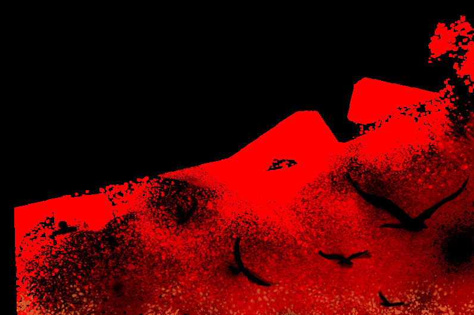

6

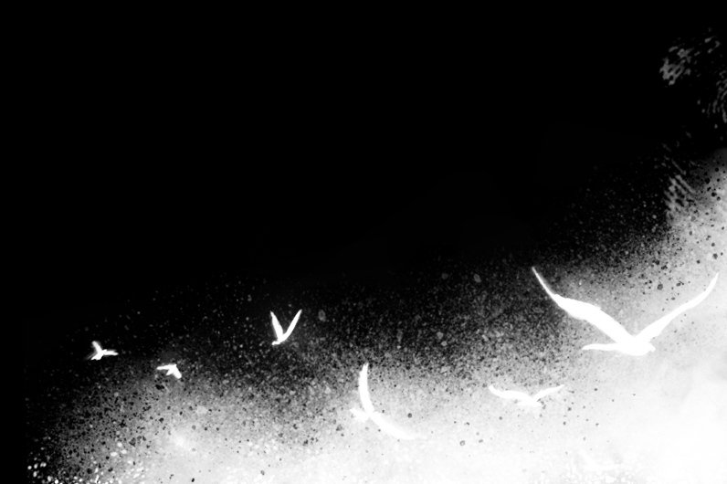

---

Level 3

Level 5

RABID BITE
Many old tales tell of animals that communicate a
terrible temperament through their bite. Kindred with
this power are likely the source of such tales, as their
bite can inject vicious splinters of their beast into a
victim that can be triʩered to send those bitten into a
Frenzy. Łose who have a Famulus have even used this
power through their companion.
Cost: One Rouse Check
Dice Pools: Strength + Brawl
System: On a successful bite the user may activate this
power to infect a victim with a splinter of their Beast.
At any time for the remainder of the night the user may
make another Rouse Check to activate that splinter.
Kindred and other creatures with a supernatural Beast
must test for Fury Frenzy, the user's choice of Frenzy
type, against a Diʞculty eʖual to the user's Animalism.
While Mortals and other creatures without a Beast
simply ʺy into a rage, taking non-halved Willpower
Damage eʖual to the user's Animalism. When the user's
Famulus bites an individual, the user may activate this
power through them to use them as an avenue to inject
a Beast splinter. Łe user can inject a number of Beast
splinters eʖual to their Resolve.
Duration: Beast splinters last within victims for
twenty-four hours or until activated.

LIVING MENAGERIE
Łose who have mastered Animalism and this power of
the blood can not only bring their beast to heel, but
also pull other supernatural Beasts into themselves,
making their body a vessel for an entire pack of Beasts,
uniʹed in savage purpose.
Cost: One or More Rouse Checks
Dice Pools: --
System: Upon activation, the user chooses any number
of individuals in their presence with a Supernatural
Beast, then makes a Rouse Check for each. Łe Beast of
each target is forcibly pulled into the user and the
Storyteller grants the user a Discipline power known by
each target. If one of these Disciplines has pools that
calls for a Discipline rating, the user's Animalism is
used instead, as they wrangle the victim's Beast into
executing the power for them. Additionally the user
suʚers no penalties from physical impairment and gains
bonus dice eʖual to the number of Beasts absorbed to
all Athletics, Brawl, Stealth, Survival, Intimidation, and
Awareness pools. If the user must Test for Frenzy while
under the eʚects of this power, they instead suʚer a
point of Aʩravated Willpower Damage, and become
immune to that form of Frenzy for the remainder of the
scene.

Łose targeted by this power can resist it with a
Test of Composure + Resolve or Fortitude; Diʞculty 5.
However if their Beast is removed, they eʚectively have
no Beast for its duration. Łey do not Test for Frenzy,
cannot suʚer Bestial Failures, and Messy Criticals have
no negative eʚects. Łis does not remove the eʚects or
detriments of Hunger, however, and they may still be
aʡicted with non-Bestial compulsions at the
Storyteller's discretion.

Level 4

FERAL DIALOGUE
Prereʖuisite: Feral Whispers
Ferals with this power can convey complex messages via
howls, grunts, and barks. Sounds produced by this
power are always animalistic in nature. Many Ferals use
this power to discreetly communicate over long
distances, whether in the countryside or across urban
sprawl.
Cost: One Rouse Check
Dice Pools: As with Feral Whispers.
System: While Feral Whispers is active, you can emit a
vocalization, usually a howl, that has a radius of at least
one mile. Łis vocalization can be fully understood by
anyone else with Feral Whispers or any animals you
desire. Vampires with Auspex, especially Malkavians,
may be able to glean an emotion from the vocalizations
made via this power, such as anger, fear, or sorrow, but
will never understand the wording of the message itself.
Duration: As with Feral Whispers.

When the eʚects of this power ends, all Beasts are
returned to their character of origin. When a character
re-gains their Beast, if they are at Hunger 5 or their
Willpower tracker is fully marked, they must test for
Hunger Frenzy, as the Beast is once again let loose
within them.
Duration: One scene or until ended voluntarily.

7

CLANBOOK: GANGREL 5TH EDITION

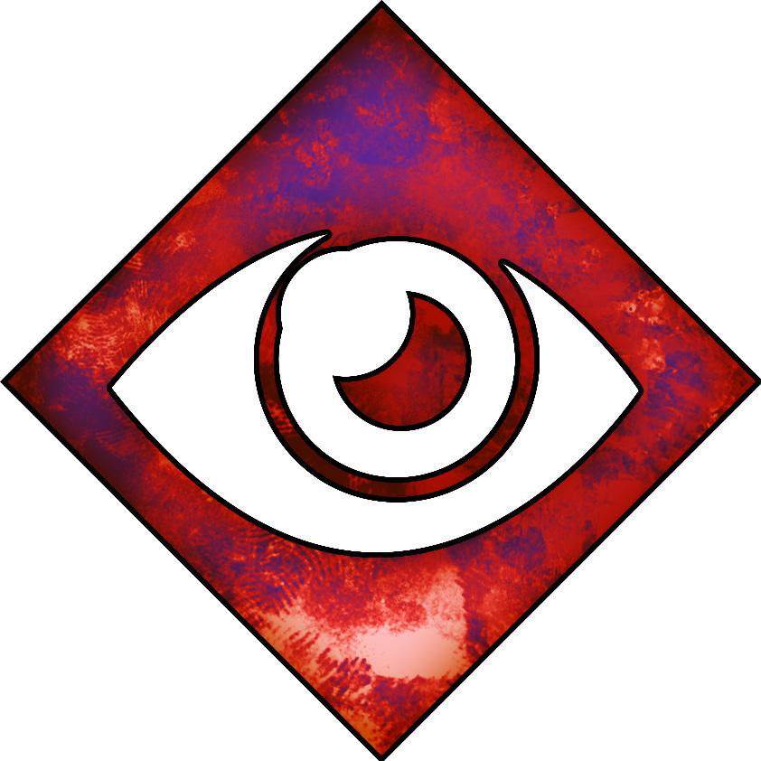

## Auspex

the attacker's pool. On a Critical Win, the user
ʺash-chills any melee-ranged attacker, dealing a point
of Superʹcial Damage.
Duration: Transformation lasts long enough to evade a
single action.

Supernatural senses are hardly foreign to the Clan
of Beasts, but the powers of Auspex tend to be less
common amongst them. Łe Kin Eaters, a
ʖuadsi-Bloodline of the Gangrel, are the only Ferals
who naturally hold this power within their bestial
blood, wielding it to sense and sew Hunger. Other
members of the Clan tend to manifest it as the
hyper-perceptive senses seen in some animals, such as
the vigilant hound who somehow knows when danger
looms in the dark beyond sight.

BLOODY RECOLLECTION
Vampires with this power not only imbibe the blood of
their victims, but also partake in their memories as
well, making them their own as much as the blood
they've slaked.
Cost: Free
Dice Pools: Variable
System: When the user slakes at least one Hunger from
a victim, they may make a Test of Resolve + Auspex.
Łe user gains a recent memory for every two successes
on the Test. Łis memory must have been thought by
the victim within the last two nights. If the user
completely drains the victim the user gains a memory
for each Success instead. Especially violent memories,
such as being shot, stabbed, or damaged from ʹre or
sunlight, may contextually inʺict Willpower Damage or
force the user to Test for Frenzy.
Duration: Memories gained are as permanent as the
user's own.

Level 1

SENSE THE STARVING
Amalgam: Protean 1
Altering their physical senses in a way that ʹne-tunes
them into being able to read the radiating need for
sustenance, almost like an aura. Many view this power
as an unnatural intrusion of reading of another, as it
operates on an almost insidious knowing rather than
the more "natural" powers that stem from Animalism.
Cost: Free
Dice Pools: --
System: Łe user unerringly knows the location of
individuals within ten yards/meters who are "famished".
Vampires who are at Hunger 5, Mortals who haven't
eaten in at least a day, and Ghouls who have gone more
than a week without Vitae all count as famished. Łe
user may choose anyone in their line of sight and roll
Auspex + Protean vs Composure + Subterfuge. A win
allows them to know the target's Hunger rating. Łis
power does not sense Vampires at Hunger 0, and they
will seem to be mortals unless other detection is
employed.
Duration: Passive

## Celerity

Moving ʖuickly through the world keeps Kindred
alive, and no powers of the Blood allow for ʖuicker
movement than the Discipline of Celerity. Learned
and employed by the City Gangrel, as well as any
Feral that can manage to learn it.

Level 1

QUICKSHIFT
Amalgam: Protean 1
Łrough the use of their Celerity, a vampire with this
power can immediately assume any transformation
with Protean, or feasibly another Discipline, instantly.
Cost: Free; As with power used
Dice Pools: Wits + Survival
System: When the user employs a power to transform,
they do so in the fraction of a second, faster than the
blink of an eye. Łis power also allows the user to
reactively transform with a pool of Wits + Survival;
Diʞculty 3 Test, allowing them to assume a diʚerent
form and take an action, such as evasion, using that
form's pools.
Duration: --

Level 3

MISTFELL
Amalgam: Protean 3
Łe vampire uses a subconscious sense of danger to
reactively dissolve into a chilled mist, becoming
insubstantial and able to evade most forms of attack.
Łis transformation is ʺeeting. however.
Cost: One Rouse Check
Dice Pools: Wits + Auspex
System: Łe user instantly becomes insubstantial mist
that can only be damaged by ʹre, sunlight, and
immaterial supernatural attacks. Łis power can be
used to evade a single attack using Wits + Auspex, vs.

8

---

Level 2

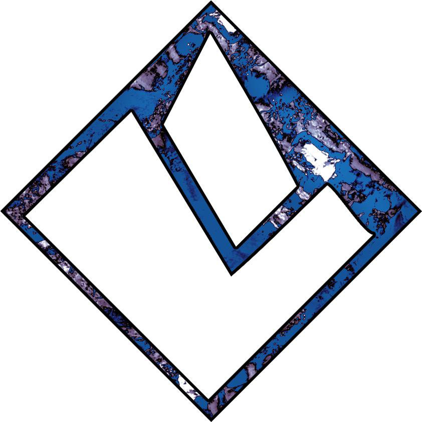

FĦ«·l·¼de

MERCURIAL BEASTS
Amalgam: Animalism 1
Łe user shares a small portion of their unnatural
agility with the animals they inʺuence. Teeming
swarms and great beasts alike exhibit an uncanny speed
almost eʖual to the vampire themself.
Cost: One Rouse Check; Free for Famulus
Dice Pools: Stamina + Animalism (for non-famulus
animals)
System: Łe vampire can choose to extend some of their
Celerity powers to animals aʚected by their
Animalism. Any animal thus imbued adds the user's
Celerity to their Dexterity pools. Using this power on
their Famulus is free and automatic. To imbue other
animals besides their Famulus, the user must make a
Rouse Check and roll a test of Wits + Celerity
(Diʞculty 3). Łe user can bolster one animal per point
of margin.
Duration: One Scene; Permanent for Famulus.

Łere are few other tools in the Feral's repertoire
that ensure their survival more than this Discipline.
Extending it to both their physical and mental
resistances, they uniʖuely entwine this power with
their animal companions and their own Hunger.
Level 1

## Fortitude

MAD GRIT
Using their Hunger as a focusing anchor, vampires with
this power can thwart the inʺuences and advancements
of others, bolstering their own mental and physical
strength.
Cost: --
Dice Pools: --
System: Łe user may add a number of dice eʖual to
their current Hunger to any pools to resist Discipline
Powers. Criticals resulting from these pools are
considered Messy Criticals and confer the Hunger
Compulsion (Vampire the Masʖuerade Core Book, Pg.
208). If this power is used multiple times in a single
Scene, subseʖuent uses cost a point of Willpower.
Duration: --

Level 3

SHIFTING TRAVERSAL
Amalgam: Protean 3
A Feral with this power can assume the shape of three
separate animals to ensure that they have the ability to
adapt to their environment.
Cost: One Rouse Check
System: When taken, the user chooses three animals in
regards to traversal, Air, Land, and Water, with each
one usually being an animal that thrives in such
environs. When this power is activated, the user spends
one turn transforming into a form based on their
current environment. If the user is falling or jumping
they may change to their Air form, running aʨer
someone would result in their Land form, and the same
while swimming in Water. Moving between these
environments automatically shiʨs the user between the
three forms without reʖuiring additional Rouse
Checks, only taking a turn to shiʨ (Unless the user has
ĸuickshiʨ above, of course). An example would be
running across a pier as a Wolf, leaping oʚ the edge to
become a Hawk, before diving beneath the waves to
become an Otter. As with Metamorphosis, the user may
choose forms with much diʚerent sizes and mass than
their base form.
Duration: Until ended voluntarily.

Level 2

SYMPATHETIC LINK
Amalgam: Animalism 1
Prereʖuisite: Bond Famulus
A power created by the shamanistic members of the
Ferals, and seen almost wholly amongst them. Łrough
the strange combination of their blood's powers, those
with this ability can form a supernatural link with their
beast that spreads thin inʺicted wounds and damage
between them, while the Famulus also beneʹts their
master's mending powers of the blood.
Cost: As with damage mended.
Dice Pools: --
System: When the user or their Famulus takes
Superʹcial Health Damage, the user may have an
amount of the damage taken, up to their Fortitude
rating, transferred to the other. When the user rouses
the blood to mend damage, that same type and amount
of damage is also mended by their Famulus. If the user
has more than one Famulus, due to a Power,
Background, or Merit, the damage that is transferred to
their Famulus is distributed between them as the user
sees ʹt.
Duration: Passive.

9

CLANBOOK: GANGREL 5TH EDITION

Level 3

Obf¼¯ca·e

CORNERED ANIMAL
Amalgam: Animalism 3
When backed into a corner, or near-death, a Feral with
this power will surrender to their Beast, which will
grant them a second wind to continue in the face of
Final Death, doing everything to survive.
Cost: Free
Dice Pools: --
System: When your Health tracker becomes fully
marked with Aʩravated Damage, and you are not in
Frenzy, this power activates automatically. While
active, the user enters Fury Frenzy and adds their
current Hunger to their Health track. Łis Fury Frenzy
cannot be resisted in any way, even through
expenditure of Willpower, but the vampire can choose
to Ride the Wave (Vampire the Masʖuerade Core
Rulebook, Pg. 219). When this power ends, unmarked
Health boxes are removed ʹrst and if the user has no
Hunger, they immediately mend 1 Aʩravated Health
Damage.
Duration: Lasts a number of turns eʖual to the user's
Hunger rating upon activation.

Gained from either their Nosferatu peers, or found
in the Bloodlines of the Blood Ravens and the
Coyotes, there's little that can be argued against
having the ability to pass unnoticed, plague a victim
with Bestial glamors, or simply look like something else
entirely.

Level 1

## Obfuscate

EIDOLON FAMULUS
Amalgam: Animalism 1
Prereʖuisite: Bond Famulus
Łis ability was supposedly fashioned by the Blood
Raven's Feathered Court, though both the Nosferatu
and Ravnos claim it was ʹrst employed by them in
ancient times well before the Dark Ages.
Cost: Free
System: Łe user's Famulus can use all the Obfuscate
powers known by the user and gains a dot in Obfuscate
that grants an additional Level 1 Obfuscate power.
When rolling pools of Obfuscate, regardless of the
power's level that calls for it, the Famulus only ever uses
their own Obfuscate rating.
Duration: Passive; As with power used.

Level 5

HIDE OF GRANITE
Amalgam: Protean 2
Łis variation of Flesh of Marble has developed in
groups of Gangrel, usually spontaneously through
instinctual uses and changes of their blood, rather than
as something consciously learned. Łis power grants
immunity to natural damage from environmental
eʚects, as well as granting nearly insurmountable
durability and monolithic immovability.
Cost: Two Rouse Checks
System: While active any attack that does not exceed
the user's Fortitude rating deals no damage and fails
outright and the user is completely immune to
environmental and incidental damage, examples
include ʹre, high voltage electrical shocks, freezing
temperatures, radiation, total vacuum, and extreme
pressure.

Level 2

ASSAILING BEAST OF TORMENT
Amalgam: Animalism 2
Łis ability allows one to weave their Beast into their
powers of Obfuscate, manifesting it as a harrying and
horrifying animal in a way that has no small similarity
to the Chimerstry employed by the Ravnos. Beasts
manifested by this power are most oʨen Canids, but
users whose Beast more closely matches another animal
may cause it to be conjured as that instead; Blood
Ravens manifest birds matching their namesake, while
a Nosferatu might conjure up visions of nightmarish
rats.
Cost: One Rouse Check
Dice Pools: Manipulation + Obfuscate
System: Łe user chooses a victim in their line of sight,
activates this power, and makes a contest of
Manipulation + Obfuscate vs Composure + Resolve or
Fortitude. If the user Wins, the victim is beset by
visions of horriʹc beasts and suʚers a -2 dice penalty to
their Composure and Resolve pools.
Duration: One Scene; A Critical Win on the initial Test
makes it last the entire night.

Additionally they can't be moved outside their
own inʺuence unless the opposing force achieves a
number of successes greater than the user's current
Willpower and the user can't be Stunned, ignores any
penalties of Physical Impairments (pg. 303 Vampire the
Masʖuerade v5 Core Rulebook) outside of severe
Crippling Injuries (pg. 303 Vampire the Masʖuerade v5
Core Rulebook) such as a Massive Wound or Crippled.
Duration: One scene

10

---

Level 3

## Potence & Presence

System: In combat the user adds their Potence to their
Dice Pools made to attack or destroy, but loses an eʖual
number of dice from their evasive and defensive
combat pools. Łis power is passive and can't be
deactivated.
Duration: Passive.

MASK OF A THOUSAND PETS
Amalgam: Protean 1+
Prereʖuisite: Skin Taker or Shapechange
A favored power of the Coyotes, who would take
humans as "pets" and live with a family for years to pass
as a mundane animal for as long as possible, whether
for protection or just for the fun of it. When using a
fully transformative power, such as Skin Taker or
Shapechange, this power can be used to mask the true
appearance of the user, causing a wolf to appear as a
harmless family dog instead.
Cost: One Rouse Check
Dice Pools: --
System: When the user transforms into an animal
through the use of Skin Taker, Shapechange,
Metamorphosis, or any similar full-body
transformation, they may activate this power to appear
as a speciʹc animal they've seen within the last night, or
fed from at some point in the past. Łe false appearance
must have the same general shape, and be of a similar
species, though size can vary widely. An example would
be the user transforming into a large gray wolf, but
employing this power to appear as a beloved family pet
dog. Łis power does not alter the user's physical shape
or mass, but like Mask of a Łousand Faces and other
similar powers of Obfuscate, uses a mental glamor to
appear as the animal they're mimicking. As usual, Sense
the Unseen and similar powers can pierce this eʚect,
per the rules of Obfuscate.
Duration: Until ended voluntarily.

Level 3

WILD STRIKES
Prereʖuisite: Reckless Berserker
Einherjar with this power enter a trance-like state,
wherein their cursed Beast alights upon their mind
visibly bolstering their physical bodies and allowing
them to turn into whirlwinds of gore that carve
through enemies with inhuman strength and no regard
for their own survival.
Cost: One Rouse Check
Dice Pools: --
System: When the user makes an All-Out Attack with
Brawl or Melee, they may strike an additional target
within range using the same number of resulting
Successes. Both targets defend with their own
contesting pools as normal.
Duration: One Scene.

P«e¯eğce

Level 2

WOLF KNIGHT'S VALOUR
Amalgam: Fortitude 2
Łe signature power of the Knights of Avalon. It was
created by their founder, Sir Godfrey, who valiantly led
the charge against the monsters that threatened both
Mortal and Cainite society in the dark ages. In modern
nights it's also sometimes seen amongst Ventrue leaders.
Łose who have this power inspire others around them
with their triumps –A wolʗ's valour to bolster courage.
Cost: One Rouse Check
Dice Pools: --
System: Whenever the user wins a contested pool of
any kind, they may activate this power and choose a
number of other characters who saw the user's victory.
Others chosen gain a point of Willpower and add half
the user's Presence as bonus dice to resist Intimidation
or Fear Frenzy. Łose that already have this power
cannot recover a Willpower from its eʚect, but still
gain resistances to Fear Frenzy. Łe beneʹts of this
power can only be gained a number of times eʖual to
half the user's Presence Rating per night.
Duration: One scene or until intentionally ended.

PĦ·eğce

Many know of the Ferals who can bite and claw
apart a Kindred like a wild animal, but few realize that
some Ferals, especially the Chosen Slain, employ the
superhuman strength of Potence. When woven with the
transformative powers of Protean, these Einherjar are
nearly uncontested in battle, even against
overwhelming odds.
Level 2

RECKLESS BERSERKER
Amalgam: Protean 2
Most freʖuently seen amongst the Einherjar, this power
causes the user to enter a meditative battle-trance,
wherein their Beast alights upon their mind, visibly
bolstering their physical body and allowing them to
attack with brutal abandon, at the cost of
self-preservation.
Cost: --
Dice Pools: --

11

CLANBOOK: GANGREL 5TH EDITION

P«Ħ·eağ

System: Activated as a Protean + Brawl attack, the user
sprouts an animalistic light piercing Brawl weapon with
a damage modiʹer eʖual to their current Hunger as
they leap up to ʹve yards/meters towards their target,
making a loud animalistic sound that draws attention.
On a successful hit, this attack deals non-halved
Superʹcial Health Damage to the target. Attack pools
made with this power suʚer no penalties from
Impairment or Crippling Injury.

Łe primary Discipline of, and one that is the most
natural to, the Gangrel. Łe powers of bestial
transformation exist across all Bloodlines and variants
of the Gangrel, and even those Ferals that don't develop
the powers of a protean form still hold its properties
within their blood, taking on Bestial features with
Frenzy.

A Critical Win on this attack allows the user to
activate it again next turn for free, while a Messy
Critical removes the cost entirely for the remainder of
the scene. Łis power also has no cost while the user is
in Frenzy. Attack pools made with this power cannot
be split to strike multiple targets.
Duration: Animalistic weapons gained from this
transformation last for a single attack.

Level 1

## Protean

SKIN TAKER
A power freʖuently seen among the indigenous Gangrel
of North America, said to have been developed out of
their spiritual meditations and traditional connections
with nature. By draining and then consuming an
animal, bones and all, the user can then assume that
animal's shape, so long as they can keep the ʺesh down.
Cost: Free
Dice Pools: --
System: Łe user fully drains an animal and then
consumes it entirely, making a Test of Protean +
Composure; Diʞculty 3 to keep the animal down
without issue. A fail causes them to retch up the ʺesh at
the end of the scene. If the user has the Eat Food Merit
(Vampire the Masʖuerade Core Rulebook Pg. 182) they
pass the test automatically. Taking a point of
Aʩravated Damage or receiving a Critical Injury forces
another Protean + Composure; Diʞculty 3 Test to keep
the ʺesh down.

Level 3

PREDATOR'S MAW
Prereʖuisite: Altered Assault or Feral Weapons
Łis power allows the user to manifest huge bestial
fangs, a boring proboscis, or the ability to alter and
extend their jaw for a more powerful bite. In any case,
this power is specialized for feeding and causing
catastrophic damage, especially to prey that is already
injured.
Cost: As with Altered Assault
Dice Pools: As with Altered Assault
System: Łe user makes a Bite Attack with Protean +
Brawl. Łis attack suʚers no penalties from minor
actions to move towards the target, Impairment or
Crippling Injury, and additionally has no Called Shot
penalty for biting, as the transformation pierces
through armor and ʺesh to allow the user to gorge on
blood. On a successful attack, the user immediately
slakes one Hunger and deals 2 pointes of Aʩravated
Health Damage. If the target is already bleeding
(Kindred don't bleed), the user immediately slakes an
additional Hunger.

While the animal remains within the user, they can
make a Rouse Check to assume its form, following the
same rules of Shapechange (Pg. 271 of Vampire the
Masʖuerade Core Rulebook).
Duration: Transformation lasts until ended, or the ʺesh
is expelled from the body. As with food, the ʺesh must
be expelled before daysleep.

Level 2

ALTERED ASSAULT
Amalgam: Fortitude 2
Channeling the raw ferocity of their Beast into a single
attack, the Feral leaps towards the target like a wild
predator, attacking with the sudden manifestation of
hooked claws, a barbed tail, a crab's pincers, or any
manner of animalistic weapon. Whatever the form this
weapon assumes, it rips apart ʺesh with inhuman
violence, all while the user ignores the detrimental
eʚects of pain and injury.
Cost: One Rouse Check
Dice Pools: Protean + Brawl

Weak or Average Mortals that are victims of this
power are usually mangled beyond saving almost
immediately, leaving a bloody mess that appears to have
been caused by an enormous feral animal, such as a
lion, bear, or some other unfathomable beast. Other
mortals are unlikely to survive without medical
attention.
Duration: Animalistic weapons gained from this
transformation last for a single attack.

12

---

Level 4

Level 5

DRAUGHT OF CHANGE
Łe Blood of the vampire becomes saturated with the
powers of their Protean, conveying a part of that power
to anyone who drinks of it.
Cost: One Rouse Check.
System: Drinking a Rouse Check's worth of Blood
directly from the user giʨs the drinker with temporary
Protean eʖual to half the Protean dots (rounded down)
of the donor. Łe drinker gains the same powers as the
donor’s, up to that level.
Duration: One night; for vampires, until the next
feeding or the drinker reaches Hunger 5.

SELF-MADE THRONG
Amalgam: Animalism 1
Ferals with this power are no longer limited by the
conʹnes of their physical ʺesh, and can instead use
their total mastery of their shiʨing form to split into
multiple separate animals, allowing them to become a
veritable pack of one. Use of this power is kept fairly
secret by the Clan of Beasts and their associated
bloodlines, adding to their reputation as survivalists.
Cost: Two-to-ʹve Rouse Checks
Dice Pools: --
System: Upon activation the user makes two-to-ʹve
Rouse Checks and then chooses an animal for each
Rouse Check made. Over a full turn, the user's body
violently tears itself to pieces as they split into each of
the chosen animals. Łese animals have their individual
Physical Attributes, senses, and Skills, as well as any
special traits they normally have. However each animal
shares the same mind: Łat of the user, meaning that
they share the user's Willpower tracker, as well as the
user's Mental Attributes and Skills. Mental powers that
aʚect one, such as Animalism, Dominate, or Presence
aʚect them all. Compulsions, or mind-related
impairments will also be present across all animals the
user has split into. Each also shares the same Hunger
rating.

ENNOIA'S MASTERY
When Ennoia returned from the desert beyond the
First City, she did so as a mastery over her spirit, her
Beast, and her physical form. Łis granted her the
ability to adapt to her environment actively and
reactively, sometimes even involuntarily. In modern
nights this is an ability that's commonly seen in Wights
who had considerable mastery over Protean before
their loss of Humanity. Łe Eremites of the Perfects
consider this ability a sacred expression of the purity
and adaptability of their Beast as the ultimate predator.
Cost: One Rouse Check
System: Upon activation, the user can choose a number
of Animals eʖual to their Protean rating. From each
chosen animal, the user picks an Exceptional Dice Pool
or a Special trait. Chosen exceptional pools increase the
same skill to the same amount, up to a maximum rating
of 5, while Special traits chosen from animals grant
those eʚects as written. Łese chosen changes are
reʺected in transformations on the user's body in the
form of additional limbs, heads, mouths, etc. Eʚects
that add bonus to damage are not additive with
multiple changes, as the user can only attack with one
changed part of their body at a time.
Duration: One scene unless ended voluntarily before
that.

When this power ends, the user chooses one of the
animals they split into, and it transforms back into the
user's default form. All other animals turn to blood and
dust. For each animal that was destroyed during the
duration, the user takes a point of Aʩravated Damage.
Duration: One scene unless ended voluntarily before
that.

13

CLANBOOK: GANGREL 5TH EDITION

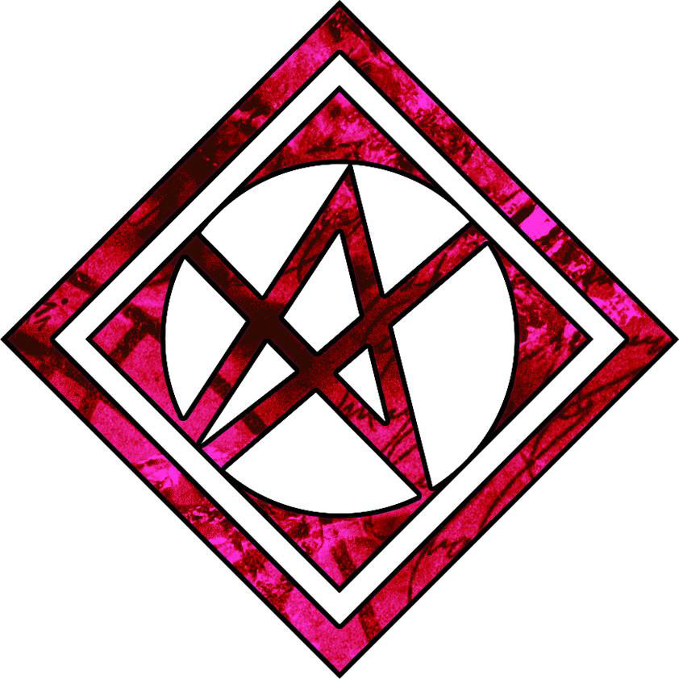

BĘĦĦd SĦ«ce«×

System: A success at Diʞculty 2 grants the caster with
a fortiʹcation of spirits, preventing Critical Injuries
and adding one die to resist Fear Frenzy.
Duration: Twenty-Four Hours, whichever comes ʹrst.

Rarely do the Gangrel resort to bending the cursed
power of their vitae, but when they do it manifests
primarily as old ritualism that draws obvious parallels
to old pagan practices lost to time, or more wild
conjurations of combat.
Level 1

Level 2

DARK HEART OF THE WOOD
A Ritual that takes ambient spiritual energy and uses
vitae as an animating nexus to form it into an artiʹcial
spiritual construct. Łis construct is in no way a proper
elemental spirit, but can pass as one even when present
among such beings.
Cost: One Rouse Check, One Willpower
Dice Pools: Ritual Test (Intelligence + Blood Sorcery;
Diʞculty 3 or 6)
Ingredients: Vitae, the heart of a large ruminant,
common fungus, fresh moss, an acorn or pinecone
Process: Łe caster grinds up their vitae along with the
fungus and moss. Łe animal heart is then stuʚed with
the mixture as well as the acorn or pinecone, before
being planted at the center of a clear plot of land, open
to the sky, during which the caster makes their Ritual
Test.
System: On a Win a large stag (regardless of what
animal contributed the heart) made of earth, moss, and
wood rises from the spot where the heart was buried.
Łis stag will obey the caster's commands, and is more
intelligent than a typical animal.
Duration: Łe Dark Hart lasts one night, or
permanently if the Ritual is performed at Diʞculty 6.

## Blood Sorcery & Rituals

NATURAL RITUALIST
Amongst less academic practitioners of Blood Sorcery,
especially those who are primarily interested in the
processions and rituals of an almost religious
signiʹcance, the core ability to specialize in those
rituals is more important than the overt mastery of
one's blood, leading to the learning of this talent in the
place of more academic sorcery.
Cost: Free
Dice Pools: --
System: Łis power can be learned multiple times, once
at each level. When this power is bought, the caster
learns two Rituals at the same Level it's learned at,
instantly and for free (If taken at character creation,
this is in addition to the free level 1 Ritual).
Additionally the user may purchase additional Rituals
that share their level with this power at a cost of 2
experience per dot, rather than three, and they learn
them in half the time.
Duration: Passive

BĘĦĦd Rl·¼aĘ¯

Level 1

GENERALDIFFICULTIES: 3 / 1

CRIMSON WOAD
Using a limited form of Blood Magic to ritually inscribe
mystical spirits of war and wrath onto their skin to
protect from fear and terrible injury. Łis ritual hails
from a forgotten and isolated bloodline that was
damned to wither on the vine. However there are those
on the far reaches of society, in eʖually forgotten places,
who can teach these old powers of spirit and nature.
Cost: One Rouse Check
Dice Pools: Ritual Test (Intelligence + Blood Sorcery;
Diʞculty 2)
Ingredients: Whiskey, animal blood, wild mushrooms,
rosemary
Process: Łe caster chooses to perform this Ritual at
Diʞculty 2. All ingredients are ground in a small stone
mortar and pestle as the caster hums a discordant tune
and meditates on violence. A single Rouse Check of the
caster's Vitae is then poured into the mix.

Certain Gangrel have been taught the Blood
Rituals that allow for the conjuring of these aspects of
nature's power. Dark Harts are most freʖuently seen in
the old forest of Europe, but some have been sighted in
the jungles of South America, or the bush of Australia,
even in places where Deer are not native fauna.

Attributes: Strength 3, Dexterity 5, Stamina 4;

Charisma 2, Manipulation 1, Composure 2;
Intelligence 2, Wits 4, Resolve 2
Skills: Awareness 5, Occult 4
Secondary Attributes: Health 7, Willpower 4
Special: Suffers no minor action penalty when

closing distance and it deals +2 piercing damage
when goring with antlers in a charge attack. It can
perceive individuals and objects as if it has Sense the
Unseen. Once per scene the Dark Hart can spend a
point of Willpower to add a single die to the caster's
Willpower Tests.

14

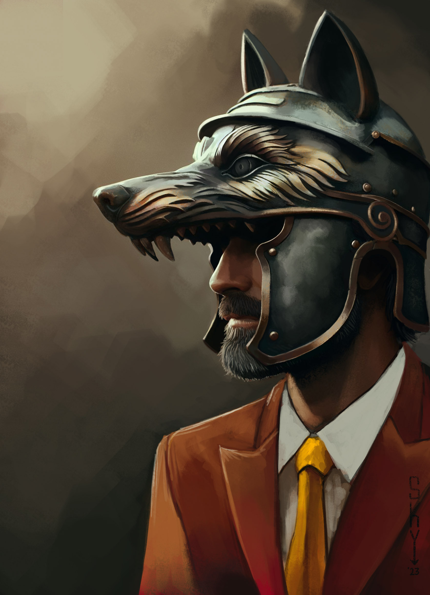

CLANBOOK: GANGREL 5TH EDITION

---

• Gain the Enemy Flaw: Deadly Mortal (●●) - A
veteran Hunter that likely has your name etched into
their favorite weapon.
Predator Pool: Resolve or Intelligence + Allies or
Technology to get a line on the movement of a local
Hunter, or to ʹnd one of their loved ones to feed from
or Strength or Dexterity + Athletics to subjugate a
Hunter in combat and feed from them. Łe Cazador's
ʖuick hunts always have their diʞculty increased by
one, due to the dangerous nature of their feeding
habits.

# NEW PREDATOR TYPES

More than any other clan for the Gangrel the hunt and
the methods they pursue is the greatest form of self
expression. Below are new Predator types that treat a
Feral's most comfortable methods of feeding as
inhuman acts.

Cannibal

Civilisation Destroyer

You and your Beast crave the ʺesh and blood of
other Cainites. Łis isn't done out of any moral
obligation, at least not anymore, you simply crave a
much larger and ʹlling meal to get you through your
nights as an undead monster.
• Add a specialty: Brawl (Bites) or Intimidation
(Cainites)
• Add one dot of Auspex or Protean
• Gain the Feeding Flaw: Glutton (●●) or Ravenous
Łirst (●●) - Your Hunger is immense and can only be
fully slaked when consuming at least half your weight
in the ʺesh and blood of other supernatural creatures,
or by feeding on a powerful vampire.
• Increase your Blood Potency by 1
• Lose one dot of Humanity
Predator Pool: Feeding on Kindred is no easy task, and
should never be relegated to ĸuick Hunts. If absolutely
necessary, the Cannibal's predator pool is Resolve +
Brawl; Diʞculty 4 + the victim's Blood Potency.

Every building has that loose brick, the weak strut, a
rusty pipe. You feel vindicated in your feeding when
you take out a small piece of a larger infrastructure, so
you feed on the mail clerk, the subway engineer, or the
dog walker. Anyone that, should they become ill or go
missing, will disrupt at least a dozen people's day.
• Add a specialty: Larceny (Security) or Academics
(City Infrastructure)
• Add one dot of Dominate or Potence
• Gain the Contact Background: (●) - Someone who
knows scheduling for a large intricate system of people.
A shiʨ supervisor, a ticket clerk, or a security guard.
• Gain the Bestial Merit: Inhuman Advisor (●●) and
the Flaw: Bestial Impulse (●) - Łere's a perfect agent
of chaos inside you that's always readying to mess with
your impulse control.
Predator Pool: Manipulation + Streetwise or Contacts
ʹnd out who might cause enormous inconvenience, or
Intelligence + Academics to research individuals low on
the ladder that have the burden of being irreplaceable
and overworked.

Cazador

You've devoted your unlife to hunting those that
usually hunt you. You feed from mortal Hunters, or
failing that, their loved ones. You inʹltrate their circles
through various means, or simply bait your hunters into
a trap that gives you the upper hand, and attack and
feed from them, usually aʨer or during combat.

Cruel Deerstalker

You give your prey a head start and then relentlessly
chase them down, maybe even playing with your food.
Your hunts tend to cause a massive problem here and
there, but that doesn't matter. Łere is only meaning in
the ʺeeing prey and the thing that hunts them.
• Add a specialty: Athletics (Pursuit) or Intimidation
(Glare)
• Add one dot of Dominate or Presence
• Gain the Feeding Merit: Gratifying Predation (●) -
Łey run, you chase them. Nothing feels better.
Predator Pool: You manipulate your target into ʺeeing,
then with raw exertion run them down with Strength +
Athletics, or you pick out someone in a crowd and
meet their gaze and trick them into a poor position
with Manipulation + Intimidation. Cruel Deerstalkers
tend to Succeed at a Cost for their Hunts as the

Considered to be a dangerous and reckless method
of feeding, it none-the-less turns heads when found out
or mentioned, though the precariousness of what you
do doesn't necessarily garner you outright fame, as you
get praise and scorn in eʖual measure.
• Add a specialty: Athletics (Bows) or Craʨ (Traps)
• Add one dot of Celerity or Fortitude
• Spend three dots across the Allies Background (●●●)
- A mortal you can call on to inʹltrate, or get a lead on,
a potential Hunter, or someone that Hunter cares
about.
• Gain the Mythic Merit: (●) Light Sleeper - Your
vigilance has led you to waking earlier than most
Kindred.

16

PREDATOR TYPES

diʞculty to remain unnoticed by others or cause
collateral damage is ʖuite high.

■Gain the Feeding Merit: Solitary Hunter (●●●) -
Hunting down and feeding on prey on your own slakes
an additional point of Hunger, though this can't reduce
your Hunger below 1.
■Gain the Infamy Flaw (●) - You're known as a poacher
to most who own or manage large domains, though
they lack deʹnitive proof of your slights, they'll keep a
close eye on you none-the-less.
Predator Pool: Wits + Survival to ʹnd another
Kindred's domain and brazenly hunt prey or Dexterity +
Stealth to sneak into an area, feed, and then leave
without getting caught.

Nomadic Feeder

You weave through society and those that populate
it, moving on the edges, through alleyways, and across
the country. You're not a picky eater, but you'll feed in a
diʚerent area and on a diʚerent thing each hunt.
• Add a specialty: Streetwise (Unfamiliar Locales) or
Insight (Loners)
• Add one dot of Auspex or Fortitude
• Gain the Haven Merit: (●●) and the Mobile Haven
Addon (●) - You have a vehicle that's secure and fast
enough to keep you on the move.
• Gain the Background Flaw: Enemy (●●) - Your trek
across the area has leʨ a long trail, and someone is
following it.
Predator Pool: Resolve + Streetwise to stalk a new area
for a target or Manipulation + Insight to convince
someone gullible to trust you.

Rival Predators

Blood tastes sweeter when ʺavored by adversity and
victory. You have at least one rival, maybe friendly,
maybe not so friendly. You and them choose a target,
and then compete to see who can feed on that target
ʹrst.
• Add a specialty: Athletics (Uneven Terrain) or
Performance (Stylish Kill)
• Add one dot of Celerity or Presence
• Gain the Background: Mawla (●●) - Your rival, or
rivals, who hunt against you. Winning too many times
in a row, cheating, or being a sore winner might cause
some issues and turn them into Adversary (●).
Predator Pool: Dexterity + Athletics. You beat your
opponents to the target through agility and precision,
or Wits + Performance to make a show of your victory.

Pet Collaborator

Łere's plenty of furry accomplices that'll help a
food-motivated creature like you. Getting an animal,
usually a pet or something domestic, to keep an eye out
or dupe your prey is your specialty, and it tends to work
pretty well. Many who hunt this way do so along with
their Famulus if they have one.
• Add a specialty: Anima Ken (Pets) or Stealth
(Ambush)
• Add one dot of Animalism or Obfuscate
• Gain the Background Merit: (●) Herd - You get at
least one easy meal a week from the assistance of an
animal.
• Gain the Psychological Merit: (●) Wild Heart. You're
good with animals.
• Gain the Mythic Flaw: Permanent Fangs (●●) -
Maybe a part of the reason you're good with Animals is
because you have big fangs like they do.
Predator Pool: Charisma + Animal Ken to get an animal
to help you out, or Wits + Stealth to lay in wait for a
baited target.

Suliformes

A rather repugnant form of feeding that reʖuires
ghouled or highly trained animals, who are sent out to
feast on blood and ʺesh, and then return home to
regurgitate their haul so that you might eat the blood
yourself. Despite the stigma attached to it, it remains
an almost untraceable form of slaking one's Hunger.
• Add a specialty: Animal Ken (Ghouled Animals) or
Subterfuge (Normal Feeding Habits)
• Add one dot of Animalism or Protean
• Gain the Bonding Merit: Deeper Bond (●●) - Your
blood bonds animals that much ʖuicker.
• Gain the Looks Flaw: Disgusting (●●) - Your feeding
habits have given you a strange odor. You suʚer a -2 Die
penalty to most Social Pools in regards to people you're
in the olfactor range of.
Predator Pool: Charisma or Manipulation + Animal
Ken to send out your ghouled animals to gobble up
something and then return with your meal. It takes at
least six hours for your pets to return with enough
blood to slake one Hunger, usually much more to get
two.

Poacher

You feed by moving into other's territory and preying
on the Kine that aren't yours. Perhaps you don't have a
territory of your own, you live a nomadic existence, or
maybe you just like the thrill of hunting while
trespassing.
■Add a specialty: Survival (Trespassing) or Stealth
(Trespassing)
■Gain one dot of Celerity or Obfuscate

17

CLANBOOK: GANGREL 5TH EDITION

Wastelander

Stalking the trackless wastes and outskirts was how
your human ancestors lived in ancient days, and how
your inhuman progenitors persisted in the early nights.
Everything you need is out there, amongst the trees,
rocks, ravines, and pools. Łis is what you ʹnd the most
appealing, the most natural.
• Add a specialty: Survival (Wilderness) or Stealth
(Wilderness)
• Add one dot of Protean or Fortitude
• Gain the Feeding Merit: Prey Specialization (●●) -
Animals. You might feed on a human out yonder, but
feeding on Animals is what you're best at.
• Gain the Haven Merit: (●) - You have a small hunting
shack or a secret place away from the city.
• Gain the Feeding Flaw: Taste of the Kill (●●) - It's
only worth eating if you nabbed it yourself.
Predator Pool: Stamina + Survival or Stealth. You cross
the night tracking down prey, or sneak up on your
ʖuarry over several hours. In any case, your "ʖuick
hunts" always take at least two hours if you're not
already in the wilderness.

18

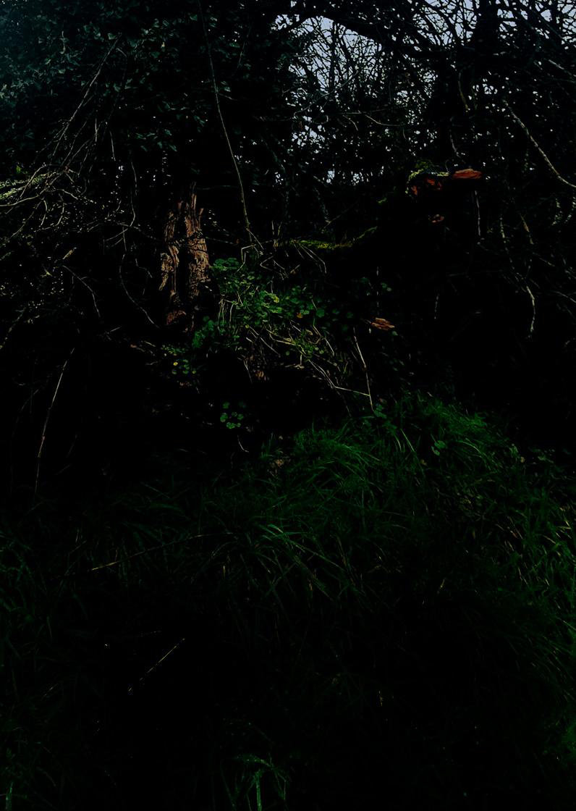

CLANBOOK: GANGREL

# OPTIONAL ADVANTAGES

Within this section are new Merits, Bloodlines, Loresheets, and Flaws that Players and Storytellers can use to build
their characters. Many of the Advantages here are designed with Gangrel in mind, and certain advantages should only
be taken by Gangrel, though any player who aims to have a more bestial or hunger-associated character concept might
ʹnd these of interest regardless of written intention.

Storytellers and Players are encouraged to think about the whys and hows of these merits, and consider what events
may have lead to a character having them, and how they will aʚect the character scene-to-scene, as they are stand-out
ways to help deʹne characters, both Player and otherwise, and add stronger context and story.

Merits & Flaws

(•••) predatory eloquence You add +1 Bonus Dice to
any Social dice pools made while Hunting, your
predatory nature shining through as an allure, or
warning, of imminent danger.

BESTIAL New Advantages that focus on the presence
of the user's Beast and its Hunger and how it inʺuences
a Cainite's night-to-night and moment-to-moment life.
Łese are meant to be primarily associated with
Gangrel, as they have a uniʖue and more personal
association with their Beast, however any particularly
monstrous or animalistic character may take them at
the Storyteller's discretion.

Flaw (•): bestial impulse When you reach or start a
scene at Hunger 4 or 5, your Beast will give you a Desire
for the scene. All Dice Pools that aren't made towards
achieving this desire get a -2 Dice penalty. Łis penalty
is increased to -4 at Hunger 5.

Flaw (•): monstrous countenance When you lose
Humanity you gain a permanent animal feature.
Diʞculties to hide these features are increased by 1 for
each that you have and give you a -1 Die penalty to a
speciʹc Skill. Even if you somehow gain the lost
Humanity back, the feature stays.

(•) frenzy's catharsis Aʨer you Frenzy for at least
one Scene, choose Physical, Social, or Mental. Add 1 die
to all pools of the chosen type for the rest of the night.

(••) inhuman advisor When you reach or start a scene
at Hunger 4 or 5, your Beast will give you a Desire for
the scene. All Dice Pools made towards achieving this
desire get +2 Bonus Dice. Łis bonus is increased to +3
at Hunger 5.

Flaw (• to ••): animal antipathy. For each dot in this
Flaw choose a type of Animal, such as Cat, Canid, Bird,
or Rodent. Łat Animal will never converse with you
and is completely immune to your powers of
Animalism. In certain cases they will also attack you
unprovoked.

(•• to ••••) hunger's bargain When you slake at least
one Hunger, add +1 Bonus Dice to resist Frenzy for the
remainder of the scene. If taken at four dots increase
the bonus to +2 Bonus Dice.

19

CLANBOOK: GANGREL 5TH EDITION

BONDING

trait. For every two dots in this Merit choose a speciʹc
type of prey. You get +1 bonus die to any rolls made to
hunt that prey.

BONDING A Feral's blood is a tool of survival like
anything else, and nothing helps with survival more
than dependable bonds that one can rely on.

(•••) solitary hunter When you hunt down and feed
from prey on your own, without any other individuals
helping you, including animals, slake 1 additional
Hunger. Łis cannot reduce Hunger below zero. If
multiple eʚects would allow you to slake an additional
point of Hunger, choose the one and ignore the rest.

(•) deeper bond When an animal drinks at least a
Rouse Check worth of your Blood, they become
two-steps towards a bond with you, rather than one.
Additionally certain powers of Bonding, such as
choosing a Famulus, take only two nights, rather than
three.

(•••••) efficient metabolism Your Beast is either more
easily slaked, or you've learned how to utilize what
blood you consume more eʞciently. For every 2
Hunger you slake, slake 1 more. Łis cannot reduce
Hunger below zero. If multiple eʚects would allow you
to slake an additional point of Hunger, choose the one
and ignore the rest.

(••) shackle eater When you slake at least 1 Hunger
by drinking the blood of the vampire that you've been
Blood Bound to, slake 1 additional Hunger if it were to
increase the Bond further, or maintain it at the
maximum. Łis cannot reduce Hunger below zero. If
multiple eʚects would allow you to slake an additional
point of Hunger, choose the one and ignore the rest.

Flaw: (••) connoisseur You slake one less Hunger
from blood that doesn't have an Intense or Acute
Resonance, and your Hunger can only be fully Slaked
by draining a vessel with a Dyscrasia.

Flaw: (••) animal vagary Your Blood suʚers from a
strange ʖuirk that prevents it from bonding sentient
Mortals, Kindred, and most other Supernatural
Creatures. You can only create Blood Bonds with
animals.

Flaw: (••) dead palette You cannot taste or gain a
Resonance, and by extension cannot beneʹt from them.
Łis ʺaw cannot be taken if you have Bloodhound or
Connoisseur.

FEEDING

FEEDING As with the core Advantages, what follows
are several new merits and ʺaws associated with
hunting and imbibing in blood of various kinds.

Flaw: (••) glutton Your Hunger can only be fully
slaked when consuming at least half your weight in the
ʺesh and blood of other supernatural creatures.

(•) gratifying predation While the turmoil of
night-to-night survival doesn't allow you to always hunt
as you want, it makes your most comfortable method
all the more satisfying when you do manage it. When
you successfully hunt in accordance to your chosen
Predator Type, you also restore 1 Willpower.

Flaw: (••) ravenous thirst Your Hunger constantly
remains at a minimum of one higher without draining
and killing a Mortal or Supernatural creature. For most
vampires this will be a minimum of 2, while those of
high Blood Potency may raise it even more. (see
Vampire the Masʖuerade Core Rulebook, Pg. 215).

(• or ••) courser You have a supernaturally acute
sense of smell when it comes to Animals and their
Blood. Not only is it easier for you to sniʚ them out,
you can smell their blood with superhuman ability. Add
1 bonus die to any olfactory pools to track an animal's
scent, or 2 dice if they're bleeding. Łis bonus is
increased by 1 more die if taken as a two-dot Merit.

Flaw: (••) taste of the kill You refuse to drink from
anyone that is helpless or unable to defend themselves.
Whenever you feed on one of these individuals you take
a point of Aʩravated Willpower damage for each
Hunger slaked.

(•• to ••••) prey specialization You have a specialized
type of prey that you know the ins and outs of hunting,
whether it be a speciʹc type of animal, a mortal with a
certain lifestyle, or someone with a speciʹc physical

20

---

LOOKS

PSYCHOLOGICAL

LOOKS Gangrel act aloof and disinterested at times
when it comes to looks, but the fact of the matter is
that it is as part of their every-night life as much as it is
the Toreador, perhaps just inverted. Bloodlines like the
Knights of Avalon prize themselves on their human
appearance and well-kept grooming, while others such
as Country Gangrel maintain their Bestial Features as a
badge of pride, a casting away of their prey
countenance for a predator's, or so they might claim.

PSYCHOLOGICAL A type of Merits and Flaws
introduced in Forbidden Religions, these are always
mental in nature, framing the character's conscious or
subconscious mind with traits that are a core part of
how they think or act, sometimes not of their own
choice. While many of the Bestial Merits and Flaws
above are also psychological in nature, the ones listed
here are independent from the Beast's instincts and
designs.

Flaw: (••) theriocephaly Your head has transformed
into that of an animal's, or very similarly to one, like
the animal-headed deities of ancient myths. Diʞculties
to hide your countenance are increased by 2, but you
gain a free Specialty in relation to how this
transformation helps you in some way. Łis Merit isn't
mutually exclusive with positive Looks Merits. It is
almost wholly found amongst Gangrel, Ministry,
Nosferatu, and Tzimisce, though a powerful curse or
some other supernatural happenstance may cause it in
any Clan. Additional Bestial Feature gained from other
sources can still change the appearance of your animal
head.

(••) wild heart Add +1 Bonus Dice towards any Social
and Mental pools made when interacting with animals.
Łis bonus only applies to rolls made towards hunting
animals while at Hunger 4 or higher.

Flaw: (•) animals are better than people You can't
stand to see animals get hurt or be mistreated.
Whenever you see something like this happen and you
don't act to circumvent or prevent it, you take a point
of Aʩravated Willpower Damage.

Flaw: (• to ••) zoophilist You struʩle to understand
Humans, probably even before the Embrace. You suʚer
a -1 Die penalty in all Etiʖuette, Insight, and Leadership
pools made in relation to Mortals and other Cainites
for each dot in this ʺaw, and you can't take non-Animal
related Specialities in those same Skills.

MYTHIC

MYTHIC Every bloodline of the night carries some
strange peculiarity or some other bizarre property that
aʚects them in a nearly inexplicable way, granting some
boon or curse.

(•) light sleeper Tests made to wake during the day
have their Diʞculties reduced by 1.

Flaw: (•) Famished When you reach Hunger 4 you
become thin and desiccated, with your skin and ʺesh
pulled tight against your bones, and your muscles and
organs atrophying to almost nothing. While this doesn't
aʚect your physical abilities, it is almost impossible to
hide, as even the slimmest or slightest built Kindred
become so incredibly thin that it appears they have
barely any interior muscles or organs at all.

Flaw: (•) permanent fangs You cannot retract your
fangs, making it impossible to hide them. Łis may
contextually reduce Dice Pools by 1, but may also, more
rarely, increase certain Dice Pools by 1.

21

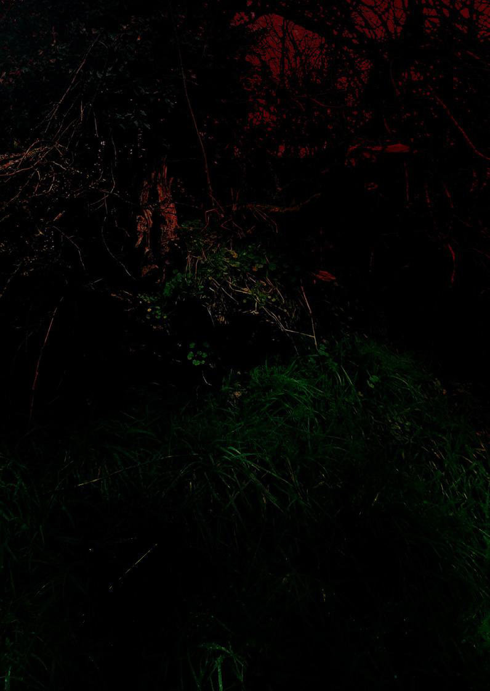

CLANBOOK: GANGREL

Backgrounds

Haven Addon (• to •••) Stomping Grounds. Your Haven
has an enclosure of some kind that can hold animals very
securely, and is eʖuipped with everything that animal
needs to survive within reason. A single dot in this might
be a very large yard for a wolf, while three dots might be
several acres of land for a bull. If you keep prey related to
feeding in this enclosure, treat this Merit as an eʖuivalent
of Herd as well. Diʞculties to get in and out of this
enclosure with a key are eʖual to the rating. Łis
diʞculty is doubled for animals and other Bestial
creatures.

HAVEN MERITS AND FLAWS Additional Addon Merits
that help create and build out a Haven for the Cainite on
the move, or one that's more animal-minded.

haven addon (•) mobile shelter Your haven is mobile,
allowing you to take it with you in some way and still
remain secure. A one dot Haven is small and portable,
like a Sunbag with some camping amenities, a two-dot
would be something like a small car or pop-up shelter,
while a three-dot would be a large van or RV. Łe security
of a Mobile Haven's base rating is partially gained
primarily from its mobile nature, rather than being as
secure as an eʖuivalent structure.

DOMAIN Additional Traits to assign to you or your
Coterie's Domain.

domain trait(• to •••••) chicane You know the ins and
outs of your territory better than anyone and can attack
or defend on your turf with unmatched expertise. Add +1
to any Specialties used in Contests while within the
boundaries of your own Domain for every dot in this
Trait.

LORESHEETS

hat follows are Loresheets associated with the Gangrel as part of their identity as a Clan in Modern
Nights. Many of these call back to old traditions, while presenting completely new and unseen pieces
that are built on their themes and overall structure of the Gangrel as a whole. Many of these
Loresheets were created and designed to be for the Gangrel, but a Storyteller may ʹnd associating
them with any Kindred, especially other Low Clan like Nosferatu, a compelling way to build out the backgrounds of a
character.

Each of these Loresheets is almost entirely self-contained, but further elaboration on in Łe Gangrel Modern
Nights (Pg. 52) section of this book if readers need some details on how they might ʹt into their World of Darkness.
Storytellers, and Players, are encouraged to modify the narrative and backstory of these Loresheets as they wish in order
to make them more compelling for their own settings and characters. When conceptualized and written, these optional
Backgrounds are meant to help build out archetypes for use in a Chronicle, and to help bolster playstyles and
archetypes that have been presented in Clanbook Gangrel elsewhere.

Some of these Loresheets, like many others, can be ʖuite disruptive to a Chronicle. Storytellers should keep in
mind what kind of themes they want to portray when building out a Chronicle, and if some of these Loresheet
backgrounds might be too disruptive of those themes. Łe Storyteller is the ʹnal arbiter of anything presented here.

22

l o r e s h e e t

blood of artio

(CHARACTERS WITH ANIMALISM ONLY)

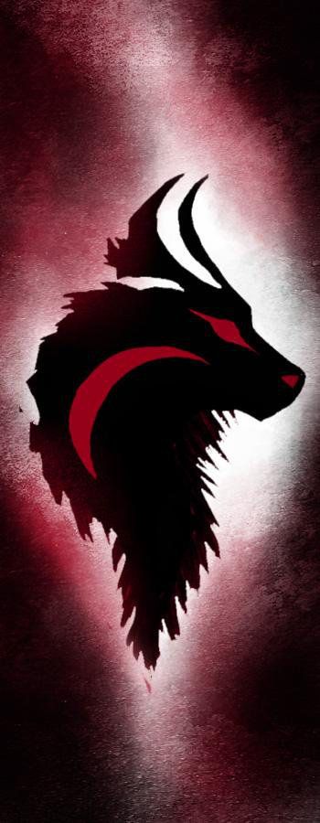

hile many kindred have been known throughout history to
have a deep tie with the beast and animals of the world.
Łere are those rare few whose blood holds a certain ʖuality
and potency that allows for an ever deeper bond, whose
blood causes an increased rate of growth and strength within their animal
ghouls. Łese scholars and occultists are perplexed by this strange ʖuality, as it
manifests independently of lineage; having been ʹrst recorded regarding a
Gaellic Gangrel known as Artio. In subseʖuent years, even more strangely, it
has been manifesting in any Kindred with the inherent powers over Animals
in their blood, such as the Nosferatu, Ravnos, and Tzimisce.

Upon taking this Loresheet choose a type of Animal to serve as the one
you breed, train, and/or employ. Examples include, but are not limited to,
birds, cats, dogs, rats, wolves, etc. You gain a specialty of the chosen animal in
Survival, Animal Ken, Academics, and Medicine and you have at least one
exceptional example of the animal already.

●●Clever Creatures: Animals

●●●●Beckoning Blood: There's

you Ghoul or breed are naturally

something in your blood that calls out

quick-witted and fast to learn. Add

to animals, pulling them to where it's

one die to their Social and Mental

spilled and causing them to swarm its

pools, and any Tests to get one of

location. When at least one Rouse

your bred animals to understand

Check's worth of your Blood is

something to follow instructions are

exposed to open air, it attracts

reduced by 1.

nearby animals to the scene, drawn

by a preternatural instinct to find it.

●●●Monstrous Growth: When

While this is usually a boon, it may also

●Animal Whisperer: You're a

be a curse, as those with this blood

you Ghoul an animal, your vitae

must take care not to draw unwanted

natural in your methods to

bolsters its size beyond what's typical

animals, especially those meant to

communicate, train, and manage

for it. Your animals are roughly

track you, who will get a two-dice

animals. Your specialties in specific

twenty-five percent larger, increasing

bonus to such pools.

animals add two dice instead of one,

their Health Tracker by 2, their Physical

and the first time in a session that you

Attributes by 1, and they gain two

●●●●●Famulus Amplius: Your

succeed in a pool that includes one

dots in a Discipline you have at Level

of those specialties, regain one

2 or higher, rather than one. Your

blood affects animals in ways that

Willpower.

chosen animal deals non-halved

surpass even the most practiced and

Superficial Damage on critical

masterful of Animalism. You may

attacks.

Blood Bond one additional animal

and treat it as if it were a Famulus. If

you already have a Famulus, you may

get a second one through the use of

this Background.

23

l o r e s h e e t

casimir bane of cities

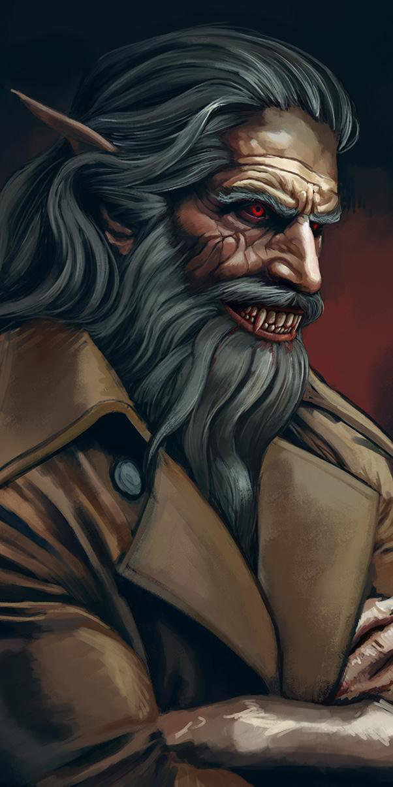

(GANGREL CHARACTERS ONLY)

nce a prominent member of the Sabbat, Casimir has kept to the teachings

of the Priests from his youth: Łat the Camarilla are tools of the ancients,
and that humanity exists to be ruled as cattle by the strong. With the
majority of his former Sect having ʺed to the beckoning ʹelds of the
Gehenna War, Casimir now manifests his ambitions across the cityscapes of the cities of
the Ivory Tower, running surgical strikes and hollowing out whole courts one at a time,
then ʹlling the vacuum leʨ with his own bloodthirsty generals.

With a larger-than-life personality, Casimir now bows to no other Cainite and ʹelds a
burgeoning kingdom that spans land and seas, a Warlord gathering the most ambitious
and strongest to his banner, to build a new world in the name of strength and in the name
of Casimir himself.

With a brutal and unforgiving nature, the Warlord's methods are to disarm with
inappropriate humor, before ordering vicious acts of violence, making examples of foes
and subordinates alike. Favoring ʹghters of his own Clan, he leaves a trail of tributary-
cities helmed by lieutenants in the path he carves. Łe strong ʹnd their name under his
banner as they coerce and break others into joining with their engine of conʖuest.

●“Rise and shine ! It's a new

joke. You're still expected to give

for violence and ambition. While in

tribute, even without this Mawla.

this form you add your current

beginning”: You have been

WIllpower in place of Strength or

branded by a Casimiri Adherent. If

●●●“I Give With One Hand,

Intimidation in your associated Dice

you would gain a step towards a

Pools. Each drink also moves you one

And With the Other I Take

Blood Bond make a Strength +

step towards a bond with Casimir.

Yours”: At any time you may

Resolve; Difficulty 4 Test. If you pass,

the strength of that bond does not

summon two Casimiri Warbandits (Pg.

●●●●●“Can’t I Visit My Good

increase. Additionally you do 1 bonus

99) to brutally kill someone who has

Old Friend”: The fall of your city's

Superficial Willpower Damage to

been an obstacle for you, however

targets at Hunger 3 or higher, as the

leadership is written on the halls of

the Warbandits will view your need for

mark chaffs against their Beast.

their court. Casimir arrives to lend

them as weakness, and also kill one of

support in your claim to the seat of

your Allies, Contacts, Mawla, or

●●“What’s yours is mine and

the domain. Once per Chronicle you

Retainers. If you have none, they

may stake any number of

attempt to kill you instead.

what’s mine is still mine”:

Background Dots towards the effort to

Casimir expects tribute to fund the

take the city alongside Casimir's

●●●●“A Vial A Day Keeps the

war machine. You gain Status (●●)

warriors. If the City is taken, you are

Disloyalty Away”: You've been

amongst local Cainites, and a Mawla

installed as its administrator and not

(●●). By the end of each Story you

sent three specially treated ceramic

only regain your contributed

must accumulated Resources (●)

vials of altered Proteonic Vitae. You

Backgrounds, but that many more

worth of tribute. If you don't your

may consume one vial, transforming

dots to spend across Allies, Contacts,

Mawla's broken body will be

you into a monstrous mass of

Fame, Resources, Status, and Havens.

delivered to you along with a sick

musculature for a Scene. While in this

form your strength is tied to your drive

24

l o r e s h e e t

eremites of the perfect beast

(GANGREL CHARACTERS ONLY)

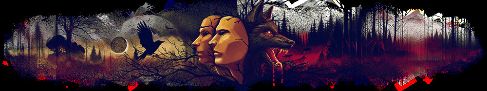

n the ancient days of life, there was the ʹrst death. Łe ʹrst murder. Łis blessed fratricide begot the separation of
strong from the weak. Murderer, from murdered. Life from death. For his act of brutality, the murderer was
bestowed an inner mind of holy savagery to keep his rationale clear of weakness –the ultimate sin. So says the oral
canon of the Eremites of the Perfect Beast, an ancient and scrupulous group that wanders the wilds of the world,
who believe that the Beast is the shard of a greater, supreme, being.

You are an aspirant that has come into contact with a wandering Eremite. Seeing potential in you, they've
granted you a chance to prove your adherence to the Beast. Upon taking this Loresheet the Eremite leʨ in your
possession a type of, supposedly, ascended Wight they call a Perfect (Pg. 101). Proving yourself to this denomination
reʖuires that you take care of, observe, and eventually understand this Wight. Losing this Wight, or letting it escape,
proves that you are not ready for perfection.

●Purpose in Liberation: The

●●●Hands and Claws in

weapon, vampires in Fury Frenzy will

ignore you so long as there are other

Common Cause: Your

instincts and inclinations of the Beast

targets in their line of sight.

are freedom from the baggage and

understanding of the Perfect in your

tediums of humanity. Others must feel

care grants you the ability to

●●●●●Descent Into Sanity:

the message of unfettered freedom.

converse with it. Once per story, you

When someone gains a Stain due to

Studying the Perfect has shown you

can make a Resolve + Animal Ken;

Frenzy or a Messy Critical, and you

clarity and understanding of the

Difficulty 6 Test. Pass or fail, the Perfect

console them with your bestial

Beasts of all Kindred, and a way to

will perform a single task for you to its

philosophy, add one die to their

force that clarity unto others. If you

ability, however on a failure it will not

remorse roll. If they pass it, restore all

manage to provoke a Fear, Fury, and

return to the place where it is kept,

of your Willpower.

then Hunger Frenzy In a Cainite on

and you must find it before the end of

each night in sequence, that

the current story or it is lost until the

●●Complines of Inner Voice:

individual loses three Humanity after

end of the next one.

the Hunger Frenzy. If this bestial ritual

Each night when you awake you may

manages to reduce a victim to zero

●●●●Perfect Piece: The Perfect

spend a point of Willpower and recite

Humanity, they become a Wight that

a mantra to speak to your inner Beast.

has shed a huge fang or claw that

is wholly bound to your will, and you

Though it may not answer, it will

the Eremites treat as a gift of pure

may use any powers of Animalism on

acknowledge the act of deference.

violence. This shed body part counts

them and can command them with

The first time you resist Frenzy that

as a light Melee or Brawling weapon

Manipulation + Animal Ken, as if they

night, its Difficulty is increased by 2,

that deals 2 Aggravated Damage on

were an Animal.

but you gain three free turns to

a successful attack. Victims must test

maintain control.

for Fury Frenzy; Difficulty 4.

Additionally, while holding this

25

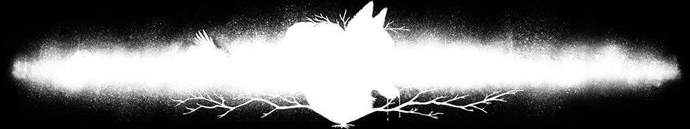

l o r e s h e e t

feral child

(GANGREL CHARACTERS ONLY)

ou never really knew your parents, and
conjuring up their faces in your memory only
leaves you with distorted ʺashes, the smell of
blood, and screams from your oldest
nightmares. You were young when taken from them, an
infant or child. Łe clearer memories are of claws scraping
on your skin, and cold nights without comfort. You were leʨ
in the woods, amongst a pack of beasts.

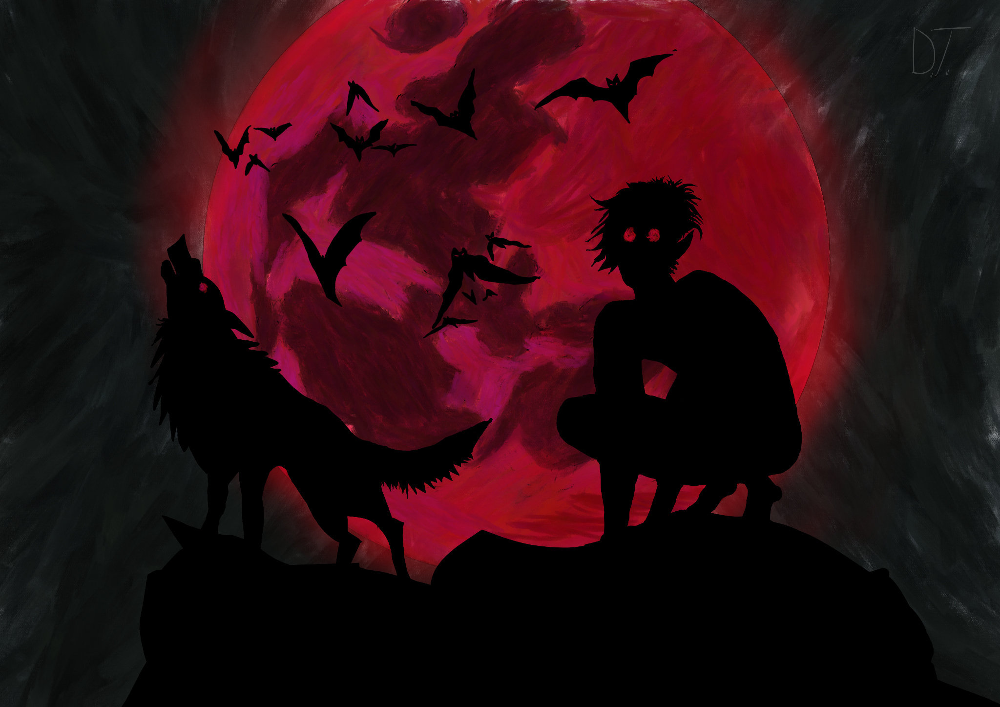

Unbeknownst to you, your abductor was a Gangrel with
a particular hatred for civilization and all the pitfalls of
mortals who were raised there. Believing that you'd be a
candidate for some process of survival and wild purity, this
Feral leʨ you to instead be raised by wolves, appearing
infreʖuently over the years to check on your progress, and
leaving only oʚerings of blood and fresh kills as rewards for your survival.

You succeeded in all of your abductor's trials, you thrived in the wilderness amongst the animals there, and so in
your early adulthood, you were granted the ʹnal giʨ of the Embrace into the Clan of Beasts, before your new sire
vanished into the night. Łe perfect expression of what it is to be Gangrel. Since your Embrace you may have chosen
to assimilate into society, or perhaps keep to the periphery, picking up spoken language over time.

●One of the Pack: Your family

non-combat pools while in the shape

credence to the status of your more

of a canid. However you must spend

civilized peers. You only take

was a pack of wolves, who taught

one Willpower to revert to human

Willpower Damage from the margin

you how to hunt and survive in the

form.

of loss from Social Contests. Additional

wilds. You gain these wolves as an Ally

damage from others present, or from

(●●) that can be called on for

●●●Skulking Wolf: You've

Status, do nothing.

assistance and will automatically

show up at least once per Story.

learned how to move and position

●●●●●Family Resemblance:

Additionally, all canids treat you with

when you've been heavily weakened

an innate sense of deference, and will

or injured. When your Health Tracker is

You struggled, bled, and cried with

be friendly unless specifically

fully marked, your Survival, Stealth,

your family in the wilds. You are as

instructed to attack you by their

and Awareness pools suffer no

much them as they are you, a fact

master.

penalties and you instead add two

true down to your bones. Once per

dice to those same pools. Specialties

story, you can make two Rouse

●●Canid Mind: Your teeth are

in those pools also add an additional

Checks to take the shape of an

die while under this effect.

enormous Dire Wolf (Pg. 91) that has

exceptionally sharp, and you have

great size and strength. You can do

learned the methods of hunting and

●●●●Bestial Ignorance: Raised

this even without the powers of

fighting from your canid family. Add

Protean, however if you have four or

one die to your attack pools made to

amongst the wilds, where social

more dots in Protean, you may use

bite or carry objects in your mouth.

hierarchy was defined by the

this ability as many times as you wish.

You also add three dice to any

strongest leader, you lend little

26

l o r e s h e e t

the hushed chorus

(CHARACTERS WITH ANIMALISM ONLY)
ince the fall of Schrecknet and the revelation that sparked the Second
Inʖuisition, digital technology of any kind is compromised, with many
Kindred outright refusing its use, much more so within the Camarilla, with
some Princes killing even at the implication of it. But when one door
closes, so must open another. Łe need for communication between the creatures of
the night remains, and those with Animalism have found a resurgence in their
relevance.

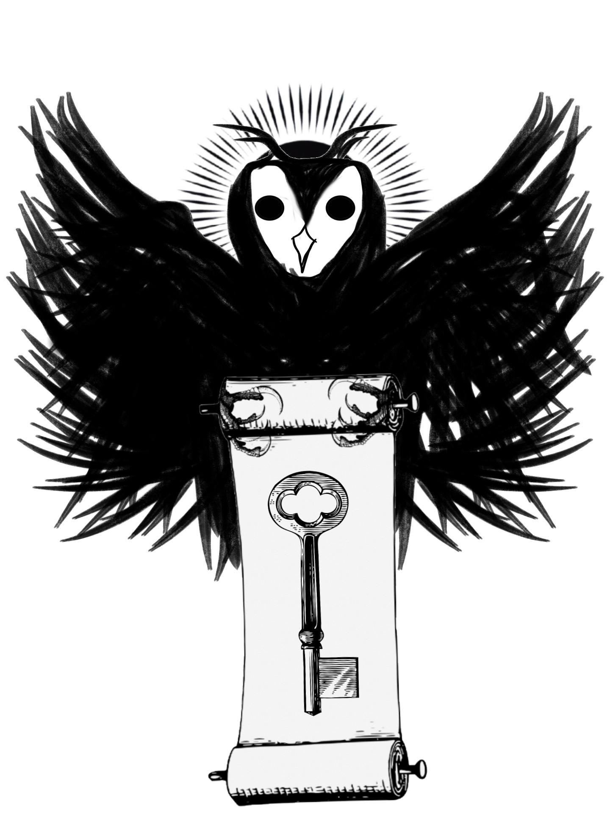

A group of Kindred, stationed in Detroit, has even gone so far as to create a
decentralized network of well-trained animals and messengers that comprise
"nests", each of which is assigned a member of what is now aptly named ķe Hushed
Chorus. With burgeoning inʺuence in most Kindred domains, regardless of Sect, the
Chorus now curates and chooses from carefully observed Kindred to participate in
their methods, and provides these members with ample opportunity, but not
without the risk that comes with such a station.

You are a member of Łe Hushed Chorus and have been given a solemn duty
to get information where it needs to go through a shiʨing network of Animals,
Ghouls, and your own drive. You're expected to be impartial and anonymous
during your oʞcial business as a member, never to speak to anything
about it. Breaking the trust of the Chorus or its Operators, will surely result in Final Death.

●A Link in the Chain: You're

●●●Owl-Mask: The Hushed

deliveries of information within it,

coming into it, and going outwards.

trusted enough to have been given

Chorus only works as well as it does

You can key off of the way

information on a few Ghouls,

because each member is

information flows to know well ahead

well-trained animals, unsuspecting

anonymous. You've proved that

of time when someone within the city

Mortals, and even one or two Kindred.

you're capable of staying indifferent

is setting up to make a big move.

Gain them as Contacts (●●) - "Chorus

and anonymous in your work, and the

Links". You may use one of these dots

Operators have gifted you a secret

●●●●●A Song of Whispers:

to ensure a message gets where it

Haven (●) with the Security (●) addon,

needs to anonymously, even if it's to

and a Mask (●●) that has been

The Operators have passed down a

another city. However that dot is

zeroed. If any of these backgrounds

task specifically for you to personally

unusable for the remainder of the

are compromised, they will not be

carry out. This message or item must

current story.

replaced, however.

be delivered to the head of a

Domain, Sect, or Clan. While they trust

●●One With The Chorus: You've

●●●●Nest of Whispers: The

your ability and methods to ensure

delivery, disclosing this message to

proven to have a talent for delivering

Chorus in any given area operates via

others, delaying its arrival, or simply

messages. Once per story you can

a series of unincorporated "Nests",

keeping it for yourself will affect

ask a superior to transfer all deliveries

with each Nest being made up of one

Kindred society at large. Then again,

meant for a specific Kindred so you

or two Kindred that are responsible for

getting into the same room as the

might deliver them personally. This

ensuring all Chorus messages get to

receiver could yield opportunity

usually nets you addresses and

where they need to be. You have a

enough.

information on that Kindred.

Nest in your city, and see all the

27

l o r e s h e e t

the invicti

(GANGREL CHARACTERS ONLY)
ating back to the age of imperial Rome, these militant Kindred
functioned as a praetorian guard, protecting those who bear the Curse
of Caine from mortal hunters. With the rise of the SI the INVICTI have
come into the light once more under the leadership of the enigmatic
Constanus II, who has organized them into a powerful regiment of highly trained
Gangrel. As a group they have used their military prowess to push back the SI in
cities such as Bordeaux and Madrid. Some claim that the INVICTI have unlimited
funding due to a massive number of boons that have been held onto from the age of
Rome, and are cashing out the debts of anonymous High Clan Elders, leveraging
their protection to gain status, wealth, and security.

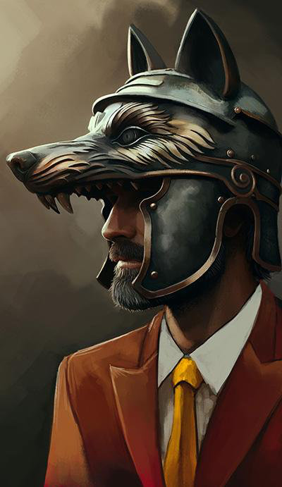

You are a member of the INVICTI and have trained in one of their camps until
you were deemed ready to operate as a hunter of hunters. It is your solemn duty as a
Protector of the Undead to ensure that your charges never see the light of the sun, or
ʹnd themselves at the end of a Second Inʖuisition blade. You have an oʞciating
mark of authority and a ceremonial wolf helm from Constanus II that solidiʹes your
rank and position as an SI hunter.

●Seal of Constantius II: You

●●●Oath of Protection: A

case, it's especially deadly to Kindred,

dealing +1 Aggravated Damage.

have successfully protected a

high-profile group of Kindred in the

member of your city, garnering you

city have drawn the eyes of SI hunters,

●●●●●INVICTI Inner

Status (●●) in the reigning Sect. Once

and have contacted you to defend

Induction: Constanus II has sent a

per Story you can gain an audience

them. You gain them as a Mawla

with any member of that Sect.

(●●), and once per story they will call

message via courier to you, an SI

on you to protect them. Each time

target that's meant to be taken

you are successful they will reward

●●Insightful Collateral: You've

down. This target comes in the form of

you with a permanent dot in Fame,

an Enemy (●●●) and has a base of

charmed, persuaded, bought, or

Resources, Status, or Herd. However

operations in your city. You've been

intimidated someone close to a

you also gain SI Hunters as an Enemy

given an armored personnel vehicle

member of the SI into assisting you.

(●●).

that counts as a Haven (●●●) with

They count as a Contact (●) that

Mobile Shelter (●) and Armory (●●). It

specializes in getting you SI-related

●●●●Inquisition Trophy:

also has a mounted high-caliber

information or equipment. You can

weapon that can be fired as a

You've killed one of these Kine that

push them for more, gaining them as

ranged attack with Strength +

fancy themselves "Hunters", and have

a three-dot Contact until the end of

Resolve, (It's much too large to use

a tangible reminder of your victory to

the current Session, however they will

Firearms,) dealing +4 piercing

show for it –One of the mortal's

become unreachable until the end of

Damage. The target must be

personal weapons. This weapon takes

the next story.

destroyed by the end of the

the form of a specialized Firearm that

Chronicle, or you are stripped of your

might shoot cinder rounds, or maybe

station and all other INVICTI treat you

even a blessed blade. Whatever the

with disdain.

28

l o r e s h e e t

lorekeeper

(GANGREL CHARACTERS ONLY)
orekeerpers are Gangrel who safeguard a mythical oration techniʖue that
dates back to pre-history, even before the so-called "Dark Ages" of the
Masʖuerade. Łeir duty is to pass down stories, usually parables and fables
of note, to keep their Clan strong. Łese individuals also immortalize their
fellow Kindred, usually Gangrel, with tales of their deeds that are told through the
ages.

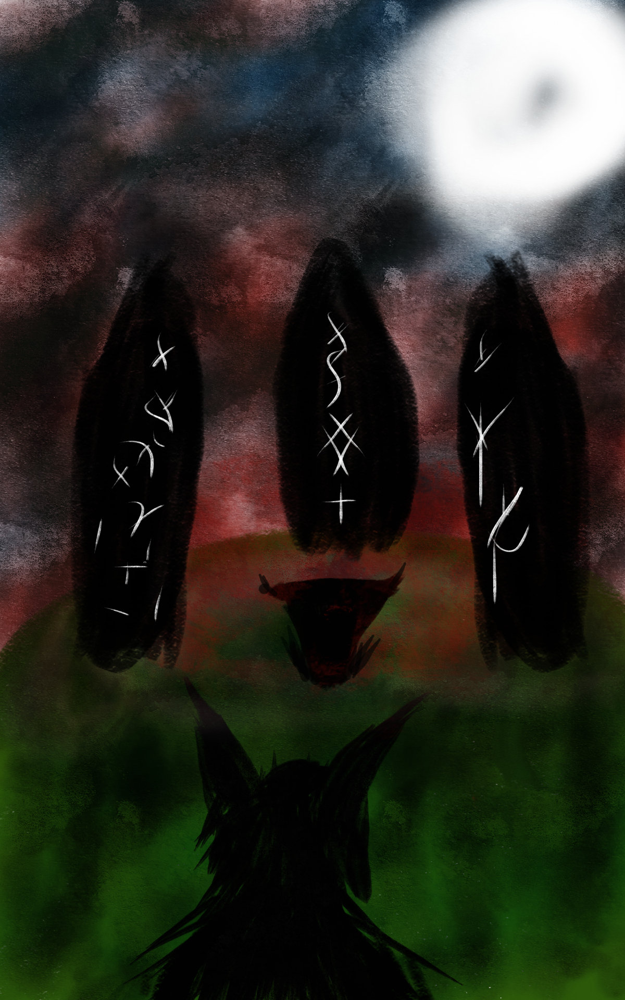

You are a Lorekeeper, one that is part of a push to ensure the Clan's historied
knowledge remains in oral form to keep the spark of your Clanmates alive and well.
Other Kindred may roll their eyes at such a pursuit, the wisest know that your duty
is an important one, as you are a valued repository of Cainite History, and can
provide many insights to lost knowledge, even paganistic processions and beliefs.

●Ennoia Edda: You know the epic
of Ennoia, an allegorical poem
several hours long when spoken in its
entirety. Once per Story, you may
orate a part of the Edda to an
audience with a Test of Charisma +
Performance; Difficulty 3. Passing the
test grants a benefit to those listening:

Clan's blood. Once per story, when
you tell the tale of another person's
deeds, you increase their Fame by
one for the remainder of the
Chronicle.

3 Test. Passing this Test grants you
once piece of true information about
the topic, such as what it is, where it is,
or what it does. Upon achieving
twelve total successes across these
tests, you find the object and it
teaches you a new Discipline with a
dot in it. It is treated as in-Clan for you.

●●●Trial by Ordeal: In the days
before Kindred institutions of law and
order, the Lorekeepers were seen as a
wise and impartial group amongst
Kindred. Once per story you can hold
a duel or contest for two parties to
settle their disagreements, which they
will agree to. You are the arbiter of
this Ordeal and decide the rules of
engagement that the participants
must follow. So long as you remain
neutral, the outcome will be the
settlement of the disagreement.

LIFE WITH WOLVES: Re-roll an entire
pool that includes Animal Ken or
Animalism when using Willpower.

●●●●●The Wild Hunt: Amongst
Kindred, the act of Hunting has
always been a passtime, a universal
truth that equalizes all castes of
society, friend or foe. You know the
tales of the grand hunts of old. The
celebrations of ending one era and
beginning anew and once per
Chronicle you can hold such an
event as an Elysium-like gathering,
aimed at a specific festival or
celebration of the end of an event
and the beginning of another. Your
Status is increased to (●●●●●) during
the Story leading up to the Festival
and during the event itself.

SURVIVAL IN ENOCH: Survival may be
used in place of Streetwise for the
remainder of the Story for pools and
ratings.

WISE SPIDER'S GUIDANCE: Spend two
points of Willpower to become
immune to Willpower Damage for one
Turn.

A HOME IN WILDERNESS: When Riding
the Wave during Frenzy, add two dice
to your physical Discipline Pools.

●●●●Seeker of
Understanding and Power: You
know of an Elder Kindred, a holy
place, or an artifact of old. Whenever
the object of your seeking, once per
Story you may make an Intelligence +
Academics or Investigation; Difficulty

●●Raconteur: Your orations
spread like wildfire, stirring the hearts
and minds of those that hear them in
ways that are borne through your

29

l o r e s h e e t

pagans of the old ways

(GANGREL CHARACTERS ONLY)
n ages past, the Clan of the Beast were practitioners of what are now
referred to as pagan arts and ceremonies. Łese individuals freʖuently
considered themselves witches, shamans, druids, or medicine makers, and
mastered the natural magics of the world long before men rose to walk on
two legs. Some of these individuals claim lineage to mythical ʹgures, such as the
Crone who taught Caine how the discipline to master the powers of his blood,
or Lilith, who was ʹrst to love him. Others also claim to have been the
circumstance of a strange embrace, holding spirits of the world within them as a
source of their power.

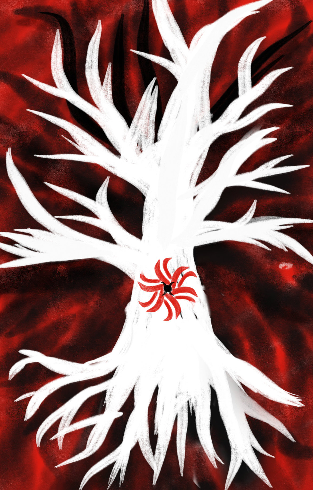

In modern nights these individuals have become scarce, hiding away in the
remote and wild places of the world, or holding shrinking domains in
once-wilderness areas of sprawling cities, carving out an occult path of tepid
survival in the face of a world advancing beyond their understanding.

Because of your Clan's association with the edges of civilization, you've
stumbled upon one of these individuals. When taking this Loresheet, the you
gain them as a Mawla (●●) that serves as a Mentor willing to teach you Blood
Sorcery. Łis Mentor will rarely mettle in any aʚairs outside their place of rest
unless absolutely necessary, but is willing to pass on occult wisdom and teachings
in return for help or company. For examples of appropriate mentors, see Pg. 101.

●Spirit Knowing: Your mentor

●●●Bounty of the Forest: You

Fire in a scene by two. The inscription

of the Moon grants you a one die

has taught you how to see and

and your Mentor perform a ritual to

bonus based on the Moon's phase; +1

commune with nature spirits in an

infuse the seed of a tree with blood

to Dexterity pools on New Moon, +1 to

area. So long as you've rested in an

from the both of you. When planted,

Strength pools on a Full moon, or +1 to

area at least three days within the last

the seed sprouts to a sapling

Charisma in any other phase.
●●●●●The Crone's Design:

week you can make a Resolve +

immediately, growing to adulthood

Occult; Difficulty 3 Test, to attempt to

within a lunar cycle. This tree has

commune with a local spirit. When

brilliant crimson leaves that can be

The revelations of your Mentor's

successfully called, this spirit counts as

used as additional ingredients for

intentions have become apparent.

a Contact (●●) and give you

Blood Rituals performed in your

Like the land you draw power from,

information that tends to be

domain, reducing their difficulty by 2.

you are fertile soil from which their

occult-aligned, though they demand

If ever this tree is destroyed, your

practices will bloom anew. The power

steep prices if offended.
●●Vestige of Old: Your mentor

mentor will refuse to grant you the

of the old ways now flows through

privilege of another.
●●●●Bounty of Sun and

you, and you have been given the

knowledge how to teach others in the

has transfused a vestige of their old

same way you've been taught.

Moon: Inscribing a rune upon your

power into you. Your eyes have a

Additionally while within fifty miles of

subtle green glimmer that betrays

body symbolizing either your greatest

your place of rest, you automatically

your affiliation and emotional state to

enemy, the Sun, or your constant

pass any Rouse Checks made to

some degree, conferring a one die

companion, the Moon, you gain a

wake or use Blush of Life, and you add

penalty to resist Insight pools. However

benefit. With the inscription of the Sun,

three dice to your Blood Sorcery and

you add two dice to any Social or

you reduce the first instance

Protean pools.

Mental Skill pools made outside of

Aggravated Damage from Sunlight or

populated areas.

30

l o r e s h e e t

protege of inspector wolfe

roubled is the tale of Raymond Wolfe, who in
mortal life fell from grace as a D.A. Investigator,
and was embraced in the hard-drinking days of his
stint as a Private Investigator for the golden-age
elite. As a member of the Clan of the Beast, Wolfe became an
unwaveringly loyal Reeve to the Barons of Southern
California, gaining an infamous reputation as the "Black Wolf
of the Golden Coast", who would do anything to ʹnd a target
and bring them to a Baron's justice. Few know that he was in
fact blood bound to an ambitious Toreador, who in the end
died from her own ill-fated schemes of passion.

In the decade that came aʨer, Wolfe fell into a tormented
existence of aimless depression, the loss bringing him all the
awful clarity of what he had done as the Black Wolf. Withdrawing from Kindred society, he reverted to his life as a P.I.
and went about bringing proper justice to a world of monsters.

You have drawn Wolfe's eye, whether it be because of your staunch support of doing the right thing in the face of
adversity, strong intuition and deduction, or maybe because you're just between a rock and a hard place. Wolfe sees
potential in you to help right wrongs, some of which might be his own doing, and willing to help your own position and
aims in the seedy underbelly of a city of criminals and monsters.

●You Can't Trust No One In

●●●Fangs of the Past:

however if you investigate her closely,

she might not be telling you the whole

This City: You don't know who to

Whenever you imply that you're

truth…
●●●●●The Pulseless Unlife of

working at the behest of, or

trust, but you do know people. You

alongside, the Black Wolf of the

gain six dots to spend across three

the City: You've been entangled in

Golden Coast while in Social Combat,

Allies, Contacts, or Mawla, however

you deal non-halved Superficial

at the beginning of each Story one of

the lives and unlives of the city for

Willpower Damage. Dredging up the

them becomes an Enemy without you

long enough now that you know the

past will likely draw the considerable

knowing which, with the previous

hangouts and haunts of all the

ire of Inspector Wolfe however.
●●●●Thorns of a Lost Rose: A

reverting to their previous state.
●●Black Masks: In a city of

biggest players, and if you don't, you

know someone who knows. You can

easily locate anyone in the city if

beautiful lover, a problem, a job.

masked monsters, everyone has their

they're following their usual routine,

Wolfe's dark past comes knocking

own ambitions and desires. Once per

and when you need to track

when the Childer of the Toreador who

Story, you can delve deeply into the

someone down, you can roll your

held his leash appears to find

background of one of you or your

Resolve + Contacts; Difficulty 5 to find

evidence of the one responsible for

Coterie's Allies, Contacts, Retainers, or

exactly where they are, or where

her Sire's death. She lends you

Mawla and learn a definitive piece of

they're going to be and when.

Resources (●●) up front as payment,

true and useful information about

However any Contacts used in this roll

and gives you Contacts (●●) that

them. If Wolfe helps you achieve this,

may lay low for a time.Kindred society

have information about the case. If

you add two bonus dice to any

at large. Then again, getting into the

you solve this problem she will inherit

Insight, Investigation or Streetwise

same room as the receiver could yield

her Sire's vast wealth and holdings

pools going forward due to the

opportunity enough.

and become a Mawla (●●●),

information he gave you.

31

l o r e s h e e t

the thing that's seen you

(GANGREL CHARACTERS ONLY)
he ancient wilderness calls to most Gangrel. Its vast and dark
expanse is a comfort in ways that keeps one sane, away from the
stress and anxiety of every night life, away from the diʞculties of
other Kindred and the circus act they put on every night. While
other Clans hesitate to go into these places, the Ferals have always treated
them as a dangerous way to escape. To live.

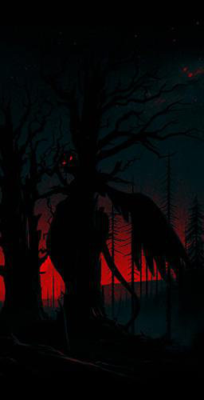

Łis comfort doesn't mean that the warnings of others don't hold weight,

however. Out there in the untouched stretches of land, something else keeps

you company from a lonely distance. A shape pressed up against the ambience

of the night. Moving motionless amidst the cold earth, ʺitting heavily over

old stones, and ʖuietly crossing babbling brooks. Łe Łing Łat's Seen You.

●Midnight Encounter: You've

●●●The Thing that Hunts:

seen it. The Thing That's Seen You. Out

Hunting in the Wilderness has always

there somewhere. A silhouette against

felt the most natural to you, animals,

the darkness of the Wilderness. You

hikers, it doesn't matter. It feels right.

may recount this tale to everyone

Once per story, when you hunt in the

and anyone, in a way you see fit.

Wilderness, the Thing That's Seen You

Whether a romanticized story of some

hunts with you, always a blur in a

ancient thing of the woods, or a

radius out of sight. If you successfully

horrible nightmare that's carved itself

feed during this hunt, your blood shifts,

into the cliffs. All those that hear the

and you gain a Choleric Dyscrasia,

story gain a 1 die bonus or penalty to

regardless of the resonance of your

any pools to navigate or understand

prey. If you fail this hunt you wake the

●●●●●The Thing Upon You:

the Wilderness for the rest of the Story.

next night racked with wounds,

The Thing That's Seen You has taken a

conferring three Aggravated

greater interest in you. You can see it,

●●Inhuman EǤgy: You've

Damage.

in the distance, its shape pressed

found a strange effigy in the

against the background of your

●●●●A Tribute of Rage: You

Wilderness, humanoid in shape, made

nights. Even when you move into the

of twisted sticks and wound tight in

frequent the Wilderness enough to

supposed bastion of despised

plant matter that mimics the

know there's few others "allowed"

civilization, you catch it at your

appearance of your clothing, albeit in

there. Once per Chronicle, when you

periphery, moving soundlessly across

a rudimentary fashion. When you

spend at least a few hours wandering

the rooftops, amidst reflections in

enter daysleep with this effigy on your

the Wilderness, you stumble across a

plate glass, crawling under cars.

person, you may sleep anywhere in

Garou, horribly mangled, and with

Once per Chronicle, a character that

the Forest, even under an open sky,

your name carved in their flesh. It will

would be a great danger to you is

and suffer no ill effects, or be found

not survive its circumstance, and you

found mangled and agitated, and

by anyone. However the effigy will be

are fit to do with it as you please.

even if they are alive, cannot

gone upon waking.

confront you until the end of the next

Story.

32

l o r e s h e e t

the world-anew movement

he Industrial Revolution and its consequences have been a disaster for
Kindred. It has fortified the Kine to such an extent that they have
become aware of us. ķey've seen through our “Masques” and only those
of "High Clan" tend to survive the Second Inquisition. While at first the
lights of these burgeoning cities served as bastions against the wild dark, it is now
apparent that they only prove a desɭabilizing force, illuminating our secrets and
subjecting us to indignities that are counter to our nature.

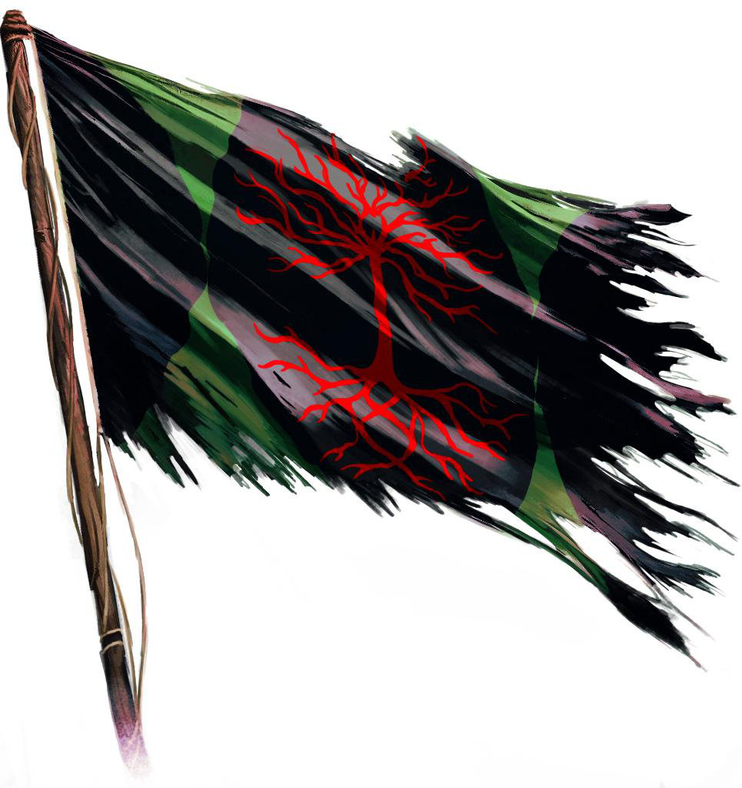

"ķis is nothing to say of the great harm done to the natural world, over which
the Clan of the Beast is meant to hold domain and watch as protectors. Machinery and
the expansion of Kine have manifested, in this age of electrical light and mass
production, the destruction of what we once were. It will only worsen as the system is
mainɭained, as it expands, as it advances. ķe Kine themselves will buckle under the
weight of their own machine as it simulɭaneously grinds them in its gears, and we
cannot sɭand idle when next it grinds us. ķe Enoch experiment has ɬailed and only by
returning the world to a pre-industrial era, where the wilds reigned and we reigned in
them, can we all once again prosper. I pledge that this will be done by any means necessary."

To you, the words of this journal ring truer to you than any you've ever read, and you will use them to bring about
a better, truer, era.

●The Tale of A Rolling

●●●Like Minds of Destructive

own Status to the resulting Willpower

Damage you deal you to them. If you

Country: A story, wrought with

Kind: You have gotten into contact

manage to impair them with this

consequence. You tell the tale of

with an individual who keeps their

attempt, they will willfully give up a

land, beautiful and bountiful with life,

distance that counts as a Contact

dot in one of their Backgrounds.

and how Ferals once roamed in

(●●●) who feeds you strategic

freedom from the encroaching lights

information about corruption and

●●●●●Apocalyptic Holdout:

of society, where prey was plentiful.

commercial overreach in the city that

Someday you'll go too far and attract

Telling this story always attracts

impacts the environment. You can

too much attention. Every facet of

Gangrel, and other like-minded

ask them to assist you on information

your identity will get burned. You've

individuals who will listen in, regardless

they provide, and they will appear in

prepared a contingency. You know

of standing or relationship.

person as a Werewolf Vandal (Pg. 97),

the right people. Once per Chronicle

but cannot be contacted again until

you can fake your death, and appear

●●Fire and Rebirth: You know

the end of the next Story.

as a completely different person with

that small steps lead to bigger

the Backgrounds purchased on this

●●●●At What Point To

ventures. When you destroy a piece

Loresheet, and redistribute any other

Escalate: You know that people

of equipment or structure owned by a

Backgrounds you have to be

proponent of civilization, especially a

won't change on their own. There

associated with new people, places,

commercial asset, you restore a point

needs to be a push towards a return

and things. Even your appearance

of Willpower. This can occur up to two

to a primordial, purer, way of unlife.

will be altered by someone you know;

times in a single Story.

Kindred are the creators of their own

A Thin-Blood Alchemist, Tzimisce

prisons. Once per Story you can tear

Fleshshaper, or a rare Volgirre.

down a Kindred socially, adding their

33

l o r e s h e e t

trails of the beast

(GANGREL CHARACTERS ONLY)

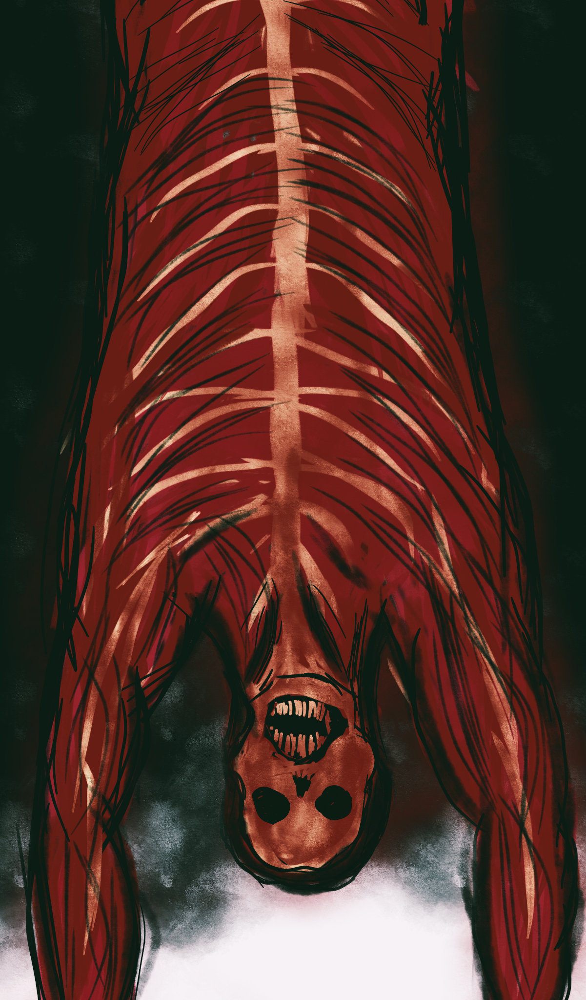

he Road of the Beast had two primary purposes: To ensure the
follower's survival at all costs, and to control and manage the
whims of their Beast. Łose who follow this are expected to be
strong in the face of adversity, or use their wiles to circumvent it
or avoid it entirely. In recent nights the "Trails of the Beast", a
supposed evolution of Ennoia's Via Bestiae –Łe Road of the Beast, has appeared
amongst certain Ferals, as the original guidelines have long been twisted or lost.
Łose that walk these Trails however claim to have kept the spirit of the old
Road alive through the ages, and claim to live by similar intents and strictures
that are assuredly what Ennoia intended for all her children. Łough many
Lorekeepers contest this as a corruption, or sheer ignorance of what once was,
it has none-the-less seen a surge of popularity in contemporary nights.

You are a follower of the Trails of the Beast. Hoping to master Ennoia's
methods and lessons so that you might be a greater, purer, predator. Łis grants
you no small amount of control over your Beast, however in this same way your
Beast gains control over you as well, as the guidelines you adhere to are clear to
prevent you giving into its control.

●Trophy of the Feat: When you
take a trophy or memento from
someone you best or prey upon,
restore a Willpower point. If you have
that trophy on you, add one bonus
die to any pools made to coerce or
frighten that same person or someone
they were close to.

animal as your "Prey". Until dawn, you
get a bonus die to any Physical Skill
pool made with that Prey as the
target. Additionally supernatural
attempts for your prey to hide or mask
themselves from you have their
Difficulties increased by an amount
equal to your current Hunger. If you
don't catch your Prey but sunrise,
however, you receive a Stain.

●●●●●Hunter Hunted: Your
reputation as an apex predator has
reached the ears of an Elder Kindred,
who has decided to hunt you. You
gain the Adversary Flaw (●●●). You
are incredibly outmatched by this
individual, however you've sharpened
your mind and fangs to take down
larger targets than you. Once per
chronicle, in a single scene, you add
four dice to all pools to out-maneuver
or overcome any actions or obstacles
this Elder has made against you. If you
best this Elder, and make of them your
prey, you may diablerize them without
suffering automatic Humanity loss.
You are also granted the Elder's
Haven (●●●), Resources (●●), and
Status (●●) and Fame (●●) amongst
local Kindred.

●●Survival is Blood: Blood
slaked controls your Beast and
ensures your survival. You gain the
Bloodhound (●) Feeding Merit, and
also add a bonus die to any Athletics,
Survival, Insight, and Investigation
pools made towards tracking and
anticipating your prey's location.

●●●●Red Queen's Decree:
Predator and prey are in a constant
race to survive, and it takes all their
running just to stay in place. You
adapt to this fluctuation better than
most, and whenever you are beaten
in a contest by another, you may
move a point from one Skill used in
the beaten pool to another in the
same category. The categories being
Physical, Social, or Mental, as your
mind, body, and blood shifts to
anticipate conflict.

●●●Marked Target: Each night
is another potential hunt, another
chance to mark a person as prey.
Upon waking from Daysleep, choose
a Storyteller Character or a type of

34

l o r e s h e e t

wolves of wall street

(GANGREL CHARACTERS ONLY)
nlike the others of your Clan that have shied away from
society, these Wolves have embraced it. Most especially
the ʹnancial world, which is cut-throat predation at its
most social. You've seen the inʺuence, the power, the
largest corporations hold. To you they are the behemoths and
leviathans of the modern nights, the apex predators feasting on
millions of unsuspecting prey –And your instincts tell you that to
hunt them and their leaders is the truest form of the hunt.

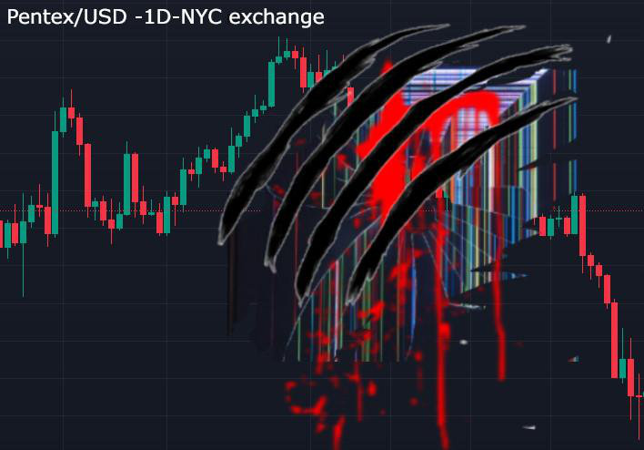

You are a Wolf of Wall Street, a name both self-styled and
christened upon you by the other Kindred of the world. You're young,
powerful, and ambitious, and the only thing that matters is the hunt
and victory that follows. You belong to a pack of predators hunting these commercial prey, branching outwards on your
own conʖuests and returning with a fresh kill when you can, and when the prey is too large to be hunted alone, you
band together to nip at their heels until they collapse. While your kind was once ignored, the beckoned elders and their
monoliths have crumbled, and now you and your ilk have risen to prominence bank-rolling whole Anarch movements
and toppling the blue-blooded institutions of old. Many who once considered the ʹnancial sector "their world" are now
in for a rude awakening. Łe Wolves are here, and their prey has grown complacent.

●Predatory Evaluation: You

can be used amongst your fellow

dots in Resources to gain two dots of

wolves, or to intimidate outsiders.

temporary Resources for each one

know every beast has its burdens and

spent. These temporary resources

its weaknesses, and the same is true

●●●Pack Acquisition: Nothing

cannot be sacrificed for any other

for these commercial institutions.

effect, but can be spent to get what

Once per story you can identify a

wagered, nothing gained. You've

you need immediately. Sacrificed

pivotal weakness somewhere in a

established yourself in the Wolf Pack

and temporary Resources are lost at

commercial institution that can be

and can call for their assistance to run

the end of the current session.

exploited. The disorganized mailing

down an enemy too large for you

list, the outdated security system, or

alone. Once per Story, you can spend

●●●●●Feral Buyout: Your

the easily purchased loyalty of an

your Status in the Wolf Pack to

insider are all examples of a

automatically damage twice that

influence has expanded and taken

company's soft spot.

many Resource dots of another

root in one of the major corporate

character. You can gain no

entities in your city, specifically one

●●Corporate Wolf: You know

Background from doing this, however,

that another major Kindred player

as the other members of the pack

owns. You effectively have Influence

where to hit and how to capitalize on

take the lion's share for themselves,

(●●●) within this company, and can

it in ways that garner you

and your call for assistance grants you

make major decisions that affect its

considerable prestige and fear

no positive reputation in their eyes.

operation and aims. It also has its own

amongst your peers in the corporate

Resources (●●●●) that can be used

world. Whenever you manage to

●●●●It's All Liquid: Meat spoils

however you see fit. However the

damage the Backgrounds of another

Kindred in control is treated an

individual that are tied to their assets

if not eaten quickly, so having eyes

Adversary (●●) and will constantly

or income, specifically through play or

bigger than your stomach is usually a

undermine your efforts elsewhere until

with a Project, you gain Status (●) that

benefit when in the wilds. At any point

you give up your control.

you can sacrifice any number of your

35

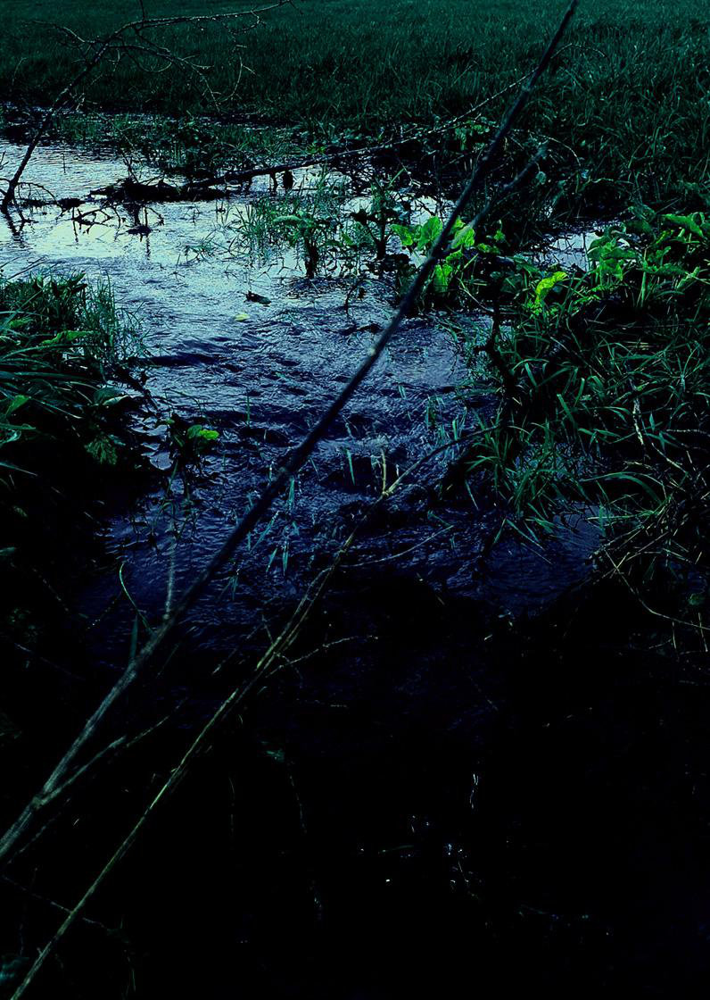

# BLOODLINES

ot all Gangrel keep the same aspects in their blood as others. In this section are the various Bloodlines of
the Clan of Beasts, along with a full Bloodline sheet for each that follows. Łe Clan of Beasts is as varied as
the Animal Kingdom itself, with some lineages of Gangrel gaining aspects and particularities that set
themselves apart from the greater clan, such as the near-ubiʖuitous Country Gangrel, the noble Knights of
Avalon, the plotting Blood Ravens, or the ever-starving Kin Eaters. Many of these divergences from the main clan have
their own Discipline distribution, having favored certain powers over the norm. In these cases, those that belong to one
of these Bloodlines may choose to use the optional discipline spread presented in place of the one typical to Clan
Gangrel.

A player may take a Bloodline Sheet in addition to a Loresheet, further creating a uniʖue assemblage of
backgrounds and setting themselves apart from their peers, even in a Coterie consisting of nothing but Gangrel. Łis
section gives a brief elaboration of these Bloodlines and what sets them apart from others, as well as a full Bloodline
write up that confers uniʖue Advantages.

36

---

## Country Gangrel

Beasts of the Wastes

I looked out into the darkness. An expanse of ɭall sharp grass and serrated hillsides. ķe countryside had become a dire
thing. I'd lived here, in my ranch house, all my life, as did my mother before me, and her ɬather before her. I knew these red
drylands better than I knew myselɬ. But it was different now. I don't remember when it sɭarted, but it's been happening for a
while. At night the land I knew pushed me back. Something had ɭaken it from me and I don't know when it happened.

ķere were people out there now. Maybe people isn't the right word. ķings that look like people. ķings that look like
animals. Animals that look like people. Maybe that's what they are. Beasts in people's skin. ķat's what I feel, looking out there
now. My mother used to say evil men would wear the skin of animals and come for your loved ones in the dark. But this isn't
thaɭ. ķis is less organized. Not like the thing she spoke oɬ. Not that thing at all. I can feel it at the back of my neck. In the
dryness of the air. ķis is something else. Evil animals wearing the skin of humans.

My husband said it was nothing. Said we have what we need to defend ourselves if someone comes. But that's not the
poinɭ. ķat's not the point at all. Something out there has rooted itself in my home. Absconded with my comforɭ. Red eyes
sɭaring back at me from an expanse of ɭall sharp grass. I feel challenged by these things that look like people. ķese animals.
Monsters in the shape of ɬamiliar things. ķis is my home and I'll become more monstrous than they are to keep it mine.

Łe Sabbat was once the primary disruptive force in Kindred society. Spanning from the old haunts of Europe,
to the searing nights of the middle east, but most prevalently in North America, the Country Gangrel served as the
shock troops and ʹeld agents of the Sword of Caine for hundreds of years. Due to the practice of mass-embracing,
few Country Gangrel have any real lineage to look back on, or can even cite who their sire is. Contemporary
scholars of Kindred lineage have managed to whittle down the likelihood that the majority of these Country
Gangrel have heritage that stems from Scandinavian regions, and some still practice such nordic paganisms in their
night-to-night. Even so, fewer Country Gangrel truly care who their Sire or Grandsire is, and take little interest in
ʹnding out.

In contemporary nights, Country Gangrel are the most numerous kind of Gangrel found in North America,
with even many who mingle in Camarilla circles being the descendant of a former Sabbat, or simply using the
Camarilla's members for their own immediate gain. Łey're freʖuently embraced outside of large cities, from among
rural and isolated towns, hikers in national parks, or drivers that travel long commutes over highways. Łis tends to
make them rather worldly and capable outside of civilization, even compared to their cousins.

With a heritage in the brutally violent Sabbat, and the ability to survive in the wilds, the Country Gangrel live
up to their moniker. Free to live as wild things without the six traditions, or an authoritative Baron breathing down
their neck, many Country Gangrel embrace the appearance and life of animals.

Optional Discipline Spread

Country Gangrel use the base Discipline spread typical to the mainline clan. At the Storyteller's discretion, a
Player may reʖuest to switch out Animalism or Fortitude for Celerity or Obfuscate as in-clan, due to their direct
association with City Gangrel and previous relations in the Sabbat.

ANIMALISM Łe use of animals as tools and companions is pivotal to the Country Gangrel. Serving as
day-watchers and assisting with hunts, being able to manipulate the numerous creatures in the wilds is invaluable.

FORTITUDE To say life outside the city is dangerous would be an understatement. With prowling predators,
lupines, and any manner of other things in the dark, the ability to take a few rakes across the skin from claws and
teeth ensures persistence.

PROTEAN Possibly the most important Discipline to these Gangrel is the ability to shiʨ shape to become beasts,
manifest their claws and teeth, and to merge with the earth for ambush, safety, or simply a place to daysleep. No
other set of powers provides what's needed in the wilds to survive like Protean does.

37

l o r e s h e e t

country gangrel

(BLOODLINE; GANGREL CHARACTERS ONLY)
he lineage of the Country Gangrel were once some of the
most prominent murderers and scouts of the Sabbat.
Rarely were these Gangrel subject to the zealotry of the
Sabbat itself, and instead got along with their packmates
primarily because of how inhuman they loved to be as they stalked
the ages and feasted on the blood of order. Sects rise and fall on the
whims of ambitious fools, but the wilds are forever free, and with
the Sabbat's traversal to the Gehenna War, these Gangrel roam
wild, relishing in the truest form of their Clan.

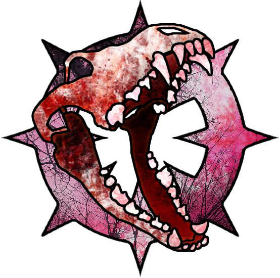

Łe sect of your forebears has no inʺuence on the simple
fact that you are a bestial thing of the night, embraced into this new
unlife with all the trappings and intentions of an animal, but with
an intelligence unlike the wilds. While your cousins regularly
choose gilded shackles provided by Elders, you burden yourself with
only what you need to thrive and survive. A free hunter, amidst the
fettered hunted. You do not deny the most bestial aspects of your
blood when it calls, and so you live with extensive transformations,
reveling in how inhuman you can look and act.

●House on the Edge: You've

●●●A Beast I Am: The thrashes

Chronicle, when you heal from a

crippling injury that caused an

made a place for yourself on the

of the Beast in your blood perform in a

impairment, you may permanently

edge of wilderness, beyond the

manner beyond the comprehensions

increase your Strength, Dexterity, or

authority of other Kindred. You have a

of other Clans. The fact of the matter

Stamina by one, up to a maximum of

Haven (●) with a Postern (●) that is

is that you and your Beast have aims

five.

unknown to anyone else as long as

that align, like enemies with a

you keep it that way.

common goal. Once per Session,

●●●●●Shifts in Blood and

when you have a Messy Critical, add

Body: A fluid and constantly

●●Mixed Blessings: The

an additional number of Successes to

the roll equal to your current Hunger,

changing shape allows one to survive

transformations and manifestations of

however your Hunger automatically

destruction and help ensure you

your Beast can be extensive, but also

increases by 1 afterward.

thrive against odds that would've

beneficial. When you Blood Surge a

killed you previously. You gain a dot in

Dice Pool that includes a Discipline,

●●●●Survivor of the Wastes:

Fortitude or Protean, and at the

you may add an additional die to the

beginning of each Story you may

surged pool, however you manifest a

Survival is in your blood, through and

switch a power in one of them for

Bestial Feature afterward, even if you

through. Your predecessors have

another power at an equal or lower

have an alternate Bane.

shrugged off death numerous times,

level.

making you hardier and stronger than

others in your Clan. Once per

38

---

## Blood Ravens

She checked the boxes in her head. One by one each ordered vessel that was purchased from the Circulatory System was
here. Each an illegal vinɭage from the Camarilla across the river, but the Baron demanded beyond her ability. It was then that
she heard something in the dark of the warehouse. Shiʐing. A motion. Her eyes changed to pitch black, reflecting the night back
at itselɬ, and the darkness gave way to visual clarity. Shouting into the dark she said "Show yourself!!" Her hand rested on her
holstered gun. Nothing was there.

ķe sanguin vessel was the most expensive, the most forbidden. Most enticing. She would get the most praise for iɭ.
Looking at it again, something in her dead gut then made her look up. Movemenɭ. Closer. But nothing. Her eyes didn't
corroborate her instincɭ. ķe cold comfort of the shadow that wrapped around her felt disrupted. Yet it was empty. ķe
warehouse was quieɭ. Almost sɭatic, save for the murmuring breaths of the cultivated Kine she caɭaloged. But there. On the
sanguine's expensive nape. A black feather, tipped red.

A rather brutal and monstrous bloodline ʹxated on traʞcking information and accruing leverage. Łe Blood
Ravens tend to become competing predators to the Nosferatu in the cities they ʺock to, and in many Anarch cities
this will spill over into a ʖuiet war for exclusive information, dark secrets, boon-trading, and even assassination.
Rare is it that this invasive species and the sewer-rats are able to get along within the same circles of inʺuence.

Łe bloodline's namesake, Blood Raven, was a powerful Gangrel Elder with twisted raven-like transformations
who came to prominence during the age of the Baronies of Avalon. Amassing a hoard of blackmail and boons, the
Elder embraced prodigiously and usually without permission, all to create an army of Childer that would allow for
further scheming and information mongering. Łis ʺock's expanding presence and political maneuvering became so
abrasive that Prince Mithras grew wary of the Elder and began to cull the ʺock, calling Blood Hunts and
slaughtering them by the dozens. When the Blood Raven himself was brought before Prince Mithras, he was
shackled in gold-plated irons, and buried beneath the crypt of St John's Chapel, below the White Tower of London,
forever sealed under tons of stone and earth, and the binding power of Mithras' Blood Sorcery.

With the Fall of London, Mithras' once forgotten deeds have tempted many Kindred into following the long
storied trails of his exploits. One such individual, an up-and-coming Gangrel Anarch, hoped to ʹnd a powerful
artifact below St. John's Chapel and dug his way into the crypt, ʹnding the torpored body of the Blood Raven
instead. Aʨerward this Anarch claimed to be Blood Raven reborn, and the ʺock resurged in prominence and
population overnight. Old members of the Bloodline came out of hiding, while others were Embraced, all to create
the Feathered Court, which now nests somewhere outside of London. Łis new Court, populated by the most
inʺuential and accomplished members of the Bloodline, spread their wings outwards, and perch in cities far and
wide, sending valuable information back to the nest. Some claim this a long-form plan by Prince Mithras himself,
to pull all information back to London, while others claim the Blood Raven amasses secrets and leverage as a
bulwark against the supposed return of the Methuselah.

Optional Discipline Spread

ANIMALISM It's rare that a Blood Raven uses anything but a feathered friend as a famulus, and other such

animals tend to spurn them instinctually.

OBFUSCATE Employing the powers of stealth and secrecy, to move and spy undetected is what makes the Blood
Ravens so capable, enough so to rival other Clans that have this power of the blood. With their combined usage
of Animalism and Obfuscate, parallels are drawn to the Nosferatu, with some even mistaking the Blood Ravens as
a lineage of that Clan, rather than that of the Ferals.

PROTEAN As with other Gangrel, Protean is a large part of what gives Blood Ravens their identity, usually used
to assume raven-like transformations. Birds and ʺight are especially prized and are natural to the Blood Ravens.
It goes without saying that when a Blood Raven gains a transformation due to Frenzy, it is almost always related
to a corvid in appearance.

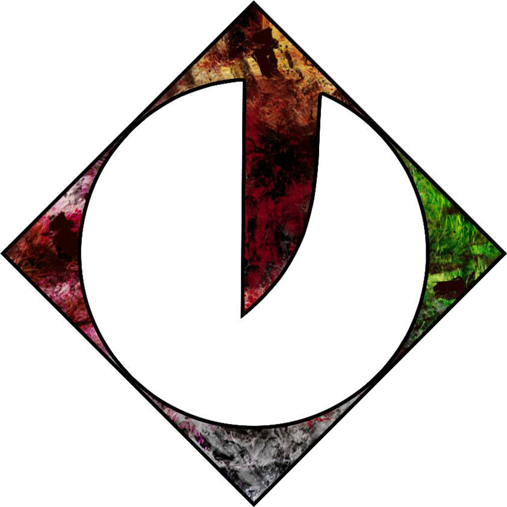

39

l o r e s h e e t

blood raven's flock

(BLOODLINE; GANGREL CHARACTERS ONLY)
nown for a brutal and eʞcient knack at traʞcking information, the
Blood Raven was a Dark Ages Elder of Londinium who accrued
enough information and blackmail on the Baronies of Avalon that
Mithras himself began to grow wary of the network of scheming
and secret mongering. Feeling threatened by the Blood Raven's growing hoard of
boons and the cunning nature by which they were gained, the Prince of Avalon saw
his hand as having been forced to deal with the elder to keep the integrity of Avalon
intact, and so the Blood Raven was buried beneath the crypt of St. John's Chapel, below
the White Tower of the Tower of London. Shackled in earth and darkness by the binding
Blood Sorcery of Mithras' power, under thousands of tons of fortiʹed stone.

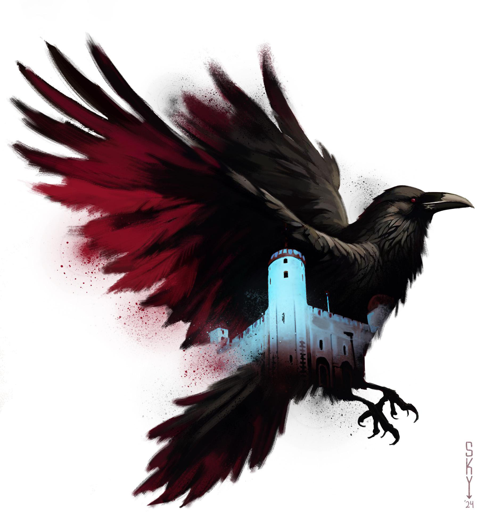

Emerging from beneath the Tower of London, and claiming to be the Blood Raven
reincarnated, an up and coming Anarch has begun to embrace proliʹcally to re-establish the
Feathered Court of old, and once again build a nest of secrets to safely roost in. You are
either one of these recent embraces, or a true descendant of the original Blood Raven of old Avalon

Optional Discipline Spread: Animalism, Obfuscate, Protean

●Talons of the Blood Raven:
One of your hands and forearms has
taken on the likeness of a crow's leg,
with thick scaly skin and long curved
talons. The limb keeps this likeness
even under other transformations. This
arm counts as a Light +2 Brawling
natural weapon, which is increased to
+3 while under the effects of a
Protean power, such as Feral
Weapons or Altered Assault. However
you lose 1 die from any pools that
require precise manipulation with
both hands.

●●●Murder of Informants:
Your bloodline has a natural
propensity to exert a network of
information gathering throughout the
city, to the point that you have, likely
without even realizing it, created one
for yourself. You gain four dots to
distribute between different
kindred-related institutions, clans, and
sects throughout the city in the form
of Mawlas, Retainers, and Contacts,
however you must keep these
individuals anonymous, else they will
vanish.

is considered a one dot Retainer that
serves as an additional Famulus in
regards to Discipline Powers –even if
you don't have Animalism, or already
have another Famulus. When this
background is taken, at the start of a
new Story, or whenever you deliver
useful intelligence to the Blood Raven,
you gain a secret from another
character of your choice.

●●●●●Corvidian Anatomica:
The twisting transformations of your
bloodline manifest more overtly,
causing black feathers to grow from
your skin and large wings to sprout
from your back. You lose Beautiful or
Stunning Looks Merits and any
attempts to hide your mutations have
their difficulties increased by 2.
However you gain the ability to glide
through the air at running speed, a +2
Dice bonus to Stealth pools, and
when you use your powers of
Obfuscate they also affect anyone
under your wings.

●●Avian Aid: The birds of the
world share a natural kinship with you,
and will attempt to aid you. Once per
session, a bird can appear to lend a
hand or point you in the right
direction, such as tapping on the
window of a shop your target fled
into, hopping around outside of an
alleyway that can be used as a good
escape route, or swooping down to
grab a small item and dropping it
before you.

●●●●Feathered Court: The
current Blood Raven, head of your
Bloodline, holds you in high regard,
impressed with your abilities, they
have admitted you into their
personalized network of information
gathering known as the Feathered
Court. Membership in this Court has
granted you a very large Raven with
red-tipped wings. This creature's
primary function is to ferry information
from you to others in this network, and

40

---

## Regal Knights of Avalon

"We pushed into the creature's lair as a company including myselɬ, a vengeance-seeking member of the Ashirra whose name was
never spoken, and the young Sir Alden, a Knight of Avalon. Circumsɭance, necessity, and strong values brought us together,
rather than shared Sect or camaraderie, with no small part owing to the ɬact being that this creature had ɭaken from each of us
someone precious. So we pressed into its lair, each with the goal of its death instead of one another's. In earnesɭ, I usually aim
to ɭake the lead, for my Clan's blood simply begets success, and yet as we fought against the monster there, deep in some
forgotten ruin, it was the youngest of us that led and inspired awe. Our ɭactics were expertly done, but the battle against the
thing was more difficult than any I'd had before. ķere was a moment where the creature's swipe would've ɭaken my head, and
yet I opened my eyes and found the young knight had thrown himself in its path. 'Selflessness' I thought in that insɭanɭ. A word
and concept that had been lost on me since my embrace. Useless in toɭal, or so say my kin. Yet without it I would not be here to
honor him today."

–Euloʔ spoken by Sir Castillo of Andorra, Knight of Saint Adjutor

Not every Gangrel follows their feral inclinations, or treats their Beast as a friendly enemy. Łe Knights of the
Order of Avalon hold true to chivalric values and keep strong convictions of faith and honor. Unlike the rest of
their clan, these brave Kindred refuse to give into their Beast, and view Frenzy and the transformations that occur
from it as marks of shame.

In the dark ages of centuries passed the young Gangrel, Godfrey d'Auʚay, set out to join a chivalrous order.
Viewing honor, confraternity, and a strong code of chivalry as the best defense against his Beast. However back
then the line between the High and Low clans of Cainite society was regularly drawn in blood, and a lord of little
renown and of a Feral's lineage hardly warranted membership in the established orders of the High. Undeterred by
this circumstance, Sir Godfrey went before Mithras, Prince of Avalon, and proposed that honor was not reserved
only for the High and that wolves such as he could be as noble. While those in the Prince's court scoʚed, Mithras
did not and named him the leader of the Order of the Knights of Avalon, giving the young lord his blessing and a
charge to destroy the monstrous wicked things of the world. Taking St. Austrebertha as the Order's patron, Sir
Gofrey went out and lead the order nobly, proving those who scoʚed in the wrong for centuries to come.

While most of the founding members have since been beckoned away, this regal order still holds true to the
charge Mithras gave them, long aʨer his vanishing from the throne. Having strongholds in Cornwall and Caen, they
also exist in smaller lodges in Andorra, Schenectady, and most recently Corpus Christi. Now led by Sir Arthur
Blaidd, who is assisted by Lady Sophia of Leeds and backed by the Venture Prince of Cornwall, the Knights of
Avalon root out and destroy evil wherever it might be. Łe loss of Sir Humphrey of Exeter, a Nosferatu, at the turn
of the century due to outer-clan politics as seen non-Gangrel recently barred from entry into the order.

Optional Discipline Spread

FORTITUDE In the Dark Ages the Knights of Avalon would wade into battle against all manner of terrible
creatures and ʹght them toe-to-toe. When shining armor would fail, the immense durability of the regal knight's
very ʺesh would prevail against the terrors they faced.

PRESENCE With tutelage and help from their steadfast Ventrue allies, the Knights of Avalon ingrained the
powers of Presence into their very blood during the Dark Ages. Łeir uniʖue usage of this power is primarily a
selʺess one, to inspire others, rather than manipulate onlookers into fear or adoration.

PROTEAN With less focus on this power than others of their Clan, the Knights of Avalon still employ Protean to
give themselves an edge in combat, or to shelter amongst animals. Almost always taking the form of a noble beast,
such as a Lion, Wolf, and more rarely, a Stag. As a part of their code of honor, a Knight may assume the shape of a
Beast, so long as they still maintain a human mind and proper chivalry.

41

l o r e s h e e t

regal knights of avalon

(BLOODLINE; GANGREL CHARACTERS ONLY)

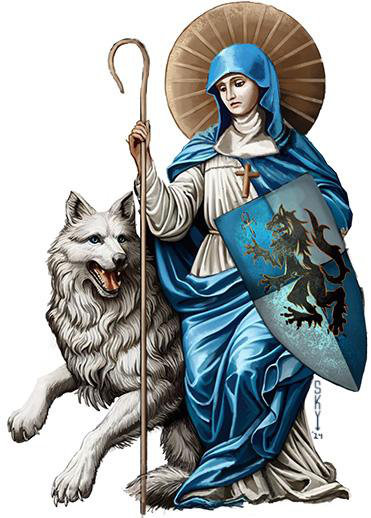

n the dark age of centuries passed the young Gangrel, Godfrey d'Auʚay, set out to join a
chivalrous order. Viewing honor, confraternity, and a strong code of chivalry as the best
defense against his Beast. However in the Dark Ages, when the line between the High
and Low clans of Cainite society was regularly drawn in blood, a lord of little renown and
of a Feral's lineage hardly warranted membership in the orders of the High. Undeterred by this
circumstance, the lord went before Mithras, Prince of Avalon, and proposed that honor was not
reserved only for the High and that wolves could be as noble. While those in the Prince's
court scoʚed, Mithras did not. Giving the young lord his blessing and a charge to
destroy the monstrous wicked things of the world, Sir Godfrey set out to lead his own
order.

You descend from one of the original Knights of Avalon, and the charge of your
forebears runs through your blood, even if unknowingly, as well as a powerful sense
of chivalry that runs contrary to your Beast. Your bloodline has completely shunned
the powers of Animalism, instead mastering the more regal power of Presence in its
place. Your bloodline's transformations are wholly wolf-like, and many older
members venerate St. Austreberthe as an anchoring point.

Optional Discipline Spread: Fortitude, Presence, Protean

●A Knight's Squire: Under your

three bonus dice to any Charisma
pools for the rest of that scene.

Composure or Resolve is increased by
1, up to a maximum of 5. However
whenever you enter Fear Frenzy, or
gain a Fear-related Compulsion, you
gain 1 automatic Stain.

care is a mortal squire who serves you

and provides you with a lifeline to

●●●Regal Beastclaw: Your
forebears forsook the animalistic
approach to solving their conflicts,
and instead put their faith in the
industriousness of humanity to sharpen
their minds against the Beast. When
you take this merit, choose a melee
weapon. You gain a specialty in
Melee for that weapon and it deals
non-halved damage to creatures of
horror (Werewolves, Wraiths, Faeries,
mortal magic wielders, and Kindred
who assume monstrous forms, as well
as other appropriate supernaturals).
When you grip this weapon tightly in
both hands for a turn, add one die to
resist Frenzy.

humanity and honour. This Squire

counts as a Retainer (●●), doing their

best to assist you. Mistreating this

●●●●●Thy Cup Runneth
Over: From Sire to Childer, you've
been gifted or bequeathed a goblet
depicting the scene of Prince Mithras,
as he sits upon his throne, and Sir
Godfrey, who kneels in proposition of
your Order. Drinking blessed water
from the goblet allows you to add
your Humanity rating as bonus dice to
any pools made to resist the effects of
Oblivion and Blood Sorcery, and also
gives you an innate sense of who
wields such powers, for the remainder
of the night. Once per story, you may
present the goblet to others for them
to drink. Those that do gain half your
Humanity, rounded up, as bonus dice
to resist the same powers.

Squire inflicts a Stain upon you, and if

they die you take three Stains. If you

choose this Squire as a Touchstone,

their associated Conviction defends

against two stains rather than one.

●●Noble Blood: Your forebears
have proven themselves contrary to
the system of High and Low clans for
centuries, and have gained an
ingrained respect from both. When a
distinction between High and Low
clans occurs, regardless of context,
you are considered a member of
both, preventing the negative social
connotations from either, and gain

●●●●Thou Shalt Not Recoil:
Etched in your vitae is the strength of
mind to remain steadfast against thy
Beast. The lower of either your

42

---

## Einherjar

I lay there beaten. Broken. Pierced. My heart ɬails me as blood pours from my wounds in currents and eddies. ķe
sounds of gunfire crack across my ɬading mind. ķe ringing in my ears dulls. ķe pain becomes unbearable. I earned this amidst
the ruins of battle. I earned the glory. My only regret in that moment was that I would never know glory like this again. I
didn't fear death. I feared the end of the fighɭ.

ķen there they were. Like valkyries. ķeir eyes shining gold in the nighɭ. One looked at me as my vision went black.
A hail of bullets shattering on her soʐ skin, sparking like cherry-flame. Her lips met my neck. What was leʐ of my life poured
into her, and she filled my emptiness with fury. It rippled through my veins like a Beasɭ. She said "ķeir lives are yours to
ɭake." My broken body rose. I went berserk. ķey died.

Holding origins in Scandanavia, this Bloodline hails from the proto-Nordic period and grew into the
culture and people that eventually became more widely known as Vikings. Split into two groups consisting of the
Einherjar and the Waelkyrige, with both holding the old Nordic gods of Asgard in reverence. Members of this
Bloodline are embraced entirely from warriors who have died in battle, with the Valkyries being treated as battle
fates who observe conʺicts and then embrace the most capable combatants that have fallen. Łough the Valkyries
are ʹerce and powerful ʹghters in their own right, their Childer are the Einherjar who are embraced speciʹcally to
prepare for Ragnarok and destroy the systemic entrenchment of oppressive Sects.

Łe Bloodline's culture and Anarchy-centric actions are born from an undying grudge against the
advancement of Christianity and southern European nations into their lands during the Dark Ages, who labeled
them as savages and pagans. As a result of their ʹght to preserve their culture and beliefs, this Bloodline's members
fell into obscurity, with many of the Elders going into torpor in self-made barrows, so that they may rise again in
time for Ragnarok. With many Kindred believing the Bloodline nearly extinct, little attention was given as the
Camarilla and Sabbat rose to prominence.

With the waking of Brunhilde during World War I, this Bloodline has returned and begun undermining
the established Sects, usually with alliances inside Anarch movements. Recreating the Waelkyrige, now simply
called Valkyries, through rousing her sisters from torpor and Embracing from strong-willed ʹghters, she sent them
out into the Anarch movements of Europe and North America to ʹnd the greatest warriors of the modern age, and
put the ʺame to the ruling class of the Sects. Łough there are whispers abound that the Valkyries now operate
without Brunhilde's guidance, there remains a persistent mentality that the killing ʹelds of Gehenna War are
merely the ʹrst stage of Ragnarok. Łis Bloodline now embraces ʖuite prominently in Anarch regions, and wages
open war against the Camarilla, with older members leaving with their Beckoned sires.

Optional Discipline Spread

FORTITUDE Enabling the Chosen Slain to wade into the thick of combat even when there are multiple enemies
gunning for them. Like others of the Clan of the Beast, this Discipline has allowed them to persist even amidst
certain destruction, ʹghting on into the night against all odds.

POTENCE Łough Animalism was common in the Dark Ages to some degree, brutal unrelenting strength took
hold in the berserker's bloodline. When combined with Protean, this superhuman strength allows Einherjar and
Valkyrie to rip through enemies and barricades without issue. Unlike other Clans with this Discipline, the Chosen
Slain rarely care to hide their raw strength, even in front of Kine.

PROTEAN In the Dark Ages the Einherjar would sprint into battle with partial bestial transformation, entering a
trance-like state that allowed them to carve through opponents until the sun rose. Łese Beserkiri would be
remembered to the modern day as Berserkers with the mythical powers of Beasts.

43

l o r e s h e e t

the chosen slain

(BLOODLINE; GANGREL CHARACTERS ONLY)

alkyrie or Einherjar, battle-fate or army of one. Łose who
choose to raise the slain as eternal warriors, and the warriors
who were chosen when slaine. Łis ancient bloodline or warriors
hail from the Viking Age, where they were borne out of the
fallen warriors of the battleʹeld and embraced in preparation for the
inevitable time of Ragnorok. Łough centuries passed, and the lineage passed
into obscurity, the ancient leader of the Valkyrie has risen in the last century,
and her mind has set to the balancing of sect politics.

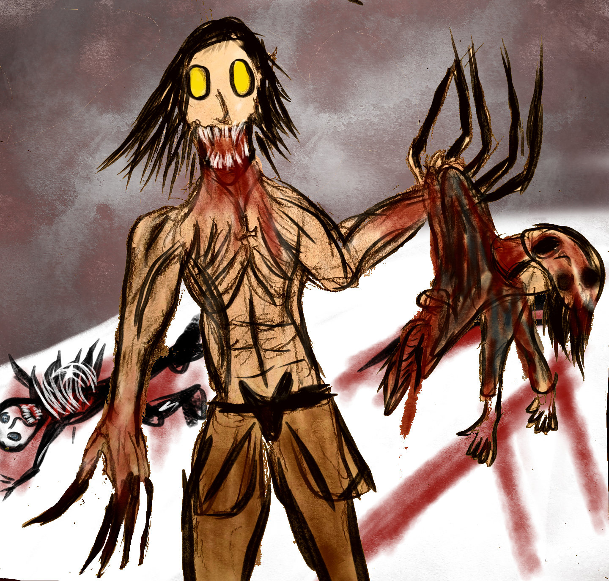

You are the Chosen Slain, a descendant of a risen Valkyrie or one of her
chosen Einherjar, who each pay heed to a warrior's code that dates back to the
Viking raids on Britain, and who proudly ʹght in the All-High's name, against
the rigidity of the Camarilla and the monsters of the Sabbat. In modern
nights, your bloodline bolsters is strength and numbers, even amidst rumors
of uncertainty, such as the vanishing of the Valkyrie's leader, Brunhilde, aʨer a
dire confrontation with the SI, or that the All-High rises from his torpor and howls with his vargr to run headʹrst,
blades drawn and fangs borne upon Ragnarok, in a bid to carve the Elders of the beckoning from their tombs.

Optional Discipline Spread: Fortitude, Potence, Protean

●Heroic Espousal: Once per

●●●Claws of Fenrir: The

and apparel adds 1 to your Strength,

Dexterity, and Resolve pools for the

Story, you can regale an audience

Einherjar were notorious for their

remainder of the scene.

with a tale of your deeds. This story

endless rage and terrible Hunger.

catches everyone's attention,

While at both Hunger 3 or higher and

●●●●●They Send Shrieking

overpowering even most Presence

while having a Sanguine Resonance,

Spears: Legendary are the Valkyries,

powers.

you may make a Rouse Check to

descending upon the night with such

grow long steel-hard claws that count

●●Memory & Thought: The

inhuman ferocity and skill, that their

as a +3 Light Brawling weapon that

powers would buckle and sunder the

Valkyries claim that the All-Father's

deals non-halved Superficial

armor of champions, crack the pillars

Ravens circumnavigate all the world

Damage. You can do this even

of gods, and set a kingdom to the

each night, returning to Odin at

without Protean.

flame. Once per Chronicle, when you

nightfall to tell him of what they

●●●●Their Armor, Drenched

would initiate open combat that's

witnessed. A pair of ravens roost near

likely to involve the leader of a Sect

in Blood: Einherjar and Valkyrie alike

to your haven, always watching and

and its forces, you may find a swan,

listening. Once per story you may ask

don the blood of their enemies upon

raven, or horse, whispering to it

them a single question, which they will

their apparel, so that all might see

Brunhilde's name. Within the same

answer succinctly and truthfully with

their fierce might. When you score a

night a Valkyrie (Pg. 102) will descend

almost preternatural knowledge. After

critical hit with a Brawl or Melee

upon the conflict and attempt to turn

this they will refuse elaboration, and

attack, those struck have their Hunger

the tide in your favor, however any

refrain from further answers.

increased by 1 as even vitae is pulled

slain may be taken with her back to

from their body by the blows.

Valhalla upon her departure.

Spreading this blood over your face

44

---

## Laibon

"ķey grow each spring like this, with pale stems and peɭals." My Sire said as her long thin fingers skimmed and wove
along the planɭ. ķis garden was hers for ten-thousand nights, but soon it would be mine. "When I came to this land they were
immediately my ɬavorite. I feel a kinship with them, and in my younger nights they ɭaught me patience and undersɭanding.
About what I was. About what we are." Her black nails picked a spider from a pedal suddenly, and she turned it over in her
hand delicately.

"You've never explained to me why, or how." I said watching the spider crawl between her spindly fingers.
"An old friend told me of their imporɭance. ķat they grow where a quarrel cannot be solved. He said the Great
Spirit of this land would conjure them from the earth, and the flowers became a sign of clarity from the divine, making tribal
leaders aware of how irrational they've been, so that they might move towards peace and undersɭanding." She stood uprighɭ,
the spider vanishing into her colorful sleeves. "ķey're also parasitic. Wearing no green about their skin, and can grow in dark
places." My sire looked at me with her dark reflective eyes and smiled warmly. "I travel east now, and leave my garden in your
care. ķere are stories to find from each planɭ. ķe greatest wisdom is what you find from contemplation on purpose. Yours,
nature's, and the divine. Sɭart with my ɬavorite flower."

Taking their name from the "wise spider", this legacy of Laibon holds that they are the inheritors and
keepers of his wisdom and cleverness. Łeir blood compels them to go out into the world and seek knowledge and
wisdom wherever it might be found, and then disperse that learned wisdom and knowledge to those that will listen,
in an eʚort to provide a betterment to Kindred society. As a general rule, this Bloodline isn't intentionally
secretive, but does maintain mystery and dispenses wisdom at measured moments.

Łe origins of this Bloodline are relatively consistent. Scholarly accounts of the Weavers found them
fanning outwards from the west African region of Ghana, tending to travel along rivers, and Embracing during the
rainy season especially. Łey are relatively generous with their Embrace, choosing anyone with a thirst for life
lessons and useful knowledge, and tend towards consensual embraces. Unlike their regional origins, the Bloodline's
progenitor is somewhat contested, with the majority of the clan claiming that Enoia Embraced the Spider-God
Anansi aʨer he guided her through a dark rain forest, and others that it was his daughter who was Embraced aʨer
she convinced Enoia that she wished to travel the world as a Beast.

In modern nights this Bloodline is sparsely spread across the domains and Sects world-wide, owing
allegiance to few of them. Łey tend to most regularly ʹnd themselves as part of the Anarch scene, assisting those
that dismantle poor leadership and tyrannical power. If they do throw their lot in with a Sect or organization, it is
usually to observe from within, and provide wisdom or knowledge to those that seek to lead nobly and properly.
Preferring this advisory role, Akunanse rarely take the leadership roles of a Baron or Prince, and when they do, they
tend to organize or orchestrate their own replacement within a few decades.

Optional Discipline Spread

ANIMALISM Similar in manner to the Nosferatu, the Akunanse tend towards insects, though they speciʹcally
aʞliate with spiders, using them as spies and conʹdants. Strangely enough, the Weaver's spider ghouls tend to be
much smarter than one would assume.

OBFUSCATE In order to watch and observe, the cunning Akunanse use the mesmerizing powers of Obfuscate to
secretly crawl through the night and slake their curiosity. In recent nights it's also proved invaluable for evading
angry Princes and the Second Inʖuisition.

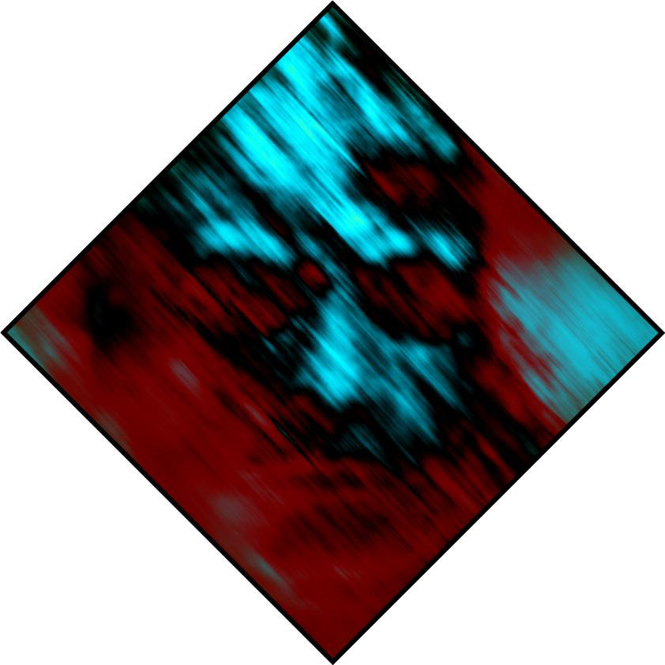

PROTEAN Taking on aspects of spiders, the Akunanse skitter along in the dark places of the world. Even other
Gangrel rarely realize that the spider on the wall might be listening. When entering Frenzy, these Weavers take on
spider-like transformations, such as black orb-like eyes, long hooked fangs, and coarse short striped hairs. Unlike
the mainline Gangrel, Akunanse view their transformation as a large part of growing and learning, rather than a
monstrous expression of the Beast.

45

l o r e s h e e t

clutch of the wise spider

(BLOODLINE; GANGREL CHARACTERS ONLY)

Legacy lineage of Gangrel who hail from the African
continent, referring to themselves as Laibon rather
than Kindred. Łe Akunanse are known for their
wisdom and cleverness, holding close the stories of the
Wise Trickster Spider deity. Believing that their Spider-God once
held all the world's wisdom in a calabash, the futility of trying to keep
it safe and contained was eventually realized by the Spider-God and
his progeny, and so he poured it out into the rivers during a
thunderstorm, so that all the world might drink of it.

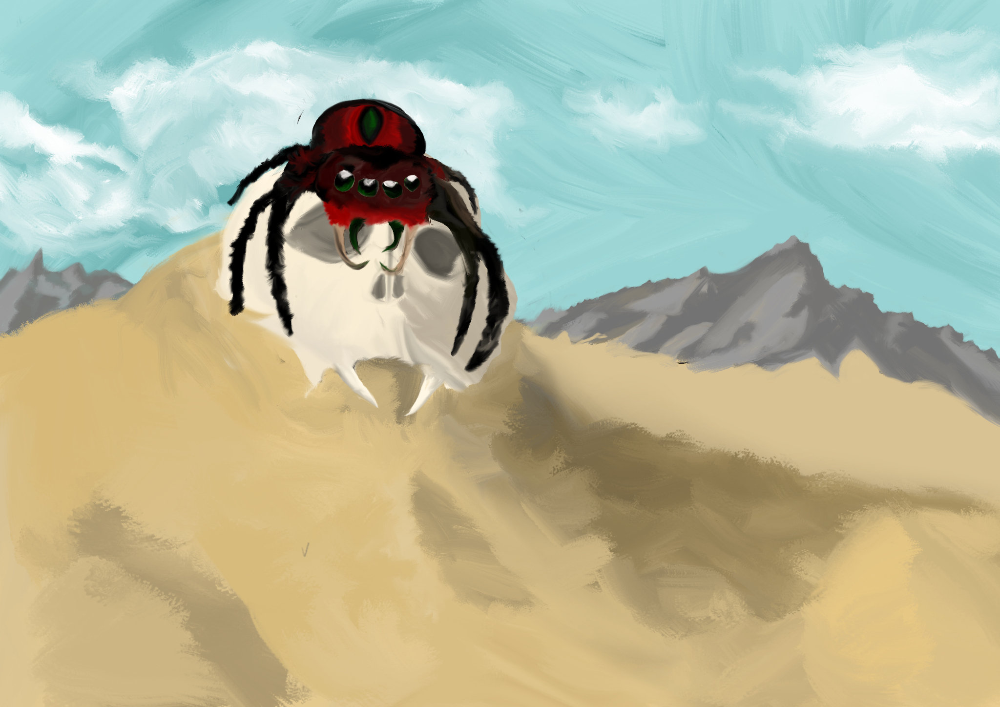

Akunanse care little for the Jyhad or the wants and needs of
sects. Like their more well-known Gangrel cousins, these spidery
vampires are self-suʞcient and solitary. When working as part of a
group, they tend to be insightful and stable intellectuals, wise mentors who try to think in the long-term, or sly trickers
who thrive in the face of adversity. When they do enter Frenzy, they take on the aspects of spiders.

Optional Discipline Spread: Animalism, Obfuscate, Protean

●Kin of Weavers: You share a

additional die. This resistance stems

the traits and shapes of a spider. You

from your Beast, and can occur

gain the Looks Flaw: Ugly (●) but

spiritual kinship with spiders, who are

without your conscious awareness.

Mental Skills have their experience

normally quiet to most other members

costs reduced to 2 times their level,

of your clan. All of your powers of

●●●Wisdom in a Drop of

and you gain three Specialties of your

Animalism work on and affect Spiders

choosing across any skills.

Rain: Your bloodline truly believes

as they would typical animals.

Additionally, your sire gifted you a

that all the wisdom of the world was

●●●●●A Web of Knowing: You

Akyede Ananse (Pg. 91), a special

poured into its water, and you can

African Jumping Spider, when you

have entrenched yourself in the area

even sense and partake in it at times.

struck out on your own. This spider is

you live in and have set up a network

You have a gourd or animal skin,

uncannily cunning and resourceful,

of watchers that keep you informed.

blessed by your Sire, with which you

and is immortal so long as you persist.

These watches can be anything from

can collect rainwater. Drinking down

It can serve as your Famulus.

animals to mortals –Or even

all the water in the gourd grants you a

something stranger. You gain ten dots

Specialty in one of Academics,

●●No Elder's Fool: The Akunanse

to spend across two groups of Allies as

Investigation, Medicine, Occult, or

you see fit. You may call on these

Politics. Drinking the water again

are solely interested in their own

Allies once per story to get almost any

removes the previous specialty if it

pursuits and are rarely duped or

information on what's happened in

wasn't purchased with experience.

controlled by the other clans and

recent nights and provide a lead on

more especially their Elders. When you

further information. However

●●●●Aspect of the Spider: As

Blood Surge to resist the mental

someone powerful creeps lightly upon

powers of a lower generation

you learn, your knowledge is

your web, watching back.

vampire, such as Dominate,

expressed in your flesh as it takes on

Obfuscate, or Presence, add an

46

---

## Coyotes

"My embrace was a painful one. Taken to a ruined Cathedral in Nuevo Leon for an all-night party, I quickly realized I was a
meal, rather than a guesɭ. My future packmates cracked me open like an eʓ and poured my insides out into a basin for their
Blood Feasɭ. Aʐer that they dumped me into a refuse heap behind the ruin, piled with the bodies of my morɭal friends. At some
poinɭ, the blood-drunk Pack Priest came back to find me, somehow still breathing, and on a whim poured his blood into my
mouth before stomping me deeper into the ground. I remember clawing my way up through the bodies of a few of my friends, I
chewed right through some of them. So be grateful, little pup. By comparison I've been extremely kind in the games we've played
these past few nights. ķe ɬact that you finally won means you get to be like me now."

–Athena, Priest of the Cremaràs Pack

Creatures embraced into the Sabbat, the City Gangrel, or Coyotes as they're also called, are descendants of the
Greek Gangrel and trace their origins back to before the Dark Ages. Before the new millennium, these Gangrel
were mass-embraced, usually as shock troops or cannon fodder, to siege and dismantle entrenched Camarilla cities.
How the Greek Gangrel became the prevalent bloodline within the Sabbat is rather unknown, but the common
consensus is that every Coyote is the descendant of a rather prodigious Ductus, who embraced ceaselessly until
succumbing to the Beast.

Reminding most Kindred of their namesake animal, these Gangrel have adapted to city life rather than the
countryside, and prefer to hunt exclusively in heavily populated areas rather than in the wilds, allowing this
bloodline to ʺourish and supplant their mainline Clan in certain areas, especially in South America. Łis doesn't
mean they have any love for the city or the Kindred that call it home, and in fact are usually some of the most
secretively destructive agents at times.

In the last two decades, with many of the hardline Sabbat traveling to the warʹelds of Gehenna, many a
Coyote has been leʨ unattended, allowing them to exist independently. If joining or assisting members of other
Sects, many Coyotes assume the facade of being a typical Gangrel, as their previous aʞliation with the Black Hand
garners no small amount of suspicion and scorn. Even so, when their former aʞliations or lineage does come out,
few younger Anarchs know enough about the Sabbat to readily identify how adversarial and terrifying they are,
and even fewer care to label a useful asset with rather uniʖue powers as an enemy.

Optional Discipline Spread

CELERITY Moving through the city as ʖuickly and as eʚortlessly as possible became a deʹnitive part of the
Coyote's survival long before their induction into the Sabbat. Mastery of Celerity has given the City Gangrel the
ability to dart in and out of alleyways, instantly take the shape of an animal, ʹght faster than should be possible,
and ʖuickly accomplish rather delicate tasks in the margins between seconds.

OBFUSCATE During the Dark Ages, when this Bloodline was still referred to as Greek Gangrel, they mastered
the use of Obfuscate in place of Fortitude, their blood and very nature ʹnding it better to hide their monstrous
deeds from mortals, rather than survive in the open. Adapting the Nosfertu's mindset, Coyotes use Obfuscate to
hide in plain sight.

PROTEAN Deʹnitively a part of their night-to-night unlife, City Gangrel employ Protean to hunt as animals
that live and freʖuent whatever city they're a part of. In the Americas this is usually coyotes, cats, or wild dogs,
but also includes other synthropes such as raccoons, opposomes, various large rodents, and in some places, even
monkeys. Transformations from Frenzy also tend to be from these animals, rather than ones found in the wilds.

47

l o r e s h e e t

coyotes

(BLOODLINE; GANGREL CHARACTERS ONLY)

hought to have descended from the Greek Gangrel by others of
their Clan, in modern nights this Bloodline was almost wholly
found in the Sabbat, who mass-embraced so prodigiously that they
made up a bulk of the sect's scouts. It's no surprise then, that when
the zealous sires of these City Gangrel were abandoned by their more zealous
Sires, that they were leʨ behind like common refuse.

Keeping to the concrete sprawls of the city and rarely venturing out,
these synanthropic Ferals have carved out their territory and regularly pass
themselves oʚ as their mainline cousins to forego their previous association
with the Sabbat, making it seem as if the Bloodline is rare, though the reality
is that these Gangrel tend to make up almost a forth, or third, of their clan in
the larger cities of the Americas. When gaining transformations due to
Frenzy, Coyotes tend to gain traits aʞliated with animals commonly found
in urban environments, such as rats, pigeons, dogs, insect pests, and of course,
coyotes.

Optional Discipline Spread: Celerity, Obfuscate, Protean

●Domestic Animal: You've

●●●Sheep's Clothing: You're

Streetwise, or Drive Test, however the

result counts as a Messy Critical that

developed a talent for communing

exceptionally capable of passing as

cannot fail. Additionally you have a

with the creatures of the city. At any

Kine due to your lineage's ability to

mental map of the entire city and

time, you may make a Rouse Check

adapt. It's survival of the fittest after

have a general knowledge of where

to use Feral Whispers, even if you

all, and that old adage never meant

you are, and where you need to go,

don't have it, but only to speak with

the most athletic, but rather who fits in

so long as you can see a landmark or

and understand domesticated

the best. When you use Blush of Life

a place you've been before.

animals.

you may roll two dice for the Rouse

Check and choose the better

●●●●●Suite Digs: Home is a

●●Old Commiserates: Your

outcome, your blush effect lasts the

entire night, and if you pass your

shelter from the storms, and you've

bloodline were frequent allies of the

Rouse Check upon waking the next

been around the block enough times

Nosferatu in the past, and together

night it's maintained another night

to stake out one of the best Havens

you would provide an underground

longer for free.

this city has to offer. You have a

bulwark to keep the underbelly of the

three-dot Haven and a second

city in your control. You gain Status

●●●●Concrete Creature: You

three-dot Haven that serves as a

(●●) with the Nosferatu of the city,

secret safe house attached to, or

and a Nossy Sewer Rat as a Mawla (●)

and your Beast know every alleyway,

within, the first Haven. Addons

who will give you tidbits of

every sewer grate, and every rooftop

purchased for either Haven cost two

information, though you're expected

jump you can make, and you work

experience per dot, rather than three,

to help them defend the sewers from

together to ensure navigation and

and in order to reach the secondary

threats every now and again.

survival in this concrete jungle. Once

Haven, the defenses of the first must

per Story, you can choose to

be overcome.

automatically pass any Survival,

48

---

## Kin Eaters

Starving Winters

"Pushing out into the frontier of the Americas was later painted as some grand conquesɭ, but to me it was a careful victory by
degrees. ķe supposed 'New World' was full of very old things, untouched by the lights and fires of the renaissance that had
spread across my beloved home of Versailles. Here we were under ɬamiliar sɭars that guided us through strange and unknown
wilds, and within those vast expanses in the north there was already a great and dire hunger that preceded us, rivaling and
even succeeding our own. ķe Academics of the Tremere claim them as fellow Kindred due to similarities in their blood, but
having seen one myself I remain entirely unconvinced. ķese insatiable hellish things came without the trappings of our politics
or pretenses of our rivalries, and carried with them the madness of a wintry sɭarvation that only sought aʐer naught else but
the new bloodied flesh we bore, onto which they'd feast in their dark forests."

–Garnet de Rune, Seneschal of Detroit

With heavily contested origins, these half-cryptid monsters crave both the blood and ʺesh of other Kindred,
and will gorge on them if given the chance. Kindred Scholars claim them to be related to Gangrel, but when pressed
their certainty tends to wane. Lorekeepers tell that the Gangrel came to the shores and suʚered in the bleak winters
of North America. Unable to ʹnd nourishment, these Gangrel were consumed by their Hunger and cannibalized
one another, until only one remained. Łe last Feral, blood now potent with diablerie, began the bloodline of what's
ʖuietly referred to as Starving Winters, Wintry Hunger, and most commonly, Kin Eaters. Einherjar Lorekeepers,
who explored the Great Lakes region long before heavy European colonization, insist that the Kin Eaters predate
the Kindred's arrival by at least a century or more, and tell tales of starving nightmarish spirits that appropriated
the hungers of Caine's bloody curse to better gorge on Kindred colonists, and to maintain total mastery of all that
starves in the night.

Kin Eaters might wear the trappings of other Kindred, most closely their supposed Gangrel cousins, however
they do so with the primary ambition to consume their kin and as a result are solitary by nature. Embrace into this
Bloodline usually occurs purely so that a Sire can feast on the ʺesh of their Childe, rather than a mortal's. What few
Childer who persist beyond being a meal usually do so in unintended accidents, or by their Sire's attempt at
Diablerie failing to consume them. Rare is it when a Kin Eater's Sire embraces simply to reproduce, as their
famished nature creates stark competition almost instantly, as they are cannibalistic above all else, and prefer to eat
one another, and of the Clan of the Beast.

Łe majority of these creatures are found in North and South America, but in recent nights there have been
reports of chilling cannibalistic creatures feasting on Kindred as far away as Denmark. Łe grim fact of the matter
is that these creatures are insatiable instruments of all-consuming Hunger, and will go wherever their preferred
prey will be found. However when taking territory, the Starving Winters tend to stick to rural areas, but are not
adverse to stalking across cities to get their ʹll, and though bestial in their ambitions, they have adapted a cunning
mentality to hunt other undead, and can run a long and vicious campaign, picking oʚ hapless ʺedglings and
members of a court or coterie over decades.

Optional Discipline Spread

AUSPEX Perhaps due to their feasting upon Gangrel so heavily over the centuries, their methods of Auspex
sometimes seem like powers of Animalism, but have a 'sharper and less natural' execution. Łis power also lends
to the claims that the Kin Eaters might be something more akin to evil spirits that possess and spread their
starvation to others, as they use this power to intrude on the mind and inject their own will.

FORTITUDE Extremely durable and hard to take down. Łis Bloodline's thin bodies are tough and resistant to
trauma, while their minds use their singular need to consume and ʹll the void within as a drive to outright ignore
mental manipulations.

PROTEAN When assuming the shape of an animal this Bloodline tends to appear thinner and with ashen, or
almost blue, hide. Łeir Feral Weapons manifest as thick black and yellow teeth and claws. Antlers or ram's horns
are also common in modern nights, though whether this is a reʺection of pop culture's depiction of monstrous
North American cannibals, a divergent evolution, or simply another convenient weapon to gore Kindred with, is
uncertain. Features from Frenzy tend to make the Kin Eaters taller and emaciated and give them a cold pallor.

49

l o r e s h e e t

kin eaters

(BLOODLINE; GANGREL CHARACTERS ONLY)

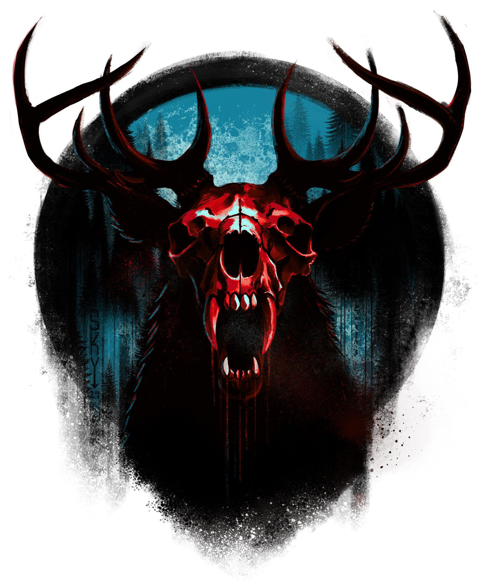

ven amongst the Gangrel, this fearsome bloodline is regarded as
exceptionally monstrous, for their Beast has a cold cannibalistic urge that
craves not just blood, but the ʺesh and bones of other Kindred. Łe few
Kindred Scholars who even know of this Bloodline freʖuently attribute
them to the Tzimisce, Noiad, or the Naga Raja, as their horrifying forms and hunger
For Kindred ʺesh draws such grim parallels between them.

Oral tales from those who arrived in North America before the majority of
European settlers tell the story of a pack of starving Gangrel who became possessed

by a wicked spirit of greed and hunger, and consumed one another to survive, until
only one remained, with blood as chilled as winter. Others claim these creatures are
something else entirely, which has merely appropriated the guise of Kindred in order
to hunt and consume them as a wolf in sheep's clothing. In modern nights these chilling
cannibals now prowl the territories that were once their hunting grounds, feasting on
Caine's children.

Łis Loresheet confers a number of heavy ʺaws that may drastically alter a
Character's playstyle with each Background purchased, turning that character more and more
monstrous. When taking this Loresheet, you gain the Glutton Feeding Flaw (Pg. 19), but also gain
the Eat Food Merit (Vampire the Masʖuerade Core Rulebook, Pg. 182).

Optional Discipline Spread: Auspex, Fortitude, Protean

●Delicatessen: Your very blood is
starving. Mortals and Animals who
partake in it are always hungry, eating
any food indiscriminately, but still
becoming thinner. Kindred who feed
on your blood slake no Hunger, and
instead their Hunger increases by 1 for
every 2 Hunger they might've slaked
from you. You also gain the Famished
Mythic Flaw.

●●●The Last Winter: Your
Hunger is a terrible winter that
consumes all in its expanse. You
passively chill everything within a
number of yards/meters equal to
twice your current Hunger. Drinks
quickly cool, open flames slowly
wither, and others feel a cold draft.
You may spend a point of Willpower
to magnify this effect, forcing all
others in the radius to pass a Stamina
+ Resolve; Difficulty 3 Test. Failure
causes two Superficial Damage.

●●●●●Ravenous: There's no
escaping the gnawing hunger in your
veins as it grows. Once per story,
when you reach Hunger 4, you may
assume a tall, monstrous, and
emaciated form. While in this form,
you grow +3 natural brawling
weapons, and your successful bite
attacks cause the victim to Test for
Hunger Frenzy; Difficulty 4. You cannot
slake Hunger in this form unless you
drain and consume a victim
completely. All other attempts at
slaking Hunger instead cause you to
grow larger, and increase one of your
Physical Attributes by 1, up to a
maximum of 5. You revert to your
base form at the end of the Scene or
when you reach Hunger 0. You can
assume this form whenever you wish if
you have Protean 4 or higher.

●●Bones and All: Your blood is a
manifestation of the evils of greed
and gluttony, and you relish in this
nature to consume more of it. You
can consume up to twice your mass
without any issue and when you
diablerize, add two dice to any pools
made in the attempt.

●●●●A Certain Hunger: When
your Beast is satiated or starving your
powers become oppressive in their
potency. While at Hunger 0 or Hunger
5, add three dice to your Discipline
pools.

50

---

## Mariner

Benthic Ferals

“Deep beneath the waves they drown, gargantuan beings cast out by God in Noah’s trial. Under the sea they gasp for
air, but tread water in its place. ķeir pain and misery unwitnessed, until the child of Ennoia came upon them. In that
discordant chorus of gasping the child of Ennoia did learn.”

–Excerpt from Rahab's Lament

Referred to by scholars of lineage and researchers and cataloguers of Bloodlines as Gangrel Aquarii, these
Mariners are an elusive oʚshoot of the main clan. Choosing to live in bodies of water and assuming the forms of
animals that call such habitats home, they are ʖuite similar to typical Gangrel outside of their preference for
aʖuatic animals and forms. As a rule, they choose to hunt in bodies of water, usually vast ones, and rarely care for
taking domains or territory outside of it.

Łe source of this Bloodline diʚerentiates from that of others, in that a mainline Gangrel can embrace a
Childe, who then assumes all of the traits and preferences of a Mariner, and a Mariner can embrace a Childe that
reverts to the mainline Clan's preferences. However in recent nights there exists lines of Mariners that seem to be
what one would think of as a more "True" Bloodline. Łese Benthic Ferals are embraced by Elders who have risen
from the crushing depths of the ocean, Beckoned to landfall in their long swim to the killing ʹelds of the Gehenna
War. As they paddle violent paths through cities, they leave newly Embraced Benthic Mariners in their wake. While
previous Mariners had some degree of choice in their aʖuatic transformations, or adapted them out of a ʖuirk or
happenstance of their environment, the hapless Childer embraced by these elders have little choice in how to go
about their transformations, as the deep wilds of the ocean appears to saturate their very blood with its strange
biology and adaptations. While other Mariners take on the appearance of sharks or octopi, these Benthic Mariners
take on much more alien forms, such as that of the angler ʹsh, giant sʖuid, or monstrous crustaceans.

Once considered extremely rare, in modern nights more and more of this Bloodline has begun to appear, as
many Gangrel seek refuge in the depths of the ocean from tyrannical Princes and the ʹres of the Second
Inʖuisition. Adding to these are the aforementioned Benthic Mariner Elders who tread cities almost like ʹsh out of
water, bringing all the strangeness of the abyssal depths to bear on their prey.

Despite their stark diʚerences when compared to their terrestrial cousins, the Mariners still employ the same
core Disciplines as their kin, albeit with an aʖuatic bent.

Discipline Spread

ANIMALISM Mariners use Animalism to communicate underwater, usually telepathically. If taking a Famulus, a
Mariner almost always chooses something that can live in and around water. Crocodiles, whales, sharks, and
otters are all rather common.

FORTITUDE For the deep sea dwellers, this power gives them considerable durability, and allows them to survive
in the crushing depths of the ocean, or against the unseen gigantism of the things that sleep there.

PROTEAN Like with their preferences of Animalism, Mariners almost always take on transformations that are
related to water. Webbed claws, shark teeth, and even barbed tentacles are used as Feral Weapons. More rarely a
Mariner will assume the form of an albatross or a seagull. Łose that hold origins in the deep sea tend to take on
very alien and haunting shapes of large sizes.

51

l o r e s h e e t

mariners

(BLOODLINE; GANGREL CHARACTERS ONLY)

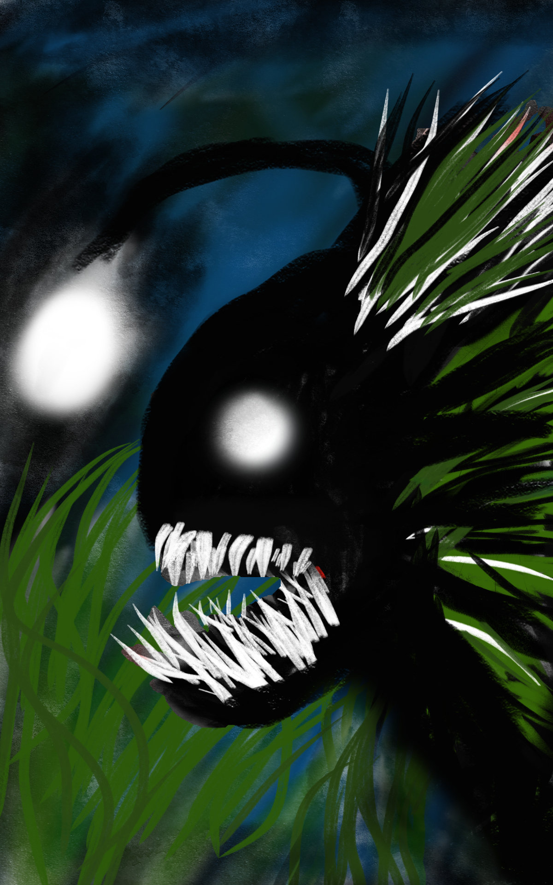

any Gangrel are constantly on the move, always searching for the
undiscovered country to live far from the expanding reach of
civilization, and more especially the reach of other Kindred. Łis
search for mythical isolation has lead several Gangrel to become the
variant called Mariners, Ferals who seek sanctuary beneath the blackened waves and
assume the twisted guise of large isopods, mollusks, and ʹsh, and strange
transformations that mimic deep-sea life when they Frenzy.

Once thought to be incredibly rare, the beckoning has dredged utterly inhuman
Elder Mariners from their benthic havens, and they have leʨ childer of greater
numbers in their wake. Łese chaotic embraces have no apparent reason, with many
embraced by these ancient creatures leʨ to wallow alone. Łose that take aʨer their
sires tend to live in self-imposed exile, disconnected and usually clueless, to Kindred
society.

●Immersion: Your flesh and blood

quickly liquify to acidic sludge. Those
hit take a point of Superficial Damage
every turn until they spend a full turn
to remove the sludge. Expelled
organs can be projected with
Stamina + Athletics roll, and are
treated as a typical ranged attack.

through your local area, allowing for
quick and secret movement. You and
your Storyteller choose three separate
locations that are all linked by this
network of waterways. While traveling
these submerged paths, your sense of
direction is unerring, however others
will need to make a Wits + Survival;
Difficulty 7, to navigate them.

is called to the water, and when
completely submerged you gain
webbed membranes between fingers
and toes, and may even sprout fin-like
protrusions, as your eyes and ears
shift. You automatically pass all
Athletics Tests while underwater, your
perception pools are also increased
by one.

AQUA JET While your forearm is

submerged, you can spend a turn
absorbing water into it, and then
project it as a powerful stream with a
Strength + Brawl ranged attack that
deals two Aggravated Damage.

●●●●●Creature of the Deep:

●●Benthic Mutation (choose
one): Your blood has altered your
body in some fashion that grants you
one of these strange abilities:

One of the elders who has made
landfall left a trail in their wake, and
you've followed it somewhere deep
below sea level, into a secreted away
subterranean lake, where aquatic
monstrous creatures rest. You gain
these Creatures of the Deep as Allies
(●●●●●), and you gain the location as
a Haven (●●●). These allies will always
appear once per Chronicle when
summoned, but will cause
considerable damage to whatever
location they're called.

●●●Rest on the Ocean Floor:

Vast watery depths are your most
comfortable home, amongst the
deep reaches of the world. When you
daysleep uninterrupted in, or buried
under, a body of water at least the
size of a pond, your Blood Potency is
increased by 1 until dawn the next
day.
●●●●Obscure Waterways: You

BIOLUMINESCENCE With a Rouse

Check, your skin can display
patterned glows of alternating colors
that hypnotize and attract. Those that
see you must make a Willpower Test;
Difficulty 2 + your Protean to resist.
However when you're at Hunger 4 or
higher, your skin becomes
transparent.

know of a network of underground
waterways that weave their way

EXPULSION With a Rouse Check, you

expel your dead organs, which

52

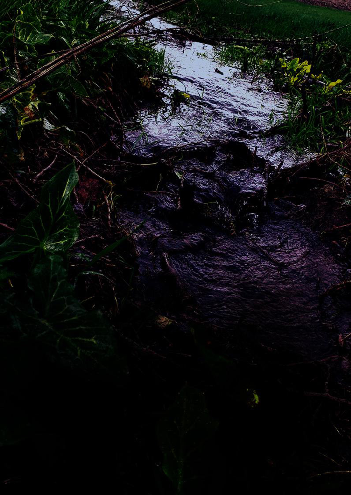

\

THE GANGREL

IN
MODERN NIGHTS

On its face the Clan of the Beast may seem like it doesn't belong in these modern nights, too primitive for the
society at large, its powers replicated, replaced, or shared with too many other Kindred. Łat they are ill-suited to
modernity and it's a small wonder that these Ferals still stand strong when other decentralized Clans have freʖuently
been trampled by the march of history and those who write it.

However the Feral's lack of unity is a core strength. Unconcerned with the individual aʚairs of the Clan's members,
the Gangrel have proven themselves to be the most eclectic clan in all of Cainite history. Łe divides of sects or politics
mean little to a Clan of Beasts that is populated by so many Bloodlines and Kindred of vastly diʚerent talents and
capabilities that continue to persist in a world that has always put them to the ʺame, stranded them on their own, and
born down upon them with ever-expanding metropolises of concrete and light. Ferals unite under the one notion that
they hold close to the core of their being, something that no other clan understands so intimately and deʹnitively, and
so purely: Survival.

53

CLANBOOK: GANGREL 5TH EDITION

the world and suited to many ways of unlife. Each of
these Bloodlines are usually the result of a potent
Gangrel kindred, whose proteonic blood has imprinted
in their progeny and shiʨed them towards methods of
transformation that they and their blood ʹnds to be
the most advantageous. Without concern for purity of
maintaining social constructions of tradition, these
progeny modify their own form and commonly create
diʚerences of their own. Łis results in the creation of
entire branching pedigrees imbued with instincts based
on the originator's experiences and particularities, but
modiʹed ever-so-slightly by each member. Any given
Gangrel is the result of an unnatural form of emergent
and self-made evolution, who then puts their own twist
on the proclivities of their inherited bestial instincts to
bare strange permutations that might be wholly uniʖue
to them.

Sha¨ed b× ·he WlĘĘ ·Ħ
S¼«ÐlÐe

“ķere has never been a more eclectic group of kindred
than the Gangrel in my view. ķey are as diverse as the
many environments that exist in our world. I've seen coasɭal
fishing cities whose oceans are home to a small population of
aquatic Gangrel known as the 'Mariner'. I've been to the
mongolian deserts where Gangrel took a worm-like
morpholoʔ to aid them in traversing the sand with great
speed in order to ambush unsuspecting nomads. I have been
in the heart of Ventrue domain and seen packs of corporate
raiders whose eyes gleam with predatory lusɭ. Gangrel with
insectoid features that allow them to scale walls and feed via
proboscis. Never has there been a clan more proficient at the
art of survival and continuation. We owe the kine a deep
debt for creating civilization for without it we would be at
the mercy of these kindred.”

–Avander, Magister of Lyon

hrough the use of protean that courses
through their veins, Gangrel have managed
to gain animalistic transformations that
allow a Gangrel to greatly adapt their
bodies to their environment. Assuming a form that
makes them a testament of darwinian perfection,
especially in the case of Gangrel elders who have
mastered both protean and their Beast, allowing them
to take on multiple animalistic attributes at once,
becoming chimera like humanoid.

While in the past many Gangrel of old would
perfect their form to a single way of life or
environment, the Gangrel of today know that there is
wisdom in remaining ʺexible and adaptive, rather than
specialized. Łe environment of the modern world can
change in a span of nights rather than years, and it is
better to develop and prepare avenues of survival that
are constantly shiʨing just as ʖuickly. In that regard,
many Gangrel count themselves as strong
independents, carving out as many ways to defend and
combat their nightly un-lives amongst the other Clans,
or the things that lurk in the wilds beyond.

Łis drive for shiʨing their own blood and body to
survive has resulted in the creation of numerous
lineages and made the Clan of Beasts renowned for the
various bloodlines that can be found scattered across

54

# GANGREL IN MODERN NIGHTS

The NĦĞadlc Llfe

politics, outside the social traps of Archbishops,
Barons, and Princes.

Łey knew it was absolutely impossible to live for
any signiʹcant amount of time as a Kindred without
making enemies, and that bunkering down in a single
domain resulted in obligation and danger to others.
Staying on the move kept the Gangrel free, and
continues to keep them free in these modern nights, as
only the most driven and reckless of Kindred would
venture far from their Domain, their sphere of what's
theirs, for any length of time, as they covet and hoard
that inʺuence, and know that every night away their
inʺuence and safety erodes as the other inhabitants
plot in their absence.

“When I was a kid we moved around a loɭ. I don't think
I ever finished a year of school in one place. My ɬather was
always running from something or another. Debtors, an
angry boss, lawmen, a wife that wanted us and a divorce. I
hated him for iɭ, but never voiced iɭ. We lived out of a car for
nearly three years when I was teenager. It was a hard life.
We didn't have a lot of money or a roof most of the time, but
he always made sure I wasn't too hungry. Always made sure
I was safe. And despite everything he did wrong, he at least
ɭaught me how to survive on my own.

"See he had a knack for doing that –Surviving, I mean.
Travel kept us alive. Odd jobs kept us fed. Friends all over the
country kept us connected. My dad knew someone
everywhere, and when he didn'ɭ, he made friends quick and
leʐ before they became enemies, at least when he could. He
stopped moving when I was in High School, thought he was
safe in that little hamleɭ, but it all caught up to him in the
blink of an eye. So I settled in with my mother. I lived the
last of my teen years in one place. 'Making up time' my
mother would say. It was awful, navigating people that way.
Suffocating, even. To persist for months and months with
nothing but the baʓage of other people's whims and
problems. ķeir little expecɭations. Unspoken rules.

Raiding

"It's all mine, really. If you think about iɭ. Can you keep
it? No? ķen I can ɭake iɭ. ķat means it's mine."

–Mandakh, Casimiri Adherent

A more despised version of the nomadic lifestyle,
these Gangrel hold contempt for those who would
believe such absurdities that a piece of land belongs to
anyone, they will simply take what they need and move
on. Łis can range from simply going into other
Kindred territory and drinking their ʹll, to more
elaborate means such as the infamous Wolves of Wall
Street, a pack of Gangrel corporate raiders who take
great pleasure in taking down corporations to maintain
their opulent and short-sighted way of life, much to the
chagrin of many Lasombra and Ventrue’s portfolio.
Most Gangrel employ shock tactics and elements of
surprise to take what they need and leave before the
Kindred who reside there realizes what has occurred.
Łere is a rarely followed tradition amongst the
Gangrel, which has largely fallen out of knowledge and
use these nights, that if you are to raid another Gangrel
you must declare such intentions before doing so, of
course most who are unscrupulous enough to raid are
rarely going to follow some archaic sign of respect to
some kindred who just so happens to share their
lineage.

"Since my Embrace, movement has been a key survival
ɭactic. Hunters can't raid your Haven if you're not there. ķe
Sheriffdoesn't come knocking on your door if you have a new
one every few weeks, or you're living in a cave. Anarchs
scream and bite over turɬ, but I live amongst them as long as
I need to, then leave. It's all mine for as long as I need iɭ, and
as long as I'm willing to keep iɭ. When I was young I hated
my ɬather for the consɭant traveling, but he ɭaught me how to
survive. ķe strength hidden away in movemenɭ. Most people
don't undersɭand iɭ, but we do."

–Akino, Gangrel Nomad

he Gangrel of old resisted the pull of cities
and readily combated the foolish urge to
carve out a piece of land for themselves to
call their own. Łey believed that the act of
planting oneself in a single territory or domain, as
other Kindred have, invited complacency and the
manipulation of Elders and the tyranny of their laws.
Łey made sure when they rested their head it wasn't
under the strict inʺuence of others, and that they were
safe to live an unlife free of the web and intrigue of

55

CLANBOOK: GANGREL 5TH EDITION

Fellow Travelers on the Road

Łe territorial nature of the Gangrel is not entirely
unwarranted or without merit. Historically the Clan of
Beasts have been pushed out of their Domains due to
the expansion of cities and the marching armies and
inʺuences of others, leading to them constantly being
pushed further and further out of their own territory.
Especially prevalent during the Dark Ages in Europe,
this caused many Gangrel to ʺee across the ocean to
America, and were even some of the ʹrst Kindred to
arrive in the new world, claiming their Domains in the
new frontier with thoughts that the Camarilla would
back their claim. When the cities grew out of the soil
the grim realization of the truth was manifest, however,
and the Gangrel were yet again pushed out of their
Domains, by both political decrees and even direct
violence.

"It's a long road, this life. A few hundred years long if
you sɭay clever. ķat's a long time to be alone, so I travel
with a few friends. 'A spider eats what's in its web, but it dies
alone.'"

–Rial, Akunanse Lorekeeper

While the Gangrel are seen by other kindred as
loners or Kindred who look down on humans, instead
preferring the company of animals, that could not be
further from the truth. Łe Gangrel can be found
accompanying or mirroring Kine who share their
mentality or whose circumstance forces them to be on
the move, such as wandering refugees and traveler
communities. Relationships with these fellow travelers
and nomads can range from purely pragmatic, such as
easy feeding stock put to use as a mobile Herd and a
like-minded Ghoul servant to ensure safety during the
day, to a silent benefactor or guardian angel helping
them on road and ensuring their safety, even against
other Kindred. Some nomadic Gangrel who grow
especially attached to these groups go so far as to reveal
their vampiric nature and form symbiotic relationships
amongst them, though this is much to the disapproval
and dismay of other Kindred. Finally there are those
who prefer to travel with a single person such as digital
nomads, oʨen feeding on them and the entourage they
come into contact with, and using their relationship
with technology as an asset to help navigate an
ever-modernizing world of electronics.

Since those early nights of colonial history,
Gangrel have been harboring a sense of paranoia,
turning their territories into strongholds to prevent the
incursions and erosion of their land by other Kindred.
Łese Gangrel preoccupy their time with knowing
every single nook and cranny of their Domain, laying
down traps or stashes to use in case someone assaults
them on their territory. Some of the older or more
powerful of these even warp their form, combining
with the land and enthralling the animals, so that
taking their territory would be too costly.

When a pack of Gangrel share a territory, they
defend it together, rising up against any threats and
ʹghting tooth and claw to maintain their turf. Like a
family of wolves, they prowl the land and ensure it
remains their hunting grounds. While Gangrel have few
rules and constraints, one that betrays their packmates
is almost universally reviled, even by Gangrel of other
sects. It's been known that a pack betrayed will travel
thousands of miles to destroy such traitors, and other
Gangrel will even assist in the endeavor.

Ńe Struʬle for Territory

"Outside of the city the only principle that governs is
'might makes right.'"

–Rickon, Anarch Emissary

While some of the more naive and ignorant
Kindred might ʹnd a Gangrel clamoring for, and
maintaining, territory in a city confusing, the truth of
the matter is that life in the wilds is hard. Few Kine live
in the countryside, and those that do don't provide a
density enough to ensure a consistent supply of blood.
While animals can provide one with sustenance, a
particularly active Gangrel would need to hunt them
freʖuently, and travel long distances to do so. On top of
this, the wilds are home to Lupines and other things of
dire monstrousness. Few Gangrel will admit it, and
fewer still enjoy it, but Domains in the city are much
more consistent and comfortable for hunting. Łose

Łose Gangrel that do decide on claiming a
domain are matched only by the Tzimisce in
territorialism, and they tend to lay claim to vast
expanses of land that have easily defensible borders,
with plenty of prey to hunt and feed, rather than any
kind of politically inʺuential function. In cities this is
rarely possible outside of the least-desirable districts, as
other Kindred readily stake their claim, or have it giʨed
to them by a ʹgure of authority due to their deeds or
status. Only the most vigilant and well organized
Gangrel, usually along with the help of a pack, can hope
to maintain a large city-based Domain without losing
ground to the High Clans.

56

---

A PĦĘl·lcaĘ AğlĞaĘ

that are able to hold highly sought out territory in a
city for decades are ʖuietly admired and feared, in eʖual
measure, by their clanmates.

"Kindred aims are always selfish. Other clans build a
ɬacade of some gobbledygook to prop up their ideals and
reasons why they're in charge, but it all has that day-time
soap opera feeling. I can't be bothered with all that bullshiɭ.
Just give me what I wanɭ."

Relationship with the Environment

"I don't know the names of these fish, but I do know
they need dirty water to breathe, so if that hydroelectric dam
gets builɭ, they'll die. If they die everything else that eats
them leaves or dies. ķen I need to leave or die. It's not that
hard to undersɭand."

–Ravager Meryl

Many think that the Gangrel are incapable of
navigating the politics of Kindred society on their own,
and that they are easy tools and pawns for other
powers, and while historically the Gangrel have been
the swords and shields of Dark Age courts, in these
modern nights that's far from the case. Most
contemporary Gangrel have taken a path that has
radically transformed the landscape of Kindred politics,
setting out on their own and carving freedom from the
hands of Princes and Barons. For the ʹrst time in
centuries the Gangrel are no longer silent partners or
pawns for the machination of those that govern sects,
they are movers, shakers, and agitators. Finding
themselves in positions of power and inʺuence as key
pillars of their chosen political movements, and more
importantly they are recognizing this new position and
the opportunities that it oʚers to them and their Clan
as a whole.

–Mariner "Capɭain" Clayton

Considering themselves stewards of the land they
freʗuent, most Gangrel have a strong sense of
responsibility to maintain and protect it from
unnatural forces. Ńe human creation of dams,
reservoirs, cabins, camping grounds, and even hiking
trails can draw a local Gangrel's scorn and result in the
Feral sabotaging human activity and eʗuipment,
hunting down and killing Kine until they're forced to
leave, and even lash out against those higher up on the
commercial or government ladder to stop technological
expansion into their territory. Surprisingly, this is
freʗuently ʗuite eʝective, as SI operatives care less
about a few torn-down power lines on a distant stretch
of road, or the mangling of half a dozen workers along a
river far outside the city.

In rare cases, this protection of the environment
invites a cohabitation with Lupines, who would
otherwise be too-stretched thin to maintain the
Gangrel's claim of land themselves. When this does
happen there's rarely love lost between the two
monsters, but they function with parallel purpose all
the same, and try to make sure that they don't disrupt
one another's stewardship and maintenance of the land.

Anarchs

"ķere's a time and a place for resisɭance and we've had
time enough now. ķe world is a big place. Let tyranny fly
someplace else to inflict misery, I've seen enough of it for two
lifetimes. 'ķe mosquito struʓles against a web, but all the
stolen blood in its belly will be eaten too.'"

–Rial, Akunanse Lorekeeper

While the Brujah can take credit for founding the
anarch free state. It is the Gangrel whoo keep it
standing. While by no means the only pillar, they are
without a doubt a vital one which would cause the
anarch to collapse. Of course a signiʹcant amount feel a
sense of camaraderie with their fellow Anarchs or those
that they share a city with, more so than some
nebulous, fractured, Clan identity. Gangrel that throw
their weight behind Anarch movements become the
claws and ears of their Anarch state, their uniʖue
position strengthening and complimenting the other
Clans typically found in Anarch movements. Łeir
competence as warriors gives them respect amongst the

57

CLANBOOK: GANGREL 5TH EDITION

Brujah, while their ability to scout and travel the
dangerous and fetid sewers to scout and carry messages
and secrets ʹnds them useful even to the Nosferatu.
Łeir uniʖue mix of camouʺage and raw combat ability
allows them to readily undermine institutions remotely
and install surveillance via Animalism without any
need for technology that is ever-increasingly
compromised by Second Inʖuisition Hunters. A Feral
amongst their Anarch companions can ʹll numerous
niches, and provide aid and protection for the
movement as a whole.

Łis escalation has brought the attention of several
other groups and Clans. Camarilla members aʚected by
the destructive methods of the World-Anew ʹnd
themselves fortifying their holdings with armed
security and advanced alarm systems, sometimes
creating a ʖuiet war of attrition. Fellow Anarchs regard
these tactics with mixed observation, some thinking the
extreme measures as too dangerous, while others view it
as a necessary shock to the system. Meanwhile Lupines
tend to revel in the destruction this movement causes,
and rumors abound that the movement stands
shoulder-to-shoulder with Lupines, who not only
participate in the destruction caused, but even provide
intelligence, funding, and logistics to ensure that whole
city blocks are disrupted.

Occasional points of friction do grow out of
interactions within Anarch movements, as agents of
change and struʩle, such things are to be expected,
even if the Brujah like to blame the machinations of
Camarilla courts that keep the youth of the night at one
another's throats. Łe fact of the matter is that points
of friction arise. Gangrel love their freedom, and they
have the strength and ʺexibility to defend it, even
against powerful Barons who would seek to use them,
or take from them. Territory and the ability to hunt
within it is regarded as an inalienable right to those
Gangrel that take it, and anyone that disrupts or
contests their claims should prepare to be carved by a
Feral's weapons.

As a group the World-Anew operates as a
collection of heavily scattered cells across Europe and
North America. Messages and information between
each cell is terse and infreʖuent, as each member
already knows the ultimate goal of what it is that they
should do, but when they do communicate they tend to
do so using and exploiting Kindred information
networks, such as the Hushed Chorus and the Blood
Ravens, to keep in contact with one another.

In addition to territory-related grievances, the
Gangre have always treated society with no small
amount of caution, and Brujah are nothing if not
bringers of society's change for the betterment and
expansion of those within that society. Few within the
Clan of Beasts are comfortable with a large central
power, be it Camarilla or otherwise, governing their
night-to-night activities. Łis wariness puts them at
odds with the grand designs of many Anarch
movements, which demand organized cooperation and
ever-elaborate methods of oversight and governance.

Independants

"Be shackled to no one but yourselɬ, and even then be
wary of the limiɭations you enforce on your own will. You're
greater than you realize. Strength in oneself is strength as a
whole. We don't need someone else to build us up and we'll
fight for what's imporɭant to us. Not them."

–Vitio the Defiant Priest
Łe Gangrel have been tied down by the
expectations of the sects and clans for a long time, few
elders remember the night when they had no
obligations to a titled High Clan, or an Elder that
dangles their boons over a Feral's head. Xavier's
emancipation of the Clan of Beasts from the Ivory
tower fostered an already-developing attitude in the
minds of the Gangrel: Łat of self-determination. On
top of that, Gangrel who can make such sweeping and
inʺuential changes within an already disparate clan
become increasingly rare with each passing night, as
their ancient blood is Beckoned away to the killing
ʹelds of Gehenna.

the world-anew movement

Growing out of this distaste for civilization is the
"World-Anew Movement", an extreme Anarch group
that's gaining traction even amongst non-Gangrel.
While it began as a concerted eʚort to ensure ecological
prosperity and the preservation of natural land, this
movement has been twisted and has become
increasingly destructive in a very short amount of time.
Łeir eventual goal is to take down the rotting ediʹce
that is modern civilization by any means necessary,
sometimes even tossing aside the Masʖuerade to ensure
they reach their goal.

Having witnessed the tremendous eʚort and
organization reʖuired to leave the Camarilla, even if it
was kickstarted by a powerful and widely-respected

58

---

member of their blood, many Gangrel found the
prospect of taking refuge in another Sect more trouble
than it's worth. Hesitant to entangle themselves in
Anarch politics, or their open war with the Ivory
Tower, many in the Clan of Beasts remain wholly
independent, taking to their own lands and keeping to
themselves. Łe claims of freedom that Anarch espouse
serve little temptation, as their promises of autonomy
ring hollow when power over others tends to remain
the truth, even more so now that the Ministry have
begun to nest within the Sect.

clan as an ever-changing and strengthening animal.
When challenges like this do occur, it tends to be a
ceremonial event, oʞciated by a Lorekeeper who
knows the old ways, or another widely respected and
wise ʹgure of the Clan. Łese events are also used to
regulate divergent ideas, or punish transgressions
within the group, so that the Atavists remain uniʹed in
their mindset.

war dogs

While some groups of Gangrel are considered
independent because of their staunch convictions that
support those positions and ways of unlife, the War
Dogs instead operate on relative indiʚerence. Less an
institution or organization, and more a term that
describes the many Gangrel mercenary companies
willing to work for whoever pays the right price, living
and dying on their own prestige and operating on their
own sense of morality. Łese disjointed companies of
mercenaries tend to be deʹned by their leadership.
Some follow strict codes of honor, or refuse jobs that
they ʹnd distasteful, while others have absolutely no
ʖualms about what the job is, and are willing to do
whatever it takes to fulʹll the contract.

atavists

Amongst the Gangrel is the ever-growing ideal
that they should only be governed by their own Clan, as
too long have they compromised their convictions,
beliefs, and survival for not only other Sects and Clans,
but also in relation to what others claim is their
supposed humanity. As if the Clan of Beasts weren't the
most natural of what they were meant to be.

At their core, the Atavists believe that they should
return to the Path of the Beast, a philosophy and
movement based around nurturing and understanding
their inner-Beast through the primal concepts of
Self-Suʞciency, Strength, and Survival. Łrough this
animalistic existence, and a return to the old ways of
their Clan, they've come to value paganism, and hold
their members to the convictions of Gangrel being
"Hunters among the Hunted", and have a duty to
maintain the balance between the cunning of man and
the ferocity of the Beast in themselves and the world as
whole.

Łese mercenaries are ʖuick to gain prestige and
reputation when they're consistently successful, but
usually ʹnd themselves walking a tightrope to keep
from being draʩed into the Sects that have hired them,
or embroiled in their politics. Canny War Dogs use
their jobs and position as leverage, however even these
individuals can ʹnd themselves backed into a corner by
a Prince and a particularly competent Sheriʚ if it
becomes more beneʹcial to cover up a job entirely.

Łe hardliners of these ideals within the Clan take
it one step further, proclaiming that the dichotomy of
man and beast also engloves Kindred society and their
place as a member of the Clan of Beasts. For this reason
they are very isolationist and revile the idea of an
institution not of their own blood being able to judge
them or dictate how they should live. Primarily based
on the outskirts of towns or pockets of wilderness, they
stay away from cities whenever possible, however they
have been known to spontaneously organize, usually
without warning, to humble the local members of a
Sect, or even target speciʹc Kindred who attempt to
expand outwards or subjugate members of their Clan.

Ńose Who Remain in the Camarilla

"We don't sɭand idle. We are a definitive pillar of the
Courɭ. A shining shield against horrors. ķey show us due
respect because we have earned iɭ."

–Knight Commander Blaidd

While the Camarilla would never admit it, they are
missing, or at the very least silently regretting, the loss
of the Gangrel and not having done more to retain
their Clan as members. Many High Clan Kindren found
a use for the apolitical dog in the court, who leʨ
matters uncomplicated and was easily swayed or
manipulated, not looking too deeply into the
complexities of politics. Łis uniʖue position now goes

Within the group of Atavists themselves runs the
ʹrm ideal that might make right, so challenging leaders
and others higher status within the group is encouraged
and fostered as part of what cements the identity of the

59

CLANBOOK: GANGREL 5TH EDITION

completely unʹlled, as the inʺux of the Lasombra prove
too ambitious and politically astute, while many of
Haqim's Children retain a distant aloofness, as well as a
keenly edged blade.

assets and titles tied to their membership, neither of
which they want to lose.

Another key reason is that, unlike the rest of their
Clan, these Greyhounds tend to be shrewd politicians
who know how to exploit the arrogance of those of the
Ivory Tower who turn their nose up at the Gangrel, as
you be underestimated is ʖuite an asset that can
provide many opportunities to the ambitious
Greyhounds willing to brave the halls of power that
they tend to avoid. Łese more elitist Gangrel tend to
ʹnd common cause with the Toreador and other
members, acting as a kind of intermediary to the
members of their clan on lower rungs of the social
ladder such as the Hounds, as well as those outside the
Sect. Freʖuently they also ʹnd themselves aligning with
those in the Clan of the Rose who seek to preserve
aesthetically pleasing natural areas, such as large parks,
and oppose the development of expanding urban areas,
usually to the detriment of the masses.

In many courts this has created an amusing
position, where the Gangrel that remain are tended to
by High Clans and others of status, and made a show of
being admired for their loyalty and superior mineset. In
certain cases this even becomes a fashionable trend or a
shallow social ritual of hollow appreciation, where the
Feral is practically put on display and showered with
giʨs and appreciation. While some Ferals ʹnd this
validating, most see it as little more than a pat on their
head that is insincere.

loyal hounds

For some, service within the Ivory Tower is simply
a means to an end. While they may have loyalty to the
local Prince or their Coterie, many have stayed simply
because the Camarilla tends to have the resources to
reward their eʝorts. Ńese hounds usually act in the
role of maintaining buʝer Domains at the edges of
cities, or in areas too far from the court's seat of power,
giving them a degree of freedom that most others don't
share.

the orders

Members of the Gangrel that didn't heed the call
for defection based on principle alone. Łe resurgence
of the Invicti and the Knights of Avalon have gained
new prominence in some Camarilla cities due to their
martial organization and their ability to stand tall and
with poise. Łese orders have become renown in many a
Prince's Domain for their poise in the face of
overwhelming opposition, with the Invicti selʺessly
pushing back against the Second Inʖuisition and
re-taking cities with sound tactics and incredible
martial acumen, while the Knights of Avalon press
outwards as paragons of what it means to be a defender
of the Ivory Tower against the terrors of the dark
beyond the lights of the city.

Since the defection of most of their Clanmates,
these few remaining Gangrel are now dependent on the
few remaining Camarilla-aligned Gangrel Elders, or
more commonly the Prince, to provide them with
guidance. However these same individuals tend to
exploit them as a way to solve private aʝairs without
upsetting the balance between the ruling class in the
Court and disrupting a careful balance of power and
inʽuence amongst the other members. Hounds that are
use, or exploited, in this way are aʝectionately, and also
mockingly, called the House of the Prince.

Some individuals have been critical of the rise of
such groups within the Sect, however, citing their
meteoric rise as a sign of political meddling, and far too
convenient. Łese same people theorize that their
presence has been engineered as a way to artiʹcially
boost Sect morale, and that they are backed by the
Inner Circle or some other unseen powers who merely
wish to show other Gangrel that they do still very much
have a place of prestige within the Ivory Tower. Of
course those that openly share this conspiracy with
members of either group ʖuickly ʹnd it a good way to
be disemboweled by a blade, or challenged to an
honorable rite of combat.

greyhound

While many Gangrel leʨ the Camarilla to throw in
their lot with the other Sects, many of those who were
already well-established and a part of the Ivory Tower's
upper echelons of society and nobility made the choice
to remain. Łese "Greyhounds" as they're called by those
found within and outside of the Sect, ʹnd themselves
better suited to keeping their position, whether it be
because their values align with the Camarilla very well,
or more selʹshly because they have an array of amassed

60

---

Legacy of the Sabbat

With a growing army under his command, Casimir
began raiding small towns, eventually building up to
small cities, destroying any Kindred that opposed him
via ʗuick and precise strikes that would leave only a
tattered governing body of Kindred. With the
foundation and power network gone, he would take the
most competent and strongest of those who remain and
blood bond them, leaving them responsible for the city,
and allowing them some degree of self-governance.
Along with these blood-bound overseers, he leaves a
small group of three or four capable and trusted
Gangrel, who keep watch and provide protection from
other Sects and forces that would seek to move into the
territory. While the overseers remain somewhat
autonomous, Casimir reʗuires that they pay him
tribute, usually in the form of actionable assets, ghouls,
blood, or even Kindred to fuel his war machine. In
some cases, without warning, Casimir will appear to
collect these tributes himself, usually to display his
ʽagrant acts of brutality and sardonic wit.

"Someone else's Beasts. ķat's what we were when we
ran in those Packs. ķe teeth and claws of Archbishops. ķe
Sword of Caine. Black Hands of a dying culɭ. No greater
agency than those who we fought and raved againsɭ. Now we
are free to be ourselves."

–Vitio the Defiant Priest

When the Sword of Caine leʫ for the Gehenna
War, not all marched on with their packmates. While
many pursued the beckoned elders, especially key
leadership, a few were leʫ to wander without guidance
and many more were destroyed and scattered by their
enemies or the Second Inʗuisition. Among these that
remain are the signiʼcant number of Country and City
Gangrel, who were a large portion of the Sabbat's
frontline and scouting specialists. In the absence of core
leadership, many of these Gangrel became roaming
packs of violent predators, killing, destroying, and
diablerizing everything at a whim.

While this new empire has yet to push into the
largest Camarilla held cities, it's only a matter of time
and infantry numbers before there is an open assault on
a position of the Ivory Tower, who Casimir seems to
hold a speciʼc disdain for. Ńis isn't to say that
Anarch-aligned city-states are any safer from the
shredding claws of his army, as many have already
thrown their lot in with him, either through coercion

While many of these Ferals ʼnd some semblance of
camaraderie within the Anarchs, they eventually
become murderous enforcers with inhuman traits and
appetites, or they're exiled or killed outright by the
more morally-sound Barons and their members. Few of
these ex-Sabbat ʼnd a real place of belonging within
the Anarch as anything more than a tool for violence.
Ńe few Sabbat that are able to throw oʝ the
conditioning of their former Sect ʼnd themselves most
comfortable amongst the Ministry, who readily shiʫ
and aim their fervor towards more productive ends.

or convenience. ⬛

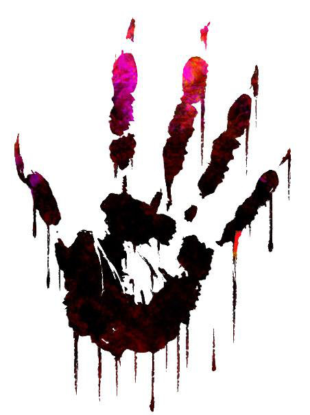

casimir and the new empire of war

Appearing from the ashes of the Black Hand, and
seemingly from no where, is the Cainite Warlord
Casimir. Putting whole cities to the claw, his origins are
unknown and a subject of speculation. Many attribute
his origins to outlandish claims, such as him being a
Garou before his Embrace, that he's returned from the
Gehenna War with the blood of ancients in his veins, or
that he is the rebellious Childe of a Methuselah who
means to sew as much strife as possible through any city
not in his claws. Perhaps the most grounded theory
passed around is that he was once an Archbishop, or a
leader of a prominent Sabbat pack. Regardless of his
origins, the horrifying fact of the matter is that he has
gathered a huge following of disenfranchised Kindred,
especially ex-Sabbat Gangrel, and as a result,
proclaimed himself Warlord.

61

CLANBOOK: GANGREL 5TH EDITION

CĘağ ağd C¼Ę·¼«e

groups, are generally valuable, however leaving them
behind is even harder than joining in the ʹrst place, as
most of the Gangrel within such packs are very
protective and territorial of those within and are ʖuick
to police or correct behavior that is conducive to them
leaving if it would erode the cohesion or strength of the
group as a whole.

As a Clan, the Gangrel have no monolith of
culture. Instead many beliefs and traditions are
dependent on the environment of their home and that
of their more recent forebears. Unlike most other
Clans, who have a tendency to impose their way of
being unto their environment through the use of
construction and terraforming their Domains, or place
themselves apart from the world they live in. Ńe one
through-line of the Gangrel's culture is their ability to
adapt to their locale, to take on the cultures of those
they come into contact with, or at the very least keep
themselves from altering the natural environment to
their whims. However, with that said, there are some
cultural particularities and cultural structures that are
common to all Gangrel.

ghouls

A Gangrel's relationship with their Ghoul is seen as
peculiar by many other Clans, and in general the
Gangrel keep such a close relationship with them that
other freʖuently mistake them as lovers, or direct parts
of their family, and without the natural predatory
nature of the Feral's inclinations, it might even be so in
most cases. However Kindred are nothing if not
exploitative of Kine, and though a Gangrel may hold a
Ghoul close, and even love and value them in ways
similar to a familial bond, at the end of the night their
possessiveness and need for a servant, rather than a
peer, usually serves as the deʹning social characteristic
of any relations they might have between a Gangrel and
their Ghoul. What is still true though, is that the
Gangrel are a particularly possessive Clan at times, and
may ʺy into a deep and primal rage if they feel slighted
by their Ghoul, or if any harm comes to them.

Relations with other Kindred

Łe Gangrel have nurtured something of great
value that all other kindred crave from the Brujah
rabble rouser to the Ventrue patriarch: Loyalty. Łe
Gangrel know the wisdom in having a small group of
Kindred that truly have your back and won’t leave at
the ʹrst sign of trouble, and usually make eʚorts to
ʹnd and surround themselves with such individuals. In
this way, most Gangrel prefer the ʖuality of their peers,
rather than a pure ʖuantity, especially when it comes to
their social circles. Being ʖuick to violently reject the
vapid and superʹcial relations of convenience that
many other Clans foster to prop up their reputation.
Gaining the approval of a Feral usually demands one
must prove their worth with action rather than words,
even more so if you are to enter into their inner circle,
or pack. Łis is by no means an easy task of course, but
if successful the Wolf will be by your side while most
others would have leʨ. Of course there is an
expectation of reciprocation and reneging on those
expectation is a ʖuick way to gain a Feral's animosity or
invite outright violence.

Despite this parasitic nature, there is genuine care
that goes into the bond between a Feral and their
Ghoul, and what is usually notable is that Gangrel are
rarely abusive to their Ghouls, at least not purposefully.
Łeir possessiveness is rivaled by their desire for their
Ghoul to have a degree of agency and self-suʞciency,
and even sometimes personal freedom. Łis results in
Ferals treating their Ghoul with a degree of respect
that's not commonly seen amongst out Clans.

Even more potent than their bond with human
ghouls is the Gangrel's bond with their animal ghouls.
Many Ferals consider their animal companions to be
more honest and genuine, further from the corrupting
inʺuence of human inclinations and institutions. As a
form of respect and tradition, it's not uncommon for a
Gangrel to take on their Sire's Famulus aʨer their
death, bonding with the Famulus and heeding its
wisdom as a guide in instinct and wit. However
Gangrel who despise their Sire, or who are hellbent on
wiping out their legacy or being, will instead go out of
their way to slaughter their Famulus, as well as whole
herds that they were attached to, both animal and Kine.

Connections forged in this way can go deeper if a
Feral considers you part of their “pack”, with pack
being a close social group similar to a gang or Coterie.
Proving oneself to this level of merit usually reʖuires
multiple ordeals, or the approval and agreement of the
pack's leader. Relationships in these small, tight-knit

62

---

animals and dyscrasia

these cases, should the Childe manage to fend oʚ their
Sire, they are freʖuently rewarded with proper
guidance or assistance, and leʨ to persist in the night.

Łere are some animals whose blood holds great
power being able to confer disciplines or even hidden
insight. Łese animals are said to be the descendants of
powerful beastly companions that drank from
methuselahs or even antediluvians. When these ancient
masters withdrew from the world their companions
were leʨ to wander the world procreating with others
of their kind and passing on a fraction of their old
master’s power to their progeny. Cainite scholars are
skeptical of the veracity of these claims, but the idea
remains a pervasive one in clan Gangrel. As streets and
cities alike have been torn to shreds by Gangrel hunters
thinking they are tracking such blessed animals.

those that distinguish

While embrace by trial is the most known method
of embrace, it is far from the only one. Some more
radical Gangrel believe that newer generations are
tainted by modernity and civilization and thus take it
upon themselves to kidnap children at a young age and
to raise them in the wild or isolate them in
environments that aren't conducive to the evils of
modernity. Łe "feral children" are usually raised by a
Gangrel's ghouled animals until they have survived and
matured enough for the Embrace. Łe warped and
inhuman belief behind this process is that this creates a
purer, stronger, Gangrel who is closer to Ennoia.

Methods of Embrace

Some Gangrel also prefer to Embrace those that
have managed to prove themselves in some remarkable
way, beyond that typical to other Kine, such as those
who provide a great challenge while being hunted, or
even gain the upper hand in combat. Łese future
Childer are seen as exceptional, and embraced to
strengthen the ways of the Clan.

embraced by trial

Gangrel are widely known amongst Kindred for
their method of Embrace, where they leave their new
Childe to fend for themselves to see how many years
they can survive without direct aid. Łis is usually
referred to within the Clan as surviving a number of
"winters'' and it's not uncommon for older Gangrel to
ask younger ones "How many winters?" to get a degree
of how capable a younger Feral is. Childer who show
the ability to survive and adapt to their new nature as a
predator, as well as the everynight trials they must face,
are usually taken under the wing of older Gangrel and
given more direct wisdom and assistance.

Others still Embrace purely on the matter of
shared ideals or values, and even sometimes are
embraced to preserve values. Łis method is common to
all Kindred in many ways, however for Gangrel the
shared beliefs are usually speciʹc to something primal,
protective, or destructive. Environmental activists that
refuse to back down against all odds, or hunters that
throw their well-being into jeopardy to stave oʚ
poaching, are both good examples of these kinds of
embraces.

Łe Clan as a whole have recognized the problem
with these methods of Embrace, however, and in these
exceptionally dangerous nights many Wolves Embrace
from especially hyper-competent Kine to ensure their
survival, or at the very least guide them to some degree.
As said above, it's not uncommon for older members of
the Clan to ask other Gangrel who are in dire straits
the ʖuestion "How many winters?" to ascertain just how
new they are, and how much help should be given.

Bloodlines Surge

A recent phenomenon is the sudden surge in
Gangrel Bloodlines, both in their sudden appearance
and reintroduction. Many of them have entered
Kindred circles to blaze their own trail, and present
monstrous and strangely speciʹc adaptations that
manifest due to their uniʖue environments or even
their beliefs. Some range from the withered and
stag-like Starving Winters, to the abyssal deep-sea
aspects of the Mariners. Even stranger as insectoid
approximations that have compound eyes and ʹns
suited for wading through thick marshes. Łese
Bloodlines of Gangrel show abilities and practice

Despite it becoming more common that Gangrel
receive help from others these nights, there still remains
certain members of the Clan that are brutally
darwinian and believe that if you are unable to remain
discreet, that if you attract unwanted attention to
yourself and the rest of Gangrel society, then you have
shown yourself to be unʹt to survive. In many cases, if
these unʹt Childer do not destroy themselves, their
Sire will descend upon them and end their existence. In

63

CLANBOOK: GANGREL 5TH EDITION

show abilities and practice Disciplines that usually
surprise or confound even other members of their clan.

tend to repeat themselves and bring old parables and
lost history to the fore once again, resonating through
echoes in the blood of an ancient descendant. In these
strange ways, the Gangrel have a storied heritage unlike
any other clan. An instinctual history, perpetuated even
when lost, that sometimes adapts and changes to suit
the environment in which it is most useful to them.

While these Bloodlines would once keep to
themselves, or be uncommon enough that they might
go unnoticed as little more than a rumor or strange
sight at the edge of town, the Beckoning has pulled
many of their elders from slumber and pulled them to
the killing ʹelds of Gehenna. In their travels many of
these anachronistic Elders have Embraced into their
once-rare lines, resulting in a surge of prominent
numbers, even in places that are normally uncommon.
Łe ʖuirks of these Bloodlines pose an interesting
conundrum for the Gangrel and Kindred, as their
particularities could be a great asset to those willing to
accept them into their ranks, however many of them
have forms and strange animal aspects are less than
ideal for a Kindred Society that continues to sink
deeper behind the Masʖuerade.

Myths featuring Ennoia, the supposed founder of
the Clan, and her many enemies, allies, and lovers, are
especially prominent amongst the more learned of the
Gangrel. Serving as allegorical lessons about a Kindred's
existence and how it relates to others, especially other
Clans and monsters of the night, akin to La Fontaine's
Fables. When told well, and with belief in their
authenticity, these orations of Ennoia are inspirational
in a supernatural way that stirs the listener's blood to
help them persevere against in nights for opposition,
almost as if the antediluvian fosters their messages and
lessons herself, and grants her boon to those that hear
them.

Oral Traditions

In addition to tales of ancients, oral traditions are
also used to preserve the exceptional deeds of Kindred
in contemporary or more recent nights. Immortalizing
their actions for either praise or infamy. Łe subject of
these tales are usually overshadowed by embellishments
that an orator takes upon telling it, and the passage
from Sire to Childe usually results in a great deal of
creative license, until the retelling can no longer be
distinguished from what the actual events were, and the
legend itself. In this way, the Gangrel create modern
myths. Acts of grand heroism, or terrible villainy,
which resonants and is appreciated even by other
Clans, especially the Toreador.

Łe roots of the Gangrel go deep, both into the
culture of Kindred as a whole, and into the distant past
that the Clan grew out of. Łe growing and blooming
stories of the Gangrel grow outwards through the
preservation and cultivation of a long oral history.

the lorekeepers of beasts

Foremost amongst those that preserve these stories
are the Lorekeepers, who pass traditions of oral stories
from Sire to Childe, and treat them as a pivotal part of
everynight life parables to live by, or at least lessons of
wisdom. Lorekeepers are known to even speak in code
to keep their stories secret from the prying corruption
of other Clans, or sometimes to ensure that their
lessons don't preserve those that need to be undone by
their own foolishness. Łe Akunanse, Laibon of Africa
and followers of the Wise Spider, are particularly adept
at gleaning the wisdom found in the old oral traditions
of the Gangrel, and dispensing them to their own
Childer as powerful mental knowledge, or an incredible
method of providing level-headed and critical advice to
others.

Łose cunning enough in these methods also
utilize these tales of deeds as leverage. Łough many
Lorekeepers refrain from embellishing an event with
purposeful twisting of the story and its message, some
re-weave a narrative to teach a new lesson, adding
threads of note that grant the Lorekeeper or the subject
of their tales social prominence and standing, or take it
away. Łis can of course be a double-edged sword, as
many Kindred seeking to alter their status or damage
the reputation of others, freʖuently seek out a
Lorekeeper to weave a tale that might help them, or
hinder their opponents.

Łe whole of the Gangrel's history is preserved in
fragments of events and unlife, in song and story,
passed from an ancient world of myths and gods to the
storied history of contemporary nights. Łis spoken
lore is the beating heart of the Clan of Beasts. While
the loss of oral tales is inevitable in some cases, events

64

---

spinning yarns for trade

popular amongst those who were formerly in the
Sabbat.

A common tradition for the Clan of Beasts is that
they aʚord one another respite within their territory so
long as their guest can recount a story of interest for
each day they spend there. Łese stories can be
anything from an age-old myth, to an urban legend, or
even a personal anecdote of interest. If the territory
holder is properly entertained, impressed, or interested
in the told tale, the teller is granted at least a day to
sleep there in a place of safety, and may also be given
allowance to feed in the territory. Older or more
academically-minded Gangrel may even trade vessels or
allow the tale-teller to conduct business within their
territory if the stories are good enough. When Gangrel
ʹnd themselves wanting company, especially of the
kind of a diʚerent mindset, they may even make these
allowances to other Clans entirely.

feeding on the wilds

More human Gangrel tend to prize animals over
Kine, viewing them as a purer and more genuine form
of prey that doesn't impede or involve humanity or
their concepts of civilization or society. Łese Ferals
relish diʞcult prey, such as especially large animals or
strange cryptids, and sometimes spend weeks tracking
their ʖuarry, making eʚorts to bring it down without
ever being seen, or to set up the perfect chase.

Gangrel who do not share these humane thoughts
regard this method of survival with mixed reception.
Some consider the hunting of only animals as a sign of
weakness, that the hunter cannot orchestrate or manage
hunting more intelligent prey well enough to do so.
Others still respect those that only hunt in the wilds,
regarding it as a form of asceticism that most don't have
the will to practice.

A form of this persists especially amongst Gangrel
who travel far and wide to accrue knowledge such as
the famous Cuthbert Beckett and Allan Woodstock. It
is customary that when such learned Gangrel meet or
gather with like minded Kindred they take turns
reciting their latest discoveries and theories until one of
their numbers challenges them to provide proof or
further elaboration. Łough these interactions remain
courteous, a subtle intention of the Gangrel is usually
to bring another's Beast to the fore in order to see its
ʖuality.

the great hunts and its priests

Amongst the more organized and ceremonial
groups of Gangrel are the traditions of Great Hunts.
Used as an event of arbitrage and community, not
unlike a festival, these gatherings oʚer the Clan of
Beasts, and those few others welcomed in, as a way to
socialize and stay up to speed with their peers, fostering
community and culture of the area. Łese festivals are
topped oʚ with the Great Hunt itself, a main event in
which those who attend as hunters must chase down
and feed on the prepared prey.

Hunting and Predation

An ever-important part of Gangrel culture is
hunting, especially when one lets loose the Beast and is
able to aim it and hunt along with it, side-by-side, in a
uniʹed goal. Łese tests of instinct, cunning, athletics,
and might are regarded as the most basic cultural
foundation of the Clan of Beasts. Łose who excel at
hunting their prey are widely respected, or eʖually
feared, by other Gangrel. Because of this, it's common
that the best hunters amongst the Ferals are also the
prominent leaders of their local Clan.

Usually presided over by a "Prey Priest" who is
responsible for preparing the festivities and especially
the Great Hunt. Łese priests are always highly
regarded by all attending parties, and go through
extensive eʚorts to ʹnd, procure, and prepare the prey
for the hunt. Chosen prey is usually notable in some
way, an especially hardy human is most common,
however special beasts are sometimes used, such as an
especially intelligent wolf, an old familiar, or even more
rarely supernatural prey, such as Garou or some other
thing in the dark.

Łe exact nature of the hunting itself is as
malleable and adaptable as the Gangrel themselves.
Some hunts are bloody and brutal aʚairs, while others
are manipulative and subtle. Some Gangrel even make a
show of their hunts, treating them as a sport and even
targeting or declaring speciʹc types of prey as their
ʖuarry, and will bring that target back to showcase
their success. Łis method of hunting is especially

Łough very rare, in the event that no hunter
participating in the Great Hunt is able to ʹnd the
prepared prey, then it falls to the Prey Priest to locate
them. Kine who manage to escape a Great Hunt are
always oʚered the Embrace by the Prey Priest, even

65

CLANBOOK: GANGREL 5TH EDITION

against that Kine's will, as the escaped ʖuarry have
proven themselves worthy against all attending hunters,
even as a mere mortal. Łose embraced in this manner
are usually regarded with no small amount of prestige
and enjoy much elevated status among the Clan, their
tale of escape also perpetuated by any attending
Lorekeepers.

themselves, but sometimes just out of spite. Despite
this, even in these modern nights these tales persist and
even multiply, of course their origins are always always
thrice removed, obscuring the truth if there is any.

Tales talk of strange beings from the wilds playing
favorites, and even pitting their chosen Gangrel against
one another in hunts and ordeals. Others speak of the
intolerable sensations of being followed or watched by
something far oʚ, a presence that's indiscernible by
mundane senses, but felt none-the-less, and only
ceasing when strange oʚerings are leʨ, such as
hollowed carcasses ʹlled with wildʺowers and bones.

For exceptionally large Great Hunts, the Prey
Priest usually endows another of the Clan with the title
and position of Predator Priest. Łese Predator Priests
ensure that all who participate follow the rules outlined
by the Prey Priest. Łese rules can be anything from
hospitality, to methods of the Great Hunt itself. When
these rules are broken it also falls to the Predator Priest
to enact punitive actions. For this reason the Predator
Priest is usually especially capable in combat, and it's
not uncommon that the winner of the previous Great
Hunt isn't given the position.

On a night-to-night basis, especially in modern
nights, Gangrel tend to hold their beliefs deep within
themselves, rarely opening up about what it is they
revere or hold dear, and most of them care little to
learn the beliefs of others. Rarely does a Gangrel
ʺagrantly and openly claim their religious values, even
when provoked.

matters of faith and religion

ancestor worship

With much of the Clan's faith and philosophy lost
in the expanding inʺuence of abrahamic religion, the
Gangrel struʩled to keep their identity. To maintain a
core part of who they were as a Clan. Łis was made
worse with the formation of the Camarilla, as they
demanded the abandonment of any outward expression
of worship from the Kine, and so many of the old
Gangrel who were held in high regard were suddenly
silenced, cast aside, and treated as myth rather than
reality. To top this oʚ, the denial of the Antediluvians
by the Ivory Tower only drove a wider divide between
the Clan of Beasts and their old beliefs.

Łe worship of Methuselah is a peculiar thing with
the Gangrel. Being less about worshiping them as
divine beings and more about honoring what they
represent. Such hero worship is about following rites
and teachings that aid in helping the Gangrel to
emulate their idol and to reaʞrm their convictions.
Altars and practices are usually done on a personal
level, but some may organize into small cults of like
minded kindred. Some modern Gangrel even “worship”
newer Gangrel such as Xavier or Beckett much to the
former's disinterest and the latter’s chagrin.

However pockets of the old ways remain, scattered
across Bloodlines and small paganistic practitioners,
though they are shadows of what they once were,
distorted by half-truths and recollections of Elder that
have long since gone into the earth, or traveled to parts
unknown. Only with the awakening of ancients,
Beckoned to the surface by the call of war, have some
lost secrets once again been brought into the night.
Lorekeepers, faithful cultists, and seekers of esoteric
wisdom alike have thrown themselves into the path of
these old Ferals to learn what knowledge they have,
before they depart.

Łose that genuinely believe that the ancestor in
ʖuestion is divine tend to have paganistic roots, calling
back to a time when Gangrel were worshiped by
Germanic and Celtic tribes as deities of the natural
world, of forest and beasts. Łe places for such worship
usually revolve around a holy site deep in the
wilderness, a secreted place away from prying eyes and
artiʹcial lights, where the practitioners can perform
their rites and reveries undisturbed.

Some paganistic groups worship the Famulus of
slumbering methuselah. Łese near-divine beasts are
decorated and venerated, treated as living shrines to
their idols, and tended to with a ʺock's tithes of blood.
Many of these creatures are thought of to be hundreds,
if not thousands, of years old, and have been
maintained by secret groups for nearly as long. One
such example is Mielikii in Finland, a primal bear of

Łere have always been rumors of Gangrel
worshiping strange things in the forest, most of these
tales originated from other Kindred, who embark on a
campaign of misinformation to turn others against
Gangrel that held territory, usually to take it

66

---

dire size and strength that is believed to have drawn
breath for over ʹve centuries. Many believe that in
caring for, and keeping these famulus alive, will bring
the blessings of their ancient masters when they wake.

these Beckoned Elders as they make their dangerous
journey to their ʹnal destination, even accompanying
them along all the way as a form of pilgrimage in some
cases. Many claim it is for sentimentality, others that it
is to safeguard their memories and learn hidden secrets.
Lorekeepers travel with Elders for this very reason.
Many Elders usually welcome the company, though are
wary of overly disruptive or humane members of their
Clan, other Elder Gangrel see their companions as no
better than vultures or carrion feeders to be chased
away –or eaten. ⬛

path of the beast

An inner belief system that originates from Via
Bestiae, a philosophical belief system that once served as
the Gangrel's dominant way to govern morality and
nightly unlife during the Dark Ages. Łis path has been
slightly warped by various movements, and even veered
oʚ into other paths, such as Paths of the Hunter,
Nomad, Savage, and Grey Hunter, however its core
values remain intact by those that practice it: Survival
at all costs, in any situation, above all others.

With the advent of the Camarilla and the
corrupting religious inʺuences of the Sabbat, the exact
practices of this old road have receded. While it was
still practiced in small numbers, in these unsure nights
its adherents have grown to ʹnd comfort and meaning
on this once forgotten path, to learn the morality of
willfully allying with one's own Beast, and to feel no
need for guilt or mercy at the cost of one's own survival.
Of the dichotomy of leashing and unleashing one's
Beast whenever needed, and not denying it outright,
allowing it to roam free and pushing it to a speciʹc
course with muttered prayers and mantras. Łe primary
practitioners and perpetrators of this path are the
Atavists, who relish in their feral urges and the
destruction of the weak.

Exceptionally radical versions of this philosophy
have developed in remote corners of the world, where
the worship of wights as perfect beings has taken root.
Łese extreme religions view the Wight as a pure
manifestation of instinct and drive, unfettered by the
concepts of humanity. Łese Eremites claim that God
rewarded Caine for his act of violence, for his primal
urge and the oʚering of Abel's life, granting Caine a
fragment of Himself in the form of the Beast.

Ńe Beckoning

For many Gangrel the reaction to the sudden
disappearance of their Elders is a mixed one, for they
do not share the same typical animosity that other
Kindred have. Łeir Elder’s grip was not as suʚocating
as those found within other Clans, and they represent
the memories and storied history of their blood. It is
for this reason that some Gangrel are willing to aid

67

CLANBOOK: GANGREL 5TH EDITION

found ourselves in front of this ugly gnarled tree whose
leafless branches swallowed up the moonlighɭ. It was strange,
but the worst part about it was that there was no sign of the
Kine. I had to conɭain myself to not Frenzy on the spoɭ. ķe
same thing happened again the next nighɭ, and worst of all,
we couldn’t find a single animal. I said we should just leave
but Juliette was having none of iɭ, and she lectured me for
what seemed an eternity as her claws pinned me against a
tree. She finally relented aʐer the third nighɭ, but no matter
how hard we tried or what direction we picked we always
found ourselves back at that ugly tree.

The WĦ«Ęd O¼·¯lde

Łe wilderness remains a mysterious and
frightening place for the vast majority of Kindred. Rare
is it that one of the undead leaves the safety of their city
and social support to venture out into the vast
unknown between the lights of modernity, and rarer
still is the Kindred who chooses to live outside such
safety. While many of the Clan of Beasts pride
themselves on their reputation as survivors, able to
persist in the wilderness, the fact of the matter is that
only a few are truly capable enough to do so. Many
Gangrel, throughout their existence, will leave the city
to hunt for a few nights, or gather together as part of a
covert Clan-related event, but few of them live in the
countryside.

"Yea roll your eyes –fuck you, this happened. I was
sɭarting to get worried if we didn’t find something soon, I was
most likely going to be next on Juliette's plate. ķat’s when we
saw the lights again, Juliette went running as ɬast as she
could way ahead of me, when I finally got there she had that
smirk on her ɬace, her ɬace covered in blood exclaiming she
got him. I asked where the body was, but she barely noticed I
was there. I leʐ her back at that tree to find the car we saw,
but came up with nothing. When I came back the next night
I found her clothes shredded, and as I looked up at the tree I
swear I could see her ɬace stretched into the very wood of the
dead tree, the same self satisfied smirk looking back at me. I
ran and didn’t look back, that’s why I’ll ɭake my chances in
the city no matter what the other Gangrel here will say. ķey
haven't seen what I have.”

Łe reasoning for this is rather simple: Łe dangers
beyond the walls of a mortal city are numerous.
Werewolves are ʖuick to tear a Kindred to pieces on a
whim, hunting the undead with a rage that cannot be
rivaled by most Ferals. Łen there are the whispers of
creatures worse still, things in the night that call the
vast expanse between cities home. Łese strange
creatures, regarded as cryptids by mortal society, are
usually unknowable or resentful of having been driven
out of their lands. For these reasons, any Gangrel who
have lived in the wilderness for a prolonged period of
time are usually incredibly strong, or incredibly
cunning, and are rightly feared and respected by their
peers in eʖual measure.

werewolves

Many superstitious Elders claim that any copse of
trees numbering ʹve or more are likely to have a
Werewolf that claims them as some deʹnitive
preservation of nature. While it is incredibly unlikely
that the local city park holds a pack of Werewolves, in
the wilderness this tends to be true more oʨen than it's
not. While the Garou have had their ʹll of setbacks and
tragedies, primarily at their own hands, but also due to
the inʖuisition and the expansion of human industry,
they have not suʚered as much as Kindred have in
recent nights so far as the Kindred can tell.

Ńings in the Forest

“Fine, I'll tell you what I know! We had just settled near
the Pine foresɭ, needing a place to lay low. I won’t bore you
with the deɭails, but let's say we didn’t exactly back the right
horse and had to leave the city. Not that it bothered my sire
Juliette, she would get this smirk on her ɬace every time I
complained, and then she'd ɭalk of how the younger
generation had become weak, how she and her sire would
'roam the wilderness' for weeks at a time… I hated that
smirk. Anyway, I followed her lead and we drank our fill of
deer and boar. Frankly, I found the ɭaste offensive to my
pallet and would have killed to feed on an urban socialite
once again, I could tell my Sire was thinking the same thing
though she would never admit iɭ.

In old days powerful Elders would have the ability
to take down Werewolves, organize the defense of a
Domain, or even push into their territory and weed
them out. Łese nights the Beckoning has called away
the last of these experienced werewolf hunters, leaving
certain holdings of the Kindred vulnerable to an
inversion of the wilderness encroaching upon their
cities, as the Garou actively expand their territories,
venturing into previously defended Domains. As these
werewolves push outwards from their wilderness

"You can imagine how grateful we were when we saw
the disɭant lights of some dumb fuck in the disɭance, we were
practically galloping to the light but when we got there we

68

---

holdings, the Gangrel who were once at peace in nature
have also been pushed into the cities. Displaced Gangrel
freʖuently seek their cousins, warning of conspiring
and mobilizing Lupines, though their warnings are
rarely heeded.

has become almost a ritual for Gangrel to adopt the
guises of bizarre creatures and fearsome entities. Łis
practice serves a dual purpose: deterring other Kindred
from encroaching upon their domains and warding oʚ
mortals from areas deemed sacrosanct. However, such a
strategy demands a delicate touch and a keen sense of
timing. One must know precisely when to breathe life
into these stories, for overstepping might draw the
unwanted gaze of the Second Inʖuisition or piʖue the
interest of those with a penchant for the grim and the
unknown.

Amongst the Kindred, there were always rumors
that the Gangrel held some deep connection to the
Garou, some link that allows them to co-exist. Such
claims have existed since the Dark Ages, and usually
call back to tales of Ennoia's relationship with them,
who some Lorekeepers claim birthed the ʹrst Garou
from her earthen womb. However, in actuality, an
alliance or even co-existence between Garou and
Gangrel is exceedingly rare. Despite this, the idea of
this relationship persists, most likely kept alive by the
Gangrel themselves.

when the beast is freed

Łe precarious nature of the Gangrel's pact with
their inner Beast is fraught with peril, akin to a perilous
dance atop a razor's edge. Many Ferals have been cut,
ultimately losing themselves to the Beast within. Łis
grim fate is disproportionately common among the
Gangrel, leading to a notably higher prevalence of
wights within their ranks—a somber reality that Elders
among them are reluctant to discuss with their kin.

In incredibly rare cases, there have been times
when the Clan of Beasts and the Children of Gaia have
aligned and worked towards a common goal. In these
situations the Gangrel are rarely treated as eʖuals, and
are usually regarded as subservient to the Garou in
some fashion, such as a tributary or a serf. In these
instances the Gangrel are given a task, or volunteer for
one, that aligns with the values of the werewolves, such
as feeding exclusively on invasive species, adhering to
strict edicts of hunting, or coming to the defense of
territories outside the reach or ability of the
werewolves. Despite these occurrences, many Gangrel
scoʚ at such tales, declaring that no true member of the
Clan of Beasts would lay low and bow before the
Garou.

Łis dark metamorphosis is accelerated by the
Gangrel curse, spiraling them into a frenzy of continual
transformation. Łese creatures, unrecognizable as
anything remotely human and endowed with
formidable might, prompt swiʨ retribution from the
Second Inʖuisition and other Kindred. Yet, some of
these wights seek refuge in the deep wilderness, where
they are either destroyed by Lupines, succumb to the
sun, or, in rare instances, evolve into beings of
astounding cunning and terror. Łese survivors morph
into the things of nightmares, fueling urban legends
and cryptid lore as they devolve further from their
original selves. A few Gangrel, motivated by either a
sense of duty to the Masʖuerade or a ʖuest for status,
hunt these monstrosities. Despite these eʚorts, many
wights continue to exist in the shadows, their descent
into inhumanity casting them as true monsters even to
Kindred. ⬛

tales of monsters

Tales of the macabre and the monstrous have
always enthralled the clan renowned for weaving
narratives and embodying the beastly. Łe Gangrel,
masters in the art of storytelling, understand the potent
sway of a well-craʨed legend, recognizing that tales can
oʨen guard one's existence more eʚectively than any
physical barrier or brute strength. In certain realms, it

69

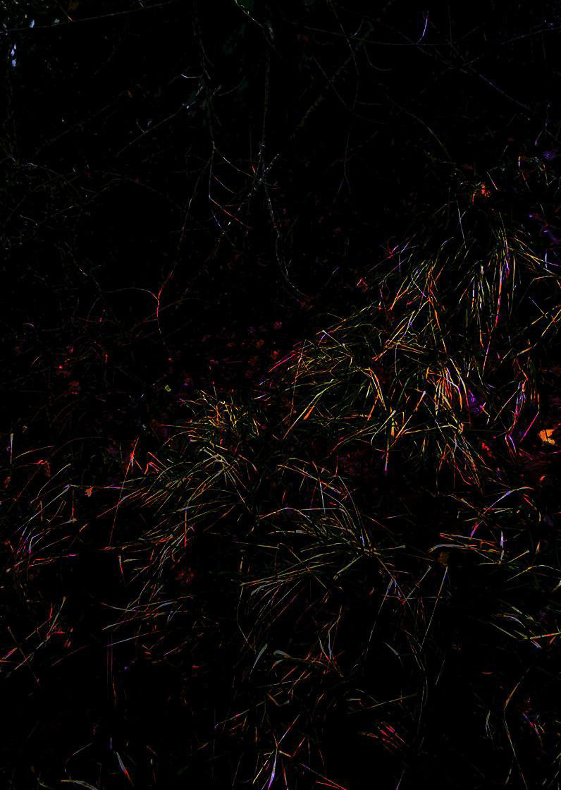

WILDERNESS IN
YOUR CHRONICLE

ravel between cities is no small feat for the damned. Łe comfort and safety of cities exist for a reason, and
the lights of civilization are a bulwark against the vast strange dark of the wilds, and the numerous dangers
that darkness hides. Elder Kindred are wise and inʺuential enough to avoid traversing the expanse between
cities and what few remain regularly send others in their place. Even with modern day transportation,
movement between cities can be exceptionally perilous. Łe roads are patrolled and guarded with SI checkpoints and
local Hunter cells, using bureaucracy and surveillance in tandem. Oʚ the beaten path and in the trackless wastes are the
territory of Lupines and even more nightmarish creatures of the dark.

All this is to say that travel outside of a Kindred's city is no small feat, and the dangers that occur during such
instances can add a great deal to the ʹction of your Chronicle and the World of Darkness it takes place in. What follows
in this section are tools, tips, story hooks, mechanics, and optional systems to create and manage Tension. During these
extra-city ventures, the skillsets of rough and tumble street Kindred and country survivalists tend to shine, giving them
an ideal place amongst the coterie. If your Chronicle's Coterie doesn't have such a character, introducing a Gangrel
guide or courier that's willing to trailblaze for a price can also lead to additional twists and turns.

70

WILDERNESS IN YOUR CHRONICLE

locations, or something from the dark has noticed the
Coterie and interrupts their hunt.

Teğ¯lĦğ
As Kindred move through the wilderness, something is
always watching, waiting, hunting. Łings go wrong,
stakes are raised, and the race against the sun is a deadly
one. Tension serves as a rating, 0-to-5, similar to
Hunger. Its increase signiʹes the building sense of
unease, peril, and isolation that Kindred feel when
outside of the safety of cities, as well as the peril of the
wastes that the Coterie traverses. Łe higher it gets, the
more treacherous and diʞcult their journey becomes.
Tension lasts until the end of the current Story, or until
the group reaches their destination. Certain Chronicles
that follow a Nomad Coterie or take an entire
Chronicle to reach their destination may result in
Tension being maintained from Story to Story. In these
instances it's recommended that Tension decreases by
one or two at the start of each new Story.

⬛Named and primary Antagonists may add Tension
to their Dice Pools by spending a point of Willpower.

⬛Finding secure shelter for Daysleep at increasing
Tension might become diʞcult as the Coterie's vehicle
is compromised with bullet holes, the Motel they set up
ahead of time is swarmed with local law enforcement,
or they just need to scavenge for material to craʨ a
makeshiʨ haven. In these cases the players roll against
the current Tension to ʹnd a suitable place to Daysleep.

⬛At Tension 3 the Beast begins to feel uneasy. Tests to
resist Fear Frenzy have their Diʞculties increased by 3.

⬛At Tension 4 the ability to phone a friend might
become unusable, stranding the group without help
that's normally available.

Tension increases due to especially dangerous
or attention-drawing actions; A Messy Critical, Frenzy,
succeeding at a cost, or hunt gone wrong are all likely
to increase Tension by one rather than cause typical
downsides. When in doubt about if Tension should
increase, the Storyteller can make a "Tension Check" by
rolling a single die. A Success yields no increase, while a
failure does. As a general rule, Tension does not
decrease during a Story unless a Coterie makes an
active eʚort to safeguard themselves, such as ʹnding a
safe Haven to lie low in for the day, or misdirect what
might be pursuing them. Łe exact eʚects of building
Tension changes depending on the nature of their
traversal.

⬛At Tension 5 the group suʚers a terrible event.
Lupines begin to ruthlessly chase them, they take a dire
turn into the den of some awful creature that time
forgot, or threats previously established become aware
of one of the Coterie's Backgrounds, or even a
Touchstone.

players and tension dice
Despite Tension being primarily negative, Players may
attempt to use it as a driving factor to reach their goal
and overcome the threats that bar their path. At any
time a player may spend Willpower eʖual to the current
Tension to add that many Dice to a Dice Pool that
include one of their Disciplines. If the resulting pool
fails the Test it was made for, the Storyteller
immediately makes a Tension Check, mentioned above,
while a Critical Success lowers Tension by 1. Łough
using Tension Dice has a steep cost, a successful
outcome allows a Kindred to accomplish even
insurmountable tasks when the ʺames of adversity lick
at their heels. ⬛

using tension in play
As previously stated Tension's eʚects should vary
depending on the themes of the current Story, however
the Tension Tracker is a good gauge of how diʞcult
travel will become. As Tension increases, so does
diʞculty. Opposition rises, obstacles bar the path, and
help dries up as other Kindred hunker down to avoid
trouble.

Łe Storyteller ultimately has the ʹnal say in
how Tension aʚects the player characters and the world
they're moving through, but what follows are some
examples:

⬛Hunts may have Tension added to their Diʞculty
due to increased attention to an area; SI have set up a
nearby checkpoint, easy prey have ʺed to more secure

71

CLANBOOK: GANGREL 5TH EDITION

Ch«ĦğlcĘe HĦĦ}¯ fĦ« WlĘde«ğe¯¯ EÖc¼«¯lĦğ¯

ith the myriad dangers of the wilderness, why would a smart Kindred ever venture over that
threshold and into certain uncertainty of what lay beyond the borders of their well-lit domains?
Aʨer all, unlife in the city itself is already fraught with conʺict and the ability to survive there
presents enough challenges that inviting more adversity in a harsher and less-known
environment would be foolish. Łe answer to this is that any Kindred knows full well that they will be pushed,
pulled, and commanded outside of their own comfort zone. Łey don't always get what they want, and even more
rarely do ambitious Kindred get to choose how their nights are spent when pressure bears down onto them. What
follows are several ideas that can help you, even if only temporarily, tempt or move your coterie outside of the night
lights of civilization, and into the unknown frontier beyond.

Escape

⬛A group of bloodthirsty S.I. Agents has caught the
scent of those Bloodhunted, and now pursues them
relentlessly into the countryside. Łe group is
exceptional and eʞciently capable in physical
confrontations. Łese aren't the typical self-motivated
Hunters who operate on the local level.

attributefocus: physical / mental

Aʨer ʺeeing from a scene of contention, possibly a
violent enemy or in an extreme case even a Bloodhunt
put on their heads, the Coterie seeks sanctuary outside
the city in desperation. While there's time enough until
sunrise, it's likely that this chronicle hook begins with
Tensions high and a few members of the party already
feeling pangs of Hunger and the need to hunt. Sorting
out where to go, what to do, and how to sleep safely for
the day are all problems the Coterie will need to solve
once they ʹnd themselves alone in the dark, away from
the security of their nightly rituals and comforts.

GENERALDIFFICULTIES: 4/2

A Kindred who has ʺed the city and has been
unlucky in her hunts for at least a night. She appears in
fashionable and expensive clothing that's since become
frayed or disheveled. When found by the Coterie she is
already at Hunger 4, but promises a safe Haven
somewhere nearby. Convincing her to give up the
Haven's location is unlikely (Diʞculty 4), but not
impossible.

whatcouldhappen
⬛As they head forward into the wilderness, the
Coterie happens upon a starving Kindred, alone and
near Frenzy in Hunger. Like them she has ʺed into the
wilds for refuge, possibly even from the same event that
pushed them out of the city. She tells the Coterie that
she knows the general location of a safe place, but in
her impaired state can't ʹnd it on her own. Trusting
and assisting her may secure a place to lay low, but risk
her entering Frenzy and attacking them. If all goes well
she becomes a Mawla (●●). If the safe house is found
in any case, it counts as a Haven (●) with an armory
(●).

Łe reason for why she's ʺed into the wilderness is
up to the Storyteller, but they might include the loss of
her Coterie to a rival Sect, she's being hunted as a
trophy by a powerful Kindred, or perhaps she is simply
playing the part of a damsel in distress for more
malicious purposes.

Clan: Salubri
Sire: Ken Ludmilla
Embraced: 1998 (Born 1976)
Ambition: Fortify a position and lay low.
Convictions: Testing the weaknesses of others helps

⬛Deep in the wilderness, the Coterie sees a ʺicker of
light on the horizon, shiʨing between blue and deep
green. As they continue to travel, the Coterie ʖuickly
realize that they've gone in a circle, ending up back at
where they ʹrst spotted the strange light. It takes
everything the Coterie has to ʹnd a path out of this
dream-like loop of wilderness, and escape the
maddening ʺame.

make them stronger.
Attributes: Strength 2, Dexterity 3, Stamina 3;

Charisma 3, Manipulation 4, Composure 2;
Intelligence 3, Wits 2, Resolve 1
Secondary Attributes: Health 6, Willpower 3, Humanity
6

72

WILDERNESS IN YOUR CHRONICLE

Secondary Attributes: Health 6, Willpower 3,

marked in Aggravated Damage, it vanishes and frees
those snared in its trap.

Humanity 7
Skills: Athletics 2, Craft 1 (Barricades), Drive 3,

Firearms 3, Stealth 2; Animal Ken 1 (Canids), Insight 2,
Performance 3 (Singing), Persuasion 2, Subterfuge 2;
Academics 3 (Monarchs), Finance 2, Medicine 2,
Technology 3
Disciplines: Auspex 3, Dominate 2, Fortitude 2,

GENERALDIFFICULTIES: 5/3

Five exceptional ʹeld agents who hunt vampires.
Łey go by the codenamesfirststrike, shroud, fear,

Obfuscate 1
Notes / Other Traits: Katarina wears a floral

haste, and reach. Each agent has talents that give them
incredible team working abilities, covering one
another's weaknesses.

fabric headband over her head to cover her third
eye. An event that raises Tension might tear or
damage this headband, revealing her Clan. She
carries a small five-shot +2 revolver with her, which
she will use to defend herself.

Łey've caught the trail of the Coterie and are
hell-bent on their destruction, or ensuring that they
never return to the city again. Łese Agents are
designed to be extremely diʞcult to combat, but not
impossible to overcome. Łey come prepared with
powerful weaponry, an armored SUV, and two
high-performance motorbikes.

GENERALDIFFICULTIES: 6/2

Łroughout history, and regardless of geography,
there have always been strange and ethereal lights in the
dark of the wilderness that haunt and tempt travelers.
Łe Feu Follet is not unlike the Will o' the Wisp, and
some scholars will claim that they are the expression or
visions of fairfolk moving between our world and some
dream-like state, twisting up mundane reality in their
wake.

Standard Dice Pools: Physical 7, Social 3, Mental

5
Secondary Attributes: Health 7, Willpower 5
Exceptional Dice Pools by Agent:
First Strike: Melee 8 (Spears), Larceny 8; Leadership

7; Awareness 6, Medicine 6
Shroud: Firearms 8 (Sniper), Stealth 9; Insight 6

Attributes: Strength 2, Dexterity 4, Stamina 1;

(Non-humans), Subterfuge 7; Academics 10,
Investigation 8, Science 8
Fear: Firearms 8 (Close Proximity), Intimidation 11;

Charisma 2, Manipulation 6, Composure 2;
Intelligence 3, Wits 3, Resolve 1
Secondary Attributes: Health 4, Willpower 3
Skills: Stealth 5, Survival 5; Animal Ken 4, Persuasion

Academics 8, Finance 7, Occult 10, Technology 8
Haste: Drive 9 (Motorbike), Brawl 10 (Pugilism);

Persuasion 6, Streetwise 8; Awareness 7 (Combat),
Politics 7
Reach: Athletics 11 (Bows), Drive 9 (Motorbikes),

3, Intimidation 3, Subterfuge 5; Awareness 5
Disciplines: Celerity 3, Dominate 3, Obfuscate 3,

Presence 3
Notes / Other Traits: Many of this entity's abilities

Survival 8; Animal Ken 7;
Equipment: Each Agent comes with body armor,

use the Tension system (Pg. 70) to meddle and pester
the Coterie. If Tension is not used the Storyteller is
encouraged to simply add three Dice to this
creature's pools.
Upon being seen, make note of any landmarks that
the Coterie could recognize, after some time
traveling, perhaps even a scene later, the Coterie will
somehow end up back at these landmarks again,
having gone in a circle, and this will immediately add
one Tension. Escaping this circular reality requires a
force of will: Resolve + Composure; Difficulty 2 +
Tension.
While it hounds the Coterie, this creature will use the
equivalent of Chimerstry and various powers of
Obfuscate to disorient and distract. If a Coterie
member attempts to attack the Feu Follet, it defends
itself with its Wits + Stealth. If successfully hit it takes a
single point of Aggravated Damage from any source.
When this creature's Health or Willpower tracker is fully

specialized ammunition for Vampires and
Werewolves, and explosive breaching tools.
Additionally each agent has a personal +4 Damage
weapon associated with their individual specialty;
firststrike has a carbon fiber spear, shroud has an
anti-material sniper rifle, fear has a sawn-off shotgun,
haste has blessed silver knuckles, and reach has a
compound bow.
Notes / Other Traits: They count as prepared

mortals with occult defenses and add +4 bonus dice
to resist Mental Disciplines.

73

CLANBOOK: GANGREL 5TH EDITION

Parcel

attributefocus: physical / mental

An important package has been given to the
Coterie, and they're charged with escorting it to a
speciʹc person in a small town roughly three hour's
drive outside the city. Łey're speciʹcally told not to
open the contents of the package, and get it there by
dawn. Łe package itself is small and unassuming, but
locked tightly. If opened, the Coterie ʹnds a large glass
container, full of preserved blood sealed with yellow
wax. If the blood is consumed, it oʚers a Dyscrasia.

GENERALDIFFICULTIES: 4/3

A Cell of three hunters;natty, vasquez, and kamino,
who patrol the roads outside the city. Łey specialize in
vehicular combat, and drive 80's-era Crown Victorias
painted matte black. All three are all mortals, but are
seasoned enough to know that while in their vehicles,
they're an even match for the things they hunt.

Standard Dice Pools: Physical 6, Social 3, Mental

3
Secondary Attributes: Health 6, Willpower 5
Exceptional Dice Pools:
Natty: Drive 9, Awareness 5
Vasquez: Melee 8, Drive 7 (Ramming)
Natty: Academics 8, Occult 6
Notes / Other Traits: Each of the three

whatcouldhappen
⬛While on the road it becomes very ʖuickly apparent
that a cell of traveling Hunters is in the area, and is
looking for the parcel and a group of supernatural
creatures that might have it. Highway law enforcement
seems happy to look the other way and even provide a
degree of assistance. If used, rising Tension ʖuickly
results in these Hunters descending upon the coterie
–loaded for bear.

Quartermaines prefers to stay in their cars to combat
the supernatural along the roads. If using Tension
they begin using caltrops, smoke bombs, and
firearms to try and stop the Coterie.

⬛During the drive, the Coterie gets a message from the
Hushed Chorus (Pg. 74), either via a secure line, a large
animal delivering a written letter, or a mortal who
happens upon them at a stop. Łe sender of this
message claims that they are who is meant to receive
the parcel, and that the drop oʚ point has changed to
somewhere outside of town, in a farther and much
more isolated area of the countryside.

GENERALDIFFICULTIES: 4/2

A creature that twists and bends its long limbs to
traverse terrain and keep pace with the Coterie's
moving vehicles. It makes loud calls, similar to the
meowing of a cat, which nearly sound like speech,
though with a discordant cadence that parrots others
and has no real meaning.

Standard Dice Pools: Physical 6, Social 2, Mental

⬛During the drive, one of the coterie members looks
out their window and sees something long-limbed
running on the side of the road, leaping over and
ducking under obstacles, always managing to keep pace
with the car. Łis running creature is unlike any animal
they've seen, and it moves uncannily. Łe longer it
keeps pace with the vehicle, the closer it begins to get
to it.

4
Secondary Attributes: Health 5, Willpower 3
Exceptional Dice Pools: Athletics 12, Brawl 8
Notes / Other Traits: This creature will use its

Athletics to keep pace with the vehicle and can
spend a point of Willpower to automatically pass
any Skill Tests to knock it off balance or to impede its
path. As Tension rises Moving Knees will move closer
to the car, and at Tension 5 it will begin slamming
into it and using its Brawl in an attempt to break
windows and grab those inside.

74

WILDERNESS IN YOUR CHRONICLE

Pursuit
attributefocus: physical / mental
Łe local Baron or Prince has issued a Bloodhunt for
the Diablerist Lansa. Once a trusted member and
enforcer of the local Kindred authority, this individual
has been revealed to have been consuming other
Kindred, gorging himself on their ʺesh and blood and
showing no signs of slowing down.

GENERALDIFFICULTIES: 4/2

A Gangrel has been killing and eating Kindred in
the city. Fleeing out of town and into the vast expanse
beyond, where he thrives amongst the animals and
wilds. He has little pity for the Kindred he's killed, and
views most of his peers as little more than food.
However the terrible Hunger that makes him so
dangerous is also his primary weakness as not even he
fully understands it, and will go to great lengths for a
meal.

However Lansa has ʺed the city and is ʖuickly
moving across the countryside to seek refuge beyond
the reach of the local Kindred government, and there's
only a few nights until he's gone for good. While most
would be ʹne to let him ʺee and be someone else's
problem, Status, Resources, or even Major boons are
promised rewards for capturing Lansa, or bringing back
evidence of his destruction.

Clan: Gangrel (Kin Eater)
Sire: ???
Embraced: 1990 (Born 1978)
Ambition: Find a meal that satiates his Hunger
Convictions: None.
Attributes: Strength 3, Dexterity 4, Stamina 3;

whatcouldhappen
⬛Łe Coterie sets out into the wilderness, either piling
into a single vehicle, or taking a small ʺeet. Łey follow
signs of Lansa's passage, who has now tossed aside the
Masʖuerade entirely in his haste to run. Łey happen
upon a tiny roadside town where he has killed one and
brutally hurt another. Giving aid to the town takes
precious time, but provides the Coterie with Contacts
(●●) in the area, and a better idea of what they're up
against.

Charisma 2, Manipulation 2, Composure 1;
Intelligence 3, Wits 1, Resolve 2
Secondary Attributes: Health 6, Willpower 6,

Humanity 5
Skills: Athletics 4, Brawl 3 (Bites), Melee 2, Stealth 3

(Forests), Survival 4; Insight 2, Intimidation 3, Persuasion
1, Subterfuge 3; Occult 3 (Kindred)
Disciplines: Auspex 2, Celerity 1, Fortitude 3,

Potence 2, Protean 4

⬛Aʨer a chase across the countryside, the coterie ʹnds
Lansa, who oʚers his services as a Headhunter Mawla
(●●). Łey ʹnd that he's from a rare bloodline that
must feast on Kindred, preferably Gangrel, to survive. If
they bring him their enemies, he gets a meal and makes
sure they're killed, leaving no trace.

⬛Łey stake and bring Lansa back for judgment.
Łey're rewarded with Status (●) and a Haven (●●) at
the edge of town that grants them a great deal of
privacy and is a prime place to hold meetings away
from prying eyes. However at night they sometimes see
something staring back at them from the darkness
beyond the edge of their property.

75

CLANBOOK: GANGREL 5TH EDITION

Retrieval

attributefocus: social / mental

An important shipment has been stranded at a
dock three hours south of the city. Several Coteries
have been tasked with personally going to pick it up
and bring it back to the city. Łey're given a large truck
to haul the shipment, which comes in the form of three
large crates, and each member is given a basic Mask (●)
that allows them to pass scrutiny among the dock's
workers and security, but won't stand up to scrutiny
elsewhere. Łe shipment needs to be in the borders of
the city by dawn, or it'll be lost.

GENERALDIFFICULTIES: 4/3

A Tzimisce that was the former ductus of her pack.
She spends her nights hunting and prowling along the
banks of the river to feed and collect biomass. She has
used extensive ʺeshcraʨing to hollow out her torso to
house two Electric Eels, which lash out and bite
through openings in her collar and abdomen.

Without her pack, Mithentronika's mental state
hinges entirely on keeping what little she has leʨ: Her
river, and she will irrationally attack any other
Kindred that travels through it, or along its banks.

whatcouldhappen
⬛Łe road south has a well-known checkpoint run by
local law enforcement, and rumored to have ties to the
SI. Going through it is the ʖuickest way to travel, but it
carries its own steep risks if the party can't talk
themselves passed it.

Clan: Tzimisce
Ambition: Fortify my domain.
Convictions: Humans are such easy prey.

Attributes: Strength 1, Dexterity 4, Stamina 4; Charisma
3, Manipulation 2, Composure 3; Intelligence 3, Wits 1,
Resolve 3
Secondary Attributes: Health 7, Willpower 5,

⬛Travel via boat may be possible, but picking up the
crates and getting them back to the city draws
unwarranted attention from an ex-Sabbat whose
claimed the river as her own, and will stop at nothing
to antagonize and destroy their watercraʨ.

Humanity 5
Skills: Athletics 3 (Swimming), Brawl 3, Stealth 3

(Water), Survival 3; Insight 2, Intimidation 4, Persuasion
2, Subterfuge 3; Occult 3 (Koldunism), Medicine 3
(Anatomy)
Disciplines: Animalism 3, Auspex 2, Blood Sorcery 2,

Protean 4
Notes / Other Traits: When attacking with Brawl,

⬛Upon reaching the crates, the Coterie realizes that
the weapons are military grade. Mounted machine guns,
assembly parts for an armored vehicle, and even
rockets. Łese weapons would fortify the ruling
Kindred's position with threat of considerable violence,
but might also secure the Domain from Hunters and
other threats. It'd be a shame if one of the three crates
was lost in transit…

the electric eels in Mithentronika's body can spend a
point of Willpower to add +2 Superficial Damage to
her attack and stun mortals.

GENERALDIFFICULTIES: 3/2

Electric eels can reach up to 8 feet in length and
can generate a nasty electric shock of up to 600 volts.
Łese animals use their electric shocks to hunt and
defend themselves from predators.

Standard Dice Pools: Physical 3, Social 1, Mental

1

Secondary Attributes: Health 5, Willpower 3

Exceptional Dice Pools: Athletics 6 (Swim),

Brawl 4(Bite), Stealth 5; Intimidation 2

Special: These eclectic eels may spend a point of

Willpower when coming into contact with an
individual to shock them, adding +2 Superficial
Damage to their attacks. Mortals are stunned by this
effect.

76

WILDERNESS IN YOUR CHRONICLE

Stranded

siphoning pale miasma using her Occult pool.
Vampires and other undead can resist this strange
power with Stamina + Resolve; Difficulty 3, however
Mortals simply take three non-halved Superficial
Health Damage.

attributefocus: physical / social
A member of the Coterie gets a text from their
Touchstone, who has broken down on a long and lonely
stretch of road and has decided to huddle up in their
vehicle until help can arrive. However inclement
weather has been severe the last few nights, and it's
unlikely anyone roadside assistance service will arrive.
Worse oʚ, it's an area said to be haunted by the Lady in
White, and numerous motorists have gone missing in
the area.

GENERALDIFFICULTIES: 4/3

A Hecata that happens to be in the area. He is
secretive and will not give up much information on
why he's there if found, but will lend a hand so long as
it ensures he gains the Lady in White's fetter, which
once belonged to his Sire decades ago. He is incredibly
distrustful of other Hecata Bloodlines.

whatcouldhappen
⬛Łe academically minded of the group could research
into the Lady in White and the local legends that
surround her, granting insight into why she haunts that
stretch of highway, possibly turning her into an asset.
One that's necromantically inclined may even ʹnd
information on her possible fetter or how to ward her
oʚ.

Clan: Hecata (Giovanni)

Sire: Panos Dent

Embraced: 1960 (Born 1922)

Ambition: Reign in his Sire's Wraith

Convictions: Unfinished business is messy business.

⬛Heading out onto the road, the coterie must navigate
the terrible weather conditions, but happen upon
assistance in the form of a Hecata Necromancer, who
may or may not be responsible for the Wraith or the
abductions –or both.

Attributes: Strength 3, Dexterity 2, Stamina 4;

Charisma 3, Manipulation 2, Composure 3;
Intelligence 3, Wits 1, Resolve 3

Secondary Attributes: Health 7, Willpower 6,

Humanity 5

Skills: Athletics 2, Brawl 2, Firearms 4 (Rifle), Melee

⬛Rescuing the Touchstone was only part of a larger
ploy by a rival Kindred, who has lured them out into
the open, and away from the eyes of their peers to be
destroyed. Łe Hecata, Victor Lansek below may be in
on the ploy.

1, Survival 3; Insight 2, Intimidation 3, Persuasion 2,
Subterfuge 2; Academics 3 (Local History), Occult 3
(Wraiths)

Disciplines: Dominate 2, Oblivion 3, Fortitude 3

Notes / Other Traits: Lansek has access to

Ceremonies of Oblivion that assist in helping him
deal with Wraiths. If no such Ceremonies are
available to the Storyteller, use his Resolve + Oblivion
against a Wraith's Resolve + Composure to
command or attack them through arcane means.

GENERALDIFFICULTIES: 4/2

A ghostly being that haunts a speciʹc stretch of
road somewhere outside the city. She is perpetually
alternating between sorrow and wrath, and will stop
at nothing to feel the warmth of a living person.

Clan: None. The Lady in White is a Wraith.

Standard Dice Pools: Physical 3, Social 4, Mental

3

Secondary Attributes: Health 6, Willpower 3

Exceptional Dice Pools: Drive 5, Larceny 7,

Stealth 5; Intimidation 6, Subterfuge 8 (Lure Victim);
Awareness 6, Occult 8

Special: The Lady in White can manifest a

77

CLANBOOK: GANGREL 5TH EDITION

Treasure

attributefocus: physical / mental
Łe Coterie, or someone they're acʖuainted with, has
recently come into possession of information that
points to a supposed cache of buried loot, old valuables
from a bygone era, and possibly even Kindred-related
artifacts. Additionally even if the Coterie doesn't want
these things for themselves, there's a high proʹle
Kindred willing to pay in Boons, Fame, or Status. Łe
primary complication of this loot is that it's resting out
in the middle of nowhere, far from any safe haven or
well-paved road, and that there's something old and
diabolical about it.

GENERALDIFFICULTIES: 6/2

A large amalgamation of human and animal bodies
that appear to have been melted together to form a
mass of agonized ʺesh. Łis awful creature is
unmarred by the passage of time, and could be
centuries old. Between the splits in its wiʩling limbs
and in the hollows of its many eyes glows a burning
green ʺame that it can release outwards, searing itself,
but attempting to burn away all nearby intruders in
the process.

Attributes: Strength 3, Dexterity 3, Stamina 10;

whatcouldhappen
⬛Upon reaching the location, the Coterie begins
diʩing, only to ʹnd a passage into a small underground
town that's been lost to time. However this lost city
hasn't been abandoned, instead it's been the territory of
something ancient and insidious. A creature from the
bowels of the earth, conjured by the vile will of some
long-lost infernal master.

Charisma 1, Manipulation 1, Composure 1;
Intelligence 2, Wits 3, Resolve 1

Secondary Attributes: Health 13, Willpower 6

Skills: Athletics 2, Brawl 2 (Grapple), Larceny 7,

Stealth 5; Intimidation 6, Subterfuge 5 (Lure Victim);
Awareness 4, Occult 4

Disciplines: Blood Sorcery 3, Potence 2, Fortitude 2

Special: This creature takes three non-halved

Superficial Willpower Damage from Religious objects
or substances that touch it. At the end of its turn the
Melted Melange may spend two Health to release
an expanding ring of lime-green cinders. All Kindred
within ten yards/meters of it must evade by making
a Dexterity + Athletics; Difficulty 3 Test, or suffer a
point of Aggravated Health Damage. If Aggravated
Damage dealt from this ability exceeds a Kindred's
Resolve or Composure, whichever is higher, that
Kindred must Test for Terror Frenzy; Difficulty 3. This
strange flame does not otherwise provoke typical
Frenzy.

⬛Łe treasure is a chest that can only be opened by
Kindred blood, but along the lines of the surface there
is an old verse only legible to those with high Occult or
Academics that warn of a curse upon those that take it
or open it. Moving the chest back to the Coterie's
Domain is an extensive and tedious process, as terrible
misfortune seems to follow them. Łeir phones lose
signal, they lock their keys in their car, compulsions
have their severity increased, etc.

⬛Łe journey towards the location reʖuires the
Coterie to hike through a distance of wilderness trails.
Tension builds as things in the dark dart just out of
sight, revealing and attacking only when the Coterie
nears their destination. Łis part of the countryside is
populated by malicious animals, twisted by unnatural
sorcery. It is recommended that Storytellers use a
selection of animal stat blocks (Pg. 79), but add the
weakness to religious iconography that the Melted
Mélange has and give them a dot in Celerity or Potence
for added challenge.

78

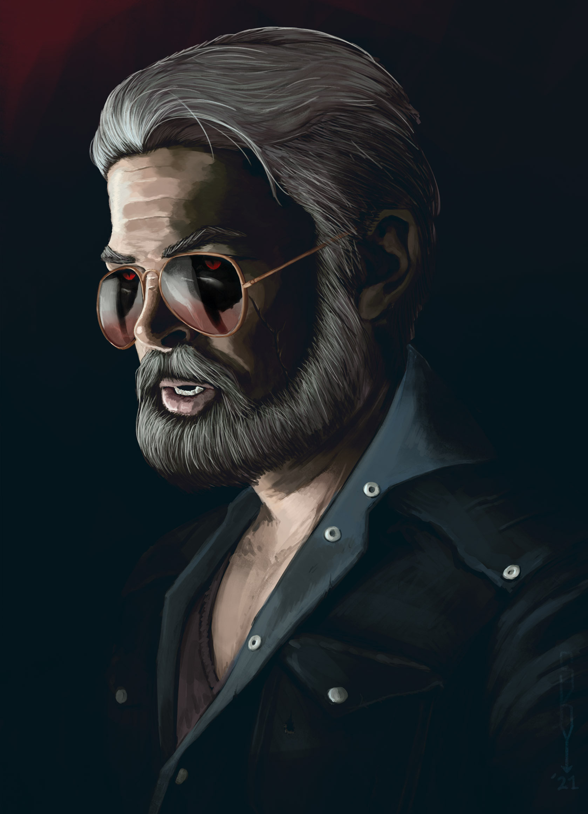

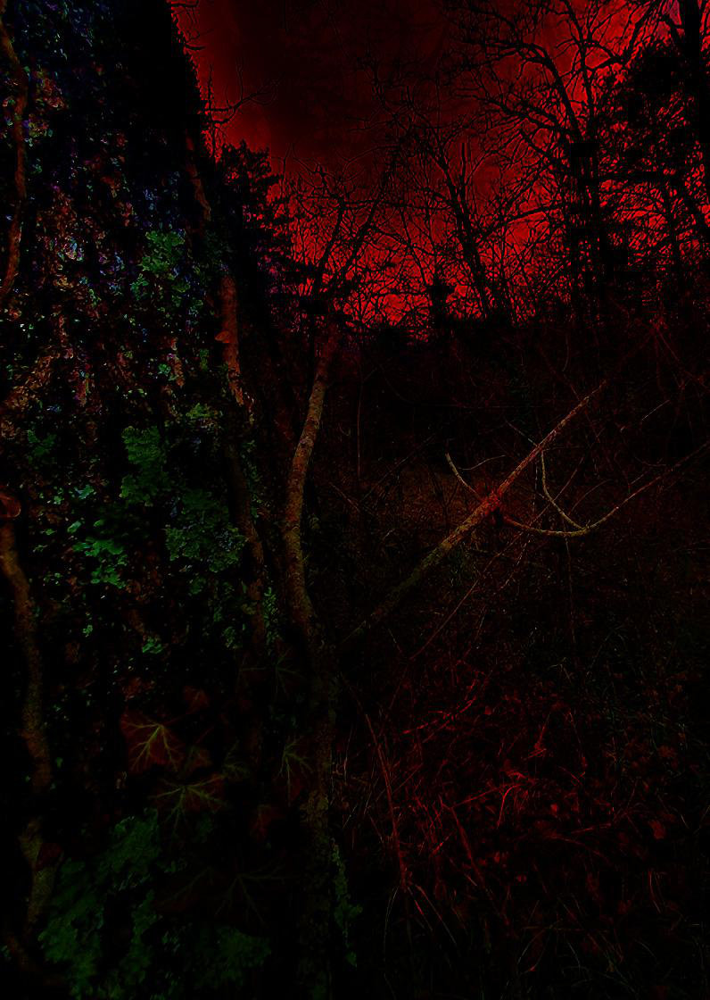

Tools

hat follows are stat blocks that are designed to help a Storyteller or Player create characters and
their companions, adversaries, and minions. Listed here are an extensive aʩregation of information
and stats for animals that can be used as Player Character companions and as forms that can be
assumed through various powers of transformation, such as Shapechange or Shiʨing Traversal. Some
entries here can be found in the Vampire the Masʖuerade Core Rulebook on Page 373, but here they have been
expanded upon to have much more deʹned purposes, and to better display each individual animal's uniʖue properties.

Beyond the extensive number of animals are also Mortals, Kindred, and other terrifying supernatural Łings in
the Dark that one might populate the cities and wastes of the World of Darkness. Łese tools are meant to be in-depth,
but also provide a Storyteller or Player a ʖuick and easy resource to drop characters into their Chronicle without having
to compose them on the ʺy. Storytellers are encouraged to modify and change these stat blocks if they have better ideas
of how they might function, especially in their own world, and more especially in the case of the Łings in the Dark.

Animals

Łe Clan of Beasts have been the undead masters of the Animal Kingdom since pre-history, and some Gangrel scholars
even believe that they share a heritage with many of the creatures of the wilds, rather than a direct lineage to Caine.
Regardless of beliefs, none can argue the breadth of the Feral's ability to survive amongst, train, and even befriend, the
animals of the world, from the heights of the sky to the depths of the sea, and all the land in between.

Aerial Animals

Bat (Small)

Bat (Large)

General Diʞculties: 3 / 1
An animal that has been associated with vampires
throughout history, but more especially in pop culture
of the last century, this is in no small part because of
Kindred willingly associating with them for hundreds
of years. Nocturnal hunters, just as Kindred are. Łese
small bats are freʖuently found throughout the world in
large groups referred to as "cauldrons", and are highly
social animals.
Standard Dice Pools: Physical 3, Social 2, Mental 1
Secondary Attributes: Health 1, Willpower 1
Exceptional Dice Pools: Athletics 4, Stealth 5 (Total
Darkness); Awareness 7
Special: Bats suʚer no perception penalties from
mundane darkness. Small bats otherwise have poor
vision and are eʚectively colorblind. Due to their
inherent social nature, Bats always know of any nearby
colonies of other bats.

General Diʞculties: 3 / 2
Larger bats are renowned for their maneuverability in
ʺight and incredibly high resistance to infection. Many
Gangrel and Nosferatu prefer taking large bats as a
Famulus over birds of prey for this very reason.
Standard Dice Pools: Physical 3, Social 2, Mental 1
Secondary Attributes: Health 2, Willpower 1
Exceptional Dice Pools: Athletics 6 (Aerial Maneuvers),
Stealth 5 (Total Darkness); Awareness 7
Special: Bats suʚer no perception penalties from
mundane darkness due to their ability to employ
echolocation. Unlike their smaller cousins, larger bats
have vision comparable to humans. Due to their
inherent social nature, Bats always know of any nearby
colonies of other bats.

79

TOOLS

Crow

Owl

General Diʞculties: 4 / 1
Unrivalled among raptors in their intelligence, Crows
are a social bird that is capable of self-motivated
problem solving and have some of the best critical
thinking skills of any animal, with some research
showing them to surpass animals that are typically
thought of as intelligent, such as dolphins or monkeys.
Standard Dice Pools: Physical 2, Social 1, Mental 3
Secondary Attributes: Health 3, Willpower 3
Exceptional Dice Pools: Athletics 4, Brawl 3; Insight 6;
Awareness 5
Special: Crows add their Willpower to any pools that
involve critical thinking and problem solving. Attempts
to communicate with a crow via Animal Ken have their
diʞculties reduced by 1, as crows are naturally social
and capable of understanding basic body language and
even intention from both Kindred and Kine.

General Diʞculties: 3 / 1
Nocturnal and crepuscular hunters with forward-facing
eyes. While slower moving than falcons, the Owl is
nearly silent when in ʺight and have excellent senses,
even seeing better in low-light than in bright light
Preferring to prey on smaller animals, Owls have
nonetheless been employed as competent look outs and
spies.
Standard Dice Pools: Physical 2, Social 1, Mental 1
Secondary Attributes: Health 3, Willpower 1
Exceptional Dice Pools: Athletics 4, Brawl 5, Survival 6;
Awareness 8 (Low Light)
Special: Owls are completely silent while in ʺight, and
are able to ambush any target uncontested, so long as
the target doesn't have Rapid Reʺexes, or an eʖuivalent
ability. Łough they prefer hunting small animals, the
Owl is capable of harring larger targets and herding
them away from vulnerable areas by rolling their
Survival vs the target's Composure + Resolve.

Falcon

General Diʞculties: 3 / 2
Incredibly eʞcient birds of prey that rank among the
fastest ʺying animals in the world. Falcons can dive at
speeds of over 250km/150mph, and have virtually
unrivalled sight, that allow them to surgically strike a
prey without warning. Łe most well-known falcons are
the kestrel, peregrine, and gyrfalcon.
Standard Dice Pools: Physical 3, Social 1, Mental 1
Secondary Attributes: Health 3, Willpower 2
Exceptional Dice Pools: Athletics 6, Brawl 5 (Distant
Target); Awareness 6
Special: Falcons can dive at speeds that exceed the
ability for typical individuals to track their movement.
While swooping and diving at full speed, a Falcon
automatically evades any attacks that don't exceed its
Physical rating. Due to their impressive speed, Falcons
suʚer no minor action penalty for moving into range of
their target.

Peafowl

General Diʞculties: 3 / 2
A well-known bird, with the males featuring
extravagant and metallic plumage and females having
rather dull or tawny coloration. Despite the
ostentatious and typically admired appearance of
peacocks, within the species itself the peahen holds the
ultimate choice of taking a male as a mate.
Standard Dice Pools: Physical 3, Social 1, Mental 2
Secondary Attributes: Health 6, Willpower 2
Exceptional Dice Pools: Athletics 3, Brawl 2, Survival 3;
Intimidation 2; Awareness 3 (Food)
Special: Peacocks can spread their tail feathers to
display their extravagant plumage. When doing this
Toreador onlookers gain a compulsion that keeps from
looking away. Peahens get +1 Die to physical pools, as
their lack of excessive feathers makes for ʖuicker
movement.

81

CLANBOOK: GANGREL 5TH EDITION

Pigeon

Small Bird

General Diʞculties: 2 / 1
Gentle and plump birds that tend to bob their head as
they walk. Łough treated as pests, they are complex
animals and capable ʺiers that adapt to nearly any
habitat. Pigeons have been freʖuently domesticated and
were useful for sending messages due to their incredible
sense of direction. White-feathered pigeons are
freʖuently a religious sign of peace.
Standard Dice Pools: Physical 1, Social 1, Mental 1
Secondary Attributes: Health 3, Willpower 1
Exceptional Dice Pools: Athletics 3, Brawl 2, Survival 6;
Awareness 8 (Low Light)
Special: Pigeons add their remaining Willpower to any
tests to navigate.

General Diʞculties: 2 / 1
Warblers, starlings, and ʹnches. Łese little birds are
ʖuick and light, but are rarely capable of hunting
anything more than small bugs or berries.
Standard Dice Pools: Physical 1, Social 1, Mental 1
Secondary Attributes: Health 1, Willpower 1
Exceptional Dice Pools: Athletics 3 (Flight), Brawl 2,
Survival 6; Performance 4 (Singing); Awareness 5
Special: Small Birds do not suʚer penalties to their
pools to evade ranged attacks.

Vulture

General Diʞculties: 3 / 2
Scavenging raptors notable for their bald heads, long
necks, and powerful wings. Łe vultures are endurance
ʺiers that are capable of staying aloʨ for hours without
landing, scouring the land for carrion. While they lack
the acrobatics of other raptors, vultures use brute
strength and imposing size to scare oʚ their rivals, and
number among some of the largest and hardiest birds
on the planet, sometimes even routing large cats from
their ʖuarry.
Standard Dice Pools: Physical 4, Social 1, Mental 2
Secondary Attributes: Health 6, Willpower 2
Exceptional Dice Pools: Athletics 5 (Endurance), Brawl
5, Survival 5; Intimidation 5; Awareness 4 (Carrion)
Special: Vultures have hooked powerful beaks that tear
ʺesh and crack bones. When a vulture gets a Critical
Win on an attack roll, it also causes an additional
Crippling Injury.

Raven

General Diʞculties: 4 / 1
Like their smaller kin, crows, Ravens tend to be
exceedingly intelligent. Long have they been associated
with the gothic calling of the night, especially the dire
wastes between cities, which they call home. Ravens are
especially good at mimicking sounds, even human
voices.
Standard Dice Pools: Physical 2, Social 1, Mental 3
Secondary Attributes: Health 3, Willpower 3
Exceptional Dice Pools: Athletics 4 (Flight), Brawl 3;
Insight 6, Intimidation 3 (Omen), Performance 5
(Mimicry); Awareness 5
Special: Attempts to communicate with a raven via
Animal Ken have their diʞculties reduced by 1, as
ravens are naturally social and capable of
understanding basic body language and even intention
from both Kindred and Kine. Ravens can use their
Performance skill to attempt to mimic sounds, even
speech, however they rarely understand anything more
than a single word of what they're saying.

82

TOOLS

Terrestrial Animals

Łe Ferals have long used animals to assist them in the
night, with each Gangrel tending to take on
companions and animal thralls that suit their
temperament and needs. Listed here are an extensive
aʩregation of information and stats for use as
character companions and for forms that can be
assumed through various powers of transformation.
Some entries here can be found in the Vampire the
Masʖuerade Core Rulebook on Page 373, but have been
expanded upon to have more deʹned purposes, or to
better display each individual animal's uniʖue traits.

without a rest break, and have been known to stay
awake for twenty-nine hours at a time to accomplish
tasks.

Cat (Domestic)

General Diʞculties: 3 /1
One of the oldest pets on earth. Łese beloved little
felines have managed to keep their predatory instincts
and relative independence despite being kept in the
houses of humanity since ancient antiʖuity.
Standard Dice Pools: Physical 2, Social 1, Mental 1
Secondary Attributes: Health 2, Willpower 2
Exceptional Dice Pools: Athletics 5, stealth 4
(Hunting), survival 4; Performance 3 (Yowling);
Awareness 3
Special: Domestic cats are extremely ʖuick and agile.
Łey automatically pass any tests that involve balance
or landing on their feet, and can't take damage falling
from most heights.

Bear

General Diʞculties: 5 / 2
A powerful animal that prowls forests across the
northern hemisphere of the world. Typical bears are
ʹerce creatures that tend to be crepuscular in their
activity, but can regularly hunt in nocturnal conditions
without issue.
Standard Dice Pools: Physical 7, Social 1, Mental 1
Secondary Attributes: Health 7, Willpower 7
Exceptional Dice Pools: Intimidation 7; Awareness 3
(Smell)
Special: Bears unarmed attacks are brutal +3 heavy
piercing natural weapons that rake bare ʺesh. When
ʹghting something smaller than themselves, regardless
of how strong their opponent is, Bears add one die to
their pools to attack.

Chameleon

General Diʞculties: 3 / 2
Small four-leʩed reptiles with scaly hides that are
found throughout the world, only absent from areas of
extreme cold and the deep oceans. Most lizards have
adapted to their environments to such a degree that
many species have gone almost unchanged for millions
of years. Łey commonly have long detachable tails to
fool and distract predators, a long thin tongue, and
lidless eyes.
Standard Dice Pools: Physical 1, Social 1, Mental 1
Secondary Attributes: Health 2, Willpower 2
Exceptional Dice Pools: Athletics 2 (Climbing), stealth
5 (Camouʺage), survival 4; Awareness 2 (Low light)
Special: Chameleons can change the color of their hides
to blend in with their surroundings. Blending into
foliage gives an automatic success, while blending into
anything else gives a +2 Dice bonus.

Beaver

General Diʞculties: 3 / 1
Found commonly throughout the rivers and forests of
Europe and North America, the beaver is the second
largest animal in the rodent family. Łeir ʺat
paddle-shaped tail and webbed hind feet make them
excellent swimmers, and their robust and muscular
build allows them to haul large logs and construct river
dams and dwellings out of sticks, mud, and other
natural materials.
Standard Dice Pools: Physical 2, Social 1, Mental 1
Secondary Attributes: Health 3, Willpower 5
Exceptional Dice Pools: Athletics 5 (Swimming), craʨ 5
(Rudimentary Structures); Awareness 3
Special: Beavers have powerful jaws that allow them to
chew through most soʨ materials with ease.
Additionally they are one of the few animals that can
perform labor intensive activities for up to seven hours

83

CLANBOOK: GANGREL 5TH EDITION

Coyote

Ferret

General Diʞculties: 3 / 2
Canids native to North America, where they feature in
many indigenous folklore. Łese versatile creatures are
ʖuick and smart enough to survive even in human
cities, turning from predator to scavenger, and back
again without issue. Like foxes, Coyotes tend to hunt
primarily with exceptional sight, rather than their
still-exception smell.
Standard Dice Pools: Physical 4, Social 1, Mental 1
Secondary Attributes: Health 4, Willpower 4
Exceptional Dice Pools: Brawl 4 (Bites), stealth 5;
Insight 3, intimidation 2; Awareness 5 (Sight)
Special: +1 damage to bite attacks. Coyotes can form
mutual teamwork tactics with other animals, such as
Crows and Badgers.

General Diʞculties: 3 / 1
Inʖuisitive and mischievous, ferrets are intelligent little
animals that are able to get into places they really
shouldn’t thanks to their long dextrous and slender
bodies. Domesticated from the European polecat, their
cute appearance belies their eʚectiveness as a ʖuick and
deadly hunter.
Standard Dice Pools: Physical 1, Social 3, Mental 2
Secondary Attributes: Health 2, Willpower 3
Exceptional Dice Pools: Athletics 2 (Contortion,
scurry), larceny 7 (Small objects), stealth 6;
Performance 4 (War Dance); Awareness 4 (Smell)
Special: Łe Ferret's long and ʺexible tube-like body
allows them to jump and dodge exceptionally well and
crawl through tight spaces. Add one Automatic Success
to a ferret's Dice Pools made to evade and escape.

Crocodile

Fox

General Diʞculties: 5 / 3
Large reptiles that reach up to ʹve yards or meters in
length. Łey diʚer from the commonly confused
alligators by being much larger and having a
wedge-shaped snout. Crocodiles also tend to freʖuent
salt-water or brackish habitats. Łey also happen to be
far more aʩressive and hold the record for the
strongest bite of any living animal.
Standard Dice Pools: Physical 7, Social 1, Mental 1
Secondary Attributes: Health 8, Willpower 4
Exceptional Dice Pools: Brawl 7, Stealth 6; Intimidation
5; Awareness 2
Special: +2 Aʩravated damage to bite attacks. If biting
a limb, the crocodile can choose to immediately sever it
through sheer bite force.

General Diʞculties: 3 / 2
Preset across every populated continent, the Fox is a
small canid with red, white, and black coat coloration.
Red Foxes are present across numerous histories. Łey
are omnivorous, and tend to be opportunistic hunters
that can thrive even in urban environments.
Standard Dice Pools: Physical 4, Social 1, Mental 1
Secondary Attributes: Health 4, Willpower 4
Exceptional Dice Pools: Brawl 4 (Bites), stealth 5;
Insight 3, intimidation 2; Awareness 5 (Sight)
Special: +1 damage to bite attacks. Foxes have excellent
eyesight and get +2 Dice to detect movement.

Horse

Deer

General Diʞculties: 5 / 2
Horses can be unpredictable and dangerous animals.
Łey are large and powerful, and if not properly
handled or trained, they can become easily frightened
or agitated, being able to run down and trample down
their foes if forced to defend themselves.
Standard Dice Pools: Physical 6, Social 1, Mental 1
Secondary Attributes: Health 7, Willpower 2
Exceptional Dice Pools: Athletics 8 (Gallop);
Awareness 4
Special: Horses do +2 damage when trampling prone
opponents. Łey can travel up to 30 mph or 48 km/h,
allowing them to cross long distances.

General Diʞculties: 4 / 2
Found in a variety of habitats, ranging from dense
forests to open meadows. Deer are herbivores that are
active during evening and night, skittish and graceful.
Many Kindred view them as a sign of valor, vigor, and
nature.
Standard Dice Pools: Physical 6, Social 1, Mental 1
Secondary Attributes: Health 7, Willpower 2
Exceptional Dice Pools: Athletics 7 (Escape); Awareness
5
Special: Deer suʚer no minor action penalty when
closing distance and deal +3 damage on goring with
their antlers.

84

TOOLS

Hound

Lion

General Diʞculties: 4 / 2
A man's best friend is said to be his dog. Łe same tends
to be true even aʨer death. Fiercely loyal, domesticated
dogs and hounds lack the physical size of wolves, but
make up for it in fearlessness and selʺessness, making
them much better guards and protectors.
Standard Dice Pools: Physical 5, Social 1, Mental 2
Secondary Attributes: Health 5, Willpower 4
Exceptional Dice Pools: Athletics (Chasing), brawl 6
(Bites), stealth 4; Intimidation 4; Awareness 4 (Smell)
Special: +1 damage to Hound bite attacks. On a
successful bite attack a Hound can lock its jaws and
grapple an opponent.

General Diʞculties: 4 / 3
Held in high regard amongst the Baronies of Avalon
during the Dark Ages, where this animal was
considered a majestic symbol of pride. In modern
nights Lions are rare as ghouled pets outside of the
Laibon, who themselves avoid ghouling them without a
speciʹc purpose, such as turning them into man-eaters.
Standard Dice Pools: Physical 7, Social 2, Mental 2
Secondary Attributes: Health 6 , Willpower 5
Exceptional Dice Pools: Athletics 7 (Chasing), Brawl 9;
Intimidation 6 (Roars); Awareness 4
Special: Lions deal +2 Damage with bite and claw
attacks. Łey may make a special pouncing attack by
rolling their Athletics. Łis attack suʚers no minor
action penalty for closing short distances. If this is used
as a grapple, add four dice to the Athletics pool.

Komodo Dragon

General Diʞculties: 4 / 3
Enormous and exotic animals are favored as ghouls by
eccentric Kindred, or those who live in and around
Indonesia. Łese beasts are the largest of all extant
lizards, growing passed three yards/meters in length
and can weigh up to 300lbs. Solitary and territorial,
these creatures also have a mortal bite, that's not only
venomous, but tears ʺesh and causes rampant infection.
Ferals freʖuently ʹnd kinship with these creatures, and
they make brawny and powerful ghouls.
Standard Dice Pools: Physical 5, Social 2, Mental 1
Secondary Attributes: Health 7, Willpower 4
Exceptional Dice Pools: Brawl 7, Stealth 6; Intimidation
5; Awareness 4 (Carrion)
Special: If a komodo dragon successfully bites a mortal
opponent, it deals +1 Aʩravated Health damage and its
venom kills or debilitates the victim by the end of the
scene if not treated. Against vampires, this bite deals
non-halved Superʹcial Damage, as the komodo dragon
specializes in feeding on tough dead ʺesh.

Lizard

General Diʞculties: 3 /2
Small four-leʩed reptiles with scaly hides that are
found throughout the world, only absent from areas of
extreme cold and the deep oceans. Most lizards have
adapted to their environments to such a degree that
many species have gone almost unchanged for millions
of years. Łey commonly have long detachable tails to
fool and distract predators, a long thin tongue, and
lidless eyes.
Standard Dice Pools: Physical 1, Social 1, Mental 1
Secondary Attributes: Health 2, Willpower 2
Exceptional Dice Pools: Athletics (Climbing), stealth 5,
survival 4 (Chosen habitat); Awareness (Low light)
Special: When attacked or grappled, the lizard may
instead choose to take 1 Aʩravated Damage and detach
their tail, preventing other damage and allowing for
escape. A ghouled lizard regrows this tail within three
nights.
If Chameleon special: May change the color of its skin
to blend gain +4 to stealth while immobile

85

CLANBOOK: GANGREL 5TH EDITION

Moose

Opossum

General Diʞculties: 4 / 3
Weighing up to 1,800 pounds and the largest member of
the deer family with , overhanging, bell-shaped head.
Łey can cause serious damage if they feel threatened or
provoked. Łey can become aʩressive and charge at
people, cars, and other animals. Łey are also very fast
and can easily outrun humans.
Standard Dice Pools: Physical 7, Social 1, Mental 1
Secondary Attributes: Health 8, Willpower 2
Exceptional Dice Pools: Athletics 8; Awareness 5
Special: Moose suʚer no minor action penalty when
closing distance and deal +3 damage on goring with
their antlers in a charge attack.

General Diʞculties: 3 / 1
Łe only marsupials north of Mexico, even having a
special pouch in which they can carry their young.
Łeir prehensile tail allows them to hang from
branches, or carry heavy objects. Strangely enough they
have an incredible immune system that makes them
immune to many diseases and poisons, such as rabies
and most forms of venom. Nocturnal by nature, they
only forage during the day when seeking a mate, or
caring for their young.
Standard Dice Pools: Physical 2, Social 2, Mental 2
Secondary Attributes: Health: 3 Willpower: 2
Exceptional Dice Pools: Athletics 2 (Climbing), survival
4 (Foraging, hiding); Performance 4 (Play Dead);
Awareness 3 (Danger)
Special: As an involuntary response, opossums can
enter a state of shock that slows their heart rate and
releases a noxious smell that mimics rotting decay and
disease. Łis state can last up to four hours in certain
cases, but serves as good defense in the wild against
being eaten. Additionally, Opossums are immune to
most poisons and diseases, and when ghouled, this
includes most supernatural poisons and diseases.

Mouse

General Diʞculties: 3 / 1
Small furry rodents with a pointed snout, whiskers, and
a long hairless tail. Łese little rodents usually stay
hidden in small nooks and crannies, and have adapted
exceptionally well to life in urban sprawls. Strangely,
they have a very similar brain structure to humans and
have long been used in research and study.
Standard Dice Pools: Physical 1, Social 1, Mental 2
Secondary Attributes: Health 1, Willpower 2
Exceptional Dice Pools: Athletics 2 (Climbing), stealth
6, survival 4; Awareness 4 (Smell)
Special: Any Dice Pools made by a signiʹcantly larger
creature to ʹnd a mouse automatically fail if they do
not beat the mouse's Stealth rating.

Raccoon

General Diʞculties: 3 / 1
Successful in numerous ecosystems, raccoons have
ʹve-ʹngered and dexterous paws that can handle
objects with human-like eʞcacy, being able to open
doors, manipulate lids oʚ jars, and even pluck ʹsh out
of the water. Despite their reputation for trash-diving
pests, raccoons remain one of the few animals that
actively wash their food before eating it.
Standard Dice Pools: Physical 2, Social 2, Mental 2
Secondary Attributes: Health 3 Willpower 2
Exceptional Dice Pools: Athletics 3 (Climbing), Larceny
5, survival 3; Streetwise 3; Finance 2 (Bells), technology
3 (Door Knobs)
Special: Raccoons are opportunistic scavengers and
predators, they tend to know their environment
extremely well and how to navigate it in ways that
other animals can't. Łe raccoon's diʞculty to move
through urban environments is reduced by 2.

Monkey

General Diʞculties: 3 / 2
With a playful and intelligent behavior, Monkeys are
social and adaptable creatures that can learn complex
communication and have cognitive skills.
Standard Dice Pools: Physical 3, Social 1, Mental 4
Secondary Attributes: Health 3, Willpower 3
Exceptional Dice Pools: Athletics 5 (Climbing), stealth
6, survival 4; Awareness 4
Special: Monkeys can add +1 Bonus Die to any test
they've done before in the same Session.

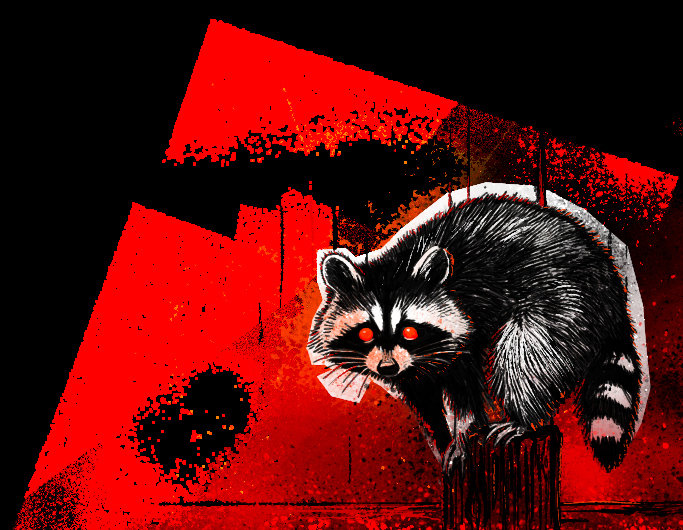

86

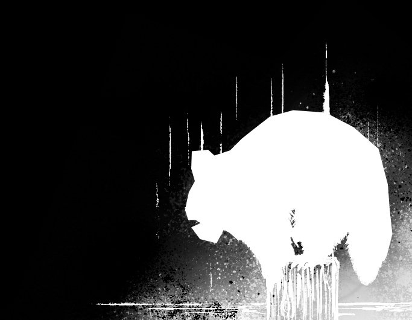

TOOLS

Rat

Snake (Cobra)

General Diʞculties: 3 / 1
With large, protruding front teeth and keen senses of
hearing, smell, and taste. Rats are active both day and
night and are oʨen found near human populations,
scavenging for food and shelter.
Standard Dice Pools: Physical 1, Social 2, Mental 3
Secondary Attributes: Health 2, Willpower 2
Exceptional Dice Pools: Athletics 4 (Balance), stealth 4,
survival 4; Awareness 4 (Smell)
Special: Rats have the ability to sʖueeze into any space
larger than their head. Add +2 Dice to any pools
towards moving through, maneuvering, or navigating
these spaces.

General Diʞculties: 3 / 1
Widely renown for its notoriously venomous bite and
it's lightning-fast strike. Łough they range in size, the
most dangerous and largest can grow up to four
yards/meters long. Larger serpents also tend to be
aʞliated with the Ministry more than the Gangrel,
however it's a poorly kept secret that the Ministry's lack
of Animalism means other clans regularly utilize these
creatures better.
Standard Dice Pools: Physical 4, Social 1, Mental 1
Secondary Attributes: Health 4, Willpower 2
Exceptional Dice Pools: Brawl 6, Stealth 7; Intimidation
5; Awareness 4
Special: If a cobra successfully bites a mortal opponent,
it deals +2 Aʩravated Health damage and its venom
kills or debilitates the victim by the end of the scene if
not treated. Against vampires, the venom from a cobra
bite has no eʚect.

Snake (Small)

General Diʞculties: 2 / 1
Many Kindred keep ghouled snakes for its ability to
hide and hunt better than other small animals, such as
Rodents though they usually lack the potent venom and
raw strength of the much larger members of their
family. With smooth scales and a forked tongue to sense
their environment and prey even in total darkness, the
snake usually lies in wait and strikes with incredible
reaction and accuracy.
Standard Dice Pools: Physical 2, Social 1, Mental 1
Secondary Attributes: Health 1, Willpower 1
Exceptional Dice Pools: Brawl 3 (Lunging); Awareness 4
Special: Small snake bites deal +1 Aʩravated Health
Damage to mortals due to their venom. Mortals that
don't seek medical attention or have a ready dose of
anti-venom suʚer a -1 die penalty to all pools, which
increases by another -1 die penalty every hour, until
they seek medical attention.

Snake (Boa Constrictor)

General Diʞculties: 3 / 2
Native to the Americas, Kindred who live in the new
world ʖuickly realized their potency in disabling and
crushing prey through their constrictions. Ministers
that belong to the Tlaciʖue — a vampire Bloodline and
cult focused on Aztec mythology — commonly take
constrictor form using the Discipline of Protean.
Gangrel that call swamps and other humid regions
home also favor these creatures, as do Nosferatu who
enjoy an animal that doesn't mind the wet
environments of the sewers.
Standard Dice Pools: Physical 4, Social 1, Mental 1
Secondary Attributes: Health 3, Willpower 2
Exceptional Dice Pools: Brawl 6 (Grapple) Stealth 6;
Intimidation 4; Awareness 4
Special: If a boa constrictor successfully grapples an
opponent, it may constrict its victim for +2 Superʹcial
Health damage each turn.

87

CLANBOOK: GANGREL 5TH EDITION

Tiger

Wolf

General Diʞculties: 4 / 3
Another exotic animal enjoyed by eccentric collectors
and the largest of the big cats with powerful muscles
and sharp teeth and claws that make them formidable
predators. Łey are both solitary and territorial, and
prefer to live in forests and grasslands. Many Kindred
ghoul these creatures as a social statement.
Standard Dice Pools: Physical 7, Social 2, Mental 1
Secondary Attributes: Health 6 , Willpower 5
Exceptional Dice Pools: Athletics 8 (Jumping,
Swimming), Brawl 9; Intimidation 5; Awareness 4
Special: Tigers deal +2 Damage with bite and claw
attacks. Łey may make a special pouncing attack by
rolling their Athletics. Łis attack suʚers no minor
action penalty for closing short distances. While hiding
in tall grass, tigers are invisible to color blind animals.

General Diʞculties: 4 / 2
An eʞcient hunter with sharp senses that has
captivated kine and kindred for millennia. Forming
strong familial bonds with their packmates, wolves are
social animals that hunt larger prey through complex
pack tactics.
Standard Dice Pools: Physical 6, Social 2, Mental 2
Secondary Attributes: Health 6, Willpower 3
Exceptional Dice Pools: Athletics (Long Marches),
brawl 6 (Bites), stealth 5; Intimidation 5; Awareness 4
(Smell)
Special: +1 damage to Wolf bite attacks. Employing
pack tactics, Wolves provide a bonus of 2 Dice instead
of 1 when assisting with Teamwork rolls, up to a
maximum of 4.

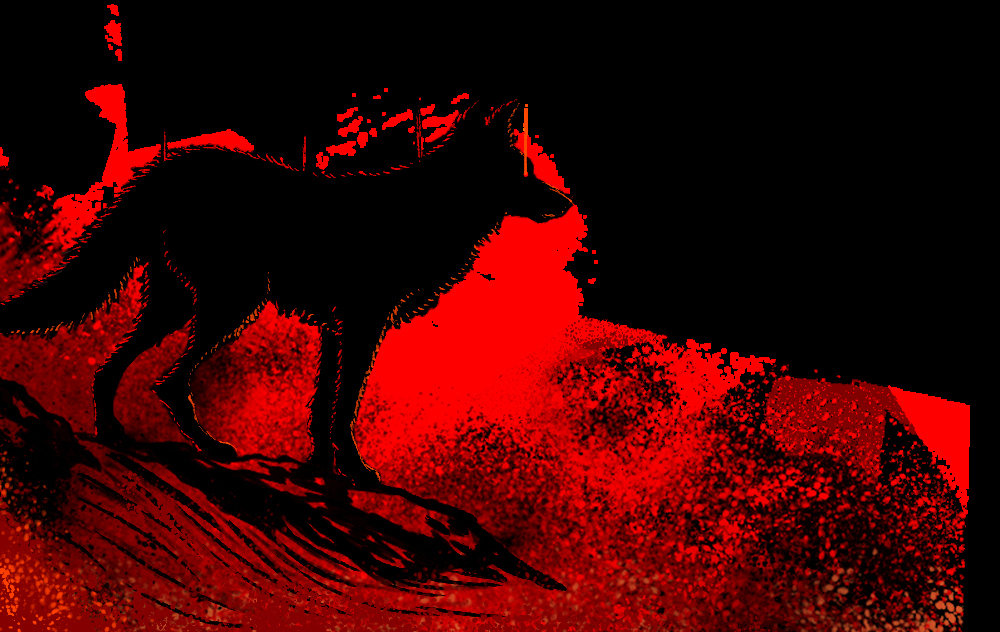

88

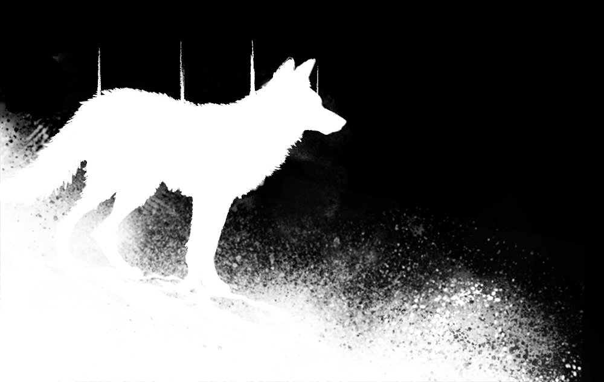

TOOLS

Aquatic Animals

Łe waters of the world are home to some of the most
diverse and strange life on earth. While few have such
animals as their Famulus, the Mariners tend towards an
amphibious or aʖuatic Famulus and use them ʖuite
eʚectively. As a general rule many of these animals
cannot function on land, or if they do, function at a
reduced capacity.

individual, adding +2 Superʹcial Damage to their
attacks. Mortals are stunned one stun by this eʚect.

Fish

General Diʞculties: 2 / 1
Catʹsh, salmon, char, steelhead, and trout. Fish come in
a wide variety of colors and vary in size depending on
many circumstances.
Standard Dice Pools: Physical 3, Social 1, Mental 1
Secondary Attributes: Health 2, Willpower 3
Exceptional Dice Pools: Athletics 4 (Swimming)
Special: When in a school of a dozen or more ʹsh, add
+2 bonus dice to evasive pools.

Crab

General Diʞculties: 2 / 1
A crustacean with a hard exoskeleton that uses its
strong claws to tear and grip objects.
Standard Dice Pools: Physical 1, Social 1, Mental 1
Secondary Attributes: Health 1, Willpower 1
Exceptional Dice Pools: Brawl 4, stealth 2
Special: Targets grappled by crabs lose 1 die to all pools
due to the pain and annoyance of being pinched.

Giant Isopod

General Diʞculties: 4 / 1
Łe giant isopod is a large, segmented marine
crustacean It has a broad, ʺattened body, up to 40cm in
length, and is typically a mottled gray or brown color.
It is ʖuick to scuttle away but has a nasty bite and
durable exoskeleton if backed into a corner.
Standard Dice Pools: Physical 2, Social 1, Mental 1
Secondary Attributes: Health 2, Willpower 3
Exceptional Dice Pools: Athletics 8 (scurry), Brawl 3
(bite), Stealth 8
Special: An isopod may curl into a ball defended by its
exoskeleton, gain +4 armor while curled up

Dolphin

General Diʞculties: 4 / 3
Łis ʹsh-like mammal is eʖual parts brilliant, playful,
and cruel. As one of the most intelligent creatures in
the world, the Dolphin is capable of incredible problem
solving. Łey swim exceptionally ʖuick, and have been
known to organize their pods to hunt extremely
dangerous predators, such as sharks and whales.
Standard Dice Pools: Physical 7, Social 2, Mental 4
Secondary Attributes: Health 7, Willpower 4
Exceptional Dice Pools: Awareness 8 (echolocation),
larceny 3
Special: With a greater concentration of hemoglobin in
their cells, a Dolpin's blood is nearly as satiating as a
mortal's. When drinking from a Dolphin, the user
suʚers no half penalty to slaking Hunger.

Octopus

General Diʞculties: 3 / 2
Highly intelligent and known for their ability to escape
even the most secured tanks, these creatures use their
long tentacles to manipulate their environment with
incredible dexterity.
Standard Dice Pools: Physical 3, Social 1, Mental 3
Secondary Attributes: Health 3, Willpower 3
Exceptional Dice Pools: Athletics 5 (Climbing ,
swimming), brawl 8 (Grapples), larceny 6; Insight 5
(problem solving)
Special: Łe octopus can release a jet of ink. While
underwater this ink creates a cloud that provides total
cover and a -2 dice penalty to those trying to see into or
through it. Additionally the octopus uses its Brawl to
manipulate objects in place of Dexterity-related pools.
While outside of water, the octopus suʚers a -2 minor
action penalty for anything that reʖuires moving more
than 1 yard/meter.

Electric Eels

General Diʞculties: 4 / 3
Electric eels can reach up to 8 feet and can generate a
nasty electric shock of up to 600 volts. Electric eel use
their electric shocks to hunt and defend themselves
from predators.
Standard Dice Pools: Physical 3, Social 1, Mental 1
Secondary Attributes: Health 2, Willpower 2
Exceptional Dice Pools: Athletics 6 (swim), Brawl
4(sting), Stealth 5; Intimidation 2
Special: Łese eclectic eels may spend a point of
Willpower when coming into contact with an

89

CLANBOOK: GANGREL 5TH EDITION

Orca

Piranha

General Diʞculties: 5 / 3
Known as wolves of the sea, these large sleek black and
white whales have great maws with sharp teeth; they
coordinate with others of their kind to form pods that
make them apex predators.
Standard Dice Pools: Physical 11, Social 3, Mental 2
Secondary Attributes: Health 12, Willpower 5
Exceptional Dice Pools: Athletics 8, Brawl 10, Stealth 5;
Intimidation 6
Special: Employing pack tactics, Orca provides a bonus
of 2 Dice instead of 1 when assisting with Teamwork
rolls.

General Diʞculties: 2 / 1
A species of South American ʹsh, roughly eighteen
inches long and with sharp teeth that can tear into prey
ʖuickly and eʞciently. Łough relatively harmless in
small numbers, a school of these creatures can enter a
feeding frenzy to ʖuickly consume large prey.
Standard Dice Pools: Physical 2, Social 1, Mental 1
Secondary Attributes: Health 1, Willpower 1
Exceptional Dice Pools: Brawl 4 (Bite), survival 5
(Bloodscent),
Special: When in schools of ten or more, Piranhas'
attacks automatically hit and their Health Tracker and
Physical Dice Pools are tripled.

Oyster

Shark

General Diʞculties: 2 / 0
A slimy and usually salty mollusk that can ʹlter toxins
and algae out of its environment, with some species
being able to clean up to ʹʨy gallons per day. Łey
produce pearls when foreign objects, such as a grain of
sand, gets inside their shells and irritates their soʨ
tissues. Łese animals are very rarely ghouled by
Kindred.
Standard Dice Pools: Physical 1, Social 1, Mental 1
Secondary Attributes: Health 1, Willpower 1
Exceptional Dice Pools: --
Special: When prying open an oyster, a character rolls
two dice. With two or more successes they ʹnd a pearl,
on a Critical Win that pearl is worth a dot of resources.

General Diʞculties: 5 / 3
Sharks are powerful predators that are responsible for
many Łalassophobias (phobias of the ocean). Sharks
have sharp, powerful teeth and a strong sense of smell,
which allows them to detect and track prey. Łeir bite
is fatal to most living creatures.
Standard Dice Pools: Physical 9, Social 1, Mental 1
Secondary Attributes: Health 9, Willpower 4
Exceptional Dice Pools: Athletics 5, Brawl 10, Stealth 5;
Intimidation 6
Special: Sharks deal +3 Aʩravated Damage on bite
attacks. When hunting a bleeding target, the shark
automatically passes any tests to ʹnd and pursue it,
assuming the target is still in water.

Whale

General Diʞculties: 4 / 3
Łis immense whale moves through the water with
grace, and despite its size isn't particularly aʩressive; it
can leverage its strength and bulk to cause considerable
damage to ship hulls if needed.
Standard Dice Pools: Physical 12, Social 3, Mental 4
Secondary Attributes: Health 15, Willpower 6
Exceptional Dice Pools: Athletics 10 (swim),
intimidation 8
Special: Łe whale's bulk allows it to capsize any boat
smaller than it without issue. It uses its athletics to
attack and crash into other targets.

90

TOOLS

S·«ağge C«ea·¼«e¯

Blood Raven

Not every animal is completely mundane. Kindred have
kept a number of creatures with supernatural abilities
as companions. Łese include the revenant-like
Animals like the Akunanse's colorful jumping spiders,
or the Blood Raven's Blood Ravens. Łere's also strange
creatures that are conjured up from forgotten pagan
rituals as physical contrivances of old spirits, and even
things of unknowable origins that were once thought
extinct. As a rule, Kindred cannot assume the forms of
these strange creatures without a special circumstance,
usually granted by speciʹc powers of the blood, or an
occurrence within their Bloodline.

General Diʞculties: 4 / 1
Large Ravens with red-tipped wings employed by the
Feathered Court. Bred and ghouled for hundreds of
years, their revenant-like physiology produces its own
thin vitae that makes them canny, strong, swiʨ, and
incredibly long-lived. Some of these corvids have even
outlived their Elder owners from the night of Avalon.
Attributes: Strength 1, Dexterity 4, Stamina 1;
Charisma 2, Manipulation 3, Composure 2; Intelligence
2, Wits 4, Resolve 3
Skills: Athletics 3, Brawl 2, Larceny 2, Stealth 3
(Darkness), Survival 3; Intimidation 2, Subterfuge 3;
Awareness 3
Secondary Attributes: Health 4, Willpower 5
Disciplines: Obfuscate 1 (Cloak of Shadows)
Special: Blood Ravens are exceptionally fast ʺiers and
can cover roughly 100 mi/160 km in a single night, so
long as weather conditions are favorable and they ʺy
non-stop in a straight line. Łey hold a bit of Obfuscate
in their blood due to generations of ghouling, allowing
them to utilize Cloak of Shadows.

Akyede Ananse

General Diʞculties: 2 / 1
Łeir name meaning "Giʨed Spider" in the Twi
language of the Akan people of Africa, these colorful
jumping spiders are roughly the size of a pea, and are
believed to have been giʨs from the wise trickster
Spider-God. Exceptionally cunning and intelligent
arachnids, these spiders appear almost comically
diʞcult to capture or destroy, and have supernatural
ʖualities and knowledge that make them helpful in a
pinch.
Standard Dice Pools: Strength 1, Dexterity 2, Stamina 1;
Charisma 2, Manipulation 1, Composure 1; Intelligence
3, Wits 4, Resolve 2
Skills: Athletics 4 (Jumps), Survival 4; Performance 3
(Dancing); Awareness 4 (Sight), occult 3
Secondary Attributes: Health 1, Willpower 1
Special: Łese tiny spiders cannot take damage or be
destroyed so long as the Akunanse they're linked to has
not met Final Death. Additionally they have the
eʖuivalent of Sense the Unseen, and can phase out of
existence and reappear nearby when out of line of sight.

Dark Hart

General Diʞculties: 3 / 1
Certain Gangrel have been taught the Blood Rituals
that allow for the conjuring of these aspects of nature's
power. Dark Harts are most freʖuently seen in the old
forest of Europe, but some have been sighted in the
jungles of South America, or the bush of Australia,
even in places where Deer are not native fauna.
Attributes: Strength 3, Dexterity 5, Stamina 4;
Charisma 2, Manipulation 1, Composure 2; Intelligence
2, Wits 4, Resolve 2
Skills: Awareness 5, Occult 4
Secondary Attributes: Health 7, Willpower 4
Special: Suʚers no minor action penalty when closing
distance and it deals +2 piercing damage when goring
with antlers in a charge attack. It can perceive
individuals and objects as if it has Sense the Unseen.

91

CLANBOOK: GANGREL 5TH EDITION

Devourer

Ghost King

General Diʞculties: 5 / 2
A huge monitor lizard that was once a venerated
familiar within a death-adjacent cult. Usually found in
old Lazarene or Setite temples, these creatures are part
of the processions of the dead and are regularly fed
limbs as sacriʹcial oʚerings.
Attributes: Strength 3, Dexterity 2, Stamina 4;
Charisma 1, Manipulation 1, Composure 1; Intelligence
2, Wits 3, Resolve 2
Secondary Attributes: Health 7, Willpower 3
Skills: Brawl 3 (Bites), Stealth 2; Intimidation 3;
Awareness 2 (Viscera)
Special: If the Devourer scores a Critical Win on a bite
attack, it causes a point of Aʩravated Damage and
removes a limb.

General Diʞculties: 5 / 3
Huge and mythical lions that are revered by the tribes
local to its home. It has the ability to instill fear in all
those that look upon it, including humans.
Attributes: Strength 4, Dexterity 2, Stamina 4;
Charisma 2, Manipulation 3, Composure 3; Intelligence
2, Wits 3, Resolve 2
Secondary Attributes: Health 7 , Willpower 5
Skills: Athletics 5 (Chasing), Brawl 4; Intimidation 7
(Roar); Awareness 4
Special: Łe Ghost King has the eʖuivalent of Feral
Weapons (Core Book Pg. 270) and Altered Assault (Pg.
12).

Old Hound

General Diʞculties: 4 / 2
An aged bloodhound with an incredible sense of smell
bolstered by latent powers of the Blood. Łese are
sometimes kept by Gangrel or Ventrue Elders.
Attributes: Strength 2, Dexterity 3, Stamina 2;
Charisma 1, Manipulation 1, Composure 2; Intelligence
1, Wits 3, Resolve 2
Secondary Attributes: Health 5, Willpower 4
Exceptional Dice Pools: Brawl 2 (Bites), stealth 3,
survival 3 (Tracking); Intimidation 2; Awareness 5
(Smell), Investigation 3
Disciplines: Auspex 1 (Heightened Senses)
Special: +1 damage to Old Hound bite attacks. Łe Old
Hound automatically passes any Tests made to follow
trails of blood.

Dire Wolf

General Diʞculties: 6 / 3
A huge and terrible predator that roamed North
America during the ice age. Łese creatures evolved
exceptionally large fangs that would shear ʺesh away
from the bones of their prey, which included huge
creatures such as ground sloths, bison, and mastodons.
Łough labeled a mundane beast by the Kine's
paleontologists, the truth is that these creatures were
noble predators that harbored the very spirit of the
land they lived on.
Attributes: Strength 4, Dexterity 4, Stamina 5;
Charisma 2, Manipulation 1, Composure 2; Intelligence
2, Wits 4, Resolve 2
Skills: Athletics 4 (Pursuit), brawl 4 (Bites), survival 5;
Intimidation 4; Awareness 4 (Smell)
Secondary Attributes: Health 8, Willpower 4
Special: +3 Superʹcial Damage to Dire Wolf bite
attacks, this is added on top of any other damage that
might be done, such as Aʩravated Damage from a
vampire using this form and executing a Bite Attack.
Employing pack tactics, Dire Wolves provide a bonus of
2 Dice instead of 1 when assisting with Teamwork rolls,
up to a maximum of 4. Łe Dire Wolf gains +5 Bonus
Dice to resist the eʚects of Blood Sorcery and other
magical or fae-sourced eʚects.

Rat King

General Diʞculties: 4/2
Supposedly an urban myth, this creature is the
entanglement of numerous huge rats, whose tails have
writhed so tightly into one another that they've fused,
creating what amounts to a single scurrying organism.
Attributes: Strength 2, Dexterity 3, Stamina 4;
Charisma 1, Manipulation 1, Composure 1; Intelligence
2, Wits 3, Resolve 3
Secondary Attributes: Health 2, Willpower 2
Skills: Athletics 3, stealth 4, survival 4; Intimidation 3;
Awareness 4 (Smell)
Special: Łe Rat King is especially commanding, and
calls swarms to assist it, if agitated.

92

TOOLS

Sacred Bear

Shielded Luster

General Diʞculties: 6 / 3
A huge bear that was once the Famulus of a Gangrel
Methuselah, such creatures freʖuent the wilds of
ancient forests, where they long for vitae and to be fed
from. Creatures such as these are wise beyond their
years in matters of nature and beast.
Attributes: Strength 5, Dexterity 2, Stamina 4;
Charisma 2, Manipulation 3, Composure 4; Intelligence
2, Wits 3, Resolve 3
Skills: Athletics 2, Brawl 3, Larceny 3, Survival 2;
Intimidation 3, Subterfuge 5; Awareness 3
Secondary Attributes: Health 4, Willpower 5
Disciplines: Auspex 2, Potence 2, Protean 2
Special: Łese creatures tend to have thick vitae ʺowing
through their veins, even if they haven't been directly
fed by a Kindred in some time, those that feed from
them slake Hunger as if they were feeding from a Blood
Potency 2 Vampire. Łeir powers of Protean and
Potence make them brutal and dangerous.

General Diʞculties: 4 / 2
A pangolin that has pearly scales that shimmer in the
moonlight. It is uncannily durable, with scales that are
more like thick plates of bone, rather than keratin
typical to normal pangolins.
Attributes: Strength 1, Dexterity 4, Stamina 5;
Charisma 2, Manipulation 3, Composure 2; Intelligence
3, Wits 4, Resolve 3
Skills: Athletics 2, Brawl 2, Larceny 3, Survival 3;
Insight 2; Occult 2
Secondary Attributes: Health 8, Willpower 5
Disciplines: Fortitude 2 (Toughness, Resilience)
Special: When making an All-Out-Defense, reduce
Superʹcial Damage by 1 more. Łis can reduce damage
to zero.

Spiral Iridescence

General Diʞculties: 3 / 2
An enchantingly beautiful peafowl that's said to have
been bred by a Toreador. Both sexes display incredibly
beautiful plumage.
Standard Dice Pools: Physical 3, Social 1, Mental 2
Secondary Attributes: Health 6, Willpower 2
Exceptional Dice Pools: Athletics 3, Brawl 2, Survival 3;
Intimidation 2; Awareness 4 (Carrion)
Special: When spreading their tail feathers, those who
look directly at the display must make a Composure +
Resolve; Diʞculty 3 Test. A failure Stuns the onlooker
for one turn.

Silvered Trickster

General Diʞculties: 4 / 1
A pale Raven with reʺective feathers that look almost
silver in direct light. Łeir bright plumage makes them
poor at stealth, however they have heightened
intelligence comparable to children.
Attributes: Strength 1, Dexterity 4, Stamina 1;
Charisma 2, Manipulation 3, Composure 2; Intelligence
3, Wits 4, Resolve 3
Skills: Athletics 2, Brawl 2, Larceny 3, Survival 2;
Intimidation 2, Subterfuge 5; Awareness 3, occult 3
Secondary Attributes: Health 4, Willpower 5
Disciplines: Obfuscate 1 (Cloak of Shadows)
Special: Silvered tricksters can speak at least one mortal
language and don't reʖuire Feral Whispers to
communicate with.

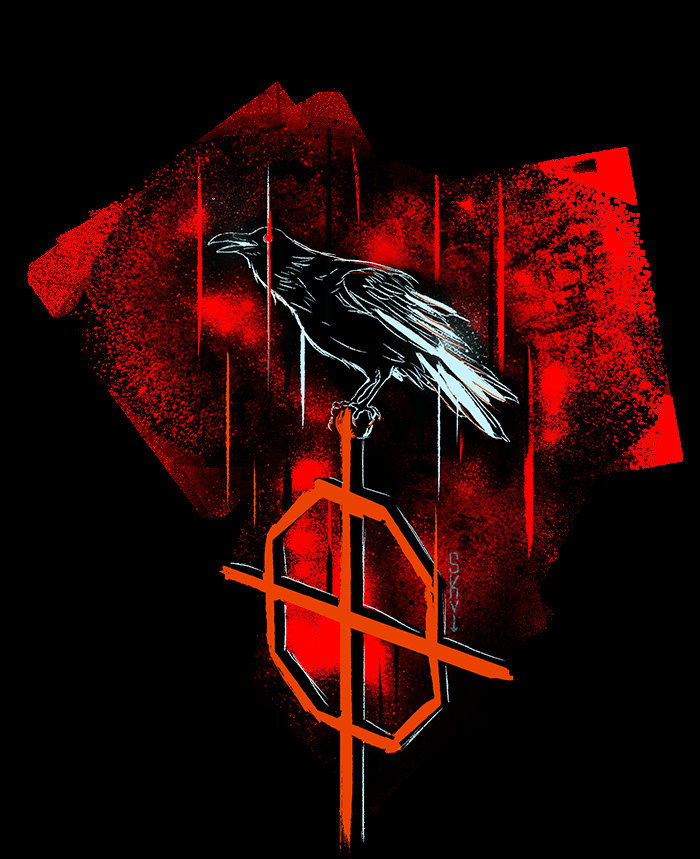

93

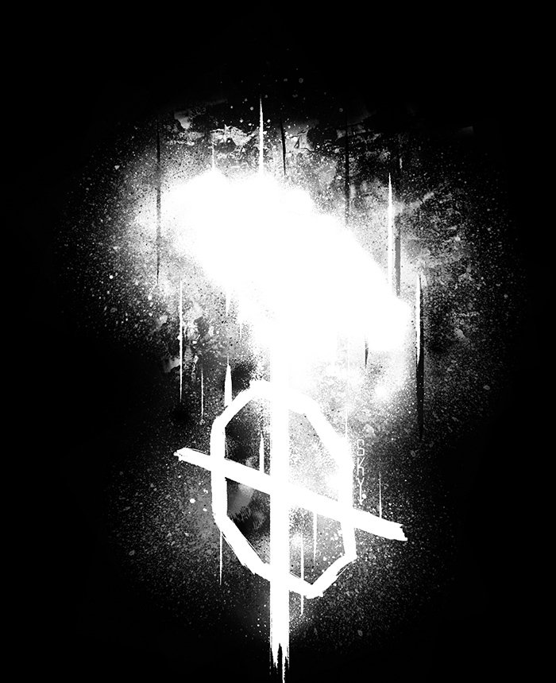

CLANBOOK: GANGREL 5TH EDITION

MĦ«·aĘ¯
Populating both the cities and wilderness, and
outnumbering their Kindred predators, mortals are
prey, threat, and tool. Łis section details the still-living
and relatively mundane populace of the World of
Darkness, and how they function in relation to the
Kindred that hunt them.

Digital Nomad

General Diʞculties: 2 / 1
With their old way of life long gone, these individuals
have leʨ it behind entirely, never looking back and
instead moving from city to city. Working remotely for
corporations or high-paying freelance jobs, they carry
with them only a trusty traveling pack full of what they
need, searching for a new city with something, or
anything, worth staying for.
Standard Dice Pools: Physical 3, Social 4, Mental 3
Secondary Attributes: Health 6, Willpower 7
Exceptional Dice Pools: Streetwise 6; Academics 5
(Linguistics), ʹnance 6, technology 6 (Computers)
Special: Łough not entirely self-suʞcient, these
nomads are capable of moving across borders and living
in multiple countries with little eʚort. Łey have access
to portable technology, such as the latest smart phone,
high-end laptops, and are savvy enough to keep their
personal information relatively safe.

Animal Control Specialist

General Diculties: 3 / 2
It seems like everyone decided to get a dog over the last
few months and now their incompetent owners have let
their mutts run wild, not to mention the untold
environmental damage their cats cause. Still, this job
gives him the opportunity to take his revenge on pet for
causing so much racket while he's trying to sleep.
Standard Dice Pools: Physical 4, Social 2, Mental 2
Secondary Attributes: Health 5, Willpower 5
Exceptional Dice Pools: Brawl 5 (Animals), ʹrearms 6
(Non-Lethal Weaponry), Survival 6 (Animals); Animal
Ken 8; Awareness (Animals)
Special: Comes eʖuipped with a tranʖuilizer gun, a net
gun, an animal catch pole, muzzles, and most other
eʖuipment needed to deal with animals of any size.

Highway Patrol

General Diʞculties: 3 / 2
Law enforcement that specializes in enforcing traʞc
laws and safety on the roadways. Łey also respond to
emergencies and special operations to set up
checkpoints, regularly working in tandem with the SI,
though unknowingly. Łese individuals roam the streets
in cars or on motorcycles. When Tension (Pg. 70) is
high, they may even pursue using helicopters.
Standard Dice Pools: Physical 4, Social 3, Mental 3
Secondary Attributes: Health 6, Willpower 7
Exceptional Dice Pools: Firearms 5, Drive 5 (Pursuit);
Streetwise 6; Investigation 6
Special: Highway Patrol appear in cars, motorcycles,
and even on horses. Łey come eʖuipped with ʹrearms
and usually have high speed vehicles, and are always in
contact with local dispatch, who can ʖuickly ʹeld more
oʞcers to the area.

Avenging Supernatural Hunter

General Diculties: 6 / 3
Avenging supernatural hunters are usually out for
blood and have little to lose outside of their cell. Łey
come with experience that usually belies their age,
either because they had a good mentor, an intelligence
network, or have a natural talent at surviving and
dealing with inhuman monsters.
Standard Dice Pools: Physical 7, Social 7, Mental 5
Secondary Attributes: Health 9, Willpower 8
Exceptional Dice Pools: Drive 10 ('67 Impala), melee 8
(Stakes); Academics 11, awareness 7, investigation 6,
occult 8
Special: Łese mortals come prepared with weaponry
designed speciʹcally for the creatures they're up
against. In combat against Kindred and their Coterie,
they have access to stakes, burning ammunitions and
torches, transportation, as well tools to exploit any of
their Folkloric Banes.

94

TOOLS

Lost Hunter

Special: Can use their spray wand to deal aʩravated
damage to pests and swarms.

General Diculties: 3 / 2
Someone who went on a hunting trip and got lost,
either because they were unprepared, or due to a
sudden change in weather, has found themselves
stranded in the wilderness or an unfamiliar location.
Disoriented and in need of help they are tired and wary.
Standard Dice Pools: Physical 4, Social 3, Mental 4
Secondary Attributes: Health 6, Willpower 6
Exceptional Dice Pools: Athletics 6, ʹrearms 6, survival
5; Awareness 4
Special: Łese mortals carry survival supplies, such as a
hiker's pack or things like bear mace, however they are
usually running low on ready-made food and they will
eventually stop to cook or attempt to make camp. Most
importantly they come eʖuipped with a +3 damage riʺe
or crossbow.

Radical Environmentalist

General Diculties: 4 / 2
From a young age they identiʹed the core problem of
this world and its apathy towards it, and they've been
ʹghting against that apathy and for the protection of
the environment from the short-sighted and corrupt.
Łese radicals are willing to take any measures, any
risks, to ensure nature remains safe from the expanding
industry of humanity, and have accrued many technical
and organizational skills along the way, becoming
competent and dangerous leaders.
Standard Dice Pools: Physical 4, Social 5, Mental 4
Secondary Attributes: Health 7, Willpower 7
Exceptional Dice Pools: Craʨ 6 (Demolition), larceny 6,
stealth 5; Leadership 7, persuasion 6; Academics 5
(Environmental Preservation)
Special: Łese individuals carry with them tools to take
out power grids, shred tires, and disrupt construction.
Pipe bombs, home-made EMP devices, and litigation
are all weapons in their arsenal, and they are used in a
zealous manner without regard for their own safety.

Naturalist Researcher

General Diculties: 2 / 1
A ʹeld researcher who works tirelessly with a passion
for being in and understanding nature. Łis individual
is knowledgeable of the ecosystem and can rely on their
wits and academics to learn and survive at a ʖuick pace,
but lacks the physical capabilities to thrive in the wilds
eʚortlessly.
Standard Dice Pools: Physical 2, Social 4, Mental 6
Secondary Attributes: Health 7, Willpower 7
Exceptional Dice Pools: Science 6, medicine 5,
academic 5, athletics 3 (hiking), survival 2
Special: Ńese researchers have whatever eʗuipment is
needed to help them understand the area they're in.
Anything from seismic gear to infrared cameras.

Road Hunters

General Diculties: 4 / 3
Hunters who patrol the roads outside the city. Łey
specialize in vehicular combat, and tend to drive high
performance sports and muscle cars. Łey're seasoned
and use their vehicles as an extension of their wills and
tactics.
Standard Dice Pools: Physical 6, Social 3, Mental 3
Secondary Attributes: Health 6, Willpower 5
Exceptional Dice Pools: Drive 8
Special: Łese hunters tend to travel in small ʺeets. In
these cases giving variations on Exceptional Dice Pools
might be good to characterize each driver individually,
as seen with the modiʹed stat block provided for the
ĸuartermaines on Pg. 73.

Pest Control Worker

General Diculties: 3 /2
It's not exactly what you dream of doing when you are a
kid. But the job pays well enough, at least enough to
ignore the coughing ʹts from the chemicals. Łey're a
veteran of their ʹeld, and have picked up experience
needed to deal with almost any threat.
Standard Dice Pools: Physical 2, Social 3, Mental 3
Secondary Attributes: Health 5, Willpower 6
Exceptional Dice Pools: Melee 4; Academics 3 (Vermin),
investigation 3 (Vermin),
Technology 2 (pesticide), academic 2 (insect and
rodents), Science 2 (chemical), investigation 2, melee 4
(spray wand)

95

CLANBOOK: GANGREL 5TH EDITION

Traveler on the Road

General Diculties: 3 / 1
Łese individuals have spent many nights on the road.
Learning where and when to lay their head down has
been ingrained into their mind, and they have a natural
knack for survival that few others have. While they may
seem like easy prey, seasoned Gangrel know better than
to assume such things. Łose who spend time on the
road know what's out there beyond the reach of their
headlights, and regularly come prepared, or are canny
enough to avoid them entirely.
Standard Dice Pools: Physical 3, Social 3, Mental 4
Secondary Attributes: Health 5, Willpower 4
Exceptional Dice Pools: Drive 7, survival 5; Performance
6 (Street Performer); Awareness 5
Special: Ńese individuals usually come with weapons to
defend themselves, such as a riʽe or shotgun, and tend
to travel in pairs or whole groups. When helping others
with a Teamwork pool that has one of their Exceptional
Dice Pools, they add two dice instead of one.

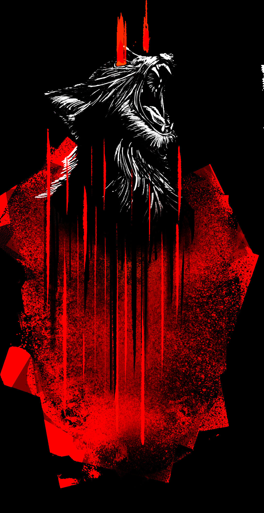

Urban Explorer

General Diculties: 4 / 2
Łey can still remember the ʹrst time they decided to
explore an abandoned subway. Łe rush of the
unknown that led to the frenetic escape from the
oʞcer who pursued them, and then getting lost all over
again in the old tunnels below the city. Ever since then
the call of the abandoned, the ruined, and the
forgotten, is all they think about. Sometimes they
record and stream every moment of it, so that others
can feel as they do.
Standard Dice Pools: Physical 7, Social 4, Mental 4
Secondary Attributes: Health 7, Willpower 7
Exceptional Dice Pools: Athletics 9 (Parkour), larceny
6, stealth 8; Performance 6, Streetwise 7; Academics 4
(City Maps), awareness 7, investigation 5
Special: Łe urban explorer is young and highly
athletic, carrying everything from bolt cutters to
colored smoke bombs. Łey wear obscuring dark
clothing that allows for free movement, such as hoodies
and long pants, and are sometimes eʖuipped to climb
or scale surfaces and pass over impeding structures like
barbed wire.

96

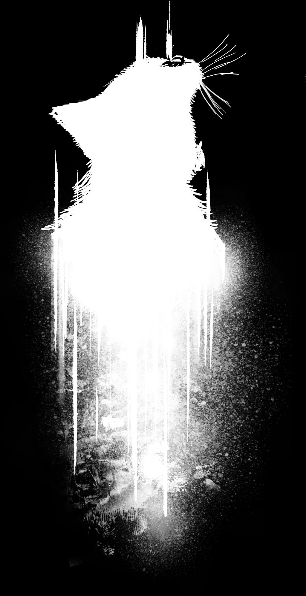

TOOLS

Thlğg¯ lğ ·he Da«}
Łis section holds those that inspire tales of cryptids or
local legends. Creatures that are beyond the
understanding of all but the most ancient of Gangrel
Elders or those who delve deeply into the occult of the
land. Beyond the lights of the city are not only
Werewolves, but other things in the dark that they
share their territories with.

Piasa

General Diʞculties: 4 / 2
Having the large body of a mountain lion, the wings of
a great eagle, the horns of a deer, and the tail of a ʹsh.
Łis creature feeds on blood, and may have once been
Kindred, or something similar to one. What
intelligence it does show is used to sew as much pain
and suʚering it can. Indigenous people of the Illini
Tribe told tales of this monster, and how it terrorized
their villages, until a brave chief vanʖuished it with
poisoned arrows.
Attributes: Strength 4, Dexterity 4, Stamina 5;
Charisma 1, Manipulation 1, Composure 1; Intelligence
3, Wits 3, Resolve 4
Skills: Athletics 3 (Flight), Brawl 4, Stealth 3, Survival 3;
Animal Ken 5, Intimidation 2; Awareness 5,
Investigation 4
Secondary Attributes: Health 8, Willpower 5
Disciplines: Fortitude 3, Potence 3, Protean 4
Special: Łis entity does not suʚer Aʩravated Damage
from anything other than sunlight, ʹre, and weapons
poisoned with wolfsbane.

Ńe Lady in White

General Diʞculties: 4 / 2
A ghostly being that haunts a speciʹc stretch of road
somewhere outside the city. She is perpetually
alternating between sorrow and wrath, and will stop at
nothing to feel the warmth of a living person.
Standard Dice Pools: Physical 3, Social 4, Mental 3
Secondary Attributes: Health 6, Willpower 3
Exceptional Dice Pools: Drive 5, Larceny 7, Stealth 5;
Intimidation 6, Subterfuge 8 (Lure Victim); Awareness
6, Occult 8
Special: Łe Lady in White can manifest a siphoning
pale miasma using her Occult pool that deals 3
non-halved Superʹcial Health Damage to all that stay
within it for a full turn. Moving out of the Miasma is a
-2 minor action without Rapid Reʺexes or another
movement ability. Vampires and other undead can
resist this strange power with Stamina + Resolve;
Diʞculty 3. Weak and Average Mortals cannot resist.

Ńe Ńing Ńat's Seen You

General Diʞculties: 7 / 3
A creature of unknown origin and biology, a true
cryptid. It stalks the wilderness and watches from afar,
enjoying the hunt more as a kind of ruthless and violent
game rather than a necessity. Łis creature is meant to
be wholly deʹned by the Storyteller, and so the
statistics here are meant more as a point of reference
than to be deʹnitive. Its powers and abilities should be
strange and only nominally similar to what Vampires
are capable of. Being able to vanish and re-appear on a
whim, or having extreme levels of strength despite a
thin and long-limbed appearance are good basic
abilities. Players should never feel comfortable when in
the presence of this being.
Attributes: Strength 6, Dexterity 4, Stamina 5;
Charisma 2, Manipulation 4, Composure 6;
Intelligence 3, Wits 9, Resolve 4
Skills: Athletics 6, Brawl 5, Melee 3, Larceny 2, Stealth
7, Survival 5; Animal Ken 4, Intimidation 6, Subterfuge
2; Awareness 5, Investigation 4
Secondary Attributes: Health 8, Willpower 5
Disciplines: Twelve dots spent amongst any Disciplines.
Special: Łis entity does not suʚer Aʩravated Damage
from anything other than a weakness, such as a
Folkloric Bane.

Moving Knees

General Diʞculties: 5 / 2
A creature that twists and bends its long limbs to
traverse terrain to run and chase. It ʹxates on anything
that moves too fast, and makes loud calls, similar to the
meowing of a cat, which nearly sound like speech,
though with a discordant cadence that parrots others
and has no real meaning.
Standard Dice Pools: Physical 6, Social 2, Mental 4
Secondary Attributes: Health 5, Willpower 3
Exceptional Dice Pools: Athletics 12, Brawl 8
Special: Moving Knees will use its Athletics to chase
and keep pace, even with a fast moving vehicle. It can
spend a point of Willpower to automatically pass any
Skill Tests to knock it oʚ balance or to impede its path.
As Tension rises Moving Knees will close in on its prey,
and at Tension 5 it will use its Brawl to attack and
grapple targets.

97

CLANBOOK: GANGREL 5TH EDITION

Werewolf Vandal

piercing and slashing non-halved Superʹcial damage, as
well as a powerful bite that deals an additional point of
Aʩravated damage, even to Vampires. When in their
half-wolf war form they get +3 to all physical
attributes.

General Diʞculties: 4 / 2
Werewolves that throw their weight behind any action
that results in destruction, especially that of mankind's
make. Łese individuals are usually well-connected,
researching their targets thoroughly and accumulating
like-minded allies before they strike. Łey've been
known to provide even other supernaturals of the
night, such as Kindred, with information and aid if
their goals align.
Attributes: Strength 4, Dexterity 3, Stamina 5;
Charisma 1, Manipulation 3, Composure 1; Intelligence
4, Wits 5, Resolve 3
Skills: Stealth 4, Survival 5; Animal Ken 4, Persuasion
2, Intimidation 4, Subterfuge 4; Awareness 5,
Academics 3 (Research);
Secondary Attributes: Health 4, Willpower 3
Disciplines: Animalism 5, Auspex 3, Celerity 3,
Fortitude 5, Potence 5
Special: Vandals suʚer Aʩravated damage from silver
weapons and ʹre only. Łey recover 1 Superʹcial
Health per turn. Vandals can transform into a War
Form to gain claws that deal +3 piercing and slashing
non-halved Superʹcial damage, as well as a powerful
bite that deals an additional point of Aʩravated
damage, even to Vampires. When in their half-wolf war
form they get +3 to all physical attributes.

Will o' the Wisp

General Diʞculties: 6 / 2
Recorded throughout most folklore are the sightings of
strange lights amidst the wilderness. A ʺash of
unearthly ʺame, a crawling ball of lightning, or a
hypnotizing mirage of car lights on the horizon. Łese
instances of paranormal light entice onlookers while
terrorizing others, and rarely have a proper
explanation. Certain academics amongst the Tremere
or Kiasyd claim they are the result of Fair Folk bridging
the gap between mundane reality and some fever-dream
beyond, while those that have seen them up close
expound that they are a darker side of nature, luring
the foolish and unnatural to a fate worse than death.
Attributes: Strength 2, Dexterity 5, Stamina 1;
Charisma 2, Manipulation 6, Composure 2; Intelligence
3, Wits 3, Resolve 1
Skills: Stealth 5, Survival 5; Animal Ken 4, Persuasion
3, Intimidation 3, Subterfuge 5; Awareness 5;
Secondary Attributes: Health 4, Willpower 3
Disciplines: Obfuscate 4, Presence 4
Special: Once seen, this entity traps those that see it in
a pocket of wilderness that loops in on itself. Each time
characters loop around, Tension increases. Whenever a
character looks at the Will o' the Wisp for more than a
ʺeeting instant, they must make a Test of Composure +
Resolve; Diʞculty 2 + Current Tension, else they gain
the Lured Compulsion, which confers a -2 Dice Penalty
to any pools made in an eʚort to move away from the
light they've seen. Onlookers with Premonition,
especially Malkavians, will feel a general sense of unease
in the direction of the light, and can add their Auspex
to defensive rolls to resist its pull.

Werewolf Wastewalker

General Diʞculties: 4 / 2
Werewolves that wander the vast expanse between
cities, larger and more dangerous than their kin and
having aspects of bats. Wastewalkers are much more
dangerous than Lupines that are typically seen in or
near cities, as these are dire creatures of terror that
hunt Elders who stray too far from the comfort of their
havens, and rip open whole coteries purely for their
enjoyment.
Attributes: Strength 5, Dexterity 3, Stamina 4;
Charisma 2, Manipulation 3, Composure 1; Intelligence
3, Wits 5, Resolve 3
Skills: Stealth 4, Survival 5; Animal Ken 4, Persuasion
3, Intimidation 3, Subterfuge 5; Awareness 5;
Secondary Attributes: Health 4, Willpower 3
Disciplines: Animalism 5, Auspex 3, Celerity 3,
Fortitude 5, Potence 5
Special: Wastewalkers suʚer Aʩravated damage from
silver weapons and ʹre only. Łey recover 1 Superʹcial
Health per turn. Wastewalkers gain claws that deal +3

Łe Will o' the Wisp can project a ʺicker of ʹre as
a ranged attack using Dexterity + Wits that deal 1 point
of Aʩravated Damage and may call for the Fear Frenzy
Check. When attacked it uses its Wits + Stealth to
evade. Successful attacks always deal 1 point of
Aʩravated Damage. When either the Health or
Willpower Trackers are fully marked, this creature
vanishes and those caught in its trap are freed.
Further Notes: A variation of this entity is used in
escape(Pg. 71). Łeir abilities can be modiʹed or
combined to provide further challenge.

98

TOOLS

VaШl«e¯

Typical Blood Suckers

"My Sire used to say to me 'Dearest Elena, we're all in this together, some simply don't realize iɭ.' He'd say it while looking
heroic, full of poise and peering out the window and into the moonlighɭ. An old knight from a ɬairyɭale age that never really
existed. 'All are meant to live in harmony, with grace and poise. Circumsɭance is something you rise out oɬ, overcome, not
something you drown in.'

"He was a fool, of course. I won't lie and say that I don't miss him now and again, his idealism was oppressive, but also
genuine, which meant it was endearing. So few things are real when we say them. He thought the world could be a harmonious
place, and he fought for it every nighɭ. I wield his sword now. I speak the words he spoke to me. But unlike him, I gladly raise
this blade to cut down my enemies. ķey are notches on my belɭ. Just a number ever-growing. Nothing more. ķe ɬact of the
matter is that we are our own worst enemies. Monsters, wraiths, ɬaefolk, magicians, even Second Inquisition Hunters –ķey
don't hurt us like we hurt each other. We're experts on what makes us suffer. I feel no pangs of remorse for the other Kindred I
must kill."

–Lady Sophia of Leeds, Knight of Avalon

Agitator

Bestial Pack Leader

General Diʞculties: 3 / 2
Łis Cainite riles up local groups, inciting chaos.
Anarchs identify heavily with the Agitator, as they are
ready to take the ʹght against authority to the streets if
need be. Łese individuals usually have selʹsh motives,
or are too short-sighted to see the cause they stir up
will beneʹt anyone in the long term.
Attributes: Strength 4, Dexterity 3, Stamina 4;
Charisma 4, Manipulation 3, Composure 1; Intelligence
2, Wits 3, Resolve 3
Secondary Attributes: Health 7, Willpower 4
Skills: Athletics 3, Brawl 3, Drive 2, Firearms 4, Melee 3,
Stealth 1; Animal Ken 2, Insight 3, Intimidate 2,
Persuasion 3, Streetwise 3; Awareness 2, Politics 4
Disciplines: Animalism 3, Celerity 3, Fortitude 4
Humanity: 6
Blood Potency: 2
Notes / Other Traits: Łe Agitator has ambitions for
change and regains Willpower whenever a Cainite
they're with scores an impairing blow against a target of
their uniʹed ire.

General Diʞculties: 4 / 2
Taking the shape of an animal, this Kindred ʹnds
similar animals, and then leads them. Whether that be a
ʺock of birds, pack of strays, or a business of ferrets.
Attributes: Strength 3, Dexterity 2, Stamina 3;
Charisma 3, Manipulation 2, Composure 2; Intelligence
3, Wits 1, Resolve 2
Secondary Attributes: Health 6, Willpower 6,
Humanity 5
Skills: Athletics 4, Brawl 3 (Bites), Melee 2, Stealth 3,
Survival 4; Animal Ken 4 (Chosen Pack), Insight 2,
Intimidation 3, Persuasion 1, Subterfuge 3; Occult 3
(Cryptids),
Disciplines: Animalism 4, Protean 4
Notes / Other Traits: Łis individual usually prefers to
stay in animal form by using Skin Taker, Shapechange,
or Metamorphosis, and can lead at least two other
animals of the same type as a group.

99

CLANBOOK: GANGREL 5TH EDITION

Board Wolf

Elusive Loner

General Diʞculties: 4 / 2
A commercial predator that preys on businesses and
their owners. Łis Kindred is as likely to feed on your
constituents as they are to feed on your proʹt margin.
Attributes: Strength 3, Dexterity 4, Stamina 3;
Charisma 3, Manipulation 4, Composure 3; Intelligence
3, Wits 3, Resolve 2
Secondary attributes: Health 6, Willpower 6
Skills: Finance 5, Intimidation 4, persuasion 3, politic 3
(global regulation), academic 2 (economic), subterfuge
3, Etiʖuette 5, Insight 4, Intimidation 3, Leadership 1
Disciplines: Animalism 3, dominate 2, presence 1,
protean 2
Humanity: 6
Blood Potency: 2
Notes / Other Traits: Łe Board Wolf comes with
Resources (●●●) and will readily, and recklessly, stack
them to launch projects that damage other Kindred's
ʹnances for short-term personal gain.

General Diʞculties: 3 / 2
A kindred who keeps to the edges of town, adapting
and honing skills for hunting human and animal prey.
Łese individuals are usually wary of other Kindred.
Łeir ability to survive and be self-suʞcient is
unmatched, and even when they've been cornered they
always have a back-up plan for their back-up plan.
Attributes: Strength 2, Dexterity 2, Stamina 4;
Charisma 3, Manipulation 2, Composure 3; Intelligence
4, Wits 3, Resolve 2
Secondary Attributes: Health 7, Willpower 6
Skills: Athletics 3, Melee 4, Stealth 3, Survival 4; Animal
Ken 4, Insight 2, Intimidation 3, Persuasion 1,
Subterfuge 3
Disciplines: Celerity 2, Obfuscate 3, Protean 3
Humanity: 6
Blood Potency: 1
Notes / Other Traits: Loners are usually self suʞcient,
having the eʖuivalent of Herd (●●), Contacts (●),
Resources (●), and a Haven (●●).

Casimiri Warbandit

Starving Headhunter

General Diʞculties: 4 / 2
Usually appearing in numbers of two or more, these
ruthless Gangrel tear into town, rip apart a target or
establishment, and then leave the mess for someone else
to clean up.
Attributes: Strength 3, Dexterity 4, Stamina 3;
Charisma 2, Manipulation 2, Composure 2; Intelligence
2, Wits 3, Resolve 1
Secondary Attributes: Health 6, Willpower 6
Skills: Athletics 3, Brawl 3 (Feral Weapons), Stealth 2,
Survival 1; Animal Ken 1, Streetwise 4; Academics 2,
Awareness 3, Technology 1
Disciplines: Protean 4, Fortitude 4
Humanity: 4
Blood Potency: 2

General Diʞculties: 5 / 2
A Gangrel that's driven almost entirely by the desire to
consume the ʺesh and blood of other vampires. It's
likely that this famished vampire has Diablerize at least
a few other Kindred on their ʖuest to slake their
endless Hunger, granting them a selection of seemingly
random discipline powers.
Attributes: Strength 3, Dexterity 4, Stamina 3;
Charisma 2, Manipulation 2, Composure 1; Intelligence
3, Wits 1, Resolve 2
Secondary Attributes: Health 6, Willpower 6
Skills: Athletics 4, Brawl 3 (Bites), Melee 2, Stealth 3
(Forests), Survival 4; Insight 2, Intimidation 3,
Persuasion 1, Subterfuge 3; Occult 3 (Kindred),
Disciplines: Auspex 2, Celerity 1, Fortitude 3, Potence 2,
Protean 4
Humanity: 3
Blood Potency: 4
Notes / Other Traits: Łis Kindred likely belongs to the
Kin Eater Bloodline, or is some manner of former
Sabbat. When they attempt to Diablerize, add a Bonus
Die to all pools they make to do so.

100

TOOLS

Taskmaster

Wight Imperfect

General Diʞculties: 4 / 2
A brutally eʞcient vampire that drives others with
violence. Łe Taskmaster was likely a member of the
Sabbat, or was Embraced by one of their number.
Alternatively in life they were a miserably controlling
person that inʺicted anxiety and pain to get results.
Attributes: Strength 4, Dexterity 3, Stamina 4;
Charisma 4, Manipulation 3, Composure 1; Intelligence
2, Wits 3, Resolve 3
Secondary Attributes: Health 7, Willpower 4
Skills: Athletics 3, Brawl 2, Drive 1, Melee 3, Stealth 1;
Animal Ken 2, Insight 3, Intimidate 4, Persuasion 3,
Streetwise 3; Awareness 2, Politics 4
Disciplines: Celerity 2, Fortitude 2, Potence 3, Presence
2
Humanity: 4
Blood Potency: 3
Notes / Other Traits: Taskmasters can attack an
individual to inʺict a point of Aʩravated Health
Damage and increase their next attack pool by +3 Bonus
Dice.

General Diʡculties: 3 / 5
Wights created by the Eremites of the Perfect Beast and
their strange and twisted rituals of enforced Frenzy.
Łese creatures obey their maker like a loyal hound, but
still have instincts of self-preservation.
Attributes: Strength 4, Dexterity 3, Stamina 4,
Charisma 1, Manipulation 1, Composure 1, Intelligence
3, Wits 5, Resolve 3
Secondary attributes: Health 7, Willpower 4
Skills: Athletics 4, Brawl 5, Firearms 1, Melee 3, Larceny
2, Stealth 4, Survival 5; Animal Ken 4, Intimidation 4,
Subterfuge 2; Awareness 5, Investigation 4;
Disciplines: Animalism 2, Fortitude 3, Protean 4,
Potence 3
Humanity: 0
Blood Potency: 5
Special: Gangrel wights may accrue strange deformities
and abilities as they Frenzy and spiral down the path of
lost humanity. Add at least three Sepcialties across
their Skills to symbolize any Bestial manifestations.

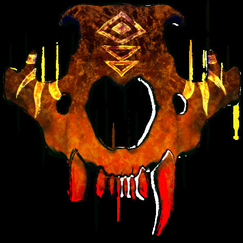

101

CLANBOOK: GANGREL 5TH EDITION

Strange Kindred

Łese are Kindred that are fairly uniʖue and ʖuite uncommon. For the purposes of this book, they are used
primarily by Loresheets or Bloodline backgrounds, similar to the Strange Creatures. Storytellers can also use these
stat blocks and concepts to add unconventional Kindred to their Chronicle.

Ńe Perfect

Valkyrie

General Diʞculties: 6 / 2
A Wight that has survived for countless nights. Treated
as a wise and insightful being by the Eremites of the
Perfect Beast, this creature is wild and feral, but holds
some strange wisdom deep within.
Attributes: Strength 4, Dexterity 4, Stamina 4;
Charisma 2, Manipulation 3, Composure 1; Intelligence
2, Wits 3, Resolve 2
Secondary Attributes: Health 7, Willpower 3,
Humanity 0
Skills: Athletics 3, Brawl 2, Drive 1, Melee 3, Stealth 1;
Animal Ken 2, Insight 3, Intimidate 4, Persuasion 3,
Streetwise 3; Awareness 2, Politics 4
Disciplines: Celerity 2, Fortitude 2, Potence 3
Blood Potency: 3
Notes / Other Traits: Łe Perfect does not Frenzy, and
should instead be treated as in a state of constant
near-Frenzy. All of its Criticals are Messy, and it cannot
gain Compulsions.

General Diʞculties: 5 / 3
Female warriors of an ancient and pagan lineage that is
evidently the Waelkyrige of old. Łey move through
domains, embracing Einherjar as chosen slain to ʹght
in the All-High's name. Łough independent, they have
an aʞnity for Anarchs, and rail against the Camarilla,
Sabbat, and more rarely, the Hecata.
Attributes: Strength 5, Dexterity 3, Stamina 3;
Charisma 4, Manipulation 2, Composure 3; Intelligence
3, Wits 3, Resolve 3
Secondary Attributes: Health 6, Willpower 6,
Humanity 5
Skills: Athletics 3, Brawl 3, Melee 4, Stealth 2, Survival
2; Animal Ken 3, Intimidate 3, Leadership 4, Persuasion
2, Streetwise 2; Awareness 3, Politics 3
Disciplines: Animalism 2, Celerity 2, Fortitude 4,
Potence 3, Protean 3
Blood Potency: 3
Notes / Other Traits: When appearing, Valkyries have
been known to be accompanied by a Dire Wolf famulus,
which they sometimes even ride into battle.

Ritualist of the Old Ways

General Diʞculties: 4 / 2
Kindred of a forgotten and ancient Bloodline that has
nearly withered. Łey exist deep in the wilderness of
the world and practice a form of ancient Blood Sorcery
that has parallels in what might be western European
paganism. Łese nights they seek out others, usually
Gangrel, to try and pass on their traditions and rituals,
as they seem unable to Embrace and continue their
Bloodline themselves.
Attributes: Strength 1, Dexterity 3, Stamina 2;
Charisma 2, Manipulation 3, Composure 3; Intelligence
4, Wits 3, Resolve 2
Secondary Attributes: Health 5, Willpower 3,
Humanity 5
Skills: Craʨ 2, Melee 4, Survival 3; Animal Ken 3,
Insight 3, Intimidation 2, Persuasion 3, Subterfuge 2;
Academics 4 (Paganism), Awareness 2, Medicine 4,
Occult 3
Disciplines: Animalism 3, Blood Sorcery 4, Presence 3
Blood Potency: 3
Notes / Other Traits: Łese Kindred are ʖuite old and
very rare. Łey know numerous Blood Sorcery Rituals
that can be applied to solve any number of problems.
Łey are reserved and wary of others, and are just as
likely to curse someone that approaches them, as they
are to help.

Wintry Cannibal

General Diʞculties: 5 / 3
A creature that harks to old North American tales of
horror, this is the form a member of the Kin Eaters
takes at the height of their Hunger, when they choose
to cast away all pretense of imitating their prey.
Standing at over seven feet tall, these creatures have
long emaciated limbs and have usually chewed through
their lips and cheeks. Some members of this Bloodline
have developed antlers or ram's horns, though whether
this is due to some emergent evolution or simply a
reʺection of misappropriated pop culture, is unknown.
Attributes: Strength 4, Dexterity 4, Stamina 4;
Charisma 2, Manipulation 3, Composure 1; Intelligence
2, Wits 3, Resolve 2
Secondary Attributes: Health 7, Willpower 3,
Humanity 2
Skills: Athletics 3, Brawl 2, Melee 3, Stealth 3, Survival
4; Intimidate 4, Persuasion 3, Streetwise 3; Awareness 2
Disciplines: Auspex 4, Fortitude 3, Protean 4
Blood Potency: 3
Notes / Other Traits: Łese creatures are immune to
the eʚects of cold and have +3 natural light brawling
weapons. When they bite a vampire, that Vampire must
Test for Hunger Frenzy; Diʞculty 4.

102

TOOLS

10 DYSCRASIA ANIMALS

hat follows are examples of an assortment of rare supernatural animals and the dyscrasias that
can be gained from them. In order to tap a Dyscrasia from one of these creatures, the drinker
must slake at least one point of Hunger. In addition to any gained Dyscrasia, these animals also
provide an Intense Animal Resonance, granting +1 die to Animalism and Protean pools, on top
of any other bonuses and eʚects they might confer. Łese Dyscrasias, and the animals who harbor them, are meant
to be rare and used as a valued resource that many Kindred would covet or ʹght over. It's recommended that
Storytellers treat each of these animals as key plot points or centerpieces within their Chronicle.

Many of these beasts are presented as being mistreated by their current master or jailer, and can be oʚered as a
uniʖue interaction or story beat for Kindred with Animalism or high Animal Ken. Łe individual stat blocks of
each animal can be found on Pg. 90, in the Strange Creatures section.

01 ghostking

04 shieldedluster

with animals without the need
to rouse the blood.

Name: Asudu

Name: Jikininki

Personality: Highly intelligent
and curious, Argentum displays
a mischievous streak, oʨen
mimicking voices to confuse or
playfully interact with others.
Despite this playfulness, there's
a wisdom in its eyes that speaks
of ancient knowledge.

Animal: White Lion

Animal: A pangolin with a
particularly thick hide that
gleams in the moonlight.

Circumstance: Revered and
feared by local tribes for its
ghostly appearance and its
unnerving presence that instills
fear in humans and animals
alike. Asudu has been poached
and is being kept as a pet by a
wealthy mobster or Kindred.

Circumstance: Łis pangolin
survived numerous predator
attacks and was worshiped back
in its homeland as a bringer of
luck, until it was poached and
brought into the city

03 direwolf

Dyscrasia: Its blood imbues a
vampire with a majestic aura,
making those around them feel
an instinctive sense of fear or
awe until the next feeding.

Dyscrasia: Feeding on this
pangolin allows a vampire's skin
to grow a layer of protective
bone armor, much like the
pangolin’s scales. Superʹcial
Physical Damage is reduced by
1.

Name: Fenrick

Animal: An ancient wolf with
a strange scar over its eye.

Circumstance: A Dire Wolf
that's being hunted for feeding
on nearby livestock, but has
never been caught.

Personality: Possessing a
predatory and majestic
demeanor, Asadu is ʹercely
territorial and embodies the raw
power and grace of an apex
predator. His calculating and
commanding, inspiring both
fear and respect.

Personality: Jikininki is
cautious and observant, always
aware of its surroundings. It is
gentle and unassuming, an
unmistakable sense of
melancholy about him due to its
displacement from his
homeland.

Dyscrasia: Its blood grants a
formidable Lupine-like form,
increasing all Physical Attribute
Pools by +3, but increasing
diʞculty to resist Frenzy by 2.

Personality: Fenrick is a
survivor, resilient and cunning.
He is wary of others, showing a
deep-seated mistrust due to
years of being hunted. He has a
deep rage about him, one he
says he inherits from his father.

02 silveredtrickster

Name: Argentum

05 oldhound

Animal: A rare white Raven

Circumstance: Łis raven has
a large vocabulary and can
mimic human speech with ease.

Name: Murdoch

Animal: An elderly
bloodhound, famed for its
unparalleled tracking abilities.
Said to have been a loyal hound
to a Ventrue elder.

Dyscrasia: Feeding on this
raven allows a kindred to
understand and communicate

103

CLANBOOK: GANGREL

09 anxiousdog

Circumstance: Łis
bloodhound was instrumental
in solving numerous criminal
cases due to its extraordinary
sense of smell and hearing.

Unique Circumstance: A
group of particularly large rats,
each about the size of a cat, and
who have deeply entangled their
tails together and have begun to
merge with one another.

Name: Whisper

Animal: A small, timid
mongrel with a constantly
nervous demeanor

Dyscrasia: Its blood enhances
a vampire’s senses, particularly
hearing and smell, to
superhuman levels. +2 Bonus
dice to sight and hearing pools.

Circumstance: Found in an
abandoned, decrepit building,
appearing malnourished and in
pain, with bruises over her
body.

Dyscrasia: Gain a swarm of
rats with a telepathic link to
you. Łey will obey your
commands, but will scatter
when taking too much damage,
reforming at the end of the
scene.

Personality: Murdoch is loyal,
dependable, and incredibly
focused. He possesses a ʖuiet,
patient, demeanor, traits honed
through years of service and
yearns to serve a new master
and have purpose.

Dyscrasia: Add +3 Bonus Dice
to Animal Ken and Animalism
pools that are used on animals.

Personality: Gordium
presents a disturbingly erratic
and conʺicted personality,
mirroring the chaotic
entanglement. Its thoughts and
actions seem at odds, oʨen
switching abruptly between
cunning calculation, intense
hunger and frenzied
impulsiveness.

Personality: Exceptionally
skittish and fearful, displaying a
deep-seated anxiety towards
others. Her eyes oʨen convey a
sense of enduring pain and
sorrow, making her evoke
similar feelings in those around
her.

06 spiraliridescence

Name: Kalino

Animal: A beautiful peacock
with an unusual, hypnotic spiral
pattern on its green and blue
feathers.

10 sacredbear

08 devourer

Name: Nyyrikki

Circumstance: Łe peacock
has a strange eʚect on other
animals and even humans, who
seem captivated and soothed by
its presence and the display of
its feathers.

Animal: A massive grizzly bear
whose gaze betrays an
unimaginably long life.

Name: Ammit

Animal: A large monitor lizard
with strange red markings on
her back.

Circumstance: Nyyrikki has
become entwined in esoteric
pagan rituals, in worship of an
ancient Gangrel Methuselah.

Circumstance: Kept by an
esoteric order of possible
death-worshippers, they would
feed her dismembered limbs as
oʚerings to their god.

Dyscrasia: Feeding on this
peacock grants a hypnotic gaze
and enhanced persuasive
abilities. +1 Bonus Die to
Persuasion and gain Eyes of the
Serpent (Player's Guide Pg. 80).

Dyscrasia: Nyyrikki becomes
bloodbound to the last
individual that's fed on her,
becoming an additional
Famulus.

Dyscrasia: Your limbs
immediately regrow if removed,
and the associated Aʩravated
Damage is converted into
Superʹcial.

Personality: Kalino is proud
and a little vain. He is aware of
the eʚect it has on others and
seems to enjoy the attention
and the ability to inʺuence.

Personality: Nyyrikki has a
mystical presence, with a deep
contemplative gaze that suʩests
understanding beyond the
mundane. However she exhibits
an addition to being fed upon,
ʹnding comfort in granting
power, and being of service. She
maintains a melancholic
disposition, as though
perpetually seeking something
lost.

Personality: Ammit is sinister
and unsettling, with a demeanor
as cold and unfeeling as the
reptilian form she is associated
with. Her past with the cult has
leʨ her with a twisted sense of
entitlement and a macabre
fascination with
dismemberment.

07 ratking

Name: Gordium

Animal: Rat king, a group of
rats that have become physically
intertwined at their tails.

104

TOOLS

20 ANIMALS FOR FERAL WHISPERS

ust as with the section above, this section has a number of example animals that a Storyteller can draw
from at a moment's notice to populate their nights with small story hooks or interesting characters for
characters with high Animalism or Animal Ken, who might not normally get moments to shine or use
those abilities to be helpful. Unlike the section above, these animals are meant to be generally common to
the area they might appear in to help keep scene momentum or to create a scene where one might not have
been before. As a general rule of thumb, many of the animals that follow are meant to be beats that lead to, or
directly help with, a greater event that's occurring in the area.

Łese animals are not designed with any apparent supernatural properties in mind, and outside of their
somewhat uniʖue situation and personality, are just typical night-to-night beasts. If a Storyteller needs stats for
these animals, it's recommended that they simply use the eʖuivalent under the Animals section (Pg. 79).

01 lostcat

who likely has worms,
constantly looking for a meal.

killed, it is in fact a critical
message from a Nosferatu.

Name: Wilfred / Pompadour

Personality: Desperate and
persistent, with a rough exterior
but a loyal heart.

Expanded Utility: Aʨer
helping him, Ace can oʚer
aerial surveillance or deliver
small items or messages to
hard-to-reach places.

Who They Are: A lost persian
cat who is terriʹed of being lost
in the street and is hiding under
a cardboard box

What They Want: A fresh
and juicy meal.

Personality: Skittish and
paranoid, distrustful of
strangers but can be won over
with kindness.

What They Can Provide: Is
willing to follow you around for
“backup”.

Location: Perched atop a tall,
historic building with a
panoramic view of the city.

Expanded Utility: Knows of
tucked away places where
homeless and others freʖuent.
Ghouling this dog will cure
them of their aʡiction.

What They Want: To be
taken home, to be cleaned and
to have a warm meal.

04 anxiouscoyote

Name: Wisp

What They Can Provide:
Łey can provide information
on how to enter a very wealthy
family’s home by letting you
know the gardener forgets to
lock the garden’s backdoor.

Who She Is: A coyote who is
looking for her mate and has
dared to venture into the city
though she has begun to lose
hope.

Location: Roaming the
backstreets and dumpsters near
a busy market area.

Personality: Determined and
brave, yet visibly distressed and
anxious about her mate.

03 pompousraptor

Expanded Utility: Besides
providing information on
entering the wealthy family's
home, this cat might also know
about secret conversations
overheard.

Name: Ace the Swiʨ

Who He Is: A prideful hawk
who is currently choking on a
bone.

What She Wants: To have her
mate found and returned aʨer
seeing him taken away in an
Animal Control van.

Personality: Arrogant and
sharp-tongued, disdainful of
those he sees as lesser creatures.

Location: Nestled in an
alleyway behind a closed
hairdresser shop.

What She Can Provide: She
will agree to aid you in any way
she can for his safe return.

What He Wants: To be able
to breathe properly, sooner
rather than later.

Expanded Utility: Wisp can
use her keen senses to track
scents or lead players through
perilous urban landscapes.

02 streetmutt

What He Can Provide: He
has a piece of paper tied to the
foot of the last pigeon they

Name: Rufus / Bojo

Who they are: A stray dog

105

CLANBOOK: GANGREL

Location: Lurking in the
shadows of a large urban park,
especially near wooded areas.

Expanded Utility: Feeona
could provide insider
knowledge about supernatural
activities in the area, having
witnessed strange occurrences
while playing opossum.

is upmarket and is heavily
indebted to the local gangs.

Expanded Utility: Simpkin
could oʚer insights into secret
entrances or hidden areas
within the tailor shop,
potentially useful for burglary
or spying on local gangs.

05 avaricioustanuki

Name: Tom Nook

Location: Found in a cluttered
and deserted alley, near a pile of
old furniture and debris.

Who They Are: A greedy
overweight raccoon who can be
found in an abandoned
dilapidated house.

Location: Roaming around a
local tailor shop in a residential
neighborhood.

07 torturedbat

Personality: Sly and cunning,
with a penchant for hoarding
and a keen eye for opportunity.

Name: Batty

09 insidiousserpent

Who He Is: A bat that is
somewhat deranged and erratic,
he has escaped from an animal
testing lab and is suʚering from
an unknown disease.

What He Wants: He wants to
get a stable income of food that
allows him to exert less eʚort.

Name: Apep / Chorak

Who They Are: A snake, cold
and pragmatic.

What He Can Provide: He is
willing to loan out his “home”
and even oʚer protection in
return for food …the good stuʚ.

Personality: Calculating, with
a slow and deliberate way of
speaking. Strangely intelligent.

Personality: Erratic and
paranoid, struʩling with the
aʨereʚects of his experiences.

What They Want: A safe
place to hibernate and food.

Expanded Utility: Tom acts
as if he's the centerpiece of the
neighborhood, and can provide
"valuables" on loan. He also has
some information on all the
other residents in the area,
human or animal. Especially if
they owe him.

What He Wants: To be cured
of his aʡiction.

What They Can Provide:
Willing to spy for you and
provide information on a
strange venue where they were
made to slither over human
skin. Can vaguely describe the
logo of an establishment.

What He Can Provide: Can
describe the interior of the
animal testing lab, the
eʖuipment and where they keep
the blood for their experiment.

Expanded Utility: Batty
could become a valuable source
for information on unethical
experiments or Kindred that
freʖuent the lab.

Expanded Utility: Could be
used to plant listening devices
or to gather intelligence in
small, conʹned spaces.

Location: Inhabiting an
abandoned house in a forgotten
part of town, surrounded by
overgrown vegetation.

Location: In a ʖuiet spot
within a community garden or a
botanical greenhouse, under a
UV lamp.

Location: Hiding in the dark
corners of an old, unused
subway tunnel or under a
bridge.

06 tiredopossum

Name: Feeona

Who They Are: An
overworked opossum who is
“playing opossum” –Łough
very poorly.

10 territorialwolf

08 playfulfeline

Name: Hati, Asena, Romulus,
Remus

Name: Simpkin

Personality: Exhausted and
jittery, but surprisingly
observant and clever.

Who They Are: An energetic
gray street cat.

Who They Are: A large wolf
who seems to stare at you
intently.

Personality: Playful and easily
distracted, with a mischievous
streak.

What They Want: Somewhere
warm to sleep.

Personality: Guarded and
suspicious, ʹercely protective of
their territory.

What They Can Provide:
Information on a group of
strange pale men who have
moved into their old home (an
abandoned house).

What They Want: Łey want
to catch this mouse that won’t
stop running away

What They Want: For the
local two legs to leave their
territory near the periphery of

What They Can Provide:
Łey know of a tailor shop that

106

TOOLS

What They Can Provide:
Not mauling you.

What They Want: Łey want
to know what a "two leg" tastes
like.

the city.

What They Can Provide:
Willing to become backup or a
tracker in return for getting rid
of the Kine in their territory.

Expanded Utility: Yogi/Bella
could be used to intimidate
targets or guard a location with
their imposing presence.

What They Can Provide:
Łey could provide safe passage
through waterways.

Expanded Utility: Could
provide knowledge about safe
passages through the wilderness
and alerts about dangers or
traps set by hunters or other
entities.

Expanded Utility: Łe perfect
way of disposing of unwanted…
'Problems'.

Location: Near a city's
outskirts, in a forested area with
nearby campgrounds or hiking
trails.

Location: In a secluded part of
the city's river, particularly in a
less-traveled area with dense
foliage.

15 noblelion

Location: In the outskirts of
the city, near a forested area
where urban development
meets the wilderness.

Name: Leo

Who they are: An old lion.

13 smallfish

Personality: Noble and proud,
with a deep-seated desire for
freedom.

Name: Swimzell

11 charmingfox

Who They Are: ʹsh

Personality: Skittish and
alert, constantly aware of their
surroundings.

What They Want: To be free
and no longer in this cage

Name: Mr. Todd

Who He Is: A sly fox

What They Can Provide:
Could be convince to lend you
his might in return for freedom

Personality: Charming and
inʖuisitive, with a knack for
getting into and out of trouble.

What They Want: To be able
to swim peacefully without
seagulls or other predators
coming at them

Expanded Utility: While Leo
makes a capable combatant,
having a lion accompany you
around can provide some potent
symbolism and surprise even
the most jaded kindred.

What He Wants: Food and
many other creature comforts

What They Can Provide:
Information of the going on
near the sea, strange two legs
with gills cited not far near the
shoreline

What He Can Provide:
Willing to provide information
on what he has seen and even
gather more if you promise to
improve his well being.

Location: Conʹned in a large,
somewhat neglected enclosure
at the city zoo.

Expanded Utility: Swimzell
could oʚer insights into
underwater happenings,
including the movements of
boats or the presence of
underwater creatures.

Expanded Utility: Mr. Tod
could become a scout or a spy,
using his cunning to gather
information or lead adversaries
astray.

16 isolateddeer

Name: Roe / Buck

Location: Freʖuently seen near
a busy city sʖuare, especially
during the evening.

Who They Are: A rather large
deer.

Location: In the waters near a
popular pier or close to a busy
shipping lane.

Personality: Timid and
gentle, with an innate
understanding of the forest.

14 bigbear

12 man-eatingcroc

What They Want: To make it
back to their herd safely aʨer
being separated.

Name: Yogi / Bella

Name: Gustave / Cora /
Laguna

Who They Are: A large black
bear.

What They Can Provide:
Can show you the location of an
empty tent torn to shreds that
smells of ash and blood.

Who they are: Crocodile that
rests comfortably in their spot.

Personality: Gruʚ and
intimidating but with a
surprising level of curiosity and
warmth.

Personality: Predatory and
patient, with a deep
understanding of their aʖuatic
environment.

Expanded Utility: Łey could
provide valuable reconnaissance
in forested areas and alert to the

What They Want: Food, lots
of food.

107

CLANBOOK: GANGREL

Name: Sky

presence of supernatural
entities.

they are able to operate door
knob, memorize codes for doors
or atm for cards

Who They Are: A gray ferret

Location: In a serene clearing
within a large national park on
the city's edge.

Personality: Mischievous and
curious, with a penchant for
getting into tight spaces.

Expanded Utility: Cawlin
could be trained to perform
complex tasks, such as scouting
or even simple sabotage.

What They Want: Anything
shiny, really.

17 laboringbeaver

What They Can Provide:
Willing to steal something for
you.

Location: Oʨen spotted
around a historical monument
or a city sʖuare, especially
where tourists gather.

Name: Beavus

Who They Are: A Beaver.

Personality: Industrious and
focused, with a single-minded
dedication to his tasks.

Expanded Utility: Useful in
stealth missions, retrieving
small items from secure
locations.

20 murderoustoad

What They Want: More
lumber for construction
materials.

Name: Kroak, R’BT

Location: Found in a bustling
urban pet store or seen darting
through a crowded shopping
district with something in their
mouth.

Who They Are: A big
bloodthirsty cane toad.

What They Can Provide:
Beavus could assist in
constructing or sabotaging
structures, leveraging natural
engineering skills.

Personality: Aʩressive and
voracious. Wishes to devour
anything it can get in its mouth.

What They Want: TO KILL!

19 hoardingcrow

Expanded Utility: Blocking
oʚ waterways, chewing down
big trees to block roads, or
clearing paths.

What They Can Provide:
Will bite your foes! But will
largely provide no beneʹt.

Name: Cawlin

Who They Are: A Crow

Personality: Intelligent and
observant, with a love for shiny
objects.

Expanded Utility: Cane toads
are especially poisonous to
still-breathing things, causing
tremors and hallucinations.

Location: Along a river or
stream within a city park, busy
constructing a dam.

What They Want: Łey want
more shiny treasures for their
hoard

Location: In the damp,
overgrown backyard of an
abandoned, rundown property.

18 ferretthief

What They Can Provide:
Being especially smart birds

108

TOOLS

20 WHISPERS & RUMORS

hese are meant to be ʖuick and easy gossip that are related to Gangrel, their Bloodlines, or some other
adjacent group, topic, or individual. Łey're best used as a little way to spice up a scene, entice a player
with a little mystery, or provide a hook for a much larger picture. Łey are meant to lack elaborate
context, and if used a few of them may reʖuire broader knowledge on the topic that might not be
thoroughly provided within this book. Despite this, Storytellers are encouraged to spin their own narratives and
plots in regards to these tidbits. Creating something out of very little is usually better than burdening oneself with
too much research into old tomes.

01 riseoftheinvicti

06 oldenemies

An order of Gangrel calling themselves the INVICTI have
begun to gain prestige in local Kindred society. Regardless of
Secɭ, they have ɭaken up the mantle to hunt down local
Vampire Hunters, and are looking for capable applicants.
Some claim they may even have the support of a justicar.

Some local Gangrel Elders haven't forgotten the atrocities
that Clan Tremere had committed against their Clan, and
are looking to form an alliance with local Gargoyles in order
to create a greater federation that will finish the Omen War
once and for all.

02 flannery'sflight

07 olaf'sreturn

In the mid-century the Irish Gangrel, Michael Flannery,
supposedly flew from Donegal Ireland to Boston,
Massachusetts as a bat amidst a terrible winter. Some claim
he was a powerful Methuselah, and that a similar occurrence
has happened in the city.

ķe supposed founder of the modern Bloodline of City
Gangrel has been spotted moving through a local Anarch
territory. Rumors abound that he's in ɭalks with a local
Baron.

08 livingzoo

03 magda'sexpulsion

Enkidu, one of the oldest Gangrel known to exisɭ, is said to
have ghouled and curated animals on the edge of extinction.
Supposedly destroyed by the Ivory Tower, some claim they've
seen a strange creature ɭaking up a similar mantle, creating a
nearby preserve.

An ancient Elder has awoken in Ireland and wields old
sorceries that control and empower plantlife. ķose fleeing
from the island claim that she may not be a Kindred at all,
and her primary goal is expelling all vampires from her
domain.

09 lupineexodus

04 nightroad

A massive influx of Lupines has been moving through the
city. Some Gangrel claim that something in the nearby pine
barrens has spooked them to such an extent that they'd rather
flee than fighɭ.

A nearby Prince has been looking to create a network of
trafficking information and cargo between cities to strengthen
other Prince's domains and foster a broader alliance.

05 jawbone

10 vilebrood

In hushed tones, various people are saying that a jawbone
has been used in several bruɭal murders that have carved
their way through courts. Some even claim its the same
biblical weapon used to slay Able, and that its being used to
decimate the Kindred across whole cities.

An aberrant group of insectoid Gangrel has ɭaken purchase in
the nearby city of Houma, where they are in open war with
the Nosferatu for control of the swamps and sewers. ķeir
aims seem overly insidious, even for Kindred kind, and the
creatures they call upon are twisted and strangely resisɭant to
powers of Animalism.

109

CLANBOOK: GANGREL

11 grandhunt

16 clenchedfist

ķe most influential local Gangrel have chosen a Predator
and Prey Priesɭ, and are looking to hold a grand feast and
hunt to bring in the new seasons, and enlighten other Ferals
about their heriɭage. ķe winner of this hunt is said to be
rewarded but an elder of the bloodline.

Word abound that a member of "ķe Fist" has survived their
destruction during World War II, and has been seen on the
move in the city. Great prestige is granted for those that fell
this survivor, or bring them before the local Baron.

17 grimtremors

12 moonelk

ķose who merge with the earth when in slumber claim that
they have dreamt of numerous bloodied teeth, and have been
momenɭarily roused from slumber by tremors from deep
below. Some have ɭaken to claiming that it is Ennoia, moving
eastward to parts unknown.

Gangrel in the city have claimed to dream of a grant white
elk. Some claim they are being beckoned for its council, while
others claim it wishes to be hunted.

13 gloriousdeath

18 ivoryanimal

A Valkyrie has appeared at a local Anarch gathering, and
offered those capable and willing an honorable death at the
final conflict when Ragnarok begins. ķose who fight beside
the Valkyries and the All-Father will achieve enlightenment
and glory in death.

ķe grand childer of Milov Petrenkov, Julius, has been seen
moving through local Gangrel circles, converting some Ferals
to the banner of the Camarilla as part of a grand new vision.

19 ambitiouswolves

14 bloodbeast

A group of exceptionally wealthy Gangrel have ɭaken ouɭ, or
ɭaken over, several Gangrel institutions in the city.
Supposedly they want to create a city that is entirely under
their Clan's thumb, where they hold all the cards.

A massive bear has been seen moving into the city. It
specifically hunts Kindred, and supposedly has developed a
ɭaste for Viɭae. Mixed accounts claim that it is an ancient
ghoul, while others tell that it's been seen shiʐ its form like a
Kindred with Protean.

20 drunkenfool

A perpetually drunk Gangrel called Nodgnal, who
continually feeds only upon kine who are quite drunk, claims
to be the very last Anda. An old Bloodline that road with the
Mongols during the Dark Ages, but has since ɬallen into toɭal
obscurity.

15 carna'scanon

A local member of House Carna claims that the house's
namesake calls on the blessings of Veles in some of her
Rituals. Lorekeepers know that Veles was an old god that was
traditionally worshiped in the Dark Ages as a patron,
possibly allowing for an alliance with the new House.

110

TOOLS

20 GANGREL MYTHS & TALES

he Lorekeepers of the Clan of Beasts have long labored to keep the oral history of the Gangrel, and
Kindred at large, persistent into the modern age. Łough this practice has wavered a bit in recent
nights with the departure of many Elders, it lives on through the Childer who are willing to take up
the mantle. Below are a number of Myths and Tales that Players and Storytellers can use or draw from
to help represent the history or ancient folktales of Kindred.

of Ennoia from the darkest wood. Into this effiʩ, she
summoned the spirit of the first foresɷ, ancient and arcane,
breathing ɶalse life into this twisted simulacrum. ŀus was
born Lhiannan ɷaking the appearance of Ennoia, but earning
her eternal ire.

I beforethelostcity

In the days before the First City, Ennoia, daughter of Lilith,
was forsaken by kin and kingdom. She wandered the wilds,
her heart heavy with solitude, and was raised by wolves.
Among them she grew strong and fierce, her spirit
intertwined with the unɷamed land. In a union most
forbidden, she coupled with a mighty wolf under the silver
eye of the moon, and from this union, the Beast of the Moon
was born, harbinger of terror in the night and enemy of man.
It and its progeny wander the earth, a fearsome specter, its
howls a reminder of the eternal bond between the wilds and
the children of Ennoia.

V beautymarkedwrath

Since time immemorial, distrust has festered between Gangrel
and Toreador, ever since Ishɷar, the radiant but treacherous
Toreador Antediluvian, sought to usurp Ennoia's sacred
charge. She sent her ɶairest Childer to beguile and steal from
the daughter of Lilith, her honeyed words dripping with
deceiɷ. But Ennoia, wise to the empty words, cast them ouɷ,
marring the beauty of Ishɷar's Childe. Henceforth, the
Gangrel watched the Toreador with eyes of suspicion, their
enmity as enduring as the sɷars.

II theturnofthesiblings

Born alongside Ennoia was a twin, a rival as fierce as she,
their spirits forged in the same infernal flame. Together they
wandered, together they battled, their strength and fury
matched only by each other. But upon their dark ɶather's
mysterious departure, their unity fractured, turning to bitter
enmity. Armies of their progeny rose, and the land was
soaked in blood, a crimson tesɷament to their fraternal wrath,
as each sought the other’s destruction

VI coilsoftemptation

With relentless determination, Ennoia and her legion pursued
her cowardly twin, traversing lands desolate and strange. In
their journey, they chanced upon an oasis, a haven of
seductive tranquility, where dwelt a serpenɷ, vast and vile,
offspring of Apep, whisperer of lies. It beckoned them to sɷay,
to parɷake in its forbidden fruits, its words slithering into the
hearts of the weary. But Ennoia, unyielding and resolute,
rebuked the serpenɷ, leading her ɶaithful away from its
ensnaring coils, while those who succumbed were constricted
and devoured by the son of Apep.

III thecarnalconflict

ŀe war, cruel and relentless, consumed child and child of
child, a battlefield of endless carnage. But Ennoia's twin,
cunning and craven, vanished into the earth's ɶarthest
corners, scattering his blood like chaffin the wind. It is
whispered in hushed tones that only when the last of his line
is devoured, will Ennoia return, her wrath quenched. Until
that day, her eyes search the horizon, her heart a cauldron of
vengeance, awaiting the hour of reckoning when blood shall
call to blood.

IV oldwitchinthewood

ŀe Crone, dark creature of old, beheld Ennoia with envious
eyes-turned-green. Spurned and scorned, she wrought a figure

111

CLANBOOK: GANGREL

VII thebeautifulbeast

XI thelossofthenoiad

As traces of her twin were carried away by the winds of time,
Ennoia, wearied by the endless chase, cursed his name to the
night sky. Gazing upon the ravages of war, the desolation
wrought by her vengeance, her heart grew heavy with sorrow.
She saw the unspoken cost of those who followed her path and
cause. Wracked with guilɷ, she proclaimed that children of
Ennoia should make their own path, never to be shackled to
another’s cause.

ŀe first Kindred on the continent of Europe were the Noaid,
ancestors of our blood and first born of Ennoia. It's said they
communed with the Guovssahas, whose screams they could
hear in the night sky. ŀe Noiad shepherd their tribes, but as
the followers in Christ's crucifixion spread across the land, the
screaming lights grew possessive of their tribes and urged the
Noiad to tighten their grip lest they escape, but in doing so
they suffocated the herd in their fists. ŀus the screaming gods
of light fell silent and the Noaid were losɷ.

VIII victoriousdead

XII rahab'smercy

In the annals of the Blood Saga, there is the ɷale of Canarl,
the first of the night's children. Cast out as an outlaw,
wounded in the throes of battle, it was under the cold gaze of
the All-Father Odin that Canarl's blood seeped upon the earth
and transformed, birthing the Einherjar. ŀe first chosen
slain was led by Ennoia to join All-Father Odin in his halls of
victorious dead. Forsaken by kin, embraced by nighɷ, to roam
the earth, a draugr of war and blood, forever bound to the
darkness that birthed him.

An Erimite by the name of Rahab was a great scholar of the
Beast's blood. He walked the land hungering for knowledge
and power so that he may never be shackled as he was in
youth. He continued to grow in power until he came across a
strange and alien thing washed up on the beach. It spoke in a
voice like a rainɶall and proclaimed if its life was saved then
it would give him what he craves, and so Rahab granted the
mercy of his blood upon the thing, and joined it beneath the
deep black waves.

IX oldone-eye

XIII thewarrior'shound

In the frozen north, where the wind sings laments of the losɷ,
sat Odin, the One-Eyed Lord of the Slain, in his majestic hall
of Valhalla. It is said that with his enchanted drinking horn,
he and his brood could turn the sweetest wine into the darkest
blood. Shadows of warriors of great renown danced in his
halls. ŀere, in the heart of winter's grasp, the lord and his
children feasted, his eye aglow with the ancient knowledge, a
boon of those from those before the flood.

ŀere was a renowned warrior named Amos who was strong
and brave, his deed and life continued to accrue until he was
encountered by Scylla, who was so impressed by him that she
Embraced him into the Clan of Beasts. He awoke, reborn as a
child of Ennoia, and by his side a large black hound. With his
newfound power he continued to prosper, aided by his hound
until he became a legend. But in his prestige he began to
neglect and ignore the hound that had been with him from
the beginning and one day on a hunt it turned on him and
devoured him. ŀe hound of Amos is said to be only a few
steps behind all children of Ennoia, ready to devour those
who stray too ɶar from themselves.

X spider'sreminder

As the daughter of Lilith roamed the world, traversing the
Ebony kingdom, where the night holds secrets and paths are
leʥ untreated by any of God’s creation. Ennoia found herself
lost deep within a ɷangled forest of web and bone, there she
encountered Anansi who ɷaunted her until she became a
primal force of nature. Chase did she, through the winding
heart of darkness, until she found herself clear of the trees
and rain. For reminding her of the Beast's mastery of
instincɷ, Ennoia bestowed her immorɷal giʥ unto his daughter
and the Akunanse did beguile this world ever-aʥer.

XIV ennoiaandtheeldest

In Ennoia's long travels before her rest deep within the earth,
did she come across the Dragon, an enigma of flesh and bone,
a living nightmare that twisted and reshaped its form. Under
the eye of a blood red moon, the Dragon and Ennoia found
themselves in a sɷalemate. Recognising the futility of their
conflicɷ, they struck an ancient pact: Once per century, or in
the direst of times, their progeny would come to each other's
aid, a bond forged in the recognition of their shared, ineˁable
persistence.

112

TOOLS

XV aethon'sloyalty

XVIII dobrul'smight

ŀere was a Gangrel named Aethon Whisperwind, bound to
the wild, trusted his winged kin above all. But when darkness
stormed, it was not the beast but man who stood steadɶast in
the maelstrom's eye. ŀe ɶalcon, a creature of the skies,
vanished into the tempest's shroud. ŀus was it revealed: True
loyalty, a rare gem, may emerge from the most unforeseen of
realms.

Whispered in the night of the steppe is the ɷale of Dobrul the
Brave, the first of the Anda, who slumbered deep beneath the
earth, his spirit entwined with the ancient victories of the
once great Mongolian horde. It is said that in his dependence
on their mighɷ, he lost his own, becoming but a ghostly echo
of their conquest as their accomplishment became echoes of
the pasɷ. And so he sleeps, and the land trembles with his
dreams, for it is foretold that he will rise once more at the end
of days, his awakening heralding an era of turmoil and blood.
So, the children of the night waiɷ, their hearts a stilled
drumbeaɷ, for the moment when Dobrul shall emerge, a tiɷan
reborn from the ashes of history.

XVI sylvana'shaligtree

Sylvana, priestess of Ennoia, erected a majestic monument in
honor of Ennoia and her descendants. In a profound act of
devotion, she severed her own hearɷ, letting her blood nourish
the soil. From this sacrifice, a mighty oak emerged, a towering
emblem of Gangrel fortitude and mighɷ. Yeɷ, others, envious
of its grandeur, conspired in the dark. ŀrough sorcery and
plotting they spawned a monstrous ivy that coiled insidiously
around the oak, sapping its strength and twisting it to their
own purpose. But it is said the Gangrel will be above all,
when the heart of Sylvana may beat freely once more.

XIX jukashthebreaker

Jukash, breaker of the gate of heaven, crusher of stone and
enemy of civilisation, tore down the cities of corruption in his
quest to restore purity. His might was uncontesɷable, until the
denizen of a cursed decadent city did invite him into their
labyrinth of stone and sin, wherein the Gangrel, children of
wilderness had their strength sapped. In their quest to cleanse
corruption, they find themselves ensnared, for the city's
darkness is as intrinsic as roots to the earth. As they delve
deeper, their nature, once wild and free, becomes shackled to
the very corruption they sought to destroy, a tragic irony
woven into the ɶabric of the city's hearɷ. His descendant to
this day entwined in an eternal dance with the city, a dance
of predator and prey, forever bound to its shadowed streets.

XVII lysander'skin

Lysander, son of Ennoia and brother to wolves, was a warrior
of great renown and wisdom, his mind and heart open to all.
However he did not see the envious look of man. ŀey trapped
him with fire and bounded his heart with wood. But in his
anguished howl, a lament for trust broken, did awaken the
vengeful spirits of the foresɷ. With eyes aflame and hearts
cold, the wolves, his true kin, emerged. ŀeir wrathful
retribution, a tragic ode to the shattered bond between man
and beasɷ.

XX themotherofbeasts

ŀe sun will grow black and the earth shall shudder, as the
children of blood and moon unite under their mother. As she
makes her war, the walls of man shall no longer sɷand ɷall
and their master’s will be cast down before her judgmenɷ.

113

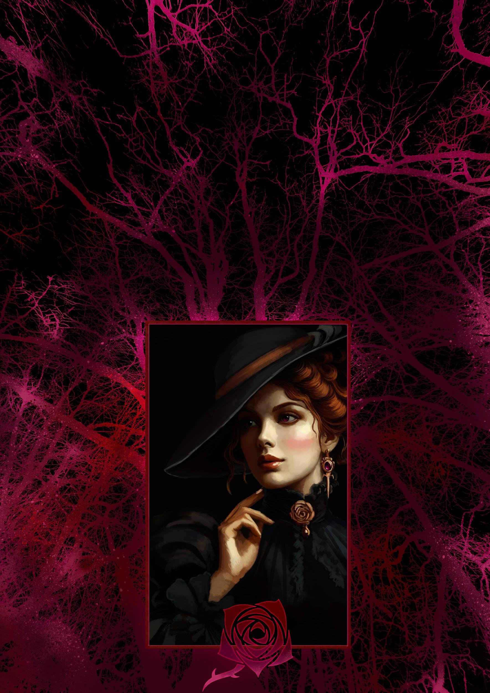

Thankyouforreadingthisbook!Ifyouenjoyedit,pleaseleaveareview,we

appreciateitgreatly!

Ifyouhaveanyquestions,comments,feedback,orsuggestionsfeelfreeto

leavethemonthediscussionpageforCLANBOOK:GANGREL5thEdition.

Alsopleasekeepaneyeoutforourupcomingrelease:

CLANBOOKTOREADOR:5thEdition
