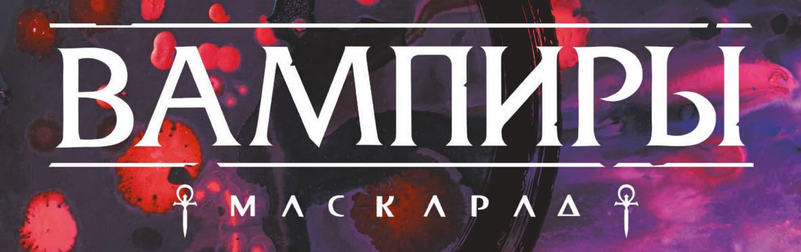

### **ПОСВЯЩЕНИЕ**

**Тебе, читатель, игрок и поклонник игры «Вампиры: Маскарад», мы посвящаем наш труд, нашу страсть, нашу любовь и выражаем глубочайшую признательность; своим 20‑с‑чем‑то‑летним копиям из прошлого, которым, наверное, крышу бы снесло, если бы они могли знать, во что всё это выльется;**

**и**

**светлой памяти Стюарта Вика, одного из основателей White Wolf и соавторов Мира Тьмы.**

### **WHITE WOLF ENTERTAINMENT**

**Тобиас «Эксель» Шёгрен — ИСПОЛНИТЕЛЬНЫЙ ДИРЕКТОР | Мартин «Элриксон» Эриксон — ВЕДУЩИЙ РАССКАЗЧИК Карим «Карнак» Муаммар — ГЛАВНЫЙ РЕДАКТОР Даная «Дафна» Де Вир — БИЗНЕС-ДЕВЕЛОПЕР | Томас «Старец» Арферт — ХУДОЖНИК И РЕДАКТОР**

### **ДИЗАЙН**

**РАЗРАБОТКА — Кеннет Хайт и Карим Муаммар ПРОЕКТ — Карим Муаммар, Кеннет Хайт и Карл Бергстрём ТВОРЧЕСКИЙ РУКОВОДИТЕЛЬ — Мартин Эриксон**

**ПРОДЮСЕР — Джейсон Карл**

**АВТОРЫ — Кеннет Хайт, Мартин Эриксон, Мэтью Докинз, Карим Муаммар, Юхана Петтерссон ПРИ УЧАСТИИ Марка Рейн‑Хагена, Карла Бергстрёма, Джейсона Эндрю, Фрейи Гильденстрём и Жаклин Брик РЕДАКТОРЫ — Фрейя Гильденстрём, Дженнифер Смит‑Пульсифер и Карим Муаммар**

### **РУССКОЕ ИЗДАНИЕ**

**ПЕРЕВОД НА РУССКИЙ ЯЗЫК — Ольга Уткина РЕДАКТУРА — Анастасия «Хима» Гастева и Татьяна Anarett Курочкина КОРРЕКТУРА — Ирина Silwingwen Башкатова и Рита Прохоровская КОНСУЛЬТАНТ ПО ЭТИКЕ И АВТОР СТАТЬИ «НЕНАВИСТЬ, РАДИКАЛИЗМ И ПРОЧЕЕ ЗЛО В ИГРЕ» — Анастасия «Хима» Гастева ЛОКАЛИЗАЦИЯ ГРАФИЧЕСКИХ ЭЛЕМЕНТОВ — Марина Taj Жилина АДАПТАЦИЯ ДИЗАЙНА И ВЁРСТКА — Мария «Марэн» Шемшуренко РУКОВОДСТВО ЛОКАЛИЗАЦИЕЙ — Александр Ермаков РАБОТА С КЛУБАМИ И МАРКЕТИНГ — Алексей «Тринити» Черняк** 

### **ХУДОЖЕСТВЕННОЕ ОФОРМЛЕНИЕ**

**ВЕДУЩИЕ ХУДОЖНИКИ — Мэри Ли, Томас Арферт и Мартин Эриксон | КОНСУЛЬТАНТ — Андерс Давен ДИЗАЙН И ВЁРСТКА КНИГИ — Кристиан Гранат, Томас Хёренстам, Томас Арферт, Йохан Нор, Майкл Э. Кросс и Fria Ligan AB ОБЛОЖКА — Томас Арферт | ВНУТРЕННЕЕ ОФОРМЛЕНИЕ И ИЛЛЮСТРАЦИИ — Мэри Ли, Марк Келли, Сара Хоррокс, Томас Арферт, Андерс Муаммар, Майк Миньола и творческая группа CCP Atlanta под руководством Рейнира Хардарсона, в том числе Эрлинг Инги Севарссон и многие другие.**

**ИЛЛЮСТРАЦИИ К СТРАНИЦАМ ИСТОРИИ — Джон Ван Флит, Винс Лок, Майкл Гайдос, Мэтью Митчелл, Майк Хаддлсон, Дрю Такер, Эмма Джонсон и студия By Night | РУКОПИСНЫЕ МАТЕРИАЛЫ — Фиона Лаура Штифтер, Лизель Анжелика Крог Авваль, Томас Арферт, Мартин Эриксон, Андерс Давен | КЛАНОВЫЕ СИМВОЛЫ, ШРИФТЫ И ЛОГОТИПЫ ИГРЫ «ВАМПИРЫ: МАСКАРАД» —** 

**Крис Эллиот, Томас Арферт | ДИЗАЙН ПРЕДСТАВИТЕЛЕЙ КЛАНОВ И ФОТОСЕССИИ — Мэри TwistedLamb Ли ФОТОГРАФЫ — Дерек Хатчисон (гангрелы, малкавиане, тремеры, вентру), Секвойя Эммануэль (тореадоры), Жан‑Поль Бишар (носферату), Виктор Герак (бруха, слабокровные), Мартин Эриксон (слабокровные и городские ландшафты), Э‑а, Лира Джексон Арферт, Юлий Конттинен, Джеймс Ву**

#### **МОДЕЛИ**

**Бруха — Грейс Риццо, Джеки Пенн, Жалкин Ро, Ли Дон, Маркус Нативидад, Марио Понс, Мила Дон, Нэйт Камм, Пол Олгуин, Дафна Вон Рей, Кэйси Дриггерс | Вентру — Ив Харпер Клоуз, Анджело Делакруз, Амир Халиги, Баз Кучча, Лола Татлян, Стэйси ЛиЛэнд, Арам Гирагос | Гангрел — Зои Джейкс, Пикси Фордтирс, Арам Гирагос, Алессандро Джулиано, Хэл Линтон | Малкавиане — Рэмси, Кастис Доннер | Носферату — Хенрик Лилльер, Хэмпус Албом, Камилла Палермо, Луиза Бьёрлинг | Тореадор — Инди Корт, Мариано Мэврин | Тремер — Мэри Ли, Таара Тати, Карис Уайльд, Кассандра | Слабокровные — Виктор Герак, Марта, Малакай | Другие модели — Сара Лего Канерва, Габриэлла Холмстрём, Лира Джексон Арферт, Элизабет Гёдде, Ида‑Эмилия Кауконен, Майю Руусунен, Фрейя Гильденстрём, Мика Лопонен, Андерс Давен**

**Помощник художественного руководителя — Митчел Кулкин | Ассистенты по фотографии — Джеймс Бьянки, Лаура Хауит | Причёски и грим мисс Ви, Джошуа Дэвид, Келси Рей, Рене Кортез, Лора Палмер‑Смит, Оззи Сальватьера, Лесли Родригез, Микаэль Андерсон, Кристиан Ингланд, Джин Уотсон | Ассистенты продюсера — мисс Ви, Митчел Кулкин | Эскизы — Лэсли Маврин | Ассоциированный продюсер — Саша Трэвис | Продюсер фотосессии — Джейсон Карл**

#### **ТЕСТИРОВЩИКИ**

**Дэйв Мартин, Дон Линн, остальные члены The Wrecking Crew, Тэйлсин Джафф, Мэтт Мерсер, Лиам О'Брайан, Лора Бэйли, Сэм Ригель, Трэвис Уиллингем, Мариша Рэй, Молли МакАйзек, Крис Хэдли, Дэниел Крауклис, Маркус Вестерберг, Олле Бьеркос, Фрейя Гильденстём, Йохан Лундстрём, Андреас Далквист, Томми Линдберг, Симона Дальборг, Санна Бломдаль, Эмили Корсгаард Андреасен, Гунилла Джонсон, Майкл Петерсон, Бьорн Берггрен, Маркус Эгрен, Карин Перссон, Клас Клэйвуд, Саймон Боквист, Джонни Хьортер, Миа Сэнд, Карим Джебари, Хольгер Марклунд, Патрисия Гарлёв, Даниэл Содерстрём, Аксель Лёфвинг, Мартин Вильфёр, Софи Лундбек, Хэмпус Карлссон, Адель Линдквист, Брукс, Хенрик Клиппстрём, Оскар Гуннарссон, Себастьян Хэдлунг, Александр Сандрен, Тор Форселл, а также другие игроки, принимавшие участие в GenCon, World of Darkness Berlin, Pax unplugged, Nordsken и PDX‑con.**

#### **ОТДЕЛЬНОЕ СПАСИБО**

**тысячам игроков, которые делились с нами своими мыслями, мнениями и идеями, пока игра находилась в разработке!**

**Майк Тинни, Грег Фонтен, Рейнир Хардарсон, Крис Бёрч, Лоренцо Мельчор, Шон Дефрист, Элисса Айади, Artery Studio Los Angeles, Studios 60, Majesty Black, House Of Malakai, SKINGRAFT, Kat Von D, Ти ван Хоойдонк, Motorcycles.org, Фредрик Уэстер, Даниэл Крауклис, Джульетт Оверни‑Беннетт, Андреас Рутберг Салквист, Мэнс Бирод, Виктор Алдегрен, Габриэль Андерсон, Адриана Скарпед, Маркус Вестерберг, Йохан Лундстрём, Джон Селин, Дженни Хельдестад, Джон Вордсворт, Эдин Сумар, Йоханна Колйонен, Бьярке Педерсен, Оссиан Рэйнольдс, Тииму Вилен, Броди Кондон, Крис Хэндли, Дженифер Фасс и прочие наши коллеги из Paradox Interactive AB.**

> **Создатели игры «Вампиры: Маскарад» — Марк Рейн‑Хаген, Джастин Акилли, Стивен К. Браун, Том Дауд, Эндрю Гринбург, Крис Макдоно, Лиза Стивенс, Джош Тимбрук и Стюарт Уик.**

#### **© RENEGADE GAME STUDIOS, 2022**

**Издание на русском языке © ООО «Студия 101», 2022. Официальный перевод с английского языка. Копирование, воспроизведение и иное использование материалов или их части без согласия владельца авторских прав запрещены, за исключением цитирования для обзоров и копирования пустых бланков персонажей для личного использования. Paradox Interactive, Vampire: The Masquerade (Вампиры: Маскарад) и World of Darkness (Мир Тьмы) являются зарегистрированными товарными знаками (®), торговыми марками (™) и (или) объектами авторского права (©), принадлежащими Paradox Interactive AB (publ), так или иначе зарегистрированными по всему миру, и используются по лицензии.** 

**Материалы использованы с разрешения правообладателя. Все права защищены.**

## СОДЕРЖАНИЕ

#### **КОНЦЕПЦИЯ ИГРЫ 33**

| Мир Тьмы                  | 33 |
|---------------------------|----|
| Ролевые игры и искусство  |    |
| рассказчика               | 40 |
| Пример игры по «Вампирам» |    |
| 5‑й редакции              | 43 |

## **ОБЩЕСТВО СОРОДИЧЕЙ 47**

| История вампиров с древности |    |
|------------------------------|----|
| до наших дней                | 47 |
| Извечная борьба              | 48 |
| Камарилья                    | 49 |
| Автархи                      | 56 |
| Перемены                     | 56 |
|                              |    |

## **КЛАНЫ 63**

| БРУХА                | 65 |
|----------------------|----|
| Какими бывают бруха? | 65 |
| Дисциплины           | 67 |
| Изъян                | 67 |
|                      |    |

#### **ВЕНТРУ 69**

| Какими бывают вентру? | 69 |
|-----------------------|----|
| Дисциплины            | 72 |
| Изъян                 | 72 |
|                       |    |

### **ГАНГРЕЛ 75**

| Какими бывают гангрелы? | 76 |
|-------------------------|----|
| Дисциплины              | 78 |
| Изъян                   | 79 |

### **МАЛКАВИАНЕ 81**

| Какими бывают малкавиане? | 82 |
|---------------------------|----|
| Дисциплины                | 85 |
| Изъян                     | 85 |

#### **НОСФЕРАТУ 87**

| Какими бывают носферату? | 88 |
|--------------------------|----|
| Дисциплины               | 90 |
| Изъян                    | 91 |

#### **ТОРЕАДОР 93**

| Какими бывают тореадоры? | 94 |
|--------------------------|----|
| Дисциплины               | 96 |
| Изъян                    | 97 |
|                          |    |

#### **ТРЕМЕР 99**

| Какими бывают тремеры? | 100 |
|------------------------|-----|
| Дисциплины             | 103 |
| Изъян                  | 103 |

#### **КАИТИФЫ 105**

| Какими бывают каитифы? | 105 |
|------------------------|-----|
| Дисциплины             | 107 |
| Изъян                  | 107 |

| СЛАБАЯ КРОВЬ | 109 |
|--------------|-----|
|              |     |

| Какими бывают слабокровные |     |
|----------------------------|-----|
| вампиры?                   | 109 |
| Особенности слабокровных   |     |
| вампиров                   | 111 |
| Пути избавления            | 113 |
|                            |     |

### **ПРАВИЛА 115**

| Течение времени           | 115 |
|---------------------------|-----|
| Обычные проверки          | 117 |
| Состязания                | 123 |
| Конфликты                 | 123 |
| Примеры проверок          | 128 |
| Опыт и развитие персонажа | 130 |
| Золотое правило           | 130 |
|                           |     |

#### **ПЕРСОНАЖИ 133** Фундаментальные основы 133 **СОЗДАНИЕ ПЕРСОНАЖА 135** Роль рассказчика 135 Триада: персонаж, котерия, хроника 139 Схема отношений 142 Смертная жизнь 144 Становление и его последствия 148 Памятка 152 **ОСНОВНЫЕ ПАРАМЕТРЫ 155** Физические характеристики 155 Социальные характеристики 156 Ментальные характеристики 156 Воля 157 Физические навыки 159 Социальные навыки 164 Ментальные навыки 168

| ЦЕННОСТИ       | 172 |
|----------------|-----|
| Принципы       | 172 |
| Опоры          | 173 |
| Цель и прихоть | 173 |
|                |     |
| СТИЛЬ ОХОТЫ    | 175 |

| Бестия       | 175 |
|--------------|-----|
| Джентльмен   | 176 |
| Идол         | 176 |
| Искуситель   | 177 |
| Морфей       | 177 |
| Налётчик     | 177 |
| Семьянин     | 177 |
| Суррогатчик  | 178 |
| Тусовщик     | 178 |
| Фермер       | 178 |
| ПРЕИМУЩЕСТВА | 179 |
| Достоинства  | 179 |

| Факты биографии | 184 |
|-----------------|-----|
|                 |     |

| СОЗДАНИЕ КОТЕРИИ        | 195 |
|-------------------------|-----|
| Домен                   | 195 |
| Факты биографии котерии | 196 |
| Виды котерий            | 197 |

### **ВАМПИРЫ 201**

| Правда и ложь        | 201 |
|----------------------|-----|
| Голод                | 205 |
| Пул Голода           | 205 |
| Одержимость          | 208 |
| Пробуждение Крови    | 211 |
| Утоление Голода      | 212 |
|                      |     |
| КРОВЬ                | 214 |
| Поколение            | 214 |
| Сила Крови           | 215 |
| Дары Крови           | 217 |
| Дань Крови           | 219 |
| Угрозы для Крови     | 221 |
| ТЫ ТО, ЧТО ТЫ ЕШЬ    | 225 |
| Кровь есть жизнь     | 226 |
| Охота и гуморы       | 228 |
| Резонанс и опыт      | 231 |
|                      |     |
| ГРАНИ ПРОКЛЯТИЯ      | 233 |
| Узы крови            | 233 |
| Диаблери             | 234 |
| ЧЕЛОВЕЧНОСТЬ         | 236 |
| Нисходящая спираль   | 236 |
| Шкала Человечности   | 238 |
|                      |     |
| ДИСЦИПЛИНЫ           | 243 |
| Общие правила        | 244 |
| Анимализм            | 244 |
| Величие              | 248 |
| Доминирование        | 251 |
| Метаморфозы          | 254 |
| Мощь                 | 257 |
| Сокрытие             | 259 |
| Стойкость            | 262 |
| Стремительность      | 265 |
| Ясновидение          | 268 |
| Кровавое чародейство | 272 |
| Ритуалы              | 275 |
| Алхимия слабокровных | 282 |
|                      |     |
| РАСШИРЕННЫЕ          |     |
| ПРАВИЛА              | 289 |

| МАСШТАБ И СТИЛЬ | 290 |
|-----------------|-----|
| Масштаб сцены   | 290 |
| Стили игры      | 291 |

373

374

376

378

378

379

381

382

407

415

419

424

| ПРОДОЛЖИТЕЛЬНЫЕ             |     | Ретроспектива                | 311 | Животные                      | 3               |
|-----------------------------|-----|------------------------------|-----|-------------------------------|-----------------|
| ПРОВЕРКИ                    | 293 | Торговля долгами             | 314 | Вампиры                       | 3'              |
| Варианты продолжительных    |     |                              |     | Порождения кошмаров           | $\overline{3}$  |
| проверок                    | 293 |                              |     |                               |                 |
| Особые случаи               | 294 | ГОРОДА                       | 317 | ПРЕДМЕТЫ                      | 3'              |
|                             |     | Феодальная система           | 319 | Снаряжение                    | 3'              |
| <b>РАЗРЕШЕНИЕ</b>           |     | Атмосфера                    | 328 | Обычное оружие                | $\mathfrak{Z}'$ |
| КОНФЛИКТОВ                  | 295 | Твой город под покровом ночи | 332 | Мистические артефакты         | 3               |
| Три, два, один — следующий! | 295 |                              |     |                               |                 |
| Тактические приёмы          | 296 |                              |     |                               |                 |
| Передвижение                | 298 | <b>ХРОНИКА</b>               | 337 | <b>СТРАНИЦЫ</b> ИСТОРИИ    |                 |
| Блиц-конфликт               | 298 | Планирование хроники         | 337 |                               | 38              |
| Расширенные правила:        |     | Манера игры                  | 339 |                               |                 |
| физический конфликт         | 300 | Проведение игры              | 354 |                               |                 |
| Расширенные правила:        |     | Вторая инквизиция в хронике  | 360 | Приложение I.                 |                 |
| социальный конфликт         | 304 | Охота на охотников           | 366 | Стандартные задачи            | $\overline{4}$  |
|                             |     |                              |     | Приложение II. Проекты        | $\overline{4}$  |
| АСПЕКТЫ НЕБЫТИЯ             | 306 |                              |     | Приложение III. Ответственный |                 |
| Охота                       | 306 | <b>ИНСТРУМЕНТАРИЙ</b>        | 369 | подход к совместной игре      | $\overline{4}$  |
| Интимные отношения          | 310 |                              |     | Алфавитный указатель          | $\overline{4}$  |
| Одержимость. Альтернативные |     | ПРОТИВНИКИ                   | 370 |                               |                 |
| правила                     | 311 | Смертные                     | 370 |                               |                 |
|                             |     |                              |     |                               |                 |

## Предупреждение: материалы для взрослых

Рассказывая фантастические истории в жанре ужасов, игра «Вампиры: Маскарад» последние несколько десятилетий фокусировалась на ужасах реального мира, таких как СПИД, капиталистическая эксплуатация, сексуальное насилие, возрождение ультраправого политического экстремизма, религиозный фанатизм, тотальная слежка и многие другие. Новая версия игры не отворачивается от названных выше тем. По нашему мнению, касаться этих проблем в ролевых играх так же допустимо, как и в любых других развлекательных сферах. Включение актуальной проблемы в ролевую игру не означает восхваление той или иной стороны конфликта. Напротив, это шанс лучше во всём разобраться. Понимание причин тех или иных проблем — это оружие, которое помогает бороться с ними.

В этой книге напрямую или косвенно упоминается сексуальное насилие, политический экстремизм, физическое насилие вплоть до кровопролития, манипулирование сознанием, пытки, издевательства, похищения и незаконное удержание, расизм, сексизм и гомофобия. Список этот далеко не полный, ведь «Вампиры» — это игра о чудовищах.

Возможно, ты задаёшься вопросом: «К чему это предупреждение?»

Кто-то за твоим столом видит эту игру впервые. Кто-то за твоим столом сталкивался в реальной жизни с теми ужасами, о которых она повествует. Кому-то за твоим столом будет гораздо спокойнее, если он будет знать, что ты прочитал наше предупреждение и, безжалостно погружая героев в кошмары Мира Тьмы, будешь внимателен и тактичен по отношению к игрокам.

В «Приложении» ты найдёшь описание приёмов, которые можно задействовать в игре, чтобы сгладить острые углы. Обсуди перед игрой со всеми участниками, какие из них вы собираетесь использовать. Потребности и предпочтения у всех разные - тот или иной приём подойдёт далеко не каждому.

Эта игра повествует о чудовищах. Но это всего лишь игра.

Не стоит оправдывать игрой бытие чудовищем.

16 февраля 2018

#### Дорогой Алекс,

Если ты не желаешь знать всего того, что я хочу поведать тебе, сожги это письмо ради своего же блага.

Прости мне это мелодраматическое начало, которое сделало бы честь мистеру Стокеру, но, уверяю тебя, дело чрезвычайно важное. И это касается не только данного письма, но и нашей давешней встречи, которая, как ты, наверное, уже понял, была отнюдь не романтическим свиданием. У «Виллы» и вправду были скрытые мотивы, но, вероятно, не те, которых ты ожидал и на которые надеялся.

На самом деле меня привёл к тебе вопрос жизни и смерти и обращения одного в другое.

Я бы ни за что не приблизилась к тебе ни под собственным именем, ни в качестве «Виллы», если бы не две непреложные истины, неразрывно связанные между собой.

Во-первых, тебя ждала смерть через пару десятилетий агонии. Врачи рано или поздно нашли бы порок в твоей крови и, не имея возможности узнать правду, дали бы этому недугу подходящее эпохе название. У твоей матери в своё время констатировали «синдром Чедиака-Хигаси», у бабушки авторитетные специалисты из Цюриха нашли «тяжёлую талассемию», а прапрадед Куинси медленно умер от «хронического миелоидного лейкоза».

Во-вторых, человека — Зверя — осквернившего кровь твоих предков, больше нет. Полагаю, на этот раз он и вправду нашёл свой конец — возможно, от руки какого-нибудь современного лорда Годалминга, увешанного цифровой аппаратурой, а может (и я всё ещё на это надеюсь) умер, как умирает всё живое, уснув в лучах солнца в гармонии с Творцом. Когда мы впервые одержали над ним верх, мне показалось, будто тень его растворилась, и я тогда решила, что его кровь умерла вместе с ним. Правду я узнала только после того, как родился Куинси дитя, которому, не ведая того, я передала проклятую кровь.

Однако же, хоть мне и снились кошмары и страх шептал мне на ухо о неизбежном, правда открылась мне в письме, подобном тому, что ты держишь в руках. Он по-прежнему оставался жив, и власть его над моей душой отнюдь не ослабла. Его письмо было попыткой исповеди, но вместе с тем угроза сквозила в каждой строчке. Он поведал мне, что «с величайшим интересом» следил за жизнью моего сына и внуков. И я поняла, что ничем не смогу им помочь, пока его интерес не ослабнет. И что бездействие до поры до времени — лучший выход.

Моя решимость, без сомнения, слабела, по мере того как на моих глазах угасали мои дети и внуки, отравленные его кровью. Я смотрела, как они сражаются с собственной плотью, как страдают от солнечных лучей и сторонятся утешения Всевышнего. И я не могла даже в малейшей степени облегчить их участь, объяснив причины их недугов, ведь это подвергло бы ещё большей опасности как их самих, так и их детей. Нужно отдать ему должное — в этом он оказался лучше меня. Он поведал мне — довольно сильно при этом рискуя, как я вскоре поняла, — о моей новой природе и о той тёмной изнанке мира, на которую меня привели моя глупость и его жадность.

Я сожгла его письмо после прочтения. Даже в те времена, когда я ещё ходила под солнцем, память моя была безупречной, и я рассудила, что документ этот подвергнет нас обоих излишнему риску. Однако теперь обстоятельства изменились. Его кровь теперь течёт и в твоих жилах, и, я полагаю, справедливо будет передать тебе и его знания, дополненные моими собственными наблюдениями там, где они разнятся.

К тому моменту, когда ты это прочтёшь, боль Становления будет уже позади и ты, полагаю, уже познаешь мучения от своего нового голода. Если фильмы ужасов не совсем прошли мимо тебя, ты наверняка уже догадался хотя бы в общих чертах, что с тобой произошло. Твои предположения в целом верны, однако же источники, из которых ты мог черпать сведения, в лучшем случае неполны, что неудивительно. Отдадим, впрочем, должное сценаристам, ведь даже наши собственные источники часто противоречивы и, вполне возможно, содержат ложные сведения по злому умыслу, а не по неведению. По многим причинам, о которых ты мог уже догадаться, мой долг — помочь тебе разобраться, где правда, а где вымысел.

Начну, пожалуй, с того, чем многие из нас готовы хвастаться: кресты, чеснок, аконит, проточная вода и другие народные средства, мол, не более чем сказки, и они не способны нам навредить. Но я собственными глазами видела, как Сородичи (так мы себя называем) отступали перед священными символами, хотя за ними, казалось бы, не стояло ничего, кроме жалких остатков людских суеверий. И точно так же немногие готовы признать, что стресс и голод толкают их на странные поступки: словно персонажи какой-нибудь сказки, они начинают пересчитывать зёрнышки, останавливаются у проточной воды или бегут прочь от животных белого цвета. Впрочем, самые опытные из нас предпочитают обходить стороной животных любого окраса, если только мы не ведаем верного способа их успокоить: звери чуют запах смерти, который мы источаем, поэтому скалятся в нашу сторону или пытаются убежать от нас подальше.

Мнимые опасности способны повредить лишь тому, кто в них верит, но есть и то, чего стоит бояться каждому Сородичу. Пресловутый деревянный кол в сердце, например, да и обычная сталь или пули, если нанести с их помощью существенный урон, могут парализовать Сородича — мы погружаемся в глубокий торпор, от которого пробудимся нескоро, возможно через десятки лет, если наша кровь густа и сильна. Если же парализованного Сородича обезглавить или сжечь, это убьёт его так же верно, как любого смертного. Огонь, кстати говоря, пожирает нашу плоть независимо от того, парализованы мы или нет. То же самое можно сказать про солнечный свет, хотя и тут не всё так просто: старейшины под лучами солнца испытывают муки ада, и в то же время некоторые из самых молодых, неоперившихся птенцов, которых называют слабокровными, выходят на улицу днём и получают разве что лёгкие солнечные ожоги, и то по неосторожности.

Несмотря на все преимущества молодости, вес в обществе Сородичей можно получить лишь с возрастом.

И дело тут не только в обычной инертности аристократии — по мере того, как кровь перетекает от сира к потомку и одно за другим сменяются поколения, она истончается, становится всё слабее. По легенде, первым Сородичем был Каин, проклятый дважды: в первый раз — когда убил брата, а во второй — когда

в гордыне своей основал город и стал в нём правителем. Он породил троих потомков, став их сиром, а те, в свою очередь, породили следующее поколение, Третье. И так продолжалось, пока Великий потоп не уничтожил их город, погубив почти всех, кто в нём обитал. Вскоре после этого Каин удалился, покинув выживших предтеч.

Предтечи приложили руку к уничтожению своих сиров и побратимов. Они укрепляли свою власть и готовились к пиршеству. После кровавой бани каждый из них породил собственное потомство, ведомое его добродетелями и терзаемое его пороками, — клан, передающий кровь своего прародителя из поколения в поколение, из-за чего она становится всё слабее. Со временем предтечи, не желавшие повторить судьбу собственных сиров, ушли в тень и за долгие века превратились в легенду. В эти ночи некоторые Сородичи считают само их существование не более чем еретическим мифом.

Лично мне больше по душе история Тёмной Матери, колдуньи Лилит, научившей Каина искусству алхимии, благодаря которому он изменил кровь своих детей. Согласно этой легенде, они вместе хотели сотворить некое волшебство, но нетерпеливость и последующее отступничество Каина разрушили их планы. Но я не настаиваю на том, что эта легенда истинна. Самое главное, что ты должен понять, — грехи отцов и вправду оказывают на нас всё меньше влияния от поколения к поколению, и это одновременно и наше благословение, и наше проклятие. Старейшинам приходится более тщательно прятаться от солнца, но это ещё не всё — им также нужно больше крови, и непременно человеческой, ибо животные уже не могут их насытить. Как все старики, они коснеют в своих убеждениях, теряют способность адаптироваться. Постепенно они утрачивают воспоминания о смертной жизни и даже своё посмертие помнят лишь отрывками только обиды и унижения остаются в их памяти. Даже мои ровесники нередко обнаруживают, что события прошлого тускнеют, если нарочно не освежать их в памяти. А по мере того, как тают воспоминания, уходит и всё человеческое — не только жалость или любовь, но также чувство меры и способность к эмпатии. Ну а утратив связь с миром, они становятся лёгкой добычей изголодавшегося Зверя.

Зверь и Голод — вот твои вечные спутники.

Если ты скажешь, что Зверь — не более чем удобное оправдание для наших грехов, своего рода проекция подсознания или как там это сейчас называют психологи, лично меня это ничуть не заденет. Нет, я даже буду рада за тебя, ведь это значит, что душа твоя ещё не ощутила жар его дыхания. Когда ты впервые предашь свою Человечность, нарушив собственные правила ради удовлетворения чудовищного сиюминутного порыва (а случится это очень скоро) — тогда ты сможешь составить собственное мнение о том, существует ли Зверь.

Каждый Сородич помнит, как в первый раз оказался в лапах Зверя. Все мы страшимся той ночи, когда ничто уже не сможет ослабить его хватку, когда мы не сумеем вырваться и снова стать самими собой. Неизбежность падения, мысль о том, что рано или поздно каждый из нас потеряет контроль, подтачивает наш разум, словно крыса, грызущая корабельные снасти, превращая бессмертное существование в издевательскую пытку. Некоторые пытаются заглушить терзания одержимостью искусством, азартными играми, элегантной одеждой или бесконечной политической игрой. Другие ищут спасения в самообмане, отрицая совершённые ими зверства или утверждая, что совершили их по собственной воле. Они пытаются загнать Зверя в какие-то рамки: мол, они убивают лишь недостойных, или тех, кто заслужил наказание, или только защищая невинных. Это казуистика, которая облегчает чувство вины, но Зверя не проведёшь.

Проклятье наше таково, что мы должны удовлетворять кровью наш голод, чтобы держать Зверя в узде. Жить по-звериному, дабы не превратиться в зверя — таков наш удел. Наш голод сочетает в себе муки умирающего от недостатка пищи и воды с вечным стремлением что-то кому-то доказать и бесконечным отчаянием покинутого, охваченного страхом ребёнка. Кровь — это вожделение, это мощный стимул, это дурман крепче опиума, это игла острее, чем кокаиновая. Пожалуй, я увлеклась высокопарным слогом, тем не менее суть в том, что голод обнажает наши ощущения настолько, что нам трудно описать их словами. Он сводит с ума, толкает на странные поступки, не даёт сконцентрироваться — и отступает только тогда, когда мы осушим очередную жертву до последней капли крови. И даже после этого он вернётся, как только сядет солнце, — снова и снова, до конца времён.

Если бы кровь только утоляла Голод, этого было бы вполне достаточно, но этим не ограничиваются её свойства. Она подпитывает определённые эмоции и в некоторых случаях усиливает наши способности. Испив крови меланхолика, мы чувствуем, как утихают страсти, а наша способность оставаться незамеченными от этого только усиливается.

WILA TRICUSPIDE

VALVELA SIGNOIDER PULM

**PURICULA DECECHA** 

Каждый предтеча оставил в наследство потомкам бесценные дары: носферату способен исчезнуть прямо на глазах, вентру загипнотизировать одним взглядом и так далее. Моя кровь тоже несёт в себе эти способности, как и некоторые другие, которыми обладал лишь мой создатель, - и подобно тому, как он обращался в туман в минуту опасности, размываются под внешним давлением нерушимые, казалось бы, границы всего, во что мы верим и что кажется нам незыблемым, даже границы самой нашей

Кровь объединяет нас. В первую очередь мы связаны с тем, кто дал нам Становление, с сиром, открывшим для нас дорогу в вечность. Как ты сам мог убедиться, изменения, происходящие с нами, далеки от романтического опыта - это агония смерти. Та, что решит обратить своего спутника, должна сперва осушить его тело, выпив всю кровь. Затем ей предстоит окропить собственной витэ, иначе говоря, той жидкостью, что наполняет её вены, губы свежепреставившегося. И если всё пойдёт как надо, труп прильнёт к её запястью, или горлу, или груди - и станет пить её кровь, чтобы затем возродиться как её дитя. Если же витэ вкусит живой - подобно тому, как это сделала я, не ведая, что творю - она изменит живого. Такой человек почти перестанет стареть и откроет в себе новые силы, неведомые доселе, но заплатит за это собственной волей, став рабом своего господина. В редких случаях могут быть и другие последствия, как узнали на собственном опыте мои потомки грехи матери навеки оказались запечатлены в её детях.

Подобное же случается, когда один Сородич пригубит крови другого; витэ — это нектар, дарующий ни с чем не сравнимое блаженство. Считается, что трижды испивший крови Сородича окажется во власти уз столь же крепких, как у сира с его потомством. Нельзя, впрочем, сказать, что так бывает всегда — есть те, кто может пить из своих потомков без риска стать зависимыми от них, а предтечи, по легендам, могли без опасений пить кровь всех, кто моложе и слабее. Есть также ритуалы, способные ослабить узы, а то и обратить процесс, поймав в ловушку несостоявшегося сюзерена. Порой такое происходит по воле случая. И конечно, не стоит сбрасывать со счетов диаблери.

Если один Сородич осушит другого до конца, он не окажется в плену — напротив, станет от этого лишь сильнее. Конечно же, любой правитель, будь то Принц или Барон анархов, порицает подобный акт братоубийства, называя его не иначе как диаблери (похоже, ни один из них не в силах осознать, сколь абсурдна попытка смутить упоминанием дьявола тех, кто и так уже проклят). Для решившегося на подобный шаг расправиться с противником — только начало. Ему придётся всеми правдами и неправдами скрывать своё деяние от всех Сородичей, к какой бы группе он себя ни причислял, даже от тех, кто сам ведёт непримиримую и кровавую Извечную борьбу — иначе его ждёт Окончательная смерть.

Сородичи, ведущие бесконечную политическую игру, погрязшие в предательствах, заговорах и вендеттах, пытаются облагородить своё бессмысленное занятие, называя его Извечной борьбой. Некоторые из них утверждают, что на путь зависти и злобы их толкает проклятие Каина. Но независимо от того, какова первопричина — мистические ли силы руководят ими или естественные законы — факт в том, что Сородичи с радостью готовы нырнуть в водоворот войны. Обезумевший от голода хищник, ведомый Зверем, навряд ли может стать хранителем покоя.

Камарилья, всемирная тайная организация Сородичей, созданная ещё в эпоху Ренессанса, существует для того, чтобы сдерживать разрушительные тенденции или по меньшей мере направлять их вовне, на тех, кто не желает идти на компромиссы. Члены Камарильи утверждают, что гла Маскарада, то есть модели поведения, позволяющей скрывать вная их цель — поддержание от человечества наше существование. Соблюдать его совершенно необходимо для каждого из нас по одной простой причине: мы в меньшинстве, и мы пугаем.

Жизненная необходимость Маскарада, разумеется, не оправдывает каждого акта тирании, совершённого якобы ради поддержания статус-кво. Старейшины и Принцы Камарильи требуют беспрекословного повиновения от каждого, кто находится на их территории, решая, кто имеет право давать Становление, и отправляя в объятия Окончательной смерти тех, кто осмеливается им перечить. Само собой, не всем вампирам по душе подобные методы. Несогласных с Камарильей, как правило, называют анархами, но в их рядах, как и в любом человеческом революционном движении, множество разных группировок. Одни жаждут установить собственную диктатуру, другие просто хотят, чтобы их оставили в покое, позволив спокойно охотиться, познавать мир или предаваться безумию. Камарилья считает своими врагами всех без разбору, приравнивая несогласных к Шабашу — фракции, которая погрязла в грехе даже по меркам Сородичей и о которой я, к счастью, знаю немного. Прожив лишь век после своей смерти, я ещё слишком молода, чтобы слышать Зов, который влечёт старейшин в Левант и гонит их оттуда дальше на восток, сражаться с оружием в руках против Шабаша в Войне Геенны. Некоторые говорят, что эта война означает начало апокалипсиса для таких, как мы. Другие считают, что конец уже наступил и мы вступили в новую эпоху, мир уже изменился, но грядут ещё большие перемены.

Искать признаки грядущих мифических катастроф сомнительное занятие на фоне усиливающейся угрозы со стороны правительственных служб смертных. Мы всё чаще становимся добычей. После стольких лет обнаружить себя вновь в этой роли довольно неприятно. Бунт анархов проделал дыру в покрове Маскарада, за века изрядно потрёпанном тиранией старейшин, и в результате появилась Вторая инквизиция. Ватикан, США и Великобритания — союз, подобный той небольшой команде смельчаков, с которыми мы некогда бок о бок боролись против тьмы, но многократно лучше оснащённый, — посылают своих солдат сжигать наши убежища, а их сыщики с помощью компьютеров ищут наши следы в банковской системе, политике и вообще везде, где могли остаться хоть какие-то свидетельства. Нет никаких сомнений в том, что другие страны вскоре присоединятся к охоте, если ещё этого не сделали.

Надеюсь, всё, что я рассказала, убедит тебя серьёзно отнестись к сохранению тайны.

Я постаралась дать тебе достаточно сведений, чтобы ты смог пережить первые ночи своего посмертия и в то же время не поддался искушению вмешаться в дела старейшин, что было бы крайне опрометчиво. Что опаснее: колья Инквизиции или улыбки Камарильи? Это не важно. Нет безопасного убежища в том лесу, где рыщут и охотники, и волки. Что ж, как бы там ни было, тебе предстоит сделать выбор.

Присоединишься ли ты к Камарилье, к этим утончённым властителям, к тайному обществу за кулисами смертной политики? Или примкнёшь к её противникам — Движению анархов, мечтающих о свободе? Среди нежити немало других фракций и группировок, но их идеалы далеки от того, чего я хотела бы для тебя. Да, ты очнулся с новыми пугающими потребностями, но я знаю, что ты, так же как я, дорожишь своей Человечностью. Поэтому я призываю тебя: хорошо обдумай свой выбор. Другие сиры сделали бы этот выбор за тебя, но я слишком хорошо знаю, что такое неволя, чтобы принуждать тебя.

И последняя просьба. Думаю, ты уже догадался, кто я на самом деле. Для того, кто столь высоко ценит откровенность, я, наверное, выбрала самый долгий и окольный путь к правде. Я не только дала тебе Становление, но некогда дала также жизнь твоему предку — я твоя прапрабабушка. Если ты это понял, то, вероятно, разобрался и в остальном, вспомнив семейные байки, которые ты мог слышать вечерами у камина. Мы — твой прапрадедушка, я, тёзка твоего прадедушки и другие смельчаки — преследовали одного из Сородичей. Да, искажённые версии нашей истории появились сперва на страницах романа, а затем и на экранах кинотеатров.

Мы думали, что убили его. В своём письме он утверждал, что пощадил мою жизнь — смертную жизнь. Так он считал. Его возвращение, впрочем, пугавшее меня когда-то, дало мне надежду, что он поможет моим детям там, где я была бессильна. Я была готова взамен отдать ему свою жизнь, но он решил иначе.

Зверь, терпеливо ждавший своего часа с тех самых пор, как впервые почуял мою душу, получил, наконец, своё в час моего Становления. Многие годы он не отпускал меня из своих когтей, и я рада, что ты никогда не увидишь всего того, что я творила, ведомая его Голодом.

Становиться свидетельницей терзаний, которые ждут тебя на пути познания собственной природы, я не хочу. Вместо этого я вручаю тебе материалы, собранные мной за долгие годы из самых разных источников. В этом досье ты найдёшь тексты, в которых зашифрована наша история и наши методы, обрывки работ об экзистенциальных проблемах бытия и отчёты о нашей физиологии и идеологии. Тут есть даже протоколы, составленные теми, кто положил свою жизнь на то, чтобы уничтожать таких, как мы, огнём и силой своей веры. Изучи всё как следует и реши сам, что делать с тем даром — или бременем — что ты получил от меня. Виллу ты больше не увидишь, но это значит также, что у тебя не будет и властного сира, толкающего тебя в объятия опасности или разыгрывающего тебя, словно козырную карту в каком-нибудь бессмысленном вампирском висте. Единственное, о чём я прошу, — это оказать мне ту же услугу, что я оказываю тебе. Да, у тебя есть все основания презирать меня, ведь я предпочла навлечь на тебя проклятие и не позволить умереть, в отличие от трёх поколений твоих предшественников, но прошу тебя: если презираешь, вырази своё презрение в том, чтобы никогда не искать встречи со мной. Отдались от моего существования так же, как я отдалилась от твоего.

Мы должны быть настолько свободны, насколько позволяет нам наша природа. Посему прощаюсь с тобой.

Навеки не твоя, Вильгельмина Харкер

|  |               | Первый голос: Башня - земле. Нам обязательно смотреть это со звуком? Приём. Второй голос: Земля - башне. Было сказано: «все странности». Приём. Первый голос: Башня. Нашёл кое-что. 83-я минута, сразу после отметки. Прямо перед монтажной склейкой, когда он кончает. Она не закатывает глаза - это больше похоже на то, как моргают рептилии. |  |
|--|---------------|--------------------------------------------------------------------------------------------------------------------------------------------------------------------------------------------------------------------------------------------------------------------------------------------------------------------------------------------------------------|--|
|  |               | [пауза 3 минуты, начало в 00:00:14] [белый шум]                                                                                                                                                                                                                                                                                                              |  |
|  |               | Первый голос: Башня. Ещё одно. Это не член Девлина. Приём.                                                                                                                                                                                                                                                                                                   |  |
|  |               | Второй голос: Земля. Ни фига себе. И там не только змеи. Да уж. Похоже, красавчика съели. Приём.                                                                                                                                                                                                                                                          |  |
|  |               | Первый голос: Башня. Чего? Прямо 19-й век какой-то. Приём. Первый голос: И это печально. Мне нравился Девлин. Приём.                                                                                                                                                                                                                                      |  |
|  |               | [пауза 1 минута, начало в 00:03:25]                                                                                                                                                                                                                                                                                                                          |  |
|  |               | Второй голос: Земля. Нашёл, как эта штука называется. Третье - внутреннее - веко.                                                                                                                                                                                                                                                                            |  |
|  |               | Мигательная перепонка. Защищает глаз акулы во время атаки. А ещё в «Википедии» пишут, что у полярных медведей такая есть, чтобы                                                                                                                                                                                                                           |  |
|  |               | защищать глаза от ультрафиолета.                                                                                                                                                                                                                                                                                                                             |  |
|  |               | Второй голос: Девлин был насильником и засранцем. Почитай блог Адины. Так что пофиг. Приём.                                                                                                                                                                                                                                                               |  |
|  |               | Первый голос: Башня. Круто. Защищает от солнца. Полезная вещь. И глаза у неё обволакивает, когда появляются клыки, так что акула тут тоже где-то близко. Приём.                                                                                                                                                                                        |  |
|  |               | Второй голос: Земля. Ага. Это фишка хищников. У приматов сохранилась мускулатура, но сама мембрана рудиментарная. У макак её нет [sic], а у лемуров есть. Ну и у этой дамочки. Приём.                                                                                                                                                                  |  |
|  |               | Первый голос: Башня. Компьютерная графика. Вопрос. Приём?                                                                                                                                                                                                                                                                                                    |  |
|  | Второй голос: | Земля. Не похоже. Мои люди пропускали запись через алгоритмы -                                                                                                                                                                                                                                                                                               |  |
|  |               | ничего. Техника пока такого не позволяет, так что нам приходится делать нашу работу. Клыки можно было подделать, но учитывая остальное - не думаю. Приём.                                                                                                                                                                                              |  |
|  |               | Первый голос: Башня. Апостолы? Может, нелюди? Думаешь, я не прав, когда смотрю в будущее с надеждой? Когда для дышащих всё будет казаться бутафорией, мы снова сможем выйти из тени. Как в старые добрые времена. Если раньше атомная зима не начнётся, конечно. Вот это                                                                            |  |
|  |               | было бы круче всего. Приём.                                                                                                                                                                                                                                                                                                                                  |  |
|  | Второй голос: | Земля. Да. Думаю, змеи просто пытаются нас выбесить. Или гангрел не смогла совладать со своим пороком. Думаю, это кто-то из анархов, не из наших. А насчёт твоих надежд - ты зря раскатал губу, дружище.                                                                                                                                               |  |
|  |               | Не путай толпу с теми, кто ею руководит. Любые технологии - наш враг, а не союзник. Думаешь, почему мы откатили всё назад? Но в любом случае - это явное нарушение Маскарада, так что нам придётся этим заняться и всё уладить. Особенно если жертвой этой дамочки                                                                                  |  |
|  |               | окажется грёбаная порнозвезда. Приём.                                                                                                                                                                                                                                                                                                                        |  |
|  |               | Первый голос: Башня. Есть какие-то сведения, где это всё произошло? Приём.                                                                                                                                                                                                                                                                                   |  |
|  |               | Второй голос: Земля. Пока нет. Но могу поспорить - Сан-Порнандо.                                                                                                                                                                                                                                                                                             |  |
|  |               | Первый голос: Башня. Отдадим дело Вельвет? Приём.                                                                                                                                                                                                                                                                                                            |  |
|  | Второй голос: | Земля. Да. Отправь ей письмо со ссылкой. Она знает, что делать. Вельвет задолжала мне услугу. И ни слова в Сети обо всём этом деле - плевать, насколько осторожно вы будете подбирать слова. Сдвиг по частоте для следующей трансляции - твоё поколение. Декодер и позывные почтой. Конец связи.                                                 |  |
|  |               | Первый голос: Понял. Конец связи.                                                                                                                                                                                                                                                                                                                            |  |
|  |               | [00:07:58] [КОНЕЦ ЗАПИСИ]                                                                                                                                                                                                                                                                                                                                    |  |

(O RN) TAKE **O TE** BHO **a** MHWP **Jarb** CTB B a B II e личие upomy OM . CB OT DET 1 давши **T MOD** OBJEH M . No E TBC

ROTO 1. A H **AHHMe** STOM MCTO AE

HALIALIM ECAR BM BCCTAA XOTCAR HAYDITTECH TEXHIKAM MCARTAURH т всегда хотели научиться техникам медит самое время записаться техникам медит на проходят 2 ваза в незало на наши курсы.  $3a_{HRTIIq} \frac{c_{a_{MQ}}}{n_{Pox_{OABT}} 2 p_{a_{Ba}} \frac{a_{HRTI}}{n_{QACAQ}} \frac{a_{HRTII}}{n_{QACAQD}} \frac{a_{HRTII}}{n_{RQBC}}$ 

 $5000$ 

VENA CAVA SUPERIOR

Topocnia, uno ydasa meda, naroun. To rocmu, rmo mo проснулся тем, кем проснулся. A npocmo ne norsa cuompenso. Kak moi gracaemo. He zadotban. moi bie eme resobes. Ona Judym normanisca ydedams meda, vmo mu nurmosentui zbent. Ho once sym. Tydem nenpocmo. Mos ceurac Trave & Kparo, ren canoni pacnocreducii moprok. Ho a znane - mor noscento odyzdante a rosod, a ruel. Dabaix cede borso no rymo-rymo. Komeroco du une dumo c modou, imoder oduzmo meda, no a ne nory. Mo, rmo a cdesara, mpomal upabel, mak imo za nuoir, cramair, y se buexara. Porpana noë korryo. Kasadria berep robopu cede: El resober». U bce Jydem & nopadre. A max meda nodino.

**ВЫСТУПАЮ** 

атолический теолог

К или состояние бесконечной кары, в котором пребывают души, Роберт Дж. Фокс писал: «Ад есть место отвергнутые Господом, ибо сами они отринули Его благодать». Я горячо убеждён, что в этом отрывке говорится о нас, пьющих кровь. Выбираем ли мы эвфемизм «Сородичи» (имея в виду породнившихся кровью, единую семью, осенённую общим проклятием) или называем себя каинитами (подразумевая, что все мы дети первого убийцы), мы сознательно отрекаемся от Господа каждую ночь, отвергая спасение ради собственной выгоды. И Господь отворачивается от нас, посылая Голод нам в наказание. Все мы в аду. И кто же мы тогда? Дьяволы.

В БиБлии сказано

Их назначение — искушение верующих. Но во что веруют люди , что в Божьем плане есть место и для дьяволов. в наш век тотального неверия? Когда папа римский в пасхальном интервью редактору итальянской La Repubblica Эугенио Скальфари сделал громкое заявление о том, что ада не существует, он, я уверен, имел в виду нас. Жёсткие столкновения с секретной службой Ватикана, Священным альянсом, произошедшие в этом году, красноречиво говорят о том, что высшим чинам Святейшего престола известно о нашем существовании. В сущности, его слова о том, что нераскаявшиеся в своих грехах души не могут быть прощены, а потому они просто исчезнут, — не что иное, как завуалированная угроза. И когда он говорит, что никакого ада не существует, — он говорит о мире, в котором не будет нас. Не дайте его имиджу прогрессивного и миролюбивого Папы обмануть вас. Вооружённые силы под его командованием в этот самый момент ведут против нас войну на уничтожение. Вторая инквизиция истребила уже тысячи таких, как мы. И нужно признать, что Шабаш не так уж далёк от истины, утверждая, что конец близок. Должен ли я возрадоваться этому как христианин? Возможно. Но если так, я радуюсь этому, как радуется мученик или, не побоюсь этого слова, сам Христос. Ибо спасение, обещанное Римом в противовес аду каинитов, более походит на прощение, обещанное Христу Пилатом, — мирская бла-

СКЛОНИТЕ ЖЕ ГОЛОВЫ, СОРОДИЧИ, КАИНИТЫ, АНГЕЛЫ, ПРИНЯВШИЕ ОБЛИК ЛЮДЕЙ И ДЬЯВОЛОВ, И МОЛИТЕСЬ ВМЕСТЕ СО МНОЙ: «ПРЕСВЯТОЙ КАИН, ИДУЩИЙ СКВОЗЬ ЗЕМЛЮ НОД, ДА ОРОШИТСЯ АЛЫМ ИМЯ ТВОЁ…»

годать, а не духовная. Мы искушаем человечество, предлагая ему куда больше, чем может предложить рабская мораль католицизма и все её догмы. Вспомните: чудо, на котором Пётр построил церковь, не было ни понято, ни принято религиозными лидерами тех времён. Напротив, это был акт неповиновения, духовная революция, свергнувшая знатоков Торы и римскую власть. И это чудо было омыто божественной кровью. Животворящие капли, стекавшие с креста, сделали Лонгина бессмертным, и в этом он не отличается от Каина. Христос вышел из своей гробницы спустя три ночи после смерти. «Я есмь воскресение и жизнь». До Никейского собора человеческая природа Христа подвергалась сомнению. Утверждаю ли я, что он был одним из нас? Нет, я утверждаю, что Рим есть прибежище лжецов, а спасение, обещанное им, — тюрьма мирской жизни. Наш ад — это освобождение. Мы сбрасываем оковы времени. Оковы материи. Оковы греха. Каин подарил людям земледелие и цивилизацию, Авель — разобщённую кочевую пастушью жизнь. И Яхве благословил варваров. Он счёл Еву недостойной просвещения, он обращал города в прах, когда их жители вызвали его недовольство тем, что он назвал содомией. Так что это за бог? Разве создатель вселенной стал бы вести себя словно испорченное дитя или политик в предвыборной гонке? Я убеждён, что Каин убил своего брата не для того, чтобы ублажить Яхве, а для того, чтобы плюнуть ему в лицо. Он стал первым в потомственной линии бунтарей, познавших истинную божественность. А посему говорю вам: наш ад воистину есть отречение от бога и его благодати и принятие Каина и Христа и ИХ благодати, и путь к ней есть причащение святой кровью нашего союза.

Ты просил написать тебе о моей новой зависимости и о том, как она повлияла на моё тело. Если кратко: я труп. Я грёбаное создание ночи. Это навсегда. Я в жопе. И мне это

с... Научного объяснения моему состоянию нет. Если старики говорят правду и это божественный дар или проклятие, можно было бы ожидать, что Бог проявится в своём

творении и какие-то следы инфекции будут видны под микроскопом. Верно? Неверно. патологоанатом, который будет обследовать моё тело в морге после рассвета, не увидит ничего необычного - только мёртвое тело, в котором сохранилось какое-то количество крови. Если я долго до этого не питалась, ему может показаться, что тело сильно обезвожено или кто-то слил всю кровь. Если была сыта - моё тело ничем не будет отличаться от любого свежего покойника. Никакие анализы в мире не позволят установить тот факт, что с закатом я снова очнусь. В моём теле нет никаких странных кровяных телец, у меня совершенно обычные зубы, кости не крепче человеческих и нет никаких подкожных мутаций. Я - самый обыкновенный труп. Это бывает полезно. Мне даже усилий никаких прилагать не нужно. Даже в ночное время я могу сделать так, что кровь перестанет поступать к внутренним органам, и бац! - я притворяюсь мёртвой лучше любого

Это, впрочем, единственное бесплатное удовольствие. Любое другое действие требует подпитки. Если я хочу заставить этот трупешник разговаривать и двигаться, мне требуется животворящая жидкость - и приходится забирать её у других. Она нужна, чтобы проснуться вечером. Она нужна - (и её нужно немало!) - чтобы прокачивать воздух через мои лёгкие, позволяя мне дышать, говорить или курить любимые сигареты. Ещё больше её требуется, чтобы заставить биться сердце (полезно, если я хочу согреться или оживить те части тела, без которых свидание пойдёт насмарку). Чтобы выглядеть как живой человек, мне нужно преобразовать драгоценные миллилитры своей витэ (чужой похищенной крови, хранящейся в наших некроалхимических телах) в слюну, лимфу, слизь, слёзы и пот. Обычная пища не приносит мне удовольствия - на вкус еда стала как пепел, но я могу удерживать в желудке сырое мясо, овощи и красное вино достаточно долго, чтобы отсидеть ужин в ресторане. Правда, если я в течение часа не доберусь до унитаза, чтобы освободить желудок, последствия будут посерьёзней, чем у моей первой подружки. Кровавая рвота опустошает вены, так что употребление обычной пищи не насыщает. Наоборот, я становлюсь

 $\check{\mathcal{C}}$ 

Я перечислила самые обыденные вещи. Витэ способна на большее, когда научишься её направлять. Если мне надо забраться на крышу здания без лестницы, я представляю себе, как сердце качает кровь к конечностям, питая мышцы на руках и ногах, - и вот я уже ползу по стене. Кровь, приливая к мышцам и органам, не только заставляет их работать, но и усиливает многократно. Стоит направить её к глазным нервам - и я уже вижу в темноте, к внутреннему уху - и я слышу, как еда переваривается у тебя в желудке, к мозжечку - и я могу балансировать на одной ноге, стоя на фонарном столбе, к височным долям - и я без труда вспоминаю, как играть на аккордеоне, хотя последний урок брала .. весной 1954-го. Приложив руку к груди в такие моменты, я представляю себе, как моё сердце выстреливает кровью в нужном направлении со сверхзвуковой скоростью. Если я направлю её к открытой ране, к порванным сухожилиям или даже к сломанным костям увечья начинают моментально заживать. И всё это интуитивно - мне не нужны знания анатомии. Вампиры тысячелетиями восстанавливают свои тела, и далеко не каждый из них был студентом-медиком, как я. Правда, есть ещё огонь и солнце, а также клыки и когти подобных мне существ - они оставляют тяжёлые раны. Кровь может их заживить, но это медленный и болезненный процесс, подобный восстановлению живых тканей у обычных людей. Боль я чувствую так же, как ты. Когда ты разрядил в меня свой ТЕС-9, боль была адская, но, по правде сказать, никаких серьёзных последствий это для меня не имело. Мы не истекаем кровью - ну разве что я захочу прикинуться смертной и позволю крови течь. Остановить меня, насколько я знаю, можно только перекрыв доступ к крови, выставив на солнце, толкнув в огонь, ну и взорвав или отрубив мне голову. Мой собственный Голод,

ПС In R OTH контрол бывает  $(aT2)$ ropa3 He ci CBOE

> na  $\mathbf{B}$ u

> > $-1-$

Каждую ночь я выхожу на охоту, и мне всё равно мало. Хотела бы я жить в охваченном революцией Париже, как мой сир. Ему не приходилось ломать голову над тем, как обмануть судмедэкспертов, обойти камеры наблюдения, не нарваться на фанатиков в социальных сетях или не привлечь внимание нетипичной для данной местности статистикой по смертям. В современном мире кровь стоит дорого, а все наши крутые приёмы и ворованные силы требуют топлива, знаешь ли. Я голыми руками могу вырвать дверь автомобиля или заставить Тэйлор Свифт пригласить меня к себе домой - но когда я трачу больше, чем могу восполнить, то я превращаюсь в жалкого торчка, не получившего очередную дозу.

caM.

OHH OT

**ОТРЫВК** звфеми

елинун

себя к

убийць

orsepr

рачива

в Би

**ALSIBO** 

веру:

римс

La R

 $O$  TO Жёс

Свя

гово

нзв

**qTO** 

пре

зав

He H

 $o6$ 

B

 $B$ 

 $\overline{\mathbf{u}}$ 

y

Fo

 $\mathbf{e}$ 

D.

 $T_{11}$ 

**BUM** получил

> В конце прошлого года было совсем тяжко. На мой след вышли. Пришлось отказаться от того, чтобы кусать людей, и сидеть взаперти. Я питалась собаками и грела в микроволновке пакетики дрянной плазмы. Диета добром не кончилась. Дженис могла бы тебе рассказать, если бы была ещё жива. Я на горьком опыте убедилась, что самоограничения не несут ничего хорошего.

Я отношусь к охоте со всей серьёзностью. Стараюсь питаться регулярно и никого не убивать. Потягиваю через соломинку, мечтая вскрыть артерию и пить жадными глотками хлещущую кровь. Я слышала, некоторым удаётся жить так десятилетиями, даже веками. Так что я дала себе слово: никогда не ходить голодной, никогда не убивать. Я не образец добродетельности (никто из нас не может этим похвастаться), но можно по крайней мере попытаться держать себя в руках, верно? А значит, я поглощаю не больше трёх децилитров за один раз (это около трёх глотков) и никогда не пью из одного и того же источника чаще, чем раз в месяц, позволяя им восстановиться без риска заработать анемию.

Укус мы называем Поцелуем. И, похоже, силы, создавшие нас, а может, естественный процесс эволюции дали нам возможность питаться не убивая. По желанию наши верхние клыки (а в некоторых линиях крови также резцы или нижние клыки) моментально удлиняются. Как правило, мы прибегаем к этому только тогда, когда питаемся или хотим привязать к себе других кровопийц. В любых других обстоятельствах это безумный риск. Жертва обмякает, погрузившись в эйфорию, спустя считаные секунды после укуса.

Наш слюна не позволяет крови сворачиваться, а сила, с которой мы способны высасывать соки из жил, после некоторой тренировки становится весьма впечатляющей. Даже когда я пью из человека с отрицательным систолическим давлением, я могу высосать все 5-6 литров крови меньше чем за пять минут, а из бедренной артерии ещё быстрее. Я никогда не бываю сыта. Я не способна почувствовать удовлетворение. Я могу утолить голод только одним способом - забрав чью-то жизнь (неважно, будет ли человек молодым или старым, больным или здоровым). Я слышала, что мы с возрастом становимся всё более прожорливыми. Пока что мне хватает. Едва-едва. А как же свидетели? Тут как нельзя кстати оказывается природа Поцелуя - одновременно и эротическая, и наркотическая.

Сосуд в лучшем случае помнит всё как в тумане. Если позволяют обстоятельства, он сам найдёт объяснение случившемуся, решив, что это был какой-то странный секс, наркотик, последствия шока или необъяснимый приступ паники. А что с раной? Следы от укуса должны быть довольно заметными, верно? Так и есть. Поэтому эволюция дала нам слюну с чудесными алхимическими свойствами, проявляющимися при Поцелуе. Мышечная ткань и кожный покров срастаются под её воздействием, и от раны не остаётся даже шрама (современная медицина многое упускает). Патологоанатомы обычно недоумевают, когда у них на столе оказывается обескровленный труп, и списывают всё на сердечный приступ или острую форму анемии. Когда я убивала, то всегда наносила телу множество повреждений, чтобы отвести все подозрения. У меня есть пистолет, принадлежавший одному сутенёру-засранцу. Грубо, но, как говорится, если все считают, что ты интеллектуал, действуй примитивно, а если считают дуболомом - прояви смекалку.

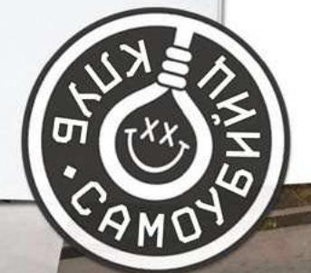

 $-2-$ 

УДем рады новичка»

Hallfit Kypcbl

B HeAeAlo B Kape « BoreMa »

MeAltrauth -

VENA CAVA

 $rac{m}{2}$ 

Со смекалкой у меня всё в порядке, так что я стараюсь свести риски к минимуму, питаясь только спящими. Иногда усыпляю их сама, если возникает необходимость. На сленге таких, как я, называют морфеями. Я встречала жестоких ублюдков, которые набрасываются на жертву из засады или запугивают, принуждая отдать кровь. А ещё искусителей, пьющих только из партнёров по сексу, и джентльменов, которым необходимо добровольное и осознанное согласие сосуда и которые рискуют обнаружить наше существование только ради того, чтобы совесть их была чиста. Придурки. Я считаю, что выбранный мною способ самый этичный, и я давала клятву Гиппократа. Всегда есть риск, что меня обнаружат: у моей добычи бывают порой мокрые сны или кошмары, но я, по крайней мере, не обрушиваю на них шокирующие откровения без подготовки. Предпочитающие питаться бодротвующими, как правило, знают, как представить всё в самом безобидном свете или заставить жертву всё

Говорят, слепые люди лучше слышат. Может, это и неправда, но тут можно провести забыть. аналогию с моим состоянием. Похоже, когда зараза попадает в нашу кровь, она усиливает некоторые таланты и умения. Их можно развить ещё больше, практикуясь и придерживаясь определённой «диеты», да и просто со временем они (как и Голод) становятся сильнее. Моя бунтарская кровь делает меня крепче, быстрее и привлекательнее, особенно когда я фокусируюсь на определённой задаче, как я уже рассказывала. Но это ещё не всё. Каждая линия крови подвержена также своему особому изъяну. В моём случае это неконтролируемые вспышки гнева. Я никогда не устраиваю сцен, никакой пассивной агрессии - если что, я просто сразу вырву тебе сердце.

Когда заливаешь кровью свой голод, ощущения восхитительные. Ужасно, но факт. Я хорошо тебя знаю, так что попытаюсь объяснить тебе это через сравнения. Только не думай, что всё прямо так и есть, окей? Сперва ты чувствуешь облегчение. Только что ты был мёртв, и вот на несколько минут ты оживаешь - весь такой тёплый, потный, сочный, довольный и успешный. Если говорить терминами биохимии - уровень дофамина в крови подскакивает до небес, хоть в наших мёртвых телах давно уже нет всех этих замечательных веществ. Кайф есть всегда, чью бы кровь ты ни пил, но в остальном каждый сосуд уникален - у каждого свой букет, от каждого будешь торчать по-разному.

В общих чертах я заметила, что страх придаёт крови горьковатый привкус, и чувство потом такое, как от первых трёх стаканов газировки жарким летним днём или от первой в жизни дорожки кокаина. Словно отлупил хорошенько парня, которому это нравится - уверена, ты понимаешь, о чём я ;) После этого чувствуешь себя триумфатором. Я люблю вкус страха. Он делает меня быстрее и сильнее. После него я словно скаковая лошадь. Стыдно признаться, но я предпочитаю тех, кого мучают кошмары. Поэтому я наведываюсь в женские приюты и тюрьмы, словно извращенка какая-то. Порченый товар на вкус шикарен. Обычно я притворяюсь медсестрой или психотерапевтом, работающим с наркоманами. Эротические сны, в свою очередь, делают кровь сладкой. Этот нектар выкручивает мою сексуальность на максимум. Если после укуса подождать чуть-чуть, чтобы спящему в голову ударили горячие фантазии, и только тогда начинать пить, клянусь, это круче, чем секс под экстази. А те несколько раз, когда я пила из парня, пока мы трахались... это был полный улёт. Я не могу кончить по-настоящему, ведь я... ну... мертва, в общем-то... Но я могу симулировать, а от крови в эти моменты можно словить кайф не хуже продолжительного оргазма, послевкусие от которого будет длиться часами.

UTO A I контро бывает  $(a$   $\tau$ 8 ropa: He c CBO na

 $\overline{B}$ 

 $\mathbf{u}$ 

После такого кажется, что мир у твоих ног. Трудно удержаться и не стонать, так что я предпочитаю не связываться с сексом, если только не держу ситуацию под полным контролем. Это всё, впрочем, вполне объяснимо, чего не скажешь о том эффекте, который бывает, если пить из тех, кто находится в стадии глубокого сна или накачан снотворным (а такие мне попадаются почти каждую ночь), - как будто все органы чувств становятся гораздо эффективнее. По идее, такого со мной не должно происходить. Потомкам Троиль не свойственны подобные силы. Но, я думаю, постоянный онейроматический допинг сделал своё дело, изменив мою природу.

. o **UR** 信面与

логии. **IONOXUN** MEI 9 **R** 

Dem

OHH C

отры эвфе

един

себя

убиі

**OTB** 

pau

 $\overline{B}$ 

 $\lambda$ 

Кровь, которой мы некогда были заражены, и кровь, которую мы употребляем, часто даёт нам удивительные способности. Не то чтобы я не пыталась найти им объяснение, но в некоторые вещи невозможно поверить, если не видел их собственными глазами. В то, что человек может превратиться в эмею. Или в то, что чья-то татуировка вдруг начнёт извергать стрелы замёрзшей крови. Моего друга как-то поймали с поличным - представь, к нему врывается спецназ, у него на руках мёртвая девушка, а его модный кашемировый свитер можно выжимать от крови. И тут он кричит им: «Проваливайте!» - и что ты думаешь? Они валят. Через окно. С 23 этажа. Как тебе такое? Впечатляет? Готов согласиться на моё предложение? Подумай ещё раз - это не впечатлять должно, а пугать до усрачки.

Хотя, с другой стороны, может, тебе вовсе не стоит меня бояться. Я ведь уже говорила, как мне нравится вкус страха.

ГРИФ СЕКРЕТНОСТИ: СОВЕРШЕННО СЕКРЕТНО// «ПЕРВЫЙ ЛУЧ»// КАСАЕТСЯ FVEY, RUS, VAT, FRA, BRA ОТ КОГО: капитан Энтони Гавирия, связной 10‑й ОГЭП Европейского командования ВС США

КОМУ: «ПЕРВЫЙ ЛУЧ», всем подразделениям

ТЕМА: ОТЧЁТ ОБ ИЗВЕСТНЫХ НЕСООТВЕТСТВИЯХ С ФОЛЬКЛОРНЫМИ ПРЕДСТАВЛЕНИЯМИ У ПУСТОТЕЛЫХ ТИПА ЭПСИЛОН

| Утверждение                                                                                                                                                                              | Уровень статистической значимости α=5 % | Комментарий                                                                                                                                                                                                                                                                                                                                                                                                                                                                                                                                                                                                                                                                                                                                                         |  |
|------------------------------------------------------------------------------------------------------------------------------------------------------------------------------------------|--------------------------------------------------|---------------------------------------------------------------------------------------------------------------------------------------------------------------------------------------------------------------------------------------------------------------------------------------------------------------------------------------------------------------------------------------------------------------------------------------------------------------------------------------------------------------------------------------------------------------------------------------------------------------------------------------------------------------------------------------------------------------------------------------------------------------------|--|
| 1. Прямой солнечный свет причиняет вред                                                                                                                                               | Да                                               | ПОДТВЕРЖДЕНО у всех подопытных. Разрушение организма происходит с разной однако полное уничтожение неизбежно (тело превращается скоростью, в пепел аналогично кремированному трупу). Повреждения тканей аналогичны                                                                                                                                                                                                                                                                                                                                                                                                                                                                                                                                   |  |
| 2. Непрямой солнеч ный свет причиняет вред                                                                                                                                         | Да                                               | ожогам четвёртой степени ПОДТВЕРЖДЕНО у большинства подопытных . Скорость разрушения организма сильно Повреждения тканей аналогичны ожогам колеблется. третьей степени. Со временем может наступить разрушение (тело превращается в пепел аналогично полное кремированному трупу). Причины аномаль ной сопротивляемости выясняются -                                                                                                                                                                                                                                                                                                                                                                                                  |  |
| 3. Ультрафиолетовое излучение причи няет вред                                                                                                                                      | Да                                               | ПОДТВЕРЖДЕНО. При длительном облучении констатированы незначительные повреждения мягких тканей. У подопытного № 14 также выявлена коронарная недостаточность                                                                                                                                                                                                                                                                                                                                                                                                                                                                                                                                                                                               |  |
| 4. Активны только ночью                                                                                                                                                               | Да                                               | ПОДТВЕРЖДЕНО. Как правило, активность сходит на нет в течение часа после рассвета и возоб новляется примерно за час до заката -                                                                                                                                                                                                                                                                                                                                                                                                                                                                                                                                                                                                                            |  |
| 5. Большая продол жительность жизни                                                                                                                                                   | Да                                               | Продолжительность жизни в несколько тысячелетий подтверждена методом радиоуглеродного рования. Возраст отдельных особей может существенно дати отличаться. Существует вероятность того, - что срок жизни пустотелых ограничен только геологическими факторами или не ограничен вовсе. Упоминания «предтеч» позволяют предположить                                                                                                                                                                                                                                                                                                                                                                                                              |  |
| 6. Пронзание колом из древесины боя рышника приводит к гибели организма                                                                                                         | Да                                               | , что самым старым особям может быть до 10 000 лет Все моторные функции подопытного, проткнутого колом, моментально отключаются. Вскрытие показывает, что жизнедеятельность не возобновляется после того, как кол извлечён из тела. Гибель организма при этом не ведёт к его физическому разрушению. Гипотеза о том, что уничтоже ние сердца ведёт к аналогичным результатам, не проверена - Природа древесины несущественна: ясень, дуб и вишня так же эффективны. Фибролит, меризованная древесина и стекловолокно — неэффективны поли -                                                                                                                                                                                |  |
| 7. Отсечённые конечности при растают / вместо них вырастают новые                                                                                                               | Да                                               | ПОДТВЕРЖДЕНО. Отсечённые конечности не шевелятся, но прирастают обратно и нормально функционируют, если приставить их к ране до того, как они разложатся (что происходит довольно быстро), но подопытный при этом должен получать питание. В противном случае конечность стает в течение нескольких месяцев (опять же, если отра подопытный получает питание) — сперва она - похожа на рудиментарный орган, ткани которого подверглись некрозу, затем на опухоль. Конеч ность проходит несколько стадий «линьки». Сброшенные                                                                                                                                                                                                       |  |
| 8. Прямые инъекции ядов, токсинов и возбудителей забо леваний не влияют на организм                                                                                          | Да                                               | ткани при этом превращаются в пепел ПОДТВЕРЖДЕНО. Пустотелые невосприимчивы ко всем видам токсинов, если только не получают их с пищей от живого источника. Токсины и отравляющие вещества, добавленные в пищу после её извлечения из источника, теряют свою эффективность. ПРИМЕЧАНИЕ. Существует вероятность того, что кровоядные, которые используют для на сыщения людей с сексуальными отклонениями, способны переносить СПИД и другие венериче - ские болезни, а также болезни крови, что - позволяет отслеживать их перемещение (результаты восьмого испытания направлены агенту «Первого луча» в Центре по контролю и профилактике заболеваний США).                                                           |  |
| 9. Токсины в крово токе жертвы оказы вают воздействие на организм                                                                                                               | Да                                               | ПОДТВЕРЖДЕНО. Чрезвычайно чувствительны к отравляющим веществам в кровотоке жертвы. Подопытные оказываются в состоянии, аналогичном состоянию жертвы, даже если примут небольшую порцию крови. Смертельная доза в кровотоке жертвы вызывает у подопытных шок, но не приводит к гибели организма                                                                                                                                                                                                                                                                                                                                                                                                                                                   |  |
| 10. Можно обратить в бегство при по мощи экзорцизма и демонстрации священных символов                                                                                        | Нет                                              | По свидетельству источников С364 (Наварра, Credite nemini), и V876 (Генрих Крамер, «Молот ведьм», 1487 г.), известны случаи, когда пустотелых типа эпсилон (называемых в приведённых источниках соответственно «сомбра», «брухерос», а также «каиниты») удавалось обездвижить при помощи чтения канонических текстов, а также обратить в бегство демонстрацией священных реликвий. Этот факт был подтверждён при полевом наблюдении, однако его не удалось воспроиз вести в контролируемой среде. - ПРИМЕЧАНИЕ. Результаты оперативных исследований подтверждают, что 10‑я ОГЭП пока зывает рост эффективности экзорцизмов на 34 % с момента консолидации с вновь канонизирован ным Обществом Св. Леопольда - |  |
| 11. Можно обратить в бегство при помо щи чеснока; не могут пересекать проточ ную воду; требуется приглашение, чтобы войти в дом жертвы; не отражаются в зеркалах | Нет                                              | НЕ ПОДТВЕРЖДЕНО. Хоть некоторые способности и слабости пустотелых аналогичны наемым в исторических хрониках и беллетристике, посвящённой упоми вампирам, стрыгам, врикола кам и другим кровососущим существам, можно сделать вывод, что большая часть описанных - там качеств является вымыслом                                                                                                                                                                                                                                                                                                                                                                                                                                                |  |
| 12. Обладают огром ной физической силой, умеют пре вращаться в волков или летучих мышей, способны обра титься в туман и т. п.                                          | Да                                               | ПОДТВЕРЖДЕНО. У пустотелых зафиксирован широкий спектр паранормальных способностей, личающихся в зависимости от возраста, тяжести заражения от и психической предрасположенности - особи. Доклад обо всех известных на текущий момент аномалиях (как зафиксированных полевых операций, так и описанных в отчётах инквизиции во время за 1198 – 1594 годы) см. в приложении № 16                                                                                                                                                                                                                                                                                                                                                       |  |
| 13. Состояние заразно                                                                                                                                                                 | Нет                                              | ВЫВОД НЕОКОНЧАТЕЛЕН. Воспроизвести заражение в контролируемых условиях на текущий момент не удалось, однако опытным путём установлено, что укусы и царапины сами по себе не переносят заразу. ПРИМЕЧАНИЕ. Все допрошенные особи называют заражение «Становлением» и утвер ждают, что в процессе они умерли и вернулись к жизни. - Настоятельно рекомендуется дальнейшее исследование этого вопроса                                                                                                                                                                                                                                                                                                                                    |  |

самых порт

Hen, CBOE B

**-пускал меня** 

BENAME

Анапозитив №17. В следующей части своего доклада я хотел бы обратиться к вопросу о нашем происхождении. В распоряжении у нас есть такие труды, как «Отрывки из Эрджияса» и «Книга земли Нод», в которых утверждается, что сангвиническая патология обрела оформленный вид не ранее, чем Лилит, первая жена Адама и мать чудовищ, упомянутая в апокрифах, принесла утешение Каину и научила его использовать собственное проклятие себе же во благо. Одни источники называют в качестве истинного прародителя Лилит, другие Каина, однако большая часть (?) всё же согласна с тем, что Второе поколение Сородичей (или, иначе говоря, каинитов) родилось из крови Каина. По легенде, эти Сородичи в свою очередь породили Третье поколение — полубогов, известных как предтечи.

Описание последующих событий сильно отличается от источника к источнику. Преобладает, однако, одна версия: 13 внуков Каина обратились против своих родителей, уничтожив Второе поколение и заставив самого Каина бежать из города Еноха. По современным представлениям, город располагался где-то на Ближнем Востоке, в Малой Азии. Примечательно, что здесь и по сей день продолжаются беспорядки как среди людей, так и среди нелюдей.

Предтечи, судя по всему, обладали божественной силой, однако в слабостях своих походили на людей. Каждый из них основал династию, но голод их был столь велик, что они стали поглощать не только смертных почитателей, но и бессмертных своих детей. У каждого из ненасытных предтеч было своё пристрастие, которому он потакал год за годом и которое внушил и своей линии крови. Сегодня мы называем эти линии крови Великими кланами.

У каждого из тринадцати Великих кланов есть собственные истории, повествующие об их истоках. Одни идеализируют и превозносят своих основателей, другие презирают и отрекаются от них, но в конечном итоге это отражает лишь их отношение к самим себе. Каждый из предтеч воплощал одну разрушительную человеческую черту, с которой и по сей день вынуждены бороться их потомки. И пускай витэ Каина слабеет с каждым поколением, пускай смертная кровь разбавляет её всё больше и больше, эти черты настолько крепко укоренились в душах Сородичей, что до сих пор служат напоминанием о том, что предтечи,

подобно спящим богам, всё ещё присматривают за своими слабеющими потомками.

TEBERNH-TERE. Fromy MOABEMHOMY XPAMY DONGWE 12,000 MET. OH GUIN NOCTPOEH EWE AO USOBPETEHUS TUCLMEHHOCTH, C UCROADSOBAHUEM PASCKOTO TPYAA U KAMEHHOIX OPYQUU. HAA EFO COSAAHUEM TPYAUNUCS MHOTHE MOKONEHUA. U, UTO ELLE GOMEE MOPASUTENDHO, OH, MOXONE, BOIN COXXEH CPA3Y NOCHE CTPOUTENGCTBA. MONARAHO, 2TO HAUSSNEE BEPOSITYOF MECTO PACNONOXEHUE FOPOGA EHOXA, FAE DPABUNU TEMHUE GOTH TRETUETO MOKONEHUS, A MOXET

Кланы - единственная сила, которая сдерживает человече-CTBO OT TOTO, ЧТОбы ПОЛНОСТЬЮ реализовать свой потенциал, навязывая ему устаревшие ценности и анахроничные структуры власти. Одержимость красотой, деньгами, статусом, властью, религией или гендерными стереоти-HAMM – BCG STO W TAK CHAWT B BAC, но кланы готовы предпринять все усилия, чтобы никого в мире не интересовало ничто APVTOS, VIM HYRHO BO TTO OM TO ни стало поддерживать статускво, сохранять то чудовиц. ное мироустройство, которое

гарантирует, что вы раз sa pasom будете становиться их жертвами. Они - та бессмертная (в прямом смысле этого слова) сила, которая поддерживает жадную глобальную банковскую систему и стоит за анорексичными трендами индустрии мод. Древние предрассудки не позволяют вам сбросить оковы классовой и расовой дискриминации. Они паразиты, которые вами управляют, и они - везде.

Рахиль Долиум Голуэй, 19 сентября 2010

*<u>GEKKETT, ANERRO, 5 MAPTA 2015</u>* 

да орошится алым имя твоё...» ущин сквозь землю Нод,

Что могут без нас люди? Ничего. Если бы мы не вели их вперёд, они бы по сей день швырялись камнями и били друг друга дубинками по голове.

Всеми своими достижениями они обязаны нам. Без нас не было бы королей, не поднялись бы империи, не вознеслись бы к небесам боги и не было бы самого понятия о красоте. Они не знали бы идеологий, не постигли бы истину - лишь варварство и похоть были бы их уделом. Инквизиторы называют нас паразитами, но это они расшатывают порядок, который только и позволяет им существовать.

Что ж, у нас предостаточно времени, а у них его почти не осталось. Не пройдёт и столетия, как их расточительная промышленность и неудержимое стремление к самоуничтожению вновь низвергнут мир в пучину Тёмных веков, и мы вернём бразды правления в свои руки.

> Беккет, Г., 2009 г. «Де Лоран Пресс»

Хардештадт, Брюссель, 23 февраля 2011 г.

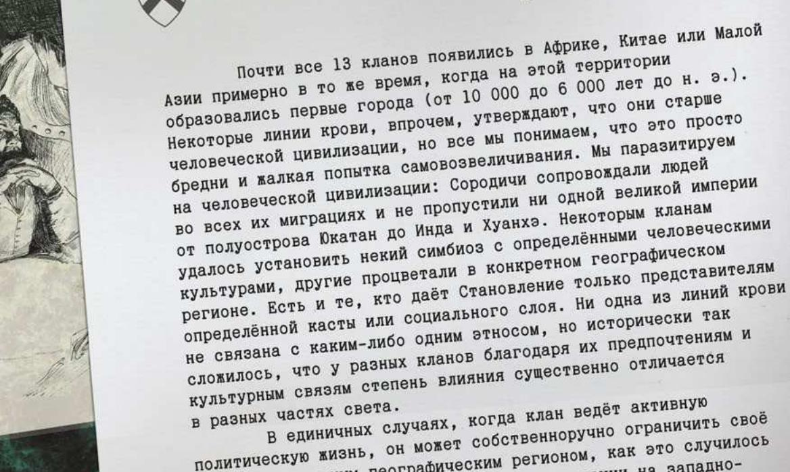

политическую жизнь, он может собственноручно ограничить своё влияние отдельным географическим регионом, как это случилось с Вентру благодаря их традиционной ориентации на западноевропейский мир от Германии до Британии. В Африке и Азии их до сих пор воспринимают как опасных чужаков - результат столкновения с западным империализмом, оставившим глубокий след. В Африке, к примеру, Вентру до сих пор считают кланом захватчиков, несмотря на то что многие молодые вампиры вышли из числа местных жителей и не отличаются от них цветом кожи. С другой стороны мы имеем южноафриканских Гурухи родственников европейских Носферату, занимающих доминирующее положение к югу от Сахары. Чудовища, мигрировавшие на территорию Европы, постепенно изменили свои привычки как в питании, так и в Становлении, и за десять тысячелетий отдалились от своих

19 г.

йскому

**ЖДУ** 

TO

лан. ждый

гда

ie

гать.

 $\overline{\mathbf{H}}$ 

И

**(ACAETCS FVEY** 

сомандования В

**МИ ПРЕДСТАВЛ** 

L.

и отрека-

 $\overline{\bullet}$ 

аждый

день

едтечи,

eM.

 $\frac{1}{2}$ 

-  $\mathbf{p}_{\alpha\star\mathbf{u}\mathbf{v}\mathbf{u}\mathbf{x}}$ кланов есть собственные истории, повествующие об их

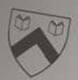

 $P = 67$ **BMECTO** долгие найдёшь

ax T **ecTb**  $O$  ID M M M, UTO TO MI акже, тебя в J. **Грском** ине т ce ь на OT  $refs$ :

 $B$ exker,  $\Gamma$ ., 2009  $\Gamma$ . собратьев настолько, что сегодня воспринимаются уже как «Де Лоран Пресс» отдельный клан. По сути Гурухи ближе к основателю клана ленииларду, чем современные носферату, известные европейскому миру, хотя, к сожалению, сами Носферату предпочитают это пиру, погл, в совстановки, сами посудерствующего продицать. Некоторые старейшины до сих пор считают, что между Hocoepary и Гурухи нет ничего общего, и утверждают, что восполь

по меньшей мере побочная линия крови, если не отдельный клан. Помните, что я говорил об устаревших взглядах? независимо от того, какой ареал обитания выбрал каждый из нас, несомненно то, что наша патология распространяется подобно чуме, не знающей границ. Будет верхом глупости считать, что какие-то кланы или линии крови ограничены определённой Tepputopuen MJM 4TO MX MOKHO YSHATE NO UBeTY KOKU - AGKE KOPAS речь идёт о таких локальных явлениях, как Бану Хаким или многочисленные линии крови лайбон. Сородичи распространились многочисленные линии прови ланоси. Сродити распространились вслед за армиями, потоками мигрантов или караванами купцов. Не стоит удивляться, когда какой-нибудь мускулистый реднек из Висконсина склоняет голову перед визирем Ассасинов, называя но вполовление спорейский поп-идол возводит свою родословную к старейшине Хардештадту. Даже если кто-то из нас исторически и придерживался определённой культуры, паразитируя внутри одного этноса или на территории одного континента, современный мир искосмополитичен, и наши дети давно раздвинули эти рамки.

По-моему, Большинству Сородичей HE HYXXAO PPEABSATOE OTHOMEHLIE K APYTUM KYNGTYPAM UNU PACAM. BOCOBEHHOCTU STO KACAETCA HAWLIX CTADEWWHH, KOTOPOLE B CURY BOSPACTA MOUDEPX-UBATOCA TAKINX UEHHOCTEH, KOTOPUE NOBOE SAPABOMUCASUFEE CYUSECTISO OTBEPTHET, NOCHUTAB APKAULUHUM, A BOSMOXHO, 4 OTBPATUTENBHUMM NO CBOEL BOSMONTO, U CIDENTUI ENDROMINALE DE CYTU. CTEAR U CONDA AENAIOT HAC EPAGHE 2. STOUCTUMHOMM CARA AEAGHOT HAC KPACHE

ррию ік и

**I.** 

«Кровь жизни» - это общественная организация со штаб-квартирой в Копенгагене. Одна из её основных задач - стандартизировать работу банков крови по всей Европе. Эта организация получает на удивление хорошее финансирование и, помимо основной своей деятельности, занимается также смежными проблемами, связанными с вопросами здоровья в отношении донорства крови. Камарилья не финансирует «Кровь жизни» напрямую, но направляет денежные средства через различные фармацевтические компании, которые, в свою очередь, поддерживают благотворительность для продвижения выгодных для себя идей.

«Кровь жизни» была основана по инициативе Камарильи ещё в 1867 году. Современное своё название эта организация получила в 1972-м, в то же самое время, когда основным направлением её деятельности стало облегчение доступа потребителей к запасам донорской крови. Впрочем, далеко не все Сородичи имеют доступ к этим ресурсам: обыкновенному неонату не приходится ждать помощи от организации, созданной для повышения комфорта существования элиты из числа старейшин.

Они паразиты, которые ваз

**Promation** 

«Убивайте всех! Господь узнает своих». Эта легендарная фраза Арнольда Амальрика, якобы произнесённая им во время резни в городе Безье в 1209 году, как нельзя лучше отражает отношение со стороны Инквизиции к нам и нашим собратьям, известным в те времена как приверженцы «каинитской ереси». Результаты Альбигойского крестового похода и кара, постигшая еретиков из южной Франции, хорошо известны. Следствием тех событий стало появление религиозных судов Инквизиции под патронажем зловещего Доминиканского ордена, по официальной версии созданных с целью окончательного искоренения катаров и других еретиков. Именно благодаря неустанному преследованию врагов церкви орден и получил своё название - Domini Canis, что значит «псы Господни». История, однако, умалчивает о том, что у Инквизиции была куда более важная миссия, чем поддержание чистоты доктрины или, в своей более поздней инкарнации периода Ренессанса, сжигание на кострах ведьм, иудеев и распутников. Под руководством таинственного кардинала Марцоне и других членов Общества Св. Леопольда Инквизиция выследила и уничтожила тысячи Проклятых и раскрыла обывателям тайну нашего существования.

 $A0259$ 

Зверства испанской Инквизиции под руководством Томаса де Торквемады ударили по нам особенно сильно. По сей день большая часть наших кланов наиболее известна под своими испанскими или латинскими именами, принятыми в те времена, со всеми допущенными Инквизицией ошибками. Назовём хотя бы Бруха, Тореро, Сомбра или Мала Кавилла. Да и название Гангрел (в одном из шотландских диалектов так называют бродяг) в общем-то впервые появилось в инквизиционном протоколе Вильгельма Баскервильского. Фанатики

добились того, что потомки Каина были практически стёрты с лица земли, и в напоминание о том, какую опасность они представляют, наши великие линии крови приняли их унизительные прозвища. Название «Камарилья», в свою очередь, возникло вместе с теорией заговора, согласно которой группа тайных адептов Каинитской ереси в «маленькой комнатке» в Ватикане завлекла в свои сети Родриго Борджиа. Впрочем, истинная причина существования тайного сговора среди Проклятых не в том, чтобы оказывать давление на кого бы то ни было, а в том, чтобы скрыть наше существование под покровом Маскарада. Мы убедили людей, что нас никогда не было, а Инквизиция - не более чем сборище суеверных средневековых фанатиков-мизогинистов, одержимых преследованием несуществующих ведьм и демонов. И это воистину стало нашим величайшим достижением. Нам потребовалось четыре сотни лет, чтобы из суровой реальности обратиться наконец-то в детскую сказку или сюжет для порнофильма, но одного неосторожного шага оказалось достаточно, чтобы поставить под угрозу всё, чего с таким трудом удалось добиться. В эти ночи мы стали свидетелями появления Второй инквизиции. И пускай эти новые Марцоне и Амальрики воюют не с ересью, а с терроризмом, они точно так же, как их предшественники, одержимы идеей мира, в котором нет места для нас, для всего нашего непостижимого и таинственного рода. Они вооружены уже не вилами и факелами - в их распоряжении социальные сети, ведущие «охоту на ведьм», и дроны, изрыгающие белый фосфор, но им, как некогда Амальрику, нет никакого дела до тех, кто окажется под перекрёстным огнём. Для всех этих рыцарей, сражающихся за свободный Запад, случайные жертвы их борьбы - не более чем сопутствующий ущерб.

 $968°$ 

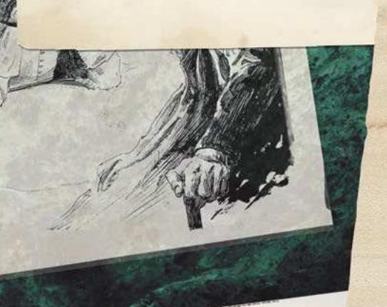

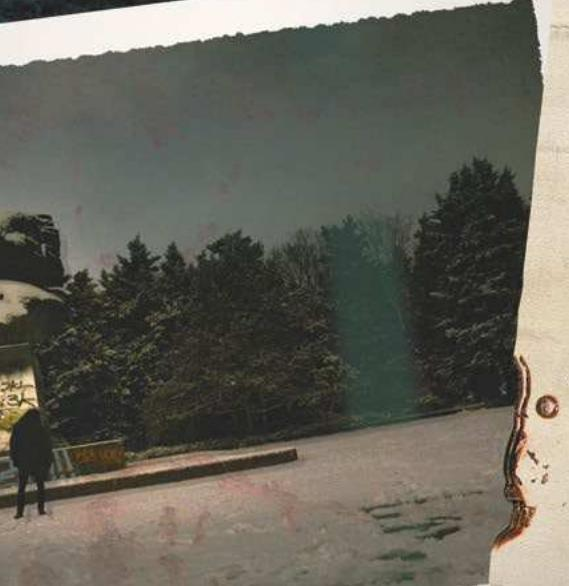

e sept momp, kmo rosopum, bydmo ты притворяется людьяш, чтобы сохранить Человечность. Дто scero numb copuañnos coedemons. He sept тоту, кто говорит, что наши Традиции призваны ркреплять тораль. Фни необходиты нат для выживания. Не тольно Притогены и Принцы должны следить за их исполнениет и насаждать их своити рказати, но каждый верный Сородич должен почитать это своим долгом. Пражский конклав принял решение допрскать в наш рукий круг лишь сатых достойных и хитроряных. Преть нас тало, но илгенно на нас, на избранных, возпожена задача заставить всех Сородичей на Зетле гледованнь Срадицият. Ошибается тот, кто считает, брдто Первой Срадиции вполне достаточно, чтобы обеспечить нашр безопасность. Фстальные необходиты, чтобы Первая тогла осрществиться.

#### Первая Срадиция. **Ядаскарад**

Da bydem pod msou conpum om scanoco. кто не Сородич тебе. Поправший завет teŭ da bydem ompunym om Rposu tsoeŭ.

#### Bmopan Tpaduyun. **Domen**

**Да пребрдет домен твой в полной власти \*** твоей. Всякий, кто войдёт во владения твои, да признает тебя владыкой их и да nocmpnum no coosp msoemp.

9690

#### Третья Традиция. Nomomemso

Да получит Становление дитя твоё лишь по слову Старейшины твоего. Nonpasının zasem cen da bydem ymepiys-AËH SMECHIE E NOMOMEMSOM ESOUM.

### Uemsëpman Tpaduyun. **Фтветственность**

Да будет дитя твоё воспитанникот твоит. Да брдет сир владыкою дитя своего и да примет он на себя грехи его, noupda duma ne no3Haem mecma ceoero.

### Naman Tpaduyua. Focmenpuumcmso

Чти дотен Сородича своего. Да предстанет пред ликом правителя всякий, kmo Asumca s ropod ero. Se3 caosa ero ne bblmb mebe rocmem ero.

### Mecman Tpaduyun. Чтерщвление

Да не погибнет от руки твоей Сородич твой. Да преброет жизнь и стерть его в ррнах Старейшин твоих. Да начнётся KPOBABAR OXOMA NO CAOBP NX.

#### СОВЕРШЕННО СЕКРЕТНО// рни Гавирия, связной 10-й ОГЭГ всем подразделениям СТНЫХ НЕСООТВЕТСТВИЯХ С

**Уровень** 

## **БУНТАРИ — БРУХА**

Жрица-философ Троиль глядит на толпы беснующихся людей, заполонивших улицы Еноха. Братоубийственная война, разожжённая кем-то ради собственной выгоды. Все они - рабы порочных королей. Но она знает правильный путь. Она поможет им сбросить оковы. Впрочем, жизнь так коротка, а перемены неизменно требуют жертв. Потомки Троиль унаследовали её великую цель и её неумение сдерживаться. Если хочешь найти следы бессмертных Бунтарей, ищи их на обагрённых кровью улицах Карфатена, в водовороте французской революции, в промёрзших бараках тена, в водовороте французском рекитерситету. Советского ГУЛАГа — и в рёве электрогитары на рок-концерте. Они всегда на передовой Войны Эпох. Их боевому кличу голосами Джонни Роттена и Хантера С. Томпсона вторят смертные.

**TP** ive

 $OJ$  $a2$ 

1 X

Он — смертный. Он — маг. Самый молодой среди прародителей. Пробудившийся на рубеже первого тысячелетия. Его знания о мироздании почти безграничны. Он повелевает землёй и небесами. Он знает Бога в лицо, он - летописец самого Сатаны, но тайны мироздания, известные ему, куда древнее того и другого. Абсолютная истина совсем рядом, она манит его и дразнит. Но тут подкрадывается старость. Она несёт немощь, смятение, страх... К чему власть и знания, если тебе суждено умереть? И Тремер восстаёт против этой мысли. Смерть - не более чем болезнь. Надо найти от неё лекарство. Он готов заплатить любую цену. Так, по крайней мере, он полагал, пока не завершилась алхимическая трансформация и проклятие Лилит не потекло по его жилам. Чак Паланик писал: «Чтобы стать бессмертным, сперва надо умереть». А мёртвые не владеют истинной магіей. В отчаянии пытаясь вернуть себе утраченный огонь, найти путь обратно к солнцу, он основал традицию Кровавого чародейства, ритуалы и заклинания которой нуждаются в жизненных соках, похищенных у людей, и в самих их душах. Впрочем, всё это в прошлом. Строгая нерархия Пирамиды, которую он построил, сковала его потомков, и, ведомые жаждой власти, они отвернулись от своей благородной цели. Но власть, что зиждется на воровстве, непрочна. И ныне Пирамида лежит в руинах, а истинная сущность Тремера готова предстать перед всем миром в Крови его потомков.

Живые знают его как Авессалома, сына библейского царя Давида, предавшего отца. Мы же именуем его Абсимилардом. Не имеет значения, однако, как его называть. Он - зияющая рана нашей Крови,

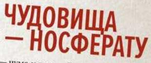

он — брошенное со злости проклятие, он — чума и порча. Его потомки обречены испытывать те же страдания и унижения, что некогда постигли его самого. Он был прекраснейшим из царских сыновей, скрывавшим собственные беззакония под маской справедливости. Кровного брата, посягнувшего на честь его сестры, лишил он жизни, тогда как сам свободно посещал наложниц отца. Мог ли кто-то отказать ему? Он был само совершенство, поллощение правосудия, и всё, что видел, считал своим по праву... Пока не пришёл час заглянуть в глаза вечности. Прогнившая душа поразила скверной его прекрасный образ — и познал он истинную справедливость.

По крайней мере, мы никогда не станем такими же, как наш отец. Никогда не возомним себя царями. Крысы — вот наши подданные, дерьмо вот наш трон. Что лучше: гнить изнутри или только снаружи? Лично я ответ уже знаю.

Мужчины и женщины готовы были убивать за краткий миг в объятиях Дивы. Суперзвезда древнего мира. Существо столь прекрасное, что сам Бог не мог бы вообразить его старым и уродливым. И вот, когда грудь прекраснейшей Розы стала опадать, когда потенция этого короля цветов стала вялой, настало время заключить сделку. Роза никогда не увянет. А взамен Дива будет вечно стоять на страже любви, красоты и искусства. Дьявол улыбнулся, когда Роза умерла и возродилась вновь — тирания красоты в самом своём убийственном воплощении.

ДИВЫ - ТОРЕАДОР

Шериф: Расскажите о своей встрече с тем упырём из Шабаша.

М. Бейкер: Я охотился в клубе. Заметил её, когда пёл к танцилощадке. Она танцевала шафл, прыгая то в одну сторону, то в другую. Люди расступались, давая ей место. Смотрели, аплодировали. Зрелище было завораживающее.

Должен напомнить, я понятия не имел о вашей операции. И вообще не знал, что она кровопийца. Я думал, это просто клубная девчонка в портиках и бейсбольной кепке, которая пришла насладиться вечером и устроить небольшое шоу.

Шериф: Вы не осознавали, что именно она делает?

М. Бейкер: Нет. Нож я заметил далеко не сразу. Вё движения гипнотизировали. Она казалась такой счастливой. И эта радость была очень заразительной. Я её сфотографировал. Она это заметила и сложила руки сердечком.

#### Шериф: Но на самом деле.

М Бейкер: Она закалывала людей. Каждый её выпад в сторону толпы заканчивался ударом ножа. Музыка была такой громкой, что криков никто не слышал. Пока одни пялились на неё и хлопали в ладоши, другие сползали на пол, зажимая кровавые раны.

Когда утихла музыка, началась паника. После этого я потерял её из виду.

Шериф: Мы тоже. Наши ребята ворвались как раз тот момент, когда толпа запаниковала. Вычислить её среди обезумевних людей оказалось нереально.

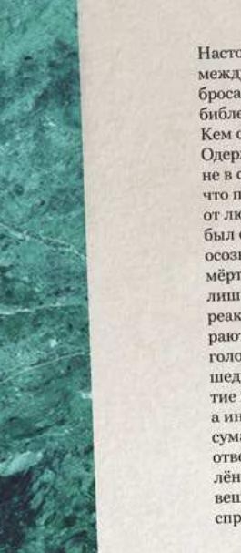

Настоящее его имя никто не помнит, но сходство между именами Малкав, Молох и Малакай сразу бросается в глаза. Первый — каинит, второй библейский демон, а третий - ангел Господень. Кем считали безумцев в стародавние времена? Одержимыми. Сосудами для сил, объять которые не в силах человеческий разум. Старшие считают, что природа первого из Одержимых была далека от людской. Я думаю, всё гораздо проще: Малкав был единственным среди Древних, кто воистину осознал происходящее. Понимание того, что мёртвый всё ещё способен испытывать голод, лишило его рассудка. Вполне естественная реакция, если задуматься. Психи по мере сил стараются нести своё проклятие с гордо поднятой головой. Каждый из них одновременно и сумасшедший, и пророк. Каждый заливает своё проклятие кровью живых. Иногда они меня пугают, а иногда мне хочется стать одним из них, ведь сумасшествие - это единственный адекватный ответ на загадку Зверя. Одно могу сказать определённо: Малкав живёт во всех своих потомках и вещает тысячами их голосов. Возможно, было бы справедливым сказать, что имя им - легион.

Знаешь, что бесит меня в Камарилье? Грёбаная заносчивость. Они

инасци, то осоглавны в полнении, а мы все вроде как должны им

подчиняться. А когда спрашиваешь, с какой, собственно, стати, -

начинаются нудные разговоры о Колючих соборах или как их там.

В жопу. Мы живём здесь и сейчас. Посрать, что там напридумывали

Старые пермиты в пезициальное времена, к по педо печищать про Маскарад. Считать, что это заслуга Камарильи, — типичный образец их непомерного самомнения. Они все хорошие идеи гребут под себя.

о допустны дивент эдесь и сентал посрать, что так напримунивать

их непомерного самомнения. Они все хорошие идеи греоут под се Что, конспирация — их изобретение? Что, прятаться у всех на виду первым придумал какой-нибудь выхолощенный педик в 14-м веке?

Вот тебе правда. Лично для тебя. Надо же как-то отметить тот факт, что я уже шесть часов как совершенно трезв и мне это совершенно не по душе: освобождённому вроде меня гораздо проще слиться с толпой, ведь меня, в отличие от некоторых, не пугает концепция

Шаг первый. Найти того, по кому точно скучать не будут. Шаг второй. шаг первый, паяти того, по логу точно случать не отду. Выпить его кровь. Шаг третий. Раствориться в толпе. Меня невозможно вычислить, уж точно не кому-то из Камарильи. Я всего лишь ещё один человек среди миллионов таких же. Я охочусь и держусь подальше от их придворных забав. Кем бы они себя ни считали, какие бы маски ни носили, им никогда не понять, насколько они далеки

 $\overline{9}$ 

10

11

## **ЗВЕРИ - ГАНГРЕЛ**

При рождении Эннойя прокляла свою мать Лилит. Затем она плюнула в лицо всем, кто к ней сватался, и сбежала, чтобы жить с волками, сближаясь с величайшими из числа подобных себе. Говорят, именно её чресла породили меченых Луной Люпенов. Её называют «женской половиной Божества», ибо она воплощает плодородие самой земли. Людские города и обычаи были ей чужды, и Эннойя отреклась от них. Умерев для мира, возродилась она в дикой глупи. Она первая среди изгоев, святая покровительница хишников и серийных убийц. Из всех тринадцати лишь она приняла Зверя в своей душе. Её потомки унаследовали независимый характер и страсть к охоте. В их Крови дремлют зверниые черты, ждущие подходящего часа, чтобы взять своё, заставив гангрела опуститься на четвереньки и выть на звёздное небо, как некогда выла стая бок о бок с Эннойей.

## **КОРОЛИ - ВЕНТРУ**

Жил в незапамятные времена идеальный Король, и каждый подданный обожал его.

> «Пусть правление моё продлится вечно не ради меня самого, но ради счастья моего народа».

Так и случилось. Впрочем, ныне Клан королей правит в царстве скорби, смуты и страха. Быть может, и правда лучше смириться с известным злом, чем рискнуть навлечь на себя неведомые ужасы? Короли готовы делиться своей мудростью, но взамен хотят, чтобы каждое существо на планете признало их владычество. Большинство старейшин родились ещё в те времена, когда кровное родство было залогом власти, и клан до сих пор следует жёстким феодальным традициям. Не стоит и мечтать о равноправии, покуда Короли восседаю на своих тронах.

моему мнению, некоторые группировки исламских экстремистов на Блианем В. По моему мнению, некоторые группировки исламских экстремистов на Ближнем Востов по моему мнению, некоторые прояву или последователям Ур-Шульги, неумело мыслиру это культи, принадлежащие шабяву или последователям Ур-Шульги

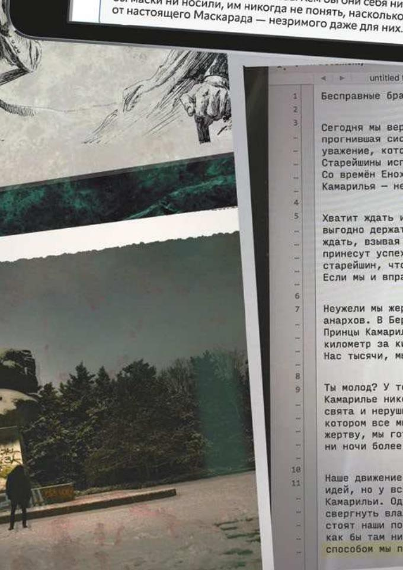

#### untitled text : Бесправные братья и сёстры!

55

Сегодня мы вернём нашу свободу! Слишком долго мы медлили в надежде, что прогнившая система начнёт эволюционировать сама собой и мы обретём, наконец, уважение, которого заслуживаем. Мы должны признать: этого не случится. Старейшины испокон веков использовали молодёжь как им заблагорассудится. Со времён Еноха дети служили пушечным мясом для своих жадных родителей. Камарилья - не что иное, как воплощение этого порядка вещей.

Хватит ждать и надеяться! Не видать рабам справедливости, пока хозяевам выгодно держать их в рабстве. Не видать нам перемен, если мы будем покорно ждать, взывая к совести Примогена или Принца. Политические игры также не принесут успеха. Революция - наша единственная надежда. Не смещение одних старейшин, чтобы их место тут же заняли другие, а крупномасштабное движение. Если мы и вправду хотим свободы, пришло время за неё сразиться.

Неужели мы жертвы? Неужели мы созданы, чтобы быть рабами? Нет! Мы - Движение анархов. В Берлине, Лос-Анджелесе и многих других городах по всему миру Принцы Камарильи уже пали! Волна восстания смела их укрепления, и мы километр за километром забираем себе территории, которые нам причитаются. Нас тысячи, мы полны решимости, мы едины - а значит, нас не остановить.

Ты молод? У тебя нет клана? Твоя кровь слаба? Знай, что ты не одинок. Камарилье никогда не понять этого. Все мы - единая семья. Наша связь более свята и нерушима, чем узы крови, ведь нас объединяет видение будущего, в котором все мы свободны. Если для воплощения нашей мечты нужно принести жертву, мы готовы её принести. Час настал. Мы не станем терпеть эти цепи ни ночи более!

Наше движение объединяет бесчисленное количество голосов, мировоззрений, идей, но у всех нас есть нечто общее: мы больше не можем терпеть владычество Камарильи. Одни из нас объединяют силы со смертными анархистами, чтобы свергнуть власть коррумпированных политиков или корпораций, за чьей спиной стоят наши поработители, другие пытаются стравить старейшин между собой как бы там ни было, у всех нас одна и та же цель независимогот того, каким способом мы предпочитаем к ней идти. Пришло время нового | -

Не будем ходить вокруг да около и сразу обратимся к трагедии 11 сентября. Я маю, что это болеменная тема, особенно для жителей Нью-Йорка, но нельзя отрацать случившегося. Я лично знал несколько Сородичей, встретивних Окончательную смерть под обломками горящей башии, так что утрите соции и слушайте внимательно.

В первые ночи царил сорменный хаос, и все мы совершили немало глупостей. Если мы не осознаем своих ошибок сейчас, тень прошлого будет преследовать нас вечно. Что ж, я начну первым и признаюсь в том, за что мне до сих пор стыдно. Несмотря на осициальные заявления, и многие годы верил, что атака была организована кем-то из наших. И неплялся за самые разные теории заговора, от «во всём виноват Шабаш» до «башню обрушил маг», и считал всех окружающих слешами. Не хватало разве что шапочки из солым.

Время, казалось, было подобрано идеально. И сама акция настолько кинематографична и разрушительна, что не оставалось даже тени сомнений, что в ответе кто-то из нас. Летом 2001-го Шабаш начал вещать о наступившем конце света. «Геенна близится!», - кричали они. А когда башни рухнули, какие-то чокнутые каиниты и вправду заявили, что это их рук дело. Якобы это месть Камарилье за захват Нью-Йорка, вступительный аккорд в грядущей Войне Геениы, идеально спланированный направленный взрыв, осуществлённый при помощи самолёта под управлением задоминированного пилота, пелью которого был предтеча, что прячется в канализации.

И в это действительно хотелось верить. Это тешило наше раздутое самолюбие. Мы начали действовать так, будто всё это было правдой. Среди смертных в тот день было 2974 жертвы из числа люда, но нас волновали только те трое Сородичей (все из Камарильи), что обратились в прах. Двое - Райкер и Йезлавета - Крысы, обитавшие в подвале. Но ведь была ещё и Меган Трусдейл, старейшина-вентру с неплохими связями, и 27 её накачанных кровью сотрудников с 46-го этажа.

Thomasuar M.I

nannu, yemala Epingemumeiya.

gabno semen nogementa i mem, koro

затисяны воспоминания, которыши я

que jaunnepecunom. Ohn hacaromes Mpunya

 $\Omega$ 

a

ł.  $\overline{0}$ 

r e

 $\frac{1}{2}$  m 1

mam

man paradop un bein dinyuyue Janucano no unice ) & 1994 ragy. hallamu. Брейденштейн: Вторая мировая война! Да, прекрасное было время для вампиров. Лдеску: Я думал, у нас нынче принято называть Брейденштейн: Я старше Камарильи! Кровопийцу я Лдеску: Для меня Вторая мировая и годы, предшествовавшие ей, были не такими уж прекрасными. Многие слуги и младшие члены нашей капеллы были евреями. А один молодой человек закончил с розовым треугольником на груди. Брейденштейн: У тебя слишком изнеженная душа, Максвелл. Однажды это тебя прикончит. Какое нам дело до люда? Да и о неонатах я, если честно, не вижу причины беспокоиться. Я готов считать полноценной личностью только того, у кого пара веков жизни за спиной. Лдеску: Скажи честно, если можешь, конечно. Ты пытался контролировать национал-социалистов? Ты ведь уже был Принцем Берлина в то время. Брейденштейн: Я и есть Берлин! Я был первым Принцем этого города - я же буду последним. Лдеску: Понятно. Брейденштейн: Хочешь правду, Максвелл? Лдеску: Да. Брейденштейн: Да, я пытался их контролировать, но

**У меня не получилось.** События стали разворачиваться столь стремительно, что я перестал послевать за политикой смертных. Такое было со мной впервые. Лдеску: А если бы у тебя получилось, ты остановил бы войну и убийства?

Используя смертных в борьбе против Шабаша, передовой боец Камарильи Ян Питерзон и Архонт Тео Белл распахнули ящик Пандоры. В результате предпринятых ими отчаннных мер смертным из разведки удалось заглянуть тула, кула их пускать не следовало. Питерзон и Белл думали, что смогут контролировать новых соконнков или дискредитировать их, если те станут доставлять неприятности. Они ошиблись.

Вентру должны были как-то отреагировать, иначе их ждал бунт. Внутрен-

ний круг решился на огромный риск: он воспользовался услугами АНБ, что

ло этого момента считалось абсолютно недопустимым, и поддержал принятие

закона о внутренней безопасности, который должен был помочь вычислить

виновных. Они хотели разобраться, насколько глубоко влиние Шабаша

Всё, однако, пошло наперекосяк. В конце концов они поняли, что не было никакого направленного взрыва, никто из сотрудников Управлении транс-

портной безопасности не находился под контролем Сородичей, да и вообще

Сороднчи там были ни при чём. Просто группа решительно настроенных

еанатичных молодых людей, готовых покончить с собой, но в остальном

Да. Это наша вина. Мы сами породили Вторую инквизицию.

уже поздно.

совершенно обыкновенных. Но к тому времени, как это происнилось, было

на Аль-Каиду и аналогичные группировки исламских экстремистов.

Прошла всего неделя после 11 сентября, когда Министерство национальной безопасности организовало свой первый рейл на убежище Сородича. Результатом стала смерть четырнадцати сотрудников правоохранительных органов и уничтожение Серасима Чёрной Руки Джалана-Ааджава, тысячелетнего создания, запустившего свои когти глубоко в тело исламского сундаментализма, как и мексиканского наркотерроризма. И это был первый удар, нанесённый той силой, которую впоследствии назовут Второй инквизилией.

#### Брейденштейн: Нет! Я обожаю войну. Это я и пытался тебе сказать. Вряд ли что-то сравнится с охотой на улицах Берлина во время воздушных бомбардировок, а я многое повидал. Представь себе, сосуды целыми семьями дрожат от страха в темноте бомбоубежищ, жмутся друг к другу - старики, мужчины, женщины. Я приходил туда как в буфет. Можно было отдаться на волю инстинктам. Проверить, приведут ли они тебя и той самой идеальной жертве. Я ощущал себя молодым и полным энергии...

Лдеску: Знаешь, Густав, вряд ли меня можно считать образцом человечности. Я могу убить кого-то и забыть об этом на следующую же ночь. И при этом ты всё равно вызываеть у меня отвращение. Брейденштейн: Я мог бы порвать тебя на части за подобное оскорбление.

Лдеску: Мог бы.

Брейденштейн: Ха! Не принимай всё так близко к сердцу! Мы слишком долго живём на свете, чтобы горевать из-за парочки мёртвых смертных. Лдеску: Или парочки миллионов...

Брейденштейн: В точку! Ты уловил самую суть. Значение имеют только те, кто разделит с тобой долгие столетия. Остальные - не более чем пища. Лдеску: Ты слишком самонадеян, Густав. Добром это не кончится.

Густав мёртв. Берлин в руках анархов. Я же всё ещё остаюсь Регентом клана Тремер. Полагаю, из этого можно извлечь урок. Предупреждает ли эта история об опасности высокомерия или учит человечности решай сам.

Нет, я не предвидел Восстания анархов. Несмотря на предупреждение, которое я высказал Густаву, для меня оно было такой же неожиданностью.

Максвелл Лдеску, Регент Берлина

week

chinemanikiech  $ADMxyz$ yBeruzerine cobinn RUPS, MOXILO Marshal me 3mazus pricary something aznepetra " yregises  $\overline{u}$  $\overline{a}$ 

王司

Тео? Это Агата. Я знаю, ты перескочил из Камарильи к анархам, но на случай, если ты всё ещё придерживаеться старых предрассудков о высасывании душ, посылаю тебе сообщение на аудиокассете. Устаревшие технологии, чтобы не привлекать внимания Второй инквизиции. Если это сработало у Усамы бен Ладена, сработает и у нас.

Помни об одном: я тебе не враг. Мы на одной стороне.

Здесь всё, что я знаю о Шабаше и анархах. За последние I5 лет Шабаш уменьшился в числе, но стал от этого только опаснее. Они поняли, что предтечи сами собой не проснутся, и решили отправиться на Ближний Восток, чтобы вскрыть их гробницы и ЈСКОРИТЬ СОбытия.

Ты спрашивал, что случилось с Епископами и Кардиналами и со стаями психопатов, прошедших ритуал Братания, чтобы разрушить все существующие узы крови. Многие Кардиналы сейчас в Багдаде или Кабуле вместе со своими конгрегациями сражаются в Войне A HAHA XATEH. AYYUNE KOMNOSININA Теенны. **EIN EIOUT** 

**Bbictynam** 

#### Дорогая Камилла,

Я с наслаждением вспоминаю нашу последнюю встречу и польщён тем, что ты согласилась на меня работать. Восстановление античных предметов весьма деликатный процесс, всегда существует вероятность нанести непоправимый ущерб. Чтобы вернуть древнему произведению искусства его изначальные качества, требуется нечто большее, чем просто талант.

seim 6

(karkaman, 6 mais, komopo

Vent

Пока ты готовишься приступить к работе, я бы хотел осветить несколько важных моментов, связанных с понятием истории. С точки зрения смертных, твои способности уникальны. Но сейчас тебе предстоит погрузиться в совершенно новый для тебя мир, населённый бессмертными существами, такими как я. Апостолы Сета имели благословенную возможность долгое время наблюдать за человеческой историей, и то же самое можно сказать о потомках Каина.

Тебе предстоит научиться мыслить категориями сразу двух исторических последовательностей: истории смертных, которую ты изучаешь по книгам, лекциям и другим открытым источникам, и тайной истории бессмертных сил, влияющих на жизнь смертных.

Некоторые из нас утверждают, что судьба человечества в наших руках. Скромность не позволяет мне высказывать подобных утверждений, но не стоит забывать и о том, что у некоторых, казалось бы, необъяснимых событий человеческой истории бывает порой скрытое объяснение. Именно на эти моменты тебе предстоит обратить наиболее пристальное внимание, реставрируя старинные артефакты, которые я тебе предоставлю, ведь именно они представляют для меня наибольший интерес. Смертный реставратор может легко упустить из виду тот факт, что некая картина была написана, дабы увековечить память о клятве Джованни, а кубок выкован, чтобы высокородный каинит мог пить из него кровь своих врагов.

Тайная история сопровождает человечество от самого его рождения. В античном искусстве бывает проще обнаружить влияние бессмертных, ведь в те времена Маскарад ещё не был обязателен для всех и каждого. Мне довелось увидеть собственными глазами лишь пару веков истории, и всё же даже я почувствовал, как с каждым годом наше существование всё плотнее и плотнее окутывает ореол тайны. Учёным вроде нас становится всё сложнее разбираться в истинной природе происходящего.

Как бы там ни было, теперь у тебя есть преимущество перед любым смертным историком. Ты принадлежишь к вечным, и всё, что ты сделаешь, станет частью тайного повествования этого мира.

Твой Хеша Рухадзе

ز دور اش

 $\overline{r}$ 6) Дá  $HOf$  $BaTl$ 

 $Bce,$  $nOnpc$ в искл **HM MOF**  $M_b$ задачи в придётся  $4\pi$ работать, системати: кровью. На ской крови подобная ба крупномасшт Ас-саляму алейкум, Хасан.

мой слуга должен пересказать тебе это послание слово в слово. Я не мой слуга должен пересказать тебе это послание слово в слово. и не пользуюсь сетевыми устройствами, чтобы передавать столь важные сообщения, пользуюсь сетевыми устроиствами, чтооы передавать столь важные сооощения, но ты можешь доверять всему, что скажет мой слуга, и считать, что его устами

Должность Архонта как нельзя более удачно подходит для того, чтобы ты мог должность Архонта как нельзя более удачно подходит для того, чтобы ты мог передать наши пожелания своим хозяевам в Камарилье. Как мы оба знаем, старейшины обеих наших фракций могут общаться друг с другом напрямую, но поро говорю с тобой я сам. старейвины обеих наших фракций могут общаться друг с другом напрямую, но порой они забывают проинформировать всех остальных о принятых ими решениях. Поэтому и считаю необходимым донести наши опособом - чарая добя официальность наиболее верным способом - через тебя.

Фракция Аширра представляет совокупность пьющих кровь мусульман. Кроме того, мы являемся самой старой из существующих фракций. Аширра образовалась того, мы являемся самои старой из существующих фракции. Аширра соразовалась ещё в те времена, когда Пророк ходил по земле, задолго до зарождения Камарильи

Стоит признать, что расширение территорий или сферы влияния никогда Стоит признать, что расширение территории или сферы влияния никогда не было для нас приоритетом. Подобно тому как враждовали между собой ваши или Шабаша. не оыло для нас приоритетом. подооно тому как враждовали между сооои ваши кланы, и на нашей земле происходила борьба между братьями по Аширре, разными кланы, и на нашеи земле происходила оорьоа между оратьями по аширре, разна направлениями среди Детей Хакима и самопровозглашёнными Апостолами, этими

нечестивыми поклонниками Сета.

 $\overline{a}$ 

T.

иє ëш

Упоминание Апостолов и Детей Хакима заставляет меня обратиться упоминание иностолов и детеи лакима заставляет меня соратиться к спределённой черте, свойственной Аширре, - её территориальной обособленности. Несмотря на то что нас определяет в первую очередь наша ооосооленности, несмотря на то что нас определяет в первую очередь наша религия, в реальности зачастую оказывается так, что неверное потомство религията в реальности зачастую реалистрации и станции потом. религии, в реальности зачастую оказывается так, что неверное Апостолов в Египте ближе к Аширре, чем ты, Хасан из Парижа.

К сожалению, бесчинства, творимые Шабашем, и последовавшее за этим к сожалению, оесчинства, творимые шаоашем, и последовавшее за этим вторжение Камарильи заставляют нас пересмотреть свой исторически мирный взгляд вторжение Камарильи заставляют нас пересмотреть свой исторически мирный вагля на территориальные вопросы. В эти ночи Аширра переживает своё возрождение. Наши ряды пополнили новые поколения Сородичей-мусульман, несогласных

Учитывая всё вышесказанное, мы согласны заключить союз с Камарильей пострадавшем от бомбардировок.

учитывая все вышесказанное, мы согласны заключить союз с камарильем с целью уничтожения Шабаша, нашего общего врага. Уверен, мы окажем друг другу неоценимую помощь. Однако в конечном итоге все мы верны Пророку и живем нео неоценимую помощь. Однако в конечном итоге все мы верны пророку и живем исласно закону Сулеймана ибн Абдуллы, познавшего мудрость у ног Его на заре ислама. И мы приветствуем Камарилью на нашей земле в качестве гостя, поку ислама. и мы приветствуем камарилью на нашей земле в качестве гостя, покуд Камарилья помнит, что судьбу Северной Африки и Среднего Востока дозволено пешать лишь тем, кто живёт на этой земле.

-эп. да защитит тебя Аллах,

Thomasura M.I затисями воспоминания. rather somen nogetumier c n. Jaunnepertyrom. Ohn hace. yemala Freigenumein arine haridah un Cemar, be Ungunier Mal na Bri 6 mas u b Kanaport mucano no muy

Брейденштейн: Вторая мировая 1 прекрасное было время для вами Лдеску: Я думал, у нас нынче п себя Сородичами. Брейденштейн: Я старше Камариз

называю кровопийцей. Лдеску: Для меня Вторая мирова

предшествовавшие ей, были не т Многие слуги и младшие члены н евреями. А один молодой челове треугольником на груди. Брейденштейн: У тебя слишком и

Максвелл. Однажды это тебя при дело до люда? Да и о неонатах. не вижу причины беспокоиться. полноценной личностью только т веков жизни за спиной. Лдеску: Скажи честно, если мож

Ты пытался контролировать наци Ты ведь уже был Принцем Берлин. Брейденштейн: Я и есть Берлин! storo ropoza - a ze dyży nocze;

Брейденштейн: Хочешь правду, М Лдеску: Да.

Брейденштейн: Да, я пытался их у меня не получилось. События о столь стремительно, что я пере. за политикой смертных. Такое было со мной впервые.

Лдеску: А если бы у тебя получилось, ты остановил бы войну и убийства?

 $[0]$ 

[01

[01

 $[01:$ 

 $[01:2]$ 

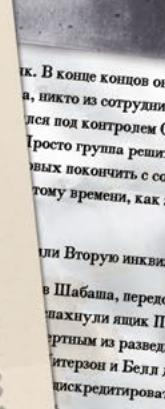

 $ecu$ 

#### к. В конце концов они поняли, что не было никто из сотрудников Управления транспся под контролем Сородичей, да и вообще Гросто группа решительно настроенных вых покончить с собой, но в остальном ому времени, как это прояснилось, было

#### ли Вторую инквизицию.

в Шабаша, передовой боец Камарильи пахнули ящик Пандоры. В результате ртным из разведки удалось заглянуть итерзон и Белл думали, что смогут цискредитировать их, если те станут

когда Министерство национальной ейд на убежище Сородича. Резульиков правоохранительных органов алана-Ааджава, тысячелетнего в тело исламского фундаментаta. И это был первый удар, нанеовут Второй инквизицией.

| [01:05] <Ди> та дурь была просто отпад                                                                                                                                                                                                                                                                                                                                                                                                                                                                                                                                                                |               |
|-------------------------------------------------------------------------------------------------------------------------------------------------------------------------------------------------------------------------------------------------------------------------------------------------------------------------------------------------------------------------------------------------------------------------------------------------------------------------------------------------------------------------------------------------------------------------------------------------------|---------------|
| [01:07] <Повелитель_шлюх> дурь? Ты о чём? не помню, я похоже                                                                                                                                                                                                                                                                                                                                                                                                                                                                                                                                          |               |
|                                                                                                                                                                                                                                                                                                                                                                                                                                                                                                                                                                                                       |               |
| $[01:08]$ <Ди> наркота                                                                                                                                                                                                                                                                                                                                                                                                                                                                                                                                                                                | алс           |
| $[01:08]$ <Ди> товар                                                                                                                                                                                                                                                                                                                                                                                                                                                                                                                                                                                  | 近             |
| $[01:08]$ <Ди> ну, знаешь                                                                                                                                                                                                                                                                                                                                                                                                                                                                                                                                                                             | poBo          |
| $[01:08]$ < $A$ $\nu$ > $n$ ектар                                                                                                                                                                                                                                                                                                                                                                                                                                                                                                                                                                     | лыми          |
| $[01:08]$ <Ди> от богатеньких                                                                                                                                                                                                                                                                                                                                                                                                                                                                                                                                                                         | 四             |
| [01:10] <Повелитель_шлюх> ты про кровь вентру, которую я для                                                                                                                                                                                                                                                                                                                                                                                                                                                                                                                                          | HH.           |
|                                                                                                                                                                                                                                                                                                                                                                                                                                                                                                                                                                                                       | гься          |
|                                                                                                                                                                                                                                                                                                                                                                                                                                                                                                                                                                                                       | ни те         |
|                                                                                                                                                                                                                                                                                                                                                                                                                                                                                                                                                                                                       |               |
| $[01:11]$ $\frac{1}{2}$ $\frac{1}{2}$ $\frac{1}{2}$ $\frac{1}{2}$ $\frac{1}{2}$ $\frac{1}{2}$ $\frac{1}{2}$ $\frac{1}{2}$ $\frac{1}{2}$ $\frac{1}{2}$ $\frac{1}{2}$ $\frac{1}{2}$ $\frac{1}{2}$ $\frac{1}{2}$ $\frac{1}{2}$ $\frac{1}{2}$ $\frac{1}{2}$ $\frac{1}{2}$ $\frac{1}{2}$ $\frac{1}{2}$ $\frac{1}{2}$ [01:12] <Ди> лучше вообще такие слова не упоминать [01:12] <Ди> теперь придётся уходить офлайн $[01:12]$ <ди> а потом ещё и ноутбуки сжечь, или как там положено. [01:13] <Повелитель_шлюх> стой стой стой Г01:13] <Повелитель_шлюх> могу я тебе задать один вопрос? я | молод         |
|                                                                                                                                                                                                                                                                                                                                                                                                                                                                                                                                                                                                       | считат        |
|                                                                                                                                                                                                                                                                                                                                                                                                                                                                                                                                                                                                       | ) 奖           |
| долгое время ничем подобным не занимался Год. 141 <Ди> ну это не помешало тебе обвести лошка вокруг Пальца [01:15] <Повелитель_Шлюх> да ладно тебе. Ты же понимаешь, он над                                                                                                                                                                                                                                                                                                                                                                                                                     | <b>STOM T</b> |
| тобой поиздеваться хотел - знал, что тебе нужно и решил                                                                                                                                                                                                                                                                                                                                                                                                                                                                                                                                               |               |
|                                                                                                                                                                                                                                                                                                                                                                                                                                                                                                                                                                                                       |               |
| поприкалываться, отдав это другому. Он просто не ожидал, что я не стану глотать Гот:16] <ди> наверное. в любом случае ты круто придумал                                                                                                                                                                                                                                                                                                                                                                                                                                                         | TИ            |
|                                                                                                                                                                                                                                                                                                                                                                                                                                                                                                                                                                                                       |               |
|                                                                                                                                                                                                                                                                                                                                                                                                                                                                                                                                                                                                       |               |
|                                                                                                                                                                                                                                                                                                                                                                                                                                                                                                                                                                                                       | 3KO           |
| выплюнуть всё в банку ред була и отдать мне. прям                                                                                                                                                                                                                                                                                                                                                                                                                                                                                                                                                     | <b>THOOM</b>  |
| $[01:17]$ <Ди> что тут скажешь. обожаю это дерьмо $[01:18]$ <Ди> вкус обалденный $[01:19]$ <Ди> так пора отключаться                                                                                                                                                                                                                                                                                                                                                                                                                                                                            |               |
|                                                                                                                                                                                                                                                                                                                                                                                                                                                                                                                                                                                                       |               |
| [01:19] <Повелитель_шлюх> погоди это правда, что мы контролируем историю? Манипулируем политикой и всякое                                                                                                                                                                                                                                                                                                                                                                                                                                                                                          | <b>уть.</b>   |
| 01:20] <Повелитель_шлюх> звучало круто                                                                                                                                                                                                                                                                                                                                                                                                                                                                                                                                                                | : T000        |
| 01:21] <Ди> а сам как думаешь? ощущаешь себя охеренным                                                                                                                                                                                                                                                                                                                                                                                                                                                                                                                                                |               |
|                                                                                                                                                                                                                                                                                                                                                                                                                                                                                                                                                                                                       | зм пища.      |
|                                                                                                                                                                                                                                                                                                                                                                                                                                                                                                                                                                                                       | Добром это    |
|                                                                                                                                                                                                                                                                                                                                                                                                                                                                                                                                                                                                       |               |
| Кукловодом? воротилы из К много чего контролируют, это нектара                                                                                                                                                                                                                                                                                                                                                                                                                                                                                                                                     | 1 же всё ещ   |
| правда. Но то же самое можно сказать про любого, у кого есть куча бабла. и реки сладкого, крышесносного… :22] <Ди> запомни, дубина, что нельзя в сети называть вещи                                                                                                                                                                                                                                                                                                                                                                                                                             | , MS STOPO    |
|                                                                                                                                                                                                                                                                                                                                                                                                                                                                                                                                                                                                       | та история    |
| :23] <Ди> хотя, боже… Ты всё равно обречён, если будешь                                                                                                                                                                                                                                                                                                                                                                                                                                                                                                                                               | эвечности -   |
|                                                                                                                                                                                                                                                                                                                                                                                                                                                                                                                                                                                                       |               |
|                                                                                                                                                                                                                                                                                                                                                                                                                                                                                                                                                                                                       |               |
|                                                                                                                                                                                                                                                                                                                                                                                                                                                                                                                                                                                                       |               |
| -23] <Ди> никакие мы не хозяева человечества, мы обыкновенные паразиты. и пока люди занимались чем-то полезным и писали историю, могу поспорить, рядом всегда был какой-то упырь вроде меня, у которого слюнки текли от                                                                                                                                                                                                                                                                                                                                                                      |               |
| сладкого запаха крови                                                                                                                                                                                                                                                                                                                                                                                                                                                                                                                                                                                 | з. Несмотря   |
|                                                                                                                                                                                                                                                                                                                                                                                                                                                                                                                                                                                                       | л Густаву,    |
|                                                                                                                                                                                                                                                                                                                                                                                                                                                                                                                                                                                                       | OCTED.        |
| 4] <Ди> вот а теперь пожалуй последую собственному 5] <Повелитель_шлюх> Ди? мы ещё встретимся?                                                                                                                                                                                                                                                                                                                                                                                                                                                                                                     |               |
|                                                                                                                                                                                                                                                                                                                                                                                                                                                                                                                                                                                                       |               |
|                                                                                                                                                                                                                                                                                                                                                                                                                                                                                                                                                                                                       |               |

chinemanikeum yBeruzerwe Cubenae RINFS. MODELLO wit 3mgrund eiting Sone Fraction  $060241$ yrican  $-4$ younguk  $h_{i}$ LODON awin

Donocra apuzrame, a e rocmanumen lenomuran luxmopuarenyo

tores

survence upugnums, a c novmannium o enomunum o unmopulariory. snory. nongon spemen pacus ema spummernou nommermo, est y a maximo eygmo mup oepen, rennoncu, coopmanaya premy a apaygmol, narcerga. conpymanmee garvenue counanneur unemumymor, nopooeganmur leë nofur u nofur nefeseecmfenneur unseenn, comolur cinami recicio gobierca. Espanhormo ud continembo к запретним cmams vernon governen. vegepararnoa vosonumemse u zanpemenin ymerava. diogu, como fue noveupams clour nogrunënnur pagu ocmpur.

Ø

omymennu u menkur pagocmen seuznu.

B pempocnentmule moveno exagams, imo smo Enna nocuegnaa snoxa, когда старейшины Камарилин ещё понимали тот мир, на который когда старенщинн памарилни еще понимали тот мир, на потор оказивают столи всеобхемлющее влияние. И хотя они до сих пор восседают на своих тронах и пнот крові, словно берно, окидивая Езгладом империю, что никогда не восходит сомние, граници этой remorgem ummerno, ese cunversa no overagame ennero, examen parameca за политикой и социалинный порадком смертних, менающимись ja assummentos a communicava nopagnam consponseva, menoromana. C relepcamnoù enopoción, nassani paz cinanolaci le cressence.

д стращуся того дна, когда сама оказауся в их числе. Благословение любви и искусства смертных позволило мне оставаться в гармонии c nacmoamna. Hagever, mak Eygem u lupegi.

В Лондонс времён королеви виктории порой казалось, что сородичи -1) nonegone o pemen noponeon vanmopun nopon najavoca, uno copog это еще одно танное осщество, члени которого в очередной раз mommunica corpanue, которое он регуларно посещает, состоит абсустенщее сограние, которое он регуларно посещает, состоит Росновном из живих мертвенов. В конце концов, за фасадом Елагочестил V те времена можно было найти много странного и univoiscement s me openena mosseno invo natimu mnoro cmpannoro u nomumo nac. d, k cvoly, leerga nacmaulava na mosa, rmostu mou canona nocemana ognorpemenno a copoguia, a imepmene. conci montre montgommento cuento caravaran marcon yenex. Bee amo ymno. N, gymaemca mne, npurunoù noenymno mo, imo namn ne sur gram. en grammente une, apresanta novaganar mo, uno camaro. cmapeinument burn max mann xpolito, umo ne gamemnun, xorga ux. numepua nepecmana coombemembolams mperolanuam noloro lpemenn.

- Burmopus

Приветствую всех собравшихся!

удовольствие принять вас в наш внутренний круг.

невыми лиценту путиципелитетани и фондани, ры поэнакоми. Видами нашей деятельности и самыми типичными клиентами.

Однако, работал с этими людеми, вы чувствовали, что есть ещё более высокая ступень для вашей карьеры.

которой была основана наша компания.

придётся с ними сотрудничать.

крупномасштабного кризиса...

эрлостьие припять вас в паш внутренний крут. Как всем вам хорошо известно, в нашей компании существует несколько

нак осем вам хорошо известного нашем компании существует несколько уровней посвящения. Поступив к нам в качестве стажёров, вы работали с юридиумоопен посеящения, поступлы к нам в качестве стажемой вогработали с коммант- ческими лицами, муниципалитетами и фондами. Вы познакомились с основными

прольна сеол, вы получили област высокий статус и виссте с тем возможное рартията и однос цеплины завазнивани дизайтельных семей Европы. парламента. Некоторые из наиболее богатых и влиятельных семей Европы. парламента, гтекоторые из напослее остаток и алигительных семен съропы. Однако, работая с этими людьми, вы чувствовали, что и это ещё не предел. Что

.....................................

сще оолее высокая ступень для вашел карьеры. И вот вы на неё поднялись. Лишь тем, кто заслужил высочайшее доверие, мы

Прекрасно. Это кровь, дающая нам жизнь. Она вечно будет хранить ваше здоровье и молодость — по крайней мере до тех пор, пока все мы служим той цели, для

Политика — это чрезвычайно сложная и постоянно эволюционирующая система

власти, знаний и опыта. Бессмертные слишком давно живут в этом мире, чтобы в полной мере разбираться в этой новой для них системе. Эпоха королей прошла. Настала эпоха лоббистов, когда деньги, возможности и влияние формируют . постала этола люболетов, когда денаги, вознолности и влияние формируют. будущее. Мы — одни из лучших специалистов в этой области на всём земном шаре. отнущее, плат — одни из путших специалистов в этой осласти на всем земном шарет. Давая нам указания, наши клиенты могут быть спокойны, несмотря на их ограниченное понимание современных тенденций, ведь они знают, что мы умеем транслироности политического расположительно под страна и пену Европейского парламента. Мы используем самые обычные инструменты: деньги и связи. Ими пользуются все, кто лоббирует интересы элиты. Помимо этих инструментов, мы также можем попросить помощи непосредственно у наших покровителей. Разумеется, только попросите поимым непосредственно у наших покровлівлен. Газунеетелі тримат |в исключительных случаях. Кровь даёт им не только вечную молодость — она даё:

открываем истинную цель нашей работы. А заключается она в том, чтобы лобби-

ровать интересы удивительнейших созданий. Бессмертных созданий. Полагаю,

ровата интересан унивенствлятельно создании восстанти создания с сказать, от тех, кто надеется на дальнейшее продвижение по карьерной лестнице, мы ожидаем

ликомоги степент произвательности. Вы видите перед собой маленький стаканчик. Выпейте его содержимое.

им могущество, границы которого сложно даже вообразить.

Мы не единственная организация, работающая на бессмертных. Похожие

что ж, перейдём к делу. Первый проект, над которым вам всем предстоит Что ж, перейдём к делу. Первый проект, над которым вам всем предстоит

работать, - это возобновление директивы Европейского Союза относительно

систематизации стандартов качества для организаций, работающих с донорско

кровью. Наши клиенты хотят создания общеевропейского регистра всей донор

ской крови на территории ЕС. Основные доводы носят гуманистический харак ской крови на территории ЕС. Основные доводы носят гуманистический харак

подобная база данных упростит работу международных организаций в случае

H-MPOY

HHNT

ны не единственная организации разования на страния. Иногда вам

Как большинство из вас, несомненно, знают, моё имя - Ивия фон Эйхель, и я тык оольшинство из вас, посоявление, энают, мое лим - утали жен отлети, н. и. занимаю должность финансового директора «Эйхель Групп». На мою долю выпало

### *«Входите же по собственной воле».*

**ДРаКУЛа — ДжонаТанУ ХаРКеРУ**

## Мир Тьмы

*Ты танцуешь. В ушах пульсирует неумолимый ритм техно. Тёплые потные тела окружают тебя. Вы на чердаке заброшенного дома. Стены покрыты граффити. Под ногами голый бетонный пол, мокрый от пролитых напитков. Ты пьян и под кайфом. Мед‑ ленно приходишь в себя от эйфории слияния с бьющейся в танце толпой.*

*Мимо проходит женщина. Её холодная рука на твоём плече. Ты смотришь ей вслед — она движется между тан‑ цующими и исчезает за пультом диджея. Она молода, вы‑ глядит точно так же, как любая другая девчонка из тех, что трутся телами вокруг. По крайней мере тебе так кажется, пока она не оборачивается к тебе. Ваши глаза встречаются. Она улыбается тебе, и в этот момент ты видишь в её взгляде мудрость, которая превыше всего того, что происходит на танцполе.*

**Возможно, тебе довелось испытать нечто подобное в реальной жизни. Мимолётная встреча — интригующая или пугающая — с непреодолимо-притягательной** 

**незнакомкой. Проходят годы, а ты всё ещё помнишь её, хотя вы больше никогда не встречались.**

**В реальном мире у всего есть своё объяснение. Что это была за женщина? Да просто ещё один диджей. Идёт готовиться к своему сету. Она только что курила на улице, поэтому руки у неё такие холодные. Обычное совпадение, не более того.**

**В Мире Тьмы всё не так просто.**

**Внешне он мало чем отличается от нашего мира. Всё тот же офис, где ты работаешь, школа, в которую ходил в детстве, точно такой же дом престарелых, где ты навещаешь бабушку.**

**Истинную сущность Мира Тьмы можно увидеть только заглянув поглубже, пошарив по самым затхлым его углам. Это мир, полный мрачных секретов, ждущих своего часа в глубоких омутах, — ты можешь найти к ним дорогу, если не побоишься пойти по следу. Так кем же всё-таки была та женщина на подпольной техновечеринке? Быть может, её холодное прикосновение это знак? Стоит последовать за ним, и ты оставишь свой уютный мир позади, ступив в потаённое царство ужаса.**

#### **В тени небоскрёбов**

В Мире Тьмы среди людей скрывается множество странных существ, в том числе и вампиры. Они выглядят как люди, они пытаются вести себя как люди, но не стоит обманываться. Ночь расставит всё по своим местам: вампир — это хищник, а человек — его добыча. Мир Тьмы — это не далёкое сказочное царство, живущее по собственным правилам. Вампиры совсем рядом. Женщина на техно-вечеринке могла быть одной из них. Как и диджей, как и вышибалы на входе, как и любой другой в толпе, даже тот, в солнечных очках с языками пламени. Может, они все были вампирами все до одного Проклятые.

В Мире Тьмы нет ни одного безопасного места. Жуткие чудовища с одинаковой лёгкостью находят добычу как в тёмных переулках, так и на богемных вечерах в высшем обществе. А добыча даже не подозревает, что на неё ведут охоту, — пока не будет слишком поздно.

Мир Тьмы прогнил до самого основания. Здесь повсюду коррупция, насилие и лицемерие. Не то чтобы этим он разительно отличался от реального мира, но здесь каждый порок цветёт пышнее под влиянием сверхъестественных существ, с которыми тоже приходится считаться. Стоит только включить новости — и вот он, Мир Тьмы, нужно лишь немного воображения. Несложно представить, что из всего происходящего выгодно бессмертным хищникам, к каким событиям они приложили руку. Мир Тьмы — это наша реальность, наше время. Здесь и сейчас.

**«Вампиры»** — игра в жанре ужасов. Действительность в этой игре безобразна до жути. При этом рассказчику вовсе не обязатель-

но сгущать краски и изображать реальный мир хуже, чем он есть на самом деле. Вы, разумеется, можете сделать и так, но порой достаточно бывает сфокусировать внимание на тех аспектах и проблемах современного общества, которые подчёркивают ваше видение города, погружённого во тьму. В мире достаточно коррупции, пренебрежения к правам человека, расизма, ненависти, жестокости и случаев разжигания войны, чтобы игра, основанная на реальных фактах, оказалась действительно мрачной.

Небоскрёбы в **«Вампирах»** играют ту же роль, что средневековые замки в классических историях ужасов. Днём эти высокие башни из стекла и стали могут казаться очень современными и прогрессивными, однако, когда садится солнце, их истинная природа обнажается — это отравленные иглы, пускающие яд по венам города.

#### **Здесь нет героев**

Главные действующие лица в этой игре — вампиры. Чтобы поддерживать подобие жизни в своих мёртвых телах, им нужно пить кровь живых существ. Они обладают сверхъестественными способностями, которые дают им власть над беззащитными смертными. Они могут опоить своей могущественной Кровью любого человека, сделав его рабом — наркоманом, послушным каждой его прихоти, готовым на всё ради новой порции витэ.

Иными словами, в **«Вампирах»**  вам предстоит играть плохих парней.

Возможно, ваш персонаж отчаянно цепляется за остатки человеческой морали, несмотря на отвратительные обычаи вампирского общества. Или уже смирился, приглушив голос совести, и каждый раз, когда по неосторожности убивает человека, он говорит себе, что все вампиры так делают и он ничуть не хуже других. Так или иначе, вполне вероятно, что многие поступки персонажа во время игры будут идти вразрез с убеждениями игрока.

m

m

Рано или поздно ты поймёшь, что стал рабом собственной Крови. Что она пожирает тебя изнутри. Сперва это незаметно, но потом... постепенно ты начнёшь осознавать, что в тебе всё меньше и меньше человеческого. Ты будешь помнить о том, что когда-то был одним из них, но так, словно это был сон. Что-то далёкое и нереальное. И так будет до тех пор, пока ты не превратишься в карикатуру на себя самого. Зверь внутри тебя станет носить твоё тело, как одежду, пока ты будешь продолжать его подкармливать.

 $35$ 

 $\frac{1}{2}$ 

58

見風

ù

**STR & CO** Moore Publishing CO

Вы можете воспользоваться этим, чтобы поднять в игре вопросы морали, исследовать тему безнравственных поступков. Подобный опыт будет интересным и эмоционально насыщенным. Какой бы мерзкий поступок ни совершил в игре вампир, он — это не вы, и его злодеяния не причинят никому вреда. Вы

#### **инДиВиДУаЛЬнЫЙ ПоРоГ ДоПУСТиМоГо**

**Вам предстоит играть со злом. Персонажам необходимо охотиться на людей и пить их кровь и это само по себе уже преступление. они могут скатиться дальше — возможно, им придётся убивать ради выживания. и если они не отрекутся от общества вампиров, рано или поздно их заставят стоять и смотреть, как древние чудовища совершают невероятные злодеяния.**

**Как рассказчик вы наверняка захотите поддержать атмосферу ужаса, но в то же время не вызвать у игроков такого сильного отвращения, чтобы они отказались играть. У каждого человека свой порог допустимого. обсудите с остальной труппой заранее те границы, которые нельзя переходить.**

**не стоит давить на игроков или пытаться переубедить их. Лучше просто принять во внимание индивидуальные особенности каждого участника. Возможно, один из них только что стал отцом, и ему неприятно всякое упоминание насилия над маленькими детьми, даже если это обыкновенная страшилка. а другой недавно подвергся травле в социальной сети и не хочет, чтобы игра напоминала ему эти неприятные переживания.**

**По нашему опыту индивидуальный порог подразумевает не столько степень жестокости сцены, сколько её тему. Сцена кровавых пыток может показаться игроку вполне приемлемой, и в то же время он будет категорически против описаний бытового насилия.**

**К сожалению, не существует простого способа настроить игру так, чтобы все остались довольны, но, если вы начнёте с обсуждения, это существенно облегчит вам жизнь! настольные ролевые игры тем и хороши, что у игроков есть возможность влиять на игру с самого начала, подстраивая её под себя.**

можете воспользоваться вымышленным пространством игрового мира, чтобы испытать последствия зверских поступков. И это не обязательно должен быть тяжёлый опыт — нет ничего плохого в том, чтобы просто играть в своё удовольствие.

Как скоро неопытный вампир привыкнет к необходимости охотиться на людей? Станет ли он обманывать себя, утверждая, что он всё ещё хороший человек? Поверит ли в то, что самобичевание может как-то притупить чувство вины за убийство? Игра даёт возможность отыскать ответы на эти вопросы для персонажей, чтобы затем провести параллели с аналогичными ситуациями в своей жизни и в окружающем мире.

Настольные ролевые игры замечательны тем, что предоставляют игрокам высокую степень приватности. В эпоху Интернета это довольно редкое явление. Вы всё ещё в ответе за товарищей по игре, но что бы ни случилось, это не обязательно станет достоянием всей Сети. В замкнутой компании друзей и знакомых гораздо безопаснее ступать по запретной территории, чем в любом открытом киберпространстве. Угроза того, что вас неправильно поймут, гораздо ниже. Можно рискнуть и пуститься во все тяжкие.

Вы можете посвятить игру поискам искупления, но путь к нему будет непрост. О каких нравственных идеалах может идти речь, если каждую ночь тебе в буквальном смысле приходится вгрызаться в плоть живого человека? Возможны и другие варианты сюжетов. Допустим, вы играете работающую мать, муж которой жестоко её избивает. Как она поступит, получив Становление? Перед ней откроются совершенно новые возможности, о которых она не могла и мечтать. Для униженных и бесправных людей стать кровопийцей — всё равно что заключить сделку с дьяволом. Ты получаешь шанс выбраться из того ада, в котором провёл всю жизнь, но расплачиваешься за это собственной Человечностью.

В самом сердце Мира Тьмы находится лабиринт морального выбора. Практически каждый сюжет так или иначе ведёт в этот лабиринт. Хорошие, казалось бы, люди способны порой на чудовищные поступки, а чудовища, в свою очередь, могут совершать добрые дела.

#### **Что к чему**

*Какой‑то клыкастый отморозок напал на тебя в грязном сортире на рейве. Музыка гремела в ушах. Он переста‑ рался и запаниковал, когда понял, что ты умираешь. Он дал тебе свою Кровь, и ты провалился в сладкий кошмар Становления. Через час ты пришёл в себя и, пошатываясь,*  *побрёл навстречу своей первой ночи в качестве вампира, не имея ни малейшего понятия о том, что к чему.*

*Как тебе отыскать других Сородичей?*

*Это будет непросто.* Маскарад *— это плотное покрывало, скрывающее нежить не только от людей, но и друг от друга, особенно в крупных городах. Ты ещё ни‑ чего не знаешь ни о Традициях, ни о Принце, но самим своим существованием уже нарушил установленный закон.*

*Если ты всё‑таки отыскал дорогу в элизиум, то вскоре обнаружишь: в глазах бессмертных невежество не оправ‑ дывает твоих грехов. Существа, чья власть для чело‑ века непостижима, могут приговорить тебя к смерти на этот раз к окончательной.*

*Но допустим, ты всё‑таки выкарабкался. Что тогда? Каков он, этот твой новый мир?*

#### **НОВОЕ ПОКОЛЕНИЕ ТИРАНОВ**

Много веков назад мудрые вампиры-старейшины положили начало организации, известной как Камарилья. С тех пор эта организация стоит на страже Традиций, обеспечивающих безопасное существование для вампиров в Европе, Америке и во всём мире. Так, по крайней мере, утверждает официальная пропаганда. И как бы там ни было, несмотря на некоторые проблемы, возникшие в последнее время, Камарилья всё ещё стоит на страже закона в мире Сородичей и определяет жизнь многих вампиров.

На протяжении веков Камарилья представлялась многим незыблемой Башней Слоновой Кости, но всё изменилось. Общество вампиров пришло в движение: многие старейшины и Принцы покидают свои домены, а некоторые исчезают бесследно. Вампиры, пользовавшиеся авторитетом на протяжении столетий, уходят, услышав таинственный Зов, и оставляют свои владения на растерзание анархам.

Камарилья уже потеряла некоторые из самых знаменитых своих доменов, например Берлин и Лондон. Во многих городах власть этой фракции пошатнулась оставаясь своего рода аристократами мира Сородичей, её представители вынуждены считаться с анархами, заявившими о своих правах.

Впрочем, в Камарилье не всё так плохо. Для молодого и амбициозного вампира исчезновение старейшин — неслыханная удача. Это шанс для быстрого продвижения в рядах фракции. Впервые за всё время её существования неонат может взять под свой контроль целый домен, если, конечно, у него есть голова на плечах. И не только домен. Многие старейшины накапливали своё состояние веками, а теперь их богатства остались практически без присмотра. Надёжно укреплённые убежища, капиталы, обученный персонал — и всё это под управлением пары-тройки сбитых с толку гулей. Сообразительному неонату не составит труда взять контроль в свои руки.

Пока что Камарилья отступает и защищается, но слишком долго это продолжаться не будет. Молодые вампиры полны энергии. Они способны вдохнуть новую жизнь в эту фракцию. На протяжении всей истории Камарильи, когда одарённый или просто алчный неонат предлагал что-либо, старейшины неизменно

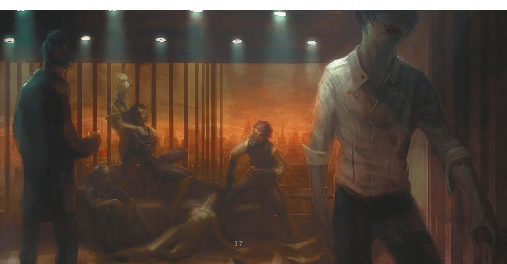

отвечали: «Не сейчас. Поразмысли над этим лет сто или двести… Узнай, как устроен мир… Тогда, может быть, Принц удостоит тебя аудиенции». Прогресс в обществе вампиров не приветствовался. Всё новое они встречали с подозрением.

Старейшины Камарильи родились ещё в те времена, когда ветряную мельницу и телескоп считали верхом технической мысли. Власть королей была безоговорочной, а «денежный» оборот зачастую принимал форму обмена подарками или услугами. Современный мир вызывает у старых вампиров раздражение и непонимание. Они хотели переждать, но ничего не вышло. Теперь же, когда многие решения принимают молодые Сородичи, Камарилья постепенно отказывается от инертной традиционной политики и вновь берёт контроль в свои руки — теперь уже на современный лад. Пришло время молодым вампирам заявить о себе. Почему бы не последовать примеру мексиканских неонатов, возглавивших атаку на Мехико и вырвавших город из когтей Шабаша? Старейшины и Юстициары твердили, что это невозможно. В чём ещё они ошибались? Какие ещё возможности откроются тому, кто не побоится стать первым?

#### **ТОТАЛЬНАЯ РЕВОЛЮЦИЯ**

Для анархов наступили блаженные времена. Камарилья больше не сдерживает Движение. Внутренние распри отошли на второй план. Очаги Восстания вспыхивают по всему миру. Даже в признанных твердынях Камарильи стали появляться анклавы анархов. Пока элита прячется в элизиумах, некогда бесправные вампиры захватывают земли.

Падение Лос-Анджелеса и зарождение Свободного Государства Анархов на западном побережье США было лишь прелюдией, за которой последовал Берлин и другие города. Камарилья осталась без руководителей, которые веками принимали все важные решения, и никак не может оправиться. Она не в состоянии защитить свои привилегии без опоры в виде древней и мощной Крови старейшин.

Движение анархов разнородно. У них нет руководства или даже единой идеологии. Восстание — это стихийная сила. Столетия притеснений со стороны Камарильи заложили её основу, и она вобрала в себя идеологию и конечные цели множества отдельных вампиров, в разные времена оказывавших сопротивление власти старейшин.

Пришло время каждому анарху заявить о себе, оставить свой след в истории, желательно залив его кровью Камарильи. Такая возможность может уже

не представиться. Каким бы скромным ни было твоё происхождение, у тебя есть шанс сразиться с так называемыми Принцами и опрокинуть Башню Слоновой Кости. Равновесие сил качнулось, наконец, в пользу анархов — смертные охотники и коварный Зов позаботились об этом.

Впрочем, революция — это только начало. Настоящее испытание для политически подкованных неонатов начнётся после. Сможет ли харизматичный и амбициозный упырь построить собственную кровавую утопию? Или революция потонет в насилии и жестокости?

#### **САМИ ПО СЕБЕ**

Искалеченная Камарилья, пытающаяся возродиться. Всплески Восстания анархов, сражающихся за лучшее будущее. Осколки разбитого вдребезги Шабаша. Всё это предоставляет прекрасную возможность для во-

#### **ШаБаШ. ЗаТМение**

**некогда Шабаш крепко держал в своих когтях многие города по всему миру. новая инквизиция прошлась по его членам огнём и мечом, пламя анархии не пощадило Чёрную церковь, а молодые вампиры, мечтающие о собственном домене, повсеместно рвут на куски оставшиеся за Шабашем территории. некоторые стаи, оказавшись без руководителей, пытаются выдать себя за банды анархов. Другие нехотя предлагают свои знания и сотрудничество Камарилье, лишь бы переждать где‑нибудь бурю.**

**Казалось бы, Шабаш сломлен. однако в час своего падения он стал опаснее, чем когда‑либо прежде. исчезнув с карты мира, фракция растворилась в тенях. опытные вампиры Шабаша появляются из ниоткуда и исчезают в никуда. Свободные от необходимости координировать действия обширной организации, они сеют ужас с ещё большей эффективностью. Члены Шабаша могут, наконец, свободно заниматься тем, что получается у них лучше всего: наносить быстрые и жестокие удары во имя Тёмного отца.**

**Современный Шабаш — страшный сон для обычного вампира. Это иррациональное чудовище, которое жаждет разрушить всё, что тебе удалось построить, ради неведомых и непостижимых целей.**

площения фантазий любого освобождённого вампира. Слабокровных становится всё больше. Эти вампиры настолько далеки от Каина, что у них больше сходства с людьми, чем с Сородичами. Для них конфликт Камарильи и Движения анархов — просто пустой звук. Их не интересует борьба за власть среди фракций. Они не обращают на всю эту возню никакого внимания, по крайней мере пока какой-нибудь рьяный Архонт или Советник не решит, что тем, кто не соответствует их стандартам, нет места в обществе вампиров.

На задворках Мира Тьмы происходит много удивительных событий. В конечном итоге они могут оказаться важнее, чем думает большинство. Всей картины происходящего в Мире Тьмы не знает никто. Бесконечное разнообразие вселенной то и дело рождает новые загадки или подбрасывает фрагменты головоломки, которые, казалось бы, некуда приложить.

Вампиры-одиночки формируют свои собственные домены и правят там железной рукой, словно легендарные средневековые чудовища. Анархи-диссиденты находят убежище в небольших сельских общинах, в приграничье или в зонах боевых действий. Их устраивает любое место, лишь бы подальше от властей, смертных и бессмертных. Среди вампиров есть даже кочевники. Жизнь в дороге — это не так уж сложно, если знаешь, что делать. Каждый вампир сам решает, как ему жить вовсе не обязательно постоянно цепляться за скучную идеологию фракций.

Чудовищные размеры современных метрополий и повсеместное насаждение Маскарада открывают уйму возможностей для ловкого и сообразительного упыря — не так уж сложно спрятаться под самым носом у Принца. Только дурак поверит, что можно полностью контролировать многомиллионный город.

#### **ВТОРАЯ ИНКВИЗИЦИЯ**

Несмотря на обострение конфликтов между вампирами, самая большая опасность для общества Сородичей исходит, как ни странно, от простых людей. Камарилья твердит уже не первый век, что вампиров ждёт верная смерть на костре, если человечеству станет известно об их существовании. Новая охота на ведьм, говорили они, развернётся с таким размахом, что ни один из повелителей ночи не устоит. Никакая бессмертная мощь не удержит многомиллиардную орду людей, населяющих планету.

Судя по всему, Камарилья была права. Спецслужбы многих стран уже обнаружили существование нежити. Они ещё не до конца определились, кто перед ними, и активно обмениваются информацией друг с другом

и с радикальными представителями Общества Святого Леопольда в Ватикане. Старые инквизиторы дождались наконец того дня, когда им поверят и начнут воспринимать их всерьёз. Теперь их финансируют и снабжают лучшим вооружением наиболее могущественные и беспощадные организации со всего мира.

На данный момент Вторая инквизиция строго засекречена. Ни одно учреждение или правительство не контролирует её полностью. Далеко не каждый агент ЦРУ или аппаратчик ФСБ знает о существовании вампиров, но осведомлённых (и анонимных) лиц достаточно, чтобы угроза со стороны Второй инквизиции была вполне реальной. Они уже ликвидировали Принцев Лондона и Лас-Вегаса, кроме того, нанесли тяжёлый удар по клану Тремер в Вене. Десятки неосторожных анархов и самонадеянных вампиров Шабаша уже встретили свою окончательную смерть от рук людей. Они не привыкли иметь дело с теми, кто знает, как с ними бороться. Кроме того, многие вампиры пытаются использовать смертных охотников в своих целях, намеренно подбрасывая им адреса соперников или доказательства совершённых теми убийств.

Вторая инквизиция борется с вампирами, но инквизиторы — далеко не герои. Это представители самых жестоких и беспринципных организаций в мире. Их обычная работа — это заказные убийства, государственные перевороты, диверсии, глобальная слежка, дестабилизация и дезинформация. В этом смысле они ничуть не лучше потомков Каина.

Для персонажей-вампиров Вторая инквизиция это серьёзный повод никогда не забывать о Маскараде. Когда ты пересекаешь границу другого государства или даже просто посещаешь аэропорт — ты попадаешь под наблюдение. Это опасно, даже если тобой вроде бы никто не заинтересовался. Зашёл в интернет? Почему бы просто не послать в АНБ письмо с приглашением поохотиться вместе с Примогеном? «Пять глаз» втайне добавили в списки подозрительных слов термины, связанные с вампирами, так что если решишь поинтересоваться в электронном сообщении, где сегодня элизиум, то, считай, отправил приглашение Инквизиции.

Несмотря на очевидные опасности, Инквизиция всё же может оказаться полезной. Уничтожая вампиров, стоящих у власти, она предоставляет возможность другим занять их место. Может быть, повезёт именно тебе. Или Инквизиция уничтожит твоих врагов. Наиболее безрассудные Сородичи могли бы даже попытаться подчинить кого-нибудь из агентов, проникнуть в их ряды: взять в свои руки пылающий меч, рискуя разжечь с его помощью собственный костёр.

#### **МЕНЯЮЩИЙСЯ МИР**

Мир Тьмы находится в движении. Когда вы начинаете игру, он становится строительной площадкой, на которой вы можете соорудить любую историю. Каждая частичка этого мира — Камарилья, Анархи, Вторая инквизиция — балансирует на грани. Нужен всего лишь небольшой толчок, чтобы склонить их в одну или другую сторону. Персонажам это вполне по силам.

Вам решать, насколько глубоко вы хотите погрузить героев во тьму. Можете нырнуть с головой в мир интриг и чудовищных секретов Камарильи, выворачивающих мир наизнанку, в мир непрерывной гонки с Инквизицией не на жизнь, а на смерть. Или оставить хитросплетения политической игры вампиров лишь в качестве фона и дать возможность персонажам сфокусироваться на менее глобальных проблемах личного характера.

В конце концов, это ваш собственный Мир Тьмы.

## Ролевые игры и искусство рассказчика

Люди начали рассказывать друг другу истории ещё на заре своего существования. Именно речь превратила человека из обезьяны с горящей палкой в лапах в нечто новое и уникальное. Первые истории, наверное, появились как предостережение об опасностях, настоящих или выдуманных. Сидя вокруг костра, люди рассказывали друг другу о том, что таится в темноте вокруг. Со временем из этих незамысловатых историй родилась эпическая поэзия, драматургия, опера, беллетристика и многие другие жанры. В мире появились новые опасности и новые искушения, многие из которых живут внутри нас, дожидаясь своего часа.

XX век перенёс устные истории на большие (и маленькие) экраны. То, о чём когда-то можно было только услышать, теперь можно увидеть собственными глазами. Кино, комиксы, телевидение и цифровые развлечения во всём безграничном разнообразии — в них, как и прежде, горит огонь воображения. Они способны воплотить почти любые фантазии в реальность. Почти.

Ролевые игры — одна из самых новых форм древнего искусства повествования. Их появление стало связующим звеном между сказками у костра и современностью с её мониторами и геймпадами. В ролевых играх участники рассказывают или разыгрывают истории в узком кругу. Хотя в игре они следуют определённым правилам или заданной логике, на самом деле их ограничивает только воображение. Если вы никогда не участвовали в ролевой игре, не беспокойтесь — это не сложнее, чем играть в дочки-матери или в войнушку, а с этим вы вполне справлялись даже в детстве. И это не менее увлекательно, чем ваш любимый телесериал.

#### **Рассказчик**

В **«Вампирах»** игроки придумывают главных героев и на протяжении всей истории действуют от их имени. Историю, в свою очередь, создаёт и направляет *рас‑ сказчик*. Он расставляет декорации и помещает туда второстепенных персонажей — иными словами, *пер‑ сонажей рассказчика*. Он описывает реакцию игрового мира на слова и поступки главных героев. Именно рассказчик следит за правилами, и он же добавляет в игру испытания.

Главная задача рассказчика — сделать так, чтобы игрокам было интересно. Для этого нужен хороший сюжет. Однако, в отличие от писателя или режиссёра, у рассказчика в руках нет готового произведения. Он задаёт экспозицию, описывает мир и правила, по которым этот мир существует, приводит всё это в движение, а затем позволяет игрокам самим воплотить историю, главными героями которой являются их персонажи. В конечном итоге сюжет будет зависеть от их поступков, а мир станет меняться по ходу действия. Рассказчик должен быть одновременно и повествователем, и ведущим, сохранять баланс между историей и игрой, захватывающим приключением и правилами. Хотя вам придётся иногда описывать обстановку или даже предпринятое кем-то действие, гораздо чаще вы будете решать, что должно случиться в ответ на действия героев, и решение это должно быть настолько справедливым и беспристрастным, насколько возможно.

#### **Игроки**

Рассказчик играет вместе со всеми, ему приходится управлять десятками, а то и сотнями персонажей. Однако термин *«игрок»* относится больше к участникам, которые берут на себя роли главных героев. Они заполняют бланк персонажа, описывают его характер и внешний вид, а затем играют так, как если бы они были этим персонажем: говорят от его имени, описывают его действия. Они решают, чего персонаж хочет, к чему стремится и каким образом собирается этого достичь. Рассказчик должен построить сюжет, который позволит главным героям достичь своих целей; игроки, в свою очередь, должны создать таких персонажей, которые смогут повлиять на сюжет, для которых есть место в описываемых событиях.

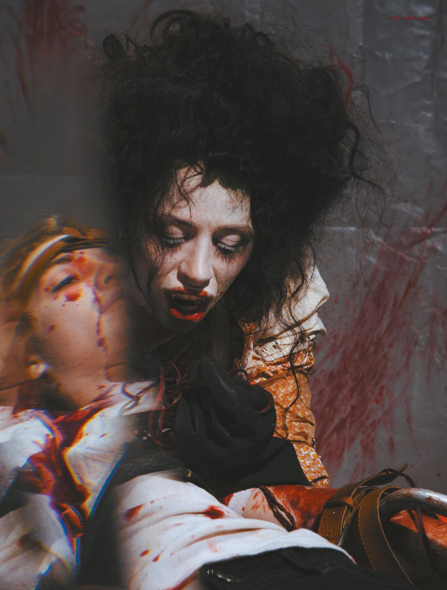

После того как игрок рассказал, чего собирается добиться его персонаж, рассказчик может попросить его пройти проверку, чтобы узнать, получилось ли задуманное. Насколько хорош персонаж в той или иной области, зависит от его параметров. Полезно знать сильные и слабые стороны своего героя (как естественные, так и сверхъестественные): это повышает шансы на успех.

Хороший игрок, вживаясь в роль, не забывает о стратегии. Учитывает не только желания, но и возможности персонажа. Мир Тьмы опасен и настроен враждебно. Чтобы достичь своих целей, нужно чаще использовать сильные стороны и стараться избегать ситуаций, где требуется делать то, чего ты не умеешь. Действия персонажей способны менять мир. Игроки, управляющие ими, могут предлагать рассказчику свои идеи о том, как должна развиваться история. Рассказчик волен принимать их или не принимать в зависимости от того, какой вариант развития событий будет наиболее драматичным и захватывающим.

**«Вампиры»** — игра напряжённая и откровенная. Она делает акцент на личной драме, на желаниях и взаимоотношениях персонажей. Если игрокам приходится бороться друг с другом за внимание, **«Вампиры»** теряют львиную долю своего колорита. К тому же сама история может стать сумбурной и бессвязной, если в ней будет слишком много главных героев. По нашему опыту, самые интересные игры получаются, когда в труппе от трёх до пяти игроков и рассказчик.

#### **Что нужно для игры**

Чаще всего в «Вампиров» играют за столом. Хотя здесь нет игрового поля, стол, как правило, необходим,

чтобы бросать кости и держать на нём книги и бланки персонажей. К тому же он организует пространство. Вам понадобятся бланки персонажей (вы можете скопировать их из книги или распечатать с сайта «Студии 101»), а также что-то вроде школьной доски, большого листа бумаги или планшета, чтобы составлять схему отношений (стр. 142). Кроме того, нужны игральные кости — в данном случае вам понадобятся десятигранники (d10). Вы сможете найти их в любом магазине, где продаются ролевые игры. Желательно иметь два набора разных цветов: один для обычного пула, другой для пула Голода (тут мы бы предложили красный цвет). Вы также можете приобрести тематические наборы, произведённые специально для игры в **«Вампиров»** 5-й редакции. ⬛

#### **Пример игры по «Вампирам» 5‑й редакции:**

ОХОТА

**Четверо друзей собрались, чтобы поиграть в «Вампиров». Среди них есть и те, кому знаком Мир Тьмы, и новички, поэтому они решили начать с простого. Сперва игроки создали персонажей — вампиров-птенцов (стр. 140). В качестве места действия выбрали свой родной город, где обычно очень много студентов. Им интересно поднять вопросы морали в игре, в частности вопрос цены, которую зачастую приходится платить за возвышенные идеалы.**

**Они все хотят начать побыстрее, поэтому рассказчик переходит к делу сразу после того, как все представили своих персонажей и составили базовую схему отношений (стр. 142).**

*Солнце садится за горизонт, а в грязной подсобке где‑то рядом с университетским трубопроводом зашевелились трупы. Ими дви‑ жет Кровь, они встают, в их взгляде — противоестественный голод. С того самого… инцидента… они так ни разу и не решились насытиться. Сама мысль пить человеческую кровь кажется им отвратительной. Но Голод уже становится проблемой. Некоторые из них подозревают, что игнорировать его дальше будет скверной идеей — это может привести к чему‑то очень‑очень плохому.*

*Ваши персонажи начинают игру с тремя пунктами Голода.*

**В пуле Голода (стр. 205) у всех игроков на данный момент по 3 игральные кости. Все берут нужное количество десятигранников, отличающихся по цвету от обычных, а затем Ларс, который играет Сандру, активистку из студенческой организации, подхватывает:**

*— Ребята, слушайте… надо что‑то де‑ лать. Прошлой ночью я… я решила, что стоит зайти в гости к брату… Он живёт со своей семьёй… и я…. я была словно сама не своя. Мы сидели, болтали, но я ни о чём другом не могла думать, кроме… ну вы понимаете. А потом во мне что‑то такое проснулось. Я готова была уже схватить кого‑нибудь, и я просто… удрала оттуда, так быстро, как только могла. Ещё бы чуть‑чуть, и я… точно что‑нибудь плохое бы сделала. Непопра‑ вимое.*

**Пока Ларс говорит, рассказчик отмечает на схеме отношений брата Сандры и его семью.**

**Мария играет Марту — по её собственным словам, «законопослушно глупую» версию самой себя. Обращаясь к основной теме истории, она продолжает игру:**

*— Да пошла ты, Сандра! «Ой, это не я! Ах, меня заставили!» Да кого ты пытаешься обмануть? Мы про‑ сто должны держать себя в руках, вот и всё. Это пройдёт. Точно прой‑ дёт.*

**Затем Мария добавляет:** *«Пока Марта всё это говорит, она расчёсы‑ вает себе руку до крови и начинает зализывать рану».*

**Несколько минут продолжается оживлённая дискуссия. Малопомалу герои перестают спорить о том, надо ли им утолить Голод, и переходят к вопросу о том, как это лучше всего сделать. В конце концов новоявленная котерия отправляется в ночь на поиски «донора». Рассказчик прерывает сцену и спрашивает каждого из игроков, что их персонажи намерены делать ближайшие два часа.**

#### **Ларс (Сандра):**

*Я хочу узнать, где в университете хранят запасы крови для эксперимен‑ тов, если такие тут есть, конечно. Для этого буду расспрашивать зна‑ комых преподавателей. Большинство, скорее всего, работает допоздна.*

#### **Мария (Марта):**

*С остекленевшими глазами на‑ правляюсь к ближайшей обще‑ ственной ферме, той самой, где недавно устраивала пикет за то, что там мучают животных в нево‑ ле. Хочу «просто посмотреть».*

**Сэм, который играет Маркуса, студента-двоечника, внезапно попавшего не в свою компанию, решает пойти вместе с Сандрой в качестве подкрепления.**

**Рассказчик начинает с Ларса (Сандры). Он просит его пройти проверку манипуляции + гуманитарных наук (стр. 117), добавив к пулу 1d10 за взаимопомощь (стр. 122). Рассказчик определяет сложность — в данном случае 4. Ларс получает только 2 успеха, так что Сандра несколько часов без толку ходит от кампуса к кампусу, так ничего и не узнав. В конце концов они с Маркусом решают разыскать Марту, чтобы спросить о её успехах.**

**Первоначально рассказчик собирался сразу перейти к активному действию на ферме, но вместо этого он решает слегка потянуть время, чтобы остальные персонажи успели присоединиться к Марте. Он говорит, что вампирша обходит ферму по кругу несколько раз. Мария описывает эмоциональное состояние Марты, кроме того, у неё есть возможность поделиться своими воспоминаниями о самой ферме, ведь она уже здесь бывала. Мария описывает некоторые сооружения и загоны для животных. На самом деле это вряд ли заняло бы целых два часа, но, поскольку игроки хотят собраться вместе, все решают, что состыковка по времени в данном случае не столь важна.**

#### **Рассказчик:**

*— В такой поздний час все животные уже спят. В единственном освещён‑ ном окне главного здания вы видите ночного сторожа, который пьёт кофе и копается в телефоне. Вообще охра‑ ну здесь усилили. Скажите спасибо Марте и её приятелям. У кого из вас самое низкое значение ловкости + скрытности? Пройдите проверку.*

**Игроки смотрят на показатели параметров, затем тот, у кого сумма ловкости и скрытности ниже всех, проходит проверку. У него только один успех. Игроки не хотят, чтобы их обнаружили так быстро, ведь это может полностью разрушить их планы, поэтому персонаж тратит пункт воли, чтобы перебросить одну из игральных костей (стр. 122). В результате он получает второй успех, и котерия успешно проникает на территорию фермы.**

#### **Ларс (Сандра):**

*— Проверяю замки на лошадиных стойлах — сможем ли мы пробрать‑ ся внутрь.*

**Мария изображает жутковатый пристальный взгляд, которым Марта смотрит на это:** *— Что ты делаешь?*

**Ларс, изображая недоумение Сандры:**

*— В каком смысле? Лошади большие, в них много… короче, с ними ничего плохого не случится!*

#### **Мария (Марта):**

*Марта отворачивается и смотрит в освещённое окно всё тем же остек‑ леневшим взглядом. Она говорит: «Животные — жертвы. Они ничего плохого никому не сделали. А вот смотрители фермы… Они держат их взаперти, на цепи, как рабов,*  *ради нашего развлечения. Они дол‑ жны заплатить». Марта делает шаг в сторону окна. У неё на лице улыбка — вроде бы и невинная, но в то же время какая‑то хищная.*

#### **Рассказчик:**

*Ночной сторож — мужчина лет 30, довольно толстый. Он заме‑ чает Марту. Судя по всему, он удивлён. Сторож открывает дверь и выходит наружу. Других он пока что не видит.*

*— Эй, в чём дело?..*

#### **Ларс (Сандра):**

*— Да всё в порядке! Мы так про‑ сто — мимо проходили. Марта, мы уходим! Живо!*

#### **Рассказчик:**

*— Погоди‑ка! Это ж ты тут заба‑ стовки устраивала! Всё, я звоню в полицию.*

**Тем временем Сэм жестами показал рассказчику, что Маркус собирается подкрасться к сторожу. Он проходит проверку ловкости + скрытности. На двух костях выпало значение 0 (т. е. 10), но одна из десяток — из пула Голода. Это означает кровавый триумф (стр. 207). Учитывая контекст, нетрудно догадаться, что происходит дальше: Маркус незаметно подходит к сторожу со спины и вонзает клыки ему в шею.**

**Рассказчик просит остальных игроков пройти проверку сопротивления ярости (стр. 219). Мария решает этого не делать, поскольку Марта не пытается сопротивляться. Ларс проходит проверку успешно, и Сандра оказывается единственной, кто не набросился на бедного сторожа. Она потрясена тем, что видит, но не может оторвать взгляд.**

**В итоге, прикончив человека, двое вампиров утоляют свой Голод** 

**(стр. 212), но в то же время испытывают** *сомнения* **(стр. 239). Их действия напрямую касаются темы хроники: «не навреди» (стр. 172)**

*Спустя несколько минут кровавого безумия мужчина падает замертво. Те из вас, кто пил его кровь, чув‑ ствуют себя превосходно, лучше, чем когда‑либо. Но насладиться как следует новыми ощущениями вам не дают. Внезапно из темноты появляется фигура. Странно, вы готовы поклясться, что секунду назад там была только одинокая птица. Долговязый мужчина в не‑ броской одежде стоит в свете окна и смотрит на вас своими странным образом блестящими глазами:*

*— Какого. Хрена. Вы. Трое. Недоум‑ ков. Забыли. В моём. Домене?!* ⬛

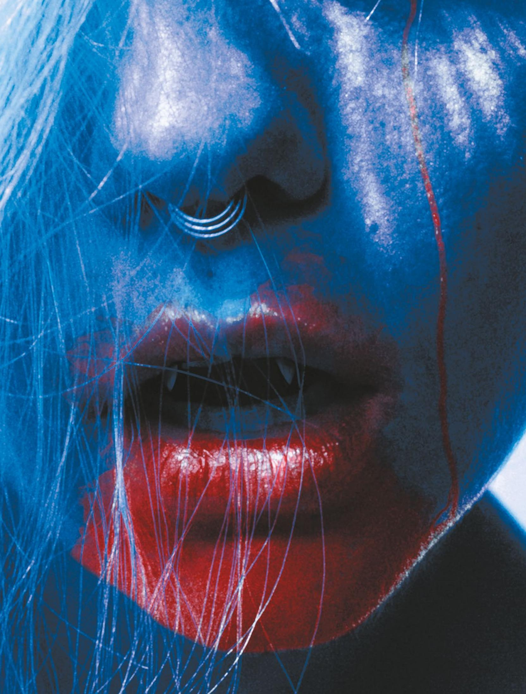

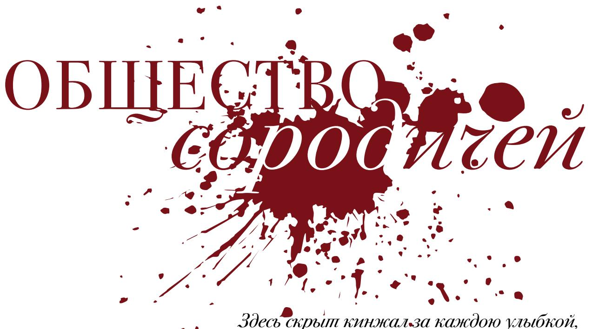

*Здесь скрыт кинжал за каждою улыбкой, И чем родней по крови человек, Тем кровожаднее.*

> **УИЛЬЯМ ШЕКСПИР, «***МАКБЕТ***»**  *(ПЕР. Б. ПАСТЕРНАКА)*

## История вампиров с древности до наших дней

Каин был земледельцем. Авель — пастухом. Это не ускользнуло от внимания учёных Сородичей, разыскивающих ответ на вопрос о собственном происхождении. Большинство из них считает, что Homo sanguinis1 появились в относительно поздний период истории человечества — около 12 000 лет до н. э. и связывает это событие с развитием сельского хозяйства и расцветом первых цивилизаций — или, если хотите, с концом эпохи охотников и собирателей, с их «изгнанием из райского сада».

Самая смелая гипотеза говорит о том, что Каин был тем скитальцем, что научил людей возделывать землю. Он распространил свою идею по меньшей мере по одиннадцати территориям в разных частях Старого и Нового Света, где, по мнению смертных учёных, практика сельского хозяйства возникла сама собой и независимо друг от друга. Рядом с засеянными полями возникли постоянные поселения, затем города, вместе с городами — налоги, а с налогами — письменность.

1 Прим. пер.: (лат.) — человек кровососущий.

И надо всем этим поднялись первые богоподобные цари и императоры. Большинство учёных-вампиров согласно с тем, что первыми правителями человечества почти всегда становились Сородичи.

Начиная с эпохи предтеч (прародителей проклятых кланов, живших в городе Енохе), сквозь века царствования фараонов Египта, императоров Рима и правителей Великого Зимбабве и до последних дней Тёмных веков вампиры правили миром. Пусть они были разделены на Высшие и Низшие кланы, каждый из них видел себя полноправным хозяином человечества и паразитировал на тех, кого считал ниже себя. Многие паразитируют до сих пор, хотя огонь Инквизиции заставил их изменить методы. Да, история Сородичей насчитывает немало веков. Но даже древнейшим представителям их рода нужно как-то приспосабливаться к современности — ведь живут они здесь и сейчас, во второй декаде XXI века.

За пятьсот лет, минувших со времён Первой инквизиции, вампиры влились в нашу культуру, научились скрываться и прятать истинное лицо под маской человечности. Чтобы и дальше жить среди людей, Сородичам нужно было убедить нас в том, что их не существует — и они стали поддерживать развитие науки

и рационализма, спонсируя Ньютонов и Декартов в своих доменах. С точки зрения рационалиста, существование вампира — абсурд. Зарождение капитализма также сыграло им на руку, хотя и свободную торговлю, и коммунизм придумали люди. Эти две системы помогли Сородичам вернуть своё положение — из тёмных феодальных властителей они превратились в тайных денежных магнатов, бенефициаров торговли опиумом, руководителей политбюро и надзирателей ГУЛАГа. Они добились успеха в самых разных областях: в работорговле, на фондовой бирже, в индустриях моды и музыки, в сфере онлайн-продаж, в гонке «зелёной энергетики» и т. д. и т. п. Как вид вампиры на удивление хорошо приспосабливаются, хотя отдельные индивидуумы и склонны к косности взглядов.

Умы самых старых Сородичей застыли во времени, их взгляды давно уже стали анахронизмом, эти каиниты не способны постичь, чем смартфон лучше типографского пресса. При этом им приходится сражаться с противниками, которые используют спутники, чтобы следить за ними, и «умные бомбы», чтобы уничтожать.

В свою очередь, самые молодые вампиры шифруются в социальных сетях и слушают Андерса Трентемёллера через Spotify. Они ненавидят собственную историю и тиранию старейшин, но им приходится мириться с системой управления, которую некоторые считали архаичной уже 500 лет назад, когда её только ввели. Они должны как-то сосуществовать со всеми этими монгольскими военачальниками и ветеранами Семилетней войны, которые почему-то считают себя умнее и опытнее.

Похоже, независимо от того, как быстро Сородичи приспосабливаются к технологическому прогрессу, они всегда будут одной ногой в прошлом. Борьба между молодыми и старыми вампирами, не желающими или неспособными уладить свои разногласия, порождает фундаментальный раскол в обществе Сородичей, на текущий момент наиболее ярко выраженный в конфликте между Камарильей и Движением анархов. Это противостояние называют Войной Эпох.

## Извечная борьба

Сородичи любят власть. Им нравится, когда у них в руках контрольный пакет акций, когда наркобарон обязан им жизнью, когда юные дарования благодарны им за покровительство, а восстания поднимаются по их воле. Возможно, властью над смертными они пытаются компенсировать бессилие перед собственной природой. Они стали рабами пристрастия, от которого

нет исцеления. И неважно, насколько ты силён, вероятность оказаться слугой или добычей более древнего Сородича существует всегда.

Извечная борьба — это конфликт отцов и детей, который не может разрешиться тысячелетиями. Бесконечное противостояние между поколениями древних, чьё Становление произошло десятки веков назад и чьи потомки вынуждены участвовать в междоусобице, начатой предками. Подпитанная личными вендеттами и утопическими мечтами Извечная борьба — это кисть, пишущая полотно истории Сородичей. Юные и наивные каиниты становятся пешками древних в политической игре, оставляющей свои следы — а порой и шрамы — в смертном мире.

Со времён Первого города Извечная борьба не раз и не два меняла мир в кровопролитных битвах. Причиной разрушения Еноха стала, скорее всего, война четвёртого и пятого поколений с предтечами, которые, в свою очередь, сражались между собой. Пунические войны разразились в смертном мире, когда старейшины кланов Вентру и Малкавиан в обличиях римских патрициев столкнулись с мечтателями-утопистами под предводительством африканской бруха Троиль. В тех войнах мечта была втоптана в пыль. Великому бунтарскому замыслу — открыто жить среди смертных — не суждено было сбыться. Ни тогда, ни когда-либо ещё. Снова и снова эту мечту низвергали её противники или сама она рушилась под тяжестью собственной невоплотимости. Каинитская ересь и Высшие кланы из Иль-де-Франс спровоцировали ужасы Альбигойского крестового похода. Сородичи собственноручно раздували огонь Инквизиции, который практически выжег проклятие Каина с лица земли. А причиной падения Константинополя в лихорадке Четвёртого крестового похода послужил кровавый водоворот, порождённый актом диаблери, совершённым над «Архангелом» Михаилом, и положивший конец мечте о Византийском триумвирате.

Последние ночи Тёмных веков и Война Принцев совпали с появлением великих фракций, выкованных в огне восстаний и крови предательств, уничтоживших старое деление на Высшие и Низшие кланы и в очередной раз столкнувших в схватке сиров и их потомство. Основание культа смерти Шабаша и диаблери по меньшей мере двоих предтеч возвестило о наступлении новой эры. Но даже после того, как Сородичи Камарильи на Терновом соборе приняли решение впредь прятаться от смертных, чтобы избежать их гнева, Извечная борьба всё равно продолжалась. Свержение любого старого режима — отличное прикрытие, чтобы собрать

кровавую жатву, так что и Французскую, и Октябрьскую революции молодые вампиры с успехом использовали, чтобы расправиться со своими благородными старейшинами. И в тёмной современности, в эпоху постмодернизма, неоновых огней и видеонаблюдения мафусаилы вроде Елены и Менеле всё ещё враждуют между собой, хотя Троя давно уже обратилась в прах, а память о ней живёт лишь в легендах.

Каждый Сородич тешит себя тем, что знает своё место на поле боя Извечной борьбы, но это не всегда так. Когда в хаосе Арабской Весны принц Каира вынашивает планы избавления города от безбожных Анархов, на самом деле он выполняет волю мафусаила, обитающего в катакомбах под Турином. Реальность погребена под толщей политических интриг, но ситуация, похоже, всё-таки движется к развязке — Шабаш взвыл о Геенне, Анархи снова взялись за оружие, а все, кто старше восьмого поколения, уходят на Зов, возвращаясь туда, где всё когда-то началось.

Тем старейшинам, что до сих пор остаются в своих убежищах, приходится напиваться кровью птенцов, только чтобы сохранить рассудок и не поддаться Зову. Прогрессирующая паранойя заставляет их уходить в изоляцию, оставив свои домены под управлением неопытных неонатов. «Котерии наместников» расплодились повсеместно — в их руках «феоды» и «районы», где они чувствуют себя полноправными хозяевами, пока их бывшие владыки сражаются на Ближнем Востоке или вопят в безумии, стараясь отогнать видения, посланные им Кровью. Многие из «заместителей» вовсе не собираются расставаться с обретённой властью, когда вернутся старейшины. Апокалипсис, говорите? Что ж, для кого-то апокалипсис, а для кого-то — начало новой жизни.

Впрочем, не стоит забывать: каиниты бессмертны. Так почему бы их апокалипсису не длиться целую вечность? Если это вообще апокалипсис. Освобождённые вампиры качают головой, утверждая, что весь кровавый цирк Извечной борьбы — не более чем манипуляция историей и личные вендетты, загримированные под судьбу и исполнение пророчеств. Для них древние — это просто зарвавшиеся Сородичи, у которых слишком много власти, обид и, самое главное, свободного времени.

## Камарилья

Камарилья — самая влиятельная организация в истории Сородичей. Основная её цель — насаждать и поддерживать Маскарад, то есть искусно сотканную завесу, скрывающую существование Сородичей от простых смертных. Однако возможности Камарильи куда шире. Это одновременно и оплот власти старейшин, и тайная организация, манипулирующая мировой политикой и экономикой, и некое подобие системы государственного управления, и международный союз городов, чем-то похожий на ООН. В центре организации стоит

> Внутренний Круг, правящий с помощью Юстициаров и Архонтов, путешествующих между городами, чтобы «хранить мир», и подчиняющихся только своим безымянным господам. Когда речь заходит об искушениях, что посылает им Зверь, члены Камарильи придерживаются строгих моральных принципов: сохранять Человечность они считают необходимым. Себя они видят пастухами слепого человеческого стада — нравственно превосходящими своих подданных-однодневок, но в то же время способными чему-то у них научиться.

Члены Камарильи — это в основном представители высшего класса. Причины тому две: во-первых, возраст, могущество и богатство отдельных чле-

нов фракции сами по себе выгодны организации, во-вторых, из рядов Камарильи недавно было исключено подавляющее большинство анархов, а значит, и весь средний и низший класс. Вампир Камарильи это чудовище в дорогом костюме или вечернем платье, с тщательно сформированным портфелем ценных бумаг, а его убежище защищает гарнизон гулей в униформе частной охранной организации. Они — избранные среди избранных, но этого им всё равно мало. Благодаря марионеткам в Конгрессе и в банковской системе они заключают самые выгодные сделки и продвигают самые удобные для себя законы. Они настоящие мастера дезинформации, пропаганды и шантажа и прекрасно умеют заметать следы. В тёмной современности это умение востребовано как никогда. Камарилья не остановится ни перед чем, чтобы защитить свои секреты — ради этого её члены с одинаковой лёгкостью способны как сломать жизнь смертному, так и погубить Сородича.

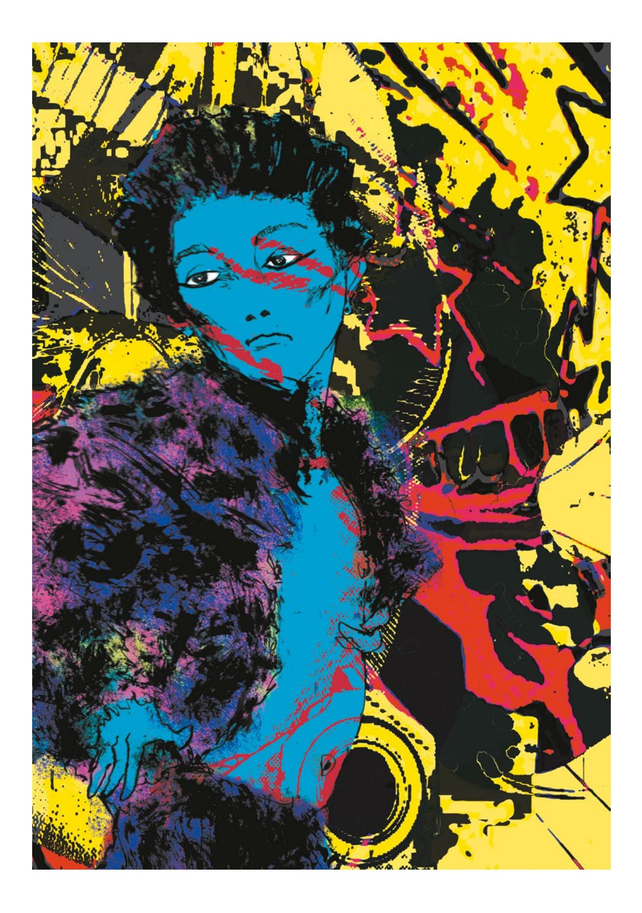

Большинство вампиров Камарильи считают Каина мифом, олицетворением своего проклятья, а не реальной исторической личностью. При этом многие из них в попытках найти «смысл нежизни» до сих пор как за соломинку цепляются за веру — христианскую, иудейскую или мусульманскую. Аширра, аналог Камарильи на Ближнем Востоке, в борьбе против разрушительного влияния Крови целиком и полностью полагается на учение ислама. Тем не менее почитание предков — довольно распространённое явление в Камарилье, к которому многие относятся с одобрением. Легендарные мафусаилы вроде Дракона и Митры выступают в данном случае в роли святых. Некоторые кланы поклоняются своим предтечам, считая их воплощением идеала собственной линии крови.

В одних городах Камарильи придворные собрания со стороны похожи на солидные заседания совета директоров. В других — на бурные сходки гангстеров. На самом же деле в этой фракции царит строгая феодальная система управления. Иерархия соблюдается безоговорочно. На самой её вершине стоит Принц вампир достаточно могущественный или достаточно хитрый, чтобы заставить остальных признать его абсолютную власть в домене. Ступенькой ниже — Совет Примогенов, представители наиболее крупных группировок в городе. Это могут быть старейшины кланов или просто наиболее влиятельные вампиры — так или иначе, все они имеют право говорить с Принцем без посредников и давать ему советы, которые тому вряд ли стоит игнорировать. В конце концов, не так уж редко правителей свергают их собственные советники. Порой Принцы также выбирают себе Сенешаля — наиболее приближённого советника, иногда также выступающего в роли заместителя на время отсутствия главы домена.

Когда возникает необходимость, двор собирается в тайном убежище, известном как Элизиум. Сородичи используют тысячи разных уловок, чтобы обеспечить безопасность этого места и не допустить утечки информации — вплоть до того, чтобы каждый раз менять местоположение Элизиума. Здесь под чутким присмотром Хранителя и его Глашатаев, известных как Гарпии, проходят пиршества, различные церемонии, переговоры, а порой и жаркие дебаты. Сегодня Элизиум может расположиться в затемнённых покоях элитного фетиш-клуба, завтра — в заброшенном ядерном бункере, послезавтра — среди скульптур Бранкузи в Музее Гуггенхайма.

Современные представления о законности и надлежащих правовых процедурах чужды Камарилье. Порядок в домене поддерживает Шериф (в зависимости от региона его могут называть как-то иначе, например жандармом или констеблем), но это скорее палач, чем полицейский. Если тебя бросили к ногам Совета, дав возможность умолять о пощаде, а не приковали цепями дожидаться рассвета под открытым небом, можешь считать, что тебе повезло.

#### **Шесть Традиций**

Шесть Традиций лежат в основе всех законов Сородичей. Их интерпретации порой сильно отличаются в разных доменах. Принцы или советники могут следить за исполнением одних Традиций более ревностно, чем других. Тем не менее можно с уверенностью утверждать, что любой вампир, принятый в Камарилью, осведомлён об этих древних правилах. А даже если по какой-то причине они ему неизвестны, это не освобождает его от обязанности им следовать.

#### **ПЕРВАЯ ТРАДИЦИЯ. МАСКАРАД**

*Да будет род твой сокрыт от всякого, кто не Сородич тебе. Поправший завет сей да будет отринут от Крови своей.*

Маскарад — единственная из Традиций, с которой согласны все Сородичи, и в то же время именно её нарушают чаще всего. Причины могут быть разные: один не заметил случайного свидетеля во время охоты, другой поддался искушению продемонстрировать жалким смертным свою мощь, третий открыл правду близкому человеку. Как бы там ни было, нарушивший Маскарад должен как можно скорее разобраться с последствиями, иначе его ждёт жестокая расплата. Характерный для криминальных кругов принцип «доносчику первый кнут» даже близко не способен передать, насколько ревностно Камарилья и Анархи относятся к следованию этой Традиции. В эпоху ютубовских приколов, кликбейта и фальшивых новостей привлечь внимание широких масс не так-то просто, но секретные службы всё время наготове, и любой прокол может закончиться внезапным появлением оперативной команды на пороге убежища. Только самые безумные из сторонников теории превосходства каинитов мечтают о наступлении эпохи открытого господства вампиров над смертными; остальные смирились с реальностью: место серого кардинала за троном подходит Сородичу куда лучше, чем корона величайшего из хищников или скипетр адского владыки.

#### **ВТОРАЯ ТРАДИЦИЯ. ДОМЕН**

*Да пребудет домен твой в полной власти твоей. Всякий, кто войдёт во владения твои, да признает тебя владыкой их и да поступит по слову твоему.*

Доменом Принца считается весь город, но тем, кто хорошо ему служит, он может даровать привилегии править от его имени в отдельных районах или кварталах. В результате формируется сложная система подданства, основанная на ленных владениях, наподобие феодальной системы позднего Средневековья. Чтобы найти дорогу в лабиринте ночного города, необходимо знать, где располагаются границы владений, а также стоит помнить имена тех, кто имеет право распоряжаться ими.

#### **ТРЕТЬЯ ТРАДИЦИЯ. ПОТОМСТВО**

*Да получит Становление дитя твоё лишь по слову Старейшины твоего. Поправший завет сей да будет умерщвлён вместе с потомством своим.*

Перенаселение очень быстро становится серьёзной угрозой для Маскарада. И лучшее из того, что до сих пор было придумано, — это обязать вампиров спрашивать разрешения у Принца, когда они хотят обзавестись потомством. Большинство Сородичей мечтает о спутнике одной с ним Крови, но осуществить эту мечту они могут только с чужого дозволения. Право дать Становление это желанная награда и действенный рычаг давления.

Число Сородичей некогда колебалось где-то в пределах 1 на 100 000 смертных, но кто может сказать, сколько их на самом деле рыщет сегодня в ночи? Некоторые города (например, Лондон) опустели после чисток Второй инквизиции, а в других слабокровных вампиров развелось, как тараканов.

#### **ЧЕТВЁРТАЯ ТРАДИЦИЯ. ОТВЕТСТВЕННОСТЬ**

*Да будет дитя твоё воспитанником твоим. Да будет сир владыкою дитя своего и да примет он на себя грехи его, покуда дитя не познает места своего.*

В эти ночи, чтобы быть по-настоящему принятым в Камарилье, нужно в первую очередь пройти инициацию. Если дитя оказывается недостойным того, чтобы стать частью элиты, его могут просто убить или (если «повезёт») вышвырнуть к анархам, чтобы преследовать и топтать ногами, как и всех прочих «освобождённых» вампиров. Сир несёт полную ответственность за отпрыска, принятого в Камарилье, но сбежавшего от своего деспотичного создателя: «блудного сына» необходимо найти как можно быстрее. И наказать.

#### **ПЯТАЯ ТРАДИЦИЯ. ГОСТЕПРИИМСТВО**

*Чти домен Сородича своего. Да предстанет пред ликом правителя всякий, кто явится в город его. Без слова его не быть тебе гостем его.*

В эру шпионских игр и доменов, изолированных друг от друга, существует два противоположных подхода к соблюдению этой Традиции. Уследить за тем, кто прибывает в твой город, задача почти непосильная, учитывая растущее количество беженцев и «граждан мира», поэтому многие Принцы активно поддерживают антимиграционную политику, строят стены вокруг своих доменов или внедряют своих слуг в таможенные службы. В конце концов Принцы либо бросают тщетные попытки держать под контролем вампирское население своего домена, либо соглашаются с необходимостью драконовских мер, привлекая к этому политику смертных.

#### **ШЕСТАЯ ТРАДИЦИЯ. УМЕРЩВЛЕНИЕ**

*Да не погибнет от руки твоей Сородич твой. Да пребудет жизнь и смерть его в руках Старейшин твоих. Да начнётся кровавая охота по слову их.*

Кровавая охота — самое страшное наказание в обществе вампиров. В обычных обстоятельствах умерщвление другого Сородича — смертный грех, но *Лекс Талионис,* или закон возмездия, снимает этот запрет. Любой имеет право выследить и убить провинившегося. К кровавой охоте могут присоединиться даже слабокровки, анархи и независимые, и никто не ограничивает участников в методах. Если вершитель правосудия выпил преступника досуха, забрав себе часть его силы, — то есть совершил чудовищный акт диаблери — значит, так тому и быть. Участие в кровавой охоте — отличный способ заработать хорошую репутацию в Камарилье, так что анархи, как правило, неодобрительно относятся к этому мероприятию.

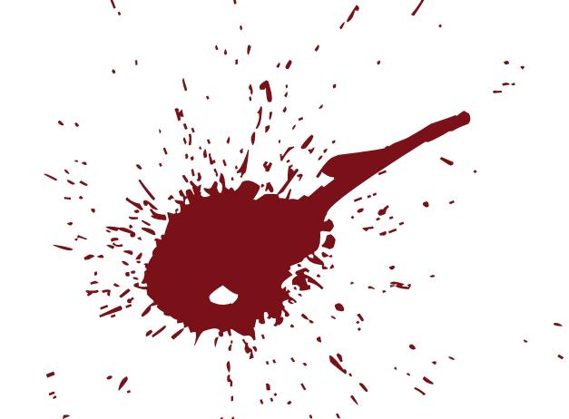

# *Сородичи* и мода

**Чёрный цвет всегда в моде. Всё просто: охота — дело грязное, а на тёмном пятна крови не так хорошо видны. Именно поэтому законодатели моды из числа тореадоров каждый год возвращаются к чёрному. Это, в свою очередь, превращает светлую одежду, в особенности белую, в признак особого статуса. Бруха в белом спортивном костюме как бы говорит всем: «Я настолько крут, что не пролью ни капли». Тем не менее носить светлое рискованно, и многие Сородичи считают это бессмысленным позёрством независимо от того, насколько они аккуратны во время охоты.**

**Мода — это тайный язык. Сородичи, как и смертные, прибегают к нему, чтобы обозначить свою позицию, заявить о принадлежности к той или иной группе или о приверженности определённой идеологии. Его с одинаковым успехом используют как в Элизиумах, так и на городских улицах. Платье с розами — это громкое заявление: «Я — дива!», ясное всем, кто посвящён в иконографию кланов; а наряд, сделанный из мусора и лохмотьев, говорит о принадлежности к Носферату — или, возможно, к Малкавианам. Сородич, который носит в обществе смертных пиджак или пуловер в эдвардианском стиле, намекает на свой возраст, а вампирша, надевшая в Элизиум платье, бережно хранимое с 1905 года, откровенно говорит каждому неонату: «Прояви уважение к старшим».**

**Мода Элизиума может существенно отличаться от повседневной. В обществе людей вампир должен подчиняться строгим правилам Маскарада: выглядеть словно средневековый аристократ — не лучшая идея. Вампир — это охотник. Для него важнее всего скрытность. Он должен уметь раствориться в своём окружении. У большинства Сородичей есть определённый образ, которого они придерживаются среди смертных, и у каждого есть свои охотничьи привычки. От этого и зависит, как вампир одевается, выходя на улицу. Морфей-домушник, скорее всего, наденет кроссовки и чёрный спортивный костюм с капюшоном, а его товарищ, также предпочитающий пить из спящих, но в психиатрической больнице, оденется как санитар. Сайкобилли-тусовщик тратит каждый вечер уйму вре-** **мени на укладку «помпадур» и татуировки, а его хищные собратья среди фанатов минимал-техно втайне мечтают о простых футболках безо всяких затей и видят днями кошмары о том, как их не пустили в «Бергхайн». Лишь немногие Сородичи — из тех, кто до сих пор предпочитает охотиться на готов, — одеваются на публике «по-вампирски».**

**Другое дело — Элизиум или персональное убежище, где Сородичи могут без опасений выставить напоказ свой возраст и чудовищную натуру. В Элизиумах действуют сложные неофеодальные порядки, и Гарпии здесь могут расхаживать среди гостей как в пышных платьях елизаветинской эпохи, так и в безумных нарядах «от-кутюр», которым позавидовала бы сама Леди Гага. Когда вампиры общаются между собой, одеяние становится признаком статуса. Попасть прямо с улицы в убежище старейшины — сам по себе опыт не из приятных, но ты куда острее ощутишь собственное ничтожество, если тебе, в чёрных джинсах и футболке, придётся преклонить колени перед древним монстром, облачённым в белоснежную мантию из человеческой кожи.**

**Анархи, как правило, считают, что склонность к эпатажу свойственна лишь Камарилье, и презирают вычурность. Они тщательно берегут принятое когда-то человеческое обличье, отразившее их судьбу и естество, веками остаются верны одному образу, постепенно адаптируя его к современности. Так, ландскнехт XVI века, меняясь десятилетие за десятилетием, становится развязным уличным хип-хопером в мешковатой одежде, с «гравюрными» татуировками и подвеской «memento mori» среди прочих побрякушек. Лётная куртка времён Второй мировой — намёк на одного небезызвестного таксиста-неудачника со сложной судьбой, а клёпаная жилетка в стиле краст-панка — напоминание о прошлом монгольского военачальника-гангрела. Впрочем, большинство носит совершенно обычную уличную одежду — лишь какая-то мелкая деталь их стиля, заметная только тому, кто знает, что искать, намекает на их истинную природу.**

#### **иКоноГРаФиЯ**

**осколки зеркала на месте преступления. Стилизованный египетский крест на книжном переплёте. искажённая страданием трагическая маска, намалёванная на палатке в Скид‑Роу. Татуировка у байкера на затылке в виде перевёрнутого символа анархии с разорванной посередине «а». или это просто два меча в круге?**

**У каждой субкультуры и каждого тайного общества есть символика и язык знаков, эволюционирующий со временем. Сородичи не исключение. Знаки предтеч изображали угловатой клинописью на глиняных черепках, рисовали в альбомах безумные девы из Штирии, чертили на пустых табличках, отмечавших места на пирах безымянных конклавов. Геральдика кланов и фракций, появившаяся ещё на заре времён, эволюционировала под влиянием местных традиций и личных представлений отдельных Сородичей. Существует множество вариаций тех или иных символов, но фундаментальные мотивы и образы, вокруг которых они сформировались, столь же древние, как дети Каина. Благородные Дивы Позднего Средневековья всегда изображали розу на своих гербах (тогда их не называли тореадорами — это имя клан приобрёл только после 1875 года, когда свет увидела «Кармен» жоржа Бизе). Вентру, царствовавшие некогда в Британии, и в самом деле носили скипетры. а маски стали ассоциироваться с чудовищами задолго до появления древнегреческой трагедии.**

**новые эмблемы кланов и фракций, представленные в этой книге, отнюдь не творение какого‑то прославленного бренд‑дизайнера Сородичей, обязательное для всеобщего и повсеместного использования. Как, впрочем, и старые. однако предложенные варианты хороши тем, что отражают изменения, произошедшие в вампирском обществе за последние десятилетия. Вентру XXI века нередко добавляют изображение меча к привычному скипетру, заявляя, что Клан Королей находится в состоянии войны с анархами и Второй инквизицией. Символ клана Тремер после падения Пирамиды перешёл на новый уровень сложности, а зеркало Малкавиан теперь смотрит на них в ответ. на самом деле обитатели Мира Тьмы редко используют все эти изображения именно в том виде, в каком вы найдёте их в книге.**

**один тореадор может носить диадему из роз, другой — украшать облачение свежими лепестками, третий — прикрепить к лацкану викторианскую брошь в виде розы на длинном стебле, а четвёртый сделать пирсинг в виде цветка шиповника на коротком изогнутом черенке. Старые эмблемы никто не отменял. Сородичи продолжают носить наколки, набитые в начале 90‑х, с той же гордостью, что и вампиры, сделавшие себе тату по новым эскизам буквально вчера. Во время игры в качестве символа клана удобнее всего использовать некую абстракцию, а не конкретное изображение. Так гораздо проще будет обнаружить завуалированные отсылки на обложках альбомов панк‑групп, на картинах эпохи Ренессанса или в работах мастеров радикального стрит‑арта — все те следы кровавых поцелуев, которые наши бессмертные хозяева оставляют на полотне истории искусства.**

#### **Движение анархов**

**Протесты против Камарильи вспыхнули тогда же, когда сформировалась сама фракция. Исторически движение называлось Восстанием анархов. За последние десятилетия Движение значительно разрослось, поскольку молодые Сородичи не могут взять в толк, с какой стати они должны подчиняться диктатуре старейшин, если те с радостью готовы толкнуть их в объятия Второй инквизиции ради собственного спасения.**

**Всех вампиров, не входящих в Камарилью, называют освобождёнными. Движение анархов во всём разнообразии своих проявлений собрало под своими знамёнами лишь часть освобождённых — впрочем, это самое крупное и значимое их объединение. Многие из тех, кто хочет избавиться от хомута Камарильи, пытаются просто спрятаться, но примкнувших к Движению анархов не устраивает такая участь. Они хотят дать отпор Камарилье, захватить её домены, подчинить себе территории бывших хозяев. А почему нет? Зов увлекает всё больше старейшин на Ближний Восток, а Вторая инквизиция уничтожает Принцев и Примогенов по всему миру. Число старейшин сокращается, а количество молодых амбициозных упырей в рядах Анархов с каждым годом только растёт.**

**На улицах всё чаще можно услышать призыв к революции. Время для компромиссов прошло. Никаких больше политических махинаций, никаких сделок с Камарильей. Движение анархов наконец-то очнулось от многовекового летаргического сна, в котором оно пребывало со времён Тернового собора и образования Шабаша. Эпоха бездействия подошла к кон-** **охотничьим уделом назначают складской район, сира казнят после невнятного обвинения в нарушении законов Камарильи, а в завершение всего Шериф убивает его смертную мать, поскольку та была «угрозой для Маскарада».**

**Политическая ситуация в городах Анархов бывает разной. Где-то правитель один — его называют Бароном. Впрочем, гораздо чаще в городе заправляет несколько банд, делящих территорию между собой. Иногда анархи соседствуют с Камарильей — и каждая сторона мечтает захватить контроль.**

**Камарилья ставит себя над человеческим обществом, анархи же предпочитают оставаться в самом его сердце. Многие сохраняют свою смертную личность, у некоторых есть даже семья и работа. Это делает их более уязвимыми, но в то же время и более защищёнными. С одной стороны, они постоянно контактируют с людьми, а значит, вероятность того, что кто-то заподозрит неладное, гораздо выше. С другой стороны, анарх — это не классический вампир в таинственном особняке на вершине холма. Он не привлекает к себе внимания: это ди-джей из ночного клуба, или наводящий ужас на сослуживцев коп из Управления внутренних расследований, или наркоман из подворотни рядом с твоим домом.**

**Запах победы — вот что толкает анархов в бой в эти ночи. Впервые за века они почувствовали, что власть Принцев и впрямь пошатнулась. Если старые порядки можно сломить в Берлине — их можно сломить где угодно!**

**цу. Камарилья спровоцировала появление Второй инквизиции, что многие расценили как предательство, и анархи взялись за оружие.**

**Причины недовольства анархов довольно очевидны. Многие принцы Камарильи пытаются выдать себя за просвещённых и справедливых правителей, которые в своём великодушии пекутся о благополучии каждого Сородича. Но будущие анархи на собственном опыте узнают, что это, мягко говоря, не совсем так. Разглагольствования о благе подданных превращаются для неоната в пустой звук, после того как его** 

## Автархи

Даже в таких городах, как Париж, где всем заправляет Камарилья, многие вампиры остаются освобождёнными и предпочитают скрываться от своих собратьев. Они либо настолько древние, что разделение на фракции кажется им не более чем преходящим увлечением, либо достаточно молоды, чтобы до сих пор сохранять отношения с людьми, которые были близки им при жизни, и держаться за свои старые принципы. Все они самостоятельны и не подчиняются чужому авторитету. Таких вампиров и называют *автархами*.

Все попытки Камарильи утвердить в Ереване, столице Армении, власть Принца или Совета Примогенов заканчиваются палисандровой шкатулкой с пеплом, отправленной «до востребования» в одно из почтовых отделений Тбилиси. В Нью-Йорке около пятидесяти Сородичей просто-напросто отказываются принимать чью-либо сторону, ссылаясь на некую ужасную ошибку, совершённую на острове Эллис. Они предпочитают защищать интересы собственных линий крови и этнических общин. Камарилья — отнюдь не единственная сила, способная обеспечить порядок. Традиции, некогда объявленные в Камарилье законом, в том или ином виде существовали задолго до Тернового собора. Даже далёкие от политики автархи, предпочитающие оставаться в тени, придерживаются этих обычаев — хотя бы отчасти. Попробуй явиться в Маленькую Одессу и не посетить в первую очередь бани на Брайтон-Бич-авеню, чтобы засвидетельствовать почтение перед Юрги, поцеловав его кольцо.

Подводя итог, можно сказать: далеко не каждым доменом правит Принц Камарильи или Барон анархов. В одном городе территорию будет контролировать клан, в другом — группа таинственных фигур, чьих лиц никто никогда не видел, в третьем правителя может не быть вовсе, а в четвёртом на троне окажется ревенант, пляшущий под дудку своего хозяина. И так далее. Целеустремлённый Сородич сумеет проложить себе дорогу самостоятельно — среди нелегалов полным-полно сильных личностей, не заинтересованных ни в навязанных кем-то законах, ни в ежемесячных собраниях в Элизиуме. Когда мир сотрясают перемены, всегда есть вероятность встретить существо, о котором ты ничего не знаешь и которое придерживается каких-то своих неведомых правил. Автархи и освобождённые своим существованием напоминают нам, что Сородичи — не народ, не армия и не религиозный культ. Они в первую очередь чудовища-одиночки.

## Перемены

Всего через несколько лет после объявления «войны с терроризмом» Камарилья оказалась в критической ситуации. Тысячи Сородичей попали в контрольные списки, составленные Министерством внутренней безопасности США (такие, например, как NSEERS — «Система регистрации въезда-выезда для обеспечения национальной безопасности»). В 2007 году, сразу после принятия «Закона о защите Америки» и старта секретного проекта PRISM, тайная служба Ватикана («Священный альянс»), ЦРУ и АНБ начали крупномасштабное совместное наступление, истинные цели которого не разглашались. В результате за каких-то три месяца благодаря мощи крупнейших антитеррористических агентств на планете было уничтожено более тысячи Сородичей.

По версии СМИ, большая часть операций окончилась без жертв — широкой публике, как правило, сообщали об «арестах». В отдельных случаях серьёзные столкновения выдавали за бандитские разборки, а самые кровавые списывали на деятельность исламских террористов. Уничтожение Верховной Венской капеллы Тремер в 2008 году — совместная операция Ватикана и SOCOM («Командования специальных операций ВС США») — официально объявлено «зверским преступлением террористов» и приписывается Союзу исламского джихада. Проблема не затронула лишь некоторых автархов и Инконну, ведущих наиболее уединённый образ жизни. Для всех остальных игры закончились. Непрекращающееся развитие высоких технологий и повсеместное распространение систем наблюдения сделали своё дело. Камарилья столкнулась с кризисом, равного которому не знала со времён Тернового собора — иными словами, с момента своего образования. Настала эпоха Второй инквизиции.

Чтобы преодолеть кризис, Камарилья тут же предпринимает несколько шагов. Первым из них становится «чистка»: старейшие из хакеров Носферату выводят из эксплуатации свои сервера и прекращают деятельность сети ShreckNET («ШрекНет»). Их цель — свести к минимуму сетевое присутствие Сородичей.

В качестве второго шага Камарилья издаёт эдикт, касающийся всех членов фракции: любой Сородич, пойманный на том, что общается с другими Сородичами по Сети, будет объявлен неблагонадёжным и лишён протекции Камарильи. Более того, если его действия приведут к нарушению Маскарада, на него будет объявлена кровавая охота. Этот эдикт стал последним закодированным сообщением, разосланным по всем каналам связи Сородичей. С того момента он передаётся исключительно из уст в уста.

Третьим шагом стал сбор двух всемирных конклавов впервые за столетие. Из-за угрозы Второй инквизиции, затрудняющей путешествия, личное присутствие Принцев и Примогенов было объявлено необязательным — достаточно было доверенного представителя. Один из конклавов состоялся в Чикаго, крупнейшем городе Камарильи в США, другой — в сохранявшей нейтралитет Праге. Пражский конклав едва не закончился междоусобной войной, когда анархи заявили, что в появлении Второй инквизиции виновна верхушка Камарильи, заигравшаяся в кукловодов с федеральными и национальными властями, а Камарилья напомнила, как анархи и все неонаты в целом восторженно бросились покорять Интернет, наплевав на всякую осторожность.

Собрание погрузилось в хаос. И тогда Тео Белл, Архонт Бруха, всегда отличавшийся верностью Камарилье, на глазах у ошеломлённой толпы казнил бывшего господина. Традиции были попраны. Изменения в законах, впрочем, не заставили себя ждать. Анархов изгнали из Камарильи. К ним теперь причислены не только сторонники Движения, но и все слабокровные, каитифы и автархи. Сородичей 14-го поколения и младше перестали принимать в Камарилью.

Хотя сперва казалось, что открытая война неизбежна, анархи согласились с необходимостью Маскарада, хоть это и единственная Традиция, которой они впредь будут придерживаться. Камарилья же объявила «второй Маскарад», предписав членам фракции порвать все связи с непосвящёнными или освобождёнными Сородичами. Установился шаткий мир, но напряжение растёт, и, судя по последним событиям в Берлине и Праге, Война Эпох вот-вот перерастёт из холодной в «горячую». ⬛

**5 7**

**оБщеСТВо СоРоДиЧеЙ**

## Лексикон Проклятых

#### **АВТАРХ (АРХАИЧНОЕ): см.** *освобождённый***.**

**АГНЕЦ (ВУЛЬГАРНОЕ): ироничный термин для обозначения смертного, который добровольно предлагает кровь вампиру в обмен на экстатическое наслаждение от Поцелуя. Некоторые агнцы со временем впадают в зависимость.**

**АМАРА́НТ (АРХАИЧНОЕ): поглощение крови Сородича. См.** *диаблери***.**

**АНЦИ́ЛЛА: вампир, который доказал свою состоятельность; больше, чем неонат, но меньше, чем старейшина.**

**БЕСТИЯ (ВУЛЬГАРНОЕ): вампир, который вынужденно или из порочных побуждений питается витэ других Сородичей.**

**БОМЖ (ВУЛЬГАРНОЕ): вампир, у которого нет постоянного убежища. Нередко такой вампир также является дауншифтером. См.** *вагабонд***.**

**ВАГАБО́НД (АРХАИЧНОЕ): вампир, который питается кровью бродяг и других отбросов общества. См.** *бомж***.**

**ВАКХ: вампир, который предпочитает кровь смертных, находящихся под воздействием алкоголя и других наркотиков, чтобы испытать на себе воздействие этих веществ.**

**ВАССАЛ: вампир, занимающий подчинённое положение в отношениях, выстроенных на узах крови.**

**ВЕ́ГАН: презрительный вариант термина «фермер».**

**ВЕСПЕР: См.** *слабокровный***.**

**ВИГ (АРХАИЧНОЕ): презрительный термин, обозначающий вампира, интересующегося модой и тенденциями мира смертных.**

**ВИТЭ́ (АРХАИЧНОЕ): текущая в жилах вампира Кровь.**

**ВТОРАЯ ИНКВИЗИЦИЯ: собирательное название, которое вампиры дали разнообразным агентствам и разведывательным службам, последнее время активно боровшимся с Сородичами как с террористической угрозой.**  **Немногие агенты понимают, с кем на самом деле им приходится иметь дело, а межведомственная группа под кодовым названием «Первый луч» прилагает все усилия, чтобы её операции оставались в тайне, маскируя их под обычные антитеррористические рейды.**

**ГЕЕ́ННА: предполагаемый апокалипсис, Судная ночь, когда предтечи восстанут ото сна и уничтожат всех вампиров. Вампиры Шабаша уверены, что это время уже наступило, и оставили свои привычные домены, чтобы отправиться на Ближний Восток и сражаться там в последней Войне Геенны.**

**ГОЛКО́НДА: трансцендентное состояние вампирского бытия; полная власть над Зверем и совершенный баланс между плотскими желаниями и моральными принципами. Вампирский аналог нирваны смертных; многие пытались достичь Голконды, но немногим это удалось.**

**ГОЛОД: желание питаться. Для вампира властный зов Голода непреодолим и заглушает все остальные плотские желания.**

**ГУЛЬ: слуга вампира, живой смертный, причастившийся вампирской крови.**

**ДАУНШИФТЕР: ́ вампир, регулярно пьющий кровь бродяг, нищих и прочих асоциальных личностей.**

**ДВИЖЕНИЕ АНАРХОВ: фракция вампиров, которая противостоит тирании старейшин и поэтому покинула ряды Камарильи.**

**ДЕБЮТ: момент получения птенцом статуса неоната и, соответственно, полноправного Сородича. В Камарилье этот процесс формализован — птенец становится неонатом, только получив разрешение сира и одобрение Принца.**

**ДЖЕ́НТРИ (АРХАИЧНОЕ): Сородич, который предпочитает охотиться в ночных клубах, барах и других увеселительных заведениях подобного рода. См.** *папильон***.**

**ДИАБЛЕ́РИ: поглощение крови Сородича вплоть до момента наступления Окончательной смерти. Вампир, совершивший это ужасное злодеяние, может навсегда понизить своё поколение.**

**ДИТЯ: вампир, переживший Становление, потомок своего сира. Этот термин нередко употребляется в уничижительном ключе как синоним крайней неопытности. Множественное число — «потомки».**

**ДОМЕ́Н: сфера влияния отдельного вампира. Доменом Принца является весь город, но многие из них позволяют другим живущим в этом городе Сородичам иметь личные домены.**

**ДОМИТОР: ́ хозяин гуля; вампир, чью кровь получает гуль и приказам которого подчиняется.**

**ДОНОР (ВУЛЬГАРНОЕ): саркастический термин для обозначения смертного. См.** *сосуд***.**

**ЕДИНОКРОВНЫЙ (АРХАИЧНОЕ): термин для обозначения принадлежности к одной ветви вампирского генеалогического древа.**

**ЖИЗНЬ (АРХАИЧНОЕ): эвфемизм для обозначения крови смертных. Многие Сородичи считают этот термин слишком напыщенным и декадентским.**

**ЗВЕРЬ: атавистические позывы и побуждения, потакание которым способно превратить вампира в безумное кровожадное чудовище.**

**ИЗВЕЧНАЯ БОРЬБА: тайное противостояние Сородичей, в котором вампиры старших поколений манипулируют вампирами младших поколений, словно пешками в ужасной игре, правила которой не поддаются пониманию.**

**ИНКВИЗИТОР (АРХАИЧНОЕ): охотник на вампиров.**

**ИНКО́ННУ: фракция вампиров, отрешившихся от общества Сородичей, и в первую очередь от Извечной Борьбы. Считается, что в рядах Инконну состоит множество мафусаилов.**

**ИСКУСИТЕЛЬ (АРХАИЧНОЕ): вампир, который охотится, соблазняя смертных, а когда дарит Поцелуй, старается не причинять им вреда.**

**КАЗАНОВА (ВУЛЬГАРНОЕ): казанова обычно стирает из памяти соблазнённых смертных все воспоминания о себе. См.** *искуситель***.**

**КАИНИ́Т (АРХАИЧНОЕ): вампир, потомок Каина.**

**КАИТИ́Ф: вампир, принадлежащий к неизвестному клану или не принадлежащий ни к одному из кланов вовсе. Каитифы, как правило, — вампиры младших поколений; их Кровь слишком слаба, чтобы хранить наследие конкретного клана.**

**КАМАРИ́ЛЬЯ: фракция Сородичей, посвятивших себя соблюдению Традиций, в первую очередь Маскарада.**

**КАПЕЛЛА: традиционное название убежища клана Тремер в городе; как правило, включает в себя также библиотеку и лабораторию.**

**КЛАН: группа вампиров, объединённых общим наследием, передающимся от сира к потомку. В настоящий момент существует 13 великих кланов, берущих своё начало от легендарных вампиров Третьего поколения.**

*«КНИГА ЗЕМЛИ НОД»***: мифологическая летопись Сородичей.**

**КОРМУШКА (ВУЛЬГАРНОЕ): идеальные охотничьи угодья со множеством баров, ночных клубов, наркопритонов и других заведений, где исчезновения смертного никто не заметит. См.** *папильон***.**

**КОТЕРИ́Я: небольшая группа вампиров, объединённых общей целью или, что бывает реже, преследующих общие интересы.**

**КРЕДИТОВАНИЕ (ВУЛЬГАРНОЕ): практика изъятия крови из хранилищ донорских пунктов и больничных банков крови. «Банковская» кровь питательна, хотя и практически безвкусна. Старшие Сородичи считают кредитование недостойной привычкой и предпочитают охотиться. Сородич, практикующий кредитование, называется** *банкиром***.**

**КРОВАВАЯ ОХОТА: наказание, предусматривающее Окончательную смерть вампира от клыков его собратьев. См.** *Лекс Талионис***.**

**КРОВЬ: сверхъестественная полуразумная субстанция, текущая в жилах вампира; противопоставляется обычной человеческой крови и крови животных. Синоним** *витэ***.**

**ЛАКЕЙ: человек, находящийся в услужении у хозяинавампира. Истоки этого термина восходят к стародавним временам, когда вампиры имели привычку жить в огромных поместьях и замках в окружении множества слуг.**

**ЛЕКС ТАЛИО́НИС (АРХАИЧНОЕ): кодекс Сородичей, предписывающий нести возмездие за совершённые вампиром преступления. Подразумевает шумерский или библейский стиль правосудия — «око за око» и суровое наказание в назидание остальным.**

**ЛИНИЯ КРОВИ: предки вампира. См.** *родословная***.**

**ЛЬЕН (АРХАИЧНОЕ): сговорчивость люда, населяющего домен или охотничьи угодья.**

**ЛЮД: пренебрежительное обозначение смертных. Фраза «от Сородичей до люда» применяется для обозначения всего цивилизованного мира в целом.**

**ЛЮПЕНЫ: ́ оборотни, естественные и смертельные враги вампирского рода. Единственное число — «люпе́ н».**

**МАСКА: личина Сородича, которая нужна ему, чтобы незримо охотиться среди людей.**

**МАСКАРАД: Традиция, согласно которой вампиры должны скрывать своё существование от людей. Маскарад был введён в качестве защитной меры против Инквизиции, уничтожившей в эпоху своего расцвета множество Сородичей.**

**МАФУСАИ́Л: вампир, который прожил тысячу лет; старейшина, который более не принимает участия в жизни Сородичей. По слухам, мафусаилы принадлежат к вампирам Четвёртого и Пятого поколений.**

**МОРФЕЙ (ВУЛЬГАРНОЕ): вампир, который питается кровью спящих.**

**МОТЫЛЁК (ВУЛЬГАРНОЕ): вампир, который вхож в высшее общество смертных и питается кровью самых богатых и знаменитых его представителей.**

**НЕОНА́Т: молодой Сородич, лишь недавно получивший Становление, но более самостоятельный, чем птенец.**

**ОКОНЧАТЕЛЬНАЯ СМЕРТЬ: момент, когда вампир перестаёт существовать, пересекая границу между нежизнью и смертью.**

**ОСВОБОЖДЁННЫЙ: вампир, который остаётся вне общества Сородичей в конкретном городе — добровольно или по причине своего невежества. Члены Камарильи обычно считают всех освобождённых анархами, хотя большая их часть не имеет никакого отношения к Движению.**

**ОТРОДЬЕ: вампир, разум которого полностью поглотил Зверь, раб Крови.**

**ОХОТНИК ЗА ГОЛОВАМИ (ВУЛЬГАРНОЕ): вампир, который охотится на других вампиров и пьёт их кровь. См.** *бестия***.**

**ПАПИЛЬО́Н (АРХАИЧНОЕ): злачный район города, изобилующий увеселительными, игорными, питейными и другими заведениями с дурной репутацией. Самые популярные охотничьи угодья города, где исчезновения смертных обычно списывают на криминогенную обстановку в самом районе.**

**ПАЩЕНОК: ́ (архаичное): устаревший термин для обозначения молодого Сородича; изначально использовался только сиром в отношении собственного потомства.**

**ПЕРЕХОД (ВУЛЬГАРНОЕ): момент, в который индивидуум перестаёт быть смертным и становится Сородичем.**

**ПОКОЛЕНИЕ: количество генеалогических «ступеней», отделяющих Сородича от Каина, мифического Первого вампира.**

**ПОРТИЛЬО́Н (АРХАИЧНОЕ): степень защищённости домена или охотничьих угодий от внешнего вторжения.**

**ПОТОМСТВО: все, кому вампир даровал Становление.**

**ПОЦЕЛУЙ: процесс насыщения кровью, в первую очередь из смертного сосуда. Поцелуй приносит сильнейшее наслаждение обоим участникам процесса.**

**ПРАКСИС (АРХАИЧНОЕ): ́ рамки, ограничивающие широту полномочий Принца; суверенитет Принца в границах своего домена. Этот же термин относится к личным и политическим решениям Принца.**

**ПРЕДТЕ́ЧА: вампир Третьего поколения, один из старейших Сородичей.**

**ПРИНЦ: вампир, который владеет большим населённым доменом, обычно целым городом, и при этом способен защитить свои владения от чужих притязаний. Принцем может называться вампир любого пола. Во владениях анархов титулу Принца соответствует титул Барона.**

**ПРОКЛЯТЫЕ (ВУЛЬГАРНОЕ): потомки Каина; все вампиры.**

**ПСИХОНАВТ (ВУЛЬГАРНОЕ): см.** *вакх***. Для обозначения вампиров, предпочитающих конкретный наркотик,**  **используются производные от названия любимого вещества. Например: травник, алконавт, героинщик и т. п.**

**ПТЕНЕЦ: новорождённый вампир, находящийся под опекой своего сира.**

**ПУСТОШЬ: район города, непригодный для жизни, кладбище, пустующее здание, промзона или заброшенный жилой район.**

**РОДОСЛОВНАЯ: генеалогическая история Крови вампира; сир, сир сира и т. д.**

**СИР: «родитель» вампира, Сородич, который даровал ему Становление.**

**СЛАБОКРОВНЫЙ: вампир 14-го или 15-го поколения (а возможно, и выше), который не подвержен проклятию Каина в той же мере, что другие Сородичи.**

**СОРОДИЧИ: вампирский род вообще или произвольная группа вампиров. В единственном числе обозначает отдельного вампира. Если верить слухам, этот термин зародился где-то между XV и XVI веками, сразу после Великого восстания анархов.**

**СОСУД: источник витэ как средства пропитания или наслаждения, главным образом смертный.**

**СТАНОВЛЕНИЕ: акт превращения смертного в вампира. Для этого вампир должен выпить всю кровь жертвы, а затем напоить её собственной кровью.**

**СТАРЕЙШИНА: вампир, который прожил как минимум двести лет. Старейшины — наиболее активные участники Извечной Борьбы.**

**СЮЗЕРЕН: вампир, главенствующий в отношениях, выстроенных на узах крови.**

**ТЕРРИТОРИЯ (ВУЛЬГАРНОЕ): см.** *домен***.**

**ТРЕТИЙ СМЕРТНЫЙ (АРХАИЧНОЕ): Каин, который был изгнан и стал Первым вампиром.**

**ТУСОВЩИК (ВУЛЬГАРНОЕ): завсегдатай кормушки, в особенности тот, кто посещает её ради охоты.**

**УБЕЖИЩЕ: «дом» вампира, в котором он проводит день, скрываясь от солнечных лучей.**

**УЗЫ КРОВИ: мистическая власть, которую вампир обретает над Сородичем или смертным, трижды испившим его витэ; согласие испить витэ другого вампира считается символическим актом признания его верховенства.**

**УПЫРЬ (ВУЛЬГАРНОЕ): вампир. См.** *Сородич* **или** *каинит***.**

**ФЕРМЕР (ВУЛЬГАРНОЕ): насмешливый термин для обозначения вампира, питающегося кровью животных.**

**ФОБЕТОР (АРХАИЧНОЕ): См.** *морфей***.**

**ФРАКЦИЯ: группа вампиров, объединённых общей идеологией. Две наиболее крупные и влиятельные фракции современных ночей — это Камарилья и Движение анархов.**

**ЧЕЛОВЕЧНОСТЬ (АРХАИЧНОЕ): рамки, придерживаясь которых, Сородич может надеяться сохранить человеческую часть своей природы.**

**ЧЕРНЬ (АРХАИЧНОЕ): большая масса смертных, особенно бедных, бескультурных и необразованных. Чернь воспринимается главным образом как источник пропитания. См.** *люд***.**

**ША́БАШ: фракция вампиров, отвергающих Человечность и принимающих чудовищную часть своей природы. Каиниты Шабаша жестоки и агрессивны и считают, что вампиры должны править людьми, а не прятаться от них.**

**ШАНКР (ВУЛЬГАРНОЕ): вампирский эквивалент Тифозной Мэри; Сородич, который является переносчиком какой-нибудь болезни и заражает ею смертных, кровью которых питается.**

**ШАСС (АРХАИЧНОЕ): размер и качество домена или охотничьих угодий.**

**ЭЛИ́ЗИУМ: место, где вампиры могут встречаться, не опасаясь за свою жизнь. Само здание может быть публичным местом, таким как музей, картинная галерея или клуб, но тот факт, что там собираются вампиры, держится в строжайшей тайне от смертных. Клуб «Бергхайн» — Элизиум анархов. Лувр — Элизиум Камарильи.**

**ЭНЕРГЕТИК: уничижительный термин для обозначения смертных, пригодных только в качестве питания для вампиров.**

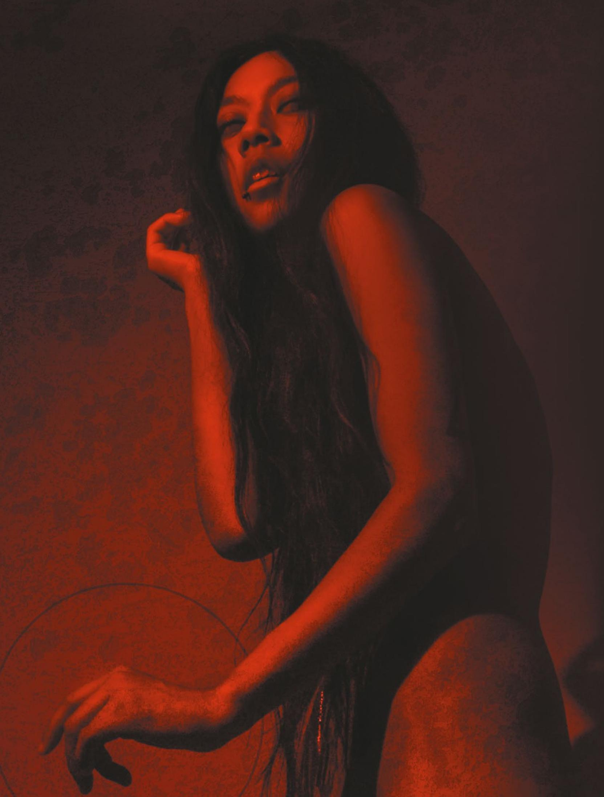

# КЛАНЫ

О, если б знал ты цену Деянию столь злому, Ты гневу бы слепому Свободы не давал. Твоя стезя презренна! Ты ль мало убивал?

ГАЭТАНО ДОНИЦЕТТИ, ОПЕРА «ЛУКРЕЦИЯ БОРДЖИА»

о легенде, Каин породил троих детей, у которых, в свою очередь, тоже было потомство. Третье поколение появилось на свет ещё до Великого потопа - некоторые утверждают, что именно их грехи и вызвали гнев Божий. Пережившие потоп Сородичи, известные как предтечи, стали прародителями кланов, существующих по сей день. Кровь предтеч живёт в их потомках: питает силы, умножает слабости, а порой даже влияет на мировоззрение и поступки Сородичей.

На сегодняшнюю ночь существует 13 кланов и множество малых линий крови. Кроме того, не стоит забывать о каитифах и слабокровных вампирах, отвергнутых более могущественными со-

братьями, гордящимися своей родословной. Из этих тринадцати два клана — Ласомбра и Цимисхов скрывает чёрная тень Шабаша; два других - Джованни и Равнос — пришли в упадок (большая часть их представителей за пределами древних твердынь была уничтожена, и виною тому как смертные враги, так и колдовские силы); ещё два - Бану Хаким и Апостолы Сета - всё никак не решат, погрузиться ли им в Геенну с головой или оставаться под сомнительной защитой Камарильи. Для остальных семи кланов бесконечная ночь Извечной борьбы никогда не прерывалась - как и тысячу лет назад, они вовлечены в неустанную гонку за власть и могущество.

*Просвещённый клан Смутьяны Панки Хипстеры Прометеиды Повстанцы Короли-Философы Эллины*

ечта Просвещённого клана - положить конец всякой несправедливости. Его представители грезят о мире, в котором смертные и Сородичи будут жить в гармонии друг с другом. Из любви к людям подстрекают они рабов бунтовать против своих хозяев. Так, по крайней мере, они говорят. В действительности же слова далеко не всегда переходят в дело: с каким пылом они порой размахивают кулаками, проклиная далёкое, а то и вовсе несуществующее божество! Или ропшут против проклятия, положить конец которому не в силах! Их мечта - это яд, отравляющий всё, чего он коснётся. Устраивая революции, бруха проливают реки крови виной тому их страстная натура и неутихающий голод. Их вмешательство - залог того, что мир никогда не наступит, а невинные так и продолжат гибнуть.

## Какими бывают бруха?

Бруха всегда предпочитали тех, кому близки революционные взгляды как в политике, так и в культуре. Они даруют Становление людям, способным подвергать сомнению общепринятые нормы, и часто ищут союзников среди угнетённых и отверженных, признавая за ними недюжинную силу духа.

По мнению большинства, бруха - это панки, гангстеры и иммигранты, не сумевшие приспособиться к новым условиям, отвергнутые обществом, которое должно было их защищать, а также борцы за справедливость самого разного толка - от простых протестующих с плакатами до сорвиголов с коктейлями Молотова. Аутсайдеры, заявляющие о себе во всеуслы-

шание, действительно составляют значительную часть клана. Однако стремление к бунту может проявляться и по-другому. Служащий, обворовавший собственную компанию; адвокат, бесплатно предоставляющий свои услуги бедным; видеопират, нелегально скачивающий тысячи фильмов, чтобы потом раздавать их из своего подвала через стриминговые сайты, - всё это достойные кандидаты в ряды клана. Подобных птенцов, склонных бунтовать против системы, устраивать акции протеста или погромы, обычно называют смутьянами.

Впрочем, среди бруха есть не только страстные борцы, но и интеллектуалы с развитым критическим мышлением. Это теоретики клана, и они порой очень сильно отличаются от его активных деятелей. При жизни многие из них были студентами факультетов социологии или гендерных исследований. Немало и тех, кто побывал на пороге смерти или пережил какую-то тяжёлую личную потерю, но сумел встать после этого на ноги. Брухафилософы, известные как эллины, считают, что лучший метод борьбы с институтом власти - изучение тех культурных и социальных феноменов, которые его породили.

#### Типажи бруха РАКОВАЯ ОПУХОЛЬ СИСТЕМЫ

Этот Сородич оказался винтиком в прогнившей насквозь системе: возможно, это работник ночной смены в корпорации, известной бесчеловечным отношением к персоналу, или штатный сотрудник коррумпированной политической партии, или один из немногих бруха, оставшихся в Камарилье. Так или иначе, он старается разрушить систему изнутри в надежде, быть

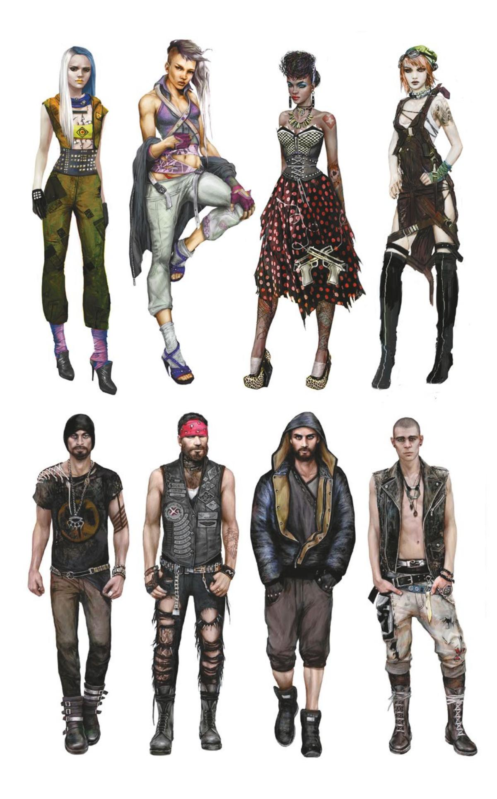

Добро пожаловать в ряды Просвещённого клана, малыш! Зубки уже начали резаться? Твой сир просил отправить тебе пару слов в качестве

Говорят, «бруха» — это по‑испански то ли ведьма, то ли колдун, то ли ещё какая‑то хрень в этом духе. Ну о магии ничего рассказать не могу — зато знаю, что значит быть изгоем. После того как наш клан порвал с Камарильей — не самым, прямо скажем, дипломатичным способом — те немногие, кто остался, всё время под подозрением. Так что в каком‑то смысле у нас с ведьмами есть кое‑что общее: представь, что тебя подозревают в колдовстве, а вокруг сплошь праведные католики, готовые жечь всех направо и налево. Бруха сейчас примерно в таком же положении. Нам не доверяют, нас сторонятся, но в то же время

саморекламы, так что вот.

не больше. Отличает нас кое‑что другое: мы готовы на куски порвать любого, кто посмеет посягнуть на нашу свободу. И мы чертовски упрямы. Никто нас на лопатки не положит. И если кто‑то думает, что ему это удалось,

он жестоко ошибается.

С.

**может, что удастся заменить её на что‑нибудь получше. Впрочем, гораздо вероятнее, что строительство ново‑ го — это последнее, что его заботит.**

#### **ГЛАС НАРОДА**

Бруха всегда ратовали за прогресс в обществе Сородичей. Многие из них при жизни были весьма сознательными людьми — такими же они остались и после смерти. Это феминистки, гринписовцы и антикапиталисты, обличающие вентру и тореадоров своими пламенными речами или разжигающие политические волнения среди смертных. Их гонор может дорого обойтись клану, но именно они порой закладывают основы успешных революционных движений.

#### **СТОРОННИК ТЕОРИИ ПРЕВОСХОДСТВА КРОВИ**

Клан Бруха некогда был в числе Высших кланов. Их уважали, им подчинялись. Некоторые представители клана до сих пор считают, что Кровь, текущая в их жилах, сильнее, чем у других Сородичей, и это даёт им право насаждать свой образ мысли. Бруха, которые придерживаются этой доктрины, в смертной жизни, скорее всего, были сторонниками религиозного фундаментализма и правых политических взглядов или представителями академической элиты.

#### **ТРОЛЛЬ**

Среди активистов-бруха немало тех, кто слепо следует новым веяниям. Они упиваются собственной правотой, не особо задумываясь над подоплёкой того или иного движения. Для них главное — помахать кулаками. Тролль — это скандалист и провокатор, разжигающий конфликты с представителями разного рода меньшинств; это сквоттер, устраивающий нелегальные вечеринки только ради того, чтобы позлить копов; это типичная «феминистка четвёртой волны», которая предпочитает выяснять отношения с другими феминистками и их союзниками, вместо того чтобы заниматься настоящими проблемами гендерной дискриминации. Точечные акции троллей-провокаторов вызывают сильный резонанс в обществе, но далеко не всегда идут на пользу клану Бруха.

#### **ВОЛК В ОВЕЧЬЕЙ ШКУРЕ**

Бруха утверждают, что никакой другой клан не связан с человечеством так тесно, как они. Именно поэтому в них столько пламенной страсти. Для некоторых это не просто слова — они пытаются жить как люди: следят за веяниями современной культуры, поддерживают дружеские отношения со смертными и даже заводят семьи. Расплатой за иллюзию нормальной жизни становится осознание того, сколь велика пропасть между мечтой

и реальностью. Зверя нельзя игнорировать слишком долго — какими бы ужасными ни были его потребности, они должны быть удовлетворены. Рано или поздно волку в овечьей шкуре придётся на время покинуть семейный очаг или дружный рабочий коллектив, чтобы его истинная природа не погубила всё, что он так любит.

## Дисциплины

**ВЕЛИЧИЕ.** Бруха применяют эту Дисциплину, когда нужно завоевать сердца слушателей, обернуть гнев разъярённой толпы против неё самой или обратить в бегство опасного противника. Бруха-интеллигенты предпочитают использовать Величие во время охоты, чтобы убедить сосуд добровольно отдать свою кровь, тогда как другие представители клана с его помощью внушают жертве благоговейный страх, ведь это придаёт напитку «неповторимый привкус дерзости», подпитывающий остальные, более приземлённые их Дисциплины.

**МОЩЬ.** Для бруха это прежде всего грозное оружие возможность одним ударом поставить точку в любом конфликте. Несмотря на то что клан постоянно твердит о своей любви к человечеству, бруха довольно часто силой забирают всё, что им нужно, ведь гораздо проще удерживать добычу, пока пьёшь её кровь, или просто проломить ей череп без лишних церемоний, чем уговаривать поделиться глоточком живительного сока.

**СТРЕМИТЕЛЬНОСТЬ.** Эта Дисциплина делает атаки бруха внезапными, а также помогает вовремя унести ноги прежде, чем беспорядки захлестнут улицы. Во время охоты Стремительность позволяет молниеносно утащить ничего не подозревающую жертву, чтобы по-варварски утолить свой Голод, а потом быстро избавиться от трупа и исчезнуть в ночи. **Дева‑в‑полном‑порядке** <damselinnosidtress@sunburst.us> **Кому: новичок79** <newb79@glamle. cz>

## Изъян

Кровь клана Бруха — это бурлящий котёл. Им едва удаётся сдерживать свою ярость. При малейшей провокации они могут сорваться. Пул воли при попытках сдержать приступ бешеной ярости уменьшается на количество d10, равное тяжести изъяна вампира (при этом пул не может стать меньше 1d10). ⬛ в их обществе мы тёмные лошадки. И когда «свои» по всем законам жанра подбрасывают им свинью — они бегут к «чужим». Те, кого достала несправедливость в доменах Камарильи, ищут спасения среди нас. Одни ждут, что мы всё изменим, другим просто нужно убежище. Но мы не герои. Мы паразиты, как и все Сородичи, и смелости в нас ничуть

*Клан королей Голубая кровь Тираны Диктаторы Патриции Борджиа Культ Митры*

о мнению представителей самого Клана королей, только они в достаточной степени мудры, сдержанны, властны и благородны, чтобы вести Сородичей в ночь. В незапамятные времена они правили Вавилоном, словно боги, в Тёмные века были феодальными владыками, а сейчас они сторонники монархии, крупные акционеры или спонсоры предвыборных кампаний. На протяжении всей истории Вентру ими движет один-единственный импульс - жажда власти. Они собирают десятину драгоценной кровью, чтобы их наследие продолжало жить.

Многие другие кланы оказывают влияние на политику и бизнес, но в игре чистой власти и капитала с Вентру не сравнится никто. Впрочем, в последнее время они начали сдавать позиции - их высокомерные заявления о собственной избранности вызывают всё больше сомнений. Патриции чувствуют, как уходит их время, как утекают сквозь пальцы былые привилегии, - и они сжимают хватку, готовые бороться до последнего за право оставаться во главе всех каинитов.

## Какими бывают вентру?

Клан Вентру с давних пор был одним из лидеров Камарильи. Патриции чаще других кланов занимали правящее положение, и они не намерены сдавать позиции. Даже после того, как самого выдающегося их представителя убили бруха, Вентру по-прежнему заявляют о том, что править Сородичами - их предназначение независимо от того, какие жертвы потребуются.

Вентру верят в силу традиций и родословной. Становление - один из самых важных ритуалов в клане. От того, насколько хорош птенец, зависит репутация сира, поэтому вентру предпочитают давать Становление сверхуспешным смертным, сильнейшим игрокам в бизнесе или политике либо тем, чей исключительный талант выделяется из толпы.

В эти ночи вентру очень осторожны. Недостойных отбраковывают сразу, в то время как лучшие из лучших вливаются в общество людей, не выходя из тени, - это тайные миллионеры, анонимные директора, магнаты-отшельники и неуловимые главы администрации. Вентру больше не могут позво-

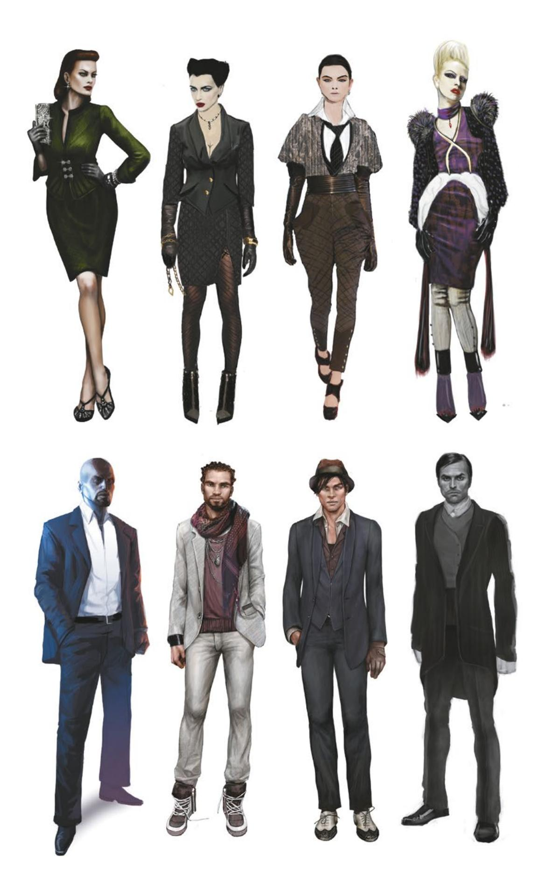

лить себе занимать более-менее видные должности. Их не устраивает, что приходится прятаться и брать на себя роль суфлёров, но они прекрасно понимают: нарушив Маскарад на таком уровне, можно потерять всё.

Вентру — это истеблишмент. Они устанавливают законы и следят за их исполнением, наказывая нарушителей и изредка награждая тех, кто эти законы чтит. Недоброжелатели называют их тиранами и даже тюремщиками. Неудобная правда заключается в том, что без них Маскарад — и Камарилья вместе с ним — давно бы пал. Нынешними ночами Вентру верны себе как никогда. Превратности судьбы сделали их ещё более целеустремлёнными и ещё сильнее уверили их в том, что цель оправдывает любые средства.

#### **Типажи вентру АКУЛА БИЗНЕСА**

Этот Сородич руководит преуспевающей корпорацией. Возможно, он выступает в роли эксцентричного и нелюдимого директора или влиятельного, но молчаливого партнёра, который направляет деятельность фирмы. Этот вентру не станет пачкать руки сам, но мораль для него — пустой звук, если представилась возможность обогнать конкурентов.

#### **ЧЛЕН ТАЙНОГО ОБЩЕСТВА**

Клан королей чувствует себя как дома среди масонов, розенкрейцеров и в других тайных обществах. У этого Сородича отлично подвешен язык. Он неуловимый лидер или другой уважаемый член какого-то собрания, будь то частный мужской клуб, дамский кружок, сооб-

#### Неизвестному будущему отпрыску Фьоренцы Савоны

Если ты это читаешь, значит, прошёл через мою охрану, проник в мой офис, вломился в моё хранилище и подобрал код к моему сейфу. Браво! Ты доказал, что достоин стать полноправным членом Клана королей.

Тебе предстоит понять, что нашему клану судьбой назначено править. Если верить Нодистам, сам Каин выделил нас среди своих детей, назвав сильнейшими и достойнейшими. и достойнейшими. Было это на самом деле или нет — не так важно. Достаточно взглянуть на историю нашего клана с древнейших времён, чтобы убедиться в том, что нам нет равных. Тысячелетиями мы были императорами, королями и королевами — в Спарте и Риме, в землях франков и италийцев, в Великой Британской империи. Мы правили во времена античности, в Средние века и в Новое время. Ну а теперь мы возглавляем всемирные корпорации. Другие ожидают, что мы поведём поведём их вперёд, и мы не отказываем им в руководстве, ибо кто, если не мы?

Мы — первые среди равных. Наши возможности велики, но будь осмотрителен: сокрушая врагов, не забывай о союзниках. Любому, кто встанет у тебя на пути, напомни о том, кто ты, — о твоём клане, о твоём сире, о сире твоего сира и обо всех, кто стоит за ними. Ты не какой‑то там желторотый птенец, которым можно помыкать. Ты — вентру.

> Мы все будем наблюдать за твоими успехами. Стань нашей гордостью. Аноним

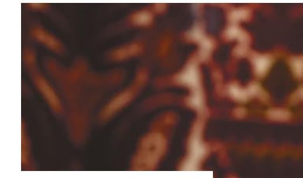

щество выпускников, ставших миллионерами и магнатами, или объединение неравнодушных граждан, которые хотят исподволь оказывать влияние на свой район.

#### **КОНСЕРВАТИВНЫЙ ПОЛИТИК**

Короли всегда были довольно консервативны и предпочитали сохранять статус-кво. Этот Сородич занимается политикой. Он из тех, кто трётся за кулисами партии, неприкосновенный политтехнолог, раздающий советы экспертам и журналистам о том, как лучше подать материал. Он манипулирует СМИ, что позволяет ему с лёгкостью покрывать любое нарушение Маскарада.

#### **КРЁСТНЫЙ ОТЕЦ**

Так называемый крёстный отец контролирует организованную преступность, манипулирует уличными бандами и направляет поток денежных средств, текущий с улиц в карманы банкиров и политиков. Другие вентру, возможно, не одобрят столь сомнительную деятельность, но этот Сородич знает: чтобы добиться результата, порой нужно пролить кровь.

#### **ПЕРВОСВЯЩЕННИК**

Вентру всегда почитали своих предков, будь то мифические Митра, Тиния, Тиамат или исторические личности, не намного отстающие по значимости. Это почитание может выражаться как в интересе к изучению биографии соответствующего деятеля, так и в сугубо религиозном поклонении. Первосвященник видит волю предка во всём, что делает. Он пытается вернуть прошлое, воплотить мечты и цели давно исчезнувшего Сородича, рассказать миру о его величии.

## Дисциплины

**ВЕЛИЧИЕ.** Вентру стремятся к тому, чтобы подданные любили их и уважали, и в этом немаловажную роль играет Величие. Также эту Дисциплину используют, когда надо пустить пыль в глаза, показав другим Сородичам, как легко вентру заполучить наполненный сосуд. Клан высоко ценит своё время, и Величие позволяет голодному патрицию удовлетворять свои нужды быстро и эффективно.

**ДОМИНИРОВАНИЕ.** Вентру считают себя истинными мастерами этой Дисциплины, используя её для подчинения собственных подданных и люда. Во время охоты вентру может приказать смертному подставить горло, а затем стереть жертве воспоминания о встрече с вампиром. Доминирование необходимо им также для того, чтобы поддерживать Маскарад.

**СТОЙКОСТЬ.** Эта Дисциплина помогает вентру не пасть от чужих клинков, под градом пуль или от рук бомбиста с гранатой, и при этом оставаться на коне, даже когда целые армии пытаются выбить его из седла. Благодаря Стойкости ему хватает времени напиться крови в экстремальной ситуации независимо от того, грозит ему физическая или какая-то другая опасность. Там, где иной Сородич останется без сил, вентру найдёт способ насытиться, невзирая на обстоятельства.

## Изъян

У каждого вентру свои особые предпочтения в пище. Им крайне тяжело от них отступиться. Если вентру приходится пить кровь, которая ему не по вкусу, это требует определённых усилий воли, иначе его может вырвать кровавой массой. Предпочтения бывают самые разные: натуральные брюнетки, люди родом из Швейцарии, гомосексуалы, солдаты, люди с посттравматическим синдромом или страдающие метамфетаминовой зависимостью и т. д. и т. п. Персонаж может определить, обладает ли сосуд необходимыми качествами, пройдя проверку упорства + наблюдательности (сложность 4 или больше).

Если персонаж пытается насытиться из неподходящего сосуда, игрок должен потратить пункты воли в количестве, равном тяжести изъяна. ⬛

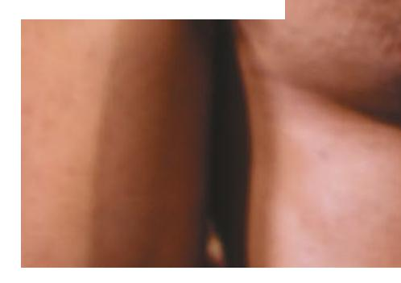

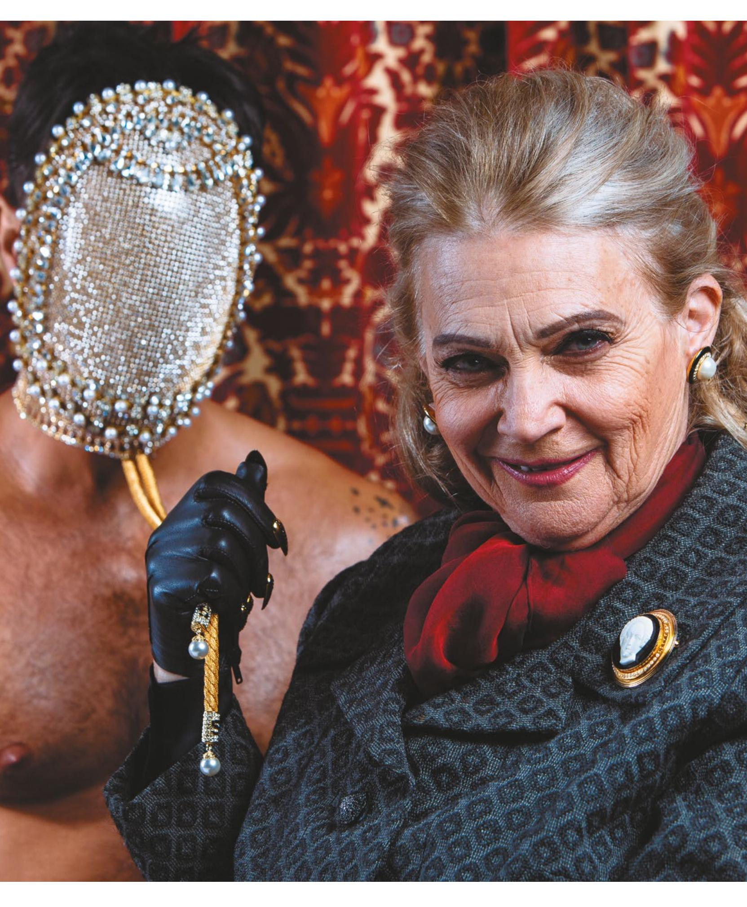

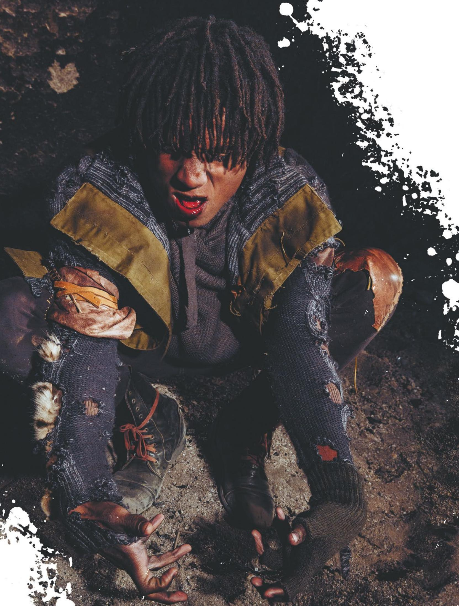

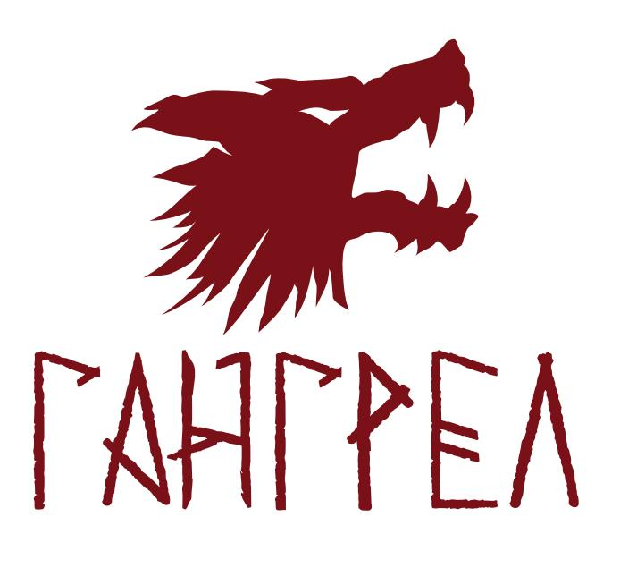

*Клан Зверя Животные Хищники Дикари Варвары Отбросы Волки Бродяги*

**7 5**

В олчья утроба была ненасытна ещё с тех времён, когда никаких людей даже в природе не существовало. Остальные Сородичи проклинают голод. Они прячутся в золочёных клетках городов, накрепко сковав себя цепью социальной иерархии. Волки же резвятся на свободе, приняв своего Зверя. Они идеальные хищники, для которых нет никаких преград — гангрелы с лёгкостью пересекают границы доменов и государств, и даже сама природа им не указ. Воля — их удел, и лишь на воле чувствуют они себя как дома. Опрометчиво считать их благородными дикарями, ведь животным чужды любые достижения цивилизации: будь то бешеная гонка за добычей или обряд инициации, выживут только сильнейшие. Гангрелы отвернулись от Камарильи. У костров, сложенных из трупов угнетателей, собираются они нынешними ночами, чтобы обмениваться историями о войне и прошлом их рода. За свободу от бесконечных интриг готовы они рвать врагов зубами и когтями.

*Знаю, что у тебя на уме. Брови нахмурил, ссутулился, волосы чуть ли не дыбом стоят. «Руди, — думаешь ты, ты меня на эту стройку привёл, чтобы прахом развеять?»*

*Нет, юный друг. Мы в эту дыру пришли не для того, чтобы я мог тебе голову оттяпать. Но и не для того, чтобы видами полюбоваться. В современном мире это — наш «тём‑ ный лес». Самое дикое и безлюдное место, которое мы можем найти. Когда сир твоего сира охотился в этих местах, он рыскал среди полей и рощ, а в городах всем заправляли вентру. Но эти времена прошли. Тираны теряют контроль, и мы за‑ нимаем подступы к их городам. Это теперь твоя террито‑ рия. И ты будешь её охранять, пока это нужно стае, понял?*

Ты должен доказать нам, что чего-то стоишь. Клан Зверя — не элитный клуб для заносчивых снобов. Мы не верим словам — нам нужны поступки. Сила стаи и прочность семьи для нас превыше всего. Так что если хочешь заслужить одобрение — встань на защиту убежища, убей врага, принеси череп перевёртыша (равнос тоже сойдёт), да чего там просто плюнь в харю Камарилье, разрисовав любимую тачку Принца. Этого вполне достаточно. И помни: одинокий волк - это, конечно, круто, но их выносят первыми.

Мы не ватага байкеров, этих пресловутых «королей дорог». Мы - нечто большее. Но сходство между нами есть: мы не привязываемся к одному месту, не принимаем кого попало в свои ряды и не признаём над собой хозяев. Сир твоего сира, может, когда-то и встал на колени перед паршивым патрицием, ел с его рук, словно жалкий пёс, но эти времена прошли. Если ты будешь ползать перед кем-то на карачках, я прикончу тебя собственными руками.

### Какими бывают гангрелы?

Гангрелы - это отбросы общества, бродяги, бандиты и охотники. Они устраивают жилища в самых нищих районах города и не считают это чем-то зазорным. Своих доменов у них мало, но чужую власть они над собой не признают. Если в городе появился один из хищников, Принцу придётся либо смириться с этим, либо выгнать его силой.

Гангрелы предпочитают тех, в ком силён дух борьбы, кто никогда не сдаётся. Они дают Становление лидерам тюремных группировок и банд, отважным первооткрывателям (в том числе городским сталкерам) и в принципе любым другим смертным, считающим, что мир вокруг нужно покорять, а не прятаться от него. Гангрелам плевать на твой внешний вид, титулы или звания, для них главное - репутация и личные достижения.

Дитя может доставить немало хлопот. Стоит ли птенец того времени, которое будет на него потрачено, гангрелы проверяют при помощи ритуалов и обрядов инициации. Прошедший испытание становится новым уважаемым членом клана. Провалившего в лучшем случае прогоняют прочь и забывают о нём, в худшем - он может оказаться горсткой пепла.

Внимание клана привлекают смертные, способные повести за собой других, навязать им свою волю, не опустить руки даже в самой безнадёжной ситуации и несмотря ни на что в конце концов добиться успеха. В результате сложилась ситуация, которую лучше всего описывает фраза «слишком много вождей»: лидеров в клане оказалось больше, чем рядовых. Борьба за доминирование в стае - обычное дело, но поединки редко заканчиваются Окончательной смертью. Старейшины гангрелов призывают не воспринимать борьбу за первенство как что-то личное, поскольку в стае всегда должна быть здоровая конкуренция.

#### Типажи гангрелов **БЫВШИЙ ЗАКЛЮЧЁННЫЙ**

Этот Сородич либо болтался по тюрьмам большую часть своей смертной жизни, либо был когда-то надолго осуждён за тяжкое преступление. Люди с таким прошлым, как правило, имеют репутацию в определённых кругах и презрительно относятся к власти - и всё это сдобрено изрядной тоской по свободе и тем возможностям, которые она предоставляет.

#### **ПУТЕШЕСТВЕННИК**

Дикие и безлюдные места знакомы гангрелам не понаслышке. Они часто уходят за черту города, общаясь с Сородичами, которым не рады на территории Камарильи, и другими созданиями, которых там редко встретишь. Путешественник - это тот, кому доводилось и при жизни, и после смерти видеть такое, что другим сложно даже вообразить. Ведомый неуёмным любопытством, он посетил немало разных мест, проводя в дороге большую часть времени и выживая благодаря собственной хитрости или чужой доброте. Этот волк не боится тропы, лежащей перед ним, куда бы она ни вела.

#### СКАЗИТЕЛЬ

Гангрелы любят рассказывать истории, сидя вокруг костра, хотя бой-скаутами их, конечно, не назовёшь. У сказителя всегда наготове предание о павших героях или песнь о врагах, коих нельзя забывать. И неважно, кто сегодня его слушает - кучка бродяг вокруг горящей бочки или сотни соплеменников, собравшихся на великую сходку. В смертной жизни сказитель, скорее всего, был певцом, шоуменом или свободным художником.

#### ПРЕДСЕДАТЕЛЬ ПРАВЛЕНИЯ

Для этого гангрела слово «сила» значит не только кулаки или когти, но и общественное влияние, авторитет, лидерские качества. Он руководит группой людей возможно, небольшим клубом, а может и крупной корпорацией. Пусть он одет с иголочки и заседает в совете директоров — это всё тот же альфа-волк. Он внушает своим подчинённым страх и уважение, никогда не пляшет под чужую дудку и всегда готов припугнуть несговорчивых, пригрозив испортить им жизнь и карьеру,

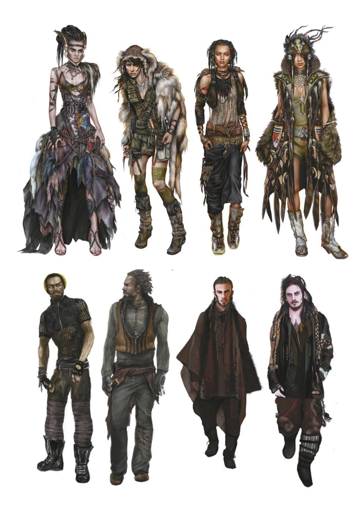

если те в нужный момент не заткнут голос собственной совести. Такие, как он, подстерегают добычу в тёмных коридорах офисных зданий или заманивают жертв в номера пятизвёздочных отелей, оплаченных с корпоративной карты.

#### ПРИРОЖДЁННЫЙ ЗВЕРЬ

Многие гангрелы считают звериную натуру чем-то естественным и наслаждаются своей дикостью, но этот Сородич буквально ведёт себя как животное - им руководят физиологические потребности и сиюминутные желания. Он, скорее всего, был зверем задолго до того, как получил Становление: возможно, это бывший бандит, всегда живший по законам каменных джунглей, или добропорядочный гражданин, использовавший совершенно законные средства, чтобы удовлетворить свои необузданные желания. Кровь вампиров, разумеется, не сделала его лучше.

## Дисциплины

АНИМАЛИЗМ. С помощью этой Дисциплины гангрел может приручить животное, которое станет его постоянным компаньоном (фамулусом). Это животное будет помогать в охоте, шпионить или сражаться на стороне вампира. Кроме того, некоторые гангрелы способны натравить на хозяина его собственного питомца, науськать на бомжа стаю бродячих псов или выманить к себе бездомное животное, если нужно быстро утолить голод.

МЕТАМОРФОЗЫ. Гангрелы знамениты своим умением перевоплощаться - мало кто, кроме них, владеет этой Дисциплиной. Метаморфозы — Дисциплина на стыке вампиризма и оборотничества. Она позволяет Сородичу превращаться в других существ или иным способом частично или полностью менять своё тело. Гангрелы, питающиеся кровью в облике зверя, считают,

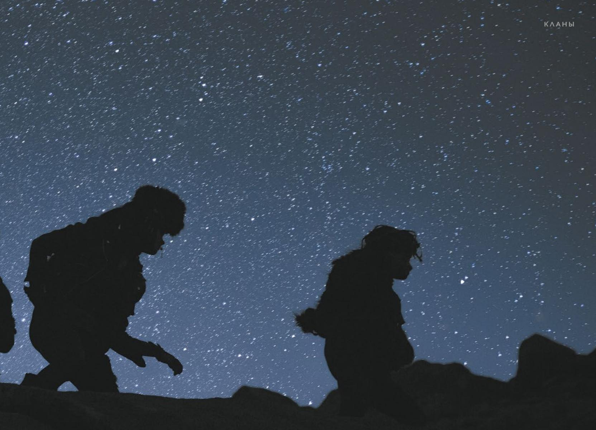

что это самый правильный способ убийства жертвы или по меньшей мере лучший.

стойкость. Долгое время гангрелы служили солдатами и телохранителями у других кланов, и Стойкость немало им в этом помогала. Эта Дисциплина позволяет бестрепетно смотреть в глаза любой опасности. Гангрелам не страшны пули и ножевые ранения, и даже самый суровый ландшафт для них не преграда. Тот, кто делает акцент на развитии этой Дисциплины, считает, вероятно, что впереди его ждут тяжёлые физические испытания.

### **Изъян**

Гангрелы относятся к Зверю так же, как другие Сородичи относятся к гангрелам: это партнёрство, приправленное подозрениями. Они заключили рискованный союз. Впадая в ярость, гангрел меняется физически: у него появляются животные черты внешнее сходство, запах или особенности поведения. Эти черты сохраняются и на следующую ночь, как похмелье после попойки. Каждое такое изменение снижает на 1 пункт одну из характеристик какую именно, решает рассказчик. Например, раздвоенный язык или запах медведя могут понизить обаяние, а уши летучей мыши - упорство («все эти звуки сбивают с толку»). Если других подходящих вариантов нет, тогда снижается интеллект или манипуляция.

Количество изменений равно тяжести изъяна, но персонаж, оседлавший волну (см. стр. XXX), получает только одну звериную черту независимо от тяжести изъяна. Соответственно, ослаблена будет только одна из его характеристик. ■

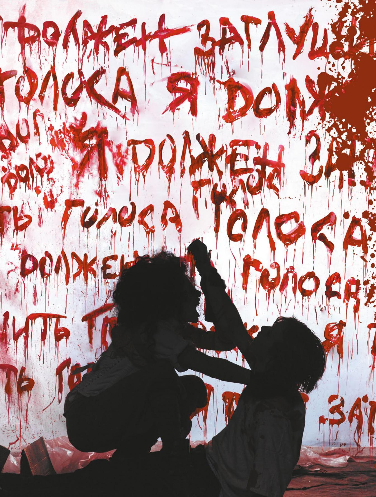

Клан Луны Психи Безумцы Шуты Оракулы Дервиши Визионеры Дети Малкава

бследовав Детей Малкава, психиатры диагностировали бы у одного из них шизофрению, у другого депрессию, у третьего обсессивно-компульсивное расстройство или посттравматический синдром. У кого-то даже всё перечисленное одновременно. В чём-то они были бы правы - малкавиане действительно подвержены всем этим недугам. Но в то же время они вовсе не больны. Это безумные мудрецы, о которых немало сказано в поэзии - причина их помешательства в том, что им открыто слишком многое. Они понимают мир лучше других, чувствуют острее и не справляются с наплывом эмоций. Кровь способна вернуть им душевное равновесие - но лишь на время.

— Жанетт, мы не клоуны. Мы тут не для того, чтобы веселить других Сородичей.

— Чушь собачья. Именно для этого. Пусть смеются, пусть плачут, пусть станут мокренькими от наслаждения - или стыда...

— Ты позоришь наш клуб. И весь клан! Были времена к нам приходили за советом и предсказаниями. Военные стратегии выстраивали с нашей помощью.

— Ну, расслабься, Тереза. Не будь такой занудой. Мы всегда были шүтами.

— Шуты в былые времена служили Принцам. Были для них глазами и ушами при дворе.

— Ну так а мы разве нет? О боже! Короткая юбка, яркий макияж — и ты думаешь: да она просто шлюшка. Так, что ли?

*— Да, я так думаю. Хочешь сказать, что я не права? — Права, конечно, но как думаешь, сколько бесценной информации я извлекла из того гуля, пока мы трахались? Или из опального чернокнижника, которому я помогла рас‑ слабиться? Или из Принца Лакруа, пока он прыгал на мне? Вверх‑вниз, вверх‑вниз!*

*— Ты… Боже, ты отвратительна. Я собираю информацию, погружаясь в видения, пробуя кровь на вкус, проводя долгие задушевные беседы. Я заключаю сделки. Я читаю по глазам всё то, что от меня пытаются скрыть.*

*— Ты носишь деловой костюм, а я чулки и мини‑юбку, вот и вся разница. Все мы в клане чокнутые, но, чёрт возьми, если это помогает нам отбросить условности и добиться резуль‑ тата, не побоявшись запачкать руки, — прекрасно! Пусть будет хоть сто психических расстройств, хоть двести. Люблю коктейли, даже если вместо шейкера — моя голова.*

*— Со мной, в отличие от тебя, всё в порядке. Это ты у нас «с особыми потребностями».*

*— О‑о‑о, да ладно! Ты скучаешь по папочке не меньше, чем я. — Заткнись. Заткнись! Хоть на одну ночь прекрати раз‑ глагольствовать о том, что все мы умалишённые, и попы‑ тайся сконцентрироваться на нашем деле!*

*— Прости, сестрёнка. Похоже, мы воплощаем две про‑ тивоположные стороны малкавианской природы. Оракул и психопатка. Да мы отличная команда!*

- *Я тебя ненавижу.*
- *Ты нас ненавидишь.*
- *Мы нас ненавидим.*
- *Я тебя люблю.*
- *Я меня тоже люблю.*

## Какими бывают малкавиане?

Представление о том, что Клан Луны — это пёстрая компания безумцев, между которыми нет ничего общего, появилось очень давно. Глядя на малкавиан, другие Сородичи рассуждают так: «Они все одинаково сумасшедшие, так кому какое дело, откуда каждый из них родом?» С точки зрения самих малкавиан, происхождение очень важно. Да, они могут дать Становление смертному любого пола из любого социального слоя, возрастной или этнической группы, но каждый из кандидатов будет обладать некой особенностью, видимой только детям Малкава.

Один из талантов, способных привлечь внимание клана, — это способность воспринимать то, чего не увидишь глазами. Если ты занимаешься толкованием снов, общаешься с духами или безошибочно предсказываешь будущее — тебя заметят. Для малкавиан ты словно яркий свет в ночи, возбуждающий интерес каждого, кто его увидит.

Другой талант, который малкавиане высоко ценят, это интуиция. Неважно, в чём она выражается. Это может быть как исключительная чуткость и умение сопереживать, так и способность улавливать тончайшие нюансы в сложных научных проблемах, и даже просто навязчивое желание находить ответы на философские вопросы. Поскольку интуиция часто связана с определёнными видами деятельности, в клане довольно много академиков и докторов наук — особенно в области психиатрии и психологии.

И, наконец, третья категория людей, привлекающая Клан Луны, — это «увечные»: индивидуумы, которые пережили изменившую их тяжёлую психологическую травму или просто от рождения слегка оторваны от реальности. Малкавиане полагают, что подобных людей достаточно немного подтолкнуть, и им откроется совершенно новая действительность. Они не считают «увечных» обузой для клана — напротив, видят в них огромный потенциал.

У каждого малкавианина после Становления развивается психическое расстройство — возможно, усугубляется то состояние, в котором он пребывал и раньше, или появляется новый психоз. Создаётся впечатление, что их мышление и поступки подчиняются какой-то иной, потусторонней логике. Невозможно определить, когда их психическое состояние проявит себя деструктивно, а когда позволит решить проблему, взглянув на неё с необычной стороны. Другие Сородичи, как правило, чувствуют себя неуютно, зная, что среди них есть малкавианин. Членов клана считают непредсказуемыми маньяками, чьи гениальные озарения редко стоят того, чтобы терпеть их безумные выходки.

Некоторые малкавиане утверждают, что в их сумасшествии есть система, что все они связаны психически, находятся на одной волне и разделяют некое общее сверхсознание. Те, кто знает о существовании этой связи, называют её паутиной, а в последнее время ещё и сетью.

#### **Типажи малкавиан ЛИДЕР ОБЩЕСТВЕННОГО МНЕНИЯ**

Этот визионер обожает выставлять себя напоказ в различных образах. Он наслаждается вниманием, которое привлекает его деятельность и его рассказы о себе. Лидер общественного мнения стремится формировать взгляды других людей, используя для этого слова, образы или Дисциплины, — одному это доставляет удовольствие, другой пытается забыть о собственных проблемах, а третий просто подчиняется шёпоту паутины. У кого-то из них в смертной жизни было, вероятно, множество подписчиков в социальных сетях, а кто-то был

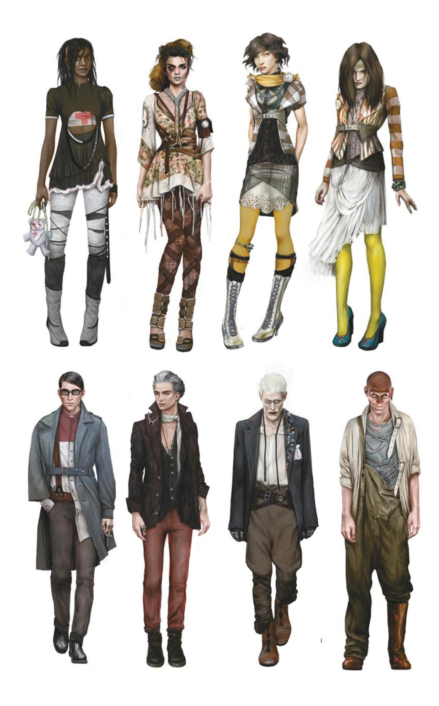

патологическим лжецом, живущим в мире собственных фантазий.

#### **МЕДИУМ**

Способность тонко чувствовать и замечать больше, чем любой другой Сородич, делает малкавиан неуравновешенными, но в то же время дарует им чудесные прозрения. Некоторым, например медиумам, удаётся использовать преимущества своего проклятия в открытую, не нарушая при этом Маскарада. Из бескорыстного желания помочь скорбящим — или ради наживы — они раскрывают перед людьми потусторонний мир, общаясь - или делая вид, что общаются — с духами, привязанными к вещам, местам и людям.

#### ПСИХ-АНАЛИТИК

Некоторые малкавиане инстинктивно понимают, как устроена психика. Здоровая или больная, неважно - они могут «развинтить» её на части, а потом собрать заново. Возможно, при жизни такой малкавианин был психоаналитиком и успешно помогал пациентам преодолевать личностный кри-

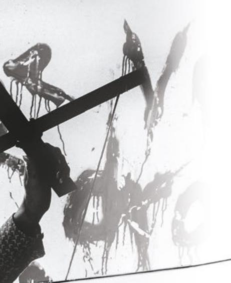

зис. Или проходил курсы психотерапии и теперь использует опыт собственной искалеченной души, чтобы проникать в сознание жертв в поисках способа наконец-то исцелиться самому. Психов-аналитиков уважают и боятся за их способность находить дорогу в лабиринте разума - или запирать в нём врагов.

#### **ФАНАТИК**

Из-за проблем с психикой некоторые малкавиане склонны к крайней степени фанатизма. Всё существование фанатика подчинено одной-единственной цели. Он может зациклиться на чём угодно - от религиозной или политической доктрины до теории заговора или даже безумной любви к детективным романам. Фанатик посвящает своей страсти всё свободное время, так что не будет преувеличением сказать, что он знает практически всё, что касается интересующей его темы.

#### **ГЕМАТОГОЛИК**

По какой-то причине, понятной только другим малкавианам с их маргинальными взглядами и внезапными озарениями, этот Сородич считает, что кровь определённого типа помогает ему успокоиться и справиться с симптомами его недуга. Для гематоголика нет ничего важнее, чем добыть нужную кровь. Это всё, о чём он может думать. При жизни он, возможно, сидел на таблетках и был ипохондриком. Или гурманом. Ну а теперь он пьёт кровь - всё больше

и больше, пока не прекратится этот адский шум в голове и не рассеется беспокойство. Он знает, какие сосуды лучше всего удовлетворяют его потребности, и очень серьёзно относится к каждой трапезе.

## ДИСЦИПЛИНЫ

ДОМИНИРОВАНИЕ. Для некоторых малкавиан это способ вытеснить из сознания жертвы все отвлекающие факторы, завладеть её вниманием безраздельно; другие применяют печально известное Помешательство, чтобы вызвать психоз или усилить уже существующий. И пускай для кого-то влезть в голову смертного - не более чем забавный эксперимент, способность заставить сосуд добровольно отдать свою кровь заметно облегчает клану выживание.

СОКРЫТИЕ. Малкавиане предпочитают скромно умалчивать о том, что владеют этой Дисциплиной. Ни к чему лишний раз напоминать об этом другим Сородичам. А применяют они её по-разному: кто-то подсматривает из укромного уголка за посетителями Элизиума или подшучивает над Принцем, а кто-то прячется в тенях человеческого жилища, бродит по коридорам больницы или пансионата и тихонько наблюдает за спящими, прежде чем приступить к трапезе.

**ЯСНОВИДЕНИЕ.** С помощью этой Дисциплины малкавиане усиливают свои органы чувств - обостряют зрение и слух до невероятных пределов - или используют её для того, чтобы проникнуть в сознание смертного: узнать о его страхах, слабостях и иллюзиях, чтобы бессовестно сыграть на них, прежде чем приступить к еде. Редкий малкавианин не предлагал смертному «поговорить об этом», чтобы спустя десять минут упиваться нектаром из вен рыдающей жертвы.

## Изъян

Каждый из потомков Малкава несёт в себе его проклятье и страдает по меньшей мере от одного психического расстройства. Сородича могут преследовать галлюцинации, посещать видения необычайной яркости или мучить какие-то другие необъяснимые странности - в зависимости от его прошлого и его душевного состояния в момент смерти.

Изъян выходит на передний план в случае кровавого провала или под воздействием одержимости. Вдобавок к штрафам, которые накладывает на персонажа та или иная одержимость, малкавианин также должен будет до конца сцены уменьшить пул всех действий одной из категорий — социальной, физической или ментальной - на количество d10, равное тяжести изъяна.

Как именно проявляется душевный недуг Сородича и какая категория действий при этом будет затронута, игрок должен решить вместе с рассказчиком при создании персонажа.

- ------------------------------------

#### ПРИМЕР

Гектор решил, что его персонаж, малкавианин Гиззард, время от времени воспринимает тактильные ощущения в виде звуков. Когда это психическое расстройство выходит на передний план, Гиззард уменьшает пул всех физических действий на 1d10 (тяжесть его изъяна равна 1), поскольку голоса начинают слишком сильно его отвлекать. Разумеется, всё это отражается и на поведении персонажа.

**≢⊱∢ ≽≔** 

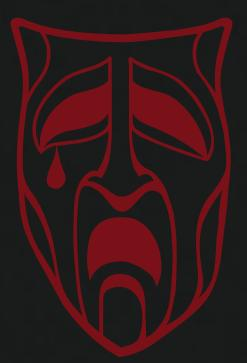

ля носферату Становление - это сошествие в ад. Кровь чудовищ будет ночь за ночью деформировать неподатливые ткани человеческого тела, превращая его г в гротескную пародию на самоё себя. Пройдут недели, прежде чем стихнет боль и миру явится изувеченное существо с изломанным телом, покрытое коростой, язвами и опухолями. Перетерпевшие эту трансформацию похожи на жуткие копии героя чёрно-белой кинокартины Мурнау. Впрочем, судя по всему, боль и унижение учат состраданию. Носферату, как они в шутку себя называют, - самые человечные из всех Сородичей. Проклятие Каина поразило их снаружи, но не добралось до сердца. Чтобы не слишком выделяться, они используют разные методы: одни пробуждают Кровь, чтобы принять облик собственной жертвы или раствориться в ночи, другие предпочитают протезы и грим.

Эти ушлёпки инквизиторские должны Господу Богу спасибо сказать за наше проклятие. По сравнению с другими кланами Носферату проще всего вычислить. При виде меня, правда, можно и в штаны наложить, но когда они попривыкли - то, надо отдать им должное, стали представлять определённую угрозу. Но опять же что в этом такого? Не они первые, не они последние. Могу

поспорить, если бы на нас не охотились то другие кланы, то смертные, то оборотни, то наши собственные предки, мы бы нашли ещё кого-нибудь, от кого прятаться.

Думаешь, это делает нас трусами? Или обрекает на Окончательную смерть? Нет и ещё раз нет. Из всех кланов у нас как раз самые большие шансы пережить эту чистку. Тараканы и ядерная бомба, детка. Тараканы и ядерная бомба... Да, мы облажались со «ШрекНетом». Но кто принял удар? Точно не мы.

Мы знаем, когда нужно залечь на дно. Только дурак сунется в битком набитый Элизиум, куда сбежались Сородичи со всей округи, чтобы оправдываться перед двором. Умнее будет послать слугу, а то вдруг наши привлекательные собратья затаили обиду. И нет, спасибо, руку помощи нам тоже протягивать не нужно. Глупо хватать за руку того, кто с удовольствием толкнёт тебя в объятия смерти. И я сейчас говорю не только о Бруха, я говорю обо всех, кто не из нашего клана.

Мы знаем, что такое терпение. Мы отгораживаемся ото всех, изучаем ситуацию, делаем выводы и приспосабливаемся. Мы выживаем во многом благодаря тому, что наш клан научился ценить подвалы, канализа<mark>ц</mark>ионные шахты, катакомбы и заброшенные станции метро. Я предпочитаю подвал покинутого дома, а сир мой обитает в старом бункере - но идея та же.

## **Доклад № 197**

## **О «крысах-носфератах» и сопутствующем ущербе**

**Цель этого доклада заключается в том, чтобы обратить внимание на сопутствую‑ щий ущерб, который часто возникает при облавах на пустотелых, именующих себя «кры‑ сами» или «носфератами». Стоит отметить, что, несмотря на их внешность, они предпо‑ читают общество живых существ. Как правило, их окружают попрошайки, бездомные, наркоманы, калеки и в целом убогие и беззащитные элементы. Необходимо отметить, что очень многие наши операции заканчиваются преждевременной кончиной живых представителей «свиты» пустотелых.**

**Люди, сопровождающие «носфератов», значительно усложняют проведение операций. Нищие и обездоленные проявляют склонность к симпатии по отношению к данному конкретному штамму вируса пустотелых, что, в свою очередь, повышает риск заражения в обозначенной группе лю неспособных защитить себя, — одна из наших задач. дей в будущем. Следует напомнить, что защита лиц,**

**В иерархии себе подобных «носфераты», несомненно, находятся в самом низу. Надо полагать, именно поэтому они тяготеют к соответствующим социальным слоям в обществе живых. Со своей стороны рекомендую временно воздержаться от применения огнестрель‑ ного оружия в случаях, когда цель не представляет серьёзной опасности и окружена гра‑ жданским населением. Поскольку были зафиксированы очевидные признаки того, что «но‑ сфераты» выступают в роли защитников и предводителей своей «свиты», рекомендую также предпринять попытку установления контакта с указанной разновидностью пусто‑**

**телых с целью получения информации об их притеснителях и выявления их слабых мест. Из предыдущих докладов следует, что сообщество пустотелых‑«носфератов» состоит в основном из шпионов, парий, индивидуумов с разнообразными отклонениями и дру‑ гих маргинальных личностей, обитающих на задворках общества. Система коммуникации, которую они используют для обмена информацией, по всем стандартам превосходна. После того как был скомпрометирован подпольный узел ShreckNET, построенный ими на базе сети ARPANET (см. доклад № 45), они, по‑видимому, перестали общаться напрямую — стали использовать шифрование, мёртвые языки, а также подставных лиц для передачи посланий. Таким образом им до сих пор удаётся скрывать от нас местоположение самых крупных своих убежищ. Следует проявлять осторожность при задержании тех, кого «носфераты» использу‑ ют в качестве связных. Часто ситуация складывается следующим образом: «носферат» платит живому бездомному, чтобы тот отнёс послание, но не сообщает тому ничего, что могло бы выдать местонахождение пустотелого. Многие невинные люди пострадали в результате допроса с пристрастием, прежде чем мы поняли, что они ничего не могут сообщить. Будьте осторожны! «Носфераты» — искусные лжецы. Они могут притвориться безобидными бродягами, но их укус не менее опасен, чем укус любого другого пустотело‑ го. Не следует им доверять.**

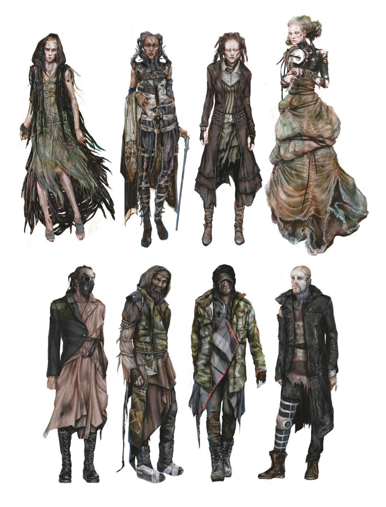

Мы не красавцы, и с людом нам слиться трудно. Притворяться мы можем разве что какими-нибудь выродками. Но знаешь, что я думаю? Это предоставляет нам такие возможности, о которых эти погрязшие в иллюзиях глупцы не могут и мечтать.

#### Типажи носферату СВЯЗНОЙ

Когда Вторая инквизиция обнаружила «ШрекНет», многие тореадоры подняли бокалы за падение клана Носферату. Клан незримых действительно потерял тогда многих своих членов и утратил доверие. Однако те, кто пережил катастрофу и сделал выводы, теперь процветают, освоив искусство безопасного хранения информации - как в виртуальной среде, так и на физических носителях. Они укрепили связи с контактами и клиентами и мало-помалу восстановили доверие тех Сородичей, которым важно иметь некий информационный узел, позволяющий обмениваться тайными сообщениями и проводить исследования. В эпоху, когда перемещение между доменами становится всё опаснее с каждой ночью, а выходить на связь рискованно, носферату с подобными возможностями становятся на вес золота. Сородичи готовы заплатить чем угодно, если связной гарантирует им конфиденциальность.

#### СЫШИК

Из носферату может получиться отличный следователь, если он будет благоразумно держаться в тени и поплотнее закутается в плащ. Сыщик привык шнырять по ночным улицам, перебегая под проливным дождём от подъезда к подъезду. Ему ничего не стоит вломиться в чей-то дом, убежище или хранилище, чтобы раздобыть недостающий кусочек головоломки. Иногда сыщиков выбирают на должность Шерифа в домене. Они предпочитают проводить тщательное расследование и решать вопросы умом и хитростью, а не силой. При жизни сыщик, скорее всего, служил в правоохранительных органах, был детективом-любителем или занимался академическими исследованиями.

#### ЖИВОТНЫЙ ОРГАНИЗМ

Этому вампиру ближе твари, копошащиеся в подвалах и канализациях или по ночам летающие по улицам пригородов, чем люди, в этих пригородах обитающие. Возможно, раньше он был сотрудником службы санитарного контроля, ветеринаром или просто социопатом. Сейчас он без труда общается с животными, управляет ими и, скорее всего, ведёт себя как один

из них. Некоторые носферату не ограничиваются только поведением, а становятся настоящими гнездовищами для крыс или насекомых. По их мнению, если живот или чресла всё равно не используются по назначению, так пусть от них будет хоть какой-то толк. К тому же витэ идёт на пользу маленьким друзьям.

#### ОХОТНИК НА МОНСТРОВ

Носферату стали так прочно ассоциироваться с отшельничеством и животными-вредителями, что многие забыли об их неимоверной силе, а ведь они способны без труда проломить стену, сломать кому-то хребет или сорвать дверь с петель. Теперь, когда большинство гангрелов и бруха покинули Камарилью, носферату гораздо чаще стали проявлять свои боевые качества. Охотник на монстров при жизни был, скорее всего, либо преступником, либо выживальщиком. Ему ничего не стоит забить противника до смерти - возможно, Окончательной.

#### НАСТОЯШАЯ КРЫСА

У носферату с крысами гораздо больше общего, чем думают другие Сородичи, - они не только живут в канализации и похожи внешне благодаря удлинённым резцам. История знает немало случаев, когда чудовища предавали хозяев, чтобы сохранить собственную шкуру, сдавали своих ради небольшой выгоды или пытались усидеть на двух стульях. Настоящая крыса может заниматься корпоративным шпионажем или, скажем, притворяться анархом, только чтобы сбежать под крылышко к Принцу, как только запахнет жареным. Некоторые из них просто вынуждены так поступать и вполне достойны сочувствия.

### <u>Дисциплины</u>

АНИМАЛИЗМ. Носферату высоко ценят эту Дисциплину, так как она помогает им расширять их шпионскую сеть, позволяет приручать фамулусов и доставлять сообщения, а также даёт возможность ошарашить противника, напустив на него целый рой насекомых, стаю крыс или птиц. Анимализм полезен и тем, кто хочет питаться кровью животных: зачастую гораздо проще и гуманнее (хотя с последним можно поспорить) приманить и осушить голубя, чем гоняться за смертными.

Мощь. Носферату используют эту Дисциплину, чтобы быстро нейтрализовать противника. Они прекрасно понимают все плюсы стратегии «бей и беги». Когда сосуд без сознания, насытиться гораздо проще,

а если хочешь унести ноги из логова Барона анархов, есть смысл сперва обезвредить его хорошим ударом по голове. Многие крысы предпочитают не использовать эту Дисциплину в присутствии люда, поскольку неприкрытая мощь противоречит образу, которого они придерживаются.

СОКРЫТИЕ. Мнения об этой Дисциплине разнятся, ведь с одной стороны она позволяет носферату слиться с толпой, а с другой - лишает того, что определяет их сущность. Некоторые носферату гордятся своей откровенно уродливой внешностью, тогда как другие изо всех сил стараются её спрятать. В любом случае Сокрытие - отличный инструмент, весьма полезный во время охоты, так как мало что ещё может позволить крысе приблизиться к люду.

### **Изъян**

Носферату - мерзкие и отвратительные с виду твари, поэтому они получают недостаток «омерзительный» (-2d10) и не могут повышать значение достоинства «внешность». Кроме того, если чудовище пытается замаскироваться под неискалеченного человека, пул соответствующей проверки уменьшается на количество d10, равное тяжести изъяна (это касается в том числе использования Дисциплин, в частности таких сил, как Маска тысячи лиц и Личина самозванца). Большинство носферату не нарушат Маскарад, если просто позволят смертным себя увидеть - с точки зрения людей они пугающе уродливы, но в их внешности отнюдь не всегда усматривается что-то сверхъестественное. ■

*Дивы Клан розы Декаденты Артисты Развратники Арикелиты Гедонисты Сенсуалисты Извращенцы*

Д ивы одержимы эстетическим совершенством. Их проклятие в их необузданной чувственности. Они легко могут потерять себя, глядя на фотомодель, умирающую от передозировки низкокачественного героина, или на идеальное обезглавливание, видео с которым выложили на «Ютьюбе», или в глаза ребёнка, который видел лишнее, или на отражение луны в луже крови. Говорят, первая дива умерла перед зеркалом, не сумев оторвать взгляд от игры света разгорающейся зари на своём лице.

Однако не стоит сбрасывать тореадоров со счетов. Видеть в них не более чем экстравагантных извращенцев или посредственных художников — фатальная ошибка для любого Сородича. Власть красоты огромна, а любовь может сподвигнуть кого угодно на что угодно. Любой тореадор готов за это поручиться: они могут пробудить настоящие живые эмоции даже в мертвецах.

*Ну вот, теперь, когда ты сыт, самое время предста‑ виться. Меня зовут Кармелита Нейлсон. Я — доктор. Ты,* 

*скорее всего, не знаешь, что такое «археолог», так что остановимся на слове «доктор». Я служу своему клану — нашему клану — разыскивая спящих древних, таких как ты, чтобы про‑ будить их и познакомить с современ‑ ным миром.*

*Тебя, похоже, удивляет, что дочь Клана розы марает руки раскопками и исследованиями. Дай уга‑ даю: ты думаешь, что нам больше к лицу посещать салоны, чтобы восхищаться тво‑ рениями смертных художников, слушать пение и любоваться танцами? Да, легко‑ мысленная красота стала лицом нашего клана, но мы вовсе не утратили сердца. По сути своей клан Тореадор — это клан творцов. Скульптор не боится запачкать руки, обтёсывая камень. Живописец не стесняется пятен от краски. Моё призвание — воз‑ вращать к нам тех, кто пребывал в торпоре, чтобы они могли расска‑ зать свою историю. Это — моя форма искусства.*

**КЛанЫ**

*Тореадоры ни разу не оступились с тех пор, как ты впал в торпор. Мы по‑прежнему на коне — руководим фрак‑ цией, известной как Камарилья, вместе с другими достой‑ ными Сородичами из кланов Вентру и Тремер. И не думай, что в этом триумвирате мы занимаем второе или третье место. Мы — голос фракции, мы её вдохновение, её душа, мы — объединяющее начало.*

*В эти ночи тореадоры — яркий луч надежды для всех кланов. Мы — лучшее доказательство того, что Сородичи не обязательно должны быть рабами Зверя. К нам при‑ ходят за наставлением. Другие пытаются преклоняться перед красотой и невинностью, как делаем это мы. Пусть они и не могут по‑настоящему овладеть искусством, мы не отказываем никому.*

*Да, на каждого истинного художника, инноватора или гения в нашем клане приходится по дилетанту, лизо‑ блюду и пустоголовой красотке. Но так и должно быть. Всё в мире прекрасно, в том числе и наша двойственная природа. Другие принимают нас за напудренных дурач‑ ков, но мы прилагаем все усилия, чтобы сделать общество Сородичей прекрасным и гармоничным.*

*Добро пожаловать обратно в клан Тореадор. Ночь при‑ надлежит нам.*

## Какими бывают тореадоры?

Клан Тореадор всегда учил разборчивости в выборе потомства. Старейшины снова и снова повторяют, что клану нужны инноваторы в сфере искусства и всякого рода авангардисты. Тореадоры сильнее всего, когда в их рядах самые передовые умы, жаждущие экспериментов и эстетических открытий. По этой причине тореадорами очень часто становятся выдающиеся художники — как молодые, так и те, кто оказался на закате славы. Слово «художники» в данном случае вовсе не обязательно означает «живописцы». Тореадоры очень широко воспринимают понятие искусства, включая туда все формы развлечений и чувственной стимуляции. Декаденты с распростёртыми объятиями примут и актёра, и певца, и писателя, и танцора, и даже представителя секс-индустрии, если посчитают, что он может дать что-то клану.

Несмотря на традиции, предписывающие принимать в клан только лучших, из-за одержимости тореадоров красотой и невинностью часто бывает так, что птенец появляется в спешке. Не раз и не два луна становилась свидетельницей Становления очередного мелочного гедониста, звезды-однодневки или просто смазливой мордашки безо всякого содержания. От самых больших разочарований предпочитают поскорее избавляться и не оставлять воспоминаний. В целом же клан стремится к разнообразию, оставаясь калейдоскопом талантов и красоты.

#### **Типажи тореадоров ТВОРЕЦ**

Тореадоры не только преклоняются перед красотой и благоговеют перед всеми видами искусства, но и сами жаждут творить. Этот Сородич — один из тех, кому покровительствуют музы: виртуозный скрипач, пробуждающий к жизни чарующую мелодию, подобную нежному свету луны, или граффитчик с баллончиком краски в руках, решительными изгибами линий вычерчивающий свой шедевр на стене в подворотне. Кем бы он ни был, клан боготворит его.

#### **ИМПРЕСАРИО**

Без хорошего кукловода марионетка не сможет танцевать. Эта дива всегда держит руку на пульсе города: знает каждое событие в каждом клубе или баре, и, скорее всего, оказывает сильное влияние на владельцев и посетителей нескольких подобных заведений. Импресарио всегда знает настроение общества. По его прихоти другие становятся знаменитостями или, напротив, оказываются в тени.

#### **ДУША КОМПАНИИ**

Если ты умён, харизматичен и обладаешь сногсшибательной улыбкой — мир у твоих ног. Душа компании превосходно умеет привлекать внимание и манипулировать чужим мнением, тонко чувствует настроение окружающих. Даже застенчивые каиниты жаждут общества этого Сородича и с удовольствием наблюдают за тем, как он легко и беззаботно вливается в любой коллектив. Профессии, в которых общение с клиентами, посетителями или пациентами играет первостепенную роль, подходят ему как нельзя лучше — он использует все средства, чтобы всё было так, как угодно ему.

#### **МЕЦЕНАТ**

Этот Сородич разыскивает талантливых и красивых, но не знающих, как пробиться к славе. Он словно скульптор, создающий шедевры, но вместо глины в его руках судьбы живых людей. Раскрытые им таланты — это его дар человечеству. Меценат может изображать из себя эксцентричного богача, чей дом всегда открыт для художников и поэтов, оказавшихся на мели, играть роль кастингменеджера или критика, помогающего своим ученикам деньгами и советом, а взамен получающего их кровь.

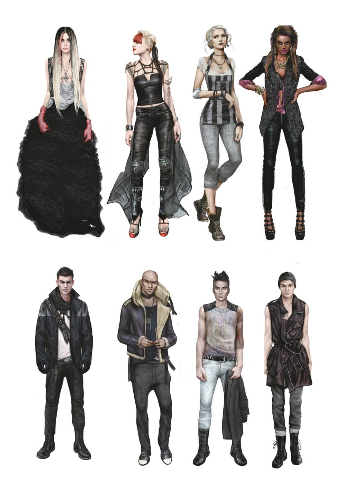

#### **АГЕНТ 007**

**Тореадоры любят театральные представления. Те из них, кто в по‑ смертной жизни взял на себя роль шпиона, знают все их уловки и мо‑ гут выудить из объекта ценную информацию, но зачастую увле‑ каются зрелищем и тратят на него больше времени, чем необходимо. Может, они в чём‑то и переигры‑ вают, зато мало кто подозревает их в злом умысле. Обходитель‑ ных шпионов‑тореадоров можно найти во многих доменах, где они развлекают гостей Элизиумов, наблюдают за ними, собирают ин‑ формацию, а затем обменивают её на другие удовольствия.**

## Дисциплины

**ВЕЛИЧИЕ. Тореадоры используют эту Дисциплину в паре с Ясно‑ видением, чтобы манипулировать эмоциями Сородичей и люда. Ве‑ личие может гарантировать благо‑ склонность аудитории или стать причиной провала другого артиста. Некоторые тореадоры с помощью этой Дисциплины подстёгивают энтузиазм партнёров в плотских утехах, другие заманивают в свои объятия смертные сосуды, чтобы вкусить их крови. Тореадоры обо‑ жают, когда сосуд добровольно отдаёт свою кровь, даже если его согласие — лишь иллюзия, вызван‑ ная сверхъестественными силами.**

**СТРЕМИТЕЛЬНОСТЬ. Тореадоры утверждают, что из них полу‑ чаются плохие бойцы, но мало кто может поспорить в эффек‑ тивности с декадентом, исполь‑ зующим Стремительность, чтобы порезать противника на куски прежде, чем тот сможет хотя бы достать оружие. Кроме того, эта Дисциплина может быть полезной во время выступлений. На охоте** 

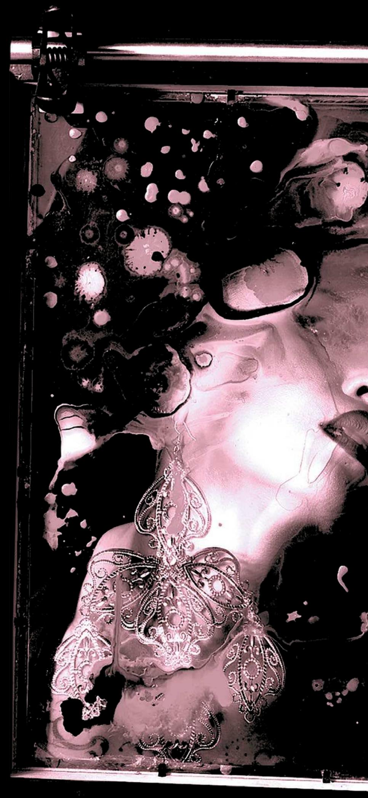

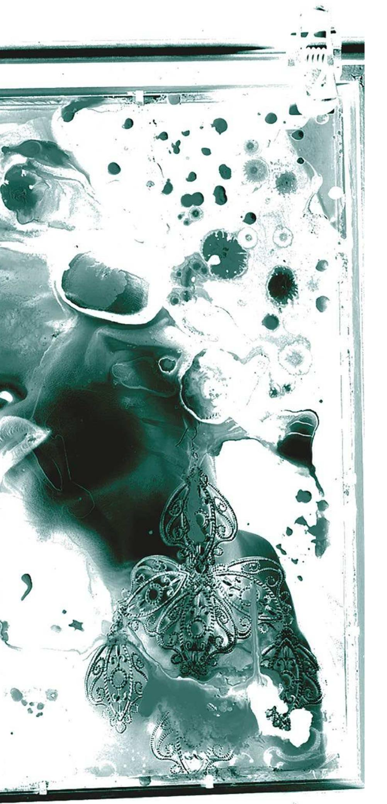

Стремительность даёт возможность насытиться и исчезнуть раньше, чем смертный поймёт, что произошло.

ЯСНОВИДЕНИЕ. Тореадоры постоянно ищут новых ощущений. Эта Дисциплина позволяет им находить самые податливые сосуды, в которых благодаря необычному эмоциональному состоянию и темпераменту течёт кровь с уникальным вкусом, дарующим вампиру незабываемые впечатления. Нередко тореадоры с помощью Ясновидения манипулируют другими Сородичами, узнавая их сокровенные желания и тайные помыслы.

## Изъян

Тореадоры — наглядная иллюстрация старого утверждения «артистичность в крови принимает самые странные формы». Они так сильно жаждут красоты, что страдают при её отсутствии. Если персонаж оказывается в обстановке, которую не может считать красивой, пул всех его проверок использования Дисциплин уменьшается на количество d10, равное тяжести изъяна. Как именно обстановка (в том числе одежда, агнцы и т. п.) влияет на Сородича, решает рассказчик, исходя из эстетических предпочтений персонажа. Стоит при этом учитывать, что обычные городские улицы не считают образцом эстетического совершенства даже последователи «Школы мусорных вёдер». Кроме того, одержимость красотой порой заставляет диву застыть в восхищении, утратив связь с реальностью, а кровавый провал часто заканчивается тем, что тореадор впадает от восторга в прострацию (см. «Одержимость», стр. 208). ■

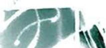

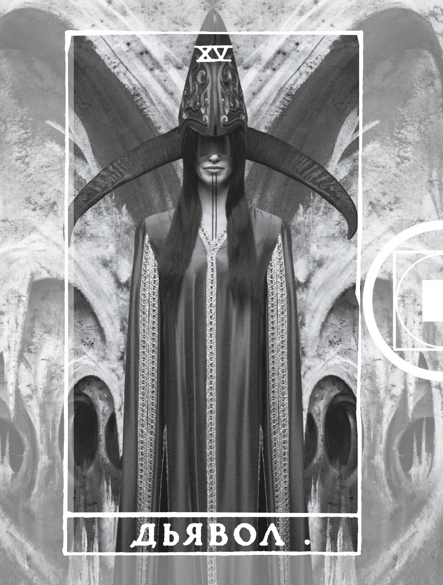

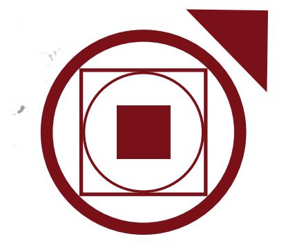

# TPENEP

Јзурпаторы Чернокнижники Гематики Тауматурги Негестивцы Сокрушённый клан Кровавые ведьмы

ремер был магом-герметистом, который в VIII веке н. э. руководил в Румынии магическим орденом, внушавшим вполне обоснованный страх своей одержимостью знанием и властью. Он нашёл способ продлить свою жизнь на века, но в конечном итоге его силы истощились и молодость стала ускользать от него. Тремер не хотел или не мог смириться с собственной смертностью и обратил свой взор на сакральную тайну бессмертия. Алчущий вечной жизни маг начал самую чудовищную череду экспериментов с магіей, которую только знало человечество, тем самым обрекая себя и своих последователей на кромешный ад, созданный их же руками. Тысячи смертных были убиты, сотни Сородичей выпотрошены - их кровь снова и снова орошала ритуальный круг, пока Тремер и его подручные не нашли, наконец, «эликсир жизни». Каково же было их удивление, когда они обнаружили на себе проклятие Каина! Маги в ужасе умирали и воскресали вновь, но что их ждало? Лишь Голод, существование в виде нежити и потеря связи с прежним ремеслом.

Судьба посмеялась над тремерами, припомнив их жуткие эксперименты - теперь только свежая кровь позволяет им изменять реальность при помощи тауматургических заклинаний.

*«Позвольте мне призвать к порядку всех участников этого совещания. Мы должны принять решение относительно того, кто из смертных достоин пополнить наши ряды и в эту ночь, и в грядущие», — Шрект окинул взглядом двоих собеседников, сидевших по сторонам треугольного стола. Комната, в которой они находились, существовала в трёх местах одновременно.*

*«Герр Шрект, полагаю, наша практика не претерпела каких‑либо сильных изменений. Мы по‑прежнему даём становление только самым блестящим умам, проявившим себя в оккультной сфере. Хотя мой Дом и предпочитает индивидуумов с менее строгими нравами, чем ваш, могу вас заверить: мы никогда не подарим бессмертия недостой‑ ному», — закончив говорить, представитель Дома Гора‑ трикса откинулся на спинку кресла, погрузившись в тень.*

*Шрект смерил взглядом собеседников. Он бы избавился от обоих без малейших колебаний, если бы не возможные последствия. Каждый из них играл важную роль — так под‑ сказывала ему Кровь. Он повернулся к женщине, сидевшей по другую сторону, и спросил: «А что скажет Дом Карны?»*

*Карна, поглаживая левую ладонь указательным пальцем правой руки, ответила: «Наш Дом отвергает старые пути, навязанные мужчинами. Мы принимаем язычников, ведьм и заклинателей хаоса, которые смотрят в будущее. Ради спасения нашего клана мы должны шире смотреть на вещи. Старые узы разрушены, ваш Дом — один из немногих, где ещё существует регламентированная структура Пира‑ миды, и я не вижу причины держаться старых традиций».*

*Шрект, сам того не осознавая, стиснул зубы и сжал кулаки: «Ты готова отбросить многовековые традиции только потому, что тебе захотелось стать независимой? Как так вышло, что у Дома Тремера стало в последнее время больше общего с Домом Горатрикса, чем с твоим?»*

*Карна пожала плечами, даже не взглянув на него: «Это действительно проблема, Карл. И тебе стоит с ней разо‑ браться. Дом Карны пока ещё в Камарилье, заметь». Всё ещё не поднимая головы, она глянула ему в глаза испод‑ лобья: «Все мы слышали одни и те же голоса. У каждого из нас свой путь — и все они верны. Мы должны разде‑ литься, чтобы в нужный час снова стать единым целым».*

*Шрект неубедительно улыбнулся. Представитель Дома Горатрикса исчез. «Теперь мы наедине, — сказал он. — Неужели нам и вправду необходимо наводнить наш клан гадалками, доморощенными астрологами и экстра‑ сенсами? Мы выше этого».*

*Карна начала растворяться в темноте, но её голос ещё звучал: «О нет, благородством взглядов мы никогда не отличались. Наши предки были смертными, алкавшими власти. Быть может, настало время обратиться к тем, кто любит магию искренне».*

## Какими бывают тремеры?

После того как Вторая инквизиция в 2008 году уничтожила Верховную венскую капеллу, тремеры во многих регионах превратились из серых кардиналов в персон нон грата. Надменность Пирамиды привела к тому, что у узурпаторов оказалось мало друзей. Но колдовство по-прежнему в цене. Можно даже сказать, что оно стало на вес золота, после того как заговорила Кровь.

В отсутствие Пирамиды, указывавшей каждому, где его место, чернокнижники стали чаще вступать в борьбу с другими Сородичами, и не в последнюю очередь друг с другом, чтобы заполучить хоть что-то, что поможет восстановить былую власть. Дома клана Тремер разыскивают артефакты и гримуары, принадлежавшие обращённым в пепел предкам, с тем же нездоровым энтузиазмом, с каким плетут интриги, в которых немаловажное место отводится альянсу с Камарильей. И вместе с тем в обиход всё прочнее входит выражение «наёмный чародей», поскольку чернокнижники, ранее связанные узами, обрели свободу и поняли, что сами могут устанавливать цену за свои услуги.

Занимаются чернокнижники обычно следующим: либо консультируют другие кланы в оккультных вопросах, либо применяют Магию крови на благо Камарильи — либо захватывают власть. Нынешними ночами количество тремеров, возглавляющих домены, сильно возросло, хотя в глобальном масштабе носферату всё ещё их обгоняют. На самом деле большая часть чернокнижников считает, что становиться Принцем имеет смысл только тогда, когда это может помочь приумножить твои знания. Истинная власть, по их мнению, это способность изменить мир, это доступ к нужной крови и владение самыми редкими из древних артефактов.

Одни тремеры заключают союзы с растерянными котериями, другие охотятся за надёжно оберегаемыми реликвиями и артефактами, третьи анализируют фрагменты мифов о Каине — и всё это в строжайшем секрете даже друг от друга. Однако всех их при этом объединяет жажда знаний. Если хочешь узнать что-то из истории Сородичей, спроси об этом тремера — он ответит. При условии, конечно, что сам сможет узнать от тебя какой-нибудь секрет — с твоего согласия или нет, не столь важно.

## XVI

#### Типажи тремеров **АПОЛОГЕТ ПИРАМИДЫ**

До недавних событий иерархия Пирамиды делала Тремер одним из самых косных кланов. И до сих пор в их рядах есть множество консервативных Сородичей, для которых былые узы остались нерушимы, даже если они больше не подкреплены Кровью. Апологет Пирамиды придерживается традиции ответственности сира за своё дитя, чтит официальную иерархию капеллы со всеми её титулами и рангами и мечтает вернуть клану былое величие и известность. Некоторые из апологетов не прочь пробраться в Вену, чтобы разыскать то, что осталось от сокровищницы знаний тремеров, но старейшины наложили запрет на посещение этого домена.

#### БЕССМЕРТНЫЙ УЧЁНЫЙ

Этот Сородич до Становления был увлечённым исследователем, и после смерти он по-прежнему одержим поисками зна-

ний. Это правда, что клан Тремер тяготеет к поиску и разгадке тайн, но бессмертный учёный — отнюдь не всегда бывший оккультист. Это может быть и хирург-инноватор, и теолог с тягой к кощунственным текстам, и библиофил, коллекционирующий редкие издания. Часто эти Сородичи обращаются к изучению собственной природы и становятся со временем экспертами в истории каинитов.

#### **НОНКОНФОРМИСТ-ЯЗЫЧНИК**

Другие Сородичи часто считают последователей Карны обычными приверженцами движения нью-эйдж, не пытаясь постичь всю глубину их магических изысканий, их преклонение перед женским началом и ту широту взглядов, которую они практикуют. Что-то в этих кровавых ведьмах идёт вразрез с традициями клана. Нонконформисты толкуют о переменах и всем сердцем стремятся к недоступной для них истинной магіи. Викканские ведьмы и сатанисты,

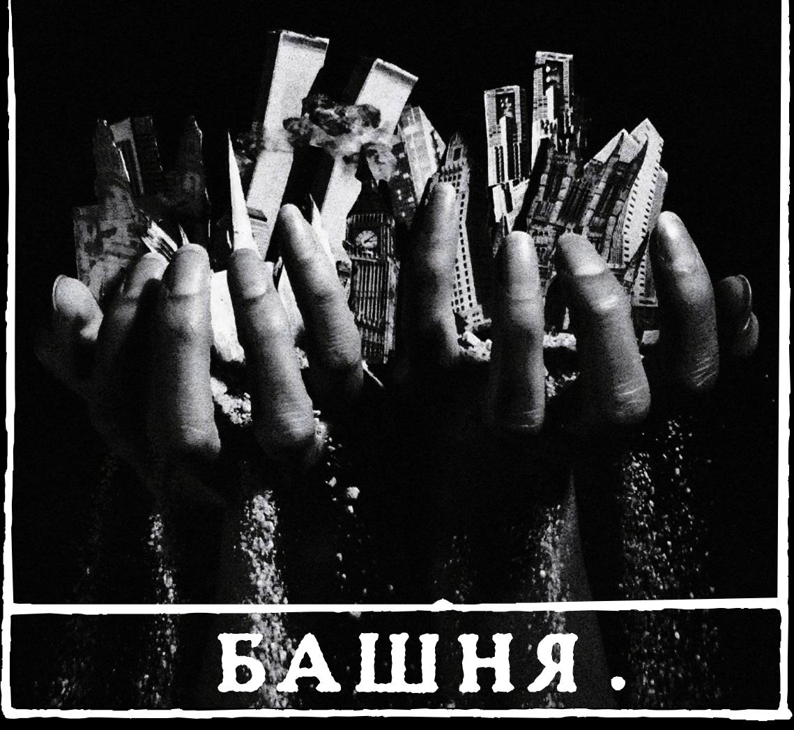

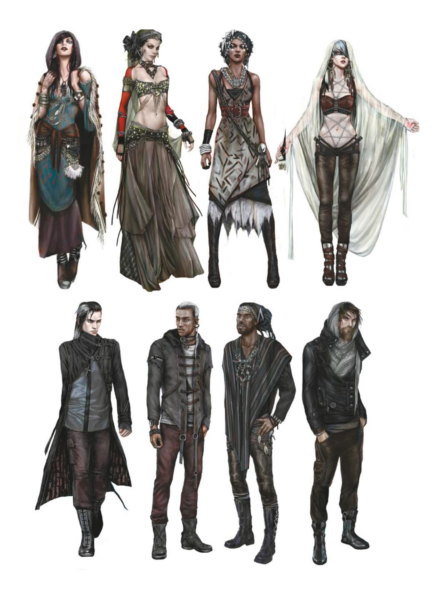

состоявшиеся тремеры, вдохновлённые восстанием Карны, или угнетённые смертные, жаждущие личной свободы, — каждый из них в той или иной степени нонконформист-язычник.

#### **АМБИЦИОЗНЫЙ ВЫСКОЧКА**

Новая тенденция принимать в клан не только академиков и оккультистов привела к появлению среди тремеров целого ряда индивидуумов со своим собственным пониманием того, чем должен жить клан и как именно заниматься Тауматургией. Таким выскочкой может быть знахарь или бунтарь, место которому среди анархов. Завоевать уважение в клане ему, скорее всего, будет сложно, но при хотя бы символической поддержке дома Карны он, невзирая на многочисленные препятствия, сможет добиться многого.

#### **НАЧАЛЬНИК СЛУЖБЫ БЕЗОПАСНОСТИ**

Среди тремеров есть не только библиотекари и учёные мужи. Их магический дар позволяет вовремя заметить угрозу, подчинить чужой разум, а то и вовсе уничтожить противника. Даже после падения Пирамиды многие Сородичи относятся к Узурпаторам с опасением, всё ещё считая их кланом убийц, обожающих пытки. Шериф или начальник службы безопасности из клана Тремер в прошлой жизни, вероятно, был сотрудником правоохранительных органов, где и почерпнул специфические знания.

## Дисциплины

**ДОМИНИРОВАНИЕ.** Ради знаний и власти тремеры готовы на всё, а эта Дисциплина помогает им уйти от возмездия. Воровство, предательство, убийство чужого гуля — всё это становится проще, когда умеешь контролировать тело и разум смертного. Собравшись насытиться кровью, тремер без колебаний заставит человека подставить горло, используя для этого Доминирование.

**КРОВАВОЕ ЧАРОДЕЙСТВО.** Тремеры — искуснейшие тауматурги. Пусть в Камарилье им и не доверяют, но их мастерство в Кровавом чародействе всегда в цене. С его помощью они могут атаковать тело и разум противника, нанося им тяжкий урон, или защищать себя. Кроме того, Магия крови облегчает процесс охоты некоторые чернокнижники способны вытягивать кровь из вен смертного, даже не прикасаясь к нему.

**ЯСНОВИДЕНИЕ.** Тремеры используют эту Дисциплину, чтобы читать чужие ауры, искать следы магии или важные улики, а также для того, чтобы общаться друг с другом на огромных расстояниях, не опасаясь, что разговор перехватят. Когда тремеру нужно утолить Голод, Ясновидение помогает найти подходящий сосуд, ведь оно позволяет не только определить, насколько смертный расположен к общению, но и выяснить, что нужно, чтобы он стал ещё более податливым.

## Изъян

Ещё совсем недавно в клане Тремер существовала строгая иерархия, в соответствии с которой все члены клана от вершины до основания Пирамиды были связаны узами крови. После падения Вены их Кровь взбунтовалась и разрушила все связи. Витэ тремеров не способна больше сковывать других Сородичей, хотя на самих тремеров узы крови по-прежнему действуют. Чернокнижники могут связать смертного или гуля, но из-за того, что их витэ испорчена, её потребуется больше. Количество дополнительных порций Крови, которые придётся выпить жертве, равно тяжести изъяна тремера. Некоторые строят гипотезы о том, что всё это месть предтечи, которого некогда поглотил Тремер, другие считают, что это простая мутация. Так или иначе, клан внимательно изучает витэ, чтобы узнать, можно ли обратить процесс, а также разобраться в том, стоит ли это делать. ⬛

*Лишённые клана Пандеры Сироты Мусор Отребье Фристайлеры*

каждый Сородич при Становлении получает в наследство изъян одного из 13 предтеч. Некоторым нет никакого дела до собственной родословной. Есть также линии крови, которые испокон веков не принадлежали ни к одному клану. Впрочем, иногда дитя просто оказывается не таким, как его сир. Кого-то из сирот уничтожают, кого-то изгоняют, а кто-то сам уходит из клана, стараясь держаться подальше от тех, кто относится к нему с презрением. По сути своей каитифы — полнокровные вампиры. Отсутствие родословной они компенсируют свободой от тягостного изъяна и податливостью собственной витэ. Некоторые из них гордятся своей природой, другие стыдятся её, но, как бы там ни было, у каитифов нет семьи - это классические вампиры-одиночки, какими их чаще всего представляют легенды.

## Какими бывают каитифы?

Многие Сородичи пребывают в заблуждении, считая, что появление каитифа - это всегда досадная случайность, а лишённые клана сами не дают Становление смертным. Это представление устарело. Нынешними ночами каитифов становится всё больше и они превращаются в силу, с которой необходимо считаться. Это в основном индивидуалисты. Их нельзя назвать сплочённой группой, и у них нет какой-то общей

цели. Их объединяет одно: они прошли через тяжкие испытания и выжили. В последнее время они всё чаще собираются в группы, создают альянсы и расширяют свои ряды, давая Становление новым каитифам.

Лишённые клана предпочитают смертных с сильным характером, тех, кто привык преодолевать необычайные трудности. В иерархии Сородичей каитифы находятся в самом низу. Ниже только слабокровные вампиры, которым и вовсе не должно быть места под луной. Поэтому каитиф должен уметь постоять за себя. Бороться или сгинуть - вот его судьба. Нет смысла давать Становление тому, кто самостоятельно не дотянет и до утра.

Несмотря на то что каитифы принялись специально расширять свои ряды, большая их часть по-прежнему появляется «естественным» путём: когда Кровь птенца по какой-то причине не перенимает свойства Крови прародителей и у него не проявляется явных признаков кланового изъяна. Среди Сородичей ходят байки о носферату, которые так и не проявили ни малейшего признака уродства, о до боли нормальных малкавианах и молодых вентру, которые могли пить из кого попало. Таких птенцов кланы не желают признавать — и бросают на произвол судьбы. Бывает и так, что вампир чувствует через свою Кровь, что ему не место в клане, несмотря на возражения сира. Создание каитифов ещё не превратилось в точную науку, и у многих сирот проявляются отдельные черты клана, в котором им дали Становление, хотя изъян у них может и не проявиться.

**00:00:04** Ты в курсе, что Каин не принадлежал ни к одному клану? Ни он, ни его дети. Полагаю, что и Третье поколение тоже. Только Четвёртое начало объединяться в семьи с общим изъяном и схожими способностями.

**00:01:12** К чему я клоню? Да к тому, что каиниты без клана существуют куда дольше, чем те, которым понадобились клубы по интересам, чтобы почувствовать свою значимость или укрыться от божественного гнева. Пока они грели друг другу бока, мы в одиночку отражали все удары и становились от этого только сильнее.

**00:01:30** Может, ты думаешь, что нам, каитифам, никогда не сравниться с такими, как ты, аристократами голубых кровей? Но вспомни каирского Принца Мухтар-бея, вспомни легенду о Каменщике, вспомни, что устроил в Сиднее этот великолепный ублюдок Саррасин — и спроси себя: «А что у нас есть такого, что давало бы нам преимущество?»

**00:01:46** Кружок по интересам? Своя ахиллесова пята? Ворох обязательств и куча бессмысленных ограничений? Абсурдные традиции, за несоблюдение которых тебя могут покарать старшие?

**00:01:60** Мы, каитифы, можем быть кем угодно, чем угодно и где угодно. У нас нет непреодолимых слабостей и нет хозяев. Мы плюём на ваши традиции. Погоди-ка, надо клещи принести…

**00:04:45** Тебе удобно? На чём я остановился?.. Ах да. За нами будущее. А вы канете в небытие. Мы с удовольствием осушим каждого из вас. На пару секунд это даже позволит нам почувствовать, каково это — быть в вашей шкуре. А потом мы снова будем свободны. Знаешь, что такое свобода?

**00:05:27** Вот сейчас, например, твой язык свободен… Хех… От твоего тела…

#### **Типажи каитифов БЕСПРИЗОРНИК**

Этот Сородич вырос в самом бедном районе города. Если у него вообще были родители, они либо не могли его защитить, либо им было наплевать. Маловероятно, что в будущем его ждало хоть что-то хорошее. Становление оказалось для него избавлением, а сир сделал его вампиром из уважения к стойкости перед лицом невзгод.

#### **ЖЕРТВА НАСИЛИЯ**

Каитифы часто дают Становление жертвам насилия. Будущий сир мог обнаружить этого Сородича среди участников группы психологической поддержки, увидеть его фото в газете, читая статью о нападении при отягчающих обстоятельствах, или наткнуться на блог, где тот в подробностях описывал свой ужасный опыт. Для лишённых клана жертва насилия оказалась прекрасным кандидатом, поскольку уже прошла через серьёзные испытания. Становление стало для неё такой же наградой, как и для беспризорника. Она получила шанс отомстить.

#### **ЗАЛОЖНИК ЧУЖИХ ОЖИДАНИЙ**

Этот каитиф получил становление по ошибке. Да, как-то раз в своей жизни он нашёл силы сбросить ярмо жестокого начальника или указать на дверь грубому партнёру, но это был единичный случай. Его выбрали за проявленную силу характера, но теперь, растерянный и подавленный, он не знает, что делать.

#### **ТАЙНЫЙ КАИТИФ**

Этот Сородич восстал из мёртвых каитифом, но сумел скрыть это от своего сира. Он — полноценный член клана своих прародителей — участвует во всех ритуалах и соблюдает традиции в обмен на защиту со стороны старейшин. У него нет ни малейшего желания провести вечность в одиночестве, и он сделает всё, что в его силах, чтобы сохранить свою тайну.

#### **НЕЖЕЛАННОЕ ДИТЯ**

Этот Сородич получил Становление в одном из кланов. При этом он не помнит своего сира и никогда не чувствовал связи с другими Сородичами. Проклятие предков так в нём и не проявилось, поэтому он избавлен от изъяна, свойственного его клану. Но из-за отсутствия этого «маркерного гена» Кровь собратьев отторгает его, а он, в свою очередь, отторгает их.

#### **Дисциплины**

Когда персонаж-каитиф получает Становление, игрок может выбрать три любые Дисциплины. Они не считаются ни клановыми, ни сторонними, у них своя стоимость. Каитиф может за ту же цену обучиться любой Дисциплине, если вкусит Крови владеющего ею Сородича хотя бы раз, а также выполнит все прочие условия, необходимые для её изучения.

## Изъян

У каитифов, свободных от влияния Предтеч, нет общего изъяна. Они начинают игру с недостатком статуса «подозрительный» (●). При создании персонажа ему нельзя улучшать статус. Во время игры независимо от текущего статуса каитифа рассказчик может уменьшить пул его социальных проверок на 1d10 или 2d10, если собеседник — Сородич, который знает, что персонаж — каитиф.

Стоимость улучшения любой Дисциплины каитифа равна шестикратному значению уровня, который хочет приобрести игрок. ⬛

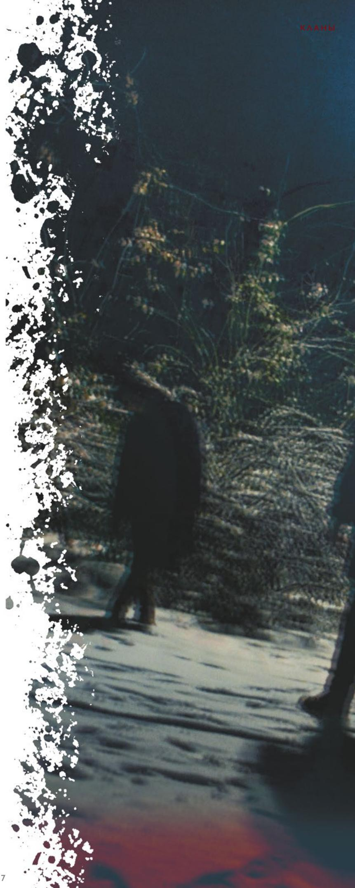

*Весперы Меркурианцы Слабокровки Юнцы Беглецы Заморыши Хамелеоны Выкидыши*

# слабая КPOBЬ

ырождение вида? Предвестники конца света? Или вам-

пиры будущего? Весперы балансируют на грани между жизнью и смертью, их изменчивая природа вызывает в равных пропорциях жалость, зависть и страх. За последние десятилетия весперы пережили немало погромов, но они выстояли, несмотря на все притеснения и остракизм, и не собираются сдаваться. Благодаря познаниям в алхимии (пусть это и сумбурная уличная её разновидность), а также тому, что им проще выдавать себя за людей, они оказались идеально приспособлены, чтобы жить вне общества Сородичей и быть хозяевами собственной судьбы в эпоху тёмного постмодерна.

## Какими бывают слабокровные вампиры?

Тринадцатому и Четырнадцатому поколениям сиры всё время твердят, что они не должны пытаться дать кому-то Становление, ведь они слишком далеки от Каина, и подобная попытка не принесёт ничего, кроме смерти и страданий. Однако, умышленно или случайно, этому наставлению следуют далеко не всегда.

Бывает так, что Сородич 14-го поколения, сам чудом избежавший изъяна слабой крови, осушает смертного в приступе ярости, а затем в отчаянии пытается загладить вину и даёт своей жертве выпить глоток витэ в надежде вернуть жизнь в изломанное тело.

Или вампирша-вентру, чьи предки столетиями лгали о силе своей Крови, думает, что она ближе к прародителю, чем есть на самом деле, и пребывает в абсолютной уверенности, что её дитя станет полноценным членом клана.

Порой далёкий потомок Принца может пролить собственную ослабленную витэ в разверстые уста казнённого за предательство гуля только для того, чтобы досадить старому тирану.

Или тремер, которого собратья считают недостаточно сильным по Крови и духу, пытается создать полноценного потомка, чтобы доказать, что он не хуже других.

В каждом из описанных случаев смертный может превратиться в веспера, если на то будет воля Крови.

Если Сородич намеренно собирается создать слабокровного вампира, скорее всего, он выберет человека, с которым у него уже сложились отношения: смертного родственника, которого никак не может забыть, или проверенного временем гуля. В противном случае выбор, скорее всего, падёт на того, кто обладает ред-

Я — Оскар Рейес, и сейчас я должен быть мёртв. По всем законам Каина и его потомков я не мог восстать из мёртвых. Витэ в моих жилах просто не могла напитать остывшее сердце. Я должен был остаться неподвижным мёртвым телом. Мой ссаный сир сказал, что дал мне Становление по пьяни. Это было ошибкой, и виной всему наркота у меня в крови. Моё воскрешение его удивило не меньше, чем то, что я бросился к его горлу. Моя новая жизнь — это чудо. Я не должен был вернуться. Я этого не заслуживаю. Я много плохого в жизни совершил, делал вещи, за которые мне стыдно, но теперь у меня есть шанс искупить грехи. Благодарю Господа за это. Каждый вечер я просыпаюсь с мыслью о том, что должен стать лучше. Должен ценить дарованный мне шанс. Моя Кровь слишком слаба, чтобы самому стать сиром, но я бы в любом случае не стал никого обращать. Я не могу порабощать людей и делать многие другие вещи, на которые способны старейшины. Зато я могу любоваться рассветом и просыпаюсь ещё до заката. Я могу есть, заниматься сексом и пить текилу, сколько влезет. Могу продолжить грешить, как и раньше, но я стараюсь завязать с этим. Бог показал мне, что ад в самом деле существует, а проклятые ходят среди нас. И он также показал, что я не совсем ещё стал одним из них. Это даёт мне надежду. То, что другие каиниты считают позором, я называю благословением. Я не человек, но и не монстр. Я всё ещё дитя Божье, и я могу ещё вернуть Его любовь. В мудрости и милосердии своём Он даровал мне целую вечность, чтобы заслужить прощение.

кими талантами, благодаря которым ему проще будет выжить. Весперы — самые слабые из хищников. Многие Сородичи рассматривают их как угрозу для Маскарада и готовы убить, если предоставится такая возможность.

Происхождение смертного не играет никакой роли — слабокровным может оказаться любой. Кроме того, весперы не наследуют ни изъянов, ни предпочтений от своего сира. Если им вообще позволяют восстать из мёртвых, то чаще всего оставляют одних, так что они в полной мере могут насладиться независимостью или испытать все тяготы одиночества.

В 2009 году Внутренний круг Камарильи издал эдикт о том, что все слабокровные должны быть отмечены знаком полумесяца в виде клейма или татуировки. Для его нанесения используют либо специальные чернила, созданные тремерами, либо солнечный свет так или иначе, знак невозможно свести. Даже анархи и освобождённые дважды подумают, прежде чем решат связаться с заклеймёнными меркурианцами.

#### **Типажи слабокровных ОБЫВАТЕЛЬ**

Этот веспер находится в тесном контакте с миром смертных, возможно, более тесном, чем с миром Сородичей. У него есть семья и работа, и для него гораздо важнее вовремя оплатить счета, чем исполнять прихоти какого-то Барона, которого он никогда не видел. По иронии судьбы, чтобы сохранять в тайне своё естество, ему приходится полагаться на силы, дарованные Кровью.

#### **СОЛДАТ НА ЧУЖОЙ ВОЙНЕ**

Этот веспер был когда-то оккультистом, гулем или агнцем. Ещё до Становления он был причастен к миру Сородичей и кое-что о них знал. Его обратили от безысходности — его сира загнали в угол, и он сделал вампиром первого, кто попался под руку, чтобы тот принял участие в его войне или его мести. Станет ли новоиспечённый упырь плясать под чужую дудку, зависит только от него. Становление освободило его от любых оков, и теперь ничто не заставляет его следовать чьим-то приказам.

#### **ЖЕРТВА ОБСТОЯТЕЛЬСТВ**

Этого веспера обратили случайно. Он был на вечеринке, возвращался с работы поздним вечером или просто оказался не в то время не в том месте — вампир напал на него и слегка не рассчитал, когда надо остановиться. Возможно, ему дал Становление сам напавший из чувства вины или сторонний наблюдатель, который не мог смотреть, как умирает человек.

#### **ПРИРОЖДЁННЫЙ ВАМПИР**

Для этого человека обращение в вампира было лишь вопросом времени. Будучи охотником или членом Арканума, он изучал историю кланов и мифы о Каине и слишком сильно увлёкся. Он выследил Сородича, чтобы убить, допросить или потребовать Становления. Но его ждало разочарование — сир оказался слишком слабым, и теперь ему остаётся только кусать губы от досады.

#### **КАЮЩИЙСЯ ГРЕШНИК**

Этот веспер был обращён против воли. Он отказывается принимать эту новую нежизнь, в которой приходится проливать кровь в свете уличных фонарей. Он лишь недавно стал вампиром и отчаянно ищет способ излечиться от «болезни», находя тех, у кого, по слухам, это получилось, изучая странные легенды о Голконде и байки о переливаниях крови. Способ снова стать человеком действительно существует, но пока веспер его ищет, его отчаянием и наивностью сотню раз успеют воспользоваться бессердечные Сородичи.

## Особенности слабокровных вампиров

Слабокровка может появиться, когда Становление смертному пытается дать вампир 13-го поколения или те, кто ещё дальше отстоят от Каина. Формально кто-то из них принадлежит к 14-му, кто-то к 15-му, а кто-то даже к 16-му поколению, но для слабокровных это деление мало что значит. Многие их особенности не связаны напрямую с предполагаемым поколением. Веспер 14-го поколения может быть слишком слабым даже для того, чтобы связать смертного узами крови, в то время как его собрат 15-го поколения имеет шанс даже сохранить способность давать Становление. Границы тут очень сильно размыты.

Тем не менее слабокровный вампир — всё ещё вампир, и к нему применимы общие для всех вампиров правила, если не указано иного.

#### **Кровь**

Если слабокровка пытается связать кого-то узами крови или дать Становление, нет никакой гарантии, что у него это получится. Глоток его витэ может дать смертному силу гуля, но лишь на одну ночь. При этом веспер должен пройти испытание Крови.

Сила Крови весперов равна 0 и не может повышаться (см. стр. 215).

#### **Клан**

Слабокровный вампир считается лишённым клана. У него нет кланового изъяна, и он не подвержен клановой одержимости.

#### **Урон**

В большинстве случаев слабокровные получают урон по тем же правилам, что и смертные, а заживляют раны как вампиры. Иными словами, они получают тяжёлый урон не только от солнечного света, но и от колющего, режущего и огнестрельного оружия. Кол в сердце их не парализует, но наносит огромный физический урон и с большой долей вероятности вгоняет в торпор. После получения повреждений весперы могут восстанавливать здоровье по тем же правилам, что и другие вампиры.

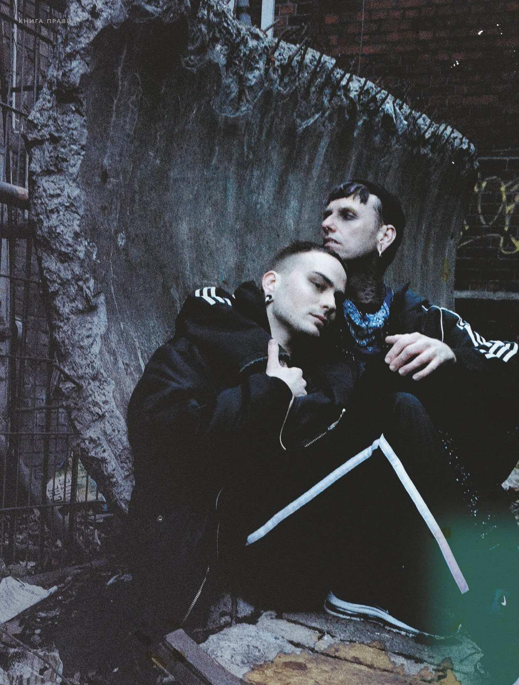

#### **Дисциплины**

Слабокровки изобрели и активно используют свою собственную разновидность алхимии. Она позволяет им пользоваться Дисциплинами других Сородичей, причём на довольно высоком уровне, если они смогут раздобыть витэ для своей рецептуры.

Помимо этого, каждый раз, когда веспер пьёт кровь, он получает один пункт в одной Дисциплине, связанной с резонансом выпитой крови, а также одну силу первого уровня в рамках полученной Дисциплины. Если резонанс сильный или пиковый, веспер дополнительно получает ещё один пункт и ещё одну силу этой Дисциплины. Количество сил и пунктов Дисциплины, которые можно получить подобным образом, не увеличивается с опытом. Веспер может пользоваться полученными способностями, пока его Голод не достигнет 5 пунктов или пока он снова не выпьет чью-то кровь.

#### **Голод и ярость**

Питаться слабокровным нужно так же часто, как и любому другому вампиру. Однако их Зверь реже даёт о себе знать. Весперы впадают в ярость, только если их провоцируют какие-то сверхъестественные силы (например, Анимализм — см. стр. 244).

#### **Подобие жизни**

Слабокровный всегда находится под воздействием Искры жизни (стр. 218). Конкретный эффект зависит от Человечности вампира.

#### **Солнечный свет**

Под прямыми солнечными лучами слабокровные вампиры получают только 1 пункт лёгкого урона в ход. Если свет рассеянный, частота получения урона будет меньше. К примеру, выйдя на улицу в пасмурную погоду или защитив себя при помощи плотной одежды, маски и солнцезащитного крема, веспер будет получать урон раз в три хода или раз в минуту.

#### **Достоинства слабокровных**

У весперов часто проявляются разнообразные дополнительные черты. Более подробно см. в разделе «Достоинства и недостатки слабокровных» (стр. 151).

## Пути избавления

Слабокровные вампиры балансируют на грани между жизнью и нежизнью. У них всё ещё есть выбор. Хотя они не стареют и теоретически могут оставаться весперами сколько угодно, каждый из них рано или поздно делает свой выбор — день или ночь. Веспер, которому удалось совершить диаблери над «истинным» Сородичем, поглощает не только его силу и дух, но и его наследие, становясь вампиром 13-го поколения, принадлежащим к тому же клану, что и жертва. Камарилья периодически бросает подачки слабокровкам, показавшим, что они способны справляться с грязной работой, предлагая им каинитов, приговорённых к кровавой охоте, в качестве «награды».

Что касается другой альтернативы, у каждого веспера есть знакомый, у которого есть другой знакомый, который вернулся к свету. История, как правило, такова: он изо всех сил держался за свою Человечность до тех пор, пока ему не удалось выследить и убить своего сира, сняв таким образом проклятие.

Разумеется, не стоит забывать, что любой смертный, которому известно о существовании Сородичей, это угроза для Маскарада. ⬛

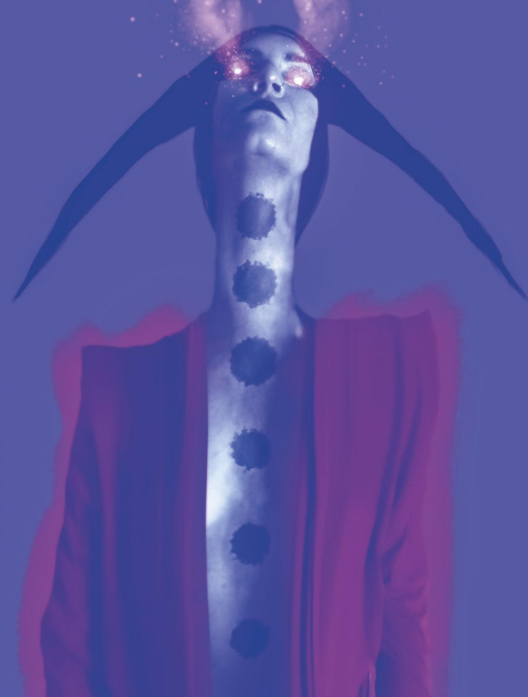

Согласитесь, жизнь без математики была бы сущим кошмаром. СИДНЕЙ СМИТ

игре «Вампиры: Маскарад» есть определённый набор формальных правил, или правил игровой механики, которые служат прочной основой для создания истории - формируют её скелет. В конце концов, ни игрокам, ни рассказчику не понравится, если придётся всё делать с нуля, и точно также не понравится, если каждая история будет разворачиваться по строго заданному сценарию - это ведь игра, а не роман или кинофильм.

В этой главе описаны самые общие правила, которые не замедляют ход игры и обычно не вызывают вопросов. Это основа основ системы правил «Рассказчик».

Вы можете провести всю игру, опираясь только на эту главу с некоторыми оговорками. С главами «Вампиры» и «Дисциплины» необходимо ознакомиться, если игроки решили взять на себя роли состоявшихся Сородичей. Ну а если игру они начинают людьми, то вполне достаточно будет «Правил» и «Персонажей». Ничего другого может до конца игры так и не понадобиться!

Более сложные варианты правил и дополнительные игровые механики описаны в главе «Расширенные правила». Использовать ли их, зависит от вашего желания.

Здесь, в свою очередь, описаны только те правила, без которых игра попросту не сдвинется с места, начиная с таких абстрактных вещей, как течение времени в игре, и заканчивая тем, как проходить проверки.

### Течение времени

В Мире Тьмы время течёт с той же скоростью, что и в нашем. Иногда может показаться, что там всё время ночь, но только потому, что в игре вы не пытаетесь поминутно описывать абсолютно всё происходящее - порой целые дни можно опустить. Игровая встреча может длиться 4 часа, а за это время в игре пройдут десятилетия ретроспективы (см. стр. 311) или одна предрассветная перестрелка продолжительностью в 15 минут (впрочем, есть надежда, что вы не станете обрекать себя на подобное испытание и воспользуетесь «правилом трёх ходов» - см. стр. 130).

В игре «Вампиры» используются следующие термины, описывающие временные промежутки:

ход. Отрезок времени, необходимый для того, чтобы предпринять какое-нибудь относительно простое действие, например напасть на полицейского, найти что-то в рюкзаке или заказать выпивку в баре. У хода нет строго заданной длительности - он заканчивается тогда, когда заканчивается соответствующее действие. В сценах общения ходы, как правило, длятся дольше, чем в сценах драк и перестрелок. На выстрел из пистолета ты потратишь меньше времени, чем на заказ коктейля, - в некоторых барах можно прождать целую вечность.

#### **КОГДА НУЖНЫ ПРОВЕРКИ**

Главное в «Вампирах» не правила, а интересная история. Быстрый темп повествования помогает наращивать напряжение, а вялый способен умертвить даже самый убийственный хоррор. Рассказчик может менять стиль игры, чтобы заданный темп лучше способствовал задумке. Многие сцены ничуть не пострадают и даже станут более захватывающими - если вообще не прерываться на проверки, а положиться исключительно на воображение товарищей по игре, раскрывающееся в диалогах и красочных **ОПИСЗНИЯХ** 

В некоторых сценах неопределённость, которую вносят проверки, усиливает напряжение, словно тревожная музыка в фильме ужасов. Но нельзя всю картину заполнить душераздирающими звуками скрипки и зловещими басами - во всём нужно знать меру. Кроме того, вовсе не обязательно переполнять сцену проверками - можно пройти одну в самом её начале, а затем разыграть события так, как она «предсказала» («Хорошо, похоже, тот тип в пальто вас всё-таки заметил. Как и почему это произошло?»). Для сцен общения этот метод подходит как нельзя лучше. Сперва пройдите проверку, чтобы узнать, кто победит в споре или, допустим, согласится ли Принц с аргументами персонажей, после чего все участники сцены должны разыграть диалог так, чтобы прийти к заданному итогу. Когда игроки привыкнут к подобному стилю игры, точно так же можно будет разыграть и сцену драки.

Иначе говоря, любую сцену можно разыграть с множеством проверок на каждом шагу, а можно с одной проверкой в начале или в конце, а то и вовсе без неё.

Подробнее см. главу «Расширенные правила», раздел «Масштаб и стиль» на стр. 290.

СЦЕНА. В общих чертах это небольшая серия действий и взаимодействий, которые происходят либо в одном месте, либо между опрелелёнными персонажами. Олной сценой можно считать, например, бегство котерии вампиров от ударного отряда Второй инквизиции по крышам города или серию телефонных разговоров, происходящих между вампиром и его информаторами, раскиданными по всей стране. Сцена в игре мало чем отличается от сцены в пьесе или кино. Количество ходов в сцене не ограничено; сцену, состоящую из диалогов и других несложных действий, можно вообще не делить на холы.

ИГРОВАЯ ВСТРЕЧА. Её также называют главой. Для «Вампиров» деление повествования на определённые промежутки не так важно, как для некоторых других ролевых игр, тем не менее структурирование времени позволяет лучше сбалансировать правила — некоторые эффекты, например, могут длиться до конца игровой встречи. Кроме того, в отличие от хода или сцены понятие игровой встречи совер-

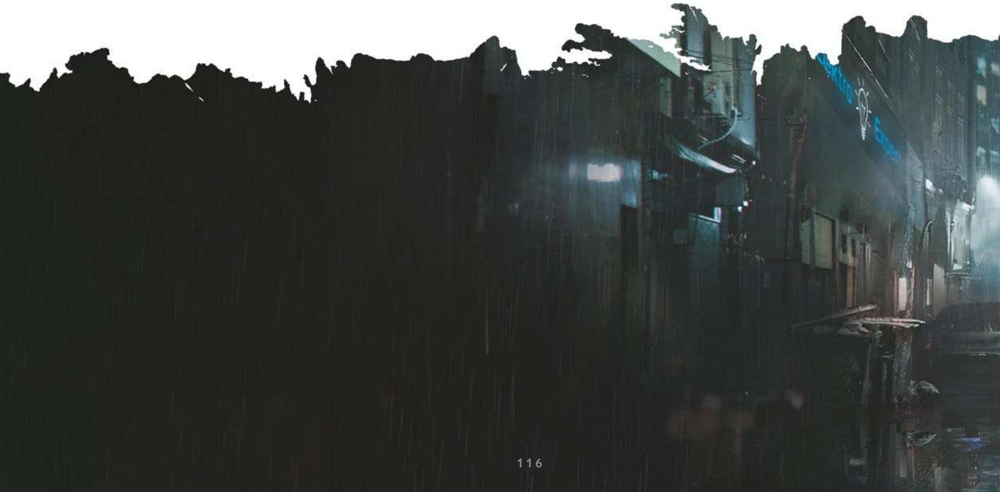

шенно однозначно - вы всегда точно знаете, на каком событии остановилась игра в этот день.

история. Это законченное повествование, у которого есть завязка, кульминация и развязка. Некоторые истории длятся несколько игровых встреч, другие можно завершить и за одну. Самые короткие истории могут быть по сути небольшими зарисовками, состоящими всего из одной сцены.

ХРОНИКА. Это несколько историй, связанных общими героями. В одних хрониках истории объединяет общая тема, в других - сюжет, в третьих их не связывает ничего, кроме действующих лиц. Такая хроника будет серией авантюрных зарисовок в стиле «из огня да в полымя». Атмосфера, как правило, сохраняется на протяжении всей серии — истории могут быть выдержаны в антураже готического романа, криминальной драмы, театральной трагедии или кинобоевика. Однако отдельные эпизоды, будь то истории или игровые встречи, могут выпадать из общей канвы - чтобы подчеркнуть перемены, произошедшие в игровом мире, или просто ради разнообразия. К примеру, сцены ретроспективы могут быть менее мрачными, чем то, что происходит в тёмной современности, или, наоборот, будут беспросветными и кровавыми.

### Обычные проверки

Большая часть того, что персонажи делают во время игры, не требует применения каких-либо правил. Так же, как и в реальном мире, герои, не особо задумываясь, могут завести машину, найти что-то в Интернете, оценить привлекательность жертвы или опасность, исходящую от сомнительного незнакомца, перейти улицу, зарядить пистолет, принюхаться и разобраться с тысячей подобного рода мелочей. Впрочем, даже привычные действия вызывают затруднения, если персонаж находится в стрессовой ситуации или спешит, а также если ему кто-то пытается помешать. В подобных ситуациях проверка будет кстати. Ну а те действия, которые сами по себе провоцируют стресс или создают препятствия для других, требуют проверки почти всегда.

Для начала опиши рассказчику, что твой персонаж намеревается предпринять. Рассказчик может решить, что никакой проверки не требуется: действие тривиально (припарковать машину), не представляет сложности для вампира (почуять кровь) или просто отлично вписывается в повествование и ведёт к развитию сюжета. Иногда проверку можно опустить, чтобы ускорить игру, особенно если задача несложная или персонаж хорошо в чём-то разбирается (подробнее о гарантированных победах рассказано на стр. 120).

Но предположим, что персонаж не так уж хорош в каком-то деле или задача сложнее обычного, вроде карабканья по отвесной скале, чтения на шумерском или взлома дверного замка.

Для подобного рода задач используются обычные проверки, которые мы впредь будем называть просто проверками:

- Игрок описывает, что и как собирается сделать персонаж.
- Рассказчик говорит игроку, какие параметры нужны, чтобы сформировать пул игральных костей.

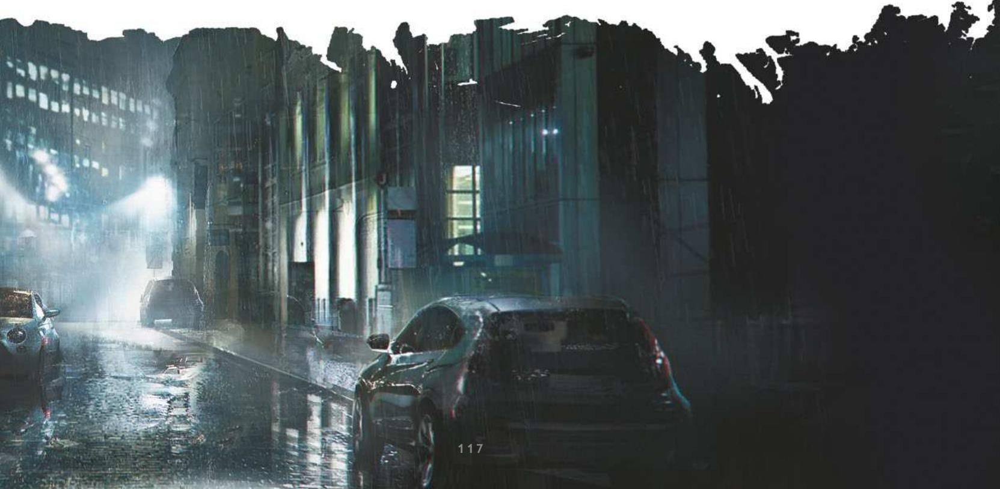

- n Рассказчик определяет *сложность*. В зависимости от обстоятельств и стиля игры он может держать это значение в тайне.
- n Если рассказчик не засчитал *гарантированную победу* (см. стр. 120), игрок бросает кости и выбирает из них те, на которых выпало значение 6 или выше (значение 0 при этом приравнивается к 10 и тоже учитывается). Их количество и будет количеством успехов.
- n Если количество успехов выше или равно слож‑ ности, персонаж успешно проходит проверку то есть выполняет задуманное действие.

#### **ПРИМЕР**

*Персонаж Хуана опрашивает соседей, не попадались ли им на глаза подозрительные личности. Рассказчик решает, что тут достаточно проверки упорства + расследования со сложностью 2 (просто). Показатель упорства персонажа равен 3, показатель расследования также равен 3, значит, игрок бросает 6 игральных костей. У него 3 успеха — более чем достаточно. Рассказчик предоставляет Хуану информацию, которую его персонаж пытался найти: зацепку, которую, возможно, удастся использовать в дальнейшем.*

#### **Параметры**

*Параметры* описывают персонажа с разных сторон это его физические данные, приобретённые навыки, а также разнообразные преимущества и слабости, сре‑ ди которых есть и естественные, и тайные, и сверхъ‑ естественные. Показатели параметров в системе правил «Рассказчик» измеряются в пунктах. Их значения варь‑ ируются от 0 до 5. К примеру, персонаж, показатель силы которого равен 1, слаб и тщедушен, а тот, показа‑ тель силы которого равен 5, теоретически мог бы выиг‑ рать олимпийскую медаль по тяжёлой атлетике.

Параметры, которые определяют врождённый потен‑ циал персонажа, называются *характеристиками*, а те обла‑ сти, в которых он может этот потенциал раскрыть, — *навыками*. Кроме того, и те и другие могут быть *ментальными*, *физическими* или *социальными*. Подробнее об этих и других параметрах (таких как *факты биографии,* например) рас‑ сказывается в главе «Персонажи» (стр. 133 — 199).

#### **Пул и его разновидности**

Рассказчик определяет, какую комбинацию параме‑ тров использовать, чтобы сформировать *пул проверки* то есть определить, сколько десятигранников (d10) бро‑ сать в каждом конкретном случае.

Чаще всего используется *разнородный пул* (характе‑ ристика + навык или характеристика + Дисциплина). Но в некоторых случаях пул может формироваться из одной или нескольких характеристик. Иногда приме‑ няется *пул характеристики*. Например, если персонаж хочет поднять тяжёлую балку, придавившую крышку гроба, ему нужно пройти проверку силы + силы. Иногда суммируются показатели разных характеристик — так, например, при сопротивлении многим Дисциплинам требуется проверка упорства + самообладания (стр. 243). Ну а в том случае, когда показатель навыка, необ‑ ходимого для выполнения какой‑то задачи, равен 0, пул проверки формируется из одной только характеристики (при этом никаких штрафов не налагается).

#### **ПРИМЕР**

*Персонаж Джона хочет подробно изучить какой-то оккультный вопрос в эзотерической библиотеке. Показатель его интеллекта равен 3, а показатель оккультизма равен 2, поэтому пул этой проверки составит 5d10.*

За каждый пункт задействованных в проверке параметров нужно взять по одному d10. Значения параметров, как пра‑ вило, варьируются от 0 до 5, так что в пуле может быть от 1 до 10 игральных костей (если проверка вообще возможна, то её пул составит хотя бы 1d10) или даже больше.

Не позволяйте проверкам становиться на пути твор‑ чества. Особенно это касается социальных действий, таких как соблазнение или дипломатия. Если персонаж произнёс вдохновенную речь (или сказал сущую глу‑ пость), разыграл превосходный (или оскорбительный) гамбит или предоставил очень хитрое (или абсолютно наивное) объяснение, рассказчику стоит задуматься над тем, не изменить ли сложность. В самых ярких слу‑ чаях персонаж может даже преуспеть (или потерпеть поражение) безо всяких проверок.

Если у героя высокий показатель какого‑то параме‑ тра, а он собирается сделать что‑то катастрофически неправильное, рассказчику стоит предупредить его о возможных последствиях («глубокие познания в эти‑ кете подсказывают тебе, что Принца лучше не хлопать по плечу»). Впрочем, даже если значение навыка не пре‑ вышает единицы, персонаж всё ещё может творить чу‑ деса, если будет действовать с умом.

Формируя пул проверки, вампиры в первую очередь всегда задействуют игральные кости из своего текущего пула Голода, а уже к ним добавляют недостающие обыч‑ ные десятигранники, если это необходимо (см. стр. 205).

СПЕЦИАЛИЗАЦИИ. Персонаж может проявлять особый талант в какой-то одной области применения конкретного навыка или обладать большим опытом в определённой узкой сфере. Если действие, которое он пытается совершить, относится к области одной или нескольких его специализаций в задействованном навыке, он может добавить 1d10 к пулу соответствующей проверки.

Подробнее о специализациях см. на стр. 159.

ШКАЛЫ. Есть три характеристики, из показателей которых составляются две шкалы - т. е. два пула с особыми свойствами:

- Показатель шкалы здоровья равен показателю выносливости + 3.
- Показатель шкалы воли равен сумме показателей упорства + самообладания.

Особенность шкалы в том, что её значение может колебаться во время игры: уменьшаться, когда персонажи получают повреждения или стресс (либо тратят пункты воли добровольно), и восстанавливаться обратно (при этом текущее значение шкалы не может превысить значение её показателя).

Если рассказчик просит пройти проверку, задействовав в пуле шкалу, то берётся её текущее значение, а не изначальный показатель. Пул проверки всегда состоит как минимум из игральной кости - даже если текущее значение шкалы опустилось до 0, пул будет равен 1d10.

### ПРИМЕР

Показатель воли Бавны равен 7, но она уже потратила 3 пункта воли за эту игровую встречу, так что пул проверки воли равен не 7d10, а всего 4d10.

**≢⊱∢ ≽≔** 

---------------------------------------

#### Сложность

Рассказчик определяет сложность действия, которое желает совершить персонаж, т. е. количество успехов, необходимое для победы (иными словами, для достижения залуманного результата).

В отличие от более ранних редакций «Вампиров», сложность - это количество игральных костей, на которых должен выпасть успех, а не минимальное значение на самих игральных костях, которое должно выпасть, чтобы успех засчитался. В данном случае успех приносит каждый d10, на котором выпала цифра 6 или больше.

ЭКИПИРОВКА. Для некоторых задач требуется соответствующая экипировка: нельзя взломать замок без отмычки, провести хирургическую операцию без зажимов и скальпеля или стрелять, когда у тебя нет оружия. Если какое-то действие нельзя совершить без экипировки, но она оказывается ненадёжной или низкокачественной либо же собирается из подручных материалов, рассказчик может повысить сложность проверки на 1. Если же экипировка вообще отсутствует, проверка невозможна.

противодействие. Персонажи игроков порой предпринимают действия, направленные против персонажей рассказчика, например взламывают компьютерную систему банка, крадутся мимо охранника или соблазняют жертву.

Рассказчик в этом случае может посчитать это состязанием (стр. 123), а может просто назначить фиксированную сложность, чтобы ускорить игру. Определить сложность можно одним из перечисленных ниже способов:

- Взять значение из таблицы (см. ниже).  $\blacksquare$
- Разделить пул противника персонажа пополам с округлением вниз (см. правило половины, стр. 123).
- Приравнять сложность к значению навыка противника. Даже если навык отсутствует, сложность будет

| СЛОЖНОСТЬ ЗАДАЧИ |  |
|------------------|--|
|                  |  |

**НЕОБХОДИМОЕ** КОЛИЧЕСТВО УСПЕХОВ

| Элементарная (ударить неподвижную цель; уговорить верного друга оказать помощь в ка- 1 успех ком-то деле)                                         |            |
|------------------------------------------------------------------------------------------------------------------------------------------------------|------------|
| Простая (соблазнить кого-то, кто и сам не против поразвлечься; запугать слабовольного человека)                                                      | $2$ успеха |
| Непростая (заменить звуковую систему в автомобиле; пройтись по канату)                                                                               | 3 успеха   |
| Серьёзная (определить источник тихого шёпота; создать произведение искусства)                                                                        | 4 успеха   |
| Сложная (убедить полицейского, что это не твой пакетик кокаина; собрать из деталей рабо- 5 успехов тающий двигатель)                              |            |
| Невероятно сложная (бежать по канату, уворачиваясь от пуль; успокоить агрессивно настроен- 6 успехов ную толпу, готовую сорваться в любой момент) |            |
| <u> Πριπειρουποιμμμας (οπισιατι η Λος Λιμνωιρςο οιμοτο κοιμηστιρτο δολιονιματο 22 οιμμ. 7 μιμ. δοιμμα νεποχοη</u>                                    |            |

Іочти невыполнимая (отыскать в Лос-Анджелесе одного конкретного бездомного за одну ночь; без ошибок продекламировать длинный текст на языке, которого ты не знаешь)

равна по меньшей мере 1. Обычное значение навыков (и характеристик) у смертных - 2 или 3. Большинство из них не представляют какой-либо угрозы для вампиров, впрочем, как и для одарённых смертных.

МОДИФИКАТОРЫ. Рассказчик может применить модификатор при любой проверке. В игре «Вампиры» есть два вида модификаторов:

- Изменение пула. Применяется, когда обстоятельства влияют на персонажа: его накачали наркотиками, он использует специализацию, он выглядит угрожающе и т. д.
- Изменение сложности. Применяется, когда обстоятельства влияют на действие: мещает дождь, экипировка в плохом состоянии, нужно сделать что-то под градом пуль или на чужой территории и т. д.

В целом изменение пула на 2d10 по статистике имеет тот же эффект, что изменение сложности на 1.

Применяя модификаторы, не стоит забывать о здравом смысле. Бесконечно улучшать что-то невозможно; и точно так же неблагоприятные обстоятельства, накладываясь друг на друга, не сделают задачу совершенно невыполнимой. Разумный предел в случае изменения сложности - это 2, а в случае изменения пула - 3d10. Эта рекомендация касается модификаторов, которые рассказчик вводит по ходу игры в качестве импровизации, т. е. сказанное выше не относится к специализациям или другим модификаторам, обозначенным в правилах.

После применения модификаторов пул ни при каких обстоятельствах не может оказаться меньше 1d10.

ГАРАНТИРОВАННАЯ ПОБЕДА. Если размер пула проверки хотя бы вдвое выше сложности этой проверки, персонаж гарантированно добивается успеха безо всяких проверок. Гарантированные победы ускоряют темп игры и делают её более плавной, позволяя меньше отвлекаться от сюжета. Засчитывайте гарантированную победу как можно чаще, особенно вне боя и в тех случаях, когда поражение персонажей плохо скажется на атмосфере и развитии сюжета: при сборе информации, при попытках завязать разговор, в начале сцены.

В бою или иной стрессовой ситуации гарантированная победа редко бывает к месту. Если рассказчик хочет поскорее окунуться в настоящее сражение со стоящим противником или быстрее проскочить зону, в которой он не планировал никаких серьёзных препятствий, он может засчитывать гарантированную победу при стычках со всякой мелкой шушерой (например, охранниками в офисе - но не с настоящей полицией на улицах).

#### Результаты проверок

Каждая игральная кость, на которой при проверке выпало 6 или выше (включая 0, заменяющий 10 на многих десятигранниках) добавляет к результату один успех. Если количество успехов оказалось больше или равно сложности, персонаж успешно прошёл проверку, или одержал победу.

ПРОРЫВЫ И ТРИУМФЫ. Когда на двух обычных игральных костях выпадают 10, это называется прорывом. Прорыв добавляет к результату 2 успеха сверх тех, которые полагаются за каждую из десяток (т. е. в сумме четыре). Персонаж делает всё быстрее, тщательнее или с большим изяществом, чем обычно. Победа хотя бы с одним прорывом — это триумф.

Каждая пара десяток - это отдельный прорыв. Три десятки вместе дают пять успехов, а четыре - целых восемь.

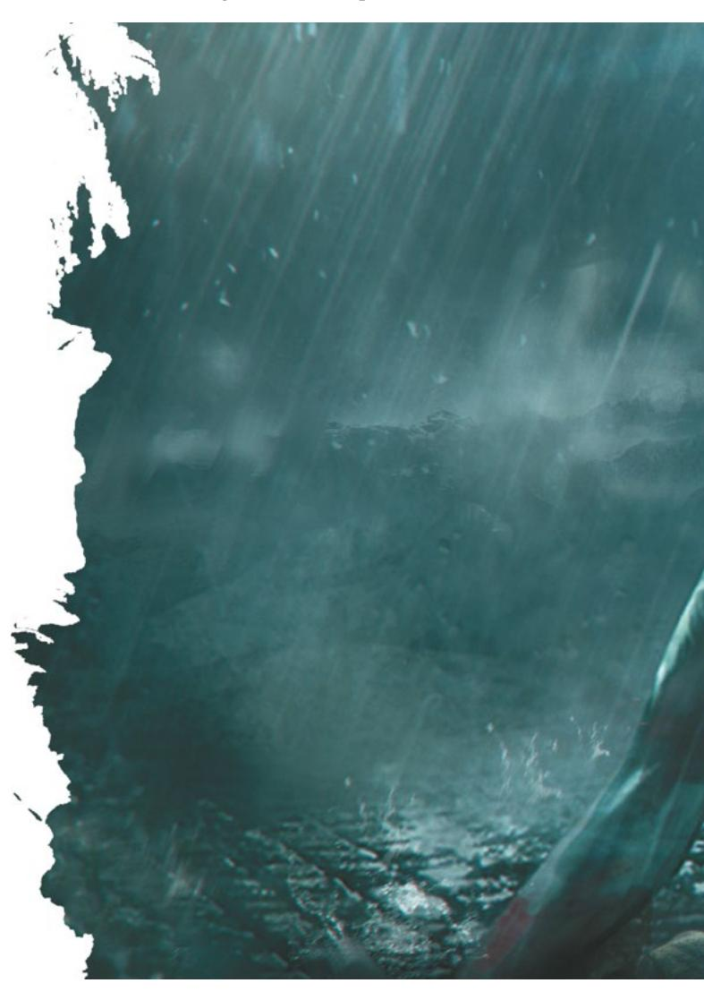

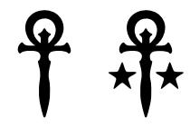

#### НАБОР «ВАМПИРЫ»: ЧЁРНЫЕ (ОБЫЧНЫЕ) ИГРАЛЬНЫЕ КОСТИ

 $(1-5)$  неудача

 $\uparrow$  = (6–9) успех

ग्ग्रै = (10) успех; возможность триумфа (каждая пара  $\frac{3}{4}$  равнозначна 4 успехам).

#### ПРИМЕРЫ ПРОВЕРОК С ИСПОЛЬЗОВАНИЕМ ОБЫЧНЫХ ИГРАЛЬНЫХ КОСТЕЙ:

Мартин (пул 6d10) получает результат •••• # # - 3mo namb ycnexos. 3a npopbls (# #) он получает 4 успеха и ещё один за **†**.

Фрейя (пул 5d10) получает результат • •  $\mathcal{R} \mathcal{R}$  – это тоже пять успехов. За прорыв  $(\mathbb{R} \, \mathbb{R})$  — 4 успеха. за непарную  $\clubsuit$  — 1 успех. Фрейя может потратить пункт воли (стр. 122), чтобы перебросить две неудачи в надежде, что выпадет четвёртый  $\clubsuit$  — тогда она получит колоссальные 8 успехов (по 4 за каждую пару  $\mathcal{F}$ ).

О том, как интерпретировать символы на красных (особых) игральных костях, см. в главе «Вампиры» (стр. 201).

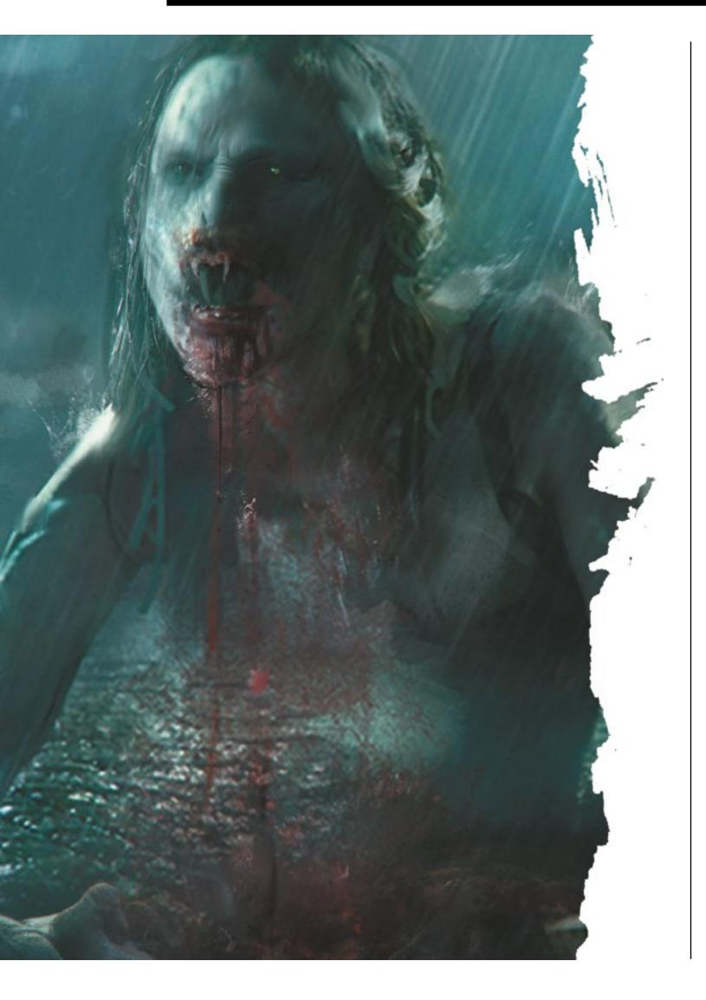

Иногда триумф добавляет также дополнительные эффекты, оговорённые в правилах, а в некоторых обстоятельствах рассказчик после триумфа может даже завершить сцену полной победой персонажей игроков. Кроме того, существует такое понятие, как кровавый триумф (подробнее см. стр. 207).

ВЫИГРЫШ. Разность между количеством полученных успехов и сложностью называется выигрышем. Если сложность проверки составляет 4, а успехов выпало 7, то выигрыш равен 3. В некоторых случаях выигрыш используется, чтобы определить степень эффективности действия (например, для подсчёта нанесённого урона, а также при использовании многих Дисциплин).

Даже когда об этом напрямую не говорится в правилах, рассказчик может использовать выигрыш, чтобы разнообразить описания в игре: чем он больше, тем лучше у персонажей получилось задуманное.

При гарантированной победе выигрыш всегда равен нулю.

РАСПЛАТА ЗА ПОБЕДУ. Если на игральных костях выпал хотя бы один успех, но этого тем не менее не хватает, рассказчик может назначить расплату за победу. Персонаж добивается поставленной цели, но при этом усложняет себе жизнь: получает повреждения, испытывает стресс, привлекает нежелательное внимание, теряет что-то ценное и т. д. Любой игрок, включая того, чей персонаж действовал, может предложить рассказчику свой вариант расплаты. Она должна соответствовать количеству недостающих успехов. Если расплата слишком высока, всегда можно согласиться на поражение.

#### ПРОРЫВЫ И ТРИVМФЫ В ИГРЕ

Прорывы - довольно частое явление в игре. Рассказчика это не должно удивлять. Чем больше пул. тем выше шанс на прорыв: при пуле 10d10 прорыв выпадает немногим больше чем в 25% случаев. Разумеется, такой большой пул может быть только у персонажа на пике человеческих возможностей - или у того, кто тщательно подготовился или сумел призвать достаточно тёмных сил, чтобы компенсировать все свои недостатки.

Рассказчику стоит учитывать вышесказанное, когда он назначает модификаторы. Если триумф может ослабить накал или как-то ещё навредить повествованию, не стоит увеличивать пул - лучше вместо этого снизить сложность. С математической точки зрения уменьшение сложности на 1 имеет тот же эффект, что добавление 2d10 к пулу.

Как бы там ни было, триумфы - это прекрасно. Они позволяют персонажам блеснуть и показать себя хозяевами положения. А триумфы противника, в свою очередь, добавляют игре драматичных сцен и резких поворотов. Что может быть лучше для истории о борьбе между необузданными хищниками?

#### ---------------------------------------

#### ПРИМЕР

В самом начале хроники котерия пытается выбраться из горящего здания. Персонажи проходят соответствующую проверку. Если они потерпят поражение, то погибнут и история закончится, так толком и не начавшись, поэтому рассказчик решает, что за победу придётся расплатиться ожогами - персонажи получат по 1 повреждению за каждый недостающий успех.

 $-$  --->  $\mathbb{R}$   $\rightarrow$   $-$ 

повторная попытка. Если у персонажа не получилось что-то сделать, иногда он может попытаться вновь. В конце концов, если кому-то не удалось взломать замок, это не значит, что он больше никогда в жизни не сможет воспользоваться отмычкой, чтобы его одолеть. Повторная попытка должна быть чем-то оправдана, например у персонажа появился новый комплект

отмычек, лучше прежнего, или герой успел потренироваться и увеличил значение своего навыка.

Что касается действий в конфликтах - в бою, во время погони и т. п. - их можно повторять без особых ограничений. Любой конфликт - это опасная ситуация, и поражение тут само по себе влечёт серьёзные ПОСЛЕДСТВИЯ

ЖЕСТОКИЙ ПРОВАЛ. Если во время проверки на игральных костях не выпало ни одного успеха, это называется жестоким провалом. Порой он ничем не отличается от поражения - у персонажа просто что-то не получилось. Но иногда жестокий провал сопровождают серьёзные осложнения. В зависимости от обстоятельств и характера действия рассказчик должен решить, что именно произошло, а также возможна ли повторная попытка.

#### ПРИМЕР

Сэм не получает ни единого успеха, когда её героиня пытается перепрыгнуть с крыши на крышу. Что ж, незадачливую вампиршу ждёт скорая встреча с тем единственным, кто готов самоотверженно броситься навстречу любому оступившемуся, - с холодной и твёрдой землёй.

 $-4$ 

- ------------------------------------

ВЗАИМОПОМОЩЬ. Если несколько персонажей могут вместе выполнять какую-то задачу, помогая друг другу (например, обыскивать место преступления или обрабатывать будущую жертву своих махинаций), проверку должен пройти тот, у кого больше пул проверки. За каждого помощника, у которого значение соответствующего навыка равно хотя бы 1, к пулу прибавляется 1d10. Если в проверке не задействованы навыки, оказывать помощь может любой персонаж.

ВОЛЯ. Персонаж может потратить 1 пункт воли, чтобы перебросить от 1 до 3 обычных игральных костей при любой проверке навыка или характеристики, включая проверки, связанные с Дисциплинами. Нельзя тратить пункты воли, чтобы перебрасывать кости из пула Голода либо при проверке воли или Человечности, а также тогда, когда проверка идёт по любой другой шкале. Считается, что персонаж, потративший 1 пункт воли, получает 1 пункт лёгкого стресса (см. стр. 126), что нужно отметить на соответствующей шкале.

Более подробно о воле см. стр. 157 - 158.

ИСПЫТАНИЯ. В отличие от проверок, для испытаний, как правило, используется только одна игральная кость. Чтобы пройти испытание, игрок должен бросить 1d10 и получить значение 6 или выше.

Вампирам испытания нужны преимущественно для того, чтобы определить, не усилился ли их Голод (о Голоде, насыщении и испытании Крови см. на стр.  $211 - 213$ ).

Игроки не могут тратить пункты воли, чтобы заново проходить испытания. При испытании не может быть гарантированной победы, и правило половины здесь неприменимо.

### Состязания

Там, где есть прямое противостояние, рассказчик может объявить состязание. Например, если персонаж пытается проскочить мимо охранника, который его ищет, соблазнить полицейского под прикрытием или взломать компьютерную систему, находящуюся под наблюдением.

В состязании участвуют две противоборствующие стороны, каждая из которых формирует свой пул, причём им не обязательно использовать для этого одни и те же параметры: крадущемуся персонажу пригодится ловкость + скрытность, а охраннику, который его ищет, - смекалка + наблюдательность.

Как правило, состязание проходит так:

- Игрок описывает, что и как собирается сделать его персонаж.
- Рассказчик решает, что персонажу игрока кто-то противостоит. Он говорит игроку, какие параметры использовать, чтобы сформировать пул.
- Рассказчик решает, какие параметры будет использовать оппонент, чтобы сформировать пул.
- Обе стороны проходят проверки и считают полученные успехи.
- Если персонаж, инициировавший проверку, получает больше или столько же успехов, что и его противник, он побеждает в состязании.

Персонажи игроков, несомненно, могут состязаться друг с другом! Какой пул использовать той и другой стороне, в любом случае определяет рассказчик.

ПРАВИЛО ПОЛОВИНЫ. Чтобы уменьшить количество проверок во время игры, к персонажу рассказчика в состязаниях можно смело применять правило половины.

Для этого нужно разделить значение пула игральных костей этого персонажа на два с округлением

вниз — результат и будет количеством полученных им успехов.

Мы рекомендуем рассказчику позволять и игрокам пользоваться правилом половины, когда они хотят без осложнений пройти лёгкую проверку или Голод их персонажей слишком силён. Чтобы проверки всё ещё были достаточно интересны, стоит держать значение их сложности в секрете, но при этом оставлять намёки: «кажется, с этим ты справишься без труда» или «ты понимаешь, что придётся приложить немало усилий» и так далее.

#### ОПИСАНИЕ РЕЗУЛЬТАТА ПРОВЕРКИ

После проверки оцени ситуацию и в ярких подробностях обрисуй произошедшее. К добру или к худу, всё это теперь свершившийся факт. При описании опирайся на результат проверки, особенности характера действующих лиц и сопутствующие обстоятельства. Учитывай также настроение всей истории. Рассказчик и игроки могут смело помогать друг другу, придумывая детали, но последнее слово остаётся за рассказчиком.

## Конфликты

Ситуации, в которых персонажи вступают в состязание друг с другом и могут нанести друг другу урон (физический или моральный), называют конфликтами. Базовые правила конфликтов очень просты и не замедляют игру. Они относятся к любым агрессивным противостояниям — от уличной драки до особенно жёстких придворных дебатов. Рассказчик и игроки могут описывать действия персонажей во время конфликта настолько подробно, насколько считают нужным, облекая броски костей в плоть повествования.

Расширенные правила разрешения конфликтов см. на стр. 295 - 296.

#### Ходы в конфликте

Конфликт — это обмен ударами, физическими или словесными. Когда каждый участник конфликта получил шанс что-то сказать или сделать (даже если он им и не воспользовался), значит, для всех прошёл один ход. По времени он занимает ровно столько, сколько требуется с точки зрения здравого смысла - пара

**выстрелов может положить конец конфликту за долю секунды, и в то же время при попытке кого‑то соблаз‑ нить вампир может потратить на намёки и комплимен‑ ты три‑четыре часа, и это будет только первый ход. Соответственно, одна проверка — это не обязательно один‑единственный удар бейсбольной битой. Хотя, если рассказчик решит, может быть и так.**

**В начале каждого хода все игроки по очереди за‑ являют, что собираются делать и чего хотят добиться. Каких‑то ограничений тут нет. За ход можно, напри‑ мер, попытаться сдёрнуть водителя с сидения удаляю‑ щегося мотоцикла, отвлечь внимание домитора, по‑ могая таким образом соблазнить его гуля, или просто спрятаться в укрытии.**

#### **ПРИМЕР**

*Фабиан, Трейси и Лия попали в засаду в старой церкви и теперь вынуждены бороться за собственную жизнь. Рассказчик по очереди обращается к каждому игроку за столом и просит всех описать намерения их персонажей. Фабиан хочет прыгнуть в укрытие, Трейси накормить свинцом любого, кто к ней приблизится, а Лия в отчаянии отбивается от психа с крюком, который, похоже, невзлюбил именно её.*

**Когда все игроки определились с намерениями, рас‑ сказчик принимает решения за всех своих персона‑ жей. Затем он говорит каждому игроку, какие пара‑ метры использовать, чтобы сформировать пул, после чего все проходят необходимые проверки.**

#### **ПРИМЕР**

*На Фабиана никто не обращает внимания. На Трейси бросается один из нападающих. Псих с крюком пытается зацепить Лию.*

### **Пул конфликта**

**Пул любого из участников конфликта, используемый в один конкретный ход, называется пулом конфликта. В бою он может состоять из силы + драки или самооб‑ ладания + стрельбы, во время дебатов — из обаяния + убеждения или манипуляции + этикета. Пул конфликта может меняться: например, на следующий ход персо‑ наж подберёт монтировку или сменит тактику веде‑ ния дискуссии, перейдя от лести к психологическому давлению.**

#### **ПРИМЕР**

*Трейси проходит проверку самообладания + стрельбы со сложностью 2 (её цель находится на открытом пространстве и приближается). Лия вовлечена в состязание со своим противником: её пул состоит из силы + драки, а его — из ловкости + фехтования. Рассказчик решает, что Фабиан сможет спрятаться в укрытие безо всяких проверок, поскольку никто этому не препятствует.*

#### **КТо ДеЙСТВУеТ ПеРВЫМ?**

**Этот вопрос чаще всего возникает в конфликтах физического характера. В споре зачастую гораздо важнее, за кем осталось последнее слово.**

**Порядок действий в конфликте, как правило, следующий: сперва действуют персонажи, уже вовлечённые в ближний бой; затем те, кто применяет дистанционное оружие; затем те, кто только собирается вступить в ближний бой в этом ходу; затем все остальные. Чтобы определить порядок внутри каждой труппы, сравните ловкость + смекалку персонажей, а если результаты равны, то показатели используемых навыков.**

**исключение составляют внезапные нападения — тут первое слово будет за атакующими. Подобное преимущество обычно даёт успешно пройденная заранее проверка — можно, например, подкрасться или использовать знание тактики, чтобы устроить засаду.**

#### **ПРИМЕР**

*В описанном ранее конфликте Лия действует одновременно с оппонентом, ведь они оба сражаются в ближнем бою. Трейси стреляет раньше, чем её атакуют, ведь оппонент Трейси только собирается вступить в ближний бой. Кто действует раньше, Трейси или Лия вопрос, требующий обсуждений. Когда действует Фабиан — неважно, поскольку с ним никто не взаимодействует.*

**если вашей труппе больше по душе традиционные правила инициативы, см. стр. 300.**

При разрешении конфликта по базовым правилам все участники проходят проверку одновременно. Та сто‑ рона, которая получила больше успехов, побеждает в текущем ходу (точно так же, как в любом состязании). Победитель вычитает успехи проигравшей стороны из своих успехов. Полученный результат — это урон, нанесённый проигравшему. Его нужно отметить на со‑

ответствующей шкале (см. раздел «Урон, повреждения и стресс» на стр. 126).

Если конфликт односторонний, то есть один из участников только защищается и не предпринима‑ ет агрессивных действий, этот участник в любом слу‑ чае не наносит урон. Если обе стороны хотят и могут причинить друг другу вред, конфликт называется дву‑ сторонним и обе стороны считаются нападающими. Они проходят проверки одновременно, в рамках од‑ ного состязания. Победитель наносит урон проиграв‑ шему, как сказано выше. Если в результате получилась ничья, обе стороны наносят друг другу по 1 пункту урона.

**ДиСТанционное оРУжие.** Выстрел или иная атака дистанционным оружием считаются состязанием, в ко‑ тором защищающаяся сторона, как правило, проходит проверку ловкости + атлетики. Если между участниками идёт активная перестрелка, это можно считать двусто‑ ронним конфликтом (см. выше), где обе стороны будут проходить проверки стрельбы. При этом предполага‑ ется, что участники могут найти укрытие — нырнуть за угол или спрятаться за автомобилем. Если укрытий рядом нет, пул проверки уменьшается на 2d10, а если укрытие превосходное (мешки с песком, бетонные укрепления и другие пуленепробиваемые объекты) увеличивается на 1d10 или 2d10.

**УВоРоТ.** В ближнем бою защищающемуся не обяза‑ тельно прибегать к драке или фехтованию — он мо‑ жет задействовать ловкость + атлетику, чтобы увора‑ чиваться от ударов, а не парировать их. В этом случае персонаж не наносит урон независимо от результата состязания.

**неСКоЛЬКо ПРоТиВниКоВ.** Персонаж, которого ата‑ ковали сразу несколько противников, помогая друг другу, может защищаться, атаковать в ответ или ре‑ шить защищаться от одних и атаковать других (воз‑ можно даже, используя при этом разные наборы па‑ раметров). Когда он защищается, его пул уменьшается на 1d10 за каждого следующего противника. Когда персонаж атакует, его пул не уменьшается, но герой должен разделить его между всеми, на кого собира‑ ется нападать.

#### **ПРИМЕР**

*Катарина сражается одновременно с тремя охранниками. Её ловкость равна 3, а драка 4, так что при защите* 

*от первого охранника её пул составит 7d10, от второго — 6d10, а от третьего — 5d10. Если она захочет атаковать первых двух, то должна взять полный пул 7d10 и разделить его на две части в любых пропорциях. Если она при этом захочет защищаться от третьего, пул проверки защиты всё так же будет составлять 5d10.*

#### **Урон, повреждения и стресс**

Исходя из сути конфликта рассказчик решает, с какого рода уроном столкнутся персонажи. В физических кон‑ фликтах легко получить повреждения (они отмечаются на шкале здоровья), в социальных — испытать стресс (он отмечается на шкале воли).

Победитель состязания наносит противнику урон, равный выигрышу, и пострадавший персонаж отмечает повреждения или стресс на соответствующей шкале.

Некоторые обстоятельства могут увеличить нане‑ сённый урон:

- n Если речь идёт о физическом конфликте и побе‑ дитель использовал оружие, к нанесённому урону прибавляется модификатор оружия (см. стр. 303).
- n В социальных конфликтах на рост стресса могут влиять окружающие (см. стр. 305). Если проиграв‑ ший высоко ценит мнение свидетелей его пораже‑ ния, рассказчик может дополнительно увеличить полученный стресс.

#### **ПРИМЕР**

*Клара стреляет в офицера из дробовика. Её выигрыш равен 2. Модификатор урона дробовика равен +4, так что офицер получает 6 повреждений.*

ВИДЫ ПОВРЕЖДЕНИЙ И СТРЕССА. В системе правил «Рас‑ сказчик» есть два вида повреждений и стресса:

n **Лёгкие повреждения / стресс.** В физическом кон‑ фликте это ушибы, растяжения и другие травмы, не опасные для жизни. Люди получают *лёгкие повреждения* от ударов руками и ногами, а также от оружия нелетального действия, например тазе‑ ров. Вампиры получают лёгкие повреждения также и от любого обычного оружия. В социальном кон‑ фликте *лёгкий стресс* — это стыд или задетое само‑ любие. То, что не разрушает репутацию, не травми‑ рует психику и быстро забывается.

n **Тяжёлые повреждения / стресс.** В физическом кон‑ фликте это переломы, открытые раны и другие травмы, опасные для жизни. Людям *тяжёлые повреждения* наносит, например, режущее и колющее ору‑ жие. А вампирам, как правило, только огонь, солнеч‑ ный свет, а также когти и зубы сверхъестественных существ. В социальном конфликте *тяжёлый стресс* это раскрытие мрачных тайн, а также выпады со стороны близких друзей и доверенных лиц.

**Добровольно потраченные пункты (если, к примеру, игрок готов расстаться с пунктами воли, чтобы перебросить кости) отмечаются на соответствующей шкале как лёгкие повреждения / стресс (« / »). если шкала уже заполнена лёгкими повреждениями / стрессом, тогда они превращаются в тяжёлые, как и положено при изнурении. Лёгкие повреждения / стресс, полученные таким образом, не делятся пополам.**

**МаРКеРЫ на ШКаЛе.** Полученные повреждения или стресс отмечаются на соответствующей шкале шкале здоровья или воли. Если нет иных указаний, разделите любой лёгкий урон пополам (с округлением вверх), прежде чем делать отметки.

Каждый пункт лёгкого стресса или лёгкое повре‑ ждение отмечаются косой чертой (« / ») в пустой ячейке на нужной шкале в бланке персонажа.

Каждый пункт тяжёлого стресса или тяжёлое по‑ вреждение отмечаются косым крестом («Х») в пустой ячейке на нужной шкале в бланке персонажа.

**иЗнУРение.** Если шкала до конца заполнена повре‑ ждениями или стрессом, персонаж оказывается *изнурённым*. При этом пул всех соответствующих проверок уменьшается на 2d10: если изнурение вызвано потерей здоровья, это будут физические проверки, а если его причиной послужил стресс — социальные и менталь‑ ные. Штраф может распространяться и на другие проверки, если так решит рассказчик. Изнурённых смертных персонажей рассказчика можно считать недееспособными, но решение тут за самим рассказ‑ чиком.

Каждое повреждение, которое получает уже изну‑ рённый персонаж, превращает одно имеющееся у него лёгкое повреждение в тяжёлое: символ « / » меняется на «Х». То же самое происходит и со стрессом.

Полученное количество лёгких повреждений в этом случае сперва делится пополам.

**КоГДа МеСТа не оСТаЛоСЬ.** Если шкала здоровья или шкала воли до конца заполнена тяжёлыми повре‑ ждениями / стрессом, персонаж выбывает из конфликта. Возможно, навсегда.

В физическом конфликте вампир впадает в торпор (см. стр. 223), а смертный — в кому (или умирает).

#### **ПРИМЕР**

*Офицер, упомянутый выше, получил 6 тяжёлых повреждений (он человек, а стреляли в него из дробовика). У него только 5 ячеек на шкале здоровья, так что он тут же умирает.*

Если конфликт социальный — персонаж теряет лицо и оказывается полностью раздавлен. Что его ждёт дальше, решит рассказчик. Его могут, например, из‑ гнать из высшего общества, кроме того, у него, веро‑ ятно, снизится показатель статуса или других досто‑ инств. В результате своего фиаско он может даже умереть.

Вне социального конфликта никаких других по‑ следствий, кроме изнурения, заполнение шкалы воли тяжёлым стрессом не несёт.

#### **ПРИМЕР**

*Котерия оказала всем вампирам медвежью услугу, подстрелив офицера полиции, и теперь неонатов распекают старейшины в Элизиуме. Разворачивается социальный конфликт. Персонажи, которые за время конфликта полностью лишатся пунктов воли, не смогут ничего сказать в своё оправдание, будучи погребёнными под лавиной обвинений. Впервые со времени их Становления им придётся взглянуть на солнце.*

#### **Восстановление**

**ЛЁГКие ПоВРежДениЯ.** В начале каждой игровой встре‑ чи смертный может стереть со шкалы здоровья по од‑ ному лёгкому повреждению за каждый пункт своей выносливости.

Вампиры могут заживлять лёгкие повреждения каж‑ дый ход, пробуждая Кровь (см. «Заживление», стр. 218).

**ЛЁГКиЙ СТРеСС.** В начале каждой игровой встречи и смертные, и вампиры могут стереть со шкалы воли по одному пункту лёгкого стресса за каждый пункт своего самообладания или упорства (смотря что выше).

#### **ПРИМЕР**

*У Теренса упорство 3 и самообладание 4. В бандитских тёрках он получил 6 пунктов лёгкого стресса. В начале следующей игровой встречи он сможет стереть 4 пункта.*

**ТЯжЁЛЫе ПоВРежДениЯ.** В случае со смертными пер‑ сонаж, владеющий навыком медицины, может облег‑ чить участь пострадавшего, превратив тяжёлые повре‑ ждения в лёгкие. Для этого нужно успешно пройти проверку интеллекта + медицины. Сложность равна общему количеству тяжёлых повреждений у пациента. При попытках лечить себя сложность возрастает на 1.

Максимальное количество тяжёлых повреждений, которые персонаж может превратить в лёгкие, равно половине показателя его навыка медицины с округле‑ нием вверх.

Восстановление занимает целую ночь. Если после этого тяжёлые повреждения всё ещё остались, рассказ‑ чик должен решить, необходимо ли госпитализировать пациента, или можно продолжить лечение своими си‑ лами.

Если пациента доставили в больницу, никаких про‑ верок больше не требуется, но выздоровление займёт количество недель, равное количеству оставшихся на шкале здоровья тяжёлых повреждений. Рассказчик при желании может уменьшить этот срок или позво‑ лить персонажу ходить раненым или искалеченным в гипсе, например.

Вампиры, как правило, могут заживлять по 1 тяжё‑ лому повреждению в сутки, пробуждая свою Кровь (см. «Заживление», стр. 218).

**ТЯжЁЛЫЙ СТРеСС.** В начале игровой встречи персо‑ наж, который на предыдущей игровой встрече активно добивался своей цели, может избавиться от 1 пункта тяжёлого стресса.

Однако все прочие последствия поражения в соци‑ альном или интеллектуальном конфликте — потеря репутации, статуса, восприимчивость к ментальному контролю или социальному доминированию — оста‑ нутся до тех пор, пока рассказчик не решит иначе.

## Примеры проверок

При создании этой системы правил немало внимания было уделено её гибкости. Взять хотя бы характеристики и навыки - из них можно составить около 270 комбинаций. И это ещё без специализаций и дополнительных навыков, которые вы всегда можете добавить в игру. В системе правил «Рассказчик» есть много вариантов проверок. Выбирайте те, которые лучше подходят для описания предпринятых действий — ближе к реальности, драматичнее или лучше стимулируют воображение.

Примеры, которые приведены ниже, дадут вам некоторое представление об имеющихся возможностях:

- Персонаж хочет безупречно показать себя на званом ужине у губернатора (что весьма непросто, учитывая, что персонаж не может есть). Тут потребуется проверка ловкости + этикета (сложность 4).
- П Персонаж находится в нескольких километрах от своего убежища, а солнце уже скоро взойдёт. Успешная проверка смекалки + выживания (сложность 4) позволит найти надёжное укрытие на день. Персонаж в любом случае где-то спрячется, но если потерпит поражение, то получит количество тяжёлых повреждений, равное количеству успехов, которого не хватило для победы.
- Персонаж пытается отвлечь телохранителя, оживлён-П но жестикулируя левой рукой, чтобы незаметно спрятать за пояс нож, зажатый в правой. Это проверка ловкости + хитрости (со сложностью, равной половине смекалки + наблюдательности телохранителя).
- П Персонаж молча мерит взглядом главаря бандитов, надеясь, что тот дрогнет и отступит на глазах у всей его ватаги - и главарь, что характерно, пытается сделать то же самое. Это состязание обаяния + запугивания.

- У персонажа в руках молоток, гвозди и куча досок. Его цель - быстро и качественно заколотить дверь в своё убежище. Тут будет уместна проверка смекалки + ремесла (сложность 3). Сложность попыток вломиться внутрь увеличивается на значение выигрыша.
- Вопрос не в том, какой посыл несёт песня, а в том, насколько классно смотрится тот, кто её поёт. Если персонаж успешно пройдёт проверку обаяния + исполнения (сложность 3), в толпе зрителей наверняка найдётся желающий получить от него Поцелуй.
- Сколько времени персонаж сможет неподвижно сидеть в кустах, слушая болтовню обсуждающих футбольный матч охранников? Можно пройти проверку выносливости + скрытности - каждый успех позволит продержаться один час.
- Будет глупо угрожать недругу под сводами Элизиума. Однако если персонаж успешно пройдёт проверку манипуляции + запугивания (сложность 4), то он сумеет выразить должным образом завуалированное предостережение так, чтобы его собеседник правильно понял, о чём речь.
- Внезапно дверь фургона, за которым гонится персонаж, распахивается, и человек выталкивает здоровенный ящик прямо на дорогу. Чтобы объехать этот ящик и не потерять управление, придётся пройти проверку смекалки + вождения (сложность 5).
- Сможет ли персонаж отвлечь сторожевую собаку так, чтобы та не залаяла? Узнать ответ можно, пройдя проверку манипуляции + обращения с животными (сложность 3 + тяжесть изъяна).
- Это что сейчас было? Наезд? Персонаж должен пройти проверку смекалки + запугивания (слож-

**ность равна либо манипуляции, либо этикету оп‑ понента — смотря что выше), чтобы правильно понять последнюю фразу того упыря.**

- n **Персонаж пытается привлечь внимание своего собеседника, пригвоздив его руку ножом к барной стойке. Это проверка силы + фехтования (слож‑ ность 3).**
- n **Персонаж пытается пристроиться бок о бок с мча‑ щимся по трассе мерседесом так, чтобы можно было перепрыгнуть с одной машины на другую. Это состязание смекалки + вождения. Если выиг‑ рает персонаж, он сумеет догнать своего против‑ ника, если же победит соперник, то «мерседес» оторвётся и затеряется в потоке машин.**
- n **Новая банда на удивление успешно умудряется срывать тёмные вампирские делишки. Персонаж должен пройти проверку обаяния + уличного чутья, чтобы выяснить, что люди знают об этих новичках. Чем больше он получит успехов, тем более точной и полной будет информация, однако на расспросы в любом случае придётся потратить целую ночь.**
- n **Интересно, что за сигнализация установлена в этом доме? Пожалуй, стоит пройти проверку интеллекта + воровства. Чем больше успехов, тем больше информации.**
- n **Кому поверит Принц персонажу игрока или его врагу? Это можно выяснить при помощи состяза‑ ния манипуляции + убеждения.**
- n **Прикинувшись аудитором налоговой службы, пер‑ сонаж пытается убедить дежурного служащего дать ему доступ к судебным архивам. Это проверка манипуляции + финансов (сложность 5).**
- n **Сумеет ли персонаж прочесть немецкое издание «Книги земли Нод» и не упустить в процессе пере‑ вода какую‑нибудь важную деталь? Выяснить это**

**можно, пройдя проверку интеллекта + оккультизма (сложность 6 минус показатель достоинства «по‑ лиглот»).**

- n **Персонаж должен бежать, чтобы оторваться от преследователей. Здесь будет уместно состя‑ зание выносливости + атлетики, чтобы узнать, кто выдохнется первым.**
- n **Персонаж должен убедить начальника участка отпустить его до того, как встанет солнце. Успеш‑ ная проверка обаяния + гуманитарных наук (за‑ коны) со сложностью 4 позволит ему составить достаточно убедительное прошение, а при успеш‑ ной проверке манипуляции + политики (сложность 5) помощникам персонажа удастся добиться его освобождения, подёргав за нужные ниточки.**

#### **Правило трёх ходов**

Мы настоятельно рекомендуем завершать конфликты примерно за три хода за исключением тех случаев, когда все хотят продолжить. При большом количестве проверок сюжет развивается медленнее. Кроме того, с каждым броском игральных костей всё сложнее опи‑ сывать результат так, чтобы это было интересно. Если и рассказчик, и все игроки предпочитают сражения до последнего пункта здоровья, как в старые добрые времена, — прекрасно, почему бы и нет. Ну а для всех остальных — вот несколько советов, как определить победителя, если через три хода обе стороны всё ещё на ногах:

- n Персонажи могут выйти из конфликта добровольно. Для этого может потребоваться состязание (напри‑ мер, ловкости + атлетики, чтобы сбежать, или само‑ обладания + этикета, чтобы свернуть дискуссию). Или пусть противник просто оставит персонажей игроков в покое.
- n Если противник понёс больше потерь, чем персона‑ жи игроков, или ему нанесли более серьёзный урон, чем он ожидал, он может выйти из конфликта сам (см. выше).
- n Можно присудить победу тому, кто выиграл большую часть состязаний, или тому, у кого меньше всего тяжёлых повреждений (или тяжё‑ лого стресса). Рассказчик должен, основываясь на результатах проведённых состязаний, опи‑ сать, как завершился конфликт. Персонажам игроков, если они проиграли в конфликте, лучше дать шанс сбежать или хотя бы сдаться, сохра‑ нив достоинство.
- n Можно изменить ситуацию. Появление третьей силы, например полиции или Принца, или смена места действия предоставят новые возможности как игрокам, так и рассказчику. Драка может пере‑ меститься из переулка на находящийся неподалёку склад, а беседа, начавшаяся в Элизиуме, — продол‑ житься на концерте.

Можно использовать правила блиц‑конфликта (см. стр. 298).

## Опыт и развитие персонажа

Сородичам, пережившим одну ночь, будет проще пе‑ режить следующую. В игре **«Вампиры»** этот процесс естественного отбора и эволюции выражен в понятии опыта.

Каждый игрок получает по 1 пункту опыта за каж‑ дую игровую встречу, в которой он участвовал, и ещё 1 пункт опыта по завершении истории. Если рассказчик сочтёт, что быстрое развитие персонажей пойдёт игре на пользу, он может давать игрокам по 2 пункта опыта за игровую встречу. В коротких хрониках это будет уместно.

Игроки могут тратить пункты опыта, чтобы улуч‑ шать параметры или приобретать специализации (стр. 159). Стоимость тех или иных улучшений указана в таб‑ лице на стр. 151 (глава «Персонажи»).

#### **ПРИМЕР**

*Эван хочет улучшить показатель упорства с 2 до 3. Он должен потратить для этого 15 пунктов опыта (5 × 3).*

Рассказчик может попросить обосновать приобретение того или иного параметра действиями в игре. И это касается не только достоинств.

## Золотое правило

Это самое важное правило в **«Вампирах»** — единствен‑ ное, которого стоит строго придерживаться: нет ника‑ ких правил. Игра должна быть такой, какой вы хотите её видеть, будь то хроника, в которой персонажи ведут долгие диалоги, глубоко погружаясь в роль, или так‑ тическая кампания, где каждый игрок контролирует небольшую котерию вампиров. Если какое‑то пра‑ вило мешает вам получать удовольствие — измените его. Мир слишком многообразен — никакой фиксиро‑ ванный набор правил не способен описать его полно‑ стью. Считайте эту книгу руководством — полезным, но не обязательным. Она поможет обрисовать Мир Тьмы, но не претендует на истину. Что и как делать в вашей игре — решать вам, и вы можете без колебаний брать любые правила и делать с ними всё что пожелае‑ те: менять, нарушать или вовсе игнорировать. ⬛

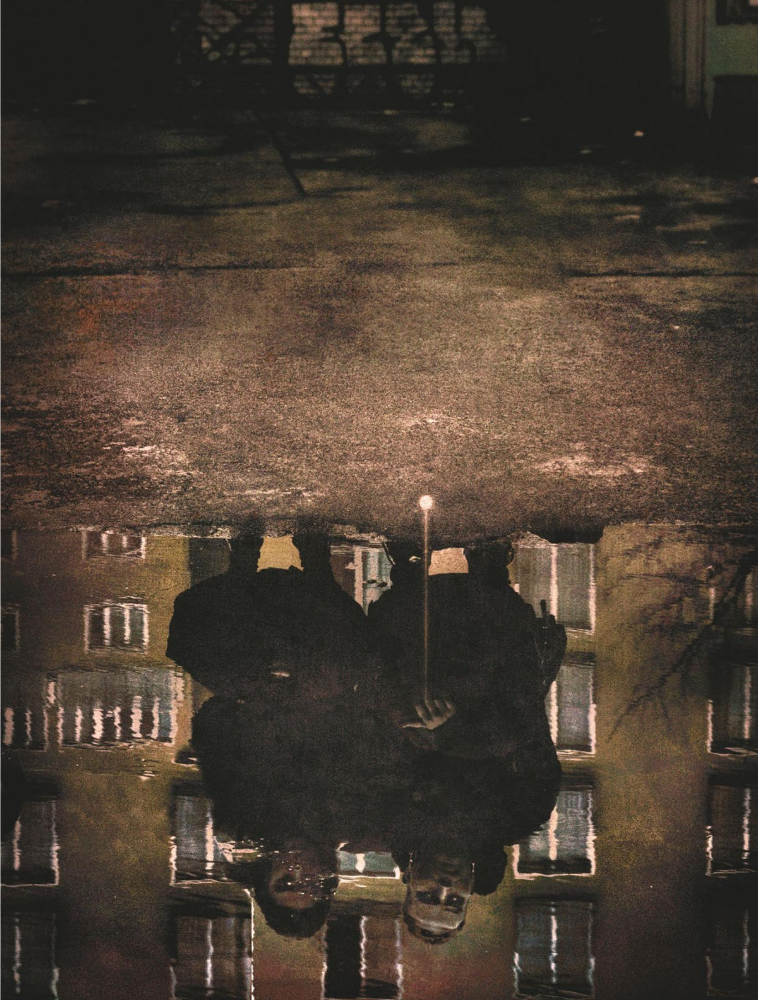

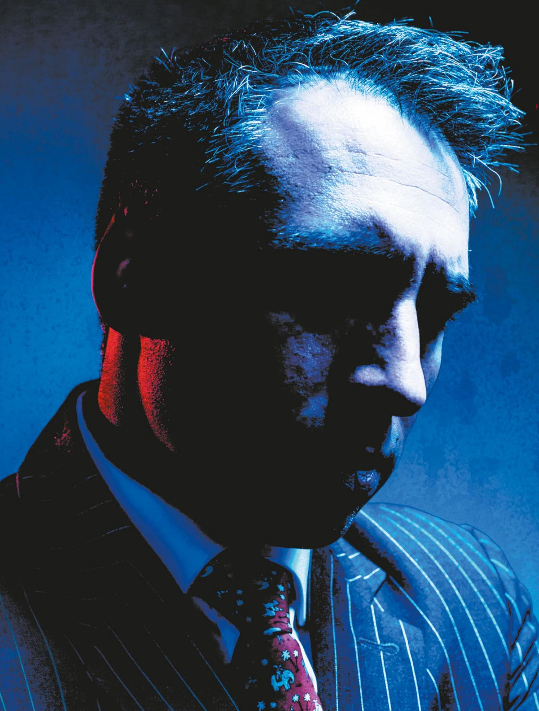

# ПЕРСОНАЖИ

*Весь мир — театр. В нём женщины, мужчины — все актёры. У них свои есть выходы, уходы, И каждый не одну играет роль.*

УИЛЬЯМ ШЕКСПИР, «КАК ВАМ ЭТО ПОНРАВИТСЯ» *(ПЕР. Т. Л. ЩЕПКИНОЙ-КУПЕРНИК)*

Р олевая игра — это возможность хоть недолго побыть в чужой шкуре. Так развернись по полной! Представь, что хроника — это крутой сериал, созданный вашей компанией совместно с каналом HBO. Вам предстоит играть ярких героев, возможно вовсе на вас не похожих. Они пройдут через чудовищные испытания, которые изменят их до неузнаваемости.

Персонаж станет твоим альтер-эго, и на Мир Тьмы ты будешь смотреть его глазами, так что задайся вопросом: кем бы ты хотел себя почувствовать? От твоего персонажа зависит, каким голосом ты говоришь от его лица, как ты жестикулируешь. Ты выбираешь внешность персонажа, его манеру двигаться и вести себя. От его веры, политических взглядов и этических норм зависит его мировоззрение, а способность совершать те или иные действия — от характеристик, навыков и Дисциплин. Во время вступительной игровой встречи можно подробно разработать концепцию и подобрать способности своего героя, а можно просто выбрать клан и стиль охоты, а затем следовать инструкции по быстрому созданию персонажа. Какой бы вариант вы ни выбрали, вам также нужно совместно составить схему отношений и занести туда всех смертных и Сородичей, которые для ваших персонажей что-то значат, чтобы мир в вашей хронике получился более живым.

## Фундаментальные основы

В игре **«Вампиры: Маскарад»** история начинается с персонажей. Они во многом определяют будущий сюжет. Выбирая тот или иной типаж, ты задаёшь тон повествованию и показываешь, какой стиль игры тебе больше по душе. Тут важна каждая деталь — концепция, вид котерии, клан и многое другое. Взять, к примеру, двух героев: спившегося священника, страдающего из-за кризиса веры, и профессионального убийцу, работающего на армянского наркобарона. Отношение к ним будет разное — как со стороны действующих лиц, будь то персонажи других игроков или рассказчика, так и со стороны участников игры. Создавая историю или обдумывая дальнейшее её развитие, рассказчик всегда учитывает, что за персонажи в ней участвуют. Герой, которого ты создал, и концепция, котерия и клан, которые ты для него выбрал, за тебя говорят о том, какой стиль игры ты предпочитаешь.

При выборе персонажа тебя ничто не ограничивает. В ролевой игре нет ограничений, которые накладывают, скажем, кино или театр. Тебе не нужно быть похожим на своего героя — ни в малейшей степени. Ты можешь выбрать любой пол или этническую принад-

лежность, любое мировоззрение, религиозные или политические взгляды. Тебе не обязательно разделять убеждения собственного героя. Будет даже интересней, если у него окажутся другие ценности. В игре **«Вампиры»** ты берёшь на себя роль «пленительного монстра» — страдающего зависимостью паразита и антигероя, чья душа вот-вот окунётся во тьму, а может, наоборот, вознесётся к свету. Не стесняйся опираться на стереотипы и клише. Более того, зачастую это неизбежно, учитывая, как часто во время игры приходится импровизировать. Однако если твой персонаж состоит из одних только клише, то он

не будет вызывать никаких эмоций, кроме скуки. Перед игрой стоит почитать немного о культуре, к которой принадлежит герой, о социальной среде, сформировавшей его характер, посмотреть видео, которые загружают в Интернет подобные ему люди. Отнесись с уважением к личности своего персонажа, постарайся понять того, в чьём мёртвом и холодном теле собираешься поселиться, — и тогда портрет обретёт глубину. Реальность зачастую гораздо сложнее и невероятнее любого вымысла.

Персонаж игрока не находится в вакууме. Его взаимоотношения с другими действующими лицами чрезвычайно важны. В игре **«Вампиры»** связи, которыми он обладает, зачастую имеют большее значение, чем сила его удара. Чтобы отслеживать изменение взаимоотношений во время игры, используется *схема отношений*. На ней нужно отметить всех персонажей котерии ещё во время её создания: их чувства по отношению друг к другу, их смертные опоры, сиров и прочие полезные знакомства. Помимо имён, туда стоит добавить описания — всё самое важное, вплоть до клана, фактов биографии или даже навыков. Это поможет котерии ориентироваться в своих социальных связях.

И последнее, но не менее важное: твой персонаж — вампир. Ты собираешься играть роль чудовища. Возможно, это будет очень гуманное чудовище, и тем не менее не забывай, что вампир — это хищная нежить, маскирующаяся под своих жертв. Он выглядит как человек (иногда, правда, как очень уродливый, а то и вовсе мёртвый человек), он может говорить как человек, но считать его человеком — ошибка, которую допускают лишь его жертвы. В крови Сородича живёт Зверь, который непрестанно рычит, напоминая о чудовищном Голоде, не покидающем его. Готические романы и другие произведения в жанре ужасов существуют уже более трёхсот лет. За это время мир узнал немало упырей, совсем непохожих друг на друга. Какой бы образ ни приходил тебе на ум при слове «вампир», в этой игре ты найдёшь подходящий типаж, одновременно и соответствующий твоим ожиданиям, и способный чем-то удивить. В Мире Тьмы великое множество самой разной нежити — её представители отличаются происхождением, кланами, фракциями, религиозными и философскими воззрениями, так что у тебя есть выбор. ⬛

*Учёный*

учёный

## Создание персонажа

Эта глава посвящена тому, как создать уникального персонажа, начиная с общей концепции. Здесь описано, как облечь эту концепцию в цифры, т. е. выбрать подходящие значения параметров, а также как сохранить баланс сил между вампирами одной котерии, в то же время не лишая каждого из героев индивидуальности. Правила довольно простые, и игроки вполне могут справиться с созданием персонажа самостоятельно, но лучше делать это вместе с рассказчиком. Его задача не только отвечать на технические вопросы и принимать общие решения. Помимо этого, он должен следить, чтобы персонажи, во-первых, вписывались в задуманную им историю, а во-вторых, могли двигать сюжет в новых интересных направлениях.

История начинается с персонажа, но и персонаж существует лишь от начала до конца истории. Спроси себя, кого ты хочешь играть: сурового панка, закалённого уличной жизнью, или холёного дельца, заседающего в совете директоров? Постигал ли ты оккультные секреты в тени деревьев или испытывал себя на прочность в пыли и огне Афганистана? Ты жил исключительно для себя или для других? Или бывало по-разному, как у большинства из нас? Где проходила для тебя граница недопустимого? И что делать теперь, когда какие-то монстры пришли и передвинули за тебя эту границу?

При создании героя цифры и параметры не должны выходить на первый план. Параметры — это его скелет, а не душа. И не стоит пытаться создать «максимально эффективного» персонажа. Во-первых, это не даст развернуться драме, а во-вторых, всегда найдётся рыба покрупнее. Невозможно иметь более высокие параметры, чем целый город, полный хищников, а ведь этот город — лишь крошечный островок Мира Тьмы. Это игра о выживании, ужасе и трагедии — создай персонажа, который будет здесь к месту: такого, который способен жить по-настоящему даже после того, как умер.

## Роль рассказчика

Если ты рассказчик, одна из твоих задач — помогать игрокам при создании персонажей. После того как все участники собрались, чтобы впервые провести игровую встречу, познакомь их с основными концепциями игры и в общих чертах опиши правила. По возможности — не усложняй. Особенно если игроки неопытные. Помоги им создать персонажей, которые им понравятся и при этом будут гармонировать друг с другом, впишутся в историю и в целом не будут противоречить здравому

смыслу. Дай игрокам понять, чего ожидать от дальнейшей игры. Поощряй обсуждения и коллективное творчество, чтобы в результате получилась команда, а не группа совершенно чуждых друг другу индивидуумов.

#### **Как начать игру**

Есть три разных подхода — у каждого свои преимущества и свои недостатки в зависимости от того, что за игроки собрались за столом, насколько они опытны и много ли у них свободного времени.

ПОКАЗЫВАЙ, А НЕ РАССКАЗЫВАЙ. Используя этот подход, игроки тратят минимум времени на создание персонажа, оставляя все детали на потом. Каждый из них должен описать своего героя буквально в двух словах и так же коротко рассказать, какие взаимоотношения могут у него быть с остальными. Подробности появятся уже во время игры, и тогда их нужно будет отметить на схеме отношений. Вам даже необязательно сразу решать, кем являются союзники или информаторы героев.

ЭТОТ ПОДХОД ЭКОНОМИТ ВРЕМЯ. Кроме того, он придётся по душе тем, кому не терпится окунуться в гущу событий: с одной стороны, совсем зелёным новичкам, а с другой — опытным ветеранам, повидавшим уже практически всё.

#### **анонС**

**некоторые рассказчики предпочитают заранее давать игрокам определённое представление о будущей хронике. анонс, как правило, публикуют в социальных сетях, присылают на электронную почту или выкладывают в облаке с публичным доступом. Помимо броского многообещающего названия и важнейших деталей игрового мира, он обычно содержит указание на возможные отступления от правил, а также подходящие по духу изображения, вдохновляющие (или пугающие) цитаты, тексты песен и даже видео.**

**от того, какое впечатление производит анонс, во многом зависит, как пройдёт вступительная игровая встреча. С его помощью можно заинтриговать игроков, объяснить, чего ждёт от них рассказчик, задать временные рамки, создать каркас будущей хроники — и всё это одновременно. анонс даёт возможность привлечь внимание к концепции, которая лежит в основе сюжета, и к тем мрачным проблемам, к которым ты хочешь обратиться во время игры.**

## *Краткое руководство* по созданию персонажа

#### КОНЦЕПЦИЯ

**Как твоего персонажа звали при жизни? Чем он зани‑ мался? Где и когда получил Становление? Как он назы‑ вает себя теперь? Где живёт? Впиши имя персонажа в схему отношений.**

#### КЛАН И СИР

**Выбери клан. Впиши в схему отношений имя своего сира, а также других важных членов твоей фракции.**

#### ХАРАКТЕРИСТИКИ

**Одна характеристика: 4 пункта; ещё три характери‑ стики: по 3 пункта; ещё четыре характеристики: по 2 пункта; ещё одна характеристика: 1 пункт.**

**Здоровье = выносливость + 3; воля = упорство + самообладание.**

#### НАВЫКИ

**Выбери один из способов распределения навыков:**

- n **МАСТЕР НА ВСЕ РУКИ. Один навык: 3 пункта; ещё во‑ семь навыков: по 2 пункта; ещё десять навыков: по 1 пункту.**
- n **ГАРМОНИЧНОЕ РАЗВИТИЕ. Три навыка: по 3 пункта; ещё пять навыков: по 2 пункта; ещё семь навыков: по 1 пункту.**

n **УЗКИЙ СПЕЦИАЛИСТ. Один навык: 4 пункта; ещё три навыка: по 3 пункта; ещё три навыка: по 2 пункта; ещё три навыка: по 1 пункту.**

**Выбери по одной бесплатной специализации для гу‑ манитарных наук, естественных наук, исполнения и ремесла, если персонаж владеет этими навыками.**

**Добавь ещё одну бесплатную специализацию для любого навыка.**

#### ДИСЦИПЛИНЫ

**Выбери две Дисциплины из числа клановых. Вложи в одну из них 2 пункта, в другую — 1 пункт.**

**Если персонаж — каитиф, выбери любые две Дисци‑ плины. Вложи в одну из них 2 пункта, в другую — 1 пункт.**

**Слабокровные персонажи изначально не владеют Дисциплинами.**

#### СТИЛЬ ОХОТЫ

**Выбери стиль охоты, который предпочитает пер‑ сонаж (стр. 175), и добавь в бланк соответствующие параметры.**

- n **Добавь одну из предложенных специализаций.**
- n **Вложи один пункт в указанную Дисциплину.**
- n **Добавь перечисленные преимущества или недо‑ статки.**

#### ПРЕИМУЩЕСТВА И НЕДОСТАТКИ

**Распредели 7 пунктов между любыми преимуще‑ ствами и выбери недостатки в общей сложности на 2 пункта (вдобавок к тем, которые ты получил благо‑ даря стилю охоты). Слабокровные вампиры должны также выбрать от 1 до 3 достоинств слабокровных и столько же недостатков слабокровных.**

**Отметь на схеме отношений всех новых действую‑ щих лиц, связанных с преимуществами и недостат‑ ками.**

#### ПРИНЦИПЫ И ОПОРЫ

**Придумай или выбери из списка от 1 до 3 принципов (стр. 172).**

**Для каждого принципа придумай опору (т. е. второстепенного персонажа, см. стр. 173) и впиши их в схему отношений.**

**Отметь в бланке персонажа, что его Человечность равна 7 (этот показатель может измениться из‑за сти‑ ля охоты или других обстоятельств).**

#### В ОКЕАНЕ ВЕЧНОСТИ

**Вместе с рассказчиком и другими игроками примите общее решение, являются ли вампиры в котерии птен‑ цами, неонатами или анциллами.**

- n ПТЕНЦЫ **получили Становление не больше 15 лет назад.**
  - **⬜ 14‑е, 15‑е или 16‑е поколение (слабокровные): сила Крови 0.**
  - **⬜ 12‑е или 13‑е поколение: сила Крови 1.**

- n НЕОНАТЫ **получили Становление после 1940 года, но не менее десятилетия назад.**
  - **⬜ 12‑е или 13‑е поколение: сила Крови 1.**
  - **⬜ Каждый из персонажей может дополнительно распределить 15 пунктов опыта.**
- n АНЦИЛЛЫ **получили Становление между 1780 и 1940 годами.**
  - **⬜ 10‑е или 11‑е поколение: сила Крови 2.**
  - **⬜ Каждый из персонажей получает дополнитель‑ но 2 пункта преимуществ.**
  - **⬜ Каждый из персонажей получает дополнитель‑ но 2 пункта недостатков.**
  - **⬜ Каждый из персонажей уменьшает показатель Человечности на 1 пункт.**
  - **⬜ Каждый из персонажей может дополнительно распределить 35 пунктов опыта.**

#### СТОИМОСТЬ РАЗВИТИЯ

| ПАРАМЕТР                       | СТОИМОСТЬ В ПУНКТАХ ОПЫТА |
|--------------------------------|------------------------------|
| Характеристика                 | новое значение × 5           |
| навык                          | новое значение × 3           |
| новая специализация            | 3                            |
| Клановая Дисциплина            | новое значение × 5           |
| Сторонняя Дисциплина           | новое значение × 7           |
| Любая Дисциплина для каитифа   | новое значение × 6           |
| Ритуал Кровавого чародейства   | Уровень ритуала × 3          |
| Рецептура алхимии слабокровных | Уровень рецептуры × 3        |
| Преимущество                   | 3 за каждый пункт            |
| Сила Крови                     | новое значение × 10          |

## *Ветеран* ветеран

#### **ЧеМ ЗанЯТЬСЯ В иГРе?**

- n **охотиться за кровью**
- n **Бороться со Зверем**
- n **Строить и разрушать отношения**
- n **Прятаться от Второй инквизиции или дать ей отпор**
- n **Брать улицы под свой контроль**
- n **Защищать опоры собственной Человечности**
- n **Захватывать власть**
- n **Строить заговоры против других Сородичей**
- n **Раскрывать страшные тайны**
- n **иметь дело с последствиями собственных чудовищных поступков**
- n **Противостоять радикальным оборотням‑ примитивистам**

ВСТУПИТЕЛЬНАЯ ИГРОВАЯ ВСТРЕЧА. Этот подход подразумевает, что вы уделите целую игровую встречу созданию персонажей. Преимущество заключается в том, что игроки могут не торопясь обдумать все нюансы, касающиеся их персонажей, и создать цельные завершённые образы.

Чтобы начать вступительную (или нулевую, как её часто называют) игровую встречу, все участники должны собраться за одним столом. Вам понадобятся пустые бланки персонажей, книга правил, карандаши, несколько десятигранных игральных костей, большой лист бумаги для схемы отношений, а также бумага для заметок. Могут пригодиться цветные ручки и распечатки страниц истории, если вы собираетесь использовать какие-то из них в вашей хронике.

Чем активнее игроки обсуждают своих персонажей, тем лучше. Это поможет связать героев общим прошлым и создать котерию, в которой способности одного дополняют способности другого. Получившаяся в итоге сложная система отношений, взаимных обязательств и интриг послужит основой для будущей хроники.

ПРЕЛЮДИЯ. Используя этот подход, вы крупными мазками рисуете смертную жизнь персонажа, а затем подробно разыгрываете жуткую сцену его кровавого Становления. Другие игроки берут на себя роли второстепенных персонажей — родственников, друзей или даже сира. Постарайтесь сделать так, чтобы предыстория была запоминающейся, ведь это первый шаг — как для вампира в Мире Тьмы, так и для игрока в грядущей хронике.

## Триада: персонаж, котерия, хроника

Во время игры все участники вместе творят историю, которая становится частью хроники. Начинается эта история с создания персонажей. Игроки при этом придумывают не просто упырей-одиночек, а вампиров из одной котерии. Как гласит определение, котерия это небольшая сплочённая группа Сородичей, в частности группа персонажей игроков. Они собрались вместе, чтобы общими усилиями противостоять опасностям, а значит, котерия неразрывно связана с игровым миром, влияет на него и, в свою очередь, испытывает на себе его влияние.

Истории персонажей, их котерия, способы, которыми они взаимодействуют со своим окружением и Миром Тьмы в целом, — всё это формирует хронику. Три элемента — персонаж, котерия и хроника — с самого начала игры и на всём её протяжении оказывают друг на друга огромное влияние, поэтому участники труппы с самой первой встречи должны уделить этим элементам должное внимание, вместе заложив основы будущей игры.

Первая игровая встреча увлекательна не только для игроков, но и для рассказчика, ведь именно на ней формируются очертания будущей хроники. Его планы и замыслы сталкиваются с ожиданиями игроков и с реальностью созданных ими персонажей. Хотя на самом деле все элементы игры формируются одновременно, мы начнём с игрового мира, поскольку у рассказчика к первой игровой встрече обычно уже есть какие-то задумки на этот счёт.

#### **Город**

В игре **«Вампиры»** местом действия, как правило, является город. Сородичам нужно питаться, а в городах людей больше. В эти ночи, когда везде рыщут бригады Второй инквизиции, а в каждом аэропорту есть контрольные списки пассажиров, вампиры держатся своих «феодов».

#### КАКОЙ ГОРОД ВЫБРАЛ БЫ ТЫ?

Рассказчик может сам решить, где будет происходить действие хроники, а может оставить этот вопрос на всеобщее обсуждение. Вполне вероятно, что на первой игровой встрече кто-то предложит идею, которая рассказчику понравится больше, чем его первоначальная задумка. Здесь мы опишем два абстрактных варианта, а детали вы сможете почерпнуть из главы «Города» (стр. 317 — 335).

ТВОЙ РОДНОЙ ГОРОД. Твой собственный город или какой-то из соседних, известных тебе, — отличный выбор, ведь все участники знают, как он выглядит и какая в нём царит атмосфера, кого тут можно встретить и что происходит по ночам. Рассказчик может легко поместить сюда представителей любого клана или фракции, если он уже знает, кто должен появиться в хронике.

«ПОД ПОКРОВОМ НОЧИ». Ты можешь воспользоваться одной из книг серии «Под покровом ночи». Будет ли это новое издание или какое-то из старых, не столь важно — их легко можно адаптировать. В этих книгах, помимо описаний городов, ты найдёшь бесконечное множество персонажей и сюжетных завязок, а также подробный экскурс в историю местных Сородичей.

#### **Возраст и поколение**

Сколько ваши персонажи живут на этом свете? Вампиры могли получить Становление в разное время, и идеалы тех, кто существует уже несколько десятилетий, а тем более веков, будут отличаться от ценностей птенцов, ставших вампирами лишь неделю назад.

Твой сир на одно поколение старше тебя. Дитя Сородича 11-го поколения будет принадлежать к 12-му поколению. В целях сохранения игрового баланса все члены котерии должны принадлежать к одному поколению. Впрочем, если равновесие сил в команде вас не беспокоит, вы смело можете играть сира и его потомка или придумать любую другую комбинацию, которая покажется вам интересной.

#### **ДРУГие ЭПоХи**

**Как правило, действие в игре «Вампиры» происходит, что называется, «в Тёмной современности».**

**однако ничто не мешает вам начать свою хронику в 1991, 1968, 1888 или 1204 году, а то и в 120 году нашей эры в Древнем Риме. В этой книге вы не найдёте всеобъемлющих правил или вспомогательных материалов, которые пригодились бы для создания хроники в историческом контексте (да, в общем‑то, никакая книга не вместит в себя историю Сородичей в полном объёме), но вы можете обратиться к изданиям, предназначенным для более ранних версий «Вампиров», таким как «Вампиры: Викторианская эпоха» и «Вампиры: Тёмные века».**

Вместе с рассказчиком и другими игроками решите, к какой группе относится ваша котерия:

ПТЕНЦЫ. Ваши персонажи получили Становление не больше 15 лет назад. В некоторых хрониках, целиком посвящённых злоключениям птенцов, это событие могло произойти буквально на прошлой неделе или даже вчера. Чем ближе к текущему моменту, тем больше вероятность того, что персонажи — слабокровные (14-е, 15-е или 16-е поколение). Однако Сородичи 11-го и 12-го поколения и в наши ночи могут дать Становление новым потомкам (12-го и 13-го поколения соответственно).

НЕОНАТЫ. Ваши персонажи прожили не больше одной человеческой жизни, получив Становление где-то после Второй мировой войны. Скорее всего, они принадлежат к 12-му или 13-му поколению. Маловероятно, что они слабокровные: весперы ещё каких-то десять-двадцать лет назад были огромной редкостью, поскольку другие Сородичи уничтожали их, считая предвестниками Геенны.

АНЦИЛЛЫ. Вашим персонажам не больше 250 лет. Они получили Становление где-то между Американской революцией (1765 – 1783 гг.) и Второй мировой войной. Большинство анцилл как личности сформировались уже в Новое время или по меньшей мере в эпоху, когда идея о «божественной власти» Принцев воспринималась уже как экстравагантная шутка, а не как фундаментальная основа общества. Контраст между их относительно современным мировоззрением и средневековыми взглядами, царившими в Камарилье, привёл в своё время к появлению Движения анархов. Даже анциллы Камарильи, верные своей фракции, считают, что система должна стать менее строгой, что со стороны других Сородичей выглядит как «дайте нам больше власти». Анциллы, как правило, принадлежат к 10-му или 11-му поколению.

СТАРЕЙШИНЫ. Этим Сородичам больше 250 лет. Они принадлежат к 9-му поколению и ниже. Следуя Зову, один за другим они отправляются на Войну Геенны. В этой книге старейшины недоступны в качестве персонажей игроков.

#### **Фракция**

К какой из многочисленных группировок сообщества нежити причисляет себя твой персонаж?

У каждой фракции свой колорит. Их краткое описание ты найдёшь в других главах этой книги, а более подробное — в книгах **«Анархи»** и **«Камарилья»**. Здесь же приведены только небольшие заметки о сущности каждой из фракций, основных кланах и наиболее вероятных видах котерий (стр. 197).

КАМАРИЛЬЯ. В эпоху раннего Ренессанса вампиры из Высших кланов возвели так называемую Башню Слоновой Кости, чтобы укрыть Сородичей от Инквизиции. Со временем она превратилась в одно из самых влиятельных тайных обществ за всю историю человечества. Камарилья внедряется в правительства, корпорации, преступные организации и СМИ и подминает их под себя. Она сочетает в себе строгие законы с беспощадной жестокостью. Структура фракции во многом напоминает феодальное устройство — Принцы правят вампирами в своём городе подобно тёмным владыкам минувших эпох. Хроники, повествующие о вампирах Камарильи, чаще всего затрагивают темы власти, тяжёлого наследия прошлого, а также противоречия между чувством долга и жаждой свободы, стремлением к безопасности и гордостью.

**Кланы:** Вентру, Тореадор, Носферату, Малкавиане, Тремер, диссиденты из кланов Бруха и Гангрел.

**Виды котерий:** гвардия, дневной дозор, загонщики, миссионеры, коммандос, патруль, пташки, регенты, сбиры, фемгерихт, церберы.

АНАРХИ. Движение анархов задаёт каждому вампиру вопрос: «Кому ты служишь?» Оно появилось тогда же, когда и Камарилья, но долгое время оставалось фракцией внутри фракции. Лишь в эти ночи анархов наконец-то выдворили из Башни, посчитав слишком большой угрозой в столь опасные времена. И вот результат: война, вспыхнувшая на улицах; новая кровь, влившаяся в новые коммуны и баронства; и неизбежные чистки. Под красным флагом марширует нынче не меньше анархов, чем под чёрным, и немало тех, кто хотел бы снова уйти в тень и думать только о том, где добыть свежей крови. Хроники, повествующие об анархах, чаще всего затрагивают темы изменений в обществе, жизни под колпаком, различия между идеологией и реальностью, а также цены революции.

**Кланы:** Бруха, Гангрел, диссиденты из кланов Камарильи, некоторые каитифы. **Виды котерий:** гангстеры, миссионеры, коммандос, кочевники, кровавый культ, патруль, рыцари, сбиры.

СЛАБОКРОВНЫЕ. Ты просыпаешься с похмелья и понимаешь, что у тебя появилась новая зависимость. Кровь манит тебя бесконечным разнообразием своих ароматов. Ты не прочь поймать кайф, присосавшись к человеку, которого ещё вчера звал другом. Или извлечь из него ингредиент для странного коктейля. Впереди тебя ждёт свобода от всяких рамок, уйма вопросов — и бесконечный ужас. Жив ты или умер? Что это за древние существа, что рыщут в ночи, словно хищные звери? Захочешь ли ты снова стать человеком или осушишь каинита, чтобы обратиться в полноправного хозяина ночи и жить вечно среди Проклятых?

Хроника, повествующая о слабокровках, чаще всего фокусируется на личном опыте новообращённого, который ночь за ночью познаёт мир Проклятых, поэтому игрокам не обязательно заранее знать что-то о Мире Тьмы. История, посвящённая слабокровным, легко может стать началом хроники Камарильи или Анархов.

**Кланы:** только слабокровные. **Виды котерий:** гангстеры, дневной дозор, загонщики, кочевники, пташки, рыцари.

#### **Базовая концепция персонажа**

Пока ты решаешь, где будет происходить действие и в чьи когти угодил персонаж, постепенно выкристаллизовывается его базовая концепция. Это своего рода питч, краткая презентация, широкое, но ёмкое определение: «вампир-киллер», «очень странный пацан из клубной тусовки, предсказывающий будущее», «Джессика Джонс, которая пьёт кровь вместо виски» и т. п. Если тебе знаком Мир Тьмы, вероятно, ты уже определился с кланом: «милая старушка с виду, но свирепая бруха в душе» или «хирург-косметолог носферату».

Узнавая новые детали об игровом мире или о предстоящей хронике, ты, возможно, будешь изменять базовую концепцию или уточнять её. Если тебе кажется, что ты зашёл в тупик, попроси совета у других игроков или рассказчика. Принимай в расчёт фракцию, в которой окажется персонаж, и тип котерии. Попытайся придумать такую концепцию, которая будет сочетаться с концепциями других игроков: Мэдди хочет играть торговца оружием с твёрдыми политическими убеждениями, поэтому ты берёшь на себя роль представителя крупной фармацевтической компании с контрактом на военные поставки.

На тебе лежит ответственность за то, чтобы твой персонаж стал полезным членом котерии или по меньшей мере не действовал против её интересов и не противоречил духу хроники. Существование вампиров и так полно опасностей — котерия не может позволить себе междоусобную вражду. Если хочешь выжить, нужно уметь договариваться.

Подумай, почему твой персонаж решил объединиться с другими членами котерии и почему они остаются вместе. У них общая миссия? Общий враг? Между ними существует мистическая или политическая связь?

*Сыщик*

сыщик

Ответ на первый вопрос может быть прост: «нас заставил Принц». На второй лучше всего ответят сами персонажи своим поведением во время игры.

#### **Как выбрать клан**

Если ты ещё не выбрал клан — самое время это сделать (информацию о них и типажи представителей можно найти в главе «Кланы» на стр. 63). Выпив витэ сира, твой персонаж вобрал в себя не только проклятие вампиризма, но и наследие его предков — принадлежность к определённому клану. Большинство вампиров в землях Камарильи и Анархов принадлежит к семи кланам, что представлены в этой книге. Остальные кланы пока что не принимают активного участия в Извечной борьбе.

Возможно, ты вообще не принадлежишь ни к одному из известных кланов — почему бы нет? Правда, другие вампиры таких не любят. Они называют тебя каитифом и плюнули бы тебе кровью в лицо, но считают, что ты недостоин и этого. Если же вы решили посвятить хронику слабокровным вампирам, то вопрос клана уже решён: твоя Кровь недостаточно насыщенна, чтобы наследие предтечи дало о себе знать.

СОЗДАНИЕ СЛАБОКРОВНОГО ПЕРСОНАЖА. Правила по созданию слабокровных персонажей несколько отличаются. Весперы не выбирают клан и не владеют традиционными Дисциплинами. Впрочем, они могут временно пользоваться той или иной Дисциплиной, выпив кровь с подходящим резонансом, а также могут научиться Алхимии, приобретя соответствующее достоинство за опыт.

Кроме того, у слабокровных есть достоинства и недостатки, присущие только им. Игрок должен выбрать от одного до трёх специфических достоинств и столько же недостатков (стр. 183).

## Схема отношений

**«Вампиры»** — это драма. Она разворачивается в жизни людей или в данном случае вампиров. Вампиры общаются между собой или со смертными, и между ними возникают отношения. На протяжении игры они могут измениться или окрепнуть. Благодаря схеме отношений драматический конфликт хроники будет у вас всегда перед глазами, вам будет удобно отслеживать второ-

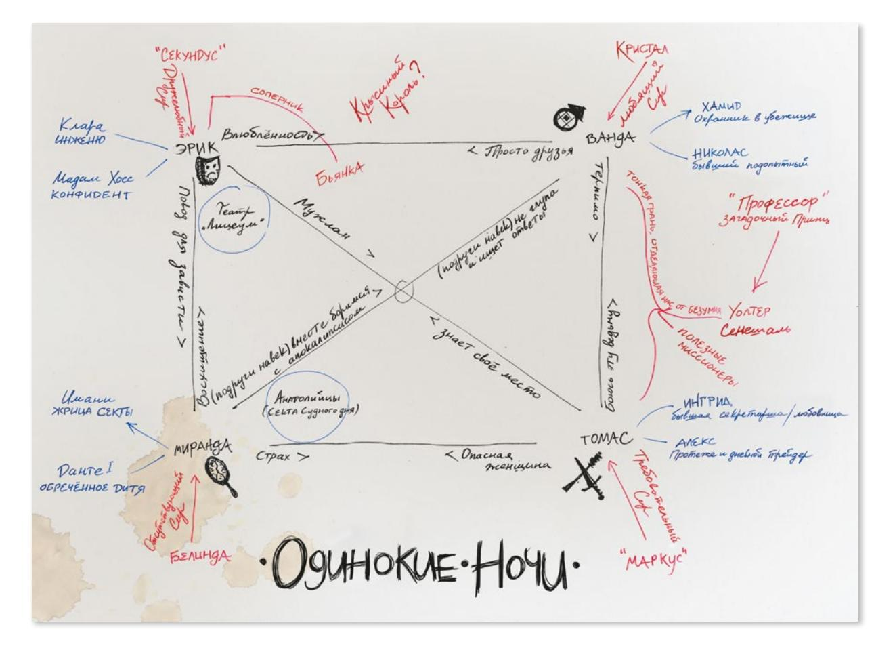

степенных персонажей, которым ещё не уделили должного внимания, и вы всегда сможете найти эмоциональный контекст для сцен общения между персонажами.

В начале игры на схеме отношений у вас будут ваши герои, их сиры и опоры. Возможно, вы добавите туда, скажем, вампира-наставника, смертных любовников или таинственного журналиста, который всегда в курсе последних слухов в мире сверхъестественного. На схеме определённо должно найтись место для правящих фигур вашего города — для Принца, Барона или Советников. По мере того как вы будете соединять всех этих персонажей линиями и добавлять комментарии, выстроится картина отношений в вашей хронике, а игровой мир станет более живым и правдоподобным.

С появлением новых второстепенных персонажей добавляйте на схему новые имена, с изменением отношений — стирайте старые комментарии. Отмечайте на ней значимые места вроде случайно обнаруженного тайного убежища или прекрасных охотничьих угодий, которые недавно нашёл гангрел. Обновляйте схему, когда союзники становятся врагами после неудачных переговоров в Элизиуме или неизвестный вампир даёт Становление опасному инквизитору, который давно шёл по следу котерии. Очень скоро схема превратится в мешанину из заметок, стрелочек, цитат, приколотых к ней вырезок, пятен от напитков и чьих-то зарисовок.

Схема отношений — это ваша личная «стена конспиролога», собственная диаграмма расследования прямо из детективного телесериала. Её можно использовать для того, чтобы отслеживать паутину интриг, которой опутаны персонажи. Схему лучше держать где-то на видном месте, чтобы к ней в любой момент можно было обратиться. Её не обязательно составлять именно на листе бумаги — можно использовать офисную доску, электронную диаграмму или даже географическую карту города с размеченными границами доменов.

Вы можете выбирать для обозначений любые цвета, какие вам нравятся. На иллюстрации на стр. 142 мы используем следующие:

- n Чёрный для обозначения персонажей игроков, связанных с ними мест и заметок.
- n Красный для обозначения других Сородичей, их убежищ и интересов.
- n Синий для обозначения смертных, их занятий, а также мест, где их чаще всего можно встретить.

#### **Стрелки и ярлычки**

Вы можете погружаться в дебри визуализации данных настолько основательно, насколько вам будет угодно. К примеру, каждая линия может быть стрелкой, указывающей от сильного к слабому, — между сиром и его потомком она будет указывать в сторону потомка. Если стороны равны по силам — их будет соединить обычная линия. А как только выяснится, что один на самом деле дёргал за ниточки, а второй плясал, как марионетка, — вы сможете пририсовать нужную стрелку.

Каждой стрелке или обычной линии нужен также ярлычок — комментарий, обрисовывающий природу этих взаимоотношений. Причём они редко бывают одинаковыми в обе стороны. Вампиры — мастера скрывать свои чувства, так что в одну сторону стрелка может показывать «любовь», а в другую «ненависть». В других случаях ярлычок может гласить, например, «чересчур заботливый сир», «ревность, граничащая с психозом», «гуль» или «узы Крови». На соединительных линиях располагайте ярлычки ближе к имени того, кто придерживается этого взгляда.

Отношения, заданные в начале игры, могут быть абсолютно истинными, но вся новая информация, которая появится на схеме во время хроники, будет лишь взглядом со стороны персонажей. Дополняйте и корректируйте схему по мере того, как открываются истинные мотивы или меняются настроения.

#### **Первые заметки на схеме**

Если вы решили начать игру со вступительной игровой встречи, то схему отношений вы будете составлять параллельно с созданием котерии. Сперва стоит делать это карандашом.

Впишите имена персонажей игроков, отметьте их взаимоотношения и несколько связанных с ними вспомогательных персонажей.

ОТНОШЕНИЯ В КОТЕРИИ. Крупными буквами напишите имена персонажей. Затем каждый игрок должен линиями или стрелками соединить своего персонажа с двумя другими и подписать их — одна линия должна обозначать положительные чувства, а другая — отрицательные. Например, положительные — «восхищён», «старый друг», «доверие», «в неоплатном долгу» или «тоже любит пушки»; отрицательные — «недоверие», «боремся за внимание N», «нужно его переиграть», «хочу его агнца» или «сместить с должности Шерифа».

Помни, что во время создания персонажа отношения, внесённые в схему, легко можно изменить, если тебе в голову пришло что-то более интересное, что больше подходит твоему персонажу или лучше вписывается в контекст хроники.

СИРЫ. Немного в стороне от имени персонажа впиши имя его сира и, возможно, немного деталей о нём: клан, год Становления, положение во фракции. Соедини его имя стрелкой с именем персонажа и подпиши, отметив детали или причины Становления. Например, «незапланированное Становление», «будущий преемник», «ошибка», «Становление было пыткой» или «ненависть».

СВЯЗИ ВО ФРАКЦИИ. У каждого вампира, кроме разве что новорождённого птенца, есть связи в его фракции. Вместе с рассказчиком придумай двоих Сородичей или выбери кого-то из уже вписанных в схему. Например, чужого сира. Новых персонажей впиши в схему так же, как сира: указав имя, клан, год Становления и положение во фракции. Соедини своего персонажа стрелками с этими двумя Сородичами (в любом направлении). Подпиши стрелки: с одним взаимоотношения могут быть положительными («мой сеньор», «уважаю её искренность», «очарован», «вместе боролись с Принцем», «сосед по крыше» или «странное влечение»), а с другим должны быть отрицательные («должен мне денег», «предатель», «трус», «сочувствует Анархам / Камарилье» или «нездоровое влечение ко мне»). Эти взаимоотношения (пока что) не равнозначны преимуществам или недостаткам, хотя в них всегда можно вложить пункты позже.

## Смертная жизнь

Все вампиры были когда-то людьми, персонажи игроков в том числе.

Если рассказчик не против, ты можешь создать персонажа любого возраста, культурного наследия или национальности. Концепция хроники и образ котерии, которые уже сформировались к этому моменту, помогут сделать выбор.

Если ты ещё не придумал имя персонажа — самое время это сделать.

#### **Параметры**

В игре **«Вампиры»** возможности и способности персонажа выражены в его параметрах, которые могут иметь разные значения. Во время игры эти параметры можно улучшать, вкладывая пункты опыта. Неонаты и анциллы получают некоторое количество пунктов опыта ещё при создании персонажа. Рассказчик может разрешить игрокам слегка подкорректировать параметры после первой игровой встречи, так что не стоит слишком долго размышлять о том, какие параметры предпочесть.

Показатели параметров измеряются в пунктах. Значение показателя может колебаться в диапазоне от 1 до 5 пунктов, где 5 — это максимум человеческих возможностей. Если кому-то посчастливилось иметь ловкость 5 и атлетику 5, то это, скорее всего, чемпионолимпиец — и таких один на миллион.

ХАРАКТЕРИСТИКИ. Взгляни на бланк персонажа — сверху ты найдёшь девять характеристик. В какой из них твой персонаж особенно хорош? Закрась четыре ячейки рядом с её названием. В какой он исключительно плох? Закрась рядом с ней одну ячейку. Затем выбери три характеристики по три пункта и четыре характеристики по два пункта.

**Лучшая характеристика:** 4 пункта

| Три характеристики: по 3 пункта каждая    |
|-------------------------------------------|
| Четыре характеристики: по 2 пункта каждая |
| Худшая характеристика: 1 пункт            |

Есть два параметра, которые напрямую зависят от характеристик:

- n Чтобы определить показатель здоровья, прибавь 3 к показателю выносливости.
- n Чтобы определить показатель воли, сложи показатели упорства и самообладания.

#### **ПРИМЕР**

*Кристофер распределяет пункты характеристик в бланке своего персонажа и решает, что лучше всего его герой показывает себя перед лицом опасности, поэтому четыре пункта вкладывает в самообладание. Он также считает, что у его персонажа не лучшая комплекция, поэтому вкладывает только один пункт в вынос‑ ливость. Далее он решает, что показатели упорства, обаяния и смекалки будут равны 3, а остальных харак‑ теристик — 2.*

НАВЫКИ. Навыки — это отражение жизни (и нежизни), которую вёл персонаж. Чем он занимал свой день, пока день ещё был в его распоряжении? Ниже приведён метод распределения пунктов между навыками, который опирается на описание жизни персонажа, но ты можешь воспользоваться одним из способов быстрого распределения (см. врезку на стр. 147).

Поразмысли немного над вопросом, откуда у твоего персонажа могли взяться те или иные навыки. Свои три пункта драки он получил, пока перебивался работой вышибалы в Паттайе? Или когда служил в торговом флоте? А может быть, он посещал очень хорошее додзё в Гейнсвилле в студенческие годы?

#### **Род деятельности**

Логично было бы предположить, что в качестве основной своей деятельности ты выбрал то, что у тебя лучше всего получалось. И как бы там ни было, практики в этой области ты уж точно получил больше, чем в других.

Род деятельности позволяет тебе вложить по 3 пункта в два навыка (●●●) и по 2 пункта — в два других навыка (●●).

В скобках указываются специализации, увеличивающие пул проверок этого навыка, когда персонаж делает что-то в рамках выбранной области. Как только показатель гуманитарных наук, естественных наук, ремесла или исполнения вырастает хотя бы до 1, ты получаешь одну бесплатную специализацию на свой выбор в соответствующем навыке.

Выбери одну специализацию в одном из навыков, связанных с родом деятельности.

#### **Важные события**

Какие крупные события произошли в твоей жизни? Чему они тебя научили? Ты служил в Ираке? Твой партнёр тебя избивал? Ты как-то выиграл в лотерею крупную сумму? У тебя есть дети? Тебя ограбили, и ты занялся тхэквондо? Порой сама жизнь заставляет нас осваивать те или иные навыки.

Благодаря одному важному происшествию персонаж развил два навыка. Показатель одного из них равен трём пунктам (●●●), а другого — двум (●●).

#### **Досуг**

На что ты тратил деньги и свободное время? Занимался триатлоном? Или каждые выходные ездил на фестиваль электронной музыки? Каким бы ни было твоё увлечение — оно тоже тебя кое-чему научило.

Выбери три навыка, значение которых будет равно 1 (●), все они должны относиться к одному из хобби или любимых развлечений персонажа.

#### **Дополнительные навыки**

Чего-то всё ещё не хватает? Ты с самого начала положил глаз на какой-то навык, но он не вписался в картину? Самое время это исправить. Выбери один из вариантов:

**Специалист:** выбери один навык, показатель которого будет равен 4 (●●●●). Можешь взять специализацию в этом навыке, но тогда придётся отказаться от специализации, выбранной ранее (это не относится к бесплатным специализациям в естественных и гуманитарных науках, ремесле и исполнении).

**Универсал:** выбери два навыка, значение которых будет равно 2 (●●), и четыре навыка, показатели которых будут равны 1 (●).

Если ты объяснишь, откуда у тебя эти навыки, будет здорово, но если в голову ничего не приходит не страшно.

#### **ПоДБоРКи наВЫКоВ По РоДУ ДеЯТеЛЬноСТи:**

- n АДМИНИСТРАТОР: **финансы ●●●, запугивание или убеждение ●●●, проницательность ●●, хитрость ●●.**
- n ВЕТЕРАН: **атлетика или наблюдательность ●●●, стрельба ●●●, скрытность ●●, выживание или лидерство ●●.**
- n ДЕЯТЕЛЬ ИСКУССТВА: **ремесло (вид искусства) или исполнение ●●●, проницательность ●●●, гуманитарные науки или атлетика ●●, наблюдательность или оккультизм ●●.**
- n МАФИОЗО: **драка или хитрость ●●●, уличное чутьё ●●●, запугивание или воровство ●●, фехтование или стрельба ●●.**
- n НАРКОМАН: **уличное чутьё ●●●, обращение с животными или драка ●●●, проницательность или воровство ●●, хитрость ●●.**
- n ПРОГРАММИСТ: **техника ●●●, гуманитарные науки или ремесло ●●●, финансы ●●, убеждение ●●.**
- n СВЕТСКИЙ ЛЕВ: **исполнение или техника ●●●, финансы ●●●, проницательность ●●, этикет или хитрость ●●.**
- n СЫЩИК: **расследование ●●●, проницательность ●●●, наблюдательность ●●, драка или стрельба ●●.**
- n УЧЁНЫЙ: **гуманитарные или естественные науки ●●●, любой другой ментальный навык ●●●, ремесло (писатель) ●●, убеждение ●●.**

#### **КРУПНЫЕ СОБЫТИЯ**

(брось d10 или выбери сам)

- 1. ПОБЫВАЛ В БОЮ: НАбЛЮДАТЕЛЬНОСТЬ или стрельба.
- 2. РАЗРЫВ В ОТНОШЕНИЯХ: МАНИПУЛЯЦИЯ или хитрость.
- 3. БЫЛ БЕЗДОМНЫМ: УЛИЧНОЕ ЧУТЬЁ ИЛИ ВЫЖИвание
- 4. ВЫСШЕЕ ОБРАЗОВАНИЕ: ГУМАНИТАРНЫЕ или естественные науки.
- 5. ПРЕДВЫБОРНАЯ КАМПАНИЯ: ПОЛИТИКА ИЛИ ХИТРОСТЬ.
- 6. ЖЕРТВА ПРЕСТУПЛЕНИЯ: ДРАКА ИЛИ ВОРОВ-**CTRO**
- 7. тяжёлая болезнь: медицина или проницательность.
- 8. РАЗБОГАТЕЛ: финансы или этикет.
- 9. имел детей: проницательность или убеждение.
- 10. СТАЛ ЧЛЕНОМ СЕКТЫ: ОККУЛЬТИЗМ ИЛИ ЗАПУгивание.

#### **AOCVF**

(брось d10 или выбери сам)

- 1. МАРАФОНЕЦ: АТЛЕТИКА.
- 2. геймер: техника.
- 3. КУСТАРЬ: РЕМЕСЛО.
- 4. АКТИВИСТ: ПОЛИТИКА ИЛИ ЛИДЕРСТВО.
- 5. ДОБРОВОЛЕЦ НАЦИОНАЛЬНОЙ ГВАРДИИ: стрельба.
- 6. ОХОТНИК: ВЫЖИВАНИЕ.
- 7. АКТЁР ИЛИ МУЗЫКАНТ: ИСПОЛНЕНИЕ.
- 8. ЛЮБИТЕЛЬ «ХОДИТЬ НАЛЕВО»: ХИТРОСТЬ.
- 9. ученик вечерней школы: гуманитарные науки.
- 10. гонщик: вождение.

ЦЕННОСТИ. Каких моральных и этических норм придерживался твой персонаж? Он верующий? Коммунист? Веган? А самые важные люди в его жизни - кто они? Ответив на эти вопросы, ты определишь принципы и опоры своего персонажа — то, на чём держится его Человечность, что защищает его от Зверя, сидящего внутри каждого вампира.

#### Принципы

Принципы - это идеалы, по которым индивидуум стремится жить, набор моральных установок, которые держат Зверя на привязи.

Придумай от одного до трёх принципов, которых твой персонаж придерживался при жизни. Чаще всего они начинаются со слов «никогда» или «всегда». Это твёрдые убеждения, связанные с чем-то, с чем можно столкнуться во время игры. Принципы могут касаться, например, убийств, любви, верности, политических взглядов или религиозных верований. Согласуй выбранные тобой принципы с рассказчиком. Возможно (если вы так договоритесь), потребуется также одобрение всей труппы.

Подумай о том, когда и как эти принципы стали для тебя самыми важными. Твои родители так тебя воспитали? Эти правила привили тебе в Сорбонне? Или любовник научил тебя этому? Распределяя навыки, ты уже продумывал, какие важные события произошли в жизни персонажа. Возможно, какие-то из принципов появились у него именно тогда?

 $-\frac{1}{2}$ 

#### ПРИМЕР

Персонажа по имени Томас создали для хроники, рассказывающей о том, что плохие люди плохо кончают. Принципы у Томаса соответствующие: «я забочусь только о себе и тех, кого считаю своими», «другие должны знать своё место» и «жадность делает нас сильнее». Они явно идут вразрез с темой хроники (стр. 172), но именно этого и добивался игрок.

 $+$   $+$   $+$   $+$   $+$   $+$   $+$   $+$   $+$   $+$ 

#### Опоры

Теперь подумай о людях, которые окружали персонажа и которых он любил. Если Становление отдалило их, кого бы он захотел снова увидеть, рискуя всем? Мысли о ком останавливают его, когда он хочет разорвать горло невинной жертве? Это и есть опоры.

Выбери количество опор, равное числу принципов у персонажа. Опоры служат примером для подражания и воплощают твои принципы. Опорой может стать жена

#### **БЫСТРое РаСПРеДеЛение наВЫКоВ Выбери способ:**

- n МАСТЕР НА ВСЕ РУКИ. **один навык: 3 пункта; ещё восемь навыков: 2 пункта; ещё десять навыков: 1 пункт.**
- n ГАРМОНИЧНО РАЗВИТЫЙ. **Три навыка: 3 пункта; ещё пять навыков: 2 пункта; ещё семь навыков: 1 пункт.**
- n УЗКИЙ СПЕЦИАЛИСТ. **один навык: 4 пункта; ещё три навыка: 3 пункта; ещё три навыка: 2 пункта; ещё три навыка: 1 пункт.**

**Выбери по одной бесплатной специализации для гуманитарных наук, естественных наук, исполнения и ремесла, если персонаж владеет этими навыками.**

**Добавь ещё одну бесплатную специализацию для любого навыка.**

или ребёнок, лучший друг, сержант, под чьим началом ты служил, даже бармен или незнакомая девушка, к которой ты всё никак не решался подойти. Если тебе нужны ещё примеры, обратись к разделу «Опоры» на стр. 173.

#### **ПРИМЕР**

*Первый принцип Томаса («я забочусь только о себе и тех, кого считаю своими») воплощает в себе его смертная дочь, о которой он очень беспокоится. Причём, как было решено, ценности у неё в корне отличаются от ценно‑ стей отца. Второй («другие должны знать своё место») связан с молодым и перспективным бизнесменом, кото‑ рого Томас, по его словам, презирает, но который всё равно важен для него. Третий («жадность делает нас сильнее») нашёл своё выражение в гуле Томаса, которому он хочет однажды дать Становление.*

Запиши имена своих опор рядом со своим именем на схеме отношений.

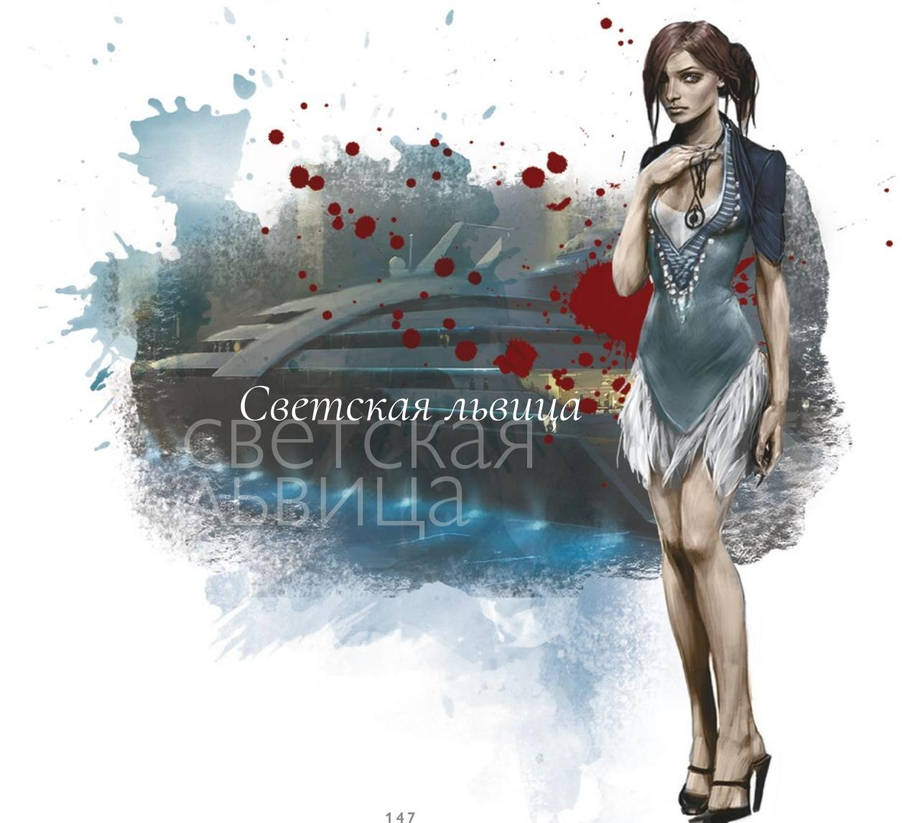

#### Цель

К чему твой персонаж стремился, когда был смертным? Чего хотел добиться? Возможно, после смерти всё изменилось, но какова была его цель при жизни? Как правило, это влияет в основном на предысторию, поскольку после Становления приоритеты часто меняются. Однако многие кровососы веками пытаются достичь того, чего не успели добиться в смертной жизни, и порой их цель искажается и извращается со временем.

Более подробное описание и примеры ты найдёшь на стр. 173 в разделе «Цель».

А потом какая-то тварь тебя убила...

### Становление и его последствия

Идеальные упыри получаются из людей двух категорий. Первые жили серой унылой жизнью и всей душой прикипели к повседневной рутине. Для них вампиризм — как новая работа или неизвестная болезнь, новое препятствие размеренной тихой жизни. Вторые считают, что худшее уже позади и дела могут только пойти в гору. Они, разумеется, не правы, но такой взгляд на вещи помогает пережить очередную ночь.

ПЕРЕРЫВ НА ПРЕДЫСТОРИЮ. Если ваша хроника повествует о слабокровных вампирах, в особенности о новорождённых птенцах, вы можете пока что отложить правила в сторону и сыграть сцены Становления. Это также будет отличным решением, если вы считаете, что Становление должно было повлиять на посмертное бытие ваших героев.

Если вы хорошо знакомы с Миром Тьмы, уже выбрали клан и в целом имеете чёткое представление, кого хотите играть, или просто предпочитаете сперва закончить с бланком персонажа, а уже потом приступать к игре, сперва дочитайте этот раздел. Все факты о ваших персонажах, которые раскроются в процессе, рассказчик может использовать в дальнейшем. Даже если вы решите сыграть предысторию, их можно будет вплести в повествование как предзнаменования или предложить сюжетные линии, ведущие в нужном направлении. Может, вы и знаете, каким вампиром вам предстоит стать, но вот как это произойдёт - совсем другой вопрос.

КЕМ ТЫ СТАЛ? Если ты умер совсем недавно и никто об этом не знает, то твои документы в порядке, и новое имя тебе не требуется. Если же твою смерть официально подтвердили или ты умер несколько веков назад

и вообще на другом континенте - тебе нужна маска. По меньшей мере это имя, которое ты будешь использовать, притворяясь смертным. Возможно, оно совпадает с твоим настоящим именем, если имя достаточно распространённое (вроде Сьюзан Джонсон) или ты умер так давно, что о тебе никто не вспомнит.

Возможно, у тебя также есть особое имя, которое ты используешь только среди вампиров, например в Элизиуме. Это, опять же, может быть и твоим настоящим именем, и прозвищем - от латинского слова, обозначающего твою принадлежность к могущественной линии Крови, до бандитской клички, придуманной, чтобы стращать анархов-соперников. Дружеский совет: Гарпии обожают высмеивать глупые представления невежественных смертных о том, какие у Сородичей должны быть имена. Так что выбирай с умом.

#### Чем ты занимаешься по ночам?

Ты не можешь выходить на улицу днём и питаться обычной пищей. Но если у тебя есть маска, и тем более если ты при этом ещё и работаешь, - твоим смертным знакомым нужно как-то объяснить твои странности. Вот несколько идей по поводу ночной работы:

- охранник;
- **и ударник в кавер-группе;**
- уборщик;  $\blacksquare$
- программист или фондовый трейдер, который работает с Индией или Японией;
- репортёр, полицейский, санитар, врач, фельдшер  $\blacksquare$ скорой помощи и т. п., работающий в ночную сме-HV;
- **работник круглосуточного магазина или закусоч-**
- $\blacksquare$ доброволец народной дружины («Преступность никогда не спит - вот и я тоже!»);
- $\blacksquare$  бармен;
- водитель такси или частник;
- курьер-велосипедист;
- разработчик настольных игр. п

Может быть, ты вообще избегаешь этих скучных сторонников дневной жизни. Работы у тебя нет, но те, с кем ты пересекаешься, не привыкли задавать вопросов. Возможно, ты изображаешь из себя или на самом деле являешься:

- заядлым тусовщиком;
- азартным игроком;
- преступником;
- жиголо или проституткой;
- бомжом;

n нелегальным иммигрантом или беженцем («Если я буду выходить днём, меня заметят!»).

#### **Сила Крови**

Чем ближе вампир к Каину, тем сильнее у него Кровь и тем могущественнее его способности. Сила Крови персонажей зависит от поколения, к которому они принадлежат (см. ранее на стр. 139):

- n 14‑Е, 15‑Е И 16‑Е ПОКОЛЕНИЕ: 0 (слабокровные);
- n 12‑Е ИЛИ 13‑Е ПОКОЛЕНИЕ: 1;
- n 10‑Е ИЛИ 11‑Е ПОКОЛЕНИЕ: 2.

Запишите это значение в бланке персонажа.

#### **Человечность**

Человечность определяет, насколько сильно вампир успел деградировать, как близок он к Зверю. Когда Человечность падает до нуля, вампир полностью сливается со Зверем и не может больше оставаться персонажем игрока.

Как правило, у вампиров начальный показатель Человечности персонажа равен 7. Рассказчик может повысить это значение до 8, если посчитает, что так будет лучше для хроники.

Подробнее о Человечности см. стр. 236 — 241.

#### **Как ты охотишься?**

У каждого серийного убийцы есть свой почерк. У каждого хищника — свои охотничьи инстинкты. Твои пищевые привычки зависят от стиля охоты и Дисциплин, которыми ты владеешь.

ВЫБЕРИ ДИСЦИПЛИНЫ. Когда персонаж становится вампиром, Кровь дарует ему особые способности, которые называют Дисциплинами. Их описание ты найдёшь на стр. 243 — 287.

Выбери две клановые Дисциплины (о кланах см. 63 — 113). Показатель одной из них равен 2, показатель второй — 1.

Если ты каитиф и клана у тебя нет — выбери любые две Дисциплины. Показатель одной из них равен 2, показатель второй — 1.

#### **ПРИМЕР**

*Кармен выбирает Дисциплины для своего носферату. Она решает, что персонаж владеет вторым уровнем Сокрытия и первым уровнем Анимализма.*

Не забудь выбрать силы для каждого уровня (стр. 244).

#### **ПРИМЕР**

*В Сокрытии Кармен выбирает силы «Плащ теней» и «Незримая поступь». В Анимализме её внимание при‑ влекает сила «Фамулус».*

#### **Слабокровки и Дисциплины**

Слабокровные не могут полноценно овладеть Дисциплинами своих полнокровных собратьев. Чтобы компенсировать этот недостаток, они разработали собственное искусство — Алхимию слабокровных. Кроме того, резонанс выпитой крови оказывает на них более существенное воздействие (см. стр. 226).

Поскольку слабокровные чаще всего сохраняют тесные связи с миром смертных, подумай над тем, чтобы выбрать соответствующие преимущества (например, информаторов или влияние) или дополнительную опору. Впиши в схему отношений всех новых персонажей рассказчика, если таковые появились.

Имей в виду, что слабокровные не могут при создании персонажа выбирать такие преимущества, как узы, мавла, подручные и статус (смешанная котерия может взять их в качестве общих фактов биографии).

ВЫБЕРИ СТИЛЬ ОХОТЫ. Стиль охоты определяется твоим естеством, твоим сиром или твоей Кровью. Выбери один из вариантов, описанных на стр. 175 — 178.

Каждый стиль охоты добавляет твоему персонажу определённый набор параметров — в частности Дисциплины, преимущества и недостатки. Всё, что может сделать охоту проще или добавляет реалистичность образу.

Если стиль охоты должен добавить специализацию, но у тебя нет нужного навыка, вместо неё повысь значение этого навыка до 1.

Свежеобращённые вампиры — птенцы или слабокровки — не выбирают стиль охоты, поскольку их привычки ещё не сформировались.

#### **Какова твоя история?**

С личными качествами персонажа и его привычками мы разобрались. Пришло время включить его в жизнь общества, соединить с Миром Тьмы.

УБЕЖДЕНИЯ ПОД ПОКРОВОМ НОЧИ. Ты разобрался с тем, как ты убиваешь, пора выяснить — почему.

Если цель твоего персонажа не изменилась после Становления, впиши её (или искажённую Зверем версию) в бланк персонажа. Если у тебя появились новые

идеи и ты хочешь, чтобы цель больше подходила Сородичу, сформулируй и впиши получившуюся цель.

ПРЕИМУЩЕСТВА. У всех нас есть преимущества и недостатки, которые трудно выразить при помощи навыков или характеристик. Это могут быть особые социальные привилегии или политическое влияние, богатство, красота, полезные знакомства - или полное отсутствие всего вышеназванного. Преимущества дают более детальное представление о потерянной жизни персонажа и приносят немалую пользу после смерти.

Распредели 7 пунктов (или меньше) между преимуществами из разделов «Достоинства» (стр. 179 - 184) и «Факты биографии» (стр. 184).

Учитывай, что преимущества ты будешь использовать во время игры. Постарайся сделать так, чтобы их применению ничто не мешало. К примеру, если ты выберешь в союзники священника из своего прихода, тебе нужно будет как-то скрывать от него свою истинную природу или придумать, почему он остаётся твоим другом, хотя ты и превратился в исчадие ада.

В зависимости от характера предстоящей хроники рассказчик может ограничить доступные преимущества или объявить некоторые из фактов биографии обязательными. Он также может решить, к примеру, что котерии нужно общее убежище, и попросить зарезервировать несколько пунктов для этих целей. В таком случае можно дать персонажам пару дополнительных пунктов преимуществ. Всерьёз подумай о том, какие преимущества позволят истории твоего персонажа разворачиваться интереснее.

Вдобавок к достоинствам и фактам биографии тебе нужно выбрать также недостатки, вложив в них в общей сложности хотя бы 2 пункта.

Отметь на схеме отношений всех новых персонажей рассказчика, связанных с преимуществами.

⊶⇔≢k∯

#### ПРИМЕР

Клаус хочет закрепить связь своего персонажа с миром смертных. Поэтому он вкладывает два пункта в маску, два пункта в богатство и два пункта в союзников, под которыми подразумевает живых друзей и знакомых. За последний пункт он берёт себе информатора бедного, перегруженного работой издателя. При всём при том ночная жизнь полна опасностей, и Клаус оказывается отверженным среди анархов из-за неосторожных поступков, совершённых ранее, - этот недостаток стоит два пункта.

#### Выбери страницу истории

Страницы истории - это особый вид преимуществ, который позволяет вписать персонажа в богатейший метасюжет «Вампиров». Любой игрок может выбрать страницу истории и вложить в неё пункты. Учитывай, однако, что это весьма специфические преимущества, и далеко не в каждой хронике они будут уместны. Описания доступных страниц истории ты найдёшь в конце этой книги, ещё несколько есть в книгах «Анархи» и «Камарилья», а в дальнейшем появятся и новые. В любом случае последнее слово за рассказчиком. Он может запретить использование тех или иных страниц истории или позволить персонажу использовать какие-то фрагменты других страниц истории во время игры.

Не забудь вписать в схему отношений персонажей рассказчика, фигурирующих на странице истории или придуманных для неё.

#### Достоинства и недостатки слабокровных

Трудно отыскать двух одинаковых слабокровок. Отчасти именно поэтому Камарилья их так не любит - даже их сверхъестественная природа отказывается подчиняться каким бы то ни было правилам. Если твой персонаж — слабокровный, выбери от одного до трёх достоинств слабокровных (стр. 183) и столько же недостатков слабокровных (стр. 183). В этих параметрах выражаются особенности естества твоего вампира и уникальная разновидность вампиризма, присущая только ему.

СОЗДАНИЕ КОТЕРИИ. Каждый игрок получает по одному пункту, который нужно потратить в интересах всей котерии (если игроков мало, можно дать каждому по два). Эти пункты и любые оставшиеся пункты преимуществ игроки должны распределить сообща. У такого подхода есть несколько плюсов: во-первых, при обсуждении рождаются идеи будущих историй, во-вторых, игроки могут почувствовать себя хозяевами хроники, а в-третьих, это позволяет всем участникам настроиться на общую волну в начале игры.

Пункты котерии можно потратить на охотничьи угодья — свой собственный домен в городе (стр. 195).

Оставшиеся пункты котерии и оставшиеся пункты преимуществ можно потратить на приобретение общих фактов биографии котерии (стр. 196).

Впиши в схему отношений всех новых действуюних лин

в океане вечности. Эта стадия создания персонажа зависит от возраста вампиров, который вы определили ранее (см. стр. 139).

ПТЕНЦЫ. Если вы только-только стали вампирами, то создание персонажа можно считать завершённым! Сыграйте предысторию, бросьте быстрый взгляд в зеркало (стр. 154) — и приступайте к хронике.

НЕОНАТЫ. Каждый персонаж игрока получает по 15 пунктов опыта, что отражает плавное развитие их способностей за долгие годы.

АНЦИЛЛЫ. Каждый персонаж игрока получает по 35 пунктов опыта, а также увеличивает на один пункт силу Крови, уменьшает Человечность на один пункт и получает 2 пункта преимуществ и 2 пункта недостатков.

#### СТОИМОСТЬ РАЗВИТИЯ

| <b><i><u>TAPAMETP</u></i></b>       | <b>СТОИМОСТЬ</b> В ПУНКТАХ ОПЫТА |
|-------------------------------------|-------------------------------------|
| Характеристика                      | Новое значение $\times$ 5           |
| Навык                               | Новое значение $\times$ 3           |
| Новая специализация                 | 3                                   |
| Клановая Дисциплина                 | Новое значение $\times$ 5           |
| Сторонняя Дисциплина                | Новое значение $\times$ 7           |
| Любая Дисциплина для каитифа        | Новое значение × 6                  |
| Ритуал Кровавого чародейства        | Уровень ритуала × 3                 |
| Рецептура Алхимии слабо- КРОВНЫХ | Уровень рецептуры × 3               |
| Преимущество                        | 3 за каждый пункт                   |
| Сила Крови                          | Новое значение × 10                 |

Стоимость повышения параметра на 1 пункт зависит от самого параметра, а также от его текущего значения. В таблице выше приведена стоимость развития. Новое значение - это значение параметра, которое ты хочешь приобрести. Например, если игрок хочет поднять самообладание персонажа с 2 (••) до 3 (•••), то ему потребуется 15 пунктов опыта, потому что 3 (самообладание) × 5 (стоимость развития характеристики) = 15. Как правило, новые значения приобретаются последовательно - если у персонажа показатель самообладания равен 2, то для того, чтобы увеличить его до 4, нужно сначала поднять его до третьего (•••) за 15 пунктов опыта, а уже потом до четвёртого (••••) за 20 пунктов.

### ВАМПИРЫ: МАСКАРАД

## Памятка

#### **Характеристики**

ОБАЯНИЕ: **шарм, магнетизм, сила личности (социальная).** МАНИПУЛЯЦИЯ: **умение заставить других делать то, что ты хочешь (социальная).**

САМООБЛАДАНИЕ: **хладнокровие, самоконтроль, спокойствие (социальная).**

СИЛА: **максимальное мышечное усилие (физическая).** ЛОВКОСТЬ: **сноровка, грация, координация движений (физическая).**

ВЫНОСЛИВОСТЬ: **стойкость, сопротивляемость, жи‑ вучесть (физическая).**

ИНТЕЛЛЕКТ: **память, мышление, рассудок (ментальная).** СМЕКАЛКА: **сообразительность, интуиция, умение быстро принимать решения (ментальная).**

УПОРСТВО: **внимание, концентрация, умение сфоку‑ сироваться на проблеме (ментальная).**

#### **Навыки**

АТЛЕТИКА: **бег, прыжки, лазание (физический).**

ВОЖДЕНИЕ: **умение водить транспортные средства (физический).**

ВОРОВСТВО: **взлом и проникновение, а также защита от них (физический).**

ВЫЖИВАНИЕ: **умение оставаться в живых, оказав‑ шись в неблагоприятной среде (физический).**

ГУМАНИТАРНЫЕ НАУКИ: **академические знания, семь свободных искусств, книжные знания (ментальный).**

ДРАКА: **любой вид борьбы без оружия (физический).** ЕСТЕСТВЕННЫЕ НАУКИ: **теоретические знания о фи‑ зической природе вещей (ментальный).**

ЗАПУГИВАНИЕ: **умение внушить страх, приструнить кого‑либо (социальный).**

ИСПОЛНЕНИЕ: **художественное выступление перед аудиторией (социальный).**

ЛИДЕРСТВО: **умение направлять и вдохновлять окру‑ жающих (социальный).**

МЕДИЦИНА: **обработка ран, диагностика, лечение болезней (ментальный).**

НАБЛЮДАТЕЛЬНОСТЬ: **органы чувств, умение замечать детали, умение замечать скрытые угрозы (ментальный).** ОБРАЩЕНИЕ С ЖИВОТНЫМИ: **уход за животными, общение с животными (социальный).**

ОККУЛЬТИЗМ: **как истинные тайные знания, так и шарлатанство (ментальный).**

ПОЛИТИКА: **понимание системы управления, умение манипулировать общественным мнением (ментальный).**

ПРОНИЦАТЕЛЬНОСТЬ: **умение распознать настрое‑ ние или понять мотивы (социальный).**

РАССЛЕДОВАНИЕ: **поиск улик, разгадывание тайн (ментальный).**

РЕМЕСЛО: **ручной труд, строительство, дизайн (физи‑ ческий).**

СКРЫТНОСТЬ: **умение оставаться незамеченным или неузнанным (физический).**

СТРЕЛЬБА: **использование дистанционного оружия, такого как пистолеты или луки (физический).**

ТЕХНИКА: **умение использовать современные техно‑ логии, в частности компьютеры и интернет, а также понимание принципов их работы (ментальный).**

УБЕЖДЕНИЕ: **умение уговаривать (социальный).**

УЛИЧНОЕ ЧУТЬЁ: **знание «закона улиц» и порядков, по которым живёт криминальный мир (социальный).**

ФЕХТОВАНИЕ: **рукопашная схватка с использованием холодного оружия (физический).**

ФИНАНСЫ: **обращение с деньгами, умение зарабаты‑ вать, умение распределять доходы (ментальный).**

ХИТРОСТЬ: **умение обвести вокруг пальца и обманом за‑ ставить других делать то, что тебе нужно (социальный).** ЭТИКЕТ: **вежливое поведение в социуме (социальный).**

#### **Кланы**

**Каждый клан практикует три Дисциплины, которые приведены в скобках.**

БРУХА: **смутьяны борются с властью и восстают про‑ тив тирании (Величие, Мощь, Стремительность).**

ВЕНТРУ: **аристократичные патриции стоят на страже Традиций и Маскарада и наставляют подданных на путь истинный (Величие, Доминирование, Стойкость).**

ГАНГРЕЛ: **дикие варвары стирают границы между вам‑ пирами и зверями (Анимализм, Метаморфозы, Стой‑ кость).**

МАЛКАВИАНЕ: **безумие представителей Клана Луны может и скрывать, и обнажать истину (Доминирова‑ ние, Сокрытие, Ясновидение).**

НОСФЕРАТУ: **омерзительные крысы прячут свои урод‑ ливые лица в темноте и оттуда подслушивают чужие секреты (Анимализм, Мощь, Сокрытие).**

ТОРЕАДОР: **декаденты упиваются искусством, любо‑ вью и жестокостью среди серых будней посмертия (Величие, Стремительность, Ясновидение).**

ТРЕМЕР: **некогда могущественные чернокнижники, сломленные Второй инквизицией, ищут способы вер‑ нуть себе монополию на чародейство (Доминирова‑ ние, Кровавое чародейство, Ясновидение).**

КАИТИФЫ: **лишённых клана объединяет только одно — гонение со стороны вампиров с известной родословной (клановых Дисциплин нет).**

СЛАБАЯ КРОВЬ: **меркурианцы слишком далеки от Каина, чтобы разделить его проклятие во всей полноте. Они дол‑ жны зубами и когтями проложить себе дорогу во тьму или как‑то выкарабкаться на свет (Алхимия слабокровных).**

#### **Дисциплины**

АНИМАЛИЗМ: **сверхъестественная близость с живот‑ ными, умение их контролировать.**

ВЕЛИЧИЕ: **способность контролировать чужие эмо‑ ции, привлекать или отталкивать других.**

ДОМИНИРОВАНИЕ: **контроль сознания, для которого нужен зрительный контакт.**

КРОВАВОЕ ЧАРОДЕЙСТВО: **использование Крови для того, чтобы творить магию.**

МОЩЬ: **невероятная физическая сила.**

СОКРЫТИЕ: **способность оставаться незамеченным даже в толпе.**

СТОЙКОСТЬ: **невероятная крепость тела вплоть до способности выдерживать воздействие огня и сол‑ нечного света.**

СТРЕМИТЕЛЬНОСТЬ: **сверхъестественные рефлексы и скорость.**

МЕТАМОРФОЗЫ: **изменение формы тела — начиная с отращивания когтей и заканчивая слиянием с землёй.** ЯСНОВИДЕНИЕ: **экстрасенсорное восприятие, чутьё, предвидение.**

АЛХИМИЯ СЛАБОКРОВНЫХ: **умение смешивать кровь, эмоции и другие ингредиенты для получения коктейлей с разнообразными мощными эффектами.**

#### **Стили охоты**

БЕСТИЯ: **ты пьёшь кровь других вампиров.**

ДЖЕНТЛЬМЕН: **ты пьёшь кровь тех, кто добровольно согласился её отдать.**

ИДОЛ: **ты — объект преклонения и обожания, твои фанаты или культ, посвящённый тебе, снабжают тебя кровью.**

ИСКУСИТЕЛЬ: **ты соблазняешь своих жертв и пьёшь кровь во время секса.**

МОРФЕЙ: **ты пьёшь из спящих, вламываясь в чужие дома.**

НАЛЁТЧИК: **ты получаешь кровь силой или угрозами.** СЕМЬЯНИН: **ты втайне пьёшь кровь смертных друзей** 

**и родственников.** СУРРОГАТЧИК: **ты не охотишься на живых — вме‑ сто этого питаешься донорской кровью из пакетов** 

**или пьёшь из трупов.**

ТУСОВЩИК: **ты питаешься представителями опре‑ делённой субкультуры или элитной группы, где тебя высоко ценят.**

ФЕРМЕР: **ты питаешься кровью животных.**

#### **Факты биографии**

БОГАТСТВО: **твой капитал, движимое и недвижимое имущество, доход.**

ВЛИЯНИЕ: **твой авторитет среди смертных.**

ИНФОРМАТОРЫ: **все те, кто готов делиться с тобой информацией.**

МАСКА: **подставная личность с полным набором доку‑ ментов.**

МАВЛА: **более сильный Сородич, который поддержи‑ вает тебя словом или делом; наставник, покровитель или сообщник.**

ПОДРУЧНЫЕ: **последователи, охранники или слуги.**

СЛАВА: **твоя известность среди смертных.**

СОЮЗНИКИ: **смертные, которые готовы тебе помо‑ гать; часто друзья и родственники.**

СТАДО: **сосуды, из которых ты можешь пить без ка‑ ких‑либо сложностей и ничего не опасаясь.**

СТАТУС: **твоё положение в обществе Сородичей.**

СТРАНИЦА ИСТОРИИ: **твоя связь с историческими или легендарными событиями и личностями Мира Тьмы.**

УБЕЖИЩЕ: **место, где можно спокойно спать днём. Другие преимущества и недостатки можно найти на стр. 179 — 184.**

### **Виды котерий**

ГАНГСТЕРЫ: **преступная группировка или что‑то по‑ добное.**

ГВАРДИЯ: **служит личной охраной правителя города.** ДНЕВНОЙ ДОЗОР: **охраняет от смертных сон других** 

**Сородичей.** ЗАГОНЩИКИ: **ловят людей с определённым резонан‑**

**сом в крови на заказ.**

КОММАНДОС: **сражаются за того, кто платит.**

КОЧЕВНИКИ: **путешествуют с одного места на дру‑ гое.**

КРОВАВЫЙ КУЛЬТ: **принимают кровь в качестве под‑**

**ношения от смертных последователей их учения.**

МИССИОНЕРЫ: **взяли на себя важную миссию.**

ПАТРУЛЬ: **защищает город от сверхъестественных** 

**врагов.**

ПТАШКИ: **держатся вместе из‑за общих вкусов и инте‑**

**ресов.**

ЦЕРБЕРЫ: **охраняют какой‑то важный объект или ме‑**

РЕГЕНТЫ: **управляют доменом, пока старейшины** 

**в отлучке.**

ФЕМГЕРИХТ: **следят за соблюдением Маскарада.**

РЫЦАРИ: **сражаются за правое дело.**

СБИРЫ: **агенты под прикрытием, подосланные конку‑**

**рирующей стороной.**

**сто.**

**153**

ВЗГЛЯНИ В ЗЕРКАЛО. Ты можешь добавить и другие детали к описанию своего героя. Не обязательно их записывать, но подумать о них стоит - причём не только при создании персонажа, но и на протяжении всей игры.

#### Внешность

Внешний вид персонажа даёт окружающим понять, чего от него можно ожидать - какими способностями или возможностями он обладает. Социальные характеристики, достоинства «внешность» и «богатство», а также подобные им параметры влияют на то, как персонаж выглядит и ведёт себя. У Сородича с высоким интеллектом может быть ясный взгляд, как будто пронизывающий насквозь, в то время как эксперта по финансовым вопросам можно будет узнать по костюму, сшитому на заказ на Сэвил-Роу. У твоего персонажа высокий показатель силы? Но как это выражается? Он мускулистый или, наоборот, жилистый и поджарый? Параметры должны отражаться на игре, даже когда ты не проходишь никаких проверок.

#### Экипировка

Персонажам в игре «Вампиры» доступно любое оборудование, которое они могут

 $4411$ 

**MANGE SERVICE AND** 

**WILSON** 

позволить себе, исходя из их богатства, и которое они смогут найти, воспользовавшись услугами информаторов. Не стоит тратить время на перечисление всего имущества, если только у тебя нет каких-то особых причин для этого. «Вампиры» - это не финансовая стратегия, даже если у персонажа 5 пунктов богат-CTBO.

Если ты рассказчик, не удерживай тех, кому интересно в деталях готовиться к предстоящим операциям, собирая всю необходимую экипировку. Ну а если игроков это не слишком привлекает, предложи им пройти проверку интеллекта + богатства или манипуляции + уличного чутья, чтобы узнать, доступен им в данный момент игры тот или иной предмет или нет.

#### Причуды

Причуды - это интересные или забавные черты. Они могут сделать персонажа ярче и добавить глубины его характеру. Сделай себе заметку о том, какие странности могли бы быть у твоего героя: например, нестандартное чувство юмора, особая нежность по отношению к животным или привычка рычать, когда его что-то отвлекает или раздражает. ■

**Selection** Con-

N PA

esmil

 $6333$ 

## Основные параметры

Когда вампир пытается заморочить голову инквизиторам во время допроса, подчинить себе стаю Псов, которых послал за ним враждебно настроенный Шериф, или найти нужную книгу в заброшенной библиотеке клана Тремер, он использует одновременно и свои врождённые характеристики, и приобретённые навыки. Даже если он никогда не делал чего-то раньше (а значит, у него нет соответствующего навыка), он может попробовать, используя свои природные данные: физические, социальные или ментальные характеристики.

Значения характеристик и навыков могут варьироваться от 0 до 5. Если значение характеристики равно 0, это говорит о полной неспособности к соответствующим действиям, тогда как в случае навыка это всего лишь отсутствие обучения и опыта. Значение характеристики 1 говорит о том, что персонаж владеет ей довольно скверно, 2 — средне, 5 — на пределе человеческих возможностей. С навыками всё аналогично. Навык со значением 3 может означать, что персонаж обладает большим опытом, 4 — что он считается экспертом в этой области, а 5 — что он лучший в своём городе, а то и во всей стране. Большинство обычных людей довольствуются средним значением (2) даже в основных для себя навыках.

## Физические характеристики

Физические характеристики определяют, насколько персонаж силён, ловок и вынослив. Благодаря Крови, которая течёт в его жилах, физически сильный вампир не обязательно должен быть мускулистым, ловкий изящным и грациозным, а выносливый — крепким. Самые опасные вампиры, напротив, часто выглядят довольно тщедушными.

#### **Сила**

Сила определяет, сможешь ли ты оторвать смертного от земли, свалить его одним ударом и в целом насколько мощны твои мёртвые мышцы.

Приблизительный вес, который можно поднять при том или ином значении без проверки характеристики, указан в скобках.

- Ты без проблем сможешь расплющить пивную банку (20 кг: новогодняя ёлка, дорожный знак).
- ●● У тебя средние физические данные (45 кг: унитаз).

- ●●● Вероятно, ты смог бы выбить деревянную дверь (115 кг: крупный человек, пустой гроб, холодильник).
- ●●●● Твоя физическая подготовка близка к идеалу. Скорее всего, у тебя рельефные мышцы (180 кг: гроб с телом внутри, пустой мусорный контейнер).
- ●●●●● Ты настоящий бульдозер. При достаточном усилии сможешь выбить железную дверь, разорвать сетку-рабицу голыми руками или вышибить запертые на цепь ворота (250 кг: мотоцикл, пианино).

#### **Ловкость**

Ловкость определяет скорость твоей реакции, грациозность и точность движений, быстроту перемещения. Получится ли увернуться, если кто-то нацелил кол в твоё сердце? Успеешь ли завершить задуманное, прежде чем выйдет время?

- Бегаешь ты сносно, но вот с равновесием проблемы, да и уворачиваться получается с трудом.
- ●● Ты хорош в беге на короткие дистанции; порой ты даже выглядишь грациозно.
- ●●● Ты способен развить впечатляющую скорость, а координация движений у тебя не хуже, чем у любого другого любителя спорта.
- ●●●● Ты настоящий акробат. Способен на такие трюки, которые мало кому из людей под силу.
- ●●●●● Ты обладаешь поразительной, почти что сверхъестественной грацией и двигаешься плавно, подобно змее, гипнотизирующей добычу.

#### **Выносливость**

Возможность твоего организма выдерживать нагрузку и влияние опасной среды. Это твоя неутомимость и закалка. Выносливость позволяет дольше не терять боеспособность при физических повреждениях, оставаться в строю, даже если в тебя попала пуля или охотник пырнул ножом.

Показатель шкалы твоего здоровья равен показателю выносливости + 3.

- У тебя одышка даже после небольших нагрузок.
- ●● Драку ты, конечно, переживёшь, но лучше не ввязываться.
- ●●● Несколько дней пешего перехода по пересечённой местности с рюкзаком за плечами? Запросто!
- ●●●● Ты вполне способен финишировать первым в марафоне; физическая боль тебе не страшна.
- ●●●●● Ты бы никогда не вспотел, даже если бы твоё мёртвое тело было на это способно.

## Социальные характеристики

Сородичи пользуются людьми во всех смыслах. Для вампиров человек не только пища и энергетик, но и кирпичик в их пирамиде власти. Социальные характеристики определяют первое впечатление, которое производит персонаж, пытаясь очаровать кого-то, вдохновить или принудить к действию. Они отражают предпочтительный для персонажа подход к общению.

#### **Обаяние**

Обаяние — это естественный шарм, изящество и сексуальная привлекательность. Люди тянутся к тем, кто обладает подобными качествами, и это облегчает охоту. Обаяние не зависит от красоты (за красоту отвечает соответствующее достоинство, «внешность», стр. 179)

- Ты умеешь говорить, но мало кто тебя слушает.
- ●● Ты приятен в общении, хоть ты и нежить. Возможно, у тебя даже есть друзья.
- ●●● Люди безоговорочно тебе доверяют. Ты без труда заводишь друзей.
- ●●●● Ты наделён огромной харизмой. У тебя много поклонников.
- ●●●●● Тебе под силу поднять восстание в городе, если пожелаешь.

#### **Манипуляция**

Манипуляция — это умение склонить других к своей точке зрения, убедительно врать и блефовать и в целом пудрить людям мозги так, чтобы никто ничего не заподозрил.

- Если ты искренне веришь в собственную правоту, ты сможешь убедить остальных.
- ●● Ты легко сможешь обмануть слабовольного простачка.
- ●●● Тебе никогда не приходится платить за что-либо полную цену.
- ●●●● Ты мог бы стать лидером секты… или политиком.
- ●●●●● Ты можешь убедить Принца вложить деньги в совершенно бессмысленное предприятие или даже отозвать кровавую охоту, объявленную на тебя.

#### **Самообладание**

Самообладание — это внутреннее спокойствие, которое помогает контролировать собственные эмоции, а также настраивать других на непринуждённый лад даже в стрессовой ситуации. Это также умение оставаться хладнокровным независимо от обстоятельств и в перестрелке, и в постели.

Показатель шкалы твоей воли (стр. 157) равен сумме показателей самообладания + упорства.

- Ты можешь впасть в неистовство даже по самому незначительному поводу.
- ●● В большинстве случаев, если тебе ничего не угрожает, ты способен контролировать свою хищную натуру.
- ●●● У тебя часто спрашивают совета о том, что делать, когда Кровь ударяет в голову.
- ●●●● Блефовать при игре в карты не составляет для тебя труда. В какой-то степени ты даже контролируешь внутреннего Зверя.
- ●●●●● Зверь у тебя на коротком поводке.

## Ментальные характеристики

Ментальные характеристики отвечают за способность к обучению и концентрации, внимательность и интуицию. Персонаж с высоким значением ментальных характеристик может обладать огромными знаниями, быть волевой личностью или гением от природы. Низкие значения можно интерпретировать как наивность, невежество или неспособность к логическому мышлению. Впрочем, всё это касается только смертных, ведь Кровь с той же лёгкостью может усилить способности мозга и нервную проводимость, с какой она укрепляет сухожилия или меняет черты лица.

#### **Интеллект**

Интеллект — это способность рассуждать, мыслить логически, изучать. Обладатель высокого интеллекта может без труда вспомнить информацию, полученную из книг или на собственном опыте, и всесторонне её проанализировать. Ему по силам решить любую загадку и распутать любую тайну.

- Ты умеешь читать и писать, но есть сложные понятия, которые приводят тебя в замешательство.
- ●● Ты достаточно умён, чтобы осознавать ограниченность собственного интеллекта.
- ●●● Ты интеллектуал, которому не составит труда сложить вместе фрагменты головоломки.
- ●●●● Твоя мудрость настолько велика, что клан Тремер мог бы обратиться к тебе за консультацией.
- ●●●●● Даже слово «гений» не способно охватить всю глубину твоего интеллекта и широту знаний.

#### **Смекалка**

Смекалка — это способность быстро соображать, безошибочно реагировать на внезапное изменение ситуации, находчивость. «Ты услышал звук» — смекалка, «ты

## *Деятель искусства* деятель искусства

слышишь, как приближаются два охранника» — интеллект. Смекалка позволяет чуять засаду за версту. Она также необходима, чтобы не пришлось рвать волосы на голове из-за того, что остроумный ответ на замечание Гарпии пришёл в голову слишком поздно.

- Некоторые вещи тебе нужно долго объяснять.
- ●● Ты умеешь делать ставки в покере и способен вовремя нажать на тормоза. Как правило.
- ●●● Ты способен моментально проанализировать ситуацию и принять наилучшее из возможных решений.
- ●●●● Тебя невозможно застать врасплох, и за словом ты в карман не лезешь.
- ●●●●● Мало кто может угнаться за твоей мыслью. Ты реагируешь на опасность быстрее, чем другие успевают её заметить.

#### **Упорство**

Упорство — это умение сфокусироваться на главном и не отступать. Оно определяет, насколько хорошо ты умеешь концентрироваться, легко ли сбить тебя с толку. Упорство необходимо, чтобы сохранять бдительность и не позволять себе отвлекаться.

Показатель шкалы твоей воли (стр. 157) равен сумме показателей самообладания + упорства.

- Твоего внимания хватает только на самые насущные вопросы.
- ●● Ты морально готов к путешествиям, если они не будут слишком долгими.

- ●●● Чтобы отвлечь тебя от дела, нужно приложить столько усилий, что большинство считает это пустой тратой времени.
- ●●●● Ничто не способно сбить тебя с пути, когда ты ищешь ответы.
- ●●●●● Ты без труда можешь размышлять о чём-то во время перестрелки или следить за дверью во время кровавой оргии, а затем подобрать каждую гильзу и вытереть каждую капельку пролитой крови.

## Воля

Воля определяет степень уверенности в себе, душевное равновесие, способность не терять надежду, когда всё складывается не в твою пользу. На шкале воли отмечается текущий запас пунктов воли.

Показатель воли персонажа равен сумме показателей его самообладания и упорства. Увеличить его нельзя ни на стадии создания персонажа, ни при распределении опыта в дальнейшем, однако он может вырасти, если улучшится показатель упорства или самообладания.

Во время игры запас воли будет постоянно меняться. Пункты воли можно тратить, чтобы противостоять не-

#### НАСТРОЙКИ

**Увеличивая или уменьшая скорость, с которой персонажи восстанавливают запас воли, можно регулировать степень напряжённости игры. Это идеальный способ добиться нужного эффекта. Если ты хочешь, чтобы персонажи меньше зависели от чудовищной природы их Зверя или в твоей хронике часто случаются проверки, пусть в начале игровой встречи персонажи** полностью **очищают шкалу от лёгкого стресса независимо от показателя их упорства или самообладания.**

**И наоборот, если хочешь сделать персонажей рабами Голода или в хронике редко случаются проверки, уменьши количество пунктов лёгкого стресса, от которого избавляются персонажи: используй характеристику с** наименьшим **показателем или установи фиксированное количество — скажем, 1 пункт.**

желательным порывам или сделать что-нибудь экстраординарное. Во время социального конфликта противники теряют пункты воли точно так же, как здоровье в бою. Когда персонаж тратит пункт воли, на шкале воли это отмечается как один пункт лёгкого стресса (стр. 126). Независимо от вида урона — будь он лёгкий, тяжёлый или тот и другой — когда вся шкала заполнена, персонаж оказывается изнурён. Он получает штраф −2d10 к пулу любой социальной или ментальной проверки. При этом, когда требуется пройти проверку воли, игрок, как обычно, может бросить одну игральную кость, даже если текущий запас воли равен 0.

#### **Запас воли**

Игроки могут тратить пункты воли для разных целей:

- n Чтобы перебросить до трёх обычных (чёрных) игральных костей (кости Голода перебрасывать нельзя) при любой проверке, кроме тех случаев, когда правила напрямую исключают такую возможность (например, в блиц-конфликте (стр. 298) или в случае с проверкой по шкале).
- n Чтобы на один ход вернуть контроль над персонажем, впавшим в ярость или попавшим под влияние сверхъестественных способностей, таких как Доминирование или Величие (стр. 248).
- n Чтобы персонаж мог совершить незначительное движение (открыть глаза, пошевелить пальцем), пока его сердце проткнуто колом.
- n Чтобы в течение 1 хода игнорировать штрафы из-за полученных повреждений (в том числе изнурение).

#### **Восстановление запаса воли**

Персонажи могут избавляться от лёгкого стресса следующими способами:

- n В начале каждой игровой встречи персонаж может избавиться от 1 пункта лёгкого стресса за каждый пункт показателя его упорства или самообладания (смотря что выше). Исключение составляют случаи, когда игра прервалась в самый напряжённый момент и у персонажей не было ни малейшей передышки.
- n Один раз за игровую встречу рассказчик может разрешить персонажу, действия которого напрямую способствуют удовлетворению его прихоти (стр. 173), избавиться от 1 пункта лёгкого стресса.
- n Рассказчик может разрешить персонажу, достаточно убедительно продемонстрировавшему последствия кровавого триумфа (стр. 207), кровавого провала (стр. 207), ярости (стр. 219) или одержимости

(стр. 208), избавиться от 1 или нескольких пунктов лёгкого стресса благодаря тому, что тот позволил Зверю насытиться.

Персонажи могут избавляться от тяжёлого стресса следующими способами:

- n Рассказчик может разрешить персонажу избавиться от 1 или нескольких пунктов тяжёлого стресса, если тот активно действует в интересах своей опоры или придерживается принципов вопреки собственной выгоде.
- n Персонаж избавляется от 1 пункта тяжёлого стресса в конце каждой игровой встречи, если он активно шёл к своей цели.

## Физические навыки

Физические навыки почти полностью зависят от уровня физической подготовки персонажа, прилагаемых им усилий и способности контролировать своё тело.

#### **Атлетика**

Атлетика нужна, когда хочешь догнать кого-то или, наоборот, убежать, отпрыгнуть с дороги несущегося в твою сторону автомобиля, залезть куда-нибудь или плыть, как крепкий и здоровый живой человек.

Атлетику можно использовать для разрешения физического конфликта вместо любого боевого навыка, но в этом случае персонаж не сможет нанести противнику повреждения независимо от того, сколько успехов получит.

- Уроки физкультуры ты никогда не прогуливал. У тебя до сих пор бодрая пружинистая походка.
- ●● Твоё тело по сути мертво, но выглядит не хуже, чем у любого смертного, который регулярно занимается спортом.
- ●●● Ты в идеальной форме. Мог бы даже заниматься профессиональным спортом, если бы больше соревнований проводилось ночью.
- ●●●● С твоим потенциалом в паркуре тебе вряд ли когда-нибудь понадобится превращаться в летучую мышь.
- ●●●●● Ты побьёшь любой олимпийский рекорд. Лишь немногие смертные могут потягаться с тобой. Вампиры считают, что ты владеешь физическими Дисциплинами.

**Специализации:** акробатика, закалка, лазание, метание, паркур, плавание, прыжки, стрельба из лука.

#### **СПециаЛиЗации**

**Специализация подразумевает исключительное мастерство в какой‑то одной области, относящейся к навыку. Возможно, у персонажа больше опыта в этой сфере, более глубокие знания или особый талант. если рассказчик решит, что персонаж совершает действие, относящееся к его специализации, он может добавить к пулу проверки 1d10. При этом используется всегда только одна из специализаций.**

**В описании каждого навыка приведён список специализаций, но при желании вы можете его дополнить. Чтобы лучше отразить индивидуальность персонажей, игроки могут предложить рассказчику свои собственные варианты. Количество специализаций для каждого навыка, как правило, ограничено количеством пунктов в этом навыке.**

**Рассказчик не должен допускать появление специализаций, область применения которых так же широка, как у самого навыка, или ненамного уже. например, не стоит брать какой‑то определённый вид боевых искусств в качестве специализации драки. Любой удар может быть ударом муай‑тай, а значит, такая специализация просто увеличит пул драки на 1d10.**

**Четыре навыка при приобретении позволяют взять одну бесплатную специализацию: ремесло, исполнение, гуманитарные науки и естественные науки.**

**При создании персонаж получает одну бесплатную специализацию в любом навыке на выбор и ещё одну, которую определяет его стиль охоты.**

**В дальнейшем специализации можно приобретать за пункты опыта: одна специализация стоит 3 пункта.**

#### **Вождение**

Любой может водить машину (кроме разве что 500-летнего вампира). Навык вождения нужен в тех случаях, когда ехать приходится на большой скорости в сложных условиях или в стрессовой ситуации, например если нужно уносить ноги от Второй инквизиции. Сюда относится езда по бездорожью, погони, уличные гонки и т. п.

● Ты внимательный водитель, который всё делает правильно.

- ●● Если видимость хорошая, можешь смело давить на газ без риска попасть в аварию.
- ●●● Тебе доводилось обходить соперников в гонках. Анархи считают тебя крутым.
- ●●●● Можешь работать каскадёром, а то и личным шофёром у Принца или Барона.
- ●●●●● Об автомобилях ты знаешь буквально всё. Мало кто может поспорить с тобой в мастерстве.

**Специализации:** вездеходы, грузовики, мотоциклы, ретроавтомобили, слежка, трюки, уличные гонки, уход от погони.

#### **Воровство**

Навык воровства подразумевает, что персонаж знает, как взломать замок, установить прослушивание, отключить сигнализацию в доме или автомобиле, подделать документ, завести автомобиль без ключа и даже, вероятно, может взломать сейф. Для него также не составит труда проникнуть куда-то без разрешения.

Этот навык можно использовать для защиты собственного имущества и территории, а также для того, чтобы выяснить, как нарушитель пробрался внутрь, если это уже случилось. Вентру, вероятно, предпочитают называть это «обеспечением безопасности».

Современные системы безопасности опираются на электронику, видеорегистраторы и компьютерное управление, так что, помимо воровства, может понадобиться навык техники.

- Ты можешь взломать простой замок или залезть в карман к рассеянному человеку.
- ●● Ты умеешь угонять машины и обворовывать магазины.
- ●●● Ты можешь предугадать расположение камер наблюдения и составить план, как их обойти. Ты знаешь, как отключить сигнализацию.
- ●●●● Тебе по силам взломать кнопочную панель управления, перепрограммировать карту-идентификатор или взломать сейф.
- ●●●●● Ты сумеешь пробраться внутрь хранилища международного банка — и выбраться оттуда.

**Специализации:** анализ системы безопасности, взлом замков, взлом сейфов, карманная кража, квартирная кража, подлог, сигнализации, угон.

#### **Выживание**

Выживание подразумевает способность уцелеть в экстремальных обстоятельствах, в частности в условиях дикой природы. Это также умение найти обратную дорогу к ци-

вилизации. Сориентироваться по звёздам, найти укрытие от дневного света, вовремя заметить признаки присутствия оборотней — за всё это отвечает навык выживания. В некоторых случаях его можно использовать также в парках, на пустырях и в заброшенных районах городских джунглей.

- Ты ориентируешься в дикой местности, окружающей твой домен.
- ●● Большую часть времени ты проводишь вне дома. Ты сможешь выследить любого, кто не учился специально заметать следы.
- ●●● Ты способен выжить вне города, соорудив для себя убежище и установив ловушки на людей.
- ●●●● Хищник твоя истинная природа. Вне города ты чувствуешь себя как дома.
- ●●●●● Гангрелы с радостью приняли бы тебя в стаю, но им сложно за тобой угнаться.

**Специализации:** выслеживание, городские пустоши, джунгли, лес, ловушки, охота, пустыня, укрытия.

#### **Драка**

Драка — это умение наносить урон при помощи кулаков, когтей и подручных предметов вроде собственного ботинка. Если в бою у вас нет никакого оружия, значит, вы применяете навык драки. Сюда относится и элегантное айкидзюцу, и грязный уличный мордобой.

- У тебя было сложное детство: приходилось драться за место под солнцем. Некоторые навыки сохранились до сих пор.
- ●● Ты какое-то время тренировался, чтобы поставить удар.
- ●●● Ты способен постоять за себя в любой драке.
- ●●●● Либо ты тренировался в спецназе, либо провёл в драках многие десятилетия своего бессмертного существования.
- ●●●●● Ты можешь стать чемпионом в боях без правил, даже не используя преимущества Крови.

**Специализации:** безоружные смертные, бой на ринге, вооружённые смертные, животные, захват, кабацкая драка, оборотни, драка под воздействием Метаморфоз, Сородичи.

#### **Ремесло**

Этот навык отвечает за творчество в целом: создание предметов от шедевров искусства до сугубо утилитарных вещей, предоставление услуг и т. п. Ремесло — это и умение слепить глиняный горшок, и глубокое понимание современной архитектуры, позволяющее создать идеальное убежище.

*Я рождена самой смертью, Отчаяние закалило меня, Прах и горечь — моё оружие. Мне недостаёт лишь надежды и милосердия. Ты не положишь конец моему существованию. Не сегодня.*

**ПеРСонажи**

#### **ноВЫе наВЫКи**

**если хочешь добавить новый навык — сделай это! но сперва хорошенько всё обдумай. новые навыки занимают место — не только в бланке персонажа, но и в мыслях игроков.**

**Возможно, новый навык лучше будет смотреться как специализация одного из имеющихся? Достаточно ли часто им будут пользоваться во время игры? Стоит ли его выделять? Может, тебе кажется, что навык «техника» плохо подходит для того, чтобы стрелять из устаревших противотанковых гранатомётов 70‑х годов, которые всё ещё остаются на вооружении «Хезболлы»? Все современные ракетные установки управляются при помощи электроники. Как часто в вашей хронике персонажи будут сталкиваться со старыми моделями оружия? а много ли разных моделей воздушного транспорта встретится им по ходу игры? Стоит ли добавлять навык пилотирования? или для управления вертолётами вполне достаточно специализации вождения, а для пилотирования реактивных самолётов — специализации техники?**

**Даже если в хронике часто встречается какой‑то специфический вид деятельности, задай себе вопрос: так ли сильно действия отличаются друг от друга? не забывай, что каждый навык вмещает в себя целый комплекс специализаций. если разница между видами парашютного спорта не имеет особого значения для игры, стоит ли разделять прыжки с самолёта и, скажем, парасейлинг? Может, в таких случаях лучше просто варьировать сложность проверки? Даже если в центре сюжета воздушно‑десантный отряд вампирского спецназа, гораздо удобнее будет считать прыжки с парашютом специализацией атлетики, чем отдельным навыком.**

**Допустим, ваша хроника разворачивается в Лос‑анджелесе, Мумбае, Лагосе или Сеуле, и ты предполагаешь, что один из персонажей будет режиссёром, который вставляет в свои фильмы зашифрованные послания для других вампиров, что станет важной частью сюжета. Киноискусство — достаточно обширная область, чтобы вводить в игру новый навык? Может быть, в качестве нового навыка тут лучше подойдёт искусство в целом? а кинематограф мог бы быть его специализацией — наряду с другими, позаимствованными из ремесла, исполнения и гуманитарных наук?**

**Какой бы новый навык ты ни придумал: пилотирование, искусство или что‑то другое, — тебе нужно определить, к какой категории он относится: это физический навык, ментальный или социальный? Затем освежи в голове правила игры в целом и подумай, как новый навык соотносится с ними.**

Приобретая этот навык, ты получаешь одну специализацию бесплатно. В отличие от большинства других навыков количество специализаций в ремесле не ограничено показателем навыка.

- Ты любитель, хотя и довольно опытный.
- ●● Ты делаешь своё дело качественно.
- ●●● Твои творения могут быть прекрасными или пугающими. Какова бы ни была задумка, ты сумеешь её реализовать.
- ●●●● Твоё мастерство признают все — и люд, и Сородичи.
- ●●●●● Тебя часто приглашают участвовать в организации вечеринок в Элизиуме.

**Специализации:** дизайнер, оружейник, плотник, портной, резчик, скульптор, художник.

*Богатство обретает тот, кто не боится запачкать руки.*

#### **Скрытность**

Скрытность позволяет незаметно преследовать цель чрезвычайно полезный для хищника навык. Вампир, который умеет шпионить, подкрадываться и сливаться с толпой, имеет огромное преимущество.

- Тебя трудно заметить в темноте или под маскировкой.
- ●● Ты сумеешь прокрасться мимо обывателя и сможешь успешно проследить за целью, которая не подозревает о слежке.
- ●●● Ты двигаешься очень тихо и всегда знаешь, где спрятаться. Патрулирующие охранники для тебя не проблема.
- ●●●● Ты неуловим, передвигаешься бесшумно, как кошка. Из тебя бы получился отличный ниндзя — или достойный противник для любого из них.
- ●●●●● Дети Хакима приходят к тебе за советом и наставлениями. Если, конечно, могут тебя найти.

**Специализации:** городская среда, дикая местность, засады, маскировка, слежка, тихий шаг, толпа, укрытия.

#### **Стрельба**

Жертва с дыркой в шее: полноценное расследование силами Второй инквизиции. Жертва с дыркой в голове: обычный субботний вечер в Балтиморе. Каиниты используют огнестрельное оружие не только потому, что это эффектно и эффективно, но ещё и потому, что это не вызывает лишних подозрений.

Навык стрельбы подразумевает умение обращаться с широким спектром огнестрельного оружия — от потайных пистолетов до штурмовых винтовок. Включает также другие виды оружия со спусковым механизмом, например арбалеты или ручные гранатомёты. Персонаж, владеющий навыком стрельбы, умеет также ухаживать за оружием, чинить его и быстро перезаряжать.

- Тебе пару раз доводилось стрелять в тире или где-то в менее формальной обстановке.
- ●● Ты знаешь, как ухаживать за оружием, умеешь это делать на практике, сможешь разобрать и собрать его.
- ●●● Ты бывал в горячих точках («повидал свет», как выражаются Сородичи постарше) и вернулся оттуда живым.
- ●●●● Ты бьёшь белку в глаз со ста шагов, умеешь стрелять из-под колена, от бедра, беглым огнём —

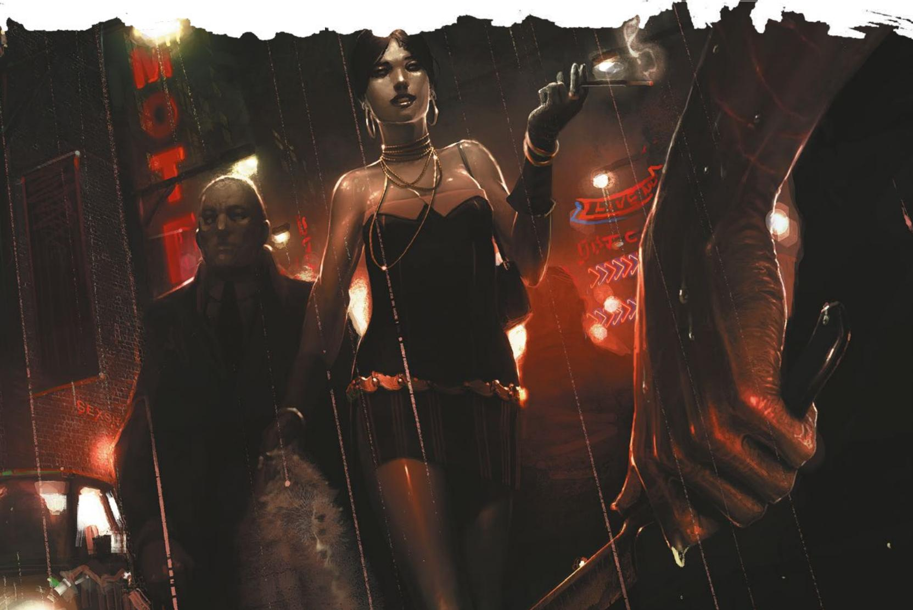

да как угодно. Всё, что имеет хоть какое-то отношение к стрельбе, тебе под силу.

●●●●● Ты тренируешься в стрельбе с тех самых пор, как Винчестер создал своё первое ружьё.

**Специализации:** арбалеты, быстрое выхватывание, самодельные патроны, снайпер, торговля оружием, трюковая стрельба, уход за оружием.

Мы бы не советовали брать слишком широкие специализации вроде стрельбы в бою, стрельбы из пистолетов или даже стрельбы из «Глока-17». Они практически никак не ограничивают игрока, так что совершенно бессмысленны. Специализация «тот самый единственный и неповторимый пистолет, который со мной уже не первый десяток лет» более-менее подходит, ведь если ты везде таскаешь с собой свой любимый «Кольт» с персональной гравировкой, идеально подогнанный именно под твою руку, велика вероятность того, что ты его потеряешь, его украдут или он выдаст тебя с головой.

#### **Фехтование**

Фехтование подразумевает владение широким спектром оружия ближнего боя — помимо прочего, оно включает ножи, цепи и бейсбольные биты. Охотник, который пытается воткнуть тебе в сердце осиновый кол, также использует фехтование.

- Ты знаешь, как обращаться с ножом или битой. Обычно у тебя даже получается не попадать по своим.
- ●● Твоё мастерство владения оружием порой заставляет противника задуматься, а стоит ли с тобой связываться.
- ●●● Ты известен всему домену как искусный боец.
- ●●●● Только дурак полезет на тебя с пистолетом.
- ●●●●● Ты мастер фехтования в своём домене. Сородичи со всех концов света приезжают, чтобы взять у тебя пару уроков.

**Специализации:** дубинки, импровизированное оружие, колья, мечи, ножи, обезоруживающие приёмы, рапиры, топоры, удавки, цепи.

## Социальные навыки

Социальные навыки люди и вампиры используют при общении друг с другом. Хотя результат общения в немалой степени зависит от личности персонажа и его врождённых качеств, реакция оппонента не менее важна. Социальные навыки помогают добиться нужной реакции.

#### **Запугивание**

Запугивание — это навык, позволяющий угрозами добиться чего-то от жертвы, затравить оппонента в социальном конфликте и держать окружающих в ежовых рукавицах. Вампиры, которые полагаются на этот навык, не стесняются ломать чужую волю, а иногда ещё и чужие пальцы.

- Ты можешь придумать язвительное оскорбление, которое ударит точно в цель.
- ●● Ты помыкаешь людьми без особых проблем.
- ●●● Твои жестокость и самодовольство общеизвестны.
- ●●●● Банальные угрозы физической расправой ты давно оставил в прошлом.
- ●●●●● Даже Сородичи порой боятся тебе перечить.

**Специализации:** вымогательство, допрос, завуалированные угрозы, оскорбления, тяжёлый взгляд, физическое принуждение.

#### **Исполнение**

Исполнение охватывает широкий спектр искусств: танцы, поэзию, комедию, сочинение историй и многое другое. Ты можешь быть по-настоящему гениальным исполнителем или просто полным энтузиазма студентом. Приобретая этот навык, ты получаешь одну специализацию бесплатно.

- Твои выступления скрасят любую вечеринку, но выходить на сцену тебе ещё рано.
- ●● Твои выступления вызывают противоречивую реакцию — одним нравится, другие считают, что ты ужасен.
- ●●● Ты далеко не новичок в своём искусстве, но тебе ещё многому предстоит научиться.
- ●●●● Твои выступления настолько великолепны, что даже тореадоры приходят в полный восторг.
- ●●●●● Импровизация для тебя не проблема: каждую ночь ты выступаешь перед новой аудиторией, каждую ночь с новым представлением.

**Специализации:** гитара, драма, духовые инструменты, клавишные, пение, поэзия, публичные выступления, рэп, скрипка, стендап, танец, ударные.

Теоретически рассказчик может сужать специализации бесконечно. Сможет ли поп-звезда справиться с оперной арией или кантри, даже если её показатель исполнения равен 5? Однако практика показывает, что это стоит делать только в том случае, если вся ваша хроника тематически тесно связана с музыкой или театром.

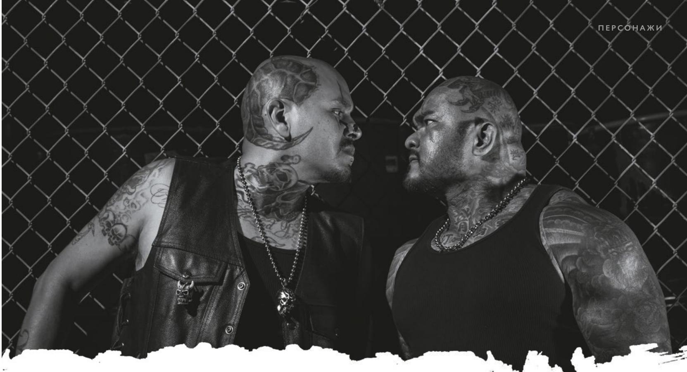

### **Лидерство**

Лидерство — это способность вести за собой толпу, командовать отрядом, вдохновлять союзников и подавлять восстания. Даже самый сильный Принц или Барон рискует потерять своё положение, если не умеет руководить.

- У тебя есть опыт руководства неформальными клубами. Ты сможешь объединить под своим началом группу единомышленников из числа Сородичей.
- ●● Совет готов выслушать тебя. Иногда к твоему мнению даже прислушиваются.
- ●●● Ты умеешь командовать в сражениях, солдаты готовы идти за тобой на верную смерть.
- ●●●● Пока ты рядом, даже раненые и умирающие готовы действовать.
- ●●●●● Своими речами ты заставляешь сердца Сородичей биться, словно они всё ещё живы.

**Специализации:** боевой отряд, воодушевление, командная работа, ораторское искусство, праксис, приказы.

#### **Обращение с животными**

Обращение с животными позволит отпугнуть или усмирить животное или даже подружиться с ним. Этот навык подразумевает, что ты понимаешь поведение зверей — можешь предугадать, как они себя поведут в той или иной ситуации, умеешь дрессировать домашних животных и в некоторых ситуациях можешь даже успокоить зверя или, наоборот, умышленно разозлить его. К вампирам, которые не владеют этим навыком, животные проявляют агрессию или демонстративно их избегают.

- Животным ты не нравишься, но они по крайней мере не огрызаются на тебя и не удирают со всех ног.
- ●● Животные не будут обращать на тебя внимания до тех пор, пока ты сам не попытаешься наладить с ними контакт.
- ●●● Пока ты не пытаешься причинить им вред, животные относятся к тебе как к любимому хозяину.
- ●●●● Животные тебя обожают. Когда ты рядом, даже самые агрессивные особи в большинстве случаев ведут себя спокойно.
- ●●●●● Ты интуитивно ощущаешь мысли и чувства животных, а они, в свою очередь, легко настраиваются на твою волну и делают то, чего ты от них хочешь.

**Специализации:** боевая подготовка, волки, змеи, кошки, крысы, лошади, собаки, соколиная охота, трюки, усмирение.

#### **Проницательность**

Проницательность — это способность понимать язык тела, замечать неуловимые интонации голоса и детали мимики, отличать правду от лжи. Она также позволяет тебе видеть, что движет другими, разбираться в их мотивах.

- Тебя не проведёшь пустым бахвальством.
- ●● Человеку сложно скрыть от тебя своё истинное отношение к кому-либо, и даже Сородичам это не всегда удаётся.
- ●●● Желание съесть пациента не мешает тебе быть отличным психотерапевтом.

- ●●●● Ты просто ходячий детектор лжи. Нужно быть мастером обмана, чтобы заморочить тебе голову.
- ●●●●● Человек, может, и «книга крови», но эта книга напечатана очень крупным шрифтом — её легко читать.

**Специализации:** допрос, желания, ложь, мотивы, пороки, сочувствие, фобии, цели, эмоции.

#### **Убеждение**

Используй этот навык, если хочешь внушить кому-то, что не причинишь вреда и что один укус — это совсем не больно. Мастера убеждения одинаково хорошо играют эмоциями жертвы и используют логические аргументы. Убеждение придётся кстати и во время защиты в суде, и при дворе Принца. Оно пригодится везде: в конференц-залах, барах и спальнях.

- Ты без труда сможешь заключить сделку с заинтересованным лицом.
- ●● Ты неплохо торгуешься и, как правило, можешь уговорить собеседника поделиться деталями последних слухов.
- ●●● В любом конфликте ты сумеешь найти компромисс.
- ●●●● Когда ты появляешься в суде (неважно, среди людей или вампиров), твои оппоненты покупают билет на самолёт.
- ●●●●● Скорее всего, ты и есть тот самый сладкоречивый дьявол.

**Специализации:** допрос, заговаривание зубов, переговоры, риторика, судебные разбирательства, торги.

#### **Уличное чутьё**

Уличное чутьё позволяет тебе говорить на одном языке с бандитами и шпаной. Ты понимаешь кодовые слова и арго, умеешь правильно использовать жесты и распознавать значение граффити.

- Ты знаешь, где в вашем домене торгуют наркотиками и как найти проститутку.
- ●● Ты можешь назвать все банды вашего региона, их цвета, символику и взаимоотношения.
- ●●● Ты можешь отличить хороший товар от плохого и знаешь, где купить оружие. В преступном мире тебя принимают за своего.
- ●●●● Когда бандит говорит «я знаю тут одного парня» — он говорит о тебе.
- ●●●●● Ты можешь нанять нужных людей, спланировать и организовать практически любое преступление в любой точке города.

**Специализации:** взятки, выживание в городе, граффити, наркоторговля, проституция, скупка краденого, торговля оружием, уличные банды, частный поверенный, чёрный рынок.

#### **Хитрость**

Хитрость — это искусство правдоподобно врать, сочинять небылицы и находить достойные оправдания дурным поступкам. Этот навык определяет, насколько ты хорош в плетении интриг, двойной игре и составлении тайных заговоров. Хитрость можно также использовать для соблазнения и для того, чтобы притворяться смертным.

- Ты сможешь обмануть собеседника, если ложь будет не слишком запутанной.
- ●● Ты можешь заморочить голову наивному человеку, старику или ребёнку.
- ●●● Твоя ложь многослойна: один обман ты прикрываешь другим, который должен быть разоблачён для отвода глаз.
- ●●●● Ты сможешь работать под прикрытием столько, сколько понадобится: идеальный кандидат в двойные агенты. Возможно, ты действительно двойной агент.
- ●●●●● Никто не верит в то, что ты способен на обман.

**Специализации:** безупречный обман, биологические процессы, блеф, мошенничество, невинность, соблазнение.

#### **Этикет**

Этикет — это умение соблюдать социальные условности независимо от того, в какое общество ты попал, а также способность устанавливать новые правила поведения и вести себя так, чтобы все остались довольны. Этот навык можно применять как в обществе смертных, так и среди Сородичей.

- Ты знаешь, как правильно обратиться к местному правителю, чтобы не показаться бестактным.
- ●● Ты знаешь, как правильно вести себя в каждой из популярных ночных тусовок в домене.
- ●●● Окружающие бывают поражены твоей вежливостью, почтительностью и чувством такта.
- ●●●● Ты задаёшь тон своим поведением, особенно когда нарушаешь общепринятые нормы этикета.
- ●●●●● Хранитель Элизиума и Гарпии доверяют тебе составление регламента поведения в домене.

**Специализации:** анархи, знаменитости, Камарилья, корпоративный этикет, миллионеры, тайное общество, феодальный этикет, Элизиум.

Вот она, грань между жизнью и смертью. Сердцебиение. Осознание неизбежности происходящего. Смирение. Мы должны умереть вместе.

### Ментальные навыки

Ментальные навыки зависят от приобретённых специализированных знаний, а также от врождённого интеллекта персонажа.

#### Гуманитарные науки

Этот навык подразумевает высшее образование в области гуманитарных наук, понимание проблематики этой области знаний и способность проводить соответствующие исследования. История, к примеру, перестаёт быть чисто теоретической наукой, если твои враги жили — и оставили свой след — в далёком прошлом.

Приобретая этот навык, ты получаешь одну специализацию бесплатно. Если ты хочешь владеть иностранными языками, воспользуйся достоинством «полиглот» (стр. 180).

- Базовое начальное и среднее образование; вечерняя школа.
- Базовое университетское образование или частные занятия с учителем средней руки; бакалавриат.
- Дальнейшее университетское образование или частные занятия с превосходным учителем; магистратура с отличием, докторат.
- •••• Углублённое специализированное обучение; изучение вопросов, в которых мало кто разбирается.
- ••••• Исключительная образованность и тонкое понимание вопросов своей профессиональной области. Консультирование на высшем уровне.

Специализации: английская литература, архитектура, журналистика, исследования, история искусств, история (определённого периода и региона), педагогика, теология, философия.

#### Естественные науки

Естественные науки охватывают огромную область: от основных принципов функционирования живых организмов до понимания сути мировой энтропии. Законы природы властвуют в мире смертных. Вампиры, желающие править этим миром, изучают их. Показатель этого навыка приблизительно соотносится с соответствующим показателем гуманитарных наук: от выпускника средней школы до учёного с мировым именем. Приобретая этот навык, ты также получаешь одну специализацию бесплатно.

- Ты кое-что понимаешь в науке и разбираешься в основных принципах строения мира.
- Ты можешь доходчиво объяснить другому Сородичу разницу между конкурирующими научными гипотезами, касающимися процесса Становления.

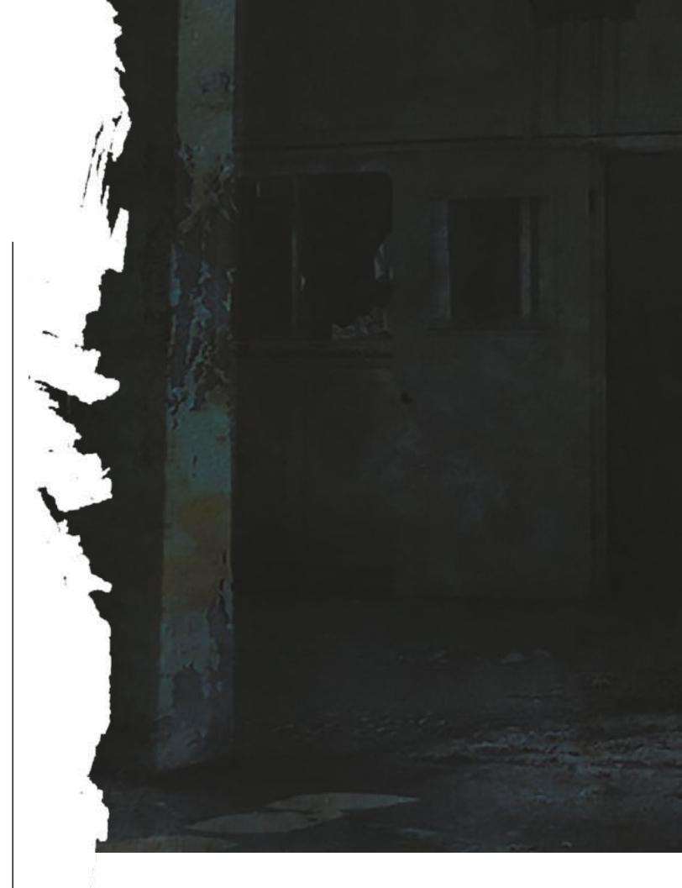

- Из тебя получится отличный научный руководитель. Ты можешь возглавлять лабораторию, способен правильно истолковать результаты экспериментов и остаёшься в курсе большинства актуальных исследований. Ты также умеешь чинить научную аппаратуру.
- Ты эксперт в своей области и в некоторых смежных.
- ••••• Мало кто из твоих ровесников разбирается в науке так же хорошо, как ты. К тебе обращаются за консультациями.

Специализации: астрономия, биология, взрывотехника, генетика, геология, инженерное дело, математика, физика, химия.

#### Медицина

Медицина позволяет лечить людей, диагностировать болезни и устанавливать причину смерти. Ты можешь использовать медицинское оборудование, разбираешься в лекарствах и знаешь, как остановить кровотечение (или вызвать его).

Медицина необходима, чтобы исцелить смертного от тяжёлых повреждений (см. стр. 127).

Ты знаешь анатомию в общих чертах, сможешь отличить вену от артерии, умеешь делать искусственное дыхание и оказывать первую помощь.

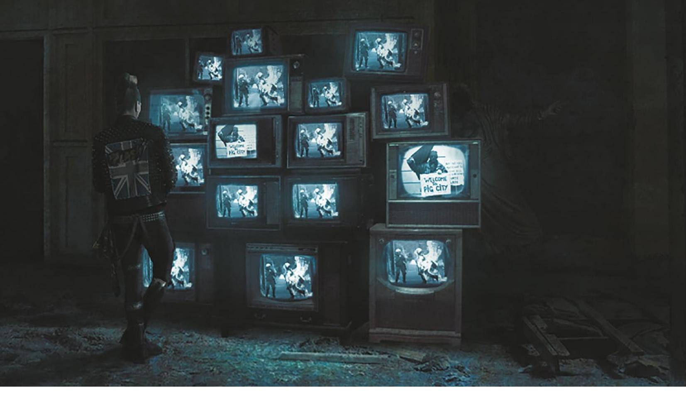

Возможно, ты был студентом медицинского факультета.

- ●● Ты знаешь, что делать при незначительных травмах и как лечить распространённые болезни. Ты сможешь поставить приблизительный диагноз. Возможно, ты был санитаром или фельдшером скорой помощи.
- ●●● Ты сумеешь сделать операцию и знаешь, как помочь человеку с серьёзной травмой. Возможно, ты был интерном, педиатром или терапевтом.
- ●●●● Ты можешь диагностировать практически любую болезнь и найти способ её лечения. Возможно, ты был хирургом или профильным врачом.
- ●●●●● Ты известное светило медицины. Твоего совета ищут и смертные, и бессмертные.

**Специализации:** ветеринария, гематология, патология, первая помощь, травматология, фармацевтика, флеботомия, хирургия.

#### **Наблюдательность**

Наблюдательность — это острота и скорость восприятия. Ты способен заметить Детей Хакима до того, как они нанесут удар, найти ключ в мусорном ведре или почуять едва уловимый запах духов.

● Если что-то выбивается из привычной картины, ты сразу это замечаешь.

- ●● Ты видишь, когда кто-то ведёт себя странно, распознаёшь шаблоны поведения и отклонения от них.
- ●●● Ты нюхом чуешь, где искать улику и где таится угроза. Тебя сложно обмануть маскировкой.
- ●●●● Ты не теряешь бдительности, даже когда тебя отвлекают.
- ●●●●● У тебя глаз как у орла и нюх как у собаки.

**Специализации:** дикая природа, засады, звериные инстинкты, зрение, ловушки, маскировка, нюх, слух, спрятанные предметы.

#### **Оккультизм**

Оккультизм — это знания о мире сверхъестественного. Ты разбираешься в ритуалах и практиках самых разных традиций: от масонов и розенкрейцеров до нодистов и истинных магов. Ты знаешь оккультную символику, тебе знакомы народные мистические практики вне зависимости от того, насколько они эффективны сами по себе.

- Ты знаешь легенду о Каине и предтечах. Возможно, ты читал *«Книгу земли Нод»*.
- ●● Ты отличаешь, где правда о сверхъестественном, а где простые суеверия.
- ●●● Тебе доводилось сталкиваться с чем-то необъяснимым даже по меркам Сородичей.

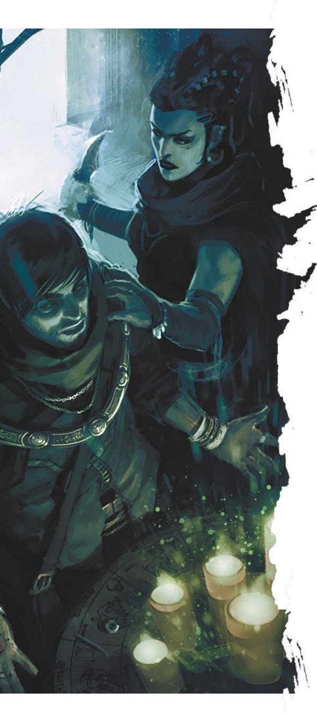

- ●●●● Ты можешь назвать большинство предтеч по именам и, возможно, даже понимаешь суть некоторых ритуалов клана Тремер.
- ●●●●● Тремеры и Дети Хакима приходят посоветоваться с тобой, когда сталкиваются с чем-то необъяснимым.

**Специализации:** алхимия, вуду, гримуары, Инфернализм, Кровавое чародейство, маги, Некромантия, нодизм, оборотни, парапсихология, призраки, феи.

#### **Политика**

Политика включает в себя дипломатию и бюрократию: как в мире людей, так и в мире Сородичей. Ты знаешь, как получить поддержку мэрии, вероятно, можешь оказать давление на местные власти или даже выйти на более высокий уровень. Что касается политики Сородичей, ты знаешь, где какая фракция в большинстве, кто с кем враждует и где зарыты тела. Буквально.

- Ты разбираешься в политике смертных. О политике Сородичей ты знаешь как минимум то, что старейшины не пытаются скрыть.
- ●● Ты можешь сам оказывать влияние на местную политику или знаешь того, кто может.
- ●●● Ты вполне справишься, если понадобится руководить партией, можешь начать свою собственную политическую кампанию. Представители твоей фракции обеспокоены твоими успехами.
- ●●●● Ты знаешь, кто на самом деле дёргает за ниточки живых и неживых вокруг тебя.

- ●●●●● Ты можешь наугад назвать тех, кто входит во Внутренний круг Камарильи, и не ошибиться.
  - **Специализации:** анархи, дипломатия, Камарилья, клан (название), мэрия, национальная политика, политика штата / региона, СМИ.

### **Расследование**

Расследование позволяет распутывать загадки, обыденные или сверхъестественные, замечать улики, интерпретировать их, а также разыскивать пропавших людей. Этот навык чрезвычайно полезен для вампира, если от него сбежал сосуд.

- Ты любишь читать детективы и считаешь себя сыщикомлюбителем.
- ●● Ты хорошо разбираешься в криминологии и знаешь почерк всех местных преступников.
- ●●● Ты либо уже профессиональный детектив, либо можешь им стать. На месте преступления ни одна деталь не ускользнёт от твоего внимания.
- ●●●● Шериф обращается к тебе за помощью, когда кто-то угрожает домену.
- ●●●●● Ты больше не тот, кто разгадывает загадки, — ты тот, кто их загадывает: таинственный незнакомец, ведущий непостижимый образ жизни.

**Специализации:** анализ сетевого трафика, дедуктивный метод, криминология, паранормальные явления, розыск пропавших, судебная медицина, убийства.

#### **Техника**

Этот навык меняется в зависимости от обстоятельств — в этом его отличие от остальных. В широком смысле он позволяет пользоваться «технологическими достижениями, которые большинство вампиров считает чуждыми и непонятными» и разбираться в их устройстве. В 1870 году, к примеру, он был бы необходим, чтобы понимать, как работают паровые двигатели, и осознавать потенциал электричества. В XXI веке он подразумевает умение обращаться с компьютерами и другой электроникой. Разумеется, в современном мире при помощи компьютера можно управлять практически любым устройством — в том числе паровой турбиной или электросетью небоскрёба.

- Ты умеешь переустанавливать операционную систему на домашнем компьютере и знаешь, как защитить его от вирусов.
- ●● Ты знаешь, как скрыть свой IP-адрес, умеешь управлять дронами и подделывать цифровые фотографии.
- ●●● Ты можешь создать свой собственный вирус и запустить его в сеть, не рискуя выдать себя.
- ●●●● Принц может вызвать тебя лично, чтобы обеспечить информационную безопасность домена.
- ●●●●● В Интернете никто не знает о том, что ты вампир. Как и о том, что ты вообще ведёшь какую-то деятельность в Интернете.

**Специализации:** артиллерия, извлечение данных, компьютерные системы, программирование, сети, системы наблюдения, телефония, хакерство.

#### **Финансы**

Финансы позволяют тебе выгодно вкладывать свои деньги, понимать тенденции рынка, манипулировать ценами и чувствовать, когда случится обвал на бирже. С этим навыком ты также можешь оценить чужое состояние, следить за ним и быть посредником в финансовых сделках. Ты можешь проводить оценку предметов искусства, недвижимости и любых других дорогих вещей. Вентру ценят этот навык выше некоторых Дисциплин.

- Ты разбираешься в бухгалтерии и сможешь руководить фирмой.
- ●● Ты можешь руководить подразделением крупной корпорации или филиалом банка. Твои декларации на налоговые вычеты безупречны.
- ●●● Развитие международной торговли позволило тебе стать прекрасным брокером на иностранных фондовых биржах.
- ●●●● Ты получаешь оперативную финансовую информацию раньше, чем она попадает в инвестиционные банки. Тебе ничего не стоит скрыть мошеннические операции.
- ●●●●● Деньги послушный инструмент в твоих руках. Ты умеешь их зарабатывать и с их помощью сокрушать целые страны.

**Специализации:** банковские операции, валютный рынок, корпоративные финансы, отмывание денег, оценка стоимости, предметы искусства, судебнобухгалтерская экспертиза, фондовая биржа, чёрный рынок. ⬛

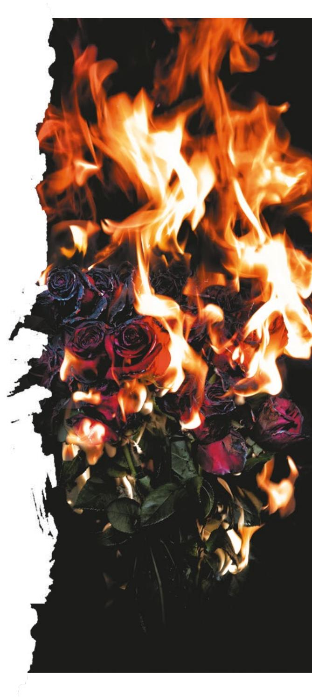

## Ценности

Ценности нельзя назвать параметрами, ведь у них нет числового значения. Тем не менее они чрезвычайно важны для сюжета, поэтому и в игровой механике им уделено подобающее место. Ценности персонажей помогают сделать игру более драматичной.

## Принципы

Каждый игрок при создании персонажа выбирает для него от 1 до 3 *принципов* — человеческих идеалов или норм, которых тот в какой-то мере придерживается даже после смерти.

Выбор у игрока очень широкий — принципы могут отражать религиозные воззрения персонажа, его личный взгляд на вопросы этики, вампирское кредо или даже просто какие-то привычки, прочно укоренившиеся в его жизни, о философской подоплёке которых он никогда и не думал. Рассказчик может не принимать предложенные игроками принципы, если они противоречат духу задуманной им истории или просто ему не нравятся.

Примеры принципов:

- n Не убий.
- n Убивать можно только недостойных / неверующих / в честном поединке / в целях самозащиты.
- n Не позволяй причинить вред детям.
- n Возлюби ближнего своего как самого себя.
- n Непокорность есть позор.
- n Защищай невинных.
- n Смелость вот наивысшая ценность.
- n Всегда держи слово.
- n Истина священна никогда не лги.
- n Рабство зло.
- n Чти власть имущих.
- n Это моё отечество, к добру или к худу.
- n Никто не имеет права мной манипулировать.
- n Не принимай наркотики (не употребляй алкоголь).
- n Не истязай других и самого себя.
- n Виновный должен быть наказан.
- n От каждого по возможностям, каждому по потребностям.
- n Грабь богатых отдавай бедным.
- n Отринь богатство, ибо деньги портят людей.
- n Никогда не действуй во вред своему соратнику по … (вставить название группировки / вероисповедания / секты).
- n Всегда помогай женщине, попавшей в беду.

- n Встань на защиту бесправных.
- n Соблюдай заповеди (вставить название религии), ибо они священны.

Когда персонаж действует в согласии со своими принципами, его посещает меньше сомнений (см. стр. 239).

В то же время нарушение собственных принципов может привести к ещё большим сомнениям, если рассказчик сочтёт это необходимым.

### **Тема**

Участники игры все вместе должны придумать тему своей хроники. В основу может лечь что угодно: и законы жанра, и ирония, и личные предпочтения, и реальные проблемы, которые волнуют игроков. Не забывайте, что наказание за отклонение от темы должен понести персонаж, а не игрок — если у вас есть основания предполагать, что кому-то из игроков затронутая тема может так или иначе нанести психологическую травму, либо измените тему, либо предложите этому игроку совершенно иную хронику.

Все персонажи хроники должны придерживаться выбранной темы, даже если она идёт вразрез с их личными принципами. В конце концов, противоречие между устоями общества и личными идеалами — один из столпов литературы. Суть темы в том, чтобы очертить некую границу дозволенного, за нарушение которой персонажам придётся расплачиваться, — чтобы их превращение в серийных убийц (если такое вдруг случится) не прошло незамеченным.

Убедись, что все участники игры понимают тему одинаково и имеют чёткое представление о том, какие именно действия считаются отступлением от неё.

Примеры тем:

#### ГУМАНИСТИЧЕСКИЕ ЦЕННОСТИ

- n Убийство допустимо только в целях самообороны.
- n Рабство и пытки неприемлемы.
- n Непозволительно причинять вред невинным.

#### КОДЕКС ЧЕСТИ

- n Никогда не убивай невинных.
- n Будь сам себе хозяином, ни под кого не прогибайся.
- n Ты ничто, если у тебя нет достойной цели в жизни.

#### РОМАНТИЧЕСКИЕ ЦЕННОСТИ

n Не отвергай истинной любви.

- Виновные должны быть наказаны.
- Придерживайся норм приличного общества.  $\blacksquare$

#### ЗАКОН УЛИЦ

- Не будь крысой.
- Уважай других и требуй уважения к себе.

 $\longrightarrow \qquad \qquad \Longleftrightarrow$ 

Не убивай тех, кто ни при чём.

#### ПРИМЕР

Карим и его друзья хотят начать хронику. Они решили отразить правду жизни и сделать акцент на вопросах моральной деградации. Свой подход они назвали «северной готикой». Тема их хроники такова: «не причиняй вреда», «будь человеком, а не Зверем» и «никогда не смотри в бездну». Обсудив каждый пункт, участники игры пришли к следующему: причинение вреда включает в себя не только убийство или физическое насилие, но также порабощение и подавление воли сверхъестественными силами, а быть человеком - значит не позволять себе никаких проявлений собственной чудовищной природы, включая неестественное заживление ран. Последний пункт — «никогда не смотри в бездну» — был добавлен потому, что один из игроков очень любит классический жанр ужасов, где знания, не предназначенные для людей, разлагают их души. В данном случае персонажей станут посещать сомнения каждый раз, когда они будут узнавать что-то о подноготной Мира Тьмы.

## **Опоры**

У каждого персонажа в начале игры должно быть столько же опор, сколько у него принципов. Опора это человек, который воплощает то, что вампир ценил при жизни и что выражено в соответствующем принципе. Если опора погибнет, вампир утратит и веру в свой принцип.

 $\qquad \qquad \overbrace{\qquad \qquad }$ 

Опора — это всегда живой человек, ведь она укрепляет Человечность вампира. Было бы странно, если бы опорой Человечности стало нечто иной природы.

Примеры опор:

- Смертный супруг, любовник или родитель персонажа.
- Смертный ребёнок или более далёкий потомок персонажа (для вампиров, проживших не одно столетие).
- Человек, который выглядит точь-в-точь как тот, кого персонаж любил при жизни.

- Человек, которым персонаж восхищался при жизни, или его потомок.
- Родственник жертвы, которую персонаж убил, только-только став вампиром, - он считает это трагической ошибкой, ведь на самом деле он вовсе не чудовище.
- $\blacksquare$ Кто-то, в ком персонаж видит благородство: волонтёр в приюте для животных, священник, медсестра, социальный работник, милая старушка из твоего двора и т. п.
- Кто-то, кто занимается делом, которое персонаж уважал при жизни и к которому до сих пор относится с пиететом: солдат, футболист, музыкант, художник, священник твоей конфессии.
- Человек, связанный с чем-то, что дорого персонажу, хранящий некий предмет, занимающий определённое место или борющийся за какую-нибудь идею: консьерж в доме, где раньше жил герой; полицейский на знакомом перекрёстке; репортёр, который борется за истину; мать-одиночка, живущая в доме детства персонажа; смотритель кладбища, прибирающий могилу героя.

О том, как опоры связаны с Человечностью, см. на стр. 239.

**→→→☆☆☆☆** 

#### ПРИМЕР

У персонажа Торфи две опоры: молодой человек, который с недавних пор ударился в ксенофобию и примкнул к дурной компании, и отец персонажа, который до сих пор жив и думает, что его сын умер много лет назад.

 $+$   $+$   $+$   $+$   $+$   $+$   $+$   $+$   $+$   $+$   $+$ 

## Цель и прихоть

Цель и прихоть в чём-то похожи, но их всё же надо различать. Цель - это долгосрочный проект, мечта всей жизни (пусть ты и мёртв). Прихоть - нечто кратковременное, сиюминутное вроде жажды мести, стремления к наслаждению или желания насладиться местью.

#### Нель

Цель - это то, что движет вампиром: и как обитателем Мира Тьмы, и как персонажем хроники. Это мотивация для игрока и источник вдохновения для рассказчика.

Цель должна быть выражена ясно. Это не может быть что-то расплывчатое вроде «хочу положить конец всем войнам» или «хочу победить расизм». Цель - это конкретное достижение, возможно даже что-то сугубо

личное, например «сделать так, чтобы N (старейшинарасист из вашей хроники) нашёл свою Окончательную смерть» или «положить конец Войне Геенны на территории родной страны».

Цель может быть выражена как языком игрового мира («освободить Чикаго от гнёта Камарильи»), так и языком игровой механики («достичь десятого уровня Человечности»).

Цель должна быть достижимой хотя бы теоретически. Даже если это будет означать конец хроники или если достижение цели маловероятно, она всё равно способна двигать сюжет.

Если персонаж достиг цели, а хроника продолжается, игроку нужно выбрать новую цель. В идеале она сама появится во время игры. Новая цель может даже быть логическим продолжением предыдущей. Возможно, какие-то проблемы остались неразрешёнными или возникли новые.

В конце каждой игровой встречи, на протяжении которой персонаж активно стремился к достижению поставленной цели, он избавляется от одного пункта тяжёлого стресса.

#### **Прихоть**

Прихоть — это гораздо меньше, чем цель жизни, но несколько больше, чем сиюминутные потребности. В начале каждой игровой встречи игрок может выбрать новую прихоть или следовать старой. Один раз за игровую встречу, если действия персонажа в этот момент направлены на удовлетворение прихоти, он может избавиться от одного пункта лёгкого стресса. Поскольку прихоти сменяют друг друга очень часто, их не обязательно вносить в бланк персонажа — просто запишите на листе бумаги или стикере и положите на видном месте.

Прихоти нужны, чтобы мотивировать игроков действовать самостоятельно, вместо того чтобы пассивно ждать развития событий или занимать оборонительную позицию. Это также означает, что хорошая прихоть это актуальная прихоть. Есть проверенное правило: если она не касается чего-то или кого-то, отмеченного на схеме отношений, от неё будет мало толку. Иными словами, «хочу вишнёвую мазерати» или «хочу кровь брюнетки» — не самые удачные прихоти, а вот «хочу вишнёвую мазерати Цитерии» или «хочу кровь брю-

нетки лорда Харкнеса» - в самый раз. Что до прихотей, касающихся других членов котерии, - тут рассказчику нужно быть осторожным и сперва оценить,

## Стиль охоты

Хищникам, как и всем другим существам, приходится адаптироваться. Они занимают очень узкую экологическую нишу, поэтому, адаптируясь, чаще всего меняют свой стиль охоты. От того, кем питается вампир, зависят его навыки и Дисциплины, а это, в свою очередь, определяет, кем сможет питаться вампир в дальнейшем.

Стиль охоты - это привычка или рефлекс, это способ, которым ты обычно предпочитаешь добывать кровь. Твой modus predationis не принуждает тебя в остальное время вести себя тем или иным образом, да и охотиться во время игры ты можешь как угодно. В конце концов, у остальных членов котерии могут быть другие привычки, с которыми придётся считаться, а обстоятельства порой предоставляют шанс «перекусить» там, где ты и не ожидаешь.

Бестия

Персонаж питается кровью других Сородичей: охотится на них, принуждает отдавать свою витэ или взимает с них таким образом плату за услуги. Для него это единственный приемлемый с точки зрения морали способ насыщения. К сожалению, подобная практика, как правило, запрещена в обществе Сородичей. Заниматься чем-то подобным чертовски рискованно, если только герой не занимает высокую позицию благодаря своему могуществу.

пытается ли игрок таким образом разнообразить отношения между персонажами или просто хочет без осо-

бых усилий восстановить пункты воли.

- Персонаж получает одну из специализаций: драка (Сородичи) или скрытность (против Сородичей).
- Увеличь уровень Стремительности или Метаморфоз на 1 пункт.

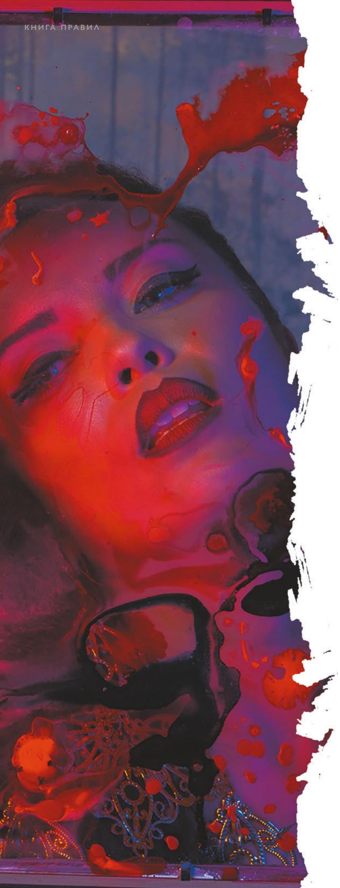

- n Персонаж теряет один пункт Человечности.
- n Сила Крови персонажа увеличивается на один пункт.
- n Персонаж получает либо недостаток славы «страшная тайна (диаблерист)» (●●), либо недостаток статуса «отверженный» (●●).
- n Персонаж получает недостаток пищевых привычек «разборчивость (смертные)» (●●).

## Джентльмен

Персонаж никогда не пьёт кровь, не получив согласие жертвы. Возможно, он притворяется сотрудником передвижного донорского пункта, фриком-кровопийцей из тусовки «настоящих вампиров» — или на самом деле рассказывает смертным правду и просит разрешить насытиться их кровью. Камарилья называет последний вариант нарушением Маскарада, но многие анархи-философы считают это приемлемым риском. При жизни герой мог быть кем угодно, но чаще всего о согласии жертвы беспокоятся бывшие сотрудники секс-индустрии, политические активисты или адвокаты.

- n Персонаж получает одну из специализаций: медицина (флеботомия) или убеждение (сосуды).
- n Увеличь уровень Ясновидения или Стойкости на 1 пункт.
- n Персонаж получает один пункт Человечности.
- n Персонаж получает недостаток славы «страшная тайна (нарушение Маскарада)» (●).
- n Персонаж получает недостаток пищевых привычек «разборчивость (несогласные)» (●).

## Идол

Персонаж либо знаменит среди смертных, либо руководит сектой, церковью или другой подобной организацией. Он питается кровью фанатов или последователей культа, которые почитают его как божество. У героя всегда под рукой есть сосуд, готовый добровольно отдать свою кровь, но его почитатели служат источником проблем — с властями, официальной религией и, что немаловажно, с Камарильей. При жизни персонаж мог быть ди-джеем, писателем, сектантом, проповедником или организатором ролевых игр живого действия.

- n Персонаж получает одну из специализаций: оккультизм (выбери традицию) или исполнение (выбери развлекательную сферу).
- n Увеличь уровень Кровавого чародейства (только для тремеров) или Величия на 1 пункт.

- n Распредели три пункта между фактами биографии «слава» и «стадо».
- n Распредели два пункта между фольклорными недостатками и недостатком «враги».

## Искуситель

Персонаж пьёт кровь во время секса или, по крайней мере, пока делает вид, что занимается сексом. Скрыть истинную природу ему помогают Дисциплины, мастерство соблазнения и обыкновенная человеческая похоть. Он в совершенстве овладел искусством пикапа или стал тёмной звездой местных секс-клубов. Ему нравится считать себя соблазнительным монстром, но в моменты слабости ему кажется, что в лучшем случае он чей-то неудачный любовный опыт, а в худшем — просто-напросто закоренелый насильник. Бывший любовник, вырвавшийся из когтей персонажа, может быть его опорой или преследователем (если так, впиши его в схему отношений). При жизни герой мог быть пикапером, кинопродюсером, писателем, знаменитым похотливым фетишистом — или девственником, который решил наверстать упущенное post mortem1 .

- n Персонаж получает одну из специализаций: убеждение (соблазнение) или хитрость (соблазнение).
- n Увеличь уровень Стойкости или Величия на 1 пункт.
- n Персонаж получает достоинство внешности «красивый» (●●).
- n Персонаж получает недостаток «враги» (●) отвергнутый любовник или ревнивый партнёр.

## Морфей

Персонаж полагается на собственную скрытность или Дисциплины, чтобы прокрадываться в чужие дома и питаться спящими. Если они не проснутся, пока он пьёт кровь, то никогда ничего не заподозрят. При жизни, возможно, герой был очень нелюдимым человеком. Как бы там ни было, сейчас он считает, что беспокойная нежизнь более агрессивных или социально активных охотников не для него.

- n Персонаж получает одну из специализаций: медицина (анестезия) или скрытность (проникновение).
- n Увеличь уровень Ясновидения или Сокрытия на 1 пункт.
- n Увеличь показатель богатства на 1 пункт.

## Налётчик

Персонаж — воинственный охотник, привыкший действовать силой. Ему не важно, кто станет его добычей, — он подстерегает человека и, как только предоставляется такая возможность, бросается на него и пьёт кровь поверженной жертвы. Возможно, он угрозами заставляет жертву молчать, использует Доминирование или пытается замаскировать свои истинные мотивы под обычное ограбление, а может быть и нет. Подумай над тем, как твой персонаж к этому пришёл. Почему его устраивает подобная нежизнь? Возможно, он был бездомным, солдатом, боевиком наркокартеля или охотником за трофеями.

- n Персонаж получает одну из специализаций: запугивание (ограбление) или драка (захват).
- n Увеличь уровень Стремительности или Мощи на 1 пункт.
- n Ты теряешь один пункт Человечности.
- n Персонаж получает три пункта преимущества «информаторы (криминальные круги)».

## Семьянин

Персонаж тайно пьёт кровь собственной (или чьей-то ещё) смертной семьи и друзей, сохраняя с ними тесную связь. Самые отчаянные из таких, как он, женятся или выходят замуж, берут детей из приюта и пытаются как можно дольше вести нормальную семейную жизнь. Добавь семью в схему отношений.

Семьянин, как правило, на многое готов, чтобы скрыть от родных свою истинную природу, но некоторые вступают с родственниками в нездоровые отношения. Камарилья запрещает вампирам оставаться со своими смертными семьями и считает, что нарушение Маскарада в таких условиях — лишь вопрос времени. Некоторые мудрые Сородичи, если им есть дело до героя, могут вырезать его семью ради его же блага.

- n Персонаж получает одну из специализаций: убеждение (газлайтинг) или хитрость (отговорки).
- n Увеличь уровень Доминирования или Анимализма на 1 пункт.
- n Персонаж получает недостаток славы «страшная тайна (семьянин)» (●).
- n Персонаж получает преимущество «стадо» (●●).

1 Прим. пер.: после смерти (лат.)

## Суррогатчик

**Персонаж не охотится на людей. Вместо этого он кра‑ дёт, покупает или иным способом добывает донор‑ скую кровь. Возможно, он до сих пор работает в ноч‑ ную смену в больнице либо же полагается на чёрный рынок или на свои навыки грабежа.**

- n **Вентру не могут выбирать этот стиль охоты.**
- n **Персонаж получает одну из специализаций: во‑ ровство (взлом замков) или уличное чутьё (чёрный рынок).**
- n **Увеличь уровень Кровавого чародейства (только для тремеров) или Сокрытия на 1 пункт.**
- n **Персонаж получает достоинство пищевых при‑ вычек «крепкий желудок» (●●●).**
- n **Персонаж получает недостаток «враг» (●●): по‑ хоже, ты успел перейти кому‑то дорогу, хотя, воз‑ можно, дело в чём‑то другом.**

## Тусовщик

**Персонаж питается представителями одной опре‑ делённой субкультуры. У него есть тщательно про‑ работанный образ, и в тусовке его принимают за сво‑ его. Более того, жертвы слепо обожают героя. Робкие попытки разоблачения разбиваются о его популяр‑**

**ность в их среде. Может, для местной публики он про‑ сто «ходовой товар» или представитель недосягаемой элиты, заманивающий жертв обещаниями открыть им доступ к «высшим кругам». При жизни герой, скорее всего, принадлежал к той же тусовке.**

**Персонаж получает одну из специализаций: эти‑ кет (выбери тусовку), лидерство (выбери тусовку) или уличное чутьё (выбери тусовку).**

- n **Увеличь уровень Доминирования или Мощи на 1 пункт.**
- n **Персонаж получает преимущество «слава» (●).**
- n **Персонаж получает преимущество «информатор» (●).**
- n **Персонаж получает либо недостаток влияния «не‑ популярный (вне тусовки)» (●), либо недостаток пищевых привычек «разборчивость (другая суб‑ культура)» (●).**

## Фермер

**Персонаж питается исключительно кровью живот‑ ных. Голод терзает его непрестанно, но до сих пор он не убил ни одного человека (ну разве что в тот самый первый и последний раз) и впредь не собирается. При жизни персонаж мог быть кем угодно, но сделан‑ ный выбор говорит о его высокой морали. Возможно, герой был активистом, священником, сотрудником гуманитарной организации или веганом; впрочем, кто угодно может прийти к решению не подвергать риску человеческие жизни и попытаться этого реше‑ ния строго придерживаться.**

- n **Вентру и вампиры с силой Крови 3 и выше не мо‑ гут выбирать этот стиль охоты.**
- n **Персонаж получает одну из специализаций: обра‑ щение с животными (определённый вид) или вы‑ живание (охота).**
- n **Увеличь уровень Анимализма или Метаморфоз на 1 пункт.**
- n **Персонаж получает один пункт Человечности.**
- n **Персонаж получает недостаток пищевых привы‑ чек «фермер» (●●).** ⬛

## Преимущества

Помимо вампирских сил и человеческих навыков, у персонажа с самого начала игры могут быть некоторые преимущества - от способностей к языкам до отряда верных гулей. Показатели преимуществ, как и других параметров, измеряются в пунктах - от одного до пяти. Если у персонажа значение преимущества равно 0, это совершенно нормально и не влечёт за собой никаких последствий. Преимущества редко напрямую фигурируют в проверках, хотя рассказчик может предложить проверку интеллекта + лингвистики, если герой хочет расшифровать древний папирус, или хитрости + информаторов, чтобы пустить слух о противнике.

Преимущества делятся на достоинства, факты биографии и страницы истории, а недостатки — это их оборотная сторона, нечто, что доставляет персонажам постоянные неудобства.

Преимущества отличаются от других параметров ещё и тем, что персонажу не обязательно увеличивать их уровень последовательно, но в то же время владение, к примеру, достоинством третьего уровня не открывает доступ к более слабым эффектам первого или второго уровня.

## Достоинства

Достоинства - это нечто свойственное самому персонажу, его одарённость в той или иной области — физической, ментальной или социальной. Как правило, достоинства остаются неизменными на протяжении всей истории, хотя всегда может случиться что-то неожиданное, особенно когда кто-то пускает в дело магию, диковинную и непостижимую.

АНАХРОНИЗМ. Этот недостаток могут брать только анциллы или ещё более старые вампиры.

- Недостаток: (••) ходячий анахронизм. Ты либо долгое время провёл в торпоре, либо по какой-то другой причине так и не смог приспособиться к современному миру. Ты не знаешь, как пользоваться компьютерами или смартфонами. Значение навыка «техника» у тебя равно 0, и его нельзя повышать. Рассказчик может уменьшить пул любой твоей проверки, связанной с использованием современных технологий, на 1d10.
- Недостаток: (•) ретроград. Ты не можешь или не хочешь мыслить современными понятиями. У тебя есть принципы, которые серьёзно устарели, к примеру

«слово Папы Римского — закон», «женщина — это нежный цветок», «удел низших классов - прислуживать своим господам» или «сотри владения врага с лица земли». Эти устаревшие принципы поддерживают твою Человечность, но многим кажутся весьма одиозными. Когда речь заходит о принципах, пул твоих социальных проверок уменьшается на 1d10 за исключением тех случаев, когда собеседник придерживается столь же архаичных взглядов - возможно, он будет даже восхищён твоей твёрдой моральной позицией.

ВНЕШНОСТЬ. Далеко не все вампиры выглядят как актёры из популярных телесериалов. Некоторые - гораздо красивее. Ну а другие актёрам и в подмётки не годятся.

Модификаторы, указанные ниже, влияют на проверки только тогда, когда вампира можно видеть. Какой эффект они оказывают во время социального конфликта и нужно ли их применять к каждому пулу, решает рассказчик.

- Недостаток: (••) омерзительный. Пулы всех социальных проверок, на которые может повлиять внешность, уменьшаются на 2d10.
- Недостаток: (•) уродливый. Пулы всех социальных проверок, на которые может повлиять внешность, уменьшаются на 1d10.
- Красивый. Пулы всех социальных проверок, на которые может повлиять внешность, увеличиваются на 1d10.
- Восхитительный. Пулы всех социальных про- $\bullet \bullet \bullet \bullet$ верок, на которые может повлиять внешность, увеличиваются на 2d10.

пищевые привычки. В общую группу пищевых привычек входит несколько разных достоинств и недостатков. Если персонаж обладает одним из них, это ещё не значит, что он будет обладать и другими.

■ Недостаток: (••) пожиратель органов. Ты можешь утолить Голод только пожирая человеческую плоть и органы. В особенности тебя привлекают органы, богатые кровью: сердце, печень, лёгкие, плацента, селезёнка (современные Сородичи сперва делают из них смузи). Если у жертвы есть резонанс, его можно получить только съев сердце.

#### ОБРЕТЕНИЕ И УТРАТА ПРЕИМУЩЕСТВ

**События хроники могут повлиять на преимущества и недостатки персонажей, в особенности на их факты биографии. Убежище может сгореть, союзник — отвернуться, если предать его доверие, а подручного может ни с того ни с сего застрелить какой-нибудь коп. И наоборот, путём хитрых махинаций или отчаянных усилий персонажи могут обрести новые преимущества. Их показатели могут меняться в зависимости от текущих обстоятельств.**

**Правило тут одно: если игрок потратил на приобретение какого-то преимущества пункты опыта или получил его при создании персонажа, у него должна быть возможность в случае утраты вернуть его или по крайней мере заменить. В свою очередь, преимущество, полученное во время игры без траты пунктов опыта, должно оставаться временным.**

**Пример. Катя подмяла под себя группу доверчивых смертных, что можно отразить через преимущество «союзники» с показателем 2. Если она не потратит пункты опыта, чтобы закрепить своё «приобретение», они, скорее всего, будут помогать ей только в текущей истории.**

- n **Недостаток:** (●●) **фермер.** Ты питаешься исключительно кровью животных. Если ты хочешь насытиться кровью человека, то сперва должен потратить два пункта воли. Вентру не могут приобретать этот недостаток.
- n **Недостаток:** (●) **жажда мафусаила.** Ты можешь полностью утолить Голод только кровью сверхъестественных существ (витэ слабокровок может сгодиться, но только если алхимики найдут способ её сгустить). При любой другой диете у тебя всегда будет как минимум один пункт Голода (или больше, в зависимости от силы Крови — см. стр. 215).
- n **Недостаток:** (●) **разборчивость.** Ты считаешь неприемлемым пить кровь определённой группы людей: наркоманов, женщин, детей, полицейских, невинных, какой-то этнической группы, одного из меньшинств и т. п. Если ты всё же выпьешь их кровь, тебя будут мучить сомнения. Этот поступок приравнивается к отклонению от темы хроники. Возможно, не менее невыносимо для тебя смотреть, как другие пьют кровь выбранной категории людей, — в этом случае ты тоже можешь столкнуться с сомнениями. Если этот недостаток берёт вентру, он существенно сужает и без того узкий круг доступных ему сосудов, добавляя этот запрет к уже имеющемуся ограничению.
- **Ищейка.** Ты нюхом чуешь резонанс в крови человека — тебе не обязательно пробовать её на вкус. Для этого ты должен находиться достаточно близко, чтобы чувствовать запах, и пройти проверку упорства + наблюдательности со сложностью 3. Сложность можно повысить, если дистанция слишком большая или жертва пользуется духами с сильным запахом, и, наоборот, понизить при близком интимном общении.
- ●●● **Крепкий желудок.** Холодная и испорченная кровь и даже фракционированная плазма способны утолить твой Голод. Резонанс они не передают. Вентру не могут приобретать это достоинство.

ПОЛИГЛОТ. Каждый персонаж прекрасно владеет родной речью, а также тем языком, на котором преимущественно говорят в хронике (разве что очаровательный венгерский акцент выдаёт в нём иностранца). К примеру, вампир-ливанец из истории, в которой действие разворачивается в Мехико, умеет говорить и писать по-арабски (или по-арамейски, если он достаточно стар) и по-испански. Великодушный рассказчик может позволить тем, у кого родной язык совпадает с языком хроники, выбрать ещё один бесплатно.

## *Наркоман* наркоман

Каждый пункт достоинства «полиглот» добавляет сверх упомянутых двух ещё по одному языку, на котором персонаж может разговаривать, читать и писать.

С точки зрения игровой механики не столь важно, какие изменения произошли с языком за века его существования, — в рамках этого достоинства можно считать, к примеру, англосаксонский и английский одним и тем же языком. Впрочем, сложность проверки гуманитарных наук или оккультизма можно повысить, если требуется расшифровать древний документ или читать заклинания на диковинном диалекте.

n **Недостаток:** (●●) **неграмотный.** Ты не умеешь читать и писать. Показатели гуманитарных и естественных наук не могут превышать 1 пункта, и в этих навыках ты не можешь брать специализации, касающиеся современных знаний.

УЗЫ. Не на каждого вампира узы крови действуют одинаково. Одни с удивительной лёгкостью попадают под власть сюзерена; другие противятся чужой воле всем своим естеством. Ты можешь комбинировать достоинства и недостатки, приведённые ниже. Персонаж, к примеру, может иметь пристрастие к узам и в то же время формировать неустойчивые узы. Более подробно об узах крови см. на стр. 233.

- n **Недостаток:** (●●) **раб кровавых уз.** Ты попадаешь под чужую власть лишь пригубив витэ — чтобы сформировались узы, тебе достаточно всего один раз выпить кровь другого вампира, а не три, как обычно. Ты начинаешь игру вассалом своего сира либо вместе с рассказчиком должен придумать, почему узы с ним были разрушены. Возможно, сира проткнули колом? Или он уехал в другой город и не появлялся более шести месяцев?
- n **Недостаток:** (●) **пристрастие к узам.** Узы тебе кажутся слаще, чем другим. Пул всех проверок, идущих вразрез с волей сюзерена, уменьшается на 1d10.
- n **Недостаток:** (●) **устойчивые узы.** Ты дольше других остаёшься под влиянием уз крови — требуется три месяца, чтобы они ослабли на одну ступень.
- **Устойчивость к узам.** Твоя Кровь восстаёт против чужого влияния. Можно приобрести от одного до трёх пунктов этого достоинства. Каждый из них позволяет увеличить пул проверок устойчивости к узам на 1d10.
- ●● **Неустойчивые узы.** Узы крови спадают с тебя быстрее, чем с других вампиров, ослабевая на одну ступень и в полнолуние, и в новолуние (т. е. два раза в месяц).

●●●● **Невосприимчивость к узам.** Тебя нельзя связать узами крови. Если тебе не хватает денег, можешь продавать свою витэ алхимикам, ничего не опасаясь.

УПОТРЕБЛЕНИЕ ПСИХОАКТИВНЫХ ВЕЩЕСТВ. Сородичи с этим преимуществом или недостатком жаждут крови, содержащей определённое вещество, но могут утолять Голод и любой другой. Если ты хочешь, чтобы персонаж питался только каким-то одним видом крови или, наоборот, испытывал к нему отвращение, обрати внимание на недостаток «разборчивость» (стр. 180). О том, как на вампира влияет кровь, содержащая психоактивные вещества, можно прочитать на стр. 310 этой книги. Указанные там эффекты действуют на всех Сородичей независимо от того, есть у них это преимущество (или недостаток) или нет.

Не забудь указать, какое именно вещество привлекает персонажа.

- n **Недостаток:** (●●) **зависимость.** Если кровь последней жертвы персонажа не содержала нужного вещества, пул всех проверок, не связанных с моментальным удовлетворением потребности в веществе, уменьшается на 2d10.
- n **Недостаток:** (●) **пристрастие.** Если кровь последней жертвы персонажа не содержала нужного вещества, пул всех проверок, не связанных с моментальным удовлетворением потребности в веществе, уменьшается на 1d10.
- **Высокофункциональный наркоман.** Если кровь последней жертвы персонажа содержала нужное вещество, пул проверок характеристик одной из категорий (определи её заранее вместе с наименованием вещества) увеличивается на 1d10.

ФОЛЬКЛОРНЫЕ ДОСТОИНСТВА И НЕДОСТАТКИ. У каждой линии крови Сородичей свои странности и душевные травмы. Страхи предков, давным-давно обратившихся в прах, пустили крепкие корни в их витэ, распространившей диковинное проклятие от сира к его потомству. Есть и вампиры с индивидуальными причудами — для кого-то это усиленные Становлением психосоматические расстройства, а для кого-то — тысячелетиями дремавшие в Крови предков странности, отчего-то неожиданно проявившиеся именно сейчас.

n **Недостаток:** (●●) **мишень для кольев.** Если проткнуть твоё сердце колом, ты встретишь Окончательную смерть, а не просто впадёшь в торпор, как другие Сородичи.

- n **Недостаток:** (●) **надуманная опасность.** Персонаж получает тяжёлые повреждения от совершенно неопасных для других Сородичей вещей, таких как:
  - **⬜** ультрафиолетовый свет (урон как от прямого солнечного света);
  - **⬜** серебро и посеребрённое оружие (урон зависит от конкретного вида оружия, а прикосновение к серебру вроде монеты или цепочки наносит одно тяжёлое повреждение);
  - **⬜** святая вода (урон как от огня).
- n **Недостаток:** (●) **надуманное препятствие.** Столкнувшись с этим препятствием, ты должен либо отпрянуть, либо потратить один пункт воли, чтобы преодолеть его.

Каждое из перечисленных препятствий считается отдельным недостатком на один пункт.

Надуманным препятствием может быть:

- **⬜** священный символ в руках любого верующего (даже не обладающего Истинной Верой);
- **⬜** проточная вода, которую ты можешь видеть (не рекомендуется брать этот недостаток, если место действия хроники — такие города, как Амстердам, Стокгольм или Венеция);
- **⬜** порог дома, в который тебя не пригласили;
- **⬜** животное белого цвета;
- **⬜** чеснок;
- **⬜** шиповник;
- **⬜** рассыпавшиеся семена, которые ты ещё не пересчитал.
- n **Недостаток:** (●) **стигматы.** Когда твой Голод достигает четырёх пунктов, у тебя открываются кровоточащие раны на запястьях, ступнях и лбу. Это привлекает внимание, оставляет следы и по решению рассказчика может уменьшить пулы некоторых проверок.
- ●● **Способность есть пищу.** Ты можешь есть, как все смертные, и даже, возможно, наслаждаться вкусом, однако Голод человеческая пища не утоляет, и её необходимо исторгнуть из организма, прежде чем ты ляжешь спать на день.

#### **Достоинства и недостатки слабокровных**

Следующие достоинства и недостатки могут брать только слабокровные вампиры. У них нет эквивалента в пунктах — каждое достоинство должно быть уравновешено одним недостатком. При создании персонажа они не учитываются в общем количестве потраченных на преимущества пунктов развития или опыта.

#### НЕДОСТАТКИ СЛАБОКРОВНЫХ

- Веззубый. Либо клыки у тебя вообще не отросли, либо они бесполезны - тебе приходится наносить жертвам открытые раны или извлекать кровь при помощи шприца.
- Зависимость от витэ. Кровь в твоих жилах не может питать Дисциплины. Ты утратишь способность пользоваться ими (включая Алхимию слабокровных), если в течение недели не утолишь хотя бы один пункт Голода кровью Сородича. Утраченные способности восстановятся, как только ты выпьешь достаточно вампирской витэ.
- Клановый изъян. В твоих жилах всё ещё течёт Кровь сира, а вместе с ней и слабость его прародителя. Ты должен выбрать клановый изъян. Тяжесть изъяна в данном случае считается равной 1. Клановый изъян Бруха и Гангрелов можно выбирать только вместе с недостатком «неистовый Зверь», а изъян Тремеров - только вместе с достоинством «потенциал Крови».
- Клеймо Камарильи. В некоторых городах правители выслеживают и уничтожают слабокровок, в других «милосердный» Шериф, не церемонясь, ставит на них клеймо, чтобы они всегда помнили своё место (многих после этого всё равно выслеживают и уничтожают, потому что они якобы кого-то оскорбили, а порой и просто из прихоти). Тебя заклеймили подобным образом, и теперь Камарилья ждёт не дождётся, когда ты совершишь какую-нибудь ошибку. Даже с этим недостатком у тебя могут быть информаторы в Камарилье - к двуличию им не привыкать.
- Мёртвая плоть. Твоя Кровь настолько слаба, что не может сдерживать процессы разложения. В результате твоя плоть гниёт, у неё зеленоватый оттенок и едва уловимый запах мертвечины. При медицинском обследовании любой врач констатирует смерть. Кроме того, пул социальных проверок при личном общении со смертными уменьшается для тебя на 1d10. Вместе с этим недостатком нельзя брать достоинство «полный жизни».
- Неистовый Зверь. Зверь внутри тебя столь же необуздан, как и у полнокровных Сородичей. Тебе нужно проходить проверки сопротивления ярости по стандартным для всех вампиров правилам.
- Отверженный среди анархов. Ты нарушил какое-то негласное правило или решил, что все равны, а оказалось, что некоторые равнее других. В любом случае анархи со всех окрестностей знают о твоём проступке и презирают тебя. Они скорее бросят тебя на растерзание Камарилье, чем станут

слушать твои мольбы. С этим недостатком нельзя брать достоинство «товарищи среди анархов».

■ Субтильность смертного. Ты не способен пробудить Кровь, чтобы заживить раны, но можешь лечиться, как все смертные (стр. 126). С этим недостатком нельзя брать достоинство «живучесть вампира».

#### **ДОСТОИНСТВА СЛАБОКРОВНЫХ**

- Алхимик. Весперы меняются благодаря выпитой крови, и Алхимия слабокровных раскрывает этот процесс. Ты получаешь один пункт этой Дисциплины, и тебе известен один рецепт (стр. 282). Возможно, чудесная способность проявилась в тебе спонтанно и ты сам изобрёл коктейль - или ты научился Алхимии у других умельцев, раскрывших тебе секрет. Дополнительные уровни и рецепты ты можешь приобретать за пункты опыта, как обычно.
- Дневной хищник. Солнце не наносит тебе урон вместо этого в дневное время твоя шкала здоровья уменьшается вдвое (с округлением вверх) и ты лишаешься всех вампирских способностей, включая Дисциплины и прибавки к здоровью. Тем не менее Голод мучает тебя так же, как других вампиров, и рано или поздно тебе нужно будет поспать. Если ты попадёшь на солнечный свет, когда повреждения, полученные к этому моменту, занимают больше половины шкалы здоровья, ты будешь либо изнурён, либо впадёшь в торпор (в зависимости от вида повреждений). Эффект сохраняется, пока ты остаёшься на солнце.
- Живучесть вампира. От колющего и режущего оружия ты получаешь лёгкие повреждения, так же как полнокровные вампиры.
- Покровитель в Камарилье. Ты привлёк внимание вербовщика Камарильи, обещавшего тебе покровительство и шанс стать полноценным вампиром. Всё, что для этого нужно, - это держать ухо востро, докладывать обо всём, что делаешь ты и твоя котерия, а также быть готовым выполнить любое поручение. Считай это аналогом мавлы (1 пункт), хотя этот покровитель относится к тебе паршиво. Впиши его в схему отношений.
- Полный жизни. Твоё сердце бьётся, ты можешь употреблять обычную пищу и наслаждаться сексом. Только самый тщательный медицинский анализ может выявить отклонения от нормы, если, конечно, тебя осматривают в ночное время.
- Потенциал Крови. Ты можешь связывать других узами Крови или давать Становление, подобно полнокровному вампиру. Все твои потомки будут слабокровными.

- n **Склонность к Дисциплине.** Ты проявляешь склонность к определённой Дисциплине, которую нужно выбрать при создании персонажа. Ты получаешь один уровень этой Дисциплины и можешь развивать её дальше, тратя на это пункты опыта, как любой другой вампир (стоимость в пунктах опыта у этой Дисциплины такая же, как для сторонних Дисциплин). Когда ты пьёшь кровь соответствующего резонанса, ты не получаешь дополнительных пунктов или сил в этой Дисциплине — даже временно.
- n **Товарищи среди анархов.** Ты сблизился с котерией анархов. Они терпят твоё присутствие или даже проявляют симпатию, словно ты бездомный щенок, которого они приютили. Считай их группу аналогом мавлы (1 пункт), во всяком случае пока ты придерживаешься линии партии. Впиши их в схему отношений.

## Факты биографии

Факты биографии — это преимущества внешнего характера. Они описывают взаимоотношения, обстоятельства и возможности: имущество, связи, кредит доверия и т. п. Ты должен отчётливо представлять себе, каким образом твой персонаж приобрёл тот или иной факт биографии и что конкретно за ним стоит. Кто твои информаторы? Почему союзники решили тебе помогать? Где ты нашёл подручных? Какие вложения обеспечивают тебе четыре пункта богатства? Не обязательно сразу описывать всю подноготную, но будь готов к тому, что рассказчик может спросить об этом во время игры — придумай заранее или импровизируй в зависимости от сюжета хроники.

Один и тот же факт биографии можно приобретать несколько раз, если он отражает разные явления. В этом случае развиваются они тоже отдельно друг от друга, это дискретные параметры.

#### **ПРИМЕР**

*Мартин приобретает факт биографии «союзники» два‑ жды: это бдительный сосед (1 пункт) и опытный дове‑ ренный адвокат (3 пункта).*

Котерия может совместно приобретать общие факты биографии. См. раздел «Факты биографии котерии» на стр. 196.

#### **Богатство**

Это твой экономический статус, твой капитал — или его отсутствие. Богатство — далеко не всегда только денежные средства. Возможно, ты владеешь некими материальными ценностями, не обязательно ликвидными, которые ты тем не менее можешь продать. Это может занять недели и даже месяцы, в зависимости от количества предметов, требующих реализации. В эти ночи, когда Вторая инквизиция замораживает банковские счета Сородичей, они всё чаще предпочитают держать свой капитал в наличных деньгах или вкладывать их в золото, предметы искусства, наркотики, оружие и рабов.

Богатство подразумевает постоянный источник дохода, который позволяет тебе придерживаться привычного образа нежизни, но ты должен описать, как и откуда ты получаешь средства, что именно стоит за твоим благосостоянием. В конце концов, от этого зависит его сохранность, ведь во время игры персонажа могут, например, ограбить или довести до банкротства.

- n **Недостаток:** (●) **нищий.** У тебя нет ни денег, ни дома.
- **Рабочий класс.** Ты живёшь от зарплаты до зарплаты: квартира, машина, обычное туристическое снаряжение.
- ●● **Средний класс.** Хорошая квартира или небольшой домик, несколько машин, профессиональное снаряжение.
- ●●● **Зажиточный.** Великолепная квартира в кондоминиуме или большой дом, предметы роскоши, профессиональное снаряжение на несколько человек.
- ●●●● **Богатый.** Особняк, вертолёт или частный самолёт, высококлассное специализированное профессиональное снаряжение.
- ●●●●● **Мультимиллионер.** Несколько особняков, всё, что можно купить за деньги.

#### **Влияние**

У тебя есть рычаги давления в обществе смертных. Ты добился этого благодаря богатству, авторитету или занимаемой должности, а может быть, при помощи шантажа или сверхъестественных сил. Сородичи с высоким показателем влияния могут направлять, а иногда и напрямую контролировать политическую и общественную жизнь города, в особенности работу полиции и городских чиновников.

Как правило, влияние персонажа особенно сильно в пределах одной определённой группы жителей или на ограниченной территории внутри города. Такие группы могут быть очень большими и иметь весьма размытые границы: например, организованная преступность, СМИ, религия, полиция, мэрия и т. п. В свою очередь, когда речь заходит о территориальных границах, как правило, подразумевается область крупнее жилого района и в целом крупнее большинства индивидуальных охотничьих угодий внутри города (за исключением разве что самых крупных): например, Бруклин в Нью-Йорке, Левый берег в Париже, Саут-Сайд в Чикаго, Гинза в Токио и т. п.

Чем дальше от обозначенной сферы отдаляется персонаж, тем слабее его влияние. Так, к примеру, влиятельный (●●●●) в Голливуде вампир будет авторитетным (●●●) в остальном Лос-Анджелесе, не более чем важным (●●) в Сан-Франциско или Сан-Диего и считаться всего лишь персоной со связями (●) в Чикаго и Нью-Йорке.

Влияние можно использовать в некоторых проверках вместо одного из параметров, например при попытках уговорить мелких чиновников (или кого-то подобного в зависимости от сферы влияния) пойти на уступки. В первую очередь этот факт биографии предназначен для точечного воздействия, а не для глобальных перемен — чтобы добиться сноса (или сохранения) «заброшенного» здания, а не начать мировую войну.

Если ваша хроника повествует об интригах мирового масштаба, вы можете настроить масштаб влияния так, как вам будет удобно: например, считать, что при значении 4 (●●●●) оно распространяется на целую страну, а при 5 (●●●●●) — на весь мир.

- n **Недостаток:** (●●) **презираемый.** Определённая группировка или обитатели какой-то части твоего города всеми силами противодействуют тебе и всем, кто с тобой заодно. Когда ты пытаешься уговорить третьих лиц поддержать тебя в политической игре или оказать тебе услугу, пул проверки уменьшается на 2d10. Рассказчик должен вовлекать твоих противников в сюжет при каждом удобном случае.
- n **Недостаток:** (●) **непопулярный.** Пул социальных проверок при общении со всеми в городе, за исключением твоих информаторов, союзников и других однозначно лояльных сторонников, уменьшается на 1d10.
- **Со связями.** Ты всегда можешь рассчитывать на то, что тебя внимательно выслушают.
- ●● **Важный.** Окружающие всегда готовы оказать тебе услугу.
- ●●● **Авторитетный.** Воротилы мира смертных и даже целые группировки опасаются переходить тебе дорогу.

- ●●●● **Влиятельный.** Функционеры и шестёрки сделают всё, что ты прикажешь, разве что у них есть очень веская причина не подчиниться.
- ●●●●● **Могущественный.** Фигуры помельче стремятся предугадывать все твои желания.

#### **Информаторы**

У тебя есть связи среди смертных. Это могут быть люди из самых разных слоёв общества. Информаторы в первую очередь снабжают тебя сведениями в области своей компетенции, хотя могут также оказать небольшую услугу. Если тебе нужна помощь иного характера, требуются другие факты биографии: влияние (стр. 184), союзники (стр. 189) или мавла (стр. 185).

Информатор — это тот, кто занимает идеальную позицию для сбора сведений. Из полицейского диспетчера может получиться информатор в разы лучше, чем из следователя отдела убийств, а из простого сотрудника конгресса — лучше, чем из сенатора. Информационные брокеры, журналисты жёлтой прессы, фиксеры и репортёры — вот лучшие кандидаты на эту роль. Приобретая этот факт биографии, не обязательно сразу описывать информатора, это можно сделать и во время игры, когда придёт время к нему обратиться. Как бы там ни было, его нужно внести в схему отношений.

- Один информатор, который может оказать мелкую услугу или раздобыть что-то дешёвое и общедоступное (богатство 1). Примеры: мелкий наркоторговец, продавец автомобилей.
- ●● Один информатор, который может оказать обычную услугу или раздобыть что-то полезное (богатство 2). Примеры: мелкий торговец оружием, ветеринар.
- ●●● Один информатор, который может оказать важную услугу или раздобыть что-то ценное (богатство 4). Примеры: специалист по охранным системам, полицейский из отдела по борьбе с наркотиками, «убойного отдела» или из другого полезного департамента.

#### **Мавла**

Мавлá (мн. ч. мавали) — это один или несколько Сородичей, которые помогают тебе советами, делятся информацией и время от времени могут оказать содействие. Слово происходит из арабского языка. Со времён средневековья у него было множество разных значений: «доверенное лицо», «дядя», «сосед, который может предоставить защиту», «иноверец, связанный клятвой» и т. п. Западные вампиры переняли это слово

ещё во времена крестовых походов, а в последнее время на волне тесного сотрудничества между Камарильей и Аширрой в Войне Геенны оно снова стало популярным.

Мавла может быть твоим наставником. Чаще всего эту роль играет сир, если только он не относится к тебе как к собственности или пустому месту.

Мавла может снабдить тебя информацией, если это ему выгодно, и даже прийти на помощь, если ты относился к нему с должным уважением. Он может обладать большим могуществом, но вовсе не обязательно личным. В зависимости от показателя этого факта биографии мавла может быть как обыкновенным анциллой с поразительно широкими связями, так и тысячелетним созданием с огромным влиянием и умопомрачительными сверхъестественными способностями. Он может дать совет, выступить от твоего имени при общении с Принцем или Бароном, отвадить других старейшин или предупредить, когда ты ввязываешься в дела, которые тебе не по плечу. При этом он, разумеется, ждёт от тебя взаимных услуг.

Как уже было сказано, мавла может представлять собой группу Сородичей-единомышленников: например, старейшин капеллы Тремер или группировку анархов-троцкистов. Группа Сородичей определённого уровня стоит на один пункт больше, чем один Сородич того же уровня: так, к примеру, если ты хочешь, чтобы твоими мавали стала группа старейшин, тебе нужно вложить четыре пункта в этот факт биографии, а не три.

*Мафиозо*

мафиозо

Так или иначе, не забудь вписать в схему отношений нового персонажа (или персонажей) рассказчика.

В целом, хоть мавла и готов помочь тебе советом или подёргать ради тебя за ниточки, ему не понравится, если ты будешь вмешивать его в свои дела. Если ему придётся вступиться за тебя в бою или он окажется кому-то серьёзно должен, ты, вероятнее всего, утратишь его расположение и потеряешь один или несколько пунктов этого факта биографии.

При создании персонажа игрок также может приобрести малый долг (стр. 314) — в этом случае другой Сородич не будет оказывать герою постоянного покровительства, но поможет в нужный момент, после чего долг будет уплачен. Стоимость малого долга в пунктах равна половине стоимости мавлы аналогичного уровня.

- Неонат
- ●● Анцилла
- ●●● Старейшина
- ●●●● Примоген или член Революционного совета анархов
- ●●●●● Принц или Барон

КОНКУРЕНТ. Это каинит, который в целом плохо к тебе относится - скорее даже не лично к тебе, а к твоему сиру, линии предков или наставнику. Это недостаток, который является противоположностью мавлы. Его стоимость варьируется от одного пункта за конкурента-старейшину до трёх пунктов за Принца или могущественную группировку. Для составления пула проверки конкурента рассказчик должен использовать его статус или какой-то другой параметр, а не показатель этого недостатка.

#### Маска

Вампир — коварный хищник, и одно из самых эффективных его орудий - это способность притворяться человеком. Сородичи живут во лжи, бросающей тень на каждую историю или хронику. Образ упыря будет неполным, если опустить описание его взаимодействия с миром смертных и той маски, которую он носит. Хорошая маска служит оправданием ночному образу жизни вампира, а также предоставляет ему уйму возможностей остаться со смертным наедине.

У некоторых вампиров есть сразу несколько масок, которые они могут менять по желанию, впрочем, рискуя допустить оплошность, выдав себя, или заработать психологические проблемы самоидентификации. Другие предпочитают придерживаться одного и того же образа на протяжении человеческой жизни, имитируя старение при помощи грима и тщательно документируя все аспекты смертного бытия, чтобы ни у кого не возникало никаких вопросов. Есть и те (в основном - носферату или освобождённые вампиры), кто готов отказаться от безопасности ради того, чтобы оставаться собой, обитая в подполье или среди нелегалов.

Персонаж, у которого показатель этого факта биографии равен нулю, либо не нуждается в маске (он получил Становление недавно и его документы всё ещё действительны), либо имеет поддельные документы, которые не вызовут подозрений разве что при беглом осмотре, но даже обычная проверка биографических данных обнаружит подлог, не говоря уже о серьёзном расследовании.

- Недостаток: (••) пустотелый. Твои биометрические данные, имя, биография, имена подельников и известные прозвища фигурируют в базах данных нескольких разведывательных учреждений с отметкой «потенциальный террорист». Любой инквизитор, читая между строк, поймёт, что ты вампир.
- Недостаток: (•) покойник. Некоторым людям изп вестно о том, что ты недавно умер. Они будут шокированы, если увидят тебя. Твоя смерть была задоку-

ментирована, так что поиск по базам данных также покажет, что ты должен быть мёртв.

- У тебя есть отлично сфабрикованная подставная личность - кредитная карта, счёт в банке с хорошей кредитной историей, свидетельство о рождении и т. д. Твоя маска может пройти проверку биографических данных на уровне штата или провинции.
- $\bullet$ Аналогично предыдущему, но твоя маска может пройти тщательную проверку в правоохранительных органах на национальном уровне (ФБР, Скотленд-Ярд и т. п.). Если при жизни ты служил в армии или разведке, сведения об этом засекречены.

При маске за два пункта ты также можешь приобрести следующие преимущества (по одному дополнительному пункту за каждое):

- Стёртая личность. Кто-то имеющий большую власть стёр все данные о твоей настоящей личности. Официально тебя не существует.
- Фальсификатор. Ты можешь создавать маски сам или через знакомых. Самостоятельное создание маски занимает по три дня за каждый пункт и, вероятно, привлекает к тебе внимание в сети. Если ты воспользуешься чьей-то помощью, работа займёт по одному дню за пункт, но тебе придётся как-то расплатиться. Насколько высокой будет цена, зависит от твоей репутации, выигрыша в социальной проверке и любых других факторов, которые придут в голову рассказчику.

#### Подручные

У тебя есть один или несколько верных и надёжных слуг или помощников. Это могут быть гули, привязанные к тебе узами крови, или обычные люди, которые так часто подвергались Доминированию, что больше не способны на самостоятельные действия, или те, кого ты настолько поразил своим Величием, что они ради тебя готовы на всё.

Подручные нуждаются в постоянной мотивации ты можешь платить им деньги, поить их своей кровью или просто гипнотизировать. Обычно они сохраняют верность, но если риск перевесит вознаграждение или ты будешь плохо с ними обращаться, то они могут тебя предать. Рассказчик в любой момент может предложить сцену взаимодействия между тобой и твоими подручными.

Подручные могут разнообразить игру, но не позволяйте их появлению портить историю. Помните, что это не марионетки, а полноценные участники сюжета. Они

не всемогущи. Даже гули не обладают сверхспособностями, к тому же самые одарённые слуги — не всегда самые преданные. В Мире Тьмы всё имеет свою цену.

- n **Недостаток:** (●) **преследователи.** У тебя талант притягивать к себе увлекающихся людей, которые не желают с тобой расставаться. Бывший подручный никак не может тебя забыть и хочет вернуться под твоё крыло. Возможно, им руководит Голод, безумная любовь, отчаяние или оппортунизм а может, всё перечисленное одновременно. Если ты от него избавишься — вскоре появится ещё один.
- Посредственный подручный. Ребёнок, мелкий преступник или фанат фильмов ужасов увязался за тобой и делает всё, что ты попросишь, без всяких уз. Используй шаблон слабого смертного (стр. 189).
- ●● Гуль, слуга семьи, любовник-человек или задоминированный раб. Опиши его подробнее. Используй шаблон обычного смертного (стр. 189) или создай персонажа-гуля без преимуществ (подробнее о гулях см. стр. 234).
- ●●● Подручный, который достаточно компетентен, чтобы действовать самостоятельно и решать мелкие проблемы. Скорее всего, это гуль со сверхъестественными способностями и параметрами одарённого смертного.

#### **Слава**

Смертные знают тебя и с большим интересом следят за твоей деятельностью. Возможно, ты известный актёр, рок-звезда или иная знаменитость. Слава позволяет тебе манипулировать общественным мнением через СМИ или социальные сети. Скорее всего, у тебя есть двойник, или ты пользуешься каким-то иным способом, чтобы оправдать тот факт, что тебя никогда не видят днём.

В отдельных случаях при социальных проверках рассказчик может разрешить использование славы вместо какого-то другого параметра, например при попытке попасть на закрытую вечеринку. Фраза «ты вообще знаешь, с кем говоришь?» не всегда действует, но иногда всё же срабатывает. Кроме того, каждый пункт славы на единицу уменьшает сложность социальных проверок при общении с поклонниками, а также зачастую снижает сложность охоты — благодаря славе тебе проще привлечь внимание жертвы, хотя эффективность в конечном итоге зависит от стиля охоты.

Разумеется, у славы есть и оборотная сторона: тебе куда сложнее следить за кем-то, оставаясь незамеченным, а групи, целыми днями толпящиеся у входа в твоё убежи-

ще и наводняющие «Инстаграм» фотографиями окрестностей, могут доставить немало хлопот. Тут призадумаешься, а не взять ли маскировку в качестве специализации?

Как правило, слава подразумевает известность в мире смертных. Впрочем, при необходимости это преимущество можно считать и славой среди Сородичей. Некоторые вампиры вроде Дракулы или Елизаветы Батори могут иметь сразу два факта биографии «слава» в мире людей и в мире нелюдей. Кроме того, известная в мире смертных персона может воспользоваться плодами своей славы не только при общении с другими людьми — Сородича может заинтересовать вампир, пользовавшийся славой (даже дурной) при жизни: кто-то вроде Артюра Рембо, Билли Кида или Криспуса Аттокса.

ДУРНАЯ СЛАВА. Ты знаменит благодаря каким-то ужасным поступкам. В лучшем случае сложность большинства проверок, где важна реакция оппонента, вырастет на величину, равную значению дурной славы; в худшем — власти будут пытаться арестовать или убить тебя, где бы ты ни появился.

СТРАШНАЯ ТАЙНА. Этот недостаток аналогичен предыдущему, но эффект, который соответствует дурной славе за 2 пункта, стоит лишь 1 пункт. Это объясняется тем, что твои злодеяния известны только тебе и, возможно, паре-тройке врагов, которые ненавидят тебя за то, что ты сделал. Эффект, соответствующий дурной славе за 1 пункт, также стоит 1 пункт, поскольку раскрыть её значительно легче, чем секрет, ставящий под угрозу чью-то жизнь.

- n **Недостаток:** (●●) ты известный «семьянин», неоднократно нарушал Маскарад, на тебя объявлена кровавая охота в другом городе или ты серьёзно оскорбил правителя своего домена.
- n **Недостаток:** (●) ты в целом одиозная личность или оказался в большом долгу перед весьма опасными особами. Другой вариант: твой супруг, любовник или член семьи имеет дурную славу ●●.
- Ты известен в узких кругах определённой субкультуры.
- ●● Ты местная знаменитость большая часть города тебя узнаёт.
- ●●● Большая часть населения страны по меньшей мере слышала твоё имя.
- ●●●● Все, кто хоть мало-мальски интересуется социальными трендами или разбирается в области твоей деятельности, знают о тебе хоть что-то.

●●●●● Ты пользуешься общенациональной или даже мировой известностью. Ты кинозвезда, рокер, собирающий стадионы, — или бывший президент.

#### **Союзники и враги**

Союзники — это смертные, которые помогают тебе и оказывают поддержку: семья, друзья или даже некая организация, которая перед тобой в долгу. Союзники помогают тебе по доброй воле, их не надо уговаривать или принуждать, но у них есть и собственные заботы — ты не можешь рассчитывать на них ежесекундно. Как правило, союзники проявляют себя не чаще одного раза за историю.

Союзником может быть кто угодно в твоём городе, но последнее слово в этом вопросе за рассказчиком. У тебя могут быть друзья в окружном морге, бульварной газете, среди местных блогеров, в высшем обществе или среди железнодорожников. Союзникам, как правило, можно доверять (хотя они, вероятно, не знают о том, что ты вампир — да и вообще о том, что вампиры существуют), однако они не всегда готовы помогать тебе совершенно бескорыстно. Так что, если придётся просить об одолжении своего друга из русской мафии, будь готов, что он захочет от тебя ответную услугу.

Враги — это недостаток, противоположный союзникам.

В процессе создания персонажа или при первом упоминании союзника или врага в игре ты можешь воспользоваться шаблонами смертных персонажей (см. далее), чтобы определить их способности. Затем их нужно вписать в схему отношений. Впрочем, многие игроки оставляют эту работу рассказчику.

В зависимости от того, сколько пунктов ты готов вложить в союзников, выбери их эффективность и надёжность. В одного союзника (или единую группу) нельзя вкладывать больше шести пунктов.

Что касается врагов, их стоимость как недостатка на два пункта меньше, чем их эффективность (одарённый смертный в качестве союзника стоит три пункта, а в качестве врага — только один). «Надёжность» у врагов всегда одинаковая — они появляются тогда, когда этого хочет рассказчик, но, как правило, не реже одного раза за историю.

Если союзники или враги представляют собой группу, их количество равно количеству персонажей в котерии.

#### ЭФФЕКТИВНОСТЬ

● Слабый смертный, вероятно бесполезный в случае потенциальной угрозы или реальной опасности.

#### **ШаБЛонЫ СМеРТнЫХ ПеРСонажеЙ**

**если даже быстрое создание персонажа рассказчика занимает больше времени, чем хотелось бы, воспользуйтесь следующими шаблонами (при желании можно приобрести больше навыков вместо преимуществ):**

#### СЛАБЫЙ СМЕРТНЫЙ

- n **Характеристики: две по 2 пункта, остальные по 1 пункту.**
- n **навыки: три по 2 пункта, пять по 1 пункту.**
- n **Преимущества: нет.**

#### ОБЫЧНЫЙ СМЕРТНЫЙ

- n **Характеристики: две по 3 пункта, три по 2 пункта, остальные по 1 пункту.**
- n **навыки: три по 3 пункта, четыре по 2 пункта, пять по 1 пункту.**
- n **Преимущества: до 3 пунктов (недостатков не больше чем на 2 пункта).**

#### ОДАРЁННЫЙ СМЕРТНЫЙ

- n **Характеристики: одна 4 пункта, две по 3 пункта, две по 2 пункта, остальные по 1 пункту.**
- n **навыки: два по 4 пункта (одна специализация на любой из них), четыре по 3 пункта, четыре по 2 пункта, четыре по 1 пункту.**
- n **Преимущества: до 10 пунктов (недостатков не больше чем на 4 пункта).**

#### ОТЧАЯННЫЙ СМЕРТНЫЙ

- n **Характеристики: две по 5 пунктов, две по 4 пункта, две по 3 пункта, остальные по 2 пункта.**
- n **навыки: один 5 пунктов, три по 4 пункта, пять по 3 пункта, шесть по 2 пункта; три специализации.**
- n **Преимущества: до 15 пунктов (нет недостатков).**

- ●● Обычный смертный или сплочённая группа слабых смертных (соседские ребятишки, возомнившие себя детективами; группа прихожан; ячейка общественной организации).
- ●●● Одарённый смертный или воинственная группа обычных смертных (уличная банда, свита знаменитости, местный профсоюз рабочих).
- ●●●● Отчаянный смертный или одарённый смертный, владеющий магiей или иными сверхъестественными силами; хорошо вооружённая группа одарённых смертных (отряд личной охраны, команда адвокатов, братва из русской мафии).

#### НАДЁЖНОСТЬ

- Приходят на помощь через раз.
- ●● Приходят на помощь в течение 1 – 10 часов (брось d10).
- ●●● Приходят на помощь так быстро, как только возможно.

#### **Стадо**

Ты собрал группу смертных, кровь которых всегда в твоём распоряжении. Этим сосудам можно раздавать мелкие поручения, но их не так просто контролировать и они не настолько верны, как подручные (если необходимо, воспользуйся шаблонами смертных персонажей на стр. 189 — стадо состоит из слабых и обычных смертных). Каждую неделю ты можешь без какой-либо проверки избавиться от количества пунктов Голода, равного показателю этого факта биографии (можно разделить эту кровь и с другими вампирами). Попытки получить от стада больше крови приведут к снижению показателя факта биографии, поскольку сосуды начнут умирать или попросту сбегут.

- n **Недостаток:** (●●) **повадки хищника.** Твоё поведение инстинктивно пугает людей. Ты вызываешь недоверие. Если ты не применяешь на охоте чисто насильственные методы, пул проверки уменьшается на 2d10. Кроме того, пул социальных проверок при попытках успокоить человека уменьшается на 1d10. С этим недостатком у тебя не может быть своего стада.
- От одного до трёх сосудов со случайным резонансом и без дискразий. Ты можешь раз в месяц поменять резонанс одного из сосудов, успешно пройдя проверку манипуляции + проницательности (сложность 4). Примеры: бывшие однокурсники, ученики музыкальных курсов, семья.

- ●● От четырёх до семи сосудов, половина из которых обладает резонансом, который ты должен выбрать, приобретая этот факт биографии. Примеры: остатки повзрослевшей готической тусовки города, знакомые из танцевальной школы, завсегдатаи клуба, большая семья.
- ●●● От семи до пятнадцати сосудов с двумя типами резонанса, которые ты можешь выбирать каждую неделю, если пьёшь кровь разных смертных. Примеры: спортивная команда, клуб свингеров, танцевальный класс или ученики вечерней школы, сослуживцы.
- ●●●● От 16 до 30 сосудов с двумя типами резонанса, которые ты можешь выбирать каждую неделю. Стадо занимает определённое место в сюжете тебе нужно время от времени присматривать за ним, находить новые сосуды или придумывать оправдания своим странностям. Примеры: секта, крупный бордель, подпольная мастерская.
- ●●●●● От 31 до 60 сосудов с тремя типами резонанса, которые ты можешь выбирать каждую неделю. Такое большое стадо ставит Маскарад под угрозу. Примеры: крупная секта, крупный подпольный цех.

#### **Статус**

У тебя есть определённая репутация и положение (заслуженное или нет) в ограниченном кругу Сородичей твоего города, скорее всего в Камарилье или среди анархов. Статус в Камарилье зачастую зависит от статуса твоего сира и уважения к другим твоим предкам в той же степени, что и от личных заслуг. Статус среди анархов, по идее, зависит от вклада в общее дело, но на поверку нередко важнее оказываются связи (по Крови или через других членов котерии) с Бароном или другим местным авторитетом.

Статус в одной фракции не распространяется на другую. В другом городе статус, скорее всего, сохранится, но следует считать, что там его показатель будет на один пункт ниже. Так, влиятельный (●●●) в Картахене вампир будет всего лишь уважаемым (●●) в Буэнос-Айресе.

Рассказчик может разрешить тебе прибавить значение статуса к пулу социальной проверки, особенно при первом знакомстве с Сородичем или при дворе. Иногда социальный параметр можно заменять на статус, но есть риск, что окружающие заметят, как ты, к примеру, выезжаешь на статусе, вместо того чтобы соблюдать все нюансы этикета.

Каитифы начинают игру с недостатком «подозрительный» и не могут повышать статус при создании персонажа.

**ПеРСонажи**

*— Знаешь, что самое печальное? спросила она. — Что мы — это всё ещё вы.*

*Я промолчал.*

*— Вы воображаете, что мы похожи на вас. Только лучше. Не умираем от старости, не чувствуем боли, голода, жажды. Одеваемся поинтереснее. Владеем мудростью веков. Нам нужна кровь — а вам еда, понимание, солнечный свет. Да и мы хотя бы ради неё выбираемся из дома. Или из гроба. Какая, в сущности, разница.*

*— А на самом деле? — спросил я. — Мы — это всё ещё вы, ответила она. — И мы всё ещё не можем избавиться от ваших изъянов и того, что делает вас людьми: страхов, одиночества, ошибок. Никуда это не исчезает.*

*Представь, что ты стал знаменитостью или разбогател. Ты всё ещё тот же человек, которым был без славы и денег. Только хуже. Вся дрянь копится и копится, а ничего хорошего уже и не замечаешь.*

*Так и с нами. И это не всё. Мы спокойнее, чем вы. Или даже покойнее. Я тоскую по солнечному свету, по еде, по возможности прикасаться к кому‑то, кто мне небезразличен. Я помню, как была живой, как считала людей людьми, а не пищей или пешками; я помню, каково это — чувствовать счастье, грусть — хоть что‑нибудь… — она замолчала. — Ты плачешь? — спросил я. — Мы не плачем, — ответила она. Как я уже говорил, лгала она часто.*

- n **Недостаток:** (●●) **отверженный.** Одна из фракций тебя ненавидит и презирает. Ты предал её, перешёл дорогу местному лидеру или в прошлом выступал против её членов. Представители этой фракции будут активно тебе противодействовать при каждой возможности.
- n **Недостаток:** (●) **подозрительный.** Одна из фракций тебе не доверяет. Ты хитростью сумел отвертеться от долга, нарушил клятву или сделал что-то подобное. Возможно, проступок забудется, если ты достаточно долго не будешь попадаться на глаза, но до тех пор, если ты не заслужишь прощение, пул всех социальных проверок при общении с представителями этой фракции уменьшается на 2d10.
- **Известный.** Неонат, представленный всем важным персонам, надежда фракции.
- ●● **Уважаемый.** Обычный анцилла со всеми обязанностями.
- ●●● **Влиятельный.** Обычный старейшина, чей авторитет распространяется на какую-то часть фракции.
- ●●●● **Могущественный.** У тебя есть должность во фракции. Например, ты Шериф, Гарпия или Палач.
- ●●●●● **Всемогущий.** Ты один из руководителей фракции, уважаемый Примоген.

#### **Страницы истории**

Страницы истории ты можешь найти на стр. 382 — 406 этой книги.

Каждый уровень страницы истории добавляет персонажу уникальное качество, и каждый из них нужно приобретать отдельно. Как и в случае с остальными преимуществами, приобретение какого-то уровня не означает, что у персонажа появились также и эффекты предыдущих уровней. Некоторые страницы истории (особенно «Потомок …») требуют, чтобы персонаж принадлежал к определённому клану.

Приобретая страницу истории, ты должен включить её в описание своего героя и добавить всех необходимых персонажей рассказчика в схему отношений.

#### **Убежище**

Как и прочие факты биографии, убежище — необязательный параметр. Персонажу в любом случае есть где провести день, будь то могила самоубийцы, комната в пустующем мотеле, арендованный офис или квартира с мешками для мусора, приклеенными к оконным стёклам. Да, комфорта и безопасности в этом случае ждать не приходится, но вампир не останется на день

под открытым небом. Если у персонажа есть другие преимущества, например богатство, статус или влияние, рассказчик может позволить и более роскошное укрытие при отсутствии вложенных в убежище пунктов. Но если вампир лишится вышеназванных преимуществ, ему придётся ютиться где попало.

Этот факт биографии позволяет любому вампиру, независимо от его богатства или влияния, завести такое убежище, какое ему хочется. Он, к примеру, может не иметь достаточно средств, чтобы купить викторианский особняк на 20 комнат, но если прапрабабушка оставила ему дом в наследство, то почему бы не поселиться в нём, наблюдая, как он медленно ветшает?

Базовый показатель убежища влияет на его размер, надёжность и защищённость. От всех этих факторов зависит, насколько легко обнаружить жилище вампира, проникнуть внутрь или наблюдать за ним. За каждый пункт показателя либо сложность подобных попыток увеличивается на единицу, либо пул проверок защи-

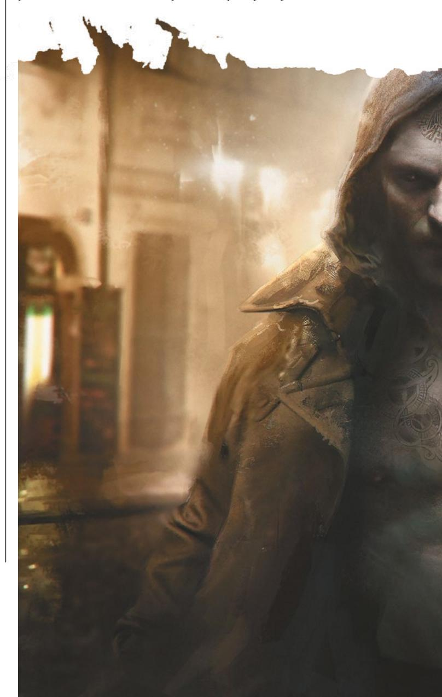

щающейся стороны увеличивается на 1d10. Кроме того, каждый пункт базового показателя добавляет 1d10 к пулу проверки обнаружения опасности (включая проверки на пробуждение, стр. 219), пока вампир находится в своём убежище, ведь он знает его как свои пять пальцев.

#### БАЗОВЫЙ ПОКАЗАТЕЛЬ УБЕЖИЩА

- n **Недостаток:** (●) **без убежища.** Каждое утро тебе нужно искать новое место для отдыха. По меньшей мере, это требует соответствующей проверки.
- Маленькое, но довольно надёжное и защищённое убежище. Примеры: подвал, склеп, запертое помещение на складе.
- ●● Большое, хорошо защищённое или надёжное убежище. Примеры: частный дом, вольер для волков в зоопарке, ответвление канализационного тоннеля.

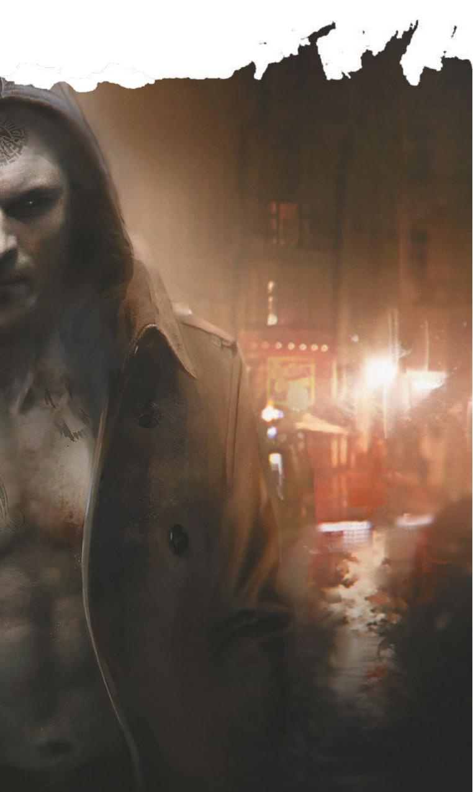

●●● Огромное, отлично защищённое или надёжное убежище. Примеры: жилой комплекс за городом, здание банка, выведенная из эксплуатации станция метро.

#### ДОСТОИНСТВА И НЕДОСТАТКИ УБЕЖИЩА

У твоего убежища могут быть собственные достоинства и недостатки. Все они складываются с базовым показателем, чтобы получить общее количество пунктов, которое будет использоваться, например, при реализации проектов (стр. 415) и в иных случаях.

Не стоит забывать об общих фактах биографии. Котерия, приобретающая убежище сообща, может наделить его множеством преимуществ.

- n **Недостаток:** (●) **жуткое место.** Твоё убежище выглядит как логово маньяка-убийцы. Впрочем, если говорить честно, это оно и есть. Кто-то из соседей может позвонить в полицию или просто начать болтать о жутком месте, которое ему довелось увидеть. Пул всех социальных проверок, связанных с попытками соблазнить или успокоить смертного гостя, уменьшается на 2d10.
- n **Недостаток:** (●●) **известное местоположение.** Кто-то когда-то уже брал твоё убежище штурмом — возможно, ещё до того, как ты здесь поселился. Скорее всего, его местоположение осталось у нападавших в базе данных. Шпионы и лазутчики могут добавить к пулу проверки 2d10, если пытаются следить за твоим убежищем или проникнуть внутрь. Если инквизиция когда-нибудь нападёт на твой след, стоит поискать другое убежище.
- n **Недостаток:** (●) **сверхъестественная проблема**. В твоём убежище действуют какие-то сверхъестественные силы, которые ты не контролируешь и вряд ли даже понимаешь. Возможно, это обычное привидение, но с той же вероятностью проблемой могут быть врата между измерениями, проклятый метеорит или что-нибудь другое, от чего трудно избавиться. Само собой, тот, кто разбирается в подобных вещах, может использовать эти сверхъестественные силы, чтобы проникнуть в твоё убежище. Как именно воздействует на окружающих та или иная сверхъестественная проблема, остаётся на усмотрение рассказчика, но пул проверок всех действий, подверженных её влиянию, нужно уменьшить по меньшей мере на 1d10 за каждый пункт этого недостатка.

- **Библиотека.** В твоём убежище есть узконаправленная библиотека по вопросам оккультизма, вампиризма, каинитов, истории города или чего-то подобного. Каждый пункт этого достоинства добавляет 1d10 к пулам проверок, связанных с одной специализацией гуманитарных наук, оккультизма или расследования. Если речь идёт о маленьких убежищах, показатель этого достоинства не может превышать одной точки.
- **Камера для заключённых.** В твоём убежище есть специально оборудованное место для содержания пленников (сложность побега 5). Каждый дополнительный пункт позволяет либо увеличить вдвое количество пленников (до 32, если убежище огромное), либо повысить сложность побега на 1. Маленькие убежища не могут обладать этим достоинством.
- **Лаборатория.** В твоём убежище есть специально оборудованная лаборатория — с промышленной мойкой, газовой горелкой, армированным полом и т. д. Каждый пункт этого достоинства добавляет 1d10 к пулу проверок, связанных с одной специализацией в естественных науках или технике, или к пулу проверок Алхимии для слабокровных, которые пользуются методом фиксации (стр. 284). Маленькие убежища не могут обладать этим достоинством.
- **Магическая защита.** В твоём убежище есть некая защита против сверхъестественных сил. Возможно, сам ты не можешь её отключить, но тебя она пропускает. Обсуди с рассказчиком, каковы пределы возможностей твоей защиты. Каждый пункт этого достоинства на 1d10 увеличивает пул сопротивления сверхъестественному наблюдению, а также любым другим способам вторжения на усмотрение рассказчика. Рассказчик также может потребовать, чтобы персонаж, который хочет взять это достоинство, владел либо навыком оккультизма (требуется как минимум 3 пункта или больше), либо Кровавым чародейством.
- **Операционная.** Одна из комнат твоего убежища оборудована как полевой операционный блок или даже лучше. Пул всех соответствующих проверок (медицины, как правило) увеличивается на 2d10, пока ты в убежище. Маленькие убежища не могут обладать этим достоинством.
- **Охрана.** Твоё убежище защищают либо профессиональные охранники, либо головорезы. За каждый пункт этого достоинства ты получаешь четверых обычных смертных охранников и одного

одарённого командира (см. «Шаблоны смертных персонажей», стр. 189). Учитывай, что в некоторых убежищах охрана будет вызывать только лишние подозрения.

- **Продвинутая система безопасности.** В твоём убежище установлена высококлассная система безопасности. За каждый пункт этого достоинства пул проверок, связанных с попытками вовремя заметить, как кто-то пытается проникнуть внутрь, и отразить это вторжение, увеличивается на 1d10.
- **Пути отступления.** В твоём убежище есть запасной выход — потайной тоннель, решётка в подвале, через которую можно попасть в канализацию, или иной неприметный путь наружу. За каждый пункт этого достоинства пул проверок, связанных с попытками уйти от преследования или оставаться незамеченным вблизи убежища, увеличивается на 1d10.
- **Роскошь.** Огромные плоскоэкранные мониторы с высоким разрешением, дизайнерская мебель, предметы искусства или другие объекты роскоши позволяют тебе увеличить пул социальных проверок на 2d10, когда ты принимаешь смертных гостей в своём убежище. Если у тебя нет по меньшей мере трёх пунктов богатства (●●●), всю эту роскошь ты заполучил нелегальными методами.
- **Тайник с оружием.** Каждый пункт этого достоинства добавляет по одному тайнику с оружием в твоё убежище, и в каждом из этих тайников хранится пистолет и какое-то длинноствольное оружие, а также патроны к ним. Они так же надёжно спрятаны, как и место твоего дневного сна.
- **Эксклюзивное расположение.** Твоё убежище находится в одном из самых престижных районов города или в другом крайне выгодном месте, например у кормушки или на маленьком острове. В зависимости от того, как именно такое расположение может влиять на проверки, вместе с рассказчиком выбери ситуации, в которых пул проверок будет увеличиваться на 2d10 или сложность противодействия для оппонента вырастет на 2 пункта. Скорее всего, эксклюзивное расположение будет влиять на проверки параметра домена «шасс» (стр. 196) или базового показателя убежища, но возможны и другие ситуации. Например, если убежище расположено рядом с Элизиумом, ты можешь на 2d10 увеличить пул проверок этикета в Элизиуме и пул проверок на осведомлённость о придворных слухах. ⬛

## Создание котерии

**Ранее уже говорилось о том, что персонажей лучше всего создавать сообща. Создание котерии тем более требует совместного творчества. Это позволит зало‑ жить общий фундамент, на котором можно будет строить сюжет хроники, а также даст игрокам воз‑ можность показать, какие именно стороны Мира Тьмы интересуют их больше всего.**

**Котерия располагает некоторым количеством пунктов, которые можно потратить на создание доме‑ на или на общие факты биографии — оно равно коли‑ честву персонажей игроков (если их трое или меньше, рассказчик может дать котерии по два пункта за пер‑ сонажа). Кроме того, игроки могут вложить в созда‑ ние котерии один или несколько пунктов преимуществ своих персонажей. Обычно пункты котерии тратятся сообща, но в некоторых группах каждый игрок рас‑ полагает своим вкладом и решает, на что его потра‑ тить. Кроме того, при создании котерии можно выби‑ рать недостатки котерии, чтобы увеличить количество доступных пунктов, однако при этом каждый игрок должен быть согласен на это.**

#### **ПРИМЕР**

**Игроки решили, что их котерия будет гвардией (см. ниже), поэтому своего домена у неё нет. Четыре пункта они вкладывают в информаторов и убе‑ жище в виде плавучего дома, чтобы проще было путешествовать. Кроме того, они берут недостаток «конкурент» за 2 пункта — загадочная фигура пре‑ следует котерию. За полученные в результате два пункта они повышают свой статус в Камарилье.**

## Домен

**Основа основ котерии — это её домен, то есть опре‑ делённая территория внутри города, на которой пер‑ сонажи могут охотиться.**

**В Камарилье каждый домен — это феодальные угодья, дарованные Принцем или иным благородным Сородичем; среди анархов домен принято считать «своим районом». Так или иначе, принцип везде один.**

**У домена, как и у многих других элементов Мира Тьмы, есть свои параметры. Они довольно абстракт‑ ны и дают о нём общее представление, очерчивая при‑ близительные границы тех или иных возможностей. Каждый пункт любого из этих параметров стоит один пункт котерии.**

#### $\Lambda$ beH

Этот параметр отвечает за то, насколько котерия вписывается в обстановку в своём домене, считают ли там персонажей своими. Каждый пункт показателя льена добавляет 1d10 к пулу некоторых проверок на территории домена: например, при попытке мирно поговорить с местным жителем, найти кого-то или что-то, собрать слухи или провести расследование.

Льен не влияет на проверки охоты.

#### Портильон

Этот параметр отвечает за то, насколько домен защищён от других вампиров, полиции, хищников, Второй инквизиции и т. д. Каждый пункт показателя портильона на 1d10 уменьшает пул проверок противника, когда он пытается тайно проникнуть на территорию домена, проводить там расследование, наблюдать за кем-то или чем-то и т. п.

Портильон - это защитный параметр, и он, как правило, не влияет на пул проверок персонажей котерии. Если противник при проверке получил прорыв, это может снизить штраф при следующей попытке нарушить границы домена - если, конечно, котерия не разделается с нарушителем раньше.

Портильон не влияет на защищённость убежища независимо от того, где оно находится - в домене или вне его.

#### **IIIacc**

Этот параметр отвечает за то, насколько хорош домен в качестве охотничьих угодий — как много тут добычи, насколько легко её поймать и насколько соблазнителен каждый отдельный сосуд. Если значение шасса котерии равно 1, она может охотиться в пределах своего домена со сложностью 6. Каждый следующий пункт уменьшает сложность на 1.

| ШАСС ГЕОГРАФИЧЕСКИЙ ЭКВИВАЛЕНТ                                                                                                                                                                  |
|-------------------------------------------------------------------------------------------------------------------------------------------------------------------------------------------------|
| Один городской квартал или коттеджный посё- лок в пригороде                                                                                                                                  |
| От двух до четырёх городских кварталов; один парк с прилегающими улицами; один неболь- шой общественный объект (туристическая достопримечательность, больница, магазин)                |
| Восемь кварталов по обе стороны одной из магистральных улиц города; один средний общественный объект (аэропорт, казино, кол- ледж, крупный работодатель)                               |
| Один район или округ; квадратный километр; всё, что расположено вдоль одного шоссе или маги- стральной улицы; один большой общественный объект (крупный университет, парк развлечений) |
| Три района; группа общественных объектов («все парки в Саут-Сайд», «все больницы Куинса», «все трассы к югу от реки»)                                                                     |

Шасс также в определённой степени влияет на размер домена, но тут нужно учитывать специфику разных городов и их районов. Высокий рейтинг не всегда означает обширную территорию. У небольшого домена в людной части города (например, около кормушки) шасс выше, чем у крупного домена в заброшенных и безлюдных районах. В целом можно ориентироваться на примеры, приведённые в таблице ниже.

#### Котерии без домена

Котерия, у которой нет своего домена, либо браконьерствует (рискуя вызвать гнев хозяев территории), либо имеет при себе подорожную грамоту, выданную Принцем или иной высокопоставленной персоной. Если местные Сородичи признают подобный документ, они, как правило, назначают котерии временные охотничьи угодья.

Чтобы определить сложность проверок охоты для персонажей без домена, рассказчик может воспользоваться таблицей на стр. 308.

## Факты биографии котерии

У котерии могут быть общие факты биографии: богатство, влияние, враг, информатор, конкуренты, мавла, маска, подручные, союзники, стадо, статус или убежище. Эти факты биографии приобретаются точно так же, как личные факты биографии персонажей, но при этом используются пункты котерии.

Не забывайте вписывать новых персонажей рассказчика в схему отношений.

Каждый член котерии может пользоваться общими фактами биографии как своими (см. стр. 179 - 194), но они принадлежат котерии в целом. Если группа разделится или, скажем, кого-то изгонят из котерии (по приказу Принца, например), то часть персонажей уже не сможет пользоваться общим фактом биографии.

Независимо от того, общий это факт биографии или личный, он всегда предоставляет одно и то же количество ресурсов. Стадо 2 в любом случае предоставляет от 4 до 7 сосудов и один тип резонанса - ни больше, ни меньше.

На общие факты биографии, так же как и на личные, может повлиять сюжет. Если толпа баптистов с факелами спалит убежище котерии, придётся искать новое место для сна. Разница только в одном: если факт биографии общий, то ни у кого из персонажей не будет укрытия на день. Не стоит ставить всё на одну карту, если боишься проиграть.

## Виды котерий

Сородичи любят рассуждать о том, что они по натуре одиночки. Отчасти это миф, отчасти правда: как и все страдающие зависимостью смертные, вампиры ставят себя и свои нужды на первое место, а близких отодвигают на второй план. Каинит, у которого есть друзья, крайне уязвим. За века любовь превращается в ненависть, столетиями живущие вместе Сородичи узнают друг друга настолько, что начинают презирать — рано или поздно кто-то да решится на предательство. О чём Проклятые обычно умалчивают, так это о том, что они жаждут общения и понимания так же сильно, как люди — а возможно, даже сильнее, ведь они обречены целую вечность ходить по краю пропасти, на дне которой плещется океан отчаяния. Одинокий Сородич рискует поддаться искушениям Зверя или впасть в депрессию, единственное лекарство от которой — Окончательная смерть.

Но если отбросить в сторону экзистенциальные проблемы вампирского бытия, что удерживает вместе вашу команду? Практика показывает, что видов котерий у вампиров не меньше, чем разновидностей социальных групп у смертных.

Выберите вид котерии из предложенных ниже или придумайте свой собственный. Вдохновение можно почерпнуть также в книгах **«Анархи»** и **«Камарилья»**.

После того как вы выбрали подходящий вид котерии, вам нужно потратить пункты котерии, чтобы приобрести все положенные преимущества. Если пунктов не хватает, персонажам придётся пожертвовать пункты своих параметров.

Если у вас остались лишние пункты котерии, вы можете повысить любое из обозначенных преимуществ. Обратите внимание и на дополнительные параметры, которые также придутся кстати.

#### **Гангстеры**

Эта котерия представляет собой преступную группировку — возможно, банду грабителей или мошенников. Гангстеры могут прикидываться членами криминального синдиката, действующего в городе, или быть посредниками между Принцем или Бароном и криминальными боссами.

- n **Домен:** льен (●), портильон (●) и шасс (●).
- n **Информатор:** (скупщик краденого или кто-то подобный).
- n **Враги:** ●●.

**Дополнительно:** влияние (организованная преступность), подручные, стадо (смертные члены банды или жертвы вашей преступной деятельности), статус (скорее всего, среди анархов), убежище (клуб).

#### **Гвардия**

Эта котерия служит непосредственно Принцу или Барону, охраняя его, выполняя разнообразные поручения, а также устраняя неугодных. Близость к правителю делает гвардию постоянной мишенью для интриг — старейшины то и дело пытаются пропихнуть туда своих ставленников (вполне возможно, что вся котерия целиком тайно работает на одного из Примогенов). Те, кому это не удаётся, используют все доступные средства, чтобы заставить котерию действовать в их интересах или сломить её.

n **Домен:** портильон (●●) и шасс (●●).

n **Стадо:** ●●●.

**Дополнительно:** влияние, конкуренты, мавла (Принц / Барон), подручные.

#### **Дневной дозор**

Задача этой котерии — охранять сообщество нежити от смертных, особенно днём, когда большинство Сородичей спит. Все члены котерии должны быть слабокровными с достоинством «дневной хищник» или иметь какой-то другой способ оставаться активными в дневное время (на усмотрение рассказчика).

- n **Домен:** портильон (●●) и шасс (●).
- n **Влияние:** ●●.
- n **Враги:** ●●●.

**Дополнительно:** информаторы, мавла, союзники, убежище, реликвия или ритуал, позволяющие действовать днём.

#### **Загонщики**

Эта котерия специализируется на поиске и похищении сосудов с редким и изысканным соком. Спрос на кровь с определённым резонансом, особенно в пиковой форме, растёт как среди весперов-варщиков, экспериментирующих со своими коктейлями, так и среди гурманов-тореадоров, подхвативших модную тенденцию, поэтому молодые вампиры нередко решают воспользоваться этим ради собственного продвижения, становясь загонщиками.

- n **Домен:** шасс (●●●).
- n **Мавла:** (торговец кровью) или союзник: ●.

**Дополнительно:** влияние (организованная преступность), стадо.

#### **Искатели**

**Это котерия, взявшая на себя важную миссию: напри‑ мер, выследить цель, найти артефакт или разгадать какую‑то тайну. Как правило, искатели действуют по собственной инициативе, а не по чьему‑то приказу. Им нередко приходится покидать свой город.**

- n ДОМЕН: **льен (●●●) и шасс (●)**
- n ИНФОРМАТОРЫ: **●●.**

ДОПОЛНИТЕЛЬНО: **богатство (исследователь‑ ский бюджет), мавла, убежище с библиотекой.**

#### **Коммандос**

**Основная задача этой котерии — уничтожать врагов своего господина или нанимателя. Это вампирский аналог спецназа. Вы можете даже замаскироваться под настоящий спецназ или подразделение быстрого реагирования местной полиции — главное, не пы‑ таться выдавать себя за таковых перед настоящими офицерами.**

- n ДОМЕН: **портильон (●●) и шасс (●).**
- n МАВЛА: **●●● (тот, чьи задания вы выполняете).**
- n СТАТУС: **●.**
- n ВРАГИ: **●●.**

ДОПОЛНИТЕЛЬНО: **конкурент, маска, убежище (штаб‑квартира).**

#### **Кочевники**

**Эта котерия постоянно путешествует, переезжая из города в город. Её члены могут изображать из себя музыкантов, театральную труппу или других бродя‑ чих артистов. Не исключено, что они на самом деле являются подобным творческим коллективом. Они могут выступать как перед смертными во второсорт‑ ных клубах на задворках промышленного района, так и в Элизиумах исключительно перед благородными Сородичами. Кочевники могут также быть бежен‑ цами, ищущими спасения от ужасов Войны Геенны, или просто «королями дорог».**

- n ДОМЕН: **нет.**
- n ИНФОРМАТОРЫ: **●●● (публика, промоутеры, туристи‑ ческие брокеры и т. п.).**
- n ПОДРУЧНЫЕ: **●● (по меньшей мере один совершен‑ нолетний, способный решать дорожные проблемы в дневное время).**
- n НЕДОСТАТОК СТАТУСА: **● (подозрительный).**

ДОПОЛНИТЕЛЬНО: **стадо (попутчики).**

#### **Кровавый культ**

**Формально кровавые культы осуждаются как возмож‑ ное нарушение Маскарада, но с началом Войны Геен‑ ны их становится всё больше. Ваша котерия завлекает в свои сети смертных последователей, чтобы опоить их Кровью или просто поработить. Многие главы кро‑ вавых культов не скрывают своей сверхъестественной сущности (хотя не обязательно раскрывают истину о том, что они вампиры), чем нередко привлекают пристальное внимание Второй инквизиции, усугубляя и без того опасное положение вампиров.**

n ДОМЕН: **льен (●) и портильон (●●).**

- n СТАДО: **●●●.**
- n НЕДОСТАТОК СТАТУСА: **● (подозрительный).**

ДОПОЛНИТЕЛЬНО: **враги (●●), недостаток маски (●●) (на заметке у Второй инквизиции), подруч‑ ные, убежище (храм или лагерь сектантов).**

#### **Патруль**

**Эта котерия патрулирует город и защищает его от не‑ прошеных гостей, в первую очередь от анархов и обо‑ ротней. Котерии Камарильи, направленные в погра‑ ничные города, чтобы отражать нападки Шабаша или колонизировать недавно захваченные территории, тоже можно считать патрулём. В городах анархов они в том числе занимаются поиском реакционеров и шпио‑ нов Камарильи — там их называют «комитетом обще‑ ственного спокойствия», «ЧК» или «глазами народа».**

- n ДОМЕН: **льен (●●), портильон (●) и шасс (●).**
- n СТАТУС: **●● (Камарилья или анархи).**

ДОПОЛНИТЕЛЬНО: **информаторы, подручные.**

### **Пташки**

**Этих птиц одного полёта объединяет социальное по‑ ложение или общие увлечения. Подобные «пернатые» котерии одинаково часто можно встретить и при дво‑ ре, и на городских улицах, как среди анархов, так и в рядах Камарильи. Нередко пташки являются сто‑ ронниками какой‑либо контркультуры, разделяющи‑ ми общие вкусы в моде и музыке, — они могут быть, например, готами или рейверами.**

- n ДОМЕН: **льен (●●) и шасс (●●).**
- n ИНФОРМАТОРЫ: **●●● (другие представители той же субкультуры).**

ДОПОЛНИТЕЛЬНО: **конкурент или враг (другой модник), статус (для пташек, вращающихся в высшем обществе).**

#### **Регенты**

**Старейшина Камарильи выбрал или сам создал эту котерию, чтобы защитить своё наследие, пока он сражается на Ближнем Востоке, следуя Зову. Регенты представляют интересы этого старейшины среди Примогенов. Анархи, влекомые Зовом, также могут передать управление доверенным лицам или назна‑ чить их наблюдателями в Совете.**

- n ДОМЕН: **портильон (●●●) и шасс (●●).**
- n МАВЛА: **●● (мажордом или замполит).**
- n СТАТУС: **●●●● (или ●●● для регентов‑анархов).**
- n ПРЕИМУЩЕСТВА: **распределите до 10 пунктов ме‑ жду богатством, влиянием, подручными, стадом и / или убежищем.**
- n НЕДОСТАТКИ: **распределите такое же количество пунктов, как в преимуществах, между любыми недостатками.**

#### **Рыцари**

**Рыцари борются за правое дело. С тем, что миссия этих вампиров достойна, согласятся, вероятно, даже смертные. К примеру, такая котерия может истреб‑ лять наркодилеров в своём районе. Слабокровные вампиры очень часто начинают с чего‑то подобного. Что касается их полнокровных собратьев, те, скорее всего, причисляют себя к рядам анархов или по мень‑ шей мере симпатизируют движению. Впрочем, мудрый Принц Камарильи найдёт хорошее применение даже для самой высокоморальной котерии. В конечном счё‑ те даже рыцарям приходится делать сложный выбор между идеалами Человечности и потребностями Зверя.**

- n ДОМЕН: **льен (●●●) и шасс (●).**
- n СОЮЗНИКИ: **●.**

#### n ВРАГИ: **●●.**

ДОПОЛНИТЕЛЬНО: **информаторы, конкурент.**

#### **Сбиры**

**Сбиры маскируются под котерию какого‑то другого вида, притворяясь, что служат одному правителю, когда на самом деле втайне работают на его соперника. Каж‑ дого вампира в этой котерии Принц или Барон отобрал собственноручно, чтобы отправить в другой город или, быть может, к соперникам в границах собственного.**

- n МАВЛА: **●● (куратор или связной).**
- n МАСКА: **●.**

ДОПОЛНИТЕЛЬНО: **конкуренты среди Примо‑ генов в принимающем городе; преимущества, свойственные виду котерии, который сбиры выбрали в качестве прикрытия.**

#### **Фемгерихт**

**По приказу Примогена эта котерия должна всеми до‑ ступными методами защищать Маскарад. Название своё они получили от немецкого средневекового тай‑ ного общества, судившего и каравшего преступников. Возможно, представители этой котерии и в самом деле прямые продолжатели дела членов этого тайного общества. Фемгерихт имеет право арестовывать нару‑ шителей, чтобы доставить их (силой, если потребует‑ ся) на суд Принца или Примогена.**

- n ДОМЕН: **шасс (●).**
- n ВЛИЯНИЕ: **●●● (особенно в полиции и СМИ).**
- n СТАТУС: **●●●.**

ДОПОЛНИТЕЛЬНО: **конкуренты, мавла (в Совете Примогенов или анархов).**

#### **Церберы**

**Основная задача котерии — охранять какое‑то важ‑ ное место или защищать определённую территорию. Это может быть могила, врата, тайник с бесценной реликвией или что‑то подобное. Церберы часто пре‑ вращаются в «котерии наследия»: в них принимают новых вампиров, которые впоследствии продолжают дело старших.**

- n ДОМЕН: **портильон (●●●) и шасс (●).**
- n УБЕЖИЩЕ: **●●.**

ДОПОЛНИТЕЛЬНО: **конкурент, недостаток убе‑ жища: сверхъестественная проблема, статус (для наследий).** ⬛

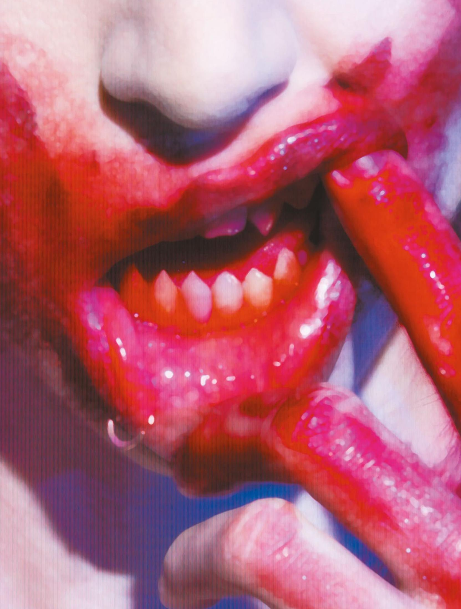

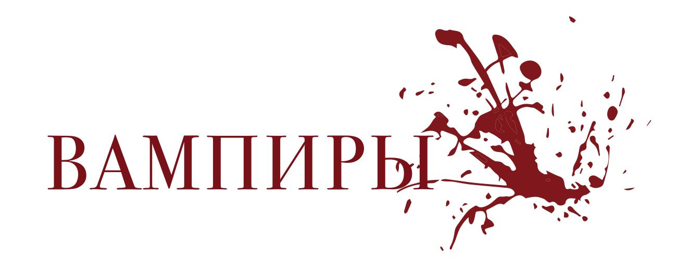

*Потому Я и сказал сынам Израилевым: ни одна душа из вас не должна есть крови, и пришлец, живущий между вами, не должен есть крови. Ибо душа всякого тела есть кровь его, она душа его.*

#### ЛЕВИТ 17:12

В Мире Тьмы большая часть существ, питаю‑ щихся кровью, называет себя Сородичами, упырями или каинитами. Завсегдатаи Элизиу‑ мов и теоретики утопии Анархов не признают слова «вампир», считая, что его опошлили низкопроб‑ ные «хаммеровские» сиквелы фильмов ужасов и тури‑ стические фирмы, использующие незамысловатый фольклор как наживку. Однако те, кто получил Ста‑ новление в последние несколько десятилетий, всё чаще называют себя именно так (так сказать, отвоёвывая обратно слово на букву «в»). Это позволяет им само‑ утвердиться, получить определённый статус, несмотря на слабость собственной Крови. На нападки в свой адрес они отвечают: «У кого больше прав на это имя? У каких‑то мифических чудовищ из фильмов ужасов или у нас — настоящих обитателей ночи?»

Вампиры не могут позволить себе самообман. Они хищники. Чтобы выжить, они должны обманывать своих жертв, а не себя. Какое бы имя они ни выбрали — Сородичи, кровососы или вампиры — есть непрелож‑ ные истины, которые не может отрицать ни один из них. Быть вампиром — значит постоянно испытывать безум‑ ный Голод, непреодолимую тягу к человеческой крови. Это значит принять древнее проклятие, унаследованное вместе с Кровью сира. Голод доводит до исступления, толкает на убийство, принуждает утолить жажду, на‑ пившись из вен смертного. Выпитая кровь трансформи‑

рует вампира и входит в резонанс с его естеством. Она не просто дарует экстаз, она делает вампира бессмерт‑ ным. Наделяет сверхъестественными силами, но в то же время отнимает свободу. Мы то, что мы едим. Для вам‑ пиров это утверждение подходит идеально. И если они хотят от нежизни чего‑то большего, им, как никому дру‑ гому, нужно держаться за свою Человечность.

## Правда и ложь

Разница между образом вампира в массовой культуре или даже легендарным балканским кровопийцей с одной стороны и настоящими Сородичами с другой способна сбить с толку не только начинающих охотников на вам‑ пиров, но и некоторых молодых каинитов. Впрочем, определённое сходство между мифами и реальностью говорит о том, что современные авторы, как и средне‑ вековые их собратья, порой действительно сталкивались с настоящими вампирами. Исключения из правил встре‑ чаются даже там, где перед нами оказывается общепри‑ знанная истина о вампирах, к тому же со временем Кровь может менять свои свойства. Веками, к примеру, Соро‑ дичи считали, что Тринадцатое поколение — последнее, пока не появилось Четырнадцатое и даже Пятнадцатое. Есть также некоторые современные вампиры, кото‑ рые на психосоматическом уровне испытывают ужас при виде креста или отвращение к чесноку.

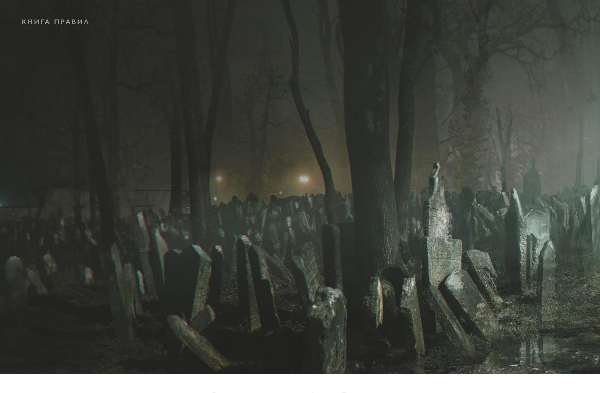

ВАМПИРЫ БЕССМЕРТНЫ: правда. Вампир может умереть, сгорев в огне или под солнцем, его можно убить, отру‑ бив голову, но он не стареет, и ему не грозит естествен‑ ная смерть. Вампиру не нужна пища (за исключением крови) и ему не нужно дышать. Если нанести вампиру серьёзные телесные повреждения, он впадёт в состоя‑ ние, похожее на кому, которое называют «торпор» однако с течением времени или получив достаточно крови вампир может пробудиться вновь.

ВАМПИР — ЭТО ХОДЯЧИЙ МЕРТВЕЦ: правда. Сердце вам‑ пира не бьётся, у него нет пульса, его тело не излу‑ чает тепла, он не потеет и не вырабатывает гормоны. Плоть вампира не стареет и не разлагается — даже наоборот, способна восстанавливаться. Вампир может отрастить потерянную конечность, если у него будет достаточно времени. При всём при том этот мертвец способен думать, ходить, строить планы, говорить и убивать.

ВАМПИРЫ ПЬЮТ КРОВЬ ЖИВЫХ СУЩЕСТВ: правда. Вампиры жаждут человеческой крови. Только кровью живых они могут насытиться по‑настоящему, и она необходима им, чтобы использовать сверхъестественные способности. Есть среди вампиров кающиеся грешники, которые умудряются как‑то выживать, питаясь кровью живот‑

ных. Есть среди них и древние существа, которым для поддержания сил необходима кровь других вам‑ пиров. Но большинство всё же питается кровью своих бывших собратьев — людей.

ВАМПИРЫ ОСТАВЛЯЮТ СЛЕДЫ КЛЫКОВ НА ТЕЛЕ ЖЕРТВЫ: по большей части миф. При Становлении вам‑ пиры обретают способность удлинять свои клыки, чтобы проще было питаться. Однако в то же время их слюна приобретает способность затягивать раны от клыков. Таким образом, вампиры могут скрыть следы укуса.

ТОТ, КТО УМЕР ОТ УКУСА ВАМПИРА, САМ СТАНОВИТСЯ ВАМ‑ ПИРОМ: миф. Если человек умирает от того, что вам‑ пир выпил его кровь, он просто перестаёт существо‑ вать — и всё. В противном случае в мире давно бы не осталось свободного места. Чтобы дать человеку Становление, позволить ему вернуться из мира мёрт‑ вых, вампир должен напоить его собственной бес‑ смертной Кровью, которую вампиры старших поко‑ лений называют витэ.

СОЛНЕЧНЫЙ СВЕТ СПОСОБЕН СЖЕЧЬ ВАМПИРА: прав‑ да. Хотя некоторые слабокровные вампиры могут какое‑то время находиться под солнцем, а также

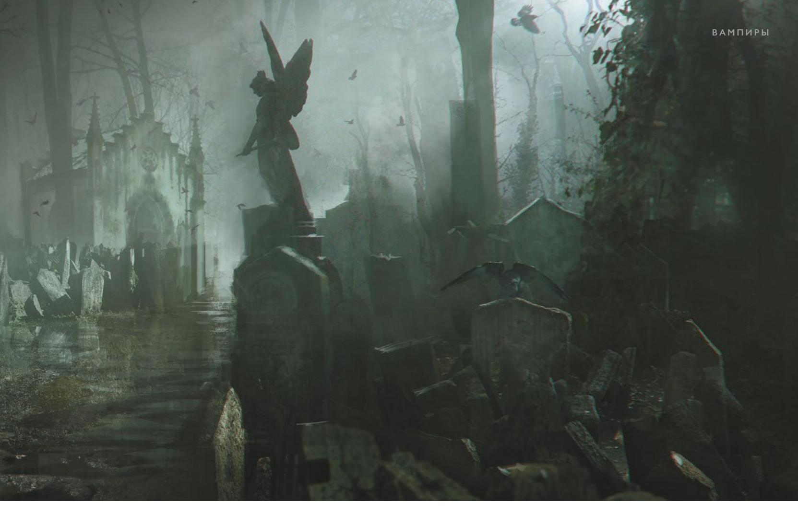

существуют Дисциплины, которые позволят про‑ держаться под палящими лучами несколько минут, солнечный свет смертелен для Сородичей. Их плоть сгорит, если они пробудут на солнце достаточно долго. Вампиры — существа ночные. Большинство не может активно действовать в дневное время, даже оставаясь в надёжном убежище, — они не в состоя‑ нии побороть сон.

#### ЧЕСНОК И ПРОТОЧНАЯ ВОДА МОГУТ ОСТАНОВИТЬ ВАМПИ‑

РОВ: по большей части миф. Эти суеверия придумали смертные в тщетных попытках найти спасение от мерт‑ вецов. Есть вампиры, на которых эти старые суеверия до сих пор оказывают воздействие, но их можно пере‑ считать по пальцам.

ВАМПИРЫ СПАСАЮТСЯ БЕГСТВОМ ПРИ ВИДЕ КРЕСТА: как правило, миф. Этот средневековый миф — ещё одна выдумка, призванная успокоить верующих. Однако не‑ которые люди, обладающие Истинной Верой, действи‑ тельно могут отпугнуть вампира или нанести ему вред при помощи священного символа (не только распятия).

ВАМПИРА МОЖНО УБИТЬ, ЗАБИВ ЕМУ В СЕРДЦЕ КОЛ: миф. Впрочем, деревянный кол (а также стрела, арбалетный болт и т. п.), вогнанный в сердце, вызывает у вампира

паралич (торпор), который продлится до тех пор, пока кол не извлекут.

ВАМПИР ОБЛАДАЕТ СИЛОЙ ДЕСЯТЕРЫХ СМЕРТНЫХ; ОН МОЖЕТ ПОВЕЛЕВАТЬ ВОЛКАМИ И ЛЕТУЧИМИ МЫШАМИ; ОН МОЖЕТ ЗАГИПНОТИЗИРОВАТЬ ЖИВОЕ СУЩЕСТВО И Т. П.: и правда, и миф. Кровь позволяет Сороди‑ чам использовать сверхъестественные способности, которые называются Дисциплинами. Они включают в себя всё перечисленное и многое другое. Сила вам‑ пиров увеличивается с возрастом: юные неоперив‑ шиеся птенцы ненамного сильнее людей, в то время как древние могучие старейшины вполне могут по‑ тягаться с вымышленными Лестатом или Дракулой. Мафусаилы и предтечи, прожившие в этом мире многие тысячелетия, зачастую обладают буквально божественным могуществом.

ВАМПИР — ЭТО ЧУДОВИЩЕ, ДЬЯВОЛЬСКИЙ ДУХ, ВСЕЛИВ‑ ШИЙСЯ В ТРУП: миф — но в чём‑то правда. Не будет преувеличением сказать, что участь вампиров тяже‑ лее участи демонов. Демона ждёт быстрое падение, а после него — вечность чистого незамутнённого зла. Вампиры же веками идут к нему, испытывая неумоли‑ мую тягу к беззаконию. Стать Сородичем — не значит моментально превратиться в кровожадное чудовище, Брак по расчёту и трастовый фонд — прекрасный способ обеспечить себе будущее и обзавестись собственным брендом, но с клыками всё куда более занимательно. Раньше мир просто плясал под твою дудку - теперь он ползает у тебя в ногах.

разве что он был садистом и до смерти. Однако непреодолимая жажда человеческой крови и необходимость регулярно питаться вынуждают вампира вести образ жизни охотника - замкнутый и уединённый. В результате он постепенно утрачивает навыки общения, приобретённые, когда он ещё был коллективным всеядным, а не хищником.

Обстоятельства рано или поздно толкают на убийство даже тех, кто стоек в своих убеждениях. Подобное решение проблемы оказывается простым и даже приятным для вампира, и со временем появляется склонность поступать именно так. А склонность в конце концов превращается в желание. Осознав себя предателями, вампиры перестают доверять другим. Осознав,

**если осложнения, вызванные Голодом, в данный момент подвергают персонажей слишком большой опасности, игрок может (и ему, пожалуй, стоит) перебросить игральные кости, потратив пункт воли (стр. 122). Это позволит отменить кровавый триумф (избавившись от 0 на обычных d10) или кровавый провал (получив нужное количество успехов для победы). В начале каждой игровой встречи персонаж восстанавливает несколько пунктов воли (стр. 157), так что не имеет смысла беречь их до последнего. Тем более что большинству вампиров, скорее всего, действительно приходится каждую ночь усилием воли останавливать себя от опрометчивых поступков. Разумеется, низкий показатель воли увеличивает риск впасть в ярость (стр. 219), но, как говорится, «Зверь я иль Зверем стать мне суждено?»** 

что отличаются от смертных, изолируют себя от их об‑ щества. Осознав, что для выживания необходимо скры‑ вать свои намерения и манипулировать, превращаются в ловких интриганов.

Годы складываются в десятилетия, десятилетия в века, вампиры убивают снова и снова — или сдер‑ живают себя, но всё равно не могут уберечь от смер‑ ти любимых — и в результате их сердца черствеют. Жизнь смертного, такая скоротечная по сравне‑ нию с вечностью, постепенно перестаёт казаться чем‑то ценным. Человеческое стадо — ничто, значе‑ ние имеют лишь интриги бессмертных — их жесто‑ кость, их ложь, их тайны. Старейшины — это пре‑ сыщенные, отрёкшиеся от эмоций, параноидальные чудовища, но тем не менее не демоны по своей при‑ роде. Однако после нескольких сотен лет кто сумеет их отличить?

## Голод

Голод — одновременно и простая потребность в пище, и страсть, и подобие наркотической зависимости. Это голос Крови и когти Зверя. Голод взывает к вампиру постоянно, шепчет или вопит о потребностях, порывах и желаниях. Каждый вампир, просыпаясь, встречает свой Голод и должен отдать ему чью‑то жизнь, чтобы заставить замолчать. Голод — это цена, которую Соро‑ дичи платят за бессмертие и могущество, и тут не бы‑ вает отсрочек.

В игре **«Вампиры: Маскарад»** у всех Сородичей есть уникальный параметр: Голод. Его значение может колебаться от 0 до 5. Если Голод равен 0, вампир сыт и доволен, а если 5, значит, упырь изголодался и может думать только о том, где бы раздобыть крови.

## Пул Голода

Пул Голода равен текущему значению Голода персона‑ жа, и для него используются особые игральные кости. Это тоже десятигранники, но они должны отличаться от обычного набора по цвету, чтобы при броске их сра‑ зу было видно (мы предлагаем красный). Когда игрок составляет пул проверки, он берёт за основу пул Го‑ лода, а затем добавляет недостающие игральные кости из обычного набора. Или убирает лишние, если пул проверки оказался меньше, чем пул Голода.

#### **ПРИМЕР**

*Эрика хочет найти улики на месте преступления. Рассказчик говорит, что ей нужно пройти проверку интеллекта + расследования. Оба параметра у Эрики равны 3, значит, пул этой проверки составляет 6d10 (3 за интеллект + 3 за расследование). Голод Эрики равен 2. Поэтому она берёт 2 игральные кости из особого набо‑ ра — свой пул Голода. Затем она добавляет 4 обычные игральные кости. В сумме это составляет 6.*

Исключение: персонажи никогда не используют пул Голода, проходя испытание Крови, а также проверки воли и Человечности.

Игральные кости из пула Голода мало чем отличают‑ ся от обычных — результат 6 или выше на них также счи‑ тается успехом. Однако их нельзя перебросить, потратив пункты воли, так как Голод не позволяет рациональному началу взять над собой верх. Кроме того, результаты 0 (10) и 1, выпавшие на игральных костях из пула Голода, могут иметь губительные последствия: результат может оказаться кровавым триумфом или кровавым провалом.

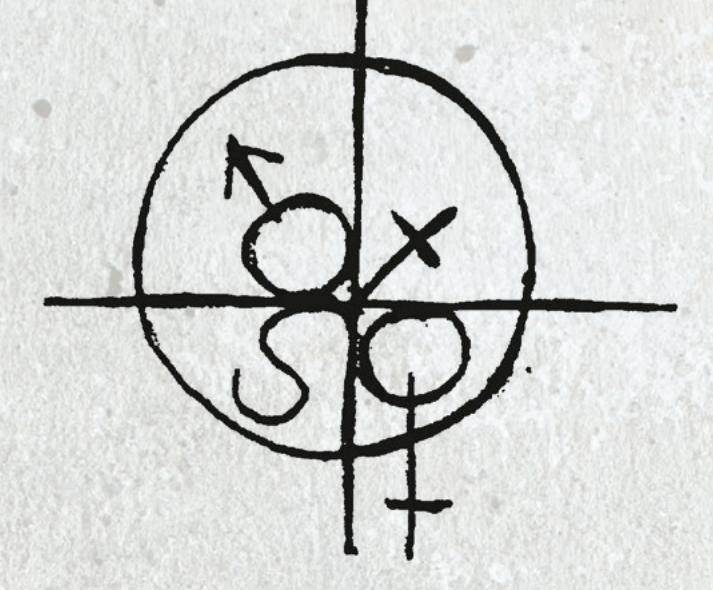

#### ИСПОЛЬЗОВАНИЕ ИГРАЛЬНЫХ КОСТЕЙ ИЗ ТЕМАТИЧЕСКОГО НАБОРА «ВАМПИРЫ»: ΠΥΛ ΓΟΛΟΔΑ

• = неудача; кровавый провал, если проверка не принесла победу (1).

• = неудача  $(2-5)$ .

 $\hat{\mathsf{T}}$  = успех (6-9).

† = успех; делает обычный триумф кровавым (10). Игральные кости из пула Голода нельзя перебрасывать за счёт пунктов воли.

#### ПРИМЕРЫ ПРОВЕРОК

Мэри (пул проверки 4, сложность 3, пул Голода 2) в результате проверки получает ПО • П. Поскольку 1 успеха мало для победы, Мэри ждёт кровавый провал. Кости из пула Голода перебрасывать нельзя, а на двух оставшихся она вряд ли сможет получить необходимые для победы 3 успеха. Мэри готовится к тому, что её персонаж до конца сцены оказывается под воздействием клановой одержимости тореадоров.

Персонаж Фрейи (пул состязания 7, пул Голода 3) в драке с оппонентом (у него выпало 6 успехов) получает  $\mathbb{R}^{\bullet}$  • • •  $\mathbb{R}^{\dagger}$ . Прорыв — это сразу 4 успеха вместо 2, но этого всё равно недостаточно для победы, так что Фрейю ждёт кровавый провал. Она тратит пункт воли, чтобы перебросить 3 игральные кости, на которых выпали неудачи, в надежде получить 2 недостающих успеха, добившись таким образом кровавого триумфа. К сожалению, Фрейя получает только один успех: •• Т. От кровавого провала

это не спасает. Фрейя описывает, как её персонаж в приступе ярости не глядя прыгает на противника, пытаясь свернуть ему шею. Тот оказывается вооружён и успевает выстрелить ей прямо в лицо. Фрейя получает 1 тяжёлое повреждение (рана от выстрела в упор) и падает навзничь.

Персонаж Мартина пытается соблазнить скептически настроенного смертного (пул проверки 6, сложность 5, пул Голода 2). В результате проверки он получает ••• Г $\mathcal{H}$  Это победа: прорыв  $(\mathcal{H}+\mathcal{H})$ приносит 4 успеха вместо 2, и пятый — за  $\mathfrak{f}$ . Однако из-за триумфом! Мартину предстоит сложный выбор. Действительно ли ему так нужен этот смертный, что он готов из-за мимолётной интрижки нарушить Маскарад или впасть в сомнения? Результат в пуле Голода он изменить не может, но если он воспользуется пунктом воли, чтобы перебросить  $\mathbf{\ddot{*}} \bullet \bullet$ , есть шанс обойтись без кровавого триумфа, но всё ещё получить победу. Он решает усилием воли обуздать свои порывы. Новый результат • † †. Это два успеха! Теперь результат выглядит так: •• ††††. 4 успеха и никаких кровавых триумфов. Рассказчик спрашивает, готов ли он к расплате за победу (стр. 121). Мартин описывает, как его персонаж пытается обуздать свою натуру, достичь взаимопонимания со смертным, продемонстрировать человеческую часть своей души. На это уходит вся ночь - такова расплата. Мартин больше ничего не успеет сделать, но он по крайней мере не поставил под угрозу Маскарад и не запятнал свою совесть.

#### **Кровавый триумф**

Если при триумфе хотя бы одна из 10 оказалась в пуле Голода, результат считается кровавым триумфом. Это тоже победа, но персонаж ведёт себя как животное, а не как разумное существо — он не способен думать о последствиях или контролировать свои эмоциональ‑ ные порывы. Это скорее триумф Зверя, чем самого вам‑ пира.

#### **ПРИМЕРЫ**

*Персонаж превзошёл себя, но потерял при этом кон‑ троль из‑за Голода. Убил охранника, но не просто так, а сломав ему позвоночник или разорвав горло. Открыл дверь, но сорвал её при этом с петель. Нашёл нужную книгу и от радости разбросал остальные книги из шка‑ фа. Прошёл незамеченным мимо охраны, но только потому, что успел вырвать голосовые связки тому, кто его увидел, прежде чем тот смог предупредить остальных. И теперь за персонажем остался труп, красноречиво свидетельствующий о том, что убийство совершило какое‑то чудовище.*

Рассказчик и игрок должны вместе решить, насколь‑ ко хорошо персонажу удалось задуманное и какие при этом возникли осложнения. Как правило, чем эф‑ фективнее оказалось действие, тем тяжелее послед‑ ствия. Варианты кровавого развития событий вы най‑ дёте ниже:

- n Персонаж оказывается во власти своей Крови и должен действовать в соответствии с одной из одержимостей (см. далее).
- n Вампир совершает нечто чудовищное, и его после этого мучают сомнения (стр. 239).
- n Вампир нарушает Маскарад, продемонстрировав сверхъестественную силу или скорость либо оставив на теле жертвы раны от зубов.
- n Вампир теряет 1 пункт какого‑то из своих фактов биографии. Например, он мог разбить свой «Бу‑ гатти» (что ударило по его богатству), покалечить подручного, оскорбить союзника или просто поте‑ рять статус при дворе из‑за вспышки гнева. Хотя персонажу всё ещё нужно принять какие‑то меры (в кадре или за кадром), если он хочет восстановить утраченный пункт, рассказчик может сократить не‑ обходимое для этого время.
- n Если не подходит ни один из вышеперечисленных вариантов (например, в случае проверок скрытно‑

сти или наблюдательности), кровавый триумф пре‑ вращается в обычное кровавое побоище. Вампир терпит поражение из‑за того, что Зверь затуманил его чувства или иным способом сделал бесшумное решение проблемы невозможным.

#### **ПРИМЕРЫ**

*Ванда пытается обратиться к Предвестию (стр. 269). На её долю выпадает кровавый триумф. Она с пре‑ восходной чёткостью видит всё, что хотела, и даже больше — видение обрывается, и на какое‑то мгновение перед Вандой предстаёт она сама, предающаяся самым чудовищным из своих скрытых желаний. Ванда полу‑ чает 1 пункт сомнений.*

Кровавый триумф невозможен при проверках воли и Человечности, так как в этих случаях не используется пул Голода.

#### **Кровавый провал**

Если персонаж потерпел поражение при проверке (успехов выпало меньше, чем сложность или количе‑ ство успехов у оппонента) и при этом в пуле Голода выпала хотя бы одна единица, результат считается кро‑ вавым провалом. Возможно, именно Зверь помешал со‑ вершить действие, проявившись некстати во всей своей мощи; или вампир своей никчёмностью навлёк его гнев на свою голову. Варианты, подходящие для кровавого провала, вы найдёте ниже:

n Персонаж оказывается во власти своей Крови и должен действовать в соответствии с одной из одержимостей (см. далее).

Если игроки только начинают играть в **«Вампиров»** или хотят, чтобы персонажи реже поддавались поры‑ вам, делая что‑то неразумное, используйте один из сле‑ дующих вариантов:

- n Персонаж теряет пункт одного из фактов биогра‑ фии, как при кровавом триумфе.
- n Персонаж получает 1 или несколько тяжёлых повре‑ ждений. Этот вариант лучше всего подходит, если персонаж пытается чему‑нибудь воспротивиться от напряжения у него буквально выступает крова‑ вый пот на теле.
- n Если никто в труппе не может предложить подходя‑ щего варианта, можно увеличить Голод на 1 пункт. Если при этом значение Голода вырастет выше 5,

персонаж должен немедленно пройти проверку воли со сложностью 4, чтобы воспротивиться голодной ярости (стр. 220).

Помни! Кровавый провал возможен только при поражении. В случае победы выпавшие на игральных костях единицы ни на что не влияют.

### Одержимость

Вампир, потерпевший кровавый провал или получивший кровавый триумф, оказывается охвачен одним из вариантов одержимости. Голод толкает его на необдуманные поступки, продиктованные Кровью, а иногда даже заставляет проявить особенности, присущие основателю его клана. Когда персонаж оказывается под действием одержимости, рассказчик выбирает подходящий вариант по своему усмотрению или при помощи таблицы ниже (старайтесь вносить разнообразие, не полагаясь всё время только на клановую одержимость, если только вам не нравятся раздутые стереотипы). Когда вариант одержимости определён, игрок должен решить, как именно поступит персонаж. Тех, кто подходит к вопросу творчески и старается убедительно сыграть роль, можно наградить, позволив восстановить 1 пункт воли. Имейте в виду, что игроки не могут игнорировать одержимость, потратив пункт воли, как в случае с яростью. В отличие от приступов ярости одержимость кажется вампиру совершенно естественной - он может даже не понимать, что им руководит Кровь.

#### Примеры общих вариантов одержимости

Ниже приведены самые простые варианты одержимости, составляющие основу личности любого вампира. Рассказчику не обязательно ограни-

#### **СЛУЧАЙНАЯ**

- **ОДЕРЖИМОСТЬ**  $1-3$ : голод.
- 4-5: заносчивость.
- 6-7: насилие.
- 8-9: паранойя.
- 0: клановая одержимость\*.
- \* Каитифы и слабокровные вампиры должны пройти эту проверку заново.

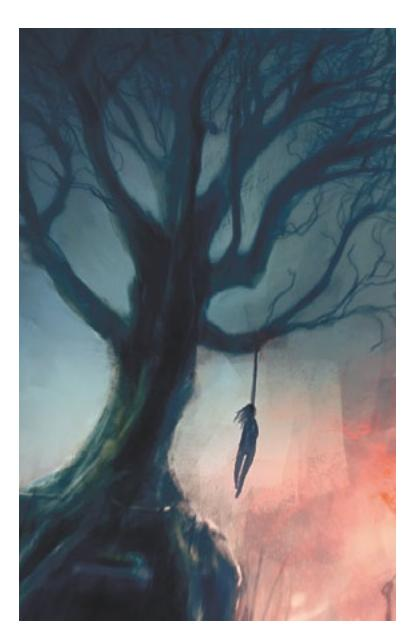

чиваться ими - он может придумать любой другой вариант одержимости, основываясь на собственных представлениях о том, как вампир может лействовать под влиянием Крови. а также принимая во внимание обстоятельства, при которых случился кровавый провал.

#### Голод

Это наиболее характерная из всех одержимостей. Вампир может думать только о том, с каким упоением он вонзил бы клыки в очередную жертву, чтобы почувствовать её горячую кровь на языке. Чтобы утолить Голод, вампир сделает всё что угодно: он может наброситься на любого, может попытаться заполучить кровь хитростью или даже забыть всякую гордость и валяться в ногах, умоляя. Если вампир оказался одержим Голодом, пул всех его проверок, не связанных с моментальным его утолением, уменьшается на 2d10. Это состояние проходит, когда вампир избавляется хотя бы от 1 пункта Голода.

#### ПРИМЕРЫ

В СОЦИУМЕ: вместо того, чтобы допрашивать смертного свидетеля, вампир принимается его соблазнять. В БОЮ: вампир бросает оружие, бежит к противнику сломя голову и пытается его укусить.

В ОДИНОЧЕСТВЕ: вампир решает, что ему нужно сделать перерыв, и совершенно случайно оказывается в ночном клубе, битком набитом люльми.

#### Заносчивость

Кровь побуждает вампира показать своё превосходство, самоутвердиться, быть первым. В этом состоянии Сородичу нужно не просто возвыситься над другими, он хочет насладиться своим положением - насмехается над слабыми, бросает вызов сильным.

Чем бы вампир ни был занят в этот момент, своё следующее действие он превратит в состязание, а затем использует все доступные средства, чтобы не только победить. но и ткнуть соперника носом в его поражение. Если вампир оказался во власти этой одержимости, он не может пользоваться взаимопомощью, а пул всех его проверок, не удовлетворяющих его желание самоутвердиться или бросить вызов вышестоящим, уменьшается на 2d10. Это состояние проходит, когда вампир получает возможность восторжествовать над поверженным «соперником».

#### ПРИМЕРЫ

в социуме: вампир превращает светскую беседу в состязание «кто здесь главный» и этим вызывает неприязнь у собеседника.

В БОЮ: вместо того, чтобы действовать эффективно, вампир играет со смертными в кошки-мышки, глумится над ними, демонстрируя своё превосходство.

В ОДИНОЧЕСТВЕ: вампир пытается выполнить задачу каким-то новым невиданным способом, чтобы утереть нос всему миру.

#### Насилие

События принимают скверный оборот: под воздействием Крови вампир стремится к насилию и разрушению. Ему не важна победа, он не пытается утолить Голод - он просто хочет причинять боль, наслаждаясь страданиями других. Довольно часто эта одержимость подразумевает физическое насилие, но это не обязательно. Вампир может действовать и более изощрённо, истязая жертву эмоционально или разрушая её репутацию в обществе.

Если вампир оказался одержим насилием, пул всех его проверок, не связанных с очевидным

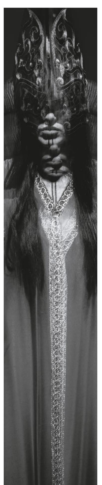

причинением вреда существам или предметам, уменьшается на 2d10. Это состояние проходит, когда вампир выводит из строя, уничтожает или обращает в бегство свою цель. Если целью становится предмет, он должен представлять какую-то ценность для самого вампира или кого-то, кто ему дорог.

#### **ПРИМЕРЫ**

В СОЦИУМЕ: приятное впечатление сходит на нет, когда разговор превращается в психологическую пытку. В БОЮ: противник повержен и не способен больше оказывать сопротивления, но вампир всё никак не может остановиться и с упоением рвёт его плоть.

В ОДИНОЧЕСТВЕ: раздосадованный какой-то мелочью вампир берёт бейсбольную биту и разбивает вдребезги дорогой компьютер.

#### Паранойя

Будучи охотником и дичью одновременно, вампир всё время должен быть начеку. Это состояние превращает обычную осторожность в самую настоящую паранойю, когда Голод взывает к Крови, напоминая об уязвимости вампира.

Вампир пытается избежать любой возможной опасности, подозревая всех и каждого. Пул всех его проверок, не связанных с обеспечением собственной безопасности, уменьшается на 2d10. Это состояние проходит после того, как вампир проведёт около часа в безопасном месте (на крыше, с которой хорошо просматриваются окрестности, в своём убежище, закопавшись глубоко под землю и т. п.).

#### ПРИМЕРЫ

В СОЦИУМЕ: вампир ко всем относится с подозрением и избегает любого взаимодействия с окружающими.

В БОЮ: вампир пытается уйти от опасности любым доступным способом - он может сбежать или сдаться и умолять о пощаде.

В ОДИНОЧЕСТВЕ: вампир видит угрозу там, где её никогда не было, срывается с места и убегает, напуганный странным совпадением или оккультным символом, который он заметил совершенно случайно.

#### Одержимость, присущая разным кланам

Кровь каждого из предтеч изменяет его потомков, уподобляя их образцу тысячелетней давности. Одержимость, присущая клану, может доставить немало неприятностей независимо от того, что она из себя представляет: наследственный порок, необходимую отдушину или часть древнего ритуала.

#### Бруха: бунт

Вампир восстаёт против персонажа, предмета или явления, воплощающего собой статус-кво в данной ситуации. Это может быть авторитет лидера, точка зрения, высказанная вероятным сосудом, или просто текущая задача, которую надо было выполнить.

Пул всех проверок вампира уменьшается на 2d10 до тех пор, пока он не воспротивится приказам или не нарушит ожидания, мнимые или реальные. Одержимость проходит, когда персонаж делает нечто противоположное тому, что от него ожидали, или ему удаётся заставить кого-то изменить свою точку зрения (силой, если надо).

#### Вентру: превосходство

Стремление властвовать выходит для вампира на передний план. Он ни перед чем не остановится, чтобы взять контроль в свои руки. Кто-то должен подчиниться ему.

Пул всех проверок, не связанных напрямую с попытками командовать остальными, уменьшается на 2d10. Одержимость длится до тех пор, пока кто-то не выполнит приказ вентру, причём этот приказ не должен быть подкреплён сверхъестественными силами, такими как Доминирование.

#### Гангрел: животные порывы

Вампир оказывается одержим животными порывами, деградируя настолько, что ему сложно разговаривать, одежда становится ему тесной, а когти и зубы кажутся лучшим аргументом в любом споре.

Пул всех проверок, связанных с манипуляцией или интеллектом, уменьшается на 3d10 до конца сцены. В этом состоянии гангрел не может строить связные предложения и использует в речи только отдельные слова.

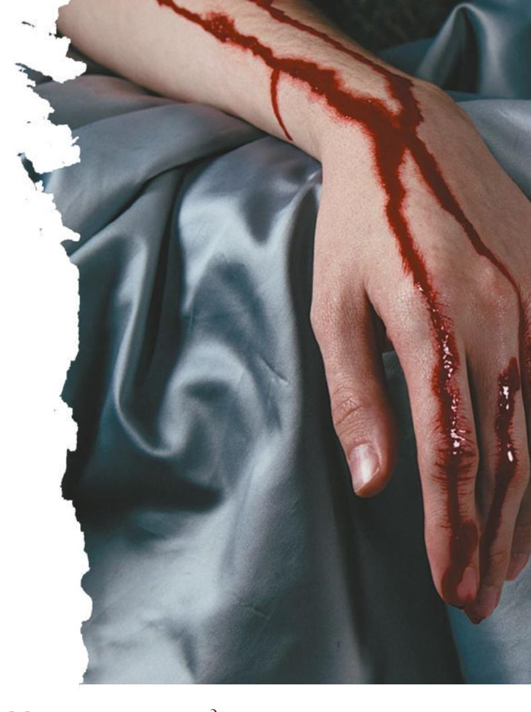

#### Малкавиане: наваждение

Экстрасенсорные способности вампира выходят из-под контроля. Его посещают видения, которые в принципе могут быть правдивыми, но окружающие воспринимают их как бред сумасшедшего, чью душу терзает Голод.

В таком состоянии вампир всё ещё способен действовать самостоятельно, однако его восприятие искажено, а мышление хаотично. До конца сцены пул всех проверок, связанных с ловкостью, манипуляцией, самообладанием и смекалкой, уменьшается для персонажа на 2d10. Пул проверок воли при попытках преодолеть паническую ярость также уменьшается на 2d10.

#### Носферату: криптомания

Вампира охватывает жажда знаний, почти такая же сильная, как жажда крови. Он хочет проникнуть в некую тайну, узнать то, о чём никто не имеет представления. Собственные секреты при этом он будет ревностно оберегать и выдаст их только тому, кто предложит взамен более ценную информацию.

Пул любых проверок носферату уменьшается на 2d10, если его действия не направлены на то, чтобы выведать что-то (в данном случае неважно, насколько это большая или маленькая тайна). Это состояние длится до тех пор, пока вампир не разузнает что-нибудь, что он может посчитать полезным в данный момент. При этом он не обязан делиться полученными сведениями с кем-либо.

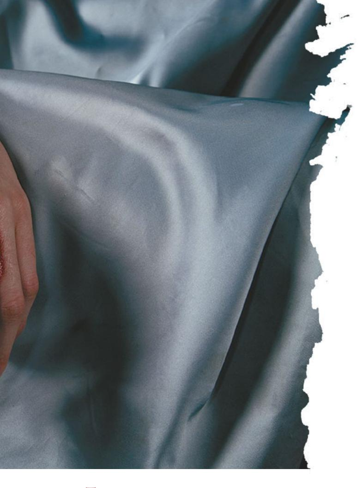

#### **Тореадор:** *восхищение*

Вампир покорён красотой какого‑то существа, пред‑ мета или явления и некоторое время не может думать ни о чём другом.

Выбери объект восхищения: это может быть пер‑ сонаж, песня, произведение искусства или, допустим, рассвет. Вампиру, одержимому красотой, трудно пере‑ ключить внимание на что‑то другое. Разговаривать на иные темы он также не желает. Пул всех проверок, не связанных с объектом восхищения, уменьшается на 2d10. Одержимость длится до тех пор, пока вам‑ пир не перестанет видеть, слышать или иным образом воспринимать объект или пока не закончится текущая сцена.

#### **Тремер:** *перфекционизм*

Только идеальный результат кажется вампиру прием‑ лемым. Если достичь его не удаётся, Сородича охваты‑ вает чувство глубокого разочарования в себе. Он будет с одержимостью повторять действие снова и снова, пока не добьётся совершенства.

Пул всех проверок тремера уменьшается на 2d10 до тех пор, пока вампир не получит триумф при про‑ верке навыка или пока не закончится сцена. Если вампир повторяет одно и то же действие, при вто‑ рой попытке модификатор уменьшается до 1d10, а при третьей — до 0.

## Пробуждение Крови

Голод вампира может усилиться каждый раз, когда тот просыпается на закате, применяет вампирские способ‑ ности или иным способом использует свою Кровь. Если персонаж увеличивает свои характеристики (Прилив Крови, стр. 218), наделяет своё тело видимостью жиз‑ ни (Искра жизни, стр. 218) или заживляет раны (стр. 218 — 219), ему необходимо пройти *испытание Крови*. Большая часть Дисциплин также требует по меньшей мере одного испытания Крови для активации сил (см. Дисциплины, стр. 243 — 287).

Чтобы пройти испытание Крови, игрок должен бро‑ сить одну игральную кость. Значение 6 или выше означает успех. При успехе Голод остаётся прежним. Если же вампи‑ ра постигла неудача, Голод увеличивается на 1 пункт. Это означает, что пул Голода персонажа увеличился на 1d10.

Голод возрастает *после* того, как нужный эффект вступит в силу, так что испытание Крови можно прохо‑ дить одновременно с любыми другими необходимыми проверками или даже после них. Главное не перепутать, где какие игральные кости.

#### **ПРИМЕР**

*Эрика хочет задействовать Искру жизни. Сообщив об этом, она проходит испытание Крови. Результат — 4. Это неудача. Тем не менее Искра жизни действует до рассвета, как положено. Из‑за неудачи Голод персо‑ нажа увеличивается на 1 пункт.*

В некоторых случаях, проходя испытание Крови, игрок может бросить сразу две игральные кости, а затем выбрать лучший результат (что равносильно повторной проверке). Так могут делать, например, вампиры с силой Крови боль‑ ше 0, применяя Дисциплины соответствующего уровня. Достаточно успеха (6+) на одной из двух игральных ко‑ стей, чтобы Голод остался прежним.

Если Голод вампира достигает 5 пунктов, в его теле осталось слишком мало Крови, чтобы использовать сверхъестественные силы. В этом случае персонаж не мо‑ жет по собственному желанию применять способности, требующие испытания Крови. Если какой‑то внешний фактор, действующий на вампира, в свою очередь требу‑ ет испытания Крови, вампир должен немедленно пройти проверку воли со сложностью 4, чтобы воспротивиться голодной ярости (см. стр. 220). Неудача при испытании Крови, как обычно, не препятствует тому, чтобы срабо‑ тал эффект, вызвавший необходимость этого испытания.

| ИСТОЧНИК                                                                                                                               | УТОЛЁННЫЙ ГОЛОД | НЕОБХОДИМОЕ ВРЕМЯ                                       | ПРИМЕЧАНИЕ                                                                                                                                                                                                                        |
|----------------------------------------------------------------------------------------------------------------------------------------|--------------------|------------------------------------------------------------|-----------------------------------------------------------------------------------------------------------------------------------------------------------------------------------------------------------------------------------|
| Несколько мелких животных (3–4 кошки, дюжина крыс)                                                                                  | 1 пункт            | Одна сцена                                                 | Не утоляет Голод вампиров с силой Крови выше 2.                                                                                                                                                                                |
| Животное средних размеров (енот, собака, койот)                                                                                     | 1 пункт            | Один ход                                                   | Животный резонанс; дискразия отсутствует                                                                                                                                                                                          |
| Крупное животное (лошадь)                                                                                                              | 2 пункта           | Одна сцена                                                 |                                                                                                                                                                                                                                   |
| Донорская кровь                                                                                                                        | 1 пункт            | Один ход                                                   | Не утоляет Голод вампиров с силой Крови выше 2.                                                                                                                                                                                |
|                                                                                                                                        |                    |                                                            | Резонанс и дискразия отсутствуют                                                                                                                                                                                                  |
| Немного человеческой крови                                                                                                             | 1 пункт            | Три хода                                                   | Включает время, необходимое для того, чтобы                                                                                                                                                                                       |
| Максимальное количество крови, кото рое можно выпить из одного человека, не навредив ему                                         | 2 пункта           | Одна сцена                                                 | зализать рану                                                                                                                                                                                                                     |
| Максимальное количество крови, кото рое можно выпить из человека, не убив его на месте (есть риск, что жертва всё‑таки умрёт) | 1 – 4 пункта       | По одному ходу за каждый пункт утолён ного Голода | Жертва получает по одному тяжёлому повре ждению за каждый пункт утолённого Голода; человек должен пройти проверку силы + вынос ливости со сложностью, равной значению уто лённого Голода, чтобы пережить потерю крови |
| Вся кровь одного человека (жертва умирает)                                                                                          | 5 пунктов          | 5 ходов                                                    | Единственный способ полностью утолить Голод (до нуля)                                                                                                                                                                          |

## Утоление Голода

Когда вампир пьёт кровь, он уменьшает Голод на фик‑ сированную величину. При этом у каждого вампира есть определённый порог, до которого каинит может уменьшить Голод, не убивая жертву. Чтобы утолить Голод полностью, нужно выпить всю кровь жертвы до конца.

Молодые Сородичи могут, не убивая человека, уменьшить Голод до 1 пункта. Чем выше сила Крови вампира, тем выше это значение. К примеру, Сородичи с силой Крови выше 7 могут уменьшить Голод только до 3 пунктов, если не хотят убивать жертву.

Утоление Голода занимает время, и вампиру лучше уделить этому процессу должное внимание, сделав всё как положено. Жертва вампира при укусе, как правило, чувствует эйфорию. Клыки, помимо того что вскрыва‑ ют сосуд, оказывают сверхъестественное одурманиваю‑ щее воздействие. Если вампир не торопился — акку‑ ратно вскрыл артерию или вену, а затем зализал рану, чтобы она затянулась, — жертва может впоследствии вспоминать всё случившееся как наркотический бред, интерлюдию странного грубого секса или горячечную пьяную близость. Впрочем, даже в отсутствие открытой раны и страшных воспоминаний встреча с вампиром может закончиться для человека воздушной эмболией, не говоря уже о перспективе заработать анемию.

Как правило, вампиру требуется больше времени, если он хочет сохранить человеку жизнь и здоровье, как физическое, так и душевное, ведь в этом случае он не может просто вскрыть артерию жертве и упиваться алой жидкостью, хлещущей из раны. С другой стороны, если жертва сопротивляется, это не просто затягивает

время, но и подвергает опасности Маскарад, наруше‑ ния которого можно избежать, если действовать акку‑ ратно. Вампир может осушить человека примерно за 5 ходов при условии, что тот не оказывает сопротивления.

#### **Кровь животных**

Животное, чью кровь выпил вампир, скорее всего, умрёт. Исключение составляют только очень крупные звери, у которых масса тела больше человеческой. Если, допустим, для Сородича по какой‑то причине очень дорога жизнь собаки, он может исхитриться избавиться от 1 пункта Голода, не убив её, при условии, что она достаточно крупная. По времени это займёт целую сцену, а пёс, вероятнее всего, будет после этого в очень тяжёлом состоянии.

В крупном животном очень много крови — в ко‑ рове около 40 литров, а в лошади больше 50, тогда как в жилах человека течёт только 5, — но кровь живот‑ ных не может по‑настоящему удовлетворить аппетит вампира, и даже гангрелы сочтут диету из крови одних только животных пресной. Сородичи с силой Крови выше 2 вообще не могут утолять Голод подобным обра‑ зом (стр. 215). Кроме того, у животных никогда не бы‑ вает дискразий (стр. 227).

### **Донорская кровь**

Почему бы просто не купить пару пакетов донорской крови, чтобы утолить Голод? К сожалению для Соро‑ дичей, большинство медицинской крови фракциони‑ ровано: её помещают в центрифугу, чтобы отделить плазму от клеток крови, а затем полученные компо‑ ненты (плазму, эритроцитарную массу, прочие пре‑ параты крови) хранят отдельно друг от друга. Даже цельная донорская кровь содержит антикоагулянты, такие как ЦФДА‑1. Все эти обстоятельства делают ме‑ дицинскую кровь неприятной на вкус (в лучшем случае) и практически бесполезной для вампиров.

Если у персонажа нет достоинства «крепкий желу‑ док» (стр. 180), он не может утолять Голод при помощи обработанной донорской крови. *Цельная* кровь из па‑ кета, так же как кровь животных, утоляет Голод только тех Сородичей, у которых сила Крови 2 или меньше.

Кровь, которую изъяли из тела больше 15 минут назад (в том числе, разумеется, донорская кровь из па‑ кета), не имеет активного резонанса и не может усилить вампира, если её выпить. Однако тремеры и алхими‑ ки‑слабокровки могут найти применение обработан‑ ной крови и даже её отдельным компонентам в своих ритуалах и рецептах. Ритуал Кровавого чародейства или процесс трансмутации пробуждает латентный ре‑ зонанс, но поглощает его в тот же момент.

#### **Кровь других вампиров**

Если вампир выпьет кровь другого вампира, по обоюд‑ ному согласию или насильно, то, как правило, за каж‑ дый пункт Голода, от которого он избавится, донор получит по одному пункту Голода. Если сила Крови донора хотя бы на 2 уровня выше, пьющий избавится от вдвое большего количества пунктов Голода, чем по‑ лучит донор. И наоборот, если сила Крови донора хотя бы на 2 уровня ниже, пьющий избавится от вдвое меньшего количества пунктов Голода, чем получит до‑ нор.

Вампир, пьющий кровь другого Сородича, рискует оказаться связанным узами крови (стр. 233).

#### **Укус вампира в бою**

Вампир может атаковать, используя собственные клыки как оружие. Игрок должен заранее предупре‑ дить, что его персонаж собирается атаковать укусом, а не просто ударить противника, а затем пройти про‑ верку силы + драки. Атаку укусом можно провести дву‑ мя способами: заранее обездвижив цель при помощи захвата (стр. 301) или воспользовавшись прицельной атакой (стр. 302), из результата которой вычитается 1 успех. Если оппонент сохраняет подвижность, удачно впиться зубами в оголённую плоть достаточно сложно.

Считается, что враг, в которого вонзили зубы, нахо‑ дится в захвате, даже если персонаж не применял этого приёма изначально. Укус наносит ровно 2 тяжёлых по‑ вреждения. Ни значение выигрыша, ни модификаторы никак на это число не влияют. Точно так же, как при за‑

*Кровь — это долг, который растёт каждую ночь. И лучше оказаться подальше от оголодавшего вампира, когда наступает время платить по счетам.*

хвате, укушенный может вырваться на следующий ход, если победит в состязании силы + драки. В то же время вампир может снова укусить захваченную жертву, но уже без штрафа. Если Сородич пьёт кровь смертного противника, тот получает 1 тяжёлое повреждение в ход, а вампир при этом избавляется от 1 пункта Голода в ход. Если противник тоже вампир, он не получает повре‑ ждений. Вместо этого растёт его Голод (см. «Кровь дру‑ гих вампиров» выше).

**ВаМПиРЫ**

Другие существа тоже способны атаковать укусом, но только вампиры наносят при этом тяжёлые повре‑ ждения. ⬛

| <b>ПОКОЛЕНИЕ</b>     | МИН. СИЛА КРОВИ | МАКС. СИЛА КРОВИ |
|----------------------|-----------------|------------------|
| $4-e$                | 5               | 10               |
| $5-e$                | 4               | 9                |
| $6 - e$              | 3               | 8                |
| 7-е                  | 3               |                  |
| 8-е                  | $\overline{2}$  | 6                |
| $9 - e$              | V               | 5                |
| 10-е и 11-е          |                 | 4                |
| 12-е и 13-е          |                 | 3                |
| с 14-го по $16-e$ |                 |                  |

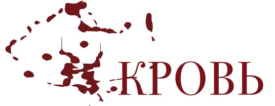

Кровь, бурлящая в жилах вампира, составляет основу его естества. Её нельзя назвать разумной субстанцией, но в какой-то мере она обладает собственной волей. Кровь толкает Сородичей на поступки, невообразимые для смертных. Она несёт в себе силу, но рано или поздно кому-то придётся за эту силу заплатить.

## Поколение

Все вампиры черпают своё могущество из Крови, но Кровь может иметь разный потенциал. Чем ближе Сородич к Каину, своему мифическому прародителю, тем сильнее его витэ. Принято говорить о поколениях, к Первому из которых, по легенде, принадлежал сам Каин (и, возможно, Лилит). Вампир, восставший из мёртвых после Становления, на одно поколение младше, чем его сир, - и, соответственно, слабее. Предтечи, дети детей Каина - это Третье поколение, дети предтеч — Четвёртое и т. д. Поколение вампира определяется при Становлении. Изменить его можно, только совершив запретное деяние, которое называют диаблери: выпив всю Кровь, а вместе с ней и саму душу другого Сородича.

Поколение и возраст - разные понятия. Вампир 10-го поколения мог получить Становление от старейшины ещё во времена Колумба, а вампир 6-го поколения - появиться на свет буквально вчера по воле какого-нибудь мафусаила.

#### Каин и Второе поколение: мифы

О первых вампирах достоверно ничего не известно они остаются предметом легенд и теологических размышлений. Сородичи, которые верят в миф о Каине, в большинстве своём считают, что это тот самый Каин из Библии. Однако что на самом деле происходило под покровом темноты в первые ночи мироздания, остаётся загалкой.

#### Третье поколение: предтечи

Предтечи, как называют основателей 13 вампирских кланов, некогда стали причиной библейского потопа. Неизвестно, устроили они его сами или это была кара, ниспосланная высшими силами. Кровь предтеч по сей день влияет на Сородичей, незримая рука древних вампиров, как и прежде, толкает их потомков в горнило Извечной борьбы, начатой тысячелетия назад. Последние десять веков предтечи никак не проявляли себя, и многие решили, что древние вампиры спят. Лишь единицы верили, что Третье поколение продолжает свою войну, манипулируя обществом Сородичей из-за кулис, скрывая свои деяния даже от тех, кто собственноручно писал тайную историю мира. Вампиры Камарильи настаивали на том, что предтечи давно мертвы, а то и вовсе никогда не существовали, пока Шабаш не продемонстрировал, как те заблуждались.

Шабаш стремится положить конец Извечной борьбе. Меч Каина именем Первого вампира объявил войну Третьему поколению. И разверзлась Геенна. Одного за другим Шабаш постепенно пробуждает предтеч, выманивая их из допотопных лабиринтов и коридорных гробниц бронзового века. А те, в свою очередь, призывают потомков на свою защиту. Этот крик о помощи, резонирующий с Кровью, молодые вампиры называют Зовом.

#### Четвёртое и Пятое поколения: мафусаилы

Мафусаилы почти так же сильны, как предтечи. Они отстранились от участия в Извечной борьбе ещё в самом её начале, поскольку могущество делало их инструментом в руках прародителей и любимой целью их атак. Многие мафусаилы до сих пор спят в своих убежищах под самыми старыми из человеческих городов - оберегаемые культами посвящённых, а то и вовсе забытые. Другие стали так называемыми Инконну, полностью порвав связи с обществом вампиров, чтобы не оказаться вновь вовлечёнными в Извечную борьбу.

#### С 6-го по 9-е поколение: старейшины

Вампиры этих поколений по большей части получили Становление ещё до Нового времени. Они долго занимали самые высокие позиции как в Камарилье, так

и среди Анархов, продолжая междоусобную грызню, начатую ещё в эпоху Ренессанса. Зов не даёт им покоя, заставляет покидать насиженные места, гонит на пере‑ довую войны Геенны. Некоторым из старейшин уда‑ лось не поддаться Зову, есть даже те, кто утверждает, что не слышит его вовсе — эти Сородичи мёртвой хват‑ кой вцепились в свои домены. Вампиры девятого поко‑ ления тоже слышат Зов. Веками другие старейшины не хотели признавать их равными себе, и вот наконец у них есть достаточное основание для своих притяза‑ ний — впрочем, вряд ли они этому рады.

#### **10‑е и 11‑е поколения: анциллы**

Старшие из анцилл, как правило, либо становятся ча‑ стью правящей элиты, доказав, что имеют на это пра‑ во, либо навлекают на себя гнев старейшин и гибнут. При этом с ростом населения за последние столетия вампиров тоже в целом стало больше. В итоге боль‑ шая часть представителей десятого и одиннадцатого поколений относительно молоды — им, как правило, меньше 250 лет. Столетия отделяют анцилл от статуса старейшины. Они в основном играют роль посредни‑ ков между вампирской аристократией и уличным сбро‑ дом. Впрочем, за всё то время, пока анциллы боролись за место под луной, они успели, фигурально выражаясь, хорошенько наточить зубы.

Это старшее поколение, которое доступно игрокам при создании персонажей.

#### **12‑е и 13‑е поколения: неонаты**

Ряды неонатов мало‑помалу сокращались на протяже‑ нии веков, но в современном мире их число стало расти безумными темпами. В этом смысле они переплюнули даже слабокровных (см. ниже). У 12‑го и 13‑го поколений, как правило, мало опыта по части вампирских сил, зато они гораздо лучше понимают современные технологии и приспосабливаются к социальным изменениям. Кос‑ ные старейшины Камарильи считают, что именно эти вампиры вдохнули новую жизнь в Движение анархов.

#### **С 14‑го по 16‑е поколение: слабая кровь**

Многие из просвещённых Сородичей со страхом взи‑ рают на вампиров этих поколений, наводнивших ули‑ цы современных городов. Слабокровные настолько далеки от Каина, что проклятие практически сошло на нет вместе с теми способностями, что оно дарует. В *«Книге земли Нод»* говорится о «временах худой кро‑ ви» как о предвестнике грядущей Геенны — пробужде‑ ния предтеч и конца всего рода вампиров.

## Сила Крови

Вампиры одного и того же поколения далеко не всегда рав‑ ны по силе. С годами Кровь густеет и созревает, увеличивая свой потенциал, хотя у каждого поколения есть границы могущества. Тот, кто не хочет ждать, может ускорить про‑ цесс, решившись на такое омерзительное деяние, как *Ама‑ рант*. Сильная Кровь может быть также у молодых птенцов, которым даровал Становление очень сильный сир. Однако у всего есть цена — чем могущественнее вампир, тем боль‑ ше крови ему требуется для поддержания своего существо‑ вания и тем сильнее проявляется в нём клановый изъян.

Сила Крови большинства Сородичей растёт с воз‑ растом. Как правило, каждые 100 лет активной нежиз‑ ни вампир увеличивает *силу Крови* на 1 пункт, но яркие переживания или витэ могущественных собратьев могут ускорить процесс. Если вампир находится в тор‑ поре, его Кровь слабеет — её сила снижается на 1 пункт каждые 50 лет. При этом для каждого поколения есть минимальное и максимальное значение силы Крови. Это порог, переступить который не получится ни в ту, ни в другую сторону. Потенциал витэ слабокровных вампиров не растёт с возрастом — они могут увели‑ чить силу Крови только в том случае, если при помощи диаблери сменят поколение как минимум на 13‑е.

Ниже описаны изменения, которые происходят по мере того, как растёт сила Крови. В списках при‑ ведены лишь те свойства, которые претерпели изме‑ нения по сравнению с предыдущим уровнем. Полные сведения ты можешь найти в таблице на стр. 216.

#### **Сила Крови 0 (ноль): слабая кровь**

Ты слабокровный вампир. Более сильные Сородичи презирают тебя и не принимают в своё общество.

- n Ты получаешь повреждения по тем же правилам, что и смертные. Заживляя свои раны (стр. 218), ты можешь избавиться от 1 лёгкого повреждения за каждое испытание Крови, которое готов пройти. Поскольку ты не принадлежишь ни к одному клану, у тебя нет и кланового изъяна. Его тяжесть в твоём случае считается равной нулю.
- n Ты не можешь связать кого‑то узами крови (стр. 233) или создать гуля (стр. 234). Даруя кому‑то Ста‑ новление, ты рискуешь просто убить его.
- n Ты впадаешь в ярость только под воздействием сверхъестественных сил (стр. 219).
- n Под прямыми солнечными лучами ты получаешь только 1 тяжёлое повреждение в ход.

Подробнее о слабокровных вампирах, их способностях и ограничениях, которые на них действуют, см. на стр. 109.

| СИЛА КРОВИ | МОД. ПРИЛИВА КРОВИ | ИСЦЕЛЕНИЕ ОТ ПОВРЕЖДЕНИЙ (ЗА 1 ИСПЫТАНИЕ КРОВИ) | ПРИМЕНЕНИЕ ДИСЦИПЛИН И СОПРОТИВЛЕНИЕ ИМ (МОД.) | ПОВТОРНОЕ ИСПЫТАНИЕ КРОВИ (СИЛЫ ДИСЦИПЛИН) | ТЯЖЕСТЬ ИЗЪЯНА | ПРОБЛЕМЫ С ПИТАНИЕМ                                                               |
|---------------|--------------------------|----------------------------------------------------------|---------------------------------------------------------|-----------------------------------------------------|-------------------|-----------------------------------------------------------------------------------|
| 0             | +1d10                    | 1 лёгкое повреждение                                     | Нет                                                     | Нет                                                 | 0                 | Нет                                                                               |
| 1             | +2d10                    | 1 лёгкое повреждение                                     | Нет                                                     | Уровень 1                                           | 2                 | Нет                                                                               |
| 2             | +2d10                    | 2 лёгких повреждения                                     | +1d10                                                   | Уровень 1                                           | 2                 | Донорская кровь из паке тов и кровь животных утоляет Голод в 2 раза хуже |
| 3             | +3d10                    | 2 лёгких повреждения                                     | +1d10                                                   | Уровень 1 – 2                                       | 3                 | Донорская кровь из паке тов и кровь животных вообще не утоляет Голод        |
| 4             | +3d10                    | 3 лёгких повреждения                                     | +2d10                                                   | Уровень 1 – 2                                       | 3                 | Донорская кровь из паке тов и кровь животных вообще не утоляет Голод.       |
|               |                          |                                                          |                                                         |                                                     |                   | Укусив человека, вам пир убирает на 1 пункт Голода меньше                   |
| 5             | +4d10                    | 3 лёгких повреждения                                     | +2d10                                                   | Уровень 1 – 3                                       | 4                 | Донорская кровь из паке тов и кровь животных вообще не утоляет Голод.       |
|               |                          |                                                          |                                                         |                                                     |                   | Укусив человека, вам пир убирает на 1 пункт Голода меньше.                  |
|               |                          |                                                          |                                                         |                                                     |                   | Не убивая человека, вампир может снизить значение Голода только до 2     |
| 6             | +4d10                    | 3 лёгких повреждения                                     | +3d10                                                   | Уровень 1 – 3                                       | 4                 | Донорская кровь из паке                                                           |
| 7             | +5d10                    | 3 лёгких повреждения                                     | +3d10                                                   | Уровень 1 – 4                                       | 5                 | тов и кровь животных вообще не утоляет Голод.                                  |
|               |                          |                                                          |                                                         |                                                     |                   | Укусив человека, вампир убирает на 2 пункта Голода меньше.                  |
|               |                          |                                                          |                                                         |                                                     |                   | Не убивая человека, вампир может снизить значение Голода только до 2     |
| 8             | +5d10                    | 4 лёгких повреждения                                     | +4d10                                                   | Уровень 1 – 4                                       | 5                 | Донорская кровь из паке                                                           |
| 9             | +6d10                    | 4 лёгких повреждения                                     | +4d10                                                   | Уровень 1 – 5                                       | 6                 | тов и кровь животных вообще не утоляет Голод.                                  |
|               |                          |                                                          |                                                         |                                                     |                   | Укусив человека, вампир убирает на 2 пункта Голода меньше.                  |
|               |                          |                                                          |                                                         |                                                     |                   | Не убивая человека, вампир может снизить значение Голода только до 3     |
| 10            | +6d10                    | 5 лёгких повреждений                                     | +5d10                                                   | Уровень 1 – 5                                       | 6                 | Донорская кровь из паке тов и кровь животных вообще не утоляет Голод.       |
|               |                          |                                                          |                                                         |                                                     |                   | Укусив человека, вампир убирает на 3 пункта Голода меньше.                  |
|               |                          |                                                          |                                                         |                                                     |                   | Не убивая человека, вампир может снизить значение Голода только до 3     |
|               |                          |                                                          |                                                         |                                                     |                   |                                                                                   |

#### **Сила Крови 1**

Ты настоящий вампир, хотя некоторые старейшины считают, что такие, как ты, недалеко ушли от слабо‑ кровных. И всё же твоя Кровь способна творить чудеса, если её пробудить.

- n Используя прилив Крови (стр. 218), ты добавляешь к пулу 2d10.
- n Заживляя свои раны, ты можешь избавиться от 1 лёгкого повреждения за каждое испытание Крови, которое готов пройти.
- n Если после использования Дисциплины 1‑го уровня тебе нужно пройти испытание Крови, ты можешь бросить две игральные кости и выбрать лучший результат (или пройти испытание заново).
- n Тяжесть твоего изъяна равна 1.

#### **Сила Крови 2**

Ты на голову выше более слабых Сородичей. Кровь питает твоё мёртвое тело куда лучше, чем рань‑ ше. Однако всё имеет свою цену: кровь животных и человеческая кровь, обработанная для медицин‑ ских целей, начинает терять питательные свойства (не говоря уже о том, что она давно утратила всякий вкус).

- n Заживляя свои раны, ты можешь избавиться от 2 лёгких повреждений за каждое испытание Крови, которое готов пройти.
- n Ты можешь добавить 1d10 к пулу Дисциплины или пулу проверки сопротивления Дисциплине.
- n Если ты пьёшь кровь животных или донорскую кровь из пакета, чтобы избавиться от 1 пункта Го‑ лода, тебе нужно выпить в 2 раза больше, чем рань‑ ше.

#### **Сила Крови 3**

С точки зрения консервативных старейшин, твоя Кровь достаточно окрепла, чтобы считать тебя настоящим каинитом, а не жалким упырём, недостойным внима‑ ния. Впрочем, усиливая твои способности, Кровь уси‑ ливает и клановый изъян.

- n Используя прилив Крови, ты добавляешь к пулу проверки 2d10.
- n Если после использования Дисциплины 2‑го уровня или ниже тебе нужно пройти испытание Крови, ты можешь бросить две игральные кости и выбрать лучший результат (или пройти испыта‑ ние заново).
- n Ты не можешь утолить Голод кровью животного или донорской кровью.
- n Тяжесть твоего изъяна равна 2.

### **Сила Крови 4**

Твоё положение незавидно: ты как никогда близок к могуществу, слабые вампиры подчиняются тебе, и тем болезненнее осознавать, что для вышестоящих ты по‑прежнему пешка. Количество человеческой крови, необходимое тебе для утоления Голода, всё растёт, и ты чувствуешь, как Человечность выскальзывает из паль‑ цев, липких от пролитой крови.

- n Заживляя свои раны, ты можешь избавиться от 3 лёгких повреждений за каждое испытание Крови, которое готов пройти.
- n Ты можешь добавить 2d10 к пулу проверки Дисци‑ плины или пулу проверки сопротивления Дисциплине.
- n Потребляя кровь человека, ты убираешь на 1 пункт Голода меньше, чем раньше.

#### **Сила Крови 5**

Лишь шаг отделяет тебя от того, чтобы стать старей‑ шиной и обрести силу, которую многие сочли бы боже‑ ственной.

- n Используя прилив Крови, ты добавляешь к пулу проверки 3d10.
- n Если после использования Дисциплины 3‑го уровня или ниже тебе нужно пройти испытание Крови, ты можешь бросить две игральные кости и выбрать лучший результат (или пройти испытание заново).
- n Не убивая человека, ты можешь снизить значение Голода только до 2.
- n Тяжесть твоего изъяна равна 3.

#### **Сила Крови 6 и выше**

По мере того как старейшины уходят, поддавшись Зову, вероятность столкнуться с вампиром, обладаю‑ щим столь сильной Кровью, становится всё меньше. Те, кто ещё остался, превратились в затворников. Они в ужасе прячутся за мифами и легендами, окружив себя могущественной стражей. В их Крови не осталось почти ничего человеческого — они чужды людям и по образу мысли, и по внешнему виду. Столь могущественные и непонятные существа, по нашему мнению, не луч‑ ший вариант для персонажа игрока, поэтому сведения о них мы приводим только в таблице, исключительно для нужд рассказчика.

## Дары Крови

Кровь, которую поглощает вампир, даёт ему не только подобие жизни. Она дарует также некоторые способ‑ ности, требующие пройти испытание Крови (возмож‑ но, даже несколько раз). Сородичам стоит применять их с большой осторожностью, если они не хотят пасть жертвами собственного Голода.

Следует всегда помнить, что поражение в испытании Крови не означает, что вампир не может применить свою способность. Просто после её применения его Голод вырастет на 1 пункт.

#### Искра жизни

Хотя телу вампира можно придать подобие жизни, с точки зрения медицины оно мертво. Внешне природа Сородичей проявляется в бледной или пепельно-серой коже, холодной на ощупь, в отсутствии дыхания (кроме необходимого для речи) и сердцебиения. Усилием воли направив кровь в капилляры на коже и в своё иссохшее сердце, вампир может выглядеть совершенно есте-

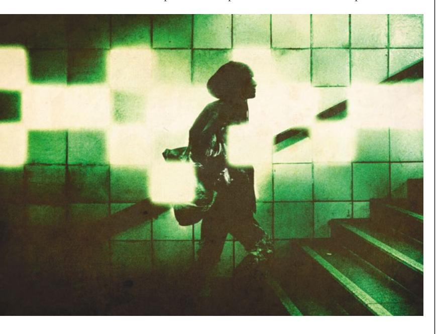

ственно в течение одной ночи: его тело станет тёплым, сердце будет биться, появится дыхание и т. д. В таком состоянии он может даже пройти первичный медицинский осмотр, хотя любое более тщательное обследование выявит явные аномалии вроде отсутствия кишечной микрофлоры.

Все Сородичи, кроме слабокровных, должны зажигать Искру жизни, чтобы пользоваться сенсорными экранами (например, на смартфоне) без посторонней помощи, поскольку их сверхъестественная плоть не проводит электричество и не вырабатывает влагу.

Искра жизни, как правило, позволяет вампиру в течение часа есть и пить, как обычные люди, не рискуя изрыгнуть всю поглощённую пищу. Если вампир не применяет эту способность, он должен немедленно пройти проверку

самообладания + выносливости (сложность 3), чтобы вовремя успеть добежать до туалета или выскочить на улицу.

В зависимости от уровня своей Человечности некоторые вампиры под воздействием Искры жизни могут имитировать половой акт и даже получать от него удовольствие (см. стр. 236).

Вампиры с Человечностью 9 и выше выглядят скорее не мертвецами, а больными или наркоманами. Пульс и дыхание у них слабые, но всё же они есть. Им Искра жизни нужна исключительно для косметических целей.

Если вампир прибегает к Искре жизни, он должен пройти испытание Крови. Эффект продлится до рассвета, если игрок не захочет прервать его раньше.

#### Прилив Крови

Вампир может воззвать к собственной Крови, чтобы на время усилить любую из характеристик - физическую, социальную или ментальную. Когда персонаж вызывает прилив Крови, игрок может добавить одну или несколько игральных костей (зависит от силы Крови) к пулу проверки, в которой задействована выбранная характеристика. Прилив Крови можно вызвать только 1 раз за проверку.

После использования этой способности вампир должен пройти испытание Крови.

Прилив Крови увеличивает пул только одной проверки (но этот пул остаётся неизменным, если игрок решает перебросить кости за пункты воли). Персонажи не могут использовать прилив Крови в следующих случаях: при проверках воли и Человечности; проходя проверки, результат которых повлияет больше чем на одну сцену; применяя правило одной проверки (стр. 291); а также в любом другом случае, если рассказчик против. Нельзя засчитать гарантированную победу (стр. 120) или использовать правило половины (стр. 123), если игрок использовал прилив Крови.

#### Заживление плоти

Поскольку плоть вампира мертва, его раны не заживают сами собой. Однако при определённом усилии кости и ткани могут снова срастись.

ЗАЖИВЛЕНИЕ ЛЁГКИХ ПОВРЕЖДЕНИЙ. Раз в ход, пробудив свою Кровь, вампир может избавиться от одного или нескольких лёгких повреждений (зависит от силы Крови). Каждый раз при этом он должен проходить испытание Крови.

ЗАЖИВЛЕНИЕ ТЯЖЁЛОГО УРОНА. Избавляться от тяжёлых повреждений можно не чаще одного раза в ночь. Для этого вампир должен дождаться очередного за‑ ката и пройти три дополнительных испытания Крови (помимо того, которое требуется каждый раз в момент пробуждения).

Независимо от результата вампир может избавить‑ ся от одного (и только одного) тяжёлого повреждения, а также от одной травмы или похожего эффекта.

Если после этих испытаний Крови Голод вам‑ пира вырастает выше 5, применяются те же правила, что и во время обычного пробуждения: персонажу не нужно противостоять голодной ярости — он просто впадает в торпор.

#### **Дисциплины**

Кровь своей необузданной энергией питает Дисци‑ плины практически на всех уровнях мастерства. Толь‑ ко самые элементарные из сил не требуют испытаний Крови. Каждый ход вампир может активировать одну силу независимо от длительности её эффекта.

Вампир может одновременно поддерживать любое количество эффектов от разных сил.

Персонажи с высокой силой Крови могут бросать сразу две игральные кости, проходя испытание Крови после применения некоторых Дисциплин, и выбирать при этом лучший результат. Как видно из таблицы (стр. 216), уровень сил, которые можно активировать подоб‑ ным образом, растёт вместе с силой Крови.

За ход вампир может одновременно активировать силу Дисциплины, разжечь Искру жизни, вызвать при‑ лив Крови и заживить лёгкое повреждение. При этом ему придётся пройти три или даже больше испытаний Крови в зависимости от того, каковы условия применения силы.

## Дань Крови

Даруя вампирам могущество, Кровь взимает с них тяж‑ кую дань. Проклятие вампиризма — это клубок змей, затаившихся под кожей, каждая из которых только и ждёт подходящего момента, чтобы напасть.

#### **Пробуждение**

Пробуждаясь от дневного сна, вампир каждый раз дол‑ жен проходить испытание Крови. Если он проваливает это испытание и из‑за этого значение Голода должно превысить 5, персонажу не нужно противостоять го‑ лодной ярости — вместо этого он впадает в торпор.

В дневное время Кровь замедляет свой ток и ста‑ новится холодной. Чтобы проснуться днём, вампир должен пройти проверку Человечности. Её сложность зависит от опасности, которой он при этом подвергает‑

ся: 3 — если вокруг бушует пожар или появилась другая смертельная угроза; 4 — если нужно получить экстрен‑ но важное послание или принять срочное решение; 5 и выше — если возникло какое‑то мелкое неудобство.

Проснувшись днём, вампир может действовать на протяжении одной сцены. Чтобы бодрствовать даль‑ ше, он должен пройти проверку Человечности со слож‑ ностью 3. Успех продлевает его способность действо‑ вать ещё на одну сцену, а триумф позволяет не засыпать до тех пор, пока это необходимо. Пул всех действий вампира в дневное время ограничен показателем его Человечности.

#### **Ярость**

Каждый вампир рано или поздно впадает в *ярость*: эта неотвратимая угроза сопровождает его постоянно. Тон‑ кий поводок, сдерживающий Зверя, лопается под напо‑ ром внешних стимулов, и тот срывается, рыча и оска‑ лив зубы. Ярость — это хищник, вырвавшийся на волю. Его не мучают сомнения, у него нет угрызений совести. Ярость — это основные инстинкты Крови, доведённые до предела.

Вампир в состоянии ярости не способен мыслить рационально. Им движет исключительно бешенство, голод или паника, и он сделает всё, чтобы порвать на части провокатора, напиться крови или сбежать от того, что его напугало, как правило, круша при этом всё на своём пути. В отличие от многих других импуль‑ сов, порождённых Кровью, ярость никогда не бывает незаметной.

Чтобы воспротивиться приступу ярости, вампир должен пройти проверку воли. Сложность зависит от мощности стимула, и её определяет рассказчик. Пер‑ сонажи могут увеличить пул этой проверки на треть показателя Человечности (с округлением вниз).

Победа означает, что персонаж сумел побороть ярость, но для этого ему потребовалось некоторое вре‑ мя — он тратит свой ход. Триумф означает, что вампир подавил импульс мгновенно.

Впавшим в ярость персонажем игрока управляет рассказчик до тех пор, пока персонаж не придёт в себя.

ОСЕДЛАТЬ ВОЛНУ. Вампир может *оседлать волну*, под‑ давшись импульсу добровольно. Он не проходит про‑ верку воли, а в остальном всё происходит как обычно. Впрочем, в данном случае рассказчику не стоит полно‑ стью брать контроль над персонажем в свои руки. Луч‑ ше дать возможность игроку самому описать эффект ярости и выбрать, к примеру, на кого вампир нападёт в первую очередь.

ЭФФЕКТЫ ЯРОСТИ. Вампир, впавший в ярость, игнорирует все отрицательные модификаторы, полученные из-за ранений, если они не вызваны потерей конечностей. Он может использовать только физические Дисциплины, такие как Мошь, Стойкость и Стремительность, зато добавляет 3d10 к пулу сопротивления ментальным Дисциплинам, таким как Доминирование или Величие (если пул сопротивления не предусмотрен для определённой Дисциплины, сложность проверки для противника увеличивается на 2 пункта).

Игрок может потратить 1 пункт воли, чтобы вернуть контроль над персонажем на 1 ход, но при этом не может использовать пункты воли, чтобы перебрасывать кости.

Пока вампир не придёт в себя, он не может повторно впасть в ярость или подвергнуться действию одержимости. Он охвачен лишь одним желанием - любой ценой добиться цели (см. «Виды ярости» ниже) и не остановится до тех пор, пока не получит своё или не закончится сцена.

ВИДЫ ЯРОСТИ. В зависимости от стимулов, вызвавших ярость, её можно условно разделить на три вида: бешеную, голодную и бессильную. Её внешние проявления могут сильно отличаться друг от друга, но за ними стоит всё тот же безумный Зверь.

БЕШЕНАЯ ЯРОСТЬ. Зверь впадает в ярость, если его провоцируют. Оскорбления, издёвки или агрессивные действия в адрес вампира способны вызвать приступ бешеной ярости. В этом состоянии вампир ни перед чем не остановится, чтобы растерзать обидчика. Часто под горячую руку попадают также все окружающие: и друзья, и враги. Уничтожив первопричину своего гнева, вампир может пройти проверку воли со сложностью 3 (или 5, если кто-то из врагов всё ещё на ногах). Успех означает, что вампиру удалось взять себя в руки, - приступ бешеной ярости заканчивается; поражение означает, что он утратил остатки контроля: в своём стремлении убивать он будет бросаться на всех, кто окажется в пределах досягаемости, пока его не остановят.

Примеры стимулов бешеной ярости:

| <b>СТИМУЛ</b>                            | <b>СЛОЖНОСТЬ</b> |
|------------------------------------------|------------------|
| Убийство друга                           |                  |
| Ранение возлюбленного или опоры          |                  |
| Убийство возлюбленного или опоры         |                  |
| Агрессивное поведение или домогательства |                  |
| Оскорбление со стороны нижестоящего      |                  |
| Публичное унижение                       |                  |

ГОЛОДНАЯ ЯРОСТЬ. Зверь всегда жаждет крови. Когда искушение становится невыносимым, вампир впадает в голодную ярость. Если показатель Голода персонажа равен 5 и вампир провалил испытание Крови, ему нужно пройти проверку сопротивления голодной ярости.

В зависимости от настроения хроники рассказчик может варьировать частоту проверок сопротивления голодной ярости, но вероятность того, что они потребуются, должна оставаться всегда. В состоянии голодной ярости вампир стремится насытиться свежей человеческой кровью из ближайшего доступного источника (если ближайший человек - опора Сородича, игроку лучше потратить пункт воли, чтобы получить контроль над персонажем и выбрать другую жертву). Это состояние проходит, когда вампир насыщается и показатель его Голода падает хотя бы до 1.

Примеры стимулов голодной ярости:

| <b>СТИМУЛ</b>                                                                             | <b>СЛОЖНОСТЬ</b> |
|-------------------------------------------------------------------------------------------|------------------|
| Вид открытой раны или сильный запах крови, когда показатель Голода равен 4 ИЛИ ВЫШЕ |                  |
| Вкус крови, когда показатель Голода равен 4 или выше                                   |                  |
| Провал испытания Крови, когда показа- тель Голода равен 5                              |                  |

БЕССИЛЬНАЯ ЯРОСТЬ. Зверь стремится избежать любой опасности. Если вампиру что-то угрожает, он может впасть в бессильную ярость. Ротшрек, как ещё называют это состояние, охватывает вампира при виде солнечного света или открытого пламени. Серьёзные телесные повреждения также могут вызвать приступ бессильной ярости. Вампир пытается убежать от источника опасности, невзирая ни на какие препятствия. Бессильная ярость прекращается, когда вампиру, по его мнению, больше ничего не угрожает или заканчивается спена.

Примеры стимулов бессильной ярости:

| <b>СТИМУЛ</b>                                     | <b>СЛОЖНОСТЬ</b> |
|---------------------------------------------------|------------------|
| Костёр                                            |                  |
| Полыхающий вокруг пожар                           |                  |
| Боль от ожога                                     |                  |
| Рассеянный солнечный свет (через окно и т. п.) | 3                |
| Прямой солнечный свет                             |                  |

## Угрозы для Крови

Пули неспособны причинить Сородичам ощутимый вред. Раны от холодного оружия для них что царапи‑ ны. Даже если они выпьют кровь больного человека, им это ничем не грозит — они могут стать переносчиками болезни, но в их собственном организме микробы гиб‑ нут. Однако есть вещи, которые для Сородичей дей‑ ствительно опасны.

#### **Солнечный свет**

Солнечный свет обжигает нежить, обращает её нече‑ стивую плоть в пепел. Небесное око сводит на нет всё могущество Крови. Вампир, оказавшийся под прямыми солнечными лучами, каждый ход получает по одному тяжёлому повреждению за каждый пункт тяжести кла‑ нового изъяна.

#### **ПРИМЕР**

*Тяжесть кланового изъяна Клауса равна 2. Значит, пря‑ мой солнечный свет наносит Клаусу 2 тяжёлых повре‑ ждения в ход.*

Если вампир позаботился об одежде, защищающей от попадания прямого солнечного света, например если на нём будет пальто, перчатки, очки, маска, широко‑ полая шляпа и сапоги, он получает повреждения раз в два хода или даже реже. То же самое относится к рас‑ сеянному солнечному свету, проходящему, к примеру, через занавеску или тяжёлые тучи.

СЛАБОКРОВНЫЕ ВАМПИРЫ И СОЛНЕЧНЫЙ СВЕТ. Слабокров‑ ки под прямыми солнечными лучами получают только 1 лёгкое повреждение в ход. Им, в отличие от полно‑ кровных Сородичей, достаточно нанести крем с высо‑ ким солнцезащитным фактором и надеть более‑менее плотную одежду (длинные рукава, широкополая шляпа), чтобы реже получать повреждения (раз в 2 хода).

#### **Огонь**

Количество тяжёлых повреждений, которые вампиру наносит свободно распространяющееся пламя, зависит от того, насколько обширные ожоги он получил (решает это рассказчик). Если в огонь попала только рука пер‑ сонажа, он получит 1 тяжёлое повреждение, а если он полностью охвачен пламенем, то может получать по 3 тя‑ жёлых повреждения в ход, а то и больше. Урон от огнен‑ ного оружия, такого как факел, зажигательные патроны, огнемёт и т. п., зависит от вида оружия (см. стр. 379).

Хотя вампиры горят с той же скоростью, что и смерт‑ ные, огонь представляет для них серьёзную опасность, столкнуться с которой в повседневности вполне реально.

#### **Низкие температуры**

Хотя вампиры не умирают от холода, они могут столк‑ нуться с эффектом обморожения или даже превратить‑ ся в ледяную статую, если надолго останутся на морозе. Для Сородичей холод представляет особую опасность: их тела не излучают тепла (разве что в первые минуты после насыщения кровью), а значит, им сложнее бывает заметить критическое понижение температуры.

Оказавшись на сильном морозе (ниже −30°C), вампир каждый час должен проходить проверку выносливости + упорства, чтобы продолжать двигаться. Сложность про‑ верки с каждым разом растёт на 1 пункт — она равна 2 для первой, 3 для второй и т. д. В случае поражения вампир перестаёт двигаться и может пользоваться только ментальными Дисциплинами. Ещё через час в таком со‑ стоянии вампир замерзает полностью и впадает в торпор.

Вода проводит тепло лучше, чем воздух. В ледяной воде вампир должен проходить проверку раз в полчаса. Замёрзший вампир тонет, поскольку в его лёгких нет воздуха, чтобы поддерживать тело на плаву.

#### **Отсечение головы**

Если обезглавить вампира, он встретит Окончатель‑ ную смерть. Чтобы сделать это в бою, нужно успешно провести прицельную атаку с модификатором −2 (см. стр. 302), используя подходящее для этой цели холод‑ ное оружие (топор, ятаган, палаш и т. п.), и нанести при этом 10 или больше повреждений любого вида (до деления пополам в случае лёгких повреждений).

#### **Кол в сердце**

Чтобы всадить кол в сердце вампиру, охотник должен либо вбить этот кол молотком, пока вампир спит, либо попасть им в сердце во время боя. Во втором случае не‑ обходимо успешно провести прицельную атаку с моди‑ фикатором −2 и нанести вампиру 5 или больше повре‑ ждений любого вида (до деления пополам). Кол можно использовать как самостоятельное оружие ближнего боя (в этом случае охотник должен пройти проверку силы + фехтования) или как снаряд для ручного гранатомёта, арбалета или иного дистанционного оружия. Модифи‑ катор урона деревянного кола всегда равен 0 независимо от того, как его применяют. Если ничто не может поме‑ шать проткнуть колом спящего или обездвиженного вам‑ пира и время не играет роли, можно обойтись без про‑ верки, но это решение должен принять рассказчик.

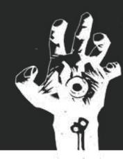

#### ИСТИННАЯ ВЕРА

Многие смертные - возможно, даже большинство - верят в существование высшей сущности или загробной жизни, но лишь единицы обладают Истинной Верой. Она может найти своё выражение в евангелическом рвении и фанатизме, спокойной убеждённости и вдумчивой сдержанности, бескорыстной любви к ближнему и душевной теплоте - или вовсе никак внешне не проявляться до тех пор, пока не наступит решающий момент. Не похоже, чтобы посвящение в сан имело какое-то значение - среди священнослужителей Истинная Вера проявляется не чаще, чем среди мирян. Общество Св. Леопольда старается привлекать в свои ряды обладателей Истинной Веры, но и его члены толком не знают, где и как их искать.

Хотя в западноевропейских легендах Проклятых обращают в бегство при помощи распятия, на самом деле Истинную Веру можно встретить не только среди христиан. Набожный иудей, сжимающий в руках Звезду Давида, благочестивый мусульманин, выставивший перед собой Священный Коран, убеждённый индуист с мантрой Ом на футболке - все они способны отогнать вампиров силой Истинной Веры. И в то же время епископ с распятием в руках потерпит неудачу, если в его душе не горит божественный огонь.

Показатель Истинной Веры оценивается по шкале от 1 до 5, как и большинство параметров. Отличие заключается в том, что Истинную Веру нельзя приобрести за пункты опыта - она разгорается или гаснет в душе человека благодаря острым или тяжёлым переживаниям. С каждым уровнем защита от Сородичей становится всё мощнее (подробнее см. ниже).

Истинная Вера - загадочное явление. Ни вампиры, ни смертные не знают пределов её возможностей или причин её возникновения. Что именно представляет собой Истинная Вера в рамках хроники, решать рассказчику.

• Любой истинно верующий может остановить вампира при помощи священного символа или молитвы. Для этого он должен вступить в состязание упорства + Истинной Веры против запаса воли вампира. Если победит вампир, он сможет двигаться беспрепятственно. В противном случае

каждый успех смертного заставляет вампира отступить на шаг и отвести глаза. Кроме того, если в течение сцены смертный прикоснётся к вампиру священным символом, вампир получит ожоги: по 1 тяжёлому повреждению за каждый успех. Триумф заставит вампира спасаться бегством, кроме того, тот должен будет воспротивиться бессильной ярости (сложность равна уровню Истинной Веры смертного).

•• Этот уровень Истинной Веры позволяет персонажу воспротивиться эффектам Доминирования и других воздействующих на разум сил за счёт траты пунктов воли (каждый потраченный пункт воли обеспечивает защиту на несколько ходов: 1 ход за каждый пункт его показателя Истинной Веры). ••• Этот уровень Истинной Веры позволяет персонажу чувствовать присутствие вампира. Какой из параметров он при этом использует, решает рассказчик в зависимости от того, что это за человек - африканский «чующий ведьм» или болгарский «саботник», возможно, полагаются на свою невероятную наблюдательность, а благочестивая домохозяйка, возвращающаяся из мечети, подсознательно чует неладное благодаря обострённой проницательности. Эта способность не позволяет отслеживать вампиров, как на радаре, - смертный просто чувствует, что рядом прячется что-то злое и нечестивое, когда в этом возникает сюжетная необходимость.

•••• На этом уровне истинно верующего нельзя сделать гулем. Кроме того, верующий становится невосприимчив к эффектам Величия, Доминирования, Сокрытия и других воздействующих на разум Дисциплин.

••••• Потрясая священным символом или громко читая молитву, смертный может привести вампира к раскаянию. Вампир должен пройти проверку мук совести. Даже в случае успеха он падает духом, испытывая глубокое отвращение к себе, и может лишь защищаться на протяжении количества ходов, равного количеству пунктов его сомнений (не менее одного). После этого все сомнения пропадают. Если же вампир потерпел поражение, он мгновенно впадает в бессильную ярость, спасается бегством и навсегда снижает показатель упорства на 1 пункт. Сомнения при этом остаются. Если вампир по каким-то причинам не может убежать, он старается отодвинуться от священного символа как можно дальше и получает повреждения, словно попал под прямой солнечный свет.

Кол в сердце парализует вампира, хотя первое время тот и остаётся в сознании. Потратив пункт воли, вампир может совершать незначительные телодви‑ жения, например пошевелить пальцем или моргнуть, но это самое большее, на что он способен в таком со‑ стоянии. Ментальные Дисциплины, такие как Величие, Доминирование и Ясновидение, ему всё ещё доступны, но он не может отдавать команды, если не владеет теле‑ патией.

Парализованный колом вампир спит днём и про‑ сыпается каждый вечер, а значит, должен проходить ис‑ пытание Крови. Как сказано на стр. 219, рано или позд‑ но Голод вгонит его в торпор.

#### **Торпор**

Сородичи застряли где‑то на полпути между жизнью и смертью. Окончательная смерть всё ещё ждёт их впе‑ реди, но по дороге к ней есть ещё одно промежуточное состояние — летаргический сон, известный как *торпор*. Вампир перестаёт осознавать окружающий мир, он лежит, словно самый настоящий труп, и со временем его тело иссыхает. В торпоре Сородичи не могут поль‑ зоваться Дисциплинами и вообще как бы то ни было реагировать на большинство внешних стимулов.

Продолжительность торпора зависит от показателя Человечности (см. таблицу на стр. 241). По истечении положенного срока вампир может проходить проверку упорства + наблюдательности (сложность 2) каждый раз, когда рядом оказывается потенциальная жертва. В случае победы он очнётся и будет в сознании доста‑ точно долго, чтобы насытиться. При этом он, скорее всего, впадёт в голодную ярость. Показатель Голода вампира, очнувшегося от торпора, равен 5. Когда он снизится до 4, вампир окончательно придёт в себя.

Если Сородича проткнули колом, он будет оставать‑ ся в торпоре до тех пор, пока кто‑то или что‑то не из‑ влечёт кол. Если кол вынуть после того, как срок пребы‑ вания в торпоре истёк, вампир очнётся — либо в тот же момент, либо с наступлением ночи.

Вампир может впасть в торпор от Голода, из‑за тяж‑ ких телесных повреждений, а также по собственной воле.

- n Если показатель Голода вампира равен 5 и он про‑ валил испытание Крови при пробуждении, он впа‑ дает в торпор.
- n Если вся шкала здоровья вампира заполнена тяжёлыми повреждениями, он впадает в торпор. При этом он неосознанно пытается заживить раны, восстанавливая по 1 пункту здоровья за ночь. Пол‑ ностью восстановив своё тело (т. е. избавившись

от всех полученных повреждений, а также осложне‑ ний и травм), вампир может очнуться. Однако если его показатель Голода из‑за проваленного испыта‑ ния Крови при заживлении ран вырос выше 5, он впадает в торпор, как описано выше.

n Вампир, который добровольно решил впасть в тор‑ пор, каждую ночь увеличивает показатель Голода на 1 пункт. В конце концов его состояние станет вынужденным — тогда к нему применяются общие правила.

Чтобы вывести вампира из торпора до положенного срока, ему нужно дать витэ Сородича с более высокой силой Крови и избавить его таким образом от 1 пункта Голода.

#### **Окончательная смерть**

Хотя вампиры и считаются бессмертными, любой из них может встретить Окончательную смерть. Рас‑ ставшийся с нежизнью Сородич уже не сможет вер‑ нуться назад. Причиной Окончательной смерти, помимо огня, солнца и обезглавливания, может быть полное растворение тела вампира в кислоте, а также взрыв, который разорвёт его на куски (впрочем, взры‑ вы обычно сопровождаются огнём, не менее опасным для вампиров), или давление воды в глубине океана, которое его расплющит. Кроме того, рассказчику, воз‑ можно, известно о каких‑то особых недугах, поражаю‑ щих вампиров и способных привести к Окончательной смерти.

Многие вампиры встречают Окончательную смерть в битве с оборотнями, другими Сородичами, а также последнее время всё чаще — в бою с инквизиторами. Запас прочности не бесконечен даже у таких живучих созданий, как вампиры. Если всадить в Сородича доста‑ точно пуль, он впадёт в торпор и станет беспомощной мишенью для дальнейших действий врага.

Общество Св. Леопольда считает, что вампиров в торпоре необходимо сжигать дотла. Если тело после Окончательной смерти сохраняется, оно принимает тот вид, который должно было принять к этому времени, если бы человек не получил Становление: вампир, кото‑ рому меньше года, превратится в разлагающийся труп; Сородичи постарше — в скелеты или даже в прах.

По правилам, когда вся шкала здоровья вампира за‑ полняется тяжёлыми повреждениями, он впадает в тор‑ пор. Если после этого он получит хотя бы 1 тяжёлое повреждение от огня или солнечного света, наступит Окончательная смерть. То же самое случится при обез‑ главливании или полном уничтожении тела.

Ты то, что ты ешь

*Я предпочитаю тех, кто в ярости, готовых к бою или, наоборот, напуганных: кровь холериков, одним сло‑ вом. Дневной сон после этого гораздо спокойнее. Поэто‑ му, когда я выхожу на охоту, я — воплощение кошмара. Они знают, что я иду за ними, и знают, что их ждёт. В их сердцах просыпаются первобытные инстинкты дерись или беги, просто и безыскусно. В какой‑то мере так даже честнее, верно? Да плевать, честность тут ни при чём — это просто‑напросто кайф. Для меня важ‑ ней всего грубая сила. Клянусь, если бы кровь Латиши сей‑ час билась во мне, я бы разнесла весь Голливудский буль‑ вар, срывая крышу за крышей, глазом не моргнув. Наши вкусы — не тема для светских разговоров, и от врагов их лучше держать в секрете, но знать, что тебе нра‑ вится и как это заполучить весьма полезно. Это ключ к такому допингу, какой тебе и не снился.*

*Может, это неэтично и неправильно, но тебе лучше научиться успокаивать или пугать смертных, вызы‑ вать в них чувство привязанности или отчуждённости. Всегда будь наготове — никогда не знаешь, когда рядом окажется идеальный сосуд. Ты умеешь исчезать из виду, правильно? Видишь того парня с ноутбуком? Может, он сейчас самый одинокий человек во вселенной, пишет по‑ следнее отчаянное письмо своей маменьке со Среднего За‑ пада, никогда не одобрявшей его образа жизни. В его крови меланхолия. Таких людей мало кто замечает — одинокие, социально неприспособленные, для всех чужие, — и тебя тоже перестанут замечать. Иди, попробуй. Почувствуй, как твои внутренности обволакивает эта холодная, туманная плазма. Только не будь слишком дружелюбен. Сочувствие может испортить вкус одиночества. Удач‑ ной охоты! Или лучше сказать «печальной»?*

*лый сок подстёгивает твою мёртвую плоть. Он словно горючее. Каждый Сородич — взять того же Кейса, пусть он и анарх с мочой вме‑ сто крови — нуждается в нём, чтобы дви‑*

**А** *гаться. Это основа основ, базовая потребность. Когда ты был смертным, тебе нужно было есть и спать — теперь для поддержания сил тебе нужна кровь. Так, во всяком случае, принято рассуждать. Но ведь это не вся правда, верно? Это не объясняет, зачем мы из кожи вон лезем, чтобы раздобыть напиток по вкусу. Сам по себе Голод ещё не причина рисковать, ведь так? Тогда зачем нам именно этот красавчик? Зачем все эти хитрые манипуля‑ ции? Зачем его обхаживать, соблазнять или запугивать?*

*Помнишь Латишу? Ту пофигистку из строительной компании, которую мы прижали в туалете «Радуги»? Помнишь сладкую тягучую нотку в её крови? Мускусный аромат и жар, разливающийся по жилам? Всё потому, что она тебя хотела. Ты уже на четверть её выпил, когда маска упала с моего лица, так что ты должен был заме‑ тить, как изменился букет. Горькая полынь и привкус золы на языке. Это тебе больше по вкусу, верно? Будит необузданную силу в твоих мёртвых мышцах. Это страх. И да, ты прав, я нарочно позволила маске упасть…*

*Наш Голод — это не просто потребность в пище, это настоящая зависимость: всеобъемлющее желание утонуть в бесконечном разнообразии человеческих судеб. Людям нужен протеин и аминокислоты, а нам, Сороди‑ чам, — их эмоции, их воспоминания, их боль, их страсть. Без этого кровь будет пресной, и ты никогда не почув‑ ствуешь себя по‑настоящему живым. Мы поглощаем само их естество и со временем уподобляемся тому, что погло‑ тили: становимся чёрной тенью их страхов и фантазий. Так было всегда. У патрициев есть пунктик — пить кровь только одной марки: собственных смертных по‑ томков, знойных блондинок, спортивных и подтянутых или, скажем, только чокнутых потребителей. Это всё, что им нужно, и это доказывает одну простую истину: кровь бывает разной. Другие Сородичи не так разборчивы. Какой сосуд мы пригубим сегодня, зависит от наших пла‑ нов на дальнейший вечер.*

## Кровь есть жизнь

Человеческая кровь питает тело вампира. Сородич, лишённый животворящего сока, будет лежать в непо‑ движном бессильном оцепенении. Его мёртвому сердцу для работы нужна эссенция жизни, изъятая у других. Его глаза видят лишь тогда, когда роговица и стекло‑ видное тело омыты алыми водами бытия. Всем вампи‑ рам известно, что кровь — это не просто лейкоциты, эритроциты и тромбоциты, взвешенные в плазме. Су‑ ществует некая неведомая связь между этой жизненно важной для человека жидкостью и его душой. Именно она придаёт «красному рому» неповторимый инди‑ видуальный аромат и вызывает эйфорию после каж‑ дого убийства. Возможно, крови те или иные свойства придают обыкновенные гормоны, или это след био‑ электрической активности головного мозга человека, но факт остаётся фактом: эмоции жертвы оказывают сильнейшее воздействие на организм Сородича.

Испей полную чашу, и *резонанс* добычи даст о себе знать: сперва ты почувствуешь особый привкус, затем тебя посетят образы, отзвуки и чувства — осколки ста‑ рых травм или ростки новых надежд. А когда жертва окажется на самом краю, ты, возможно, станешь свиде‑ телем ярких сцен из прошлого, познаешь душераздира‑ ющие откровения ускользающей жизни или ощутишь присутствие призраков былого. Убийство всегда дарит самые острые и самые стойкие ощущения — от этого искушения никуда не деться.

Наслаждение, впрочем, не единственная награда. Экстаз от выпитой крови способен изменить резонанс самого вампира. Если собираешься применять Сокры‑ тие, неплохо бы сперва отведать крови невзрачного меланхолика. А в жилах вон того феноменально рабо‑ лепного маменькиного сыночка течёт уникальный нек‑ тар, который позволит тебе использовать Доминирова‑ ние без зрительного контакта. Случаи необыкновенно сильного резонанса Сородичи называют дискразией, уличные упыри — концентратом, а игроки — «топо‑ вым кормом».

#### **Резонанс**

Под резонансом крови понимают ту или иную её раз‑ новидность. Сородичу стоит быть разборчивым в еде, разве что он торопится или ему что‑то угрожает. Вам‑ пиры пьют кровь, подобно тому как смертные употреб‑ ляют пищу. Резонанс придаёт крови изюминку, пре‑ вращая охоту в настоящий пир. Дело тут не в генетике, хотя семьи и правда нередко тяготеют к одному типу резонанса. Но гораздо большую роль играет сочетание темперамента жертвы и её психологического состояния в момент насыщения.

Сородичи пользуются десятками разных систем для описания разновидностей крови: от японских горо‑ скопов «кэцуэкигата» до популярной в американских бизнес‑школах псевдонаучной типологии личности Майерс‑Бриггс. Упыри из Индии говорят об аюрведиче‑ ских гунах, тореадоры‑декаденты из числа поклонников Гурджиева отмечают каждую трапезу на эннеаграмме, а одна крыса из Женевы утверждает, что использовала личные записи самого Юнга, чтобы создать «единую теорию Blutfunktion»1 . Однако самый распространён‑ ный способ классификации — как среди тауматургов клана Тремер, так и среди весперов‑самогонщиков основан на теории четырёх гуморов, применявшейся в классической медицине и средневековой алхимии.

*Алхимическое горнило*, по словам чернокнижников, есть не что иное как метафора тела вампира. Эмоции преобразуют кровь, подобно тому как огонь пре‑ образует соли и металлы в печи. Для тремеров, при‑ держивающихся этой точки зрения, искусство алхи‑ мии заключается в том, чтобы в нужной мере напугать или распалить жертву, а затем выбрать идеальный момент, чтобы напиться её крови. Возможно, это всего лишь средневековая мистификация, но меркурианцы могут подтвердить: хочешь получить настоящий кайф, не забывай о прелюдии. Для вампиров, чья кровь и в са‑ мом деле оказывает существенное влияние на характер и содержит магические ингредиенты, аргументы совре‑ менных алхимиков звучат вполне убедительно.

| ГУМОР           | ЭЛЕМЕНТ | ПСИХИЧЕСКАЯ ФУНКЦИЯ ПО ЮНГУ | ГОРМОН                       | ЭМОЦИИ, СОСТОЯНИЯ И КАЧЕСТВА                                                  |
|-----------------|---------|--------------------------------|------------------------------|-------------------------------------------------------------------------------|
| Холерический    | Огонь   | Чувства                        | Адреналин                    | Сердитый, агрессивный, деспотичный, страстный, завистливый                 |
| Меланхолический | Земля   | Мышление                       | Гормоны щитовидной железы | Грустный, напуганный, задумчивый, депрессивный, прагматичный               |
| Флегматический  | Вода    | Интуиция                       | Гормон гипофиза              | Ленивый, апатичный, спокойный, орга низованный, сентиментальный            |
| Сангвинический  | Воздух  | Ощущение                       | Тестостерон / эстроген       | Похотливый, счастливый, одурманенный, активный, легкомысленный, увлечённый |

1 прим. пер.: функция крови (нем.)

#### **РеЗонанС У жиВоТнЫХ**

**Бывает ли резонанс в крови животных? Достаточно ли сильны для этого их эмоции? В принципе, да. однако тут рассказчик может пойти двумя разными путями. Любой человек, если у него когда‑либо был домашний питомец, или если он работал на ферме или ранчо, или если он просто проводил много времени рядом с животными, может подтвердить, что у них, так же как у людей, бывает разное настроение. Рассказчик может определить резонанс в крови животного по настроению зверя. Большинство животных в неволе обладают либо меланхолическим, либо флегматическим резонансом, однако резонанс напуганных или рассерженных животных становится холерическим, а во время брачного периода — сангвиническим.**

**Другой вариант, позволяющий подчеркнуть разницу между человеческой и животной кровью, — это определение резонанса в зависимости от того, какие черты традиционно ассоциируются с тем или иным зверем. С давних времён животные олицетворяют человеческие пороки и добродетели: у подлой крысы и мудрой совы кровь меланхолическая, а у кролика, который плодится без удержу, или у гулящей кошки сангвиническая; у верного пса кровь флегматическая, а у злого волка — холерическая. В этом случае в крови животного всегда присутствует мимолётный резонанс соответствующего типа. если рассказчик не знает, с чем ассоциируется тот или иной вид животных, он может просто придумать резонанс — в конце концов, Парацельс вряд ли упоминал в своих трудах енотов.**

**Какой бы вариант ни выбрал рассказчик, сильный резонанс у животного будет только после успешной охоты или во время случки. Дискразий у животных не бывает (за исключением, возможно, легендарных тварей, о которых шепчут гангрелы в своих пророчествах).**

ЧЕТЫРЕ ГУМОРА. Понятие о гуморах появилось ещё в древ‑ неегипетской и вавилонской медицине, но западному миру они известны прежде всего по работам Гиппо‑ крата, систематизировавшего древние знания примерно в 400 г. до н. э. В человеческом организме он выделял четыре жидкости (или гумора), которые носили название «холе» или «ксанте холе» (жёлтая желчь), «мелэна холе» (чёрная желчь), «флегма» (белая слизь — понятие, в кото‑ рое включали слюну, лимфу и другие жидкости из лёгких и мозга) и «гема» (красная кровь). По теории Гиппократа, если один из гуморов преобладает над другими, человек становится, соответственно, *холериком*, *меланхоликом*, *флегматиком* или *сангвиником* (от латинского «сангвис», т. е. «кровь»). Современные алхимики утверждают, что все четыре гумора присутствуют в обычной крови, что якобы подтверждают тесты на скорость оседания эритроцитов: осадок из чёрных тромбоцитов и сгуст‑ ков крови на дне, красные и белые кровяные тельца над ними и, наконец, плазма, которой билирубин прида‑ ёт желтоватый цвет. Кровососы попроще, которым лень заморачиваться сложными словами, говорят о «сердитых, грустных, ленивых и похотливых» сосудах.

ИНТЕНСИВНОСТЬ РЕЗОНАНСА И ДИСКРАЗИЯ. Резонанс про‑ является с разной интенсивностью: он может быть *мимо‑ лётным*, *сильным* или *пиковым*. Мимолётный резонанс возникает на считаные мгновения под воздействием сиюминутных стимулов. Уравновешенные, эмоционально стабильные люди в повседневной жизни постоянно испы‑ тывают мимолётные всплески того или иного резонанса.

Сильный резонанс указывает на то, что человек имеет тенденцию чаще переживать всплески како‑ го‑то одного типа. Причиной может быть душевная болезнь, возраст, пережитая травма, наркотическая за‑ висимость или просто сила привычки и короткий цикл вознаграждения. У человека с красивой внешностью, который любит заниматься сексом, может со временем проявиться сильный сангвинический резонанс, потому что он ищет и получает удовольствие каждую ночь.

Пиковый резонанс настолько интенсивен, что начи‑ нает подпитывать сам себя, из‑за чего кровь закипает. Для таких случаев Сородичи применяют термин «дис‑ кразия» — слово, которым Гиппократ называл «непра‑ вильное смешение» жидкостей. Молодые упыри, кото‑ рым алхимия и гематология до лампочки, называют кровь с дискразией концентратом.

#### **Резонанс и Дисциплины**

Какое дело простому кровососу до Гиппократа и его теорий? Резонанс придаёт крови не только специфи‑ ческий вкус и аромат — он служит источником силы, заряжает витэ вампира, делая Дисциплины доступнее. А дискразия… ну дискразия — это полный улёт. Резо‑ нанс слегка изменяет вкус крови и личность жертвы, но вдобавок помогает активации Дисциплин, смеши‑ ваясь с вампирской кровью.

| РЕЗОНАНС        | ДИСЦИПЛИНЫ                    |
|-----------------|-------------------------------|
| Холерический    | Мощь, Стремительность         |
| Меланхолический | Сокрытие, Стойкость           |
| Флегматический  | Доминирование, Ясновидение    |
| Сангвинический  | Величие, Кровавое чародейство |
| Кровь животного | Анимализм, Метаморфозы        |

Все люди разные на вкус, драйв от каждого свой, и если напиться нужной крови, то некоторые вещи даются проще. После сотни выпитых сосудов начинаешь чув‑ ствовать закономерность. Грусть, разлившаяся в кро‑ ви, помогает скрываться от чужих взглядов, кипящая страсть увеличивает твою собственную притягатель‑ ность, а злость подстёгивает в бою. Со временем следы резонанса накапливаются — в результате таинственных процессов свойства крови концентрируются и субли‑ мируются, пробуждая мистические силы даров Каина.

Именно так Сородичи изучают или открывают в себе новые Дисциплины и расширяют их возмож‑ ности: подкрепляя витэ учителя определённым чётко выверенным рационом. Затем вступает в дело сверхъ‑ естественная биосвязь — в нужный момент Сородич разгоняет витэ по всем системам своего организма, возвращая к жизни органы, пробуждая чакры, восста‑ навливая нервные связи. В результате то, что ты ешь, закладывает основу твоих способностей.

Всё сказанное в равной степени касается всех вам‑ пиров — в том числе твоих врагов. Изучай их привычки и предпочтения — и ты поймёшь, какие у них сильные и слабые стороны. Все кровопийцы придерживаются определённой системы — со временем она может изме‑ ниться, но многие сохраняют свой стиль охоты на про‑ тяжении веков. Вероятно, каждый вампир, независимо от его возраста, поколения, знаний и опыта, интуитив‑ но ищет ту кровь, которая лучше ему подходит и позво‑ ляет отточить Дисциплины до совершенства.

ЭФФЕКТЫ РЕЗОНАНСА. Мимолётный резонанс добавляет колорита сцене охоты и служит источником вдохно‑ вения для рассказчика, но не оказывает воздействия с точки зрения правил игры, разве что когда кровь ис‑ пользуют в качестве ингредиента для Алхимии слабо‑ кровных. Впрочем, даже мимолётный резонанс может служить оправданием для повышения показателей соответствующих Дисциплин (см. раздел «Резонанс и опыт» на стр. 231).

Если персонаж выпьет кровь с сильным резонансом, пул проверок всех соответствующих Дисциплин уве‑ личится на 1d10. Этот эффект длится до тех пор, пока кровь остаётся в организме Сородича в нужной концен‑

трации — т. е. пока вампир не выпьет крови с другим резонансом или без него либо же пока показатель его Голода не достигнет 5.

ПРИОБЩЕНИЕ К ДИСКРАЗИИ. Сосуды с пиковым резонансом дают такое же преимущество, что и с сильным. У них, одна‑ ко, может наблюдаться ещё и дискразия — источник более мощных и разнообразных эффектов (см. стр. 227).

Условия получения эффектов дискразии могут быть разными, но, как правило, вампир должен либо осу‑ шить сосуд, либо пить его кровь три ночи подряд. К не‑ которым дискразиям можно приобщиться лишь один раз, другие остаются в крови жертвы, так что при необ‑ ходимости Сородич снова может ими воспользоваться.

Эффект дискразии длится, как правило, до тех пор, пока вампир не насытится новой кровью или пока по‑ казатель его Голода не достигнет 5.

## Охота и гуморы

Определение резонанса жертвы добавит ажиотажа в сце‑ ну охоты, сделает её событием более интересным, чем бы‑ стрый перекус в забегаловке. Большинство вампиров либо какое‑то время наблюдают за жертвой со стороны, либо вовлекают её в разговор, чтобы прочувствовать настрое‑ ние. Описание поведения сосуда или диалог в принципе дадут прекрасное представление о том, какой у человека резонанс, однако в конце сцены всегда можно пройти про‑ верку упорства + проницательности, чтобы внести ясность.

Попробовав кровь, можно точно определить резо‑ нанс и без проверки. Описание вкуса, консистенции и того впечатления, которое она оставляет, должны чётко дать понять игроку, какой резонанс у смертного. При пиковой интенсивности рассказчик может также намекнуть на сущность дискразии. Избавившись от од‑ ного пункта Голода, вампир почувствует прилив энергии, что заключена в крови жертвы. Переполняя вампира, она может сверх меры усилить его способности или повлиять на него каким‑то другим уникальным способом.

Чтобы определить интенсивность и тип резонанса по‑ тенциальной жертвы, заранее не описанной рассказчиком (или автором истории), пройдите проверку 1d10, исполь‑ зуя таблицу ниже. Если выпал результат 6 или больше (т. е. резонанс сосуда значительный), пройдите проверку ещё раз, чтобы узнать тип резонанса. Рассказчик может корректировать значения в таблице в зависимости от си‑ туации — в ночном клубе вряд ли встретишь флегматиче‑ ский резонанс, атмосфера больше располагает к сангви‑ ническому, а в протестантской церкви, скорее, наоборот.

| <b>ИНТЕНСИВНОСТЬ</b>                                             | <b>PE3OHAHC</b>      |
|------------------------------------------------------------------|----------------------|
| 1-5: уравновешенный человек, резонанс крайне незначительный   | 1-3: флегматический  |
| 6-8: мимолётный резонанс                                         | 4-6: меланхолический |
| 9—0: сильный, возможно пиковый; брось 1d10 ещё раз и см. ниже | 7-8: холерический    |
| 1-8: сильный; 9-0: пиковый                                       | 9-0: сангвинический  |

#### Изменение резонанса

Персонажи могут менять резонанс сосудов, взаимодействуя с ними; при этом можно положиться на фантазию участников или воспользоваться правилами социальных взаимодействий. Если персонаж успешно напугает, соблазнит или накачает наркотиками свою жертву, рассказчик должен изменить её резонанс на более подходящий. К примеру, если Сородич соблазнит напуганного смертного, у того появится мимолётный сангвинический резонанс, а меланхолический временно притупится.

Усилить резонанс можно таким же образом: успешная проверка или замечательно сыгранная сцена позволит повысить интенсивность на один шаг - от мимолётного к сильному, от сильного к пиковому. Как только резонанс станет пиковым, вампир может начать долгий процесс по формированию дискразии, если совесть, конечно, ему позволит. Любовный роман со смертным, длящийся месяцами или даже годами, в конце концов вызовет у него сангвиническую дискразию; продолжительные пытки или промывание мозгов - меланхолическую или холерическую, в зависимости от методов.

Столь долгая психологическая обработка жертвы отнюдь не строгий научный процесс, и у каинита, вероятно, возникнет на его протяжении немало сомнений. Вероятность того, что тема хроники говорит о недопустимости пыток, достаточно велика, однако любовная интрижка может не показаться с первого взгляда такой уж предосудительной. Для вампира с высокой Человечностью, впрочем, и то, и другое - мерзко. Какие методы формирования дискразии сработают и как это повлияет на Человечность персонажей, должен решить рассказчик.

#### Примеры дискразий

Далее приведён небольшой список дискразий, которым может воспользоваться рассказчик, чтобы разнообразить толпу смертных или добавить огня в отношения героев с вампиром-соперником, поместив желанные сосуды в его стадо. Персонажам, вероятно, стоит запоминать те сосуды, у которых они обнаружили дискразию, чтобы при необходимости иметь возможность воспользоваться свойствами их крови. Рассказчик может смело подбирать такие дискразии, которые сыграют на руку персонажам — или, наоборот, их противникам.

Есть дискразии продолжительные, длящиеся годами, а порой и всю жизнь; есть также временные, появившиеся из-за каких-то внешних обстоятельств. Иссякнет ли дискразия после того, как вампир насытится ею, или останется в крови сосуда надолго - решает рассказчик.

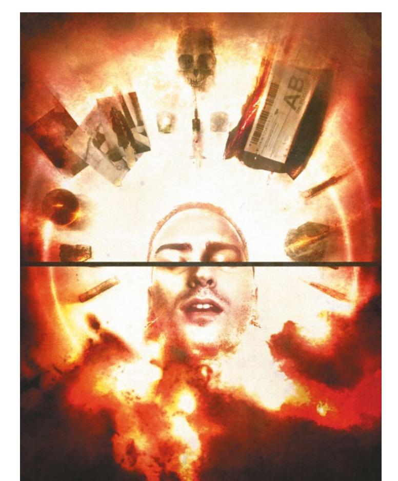

#### *Меланхолические дискразии*

БОЛЬШАЯ НЕУДАЧА. **Кровь шепчет тебе о том, чтобы ты не повторял чужих ошибок — ты можешь повторно проходить все проверки, которые напоминают о не‑ удаче сосуда. Однако единицы, выпавшие на костях из пула Голода, перебрасывать нельзя.**

НОСТАЛЬГИЯ. **Ты можешь добавить 1d10 к пулу всех про‑ верок, тематически связанных с определённым периодом, формой искусства или социальной группой, по которой ностальгировал сосуд; добавь 3d10 к пулу проверки ре‑ троспективы, связанной с предметом ностальгии.**

ПОГРУЖЁННОСТЬ В ПРОШЛОЕ. **Ты получаешь 1 пункт опыта, который можно использовать только для повышения показателя Сокрытия или Стойкости. Дискразия сосуда после этого сходит на нет.**

ПОТЕРЯННАЯ ЛЮБОВЬ. **Ты можешь добавить 1d10 к пулу всех проверок, связанных с сопротивлением соблазнению, в том числе и воздействию Величия.**

ТРАУР. **Ты можешь добавить 1d10 к пулу проверок мук совести.**

УТРАТА РОДСТВЕННИКА. **Ты убираешь на 1 пункт Голода больше, когда пьёшь кровь своих смертных родственников.**

#### *Сангвинические дискразии*

ВОЗБУЖДЕНИЕ. **Ты получаешь 1 пункт опыта, кото‑ рый можно использовать только для повышения пока‑ зателя Величия или Кровавого чародейства. Дискразия сосуда после этого сходит на нет.**

ЗАРАЗИТЕЛЬНЫЙ ЭНТУЗИАЗМ. **Если ты прикос‑ нёшься к цели, то при последующих попытках убедить её что‑то сделать можешь добавить 3d10 к пулу одной проверки. В отношении ценностей, секретов и т. п. применяются такие же правила, как в Доминировании.**

ИСТИННАЯ ЛЮБОВЬ. **Ты убираешь на 1 пункт Голода больше, если пьёшь кровь истинной любви сосуда. Если ты владеешь Ясновидением, то можешь смотреть глазами его истинной любви, пробудив свою Кровь.**

МАНИАКАЛЬНАЯ ЖИЗНЕРАДОСТНОСТЬ. **Ты можешь добавлять 1d10 ко всем проверкам до тех пор, пока не потерпишь поражение; после этого тебе придётся уменьшать все пулы на 2d10.**

ПРИЛИВ ЭНЕРГИИ. **Ты можешь применять Искру жизни без испытания Крови.**

ЧУТЬЁ НА ДОБЫЧУ. **Ты можешь добавить 3d10 ко всем проверкам, связанным с поиском других сосу‑ дов с сангвиническим резонансом.**

#### *Флегматические дискразии*

БЛАЖЕННОЕ ОЦЕПЕНЕНИЕ. **Ты не чувствуешь боли ни физической, ни душевной; на тебя не действуют негативные эффекты, вызванные болью, и ты не полу‑ чаешь из‑за неё отрицательных модификаторов.**

ВОЛК‑ОДИНОЧКА. **Ты можешь добавлять 1d10 к пулу всех проверок, пока ты один, но должен уменьшить пул на 1d10, если используешь взаимопомощь (стр. 122) или просто помогаешь кому‑то. Эффект длится одну сцену.**

ЗАЕДАНИЕ СТРЕССА. **Ты можешь есть и переваривать пищу, тебя при этом не тошнит (но ты по‑прежнему не можешь утолять Голод обычной едой).**

ПОРАЖЕНЧЕСКИЕ НАСТРОЕНИЯ. **Если ты пьёшь кровь жертв с флегматическим резонансом, ты убира‑ ешь на 1 пункт Голода больше, если с каким‑то дру‑ гим — то на 1 меньше.**

ПРОКРАСТИНАЦИЯ. **Ты восстанавливаешь 1 пункт воли, если откладываешь что‑то важное на ночь или больше. Можно использовать только один раз за игровую встречу.**

РАЗДУМЬЯ. **Ты получаешь 1 пункт опыта, который можно использовать только для повышения показате‑ ля Доминирования и Ясновидения. Дискразия сосуда после этого сходит на нет.**

РАССЛАБЛЕНИЕ. **Ты можешь добавить 2d10 к пулу всех проверок сопротивления ярости.**

#### *Холерические дискразии*

ДЕСПОТ. **Твои противники получают на 1 поврежде‑ ние или на 1 пункт стресса больше, если они слабее (или принадлежат к группе людей, над которой чаще всего издевался сосуд, из которого ты выпил кровь).**

ЖЕСТОКОСТЬ. **Ты можешь повторно проходить лю‑ бые проверки запугивания. Однако единицы, выпав‑ шие на костях из пула Голода, перебрасывать нельзя.**

ЗАВИСТНИК. **Твои противники получают на 1 повреждение или на 1 пункт стресса больше, если они в чём‑то превосходят тебя (привлекательнее, моложе выглядят, талантливее, выше, богаче, влиятельнее).**

КРУГ НАСИЛИЯ. **Если ты пьёшь кровь жертв с холерическим резонансом, ты убираешь на 1 пункт Голода больше, если с каким‑то другим — то на 1 меньше.**

МСТИТЕЛЬНОСТЬ. **Ты можешь добавить 2d10 к пулу одной проверки, если цель от‑ носится к категории персон, которым со‑ суд мечтал отомстить (неверные супруги, конкуренты за место в обществе, шумные соседи, правительство и т. д.), или ко всем проверкам, если цель — конкретная лич‑ ность, которую сосуд ненавидел.**

НА ВЗВОДЕ. **Ты получаешь 1 пункт опыта, который можно использовать только для повышения показателя Мощи или Стремительности. Дискразия сосуда после этого сходит на нет.**

ПРИНЦИПИАЛЬНОСТЬ. **В конфликте с предполагаемым идеологическим про‑ тивником ты можешь заново пройти лю‑ бую проверку, если тебе не понравится её результат. Однако единицы, выпавшие на костях из пула Голода, перебрасывать нельзя.**

## Резонанс и опыт

**Чтобы оправдать приобретение Дисци‑ плин за пункты опыта, персонаж должен пить кровь соответствующего резонанса. Количество необходимой для этого крови может быть разным, но в целом чем выше уровень Дисциплины, тем больше жертв понадобится. Рассказчик может потребо‑ вать, чтобы вампир нашёл кровь с более сильным резонансом или даже с дискра‑ зией, чтобы повысить уровень Дисци‑ плины. Если Сородич хочет выучить но‑ вую стороннюю Дисциплину, он должен также испить витэ вампира, который ею владеет.** ⬛

1619)

 $\mathbf{v}$ 

 $\bullet$ 

Камарилья достаточно могущественна, чтобы дать тебе всё, что пожелаешь. И в то же время достаточно ненасытна, чтобы отобрать всё, что имеешь. Что бы ты ни обрёл на службе Камарильи - твои незримые хозяева рано или поздно отберут это у тебя.

 $\mathbf{r}$ 

 $\mathbf{r}$ 

# ГРАНИ **ПРОКЛЯТИЯ**

ровь вампира способна радикально преобразить любого, кто её выпьет, независимо от того, смертный он или нет. Кто при этом останется в выигрыше, зависит, как сказали бы анархи-ленинисты, от того, кто тут на самом деле кровопийца.

## Узы крови

Узы крови страшат любого, кому довелось испытать их на себе. Это сила, скрепляющая самые прочные (и не всегда добровольные) союзы в Камарилье - как среди самих Сородичей, так и между каинитами и их смертными слугами. Анархи, как правило, идеологически против уз крови между вампирами (хотя ради блага Движения можно сделать исключение), а некоторые радикалы в их рядах отказываются даже от уз со смертными.

Любой, кто выпьет кровь вампира, почувствует к нему эмоциональную привязанность, и с каждым разом это чувство будет становиться всё сильнее. Трижды испивший витэ Сородича превратится в его послушного раба. Вампиры

обычно называют связанного вассалом, а связавшего его - сюзереном. Под влиянием полностью сформировавшихся уз вассал испытывает по отношению к своему сюзерену чувство глубокой преданности, доходящей порой даже до одержимости. Он будет стараться во всём угождать хозяину, страшась даже мысли о том, чтобы разочаровать его и уж тем более рассердить. Узы не зависят от поколения или силы Крови вампира, чего не скажешь о применении многих Дисциплин - связать вампира старшего поколения технически не сложнее, чем младшего. Многие Сородичи даже не осознают, что ими руководят узы крови, - они считают свои чувства искренними и даже благородными. Существует также так называемое кровавое обручение обоюдные узы крови. Результатом такого союза становятся помешательство и маниакальная зависимость, не имеющие ничего общего с любовью. Сказать, что спустя несколько веков подобные отношения становятся жестокими и извращёнными, - не сказать ничего. В Камарилье кровавое обручение как минимум не одобряют.

Чтобы узы сформировались, витэ нужно пить прямо из вен донора, как и при Становлении, поскольку кровь теряет свою способность связывать за считаные секун‑ ды. Для успешного завершения процесса необходимо испить из вен будущего сюзерена три раза, причём не чаще, чем по одному разу за ночь, но с промежут‑ ком не больше, чем в год (птенец в течение первого года своей нежизни по меньшей мере на треть связан с сиром, ведь он уже пил его кровь однажды). Каждый пункт силы Крови Сородича позволяет ему поддержи‑ вать узы с одним вассалом, но сюзерен при этом может быть только один, поскольку связанный узами крови приобретает временную невосприимчивость к чужой витэ. Если сюзерен привязывает к себе больше васса‑ лов, чем может позволить, самая старая из имеющихся связей разрушается в течение недели.

#### **Правила**

*Прочность уз* — параметр, отвечающий за то, насколько крепко вассал привязан к сюзерену. Сколько раз испил он Крови хозяина, настолько прочны поначалу будут узы. Это значение не может быть выше 6. Оно уменьша‑ ется на 1 пункт каждый месяц, если вассал не получает Крови сюзерена. Чтобы сделать что‑то противоречащее желаниям господина, вассал должен выиграть состяза‑ ние против прочности уз, используя своё упорство + интеллект. В присутствии сюзерена неповиновение требует проверки каждый ход, а вне его досягаемости хватит и одной за сцену.

Чтобы разрушить узы крови, вассал должен снизить их прочность до 0, долгое время проявляя неповинове‑ ние и избегая встречи с сюзереном. Для этого персонаж должен успешно проходить вышеуказанное состязание как минимум раз в игровую встречу, а может и чаще, если рассказчик считает, что какое‑то событие напо‑ мнило вассалу о его хозяине. Мало кто способен долго сопротивляться влечению, особенно если сюзерен сам ищет вассала.

#### **Гули**

Тот, кто испил витэ, будь он человеком или животным, на время обретает новые силы, но в то же время теряет себя. Западные вампиры *в насмешку* называют подоб‑ ных существ *гулями*. С кровью те получают крошеч‑ ную частичку силы настоящего Сородича — чувствуют невероятный прилив сил, на время перестают стареть. Однако эффект этот всего лишь временный — если лишить гулей постоянного источника витэ, старость догоняет их очень быстро. Вампиры используют гулей в качестве подручных, когда преданность слуг стано‑

вится важнее Маскарада. У одного Сородича может быть столько гулей, сколько ему требуется.

Витэ сохраняет способность поддерживать суще‑ ствование гуля дольше, чем способность дарить Ста‑ новление или связывать узами Крови. Гуля можно спокойно поить кровью, несколько дней хранившейся перед этим в герметичном контейнере, если она не под‑ вергалась воздействию солнечного света. Однако вам‑ пиры обычно пользуются этим способом только тогда, когда с гулем уже установились прочные узы крови.

Чтоб примерно на месяц превратить человека или животное в гуля, вампир должен потратить витэ в том объёме, который потребует испытания Крови. На это время реципиент получает следующие способ‑ ности:

- n Хозяин делится знанием одной из известных ему Дисциплин. Гуль может поднять её показатель до 1 и пользоваться одной силой 1‑го уровня из тех, что известны господину.
- n Гуль перестаёт стареть, а иногда даже молодеет на пару лет.
- n Раны гуля заживают в два раза быстрее (за исклю‑ чением ожогов от огня).

Если гуль находит способ использовать силы выше 1 уровня (например, благодаря Алхимии, Глотку изяще‑ ства и т. п.) он получает по 1 тяжёлому повреждению каждый раз, когда вампир в аналогичной ситуации про‑ ходит испытание Крови.

## Диаблери

*Диаблери* — это деяние, которое осуждают все циви‑ лизованные вампиры и многие из тех, кто боится пра‑ ведного гнева других Сородичей. Совершить диабле‑ ри — значит принести каиниту Окончательную смерть, осушив его до дна и поглотив после этого само его естество (склонные к религиозности вампиры говорят о душе). Этот нечестивый акт оставляет следы в ауре преступника.

#### **Как совершить диаблери**

Для начала нужно обездвижить цель (добровольное согласие жертвы — большая редкость, хотя и такое слу‑ чается в безумии Извечной борьбы). Для этого можно применить разные методы: довести вампира до тор‑ пора, воспользоваться тяжёлой цепью или колом либо попросить сообщников его подержать. Затем потенци‑ альный диаблерист должен выпить кровь своей жерт‑ вы до последней капли — обычно это занимает целую сцену, ведь витэ гуще человеческой крови (о том, как витэ утоляет Голод, см. на стр. 213). Сообщни‑ ки могут помочь осушить жертву, но в конечном итоге только у од‑ ного вампира будет шанс вобрать в себя всю силу.

После того как жертва обез‑ движена и осушена, каинит может попытаться сделать решающий шаг — акт диаблери во всём его нечестивом великолепии. Чтобы вобрать в себя могущество и само естество жертвы, диаблерист дол‑ жен успешно пройти проверку силы + упорства (сложность 3) по одному разу за каждый пункт силы Крови жертвы. Проходить проверку можно не чаще раза в ход. Если диаблерист потерпит пора‑ жение хотя бы один раз, живитель‑ ная искра угаснет, и душа жертвы ускользнёт, оставив его ни с чем. В любом случае жертву ждёт Окон‑ чательная смерть, а её тело истлеет на глазах.

#### **Последствия диаблери**

Поглотить дух другого вампи‑ ра — это только начало. Пре‑ успевший в диаблери Сородич должен ещё укротить чужую витэ, иначе сам может оказаться добы‑ чей. Происходит это следующим образом:

- n Показатель Человечности диаб‑ лериста снижается на 1 пункт.
- n После этого диаблерист дол‑ жен пройти состязание Чело‑ вечности + силы Крови про‑ тив упорства + силы Крови жертвы. Даже в случае пора‑ жения диаблерист получает по 5 пунктов опыта за каждый успех, полученный в результате проверки, которые он может тут же потратить на повыше‑ ние собственной силы Крови (вплоть до значения силы Кро‑ ви жертвы) или на приобре‑

тение Дисциплин, известных жертве.

n Если диаблерист проиграл состязание, он теряет ещё по 1 пункту Человечности за каж‑ дый недостающий успех. Если это полностью разрушает его Человечность (она падает до 0), дух жертвы берёт верх: её сознание вытесняет сознание диаблериста. Персонаж пере‑ ходит к рассказчику, став новой оболочкой для вампира, над ко‑ торым совершалось диаблери.

**235**

- n Поколение диаблериста умень‑ шается на единицу, если жертва была старше на одно или не‑ сколько поколений.
- n В ауре диаблериста появляются чёрные прожилки. Если диабле‑ рист принадлежал к более вы‑ сокому поколению, количество лет, на протяжении которых аура остаётся искажённой, рав‑ но изначальной разнице между поколениями. В противном слу‑ чае эффект длится год. ⬛

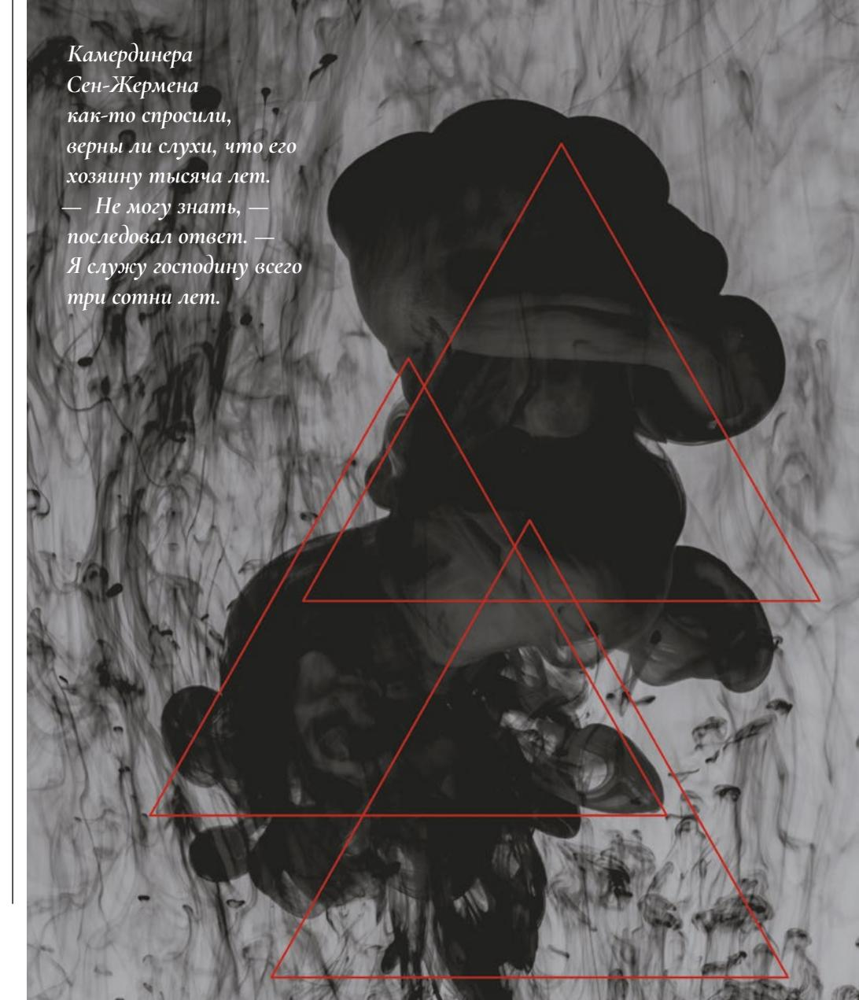

## ЧЕЛОВЕЧНОСТЬ

Ч *еловечность* — это мерило того, насколько близ‑ ка вампиру жизнь смертных, отдельные люди, насколько вероятна возможность вывести Со‑ родича к свету, и в целом «всё человеческое». С прожитыми столетиями Сородичи утрачивают Человечность, но и молодые вампиры от этого не за‑ страхованы: Зверь терзает их изнутри, лишая сочув‑ ствия, стирая воспоминания и обрывая связи с миром дня.

При создании персонажей игроков их Человечность равна либо 7 (у обычных Сородичей), либо 8 (у только что вступивших в ночь птенцов). Иногда она может меняться ещё до начала игры, например при выборе определённых стилей охоты.

## Нисходящая спираль

Все вампиры — чудовища, и даже вампир с высоким показателем Человечности — это по сути своей лишь волк в овечьей шкуре. Несмотря ни на что, Человеч‑ ность со временем угасает, и вампир обретает не только готовность, но и стремление совершать самые отврати‑ тельные и ужасные поступки. Охота и убийство — это часть вампирской природы, и рано или поздно каждый вампир узнаёт, каково это — держать в руках мёртвое тело жертвы, которую он даже не собирался убивать.

Важно знать, как изменяется вампир, в котором постепенно, шаг за шагом угасает Человечность. Его поведение и внешний вид могут стать настолько стран‑ ными и чуждыми, что даже мысли о персонаже начнут вызывать у окружающих отчуждение и дискомфорт.

### **Человечность 10**

Даже люди с такой высокой Человечностью встречаются редко, не то что вампиры. На этом уровне и смертные, и Сородичи ведут поистине благочестивую аскетичную жизнь, ведомые этическими и моральными принципами,

не дающими оступиться на узкой тропинке добродетели. Самый малый проступок, даже эгоистичная мысль, мо‑ жет лишить персонажа этой благодати.

При Человечности 10 с виду ты почти человек:

- n Тебе не обязательно применять Искру жизни, ведь ты выглядишь как здоровый, пусть и немного блед‑ ный, человек.
- n Твои раны затягиваются, как у людей в дополне‑ ние к заживлению при помощи витэ ты можешь из‑ бавляться от лёгких повреждений подобно смертным.
- n Ты способен чувствовать вкус, можешь есть и пере‑ варивать любую пищу.
- n Ты можешь бодрствовать днём, хотя тебе всё ещё нужно когда‑то спать.
- n Ты получаешь вдвое меньше повреждений от сол‑ нечных лучей.

### **Человечность 9**

На этом уровне Сородичи ведут себя гуманнее многих смертных. Среди людей они чувствуют себя комфорт‑ но: мыслят теми же категориями, действуют схожим об‑ разом, подобно актёрам, прекрасно вжившимся в роль. Убийство для них неприемлемо — настолько, что даже самый сильный Голод не сможет поколебать их реши‑ мости. Многие птенцы после Становления становятся более добродетельными, чем были при жизни, — это защитная реакция на их новую хищную природу. Те, кто постарше, насмехаются над ними — одни из бессер‑ дечности и презрения, другие, чтобы заглушить соб‑ ственные сожаления.

При Человечности 9 у тебя довольно много чело‑ веческих черт:

- n Ты можешь не применять Искру жизни, потому что выглядишь больным, а не мёртвым.
- n В дополнение к заживлению при помощи витэ ты можешь избавляться от лёгких повреждений подоб‑ но смертным.

- n Ты чувствуешь вкус и можешь есть и переваривать сырое или полусырое мясо, а также многие жидко‑ сти.
- n При желании ты можешь просыпаться за час до за‑ ката и ложиться спать через час после рассвета.

#### **Человечность 8**

Тебя по‑прежнему коробит при мысли о том, какие стра‑ дания причиняешь людям ты и другие Сородичи. Зама‑ скироваться под человека тебе всё ещё несложно. Ты помнишь, как был одним из смертных, и тяга к их обще‑ ству — словно зелёная поросль в мёртвом лесу твоей души.

При Человечности 8 в чём‑то ты всё ещё подобен смертным:

- n Проходя испытание Крови при применении Искры жизни, ты можешь бросить сразу две игральные ко‑ сти и выбрать лучший из результатов.
- n Искра жизни позволяет тебе заниматься сексом и, возможно, получать от этого удовольствие.
- n Искра жизни позволяет тебе пить вино и чувство‑ вать его вкус.
- n При желании ты можешь просыпаться за час до за‑ ката.

#### **Человечность 7**

7 — это показатель Человечности, присущий большей части людей, и на этом этапе вампир может без особого труда сойти за простого смертного. Сородич с таким показателем Человечности старается придерживаться стандартных моральных норм — да, грешить плохо, но разве уклонение от налогов и превышение скоро‑ сти — это грех? Привязанность к другим всё ещё силь‑ на, но в отношениях довольно часто проявляется эго‑ изм — впрочем, всё как у всех.

Сородичи с Человечностью 7 представляют собой типичных вампиров:

- n Искра жизни требует испытания Крови.
- n Ты не способен испытывать сексуального возбу‑ ждения, но можешь притвориться, успешно пройдя проверку ловкости + обаяния (сложность равна самообладанию или смекалке партнёра).
- n Еда и напитки вызывают приступ рвоты, если ты не используешь Искру жизни; чтобы вовремя

выбраться из‑за стола и добежать до уборной, ты должен успешно пройти проверку самообладания + выносливости (сложность 3).

#### **Человечность 6**

Люди умирают. Вещи ломаются. На этом этапе ты уже отказался от части человеческих норм морали: тебя пе‑ рестаёт заботить тот факт, что тебе нужно пить чужую кровь, чтобы выжить, и ты готов делать что должно, для того чтобы взять «своё». Насилие, может, и не до‑ ставляет тебе удовольствия, но ты не станешь рыдать кровавыми слезами над безвременной кончиной тех, кто встал у тебя на пути. Люди не пугаются при виде тебя, но и особой симпатии не испытывают.

К Сородичам с Человечностью 6 применимы те же правила, что и на предыдущем уровне, с некоторыми поправками:

- n При попытке имитировать сексуальный акт пул проверки уменьшается на 1d10.
- n Даже когда ты используешь Искру жизни, ты дол‑ жен пройти проверку самообладания + выносливо‑ сти (сложность 3), чтобы удерживать пищу в своём организме в течение часа.

#### **Человечность 5**

Ты уже не птенец и повидал всякое. Большая часть неонатов и анцилл сохраняет Человечность на этом уровне. Боль и страдания давно стали частью твоей жизни, и ты начинаешь смиряться с этим. Тебе нет дела до смертных за исключением разве что твоих опор или любимчиков. В конце концов, ты ведь никогда уже не будешь одним из них, так к чему сантименты? Ты эгоистичен, врёшь без зазрения совести, и, возможно, у тебя есть какая‑то неуловимая физическая черта, вы‑ дающая твою природу, вроде неестественного блеска в глазах.

К Сородичам с Человечностью 5 применимы те же правила, что и на предыдущем уровне, с некоторыми поправками:

n Пулы всех проверок дружеского взаимодействия с людьми уменьшаются на 1d10. Под дружеским взаимодействием подразумевается большинство со‑ циальных проверок (даже при общении с опорами),

в особенности проверки убеждения и проницательности, но сюда не входят проверки запугивания, хитрости при соблазнении, а также любые другие проверки, целью которых является насыщение или убийство. Кроме того, на 1d10 уменьшается пул проверок при создании предметов искусства и т. п. (к примеру, у Сородичей заметно ухудшается слог они начинают изъясняться напыщенно и витиевато).

■ Ты не способен испытывать сексуального возбуждения даже под воздействием Искры жизни; при попытке имитировать половой акт твой пул уменьшается на 2d10.

#### Человечность 4

Что поделаешь, кому-то просто суждено умереть молодым! Твоё поведение становится всё более аморальным, ты потворствуешь своим желаниям, не задумываясь о последствиях, и тебя это ничуть не тревожит. Убийство для тебя в порядке вещей. Взгляни на старейшин - на их памяти не один геноцид, и что, разве они терзаются по этому поводу? Насилие, воровство, разрушение - всего лишь инструменты, а не табу. Физически ты начинаешь всё больше походить на труп.

К Сородичам с Человечностью 4 применимы те же правила, что и на предыдущем уровне, с некоторыми поправками:

- Пул проверок дружеского взаимодействия со смертными и создания предметов искусства уменьшается на 2d10.
- $\blacksquare$ Даже используя Искру жизни, ты не можешь удерживать пищу в своём организме.

#### Человечность 3

Циничный и пресыщенный - лучшее, что можно о тебе сказать. Ты не задумываясь идёшь по головам, останавливаясь только затем, чтобы придумать новую гнусность. Ты прагматичен: предпочитаешь не подвергать себя риску и всегда устраняешь свидетелей. Доверие тебе чуждо - ты полагаешься только на тех, кого крепко держишь в собственных когтях. Внешне ты выглядишь устрашающе.

К Сородичам с Человечностью 3 применимы те же правила, что и на предыдущем уровне, с некоторыми поправками:

- Пул проверок дружеского взаимодействия со смертными и создания предметов искусства уменьшается на 4d10.
- Даже под воздействием Искры жизни ты не можешь ни испытывать, ни имитировать сексуальное возбуждение.

#### Человечность 2

Только твоя воля имеет значение. Жалкие глупцы испытывают твоё терпение, ничтожные черви крадут твоё время и покушаются на имущество, а смертные мешки с костями путаются под ногами, мешая пировать. Окружающие делятся на две категории: слуги и корм. Если кто-то ещё не определился, к какой из них принадлежит, ты с удовольствием решишь за него сам. У тебя есть, конечно, любимые развлечения — без них вечность скучна: противоестественные удовольствия, декадентские причуды, извращения, зверства, изощрённые пытки и убийства. Твой внешний вид пугает не только смертных, но порой и других Сородичей.

К Сородичам с Человечностью 2 применимы те же правила, что и на предыдущем уровне, с некоторыми поправками:

Пул проверок дружеского взаимодействия со смертными и создания предметов искусства уменьшается на 6d10 (или на 4d10 при использовании Искры жизни).

#### Человечность 1

Разумным существом тебя можно считать лишь номинально. Твоё сознание пребывает в шаге от полного забытья, а всё, что когда-то было важным, перестаёт иметь для тебя значение. Даже забота о собственном благополучии сводится в основном к вопросам пропитания и сна. Ты способен на любой поступок, но иногда впадаешь в апатию. Лишь последние осколки эго не позволяют тебе деградировать окончательно. Твоя речь - бессвязное бормотание, твоё искусство - брызги засохшей крови на холсте.

К Сородичам с Человечностью 1 применимы те же правила, что и на предыдущем уровне, с некоторыми поправками:

Пулы проверок дружеского взаимодействия со смертными и создания предметов искусства уменьшаются на 8d10 (или на 5d10 при использовании Искры жизни, но тебе, в общем-то, плевать).

#### Человечность 0

Ты полностью слился со Зверем. Последний приступ ярости - так называемое воцарение Зверя - очень скоро испепелит остатки твоего «я» (см. раздел «Последняя капля», стр. 241). Персонаж становится отродьем, марионеткой Зверя, и переходит под полный контроль рассказчика.

## Шкала Человечности

На шкале Человечности 10 ячеек: □□□□□ □□□□□. На ней нужно отметить показатель Человечности, закрасив ячейки слева направо. К примеру, при Че‑ ловечности 6 шкала выглядит следующим образом: ◼◼◼◼◼ ◼◻◻◻◻. Это важно, так как количество пустых ячеек играет существенную роль.

#### **Сомнения**

Показатель Человечности могут изменить только круп‑ ные события, важные для сюжета: превращение ко‑ го‑то в вампира, гибель опоры и т. п. Менее значимые инциденты, однако, тоже отражаются на Человечности персонажа, вызывая у него сомнения. Если сомнений скапливается слишком много, а персонаж не желает рас‑ каиваться, показатель Человечности может снизиться.

Сомнения отмечаются справа налево в пустых ячей‑ ках на шкале Человечности. К примеру, если у персо‑ нажа Человечность 6 и две отметки сомнений, шкала будет выглядеть так: ◼◼◼◼◼ ◼◻◻  .

Если персонаж отклонился от темы хроники, рас‑ сказчик должен оценить, насколько серьёзен его про‑ ступок. Если нарушение очевидно, но не вызывает отвращения и его можно чем‑то оправдать, персонаж должен отметить один пункт сомнений, но если он совершил какое‑то ужасное злодеяние, то, возможно, надо будет отметить два или даже больше.

Если персонаж отклонился от темы хроники из‑за личных принципов, это вызывает в его душе не так много сомнений — он может отметить на один или несколько пунктов меньше.

#### **ПРИМЕР**

*Джоан проломила голову человеку, который пытался рас‑ сказать её младшему брату о том, что она вампир. Подоб‑ ное бессердечное убийство порождает множество сомне‑ ний — сразу 3 пункта, но у Джоан есть принцип «семью нужно держать подальше от всего этого», так что она от‑ мечает только 2 пункта сомнений на шкале Человечности.*

Если пустых ячеек на шкале Человечности не осталось и новые отметки сомнений ставить некуда — персо‑ наж переживает *моральную деградацию*, и каждое новое сомнение вызывает у него тяжёлый стресс (см. далее).

#### **Муки совести**

Если к концу встречи у персонажа отмечен хотя бы 1 пункт сомнений, вампир переживает *муки совести*, пройдя соответствующую проверку. Пул равен коли‑ честву пустых ячеек на шкале Человечности в момент

проверки (т. е. тех, которые не закрашены и в кото‑ рых не отмечены пункты сомнений). К примеру, пул проверки для персонажа с Человечностью 6 и двумя пунктами сомнений составляет 2d10. Если у персонажа не осталось пустых ячеек, в его пуле будет 1d10.

Если в результате проверки игрок получил по мень‑ шей мере один успех, персонаж раскаивается — стыд, сожаление и чувство вины помогают ему сохранить Человечность. Если успехов нет, Зверь одержал победу. Персонаж теряет 1 пункт Человечности. После провер‑ ки он при любом её исходе избавляется от сомнений и стирает их со шкалы.

#### **Моральная деградация**

Если сомнений у персонажа больше, чем он может вы‑ держать при его уровне Человечности (т. е. на шкале Человечности не осталось пустых ячеек и пункты сомне‑ ний отмечать больше негде), он чувствует изнурение пул всех проверок уменьшается на 2d10. Кроме того, он отмечает на шкале воли по 1 пункту тяжёлого стресса за каждое сомнение, для которого не нашлось места.

В этом состоянии персонаж не может по собствен‑ ной инициативе отклоняться от темы хроники, а если что‑то заставит его это сделать, он должен будет пройти проверку сопротивления бессильной ярости со сложностью 4.

Изнурение длится до конца игровой встречи — т. е. до очередного испытания мук совести. Однако этот эффект можно прервать и раньше, пожертвовав 1 пунк‑ том Человечности — персонаж избавляется от всех со‑ мнений, найдя оправдание своим действиям и приняв их как должное.

ПРИЧИНЕНИЕ ВРЕДА ОПОРАМ И ИХ УНИЧТОЖЕНИЕ. На Че‑ ловечности может отразиться не только отклонение от темы хроники, но и другие действия и события. Сколько пунктов сомнений нужно отметить на шкале Человечности, зависит от тяжести ситуации.

#### **ПРИМЕР**

*После того как Марк спас свою опору от зубов другого Сородича, он решает уберечь себя от подобных проблем в будущем и устранить слабость. После душераздира‑ ющей сцены, в которой Марк заставляет свою сестру выпить яд, он должен отметить 5 пунктов сомнений на шкале Человечности — 2 за убийство и ещё 3 за то, что он собственными руками уничтожил свою опору.*

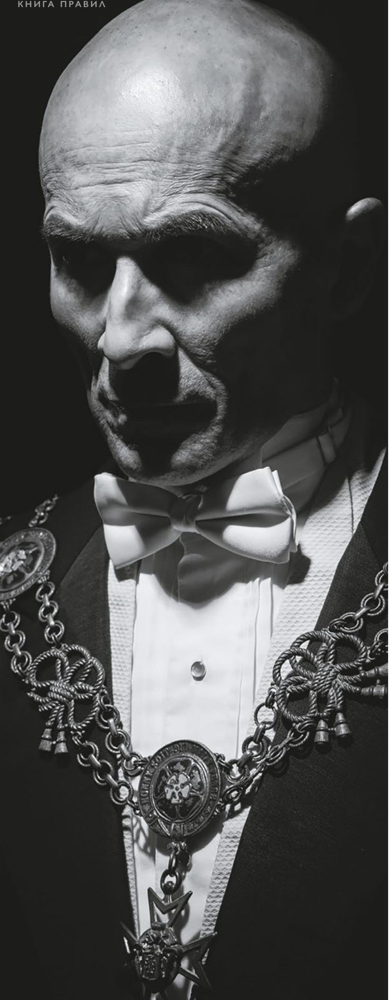

| <b>СИТУАЦИЯ</b>               | <b>СОМНЕНИЯ</b> |
|-------------------------------|-----------------|
| Связать смертного узами крови | $+1$            |
| Дать Становление смертному    | $+2$            |
| Опора пошатнулась             | $+1$            |
| Опора пошатнулась из-за тебя  | $+2$            |
| Опора рухнула                 | $+2$            |
| Опора рухнула из-за тебя      | $+3$            |

Если опора пошатнулась - это значит, что с человеком случилось что-то плохое (считать ли достаточно плохим событием обычную болезнь или потерю работы, остаётся на усмотрение рассказчика) или что-то, что вампиру не по душе (например, его вдова повторно вышла замуж, священник оставил свой приход или спортсмен сменил команду). Как правило, виновниками оказываются другие Сородичи, но и сам персонаж может косвенно навлечь беду на свою опору или попытаться предотвратить нежелательные перемены, сделав своим вмешательством только хуже. Если опора рухнула — это значит, что человек был убит, получил Становление, с ним случилось нечто ужасное или он предал свои убеждения (в особенности если он предал тот принцип, который воплощал в глазах вампира).

Вампира, который осознанно причиняет вред собственной опоре или уничтожает её, будет терзать больше сомнений. Разумеется, любой уважающий себя рассказчик воспользуется возможностью добавить в игру драматизма, обострив противоречие между желанием уберечь опору и стремлением достичь важной для вампира цели.

Если опора умирает по естественным причинам, вампир может попытаться перенести свою привязанность на другого смертного: её ребёнка, брата или сестру, преемника и т. п. Для этого нужно пройти проверку Человечности (сложность 4), наблюдая за будущей новой опорой или беседуя с ней. Кроме того, это, разумеется, повлияет на дальнейший сюжет.

Если перенести привязанность не удастся, вампир утратит принцип, который был связан с разрушенной опорой.

#### Когда Человечности недостаточно

Человечность сдерживает Зверя. Когда Человечность падает, вампир чаще впадает в ярость (стр. 219). Ты можешь добавить к пулу проверки сопротивления ярости количество d10, равное одной трети Человечности (с округлением вниз). Кроме того, Человечность может позволить вампиру проснуться днём (стр. 219).

С уменьшением Человечности увеличивается время, которое вампир проводит в торпоре, а также ухудша‑ ется способность каинита к нормальному общению с людьми (т. е. вне контекста отношений между охот‑ ником и дичью).

| ЧЕЛОВЕЧНОСТЬ | МОД. ПРИ СОПРО ТИВЛЕНИИ ЯРОСТИ | ПРОДОЛЖИТЕЛЬ НОСТЬ ТОРПОРА |
|--------------|-----------------------------------|-------------------------------|
| 9            | +3d10                             | 3 дня                         |
| 8            | +2d10                             | 1 неделя                      |
| 7            | +2d10                             | 2 недели                      |
| 6            | +2d10                             | 1 месяц                       |
| 5            | +1d10                             | 1 год                         |
| 4            | +1d10                             | 10 лет                        |
| 3            | +1d10                             | 50 лет                        |
| 2            | 0                                 | 100 лет                       |
| 1            | 0                                 | 500 лет                       |

#### **Последняя капля**

Когда вампир теряет последнюю каплю Человечности (и её показатель снижается с 1 до 0), он в последний раз впа‑ дает в неистовую ярость. На одну сцену все его физические характеристики повышаются до 5. Если Сородич пере‑ живёт этот приступ, он превратится в отродье. Персонаж при этом навсегда переходит под контроль рассказчика.

Сцена воцарения Зверя должна быть характерной и запоминающейся — тут недостаточно простого раз‑ грома помещения. Не стоит размениваться по мело‑ чам — воплотите самые грандиозные идеи, которые придут в голову рассказчику или игрокам.

#### **Рост Человечности**

Вампир может увеличить Человечность только одним способом — бескорыстной помощью людям. Вокруг этого должен развернуться отдельный сюжет, вклю‑ чающий по меньшей мере обретение новой опоры и осознанное отречение от общества Сородичей и той власти, которую оно может дать.

Некоторые экстраординарные поступки персона‑ жей вроде материальной поддержки и защиты музея или больницы без применения насилия могут позво‑ лить игрокам повысить Человечность за пункты опыта (стоимость равна 10 × новый уровень). Однако раз‑ решать ли повышение Человечности за пункты опыта, остаётся на усмотрение рассказчика.

По слухам, некоторые техники достижения Гол‑ конды также могут позволить вампиру повысить Чело‑ вечность. Существуют ли они на самом деле и какова их природа, решит рассказчик. ⬛

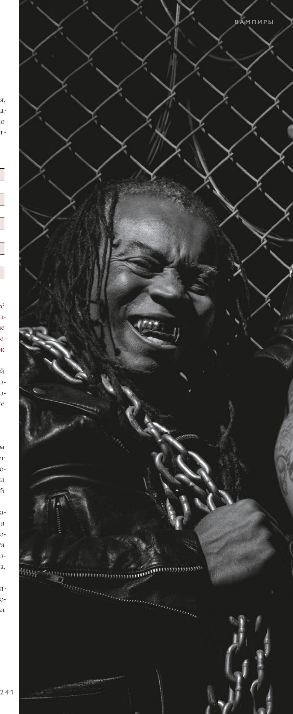

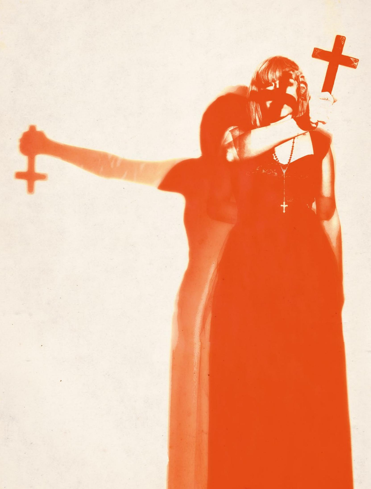

# ДИСЦИ

Если же предположить, то в явлении вампиров есть хоть малейшая доля истины, следует ли отнести их к творениям Господа, к ангелам его, к духам, не нашедшим покоя, или же к детям дьявола? И если верно последнее, следует ли ститать, то дьявол может истонтить их тела, дав им возможность проникать сквозь землю, не тревожа её, просагиваясь в щели и замотные скважины, удлинять и укорагивать свои глены, обращаясь в подобие воздуха, воды или пара, поднимающегося из-под земли....

#### АББАТ АВГУСТИН КАЛЬМЕ, «ТРАКТАТ О ЯВЛЕНИЯХ»

ак только смертный получает Становление, ему открывается доступ к силам, известным как Дисциплины. Это могущественные дары Крови, для обретения которых чрезвычайно важен резонанс сосудов. Чужая кровь бродит и созревает в жилах вампира, словно вино. С помощью этих даров можно обратить в бегство врагов или завлечь добычу в смертельные объятия. Дисциплины - самое наглядное доказательство того, как далеки Проклятые от простых смертных. Витэ позволяет Сородичам пора-

бощать людей, демонстрировать огромную физическую силу, воспринимать мир с позиции хищника, сверху вниз смотрящего на презренную жертву. Пускай молодые Сородичи владеют лишь малой толикой всех возможностей Крови, даже эти скромные силы дают им преимущество в столкновении со смертным стадом. Сил, которыми владеют анциллы, хватит и на то, чтобы раздавить вампира помоложе, а уж арсенал Дисциплин старейшин настолько смертоносен, что шансы против них есть только у самых хорошо подготовленных противников.

## Общие правила

ИЗУЧЕНИЕ ДИСЦИПЛИН. У Дисциплин, как и у других параметров, есть показатель, который измеряется в пунктах — от 1 до 5. Персонаж получает пункты Дис‑ циплин либо при создании персонажа, либо во время игры, приобретая их за опыт. Как правило, чтобы при‑ обрести пункт Дисциплины за опыт, персонаж должен какое‑то время пить кровь определённого резонанса (см. стр. 226). Чтобы во время игры получить новую стороннюю Дисциплину, персонаж, помимо прочего, должен выпить витэ вампира, владеющего этой Дис‑ циплиной.

СИЛЫ. Каждый уровень Дисциплины позволяет персо‑ нажу выбрать одну силу этой Дисциплины из тех, ко‑ торые относятся к приобретённому уровню или ниже. Как правило, уровень Дисциплины и количество из‑ ученных в её рамках сил совпадают.

#### **ПРИМЕР**

*При создании персонажа Марта получила два пункта Стойкости. Первый позволяет ей выбрать одну из двух сил первого уровня — и она выбирает Силу жизни. Вто‑ рой позволяет ей выбрать либо Твёрдость духа (остав‑ шуюся силу первого уровня), либо Непрошибаемость (силу второго уровня). Она выбирает Твёрдость духа. Позже, когда Марта получит третий пункт, она смо‑ жет выбирать между Непрошибаемостью и силами третьего уровня: Превозмоганием проклятия или Укреп‑ лением сознания.*

Отметим, что в приведённом примере Марта ни при ка‑ ких условиях не может приобрести силу «Живучие зве‑ ри», поскольку для этого нужен первый уровень Ани‑ мализма, а Марта не владеет этой Дисциплиной.

ПРИМЕНЕНИЕ СИЛ. Вампир может активировать Дисци‑ плину в любой момент, если в описании не указаны особые условия. Это занимает ничтожно мало времени и вряд ли может считаться полноценным действием. Силам, как правило, не свойственна ретроактивность, они не прерывают действия, направленные на персо‑ нажей, а, скорее, являются реакцией на них. За ход вам‑ пир может активировать одну силу одной Дисциплины, при этом одновременно активным может оставаться любое количество сил.

Вампир добавляет к пулу активации Дисциплины или пулу сопротивления Дисциплине количество d10, равное половине его показателя силы Крови (с округ‑ лением вниз) (см. «Сила Крови», стр. 215).

Модификатор силы Крови или сильного резонанса (стр. 227) следует добавлять только к пулу тех проверок, в которых Дисциплина фигурирует как один из основ‑ ных параметров или к которым она добавляет допол‑ нительные d10. Если пул одной и той же проверки уве‑ личивают несколько Дисциплин, например Глаза Зверя (Метаморфозы 1) и Угроза (Величие 1), модификатор добавляется только один раз.

Основные правила, касающиеся применения той или иной Дисциплины, приведены в разделе «Описа‑ ние» для каждой из них в отдельности.

#### **Амальгамы**

Существуют амальгамы — редкие силы, требующие владения сразу несколькими Дисциплинами. У каждой из них должен быть определённый показатель. Считается, что такие силы относятся сразу к обеим Дисциплинам.

## Анимализм

*Всё было как в фильме ужасов, честное слово. Я увидел того парня — он один шёл, а из заднего кармана у него торчал толстенный такой бумажник. Ну я за ним и увязался. Де‑ ло‑то нехитрое. Кошелёк или жизнь, как говорится. А по‑ том началась какая‑то хренотень. Ночь была тихая, и вдруг собаки завыли — скулёж поднялся в дюжину глоток, не мень‑ ше. А этот чернокожий коротышка обернулся и на меня уставился. Потом его лицо начало меняться. Скукожилось как будто. А может, наоборот, расширилось. Не знаю. По‑ хож он стал, ну, на ротвейлера. И эта рожа мне говорит… запомни, говорит… кто Крысу разозлит, тому лучше ноги уносить, да побыстрее. И я почувствовал, как переломилось во мне что‑то от этих слов. Ну я и побежал.*

*И лучше б уж не оглядывался. Не знаю, сколько собак за мной гналось по той грёбаной улице… Там куча народу была, все видели. Я кричал, звал на помощь. Когда они меня догнали и повалили на землю, я думал, они меня живьём сожрут, но нет. Они будто знали, когда остановиться. Как будто не хотели меня убить, а хотели только… только обглодать! Оставить уродом! Ни пальцев, ни ушей, ни носа. Я до сих пор вижу взгляд того ублюдка, как только глаза закрою, а лай собачий мне каждую ночь в кошмарах снится.*

**ДРУГИЕ НАЗВАНИЯ:** Пигмалионство, Приручение, Бе‑ стиэ сермо1 .

1 Прим. пер.: bestiae sermo (лат.) — «разговор с животными».

Существует мнение, что у вампиров больше общего с животными, чем с людьми. Ими руководят инстинкты — целый набор опасных для окружающих побуждений, которые чрезвычайно трудно сдерживать. Вампир — словно волк на цепи: Зверя внутри него нельзя приручить.

Некоторые вампиры, впрочем, находят со Зверем общий язык, становятся с ним единым целым. Им подвластно мастерство Анимализма. Кто-то даже может сопровождать применение этой Дисциплины рычанием, воем или рёвом, обращаться к животным на их «языке», хотя необходимости в этом нет. Подражание животным - это либо игра на публику, либо выражение внутреннего состояния вампира.

Анимализм незаменим для тех, кто не может или не хочет жить среди смертных. Среди даров Каина его считают одним из самых практичных. Анимализм позволяет насыщаться пресной кровью неразумных тварей и находить себе верных друзей среди животных. В умелых руках эта Дисциплина может стать грозным оружием против Сородичей, жмущихся к цивилизации, или инквизиторов, не готовых к тому, что враг может перемещаться не только на двух ногах. Возможности анималиста чрезвычайно широки: ему ничего не стоит наводнить пентхаус разозлившего его Сородича полчищами крыс, не произнося ни слова утихомирить взбешённого Шерифа или незаметно выведать все секреты охотников из Общества Св. Леопольда, подослав любопытного ворона за ними ШПИОНИТЬ.

#### Общие правила

Анимализм, как правило, позволяет воздействовать только на позвоночных животных. Кроме того, если животное травоядное, сложность соответствующей проверки увеличится на 1.

- Вид: ментальная.
- П Угроза Маскараду: от низкой до средней. Человек, разговаривающий с животными, может вызвать недоумение, но только самые мощные эффекты выходят за рамки чудаковатого поведения.
- Резонанс: кровь животных, желательно диких.

#### Уровень 1 ЧУТЬЁ НА ЗВЕРЯ

Сородич чувствует присутствие Зверя в людях и вампирах (и в других сверхъестественных существах). Он может определить природу Зверя, его настроение, насколько тот голоден и т. п.

 $\blacksquare$  Расплата: нет.

- **Пул:** упорство + Анимализм против самообладания + хитрости.
- Правила: победив в состязании, вампир может определить, настроен ли тот, на кого направлена сила, враждебно (готово ли существо причинить кому-то вред, хочет ли оно этого), а также природу Зверя - сверхъестественное создание перед вампиром или обычный смертный. Триумф при этом позволит точно определить, кем конкретно является цель (например, оборотнем), её Голод (или аналогичный параметр) и резонанс. Кроме того, эта сила работает и в пассивном режиме, предупреждая вампира об опасности в его непосредственном окружении.
- Длительность: постоянная.

#### ФАМУЛУС

Привязав к себе животное узами крови, вампир может сделать его своим фамулусом, что позволит установить с ним телепатическую связь и с большей эффективностью воздействовать на него силами Анимализма. Хотя эта сила не позволяет полноценно общаться с животными, фамулус будет подчиняться простейшим командам, таким как «сидеть» или «ко мне». Фамулус готов защищать себя и хозяина, но не станет бросаться в ата ку на кого-то, кто не представляет угрозы или, наоборот, слишком опасен.

- Пул: обаяние + обращение с животными.
- Расплата: вампир должен поить животное своей витэ в течение трёх ночей, каждый раз проходя испытание Крови. Для дальнейшего поддержания связи требуется ничтожно мало витэ. Если персонаж начинает игру, уже владея этой силой, игрок может просто выбрать нужное животное, так как вампир уже совершил все необходимые дей-СТВИЯ.
- Правила: если вампир не использует Язык животных (см. ниже), то ему нужно пройти проверку обаяния + обращения с животными, чтобы отдать команду фамулусу (сложность 2 или выше в зависимости от характера приказа). У вампира одновременно может быть только один фамулус, но если тот погибнет, то ничто не мешает Сородичу привязать к себе другого. Язык животных (Анимализм 2) и Поглощение духа (Анимализм 4) не требуют никакой расплаты, если применяются по отношению к фамулусу.
- Длительность: только смерть может разорвать связь ■ с фамулусом. Он не стареет, если регулярно получает Кровь вампира.

#### Уровень 2 ЯЗЫК ЖИВОТНЫХ

Вампир может полноценно общаться с животными в городе или в дикой природе. Кошку вряд ли заинтересует дискуссия о цветовых решениях в картинах Матисса, но она с радостью поделится досадой от того, что в доме через дорогу совсем нет мышей. Вампир может даже уговорить животное сделать что-то для него, если это не слишком опасно и не противоречит природе животного.

Кроме того, Язык животных можно использовать, чтобы призвать определённый вид зверей (ограничения см. в общих правилах Анимализма выше), если они водятся поблизости. Никто, конечно, не запрещает призывать касаток в Центральном парке Нью-Йорка, но успех этой затеи маловероятен. Призванные животные готовы выслушать вампира, но в случае опасности разбегутся или нападут.

- Пул: манипуляция + Анимализм или обаяние + Анимализм.
- Расплата: для призыва одного вида животных требуется одно испытание Крови; общение с ними происходит в течение одной сцены. Призыв фамулуса и общение с ним не требует расплаты.
- Правила: простое общение не требует проверок. Чтобы уговорить животное что-то сделать, нужно пройти проверку манипуляции + Анимализма. Сложность зависит от поставленной задачи: убедить птицу следить, кто по ночам бродит по парку, - сложность 3, приказать животному защищать какое-то место ценой своей жизни сложность 6

Чтобы призвать животных, нужно пройти проверку обаяния + Анимализма. Сложность зависит от того, насколько распространён в данной местности этот вид. Количество животных, которые явятся на зов, зависит от выигрыша. В случае триумфа на зов придёт большинство или даже все особи, живущие в округе.

Длительность: одна сцена.

#### Уровень 3 ЗВЕРСКИЙ АППЕТИТ

Кровь животных кажется вампиру гораздо более питательной. Кроме того, тот может поглотить своего фамулуса и избавиться таким образом от большего количества пунктов Голода, чем позволила бы кровь в жилах обычного животного тех же размеров. При этом он перенимает ещё и толику естества фамулуса, усиливая за счёт этого свои параметры.

■ Расплата: нет.

Правила: в отношении крови животных на Сородича действуют только те ограничения, которые свойственны вампирам с силой Крови на 2 уровня ниже. Кроме того, кровь животных всегда убирает на 1 пункт Голода больше.

Поглощение фамулуса избавляет от 4 пунктов Голода независимо от того, какого размера было животное. При этом Голод не проходит до конца -1 пункт остаётся в любом случае. Кроме того, после поглощения собственного фамулуса вампир на два пункта увеличивает показатель одной характеристики, которая чаще всего ассоциируется с этим животным. Эффект длится до следующего насыщения или до тех пор, пока Голод вампира не достигнет 5 пунктов. Какая характеристика повысится, решает рассказчик: кошка может повысить ловкость или самообладание, собака — обаяние или упорство. Возможны и другие варианты - сова, например, может повысить пул упорства независимо от используемой характеристики или, допустим, пул любой проверки, требующей мудрости.

■ Длительность: постоянная.

#### ТРУПНЫЙ УЛЕЙ

■ Амальгама: Сокрытие 2.

Чаще всего эту пугающую способность используют носферату. Она позволяет контролировать целые рои насекомых, таких как мухи или тараканы. Некоторые вампиры доходят даже до того, чтобы сделать рой своим фамулусом, поселив его в складках и полостях своего деформированного тела.

#### $\blacksquare$ Расплата: нет.

Правила: вампир может применять другие силы Анимализма не только к позвоночным животным, но и к насекомым, считая рой за одно существо. Он может установить связь с роем, сделав его своим фамулусом, а также позволить ему укрыться в полостях собственного тела. Это позволяет спрятать насекомых от чужих глаз, а также подпитывать их Кровью, не давая им умирать. Пока рой внутри вампира, его можно обнаружить только при помощи рентгена или чего-то подобного.

В бою рой наносит ничтожно мало урона. У него пять пунктов здоровья и пул защиты 8d10. В драке рою можно нанести только лёгкие повреждения, а при помощи огня или инсектицидов - тяжёлые. Вампир может использовать рой, чтобы шпионить за кем-то, отвлекать внимание (цель получит

штраф 2d10 на все проверки, пока рой её окружает) или запугивать смертных (к пулу проверки запугивания можно добавить от 1d10 до 3d10 в зависимости от вида насекомых и фобий, которыми страдает цель). Несомненно, возможны и другие, ещё более оригинальные способы применения данной силы.

Алительность: постоянная.  $\blacksquare$ 

#### **УСМИРЕНИЕ ЗВЕРЯ**

Встретившись взглядом с целью, вампир может временно погрузить её Зверя в дремоту. Смертные при этом впадают в апатию, утрачивая способность к любым действиям, кроме самозащиты, а у вампиров ослабевают их звериные позывы, к добру или к худу.

- Расплата: одно испытание Крови.
- Пул: обаяние + Анимализм против выносливости +  $\blacksquare$ упорства.
- Правила: вампир должен победить в состязании. Смертная жертва после этого окажется практически недееспособна до конца сцены (попытается уйти от непосредственной угрозы жизни, но в остальном не станет предпринимать каких-либо действий). У вампира под воздействием Усмирения Зверя не может быть кровавых триумфов, кроме того, он не сможет воспользоваться приливом Крови. Количество ходов, в течение которых эта сила действует на вампиров, равно значению выигрыша + 1. Если целью силы стал вампир, триумф Усмирения Зверя прекращает его приступ ярости.
  - Длительность: одна сцена или значение выигрыша  $+1$   $XOAOB$ .

#### Уровень 4 **ПОГЛОЩЕНИЕ ДУХА**

Вампир способен переместить своё сознание в тело животного, чтобы контролировать его поведение и пользоваться всеми органами его чувств - даже днём, если не уснёт. Тело вампира при этом будет лежать неподвижно, словно в торпоре.

- Расплата: одно испытание Крови (не требует расплаты, если применяется к фамулусу).
- Пул: манипуляция + Анимализм.
- Правила: вампир должен пройти проверку со сложностью 4. Успех позволит ему находиться в теле животного в течение одной сцены, а триумф — сколько ПОЖРАДРТ

Чтобы оставаться в теле животного днём, вампир должен побороть сон (стр. 219). Если он увидит солнце, ему придётся пройти проверку сопротивления бессильной ярости, хотя солнечный свет

и не причиняет вреда телу животного. Под воздействием Поглощения духа вампир не знает, что происходит вокруг его собственного тела, но любой причинённый этому телу вред прервёт действие силы, освободив животное. Смерть животного также возвращает вампира обратно в его собственное тело, при этом персонаж получает 1 пункт тяжёлого стресса из-за испытанного шока.

■ Длительность: одна сцена/сколько пожелает (см. выше)

#### Уровень 5 ОТЧУЖДЕНИЕ ЗВЕРЯ

В момент бессильной или бешеной ярости вампир может переселить Зверя в существо, находящееся неподалёку (будь то человек или вампир). Жертва испытывает приступ ярости вместо вампира и тут же бросается на первого встречного или бежит в ужасе в зависимости от стимула.

- **Расплата:** одно испытание Крови.
- **Пул:** смекалка + Анимализм против самообладания + упорства.
- Правила: чтобы противостоять бессильной или бешеной ярости, персонаж вместо проверки воли проходит состязание смекалки + Анимализма пре тив самообладания + упорства цели. Если он терпит поражение, то впадает в ярость как обычно, а в случае победы - в ярость вместо него впадает выбранная цель. Это не даёт вампиру невосприимчивости к ярости в той же сцене в дальнейшем, но он может пользоваться этой силой до тех пор, пока Голод позволяет проходить испытания Крови и пока не закончатся потенциальные жертвы.

От голодной ярости таким образом избавиться нельзя

Длительность: такая же, как у приступа ярости (см. стр. 219).

#### ЦАРЬ ЗВЕРЕЙ

Власть Сородича над животными настолько велика, что он может командовать стаями зверей и птиц, словно они от него неотделимы. По мановению его руки животные десятками и даже сотнями бросаются в атаку, даже когда у них нет шанса выжить.

- $\blacksquare$ Расплата: два испытания Крови.
- Пул: обаяние + Анимализм.
- Правила: вампир должен выбрать вид животных и пройти проверку со сложностью, зависящей от их природы и характера приказа. Заставить стаю ворон облететь местность в поисках какого-то пер-

сонажа (если его вообще можно хоть как‑то узнать) довольно просто — сложность 3, а вот натравить стаю собак на другого вампира, который их, скорее всего, убьёт, уже труднее — сложность 5. Эта сила не позволяет призвать животных — она действует только на тех, что уже рядом. Вампир может прика‑ зать животным вернуться к нему после выполнения приказа, если они знают, где его искать.

n **Длительность:** до тех пор, пока приказ не будет выполнен, но не дольше одной сцены.

## Величие

*В общем, поздно ночью я туда прокрался, и что я вижу? Людей полным‑полно, все с кирками, лопатами, кисточ‑ ками, ну и прочими инструментами, обычными для архео‑ логов. Поначалу меня вообще никто не замечал. Все были увлечены работой, несмотря на поздний час. И знаете? Они выглядели довольными. Прямо безумно счастливыми.*

*Я подобрался поближе к яме, которую они раскопали. Там был огромный чёрный саркофаг — я думаю, обсидиано‑ вый, но откуда ему взяться в этой части света? Я хотел рассмотреть поближе, но меня остановила женщина, ко‑ торая, похоже, руководила раскопками. Она была… Нет, «красивая» — слишком простое слово. Оно не может пере‑ дать её грацию, её уверенность в себе, чистоту её голоса… Она спросила, почему я не работаю, а я споткнулся и чуть не упал, потому что не мог отвести от неё взгляд. Я был околдован. Думаю, это правильное слово.*

*Затем её глаза сузились. Она сказала, что мне здесь не место. Она выглядела недовольной, и моё сердце сжалось. Звучит глупо, но за считаные секунды я успел влюбиться в неё по уши. Я упал на колени, но она приказала мне уби‑ раться. В тот момент мне показалось, что я снова попал в один из своих детских кошмаров. Она будто… за одно мгновение превратилась из прекрасной девы в фурию.*

*Я бежал оттуда со всех ног, ни разу не оглянувшись. Я знаю, где то место расположено. Раскопки там про‑ должаются до сих пор, но я боюсь даже помыслить о том, чтобы вернуться. Что она со мной сотворила?*

**ДРУГИЕ НАЗВАНИЯ:** Понты, Порабощение, Сублимитас1 .

Вампиры — это воплощение смертоносной грации. При их упоминании на ум сразу приходит умопомра‑ чительная красота и невообразимая жестокость. Соро‑ дичи балансируют между мечтой и кошмаром. По соб‑ ственной прихоти они могут переходить от одного к другому. Нередко также мировоззрение очевидцев

1 Прим. пер.: sublimitas (лат.) — «высокомерие, благородство».

накладывает свой отпечаток. Величие — та Дисци‑ плина, в которой воплотилась двойственная природа каинитов. Её используют, чтобы привлекать жертв или распугивать противников, контролировать толпы, манипулировать эмоциями и внушать благоговейный трепет. В один момент перед смертным предстаёт его худший кошмар, но уже в следующий перед ним оказы‑ вается самое изумительное существо на Земле.

Многие вампиры, владеющие Величием, пользу‑ ются обретёнными силами, чтобы привлекать сосуды в свои объятия, другие же предпочитают рыскать в ночи, словно воплощение чьих‑то кошмаров, приводя в ужас слабовольное человеческое стадо, неспособное даже осмыслить увиденное. Величие делает ночную жизнь проще, позволяя без труда привлекать добычу и обеспечивать неплохую защиту. Со временем, впро‑ чем, Сородичи перестают отличать искренние чувства от наведённых — такова цена за власть над эмоциями.

#### **Общие правила**

Величие воздействует на эмоции, а не на разум цели. С одной стороны, это хорошо, потому что жертва осо‑ знаёт себя (в отличие от жертв Доминирования), а с дру‑ гой стороны, её поведение непредсказуемо, ведь она не находится под полным контролем вампира. Чтобы Величие подействовало, жертва физически должна нахо‑ диться рядом с Сородичем, по меньшей мере в пределах слышимости. Электронные средства коммуникации не способны передавать эффект Величия, если только вампир не владеет силой «Звезда эфира» (Величие 5). Определить, использует ли каинит Величие, очень сложно. Потустороннее зрение (Ясновидение 1) может в этом помочь, но воздействие зачастую слишком эфе‑ мерно, чтобы заметить его, если не ищешь специально.

Эффекты сил Величия не суммируются. Вампир, одновременно использующий Благоговение и Очаро‑ вание против одной и той же цели, сможет восполь‑ зоваться только одним из модификаторов к пулу про‑ верки убеждения.

В бою можно применять только Устрашающий взор и Преклонение, поскольку никакая харизма не помо‑ жет, если кто‑то твёрдо решил сделать тебе больно.

- n **Вид:** ментальная.
- n **Угроза Маскараду:** от низкой до средней. Это очень тонко действующая Дисциплина. Мало кто вообще осознаёт, что его эмоциями кто‑то манипулировал. Как и в случае многих других Дисциплин, старшие силы могут вызвать немало удивления, особенно после того, как эффект развеется.

■ Резонанс: сангвинический. Красивые и чувственные; те, кому вампир вскружил голову; модели, актёры, звёзды; ораторы и мастера убеждения от крупных политиков до мелких продавцов; инфлюенсеры и блогеры.

#### Уровень 1 **БЛАГОГОВЕНИЕ**

Вампир необъяснимым образом приковывает к себе внимание окружающих. Те, кто его слышит, могут внезапно согласиться с ним в тех вопросах, по которым раньше придерживались иного мнения. Хотя эта сила не вызывает внезапной влюблённости, она достаточно действенна, чтобы заставить большинство смертных поменять свою точку зрения.

- Расплата: нет. .
- Пул: манипуляция + Величие против самообладания + интеллекта.
- Правила: вампир может добавить свой показатель Величия к пулу проверок убеждения и исполнения, а если рассказчик сочтёт это уместным, то и проверок обаяния. Если цель знает, что на неё воздействуют с помощью этой силы, она может пройти состязание самообладания + интеллекта против манипуляции + Величия вампира. В случае победы жертва в течение одной сцены будет неподвластна Благоговению, а в случае триумфа сможет сопротивляться до конца ночи. Когда действие силы заканчивается, цель возвращается к своим прежним убеждениям.
- Длительность: одна сцена, но вампир может прекратить воздействие раньше, если пожелает.

#### **VFPO3A**

Эта сила позволяет отпугивать, вместо того чтобы привлекать. Вампир выглядит угрожающе, его окружает аура опасности, достаточно сильная, чтобы большинство смертных предпочло не привлекать его внимание. Даже другие каиниты порой задумываются, а стоит ли переходить этому Сородичу дорогу.

- Расплата: нет.
- Правила: вампир может добавить свой показатель Величия к пулу проверок запугивания. Любой, кто захочет атаковать вампира, должен успешно пройти проверку упорства + самообладания со сложностью 2.

Вампир не может одновременно использовать Благоговение и Угрозу.

Длительность: одна сцена, но вампир может прекратить действие раньше, если пожелает.

#### Уровень 2 **НЕЗАБЫВАЕМЫЙ ПОЦЕЛУЙ**

Поцелуй вампира всегда вызывает у жертвы эйфорию, но с каинитом, использующим эту силу, не сравнится никто. Те, у кого он пил кровь, становятся одержимы Поцелуем. Порой они даже пытаются сами разыскать вампира, чтобы вновь ощутить миг блаженства. У смертных, отдавшихся на милость Незабываемого Поцелуя, часто развивается анемия, они наносят себе раны и могут даже умереть из-за своей зависимости, но вампиры всё равно считают эту силу отличным инструментом для формирования стада и для усиления своих фаворитов. С другими Сородичами ситуация сложнее - у них тоже можно вызвать одержимость, но удовлетворение их страстной жажды Поцелуя может привести к формированию уз крови. Если вампир связан узами крови, то его жертвой не могут стать другие вампиры - он вынужден ограничиваться смертными.

- $\blacksquare$  Расплата: нет.
- Правила: каждый раз во время успешного насыщения (когда он избавляется хотя бы от 1 пункта Голода) вампир может использовать эту силу, если пожелает. Жертва после этого может увеличить показатель одной из социальных характеристик на половину показателя Величия вампира (с округлением вверх). Этот приятный эффект длится одну ночь. Когда он заканчивается, у жертвы наступает похмелье - пулы проверок всех её действий, не направленных на то, чтобы снова подвергнуться Поцелую (включая попытки преодолеть собственную одержимость), получают такой же отрицательный модификатор. Жертва Незабываемого Поцелуя может потратить пункт воли, чтобы до конца сцены не обращать внимания на этот эффект. Длительность похмелья составляет 1 ночь за каждый пункт показателя Величия вампира.

Этой силой не могут пользоваться вампиры, ставшие вассалами уз крови, а также те, кто обладает достоинством «невосприимчивость к узам крови».

Длительность: 1 ночь за каждый пункт показателя Величия вампира.

#### Уровень 3 **ОЧАРОВАНИЕ**

Вампир фокусирует всю свою противоестественную привлекательность на одном индивидууме, вызывая в нём восторженную одержимость и слепое увлечение сродни безумной любви или преклонению перед кумиром всей жизни. Жертва Очарования сделает всё

возможное, чтобы угодить вампиру, за исключением разве что прямого причинения физического вреда себе или близким.

- n **Расплата:** одно испытание Крови.
- n **Пул:** обаяние + Величие против самообладания + смекалки.
- n **Правила:** вампир должен привлечь внимание жертвы и победить в состязании. Эффект продлит‑ ся примерно час и ещё по часу за каждую ступень выигрыша. Вампир может возобновлять эффект бесконечно, но поражение при очередном состяза‑ нии рассеет этот эффект и дарует жертве невоспри‑ имчивость к этой силе до конца ночи.

Если цель находится под воздействием Очаро‑ вания, вампир может добавить показатель Величия к пулу любой социальной проверки, направлен‑ ной против жертвы. Если вампир просит о чём‑то, что причинит очевидный вред цели или её близким, или о чём‑то, что противоречит её принципам, цель не согласится, а эффект Очарования спадёт, если вампир не возобновит его в тот же момент, вновь победив в состязании, указанном выше.

n **Длительность:** один час и ещё по одному часу за каждую ступень выигрыша.

#### **УСТРАШАЮЩИЙ ВЗОР**

Вампир внушает жертве невыразимый ужас, на мгнове‑ ние продемонстрировав ей свою истинную сущность. Напуганные смертные убегают или замирают в страхе, а вампиры либо покоряются, словно побитые псы, либо впадают в бешеную ярость.

- n **Расплата:** одно испытание Крови.
- n **Пул:** обаяние + Величие против самообладания + упорства.
- n **Правила:** вампир скалится, словно зверь, демон‑ стрируя клыки, и вступает в состязание с жертвой.
- n **Поражение:** смертные не могут предпринимать никаких действий, кроме самозащиты, в течение одного хода. На вампиров сила не действует.
- n **Победа:** смертные убегают в страхе. Вампиры не могут предпринимать никаких действий, кроме самозащиты, в течение одного хода, если не потра‑ тят количество пунктов воли, равное выигрышу вампира (но не меньше одного).
- n **Триумф:** смертные застывают на месте или сворачи‑ ваются на земле в позе эмбриона. Вампиры должны пройти проверку сопротивления бессильной ярости (сложность 3). Если им удастся избежать приступа, на них действует эффект, описанный выше.
- n **Длительность:** один ход.

#### **Уровень 4 ПРИЗЫВ**

Вампир способен позвать к себе любого индивидуума (и смертного, и другого вампира), на которого он ранее воздействовал силой Благоговения, Очаро‑ вания или Преклонения, а также тех, кто пробовал его Кровь хотя бы раз. Цель будет знать, кто её зовёт и где тот сейчас находится. Призыв звучит в течение одной ночи, но вампир может повторять его из раза в раз, пока цель не явится к нему. Призванный ощу‑ щает необходимость добраться до цели и будет пред‑ принимать любые попытки сделать это, если они не подвергнут его физическому или финансовому риску. Он не станет продавать дом, чтобы купить билет на самолёт, и не пропустит важную деловую встречу, но может не пойти на работу или развлека‑ тельное мероприятие.

- n **Расплата:** одно испытание Крови.
- n **Пул:** манипуляция + Величие против самообладания + интеллекта.
- n **Правила:** вампир должен в течение пяти минут сосредоточенно думать о том, кого хочет призвать, а затем вступить в состязание. В случае победы вампира цель услышит призыв, но может и не от‑ кликнуться. Триумф заставит цель немедленно от‑ правиться к вампиру, если только это не поставит под удар её жизнь или благосостояние.
- n **Длительность:** одна ночь.

#### **ПРИТЯГАТЕЛЬНЫЙ ГОЛОС**

n **Амальгама:** Доминирование 1.

Величие вампира становится проводником для Доми‑ нирования. Чтобы применять силы этой Дисциплины, ему теперь достаточно одного голоса.

- n **Расплата:** нет.
- n **Правила:** вампир может применить силы Доми‑ нирования без зрительного контакта, используя лишь голос. Через электронные устройства, такие как телефон, телевизор или домофон, эта сила не действует.
- n **Длительность:** постоянная.

#### **Уровень 5 ЗВЕЗДА ЭФИРА**

Вампир может воздействовать силами Величия через телеэкран в прямом эфире или по телефону. Записи и фотографии, впрочем, по‑прежнему не передают этого эффекта.

**250**

- n **Расплата:** одно испытание Крови в дополнение к расплате за используемую силу.
- n **Правила:** вампир может воспользоваться Благо‑ говением, Угрозой и Очарованием через прямой видео‑ или аудиоэфир. Если используется Очаро‑ вание, вампир должен чётко произнести имя цели, поскольку эта сила действует индивидуально. Все остальные зрители или слушатели в этом случае сочтут вампира очаровательным, но не более того.
- n **Длительность:** такая же, как у применяемой силы.

#### **ПРЕКЛОНЕНИЕ**

На пике своего Величия вампир способен сотворить из своего образа настоящую икону, представ как во‑ площение невообразимой красоты, душераздирающего кошмара или абсолютного контроля. Любой, кто уви‑ дит вампира, будет поражён и утратит способность не только действовать, но и говорить что‑то противо‑ речащее его желаниям. Испытать на себе Преклоне‑ ние — значит побывать в присутствии божественного или адского — создания.

- n **Расплата:** два испытания Крови.
- n **Пул:** обаяние + Величие против самообладания + упорства.
- n **Правила:** в присутствии вампира окружающие могут только таращиться на него, открыв рот, или прятать глаза в ужасе и благоговейном трепете. Любой, кто захочет сделать что‑то против воли вам‑ пира (за исключением самозащиты), должен победить в состязании, что позволит ему действовать свободно в течение одного хода и ещё по одному ходу за каж‑ дую ступень выигрыша. Триумф вернёт жертве спо‑ собность действовать самостоятельно до конца сцены.
- n **Длительность:** одна сцена.

## Доминирование

*— Мисс Савона, я полагаю? — Талли отвесил глубокий поклон восходящей звезде клана Вентру, когда она со своей свитой вошла внутрь монументального сооружения, где у них была назначена встреча.*

*— Мисс, мадам, леди — как хочешь, так и называй, Пёс. Твои дела для меня важнее, чем твои познания в этике‑ те, — Фьоренца Савона жестом отпустила двоих тело‑ хранителей, стряхнула воображаемую пыль с рукава и продолжила: — Ты и твой клан хорошо потрудились. Четверо кардиналов Шабаша было предано огню в про‑ шлом месяце благодаря вашей… жертве. Мы готовы всерьёз рассмотреть вступление Магистров в наши ряды.*

1 Прим. пер.: mentis imperium (лат.) — «контроль над разумом».

*На лице Талли заиграла улыбка. Впрочем, он никогда не улыбался искренне. Ласомбра встретился с Савоной взглядом.*

*— Ты немедленно отпустишь всю свою охрану, — слова упали, словно топор палача, просто и неотвратимо.*

*Фьоренца Савона лишь поморщилась и прошипела в ответ:*

*— Думаешь, мной так просто манипулировать, пастырь? Я тебе не какой‑нибудь гуль или слабокровка! — её спут‑ ники тут же потянулись за оружием.*

*— Стойте, стойте… — на этот раз улыбка Талли была ещё шире. — Я просто хотел удостовериться, что передо мной не какая‑нибудь пешка. Предпочитаю вести пере‑ говоры с достойными, а вы, как я уже убедился, сильная личность. Я не пытался вас оскорбить, — свита Савоны застыла в ожидании её реакции, и та приказала им убрать оружие.*

*Талли вновь отвесил поклон, сделав себе заметку: что‑ бы добраться до этой вентру, придётся действовать через её слуг.*

**ДРУГИЕ НАЗВАНИЯ:** Заклинание змей, Гипноз, Ментис империум1 .

Доминирование позволяет вампиру контролировать действия других существ, манипулировать их памятью и принуждать к таким поступкам, на которые они ни‑ когда не решились бы самостоятельно. Самое простое применение этой Дисциплины — сделать так, чтобы сосуд забыл о том ужасе или удовольствии, которое он только что испытал. Самое пугающее применение поработить толпу, взять под контроль человеческое стадо целиком. В Доминировании Зверь проявляет себя как жестокий и матёрый вожак.

Доминирование — незаменимый инструмент под‑ держания Маскарада, способ добиться безусловной преданности слуг, а также возможность укрепить само‑ уверенность вампира. Овладевшие этой Дисциплиной Сородичи порой чувствуют себя всемогущими, однако мудрейшие из них твердят, что власть над другими это тоже оковы, ловушка Крови, лишь усугубляющая зависимость вампира.

#### **Общие правила**

Большая часть сил Доминирования требует зритель‑ ного контакта с целью. Поймав взгляд жертвы, вампир будет удерживать его, пока не закончит внушение, если только не помешает какой‑то внешний фактор. Чтобы заглянуть в глаза тому, кто активно пытается этого

избежать, нужно победить в состязании упорства + запугивания против смекалки + наблюдательности цели. Если жертва зажмурилась или у неё на глазах повязка, никакая проверка, разумеется, не поможет, но это делает цель уязвимой для других способов воздействия.

В бою или другой экстремальной ситуации Доминирование можно использовать только против тех, кто атакует вампира или как-то иначе взаимодействует с ним напрямую, поскольку все остальные поглощены собственными проблемами.

Если у вампира нет сверхъестественного способа общения, например Телепатии (Ясновидение 5), он должен делать внушение вслух. Необходимо также, чтобы цель имела возможность его слышать и понимать.

Если вампир не владеет силой «Приказ на самоуничтожение» (Доминирование 5), любое внушение, которое ведёт к смерти или тяжёлым увечьям жертвы, заведомо не сработает. Жертва может пройти проверку противостояния внушению, если в результате рискует получить повреждения или стресс (например, ей приказано раздеться на публике), а также если она должна пойти против собственных принципов, причинить вред своей опоре или отношениям с ней. Более детальную информацию можно найти в описании сил. Доминирование нельзя использовать для извлечения информации, поскольку жертва под его воздействием становится бездумной марионеткой. К примеру, услышав Принуждение «говори!», жертва начнёт бессвязно бормотать, а получив Внушение «говори, что ты знаешь об убийце», ответит: «что ты знаешь об убийце». Доминирование не может заставить человека сделать что-то, чего в принципе нельзя сделать по команде, например заснуть. В конечном итоге рассказчику решать, каковы границы возможностей Доминирования, однако стоит учитывать, что это лишь одна Дисциплина из многих, и она не должна становиться универсальным решением всех проблем.

Доминирование противоречит самой природе вампиров как альфа-хищников, поэтому они сопротивляются его воздействию изо всех сил. Вампир старшего поколения (более сильный) может сопротивляться попыткам Доминирования со стороны младших поколений - потратив 1 пункт воли, он полностью нивелирует эффект.

В случае жестокого провала при проверке любой из сил Доминирования вампир до конца истории не сможет больше воздействовать с помощью Доминирования на эту цель.

Доминирование способно убить в Сородиче Человечность, особенно если его принципы запрещают посягательство на достоинство и свободу личности.

Использование этой Дисциплины может вызывать сомнения (стр. 239).

- Вид: ментальная.
- Угроза Маскараду: низкая. Это одна из самых незаметных в применении Дисциплин, если только какой-нибудь Сородич не внушит целой толпе мысль спрыгнуть с белых скал Дувра.
- Резонанс: флегматический. Те, кто доминирует и кто подчиняется, хозяева и рабы, промышленные магнаты, властолюбцы, лидеры сект и их последо-**BOTPAM**

#### Уровень 1 **ПРИНУЖДЕНИЕ**

Установив зрительный контакт, вампир может отдать жертве короткий и простой приказ, который будет выполнен дословно. Приказ должен быть таким, чтобы его можно было выполнить за 1 ход. Как интерпретировать двусмысленные или расплывчатые приказы, решает рассказчик - они могут привести к неожиданным и нежелательным последствиям или просто запутать жертву, которая в результате не сделает ничего.

- Расплата: нет.
- **Пул:** обаяние + Доминирование против интеллекта + упорства.
- Правила: если жертва человек, который ни о чём не подозревает, проверка не требуется; если жертва - вампир или человек, который активно сопротивляется, если приказ идёт вразрез с природой жертвы или на неё уже воздействовали Доминированием в этой сцене, необходимо состязание
- Длительность: не дольше одной сцены.

#### ПРОВАЛ В ПАМЯТИ

Сказав жертве «забудь!», вампир может заставить её забыть текущий момент, а также последние несколько минут (достаточно, чтобы стереть из памяти насыщение кровью или нежелательную случайную встречу). Никаких новых воспоминаний не появится на месте провала. Если вынудить жертву попытаться вспомнить о минувших событиях, она поймёт, что в её памяти есть пробел.

- $\blacksquare$  Расплата: нет.
- Пул: обаяние + Доминирование против смекалки + упорства.
- **Правила:** если жертва человек, который ни о чём не подозревает, проверка не требуется; если человек сопротивляется или жертва - вампир, персонаж должен победить в состязании.
- Длительность: навсегда.

#### Уровень 2 **ВНУШЕНИЕ**

Вампир может отдать жертве более-менее сложный приказ, если установит зрительный контакт и у него будет достаточно времени, чтобы объяснить задачу. Жертва немедленно приступит к выполнению инструкций, приложив к этому все усилия. Инструкции не должны содержать условий («если увидишь Генри, отдай ему документы»), поскольку для их выполнения жертва должна сохранять способность соображать.

- Расплата: одно испытание Крови.
- Пул: манипуляция + Доминирование против интеллекта + упорства.
- **Правила:** если жертва человек, который ни о чём не подозревает, проверка не требуется; если жертва сопротивляется, является вампиром или внушаемое действие противно её природе, персонаж должен победить в состязании.
- Длительность: до выполнения поставленной задачи или до конца сцены, смотря что случится раньше.

#### **ПОМЕШАТЕЛЬСТВО**

■ Амальгама: Сокрытие 2.

Для применения этой силы требуется всего лишь завести обычный разговор с жертвой. Коварно вплетённые в речь намёки в виде отдельных слов или даже интонаций расшатывают психику собеседника. Он становится раздражительным, его внутренние демоны рвутся наружу, и в конце концов здравый смысл тонет под наплывом эмоций.

- Расплата: по одному испытанию Крови за собеседника
- Пул: манипуляция + Доминирование против самообладания + интеллекта.
- Правила: вступив в разговор, вампир может активировать эту силу, и тогда на протяжении одной сцены простая беседа считается социальным конфликтом, в котором вампир каждый ход атакует собеседника, вызывая у него лёгкий стресс. Смертный, который в результате окажется изнурённым, получит нервный срыв или психическое расстройство, природа которого зависит от его личностных качеств (и, возможно, резонанса). Изнурённый таким образом Сородич попадёт под влияние одержимости, природу которой выбирает игрок, применивший Помешательство.

Если игрок хочет воздействовать сразу на несколько собеседников, он должен пройти по одному испытанию Крови за каждого из них.

Длительность: одна сцена

#### Уровень 3 ВНЕДРЁННАЯ ДИРЕКТИВА

Используя Внушение, вампир может внедрить в подсознание жертвы триггер - условие, при выполнении которого тот начнёт производить некое заранее оговорённое действие. Триггером может служить дата, персонаж («когда встретишь Роланда, скажи ему следующее...»), кодовая фраза и т. п. Срок действия подобной директивы не ограничен - жертва может годами спокойно жить, не подозревая о бомбе с часовым механизмом у себя в голове. Одному персонажу можно внедрить только одну директиву.

- Расплата: нет.
- Правила: см. силу «Внушение». Есть смысл использовать скрытые проверки, поскольку вампир не узнает, подействовала ли сила, пока не сработает триггер.
- Длительность: постоянная.

#### **ЗАБВЕНИЕ**

Вампир может заменить целый ряд воспоминаний жертвы, если поймает её взгляд и им достаточно долгое время никто не будет мешать. Вампир должен вслух описать новые воспоминания жертвы, которые вытеснят старые, при этом вампир не может использовать эту силу, чтобы выведать, какие именно воспоминания он вытесняет: это скорее рисование вслепую поверх старого холста.

- Расплата: одно испытание Крови.
- Пул: манипуляция + Доминирование против интеллекта + упорства.
- Правила: вампир должен победить в состязании. Каждая ступень выигрыша позволяет заменить одно воспоминание. Новые воспоминания, как правило, расплывчаты, и после тщательного допроса подмена становится очевидна. Только триумф позволит создать настолько безупречные воспоминания, чтобы их нельзя было отличить от настояних.
- Длительность: навсегда.

#### Уровень 4 **ОПРАВДАНИЕ**

Жертва вампира, оказавшаяся под воздействием Доминирования, свято верит в то, что делает всё по собственной воле без какого-либо принуждения. Она будет стоять на своём, как бы абсурдно ни звучали её оправдания. Оставаясь под воздействием этой силы долгое время, жертва может начать сходить с ума.

■ Расплата: нет.

- n **Правила:** если посторонние давят на жертву, убе‑ ждая её в ложности её убеждений, жертва может пройти проверку смекалки + наблюдательности (сложность 5) — в случае успеха она начнёт сомне‑ ваться в логичности своих действий и, возможно, в собственном рассудке.
- n **Длительность:** навсегда.

#### **Уровень 5 ПРИКАЗ НА САМОУНИЧТОЖЕНИЕ**

Инстинкт самосохранения жертвы не является боль‑ ше преградой для вампира. Он может отдавать при‑ казы, выполнение которых повлечёт за собой увечье или смерть. Смертного можно заставить вышибить себе мозги, спрыгнуть с крыши или проглотить яд. Вампира при определённой настойчивости можно заставить выйти на солнце или ступить в огонь.

- n **Расплата:** дополнительных испытаний Крови не требуется, но применение этой силы может при‑ вести к потере Человечности.
- n **Правила:** самоубийственные приказы не откло‑ няются автоматически — жертва должна пройти соответствующую проверку, чтобы противостоять подобному приказу (см. описание конкретной при‑ меняемой силы).
- n **Длительность:** постоянная.

#### **СТАДНЫЙ ИНСТИНКТ**

Вампир может воздействовать силами Доминирования на толпы смертных, а иногда и на группы вампиров. Таким образом можно и раздавать инструкции, и мани‑ пулировать памятью.

- n **Расплата:** одно испытание Крови в дополнение к расплате за применяемую силу.
- n **Правила:** вампир распространяет эффект другой силы Доминирования на группу смертных или Со‑ родичей. Все жертвы должны видеть глаза вампира. Если необходимо состязание, за группу проверку проходит её сильнейший представитель.
- n **Длительность:** такая же, как у применяемой силы.

## Метаморфозы

*Руди брёл по мелководью, оглядываясь и гадая, отстала ли погоня после того, как он ступил в воду и перестал остав‑ лять следы. Он не видел преследователей, но определённо слышал вой. Руди выругался. Встреча с люпенами — это всегда скверно, но тут он и сам подлил масла в огонь размахивал когтями и угрожал вырвать их сучке гла‑*

1 Прим. пер.: mutatio (лат.) — «замена».

*за… Ему следует лучше контролировать эмоции. Он же не бруха.*

*Гангрел не мог похвастаться потусторонним зрением, но знал, что стая где‑то рядом. До Копенгагена оста‑ вались километры пути — пешком он точно не успеет. Руди остановился на мгновение, разглядывая ночное небо, а затем опустил взгляд под ноги. Взлететь в небеса и по‑ пытаться обогнать рассвет? Или погрузиться под землю и провести день среди грязи и ила? Ему необходимо было напиться крови, но сперва нужно было пережить эту ночь.*

*Оборотни с лаем приближались, но когда вампир по‑ чти уже был у них в зубах, он издевательски помахал им рукой, а затем слился с землёй. Разъярённая волчица в серд‑ цах ударила когтями по осквернённой воде и принялась рыть землю, но подоспевшая стая увлекла её прочь.*

**ДРУГИЕ НАЗВАНИЯ:** Оборотничество, Трансформация, Мутацио1 .

Оборотни приходят в бешенство при мысли о том, что вампиры владеют Метаморфозами. Они считают эту Дисциплину издёвкой над их собственной природой. Не‑ жить, по их мнению, не должна отращивать когти и зубы, превращаться в волков или летучих мышей и уподоблять‑ ся таким, как они. Кровь вампиров, однако, хранит спо‑ собность к изменению формы уже многие тысячелетия. Эта Дисциплина появилась почти так же давно, как сами Сородичи. Способность изменять свою форму, превраща‑ ясь в ещё более смертоносное чудовище, столь же есте‑ ственна для вампира, как и для любого люпена.

Владеющие этой Дисциплиной Сородичи считают её весьма практичным инструментом. Силы Мета‑ морфоз позволяют превратить руки и ноги в грозное оружие или раствориться облаком тумана, чтобы избе‑ жать пленения, просочиться через замочную скважину или щели в окнах.

#### **Общие правила**

Силы Метаморфоз, которые меняют тело вампира, воздействуют также и на его одежду, проглоченные предметы и небольшие вещицы (весом в несколько граммов), которые были у него при себе. Крупные предметы, в том числе рюкзаки, сумки и разнообразное снаряжение, не трансформируются вместе с Сородичем, поэтому те, кто полагается на эту Дисциплину, чаще всего путешествуют налегке.

- n **Вид:** физическая.
- n **Угроза Маскараду:** высокая. Из всех Дисциплин, известных Сородичам, эффекты Метаморфоз слож‑

нее всего объяснить или скрыть. Практически любая сила способна нарушить Маскарад.

■ Резонанс: кровь животных, особенно тех, в которых превращается вампир; кровь оборотней, подменышей и других сверхъестественных помесей человека и зверя.

#### Уровень 1 ГЛАЗА ЗВЕРЯ

По желанию вампира его глаза начинают светиться красным, позволяя видеть даже в кромешной тьме.

- $\blacksquare$  Расплата: нет.
- Правила: проверок не требуется. Пока эта сила действует, вампир не получает никаких штрафов, связанных с темнотой, даже если темнота сверхъестественная. Кроме того, светящиеся глаза добавляют 2d10 к пулам проверок запугивания смертных.
- Длительность: по желанию.

#### **ЛЁГКОСТЬ ПЁРЫШКА**

Вампир способен снизить свою массу и плотность, став практически невесомым. Это позволяет избежать срабатывания датчиков давления, а также снизить урон при падении и столкновении с твёрдыми предметами. Эту силу нельзя использовать для прыжков в длину, потому что сила вампира уменьшается пропорционально.

- Расплата: нет.
- Пул: смекалка + выживание.
- Правила: если у вампира есть время подготовиться, проверка не требуется. В свою очередь, когда нужно быстро среагировать, например оступившись нечаянно, вампир должен победить в проверке смекалки + выживания со сложностью 3. Пока сила активна, вампир не получает урона от падений, столкновений, а также в том случае,

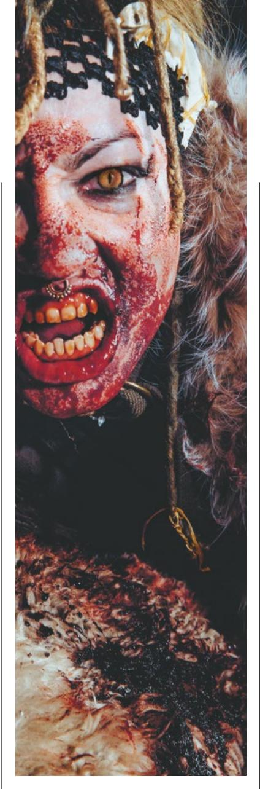

если его самого куда-то кидают. Кроме того, по решению рассказчика под его весом могут не сработать устройства, которые активируются за счёт дав-

Длительность: по желанию.

#### Уровень 2 ОРУЖИЕ ЗВЕРЯ

Естественное оружие вампира становится воистину грозным как правило, Сородичи предпочитают отращивать огромные когти, но некоторые также удлиняют клыки до размеров кинжала, словно у гигантской змеи.

П Расплата: одно испытание Крови.

- Правила: чтобы активировать эту силу, не нужны проверки. При активации любое естественное оружие вампира по его выбору становится лёгким колющим с модификатором урона +2. Для атаки вампир прибегает к драке. При укусе жертва по-прежнему получает фиксированные 2 тяжёлых повреждения, однако вампир при этом не получает штрафа за прицельную атаку. Количество нанесённых лёгких повреждений в данном случае не делится пополам.
- Длительность: одна сцена.

#### Уровень 3 СЛИЯНИЕ С ЗЕМЛЁЙ

Вампир погружается в грунт, становясь с почвой единым целым. Он вновь возвращается в телесную форму на следующую ночь, если только не впадёт в торпор.

- П Расплата: одно испытание Крови.
- Правила: проверка не требуется, но вампир должен стоять на природной поверхности: на голой земле, камне, траве и т. п. Если под ногами асфальт, бетон или что-то подобное сила не сработает. Погружение в землю занимает один ход. Все вещи вампира остаются на поверхности. Находясь в земле, вампир осознаёт, что происходит вокруг, если только он не погрузился в дневной сон. Если кто-то начнёт копать землю или шуметь, пока вампир спит, он сможет очнуться, точно так же как и другие Сородичи при обычном дневном сне (стр.  $219$ ).
- Длительность: один день или даже больше, если ничто не потревожит вампира до срокa.

#### СМЕНА ОБЛИКА

Вампир может принять форму животного примерно одинакового с ним размера и массы. Он может обращаться таким образом только в животных одного вида. Как правило, в волков, но иногда также в крупных кошек или гигантских змей - зачастую это зависит от клана, к которому принадлежит Сородич, или от того, чью кровь он предпочитает пить. С точки зрения стороннего наблюдателя, в животном нет ничего необычного, кроме разве что внушительных размеров.

- Расплата: одно испытание Крови.
- Правила: проверок не требуется. Превращение занимает один ход, и в этом ходу вампир не может делать больше ничего другого. После превращения вампир получает физические характеристики, органы чувств и природные навыки животного (см. стр. 373), а также все его ограничения: например, не может пользоваться человеческой речью, не может переносить больше одного предмета, да и тот только в зубах, и т. д. По решению рассказчика вампир может при этом использовать некоторые другие Дисциплины (в целом ему доступен Анимализм, Стойкость, Стремительность, Метаморфозы, Мощь и Ясновидение; при применении многих сил Доминирования, Сокрытия и Величия могут возникнуть проблемы; Кровавое чародейство использовать вообще невозможно).
- Длительность: одна сцена, если вампир не прервёт эффект раньше.

#### Уровень 4 **ПЕРЕВОПЛОЩЕНИЕ**

- Пребование: Смена облика.
  - У вампира появляется дополнительный звериный облик, который, помимо прочего, не ограничен по размеру и массе. Чаще всего вампиры перевоплощаются в летучих мышей, крыс, необычайно крупных насекомых или змей (см. стр. 373).
- Расплата: одно испытание Крови.
- Правила: такие же, как у Смены облика.
- Длительность: одна сцена, если вампир не прервёт эффект раньше.

#### Уровень 5 ПРЕВРАЩЕНИЕ В ТУМАН

Вампир получает легендарную способность обращаться в облако тумана. Его можно видеть, но ничто, кроме огня, солнечного света и некоторых сверхъестественных сил, не в состоянии причинить ему вред. Туман может просочиться через трубу, расщелину или трещину. Ветер может препятствовать его передвижению, но ни одна естественная сила не в состоянии его развеять

- Расплата: от одного до трёх испытаний Крови.
- Правила: проверок не требуется. Превращение длится три хода, но его можно ускорить, расплатившись за каждый ход одним дополнительным испытанием Крови. В форме тумана вампир передвигается со скоростью шага и, используя свои мистические силы, воспринимает окружающее так, будто пребывает в своём физическом теле. Однако он не может разговаривать и не способен установить с кем-то зрительный контакт. В целом по решению рассказчика вампир может пользоваться теми Дисциплинами, которые не требуют его присутствия в телесной форме. Урон вампиру в облике тумана наносит только солнечный свет, огонь и нематериальные сверхъестественные атаки (некоторые ритуалы, например).
- Длительность: одна сцена, если вампир не прервёт эффект раньше.

#### СВОБОДНОЕ СЕРДЦЕ

Внутренности вампира, овладевшего Метаморфозами на столь высоком уровне, становятся аморфными и податливыми. Сердце - этот источник нежизни, в котором сосредоточено витэ, - отделяется от сосудов и свободно, пускай и медленно, перемещается по грудной клетке. В результате проткнуть сердце каинита колом становится чрезвычайно трудно, ведь оно меняет своё расположение каждую ночь. Кроме того, если сердце вампира всё-таки проткнули колом, он может попытаться выйти из состояния паралича.

- $\blacksquare$  Расплата: нет.
- Правила: сложность проверки при попытке проткнуть сердце вампира колом вне боя увеличивается на 3 пункта. Чтобы сделать это в бою (при использовании навыка фехтования) атакующий должен получить триумф. Если вампир парализован колом в сердце, он может каждый час проходить проверку силы + упорства (сложность 5), проходя при этом испытание Крови. В случае успеха вампир исторгнет кол из своего тела и освободится. Он не может предпринимать подобных попыток, если его Голод достиг 5.
- Длительность: постоянная.

## Мощь

*«Я им не пушечное мясо!»*

*Тео говорил со сцены полуразрушенного берлинского театра, обращаясь к трём десятками слушателей. Рядом с ним стояли Хеша Рухадзе из Апостолов Сета и Руди из клана Гангрел. Три столпа Движения анархов высту‑ пали перед слушателями, которые в основном были каи‑ тифами и слабокровками.*

*«И каждый из вас — не пушечное мясо. Вы не ка‑ кие‑то там простодушные дурачки, как считает Камари‑ лья! Каждый парень, каждая девчонка в этом зале — совсем недавно вы были смертными, да! Но теперь вы бессмерт‑ ные, с такими же, мать их, правами, как у любого ублюдка из их грёбаной Башни!»*

*Из зала послышались возгласы одобрения, а Хеша мед‑ ленно и размеренно захлопал в ладоши. Тео продолжал свою речь, шаг за шагом приближаясь к колонне, подпиравшей высокий потолок. «Хватит с нас унижений! Хватит счи‑ тать нас дерьмом! Мы не позволим больше пользоваться нами! Прятаться за нашими спинами!» — с этими сло‑ вами Тео изо всех сил ударил по бетонному столбу. Его кулак пробил колонну насквозь. С рыком Тео выдернул руку обратно и воздел кулак к потолку.*

*На этот раз слушателей и впрямь пробрало — в зале раздались крики и аплодисменты. Не то чтобы Хеша силь‑ но этому удивился. Да, жест Тео Белла был театральным, зато весьма красноречивым: на пути у Тео и его кулаков лучше не стоять.*

**ДРУГИЕ НАЗВАНИЯ:** Буйство, Могущество Крови, Пер‑ куцио1 .

Как любят говорить бруха, «недооценить нашу силу мож‑ но только раз». Мощь — это мышечный потенциал, мно‑ гократно усиленный Кровью. Эта Дисциплина сильнее любого стимулирующего препарата, а её проявления вы‑ глядят порой более противоестественно, чем тело самого перекачанного культуриста. Мощь — это сам Зверь, отпу‑ щенный на волю, чтобы он мог бить, кусать и бесноваться. Эта Дисциплина, несомненно, может сыграть решающую роль в любом бою, но её используют не только для драк: она расширяет физические возможности Сородича на‑ столько, что любой человек может только позавидовать.

Из всех Дисциплин Мощь сложнее всего поддаётся разумному объяснению. Она чаще других противоре‑ чит здравому смыслу. У немощного с виду носферату удар может быть тяжелее, чем у боксёра‑тяжеловеса, а бруха, обращённый ещё ребёнком, способен одним движением оторвать противнику голову.

1 Прим. пер.: percutio (лат.) — «бить, ударять».

### **Общие правила**

n **Вид:** физическая.

- n **Угроза Маскараду:** от средней до высокой. Неко‑ торые проявления этой Дисциплины ещё можно списать на выброс адреналина, но когда треска‑ ется асфальт и вокруг начинают рушиться здания, тут уж всякие разумные объяснения теряют свою правдоподобность.
- n **Резонанс:** холерический. Сильные и здоровые; атле‑ ты, молодые мужчины и женщины в хорошей физи‑ ческой форме, качки, боксёры, рабочие со стройки, лесорубы, грузчики и т. п.

#### **Уровень 1 МОЩНЫЙ ПРЫЖОК**

Каждая клеточка тела Сородича налита неукротимой силой, благодаря чему он способен прыгнуть дальше и выше любого смертного.

- n **Расплата:** нет.
- n **Правила:** максимальная дальность прыжка вам‑ пира в метрах равна пятикратному показателю его Мощи, а максимальная высота — трёхкратному. При этом ему не нужно разбегаться.
- n **Длительность:** постоянная.

#### **СМЕРТОНОСНОСТЬ**

Владеющий этой силой Сородич может голыми рука‑ ми наносить смертным чудовищный урон, ломая кости и раздирая кожу без видимых усилий.

- n **Расплата:** нет.
- n **Правила:** по желанию игрока персонаж может на‑ носить смертным тяжёлые повреждения голыми ру‑ ками. Кроме того, он игнорирует по одному уровню брони за каждый уровень Мощи.
- n **Длительность:** постоянная.

#### **Уровень 2 СОКРУШЕНИЕ**

Кровь того, кто владеет этой силой, лучше питает все его мускулы по сравнению с другими Сородичами.

- n **Расплата:** одно испытание Крови.
- n **Правила:** активировав эту силу, вампир может добавить показатель своей Мощи к урону, кото‑ рый он наносит голыми руками, а также к пулу проверок силовых задач. Кроме того, урон при использовании фехтования увеличивается на половину показателя Мощи (с округлением вверх).
- n **Длительность:** одна сцена.

#### Уровень 3 **ГРУБОЕ НАСЫЩЕНИЕ**

Эта сила, также известная как Поцелуй изувера, позволяет осушить жертву с дьявольской скоростью. За считаные секунды вампир поглощает потоки крови, хлещущие из страшных ран. Подобный способ насыщения весьма эффективен, хоть и неэстетичен. Чаще всего им пользуются в пылу битвы, чтобы изуродованное тело жертвы проще было замаскировать.

- $\blacksquare$  Расплата: нет.
- Правила: вампир может осушить человека за считаные секунды - как правило, это занимает не больше хода. Смертная жертва получает по одному тяжёлому повреждению за каждый пункт Голода, от которого вампир избавился, — из-за того, что рвутся её кровеносные сосуды и деформируются от страшной тяги внутренние органы. Если жертва - вампир, то он получит лишь лёгкие повреждения, ведь его органы и так уже мертвы.

В бою эту силу можно использовать только после успешного укуса (стр. 213). Сперва жертва получает повреждения от самого укуса, а затем персонаж может с гарантированным успехом испить её крови: если жертва - человек, то по одному разу за каждый пункт Мощи, если жертва - другой Сородич, то в два раза меньше (с округлением вниз). Разумеется, броня защищает от укуса, как и обычно. Рассказчик может решить, что подобное зверское убийство должно вызвать тяжкие сомнения (стр. 239).

Длительность: одно насыщение.

#### ИСКРА ЯРОСТИ

Амальгама: Величие 3.

Объединив Величие и Мощь, вампир с той же лёгкостью может вызвать у окружающих гнев или даже вспышку ярости, с какой вызывает благоговение или ужас. При этом он должен быть осторожен, чтобы разъярённые люди из толпы не набросились на него же самого вместо его врагов или друг друга.

- Расплата: одно испытание Крови.
- Пул: манипуляция + Мощь.
- Правила: активировав эту силу, вампир может добавить показатель Мощи к пулу любой проверки подстрекательства толпы или отдельного индивидуума к насилию. Кроме того, он может подтолкнуть другого вампира к бешеной ярости — для этого ему нужно победить в состязании манипуляции + Мощи против самообладания + интеллекта цели.

Если цель потерпит поражение, она должна пройти проверку противостояния бешеной ярости со сложностью 3.

■ Длительность: одна сцена.

#### **МЁРТВАЯ ХВАТКА**

Пальцы на руках и ногах вампира наливаются противоестественной силой, позволяющей цепляться за малейшую неровность и впиваться ногтями практически в любую поверхность, что даёт возможность лазать по стенам и потолку без какой-либо дополнительной опоры и даже висеть так какое-то время. На поверхности при этом остаются следы от ногтей и углубления, продавленные пальцами, поскольку эта способность не позволяет прилипнуть к поверхности - в её основе лежит грубая физическая сила.

- Расплата: одно испытание Крови.
- Правила: вампир, использующий эту силу, может лазать по любой неметаллической поверхности без проверок навыка. По решению рассказчика он удержится и на поверхности с облицовкой из меди, бронзы или других мягких металлов. Стекло может треснуть при попытке по нему передвигаться, хотя навесные стены современных офисных зданий, скорее всего, выдержат напряжение. Мёртвая хватка позволяет также неподвижно висеть на стене или потолке в течение одной сцены. Чтобы цепляться ногами, нужно снять обувь.

Вампир оставляет следы, которые можно заметить, пройдя проверку интеллекта + расследования со сложностью 2. Следы на стекле видно невооружённым глазом без всяких проверок.

■ Длительность: одна сцена.

#### Уровень 4 ГЛОТОК МОГУЩЕСТВА

Кровь вампира настолько насыщена Мощью, что любой, кто её выпьет, временно приобщится к этой Дисциплине. Эта сила подобна Глотку изящества (стр. 267).

- Расплата: одно испытание Крови.
- Правила: цель должна выпить достаточно витэ вампира прямо из его жил, чтобы тому пришлось пройти испытание Крови. Цель получит показатель Мощи, равный половине показателя Мощи у персонажа (с округлением вниз), а также силы (кроме смешанных), которыми владеет персонаж (вплоть до полученного показателя).
- $\blacksquare$ Длительность: одна ночь; для вампиров - до следующего насыщения или пока Голод не достигнет 5.

#### **Уровень 5 ЗЕМЛЕТРЯСЕНИЕ**

Вампир, владеющий этой силой, подобен самой стихии. Ударив кулаком в землю или топнув ногой, он может вызвать землетрясение, которое собьёт противников с ног. Трудно представить себе силу более грозную и впечатляющую, но вампир должен быть осторожен, иначе он рискует похоронить себя под обломками, об‑ рушив какое‑нибудь здание.

- n **Расплата:** два испытания Крови.
- n **Правила:** чтобы вызвать землетрясение, не требу‑ ется никаких проверок — вампир должен ударить в землю, а промахнуться в данном случае довольно сложно. После этого все в радиусе пяти метров должны пройти проверку ловкости + атлетики (сложность 3). Результаты описаны ниже. Любой, кто предупреждён (например, соратники вампира), может повысить свой результат на одну ступень.
- n **Триумф:** устоял на ногах.
- n **Успех:** пошатнулся, не смог совершить действие.
- n **Поражение:** упал навзничь, не смог совершить действие и должен потратить 1 ход, чтобы встать на ноги.

Применение этой силы наносит значительный сопутствующий ущерб. Земля трескается под нога‑ ми. Мебель ломается, разбиваются зеркала. Устро‑ ив землетрясение в здании, можно провалиться на этаж ниже.

Эту силу можно применять не чаще одного раза за сцену.

n **Длительность:** одно использование.

#### **КУЛАК КАИНА**

Вампир голыми руками может наносить ужасающие раны как смертным, так и вампирам. Он способен раз‑ рывать несчастных на части, протыкать насквозь, отры‑ вать головы и даже вырывать сердца.

- n **Расплата:** одно испытание Крови.
- n **Правила:** на протяжении одной сцены вампир мо‑ жет голыми руками наносить тяжёлые повреждения в драке как смертным, так и сверхъестественным существам.
- n **Длительность:** одна сцена.

## Сокрытие

*Ладно, начну с начала. Я — обычный курьер. Когда ко мне в руки попала посылка, до этого прошедшая аж через три компании, было ясно — кто‑то заметает следы, но мне* 

1 Прим. пер.: occulto (лат.) — «тайна, утаивание».

*предложили хорошую надбавку за доставку, и я решил, хрен с ним, почему бы нет? Вот так и получилось, что я повёз посылку в тот особняк. Нет, я не заглядывал внутрь и не знаю, что именно доставлял, но, судя по обстановке в доме, могу поспорить, это была какая‑то электроника.*

*Ну так вот. Я у двери. Открывает мне эдакий дво‑ рецкий — прямо как из комиксов. Выглядел он вроде нор‑ мальным, ну разве что бледный слегка. Я ему протягиваю коробку и прошу расписаться, а он меня с ног до головы осмотрел, ну и внутрь приглашает, за «дополнительным вознаграждением». Я вроде своё уже получил, но какого чёр‑ та, думаю, что ещё за «дополнительное вознаграждение»? Ну и иду внутрь. Дворецкий уходит, а вместо него появ‑ ляется горничная. Спрашивает меня, не хочу ли я выпить. Я вежливо отказываюсь. Говорю, что мне вообще‑то пора, хотелось бы получить деньги — и в путь.*

*Горничная уходит — возвращается дворецкий. Меня это всё начинает напрягать. Он протягивает конверт с наличкой и спрашивает, не хочу ли я взглянуть на ап‑ паратуру. Я, честно говоря, ничего в этом не смыслю, но соглашаюсь, почему бы и нет? Он проводит меня по дому — серверы, мониторы, кабели везде понавеша‑ ны — шагу не ступить нормально. И вот тут и случа‑ ется ЭТО.*

*Я протягиваю руку — хочу подвинуть один из проводов, чтобы не зацепиться, — и дворецкий слетает с катушек. Он визжит, чтобы я ничего не трогал. Его лицо дефор‑ мируется, а следом и всё тело. Он превращается в како‑ го‑то чешуйчатого человека, покрытого слизью. Затем в горничную. Затем снова в дворецкого. Затем ещё в ко‑ го‑то. А потом срывается с места и убегает — прячется в тенях, которыми внезапно заполнился весь дом, хотя до этого было довольно светло.*

*Я свалил оттуда поскорее.*

*Да, по‑моему, получателя звали Маропис. Но вот что странно. Я через неделю наведался к тому особняку и там было пусто. И не просто пусто — там пыль везде лежала, будто в доме уже лет десять никто не живёт.*

**ДРУГИЕ НАЗВАНИЯ:** Стелс‑мод, Маскировка, Вуаль, Оккульто1 .

Любому охотнику жизненно важно уметь прятаться, двигаться незаметно и сливаться с окружением. Со‑ крытие — это идеальный инструмент, позволяющий Сородичам, владеющим этой Дисциплиной, без тру‑ да подбираться к добыче вплотную, прикидываться безобидным смертным и уходить от преследователей, когда что‑то идёт не по плану.

Мастера Сокрытия способны растворяться в тенях, чтобы подсматривать и подслушивать, менять внешность прямо в толпе, находясь к тому же под наблюдением, и даже при необходимости прятать от чужих глаз других Сородичей.

#### Общие правила

Силы Сокрытия действуют благодаря элементарному гипнозу. Окружающие видят вампира, но не замечают его. Они, сами того не осознавая, обходят его стороной, если он загораживает дорогу, и всегда готовы найти рациональное объяснение своему поведению. Сокрытие воздействует сразу на все пять органов чувств, если не указано иное.

У этой Дисциплины, впрочем, есть свои рамки: пелена с глаз цели спадёт, если игнорировать вампира больше не представляется возможным или цель оказалась загнанной в угол. Вампир, который стоит в дверях, не сможет поддерживать иллюзию, если кто-то решил через дверь пройти. Сложно также убедить человека в том, что тебя нет, когда ты громко кричишь, крушишь обстановку, беззастенчиво шаришь по чужим карманам, заносишь оружие для удара и тем более нападаешь. Шёпот, впрочем, не всегда разрушает иллюзию.

Сокрытие, как правило, не помогает против электронных средств наблюдения. Оператор, возможно, потеряет цель из виду и не будет знать, куда направить объектив, зато автоматика может засечь вампира без особого труда.

Потустороннее зрение (Ясновидение 1) позволяет вампирам обнаруживать то, что спрятано Сокрытием. Для этого нужно победить в состязании смекалки/упорства + Ясновидения против смекалки + Сокрытия. Если персонаж, применяющий Сокрытие, привлекает к себе внимание, его может заметить любой - для этого также нужно победить в состязании: смекалка + наблюдательность (или упорство + наблюдательность, если противник активно ищет спрятавшихся) против смекалки + скрытности. Внезапные атаки с применением Сокрытия тоже требуют состязания, так как жертва всегда имеет шанс почуять неладное за миг до удара.

- **Вид:** ментальная.
- П Угроза Маскараду: низкая. Основная задача этой Дисциплины именно в том, чтобы применяющие её вампиры не попадались на глаза.
- Резонанс: меланхолический. Изгои, бездомные, забытые всеми, впавшие в депрессию; шпионы, карманники, идеальные слуги, работники сцены, технический персонал, массовка; все, кто так или иначе на подхвате.

#### Уровень 1 БЕЗМОЛВИЕ СМЕРТИ

Эта сила весьма популярна у Бану Хаким. Она позволяет вампиру передвигаться абсолютно тихо, не издавая ни звука. Как и другие силы Сокрытия, Безмолвие смерти действует только на тех, кто находится в пределах слышимости, и не влияет на микрофоны и другие электронные детекторы звука. Отличает эту силу то, что она влияет только на слух. Впрочем, при этом она гораздо надёжнее - вампиру нужно очень сильно нашуметь, чтобы привлечь к себе внимание.

- $\blacksquare$  Расплата: нет.
- Правила: эта сила заглушает все звуки, которые вампир вольно или невольно издаёт при движении, - шаги, шорох одежды, звук от столкновений и т. п. Если противник ориентируется только на слух (находясь, к примеру, на другом этаже дома), он не узнает о приближении вампира.

Эта сила не заглушает звуки, издаваемые объектами, с которыми взаимодействует вампир (падение предметов или хлопанье дверей, например). Впрочем, это единственное, что может выдать вампира, если только противник не воспользуется Потусторонним зрением (Ясновидение 1).

Длительность: одна сцена. п

#### ПЛАШ ТЕНЕЙ

Когда вампир стоит неподвижно, он сливается с окружением. Если у него есть хоть какое-нибудь укрытие, он не шумит и не двигается, его можно обнаружить только с помощью электроники или сверхъестественных сил.

- Расплата: нет.
- Правила: см. общие правила Сокрытия. Эффект развеется, если вампир пошевелится или будет обнаружен по иным причинам.
- Длительность: одна сцена.

#### Уровень 2 НЕЗРИМАЯ ПОСТУПЬ

Владеющий этой силой вампир может перемещаться, оставаясь невидимым. На него всё ещё действуют обычные ограничения Сокрытия.

- Расплата: одно испытание Крови.
- Правила: сила не требует никаких проверок, если персонаж не испускает сильных запахов и не издаёт звуков громче шёпота. Противник может пройти проверку на обнаружение только в том случае, если вампир привлечёт чем-то его внимание.

Потустороннее зрение (Ясновидение 1) позволяет обнаружить невидимого вампира - см. общие правила Сокрытия.

Эту силу нельзя использовать для того, чтобы исчезнуть у всех на виду, - если кто-то смотрит на вампира, Незримая поступь не сработает.

 $\blacksquare$ Длительность: одна сцена, если персонажа не обнаружат раньше.

#### Уровень 3 **МАСКА ТЫСЯЧИ ЛИЦ**

Использующий эту силу вампир не исчезает - он принимает личину совершенно обыкновенного, ничем не примечательного человека, присутствие которого в том или ином месте не вызывает вопросов. В отличие от других сил Сокрытия, Маска тысячи лиц позволяет общаться или иным способом взаимодействовать с окружающими. При условии, что противник не настроен агрессивно ко всем чужакам, он ничего не заподозрит. Эта сила не позволяет выбирать личину и не даёт возможности прикинуться кем-то конкретным.

- Расплата: одно испытание Крови.
- Правила: проверок не требуется. Окружающие видят вместо вампира непримечательного человека того же пола и примерно той же комплекции. Одежда его также представляется совершенно обычной в зависимости от того, что наиболее уместно в каждом конкретном случае: в офисе вампир может показаться ночным сторожем в соответствующей форме, а на заводе - рабочим в спецовке. Потустороннее зрение (Ясновидение 1), как обычно, даёт возможность распознать обман.
- Длительность: одна сцена.

#### ЭЛЕКТРОННЫЙ ПРИЗРАК

Вампир, применяющий силы Сокрытия, остаётся невидимым или замаскированным, даже если за ним наблюдают в прямом эфире при помощи электронных устройств. В дальнейшем эффект слабеет: при просмотре видео или на фотографии изображение становится настолько размытым, что по нему сложно определить личность. Кроме того, у автоматических средств наблюдения в присутствии вампира начинаются сбои, что уменьшает шанс того, что Сородича засекут.

- **Pachata:**  $H$ et.
- Правила: к персонажам, наблюдающим за вампиром в прямом эфире, применяются те же правила, что и к наблюдающим вживую. Дополнительных проверок не требуется. Сложность проверки, связанной с определением личности вампира, активно

использующего силы Сокрытия, по записи или фотографии увеличивается на 3. Кроме того, вампир может добавить 3d10 к пулу любой проверки при попытке обойти автоматические системы слежения.

Алительность: такая же, как у применяемой силы.

#### Уровень 4 БЕССЛЕДНОЕ ИСЧЕЗНОВЕНИЕ

■ Требование: Плащ теней

Вампир может воспользоваться Плащом теней и Незримой поступью, даже находясь под прямым наблюдением. Окружающим кажется, что вампир просто испарился. Сила также воздействует на память наблюдателя: он начинает сомневаться, не привиделось ли ему изначально чьё-то присутствие.

- Расплата: нет.
- Пул: смекалка + Сокрытие против смекалки + наблюдательности.
- Правила: чтобы исчезнуть на чьих-то глазах, вампир должен победить в состязании. Если наблюдатель - смертный, то, помимо прочего, его память будет затуманена и он усомнится в том, что кого-то видел. Триумф вампира напрочь сотрёт увиденное из памяти смертного наблюдателя. На память других Сородичей эта сила не оказывает воздействия, но если тот, кто воспользовался Бесследным исчезновением, выиграет состязание, то ему удастся скрыть своё присутствие, как будто бы он активировал эту силу, когда за ним никто не наблюдал. Бесследное исчезновение можно использовать только один раз за сцену.
- Длительность: такая же, как у применяемой силы.

#### **МАСКИРОВКА**

■ Амальгама: Ясновидение 3.

Эта способность позволяет скрыть от чужих взглядов неодушевлённый предмет: дверь, машину или даже дом. Как и другие силы Сокрытия, Маскировка не делает предмет невидимым в буквальном смысле, а создаёт гипнотический эффект, благодаря которому большинство людей игнорируют его. Маловероятно, что неодушевлённый объект сам привлечёт к себе внимание. Прохожие не будут замечать его и при необходимости подсознательно станут его обходить, если только им на него не укажут или не случится что-то непредвиденное, из-за чего они столкнутся с объектом.

- Расплата: одно испытание Крови.
- Пул: интеллект + Сокрытие.

n **Правила:** вампир должен коснуться объекта и пройти проверку со сложностью от 2 до 6 в зави‑ симости от размера объекта и места, где его пря‑ чут (спрятать кольцо в ящике стола, полном других побрякушек, — сложность 2; спрятать дом, стоящий прямо посреди площади, — сложность 6). Эффект длится одну ночь и ещё по одной ночи за каждую ступень выигрыша.

Маскировка скрывает всё, что находится вну‑ три объекта (например, людей в машине или са‑ рае), если наблюдатель находится снаружи. Сила не действует на объекты крупнее двухэтажного дома. Кроме этого, эффект спадает, если объект начинает двигаться сам по себе (как едущая своим ходом машина, например). Потустороннее зрение (Ясновидение 1) позволяет заметить объект, побе‑ див в состязании смекалки + Ясновидения против интеллекта + Сокрытия спрятавшего его вампира.

n **Длительность:** одна ночь и ещё по одной за каждую ступень выигрыша.

#### **Уровень 5 ЛИЧИНА САМОЗВАНЦА**

n **Требование:** Маска тысячи лиц.

Вампир может принять облик любого персонажа неза‑ висимо от пола и телосложения. Для этого ему необ‑ ходимо сперва тщательно изучить цель, иначе любой, кто с ней знаком, обнаружит подмену.

- n **Расплата:** одно испытание Крови.
- n **Пул:** смекалка + Сокрытие, затем при необходимо‑ сти манипуляция + исполнение.
- n **Правила:** вампир должен изучать лицо цели с раз‑ ных ракурсов по меньшей мере в течение 5 минут. Если он хочет скопировать голос и жесты, ему по‑ требуется ещё 10 минут наблюдения за поведением цели. Эта сила не позволяет превращаться в живот‑ ных. После того как цель изучена, рассказчик дол‑ жен пройти за вампира скрытую проверку смекал‑ ки + Сокрытия (сложность 4). Поражение означает, что сходство с целью лишь поверхностное и любой, кто более‑менее хорошо с ней знаком, сразу увидит различия. В случае успеха вампиру удалось убеди‑ тельно воплотить внешность, однако он должен пройти проверку манипуляции + исполнения, чтобы определить, насколько убедительно его поведение. Триумф же сделает иллюзию настолько совер‑ шенной, что проверка манипуляции + исполнения не потребуется. Как обычно, Потустороннее зре‑

1 Прим. пер.: resistentia (лат.) — «сопротивление».

ние (Ясновидение 1) позволяет распознать обман по общим правилам.

n **Длительность:** одна сцена.

#### **ТАЙНОЕ СОБРАНИЕ**

Вампир может применять силы Сокрытия не только к самому себе, но и прятать соратников.

- n **Расплата:** одно испытание Крови в дополнение к расплате за используемую силу.
- n **Правила:** вампир распространяет действие одной из известных ему сил Сокрытия на других существ с их согласия. Количество целей в группе равно сме‑ калке вампира. Он может увеличить это количество, пройдя по одному дополнительному испытанию Крови за каждую дополнительную цель. Считается, что каждая цель применила силу сама к себе. Если кому‑то из целей нужно пройти проверку, при со‑ ставлении пула она использует показатель Сокры‑ тия вампира, воспользовавшегося силой «Тайное собрание». При этом все существа в группе воспри‑ нимают друг друга как обычно. Если себя выдаст кто‑то из группы, то защиты лишится только он сам, но если себя выдаст тот, кто активировал эту силу, то защиты лишатся и остальные.
- n **Длительность:** такая же, как у применяемой силы.

## Стойкость

*Тишина офиса взрывается оглушительным звоном, будто повылетали стёкла из десятка разом захлопнувшихся окон. Под градом пуль, рассекающих пространство, падают директора компании. Тела нескольких сотрудников спол‑ зают под роскошный стол из красного дерева, за которым они сидели, другие корчатся от боли на полу. Стрелявший мужчина роняет оружие и со всех ног бросается бежать вниз по пожарной лестнице.*

*Под аккомпанемент стонов и хрипов Маюми Сибасаки поднимается с пола. Она оправляет костюм, продырявлен‑ ный пулями в нескольких местах. С тихим стуком на ковёр падают кусочки свинца, застрявшие в складках одежды, не сумевшие пробить её плоть. Она смотрит на раненых коллег, наклоняется и делает пару глотков, высасывая кровь из открытых ран. В этот момент в голове у неё крутятся только две мысли: «Тот, кто это организовал, понятия не имел о том, насколько прочной может быть кожа вампи‑ ра. Тот, кто это организовал, заплатит за новый костюм».*

**ДРУГИЕ НАЗВАНИЯ:** Твердолобость, Каменная плоть, Резистенция1 .

Стойкость высоко ценится бессмертными. Она позволяет с лёгкостью противостоять физическим и ментальным атакам. Мало кто из Сородичей способен пережить века, не владея Стойкостью хотя бы на начальном уровне, тем более в мире, где насилие обыденно и даже нежить не чувствует себя в безопасности. В эти ночи мало кто из Сородичей использует Стойкость, чтобы перемещаться под солнцем. Гораздо чаще им приходится выживать в драках, перестрелках, пожарах, а также противостоять попыткам принудить их к чему-то при помощи сверхъестественных сил.

Владеющие Стойкостью вампиры - это несокрушимые столпы общества Сородичей, не поддающиеся психологическому давлению и способные выстоять под ударами невероятной мощи, не отступив ни на шаг. Если кто из каинитов и может чувствовать себя в безопасности в Мире Тьмы, так это старейшины Патрипиев и Хишников.

#### Общие правила

- Вид: физическая
- П Угроза Маскараду: средняя. Свидетели определённо удивятся, увидев, как человек, в которого только что выпустили обойму или которого избили до полусмерти, встал и пошёл как ни в чём не бывало. Излюбленные варианты объяснений - искажённое восприятие в стрессовой ситуации (только показалось, что пули попали в цель), спецэффекты (розыгрыш, монтаж) или старое доброе «да у тебя просто белая горячка, приятель».
- Резонанс: меланхолический. Люди, пережившие войну, выжившие в несчастных случаях, а также жертвы насилия; марафонцы; альпинисты; пехота и спецназ; люди с сильным иммунитетом.

#### Уровень 1 СИЛА ЖИЗНИ

Вампир приобретает сверхъестественную сопротивляемость физическим воздействиям.

- $\blacksquare$  Расплата: нет.
- Правила: каждый пункт Стойкости увеличивает шкалу здоровья на 1 уровень.
- Длительность: постоянная

#### ТВЁРДОСТЬ ДУХА

Вампир приобретает сверхъестественную сопротивляемость попыткам повлиять на его решения при помощи обаяния, запугивания и всяческих уловок. В некоторых твёрдость духа проявляется как медитативное спокойствие, в других - как невообразимое упрямство.

- Расплата: нет.
- $\blacksquare$ Правила: каждый пункт Стойкости увеличивает на 1d10 пул любой проверки, связанной с противостоянием запугиванию, принуждению, соблазнению или любой другой попытке поколебать его позицию против его воли. Эта сила также помогает сопротивляться Доминированию, Величию и тому подобным сверхъестественным способностям.
- Длительность: постоянная.

#### Уровень 2 ЖИВУЧИЕ ЗВЕРИ

■ Амальгама: Анимализм 1.

Вампир делится своей живучестью с животными, находящимися под его влиянием. Будь то рой насекомых или огромный зверь, они становятся почти такими же стойкими, как их хозяин.

- Расплата: одно испытание Крови (не требуется, если цель - фамулус).
- Пул: выносливость + Анимализм (если животное не является фамулусом).
- Правила: вампир может наделить Стойкостью животных, находящихся под воздействием Анимализма. Каждое животное получает дополнительные пункты здоровья в количестве, равном показателю Стойкость вампира. На фамулуса эта сила действует автоматически, а чтобы укрепить других животных, нужно пройти испытание Крови и победить в проверке выносливости + Анимализма со сложностью 3. Сила подействует на 1 животное за каждую ступень выигрыша. По окончании эффекта здоровье животного возвращается к исходному показателю, при этом пустые ячейки следует стереть первыми - в результате, возможно, животное погибнет.
- Длительность: одна сцена.

#### **НЕПРОШИБАЕМОСТЬ**

Тела Сородичей, владеющих этой Дисциплиной, приобретают необъяснимую прочность - повреждения, которые доставляют немало неудобств другим каинитам и даже могут вывести их из строя, для них не более чем царапины. Хотя эта сила не способна предоставить защиту от угроз, наносящих тяжёлые повреждения, она тем не менее значительно укрепляет Сородича, особенно в затяжных схватках.

- **Расплата:** одно испытание Крови.
- Правила: вампир, получивший лёгкие повреждения, уменьшает их количество на 1 за каждый пункт

показателя Стойкости, а уже потом делит остаток пополам. В любом случае успешная атака нано‑ сит не меньше 1 повреждения после всех вычетов и делений.

n **Длительность:** одна сцена.

#### **Уровень 3 ПРЕВОЗМОГАНИЕ ПРОКЛЯТИЯ**

Подготовившись и разогнав по жилам Кровь, вампир может временно стать менее восприимчивым к огню, солнечному свету и другим угрозам, которые могут повлечь за собой Окончательную смерть.

- n **Расплата:** одно испытание Крови.
- n **Пул:** смекалка + выживание (для рефлекторной активации).

#### n **Правила:** подготовившись (пройдя испытание Крови), вампир задействует свои внутренние ре‑ зервы, позволяющие ему вместо тяжёлых повре‑ ждений получать лёгкие. Количество повреждений или пунктов стресса, которые он может таким образом трансформировать, равно показателю его Стойкости. Это суммарное количество на всю сцену, а не на одно ранение или атаку. Полученные в результате лёгкие повреждения вампир не сможет заживить до конца сцены.

#### **ПРИМЕР**

*Показатель Стойкости Салмана равен 3. Это значит, что в бою персонаж может в одном ходу получить 2 лёгких повреждения вместо тяжёлых, а в следующем ещё 1 лёгкое повреждение. После этого его внутренний резерв иссякнет.*

Когда действие силы заканчивается (т. е. получено заданное количество повреждений), вампир может активировать её повторно, снова пройдя испы‑ тание Крови. Если вампир не ожидал опасности и получил тяжёлые повреждения, он может попы‑ таться активировать силу рефлекторно, пройдя проверку смекалки + выживания (сложность 3). В случае провала он получает тяжёлые повре‑ ждения как обычно. В случае успеха — заменяет их на лёгкие, но должен при этом пройти испы‑ тание Крови.

n **Длительность:** до конца сцены либо до тех пор, пока не будет получено заданное количество повре‑ ждений (смотря что случится раньше).

#### **УКРЕПЛЕНИЕ СОЗНАНИЯ**

Эта сила фокусируется не на укреплении тела, а на том, чтобы защитить мысли и чувства вампира от сверхъ‑ естественного вторжения. Его разум кажется пустым, а аура совершенно бесцветной.

- n **Расплата:** нет.
- n **Правила:** сложность применения против персонажа таких сил, как, например, Познание души (Ясно‑ видение 3) или Телепатия (Ясновидение 5), увели‑ чивается на половину показателя его Стойкости (с округлением вверх). Если правила предполагают состязание, персонаж добавляет к пулу своей провер‑ ки по 1d10 за каждый пункт показателя Стойкости.
- n **Длительность:** одна сцена.

#### **Уровень 4 ГЛОТОК УПОРСТВА**

Кровь вампира настолько насыщена Стойкостью, что лю‑ бой, кто её выпьет, временно приобщится к этой Дис‑ циплине. Эта сила подобна Глотку изящества (стр. 267).

- n **Расплата:** одно испытание Крови.
- n **Правила:** цель должна выпить достаточно витэ вампира, чтобы тому пришлось пройти испыта‑ ние Крови, причём прямо из его жил. Цель получит показатель Стойкости, равный половине показа‑ теля Стойкости персонажа (с округлением вниз), а также силы (кроме смешанных), которыми вла‑ деет персонаж (вплоть до полученного показателя).
- n **Длительность:** одна ночь; для вампиров до сле‑ дующего насыщения или пока Голод не достигнет 5.

#### **Уровень 5 ГОРНИЛО БОЛИ**

Травмы и изнурение только подхлёстывают вампира, который становится сильнее и быстрее с каждым полу‑ ченным ударом, порезом или куском содранной кожи. Остановить того, кто владеет этой силой, может только полное уничтожение.

- n **Расплата:** одно испытание Крови.
- n **Правила:** активировав эту силу, вампир не чувству‑ ет больше физической боли и может игнорировать все модификаторы, полученные из‑за нанесённых ему повреждений (например, из‑за изнурения). Кро‑ ме того, за каждое повреждение (лёгкое или тяжё‑ лое), отмеченное на шкале здоровья, он на 1 пункт увеличивает одну физическую характеристику (здо‑ ровье и другие производные параметры при этом не изменятся). Итоговое значение характеристики не может превышать модификатора от прилива Крови + 6.

#### ПРИМЕР

У Дарина сила Крови 3. Значит, при использовании прилива Крови модификатор составит 2. Следовательно, максимально возможное для него значение физической характеристики — это 8.

≢⊱∢

Лаительность: олна спена

#### **МРАМОРНАЯ ПЛОТЬ**

Кровь вампира делает его кожу прочной и гладкой, словно мрамор. Мраморная плоть по-прежнему мягкая и податливая, но ей не страшны никакие раны - она моментально восстанавливается. Вампира, владеющего этой силой, практически невозможно уничтожить, разве что противнику сильно повезёт или он сможет обездвижить свою цель.

- Расплата: два испытания Крови.
- Правила: активировав эту силу, вампир каждый ход может игнорировать первую успешную физическую атаку в свой адрес (включая повреждения от огня; но от солнечного света Мраморная плоть не помогает). В случае разногласий, какую атаку считать первой, можно действовать двумя способами: либо рассказчик примет решение, основываясь на ходе повествования, либо учитывается та атака, которая нанесла больше всего урона. Триумф атакующего позволяет ему нанести урон, несмотря на Мраморную плоть.
- Длительность: одна сцена.

## лтремительность

Доклад № 600. Неестественная скорость

Зафиксировано 37\* случаев неестественной скорости передвижения пустотелых. Этот вид способен перемещаться практически мгновенно, проявляя чудеса ловкости: один из них появился перед нами, затем переместился к нам за спину и набросился на одного из бойцов со спины, укусив за горло, — всё это заняло у него не больше двух секунд. Кроме того, некоторые пустотелые способны длительно поддерживать подобную скорость движения, преодолевая большие расстояния за сверхкороткие сроки: один из них за десять секунд преодолел расстояние, которое обычно требует по меньшей мере минуты.

Сверхскорость является одной из самых опасных способностей пустотелых, поскольку на данный момент от неё не имеется эффективных средств защиты. Существует предположение, что для ускорения пустотелым

Прим. пер.: velocitas (лат.) - «скорость, подвижность».

необходимо наличие крови в их организме, но нам неизвестно, каково минимальное требуемое количество крови и как долго будет действовать ускорение после принятия одной минимальной дозы.

Действующая директива предписывает наблюдение со стороны за пустотелыми, которые проявляют данную способность. Агент, оказавшийся в ловушке в непосредственной близости от особи подобного рода, имеет право на детонацию микровзрывчатки, спрятанной на теле, поскольку даже сверхбыстрые особи не способны противостоять огню и шрапнели. Замедление или уничтожение хотя бы одного сверхбыстрого пустотелого стоит жизни одного агента.

\*на момент доклада

АРУГИЕ НАЗВАНИЯ: Вертлявость, Ускользание, Велоцитас1.

Стремительность позволяет наносить мгновенные удары, уворачиваться практически от любых атак и преодолевать огромные расстояния в кратчайшие сроки, что делает владеющего ею Сородича чрезвычайно опасным противником. Эта Дисциплина позволяет не только двигаться с большей скоростью, но ещё и соображать быстрее, чем любое живое существо на Земле

Одним вампирам Стремительность нужна, чтобы не бояться ответных ударов в бою, другие же используют её для быстрого перемещения из одного места в другое.

#### Общие правила

Вид: физическая.

- Угроза Маскараду: от средней до высокой. Большая часть сил этой Дисциплины носит ярко выраженный нечеловеческий характер. Спасает только то, что использующего Стремительность вампира очень трудно сфотографировать или поймать на видео.
- Резонанс: холерический. Бегуны, атлеты; потребители амфетаминов и алкалоидов; жертвы, испытывающие страх; любители шутеров от первого лица и других игр, где требуется хорошая реакция.

#### Уровень 1 **БЫСТРАЯ РЕАКЦИЯ**

Хотя движения вампира всё ещё подчиняются законам физики, скорость его реакции невероятна. Он способен разглядеть летящую в него стрелу или даже пулю и попытаться увернуться от них в чистом поле.

 $\blacksquare$  Расплата: нет.

- n **Правила:** в перестрелке у вампира не уменьшается пул проверок защиты, если у него нет укрытия (см. «Дистанционное оружие», стр. 125). Кроме того, каждый ход он может бесплатно предпринимать по незначительному действию (см. стр. 298), кото‑ рое любому другому персонажу уменьшило бы пул проверки на 2d10 (например, подготовить или пе‑ резарядить оружие).
- n **Длительность:** постоянная.

#### **КОШАЧЬЯ ГРАЦИЯ**

Даже воздушные гимнасты мирового уровня не могут сравниться в лёгкости и грации с вампиром, владею‑ щим этой силой. Он может без труда пройти или даже пробежать по карнизу и натянутым проводам и удер‑ жать равновесие даже на самой шаткой из опор.

- n **Расплата:** нет.
- n **Правила:** вампиру не нужно проходить проверку, связанную с ловкостью или атлетикой, чтобы удер‑ жать равновесие (эта сила не поможет удержаться на опоре, если та не может выдержать естествен‑ ный вес персонажа).
- n **Длительность:** постоянная.

#### **Уровень 2 ПРОВОРСТВО**

Вампир движется с головокружительной скоростью. Его реакция молниеносна.

- n **Расплата:** одно испытание Крови.
- n **Правила:** вне боя каждый пункт Стремительности вампира увеличивает пул любых проверок ловкости на один d10. Защищаясь во время боя, он на ту же величину один раз в ход увеличивает пул ловкости + атлетики.
- n **Длительность:** одна сцена.

#### **Уровень 3 БЫСТРЕЕ ВЕТРА**

Вампир в мгновение ока настигает жертву или уходит от противника. Со стороны может показаться, что он телепортировался. Порыв ветра — вот единственный признак его движения.

- n **Расплата:** одно испытание Крови.
- n **Пул:** ловкость + атлетика или иной при необходи‑ мости.
- n **Правила:** вампир может за один ход переме‑ ститься на 50 метров по прямой линии, и у него всё ещё останется время на то, чтобы без штра‑ фов совершить действие (например, атаковать) в этом же ходу. При наличии каких бы то ни было

#### **ЧТо ЗнаЧиТ «БЫСТРо»?**

**В «Вампирах» игрокам не приходится передвигать миниатюры по расчерченному полю, а ходы в бою могут занимать разное время. именно поэтому в описаниях сил Стремительности нет точных величин. Скорости абстрактны. Рассказчик решает, сколько этажей пробежит по лестнице вампир, использующий Стремительность, не высчитывая скорость по формуле, а руководствуясь сюжетной необходимостью или результатами состязания с противником.**

**однако некоторым игрокам нравится иметь твёрдую почву под ногами, насколько это возможно. Усэйн Болт, самый быстрый человек на Земле, способен бежать со скоростью 45 км / ч. если взять это значение за максимальное, то каждый пункт ловкости будет соответствовать примерно 9 км / ч, а извечный вопрос «может ли вампир догнать уносящийся прочь автомобиль?» получит свой ответ («нет»). Разумеется, в вашей игре 1 пункт ловкости может соответствовать любой другой величине. Главное — соблюдать основной принцип: чем больше разница в пунктах, тем выше шансы обогнать соперника.**

преград вампир должен пройти проверку ловко‑ сти + атлетики, чтобы не споткнуться или не на‑ ткнуться на что‑нибудь. Рассказчик также может объявить любое другое состязание, особенно если вампир пытается обогнать противника, не позво‑ лив ему добраться до какого‑то объекта или со‑ вершить некое действие. Если вампир использует эту силу, чтобы завязать ближний бой, то на на‑ чало хода он условно считается уже вступившим в ближний бой.

#### **ПРИМЕР**

*Сео‑Хи владеет силой «Быстрее ветра». Ей противо‑ стоит вооружённый пистолетом агент ФБР, который находится в 40 метрах от неё на пересечённой мест‑ ности. Она хочет добраться до него прежде, чем он сможет выстрелить. Игрок проходит проверку ловко‑ сти + атлетики против ловкости + стрельбы федерала. В случае победы Сео‑Хи сможет атаковать в ближ‑*

нем бою (драка или фехтование) прежде, чем противник выстрелит. В случае поражения сперва прогремит выстрел, а уже потом Сео-Хи, возможно, получит шанс атаковать.

- --⇔⇔⊱√

#### ■ ДЛИТЕЛЬНОСТЬ: ОДИН ХОД.

#### **TPAREPC**

Вампир может с головокружительной скоростью бежать или карабкаться по любой поверхности, включая вертикальные, и даже по водной глади. Траверс не дарует вампиру сверхъестественную способность лазать по потолку, словно муха, но взбежать вверх по стене вполне в его силах. Ходить по воде он не может, но способен по ней пробежать, особенно если предварительно разгонится.

- Расплата: одно испытание Крови.
- Пул: ловкость + атлетика.
- Правила: вампир должен пройти проверку со сложностью от 3 (наклонная шероховатая поверхность) до 6 (скользкая вертикальная поверхность или водная гладь). При успехе он добирается до ближайшей цели на пути, а каждая ступень выигрыша позволяет пробежать ещё чуть дальше. Рассказчик должен заранее предупредить игрока, если цель слишком далеко, чтобы вообще стоило предпринимать попытку. В целом предел возможностей - это около 60 метров по воде или около 30 этажей вверх. Длительность: ОДИН ХОД.
- Уровень 4 БЕЗУПРЕЧНАЯ ТОЧНОСТЬ
- Амальгама: Ясновидение 2.

Мир вокруг вампира замедляется - стреляя или швыряя предметы, он попадает в цель настолько метко, будто противник стоит неподвижно.

- Расплата: одно испытание Крови.
- Правила: применяется перед дистанционной атакой, снижая её сложность до 1. Цель не может уклоняться или защищаться. Оппонент, владеющий 5-м уровнем Стремительности, может свести на нет эффект этой силы, но ему также потребуется пройти испытание Крови.
- Длительность: одна атака.

#### ГЛОТОК ИЗЯЩЕСТВА

Кровь вампира настолько насыщена Стремительностью, что любой, кто её выпьет, временно приобщится к этой

Дисциплине. Хотя это верный шаг в сторону уз Крови, тем, кто уже связан, не о чем беспокоиться, и даже свободные союзники порой готовы рискнуть ради тех возможностей, которые предоставляет эта сила.

- Расплата: одно испытание Крови.
- Правила: цель должна выпить достаточно витэ вампира, чтобы тому пришлось пройти испытание Крови, причём прямо из его жил. Цель получит показатель Стремительности, равный половине показателя Стремительности у персонажа (с округлением вниз), а также силы (но не амальгамы), которыми владеет персонаж (вплоть до полученного показателя).
- Длительность: одна ночь; для вампиров до следующего насыщения или пока Голод не достигнет 5.

#### Уровень 5 **МОЛНИЕНОСНЫЙ УДАР**

Вампир двигается с умопомрачительной скоростью и способен наносить удары кулаками или оружием ближнего боя так быстро, что у противника нет ни малейшего шанса защитить себя или уклониться от атаки.

Расплата: одно испытание Крови. .

Правила: применяется к атаке ближнего боя (сложность 1), требующей проверки драки или фехтования. Цель не может уклоняться или защищаться. Оппонент, владеющий 5-м уровнем Стремительности, может свести на нет эффект этой силы, но ему также потребуется пройти испытание Крови.

■ Длительность: одна атака.

#### СКОРОСТЬ МЫСЛИ

Вампир двигается со скоростью мысли, а порой и опережает её. Это позволяет реагировать на событие в тот же момент, когда оно произошло. Выскочившие из засады враги обнаруживают вампира готовым к бою, да ещё и у себя за спиной, а высказанная просьба оказывается выполненной ещё до того, как было озвучено послелнее слово.

- Расплата: испытание Крови.
- **Правила:** персонаж предвосхищает события (в рамках разумного). Когда рассказчик объявляет какой-то факт, игрок может предотвратить его: например, дверь захлопнулась, но персонаж успел проскользнуть; враги напали из засады, но персонаж в последний момент ушёл с линии огня; случился взрыв, но персонаж вовремя отскочил в сторону, и т. п. Предпринятое действие при этом само по себе не должно занимать больше нескольких секунд. Для некоторых действий может потребо-

ваться проверка — какие навыки для этого исполь‑ зовать, решает рассказчик.

n **Длительность:** как правило, одно действие (более точно определит рассказчик).

## Ясновидение

*Оно всё ещё со мной. В моей голове, понимаешь? Я говорю «оно», хотя на самом деле это «она». Оно забралось ко мне в голову и смеётся. Не прекращает смеяться! Не затыка‑ ется ни на секунду! Прости. Я сорвался. Сейчас… Надо успокоиться. Понимаешь, сперва я подумал, что это Бог ответил на мои молитвы. Оно сказало, что хочет узнать меня получше, ведь я так одинок. Рассказывало обо мне то, чего я сам и не помнил. Оно знало меня, понимало меня. Мне было так хорошо от того, что хоть кому‑то не на‑ плевать.*

*Но потом всё переменилось. Оно обратило мой разум против меня самого. Оно предсказывало каждое моё дей‑ ствие. Угрожало, что никогда не исчезнет из моей головы, если я не буду плясать под его дудку. Мне не хотелось снова оказаться одному, но и происходящее не очень‑то вооду‑ шевляло. Поэтому я взял дрель и просверлил дыру в соб‑ ственном черепе.*

*Но поверь мне: я не псих. Я видел психов, да, я выгляжу, как псих, но я не такой. Эта дрянь у меня в голове — это что‑то или кто‑то, кто вторгся в моё сознание в момент слабости и пытался меня доконать. Понятия не имею, зачем это ему понадобилось, разве что ради дешёвого веселья да кода от сейфа компании. Оно ушло, но оста‑ вило свой смех на память, и теперь, я уверен, оно остано‑ вится только тогда, когда я его прикончу. Для этого меня и наняло правительство. Я должен найти это существо. У меня есть только одна ниточка — слово «Психушка». Но я не остановлюсь, пока не утихнет этот мерзкий смех.*

**ДРУГИЕ НАЗВАНИЯ:** Вуайеризм, Гадание, Ворожба, Анима визус1 .

Ясновидение — один из величайших даров и в то же время одно из ужаснейших проклятий. Оно позволяет Сородичам отличать правду от лжи, проникать в созна‑ ние окружающих и видеть мир так, как не видит его никто. Казалось бы, Ясновидение — это совершенный инструмент, дарующий знание о прошлом, настоящем и будущем, но он, похоже, даёт слишком много знаний. Да, ясновидящий может узреть кинжал убийцы прежде, чем тот нанесёт удар, или залезть в голову врагов, что‑ бы обратить их в бегство, но в то же время через него

1 Прим. пер.: anima visus (лат.) — «зрение души».

проходят волны эмоций, плохих и хороших, он видит то, чего предпочёл бы не видеть, и знает сокровенные тайны будущего, которые предпочёл бы не знать. Вам‑ пиры, владеющие этой Дисциплиной, нередко вызы‑ вают паранойю у окружающих, но их можно понять искушение огромно. Ты знаешь, что правда откроется тебе, стоит только протянуть руку, и перед этим трудно устоять.

Сородичи используют Ясновидение по‑разному. Одни шпионят в пользу принца или одной из фракций. Другие извлекают выгоду лично для себя, шантажируя смертных и бессмертных секретами, подслушанными на тайных переговорах, рядом с участниками которых они и близко не стояли, или выуженными из чьей‑то го‑ ловы при помощи телепатического вторжения или чте‑ ния эмоций. Ясновидение делает Сородича отличным детективом, способным найти улики на месте преступ‑ ления, используя мир духов и астральный след, и без‑ ошибочно угадывающим во время допроса, врёт ли подозреваемый.

#### **Общие правила**

Чтобы поражения при проверках Ясновидения имели больше влияния на ход игры, рассказчик может само‑ стоятельно проходить проверки за персонажей игроков.

- n **Вид:** ментальная.
- n **Угроза Маскараду:** низкая. У сил Ясновидения нет очевидно заметных эффектов, для которых нельзя было бы найти рационального объяснения. В крайнем случае странности всегда можно списать на удачное стечение обстоятельств.
- n **Резонанс:** флегматический. Люди искусства (осо‑ бенно фотографы), мечтатели, некоторые из шизо‑ фреников, потребители психоактивных веществ, детективы.

#### **Уровень 1 ОБОСТРЕНИЕ ЧУВСТВ**

Все пять чувств вампира обостряются до невероятных пределов, и он может видеть в полной темноте, слы‑ шать ультразвук и обонять чужой страх.

- n **Расплата:** нет (см. ниже).
- n **Пул:** смекалка + упорство (при интенсивном воздей‑ ствии на органы чувств).
- n **Правила:** вампир добавляет показатель Ясно‑ видения ко всем проверкам наблюдательности. Однако, пока действует сила, любые интенсивные стимулы вроде громкого шума, вспышек яркого света или сильных запахов могут привести к по‑

тере чувствительности — вампир должен успешно пройти проверку смекалки + упорства (упорство 3 или выше), чтобы на время вернуть восприятие к нормальному уровню, в противном случае ему придётся вычитать 3d10 из пула любых проверок наблюдательности до конца сцены.

n **Длительность:** по желанию игрока, но рассказчик может настоять на трате пунктов воли, если вам‑ пир продолжительное время (дольше одной сцены) без отдыха пользуется этой силой или вокруг вам‑ пира очень много раздражителей.

#### **ПОТУСТОРОННЕЕ ЗРЕНИЕ**

Органы чувств вампира настраиваются на восприя‑ тие потустороннего мира, и для него открывается то, что обычно сокрыто от чужих взоров. Таким образом вампир может увидеть другого Сородича, исполь‑ зующего Сокрытие, почувствовать, что кто‑то следит за ним при помощи Ясновидения, или даже обнаружить самое настоящее привидение посреди комнаты. Кроме того, с одобрения рассказчика, используя эту силу, можно найти спрятанные магические ловушки и следы ритуалов Кровавого чародейства.

- n **Расплата:** нет.
- n **Пул:** смекалка + Ясновидение или упорство + Ясно‑ видение.
- n **Правила:** каждый раз, когда рядом с персонажем у всех на виду прячется нечто сверхъестественное, рассказчик должен пройти скрытую проверку сме‑ калки + Ясновидения с подходящей, по его мнению, сложностью. Если от персонажа умышленно прячет‑ ся какая‑то сущность, можно провести состязание, попросив игрока пройти проверку вслепую («Лиза, брось, пожалуйста, 7d10») против подходящего пула противника. К примеру, чтобы обнаружить вампира, использующего Сокрытие, персонажу нужно победить в состязании смекалки + Ясновиде‑ ния против смекалки + Сокрытия противника. Если персонаж сам активно ищет сверхъестественное су‑ щество, он использует пул упорства + Ясновидения, а в остальном всё происходит так же.
- n **Длительность:** постоянная.

#### **Уровень 2 ПРЕДВЕСТИЕ**

Вампира посещают кратковременные озарения: от му‑ рашек по коже или внезапного вдохновения до ярких видений. Как бы там ни было, никаких конкретных све‑ дений вампир при этом не узнаёт, хотя озарение может предупредить об опасности или дать подсказку.

- n **Расплата:** либо не требуется, либо одно испытание Крови.
- n **Пул:** упорство + Ясновидение.
- n **Правила:** когда ведущий сочтёт, что для этого на‑ стал подходящий момент, он может дать персонажу подсказку — к примеру, указать на пропущенную улику или на потенциальную опасность. Видение, в котором вампир попадается в ловушку, алое све‑ чение, манящее свернуть направо во время погони, или скелет, померещившийся под полом в кабинете Принца, — всё это позволяет рассказчику при не‑ обходимости ускорить темп игры или повернуть её в нужное русло. Не стоит давать персонажам больше одного озарения за сцену, даже если Пред‑ вестием владеют несколько Сородичей в котерии.

Персонаж может сам вызвать озарение, скон‑ центрировавшись на вопросе и пройдя проверку упорства + Ясновидения. При этом он должен пройти испытание Крови. Чем больше успехов он получит, тем более ясным будет Предвестие.

n **Длительность:** постоянная.

#### **Уровень 3 ПОЗНАНИЕ ДУШИ**

Сконцентрировавшись, вампир видит цветную колеб‑ лющуюся ауру, которая говорит о душевном состоянии цели. Хотя точных сведений при чтении ауры он не по‑ лучит, он вполне сможет разобраться, какие эмоции испытывает существо, какой у него резонанс, какими сверхъестественными способностями оно владеет. Если вампиру нужен человек с определёнными свойствами, он может по ауре обнаружить его в толпе — подобное «сканирование» лишь указывает на цель, не давая ника‑ кой подробной информации.

- n **Расплата:** одно испытание Крови.
- n **Пул:** интеллект + Ясновидение против самооблада‑ ния + хитрости.
- n **Правила:** вампир должен победить в состязании, и тогда рассказчик ответит на несколько вопросов относительно ауры и психики цели (их количество равно выигрышу при проверке):
  - **⬜** Каково эмоциональное состояние существа?
  - **⬜** Какой резонанс в крови существа?
  - **⬜** Является ли существо вампиром, оборотнем, гулем или каким‑то другим сверхъестественным созданием?
  - **⬜** Находится ли существо под воздействием Кро‑ вавого чародейства или иной магии?
  - **⬜** Совершало ли существо диаблери за последний год?

В случае триумфа вампир может узнать какой-нибудь неожиданный факт (на усмотрение рассказчика).

При поиске нужной ауры в толпе вампир должен пройти проверку интеллекта + Ясновидения со сложностью, зависящей от размера толпы и отвлекающих факторов, а также от того, какая конкретно деталь в ауре интересует персонажа. К примеру, поиск вампира среди гостей на званом ужине требует проверки со сложностью 3, а поиск самого нервного рейвера на нелегальной вечеринке со сложностью 6 или выше.

Длительность: один ход (или на усмотрение рас- $\alpha$ 

#### СЛИЯНИЕ ЧУВСТВ

Потянувшись мысленно к другому существу, вампир может подключиться к его органам чувств - слышать, видеть и ощущать всё то же, что и оно. Сам вампир при этом не перестаёт воспринимать окружающую его действительность, что порой сбивает с толку тех, кто только овладел этой силой. Вампир может выбрать один или несколько органов чувств, которые его интересуют. При использовании этой силы против незнакомцев вампир должен видеть цель, чтобы установить контакт. Впрочем, силу можно использовать и на длинной дистанции от цели, если у той в крови осталось хоть немного витэ вампира.

- Расплата: одно испытание Крови.
- Пул: упорство + Ясновидение.
- Правила: вампир должен пройти проверку со сложностью 3. Сложность можно повысить в зависимости от расстояния до цели, отвлекающих факторов и других нюансов, таких как количество витэ в жилах цели. Цель обычно не ощущает слежки, но Потустороннее зрение поможет обнаружить незваного гостя. Чтобы избавиться от чужого присутствия в своей голове, цель должна победить в состязании смекалки + упорства против смекалки + упорства. Если жертва таким образом вышвырнет ясновидящего из своего разума, тот не сможет повторить попытку Слияния чувств до следующей ночи.
- Длительность: одна сцена.

#### Уровень 4 **ПСИХОМЕТРИЯ**

Прикоснувшись к неодушевлённому предмету или к земле в определённом месте, вампир может почувствовать эмоциональный след, оставленный теми, в чьих руках был предмет и кто посещал означенное

место в прошлом. Кроме того, вампир может узнать, что именно происходило с этим предметом или в этом месте и при каких обстоятельствах. Хотя полученные таким образом сведения редко бывают исчерпывающими, зачастую они дают зацепку в расследовании, которую невозможно было бы получить при помощи обычной судмедэкспертизы или дедукции.

■ Расплата: одно испытание Крови.

- Пул: интеллект + Ясновидение.
- Правила: вампир должен пройти проверку её сложность зависит от сведений, которые он хочет получить: 3 — чтобы понять, в каком эмоциональном состоянии был убийца, державший в руках нож пару дней назад; 6 (а то и выше) — чтобы узнать, где и кем 300 лет назад было написано письмо. Каждая ступень выигрыша позволяет заглянуть дальше в прошлое и увидеть ещё одного персонажа, в чьих руках побывал предмет, или узнать ещё об одном событии, произошедшем в этом месте.
- Длительность: ОДИН ХОД.

#### Уровень 5 **ВСЕЛЕНИЕ**

■ Амальгама: Доминирование 3.

Владеющий этой силой вампир может подавить волю смертного и вселиться в его тело, что позволит Сородичу обращаться с этим телом, как со своим собственным. Разум жертвы недоступен вампиру, но при определённых условиях персонаж способен делать всё, на что способна была жертва, и попасть в любое место, куда её пускали. Используя эту силу, вампир может испытать то, что долгое время было для него недоступно: ходить под солнцем, есть обычную еду, заниматься сексом. При этом физический ущерб, причинённый телу смертного, не сильно сказывается на Сородиче.

- Расплата: два испытания Крови.
- Пул: упорство + Ясновидение против упорства + интеллекта.
- Правила: вселиться можно только в смертного; если жертва - гуль, вампир должен сперва привязать его к себе узами крови. Чтобы вселиться, вампиру нужен зрительный контакт с жертвой (см. Доминирование, стр. 251). После этого он должен победить в состязании, чтобы занять тело. В случае жестокого провала жертва оказывается невосприимчива к Вселению до конца истории.

Тело вампира, успешно вселившегося в человека, впадает в состояние, подобное торпору. Вампир не ощущает его и не знает, что вокруг него проис-

ходит, но если телу вампира будет нанесено тяжё‑ лое повреждение, то действие Вселения прервётся и душа каинита вернётся на место. В теле смерт‑ ного вампир может использовать Величие, Доми‑ нирование и Ясновидение. Если Сородич хочет оставаться в чужом теле днём, он должен пройти соответствующую проверку, чтобы не заснуть (стр. 219). При поражении действие Вселения закон‑ чится. Если человек получит тяжёлые повреждения или пострадает от тяжёлого стресса, действие силы также может прерваться — вампир должен пройти проверку упорства + Ясновидения (сложность 2 + нанесённый ему урон), чтобы не потерять контроль. Если жертва умрёт, пока её телом управляет Соро‑ дич, тот получит душевную травму — три пункта тяжёлого стресса.

Эта сила не позволяет читать мысли жертвы, пользоваться её навыками или копировать манеру поведения. При проверках вампир использует соб‑ ственные навыки. Чтобы не вызвать подозрения у знакомых жертвы, вампир должен победить в со‑ стязании манипуляции + исполнения против сме‑ калки + проницательности оппонента.

И последнее: Вселение — это жесточайшая фор‑ ма принуждения и насилия над личностью. Даже узы крови не идут ни в какое сравнение. После использования этой силы персонажа, скорее всего, будут мучить сомнения.

n **Длительность:** до того момента, пока Сородич не прервёт действие сам или оно не прервётся из‑за внешних обстоятельств.

#### **ДАЛЬНОВИДЕНИЕ**

Закрыв глаза и войдя в состояние лёгкого транса, вам‑ пир расширяет границы своего восприятия. За несколь‑ ко минут он может внутренним взором обследовать площадь примерно с городской квартал (возможно, больше, если плотность населения там ниже или вам‑ пира интересует только то, что происходит на улицах, а не внутри), для чего в обычных условиях потребова‑ лись бы часы, а то и дни тщательного обследования. Выйдя из транса, вампир продолжит получать огра‑ ниченную информацию, достаточную, чтобы узнать о любом экстраординарном событии на исследованной территории.

- n **Расплата:** одно испытание Крови.
- n **Пул:** интеллект + Ясновидение.
- n **Правила:** вампир должен пройти проверку, слож‑ ность которой зависит от того, насколько хорошо территория защищена и насколько плотное там на‑

селение. Если он обследует собственный особняк сложность 3, а если незнакомый квартал в трущо‑ бах крупного города — 7 или больше. Персонаж может добавить к пулу проверки базовый показа‑ тель убежища, если изучает это убежище с помо‑ щью Дальновидения.

За каждую ступень выигрыша игрок может задать рассказчику по одному вопросу обо всём, что происходит на исследуемой территории: о слухах, о том, что люди видели, какие потрясе‑ ния испытали за последнее время, какого мнения придерживаются, и т. д. и т. п. Если вопрос касает‑ ся скрытой информации, ответ на него может сто‑ ить сразу нескольких успехов. Триумф позволит узнать нечто важное независимо от того, какие вопросы задавал игрок (если есть, что узнавать, конечно).

Вампир может наблюдать за каким‑то активно разворачивающимся событием, но для этого ему нужно оставаться поблизости.

n **Длительность:** сбор информации занимает несколь‑ ко минут, но по окончании транса связь сохраня‑ ется до рассвета.

#### **ТЕЛЕПАТИЯ**

Сородич буквально может читать чужие мысли, а также отправлять телепатические послания. Проникнуть в ра‑ зум смертного довольно просто, а вот с нежитью могут возникнуть некоторые сложности.

- n **Расплата:** одно испытание Крови (и один пункт воли, если цель — сопротивляющийся вампир).
- n **Пул:** упорство + Ясновидение против смекалки + хитрости.
- n **Правила:** чтобы послать телепатическое сообще‑ ние смертному или вампиру, а также читать мысли того, кто не сопротивляется, не нужно никаких про‑ верок, но цель должна быть в пределах видимости. Чтобы прочитать мысли смертного, который этого не хочет, нужно заглянуть ему в глаза и победить в состязании — в этом случае вампир увидит мысли цели как поток визуальных образов. Чем больше выигрыш, тем более сокровенные мысли получится увидеть. Триумф позволяет получить связную кар‑ тину мыслей и намерений цели на текущий момент. Чтобы читать мысли сопротивляющегося вампира, помимо победы в состязании, требуется потратить 1 пункт воли.
- n **Длительность:** одна сцена, если цель не сопротив‑ ляется, в противном случае примерно по минуте за каждое испытание Крови.

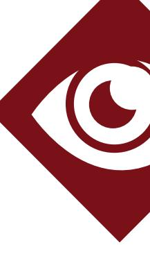

## Кровавое чародейство

*Этот ритуал всегда казался Карне нездоровым, но что по‑ делаешь… Заигрывание с Кровью — дело грязное. Призвав на помощь свою витэ, она нагретой ложечкой вынула глазное яблоко бессознательной жертвы, вздохнула, прямо как человек, отделила скользкий шарик от тянущихся к глазнице сосудов и положила его себе в рот.*

*Затем Карна протянула руку, в которую помощ‑ ники вложили увесистый нож. Решительным движением она вытащила изо рта жертвы кончик языка и отсекла его. Этот кусочек плоти она также положила себе в рот, а затем проглотила оба компонента. Другие тремеры тем временем принялись обрабатывать раны несчастного мужчины.*

*Отвернувшись, Карна начала изучать фракийский текст на стене помещения, в котором разворачивалась вся эта зловещая сцена. Человек был слишком упрям — он не поддался ментальному внушению, отказался сделать перевод добровольно, и даже пытки наверняка не сломи‑ ли бы его. Очень жаль, но пришлось прибегнуть к магии, забрав у него язык и глаз — зато теперь Карна могла пользоваться его знаниями: читать и говорить на древнем языке.*

**ДРУГИЕ НАЗВАНИЯ:** Своего рода магия, Тауматургия, Квиетус1 .

Тремеры утверждают, что Кровавое чародейство или Тауматургию, как они его называют, — изобрёл их клан. Бану Хаким возражают на это, ведь они прак‑ тиковали Квиетус, известный как Упокоение, задолго до того, как тремеры стали вампирами. Есть и другие кланы, заявляющие то же самое. Пускай происхожде‑ ние этой Дисциплины и окутано туманом, её пугаю‑ щая природа давно стала притчей во языцех. Мало кто из Сородичей готов довериться тому, кто способен манипулировать самой витэ в их жилах и обращать Кровь в яд.

Эта Дисциплина отличается от остальных тем, что практикующему обязательно нужен учитель — её нельзя постичь самостоятельно, просто поглощая кровь нужного резонанса. Ещё совсем недавно тремеры по‑ лагались на пирамидальную иерархию своего клана, чтобы неонаты получали должное обучение, а предста‑ вители Бану Хаким считали, что лучший из возможных наставников — это сир. Тёмная современность выну‑ дила многих Детей Хакима оказаться вдали от сиров в Европе и Америке, а с падением Пирамиды неонаты тремеров лихорадочно разыскивают обрывки истинных

1 Прим. пер.: quietus (лат.) — «тихий, замерший».

знаний на страницах заплесневелых томов и палимпсе‑ стов. Мастера, в совершенстве овладевшие Кровавым чародейством, способны сами разрабатывать новые ритуалы, однако многие из них ревностно охраняют свои секреты, упиваясь окружающим их ореолом таин‑ ственности. Практиковать Кровавое чародейство значит подчинить себе витэ. Как бы эту Дисциплину ни использовали, она неизменно служит напоминанием о том, как далеки вампиры от всего человеческого, ведь ни один человек не способен овладеть подобными си‑ лами.

#### **Общие правила**

Кровавое чародейство выделяется в ряду других Дис‑ циплин: в дополнение к силам оно открывает своим адептам возможность проводить ритуалы соответ‑ ствующего уровня или ниже. Гули кровавых чародеев и слабокровные вампиры, пьющие сангвинический сок, получают временный доступ к силам этой дисципли‑ ны, но ритуалы остаются для них недоступными. Силы Кровавого чародейства проигрывают в сравнении с си‑ лами других Дисциплин, но это отставание с лихвой компенсирует разнообразие ритуалов — если, конечно, вампир найдёт способ их изучить. В процессе создания персонажа вампир, владеющий хотя бы одним уровнем Кровавого чародейства, может выбрать один ритуал первого уровня. Новые ритуалы можно приобретать во время игры, отдав за каждый 3 × уровень ритуала пунктов опыта. Изучение ритуалов — это долгий и тру‑ доёмкий процесс. Чтобы приблизительно определить, сколько недель для этого необходимо, можно возвести в квадрат уровень желаемого ритуала.

- n **Вид:** чародейство.
- n **Угроза Маскараду:** от низкой до высокой. У сил и ритуалов множество разнообразных эффектов некоторые из них совершенно незаметны, а другие откровенно противоестественны.
- n **Резонанс:** сангвинический. Хоть Кровавое чаро‑ действо не является свойством самой витэ, работу с ним облегчает кровь оккультистов, чародеев и ли‑ деров сект, а также библиофилов и людей, страдаю‑ щих гемофилией.

#### **Уровень 1 ВКУС КРОВИ**

Попробовав каплю крови на вкус, вампир может опре‑ делить некоторые качества хозяина этой крови.

- n **Расплата:** нет.
- n **Пул:** упорство + Кровавое чародейство.

n **Правила:** вампир касается крови языком, после чего должен пройти проверку со сложностью 3. При успе‑ хе он может определить резонанс и его интенсив‑ ность, а также природу существа, которому принад‑ лежала кровь: человек это, гуль, вампир или иное сверхъестественное создание (в последнем случае конкретный вид существа он может и не определить). Попробовав на вкус витэ, вампир, помимо прочего, может сказать, какова сила Крови Сородича (а зна‑ чит, и приблизительный диапазон поколений). Три‑ умф позволит понять, к какому поколению принад‑ лежит Сородич и совершал ли он диаблери, а если перед вампиром оказалась кровь сверхъестествен‑ ного существа, каинит определит, к какому виду оно относится, если встречал подобных существ раньше. n **Длительность:** нет.

#### **ЕДКАЯ КРОВЬ**

Изменив свойства собственной Крови, вампир может превратить её в едкое вещество, разрушающее неживую материю. Если Крови и времени достаточно, то практи‑ чески любой предмет можно растворить до состояния дымящегося осадка.

- n **Расплата:** одно или несколько испытаний Крови.
- n **Правила:** проверок не требуется. Вампир должен концентрироваться в течение хода, а затем из от‑ крытой раны (как правило, нанесённой самостоя‑ тельно) капнуть своей Кровью на неживую материю (за исключением неживой плоти, как у Сородичей), пройдя при этом испытание Крови. Одной порции хватит, чтобы обратить в шлак около 35 см более‑ менее податливого вещества во все стороны от ме‑ ста соприкосновения, что занимает около 5 минут. Если воздействию подвергаются мягкие металлы (медь, чугун), времени может потребоваться боль‑ ше. Разрушить более твёрдые материалы, такие как сталь или некоторые другие сплавы, чрезвычай‑ но сложно — на них, несомненно, останутся следы, но хватит ли этого, чтобы нанести существенный вред структуре, решит рассказчик (во всяком слу‑ чае, наручники не должны составлять проблемы, если вампиру хватит Крови и времени).
- n **Длительность:** нет.

#### **Уровень 2 ИСТОНЧЕНИЕ ВИТЭ**

Вампир может лишить витэ в чужих жилах способности поддерживать нежизнь. По мере того как внутренние резервы жертвы станут иссякать, её Голод будет раз‑ гораться всё сильнее.

- n **Расплата:** одно испытание Крови.
- n **Пул:** интеллект + Кровавое чародейство против выносливости + самообладания.
- n **Правила:** держа другого Сородича в поле зрения, персонаж должен сконцентрироваться и победить в состязании. Воздействие сопровождается едва заметным жестом и занимает 1 ход. В результате Голод жертвы увеличится на 1 пункт (в случае три‑ умфа — на 2 пункта). Чтобы определить обидчика, если жертва может его видеть, она должна победить в состязании интеллекта + оккультизма против сме‑ калки + хитрости.
- n **Длительность:** нет.

#### **Уровень 3 КАСАНИЕ СКОРПИОНА**

Вампир способен превратить часть своей крови в яд, парализующий и смертных, и Сородичей. Этой суб‑ станцией он может смазать клинок или просто плюнуть в противника. Смертные под воздействием яда теряют дееспособность, вампиров же он не обязательно делает беспомощными, но тем не менее затрудняет их движе‑ ния. Лучшей защитой от подобных атак является Стой‑ кость, а также специальные дыхательные упражнения и БОС‑техники, практикуемые некоторыми тайными обществами.

- n **Расплата:** одно или несколько испытаний Крови.
- n **Пул:** сила + Кровавое чародейство против вынос‑ ливости + оккультизма / Стойкости.
- n **Правила:** вампир концентрируется, а затем направ‑ ляет свою кровь через открытую рану (как правило, нанесённую самому себе). Одного испытания Кро‑ ви достаточно, чтобы омыть ядовитой витэ клинок или набрать полный рот для плевка. Занимает это один ход. Чтобы плюнуть ядом в цель, нужно атако‑ вать её, пройдя проверку ловкости + атлетики (это обычная атака дистанционного боя, от которой можно увернуться), однако известны случаи, когда вампир травил свою жертву в страстном поцелуе. Ещё более коварные Сородичи обращают свою кровь в яд, чтобы поразить потенциального диаб‑ лериста: добровольно хлебнувший отраву вампир гарантированно получит урон. Другие способы применения этого яда, однако, маловероятны он теряет свою эффективность при растворении и слишком вязкий, чтобы вводить его при помощи шприца. С его помощью нельзя отравить напиток, а благодаря разнице давления его нельзя ввести в организм жертвы при укусе. На обычной пуле или наконечнике стрелы остаётся слишком мало

ядовитой субстанции, чтобы имело смысл её ис‑ пользовать, а на заполнение специальных полых пуль уходит слишком много времени, и яд в них становится неэффективным.

Отравленная ядовитой витэ жертва должна пройти состязание выносливости + оккультизма против силы + Кровавого чародейства отрави‑ теля (вампиры, обладающие Стойкостью, могут использовать для проверки эту Дисциплину вме‑ сто оккультизма). Если победит отравитель, жертве будет нанесено по одному повреждению за каждую ступень выигрыша — при этом смертные получают тяжёлый урон, а вампиры — лёгкий, который не де‑ лится пополам. Смертный, получивший таким обра‑ зом хотя бы 1 повреждение, падает без сознания.

n **Длительность:** яд сохраняет эффективность в тече‑ ние одной сцены.

#### **СГУЩЕНИЕ КРОВИ**

Вампир может сгустить свою Кровь, временно сделав её сильнее.

- n **Расплата:** одно испытание Крови.
- n **Пул:** упорство + Кровавое чародейство.
- n **Правила:** вампир должен пройти проверку со слож‑ ностью 2 + сила Крови. В случае успеха сила Кро‑ ви на одну сцену увеличится на 1 пункт, в случае триумфа — на 2 пункта. При использовании этой силы вампир может выйти за рамки ограничений его поколения по силе Крови.
- n **Длительность:** одна сцена или до рассвета.

#### **Уровень 4 ХИЩЕНИЕ КРОВИ**

Необъяснимым образом вампир вскрывает крупную артерию на теле смертной жертвы. Прямо по воз‑ духу из открытой раны в рот вампира устремляется поток крови. Жертва при этом находится в трансе, как при обычном Поцелуе, а рана затягивается сама собой по окончании действия силы независимо от того, выжила жертва или погибла от потери крови. Хище‑ ние крови выглядит весьма впечатляюще и при наличии свидетелей, несомненно, нарушает Маскарад, однако после использования эта сила не оставляет никаких следов.

- n **Расплата:** одно испытание Крови.
- n **Пул:** смекалка + Кровавое чародейство против сме‑ калки + оккультизма.
- n **Правила:** вампир делает приглашающий жест в сторону смертной жертвы, находящейся в его поле зрения, после чего должен вступить в состя‑

зание смекалки + Кровавого чародейства против смекалки + оккультизма цели. При победе одна из артерий цели открывается, и вампир может на‑ сытиться её кровью с расстояния нескольких метров (при этом, если цель одета в герметичный костюм вроде комбинезона химзащиты, вся кровь останется внутри одежды). Пока вампир насыщается подоб‑ ным образом, он не может ничего больше делать, но при этом он поглощает кровь с удвоенной ско‑ ростью (с тройной, если у него триумф).

n **Длительность:** одно насыщение.

#### **Уровень 5 КОТЁЛ КРОВИ**

Под воздействием этой ужасающей силы кровь вски‑ пает прямо в жилах врага, причиняя невыносимую боль и нанося чудовищные повреждения. Можно найти не‑ мало гораздо более эффективных способов убийства, но вряд ли среди них сыщется способ более жестокий.

- n **Расплата:** одно испытание Крови, а также один или несколько пунктов сомнений.
- n **Пул:** упорство + Кровавое чародейство против са‑ мообладания + оккультизма / Стойкости.
- n **Правила:** расплатившись за применение силы, вампир должен прикоснуться к жертве (в бою или аналогичных ситуациях для этого потребу‑ ется проверка ловкости + атлетики), а затем всту‑ пить в состязание. В случае победы жертва полу‑ чит по одному тяжёлому повреждению за каждую ступень выигрыша. Смертный, получивший таким образом хотя бы 1 повреждение, мгновенно умирает со страшными криками. Вампир повышает свой Го‑ лод на 1 пункт за каждое повреждение, пока Голод не достигнет 5.
- n **Длительность:** один ход.

#### **ЛАСКА ВААЛА**

Вампир может превратить свою Кровь в чрезвычайно токсичный яд, одинаково смертельный как для смерт‑ ных, так и для Сородичей.

- n **Расплата:** одно или несколько испытаний Крови.
- n **Пул:** сила + Кровавое чародейство против вынос‑ ливости + оккультизма / Стойкости
- n **Правила:** эта сила применяется так же, как Каса‑ ние скорпиона (стр. 273); яд имеет те же ограниче‑ ния, но наносит больше урона.

Отравленная ядовитой витэ жертва должна вступить в состязание выносливости + оккультизма против силы + Кровавого чародейства отравителя (вместо оккультизма вампиры могут воспользовать‑

ся Стойкостью). Если победит отравитель, жертве будет нанесено по одному тяжёлому повреждению за каждую ступень выигрыша независимо от того, является она смертной или Сородичем. При этом смертный, получивший таким образом хотя бы 1 повреждение, умирает мгновенно, а Сородич должен повторно вступить в состязание. Если отравитель опять победит, то его жертва-Сородич впадёт в торпор, как только следующий раз погрузится в сон.

 $\blacksquare$ Длительность: яд сохраняет эффективность в течение одной спены.

## Ритуалы

Если в описании ритуала не указано иных условий, то для его проведения требуется пройти испытание Крови, потратить 5 × уровень ритуала минут и выиграть проверку интеллекта + Кровавого чародейства (сложность равна уровню ритуала + 1). Часто ритуалы требуют использования различных ингредиентов, хотя есть и такие, где вампиру достаточно просто сосредоточиться. Нередко ингредиенты, подобранные в соответствии с принципами симпатической магии или алхимии, необходимо смешать с Кровью заклинателя. Как правило, эффект ритуала, расширяющего возможности индивидуума, действует только на того, кто провёл ритуал.

#### ЗАШИТНАЯ ПЕЧАТЬ

Тремеры применяют защитные печати довольно широко. Следуя герметической традиции, они используют при их создании магические формулы (или знаки). Бану Хаким, в свою очередь, вместо оккультных символов предпочитают письмена,

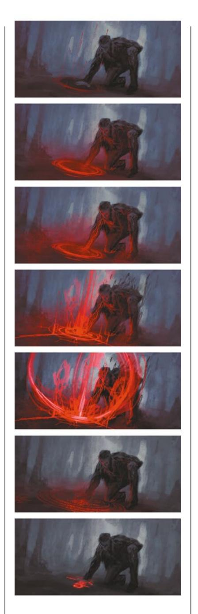

составленные по методам абджадии или гематрии. Впрочем, принцип действия в обоих случаях один и тот же. Защитная печать - это некий символ или сочетание письменных знаков, способные отпугивать определённую категорию нечисти, обозначенную в правилах словом «злоумышленник». Прикоснувшись к защитной печати, злоумышленник ощущает что-то вроде электрического разряда, оставляющего ожоги на теле и вызывающего внезапный приступ ужаса. Защитная печать не срабатывает, если контакт с ней произошёл насильно: например, ударив злоумышленника мечом, на который нанесена защитная печать, вампир не причинит ему дополнительного вреда и не напугает, но при этом сам злоумышленник не сможет взять этот меч в руки.

Защитная печать действует на площадь приблизительно в квадратный метр - нельзя, к примеру, защитить с её помощью целый автомобиль, но можно наложить печать на руль. Для этого вампир должен пролить свою Кровь на предмет, а затем пальцем начертить ею нужный символ. Как только он сотрёт Кровь с предмета, защитная печать станет невидимой. Она сохранится до тех пор, пока предмет не будет физически уничтожен или сломан, причём злоумышленник не может сделать это сам.

Проверку нужно проходить не раньше, чем первый злоумышленник коснётся защитной печати, и нужна она только один раз. В случае успеха заклинателя защитная печать наносит злоумышленнику 1 тяжёлое повреждение, а в случае триумфа — 3. Перчатки и другая одежда не защищают от воздействия защитной печати. Если любой злоумышленник хочет повторно прикоснуться к защитной печати, он должен потратить 1 пункт воли, а затем выиграть проверку выносливости + упорства (сложность 4 или 7 при изначальном триумфе заклинателя).

Потустороннее зрение (Ясновидение 1) позволит увидеть защитную печать, если наблюдатель победит в состязании интеллекта + Ясновидения против интеллекта + Кровавого чародейства.

ЗАЩИТНЫЙ КРУГ. Защитный круг похож на обычную защитную печать, но его, как правило, чертят на земле или на полу. Для круга требуется в 3 раза больше ресур‑ сов, чем для печати того же типа. Даже если вампир умеет создавать защитные печати от определённого вида созданий, это не значит, что он сможет создать соответствующий защитный круг, и наоборот. Защит‑ ный круг срабатывает, когда злоумышленник пытает‑ ся пересечь его контур. Как правило, защитный круг не препятствует тому, чтобы злоумышленник его поки‑ нул, если только заклинатель изначально не начертил его вокруг злоумышленника и не настроил его так, чтобы защита была направлена внутрь.

Создание защитного круга отличается от создания защитной печати в следующих аспектах: для того, что‑ бы начертить круг, требуется пройти три испытания Крови; радиус круга может быть до трёх метров; со‑ здание круга занимает целую ночь; круг развеется сле‑ дующим утром, если заклинатель не пройдёт проверку проведения ритуала (сложность на 2 выше, чем обыч‑ но) — при успехе круг продержится год и один день.

Когда злоумышленник попытается пересечь контур защитного круга, проведите состязание интеллекта + Кровавого чародейства заклинателя против силы воли злоумышленника (если игроки или рассказчик записали результат изначальной проверки проведения ритуала, можно использовать это значение). Если злоумышлен‑ ник победил, он может пересечь контур. Если проиграл, он получит 3 лёгких повреждения (тяжёлых при триум‑ фе заклинателя) и не сможет зайти внутрь круга. Чтобы предпринять повторную попытку, он должен потратить 1 пункт воли. Если злоумышленник победил в состяза‑ нии, зашёл внутрь круга, а затем вышел, он вновь дол‑ жен будет пройти проверку в состязании, если захочет снова войти (результат проверки заклинателя остаётся).

#### **Уровень 1 ВЕЧЕРНЯЯ БОДРОСТЬ**

Если совершить этот ритуал перед рассветом, вампир, потревоженный днём, проснётся в полной готовности, будто уже наступила ночь.

- n **Компоненты:** сожжённые кости и перья петуха.
- n **Ритуал:** вампир смешивает пепел со своей Кровью, а затем чертит получившимся составом круг с цен‑ тром на том месте, где намеревается спать.
- n **Правила:** проверка требуется не раньше, чем воз‑ никает реальная опасность. Если вампир побежда‑ ет, он просыпается и в течение одной сцены может действовать без дневных штрафов. В случае три‑ умфа эффект продлится до следующей зари.

#### **ЗАЩИТНАЯ ПЕЧАТЬ ОТ ГУЛЕЙ**

Осторожные тремеры создали этот ритуал, чтобы за‑ щитить себя от слуг своих мстительных соперников.

Защитная печать от гулей создаётся по общим пра‑

n **Компоненты:** только Кровь заклинателя.

#### **ПАУЧЬИ ЛАПЫ**

Вампир обретает способность ползать по стенам и потолку, словно гигантское гротескное насекомое или паук.

- n **Компоненты:** живой паук.
- n **Ритуал:** вампир наполняет ёмкость своей витэ, рас‑ тирает туда паука, а затем выпивает получившийся коктейль (Голод при этом не утоляется). Эффект действует только на того, кто приготовил снадобье.
- n **Правила:** успех при проверке проведения ритуала дарует способность ползать по стенам и потолку в течение одной сцены, а триумф увеличивает дли‑ тельность эффекта на всю ночь. Вампир должен соприкасаться с поверхностью руками и ногами. Передвигается он с половиной обычной скорости.

#### **ПОСТИЖЕНИЕ КРОВИ**

Постижение крови расширяет возможности Вкуса кро‑ ви, позволяя вампиру получить больше информации о цели, если это другой вампир.

- n **Компоненты:** серебряная чаша, наполненная витэ цели (объём равноценен одному испытанию Крови).
- n **Ритуал:** вампир смешивает свою Кровь и витэ цели, а затем примерно час читает над чашей заклина‑ ния.
- n **Правила:** победа при проверке проведения ритуала (см. стр. 275) позволит вампиру узнать поколение, к которому принадлежит цель, её имя и имя её сира. В случае триумфа он узнает также, с кем цель свя‑ зана узами крови в качестве сюзерена или вассала.

#### **ПУТЕВОДНЫЙ КАМЕНЬ**

Этот ритуал позволяет создать путеводный камень магический маячок, направление и примерное расстоя‑ ние к которому всегда известно заклинателю. После того как Камарилья начала отказываться от использо‑ вания современных технологий, этот забытый ритуал вновь вошёл в обиход.

- n **Компоненты:** кусочек железной руды или малень‑ кий магнит, литр любой крови в серебряной чаше.
- n **Ритуал:** вампир капает свою витэ в чашу с кровью и кусочком руды (или магнитом), а затем в течение часа читает над ней заклинание. Его нужно повто‑

вилам (стр. 275).

**276**

рить на следующие две ночи. В конце третьей путе‑ водный камень впитает в себя всю кровь, и жид‑ кость станет прозрачной.

n **Правила:** в конце третьей ночи вампир должен пройти проверку проведения ритуала. В случае успеха он настраивает свой разум на путеводный камень и может безошибочно чувствовать направ‑ ление и расстояние до него. Эффект длится неделю, если камень не уничтожат раньше. Количество пу‑ теводных камней, за которыми может следить вам‑ пир, равно его показателю упорства.

#### **Уровень 2 ЗАЩИТНАЯ ПЕЧАТЬ ОТ ДУХОВ**

С помощью этого ритуала можно защитить некий объект от бесплотных созданий, таких как призраки, голодные духи и духи стихий. Защитная печать сра‑ ботает при любой попытке манипулировать объектом или пройти сквозь него.

Защитная печать от духов создаётся по общим пра‑ вилам (стр. 275).

n **Компоненты:** горсть соли (иногда горсть толчёного кирпича), смешанная с Кровью.

#### **ЗАЩИТНЫЙ КРУГ ОТ ГУЛЕЙ**

Этот ритуал позволяет начертить на полу или на земле защитный круг, который не пропустит внутрь гуля.

Защитный круг от гулей создаётся по общим пра‑ вилам (стр. 276).

n **Компоненты:** круг нужно начертить Кровью, ис‑ пользуя для этого человеческую кость.

#### **ИСТИНА В КРОВИ**

Этот ритуал, до последнего времени известный только визирям Бану Хаким, позволяет создать мистический эликсир, дарующий способность отличать правду от лжи. Эффект ритуала порой бывает настолько мощ‑ ным, что открывает даже забытую или неизвестную истину.

- n **Компоненты:** примерно пол‑литра крови цели.
- n **Ритуал:** вампир смешивает кровь цели с собствен‑ ной витэ, используя ёмкость достаточно большую, чтобы в неё можно было опустить палец.
- n **Правила:** вместо обычной проверки проведения ритуала вампир опускает палец в ёмкость с кровью, а затем проходит по одному состязания упорства + Кровавого чародейства против самообладания + оккультизма после каждого утверждения, сделанного целью. Первое же поражение чародея прерывает ри‑ туал. Победа позволит определить, когда цель созна‑

тельно лжёт, а триумф заставит цель поведать боль‑ ше, чем та собиралась, и добавлять детали, виденные лишь мельком, забытые или вытесненные из памяти (рассказчик должен сообщить игроку, если тот уже получил всю возможную информацию). Во время ритуала кровь в ёмкости всё время будет бурлить и пузыриться, а в конце сцены обратится в прах.

С помощью этого ритуала нельзя преодолеть воздействие Провала в памяти, Забвения или иных сил, изменяющих память. Заклинатель может дога‑ дываться, отчего воспоминания неточны или во‑ все отсутствуют, но добраться до истины ему не под силу.

#### **ОЧИ ВАВИЛОНСКИЕ**

Проглотив язык и глаз жертвы, вампир получает спо‑ собность говорить и читать на любом языке, который был жертве известен.

n **Компоненты:** свежеизвлечённые язык и глаз жертвы.

- n **Ритуал:** вампир вынимает глаз и отрезает язык жертве, пережёвывает их и глотает (вероятно, это вызовет тяжкие сомнения).
- n **Правила:** испытание Крови в данном случае необ‑ ходимо для того, чтобы проглоченные ингреди‑ енты «переварились». После этого вампир должен пройти проверку проведения ритуала. В случае успеха он в течение недели сможет читать и гово‑ рить на любом языке, известном жертве, на том же уровне, что и жертва. В случае триумфа эффект продлится месяц.

#### **СВЕЧЕНИЕ СЛЕДОПЫТА**

Этот ритуал позволяет видеть светящийся след, остав‑ ленный определённым персонажем на месте своего недавнего пребывания.

- n **Компоненты:** белая атласная лента.
- n **Ритуал:** вампир пропитывает ленту своей Кровью и поджигает её.
- n **Правила:** в случае успеха при проверке проведения ритуала лента вспыхивает так, будто её пропитали бензином, а не кровью. Как только лента сгорит до конца, вампир сможет увидеть след, оставлен‑ ный целью за последние 24 часа. Эффект длится одну ночь (две в случае триумфа). Чтобы разглядеть след, вампир должен успешно пройти проверку интеллекта + выживания со сложностью 6 минус значение выигрыша в изначальной проверке. След при этом виден даже там, где его невозможно оста‑ вить физически (например, в многолюдном городе). Вампир должен знать свою цель в лицо.

#### **СВЯЗЬ С СИРОМ**

Вампир использует близость между сиром и его потом‑ ком, чтобы открыть телепатический канал, с помощью которого дитя сможет на огромном расстоянии общать‑ ся со своим создателем. Как и многие другие ритуалы, Связь с сиром переживает возрождение в наш век то‑ тальной прослушки и электронных систем наблюдения.

- n **Компоненты:** предмет, принадлежавший сиру, а также серебряная чаша с чистой водой.
- n **Ритуал:** вампир помещает предмет в воду и капает туда своей Кровью, погрузившись в последние вос‑ поминания о сире примерно на 30 минут.
- n **Правила:** спустя 15 минут вампир должен пройти проверку проведения ритуала. В случае победы ещё через 15 минут он сможет на протяжении 10 минут мысленно беседовать с сиром. В случае три‑ умфа вторые 15 минут ждать не придётся. Любая серьёзная помеха с той или другой стороны пре‑ рывает контакт.

#### **Уровень 3 ЗАЩИТНАЯ ПЕЧАТЬ ОТ ЛЮПЕНОВ**

Эта защитная печать защищает от оборотней в любой форме. Эффект срабатывает при попытке прикоснуться к предмету.

Защитная печать от люпенов создаётся по общим правилам (стр. 275).

n **Компоненты:** горсть серебряного порошка, сме‑ шанная с Кровью.

#### **ЗАЩИТНЫЙ КРУГ ОТ ДУХОВ**

Этот ритуал позволяет начертить на полу или на земле защитный круг, который не пропустит внутрь духа. Хотя этот ритуал не самый простой для исполнения, именно его описание чаще всего встречается в разнообразных гримуарах и других источниках. Человек теоретически может воспроизвести этот ритуал, пройдя проверку интеллекта + оккультизма (сложность 6), однако, чтобы защитный круг действительно заработал, смертному за‑ клинателю потребуется витэ, какой‑то иной сверхъесте‑ ственный ингредиент или помощь потусторонних сил.

Защитный круг от духов создаётся по общим пра‑ вилам (стр. 276).

n **Компоненты:** круг нужно начертить смесью Крови с солью, используя для этого железный нож.

#### **ЗОВ ДАГОНА**

Этот зловещий ритуал, излюбленное орудие ассаси‑ нов Бану Хаким, позволяет издалека разрывать сосуды прямо в теле жертвы, лишь мимолётно коснувшись её однажды. Для смертных это, скорее всего, означает кровавую смерть, и даже вампирам стоит опасаться незримых убийц, владеющих этим ритуалом.

- n **Компоненты:** церемониальный кинжал, инкрусти‑ рованный золотом.
- n **Ритуал:** сперва жертва должна приобщиться Крови заклинателя — выпить её, дотронуться до откры‑ той раны или даже коснуться одной‑единствен‑ ной капли, что упала ей на руку. В течение недели, но не ранее чем через час, заклинатель может совер‑ шить ритуал, пролив свою Кровь при помощи це‑ ремониального кинжала. Как только первые капли витэ упадут на землю, ритуал начнёт действовать.
- n **Правила:** вампир должен победить в состязании упорства + Кровавого чародейства против вынос‑ ливости + упорства цели. Каждая ступень выигры‑ ша наносит жертве одно повреждение — её крове‑ носные сосуды лопаются, а лёгкие наполняются кровью. Смертные получают тяжёлые повреждения, а вампиры — лёгкие. При желании заклинатель может повторить процесс ещё дважды, каждый раз проходя дополнительное испытание Крови.

#### **ОТТОРЖЕНИЕ ГУБИТЕЛЬНОГО ДРЕВА**

Этот ритуал защищает вампира от протыкания колом при первой удачной попытке попасть ему в сердце дре‑ весина треснет, не пробив даже кожу.

- n **Компоненты:** деревянные щепки или стружка.
- n **Ритуал:** вампир смешивает щепки или стружку со своей Кровью и чертит круг, оставаясь в его цен‑ тре. Затем он должен в течение часа медитировать в этом кругу и в завершение ритуала положить под язык кусочек древесины.
- n **Правила:** проверку проведения ритуала нужно пройти тогда, когда вампиру попытаются про‑ ткнуть сердце колом (недостаточно просто дер‑ жать кол в руках или отбиваться с его помощью). В случае успеха кол треснет, едва коснувшись кожи вампира. В случае триумфа щепки разлетятся во все стороны, ослепляя противника на два хода. Эффект продлится до конца ночи, если кусочек дерева будет всё это время лежать под языком у вампира.

#### **ПОЖИРАТЕЛЬ ПЛАМЕНИ**

Этот болезненный ритуал позволяет заклинателю и даже его союзникам обрести устойчивость к огню.

- n **Компоненты:** фаланга пальца заклинателя.
- n **Ритуал:** вампир отрезает себе фалангу пальца, а за‑ тем сжигает её вместе с собственной Кровью в золо‑ том кубке или чаше.

n **Правила:** чтобы отрезать кончик пальца, нужно пройти проверку выносливости + упорства со слож‑ ностью 3. Затем вампир должен пройти проверку проведения ритуала. В случае победы голубое пламя поглотит палец и Кровь, что свидетельствует об окон‑ чании ритуала. До конца ночи огонь будет наносить заклинателю только половину урона. Ритуал можно провести над кем‑то другим, но заклинателю в лю‑ бом случае придётся отрезать свой собственный палец. Увечье не считается достаточно серьёзным, чтобы отмечать его как повреждение. Фаланги паль‑ цев восстанавливаются за время дневного сна.

#### **ЭССЕНЦИЯ ВОЗДУХА**

Вампир изготавливает зелье, которое позволит ему летать какое‑то время. Камарилья не одобряет его ис‑ пользование из‑за высокого риска нарушить Маскарад, поэтому его популярность упала за последние столетия.

- n **Компоненты:** листья и ягоды белладонны.
- n **Ритуал:** вампир должен погрузить белладонну в собственную Кровь, а затем выварить её над жа‑ ровней, повторяя при этом заклинание.
- n **Правила:** вываривая белладонну, вампир должен пройти проверку проведения ритуала. При успехе он получит чёрное зелье, которое сохранит свои свойства до конца ночи. В случае триумфа полу‑ чится две порции зелья вместо одной. Потерпев поражение, вампир поймёт, что ритуал не удался, так что сюрпризы ему не грозят. Эффект сраба‑ тывает после того, как заклинатель выпьет зелье (для остальных оно бесполезно): вампир может ле‑ тать или парить со скоростью бега в течение одной сцены. При этом он способен поднять человеческий вес, но его скорость упадёт до шага. Чтобы поднять в воздух сопротивляющегося противника или вы‑ рваться из рук того, кто пытается удержать чародея, требуется победить в состязании силы + Кровавого чародейства против силы + атлетики.

#### **Уровень 4 БЕСПЛОТНЫЙ ПУТЬ**

Заклинатель становится бесплотным, словно призрак. В этом состоянии ему невозможно нанести вред физи‑ чески, и он может свободно проходить сквозь матери‑ альные объекты. Хотя вампир не способен манипули‑ ровать предметами, его тем не менее видно и он всё ещё может говорить.

- n **Компоненты:** зеркало.
- n **Ритуал:** читая заклинание, вампир проливает на зеркало свою Кровь, а затем разбивает его.

n **Правила:** при успешной проверке проведения ритуа‑ ла вампир становится бесплотным и может сохра‑ нять эту форму до тех пор, пока держит при себе осколок зеркала. В этом состоянии вампиру наносит урон только огонь, солнечный свет, а также волшеб‑ ное оружие и ритуалы, способные навредить духам. Бесплотного заклинателя видно и слышно, но он не может взаимодействовать с материальными объек‑ тами или существами. Пробуждение Крови для него тоже недоступно. Заклинатель не получает доступа к иным планам бытия — ритуал не превращает его в настоящего призрака или духа. Будучи бесплот‑ ным, вампир обретает способность проходить сквозь стены, но только по прямой — он не может сменить направление движения, находясь внутри твёрдой материи. Эффект ритуала длится одну сцену, если вампир не уронит осколок раньше. Для вампира, вер‑ нувшегося в материальную форму внутри или вокруг твёрдого объекта, последствия могут быть самыми разными — от небольшого неудобства (пепельница застряла в материализовавшейся руке) до погребения внутри монолитной структуры или полного уничто‑ жения (что именно произойдёт, решает рассказчик).

#### **ЗАЩИТА НЕПРИКОСНОВЕННОГО УБЕЖИЩА**

Вампир может защитить своё убежище от солнечного света, окутав место своего сна потусторонним мраком, сквозь который не проникают смертоносные лучи.

- n **Компоненты:** Кровь заклинателя.
- n **Ритуал:** вампир должен нанести защитные симво‑ лы или печати вокруг того места, которое он хочет защитить. Особенное внимание следует обратить на окна и двери, причём печать можно нанести даже на открытую арку, если она расположена внутри здания. Если рассказчик позволит, защитить можно также тенистые пространства со скудным освещением, например руины.
- n **Правила:** ритуал занимает час или даже больше, в за‑ висимости от величины и состояния участка, который требуется защитить. Его площадь не может превы‑ шать круг с радиусом в 6 метров. Проверку проведе‑ ния ритуала нужно пройти, как только взойдёт солн‑ це. В случае успеха внутри защищённого периметра сгущаются тени, не позволяя разглядеть что‑то сна‑ ружи, но в то же время защищая от солнечных лучей всех, кто находится внутри. Триумф позволит изнутри разглядывать мир вокруг, пускай и с трудом. Эффект ритуала сохраняется до заката, но если заклинатель выйдет за пределы очерченной территории до этого времени, то защита моментально пропадёт.

#### **ЗАЩИТНАЯ ПЕЧАТЬ ОТ КАИНИТОВ**

Этот ритуал защищает предмет от всех вампиров, кроме заклинате‑ ля. Эффект срабатывает при попыт‑ ке прикоснуться к вещи. При этом вампир, изучивший печать с помо‑ щью Ясновидения, сможет прочи‑ тать на нём имя заклинателя, если победит в состязании интеллекта + Ясновидения против интеллекта + Кровавого чародейства заклинателя.

Защитная печать от каинитов создаётся по общим правилам (стр. 275).

n **Компоненты:** пепел из всё ещё горящего костра; заклина‑ тель рискует впасть в бессиль‑ ную ярость — если это случится, то повторить попытку создания печати он сможет не раньше следующей ночи.

#### **ЗАЩИТНЫЙ КРУГ ОТ ЛЮПЕНОВ**

Этот защитный круг создаётся и функционирует по общим прави‑ лам (стр. 276).

n **Компоненты:** круг нужно на‑ чертить смесью Крови и сока волчьей ягоды, используя для этого серебряный нож.

#### **ОКО НОЧНОГО ЯСТРЕБА**

Этот ритуал близок к диким си‑ лам Анимализма. Он позволяет заклинателю вселиться в плото‑ ядную птицу, чаще всего в ворона или хищного пернатого, чтобы управлять его полётом и видеть его глазами. В попугаев или майн все‑ литься подобным образом нельзя, поскольку они не плотоядные. Не‑ которые тремеры годами обучали воронов разговаривать, чтобы использовать их в качестве вме‑ стилища в этом ритуале, но с па‑ дением Пирамиды у них стало существенно меньше свободного времени, и теперь мало кто может себе позволить подобную роскошь.

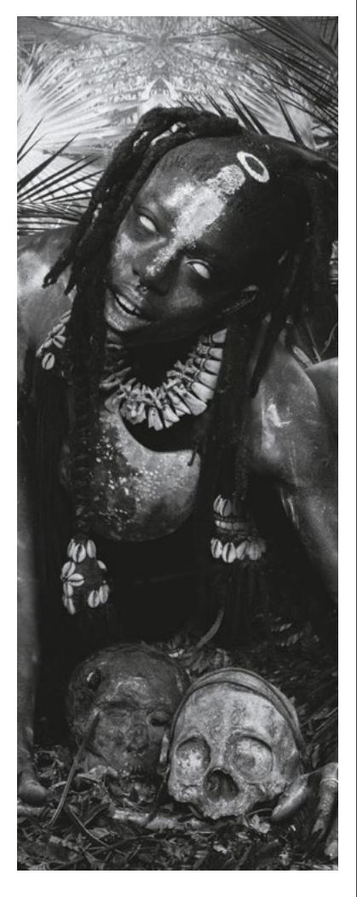

- n **Компоненты:** глаза птицы, через которые смотрел вампир, вырван‑ ные после окончания ритуала.
- n **Ритуал:** заклинатель поит пти‑ цу своей Кровью и входит в со‑ стояние транса.
- n **Правила:** успешная проверка проведения ритуала позволяет вампиру контролировать пере‑ движение птицы и смотреть её глазами. Триумф позволит заставить птицу совершать простые действия, например перемещать предметы, отпирать замки или нажимать на кнопки. Через птицу можно применять большую часть нефизических Дисциплин, даже Доминирова‑ ние, если заклинатель владеет Телепатией (стр. 271) или знает какой‑то другой способ общения без слов. Птица может удаляться на любое расстояние от вам‑ пира, однако если он до рас‑ света не успеет вырвать ей глаза, то сам ослепнет на три ночи.

#### **Уровень 5 ВРАТА ИСТИННОГО СВЯТИЛИЩА**

Проводя этот сложный ритуал, вам‑ пир создаёт два магических круга войдя в один из них, отмеченный как вход, вампир может мгновенно переместиться в другой, отмечен‑ ный как выход. Перемещение воз‑ можно только в одном направлении.

- n **Компоненты:** два круга диаме‑ тром около метра, выжженные на земле или на полу.
- n **Ритуал:** заклинатель при помо‑ щи открытого пламени выжи‑ гает круги на земле или на полу, а затем освящает каждый из них, три ночи подряд читая заклинания в течение двух часов и проходя каждый раз по два испытания Крови. Сум‑ марно этот ритуал требует 12 испытаний Крови.

n **Правила:** когда оба круга готовы, заклинателю нужно войти в тот, который он назначил вхо‑ дом, сконцентрироваться и успешно пройти про‑ верку проведения ритуала, что занимает один ход. При успехе заклинатель исчезнет и в то же мгно‑ вение появится в центре второго круга. Проверку нужно проходить каждый раз, когда заклинатель хочет переместиться, причём он может предпринять только одну попытку за сцену. Расстояние между входом и выходом не ограничено, но их нельзя рас‑ положить на движущейся поверхности, начертив, например, на полу транспортного средства. Закли‑ натель может переместить с собой одно существо или объекты общей массой примерно с одного чело‑ века. Повреждение одного из кругов разрушает ри‑ туал — оба круга при этом теряют свою силу. Одно‑ временно заклинатель может поддерживать только одну пару магических кругов с подобным свойством.

#### **ЖАЛО НЕИЗБЕЖНОЙ ПОГИБЕЛИ**

Мало какое оружие пугает Сородичей больше, чем кол, сделанный с помощью этого ритуала. Он не только сам находит свою цель, но ещё и несёт на своём острие Окончательную смерть. Миф о том, что вампира можно убить при помощи деревянного кола, появился, скорее всего, именно благодаря Жалу неизбежной погибели. Даже небольшой щепки, оставшейся в теле вампира после удара, может оказаться достаточно — сантиметр за сантиметром она будет двигаться к своей цели, пока не вонзится прямо в сердце.

- n **Компоненты:** рябиновый кол, покрытый знаками погибели.
- n **Ритуал:** заклинатель пропитывает кол своей витэ, пройдя при этом два испытания Крови, а затем до почернения держит его над костром, сложенным из дубовых дров, и читает при этом заклинания. Ритуал длится пять часов.
- n **Правила:** любой, кто использует этот кол (не только заклинатель), может добавить 3d10 к пулу всех про‑ верок, связанных с попытками вонзить его в сердце вампира (независимо от того, забивает он его мо‑ лотком, пока Сородич спит, использует как оружие ближнего боя или стреляет из арбалета). Если ата‑ кующий победит и его выигрыш составит 5, вампир рассыплется в прах в том же ходу, будто его поглотило невидимое пламя. При победе с меньшим выигрышем кол треснет, и его остриё останется в теле вампира, начав медленное движение в сторону сердца. Это мо‑ жет занять несколько часов или даже несколько ночей в зависимости от того, куда пришёлся удар, но в кон‑

це концов вампира ждёт Окончательная смерть, если только он не извлечёт жало хирургическим путём или при помощи какой‑то оккультной практики. Чтобы вырезать жало, требуется четырёхчасовая опе‑ рация (сам поражённый Сородич не сможет её про‑ вести) и проверка ловкости + медицины (сложность 6). Если жало ещё не достигло туловища, его можно удалить, отрезав соответствующую часть тела.

#### **ЗАЩИТНЫЙ КРУГ ОТ КАИНИТОВ**

Этот защитный круг создаётся и функционирует по об‑ щим правилам (стр. 276).

n **Компоненты:** круг нужно начертить смесью Крови и пепла из горящего костра, используя для этого рябиновую палочку.

#### **КАМЕННОЕ СЕРДЦЕ**

Совершив этот ритуал, вампир превратит своё сердце в камень. С одной стороны, его нельзя будет проткнуть колом, но с другой — Сородич станет ещё более холод‑ ным и безжалостным, чем обычно. Причуды симпатиче‑ ской магии превратят его в бездушную машину, неспо‑ собную к пониманию и сопереживанию.

- n **Компоненты:** большая каменная плита и восковая свеча, облитые Кровью заклинателя.
- n **Ритуал:** вампир должен лечь на каменную плиту и поставить свечу себе на грудь. Свеча должна про‑ гореть до конца. Как только её пламя коснётся кожи вампира, оно нанесёт ему 1 тяжёлое повреждение и вызовет приступ бессильной ярости. Чтобы про‑ тивостоять ему, вампир должен пройти соответ‑ ствующую проверку со сложностью 3. Если он по‑ терпит поражение, то не сможет завершить ритуал. Если же он сумеет преодолеть свой страх, он может пройти проверку проведения ритуала. В случае успеха его сердце навеки превратится в камень, а триумф к тому же залечит повреждения от свечи. Для того чтобы вернуть своё сердце в обычное со‑ стояние, вампир должен повторить ритуал.
- n **Правила:** сердце вампира в прямом смысле пре‑ вращается в камень — его нельзя проткнуть колом (при настойчивых попытках дерево расколется). Кроме того, заклинатель эмоционально отстраня‑ ется от всего, что происходит вокруг, — его пул про‑ верок мук совести уменьшается на 3d10, как и пул активных социальных проверок (на защитные про‑ верки штраф не распространяется), за исключением запугивания и Доминирования. Заклинатель не мо‑ жет применять силы Величия, но при этом добавляет 3d10 к пулу проверок защиты от этой Дисциплины.

## Алхимия слабокровных

*Всегда знал, что Педро занимается каким‑то странным дерьмом, но никогда не думал, что настолько упоротым. Он всё время посылал нас за разными штуками: то ему бен‑ зин с присадками подавай, то жидкость для электронных сигарет с яблочным ароматом, то стружку обеднённого урана, то диетическую джолт‑колу, то бромистый эти‑ дий, что бы это ни значило. Мы доставали что он просил, и он разливал всё это по бутылкам из‑под водки, раскла‑ дывал в пластиковые коробочки, рассыпал по пакетикам и всё подписывал. Ну иногда ещё просил что‑нибудь вроде кетамина, лошадиных транквилизаторов, ангельской пыли, грибов там каких‑нибудь или той ядрёной русской дряни, от которой кожа чернеет, но это уже были дела обычные.*

*Ну и как я сказал, бабки он платил хорошие, так что мы вопросов не задавали — каждому своё. Но это пока я к нему в лабораторию не завалился как‑то ночью без звонка. У меня нарисовался целый ящик просроченной квашеной капусты, и я думал, что, может, Педро её ку‑ пит. Да, меня колбасило, но клянусь, я видел что видел. Педро без рубашки стоит такой перед грёбаной печкой, огонь пышет жаром, блики гуляют по ящикам и бочон‑ кам на полках, а рядом какая‑то девчонка, и у неё от вены тянется трубка, по которой в большую стеклянную банку переливается её кровь. Педро в тот момент как раз под‑ писывал банку, так что меня он не заметил, но, думаю, вполне мог услышать, как я уронил ящик, да и воняет там теперь будь здоров.*

*Он звонил только что и спрашивал, нет ли у моих зна‑ комых в больнице чего на продажу, а я не хочу теперь даже близко к его лаборатории подходить. Никогда.*

#### **ДРУГИЕ НАЗВАНИЯ:** Варка, Самогон, Искусство, Кок‑ тейли.

Кровь младших поколений настолько разбавлена, что еле‑еле может поддерживать какие бы то ни было силы. Однако некоторые слабокровные научились ис‑ пользовать свою витэ в качестве катализатора, пробужда‑ ющего скрытый потенциал во всём, от психологической травмы до обыкновенного бензина. Алхимия зародилась среди уличных наркоманов и в коктейль‑барах, она была подкреплена инстинктами и средневековой мудростью со страниц заплесневелых фолиантов, и теперь каждый упырь знает, что это определяющее искусство XXI века. Смешивая человеческую кровь с сильным резонансом и некоторые другие компоненты с собственной витэ, алхимики могут воспроизводить широкий спектр сил, свойственных другим Дисциплинам, — и добиваться не‑ которых уникальных эффектов. Ночь полнится слухами

о чудесных эликсирах, дарующих возможность ходить под солнцем, разговаривать с предтечами или достичь Голконды. Впрочем, пока что уличным самогонщикам не остаётся ничего другого, как прятаться по самым тём‑ ным углам, ведь многие старейшины полагают, что их ре‑ месло — это диаблери для бедных.

Алхимия может воспроизводить некоторые силы Кро‑ вавого чародейства (те, которые действуют на витэ закли‑ нателя), но ритуалы алхимикам недоступны. Рассказчик может исключить также любую другую силу, если ему ка‑ жется, что её копирование нарушит баланс или поставит под вопрос правдоподобность происходящего. В дальней‑ шем он может передумать или намекнуть на совершенно уникальный рецепт, разработанный где‑то в Швейцарии или спрятанный в каирской библиотеке. Это очень моло‑ дая Дисциплина — далеко не все коктейли уже успели распробовать и далеко не все составы — изучить.

#### **Общие правила**

Для всех рецептов требуется витэ алхимика и чело‑ веческая кровь с правильным резонансом (стр. 226), которую можно хранить хоть в пакете‑гемаконе, хоть в стаканчике из «Старбакса». Необходимое количество крови зависит от интенсивности резонанса и прихоти рассказчика.

В приведённых ниже правилах под уровнем силы подразумевается уровень владения Алхимией, необ‑ ходимый для её воспроизведения, а не уровень Дисци‑ плины, к которой она относится.

Каждый рецепт требует расплаты и при дистилля‑ ции, и при дальнейшем использовании эликсира. Рас‑ плата при дистилляции отражает тот факт, что алхи‑ мику необходимо смешать компоненты с собственной витэ — он должен пройти одно испытание Крови. Рас‑ плата же при дальнейшем использовании полученного снадобья равнозначна расплате за активацию воспро‑ изведённой силы: возможно, не потребуется ничего, а возможно — одно или несколько дополнительных испытаний Крови.

Проверку дистилляции алхимик проходит тогда, когда активирует силу. В зависимости от метода ди‑ стилляции пул проверки может быть разный. Чем боль‑ ше успехов, тем эффективнее полученное снадобье.

| 2 | Слабый эффект, срабатывает не всегда или с задержкой |
|---|---------------------------------------------------------|
| 4 | Стандартный эффект                                      |
| 6 | Эффект сильнее, чем предпо лагалось                  |

Некоторые воспроизводимые эффекты требуют собственной проверки, чтобы определить, сработали они или нет и насколько хорошо. Алхимик должен пройти все необходимые проверки, заменяя в пуле показатели лругих Дисциплин на свой показатель Алхимии.

Изучение нового рецепта занимает определённое время. Для этого алхимик может заниматься исследованиями в библиотеке, медитировать в поисках просветления, проводить дегустации или экспериментировать в лаборатории. Игроки должны записывать рецепты, которые они обнаружили, и все необходимые компоненты. Приобретая очередной уровень Алхимии слабокровных, персонаж получает вместе с ней один рецепт. Вампир также может приобретать дополнительные рецепты за пункты опыта, если у него было время на изыскания.

- П Угроза Маскараду: зависит от метода дистилляции и силы, которую воспроизводит рецепт.
- Резонанс: у каждого рецепта свои требования к резонансу.

компоненты. В рецептах предложены варианты компонентов, которые могли бы использоваться в каждом конкретном случае. Но следует учитывать, что алхимики зачастую изобретают собственные комбинации, к тому же зашифровывая все записи, подобно своим средневековым предшественникам. Единственный неизменный компонент любого рецепта - это Кровь самого алхимика, но для большинства также требуется кровь человека с определённым резонансом. Для дистилляции вполне подойдёт холодная или свернувшаяся кровь, если её достаточно по объёму. Компоненты не обязательно должны быть материальными - впечатление или эмоция, запечатлённые в крови, зачастую не менее эффективны, чем вещества, которые сложно добыть.

В зависимости от редкости и качества ингредиентов рассказчик может увеличить или уменьшить пул алхимика на 1d10 или 2d10. Если игрок придумал какой-то оригинальный, особенно мерзкий или экстравагантный компонент, его стоит вознаградить за проявленную фантазию. В целом модификаторы могут быть следующими:

■ Добавь 1d10 за редкий (поиску которого будет посвящена целая история) или дорогой (показатель богатства должен быть на 1 пункт больше, чем уровень рецепта) компонент; вычти 1d10 за дешёвые аналоги, купленные в ближайшем супермаркете (во многих рецептах в качестве стандартных ингредиентов фигурирует бытовая химия или общедоступные продукты - в этом случае пул уменьшать не следует).

- Добавь 1d10 за особенно мощный или магический ингредиент, например рог единорога, красную ртуть, человеческую кровь с дискразией, кровь оборотня, витэ с силой Крови на 2 пункта выше, чем уровень рецепта; вычти 1d10 за использование медицинской крови, ароматической свечи из эзотерического магазинчика и прочих псевдооккультных вешиц.
- Добавь 1d10 за проявленную игроком фантазию, особенно если его персонажу придётся ввязаться в неприятности, чтобы раздобыть нужный ингредиент, или если какой-то компонент тесно связан с сюжетом.

МЕТОДЫ ДИСТИЛЛЯЦИИ. Когда персонаж изучает первый уровень Алхимии, он должен выбрать метод дистилляции. Если вампир захочет сменить его в дальнейшем, придётся начать все свои изыскания с самого начала — рецепты, которые подходят в одном случае, не сработают в другом. Алхимия с применением альтернативного метода считается, по сути, отдельной Дисциплиной.

АТАНОР КОРПОРИС («ТЕЛЕСНАЯ ПЕЧЬ»). Этот метод предполагает, что вампир использует в качестве атанора, алхимической печи, собственное тело. При этом он может задействовать аппаратуру для биологической обратной связи (БОС) или собственную интуицию, чтобы понять, какой эффект имеет тот или иной резонанс или их сочетание. Возможно, свойство его тела обусловлено тем, что во время обряда посвящения он принял некий эликсир, изменивший его плоть. Чаще всего в рецептах, присущих этому методу, в качестве компонентов используется кровь разных резонансов. Алхимику, как правило, необходимо перепробовать много разных образцов, чтобы подобрать идеальный вариант.

Чтобы начать процесс дистилляции, алхимик должен выпить кровь с необходимыми качествами, а затем пройти проверку выносливости + Алхимии и одно испытание Крови. Дистилляция происходит прямо в жилах вампира.

Одновременно алхимик может использовать только одну силу. Чтобы использовать другую, необходимо повторить процесс дистилляции с новыми ингредиентами. Это, как правило, занимает три хода - всё это время каинит должен быть сосредоточен на процессе и не может предпринимать никаких других действий.

КАЛЬЦИНАЦИЯ. Алхимик использует в качестве атанора тело человека, настраивая того физически и ментально на нужный лад при помощи психологического давле‑ ния или чтения заклинаний (некоторые алхимики при‑ меняют также наркотики). После этого вампир должен напоить сосуд своей витэ, пройти испытание Крови и успешно пройти проверку манипуляции + Алхимии.

Процесс дистилляции происходит в теле человека. Чтобы воспользоваться силой, вампир должен выпить его крови. Количество пунктов Голода, от которых он должен избавиться таким образом, равно уровню ре‑ цепта минус 1.

Для каждого рецепта нужна отдельная жертва, но кровь каждой жертвы сохраняет свои свойства до тех пор, пока её держат в нужном эмоциональном состоянии. Активация каждой силы занимает столько времени, сколько нужно для поглощения необходимого объёма крови (стр. 212).

ФИКСАЦИЯ. Алхимики, не обладающие нужными спо‑ собностями или возможностями, чтобы применять другие методы, используют в качестве алхимической печи самое обыкновенное оборудование: печь для об‑ жига, кузнечный газовый горн, подпольный аппарат для варки мета, самодельную жаровню из газового баллона и т. п. Этот метод больше всего напоминает классическую алхимию: вампир помещает в печь свою витэ и другие, инертные и, как правило, довольно ред‑ кие ингредиенты. Затем он должен пройти испытание Крови и проверку интеллекта + Алхимии.

В результате алхимик фиксирует свойства суб‑ станции. Её можно перелить в какую‑нибудь ёмкость и носить с собой, чтобы выпить при необходимости и активировать таким образом соответствующую силу (проверку дистилляции нужно пройти тогда, когда каинит примет эликсир). Однако алхимику, использу‑ ющему этот метод, для работы необходима лаборато‑ рия — без неё он сможет разве что создать какое‑нибудь слабенькое пойло (уровень рецепта 3 и ниже) в скоро‑ варке или с помощью иного переносного оборудования, причём из‑за недостаточно качественного снаряжения пул проверки дистилляции уменьшится на 2d10.

Количество порций эликсира (любого уровня), ко‑ торое алхимик может носить с собой, равно его показа‑ телю смекалки или ловкости. Не очень просто прятать ёмкости так, чтобы ничего не разбилось и не протекло, а эликсир оставался стабильным (рассказчик решит, ка‑ кой объём необходим для активации силы — хватит ли шприца либо банки из‑под энергетика или нужен целый термос). Алхимик может хранить количество ёмкостей с зельем, равное удвоенной сумме показателя его Алхимии + показателя его убежища (холодильник лишним не будет). В конце концов, «фиксированный» не значит «стабильный».

Алхимик может активировать по одной силе за ход.

#### **Уровень 1 ДЛИННЫЕ РУКИ**

Этот рецепт позволяет алхимику силой мысли хватать, удерживать или толкать неодушевлённые предметы

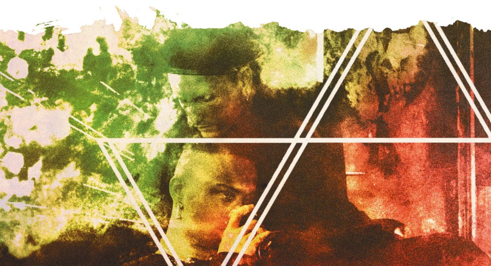

и людей, не прикасаясь к ним. Мало кто способен на‑ прямую причинить таким образом существенный вред оппоненту, но хитрый алхимик всегда найдёт способ толкнуть врага туда, где его ждёт опасность, или выта‑ щить себя из неприятностей.

- n **Компоненты:** витэ алхимика, кровь человека с холерическим резонансом, расплавленный ней‑ лон / старый магнитик для холодильника / загадоч‑ ные ноотропы, заказанные через Интернет.
- n **Расплата за активацию:** одно испытание Крови.
- n **Пул:** упорство + Алхимия против силы + атлетики.
- n **Правила:** алхимик может поднимать, толкать или перетаскивать одушевлённые и неодушевлённые объекты весом до 100 кг, если они находятся в пре‑ делах видимости на расстоянии не более 10 метров от него. Объект движется быстро, но недостаточно быстро, чтобы нанести урон при столкновении (хрупкий объект при этом может разбиться). Исклю‑ чение составляют ножи и другие мелкие металличе‑ ские предметы: алхимик может направить такой предмет, пройдя проверку упорства + алхимии, однако из её пула вычитается 2d10 (поскольку необ‑ ходима точность), а нож, управляемый силой мысли, наносит только 1 дополнительное повреждение.

Чтобы переместить кого‑то, кто способен актив‑ но сопротивляться, нужно вступить с ним в состя‑ зание упорства + Алхимии против силы + атлетики. Победа позволит подтащить противника на расстоя‑ ние вытянутой руки или оттолкнуть на дистанцию, равную значению выигрыша (в метрах), и нанести

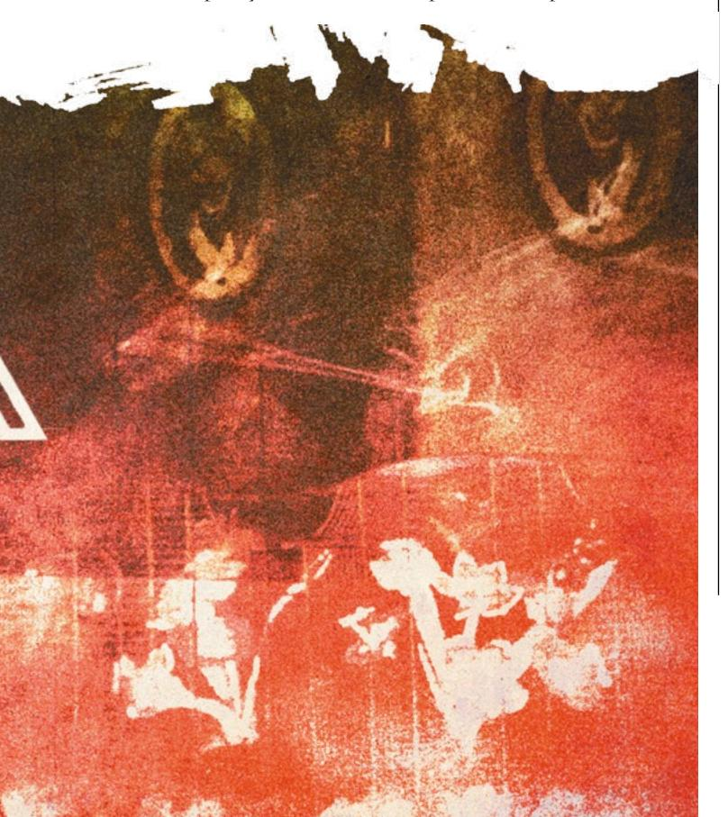

при этом столько же лёгких повреждений. Против‑ ник при этом падает навзничь. Чтобы удерживать кого‑то или что‑то в воздухе, нужно каждый ход успешно проходить проверку упорства + Алхимии (сложность 3). Манипуляция объектами, требующая точности (например, выдёргивание чеки из гранаты) требует проверки смекалки + Алхимии с подходящей случаю сложностью, которую определяет рассказчик.

n **Длительность:** один ход; при удержании в воздухе до поражения при очередной проверке.

#### **МАРЕВО**

Этот рецепт позволяет создать облако тумана, который оку‑ тывает вампира, мешая целиться в него из оружия дистан‑ ционного боя и помогая алхимику скрыть свою личность.

- n **Компоненты:** витэ алхимика, кровь человека с флегматическим резонансом, сухой лёд / дым си‑ гары / выхлопные газы.
- n **Расплата за активацию:** одно испытание Крови.
- n **Правила:** при активации алхимика окружает обла‑ ко пара или тумана, скрывающее его лицо и размы‑ вающее силуэт. Пул проверок противника, который пытается идентифицировать личность вампира или попасть в него из оружия дистанционного боя, уменьшается на 2d10. Пройдя дополнительное ис‑ пытание Крови, вампир может расширить облако настолько, чтобы оно укрыло до 5 человек.
- n **Длительность:** одна сцена, если алхимик не развеет туман раньше.

#### **Уровень 2**

Вампир может разработать рецепт, позволяющий вос‑ производить силы других Дисциплин 1‑го уровня. Для этого требуется по меньшей мере неделя.

#### **СМОГ**

Этот рецепт позволяет создать облако, которое окру‑ жает жертву, ослепляет её, а смертный вдобавок начи‑ нает задыхаться.

- n **Компоненты:** витэ алхимика, человеческая кровь с флегматическим резонансом, человеческая кровь с меланхолическим резонансом, хлорид калия, смог или галоновый газ.
- n **Расплата за активацию:** одно испытание Крови.
- n **Пул:** смекалка + Алхимия против выносливости + выживания.
- n **Правила:** алхимик выбирает цель в пределах видимости и активирует силу — цель окутывает клубящийся туман, закрывающий обзор, в резуль‑ тате чего пул проверки уменьшается на 3d10, если

жертва пытается кого-то или что-то обнаружить при помощи зрения, а также при дистанционных атаках. Кроме того, по желанию вампира туман может вызвать У смертной жертвы удушье. Для этого вампир должен вступить в состязание смекалки + Алхимии против выносливости + выживания цели. В случае победы вампира жертва не сможет предпринимать никаких действий, зайдясь в приступе кашля; в случае его триумфа жертва потеряет сознание. Одновременно Смог может окутывать только одну жертву.

Длительность: одна сцена, если алхимик не развеет смог раньше.

#### Уровень 3

Вампир может разработать рецепт, позволяющий воспроизводить силы других Дисциплин 2-го уровня.

Для разработки любого из этих рецептов требуется как минимум месяц, а дистилляция занимает по меньшей мере одну ночь.

#### **ВОССТАНОВЛЕНИЕ КРОВИ**

Благодаря этому рецепту вампир может создать эликсир, который при добавлении его в фракционированную донорскую кровь возвращает её в естественное состояние, что позволяет вампирам, не владеющим преимуществом «крепкий желудок», насыщаться ею.

- Компоненты: витэ вампира, человеческая кровь с сангвиническим резонансом, человеческая кровь с меланхолическим резонансом, кровь человека первой отрицательной группы (достаточно нескольких миллилитров), плесневелый шпинат, горячий чёрный кофе, октаноат натрия.
- Правила: если вампир в качестве метода использует кальцинацию или атанор корпорис, а не фиксацию, он должен набрать своей крови или крови сосуда, в чьих жилах происходила дистилляция. Каждый успех при проверке дистилляции позволит получить достаточно эликсира, чтобы восстановить 1 пакет с фракционированной кровью (убирает 1 пункт Голода). После восстановления любой вампир может утолить Голод с помощью этой крови.
- Атанор корпорис: после успешной дистилляции вампир может получать эликсир из собственных вен по одному разу за ночь вплоть до следующего насыщения или пока его Голод не достигнет 5.
- Кальцинация: если жертва выживет, вампир может снова набрать из её вен эликсир через неделю. Процесс дистилляции повторять не нужно, но жертва каждый раз получает 3 тяжёлых повреждения.

#### НЕЧЕСТИВАЯ ИЕРОГАМИЯ

Как считают алхимики слабокровных, перерождение и обновление возможно не только в результате мистического брака двух противоположностей. Их меркурианская витэ позволяет трансформировать человеческое тело так, чтобы оно отражало внутренний образ или идеал, существующий в сознании его обладателя.

Овладев этим редким рецептом, алхимик может преодолеть даже один из основополагающих аспектов своего проклятия - неизменность собственной внешности. Вампир, который изменился под действием зелья, не вернётся к своему старому образу после дневного сна. Полученное снадобье может принять любой, но сперва он должен пройти ритуальное очищение и погрузиться в глубокую медитацию, концентрируясь на идеале собственной внешности

Даже в глазах тех Сородичей, которые презирают Алхимию, владеющий этим рецептом вампир становится ценным контактом. Весперу, который открыто предлагает услуги подобного рода, вряд ли станут за них платить - скорее всего, его похитят или как-то иначе принудят работать бесплатно.

- Компоненты: витэ алхимика, человеческая кровь с флегматическим резонансом, человеческая кровь с меланхолическим резонансом, энтеогены.
- Расплата за активацию: одно испытание Крови; для смертных — одно тяжёлое повреждение.
- **Пул:** выносливость + упорство.
- Правила: цель должна смешать этот эликсир с собственной кровью и выпить его. В тот же миг она впадёт в кататонический лихорадочный сон, который продлится до следующей ночи, пока из глубин подсознания будет подниматься вожделенный образ. Эффект Нечестивой иерогамии ограничен возможностями человеческого тела - оно не сможет принять форму слишком уж фантастическую и чуждую с точки зрения анатомии.

Цель должна пройти проверку выносливости + упорства со сложностью 8 (минус 1 за каждый успех при проверке дистилляции). Вампиры также добавляют к сложности проверки тяжесть изъяна.

Победа означает, что превращение прошло успешно и тело приняло желаемый облик. Триумф позволит получить достоинство или убрать недостаток внешности, но за это нужно будет заплатить пунктами опыта (стр. 180). В результате кровавого триумфа или кровавого провала Зверь вмешивается в процесс, и у персонажа может появиться новый

недостаток, например «омерзительный», «повадки хищника», «стигматы» или даже «пожиратель орга-HOB»

Даже кровь весперов не способна исцелить изъян клана Носферату. Уродство находит дорогу в подсознание чудовищ помимо их воли...

• Длительность: постоянная, до нового превращения.

#### Уровень 4

Вампир может разработать рецепт, позволяющий воспроизводить силы других Дисциплин 3-го уровня.

Рецепты этого уровня требуют добавления в состав капли витэ вампира, который владеет соответствующей Дисциплиной, или по меньше мере того, кто принадлежит к клану, практикующему эту Дисциплину. К примеру, чтобы воспроизвести эффект Смены облика, алхимику потребуется витэ вампира, владеющего Метаморфозами, или витэ гангрела. Гангрел при этом может вообще не владеть этой Дисциплиной - главное, что в его витэ есть нужный потенциал.

Необходимый объём витэ в данном случае слишком ничтожен, чтобы могли сформироваться узы Крови. Кроме того, донор при этом не получает никакого урона. Впрочем, вряд ли какой-то вампир согласится добровольно расстаться даже с каплей собственной Крови - чаще всего алхимики получают её в качестве оплаты серьёзного долга или в том случае, если вампир хочет привлечь котерию к какому-то чрезвычайно опасному делу.

Для разработки любого из этих рецептов требуется как минимум три месяца, а дистилляция занимает по меньшей мере три ночи.

#### ИМПУЛЬС

С помощью этого рецепта алхимик может преодолеть притяжение Земли, что позволяет ему парить или летать в любом направлении, в том числе вверх и вниз, и переносить с собой определённый груз, пускай и не очень большой.

- Компоненты: витэ алхимика, человеческая кровь с холерическим резонансом, человеческая кровь с сангвиническим резонансом, шампанское, кровь птицы, гелий, скополамин или экстракт белладон-
- Расплата за активацию: одно испытание Крови.
- Пул: сила + Алхимия против силы + атлетики (в случае сопротивления).
- Правила: это зелье позволяет алхимику (и только ему) летать или парить со скоростью бега. Алхимик может переносить груз примерно с человека,

но при этом перемещаться будет со скоростью шага. Чтобы поднять в воздух сопротивляющегося противника или вырваться из рук того, кто пытается его удержать, требуется победить в состязании силы + Алхимии против силы + атлетики.

Длительность: одна сцена.

#### Уровень 5

Вампир может разработать рецепт, позволяющий воспроизводить силы других Дисциплин 4-го уровня.

Для разработки любого из этих рецептов требуется как минимум три года, а дистилляция занимает по меньшей мере месяц.

#### **БУДИЛЬНИК**

Этот рецепт позволяет создать эликсир, который в смеси с человеческой кровью может пробудить вампира из торпора.

- Компоненты: витэ алхимика, человеческая кровь с холерическим резонансом, человеческая кровь с сангвиническим резонансом, адреналин, карбонат аммония, нашатырный спирт, кофеин или бензедрин, мелатонин.
- Правила: если вампир в качестве метода использует кальцинацию или атанор корпорис, а не фиксацию, он должен набрать своей крови или крови сосуда, в чьих жилах происходила дистилляция. Затем он должен смешать эликсир с человеческой кровью. С его помощью можно пробудить вампира с силой Крови, равной количеству полученных при дистилляции успехов минус 2.

#### ПРИМЕР

Хари получает 5 успехов при проверке дистилляции: его Будильник может поднять из торпора вампира с силой Крови 3 или меньше  $(5 - 2 = 3)$ 

**→→→→→→→→→→→→→→→→→→→→→→→→→→→→→→→→→→→→** 

#### - …………………………………………………………………………………………………

- Атанор корпорис: после успешной дистилляции вампир может получать эликсир из собственных вен по одному разу за ночь вплоть до следующего насыщения или пока его Голод не достигнет 5.
- Кальцинация: если жертва выживет, вампир мо- $\blacksquare$ жет снова набрать из её вен эликсир через неделю. Процесс дистилляции повторять не нужно, но жертва каждый раз получает 5 тяжёлых повреждений. Кроме того, алхимик может напрямую напоить пребывающего в торпоре вампира кровью жертвы. ■

287

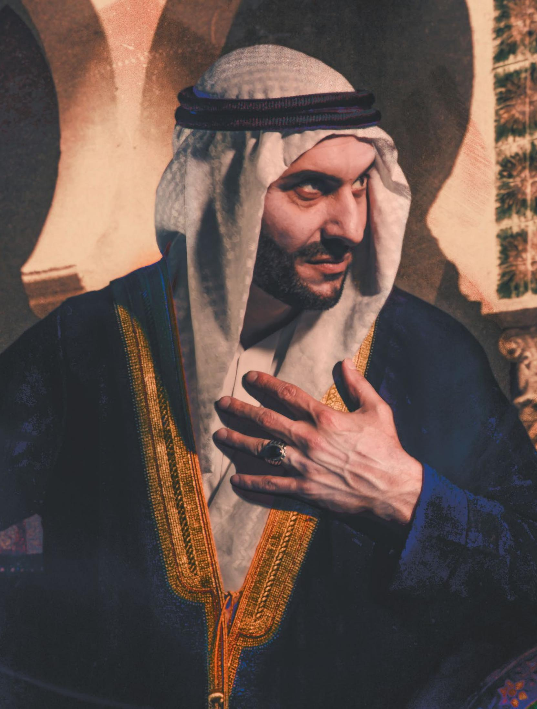

# restant de

И потом ещё есть Обряды: все они отень важны, но некоторые из них важнее и прекраснее остальных.

> АРТУР МЕЙЧЕН, «БЕЛЫЕ ЛЮДИ» (ПЕР. САНГЛ. Е. ПУЧКОВОЙ)

еяния B Q Mпиров так же многообразны, как деяния смертных. Все персонажи - и главные, и второстепенные - совершают непредсказуемые поступки и приводят в движение запутанные схемы. Рассказчику нужно как-то ориентироваться в этом разнообразии: упорядочить события, определить победителей и проигравших, решить, как отреагирует остальной мир.

Игра «Вампиры: Маскарад» ставит во главу угла раскрытие характеров персонажей и взаимодействие между ними, но даже в самой драматичной сцене найдётся место для броска игральных костей, если этого захотят участники. Основные правила игры обтекаемы

и позволяют трактовать их широко. Они помогают структурировать игру, не загоняя её в строгие рамки. В этой главе предложены расширенные правила - более сложные, позволяющие формализовать больше деталей в той или иной сцене. Впрочем, невозможно охватить всё разнообразие игровых ситуаций, поэтому рассказчик может смело придумывать свои правила, если приведённых ниже окажется недостаточно.

Если у вас есть собственный подход к разрешению той или иной ситуации - используйте его без тени сомнения! Или вовсе откажитесь от правил, если так вам удобнее, — просто позвольте фантазии и логике повествования вести вас по страницам хроники.

## Масштаб и стиль

У каждого рассказчика своя манера ведения игры, и каждая труппа в конце концов приходит к собствен‑ ному темпу повествования в зависимости от личных вкусов и духа хроники. Одним больше по душе напря‑ жённое действие и уличные потасовки, другим — море эмоций и высокая политика, а третьим — зловещие заговоры вперемешку с кровищей в стиле итальян‑ ских «джалло». Чтобы задать нужный темп, вы можете использовать разный масштаб повествования, а также менять стиль игры от сцены к сцене.

Нет никаких строгих требований к выбору стиля в сцене с тем или иным масштабом. Кому‑то удобнее играть с частыми проверками, кому‑то без них. В по‑ дробной сцене с детальным описанием происходящего можно вообще не использовать игральные кости масштаб отличается не количеством проверок, а вни‑ манием, которое вы уделяете событиям. В абстрактной сцене, впрочем, большое количество проверок не очень уместно. Нужно, однако, отметить, что иногда лучший способ обрисовать массовое побоище или многомесяч‑ ную политическую кампанию — это сфокусироваться на одном конфликте в рамках этого события, сыграв сцену с частыми проверками.

## Масштаб сцены

Сцены отличаются друг от друга количеством внима‑ ния, которое вы хотите уделить происходящему. Ка‑ кой бы масштаб вы ни предпочли, в игре сцена может охватывать любой период: и считаные минуты, и дол‑ гие месяцы. Что лучше подходит для конкретной сце‑ ны — выбирать вам. Чаще всего решение принимает рассказчик, основываясь на общих представлениях о хронике и необходимом в данном случае темпе игры, но некоторые труппы предпочитают решать подобные вопросы совместно.

#### **Подробная сцена**

В *подробной сцене* каждой детали уделяется присталь‑ ное внимание. Её разыгрывают от начала и до конца. Как правило, эти сцены длятся дольше других. В фо‑ кусе может оказаться какой‑то один персонаж и его взаимоотношения с опорой или другим Сородичем, впрочем, не менее часто в таких сценах действуют все персонажи игроков. В любом случае сцена должна быть драматичной и важной для хроники, чтобы каждый участник чувствовал, что ей можно уделить больше времени, если понадобится.

#### **Лаконичная сцена**

В лаконичной сцене участники обыгрывают только ключевые моменты. Её последствия может опреде‑ лить одна проверка или лаконичный обмен репли‑ ками. Такая сцена часто начинается в разгар событий и заканчивается, как только становится ясен исход. Она, несомненно, влияет на сюжет и развитие персона‑ жей, но по какой‑то причине участники игры не хотят на ней останавливаться слишком подробно: возможно,

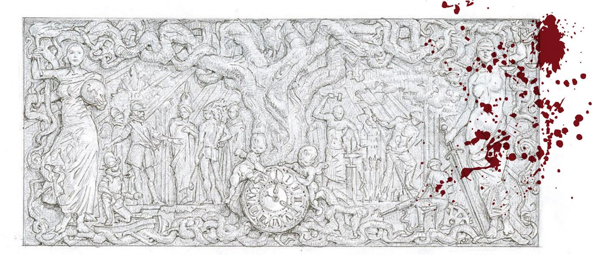

сцена описывает что-то интимное или неприятное вроде соблазнения или убийства либо что-то не слишком интересное для игроков - для кого-то в эту категорию попадёт вечеринка в Элизиуме, а для кого-то - сцена боевого столкновения. В лаконичной сцене главное обозначить наиболее яркие и характерные моменты, а затем можно двигаться дальше.

#### События за кадром

События за кадром - это сцены, которые не разыгрываются в лицах. Вместо этого рассказчик или игрок просто описывает произошедшее. В такой сцене может даже не быть событий как таковых: «Вам пришлось прождать в приёмной Принца четыре часа, прежде чем он вызвал вас к себе». Время от времени рассказчик может попросить игрока вкратце описать его действия: «Твой информатор в полиции организовал для тебя посещение заключённого. Как ты собираешься расправиться с узником?» Ответ обычно лаконичный - одна или две фразы, не больше. За кадром происходит также большая часть взаимодействий между персонажами рассказчика, если они достаточно значимы для сюжета, чтобы их вообще описывать.

## Стили игры

Правила игры не должны вас сковывать. Не стоит скрупулёзно отслеживать все телодвижения персонажа, требуя проверок на каждом шагу. Меняя стиль игры от сцены к сцене, вы можете настроить повествование так, чтобы всем участникам было комфортно. В целом игроки, которые доверяют драматическому чутью рассказчика, склонны чаще полагаться на его и свою фантазию, в то время как игра с частыми проверками - самый очевидный выбор для тех, кто драме предпочитает тактическое планирование.

Многие правила (например, трата пунктов воли, для того чтобы перебросить часть игральных костей, или увеличение пула при помощи прилива Крови) подразумевают, что во время игровой встречи персонажам предстоит не одна и не две проверки. Если вы сокращаете количество проверок, следует также подкорректировать правила, которые их касаются (см. «Настройки», стр. 158).

#### Без проверок

В игре без проверок, или свободной игре, проверки не используются. Рассказчик разрешает конфликты, основываясь на значениях тех или иных параметров или исходя из драматической необходимости. Если

хотите, чтобы персонажи всё время ощущали угрозу Голода, стоит всё же требовать испытаний Крови, когда вампиры используют Дисциплины или пробуждают Кровь. Впрочем, если вы считаете это лишним, рассказчик может просто объявить: «Твой Голод только что усилился», когда кто-то аппетитный проходит мимо или когда персонаж тратит очень много витэ.

Свободная игра лучше всего подходит для сцен, в которых действуют вампиры и смертные; два персонажа игрока; два дружески (или по меньшей мере нейтрально) настроенных Сородича; вампир, его вассалы и слуги.

#### С одной проверкой

При игре с одной проверкой, или направленной игре, участники проходят всего одну проверку в начале сцены (одну на всех или по одной на персонажа), используя параметры и правила, которые с наибольшей вероятностью окажут решающее воздействие на исход событий. В этом случае рассказчику лучше запретить переброс игральных костей или использование прилива Крови. Затем, зная результат проверки, участники разыгрывают сцену так, чтобы в итоге прийти к известному исходу. К примеру, если изначальная проверка привела к проваленному испытанию Крови или иным способом увеличила Голод персонажа, игрок должен обыграть растущий Голод и его последствия.

Направленная игра лучше всего подходит для сцен с драматическим поворотом (вроде тех, что часто происходят в третьем акте), ретроспектив и коротких воспоминаний, политических или придворных сцен, а также тех сцен, назначение которых - плавно подвести к некоей кульминации.

#### С ключевыми проверками

В игре с ключевыми проверками, или акцентной игре, участники проходят несколько проверок в поворотные моменты истории. Они играют без проверок до тех пор, пока не возникнет какая-то важная коллизия, после чего проходят проверку, чтобы определить её исход (проверку можно пройти и заранее, как в направленной игре), после чего снова возвращаются к игре без проверок. Рассказчик не заостряет особого внимания на ранениях, невовремя сказанных словах и других деталях, носящих тактический характер. В акцентной игре рассказчик чаще всего просто соглашается с тем, что предлагают игроки, особенно если это добавляет драматизма или азарта. Проверки появляются лишь эпизодически, чтобы игроки не забывали о Голоде. Учтите, что возможность перебро-

## Голод в игре

**Каждый персонаж балансирует между свободой хищника и угрозой ярости, между жаждой крови и необходимостью соблюдать Маскарад. Если вы предпочитаете игру с частыми проверками, пул Голода и испытание Крови не дадут игрокам забыть о постоянном риске, в противном же случае Голод может незаметно отойти на второй план, ведь чем реже случаются проверки, тем меньше вероятность, что Голод повысится.**

**Этот вопрос можно решать по-разному в зависимости от ситуации и предпочтений труппы. Здесь приведено несколько вариантов, которые вы можете использовать как есть, комбинировать или менять, чтобы они лучше соответствовали вашему представлению о Голоде. Независимо от того, какой вариант вы будете использовать, рассказчик должен отслеживать уровень Голода у персонажей: делая отметки на листе бумаги или на схеме отношений, выдавая игрокам красные фишки или игральные кости (даже в игре без проверок они пригодятся как вещественное напоминание о необходимости периодически пить кровь). В некоторых труппах бывает даже так, что сами игроки наравне с рассказчиком повышают Голод своим и чужим персонажам.**

#### **СЛУЧАЙНЫЕ ЗНАЧЕНИЯ**

**Перед началом сцены бросьте игральную кость и разделите ре-**

**зультат пополам, чтобы определить, насколько персонажи проголодались к текущему моменту (пройдите проверку заново, если Голод оказался равен 5). Игроки будут описывать действия персонажей, ориентируясь на получившийся результат.**

**ЛЮБИТ, НЕ ЛЮБИТ, ПЛЮНЕТ, ПОЦЕЛУЕТ… Примерно половина испытаний Крови приводит к повышению Голода. Так что в игре без проверок рассказчик может повышать Голод персонажа в каждой второй ситуации,** 

**обычно требующей испытания Крови.**

#### **ВРЕМЯ ОБЕДАТЬ**

**Рассказчик повышает значение Голода раз в какой-то период: каждый час или 45 минут реального времени или каждые два часа игрового времени.**

#### **КОДОВОЕ СЛОВО**

**Перед игровой встречей рассказчик должен выбрать слово, например «вампир», «кровь» или любое другое, которое употребляется достаточно часто. Его произнесение будет обозначать, что Голод персонажа усилился. Услышав кодовое слово, рассказчик должен отметить для себя, что Голод персонажа игрока, который произнёс кодовое слово, вырос на 1 пункт — это нужно делать незаметно, чтобы игроки не поняли, какое именно слово задумано (если это всё-таки случилось, кодовое слово лучше заменить). Как только Голод кого-то из персонажей повышается достаточно, чтобы влиять на происходящее (обычно до 3 или 4 пунктов), рассказчик должен сообщить игроку, что его персонаж чувствует растущий Голод, а когда он достигает предела (5 пунктов) — что Го-**

**лод стал невыносимым. Если персонаж насыщается кровью, рассказчик отмечает для себя, насколько понизился Голод.**

сить игральные кости за пункты воли ослабляет напряжение в сценах с акцентной игрой.

Этот стиль подходит для всех сцен, но лучше всего показывает себя в социальных конфликтах, в сценах, где предполагаются болееменее частые смены фокуса и повороты событий, во вспомогательных ответвлениях сюжета вроде охоты или ретроспективы, а также во многих подробных сценах.

#### С частыми проверками

В игре с частыми проверками, или строгой игре, участники описывают все свои действия подробно, часто в пошаговом режиме, постоянно проходя проверки, чтобы определить, удалось выполнить очередную задачу или нет. Сцены с частыми проверками получаются самыми долгими. Благодаря тому, что строгая игра предполагает пристальное внимание ко всем деталям, игроки часто ждут, что подробные сцены будут сыграны именно в этом стиле. Хрестоматийный образец сцены с частыми проверками - боевое столкновение (в широком смысле: сюда можно включить и острые социальные противостояния вроде перепалки с враждебно настроенной Гарпией при дворе). ■

## Продолжительные проверки

Для выполнения некоторых действий требуется значительное время. Иногда параллельно происходят и другие события. Например, персонаж может взламывать замок, пока его товарищи вынуждены играть в прятки с охранниками музея; он может загружать что-то в машину, пока остальные отстреливаются от врагов; или на протяжении всей истории пытаться подмять под себя какую-то организацию. В подобных случаях исход действия можно решать не одной, а несколькими проверками. Это называется продолжительной проверкой.

## Варианты ПРОДОЛЖИТЕЛЬНЫХ проверок

Простая продолжительная проверка: рассказчик назначает очень высокую сложность (10+), позволяя игроку проходить проверки до тех пор, пока в сумме не наберётся нужное количество успехов. После этого действие считается совершённым. В некоторых ситуациях несколько игроков могут проходить проверки одновременно, складывая свои успехи.

- \* ₹ ⊁ \*

#### ПРИМЕР

Чтобы взять под контроль торговлю людьми в Новом Орлеане, нужно в сумме набрать 20 успехов, в основном проходя проверки воровства и уличного чутья. Персонажи игроков должны проходить проверки одновременно, чтобы опередить всех своих конкурентов.

СЕРИЯ ПРОВЕРОК. Рассказчик назначает серию проверок с обычной сложностью. Действие считается совер‑ шённым, если определённое количество этих прове‑ рок завершилось победой. Серия проверок подходит для задач, которые можно чётко разделить на стадии или составляющие: выключение сигнализации и взлом замков в хранилище при ограблении; блокировка всех входов и выходов в убежище при его осаде; поиск четы‑ рёх томов гримуара тремеров и т. п.

#### **ПРИМЕР**

*Чтобы ограбить музей, требуется три победы: отключить сигнализацию на стеклянной крыше (интеллект + воровство), спуститься по верёвке вниз (ловкость + воровство) и вытащить идол из витрины, не задев лазерный луч (самообладание + воровство).*

СОСТАВНАЯ ПРОДОЛЖИТЕЛЬНАЯ ПРОВЕРКА. Рассказчик назначает обычную сложность для каждой отдельной проверки и высокую общую сложность для завершения задачи в целом. Суммируются только выигрыши каждой пройденной проверки. Такой вариант лучше всего под‑ ходит для фоновых целей, которые достигаются посте‑ пенно, при этом игрок проходит одну‑две проверки за игровую встречу. Использовать этот вид проверок стоит лишь тогда, когда персонаж не сталкивается с ак‑ тивным или стоящим внимания сопротивлением.

#### **ПРИМЕР**

*Табита пытается втереться в доверие к местному тремеру, чтобы он обучил её новым ритуалам. Каждую игровую встречу она проходит проверку интеллекта + оккультизма, чтобы впечатлить его своими знаниями, и складывает выигрыши. Когда в сумме получится 20 или больше, она завоюет расположение чернокнижника.*

КАСКАДНАЯ СЕРИЯ ПРОВЕРОК. Серия проверок, при кото‑ рой выигрыш предыдущей проверки увеличивает пул последующей. Этот вариант подходит там, где победа облегчает дальнейшую задачу, но одного поражения хватит, чтобы остаться ни с чем. Например, при попыт‑ ках шантажа, подкупа, соблазнения или, скажем, взлома сложной компьютерной системы с несколькими уров‑ нями защиты.

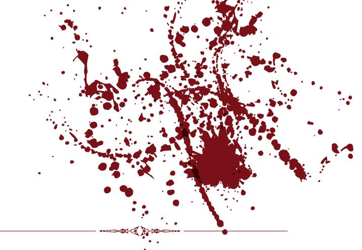

#### **ПРИМЕР**

*Вику нужно пройти четыре проверки (по одной за игровую встречу), чтобы заставить местного священника на него работать. Он получает шесть успехов при проверке обаяния + хитрости со сложностью 4, так что может добавить 2d10 к пулу следующей своей проверки (манипуляция + убеждение со сложностью 5).*

#### **Продолжительное состязание**

Если две стороны соревнуются друг с другом в том, кто первым добьётся поставленной цели, рассказчик может назначить продолжительное состязание.

Самый простой вариант — когда обе стороны проходят проверки одновременно и побеждает тот, кто первым наберёт нужное количество успехов (если это случилось на одном и том же этапе, побеждает тот, у кого оказалось больше успехов в сумме).

Если стороны способны мешать друг другу, на каж‑ дом этапе между ними можно проводить простое состя‑ зание. Победитель сперва отнимает от своего резуль‑ тата успехи проигравшего, и только потом прибавляет его к общей сумме. Проигравший не прибавляет ничего.

Такое состязание, как и составная продолжительная проверка (см. выше), может затянуться надолго.

## Особые случаи

Некоторые правила требуют определённых поправок, если их применяют к продолжительным проверкам. Рассказчик может использовать их в любом сочетании, которое лучше подходит для конкретной ситуации.

ВЗАИМОПОМОЩЬ возможна в большинстве проверок, однако даже там, где ею нельзя воспользоваться напря‑ мую, взаимопомощь может позволить исправить ситуа‑ цию после жестокого провала или позволить вовсе его не учитывать.

ЖЕСТОКИЙ ПРОВАЛ отменяет все победы и успехи; игро‑ ку придётся снова начать проходить продолжительную проверку с нуля, если это вообще возможно, по мнению рассказчика. ⬛

# Расширенные правила. Разрешение конфликтов

У вампира множество врагов из-за его хищной природы: другие каиниты, смертные сосуды (иногда достаточно опасные), а также все те, кто готов встать между вампиром и его добычей.

Иногда вампиры вступают со своими врагами в кровавые стычки. В иных случаях конфликт остаётся на уровне слов и эмоций, особенно когда Принц призывает к ответу своих подчинённых. Бывает и так, что Сородичи используют в междоусобной борьбе человеческие институты, и конфликт вообще протекает за кадром.

В этом разделе вы найдёте расширенную версию правил разрешения конфликтов (стр. 123 - 130). Рассказчик может использовать элементы, приведённые здесь, как все вместе, так и по отдельности, комбинируя их в зависимости от нужд игры.

## Три, два, один – следующий!

Классическая трёхактная структура показывает, что драма сходит на нет, если действие длится слишком долго. Конфликт в ролевой игре точно так же кажется более насыщенным и ярким, если длится не более трёх ходов (об этом уже говорилось раньше, см. раздел «Правило трёх ходов» на стр. 130). При использовании расширенных правил соблюдать этот принцип ещё важнее.

#### Готовы ли мы двигаться дальше?

Когда три хода истекли, рассказчик и игроки должны задать себе вопрос: «Можем ли мы подвести итог? Возникнут ли какие-то существенные изменения, если мы продолжим сцену конфликта?» Если от проверок по большому счёту уже ничего не зависит, рассказчик может завершить текущий конфликт, но не стоит торопить события, если какие-то драматические повороты ещё возможны.

 $\longleftarrow$ 

#### ПРИМЕР

Котерия персонажей игроков пытается перекричать своих оппонентов на митинге анархов в надежде произвести впечатление на аудиторию и старших Сородичей. Пусть они и находятся на самой нижней ступени социальной иерархии, лучше быть королями улиц, чем вообще никем. Обе стороны конфликта позёрствуют, произносят дерзкие речи и демонстрируют свою храбрость в течение трёх ходов, и никто из них не собирается отступать. Однако рассказчик знает, что толпа уже составила своё мнение, поэтому решает завершить конфликт и подвести итоги.

 $-24$ 

#### ПРИМЕР

Котерия играет в кошки-мышки со своей добычей, гоняя её по городу. Жертва скрывается от вампиров в офисном здании, где некоторые из служащих засиделись допоздна, и персонажи начинают строить грандиозные планы, как пробраться внутрь. Хотя игроки взялись за дело с энтузиазмом, рассказчик решает поторопить события и завершить сцену, так как знает, во-первых, что пробраться в здание несложно, а во-вторых, что жертва в любом случае успеет уйти.

— **---⇒≈∢ }**>≈

### Компромисс

Если спустя три хода исход конфликта всё ещё не ясен, рассказчик может предложить компромисс. Это результат, о котором договариваются между собой игроки и рассказчик, а не персонажи, так что в игре героям не обязательно вступать в переговоры с противником. Компромисс означает, что одна из сторон (обычно та, что оказалась в более тяжёлом положении) уступает, но последствия для неё будут не такими серьёзными, как при поражении. Рассказчику стоит поощрять игроков, когда им приходится уступать: он может увеличить показатель какого-либо факта биографии котерии (или отдельного персонажа), а если это кажется слишком большой наградой, можно разрешить участникам конфликта восстановить по одному пункту воли.

#### $+$

#### ПРИМЕР

После жестокой схватки с охотниками котерия оказывается на грани гибели. Поскольку хроника только началась, рассказчик решает, что умирать персонажам рановато, и предлагает компромисс: котерия сумеет сбежать, если кто-то из вампиров останется, чтобы прикрывать отход. Вместо четырёх персонажей заново создавать придётся только одного.

---------------------------------------

#### **ПРИМЕР**

*Игры разума продолжаются уже несколько ходов персонажи пытаются перехитрить своих невидимых оппонентов в Сети. Поскольку игроки не в восторге от виртуального взаимодействия, они предлагают компромисс: разрушить цифровую инфраструктуру оппонентов у них не получится, зато они раскроют личность одного из них. Что ж, следующий контакт будет несколько более… близким.*

#### **Блиц**

Если ни один из предложенных выше вариантов не подходит, попробуйте поднять ставки и завер‑ шить конфликт одной проверкой, как при блиц‑кон‑ фликте (см. стр. 298), в котором последствия куда более неумолимы. Сложность можно определить ис‑ ходя из результатов предыдущих ходов. В конфлик‑

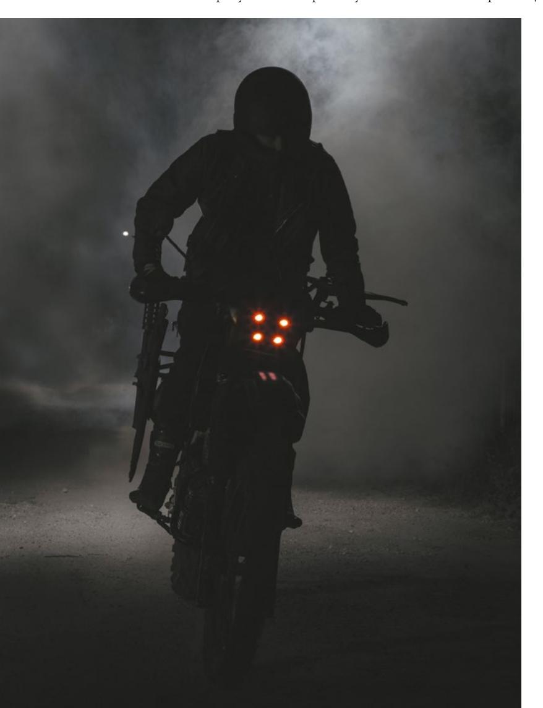

тах один на один после каждого обмена ударами ясно, кто в данном случае взял верх, в крупных стычках зачастую тоже.

- n **Сложность 3:** большая часть сражения прошла в пользу персонажей игроков; они побеждали на протяжении всех трёх ходов.
- n **Сложность 4:** обе стороны конфликта пострадали в равной степени; персонажи игроков победили в двух ходах из трёх.
- n **Сложность 5:** персонажей игроков серьёзно потре‑ пали; они победили только в одном ходу из трёх.
- n **Сложность 6:** если персонажи до сих пор стоят на ногах, значит, им ещё повезло; они проиграли все ходы.

#### **Смена декораций**

Хотя сцену конфликта не стоит затягивать дольше трёх ходов, само противостояние не обязательно должно за‑ вершиться за одну сцену. Борьба может продолжиться в новых условиях.

#### **ПРИМЕР**

*Котерия оказалась вовлечена в перестрелку с местной бандой, решившей «очистить улицы от кровожадных уродов». Даже при том, что нападавшие оказались настолько глупы (или неопытны), что явились после заката, персонажи игроков попали в нелёгкое положение. Они с радостью идут на компромисс: им удаётся забаррикадироваться в комнате, чтобы восстановить силы, спланировать следующий шаг и порефлексировать над тем, какие новые чудовищные черты они успели в себе обнаружить за время стычки.*

## Тактические приёмы

Персонажам не обязательно всегда атаковать про‑ тивника в лоб. Большинство конфликтов имеют какую‑то цель помимо уничтожения противников, и если персонажи могут достичь её обходными путями, то к чему принуждать их сражаться до последней капли витэ? Приведённые ниже тактические приёмы можно применять в конфликтах любого рода.

#### **Движение к цели**

Персонаж напрямую движется к поставленной цели, ставшей причиной конфликта, в чём бы она ни заклю‑ чалась: завоёвывает расположение старейшины во вре‑

мя спора за место в совете; уничтожает улики, прежде чем убежище наводнят враги; укрепляет свой авторитет среди организаторов жилищного проекта; пытается взломать систему безопасности, пока противник не обнаружил вторжение; насыщается кровью студентов, и т. д. Надо отметить, что движение к цели как отдельный приём возможно далеко не всегда. Иногда единственная цель конфликта - расправиться с врагами и поскорее убраться подальше. В некоторых случаях для успешного движения к цели может понадобиться предварительный манёвр (см. ниже).

Движение к цели обычно реализовывается с помощью продолжительной проверки (стр. 293), при которой игрок пытается набрать как можно больше успехов или побед.

- ------------------------------------

#### ПРИМЕР

В сцене ретроспективы (см. стр. 311) один из игроков хочет показать, как Бальзак, его персонаж, однажды победил своего соперника Антуана в состязании «кто поцелует больше студентов за одну ночь», имевшем место в одном из студенческих общежитий Парижа в 1889 году. Пока сам Бальзак медленно движется к своей цели, подкатывая к каждому встречному, другие игроки, взявшие на себя роль свиты, пытаются ему помочь.

 $- + - - +$ 

#### Манёвр

Используя манёвр, персонаж пытается занять определённую позицию — иногда это необходимо, чтобы иметь возможность действовать дальше, а иногда просто обеспечивает некоторую выгоду. Зайти с фланга, уединиться с предметом страсти, найти подход к нужному человеку, спрятаться в укрытие - всё это манёвры.

Эффект при успешном применении манёвра в зависимости от ситуации может быть следующим:

■ Увеличение пула следующей проверки на 1-3 игральные кости в зависимости от выигрыша и от триумфов, полученных при изначальной проверке. Примеры: ложный выпад в фехтовании; изучение слабых мест противника, чтобы нанести идеальное

оскорбление; поиск наилучшего подхода к потенциальной жертве.

Более выгодная позиция, позволяющая нанести удар, на который противник не сможет ответить (см. «Эффект неожиданности», стр. 300). Для этого можно использовать обманные движения, скрытность или скорость, но в любом случае задача будет довольно сложной или потребует продолжительной проверки.

Примеры: обход чужого укрытия в перестрелке; разрыв дистанции с последующей атакой; завоевание доверия оппонента, чтобы подобраться ближе.

В некоторых ситуациях манёвр изначально необходим для того, чтобы можно было атаковать или двигаться к цели. Если манёвр не удался, персонаж будет лишён такой возможности.

Примеры: поиск конкретной цели в конфликте, охватившем весь город; попытка уединиться с жертвой для её соблазнения или шантажа; подготовка правового обоснования для захвата контроля над компанией.

— ---<del>-</del>-≈∢

#### ПРИМЕР

Пока Бальзак пытается выиграть пари, попробовав на вкус как можно больше студентов, его свита хочет усложнить задачу для Антуана. Рассказчик решает, что сперва его нужно найти, победив в состязании манипуляции + уличного чутья против его смекалки + наблюдательности, и только потом на него можно будет напасть.

--------------------------------------

#### Преграда

Персонаж может активно мешать другому персонажу совершать какое-то действие: загородить собой цель, открыть огонь на подавление, распускать сплетни о ком-то, кто заботится о своей репутации. Выставляя преграду, персонаж вступает в состязание с тем, кому пытается помешать.

 $\leftarrow$ 

#### ПРИМЕР

Бальзак не успел ещё полакомиться своей второй жертвой, как столкнулся с преградой: одна не в меру наблюдательная смотрительница путается у него под ногами на каждом шагу. Она использует свою смекалку + наблюдательность (её сильная сторона) против ловкости + скрытности Бальзака (он никогда не был в этом хорош).

 $- \cdots \rightarrow \mathbb{R}$ 

Иногда можно выставить преграду на пути преграды и таким образом нейтрализовать её. В этом случае первыми в состязание вступают те, кто оказался дальше по цепочке.

#### **ПРИМЕР**

*Один из игроков, принявший на себя роль правой руки Бальзака, вмешивается, пытаясь отвлечь смотрительницу. Он проходит проверку обаяния + убеждения против её упорства + проницательности. Если он победит в этом состязании, Бальзак сможет попытаться проникнуть в комнату к своей очередной жертве без лишних преград.*

#### **Решительный натиск**

Иногда участники конфликта готовы рискнуть — забыть об осторожности, бросив все силы на атаку, чтобы попы‑ таться смять противника решительным натиском. В таком случае атакующий увеличивает урон от атаки на 1 (это ка‑ сается и повреждений, и стресса), но не может защищать‑ ся. При использовании дистанционного оружия у него кончаются боеприпасы (патроны, стрелы и т. д.). Этот приём нельзя совмещать с эффектом неожиданности (см. ниже). Если персонаж терпит поражение при проверке атаки, все, кто будет противодействовать ему в следую‑ щем ходу, смогут добавить 1d10 к пулу своих проверок.

#### **ПРИМЕР**

*Наум бросается вперёд, надеясь задрать Клару когтями прежде, чем она проткнёт его клинком. Наум проходит проверку силы + драки, а Клара — ловкости + фехтования. Даже если Наум наберёт больше успехов, он не сможет защититься от её атаки и получит все повреждения, которые она ему нанесёт. Сама же Клара получит урон, только если Наум победит, зато он нанесёт на 1 повреждение больше.*

#### **Глухая оборона**

Если персонаж только защищается и больше ничего не делает (разве что предпринимает незначительные действия, см. ниже), пул проверок его защиты в этом ходу увеличивается на 1d10. Если у него есть надёж‑ ное укрытие, за которым он может спрятаться целиком, в этом ходу его также нельзя атаковать дистанционным оружием (если, конечно, противник не обойдёт укры‑ тие — см. «Манёвр», стр. 297).

#### **Незначительные действия**

Некоторые действия не настолько значимы, чтобы занимать целый ход, но в то же время отнимают доста‑ точно сил и внимания у персонажа, чтобы их нельзя

было игнорировать. К незначительным действиям не относятся те, которые требуют проверки или кото‑ рым другие могут воспротивиться. За каждое незначи‑ тельное действие, которое персонаж предпринимает за ход, пул проверки основного действия в этом ходу уменьшается на 1d10. Рассказчик может ограничить ко‑ личество возможных незначительных действий за ход. К этой категории действий относится, например, пере‑ зарядка оружия, техобслуживание оборудования, пере‑ движение больше чем на пару шагов, а также выпол‑ нение какого‑то поручения или приведение убежища в порядок — всё зависит от масштаба конфликта.

Весь ход вполне может состоять только из незна‑ чительных действий, но в этом случае их количество определённо следует ограничить.

#### **ПРИМЕР**

*Персонаж, помогавший Бальзаку со смотрительницей, тоже хочет поучаствовать в охоте на Антуана. Рассказчик решает, что помощь Бальзаку не заняла слишком много времени, но персонаж тем не менее должен будет уменьшить пул своей проверки на 2d10 из-за того, что ему пришлось отвлечься и сделать крюк.*

## Передвижение

В игре **«Вампиры: Маскарад»** расстояния условны, но передвижение тем не менее может играть важную роль в драматическом конфликте. Возможно, разъ‑ ярённое отродье пытается добраться до горла стрелка, или предатель выбирает удобную позицию, чтобы вса‑ дить в спину нож, а может, конфликт в целом охваты‑ вает весь город и требует постоянных перемещений.

Любое мало‑мальски значимое перемещение — это незначительное действие (см. выше), если движению ничто не мешает, или манёвр (см. выше), если возможно противодействие.

При необходимости рассказчик может нарисовать схему конфликта. В некоторых случаях для этих целей подойдёт и схема отношений!

## Блиц-конфликт

Конфликт не обязательно должен представлять собой подробную сцену, в которой оппоненты по очереди об‑ мениваются ударами, как это описано в базовых прави‑ лах на стр. 123. Если конфликт интересен только своим результатом или в нём задействовано мало участников (а иногда, наоборот, слишком много), его можно разрешить быстрее.

Рассказчик должен назначить сложность, принимая во внимание могущество противника. После этого каждый игрок проходит по одной проверке с назначенной сложностью, используя свой пул конфликта (при этом нельзя применять прилив Крови или перебрасывать игральные кости за пункты воли). Противники не проходят никаких проверок. Чем больше побед оказалось у игроков, тем выгоднее для них исход конфликта. Если большинство игроков победило, оппоненты будут сломлены, враги сдадутся в плен или отступят, понеся тяжёлые потери, визави сбежит, в досаде хлопнув дверью, или случится ещё что-нибудь полобное.

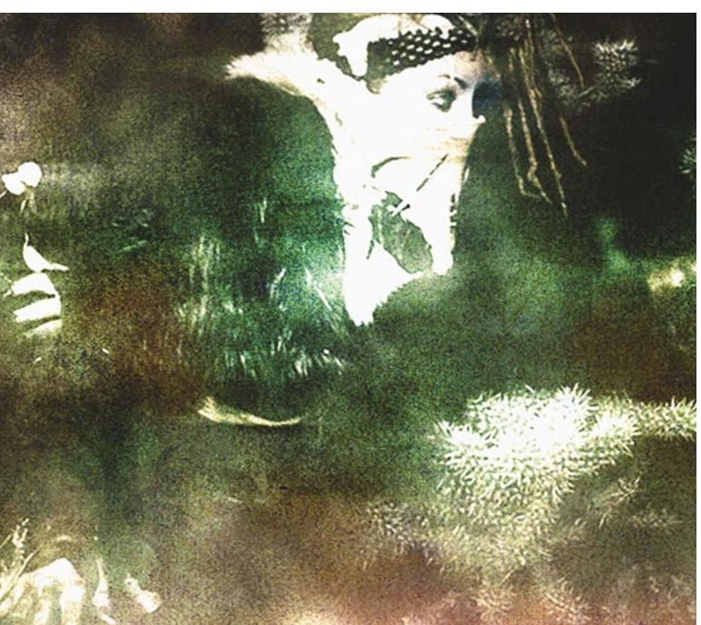

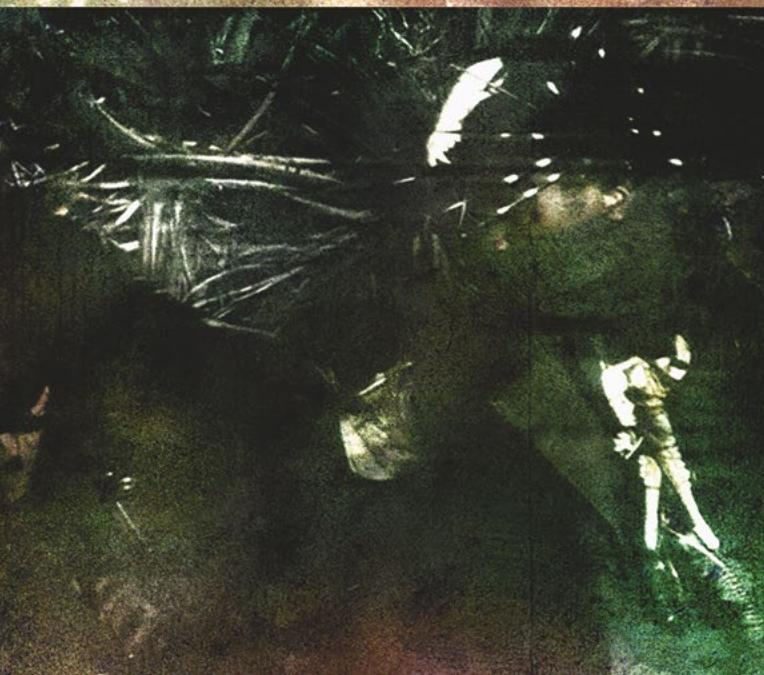

#### ПРЕДПОЛОЖИТЕЛЬНАЯ СЛОЖНОСТЬ:

- Противник намного слабее, задача довольно простая: сложность 2.
- Противник ничем не уступает персонажам игроков, задача не из лёгких: сложность 4.
- Противник намного сильнее, задача крайне трудная: сложность 6.

Если какая-то из сторон владеет Дисциплинами или иными сверхъестественными силами, измените сложность на 1 в её пользу, если противники этого преимущества лишены.

Если какая-то из сторон лучше подготовлена, занимает более выгодную позицию или может воспользоваться эффектом неожиданности, измените сложность на 1 в её пользу.

Чтобы определить, сколько повреждений или пунктов стресса получит персонаж, необходимо после проверки из удвоенного значения сложности вычесть количество полученных успехов. Этот результат и нужно отметить на соответствующей шкале, причём в блицконфликте урон нельзя уменьшить за счёт брони или сверхъестественных сил, таких как Стойкость. Вид урона зависит от противника и оружия, которым он пользуется: к примеру, агенты Второй инквизиции часто наносят тяжёлые повреждения. Лёгкие повреждения, полученные в блиц-конфликте, не делятся пополам.

Дополнительно: предложите игрокам уменьшить количество полученных повреждений, но записать несколько пунктов сомнений жестокость и бессердечие помогли им добиться цели... на этот раз.

- ------------------------------------

#### ПРИМЕР

В глазах Советов Ребекка ничем особым не выделяется на фоне её соперников-анархов, так что рассказчик назначает сложность 4. Она пускает в дело всё своё политическое красноречие, обильно приправив речь намёками личного характера, чтобы разбить в пух и прах своих свободолюбивых оппонентов. Игрок проходит проверку обаяния + исполнения и получает 5 успехов, так что Советы принимают её сторону. Однако она отмечает 3 пункта тяжёлого стресса: двойная сложность (8) минус её успехи (5). Рассказчик объясняет, что Ребекке ради победы пришлось раскрыть больше информации, чем хотелось бы, о своей роли в политике города.

⇒⊱≪ ⊁≥

### Расширенные правила. Физический конфликт

Ниже предложены правила, описывающие особые ситуации, которые могут возникнуть в бою. Их использование добавит разнообразия в сражение.

#### Кто всё-таки действует первым?

В базовых правилах уже говорилось о том, в какой последовательности действуют персонажи во время конфликта (стр. 125). Тем не менее для тех, кто предпочитает более традиционный подход с чётким порядком, ниже приведён альтернативный вариант определения инициативы. Учтите, что его использование существенно замедлит ход сражения.

У каждого персонажа есть показатель инициативы, который равен сумме значений его самообладания и наблюдательности. Иногда, например в дуэли с применением холодного оружия, самообладание можно заменить на ловкость (или упорство, если дуэль проводится по всей строгости этикета), но чаще всего именно способность спокойно оценить обстановку играет решающую роль.

Никаких проверок для определения инициативы не требуется. Участники конфликта действуют в порядке убывания её показателя. Этот порядок не меняется на протяжении всего конфликта независимо от того, какие навыки используют в бою персонажи.

Если значения равны, персонажи игроков ходят раньше, чем персонажи рассказчика. В рамках этих двух групп вампиры ходят раньше смертных, а среди них первыми будут те, у кого выше самообладание. Если порядок инициативы всё ещё не ясен - бросьте игральную кость.

Все участники конфликта заявляют и выполняют свои действия в порядке инициативы. Любой из них может отложить своё действие - тогда он перемещается на последнее место в очереди инициативы и должен сохранить эту позицию до конца конфликта. Если другой персонаж захочет отложить своё действие, этот самый персонаж займёт предпоследнюю позицию, и т. д.

#### ПРИМЕР

Вильнёв должен ходить первым, но он откладывает своё действие, так что будет ходить последним. Затем приходит черёд Триш — она тоже откладывает действие. Триш будет ходить предпоследней, перед Вильнёвом.

≢⊱≪ ∕े≍≢

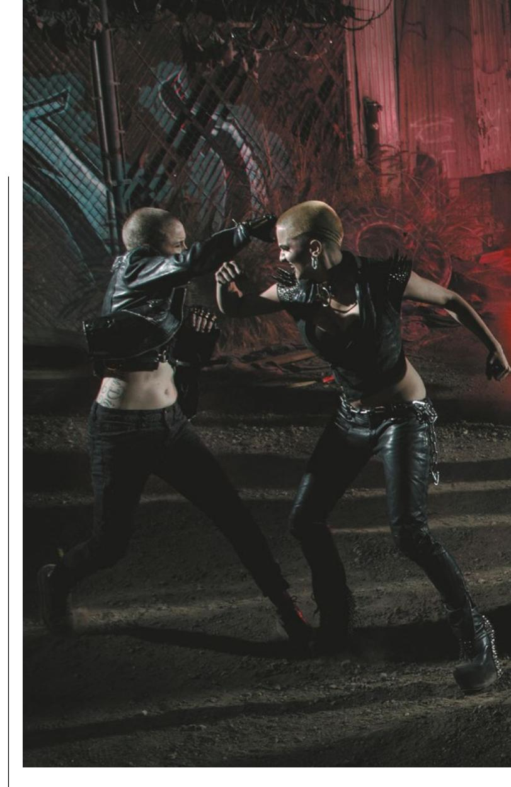

#### Эффект неожиданности

Чтобы получился эффект неожиданности, нужно победить в состязании: например, ловкости + скрытности против самого высокого значения смекалки + наблюдательности среди противников (не забывайте, что для персонажей рассказчика всегда можно использовать «Правило половины»). Атаки с использованием сверхъестественных сил, таких как Сокрытие, тоже обладают эффектом неожиданности.

Первая атака с эффектом неожиданности, как правило, имеет сложность 1 (модификаторы на неё не влияют), что позволяет нанести ошеломительный урон.

- ⇒⊱≪ ≫

#### ПРИМЕР

Папушка успешно подкралась к жертве и собирается вогнать ей в спину кол. Игрок проходит проверку силы + фехтования и отнимает 1 от количества полученных успехов — именно столько урона он нанесёт противнику.

≢⊱≪ }⊳:≢

#### **Ближний бой**

Следующие правила относятся к сражениям с приме‑ нением зубов, когтей, кулаков, а также оружия руко‑ пашного боя.

Для атак без оружия, как правило, используется проверка силы + драки; для атак с использованием одноручного оружия — ловкости + фехтования; а с ис‑ пользованием двуручного — силы + фехтования.

Для защиты парированием можно использовать те же самые пулы, а при уклонении — ловкость + атле‑ тику.

Если оба участника конфликта хотят нанести друг другу урон, они оба проходят проверку атаки — урон наносит только победивший (считается, что от встреч‑ ной атаки он защитился).

**Дополнительно:** можно увеличить на 1d10 пул проверки персонажа с более длинным оружием.

ЗАХВАТ. Персонаж может попытаться взять противника в *захват*, повалить на землю, вступив с ним в борьбу, или как‑то иначе ограничить его подвижность. Для этого оппоненты должны вступить в состязание силы + драки. Победив, нападавший не наносит урона, но его против‑ ник не может перемещаться и атаковать кого‑то, кроме персонажа, который держит его в захвате. В следующем ходу персонаж снова может пройти состязание силы + драки против схваченного противника. Если он снова по‑ бедит, то может сделать что‑то из перечисленного ниже:

- n нанести урон, равный выигрышу, как при обычной атаке;
- n укусить врага (если он вампир) и нанести ему 2 тяжёлых повреждения (см. «Укус вампира в бою», стр. 213);
- n просто продолжить удерживать противника на месте.

Если побеждает противник, он освобождается от захва‑ та и может в следующем ходу действовать как обычно.

Кусая оппонента, находящегося в захвате, вам‑ пир не получает отрицательных модификаторов, как при прицельной атаке.

#### **Дистанционный бой**

Следующие правила относятся к сражениям с примене‑ нием дистанционного оружия: пистолетов, арбалетов, передвижных пулемётов, установленных на транспорт‑ ные средства, и т. д.

Для обычной перестрелки, как правило, использу‑ ется проверка самообладания + стрельбы, но для снай‑ перского выстрела можно использовать упорство + стрельбу, а для дуэли в стиле двух ковбоев — ловкость + стрельбу (хотя бы для первого выстрела). При попытке попасть в цель, которая находится за пределами даль‑ ности эффективной стрельбы конкретного вида ору‑ жия, пул проверки уменьшается на 2d10.

**Дополнительно:** можно увеличить на 1d10 пул проверки персонажа, у которого более скоро‑ стрельное оружие или который готов потра‑ тить больше боеприпасов.

#### **ПРИМЕР**

*У Джейсона пистолет-пулемёт, а у его противника Драгана обычный пистолет. Джейсон добавляет к пулу своей проверки 1d10. У Гретхен и Линн обычные пистолеты, но Гретхен готова опустошить всю обойму, так что она добавляет к пулу своей проверки 1d10.*

Навыки, которые используются для составления пула, могут меняться в ходе дистанционного боя. Персона‑ жи, устроившие засаду на фуру, для первого выстрела могут пройти проверку упорства + стрельбы, в то время как водитель ответит им проверкой смекалки + стрель‑ бы, после чего обе стороны в перекрёстном огне будут проходить проверки самообладания + стрельбы.

МЕТАТЕЛЬНОЕ ОРУЖИЕ. Персонаж, который метает в цель какой‑то предмет, должен пройти проверку ловкости + атлетики. Вампиры порой швыряют даже то, что для этого не предназначено — вроде автомобилей и металлоконструкций. Охотники на вампиров часто используют коктейли Молотова.

ЗАЩИТА В ДИСТАНЦИОННОМ БОЮ. Если персонаж во вре‑ мя перестрелки только защищается, но у него нет на‑ дёжного укрытия, он вступает в состязание с оппонен‑ том, проходя проверку ловкости + атлетики, поскольку ему приходится бежать зигзагами, используя все осо‑ бенности ландшафта, чтобы по нему не попали. Если оба участника дистанционного боя атакуют друг друга, они тоже вовлечены в состязание, но оба используют стрельбу. И в том и в другом случае к пулу проверки применяется модификатор укрытия.

| УКРЫТИЕ                                                                                   | МОД. ПУЛА  |
|-------------------------------------------------------------------------------------------|------------|
| Укрытия нет                                                                               | −2d10      |
| Укрытие затрудняет обозрение (кусты, небольшое дерево против пули крупного калибра) | −1d10      |
| Импровизированное укрытие, которое не простреливается                                  | + / − 0d10 |
| Специализированное укрытие (окоп, бун кер, мешки с песком)                             | +1d10      |
| Бойница, амбразура                                                                        | +2d10      |

Неподвижная цель беззащитна — сложность попадания по ней всегда равна 1.

СТРЕЛЬБА В БЛИЖНЕМ БОЮ. Если стрелка связали ближ‑ ним боем, он проходит проверку силы + стрельбы про‑ тив проверки драки или фехтования оппонента. Про‑ тивник при этом не получает штрафа за то, что у него нет укрытия. Пул проверки стрельбы уменьшается на 2d10, если персонаж пытается стрелять в кого‑то, кто не находится с ним в ближнем бою, а также если он использует оружие крупнее пистолета (эти модифика‑ торы могут суммироваться).

#### ПЕРЕЗАРЯДКА И БОЕЗАПАС. В игре **«Вампиры: Маскарад»**

боезапас стрелкового оружия обычно не отслежива‑ ется. Перезарядка оружия — это незначительное дей‑ ствие (см. выше), уменьшающее пул основной проверки на 2d10 для большей части оружия (револьвер, напри‑ мер, должен быть оснащён механизмом для быстрой перезарядки). Учитывая, что за ход персонаж, как пра‑ вило, делает больше одного выстрела, для револьве‑ ров и другого оружия с небольшим магазином (вроде М1911, также известного как «Кольт‑45») перезарядка может требоваться после каждой атаки, для большин‑ ства автоматических пистолетов и винтовок — после двух атак, а для оружия с магазином на 30 и больше патронов — после трёх атак.

ПРИЦЕЛЬНАЯ АТАКА. Персонаж может целиться в ка‑ кое‑то определённое место, чтобы добиться особого эффекта, помимо нанесения урона противнику. Он может, например, стрелять по шинам, пытаться выбить кубок из рук старейшины или всадить пулю в ногу убегающего свидетеля. Попытка обезглавить вампира или воткнуть кол ему в сердце (см. стр. 221) также счи‑ тается прицельной атакой.

Чтобы произвести прицельную атаку, игрок должен заранее сказать о том, в какое место его персонаж на‑ мерен поразить противника, а потом пройти проверку как обычно.

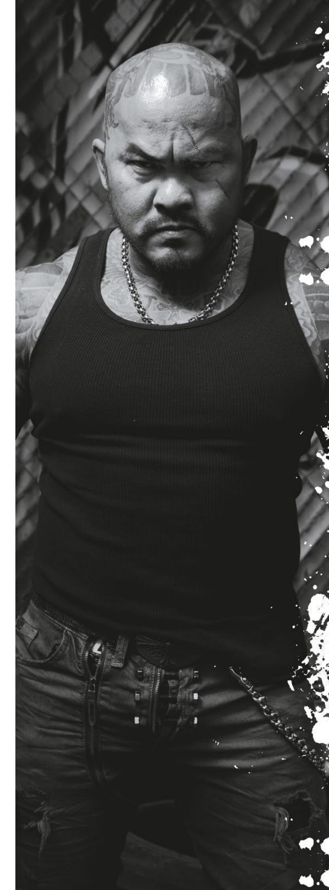

После подсчёта результата проверки игрок дол‑ жен *уменьшить количество успехов* на заданную вели‑ чину, ведь, когда пытаешься попасть в определённый участок, вероятность промахнуться мимо цели выше. Как правило, нужно отнять 2 успеха, но рассказчик может изменять это значение в зависимости от размера мишени. Попасть в шину может быть довольно просто (−1 успех), а вот в топливопровод взлетающего само‑ лёта куда сложнее (−4 успеха).

Каков будет эффект прицельной атаки, решает рас‑ сказчик, но от варианта с увеличенным уроном лучше отказаться, ведь для этого достаточно обычной атаки. Гораздо лучше, если в результате персонаж нанесёт мень‑ ше повреждений, зато каким‑то образом помешает врагу действовать или выведет его из строя, не убив при этом.

ТРАВМА. Игроки, которые хотят добавить сурового реа‑ лизма, могут воспользоваться таблицей травм, в ко‑ торой описаны дополнительные эффекты, которые появляются, когда заполняется шкала здоровья. Если персонажу наносят урон, пока он изнурён, нужно бро‑ сить 1d10, прибавить к выпавшему результату коли‑ чество полученных персонажем к текущему моменту тяжёлых повреждений, а затем посмотреть результат в таблице. Травмы могут повлечь за собой дополни‑ тельные штрафы или даже смерть. Их нужно отмечать отдельно от урона.

| 1D10 + ТЯЖ. ПОВРЕЖДЕНИЯ | ТРАВМА                                                                                                                                    |
|----------------------------|-------------------------------------------------------------------------------------------------------------------------------------------|
| 1–6                        | Оглушён: Потрать 1 пункт воли или пропусти ход                                                                                         |
| 7–8                        | Тяжёлое сотрясение мозга: пул всех физических проверок уменьшается на 1d10, а ментальных — на 2d10                                  |
| 9–10                       | Перелом или вывих: пул всех про верок, требующих использования повреждённой конечности, уменьша ется на 3d10.                    |
|                            | Ослепление: пул всех проверок, для которых необходимо зрение (включая боевые), уменьшается на 3d10.                                 |
|                            | Выбирает рассказчик                                                                                                                       |
| 11                         | Зияющая рана: пул всех проверок уменьшается на 2d10, персонаж полу чает от каждой атаки на 1 поврежде ние больше                 |
| 12                         | Увечье: эффект такой же, как при переломе или вывихе, но конечность утеряна или повреждена настолько, что её уже не восстановить |
| 13+                        | Смерть (для людей) или торпор (для вампиров)                                                                                           |

#### **ПРИМЕР**

*У вампира Эрика выносливость 3, а значит, на шкале его здоровья 6 ячеек. Он уже получил 4 лёгких повреждения в перестрелке с охранником, и у него осталось 2 пустые ячейки. Эрик пытается сбежать, но охранник снова по нему попадает, нанося 6 повреждений.*

*Пули, разумеется, наносят вампирам лёгкий урон, который делится пополам, так что Эрик должен отметить 3 повреждения. Две пустые ячейки на шкале здоровья теперь заполнены, так что Эрик изнурён. Кроме того, одно лёгкое повреждение превращается в тяжёлое.*

*Из-за того, что Эрик получил повреждения, пока был изнурён (то самое третье повреждение, ставшее из лёгкого тяжёлым), он должен пройти проверку по таблице травм. Результат проверки — 5, а у Эрика 1 тяжёлое повреждение, так что общее значение — 6. Эрик оглушён. Игрок готов пожертвовать 1 пунктом воли, так что Эрик быстро приходит в себя и убегает от охранника.*

### **Триумфы в бою**

Если персонаж получил триумф в сражении с безымян‑ ным смертным, вы можете не подсчитывать урон и про‑ сто решить, что человека вывели из строя. Это поможет не сбавлять темп игры. Кровавый триумф в данном слу‑ чае означает, что противник мёртв.

#### **Модификаторы урона оружия**

Чтобы подсчитать, сколько повреждений получил про‑ тивник, нужно прибавить модификатор урона исполь‑ зованного оружия к выигрышу, полученному при про‑ верке.

#### **ПРИМЕР**

*Адам швыряет в Полину каменного ангелочка, украшавшего фонтан, и получает 2 успеха. Рассказчик решает, что статуя довольно тяжёлая — модификатор урона +3, так что Полина получает 5 лёгких повреждений (как обычно, она делит это количество пополам).*

| ВИД ОРУЖИЯ                                                                                                                                                                                    | МОД. УРОНА |
|-----------------------------------------------------------------------------------------------------------------------------------------------------------------------------------------------|------------|
| Импровизированное оружие, кол*                                                                                                                                                                | +0         |
| Лёгкое дробящее (кастет)                                                                                                                                                                      | +1         |
| Тяжёлое дробящее (дубинка, клюшка, монтировка, бейсбольная бита).                                                                                                                          | +2         |
| Лёгкое колюще-режущее (арбалетный болт, складной нож).                                                                                                                                     |            |
| Огнестрельное слабой мощности (пистолет 22‑го калибра)                                                                                                                                     |            |
| Тяжёлое холодное оружие (меч, пожар ный топор).                                                                                                                                            | +3         |
| Огнестрельное средней мощности (однозарядная винтовка (винчестер), 9‑миллиметровый пистолет (пистолет Макарова, «Глок» и др.), дробовик с мак симального эффективного расстояния) |            |
| Огнестрельное большой мощности (револьвер «Магнум», дробовик с близ кого расстояния).                                                                                                   | +4         |
| Массивное холодное оружие (клеймор, кусок рельсы или арматуры)                                                                                                                             |            |

\*Если персонаж совершит прицельную атаку в сердце вампира, используя деревянный кол в качестве оружия, и нанесёт 5 или больше повреждений, кол пронзит сердце и парализует вампира.

#### **Броня**

Броня защищает от колющего, режущего и огнестрель‑ ного оружия: при каждом попадании 1 пункт брони позволяет превратить 1 тяжёлое повреждение в лёгкое. Лёгкий урон затем делится пополам, как обычно. Броня, как правило, полезна только для смертных и слабокро‑ вок, поскольку вампиры и так получают лёгкий урон от этих видов оружия.

| ВИД БРОНИ                                             | ПУНКТЫ БРОНИ           |
|-------------------------------------------------------|------------------------|
| Плотная одежда со вставками, кожа ная куртка       | 2 (против пуль — 0) |
| Одежда из баллистической ткани (арамидное волокно) | 2                      |
| Кевларовый жилет / бронежилет                         | 4                      |

6

Полное тактическое обмундирование солдата / бойца спецназа (пул проверок ловкости уменьшается на 1d10)

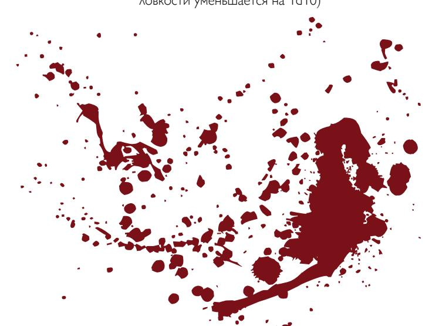

## Расширенные правила. Социальный конфликт

Социальный конфликт принимает множество форм и может вырасти на любой почве: от уличных разборок до изящной придворной пикировки со множеством тонких острот и завуалированных насмешек. Из‑за это‑ го разнообразия правила, касающиеся социальных кон‑ фликтов, более обтекаемы по сравнению с правилами, которые применяются в физических конфликтах.

Правило трёх ходов и блиц‑конфликт хорошо по‑ казывают себя в социальных конфликтах. Придумать на ходу оригинальную стратегию полемики бывает сложнее, чем вспомнить сцену потасовки из любимого боевика или фильма ужасов — в поединке слов фанта‑ зия игроков, как правило, быстрее иссякает.

В социальном конфликте важно заранее определить, чего именно хотят добиться стороны. Что получит по‑ бедитель? Что станет с проигравшим?

Социальный конфликт — это не просто дискус‑ сия или монолог. У персонажа должен быть оппонент, который придерживается противоположных взглядов и активно пытается ему помешать. Если такого оппо‑ нента нет (например, при попытке вызвать интерес у холодно настроенной аудитории, заморочить голову патрулю, соблазнить жертву), используйте обычные проверки.

#### **Пул социального конфликта**

Участники формируют пул, используя те параметры, которые больше подходят в их ситуации, в зависимости от сути конфликта, места действия, характера аудито‑ рии (если она есть) — и, самое главное, методов, кото‑ рыми они будут пользоваться. Вот несколько примеров:

- n Бандитские тёрки: упорство + запугивание.
- n Попытка убедить Принца, что ты говоришь правду, а твой оппонент лжёт: манипуляция + убеждение.
- n Светский раут в Элизиуме, во время которого и ты, и твой оппонент пытаетесь расположить общество к себе: самообладание + этикет.
- n Рэп‑баттл (XXI век) или поэтическая дуэль (XVII век): смекалка + исполнение.
- n Участие в конкурсе архитектурных проектов с це‑ лью убедить мэрию построить новый городской причал по правилам магической геометрии: интел‑ лект + ремесло (архитектура).
- n Свидание пресыщенного сластолюбца с опытной авантюристкой, во время которого оба пытаются убедить друг друга принять узы крови: обаяние + хитрость.

Шахматная партия с живыми сосудами вместо фигур, символизирующая некие тёмные махинации в реальном мире: интеллект + гуманитарные науки (шахматы).

В тех же самых ситуациях, что и выше, можно использовать другие параметры - всё зависит от подхода. Например:

- Демонстративно смять мусорный бак в качестве аргумента в бандитских тёрках: сила + запугивание.
- Аргументировать свои слова доказательствами, а не полагаться на красноречие, произнося речь перед Принцем: интеллект + убеждение.
- Распускать в Элизиуме слухи об оппоненте, незаметно подрывая его позиции: манипуляция + этикет.
- Выглядеть круче во время рэп-баттла: обаяние +  $\blacksquare$ исполнение.
- Убедить мэрию, что твой проект причала более выгодный: манипуляция + политика.
- Сыграть на тщеславии и подсознательных желаниях своего визави: обаяние + проницательность или даже манипуляция + проницательность, если делаешь это через третьих лиц.
- Играть не ради победы, а ради того, чтобы убедить наблюдающего вентру, что ты достаточно беспощаден и достоин повышения: манипуляция + гуманитарные науки (шахматы).

Как и во время физического конфликта, не обязательно использовать один и тот же пул на протяжении всей сцены - он может меняться в зависимости от действий оппонентов.

#### В улыбке прятать нож

Социальные конфликты разрешаются аналогично физическим

Порядок действий редко имеет значение, но если нужно установить инициативу, используйте смекалку + этикет (впрочем, для долгих интриг, требующих тщательной подготовки, можно использовать манипуляцию вместо смекалки).

Участники проходят проверки и сравнивают результаты. Тот, у кого успехов оказалось больше, вычитает успехи противника из своих - это и будет количеством пунктов стресса, которые противник должен отметить на своей шкале воли.

В социальном конфликте у персонажа всегда есть возможность пойти на компромисс перед очередной проверкой. Если поражение кажется неминуемым, лучше отступить, чем оказаться растоптанным.

Полученный стресс будет выше, если поражение произошло при свидетелях. В зависимости от аудитории добавьте к стрессу модификатор из таблицы ниже (аудитория - это не просто присутствующие, а заинтересованные слушатели).

| АУДИТОРИЯ ИЛИ СВИДЕТЕЛИ                                                      | MOA. CTPECCA |
|------------------------------------------------------------------------------|--------------|
| Только оппоненты                                                             | $+()$        |
| Члены котерии                                                                | $+1$         |
| Сородичи, чьё мнение важно для вам- пира: наставник, возлюбленная и т. д. | $+2$         |
| Примоген, Гарпии или иные важные фигуры; серьёзный соперник вампира       | $+3$         |
| Принц, Барон или другая могуществен- ная фигура                           | $+4$         |

#### Течение времени в социальном конфликте

В отличие от физического противостояния, которое, как правило, длится одну сцену, социальный конфликт может растянуться на долгое время. Попытки соперников склонить Принца на свою сторону, дуэль двух художников-тореадоров или психологическая игра малкавиан могут длиться недели, месяцы и даже столетия.

В длительном конфликте стресс представляет собой не столько внезапное потрясение, сколько постоянный раздражающий фактор, который даёт о себе знать, когда персонаж оказывается в центре внимания.

В социальном конфликте - особенно в длительном — не обязательно точно подсчитывать полученный стресс. Чтобы участники понимали, на что ориентироваться в игре, достаточно сосчитать успехи, полученные оппонентами за три хода (или назначить победителем того, кто взял верх в двух ходах из трёх).

#### Победа в социальном конфликте

Чаще всего словесные баталии заканчиваются тем, что одна из сторон признаёт своё поражение — обычно после того, как почувствует изнурение. Впрочем, иногда оппоненты готовы идти до конца, до полного нервного срыва, не останавливаясь ни перед чем, пока шкала воли не будет до конца заполнена тяжёлым стрессом. Победитель в любом случае получает то, ради чего всё это затевалось (и о чём рассказчик и игроки договорились перед началом конфликта).

Рассказчик может ввести отрицательные модификаторы для проигравшего при дальнейшем общении с победителем, по крайней мере до тех пор, пока память о поражении ещё свежа.

## Аспекты небытия

Для большинства хроник более чем достаточно тех пра‑ вил, что приведены выше в этой главе, а также на стр. 115 — 130. Опираясь на них, рассказчик может смело импровизировать в любой ситуации. Впрочем, неко‑ торые рассказчики предпочитают разыгрывать сцены охоты или воспоминаний во всех кровавых подроб‑ ностях. Им нравится чувствовать под ногами твёрдый фундамент правил, когда персонажи затевают долго‑ срочный проект или обмениваются жуткими услугами с другими Сородичами. В этом разделе они найдут более детализированную систему правил, касающихся взаимо‑ отношений между вампирами, а также специфических видов деятельности, характерных для Мира Тьмы.

## Охота

Преследование жертвы и насыщение её кровью лежит в основе всех легенд, романов и фильмов, связанных с вампирами. Сородичам необходимо охотиться — охо‑ та доставляет им удовольствие. Однако это не означает, что она должна непременно стать основой сюжета хро‑ ники — вы можете оставить этот аспект небытия вам‑ пиров за кадром, если хотите, или обращаться к нему лишь эпизодически.

Описывая процесс охоты, дайте волю фантазии во всяком случае, насколько позволяют рамки времени. Если это не ось сюжета, сцена должна быть короткой, но кровавой, и в любом случае драматичной и запоми‑ нающейся.

Есть два основных подхода при изображении сцены охоты: пошаговый и быстрый. В первом случае крова‑ вый пир выходит на передний план, сцена разыгрыва‑ ется в деталях, она насыщена жуткими подробностями, во втором же реки крови — скорее фон повествования, чем его суть, поэтому сцена разворачивается быстрее, почти не прерывая основного действия.

Самый быстрый способ определить исход охоты это пройти одну‑единственную проверку, пул кото‑ рой зависит от стиля охоты персонажа (см. ниже) или, по крайней мере, от того подхода, который он решил использовать в данном случае. Гангрелу может прий‑ тись по душе холодящая кровь погоня через парк (вы‑ носливость + атлетика), тогда как носферату предпо‑ чтёт затаиться в грязном закоулке, словно паук, и ждать, пока сюда забредёт очередной пьяница или торчок

(упорство + скрытность). Сложность проверки зависит от охотничьих угодий, в которых промышляет вампир (см. таблицу на стр. 308).

Успех означает, что каинит нашёл подходящий сосуд и напился его крови: убил, покалечил, а может, просто сделал пару аккуратных глотков - его Голод уменьшается соответственно (см. таблицу на стр. 212). После этого он без проблем замёл все следы и ушёл незамеченным. Стоит учитывать при этом, что убийство человека, а в некоторых обстоятельствах и нападение, может иметь долгоиграющие последствия, особенно если этот инцидент ставит под угрозу Маскарад или на сцену выходит Вторая инквизиция.

Если время не играет решающей роли, вы можете вообще не отслеживать, сколько длится охота. В тех редких случаях, когда это действительно имеет значение, рассказчик может остановиться на каком-то заданном значении, например один час; примерно прикинуть, сколько могла занять охота в зависимости от подхода, который использовал каинит; или даже включить счётчик времени в начале сцены, чтобы повысить напряжение.

Если проигравший выбирает «расплату за победу», вампир утоляет Голод, но что-то идёт не по плану: сосуд умирает, потому что вампир нечаянно разорвал ему горло или по какой-то другой неизвестной причине; заслуживающему доверия свидетелю удаётся скрыться; вампир забредает на чужую территорию (такое особенно часто случается в городах, где охотничьи угодья раздают и Принц Камарильи, и Советы анархов). В любом случае это не какие-то мелкие трудности, которые вампир способен решить на месте. Проблема должна быть достаточно масштабной, чтобы вся котерия могла принять участие в её разрешении (или проигнорировать на свой страх и риск).

Иногда рассказчик может разрешить котерии утолить Голод без какой-либо проверки. В некоторых хрониках это возможно с самого начала, в других - с определённого момента. Если у котерии есть послушное стадо или хорошие охотничьи угодья и ничто не может помешать насыщению, можно просто сказать, что охота удалась. В конце концов, сложность ведь не в том, чтобы найти сосуд, - сложность в том, чтобы сохранить Человечность и не нарушить Маскарад, когда беснуется Зверь.

#### Пул охоты

Многие вампиры питаются тогда, когда подворачивается удобный случай, и применяют тот метод, который лучше подходит к ситуации. Однако у всех есть свои

предпочтения. Пул охоты зависит от подхода, который применяет каинит в каждом конкретном случае, но чаще всего вампиры следуют излюбленному стилю охоты (стр. 175).

Ниже приведены типичные сочетания параметров для каждого стиля охоты. Игроки могут предлагать свои варианты, а рассказчик - принять их или вместо этого усложнить каиниту нежизнь, поскольку тот пытается думать, в то время как его одолевает инстинкт. Дисциплины и достоинства могут повлиять на пул (что ещё больше расширит возможности).

БЕСТИЯ. Ты пьёшь кровь других Сородичей. Допустишь ошибку — и тебе конец. Может, сразу, а может, позже, когда на тебя объявят кровавую охоту. Рассказчику не стоит сводить этот процесс к какому-то определённому набору проверок.

ДЖЕНТЛЬМЕН. Манипуляция + убеждение: ты берёшь кровь только с согласия жертвы, изображая либо медицинского работника, либо фрика. Привлекаешь внимание сосуда, заручаешься его согласием и только тогда утоляешь Голод.

ИДОЛ. Манипуляция + хитрость (или запугивание + слава): ты питаешься своими фанатами, паствой или обожателями иного сорта - демонстрируешь им свои таланты (это может быть что угодно: исполнение, наука, ремесло, политика и т. д.), выбираешь сосуд и принуждаешь отдать тебе кровь - лестью или угрозами.

ИСКУСИТЕЛЬ. Обаяние + хитрость: ты пьёшь кровь во время любовных утех. Выбираешь сосуд, очаровываешь, приглашаешь уединиться и утоляешь Голод.

МОРФЕЙ. ЛОВКОСТЬ + СКРЫТНОСТЬ: ТЫ ПИТАЕШЬСЯ СПЯщими. Выбираешь отель или дом, проникаешь внутрь, тихонько утоляешь Голод и удаляешься.

НАЛЁТЧИК. Сила + драка: ты действуешь угрозами или силой — подстерегаешь добычу, набрасываешься на неё и насыщаешься всласть. Тёмные рыцари, пьющие только из преступников, используют пул смекалки + уличного чутья.

СЕМЬЯНИН. Манипуляция + хитрость: ты тайком пьёшь кровь близких. Завязываешь общение, делаешь своё дело, прячешь следы и нежно бережёшь их до следующего раза.

СУРРОГАТЧИК. Интеллект + уличное чутьё: ты не охо‑ тишься в прямом смысле слова, просто добываешь где‑то донорскую кровь или питаешься мёртвыми и умирающими. Ты находишь подходящий источник и получаешь к нему доступ — подкупом, убеждением или как‑то ещё.

ТУСОВЩИК. Манипуляция + убеждение: ты пьёшь кровь своей тусовки, где тебя высоко ценят. Это может быть и элитный клуб, и подростковая субкультура. Ты явля‑ ешься на очередное сборище, обхаживаешь и изолиру‑ ешь жертву, напиваешься кровью, а затем убеждаешь её, что ничего странного не произошло, или намекаешь, что лучше об этом никому не рассказывать («Пусть это будет нашим маленьким секретом, тогда я всем скажу, что мы друзья, хорошо?»).

ФЕРМЕР. Самообладание + обращение с животными: ты пьёшь кровь животных. Находишь жертву, приманива‑ ешь или ловишь её и насыщаешься.

#### **Охотничьи угодья**

Сложность проверки охоты зависит от того, много ли потенциальных жертв вокруг, хорошо ли охраняется территория, где решил поохотиться вампир, и насколь‑ ко сплочённое там население. Оживлённая многоэтаж‑ ка, где все соседи друг друга знают, и район с редкими частными домами, где каждый занят только собой, примерно равноценные охотничьи угодья. В аэропор‑ ту полно людей, которых не скоро хватятся, но так же много охранников и камер наблюдения.

Иногда к сложности добавляются те или иные модификаторы — в зависимости от конкретного объ‑ екта, который выбрал вампир (см. «Город в игре», стр. 335) или свойств его домена (стр. 195). Кроме того, повышенная бдительность полиции увеличивает сложность на 1, а присутствие спецслужб (например, для охраны высокопоставленных лиц или при тер‑ рористической угрозе) — для некоторых способов охоты на 2. Фестиваль, парад, акция протеста, бунт или иное крупное временное скопление людей снижа‑ ет сложность на 2. Сложность охоты в любом случае не может быть ниже 1.

В некоторых районах охотиться придётся группа‑ ми или хотя бы парами. Вампиру может понадобиться сообщник при попытке соблазнения, напарник, кото‑ рый поможет скрутить крупную добычу, или дозорный, чтобы предупредить об опасности. Рассказчик может разрешить взаимопомощь (стр. 122), если план звучит убедительно.

Сложность охоты можно повысить, если вампир обладает нечеловеческими чертами (носферату, некото‑ рые гангрелы, Сородичи с Человечностью 4 или ниже), поскольку им сложно слиться с толпой.

#### **Операция «Пир»**

Возможно, персонажи решат, что им позарез нужно испить крови французского министра обороны, знаме‑ нитой певицы или любимого агнца Принца (поскольку именно эта кровь дарует видения будущего). Это пред‑ полагает продуманную операцию, спланированную не менее детально, чем в любом боевике про ограбле‑ ния, и разыгранную по всем правилам. В операции дол‑ жна быть задействована вся котерия — даже если оди‑ ночка теоретически мог бы добраться до столь ценной шеи, ему всё равно нужны будут помощники, чтобы тщательно изучить место операции, наблюдать за пери‑ метром, произвести отвлекающий манёвр и обеспечить отступление.

Рассказчик может не ограничивать себя в количестве и разнообразии мер безопасности и других преград на пути к цели. В ход можно пустить всё — от Принца, приказывающего котерии отступить ради сохранения Маскарада, до Второй инквизиции, узнавшей о готовя‑ щемся нападении и устроившей засаду, предварительно заменив сосуд двойником. Разумеется, персонажи могут одержать верх. И пожалеть после этого, что не проиг‑ рали, ведь министр обороны удвоил поддержку Вто‑ рой инквизиции, знаменитая певица грозит нарушить Маскарад своим новым альбомом «Камарилье с любо‑ вью», а Принц стал ещё большим тираном и паранои‑ ком, чем был. А может, и того хуже: один‑единственный вампир узнал об их операции, и этот амбициозный ан‑ цилла готов держать язык за зубами, но только в обмен на определённые услуги.

| ОХОТНИЧЬИ УГОДЬЯ                                                                                                              | СЛОЖНОСТЬ |
|-------------------------------------------------------------------------------------------------------------------------------|-----------|
| Трущобы, Скид‑Роу, муниципальные жилые дома и пригородные районы, кормушка                                              | 2         |
| Цыганские или хипстерские кварталы; рабочие кварталы, пришедшие в упадок; районы, в которых началась джентрифи кация | 3         |
| Процветающие рабочие кварталы, дело вые и туристические кварталы, аэропорт, казино                                      | 4         |
| Промышленные, складские и портовые районы; городской парк; пригород сред него класса                                    | 5         |
| Богатые кварталы                                                                                                              | 6         |

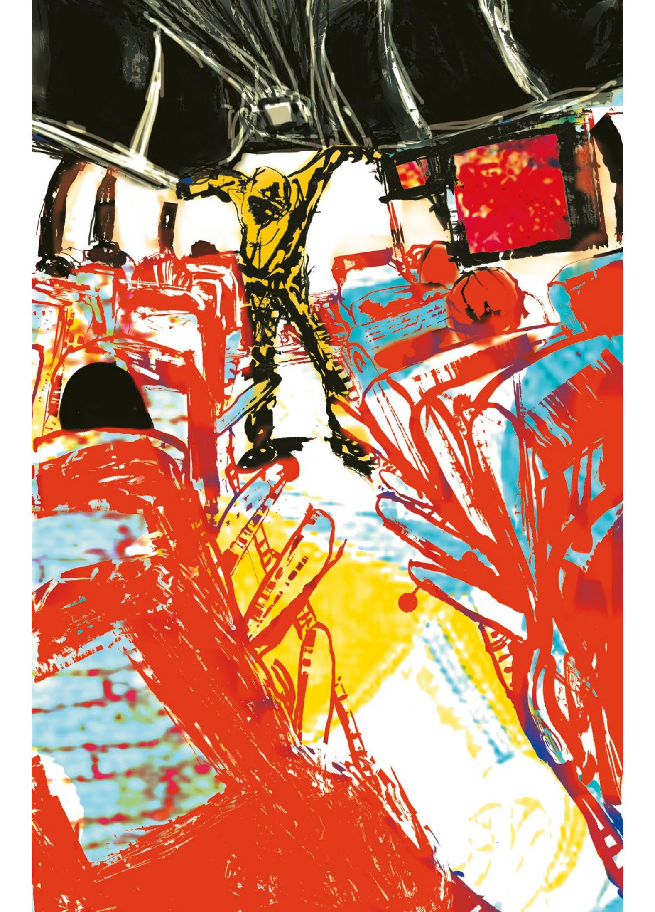

### Интимные отношения

Рано или поздно все Сородичи лишаются возможности предаваться плотским утехам. Некоторых это вполне устраивает, другие же открывают для себя новые виды наслаждений, дарованных Кровью, — гораздо более волнующие, чем банальное совокупление. Интимные отношения между Сородичами, впрочем, представляют для них определённую опасность, поскольку в пылу страсти вампир может не удержаться и прильнуть к источнику живительной витэ, рискуя оказаться рабом уз крови. Коварные каиниты беззастенчиво пользуются этим, применяя всё своё мастерство, чтобы распалить партнёра до такой степени, что тот не сможет сдержаться. Те же, в чьи планы не входит обман, пользуются всеми возможными мерами предосторожности, чтобы подойти к краю, но не переступить черту, отказывая себе в истинном блаженстве Поцелуя. Кто-то делает порезы, позволяя крови стекать по коже какое-то время (в надежде, что она утратит способность формировать узы), другие довольствуются лишь крошечными каплями или вылизывают царапины, не проглатывая кровь, ит. д. и т. п.

Если обе стороны придерживаются мер предосторожности, чтобы избежать ошибки, нужно успешно пройти проверку самообладания + проницательности со сложностью, зависящей от серьёзности предпринятых мер (2 — если Сородичи тщательно соблюдали все ограничения; 5 — если им было всё равно). Стоит заметить, что для большинства вампиров полученное удовольствие обратно пропорционально количеству мер предосторожности.

Если один из партнёров хочет заставить другого пересечь черту, он должен победить в состязании обаяния/манипуляции + исполнения против самообладания + проницательности жертвы. Пул проверки соблазнителя уменьшается на 2d10, если он хочет скрыть свои намерения.

Если вампир хочет сделать вид, что выпил крови партнёра, он должен победить в состязании самообладания + хитрости против самообладания + проницательности партнёра.

Многие вампиры находят пресными интимные отношения с кем-то, кто уже связан узами крови с посторонним. Что касается отношений с собственным вассалом, обычно интимную близость используют в качестве поощрения, поскольку вассалу она приносит гораздо больше удовольствия, чем сюзерену. Обоюдные узы крови между любовниками, как правило, не одобряются и порой становятся причиной великой ревности. Если в отношения вовлечено несколько сторон, связанных узами, ситуация может очень быстро накалиться.

#### ГРЯЗНАЯ КРОВЬ

Вампиры - это нежить. Обычные яды им не страшны. Тем не менее вещества, растворённые в крови жертвы, оказывают на них определённое воздействие. Среди Сородичей есть «алкаши» и «психонавты», которые специально разыскивают одурманенные сосуды, чтобы ощутить эхо их эйфории. Наркотические препараты могут менять резонанс крови человека (см. стр. 226).

Как правило, одурманивающие вещества оказывают на вампиров более слабое воздействие, чем на людей. Приведённые ниже значения - это исходное состояние для потребляющего их смертного, но максимально возможный эффект для Сородича. В большинстве случаев эффект длится одну или две сцены в зависимости от природы самого препарата и количества выпитой крови.

- Алкоголь: пул проверок ловкости и интеллекта уменьшается на 1d10.
- Галлюциногены: вампир не может концентрироваться; пул проверок смекалки, упорства и манипуляции уменьшается на 2d10.
- Героин/морфин/окси/опиаты: пул всех физических проверок уменьшается на 2d10; сложность проверок сопротивления или преодоления ярости уменьшается на 1 пункт.
- Кокаин/мет/«спиды»: чтобы перебросить кости при кровавом триумфе или кровавом провале, нужно потратить 2 пункта воли; сложность проверок сопротивления или преодоления ярости повышается на 1 пункт.
- Марихуана: восприятие времени слегка меняется; пул проверок смекалки уменьшается на 1d10; сложность проверок сопротивления ярости уменьшается на 1 пункт.
- Яд: пул всех проверок уменьшается на 1d10; вампир получает от 1 до 3 лёгких повреждений за сцену (или за ход, если яд быстродействующий и смертельный). Редко какой яд может причинить нежити серьёзный вред. Лёгкие повреждения отражают всплески активности вещества в крови, во время которых оно кратковременно парализует мёртвые нервные окончания вампира. Действие яда прекратится, как только отравленная кровь иссякнет или будет разбавлена новой — либо когда Голод достигнет 5 пунктов, либо при следующем насыщении.

## Одержимость. Альтернативные правила

Вы можете менять существующие правила одержимости, чтобы те оказывали больше влияния на игру или лучше подходили характерам персонажей. Несколько дополнительных вариантов приведено ниже. Если вы решите ими воспользоваться, вы должны быть готовы к тому, что игроки будут периодически терять контроль над персонажами, сталкиваясь с самыми неприглядными сторонами существования вампиров. Предложенные ниже варианты могут добавить истории драматизма (возможно, правда, с некоторыми перегибами). Новичкам, однако, стоит остановиться на базовых правилах, по крайней мере до тех пор, пока они полностью не освоятся с ними или не захотят пощекотать себе нервы.

#### ТЯЖЕСТЬ ПОСЛЕДСТВИЙ

Если собралась труппа опытных игроков, рассказчик может усугубить последствия одержимости. Когда в пуле Голода выпадает сразу две единицы, последствиям следует посвятить целую сцену, а если единиц три или больше - одержимость должна повлиять на характер персонажа.

#### ДЛИТЕЛЬНАЯ ОДЕРЖИМОСТЬ

Если само действие занимает много времени, то и одержимость, которую оно вызовет, может быть длительной. Такая одержимость слегка отличается от той, что возникает под влиянием момента. Рассказчик может просто описать, как одержимость повлияла на ход дела (возможно, задавая наводящие вопросы вроде «разве это не приводит тебя в ярость?»), а может посвятить подробную сцену одержимости или ввести определённый модификатор или драматическое осложнение, которое будет сопровождать персонажа, пока он не завершит задуманное действие.

#### ПРИМЕР

Марко пытается обыграть политического оппонента. Напряжённая кампания длится несколько недель. Марко страдает от одержимости, и его постоянные вспышки гнева приводят в негодование даже его союзников, снижая его влияние на 1 пункт до конца политической кампании.

≢⊱∢

**HOSK DISON** 

#### ПО ПРЕДЛОЖЕНИЮ РАССКАЗЧИКА

Одержимость может проявиться не только из-за кровавого провала, но и по какой-то другой причине на усмотрение рассказчика. В этом случае игрок может потратить 1 пункт воли, чтобы персонаж не поддался одержимости, но если он этого не сделает, то, наоборот, восстановит 1 пункт воли.

- - - - - - - - - - - - - - - - - - -

#### ПРИМЕР

Кейшу в забегаловке подстрелил её собственный «обед». Рассказчик говорит ей: «Такую дерзость нельзя спустить ему с рук, верно?» Кейша должна либо потратить 1 пункт воли, чтобы воспротивиться одержимости, либо покарать виновного и восстановить 1 пункт воли.

 $+$   $+$   $+$   $+$   $+$   $+$   $+$   $+$   $+$   $+$ 

#### СКРЫТАЯ ОДЕРЖИМОСТЬ

Скрытая одержимость позволит взрослым и опытным игрокам более полно погрузиться в мрачную атмосферу Мира Тьмы. Каждый игрок должен выбрать для своего персонажа характерные слабости и пороки, включая альтернативную версию клановой одержимости (рассказчик поможет сформулировать их так, чтобы они были сопоставимы с имеющимися). Когда случается подходящая ситуация или персонаж терпит поражение при проверке, испытывая сильный Голод, рассказчик выбирает подходящую одержимость (пройдя скрытую проверку, если требуется), но не объявляет о ней во всеуслышание, а сообщает игроку при помощи записки.

В идеале игроки не должны раскрывать друг другу, какие действия их персонажей были совершены под воздействием одержимости. В результате перед участниками возникает цельный образ темпераментного, жестокого и вечноголодного вампира. Этот приём может показаться тривиальным, но он способен существенно сгустить краски, задав суровую и мрачную атмосферу.

### **Ретроспектива**

Вампиры бессмертны, и некоторые из них прожили по-настоящему долгую жизнь. Даже слабокровка может иметь за спиной десятилетия нежизни. За это время вампир, несомненно, успел поучаствовать в событиях не менее важных и интересных, чем те, что разворачиваются в текущей хронике. Ретроспектива - это способ погрузиться в воспоминания, чтобы разгадать тайну, разобраться в чьих-то мотивах или, например, продемонстрировать причину своего чудесного прозрения, благодаря которому Сородич припрятал здесь парочку золотых слитков.

#### **Цели**

Персонаж, решивший погрузиться в воспоминания, преследует какую‑то цель, помимо желания поно‑ стальгировать. Не то чтобы в этом было что‑то пло‑ хое — приключение котерии панков в 1980‑х или ков‑ боев 1880‑х может быть интересным само по себе, но было бы неплохо связать сцену прошлого с настоя‑ щим. Ретроспектива — это способ рассказать о чём‑то, что персонаж сделал, узнал или чему положил начало в те далёкие времена — и что пригодилось ему нынеш‑ ней ночью. Игрок задаёт для своего героя цели, кото‑ рых тот, по его мнению, уже должен был достичь в про‑ шлом.

Цели ретроспективы, как и многое другое в этой игре, измеряются количеством пунктов:

- Ответ на один простой вопрос, один временный пункт какого‑либо факта биографии, увеличение пула одной проверки навыка на 2d10 в настоящем.
- ●● Ответ на один важный вопрос, два временных пункта какого‑либо факта биографии, увеличение пула одной проверки навыка на 4d10 в настоящем.
- ●●● Ответ на один глобальный вопрос, три времен‑ ных пункта какого‑либо факта биографии, серьёз‑ ный долг (см. ниже).

ОТВЕТЫ. Вопросы могут варьироваться от «где был про‑ рыт служебный тоннель при строительстве этого бан‑ ка?» до «кто убил бывшего Принца Майами во время Великого урагана 1926 года?» Ответ на простой вопрос поможет персонажу в одной сцене, на важный — снаб‑ дит сведениями, которые полезны для целой главы или истории, а ответ на глобальный вопрос важен для всей хроники и, вероятно, даст персонажам мощ‑ ный рычаг давления. Он также, скорее всего, поставит их в опасное положение — но такова, в сущности, доля всех каинитов.

МОДИФИКАТОРЫ ПУЛА. Вампир вспоминает ка‑ кую‑то хитрость, которой он научился в прошлом, или деталь, которая может ему помочь. Модификатор можно использовать в любой момент — в текущей гла‑ ве или в следующей. Главное, чтобы проверка имела какое‑то отношение к происходившему в воспоми‑ наниях: «В 1978 мы были друзьями, что случилось?» или «Помнится, Билли Кид научил меня бросать лас‑ со!»

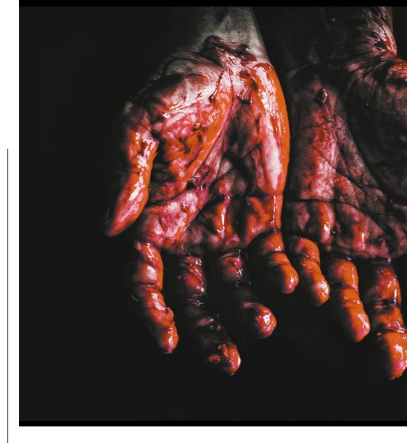

ВРЕМЕННЫЕ ПУНКТЫ. Временные пункты фактов био‑ графии увеличивают пул соответствующих прове‑ рок или иным способом облегчают нежизнь вампира на протяжении одной истории. Это может быть как те‑ кущая история, так и одна из последующих. Как только вампир воспользуется временным фактом биографии, заработанные пункты пропадут: он разыграл свой ко‑ зырь, растратил капитал и т. д. и т. п.

В сцене ретроспективы могут быть и другие цели: от восстановления пунктов воли до изучения рецепта алхимического эликсира или получения «читатель‑ ского билета» в ключевом архиве Носферату. Количе‑ ство целей одной ретроспективы также не ограничено. Выбирайте количество пунктов в зависимости от жела‑ ний игроков или опираясь на значения искомых пре‑ имуществ.

#### **Погружение**

Вампир, помнящий подробно каждую деталь своего прошлого, очень скоро сошёл бы с ума, не справившись с потоком образов, вытесняющих реальность. Детали блекнут с течением времени — остаются лишь самые восхитительные чувственные воспоминания и самая стойкая вражда. Чтобы вспомнить былые события, вам‑ пир должен напитать Кровью сосуды своего мёртвого мозга и пробудить дремлющие нервные окончания погружение в ретроспективу требует испытания Крови.

Каждый персонаж может погрузиться в воспомина‑ ния один раз за историю. Рассказчик может ограничить количество сцен ретроспективы за игровую встречу как правило, одной такой сценой. Разумеется, персо‑ наж не может вспомнить то, что происходило до его

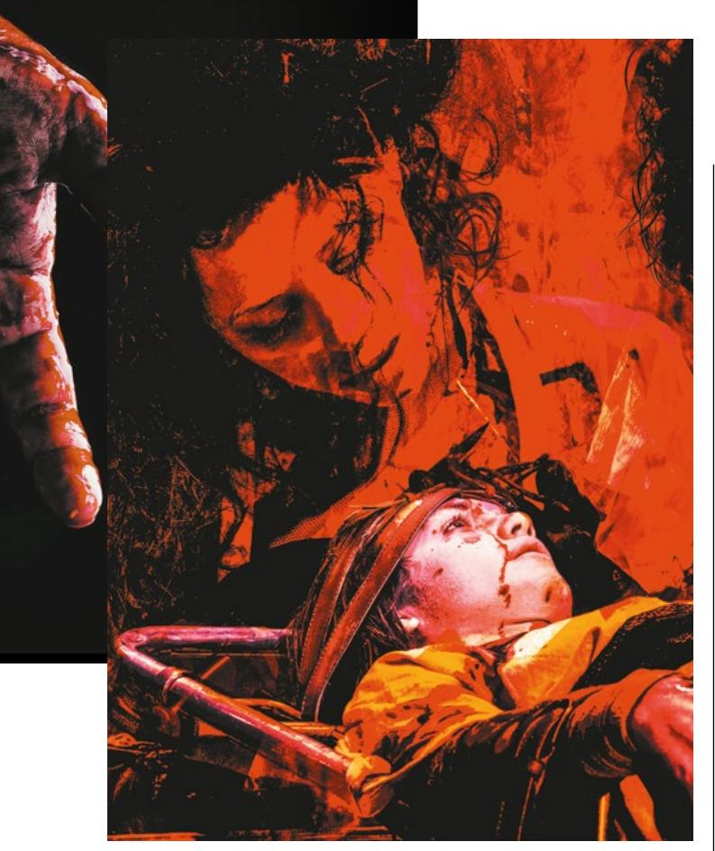

рождения. Если несколько персонажей присутствовали при определённых событиях прошлого, они все могут стать участниками одной ретроспективы.

К тому моменту, когда в игре возникнет необходи‑ мость в сцене ретроспективы, игрок, скорее всего, уже будет иметь некоторое представление о том, где и ко‑ гда его персонаж получил Становление и чем с тех пор занимался. Он должен выбрать время и место важных событий, которые пытается вспомнить. Если он поня‑ тия не имеет, что могло тогда происходить, тем лучше! Сделайте заметку на будущее («Август 1918‑го, Бостон: пил кровь больных «испанкой», уклонялся от призы‑ ва») — и вперёд!

Если персонаж предаётся воспоминаниям в значи‑ мом для него месте или в подходящем расположении духа, он получает дополнительные положительные модификаторы, которые может использовать в сцене ретроспективы — сразу целиком или по одной играль‑ ной кости на проверку, как ему больше нравится. Если персонаж погрузился в ретроспективу:

- n В том самом месте, где всё и происходило: 2d10.
- n Выпив кровь смертного свидетеля или его потомка: по 1d10 за каждый пункт утолённого Голода.
- n Выпив кровь бессмертного персонажа рассказчика, участвовавшего в тех событиях: за крошечный гло‑ ток — 1d10, а если вампир выпил больше, то 1d10 + сила Крови донора.

n Держа в руках памятный предмет, связанный с теми событиями (например, пистолет, из кото‑ рого застрелили шерифа Пэта Гарретта): 3d10, но только к проверкам с использованием этого предмета.

РЕТРОСПЕКТИВА И ПАРАМЕТРЫ. По идее, в сцене ретро‑ спективы параметры персонажа должны быть ниже, поскольку он в то время был менее опытен, но вычисле‑ ние предположительной разницы займёт чересчур мно‑ го времени. Характеристики и навыки вы можете оста‑ вить неизменными, однако следует отнять по 1 уровню Дисциплины за каждые 50 лет, отделяющие события ретроспективы от настоящего времени (в некоторых обстоятельствах, впрочем, и этого можно не делать например, если вампир последние 500 лет пролежал в торпоре).

Какие преимущества и недостатки будут у вам‑ пира, определяет рассказчик в зависимости от пре‑ дыстории персонажа. Если он лишился старого убе‑ жища в 1945‑м, но на момент ретроспективы оно ещё не было разрушено — значит, у него есть убежище. Если он сделал состояние на продаже алмазов после развала СССР, но вспоминает более ранние време‑ на — значит, у него будет меньше пунктов богатства. Преимуществ должно быть достаточно, чтобы сделать игру интересной, но не больше, чем позволяет про‑ шлое вампира.

Сцену ретроспективы вампир начинает с тем же уровнем Голода, с каким он погрузился в воспоминания, если рассказчик не решит иначе.

#### **Ход действия в ретроспективе**

Рассказчик должен поставить на пути персонажей по меньшей мере по одному препятствию за каждый пункт целей ретроспективы при условии, конечно, что повествование от этого не пострадает.

Игроки, чьи персонажи не участвуют в сцене, могут взять на себя вспомогательные роли. Смена амплуа мо‑ жет быть довольно занимательной, особенно при рез‑ ком контрасте: тот, кто играл строгого пуританина в основном сюжете, вдруг становится похотливым за‑ всегдатаем публичных домов Парижа 1880‑х. Это по‑ хоже на эпизод флешбэка из телесериала, где основной актёрский состав играет совсем других героев.

Рассказчик должен приложить все усилия, чтобы цели и препятствия в сцене ретроспективы были чётко очерчены, а действие не сбавляло темп. Когда и как за‑ вершится сцена, решает рассказчик: она может закон‑ читься как победой, так и поражением персонажей.

противник. Условный противник, будь то отдельная личность или обстоятельства, должен быть настолько силён, чтобы обеспечить необходимое количество преград — приблизительно по одной за каждый пункт цели ретроспективы. Персонажи могут преодолевать их, проходя обычные проверки, или вступить в блицконфликт. Если вы решили разыграть конфликт пошагово, вся сцена ретроспективы должна быть посвящена только ему.

#### Последствия

Если персонажи игроков победили, они получают то, ради чего погружались в воспоминания. Если они не сумели преодолеть хотя бы одну преграду - значит, потерпели полное поражение во всей сцене. Ретроспектива превращается в горькое напоминание о том, как тяжко им пришлось, когда они в прошлый раз столкнулись с аналогичной проблемой.

Весь стресс, полученный в ретроспективе, остаётся после окончания сцены. Кроме того, нанесённые персонажу в прошлом повреждения также превращаются в стресс. Любые травмы ко времени основного действия уже зажили.

Если персонаж впал в торпор в сцене ретроспективы, считайте, что каким-то образом он смог пробудиться до начала текущей хроники (определите, сколько времени вампир должен был оставаться в торпоре, исходя из его былой Человечности, и учитывайте этот срок в дальнейшем при погружении в новые воспоминания). Если персонаж погибает во время ретроспективы - что ж, кому или чему он обязан своим возвращением и какие тёмные и зловещие сделки ему пришлось заключить, вопрос для будущих историй. Возможно, на него ответит ещё одна ретроспектива...

В сцене ретроспективы понимание и взаимодействие между игроками и рассказчиком важны как никогда - странные и неожиданные шаги, предпринятые персонажами, могут разрушить целостность картины, что только повредит истории, если, конечно, она заранее не задумывалась как безумный и страшный сон.

### Торговля долгами

Хотя власть над другими вампирами остаётся самой твёрдой валютой среди Проклятых, одолжения и обязательства также имеют ценность. Процесс обмена, оказания и обещания услуг, известный как торговля долгами, - это краеугольный камень вампирского общества. Проще говоря, умный Сородич делает другим одолжения, тогда как глупый их принимает - и становится слугой своих обещаний и долгов. Вампир, который просит об услуге тех, кому сам ничем не помогал, слишком часто обнаруживает, что всё его существование подчинено взятым на себя обязательствам. В обмен на помощь благодетель превращает его в свою марионетку.

Сообщество Сородичей - это запутанный клубок взаимных обязательств, клятв верности, выплаченных долгов и нарушенных обещаний. Все, начиная от благородного Принца и до последнего птенца, считают, что главной монетой среди Сородичей - после крови, конечно. - являются долги.

#### Долги

Обещание, данное одним Сородичем другому, называется долгом. Получив некую услугу от другого Сородича, вампир оказывается связан долгом. В некоторых доменах долги работают как кредит: вампир должен получить одолжение от другого вампира, прежде чем сам сможет оказать ему услугу; общество считает должника достойным доверия по умолчанию. В других доменах наоборот: чем больше у Сородича долгов, тем менее способным исполнить свои обязательства он считается. Общая для всех доменов истина состоит в том, что долг есть долг, и от него нельзя избавиться иначе, чем погасить или сделать так, чтобы держатель долга его простил.

В большинстве доменов долги можно передавать по наследству: если Сородич убил того, кому задолжал, или случайно оказался причиной его смерти, чему есть неопровержимые доказательства, то услугу он в своё время должен будет оказать сиру или старшему из потомков почившего кредитора, а иногда Принцу или Гарпиям. Каиниты, которые бережно относятся к понятию чести, предпочитают собственноручно и по всей форме передать права на долг наследнику, даже если кредитор погиб от рук Второй инквизиции. Потребовать исполнения долга, на который у тебя нет прав, или попытаться взыскать погашенный долг - это тяжкий удар по репутации. Гарпии строго следят за тем, чтобы никто не уклонялся от своих обязательств. Некоторые даже ведут подробные списки взаимных долгов. Нарушителя могут отлучить от двора, ведь если его слово ничего не стоит, то и клятва верности - пустой звук. Среди анархов отношение к долгам не менее серьёзное — по большей части благодаря стремлению доказать, что благородство свойственно не только Принцам и их придворным.

В разных городах Сородичи по‑разному отслежи‑ вают долги — где‑то специально назначенная Гарпия ведёт строгий учёт, где‑то у каждой влиятельной фи‑ гуры есть определённый знак (редкая монета, квитан‑ ция с подписью, отрезок нити и т. п.), символизирую‑ щий оказанную услугу, а где‑то все полагаются просто на честное слово.

Чем влиятельнее Сородич — тем ценнее его долги.

В целом Сородичи признают четыре степени зна‑ чимости долгов:

МЕЛКИЙ ДОЛГ. Такой долг проще всего и взять, и пога‑ сить. Мелкий долг может появиться, если помочь ко‑ му‑то в каких‑то мелочах, не подвергая себя при этом риску и не неся существенных убытков. Помочь раз‑ добыть кровь, пустить в убежище на день, достать приглашение на эксклюзивный творческий вечер или входной билет в крутой ночной клуб — всё это мелкие долги. Члены одной котерии, как правило, оказывают друг другу подобные услуги каждую ночь, не слишком заботясь о том, чтобы учитывать каждую мелочь. Правда, если ты только пользуешься чужими услугами и ничего не даёшь котерии взамен, однажды утром ты можешь обнаружить запертую (случайно!) дверь в убежище.

СРЕДНИЙ ДОЛГ. Сородичу потребуется совершить опре‑ делённое усилие, чтобы заработать или погасить сред‑ ний долг. Подобные услуги требуют некоторых жертв, их сопровождает небольшой риск — физический, соци‑ альный или какой‑то ещё. Если ты просишь вампира проголосовать в твою пользу на собрании старейшин, убить не слишком важного смертного, который тебе чем‑то мешает, позволить прочитать редкую книгу или древнюю рукопись, предоставить тебе убежище или сосуд в час нужды — будь готов отдать средний долг.

КРУПНЫЙ ДОЛГ. Действие, влекущее за собой круп‑ ный долг, может напрямую или косвенно сказаться на всей жизни домена. Оно требует значительных затрат и немалого риска, но при этом выгодно для обеих сторон. Когда тебя возводят в сан filius major («старшего сына») среди приверженцев Каи‑ нитской ереси, жалуют богатые охотничьи угодья, посвящают в чью‑то тайну, перенаправляют значи‑ тельные ресурсы на выгодное для тебя мероприятие или по твоей просьбе неожиданно для всех меняют своё мнение при голосовании в совете — это круп‑ ный долг.

ДОЛГ ЖИЗНИ. Самый редкий и ценный из всех видов долгов, имеющих хождение между Проклятыми, хотя, по иронии судьбы, оказаться должником можно в считаные мгновения, когда только эти мгновения и отделяют тебя от Окончательной смерти. Чтобы заработать долг жизни, иногда приходится убить другого могущественного вампира, но большинство долгов жизни появляется в тяжёлых обстоятель‑ ствах под угрозой неотвратимой опасности. «Всё что угодно» можно пообещать не только в страхе за свою жизнь, но и в обмен на жизнь своей опоры или на алиби в глазах Принца, а также ради сохране‑ ния какой‑то ужасной тайны.

#### **Долг платежом красен**

В домене могут быть весьма строгие правила учёта дол‑ гов, но когда речь заходит об ответных услугах, обычно всё довольно просто. Если Сородич, перед которым ты был в долгу, сказал, что вы в расчёте — значит, вы в расчёте.

С точки зрения правил игры долги влияют на со‑ циальные взаимодействия. Мелкий долг позволяет прибавить 1d10 или 2d10 к пулу социальной провер‑ ки, нацеленной на то, чтобы уговорить собеседника сделать что‑то для тебя. Персонаж может попросить собеседника оказать ему любезность авансом — то‑ гда в случае победы он должен будет услугу в ответ; либо напомнить об услуге тому, кто сам ему дол‑ жен, — тогда при победе персонажи окажутся в рас‑ чёте.

Средний долг гарантирует победу в социальной проверке против должника. Если же персонаж хочет попросить о любезности авансом, он должен пройти соответствующую проверку. Так или иначе он полу‑ чит то, о чём просит, но в случае поражения задолжает в ответ небольшую услугу.

Крупные долги и долги жизни — это совершенно иной уровень. Они могут изменить ход всей хроники или перекроить целый домен. Одной проверкой тут не обойдёшься. Огромная услуга может стоить двух или трёх пунктов факта биографии, а то и больше. Обе‑ щать исполнение таких долгов стоит только в особых ситуациях. ⬛

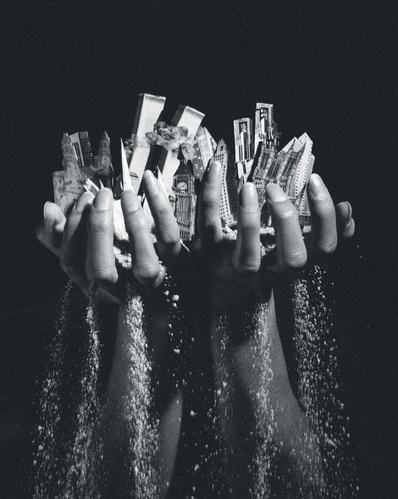

Иной здесь призрак - словно человек, А теловек на призрака похож, Странней фигур я не видал вовек, Брала от едкого дыханья дрожь: Сей Город странен так и безысходен, Что теловек здесь вовсе тужероден -Фантомам лучше дома не найдёшь.

ДЖЕЙМС ТОМСОН, «ГОРОД СТРАШНОЙ НОЧИ» . (ПЕР. ВАЛЕРИЯ ВОТРИНА)

корее всего, ваша хроника разворачивается в городе. Здесь вампиры чувствуют себя как дома, ведь это естественное место обитания всего неестественного. Они, словно крысы или тараканы, плодятся там, где люди собираются толпами и строят себе жилища. Задача рассказчика - сформировать и привести в движение пространство, окружающее персонажей.

У города есть две ключевые задачи в игре. Первая, разумеется, заключается в том, чтобы быть декорацией для истории. Вторая же - служить постоянным источником искушения. И вторая задача, хоть и кажется чуть более обтекаемой, даже важнее, чем первая. Истории появляются на свет благодаря соблазнам, которые есть в городе и которые плотно вплетены в его ландшафт.

Взять хотя бы охоту. Всем Сородичам нужна кровь. Это превращает людей в ресурс - в пищу, неравномерно распределённую по карте города. Где-то охотиться проще, где-то сложнее. Кроме того, привлекательность района для вампира зависит от его личных предпочтений в охоте.

Допустим, некий Принц-вентру пьёт кровь только у бездомных. Многие из них ночь проводят в тоннелях городского метро - домене местных носферату. Носферату ненавидят Принца и знают о его кулинарных пристрастиях, поэтому они объявили запрет на охоту в тоннелях даже для членов собственного клана. Они оправдывают это решение заботой о Маскараде якобы хотят избежать подозрительных смертей поблизости от своего убежища. Но все в Камарилье понимают истинную причину.

77171

**FTW OFFICES 211** 

ħ

**Tua** 

Вопрос в том, заявит ли Принц о своём праве охо‑ титься, где пожелает, или пойдёт на поводу у носфе‑ рату, рискуя показаться слабым? В первом случае он дестабилизирует ситуацию в городе ради собственной прихоти, во втором — покажет, что часть города ему неподвластна.

## Феодальная система

Территориальное деление, которого придерживают‑ ся Сородичи, больше всего напоминает средневеко‑ вую феодальную систему, иногда с местным колори‑ том. Анархи раздают права на участки, основываясь на идеалистических принципах, но и у них в конце концов всё сводится к тому, кто кого знает и кто сего‑ дня получил поддержку Барона или Совета. Каких бы идей ни придерживались Сородичи, при распре‑ делении доменов сила всегда стоит на первом месте, в то время как иерархия, долги и прочие соображе‑ ния создают почву для конфликта — или, иными словами, завязку для сюжета. Допустим, к примеру, Принц Камарильи отдал Шерифу портовый район. Но Шериф слишком занят, чтобы охотиться самому, поэтому даёт разрешение пятерым другим вампирам жить и охотиться на территории его домена. В обмен каждый из них должен регулярно снабжать Шерифа сосудами.

Феодальная система нередко ставит персонажей перед выбором, который направляет историю. Допу‑ стим, они на самом дне вампирского общества. Им в любом случае нужно место, где жить, и это ставит перед персонажами чёткую цель. Достичь её они могут по‑разному. Стоит ли им держаться скромно и доволь‑ ствоваться никудышными окраинами, где нет хозяина? С одной стороны — свобода, с другой — дрянные охот‑ ничьи угодья и нищенское существование. Если им хочется чего‑то более комфортного, они могут занять дом богатого семейства, превратив его членов в своих рабов. Но для этого им необходимо разрешение тореа‑ доров, на чьей территории этот дом находится. Примо‑ ген тореадоров взамен хочет, чтобы персонажи каждый месяц организовывали ночь развлечений в Элизиуме. В результате простая вроде бы проблема превращается в целую историю.

С правом на охоту ситуация аналогичная. Возможно, персонажам понадобилась кровь какого‑то определён‑ ного типа, и для этого им нужно наведаться в чужие охотничьи угодья. Они должны либо получить разре‑ шение, либо заняться браконьерством (что само по себе может повлечь интересные последствия). Вероятно,

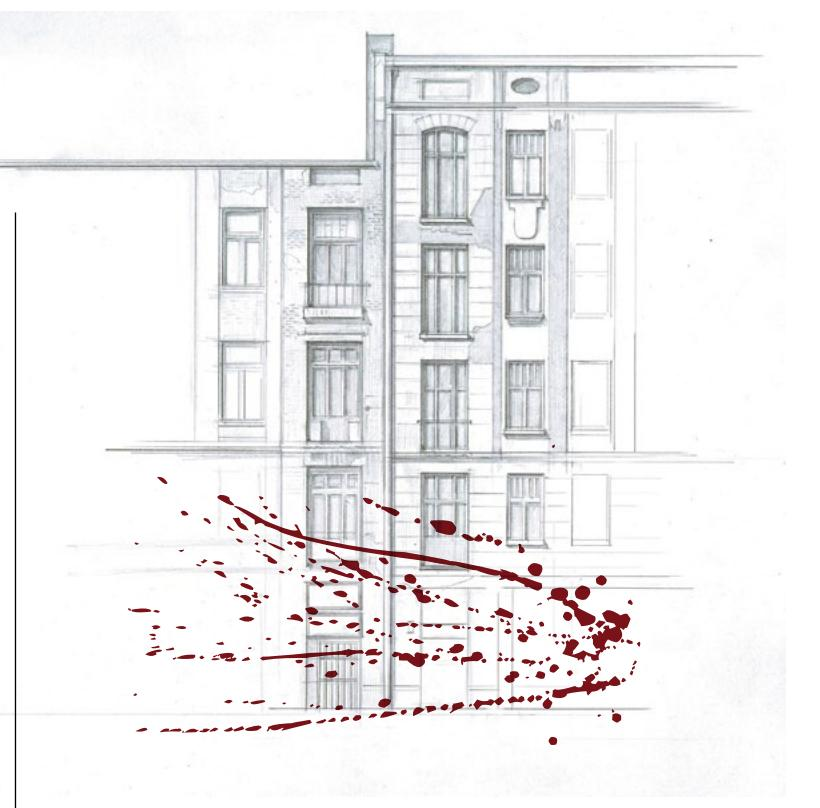

нужный сосуд можно найти на территории старейши‑ ны‑носферату, который хочет, чтобы один из персона‑ жей пошёл с ним на открытое романтическое свидание в Элизиуме.

Если персонажи уже поднялись по ступенькам иерархии или хроника в принципе повествует о более зрелых вампирах, они могут обернуть феодальную систему и в свою пользу: не только плясать под чужую дудку, но и требовать от других определённых услуг.

#### **Домены**

Территорию, закреплённую за вампиром или котерией, называют доменом даже в городах Анархов, хотя они зачастую употребляют такие слова, как «нива», «ведом‑ ство», «район» или «база». Самые большие домены у Принцев Камарильи — в теории их владычество рас‑ пространяется на всю территорию города, состоящую из более мелких доменов их подданных. На практике даже в самом образцовом городе Камарильи есть ме‑ ста, куда не дотягиваются длинные руки Принца, будь то домены независимых владык, банд анархов или рай‑ оны, от которых вампиры держатся подальше ради соблюдения Маскарада.

ТЕРРИТОРИАЛЬНЫЕ ДОМЕНЫ. Самый распространённый способ деления территории на домены — географи‑ ческий. При этом используется ландшафт и админи‑ стративная карта города. Самые крупные, лучшие участки достаются самым сильным и влиятельным Сородичам, которых уважают или боятся. Подающие надежды каиниты, а также те, кого терпят и кто может принести какую‑то пользу, декретом Принца получа‑

ют небольшие наделы в людных частях города. А всё остальное — отдельные улицы, дома, а порой и огром‑ ные районы — достаётся в пользование многочислен‑ ным неонатам и нередко попадает под контроль банд анархов.

Некоторые домены представляют собой некий центр с прилегающими улицами — «пять кварталов во все стороны от водонапорной башни» или «шесть улиц вокруг Одеона». Границы в данном случае весьма размыты, и другие Сородичи довольно часто их нару‑ шают — случайно или намеренно. Вампиры метят тер‑ риторию, используя своего рода граффити, и защища‑ ют её зубами и когтями — или своим влиянием в Совете и при дворе Принца.

Могущественные и благородные Сородичи владе‑ ют целыми районами, чётко обозначенными на карте: герцог Эхо‑Парка, граф Кросс‑Бэй, леди Гуэля и т. п. Как правило, эти вельможи жалуют своим подданным наделы, предоставляя им защиту от гастролёров в об‑ мен на службу или поставку сосудов.

ЦЕНТРАЛИЗОВАННЫЕ ДОМЕНЫ. Домен может представлять собой некий комплекс, состоящий из главного здания и окружающих его хозяйственных построек, улиц, парковок и подземных служб — например, госпиталь или супермаркет. Другой вариант централизованного домена — это конгломерат однотипных сооружений или участков по всему городу, считающихся вотчиной определённого клана: например, все канализации при‑ надлежат носферату, все парки — гангрелам (после заключения временного перемирия с Камарильей), а места пересечения лей‑линий — тремерам. Возможно также, что некий Сородич ещё с незапамятных вре‑ мён охотился на «большой дороге», считая её своим доменом, — теперь же все шоссе и автобаны перешли под его власть.

ВЕДОМСТВЕННЫЕ ДОМЕНЫ. Иногда домен подразумевает не столько участок земли, сколько сферу влияния, опре‑ делённое ведомство. Например, тореадорам принадле‑ жат все художники и посетители картинных галерей. Возможно, в городе есть Госпожа сцены, обладающая эксклюзивным правом на все сосуды, имеющие отно‑ шение к театральным подмосткам, и Повелитель вра‑ чевателей, которому принадлежит вся кровь в меди‑ цинских учреждениях. Причём последний постоянно грызётся с Собачьим королём гангрелов, считающим, что ветеринарные клиники — в его юрисдикции, точно так же как и все бродячие животные в городе, даже если они забрели в театр или больницу.

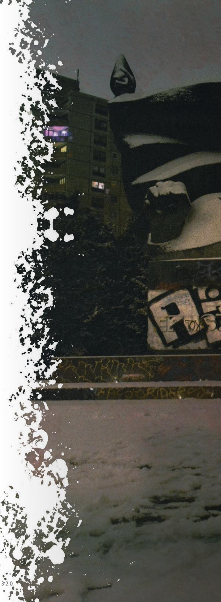

#### **Право на охоту**

**В каждом городе своя охотничья политика, но кому бы он ни принадлежал, Анархам или Камарилье, прав‑ да всегда одна: сосудов на всех не хватит. В природе территория крупного хищника может достигать 60 квадратных километров, а то и больше — вампи‑ ру повезёт, если ему достанется хотя бы одна сотая этой площади в качестве личных охотничьих угодий. Сородичи, в чьих руках находится власть, ограничи‑ вают права на охоту из практических и политических соображений. С одной стороны, если слишком много вампиров будет охотиться в одном ночном клубе, это заведение долго не протянет, не говоря уже об угрозе Маскараду. С другой стороны, право на охоту — от‑ личный рычаг давления и возможность утвердить свой авторитет.**

**В одних городах правители могут объявить кор‑ мушку (злачный район города, где больше всего до‑ бычи — и больше всего полиции) запретной зоной для всех. В других — оставить за собой право там охо‑ титься, объясняя это тем, что лишь самые опытные и благоразумные вампиры не допустят критических ошибок. Есть города, где целые районы становятся «королевскими угодьями» или «заказниками», где охо‑ титься можно только получив на это особое разреше‑ ние. В других охота разрешена только в своём домене, только по лицензии, выдаваемой за особые заслуги, или только в определённые дни. Законы могут быть очень разными — главное, чтобы правитель с их по‑ мощью мог контролировать подданных и избавляться от неугодных.**

**Сородичу, недавно появившемуся в городе, стоит как можно быстрее освоиться с местными правилами. Бывает, старожилы специально вводят новичков в за‑ блуждение, отправляя их в запретные районы, чтобы без риска для себя проверить, крепка ли по‑прежнему хватка хозяев города, или просто‑напросто избавить‑ ся от лишних ртов. Соблазн нарушить запрет может быть очень велик — в самом деле, неужели Принц следит за каждым сортиром в каждом убогом баре? Но наказание будет жестоким. Некоторые правители специально придумывают мутные, противоречивые и обременительные законы, чтобы их невозможно было не нарушить. Это даёт им законное оправдание для устранения любой оппозиции — ведь каждый вам‑ пир в городе когда‑нибудь да нарушал правила, а если ещё нет — достаточно немного подождать, и у тебя бу‑ дут все основания, чтобы вышвырнуть его из города, а то и казнить.**

# Метки. *Кровавое граффити*

**Как Сородичи делятся инфор‑ мацией, если все они вне систе‑ мы: предпочитают действовать из тени, прячутся в своих логовах и врут всем и обо всём?**

**Ответ прост: они делают это при помощи меток, или арго каи‑ нитов. Подобно тому как уличные банды метят территорию при по‑ мощи граффити, вампиры исполь‑ зуют арт‑терроризм, теггинг, бом‑ бинг или трафаретные рисунки, чтобы передать сообщение другим Сородичам (и желательно только им), вставляя в свои изображения и надписи символику, специфиче‑ ские жаргонизмы или устаревшие слова, смысл которых понятен только посвящённым. Метки это нечто среднее между граф‑ фити древних Помпеев и тегами современных банд. Они сливаются со старыми постерами и партизан‑ ским искусством, теряются среди трафаретных картинок и строи‑ тельной разметки городских улиц.**

**Бумажная крыса, приклеенная к стене тоннеля метро, вычурная, украшенная завитками алая лите‑**

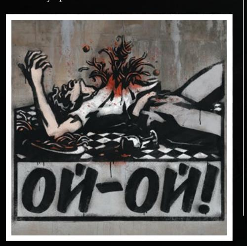

**ра «V», нанесённая на стену бан‑ ковского здания, жёлтый иероглиф, намалёванный на двери забро‑ шенной церкви. Слова «красные зубы» вдоль лестничного пролёта или «Мэрилин» Энди Уорхола, отпечатанная над дверным про‑ лётом. Татуировка у смертного агнца или случайные, казалось бы, газетные заголовки, приклеенные на заколоченную витрину. Всё это метки, сообщающие о том, на чью территорию забрёл каинит, како‑ му клану принадлежит квартал или кого Совет предал анафеме.**

**Для рассказчика метки — это инструмент. С их помощью он может вплести в городской ланд‑ шафт культуру Сородичей. Упоми‑ нания тегов и символов при описа‑ нии окружающего пространства создают впечатление активной го‑ родской жизни: кто‑то оставил все эти метки, кому‑то есть что ска‑ зать — другие Сородичи бродят по этим улицам, даже когда персо‑ нажи игроков находятся в другом месте.**

#### МЕТКИ И ПРАВИЛА

**Иногда решающую роль в раз‑ ворачивающихся событиях играет наблюдательность и осведомлён‑ ность персонажей. Смогут ли они заметить важную деталь? Пой‑ мут ли её значение? Порой от отве‑ тов на эти вопросы зависит даль‑ нейший ход событий — не увидев метку, герои не найдут вход в убе‑ жище своего соперника; неверно истолковав значение символа, окажутся на враждебной террито‑**

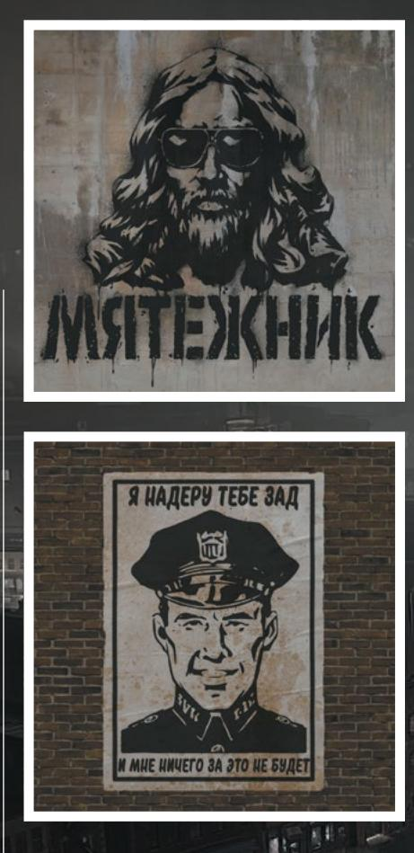

**рии, не подозревая об этом. В этих случаях имеет смысл предложить игрокам проверку. Если же от сим‑ вола на стене ничего на данный момент не зависит — рассказ‑ чику лучше просто разъяснить его значение, чтобы не сбавлять темп игры.**

**Вампиры могут использовать при проверке обычные навыки, смертным же нужно знание оккуль‑ тизма или что‑то подобное, чтобы распознавать их. У Второй инкви‑ зиции, возможно, есть небольшая коллекция самых очевидных меток. Рассказчик может увеличить слож‑ ность проверки или уменьшить её пул, если художник использовал краску плохого качества, торопил‑ ся, рисовал на грубой или выщерб‑ ленной поверхности, его произве‑ дение подверглось воздействию стихий и т. п.**

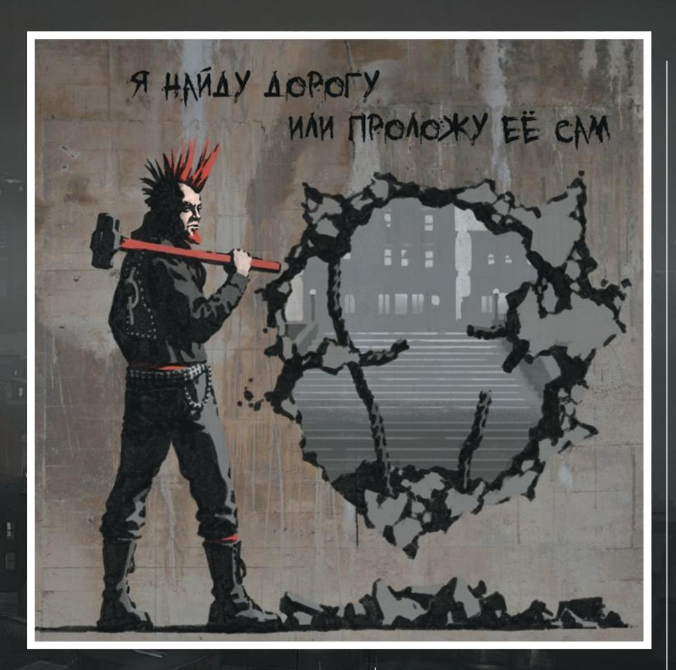

#### **КАК ЗАМЕТИТЬ, РАСПОЗНАТЬ** И РАСШИФРОВАТЬ МЕТКУ

Персонажи, которым известны определённые метки, могут найти их в мешанине городской суеты заметить в самых тёмных закоулках, на крошащемся бетоне, среди слоёв граффити на стенах.

ПУЛ: интеллект + уличное чутьё (распознать) / расследование (увидеть повторяющийся мотив) / проницательность (понять подтекст). Сложность зависит от заумности самой метки и от того, хотел ли автор, чтобы её нашли посторонние.

#### КАК ПЕРЕДАВАТЬ СООБЩЕНИЯ ПРИ ПОМОЩИ МЕТОК

Иногда метки нужны, чтобы передать сообщение: «это моя земля», «тут шпионы инквизиции» и т. п.

Автор не пытается завуалировать её значение - напротив, хочет сделать его максимально понятным для всех Сородичей.

Чтобы зашифровать сообщение при помощи метки, используй интеллект + меньшее из двух значений: либо ремесло, либо навык, соответствующий теме сообщения

ПУЛ: интеллект + ремесло (художник, плакатное искусство или граффити). Возможно использование ловкости, если метку надо нанести в труднодоступном месте. Чтобы замаскировать метку под обычное граффити, нужна проверка смекалки + уличного чутья. В случае триумфа слухи о метке дойдут до целевой аудитории во всех уголках города.

#### ΠΡΟΠΑΓΑΗΔΑ ПРИ ПОМОШИ МЕТОК

Антиреклама подрывает доверие к компаниям, поп-культура разрушает фасад власти, вирусные мемы инфицируют тело политики - такое же влияние на общество Сородичей могут иметь метки. Разумеется, большая часть граффити — кто бы ни был автором, человек или Сородич - не способна вызвать какие-либо реальные изменения. Только шедевры, проникающие под кожу и будоражащие сознание, остаются в памяти достаточно долго, чтобы с ними начали считаться.

Пул: чтобы вложить нужный посыл в свою метку, нужно успешно пройти проверку манипуляции + меньшего из двух значений: либо социального навыка, соответствующего характеру сообщения (запугивания — чтобы напугать и ослабить; лидерства — чтобы вдохновить на борьбу; убеждения - чтобы привлечь на свою сторону; хитрости - чтобы обмануть), либо ремесла с нужной специализацией. Сложность зависит от изначального отношения аудитории к идее, которая заложена в метку. Чтобы повлиять на конкретную цель, может понадобиться состязание.

Чем больше успехов получит Сородич, тем дольше его метка останется в памяти зрителя и тем более широкая публика услышит о ней или увидит её. В целом каждый успех означает, что метку будут обсуждать в течение одной ночи. В случае триумфа метка окажет реальное воздействие - по меньшей мере побудит противников к преждевременным и необдуманным действиям.

## Мигрирующие сообщества

Здесь приведены описания охотничьих угодий, не привязанных к какой-то определённой территории, - это большие скопления смертных, носящие временный характер. Подобные сборища можно встретить практически в любом районе города.

Резонансы, указанные ниже, чаще всего встречаются в этих сообществах, но могут быть исключения. Кроме того, всегда удваивайте шанс встретить сосуд с сильным резонансом, поскольку на подобных сборищах часто кипят нешуточные страсти.

#### **АКЦИЯ ПРОТЕСТА**

При больших скоплениях рассерженных людей любой протест может перерасти в бунт, но до этого момента вампир вполне успеет перекусить. Протесты и митинги объединяют две вещи: тесные палатки и эмоциональный подъём. Кроме того, и там и там обычно больше полиции, чем хотелось бы. Впрочем, это ведь охота, а не прогулка по супермаркету.

сосуды: организаторы и полиция (флегматический резонанс), псевдоактивисты и групи (сангвинический резонанс), прохожие (меланхолический резонанс), идейные приверженцы (холерический резонанс). ПРАВИЛА: если вампир не устроит диверсию, спровоцировав погром или драку на другом фланге, бдительная полиция (+2 к сложности охоты) сведёт на нет преимущество от большой толпы (-2 к сложности охоты).

#### ГРУППА ПСИХОЛОГИЧЕСКОЙ ПОМОЩИ

Бывшие алкоголики, наркоманы, жертвы сексуального насилия и т. д. и т. п. Любое собрание, где люди садятся в кружок, пьют дрянной кофе с чёрствыми булочками и обсуждают свои проблемы - хорошее место для охоты. Кровь сосуда, скорее всего, чиста, а за время встречи можно узнать немало сведений о каждой потенциальной жертве. Можно даже поведать им о собственной зависимости - нужно только немного подправить детали.

сосуды: из всех слоёв общества (преимущественно меланхолический резонанс, хотя среди жертв сексуального насилия возможен сангвинический).

#### Проектирование доменов

У любого домена есть три параметра: портильон, льен и шасс (подробнее см. стр. 196). Проектируя домен, логичнее всего начинать с параметра «шасс», т. е. с того, насколько богаты там охотничьи угодья. Это самое важное качество как для того, кто даровал этот домен, так и для его новых хозяев.

В целом хорошие охотничьи угодья встречаются куда реже посредственных, так что наиболее распространённое значение этого параметра - 1. Более высокий показатель - большая редкость.

В городе на три миллиона человек распределение будет примерно таким:

|  | ШАСС | ВОЗМОЖНЫЙ ГЕОГРАФИЧЕСКИЙ ЭКВИВАЛЕНТ                                                                                                                               |
|--|------|-------------------------------------------------------------------------------------------------------------------------------------------------------------------|
|  |      | Один большой многоквартирный дом, один жилой или промышленный квартал                                                                                          |
|  |      | От двух до четырёх кварталов, один парк, одно небольшое учреждение (больница, музей, супермаркет)                                                           |
|  |      | Восемь кварталов вдоль магистральной улицы, учреждения среднего размера (аэропорт, крупный работодатель, казино, колледж), небольшой ведомственный домен |
|  |      | Квадратный километр, один район, крупное учреждение (парк аттракционов, университет), средний ведомственный домен                                           |
|  |      | Один из этих доменов принадлежит Принцу или Барону. Крупный ведомственный домен, лучшее из возможных мест для охоты (кор- мушка и т. п.)                 |
|  |      |                                                                                                                                                                   |

Большая часть доменов никогда не появится в игре это либо элитные кварталы, которые Принц объявил королевским заповедником, либо бесконечные ряды однообразных домов, промышленных зданий и магазинов, каждый из которых едва ли стоит даже одного пункта. Как правило, подобные районы ночью безлюдны, да к тому же ещё и огорожены высокими заборами, так что для вампиров они бесполезны.

Все города и страны разные, и каждая хроника уникальна. Но в целом можно считать, что для параметра «шасс» один пункт - это примерно от 500 до 1000 смертных. Не стоит делать слишком большой акцент на цифрах - они могут меняться. Одному вампиру нужно стадо из 30 человек, чтобы смертные не начали страдать от анемии и других недугов, но сохранить Маскарад при таком малом поголовье бывает очень сложно. В случае «свободной охоты», а не «культивации», численность сосудов должна быть (как минимум!) на два порядка выше — около 3000 смертных на одного охотника, чтобы его злодеяния затерялись в потоке обычной человеческой жесто-

Правила: здесь много людей, переживших травму, - пул проверок проницательности при поиске дискразий увеличивается на 2d10, сложность проверки охоты без применения физических методов уменьшается на 1.

#### **КОНВЕНТ**

Сотни и тысячи приезжих собираются в случайно выбранном месте, чтобы в течение всего уик-энда посещать семинары, лекции и презентации, разглядывать прилавки с товарами и листать старые журналы. Чтобы успешно поохотиться, не мешает сперва провести небольшую разведку, но, как только ты поймёшь, что за публика здесь собралась, всё становится довольно просто. На конвентах большая текучка, так что можно не беспокоиться, что тебя кто-то узнает.

сосуды: профессионалы (флегматический резонанс), заядлые любители (холерический или сангвинический резонанс), продавцы (меланхолический резонанс).

ПРАВИЛА: сложность проверок охоты уменьшается на 2 пункта; если у тебя есть специальность, соответствующая теме мероприятия, пул социальных проверок увеличивается на 1d10; можешь увеличить пул проверки на 1d10 за каждый пункт славы, если она имеет значение на этом конвенте; нет риска истощения (стр. 331).

#### **МИЛОНГА**

Толпы поклонников танго собираются в танцевальных и бальных залах третьеразрядных отелей и семейных клубов. Многие приезжают из других городов, где подобные развлечения не так распространены. Если ты умеешь танцевать - считай, что ужин обеспечен. Вечеринка может быть посвящена контрдансу, свингу, кадрили — без разницы, лишь бы собралось много людей. Какой смысл гоняться за пьяными подростками по клубам, когда можно спокойно утолить Голод их скучающими мамашами или отчаявшимися холостяками?

СОСУДЫ: скучающие мамы и прилежные детишки (флегматический резонанс), одинокие холостяки (меланхолический резонанс), полигамные пары и «шведские семьи» (сангвинический резонанс).

кости, грабежей и убийств. Таким образом, котерии из 3-5 вампиров необходим домен в 10000 человек. И это только в США, где уровень преступности относительно высок. В Норвегии, к примеру, количество убийств на душу населения в 7 раз меньше, а значит, котерии может понадобиться куда больше смертных, чтобы успешно скрывать свою деятельность. С другой стороны, вы всегда можете сказать, что Сородичи так глубоко проникли в полусоциалистическую скандинавскую систему медицинских учреждений и опеки над престарелыми, что у Камарильи там вообще нет никаких проблем в поиске подходящих жертв, и вампиры могут позволить себе большую «плотность населения». В конечном итоге необходимое количество сосудов остаётся на ваше усмотрение. Если вам оно кажется логичным - значит, всё в порядке.

**BAR** 

**ARFRN** 

Однако шасс - это не только поголовье смертных. Это понятие включает в себя также площадь домена, доступность сосудов и безопасность охоты. К примеру, клуб средних размеров вмещает от 800 до 1000 человек, причём часть этих людей сменяется за ночь, когда одни уходят, а другие приходят, так что численность потенциальных жертв возрастает раза в три или четыре (самые большие клубы вмещают и по 10000 человек). Учитывая, что большая часть сосудов в клубе легко доступна, можно сказать, что домен из трёх ночных клубов равноценен целому району в тихой части города. Не забывайте, что шасс - это всего лишь ориентир, призванный сделать игру легче. Вампиры не устраивают перепись населения.

ПРАВИЛА: **вампир проходит проверку ловкости или обаяния + исполнения (танцы), и каждый получен‑ ный успех позволяет добавить 1d10 к пулу всех про‑ верок охоты на текущий вечер.**

#### НЕЛЕГАЛЬНЫЙ ЗАГОРОДНЫЙ РЕЙВ

**Добраться будет сложновато — придётся про‑ бираться через лес или спускаться вниз по реке, зато после полуночи там будет полно в стельку пья‑ ных и обдолбанных наркотиками людей, которые ни за что не позовут полицию, хоть режь. Во время рейва музыка гремит вовсю, а лес или пляж превра‑ щаются в накрытый стол готовых к употреблению сосудов.**

СОСУДЫ: **хиппи и наркоманы (меланхолический ре‑ зонанс), распалённые тусовщики (сангвинический резонанс) и стареющие организаторы (флегматиче‑ ский резонанс).**

ПРАВИЛА: **Добро пожаловать на пир! Сложность проверок охоты уменьшается на 3. Однако кровь пропитана алкоголем и дурью (стр. 310).**

В рамках историй удобнее вводить небольшие домены, поскольку игрокам (и персонажам) проще освоиться. В рамках хроник интереснее, когда вам‑ пиры борются за территорию, поскольку это раз‑ вивает конфликт. Размеры современных городов (в Чикаго около 21 000 кварталов, и это далеко не са‑ мый большой современный город) не способствуют ни удобству игроков, ни насыщенности конфликта, так что не стесняйтесь игнорировать расстояние, если это требуется для динамики сюжета. В то же время, если вампиров в городе будет слишком много, рассказчику станет сложно уследить за происходя‑ щим. В том же Чикаго население более 3 миллионов, и даже если на каждого вампира придётся по 10 000 человек, это 300 кровососов — чересчур даже для го‑ рода, прозванного «Чираком». Размеры доменов и количество каинитов в городе остаются полностью на ваше усмотрение — Вторая инквизиция и Зов сде‑ лали своё дело, но насколько это коснулось города в вашей хронике, решать вам. Помните, что расска‑ зать хорошую историю важнее, чем пересчитать вам‑ пирское население. Используйте приведённые здесь цифры как ориентир, но не давайте статистике выхо‑ дить на передний план.

#### НОЧНОЙ МАТЧ

**Вид спорта может быть любым — от софтбола «офисной лиги» до профессионального хай‑алая. Важно не то, что творится на поле, — самое инте‑ ресное происходит на трибунах и в барах после окончания игры. Толпа незнакомцев в течение че‑ тырёх часов пьёт и истошно кричит, а затем рас‑ ползается кто куда — лучшее место для охоты труд‑ но себе представить.**

СОСУДЫ: **фанаты (холерический резонанс), пароч‑ ки (сангвинический или флегматический резонанс).** ПРАВИЛА: **сложность проверок охоты уменьшается на 1; около половины фанатов пьяны (стр. 310).**

#### УЛИЧНЫЙ ПРАЗДНИК

**Фестиваль жареных рёбрышек, фанк‑концерт, ре‑ лигиозное шествие или конкурс выпечки — смерт‑ ных притягивают подобные мероприятия. Тёплый летний вечер, дым от гриля, фейерверки, радостный гомон. Все воодушевлены, никто долго не задержи‑**

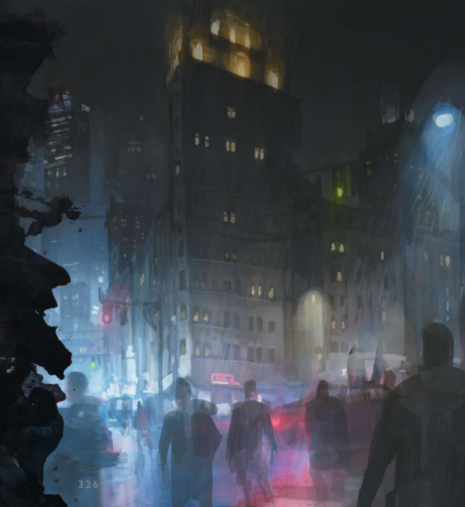

#### **Кровь и охота**

Любую охоту — в любом месте и с любым *modus predationis* (стилем охоты) — можно смоделировать, используя правила на стр. 306.

Если значение параметра «шасс» равно 1, то при прочих равных сложность проверок охоты в этой местности равна 6, как сказано на стр. 196. Каждый следующий пункт уменьшает сложность на 1, но рассказчик может менять эти значения в зависи‑ мости от обстоятельств. В город приехал знаменитый ди‑джей — из пригородов хлынула толпа жаждущих приобщиться к ночной жизни, и охотиться стало про‑ ще. Дождь льёт как из ведра, и люди не выходят на ули‑ цу без особой нужны — найти жертву стало труднее. Жизнь города всегда влияет на сложность охоты.

#### **Карта города**

Карту города нужно создавать на основе сюжетных за‑ вязок, а не наоборот. Распределяй домены, охотничьи угодья и другие важные объекты так, чтобы они помо‑ гали выстроить сюжет, добавляли как можно больше драматизма и напряжения. В результате у тебя получит‑ ся насыщенное пространство, подчёркивающее атмо‑ сферу хроники, где игроки найдут чем заняться и где всегда что‑нибудь происходит.

Для начала задай границы доменов. И не стоит забы‑ вать: чем справедливее ты их расчертишь, тем меньше по‑ вода для конфликта будет у Сородичей — и тем меньше будет завязок для сюжетов. Притеснения, случайности, традиции, недальновидная политика, хитрый замысел всё это играет на руку твоей хронике. Повысь напряже‑ ние до предела. В основе планировки может быть чёткий план и разумные принципы, но в результате, как правило, получается лоскутное одеяло, сшитое жадностью, неве‑ жеством и эгоизмом. Когда речь заходит о территории, вампиры забывают о равноправии. Даже анархи (воз‑ можно, для них это утверждение особенно актуально).

ПЕРЕМЕШАЙ ДОМЕНЫ РАЗНЫХ ТИПОВ. Нанеси на карту территориальные домены и смешай их с абстрактными. Принц некогда подарил своей любовнице центр города в тщетной попытке её удержать. С тех пор сменилось уже два правителя, а она всё ещё владеет этим доме‑ ном. К сожалению, недавно в центре построили новый музей — и верховная Гарпия, будучи придворным ис‑ ториком, заявляет на него свои права. В то же время гангрелы, чьей пищей всегда служили многочисленные бездомные, плевать хотели, что пустеющим централь‑ ным районом, куда переселилась их законная добыча, владеет кто‑то другой.

**вается на месте, никто не станет тебя разглядывать, а если нужно уединиться — безлюдные переулки к твоим услугам.**

СОСУДЫ: **разные, но шанс встретить пьяного или обкуренного выше, чем обычно.**

ПРАВИЛА: **сложность проверок охоты уменьшается на 2.**

#### ФАКУЛЬТАТИВНЫЕ ЗАНЯТИЯ ДЛЯ ШКОЛЬНИКОВ

**Футбол, музыкальный кружок, занятия по рисо‑ ванию, музыкальная студия и т. д. и т. п. На детей охотиться опасно, так что хитрый каинит выбирает сосуды среди их родителей, которые пришли, что‑ бы разобрать по домам своих чад. Эти смертные, как правило, не обращают внимания ни на что во‑ круг, поскольку очень устали после работы. Только откровенное насилие способно их расшевелить. И кровавая вишенка на торте: если молодой папа вдруг почувствует упадок сил, вряд ли он заподо‑ зрит в этом вампиров.**

СОСУДЫ: **работающие родители (флегматический, холерический и меланхолический резонанс).**

ПРАВИЛА: **пул социальных и ментальных проверок охоты увеличивается на 1d10.**

#### ХУДОЖЕСТВЕННАЯ ИНСТАЛЛЯЦИЯ

**Экспериментальное искусство нуждается в свежей крови! Специально обученный персонал собирает драгоценную субстанцию у всех посетителей худо‑ жественной галереи, чтобы потом использовать её для создания шедевра в технике кровавых брызг. Разумеется, предприимчивый тореадор собирается заменить кровь на сладкий сироп, чтобы хорошие вещи зря не пропадали.**

СОСУДЫ: **поклонники современного искусства, го‑ товые к смелым экспериментам (меланхолический резонанс), фрики, любящие кровавые зрелища (сан‑ гвинический резонанс).**

ПРАВИЛА: **для организатора или инициатора ме‑ роприятия это бесплатный запас крови на месяц; для непричастных сложность проверок охоты уве‑ личивается на 2 из‑за пристального наблюдения.**

Абстрактные домены легко ме‑ няют свои границы, а значит, легко порождают конфликт интересов.

#### УСТАНОВИ ПОРЯДОК, А ЗАТЕМ НАРУШЬ

ЕГО. В своей безграничной мудрости Принц повелел, чтобы у каждого клана Камарильи были равноценные угодья в городе. Сенешаль распреде‑ лил земли, а Шериф стал бдительно следить за соблюдением границ. Принц также издал указ, что малк‑ авиане могут охотиться или жить только в сумасшедших домах. Кроме того, он приберёг банки донорской крови для своего близкого дру‑ га — вентру. Картина в результате получается весьма противоречивая и несправедливая, что может спо‑ двигнуть на определённые действия как персонажей игроков, так и пер‑ сонажей рассказчика.

ТАЙНЫ УКРАШАЮТ ГОРОД. В городе анархов верхушка партии объявила, что заброшенный парк аттракцио‑ нов под запретом для всех Соро‑ дичей. Почему? Никто не знает. А во владениях Камарильи Принц жалует совсем ещё неопытному неонату огромные охотничьи уго‑ дья, чем приводит в недоумение всех, включая самого неоната.

НЕ ЗАБЫВАЙ ОБ ИСТОРИЧЕСКОМ КОН‑ ТЕКСТЕ. Нестыковки и странности в расположении доменов могли возникнуть из‑за событий про‑ шлого. Откуда у малкавиан такие огромные угодья в пригороде? Всё дело в том, что Принц отдал этот домен малкавианам ещё в 1723 году, а тогда ему и в голову не приходило, что город так сильно разрастётся. Возможна и обратная ситуация: например, после Второй мировой войны или в 60‑е годы на месте злачного квартала мог появиться благополучный жилой район, где охотиться уже не так просто.

## Атмосфера

Город вампиров — это замкнутая вселенная. Из‑за постоянной угро‑ зы со стороны Второй инквизиции сообщение между городами стало очень медленным — вампиры вер‑ нулись к использованию курьеров и бумажных писем. Сородичи поки‑ дают свои владения только в исклю‑ чительных случаях. Принцы, Баро‑ ны и странные культы, захватившие власть в некоторых городах, в ужасе от происходящего, и они правят своими царствами жёстко и неумо‑ лимо. Законы и обычаи в разных го‑ родах могут разительно отличаться.

Какая атмосфера царит в вашем городе? Это напрямую зависит от характера хроники. В идеале город должен подчёркивать темы и идеи игры, служить декорациями, которые помогают погрузиться в сюжет. Этого можно добиться двумя способами: взять существую‑ щий город, в котором царит под‑ ходящая атмосфера, или взять лю‑ бой другой город и настроить его на нужный лад.

Допустим, ты задумал хронику о трагической любви, в которой любые отношения рано или поздно истлевают, отравленные дыханием смерти. Почему бы не развернуть действие на улицах Парижа, города любви? Или в Венеции, обречённой утонуть в собственных нечистотах? Разумеется, это клише. Но клише хорошо работают.

Чтобы создать определённую атмосферу, нужно концентриро‑ ваться на элементах, которые её подчёркивают. Один такой элемент почти всегда сопровождает игру в **«Вампиров»**, задавая основной тон любой хроники: это, конечно, тьма. Да, тому, что подавляющее большинство сцен происходит но‑ чью, есть вполне естественные при‑ чины, но темнота помогает также нагнетать атмосферу.

#### **КАКИЕ НОВОСТИ?**

**В городе постоянно что-то происходит. Дай игрокам это почувствовать. Куда бы ни отправились их персонажи, на пути они всегда могут стать свидетелями какого-то события, причём вовсе не обязательно связанного с основным сюжетом. Это событие может не иметь никакого отношения к действиям персонажей, просто-напросто задавая настроение или напоминая о том, что город — это живой организм, даже если сами вампиры мертвы.**

- **1. Авария в энергосистеме. Грузовики обслуживающей компании припаркованы рядом со сгоревшим трансформатором. Рабочие снуют туда-сюда, некоторые из них забрались на столбы и тянут провода.**
- **2. Велокурьер наехал на пешехода. Пешеход орёт на него во всю глотку. Ситуация накаляется с каждой секундой.**
- **3. Миграционная служба устроила облаву. Её сотрудники проверяют документы и собирают всех нелегалов в большой автозак. Рядом толпятся зеваки, протестующие и репортёры.**
- **4. Пламя вздымается к небесам. Пожарные машины в беспорядке припаркованы вокруг горящего здания. Вода бьёт струёй из пожарных гидрантов. Люди в соседних домах выглядывают в окна, чтобы посмотреть, что случилось.**
- **5. Фотосессия для глянцевого журнала. Модели неземной красоты ходят взадвперёд в свете мощных прожекторов, выполняя все прихоти фотографа и художника-постановщика. Осветители стреляют друг у друга сигареты, ассистенты снуют со стаканчиками латте или воды, и у кого-то здесь точно есть кокс.**

- **6. Полиция и спецслужбы оцепили район, жёстко ограничив движение. Вероятно, ожидается проезд автоколонны с высокопоставленными персонами из США или Китая. То тут, то там видны скопления людей с плакатами, но они пока что выжидают.**
- **7. Вечеринка в баре. Празднующие разошлись не на шутку. Крики, веселье, кто-то лезет в драку. То ли фанаты собрались посмотреть матч, то ли это чей-то мальчишник. Так или иначе — музыка гремит вовсю, дым стоит столбом, а такси то и дело кого-то привозят и увозят.**
- **8. Забастовка общественного транспорта. По всему городу можно встретить людей, которые пытаются вызвать такси или найти пеший маршрут в своём телефоне.**
- **9. Местные журналисты как с цепи сорвались. На улице яблоку негде упасть — всё забито репортёрами. Торчат объективы камер и микрофоны, провода путаются под ногами. Возможно, прибыла какая-то знаменитость, чтобы поддержать общественный проект, или произошло кровавое убийство, и журналисты пытаются найти свидетелей, чтобы взять у них интервью.**
- **10. Нарушение Маскарада. Люди ещё не поняли, что происходит, но у персонажей нет никаких сомнений: найден обескровленный труп, по улице бежит гангрел, частично сменивший облик, или сумасшедший орёт на всю улицу, поразительно точно описывая Сородичей. Персонажи могут вмешаться — или попытаться попросту спрятаться от возможных ответных действий со стороны Принца или Второй инквизиции.**

Говоря по существу, если хочешь подчеркнуть, что всё подвержено тлению и разрушению, помести персонажей, к примеру, в заброшенную промышлен‑ ную зону. Тут можно найти декорации для разных сцен: настоящие руины, отравленные отходами пустыри, за‑ воды, на скорую руку переоборудованные под жильё, заброшенные проекты по модернизации и обветшалые, морально устаревшие, но всё ещё работающие фабри‑ ки. А если главным в хронике должен стать мотив оди‑ ночества и печали, тут лучше подойдут крыши домов под бесконечным дождём или тихие кафе, где поздние посетители молча коротают вечер, сидя каждый за сво‑ им столиком.

Разумеется, настроение должно время от времени меняться — этого требует правдоподобность и это необходимо для создания приемлемого темпа игры. Однако если с определённой частотой обращаться к одним и тем же мотивам, то нужный эффект гаранти‑ рован. Помни, что не всё в игре требует рационального объяснения. Почему информатор из Шабаша решил встретиться с персонажами в заброшенной церкви? Да просто ему так захотелось — а ещё это создаёт нуж‑ ную атмосферу.

#### **Заражение**

Постепенно город обретает индивидуальные черты. Теперь можно взглянуть на него как на живой орга‑ низм. Поначалу он не замечает вредителей, проникших под кожу, но чем больше вампиры отравляют город, тем острее он реагирует. Может показаться, что про‑ исходящие события никак не связаны с персонажами, но на самом деле каждое нововведение, каждое проис‑ шествие — это судороги раненого исполина.

Война Сородичей за территорию или чрезмер‑ ное употребление человеческой крови могут увели‑ чить количество полицейских патрулей на улицах, а то и спровоцировать появление тайных карательных отрядов и настоящей инквизиции. С другой стороны, всё может вылиться в обыкновенный цирк с нарочито серьёзными «бойцами», ряженными в военную уни‑ форму. Если персонажи примутся одного за другим подминать под себя политиков при помощи Доми‑ нирования или уз крови, велика вероятность того, что жизнь города остановится, поскольку чиновники будут заняты ублажением своих новых хозяев, а не ра‑ ботой. В результате — всё катится кувырком, лоббисты в мэрии чувствуют себя как дома, а принятые законы один другого хлеще.

Если культурная жизнь города оказывается под влиянием безумного гения Сородичей, в моду мо‑

#### **БЫСТРЫЙ ЗаПУСК**

**Вы хотите сразу начать играть, а не возиться с расчерчиванием карты? Что ж, построим город так быстро, как только возможно.**

Шаг первый: **выбери город. живёшь в городе? Прекрасно, его и используй. если нет, выбери знаменитый мегаполис, который не составит труда описать: Лондон, нью‑Йорк, Токио. если у тебя есть книга о вампирах, где действие происходит в некоем городе, такой вариант тоже подойдёт. Можешь также придумать безликий американский городок вроде тех, что появляются в сериалах, снятых в Ванкувере.**

Шаг второй: **выбери дом для персонажей. Котерия предпочитает байкерские бары или ночные клубы? Правит изнанкой благоустроенной жилой зоны или адским котлом дешёвого муниципального квартала? Пусть это станет точкой отсчёта. Реши, как присутствие Сородичей влияет на обстановку и какое выражение нашли здесь темы задуманной истории.**

Шаг третий: **свяжи город с хроникой. Ты задумывал замкнутое сообщество, где правит Камарилья? или вольницу вампиров‑ анархов? а может быть, город без старейшин, где каждый клан сам за себя? набросай приблизительный расклад сил: где логова местных воротил и где они устраивают свои разборки?**

Шаг четвёртый: **а кто соседи? Чуть более подробно распиши округу. если котерия начинает игру со сделки с Бруха, в чём она заключается? Где их территория сейчас? Какую территорию хотят занять герои?**

Шаг пятый: **начни игру! Всё остальное можно придумать по ходу истории.**

гут войти странные вещи. Возможно, благодаря этому Маскарад станет сложнее нарушить — или, наоборот, он затрещит по швам из‑за повального увлечения кро‑ вью и всем, что с ней связано. Люди, как правило, бли‑ зоруки и жадны, и на фоне замешательства, которое остаётся после воздействия Дисциплин, это приводит к самым странным эффектам.

Реакция города отнюдь не обязательно должна усложнять жизнь персонажам. Она, скорее, подчёркивает и усиливает последствия их решений, пусть некоторых они могли и не предвидеть. Методы, которыми обычно пользуются вампиры, по сути своей разрушительны. Узы крови заменяют настоящие человеческие эмоции наведённой одержимостью. Доминирование подавляет волю, заставляя смертного в конце концов зациклиться на иррациональных и бессмысленных моделях поведения. Величие деформирует психику, подавляет чувство собственного достоинства. Вся эта отрава распространяется по венам города, и поведение людей становится всё более и более странным.

ИСТОЩЕНИЕ. Если на территории домена охотится больше вампиров, чем позволяет шасс, охотничьи угодья рано или поздно окажутся истощены (рассказчик решает, сколько вампиров может прокормить каждый пункт этого параметра — одного, троих или целую котерию с разными стилями охоты; см. стр. 195). Тот же эффект возможен, если несколько вампиров постоянно используют один и тот же стиль охоты - смертные подсознательно реагируют на угрозу, перестают выходить в тёмное время суток, гулять поодиночке или вовсе покидать дом без особой нужды.

В истощённом домене увеличивается сложность охоты. Даже стадо, не привязанное к определённой территории, может оскудеть - колеблющиеся члены сообщества или секты просто перестанут приходить на встречи.

Каждый вампир на территории домена сверх допустимого предела:

- либо увеличивает сложность проверок охоты на 1;
- либо временно уменьшает показатель стада на 1.  $\blacksquare$

Охотничьи угодья могут быть истощены и по каким-то внешним причинам. Полицейский рейд, нарушение Маскарада, жестокий провал при проверке охоты, вампир, впавший в ярость, - всё это может спугнуть дичь.

Восстановление охотничьих угодий возможно, но на это требуется время. Сколько - решит рассказчик, но в среднем это примерно три месяца, в течение которых там никто не должен охотиться. Если в истощённом домене охота продолжается, район приходит в упадок: закрываются магазины и ночные клубы, падают цены на жильё и т. д. Смертные обращаются к религии за утешением, и не успеешь оглянуться, как Вторая инквизиция уже тут как тут.

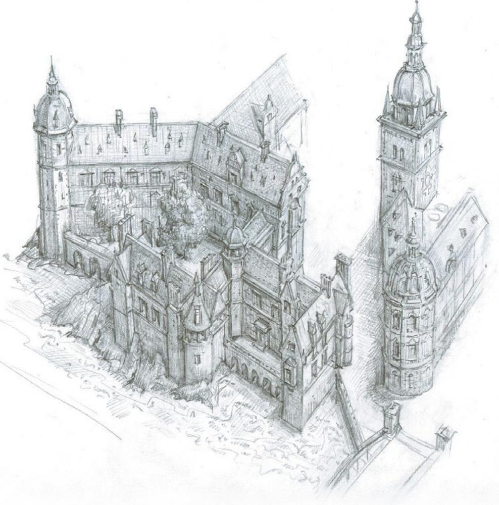

Чем больше ты узнаёшь, тем безумнее кажется происходящее. Здесь заговоры прячут внутри заговоров, маскируя их интригами, затем сдабривают всё это вероломством и упаковывают в обёртку из коварства и предательства.

## Твой город под покровом ночи

При адаптации реально существующих городов главное - впечатление, а не факты. Факты тоже могут быть полезны, но только если они помогают выразить какую-то идею, подчёркивают тему истории. Город, в котором по статистике совершается много убийств, хороший фон для истории о гневе и хрупкости человеческой жизни, но вам вовсе не обязательно придерживаться статистических данных досконально. Если большая часть совершённых преступлений так или иначе связана с наркотиками, а для вашей хроники нужно, чтобы убийства были результатом бандитских разборок и полицейских рейдов, считайте, что так и есть. Хороший фон для истории важнее всего. Факты - лишь отправная точка. Благодаря им история может стать более правдоподобной (насколько правдоподобной может быть история о вампирах), но они же могут разрушить мистическую ауру.

Драма куда важнее, чем достоверность. Вы сочиняете повесть города Карачи, а не отчёт о нём. Зрелище - вот что самое главное, так что не разменивайтесь на ненужные детали. Город в «Вампирах» в первую очередь нужен для того, чтобы подталкивать к действию, создавать настроение, поддерживать атмосферу и косвенно задавать темп игры, как уже говорилось ранее. Вы не обязаны воссоздавать город во всех подробностях. Ничего страшного не случится, если вы перепутаете названия улиц. Если факты мешают зрелищности - игнорируйте их.

Самый твёрдый факт заключается в том, что в городах вообще нет никаких вампиров - но разве это вас останавливает? Используйте в игре только то, что способно вдохновить, а остальное пусть отойдёт на второй план. Может, на самом деле факты - не более чем пропаганда, продвигаемая мэрией или торговой палатой, чтобы успокоить жителей и не отпугнуть бизнесменов и туристов. Возможно, Вентру подтасовали данные, Малкавиане подправили память историкам, а может, древние архитекторы Носферату вмешались в проектирование города.

И последнее: не забывай, что перед тобой Мир Тьмы. Здесь всё неприглядно. Каким бы благополучным ни был настоящий город - игра «Вампиры» смотрит на него сквозь треснувшие стёкла чёрных очков. Красота Мира Тьмы - это капли дождя на холодном стекле, это причудливые узоры на старых досках под размокшими обоями. Всё здесь тронуто разложением.

#### Лоскутное одеяло

Чтобы город ожил, чтобы он не остался безликим, персонажи должны почувствовать с ним связь. Когда в городе есть хорошо знакомые уголки, когда это не просто нагромождение зданий, борьба за территорию или поиск

спокойного места под луной воспринимаются совсем иначе. Чтобы облегчить себе задачу, для начала разбей город на части, имеющие некие общие характеристики.

В каждом городе есть ярко выраженные области, такие, например, как центральный или портовый рай‑ оны. Каждая из этих областей выполняет определённую функцию как в жизни города, так и в игре. По разме‑ ру районы могут быть разными — от пары кварталов до огромного округа. Весь район может быть занят од‑ ним большим доменом (особенно при высоком показа‑ теле параметра «шасс») или вмещать в себя три‑четыре домена помельче, владельцам которых приходится бо‑ роться друг с другом за ресурсы, — это зависит от взгля‑ дов Принца на допустимый размер владений его под‑ данных, а также от того, насколько острым должен быть территориальный конфликт, по мнению рассказчика.

Атмосфера должна меняться при пересечении гра‑ ниц разных районов. Изменения могут быть самыми простыми, например уменьшение количества патруль‑ ных машин на улицах. Впрочем, у всего есть светлые стороны. Тени становятся гуще, когда зажигаешь свечу, так что, если хочешь подчеркнуть мрачность Мира Тьмы, не забывай о проблесках надежды.

В большинстве городов есть некий центр, средоточие всего самого важного и значимого для жителей и тури‑ стов. Крупные мегаполисы‑агломерации могут включать в себя несколько таких средоточий: например, в конгло‑ мерат Большого Лилля на севере Франции входят горо‑ да Рубе и Туркуэн. В центрах, как правило, расположены правительственные здания, крупные транспортные узлы, а также зачастую офисы и музеи. В некоторых городах центр пустеет к ночи, в других и после заката продол‑ жается активная жизнь. Есть города, где жильё в центре города считается самым престижным, например в Па‑ риже или Хельсинки, где цены на недвижимость басно‑ словно высоки. А вот в Брюсселе или Детройте богатые живут в пригородах — жильё в центре доступно каж‑ дому при условии, что он вообще захочет там поселиться.

В столицах важное место занимают посольства, часто собранные в одном квартале. В других крупных городах подобное же место могут занимать консульства. Эмбасси‑ Роу в Вашингтоне или любой другой подобный район кладезь сюжетных завязок, ведь каждое посольство это замкнутый мир, островок чужой земли. Дипломатия, культурный обмен, вентру из других городов, беженцы с захваченных анархами территорий — вот лишь несколь‑ ко вариантов. Отдельные посольства могут представлять собой небольшие уютные домики — или огромные ого‑ роженные комплексы со множеством зданий, как в США, например. В посольствах некоторых государств может

#### **ДоСТоПРиМеЧаТеЛЬноСТи**

**У каждого крупного города есть своя визитная карточка: силуэт, строение или что‑то подобное. Создавая собственный город, добавь туда пару‑тройку достопримечательностей. Рио‑де‑жанейро знаменит пляжами ипанемы, а Барселону легко узнать по ажурным башням храма Саграда Фамилия. Достопримечательности могут быть и местного масштаба: старый книжный магазин на углу, танцевальный зал и т. п.**

**В домене котерии должен быть по меньшей мере один такой объект — в центре, на периферии, а может, и в качестве всего домена целиком. Это не просто украшение в задней комнате персонажи могут проводить свои встречи, осматривать владения, сидя на крыше, или даже устроить внутри постоянное убежище. Достопримечательности могут влиять на проверки — к примеру, библиотека увеличит пул проверок гуманитарных наук. Кроме того, при охоте тут можно рассчитывать на определённые дополнительные эффекты, а кровь посетителей с большей вероятностью будет иметь тот или иной резонанс, возможно, даже довольно сильный, и вампирам не придётся ломать голову, где искать дискразии. Дополнительные эффекты и преобладающий резонанс рассказчик должен определить заранее.**

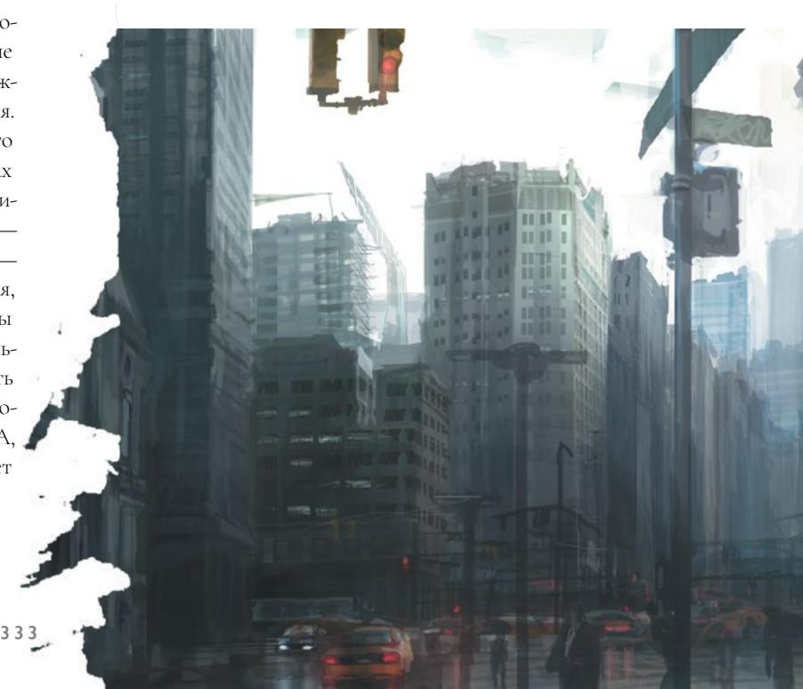

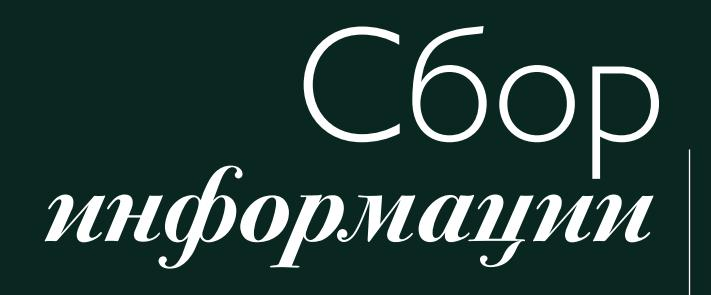

**Город «общается» с персонажами самыми разными способами: через газеты, информаторов или даже знамения. Но довольно часто, чтобы разузнать что‑то или найти кого‑то, героям нужно отправиться на поиски информации самостоятельно. И нередко случается так, что кто‑то — или что‑то — не хочет быть найденным. Чтобы добиться успеха, нужно упорство: не отступать, не терять концентрации, упрямо идти по следу, не давать сбить себя с толку. Все приведённые ниже задачи можно решать при помощи продолжи‑ тельной проверки (стр. 293) или считать, что каждая выпавшая неудача — это час потраченного времени.**

**При решении подобных задач информаторы бу‑ дут очень кстати. Если у персонажа есть информатор, который может помочь в данном конкретном случае, рассказчик может разрешить игроку увеличить пул проверки на 1d10 за каждый пункт этого факта био‑ графии.**

#### БУМАЖНЫЙ СЛЕД

**Персонажу нужно что‑то выяснить, и он не может просто заплатить хакеру, чтобы тот выудил нужные сведения из Интернета. Не так‑то просто разобраться, кто стоит за тем или иным событием и в чьём шкафу больше скелетов. Чтобы обнаружить бумажный след, придётся немало времени провести в окружных архи‑ вах и кадастровых палатах, перерыть не одну кипу свидетельств о собственности, договоров, завещаний, заключений судмедэкспертов, церковных метриче‑ ских книг и т. п. Бумажный след — это всё то, что ко‑ гда‑то было записано на бумагу, подшито в папку и с тех пор пылится на полке в самом дальнем углу.**

**Правительственные здания открыты только в дневное время, так что вампиру, возможно, придётся вломиться туда незаконно. Или использовать влияние,**  **чтобы кто‑то забыл запереть на ночь дверь. Судебные протоколы и налоговые досье при этом могут быть официально отпечатаны. Поиск бумажного следа тре‑ бует проверки упорства + расследования.**

#### ЗАКУПКА

**Персонажу нужно найти некий предмет. Не уникаль‑ ный, но что‑то более редкое, чем «стаканчик кофе». Закупка — это не просто поход по магазинам, но если ты заранее знаешь, где продают идеальные веточки вербены или лучшую волшебную воду из корня Иоан‑ на Завоевателя, то это существенно облегчит задачу. Алхимикам постоянно требуются странные ингреди‑ енты, но в три утра и обычную вещь достать непросто.**

**Персонаж должен пройти проверку упорства + навыка, который лучше подходит к ситуации. Если нужны ингредиенты для ритуала — оккультизм, алхи‑ мические компоненты — естественные науки (химия), редкий наркотик — уличное чутьё, автомобиль «Пежо» 2008 года — вождение, боеприпасы для винтовки стрельба и т. д. Однако найти товар — это ещё пол‑ дела. Возможно, после этого понадобится другая проверка, например воровства, если магазин закрыт или владелец просто не хочет иметь с персонажем дело.**

#### ОПРОС

**Персонаж таскается по всему городу, стучится в чу‑ жие двери, напрашивается на разговоры. Возмож‑ но, он ищет свидетеля, или беглеца, или ещё кого‑то, кто не хочет, чтобы его нашли. А может, ему нужен скупщик краденого или подпольная мастерская, или он в незнакомом районе пытается понять, чья здесь тер‑ ритория и кто за что отвечает. Не исключено также, что он просто хочет расспросить в округе, не видел ли кто чего‑то странного позапрошлой ночью.**

**Персонаж должен пройти проверку упорства + уличного чутья, если цель может перемещаться или прятаться. В противном случае, например при по‑ иске какого‑то здания или метки, используйте упор‑ ство + наблюдательность. Когда персонаж найдёт того, кого хотел, наступит время других проверок.** ⬛

практически в открытую вестись нелегальная деятель‑ ность. И во всех без исключения есть шпионы.

Во многих городах можно выделить историческую и современную части. Гамла‑Стан в Стокгольме радует глаз живописными фасадами вдоль извилистых улочек, Пуэрто‑Мадеро в Буэнос‑Айресе поражает вообра‑ жение сверкающими громадами современных зданий, отражающихся в водной глади. Города меняются, за сто‑ летия они могут разрастись неимоверно — вампиру, родившемуся пару веков назад, современные здания из стекла и стали могут показаться чуждыми и сбиваю‑ щими с толку. Он предпочтёт не покидать старого го‑ рода, пока это возможно. Джентрификация меняет лицо многих районов — старожилы покидают родные места из‑за подскочившей арендной платы. Старейшина‑бру‑ ха, впавший в торпор в промышленном районе, может очень удивиться, проснувшись среди хипстерских кафе.

Не забывай также о логистике. Городу требуется много ресурсов, так что в каждом из них есть железная дорога или порт, а также километры складов. Антвер‑ пенский порт или Нави‑Мумбаи — это целые города внутри городов, но, даже если не брать таких гигантов, в каждом городе можно найти район, где свидетелей меньше, чем контейнеров с чьим‑то добром. Инду‑ стриальные зоны часто расположены рядом с транс‑ портными развязками, ведь сырьё должно поступать на завод без задержек, а готовые продукты отгружаться как можно быстрее. В Антверпенском порту, к примеру, химические заводы находятся буквально у причала.

И наконец, надо разобраться, где в твоём городе жи‑ вут люди. Жилые кварталы могут быть очень разными в зависимости от достатка их обитателей. Богачи пред‑ почитают закрытые элитные кварталы, средний класс населяет обширные пригороды, а бедняки ютятся в тру‑ щобах и дрянных многоэтажках. Есть города с чётким классовым разделением, но есть и такие, как Калькутта, где жалкая лачуга может стоять в паре метров от ворот роскошного особняка. Жилые районы, как правило, занимают немалую площадь, но однообразны по за‑ стройке. Нередко они закрываются по ночам. Выбери то, что кажется более уместным, и пусть смертные спят спокойно. Возьми на вооружение стереотипы из сериа‑ лов вроде «Прослушки» или разрушь их: в сплочённых фавелах Рио‑де‑Жанейро преступность может быть куда ниже, чем на туристических пляжах Копакабаны.

Присмотрись к настоящим городам, и увидишь закономерности. Изучив их, ты сможешь лучше понять, как должен работать твой город. Разумеется, есть ис‑ ключения из правил. Детройт, например, это разруша‑ ющийся город: сияющие небоскрёбы тут соседствуют

с заброшенными развалинами и пустырями. А Ашхабад, столицу Туркмении, наоборот, отстраивают — причём под строгим архитектурным контролем. Посреди сте‑ пи поднимается к небесам бело‑золотой космический город, куда стекаются люди в надежде на заработок, несмотря на страх перед тайной полицией.

ГОРОД В ИГРЕ. У каждого района, округа или квартала могут быть свои характеристики. Распределяй их так, как тебе удобнее. Ты рассказчик, а не муниципальный чиновник. Для тебя главное — логика повествования.

Ни к чему подробно расписывать каждый уголок на карте. Особые правила, связанные с каким‑то ме‑ стом, не имеют смысла, если персонажи никогда не по‑ сетят это место. Продумывая модификаторы, не ста‑ райся придерживаться реализма. Это инструмент, с помощью которого ты настраиваешь игру. Значение имеет только сюжетная необходимость.

К примеру, если действие хроники разворачивается в Париже, но игроки не знакомы с этим городом, ты мо‑ жешь описывать его абстрактно, придерживаясь лишь ту‑ ристических ориентиров. Квартал Маре известен ночной жизнью (сложность проверок охоты 3) — все Сородичи хотят этот домен себе, так что он часто меняет хозяев. Од‑ нако тут все на виду, поэтому жестокий провал при про‑ верке охоты означает серьёзное нарушение Маскарада.

Допустим, ты хочешь сделать акцент на политике смертных. И тебе кажется, что монументальная архи‑ тектура Исторической оси Парижа от Ла‑Дефакс до Триумфальной арки и дальше до Лувра прекрасно отражает политическую игру. Поэтому пул всех про‑ верок, связанных с политическими манёврами, увели‑ чивается на этой территории на 2d10. «Реалистично» было бы считать, что полицейский контроль увеличи‑ вает сложность охоты на Исторической оси. Но можно взглянуть на вопрос с другой стороны, снизив слож‑ ность охоты из соображений символизма, поскольку у власть имущих очень много общего с Сородичами.

Вампиры Камарильи испытывают сложности, ока‑ завшись вне зоны комфорта, — в пригородах, где всем заправляют анархи, пул социальных и ментальных про‑ верок уменьшается на 2d10, а физических — на 1d10. Если главные герои — анархи, отрицательные модифи‑ каторы можно превратить в положительные. Или дать каждому пригороду свой собственный эффект, кото‑ рый отличал бы его от остальных. При этом, возмож‑ но, обе стороны прекрасно чувствуют себя в базилике Сакре‑Кёр на холме Монмартр: пул любых проверок дипломатии между Сородичами увеличивается здесь на 2d10 — это старинный и уважаемый Элизиум. ⬛

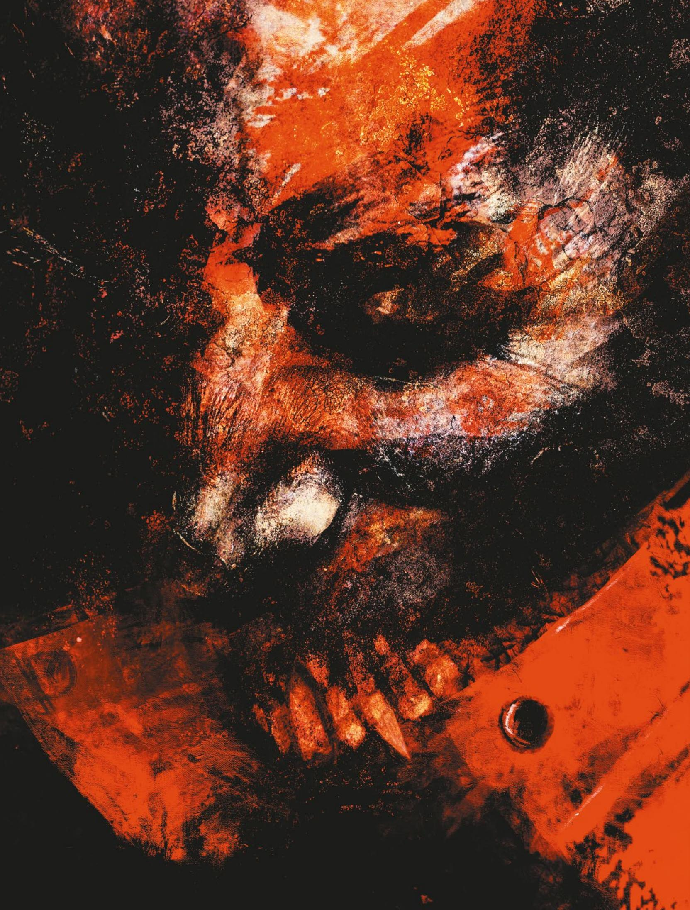

# ХРОНИКИ

*...От слов легчайших повести моей Зашлась душа твоя и кровь застыла, Глаза, как звёзды, вышли из орбит И кудри отделились друг от друга, Поднявши дыбом каждый волосок, Как иглы на взбешённом дикобразе.*

> ВИЛЬЯМ ШЕКСПИР, «ГАМЛЕТ» *(ПЕР. Б. ПАСТЕРНАКА)*

У всех участников игры **«Вампиры»** одна общая цель: хорошо провести время, сделав хронику захватывающей и интересной для всех. Игроки и рассказчик сообща создают историю: рассказчик описывает мир, второстепенных персонажей и внешние события, а игроки берут на себя роли героев, живущих в этом мире и взаимодействующих с окружающей их действительностью или между собой.

Игрокам придётся потрудиться, чтобы создать персонажей, но перед рассказчиком стоит гораздо более сложная задача: выстроить всю хронику и провести игру.

## Планирование хроники

Первое, что тебе понадобится, — это концепция. О чём пойдёт речь? Кем должны быть главные герои? Чем они будут заниматься? Какие переживания должна вызвать хроника у игроков?

Например, концепция может быть такая: группа анархов пытается свергнуть Барона, который втайне служит Камарилье. Хроника рассказывает о политическом перевороте. Герои могут быть кем угодно, главное, чтобы они жаждали перемен. Игрокам придётся столкнуться с опасностью, испытать надежду, ощутить азарт и познать честолюбивое стремление свергнуть правителя.

Концепции бывают очень разными и по форме, и по содержанию. Нет верных или неверных способов играть в **«Вампиров»**. Если хроника нравится участникам — значит, всё в порядке.

Другой пример концепции — медленная утрата Человечности вампирами по мере погружения в беспощадный мир Камарильи. В начале они ещё молоды и полны надежд. Становление было не из приятных, но вроде бы в Элизиуме их приняли как своих. По ходу дальнейшей игры они понимают, что успех часто идёт рука об руку с деградацией человеческих ценностей. Их сила растёт, а связи с прошлым постепенно тают. Подобная игра может быть намеренно медлительной, наполненной долгими сценами обсуждений и рефлексии.

В то же время следующая концепция реализует себя совсем иначе: допустим, персонажи — это группа Архонтов, которых отправили на Ближний Восток, чтобы они в пылу Геенны отыскали пропавшего старейшину, обладающего критически важной информацией о делах Камарильи. В отсутствие старейшины оказалось, что никто толком не знает, как управлять сложным политическим и экономическим механизмом фракции, что нанесло немалый ущерб её влиянию и мощи.

#### **ШаБЛон ХРониКи**

**Это твоя первая игра по «Вампирам» или ты просто хочешь побыстрее начать первую игровую встречу? В таком случае можешь использовать следующую концепцию:**

**Персонажи — новообращённые вампиры в вашем родном городе. К началу игры они могли уже получить Становление или обратятся в вампиров на первой игровой встрече. Городская элита — это Камарилья, но тут есть и отщепенцы — анархи, к числу которых и принадлежат герои.**

**Первая игровая встреча посвящена особенностям вампирского бытия и тому, как персонажи к ним привыкают. они охотятся, разбираются с наследием своего смертного прошлого и сталкиваются с небольшими проблемами, связанными с Камарильей и Второй инквизицией.**

**По мере продвижения сюжета всё больше внимания уделяется тому, какое место хотят занять персонажи в мире мёртвых: заслужить признание в Камарилье или разжечь пламя восстания среди анархов?**

#### **Использование схемы отношений**

При создании персонажей вы параллельно составляли схему отношений, на которой отображены персонажи игроков, их сиры, опоры, союзники, враги, а также обозначены их взаимоотношения. Этот список действующих лиц — результат совместного творчества. Используй его, чтобы хроника с самого начала вовлекла всех игроков в действие. Они помогали создавать этих персонажей, их герои связаны с ними, так что их судьба им небезразлична.

Если ты планируешь хронику перед созданием персонажей игроков, неплохо было бы использовать условные имена и небольшие описания для нескольких ключевых персонажей рассказчика, чтобы потом можно было их легко заменить на тех, что придумают сами игроки. Точно так же можно заменить персонажей в любом готовом изданном сценарии.

#### **ПРИМЕР**

*Ты планируешь историю в стиле нуар о таинственных убийствах. Место действия — Санкт-Петербург, древний домен Камарильи, где у каждого есть скрытые замыслы и предательство встречается на каждом шагу. Завязка — уничтожение влиятельной вампирши из Камарильи её близким другом из числа Примогенов. Преступник свалил всю вину на Вторую инквизицию. Персонажи начинают опасное расследование и в конце концов выясняют, кто убийца. Как раз вовремя, чтобы предотвратить его следующий удар.*

*Ты сообщаешь игрокам, что действие хроники будет происходить в Санкт-Петербурге и что герои должны быть вампирами Камарильи из этого города. Игроки принимаются за дело. Когда персонажи готовы и схема отношений составлена, ты меняешь абстрактную жертву на сира одного из персонажей игроков, убийцей становится ментор другого, кроме того, по ходу повествования под угрозой окажется жизнь опоры третьего персонажа.*

Если ты отложишь детальную проработку сюжета до конца «нулевой встречи», большую часть работы игроки сделают за тебя. Можешь даже сказать им, что все их решения отразятся на игре — чувство причастности к созданию хроники многих вдохновляет. По мере того как за столом будет рождаться социальный облик хроники, у тебя непременно возникнут идеи для будущих историй. Запиши их и используй в дальнейшем. В результате сюжет хроники получится в высшей степени цепляющим за живое, поскольку практически все действующие лица будут связаны с котерией, а обстоятельства станут следствиями решений, что приняли игроки.

#### **ПРИМЕР**

*Игроки создают котерию анархов, кочующих из города в город по среднему западу США под видом кантри-музыкантов. После недолгого спора они решают, что их вампиры — коммандос из числа освобождённых. Они работают на неизвестного Сородича, который общается с ними через солиста-гуля, вселяясь в него, когда тот выходит на сцену. Рассказчица понятия не имеет, что всё это значит, но игроки, похоже, загорелись идеей, так что она соглашается.*

*Один из игроков выбирает для своего персонажа ритуальное шрамирование из страницы истории «Бахари», а другой — конкурента из Камарильи на три пункта, назвав эту вампиршу «Акалия». Рассказчица видит в этом возможность задать структуру и базовый конфликт для вырисовывающейся хроники. Она решает, что наниматель котерии — еретик из числа бахари и борец за свободу, пленённый Акалией, а сама она — каинитская проповедница старой закалки из Сан-Хосе.*

*Первые несколько игровых встреч котерия по указанию певца наносит удары по угнетателям из патриархальной Камарильи и тайным почитателям Каина, но затем медиума похищает паства Акалии из Кентукки. После отчаянной операции по спасению из Музея креационизма певец возвращается, но с ним что-то неладно. Спустя несколько операций, целью которых оказываются банды анархов, котерия понимает, что разум певца захватила Акалия. Теперь наниматель может говорить через него только тогда, когда тот наносит себе ритуальные увечья (бахари практикуют нечто подобное). Далее персонажи пытаются перехитрить Акалию и выведать у неё, где она находится, вероятно, разговаривая с ней через певца. И в конце концов они добираются до кульминации — освобождают еретика-бахари и убивают Акалию.*

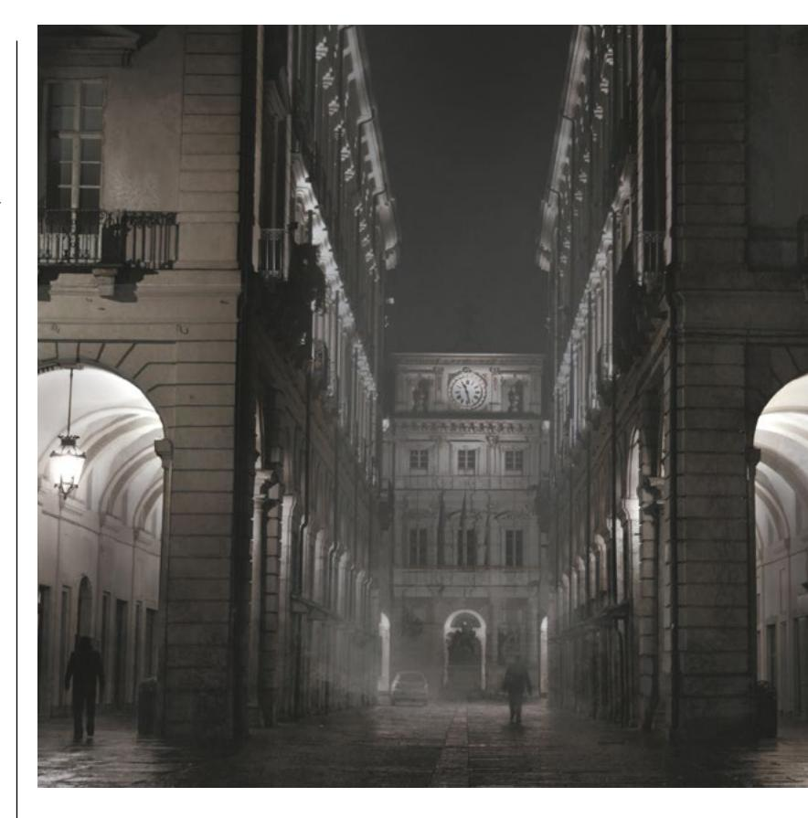

## Манера игры

Итак, **«Вампиры»** — это ролевая игра, в которой зловещие чудовища рефлексируют под сенью готических сводов. Верно?

Ну… да-а, возможно, и так… А может быть, и нет.

В предыдущих редакциях мы называли игру **«Вампиры: Маскарад»** готик-панком. Слово «панк» по-прежнему отлично подходит для описания того изощрённого, граничащего с отвращением удовольствия, которое может доставить хорошая игра в **«Вампиров»**. Но это далеко не единственный способ воплотить в жизнь историю из Мира Тьмы. Вы можете играть как угодно, лишь бы в итоге все хорошо провели время.

В ролевой игре вы можете позволить себе многое из того, что в реальной жизни недостижимо — и даже недопустимо. Хочешь приударить за этим ярким и неуравновешенным психопатом, затем вломиться на чужую свадьбу, чтобы напиться крови, и встретить рассвет в мусорном баке, прячась от смертоносных лучей дневного светила? Всё это довольно весело, когда понимаешь, что последствия расхлёбывать не тебе, а вымышленному персонажу.

Отчаянное положение, в котором оказались главные герои, может послужить хорошей основой для игры в жанре экшен. Допустим, персонажи игроков — головорезы, дилеры и гопники, получившие Становление по чистой случайности. Они ничего не знают о Мире Тьмы и должны разобраться в своей новой природе, победить смертных противников и проложить себе дорогу сквозь опасные дебри взаимоотношений внутри Камарильи. С другой стороны, герои могут быть потомками древних и могущественных вампиров, с первых дней своего посмертия вступивших в высшее общество Сородичей. Чтобы обрести независимость от властных сиров, не дающих и шагу ступить самостоятельно, они пускаются в самые безумные авантюры.

Самые необычные игры могут походить даже на киберпанк или сплаттерпанк. Городом правят могущественные тени. Главные герои балансируют между моралью и законами сверхъестественного мира. Их окружает неофеодальное общество человекоподобных чудовищ, на которое давит технологический прогресс и которое мало-помалу погружается в состояние массовой истерии. Почерпнуть вдохновение для подобной игры, пересмотрев «Бегущего по лезвию», — не самая плохая идея. А если вы планируете крушить черепа, у вас появится и такая возможность, когда Вторая инквизиция натравит отряд спецназа штурмовать убежище бруха, а персонажам придётся с боем пробиваться сквозь оцепление, чтобы успеть до рассвета.

#### **Тайна за тайной**

Мир Тьмы — это мир тайн. Для смертного первое прикосновение к нему — это смутное подозрение, что мир на самом деле не такой, каким его представляют люди. И дело тут не только в сверхъестественных паразитах, впившихся как клещи во все институты человеческого общества. У самих людей тоже хватает секретов и тайных организаций — и порой они мало отличаются от Сородичей.

Игра, в которой тайна становится ключевым элементом, — это игра, в ходе которой всё оказывается не таким, как первоначально казалось. Старейшины, ненавидящие друг друга, на самом деле любовники. Одинокий старый добряк, живущий напротив дома твоего детства, 40 лет назад задушил жену и детей, о чём никто так и не узнал. Вентру, утверждающий, что он контролирует парламент, не справляется с влиянием таких титанов, как Amazon.

У каждой истории тут двойное дно. В игре **«Вампиры»** персонажа могут пригласить в тайное обще-

#### **ХРониКа «наСЛеДниКи»**

**Котерия была избрана или даже создана для того, чтобы охранять наследие старейшины Камарильи, в то время как она по воле Зова отправляется на Ближний Восток. Там она встретит Древних и познает сокровенные тайны бытия, если, конечно, сумеет добраться до цели через горнило Геенны, Крестового похода Шабаша. В её отсутствие котерия уполномочена распоряжаться её голосом в Совете Примогенов и управлять её империей так, как посчитает правильным. В распоряжении котерии огромные ресурсы, но все Сородичи им завидуют, дожидаясь лишь повода, чтобы порвать их на кусочки. о чём старейшина забыла упомянуть, так это о том, что вместе с богатствами котерия унаследует и её врагов. Чтобы пережить своё неожиданное возвышение, персонажам потребуется всё их мастерство и хитрость.**

**наиболее вероятное прикрытие для деятельности котерии — это крупная компания, поместье, больница, университет или отель.**

**Эта хроника подойдёт для тех, кто хочет начать игру с самой вершины и, вероятно, столкнуться с необходимостью защищать своё положение всеми правдами и неправдами, когда их империю примутся осаждать со всех сторон.**

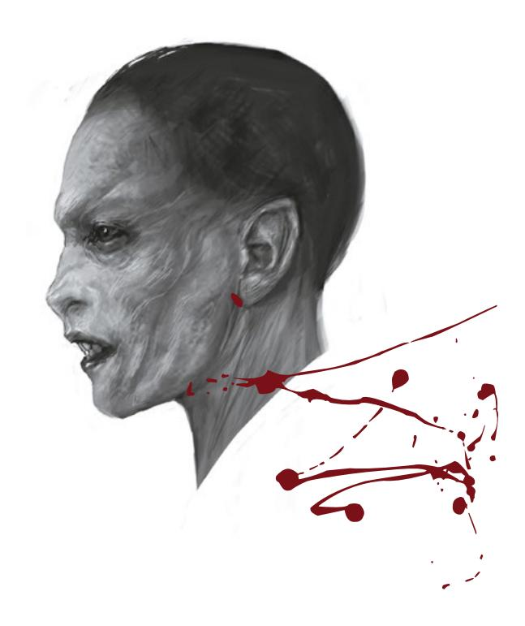

#### **ХРониКа «СУДнаЯ ноЧЬ»**

**Котерия представляет собой потомство Шерифа, элитный ударный отряд по борьбе с анархами, силовиков на службе Вентру или иную официальную или самостоятельную группировку бойцов Камарильи. Это может быть тактический отряд, сформированный для борьбы со Второй инквизицией в поле, разведгруппа для внедрения в ряды смертных спецслужб или даже личный отряд телохранителей старейшины в Войне Геенны.**

**Какова бы ни была предыстория, основное занятие котерии — это разведывательные и военизированные операции. Героям предстоит столкнуться как с чудовищными созданиями, так и с невинными людьми, оказавшимися не в то время не в том месте. Станут они защитниками или обидчиками? Героями или злодеями?**

**Суть этой хроники в том, чтобы поставить персонажей в неоднозначную с моральной точки зрения ситуацию, где им придётся сделать тяжёлый выбор. Котерия может прятаться у всех на виду, выдавая себя за настоящее военизированное подразделение, охранную фирму или даже полицейский департамент, но законы Сородичей не имеют ничего общего с законами смертных, так что с тем же успехом прикрытием может послужить преступная или террористическая группировка или даже церковь, открытая для прихожан по ночам.**

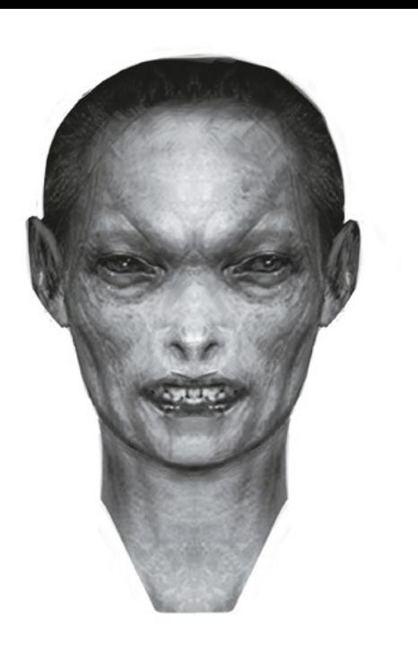

ство внутри другого тайного общества. Да в общем-то существование Сородичей — само по себе секрет. Обратившись в вампира, ты становишься частью клана, и перед тобой открывается неизвестный доселе мир, сложная структура, скрытая от глаз смертных глубоко в недрах известного тебе общества. А затем следуют всё новые и новые откровения.

Распутывание хитросплетений чужих интриг увлекательная часть игры в **«Вампиров».** Допустим, во время первой игровой встречи персонажи получили Становление в кланах Бруха или Гангрел. Для них быть вампиром — значит ютиться в заброшенных домах или в полуразрушенных складских помещениях, охотиться в грязных барах и на рейвах. Узнав чуть больше о Мире Тьмы, они попадают на совершенно новый уровень: в Элизиум Камарильи. Они узнают, что вампира можно встретить не только на помойке, но и в совете директоров или на показах мод. Им открывается новое понимание того, что значит сила, — умение оторвать голову голыми руками уже не так впечатляет, как умение уйти от налогов.

Разумеется, возможна и обратная ситуация — если персонажи начинают игру в роскоши, энергичный мир анархов может показаться им глотком свежего воздуха. Тайной, частью которой они могут стать.

#### **Непреодолимые разногласия**

Мир Тьмы — это постоянное противоборство двух сил, действующих в разных направлениях. Человеческая мораль и интеллект пытаются сдержать порывы Зверя — и эта борьба определяет естество вампира. Это противоречие бросает тень на все поступки Сородичей. Напряжение никогда не спадает.

На общественном уровне в постоянном конфликте находятся интересы людей и нелюдей. Взять, к примеру, идеалиста-бруха, бывшего политического активиста. Возможно, став вампиром, он начал использовать новообретённые силы, чтобы воплотить свои идеалы в жизнь, но понял в итоге: что хорошо для людей, плохо для Сородичей. На отчаявшихся, измотанных людей проще охотиться. Чем лучше функционирует система, тем легче людям обнаружить скрытую угрозу, исходящую от вампиров.

Создавая хронику, стоит держать в голове идею контраста в Мире Тьмы. Мрак не может быть непроглядным. Если вокруг только ужас и смерть, зло перестаёт быть злом, превращаясь в обыденность. Тебя не назовут чудовищем в мире, где нет никого, кроме чудовищ.

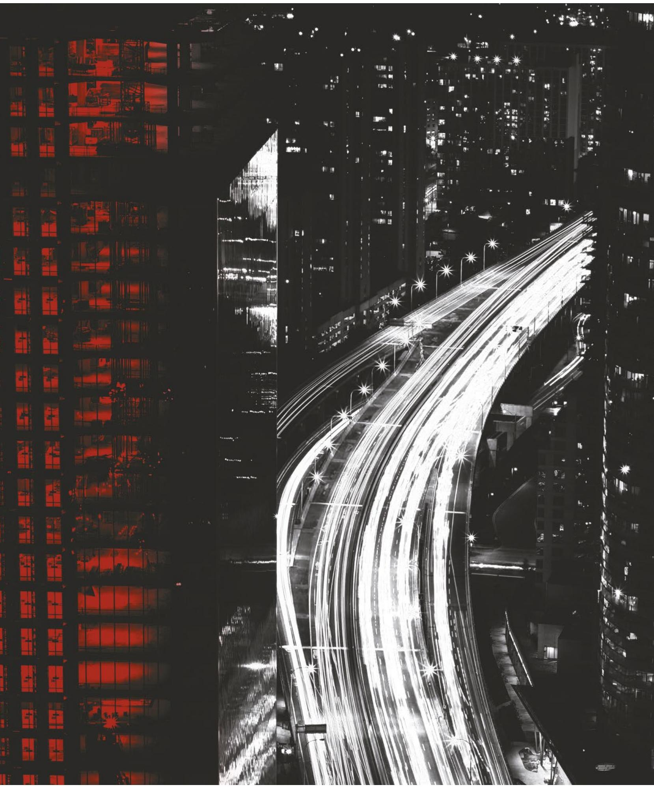

#### **ПРИМЕР**

*Наркоман, которого персонаж поработил и сделал своим слугой, заботится об окружающих, несмотря на обстоятельства. Мстительная революционерка из Движения анархов сохраняет жизнь потомку Принца, осознав, что тот тоже жертва. Функционер Камарильи пытается успокоить свою совесть, тайно перенаправляя ресурсы Принца на проекты реконструкции города.*

Суть игры в **«Вампиров»** не в том, чтобы давать моральную оценку поведению персонажей и осуждать их за дурные поступки. Если в каждом есть своя червоточинка, хроника получится более насыщенной. У вампиров в игре, разумеется, может быть своя мораль, которой они будут неукоснительно придерживаться, но лучше всего, чтобы она была основана на их собственных взглядах, их логике и мотивации.

Если хочешь дать персонажам возможность порефлексировать, стоит задать подходящий для этого темп развития событий. Когда вампирам постоянно приходится сражаться за свою жизнь и нет ни секунды свободного времени, вряд ли они смогут спокойно обдумать свои поступки. Предоставь им передышку, чтобы последствия их деяний во всей красе предстали перед их воображением.

Допустим, один из персонажей убил человека в переулке за баром. Это случилось по неосторожности во время охоты. Котерия избавилась от трупа, но рассказчик считает, что у этого события должны быть последствия. Персонажи до сих пор никого не убивали, так что это важная веха. Поэтому несколько ночей спустя, когда они снова оказались в том же баре, вампиры встречают сестру погибшей жертвы. Она заговаривает с ними и в конце концов спрашивает про брата. Совершенно очевидно, что никакой угрозы она не представляет. Девушка не их тех, кто может стать охотником. Самостоятельно она никогда даже не узнает о судьбе брата — только если персонажи ей расскажут. Это просто ещё одна жертва, самый обычный человек, пострадавший от рук главных героев.

#### **Символизм**

Вампиры — это вымышленные чудовища, истории о которых могут затрагивать разные темы. В *«Дракуле»*  Брэма Стокера вампир — это искуситель, опасный и чуждый. Можно даже сказать, что вампир там воплощает собой сексуальное влечение. В классическом фильме *«Носферату»* вампир — это олицетворение заразной болезни, поразившей город подобно чуме.

Когда знаешь, что именно символизируют вампиры в твоей хронике, сюжет становится более цельным. Игра **«Вампиры: Маскарад»** предоставляет возможность для самых разных интерпретаций.

Если хроника касается политики, вампир — простая, но весьма эффектная метафора. Капиталисты, мультимиллионеры, коррумпированные политики и прочие власть имущие, манипулирующие обществом в личных интересах, — все они имеют с вампирами много общего.

Сородичи могут стать метафорой консерватизма старейшины с их средневековыми взглядами изо всех сил противятся новым веяниям. Тот же контраст может раскрыть в игре тему интеллектуальной истории, подчеркнув разницу в мышлении между существами разных эпох.

#### **наСЛажДение ПоРоКоМ**

**Быть может, ваша единственная цель — это получить удовольствие, играя ужасающих чудовищ. Персонажи — эгоистичные, злобные ублюдки, разрушающие всё, до чего могут дотянуться. В подобной игре стоит уделить внимание тому, как правильно подать игрокам последствия злодеяний их персонажей.**

**не имеет смысла пытаться вызвать чувство вины, если игра задумывалась жестокой. Вряд ли кому‑то захочется играть отморозка, если придётся смотреть в глаза каждой новой жертве. Самый простой способ избежать всяких сожалений со стороны игроков — это сделать жертв максимально несимпатичными. например, это могут быть богатенькие неонаты Вентру, которые постоянно насмехаются над персонажами и унижают их, а когда что‑то идёт не по плану, устраивают истерики.**

**Возможно, однако, иногда ты захочешь продемонстрировать игрокам последствия злодеяний каинитов. если персонажи — закоренелые чудовища, их сущность можно оттенить, если жертвы будут вести себя по‑геройски. один может посвятить свою жизнь бескорыстному служению людям, а другой простить вампиров за всё, что они сделали, таким образом ещё больше обнажив горькую правду об отвратительной натуре Сородичей.**

#### **ХРОНИКА «ЛОВЦЫ»**

С появлением Второй инквизиции охотиться стало сложнее. Многие Сородичи обнаружили, что делать это в группе, прикрываясь грабежами, похищениями или мошенничеством, куда безопаснее, чем искать кровь в одиночку. Услуги слаженных команд, освоивших разные методы охоты, востребованы среди старейшин и других Сородичей, которые нанимают их для поиска специфических сосудов или для организации безопасной охоты и создания условий ДЛЯ ПОЯВЛЕНИЯ У ЖЕРТВЫ НУЖНОГО РЕЗОНАНСА.

Некоторые группы ловцов берут в свои ряды тремера, владеющего Кровавым чародейством, или порабощённого слабокровного вампира, чтобы сохранять резонанс в крови, выкачанной из живой жертвы. Торговля кровью - опасный, но прибыльный бизнес

Истории в подобной хронике могут быть посвящены планированию безупречных операций или дерзкому соблазнению сосудов. Хотя, с другой стороны, это с тем же успехом могут быть кровавые и безумные описания бесчеловечного обращения со смертными. Так или иначе, смертные будут плотно вовлечены в действие хроники.

Вампиры могут символизировать колониализм они захватчики, иностранные интервенты, сосущие кровь местного населения, низведённого до состояния рабов. Они - война: мужчины и женщины в комфорте собственных убежищ, направляющие армии дронов на бомбардировку мирных жителей. Они — фашизм: насаждение порядка без оглядки на личность.

Темой хроники может быть история в целом. В этом случае вампиры станут удобным инструментом для исследования прошлого. Они бессмертны, так что игру можно начать хоть в Средневековье, а затем постепенно двигаться к современности.

Если главной темой станет сексуальность — тут тоже возможно множество подходов. Вампир может быть противоречивым объектом чьих-то желаний или воплощать собой идею неравенства в отношениях, потери контроля перед лицом страсти или тайных фантазий, воплотить которые многие решаются лишь с незнакомцами.

Вампир — существо сверхчеловеческое. Он стоит вне жизни, вне морали. Для него ничего не значат социальные или гендерные роли. Вампир может быть совершенной самодостаточной личностью, навязывающей окружающим свою волю и взгляды. Или кающимся грешником, ищущим путь к Голконде. Он может воплощать сатанинский идеал жизни без сожалений. Или искать способ вернуть утраченную Человечность через науку, моду или магию, ища спасения в будущем, а не в прошлом. И наконец, вампир — это всё то, чем ты втайне желаешь стать... и ужас осознания, что получил ты что-то совсем другое.

#### Мотивация и взаимодействие в труппе

Есть пара простых вещей, которые надо держать в голове, пока игроки создают персонажей, чтобы хроника не зашла в тупик. Для начала все герои должны хотеть делать всё то, что им предстоит делать. Звучит логично, но практика показывает, что этот момент порой упускают из виду.

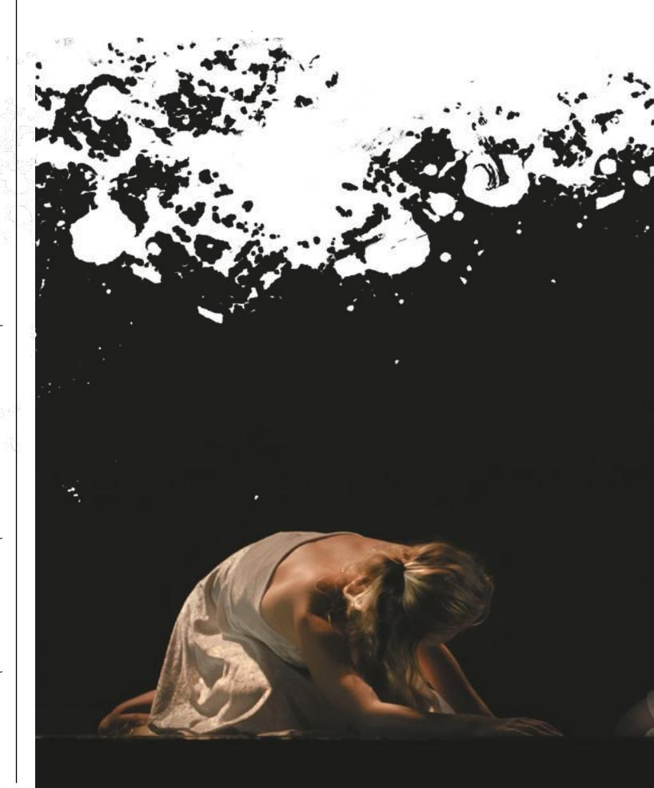

К примеру, ты хочешь провести игру с большим количеством боевых сцен, в которых анархи-революционеры сражаются на улицах против Камарильи. Соответственно, главные герои должны быть способны драться и хотеть этого. Если они никогда оружие в руки не брали и вообще заняты личными делами, игра не сложится.

Второй вопрос — это взаимодействие в труппе. Попросту говоря, персонажи игроков должны хотеть оставаться вместе. В противном случае они всё время будут уводить сюжет в разных направлениях. Герои могут быть друзьями или хорошими знакомыми, немало пережившими вместе. Возможно, они получили Становление в одно и то же время. Как бы там ни было, если причины, по которым они держатся вместе, хорошо вписываются в сюжет хроники, это существенно облегчит игру.

Стоит также обратить внимание на индивидуальные цели, которые ставят перед собой персонажи. К примеру, если вампир решил, что хочет позаботиться о больной матери, перед ним может стать проблема перемещения в чужой город с последующим внедрением там в Камарилью. Индивидуальные цели — это прекрасно, но они не должны уводить в противоположном от основного сюжета направлении.

#### **Структура**

Хроника не бесконечна. Она может длиться три игровых встречи, двадцать или даже сто, но в итоге всё равно подойдёт к концу. Планируя хронику, подумай над тем, сколько она должна продлиться и какова будет её структура. Это не значит, что нужно составить точное расписание для всех событий на следующие двадцать встреч. Речь, скорее, о том, чтобы в общих чертах иметь представление о том, что и когда случится во время игры ты скорректируешь ход событий с учётом происходящего.

Допустим, ты планируешь хронику о неонатах в городе Камарильи на 10 игровых встреч. Первые три или четыре встречи можно посвятить знакомству с Миром Тьмы и разными фракциями, а также с правилами.

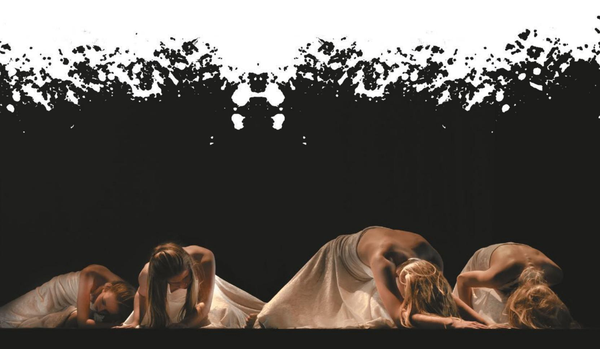

#### **ХРониКа «БанДа КЛЫКа»**

**Котерия прячется у всех на виду. её члены выступают в качестве одной из группировок MS‑13 или другой преступной организации, прикидываются фанатами «Тоттенхэма» или бригадой антифашистов в чёрных масках. Это представители, а может, даже лидеры некоего формирования за рамками общества и закона. инквизиции довольно трудно разглядеть их истинную сущность на фоне других таких же чудовищ, но если в банде есть смертные, то проблем всё равно не избежать. Котерия может подсадить смертных союзников на свою кровь, платить им за молчание или тщательно соблюдать Маскарад в их присутствии. Так или иначе, в итоге это всё равно приведёт к драме, а то и к трагедии. Хорошо, если выгода будет перевешивать опасность.**

**Подобная хроника может иметь в своей основе реальные события и характеры. Для этого нужно более подробно ознакомиться с изнанкой общества: в Сети доступно множество материалов и даже видеоинтервью с членами банд.**

**Банда не обязательно должна быть жестокой и агрессивной. Персонажи могут прикидываться тихой группой мошенников, грабителей или дилеров, промышляющих в закрытых общинах или среди посетителей фестиваля Burning man («Горящий человек»).**

#### **ХРониКа «КоЧеВниКи»**

**У этой котерии нет родного города. анархи и раньше много путешествовали, а теперь, когда к Движению примкнуло множество гангрелов, кочевых котерий стало больше, чем когда‑либо. на сегодняшний день более 23 миллионов человек бегут со своей родины, спасаясь от войны или преследований, и среди этих бесконечных толп веб‑ дизайнеров, матерей и поваров, перемещающихся по европе и азии в поисках лучшей жизни и перебрасываемых из одного лагеря беженцев в другой, прячется немало вампиров. В других частях света цыгане и «нью‑ эйдж‑путешественники» колесят по дорогам, а вместе с ними музыкальные группы, набитые грузами фуры и просто отдыхающие. Котерия маскируется под кого‑то из них или существует внутри одной из названных групп.**

**В хронике о кочевниках к месту придутся истории о побеге (возможно, от самих себя), ксенофобии и свободе. Это также хороший способ исследовать разные города и даже, может быть, народы с их диковинными, ни на что не похожими сообществами Сородичей — вроде шоу о путешествиях, только в каждом новом месте тебя пытаются убить или захватить в рабство.**

Затем, когда все освоились, можно поднять ставки, добавив внешнюю угрозу, неожиданные политические интриги, важных второстепенных персонажей и т. п. Может, старейшина отправился на Войну Геенны и по необъяснимым причинам решил объявить Элизиумом убежище одного из персонажей, даровав ему титул Хранителя.

Ближе к середине хроники персонажи займут более активную позицию. У них появятся ресурсы и влияние, и они смогут строить собственные планы. Игроки к этому времени тоже сориентируются и с большей уверенностью будут брать на себя инициативу.

В целом чем длиннее хроника, тем более расплывчатым будет её план. Можно набросать развитие событий для 10 игровых встреч, но если игра будет идти годами, то лучше подумать над темами и общим содержанием,

не планируя заранее конкретных сюжетных ходов. Хорошая игра — это вихрь событий, который непременно смешает все карты.

#### **Концовка**

Не обязательно планировать конкретную концовку истории, но даже самая длинная хроника только выиграет, если ты будешь представлять себе, к чему всё идёт. К примеру, хроника рассказывает о вампирах, которые схлестнулись с Камарильей в политической борьбе за власть в городе. Игра закончится, когда один из персонажей станет Принцем, независимо от того, случится это через пять игровых встреч или пятьдесят.

Запланированный финал поможет избежать того, что хроника просто сойдёт на нет. Игры с ясным окончанием оставляют, как правило, лучшее впечатление.

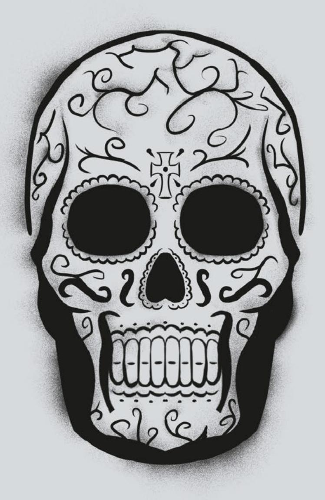

Придумывая концовку, постарайся исключить варианты, в которых от игроков мало что зависит. Если история заканчивается одинаково, что бы персонажи ни предприняли, что-то явно не так. Например, если хроника должна закончиться тем, что старейшины возвращаются с Войны Геенны и всех убивают, любые действия главных героев лишены смысла. Гораздо лучше, если у них будет выбор — поприветствовать старейшин или отречься от них, к добру или к худу.

Порой неожиданные события могут сделать задуманный финал невозможным. Ничего страшного! Просто обдумай ход событий заново, чтобы сообразить, как ещё может закончиться хроника. Хорошему рассказчику приходится свыкнуться с необходимостью вырезать всё лишнее, и бывает так, что лишним оказывается финал.

#### **Обсуждайте игру**

Игра в **«Вампиров»** — это коллективное мероприятие. Нужно время, практика и, самое главное, общение, чтобы сыграться вместе, понять, чего каждый участник включая рассказчика — хочет от игры, что каждому из вас нравится, а что нет, и как свести к минимуму возможные конфликты.

Не бойтесь обсуждать между собой действия персонажей, чтобы прийти к согласию о дальнейшем ходе игры. Это особенно важно, если вы раньше не играли друг с другом. Суть не в том, чтобы решить, что правильно, а что нет, — суть в том, чтобы все участники были на одной волне.

Самое простое, что нужно обсудить, — это вопросы организации. Обычно все заботы падают на плечи одного из участников, чаще всего рассказчика. Однако разделение обязанностей может пойти на пользу

и повысить вовлечённость участников. Кроме того, если за покупку книг, составление расписания игр, организацию игрового пространства и т. п. отвечают разные люди, вся труппа будет меньше зависеть от изменений состава, когда кто-то заболевает, не попадает на игровую встречу из-за работы или выходит из игры.

Если среди участников возникло напряжение, общение — ключ к разрешению проблем. Если игрок то и дело вынуждает персонажа совершать поступки, ломающие ход игры, не стоит обрушивать на персонажа кару небесную, вместо этого лучше поговорить с игроком, чтобы узнать, в чём дело. Если игрок не может толком ничего объяснить, возможно, он просто не хочет больше участвовать в игре.

#### **БЫСТРЫЙ СТаРТ**

**Здесь перечислены пять самых важный вещей, которые нужно обдумать и обсудить с игроками при создании новой хроники.**

- 1. Концепция хроники. **Кем являются персонажи? Где происходит действие? Какие главные темы будут затронуты? Все ли участники согласны играть в это?**
- 2. Время на игру. **Вы планируете бесконечную хронику с открытым финалом? или рассчитываете на три, пять, десять или двадцать игровых встреч?**
- 3. Подход к игре. **Что будет главным социальное взаимодействие, бои или политические интриги? Должны ли игроки победить, используя всё своё хитроумие? или любой исход хорош, если в результате случится что‑то интересное?**
- 4. Еда и крыша над головой. **Где будет проходить игра? Каждый приносит еду с собой? или кто‑то готовит для всех? Чипсы и печенье общие?**
- 5. Выход из игры. **Как игроку покинуть хронику? от человека, который больше не хочет участвовать в игре, всем будут одни сплошные неудобства, поэтому лучше заранее договориться, как завершить игру, никого не обидев.**

#### **Управление повествованием**

Управление повествованием для многих является довольно острой проблемой. Люди, предпочитающие разную манеру игры, нередко конфликтуют по этому вопросу. Кто имеет право вводить новые факты в повествование? И какие именно?

В некоторых труппах игроки решают только то, что говорят и делают их персонажи, а всё остальное решает рассказчик. В других — у игроков чуть больше свободы: они могут, к примеру, решить, что лежит у них в сумке, как выглядит их дом, каковы их друзья и знакомые и т. д. Есть и такие труппы, где игроки могут влиять на мир гораздо шире, зачастую даже там, где от их персонажей ничего не зависит. Навыки персонажа, впрочем, косвенно могут оказывать влияние. К примеру, игрок может пройти проверку смекалки + уличного чутья и объявить: «Этот район принадлежит банде Красных воронов». В данном случае сам игрок решил, где будут владения банды, а может, и придумал самих Красных воронов.

Нет ничего плохого в том, чтобы передать игрокам управление повествованием, но этот подход не совсем годится для **«Вампиров»**. Игроки гораздо острее почувствуют ужас, если будут в него погружены. Закулисье повествования может разрушить должный эффект. Когда миром управляет рассказчик, игрокам проще сфокусироваться на переживаниях собственных персонажей.

#### **Реализм и логика происходящего**

Разговор о реализме может показаться странным, учитывая, что **«Вампиры»** — это игра об оживлённых Кровью мертвецах и их дьявольских интригах. Однако не лишним будет сказать, что ожидания у разных людей в этом плане бывают самые разные. Обсуждая этот вопрос с игроками, можно обратиться к кинематографу степень реализма тут может существенно отличаться: есть фильмы, где после одного выстрела на улице кто-то тут же вызывает полицию, и есть другие, где в постоянных драках и перестрелках нарушаются даже законы физики.

После удара дубинкой по голове охранник просто упадёт без сознания? Или это может повлечь сотрясение мозга и смерть? Можно ли влететь всем телом в окно, разбить его и не получить при этом ужасных порезов? Взрыв — это верная смерть или просто спецэффекты за спиной у главного героя? У каждой труппы будет своё мнение на этот счёт. Главное — будьте последовательны. Поскольку у ролевой игры нет чёткого сценария, игроки должны понимать границы своих возможностей.

#### **ХРониКа «РЫцаРи»**

**Зачем нужно бессмертие и все дары Каина, если ты не можешь изменить мир к лучшему? Котерия посвятила свою деятельность решению проблем смертных, возможно, чтобы найти применение своей хищной природе или из глубокой убеждённости в том, что помогает человечеству. Герои могут принести немало пользы, но их натура и политика общества Сородичей — гарантия того, что щепки полетят во все стороны.**

**Котерия может маскироваться под социальных работников, городской монастырь или группу артистов феминистского перформанса. если нужен более зловещий подтекст, они могут лоббировать законы, поощряющие ношение оружия, одновременно борясь за право граждан владеть им и способствуя увеличению насилия на улицах, чтобы вампирам было проще охотиться.**

**Персонажи питаются либо врагами своего дела, либо ближайшими соратниками, с которыми каждую ночь сражаются бок о бок.**

#### **ХРониКа «ПоХМеЛЬе»**

**Персонажи понятия не имеют, кем стали. Под открытым небом кожа горит, начос на вкус как подмётки и очень хочется впиться зубами в крысу. Поначалу в голове полный кавардак. Помочь им некому, а каждый полнокровный вампир, которого они встречают, сильнее, и к тому же хочет их убить. Так что они могут полагаться только друг на друга.**

**Персонажи, скорее всего, подхватили заразу одновременно, а тот, кто за это в ответе, либо мёртв, либо исчез. они могут быть одной семьёй, группой игроков в нРи, музыкантами, полиаморной семьёй, военными, или полицейским отрядом, или любым другим коллективом, у которого есть веские причины оставаться вместе. Может быть, они единственные, кто выжил после чистки, учинённой Второй инквизицией, или первые слабокровные вампиры в городе, собравшиеся вместе. их цель — понять, что происходит, и найти своё место в мире.**

Не стоит ошарашивать игрока, неожиданно для всех повышая степень реализма по ходу игры. Допустим, персонаж хочет выбить ногой дверь. Игрок думает, что в игре всё будет как в боевиках, так что с его точки зрения попытка персонажа вполне оправданна. Если ты считаешь иначе, лучше сказать что-то вроде: «Твой персонаж знает, что такое возможно только в кино», а не: «Ничего не вышло. Твоему персонажу больно, и все над ним смеются». Возможно, конечно, он умышленно сделал глупость — тогда второй вариант вполне уместен.

Побочный эффект неверной оценки степени реализма в игре — это необоснованная паранойя. Игроки не понимают, насколько осторожными надо быть их персонажам, чтобы избежать дурных последствий, поэтому действуют с максимальной осторожностью. Паранойя может испортить игру, превратив её в топтание на месте. К примеру, персонаж пьёт кровь смертного в переулке. Если игроки не знают законов Мира Тьмы, они могут застрять на обсуждении того, как заставить смертного забыть о случившемся. Одна или две подобные дискуссии могут быть очень интересными для начинающих, но если спотыкаться о них на каждом шагу, действие будет разворачиваться крайне медленно.

Чтобы не допустить этого, рассказчик должен дать понять игрокам, чего ждать от окружающего мира, быть последовательным и проявлять снисходительность, когда они идут на риск ради интересного поворота событий.

И последнее: даже если ваша труппа тяготеет к гиперреализму, игра всё равно не станет копией реальности. Во-первых, она рассказывает о вампирах, а во-вторых, время от времени вам наверняка захочется что-то упростить ради собственного удобства независимо от манеры игры.

#### **Как заинтересовать игроков**

Если игра не является «песочницей», она чаще всего начинается с *завязки*, втягивающей персонажей в действие. Воплощать её можно по-разному, но, как бы там ни было, игроки должны следовать за предложенной ниточкой, иначе вся подготовка была ни к чему. Некоторые труппы «клюют» неохотно, считая следование подсказкам покушением на свободу воли их персонажей. Эту проблему нужно как-то решать.

Чтобы завязка сработала, в первую очередь необходимо, чтобы она не противоречила основной мотивации пер-

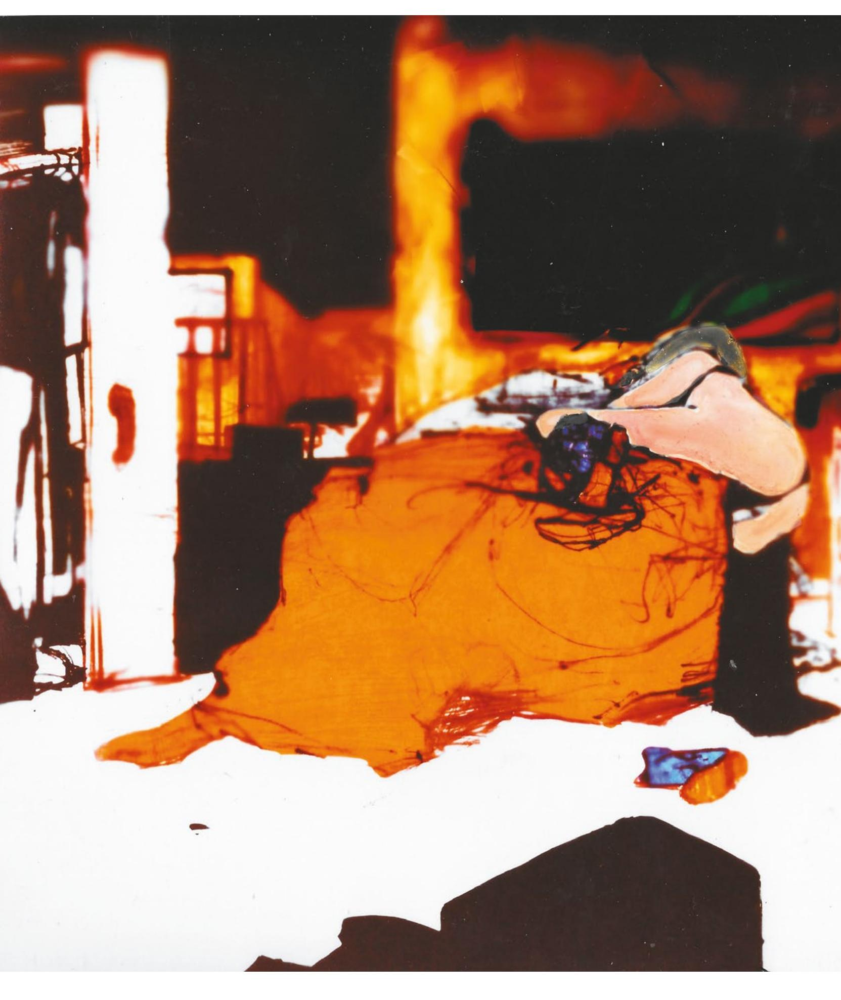

сонажа. Если все герои - революционеры, ненавидящие Камарилью, вряд ли они возьмутся поработать на Принца. В идеале у персонажа должна быть некая предрасположенность поступать так, а не иначе, благодаря чему он сам ухватится за предложение. При этом завязка не обязательно должна быть позитивной. Может случиться что-нибудь плохое, что подтолкнёт героев к действию. Их могут, например, шантажировать, или кто-то могущественный принудит их делать то, чего они вовсе не хотят. В случае негативных завязок, впрочем, стоит быть готовым к недовольству со стороны персонажей.

Личная заинтересованность делает весьма заманчивой любую завязку. Если о помощи просит незнакомец, ему легко отказать. Но всё становится гораздо интереснее, если откуда ни возьмись объявляется давно пропавший сир одного из персонажей и умоляет спрятать его от врагов.

На случай, если завязка всё же останется без внимания, неплохим решением будет заранее продумать развитие событий без участия персонажей игроков. Допустим, Принц хочет, чтобы персонажи притворились анархами и разведали их планы, но они отказались. На следующей игровой встрече они узнают, что несколько неонатов внезапно переметнулись к анархам. Случилось ли это потому, что они приняли предложение Принца, остаётся только догадываться.

#### Компетентность

Ещё один сложный вопрос - компетентность персонажа. Насколько детально должен игрок описывать все действия? Делают ли герои какие-то вещи «по умолчанию»? Например, нужно ли каждый раз описывать, как они включают сигнализацию перед дневным сном? У игроков, привыкших к высокому уровню компетентности персонажей, необходимость постоянно повторять очевидные вещи может вызвать раздражение. Другим же, напротив, станет скучно, если ни о чём не надо будет задумываться. Для кого-то именно в деталях заключается самая суть - в настольных ролевых играх их привлекает возможность управлять персонажем в мельчайших аспектах.

Самое важное - удостовериться, что все участники понимают, чего ждать от игры. В зависимости от характера хроники те или иные детали могут быть более или менее важны. В истории об эмоциях и взаимоотношениях бытовые вопросы можно опустить; в то же время, если герои играют в кошки-мышки со Второй инквизицией, воспроизведение всех мелких деталей их защитных приготовлений может, наоборот, сделать игру интереснее.

#### ХРОНИКА «СОВЫ - НЕ ТО, ЧЕМ ОНИ КАЖУТСЯ, ИЛИ ВСЁ ВЗАИМОСВЯЗАНО»

Вы совершенно точно не вампиры. Вампиры — это вымысел. Если бы это было не так. кто-нибудь давно бы заметил. А вот рептилоиды — другое дело. Многие их видели. Так что вы, скорее всего, рептилоиды-оборотни. Да! Элитные солдаты рептилоидов, взбунтовавшиеся против своих хозяев!

Персонажи этой хроники считают, что подхватили какой-то инопланетный вирус, подверглись генетической трансформации на корабле пришельцев или в секретной правительственной лаборатории, были избраны Богом или прокляты им за грехи, являются самыми настоящими ангелами, демонами, рептилоидами, агартианами или пробудили в себе генетическую память расы древних сверхлюдей. Объясняй всё происходящее, учитывая эту позицию.

Вероятно, жизнь персонажей не сильно изменилась с тех пор, как они стали... тем, кем стали. Прячась за фасадом обычной жизни, они пытаются противостоять заговору иллюминатов (или ещё чему-нибудь), расширить свои ряды (используя грубое понимание того, что такое Становление), остаться в живых и раскрыть миру истину.

Основная тема этой гротескной хроники - теории заговора. Вероятно, история завершится трагедией, крушением иллюзий, признанием горькой истины (и последующей местью сиру), а может быть, неожиданным подтверждением теории (ну да, это ваша игра, может, в вашем Мире Тьмы Камарилья - и в самом деле рептилоиды) или другим внезапным поворотом сюжета. Цель котерии в этой хронике - правда или месть.

#### Стычки между персонажами игроков

Традиционная НРИ предполагает противостояние между персонажами игроков и окружающим миром, но интриги Сородичей нередко приводят к конфликту между героями. Зачастую полезно бывает обсудить заранее, как будут разрешаться подобные ситуации, особенно если планируется долгая хроника.

#### ИДЕИ ДЛЯ СОЗДАНИЯ КОТЕРИИ

- Группа свингеров средних лет из фешенебельного района Эстермальм в Стокгольме, столкнувшаяся с проблемой посерьёзнее венерических заболеваний.
- Техно-музыканты, создающие нужный резонанс в крови людей на своих рейвах, используя звук и наркотики. Они хотят стать сильнее, обзавестись небольшой армией гулей и убить старейшину.
- Четверо беженцев с Ближнего Востока, свидетелей чего-то ужасного в Войне Геенны, прячутся в госпитале от Камарильи. Компания подобралась совершенно невероятная. Они не высовываются и питаются кровью специально подготовленных сосудов, усиливающих их способности к Сокрытию.
- Послушники в городском монастыре с мечтой помочь людям из их района одновременно питаются их кровью. Кому жить, а кому умереть во имя благой цели?
- Малоизвестная норвежская группа блэкметаллистов из 90-х, члены которой считаются мёртвыми (убиты/покончили с собой), с крошечной фанбазой, которая готова поверить во что угодно и сделать что угодно.
- Строители из Сирии, которые работают только в ночную смену. Они используют это прикрытие, чтобы получать доступ к чужим убежищам и выполнять контракты Камарильи на убийство освобождённых или слабокровных вампиров.

Могут ли персонажи игроков делать друг с другом что пожелают? Есть ли границы дозволенного? Должны ли все непременно держаться вместе? Можно ли применять социальные навыки к персонажам других игроков?

Что бы вы ни решили, все конфликты между персонажами должны оставаться в игре, не затрагивая отношения между игроками. Живые люди всегда важнее каких-то внутриигровых коллизий. Если конфликт между персонажами тормозит игру, лучше сделать паузу, обсудить проблему между собой и внести изменения в хронику при необходимости.

 $352$ 

#### **ХРОНИКА «МЫ СТАЛИ ДОБЫЧЕЙ»**

**Начинается всё с малого — пропадают Сородичи-одиночки, сторонившиеся других вампиров. Затем кто-то обнаруживает пустое убежище, в котором не осталось и следа от обитателей, словно тут поработала бригада уборщиков — и волнение поднимается всерьёз. Кто-то охотится на Сородичей, не оставляя при этом никаких следов. Традиционные методы расследования, включающие использование сил Крови, не дают никакого удовлетворительного результата.**

**Дело приобретает новый оборот, когда пропадает котерия по соседству с персонажами. Они не раз посещали убежище пропавших каинитов, а теперь оно выглядит словно готовый к продаже дом. Вампирша из исчезнувшей котерии, подруга персонажей, упоминала при их последней встрече, что ей показалось, будто за ней кто-то следил, когда она в последний раз была в Кормушке.**

**Когда персонажи находят «охотника», им оказывается кто-то близкий — союзник, друг, родственник (человек или Сородич).**

#### **СОБЫТИЕ «НЕ БУДИ ЛИХО»**

**Время от времени обитатели домена, где живут персонажи, вспоминают двух Сородичей, некогда основавших город. Предположительно, они веками боролись за власть, останавливаясь лишь для того, чтобы убедиться, что их не обнаружат. В эти ночи они оба лежат в торпоре где-то под городом, но на поверхности их приспешники продолжают борьбу.**

**Однажды котерия встречает пошатывающегося обессиленного человека. Это оказывается изголодавшийся гуль, некогда служивший одному из самых могущественных вампиров города. В обмен на витэ он показывает персонажам убежище своего бывшего хозяина, где можно найти указания на то, где покоятся основатели. Впрочем, теперь за котерией увязался вероломный гуль — и он хочет ещё Крови.**

**Когда персонажи находят спящих старейшин, приспешники старейшин приходят в неистовство. В городе начинается хаос. Даже в торпоре старейшины пытаются друг друга уничтожить. Они призывают избранных Сородичей к своим могилам, чтобы те их пробудили.**

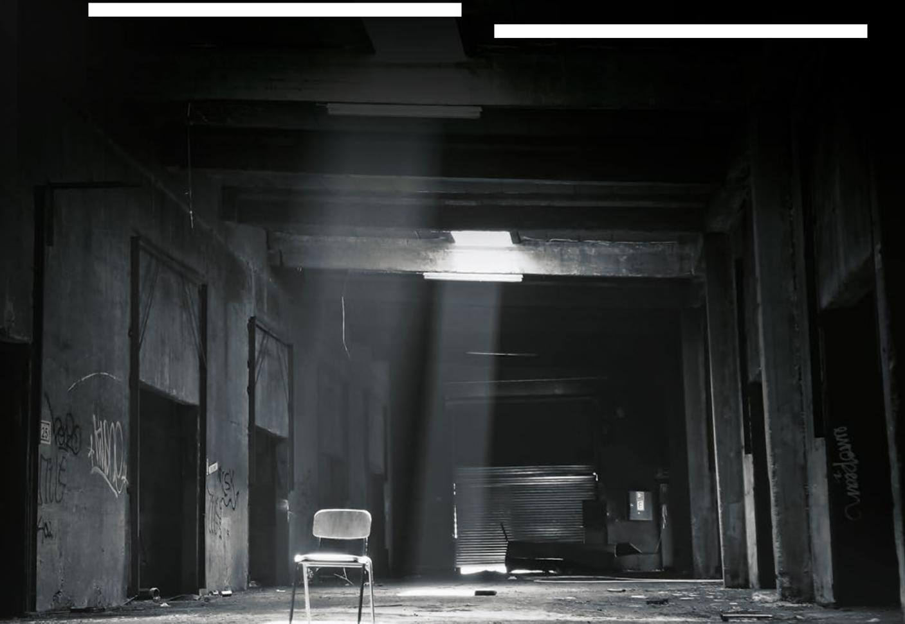

## Проведение игры

Хроника готова. Игроки создали персонажей. Вы обсудили между собой, в какой манере вы предпочитаете играть. Настало время провести свою первую игровую встречу.

«*Твои действия?*» — вот самый важный вопрос, который ты будешь повторять снова и снова.

«Ты просыпаешься от того, что кто-то колотит в дверь. Это полицейские, и они грозятся выломать дверь, если ты не откроешь. До заката ещё по меньшей мере час. Твои действия?»

«Примоген клана Тореадор заглядывает тебе прямо в глаза. Она, поглаживая рукой твою грудь, говорит, что всегда находила молодых Сородичей удивительно энергичными и живыми. Твои действия?»

«Звонит телефон. Это твоя мать. Она в панике. Говорит, что к ней заявилась какая-то ужасная женщина, которая грозит её убить, если ты не приедешь. По описанию ты узнаёшь в женщине Шерифа. Твои действия?»

«Симпатичный подросток, которым ты сегодня «поужинал», лежит на полу без движения. Он умирает от потери крови. Твои действия?»

«Анархистка собирается ударить тебя по лицу. Ты видишь это по её глазам и по тому, как она сжимает кулаки. Твои действия?»

Если ты слишком долго не задавал этого вопроса, вероятно, в игре не хватает того, на что игроки могли бы реагировать.

### **Сцена**

Каждая игровая встреча начинается с определённой ситуации. Персонажи находятся в некоем месте, где они совершают некие действия. Ситуация может быть бытовой. Возможно, они у себя в убежище, играют в бильярд. Суть в том, чтобы игроки с первой минуты начали смотреть глазами персонажа. Как правило, чтобы история закрутилась, должно произойти что-то интересное: второстепенный персонаж может прийти в гости и рассказать потрясающие новости, близкий друг может пропасть и т. п. Главное, чтобы персонажам было на что реагировать.

Игра представляет собой последовательность сцен, в каждой из которых кто-то из персонажей делает что-то достаточно интересное, чтобы это имело смысл описывать в деталях. Сцены могут инициировать и рассказчик, и сами игроки — например, кто-то решит позвонить своей смертной маме, что приведёт к короткой сцене беседы.

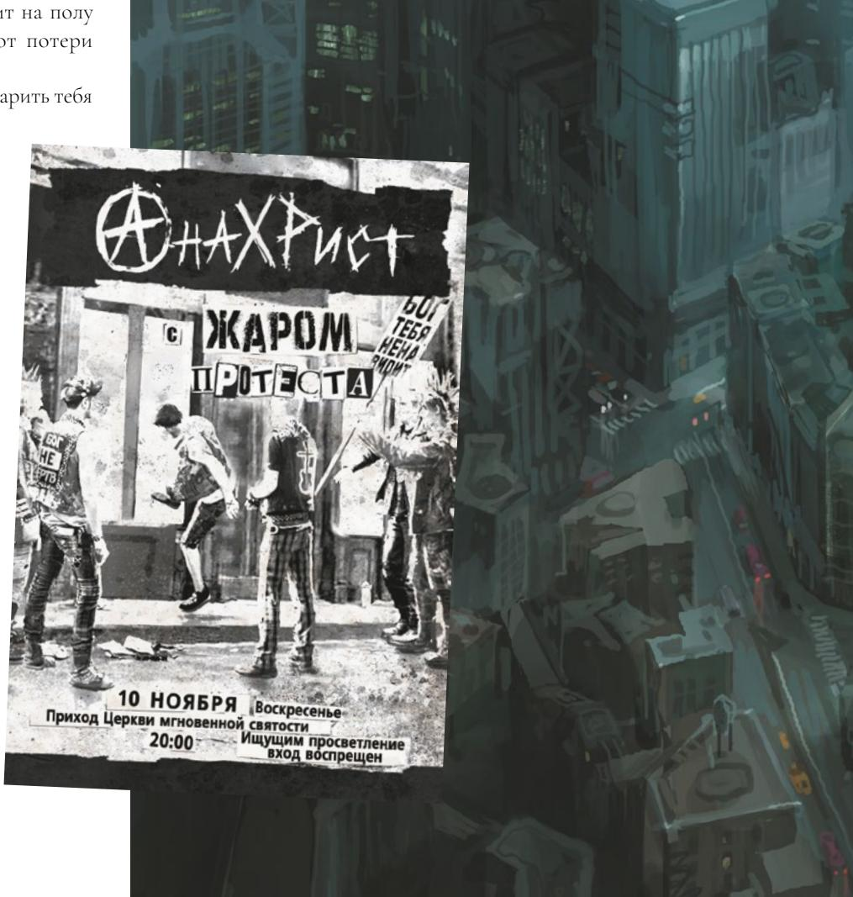

**354**

Есть такой феномен в ролевых играх, когда участники вместо того, чтобы играть, принимаются обсуждать, «что было бы, если», проговаривая различные варианты действий, вместо того чтобы действовать. Избегай этого, всеми силами стараясь сфокусировать внимание игроков на текущей сцене.

#### **Диалоги, стычки, операции**

Есть много разновидностей сцен. Иногда одни из них плавно перетекают в другие.

Боевая сцена — это конфликт с применением физического насилия, в котором, как правило, по меньшей мере одна сторона хочет причинить вред другой. На персонажей нападает наёмный убийца или банда смертных соперников, кто-то пытается убить Принца прямо в убежище — причины могут быть разные, но так или иначе всё сводится к сражению. Иногда, впрочем, ставки настолько низкие, что для разрешения конфликта не требуется никаких проверок (например,

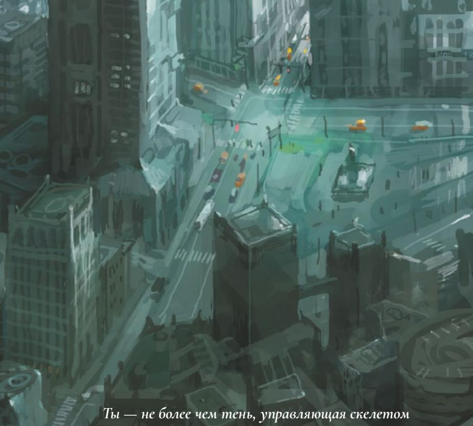

*с мёртвым мясом на костях. Ты соткан из сумерек тысяч эонов истории, утраченной в погоне за ложными целями. Так чего бояться?*

в дружеском поединке двух бруха). Если в боевой сцене никто не пытается никого убить или покалечить стоит сфокусироваться на зрелищности, а не на том, кто останется победителем.

Социальная сцена — это общение между персонажами. Тут могут применяться формальные правила, если участники считают, что это уместно, но во многих социальных ситуациях нет вызова как такового, поэтому и проверки не нужны. К примеру, если у персонажей свидание, для сюжета важнее само социальное взаимодействие, а не исход. Нам интереснее узнать, что произошло, а не кто победил.

Некоторые социальные сцены вообще не нужны для сюжета, но тем не менее интересны. Может, персонажи обмениваются впечатлениями после ужасной ночи в Элизиуме. Они шутят, анализируют, строят грандиозные планы. К следующей ночи больше половины сказанного будет забыто, но сам разговор — неплохое развлечение. Типичная эпизодическая, но увлекательная

> социальная сцена — это обсуждение обустройства убежища. Вопросы индивидуального стиля тоже бывает забавно обсуждать — может быть, один из персонажей собирается на свидание с бывшим, а другие советуют, что надеть.

> Другие социальные сцены, наоборот, очень драматичны и жизненно необходимы для развития истории. Персонажи-анархи ворвались с боем к Принцу в убежище, а он внезапно сдался и попросил их помочь защитить домен от вторжения конкурентов. Боевая сцена превратилась в социальную, в которой персонажи разговаривают с Принцем.

> Социальная сцена требует от рассказчика применения его собственных социальных навыков, чтобы определить, что игрокам интересно, а что нет, и выбрать подходящие темы, вид конфликта и т. д.

> Операции — это третий наиболее распространённый тип сцены. Персонажи хотят вломиться в убежище барона, находящееся на заброшенном складе. Рассказчик обрисовывает обстановку, и персонажи строят план проникновения. В подобных сценах обычно очень много проверок и описаний.

**355**

#### **Монтаж**

Монтаж — один из самых важных инструментов в арсенале рассказчика. Это переход от одной сцены к другой. Самое сложное здесь — выбрать подходящий момент.

Начать сцену проще, чем завершить. Персонажи появляются в кадре в тот момент, когда с ними должно произойти что-то интересное. К примеру, они решают попросить аудиенции у Принца. Дорога до Элизиума не сулит никаких приключений, так что эту сцену можно вырезать. Действие начинается с того момента, когда герои входят в покои Принца, или даже с порога Элизиума — тогда у котерии появится шанс узнать странные слухи.

Боевые сцены, как правило, заканчиваются вместе со схваткой, но иногда итог очевиден ещё до того, как стихнет сражение. Если одна из сторон получила критический перевес, рассказчик может завершить сцену описанием итогов, особенно если побеждают персонажи игроков.

Сцена операции заканчивается, когда персонажи достигают цели. Если они пытаются пробраться в убежище Барона, сцена заканчивается, когда им это удаётся. Если сцена растягивается и становится скучной, рассказчик может ускорить действие, так же как с боевой сценой.

С социальными сценами сложнее. Трудно определить, когда поставить точку. Скучная, на первый взгляд, дискуссия между персонажами может показаться чрезвычайно важной для игроков, так что они будут недовольны, если её оборвут. С другой стороны, иногда игроки просто убивают время в разговорах, ожидая действий со стороны рассказчика. Разобраться в ситуации за игровым столом поможет только опыт.

Разумеется, монтаж играет роль не только в конкретной сцене. Он влияет на распределение времени в рамках игровой встречи. Если до кульминации нужно добраться во время текущей игровой встречи, можно укоротить сцены или сразу поведать игрокам итог, не вдаваясь в детали. С другой стороны, если заготовленного материала не хватает, можно позволить и долгую прокрастинацию.

Заметим, что игроки тоже имеют право на монтаж. Возможно, один из них чувствует, что социальная сцена слишком затянулась, и говорит: «Ладно, мы продолжаем и дальше перемывать косточки Примогену, но не думаю, что случится что-нибудь интересное». Это сигнал рассказчику, что можно двигаться дальше.

#### **Распределение внимания**

Разыгрывая сцену и решая, когда её завершить, стоит подумать о равномерном распределении внимания между игроками. Важно, чтобы каждый получил возможность сделать что-то интересное. Отметь для себя, кто из игроков охотно берёт инициативу сам, а кто отмалчивается, и интересуйся у каждого тем, что собирается делать его персонаж.

Вопрос распределения времени актуален и в тех сценах, где участвуют все персонажи, и в тех, где кто-то отделился от труппы. Если один из вампиров отправился делать что-то самостоятельно, тебе надо решить, достаточно ли интересно и важно его занятие, чтобы уделить ему особое внимание, пока остальные игроки ждут. Если вампир отправился осмотреться вокруг особняка Принца, ты можешь просто рассказать, что интересного он там нашёл. А если он поехал навестить умирающую мать, возможно, сцена их разговора стоит тех двадцати минут, которые будут на неё потрачены.

Если у всех персонажей есть сольные сцены, их длительность тоже надо балансировать. Во время хроники проблемам какого-то одного персонажа можно посвятить целую игровую встречу, но даже в этом случае остальные игроки не должны чувствовать себя так, будто пришли зря.

#### **Описание**

Описывать происходящее — один из тех навыков рассказчика, которому легче всего научиться, но который невозможно постичь до конца. Всегда можно найти новые нюансы. В основном задача рассказчика заключается в том, чтобы описывать, где находятся персонажи, что происходит и кто ещё с ними рядом. Ключ к хорошему описанию в понимании того, когда они должны быть пространными и запоминающимися, а когда строгими и лаконичными.

Ролевая игра отличается от беллетристики тем, что здесь персонажи могут взаимодействовать с описанными предметами, так что игроки должны понимать, где эти предметы находятся и как выглядят, а значит, описание должно быть чётким и кратким. Проблему можно продемонстрировать на примере большого камня. Рассказчик говорит, что на земле лежит большой камень. Один игрок в это время представляет себе камень размером с кулак, а другой с автомобиль, и в итоге один персонаж прячется за камнем, а второй пытается этот камень швырнуть. Если камень важен для сцены, рассказчик должен описывать его более подробно, чтобы каждый игрок

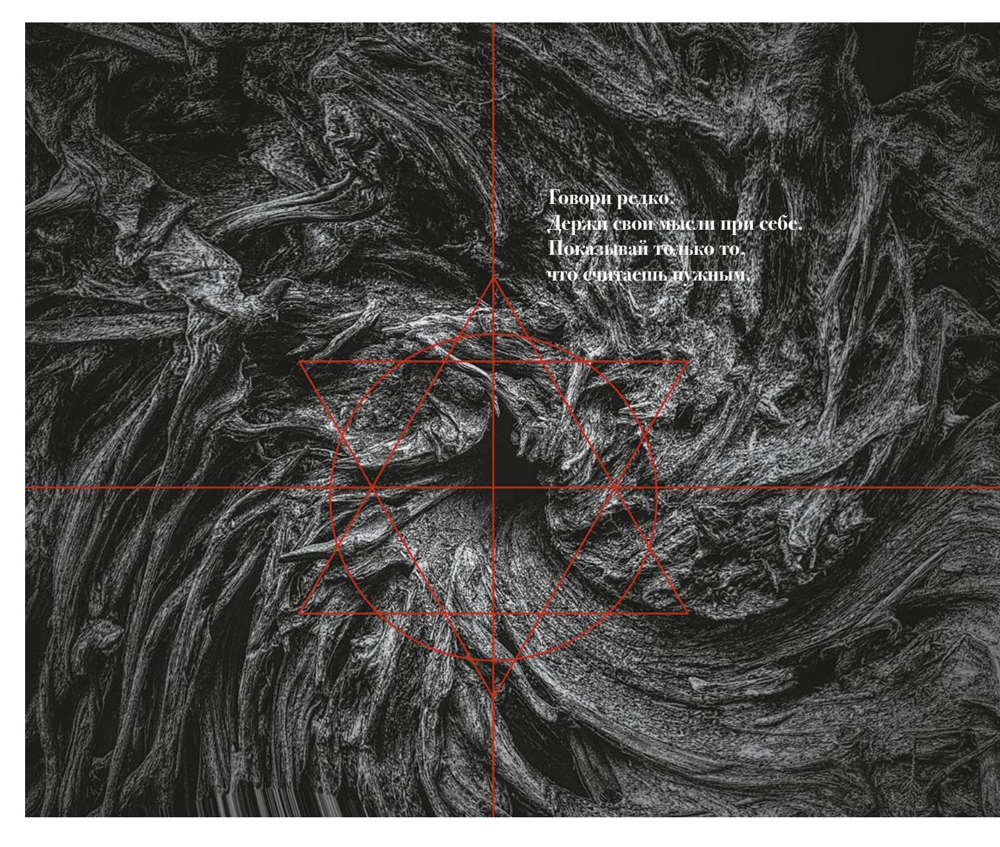

понял, что его персонаж может с ним делать, а чего не может.

Впрочем, не все описания должны быть предельно точными. Рассказчик может сказать: «Звёзды смотрят с небес, словно холодные глаза правосудия». Как бы ни выглядели звёзды, вероятнее всего, персонажи не смогут с ними взаимодействовать, так что детального описания не требуется. Документальная точность не нужна и при описании второстепенных персонажей: форма носа или ширина лица редко имеют значение, так что тут нужно создавать яркие образы. Возможно, игроки будут представлять себе не совсем то, что задумал рассказчик, но это не страшно. Вполне можно

сказать: «Девушка похожа на лису, которую поймали копошащейся в мусорном баке». Что это может означать? Воображение игроков дорисует картину.

#### **Игровая встреча**

Самое важное для проведения игровой встречи — это подготовка. Ты можешь заранее собрать коллекцию полезных материалов, чтобы во время игры всегда иметь под рукой что-то, чем подкрепить импровизацию.

В целом, чтобы подготовиться к игровой встрече, полезно составить план — последовательность сцен, которые можно менять местами. Конструируй сцены так, чтобы они начинались либо с подготовленной

заранее завязки, которую персонажи, скорее всего, не проигнорируют, либо с действий второстепенных персонажей.

Самый простой способ начать сцену: «Незнакомец на улице протягивает тебе телефон. «Кажется, это вас», — говорит он». Или так: «Зазвонил твой одноразовый телефон». Второстепенный персонаж чего-то хочет от героев: поговорить, пригласить куда-то, посплетничать. Он может даже приехать лично, или прислать письмо, или ещё как-то связаться с героями.

Планируя сцены, стоит задать для них ясное начало, но оставить открытую концовку. К примеру, не имеет

смысла планировать, что персонажи убьют Принца, а затем займут его место перед всем Элизиумом. Что, если они не захотят этого делать или не смогут? Однако если они упоминали, что хотят убить Принца, ты можешь предоставить им такую возможность. Второстепенный персонаж в Элизиуме спросит: «И что теперь? Хотите занять его место?» Таким образом ты озвучишь идею, но дашь возможность игрокам самим принять решение.

Если какая-то сцена может оказать сильное влияние на ход игры, оставь её на конец встречи. Тогда у тебя будет время до следующей игровой встречи, чтобы обдумать последствия. В сцене борьбы

#### **ИЛЛЮСТРАЦИИ**

**Ты можешь использовать картинки, чтобы проиллюстрировать игру, — тебе будут полезны портреты главных и второстепенных персонажей или даже городские пейзажи. Ролевая игра — это частное мероприятие, так что для поиска картинок смело можно использовать Google. Если ты водишь игры публично — возможно, возникнет вопрос авторских прав.**

**Ещё один доступный источник иллюстраций — эта книга.**

с Принцем ты не знаешь, хочет ли персонаж сам им стать или прочит на это место своего приятеля, второстепенного персонажа. Тот или иной выбор может существенно изменить ситуацию в игре, а значит, следующую игровую встречу можно будет начать с сенсации.

Не стоит обрывать игру на самом интересном месте, если приём «1001 ночи» не входил в планы изначально. Дело в том, что к концу игровой встречи игроки полны энергии и энтузиазма, накопленных за игру, а после перерыва эта энергия рассеется, так что наиболее драматичные моменты не стоит переносить на следующий раз.

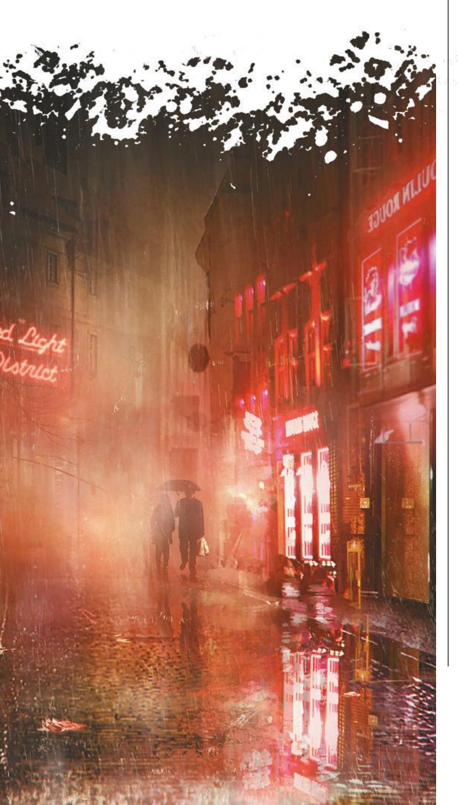

#### ПРОСТОЙ ПЛАН ДЛЯ ИГРОВОЙ ВСТРЕЧИ

СЦЕНА 1. Персонажи находятся в своём убежище, куда приходит представительница капеллы Тремер, чтобы передать им приглашение. Она ведёт себя неестественно мило и услужливо.

СЦЕНА 2. Персонажи посещают капеллу. Тремеры явно стараются добиться политической поддержки, пытаясь казаться более открытыми, чем раньше. Есть и другие гости. Персонажи замечают, что большая их часть из неблагополучных слоёв местного общества Сородичей. Выбор: подыгрывать тремерам или остаться в стороне?

СЦЕНА 3. Сразу после того, как персонажи покинули капеллу, с ними связывается знакомый. Он спрашивает, посещали они капеллу или нет, и требует, чтобы они явились в Элизиум и рассказали обо всём. Оказывается, попытка тремеров выйти на политическую сцену очень многих заинтересовала.

СЦЕНА 4. Элизиум. Это удобный момент для развития личных историй с участием соответствующих второстепенных персонажей. Все ополчаются против клана Тремер (на словах, по крайней мере), наглядно демонстрируя жестокость и двуличность завсегдатаев Элизиума. Выбор: присоединиться к большинству в стремлении унизить тремеров или сохранять холодную невозмутимость.

СЦЕНА 5. Один из персонажей узнаёт, что его смертную сестру схватила Вторая инквизиция. Её увезли в секретную тюрьму и, возможно, пытают, чтобы выведать сведения о Сородичах. К сожалению, ей многое известно. Выбор: попросить ли помощи у тремеров? Их тайные знания будут весьма кстати, но если персонажи с ними свяжутся, пострадает их репутация в Камарилье.

СЦЕНА 6. С тремерами или без, персонажи пытаются вызволить пленницу. Сцена, скорее всего, предстоит весьма напряжённая. Можно добавить немного социального взаимодействия, поместив в соседнюю камеру соперника персонажей, и пусть они решают, стоит ли его освобождать.

Всегда помни: если план утратил свою актуальность, его нужно отложить в сторону. Это особенно важно, когда игроки предлагают хорошие идеи или темы. Им в голову может прийти что-то более интересное, чем то, что ты запланировал. В этом случае можешь просто сделать вид, что так и было задумано.

#### ПРИМЕР АНОНСА ХРОНИКИ: «ЮНЫЕ КОРОЛИ»

Это город сделал нас такими? Или виной всему наша собственная природа?

В Кройдоне за последний год зафиксировано 313 серьёзных случаев насилия среди подростков. Али пырнула в горло отвёрткой его собственная сестра, Деми подожгли прямо перед дверями Tesco на Монкс-Хилл, а о том, что случилось с мисс Муллинс и Гриффином, и говорить не хочется.

Что, если эти хихикающие девчушки, накрашенные так, что дальше некуда, не просыхают ещё с 70-х? Что, если эти безнадёжные дети кажутся старыми потому, что они на самом деле старые? Что, если за всеми атаками и передозировками кроется какая-то тайна? Что, если для прогулов и забастовок есть реальные причины? Причина, которую взрослым не понять? Живым взрослым, по крайней мере.

«38-летняя Сабрина Муллинс была безжалостно убита собственным женихом всего через пару часов после того, как он сделал ей предложение. 13 марта 2017 года 24-летний Иван Гриффин нанёс своей невесте несколько ножевых ранений. Пока жертва умирала на полу их общей квартиры в Рэйвенсдэйл Гарденс в Верхнем Норвуде, убийца требовал, чтобы она пила его кровь. Гриффин утверждает, что «убил её ради любви» и что он «марионетка в руках дьявола».

Упыри-подростки орошают южный Лондон кровью невинных. Инквизиция истребила правителей города. Больше никто не диктует правила. Никаких взрослых, кроме разве что родителей и полицейских. Никаких старейшин. Никаких ограничений. Ни богов, ни хозяев, ни границ для той боли, что ты причинишь окружающим. Один летний месяц, предшествующий бунтам. Зрелые игроки. Незрелые персонажи. История, способная выжечь душу.

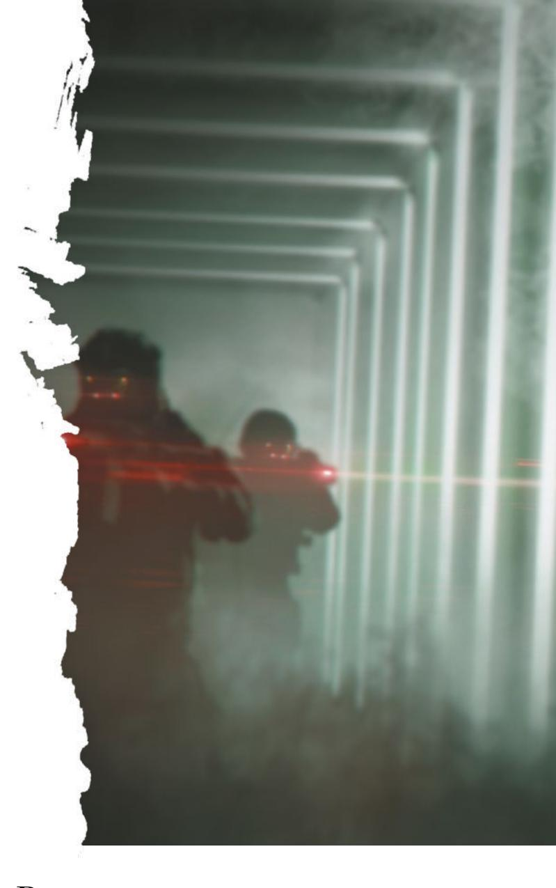

### Вторая инквизиция в хронике

Маскарад нарушался и раньше. Индивидуумы или небольшие группы в разведывательных организациях вроде Охранного отделения Российской Империи, американского АНБ или Генерального директората внешней безопасности Франции не раз и не два вмешивались в Извечную борьбу. На протяжении XIX и XX веков вампиры то делали из агентов своих пешек, то убегали от отрядов профессиональных вояк, решивших заняться охотой. Однако ставленники Камарильи и сама по себе «невозможность» заговора бессмертных чудовищ мешали разрозненным отрядам объединиться, чтобы дать вампирам систематический отпор. Трагедия 11 сентября и «Война с терроризмом» всё изменили. Камарилья сделала ставку на то, что сможет обернуть против Шабаша и анархов всю американскую разведку, а расплачиваться пришлось всем Сородичам. Программы наблюдения и анализа данных небывалых масшта*Человечность — вот твоя величайшая слабость, ибо она заставляет тебя заботиться о тех, кто может навлечь на тебя погибель. Никому без нужды не рассказывай о своей смертной жизни. Правда — твой враг.*

бов приподняли завесу Маскарада. А когда АНБ взломало в 2004 году сеть Носферату ShreckNet — маски были сорваны окончательно.

Однако ни в одном официальном отчёте, не говоря уже о СМИ, по-прежнему нет никаких упоминаний о Сородичах. У новой инквизиции нет командного центра, а её представители используют все доступные средства, чтобы скрыть тайную войну, которую они ведут, даже от своих коллег и начальства. Любой человек в разведывательной организации — и даже в правительстве — может быть марионеткой врага, так что нет, Конгресс не в курсе, а инструктажи проводят крайне редко, выдавая лишь самую необходимую информацию. Впрочем, несмотря на паранойю, некоторые высокопоставленные лица в разных странах всё же обмениваются полученными данными.

#### **Церковь и США**

Совместный спецпроект АНБ и ЦРУ под названием «Первый луч» координирует посвящённых в тайну агентов во всём западном мире, по возможности сотрудничая с охотниками на Бруха из отдела 8-го Управления ГРУ, а также оказывая вооружённую поддержку Священному альянсу, секретной службе Ватикана. Информация течёт в обоих направлениях, поскольку Священный альянс теперь включает в себя и вновь признанное церковью Общество Св. Леопольда, снабжающее «Первый луч» и его коллег записями старой инквизиции и ценными сведениями об угрозе, которую могут представлять «пустотелые». Священный альянс также оказывает жизненно необходимую поддержку и предоставляет личный состав бразильскому Батальону специальных операций в его борьбе против вампиров, помогая выйти на мировую арену.

В 2008 году аналитики «Первого луча» обнаружили Верховную капеллу Тремер в Вене, посчитав её важнейшим вампирским центром, что привело к самой крупномасштабной операции на сегодняшний день. Координированная атака спецотрядов США и Ватикана при поддержке опытных команд бразильских охотников-убийц сравняла капеллу с землёй при помощи дронов и наземных операций с использованием

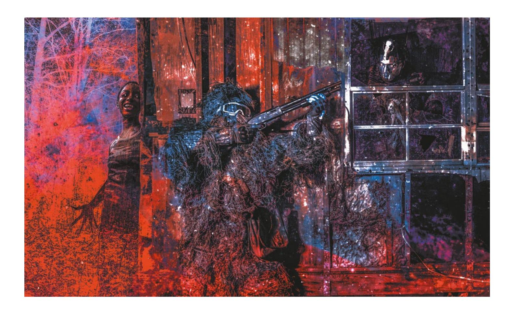

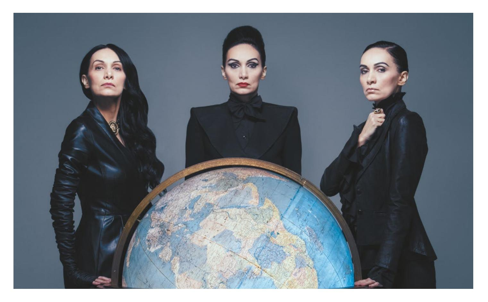

священных реликвий. По официальной версии, взрывы произошли по вине террористов ИГИЛ. «Первый луч» и до этого не раз прятал свою деятельность за ширмой «антитеррористических операций».

Начиная с 2006 года британский антитеррористический отдел SO13 под командованием капитана Исхака Хана систематически вычищал Лондон, в ноябре 2013 года обезглавив Королеву Анну. Отдел особых расследований ФБР, возобновивший свою деятельность, истребляет вампиров от Лонг-Айленда до Лас-Вегаса, обнаруживая их самостоятельно или по наводке «Первого луча». Подразделение 8211 в Израиле выслеживает старейшин, явившихся на Зов сражаться в Войне Геенны, а затем атакует их брошенные домены. Французская программа «Халцедон» загнала Франсуа Вийона в подполье и постепенно очищает Марсель. Разведка США проводит операции в 177 странах по всему миру. В её распоряжении неизвестное количество участников проекта «Первый луч», готовых при первом же удобном случае запустить в чьё-нибудь убежище термобарическую ракету. Полдюжины крупных стран уже держат Сородичей в секретных лабораториях, расположенных в самых солнечных местах, экспериментируя над ними, чтобы обнаружить их слабости и понять их истинную природу.

Неизвестный тореадор, который впервые произнёс словосочетание «Вторая инквизиция», не ошибся. Два оплота Камарильи уже пали, и многие другие находятся в осаде. Убежища анархов и Шабаша выгорают дотла повсеместно. Джованни были раскрыты, потерпели страшное поражение и были вынуждены заключить союз со своими братьями из Гекаты. Тысячи Сородичей встретили Окончательную смерть. Случилось невероятное: человечество осмелилось дать отпор своим хозяевам. Корона и митра вновь объединились, чтобы положить конец колену каинову. Охота на охотников возобновилась с новой силой.

#### **Камарилья исчезает с радаров**

Камарилья в ответ на угрозу покинула цифровое пространство, никогда не вызывавшее у неё доверия, а вот презрение — довольно часто. Принцы запретили сетевое общение, даже по сотовому нельзя обсуждать дела Сородичей — неподчинение сурово карается. Контрразведка Камарильи работает в Вашингтоне и Брюсселе, но с изоляцией городов Сородичи оказываются отрезаны друг от друга. Каждый звонок — это звонок в АНБ; даже шифрование и Даркнет — не преграда для цифровых охотников.

Фракция вернулась к старым проверенным методам шпионажа — Сородичи вспомнили навыки, при-

#### **ПУСТоТеЛЫе**

**В существование вампиров трудно поверить. если не считать общество Св. Леопольда и его соратников из Священного альянса и бразильских спецслужб, большинство охотников, даже встречавших врага в бою, не может осознать, с чем столкнулось. Фантастичность подобного врага накладывается на бюрократическую манеру общения, отличающуюся казённой терминологией, и в результате даже в «Первом луче» никто не использует слово на букву «в». нарушителей могут отстранить от работы. Спецслужбы СШа отличаются особым фанатизмом в этом вопросе, так как в фонетическом алфавите наТо букве v («ви») присвоено значение victor («победитель»), что добавляет сообщениям излишне пессимистичный подтекст. анБ ещё в 90‑х окрестили Сородичей «параформами», а отдел специальных операций цРУ вообще предпочитает широкий термин «аномалии». Когда к инквизиции подключаются новые кадры, лучше придерживаться нейтральной терминологии.**

**«Пустотелый» — достаточно нейтральное, но в то же время однозначное обозначение, которое стало самым распространённым эвфемизмом для вампиров. Причина такого названия в том, что у Сородичей в основном низкая температура тела, что на инфракрасных приборах отображается как пустота, тёмное пятно. Проверка подозреваемых в инфракрасном спектре зачастую является основным инструментом оперативника, позволяющим отличить живого от мёртвого. Ведомственная паранойя и недостаток проинструктированного персонала нередко приводят к тому, что полевые агенты могут не знать об искре жизни (стр. 218), позволяющей вампирам воссиять на их сканерах ярко‑красным цветом. Впрочем, агенты быстро усваивают новую информацию. Те, кто переживёт своё невежество, конечно.**

обретённые ещё во времена, когда Джон Ди шпионил для Елизаветы I, а Борджиа плели заговоры против кардиналов и королей. Ключами к буквенным шифрам становятся отрывки из редких изданий романов Джеймса Г. Балларда, связные надевают перчатки

#### **ВСеМоГУщиЙ МоноЛиТ**

**Спецслужбы могут казаться всемогущими и несокрушимыми, словно монолит, особенно с точки зрения слабого вампира, отчаянно пытающегося не попасть к ним в лапы. однако если инквизицию представить в более естественном свете, то хроника от этого только выиграет, особенно если охотники встречаются в игре не только эпизодически.**

**Местные агенты Второй инквизиции могут оказаться плохо проинструктированными полицейскими с неясными понятиями о том, кто им противостоит. Возможно, среди них есть сотрудник какого‑либо агентства, чья паранойя по поводу телепатических способностей вампиров настолько велика, что он отказывается раскрывать даже необходимые детали плана. их финансирование может зависеть от политической повестки, что предоставит возможность Сородичам его урезать, а то и вовсе свернуть проект, используя рычаги давления в местном правительстве.**

**Секретность порождает некомпетентность, паранойя толкает на глупые поступки. Возможно, единственное оружие, которое понадобится героям против Второй инквизиции, — это человеческий фактор.**

в тон к собственной ауре, а вороны-курьеры прячут флешки там, откуда только крысы или летучие мыши смогут их достать. Пока что меры предосторожности помогают — наступление Второй инквизиции сбавило обороты. После Вены и Лондона враги, должно быть, решили, что им удалось устранить наиболее опасных «пустотелых». Возможно, Камарилье снова удастся провернуть тот же трюк, что и раньше, в период Ренессанса: внедриться в стан врага, дискредитировать его и уничтожить изнутри. Дьявол свидетель: Сородичи настроены решительно.

#### **Анархи уходят в подполье**

Анархи и освобождённые подходят к проблеме инквизиции по-своему. Они, словно наркодилеры или бунтовщики, используют одноразовые телефоны и маскировку, полагаются на пути быстрого отступления и постоянную мобильность, воруют личные данные, чтобы оставаться неузнанными. Они выламывают

GPS из своих ноутбуков, используют Доминирование, чтобы другие публиковали в сети их манифесты и коммюнике, нанимают украинских хакеров, чтобы те прикрывали их спины, и создают себе двойников из плоти и крови, чтобы обманывать преследователей. Это сложнее, чем просто исчезнуть: чуть промедлишь — и тебе конец. Но анархи не могут уйти со сцены.

Слабокровные могут просто раствориться в толпе, продолжая обычную человеческую жизнь. И к величайшему раздражению старейшин, у них действительно неплохо получается. Они постят селфи со стаканом «Кровавой Мэри» и широкой улыбкой на лице, намекают на свои «привычки» и жалуются всем и каждому на то, что днём вечно случается какой-то треш. Изредка полиция находит переоборудованные нарколаборатории, где всё перепачкано кровью, ещё реже её отчёты попадают на нужный стол, но в целом у оперативников «Первого луча» из Управления по борьбе с наркотиками есть противники куда серьёзнее. Весперу достаточно явиться в полицию днём или пройти медицинское обследование, чтобы от него отстали. А если слабокровка затаил обиду на высокомерного старейшину, всегда можно сдать настоящего «пустотелого террориста», чтобы к тебе потеряли интерес. Да и вообще работа на правительство даёт определённые гарантии, так что место консультанта при разведке — искушение для любого веспера, обиженного судьбой (а это почти все).

Вторая инквизиция — таинственный и пугающий враг, неумолимый и в то же время неуловимый. В хронике она может выполнять разные функции в зависимости от того, что нужно рассказчику. Ниже приведено шесть вариантов использования Второй инквизиции в игре.

АКТИВНАЯ УГРОЗА. Вторая инквизиция охотится на вампиров, и персонажи попали в прицел. Возможно, спецназ окружил убежище и ломится в двери. Друзей и родственников увозят в неизвестном направлении, чтобы затем подвергнуть допросу с пристрастием в безликих и пустых комнатах без окон. Большая часть хроники посвящена борьбе со Второй инквизицией. Как пережить штурм? Как уберечь любимых? Как спрятаться? Каким образом можно нанести ответный удар?

Это хороший выбор для игры в жанре экшен со множеством драк и перестрелок.

ПАССИВНАЯ УГРОЗА. Вторая инквизиция — это особенность ландшафта, естественная преграда, которую надо учитывать, строя свой маршрут. В этом случае хроника посвящена чему-то другому, задачи персона-

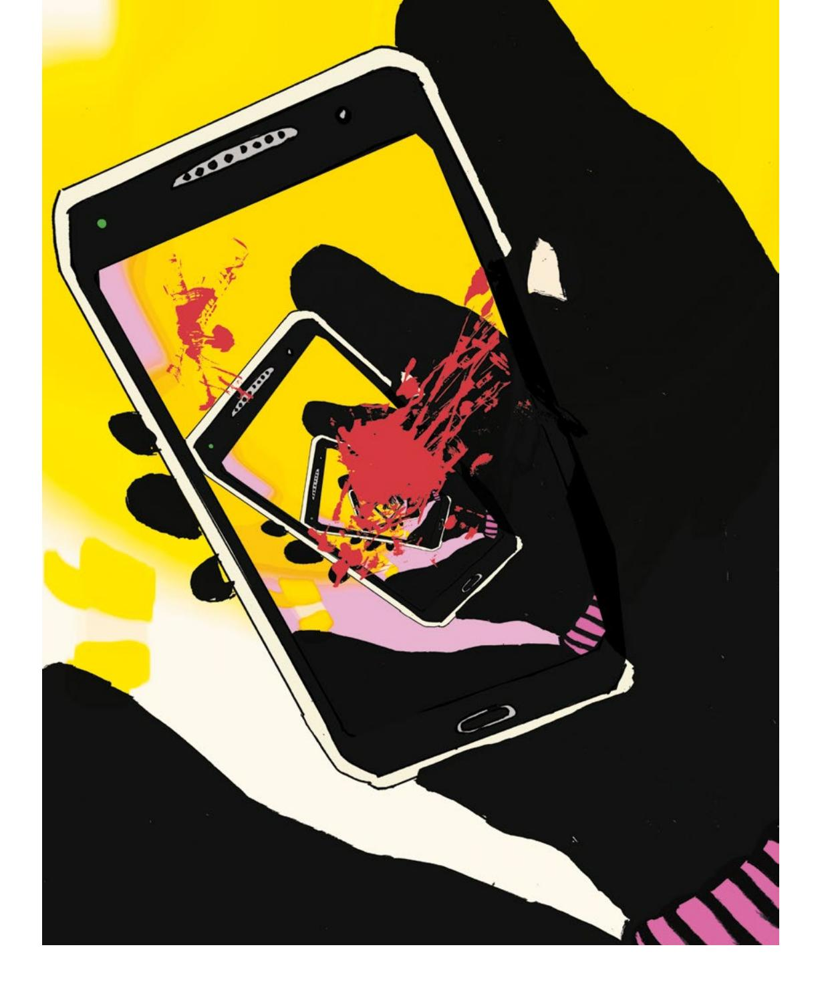

жей не касаются Второй инквизиции напрямую. Герои разжигают восстание, захватывают власть в городе, пытаются наладить рушащиеся отношения со смертной семьёй и т. п. Однако инквизиция может ударить в любой момент, если герои не будут достаточно осторожны.

В подобной хронике проблемы могут возникнуть, если персонажи нарушат Маскарад или опубликуют в социальных сетях что-то их изобличающее, но при должном уровне осторожности Вторая инквизиция так и не появится на сцене.

СИМВОЛИЧЕСКАЯ ПАРАЛЛЕЛЬ. Разведывательные учреждения — это законспирированные организации, где ложь и тайны встречаются на каждом шагу, это структуры, наделённые большой властью, где правая рука может не знать, что делает левая. Их сотрудники придерживаются сомнительных норм морали и нацелены на уничтожение врагов как в обществе, так и внутри самих агентств. В этом смысле Вторая инквизиция это сестра-близнец общества Сородичей. Здесь точно так же тайные клики заговорщиков пытаются добиться власти. Так ли уж важно, зовут этих заговорщиков Вентру или ЦРУ?

**ХРониКи**

Чтобы символическая параллель сработала, необходимо, чтобы персонажи знали подноготную Второй инквизиции. Она должна занимать видное место в сюжете, чтобы сходства начали бросаться в глаза.

ОСНОВА СЮЖЕТА. Вторая инквизиция может быть основой, центральным элементом хроники, не просто направляющим ход истории, но являющимся её сердцем. Это не абстрактный враг или метафора — агентов-охотников нужно представить со всей возможной глубиной.

Допустим, персонажи пускаются в чрезвычайно опасную авантюру: пытаются внедриться в ряды Второй инквизиции. Они могли бы столкнуться с безупречными профессионалами, оснащёнными суперсовременным оборудованием и просчитывающими всё на десять ходов вперёд. Но для игры в **«Вампиров»** гораздо интереснее сделать противников по-настоящему живыми людьми со своими слабостями и тайными страстями. Так что, выяснив больше деталей о местной опергруппе инквизиции, герои узнают, что её руководитель — фетишист, втайне обожающий всё, что связано с вампирами, бойцы в отряде давно и прочно подсели на медикаменты, улучшающие их боевые качества, да к тому же операция в целом не была одобрена правительством. Человеческие пороки позволяют вампирам процветать в обществе смертных, а у Второй инквизиции слишком много человеческого.

ЛОЖНАЯ ТРЕВОГА. Персонажи в ужасе от Второй инквизиции. Каждый из них потерял кого-то. Целые города были вычищены от Сородичей. И когда в двери убежища стучится полиция, персонажи решают, что их песенка спета. Единственный шанс — убить всех и скрыться.

Вот только на этот раз антагонистом оказывается кто-то другой. Тайная полиция, разведка или иная организация, не связанная с охотниками, вышла на персонажей, приняв их за террористов, активистов, радикальных левых, иностранных шпионов или кого-то ещё, кто способен заинтересовать спецслужбы.

В этом случае Вторая инквизиция может даже не появляться на сцене — и всё ещё влиять на происходящее. Паранойя уже достигла нужного уровня.

РАСПЛАТА ЗА ГЛУПОСТЬ. Вторая

инквизиция может явиться в качестве расплаты за чьё-то высокомерие и глупость. Охотники прошли бы мимо, если бы кто-то умышленно не привлёк их внимание. Принц думал, что сможет с их помощью расправиться с анархами. Обиженный носферату в попытке отомстить слил информацию агентам. Сами персонажи пытаются манипулировать инквизицией, не понимая толком, что там к чему. Какова бы ни была причина, результат — катастрофический.

Кроме того, Вторую инквизицию можно использовать в качестве элемента, способного оживить мир вокруг, показать его динамику, не зависящую от действий персонажей. Например, они могут уничтожить Примогена Тремер после того, как персонажи услышат сплетни о попытках чернокнижника использовать инквизицию в своих целях. Тогда угроза со стороны этих жутких охотников будет чувствоваться ещё сильнее.

## Охота на охотников

Вторая инквизиция решила нанести удар. Но кто конкретно будет противостоять персонажам? Здесь приведено три варианта отрядов инквизиции (см. «Противники», стр. 370):

#### **Тактическая группа**

Инквизиция получила наводку и уже в пути. Столкновение может быть крайне опасным для персонажей, так как их противник — это отряд инквизиции на пике своей эффективности.

Отряд может состоять из бойцов полицейского спецназа, бывших наёмников или ушедших в самоволку солдат специальных частей. Среди них также наверняка есть представитель религиозной организации.

#### ХАРАКТЕРИСТИКИ:

СВЯЗНОЙ: см. «Верующий охотник», стр. 371. КОМАНДИР: см. «Следователь инквизиции», стр. 372. ЧЕТВЕРО БОЙЦОВ: см. «Воин инквизиции», стр. 372. Если хочешь сделать бой ещё сложнее, инквизиторы могут пойти в атаку перед рассветом, разрушить убежище персонажей с помощью управляемых взрывов или использовать оборудование, которое мешает применению вампирских сил. Если же, наоборот, бой нужно упростить, они могут выдать чем-то своё приближение.

#### **Старая добрая инквизиция**

Персонажей с божьего благословения преследуют честные католики-инквизиторы из Общества Св. Леопольда. Они нападают не сразу. Сперва вампиры начинают замечать странные вещи, происходящие в округе. Один из информаторов сообщает, что в местную католическую церковь зачастили какие-то подозрительные люди, которые беседуют с прихожанами и являют собой образчики благочестия. Гуля одного знакомого неоната находят захлебнувшимся собственной кровью. Вокруг убежища слоняются без дела какие-то угрюмые личности.

Общество Св. Леопольда получило сведения от их союзников из Второй инквизиции. Они подозревают, что здание, в котором живут персонажи, — логово вампиров, но, прежде чем предпринимать какие-либо меры, хотят убедиться в этом.

Персонажам предстоит решить, как лучше поступить. Убить инквизиторов? Или это только усугубит ситуацию? Может, лучше на время сменить место жительства и посмотреть, не потеряют ли охотники след? Или попытаться обмануть их, убедив, что тут нет никаких вампиров?

Инквизиторы — это религиозные фанатики, подвергавшиеся гонению долгое время, и это может породить немало интересных сюжетных ходов. Возможно, кто-то из них чувствует странное влечение к вампирам, шёпот дьявола, который всё никак не утихнет. Этот несчастный может связаться с персонажами и выдать им своих товарищей за одну только возможность приблизиться к объекту своей одержимости. К сожалению для вампиров, наутро он одумается и покается во всём перед другими инквизиторами.

#### ХАРАКТЕРИСТИКИ:

ЧЕТВЕРО ИНКВИЗИТОРОВ: см. «Верующий охотник», стр. 371.

#### **Тайные агенты**

Деятельность Второй инквизиции координируют и направляют более мелкие организации, скрытые в обширном аппарате разведслужб таких стран, как США, Великобритания, Россия и Франция. Чаще всего персонажи будут встречать инквизиторов местного происхождения, исполнителей, делающих грязную работу. Но иногда они могут столкнуться и с настоящими агентами АНБ, ФСБ или других разведывательных учреждений.

Агенты спецслужб могут быть хитрыми и коварными лжецами. Не исключено, что их цель — вовсе не истребление вампиров, а использование их в своих целях. В этом случае они свяжутся с персонажами, сделав вид, что хотят дезертировать или помочь вампирам в борьбе против их врагов. Если персонажи клюнут, агент попытается вытянуть из них побольше информации о вампирах, сведения об убежищах других Сородичей и т. п. Он может использовать их в качестве информаторов или марионеток, хитростью вынудив предать своих товарищей.

В бою агенты не представляют большой угрозы для вампира. Если застать их врасплох, персонажи, скорее всего, победят. Но действительно ли они хотят этого, учитывая все те чудесные возможности, которые сулит сотрудничество?

Рассказчику очень просто заставить лжеца звучать правдоподобно, так что во имя справедливости не забывай оставлять улики, с помощью которых персонажи смогут докопаться до истины.

#### ХАРАКТЕРИСТИКИ:

ПАРА АГЕНТОВ: см. «Следователь инквизиции», стр. 372. ⬛

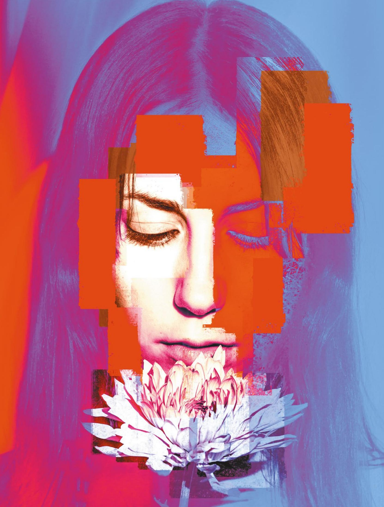

## **ГРИЙ** ИНСТ

Изменяйте эпизоды и сюжет, когда процесс развития подсказывает такие изменения, никогда не огранитивайте себя рамками какой-либо предыдущей структуры рассказа. Если развитие внезапно открывает новые возможности для драматического эффекта или более яркого повествования, добавляйте всё, что несёт в себе преимущества, возвращаясь назад и согласовывая ранее написанные тасти с новым планом.

> Г. Ф. ЛАВКРАФТ. «ЗАМЕТКИ О НАПИСАНИИ ФАНТАСТИЧЕСКИХ ИСТОРИЙ», ЖУРНАЛ «ТЬМА», №3, 2007 ГОД (ПЕР. О. САБИРОВОЙ)

этой главе рассказчик найдёт целый арсенал элементов, которые можно использовать в хронике любым удобным способом. Истории рождаются из конфликта, но принимают форму благодаря деталям, мелочам, всем тем кусочкам мозаики, которые впоследствии и складываются в цельную картину. Впрочем, ни одна глава или даже целая книга правил (да чего уж - все книги правил, разнообразия компонентов, из которых состоит даже одна-единственная хроника, не говоря уже обо всех теоретически возможных.

Тем не менее в этой главе собраны самые яркие фрагменты для вашей мозаики - одним из них понадобится шлифовка, другим, возможно, переосмысление. Готовые материалы бывают весьма кстати, когда

у рассказчика нет времени и нужно срочно отправить на склад какого-нибудь копа или обрисовать старую обсерваторию на краю города, куда неожиданно решили направиться персонажи. Взгляд, брошенный на заранее готовый список жертв, способен подстегнуть воображение, позволив рассказчику вдохнуть переложить это на плечи игрока, отправив его вампира ужинать в шашлычную... продавцом.

Кроме того, для тех, кому тайн общества Сородичей кажется недостаточно, эта глава приоткрывает двери, за которыми обитают маги, спрятаны зачарованные клинки, а в ночном небе горят загадочные знамения. Заглянете ли вы за эту дверь и почерпнёте ли что-нибудь интересное для своей хроники, зависит только от вас.

## Противники

Сородичи считают себя вершиной пищевой цепочки: им не страшны смертные с их пистолетами и ножами, их никогда не подкосит старость, они одолеют любого зверя, каким бы могучим он ни казался. И по большей части они *действительно* правы. Вампиры — это охотники, пьющие кровь, и зачастую убийцы. Они *действи‑ тельно* антагонисты чужих историй.

Однако нельзя сказать, что Сородичи не встречают сопротивление, что на их пути не бывает преград, что их существованию ничто не угрожает и что они просто шагают сквозь вечность налегке. В мире немало тех, кто хотел бы расправиться с вампирами независи-

#### **УПРощЁнное СоЗДание ПРоТиВниКоВ**

**Противников и других второстепенных персонажей (точно так же, как сцену в целом) можно детализировать, или, наоборот, представить широкими мазками. Самый простой способ задать название и сложность, например «Головорез ●●●». Это значит, что для победы над этим противником нужно пройти проверку со сложностью 3. Во время конфликта персонаж игрока может получить повреждения или испытать стресс, если количество его успехов окажется меньше необходимой сложности.**

*Пример. Зои борется с головорезом, но получает только один успех при проверке силы + драки. Головорез наносит ей 2 повреждения (возможно, больше, если головорез вооружён), и драка про‑ должается.*

**если нужно пройти проверку за противника, её пул равен удвоенной сложности, однако в этом редко возникает необходимость. В качестве ещё одного варианта каждый раз, когда требуется использовать сложность проверки против оппонента, можно бросать 1d10. если выпадет результат 0, считай, что в этот раз противник получил триумф — сложность проверки, направленной против него, увеличивается на 2 пункта.**

мо от того, к какому клану или фракции они принадлежат и насколько порочную или праведную ведут жизнь. Само собой, немалую опасность представляют смертные охотники (из рядов Второй инквизиции, например), но есть и другие существа, такие как оборотни, призраки, феи и даже смертные, владеющие магией, все они не прочь поспорить с вампирами за место доминирующего хищника.

При всём при том, вероятно, наибольшую опасность для Сородичей представляют их собственные собратья. Выскочка-неонат может попытаться свергнуть Принца, анархи — напасть на Элизиум Камарильи, устроив там кромешный ад при помощи напалма и взрывчатки, да и сторонники Шабаша, бывает, появляются словно из-под земли, сея ужас и разрушение.

## Смертные

Смертные играют большую роль в нежизни Сородичей. Они служат вампирам опорой — связывают мёртвых с миром живых. Они же являются пищей их кровь бесконечно питательнее, чем кровь животных. Но порой добыча и хищник меняются местами. Людям не нравится, когда ими помыкают, пьют их кровь, а потом выбрасывают, словно пустой пакетик из-под сока. Они огрызаются в ответ. Одни обнаруживают существование Сородичей и решают выжечь их с лица земли. Другие хотят лишь порядка, живут тихой жизнью, направляют других смертных, становясь учителями, лидерами или духовными наставниками. Любой из них представляет опасность для вампира-одиночки или группы неонатов.

Относительно слабые противники, такие как смертные люди или животные, обладают универсальным пулом для социальных, ментальных и физических проверок. Исключение составляют производные характеристики, а также профессиональные навыки, такие как умение стрелять у копов или чутьё на опасность у инквизитора. Для соответствующих проверок следует применять указанный конкретный пул, а не универсальный. Рассказчик может увеличивать или уменьшать любой пул, если нужно ввести в игру более сильного или, наоборот, слабого противника.

Если вы хотите создать смертного персонажа рассказчика самостоятельно, см. «Шаблоны смертных персонажей», стр. 189.

#### **Полицейский детектив**

Полиция вряд ли заинтересуется вампиром из-за того, что он вампир, ведь большинство Сородичей прячут свою истинную природу, придерживаясь Традиции Маскарада. Однако если вампир начинает нарушать закон, нападать на людей, вламываться на частную территорию или проворачивать мошеннические сделки, чтобы обустроить убежище, то им рано или поздно заинтересуются представители правопорядка.

**УНИВЕРСАЛЬНЫЕ ПУЛЫ:** физический 4, социальный 3, ментальный 4.

**ПРОИЗВОДНЫЕ ХАРАКТЕРИ-СТИКИ:** здоровье 6, воля 5. **ПРОФЕССИОНАЛЬНЫЕ НАВЫ-КИ:** атлетика 5, расследование 6, стрельба 5, уличное чутьё 5.

#### **Гангстер**

Сородичи нередко оказываются в дурной компании просто потому, что не могут честно зарабатывать деньги, иногда нуждаются в охране в дневное время, а также в информации и услугах киллеров. Гангстеры это широкий спектр персонажей от уличного наркоторговца до главаря мафии, руководящего операциями из своего пентхауса.

**УНИВЕРСАЛЬНЫЕ ПУЛЫ:** физический 4, социальный 3, ментальный 3. **ПРОИЗВОДНЫЕ ХАРАКТЕРИСТИ-КИ:** здоровье 6, воля 4.

**ПРОФЕССИОНАЛЬНЫЕ НАВЫКИ:** воровство 5, драка 5, запугивание 5, стрельба 5, уличное чутьё 7.

#### **Религиозный деятель**

Религиозные деятели — это широкая группа, в которой есть представители самых разных вероиспо-

#### **ПРОИЗВОДНЫЕ ХАРАКТЕРИСТИ-КИ:** здоровье 5, воля 7. **ПРОФЕССИОНАЛЬНЫЕ НАВЫКИ:** гуманитарные науки 6, лидерство 6, оккультизм 5, проницательность 7. **ОСОБЕННОСТИ:** некоторые рели-

гиозные деятели (и не только они) обладают Истинной Верой (стр. 222).

### **Верующий охотник**

Это может быть и выходец из загадочного Общества Св. Леопольда, и местный имам, помогающий группе следователей, — в любом случае это охотник старой школы, привыкший полагаться на веру и огонь. Скорее всего, у него есть широкий круг знакомых в церквях по всему миру, а также сравнительно обширные знания о природе врага. Это, несомненно, хитрый и безжалостный против-

ник.

**УНИВЕРСАЛЬНЫЕ ПУЛЫ:** физический 4, социальный 4, ментальный 5. **ПРОИЗВОДНЫЕ ХАРАКТЕРИСТИ-КИ:** здоровье 6, воля 8.

**ПРОФЕССИОНАЛЬНЫЕ НАВЫКИ:** гуманитарные науки 7, наблюдательность 7, оккультизм 8, расследование 7, фехтование 6.

**ОСОБЕННОСТИ:** у некоторых охотников в крови содержатся химические или мистические вещества, помогающие им находить и уничтожать вампиров. При попытке воспротивиться Дисциплине или преодолеть её эффект пул проверки охотника увеличивается на 4d10. Если вампир выпьет его кровь, Сородич должен успешно пройти проверку выносливости + упорства со сложностью 5 или получить 4 тяжёлых повреждения.

веданий, каждый из которых опасен для Сородичей. Даже самые слабые могут объединить людей в порыве веры, даровать им надежду и укрепить их волю в борьбе с нежитью. Сильнейшие же разят святым словом, словно мечом, их религиозные символы жгут плоть вампиров, подобно огню, а само присутствие наполняет нечистых созданий раскаянием.

**УНИВЕРСАЛЬНЫЕ ПУЛЫ:** физический 3, социальный 5, ментальный 4.

#### **Следователь инквизиции**

Второй инквизиции о Сородичах известно довольно много — благодаря взлому сети ShreckNet, а также продолжительному тайному наблюдению и допросам многочисленных пленников. У каждой операции есть чёткая цель: разведка, изучение, захват цели или устранение, и каждая команда оснащена в соответствии с поставленной задачей.

**УНИВЕРСАЛЬНЫЕ ПУЛЫ:** физический 5, социальный 4, ментальный 5. **ПРОИЗВОДНЫЕ ХАРАКТЕРИСТИ-КИ:** здоровье 7, воля 7.

**ПРОФЕССИОНАЛЬНЫЕ НАВЫКИ:** гуманитарные науки 6, наблюдательность 7, расследование 7, стрельба 6.

#### **Воин инквизиции**

Воин инквизиции, входящий в состав штурмового отряда, не просто рядовой солдат. Их набирают из числа оперативников разведки и других спецподразделений. Это квалифицированные и талантливые бойцы, хорошо подготовленные и осведомлённые обо всех странностях и слабостях их противника.

**УНИВЕРСАЛЬНЫЕ ПУЛЫ:** физический 6, социальный 4, ментальный 4. **ПРОИЗВОДНЫЕ ХАРАКТЕРИСТИ-КИ:** здоровье 8, воля 7.

**ПРОФЕССИОНАЛЬНЫЕ НАВЫКИ:** атлетика 8, драка 8, наблюдательность 7, стрельба 9, фехтование 8, один специализированный навык 9.

Особенности: воины инквизиции, как правило, экипированы всем необходимым для их миссии от нательной брони и специальной амуниции до взрывчатки и других специальных приспособлений. Кроме того, они достаточно хитры, чтобы атаковать только с более выгодной позиции.

*Перед тобой итог «неудачного свидания», как мы это называем. Какой‑то кровосос слетел с катушек, а нам за ним прибирать… Никто ведь не поверит, что тигр опять — сбежал из зоопарка.*

#### **Гуль**

Гули составляют существенную часть подручных, слуг и рабов Сородичей. Они испытывают острую зависимость от витэ своего хозяина или хозяйки и пойдут на что угодно, лишь бы услужить им, даже если это опасно для здоровья, а в некоторых случаях — и для жизни. Гуль может быть беспристрастным дворецким, надёжным телохранителем, кровожадным дикарём или кем угодно ещё в зависимости от нужд его сюзерена.

**УНИВЕРСАЛЬНЫЕ ПУЛЫ:** физический 4, социальный 4, ментальный 4. **ПРОИЗВОДНЫЕ ХАРАКТЕРИСТИ-КИ:** здоровье 6, воля 5.

**ПРОФЕССИОНАЛЬНЫЕ НАВЫКИ:** запугивание 5, наблюдательность 6,

оккультизм 6, скрытность 5. **ОСОБЕННОСТИ:** 1 уровень одной Дисциплины.

Подробнее о гулях см. на стр. 234.

## Животные

**Как бы Сородичи ни пытались этого отрицать, у них очень много общего с примитивными созданиями. Их холодные мёртвые сердца трепещут при мысли об охоте и крови, которую они смогут пролить.**

**Большинство животных убегает, почуяв близость нежити, но некоторые особи могут признать в кровососущем хищнике нового вожака и последовать за ним. В целом Сородичи используют животных для слежки в городе или для засад в глуши, в чём им помогает Анимализм. Впрочем, даже у вампира может быть преданный друг в лице какого-либо животного.**

#### **Волк**

**Если вампир хочет привести в бешенство местных гангрелов или оборотней, достаточно использовать волка в качестве сторожевого или охотничьего пса. Волки часто признают в вампирах членов стаи и даже вожаков.**

**УНИВЕРСАЛЬНЫЕ ПУЛЫ: физический 6, социальный 1, ментальный 1.**

**ПРОИЗВОДНЫЕ ХАРАКТЕРИСТИКИ: здоровье 6, воля 3. ПРИРОДНЫЕ НАВЫКИ: запугивание 5, наблюдательность 3, скрытность 5.**

**ОСОБЕННОСТИ: модификатор урона атак волка равен +1.**

#### **Крыса**

**Крысы, эти любимцы носферату, представляют собой идеальных посланников и шпионов, если воздействовать на них Анимализмом. Когда в дело идут целые полчища крыс, нужно увеличить показатель здоровья на 3, а также добавить 3d10 к пулу всех физических проверок. УНИВЕРСАЛЬНЫЕ ПУЛЫ: физический 3, социальный 1, ментальный 1.**

**ПРОИЗВОДНЫЕ ХАРАКТЕРИСТИКИ: здоровье 1, воля 1. ПРИРОДНЫЕ НАВЫКИ: драка 4, наблюдательность 5, скрытность 7.**

#### **Летучая мышь (крупная)**

**Традиция связывает этих животных с вампирами отчасти, должно быть, из-за той формы, которую Сородичи принимают, используя Метаморфозы. Летучая мышь — далеко не хищник, но она обладает рядом преимуществ благодаря своей способности к эхолокации. УНИВЕРСАЛЬНЫЕ ПУЛЫ: физический 3, социальный 1, ментальный 1.**

**ПРОИЗВОДНЫЕ ХАРАКТЕРИСТИКИ: здоровье 2, воля 1. ПРИРОДНЫЕ НАВЫКИ: наблюдательность 7, скрытность 5.**

#### **Лошадь**

**Лошади сторонятся вампиров, но некоторые Сородичи, живущие за городом, держат конюшни, чтобы в случае чего можно было быстро унести ноги неожиданным для врагов способом, а также иметь большой запас пускай и отвратительной, но всё же крови.**

**УНИВЕРСАЛЬНЫЕ ПУЛЫ: физический 6, социальный 1, ментальный 1.**

**ПРОИЗВОДНЫЕ ХАРАКТЕРИСТИКИ: здоровье 7, воля 2. ПРИРОДНЫЕ НАВЫКИ: наблюдательность 4.**

**ОСОБЕННОСТИ: модификатор урона при топтании копытами лежачих противников равен +1.**

#### **Медведь**

**Внушительные размеры, сила и скорость медведя позволяют этому на удивление проворному животному сдирать мясо с костей одним взмахом могучей лапы.**

**УНИВЕРСАЛЬНЫЕ ПУЛЫ: физический 7, социальный 1, ментальный 1.**

**ПРОИЗВОДНЫЕ ХАРАКТЕРИСТИКИ: здоровье 8, воля 3. ПРИРОДНЫЕ НАВЫКИ: наблюдательность 3, запугивание 6.**

**ОСОБЕННОСТИ: модификатор урона всех атак медведя равен +2.**

#### **Сторожевой пёс**

**Собака — лучший друг человека. Многие Сородичи с этим согласны и тренируют злобных, но послушных псов, чтобы те охраняли их имущество и прогоняли незваных гостей.**

**УНИВЕРСАЛЬНЫЕ ПУЛЫ: физический 5, социальный 1, ментальный 1.**

**ПРОИЗВОДНЫЕ ХАРАКТЕРИСТИКИ: здоровье 5, воля 2. ПРИРОДНЫЕ НАВЫКИ: драка 6, запугивание 4, наблюдательность 4, скрытность 4.**

**ОСОБЕННОСТИ: модификатор урона укуса собаки равен +1.**

#### **Хищная птица**

**Среди птиц много хищников, но чаще всего вампирам компанию составляют ястребы, орлы, стервятники и совы, держащиеся поближе к убежищу Сородича в ожидании лакомых, пускай и обескровленных, кусочков.**

**УНИВЕРСАЛЬНЫЕ ПУЛЫ: физический 4, социальный 1, ментальный 1.**

**ПРОИЗВОДНЫЕ ХАРАКТЕРИСТИКИ: здоровье 3, воля 2. ПРИРОДНЫЕ НАВЫКИ: драка 5, наблюдательность 6, скрытность 6.**

## Вампиры

Сородичи Камарильи обожают рассказывать друг другу сказки о гармонии в рядах фракции. Впрочем, анархи от них не отстают, делая вид, будто Движение — это сплочённая команда борцов с тиранией и злоупотреблениями. Но пока самые наивные из вампиров воображают, будто Извечная Борьба не имеет к ним отношения, старейшины стравливают между собой анцилл и неонатов, а неоперившиеся птенцы строят планы по свержению Принцев.

Поскольку вампирам требуются самые разные навыки для использования Дисциплин, для каждого из них, в отличие от других второстепенных персонажей, приведён полный список параметров.

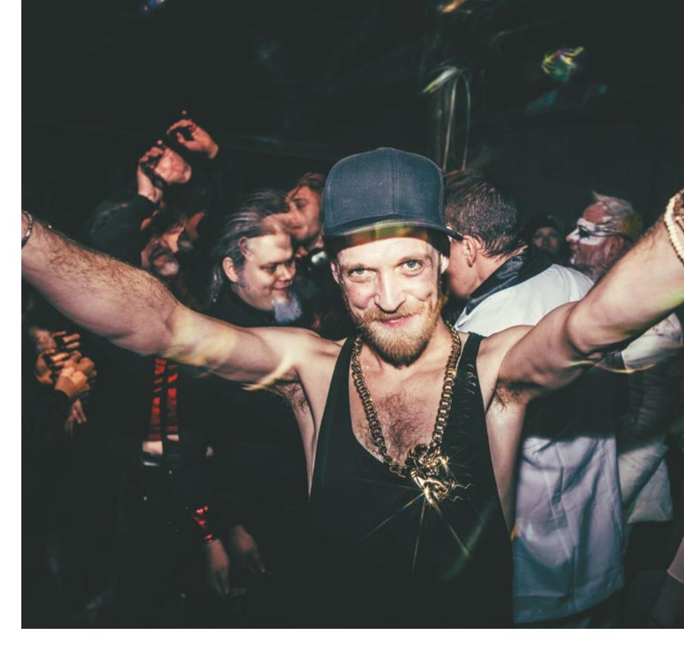

#### **Гарпия из Элизиума**

Порой самое эффективное оружие — это слово. Гарпия, Глашатай домена, знает всё и обо всех. За достойную цену Сородичи готовы делиться своими секретами. Изначально «гарпия» было обидным эпитетом, но многие из них гордятся своей ролью в сообществе вампиров, прекрасно понимая, что торговцев информацией ценят при любом дворе, по крайней мере до тех пор, пока кто-нибудь не решит, что болтливых Сородичей нужно истреблять.

**ХАРАКТЕРИСТИКИ:** сила 2, ловкость 3, выносливость 2; обаяние 3, манипуляция 4, самообладание 3; интеллект 2, смекалка 3, упорство 3.

**ПРОИЗВОДНЫЕ ХАРАКТЕРИСТИКИ:** здоровье 5, воля 6. **НАВЫКИ:** гуманитарные науки 2, наблюдательность 4, оккультизм 1, политика 4, расследование 3, финансы 2; атлетика 1, вождение 2, драка 1, ремесло 1; запугивание 3, исполнение 3, лидерство 1, проницательность 4, убеждение 4, уличное чутьё 3, хитрость 4, этикет 5.

**ДИСЦИПЛИНЫ:** Величие 3, Стойкость 1, Стремительность 2, Ясновидение 3.

**ЧЕЛОВЕЧНОСТЬ:** 6.

**СИЛА КРОВИ:** 3.

#### **Анарх-революционер**

Анархи обещают горы свернуть — разрушить систему до основания и построить на руинах прекрасный новый мир, который заживёт по невиданным доселе порядкам. На деле же большинство анархов заняты делами собственных вотчин и не вступают ни в какую борьбу, пока кто-нибудь не полезет на рожон сам. Настоящие революционеры плюют таким «анархам» в лицо, а затем врываются в Элизиум с коктейлем Молотова наготове. **ХАРАКТЕРИСТИКИ:** сила 4, ловкость 3, выносливость 3; обаяние 3, манипуляция 3, самообладание 2; интеллект 2, смекалка 4, упорство 4.

**ПРОИЗВОДНЫЕ ХАРАКТЕРИСТИКИ:** здоровье 6, воля 6. **НАВЫКИ:** гуманитарные науки 1, естественные науки 2, наблюдательность 3, оккультизм 1, политика 3, расследование 1, техника 3; атлетика 4, вождение 3, воровство 4, выживание 3, драка 4, скрытность 2, стрельба 3, фехтование 3; запугивание 2, лидерство 3, обращение с животными 2, проницательность 2, убеждение 1, уличное чутьё 4, хитрость 1, этикет 1.

**ДИСЦИПЛИНЫ:** Анимализм 2, Метаморфозы 1, Мощь 2, Стойкость 3, Стремительность 2.

**ЧЕЛОВЕЧНОСТЬ:** 7. **СИЛА КРОВИ:** 2.

#### **ТРаТа РеСУРСоВ У ПРоТиВниКоВ**

**Рассказчикам, которые не любят вести строгий учёт всего и вся, необходимость следить за уровнем Голода и волей множества противников может показаться утомительной. одним из решений этой проблемы может быть полный отказ от траты пунктов воли или усилений за счёт испытания Крови — в качестве компенсации противникам можно повысить некоторые параметры. Другой вариант — давать всем противникам вместе определённое количество ресурсов на сцену (например, «в этой сцене противники могут потратить не больше трёх пунктов воли и позволить себе не больше пяти испытаний Крови»). ещё можно назначить общий пул игральных костей и по мере необходимости брать из него дополнительные d10 для проверок, которые проходят противники.**

#### **Епископ-нодист**

Хотя Камарилья и не хочет этого признавать, но количество адептов Церкви Каина в её рядах резко возросло. Для одних нодисты — это надежда, очаги духовности и ориентиры на тернистом пути. Для других — не более чем ещё один способ притеснять слабое большинство в обществе Сородичей. «Им мало того, что они поработили нас физически, теперь они хотят поработить нас духовно». Нодисты проповедуют покорность, веру в заповеди Каина и заслуженное воздаяние.

**ХАРАКТЕРИСТИКИ:** сила 2, ловкость 2, выносливость 5; обаяние 5, манипуляция 3, самообладание 4; интеллект 5, смекалка 3, упорство 5.

**ПРОИЗВОДНЫЕ ХАРАКТЕРИСТИКИ:** здоровье 8, воля 9. **НАВЫКИ:** гуманитарные науки 4, естественные науки 1, медицина 2, наблюдательность 2, оккультизм 5, политика 4, расследование 1, финансы 1; воровство 1, скрытность 2, фехтование 2; запугивание 3, исполнение 2, лидерство 4, обращение с животными 1, проницательность 3, убеждение 5, хитрость 4, этикет 4.

**ДИСЦИПЛИНЫ:** Величие 4, Доминирование 2, Стойкость 3, Ясновидение 2.

**ЧЕЛОВЕЧНОСТЬ:** 5. **СИЛА КРОВИ:** 3.

### **Кровожадный Шериф**

В каждом городе ходят байки о кровожадных Шерифах, уничтожающих Сородичей за малейший проступок, объявляющих кровавую охоту за косой взгляд в сторону Принца и возглавляющих рейды против Шабаша на окраинах домена. Шериф — грозный военачальник, однако, возможно, кровь Сородичей пришлась ему слишком по душе.

**ХАРАКТЕРИСТИКИ:** сила 4, ловкость 5, выносливость 4; обаяние 2, манипуляция 1, самообладание 3; интеллект 3, смекалка 4, упорство 4.

**ПРОИЗВОДНЫЕ ХАРАКТЕРИСТИКИ:** здоровье 7, воля 7. **НАВЫКИ:** гуманитарные науки 1, наблюдательность 3, политика 2, расследование 4, техника 2, финансы 1; атлетика 4, вождение 2, воровство 3, выживание 3, драка 3, скрытность 4, стрельба 4, фехтование 3; запугивание 5, лидерство 1, обращение с животными 2, проницательность 1, убеждение 1, уличное чутьё 3, этикет 1.

**ДИСЦИПЛИНЫ:** Анимализм 2, Мощь 4, Сокрытие 3, Стремительность 3. **ЧЕЛОВЕЧНОСТЬ:** 5. **СИЛА КРОВИ:** 4.

#### **Отродье**

Это вампир, которого полностью поглотил Зверь. Человеческая личность уступила место первобытной агрессии и хитрости, когда сущность Зверя прорвалась наружу. Обычно отродья долго не живут, поскольку Зверь каждую ночь толкает их на чудовищные поступки. Те, кому всё же удаётся протянуть больше пары месяцев, находят способ прятаться от всех и охотиться скрытно, причиняя при этом жертвам невообразимые страдания.

**ХАРАКТЕРИСТИКИ:** сила 3, ловкость 5, выносливость 5; обаяние 1, манипуляция 1, самообладание 1; интеллект 1, смекалка 4, упорство 2.

**ПРОИЗВОДНЫЕ ХАРАКТЕРИСТИКИ:** здоровье 8, воля 3. **НАВЫКИ:** наблюдательность 5, расследование 4; атлетика 4, воровство 2, выживание 5, драка 4, скрытность 4, стрельба 1, фехтование 3; запугивание 4, обращение с животными 4, хитрость 2.

**ДИСЦИПЛИНЫ:** Анимализм 3, Стойкость 3, Стремительность 4, Мощь 4.

**ЧЕЛОВЕЧНОСТЬ:** 0. **СИЛА КРОВИ:** 3.

## Порождения кошмаров

Вампиры — не единственные чудовища, рыщущие во тьме. Ночь полнится возможными союзниками и непримиримыми врагами Сородичей — от волколаков, презирающих нежить, до смертных, способных в равной степени и к созиданию, и к разрушению при помощи магии.

**ВАЖНО!** Существа, не являющиеся вампирами или гулями, не могут владеть Дисциплинами, однако у них есть собственные сверхъестественные силы. Для тех, кто пользуется только этой книгой правил, в описании каждого противника приведены Дисциплины, аналогичные этим способностям. Голода эти существа также не чувствуют, поэтому, провалив «испытание Крови», они получают 1 лёгкое повреждение или 1 пункт лёгкого стресса.

#### **Оборотень**

Старейшины кланов Гангрел и Равнос окрестили оборотней «Великим врагом». Люпены не остановятся ни перед чем, чтобы уничтожить вампира, где бы ни пересеклись их пути. Некоторые даже выслеживают Сородичей специально, так что любому каиниту стоит удостовериться, что его убежище защищено от атаки оборотней. Эти существа лучше всего чувствуют себя в дикой природе. Вампиры правят в городах, оборотни же — цари лесов и полей.

**ХАРАКТЕРИСТИКИ:** сила 3, ловкость 3, выносливость 4; обаяние 3, манипуляция 3, самообладание 2; интеллект 3, смекалка 4, упорство 4.

**ПРОИЗВОДНЫЕ ХАРАКТЕРИСТИКИ:** здоровье 7, воля 6. **НАВЫКИ:** гуманитарные науки 2, естественные науки 2, медицина 1, наблюдательность 4, оккультизм 3, политика 1, расследование 1; атлетика 4, вождение 1, воров-

#### **КРОВЬ ОБОРОТНЯ**

**Кровь Люпенов — очень сильная витэ и изысканный деликатес для Сородичей. Она настолько густа, что утоляет Голод в два раза лучше человеческой небольшой глоток, к примеру, избавит от 2 пунктов Голода. Если два вампира вместе осушат оборотня, они оба полностью насытятся (Голод 0). Впрочем, сверхъестественная сила, таящаяся в крови оборотней, может быть очень опасной.**

**Пока витэ оборотня циркулирует в теле вампира, тот становится более подозрительным, раздражительным и восприимчивым к приступам ярости каждый выпитый вампиром пункт крови оборотня повышает сложность проверок сопротивления ярости на 1. Даже если вампиру удастся утихомирить Зверя, он будет мнительным и раздражительным, пока не закончится воздействие поглощённой крови. Если оборотень был особенно диким и необузданным, вампир может также оказаться во власти временной одержимости.**

**У крови люпенов, как правило, сильный животный и холерический резонанс. Алхимики высоко её ценят за прекрасную совместимость с другими ингредиентами — она добавляет два успеха к проверке трансмутации по любому рецепту, в состав которой входит.**

ство 2, выживание 5, драка 5, скрытность 4, стрельба 1, фехтование 4; запугивание 5, лидерство 1, обращение с животными 5, проницательность 2, уличное чутьё 3, этикет 1.

АИСЦИПЛИНЫ: Анимализм 5. Мошь 5. Сокрытие 1. Стойкость 5, Стремительность 4, Ясновидение 2.

ОСОБЕННОСТИ: оборотни получают тяжёлые повреждения только от серебряного оружия и огня. Они исцеляются от 1 лёгкого повреждения в ход. Когтями или зубами они наносят вампирам лёгкий урон, который не делится пополам (модификатор урона +3), кроме того, обращаясь в боевую форму полуволка, они увеличивают показатели всех своих физических характеристик на 3.

#### Mar

Смертные волетворцы обладают способностью вершить ритуалы и произносить сложные заклинания. Кроме того, живут они куда дольше их непробуждённых собратьев. Однако Парадокс встаёт на их пути каждый раз, когда они прибегают к вульгарной магии, то есть совершают нечто необъяснимое, - одни говорят, что это наказание свыше, другие - что сама природа вещей восстаёт против магии. Некоторые представители магических Традиций восхищаются вампирами, и в особенности свойствами их витэ.

ХАРАКТЕРИСТИКИ: сила 2, ловкость 3, выносливость 2; обаяние 3, манипуляция 4, самообладание 5; интеллект 5, смекалка 4, упорство 5.

ПРОИЗВОДНЫЕ ХАРАКТЕРИСТИКИ: здоровье 5, воля 10. НАВЫКИ: гуманитарные науки 5, естественные науки 2, медицина 2, наблюдательность 3, оккультизм 5, политика 1, расследование 2, техника 1, финансы 1; атлетика 1, вождение 1, ремесло 3, стрельба 1, фехтование 1; запугивание 4, исполнение 3, лидерство 4, проницательность 4, убеждение 4, уличное чутьё 1, хитрость 3, этикет 3

АИСЦИПЛИНЫ: Величие 2, Доминирование 4, Кровавое чародейство 5, Сокрытие 3, Ясновидение 4.

особенности: физически маги так же беззащитны, как и обычные смертные, однако они могут возвести вокруг себя магический барьер, потратив на это один пункт воли.

#### Фея

Голова идёт кругом при попытках разобраться, кто есть кто среди волшебного народца. Причём каждый из них вдобавок притворяется кем-то ещё. Этот конкретный сид прибыл в город по своим неведомым делам и не потерпит вмешательства каких-то кровохлёбов.

ХАРАКТЕРИСТИКИ: сила 2, ловкость 4, выносливость 3; обаяние 7, манипуляция 5, самообладание 3; интеллект 3, смекалка 4, упорство 4.

ПРОИЗВОДНЫЕ ХАРАКТЕРИСТИКИ: здоровье 6, воля 7. НАВЫКИ: наблюдательность 2. оккультизм 4: атлетика 2, фехтование 4; проницательность 3, запугивание 3, исполнение 4, лидерство 4, хитрость 2, этикет 4.

АИСЦИПЛИНЫ: Величие 5, Доминирование 4, Сокрытие 4, Стремительность 1.

ОСОБЕННОСТИ: феи получают тяжёлые повреждения только от огня или хладного железа. Они могут создавать настолько искусные иллюзии, что даже Ясновидение порой не помогает их распознать (вампир должен победить в состязании смекалки или упорства + Ясновидения против манипуляции + смекалки феи).

#### Голодный призрак

Голодных призраков иногда также называют злобными духами. Этими мёртвыми душами владеет поистине всепоглощающая ярость, которую они обрушивают на окружающий мир. Они могут вселяться в смертных, превращая их в орудия своего гнева. Каждый голодный призрак потерял кого-то близкого, и эта потеря зачастую и связывает их с миром живых. Им нечего терять, поэтому они без колебаний вымещают свою злобу на всём живом.

ХАРАКТЕРИСТИКИ: сила 4, ловкость 4, выносливость 4; обаяние 1, манипуляция 3, самообладание 2; интеллект 3, смекалка 3, упорство 2.

ПРОИЗВОДНЫЕ ХАРАКТЕРИСТИКИ: здоровье 7, воля 4. НАВЫКИ: гуманитарные науки 1, медицина 1, наблюдательность 5, оккультизм 4, расследование 1; атлетика 3, вождение 4, выживание 2, воровство 2, драка 3, скрытность 5; запугивание 3, проницательность 2, убеждение 1, хитрость 2.

АИСЦИПЛИНЫ: Доминирование 2, Сокрытие 2, Стремительность 2, Ясновидение 4.

ОСОБЕННОСТИ: невозможно причинить вред голодному призраку, пока он не примет материальную форму. Только тёмная магия или экзорцизм, проведённый священником или инквизитором, могут изгнать, уничтожить или поработить этого злобного духа. Голодный призрак овладевает человеком, используя силу, аналогичную Вселению (амальгама: Ясновидение 5 + Доминирование 3). Он проходит проверки манипуляции + вождения, чтобы управлять телом человека, если нужно заставить его совершить нечто, чего смертный предпочёл бы не делать. Голодные призраки проходят проверки ловкости + драки, чтобы швырять предметы силой телекинеза.

## Предметы

Некоторые из перечисленных предметов можно найти в любом крупном магазине стройматериалов, другие же настолько редки, что десятки людей уже сложили головы, пытаясь их раздобыть. Любая из этих вещей может появиться в вашей хронике.

## Снаряжение

Когда скучающие бессмертные сталкиваются с секретными правительственными учреждениями, на свет появляются чудеса технической мысли.

#### **Спальный мешок с защитой от солнца**

Самый простой спальный мешок, но сделанный из толстой ткани, защищающей от солнечного света. Он закрывает всё тело и застёгивается изнутри. Только самые отчаянные Сородичи позволяют себе спать в подобном мешке под открытым небом, и в некоторых кругах это считается своего рода проверкой на смелость. Ими часто пользуются гангрелы-путешественники, которым ещё предстоит научиться спать в земле.

#### **Хаоскопы**

Официальное название этого прибора — осциллоскопический электромагнитный дифференциальный агрегат для анализа коронального свечения. Он регистрирует колебания электромагнитного поля, включая те, которые вызваны (или являются) призраками и демонами. Витэ имеет аналогичный эффект, хоть и более слабо выраженный. АНБ начало перенастраивать хаоскопы на обнаружение «параформ» в 1990-х, и некоторые из агентов, работавших над этим, присоединились ко Второй инквизиции, как только поняли, с кем имеют дело. Сородичи разного возраста вызывают колебания разной частоты, так что обнаружение вампиров и гулей среди обычных людей требует терпения и аккуратности.

До сих пор существовали только большие стационарные хаоскопы и их мобильные версии в специально оборудованных фургонах. Радиус их действия строго засекречен под грифом «только для рассказчика».

Оператор должен успешно пройти проверку интеллекта + наблюдательности со сложностью 6, чтобы точно определить, является ли цель вампиром. Если он раньше уже обнаруживал вампиров того же поколения или клана, сложность можно понизить на 1. Искра жизни никак не влияет на обнаружение при помощи хаоскопа.

#### **ПРИМЕР**

*Агент Васкез уже обнаруживала раньше гангрелов 10‑го поколения, так что сложность при поиске гангрелов или вампиров 10‑го поколения будет равна 5, а при по‑ иске других гангрелов 10‑го поколения — 4.*

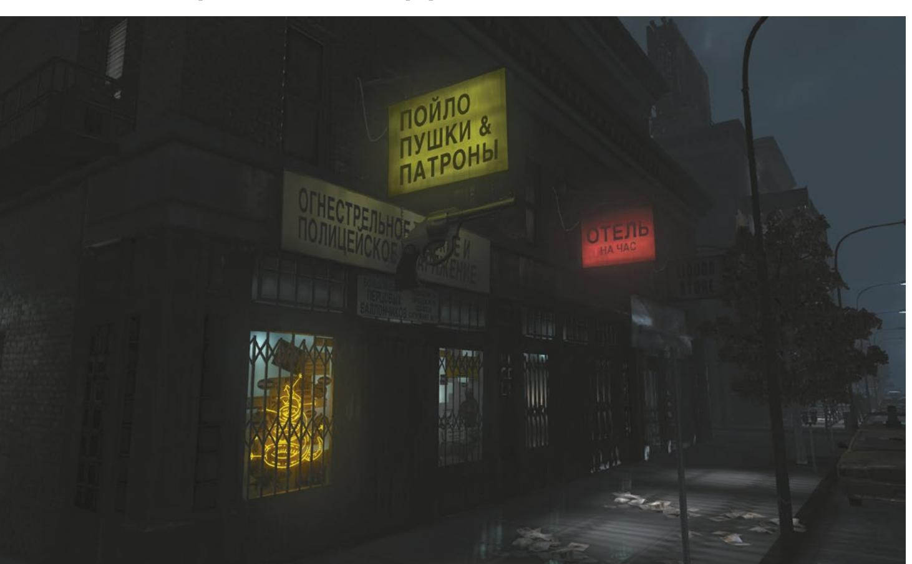

#### **Многофункциональный сканер**

В основе этих сканеров лежат элементарные технологии — они на расстоянии определяют, жива цель или мертва, засекая пульс, наличие дыхания и температуру тела. Простейшие многофункциональные сканеры установлены в каждом аэропорту. Они посылают сигнал тревоги ответственному агенту, если через них проходит пустотелый. Переносные многофункциональные сканеры напоминают большую видеокамеру, поэтому их часто именно так и маскируют. Впрочем, Сородичи могут обмануть их, используя Искру жизни.

Сканеры нового поколения используют сложное программное обеспечение, чтобы отличать естественный кровоток от имитации жизни. Они мало где введены в эксплуатацию, но в крупнейших аэропортах мира (например, в Хитроу, вашингтонском аэропорту Рейгана, римском аэропорту да Винчи и т. п.) их уже установили. Пока что обнаружение слабокровных вампиров невозможно при помощи сканеров, но ЦРУ и инквизиция активно над этим работают.

Если полнокровный вампир попадает в область действия сканера нового поколения, чтобы остаться незамеченным, ему требуется не только применение Искры жизни, но и успешная проверка выносливости + самообладания со сложностью 5 + упорство оператора.

## Обычное оружие

И Сородичи, и охотники на вампиров используют оружие со специальным обвесом, зачастую преследуя одни и те же цели.

#### **Замаскированное оружие**

Среди вентру клинок, замаскированный под трость, пользуется популярностью уже не первое столетие, но встречаются и авторучки 22 калибра, и даже изощрённые приспособления вроде спиннера из бритв в виде карманных часов. Популярность скрытого оружия в доменах Камарильи растёт, по мере того как Вторая инквизиция сжимает хватку, а обыски полиции, таможни или сил национальной безопасности становятся рутиной.

Чтобы замаскировать оружие, нужно успешно пройти проверку интеллекта + ремесла с соответствующей специализацией; чтобы заметить скрытое оружие — успешно пройти проверку смекалки + наблюдательности (сложность 1 + либо скрытность владельца, либо ремесло мастера, изготовившего предмет, смотря что больше). У замаскированного оружия обычно плохой баланс и неудобная форма, поэтому пул проверки

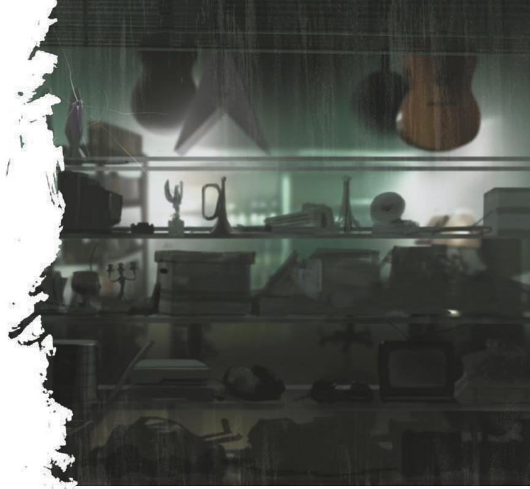

атаки персонажа, его использующего, уменьшается на 1d10, если только мастер не получил триумф при изготовлении.

#### **Зажигательное оружие**

Зажигательное оружие крайне эффективно против вампиров. Впрочем, оно кого угодно может привести в ужас. Среди Сородичей такое оружие под строгим запретом помимо того, что огонь для них смертелен, он также часто приводит к массовым жертвам, вызывает приступ бессильной ярости, а при изготовлении зажигательного оружия нередки несчастные случаи. А вот среди охотников, да и в далёкой Войне Геенны, все средства хороши…

Если у охотника есть зажигательное оружие, вампир может заказывать урну для праха. И это одна из причин, почему Сородичи жмутся к людям в надежде, что охотники побоятся устроить ад с массовыми жертвами.

Самодельное и приобретённое на чёрном рынке зажигательное оружие зачастую заправлено некачественными химикатами и горючими жидкостями вроде бензина, чистящего средства или пожароопасного удобрения. Оно наносит на 1 повреждение меньше и может в случае жестокого провала полыхнуть прямо в лицо владельцу (3 тяжёлых повреждения). Обычные трассирующие патроны не содержат достаточно зажигательного вещества, чтобы наносить существенный тяжёлый урон.

ПАТРОН «ДЫХАНИЕ ДРАКОНА». Эти патроны, содержащие гранулированный порошок циркония и магния, превращают любой помповый дробовик в огнемёт. Они легальны во многих штатах США, но запрещены в Европе. Везде, где вампиры по неосторожности обнаруживают себя, эти патроны тут же появляются на чёрном рынке.

У «Дыхания дракона» нет модификатора урона (+0), но эти патроны наносят вампирам тяжёлые повреждения, а также иногда поджигают цель (по 1 тяжёлому повреждению в ход, пока огонь не будет потушен). Если при использовании патронов заводского изготовления у стрелка выйдет жестокий провал — дробовик заклинит. Эффективная дальность выстрела у них не больше 15 метров.

ПАТРОН «РАУФОСС». Зажигательно-разрывные патроны, такие как «Рауфосс», к счастью, используются в основном в армии и за пределами военных арсеналов встречаются относительно редко. Однако иногда охотникам всё же удаётся раздобыть подобные боеприпасы. Они стреляют на приличную дистанцию и прекрасно пробивают броню. Кроме того, их средний калибр (12,7 мм) позволяет изрешетить не только живое (или не очень) существо, но и бронированный гражданский транспорт.

«Рауфосс» игнорируют любую нательную броню, модификатор урона равен +5 (тяжёлые повреждения).

РУЧНОЙ ЗАЖИГАТЕЛЬНО‑ДЫМОВОЙ ПАТРОН «ХАФЛА». Хотя настоящие handflammenpatrone давно вышли из употребления, умелому мастеру не составит труда своими руками сделать это однозарядное оружие. Оно представляет собой трубку размером с большой тактический фонарь, которая выстреливает примерно на 80 метров снарядом, взры-

вающимся целым облаком интенсивно горящего вещества.

Сложность проверки попадания у «Хафлы» не менее 3. Цель моментально получает 3 тяжёлых повреждения, а затем по 3 тяжёлых повреждения каждый ход. Остановить горение поможет только полное погружение в воду (с последующим удалением горючего вещества), засыпание песком или использование иных средств тушения пожаров.

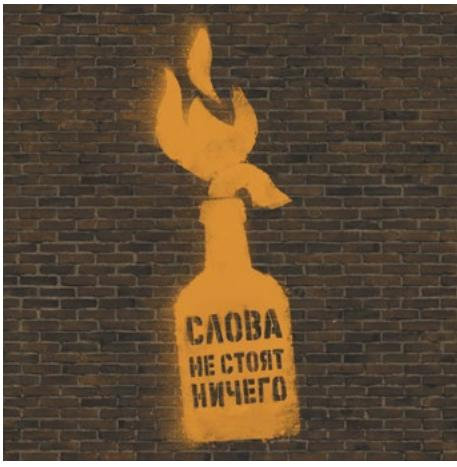

ОГНЕМЁТ. Огнемёты времён Второй мировой войны, войны в Корее или Вьетнаме редки, громоздки и не признают слова «потенциальный» во фразе «потенциальный сопутствующий урон». Радиус поражения у них небольшой, но они способны превратить в ад любое поле боя. Мало кто из охотников пользуется огнемётами, поскольку риск слишком велик. Огнемёты наносят повреждения без модификаторов в момент попадания, а затем столько же каждый ход. Кроме того, всё вокруг оказывается покрыто горючими веществами и вспыхивает. Остановить горение поможет только полное погружение в воду (с последующим удалением горючего вещества), засыпание песком

или использование иных средств тушения пожаров.

КОКТЕЙЛЬ МОЛОТОВА. Хороший коктейль Молотова делают не из бензина и тряпки, а из напалма и бенгальского огня. Сложность применения заключается в том, что бутылка может не разбиться при попадании в цель, так что опытные метатели бросают их в землю около ног в надежде забрызгать жертву горючей жидкостью.

Сложность проверки попадания в цель коктейлем Молотова равна 4. Он наносит 2 тяжёлых повреждения в ход. Остановить горение можно только успешной проверкой самообладания + выживания (сложность 3), чаще всего избавившись от горящей одежды.

#### **Пневматическая сеть**

Довольно простое приспособление, которое часто используется при охоте на диких зверей или подавлении восстаний. Им пользуются как инквизиторы, так и сами вампиры, желающие

замедлить добычу. Сеть сделана так, чтобы жертва запутывалась в ней, но она также пропитана клейким веществом, а в тех устройствах, которые использует инквизиция, это вещество бывает к тому же горючим.

При успешной атаке сетью цель не получает урона — вместо этого половина выигрыша (как при нанесении лёгких повреждений) вычитается из показателя ловкости цели. Если ловкость при этом снизится до нуля, цель оказывается опутана полностью и не может атаковать. Чтобы высвободиться из сети, нужно предпринять действие и победить в состязании силы + атлетики против суммарного пула, состоящего из успехов всех предшествующих атак пневматической сетью.

#### **Коломёт**

Современные штурмовые отряды стреляют кольями (сделанными, как правило, на основе обычных пластиковых пуль), используя для этого подствольные гранатомёты. Стрелять при этом приходится почти вплотную. Урон наносится такой же, как при вбивании кола вручную (+0).

## Мистические артефакты

Несколько вещей, описанных ниже, — лишь малая толика всех артефактов, фетишей и колдовских оберегов, которые можно встретить у вампиров и охотников. Многие старейшины были смертными ещё в те времена, когда эффективность подобных вещей не вызывала ни у кого сомнений, и с тех пор у них не было особых причин менять своё мнение.

Поскольку все нижеперечисленные предметы носят сомнительный мистический характер, рассказчик сам может решить, по каким правилам они будут функционировать в его игре и действительно ли они обладают какой-то силой.

#### **Енохианские камни**

По легенде, если некто возложит на то место, где покоится вампир, три камня с начертанными на нём именами каинитов Второго поколения, душа вампира переместится в тело того, кто возложил камни. Камни эти самые обыкновенные, и неважно, из какого они материала, — значение имеет лишь надпись, которую следует выгравировать на древнем енохианском языке. Что случится с душой того, чьё тело занял вампир, неизвестно.

#### **Законсервированная кровь**

Существует ритуал Кровавого чародейства, который позволяет сохранить витэ для более позднего употребления. Ритуал этот ревностно охраняют от чужих глаз. Чаще всего витэ смешивают с другой жидкостью, создавая нечто вроде кровавого вина. Эта субстанция стоит дорого и плохо утоляет Голод, зато приятна на вкус и позволяет пить на публике, за что многие Сородичи готовы дорого заплатить.

#### **Могильная земля**

Хорошо это или плохо, но большинство вампиров получают Становление после страстного Поцелуя. Их сир выпивает всю их кровь и поит их осушенные тела своей витэ. В редких случаях, как правило во Франции и на Балканах, вампиры выкапывают из могил свежезахороненные трупы и поят их Кровью. Чаще всего труп остаётся трупом, и каинит двигается дальше, оставив за спиной разорённую могилу. Но иногда новый вампир восстаёт к жизни. Наёмников Клана смерти, впрочем, интересует не птенец, выбравшийся из земли, а свойства самой земли, которые она обретает в момент его возрождения. Могильная земля обладает сакральным значением для Сородичей. Если каинит ложится спать с парой горстей такой земли (независимо от того, с собственной могилы или с чужой), то на следующий вечер он очнётся, ничуть не проголодавшись за день. Земля теряет свои свойства где-то через неделю.

#### **Старые деньги**

В Восточной Европе и Азии существует обычай сжигать старые деньги, вышедшие из обращения, чтобы облегчить умершим переход в мир иной. Оказывается, если старые деньги (в виде монет или банкнот) благословит человек, наделённый Истинной Верой, они будут жечь прикоснувшуюся к ним нежить, нанося тяжёлые повреждения. Впрочем, это странное оружие можно обернуть и против живых — если их проклянёт демон или колдун, они будут наносить тяжёлые повреждения людям, а не Сородичам или призракам.

#### **Урна с прахом предков**

У Вентру есть легенда: если смешать в одной урне прах трёх прямых предков, то вампир, владеющий этой урной, обретёт небывалую силу. Считается, что Сородич не должен сам хранить урну — эту обязанность нужно доверить гулю. Если владелец урны впадёт в торпор, живое существо, которому доверили хранение, должно коснуться урны, и тогда вампир восстанет вновь независимо от состояния, в котором находилось его тело. Благодаря этому чудесному предмету, по слухам, деревянный кол может сам собой выскочить из сердца, превратившийся практически в скелет Сородич — вернуться к жизни, а каинит, погребённый под слоем соли, найти в себе силы прорыть путь к свободе. ⬛

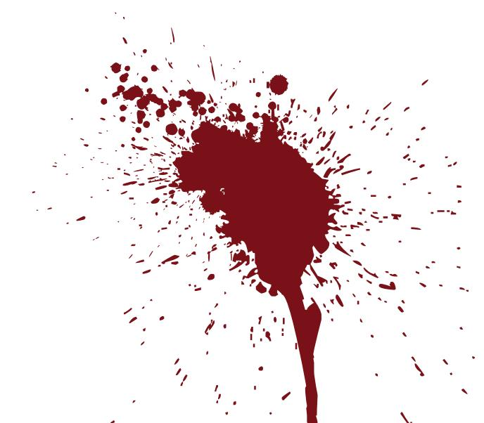

## БАХАРИ

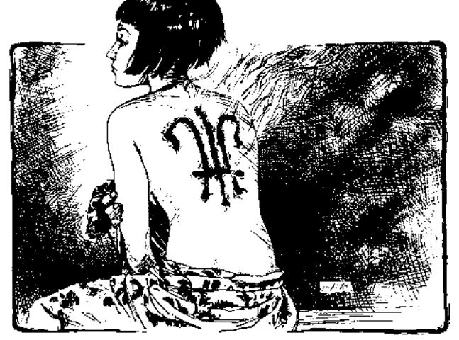

Л илим, лилиту или бахари — это те, кто придерживается Пути Лилит, почитая прародительницу вампиров как воплощение извечного женского начала. Они верят, что первым вампиром была Лилит и что она является источником всей витэ, вскармливая ей своих многочисленных детей — Сородичей. Закосневшее же патриархальное общество вампиров прозябает во лжи, почитая Каина своим первопредком.

Бахари ищут просветление через боль и борьбу, обращая свои мазохистские наклонности в силу духа, способность преодолевать любые преграды и терпеть любые страдания. Подобно Лилит, восставшей против воли Божьей и боровшейся со своим проклятием, её последователи преодолевают свои слабости и пороки, дабы переродиться. Некоторые бахари наставляют других Сородичей, другие — становятся идеальными хищниками. Они отвергают сострадание и превозносят плотские удовольствия, непостоянство в любви, а также взыскательное покровительство более слабым Сородичам.

Если ты — один из бахари, то для других Сородичей ты мучитель, ученик, наставник или любовник. Всё вокруг тебя указывает на то, что Лилит по праву первый вампир, а Каин — лишь узурпатор. Впрочем, возможно, ты лишь притворяешься, втайне придерживаясь учения Церкви Каина и пытаясь разрушить Бахари изнутри.

● **УСТРАШАЮЩАЯ РЕПУТАЦИЯ.** Бахари пугают других Сородичей. Приверженцы Церкви Каина чувствуют себя неуютно в твоём присутствии. Один раз за историю ты можешь добавить 2d10 к пулу проверки запугивания, если цель — верующий каинит, который знает о твоих убеждениях.

●● **РИТУАЛЬНОЕ ШРАМИРОВАНИЕ.** Боль это путь к просветлению. Лилиту учат, что экстремальные ощущения, которые испытывает физическая оболочка, даруют безграничную проницательность. Один раз за игровую встречу персонаж может нанести себе 1 тяжёлое повреждение, чтобы избавиться от 1 пункта стресса (лёгкого или тяжёлого).

●●● **ВЕЛИКАЯ ЖЕРТВА.** Для бахари одинаково священным является как Становление новых чад, так и жертвоприношение. Они знают, что величайшая

**Детали истории**

жертва на свете — убийство собственного чада. Если персонаж подвергнет диаблери своё дитя, он получит дополнительно 3d10 к пулу проверки Человечности + силы Крови, чтобы впитать Дисциплины, которые знал его потомок (см. «Диаблери», стр. 234).

●●●● **КРОВЬ ИЗ ЛОНА.** Бахари считают секс и всё, что связано с продолжением рода, источником силы. Некоторые из них особенный акцент делают на крови или витэ, взятых из женского лона. Один раз за историю, выпив кровь из матки, персонаж до рассвета получает два пункта либо выносливости, либо упорства (увеличивая при этом здоровье или волю на два пункта).

●●●●● **ПЕРВАЯ СРЕДИ ПРОКЛЯТЫХ.** Почитатели Лилит считают, что она была первым живым существом, ко-

торое проклял Господь — до Адама, Евы и Каина. Бахари подвержены проклятию Лилит, и проклятие Каина в них ослабевает. Клановый изъян не меняется, но персонаж может бодрствовать час после рассвета и час перед закатом, кроме того, ему не нужно пробуждать Кровь, чтобы совершить половой акт. Однако персонаж выглядит опасным, как если бы у него был недостаток «повадки хищника» (●●). Сложность всех социальных проверок, связанных с попытками оклеветать его или изгнать из общества, уменьшается на 1. И наконец, любой вампир, который пытается воздействовать на персонажа силами Ясновидения, тут же заработает серьёзную мигрень — на одну сцену его упорство и воля уменьшаются на половину значения упорства бахари (с округлением вверх).

# ТЕО БЕЛЛ

Т ео Белла долгое время считали цепным псом Камарильи, поэтому его недавняя измена и присоединение к Движению анархов вызвали у Сородичей шок, который не прошёл до сих пор. Годами Тео Белл исполнял малейшие капризы вентру Хардештадта и Яна Питерзона, даже сражался недавно за ласомбра Маркуса Вителя, пускай и неохотно. Но именно Тео Белл сделал первый выстрел на Пражском конклаве, который впоследствии привёл к гибели обоих вентру — и Хардештадта, и Питерзона.

Общественное мнение сделало Тео Белла мессией среди анархов, к чему он вовсе не стремился. Он не хочет быть ничьим предводителем — ему просто надоело быть цепным псом, и он цапнул зарвавшихся патрициев за руку. Его примеру последовали сотни других бруха, уничтоживших Принцев в своих доменах и вместе с гангрелами воздвигнувших множество новых бастионов Движения.

Несмотря на дурную славу, Тео до сих пор является посредником между верхушкой Камарильи и анархами — по той простой причине, что не терпит никакого дерьма на переговорах. Он зарубает на корню любые козни Шабаша, способен успокоить анархов и пресекает попытки запугивания и вымогательства со стороны Камарильи. Тео Белл — идеальный посредник, который никогда не ошибается.

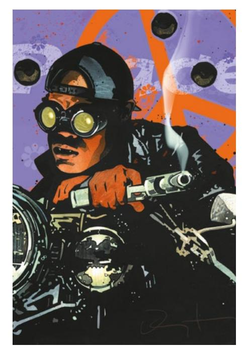

● **ЯЧЕЙКА ПОВСТАНЦЕВ.** Ты предводитель группы смертных бунтарей и знаешь, как поддерживать их боевой пыл. Возможно, они идут за тобой, потому что ты поишь их витэ, а может, всё дело в том, что ты воплощаешь их идеал. В любом случае эти повстанцы — эквивалент группы союзников (3 пункта) — самостоятельно могут выполнить одно опасное задание за историю.

●● **АНАРХ СТАРОЙ ЗАКАЛКИ.** Ты был анархом ещё до того, как Тео Белл привёл к вам целую армию бруха. И эти набирающие популярность выскочки, примазавшиеся к Движению, не вызывают у тебя ничего, кроме негодования. У тебя есть досье на всех новоявленных анархов — может, ты собрал его сам, а может, информа-

#### **Детали истории**

цию слил тебе сам Тео Белл. В любом случае ты получаешь два гарантированных успеха при любой проверке расследования, если дело касается вампиров, что недавно примкнули к анархам.

●●● **НА СВЯЗИ.** У тебя есть способ передать сообщение Тео: нычка, связной или мистическая связь. Ответит он или нет и вообще станет ли слушать, зависит от того, как до этого происходило ваше взаимодействие, но если Белл поймёт, что ты говоришь дело, то он может горы для тебя свернуть. В чём конкретно будет заключаться помощь Тео, решит рассказчик.

●●●● **БЛИЖАЙШИЕ СОРАТНИКИ ТЕО БЕЛЛА.** Тео тебе доверяет — благодаря твоим заслугам в деле революции или потому, что ты сумел к нему подмазаться хитростью. Тео Белл — эквивалент мавлы (5 пунктов), но у вашей дружбы есть и отрицательные стороны.

●●●●● **НЕЙТРАЛИТЕТ.** Ты последовал примеру Тео Белла и собрал небольшую группу единомышленников-бруха, которых можешь склонить в любую сторону — Камарильи, анархов или полного нейтралитета в Извечной борьбе. Ты можешь как презирать своих последователей, так и уважать их. Это не безмозглое стадо — они помнят обо всех оказанных тебе услугах. Впрочем, пока они против тебя не взбунтовались, ты можешь распределить пять пунктов между информаторами, убежищем (конспиративные квартиры), мавали и подручными.

# КАИНИТСКАЯ ЕРЕСЬ

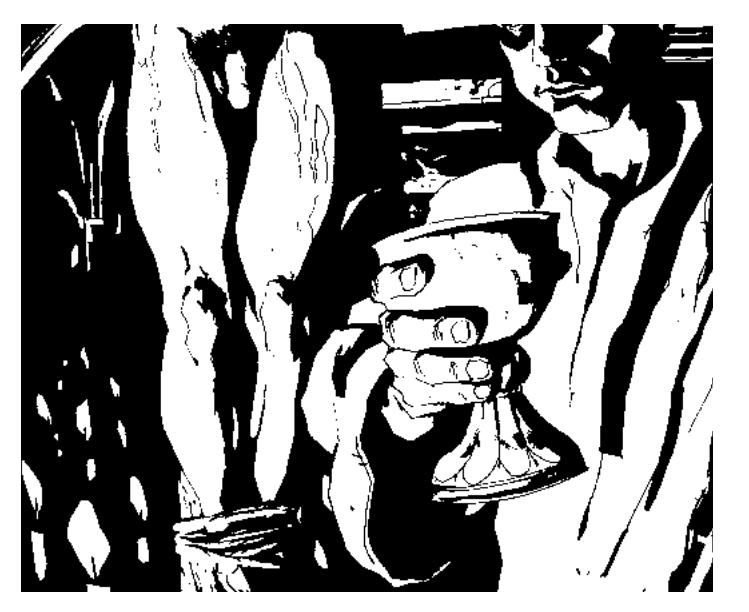

а заре христианства гностики и Сородичи обменялись знаниями и Кровью, и в результате на свет появилась - каинитская ересь: вера в то, что Каин был истинным мессией, Христос был Вторым Каином, а каиниты - его ангелы на Земле, противостоящие злому демиургу, то есть ветхозаветному Богу. В XV веке Инквизиция истребила это течение на корню, но со временем оно снова дало ростки.

Антиномизм Восстания анархов и милленаризм пророков Геенны за последнюю сотню лет укрепили ростки каинитской ереси. В кругах анархов это учение активно проповедуют как те, для кого это инструмент подрыва основ веры среди смертных, так и те, кто искренне убеждён в своей божественной миссии.

#### Детали истории

• кто имеет ум... Один раз за историю рассказчик просто так даст тебе одну подсказку относительно деяний и планов еретиков в настоящем или прошлом.

• АЛАНЬ ЕРЕТИКОВ. Ты играешь определённую роль в еретической общине города — распредели 3 пункта между союзниками, стадом, мавали и подручными. К примеру, если у тебя есть мавла (••) и стадо (•), значит, ты руководишь небольшой группой смертных последователей и тебя наставляет довольно известный в каинитских кругах деятель. У тебя также есть недостаток «страшная тайна (каинитская ересь)», вступающий в силу в некоторых доменах.

**ИИ ВОНЬ ИНКВИЗИЦИИ.** Ты буквально нюхом чуешь Истинную Веру в человеке. Если требуется проверка, ты можешь использовать пул упорства + самого высокого из показателей деталей каинитской ереси, который у тебя есть. В качестве альтернативы ты можешь противостоять каинитской ереси и использовать этот талант, чтобы находить тех, кому можно доверять.

•••• АЛЫЙ ПРЕДСТОЯТЕЛЬ. Ты знаешь, как провести ритуал и в каких количествах применять особые вещества, чтобы вызвать среди смертных последователей экстатическую религиозную версию вампирской ярости - «Торжество крови». В этом состоянии смертные проявляют все свои худшие качества. У тебя есть запас трав и грибов для проведения одного такого ритуала за историю. Церемония, также известная как «Алое торжество», требует испытания Крови, а также может вызвать приступ ярости у участников-Сородичей.

••••• извранный. Ты - краеугольный камень в планах еретиков. Возможно, они считают тебя воплощением самого Каина, или ты владеешь единственной копией «Свидетельства Св. Пантелеймона», или только твоя витэ подходит для жертвоприношения Иалдаваофу, чтобы умилостивить или отвлечь Демиурга. Каждый мало-мальски осведомлённый еретик знает о той роли, которую ты должен сыграть. Среди тех, кто просто хочет заслужить благодарность анархов, тоже немало осведомлённых. Один раз за историю ты можешь использовать своё положение, чтобы определить победителя в социальном конфликте, если найдёшь объяснение этой победе.

# КАРНА

К огда-то она была Принцем Марселя и Примогеном Милуоки, а теперь Карна — глава Дома Карны, группы тремеров-единомышленников, отколовшихся от основных сил клана. Они выступают за свободу от уз крови, против тирании Пирамиды и жёсткой мизогинии в рядах Тремер. Как раз тогда, когда глава Пирамиды в Вене собрался было прихлопнуть Карну и её последователей-вольнодумцев, Великую капеллу своим визитом почтила Вторая инквизиция.

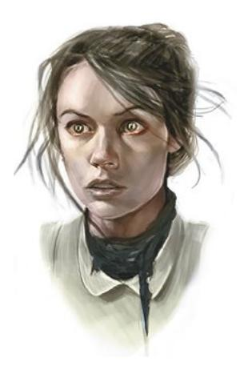

Теперь, когда тень Пирамиды больше не угрожает Дому Карны, у него появляется всё больше новых членов из числа анархов и лишившихся прав Сородичей Камарильи. Карна не ставит перед собой задачи привлекать новых последователей, но прекрасно понимает их пользу. Способность трезво оценить угрозу позволила ей пережить целых шесть веков — и теперь она считает, что появление самого Тремера, жаждущего стереть её в порошок, лишь вопрос времени. Но пока этого не случилось, она всеми силами пытается модернизировать клан Тремер и расширить роль, которую играют в нём женщины.

#### **Детали истории**

● **ЕДИНОМЫШЛЕННИКИ.** Ты целиком и полностью разделяешь взгляд Карны на будущее клана Тремер. Присутствие единомышленников добавляет тебе уверенности. Ты можешь добавить 1d10 к пулу всех проверок воли, когда рядом есть другие члены Дома Карны.

●● **ПО ЕЁ СЛЕДАМ.** Ты последовал за Карной после её первоначального разрыва с кланом, и теперь буквально пропитан духом бунтарства и стремлением к свободе. Ты поклялся себе, что никогда не станешь рабом уз крови. Каждый раз, когда ты рискуешь стать чьим-то вассалом, ты можешь пройти проверку воли (сложность равна силе выпитой крови) и при успехе разорвать связь.

●●● **НЕТРАДИЦИОННЫЕ РИТУАЛЫ.** Карна вкладывает душу в свою магию, рискуя рассудком. Она сторонится ортодоксальных герметических ритуалов, требующих дани Крови. Ты понял, как она это делает, и это позволяет тебе совершать ритуалы подобным же образом. Один раз за историю ты можешь провести один известный тебе ритуал без необходимости тратить свою витэ, но в случае кровавого триумфа тебя охватывает психоз, длящийся до конца истории (вероятнее всего, сильная паранойя или страх крови).

●●●● **ПЕРЕОСМЫСЛЕНИЕ УЗ.** Ты подробно изучил магические методы Карны и тот необычный способ установления связи, похожей на братские узы, который она практикует. Ты знаешь, как распространить влияние её ритуала на других Сородичей или смертных. Занявшись с кем-то сексом, ты создаёшь узы крови между собой,

партнёром и Карной (даже в её отсутствие). Укрепить эти узы можно повторным половым актом. Таким образом ты можешь обмануть клановый порок тремеров, но узы продержатся только до конца текущей истории.

●●●●● **КНИГА ГРОБОВОЙ ВОЙНЫ.** Ходят слухи, что разорвать узы крови со своим кланом Карне помогла *«Книга Гробовой войны»*. У тебя есть её копия, и ты получаешь один гарантированный успех при всех проверках оккультизма, связанных с Геенной, её предотвращением, а также с разрушением оков, связывающих вампиров с их старейшинами. Тебя невозможно связать узами крови, пока книга у тебя и ты следуешь её наставлениям. Однако клан Тремер хочет уничтожить и тебя, и книгу; кроме того, рассказчик может уменьшить на 1d10 пул любой твоей социальной или ментальной проверки из-за твоей постоянной паранойи.

# КРОВОТОК

И зучение крови и резонансов привело к появлению Сородичей, жаждущих знаний и желающих обрести власть или заработать состояние буквально на чужой крови. Международная сеть торговли людьми, известная как «Кровоток», позволяет тайно перевозить ценные сосуды из домена в домен и собирает данные о свойствах, которыми обладает их кровь.

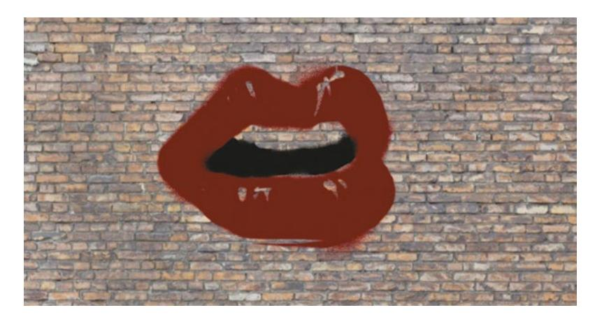

«Кровотоку» нет никакого дела до того, долго ли протянут сосуды, — их волнуют

разве что возможные убытки в случае, если товар не доедет до покупателя. Многие Сородичи готовы закрыть глаза на возможные жертвы среди смертных, когда выдаётся шанс как следует изучить возможности разных «сортов» крови.

Ты можешь быть одним из дилеров «Кровотока», его клиентом или даже бывшим смертным сосудом, который стал вампиром. Тебе может претить эксплуатационная деятельность этой организации или, напротив, казаться заманчивой перспектива стать её частью.

● **КЛИЕНТ.** Один раз за историю ты можешь заказать в «Кровотоке» сосуд с определёнными свойствами крови, чтобы усилить свои способности или подарить вентру, которому в его домене сложно найти пищу по вкусу.

●● **ЧЁРНАЯ КНИЖКА.** В твоём распоряжении каким-то образом оказалась одна из записных книжек «Кровотока», в которой содержатся записи экспериментов и предположения о свойствах, которые может иметь та или иная кровь. Насколько точны записи, определяет рассказчик. Как правило, наличие этой книжки позволяет добавить 1d10 к пулу проверки расследования, Алхимии, медицины и естественных наук, когда ты пытаешься разобраться в свойствах очередного букета. Кроме того, она уменьшает наполовину время, необходимое для создания нового рецепта Алхимии слабокровных 2-го и 3-го уровней.

#### **Детали истории**

●●● **ФЕРМА НЕПОДАЛЁКУ.** Ты знаешь, где находится ближайшая ферма «Кровотока» — место, где его сотрудники содержат сосуды и поддерживают их кровь в нужном состоянии. Ты можешь выкрасть сосуд, арендовать его за определённую плату или попытаться взять силой. Ферма является эквивалентом стада (●●●●), но ты можешь утолять здесь Голод не чаще одного раза в неделю, если не захватишь ферму.

●●●● **БЕЗОПАСНЫЙ ТРАНСПОРТ.** «Кровоток» использует бронированные фургоны и вооружённых гулей, чтобы перевозить сосуды. Это не просто какие-то автозаки — транспорт «Кровотока» битком набит оружием и, как правило, перевозит весьма ценные сосуды для влиятельных клиентов. У тебя есть доступ к одной из таких машин — ты либо настоящий водитель «Кровотока», либо угнал

фургон. В любом случае ты можешь организовать безопасное путешествие для одного или нескольких Сородичей без особых хлопот.

●●●●● **КРОВАВЫЙ СОМЕЛЬЕ.** Ты знаешь секреты «Кровотока» по части анализа и обработки крови, а также воспроизведения её свойств. Возможно, у тебя самого есть лаборатория, или ты пользуешься услугами алхимика или кровавого чародея, а может, просто стараешься держаться в курсе всех новых открытий. Ты можешь добавить 2d10 к пулу любой проверки по обнаружению резонанса, а также распределить три точки между информаторами, союзниками и убежищем, что должно отражать природу твоей осведомлённости. Один раз за историю ты можешь узнать у рассказчика, какими свойствами обладает кровь самого ценного из доступных сосудов.

# ТЕРНОВЫЙ СОБОР

Т ы подробно изучил историю *Тернового собора*, на котором вампиры разных кланов договорились о создании Камарильи. Возможно, ты потомок одного из важнейших его участников, который высказывался на том собрании, предлагая новые Традиции. А может быть, сам активно интересуешься этим историческим периодом, пытаясь лучше понять законы, управляющие обществом

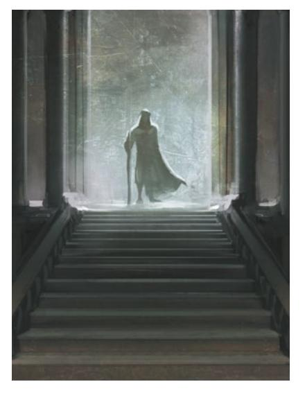

Сородичей, или найти в них высший смысл.

Ты наизусть помнишь имена присутствовавших, предлагавшиеся варианты Традиций и даже знаешь о некоторых тайных предложениях, сделанных кланами, которые решили не присоединяться к Камарилье. Вплоть до нынешних ночей знания о происходившем на соборе можно использовать как рычаг давления и на Камарилью, и на анархов.

#### **Детали истории**

● **ИСТОРИК ТЕРНОВОГО СОБОРА.** Собрание близ Терниев было сложным, чудовищно запутанным политическим событием. Сотни встреч происходили в узком кругу того или иного клана, в результате породив пакты, длившиеся годами, десятилетиями и даже веками. Ты — ходячая энциклопедия тех событий и можешь использовать свои знания, чтобы оказывать давление на участников собора и их потомков, если они перестали придерживаться своих договорённостей или разорвали пакт без согласия всех сторон. Один раз за историю ты можешь получить у рассказчика информацию по одному вопросу, касающемуся полезных публичных сведений о соборе.

●● **ЗНАТОК ТРАДИЦИЙ.** Шесть Традиций, которых придерживается Камарилья, впервые были сформулированы, а затем приняты на Терновом соборе. Тебе известно о некоторых апокрифических Традициях, которые были тогда предложены, причём часть из них имела значительную поддержку. Один раз за хронику ты можешь обратиться к одной из этих Традиций, если правящие кланы в домене всё

ещё с сочувствием относятся к непринятым Традициям.

Примеры псевдо-Традиций. Сородич в этом домене может иметь только одного потомка; нельзя питаться представителями сил правопорядка; драка в Элизиуме карается Окончательной смертью; разрешено диаблери над любым каитифом и т. д.

●●● **ТАЙНЫ СОБОРА.** Апостолы Сета отказались стать восьмым столпом Камарильи, несмотря на полученное предложение, а клан Ласомбра не сошёлся во мнениях с другими кланами, когда те отказались признать существование предтеч. Тебе известны и более сокровенные тайны: петиция о присоединении от Каппадокийцев, черновой вариант символики Малкавиан и т. д. Ты можешь приправить свою речь достаточным количеством намёков, чтобы добавить 1d10 к пулу любой социальной проверки при общении с участниками собора. Кроме того, тебе известно несколько больших секретов, и каждый из них стоит крупного долга для кого-то из могущественных каинитов. Один раз за историю ты можешь узнать у рассказчика имя Сородича,

готового оказать тебе огромную услугу в обмен на твои сведения.

●●●● **БУДУЩИЙ ЮСТИЦИАР.** Первые Юстициары Камарильи были назначены во время Тернового собора. Независимо от твоих политических убеждений многие готовы поддержать твою кандидатуру на должность следующего Юстициара клана (или кандидатуру твоего сира, если ты слишком молод). Если твой клан слабо представлен в Камарилье, возможно, это назначение станет предвестником грядущих перемен.

●●●●● **НОВЫЕ ТРАДИЦИИ.** Твои знания о Терновом соборе настолько обширны, что ты можешь отыскать достаточно материала и найти необходимую поддержку, чтобы предложить Внутреннему кругу Камарильи новую Традицию или поправку к существующей. Эту Традицию могут принять, если она логична, соответствует строгим нравам и может помочь Камарилье пережить кризис, — в противном случае тебя заклеймят как опасного вольнодумца. Впрочем, самое важное, что тебя выслушают.

# ПЕРВАЯ ИНКВИЗИЦИЯ

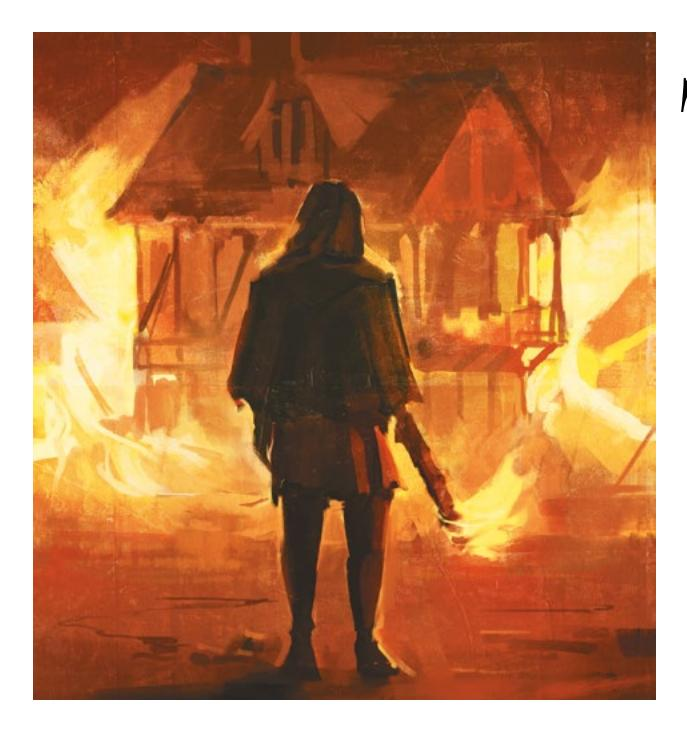

Т ы знаешь, отчего разгорелся пожар Инквизиции, бушевавшей со Средних веков до Ренессанса. Возможно, кто-то из твоих предков поведал тебе о тех страшных ночах или у тебя есть исторические хроники тех жутких событий. Может быть, ты лелеешь планы разжечь это пламя вновь, обрушив гнев церкви на головы врагов.

Твои знания об инквизиции столь обширны, что ты можешь до определённой степени манипулировать даже современной Второй инквизицией, хотя методы и убеждения её членов изменились. Ты знаешь, как избежать с ними встречи и как обратить их против твоих врагов. Второе, впрочем, весьма рискованно, в чём в своё время убедились твои предки.

**Детали истории**

● **ОШИБКИ ПРОШЛОГО.** Ты знаешь историю Сородичей и можешь без труда перечислить названия доменов и имена Принцев, уничтоженных во времена Первой инквизиции. Ты способен проконсультировать любого вампира относительно той опасности, которую исторически представляла эта организация. Один раз за историю ты можешь получить у рассказчика информацию по одному вопросу, касающемуся средневековой инквизиции.

●● **СПИСОК ВИНОВНЫХ.** Твои знания об отношениях между вампирами и инквизицией включают имена тех Сородичей, которые в своё время пытались манипулировать смертными фанатиками. Пусть большинство из них уже мертво, но живы их потомки, и их можно шантажировать. Один раз за историю ты можешь узнать у рассказчика имя одного из этих потомков, живущих в твоём домене (если таковые есть).

●●● **СЕКТА СВЯТОГО ИАКОВА.** У тебя есть знакомые среди тех, кто считает себя «истинной инквизицией». Sectus Sancti Iacomi («сектус санкти Иакоми») испытывает глубокое презрение к своим холёным современным коллегам и действует с куда большим фанатизмом и самоубийственным рвением, чем организованная и хладнокровная Вторая инквизиция. Их аббат — информатор (●●●●), к которому ты можешь обратиться один раз за историю.

●●●● **АКТ ВТОРОЙ.** У тебя есть информатор в рядах Второй инквизиции или местном католическом архиепископстве: клерк, охотник-разведчик, экзорцист, оружейник и т. п. Ты не можешь ему приказывать, но знаешь, как при необходимости узнать у него что-нибудь или дезинформировать его.

●●●●● **СЛЕПОЕ ПЯТНО.** Ты знаешь место в своём домене, куда Вторая инквизиция боится и шагу ступить. Один раз за историю, если ты или кто-то другой спрячется в этом месте, охотники прекратят погоню. Это не может не радовать, но сразу возникает вопрос: что такого в этом странном месте, что так просто может напугать опаснейшего на сегодняшнюю ночь врага Сородичей?

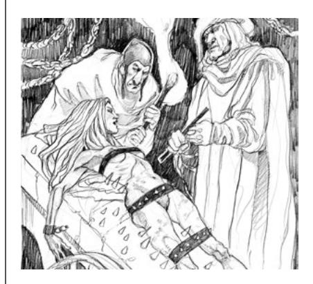

# ГОЛКОНДА

Б ольшая часть вампиров считает это состояние просветления мифом, но некоторые утверждают, что достигли легендарной *Голконды* или знают тех, кто её достиг. Говорят, Голконда — это идеальное равновесие между Человечностью и Зверем, в древние времена обретённое вампиром по имени Саулот. По легенде, тот, кто идёт путём Голконды, может усмирить Зверя, подавить Голод и даже ходить под солнцем. Просветление сулит множество благ, и немало вампиров вступали на этот путь. Лишь единицы прошли его до конца.

Никто не может с точностью сказать, что требуется для достижения Голконды. Последователи Саулота утверждают, что путь

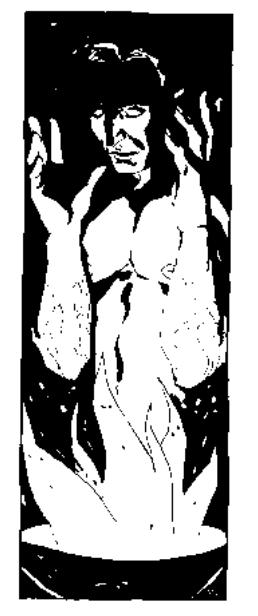

для каждого вампира свой, и зависит он от его грехов. Что случается с пережившим Голконду, также спорный вопрос. Одни говорят о состоянии безмятежности, другие — что каинит превращается в хладнокровного убийцу, у которого не бывает больше приступов ярости, но который не меньше прежнего жаждет крови.

Ты можешь быть послушником на пути Голконды, последователем Саулота или разоблачителем, пытающимся снять пелену с глаз других Сородичей. Неуловимый каинит по прозвищу Повелитель Воронов всеми силами пытается раздавить миф о Голконде раз и навсегда, и ты можешь быть одним из его подручных.

#### **Детали истории**

● **СЕМЕНА ГОЛКОНДЫ.** Ты многое слышал о Голконде, поэтому можешь говорить на эту тему и не выглядеть полным профаном. Один раз за историю ты можешь узнать у рассказчика, повлияет ли задуманное действие на твои шансы достичь Голконды.

●● **ИСТИННЫЙ ПУТЬ.** У тебя есть копия сочинения Повелителя Воронов под названием *«Истинный путь»* труда о предполагаемых реалиях Голконды. В ней утверждается, что Голконда — это метод превращения вампира в идеального хищника, а вовсе не путь искупления. Один раз за историю этот памфлет увеличит на 3d10 пул любой социальной проверки, связанной с природой Голконды.

●●● **УЧЕНИК САУЛОТА.** Ты придерживаешься идеалов Саулота — вампира, совершившего паломничество в Азию и вернувшегося оттуда просветлённым, с раскрывшимся третьим глазом. Ты веришь в его учение, гласящее, что Голконда — это единственный путь к преодолению проклятия вампиризма. Ты практикуешь двойную жизнь — ради спокойствия и безмятежности завтра тебе приходится выпускать Зверя на волю сегодня. Каждый раз, когда ты поддаёшься приступу ярости добровольно, сделай для себя пометку — в следующий раз, когда тебя настигнет приступ ярости, ты получишь гарантированную победу при проверке сопротивления.

●●●● **ПОДАВЛЕНИЕ ГОЛОДА.** Кровь тебе требуется реже, чем другим вампирам. Чтобы достичь Голконды, ты пытаешься подавить Голод, даже если это будет стоить тебе других способностей. Твоя стойкость вдохновляет других вампиров. Один раз за игровую встречу ты можешь уменьшить Голод на 1 пункт (хотя он не упадёт ниже 1 пункта), не насыщаясь при этом кровью.

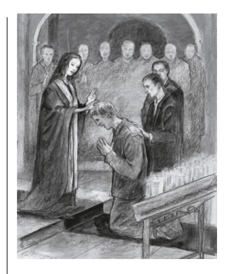

●●●●● **НАВСТРЕЧУ СОЛНЦУ.** Ты познал секреты Голконды. Возможно, душевное равновесие не будет длиться вечно, но пока ты не сходишь со своего пути, солнечный свет не причиняет тебе вреда. Однако если ты выходишь днём, то на следующий вечер проснёшься в голодной ярости. Ты можешь воспользоваться своим даром не чаще одного раза за историю.

# ПОТОМОК ХАРДЕШТАДТА

(только для вентру)

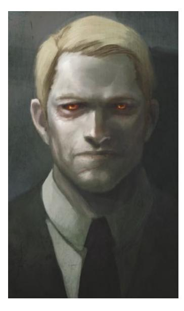

П о мнению большинства вентру, Хардештадт был самой важной фигурой в клане за последние 800 лет. В 2012 году на Пражском конклаве его убили мятежники, предводителем которых был Тео Белл. Хардештадт был одним из основателей Камарильи — стоял у её истоков наравне с шестью другими Сородичами. Вентру считают, что клан обязан выживанием и силой именно ему.

У Хардештадта было немного потомков, и, что странно для вентру, он никогда не пытался отследить свою родословную вплоть до мафусаилов Четвёртого поколения. Его интересовало только здесь и сейчас, а здесь и сейчас он сам был кланом Вентру. Ни предки, ни потомки ему были не нужны.

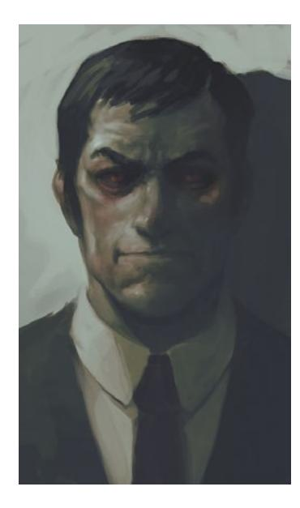

#### **Детали истории**

● **ГОЛОС ХАРДЕШТАДТА.** Хардештадт часто кричал на своих подчинённых, подкрепляя свои замечания ударами кулаком по столу, по стене или по лицу подвернувшегося под руку гуля. Твоя Кровь позволяет тебе перекричать любую толпу и привлечь к себе внимание независимо от того, где ты находишься в конференц-зале или на рейве. Есть что-то особенное в твоём голосе, что невозможно игнорировать. Впрочем, дослушают ли тебя до конца, зависит от того, что ты скажешь.

●● **ВЕЛИЧАЙШИЙ ЛИДЕР.** Самоуверенность Хардештадта сослужила ему дурную службу, приведя к гибели, впрочем, до его Окончательной смерти эта самая самоуверенность и возвышала его над всеми. Ты можешь убедить других пойти за тобой и в огонь, и в воду, или командовать ими из тыла, а ещё — послать кого-то на убой ради того, чтобы укрепить собственные позиции. Один раз за историю ты не получаешь никаких штрафов, если пытаешься убедить людей предпринять что-то опасное.

●●● **СТОЛП КЛАНА ВЕНТРУ.** Из-за твоего знаменитого предка другие вентру часто спрашивают у тебя совета. Независимо от статуса в других группах среди вентру твой статус всегда составляет не меньше 3 пунктов (●●●).

●●●● **СВЯЗЬ С ОСНОВАТЕЛЯМИ.** Хардештадт позаботился о том, чтобы все его потомки могли связаться с ним в случае опасности. Он отвечал редко, только в том случае, когда ситуация была критическая, и сурово наказывал за использование средств связи с ним в посторонних целях, но метод

коммуникации всё ещё действует, несмотря на его смерть. Один раз за хронику ты можешь позвонить, написать или организовать встречу с одним из основателей Камарильи, которые были в союзе с Хардештадтом. Захотят ли они ответить, зависит от важности вопроса, с которым ты обратился.

●●●●● **НАСЛЕДНИК ХАРДЕШТАДТА.** У тебя есть документ, подписанный самим Хардештадтом, где он назначает тебя своим наследником. Ты точно не уверен, что именно должен унаследовать. Только богатство и могущество? Положение в клане? Или место во Внутреннем круге Камарильи? Как утверждает документ, когда ты заявишь о своих правах, Камарилья станет плясать под твою дудку — а анархи навалятся всей толпой, чтобы снести тебе голову.

# ПОТОМОК ЕЛЕНЫ

(только для тореадоров)

О дни говорят, что она где-то на американском континенте, продолжает биться с заклятым врагом. Другие — что она руководит самым популярным вампирским ночным клубом в мире. Есть также и те, кто считает её любовницей основателя Клана розы, которая пытается пробудить предтечу.

Она красива и талантлива настолько, что, по слухам, никто не может оторвать от неё взгляда, если она сама того не пожелает. Смертные готовы были умереть, лишь бы увидеть её. Все её потомки проявляют недюжинный талант, служа примерами того, каким должен быть истинный тореадор. Мало кто в клане не согласен с тем, что Елена — лицо клана. Все тореадоры хотят познакомиться с тобой поближе, чтобы хоть на шаг приблизиться к ней.

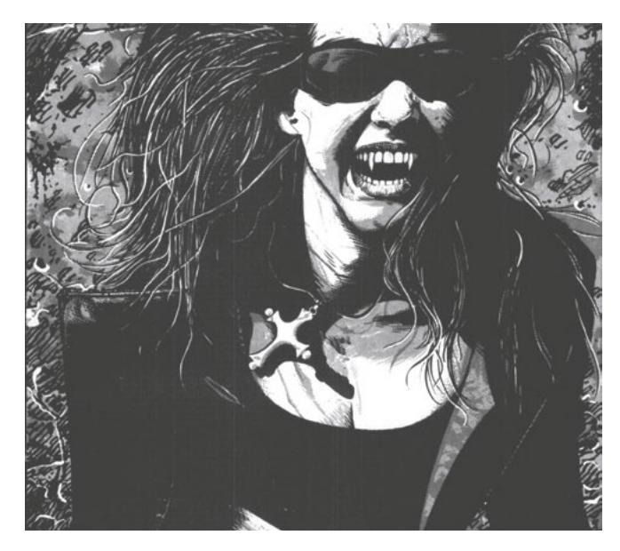

#### **Детали истории**

● **МИМОЛЁТНОЕ УПОМИНАНИЕ.** Независимо от твоего положения, если ты упомянешь Елену в разговоре с тореадором или другим Сородичем, который о ней знает, твой статус временно повысится на 1 пункт. Ты можешь сделать так только один раз за историю, если, конечно, не хочешь всем надоесть.

●● **ИСТИННЫЙ ТАЛАНТ.** В отличие от пустышек, у которых нет ничего, кроме смазливого личика и шикарного тела, ты обладаешь истинным талантом, за который и получил Становление. Выбери навык: ремесло, этикет или исполнение. Повышение рейтинга этого навыка стоит для тебя вдвое меньше пунктов опыта (с округлением вниз).

●●● **В УГОДУ СТЕРЕОТИПАМ.** Когда надо, ты можешь сыграть роль типичного тореадора: окружить себя целой толпой лизоблюдов и закатить роскошную вечеринку. Один раз за историю ты можешь устроить вечеринку, которая повысит твой статус или влияние среди приглашённых на 2 пункта эффект длится до конца вечеринки.

●●●● **БОЖЕСТВЕННАЯ НЕВИННОСТЬ.** В отличие от многих других потомков Елены ты обладаешь совершенством скорее ангельским, чем дьявольским. Ты можешь совершить любой грех — и всё равно будешь выглядеть невинным созданием. Добавь 2d10 к пулу любой проверки, целью которой является уход от ответственности за совершённые деяния.

●●●●● **ФРАНШИЗА КЛУБА «СУККУБ».** Елена откликнулась на Зов, в очередной раз оставив свой клуб в Чикаго на попечение менеджера. Тебе же она дала лицензию, чтобы ты открыл аналогичный клуб в своём домене. Это редкая честь, но это также означает, что любой вампир в городе теперь тобой интересуется, поскольку все, кто получил Становление за последние 200 лет, наслышаны о клубе «Суккуб». Пока клуб остаётся открытым, показатель шасса твоего домена увеличивается на два пункта. Кроме того, у тебя есть четыре пункта, которые можно распределить между богатством, славой и статусом среди Сородичей.

# ВЕТЕРАН ВОЙНЫ **ФРАКЦИЙ**

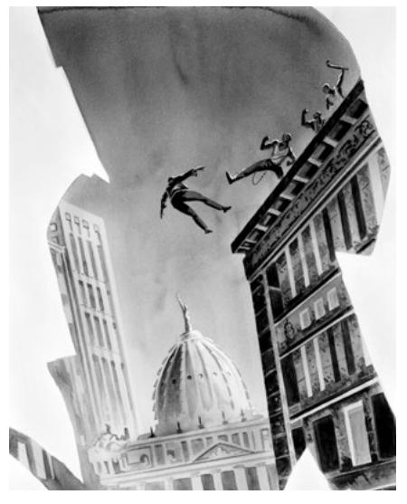

абаш и Камарилья испокон веков не ладят друг с другом, но война за Северную Америку, развернувшаяся в 1990-х и ранних 2000-х, разожгла настоящую ненависть.

В стремлении уничтожить врагов и закрепить своё владычество на континенте Шабаш кровавым смерчем прошёл через домены Камарильи и анархов, безжалостно истребляя Сородичей и без колебания демонстрируя людскому стаду сверхъестественные силы. Камарилья поняла, что нужно действовать незамедлительно, и организовала отпор, собрав мощную армию вампиров под предводительством легендарного Тео Белла.

Хотя Камарилья большую часть времени оставалась в оборонительной позиции, всё же ей удалось отвоевать некоторые домены на юге страны, но участки подконтрольных Шабашу территорий остаются в некоторых крупных городах до сих пор. Каждый из вампиров, участвовавших в сражениях, пережил немало ужасов. Каждому из них есть что рассказать.

#### Детали истории

• жертва. Твой домен или домен близкого тебе вампира был разорён во время войны между фракциями. Ты знаешь и помнишь, какие стратегии использовали Шабаш и Камарилья, как они атаковали и оборонялись, не привлекая внимания смертных. Тебе известны имена Сородичей, погибших в перекрёстном огне. Один раз за историю ты можешь узнать у рассказчика что-нибудь значимое о войне между фракциями в твоём домене.

•• активный участник. В войну было вовлечено множество вампиров из самых разных фракций и группировок. Даже независимые Сородичи брались за оружие или становились поставщиками на той или иной стороне. Тебя этот конфликт тоже не обошёл стороной и оставил на память пару шрамов. Возможно, твоя фракция считает тебя героем войны, а противники - военным преступником. У тебя есть три пункта, чтобы распределить между статусом и мавали, - они отражают твоё положение или положение твоих соратников.

••• ОБЛАДАТЕЛЬ ТРОФЕЯ. Многие именитые вампиры пали в войне фракций — для Архонтов и Храмовников делом чести было уничтожить на вражеской стороне значимую фигуру. Умышленно или по случайному стечению обстоятельств тебе удалось убить знаменитость. Возможно, ты этим гордишься или, наоборот, стараешься замять все слухи - так или иначе, чужая витэ на твоих руках. Один раз за историю ты можешь использовать свою кровавую репутацию, чтобы впечатлительный противник не пожелал вступать с тобой в состязание. Впрочем, рассказчик точно так же может воспользоваться твоей дурной славной и натравить на тебя врагов.

•••• НЕЙТРАЛЬНАЯ ПОЛОСА. Война прокатилась по доменам сперва в одну сторону, а затем в обратную, когда Камарилья собрала, наконец, силы. Некоторые территории периодически захватывала то одна, то другая сторона. Эта ситуация, аналогичная Первой мировой войне, привела к тому, что некоторые вампиры вынуждены были изучить досконально все ходы, переходы и укрытия на своей земле. Ты один из таких вампиров. Ты знаешь все убежища, арсеналы, сети тоннелей и переулки в своём и двух соседних доменах и легко можешь устроить там засаду, спрятаться, пополнить боеприпасы или найти наёмников. Добавь два пункта к показателю портильона своего домена. Кроме того, пул подходящих проверок уличного чутья, воровства и скрытности на территории двух соседних доменов увеличивается на 2d10.

 $\sim$ 

••••• АГИТАТОР ФРАКЦИИ. Некоторые вампиры существуют только для того, чтобы проливать кровь, и ты из их числа. Индивидуумы вроде Люсинды из Камарильи и Франциско Доминго де Полонья из Шабаша жаждали войны - после её окончания они оказались не у дел. Ты знаешь, как снова разжечь пламя войны. Возможно, сперва только в одном домене, но как только займётся огонь, его можно будет раздуть поярче. Пул всех социальных проверок при разжигании ненависти между фракциями увеличивается на 2d10.

# ТРОИ Ц А

В ампиры почтенного возраста порой рассказывают своим подданным и потомкам о Золотой эре Константинополя, когда там правили Михаил, Дракон и Антоний. Три философа — тореадор, цимисх и вентру — построили утопию для вампиров. В конце концов котерия распалась. Причин тому было много: и крестовые походы, и боязнь мафусаилов, и пагубное влияние Сетитов. Мечта о Константинополе, где все вампиры, несмотря на разницу в мировоззрении, могли бы жить

## ● **КОНСТАНТИНОПОЛЬ.** Вампиры, не принадлежащие к Аширре, по традиции называют Стамбул Константинополем. Ты один из немногих, кто знает, почему сохранилось древнее название. Константинополь это символ безграничных возможностей, которые предоставляет жизнь в гармонии, разбилась вдребезги.

в городе, где все вампиры могут спокойно делиться идеями и обсуждать философские разногласия, не пытаясь вырвать друг другу сердце. Один раз за историю ты можешь задать рассказчику вопрос о прошлом Константинополя и получить правдивый и точный ответ.

●● **АРХИТЕКТУРА АНТОНИЯ.** Вентру Антоний был талантливым архитектором. Он заложил фундамент и построил на нём город, причём не только физически. Политическая структура тоже была его творением. Некоторые считают его идеалом Примогена. Ты изучил методы Антония: твой пул проверок политики при управлении доменом увеличивается на 2d10. Один раз за историю ты можешь сыграть роль посредника

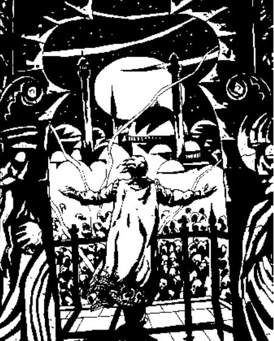

Некоторые, впрочем, не оставили эту мечту. Они надеются на возрождение Троицы в той или иной форме. Возможно, ты один из тех, кто верит, что Дракон может снова стать просветлённым или что в Константинополе или Стамбуле появится новая троица, в чьих руках окажется ключ к возрождению города. А может быть, наоборот, ты с опаской присматриваешься к почитателям идей Тройственного союза и готовишься к тому, чтобы предотвратить крупнейшую угрозу Традициям за всё время их существования.

**Детали истории**

и успокоить любую придворную перебранку словом или делом.

●●● **ВИДЕНИЕ.** Целое тысячелетие Троица жила в соответствии с видением Михаила об утопии для вампиров. Он призывал всех вампиров Константинополя учиться и искать просветления, отдаляясь от Зверя и становясь чем-то большим, нежели простой хищник. Ты современный толкователь этого видения, известный в своём городе как Провозвестник Мечты. Когда ты пытаешься оценить, насколько силён Зверь в собеседнике, твой пул проверок проницательности увеличивается на 1d10. Ты вдохновляешь и даруешь успокоение мятущимся душам — один раз за историю ты можешь потратить 1 пункт воли, чтобы другой вампир мог перебросить до трёх игральных костей при сопротивлении приступу ярости.

●●●● **ДРАКОН.** Из всей Троицы только цимисх Дракон пережил падение Константинополя. Мудрый и страстный, он был любовником и духовным наставником и для Антония,

и для Михаила, и после убийства Антония погрузился в скорбь и замолчал на века. Ходят слухи, что он вернулся в мир из своего затворничества, но намерения его неясны. Ты считаешь себя его учеником и, скорее всего, знаешь, как его найти. Он является мавлой (●●●●●), помогающим тебе в духовных вопросах и освоении Дисциплин.

●●●●● **ТРОИЦА ВОЗРОЖДЁННАЯ.** Однажды Константинополь Михаила возродится, и ты сыграешь в этом немаловажную роль. Вовсе не раздутое эго нашёптывает об этом тебе было пророчество, в истинности которого невозможно усомниться. Ты и ещё двое, чьи таланты дополняют твои, но не пересекаются с ними, возродят Константинополь в новом месте, *чего бы это ни стоило*. Если на пути к воплощению этой мечты тебя посетят сомнения, ты можешь развеять часть из них прежде, чем тебя охватят муки совести. За историю ты можешь стереть до пяти отметок сомнений перед проверкой мук совести (стр. 239).

## ЖАНЕТ Т / Т Е Р Е З А ВОРМАН

П осле возрождения клуба «Суккуб» в Чикаго у него был только один-единственный конкурент среди мёртвой публики: «Психушка» в Лос-Анджелесе. Им управляют сёстры Ворман. Последнее время по всему миру стали открываться клубы под этим названием — и в Америке, и в Азии, и в Европе.

Сёстры Ворман известны своей предприимчивостью и воинственным характером. Несмотря на успех, они друг друга люто ненавидят. В Лос-Анджелесе «быть как Ворман» означает объявить злейшим врагом члена собственной котерии. Тереза и Жанетт теперь руководят разными клубами своей франшизы — одна в Санта-Монике, а другая в Голливуде. Они никогда не появляются вместе.

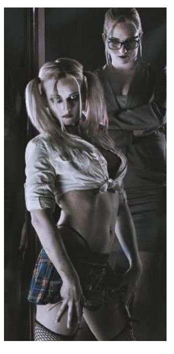

Только приближённые к сёстрам малкавиане знают, что Тереза и Жанетт — одно лицо. Две очень разные личности, заключённые в одном теле. Одни говорят, что она была такой ещё при жизни, другие — что на самом деле когда-то было *две* сестры, но одна убила другую. Ходят и такие слухи, что есть *ещё одна* сестра, которая томится в плену у малкавиан, использующих её. Как бы там ни было, у Ворман взрывной характер, и она (или они) служит прекрасным доказательством того, что малкавиане могут быть не менее вдохновлёнными или успешными, чем вентру или тореадоры. Впрочем, многие анархи с нетерпением ждут того момента, когда Тереза и Жанетт устроят, наконец, междоусобную войну.

● **ЧЛЕНСТВО В КЛУБЕ «ПСИХУШКА».** Тебе не приходится ждать в очереди перед входом в клуб, у тебя зарезервировано одно из лучших мест, и, если ты не облажаешься, ты можешь охотиться в клубе один-два раза за игровую встречу (сложность 2) без каких-либо затруднений.

●● **ДРЕССИРОВАННАЯ ОБЕЗЬЯНКА.** Жанетт и Тереза знают, что тебе можно доверять, и часто поручают тебе задания: от серьёзных расследований до безумных выходок. Работать на них опасно, но выгодно: они всегда отдают долги.

#### **Детали истории**

●●● **ЛЮБИМЧИК ЖАНЕТТ.** Дикая и необузданная Жанетт обожает тебя, флиртует с тобой при каждой встрече и возится с тобой, как с милым котёнком. Она, возможно, и более странная, чем её сестра, но зато и более щедрая. Если тебе нужно место, где провести день, ты можешь остаться в специально оборудованном помещении любого из клубов франшизы «Психушка» (причём если Жанетт в городе, то она будет настаивать, чтобы ты остался). Кроме того, ты можешь проводить в клубе свои вечеринки и просить Барона анархов о больших и малых услугах. Жанетт считается мавлой (●●●●), но вмешивается только в дела анархов или малкавиан.

●●●● **ПРОТЕЖЕ ТЕРЕЗЫ.** Строгая и прямолинейная Тереза высоко тебя ценит. Она слишком практична, чтобы тратить на тебя ресурсы клуба, но она вступится за тебя в любом городе, где есть своя «Психушка», а также может дать дельный совет в сфере бизнеса и финансов. Тереза считается мавлой (●●●).

●●●●● **ГЛАВВРАЧ.** Жанетт и Тереза позволили тебе открыть клуб под их франшизой. Пока он открыт, у тебя есть 4 пункта, которые можно распределить между убежищем, стадом, богатством или шассом твоего домена в зависимости от того, что для тебя важнее в данный момент. Пункты можно перераспределять. Является ли клуб Элизиумом, ты можешь решить самостоятельно.

# НЕДЕЛЯ КОШМАРОВ

С реди Сородичей нет единого мнения о том, когда именно случилось событие, известное как Неделя кошмаров: одни говорят, что на рубеже тысячелетий, другие же привязывают её к предполагаемому началу Геенны. В действительности же «неделя» длилась годами. Огромная волна поднялась и смыла с лица земли несколько тысяч вампиров — восстал из своей гробницы неимоверно древний вампир, уничтоживший собственных потомков — клан Равнос. В небе разгорелась Алая звезда, Антгелиос, слабокровные вампиры стали наводнять города, и множество иных знамений было явлено миру.

Возможно, ты стал свидетелем тех событий и выжил или использовал хаос в своих интересах. А может быть, узнал все подробности уже после. Так или иначе, теперь ты пристально вглядываешься в ночную тьму в поисках новых предзнаменований.

#### **Детали истории**

● **УСТНОЕ ПРЕДАНИЕ.** Тысячи раз ты слышал историю о Неделе кошмаров и тысячи раз пересказывал её сам. Теперь ты точно знаешь, какие детали подчеркнуть, а о чём лучше промолчать. Сородичам нравится, как ты рассказываешь, и тебя иногда приглашают выступить в Элизиумах в качестве историка или ради развлечения. Твои выступления вызывают интерес даже у влиятельных каинитов. Когда ты рассказываешь о Неделе кошмаров, твой пул проверок исполнения увеличивается на 3d10.

●● **ОСТАТКИ КЛАНА РАВНОС.** До Недели кошмаров Равнос были кланом, теперь они немногим больше, чем линия крови. Ты знаешь нескольких выживших равнос и, возможно, разделяешь их ненависть к гангрелам, оставившим их умирать. Эта группа приравнивается к мавали (●●●). Они рассказывают тебе новости и предостерегают от опасности. Один раз за хронику их, быть может, получится уговорить сотворить для тебя сложную иллюзию. Если кто-то узнает, что ты с ними общаешься, ты подвергнешься осуждению.

●●● **СВИДЕТЕЛЬ.** Ты не просто слышал о Неделе кошмаров, ты был там. Репутация выжившего ветерана, видевшего всё собственными глазами, повышает твой статус в глазах историков и оккультистов Сородичей, верующих в Геенну и оставшихся равнос. Один раз за историю ты можешь воспользоваться своим статусом, чтобы оказать любезность представителю одной из этих групп или придворному, проявившему неожиданный интерес. Это считается средним долгом.

●●●● **АЛАЯ ЗВЕЗДА.** Антгелиос, Звезда Полынь, предвестник Геенны (28978 Иксион), всё ещё сияет для тебя в ночном небе, хотя это видят не все. Ты веришь, что это око смотрит на тебя, и что-то в тебе меняется под этим пристальным взором. Один раз за историю ты можешь либо уменьшить показатель Голода до 2, либо увеличить пул проверок одной Дисциплины на 1d10 до конца ночи. Для этого тебе надо 10 минут смотреть на Антгелиос.

●●●●● **КРОВЬ ЗАПАТАСУРЫ.** Предтеча Равнос встретил Окончательную

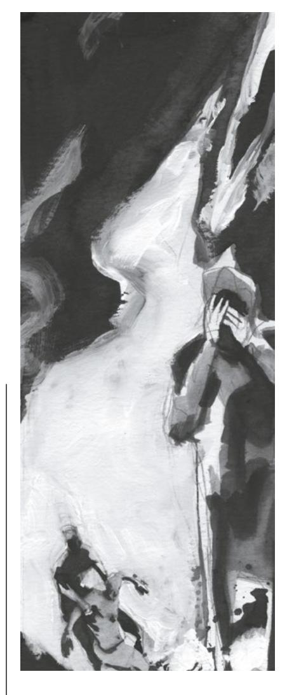

смерть в июле 1999 года от рук неизвестных, вооружённых современными технологиями и солнечным светом. Но перед тем, как умереть, он успел осушить до капли почти всех своих потомков, в предсмертной агонии погрузив оставшихся в безумие каннибализма. Его витэ густыми полуразумными протуберанцами залило землю Бангладеш, где он пал, и даже полуденное солнце не смогло её сжечь. У тебя есть небольшой флакон с Кровью предтечи Равнос. Что с ней делать, решай сам, а что она сделает с тем, кто её вкусит, решит рассказчик.

# РУДИ

Р уди — новый игрок на политической сцене Сородичей, но за этим анархом стоят немалые силы, ведь он является видным защитником угнетённых меньшинств. Он с одинаковым пылом вступается как за смертных, так и за Сородичей. Руди получил Становление недавно и очень быстро пришёл к пониманию, что вампиры страдают от той же несправедливости, что и люди, и борьба за равноправие у всех одна.

Жизнь Руди не сильно изменилась с тех пор, как он стал вампиром. Его убежище в Копенгагене, где он и жил. Все старые друзья всё ещё с ним. Он ходит в те же самые клубы, что и раньше. Руди не стал менять свою деятельность, а лишь расширил её: теперь он борется не только за права смертных меньшинств,

и гонимых. Возможно, ты счита-

торчком.

но и за права гангрелов, которых разрастающийся город лишает убежищ и охотничьих угодий, за права женщин-вампиров, притесняемых старейшинами-мизогинистами, а также призывает к принятию прогрессивных современных норм вместо устаревших традиций — везде, где это возможно. Кто-то может сказать, что тот факт, что Руди принял ислам, несколько противоречит его эксцентричному поведению, но мало кто готов высказать это в лицо гангрелу-медведю.

Авторитет Руди быстро растёт. Симпатии недовольных оказываются на его стороне благодаря целенаправленным выпадам против элитистов и сторонников жёсткого курса в Камарилье. Некоторые из европейских Принцев боятся, что в скором времени он может развязать войну и попытаться уничтожить европейскую знать.

#### **Детали истории**

рать проверку обаяния + политики

● **НОВООБРЕТЁННАЯ СВОБОДА.** Ты, как и Руди, ощущаешь прилив сил, вдохновлённый тем, что гангрелы наконец освободились от Камарильи. Один раз за историю, если ты собираешься нанести удар, физический или идеологический, по власти Камарильи или как-то иначе противостоишь системе, можешь заново пройти одну проверку любого навыка. ●● **ОДНА БОЛЬШАЯ СЕМЬЯ.** Ты непоколебим в защите обездоленных ●●● **ЗАЩИТНИК ГАНГРЕЛОВ.** Подобно Руди в Северной Европе, ты отстаиваешь права гангрелов в своём домене. Они к тебе прекрасно относятся — можешь добавить 1d10 ко всем социальным проверкам при общении с гангрелами. Однако, раз ты говоришь от лица многих, кто-то может посчитать, что ты должен отвечать за их поступки. Ты можешь созывать общие собрания и устраивать тайные встречи между представителями клана Гангрел и Камарильи. Для этого нужно выиг-

ешь, что вампиры могут существовать только поддерживая друг друга или что стая сильна настолько, насколько силён самый слабый её член. Как бы там ни было, ты готов защищать других ценой собственной жизни. Когда под угрозой оказывается опора кого-то из персонажей, входящих в твою котерию, у тебя шерсть становится дыбом, а уши — (сложность устанавливает рассказчик). ●●●● **МЕДВЕЖЬЯ СТАЯ.** Ты — часть Медвежьей стаи (или по крайней мере был). Эти крутые «рудисты» одновременно пламенные ораторы и яростные бойцы. Медвежья стая считается группой мавали (●●●), которая к тому же любит ввязываться в драки и перестрелки. Один раз за историю эти современные революционеры (и ты в их числе) могут получить один гарантированный успех при попытке

вдохновить анархов или бесправных смертных на бунт против власти. Камарилья боится членов Медвежьей стаи — это может быть и плюсом, и минусом в зависимости от того, с кем именно ты имеешь дело.

●●●●● **АРМИЯ РУДИ.** Руди собрал армию, состоящую из изгоев каждого клана, а также смертных всех цветов и мировоззрений. Ты руководишь отрядом в рамках этой военизированной силы и можешь направить её энергию в любое удобное для тебя русло: от мирных протестов у дома смертного политика до массовых митингов, призывающих к свержению лидера противоборствующей группировки Сородичей. Это скорее неуправляемая толпа, чем организованный отряд, однако ты получишь 6 пунктов, которые сможешь распределить между союзниками, влиянием и информаторами. Ты можешь направить эту толпу, но никогда точно не знаешь, чем всё закончится.

# ПОТОМОК ТАЙЛЕР

#### (только для бруха)

Л юбой амбициозный бруха боготворит Тайлер, некогда известную под именем Патриции Болингброк и с тех пор сменившую немало прозвищ. Она вела непримиримую борьбу с тиранией старейшин и коварством мафусаилов. Её деяния безвозвратно меняли общество Сородичей и вдохновляли Движение анархов. Хотя сама Тайлер сомневается в эффективности собственного праксиса, её последователи сравнивают её с кем только можно — от Робина Гуда до Малькольма Икс, от Че Гевары до Гаврилы Принципа.

Тайлер всё ещё жива. Она превратилась в тихую, но трудолюбивую революционерку, много размышляющую над тем, к чему её борьба привела в современном мире. Её потомки продолжают активную деятельность в надежде, что им удастся вновь вдохновить её и что она займёт причитающееся ей место среди великих.

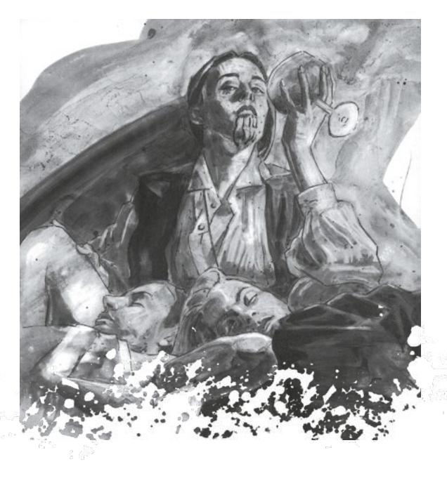

● **ПОДСТРЕКАТЕЛЬ.** Один раз за историю, когда ты подстрекаешь толпу смертных к насилию, твоя пламенная натура позволяет добавить к пулу соответствующей проверки 2d10.

●● **ПОБОРНИК СПРАВЕДЛИВОСТИ.** Когда вампирам нужен лидер восстания, неважно, насколько масштабного, они тут же вспоминают о тебе. Бунтовщики могут и впрямь прислушаться к твоим словам, а затем, если твои предложения покажутся им не слишком глупыми и безрассудными, объявить тебя своим предводителем. Твой статус среди бунтовщиков увеличивается на 2 пункта, пока длится восстание, но стоит ли торопиться с его началом? Знакомства, которыми ты обзаведёшься, пока идёт подготовка, гораздо полезнее и, главное, безопаснее.

●●● **СОСТРАДАНИЕ ТАЙЛЕР.** Ты знаешь, когда нужно остановиться. Тайлер поняла это, увидев, куда её идеи завели

#### **Детали истории**

Шабаш, и ты, подобно знаменитой революционерке, тоже понимаешь разумные границы насилия. Один раз за историю, впав в ярость, ты можешь в любой момент подвергнуться клановой одержимости бруха (стр. 210), чтобы приступ мгновенно прекратился. Ты не чувствуешь ни усталости, ни замешательства после того, как приходишь в себя, — просто возвращаешься к нормальному человеческому состоянию, будто по щелчку пальцев.

●●●● **ГНЕВНЫЕ.** Философия Тайлер уходит корнями в мировоззрение исторической группы вампиров, известной как Гневные, целью которой было уничтожение всех тиранов-Сородичей. Эта группа существует до сих пор, и ты к ней принадлежишь. Выгадав подходящий момент (один раз за хронику), Гневные снабжают тебя оружием, дают пристанище во владениях, где у них есть влияние, и приводят в движение сеть сочувствующих, которые неожиданно для всех

становятся твоими союзниками (в течение одной сцены). Эффективность союзников — до 5 пунктов, остальное зависит от того, как вы договоритесь с рассказчиком. Гневных можно привлечь только для свержения Принца, Барона или другого вампира с таким же или более высоким статусом. Попытки использовать их в своих корыстных целях приведут к тому, что ты сам станешь для них мишенью.

●●●●● **ВЕЧНАЯ РЕВОЛЮЦИЯ.** Ты уже сверг одного правителя и теперь готовишься к тому, чтобы вместе с армией революционеров провернуть то же самое и у соседей. Пока ты продолжаешь борьбу и не позволяешь себе погрязнуть в роскоши, анархи ловят каждое твоё слово, а анархи-бруха делают всё, что ты скажешь, в том числе идут на самоубийственные миссии. Никаких проверок не требуется, если твоя речь полна уверенности, а аргументы достаточно убедительны.

# ПОТОМОК ЗЕЛИОСА

(только для носферату)

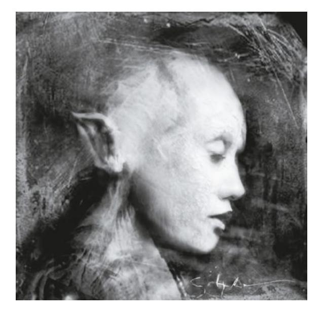

К аждый носферату знает Зелиоса, великого архитектора, великолепного организатора, масона и учёного-геоманта. Пусть он и исчез где-то под Нью-Йорком ещё в 1990-х, Зелиос оставил после себя целые библиотеки книг, схем, трактатов о важности правильного расположения объектов в пространстве и о значении сакральной геометрии.

Потомки Зелиоса продолжают его работу, консультируя других Сородичей при строительстве убежищ, подземелий, тюрем и лабиринтов. Предположительно они чувствуют расположение лей-линий и могут за достойное вознаграждение подсказать Принцу, где расположить объект, чтобы он получил максимальную защиту и с наибольшей эффективностью использовал силу земли и звёзд.

**Детали истории**

● **БАСТИОН.** Твоё убежище — чудо современной архитектуры. Оно выглядит стильно и в то же время обеспечивает безопасность, поскольку оборудовано тайными ходами, электронными системами безопасности и даже кнопкой самоуничтожения. У тебя есть два пункта, которые можно вложить в пути отступления и / или продвинутую систему безопасности убежища, но кто-то где-то знает все секреты твоего бастиона.

●● **ДИВЕРСАНТ.** Ты инстинктивно понимаешь, где у здания слабое место, и тебе не нужна даже взрывчатка, чтобы его разрушить. Имея в распоряжении лом, кувалду, зубило и трос, а также затратив на работу столько дней, сколько решит рассказчик (ориентировочно 4 дня для частного дома, 6 для банка, 9 для небоскрёба), ты можешь обрушить здание, словно карточный домик.

●●● **АРХИТЕКТОР ПО НАЙМУ.** Другие вампиры знают, что ты потомок Зелиоса, и обращаются к тебе за советом, как лучше обустроить убежище. Благодаря этому ты всегда можешь рассчитывать на услугу (один средний долг за историю). Кроме того, ты знаешь, где проводят день некоторые влиятельные вампиры — что, впрочем, скорее минус.

●●●● **ЛАБИРИНТ.** Ты воспользовался трудами Зелиоса, чтобы соорудить под своим доменом целый лабиринт, состоящий из водосточных труб, дренажных колодцев, подвалов, погребов и ремонтных тоннелей. Ты добавил в общую структуру сделанные тобой переходы, помещения и тупики, и в результате получилась запутанная система, разобраться в которой сложно даже тебе самому. Знают об этом лабиринте только те, кому ты рассказал. Ты не можешь использовать его

в качестве убежища, потому что рискуешь заблудиться, но если во время погони сможешь добраться до входа, то преследователи потеряют твой след.

●●●●● **ЧУТЬЁ НА ЛЕЙ-ЛИНИИ.** Время от времени ты замечаешь тянущиеся из-под земли красные пульсирующие лианы — лей-линии. Вампир, построивший своё убежище на их пересечении, вскоре обнаружит, что его Голод растёт медленнее, когда он проводит там день (проходя испытание Крови при пробуждении, ты можешь бросить две игральные кости и выбрать наилучший результат). У лей-линий могут быть и другие мощные магические эффекты, о которых ты сможешь узнать по ходу истории (на усмотрение рассказчика). Другие крысы могут сурово покарать тебя, если ты станешь разглашать секреты лей-линий.

# ПОТОМОК ВАСАНТАСЕНЫ

#### (только для малкавиан)

В асантасена и её сир Унмада в Средние века путешествовали вместе по всему миру, проповедуя отказ от уз крови. Они отвергли братские узы вместе с традиционной иерархией Сородичей и любым принуждением, хоть и возненавидели предтеч за их жестокую тиранию и роль кукловодов, которую они играли в Извечной борьбе, и присоединились к Шабашу в период его становления.

Однако, как и Камарилья, Шабаш отверг её учение, установив строгую иерархию и ритуальное порабощение через витэ. В ответ она отреклась от них, собрав группу малкавиан, пожелавших свободы от Шабаша.

Потомков Васантасены много, все они разные, но ни один не пожелал остаться в Шабаше и разделить участь быстро деградирующей фракции. Одни примкнули к Камарилье, другие к анархам. Каждому из них присуще безумное рвение и губительная харизма. Каждый борется за что-то.

#### **Детали истории**

● **ДИТЯ ХАОСА.** Когда всё вокруг в огне и стремительно несётся в пропасть, ты чувствуешь себя как дома. В вихре непредвиденных событий (например, в хаотичной схватке, погоне по людным улицам, при побеге из здания, которое вот-вот взорвётся) ты можешь один раз за игровую встречу перебросить одну игральную кость, не тратя на это пункты воли.

●● **ВНИМАЙ МОИМ СЛОВАМ.** Ты унаследовал дар убеждения своей прародительницы — твой голос взывает к самой Крови, минуя сознание. Один раз за историю, если ты пытаешься в суматохе кого-то в чём-то убедить и он останавливается и слушает тебя, он сможет один раз заново пройти любую проверку, когда попадёт в такую же ситуацию.

●●● **НЮХ НА УЗЫ.** Ненависть Васантасены к узам крови отчасти была причиной её ненависти к предтечам, которые сохраняли подобную связь со всеми своими потомками. Её сила

была столь велика, что она могла почуять узы, связывающие вампира, и распознать тот же смрад, если он исходил от второго участника уз. Один раз за историю ты можешь повторить этот трюк, если успешно пройдёшь проверку упорства + наблюдательности (сложность 4).

●●●● **РАЗРУШЕНИЕ УЗ.** Величайшее достижение Васантасены — это её способность разрушать узы. Говорят, она не раз применяла её к членам Шабаша, что отчасти и привело к падению фракции. Один раз за историю ты тоже можешь разрушить чьи-то узы крови для этого тебе нужно выпить глоток крови вассала, а затем предаться ярости.

●●●●● **ИЗ ШАБАША В КАМАРИЛЬЮ.** Вампиры Шабаша оказались в плену собственной бесчеловечной и противоестественной философии, но Васантасена совершила невозможное и показала выход. Один раз за историю ты можешь освободить вампира

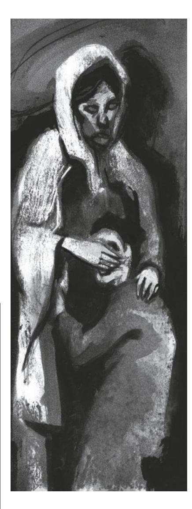

из тюрьмы его убеждений. Для этого тебе нужно изолировать его в помещении, наполненном специальными благовониями, а затем пройти продолжительную проверку (стр. 293) интеллекта или обаяния + проницательности. Каждые три ночи полемики нужно пройти одну проверку. Ты победишь, когда количество набранных успехов сравняется с двукратным показателем воли собеседника.

# ВЫСШИЕ КЛАНЫ

отя формально разделение на Высшие и Низшие кланы ушло - в прошлое с основанием Камарильи, некоторые вампиры по-прежнему считают себя лучше других. Ты принадлежишь к одному из Высших кланов, и твои старейшины постоянно убеждают тебя, что это даёт тебе право командовать Низшими, не считаясь с их мнением. Впрочем, палку перегибать не стоит.

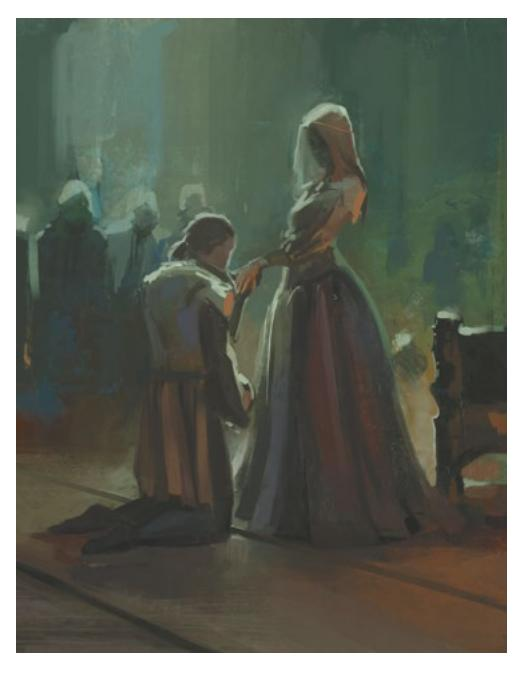

Исторически Высшими кланами считаются Ласомбра, Тореадор, Цимисхи и Вентру, хотя Бруха и иногда Клан смерти тоже заявляют о своей причастности к элите. В некоторых частях света Высшими считают также Бану Хаким, Апостолов Сета и реже Тремер.

Будучи представителем Высшего клана, ты считаешь клановый изъян благословением.

• павлин. Ты гордишься своим благородным происхождением и ведёшь себя со всем пафосом, приличествующим вампиру твоего положения. Один раз за игровую встречу, когда ты пытаешься добиться уважения со стороны неблагородного вампира в твоём домене, ты можешь перебросить одну игральную кость.

• унижение плевса. Высшие кланы некогда восседали на троне, пока другие сражались и умирали за них, не получая в награду ничего, кроме презрения. Ты до сих пор сохранил способность управлять представителями Низших кланов с меньшим трудом, чем Высших. Ты принудил послушную группу вампиров из Низших кланов слушаться тебя - они соответствуют мавали (•••). Твой пул проверок запугивания и лидерства при общении с ними увеличивается на 3d10, однако если тебя постигнет жестокий провал при такой проверке, то ты должен будешь как-то сгладить впечатление, или они восстанут против тебя.

Детали истории

••• ВОЗВЫШЕНИЕ ПЛЕБСА. По какой-то причуде твоей линии крови или по старинному указу Принца у тебя есть право возвысить Низший клан до положения Высшего. Ты можешь сделать это один раз за хронику, причём никто не мешает тебе долгое время только обещать, пользуясь услугами кандидатов. Ты можешь добавить 1d10 к пулу социальных проверок, когда общаешься с представителем Низшего клана, которому пообещал повышение статуса.

•••• ВЫСШЕЕ ПРЕДНАЗНАЧЕНИЕ. Вампиры Высших кланов часто выбирали потомков из аристократии или тех, у кого в роду есть знаменитые смертные. Даже если ты не из королевского рода, судьбою тебе назначено было править. Пул лидерства при взаимодействии с другими вампирами из Высших кланов, знающими твою родословную, увеличивается на 1d10. Кроме того, один раз за историю вампиры из Высших кланов проголосуют за тебя или позволят тебе принять высокие полномочия (и получить власть) — если, конечно, между вами нет личной вражды.

**OOOOO BAAFOCAOBEHME, A HE NPO**клятие. Как и многие другие Сородичи из Высших кланов, ты убеждён, что Проклятие Каина тебя не коснулось. То, что другие называют изъяном, на самом деле благословение, открывающее истину о природе твоего клана, вашем месте под Богом и тех областях жизни, на которых вам должно заострить внимание. Один раз за игровую встречу ты можешь потратить 1 пункт воли, чтобы проигнорировать клановый изъян.

# НИЗШИЕ КЛАНЫ

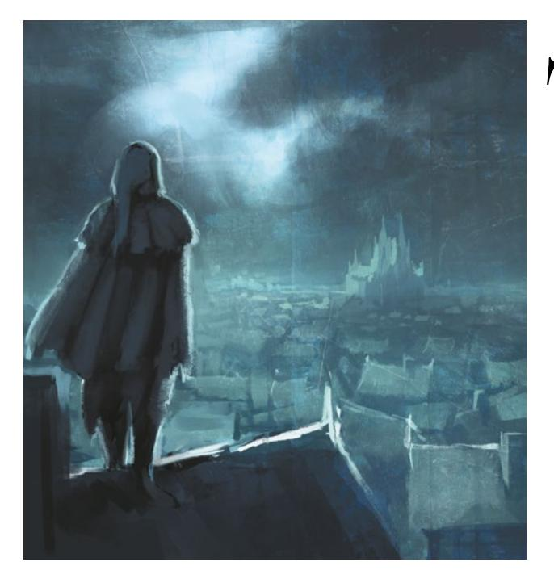

Т ы принадлежишь к одному из кланов, которые исторически считались Низшими, и в твоём домене эти представления сохранились. Ты несёшь бремя проклятия, которое (на твой взгляд) гораздо тяжелее, чем то, что постигло вампиров из Высших кланов.

Какие именно кланы самые старые вампиры всё ещё считают Низшими, зависит от региона, но чаще всего это Гангрелы, Малкавиане и Носферату, а иногда к ним присоединяются Бруха и Тремер.

Статус Сородича из Низшего клана означает, что к тебе могут относиться хуже, чем к твоим сверстникам, но это же делает таких, как ты, постоянным источником контркультуры и очагом восстаний. Ты в самом низу социальной структуры Сородичей, но, помимо очевидных минусов, в этом есть и немало плюсов.

● **НЕПРОШИБАЕМЫЙ.** Те, кто называют себя Высшими, так часто пытались тебя унизить, что ты перестал обращать на это внимание — твоя самооценка не пострадает из-за чьих-то язвительных замечаний, и тебя не так-то просто спровоцировать. Один раз за историю ты можешь игнорировать колкость в свой адрес без каких-либо проверок.

●● **ГОРД СВОИМ ПРОКЛЯТИЕМ.** Некоторые Сородичи из Низших кланов гордятся тем, насколько суров их клановый изъян. Носферату, например, иногда считают отвратительную внешность признаком величия, а себя — воплощением кошмара, и не стремятся прятать своё уродство. Ты научился использовать клановый изъян себе на пользу и можешь получить один гарантированный успех при одной проверке за историю, если твой изъян сыграет значимую роль в задуманном действии.

#### **Детали истории**

●●● **ТОВАРИЩИ ПО НЕСЧАСТЬЮ.** Из-за постоянных притеснений со стороны Сородичей из Высших кланов представители Низших предпочитают держаться вместе. Ты часто становишься посредником в спорах между своими собратьями и понимаешь важность объединения Низших кланов против гегемонии Высших. Ты можешь распределить три пункта между фактами биографии «мавла» и «статус» (среди Низших кланов домена).

●●●● **ОБМЕН ЗНАНИЯМИ.** Несмотря на все превратности судьбы, кое в чём угнетённое положение оказалось на руку Низшим кланам: они с большей охотой обмениваются между собой знаниями и силами Дисциплин. Возможно, не каждый домен сохранил эту традицию, но в твоём дело обстоит именно так. Ты можешь выбрать одну клановую Дисциплину любого Низшего клана и считать её клановой, когда повышаешь её показатель за пункты опыта.

●●●●● **ЦЕПНАЯ РЕАКЦИЯ.** Твоё влияние среди Низших кланов домена таково, что ты можешь поколебать равновесие сил, если пожелаешь. Пул проверок всех проектов, целью которых является свержение власти Высших кланов, увеличивается на 1d10. Один раз за хронику ты можешь пожертвовать своими фактами биографии вплоть до 10 пунктов, чтобы в результате переворота устранить аналогичное количество Сородичей из Высших кланов.

## АМБРУС МАРОПИС

А мбрус Маропис почти не покидает свои роскошные апартаменты на Кипре. Его редко можно встретить в обществе. Однако его репутация законодателя мод и защитника Маскарада широко известна среди Сородичей. Те из тореадоров, которые знают, что Амбрус — носферату, ненавидят его за эту популярность. С Принцами и Баронами он общается через своих учеников и ревностных фанатов, а сам предпочитает скрываться.

Амбрус — знаток новейших технологий и последних тенденций массовой культуры. Он получил Становление

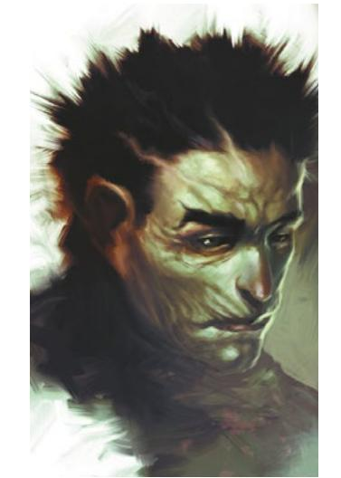

ещё подростком. В душе он интроверт, фанат аниме и компьютерных ролевых игр. У него есть тщательно проработанный сетевой образ, онлайн-личность, которую он использует, чтобы продавать софт и ворованную информацию, консультировать Сородичей по методам обеспечения безопасности, заимствованным у правительства и крупных корпораций, продвигать новые тренды в Элизиумах, советовать им музыкантов и шоуменов и в целом быть незаменимым помощником для тех вампиров, которые хотят выглядеть человечнее любого обычного человека.

#### **Детали истории**

● **ВЕРНЫЙ СТОРОННИК МАСКАРАДА.** Если Амбрус тебя чему-то и научил, так это тому, что Камарилья права и Маскарад необходимо соблюдать. Ты фанатично, почти с религиозным рвением следуешь его указаниям относительно безопасности. Тебе известны лучшие укрытия, которыми пользуются вампиры в твоём городе, — добавь 1d10 к проверке, когда ищешь, где спрятаться. Ты не сможешь воспользоваться этим модификатором, если твои политические или философские взгляды противоречат принятым в конкретном домене.

●● **ЗАКРЫТАЯ ИНФОРМАЦИЯ.** Ты можешь воспользоваться нелегальным цифровым каналом, чтобы попросить фанатов Амбруса взломать для тебя кое-что. Один раз за историю ты получишь закрытую информацию по одному вопросу, касающемуся

практически любого смертного, если эта информация есть в Сети. Взлом займёт от 2 до 20 часов.

●●● **УЧЕНИК КОРИФЕЯ.** Ты один из многочисленных учеников Амбруса. У тебя есть доступ к данным по самым разным вопросам: от операций Второй инквизиции до новых веяний стиля харадзюку. Амбрус может помочь тебе разместить информацию в Даркнете или дать контакты украинского хакера «со скидкой». Можешь считать, что у тебя есть мавла (●●●).

●●●● **ПОДКЛЮЧЕНИЕ К ВСЕВИДЯЩЕМУ ОКУ.** Амбрус показал тебе, как подключиться к шпионской программе типа PRISM или NUCLEON, позволяющей перехватывать и анализировать по ключевым словам телефонные и электронные сообщения. Или, возможно, ты выкрал у него код. Или нашёл его на компьютере, который бросил один из учеников Амбруса, в спешке покидавший своё убежище. В любом случае из соображений безопасности ты можешь подключиться только один раз за время истории. Если дело касается использования Интернета или мобильного телефона, ты получишь два гарантированных успеха при проверке расследования.

●●●●● **ВНЕ РАДАРА.** Амбрус не пожалел сил для твоей маскировки. Из фактов биографии у тебя есть две маски по 2 пункта каждая (●●), кроме того, твоя настоящая личность была стёрта (см. «Стёртая личность», стр. 187). Ты можешь увеличить пул проверок на 3d10, когда пытаешься помешать обнаружить тебя в Сети и расследовать твою деятельность в мире смертных.

# КАРМЕЛИТА НЕЙЛСОН

С тарейшины, ищущие способ предотвратить Геенну и доведённые до отчаяния Зовом, всё чаще обращаются к Кармелите Нейлсон, археологу из клана Тореадор бразильскоирландского происхождения. Она раскапывает прошлое и берёт интервью у Сородичей, которым порой по нескольку тысяч лет, и таким образом создаёт историческую хронику вампиров, охватывающую весьма широкий период. Камарилья запрещает ей записывать информацию о своих находках на электронные носители, поэтому она организовала несколько библиотек, надёжно укрытых от смертных.

Дружелюбная манера общения Кармелиты, а также природное любопытство и талант к изучению языков сделали её идеальным кандидатом на роль того, кто введёт в курс дела очнувшегося от торпора мафусаила, изучит разрушенный храм или истолкует трофейный священный текст Шабаша. Кармелита верит, что наслаждаться шедевром можно не только в музее или картинной галерее. Она считает, что Сородичи незаслуженно обходят стороной величайшее из всех видов искусства — умение поведать миру историю собственного рода. Благодаря таланту рассказчика и писателя Кармелита Нейлсон снискала любовь других тореадоров, особенно тех, кто пытается разрушить стереотип «смазливой пустышки».

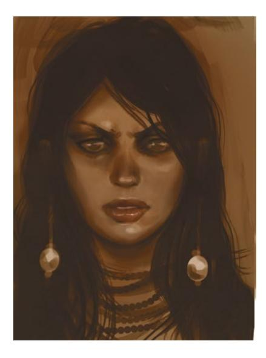

● **ИСКУССТВО РАССКАЗЧИКА.** Ты согласен с Кармелитой в том, что искусство рассказчика незаслуженно забыто. Независимо от твоих взаимоотношений с тореадорами они всегда с удовольствием слушают твои рассказы об истории или пересказы мифов.

●● **ВДОХНОВЕНИЕ.** Доктор Нейлсон доверила тебе некий предмет искусства или реликвию, один взгляд на которую вдохновляет тебя. Если ты перед сном проведёшь час, разглядывая этот предмет, и успешно пройдёшь проверку упорства + гуманитарных наук со сложностью 5, то следующим вечером проснёшься с одним дополнительным пунктом воли. Так можно делать не чаще одного раза за игровую встречу.

**Детали истории**

●●● **БИБЛИОТЕКА НЕЙЛСОН.** Небольшие библиотеки Кармелиты, расположенные в доменах Камарильи, разбросаны по всему миру. Собранная там информация помогает старейшинам вспомнить былые события и разобраться в них. Ты — куратор или страж одной из таких библиотек, которая считается для тебя убежищем (●●) с библиотекой (●●). Библиотеку часто посещают историки Сородичей и другие вампиры, что имеет как положительные, так и отрицательные стороны.

●●●● **ИНТЕРВЬЮ С МАФУСАИЛОМ.** В твои руки попала запись интервью Кармелиты с древним вампиром, который раскрывает секреты одного из кланов в твоём домене. Один раз за историю ты можешь узнать

у рассказчика какой-нибудь секрет. Знала ли Кармелита об этой записи и сама отдала её тебе, или её сделали втайне, в любом случае в твоих руках компромат на клан, о котором идёт речь, и на вампира, рассказывающего о нём. Что интересно, неизвестный голос в конце записи даёт понять, что у неё есть продолжение.

●●●●● **ГРОБНИЦА ПРЕДКА.** Кармелита поручила тебе охранять предположительное место упокоения одного из твоих предков. Пока гробница в безопасности, Кармелита должна тебе услугу (один крупный долг за историю). Но если ты не справишься с охраной, последствия не заставят себя ждать.

# ФЬОРЕНЦА САВОНА

П осле того как Ласомбра восстановили контроль над своими старыми религиозными центрами власти, Вентру ответили на это расширением сферы своего влияния на «новую знать»: представителей государственных и муниципаль-

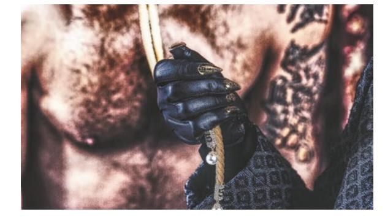

ных корпораций. Фьоренца Савона, обладающая глобальным политическим влиянием, удерживает клан в центре событий, гарантируя, что он и впредь будет оставаться опасным и осведомлённым игроком на мировой арене.

Фьоренца безжалостна и не побоится послать другого вампира к чертям собачьим. Будучи смертной, она работала день и ночь и продолжает не покладая рук трудиться над тем, чтобы богатые и влиятельные Сородичи оставались таковыми и впредь. Она продвигается всё выше самого Макиавелли.

В Камарилье Фьоренца новичок, и многие старейшины и анциллы считают её ещё одной вентру, получившей Становление из-за денег. Более мудрые Сородичи понимают, что она оказывает огромное влияние на комитеты, корпорации и отдельных лиц, наделённых властью. Её предшественники делали ставку на политику Сородичей, но Фьоренца считает, что ключ к процветанию каинитов лежит в манипуляции смертными.

● **ПРИСТАЛЬНОЕ ВНИМАНИЕ.** Фьоренца знает тебя и считает либо ценным ресурсом клана, либо проблемой. Она назначила одарённого смертного (стр. 189) твоим подручным — телохранителем, водителем, дворецким или кем-то ещё — хотя он остаётся её сотрудником. Подручный даже не скрывает того, что следит за тобой и докладывает Фьоренце, и всегда находится поблизости, даже когда у него свободное время. Если смертный будет ранен или убит, Фьоренца отметит для себя, что тебе нельзя доверять, но если ей понравится, что она услышит из докладов, она будет тебе благоволить.

●● **ЗАВТРАК С ФЬОРЕНЦЕЙ.** Несмотря на её высокое положение и плотный график, один раз за историю Фьоренца выделит время для встречи с тобой. Может, у тебя есть на неё компромат или вы просто хорошие друзья. Эта встреча может быть весьма информативной и полезной, если ты будешь задавать правильные вопросы.

#### **Детали истории**

●●● **ВЫГОДНАЯ ДРУЖБА.** Вы с Фьоренцей были знакомы ещё до того, как она стала восходящей звездой Вентру. И теперь эта дружба даёт свои плоды: Фьоренца может уладить противоречия с другими вентру, дать совет при приобретении ценных бумаг, одолжить «Гольфстрим» с поляризованными окнами и заранее согласованным планом полёта и т. д. Ваша дружба соответствует мавле (●●●). Если ты будешь злоупотреблять вашими отношениями, Фьоренца без сожалений от тебя избавится.

●●●● **СОВЕТ ДИРЕКТОРОВ.** К тебе обратился таинственный Совет директоров клана Вентру. Они обеспокоены стремительным ростом влияния Фьоренцы и хотят, чтобы ты связался с ней, подкупил и подчинил её их воле. Если ты согласишься, тебя свяжут узами крови, а затем сотрут из твоей памяти личности Совета директоров, но ты получишь 6 пунктов, которые сможешь распределить

между информаторами, мавали и богатством. Разумеется, всегда можно обратиться к Фьоренце и предложить стать её двойным агентом.

и выше в иерархии неправительственных организаций и ООН и точно знает, кого стоит взять под контроль среди элиты Давоса. Выбор сира пал на Фьоренцу благодаря её обширным связям, но вскоре он обнаружил также её политическую и деловую хватку, достойную

●●●●● **ВЛИЯНИЕ В ПРАВИТЕЛЬСТВЕ.** Фьоренца перед тобой в долгу. Один раз за хронику она согласится повлиять на смертного политического лидера по твоей просьбе. Её вмешательство равноценно 5d10, которые ты можешь распределить между любыми проверками, касающимися работы правительства. Если ты устроишь серьёзные политические волнения или сделаешь что-то, что укрепит позицию Фьоренцы, рассказчик может увеличить доступный пул ещё больше — всё зависит от того, какой именно у тебя был план и насколько успешным он оказался.

## ПОТОМОК КАРЛА ШРЕКТА

(только для тремеров)

С егодня клан Тремер — лишь бледное отражение былого величия. Вершина Пирамиды была разрушена, оставшиеся лидеры клана — разбросаны по миру, и теперь традиционалисты Тремер возлагают все свои надежды на одного Сородича — бывшего Юстициара Карла Шректа.

Шрект — легенда своего клана и Камарильи в целом. До своего Становления в 1235 году он охотился на вампиров. Став одним из Сородичей, он превратился в их орудие — защиту от Шабаша, анархов и любых оккультных угроз. Он безжалостно подавлял слухи о предтечах и уничтожал их наследие, без колебаний устраняя бесчисленные угрозы Маскараду. У него много учеников, но мало врагов, ибо врагов он находит и уничтожает.

С недавних пор он оказался одним из старейших вампиров клана.

Потомки Шректа по большей части следуют заветам предка: строго придерживайся Традиций, действуй во благо клана и не разглашай секретов Кровавого чародейства чужакам.

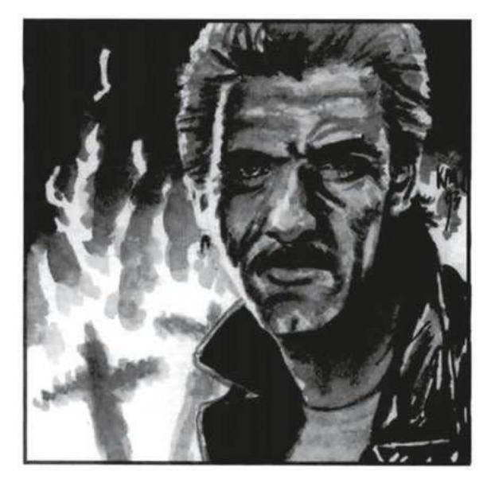

● **ПАМЯТЬ ДОМА ТРЕМЕР.** Один раз за игровую встречу ты можешь задать рассказчику вопрос относительно деятельности Дома Тремер или всего клана до его падения.

●● **НЕПОКОЛЕБИМЫЙ.** Единственно верный путь для клана — тот, что предлагает Шрект. Ты фанатично следуешь ему. Если рассказчик не против, ты можешь добавить 2d10 к пулу любой проверки, когда ты сопротивляешься попыткам сбить тебя с правильного пути.

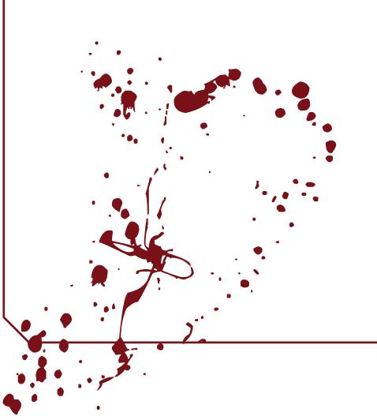

#### **Детали истории**

●●● **СВОЕВРЕМЕННАЯ ПОДГОТОВКА.** Говорят, Шрект всегда заранее подготавливает всё необходимое для ритуала и у него всегда с собой есть нужные компоненты. Один раз за историю ты можешь совершить один из известных тебе ритуалов за пять минут, не тратя время на подготовку, поскольку сделал всё необходимое заранее.

●●●● **СЛАБОСТЬ АРХОНТА.** Ты считаешь охоту на сверхъестественных существ прискорбной ошибкой. У тебя есть тесная связь с одним из них: магом, оборотнем, призраком, подменышем или кем-то ещё более странным. Он считается твоим союзником (●●●●). Ты должен его оберегать от опасности, ведь на него охотятся. Один раз за историю ты можешь позвать его на помощь, и он появится через определённое время (от 1 до 10 часов).

●●●●● **ЗНАНИЕ — СИЛА.** Карл Шрект считает, что только дурак ограничивает свой кругозор обществом Сородичей. Независимо от того, кто ты, его марионетка или злейший враг, ты с ним согласен. У тебя обширный архив, касающийся оборотней, магов, призраков, фей и ещё более диковинных существ. Это собрание равнозначно библиотеке убежища (●●●, выбери 3 наиболее подходящие специализации оккультизма), однако, возможно, ты хранишь материалы где-то в другом месте. Кроме того, один раз за историю ты можешь получить от рассказчика ответ на простой вопрос, касающийся сверхъестественных созданий.

## ПОТОМОК КСАВЬЕ

(только для гангрелов)

Н икто, даже другие гангрелы, не прислушался к словам Ксавье, когда он впервые обратился к Сородичам. Потребовалось вломиться на совещание самых влиятельных вампиров Камарильи, чтобы его, наконец, выслушали. Он говорил о том, как столкнулся с предтечей, и о том, как вся его котерия была живьём поглощена этой хтонической тварью. Он обвинил Камарилью в вероломстве по отношению к членам фракции и сложил с себя полномочия Юстициара клана Гангрел.

У гангрелов нет строгой иерархии и налаженной связи между членами клана, так что новость о поступке Ксавье разносилась медленно. Мало-помалу другие гангрелы стали покидать Камарилью вслед за бывшим Юстициаром — кто-то стал автархом, но большинство в конце концов примкнуло к Движению анархов.

Гангрелы чувствуют запоздалую вину за то, что не поверили Ксавье и не сразу отреагировали на его заявление, ведь вскоре после этого он встретил Окончательную смерть. Никто точно не знает, кто за это в ответе — Камарилья или какая-то другая могущественная организация, но всем понятно одно: Ксавье предали. И теперь его соплеменники делают всё возможное, чтобы узнать истину.

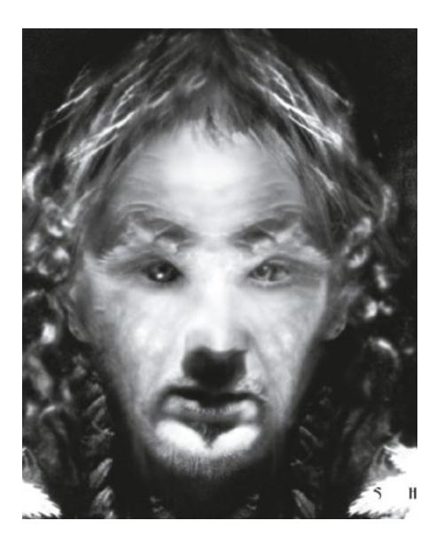

**Детали истории**

● **ПОТОМОК МУЧЕНИКА.** Гангрелы пытаются загладить свою вину перед Ксавье, испытывая к тебе уважение, которое должно было предназначаться ему. Ты всегда можешь найти укрытие среди гангрелов твоего домена (если они есть) независимо от ваших личных взаимоотношений — разумеется, пока ты ведёшь себя в рамках дозволенного. У тебя есть статус (●●) в этой группе Сородичей.

●● **ГДЕ ПОКОИТСЯ ТЕЛО.** Ксавье искусно умел растворяться в земле, крови или витэ, и это оставило отпечаток на всём его потомстве. Ты можешь пройти проверку упорства + наблюдательности, чтобы определить, находится ли под землёй вампир, растворившийся в ней или впавший в торпор. Сложность зависит от площади, которую требуется обыскать.

●●● **ВЕРНЫЙ ПЁС.** Ты не поддался порыву покинуть Камарилью вслед за своими собратьями. За твою пре-

данность местный Принц повысил твой статус, а также пожаловал право охоты и собственную территорию ты можешь распределить 4 пункта между статусом, стадом и доменом. Покинувшие фракцию гангрелы презирают тебя, а Сородичи Камарильи сочувствуют твоему одиночеству, зато ты можешь быть уверен, что Примогены выслушают тебя, если кто-то из мятежных гангрелов заявится в твой домен.

●●●● **ГИГАНТСКАЯ ЛЕТУЧАЯ МЫШЬ.** Любимой звериной формой Ксавье была летучая мышь, но после его встречи с предтечей он обнаружил, что может обращаться в некий гибрид человека и летучей мыши. Один раз за историю, когда луна находится в верном положении, ты тоже можешь принять подобную форму. Антропоморфная летучая мышь получает по одному дополнительному пункту ко всем физическим характеристикам и может парить в воздухе на любой

высоте. Модификатор урона укуса гигантской летучей мыши равен +1. Она наносит тяжёлые повреждения как смертным, так и вампирам.

●●●●● **ПРИКОСНОВЕНИЕ ПРЕДТЕЧИ.** Ксавье был не единственным из гангрелов, кто погрузился под землю и оказался внутри огромного нечеловеческого тела основателя своего клана. Тебе тоже довелось это испытать, и пережитое повлияло на твой рассудок. Ты ощущаешь нечто наподобие паранойи или клаустрофобии. Когда ты вспоминаешь свой опыт, тебе кажется, что твои вены, словно корни, уходят в землю, связывая тебя со всеми другими гангрелами на Земле. Один раз за историю ты можешь обнаружить местонахождение любого гангрела и вытянуть из него немного витэ, понизив свой Голод до 2 пунктов. Чтобы эта способность сработала, ты должен стоять на голой земле, а не, к примеру, на бетоне.

## Приложение 1. Стандартные задачи

Здесь описаны задачи, которые чаще всего приходится решать персонажам во время игры. Вся приведённая здесь информация носит рекомендательный характер. Рассказчик всегда сам определяет, какие параметры должен использовать игрок для совершения того или иного действия, и может изменить их, если другие параметры лучше подходят к описанию действия, предложенному игроком.

#### Ментальные задачи

Здесь приведены правила, касающиеся действий с использованием ментальных характеристик: интеллекта, смекалки и упорства. Ментальные проверки снабжают персонажа сведениями, которые он может узнать, даже когда ты сам не разбираешься в приведённой области, а также позволяет понять, знает ли персонаж то, что кажется тебе очевидным.

#### **ВЗРЫВЧАТЫЕ ВЕЩЕСТВА**

Использование взрывчатых веществ - от самодельных ловушек на пустынном шоссе до вскрытия склепов с использованием пентритового детонирующего шнура - играет немаловажную роль в жизни современного вампира.

Чтобы сделать взрывчатку, требуется пройти проверку интеллекта + естественных наук. Чтобы собрать бомбу, нужна взрывчатка (самодельная или добытая где-то ещё) и проверка интеллекта + техники (или ремесла для старомодных часовых механизмов).

При использовании взрывного устройства можно задействовать разные параметры в зависимости от целей взрыва: вскрыть сейф или проломить стену - интеллект + воровство; контролируемый снос зданий - интеллект + естественные науки (инженерное дело); подключить бомбу к зажиганию автомобиля - интеллект + техника. Обычную гранату или динамитную шашку достаточно просто бросить (см. стр. 301).

Жестокий провал при любой проверке, касающейся взрывчатых веществ, может закончиться катастрофой: устройство сдетонирует раньше времени, в лучшем случае материалы будут испорчены, в худшем - пострадают окружающие. Возможен и какой-то другой исход по усмотрению рассказчика.

#### **НАБЛЮДАТЕЛЬНОСТЬ**

Восприятие вампира может быть отточено многолетней тренировкой или, напротив, затуманено гневом и Голодом.

При составлении пула наблюдательности чаще всего используют навык «наблюдательность». Характеристика зависит от обстоятельств: смекалка - чтобы заметить что-то мимолётное; интеллект - чтобы распознать увиденное раньше; упорство - чтобы разглядеть детали или выделить нужный фрагмент в потоке ненужной информации. «Ты услышал какой-то звук» это смекалка, «ты слышишь, что приближаются охранники» — интеллект, а «несмотря на вой сирены, ты услышал лёгкие шаги за спиной» — упорство.

Чтобы почувствовать сквозняк из щели потайной двери, вероятно, потребуется смекалка; чтобы заметить засаду — интеллект; чтобы разглядеть крошечную деталь после кропотливого исследования - упорство. Рассказчик должен задать себе вопрос, что в каждом конкретном случае важнее: инстинкты или острота чувств, память и аналитические способности или умение концентрироваться на поставленной задаче.

Упорство, помимо прочего, отвечает за способность распознать сверхъестественное в обыденной жизни, а также определять качества крови (или витэ), игнорируя свой Голод.

Чтобы заметить живое существо, нужно пройти проверку со сложностью, равной его показателю скрытности (возможно, с модификаторами). Если кто-то пытается мимо кого-то прокрасться, потребуется состязание - см. незаметность, стр. 411.

Поиск улик на месте преступления требует проверки интеллекта + расследования. Другие навыки тоже можно задействовать в особых случаях - например, интеллект + медицина, чтобы заметить симптомы заболевания у человека.

#### **ВЫСЛЕЖИВАНИЕ**

В отличие от слежки (стр. 411) выслеживание - это поиск цели в дикой природе по оставленным на земле отпечаткам лап или ног, каплям крови, примятой траве и т. п. Для этого нужно пройти проверку смекалки + выживания. Сложность равна показателю выживания цели, но её может повысить плохая погода, а также время, прошедшее с того момента, когда цель проходила по этому участку. Чем больше выигрыш, тем больше информации получит следопыт: скорость движения цели, приблизительный вес, количество целей и т. д.

#### **ГОТОВНОСТЬ**

Ничто так не замедляет игру, как долгая сцена подбора снаряжения, где игроки перечисляют каждый предмет, который может им потребоваться в предстоящей операции. Проверка готовности помогает избежать этого, позволяя прямо по ходу действия узнать, всё ли предусмотрено персонажами и догадались ли они заранее позаботиться о необходимой экипировке.

Проверка не нужна, если речь идёт о знаковых для персонажа предметах: любящий пострелять бруха, разумеется, не забыл свою пушку, вороватый носферату захватил набор отмычек и т. д. Кроме того, у каждого в карманах есть разнообразная мелочь: смартфон, складной нож, карандаш и прочее. Проверка нужна в том случае, если предмет необычный: например, верёвка, лопата или запасной одноразовый телефон. Причём чем предмет необычнее, чем он реже используется, тем выше сложность проверки.

В качестве характеристики при проверках готовности используется интеллект, навык же должен иметь отношение либо к предмету, либо к способу его использования. Например, интеллект + стрельба, чтобы узнать, захватил ли персонаж глушитель; интеллект + ремесло, когда нужен гаечный ключ; интеллект + оккультизм, чтобы выудить колоду карт Таро из складок долгополого плаща.

#### **ИССЛЕДОВАНИЕ**

Копаешься ты в архивах самостоятельно или заплатил студенту-выпускнику, ты должен пройти проверку интеллекта + соответствующего навыка (тут можно использовать не только гуманитарные или естественные науки, но и всё остальное - от финансов до оккультизма), ведь ты должен направлять ход работы, даже если её делают за тебя.

Развитие Интернета существенно облегчило поиск базовой информации по любому вопросу, да и болееменее непростые исследования, в общем-то, тоже. Сложность поиска информации практически по любой обыденной теме - 3 или 4. Умышленно скрытую, неочевидную или оккультную информацию искать труднее. К тому же такие исследования могут потребовать продолжительной проверки. Триумф в таком случае будет означать, что ответ на интересующий вопрос найден быстрее или исследователь обнаружил какой-нибудь секрет или кладезь полезных фактов.

#### КОМПЬЮТЕРНЫЕ ТЕХНОЛОГИИ

Сородичи, живущие уже очень давно, с самого начала считали, что компьютеры до добра не доведут, а с появлением Второй инквизиции, агенты которой таятся за каждым экраном, их технофобия лишь усилилась. При всём при том использование компьютеров порой необходимо, несмотря на опасность, и умные птенцы понимают это лучше своих старейшин.

Многие навыки подразумевают владение знаниями о компьютерах на уровне пользователя: расследование, к примеру, в современном мире вряд ли сможет обойтись без поиска по базам данных. Вопросы гуманитарных или естественных наук проще решить, используя поисковую систему Google или журнальный архив JSTOR. Другие навыки можно использовать как с применением компьютера, так и без него: к примеру, ложь и за стойкой бара, и в чате - всё та же ложь, и для неё в обоих случаях необходима хитрость.

Взлом компьютерной системы и написание программ, обходящих чужую защиту или предотвращающих утечку информации, требуют проверки интеллекта + техники со сложностью, зависящей от степени защищённости системы (4 для корпоративной сети, 6 для защищённых баз данных, 8+ для сетей АНБ). Жестокий провал означает, что взломщика обнаружили. В некоторых случаях взлом можно считать конфликтом и разыгрывать соответственно.

В реальном мире подавляющее большинство взломов осуществляется при помощи психологического манипулирования: нужно убедить администратора повторно ввести пароль, составить фишинговое письмо, ну или просто купить парочку нужных паролей у какого-нибудь украинского хакера. В зависимости от подхода пул может различаться (например, манипуляция + хитрость или интеллект + уличное чутьё), и жестокий провал повлечёт разные последствия.

В конечном итоге, чего можно добиться при помощи компьютерного взлома и сколько времени это займёт, решать вам самим. Всё зависит от степени реализма, которого вы хотите достичь.

#### **МАСКИРОВКА**

Маскарад невозможен без умения маскироваться: вампирам нужно прятать свои убежища и Элизиумы от чужих глаз, избавляться от пятен крови, а порой и от трупов.

Маскировка на природе или попытка закопать труп так, чтобы его не нашли, требует проверки интеллекта + выживания. Маскировка в городе - интеллекта + уличного чутья, хотя некоторые вампиры подходят к задаче творчески и прибегают к гуманитарным наукам (архи-

тектуре) или ремеслу (дизайн интерьера), чтобы одно здание стало походить на другое.

Чтобы создать секретную комнату или потайной проход, нужно пройти проверку интеллекта + ремесла (плотник) или интеллекта + гуманитарных наук (архитектура), если ты доверяешь группе рабочих. Чтобы замести следы преступления, потребуется проверка упорства + воровства, поскольку тут важно быть крайне внимательным, сконцентрироваться на задаче, чтобы избавиться от всех следов ДНК.

Количество успехов, полученных при проверке маскировки, становится сложностью проверки для тех, кто может заметить, что что-то не так, или целенаправленно ишет слелы.

#### **ТВОРЧЕСТВО**

Некоторые вампиры при жизни были художниками, музыкантами или поэтами и после Становления отчаянно цепляются за свой талант. Другие пытаются облечь свою музу в нечеловеческие одежды. При дворе Камарильи Сородичи соревнуются в искусствах точно так же, как и во всём остальном, но даже кровосос из банды анархов гордится своим оккультным граффити или тем, какой он крутой эмси.

Как правило, искусство не требует проверок - персонажи могут творить, сколько душе угодно, но в некоторых случаях, когда они хотят добиться чего-то конкретного своим произведением, бросок игральных костей не будет лишним.

Для составления пула можно использовать разные характеристики - чаще всего интеллект, но для острой сатиры можно применить смекалку или манипуляцию, а для филигранной резьбы по слоновой кости - ловкость или упорство. В изобразительном искусстве используется ремесло, при выступлениях - исполнение, а для архитектурных проектов и литературного творчества - гуманитарные науки.

Если в произведении нужно зашифровать тайное послание (например, признание в запретной любви, политическую сатиру или оккультный код), используется соответствующий посланию навык (проницательность, политика, оккультизм и т. п.), однако этот навык не может добавить к пулу больше игральных костей, чем составляет показатель соответствующего «изобразительного» навыка.

Качество произведения искусства зависит от количества успехов, которые получит творец. Кровавый триумф может выдать в творце вампира, по крайней мере перед осведомлёнными об их существовании людьми, или ведёт к каким-то иным серьёзным последствиям.

При обычном триумфе, возможно, творец заслуживает поощрение в виде долга от благодарных поклонников.

#### Физические задачи

Здесь приведены правила, касающиеся действий. связанных с физическими характеристиками: силой, ловкостью и выносливостью. Для их решения, как правило, нужна проверка.

#### **ВЗЛОМ**

Под взломом подразумевается целый ряд действий: вторжение на чужую территорию, обход ловушек, охранных устройств и патрулей, взлом замков и сейфов, а также защита собственной территории от всего вышеперечисленного. Как правило, для этих целей используется навык «воровство».

Выбор характеристики зависит от конкретной задачи: вскрыть замок или уклониться от лазерного сенсора — ловкость + воровство; взломать шифр сейфа или отключить сигнализацию - интеллект + воровство; заметить скрытую камеру - смекалка + воровство; сбить замок подчистую - сила + воровство (возможно, с применением Мощи).

Обходя активную защиту, персонаж должен пройти проверку с первого раза, иначе поднимется тревога. Сложность проверки для большинства коммерческих зданий и крупных публичных заведений, таких как музеи, будет равна 4 или 5; в банках и других организациях с повышенным уровнем безопасности сложность выше. Для правительственного здания базовая сложность проникновения может быть равна 4, в отдельном его крыле - 6, а в хранилище опасных материалов -8. Некоторые системы просто невозможно взломать при отсутствии специальных знаний (т. е. низком показателе воровства). К примеру, один пункт воровства позволит взломать обычный механический замок, но сейф или электронный замок вскрыть при этом не получится.

Чтобы установить систему безопасности, нужно пройти проверку интеллекта + воровства. Выигрыш можно добавить к сложности проникновения потенциального злоумышленника, а также к результату проверки охранника при попытке пройти мимо него незаметно (стр. 411).

Для взлома требуются разнообразные инструменты и устройства (отмычки, разъединители и т. д.). Если вместо них используется самодельное снаряжение, сложность увеличивается на 1, а если персонаж и вовсе обходится подручными средствами (кредитка, булавка) — на 2. Если система безопасности полностью электронная, рассказчик может разрешить использование интеллекта + техники, но сложность в таком случае будет на 1 пункт выше. Впрочем, подобная проверка может быть необходимым предварительным условием при взломе, если дело приходится иметь с камерами наблюдения или системой «умный дом».

#### **ВОЖДЕНИЕ**

Чтобы спокойно вести машину, проверка не требуется. Она нужна в экстремальных условиях. Пул зависит от обстоятельств: большая скорость, сложные манёвры или плотный трафик - ловкость + вождение; плохая погода, из-за которой не видно дороги, - смекалка + вождение.

Сложность также зависит от ситуации. В целом базовая сложность равна 3 (для лёгкого, послушного автомобиля) или 4 (для тяжёлого и громоздкого), а каждое возможное усложнение (скорость, манёвры, трафик, погода) увеличивает её на 1. Если дорога очень трудная, сложность можно увеличить сразу на 2. Неудача замедляет или даже останавливает транспорт.

Жестокий провал в экстремальной ситуации означает, скорее всего, либо аварию, либо потерю управления.

#### **ГРУБАЯ СИЛА**

Данные, приведённые в таблице, — не более чем рекомендации. Рассказчик может устанавливать для любой силовой задачи сложность, которая кажется ему оправданной, исходя из рейтинга силы персонажа. Обычно для того, чтобы поднимать грузы и ломать предметы,

Опрокинуть автобус; выломать дверь банковского хранилища

Опрокинуть фуру; поднять и бросить внедорожник

#### требуется проверка силы + атлетики; чтобы швырять тяжести — меньшее из двух: либо сила + атлетика, либо ловкость + атлетика. Сокрушение (Мощь 2), как правило, увеличивает грубую силу персонажа.

Для рассказчиков, которые предпочитают иметь под рукой готовый справочный материал, в таблице приведён минимальный рейтинг силы, который требуется для выполнения той или иной задачи без проверки. Имейте в виду: если придерживаться этих значений, вампиры в игре станут немного слабее. Вампир может пройти проверку силы + атлетики, чтобы попытаться сделать что-то, для чего ему номинально не хватает сил.

Когда персонаж пытается поднять груз, поражение означает только то, что ему это не удалось. Рассказчик может понизить на 1 пункт порог силы, необходимой для перемещения тяжестей, если персонаж не пытается их поднимать, а тащит или толкает.

#### **ЛАЗАНИЕ**

Лазание обычно требует проверки ловкости + атлетики. При жестоком провале персонаж либо запутается и застрянет, либо упадёт — на усмотрение рассказчика.

Вампиры, использующие силу «Мёртвая хватка», в большинстве случаев могут не проходить проверку. Верёвка и альпинистское снаряжение снижают сложность на 2 или даже больше.

2,25 тонны (пустой грузовой контейнер, вне-

дорожник, пикап)

2,75 тонны («Хаммер»)

#### **CHAA 3AΔA4A**

 $\overline{1}$ 

 $\overline{2}$ 

 $\overline{3}$ 

 $\overline{4}$ 

 $\overline{5}$ 

 $6\overline{6}$ 

 $\overline{7}$ 

 $\mathsf{R}$ 

9

10

 $11$ 

 $12$ 

 $13$ 

 $14$ 

15

ПОДНИМАЕМЫЙ ВЕС (КГ) Раздавить пивную банку 20 (новогодняя ёлка, дорожный знак) Сломать деревянный стул 45 (унитаз) Сломать деревянную дверь 115 (крышка люка, пустой гроб, холодильник) 180 (гроб с телом, пустой мусорный контейнер) Сломать толстую доску; выломать обычную внутреннюю дверь Выбить металлическую противопожарную дверь; разорвать 250 (мотоцикл) цепь или порвать сетку-рабицу 360 (фонарный столб) Поднять и бросить мотоцикл; разорвать наручники Перевернуть небольшой автомобиль; сломать навесной замок 410 (лошадь) Сломать свинцовую трубу; пробить кулаком кирпичную стену 455 (телеграфный столб, рояль) Пробить кулаком бетонную стену; порвать цепи; выломать 545 (дерево, аэроплан) дверь автомобиля 680 (катер) Сломать стальную трубу; погнуть двутавровую балку Опрокинуть автомобиль; пробить кулаком лист металла тол-910 (дрон «Хищник») щиной 2,5 см Сломать металлический фонарный столб; поднять и бросить 1,3 тонны (полицейский вертолёт, спортивный шаровой таран автомобиль) Опрокинуть внедорожник; поднять и бросить спортивный 1,8 тонны (полицейский автомобиль) автомобиль

#### *Урон при падении*

Упавший персонаж получает по 1 лёгкому поврежде‑ нию за каждый метр неконтролируемого падения. Что‑ бы приземлиться на ноги и тем самым избежать повре‑ ждений, нужно пройти проверку ловкости + атлетики со сложностью, равной высоте падения в метрах.

#### **ЛОВКОСТЬ РУК**

Чтобы совершить карманную кражу или стащить товар из магазина, незаметно передать предмет собеседнику или подбросить что‑то ему в карман, чтобы показы‑ вать фокусы и мухлевать в карты, нужна ловкость рук. Как правило, это состязание, для которого требуется проверка ловкости + воровства против смекалки + луч‑ шего из двух: либо воровства, либо наблюдательности.

Если что‑то отвлекает внимание жертвы (например, диверсия), если она находится в толпе или вокруг тем‑ но, пул нечистого на руку персонажа можно увеличить.

#### **НЕЗАМЕТНОСТЬ**

Чтобы проскользнуть куда‑то незамеченным или спря‑ таться, персонаж должен победить в состязании ловко‑ сти + скрытности против смекалки + наблюдательности оппонента. Темнота, шум, другие отвлекающие факто‑ ры или правильная позиция с подветренной стороны могут увеличить пул крадущегося, а система безопас‑ ности, сканеры, позиция с хорошим обзором — увели‑ чить пул проверки охранника.

Как и в случае со слежкой, вампиры, использующие Сокрытие, в некоторых случаях могут не проходить проверку.

#### **ПЛАВАНИЕ**

Персонажи, у которых есть хотя бы 1 пункт атлетики, умеют плавать. Вампир не может утонуть, но тем не ме‑ нее может пойти ко дну, как любой свежий труп.

Чтобы определить, сможет ли персонаж совершить долгий заплыв, не утонув, не погрузившись на дно и не сбившись с курса из‑за подводных течений, он должен пройти проверку выносливости + атлетики со сложностью, зависящей от погодных условий.

Вампиры, которых застанет день на небольшой глубине под водой, получают урон от солнечного света как при облачной погоде.

#### **ПОГОНЯ**

Вампиру может понадобиться догнать жертву или скрыть‑ ся от охотника или свидетеля.

Если в погоне участвуют примерно равные по силе персонажи (или транспортные средства) или более медленная сторона имеет какое‑то преимущество, ком‑ пенсирующее отставание (поддержка наблюдателя на вертолёте, знание всех закоулков каирского базара), стороны должны вступить в состязание.

При погоне на транспорте требуется смекалка + вождение, поскольку для преследователя важнее всего не потерять цель из виду.

Если персонажи бегут друг за другом, требуется ат‑ летика. Характеристика при этом зависит от типа пого‑ ни: в марафоне важнее всего выносливость, в коротком спринте — сила, а для устроившего паркур по крышам Мумбая решающей окажется ловкость.

В зависимости от обстоятельств участники погони могут получить немалую пользу от взаимопомощи: к примеру, можно загнать добычу в тупик, обойдя её с разных сторон, или дать фору товарищу, задержав преследователя.

Чтобы погоня была более драматичной, её можно разыграть в виде конфликта, в котором противники не только догоняют и убегают, но и наносят друг другу урон, используя пул погони (за счёт столкновения с пре‑ пятствиями или коротких обменов ударами / выстрелами на бегу). Любой из участников может уступить в любой момент, позволив цели убежать или преследователю до‑ гнать жертву. Модификатор урона зависит от того, на‑ сколько опасным может быть окружающее пространство.

#### **СЛЕЖКА**

Слежка — это наблюдение за целью, при котором наблюдатель остаётся незамеченным и при этом всё время держит цель в поле зрения. Чтобы успешно сле‑ дить за целью, нужно победить в состязании смекалки + наблюдательности против упорства + уличного чутья цели. Если преследователь потерпит поражение, цель его заметит. Если следящий не знает, что его обнаружи‑ ли, цель может вступить в состязание смекалки + скрыт‑ ности или смекалки + уличного чутья против смекалки + наблюдательности, чтобы стряхнуть хвост. Если же следящий понял, что его раскрыли, слежка перестаёт быть слежкой и, возможно, превращается в погоню.

В многолюдных шумных районах преследователь увеличивает пул проверки на 1d10, пока его не обна‑ ружат. После обнаружения аналогичный модификатор получает уже цель, если пытается избавиться от слежки. В толпе или в местах, где очень много ходов и укрытий (например, в парке лесного типа, на железнодорожном вокзале или в торговом центре), модификатор можно увеличить до 2d10.

Взаимопомощь, как правило, возможна лишь со сто‑ роны преследователя (если только потенциальные по‑ мощники жертвы не смогут идеально под неё замаскироваться или сменить облик). Вампиры, использующие Сокрытие, могут вообще не проходить проверок, если следят за смертным.

#### Социальные задачи

Здесь приведены правила, касающиеся действий, связанных с социальными характеристиками: обаянием, манипуляциями и самообладанием. Как правило, реакция персонажей рассказчика на персонажей игроков зависит от действий последних.

Некоторым игрокам не нравится, когда реакцию их персонажей диктуют игральные кости, и они часто настаивают на том, чтобы полностью разыгрывать сцену социального конфликта (стр. 304), а не ограничиваться простым состязанием. Однако как игроки, так и рассказчики, которые позволяют броскам игральных костей влиять на поведение и убеждения их персонажей, открывают для себя новые драматические возможности, которые делают игру менее предсказуемой, а значит, более интересной. В конце концов, кто знает, какие причины могут быть у Принца для того, чтобы неожиданно согласиться с доводами персонажей или, допустим, скрыть от них своё недовольство.

#### СТАНДАРТНЫЕ МОДИФИКАТОРЫ СОЦИАЛЬНЫХ **ПРОВЕРОК**

| <b>ОТНОШЕНИЕ</b>           | <b>МОДИФИКАТОР</b> СЛОЖНОСТИ |  |
|----------------------------|---------------------------------|--|
| Верность/преданность       | $-1$                            |  |
| Дружелюбие/благосклонность | $+/-()$                         |  |
| Безразличие                | $+1$                            |  |
| Настороженность            | $+2$                            |  |
| Агрессия/антипатия         | $+3$                            |  |
| Вражда/ненависть           | $+5$                            |  |

Верность/преданность. Этот персонаж может рискнуть карьерой и даже жизнью ради тебя. Он расскажет тебе всё, что может, по его мнению, тебе пригодиться, независимо от того, спросишь ты это или нет. Он может без проблем присмотреть за пленниками, оказать медицинскую помощь, выломать дверь или отвлечь полицию. Он последует за тобой куда угодно и согласится с любым планом, практически не задавая никаких вопросов, даже если дело рискованное.

Дружелюбие/благосклонность. Этот персонаж не хочет причинять тебе вреда и, вероятнее всего, попытается помешать, если это захотят сделать другие. Он ответит на любые вопросы в рамках разумного, если это не подвергает его опасности. Он порекомендует отличного специалиста, прикроет тебя, если потребуется, и может время от времени давать полезные подсказки. Он с удовольствием примет участие в реализации твоих планов, если ты объяснишь, в чём его выгода.

Безразличие. Этот персонаж не станет усердствовать в том, чтобы навредить тебе, если ему этого не приказали и для него нет в этом очевидного преимущества. Он может ответить на несколько вопросов из вежливости или из соображений выгоды. Без особой причины помогать в чём-то он не станет. Твои замыслы кажутся ему рискованными и глупыми, но он не будет тебе мешать, пока ты не впутываешь его в свои дела.

Настороженность. Этот персонаж подозревает, что твои намерения могут быть нездоровыми, незаконными или опасными, но - пока что - у него нет причин тебе мешать. На расспросы он отвечает с холодной вежливостью и минимальной вовлечённостью. Он не расположен к тому, чтобы выслушивать тебя, если только ты не заинтересуешь его чем-то с первых же слов, и не станет участвовать в воплощении твоих замыслов, если для него нет очевидной выгоды.

Агрессия/антипатия. Этот персонаж попытается причинить тебе вред, если посчитает, что это сойдёт ему с рук. Он пристально наблюдает за тобой и настраивает других против тебя. В твоём присутствии он либо будет молчать, как рыба, либо попытается скормить тебе ложную информацию или дать дурной совет. Он не станет помогать и даже попытается помешать твоим планам, какие бы благие намерения у тебя ни были, разве что от этого будет зависеть его собственная жизнь.

Вражда/ненависть. Этот персонаж готов рискнуть всем, включая карьеру и жизнь, чтобы навредить тебе и, возможно, убить. Он постарается сделать так, чтобы никто не отвечал на твои вопросы, не оказывал тебе помощи и даже не проявлял сочувствия. Он может вступить в союз с твоими врагами и совершенно точно попытается помешать осуществлению любых твоих планов, даже если не сможет разрушить их в одночасье.

Сложность социальной проверки можно также модифицировать исходя из разницы в могуществе между сторонами, предложенного вознаграждения, характера самой просьбы и способа взаимодействия с целью.

| <b>УСЛОВИЕ</b>                                                                                                                            | <b>МОДИФИКАТОР</b> СЛОЖНОСТИ |
|-------------------------------------------------------------------------------------------------------------------------------------------|---------------------------------|
| Цель выше по положению или сильнее                                                                                                        | +1 или выше                     |
| Цель ниже по положению или слабее                                                                                                         | -1 или ниже                     |
| I Іерсонаж предлагает равноценный обмен и готов расплатиться авансом                                                                   | $-2$                            |
| Персонаж готов остаться в долгу                                                                                                           | –1 за каждый уровень долга   |
| Просьба соответствует принципам цели, личным устремлениям или поли- тической программе                                              | $-1$ или $-2$                   |
| Затея простая, безопасная и выгодная                                                                                                      | $-1$                            |
| Затея сложная и рискованная                                                                                                               | $+2$                            |
| Затея неординарная, опасная или дорогостоящая                                                                                          | +3 или выше                     |
| Применяемый способ убеждения идеально подходит для цели (напри- мер, хитрость (соблазнение) в адрес персонажа в активном поиске) | $-1$ или $-2$                   |
| Применяемый способ убеждения                                                                                                              | +1 или +2                       |

Применяемый способ убеждения не подходит для цели (например, попытка запугать оборотня)

#### **ВЫСТУПЛЕНИЕ**

Даже те вампиры, которые при жизни вовсе не были артистами, склонны к действиям напоказ и самолюбованию. Если персонаж выступает вживую перед аудиторией, он должен пройти проверку обаяния + исполнения: чем больше успехов он получит, тем эффектнее окажется выступление. Как и в случае с творчеством, важна цель, которую поставил перед собой вампир. При жестоком провале выступление окажется абсолютно неудачным, и персонаж может вскоре обнаружить, что у него появилось несколько новых врагов среди тореадоров.

#### **ДОПРОС**

Задать вопрос несложно, но получить на него ответ уже другое дело. При допросе ты выступаешь с позиции силы.

Допрос без применения насилия (манипуляция + проницательность) подразумевает ведение диалога таким образом, чтобы собеседник выдал необходимую информацию. Для этого допрашивающий должен победить в состязании против смекалки + самообладания непи

Допрос с применением насилия (манипуляция + запугивание) - это использование пыток (как телесных, так и ментальных), чтобы заставить жертву рассказать всё, что она скрывает. Пул сопротивления жертвы складывается из её самообладания + упорства. Независимо от результата состязания или хода в конфликте пытки

наносят жертве тяжёлый урон: по 1 пункту за каждый пункт её упорства. Физические пытки чреваты повреждениями, ментальные - стрессом.

Если допрашивающий получает жестокий провал при проверке, жертва умирает, впадает в торпор или сходит с ума.

Персонажи могут оказывать друг другу взаимопомощь при допросе. Это возможно, даже если один использует проницательность, а другой запугивание (классическая схема «хороший коп и плохой коп»).

Объём и актуальность информации, которую жертва выдаст при допросе, определяет рассказчик. Во время пыток допрашиваемые часто перевирают детали или выдумывают факты в стремлении угодить своим палачам и рассказывают о том, что те, по мнению жертвы, хотят услышать.

В большинстве хроник пытки — это кратчайший путь к тяжёлым сомнениям.

#### ЖУЛЬНИЧЕСТВО

Посверкать фальшивым пропуском и пройти за ограждение, провернуть аферу, получить работу по подложным документам, продать поддельный артефакт, сойти за представителя власти - всё это разные виды жульничества. Мошенник проходит проверку манипуляции + хитрости, а жертва - смекалки + проницательности

Если участники игры хотят, чтобы их персонажи провернули крупную аферу, можно провести продолжительную проверку с соответствующей сложностью.

Качественные поддельные документы и тому подобные вещи увеличивают пул проверки мошенника на 1d10 или 2d10; при использовании компьютерных сетей такой же модификатор можно получить благодаря умелому взлому.

#### **ЗАПУГИВАНИЕ**

Запугивание может быть как активным действием, так и пассивной угрозой, исходящей от персонажа. Во втором случае проверка не требуется — окружающие просто стараются держаться подальше. Чем выше показатель запугивания, тем больше личного пространства окажется у персонажа в автобусе или баре. Активное запугивание - это, в свою очередь, либо давление на жертву, либо откровенные угрозы.

В случае с давлением (манипуляция + запугивание) жертве дают понять, что она может оказаться в тяжёлом положении, если не подчинится: потеряет работу, попадёт в тюрьму, испытает боль и мучения через 5 минут или на следующей неделе. Как правило, чтобы принудить

кого‑то к чему‑то, нужно победить в состязании против самообладания + упорства цели. Проигравший ретируется.

Откровенные угрозы (сила + запугивание) начина‑ ются со слов, но могут ими и не ограничиваться (отку‑ сывание пальцев и тому подобное). Персонаж должен победить в состязании против лучшего из двух пулов жертвы: либо её самообладания + упорства, либо силы + запугивания. Проигравший ретируется. Независимо от того, кому досталась победа, тот, у кого показатель силы меньше, получает по 1 лёгкому повреждению за каждую ступень выигрыша.

#### **РЕЧЬ**

Речь — от вдохновляющей речи генерала до хитроум‑ ного обращения политика — помогает строить и разру‑ шать империи. Когда персонаж произносит речь перед аудиторией (от небольшого собрания до огромной тол‑ пы), он должен пройти проверку обаяния + исполнения.

Если у персонажа есть время на подготовку, он может пройти проверку интеллекта + проницательно‑ сти, чтобы подобрать правильные слова. Успех снижает сложность будущего выступления на 1, триумф — на 2, поражение никак не влияет, а жестокий провал повы‑ шает сложность на 1, поскольку персонаж вставил в свою речь что‑то неподобающее случаю.

#### **СОБЛАЗНЕНИЕ**

Вампир — соблазнитель по натуре, поскольку его выжи‑ вание порой зависит от того, сможет ли он уговорить жертву остаться с ним наедине. Пул зависит от кон‑ кретной ситуации и способа соблазнения: пригласить на танец на придворном балу — самообладание + этикет; познакомиться в баре — для начала обаяние + проница‑ тельность; познакомиться в спортзале — возможно, ма‑ нипуляция + атлетика; «случайно» столкнуться в кафе смекалка + хитрость. Практически в любой ситуации

достоинство «внешность» (стр. 179) увеличивает пул проверки; кроме того, иногда может помочь Величие.

Как и в случае с любой другой проверкой или со‑ стязанием, рассказчик может ограничиться одной про‑ веркой обаяния + хитрости или вывести соблазнение в отдельный сюжет хроники. Если соблазнение — это больше, чем просто «дозаправка» (например, позволя‑ ет вампиру воспользоваться дискразией или получить доступ в офисное здание ночью), то, представив его в виде социального конфликта, можно расширить воз‑ можности для драматического развития сюжета.

#### **ТРЁП**

Умение заболтать собеседника — это не совсем жульни‑ чество. Медоточивые продавцы‑консультанты славятся этой способностью и могут за короткий срок при по‑ мощи полуправды и нелепых, но заманчивых дета‑ лей выбить согласие из покупателя. Персонаж может попытаться сделать то же самое, победив в состязании обаяния + хитрости против самообладания + проница‑ тельности цели.

#### **УМЕНИЕ РАЗВЛЕЧЬ**

Пройдя проверку обаяния + проницательности, пер‑ сонаж может помочь другим (в частности, очередному сосуду) расслабиться и получить удовольствие. Это подразумевает умение развлечь потенциального союз‑ ника, развязать язык свидетелю или найти себе среди собутыльников «друзей до гроба», готовых ввязаться в драку на твоей стороне. Если вампир не может пить (а таких большинство), пул его проверки уменьшает‑ ся на 1d10 или 2d10 в зависимости от того, насколько собутыльнику важно пить вдвоём, хотя вампир всегда может продемонстрировать ловкость рук (стр. 411) и изобразить, что он и в самом деле пьёт. ⬛

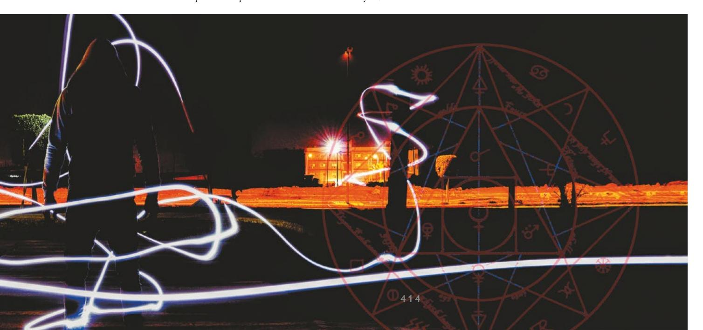

# Приложение II. Проекты

Слово «проект» произошло от латинского projicere, что значит «выбрасывать вперёд», как бросают игральные кости. И где-то примерно первые полтысячи лет это слово обозначало авантюру, в которой всё зависит от случая, иными словами, сумасбродство, а вовсе не чёткий план действий, снабжённый графиками и схемами. Вампиры склонны к консерватизму в речи, да и Камарилья с присущей ей косностью всегда относились с изрядной долей скептицизма к проектам молодого поколения. Учитывая, сколько всего может пойти не так, когда за дело берутся кровожадные хищники, в чём-то Камарилья права.

Однако игроки часто ставят перед своими персонажами определённые цели, хотят, чтобы те оказывали влияние на окружающий мир, но при этом не стремятся сделать эту цель главной - посвящать, к примеру, каждую сцену в игре тому, как они пытаются сорвать строительство муниципального жилья (больше бездомных - больше легкодоступных сосудов) или довести до банкротства сеть кафе, принадлежащую сопернику. Для такого рода целей, воплощение которых остаётся за кадром, и существуют правила реализации проектов, позволяющие рассказчику задать любимый вопрос всех старейшин: «Ты уверен, что действительно этого хочешь?» А затем, услышав в ответ неизменное «Конечно. А что, могут быть проблемы?», поэтапно отслеживать развитие событий.

#### Запуск проекта

Чтобы запустить проект, игрок (или игроки) должен сперва описать цель, которую преследует его персонаж: влюбить в себя верховную Гарпию, уничтожить репутацию самого крупного банка в городе, захватить контроль над полицией нравов, расшифровать значение таинственного символа, нарисованного баллончиком на стене убежища.

Затем игрок и рассказчик должны решить, что даст достижение цели с точки зрения игровой механики. Как правило, это один или несколько пунктов, которые можно вложить в тот или иной факт биографии или какой-то ещё параметр. Гарпия станет мавлой, разорение банка сделает персонажей богаче (за счёт распродажи имущества) или противника беднее, полиция нравов расширит влияние, а таинственный символ откроет доступ к странице истории или позволит выучить ритуал Кровавого чародейства.

Часто долгосрочным проектом становится попытка настроить резонанс сосуда или вызвать дискразию. В таком случае эквивалентом одного пункта параметра будет изменение резонанса и повышение его до сильного, а двух пунктов - изменение резонанса и появление дискразии.

Количество пунктов, которые добавит проект в случае успеха, называется охватом проекта.

#### **ИНТЕРВАЛЫ**

И последнее, что должны решить игроки и рассказчик, это периодичность, с которой в проекте будут происходить изменения: каждый день, неделю, месяц, год, декаду, смертное поколение, век и т. д. Один интервал в грубом приближении должен быть равен одной десятой предполагаемой продолжительности всего проекта (проект длиною в год может иметь интервалы, скажем, в месяц).

Если продолжительность проекта меньше 10 дней, удобнее будет проходить продолжительную проверку (стр. 293).

#### СТАРТОВАЯ ПРОВЕРКА

Началу проекта стоит посвятить сцену или даже целую главу, если рассказчик предполагает, что работа над проектом или его защита будет важна для развития хроники либо так или иначе повлияет на драматическое напряжение.

В конце этой сцены или главы игрок должен пройти стартовую проверку, чтобы запустить проект в действие. Какие параметры для этого использовать, решит рассказчик — чаще всего пул будет состоять из навыка + факта биографии, ведь вампирам, как и смертным, нужен рычаг давления: чтобы получить больше, необходимо от чего-то отталкиваться. Ухаживание за Гарпией - хитрость + статус, попытка обанкротить банк - финансы + богатство, подчинение полиции нравов своим интересам — политика + влияние, расшифровка значения символа — оккультизм + страница истории (или Кровавое чародейство, или союзник-маг). Временные пункты, полученные в счёт уплаты долгов или в сцене ретроспективы, также могут увеличить пул стартовой проверки.

Стартовая проверка - это обычная проверка со сложностью, равной охвату проекта + 2. На неё не влияет прилив Крови, и результат нельзя менять при помощи воли. Рассказчик может позволить использование Дисциплин, особенно если проект касается смертных, а не других Сородичей.

Реализация проекта требует определённых ресурсов, и персонажу, скорее всего, придётся вложить в него один или несколько пунктов своих параметров -

они называются ставкой. До завершения проекта он не сможет пользоваться этими пунктами. Однако триумф при стартовой проверке освобождает его от необходимости делать ставку.

При обычной победе без триумфа ставка равна охвату проекта + 1 за вычетом выигрыша стартовой проверки, но в любом случае не менее 1 пункта.

Как правило, в качестве ставки используется тот же параметр, который является целью проекта. Однако есть и другие варианты: например, можно воспользоваться своим богатством, чтобы расширить влияние. Рассказчику стоит избегать «пустых ставок», когда игроки предлагают вложить пункты, которые заведомо не пригодятся во время игры, или пункты параметров, которые не теряют эффективности при временном снижении их рейтинга (например, маска или некоторые страницы истории).

При неудачной стартовой проверке игрок может попытаться запустить проект повторно, но сложность будет на 1 пункт выше - он упустил идеальный момент, кто-то разболтал детали плана или появилась какая-нибудь помеха.

Жестокий провал означает, что у персонажа появился новый враг (или старый внезапно припомнил все обиды). Если рассказчик посчитает необходимым, этот враг может лишить персонажа части его фактов биографии - тот потеряет один или несколько пунктов.

С согласия рассказчика персонажи могут помогать друг другу при стартовой проверке - полагаясь на взаимопомощь (стр. 122) или общие факты биографии котерии. Однако каждый участник проекта рискует одинаково - они должны разделить между собой и ставку, и возможные потери, даже если это означает повышение изначальной ставки: если ставка составляет 3 пункта, но помогают четверо, то каждый вампир должен вложить по одному пункту.

↔ ⇔≢∺∢ <del>≫</del>

#### **ПРИМЕР**

Иштван хочет построить наркоимперию в Гамбурге и получить в результате пять пунктов богатства. У него уже есть два пункта богатства, так что охват проекта — 3 пункта. Богатства Иштвана не хватает, чтобы поддержать проект, поэтому он спрашивает рассказчика, нельзя ли воспользоваться влиянием (•••) в порту. Рассказчик согласен и назначает стартовый пул: уличное чутьё + влияние. Иштван припоминает, что Примоген перед ним в долгу, и за счёт его помощи увеличивает свой пул с 7d10 (уличное чутьё 4 + влияние 3) до 8d10. Сложность проверки 5 (охват 3 + 2). Проверка оказывается удачной — у Иштвана 6 успехов. Выигрыш 1, так что ставка проекта — 3 пункта (охват

3 + 1 - выигрыш 1). Иштван не хочет остаться совсем без влияния, так что вкладывает один пункт богатства и два пункта влияния (временный пункт, полученный от Примогена, он уже потратил). Какое-то время Иштвану придётся туговато и со многими проблемами надо будет справляться собственными силами, но в конце концов все жертвы окупятся.

 $+ 1$ 

#### ЦЕЛЕВАЯ ПРОВЕРКА

Если проект успешно стартовал, рассказчик должен установить счётчик проекта на 10. Это значение можно просто записать где-нибудь вместе с охватом, ставкой и другой важной информацией. У рассказчика, которому надо следить за ходом сразу нескольких подобных предприятий, скорее всего, есть их список на листе бумаги или в смартфоне. Однако эффектнее всего использовать в качестве счётчика игральную кость - ничто не сравнится с тем ощущением, которое появляется у всех участников, когда в нужный момент рассказчик демонстративно её переворачивает.

Значение на счётчике уменьшается с каждым истекшим периодом, пока, наконец, не достигнет 1.

Впрочем, если игроки (или персонажи) не хотят ждать, они в любой момент могут пройти целевую проверку. Рассказчик решает, какой пул использовать - он может не совпадать с пулом стартовой проверки. Надо заметить, что для целевой проверки можно использовать все те пункты, которые стали ставкой - ведь ресурсы, которые они представляют, пошли именно на реализацию проекта. Целевая проверка - это своего рода конфликт, в котором противником выступает время. Игрок использует назначенный пул параметров, а рассказчик проходит проверку, используя пул, равный текущему значению счётчика проекта.

Результат целевой проверки, как и стартовой, нельзя изменить при помощи воли. Также нельзя использовать прилив Крови и (как правило) Дисциплины. Кроме того, при целевой проверке невозможны триумфы - каждая выпавшая десятка считается за один успех независимо от их общего количества. И что ещё хуже, это касается только персонажа. Триумфы, выпавшие при проверке рассказчика, учитываются как обычно. Считайте это преимуществом игры на своём поле, если хотите.

Победив в целевой проверке, игрок «наносит урон» счётчику проекта - он может отнять свой выигрыш от текущего значения счётчика. Если результат окажется меньше 1, проект завершится успехом досрочно. Рассказчик должен придумать, по какой причине это

произошло, что за существенные перемены в мире привели вампира к успеху раньше времени, но ему не обязательно рассказывать об этом игрокам.

При неудачной целевой проверке персонаж терпит убытки - его факты биографии, начиная со ставки, уменьшаются на количество пунктов, равное выигрышу рассказчика. Если ставка при этом падает до нуля, проект завершается крахом (исключение составляют персонажи, получившие триумф при стартовой проверке, поскольку им не надо было делать ставку). И опять же, рассказчик должен придумать причину внезапного краха, но он не обязан раскрывать её сразу.

---------------------------------------

#### ПРИМЕР

Иштван проходит целевую проверку, когда счётчик проекта показывает 5. Он использует пул уличного чутья + влияния, добавив к нему 1d10 за пункт богатства, который входил в ставку наравне с влиянием. У него выходит 8d10 — против 6d10. Иштван получает 6 успехов, а условный противник — 4 успеха. Выигрыш равен 2, так что счётчик проекта уменьшается с 5 до 3. Однако если бы противник получил триумф, Иштван потерял бы 4 пункта — всю свою ставку и ещё один пункт (скорее всего, пункт влияния), а весь проект ждал бы крах.

Если в стартовой проверке участвовало несколько персонажей, все потери, полученные при целевой проверке, они должны поделить между собой или пожертвовать общими фактами биографии котерии.

---------------------------------------

#### ЗАВЕРШЕНИЕ ПРОЕКТА

Инициатор проекта может завершить его в любой момент, даже если цель ещё не достигнута. Однако врагов, нажитых в процессе, остановить будет не так просто.

При успешном завершении проекта персонаж получает пункты какого-либо параметра, однако это не значит, что ему не нужно тратить на них пункты опыта. Проект - это скорее оправдание для изменений в бланке персонажа, чем возможность получить что-то бесплатно. Впрочем, окончательное решение примет рассказчик. Он может, например, уменьшить стоимость пунктов, которые были получены в ходе проекта, в зависимости от степени его успешности, от того, насколько проработан был план и насколько достоверным было поведение персонажей при его осуществлении, а также от того, насколько важную роль в хронике играет развитие персонажей.

#### В ИСТОРИЧЕСКОЙ ПЕРСПЕКТИВЕ

Чтобы персонажи смогли во время игры получить какую-то пользу от проекта, который длится десятилетиями или веками, начало ему должно было быть положено в далёком прошлом. Стартовую сцену подобного проекта следует сыграть в ретроспективе (стр. 311).

Стартовая проверка в ретроспективе в целом проводится по тем же правилам, что описаны выше, однако пункты, полученные в результате целевой проверки в сцене ретроспективы, становятся пулом (или частью пула) стартовой проверки, а также ставкой этого проекта в перспективе. На это же значение уменьшается счётчик проекта за время, прошедшее со старта проекта до настоящего момента. То есть если вы хотите. чтобы в настоящем до завершения проекта оставалось 4 условных периода, то в сцене ретроспективы при целевой проверке нужно получить 6 пунктов и потратить их все на реализацию проекта.

Любой ущерб, нанесённый неудачной целевой проверкой в настоящем, влияет на факты биографии, относящиеся к настоящему, и не влияет на ставку, сделанную в ретроспективе.

#### Проекты противников

Не только персонажи игроков имеют далекоидущие планы. Во время игры герои могут столкнуться с запутанными интригами других Сородичей, помешать чужим планам или даже перехватить инициативу в проекте врага (а может, и союзника).

Рассказчик должен определить, на какой стадии находится проект противника в данный момент (счётчик проекта), а также его приблизительный охват. В крайнем случае можно бросить 1d10, чтобы определить значение на счётчике, и ещё 1d10, разделив результат пополам (с округлением вверх), чтобы определить охват.

#### ОБНАРУЖЕНИЕ ЧУЖОГО ПРОЕКТА

Проект нельзя обнаружить, просто пройдя проверку. Персонажам потребуется совершить определённые действия, которые откроют перед ними правду. После этого нужно провести расследование или по меньшей мере найти информатора, чтобы узнать, на какой стадии сейчас находится проект (т. е. каково значение счётчика).

За время истории в проекте противника должен миновать хотя бы один интервал, поскольку усиление позиций врага добавляет остроты сюжету. Из тех же соображений внимания стоят только те проекты, которые опасны для персонажей игроков или идут вразрез с их интересами. А иначе какой смысл вообще добавлять их в игру?

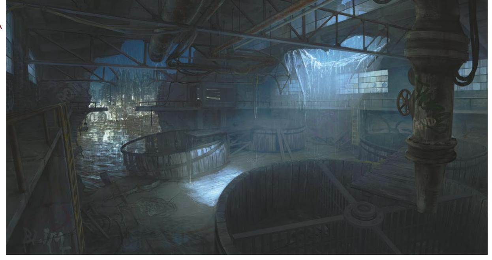

#### ВЛИЯНИЕ НА ХОД ЧУЖОГО ПРОЕКТА

Котерия может оказывать влияние на скорость завершения проекта второстепенного персонажа, посвятив главу (или историю, если это масштабный и долгосрочный проект) тому, чтобы помешать или помочь свершению чужих планов. По законам драмы котерия просто обязана быть (хотя бы потенциально) значимой участницей любого события, которое оказывается в центре повествования. И это, в общем-то, не так далеко от правды группа вампиров и в самом деле может нанести чудовищный ущерб любому предприятию, особенно если будет действовать сообща. Рассказчик должен помочь игрокам решить, какие именно действия они предпримут, чтобы добиться нужного эффекта. Не забывайте, что крошечный камешек способен запустить лавину, а битвы иногда проигрывают «оттого, что в кузнице не было гвоздя».

Успешное вмешательство увеличивает (или уменьшает) значение счётчика проекта на 1 пункт или больше, по усмотрению рассказчика. Триумф при особенно важной проверке может сорвать проект полностью или (что менее вероятно) довести его до завершения раньше времени.

Вмешательство в чужой проект, скорее всего, вызовет недовольство некоего могущественного персонажа (цели проекта или его автора, смотря на чьей стороне персонажи), и тот попытается отомстить.

#### ИСПОЛЬЗОВАНИЕ ЧУЖОГО ПРОЕКТА В СВОИХ ЦЕЛЯХ

Котерия может не только ускорить или замедлить проект - можно также воспользоваться ситуацией в своих интересах. Конкретный способ воплощения в игре зависит от желаний котерии и характера проекта: чтобы обогатиться за счёт чьей-то тайной финансовой схемы, нужны одни навыки, а чтобы перевербовать сектантов из подпольной церкви - совсем другие.

В целом тем не менее персонажи сперва должны получить возможность влиять на ход событий. Рассказчик должен решить, получат ли они эту возможность, узнав

о проекте как таковом, или они должны приложить дополнительные усилия и предпринять некие действия, требующие проверки, - или и то и другое сразу.

Затем рассказчик назначает пул целевой проверки персонажей - поскольку в данном случае им не нужна долгая подготовка для вмешательства, достаточно обычного пула навыка: например, может подойти манипуляция + финансы / оккультизм / политика / уличное чутьё, а может потребоваться что-то совершенно иное в зависимости от природы вмешательства.

После этого персонажам нужно пройти продолжительную проверку со сложностью 5 (стр. 293). Количество успехов, которое они должны набрать, равно 15 минус значение счётчика проекта. В случае неудачи противник поймёт, что кто-то пытается использовать его схему в своих целях, в случае жестокого провала узнает, кто именно.

Получив нужное количество успехов, персонажи могут либо вытянуть из проекта какие-то ресурсы, либо перехватить контроль полностью. Вытягивание ресурсов предполагает, что котерия получит половину пунктов охвата проекта (с округлением вверх) и сможет использовать их для повышения своих параметров. Для этого не требуется никаких дополнительных проверок - в результате продолжительной проверки герои уже получили необходимый доступ.

Чтобы перехватить контроль, персонажи должны пройти ещё одну целевую проверку — причём на этот раз так, будто это их собственный проект (рассказчик может назначить новый пул, чтобы задействовать факты биографии или лучше отразить характер действий героев). Победив, они получат всё, что этот проект должен был дать его автору. В случае поражения они будут вынуждены снизить показатели своих фактов биографии.

Каким бы ни был результат, котерия в любом случае наживёт себе нового врага. Если он одержит над ними победу в этой или следующей истории, вампиры потеряют все пункты, полученные за счёт его проекта. ■

## Приложение Ш. Ответственный подход к совместной игре

## Персонаж и игрок не одно и тоже

Самое замечательное в настольных ролевых играх это возможность для игрока выбрать роль персонажа, в корне от него отличающегося: любого пола, национальности, социального статуса, достатка, с любыми сексуальными предпочтениями, способностями и возможностями (или их ограничением). Но не стоит забывать, что свобода - это также и ответственность. Когда изображаешь кого-то непохожего на тебя, лучше отнестись к особенностям своего персонажа с уважением, создай сложный, тонко прорисованный образ, а не карикатуру. К слову, игра от этого станет только интересней. Допустим, с тобой за одним столом играют трансгендеры - и им независимо от того, собираются ли они совершить трансгендерный переход, может быть неприятно, если ты обыграешь их душевное состояние как примитивный выбор между брюками и юбкой, а то и вообще болезнь, которую нужно лечить, или посчитаешь, что их персонажи, несомненно, тоже трансгендеры. Относись с уважением к другим людям, даже когда не разделяешь их взглядов, и не делай поспешных выводов. Помни: персонаж и игрок не одно и то же.

В игре по системе правил «Рассказчик», где воображение ничто не сдерживает, а речь героев придумывается на лету, немудрено ошибиться с местоимением, обращаясь к кому-то, или при описании персонажа использовать обидный стереотип. Это простительные ошибки. Заметим: ошибки, но всё же простительные. Поэтому не стоит бояться играть разносторонних персонажей с различной персональной идентичностью, лишаясь, таким образом, возможности почувствовать, каково, например, быть трансгендером или, скажем, расти в арабской семье в Северной Европе. Не ограничивай свой игровой опыт узкими рамками определённой сексуальности, пола, национальности и т. п., и кто знает, какие открытия тебя ждут во время игры.

Если тебе нужна помощь, чтобы создать правдивый образ, не задевающий при этом чужих чувств, попроси совета у тех, кого собираешься изображать. Они могут дать тебе неоценимые подсказки.

### Ненависть, радикализм и прочее зло в игре

Культура Сородичей по сути своей чудовищна. Одна из граней кошмара в «Вампирах» - это попытки выжить в обществе, слепо следующем старым традициям, как бы плохи они ни были. Подавляющее большинство Сородичей (особенно в Камарилье и Шабаше) придерживается традиционализма во взглядах, считает нормальным унижать своих противников, используя силу и богатство, восхваляет религиозный фундаментализм и даже средневековые институты, такие как феодализм. Многие Сородичи были свидетелями и даже участниками Второй мировой войны - и у них есть собственное мнение о том, что сегодня происходит в мире. Но даже с учётом всего этого не так уж сложно найти перспективу, с которой общество вампиров не будет казаться беспросветным тоталитарным кошмаром. Подчеркни отличие между вампирами - как внутри одной группировки, так и между сообществами. Рассказывай истории о внутренней борьбе, неожиданной доброте, новых идеях. Играй слабокровных, анархов, каитифов или даже представителей Камарильи в городе эллинов, где большую часть Традиций Башни Слоновой Кости адаптировали к современности. Другой вариант - показать общество Сородичей во всём его адском великолепии, но поставить персонажей против системы, дав им возможность бороться с ней снаружи или изнутри.

А что делать, если кто-то из игроков хочет сделать своего персонажа женоненавистником, гомофобом, националистом или кем-то ещё в этом роде? Или рассказчику нужен подобный персонаж? В Мире Тьмы предостаточно чудовищ с человеческим лицом. Они могут выступить в роли трагических злодеев, падших друзей или даже мнимых союзников. Неонацист-бруха, ультраправый миллиардер-вентру, цимисх-евгеник — кем бы ни оказался противник, персонажи должны получить возможность либо привести его к раскаянию, либо избавить от него мир, ведь у персонажей игроков есть индивидуальность, каждый из них уникален и неповторим, а закоснелые злодеи этого на дух не переносят.

Имей в виду: когда играешь персонажа, чьи взгляды тебе чужды, у тебя есть прекрасная возможность изучить его образ мысли, понять, как формируются идеи превосходства одних людей над другими, как находить зачатки этих пагубных идей и бороться с ними в реальном мире. Когда в игре поддаёшься искушению обвинить во всех своих несчастьях инакомыслящих, отказываться от индивидуальности в угоду окружающим и жертвовать другими во имя высшей цели, становится проще обнаружить подобные тенденции в самом себе и своих близких и вовремя разобраться в причинах.

Все эти эксперименты, конечно, не должны выходить за рамки игры. Игра - это способ исследовать разные, в том числе спорные идеи, но это не повод ими проникаться в жизни. Каким бы обаятельным ни был твой злодей, он всё равно остаётся злодеем! Если из-за происходящего вне игры какая-то тема в игре станет тебе неприятна - воспользуйся одним из приёмов, приведённых ниже. Ты не обязан терпеть то, что для тебя неприемлемо, вместо того чтобы получать удовольствие от игры. Игра в «Вампиров» - это способ рассказать историю о понимании и возможность сделать наш реальный мир чуточку лучше и светлее. Пользуйся этим.

### Сексуальное насилие в игре

Не будем пытаться скрыть очевидное: вампир стал символом хищной человеческой натуры ещё во времена одноимённого рассказа Джона Полидори, увидевшего свет в 1819 году. Эти кровопийцы соблазняют, заманивают лестью, запугивают, подавляют волю, а порой просто силой принуждают людей исполнять волю кровопийц. Они считают это своим законным правом правом сильнейшего из хищников. Вампиры, которые придерживаются такой точки зрения, плевать хотели на чужое мнение - им не нужно ничьё согласие.

В случае с вампирами согласие не всегда подразумевает сексуальный контекст, однако из-за природы Поцелуя и восприятия вампиров как воплощения человеческих пороков темы секса всплывают в большинстве случаев их взаимодействия с людьми. Стоит ли говорить, что в рассказе Полидори вампир предпочитал

пить кровь девственниц в их брачную ночь (автор «Вампира» был другом лорда Байрона и, по мнению некоторых историков, изобразил в рассказе поэта в образе извращенца и сексуального маньяка). Даже если в своей игре вы всеми силами избегаете темы сексуальности и сексуального насилия, важно знать, какой потенциал она имеет в «Вампирах». Учитывая всё вышесказанное, обсудим некоторые ключевые моменты.

СЦЕНЫ НАСЫЩЕНИЯ ПОРОЙ НАПОМИНАЮТ СЦЕНЫ ИЗНАСИ-ЛОВАНИЯ. И это может стать проблемой, если за игровым столом есть кто-то, кто подвергался сексуальному насилию. Персонаж, у которого нет стада и который не является убеждённым джентльменом, суррогатчиком, фермером или бестией (стр. 175 - 178), в сценах охоты, скорее всего, будет использовать Дисциплины, уловки или грубую силу, чтобы заполучить кровь человека. Исследование глубин человеческой психики может быть увлекательным и полезным делом, но только в том случае, когда все за игровым столом к этому готовы. Если кто-то из игроков хочет избежать темы «вампир как сексуальный маньяк» хотя бы в отношении собственного персонажа, предложи ему обзавестись стадом или выбрать более приемлемый с этической точки зрения стиль охоты (см. выше). Эта игра построена на попытках противостоять собственной порочной натуре, она ничего не выиграет, если персонаж станет потакать всем своим порывам.

ТЕМА ХРОНИКИ. Ни один из приведённых в этой книге примеров тем (стр. 172 - 173) не позволяет персонажам безнаказанно использовать окружающих. И это неспроста. Даже жёсткий закон улиц звучит так: «Уважай других и требуй уважения к себе». Когда вампир перестаёт считаться с чужим мнением, это вряд ли можно назвать уважительным отношением к кому-либо. Выбирая тему, с которой соглашается большинство участников, вы задаёте твёрдый моральный ориентир для игры в «Вампиров».

СОМНЕНИЯ - БЛАГО. Если чей-то персонаж (включая твоего) делает что-то жестокое или отходит от темы хроники (например, принуждает других к чему-то), не стесняйся предположить, что его могут посетить сомнения. Если ты рассказчик, добавь персонажу пункт сомнений, если игрок - предложи рассказчику это сделать. Некоторые вампиры не отличаются состраданием, но в любом случае каждый раз, когда вампир делает очередного человека своей игрушкой или рабом, Зверь внутри него становится сильнее.

ДАЙ ВРЕМЯ ПОДУМАТЬ... По мере того как вампир деградирует, утрачивая Человечность, предоставляй ему возможности оглянуться назад и осознать, какие страшные вещи он творит. Поиск искупления - неотъемлемая часть игры в «Вампиров», так что у персонажей игроков всегда должна быть возможность прозреть и заслужить прощение. Если они не захотят этой возможностью воспользоваться, что ж - последствия не заставят себя ждать. Правила, закрепляющие рефлексию и искупление в игре, можно найти на стр. 239 (см. «Муки совести»).

...И ПОМНИ: игрок важнее, чем игра. Если ты или другой игрок по какой-то причине почувствовал себя за игровым столом неуютно, воспользуйся одним из приёмов, приведённых в этом приложении, чтобы сделать паузу и убедиться, что всё в порядке. Поверь, другие игроки будут тебе благодарны. «Вампиры» — это игра. Она должна быть страшной, но увлекательной. А не просто страшной.

## Приёмы индивидуальной настройки

#### Черты и занавесы

Это классический приём, описанный Роном Эдвардсом в его книге «Секс и чародейство». Он позволяет игрокам выбирать, что они хотят видеть в игре, а чего лучше избегать. Перед игрой рассказчик должен приготовить два листа бумаги: на одном написать «черты», на другом «занавесы». Черты - это действия, о которых в игре нельзя будет даже упоминать. Занавесы это действия, которые можно совершать, но которые не будут разыгрываться в деталях и останутся за кадром за счёт затемнения (см. ниже). Рассказчик должен узнать у игроков, что бы они хотели добавить в каждый из списков, и объяснить, что их в любой момент можно изменить: то, что было скрыто за занавесом, может стать чертой и наоборот, к тому же в оба списка можно добавить новые пункты или вычеркнуть из них старые (с согласия всех участников). Этот приём нельзя использовать, чтобы вычёркивать из игры персонажей («я не хочу, чтобы вампиры упоминались в этой хронике»), но с помощью черт и занавесов можно ограничить их действия, если они неприемлемы для кого-то из участников («я не хочу никаких упоминаний и даже намёков на сексуальное насилие в дальнейшей игре» - это подразумевает, что сцены насыщения, а также детальные описания воздействия некоторых сил Доминирования и Величия останутся за кадром, хотя это не значит, что вампиры перестанут охотиться).

НАИБОЛЕЕ ЧАСТЫЕ ЧЕРТЫ: сексуальное насилие, детальное описание пыток, принуждение к Поцелую, голодание до истощения, нанесение увечий, оскорбления по признаку расы и пола, пауки, иголки, животное поведение, детальное описание удовлетворения телесных потребностей, издевательства над животными.

НАИБОЛЕЕ ЧАСТЫЕ ЗАНАВЕСЫ: детальное описание добровольного сексуального акта, пытки, психологическое насилие, физическое насилие, болезненная деформация тела («боди-хоррор»), эксперименты над людьми, сны и кошмары, воспоминания детства, пророческие видения, смерть животных.

#### Затемнение

В кино, когда герой вот-вот отправится в постель со своей возлюбленной или его начнут пытать с пристрастием, зачастую сцена внезапно обрывается (иногда напоследок слышен страстный стон или крик боли). Этот приём можно использовать и во время игры. Если ты не хочешь подробно описывать каждый поцелуй влюблённых или потоки крови, хлещущие из горла случайной жертвы, сцену можно завершить и перейти к следующей. Если игроку некомфортно происходящее в игре, он также может попросить подвести итоги и перейти к следующей сцене (см. «Масштаб сцены», стр. 290 — 291).

#### Светофор

Этот приём впервые предложила группа Games to Gather. Рассказчик кладёт на стол три цветных круга: зелёный, жёлтый и красный. Каждый цвет означает степень приемлемости происходящего. Зелёный - «всё нормально, можно пожёстче», жёлтый - «приемлемо, но лучше на этом и остановиться», красный — «необходимо сбавить обороты». Указывая на тот или иной кружок, игрок даёт понять рассказчику, в какую сторону двигаться.

Рассказчик также может воспользоваться кружками, если хочет поинтересоваться мнением игрока, не прерывая повествования. Для этого достаточно постучать по кружку с нужным цветом. В ответ игрок может согласиться или указать на другой кружок.

#### $X$ -карта

Икс-карта, предложенная Джоном Ставропулосом, довольно простой и понятный способ регулирования хода игры. Как следует из названия, это карточка или лист бумаги, на котором нарисована латинская буква «Х». Её кладут в центре стола, и любой из участников игры может остановить любое действие, которое

вызывает у него дискомфорт, просто прикоснувшись к Х-карте. При этом ему не обязательно что-либо объяснять, а рассказчик может просто продолжить игру, пропустив эпизод, вызвавший неприятные чувства.

#### Язык жестов

Этот способ используют в ролевых играх живого действия, поскольку для него не требуется ни бумаги, ни другого реквизита. Если один из участников в процессе интенсивной игры хочет поинтересоваться у другого участника, всё ли его устраивает, он может использовать для этого жесты: например, показать на пальцах «ОК». Тот, к кому он обращается, может показать в ответ палец вверх (да, продолжаем), палец вниз (нет, остановимся на этом) или покачать ладонью (не знаю, не уверен). Во втором и третьем случае в игре нужно сделать паузу, чтобы дать партнёру по игре собраться с мыслями.

#### Открытая дверь

Это ещё один очень простой метод, не требующий долгих объяснений. Если игроку необходимо сделать паузу, какова бы ни была причина, он может сделать это в любой момент, просто сказав об этом рассказчику. Игра прерывается до тех пор, пока участник не вернётся за стол или не решит покинуть встречу.

Вот несколько оправданных причин покинуть встречу до её окончания:

- Рассказчик или другие игроки умышленно нарушают ваши договорённости.
- Случилось что-то срочное, что требует твоего внимания.
- Тебе нездоровится физически или тебе тревожно.
- Что-то вызывает у тебя дискомфорт, и ты уже обсудил это с другими участниками.
- Рассказчик или игроки оскорбляют тебя, угрожают или в долгих спорах уламывают тебя сделать что-то, что для тебя неприемлемо - вне игры (или в игре, но тебе это всё равно неприятно).
- У тебя назначена встреча в другом месте, о которой ты предупреждал заранее.
- Тебе кажется, что игра складывается не так, как ты ОЖИДАЛ.

Если ты рассказчик, не забывай, что ты тоже имеешь полное право остановить игру в любой момент. Быть рассказчиком - эмоционально тяжёлый труд, зачастую это очень неблагодарная работа, и если твои игроки не желают этого признавать, то, возможно, стоит сделать паузу, а может, и вовсе прервать хронику и не иметь больше дела с этими игроками.

#### Послеигровое обсуждение

Послеигровое обсуждение - это метод, привычный для европейских и американских сообществ, играющих в ролевые игры живого действия. Его легко можно совмещать с любыми другими методами, упомянутыми выше. Суть его заключается в том, что все участники игры после окончания встречи задерживаются ещё на какое-то время, чтобы расслабиться, послушать успокаивающую музыку, похрустеть чипсами и таким образом плавно вернуться из вымышленной вселенной в реальный мир.

Это время игроки могут занять обсуждением происходившего во время встречи с точки зрения сторонних наблюдателей, а не непосредственных участников. Во время игры многие предпочитают говорить «я», когда описывают действия своих персонажей, здесь же важно называть своих героев в третьем лице и по имени и говорить «я» только тогда, когда участники имеют в виду лично себя и свои собственные переживания. Что им больше всего запомнилось на этой встрече? Какой случай взаимодействия с персонажем другого игрока понравился больше всего? А с персонажем рассказчика? Что рассказчик мог бы сделать лучше, по мнению игроков? Всех ли устраивают правила и способы построения сюжета? Стоит ли внести изменения, чтобы игра стала ещё интереснее и увлекательнее? Обо всём этом можно спросить игроков по время послеигрового обсуждения, хотя это и не обязательно. Если есть какие-то другие важные темы, которые вы хотели бы обсудить между собой, смело к ним обращайтесь. Если кто-то не хочет принимать участие в обсуждении, отнеситесь к этому с пониманием. Как и другие методы, упомянутые в этом приложении, послеигровое обсуждение нужно для того, чтобы сделать игру лучше, а не для того, чтобы принуждать игроков к чему-то, что им неприятно.

Послеигровое обсуждение длится обычно не слишком долго (пяти минут на игрока бывает вполне достаточно), но если встреча была очень насыщенной и вам есть, что обсудить, то не будет вреда, если вы задержитесь подольше. ■

## Материалы для чтения:

- «Мифы о сексуальном насилии» (Sexual Assault Muths) на сайте Государственного университета Миннесоты, Манкато: https://www.mnsu.edu/varp/ assault/myths.html
- «Что означают термины "черта" и "занавес"?» (What do the terms Lines and Veils mean?) на сайте RPGStackExchange: https://rpq.stackexchange.com/ questions/30906/what-do-the-termslines-and-veilsmean
- «Истоки тоталитаризма» Ханны Арендт
- «Поиграем с огнём! Как использовать адреналин для преображения личности» (Let's Play with Fire! Using Risk and its Power for Personal Transformation) Беттины Бэк: https://nordiclarp.orq/2018/03/01/letsplay-fire-using-risk-power-personal-transformation/
- «Формирование культуры доверия с помощью приёмов безопасной игры и индивидуальной настройки»

(Creating a Culture of Trust Through Safety and Calibration Mechanics) Мори Браун (Maury Brown): https://nordiclarp.org/2016/09/09/creatingculture-trust-safety-calibration-larp-mechanics/

- «Вечный фашизм» Умберто Эко: https://www.nybooks. com/articles/1995/06/22/ur-fascism/
- «Секс и чародейство» (Sex and Sorcery) Рона Эдвардса
- «Психологическая травма и путь к выздоровлению» (Trauma and Recovery: The Aftermath of Violence from Domestic Abuse to Political Terror) Джудит Герман
- «Вампир» Джона Полидори
- «Х-карта» (The X-Card) Джона Ставропулоса: https://docs.google.com/document/d/1SB0jsx34b WHZWbnNIVVuMjhDkrdFGo1\_hSC2BWPlI3A/ mobilebasic

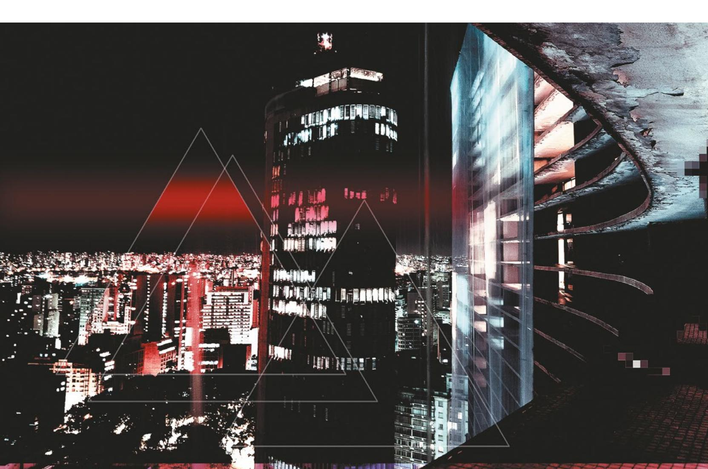

## АЛФАВИТНЫЙ УКАЗАТЕЛЬ

### $\mathbf{A}$

 $A$ TV $U$ Алхимия слабокровных 282 Амальгамы 244 Анарх-революционер 374 Анархи 38 Анахронизм 179 Анимализм 244 Анцилла 140 ADXOHT49 Атанор корпорис 283 Атлетика 159 Аширра 51

### $\mathbf{E}$

Бахари 382 Без проверок 291 Без убежища 193 Беззубый 183 Безмолвие смерти 260 Безупречная точность 267 Бесплотный путь 279 Бессильная ярость 220 Бесследное исчезновение 261 Бестия 175 Бешеная ярость 220 Библиотека 194 Благоговение 249 Ближний бой 301 Блиц 296 Блиц-конфликт 298 Богатство 184 Броня 304 Бруха 65 Быстрая реакция 265 Быстрее ветра 266

#### B

Важные события 145 Величие 248 Вентру 69 Верующий охотник 371 Ветеран войны фракций 392 Вечерняя бодрость 276 Взаимопомощь 122 Вкус крови 272 Влияние 184 Внедрённая директива 253 Внешность 179 Внушение 253 Вожление 159 Воин инквизиции 372 Волк 373 Воля 122, 157 Воровство 160 Восстановление 127 Восстановление крови 286 Восхитительный 179 Враги 189 Врата истинного святилища 280 Вселение 270 Вступительная игровая встреча 138 Вторая инквизиция 39

Выживание 160 Выигрыш 121 Выносливость 155 Высокофункциональный наркоман 182

#### г

Гангрел 75 Гангстер 371 Гангстеры 197 Гарантированная победа 120 Гарпия из Элизиума 374 Гвардия 197 Глаза Зверя 255 Глоток изящества 267 Глоток могущества 258 Глоток упорства 264 Глухая оборона 298 Голконда 389  $T$ олол 205 Голодная ярость 220 Голодный призрак 377 Горнило боли 264 Грубое насыщение 258 Грязная кровь 310 Гули 234 **Гуль** 372 Гуманитарные науки 168

#### $\boldsymbol{\Delta}$

. Дальновидение 271 Движение к цели 296 Лжентльмен 176 Диаблери 234 Дискразия 227 Дистанционный бой 125, 301 Длинные руки 284 Длительная одержимость 311 Дневной дозор 197 Дневной хищник 183 Домен 195 Доминирование 251 Лополнительные навыки 145 Достоинства слабокровных 183 Достопримечательности 333 Aocyr 145 Драка 160 Дурная слава 188

#### E

Едкая кровь 273 Елена 391 Епископ-нодист 375 Естественные науки 168

### Ж

Жажда мафусаила 180 Жало неизбежной погибели 281 Жанетт/Тереза Ворман 394 Жестокий провал 122 Животные 373 Живучесть вампира 183

Живучие звери 263 Жуткое место 193

3

Забвение 253 Зависимость 182 Зависимость от витэ 183 Завязки 349 Загонщики 197 Заживление плоти 218 Зажигательное оружие 379 Замаскированное оружие 379  $3a$ пас воли  $158$ Запугивание 164 Захват 301 Защита неприкосновенного убежища 279 Зашитная печать 275 Защитная печать от гулей 276 Защитная печать от духов 277 Защитная печать от каинитов 280 Зашитная печать от люпенов  $278$ Защитный круг 276 Защитный круг от гулей 277 Защитный круг от духов 278 Защитный круг от каинитов 281 Защитный круг от люпенов 280 Звезда эфира 250 Зверский аппетит 246 Здоровье 119 Землетрясение 259 Зов 37 Зов Дагона 278

### $\boldsymbol{\mathsf{M}}$

Игровая встреча 116 Идол 176 Известное местоположение 193 Извечная Борьба 59 Изнурение 126 Импульс 287 Интеллект 156 Интенсивность 227 Интимные отношения 310 Информаторы 185 Искатели 199 Искра жизни 218 Искра ярости 258 Искуситель 177 Исполнение 164 Испытание Крови 211 Испытания 123 Истина в крови 277 Истинная Вера 222 Истончение витэ 273 История 117 Ищейка 180

#### $\bf K$

Каин 47 Каинитская ересь 384 Капынинания 284 Камарилья 49 Каменное сердце 281 Камера для заключённых 194 Карна 385 Касание скорпиона 273 Каскадная серия проверок 294 Клановый изъян 183 Клеймо Камарильи 183 Кодовое слово 292 Коктейль Молотова 380 Кол в сердце 221 Коломёт 381 Комманлос 198 Компетентность 351 Компромисс 295 Конкурент 187 Конфликты 123 . Котёл Крови 274 Котерия1 139.195 Кочевники 198 Кошачья грация 266 Красивый 179 Крепкий желудок 180 Кровавое чародейство 272 Кровавый культ 198 Кровавый провал 207 Кровавый триумф 207 Кровожадный Шериф 375 Кровоток 386 Кровь оборотня 376 Крыса 373 Кулак Каина 259

### A

Лаборатория 194 Лаконичная сцена 290 Ласка Ваала 274 Лёгкий урон 126 Лёгкость пёрышка 255 Летучая мышь 373 Лидерство 165 Личина самозванца 262  $A$ OBKOCTL  $155$ Лошадь 373 Льен 196

### M

Мавла 185 Mar. 377 Магическая защита 194 Малкавиане 81 Манёвр 297 Манипуляция 156 Марево 285 . Маска 187 Маска тысячи пин 261 Маскировка 261 Медведь 373 Медицина 168

Меланхолический гумор 226 Мёртвая плоть 183 Мёртвая хватка 258 Метаморфозы 254 Метательное оружие 301 Метки 322 Метолы листилляции 283 Мигрирующие  $\frac{1}{2000}$ Мистические артефакты 381 Мишень для кольев 182 Многофункциональный сканер 379 Модификаторы 120 Модификаторы урона оружия 303 . . . . . . . . . . . . . . . . . . . Моральная деградация 239 . Морфей 177 Мощный прыжок 257 Мощь 257 Мраморная плоть 265 Муки совести 239

#### н

Наблюдательность 169 Hanëwuoeth 190 Надуманная опасность 182 Надуманное препятствие 182 Налётчик 177 Невосприимчивость к узам 182 . Неграмотный 181 Неделя кошмаров 395 Недостатки 179 Недостатки слабокровных 183 Незабываемый Поцелуй 249 Незначительные действия 298 Незримая поступь 260 Неистовый Зверь 183 Неонаты 140 Непопулярный 185 Непрошибаемость 263 Несколько противников 125 Неустойчивые узы 181 Нечестивая иерогамия 286 Низкие температуры 221 Нищий 184 Носферату 87

#### $\Omega$

Обаяние 156 Оборотень 376 Обострение чувств 268 Обращение . с животными 165 Обычные проверки 117 Обычное оружие 379 Огнемёт 380 **Огонь 221** 

Одержимость 208 Одержимость, присущая разным кланам 210 Оккультизм 169 Око ночного ястреба 280 Окончательная смерть 223 Омерзительный 179 Операционная 194 Опоры 173 Оправдание 253 Опыт 130 Оружие Зверя 255 Оседлать волну 219 Отверженный 192 Отверженный среди анархов 183 Отродье 375 Отсечение головы 221 Отторжение губительного древа 278 Отчуждение Зверя 247 Охота 306 Охотничьи угодья 308 Охрана 194 Очарование 249 Очи Вавилонские 277

#### **П**

Пакет донорской крови 212 Параметры 118 Патрон «Дыхание дракона» 379 Патруль 198 Паучьи лапы 276 Первая инквизиция 388 Перевоплощение 256 Передвижение 298 Персонаж рассказчика 40 Персонажи 133 Плащ теней 260 Пневматическая сеть 380 Повадки хищника 190 Поглощение духа 247 Подробная сцена 290 Подручные 187 Пожиратель органов 179 Пожиратель пламени 278 Познание души 269 Покойник 187 Поколение 214 Покровитель в Камарилье 183 Полиглот 180 Политика 170 Полицейский детектив 371 Полный жизни 183 Помешательство 253 Портильон 196 Постижение крови 276 Потенциал крови 183 Потомок Елены 391 Потомок Хардештадта 390 Потустороннее зрение 269 Правила 115 Правило половины 123

Превозмогание проклятия 264 Превращение в туман 256 Преграда 297 Предвестие 269 Предметы 378 Предтечи 60, 214 Презираемый 185 Преимущества 179 Преклонение 251 Прелюдия 138 Преследователи 188 Призыв 250 Приказ на самоуничтожение 254 Прилив Крови 218 Примоген 51 Принуждение 252 Принц 51 Принципы 172 Пристрастие 181 Пристрастие к узам 181 Притягательный голос 250 Прихоть 174 Прицельная атака 302 Пробуждение 219 Пробуждение Крови 211 Провал в памяти 252 Проверка дистилляции 282 Проверка проведения ритуала 275 Проворство 266 Продвинутая система безопасности 194 Продолжительные проверки 293 Продолжительные состязания 294 Проницательность 165 Прорыв 120 Противники 370 Психометрия 270 Пташки 198 Птенцы 140 Пул Голода 205 Пул охоты 307 Пул проверки 118

### **Р**

Пункты 118 Пустотелые 363 Пустотелый 187 Путеводный камень 276 Пути отступления 194

Раб кровавых уз 181 Разборчивость 180 Разнородный пул 118 Разрешение конфликтов 295 Расплата за победу 121 Распределение внимания 356 Рассказчик 40 Расследование 170 Рауфосс 380

Регенты 199 Резонанс 226 Религиозный деятель 371 Ремесло 160 Ретроград 179 Ретроспектива 311 Рецепт 283 Решительный натиск 298 Ритуалы 275 Род деятельности 145 Роскошь 194 Руди 396 Рыцари 199

#### **С**

С ключевыми проверками 291 С одной проверкой 291 С частыми проверками 293 Самообладание 156 Сангвинический резонанс 226 Сбиры 199 Сверхъестественная проблема 193 Свечение следопыта 277 Свободное сердце 256 Связь с сиром 278 Сгущение Крови 274 Семьянин 177 Серия проверок 294 Сила 155 Сила жизни 263 Сила Крови 215 Силы 244 Склонность к Дисциплине 184 Скорость мысли 267 Скрытая одержимость 311 Скрытность 163 Слабокровные 109 Слава 188 Следователь инквизиции 372 Слияние с землёй 255 Слияние чувств 270 Сложность 119 Смекалка 156 Смена облика 256 Смертоносность 257 Смог 285 Снаряжение 378 События за кадром 291 Создание персонажа 135 Сокрушение 257 Сокрытие 259 Солнечный свет 221 Сомнения 239 Составная продолжительная проверка 294 Социальный конфликт 304 Союзники 189 Спальный мешок с защитой от солнца 378 Специализации 159

Способность есть пищу 182 Стадный инстинкт 254 Стадо 190 Старейшина 140 Статус 190 Стигматы 182 Стили игры 291 Стиль охоты 175 Стойкость 262 Сторожевой пёс 373 Страницы истории 151, 382‑406 Страшная тайна 188 Стрельба 163 Стремительность 265 Субтильность смертного 183 Суррогатчик 178 Схема отношений 142 Сцена 116

### **Т**

Тайник с оружием 194 Тайное собрание 262 Твёрдость духа 263 Телепатия 271 Тема хроники 172 Тео Белл 383 Терновый собор 387 Техника 171 Товарищи среди анархов 184 Торговля долгами 314 Тореадор 93 Торпор 223 Траверс 267 Травма 303 Традиции 51 Трата ресурсов у противников 375 Тремер 99 Триумф 120 Троица 393 Трупный улей 246 Тусовщик 178 Тяжёлый урон 126 Тяжесть последствий 311 **У**

Убеждение 166 Убежище 192 Уворот 125 Угроза 249 Узы 181 Узы Крови 233 Укрепление сознания 264 Укрытие 302 Укус вампира в бою 213 Уличное чутьё 166 Упорство 157 Употребление психоактивных веществ 182 Урна с прахом предков 381 Уродливый 179

Усмирение Зверя 247 Успех 118 Устойчивость к узам 181 Устойчивые узы 181 Устрашающий взор 250 Утоление голода 212

#### **Ф**

Фамулус 245 Фемгерихт 199 Фермер 178, 180 Фехтование 164 Фея 377 Фиксация 284 Финансы 171 Флегматический гумор 226 Фольклорные достоинства и недостатки 182 Фракция 140

### **Х**

Хаоскопы 378 Хардештадт 390 Хафла 380 Хитрость 166 Хищение крови 274 Хищная птица 373 Ход 115 Холерический гумор 226 Хроника 117, 420

### **Ц**

Царь зверей 247 Церберы 153, 199

### **Ч**

Человечность 236 Четыре гумора 227 Чутьё на Зверя 245

#### **Ш**

Шасс 196 Шкала Человечности 238 Шкалы 119

#### **Э**

Эксклюзивное расположение 194 Электронный призрак 261 Элизиум 61 Эссенция воздуха 279 Этикет 166 Эффект неожиданности 300 Эффективность 189

#### **Ю**

Юстициары 49

#### **Я**

Язык животных 246 Ярость 219 Ясновидение 268