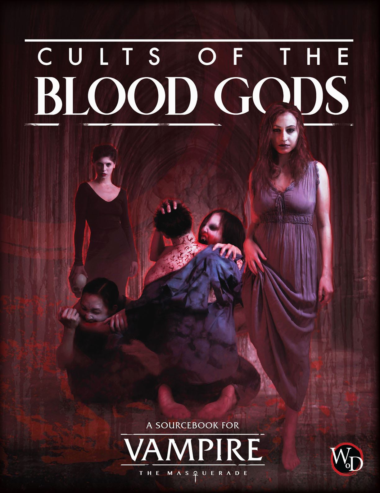

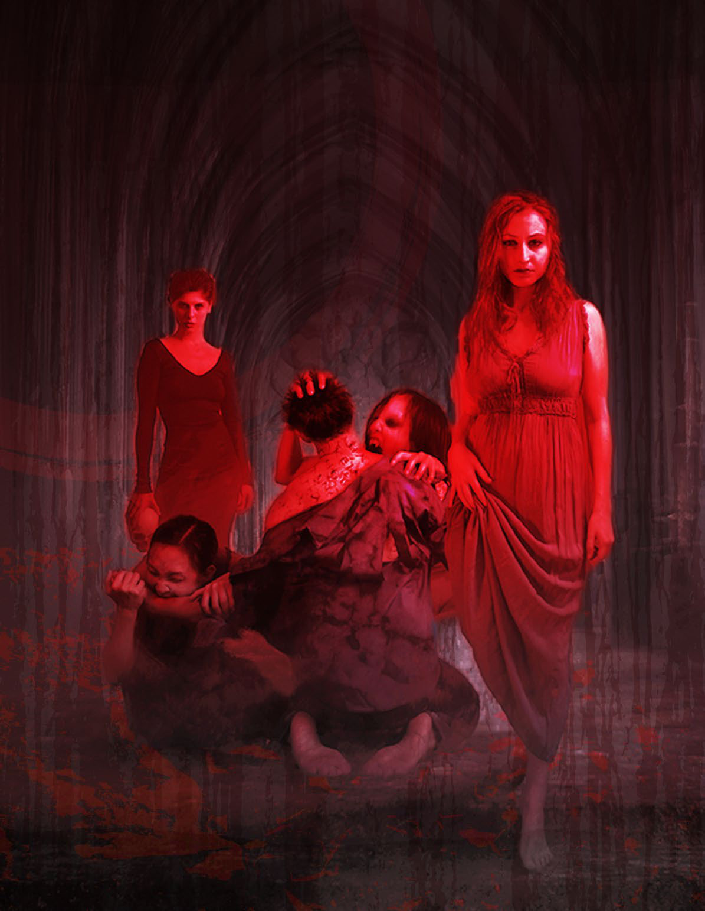

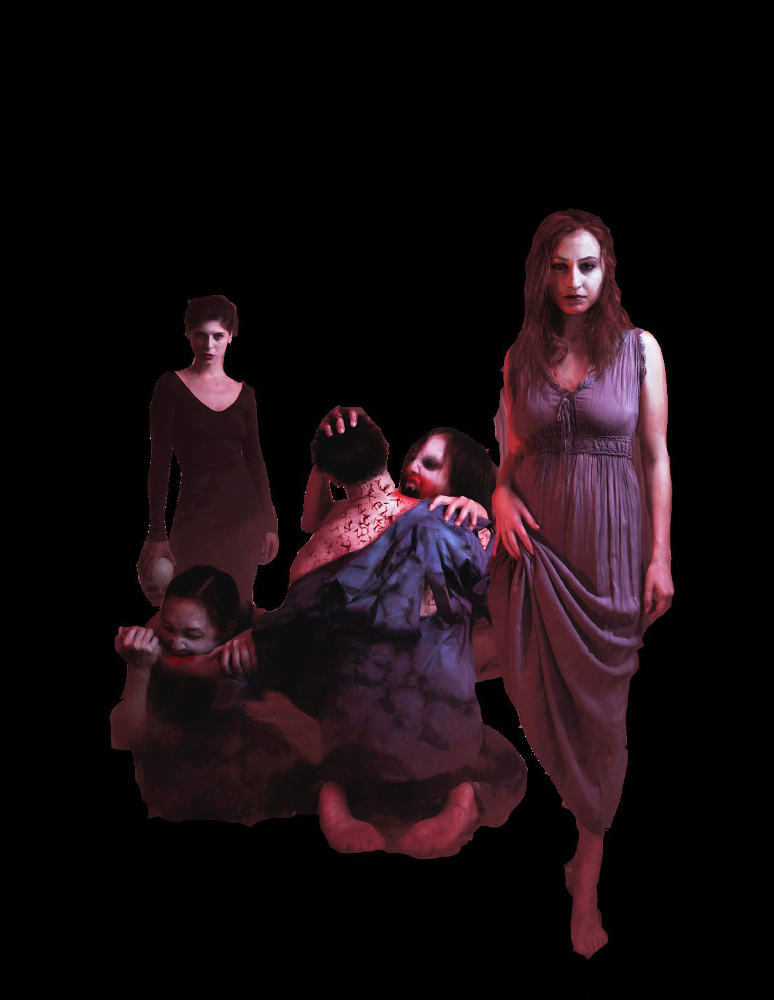

D E S I G N
D E S I G N
developed by – 
developed by – Matthew Dawkins
Matthew Dawkins

written by – 
written by –  Dale Andrade, Jacqueline Bryk, Jacob Burgess, John Burke, Lillian Cohen-Moore, Rachel 
 Dale Andrade, Jacqueline Bryk, Jacob Burgess, John Burke, Lillian Cohen-Moore, Rachel 
Cole, Matthew Dawkins, Steffie de Vaan, Emily Griggs, Mike F. Tomasek Jr, Eddy Webb, Rachel Wilkinson
Cole, Matthew Dawkins, Steffie de Vaan, Emily Griggs, Mike F. Tomasek Jr, Eddy Webb, Rachel Wilkinson

editing 
editing – Brian Johnson
– Brian Johnson

world of darkness line developer
world of darkness line developer — Matthew Dawkins
 — Matthew Dawkins

A RT
A RT
art direction
art direction – Mike Chaney
 – Mike Chaney

book design and layout
book design and layout – Josh Kubat
 – Josh Kubat

cover art – 
cover art – Mark Kelly
Mark Kelly

creative direction 
creative direction - Richard Thomas
- Richard Thomas

S P E C I A L T H A N K S
S P E C I A L T H A N K S
To Sharkey for invaluable advice on Oblivion and its nasty Ceremonies, and the entire World of Darkness 5th Edition 
To Sharkey for invaluable advice on Oblivion and its nasty Ceremonies, and the entire World of Darkness 5th Edition

Discord for your continued support. You’re all loyal Grumbledukes and deserve the shiniest apples in the world.
Discord for your continued support. You’re all loyal Grumbledukes and deserve the shiniest apples in the world.

vampire: the masquerade creators
vampire: the masquerade creators – – Mark Rein•Hagen with Justin Achilli, Steven C. Brown, Tom Dowd, Andrew 
 Mark Rein•Hagen with Justin Achilli, Steven C. Brown, Tom Dowd, Andrew 
Greenberg, Chris McDonough, Lisa Stevens, Josh Timbrook, and Stewart Wieck.
Greenberg, Chris McDonough, Lisa Stevens, Josh Timbrook, and Stewart Wieck.

VAMPIRE: THE MASQUERADE 5TH EDITION
VAMPIRE: THE MASQUERADE 5TH EDITION created by Martin Ericsson, Karim Muammar, and Kenneth Hite
 created by Martin Ericsson, Karim Muammar, and Kenneth Hite

© 2020 PARADOX INTERACTIVE AB.
© 2020 PARADOX INTERACTIVE AB.
All rights reserved. Reproduction without the written consent of the publisher is expressly forbidden, except for the 
All rights reserved. Reproduction without the written consent of the publisher is expressly forbidden, except for the 
purposes of reviews, and for blank character sheets,  which may be reproduced for personal use only.  Vampire: The Masquerade, 
purposes of reviews, and for blank character sheets,  which may be reproduced for personal use only.  Vampire: The Masquerade,

and the World of Darkness are registered trademarks of Paradox Interactive AB (publ) All rights reserved.

and the World of Darkness are registered trademarks of Paradox Interactive AB (publ) All rights reserved.

visit World of Darkness online at www.worldofdarkness.com
visit World of Darkness online at www.worldofdarkness.com

CULTS OF THE BLOOD GODS

JUST ANOTHER FAMILY DINNER	
9

Organization	
49
Modern Nights	
50
Recruitment	
50
Bases of Operations	
51
Garden of Hope: Budapest	
52
Goals	
53
Rites and Rituals	
54
Enemies	
54
Perspectives	
55
New Coterie Type	
55
Nemeses	
55
New Rituals	
55
Level 1	
55
Coax the Garden	
55
 Level 5	
56
Eden’s Bounty	
56
The Church of Caine 	
57
The Heresy Falls	
58
The Heresy Rises	
58
Hell on Earth	
59
Sublimating Divinity into Society 	
59
Ad Limina	
60
Church Hierarchy	
61
Congregation / The Flock	
61
Doorkeepers	
61
Acolytes	
61
Vergers	
61
Lectors	
62
Deacons	
62
Priests / Church Leaders	
62
Bishops	
62
The Metropolitan	
62
Church Dogma	
62
Sacraments	
64
The Sacrament of Valediction	
64
The Sacrament of Exculpation	
64
The Sacrament of Firewalking	
64
Cainite Dominion: St. Louis	
65
Perspectives	
66
New Rituals	
67
Level 1	
67
Dampen the Fear	
67
Level 3	
67
Fire in the Blood	
67
Level 5	
67
Creatio Ignis	
67
The Church of Set	
68
The Chaos Cult	
68

INTRODUCTION	
13

Believe in the Blood	
13
A Place of Worship	
14
Existing in Religious Disharmony	
14
CHAPTER ONE: 

RISE OF THE METHUSELAH CULT	
17

The Justicars Speak	
17
The Why and Way of Worship 	
19
The Bull and the Blood and the Bone	
19
Prepare.	
20
Time of Thin Blood	
20
Brother Sweetwater Speaks	
21
Protect the Flock	
21
A Cainite Hymnal	
21
Planting the Seed	
23
Rotten to the Core	
23
Beauty is Divine Truth	
25
Bed the Bones	
26
Hail Gorgo, Slayer of Men	
28
The Seeker and the Moon	
28
On a Mission for the Goddess	
29
Trickle-Up Religion	
31
Beware False Religions	
31
The Lord of the Red Desert	
32
CHAPTER TWO: 

KINDRED RELIGIONS	
35

The Ashfinders	
35
Dust to Dust	
36
Are Millennials Killing Kindred Elders?	
36
Data Mining	
37
Cinder Institute: Ibiza	
38
Perspectives	
38
Beast Shards	
39
Amber Freeman (ThriveHive)	
39
Dr. James “Mortius” Howitt	
42
Ashfinder Blood Alchemy	
44
Level 3	
45
Concoct Ashe	
45
Chemically-Induced Flashback	
45
Level 4	
46
Discipline Channeling	
46
The Bahari, Children of Lilith	
46
Overly Devoted Scholarship	
47
Out of the Desert 	
48
Beliefs 	
49

2

Table of Contents

Church and State	
68
The Clan of Lies	
69
Divine Origins	
70
A History in Whispers	
71
More Modern Deceits	
72
Snakes in Their Hidden Nests	
72
Rituals of Liberation	
73
The Lesser Mystery of Set	
73
The Nine Gates	
74
The Greater Mystery of Set	
75
Beginning the Journey of the Faithful	
75
The Later Hours of Night	
76
On the Church of Set	
78
Setite Temple: Kharkiv	
79
Perspectives	
80
Animals	
81
Boa Constrictor	
81
Cobra	
81
Jackal	
81
Oksana Koblenko “Proserpina”	
81
New Coterie Type	
84
Saboteurs	
84
New Powers	
84
Obfuscate	
85
Level 3	
85
Mental Maze	
85
Presence	
85
Level 3	
85
True Love’s Face	
85
Protean	
85
Level 5	
85
The Heart of Darkness	
85
Cult of Shalim	
86
Out of Nothing	
86
The Flowering of the Abyss	
87
Servants of the Abyss	
87
Shalimite Rites	
87
Gematria	
87
Abyssal Consecration	
88
Dark Purpose	
88
Enemies	
88
Artifacts and Symbology	
89
Mortal Servants	
89
Shalimite Operations: Fukuoka	
89
Perspectives	
90
“Porcelain” Patricia Montgomery	
90
Ceremonies of Shalim	
93
Level 1	
93

Traveler’s Call	
93
Level 3	
94
Name of the Father	
94
Level 5	
94
Pit of Contemplation	
94
The Mithraic Mysteries	
95
From Persia to Rome	
95
A London Renaissance	
95
Mithra and the Bull	
96
The London Blitz	
96
Faces of the Bull God	
97
Mithraist Ambition	
97
Divine Mithras	
98
An Underground Religion 	
99
The London Uncertainty	
99
Celebrating the Bull God	
99
Bull Running	
99
Fertility Feasts	
99
The Blood Equinox	
100
The Blooding	
100
Seven Steps to the Sun	
100
The First Step: Corax, the Raven	
100
The Second Step: Nymphus, the Bride	
101
The Third Step: Miles, the Soldier	
101
The Fourth Step: Leo, The Lion	
101
The Fifth Step: Perses, the Persian	
101
The Sixth Step: Heliodromus, 

the Courier of the Sun	
101
The Seventh Step: Pater, the Father/Mother	
102
Mithraeum: Edinburgh	
102
Perspectives	
104
New Powers	
104
Dominate	
104
Level 2	
104
Slavish Devotion	
104
Level 4	
104
Ancestral Dominion	
104
Fortitude	
104
Level 4	
104
Shatter	
104
The Nephilim, Children of the Angel	
105
The Unending Dream	
105
The Seeds of the Garden	
106
The Basilica of the Archangel	
107
Lex Sanctorum Decis Angelorum	
107
Places of Worship	
108
Rites of Pleasure and Perfection	
108
Limited Scope?	
109

3

CULTS OF THE BLOOD GODS

Factionalism	
137
Plans for the Giovanni	
137
Plans for the Samedi	
138
Hierarchy and Strains	
138
The Samedi Role	
138
Setting Down Religion	
138
Religious Practice	
139
New to the Rot	
139
Shifting Tides of Necromancy	
140
The Role of Others	
141
The Lamiae	
141
The Cappadocians	
141
The Nagaraja	
142
And More Besides	
142
The Family Hierarchy	
143
Who’s Your Daddy?	
143
The Families	
144
Coterie or Family Tree?	
144
Outward Facing Operations	
145
The Venetian Ladder	
146
The Anziani Council	
146
The 1444 Chamber	
147
The Endless Night	
147
Perspectives on Kindred Religions	
147
A Unique Cult	
148
Hecata Chronicles	
149
New Coterie Types	
150
Family	
150
Gatekeepers	
150
New Predator Types	
150
Extortionist	
150
Graverobber	
150
CHAPTER FOUR: MORTAL CULTS	
153

Enemies	
109
Artifacts and Symbology	
109
Mortal Adherents	
109
Nephilim Dreams: Johannesburg	
110
Perspectives	
111
Anna Yusupova “Annatoliya”	
111
Minor Cults	
114
Amaranthans	
114
Current Goals	
114
Cleopatrans	
115
Current Goals	
116
The Cult of Isis	
116
Current Goals	
116
Eyes of Malakai	
116
Current Goals	
117
Gorgo’s Nest 	
118
Current Goals	
118
Los Hijos de Si 	
118
Current Goals	
119
Sons and Daughters of Helena	
120
Current Goals	
120
The Meneleans	
120
Current Goals	
121
The One True Way	
121
Current Goals	
121
Servitors of Irad	
122
Current Goals	
122
One of Us	
125
CHAPTER THREE: THE CULT 

OF DEATH AND UNDEATH	
125

The Underworld	
126
Masks and Murder and Plot	
126
…That You Do So Well	
127
Death Always Comes In Threes	
128
The Family Reunion	
129
The Other Side	
130
The Capuchin	
131
The Giovanni Role	
132
The Purge	
132
A New Broom	
133
The Establishment	
133
The Family’s Goals	
134
Family Business	
134
Dealing with the Authorities	
134
The Harbinger Role	
135
The Timeline	
135
New Blood in an Ancient Clan	
136
Dead Aim	
137

The House of Anteros	
154
History	
154
Doctrine	
154
What is Love?	
154
Activities	
154
Future Plans	
156
Annabelle Jones	
156
Jacob Wrightson	
156
Alyson King	
156
The Eaden Family	
156
Virginia Eaden	
157
Leonard Eaden	
157
Story Hook: Love in Death	
157
The Church of Means	
158
History	
158

4

Table of Contents

Doctrine	
158
Activities	
159
Future Plans	
160
Millicent Jarvey	
160
Morgan Brant	
160
Malik Lugo	
160
Joseph Dominguez	
161
Story Hook: Financial Drain	
162
Leah’s Circle	
162
History	
162
Doctrine	
163
Activities	
163
Future Plans	
164
Jake “Diabolic” Martins	
164
Mika Bittermann	
164
Melissa “Razor” Thomson	
164
Leah	
165
Story Hook: Mugging Gone Wrong	
165
The Dread Cult of Eligos	
166
History	
166
Doctrine	
166
Activities	
166
Future Plans	
167
Amy Montague	
168
Jaden Michaels	
168
Franklin Bryant	
168
Rupert Brant	
168
Teresa Miles	
168
Story Hook: Eligos’ Breach	
169
The Order of the Broken Branch	
169
History	
169
Doctrine	
170
Activities	
170
Future Plans	
170
Margaret Thales	
171
Samantha Watts	
171
Edward H. Sullivan	
171
Story Hook: God’s Weapons	
171
Other Cults	
172
CHAPTER FIVE: 

CULT CONSTRUCTION	
175

Heresies	
179
Mandates	
179
You Shall…	
179
You Shall Not…	
179
The First Rule of Vampire Club	
179
Hierarchy	
179
Laity	
179
Initiate	
180
Acolyte	
180
Clergy	
180
Prophets	
181
Cult Practices	
181
Scripture	
181
Relics	
181
Services	
181
Apparel	
181
Rituals	
182
Holidays	
182
Lunar	
182
Historic	
182
Seasonal	
182
Methods of Recruitment	
183
The Desperate	
183
The Driven	
183
A Letter from Laylah Froud of the Bahari	
183
The Indulgent	
184
Places of Worship	
184
The Temple	
184
Historic Site	
184
Anywhere and Nowhere	
184
Quick Cult Creation	
184
Backgrounds	
184
Allies	
184
Contacts	
185
Influence	
185
Haven	
185
A Letter from Khaled al-Fakhani 

of the Church of Set	
186
Mawla	
187
Cult Names	
187
Colors	
189
Creatures	
190
Basic Cult Descriptions	
191
Sample Cult Members	
193
Mortals	
193
Vampires	
194
Sample Cult: The Order of Taweret	
194

The Act of Creation	
175
How to Build a Cult	
176
The Basics	
177
Belief	
178
Ancestral Worship	
178
Secular Values	
178

5

CULTS OF THE BLOOD GODS

New Coterie Types	
195
Envoys	
195
Think Tank	
195
An Accord Between Faiths	
196
CHAPTER SIX: HECATA	
199

Split the Shroud	
213
Level 5	
213
Ex Nihilo	
213
Lazarene Blessing	
214
Life in the Underworld	
215
Ghost in the Machine	
216
Poltergeist	
216
Puppeteer	
216
Screamer	
216
CHAPTER SEVEN: 

BLOODLINES AND LORESHEETS	
219

Who are the Hecata?	
200
Hecata Archetypes	
201
Champion Bullshitter	
201
Forensic Specialist	
201
Natural Necromancer	
201
Prodigal Child	
202
Unscrupulous Banker	
202
Disciplines	
202
Compulsion	
202
Hecata: Morbidity	
202
Bane 	
203
Feeding Methods	
203
Oblivion	
203
Characteristics	
203
Level 1	
204
Ashes to Ashes	
204
The Binding Fetter	
204
Level 2	
204
Fatal Precognition	
204
Where the Shroud Thins	
205
Level 3	
205
Aura of Decay	
205
Passion Feast	
206
Level 4	
206
Necrotic Plague	
206
Level 5	
207
Skuld Fulfilled	
207
Withering Spirit	
208
Oblivion Ceremonies	
208
Level 1	
208
The Gift of False Life	
208
Mindless Corpse	
208
Summon Spirit	
209
Level 2	
209
Awaken the Homuncular Servant	
209
Homuncular Servant	
210
Compel Spirit	
210
Level 3	
211
Host Spirit	
211
Shambling Hordes	
212
Aggressive Corpse	
212
Level 4	
212
Bind the Spirit	
212

Bloodlines	
219
Loresheets	
228
CHAPTER EIGHT: 

STYX AND BONES	
231

Introduction	
231
München mag Dich (Munich Loves You)	
232
Where the Bodies Are Buried	
233
Die Heimliche Hauptstadt (The Secret Capital)	
234
Prologue: A Family Dinner	
236
Chapter One: Body of Lies	
237
Handout #1: The Auction Invitation	
237
Handout #2: Günter Hildebrant Dossier	
238
The Auction	
239
Coterie Options	
239
Approaching Günter Hildebrant	
240
Coterie Options	
240
The Ritual	
241
Chapter Two: Grave Digging	
241
Exploring the City	
241
PermanentLodgings	
242
The First Nightmare	
242
Under Arrest	
243
Threats and Rumors	
244
Clan Advice	
244
Investigating the First Attack	
245
Chapter Three: The Price We Pay	
245
The Second Nightmare	
246
Investigating the Second Attack	
246
Getting to Know the Cult of Mithras	
247
Threats and Attacks	
249
Chapter Four: A Family Affair	
249
The Third and Fourth Nightmare	
249
Investigating the Third Attack	
250
Coterie Options	
250
Investigating the Fourth Attack	
250
Investigating GSG 10	
250

6

Table of Contents

Coterie Options	
251
Asano’s Ambush	
251
Coterie Options	
251
Chapter Five: Rise and Fall	
252
Preventing the Fifth Attack	
252
Epilogue: Death is Certain, Life is Not	
252
Handout #3: A Letter	
253
Antagonist Stats	
254
Hiromitsu Asano	
254
Kindred Citizens of Munich	
256
Terrence Rusk, Perses of the Cult of Mithras	
256
Anna Fleischer of the Cult of Mithras	
256
Dieter Straub, Baron of Munich	
256
Peter Bohn, Anarch	
256
The Risen	
257
Mortals of Munich	
258
Grenzschutzgruppe 10	
258
Police and Wayward Muscle	
258
Lieschen Müller/Jane Q. Public	
258
Ready Made Characters	
259
Christof Giovanni	
259
Franziska (Hollander) Giovanni	
260
Jan Puttanesca	
261
Heather Milliner	
262
Marlene Drake	
263
Jürgen Schweiger	
264
Matters of Faith	
265
The Sleeping Sword of War	
265
The Ghosts of Carthage	
265

Mago	
266
Resignation of the Righteous	
266
The Romero Twins	
266
Idle Hands	
267
Hellhounds of Satan	
267
Family Feud	
268
Shades of Gray	
268
The Hunt Club	
268
Prince Vaughn	
268
Blood Trade	
269
Absolution	
269
Ethan Clare	
270
First Change Fiasco	
270
Karen Shaw	
271
Tolerance and Persecution	
271
The Trinity	
271
Prince Bruno, Descendant of Michael	
271
Praise (the Church of) Caine!	
272
Gladius Domini	
272
Reverend Alfred Murray	
272
High and Low	
273
Sample Cultists	
273
The Naive Lay Member	
273
The Inducted Initiate	
273
The Loyal Acolyte	
273
The Trusted Templar	
274
The Grand Inquisitor	
274
The Devout Clergy	
274
The Charismatic Prophet	
274

7

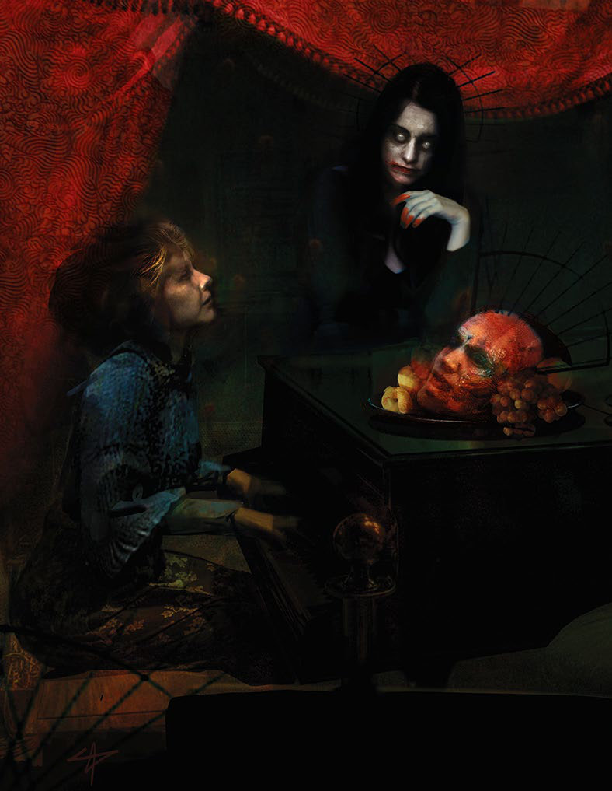

8

By Eddy Webb and Rachel Wilkinson
By Eddy Webb and Rachel Wilkinson

Moonlight pours through 
Moonlight pours through 
the stained-glass windows of a 
the stained-glass windows of a 
remodeled Gothic church, and in 
remodeled Gothic church, and in 
its basement, the dead dine with 
its basement, the dead dine with 
family. From a small table off in 
family. From a small table off in 
the corner, I watch a thin, almost 
the corner, I watch a thin, almost 
emaciated woman with steel hair 
emaciated woman with steel hair 
and pale eyes stand from one end 
and pale eyes stand from one end 
of a ridiculously long table. Anja 
of a ridiculously long table. Anja 
Giovanni raises her wine glass of 
Giovanni raises her wine glass of 
treated blood to the assembled. I 
treated blood to the assembled. I 
swirl around the thickening blood 
swirl around the thickening blood 
in my own glass, half-listening to 
in my own glass, half-listening to 
her speech. Something about gath­
her speech. Something about gath­
ering the Clan of Death, embark­
ering the Clan of Death, embark­
ing on new beginnings, the usual 
ing on new beginnings, the usual 
horseshit. I tune in just as I sense 
horseshit. I tune in just as I sense 
she’s wrapping up. “For we are all 
she’s wrapping up. “For we are all 
Hecata, now. We are all family.”
Hecata, now. We are all family.”

gazillions of flower place-settings 
gazillions of flower place-settings 
just add a layer of fragrant death 
just add a layer of fragrant death 
over everything.
over everything.

the call fast enough, I didn’t drive 
the call fast enough, I didn’t drive 
fast enough, I wasn’t fast enough to 
fast enough, I wasn’t fast enough to 
stop it. I fell to my knees, tears roll­
stop it. I fell to my knees, tears roll­
ing down my face. And all I could 
ing down my face. And all I could 
hear in my head was him chiding 
hear in my head was him chiding 
me, like he did during my first cere­
me, like he did during my first cere­
mony lessons.
mony lessons.

The fat, sweaty-looking man 
The fat, sweaty-looking man 
in a rumpled suit sitting next to 
in a rumpled suit sitting next to 
me has been trying to catch my 
me has been trying to catch my 
eye for half an hour now. Clearly 
eye for half an hour now. Clearly 
annoyed that I didn’t raise my 
annoyed that I didn’t raise my 
glass for the toast, he reaches over 
glass for the toast, he reaches over 
and taps his glass against mine. 
and taps his glass against mine. 
“There. Now you’re being social.”
“There. Now you’re being social.”

“Don’t cry, little Maria,” he 
“Don’t cry, little Maria,” he 
would say. I could remember how 
would say. I could remember how 
he always smelled of sandalwood 
he always smelled of sandalwood 
and copper. “Death comes to us all, 
and copper. “Death comes to us all, 
even the immortals. One day I, too, 
even the immortals. One day I, too, 
shall cross the Shroud and join both 
shall cross the Shroud and join both 
those we have lost and those we 
those we have lost and those we 
have enslaved. You can’t become a 
have enslaved. You can’t become a 
necromancer if you cry over every 
necromancer if you cry over every 
single death.”
single death.”

I take a sip of the blood. 
I take a sip of the blood. 
“Didn’t come here to be social.”
“Didn’t come here to be social.”

“Tough.” He shoves a hand 
“Tough.” He shoves a hand 
out to me. “Tony Ambrose. Of 
out to me. “Tony Ambrose. Of 
the Puttanesca.”
the Puttanesca.”

I wiped my arm across my eyes, 
I wiped my arm across my eyes, 
and blood smeared on my sleeve. In 
and blood smeared on my sleeve. In 
the corner of my eye I could see a man 
the corner of my eye I could see a man 
who was also watching the blaze. He 
who was also watching the blaze. He 
put his cell phone away and got back 
put his cell phone away and got back 
into his large sedan. He was a fat, 
into his large sedan. He was a fat, 
sweaty man in a rumpled suit. He 
sweaty man in a rumpled suit. He 
didn’t look at me as he drove away.
didn’t look at me as he drove away.

I sigh and take it. It feels 
I sigh and take it. It feels 
clammy and soft, like a fish a day 
clammy and soft, like a fish a day 
past its sell-by date. “Maria. Of 
past its sell-by date. “Maria. Of 
the Pisanob, I guess.”
the Pisanob, I guess.”

She nods to the Japanese 
She nods to the Japanese 
man at the other end of the table, 
man at the other end of the table, 
who also stands up. Hiromitsu 
who also stands up. Hiromitsu 
Asano has a twig pinned to a 
Asano has a twig pinned to a 
jacket that’s worth more than I 
jacket that’s worth more than I 
make in a year. He thanks her 
make in a year. He thanks her 
and raises his glass in return. 
and raises his glass in return. 
Everyone else raises their glass, 
Everyone else raises their glass, 
too. The whole room smells like a 
too. The whole room smells like a 
hospital dump: nothing but cop­
hospital dump: nothing but cop­
pery blood and dead bodies. The 
pery blood and dead bodies. The

He raises an eyebrow at that. 
He raises an eyebrow at that. 
“Pisanob? Ain’t many of yours 
“Pisanob? Ain’t many of yours 
around anymore.”
around anymore.”

I bite back yet another pro­
I bite back yet another pro­
fanity and close my eyes.
fanity and close my eyes.

“Hey, you listening to me?” 
“Hey, you listening to me?” 
Tony’s voice cuts through my rev­
Tony’s voice cuts through my rev­
erie. “I asked you what happened 
erie. “I asked you what happened 
to all of youse.”
to all of youse.”

I watched the flames lick the 
I watched the flames lick the 
sides of my sire’s haven. I didn’t get 
sides of my sire’s haven. I didn’t get

9

I open my eyes and turn to 
I open my eyes and turn to 
stare at him — the first time I’ve 
stare at him — the first time I’ve 
looked at him all evening. “Most 
looked at him all evening. “Most 
of us were murdered.” He leans 
of us were murdered.” He leans 
back from my gaze, and I imagine 
back from my gaze, and I imagine 
what it would feel like to rip his 
what it would feel like to rip his 
throat out with my teeth.
throat out with my teeth.

kiss Giovanni ass after everything 
kiss Giovanni ass after everything 
done to them.”
done to them.”

the stained glass glints off the pol­
the stained glass glints off the pol­
ished ebony of his mask. “I have 
ished ebony of his mask. “I have 
always found these pleasantries 
always found these pleasantries 
to be tiresome. They detract from 
to be tiresome. They detract from 
my studies.” He carefully adjusts 
my studies.” He carefully adjusts 
his tattered brown robes around 
his tattered brown robes around 
his frail form, and carefully lifts 
his frail form, and carefully lifts 
the edge of his mask up so that he 
the edge of his mask up so that he 
can sip from his wine glass.
can sip from his wine glass.

I take a sip from the glass 
I take a sip from the glass 
before pointing it at Berlin’s face. 
before pointing it at Berlin’s face. 
“You’re just mad they’re not kiss­
“You’re just mad they’re not kiss­
ing your Giovanni ass.”
ing your Giovanni ass.”

“Damn straight,” she laughs. 
“Damn straight,” she laughs. 
“My ass is much nicer than his.”
“My ass is much nicer than his.”

I feel a hand touch my shoul­
I feel a hand touch my shoul­
der, gently. “Leave him be,” she 
der, gently. “Leave him be,” she 
says. “It’s not nice to play with 
says. “It’s not nice to play with 
your food.”
your food.”

“I’m surprised this pulled you 
“I’m surprised this pulled you 
away from your studies, Zebadi­
away from your studies, Zebadi­
ah.” Berlin has reluctantly pulled 
ah.” Berlin has reluctantly pulled 
her hand off my knee and leans 
her hand off my knee and leans 
forward on the table, her elbows 
forward on the table, her elbows 
resting on either side of the bar­
resting on either side of the bar­
ren plate in front of her. “I figured 
ren plate in front of her. “I figured 
you would still be in mourning 
you would still be in mourning 
for the loss of your childe, Elias.”
for the loss of your childe, Elias.”

“Nice ass,” I said, as I watched 
“Nice ass,” I said, as I watched 
her walk down the hallway.
her walk down the hallway.

I turn back to look at her. 
I turn back to look at her. 
Berlin smiles at me, like she 
Berlin smiles at me, like she 
always does when she knows I’m 
always does when she knows I’m 
about to punch someone. Her 
about to punch someone. Her 
green eyes twinkle with mischief, 
green eyes twinkle with mischief, 
like they always do. We’ve only 
like they always do. We’ve only 
been seeing each other for a few 
been seeing each other for a few 
weeks, but she’s always telling me 
weeks, but she’s always telling me 
that I’ve gotten under her skin, in 
that I’ve gotten under her skin, in 
the best possible way. I nod, and 
the best possible way. I nod, and 
she drops her hand to my knee. 
she drops her hand to my knee. 
Her fingers feel cool through my 
Her fingers feel cool through my 
stockings as she points to the 
stockings as she points to the 
head table. “Besides, Mora the 
head table. “Besides, Mora the 
Death Seer is up to something.”
Death Seer is up to something.”

She looked over her shoulder and 
She looked over her shoulder and 
smiled. “You know it. Have we met?”
smiled. “You know it. Have we met?”

I shook my head and walked to 
I shook my head and walked to 
her as she turned around. “Maria 
her as she turned around. “Maria 
Ibarra. A cousin.”
Ibarra. A cousin.”

“Berlin Giovanni.” I clasped her 
“Berlin Giovanni.” I clasped her 
hand as she looked me up and down. 
hand as she looked me up and down. 
“A cousin, huh? Not a kissing cousin 
“A cousin, huh? Not a kissing cousin 
by chance?”
by chance?”

Zebadiah carefully pulls the 
Zebadiah carefully pulls the 
mask back over his face. “We are 
mask back over his face. “We are 
the Clan of Death. To mourn those 
the Clan of Death. To mourn those 
that have died seems… pointless.”
that have died seems… pointless.”

“Kissing? No.” I leaned over 
“Kissing? No.” I leaned over 
and put my lips next to her ear. “I’m 
and put my lips next to her ear. “I’m 
thinking of something much, much 
thinking of something much, much 
better.”
better.”

Tony has, unfortunately, de­
Tony has, unfortunately, de­
cided to join in the conversation. 
cided to join in the conversation. 
“Pointless? Don’t know about 
“Pointless? Don’t know about 
that, Zeb. If I—”
that, Zeb. If I—”

She shivered then. The same 
She shivered then. The same 
shiver she had later, tied down to the 
shiver she had later, tied down to the 
bed, when she was begging for my 
bed, when she was begging for my 
tongue.
tongue.

I follow the line of her finger, 
I follow the line of her finger, 
and see a delicate person dressed 
and see a delicate person dressed 
in a draping black sweater stand 
in a draping black sweater stand 
up. Their back is to our table, and 
up. Their back is to our table, and 
they speak softly, but their voice 
they speak softly, but their voice 
carries through the room. They 
carries through the room. They 
talk about Augustus Giovanni’s 
talk about Augustus Giovanni’s 
plans to murder the Cappado­
plans to murder the Cappado­
cians, and how they’ve killed 
cians, and how they’ve killed 
many Giovanni in retaliation. 
many Giovanni in retaliation. 
They just manage to avoid making 
They just manage to avoid making 
it sound like a boast or a threat 
it sound like a boast or a threat 
before they offer their condo­
before they offer their condo­
lences to Asano for his losses. 
lences to Asano for his losses. 
He murmurs something nice in 
He murmurs something nice in 
return.
return.

“Zebadiah.”
“Zebadiah.”

Tony is distracted by the sud­
Tony is distracted by the sud­
den interruption. “Huh?”
den interruption. “Huh?”

I smile, but I’m not looking 
I smile, but I’m not looking 
at her. Instead I’m watching as 
at her. Instead I’m watching as 
Asano walks over to Mora, who’s 
Asano walks over to Mora, who’s 
pulled a cylinder wrapped in 
pulled a cylinder wrapped in 
pale blue silk out of the folds of 
pale blue silk out of the folds of 
their sweater. The two vampires 
their sweater. The two vampires 
are going through some tiresome 
are going through some tiresome 
ritual where Mora offers the gift 
ritual where Mora offers the gift 
and Asano refuses it, then he pulls 
and Asano refuses it, then he pulls 
out a small wooden box from his 
out a small wooden box from his 
jacket and the roles are reversed 
jacket and the roles are reversed 
as the two of them go through it 
as the two of them go through it 
all over again.
all over again.

The cool, flat voice comes 
The cool, flat voice comes 
from the mask again, faintly 
from the mask again, faintly 
muffled and hollow. “My name is 
muffled and hollow. “My name is 
Zebadiah. Not ‘Zeb’.”
Zebadiah. Not ‘Zeb’.”

“Sure, that’s what I said. Ze­
“Sure, that’s what I said. Ze­
badiah. And if I had a childe that 
badiah. And if I had a childe that 
was tore up like that, I wouldn’t be 
was tore up like that, I wouldn’t be 
mourning. I’d be out hunting the 
mourning. I’d be out hunting the 
bastard that did it.”
bastard that did it.”

“Would you? I suppose that 
“Would you? I suppose that 
makes a degree of sense. But I am 
makes a degree of sense. But I am 
simply… what is the word?”
simply… what is the word?”

Berlin clicks her tongue 
Berlin clicks her tongue 
against her teeth. “Damn, Mora 
against her teeth. “Damn, Mora 
must have practiced that apology 
must have practiced that apology 
for a week. Imagine having to 
for a week. Imagine having to

The man sitting across the ta­
The man sitting across the ta­
ble from me sighs and turns back 
ble from me sighs and turns back 
to face us. The moonlight from 
to face us. The moonlight from

Berlin leans back again. “Up­
Berlin leans back again. “Up­
set?”
set?”

10

Tony knocks back the rest of 
Tony knocks back the rest of 
his glass. “Fucking furious, more 
his glass. “Fucking furious, more 
like.”
like.”

mill into the dinner area. They’re 
mill into the dinner area. They’re 
all dressed in white clothing, but 
all dressed in white clothing, but 
otherwise there’s nothing linking 
otherwise there’s nothing linking 
them together. A wide variety of 
them together. A wide variety of 
ages, genders, sizes, what have 
ages, genders, sizes, what have 
you. Some carry carafes of blood 
you. Some carry carafes of blood 
and start refilling glasses. Others 
and start refilling glasses. Others 
start to carefully put food onto 
start to carefully put food onto 
the places — small bones stuck 
the places — small bones stuck 
into carefully sliced raw meat, 
into carefully sliced raw meat, 
also covered in blood. Tony waves 
also covered in blood. Tony waves 
off the meat and looks a little 
off the meat and looks a little 
green around the gills as he looks 
green around the gills as he looks 
at it. Zebadiah nods once at the 
at it. Zebadiah nods once at the 
server filling his plate. Berlin just 
server filling his plate. Berlin just 
stares at me with a smirk on her 
stares at me with a smirk on her 
face as she takes a sip from her 
face as she takes a sip from her 
newly filled glass. I can feel her 
newly filled glass. I can feel her 
foot running up the side of my 
foot running up the side of my 
leg.
leg.

fuckers managed to accomplish any­
fuckers managed to accomplish any­
thing. But I’m not here to debate your 
thing. But I’m not here to debate your 
failings as a family.” I moved onto the 
failings as a family.” I moved onto the 
table surface, managing to sit right 
table surface, managing to sit right 
next to where his hand was nailed 
next to where his hand was nailed 
down. I picked up the blowtorch again 
down. I picked up the blowtorch again 
and began reheating the spoon. “Next 
and began reheating the spoon. “Next 
question. Who told the Puttanesca 
question. Who told the Puttanesca 
where to find my sire’s haven?”
where to find my sire’s haven?”

“Jealous. Yes, that’s the word. 
“Jealous. Yes, that’s the word. 
He died in such a creative way. 
He died in such a creative way. 
I hope I get to experience that 
I hope I get to experience that 
some night.”
some night.”

The pale man never said a word 
The pale man never said a word 
when I nailed his hands to the wood­
when I nailed his hands to the wood­
en top of the table. Nor his feet. But 
en top of the table. Nor his feet. But 
when I pulled his mask off, he started 
when I pulled his mask off, he started 
screaming like he was on fire. “Please! 
screaming like he was on fire. “Please! 
Please! Give me back my face! I am 
Please! Give me back my face! I am 
Elias of the Harbingers, and you 
Elias of the Harbingers, and you 
must 
must give me back my face!
give me back my face!”

“I don’t—” The rest of his 
“I don’t—” The rest of his 
sentence was lost in the scream, as I 
sentence was lost in the scream, as I 
plunged the white-hot spoon into his 
plunged the white-hot spoon into his 
right eye. There was a soft pop and 
right eye. There was a soft pop and 
then a sizzling sound, as the vitreous 
then a sizzling sound, as the vitreous 
fluid in his eye began to boil.
fluid in his eye began to boil.

I gave him a minute to calm 
I gave him a minute to calm 
down before I spoke. “I told you, I 
down before I spoke. “I told you, I 
need you to answer my questions. 
need you to answer my questions. 
See, no one really gives a shit about 
See, no one really gives a shit about 
the Pisanob except you Harbingers. 
the Pisanob except you Harbingers. 
And the Puttanesca aren’t clever 
And the Puttanesca aren’t clever 
enough to hunt down one of us in 
enough to hunt down one of us in 
our haven. But they are 
our haven. But they are just 
just dumb 
dumb 
enough to take on a job for someone 
enough to take on a job for someone 
else if they think it will get them 
else if they think it will get them 
somewhere.” I slid off the table and 
somewhere.” I slid off the table and 
moved to the other side, so he could 
moved to the other side, so he could 
see me with his remaining good eye. 
see me with his remaining good eye. 
“I know your sire hired them. And 
“I know your sire hired them. And 
don’t worry — he’ll get his. But I also 
don’t worry — he’ll get his. But I also 
know that you don’t get out of your 
know that you don’t get out of your 
crypts for a simple hit job. There was 
crypts for a simple hit job. There was 
someone who arranged everything. 
someone who arranged everything. 
Wasn’t there?”
Wasn’t there?”

I leaned over him and gave him 
I leaned over him and gave him 
a smile. I made sure he could see the 
a smile. I made sure he could see the 
blowtorch under the spoon, which 
blowtorch under the spoon, which 
had started to glow from the heat. 
had started to glow from the heat. 
“Here’s what I’m going to do, Elias. If 
“Here’s what I’m going to do, Elias. If 
you don’t answer my questions, I’m 
you don’t answer my questions, I’m 
going to scoop out your eyes. If you 
going to scoop out your eyes. If you 
do, you get to keep them.”
do, you get to keep them.”

As the servers continue to fill 
As the servers continue to fill 
glasses and plates, Mora is chant­
glasses and plates, Mora is chant­
ing a prayer. “I am the end and 
ing a prayer. “I am the end and 
the beginning. Dead flesh may 
the beginning. Dead flesh may 
cover my bones, and my bones 
cover my bones, and my bones 
may encase an unbeating heart, 
may encase an unbeating heart, 
yet I remain….”
yet I remain….”

Those same eyes, dark and ter­
Those same eyes, dark and ter­
rified, stared at me. “And then you’ll 
rified, stared at me. “And then you’ll 
let me go?”
let me go?”

I held the spoon close to Elias’ 
I held the spoon close to Elias’ 
remaining eye. “Give me a name.”
remaining eye. “Give me a name.”

I set the blowtorch next to his 
I set the blowtorch next to his 
hand, which was starting to ooze 
hand, which was starting to ooze 
thick, coagulated blood. “Let’s not go 
thick, coagulated blood. “Let’s not go 
crazy now. But first things first. The 
crazy now. But first things first. The 
Harbingers are hunting down the 
Harbingers are hunting down the 
Pisanob. Correct?”
Pisanob. Correct?”

He started to speak, like he 
He started to speak, like he 
wanted to negotiate. But he realized 
wanted to negotiate. But he realized 
that I was going to kill him anyway. 
that I was going to kill him anyway. 
I could see his whole body relax a 
I could see his whole body relax a 
little, as he accepted the end.
little, as he accepted the end.

He closed his eyes. I jammed 
He closed his eyes. I jammed 
a finger in one of them, and they 
a finger in one of them, and they 
snapped back open. I waved the 
snapped back open. I waved the 
cooling spoon in front of his face. 
cooling spoon in front of his face. 
“Correct?” I asked again.
“Correct?” I asked again.

He cried a bit. I slapped him in 
He cried a bit. I slapped him in 
the face with the blowtorch. “Wasn’t. 
the face with the blowtorch. “Wasn’t. 
There.”
There.”

“Berlin. Berlin Giovanni.”
“Berlin. Berlin Giovanni.”

Mora’s voice rises in volume. 
Mora’s voice rises in volume. 
“For I am Hecata. I am the begin­
“For I am Hecata. I am the begin­
ning and the end. I remain.”
ning and the end. I remain.”

“Yes… yes, there was a… a 
“Yes… yes, there was a… a 
Giovanni that my sire knows. 
Giovanni that my sire knows. 
Someone who wants to take out the 
Someone who wants to take out the 
competition in her family.”
competition in her family.”

“Yes! Yes! You know we are!”
“Yes! Yes! You know we are!”

I turned and looked into Ber­
I turned and looked into Ber­
lin’s beautiful eyes. I wonder what 
lin’s beautiful eyes. I wonder what 
they taste like.
they taste like.

“I do, because you tried to come 
“I do, because you tried to come 
after me, and you were sloppy. Hon­
after me, and you were sloppy. Hon­
estly, I don’t know how you ancient 
estly, I don’t know how you ancient

My thoughts are interrupted 
My thoughts are interrupted 
as a crowd of mortals start to 
as a crowd of mortals start to

11

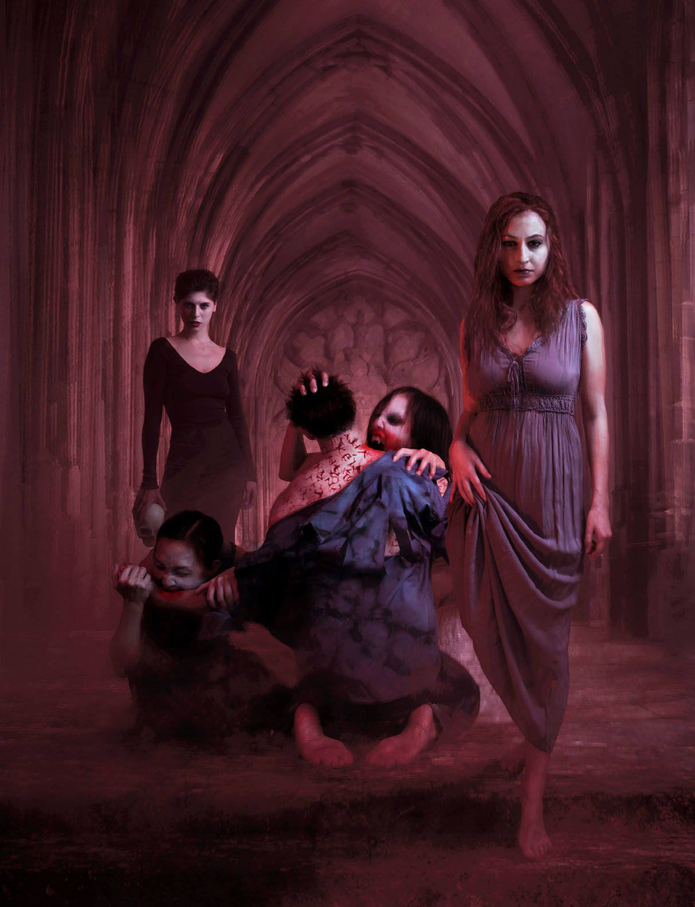

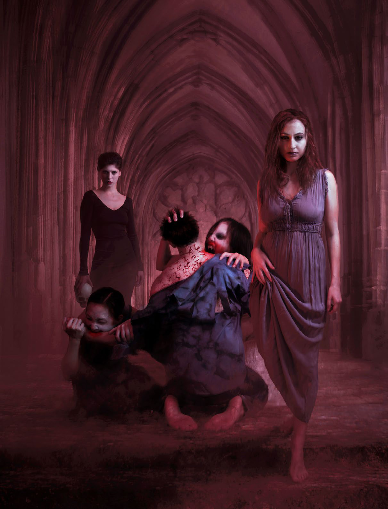

Introduction
Introduction

“Welcome to the one family where ‘motherfucker’ isn’t a pejorative.” 
“Welcome to the one family where ‘motherfucker’ isn’t a pejorative.”

— Accorri Giovanni, giving a warm welcome to a fledgling Hecata
— Accorri Giovanni, giving a warm welcome to a fledgling Hecata

Believe in the Blood
Believe in the Blood

Faith, religious order, and cultish devotion hold 
Faith, religious order, and cultish devotion hold 
places of incredible importance within Kindred society, 
places of incredible importance within Kindred society, 
and contrary to views spoken in Camarilla domains and 
and contrary to views spoken in Camarilla domains and 
Anarch baronies tonight, they always have. For every 
Anarch baronies tonight, they always have. For every 
instance of fledglings murdering sires, Anarchs burning 
instance of fledglings murdering sires, Anarchs burning 
down the havens of Camarilla Princes, and cannibal 
down the havens of Camarilla Princes, and cannibal 
vampires pursuing campaigns of diablerie, there are 
vampires pursuing campaigns of diablerie, there are 
others who hold opposing views. These childer worship 
others who hold opposing views. These childer worship 
their sires due to the strength of the Blood Bond. These 
their sires due to the strength of the Blood Bond. These 
Kindred look up to their Princes due to the might the 
Kindred look up to their Princes due to the might the 
vampire in charge wields each night. These neonates 
vampire in charge wields each night. These neonates 
revere their elders and the godlike methuselahs of their 
revere their elders and the godlike methuselahs of their 
clan, just hoping for a trickle of that rich vitae, that 
clan, just hoping for a trickle of that rich vitae, that 
it might allow them to become more like these deific 
it might allow them to become more like these deific 
figures.
figures.

If you are a Storyteller or player who wishes to in­
If you are a Storyteller or player who wishes to in­
volve vampire religions, ceremonies, and worship in your 
volve vampire religions, ceremonies, and worship in your 
chronicles, you will find a great deal of material in Cults 
chronicles, you will find a great deal of material in Cults 
of the Blood Gods to satisfy that need. 
of the Blood Gods to satisfy that need.

This book provides everything you require to run 
This book provides everything you require to run 
and play in chronicles within or branching away from 
and play in chronicles within or branching away from 
the traditional Camarilla and Anarch setups, as charac­
the traditional Camarilla and Anarch setups, as charac­
ters take on fringe or established religions, gain benefits 
ters take on fringe or established religions, gain benefits 
from following them, and attempt to balance morality 
from following them, and attempt to balance morality 
on top of the demands these faiths place upon their 
on top of the demands these faiths place upon their 
believers.
believers.

Cults of the Blood Gods is the book you want for 
Cults of the Blood Gods is the book you want for 
full detail on the state of the Hecata — the Clan of 
full detail on the state of the Hecata — the Clan of 
Death — and their necromantic powers. This clan is 
Death — and their necromantic powers. This clan is 
probably the largest singularly focused cult in the World 
probably the largest singularly focused cult in the World 
of Darkness, unified against opposition, dedicated to its 
of Darkness, unified against opposition, dedicated to its 
goals, and prepared to stand and die for its vampires. 
goals, and prepared to stand and die for its vampires.

Cults form as vampires look up to their elders. 
Cults form as vampires look up to their elders. 
Sometimes, cults form as vampires look down at the 
Sometimes, cults form as vampires look down at the 
mortals beneath them. Power becomes religion, religion 
mortals beneath them. Power becomes religion, religion 
exalts in power, and vampires are all about the value of 
exalts in power, and vampires are all about the value of 
power. 
power.

1 3
1 3

CULTS OF THE BLOOD GODS

• 	
Cult Construction — New uses for Backgrounds and 
rich detail on how to form cults in your own chroni­
cles, with tables and advice on how to form religions, 
the methods cults use to indoctrinate their members, 
and the kinds of ambitions cults in your games might 
strive to attain.

After all, when you’re the Clan of Death, death is far from 
the end.

Whether you’re an established or new Storyteller, 
the story and chronicle hooks found in this book will be 
sufficient to fuel dozens of Vampire: The Masquerade 
stories involving sacrifice, black magic, the strength of 
belief, and the monstrous, alien might of methuselahs as 
benefactors and enemies.

• 	
Hecata and Oblivion — This chapter provides the 
detail all players who want to play a member of the 
Hecata might need, with clan archetypes, introduc­
tion to the kinds of people the clan Embraces, and a 
bevy of Oblivion Discipline powers and Ceremonies.

A Place of Worship

• 	
Bloodlines and Loresheets — The Hecata is a clan 
comprising multiple bloodlines, so this chapter 
breaks down how to use bloodlines in your chroni­
cles and provides the Backgrounds for you to do so 
straight out of the book. The Loresheets that follow 
connect to the cults introduced throughout this 
book.

The content in the following chapters of Cults of the 
Blood Gods invites you to explore the myriad Kindred 
faiths, religious orders, and darkest powers present in 
tonight’s Vampire: The Masquerade. We invite you to 
take or adjust any of the material in this book, whether it 
be part of a belief system, a religious hierarchy, a charac­
ter, or just a concept from one of the chapters, and make 
it your own. We encourage you to use this material as you 
see fit for Vampire: The Masquerade.

• 	
Styx and Bones — A high-energy story set in Munich 
where you play members of the Hecata in pursuit 
of (or fleeing from) a creature of horror even to the 
Clan of Death. Ready-made characters and even 
more chronicle hooks await you once you’re done 
reading the main story.

• 	
Just Another Family Dinner — Fiction to introduce 
you to the current state of the Clan of Death, and 
some of the activities they get up to around the din­
ner table.

• 	
Introduction — A brief taster of what you’ll find 
in the upcoming pages of sin, faith, dogma, and 
miracles.

Existing in 

Religious Disharmony

• 	
Rise of the Methuselah Cult — A chapter filled with 
in-character accounts of religion’s rise to prominence 
in the modern nights, with accounts from several of 
the cults profiled in this book.

While some Camarilla Princes and all agents of the 
Second Inquisition believe the vampire population of the 
world is too high, in truth, it is too low to meaningfully 
sustain widespread religious organizations. The cults and 
orders presented in this book are prominent in specific 
domains and regions, but rarely spread their reach be­
yond them, in part due to the difficulty vampires find in 
traveling far (especially en masse), but also due to fierce 
resistance from the Kindred in each domain.

• 	
Kindred Religions — A thick mix of religious orders 
of various sizes and influence levels, along with new 
powers new coterie types, and other new mechanics 
for adding to your games.

• 	
The Cult of Death and Undeath — Welcome to the 
family known as the Hecata. This chapter introduces 
you to the history, current plots, and hierarchy of the 
Clan of Death, while also providing further coterie 
and Predator types for your chronicles.

Domains in the modern nights, much as in the Dark 
Ages, exist as islands in the dark, each with their own 
Kindred hierarchy, society, and culture. As vampires grow 
older their beliefs become entrenched, compelling a reti­
cence to adopt new belief unless they’re faced with a fall 
to the Beast, witness something miraculous, or perhaps 
reconnect with their humanity.

• 	
Mortal Cults — Not all cults are populated by 
vampires alone, with this chapter detailing some of 
the orders where vampires have set themselves up as 
gods to be worshiped, or mortals have pieced enough 
together to form faiths to combat the undead.

With this is as the case, is it possible for the Church 
of Set, the Mithraists, and the Eyes of Malakai to all 
exist in the same location? Yes, but not without tension.

14

Introduction

more than a handful of vampires with religious inclina­
tion. When they do, these faithful undead have the option 
of evangelical belief, with an aim to convert or chastise 
others, or secret worship, so as to not allow their faith to 
impact other vampires’ views on them. It’s rare for a vam­
pire to be a lay worshiper who accepts Set, for instance, 
but does so without pride or, conversely, subterfuge. On 
the other hand, a city or metropolis containing over a 
million mortals within its limits could support multi­
ple faiths, and even harbor several coteries of the same 
belief, though they may follow their religions in different 
ways. These domains are more likely to see debates and 
even fights between so-called “orthodox believers” and 
“heretics”, though no vampire is likely to lay claim to the 
latter epithet.

GENERAL DIFFICULTIES
Some minor characters in this book have what are 
referred to in their stat blocks as General Difficulties. 
These come in the form of two numbers divided by 
a stroke, such as 4/3 or 5/2. The first number is the 
Difficulty the players have to beat if ever opposing 
this character in an area in which they excel. The 
second number is the Difficulty whenever players 
oppose this SPC in an area in which they are medi­
ocre or poor. For those who want to use Attributes 
and Skills to determine Difficulties, these characters 
also have full traits. For those who prefer a simpler 
method, the General Difficulties are there for you.

What this means for the Storyteller and players 
about to embark on this journey into the religions of 
Vampire, is that cults can be liberally dosed throughout a 
domain or held back as clandestine and rare. We will not 
prescribe for you a categorical number of vampires who 
worship one faith or another, or declare one major reli­
gion more powerful (or indeed, right) than another. Each 
cult, each tradition, and the fervor of belief in all these 
religious elements is for you to decide for your chronicle.

Religion adds a new layer to the societal strata, a new 
cause to cling on to and for which to fight, and another 
reason to claim territory, vessels, retainers, and primacy.

Being a member of a cult does not preclude a vam­
pire from membership in the Camarilla or affiliation with 
the Anarchs, though a city with a small population of a 
couple of hundred thousand would be unlikely to field

15

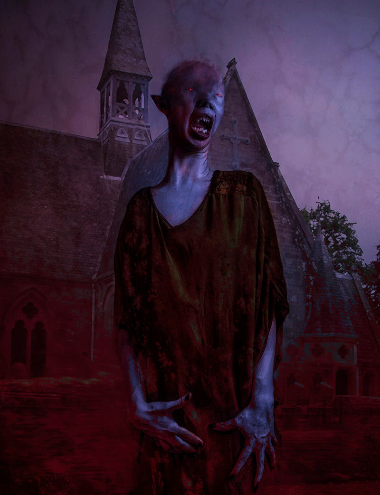

Rise of the 
Rise of the 
Methuselah Cult
Methuselah Cult

chapter one
chapter one

“The gods are cruel and capricious, and we acknowledge they shape our destinies. We should despise them. 

“The gods are cruel and capricious, and we acknowledge they shape our destinies. We should despise them.

Yet, when you realize they may be the only creatures free from the puppet master’s strings, 

Yet, when you realize they may be the only creatures free from the puppet master’s strings,

we of course seek to worship them, serve them, and ultimately, emulate them.”
we of course seek to worship them, serve them, and ultimately, emulate them.”

— Arjun Shah, Patre of the Cult of Mithras 
— Arjun Shah, Patre of the Cult of Mithras

For as long as there have been Kindred there have been 
For as long as there have been Kindred there have been 
those that worship the more powerful.
those that worship the more powerful.

Cults centered around these creatures dating as far 
Cults centered around these creatures dating as far 
back as the Second City rise to the fore with the desec­
back as the Second City rise to the fore with the desec­
ularization of the Camarilla. These are old faiths that 
ularization of the Camarilla. These are old faiths that 
speak to the blood as much as they speak to the spirit. 
speak to the blood as much as they speak to the spirit. 
Some have survived largely unchanged. Some shift in 
Some have survived largely unchanged. Some shift in 
order to appeal more to the young vampires populating 
order to appeal more to the young vampires populating 
the cities. All fight for the attention of those that walk 
the cities. All fight for the attention of those that walk 
the night.
the night.

The modern nights are a tumultuous time for 
The modern nights are a tumultuous time for 
Kindred of all stripes, from Camarilla to Anarch to 
Kindred of all stripes, from Camarilla to Anarch to 
those in between. Oftentimes, the nights are uncertain. 
those in between. Oftentimes, the nights are uncertain. 
Long-standing bastions of Kindred society have been 
Long-standing bastions of Kindred society have been 
shaken. The Tower leans. The Pyramid crumbles. The 
shaken. The Tower leans. The Pyramid crumbles. The 
Anarchs… are Anarchs. Those set adrift on these tides of 
Anarchs… are Anarchs. Those set adrift on these tides of 
change are drawn to beings of power, to collections of 
change are drawn to beings of power, to collections of 
stability, to any calm in the storm.
stability, to any calm in the storm.

Some of these cults and faiths claim to have the 
Some of these cults and faiths claim to have the 
Cainite’s best interest at heart, some simply prey on the 
Cainite’s best interest at heart, some simply prey on the 
weak-willed the same way similar groups of kine would, 
weak-willed the same way similar groups of kine would, 
but all of them should be known to a wise vampire seek­
but all of them should be known to a wise vampire seek­
ing to survive this new and horrific landscape.
ing to survive this new and horrific landscape.

Given the current state of things, the swell of ances­
Given the current state of things, the swell of ances­
tor worship should come as no surprise. It is easy to see 
tor worship should come as no surprise. It is easy to see 
creatures such as Mithras, who is said to have been able 
creatures such as Mithras, who is said to have been able 
to enthrall entire cities, as divine and worthy of worship. 
to enthrall entire cities, as divine and worthy of worship. 
Legends of these methuselahs, stories of these veritable 
Legends of these methuselahs, stories of these veritable 
gods of blood, are passed around in whispered tones on 
gods of blood, are passed around in whispered tones on 
every stratum of Kindred society, in every generation. 
every stratum of Kindred society, in every generation. 
There are those who even claim to have met them, and 
There are those who even claim to have met them, and 
they are the most zealous of all.
they are the most zealous of all.

The Justicars Speak
The Justicars Speak

The following was transcribed from a mnemonic 
The following was transcribed from a mnemonic 
recording of a meeting of the Camarilla Justicars:
recording of a meeting of the Camarilla Justicars:

17
17

CULTS OF THE BLOOD GODS

[BEGINNING OF RECOVERED SECTION]
Ian Carfax: …and this rising of faith is most disconcerting. More and more 
of our young are turning toward the esoteric in these troubled times. We 
are losing our hold on our message and it’s being replaced by messages of 
worship, prostration, and faith.
Diana Iadanza: The Ministry must be having a field day.
Ian Carfax: Look, we are dealing with the fallout of our rightful choice 
to no longer extend our protection to the Anarchs, pulling back on the 
use of technology…
Diana Iadanza: And whose fault is that, hmm?
Ian Carfax: …and by doing so strengthening our Masquerade. Not to mention 
the Anarchs are filling the power vacuum left by the Sabbat. Along with 
that, the Ministry, or whatever they’re calling themselves now, turning 
Anarch, and a handful of our number getting caught in the Paris bomb­
ings. We’ve lost domains to this so-called “Second Inquisition” and there 
is even talk of a new death cult forming. Reports are unclear. Might just 
be the Giovanni acting up again. The Promise is close to ending…
Diana Iadanza: Yes! Fine, alright. We get it. Must you whine on? We are 
all aware of the shifting sands. One thing at a time. The question is 
what do we do about these new faiths rising up?
Ian Carfax: Many of them aren’t exactly new, are they? Some have been 
around for quite some time in the shadows. It’s an even greater indicator 
that we are losing our hold. The Ministry will leverage this, like they 
leverage everything. So many of our elders have been called away. Surely 
some of you feel it as well?
[THERE IS A LONG PERIOD OF SILENCE]
Lucinde: It is hard to deny the power of old blood. I can see how often 
they become objects of worship.
Ian Carfax: You sound like you might know something about that.
Lucinde: I’ve had dealings with the… Mithraists… the Cult of Mithras, yes.
Ian Carfax: Dealings. Yes. We are wasting time. What do we do about it? How 
do we stem this tide so we can deal with all of our other… challenges? We 
must be seen as the Tower we have always been, gleaming in the night.
Lucinde: We do nothing.
Ian Carfax: What? Lucinde, you must be…
Lucinde: Put out a call to the Archons. Tell them not to waste resources 
on stopping any religious gatherings should they not be working ac­
tively against the Traditions or the Camarilla. Put a moratorium on the 
collection of the Book of Nod, Revelations of the Dark Mother, and any 
other such documents that survived into these modern nights. We will not 
deny the existence of ancient ones, how can we now? But we will not sup­
port the idea either.
Ian Carfax: Explain.
Diana Iadanza: Can you not see it? We would run ourselves ragged trying 
to “stem this tide,” as you say. But we will do as we have always done.

18

chapter one: Rise of the Methuselah Cult

We can use it, can’t we, my dear Lucinde? We use these faiths, these lit­
tle religions, as a mortar to help shore up the cracks in our beautiful 
Tower. Like Japanese Kintsukuroi.

Lucinde: Yes. I have seen first-hand how faith can bolster a domain. 
With enough influence over some of these faiths and cults, we may be 
able to fashion them into a cudgel to use against the Ministry. Perhaps 
we should look into the idea of adopting an “official religion” of the 
Camarilla in these coming nights. Use the kine’s idea of separation of 
church and state but maintain a steady hand upon it. See it done. Now, 
we should discuss the situation in London…

[RECORDING ENDS]

The Why and 

Way of Worship

I have tried to instill in you an understanding of 
these things. Brought you to the mithraeum. Read for you 
the Roman texts. But I can see it’s been for naught. These 
questions you ask of me tell me you have not absorbed 
the lessons. You have failed to find the meaning willful 
supplication can bring. So, I cast you out. Wander until 
the burning fires of war from within or without light 
your way home.

As written by Aditya Hay, Ventrue, former Seneschal 

of Edinburgh

My childe, you’ve asked me why I worship? Why do 
I, every night, bend my knee in supplication to my Lord? 
Why do I cut my arm from fingertip to shoulder? Why 
do I starve myself each spring to the edge of frenzy? Why, 
when I supported the Toreador for centuries, did I deliver 
the throne of Edinburgh to de Camden without so much 
as a challenge? Because my unlife has meaning. My unlife 
has meaning through Mithras, my Lord. Our own God of 
War who Walks. Mithras who will come again.

The Bull and the 

Blood and the Bone

Welcome to the Syndexioi. 
If you are reading this then 
you have been given all you 
need to prepare you for what 
is to come. You are being 
welcomed in Mithras’ light. 
He, the Unconquered Sun. He, 
the right way.

There are so many who do not understand, so many 
like you, who simply float through their existence or fill 
it with political games or debauched excess. My Lord fills 
my existence with purpose. I am a part of a plan for his 
glorious return. I prepare for the coming war that will 
follow in his wake.

Prepare.

Meaning is rare and fleeting in this world, my childe. 
You must grasp it when you can, and mine was given to 
me only once I took it. I have a place. That place is now at 
the side of de Camden, the Voice of Mithras. London fell 
and he arrived. Who better to lead us than the one who 
stood at our Lord’s right hand?

The Bull. Bring its blood 
to the one who reveals 
Mithras’ light to you. Thank 
them for revealing the way of 
the true Sun.

Every night and every season we prepare. We spill 
blood on grounds that were battlefields and may be again. 
We starve ourselves so we may fight our Beasts. We bend 
knee in supplication and understand there is an order to 
things. For what is a war without soldiers? What is a god 
without followers?

The Blood. Follow them to a 
place of battles past or bat­
tles to come. Pour the blood 
there along with your own 
vitality. Pray to Mithras for 
strength in the night.

19

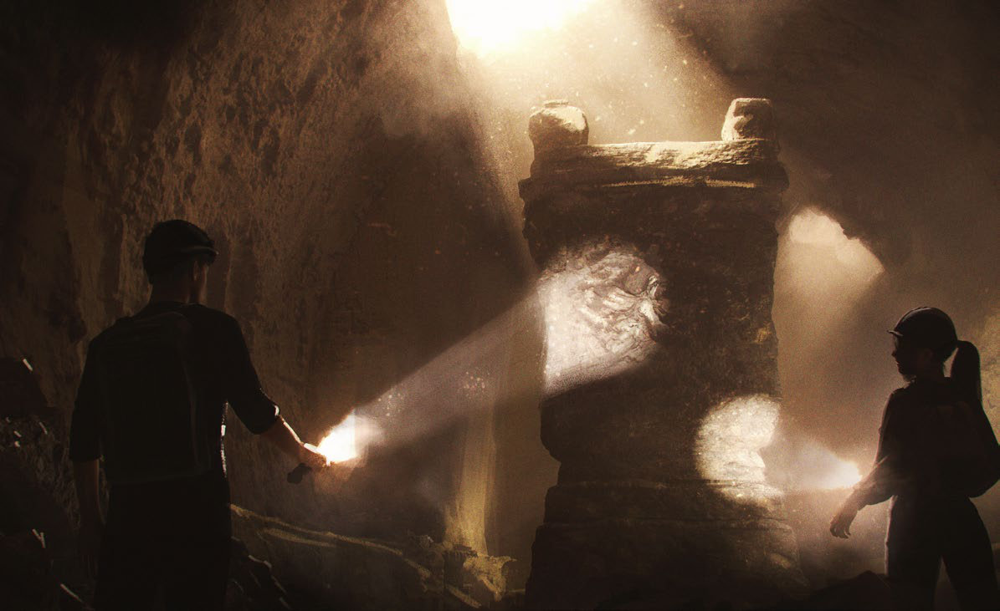

CULTS OF THE BLOOD GODS

remember. She was nice. Real messed 
up face, but nice.

The Bone. Be interred in stone in the 
mithraeum for seven days and seven nights. 
Remain in control and free yourself. Be 
born into the Church as Mithras was born 
into this world.

Duskborn 2: She also told us this 
was the place to go if we wanted to 
be… how did she put it… if we want­
ed to be brought fully into the night. 
I want that.

Welcome shall be yours.

Duskborn 1: If we could just… I 
don’t know, find a cure? Pray it away? 
Can’t we do that?

Keep these secrets in your mind. Destroy 
this document.

Duskborn 2: No, we can’t. You 
heard her. That’s impossible. God 
has turned his back on us. This is 
what we are now. We can already do 
some amazing things if we feed right. 
Philipa just appeared out of nowhere, 
literally. And she isn’t even that, uh… 
thick-blooded. She said the power is 
in the blood and ours is thin. Look 
at what we can do, even as so-called 
“Duskborn.” Imagine what an elder 
can do? What they could teach us? 
You trust her, right?

Prepare.

Time of

Thin Blood

Duskborn 2: Trust me. We have 
to do this. What did we say when we 
found out what we were?

Duskborn 1: We said we’d sur­
vive, no matter what.

Duskborn 2: Exactly. I’m tired of 
living this half-life. Looked down on 
by the vampires of this city? Chased 
around and hunted? Eating rats and 
dogs and…

A conversation between two 
Duskborn as recorded by Philipa 
Hernandez, Nosferatu of Lima, while 
testing her new parabolic microphone 
outside of a local resort club, Bella Luna

Duskborn 1: I mean, I guess. She 
has shown us the ropes a bit. Told us 
where to stay away from. Got us some 
rats.

Duskborn 1: Don’t! Don’t remind 
me. I get it. And hush… Philipa told 
us not to use the V word out loud,

Duskborn 1: I don’t know about 
this. This place looks dangerous.

2 0

chapter one: Rise of the Methuselah Cult

Duskborn 2: Don’t forget we 
would have been dead if she hadn’t 
stopped those men. I see no reason 
to stop trusting her now. It’s a shame 
she got called away like that though, 
but it was good of her to tell us about 
this place before she left.

A Cainite Hymnal

Caine has come, Caine has risen, Caine will come again.

Caine, our Dark Father, whisper to your children.
Caine, our Dark Father, tell them words of peace.

Duskborn 1: So, what, we just 
walk in and introduce ourselves? Is 
there a secret handshake?

Caine, our Dark Father, sate their lust for blood.

Caine, our Dark Father, keep us from the flood.

Giuliana: There is no need—
Duskborn 2: My God!
Giuliana: —for that my young 
friends. I am Giuliana Santisteban 
and you are most welcome at Luna 
Roja. [Laughs] I apologize for the 
dramatics. It’s a weakness of my line. 
Philipa told me you were coming. 
Why don’t you come inside? I have 
much to tell you and much to teach 
you, I suspect.

We call on the name of Zillah.

We call on the name of Irad.
We call on the name of Enoch.
Speak to your sire on our behalf.
Lead us through Gehenna. Lead us to peace.

Duskborn 1: It’s… it’s a pleasure. 
You know Philipa? Do you know 
where she is?

Protect the 
Flock

We have been left behind by the dark 
rapture! The end is here, creeping and 
silent and terrible!

Giuliana: Sadly, I do not. But I’m 
sure she will be glad to hear from you 
when she returns. I understand you 
are looking for elders to teach you. 
To bring you into the night. I believe 
I can provide. Now, let us not stand 
out here, exposed in the open. Come 
inside and let me tell you of what I 
know. Let me tell you of the Children 
of Si.

We cannot fight. We see this now. 
Dreams of the past must die and we 
must face a burning future. I hear you 
crying. I do, I do! I tell you these things 
not to frighten you. No, no. I am here 
to offer words of comfort and joy. I 
have seen light. I have seen truth. And 
I am here to share it with you.

The following is a leaked transcript 
from Blacksite 34, location unknown, 
somehow obtained by Molly MacDonald, 
Nosferatu Justicar

Location — Blacksite 34 “The 
Cage”

I tell you, we must forge our 
broken sword into a plowshare. Let 
us make peace with our oppressors. 
Only through worship may they be 
appeased! We must prostrate our­
selves before the Christ that is Caine. 
Only He may beseech his children 
on our behalf! He speaks through 
the blood. Through the blood we are 
bound. Speak to him and we speak 
to them!

Clearance Level — Crimson
Involved Agencies — 
[REDACTED], [REDACTED], and 
[REDACTED]

Brother 

Sweetwater 
Speaks

Interrogation Lead — Gwen 
Zhang

Interrogation Support — Harold 
“Doc” MacElroy

Observation Theater:
Witness — [REDACTED]
Witness — [REDACTED]
Witness — [REDACTED]
Subject — Kit “Patches” 
Esposito, Designation — Blankbody, 
Subject 23

The more we resist, the more 
conflict we create. Let us not follow 
those who war. The way to salvation 
is submission my dear congregation. 
It is through the light of this submis­
sion we will find our way through the 
End Times. Now… let us pray.

A sermon as given by Brother 
Sweetwater, clan unknown, to his 
congregation

I say to you, my dear sisters, 
brothers, and all others, Gehenna is 
here. Gehenna has come and reigns 
over us as certain as I stand before 
you! Our elders vanish in droves! 
Swords have broken! We have failed!

[Loud and tortured sobbing can be 
heard on the recording. Requisition of 
directional microphones placed.]

21

CULTS OF THE BLOOD GODS

MacElroy: Zhang has stabbed the subject in the leg, 
repeatedly. This is my first time seeing the blankbody 
healing factor up close. The wounds seem to have no last­
ing effect, but there is a pain response? The nerves should 
be dead. Amazing.

[REDACTED] — Please state your name, agency, and 
role for the record please. Loudly, please.

Zhang: Agent Gwen Zhang of the [REDACTED], 
onsite. Lead interrogator, Blacksite 34 “The Cage.”

MacElroy: Doctor Harold MacElroy, freelance, for­
mer [REDACTED], Interrogation Support and Autopsy.

Zhang: Mr. Esposito?
Subject 23: Stop it! Please stop it! I don’t want… I 
don’t want to lose myself again. I don’t want to [growls] 
hurt anyone again.

[Sobbing becomes a series of wails]
Zhang: Let’s begin, Mr. Esposito. Tell me. How long 
have you been… dead, shall we say?

Zhang: Tell me what you were doing at the zoo. 
Why were you killing those animals surrounded by those 
ridiculous candles? What makes you “lose yourself?” You 
killed so many people. Are you not responsible? Is it not 
your fault?

Subject 23: Who… who the fuck are you people? 
What did you do with Claire? Where the fuck am I?

MacElroy: Fascinating. Is that blood? I didn’t know 
blankbodies could cry. Do you suppose all of their fluids 
have been infected? Perhaps all of their fluids have been 
replaced by blood? Can they mimic intercourse?

Subject 23: Claire and I… we… we aren’t monsters. 
We don’t want to be this way. I can still feel it in me. It 
wants me to kill you. Oh God, what have we done?

Zhang: Focus MacElroy. [Zhang snaps twice] Shhh… 
shhh. It’s good to see you’ve calmed down. You injured 
quite a few of the agents bringing you in from that zoo. 
Did you know that?

Zhang: Now we seem to be getting somewhere. What 
is in you, Mr. Esposito. We can help you.

Subject 23: She said it would work. Why didn’t it 
work? Claire… I’m so sorry.

Subject 23: I… I did?
MacElroy: Subject 23 seems to be expressing remorse. 
Their ability to mimic us is extraordinary.

MacElroy: Maybe you should back off, Zhang. I 
don’t... Look at... There is so much blood coming out of 
his face. They can even ugly cry.

Zhang: You did. Do you not remember? Allow me to 
remind you. Here. Take a look at these pictures. This is 
Agent Jemma Perkins. Not that you can tell. Half of her 
face is gone and the other half was chewed up. This here 
is Prishna Agar. He will most likely be on a liquid diet 
for the rest of his life... if he makes it. And this… this is 
Thomas Detrick.

Zhang: Keep focused. Mr. Esposito, so far, I have only 
used one knife. Hold this for me, will you?

MacElroy: Zhang has stabbed the subject in the leg 
and left the knife there.

Zhang: If you look over on this table, you’ll see I have 
many more tools at my disposal.

MacElroy: Even the subject’s snot… mucus, sorry, 
seems to be made of blood.

MacElroy: Subject 23 seems… I suppose the right 
word would be “inconsolable.”

Subject 23: Please put those away. Please…
Zhang: But I think you need to see this Mr. Esposito. 
Thomas was just in the wrong place at the wrong time it 
seems. The one you call Claire murdered him in the most 
brutal fashion. Look here, you can see how she ripped…

Subject 23: She told us it would work! She said if 
we killed the beasts it would kill our beasts! We said the 
words! We did everything she asked us! [screams] We 
don’t deserve this…

Zhang: Who are you talking about? Is there a third 
blankbody? Tell me. Tell me and we might let you see 
Claire again.

Subject 23: That’s because you bastards opened fire 
on us! You made her lose her shit! You did this! We just… 
we just wanted to be free.

Subject 23: You don’t understand! How could you 
understand? We just wanted to be like you! She told me it 
would make me like you!

MacElroy: The subject is now convulsing with sobs, 
even though we suspect they do not need to breath. 
Reminder to send the information requisition to the 
Society… again. What would this be, Zhang? Three times? 
Four?

Zhang: Who? Who are you talking about!
MacElroy: The subject has suddenly gone ridged and 
unfocused.

Zhang: Five. Now, Mr. Esposito, that’s interesting. 
Lost control? That implies it’s something you can’t control. 
It’s also interesting you feel like you’re trapped. Why don’t 
you elaborate? Does this have something to do with why 
you were at the zoo in the first place, killing those poor 
animals?

[Recording compromised, distortion causes the voice of 
Subject 23 to fluctuate and occasionally sound feminine. Rush 
requisition of directional microphones placed.]

Subject 23: I think you have asked enough questions 
of my lambs for one night, Gwen Zhang of Hong Kong.

Subject 23: [Screams]

Zhang: What is this? How do you know that?

2 2

chapter one: Rise of the Methuselah Cult

[REDACTED]: What is happening? What is this?
Subject 23: Oh, I know so much about you, Gwen. 
For example, I know you are the secret wife of Cynthia 
Hong. I know you tell her you work in immigration, but 
she doesn’t know what horrible things you’ve done. What 
would your parents think? Look at me Zhang. What 
would Cynthia think?

an eye on them all.” Weird how that worked out? Don’t 
suppose you had anything to do with that you meddling 
old biddy? Anyway, it’s proving to be fertile ground as I 
“plant my seeds,” as it were.

I admit I have a soft spot for the dregs, the 
Duskborn, the Caitiff, and those who find they have no 
place among either sect. But I think you already knew 
that when you suggested this place.

MacElroy: A… agent Zhang has fallen to her knees, 
staring at Subject 23.

I gotta tell you, I’m shining here. It’s like they were 
just looking for a place to be, the punks, the gutter-trash, 
the sad children, the lost. It’s become quite the hangout 
and hunting ground. If you’re new in town, everybody 
knows Joe will look out for you. I’m proud of that. It’s 
pretty much a halfway house. I even cleared out some 
space in the back room for a promising Kindred (I know 
you hate that word. I don’t give a shit) should the Dark 
Mother guide them my way, like you did for me.

[REDACTED]: We have been compromised! Lock 
down Interrogation Suite 3! Prepare for purge! Back up 
all recordings to Blacksite 34-B

Subject 23: You have been abandoned.
MacElroy: The… the subject is calm now. Almost 
serene. Zhang has started to weep.

Subject 23: And you Harold MacElroy. You named 
yourself “Doc,” but do you know what they really call 
you? “Stitch.” It’s all you’re good for after all. Do they 
know what you get up to in the morgue, “Stitch?” Now 
run. I curse you. Live with what you know, dream of it 
every night, and find no succor except among the dead.

I listen. Everyone talks to the bartender.
I don’t coddle them, of course, but I love all these 
little turds in my way. As you told me countless times, 
pain is an excellent teacher. I’ll take care of them whether 
they like it or not.

Subject 23: You… you came for me?
Subject 23: Shhh… shhh. Of course I did my lamb. 
But it’s time. It’s time for release. You did well. My fire 
shall burn it out of you. I will free you as I promised.

I learn about what they value and I trim or nurture 
as they need to help them lift the scales from their eyes. 
I’ve pruned more than a few who couldn’t get a handle 
on their new existence. Tragic accidents, but it makes the 
rest rally around me, without even knowing it.

Subject 23: What? You said I could be like them! I just 
want to be human! I don’t want to be like this anymore!

I’ll beat ‘em ‘til they get it. Teach them like you 
taught me. Be the Maiden. Be the Mother. Be the Crone. 
But most importantly, just Be.

Subject 23: And you won’t be.

Planting the Seed

Rotten to the Core

As written by “Joe,” Gangrel bartender at The Wilder, 
Portland

A diary entry as written by Ken Higashiyama, Brujah 
member of the Rough Road, a Camarilla biker gang

To She Who Tends the Garden, To My Sister, To My 
Savior, My Tremendous Pain In The Ass

Look, if you’re reading this or got your hand on this 
in some way, go fuck yourself for killing me. I hope I got a 
few good licks in. Welcome to my diary. I write this at the 
top of every entry in this doc, all off-line, of course. Part of 
the new low-tech directive from the top of the Tower. But 
I gotta put my damn thoughts somewhere. And that’s here. 
Congrats to you, shitbird. You got me. Enjoy the reading. 
Oh, and just in case it wasn’t clear. Fuck you.

I am trying to write this as best I can, I know how you 
love your poetry, but I’m no rose. Give me the thorns.

I told you I’d write when I got to where I was going, 
so here it is.

My garden grows. Since you kicked me the fuck out, 
I’ve made my own way. The words of Lilith echo in my 
head, are detailed on my skin, and etched on my heart. I 
guess I should thank you enough for your final gift of, let’s 
call it “guidance.” As you suggested, I have set up shop 
here in Portland. I picked Northeast, where it seems the 
whole fucking city is fighting for its own soul. You’ll be 
happy to know I’ve found myself the owner of a bar, the 
oldest bar in this damn town, in fact. Weirdly, the Prince 
was fine with me claiming this choice location. One of 
the Primogen suggested it would “be a good place to keep

Well holy shit. St. Louis is as fucked up as they say, 
but definitely not in the way they say it. We were expect­
ing to ride into the biggest shit storm on God’s green 
earth. We’ve all heard the stories, Sabbat and Camarilla 
fighting on the streets, all manner of shit stalking the 
night, the kine living it up during the day but turning 
most boroughs into a fucking ghost town at night except 
for the real well-lit places and the goddamn outskirts.

2 3

CULTS OF THE BLOOD GODS

Even heard about some Nosferatu 
disappearing. What with the Tower 
kicking out the Anarchs, we expected 
the Rough Road might take a trip 
from KC and throw our hat in with 
the Cam in the Lou. What we expect­
ed was a three-way war. What we got 
was way different.

Northwoods. We were approached by 
a preacher. Like, a vampire preacher 
while we were at a dive bar hunt­
ing. Don’t know how he found us or 
knew we were in town, but whatever. 
Seemed normal enough, for a guy 
dressed like a priest. We thought 
Sabbat, but nah. Nice guy. He started 
off the night right, chatting us up, 
telling us the Gateway City wasn’t 
so bad no more. We gave him some 
shit about that. Everyone’s heard 
the stories, right? We told him what 
we’re here for, asked him where the 
fighting was fiercest and he starts 
talking about how “That’s not the 
fight here anymore.” Then launches 
into a speech about how Caine was 
Christ or some shit. We beat the 
blood out of him and left him in an 
alley. I’m sure he’ll be fine.

cults or churches. Members of two 
goddamn churches are fighting over 
a fucking graveyard. It was too weird. 
We just got the fuck out of there.

We spent a night just staring 
at the walls, then decided it had to 
be a one-off. It’s fucking not. We 
have goddamn ridden all over this 
goddamn city, every fucking neigh­
borhood, and that’s what’s going 
on. It’s like, six or I don’t know how 
many fucking churches or whatnot 
fighting for territory and worshipers. 
Don’t get me wrong, the Tower is 
here and we did find some Sabbat, but 
it’s almost like they aren’t important 
in this town any more. I mean, I’m 
writing this from an Anarch bar in 
fucking Dutchtown where some ugly 
hipster is asking me if I’ve heard the 
good word of motherfucking Sutekh. 
So, shit’s fucked up all around. I don’t 
know what the fuck is going on here, 
but the face of the goddamn world is 
changing, man. Maybe I need to find 
a god too, huh? Seems to work for 
these fuckers.

We planned to roll into town 
by way of the I-70, easiest way in we 
heard, not much action in Columbia 
and St. Charles. We spend a few 
nights outside, just to fuel up, rest 
from the road. It ain’t easy avoiding 
Lupes out there, ya know? We lost 
Frankie, but we didn’t need him 
anyway.

We figured, we’d head through 
Northwoods, after our repast, figure 
out where in North Lou the heaviest 
fighting was taking place. Kill a few 
Anarchs, Sabbat, didn’t matter. We’d 
present those heads to the Prince and 
Council, and wham bam, we’re in. 
Simple. Easy for a crew like ours.

So, we move on to North St. 
Louis and we start trying to stir up 
some shit. It takes a week and a half, 
but we finally find a fight, except it’s 
not, like, between the Sabbat (can’t 
even find those fuckers) and Cam like 
we were expecting. It’s between two

Now, we should have known 
something was off right in

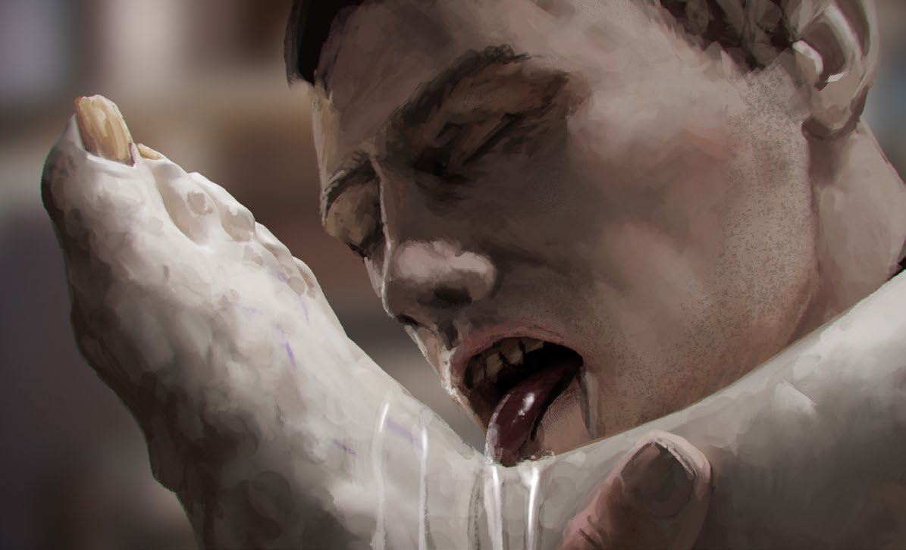

2 4

chapter one: Rise of the Methuselah Cult

Beauty is Divine Truth

My beloved childe,
Returning to our discussion concerning the existence of God, or “intelligent design” as your 
generation calls it, versus nature: have you considered that Darwinian evolution has no purpose 
for beauty? A bird with bright plumage stands out to predators. Weaving a delicate song 
requires time and energy better spent on catching worms. A bowerbird nest, viewed through a 
utilitarian lens, is sheer absurdity. Yet we see all these things in nature. Even if we allow, 
purely for the sake of our discussion, that these qualities are implausibly the most efficient way 
to attract a mate, there is no evolutionary reason why we would find them beautiful too. Yet the 
feathers of a peacock, and the song of a nightingale, bring such profound ecstasy it makes one 
weep. What is this if not a glimpse into Paradise; a gift from God Herself.

Which brings me to Michael, fallen Archangel and patriarch of Constantinople, or rath­
er: to his childer. I shan’t bore you with the tale of Constantinople and its egregious destruc­
tion. Either you already know it (and you should, my childe, or I must chide Miss Evers 
for being so lax in your training), or I hereby grant you permission to peruse my library for 
the history. Of importance to us is what happened after. From the ashes of Constantinople’s 
Dream were born the Nephilim, the surviving childer and acolytes of Michael. Where lesser 
creatures might have decided that beauty and dreams bring no succor to the struggle of the 
night, and thus serve no purpose, the Nephilim recognized the opposite to be true. Existence is 
ephemeral. Nothing lasts. Nothing is safe. Within that insecurity, that forever looming destruc­
tion and despair, beauty is the only thing of true value.

The Nephilim pursue beauty in all their endeavors. Art and architecture, poetry and song, 
even the reshaping of their own bodies: all these pursuits with abandon, and with beauty as their 
highest goal. This is the way to paradise, the road left to us by God, and I intend to follow 
it. Yes, my beloved childe, you read that correctly: beauty calls, and I must leave you. But 
fear not: I have put my affairs in order and prepared your presentation to Prince Harami. I 
leave to you the mansion, town house, night club, and the contents of the safe which you’ll find 
quite generous. I have also made arrangements to reward Miss Evers for her service, though it 
behooves you to thank her yourself. She will no longer be your governess once you are accepted 
into the Prince’s court, but she can still make a powerful ally.

We must both spread our wings and fly now, my beloved childe. You to go forth from my 
shadow and become the force I always saw in you. Treat Prince Harami with respect and the 
occasional slight touch of rebellion, and you will keep him endlessly entertained. I myself will

2 5

CULTS OF THE BLOOD GODS

ascend the next rung on God’s ladder. From kine to Kindred, and now from Kindred to 
Angel. Beauty, and only beauty, holds the key to apotheosis.

I hope one day you will join me in the ranks of the Nephilim and have squirreled away 
all the clues you need to follow the trail. For now, I bid thee well.

Forever your loving sire,
Antonius Di Amoran
Clan of the Rose

Bed the Bones

Transcript of meeting between Subject 1, Madrigal, and Subject 2, Surya. Date 
[REDACTED]. Observed by Agent Pink of the Milan cell. Our target remains the elder 
leech Nico. Agent’s advice is to detain Surya for questioning.

Madrigal: Bed the bones.

Surya: Excuse me?

Madrigal: The servitor that’s been giving you problems. Remember your breathing 
days, you’d attune tarot cards to your will by carrying them in your purse and 
drawing a card a day? Or sleeping with your pendulum under your pillow? Same 
thing.

Surya: Ick. I’m not taking a bunch of withered old bones into my coffin.

Madrigal: It’s that, or letting your sire know you’re struggling. Wait — you sleep 
in a coffin?

Surya: I am all about style. And valid point about Nico, but still…. It doesn’t 
strike me as hygienic; you know?

Madrigal: You literally drink blood. Those bones are more likely to catch some­
thing off you than vice versa.

Surya: Fair, but-

Madrigal: Nico.

Surya: Okay, I’ll do it. For how long?

Madrigal: Seven nights. It’s the number of completion.

Surya: And if it still doesn’t work?

Madrigal: Well then I tell you about bedding the bones.

Transcript of meeting between Subject 1, Madrigal, and Subject 2, Surya. Date 
[REDACTED]. Observed by Agent Pink of the Milan cell. Our target remains the 
elder vampire Nico, but this “mass” presents new opportunities. Agent now advises 
letting Surya remain at large and trailing her.

Surya: Can I ask your opinion on something?

Madrigal: Opinion or advice?

2 6

chapter one: Rise of the Methuselah Cult

Surya: Bit of both, I guess.

Madrigal: I like you, so I’ll play you straight: you haven’t repaid me for the last 
one yet. Sure you want to run up a debt?

Surya: Better you than someone else.

Madrigal: Oh honey. Ask for advice then, and don’t say I didn’t warn you.

Surya: So Roseline invited me to a mass. As a way of showing unity, she says. But 
— well I don’t want to go. Firstly, fuck her for usurping my place in Nico’s eyes. 
And second, she’s creepy.

Madrigal: Creepy?

Surya: She literally has to staple her face together every evening, or chunks of 
her fall off. Plus this mass is just some weird superstitious vodou shit, and—

Madrigal: Vodou shit?

Surya: You know, it’s just — like — chanting and sacrificing chickens, and stuff.

Madrigal: Have you ever been to a vodou mass?

Surya: Well, no, but—

Madrigal: Then I think you need to set your racism aside and go.

Surya: I am not racist!

Madrigal: You raise ghosts from their graves using necrotic blood, yet what 
Roseline does is superstitious shit? Good news though: now you know you’re racist, 
and you can learn to do better.

Surya: You’re a bitch.

Madrigal: A bitch you asked for advice.

Surya: Okay, fine. But even if Roseline wasn’t an interloper, and her brand of 
necromancy isn’t superstition, it’s still a mass.

Madrigal: Yes.

Surya: Dedicated to this Baron of theirs.

Madrigal: Yes, I assumed that.

Surya: Don’t you think that’s a little offensive? Like, you can’t just go around 
pretending to be a god.

Madrigal: Who says he’s not?

Surya: What?

Madrigal: A god. Do you believe Christianity is the only true religion?

Surya: It’s my religion.

Madrigal: Not what I asked. Is it the only true religion?

Surya: I don’t know. I didn’t come here to debate theology.

Madrigal: Then let me skip to the conclusion. Either he is the loa of the dead, 
which you have to admit is pretty fucking appropriate for a progenitor, or he’s 
just a really old vampire pretending to be a god. In both cases, you’re going to 
that mass.

Surya: But—

2 7

CULTS OF THE BLOOD GODS

THE SIX TRUTHS OF GORGO

If you mistreat your childer, 
or Embraced without their consent 
or forgiveness — fear us, for we are 
myriad and coming for you.

Madrigal: Do you want to be the girl who turned 
down a perfectly polite invitation toward integra­
tion, after Nico made it clear he was keen on that? 
Or the girl who refused a god? Or the girl who re­
fused an ancient? Because if you don’t go, you get to 
tick two out of three.

If you use the Bonds of Blood 
to rule as a tyrant — fear us, for the 
Blood of Gorgo breaks all chains, and 
we are coming for you.

Surya: Shit.

Madrigal: Maybe you’re right, and the Baron is a 
pretender. He will still crush you for not paying 
proper respect. Heck, Nico will crush you for making 
unwanted waves. So you get your petite little ass to 
that mass, you are nice to Roseline, and you worship 
the Baron like you would any other god — even if it’s 
not your god. This is no different than bedding the 
bones — put your reservations aside, and just fucking 
do it. And honey? While you’re at it, try to keep an 
open mind. It’ll do you good.

If you are an elder in the Ivory 
Tower or the Pyramid — fear us, for 
Gorgo owes allegiance to no one, and 
we are coming for you.

If you are alone and cast out — 
join us, for we are all sisters among 
the downtrodden.

If you are wronged — join us, for 
we will not rest until your abuser is 
ashes on the wind.

If you desire freedom — join 
us, for we ask no less of you than to 
break all that binds you.

Hail Gorgo, 
Slayer of Men

The life of Medusa ended there, 
though her story was passed down 
from mother to daughter. Men 
warped it into a cautionary tale: 
submit, or be a monster worthy only 
of death. We know better though. We 
also know Medusa was not the last 
of the Gorgons. She had two older, 
immortal sisters.

The Seeker 
and the Moon

Medusa was a heinous mon­
ster, a seductress who lured men 
to their stony deaths until a brave 
hero stepped forward to remove this 
female scourge from the land.

From the lost and found Diary of 
Kalini, Seeker of Golconda, entry for the 
twenty-fifth week

The Gorgon of this story is not 
as kindly as her younger sister. She is 
not content to retreat into a cave and 
heal in solitude. Gorgo laughs as she 
grinds oppressors under her heel, and 
scatters their ashes to the wind. She 
laughs as she topples the Ivory Tower, 
and breaks the Sword of Caine. She 
laughs as the age of men draws to a 
close. Only when the work is done, 
does Gorgo allow herself to mourn 
her sister and all others struck down 
by the kyriarchy.

The local Kindred have not 
approached me yet, but I can sense 
them watching me. Let them — it’s 
not them I seek. I have come for the 
Children of the Moon, Los Hijos de 
Si, who are said to possess the last 
secret of Golconda. This is what I 
seek — throwing off the shackles 
of Caine’s Curse, a new birth, and 
transcendence.

This is the story you likely heard, 
the lie passed down by men. The 
women of ancient Greece told it very 
differently.

Medusa’s snake heads were a 
blessing, not a curse, from Athena to 
protect the Gorgon from ravenous men 
after Poseidon raped her. Even with 
this divine weapon and shield though, 
Medusa did not seek retribution or 
vengeance. Instead, she retreated qui­
etly. Medusa wished only to be alone 
and to heal, but this was not a wish 
men would grant. They still came in 
ships, bringing sword and fire, intent 
on taking her as a trophy. Athena’s gift 
brought them all death. Until Perseus, 
the last man in a long line of abusers 
— and he, finally, killed Medusa for 
daring not to submit.

Moonlight soaks Lima. I can feel 
Her, the one locals call Si, seeping 
through my flesh and into my blood. 
Not the hard light of the sun, but 
a gentler touch preparing me for 
Transcendence. I requested a meeting 
with her High Priestess, a Kindred 
named Illari. I have not clearly 
ascertained her clan — she is by all 
public accounts a Leper. Mine is not

Hail Gorgo, Slayer of Men.
We are the Daughters of Gorgo, 
and we are already among you. We 
know your secrets. We know where 
you sleep. Warwick, Pascek, de Guy, 
Mysancta: they all fell to our right­
eous fury, and now we are coming for 
you.

2 8

chapter one: Rise of the Methuselah Cult

On a Mission for the Goddess

Transcript of meeting, taken for posterity by Tamil Gorgonsdottir. Secured 
against unsanctioned reading by the Rite of Stone Eyes. All hail Gorgon, her 
name be hallowed!

Jamina: Where to next? Is Chicago ready?

Tamil: The pack in Chicago is still collecting intel. For now, I suggest Bogotá, 
Colombia — we have a potential new recruit there.

Jamina: Damn, that’s a ways away. Are we flying or road tripping?

Tamil: Road trip for sure. I have more targets lined up in Medellín and 
Manizales.

Jamina: Sounds good. Tell me about the Bogotá recruit?

Tamil: They’re a Blue Blood. Embraced for their knowledge of computers, with 
hacking side skills, so that’s great. Didn’t get along with their sire, but he 
went “mysteriously” missing in a recent SI raid. Turns out grandsire is even 
more of a jerk though.

Jamina: I love hackers — so useful. Who’s the grandsire?

Tamil: That’d be Lady Ezrella Di Morti. Some high-up from the local Blue 
Bloods.

Jamina: This just keeps getting better. Do we have all the info we need on her?

Tamil: Courtesy of our new prospect.

Jamina: Perfect. Speaking of the prospect though — they get that breaking “all 
that binds you” means all? No killing grandsire and then sticking around to 
rise in the ranks of the Camarilla.

Tamil: They understand, and welcome that. They’re indigenous, of the Muisca 
people. Majored in Environmental Studies at the Universidad Nacional de 
Colombia, with minors in Gender Studies and Political Science. Embraced by a 
colonial Blue Blood to serve as glorified digital adapter. They are ready to 
burn the whole thing down.

Jamina: Amen to that. They also understand that Gorgo is real?

Tamil: Real as in ancient Cainite, yes. Real as in the actual Goddess Stheno — 
not quite there yet. But honestly, I did not believe that until my initiation. 
I bet my pretty parts they’ll come around.

Jamina: Fair. Do we have packs in place for all our targets?

Tamil: Medellín is a two-girl job — target goes to bed early, and his haven is 
badly secured. I honestly think he was relying on secrecy to keep him safe. Q’s 
crew is meeting us in Manizales, as that job looks to be tougher, and they’ll 
ride with us to Bogotá.

Jamina: Perfect. I’ll go prepare. Meet back tomorrow night. All hail our Lady 
Gorgo.

Tamil: Blessed is Gorgo.

2 9

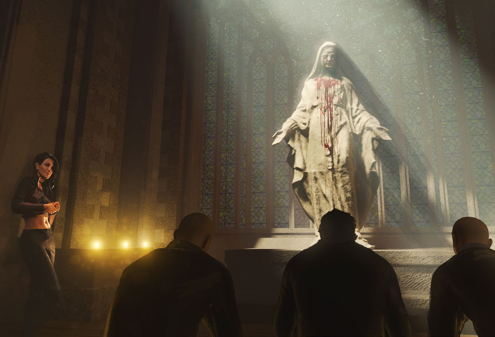

CULTS OF THE BLOOD GODS

the place to judge this, nor does it matter — we are all the 
same as we endeavor to Golconda.

cycle to a world of eternal moonlight where, away from 
the baleful sun, the Machukuna and Los Hijos de Si will 
live in harmony.

From the lost and found Diary of Kalini, Seeker of 
Golconda, entry for the twenty-sixth week

It’s a wide-reaching vision, and one I never dreamed 
of. But the path seems clear now that I see it — which, of 
course, is true of all steps of the journey. Self and World 
are both manifestations of will — transcending one trans­
forms the other. This is why the moon shines so powerful­
ly in Lima. The Machukuna light the path, and Los Hijos 
walk it — and as they do, they transform themselves and 
the land. We will leave the Curse of Caine, and our tran­
scendence lifts Lima up from this world into the next.

Illari granted my request for a meeting, and her 
presence lifted me. We spoke at length, the high priestess 
asking many questions about my time with the Inconnu, 
and answering my own questions in return. I felt the sun 
rise and set again as we spoke, but neither its burning 
rays nor sleeping balm touched us in the caves where Los 
Hijos de Si dwell.

Los Hijos worship both Si, a local moon goddess, 
as well as creatures they call Machukuna. I believe they 
are vampires of sorts, but possibly not descended from 
the Dark Father. Both Si and the Machukuna are needed 
to complete the journey, and this in turn is more than a 
Transcendence of Self. The Children of the Moon believe 
this age will end, and the next Pachakuti will turn the

The king is the land. The Machukuna are the path. 
The seeker walking the path is the journey. Everything is 
connected, parts of one greater and radiant whole. Illari 
promised to take me to the Machukuna, to initiate me 
further into their teachings. My eyes are open. The path is 
clear. My journey nears completion.

3 0

chapter one: Rise of the Methuselah Cult

Trickle-Up Religion

From: marianargh@sunburst.org

To: sofia3x@redq.net

Subject: Cult of Shalim

Beloved Sister,

I looked into the Cult of Shalim, as you asked. Most acolytes dutifully spread 
the cult’s wonderful nihilistic message of suffering, but I found one dissenting voice 
— I attached their exposé now, and will sort and send the rest of my findings later. 
I made an effort to track the dissenter, but they seem to have gone missing shortly 
after writing this. I don’t know if that is the cult’s doing, or one of the other people 
they maligned.

I will telephone you an hour after your usual waking time. That gives us enough 
time before I’m off to sleep to discuss your repayment of my efforts.

Affectionately yours,

Marian

Beware False Religions

In a letter to his wife in 1938, L. Ron Hubbard wrote: “You don’t get rich writing 
science fiction. If you want to get rich, you start a religion.” He did, and he was right. 
Such a grand pyramid scheme — nothing but money and pussy all the way out to sea. 
Take a look at any modern religion, and you can see money flowing up. Scams, the lot 
of them.

But you tell me our religions are true? Pull the other one.

Mithra was a Persian deity. A SUN god. Yet somehow he ended up as one of us? 
Either we believe the Mithraists’ tale about Mithra walking the world in corporeal form 
when an ancient overpowered and turned him — or we go for the simpler explana­
tion. Someone saw a good opportunity to be heralded as a god, took the trappings of 
Mithra, added an s to his new name so it wouldn’t be too blatant, and waited. Another 
scam, just like Scientology, and it fucking worked. Seven steps to the Sun in the cult 
of Mithras (what, is that supposed to be a secret?) while servitude flows up, and com­
mands flow down.

Or take the Cult of Shalim, if you will. They destroy anything that holds value, 
ruin your existence, and then propose they have the answer to your suffering. Piss

31

CULTS OF THE BLOOD GODS

on someone, then turn around to sell them an umbrella. “Reality is suffering” the 
Shalimites say. Sure it is, after they bend over backwards to make it so. And once the 
target buys into that story, they have to do the same to others. Ruin more lives, preach 
more false answers, recruit more acolytes. Another fucking pyramid scheme. Who 
benefits? The person at the top, whoever this Shalim is.

By which I mean to say: Do. Not. Fall. For. It.

Our kind’s inclination toward religion is no different than any mortal’s. Indulge if it 
comforts you. Pray if you believe any god is listening. But enlightenment flows down 
— it is a gift from the Universe to You. If resources are flowing up, be they money or 
labor, it’s not a religion but a pyramid scheme. Run as far as your little legs can carry 
you, and do not look back.

The Lord of the Red Desert

From the collected teachings of Wise Neferneferu to their pupil Ahmose

Neferneferu: We have many desert flowers to choose from this year. Perhaps we 
can finally find you a sister.
Ahmose: Thank you, sire, I would welcome a sibling. I too noticed an upward 
trend of acolytes. What do you think caused it?
Neferneferu: The time of the Tyrant Priest of Rome draws to an end. People are 
returning to the gods of old. Our Lord included.
Ahmose: True. Do you think it will last?
Neferneferu: Nothing lasts. Even in the Old Kingdom, our Lord waxed and waned 
in popularity. But this does not matter — He is true, and people always return 
to truth eventually.
Ahmose: Why now though? Do you think it ties into the rumored awakening of 
the ancients?
Neferneferu: For the children of the Storm Father, certainly. The ancients 
proved themselves real, and our Lord at least rewards His faithful. We are 
servants in His army, soldiers and generals alike, rather than lambs to sate 
an ancient’s appetite. Many children of the Aeons seek to abandon their false 
and tyrannical masters, in favor of our Lord’s magnanimity.
Ahmose: And kine? Why so many new adherents among them?
Neferneferu: A congruence of events. The stranglehold of Rome finally abates, 
and its scandals have come home to roost. Meanwhile war, climate change, and 
diseases once thought eradicated seem poised to end the world. People search 
for meaning and power, and find it in the old religions. Our Lord is a natu­
ral fit — it’s the ruling class that got the kine into this mess, and He is first 
among rebels.
Ahmose: Fortuitous indeed.

3 2

chapter one: Rise of the Methuselah Cult

Neferneferu: For us, yes.
Ahmose: Our doing, sire?
Neferneferu: Theoretically possible. But if so, I am not part of the conspiracy.
Ahmose: In the Old Kingdom, Osirian propaganda turned the people against our 
Lord.
Neferneferu: Yes. But people were less educated then. More prone to believing 
what they’re told.
Ahmose: And they’re smarter now?
Neferneferu: Oh, the masses not at all. But those who seek hidden and secret 
knowledge? Yes. They keep searching until they find the oldest, truest tale. 
Before Isis and Horus fed the world lies about our Lord. But the old legends 
tell the truth of Him as the most faithful of warriors, standing at the prow 
of Ra’s solar barge to do battle with Apep.
Ahmose: Isis and her spawn. If anyone profited from a return to the old gods, 
it’s them. We should mount an offensive to— 
Neferneferu: No. Our grievance with them is long in the past. We should prepare 
our defenses, and if they come we will annihilate them. But if they choose to 
maintain peace within the Divine Family, our Lord welcomes that. They were at 
balance once, our Lord of the Red Desert and Horus of the Black Land. There is 
room enough for all of Egypt’s gods, as it was in the Old Kingdom where people 
prayed to them in turn.
Ahmose: Are you certain?
Neferneferu: Our Lord is certain. His battle now is with the false children, 
not with his sister and nephew. You should not question His wisdom. Or my 
words.
Ahmose: Yes, sire.
Ahmose: You spoke of the false children of the Aeons. Sire, I do not fully un­
derstand. They are like us in the night, are they not?
Neferneferu: They are nothing like us. You are correct that we all share the 
Blood of the Defiant. The difference lies in the other half of our heritage. 
Their progenitors were all mortal once. Ours is a god, made only more powerful 
by the Defiant One’s Blood.
Ahmose: Does that alter the Blood?
Neferneferu: It makes us more powerful, certainly. But it also gives us great 
responsibility. The Pharaohs of Egypt were gods born of men. Tearing out of 
the womb bloody and wailing like all men do, yet lifted into Divinity by the 
touch of a god. We too are born of blood and the touch of a god. And just as 
the Pharaohs had to tend their lands and subjects, so must we tend the lesser 
children of the Aeons. Correct their errors. Remind them of their place. This 
is our battle now, rather than an ancient and best forgotten grudge with our 
Lord’s Family.
Ahmose: And the ones that abandon their false sires to worship our Lord?
Neferneferu: I shall not lie — their lesser Blood will forever be a hindrance 
to them, no matter how hard they strive. However, we will be benevolent and 
kind, and teach them all they can learn. This is our Lord’s gift to those who 
worship Him. 
Ahmose: I see the wisdom of Your words, sire, and the grace of our Lord.
Neferneferu: Of course you do. Both are undeniable. Still, your continued ea­
gerness to learn pleases me. Let us discuss your sibling. I have a candidate 
in mind, from the University of Cairo. I will allow you one guess as to their 
identity. Show me you are indeed paying attention.

3 3

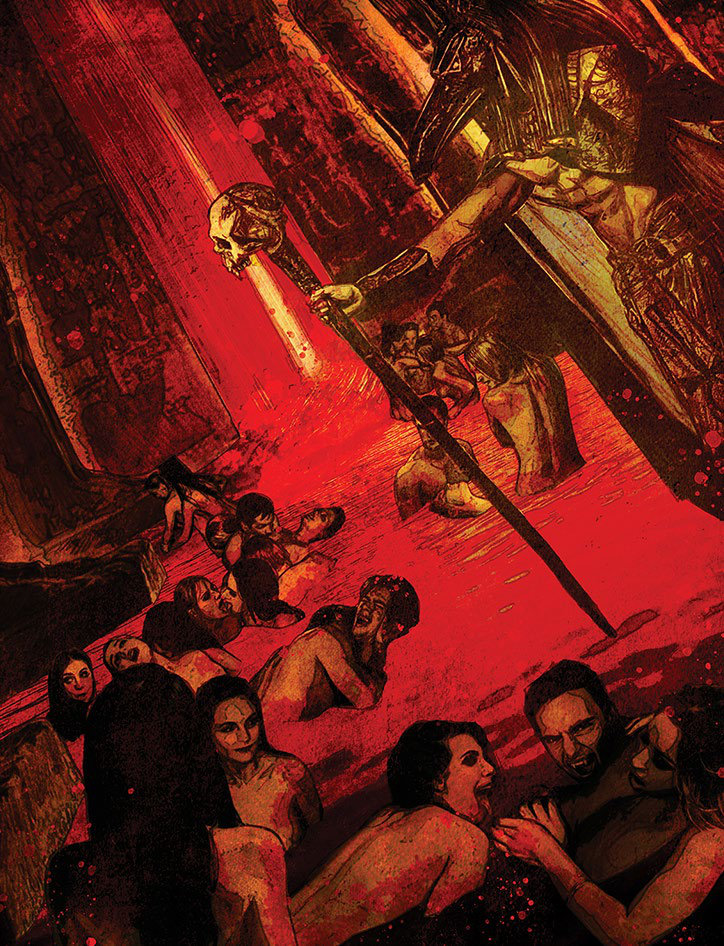

Kindred 
Kindred

chapter two
chapter two

Religions
Religions

“Every methuselah is capable of shepherding a flock of devotees, convincing them of miracles of the Blood, and forcing them to 
“Every methuselah is capable of shepherding a flock of devotees, convincing them of miracles of the Blood, and forcing them to

supplicate before an almighty leader. Every methuselah is a god just waiting to take on the title.”
supplicate before an almighty leader. Every methuselah is a god just waiting to take on the title.”

— 
— Shrug, Nosferatu Mistress of Cardiff
Shrug, Nosferatu Mistress of Cardiff

Undeath causes many a crisis of faith. The devout 
Undeath causes many a crisis of faith. The devout 
Christian might cease to believe in the sanctity of life 
Christian might cease to believe in the sanctity of life 
and the forgiveness of God Almighty. The Muslim might 
and the forgiveness of God Almighty. The Muslim might 
fail to reconcile their own experience with the Qur’an’s 
fail to reconcile their own experience with the Qur’an’s 
teachings on death as a long night of sleep, where upon 
teachings on death as a long night of sleep, where upon 
dying, the individual immediately discovers their destiny 
dying, the individual immediately discovers their destiny 
in heaven or hell. The Hindu waits for their atman to be 
in heaven or hell. The Hindu waits for their atman to be 
reborn in a new body, only to find themself locked in 
reborn in a new body, only to find themself locked in 
their own damned, unliving shell.
their own damned, unliving shell.

The religions presented in this chapter all exist 
The religions presented in this chapter all exist 
within the World of Darkness, with some as prominent 
within the World of Darkness, with some as prominent 
vehicles of vampire faith, and others merely existing on 
vehicles of vampire faith, and others merely existing on 
the fringes of Kindred society. In your chronicle, these 
the fringes of Kindred society. In your chronicle, these 
might act as backgrounds, support networks, the sources 
might act as backgrounds, support networks, the sources 
of powerful Mawlas, or the font from which to draw 
of powerful Mawlas, or the font from which to draw 
horrifying antagonists.
horrifying antagonists.

The Ashfinders
The Ashfinders

It is enough to drive one away from faith entirely, 
It is enough to drive one away from faith entirely, 
and yet, vampires discover new beliefs. There will always 
and yet, vampires discover new beliefs. There will always 
be great mysteries in the world, and faith has provided 
be great mysteries in the world, and faith has provided 
millions, perhaps billions of humans with answers, and 
millions, perhaps billions of humans with answers, and 
comfort where there are no answers to be found.
comfort where there are no answers to be found.

“We are one click away from becoming the next step 
“We are one click away from becoming the next step 
in Cainite evolution. One share from enlightenment. One 
in Cainite evolution. One share from enlightenment. One 
algorithm away from becoming gods. This is our path, to share 
algorithm away from becoming gods. This is our path, to share 
and understand that which has come before us.”
and understand that which has come before us.”

Vampirism is a terrifying state in which to find 
Vampirism is a terrifying state in which to find 
oneself. It’s only natural that Kindred flock together 
oneself. It’s only natural that Kindred flock together 
to find meaning, purpose, and sometimes, salvation in 
to find meaning, purpose, and sometimes, salvation in 
communal struggle. Sometimes it comes in service to a 
communal struggle. Sometimes it comes in service to a 
higher power, other times it comes through examining 
higher power, other times it comes through examining 
the Beast within, and rarely, it leads to transcendence 
the Beast within, and rarely, it leads to transcendence 
beyond a vampire’s base instincts.
beyond a vampire’s base instincts.

— Amber Freeman, Duskborn Influencer and Yogi of 
 — Amber Freeman, Duskborn Influencer and Yogi of 
the Cinder Institute
the Cinder Institute

The Ashfinders are a new philosophical movement 
The Ashfinders are a new philosophical movement 
within the tangled web of Kindred religious obser­
within the tangled web of Kindred religious obser­
vances. These Yogis are born from the literal ashes of 
vances. These Yogis are born from the literal ashes of 
the ongoing Gehenna War, the cult built around the 
the ongoing Gehenna War, the cult built around the

3 5
3 5

CULTS OF THE BLOOD GODS

understanding that there may be ways other than dia­
blerie to evolve a Duskborn’s powers. The Ashfinders and 
their wider conglomerate — the Cinder Institute — pos­
sess a multi-faceted dogma, but it boils down to one part 
ecstatic bacchanalian cult, one part data-mining firm, and 
a healthy scorn for vampire society. Seen as the “other” 
by mainstream Kindred, Ashfinders have come to terms 
with this separation by reveling in life’s greatest pleasures 
and showing off with the use of social media. While this 
bravado is tacky to some, by enjoying existence, or some 
semblance of it, Ashfinders remind themselves of what 
they lose if they give themselves to the Beast. It is also a 
way to tell the Camarilla to “fuck off, the Duskborn are 
here to stay.”

a bond with the memories and powers of the dead. This 
way, thin-bloods continue to possess the benefits of walk­
ing between the two worlds without having to completely 
compromise their morality.

The Ashfinders’ agenda is an incredible threat to 
the Camarilla and cults who venerate the ancestors. 
The knowledge and pervasive nature of this new party 
drug alarms many within Kindred society, especially as 
it’s apparent Ashe has no effect on non-Duskborn. It is 
highly addictive and has horrifying consequences if taken 
in excess. The Ashfinders are flooding the party scene in 
Chicago, Ibiza, Bangkok, and supposedly elsewhere with 
their new drug, and offering the recipe to anyone bold 
enough to ask. The drugs they pass around may not even 
be Ashe, but merely marketed under that name to drum 
up excitement and enticement. The real drug is the phys­
ical embodiment of a culture of sharing as it blossoms 
into a perfect death spiral. Ashe is sharing the memories, 
abilities, and Disciplines of dead Kindred, all blended 
into a psychedelic euphoria seldom seen among vampires. 
There are even rumors certain special batches cause the 
Hunger to slip away for brief moments of time. The ritual 
to create the substance itself is incredibly dangerous and 
can cause lasting consequences for both the creator and 
the partygoer who eventually imbibes the drug.

Dust to Dust

The Ashfinder movement is reactionary, built from 
a quest for survival and a disillusionment with political 
factions such as the genocidal Camarilla, who have made 
no secret of their hunt for thin-bloods. While there are 
those Kindred who sympathize with the plight of the 
thin-bloods, this cult is now seen as an open threat to 
vampiric society. The cult counts few true Kindred among 
its membership, though the majority of the “full-blooded” 
Kindred who support them have Anarch tendencies. One 
of the Kindred who mentored the early members of this 
cult was the Tremere Dr. Mortius (see p. XX), who has 
been instrumental in providing information and thau­
maturgical ability to the Duskborn in exchange for small 
portions of Ashe — a drug created from vampire remains 
— for his own personal experiments.

The use of Ashe has generated some unintended side 
effects in its users. Some Ashfinders find their withdraw­
als completely consuming them, and the after-effects 
drive many to kill vampires so they can obtain their next 
fix.

Are Millennials 

Killing Kindred Elders?

Donning the mask of millennial high society, the 
cultists portray themselves as ambitious revelers enjoying 
the peak of the nightlife scene while searching for enlight­
enment. The hustle of life and unlife blend together into a 
perfectly edited Instagram photo. This hides the underly­
ing fractious after-effects of Ashe use and the “fake it ‘til 
you make it” mentality which drives the religion forward. 
Donning loose forms of organization, the Ashfinders are a 
conglomeration of influencer culture, New Age philoso­
phy, and the quest for Golconda through the deliberate 
and systematic annihilation of as many Kindred elders as 
possible.

On its surface, the Ashfinder movement provides a 
communal and welcoming space for any thin-blood who 
chafes under the pressure of vampire politics. Its mem­
bership cultivates a deliberate marketing and social media 
campaign to propose and propagate centering activities 
such as meditation, yoga, esoteric classes, and other forms 
of New-Age prosperity practice among Duskborn. These 
sessions are also offered to the public, using the kine as 
a sort of barrier against any bands of hunters looking to 
harm the thin-bloods. Through the fashioning of these 
carefully crafted communities, the Cinder Institute was 
built. On the backs of donations and delicate social 
engineering, the cult built a new corporate center within 
the Hive of the Chicago financial district. Hiding in 
plain sight, the Institute provides a multitude of philan­
thropic and spiritual services for the Kindred and kine 
of Chicago. This hub has satellite studios all over the

While diablerie is a sure-fire way of becoming noto­
rious among the Damned, these thin-bloods have discov­
ered a way to synthesize necromantic power, thin-blood 
alchemy, Thaumaturgy, and the ashes of dead Kindred 
to ingest the shattered elements of the Beast. This drug 
— known on the street as Ashe — is consumed any way 
the Duskborn prefers, whether eaten, injected, snorted, or 
rubbed into an area rich in blood vessels. Doing so creates

3 6

chapter two: Kindred Religions

greater Chicagoland area and has recently branched out 
to build a consulting service wherein “meditative gurus” 
can use video conferencing platforms to give sessions to 
those willing to foot the cost.

the Cinder Institute. These memories never leave the 
Kindred, causing occasional dysphoria within many of the 
Ashfinders, making them question or lose who they really 
are after extended use. Yet cult members continue to use 
the substance, as the memories gained are of insurmount­
able worth. To be able to find and use lost resources or 
contacts, or to locate lost fortunes or acquire knowledge 
built over centuries, is a short-cut for which these thin-
bloods willingly make the sacrifice.

The Cinder Institute is a fantastic front, forged in 
the fires of social media presence and club scene culture, 
and one the Camarilla would balk at. While these Kin­
dred and kine find store-front enlightenment from the 
teachings of New Age spirituality, they routinely proceed 
to throw afterparties in nightclubs and lofts. The loca­
tions of their budding “guru” network are very specific, 
with connections to the cities of Bangkok and the island 
of Ibiza, both known for their vibrant nightlife. The cult’s 
public face lures in disenfranchised thin-bloods, who 
sample the drugs, and then join the cult. They then go on 
to advertise their experiences in clubs, retreats, and times 
spent meditating — not referencing the drug, naturally 
— to lure further adherents to the cult. The cycle goes on 
and on, using social media marketing as a highly efficient 
cult-building tool.

Mortius sits at the head of the Cinder Institute, 
monitoring the results gleaned from Ashe use. He finds 
that the cultivation of Ashe becomes simpler with time, 
and the data synthesized from the experiment compounds

WHAT EXACTLY IS AN INFLUENCER?  
Influencers are social media personalities who 
wield enormous social clout over their followers on 
whatever platform they prefer. Some of these peo­
ple choose to put their lives on display for whoev­
er wishes to watch, promoting whatever they wish, 
and go on to create a cult of personality around 
themselves. They may also offer “advice” on sub­
jects, often amounting to nothing more than product 
pitches. This strange voyeurism, in turn, provides in­
tense political, social, and economic force when an 
influencer’s followers are told to consume, destroy, 
or act in a certain capacity. This form of marketing 
presents a face to potential consumers and builds a 
“relationship” much as we see in traditional sales. 
Products and beliefs an influencer may recommend, 
events they may attend, even things they wear may 
become overnight successes or failures at the whim 
of these mini-celebrities. This exchange humanizes 
the consumerism involved, creating deep devotion 
within their own small cults of personality. 
Within the context of the World of Darkness, these 
influencers function identically. If the influencer is a 
vampire, then the vampire might use their following 
to take part in the Jyhad and turn followers against 
or in favor of Kindred in their domain. Such activity 
should warrant a Blood Hunt in Camarilla domains, 
but many Princes and Sheriffs are too long in the 
tooth to even understand the influencer phenome­
non. One set of groups who do keep a close eye 
on this online behavior are Second Inquisition bod­
ies such as FIRSTLIGHT. For thin-bloods, influencer 
culture is a way to garner influence under the radar 
of the Camarilla’s watchful eyes. For the Inquisition, 
it’s a fine way to identify a city’s Kindred as the on­
line vampires talk about their friends and rivals. For 
now, the Cinder Institute seems to be a legitimate 
front for New Age businesses and party lifestyles. 
The Inquisition has yet to realize vampires are be­
hind it.

The endless party lifestyle this perpetuates does 
nothing but bolster the fledgling Golconda cult. People 
want to feel good about themselves, and what better way 
than to pair wellness of body and soul with a decadent 
social gathering.

With the boom of Ashe and the demand for the sub­
stance growing, the cult’s Tremere sponsor, Dr. Mortius, 
considers how best to farm Kindred “humanely” for the 
drug’s creation. While the potency of the substance is 
dependent upon the age of the vampire from whom it was 
synthesized, Mortius has discovered the memories of the 
vampire can still be transferred over to the drug user and 
provide the same sense of fleeting joy, no matter the age 
of the drug’s Kindred of origin. With the Gehenna War 
ongoing, the amount of raw materials coming in from 
battlefields has not diminished, as the thin-bloods and 
Mortius use agents on the front lines to discreetly harvest 
remains for shipping back to more lucrative market sites. 
With social media’s tools at hand, the ability to hound 
a vampire into fleeing their haven is also an option the 
younger members of the cult have grown to enjoy.

Data Mining

At the core of the philosophy, the use of Ashe is a 
sacrament toward the goal of enlightenment. By “shar­
ing” the memories of the dead, Ashfinders might dis­
cover truths about their existence, their curse, and their 
possible powers. These mental walkabouts are often taken 
in meditative places of relaxation, with stronger doses 
of the drug. Trip-sitters are present to record the vam­
pires’ meditations and report them more widely within

3 7

CULTS OF THE BLOOD GODS

upon itself. Mortius is in the fortunate position of geting 
to study thin-blood activity as much as he wishes, being 
seen as a benevolent godfather by many of the thin-
bloods, while acting as the puppetmaster behind an entire 
cult. As for Golconda, his theories weave back and forth. 
The amassing of knowledge at such a scale is any Tremere’s 
dream, and his allegiance to House Ipsissimus (see Anarch, 
p. 170) wavers as he finds more power at his fingertips 
via the Ashfinders than the New-Age House could ever 
provide. Practically at will, he can witness the range of 
human and Kindred existence, though he can’t experience 
it himself. What he questions now, however, is why his test 
subjects keep seeing shadows move out of the corners of 
their eyes, and why there are areas in his lab that fill him 
with seething dread. It seems the ghosts of the dead blame 
him directly for the desecration of their remains.

ASHFINDER CONVICTIONS
The Ashfinders are a new cult, with some Convic­
tions handed down from the mind of Mortius in the 
Cinder Institute, others passed on by yogis and gu­
rus within the ranks of Ashe-takers. Some of these 
common Convictions include:
•	 Always sample new experiences on 
offer 
The Ashfinders are libertines and new experiences 
are a part of the package that comes with taking 
Ashe.
•	 Never withhold Ashe from others who 
wish to sample it 
Experience and sensation are to be shared. Solitary 
euphoria is a hollow high.
•	 Never allow someone to silence you
The Cinder Institute requires the spread of its word 
to draw new adherents and new experiences. Si­
lence is a method of the Camarilla.
•	 Always listen to those of greater expe­
rience
Wisdom can be gained from those of greater age 
and experience. One doesn’t have to believe or 
emulate every word and action, but listening is 
mandatory.
•	 Always know where your next fix is 
coming from
Ashe isn’t to be sampled once and forgotten: it’s a 
way of life. Only a fool takes the drug and fails to 
take account of their forthcoming supply.
•	 Never allow the kine to realize your 
undead nature
Though the Cinder Institute advocates the spread 
of their word, they are very specific that Ashfinders 
must keep their vampiric states a secret from mortal 
followers. As far as the kine are concerned, Ashe is 
just a new lab-grown drug that doesn’t give them a 
buzz like it does to you.

Cinder Institute: Ibiza

One of the centers of power for the Ashfinders exists 
on the island of Ibiza, where several coteries of vampires 
dedicated to this cult sample the blood of the thousands 
of tourists who pass through the clubs, beaches, and bars 
every year. In a strangely seasonal cycle, the Ashfinders 
are active in the domain between the months of May and 
October, but sink into torpor or fly to Portugal, Spain, 
Tunisia, or Morocco for the other months of the year. 
Ibiza’s tourist trade drops with the weather, therefore the 
vampires move in and out too.

The cult has no formal hierarchy, hasn’t appointed a 
Prince or Baron over the island, and has yet to organize 
hunting territories or Elysia. They’re fiercely territorial 
over the island’s south coast, where in places like Platja 
d’en Bossa they receive shipments of Ashe from domains 
on either side of the Mediterranean and mix them up 
with the blood of intoxicated kine to create exciting 
cocktails.

Despite the length of time Ibiza has been a party 
venue, few vampires took advantage of its throng of drunk, 
often doped-up mortals until the Cinder Institute set up 
on the island. Now that they’re there, it’s proving difficult 
to make room for the Ashfinders during their feeding sea­
sons, which has led to consternation and conflict between 
them and the Kindred who do make Ibiza a permanent 
residence. Many suspect a war might be brewing. It’s likely 
the Ashfinders will seize the island in its entirety in the 
coming months, acting as an invitation for fledglings want­
ing to embrace an unlife of thrills and no consequences, 
and for mercenary Kindred looking to profit from serving 
Ibiza’s non-Ashfinder vampires in driving the cult off the 
island.

Perspectives

Anarchs: Our closest allies of the “full-blooded” variety 
exist in this sect, but they’ll never understand what it is to 
go through existence half-formed, impotent in the middle of a 
measuring contest. They might be sympathetic, but they’ve no 
idea what to do with us. I think if we fell completely on their 
mercy, they’d make a nice padded room for us to bounce around 
in and feel like they’ve done a good job.

3 8

chapter two: Kindred Religions

AMBER FREEMAN (THRIVEHIVE)
AMBER FREEMAN (THRIVEHIVE)

Camarilla: For a whole bunch of reasons, some of them 
valid, they’d see the Cinder Institute wiped off the face of the 
Earth. The good news is they’re so behind the times they don’t 
even know what the Ashfinders are, what we do, and why they 
should be bothered.

Epitaph: Ashfinder Yogi and Influence Junkie

Quote: “If these elders wish to rip away our right to 
exist then we will pave a path unseen in this Jyhad. 
A path through these ancient crumbling monsters 
right into Golconda. One like, one retweet, one up­
vote can and will open this door. We will be left atop 
the embers of history, watching the sun come over the 
horizon. Something they will never do again.”

Church of Caine: When we kill, it’s for enlightenment 
and the betterment of Duskborn society. When they kill, it’s 
because they think they’re angels of murder, or some shit. They 
revere the act of bloodshed itself. At least for us it’s a means to 
an end.

Cult of Shalim: Is there such a thing as pursuing enlight­
enment in the wrong direction? If so, this cult has it down pat.

Clan: Thin-Blood

Embraced: 2015 (Born 1991)

Mithraic Mysteries: Some people call us a cult. This 
is a cult. They embrace the whole robes, ceremonial masks, 
chanting, and ranks nonsense. They know their god is dead too, 
so what’s the point? Does it provide them comfort?

MORTAL DAYS: SELFIES AND BRUNCH

Left much on her own throughout her formative 
years, Amber grew up like many millennials, cultivating a 
group of friends in chat groups and via social media. Fill­
ing the void her parents left was easy to her. Amber was 
a natural at the budding world of social networking and 
wielded it to her advantage. She began documenting her 
lifestyle and mentoring others in the discipline of yoga, 
despite having no formal training in the practice. Her 
charisma and perceived innocence attracted viewers and 
followers by the thousand, many of whom didn’t emulate 
Amber, but just watched, and watched, and watched.

BEAST SHARDS
BEAST SHARDS

Beast Shards — or just Shards as they are known in 
Ashfinder circles — are mischievous and dangerous mon­
sters who stalk in the wake of a creator or user of Ashe. 
Many Ashfinders see the destruction of their first Shard 
as a rite of passage, proving their mastery over their 
vampiric natures. Most Shards exist as a shadow version 
of their previous body, wisping and twitching in and out 
of existence. They possess no human features beyond a 
distorted body shape, and their actions are generally more 
feral than reasoned.

When she finally went away to the University of Chi­
cago, Amber had already cracked over 300,000 followers 
on social media under the name “ThriveHive.” Her subtle 
blend of “woke” style philosophy, Earth-based spirituality, 
and self-discipline earned her a place as a student in the 
new Social Media Administration track in the Commu­
nications Department. Amber began receiving offers 
from “green” companies looking for her approval and 
patronage. With just a simple promo lasting for a month’s 
worth of videos, she made some start-ups into city-wide 
successes. The money she earned from these endorsements 
helped her balance out her feel-good lifestyle with a 
healthy dose of partying in and around Chicago’s Rack. 
Despite her New Age devotion to clean living, she was 
still a young woman enjoying the wild scenes of the city’s 
nightlife. A mixture of drugs and sex helped fuel her sense 
of control over both herself and her surroundings, and 
she felt comfortable in her balance between hedonism 
and purity. It was something she never had at home and 
surely was never going to give up.

Shards hide themselves and stalk Kindred, possess­
ing portions of their previous identities’ Attributes and 
Skills. These may be modified as the Storyteller sees fit. Dr. 
James Mortius is researching whether an amalgamation of 
these entities could exist, or if they breed at all.

Attributes: Strength 3, Dexterity 4, Stamina 2; Cha­
risma 1, Manipulation 3, Composure 1; Intelligence 
1, Wits 3, Resolve 4

Secondary Attributes: Health 5, Willpower 5

Skills: Athletics 4, Brawl (Claws) 4, Stealth 4, Surviv­
al 2; Animal Ken 3, Intimidation 3; Awareness 2

Disciplines: Animalism 1, Dominate 2, Obfuscate 3

General Difficulties: 4/2

Special: Beast Shards cannot communicate but they 
can create empathetic hotspots that cause humans 
around them to bend their Resonance to a Shard’s will. 
A mortal who passes through this hotspot, rarely wider 
than 3 yards/meters squared, must make a Resolve + 
Composure roll (Difficulty 3) or the Beast Shard dic­
tates the mortal’s new Resonance, lasting until the end 
of the scene. Beast Shard claws are a light piercing 
Brawl weapon with a +2 damage modifier.

At the end of her freshman year, she was recognized for 
her abilities and grades, receiving scholarships from both 
the Bishop Blake Educational Fund and The Stewart-Free­
man Fund for Young Women. It was at the reception of this 
second award ceremony, one her parents promised to attend 
but ended up missing due to last-minute “events,” that she 
met her eventual Mawla, Naomi Stewart.

3 9

CULTS OF THE BLOOD GODS

of her “situation” and wished to offer possible solutions. 
Intrigued, Amber lied to her sire and met clandestinely 
with the doctor. The two combined their resources to 
build the Cinder Institute, all as Mortius provided Amber 
with copious supplies of Ashe.

Amber is now the face of the Cinder Institute and 
its satellite studios. While she understands taking Ashe 
is nothing more than consuming dead Kindred, she 
justifies it as poetic justice and a part of Earth’s cycle of 
renewal. She knows older vampires want to eradicate 
her ilk’s existence so she champions the use of Ashe as a 
spiritual road of advancement. She traveled to Bangkok 
under the guise of seeking a cure for her vampiric state, 
but truthfully, she leads her new cult in advancing her 
message of Golconda and freedom from the curse to other 
thin-bloods.

PLOTS AND SCHEMES:

• 	
The Wholeness and Wellness of Diablerie: Naomi 
has taught her adopted childe about the sin of di­
ablerie, but the possibilities of potential power 
through consumption of another vampire’s blood 
and soul appeals greatly to Amber. In the meantime, 
Amber routinely partakes of Ashe (without Naomi’s 
knowledge) to grow in power.

KINDRED NIGHTS: 

SELFIES AND ENLIGHTENMENT

Naomi wanted to know if the young woman was the 
real deal or just another poseur using her power for her 
own benefit. The young woman impressed Naomi; her 
convictions and power were new, exciting, and focused. 
Naomi, in need of an assistant with such grace and 
control, took Amber on as an apprentice. Naomi had no 
desire to offer Amber the Embrace herself, but through a 
deal she brokered with a Caitiff named Tim Roche, who 
owed her a favor, Amber received the Embrace after a 
night of fine dining, drinking, and sex.

• 	
Gold Dust: Amber knows little of Golconda, but 
believes the consumption of Ashe is a potential 
route to reaching it. The amount of good done by 
someone immortal and not cursed could change the 
world, and what better way of learning how to cure 
the world’s ills than taking on the memories of her 
ancestors? She has been looking for the ashes of old­
er Kindred to support this theory and has supposedly 
gathered a sample of one from a trip to Spain.

DOMAIN AND HAVEN:

After Amber realized the truth of the “date” Naomi 
had arranged between her and Tim, she railed and kicked 
out against the Ventrue and her manipulations. Naomi 
attempted to pacify Amber with talk of the eternity she 
now had to lay down a good influence for fellow Kindred 
and young women. Night after night came lessons in Ca­
marilla law and power dynamics. Amber was a good stu­
dent but revolted against the fact she was now Damned. 
She wanted to make the world a better place, not control 
it. Naomi desperately reassured her, but the Ventrue’s 
words slid off their target. Amber continued building her 
empire of self-help with ever more fervor, and while she 
accepted that Naomi wasn’t the worst of the bunch, the 
fledgling and her Mawla now rarely see eye to eye.

• 	
Wicker Park Two-Flat (Contacts 2, Haven 2, Herd 
2): Amber has blended into the Rack of Chicago and 
ingratiated herself into the Chicago party scene. Her 
haven is next to one of the Cinder Institute’s yoga 
studios and occult bookshops, which provides her 
a source of blood and confidantes within the local 
occult community.

THRALLS AND TOOLS:

• 	
ThriveHive (Influence 4, Fame 2): ThriveHive is an 
international influence marketing scheme. Com­
pounding her knowledge of Kindred politics with 
influencer swagger, her message now reaches over 
700,000 followers. Her brand provides significant 
income from marketing products and is now build­
ing a financial portfolio with Naomi Stewart’s help.

Posing as Naomi’s ghoul and changing her name 
to Amber Freeman, the two sometimes still visit Ely­
sia around the city of Chicago. One such evening, a War­
lock named Dr. Mortius grabbed hold of Amber. He knew

4 0

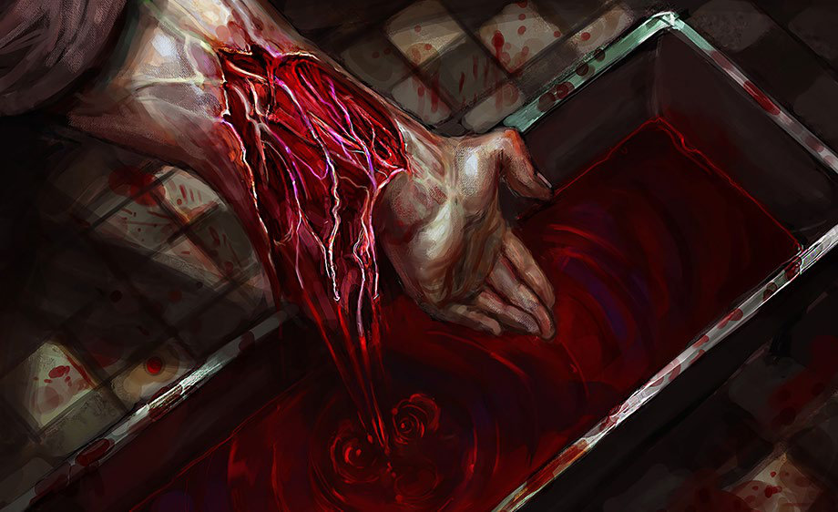

She routinely pitches for the Cinder Institute on 
her vlog.

as Mortius tells her when he commands her to not 
share their experiments with Naomi Stewart.

KINDRED RELATIONSHIPS:

WHISPERS:

• 	
Kevin Jackson (Fear): Amber is terrified of the Prince 
of Chicago. She knows she will be Blood Hunted 
if the Prince ever finds out about her work with 
Dr. Mortius, and has even heard tell the Camarilla 
routinely purges thin-bloods. Her only hope is to be­
come useful enough to the Camarilla that they won’t 
kill her, or build up enough of a shield through her 
cult that she no longer needs to fear the Ivory Tower.

• 	
Liars and Thieves: Amber is a Tremere ghoul of 
Dr. Mortius and assisted in the liquidation of the 
House Carna chantry in Milwaukee. She mas­
queraded as a Bahari to throw off the trail of 
the Ashfinders.

• 	
Prophet of the End Times: Amber sees herself as a 
new prophet for this age. She wants to bring thin-
bloods out of the shadows and give them rights and 
privileges. While violence isn’t her first choice, she is 
beginning to believe it is the only choice.

• 	
Naomi Stewart (Mawla): Naomi uses her nights to 
aid Caitiff and Duskborn in rising above the bias 
pervasive within the Camarilla. Naomi respects Am­
ber and her talents, but is busy with her own mach­
inations for Ventrue Primogen and often forgets to 
check in with her adopted childe. Amber suspects 
Naomi had a weak-blooded Caitiff Embrace her for 
plausible deniability, and so a Blood Hunt, if called, 
could take place without the flack hitting her Mawla, 
straining the relationship between the two.

• 	
Paragon: Kevin Jackson knows of Amber’s plight and 
is grooming her from the shadows to show to the rest 
of the Camarilla. His goal is to normalize the thin-
bloods and tear their population away from the An­
arch Movement. He wants an example for the Ivory 
Tower of what lengths these Duskborn are willing to 
go for recognition.

MASK AND MIEN:

• 	
Dr. Mortius (Admiration): Amber looks up to Mor­
tius. She truly believes the Tremere wants to help 
her and the other thin-bloods become more than a 
shattered and scared community. For now, she does

• 	
Amber’s real surname is Gallagher, but she adopted 
the name Freeman after her Embrace. In truth, her

41

CULTS OF THE BLOOD GODS

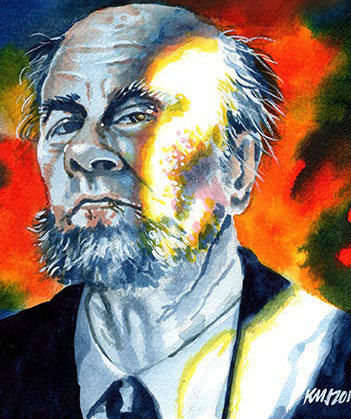

changed identity has done her little good, as her in­
ternet followers all know her as Amber and Thrive­
Hive, and she has no way of erasing all online record 
of her existence.

• 	
Amber is a small-framed, freckled woman, who when 
online has a perpetual genuine smile and commonly 
wears yoga gear and eco-friendly threads. In person, 
she’s less confident, though alcohol and drugs quickly 
boost her self-assuredness. She wears her blonde hair 
in long braids.

Sire: Tim Roche

Ambition: Find a step on the path to enlightenment

Convictions: Never stop striving for wellness

Touchstones: Sandra Kowalski — Amber’s 
webmaster

Humanity: 8

Generation: 14th

Blood Potency: 0

Attributes: Strength 3, Dexterity 3, Stamina 4; Cha­
risma 3, Manipulation 2, Composure 3; Intelligence 
2, Wits 2, Resolve 2

monastery for his candlelit writings and illuminations, 
despite never seeking a pat on the head from one of the 
venerable masters. His sole love and focus was “the work,” 
as he called it, and in that he excelled.

Secondary Attributes: Health 7, Willpower 5

Skills: Athletics (Yoga) 4, Drive (City) 2; Etiquette 
2, Insight 3, Leadership 3, Performance (Vlog) 3, 
Persuasion 3, Subterfuge 2; Academics (Communica­
tions) 2, Awareness 2, Finance 2, Medicine 1, Politics 
1, Science 1, Technology (Social Media) 4

Where many of his peers went on to join the monas­
tery or priesthood, James departed on his 14th birthday and 
never again looked at religion as anything but a distraction 
from the work. He translated texts from around the known 
world, penned his own treatises on sciences, sorceries, and 
beliefs, and earned many a wealthy patron through his 
efforts. For many years, he occupied a tall stone building in 
Edinburgh as a city elder, unaffiliated with any order but 
famed for his intellect and skill in academic pursuits.

Disciplines: Thin-Blood Alchemy 4

General Difficulties: 4/2

DR. JAMES 

DR. JAMES 

“MORTIUS” HOWITT
“MORTIUS” HOWITT

James was in his 40s when he first became aware of 
blood magic. A dabbler in alchemy and, according to 
some, a hedge wizard, it came as little surprise to Edin­
burgh’s small Tremere contingent when James started 
probing for insight into the arts of the Blood. He was 
taken on as a ghoul, and to every Warlock’s great surprise, 
showed more skill with the clan’s Thaumaturgy than 
many of the city’s Kindred.

Epitaph: Thaumaturgical Scientist

Quote: “The most important thing, the only reason to 
exist, is the work.”

Clan: Tremere

Embraced: 1566 (Born 1516)

Mesita — the Tremere Regent of Edinburgh — came 
to Howitt one night during his studies, and offered him 
life eternal to continue studying the world’s great mys­
teries and become more than apprentice in the field of 
Blood Sorcery. James took his time to consider the offer 
before accepting, despite the inkling that Mesita was 
deliberately cutting off his advancement by ending his 
natural life.

MORTAL DAYS: BLOOD SORCERY SAVANT

Raised by monks among the ranks of other orphans, 
his parents having succumbed to plague in his youth, 
James Howitt never knew the warmth of kin or the care 
of a loving mother. He was a perpetual loner in life, work­
ing harder than the other children and rejecting their 
calls to play. He earned praise from the brothers at the

4 2

chapter two: Kindred Religions

KINDRED NIGHTS: THE WORK GOES ON

• 	
Clouds of Ashe: The Ashe experiments started as 
one of Mortius’ trivial hobbies, after he discovered 
what the Duskborn could do with this drug, but have 
borne surprising fruit. While his initial studies indi­
cated there may be some resonant force present in 
vampire remains, the capacity to transfer memories 
from victim to Ashfinder opened his mind to new 
possibilities. Ashe, therefore, is a whole new dimen­
sion of learning, and the current users are simply 
test subjects. Mortius is playing the long game with 
this drug and eagerly notes its long-term effects in 
consideration of how to refine them.

James never stopped his research or practice. He was 
determined to become what he called “a master of destiny 
and life” through studying every avenue of sorcery, philos­
ophy, and alchemy. With an eternity, it seemed easy. Mor­
tals might discover one or two things in a short lifespan. 
He was convinced he could achieve more than any living 
being with immortality stretching out before him.

Among his grand works were his translation of the 
Book of the Grave-War, a tome said to contain infor­
mation enabling the breaking of the Blood Bond; the 
creation of dozens of minor and major Rituals utilized 
by the Tremere all over the world in the modern nights; 
the establishment of research chantries in various cities, 
including Shanghai and Milwaukee; and the co-devel­
opment of the Ashe drug with the thin-bloods of the 
Cinder Institute, informally known as “the Ashfinders.” 
Still, he feels his work isn’t done. “The work” is not yet 
finished.

DOMAIN AND HAVEN:

• 	
Marquette University Campus (Contacts 3, Haven 
3, Herd 2): Mortius spends much of his existence 
moving between domains, but often returns “home” 
to Milwaukee, the city in which he spent much of 
the 20th century. He keeps a body of contacts among 
Marquette faculty and a fringe religious group 
known as the Cult of Isis, but feels increasingly 
drawn to Embrace students just to drain them, which 
intrigues him as a grand new experiment of the 
Blood. The domain has plentiful occult phenomena 
to study, so he’s happy remaining there for months 
at a time. Unfortunately, the current Prince of the 
city is prone to persecuting vampires who move in 
and out of Milwaukee without contributing to its 
defenses (see Let the Streets Run Red for more on 
the domain of Milwaukee).

James wasn’t in Milwaukee when the city’s Tremere 
Regent — Carna — broke her bonds to the clan and 
formed her own house. He returned to the wreckage, 
however, and the few vampires who know him well say he 
seemed elated. He spends most of his time these nights 
wandering, sometimes teaching, most often researching, 
but always pursuing the work so important to him.

James was supposed to be one of the attendees at 
the great convention in Vienna, when the assault on the 
Prime Chantry saw the clan’s highest levels annihilated or 
sent to torpor. He opted at the last minute not to attend, 
and hasn’t spoken of the event since. As Clan Tremere 
found itself fragmented in multiple splinters, James infor­
mally broke from the core faction and aligned with House 
Ipsissimus, due in most part to their eagerness to re­
search, expand mental horizons, and avoid the Camarilla 
hierarchy, which doesn’t interest him in the slightest. His 
defection angered prominent members of House Tremere 
and House Carna, but he really couldn’t care less, having 
been apolitical his entire existence.

THRALLS AND TOOLS:

• 	
The Cult of Isis (Allies 3, Retainers 3): This cult of 
mortal witches and vampires linked to the Bahari 
operates in many domains across the world, tending 
toward spaces afflicted with severe occult phenom­
ena, such as Cairo, Thessaloniki, Edinburgh, and 
Milwaukee. Though their membership is entirely 
non-male, James lends them his research in exchange 
for their acting as his sometime bodyguards and spies.

PLOTS AND SCHEMES:

• 	
The Ashfinders (Mawla 2): Mortius is the hidden 
head behind the Cinder Institute, though he has less 
interest in its operation than he does in the results of 
Ashe usage. The majority of its members are — to his 
mind — junkies and lab rats. However, the cult also 
acts as a group that offers guidance and aid when 
James needs it, so as their sponsor, he looks out for 
them and they look out for him.

• 	
The Work: The doctor is constantly in pursuit of 
“the work,” but only Mortius knows what this work 
entails. He seeks to bend, twist, and burn the Blood 
in vampire bodies, subjecting it to every force, every 
element, and every chemical compound to see what 
reacts. He wants to understand the Blood, master it, 
and eventually, learn all the secrets behind its ma­
nipulation. Mortius doesn’t hold stock in the Caine 
myth. He believes all things in this world — vampires 
included — are subject to science and physical prin­
ciples, and are therefore tools waiting for the hands 
of learned masters.

KINDRED RELATIONSHIPS:

• 	
Amber Freeman (Curiosity): As one of the pioneers 
of Ashe ingestion, and one of the drug’s biggest

4 3

CULTS OF THE BLOOD GODS

Humanity: 3

promoters, Amber is a curious 
test subject for Mortius. He 
sponsors her, gives her advice, 
supplies her with Ashe, and 
watches the dominoes fall while 
taking notes, as her followers fall 
deeper and deeper into addic­
tion. He has no real affection for 
the young vampire.

all. He’s poisoning them to eradi­
cate thin-bloods and form a new 
case study.

Generation: 7th

Blood Potency: 5

• 	
Peas in a Pod: Mortius and 
another Kindred scientist named 
Netchurch often exchange notes, 
sometimes acting as peers, other 
times as rivals. Both are detached 
from compassion.

Attributes: Strength 2, Dexter­
ity 2, Stamina 4; Charisma 2, 
Manipulation 1, Composure 3; 
Intelligence 5, Wits 5, Resolve 5

Secondary Attributes: Health 
7, Willpower 8

• 	
Carna (Resentment): What 
Mortius tells people is that 
Carna stole his research and used 
it inappropriately to form her 
hellish cell of Kindred. What 
actually happened, is while 
Mortius translated the Book of 
the Grave-War and practiced its 
Blood Bond-breaking Rituals, 
he never got them to work. 
Believing the book incomplete or 
inaccurate, he moved on to other 
things. He greatly resents that 
Milwaukee’s puppet Regent — 
Carna — somehow cracked the 
code without telling him, and 
wants to know how she did the 
deed.

• 	
The Call: Mortius has been 
feeling the Beckoning with each 
night of rising, and only subdues 
it through transfusions of vitae 
directly into his dead heart.

Skills: Drive 1; Etiquette 1, In­
sight 1, Leadership 1, Subterfuge 
2; Academics (Anthropology, 
Archaeology, Mathematics) 
5, Awareness 2, Medicine 5, 
Occult (Alchemy, Blood Sorcery) 
5, Politics 3, Science (Astronomy, 
Biology, Chemistry, Geology, 
Physics) 5, Technology 3

• 	
Traitor: Mortius knew exactly 
what was going to happen in 
Vienna, which is why he didn’t 
make the journey and why he’s 
so scared of Karl Schrekt.

Disciplines: Auspex 5, Blood 
Sorcery 5, Dominate 4

MASK AND MIEN:

General Difficulties: 7/5

• 	
James took on the name 
“Mortius” in the 19th century 
as a flight of fancy. He has no 
great connection to the Clan 
of Death, nor is he particularly 
morbid — though he is studious 
and stuffy — but the name keeps 
people guessing. It doesn’t serve 
as an effective Mask, however, 
due to the strangeness of the 
name. It hasn’t occurred to him 
yet to change it.

Ashfinder 
Blood 

Alchemy

• 	
Karl Schrekt (Fear): James has 
remained apolitical for most 
of his existence, aligning with 
the Camarilla because it suited 
him, and falling within the core 
of Clan Tremere because they 
schooled him, and sent him 
books, students, and blood for 
study. His break from Schrekt’s 
wing of the clan was meant to be 
quiet, but apparently the head of 
House Tremere is livid Mortius 
just walked away with hundreds 
of years of research, especially 
as the doctor was supposed to 
attend Vienna when the attack on 
the Chantry took place. Mortius 
is deathly afraid of what will hap­
pen if Schrekt catches up to him.

The thin-bloods who make up 
the majority of the Ashfinder cult 
have turned their Alchemy over to 
the process of ingesting Ashe and re­
trieving memories and powers from 
it post-consumption. Concocting 
Ashe requires Thin-Blood Alchemy 
of the Fixatio form, and the process 
may be modified by certain other 
formulae. Each one applied still has 
a distillation cost, and for purpos­
es such as distillation time use the 
highest level among the modifying 
formulae. Any thin-blood can use 
Ashe, as it conveys benefits when 
ingested, injected, or otherwise 
exposed to a Rouse Check’s worth of 
Duskborn vitae in their body.

• 	
Mortius is a stooped old man 
with a beard and grey skin 
marked where he suffered the 
pox as a child. He rarely makes 
eye contact and speaks mostly in 
a mutter. He was Embraced in 
his 60s, which at the time was a 
venerable age, and it shows in his 
appearance and manner.

Sire: Mesita

Ambition: Further “the work”

WHISPERS:

Convictions: Never turn down 
the opportunity to experiment

• 	
Hot Dose: Mortius knows how 
fucked up the users of Ashe are 
going to be and doesn’t care at

Touchstones: Grace Brooker — 
mortal witch from the Cult of Isis

4 4

chapter two: Kindred Religions

Level 3

•	
Activation Cost: One Rouse 
Check in addition to the cost of 
using Ashe

ruined and a Beast Shard (see p. 
XX) emerges in the area.

When consumed, all Ashe 
allows a thin-blood to access more 
of the power in vitae and ash than 
is usually within their grasp. Their 
Blood Potency counts as 1 for the 
purposes of Blood Surges and Disci­
pline Rouse Check re-rolls until the 
end of the chapter. The drug is far 
from lacking in downsides however, 
see Ashe Addiction (see p. XX).

Concoct Ashe

•  	 System: When using Concoct 
Ashe, this formula may be used 
to imbue remains with the 
memories of the vampire they 
once formed. When consumed, 
this altered Ashe provokes a 
Willpower test at a Difficulty of 
1 + the destroyed vampire’s Blood 
Potency. On a win the user 
immediately enters a Memoriam 
(see Vampire: The Masquerade p. 
311), reliving an important mem­
ory of the destroyed vampire’s 
past rather than their own. This 
scene is resolved normally using 
their own stats, but the shifted 
perspective will be valuable. If 
they are meditating in a place of 
calm at the time they consume 
the Ashe, the thin-blood adds a 
one-die bonus to all dice pools 
during the Memoriam.

The process of creating the Ashe 
drug is a form of Blood Alchemy in 
itself, and generally takes place in a 
laboratory or workshop due to the 
need for an open flame and metal 
filings.

• 	
Ingredients: A destroyed vam­
pire’s ashes, an open flame reach­
ing 1,500°C, aluminum filings.

Chemically-Induced 

Flashback

• 	
Dice Pools: Intelligence + Thin-
Blood Alchemy

Prerequisite: Concoct Ashe
By melting down a vampire’s 
possessions (the more important 
the better) during Ashe creation, an 
alchemist infuses the drug with mem­
ories from the destroyed vampire.

• 	
System: The vampire’s ashes are 
contained in a vessel heated by 
an open flame and then mixed 
with aluminum filings. Each 
success on the distillation roll 
produces a single Ashe dose. 
On a total failure, the sample is

•	
Ingredients: A melted-down ob­
ject belonging to the destroyed 
vampire.

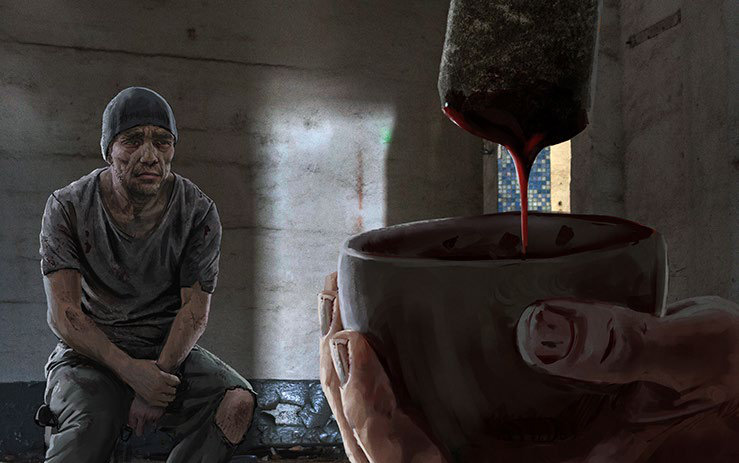

CULTS OF THE BLOOD GODS

Level 4

ASHE ADDICTION
Every time a thin-blood takes Ashe, they suffer one 
Superficial Willpower damage and make a Rouse 
Check. If they take any Aggravated Willpower 
damage while experiencing the effects of Ashe, 
they must roll to resist a hunger frenzy (Difficulty 
2) as they suddenly crave the vitae, experiences, 
and powers of other vampires. This frenzy is pointed 
at other Kindred. If the vampire ingests any vitae 
as a result of their frenzy, they recover a point of 
Aggravated Willpower damage but their Hunger 
rating increases by one. Addiction to Ashe can be a 
paralyzing circle of needing more and more blood 
to survive and Ashe to continue experiencing the 
buzz of power.

Discipline Channeling

Prerequisite: Concoct Ashe
Counterfeiting Disciplines is part and parcel of 
Thin-Blood Alchemy’s use, but the ability to channel 
a Discipline from the ashes of a deceased vampire is a 
form of necromantic Alchemy, at least according to Dr. 
Mortius and the Duskborn who practice it. Those who 
practice this Alchemy find themselves able to use any one 
of the destroyed vampire’s Discipline powers, even if they 
typically wouldn’t have access to powers of this level.

•  	 Ingredients: Crushed leaves from the indigo plant.

•  	 Activation Cost: The same as the channeled power.

man, who took off to consort with demons because of a 
conflict rooted in a gendered and sexual inequality. Or, 
she was the victimized first wife of the first man, who ran 
to the darkness beyond Eden for safety.

•  	 Dice Pools: The same as the channeled power.

•  	 System: When using Concoct Ashe, this formula 
may be used to imbue remains with the abilities of 
the vampire they once formed. When consumed, this 
altered Ashe provokes a Willpower test at a Diffi­
culty of the destroyed vampire’s highest Discipline 
rating. On a win, the thin-blood gains the use of a 
single Discipline power that the destroyed vampire 
possessed, until the end of the chapter. Use the de­
stroyed vampire’s Discipline rating whenever a chan­
neled power calls for one. The Storyteller may state 
the Disciplines and specific powers the deceased 
vampire held so the alchemist can choose from a list, 
or if the alchemist has a power in mind they can re­
quest it from the Storyteller. The Storyteller has final 
say. On a critical win the thin-blood gains the use of 
two Discipline powers that the destroyed vampire 
possessed.

In the medieval period, new versions of her story 
leapt into being, with one among others capturing the 
imaginations of many. Created by the debates of holy 
men and a satirist, it would prove to be the one that dug 
deepest. Lilith was the first wife, and Eve was the second. 
Lilith and Adam quarreled from the day they met, and 
Lilith grew tired of it. She used a secret name of their 
Creator to whisk herself away to safety. When mothers 
put amulets on their babies to ward off Lilith, they were 
warding off a woman whose rage was eternal, who would 
take all children in the night, and leave them dead. To kill 
the children of Adam and Eve was to strike back at their 
shared Creator, to unmake parts of a world that had been 
set in motion long, long ago. Despite the powers ascribed 
to her, there was almost something human to her pain 
and hate. In other tales Lilith is confronted by angels and 
stakes her claim on the lives of newborns. She becomes a 
consort of the Angel of Death, and evolves into a figure 
of powerful evil, one connected to a violent, roiling world 
beyond that of the average mortal; one that was terrifying, 
but perhaps necessary for existence to have the meaning 
that it does. Perhaps, if Lilith sits upon her throne, she will 
not come down into the night, and take more than just 
newborn babies. In each myth, intermixed, the smallest 
seeds of the truth can be found by the determined reader. 
There is something almost human to her pain, and hate, 
but also to her love, and her grief. She does not simply 
access a world beyond the mundane human reality, she is 
part of it. For a time, she was the lover of an angel. In all 
her grief, she has had only herself to rely on.

The Bahari, 

Children of Lilith

“The Dark Mother suffered in the wastes. When we follow 
in her blood-stained footsteps, we are the children she lost, born 
anew to make her enemies pay for what they’ve done.”

—Sophie Maïga, Priestess of the Garden of Storms, La 
Balize

Who was Lilith? Few ask the question, mortal or 
not. Some say she was the haughty first wife of the first

Lilith is loyal to herself. She is self-assured, she is 
above human morality, and she possesses a power and

4 6

chapter two: Kindred Religions

sexuality utterly alien to many, even some of the Baha­
ri. She is self-sustaining and resists heaven, Caine, and 
humankind, century after century. She is power, and 
knowledge. And she is a scapegoat, for humans and 
Cainites alike, for their fears and their desires. Her story 
has been passed back and forth between the children of 
Adam and Eve, and her own children. It is not pure, nor 
is it untouched by the hands of men, uninfluenced by 
those who do not know her revelations. Those who follow 
her know that without question, they will die. They will 
know fear and be forced past it, their bodies sent past the 
breaking point. They will suffer greatly for understanding 
and to protect each other. They are dedicated to bringing 
about the goals of the Dark Mother, and these are their 
reasons for living.

or the full to bursting belly gorged on food and blood, 
before the bed is ripped apart. The mother wailing and 
rocking the bodies of her dead children. A woman whose 
garden has been burned to the ground. All of the Bahari 
must know loss in their time. Physical and psychic pain. 
The role of a feast in the night. The role of being the feast 
in the night. To worship her is to be a fragment of her, to 
feel pain and crave vengeance.

The many Gardens of the Bahari have their own 
feelings about what parts of the scriptures or satires or 
scholarly treatises of mortals have captured an inkling of 
the Dark Mother. Each Garden has as many opinions of 
the Revelations and rituals as a pomegranate has seeds.

Stories about the Dark Mother are like holding a 
fistful of writhing snakes. The observer may see the storm, 
air, flight, angels, night, light, lovers, loss, desert, birth, 
sea, thorns, violation, magic unimaginable — and by that 
point they will be bitten and die.

What is Lilith, is the most important question. She is 
the voice heard in the dark apartment, when no one else 
is present. The fragment of a song that obsesses but seems 
to come from nowhere. Dreams of blood-filled trees

Overly Devoted Scholarship

I’m feeling confused, and... upset, and angry, maybe betrayed, not sure yet. These self-
actualization classes have been getting pretty weird, and some of it is good weird, but I have 
questions I’m afraid to ask there. When Taylor started telling me about Lilith, the ways I could 
live my life without fear or shame, that sounded cool. But the longer we talk, the more I’ve been 
digging.  Lilith, the sexytimes demoness who kills children and fucks men for their “seed” and queen 
of evil shit, she’s not from antiquity. I mean. She, Lilith, the Dark Mother, Queen of Night, 
what we know her as is... new. The first time it’s explicitly stated she’s the first wife of Adam, that 
she’s got freaky powers and left the Garden and etc. etc. etc. is this misogynist satirist’s book (that 
praised scriptural heroes for evils that never happened!) written sometime during the Geonic period. 
Maybe. There are even multiple versions that managed to limp to the present day, and I’m not 
sold on their accepted state as one large body of work. And then it’s off to the races, with somebody, 
everybody and their mother (ha) making new stories about Lilith, casting her as cosmic evil, 
people making amulets to protect new mothers and infants from her left, right and center. Men are 
supposed to pray before sex with their wives to save themselves from the “liliths.”

Point is, she’s not from scripture, everyone who says she is, is making a point of extreme conjecture, 
and in some stories she’s been replaced by a different demon, or a bad angel, but then another version 
says it was her. Taylor has been teaching me pieces of the word of Lilith, but it sounds like it was 
written by a man. She says there’s nerds like me out there among the other followers, but if they have 
seen what I saw in my research, are they still followers of the Dark Mother?

4 7

CULTS OF THE BLOOD GODS

Men cast her as a symbol of evil. And Taylor says she is evil, in her way, but that it’s okay. And 
honestly, like, I’m not sure if I necessarily care if she’s evil or not. But I want to know. I want some 
fucking answers. If we’re following something so old and powerful that it transcends our understanding 
and presumably hasn’t been seen by her followers, her children since... a long, long time ago, Taylor hasn’t 
taught me those sorts of verses yet, not more than a few lines.

If nobody knows where she is, and they buy a version of her word that sounds like it was based 
on the words of men who cannot give two shits about a woman, and all the stories are much newer 
than antiquity and say she can be bound, or at least sent away, and none of them agree about where 
she is and what’s she’s doing... what is her word? Her real word? Her true name and purpose? 
Because whoever her enemies are (and I can piece together that a mainstream deity is up there), 
do we really know the whole story? Do they believe she can be sent away with the names of angels? 
Because if that sort of object or power is in the world, wouldn’t her enemies chase it? Seek to lure her 
out? Shouldn’t her followers know either way? Does someone protect her interests, or is everyone too 
busy having sex in the back of a bookstore and cutting each other up and... that’s it? I know Taylor 
says there’s “greater mysteries” and they’ve got a system, clearly, of when someone is ready, just...

If I’m going to die for an ancient Goddess, I want to know the people next to me in the 
metaphorical pew have my back and an equal investment in the truth behind our mother. I know 
when Taylor gets off shift, and I also know that you’re not supposed to fear death if you worship 
the Dark Mother. I have a gun. I will get answers. And if those answers say try again 
somewhere else, I’ll do that.

May the Garden be watered with blood. I will grow her a damn grove of manchineel if I have 
to show people I’m serious about this.

Out of the Desert

their belief. In this period of human 
and Cainite history, the recruitment of 
new Cainites was rare compared to lat­
er periods, and the Lhaka of the time 
were frequently of lineages that, while 
not old enough to have come from 
the Garden over which Lilith wept 
when it was destroyed, were still old. 
Those among the Bahari of antiquity 
who may have sprung closer to Lilith’s 
blood kept their own counsel, and no 
oral or written documentation of their 
number has been found. While Jewish 
folklore was early to adopt discussion

of Lilith, this pursuit of understanding 
her nature and binding her power 
made its way to Christianity. Where 
lilins once skated under the notice of 
Greco-Roman mystery cults and the 
Cainites haunting the halls of Greek 
and Roman power, the rise of the 
Christian Church brought a new threat 
to their nights. Where the children of 
Caine represented both danger and 
secret enmity, the Christian empire 
brought with it fervent prosecution 
of witchcraft, and a weaponized fight 
against demons.

From Canaan, Babylon, and 
Israel, the myths of Lilith traveled 
from people to people, carrying with 
them both error and truth about her 
and the Bahari alike. Even then, the 
cult carried within it a mix of Lha­
ka, humans, and mages. When the 
Babylonians said the night-demons 
of the air were women and men, once 
human, angry at the living, they were 
unaware of how much truth was in

4 8

chapter two: Kindred Religions

Garden with their fellow worshi­
pers — or be buried in it, depending 
on how far they get in their time as 
a newly minted Ba’ham. But none 
should be afraid of watering the 
Garden.

LILITH THE BABY-SNATCHER
The personality and actions of Lilith herself are less important than those 
of her followers, or those who follow the legends surrounding her. Among 
the most deplorable of her purported activities was the stealing of infants 
from unworthy parents, or as sacrifice to ensure the fertility of others. The 
majority of Kindred harbor severe misgivings about replicating this cer­
emony, and most Bahari cells do not encourage the kidnap of children. 
Ethics play a part, of course, but police scrutiny comes into play when 
children go missing.
Sadly, this practice is not entirely foreign to the modern Bahari. Some 
followers of the Dark Mother believe they have the ordained right to de­
cide who must parent and who must not, and others at the cult’s hard core 
believe no blood tastes sweeter than that of infants. Whether through a 
combination of bitterness at their cursed state, fanatical belief in Lilith and 
an attempt to emulate their Goddess, or simply as an act to terrify local 
kine and Kindred alike, fringes of the Bahari have and will continue to 
terrorize children and new parents.

A Garden is led by at least one 
person, frequently two. The number 
of Bahari in the Garden’s grasp is lim­
ited only by the goals and resources 
of the group. In cities where initiates 
may draw attention to the Garden, 
their number is tightly controlled, 
and replaced only as needed.  When 
an initiate is human, with no super­
natural gifts, their study before their 
ritual of initiation delivers only basic 
information about Lilith, focusing 
primarily on lessons of pain, the 
extinction of personal fear, and the 
necessity of blood sacrifice. Would-
be initiates drawn from the ranks of 
mages and the psychically gifted have 
more openly supernatural discussions 
during their early studies, while 
Cainites receive formidable and pain­
ful deprogramming about the mythos 
of Caine, and indoctrination into the 
story of Lilith.

Beliefs

disappeared almost overnight prior 
to the start of the Second World War, 
leaving other Kindred to discover the 
domain had been used for the im­
prisonment, torture, and diablerie of 
countless vampires for over a century. 
None of the Oslo cell have re-entered 
society under the same names since 
that time.

The Bahari believe that Lilith, 
the Dark Mother, would have been 
the greatest gardener of Eden, if not 
for Adam and the human God. She 
had three Gardens; Elona, the Gar­
den of Hope, D’hainu, the Garden 
of Renewal, and Bahara, the Garden 
of Suffering. Whether the Gardens 
were each a physical place or a met­
aphor is of some debate, but their 
names and the events surrounding 
them are without question part of 
Bahari belief and what one could call 
their liturgy.

The superiority of Lilith to 
Caine is a vital part of their belief 
structure, and the hate of Cainites 
is not something open to inter­
pretation, let alone something to 
be approached with passivity or 
without violence. Cainites, down to 
the very last one, will either become 
Lhaka in the Garden, or die. The 
religious opinion that all supernat­
ural creatures in the world are the 
children of Lilith is widespread, but 
not required. In the end, beneath 
any poetry, sin within the Bahari 
comprises a spectrum.

Outside coven-scale organiza­
tions, regions of Bahari will from 
time to time work in concert on 
large-scale rituals, or to coordinate 
the destruction of influential Cainites 
standing in the way of Bahari goals. 
When traveling to new cities, a 
Ba’ham may find some or all of the 
local Bahari customs quite alien on 
their face, with only the essential el­
ements of the Dark Mother’s wisdom 
(blood and creation) recognizable. 
The oldest Garden still in existence 
— the Garden of Hope in Budapest 
— is a place of holy pilgrimage, and 
echoes of their liturgy have been car­
ried piecemeal through centuries of 
Bahari immigration to other places, 
seeded into daughter-Gardens over 
time. Not every Garden is modeled 
on Lilith’s three, but undoubtedly, 
the Bahari would love to bring them 
back to life.

In one of the few ways the Bahari 
have always been united, they are 
intent on forming new gardens of 
paradise (or their interpretation of 
what paradise is) around the globe. 
Historically, the Bahari named the 
city of Jericho their new Garden of 
Renewal, where between the 9th and 
14th centuries CE, Kindred could 
find sanctuary, succor, and time to 
pacify their Beasts. The Inquisition 
of the time routed the domain, but 
for a time it was one of the Bahari’s 
strongholds. Likewise, a powerful 
Bahari cell declared Oslo their Gar­
den of Suffering in the 19th and early 
20th centuries CE, but that group

Organization

Members of the Bahari start 
somewhere on the outskirts of some­
one else’s Garden. As they embrace 
the lessons of the Dark Mother, they 
progress in acceptance, and educa­
tion, before they can stand in the

4 9

CULTS OF THE BLOOD GODS

Modern Nights

BAHARI CONVICTIONS
Lilins frequently gravitate toward the following Con­
victions, their belief helping to justify their actions:
• 	 Always correct the false myths of Caine 
when you hear them
To destroy Caine, one must destroy his myth. To ele­
vate Lilith as she deserves, one must destroy Caine 
in every way.
• 	 Never feel remorse for serving Lilith
The Bahari cannot afford to dwell in remorse, be­
cause remorse is the thread by which self-doubt 
and artificial morals are sewn to the soul. Remorse 
creates hesitation.
• 	 Always participate in Bahari rituals
The personal feelings of a Ba’ham do not matter in 
regard to ritual. Whether they wish to be elsewhere, 
or believe the Garden they have entered is not wor­
thy of their presence, worship of the Dark Mother 
and her wisdom supersedes personal preferences 
or politics. 
• 	 Never allow the destruction of your 
creations to go unavenged
The Bahari hold the creation of their gardens and of 
life within their ghouls and mortal servitors as par­
amount, in many cases. One of the surest ways to 
send a Bahari into a murderous frenzy is to destroy 
what they have built.
• 	 Never show fear in the face of death
Lilith did not show fear at any point after her crea­
tion, nor should her children.
• 	 Only kill in sacrifice to Lilith
Killing is made sacred by being part of worship, 
learning, and growth. Sacrifice can be about holy 
vengeance. Sacrifice can mean volunteering your 
body to be the feast, to die in the hands and mouths 
of other Bahari. All deaths must have meaning to 
the Dark Mother.
• 	 Never fail to dispense pain and an­
guish to Lilith’s enemies
Bringing discomfort to the comfortable is not just a 
pithy saying, but a necessary component of bring­
ing someone into the Dark Mother’s embrace as 
well as destroying her enemies in a manner she 
would find pleasing.

The need the world has for the Bahari is ever-grow­
ing, at least according to the lilins.

For every pain someone suffers, there is the chance 
at renewed purpose, or deep insight. There is no fear of 
death, or final death. In a world that seems increasing­
ly desperate and chaotic, the bloody hand that tilts up 
someone’s chin to tell them the suffering are seen is a 
powerful one. The lilins spread a truth craved by those 
paralyzed by grief and pain. In the beginning, Lilith 
was there, and Lilith was repeatedly betrayed, and they 
can attain vengeance for Lilith. The suffering that lilins 
spread feels like a substitute for the justice they will 
never have. To the new Bahari of the brutal modern 
world, the worship of Lilith is not only transgressive, 
but serves as a shadow faith against all human faith, a 
shadow nation against the children of Caine. It is an 
unholy time, and the Bahari of the world walk through 
blood and thorns on their way to the ocean, to hasten 
the waters’ rise.

They are playing a dangerous game in war zones 
around the world, operating under the noses of 
thrill-seeking members of the Camarilla and their en­
emies, seeking to both lift up would-be lilins from the 
bloodshed and strike down the children of Caine.

Recruitment

Among mortals, promising future Bahari are often 
sought out among survivors of abuse, crime, and events 
involving substantial fatalities (natural disasters, bus 
crashes, and the like). Mortals going through intense 
periods of grief (someone who may have lost all immedi­
ate family within a brief span of time, survivors of war) 
and those who take care of them are of particular interest. 
The Revelations of the Dark Mother — a text of importance 
to the lilin, though its authorship is disputed within 
the Bahari’s scholarly circles — have much to say about 
grief and betrayal, and that’s what they look for; people 
still within the gravity well of a grief that threatens to 
destroy them, down to their soul. These are the people 
crying in the waiting room or a parked car, unmoving at 
home, putting on a strong face at work. They give their 
mourning to pets, doctors, volunteers, other survivors, 
bar tenders, social workers, their dealer. Even when they 
give their grief to the right people, they’re still drowning 
in it. A Bahari working in any of these roles is introduced 
to a sea of faces, constantly moving, and if she, like Lilith, 
is meant to move within a sea… she’ll have a mortal in her 
talons with only a modicum of effort.

Among the children of Caine, Bahari still seek out 
those with broken hearts and broken will, but they also 
seek out those who have been deprived justice, as Lilith 
was. Mortal acolytes who have known injustice are plenti­
ful in every era. But among the children of Caine, the rage

5 0

chapter two: Kindred Religions

Purists — traditionalists among the Bahari, if one 
can be described as such — say that initiations and 
offerings alike don’t have to be made, you simply have 
to pay attention to where the Dark Mother directs you. 
For those who approach things with the swift and raging 
sensibility of the modern era, there isn’t enough time left 
to waste on looking around. It’s an unpopular sentiment, 
and in antiquity it smacked of laziness. Those who believe 
in this Burke-and-Hare shovel discount on observing the 
teachings and sacrament of Lilith will become the bloody 
rags and picked-over bones that fertilize one of her belov­
ed Gardens. What the Bahari do with these new recruits 
is funnel much of their energy into directed violence 
toward Cainites. The Bahari have no inner circle of any 
kind to direct any Ba’ham as a puppet, and they rely on 
a cell-structure for their outward-facing activities, much 
like those used by terror groups.

SPIRALS OF VENGEANCE
Some lilins try to act with all humanity and use their 
gifts to do nothing but help the victims of abuses, 
tortures, and harsh lives. 
These lilins are, however, in the minority.
Lilins are not “good vampires” and they are not 
“Kindred angels,” nor are they more interested in 
equality, fairness, and justice than they are in blood, 
righteous mandate, and punishment. The Bahari are 
more than happy to cultivate their image as aveng­
ing angels, and some only feed from abusers, target 
awful men, and persecute the patriarchy associated 
with worshiping Caine. However, when the survivor 
who pointed the lilin at their abuser thanks the vam­
pire, the vampire is inclined to take that mortal as 
a retainer, a blood doll, or just drop them without 
future aid, now their task is done. When they target 
awful men, ripping them to shreds in an alley, they 
enjoy the pain they mete out, relishing the blood­
shed and tortured cries. When they attack Cainite 
worship, they suggest a replacement: Lilith worship. 
Neither is truly better than the other.
Some Bahari come face-to-face with their hypoc­
risy and walk away from the cult. Others embrace 
it and use it to elevate themselves. Others deny the 
hypocrisy and genuinely see themselves as deliv­
erers, righteous in their actions. Very few Bahari 
ponder the idea that abuse begets abuse, or how 
the spiral of vengeance becomes all-consuming 
until scores of innocents fall due to their supposed 
moral crusade. Examining their actions might give 
one a crisis of faith, and denying Lilith’s way is a 
good way to find oneself excommunicated from the 
Garden, or lashed to the old Judas tree and burned 
to ash.

The Bahari are an emulation cult, and any individual 
with a similar tale of woe is a healthy bud waiting to be 
nurtured into full bloom.

Bases of Operations

The Bahari are a globe-spanning cult, and have tend­
ed Gardens in some places for hundreds, if not thousands, 
of years. Generally, the Gardens have been located some­
where with fertile land and privacy, two things rapidly 
vanishing in the modern nights. Climate change has killed 
a number of Bahari, be they unwilling to move a Garden, 
unable to leave their Garden, or perhaps caught una­
wares by the shift of time and tide. There has been unease 
among their number at the increase in groups seeking to 
build Gardens beneath the waves, where Lilith is said to 
have lived among the dragons of the dark. Those seeking 
to nurse poisoned wastes into beauty once again have all 
died, save but a few known groups whose final fate no 
one has been able to confirm, including those who chose 
to go into the Zone Rouge in France after the Great War. 
Throughout their history, some Ba’ham who sought to 
heal the Earth did so to heal a measure of the Dark Moth­
er’s unimaginable agony from when Caine sullied her 
Garden and killed her children. They are permanently at 
odds with the Bahari who prefer a technological and ac­
celerated end to the planet, who will go to their starving, 
choking deaths with a smile after they have killed every 
descendant of Adam and Eve, and all of Caine’s as well.

and pain of a child taken from them in antiquity, or the 
husband lost to the hardships of life in a company town 
— immortality gives these agonizing abuses of an unfair 
system the chance to become a frozen tableau in what 
Kindred might call their soul; memories they can’t pry out 
of their minds, because half a world away — if not closer 
— are the people who orchestrated their agony. They 
might even ask them about it, from time to time, over the 
centuries. That painful wrath is Lilith’s wrath, and the Ba­
hari will court one of the vampires outside the Garden for 
as long as it takes to bring that anger to the Dark Mother.

In any part of the world, as long as a Ba’ham has a 
pot of earth (or silt, if the sea-seekers are still alive and 
well), she is one of the most dangerous things beneath 
the sun or moon. It doesn’t take a forest or a private park 
to make a Garden, it’s simply powerful, and frequently 
aesthetically pleasing.

It’s rare to have a chance to recruit a mage, or eat a 
saint, but these delicacies take effort, as does killing the 
last mortal descendants of a self-important beast who 
knows his lineage back to Caine. It’s possible that if that 
death rends his heart and brings about his sympathy to 
the ravages of grief, he could be opened to the truth.

51

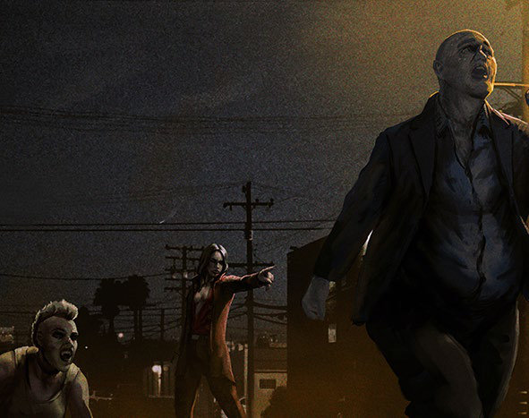

Garden of Hope: 
Budapest

underground and seized the city for 
their own.

men above all other vessels, though 
he couldn’t explain why.

For centuries, the cult influenced 
the city’s Kindred to abide by many 
of Lilith’s precepts, manipulating 
vampire culture so the Kindred of 
Budapest were unafraid of death 
and pursued Golconda without fear, 
indulged in masochistic activities to 
prove themselves to each other, and 
restricted the murder of Kindred and 
kine to only great sacrificial purposes. 
Though Prince Laszlo didn’t know it, 
the reason he changed domain laws 
over the course of the 20th century 
to suit the ways of the Bahari was 
because their voices filled his court. 
He even encouraged feeding from

Steadily, Budapest became the 
Garden of Hope. Its natural beauty 
plays a part, the glorious Danube cut­
ting through it like a life-giving vein. 
Over the years, more Bahari traveled 
to the domain, reinforcing the cult’s 
rites around other Kindred of the 
city until these became as natural as 
the Camarilla Traditions in any other 
domain. Whenever a Bahari needed 
to rest for an extended period, they 
would sink to the bottom of the Dan­
ube and bury themselves deep in the 
riverbed, giving their life to the city 
and taking the city’s life in return 
upon awakening.

These nights, the greatest Ba­
hari-led domain is in Budapest. For 
nearly a millennium the lilin worked 
in the background of the cities that 
led to Budapest’s formation. In the 
present era they believe they have 
finally cultivated the domain into 
Lilith’s new Garden of Hope, and 
only in the last decade have they 
emerged at the forefront of domain 
politics. With the Beckoning calling 
away so many of Prince Laszlo’s allies, 
the city’s Bahari drove the Prince

5 2

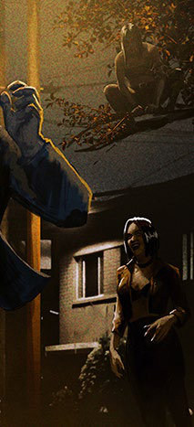

chapter two: Kindred Religions

could exorcise their guilt and hatred 
filled many with hope that with guid­
ance, eternity needn’t be so cruel.

day engage in harmful behavior, with 
this practice extending to sires who 
have abused their childer.

Now, the domain’s leader is a 
Nosferatu named Natali Tarr, though 
she goes by the title “Anya,” meaning 
mother. She’s the latest in a line of 
lilin to have led the cult in Buda­
pest, but easily the most ambitious, 
reaching out to the until-recently 
torpid Vencel Rikard for assistance in 
ousting Laszlo. Rikard called in some 
favors to aid the cult in removing 
his usurper, but had no ambitions 
of claiming the domain for himself, 
content to just damage Laszlo’s pride.

The Camarilla are interested in 
observing how long Budapest can 
remain a Garden of Hope now that 
the Bahari are in charge. It could 
be a case where now that the cult 
holds power, they don’t know how to 
control it. Or, the Bahari may cement 
their grip, find a balance between 
catharsis and purpose, and through 
Budapest form a paradigm for future 
domains. Until then, the Kindred 
of Budapest follow highly modified 
variants of the Camarilla Traditions 
and form a bulwark against outside 
attempts to change their domain 
structure.

The Budapest of tonight is one 
where at least 60% of the Kindred 
present are Bahari, with more joining 
the cult each month. In this do­
main, Natali’s lilin peers have built 
up a trove of texts in the library of 
Wenckheim Palace, forming the most 
complete record of Lilith and her 
most acclaimed followers’ exploits. 
Natali sends out feelers to Bahari in 
other domains, inviting them to the 
Garden of Hope to contribute their 
experiences and lessons.

Goals

The Bahari seek to destroy the 
Kingdom of Caine, make the world 
Lilith’s, and bring her pain to the 
living and the dead. How these things 
are accomplished varies between Gar­
dens, countries, Lhaka, mortals, and 
the supernatural creatures who have 
been drawn into the cult. Despite the 
prohibition against killing, in con­
trast to sanctified death, there have 
been lilins throughout history who 
felt engineering mass casualty events 
was perfectly acceptable when it 
allowed for the progress of the cult’s 
goals. New generations of Bahari who 
subscribe to the permissibility of 
violence have embraced the new era’s 
methods of death, from car bombs 
and train derailments to chemical 
attacks and drone strikes. Their ap­
proach to violence shares much with 
Bahari who seek to destroy the world 
Cainites inhabit, and that the God so 
many love created, through pollution 
and accelerationism. Some target the 
billionaires seeking to build climate-
change-proof bunkers, pledging that 
their last nights will be spent bring­
ing pain to whoever seeks shelter in 
such shrines to the denial of death. 
Others go after small-fry but no less

The Bahari believe Budapest is 
heavenly, but as with every domain, 
vampires on the wrong side of the re­
ligious or political divide suffer horri­
bly. The lilin carefully ration feeding 
grounds for non-believers, deny them 
the right to Embrace, and persecute 
them mercilessly when they cross the 
cult. Likewise, the kine have expe­
rienced a rise in sudden deaths via 
heart attacks, aneurysms, and hemor­
rhages, knife crime is apparently on 
the increase, and blood conditions 
such as anemia have shot up. These 
issues seem to affect men while non-
males appear exempt. The city’s Baha­
ri don’t hate all men, but if they’re to 
hold to their ideal of avenging abuse, 
they would argue thatmale hands 
commit the vast majority of assaults 
and violent crimes. Some newcomers 
to the domain take a pre-emptive 
stance and beat, mentally crush, or 
just kill men they suspect might one

Importantly, as a symbol of the 
city’s role as a domain of hope, the 
Bahari dedicated much of their time 
to giving Kindred reason to exist, 
reason to rise above the Beast’s pri­
mal needs, and a channel into which 
they could pour all their anger and 
self-loathing. For years, unknown to 
the Prince, the Bahari pursued the 
path of avenging angels, visiting pain 
and sometimes death on every abuser 
named in a newspaper or brought to 
their attention through anecdote or 
rumor. The cause became less about 
justice and more about catharsis, 
with some Bahari finding their own 
hold on Humanity slipping, but the 
fact a domain existed where vampires

5 3

CULTS OF THE BLOOD GODS

Rites and Rituals

horrible abusers, whether society 
deems them reformed or not.

worthy of Lilith), Blood and Roses 
(sacrifices are killed in ghost forests 
or copses of trees to keep the Garden 
fertile), and Night of Shadow (lilins 
who were taken into the Bahari due 
to exceptional grief are imprisoned in 
a place of death or sorrow during the 
Winter Solstice, either to confront 
their grief and rise above it to serve 
Lilith, or be sacrificed to keep their 
Garden untainted by their past).

To the Gnostics of the Church of 
Caine in particular, the Bahari vow 
to systematically destroy their power, 
comfort, and belief in order to honor 
the pain of Lilith and achieve venge­
ance against those who claim Caine 
as their forefather. The psychological 
cataclysm of such a process has result­
ed in almost as many conversions as 
it has deaths.

There are all manner of rites and 
rituals performed by the Bahari, some 
as frequently as several times a night, 
others perhaps only once every mil­
lennium. The Bahari are an oral tradi­
tion by pride and preference, written 
rites being exceedingly rare. Even the 
most devoted and murderous lilin 
looking for surviving written works 
are lucky to find even fragments of 
such past worship. Winter is a cher­
ished time for rites that mourn and 
reflect on Lilith’s pain, leaving blood 
and entrails to steam on the snow 
before they freeze. Spring is as vicious 
as the birth pangs felt by the Dark 
Mother, but any season and nearly 
any sacrifice can be made within, or 
to start, a Garden of one’s own. At 
the most basic level, the rites and 
rituals of the Bahari should contain 
or celebrate pain, water, death, fertil­
ity, sex, excess (particularly of food, 
blood, etc.), fury, and grief. Marking 
someone or something for suffering 
and death would be particularly apt.

A lilin is not unmoved by life, or 
the dictates of their heart. Love, hate, 
grief, joy, sorrow, all expressions of 
feeling have their place in the Garden 
of Lilith. Their depth of feeling keeps 
them from falling prey to purposeless 
sadism, dangerous sorrow, or profane 
lust that would take them away from 
their purpose. As long as Lilith is first 
in their lives, and their Gardens sec­
ond, any and all love, rivalry, or other 
attachments are treated as natural 
parts of existence. Whether one of the 
Bahari is human or something else, an 
empty heart is an invitation for the 
wrong things to take root within it. 
The pride, pointless violence, egotism, 
abuse, politics, and purposeless lives 
of the Camarilla and much of human­
ity are a threat to the purity of Lilith’s 
truth. It is the denial of deep roots, 
and the disrespect for the fertility of 
life, that places so many beyond the 
reach of the Bahari.

Due to the Bahari’s size and un­
coordinated nature, any given Ba’ham 
might pursue personal agendas 
against solitary targets in emulation 
of Lilith’s lust for vengeance (or 
justice, if you were to ask the lilin), 
just as easily as one might be on the 
verge of founding a doomsday cell 
entertaining the notion of destroying 
the local dam and flooding the town 
so life can grow again from scratch. 
These vampires believe they are 
working in Lilith’s name to make the 
world a better place, but if the Bahari 
have one commonality among them, 
it is that their ambitions inevitably 
lead to violence.

Among intrepid lilin who focus 
their attention on the seas are rituals 
like the Dark Fall (a sort of whale 
fall, albeit conducted with a chained 
Camarilla elder in torpor rather than 
a deceased cetacean, to bring prey to 
the denizens of the ocean floor), the 
Memory of Storm (a dusk-to-dawn 
vigil in honor of lilin lost in hurri­
canes), and Deep Songs (a marathon 
rite praising the creatures that live in 
the deep trenches, with continuous 
singing until the rite is done; the 
first three lilins to falter in the song 
are sacrificed at sea). These arcane 
practices have no material benefit, 
but provide a spiritual calm to the 
participants, reassuring them that 
they’re following the correct path.

Those Ba’ham who cleave deeply 
to Lilith’s role as gardener in a literal 
sense seek to make the world into 
one giant Bahari Garden, reversing 
unsustainable farming and pollution 
to restore it to a natural state, ter­
rorizing all humans and Cainites left 
within it until they too either become 
sacrifices or Bahari themselves, giving 
Lilith a planet to rule and proving 
neither the children of Adam nor the 
Cainites were victors in the end. A 
minority splinter group believes the 
planet must be completely covered in 
water to bring about Lilith’s return to 
the Earth from her throne in darkest 
night, interpreting the waters’ rise in 
the most literal of senses. These Baha­
ri are in the minority, but they exist, 
and while a number of them wait 
for the rest of their cult to catch up 
with their way of thinking, others are 
prepared to launch full-scale disasters 
to start the wheel turning.

Enemies

The Bahari list of enemies 
extends across the living, the dead, 
and plenty of entities who fit nei­
ther piece of taxonomy. Nearly all 
Kindred are potential future Lhaka, 
but all of them are enemies first, 
future coreligionists second, unless 
circumstances make it clear that a 
particular Kindred could do very 
little to threaten the Bahari. Even 
then, someone unassuming could be 
someone else’s catspaw.

Those preserving the land and 
the followers who dwell on it have the 
Song of Poison Gardens (for places 
poisoned by war or industry, to bleed 
away the poison and make them

Among Kindred, the Toreador 
and Nosferatu are still afforded a

5 4

chapter two: Kindred Religions

New Rituals

sentimental regard on the part of 
the Bahari. This can be as gracious as 
leaving them intact after metaphorical­
ly or physically slaughtering everyone 
around them, to as callous as a lilin 
saying they will be fair, and letting 
their quarry have a head start to run 
before being killed and eaten. The 
Bahari have their own reasons for long 
preserving the memory of  the Torea­
dor and Nosferatu progenitors’ atten­
uated complicity in the destruction of 
Lilith’s Garden and her children within 
it. Gnostics of any clan or sect have 
earned a special place in many Gardens 
as the centerpieces of sacrificial rites. 
There is no reason to try and convert a 
soul so thoroughly defiled.

can lead them. You just need to apply the 
correct blinkers.

Los Hijos de Si: An interesting 
development none of our legends mention, 
yet one that grips me whenever I delve 
into their behavior. Watch and learn, and 
see if they are of the same or a different 
Garden as we.

The lilin teach each other uncom­
mon powers, that while not exclusive 
to the Bahari, are rare beyond their 
ranks. When Bahari hear of other 
vampires practicing these arts of the 
Blood, they’re quick to pay a visit to 
the Kindred involved and find out if 
they represent another chapter of the 
cult, or if they’ve stolen these gifts 
from a more worthy vampire.

New Coterie 
Type

Bahari Blood Sorcery exists in 
the form of Rituals, with the rolls re­
quired detailed on p. 275 of Vampire: 
The Masquerade and still requiring 
dots in Blood Sorcery, unless noted 
otherwise.

Though many coteries formed 
from religious Kindred emerge as 
blood cults (see Vampire: The Mas­
querade, p. 197), the Bahari have their 
own type of coterie formed through 
unity among the downtrodden, the 
marginalized, and the vengeful.

Perspectives

Level 1

Anarchs: They’re on the way to a 
certain form of wisdom, but that’s what 
a lot of alcoholics say after their fifteenth 
shot. Yes, sometimes freedom for freedom’s 
sake is a cause worth fighting for, and for 
that they have my respect. Other times, 
they rail, they swing, and they punch 
themselves in the face.

Nemeses

Coax the Garden

“Never again will we or you bend 
over for these motherfuckers.”

This Ritual allows the caster to 
bring plant life, such as roots, grass, 
and tree branches to act in their 
defense.

Formed from the ranks of 
Kindred who were kept down in 
life or unlife, nemeses coteries exist 
to ruin their enemies and improve 
the lot of those who suffered like 
them. Far from altruistic, most such 
coteries behave in this way as a form 
of catharsis, often escalating until 
vengeance consumes them and all 
thoughts of questing for equality are 
long forgotten.

Camarilla: When I observe the 
Camarilla I see a two-edged blade. Wield 
it intelligently, benefit from its structure, 
and find that it’s the greatest modern 
creation of Kindred thought. Rely upon 
it, forget that it’s there, and you’ll find 
yourself cut to ribbons by its politics, 
backstabbing, and imprisoning hierarchy.

• 	
Ingredients: Human blood, pop­
py seeds.

• 	
Process: The vampire casts a 
concoction of human blood and 
poppy seeds onto the earth, and 
in doing so rouses all plant life 
within a 5 yard/meter diameter. 
While these plants are rarely 
lethal in their attacks, they can 
successfully disable and alarm 
their victims.

Church of Caine: We have every 
reason to despise this group of Gnostic 
bastards. Even in their own legends, 
Caine is a murderer, a pig, and a coward. 
Yet they revere him? It is typical of patri­
archal nonsense that this society of theirs 
would prefer to defer to a flawed man 
than a near-perfect woman.

• 	
Domain: Chasse (••), Portillon (•)

• 	
Contacts: (••) (downtrodden 
kine)

• 	
System: A win on the Ritual 
roll following the casting of the 
Ritual ingredients animates 
the plant life. The affected flora 
causes a two-dice penalty to 
physical dice pools for those 
caught in the range of the Ritu­
al, as plants trip and grip them. 
Victims who stay in the area for 
longer than a turn must make a

• 	
Influence: (••) (marginalized 
mortals)

Church of Set: We share some 
similar principles, and for that they are 
our kin. Of course, they see it differently, 
but Ministers, Setites, and the rest are 
easy to fool if you call Lilith “Sutekh” 
or another name that appeals to their 
sensibility. They want to follow, and we

• 	
Enemy: (•) (a mortal who the 
coterie wishes to ruin)

• 	
Status Flaw: (•) (Suspect)

Possible extras: Herd (survivors), 
Retainers (survivors)

5 5

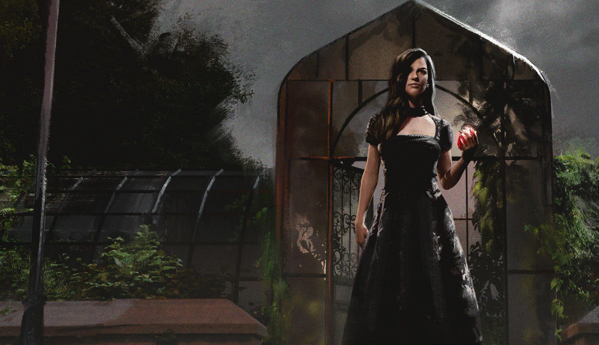

Dexterity + Athletics roll (Difficulty 3), or be grap­
pled and suffer one point of Superficial Health dam­
age for each turn ensnared. If the caster achieves a 
critical win, the damage from plant attacks doubles. 
On a total failure, the plants attack the caster. The 
plants will target anyone who isn’t the caster. They 
remain active until the end of the scene.

it in, dislocate the jaw, or otherwise rend the throat 
open, so long as it fits. As the body rapidly merges 
with the tree’s roots and trunk, blood from mortals 
up to 1 mile/kilometer away drains into the earth and 
out through the rotten apple in the vampire’s mouth, 
sating Hunger.

• 	
System: The player makes a Ritual roll following 
the placement of the corpse and the apples. On a 
win, the vampire’s Hunger is slaked to one, despite 
any Blood Potency feeding penalties. On a critical 
win, the vampire’s Hunger is slaked to zero without 
killing. On a total failure, the vampire falls into a 
hunger frenzy. Depending on the number of kine in 
the Ritual area and the type of kine nearby, Stains 
may accrue; for example vampires with a Prey Ex­
clusion (see Vampire: The Masquerade, p. 181) may 
suffer Stains if this Ritual is used in an area heavily 
populated by their excluded class of mortal, whereas 
varied groups with more kine to draw from are less 
likely to bear an ethical cost.

Level 5

Eden’s Bounty

This rare Ritual allows a vampire to drain blood and 
energy from any living creatures in the nearby area, al­
lowing the caster to stave off Hunger without even having 
to bare their fangs.

• 	
Ingredients: A dead body, a living tree, one fresh 
apple, one rotten apple.

A lot of blood is wasted with this Ritual, as all the 
mortals in the area lose a little blood to the earth, though 
the loss is not visible. For the remainder of the chapter, 
those kine suffer a one-die penalty to all Physical rolls 
and 1 Aggravated Health damage.

• 	
Process: The vampire lays a dead body (age of the 
corpse is immaterial) at the foot of a tree and places 
the healthy apple in the corpse’s mouth, followed by 
the rotten apple into the vampire’s. If the apple does 
not fit in the corpse’s mouth, the caster may hammer

5 6

chapter two: Kindred Religions

with directional microphone by 
Father Glas in Miami, FL. Father 
Glas apologizes for interruptions to 
transcript based on moving vehicles 
and Jehoshebah static interference.

WHAT OF GOLCONDA?
Golconda is the semi-mythical state of enlighten­
ment hundreds of vampires talk about, but nobody 
seems able to attain. In truth, some Kindred do 
reach a point where they exist more in harmony 
with their Beast, where they’re capable of suppress­
ing some of their curses, and where they can even 
pose as mortal without significant effort, but this 
heavenly state comes at great cost. For some, they 
must lose all mortal connection and become akin to 
a cold-eyed, hunting shark to find such peace. For 
others, they must diablerize their sire and study in 
the fallen vampire’s wake, retrace their steps, and 
meditate until ready to feed their soul to their own 
childe. Beyond that, some Kindred find Golconda 
through being more human than human, abandon­
ing Kindred society entirely, and existing as a para­
gon of good and joy until their inevitable fall.
Importantly, there is no single route to Golconda, 
despite what the adherents of the One True Way 
(see p. XX) believe. It is possible to attain Golconda 
as an adherent of the Church of Set, through liber­
ation of Touchstones and Convictions, just as it is 
as a Bahari, through sacrifice of all enemies and 
those who might harm you and your loved ones. A 
Mithraist may find inner peace through commitment 
to law and hierarchy, while a Shalimite may find 
the same through the absence of all things. Golcon­
da may be a perfect state for some Kindred, but to 
those not at that level, the vampire who has reached 
Golconda is often alien, detached, and terrifying.

<1.22.19.24.32.51.63 RECORDING 
BEGINS>

Cardinal: —group will never amount 
to more than a heresy. It was purged 
once before.

Pygram: We won’t be purged again. The 
Cainites need faith now more than 
ever, and the old ways of your sect 
have failed them.

Cardinal: Is it arrogance that com­
pels you to believe they would flock 
to your temple? Why would anyone so 
recently alive believe in Caine. Why 
would they believe themselves as an­
gels? It’s a folly. Pygram, my friend, 
you can still join us in our crusade. 
There’s still time.

Pygram: I thought on it, your Emi­
nence. I prayed on it.

Cardinal: And?

Pygram: Caine answered me. The Dark 
Father spoke in my daytime dreams 
and said the true heresy was with­
in your church of cannibalism. 
That now was the time to accept our 
divinity and allow you to destroy 
yourselves as the Amalekites and 
Canaanites were judged and—.

The Church of Caine

[Sounds of traffic eliminate near­
ly a minute of discussion at this 
point.]

“It is time to revel in the truth of our condition. 
All Cainites must be taught. 

They must know their truth. For as they know themselves, you 
will know the Dark Father.”

Cardinal: —never seize the hearts and 
minds of Kindred, no matter wheth­
er you call yourself “Deacon.” Your 
prophecies hold no more weight than 
those of a preacher on a box, on the 
side of the road. You give yourself 
and your followers over to a lie, 
and for what? What’s your angle?

— Arch Verger Alexi Farmer, Defender of the 

Immaculate Church of the Dark Father, Detroit

SoSL undead religions study. So-
called “Church of Caine,” believed 
gnostic group. Meeting between un­
dead titled “Cardinal” (name un­
known), undead named “Pygram” some­
times titled “Deacon,” and undead 
named “Jehoshebah” (no title listed), 
no dialogue recorded, as her voice 
came through as static. Recorded

Pygram: Your use of the word “Kindred” 
shows me how far you’ve fallen. There 
is no angle but for salvation. Gol­
conda. Recognition from Caine himself 
and elevation to his level. Caine was 
ordained with the rite of bloodshed 
because God wanted it that way. He is 
an angel and we are his cherubs.

5 7

CULTS OF THE BLOOD GODS

[Pause lasting 25 seconds. Car pulls over.]

Gnosticism was declared a heresy 
punishable by death. Just as the 
Catholic Church had no more pa­
tience for rival faiths within its own 
sphere, the Lasombra ran out of tol­
erance for the Church of Caine’s in­
creasingly aberrant views of Earth as 
hell, vampires as angels, and mortals 
as soulless cattle. Vampires who knew 
of the cult’s denouement celebrated 
its fall, and those who campaigned 
against it worked hard to scrub the 
cult’s name from the scant Cainite 
history books that recorded it.

Cardinal: You will see yourself killed if you speak 
this way in any but the weakest Anarch domains.

[Car door opens and closes.]

Cardinal: Jehoshebah, I’m pleased you could join us. 
Please tell me Pygram does not speak for all of you.

Jehoshebah: [White noise for 11 seconds.]

Pygram: Your time is up. Go join your legions. Fight 
in your Battle of Ramoth-Gilead. When only the 
wounded remain, they will find our church waiting 
for them with open arms.

Jehoshebah: [White noise for 24 seconds.]

Cardinal: No. No, I will not join you. Vampires are 
not divine. We are not angels. I agree we are the 
dominant predator, but you use faith to justify your 
monstrosity, and I remember what happened the last 
time you tried to do so. Good luck in surviving this 
Inquisition.

The Heresy Rises

The idea of a Demiurge on high, 
responsible for all the evil in the 
world, alleviating of that responsi­
bility the perpetrators of criminal 
acts, is a reassuring one to some. 
Vampires have a tendency to find 
excuses for their terrible acts, and 
when one can point elsewhere and 
say “He made me that way,” it — at 
least in the mind of the vampire — 
helps absolve them of their sins. Not 
that the modern Church of Caine 
are truly looking for absolution.

[Car door opens and closes.]

Pygram: Remember doubting Thomas. We will show the 
Cardinal the truth of our faith and he will respond 
to direct personal experience. Or, he will never find 
his way to the cargo ship designated to take him to 
Morocco.

Jehoshebah: [White noise for 35 seconds.]

Pygram: Yes, a fine example.

[Car pulls away and outdistances our recording 
hardware.]

<RECORDING ENDS>

The re-emergence of the Gnostics 
in the modern nights is a subject of 
great mystery and conjecture. Few Kin­
dred recall the original Cainite Heresy, 
most being Beckoned, succumbing to 
the sleep of ages, or destroyed in the 
last eight centuries. While some believe 
the rising Gnostic tide must be at the 
beck and call of methuselahs who wise­
ly slept instead of facing the torches 
of the Inquisition 800 years ago, the 
modern Church of Caine shows few of 
the hallmarks of a methuselah-led cult. 
They don’t have a hierarchy based on 
age, they care little for lineage and clan, 
and their centralized power comes 
in the form of the renewed Crimson 
Curia — a council of priests — rather 
than a single, ancient figurehead.

The Heresy Falls

The Cainite Heresy subverted 
the faith of mortals and vampires 
alike, its adherents believing them­
selves to be God’s chosen predators. 
Most importantly for other vampires, 
their actions inside and outside the 
mortal Church drew the attention 
of the Catholic Inquisition as well 
as hunters from the ranks of the 
Muslims of Iberia. In a rare show of 
unity, imams sided with churchmen 
and put the torch to the Cainite 
Heresy before their Time of Caine 
could arrive. The parent clan of most 
of these “Gnostics” was the Lasombra, 
and along with vampires of the Banu 
Haqim and Clan Brujah they hunted 
down the remaining stragglers.

For over a thousand years, a 
vampire subsect of Gnostic Chris­
tianity operated within Cainite 
society. This group, known to some as 
the Crimson Curia, to others as the 
Church of Caine, and to their ene­
mies as the Cainite Heresy, posited 
that Caine was God’s divine angel of 
murder who had absorbed the soul 
of Christ, and that all vampires were 
his children and just as blessed. It was 
their divine mission to cull the weak, 
turn the living hell of the world into 
a heaven, dominate the Catholic 
Church, and usher in the Time of 
Caine, or third resurrection of Caine 
and Jesus, prophesized to arrive in 
the year 1239 CE.

Of course, the other conclusion 
is that Caine brought the Church 
back into being, though there’s no

The Church of Caine reached its 
end close to the time when mortal

5 8

chapter two: Kindred Religions

evidence to show he was ever around 
to see the Church in its original form, 
let alone approve of its purpose or 
methods. The idea that this cult may 
exist in direct service to Caine is a 
thought that undoubtedly troubles 
many Kindred, however, and leads a 
surprising number to join its ranks 
just to err on the side of caution. If 
the Dark Father is real, awake, and 
leading a sizable cult, better to be on 
his side.

while the Demiurge is all-seeing and 
all-knowing, he sends a representa­
tive (sometimes more than one) to 
Earth to mete out his will. Specifical­
ly, the Church posits, this repre­
sentative is Caine, though infamous 
vampires such as Sutekh and Mithras 
may have been his angels as well, and 
Lilith certainly fits the mold of an 
angel who couldn’t help but abuse 
her power and fall. The Antediluvi­
ans were likewise angels, but fought 
Caine’s children and therefore fell 
from grace. They still deserve punish­
ment for this. Likewise, humans with 
proficiency in angelic arts — whom 
the Tremere call mages — are of 
greater importance and value than 
the sleeping kine. The Church of 
Set hotly refutes this notion, as they 
believe the Demiurge responsible for 
creation of all clans not descended 
from Sutekh, and responsible for 
preventing Sutekh’s absolute influ­
ence over the world.

by the “Kindred,” who wish to come 
to some deeper sense of understanding 
of their damnation. Some Camarilla 
domains have received word from one 
Justicar — Juliet Parr of Clan Malkavi­
an — that they are not to oppose this 
new missionary work. The running 
theory among some Kindred is that 
Parr belongs to the Heresy, or one of 
her ancestors did and now speaks with 
her through the Blood, but equally 
likely is that Parr wants no internal 
conflict while the Inquisition is watch­
ing. The absence of the Sabbat helps 
the Camarilla and Anarch Movements 
greatly, so why start a new war when 
these priests aren’t striking out with 
anything but words?

What is known, is the Church of 
Caine has leaked out of the darkness 
again, with its words, beliefs, and 
practices becoming visible for the first 
time in centuries following the Beck­
oning’s commencement. The Church 
claims Caine himself calls his errant 
childer to fill his long-empty veins, 
and only the Church will be saved. 
Caine is the face, voice, and mind of 
the Demiurge in this hell on Earth, 
and he will not be denied. His angels 
will ascend with him once the rest of 
the world accepts their place as the 
meek and the fallen. Until then, his 
will be done.

The Church of Caine’s belief sys­
tem is unlike most widespread mortal 
religions of these nights, so their dog­
ma is one rarely delivered in full to 
vampires of any sect, at least not until 
vampires have shown willingness and 
acceptance of the Gnostic reality. To 
start, most Gnostics introduce their 
belief that Caine was chosen by God 
and all vampires are likewise blessed 
children, uplifted to the role of divine 
predators. This is a belief many vam­
pires can understand, as most know 
the story of Caine and Abel and 
most realize they possess more power 
than when they were mortal. Tales 
of layered planes of reality, vampires 
as angels of murder, all beings as 
spirits trapped in a liminal state, and 
Earth being equivalent to hell tend to 
follow much later.

Earth is not a median point 
in this cosmic theory. Earth is hell, 
and receiving the Embrace is a step 
toward escaping that hell. All worlds 
layer on top of each other, so it is 
possible to exist in heaven and hell at 
the same time, but divine right grants 
one resilience against hell’s slings and 
arrows. At least, that’s the Church 
of Caine’s theory behind Disciplines 
such as Fortitude, and their reasoning 
for why all their powers are symbolic 
of the type a god might use against a 
mere mortal.

Hell on Earth

The Church of Caine has long 
held the view that the world is divid­
ed into many planes of existence, with 
the Demiurge above all, and his angels 
governing the ranks of the unknow­
ing. At each level of awareness, an 
individual grows closer to becoming 
an angel themselves, but these levels 
go down as well as up, and the farther 
down one descends, the closer they 
come to being damned forever.

The Gnostics find themselves 
occupying an unexpected role within 
Cainite society. While they them­
selves rarely use the term “Golconda,” 
Kindred who know of the legendary 
state of being see the way Gnostics 
believe in ascension and divinity, 
and the peace with which they hold 
their faith, and wonder if this cult is 
the key to Golconda. For its part, the 
Church of Caine makes no promises 
that a follower will achieve a state 
where they “lose their curse,” as its 
doctrine is adamant vampires aren’t

Sublimating 

Divinity 

into Society

This view may seem incom­
patible in a modern world, but to 
vampires of the Church, and mortals 
who believe themselves more enlight­
ened — through intellect, influence, 
money, or even charm — it’s a ration­
al view. It’s a class society imposed by 
a supreme power, and it makes sense 
to an amoral mindset. The Church 
of Caine for instance believes that

Gnostics have forged never-be­
fore-seen paths into the Ivory Tower 
and the rekindled Anarch Movement. 
Their gospel celebrating the vampir­
ic condition has seldom been heard 
within these sects. This message 
is surprisingly accepted, if not enjoyed,

5 9

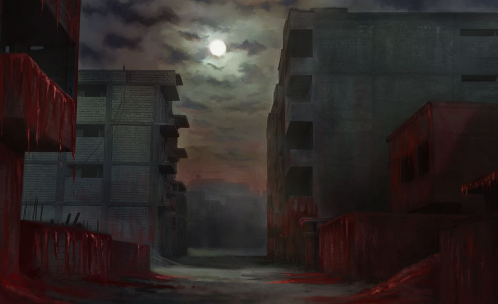

cursed, but blessed. That blessing may grow as a vampire 
acquires wisdom and strength, and that may be what 
others call Golconda, but to tell a Gnostic they’re cursed 
by God is a good way to earn an adversary.

The Church’s outward confidence aside, many new 
converts to the faith exist in constant fear of the Sabbat 
bringing forth all its fury down upon them. They worry 
the sect will return from its crusade stronger, having 
devoured a flock of angels, and will visit the same wrath 
on the Gnostics that the Inquisition and traitor clans did 
eight centuries ago. The Church amasses lore to defend 
itself and reaches out for allies within the Cainite pop­
ulace. Their current catechism is of unity, “compassion,” 
and conversion, reaching out to those less fortunate and 
providing what help they can give. This religious instruc­
tion coincides with Gnostic teachings and revealing of 
the truth, wherein all vampires are Cainites, those of 
Caine, and his blessed children.

Ad Limina

Despite its recent appearance, the Church of 
Caine draws vampires as old as ancillae, with at least 
one elder serving as a member of the modern Crimson 
Curia. Something of the cult draws vampires in, wheth­
er through talk of Caine, reassurance that their state as 
vampires is not unclean or damned, or because of the 
hope for ascendancy from hell once the Time of Caine 
arrives again. According to the Crimson Curia’s proph­
ecies, that time will come soon, having been forestalled 
from the previous appointed time in 1239 CE. They claim 
Caine arose and found his church absent, and so in great 
sorrow destroyed the boundary between worlds and fell 
into a deep slumber. Kindred scholars wonder at what 
boundary this story relates to, whether geographical — 
as the appointed time was close to that of the Mongol 
Invasion into Europe — or spiritual, annihilating a layer 
between hell and heaven, or bringing the deepest level of 
hell closer to the surface. The tale is likely apocryphal, but 
vampires in cults make for dedicated theologians.

The Lasombra defection to the Camarilla poses 
an interesting conundrum for the Church, as while the 
Cainite Heresy of old mostly consisted of Lasombra, it 
was other Lasombra who directed the faith’s purge. For 
now, the few vampires who recall these details — most of 
whom are Lasombra anyway, or were told the stories of 
the Cainite Heresy by older Magisters — prepare for the 
Night Clan to once again visit destruction or manipula­
tion on their order. Old habits die hard and they expect 
many Lasombra will assume the church is theirs to wield 
or crush as it once was before. The Church is content 
to provide guidance to most Kindred, but treads warily 
around the Night Clan at this time.

6 0

chapter two: Kindred Religions

The reconstructed Church of Caine aims to rebuild 
an official magisterium, a codified scripture, review and 
revise their holy sacraments, and write canon law that 
will be both easily disseminated and protect the con­
gregations. Then there is the defense of the new Holy 
Cainite Empire in Heaven, which may not exist in any 
meaningful way as yet, but will soon if the Crimson 
Curia’s plans come to fruition. With the Second Inquisi­
tion’s control over most forms of travel, the Church strug­
gles to find a way to build all the answers needed to finish 
these tasks. The faith’s parishes have been content with 
building their own local traditions and denominations, 
all with a different dogma, creating a tapestry of faith 
much more diverse than previously expected.

the urge to frenzy, and how best to retain one’s Humanity 
while accepting the nature of an undead blood-drinker. 
Members of the flock are permitted to hear the cult’s 
liturgy but cannot witness the sacraments.

Doorkeepers

The ancient role of doorkeeper was assigned to 
churches to prevent their persecution by other faiths, 
opposing societies and governments, and sabotage from 
unhappy citizens. This guard role exists to this night, with 
those vampires more disposed to violence (whether doling 
it out or preventing it) more likely assigned this title than 
one responsible for administering the faith. Doorkeepers 
are more than hired muscle, as they’re expected to still at­
tend services and participate in the sacraments, but they 
are also the first vampires opponents of the Church will 
see, if threats or delivery of violence is required.

This is a time of new freedoms, an age of enlighten­
ment constructing a marketplace of ideas for Cainites to 
partake in and defend. Some Gnostics appreciate this 
freedom, others fear the heresies that will inevitably 
spring up to challenge the new order. Some churches 
have already begun venerating the Second Genera­
tion as saints or bodhisattvas of the higher Cainite 
pantheon. These parishes are rare though, as above all 
things, Caine is mighty and glorious. There are even 
rumors of parishes who venerate both Caine and Lilith, 
though the Bahari are still perceived as vile enemies to 
most Cainites and burned out as the heresy they are.

Doorkeepers tend to hold Status: Church of Caine (•).

Acolytes

Acolytes of the Church of Caine are responsible for 
several duties, including arranging safe venues for Gnos­
tics to meet, ensuring priests are equipped with the tools 
and apparel needed to perform their ministerial duties, 
and hunting down artifacts important to the Church. 
This varied role is commonly the first title a vampire 
earns upon formally joining the Church of Caine, with 
each acolyte having performed at least one firewalk (see 
p. XX). Acolytes often act as audiences to encourage or 
cajole others participating in the sacraments.

Church Hierarchy

The Church of Caine upholds a hierarchy resembling 
a blend of the Medieval Catholic Church, modern Gnostic 
churches, and even the Eastern Orthodox Church. To 
the cynical vampire, the church hierarchy structure is 
just a means to exert control and has little bearing on the 
spiritual significance of the vampire holding the rank of 
“deacon” or “bishop,” but curiously, the modern Church of 
Caine eschews the idea that only the eldest may hold the 
most important roles. This vampire religion rewards merit, 
which may come to fracture the organization when elders 
refuse to shift from their long-held roles.

Acolytes tend to hold Status: Church of Caine (•).

Vergers

The verger is a vampire who wanders from domain to 
domain teaching others of the liturgy, the Demiurge, and 
Caine, in the most non-controversial terms. These roving 
preachers vary in importance from nominal Gnostic 
mouthpieces to cult leaders building larger and larger 
followings. The most notorious vergers are known as 
arch vergers. They hold no influence over the Church of 
Caine’s formal hierarchy, but in this era when the Second 
Inquisition scrutinize cult-like behavior and strange 
reports of priests administering blood to their congrega­
tions, the merits of being a traveling holy person some­
times outweigh those of being a leader with a static flock.

Congregation / The Flock

The bulk of vampires who consider themselves faith­
ful Gnostics, Cainites, or simply believers, are referred to 
as “the congregation” or “the flock.” Individual vampires 
at this level believe in Caine as the progenitor and uphold 
the belief that they are divinely mandated as predators. 
Despite the latter belief, the congregation are far from 
uncontrollable monsters. Their superiors in the Church 
teach Gnostics how to unleash their Beast, how to satisfy

Vergers tend to hold Status: Church of Caine (•) and 
at least one dot of Streetwise.

61

CULTS OF THE BLOOD GODS

Lectors

are few roles within the Church of 
Caine so visible and so immediate­
ly influential as that of the priest. 
Priests might read from ancient 
religious texts verbatim, schooling 
their flock on the word of Caine, or 
they might lead a congregation with 
their own interpretation of Caine’s 
will. Priests carry enough power 
in their words and actions to form 
schisms without knowing it, and 
for that reason their actions remain 
closely observed by deacons who 
report priest behavior to the bishops, 
while priests report on flock behav­
ior to those same bishops. Every city 
with a contingent from the Church of 
Caine must have a priest, even if that 
requires bringing a priest in from a 
separate domain. Without a vampire 
who knows the rites and dogma, 
there is no Church.

least four dots in Occult and three 
in Politics. Most hold proficiency 
in Auspex, so they can glean deep 
insights into the priests and deacons 
beneath them.

Lectors act as readers during 
church services. The role is largely 
honorific, as when not performing 
for the flock, they occupy the same 
standing as acolytes. The major 
difference is in the confidence given 
to a lector, as a priest or deacon 
speaks with them on matters of faith 
and expects the lector to read from 
the texts important to the Church 
of Caine with earnest belief and 
understanding.

The Metropolitan

There is no metropolitan in 
the Church of Caine, though if 
there were one, it would be Caine 
or a vampire who could believably 
channel his will and direction. The 
Church of Caine is growing swiftly 
enough to warrant the appointment 
of a proxy metropolitan in the next 
few years, just due to the benefit of 
having a strong autocrat in charge 
of such an organization, though the 
Crimson Curia may overrule any 
such appointment. Most bishops 
agree a metropolitan is a necessity 
for some night in the future, but 
few are prepared to nominate an 
untested vampire. They wish to 
avoid electing a metropolitan, only 
to see them suffer the Beckoning 
or suddenly become a target for 
the Second Inquisition, and so the 
bishops for now have agreed the 
Crimson Curia is sufficient, until a 
suitable candidate reveals themself.

Lectors tend to hold Status: 
Church of Caine (••) and rarely have 
fewer than two dots in Occult, with a 
Specialty in Gnosticism.

Deacons

Deacons hold administrative 
power in the Church of Caine. While 
they might stand in for a priest to 
perform services, it’s more likely 
the deacons busy themselves with 
upholding the financial, bureaucratic, 
and personnel end of the Church. 
This sounds mundane, but the power 
deacons wield over the channeling of 
wealth in and out of the Church, and 
the prestige awarded to members of 
the flock and the acolytes beneath 
them, is impressive. Deacons are 
effectively the Harpies of the Church 
of Caine. In terms of reporting, 
deacons bypass priests and report to 
the bishops and Crimson Curia itself. 
Gnostics cannot become priests of 
Caine before they have held the title 
of deacon.

Priests hold Status: Church of 
Caine (•••) or higher, and each has at 
least three dots in Occult, with a Spe­
cialty in Gnosticism, or sometimes, 
Catholicism. Most have some profi­
ciency in the Presence Discipline.

Bishops

The Church of Caine’s bishops 
— of which a select few form the 
Crimson Curia — are responsible for 
keeping the entire order together, 
furthering the Dark Father’s agenda 
(such as they interpret it), creat­
ing new sacraments, interpreting 
ancient texts and myths, and acting 
as spiritual centers when domains 
run the risk of falling due to priest­
ly absence or failures (though they 
often delegate this role to powerful 
deacons). Bishops possess the ability 
to order sweeping changes across 
the faith, though before any major 
decisions are made they must form 
a conclave of at least nine vampires 
from the Church of Caine, five or 
more of whom must be at the bishop 
or deacon rank.

The theoretical metropolitan of 
the Church of Caine holds Status: 
Church of Caine (•••••).

Church Dogma

At its core, the Church of Caine 
believes it is a vampire’s destiny for 
the Demiurge to select them, make 
them as holy as Caine, and take them 
to his right side. To achieve this 
requires controlling one’s Beast, not 
to become a pacifist or vegan, but to 
gain the ability to let it off the leash 
in a measured manner. The most 
successful predators in the world are 
not those that mindlessly savage in a 
whirlwind, but those who stalk, hunt, 
kill, and devour, leaving just enough 
bones to make their presence known.

Deacons generally hold Status: 
Church of Caine (••) and rarely have 
fewer than two dots in Politics or 
Finance.

Priests / Church Leaders

Responsible for overseeing the 
sacraments, administering Church 
doctrine, and keeping the faithful 
community whole and growing, there

Bishops tend to hold Status: 
Church of Caine (••••) and possess at

6 2

chapter two: Kindred Religions

they committed eons ago, before 
they came to possess their current 
forms, is one all the Church priests 
come to understand and believe in. 
As soon as a Gnostic accepts this 
reality, it makes feeding and killing 
a lot easier. The moral damage can 
be severe, but the detachment from 
the basic human perception of 
Earth brings one to a new state of 
enlightenment.

GNOSTIC CONVICTIONS
Gnostics often adopt the following Convictions to help them maintain their 
sense of self while pursuing their faithful existence:
• 	 Never unwillingly allow the Beast to take over 
Exercising restraint by never succumbing to the extremes of behavior is 
vital to becoming a renowned vampire in the Church of Caine. Wild, un­
controllable animals find the entire jungle working against them, where­
as cool, calculating predators find their stomachs full and their presence 
unnoticed.
• 	 Never succumb to fear 
Willpower is all-important to these vampires, who believe that in order 
to emulate (or even surpass) Caine, one must harden one’s mind against 
hell’s weaponry. Gnostics are expected to sample a snatch of sunlight, 
walk through fire, and adorn themselves with holy symbols, just to show 
their defiance and power.
• 	 Let nobody prevent you from growing closer to Caine
This Conviction can be interpreted in multiple ways, but generally refers 
to the cult’s desire to build its knowledge of Caine and of the Church’spre­
decessors from the first millennium. Other Gnostics with this Conviction 
believe any attempt to interfere with cult sacraments is to be punished, 
and frenzy if someone tries to stop their actions.
• 	 Feed only from hell’s denizens
All Gnostics agree some mortals are more worthy than others, and de­
pending on the domain, may have selected some strata of mortal society 
to exempt from hunting. They believe all others are beings in hell, and 
there to sate the hungers and whims of angels above them. Some Gnos­
tics might use this as justification to commit diablerie, if a vampire has 
fallen far enough from Caine’s grace.
• 	 Do not consort with the lowest beings of hell
The Church of Caine believes strongly that all vampires are angels or 
blessed, and spending time in the company of devils is a fine way to make 
oneself fall. Many Gnostics cut away unnecessary mortal ties that might 
inhibit them from progression within the Church. 
• 	 Never brook an insult to Caine’s divinity
This Conviction leads to more conflicts than probably any other, but is fun­
damental to the Church of Caine’s beliefs: Caine is divine, he is the Dark 
Father of all vampires, and he is to be revered. Any who doubt that should 
receive correction and education. Any who insult that should receive pun­
ishment. Caine is the angel of murder and hunting, and the Church will not 
hear him be referred to as some common murderer.

To ascend toward heaven, the 
cult maintains a vampire must be 
capable of overcoming their fear of 
hell’s weapons. The Church of Caine 
do not believe the Demiurge made 
vampires vulnerable to fire, but rath­
er, this burden is a holdover from 
their time among hell’s denizens. 
After all, are mortals not harmed by 
fire too? They reason Caine must be 
immune to this element by now, so 
they must attempt to be the same 
way, and so the Church preaches 
that Gnostics must defeat the fire 
by staring at it, handling it, and 
walking through it. The same will 
apply to sunlight, when a Gnostic is 
powerful enough.

Arguably the most controversial 
of the cult’s beliefs is in diablerie as a 
necessary sacrament. If the Crimson 
Curia deem a vampire unworthy of 
their layer in the hierarchy between 
heaven and hell — usually due to 
some grievous crime committed 
against the Church, in the name of 
Caine, or because they’re a vocal, 
influential proponent of another 
faith — the Curia advocates for their 
diablerie. The Gnostics believe all 
spirits exist in a cycle and just reform 
on a lower level when their flesh 
vessel is destroyed. The only way to 
prevent this is through the divine act 
of devouring the soul. While practiced 
rarely, it is not forbidden, nor is it 
withheld for any reason other than 
appearances. The Church of Caine 
has not yet gained sufficient allies to 
make diablerie an acceptable ritual in 
Camarilla and Anarch domains, but 
they’re biding their time.

The Church preaches the words 
of Caine as recorded by experts and 
seers of the Crimson Curia, and their 
belief in Kindred as blessed. Their 
faith is one of trial and victory, in 
which vampires must prove they’re 
worthy of the love of the Demiurge 
and of Caine, and when the time 
comes — and it will come soon, the

Crimson Curia says — they must be 
there to see and assist in the third 
rising of angels, sometimes called “the 
resurrection,” otherwise known as the 
“Time of Caine.”

The belief that the world is a 
layered hell with strata of deserving 
and undeserving individuals, some 
of whom are being punished for sins

6 3

CULTS OF THE BLOOD GODS

Sacraments

System: The vampire must name 
one of their fears and allow other 
members of the cult to expose them 
to it. The vampire makes a terror 
frenzy test at Difficulty 3, and if the 
fear is withstood, they reduce the Dif­
ficulty of their next terror frenzy test 
by 1. Whether the vampire frenzies or 
not, they heal a point of Aggravated 
Willpower damage. Vampires may 
attempt to lie about their fear to 
complete the sacrament, but doing 
so conveys no benefit and requires a 
successful Manipulation + Subterfuge 
roll against the church leader’s Wits 
+ Insight.

self-awareness, as when the partici­
pants discuss and demonstrate their 
respective clan banes and Caine’s 
verses, they accept themselves for 
what they are and find hope in their 
ancestor’s words. Vampires who 
participate openly in this sacrament 
always feel refreshed and reinvigorat­
ed upon its conclusion.

While it is true the parish struc­
ture of the cult allows for disparities 
in the way liturgy is delivered and 
how Caine’s role in the world is 
described, there are certain defined 
sacraments universal to all members. 
While many of these are being re­
vised and blended together current­
ly, these sacraments are propagated as 
universal gifts of the Dark Father.

System: When demonstrating a 
clan bane or confessing to a way in 
which the bane has severely impeded 
them, the vampire’s player makes a 
Resolve + Composure roll (Difficulty 
2 + Bane Severity). A win reduc­
es their Bane Severity to 0 for the 
purposes of their clan bane, until the 
end of the session. During that time 
their Bane Severity counts as 1 higher 
for all other purposes, unless their 
sacrament roll was a critical win. A 
total failure results in 2 Aggravated 
Willpower damage. While their bane 
is reduced, certain curses don’t dis­
appear completely: Nosferatu remain 
repulsive, Tremere unable to bond 
vampires, etc.

Those Cainites who hold the 
titles of priest or verger generally 
teach these rites to the flock. These 
vampires are protectors and defend­
ers of the gospel of the Dark Father. 
Part preacher and part templar, 
these vampires act as a communiqué 
between the parishes, delivering 
letters and artifacts between church 
leaders, and helping to develop sacra­
ments and canon law.

The Sacrament 

of Exculpation

Once referred to as a “Sermon of 
Caine,” this rite sees members of the 
congregation invoking the flaws of 
their bloodline while quoting stories 
or passages from the Book of Nod. The 
participants need to present how 
their quotations can help Cainites in 
their present situation. The sacrament 
invites vigorous discourse and the 
possibility of social conflicts and res­
olutions, as the practicing theologians 
debate the modern merits of the Book 
of Nod. The debates are often used to 
show the folly of vampires closer to 
hell or to highlight wisdom found in 
angelic Caine’s words.

The Sacrament 

of Valediction

The Sacrament 

of Firewalking

When initiated into the Church 
of Caine, a Cainite focuses upon leav­
ing one’s previous life and accepting 
the state of being of a vampire. In 
modern nights, the Church of Caine 
performs this rite as a symbolic act, 
but one filled with terror nonetheless.

One of the most emblematic sac­
rament of the Church of Caine sees 
them walking through fires of varying 
size and ferocity to demonstrate how 
they have risen above the weaknesses 
of hell’s creatures. Different branches 
of the Church argue the ultimate pur­
pose of such a potentially destructive 
sacrament, and whether it’s in fact 
an insult to Caine and the Demiurge 
to test one’s curses in such a way, but 
as a measure of a vampire’s will few 
sacraments compete.

A dedicant of the Church must 
openly name and describe one fear 
they held within their mortal lives 
or recent vampire existence and 
explain how they plan to go about 
ridding themselves of it. Only by 
witnessing their lack of fear can they 
be fully initiated into the Church 
by sacrament, usually with a drop of 
blood or vitae upon the new mem­
ber’s forehead. Every member of a 
parish must take part in this rite, 
and even older members routinely 
rededicate themselves to Caine by 
participating in this sacrament, to 
show to the congregation their 
deeper ecclesiastical understanding 
of the Gnostic mysteries.

Demonstrating a clan bane dif­
fers from vampire to vampire, but for 
a Nosferatu it might mean participat­
ing in sacrament rite with no disguise 
in place, or for a Hecata they would 
need to feed from a vessel in front of 
the other practitioners, despite the 
anguish caused. Some vampires find 
their banes harder to invoke than 
others, but for those who have truly 
situational curses, they are free to just 
discuss the problems and fears they 
possess surrounding their weaknesses, 
and how these weaknesses keep them 
locked in hell.

The Church of Caine typi­
cally makes its newest adherents 
walk down a narrow corridor of lit 
candles or lamps, surrounding them 
with several minor sources of fire. 
The fires increase with the prestige 
of the vampire. When attempting 
to achieve title in the Church, or 
following another great act for

Enlightenment gleaned from 
this sacrament comes through

6 4

chapter two: Kindred Religions

Cainite Dominion: 
St. Louis

which the vampire desires acclaim, 
a firewalk takes place as a way of 
punctuating the vampire’s worthi­
ness. The fires in such tests are often 
long pathways of burning coals or 
recently broken up burning bonfires 
or haybales. To become a verger 
or other church leader a vampire 
must successfully pass through a 
roaring fire without succumbing to 
fear, maybe in the form of walk­
ing through a standing bonfire, 
or perhaps having to traverse an 
obstacle course of burning tires and 
rooms — the sacraments depend as 
much on the sadism of the priest in 
charge as they do the beliefs of the 
congregation.

vampire feels completely in control of 
their Beast.

System: Any trial of flame 
inevitably ends in horrific burns; 
walking down a hallway of hot coals 
may inflict 2 Aggravated Health 
damage, whereas standing in a roar­
ing bonfire might inflict 5 or more. 
The vampire tests against terror 
frenzy with the damage suffered 
as their Difficulty. Completing a 
firewalk without frenzying heals 
all Superficial Willpower damage, 
and Aggravated Willpower damage 
equal to the fire’s initial damage. 
The vampire may roll a Composure + 
Survival test against the fire’s initial 
damage as a Difficulty, with each 
success reducing the damage they 
suffer (to a minimum of 1). A critical 
win awards the vampire with an 
additional dot of Status: Church of 
Caine, which disappears at the end 
of the story if not purchased with 
experience.

St. Louis has always been a con­
tentious domain, swinging from one 
sect to the next as wars raged between 
Kindred interests. These nights, the 
battlefield has changed. Street crime is 
down, reports of supernatural activity 
have dried up — at least as far as 
FIRSTLIGHT are concerned — and 
the Sabbat have, as with most Amer­
ican cities, moved on. The war for St. 
Louis now is for its soul, and the souls 
of the vampires within it. Presently, 
the warring cults are evenly contest­
ed, but rumor holds that influential 
vampires from within the Camarilla 
support the Church of Caine in the 
Gateway to the West.

In all cases, physical injury is 
expected. Vampires with Fortitude 
resist harm more easily than other 
participants, but the physical scars 
are less important than the vampire’s 
ability to withstand the fear. If they 
are able to pass through the fire 
without hesitating or frenzying, the

The Gnostics in St. Louis have 
adopted a stance of aggressive Caine 
reverence, leaning into the evangeli­
cal. They display the results of their

CULTS OF THE BLOOD GODS

faith in secret ceremonies and displays for other Kindred, 
manipulating flame and showing no fear of fire like carni­
val freaks looking to impress a crowd. They show rever­
ence for the city’s elders, its remaining Primogen, and the 
fallen Prince, just due to these vampires’ age. They claim 
that proximity to Caine brings a vampire closer to heaven 
and thus, farther from the hell fledglings inhabit, making 
the Gnostics ready servants of the Camarilla’s hierarchy. 
The cult routinely meets with notable Camarilla vampires 
in Busch Stadium or Six Flags St. Louis, in the belief that 
ostentatious displays of mortal hubris and wealth at once 
humble the undead while simultaneously reminding them 
of the arrogant hell in which they reside.

Jehoshebah says she voluntarily adopted a torpid state 
in the 13th century CE. Though few know if her words 
are true, she carries a body of impressive, believable 
tales, and regularly demonstrates her command over the 
Blood to cow Gnostics and unbelievers alike. She claims 
the Beckoning has no effect on her because she com­
munes directly with Caine. Supposedly, he intervenes in 
the summons while she has work to do in the Americas. 
In truth, her Cainite generation is far from what one 
might expect of a near-900 year old vampire, but she 
speaks with enough conviction to convince others of her 
power.

Around Bishop Jehoshebah and the upcoming 
martyr Oubier, the cult commands six vampires — a 
mixture of priests and deacons — to handle different 
aspects of the city, each acting as a go-between for the 
Church and the Camarilla, Anarchs, kine, and other 
cults, respectively. Some take a militant stance and 
employ coteries of doorkeepers to protect them as they 
spread the Gnostic word, while others tread softly, such 
as with the city’s Camarilla Kindred, offering spiritual 
advice and “evidence” of their progress on the journey 
to Golconda, all to win converts and turn the Gateway 
to the West into a heavenly domain, at least by Gnostic 
standards.

Crucially, St. Louis’ Gnostics turned the tide of Kin­
dred opinion in favor of the controversially brutal Chief 
Inspector (the Lou’s version of a Sheriff, who has weath­
ered the sectarian storms) further to his diablerie of three 
Masquerade-breakers. Though Chief Inspector Oubier’s 
punishment of these three vampires was unorthodox and 
inhumane, tantamount to cannibalism in most domains, 
the Gnostics acted as bodyguards to the vicious Malkavian 
and extolled his actions as the will of Caine and in the 
best interests of the domain. They successfully persuaded 
the city’s Anarchs that without Oubier’s brutality, the city 
would have been the next target on the Second Inquisi­
tion’s list, thereby slumping even farther into hell. What 
the Church of Caine actually wants with a deranged killer 
like Oubier is unknown outside the cult. The Gnostics 
know, however, that he is of significant blood potency 
and generation, and will make for an adequate figure of 
worship, before becoming a martyr, a saint, and an icon 
for the Church and city. The cult is adept at spinning 
horrifying acts into gripping parables, and intends to do 
the same with the “passions” of Oubier.

Perspectives

Anarchs: A surprising fertile ground to till for worship, 
though the Ministry have their hooks in with talk of spiritual 
liberty. I believe we could do wonders with this sect, however, 
if we could convince prominent Barons to accept their roles as 
Caine’s appointed descendants and leaders of Cainites.

Bahari: At least they don’t have the temerity to refer to 
Lilith as an angel. She was, but no longer. She fell just like the 
Antediluvians fell, and just like all of hell’s creatures fell. They 
are misguided, and I feel they should be the last cult we attempt 
to save. They need to learn to suffer.

St. Louis’ Church of Caine are far from unassailable. 
The city contains plentiful rival cultists from among the 
Bahari, Mithraists, and even a couple of Nephilim. Each 
wants a chance to steer the city through its period of con­
flict and come out as the primary power player. Where the 
Gnostics differ, is in their lack of desire to rule. The cult 
genuinely wants to pull the city from hell and into heaven, 
even if that requires the sacrifice of every vampire who 
opposes their view of Caine and codified laws for hunting 
and herding the kine, to remind them of their place at the 
bottom of the food chain. They’re not going to appoint a 
Prince to rule the domain, nor are they going to try run­
ning a theocracy, instead believing that spiritual dominion 
over St. Louis is more than sufficient.

Camarilla: Just two decades ago I would have balked at 
the idea of working within the Camarilla, but just as Chris­
tianity, Judaism, and Islam (among countless other religions) 
have undergone spates of persecution (some longer than others), 
we are in a period of quiet worship and the Camarilla is 
the best-placed sect for such. We offer them our support and 
influence within mortal religious bodies, they offer us their 
protection.

Church of Set: Are they a clan or a religious order? How 
can one be Embraced into a belief system? While I understand 
the idea of baptism and indoctrination from birth (or the 
Embrace, in our case), their entire structure seems more based 
on brainwashing than actual faith. That, and so many other 
reasons, puts us at odds with this cult.

The Gnostics in the Gateway City have adopted a 
formal structure around Bishop Jehoshebah, who makes 
her haven in the abandoned Eastern State Penitentia­
ry with several of her Gnostic kin. A Lasombra who 
claims to be a member of the original Church of Caine,

6 6

chapter two: Kindred Religions

Servitors of Irad: We would know more of this fellow­
ship. Few cults rise to worship Caine’s first childer, so it begs 
the question whether they know more of the Demiurge’s chosen 
than most other, non-Gnostic Kindred..

Vampire: The Masquerade, p. 274) in that it is usable 
from a distance and an efficient way to incapacitate 
rather than kill the victim.

• 	
Ingredients: A sample of the target’s blood, a visual 
depiction of the target such as a photo, painting, or 
video recording, a candle made from red wax or a 
lighter made of iron.

New Rituals

• 	
Process: The vampire concentrates on the visual 
depiction of their target (which can be the individ­
ual in person) and burns the target’s blood sample, 
usually held in a petri dish, glass bottle, or vial, over 
the flame. The effect occurs almost immediately, as 
the victim’s blood heats up in their veins.

The Lure of Flames is the thaumaturgical embodi­
ment of victory over fear. Pioneered by vampires of Clan 
Tremere, the Church of Caine heavily utilizes these pow­
ers as part of their sacraments and their arsenal against 
enemies of the faith. It is both a way to protect oneself 
from the bane of fire and a weapon used to instill both 
injury and terror in the enemy.

• 	
System: The player makes a Ritual roll following the 
incantation versus the target’s Resolve + Occult (or 
Resolve + Fortitude, if the target is a creature with 
this Discipline). Each point of the vampire’s margin 
is applied as Superficial Health damage that also 
inflicts wracking pain upon the victim, forcing them 
to incur a −2 dice penalty to Physical pools for the 
remainder of the scene. On a critical win, the penalty 
increases to −3. A Kindred target must make a Rouse 
Check due to the damage to their vitae.

This form of Blood Sorcery exists in the form of Rit­
uals, with the rolls required detailed on p. 275 of Vampire: 
The Masquerade, unless noted otherwise.

Level 1

Dampen the Fear

Level 5

This Ritual allows the caster to briefly douse their 
natural vampiric fear of fire.

• 	
Ingredients: A holy object, such as a crucifix, bible, 
or Qur’an.

Creatio Ignis

• 	
Process: The vampire must burn the holy symbol 
before walking into, past, or otherwise interacting 
with fire. The object does not need to be destroyed, 
just exposed to the fire.

The caster of this Ritual diverts hungry flame from 
their flesh, using an enchanted coating of vitae like a 
buffer and can set items and people alight using the fire. 
This Ritual is a phenomenal breach of the Masquerade as 
the power is entirely visible and can cause intense envi­
ronmental feedback, not to mention the bloody coating 
of the caster’s hands before activation.

• 	
System: A successful Ritual roll following the burn­
ing of the holy object grants the character +2 dice on 
all rolls relating to resisting Rötschreck. A critical 
win results in the character needing to make no ter­
ror frenzy rolls at all. The power wears off once the 
scene ends.

• 	
Ingredients: Sufficient vitae (from any vampire) to 
coat the caster’s arms up to the elbows, a source of 
flame (such as a lighter).

Level 3

• 	
Process: The vampire immerses their arms in the 
blood and withstands the urge to feed or frenzy. 
After extracting their arms, exposure to flame will 
ignite the vitae rather than the vampire it coats. The 
vampire can then go on to set targets alight using the 
fire on their skin.

Fire in the Blood

This Ritual allows a vampire to invoke the anguish 
of fire in a victim’s blood. Blistering heat emerges from 
the target’s veins and causes intense pain. The power 
from this Ritual differs from Cauldron of Blood (see

• 	
System: If the user is at Hunger 4 or more, make a 
hunger frenzy test at Difficulty 3 to avoid draining 
the ingredients. At any point during the night they

6 7

CULTS OF THE BLOOD GODS

Church and State

may expose the vitae to fire and 
make a Ritual roll. A win ignites 
flames on the vampire’s hands 
and arms, which in a spectacular 
display provoke a terror frenzy 
test (Difficulty 2) in all nearby 
vampires except the caster. They 
may touch others with Dexterity 
+ Brawl in physical combat to 
inflict two Aggravated Health 
damage. Entering a grapple ig­
nites the other person’s clothes, 
continuing the damage each 
turn until a Composure + Sur­
vival roll (Difficulty 3) is won to 
end the burn. The caster is only 
resistant to flame on their arms, 
and will burn as usual elsewhere. 
The fiery arms extinguish when 
the caster wills it or when the 
scene ends.

the oldest of all Kindred religions, 
stretching back in time across mil­
lennia, the Church of Set have always 
been present to “liberate” vampires 
from society’s strictures and encour­
age them to find their true calling.

In the nights following Gehenna, 
a curious — though not unprecedent­
ed — schism occurred within the 
flocks of Set, so the Serpents claim. 
Just as Set’s sarcophagus at Ombos 
was said to shatter many centuries 
ago, so too in these nights did the 
body of Set’s faith fracture into dan­
gerous shards.

Yes, many fall, become wights, 
and are used as valuable teaching les­
sons. But for those who survive? They 
become stronger, and praise be to Set 
for helping those vampires become 
everything they are meant to be.

One such splinter group, shed­
ding ties to its venerable history and 
even abandoning the name of the Red 
God himself, refers to itself as the 
Ministry. The Church of Set refers 
to them as heretics, and yet, it is 
the Ministry who dominate the clan 
tonight. To understand the Church 
of Set, one must first understand the 
Ministry.

Due to their attitudes toward 
liberation from rules, theoretically, 
many Kindred should oppose the 
Church’s very existence. They are 
servants of chaos, advocating that 
unlife only possesses meaning if vam­
pires free themselves from the edicts 
of ancient masters such as Princes 
and Justicars. Yet, vampires see in the 
Church of Set wisdom that comes 
through age and experience, freedom 
through anarchy, and a chance to 
rebel against all the external tyrants 
and internal guilt trips that hold 
them down. Whenever a domain 
holds a temple of Set, the Kindred 
know there’s a place they can visit 
for a form of enlightenment, coun­
sel, and hard, bitter truth. They also 
know that by attending this temple, 
they can find purpose in the mean­
ingless nature of eternity.

The Church 

of Set

The Ministry are the Clan 
of Faith, but they are not a single 
religion. The Ministry holds the keys 
to salvation and uses them to deface 
every surface around them. They are 
known to steal, reproduce, and even 
forge texts of orthodox doctrine, 
disseminating them among unbeliev­
ers, unworthies, and the otherwise 
unready. Doctrine is often twisted 
to fit their own needs, especially 
when it comes to the holy search for 
the mysteries of Set. Ministers have 
shown themselves eager to enshrine 
Set within or attribute to him any­
thing that benefits their autocratic 
philosophies or actions, syncretizing 
him with tyrannical kings, chosen 
Antediluvians, or, among the radical 
fringe, Set’s inimical brother Osiris. 
The Ministry is content to use Allah, 
Catholic saints, Vishnu, or any other 
being of reverence as a mask for Set. 
They attract followers because the 
clan is made up from followers of 
every religion, every culture, and 
every background. The Ministry are a 
clan of chaos, but they are the body, 
the bureaucracy, and the society that 
ostensibly governs the realm of faith 
among Kindred.

“If it seems sickly, infect it. If 
it looks flammable, light the match. 
Everything that remains is a thing that 
can’t be plagued, can’t be burned, won’t 
be defiled. And such things belong to 
Him.”

The Church of Set is strong 
because it appeals to a Kindred’s base 
nature, while promising to eradicate 
the worst of those desires. It is chaos, 
storm, and promise of change. When 
the alternative seems like stagnation, 
it’s no wonder neonates of tonight in­
creasingly flock to the temple doors.

— Nonus Dis, Priest of the Cave of 
Apples in his Eighth Hour

The Chaos Cult

A vampire can follow Kindred 
society’s laws, uphold the Camarilla’s 
Traditions, cling onto their pillars of 
Humanity, and struggle nightly with 
the growling Beast in their heart. Or, 
a vampire can make their own laws, 
drive their heel into the Camarilla, di­
vest themselves of their mortal shack­
les, and make their Beast a weapon.

Despite their message of free­
dom, however, the Church of Set 
is not some utopic faith to which 
all fledglings must cling. Even the 
Ministry — the clan most commonly 
associated with the Church, through 
their Blood, founder, and religious 
practices — urges caution to those 
seeking to follow Set’s path.

The Church of Set favor the 
latter option. It is what they preach. 
It is what they believe. Possibly

6 8

chapter two: Kindred Religions

atones. Anyone shown the true path 
who still allows the silvery voices of 
the worldly to lead them astray has 
become useless in the eyes of the Red 
Pharaoh.

Ancient to the Ancients

Rise up! Rise up, o childe!

To the rest of the world, the 
Church and Ministry appear to 
occupy a shared history, but distinct 
spheres in these modern nights. They 
share some members, they share some 
ideals, but the two are opposed at a 
structural and philosophical level. 
The Church of Set’s leadership out­
wardly regards the Ministry as insig­
nificant, incorrigible children at best. 
Ministers are not in the business of 
being ignored, and seem to delight in 
overt, ill-advised stunts that threaten 
scrutiny by the Second Inquisition. 
Such theatrics are to be smothered 
or undermined with any resources a 
temple, priest, or lay member has at 
hand. The Church even says honest 
cooperation with the Camarilla to 
suppress known Ministers is pref­
erable to the Ministry operating 
unchecked.

Wield your flesh that rots not, your Blood that sours not,

Strike at the chains that crush all souls in common!

Your sire advances to lay bare your heart,

To guide you through Duat, to Set the Triumphant.

He is roused at your coming, enfolds you in his arms,

Kisses you, consumes you,

Fixes the undying stars in their orbits around you.

The false gods fear you,

The great Eternals surround you,

The unread vessels serve you,

Vitae is threshed for you,

Life is distilled for you,

Your monthly feasts are made with it,

Your yearly feasts are made with it,

As ordained and made evident by Set,

Your torturer, your father, your lover.

Rise up, o childe, you shall not die!

The Clan of Lies

Hymn 11, the Book of Going Forth By Night

Of course, that’s what the 
Church of Set wants other Kindred 
to think. The damage from this 
so-called schism is difficult for any 
outsider to ascertain. The Church of 
Set maintains the fractures between 
Church and Ministry are dire here­
sies. Some Ministers, however, believe 
the front-facing aspect of the clan is 
just that: a carefully erected façade 
that allows the Church to continue 
its own practices and aims, deflecting 
all out-of-clan attentions toward the 
new kids on the block making such a 
noise within the Anarch Movement.

The Ministry perverts doctrine 
of all religions to bring its members 
closer to Set. They are wreckers and 
despoilers to some, but liberators and 
counselors to others. Ministers might 
spread terrible lies about supposed 
abuses of power committed by the 
Church of Set, just as the Church 
of Set finds itself taking in Ministry 
survivors who have been subject to 
those same abuses. It is not unheard 
of for a temple of Set to offer shelter 
to kine or Kindred misused by the 
Ministry. To many, it appears the 
Ministry and Church are at war. To 
others, it is clear a cycle of abuse and 
manipulation in the form of nurture 
propels vampires between them.

freedom as a whole — that is, Minis­
ters seem eager to rule Anarchs rather 
than convert them, in contradiction 
to the edicts laid down by the Red 
God. This is where the clan and the 
Church most widely differ. As infil­
trators and warmongers, the Ministry 
makes itself a frequent target of the 
Camarilla, but while the Ministry 
take the flak and earn support from 
their downtrodden Anarch brethren, 
the Church maintains a distance. The 
Church does not involve itself in the 
sectarian wars. So committed is the 
Church to decrying these pretenders 
that they will justify a Contending — 
a trial more akin to a kangaroo court 
than a place to express one’s defense 
— against any adherent who abets a 
Minister outside the Church, to be 
called off only if the wayward child 
returns to the flock and sufficiently

If this is true, the Church of Set 
is successfully playing the Anarch 
Movement and many of their own 
clanmates. The Serpents have, after 
all, served Set for millennia. An 
overnight reformation is unlikely. 
The danger to the clan from all this 
scheming, is the possibility of their

The Ministry is devoted to the 
cause of individual Anarchs rather 
than the spirit of independence and

6 9

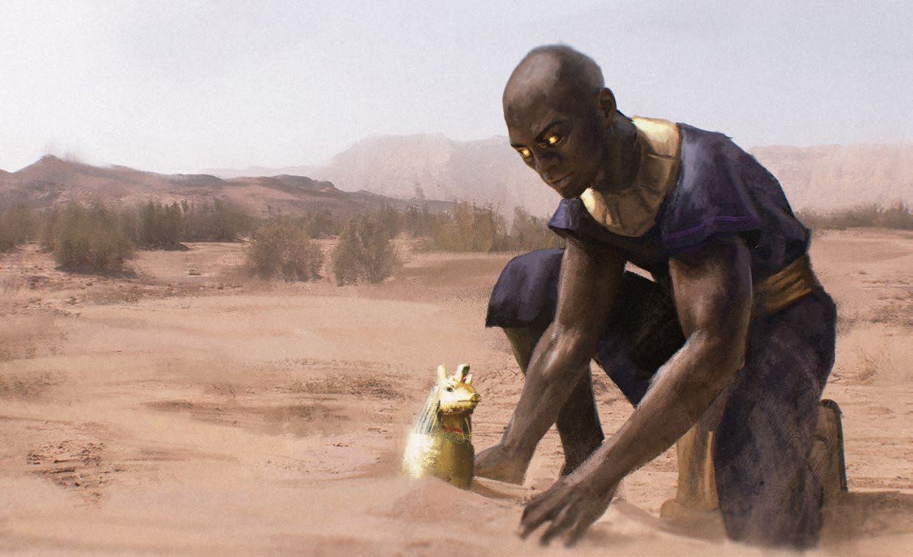

new face growing in power and 
relevance over the ancient traditions 
and beliefs of the orthodoxy. If the 
Church of Set deliberately cultivated 
the Ministry, they may have lit the 
fuse for a bomb destined to collapse 
their foundations.

metaphor is more valuable than 
linear narrative. The myths remain 
in fragments. The interpretations 
mature with each new era.

Osiris at turns visits upon him a 
great violence, or tricks him into 
an unwinnable conflict, or steals 
Set’s consort for himself. Osiris 
takes advantage of his own brother’s 
weakened state to seize rule of the 
world from him. Or, perhaps, Set 
never wanted to reign — an Anarch, 
even then, striving against the tyr­
anny and corruption of Ra’s bloated, 
degenerate court.

In one translation, Set is a 
betrayer to his kin. His father, Ra, 
retires the throne and grants it 
to Set’s brother, Osiris. In a cold 
rage, Set slays Osiris — some say by 
drowning, some by dismemberment. 
In another version, Set is betrayed.

Divine Origins

Was Set really a god? That is a 
question many Kindred aware of the 
Church are obliged to ask.

THE BURNING OF BAYBARS
A special yearly ceremony is held in orthodox temples of Egypt, the Med­
iterranean, and the Middle East. Some particularly radical branches in 
the West may participate, though the ritual trappings are singularly diffi­
cult to come by. On the anniversary of Baybars’ death in 1277, the faithful 
gather around a ceremonial brazier, tended by the acting Hierophant or 
High Priest. He reveals a knife of obsidian, and a bone preserved from 
Baybars’ corpse.
Leading the flock in the Execration Litany, the priest shaves a sliver from 
the bone and holds it over the fire, releasing it at the climax of the ritual 
chant. When the wraith of the old Sultan appears in the flames, the fol­
lowers shout it down, spit on it, and otherwise relish the eternal torture so 
delivered on their ancient enemy.

The Church of Set claims that 
millennia before two brothers squab­
bled over their offerings, a mighty 
family reigned over the Earth, and 
among them dwelt the forebear of 
what some crudely refer to as the Fol­
lowers. Set, of violent storms, of the 
cruel red desert, of the incomprehen­
sible outsiders beyond the civilized 
world. Set the warrior, Set the trium­
phant. Set, who would be king.

In the faith of ancient Egypt, 
and through the ages to tonight,

7 0

chapter two: Kindred Religions

A History in Whispers

Regardless of interpretation: 
there is a great sin against truth, and 
Set the Pharaoh never sits upon the 
throne. Setites of tonight abide by 
this message even now: members of 
the Ministry may claim cities for 
their own, but if you are a member 
of the orthodox Church of Set, you 
must never take rulership.

the Sultan Baybars. His commitment 
to the eradication of infidels did 
not stop at his decisive campaigns 
against European crusaders. Bay­
bars’ Mamelukes destroyed ancient 
temples, burning and burying their 
relics. They hunted two Eternals of 
Sothis, methuselahs of the Church, 
and brought them to their final 
death. They pillaged the Founding 
Temple Ombos, most holy among 
the Church’s body, and desecrated its 
contents.

Regardless of how one feels 
about his eminent divinity and the 
mythical origins of his church, schol­
ars of the Hecata, Malkavians, and 
Ministry record Set’s last appearance 
on Earth as 33 BCE. He sundered the 
ground with earthquakes, shook the 
palaces of Cairo with wild storms, 
and delivered his final mysteries to 
the faithful. When a cabal of Hi­
erophants and witches came to his 
resting place, they found the obsidian 
sarcophagus empty and shattered, 
razor black shards embedded in the 
sandstone walls.

According to legend, when Ra 
discovers what Set’s done to his broth­
er, he levels a curse similar to that from 
Noddist theology, and banishes Set to 
the shadows. When Osiris tricks him 
and the terrible serpent Apep sinks 
its fangs into Set’s mighty heart, it is 
the monster’s venom that corrupts his 
physical form to resemble an eternal 
corpse. When Set must hide him­
self from his despotic siblings in the 
stygian waters of Duat, it is through 
starvation that he resorts to drinking 
naught but blood. Or so the myths go.

The Purge of Baybars drove 
the Church of Set out of Egypt and 
into exile, taking with them any 
artifact they could carry. They lived 
in diaspora for decades until Bay­
bars’ assassination. Many of the old 
treasures smuggled out during the 
Proclamation of Red Tears still have 
not been returned, though modern 
movements arise to repatriate those 
that have found their way into the 
collections of unwary museums or 
wealthy erudites.

The ancient Hierophants of the 
clan ruled in his absence. The faithful 
tended to Egypt through the reign 
of each pharaoh and invading king, 
guiding from the shadows and prun­
ing the crop as they had already done 
for millennia. Their ideology and 
history had already prepared them in 
unique ways for the many and varied 
changes in leadership, from Mace­
donian to Ptolemaic. Enemies of the 
word of Set were deeply polluted — 
by necessity of their rejection of him 
— and it was the role of the faith­
ful to encourage that pollution to 
destroy their enemies from the inside 
out, and make those who survived 
worthy of Set’s favor.

Curse, liberation, radical con­
version. All of the stories together 
make the shape of truth, but in the 
telling they become lies. The Church 
preaches that Set made his curse a 
gift and delivered it to his congrega­
tion, the gift of flesh that never rots 
and blood that flows more potent 
than the rivers of the underworld. 
The corruption of Apep burned 
through that which was fallible in 
him and left only perfect, atom-fine 
edges of obsidian. Duat’s unliving 
waters could not have converted the 
god, changing him from one purpose 
to another, so much as everted him, 
stirring the exalted appetites within.

Forty years of exile in foreign 
lands brought the followers of the 
Church new wisdom through pain. 
They found that while the Europe­
an Kindred despised them for their 
faith or their subtleties or their skin, 
they craved what the Church could 
provide them. The Church of Set fed 
these cravings gladly.

It began with simple trade 
goods — silk, spices, rare animals. The 
Church’s coffers swelled, and so did 
the hungers of wealthy Europeans. 
Setite merchants began to trade in 
opiates, hashish, specialized serv­
ants. Then, goods more abstract and 
cunning. A perfect forgery of a grant 
of arms, for an ambitious commoner. 
An ignorant child with particular 
physical traits, to pass off as a rival’s 
bastard. A sorcerous elixir of potency, 
for a knight afraid to meet his death 
in foreign lands. The Church grew 
as a network of fixers and inform­
ants, collaborating in secret, passing 
goods from follower to follower. Each 
branch and temple began to keep

None of the fearsome conquer­
ors of Egypt showed any interest in 
rooting out the priests of Set and 
plundering their flocks. While a few 
elder leaders groused at the supposed 
dilution of his kingdom by endless 
waves of barbarians, the orthodoxy 
held — Set is also the god of for­
eigners, in his role as the Lord of All 
Outside Egypt, and there was more 
to gain in bearing an invader’s indig­
nities than in burning him out.

The question remains: Was Set 
a god? The question is incompre­
hensible to those of the faith. He is 
a god, and, in the curious para-tem­
poral way gods have about them, will 
always be a god, and has always been 
a god. He sleeps in the temple at 
Ombos. He winnows unrefined souls 
with his childer. He makes his living 
church among them.

The faith’s greatest test, however, 
came during their first Inquisition. 
Not the Christian-led burnings 
Western Kindred refer to — for the 
Church of Set, their Inquisition came 
a full century earlier, at the hands of

And when the tragic heroes of 
the Book of Nod walked the Earth, 
Set’s “followers” were already ancient.

71

CULTS OF THE BLOOD GODS

records of their resources, as well as 
members’ skills and connections.

one man over few or one man over 
a nation — or one false god over a 
universe. The Master of Duat did not 
allow himself to be denied the throne 
of heaven only for his childer to love 
other kings and despots.

cults with no physical structure 
to speak of, all the better to go to 
ground if the Camarilla or the Sec­
ond Inquisition decide to drive out 
the snakes.

Set’s treasuries grew, and so did 
his flocks. Setites learned they could 
lean ever harder on those who had 
grown dependent on them for favors 
of their own, deeds they couldn’t 
risk doing themselves. Entrenched as 
they were, the faithful of Set could 
avoid the worst of another Inquisi­
tion, purchasing the silence of infidel 
priests and redirecting hunters 
to worthier targets. Meanwhile, 
Western clients who could withstand 
their poisonous addictions were in­
vited into the Mysteries of the faith. 
And those who fell were, naturally, 
doomed from the start.

Mortal-facing fronts are small, 
mobile institutions, meeting regularly 
and in-person, usually with Greco-Ro­
man influences. In the ‘70s, these 
were bland New Religious Movement 
centers. The ‘80s and ‘90s saw a switch 
to substance-abuse support groups. 
These nights, pop-up mindfulness 
practitioners are coming into fashion. 
The format does not matter — the 
Church favors any organization that 
preaches detachment from what binds 
you. Even at this level, the doctrine of 
the Church of Set can be introduced 
in subtle, bowdlerized formats. Lead­
ers are encouraged to downplay use of 
serpents and Egyptian gods in their 
organization names and heraldry, in 
favor of the more palatable imagery of 
Mars, Bacchus, or Pluto — all three, 
if possible, as they are identified with 
Set as Typhon Trismegistus.

As such, it must come as no 
surprise that many of the faithful in 
these modern nights have taken up 
with the Anarchs, though members 
of the Church rarely cling to the 
Movement as fiercely as they do to 
the faith. Leave that for lay-Minis­
ters. Church members are encour­
aged to enjoy the disdain of all sects, 
in their own understated ways. Out­
sider Kindred have long disdained 
the Setites as up-jumped pimps, 
troublemakers and fixers. Being un­
derestimated serves the Church just 
fine... especially now.

More Modern Deceits

After the Red Star appeared in 
the sky at the turn of the millennium, 
the high scholars and new witches 
reached an exceptional consensus: 
the Red God sleeps no longer. He is 
here. The modern world groans under 
the distended corpse of capital­
ism. Whole nations are bought and 
sold on the trade of weapons and 
narcotics. The Second Inquisition 
burns Princes in their manors. Those 
with Blood of a thinness previously 
thought impossible walk the land 
— walk in the light! The Earth itself 
simmers and boils with the injustices 
visited on its body.

With the Renaissance, and the 
resulting Age of Reason, the West 
saw a resurgence of classical thought 
and gnostic cabals. Philosophers of 
science needed ever more taboo ma­
terials for their research. Alchemists, 
sorcerers, and their secret societies 
became inexplicably fashionable. 
There were seductive new ideas to 
spread, and who better to help their 
dissemination than the world’s first 
cult of mystery?

Pierce this mundane shroud of 
counselors and life coaches to find 
the true face of the Church — the 
temple. The architectural require­
ments for a temple of Set are few 
but unusual: there must be an inner 
room from which all outside light can 
be blocked, and there must be space 
within this room for a larger-than-
life statue of the Red God. Movie 
theaters are the obvious choice, 
and darkrooms are equally valuable 
though rarer in this age of digital 
photography.

The thought-experiments of the 
Enlightenment led to wars of revo­
lution and renewed conquest. The 
nascent New World promised liberty 
and happiness, as entire peoples from 
half a world away paid for it with 
their bodies. The Church was there, 
too, everywhere, a contact in every 
port and palace; sometimes, they 
were first.

The world is ready for Set. And 
if they are to be believed, it is the 
faithful of his Church that will begin 
the threshing.

The Church is nothing if not 
resourceful. Lacking the space or 
resources to construct a new temple, 
and in absence of the perfect pre­
existing architecture, many smaller 
temples are assembled in abandoned 
garages, cellars, or large storage units, 
with the inner sanctum separated 
from the outer by blackout curtains.

Snakes in Their 
Hidden Nests

The presence of the faithful in all 
corners of the conscious world, and 
their history of playing both sides, 
leads many outsiders to think the 
Church had some part in every atroc­
ity of the last three centuries. Ac­
cording to the Church, these claims 
are flimsy lies. The Church of Set has 
and always will stand in opposition 
to all forms of tyranny, whether from

Because of the Church of Set’s 
reputation, both unearned and 
carefully cultivated, leadership must 
construct and disclose their houses of 
worship with a prudence bordering 
on paranoia. There are many branch

The temple’s outer sanctum pre­
pares the celebrant to face their god. 
Priests help them strip to their skin,

7 2

chapter two: Kindred Religions

of higher rank available as a guide 
(the better for leadership to root out 
any heresy in its infancy).

SECTARIAN MAT TERS
If the Ministry so despises the idea of authority, why did it beseech the 
Camarilla for membership? While desperation and fear are as likely 
causes as any with the Gehenna Crusade arriving at their doorstep, the 
clan’s true aim was to change the world’s most powerful Kindred sect 
from the inside while benefiting from its walls. For all their talk of freedom 
from hierarchy, the clan still possesses Hierophants and church leaders 
who instruct and guide their less enlightened fellows, so installing their 
religious structure within the Ivory Tower would not be so anathematic to 
the Ministers as many might believe.
The clan’s greatest philosophical division in these modern nights comes 
between the Ministry and the Church. The clan’s “rebrand” or schism — 
depending on who one asks — that led to the Ministry’s creation came 
before the attempted entry into the Camarilla, but following the failure 
of that coalition, many Serpents loudly eschewed the sects entirely, de­
claring themselves Orthodox Setites, Snakes, or the Church of Set. The 
vampires who cling to the Ministry epithet are more inclined to associate 
and politic with Kindred from other clans and join the Camarilla, Anarchs, 
and Ashirra, while the Church of Set takes the view of “once bitten, twice 
shy” and despairs for their liberal-minded clanmates, who they feel are 
destined to face bloody betrayal yet again.

Kindred are encouraged to 
maintain a shrine to Set within their 
haven, provided it does not detract 
from attending Church rituals and 
ceremonies. The shrine belongs in 
the darkest part of the darkest room, 
cordoned off by black curtains. 
The altar can be as elaborate as the 
worshiper feels necessary, though 
the Red Pharaoh is not known to be 
impressed by extravagance. The only 
required accoutrements are a small 
icon or statuette of Set, wrought in 
black and red; a bowl for offerings; 
and an incense burner with kyphi, if 
the worshiper can find it, though ju­
niper or cedar incense are also known 
to please the Ruler of the Desert. The 
worshiper may wish to keep imple­
ments of pain or torture at hand to 
enhance their prayers.

cleanse themselves in a consecrat­
ed mixture of ashes and urine, and 
finally dress in shendyt, or Egyptian 
waistcloths, in deep red and green. 
Past the light-blocking barrier, the 
inner sanctum is stark and somber, 
empty save for the black statue of the 
Master of Storms and the dim red 
lights that illuminate its alien edges. 
Individual prayers and offerings 
occur here, as well as the smaller or 
quieter rituals.

regular pilgrimages to the Cave 
of Apples temple in Naples, when 
they can manage the trip, though 
this seat of Church operations in 
Europe has been steadily emptying 
in the nights since the Beckoning 
began. Of course, most famous is the 
legendary temple Ombos at Naqada, 
Egypt, once the resting place of the 
Red God himself. Some say Ombos 
still lies in ruin, and some claim it 
is rebuilt. The few modern pilgrims 
have not returned or even sent back 
word.

With access to a shrine, a Kin­
dred of the Church is expected to 
perform the nightly offering ceremo­
ny. It begins with burning incense 
until its smoke hazes the air. Then 
the celebrant parts the curtain to the 
shrine, bowing before the image of 
the Red God while offering a favored 
hymn or a simple “Eternal homage 
to you, Set the Liberator.” They cut 
their palm to allow some vitae to 
flow into the offering bowl, mixing it 
with beer. The icon of Set is dressed 
in green and red cords, smeared with 
the still-bleeding palm. The celebrant 
may linger in meditation, inserting 
needles under their fingernails one 
by one or flaying a digit to allow pain 
to clear their thoughts. When the 
offering is complete, they extinguish 
the incense and withdraw from the 
shrine, scuffing their footprints as 
they go.

Temples with size and secrecy 
enough can stockpile donations with­
in their walls, serving as a storehouse 
within the greater decentralized 
treasury of the Church. Still older 
temples feature libraries of Setite 
ritual and magical texts. These texts 
are precious in themselves and never 
loaned out under any circumstances.

Rituals of 

Liberation

The experiences of the faith are 
intimate and individual to each mem­
ber. Church leadership encourages its 
flock to pursue personal relationships 
with the Master of Duat. Howev­
er, study of the canon set down by 
priests, meditations on the revela­
tions of wisdom, and performance of 
the Mysteries must be conducted or 
shared in fellowship with a member

The most ancient artifacts and 
cornerstones of the Church’s doc­
trine can be found in aptly named 
Founding Temples. Such temples 
include Red Hook in the Harlem 
borough of New York City, founded 
in 1893 as the oldest temple of Set 
in the Western hemisphere. Schol­
ars of Typhon Trismegistus make

The Lesser Mystery of Set

Of less intimate but far higher 
meaning are the two Mysteries of Set, 
the Lesser and the Greater. The Lesser

73

CULTS OF THE BLOOD GODS

Mystery is observed once a month during a full moon, 
with special significance given to mysteries that occur 
during a lunar eclipse. Any Kindred who know of the 
performance — though not necessarily who is sponsoring 
it — are welcome to attend and liberate themselves. Many 
recruiters consider this a necessary community outreach 
event.

ON THE GATE OF BLOOD
Of the Nine, the Gate of Blood is considered most 
sacred, and absolutely vital to full participation in 
the Church of Set. To be initiated in the mysteries of 
the Gate of Blood, the celebrant must make herself 
a life sacrifice to the Red God. Her guide, acting in 
their authority as a divine agent of Set, consumes 
every drop of her blood before replacing it with 
some of the guide’s own. The initiate wakes from 
their glimpse of Duat, reborn in the love of Set the 
Triumphant. The Gate of Blood is a time for somber 
reflection on the part of the guide, and ecstatic rev­
elry on the part of the celebrant.
Kindred laity recognize this as an Embracing, done 
up in the trappings of Egyptian esotericism. Though 
the Church considers Kindred adoptees of the faith 
already inducted in the Gate of Blood in their own 
way, priests of Set are eager to perform a facsimi­
le of the ceremony for them, that they may be Em­
braced again.

In the Lesser Mystery, the facilitating priest places 
emphasis on revelations — in this case, making dramatic 
shows of magic, supposed artifacts, and other entertain­
ing displays. The most common sight at these ceremonies 
is a large python serving the priest as a ghoul, passed 
among the spectators.

Following his revelations, the priest conducts sacrifices, 
though these will be called by another name. Sometimes 
the attendees are asked to paint a source of anger onto a 
red clay vessel, and then dash it against the wall. Sometimes 
they are bidden to pour their wine over specific stones in 
the floor. Sometimes the audience comes looking for the Set 
they hear of in Camarilla whispers and are disappointed to 
find anything less than ritual slaughter.

This Mystery is a lesser eversion, a small liberation 
from the assaults of the soul. But for every attendee who 
feels the rebellion rise within them, and every member 
the priest deems worthy, there is a second event to come 
immediately after: a revelation of one of the Gates.

Wrath, doing whatever is required to goad the initiate’s 
rage into a single livid explosion, incinerating the last of 
her false self. The Gate of Desire draws from the initiate 
her most abhorred, subjugated needs, and encourages 
reflection as she indulges them — why are they so hated? 
Must she suppress them, after all? The Gate of Satiety 
gathers the seas of the initiate’s hunger and drowns her in 
them, until the very thought of indulging a past pleas­
ure is revolting to her. Under the Gate of Despair she 
loses everything she once thought vital to her self — her 
temporal joys, her wealth and possessions, her playmates 
and false loves — in order to learn that nothing outside 
the truth in her soul can possibly define her. At the Gate 
of Ignorance, she experiences life-changing doubt brought 
on by a shattering revelation, that something “true” 
upon which she built the foundations of her being is not 
true at all. And in the Gate of Chaos, she is shown with 
unerring soundness that the world itself is a lie, devoid of 
any reason or sense, and any belief she once placed in the 
material is guided to its proper home — belief in Set and 
his unbreaking Church.

The Nine Gates

The Mysteries of the Nine Gates of Wisdom are cor­
nerstones of the religious experience of the Church. It is 
impossible to progress in the hierarchy of secrets without 
receiving their transformative lessons. The Gates are as fol­
lows: Ecstasy, Terror, Wrath, Desire, Satiety, Despair, Ig­
norance, Chaos, and Blood. Passage through each requires 
a guide well-versed in their execution, though an initiate’s 
awareness of the Gate ritual itself is not essential. Indeed, 
the Church encourages initiation without any anticipation 
or prior agreement on behalf of the initiate, for the most 
effective, visceral experience.

As the Gates reveal discrete truths or experiences 
meant to strip the initiate of corrosion, each calls for a 
wholly different approach and atmosphere. Scholars rec­
ommend the Gate of Ecstasy as an initiate’s first, as it is 
the most palatable and most expected Church experience. 
The initiate of Ecstasy is subjected to intense sensory ex­
periences meant to awaken her body and smother her ego. 
The second Gate is usually of Terror: the guide encourages 
the initiate’s starving id to express itself via her basest, 
most primal fear, then directs her need for relief to the 
waiting arms of Set and his Church.

At any of these Gates, a vampire may suffer fren­
zy, gain Stains, or devolve completely into a wight. The 
Church of Set covers this truth up, assuring its newest 
members that they will be supported through these trials, 
with the priest pointing to the handful of ranking Setites 
in attendance as evidence of how the Church looks after 
its own. This sense of brotherhood is a lie. Until a vampire 
has passed through every Gate, the initiate is on their own. 
If they fall, they must pick themself up. If they cannot, 
the priest should experience no regrets over that vampire

From here, the path is individualized to each initiate 
and her necessities, though many sponsors move on to

74

chapter two: Kindred Religions

succumbing to the Beast in perpetuity, as clearly they were 
unworthy. Domains where the Church of Set holds sway 
may have a stable core where the Church is at its strong­
est, but in the domain fringes, more wights prowl than 
perhaps in any other cities.

Any who discuss what they performed or witnessed 
while in the temple, either then or later, are silenced at all 
costs and made subject to a Contending. Rarely has such 
a thing been an issue — it seems the Greater Mystery is 
far too intimate and personal for anyone to want to share 
its wonder openly.

The Greater Mystery of Set

Beginning the Journey of the Faithful

Of the Greater Mystery, little is written or discussed. 
Its very nature compels secrecy — to discuss the Greater 
Mystery outside the confines of its performance is con­
sidered heresy. There are, however, aspects of it that all 
members of the Church understand:

All souls, living and unliving, knowing and un­
knowing, shadow the journey of the dead through 
Duat, an underworld of black water and pale flame. The 
existence of this journey, and each person’s unwitting 
recreation of it, may not be made obvious to the believ­
er until they are well along their own journey. Leaders 
of the Church take care to note each member’s progress, 
so no one is forced to bear the scouring of a revelation 
before they are ready.

The Greater Mystery of Set is a ritual performed over 
the course of several nights, once a year, during a new 
moon in the darkest month. Those of the Fourth Hour 
or later, who have already experienced a Lesser Mystery, 
are obligated to attend. In the first night, sacred objects 
are brought to the temple — an obsidian shard of an 
ancient sarcophagus, a winnowing-fan, red clay vessels of 
unknown contents. A mortal man of a certain age must 
be brought into the temple, dressed finely and treated in 
all ways as a king, his every desire attended to. From the 
temple’s outer sanctum, the leading priest declares the 
start of the rites, and there is an all-night feast, though 
not necessarily of food.

The First Hour of the Journey by Night represents 
Ra’s descent into Duat, and Church doctrine likens it 
to struggling to make out shapes in the darkness. The 
Church designates potential converts and curious indi­
viduals “just trying it out” as unbelievers in their First 
Hour. Recruiters make themselves constantly available to 
the First Hour initiate, anticipating his needs and meet­
ing these to the best of their ability, all while watching 
carefully for signs that the initiate is ready to be guided 
through his first mystery.

The second night, all initiates must be cleansed 
in dark water, which they are allowed to procure from 
different sources, and can wear only green or red as they 
go about their nightly business. At least once in the night 
they must visit the temple to leave offerings for the ritual 
pharaoh.

For many, their first mystery is a surprise. They 
receive an invitation, formal or informal, to a celebration, 
the details of which are vague and mundane: a secular 
party, a small benefit concert, a get-together over vitae 
and wine. The celebration turns out to be a thin front 
for a performance of the Lesser Mystery of Set — but the 
recruiter-turned-guide is careful to conceal the fangs of 
doctrine under the shadows of a pleasing garden.

In the third night, the fasting begins — Kindred 
initiates may only drink the blood of those who are under 
the influence of entheogens. Kine initiates likewise must 
begin imbibing hallucinogenic drugs. The doors to the 
temple close to all who are not allowed participation in 
the Greater Mystery, save the ritual pharaoh, who has 
lived three days now as a god on Earth.

Many performances of the Lesser Mystery end in the 
revelations of the Gate of Ecstasy, for precisely the reasons 
anyone would expect. The guide crafts their initiate’s 
sensory deluge to fit her particular tastes. This can be 
head-pounding music and half-moons of molly, ending in 
a blur of flesh and heat. It can also be a flight of delicate 
mortals with carefully curated Resonance and choice 
Dyscrasia, in a garden heavy with night-blooming jasmine. 
One’s unknowing passage into the Second Hour is unfor­
gettably pleasing, leaving the initiate with an enthusiasm 
that will serve them well in the trials to come.

Of what happens in the fourth night, only those 
present know. But in the fifth night, all emerge from the 
temple in states of injury or exhaustion, and the sacred 
objects are carried out — an obsidian shard sticky with 
fluid, a filthy winnowing-fan, red clay vessels now empty, 
and several crude cedar boxes that smell like a butchery. 
The ritual pharaoh is gone, though one member of his 
body remains with the priest.

There are moments when the pain and chaos of 
the material world align to provide Set’s guide with the 
circumstances necessary to initiate her charge in the 
revelations of their next two Gates. When the Second 
Inquisition flashes its muzzles, or the Camarilla levies 
incomprehensible rulings, or petty grievances sour the

In this final night there is an hours-long feast held 
somewhere secluded outside the temple, featuring all 
manner of catharsis—specially-brewed beer, hashish and 
narcotics; carefully monitored frenzies and fights; orgies 
selective or all-inclusive; and other more exotic manners 
of release.

75

CULTS OF THE BLOOD GODS

denied to others: namely, study of 
Church doctrine, and membership in 
performance of the Greater Mystery 
once a year. Members in their Fifth 
Hour only now realize there were 
even Hours to begin with, and often 
look back on their journey so far with 
a fearful wonder.

THE JOURNEY FOR MORTALS
For kine, the Journey by Night is conducted with rather more caution and 
patience. They are recruited through one of the Church’s front organiza­
tions, invited to Lesser Mysteries scrubbed of most overt vampirism, and 
guided through the more “palatable” Gates first. While boons and favors 
are still dispensed with reassurances and warm smiles, the Church presses 
back on mortals much sooner than Kindred. Members will find themselves 
volunteered for small tasks or donations — certainly nothing that comes 
close to what they have so far enjoyed on the Church’s dime.
As the mortal initiate passes into their Fourth Hour, the demands of the 
Church loom large. Tithes increase in frequency, flooding the mortal with 
debt. Church leadership now screens and approves relationships with 
outsiders, so that they won’t in their ignorance interfere with an initiate’s 
fragile enlightenment. Errands for the Church are now arduous undertak­
ings — the mortal only has time for their Church membership. Kindred of 
higher levels may be granted permission to Blood Bond or ghoul mortals 
in their Fourth Hour, making the prospect of leaving the Church even more 
difficult. Indeed, most of the Church’s labor force comes from mortals in 
their Fourth Hour, known interchangeably as the Hour of Trials or the 
Hour of the Final Labyrinth. Still, kine are promised the greatest revelation 
to come if they remain — and having seen the results of a Contending, 
they know all too well the consequences of leaving.

The Later Hours of Night

At the Sixth Hour, a Kindred 
must have mastered a total of six 
Gates of Wisdom. A member of 
this level now shoulders the heavy 
responsibility of guiding others 
through Gates they themselves have 
mastered — including the Gate of 
Blood, if Church leadership blesses 
them with permission to Embrace a 
childe. A Kindred in the Sixth Hour 
of her Journey by Night is a full-
time member of the Church of Set, a 
spiritual employee. She may entertain 
other hobbies, projects, or titles, but 
only if these enhance her usefulness 
to the Church and to the Red God. 
If she fails to bring Set his due of 
souls — either in new fellowship or 
destruction-by-vice — she must also 
take care to guard herself against a 
Contending on the basis of infidelity.

bonds of a coterie, the guide is there, 
offering shelter to her initiate and 
leading them to the shadow of Set.

of Osiris, enthroned in black wings, 
suspended over a lake of fire. In 
the initiate’s Fifth Hour, they have 
been broken upon four Gates in 
total. They have seen the world for 
what it is: twisted and restrictive, a 
place where the true self cannot find 
happiness. They have known the love 
of Set and his Church, the only place 
where they can be truly free. Their 
sponsor can now reveal herself and 
her mission, confident that the ini­
tiate is ready for the truth. They are 
ready for a joyous welcome into the 
Church of Set, openly and officially.

The guide does not rely on these 
moments to occur naturally. When 
necessary, she creates them herself, 
using her access to the Church’s 
considerable network of contacts 
and resources to set the stage for the 
wisdom of the Gates to make itself 
manifest. The unknowing initiate 
may soon find themself beset on 
all sides by sudden, unimaginable 
hardship with no discernable source 
or reason — lovers turned unfaith­
ful, Touchstones in mortal danger, 
evidence mounting for crimes never 
committed.

In the Seventh Hour, one of the 
Paths that an initiate may follow 
comes to a premature end. This 
is the Hour of Set in his aspect as 
Triumphant Warrior and Consum­
er of Apep. Those who follow the 
Path of Wepwawet forever delay 
their spiritual development to serve 
under the Triumphant’s command. 
These warriors are fearsome ascetics, 
mortifiers of the flesh, and protect 
the Church as swords of Set. Those 
lucky enough to study with the 
paragon Faruq Abd al-Qadir in his 
training hall at Abu Simbel will find 
themselves traded like currency from 
temple to grateful temple. For all the 
adoration they receive, however, one 
of the Gates will always be out of 
their reach. They are figures demand­
ing both pity and great respect.

The initiate is central to the 
confirmation ceremony, flensed of 
everything but their Gate wisdom 
and newfound love of the Church. 
The night begins with somber rituals 
meant to reenact their Embrace into 
the shadow of Set, and ends with 
familial love. These re-Embraced 
fledglings appear drunk on renewed 
devotion to their Church, but are 
undeniably spirited and courageous, 
making them essential to the recruit­
ment of new members. At this level, 
they are permitted further revelations

Does the guide feel remorse? Yes, 
at times her heart aches for the state 
of this world, that it could construct 
a soul-cage only torture can break. 
But the initiate draws closer to sal­
vation in Set’s arms with every new 
torment. More often, the guide feels 
joy... and envy.

In the Fifth Hour of the Journey 
by Night, Ra and the host of the 
dead finally reach the august tomb

76

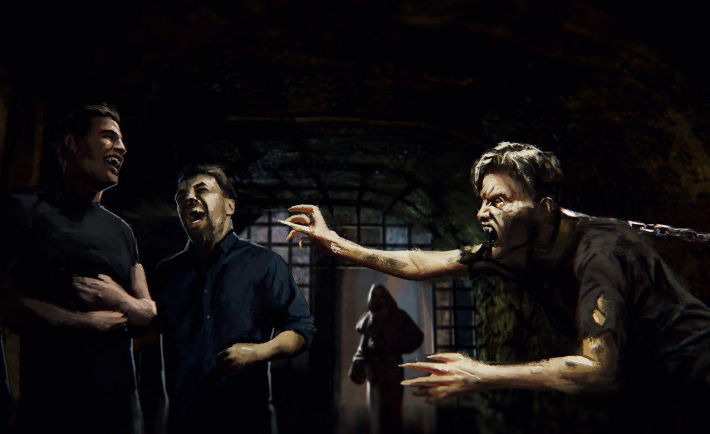

chapter two: Kindred Religions

For those on other Paths, the 
Seventh Hour begins after the 
mastery of eight Gates. This Hour 
confers the authority to open and 
manage local temples as a priest of 
Set, one small node in a network of 
tithes, favors, treasures and hirelings. 
For many, this is the Hour of their 
spoiling. Once, they only had access 
to pleasures the Church gifted in its 
wisdom, a leash perhaps too short to 
choke on. However, not even a fol­
lower of Set is immune to corruption 
through power — and just as well, 
because that which can be liberat­
ed, must be. Such a weak leader is 
allowed to take his fill, as the Gate of 
Satiety allows, but his elders will step 
in if it seems he has more followers 
consumed than converted.

management of the Church can be 
found at this level — High Priests 
of older temples (such as Khaled al-
Fakhani in the Court of Humility), 
acclaimed Bahari witches and the 
greatest of blood-sorcerers.

the Djet Sopdet, Eternals of Sothis, 
methuselahs who were Embraced 
1,460 years ago at the beginning of 
a Sothic Turn. While nominally the 
heads of the Church, few continue 
active management at this level. It 
is understood they have their own 
pious undertakings to attend to, but 
no one of the Tenth Hour has been 
seen or spoken to since the Beckon­
ing began.

Members of the highest circle 
of the Church of Set dwell in their 
Ninth Hours, a level reached only by 
the aged, the accomplished, or the 
gifted. This is the Hour of the An­
tipode Labyrinth, when Ra reverses 
his course through the sandy maze 
of Sokar. High Priests of Founding 
Temples guide the Church’s am­
bitions from here — or, they did, 
before the Beckoning left their 
offices empty. The Church has many 
millennia of practice at operating 
independent of centralized authori­
ty, though concerns rise through the 
ranks regarding non-clan Kindred 
stepping into the vacuum left by 
Beckoned elders.

Of the Eleventh Hour, there is 
only One. Lord Set, the Red God, 
remains in this penultimate state, 
delaying his passage beyond Duat 
to guide followers in the shadow of 
his Church. And beyond this lies 
the Final Hour: passage into the 
primordial Nun, where the flensed 
and faithful will find a new world, or 
create another. Or so the orthodoxy 
claims. No single entity, living or 
otherwise, has experienced crossing 
beyond.

Mastery of all Nine Gates of 
Wisdom is required to reach the 
Eighth Hour, the time in which Ra 
throws open the doors to Osiris’s 
tomb and makes ready the way 
for the host of the dead. Upper

Demigods travel in the Tenth 
Hour of the Journey By Night:

7 7

CULTS OF THE BLOOD GODS

On the 

Church of Set

leaves out so many of the nuances that 
it might as well be useless.

Set, seek to ruin, that we may find 
those resistant to the ruination. We 
do not seek to destroy Osiris; that 
would be foolish. Rather we bring 
those who cannot handle the truth 
of the Outside, that which Osiris 
and Horus sought, farther into the 
darkness. We bring them to Set, so 
that Set may protect the rest of us 
from the searing light of what waits 
beyond the doors of the world.

Many atrocities have been laid at 
the feet of the Church of Set over the 
years. I will not waste time trying to 
correct them all. Some are even com­
pletely true. I venture to guess that 
most of them have a grain of truth at 
the core, but like any resource shared 
by immortals, time and distance 
devour the truth alive.

As attributed to Khalid al-Fakhani, 
priest within the Church of Set in the Las 
Vegas domain

Before the Red Star appeared, the 
Church of Set were referred to as the 
Followers of Set. This is an extremely 
literal translation of the phrase Walid 
al-Set, and does not convey the full 
extent and power of the faith. To 
call the Church “followers” is like 
referring to the Roman Catholic 
Church as “followers of the Trinity.” It 
is technically correct, of course, but it

An interesting note on the 
Church of Set is how we define 
“we.” There are those of the Minis­
try, of course, but to think that our 
membership is defined by bloodline 
or even Path is small-minded. The 
Church of Set welcomes members

Is the truth important here? I 
will politely say no. Mythology is 
built by the people who subscribe 
to it, and is a reflection of the flock 
rather than of the god.

Liberation is our guiding light. 
We, the members of the Church of

CHURCH OF SET CONVICTIONS
While ultimately, doctrine is less important to the Church of Set than ritual and experience, neither of those will be of 
much use to an initiate who has no idea why she is doing what a priest commanded her to do. That said, the Church 
follows closely the idea of secret knowledge: that certain authorities possess divine dispensation to withhold truths 
from followers who are unready to receive them. An initiate is meant to receive the lessons on her body and soul 
first, as guided by someone well-versed in the mysteries, before she is permitted to study the texts of a temple library.
The Church of Set finds the idea of commandments distasteful, but for those who require an easily-memorized litany 
of convictions, the doctrine of the orthodox Church commonly manifests as the following Convictions:
• 	 Always strive to liberate others of their vices
Vice is a tool, not a recreation. The faithful initiate can best serve Set by winnowing the souls of the world — that is, 
separating the wheat from the chaff — by determining who is prone to degradation and who is strong enough to 
resist. What can be liberated, will be liberated, and what remains will be a legion of refined souls in service to Set, 
freed from their bondage to literally anyone and anything else. You are the thresher, not the threshed.
• 	 Never refuse aid to another member of the Church
The Church of Set claims that when they rule this world, or move on to the next, they will do so as a brotherhood of 
many. There are no kings here, save the Red Pharaoh himself.
• 	 Always respect the commands of those in later Hours
The priests, and also the warriors and faithful witches who plumb the depths of Duat ahead of you, have made ready 
the path you yourself travel. You are free, but they are more free. Their wisdom and guidance must be observed. 
• 	 Always do what is necessary to test another’s resistance to liberation
What an individual might think of as “compassion” is, to the Setite mind, nothing less than violence. In refusing to test 
another soul’s limit for freedom, you are dooming it to slavery and denying Set his due. Do not wait for permission 
when their liberty could begin now.
• 	 Always seek the mysteries of Set, hidden throughout the world
The more Mysteries a Setite understands, and the more secrets they wield, the better they will serve the Red God 
and his Church.
• 	 Always do what is necessary to test the flaws in a social order
Beware the individual who desires authority. Organizations both mortal and Kindred are inherently degenerate by 
virtue of their disconnection from the true god. If they are really as inviolate as they claim to be, then they must be 
brought into service of Set’s living Church, or otherwise dismantled and allowed to rot.

78

chapter two: Kindred Religions

from across sects, and numbers 
among her body the paths of Lilith, 
Typhon, the Warrior, and others. 
Morality is personal. Doctrine is 
essential. In order to be a member 
of the Church of Set, you must be 
inducted by a priest, and follow the 
guiding principles of the Dead God. 
Judge those in your city. Protect your 
flock.

Should there be young, eager 
warriors not affiliated with the 
Church of Set in your domain, pay 
them. Give them work. Let them 
see you as a source of problems to 
handle, and you will have devoted 
Setite warriors in under a year. Feed 
their need for violence, and they will 
commit violence on your behalf.

The Prince stepped down, a new 
Baron stepped up, Primogen joined 
a wider council of elders, and the 
Sheriff — who attempted to cling on 
to her position — vanished one night, 
to the mourning of nobody.

Kharkiv likewise exists as an 
example of what the Church of Set 
can do to a Camarilla domain if they 
get inside the heads of power players 
and convince them of the promise of 
Setite liberation. For years, the Setites 
have worked on the city’s influential 
Kindred, one by one, pushing them 
to the brink of falling to the Beast 
before snatching them back as saviors 
every time. They show the possibil­
ities of freedom without binding 
mortal ties and undead regret, and cut 
those fetters if they feel their con­
verts are ready. Some resist or realize 
the manipulation, only to find their 
peers among the governing Kindred 
are already members of the Church 
or worse, to return to their havens 
and find Setites already there, ready 
to “vanish” the vampire who opposes 
their plans.

Should there be eager neonates, 
feeling isolated by their sires, and 
craving a slice of what the city has to 
offer, give them a taste. Allow them 
to assist in managing the mortals 
who run errands for you, or plant a 
word in the mayor’s ear. Make it clear 
that you are the giver of these gifts, 
and they will come to you, friends in 
tow. Recruiting elders who already 
look at the Church of Set askance is 
a difficult task, and they will always 
be using you for their own aims. Do 
not allow this. Instead, go to their 
children, and raise them in the ways 
of Sutekh. It is through the children 
that societal norms change and we 
become more powerful by the night.

The Church of Set has existed 
for thousands of years, ever since Set 
passed into Duat. We are in every 
city. You cannot cross a domain bor­
der without running into an adher­
ent. Even if you do not see us, we are 
here. Ideally, a Setite presence (and 
yes, the word Setite is acceptable, like 
Muslim for Islam) should contain at 
least one priest and one warrior. The 
priest guides the flock, and the war­
rior keeps it safe. More are, of course, 
encouraged, but be careful to balance 
out your fury with your place of 
succor. Priests report to bishops, and 
so on, up to the head of the Church 
in Cairo. Titles of priests who handle 
lesser priests in several domains may 
vary by location.

I suppose that could be the sin­
gle simplest principle in the Church 
of Set. Feed someone’s vices, and 
they will commit more vices on your 
behalf. The Church itself might not 
be simple — we span borders and 
cults and belief systems — but this 
is the simplest act we can commit to 
further the glory of Set. Those who 
indulge and fall are failures and tools. 
Those who overcome are worthy of 
passing through the Gates of our 
faith.

Despite their success in working 
on the city’s Kindred, the Church of 
Set couldn’t care less whether the Ca­
marilla or Anarchs govern Kharkiv. 
Set prohibits them from ruling a city, 
and they’ve no real desire to become 
political advisors. Their objective is 
to test every vampire and indoctri­
nate those left standing into the cult. 
They observe the domain of Indian­
apolis in the United States, where 
the Ministry rule with a laissez-faire, 
any-faith-goes attitude, and believe 
Kharkiv needs to correct the mistakes 
made Stateside. Priests Vyacheslav 
and Akhtem feel it’s integral to the 
strength of the Church to convert 
every meaningful vampire, and eradi­
cate the opposition as the sandstorm 
scours skin from a cadaver. If only the 
worthy remain, they can then move 
onto another city instead of arrogant­
ly trying to rule this one. They take 
the view that the liberated should 
rule themselves.

While liberation may entail 
torture and death, be careful to keep 
your flock at a manageable level. 
Killing off all of your flock in a sui­
cide pact is just not our style. If your 
faithful are dead, they cannot contin­
ue to spread liberty, and they cannot 
be further liberated themselves.

Should you have Bahari in the 
domain, convert them. Give them a 
safe space to practice their arts and 
explorations. The followers of Lilith 
are useful to us, and they understand 
the exploration of the dark in a way 
some of us do not. Many of them crave 
structure, as much as they struggle 
against it. Give them a place in the 
hierarchy, and duties to fulfill. If you 
know anyone in the Order of Taweret, 
make introductions. We used to have 
witches in the Church, long ago, but 
their ways were lost to us. In many 
ways, the Bahari fill that role. Let 
them do so.

The Ministry represent us, but 
we represent their heart.

Dua Sutekh.

Setite Temple: 
Kharkiv

Kharkiv exists as an unusual do­
main, having recently experienced an 
almost-citywide conversion from the 
Camarilla to the Anarch Movement.

7 9

CULTS OF THE BLOOD GODS

The cult’s public face comes through their opera­
tions in the Karazin University, where a handful of its 
members claim territory, and a storefront in the Ave 
Plaza shopping mall, where they meet Kindred of other 
cults in what is advertised as a Scientology testing office. 
Unlike most domains, many meetings between Kindred 
occur to discuss faith, experiences, and tests of one’s 
self-control. To an outsider, it initially seems evangelical 
Christianity has taken hold among the city Kindred, as 
the name “Set” is rarely mentioned outside the convert­
ed, though Priest Akhtem consecrated the museums 
along Sumska Street as a place to use Church terms 
freely, after the M. F. Sumtsov Historical Museum hosted 
an Ancient Egyptian exhibition there in 2019, containing 
the most intact enameled sculpture of Set dated from at 
least 3,500 years ago.

ON THE SUBJECT OF PARIS
The mystery behind the perpetrators of the Paris 
bombings that led to the Ministry’s rejection of the 
Camarilla (or the Camarilla’s rejection of the Minis­
try) and subsequent joining with the Anarchs is on­
going, though the clan isn’t openly making strides to 
discover the perpetrators.
The prevailing rumor of the time was that the Banu 
Haqim sabotaged Ministry and Camarilla relations 
to better insure their own admission into the Ivory 
Tower. Several prominent Serpents refute this the­
ory, however, based on the risk the Banu Haqim 
faced if their attack on Camarilla Justicars and 
Setite Hierophants was discovered. Though, those 
same Serpents state, the Banu Haqim certainly 
make for perfect scapegoats. The two clans have 
fostered a rivalry for centuries.
Investigators into the Paris bombings wonder wheth­
er the Camarilla set up the attack to remove trou­
blesome Justicars, deal a blow to the Snakes, and 
impress the Banu Haqim. Others wonder if it wasn’t 
just another Second Inquisition attack with a hell of 
a lot of collateral damage. With the Lasombra’s re­
cent entry into the Camarilla, further thoughts go to 
the Magisters taking early steps to remove a poten­
tial rival, though the fear such an attack could cause 
might have jeopardized their attempt. 
The clan’s conspiracy theorists quietly discuss 
whether the attack was orchestrated by the Church 
of Set to sabotage the clan’s liberal arm before it 
made a terrible decision, while others theorize the 
Ministry might have planned this all along to make 
them more sympathetic to the Anarch Movement 
(and remove some powerful Hierophants at the 
same time).
The truth may never be known.

Kharkiv’s Church of Set possesses a loose hierarchy, 
with the priests on top — three of them Ministry, two 
of them from other clans — and everyone else a warrior, 
who defends the faith, or a believer. Kharkiv’s Kindred 
have quickly adopted the term “believer” to point to 
those who the Church of Set has saved, “non-believer” to 
those still to be targeted, and “the lost” for those in need 
of pity, ostracism, or elimination.

Perspectives

Anarchs: Of all the Kindred sects, this one is the most 
tolerable. They’re aimless but do have a propensity for enjoying 
unlife in a way in which so many other Kindred fail. The 
Ministry can guide their energies to something of worth while 
we hide in their shadow.

Ashirra: We occupy a necessary place in this sect, acting 
as advisors and counselors without ever truly entering their 
political and religious hierarchy. Sometimes an outside opinion 
is required. The Banu Haqim would have the entire Ashirra turn 
on us, but thankfully, there are more clans to that sect than a 
cabal of rabid assassins. Of note, the Ministry have no presence 
among the Ashirra. It is a sect where we represent ourselves.

The Church of Set in Kharkiv operates a single, 
unobtrusive temple in the city, into which only confirmed 
members of the cult may enter. A single-story grey building 
in the thick of an industrial estate in the Kyivskyi District, 
the temple is the Church’s statement that appearances mat­
ter far less than content. Within the temple, Setites may 
indulge in any pleasure they can pick up from Kharkiv’s 
streets or ferry in from elsewhere, as long as they leave the 
temple the following night with no desire to ever revisit 
the experience. Sometimes, that requires murdering a ves­
sel to whom the vampire has become attached. Sometimes, 
it means experiencing heroin in bloodstream, procuring a 
blood doll of rare Resonance, or even taking Ashe (see p. 
XX), with the guarantee they’ll never do so again. The grey 
temple is a testament to the Setite ability to risk tempta­
tion and overcome, if they’re worthy of doing so.

Banu Haqim: Where they admire and cling to law and 
autocratic rule with an almost feverish enthusiasm, we believe 
in freedom to explore one’s existence, and that the only way to 
truly find oneself is to do so without strictures. It is no surprise 
we have been at odds for centuries.

Camarilla: They were right to reject the Ministry. We 
work best without the Aeons pulling our strings.

Hecata: Our relationship with the Clan of Death is deep 
and important. Remember the parable of Nakhthorheb and 
Lazarus, and how both of our clans understand the lands of the 
dead better than any other.

The Ministry: A body cannot stand without a spine and 
a brain. One might say they are the spine and we are the brain.

8 0

chapter two: Kindred Religions

JACKAL
JACKAL

Or perhaps we are the heart and they are the flesh surrounding. 
Either way, some of us are of the Ministry, others are not, but 
we cannot expect an entire clan to fall into lockstep in service 
to the greatest of faiths. No, they protect us, we guide them, and 
they can remain the cosmopolitan front to our beliefs.

Small, fast members of the wolf family, jackals primar­
ily prey on small mammals and birds, or scavenge where 
possible. Though not the toughest of creatures, the jackal is 
an important animal in Egyptian mythology, encouraging 
some Ministers to take jackal form for religious reasons.

Animals

Standard Dice Pools: Physical 5, Social 1, Mental 1

Secondary Attributes: Health 5, Willpower 2

Vampires of the Ministry, and the orthodox branch of 
their clan, are as capable of shifting into the form of a wolf 
or bat as any vampire with the required level of Protean, but 
the clan has a special affinity for beasts of importance in 
Egyptian mythology and various types of snake.

Exceptional Dice Pools: Athletics 7, Stealth 6; 
Intimidation 2; Awareness 3

Special: The jackal’s long, curved canines are a light 
piercing Brawl weapon with a +2 damage modifier.

BOA CONSTRICTOR
BOA CONSTRICTOR

OKSANA KOBLENKO 

OKSANA KOBLENKO 

“PROSERPINA”
“PROSERPINA”

There exists an instinctive fear of the animal that can 
wrap itself around you, squeezing the air from your lungs 
and cracking your bones in its tight grip. Boa constrictors 
are native to the Americas, with Ministers identifying 
as members of the Tlacique — a vampire cult focused on 
Aztec mythology — commonly taking constrictor form 
using the Discipline of Protean.

Epitaph: Blackmailer for the Greater Good

Quote: “Did you see the screens I sent? Good. 
Never mind how I got your texts. Let’s talk about how 
to keep your Prince from getting them, too.”

Clan: Caitiff

Standard Dice Pools: Physical 5, Social 1, Mental 1

Embraced: 2015 (Born 1993)

Secondary Attributes: Health 5, Willpower 3

MORTAL DAYS: THE SCAPEGOAT DAUGHTER

Exceptional Dice Pools: Brawl 6, Stealth 6; Intimi­
dation 4; Awareness 4

Natalia Koblenko studied law on a merit scholarship 
at the Karazin University, concurrently pursuing a Juris 
Doctor and a Master of Laws. She was poised, eloquent, 
the superstar of the Koblenko family, the true joy of her 
mother’s life.

Special: If a boa constrictor successfully grapples 
an opponent, it may constrict its victim as a +2 heavy 
impact Brawl weapon.

Her twin sister, Oksana Koblenko, hated her. 
Oksana pursued a degree in engineering at the same 
school, without a scholarship, or poise, or her mother’s 
love. She didn’t want to be an engineer, but a throwaway 
comment from her mother convinced her it would finally 
get her attention. She kept her head down. She stayed away 
from boys. After a disquieting self-discovery, she stayed away 
from girls. She repressed everything that wasn’t perfect, com­
pressed it down until she felt like she might blow to pieces.

COBRA
COBRA

The cobra is renowned for the way it rears before 
striking and its notoriously venomous bite. While they 
range in size, the largest are up to four yards/meters in 
length. Ministers proficient at changing form often adopt 
the shape of a cobra, while some endeavor to make animal 
ghouls of these venomous creatures.

Standard Dice Pools: Physical 4, Social 1, Mental 1

Oksana let it out in little ways. Little cuts, mostly, 
high on her bicep where the scars wouldn’t show. Then 
little thrills she could get away with. She snitched on 
fellow students because it made her feel good to receive 
praise for exposing their secrets. She started accumulating 
stores of blackmail material on students, teachers, even 
family members. She called them “little tricks.” She’d 
find a way to slip them into the public, in an email to 
her sister, or a text to a classmate, and watch them work. 
Entropy — the breakdown of order, the flaws in trusted 
systems — fascinated her more than anything.

Secondary Attributes: Health 4, Willpower 2

Exceptional Dice Pools: Brawl 6, Stealth 7; Intimi­
dation 4; Awareness 4

Special: A cobra’s fangs are a light piercing Brawl 
weapon with a +2 damage modifier. Its venom kills 
or debilitates a mortal victim by the end of the scene 
if not treated. Against vampires, the venom from a 
cobra bite has no effect.

81

CULTS OF THE BLOOD GODS

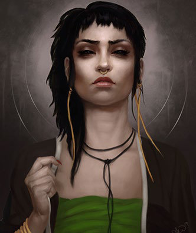

shoulder. She ran, they shouted. The metro was smears of 
wet light, incomprehensible.

Oksana ran forever and everything melted together 
like a nightmare. Until finally, finally, something looked 
familiar.

Olympian Counseling Center — Free to Karazin Students!
It was closed, of course. But she forced her way 
through the locked door. The group leader was there, 
young and quiet and red-headed, sitting in the dark with 
a familiar woman. “Oksana.” He remembered her name. 
“What happened?”

She told him about the white strangers, about biting 
and drinking. She told him about the cutting (though 
he already knew), and more poured out of her like black 
water. The engineering degree she didn’t want. The girls 
she didn’t want to notice. The little tricks. Her sister, her 
disgusting sister, better than her and everyone knew it 
and Natalia didn’t have the decency to feel bad about it. 
Nobody wanted her, nobody. Not even her mother.

Akhtem sat with her for hours. The woman — an­
other group member — came and went as Oksana sobbed 
and Akhtem listened. He didn’t flinch, or ask questions, 
or raise his eyebrows or scoff. He simply let her purge.

It started little and grew from there. Her tricks got 
better. Her cuts, deeper. She started going to group when 
her dormmate caught her; Olympian Counseling Center — 
Free to Karazin Students! It helped, a little, to be around 
others like her. She had more focus, which she bent to­
ward her little tricks. She found out she could sell them, 
and her skills. People paid her money for acquiring intel­
ligence and extorting unsuspecting victims. Sometimes 
she’d see the aftermath of her tricks in the local news, and 
it’d be her first smile in weeks.

“You’ve been hurting for a long time,” he said when 
the black water finally stopped. He pulled her to him, an 
arm around her shoulder like a cloak of snow. “You’ll hurt 
for a long time more,” he admitted, and she found herself 
reassured by it — a plain, respectful truth. “There is 
someone who wants you,” he promised, gripping her hard. 
“He led you to us,” the woman finally spoke, “because he 
wants you to meet him.”

This was how Oksana found the Church of Set 
in Kharkiv, to her mind quite by accident, but to the 
Church by an act of providence. They assured her that 
her reason for being there was ordained by a force greater 
than any single being, and tutored her in the existence of 
a vampire. They reminded her it couldn’t just be coinci­
dence that she was Embraced so close to a Setite temple. 
They praised her good work so far in liberating others, 
and made sure she knew that good work was to continue, 
but under their direction.

Then someone tried to kill her sister.

KINDRED NIGHTS: THE WANTED CHILDE

Oksana woke up in the dark, slumped in a chair. The 
night was a blur of unimaginable, bone-deep pain. Pain, 
and a bleak, acrid hunger. Three white shadows loomed 
over her. They brought her something big, warm and 
struggling. She bit into it without thinking. It tasted — 
no, felt incredible, a better release than the knife’s edge.

Now, Oksana is a dedicated agent and adherent of 
the Church of Set, traveling between domains, serving her 
temple’s will. She finds even greater pleasure and purpose 
in her actions now than when she performed them as 
a mortal, as she finally receives congratulations for her 
achievements. The Church of Set liberated her, and she 
uses its ways to liberate others.

The white strangers asked something. She couldn’t 
make it out over her throbbing head. They muttered. Got 
angry. Started arguing. “God damn it, Simon!” A woman, 
high and panicky. “You dumb piece of shit, that’s her 
sister!”

She choked on fear, the scent of it rolling off them, 
and her own, crawling up her throat. The strangers kept 
arguing. One grabbed her by the shoulder and hauled 
her to her feet. What do we do now? We got the wrong damn 
Koblenko! They dragged her outside, fighting in angry 
whispers. Oksana stumbled free of the white claw on her

PLOTS AND SCHEMES:

• 	
Secure the Temple: In the midst of a new Anarch 
court, Akhtem’s hold on Kharkiv’s Kindred wavers 
between those driven politically and those who feel

8 2

chapter two: Kindred Religions

• 	
Tara Bakurova (Ally 1) When she met Tara, a fellow 
self-harm survivor with a similar history of familial 
trauma, Oksana wanted desperately to be friends. 
When she got to know her, a determined, fiercely 
romantic young woman, Oksana wanted desperately 
to be lovers. She refuses to bring Tara into her herd — 
she wants her to love Oksana, not worship the Proser­
pina — but also worries that Tara will recover and 
leave the group before she’s ready to join the Church.

the summons of faith. What he needs is a front that 
can hold up to all scrutiny, cover its tracks, and grant 
protection to other Kindred Church members. Oksa­
na is intent on procuring this for him by expanding 
her network of victims and defrauding anyone who 
would stand in the way of the temple’s expansion.

• 	
New Brothers and Sisters: The feuding Anarch gangs 
in the northwest represent huge, untapped potential. 
The Church can help them. Oksana knows it, but they 
need to know it, too. She’s taken it upon herself to 
deliver digital “presents” to prominent gang leaders, 
like blackmail material on rivals or stolen identities 
to be mined for resources. No strings. For now.

• 	
Natalia Koblenko (Enemy 1) Beautiful, passionate, 
talented Natalia, sharp as knives and twice as deadly. 
Natalia knows her twin is still in the city. She’s seen 
her fingerprints all over — every local corporation 
suffering a public scandal, every sudden failure of 
the local government following a virus or leaked in­
formation, every feeble attempt at a smear campaign 
against her law offices. Natalia won’t be brought 
down to her level. But she will find Oksana.

• 	
There Can Only Be One: Natalia Koblenko fin­
ished her Juris Doctor and her Master of Laws, 
made a huge splash in the political and public 
law arena, and is now on track to be the young­
est woman to run for — and win — the Kharkiv 
mayoral seat. Baron Karina wants Natalia in her 
retinue, and thwarting the Baron’s attempts is 
another of Oksana’s full-time jobs. Oksana knows 
she should be beyond care for her sister’s progress 
or downfall, but she doesn’t care. She finally feels 
superior to Natalia and refuses to let that change.

KINDRED RELATIONSHIPS:

• 	
Akhtem Veksler (Mawla 2, Adoration) Akhtem saved 
Oksana from a premature final death in the chaos 
of Kharkiv. But he did more than that — he re-Em­
braced her in the love of the Red God, and now he 
guides her as a divine agent of Set. Little is known 
of the man save his basic history: he abandoned his 
father’s faith to come west with the late 19th century 
goldrush... and found something better. His influ­
ence is well entrenched in the city but maintaining a 
permanent temple has eluded him. Oksana wants to 
prove herself indispensable to his plans.

DOMAIN AND HAVEN:

• 	
Temple of Gray Veils (Haven 2, Herd 4, Resources 2) 
When not holding support groups at the Olympian 
Counseling Center, Oksana works on the establish­
ment of a second Kharkiv temple, in the stockroom 
of an abandoned KARE Kharkiv furniture store. 
The faithful number seventeen kine currently, most 
of whom comprise a strange diversity of recover­
ing addicts. Oksana runs stolen power through the 
stockroom, making the place livable for her kine. The 
temple has a stockpile of useful contraband, as well 
as a directory of Church members in the south who 
can provide off-site resources. It also features a small 
library of old orthodoxy texts, which Oksana has not 
yet read.

• 	
The Ministry (Jealousy) Oksana has observed how 
representatives of the Ministry are accepted across 
domains as diplomats, counselors, and bureaucrats, 
and while she doesn’t know any Ministers personally, 
dislikes what she interprets as their cowardice. To 
Oksana’s mind, they don’t deserve to be successful 
because they abandoned their orthodox beliefs. She’s 
only new to the Church of Set, but the Ministry’s 
polytheist, liberal bullshit is not for her.

THRALLS AND TOOLS:

• 	
Simon Danilenko (Anger) Oksana hasn’t heard from 
Simon, personally, since he mistakenly Embraced 
her a few years back. She does keep in touch, though, 
looking into his latest vices so she can deliver them 
to him, in the hopes that one will be his undoing. 
Oksana knows he isn’t fit for divinity and will find a 
way to destroy him if she can.

• 	
Court of the Obsolete (Herd 3) Oksana’s person­
al herd knows her as the Proserpina, an affected 
cybergoth goddess who holds court with her lessers, 
the vast majority of them sniveling incels. She’s 
yet to master the art of nurturing Resonances and 
takes anything she can get. Her followers adore her 
(Oksana’s Presence makes sure of it), and while they 
aren’t the most useful bunch, they faithfully follow 
the doctrine she lays down. Someday they’ll be ready 
for the temple.

WHISPERS:

• 	
Doppelganger: In her efforts to become a self-
taught Mask cobbler, Oksana has learned how to

8 3

CULTS OF THE BLOOD GODS

craft replica documents and 
spoof data from pre-existing 
Masks. So far, three titled 
Camarilla vampires have been 
brought to task for breaches of 
the Masquerade, only for the 
Sheriff to later learn the breach­
es were committed by Anarchs 
using stolen Masks.

normally have, but she tends to 
fall into campy “dark goddess” 
clichés.

utilize the sbirri coterie type (see 
Vampire: The Masquerade, p. 199), 
while others opt for the more aggres­
sive saboteur type.

Sire: Simon Danilenko

Saboteurs

Ambition: See a permanent 
temple of Set established in 
Kharkiv

“We will erode their domain brick 
by brick.”

Convictions: Never refuse 
aid to another member of the 
Church; Never turn down the 
opportunity to liberate others

• 	
Muckraker: Oksana’s got taps 
on major cell towers all over the 
city, and for the past few years 
she’s been training an algorithm 
to sniff out Kindred texts with 
telling keywords, like juicebag, 
leech, donor, and lick.

The saboteur coterie is one with­
out an immediate powerbase or roots 
within their new domain, but their 
reach among the kine is likely impres­
sive. They often have the support of 
a vampire assigning them to the task 
of spying, assassination, or political 
disruption.

Touchstones: Tara Bakurova — 
fellow self-harm survivor; Natalia 
Koblenko — narcissistic night­
mare twin

Humanity: 6

MASK AND MIEN:

Generation: 13th

• 	
Contacts: (••) (disenfranchised, 
outsiders, etc.)

• 	
Oksana Koblenko appears 
to be a young woman in her 
early twenties, 5’4” and bony, 
with dim, sad eyes and a small 
mouth. Her short, soot-black 
hair feathers her cheekbones 
and brushes the edge of her 
jaw. She writes more eloquently 
than she speaks; her voice tends 
toward sudden stops and mum­
bles. Though she doesn’t have 
a Mask, she does have several 
online personas.

Blood Potency: 1

Attributes: Strength 1, Dexter­
ity 2, Stamina 2; Charisma 2, 
Manipulation 3, Composure 3; 
Intelligence 4, Wits 3, Resolve 2

• 	
Influence: (•) (surveillance 
companies)

• 	
Mawla: (••) (the vampire who set 
them to their task)

Secondary Attributes: Health 
5, Willpower 5

• 	
Mask: (•) (cover identities)

Skills: Craft (Electronics) 2, 
Drive 1, Larceny (Extortion) 3, 
Survival 1; Etiquette 2, Insight 2, 
Persuasion 2, Subterfuge 4; Aca­
demics (Research) 2, Awareness 
1, Finance 1, Investigation (Scan­
dals) 3, Occult (Church of Set) 2, 
Politics 2, Science (Engineering) 
2, Technology 4

• 	
Resources: (••) (liquid cash to 
assist with their cover story)

• 	
Adversaries: (••) (at least one 
vampire who would oppose their 
mission with violence)

• 	
At work in the Church, Oksana 
dresses simply: dark red leggings, 
a red tunic top, fingerless gloves 
to keep the joints in her sensitive 
hands from stiffening while she 
codes. She travels in a haze of 
kyphi incense, and even outside 
the temple bleeds a faint aura of 
frankincense and pine.

Possible extras: Domain (if the 
coterie is embedded in their current 
locale), Status Flaw: Suspect

Disciplines: Auspex 2, Presence 
3

New Powers

General Difficulties: 4/2

New Coterie 
Type

The Ministry and their orthodox 
clanmates in the Church of Set prac­
tice some refined versions of their 
clan Disciplines, utilizing the powers 
of Obfuscate and Presence to better 
create cult members and crush weak­
nesses, and Protean to better emulate 
their clan founder. These powers are 
not exclusive to the Serpents, but few 
outside the clan use these Disciplines 
in the ways the Ministry does.

• 	
When she appears to her cult as 
the Proserpina, Oksana’s frame 
becomes delicate and ethereal. 
She accentuates her eyes with 
charcoal, weaves long golden 
cords into her hair, and dresses 
in a cyber-nouveau collection 
of neon green straps, gold rings, 
and heavy black fabric. Her 
Proserpina persona gives her an 
ocean of confidence she doesn’t

The Church of Set are masters 
of secreting members of their cult 
among other Kindred sects and 
within foreign domains. Many Kin­
dred of this religion form coteries 
specifically for this purpose. Some

8 4

chapter two: Kindred Religions

Obfuscate

successes as the Difficulty, suffering a 
point of Superficial Willpower dam­
age for every missing success if they 
fail. This roll cannot benefit from 
Teamwork, as any guidance given 
does not match what the victim sees. 
This power ends if the environment 
becomes dangerous (e.g. the building 
catches fire), unless the vampire has 
Terminal Decree (see Vampire: The 
Masquerade, p. 257).

falling victim to this power for the 
rest of the story.

On a win, the vampire adds their 
Presence rating to any rolls for affect­
ing a mortal’s resonance or a vam­
pire’s emotional state. Appearing as a 
vampire’s Touchstone is a dangerous 
game, especially if the victim possess­
es Sense the Unseen (see Vampire: 
The Masquerade, p. 249), but played 
right it can lead to Stains for the 
victim as their Touchstone appears to 
become damaged or detached entirely 
through shifts in behavior, ideals, or 
even apparent death.

Level 3

Mental Maze

Amalgam: Dominate 1
Serpents maintain that Obfus­
cate is less about illusion and more 
about perception. Mental Maze is 
the ability to remove all sense of 
direction and location from a victim, 
allowing the vampire to make their 
target a prisoner in their current 
environment, such as a home, a 
nightclub, or worse — a vampire’s 
cellar. The victim finds their location 
folding back on itself, subtly altering 
their perception of previously visited 
rooms, convincing them that an 
actual exit will only lead deeper into 
the maze, and eventually breaking 
them down into a state of panic and 
fragility.

Duration: One night

Presence

Duration: One scene

Protean

Level 3

True Love’s Face

Level 5

Amalgam: Obfuscate 3
Using a potent cocktail of con­
centrated emotion and illusions, the 
vampire can alter a mortal’s blood 
resonance or even risk a vampire’s 
connection to Humanity. The victim 
(and only the victim) perceives the 
vampire as a mortal they hold strong 
emotional ties with (such as hate for 
a rival, passion for a new lover, or the 
complicated feelings a vampire holds 
for their Touchstone).

The Heart of Darkness

Amalgam: Fortitude 2
Practiced almost exclusively by 
vampires within the higher echelons 
of the Church of Set, this power en­
ables a vampire to remove their own 
heart and store it outside their body. 
The vampire’s flesh and bone warp as 
they reach their hand into their bare 
chest without the need for incision, 
after which point, they remove the 
heart. This power is not without risk 
to the practitioner, and can only be 
used by a vampire on themselves. The 
vampire typically places the heart in a 
ceremonial canopic jar or urn, though 
there is no restriction as to where the 
heart can go. Many cult-minded Kin­
dred take advantage of the fact the 
organ can retain vitae, and even slake 
their Hunger from afar, by receiving 
ritualistic blood donations. For as 
long as it is removed, the vampire is 
immune to staking attempts, unless a 
stake is driven through the removed 
heart. The vampire’s emotions are 
detached — metaphysically and

Cost: One or Three Rouse 
Checks

Dice Pools: Charisma + Obfus­
cate vs. Wits + Resolve

System: The vampire personally 
speaks the words “you cannot escape” 
to their victim and rolls Charisma 
+ Obfuscate versus the target’s Wits 
+ Resolve, with lower Generation 
vampires being able to negate the roll 
with a Willpower point as per Dom­
inate’s characteristics (see Vampire: 
The Masquerade p. 255). On a win, 
the victim struggles to find their way 
out of the building they’re in. An 
additional two Rouse Checks allows 
this power to be used in a single 
room or a densely packed outdoor 
environment (such as a construction 
site or forest).

Cost: One Rouse Check
Dice Pools: Manipulation + Pres­
ence vs. Composure + Wits

System: To impersonate some­
one the victim has strong emotions 
for, the vampire must know their 
appearance and what the victim feels 
for them. How they uncover this 
will vary between vampires. When ac­
tivated the Storyteller rolls a hidden 
contest between the user’s Manip­
ulation + Presence and the victim’s 
Composure + Wits, where failure 
means the visage holds no emotional 
charge, which is deeply uncanny and 
sours any social interaction with the 
victim. It also prevents them from

Mortals cannot attempt to 
escape but supernatural creatures 
can make a Resolve + Awareness test 
each scene using the vampire’s initial

8 5

CULTS OF THE BLOOD GODS

biologically, if the heart can be said 
to be the font of emotion — provid­
ing them a resilience against their 
Beast’s urges but a remove from 
compassion and warmth.

changing. To the scientist, it seems 
that every angle they discounted in 
their studies as sorcery and magic has 
been shown to exist, and all they have 
worked for has been for naught. To 
the religious, they are now agents of 
evil, immortal and outside of God’s 
plan. Kindred survive by hanging on 
to their core values and hopes, the 
dreams that make them who they 
are and convince them to drive on to 
the next night without falling into 
despair and, eventually, the death-like 
sleep of torpor.

those who have studied the secrets of 
Oblivion have spoken of a presence 
in the emptiness. A formless con­
sciousness that seems to observe them 
and whisper back. When a methu­
selah proposes that this is the very 
creator, not just of the clan but of the 
universe itself, it is difficult for the 
egotistic and morbid minds of the 
watchers of the Abyss to refuse its 
seemingly simple truth.

System: This power requires 
no roll, but inflicts two Aggravated 
Health damage to the vampire when 
removing their heart. No powers can 
be used to mitigate this damage, and 
reattaching the heart requires two 
Rouse Checks. Once removed the 
vampire gains a two-dice bonus to 
resist frenzy, but suffers a two-die 
penalty on Remorse rolls.

The first priests of Shalim have 
been recruited and their numbers are 
slowly swelling in cities around the 
world. As the tendrils of their faith 
grow, they reach out to other clans, 
targeting the disenfranchised and the 
desperate, those who appear to have 
lost everything in life or unlife. They 
call to them and speak of the succor 
of emptiness and the bliss of the 
end. Binding them with a baptism 
ceremony, they ask the questions the 
cult’s founder first asked of them:

The Cult of Shalim preys on 
this fact in the most unusual way. Its 
agents pride themselves on uncov­
ering the great loves of a person’s 
life, the small joys and bonds that 
make their reality bearable. They 
then call those things into question, 
expose their temporary nature and 
sever them, leaving the target of their 
predations left with no choice but to 
accept the central doctrine of their 
faith: that reality is suffering. In some 
ways, the Cult of Shalim resembles 
the Ministry in their methods. The 
difference is the Ministers and their 
Church of Set wish to replace the 
void with faith, where the Cult of 
Shalim cares only for the void.

If the heart is dealt Aggravated 
Health damage equal to or greater 
than the vampire’s Health, they fall 
into torpor. If an extracted heart is 
destroyed — only possible with fire 
or sunlight — the vampire experienc­
es final death. While the heart is re­
moved, the vampire’s body cannot be 
staked unless the heart is located and 
separately impaled, in which case the 
vampire falls paralyzed. If blood is 
fed to the heart, it will slake the vam­
pire’s Hunger as normal (even Blood 
Bonding them if fed Kindred vitae 
from the vein), and the heart can be 
fed from in the same way — possibly 
leading to diablerie. The vampire is 
still susceptible to death via fire or 
sunlight even without a heart.

“Abrenuntias re? Et omnibus operi­
bus eius? Et omnibus pompis eius?”

With their every tie to reality 
broken and their mind shattered 
from loss upon loss, what can they do 
but answer, “Abrenuntio.”

Out of Nothing

The adherents of this faith do 
not seek a blissful, endless orgy of 
experience where all of the bad is 
eliminated. Their creed is far less 
utopian and difficult to swallow for 
all but the most foolish. Shalim’s 
followers believe that elimination of 
the suffering of existence can only 
come at the cost of its joys. It is a fact 
of existence that happiness will turn 
to sadness, pleasure to pain, and any 
utopia will crumble with corruption 
and heresy. This black priesthood 
preaches how a perfect world cannot 
exist while the world itself exists.

Duration: Permanent (or until 
the heart is destroyed/returned)

The Beckoning provides great 
opportunities for Kindred who 
would previously have been perpet­
ually held down by their immortal 
overlords. However, the opportuni­
ties come at a cost: something has 
summoned all those elders away and, 
whatever it is, it has Kindred guess­
ing all over the world and asking 
questions of their long-held beliefs. 
Like any good conspiracy theory, 
the provision of plausible answers 
to those questions can turn into 
certainty in the minds of those most 
hungry to understand.

Cult of Shalim

“Do you dream? Do you dare to 
dream? In this place, our dreams may 
take form, but the ravages of time and 
endless march of reality render them to 
nothing. I can show you a way to end the 
suffering of hope. The pain of dreams.”

This madness is what comes 
from staring too long into the Abyss, 
as many Lasombra mystics have 
done over the centuries, looking for 
truths in the emptiness that seems 
to consume their very souls. Many of

— Apolleon the Traveler, founder of 
the Cult of Shalim

Kindred scholars have long 
spoken of the great and powerful 
founders of the clans, the Antedilu­
vians. In the modern nights, it seems

The hopes and dreams of all 
Kindred hang by a silver thread. 
Their very belief structures have 
been fundamentally shaken by their

8 6

chapter two: Kindred Religions

logical for Kindred to believe these 
ancient masters have summoned their 
closest childer to their sides much 
in the way some of their own sires 
may call to them through the Blood. 
Most who claim to be messengers of 
these entities are quickly struck down 
by the local authorities as threats to 
the Masquerade or as agents of the 
apocalypse. Only the quick-witted 
and sufficiently powerful remain 
elusive. One such Kindred is the 
ancient Lasombra known as Apolleon 
the Traveler.

the calling of his children, he will 
destroy the cancer perverting his 
perfect blackness and return the 
world to the state of nothingness. 
In a stroke, war, suffering, disease, 
unhappiness of all kinds will be 
expunged and all consciousness will 
become one with Shalim, all will 
return to God, all will be God.

themselves equal, since they are all 
part of the same problem. They often 
meet in what appear to be noth­
ing more than self-help groups or 
religious discussion classes, discussing 
their problems and their hopes for 
the future. This is a guise they use to 
lure those seeking help to their side, 
and to gain their trust.

Several Lasombra have now 
knelt before him in one of his guises, 
pledging the remainder of their time 
in existence to ensuring its eradication, 
promising to be the scalpel that will 
cut reality away and reveal the peace of 
emptiness to a grateful world.

Priests of Shalim are always 
Lasombra who have been touched by 
Apolleon. His predations vary from 
subject to subject: some kneel having 
only heard the word and accepted it, 
such as Rabbi Basaras; others must 
be more directly “convinced,” such 
as Gamal Hajjar of Cairo whose 
every happy memory was annihilated 
by the methuselah over a period of 
several months. Each one of them is 
only released by Apolleon when he 
considers their faith in the coming 
end to be incorruptible.

The cult says Apolleon travels 
the world in the form of a great 
black mass, sliding along the floor of 
the seabed, constantly communing 
with what he believes is his sire, the 
voice in the dark. This semi-torpid 
state guides him around the Earth 
as he reaches out into the minds of 
Kindred of his bloodline he feels 
nearby, seeking those with the 
predisposition he needs: those who 
have suffered great loss and who are 
asking the existential questions of 
what it all means.

The Flowering 

of the Abyss

As a relatively new cult, the 
Shalimites maintain a somewhat 
covert presence in many cities 
throughout the world. Apolleon’s 
priests have been mainly recruited 
from around coastal Mediterranean 
cities, where his trek takes him, but 
they have subsequently branched 
out to various areas of the world. 
The most well-known of his follow­
ers is Michalis Basaras, a Lasombra 
in the city of Chicago. However, 
cells of Shalimites can be found in 
the United Kingdom, Brazil, South 
Africa, and even Egypt where they 
silently exploit the schism within the 
Ministry and seek to twist their zeal 
to Shalim’s purposes.

Shalimite Rites

Very little of this young faith has 
been formally codified; indeed, their 
practices and approaches seem to 
vary from cell to cell. Only through 
their correspondence do the priests 
share their stories of success and 
failure, refining their methods.

Nothing. Nothing is the answer 
he provides; there is no meaning save 
that which you assign to the act itself. 
He comforts them with the knowl­
edge that all Lasombra have, deep 
inside themselves: that they are part 
of a great destiny, and that destiny 
lies in Oblivion. Not only will they 
end their own suffering, but that of 
the entire world.

Gematria

They write using a coded cipher 
that involves translating their writ­
ings into numbers using the system 
of gematria. For that reason, all the 
coded letters are written in Hebrew 
and priests are required to learn it by 
rote to ensure their messages can be 
understood. These letters are often 
disguised as missives being sent to 
their distant sires or friends and 
it is not entirely strange for such 
correspondence to be encrypted, to 
preserve not only any secrets inside 
but also the Masquerade should the 
letters be intercepted.

This lofty goal can only be 
achieved through Shalim, of course. 
Apolleon preaches that Shalim is the 
first Kindred and the master of the 
emptiness that existed before the 
universe itself existed. He speaks of 
primordial deities, such as Erebus, 
from ancient cultures, and links 
them back to Shalim, their “true” 
identity. Shalim is the Kindred from 
whom the first Lasombra arose, the 
progenitor of all bloodlines and 
guardian of the purest of those, who 
retain his link to the primordial 
dark. Once Shalim wakes and hears

Servants of the Abyss

The rank of priest is the high­
est a cultist can aspire to; however, 
rank is generally not a concern of 
those joining this cult. Once one has 
embraced the purity and perfection 
of emptiness, such trappings are 
mere words in your mind, though the 
priests are those who speak directly 
with Apolleon and, through him, to 
Shalim itself. The cultists consider

8 7

CULTS OF THE BLOOD GODS

Abyssal 

Consecration

truth as they feel his presence in that 
cloud. Some emerge claiming to have 
heard an indistinct voice, or even to 
have received visions and instructions 
from the master of the cult.

what must be ultimately destroyed. 
Kindred in their service find them­
selves twisting their Humanity and 
replacing it with a horrific version of 
the cult’s credo.

“Do you feel it? Do you hear it? Is it 
not like God?”

Fundamentally, though the meth­
ods vary, the goal remains united. The 
cult seeks to awaken Shalim from his 
dreaming and bring about the end of 
reality, uniting everyone in their great 
heaven and bringing them back into 
Oblivion from whence they came.

Dark Purpose

— Rabbi Michalis Basaras, Priest of 
the Cult of Shalim

The end goal of the cult is clear, 
though the method of achieving it has 
not been made clear at all. Different 
priests preach different ideas on how 
to bring about the coming end, others 
say the cult need only be ready to 
embrace it and focus on eradicating 
those who would prevent it.

New cultists, once stripped of 
their hope, are brought into the ser­
vice of Shalim through a ritual akin 
to a baptism. The priest coats the 
supplicant in shadow, placing their 
hands on the shoulders of the new 
member to comfort them and hold 
them steady in the endless, unfeeling 
darkness. They ask the convert if they 
renounce reality itself, and all its var­
ious trappings. By the time this rite 
is performed, the supplicant’s mind 
is usually broken, however even those 
with slight doubts as to the presence 
of Shalim are faced with the dark

Enemies

The cult has no known apostates, 
or at least any who may have tried 
to leave the cult haven’t been willing 
or able to speak of their experience. 
But it does have many critics: failed 
conversions would be the first among 
them, since nothing embitters a per­
son more than finding out the people 
who purported to be helping you 
were sabotaging your every attempt

In general terms, the cult targets 
anyone who seeks to gain knowledge 
of their activities with a view to 
shutting them down. Usually, they 
seek to utterly discredit them instead 
of killing them at the first instant. 
Of course, the cult thinks nothing 
of killing if necessary; the reality of 
a person is simply another part of

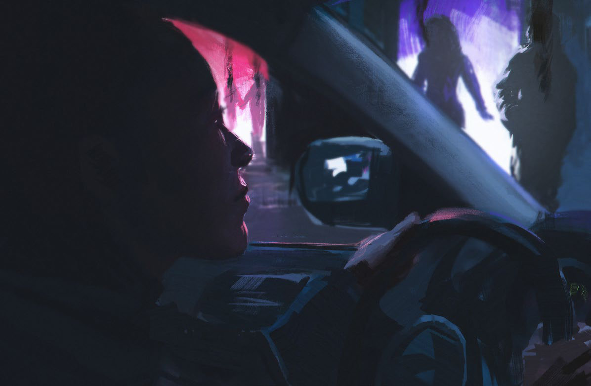

chapter two: Kindred Religions

at happiness. Investigators and 
Kindred who tend toward cynicism 
are also opposed to the view of this 
cult and tend to treat its members 
or those who spend too much time 
around them with suspicion.

leather, containing lists of dates, places 
and names. These indicate sightings of 
Apolleon by their brotherhood and list 
the names of targets of his predations 
for induction into the priesthood. 
Through their network, they also suggest 
promising members of their own cults 
who the methuselah may be interested 
in converting or who may be ripe for the 
embrace, being raised as Kindred in the 
emptiness of Shalim’s truth.

cults in Kindred society, even when 
they’re not trying to be so. It’s dif­
ficult to convince a vampire to give 
up all hope and material purpose, 
which is why the Shalimites usually 
target those already on the edge of 
losing everything, or vampires who 
have already experienced exile, a loss 
of Touchstones, or the death of their 
last remaining mortal family mem­
ber. The cult has experienced dra­
matic success in finding targets and 
converts in the domain of Fukuoka, 
which spells ill tidings for the other 
Kindred in the Japanese city.

Some Princes are aware of the 
cult’s presence but see them as little 
more than an esoteric distraction 
for the Kindred of their city. If the 
cult seems benign and gives no sign 
of their intention to annihilate the 
Prince’s domain, those who are aware 
are willing to tolerate their activi­
ties. The first defense of the cult is 
its secrecy, however, and they tend 
not to formally announce themselves 
and avoid associating outside of their 
joint activities in places where they 
know they can speak freely.

Mortal Servants

No creature is considered 
anathema to the cult if it truly seeks 
to supplicate itself before the Master 
of the Abyss. While many of their 
members are Kindred, there are a 
good number of mortals within each 
cell, often chosen for their positions 
in the local society or the access they 
can afford the cultists to materials or 
information they require to conduct 
their activities. The religious com­
munity are often among the most 
widely targeted by cult historians 
and archaeologists, particularly those 
with interest in Mesopotamian and 
ancient Greek culture.

A conservative domain with 
a rigid hierarchy, Fukuoka has a 
defined way of rewarding the elders, 
the Mawlas, and the powerbrokers, 
while keeping the fledglings and 
Anarchs under heel. Most move on 
to other domains when they realize 
raging against the machine in this 
city is fruitless, but some remain, 
because Fukuoka is what they know, 
because the underground Anarch 
scene embraces everything insane 
about Fukuoka’s nightlife and myriad 
of subcultures, and because it feels 
like abandoning Fukuoka is aban­
doning a city with a pulse.

Malkavians often feel nervous 
in the presence of Shalimites; they 
recognize madness when they see it, 
regardless of the veneer of civility it is 
hidden behind.

Artifacts and Symbology

The cult’s symbol is of a hollow 
person, often portrayed as a simple 
human figure with a hole cut out 
from the center. While this may seem 
a quite morbid symbol, evincing a 
great depression, the cultist would 
tell you that it is the hollow they re­
vere above all. Take away the human 
shape around it and the sadness of 
the symbol is gone. There is nothing 
depressing about emptiness unless 
you obsess yourself with the nev­
er-ending task of filling it.

The cult in Palermo, Sicily is 
determined to gain ownership of the 
site of Castel d’Ombro and reconse­
crate it as the first altar of Shalim. 
Through various organizations, both 
religious and criminal, they seek to 
achieve this aim. However, the cult 
fears crossover with the Hecata in 
this area as they share much of the 
cult’s knowledge of Oblivion.

This is where the Cult of Shalim 
come in. The Shalimites in Fukuoka 
appeared organically, with their first 
member — a clanless vampire named 
Ryoko — having been the victim of 
the domain punishment named “oy­
ogu” or “the swim,” where a vampire 
Embraced without permission has 
their hands, feet, and tongue removed 
and their body cast into the Chikugo 
River. The trial takes place before 
dawn and few vampires survive the 
ordeal. Ryoko herself disappeared 
for three months before returning 
with her body healed and her mind 
committed to the worship of void, 
which she only recently gave the 
name “Shalim.” Ryoko spoke with her 
fellow mistreated fledglings and told 
them of the wisdom she experienced 
in the dark waters, and while few 
listened, a couple tried to replicate

Shalimite 

Operations: 

Fukuoka

It is rare for cultists to identify 
themselves by such outward signs. 
Instead, they speak the phrase “Shin-
lamed-mem” to identify themselves 
to each other. This simple greeting 
is unusual enough for cultists to 
recognize it without being suspicious 
to outsiders, since it is the root of the 
traditional Hebrew greeting, “shalom,” 
and of their cult’s eternal master.

On one hand the Cult of Shalim 
is one of the least expansionist cults, 
rarely seeking converts with any pas­
sion. On the other, the Shalimites are 
among the most pernicious, corrosive

Cult priests carry with them 
small books, normally bound in black

8 9

CULTS OF THE BLOOD GODS

against the establishment. Many other fledglings just 
feel a worship of nothingness is cool, that destruction is 
enjoyable, and joining a group where wearing black is “in” 
and influence and wealth mean less than action is a more 
rewarding way to spend an unlife than playing gopher for 
their sires.

SHALIMITE CONVICTIONS
The Cult of Shalim practices a regular dance with 
self-destruction. Nihilistic cults are, as the word 
implies, prone to implosion. Such behavior leaves 
a mark on one’s soul, especially if a Shalimite is 
drawn to destroy others in an effort to prove the 
pointlessness of existence. The following Convic­
tions are common, if just to stave off the inevitability 
of Oblivion for long enough to spread their word:
• 	 Never allow yourself to celebrate life
Life’s purpose is to end, and you can help hasten it. 
What you must never, ever do, is make the mistake 
of seeking joy through life’s existence.
• 	 Never lose your temper with failure
Whether faced with your own failure or that of a 
new convert, anger is a wasteful emotion and fail­
ure is best addressed through passivity or correc­
tion.
• 	 Always work to impede those who 
would control chaos
You are not a Setite, so allow misrule to unravel nat­
urally or remove its obstructions without attempting 
to channel it.
• 	 Only allow Embraces that further the 
destruction of society
There is no gain to be had from Embracing someone 
as a reward or permitting others to do so. The Em­
brace is Oblivion channeled into an unliving vessel.
• 	 Do not succumb to the allure of pros­
perity
The less you own, the closer you are to nothingness. 
Absence is utter freedom and material objects tie 
you to life.
• 	 Never maintain or protect more than a 
single mortal of importance
While the need to cling on to the kine is recognized 
as an anchor in a tempestuous ocean, more than 
one is an extravagance.

Perspectives

Anarchs: They seem to want to exterminate us wherever 
they find us. They believe we serve powerful elders who seek to 
crush their freedoms. They are blind. We serve the absence of all 
things.

Camarilla: While it’s not ideal, this is just another way 
of getting our childer through the long nights. The Camarilla 
preaches blissful ignorance in all things, and one cannot find 
fault in that, if it redirects those with curiosity to our ranks.

Clan Lasombra: The clan from which we draw our greatest 
number and inspiration, yet many of them look upon us with 
horror, as if worshiping the tools we use is some kind of sin.

Clan Malkavian: I believe sensory deprivation is the key 
to soothing even the wildest of minds. Find a Malkavian and 
introduce them to our cause. They will eat it up.

Hecata: Interesting idea, narrow vision. I’m sure it’s 
comforting to them to think that everything is about flesh and 
spirit, but for us, it goes much deeper. The Hecata who worship 
what we worship are known as Nagaraja, but they are so few.

The Ministry: The snake may shed its skin and pretend 
to be something it is not, but we know. Their Church of Set is a 
half-measure. They exist only to satisfy their own desires.

“PORCELAIN” PATRICIA 

“PORCELAIN” PATRICIA 

MONTGOMERY
MONTGOMERY

Epitaph: Cultist or Apostate?

Quote: “I may be a little touched but I can’t be the 
only one who sees.”

Clan: Malkavian

Embraced: 2018 (Born 1996)

her experience. They likewise returned three months later, 
changed and possessed of a desire to erode the fabricated 
society that for so long has kept Kindred from wisdom.

MORTAL DAYS: THRILL SEEKER

Patricia was the youngest child of a wealthy family 
from Denver. Her parents made sure that Patricia and 
her brother, Morgan, fell in love with the great outdoors, 
regularly taking them out to their holiday home near the 
Rockies, where they would engage in pursuits from horse 
rides to rock climbing.

The Cult of Shalim appeals to the young vampires of 
Fukuoka in a few ways. For those with a genuine esoteric 
interest, the idea of finding wisdom buried in the city’s 
waterways holds appeal, as their elders never pass down 
such knowledge. The vampires of Anarch leaning see the 
water burial — which many have since attempted, with 
more casualties than returns — as a proof of commitment 
to the Movement, and the Cult of Shalim as the vanguard

As she grew older, with the trust fund afforded by 
the family business behind her, Patricia dedicated herself 
to the enjoyment of life. She eschewed further education 
and concentrated on scaling her own personal mountains,

9 0

chapter two: Kindred Religions

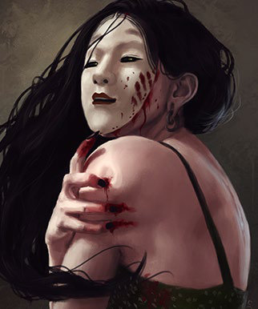

more than a rich girl who always had everything handed 
to her, who made more money selling products than the 
people that produced them.

Her descent into depression, as well as her torn 
state between the life she forged and what she saw as 
the responsibility of home, caught the attention of her 
sire. As she enjoyed an exclusive concert by the band 
Baby Chorus in an underground club in Chicago, she 
threw herself upon their suave bass player and became 
his childe.

KINDRED NIGHTS: EMPTY ETERNITY

Patricia had many problems to overcome as a Kin­
dred. Her sire, Raymond Falcon, disappeared almost as 
soon as he had Embraced her. Whenever he reappeared, he 
seemed different, like he didn’t remember her or the night 
they shared.

Her tutelage was left to the Primogen of Clan Malka­
vian, and he was only too happy to have a new plaything 
to break. He had her perform one final stunt for her 
followers to enjoy, hanging herself in a hotel room on live 
stream.

After Son recovered her from the morgue, he in­
troduced her to two things. First, the many comments 
mocking her death. “Another dead rich bitch” could have 
been the carving on her headstone.

real or metaphorical. She targeted being the first female 
to scale all the great peaks of the world and became 
something of an internet personality in her attempts to 
do so. This brought her attention and niche fame as a 
fitness guru and socialite, with energy drink and health 
supplement companies lining up to gain her endorsement 
on social media.

Second, Patricia’s face was far too famous to be seen 
roaming around the city. She’d have to travel incognito, 
and he had just the way to do it. A Porcelain Noh mask 
was surgically stapled to her head, etched with a beatific 
smile. Son stated that were she ever to take it off, she 
would be burned as a Masquerade breach.

While she traveled the world, met and slept with 
interesting and beautiful people, and performed stunts 
in exotic locales, her brother managed the family busi­
ness into the financial crisis. His risky investments had 
funded Patricia’s lifestyle and his parents’ retirements. 
When those investments came home to roost, Patricia’s 
fledgling career could have saved the company from 
bankruptcy. However, Morgan refused to ask for her 
help. By the time Patricia discovered the full extent of 
the problem, her brother faced several charges of insider 
trading and a string of angry creditors who wanted 
blood. He answered those charges with the blare of a 
pistol into his own mouth.

“Don’t worry.” he mused, “Now you always look 
happy, no matter what!”

The Kindred at court were no kinder than internet 
trolls when Patricia was introduced at Elysium. “Porcelain 
Pat” they called her. Patricia’s eyes swiveled around the 
room, her anguish stifled by the saintly smile of the mask. 
Everyone laughed, all but one.

The rabbi approached her, seeming genuinely inter­
ested in her and the losses she had suffered. Even in her 
depression, she found him sitting silently by her, a reassur­
ing presence. He whispered to her and spoke of salvation 
that she could find if she would let go of her pain.

Patricia returned to Denver to mourn her brother 
only to find her parents embittered at how she had seem­
ingly abandoned him, too ignorant to notice what was 
going on in the “real world.”

After a year of listening to his sermons, the rabbi 
felt she was ready. He offered her a place in the Cult of 
Shalim and an answer to her cries for deliverance from 
the suffering of her life.

After a major falling-out at the funeral, they never 
spoke again.

Patricia wanted to believe him, but the idea that 
everything she had seen meant nothing proved too 
much for her. She had dreamed of climbing all the 
great peaks. Maybe she couldn’t do that now, but 
could she accept that the mountains themselves were

Afterwards, Patricia threw herself into dangerous 
activities. She garnered ever more followers who saw her 
as an inspiration, while others called her a fraud, nothing

91

CULTS OF THE BLOOD GODS

• 	
Montgomery Trust Fund (Resources 2) Son had 
himself placed as the executor of her trust fund but 
continues to disburse it with mocking contempt, al­
ways reminding Patricia that she’s just “another dead 
rich bitch.”

abominations that should be expunged so humanity 
could finally know true peace?

She fled the synagogue and threw herself upon 
the mercy of anyone she could find. The Prince, her 
sire, her clanmates. As she ranted of the lowly rabbi’s 
great plan of destruction, it was clear to the court that 
she was truly mad. Son seemed amused by it, far too 
amused by her sudden isolation and pariah status to 
consider that she might be right.

KINDRED RELATIONSHIPS:

• 	
Evan Klein (Occasional Lucidity) In the guise of 
Raymond Falcon, Evan is Patricia’s sire. Though often 
absent, he’s likely to believe her tale -— for all the 
good his support would do her at court.

To this night, she continues her crusade to expose 
the cult for what it is. But even as she does so, she can’t 
escape the nagging doubt at the back of her mind that 
maybe Basaras was right.

• 	
Alphonse Gabriel Capone (Exploitative) Capone is 
in search of new allies and he has one eye on Patri­
cia’s former contacts as well as the remains of her 
family’s estate. It could be just the score he needs to 
get back on top.

PLOTS AND SCHEMES:

• 	
Expose the Cult: Patricia is horrified at the exist­
ence of the Cult of Shalim. Even though her mind is 
racked with doubt and depression, she attempts to 
convince anyone who will listen of their threat.

• 	
Rabbi Michalis Basaras (Erstwhile Mentor) 
Though she is attempting to expose the cult, Ba­
saras holds out hope that Patricia will return to the 
fold once her final ties to the world fall away. He 
aids in this by making sure she remains a laughing 
stock at court.

• 	
Recruitment Target: Although she is currently 
campaigning against the Cult, the mockery of her 
contemporaries, coupled with the complete absence 
of her sire, leaves her wondering if she shouldn’t step 
into the darkness herself.

WHISPERS:

• 	
Famous Face: Patricia is shackled by her fame. 
Though it causes her pain, both emotional and phys­
ical, she must continue to wear her mask at all times 
or face the Blood Hunt, feeding through its detach­
able lower quarter. Furthermore, she cannot travel 
freely and relies on the patronage of Nosferatu who 
pity her plight.

• 	
Remember Me: Patricia has been known to favor 
those who treat her with kindness, especially if they 
talk to her positively about her former life.

• 	
Followed by Day: Not content to plague her waking 
hours, someone is haunting the places where Patricia 
sleeps and following her wherever she goes.

DOMAIN AND HAVEN:

MASK AND MIEN:

• 	
Apartment, Lincoln Park (Haven 1) What little 
money she was able to secret out of her personal 
funds has gone into purchasing a modest apartment 
for her use. She has no other haven or domain, 
though she does not always sleep here if other Kin­
dred are willing to put her up for a day to avoid her 
predatory stalker.

• 	
Patricia is a short, but well-built woman with 
straight black hair and green eyes. Her features are 
usually obscured by the mask she wears, however 
many photographs of her exist and she was a very at­
tractive woman with a broad smile and pearly white 
teeth. She carries herself with a slouched and with­
drawn demeanor but the power within her frame is 
evident, even to the casual observer.

THRALLS AND TOOLS:

• 	
Aside from the mask, Patricia wears cotton summer 
dresses, often flecked with blood from reapplying the 
staples to her head each night. These are offset by the 
hiking boots she always wears, which were one of her 
trademarks during her life.

• 	
Cultists (Herd 2) Mortal members of the Cult of 
Shalim often approach Patricia as sympathetic ears 
and easy meals and whisper heretical thoughts into 
her broken mind.

• 	
Connected (Influence 3) Although she cannot act on 
her own these days, Patricia’s knowledge of who to 
talk to inside many of the social circles and advertis­
ing companies in the city is rivaled by few.

• 	
Patricia rarely ventures out in public, but on rare 
occasions when she does, she is mistaken for a street 
performer, occasionally handed a pocketful of change 
with comments on how genuinely scary she looks.

9 2

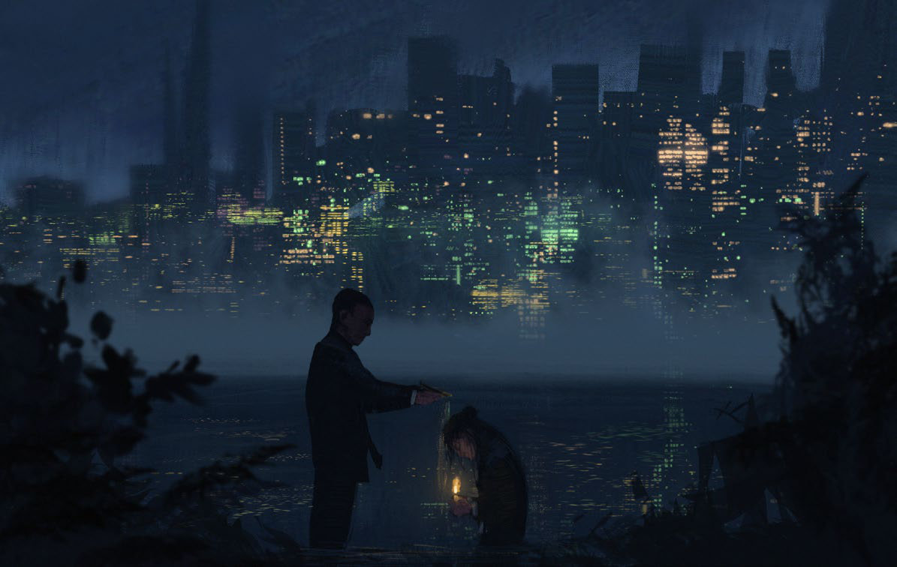

Ceremonies 

of Shalim

Sire: Evan Klein

Ambition: Find my own peace, one way or another

Convictions: Don’t forget where I came from

Touchstones: Frances Gault — fan, following in 
Patricia’s footsteps

Shalimites practice their own brand of Oblivion Cer­
emonies, and while vampires outside the cult can learn 
them with a suitable Mawla, it’s rare for a member of the 
cult to teach an outsider. The rules surrounding learning 
and practicing Oblivion Ceremonies are addressed on p. 
XX, but following are some example Ceremonies rare to 
anyone outside the cult.

Humanity: 7

Generation: 10th

Blood Potency: 1

Attributes: Strength 3, Dexterity 4, Stamina 4; Cha­
risma 3, Manipulation 2, Composure 2; Intelligence 
2, Wits 4, Resolve 3

Note: The Shalimite Ceremonies use Oblivion pow­
ers from Chicago by Night as their pre-requisites. If you 
do not own this book, the Storyteller is free to suggest 
another Oblivion power to act as a pre-requisite.

Secondary Attributes: Health 7, Willpower 5

Skills: Athletics (Rock Climbing) 4, Brawl 1, Drive 
2, Stealth 2, Survival (Wilderness) 3; Animal Ken 2, 
Etiquette 2, Insight 3, Leadership 2, Performance 3, 
Persuasion 2, Streetwise 1, Subterfuge 1; Academics 
1, Finance 1, Medicine (First Aid) 1, Science (Nutri­
tion) 2, Technology 2

Level 1

Disciplines: Auspex 2, Obfuscate 2

Traveler’s Call

General Difficulties: 5/3

This simple Ceremony is taught by the cult to all 
priests before their release into the wider world. Since all

9 3

CULTS OF THE BLOOD GODS

priests of Shalim are linked by their common bond with 
Apolleon the Traveler, they are able to use his presence in 
eternal Oblivion as a nexus between themselves and their 
followers.

lived to tell of it speak of an all-consuming darkness 
closing in around their thoughts and robbing them of all 
sensation. The last thing they recall is a distant, rumbling 
laughter echoing in their mind.

Pre-required Power: Oblivion’s Sight (see Chicago 
by Night)

System: The vampire’s player makes their Ceremony 
roll vs. the victim’s Resolve + Composure. On a win, the 
vampire may activate this Ceremony’s effects any time 
they are in the victim’s presence. Upon activation, the 
victim is paralyzed with despair for a number of turns 
equal to the margin. While under this effect, victims 
cannot see, hear or experience any form of sensory input 
except touch and physical pain, which brings them out of 
the effect. The victim can expend Willpower equal to the 
number of turns they would remain paralyzed to break 
free of the power.

Ingredients: The black book gifted to them following 
their indoctrination into the cult

Process: By using the Traveler’s Call with their black 
book in hand and the name of another Shalimite in mind, 
a priest can send a ripple out across Oblivion, calling the 
target to their location. Unlike a true summoning, this 
power does not place a compulsion upon the victim, but 
does alert the Shalimite being contacted to the vampire’s 
current location through a repetitive, flashing vision of the 
scenery surrounding the calling Kindred.

Level 5

System: The cultist must possess their black book 
and know the name of another Shalimite. The vampire’s 
player makes a Ceremony roll (Difficulty 3). The contact­
ed vampire can choose to ignore the call, but the flashing 
vision gives them −2 dice to all rolls involving concentra­
tion for the remainder of the scene, at which point the 
call disappears. A critical win by the vampire allows them 
to send a single-word message to their point of contact 
along with the vision.

Pit of Contemplation

Only the most powerful of Shalim’s priests have 
been able to manifest this ability, but the effect is 
one of the most terrifying and demonstrative uses of 
Oblivion yet seen in modern nights. The ability to cast 
an enemy into Oblivion terrifies even the toughest of 
Kindred.

Level 3

Pre-required Power: Tenebrous Avatar (see Chicago 
by Night)

Name of the Father

Ingredients: Pot of ink, three pints/six liters or more 
of blood from an innocent the user murdered, an unlit 
room (this power does not work outside)

Priests of Shalim have all been trained to use their 
voices as weapons, slicing through the sugar coating their 
victims wrap around their love for the world. By invoking 
the name of their dark master and calling for his aid, they 
channel a fraction of his power into an adversary and 
cloud their very mind with shadow, causing them to stand 
dumbstruck by the emptiness of Oblivion.

Process: The vampire personally murders an inno­
cent mortal, likely incurring Stains depending on the 
Chronicle Tenets and their Convictions. While inno­
cence is subjective, traditional sacrifices are children, 
virgins, and holy individuals. The vampire then takes at 
least three pints/six liters of the deceased’s blood into 
an unlit room and uses it to paint a doorway on a wall 
in the chamber. Finally, the vampire splashes a pot of 
ink onto the blood-painted portal. Focusing their will 
upon the gateway, the priest opens a tear through to 
Oblivion.

Pre-required Power: Shadow Perspective (see Chica­
go by Night)

Ingredients: The ability to speak ancient Greek, eye 
contact with a victim, five charcoal sticks

Process: The priest invokes an incantation in a 
dialect of ancient Greek, invoking the name of Shalim 
as they crush four charcoal sticks in hand. These words 
are spoken while making eye contact with the victim, 
therefore the victim must be able to see and hear the user 
for this power to be successful. Upon crushing the final 
charcoal stick, a shadow crosses the eyes of the priest and 
those of the victim, leaving the eyes of each participant 
entirely black as the victim succumbs to a crushing sense 
of despair. Those who have experienced this power and

Anyone foolish or unfortunate enough to fall into 
the gap is immediately transported into a pocket of 
eternal black nothingness for as long as the priest sees 
fit. If the priest is destroyed without releasing their 
prisoners, any undead prisoners remain trapped in the 
void (unless and until another vampire reverses the 
Ceremony).

Priests may choose to pass through the door, but 
doing so condemns them forever. Some Shalimites do this

9 4

chapter two: Kindred Religions

when they feel they have completed their work as a part 
of the cult.

When Mithra was said to have walked the Earth in 
corporeal form, as gods in ages past were wont to do, the 
Ventrue claim he was Embraced by an ancient vampire 
named Veddartha. Mithra remained active for centuries 
afterward, until the clash between his divine blood and 
the curse of Caine forced him in and out of torpor. Still, 
his followers remained loyal and Mithra’s teachings, 
passed down orally, may even have inspired tales of the 
Buddhist Maitreya. The cult learned to survive without 
their god’s direct presence, dutifully awaiting his return 
— a trait that served them well to the modern nights.

System: Following the Ceremony steps, the priest’s 
player makes their Ceremony roll, and on a success 
the effect is quick and implosive. A hole opens at the 
point where ink and blood mix. The hole draws objects, 
air, and people toward it and, if they fail a Dexterity + 
Athletics roll (Difficulty 4), sucks them into a pocket 
within Oblivion.

While trapped, victims are suspended in an endless 
blackness. They cannot see or hear anyone or anything 
around themselves. Only the priest who conjures this 
blasphemous gateway can free those held within, by pour­
ing a vampire’s vitae over the painted door (sufficient to 
provoke a Rouse Check). Mortals sucked into Oblivion 
are instantly killed.

Mithra became Mithras in Rome, and his religion 
took on the trappings of a mystery cult. His followers 
congregated in caves and underground cisterns, coaxed 
by Mithras’ lieutenants to ensure the god-turned-Cainite 
could visit them. Whenever the Mithraists gained 
sufficient funds, they erected a new temple rather than 
expand an existing one. His cult spread rapidly and far, 
operating in cells rather than as one collective, even 
reaching Britain at the furthest reaches of the Roman 
Empire. Building on Mithra’s purview as divine judge of 
truth, companionship, and trade, worship of Mithras was 
popular with soldiers, merchants, bureaucrats and custom 
officials, freedmen, and slaves. For a while, Mithraism 
rivaled the nascent religion of Christianity. In the end, 
however, the Church of Peter triumphed and Mithraism 
became a relic in mortal history.

The Mithraic Mysteries

“All hail our lord and savior, Mithras, who journeyed 
through the Underworld and now returns to us!”

— Rose Abawi, Toreador Pater of the Soho Mithraeum

The cult of Mithras lies in disarray. Forged in secrets 
and persecution, the cult long preferred erecting a new 
temple over expanding an existing one. Likewise, it found­
ed new cells instead of forming a singular sprawling cult. 
This worked well with Mithras at the helm, but his ru­
mored destruction at the claws of Lupines and subsequent 
disappearance left the disparate cult rudderless. Unscrupu­
lous Patres started giving their own orders, while the most 
loyal Patres — paralyzed with grief and a lack of guidance 
— saw their cells fall apart. Yet now these loyal few sense 
a stirring in their blood, a whisper on the air: prepare, for 
He returns. The cells communicate with each other, the 
network reforms, and the Mithraists stand to rank among 
the most active power players in Kindred society.

A London Renaissance

Though outdone on the mortal stage, Mithras 
remained powerful in Cainite politics. He moved to the 
domain of Londinium in 71 CE, where Roman soldiers 
did fierce battle with Britain’s people. By the time 
Rome accepted Christianity in 313 CE, Mithras was so 
entrenched in Britain he could safely bring his most 
dedicated followers to London, both as reward for their 
service and to continue his worship. With the London cell 
now the most important within the Mithraic Mysteries, 
they began work on the London Mithraeum. Britain’s 
rebellion against Rome spilled over into Cainite unrest 
though, leading the local Kindred to rebel against the 
foreign Mithras. Mithras emerged victorious, but again 
slipped into torpor. The cult continued without him — 
split into independent cells, certain in their faith, and 
awaiting his return as always.

From Persia to Rome

The Mithraic Mysteries is a cult of personality as 
much as a mystery cult. For Cainites, there is no sep­
arating the cult from the methuselah at its center. Yet 
what Kindred know of Mithras is scarce and conflicting. 
To his followers, he is the Indo-Iranian god Mithra first 
mentioned in a collection of Vedic Sanskrit hymns tran­
scribed around 1380 BCE, or depicted even earlier on the 
royal seal of King Saussatar of Mitanni around 1450 BCE. 
They know Mithra was a member of the solar pantheon, 
and his divine purview centered upon honesty, camarade­
rie, and bargains.

While the Mithraic Mysteries never regained the 
global power it had in the era of Persia and Rome, the 
cult spread throughout England, Wales, Scotland, and 
even to the coasts of France. When Mithras awoke again 
in 1066 CE, he found his cult diminished in numbers and 
power, but with all its trappings in place and waiting

9 5

CULTS OF THE BLOOD GODS

The London Blitz

for him. Mithras brazenly reopened 
the London Mithraeum, only to see 
it burned to the ground by Ventrue 
lords acting through the clergy. The 
cult retreated back into the shadows, 
playing to its strengths and attracting 
new followers among young nobles 
and soldiers. Meanwhile Mithras’ 
Cainite agents sowed discord among 
the local Ventrue. With the Ven­
true focused on each other, Mithras’ 
popularity spread from young kine 
to young Kindred, patiently waiting 
while his detractors turned against 
each other and replacing them with 
his loyalists. Come 1154 CE, Mithras 
openly claimed the Baronies of Ava­
lon, England’s most powerful domain, 
as his own.

spread and thrive. The cells remained 
separate and hidden though, each 
working toward their god’s greater 
purpose. One might worship Mithras 
as bull-slayer and soldier, while 
another celebrated him as god of bar­
gains and merchants. Each cell made 
its own rules in accordance with the 
Seven Steps to the Sun.

Mithras designed his cult to 
survive without him. The Mithraic 
Mysteries propagated into inde­
pendent and separate cells, remained 
hidden, and fostered relations with 
the middle and lower classes rather 
than the elite. This let Mithras pursue 
his myriad passions, yet always return 
to find at least one cell still serving as 
base of operations.

Mithras himself traveled the 
world, meeting with a variety of 
famous and infamous Kindred in pur­
suit of knowledge and power, with 
his cult remaining ever faithful. His 
followers survived Christian persecu­
tion, bouts of madness in their god 
during the Victorian era, and poten­
tial coups against their Prince — only 
to await his return, and resume their 
service every time.

The last six decades were 
different though. A Lupine pack 
drove Mithras into torpor during the 
London Blitz in World War II, after 
which a Banu Haqim neonate named 
Montgomery Coven stole and diabler­
ized his body. While no one knew of 
Mithras’ diablerie, his followers could

With Mithras as Prince of 
London, the cult continued to

Mithra and the Bull

The Persian deity Mithra accomplished many great deeds, but none greater than slaying 
the bull. He rode the creature until it was exhausted, then forced it into a cave and killed 
it. This myth is retold over and over on steles and shrines dedicated to Mithra, and the 
bull-slaying myth even carried over into Mithras’ Roman and British cults.

Yet these same myths name Sol Invictus, the Sun God, as Mithra’s patron. Does it 
not seem odd to accomplish such a great deed away from your patron’s gaze? Most Kindred 
dismiss the myth as allegory, or point out that Mithra as Cainite had to retreat into a cave. 
They’re not paying attention. Myths are allegories, yes, but they are also intentional. This 
one, specifically, names both the patron Sun and the cave. That’s not an error — Mithra 
performed his greatest kill away from his patron’s gaze.

And this, my dear neonate, is where I urge you to stop and think. Who would serve as 
patron to one as ancient as Mithras? Who would Mithras fear enough to hide his actions 
from? What does slaying a bull, a symbol of fertility and procreation, embody? Rumors 
have long named Mithras as Fourth Generation, yet not a direct childe of our clan founder. 
Perhaps both are true.

9 6

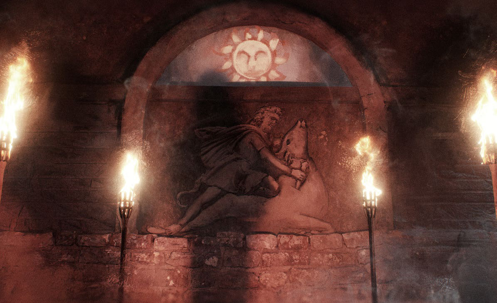

Mithraist Ambition

no longer sense his presence and rum­
ors of his final death swelled. Finally, 
Queen Anne came forward and quiet­
ly confirmed his death. Certainly, she 
would lie to advance her own cause, 
but she also remained loyal to Mithras 
— if motivated largely by opportun­
ism and fear — throughout long bouts 
of torpor, depression, and madness. 
Queen Anne breaking ranks now 
was a clear sign she believed Mithras 
either dead or never returning — and 
she would be in a position to know. 
Mithras’ acolytes desperately searched 
for their god’s guidance — his voice in 
their heads, his blood in their veins — 
and found nothing. For the first time 
since Mithras’ rise three thousand 
years ago, his followers’ faith wavered.

their Pater’s strength — and many of 
them fell. Mithras’ Cainite enemies, 
sensing blood in the water, came 
down on any cells that revealed them­
selves in their search for guidance. 
The cells that did remain were forced 
wholly underground, with no way 
to contact each other. The London 
Mysteries were disparate, weak, and 
defenseless with Mithras seemingly 
gone forever. The cult of Mithras 
stood poised to fall.

The Cult of Mithras follows a 
many-headed religion, but above all, 
they are a cult of law. At the cult’s 
height its rituals were formal, its 
structure rigid, its mysteries impen­
etrable to outsiders. Since Mithras’ 
destruction the cult broke up, and 
with it the religion lost much of its 
power. Mithraism is strongest when 
centralized around an unliving god 
with firm edicts. Since his apparent 
return, the cells returning to the fold 
have found great purpose in return­
ing to the old ways. They believe in a 
world where secrets are kept secret, 
where the truly powerful seize power 
and hold on to it until someone more 
potent can topple the leader, and 
where training should start young, 
so age and experience might convey 
wisdom.

Then, in recent nights, a niggling 
sensation. Not as powerful a presence 
in his followers’ minds and veins as 
before, but rather an echo of Mithras, 
a voice that was both his and not 
his. The cells that survived, and the 
Patres that still believed, painstaking­
ly pulled themselves back together. 
In London a new Mithraeum arose 
under guidance of Rose Abawi, a 
Toreador claiming to be the Voice of 
Mithras. Throughout the long nights 
without their god, several beliefs and 
practices yet remained.

Faces of 

the Bull God

Mithras is the model the cult 
strives to emulate. As a god, he is 
multi-faceted, symbolizing spheres

Without Mithras to guide the 
cult, separate cells survived or fell on

9 7

CULTS OF THE BLOOD GODS

Divine Mithras

LAW AND CHAOS
If there are two diametrically opposed cults in this book, one might suspect 
the Church of Caine and Bahari make for the most contentious, but it’s the 
Cult of Mithras and Church of Set most inclined to go to war. One could 
argue Mithras and Set are among the most “successful” of vampires, to 
have successfully masqueraded their identities behind the names of gods 
and cultivated religions in their wake. However, the two have never been 
comfortable sharing success, this world, or potential followers. The two 
faiths have two completely opposed views of the world, which in extreme 
terms amounts to Mithras wanting a vampire world governed with tight 
laws, with power funneling up to him, while Set wants a vampire world 
with no laws, and power raging unbridled. The Mithraists may be the best 
fit for the Camarilla, with the cult’s preference for hierarchy, Blood Bonds, 
and secrets, while the Setites veer toward the Anarchs with their love of 
unrestricted knowledge and influence.
Of course, neither vampire is open to speaking their views, which leads 
to this law vs. chaos divide being one perpetuated among their follow­
ers. It’s not known if Mithras and Set ever encountered each other or 
discussed their opposing philosophies, but there’s enough vehemence 
between their followers to make any city with a temple of Mithras and 
a temple of Set within its borders liable to assassination attempts, bomb­
ings, and other assorted strife.

The Mysteries teach that Mithras 
is a god, Embraced by Veddartha 
when he walked the world in corpo­
real form. While in the past the cult 
linked Mithras to the eponymous Ro­
man God, advancing historical insight 
links Mithras to the Persian Mithra. 
Devout followers accept this without 
hesitation — Mithras and Mithra are 
one, even if the details of his worship 
changed from one ancient empire to 
the other. The cells silence any infidels 
who believe Mithras an ancient 
Persian impostor at best, or a much 
younger poser who handily connect­
ed the dots between the Persian and 
Roman deities in an effort to appear 
older than he is.

Mithras is a god of war, feasts, 
and fertility, and these attributes 
reflect in ceremonies dedicated to 
him. His followers engage in war on 
Mithras’ enemies, the feasts hosted in 
his name are extravagant and lavish, 
and loyal followers are permitted to 
Embrace — the only act of fertility 
available to Kindred — as a reward 
for their service. These acts further 
the cult’s secular goals, but above all 
they channel the divine. Proper wor­
ship prepares a Kindred’s body, and 
the blackened remnants of their soul, 
to receive the true secret of Mithras 
— for he was once a companion of 
Sol Invictus, and still keeps the Sun’s 
secrets.

from conflict to fertility, and justice 
to business. This appeals to the cult’s 
varied followers, as while the Ventrue 
adherent might find attraction to the 
cult’s wealth, a Brujah might find ap­
peal in its dedication to war. Through 
this range of influence, Mithras 
belongs to his followers, but they all 
belong to him in turn.

in enlightenment by way of control. 
Mithraists reinforce each other’s 
Convictions, Touchstones, and there­
fore Humanity, not due to ethical 
concerns, but because doing so makes 
the cult stronger and brings a vampire 
closer to mastering their urges.

When not pursuing their vein 
of enlightenment, the Mithraists 
run a successful protection racket in 
multiple domains, utilizing their tight 
structure to extort and bodyguard 
those who pay into the temple. The 
temple itself acts both as a clubhouse 
— often along the lines of an exclusive 
gentlemen’s club with old fashions 
and practices, such as telling stories, 
singing as a pianist or harpist plays, 
or even playing war games — as well 
as a site for cult rituals, inductions, 
and burial of torpid peers. The few 
Tremere who gain admittance to the 
cult (Mithras always despised the 
clan) draw parallels between their 
practices and those of Hermetics, 
Freemasons, and Rosicrucians, while 
the Mithraists boldly declare that 
if anyone set the mold the others 
followed, it was them.

Once a follower digs deeply into 
the Mithraic Mysteries, concepts such 
as diablerie become less and less of 
a taboo. As Mithras gave himself up 
to his diablerist in the 20th century 
— at least, that’s how the Mithraists 
describe it going down — some of 
the cult’s elders may give themselves 
over to promising up-and-comers. 
They may even try to create gestalt 
personalities, giving themselves up to 
create something close to divine. This 
horrifying ritual rarely works, but 
such self-sacrifice is a point of great 
pride to Mithras’ cultists.

Patres tell stories of Mithras 
acting during the day without any 
of the usual sluggishness, and even 
walking in sunlight. While these gifts 
are Mithras’ by divine right, he lost 
them at the hands of Veddartha and 
spent long centuries regaining them. 
They say Mithras achieved Golconda, 
a state which allows him to reclaim 
his place at Sol Invictus’ hand, and 
this is the final secret he will teach his 
acolytes. If so far none have actually 
attained this, it is surely a failing on 
their part — they were born mere

Unlike the Setites, who believe 
in unshackling oneself from mortal 
fetters, and the Bahari, who believe in 
exalting in vampiric power to serve 
their goddess, the Mithraists believe

9 8

chapter two: Kindred Religions

Bull Running

mortals — rather than a refutation of 
the Patres’ claims.

Corax — the lowest ranking mem­
bers — to assume the risk of actually 
inviting them. Acolytes are taught a 
variety of secret codes, depending as 
always on the individual cell. Rich 
merchants might identify themselves 
by wearing a specific lapel flower, or 
a secret handshake. An anarchistic 
cell sends out instructions through 
the deep web or street graffiti. The 
Mysteries use some symbols near uni­
versally, such as the sun or bull, but 
only Mithras knew every code.

Religious texts dating back to 
ancient Persia further claim Mithra 
will save the world. While the Mys­
teries largely ignored this in favor of 
focusing on Mithras’ fortitude and 
prowess, the story received traction 
in the midst of the Beckoning and the 
Second Inquisition. Neonates believe 
Mithras is a messiah who can save 
them from new calamities. Duskborn 
note their own resistance to sunlight, 
and believe Mithras can teach them 
to fully harness this power — though 
they don’t know if this would make 
them a vampire god like Mithras him­
self, or let them return to a mortal 
state. The rumors of Mithras as savior 
even find purchase with ancillae who 
find themselves out of their depth 
with the upper echelons of vampires 
depleted. Had the cult better leader­
ship, it could easily grow to rival any 
methuselah cult or even the Church 
of Caine.

Initiates wear down their enemies 
in a ritual called bull running, which 
can conclude in a single night or take 
years to complete. Sometimes, if aco­
lytes seek appeasement in a symbolic 
ritual, this enemy is an actual bull. 
More often though, the Pater names 
a mortal, ghoul, or Kindred as the 
bull. Mithras himself chose the targets 
when he was active, but now faithful 
Patres make their own judgment as 
to which enemy of the cult must be 
removed, while disloyal Patres send 
acolytes after their personal enemies.

The London 

Uncertainty

While the Pater chooses the 
target, the initiates themselves decide 
if an enemy must be killed, or can be 
defeated through other means such as 
social disgrace or financial ruin. Bull 
running is a favorite practice among 
Soho’s mortal acolytes, who delight 
in bringing down the powers that be. 
Rose isn’t fully focused in selecting 
targets, and often strays from bull 
running that serves Mithras in favor 
of protecting her community. So far, 
Mithras has allowed this in the name 
of good practice, but he intends to 
correct her upon his return.

Even as Mithras’ fate languishes 
in uncertainty, with rumors claim­
ing his soul was diablerized, his old 
vassals conspire to resurrect their 
god. Their work is shrouded in mys­
tery, gears moving within gears, but 
one key component may be missing: 
faithfulness.

An Underground 
Religion

Gwenllian Arwyn long served 
as Pater in London’s largest Mithra­
ic cell, after the former leader — 
Roger de Camden — was believed 
destroyed. Her loyalty now turns 
from the ancient. Once an enemy of 
Rome, Arwyn was brought to heel by 
Mithras, and in his disappearance she 
sees a renewed chance for freedom 
and independence. If she takes the 
leap and betrays Mithras, the largest 
of the old cells finally falls. Arwyn 
might even scuttle the resurrec­
tion plot completely. The ancient 
has contingencies in place for that 
eventuality though, and he’s already 
grooming a new Pater from Soho to 
replace her.

The Mithraic Mysteries suffered 
persecution at the hands of Chris­
tianity, both as genuine religious 
warfare and as a way for Mithras’ 
enemies to undermine him. The cells 
learned to hide early on, and do so 
well. Mithraea are underground, 
physically hidden from public sight. 
Ironically the oldest and most 
prominent Mithraeum in London 
has since been discovered by mortals 
and turned into a museum, but many 
more remain hidden. Their access 
points lie in elite clubs founded by 
merchants, illegal fighting clubs, 
occult shops, and even pubs.

Fertility Feasts

The traditional fertility feasts 
seemed poised for obsoletion, as few 
modern mortals are willing to conceive 
a child as part of a cult initiation. The 
feasts made a comeback as mortals 
became increasingly sexually liber­
ated though, and “fertility feast” was 
reinterpreted as “sex acts.” Some cells 
see a couple performing an act pre­
dictably named “mounting the bull.” 
Other cells engage in grand orgies 
where participants of all genders are 
welcome. Likewise, one cell might sate 
the room with a thick opium smoke, 
while another forbids drugs entirely as 
it believes all sensations are to be expe­
rienced without barriers. The purpose 
of all feasts, however, is to channel the 
divine fertility of Mithras.

Celebrating 

the Bull God

The cult is not just physically 
hidden though. Recruitment and ini­
tiation are similarly obfuscated, with 
a cell’s Pater and Heliodromi select­
ing new recruits and then sending the

Each cell has its own approach 
to worship, but some aspects are near 
universal.

9 9

CULTS OF THE BLOOD GODS

practice with his disappearance. The Soho cell, however, 
plans to hunt down one of Mithras’ Kindred enemies as 
their sacrifice.

ASCENSION THROUGH LOYALTY, DUTY, 
AND SERVITUDE
Compared to the Church of Set’s doctrine of ele­
vation via freedom, the Mithraist view of obeying 
one’s elders, taking the Blood Bond to grow closer 
to Mithras, and sacrificing oneself to form a gestalt 
divine entity seems murderous, arcane, and a hell 
of a lot less glamorous. Despite this, many vampires 
are drawn to structure, codified goals and meas­
urements of success, and the number of stories told 
by Patres of vampires reaching glorious levels of 
power through loyal servitude is addicting. Unlike 
the Setites, who abandon or conceal their failures, 
the Mithraists hate the stain of failure to the degree 
they’ll do whatever they can to rub it out and make 
it clean, including attaching a Mawla to a failed 
initiate until they make it. Giving up is not an option 
in the Cult of Mithras.
The cult’s loyalty, especially within respective cult 
cells, is almost fanatical. Mithraists have a genu­
ine solidarity through shared rituals, secrets, and 
faith in Mithras as a figure to aspire to emulate. 
The Blood Bond also helps enforce this feeling, of 
course.

The Blooding

The Blooding sees select Kindred bathed in the blood 
of their Pater and Mithras, denoting them as elite soldiers 
in Mithras’ army. Back in the old nights, Patres carefully 
guarded a chalice of Mithras’ vitae for this ritual. Now, 
however, most chalices are long empty or the Pater is too 
terrified of Mithras’ enemies to remove the holy vessel 
from its hiding place. Until Mithras’ return, this ritual 
remains in disuse.

Seven Steps to the Sun

All Mithraic Mysteries follow the Seven Steps to the 
Sun, which sees the initiate rise closer to Mithras and by 
extension his solar patron. Most cells welcome mortals 
into the lower steps, then force them into becoming 
ghouls, or Embrace them as they prove their worth. On 
the flipside of this belief that vitae is a reward for worthy 
mortals, all Kindred initiates automatically started as 
Miles in the olden nights. The modern era saw a rush of 
Kindred joining the cult for secular reasons though, most 
seeking to be close to Mithras as Prince of London, rather 
than out of sincere religious belief. To combat this, many 
modern cells “ease” a Kindred into the cult by starting 
them as Corax. The Soho cell specifically did this with its 
Duskborn, not as a mark against them but rather to hail 
their potential as a rare Kindred who could walk all seven 
steps. Hyde, and Rose’s lover and ghoul Noelle, both act 
as Soho’s Heliodromi, while Rose serves as the cell’s Pater.

If a Kindred acolyte is granted the right to Embrace, 
they do so during a fertility feast. Kindred fertility feasts 
rarely host any vampire-on-vampire sex, as the chances of 
someone biting and becoming Blood Bound to another 
acolyte instead of Mithras are too great. Instead the Kin­
dred joins the mortals’ fertility feast, in whichever form 
it takes, and quietly steals their intended childe away for 
the Embrace during the feast’s climax.

The Blood Equinox

Kindred initiates take an oath not to Embrace, lest 
they dilute their devotion to Mithras, or spend their time 
teaching when they should be learning. The cult does 
not begrudge them existing childer, and encourages the 
initiate sire to recruit these too.

Mithraists fast in late Spring, then hold a grand 
feast on the summer solstice. While for mortals this 
might mean no alcohol, cigarettes, or other drugs, for 
Kindred it entails a literal fasting — feeding just enough 
to keep the Beast at bay. The purpose of the summer 
feast, for Kindred, is to inspire a divine frenzy which 
channels the warrior spirit of Mithras. Frenzying during 
the fasting period indicates a lack of self-control, while 
not frenzying during the Summer feast means the aco­
lyte didn’t push themself far enough in spring — both 
disgrace the acolyte and, in higher ranks, might lead to 
a demotion.

The First Step: Corax, the Raven

The raven serves as messenger in the Roman legend 
of Mithras. The Corax initiate is both the recipient of a 
message — the invitation to join the cult — and bearer of 
a message when they’re sent to invite someone else.

The Raven associates with the element of air, as does 
the Pater to bring the Seven Steps full circle. Air is the 
element of mental clarity, and of cutting bonds as the in­
itiate foregoes old baggage upon entering the cult. This is 
both liberating, as a Corax might finally flee their abusive 
family, and, as cults are wont to do, isolating.

The meal during the feast can be anything from an 
animal — bulls are popular for obvious reasons — to 
mortals or even other vampires. Only Mithras may assign 
the right to Amaranth however, so the latter fell out of

10 0

chapter two: Kindred Religions

A Kindred joining the cult in any rank must bow 
to the divinity of Mithras’ blood. In practical terms this 
means obeying Mithras, descendants of his bloodline, and 
the Patres who carry his vitae.

Pater. Leones serve largely the same task as Milites — to 
combat Mithras’ enemies — but are sent after larger and 
more dangerous targets. They also serve as messengers to 
Mithras’ Kindred allies, often traveling from London to 
other domains with all the dangers this entails.

The Corax wears a raven mask during ceremonies.

A Kindred reaching Leo initiation must pray to the 
sun nightly, though they may choose whether to pray 
at sunrise or sunset. They must also recognize fire as 
purity. These initiates build resolve by fire leaping and, 
in extreme cases, branding rituals. Their self-control 
and mental acumen becomes just as important as their 
physical prowess, and a Leo’s calm and clarity gives them 
a trustworthy air.

The Second Step: Nymphus, the Bride

The bride(groom) has proven their worth and 
enters a spiritual bond with Mithras in a binding cere­
mony. The Pater leads this ceremony, and a relic takes 
the place of the absent Mithras. The Nymphus’ task is 
to learn all they can about Mithras’ enemies, and they 
often serve as spies.

The Leo wears a lion mask during ceremonies to 
show their strength and ferocity.

The Nymphus’ element is water, symbolizing a com­
ing together as the initiate becomes a drop in Mithras’ 
ocean. Nymphi pledge their voices to Mithras by singing 
or rapping during their initiation, and swear to tell no 
secrets of the cult.

The Fifth Step: Perses, the Persian

The Perses serves Mithras in his aspect as fertility 
god. They are the keepers of Mithras’ fruits, often repre­
sented symbolically by honey, bull semen, or the treated 
vitae of cult elders. Mortal initiates are tasked with grow­
ing Mithras’ influence in the city, whether that means 
starting a new cell, financing a movie hailing the deeds of 
Mithra, or doctoring a new drug that uses Mithras’ vitae 
to Blood Bond mortals en masse.

The Nymphus wears a veil, which covers both their 
head and body, during ceremonies.

The Third Step: Miles, the Soldier

Mithras is a war god, and his chosen are soldiers. 
Where once the methuselah scorned anyone who did not 
partake in actual physical combat, passing centuries have 
led the broken cult to reconsider — there is value in fight­
ing investment bankers, politicians, and socialites who 
get in Mithras’ way. With Mithras seemingly returned, 
however, even Kindred armed with briefcases may be 
expected to pick up the sword or javelin.

The Persae see a division between Kindred initiates. 
Some are chosen for the Blooding ritual, which marks 
them as elite soldiers for Mithras. These are given an item 
ostensibly belonging to Mithras to keep. The item is usu­
ally symbolic and false, but Persae who prove themselves 
dedicated and resourceful find their fake relic replaced by 
one of actual value.

Once a Kindred achieves initiation as Miles, they 
must preserve their purity by making every kill a tribute 
to Mithras — this absolves them of the moral implica­
tions of the kill, and bestows Mithras’ blessing on them. 
However, they must not kill if the target would make an 
unworthy sacrifice.

Kindred not chosen for the Blooding are finally grant­
ed permission to Embrace, so long as they immediately 
bring their new childe into the cult. No one but Mithras, 
and any Patres he wishes to tell, knows what criteria de­
termine the difference between the two classes of Persae.

When Mithras still ruled London, Persae killed by 
his command. The cult provided them with anything they 
needed to leave the murder site unscathed, from alibis to 
secret identities. If that failed, Mithras would still par­
don them — though he preferred to maintain plausible 
deniability.

For mortal initiates this stage is represented by the 
element of fire, and they are branded with the mark of 
Mithras. While this used to be an actual fire brand, mod­
ern cells opt for a tattoo bearing Mithras’ symbol. For 
Kindred, however, earth represents the soldier’s element 
and they are reburied before emerging as a Miles.

The Perses carries a sickle during ceremonies to 
signal their task of growing Mithras’ crops.

The Miles wears a wreath, which represents both 
Mithras’ blessing and dominion over them.

The Sixth Step: Heliodromus, 

the Courier of the Sun

The Fourth Step: Leo, The Lion

The Leo represents purity. They must never act out of 
individual interest and, in recognition of how confusing 
the world can be, have most of their actions dictated by a

The Heliodromus relays Mithras’ commands — of­
ten as given by the Pater — to the rest of the cult. They

101

CULTS OF THE BLOOD GODS

suggest new initiates, determine who 
is worthy to rise in the Seven Steps, 
and help the Pater select enemies for 
bull running. As the Patres are all 
Kindred, the few mortal — though 
usually ghouled — Heliodromi also 
serve as the daytime face of a cell.

Mithras. All Patres are Cainite, and 
worthy mortal Heliodromi are Em­
braced upon their elevation to Pater. 
The Pater seeks out Mithras’ enemies, 
mortal and Kindred alike, and sets 
the rest of the cult upon them. They 
also choose areas ripe for the Myster­
ies to expand, whether kine slowly 
return to ancient pagan religions, or 
the Beckoning leaves Kindred search­
ing for spiritual guidance.

standing Prince does not abide by 
Mithraic worship.

The Pater bears a ring and a staff 
to represent their authority over the 
cell and fealty to Mithras.

Mithraeum: 

Edinburgh

The Heliodromus is also respon­
sible for preparing the summer feast, 
whether they’re a mortal bringing 
fruits and the occasional sacrificial 
bull, or a Kindred bringing mor­
tals and the occasional sacrificial 
Kindred. All Heliodromi, Kindred 
and mortal alike, are Blood Bonded 
to Mithras, and what little of the me­
thuselah’s vitae the Pater still has goes 
to bonding new Heliodromi.

An old faith in an old city, the 
Cult of Mithras is nevertheless new 
to the domain of Edinburgh. Long 
under the control of Brujah and 
Toreador interests, nominally inde­
pendent from the reach of Mithras’ 
London even when he was declared 
Prince of the British Isles, Edinburgh 
has finally fallen to the Mithraists 
following the cult’s core migrating 
north from London. Shortly before 
the Second Inquisitions systematic 
assault on London’s Kindred, Mithras 
found a way to communicate with 
his Seneschal and cult Pater, Roger 
de Camden, and commanded him 
to take the cult’s elite with him to

They also guard the vitae of 
Mithras, given to them in a vessel to 
use in Blooding rituals. With Mithras 
absent so long now, unscrupulous 
Patres filled the vessel with their own 
vitae to Blood Bond acolytes. Mean­
while loyal Patres fiercely guard the 
last droplets they have. Many Patres 
willingly met the sun when they 
could no longer feel Mithras’ presence 
following his diablerie.

The Heliodromus carries a whip 
during ceremonies, as they are an 
extension of Mithras’ commands.

The Seventh Step: 

Pater, the Father/Mother

Some Patres take charge of 
entire nations, while others claim 
only cities. Some lead cults directly, 
and others stand alone following the 
religion’s fractures. Mithras expects 
Patres to become Princes if the

The Pater (occasionally Patre) 
oversees a Mystery cell as deputy of

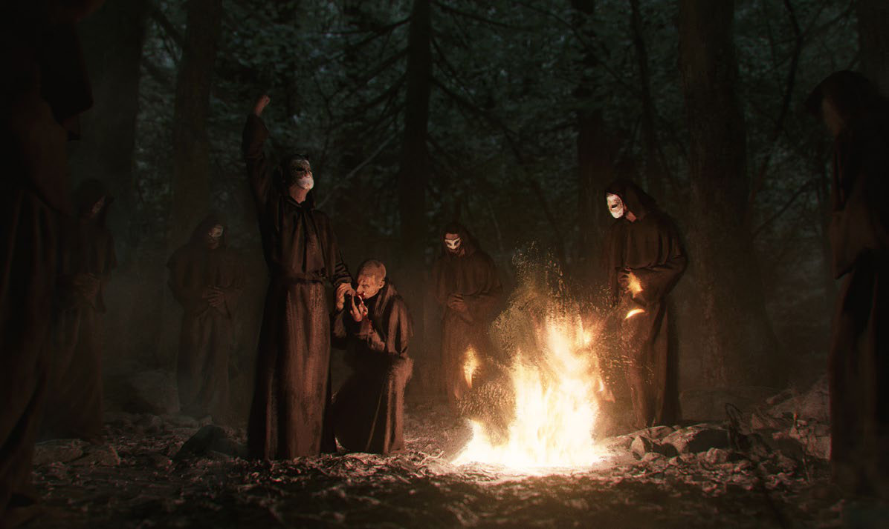

chapter two: Kindred Religions

Edinburgh and set up a new regime in 
the Scottish capital. Never one to re­
fuse his god, de Camden did just that. 
Kindred the world over are hearing 
the tale of how London’s Kindred fell 
to the Second Inquisition, but none 
are speaking about how Edinburgh’s 
Kindred fell to the Mithraists.

CULT OF MITHRAS CONVICTIONS
The Cult of Mithras’ adherents firmly believe in the benefit of order and 
aspire to control. Mithras is one of the grandest examples of a vampire 
who was able to straddle the line between god, vampire, and emperor, 
and with his dominion over Britain for a millennium, he exercised influ­
ence on a scale rarely paralleled within Cainite society. Many Mithra­
ists, in emulation of their god, attempt to uphold the same Convictions as 
Mithras:
• 	 Always have a say in the governing of your domain
The Mithraists may operate openly or in secret within Kindred society, but 
they are compelled to influence the domain government in some mean­
ingful way.
• 	 Never abandon your allies
Brotherhood and sisterhood within the cult is important. You are never 
alone when you are a member of the cult.
• 	 Accept no disparagement of Mithras’ name
Mithras is your god, and through his will you fall under his protection and 
prosper from his benevolence. If you hear of anyone insulting Mithras, 
you must draw their blood.
• 	 Always put the weak in their place
Weakness does not deserve a place in Mithras’ church. If you find a 
cultist to be weak, beat them, hector them, and ridicule them until they 
improve. If you find a weakling outside the cult, make sure they’re aware 
of their lowly state so they might better themselves. 
• 	 Protect the pregnant / newborns / fresh Embraces
Mithras is a fertility god, and his cult advocates the protection of the 
young and pregnant. This is not through altruism; Mithraists should protect 
and cultivate the herd.
• 	 Immediately punish chaos and misrule among your 
servants
The cult can only function if the hierarchy remains in place. Accept no 
rebellion among your servants. Punish it severely.

The invasion of Edinburgh was 
swift and bloody. De Camden and 
his cohort didn’t take the time to 
negotiate their presence or opt to 
exist in exile. The cult had long kept 
Edinburgh — and a couple of other 
potential domains — as possible 
cities for retreat. They observed 
every Edinburgh vampire, keeping 
mental notes on practices, habits, 
and havens, so when it came time to 
take the city they could do so with 
minimal resistance. While some of 
Edinburgh’s Kindred survived the on­
slaught, no vampires of title escaped 
with their unlives.

Edinburgh is a display of what 
the Cult of Mithras can do when 
challenged. The cult is an army wait­
ing for orders, and whenever they 
receive them, they strike with little 
reservation. Now, the Cult shows 
what a traditional Mithraic domain 
is all about: competence, reverence, 
war, and fertility. Under de Camden’s 
command, the Mithraists Embrace 
fledglings into their ranks, showing 
them that true power lies in the 
hands of vampires willing to fight for 
their existences. De Camden declared 
the city Camarilla — though the 
Justicars suspect this was to prevent 
the sect’s reprisals — and himself 
Prince, as there was no obvious re­
placement for the fallen one. The city 
has swiftly changed from one where 
old vampires pursue petty aspirations 
toward wealth and influence, into 
one where Mithras’ might deserves 
regular worship and sacrifice, so you 
too might benefit from his hierar­
chy and spread your reach to other 
domains. In many ways, it’s shaping 
up to be the perfect Camarilla city, as 
the fingers of vampires who callously

manipulated mortal interests were 
severed and replaced with the grip of 
those trained, practiced, and capable 
of doing so with the same discretion 
Mithras used for a millennium across 
an entire country.

and drainage, want to show other 
Kindred how service to Mithras can 
enrich existence through duty and 
purpose. They want others to see 
how being warriors in a surviving, 
millennia-old army is glorious. The 
Mithraeum de Camden’s cult have 
constructed beneath Greyfriars Kirk 
— a church in the city center — is 
open to all who would partake of the 
cult’s vitae in search of enlighten­
ment, with the promise than as the 
cult rejuvenates and spreads, these 
new converts will find positions of 
power in other domains.

For now, the Cult cements 
its rule over Edinburgh. De Cam­
den isn’t interested in murdering 
every non-Mithraic vampire in the 
city, as every court needs peasants, 
yeomen, and traders. He and the 
rest of the former London core, 
numbering around a dozen vampires 
with firm influence over different 
mortal sectors, including police, 
telecommunications, and city transit

10 3

CULTS OF THE BLOOD GODS

Perspectives

has its Difficulty increased by two, or suffers a four-dice 
penalty in contests. The Difficulty cannot rise above 7.

Duration: Passive

Queen Anne Bowesley: Usurper. Cannibal. Coward. 
She got what she deserved. The Unconquered Sun’s throne must 
remain empty until his return.

Level 4

Hecata: In one hand I hold a coin, in the other a blade 
that stabs into my flesh. The Hecata have served this cult so 
loyally in times past, but just as soon bite the hand that feeds 
them. I know we will not admit any Kindred with the name 
“Giovanni” in these nights.

Ancestral Dominion

Amalgam: Blood Sorcery 3
Vampires of great age and potency find it possible 
to exert their will via the Blood, without the traditional 
need for eye contact and verbal communication with 
their target. This power enables a Kindred to compel a 
descendant to take an action on their behalf, even if it’s 
one the target would normally be opposed to. Vampires 
instinctively know an ancestor is manipulating them, 
when subject to this power.

Clan Tremere: Mithras has long hated the Tremere, 
almost as much as he despised the Church of Set. We believe 
they are intent on destroying our cult once and for all, to rid 
themselves of a potential enemy. Maybe what we need to unify 
us is a good, active enemy.

Clan Ventrue: Are they truly the Clan of Kings? 
Certainly, they seem to spawn more leaders than any other 
clan. And yet, these modern nights have seen them fall into 
a horrible trend of white-collar rulership. Long gone are the 
nights where a Ventrue deserved the title of “god,” excepting 
Mithras, of course.

Cost: One Rouse Check
Dice Pools: Manipulation + Dominate vs. Intelligence 
+ Resolve

The Church of Set: Our greatest enemies. Fire to our 
water, chaos to our order. Do not suffer a temple to this god to 
exist in a city where you hold dominion.

System: On a successful roll of Manipulation + Dom­
inate, the victim acts to fulfill the dominating vampire’s 
request, providing it doesn’t entail harming themself. 
For every generation beyond the first one separating the 
user of this power from their target, the resisting vampire 
gains an additional die to their roll. For example, when a 
Fifth Generation vampire attempts to use this power on a 
Seventh Generation descendant, the Seventh Generation 
descendant gains one die in defense. An Eighth Gener­
ation descendant would gain two dice. If the number of 
dice in the resisting vampire’s pool would exceed ten, the 
power automatically fails. On a total failure, the vampire 
cannot use this power on that target for the remainder of 
the chapter.

New Powers

The Mithraists possess some unusual powers connect­
ed to their fallen god-emperor, in some cases passed down 
through Mithras’ vitae, in others taught by vampires of 
higher rank within the cult.

Dominate

Duration: Whichever comes sooner: until the com­
pelled action is taken or the scene ends.

Level 2

Fortitude

Slavish Devotion

Level 4

Amalgam: Presence 1
Those already under the mental dominion of the 
vampire find their minds strengthened against interfer­
ence from other Kindred.

Shatter

Cost: No additional cost
System: Any attempt to mentally coerce a character 
already under the influence of the vampire’s Dominate

Requirement: Toughness
When a fist hits concrete, it’s usually the fist that 
breaks. So it is with this power, where a vampire turns a

10 4

chapter two: Kindred Religions

blow against the one delivering it. This power has been 
known to break weapons and shatter bones.

The Children of the Angel are certainly one of the 
most open and popular of the Kindred religions, and it 
is easy to see the attraction. However, the draw goes far 
deeper for some and the rewards can be far more life 
changing.

Cost: One Rouse Check
Dice Pools: Stamina + Fortitude vs. Stamina (+ For­
titude, if the attacker is attacking unarmed and possesses 
Fortitude)

The Nephilim don’t just offer perfection; those who 
have served the cult the longest embody it without excep­
tion. Kindred whisper of cultists whose appearances alter 
as they make more and more trips to their local temple. 
Their skin becomes clear, soft and radiant. The color of 
their eyes sharpens and brightens. Their hair becomes 
shiny and lustrous. Moreover, they become confident and 
self-assured within the love of the cult and its revelers. 
Abandoning worldly pursuits, they turn to more aesthet­
ic, artistic, and spiritual endeavors, often turning over 
their businesses and properties to the use of the society 
and to fund the spectacular parties their new siblings host 
to celebrate their great becoming.

System: Anyone who makes a successful Brawl attack 
against the user suffers the damage which Toughness 
subtracts (see Vampire: The Masquerade p. 258) as Super­
ficial Health damage. Melee weapons also suffer reflect­
ed damage, and break once they endure their damage 
modifier’s worth (unless it is holy, magical, or otherwise 
unbreakable). This power may only be used while Tough­
ness is active, and can be used in response to an attack so 
long as the vampire has yet to use a Discipline during the 
current turn.

Duration: One scene (or until hit)

The Nephilim, 

Children of the Angel

A large, hedonistic, sex-crazed cult full of beautiful 
people requires very little selling to most. However, when 
one gets past the sheen of glory, the practices of the Ne­
philim are found to be far from altruistic.

The Unending Dream

“Our world was once perfected and it can be again. 
Cast aside your petty concerns, sleep and dream the dream of 
Michael the Archangel, become one with the perfect beauty of 
his great vision.”

The Nephilim originated in Constantinople as a 
hedonistic society of Toreador directly descended from 
Michael, the self-proclaimed Archangel. They spent their 
time seeking to perfect the outer beauty of the world. In 
the old city, they commissioned glorious monuments, ren­
ovated old buildings and laid ugly slums to waste to re­
place them with far more pleasing aesthetics. Their quest

—  “Annatoliya,” Bloodline of Michael, Clan Toreador

The Dream of Constantinople is well known among 
Kindred scholars as an ideal for a perfect Kindred society. 
It was a goal pursued by the three rulers of Constantino­
ple, known as the Trinity. When they each fell from the 
pages of history, their followers scattered and the great 
hope of a generation of Kindred was lost.

THE POWER OF MICHAEL’S BLOOD
Drinking the vitae of a Fifth, Sixth, or Seventh Gen­
eration Nephilim conveys the Beautiful Merit, or if 
the vampire already possesses it, the Stunning Mer­
it (see Vampire: The Masquerade, p. 179 for 
both). If the vampire already possesses the Stunning 
Merit, they gain an additional die to all uses of the 
Presence Discipline. Nephilim vitae waives the ef­
fect of the Ugly Flaw. These Merits are temporary, 
with the benefits fading after a chapter of the story.
Nephilim vitae has an unusual effect on the Repul­
sive Flaw or any Nosferatu. It does not make the 
vampire appear more attractive, but does convey 
an additional die to all Obfuscate, Subterfuge, and 
Performance rolls used when attempting to look 
like someone else. Again, this benefit fades after 
a chapter, after which time more Nephilim vitae is 
required.

Lost for all save the Nephilim.
Known to those who have encountered them or 
to the few who actively seek them as the Children of 
the Angel, the Nephilim are a society that wishes to 
embody perfect beauty in all things. From art and 
architecture, to the honing of the body, to refining and 
improving in whatever task they pursue. The Nephilim 
seek to be angelic and divine in every outward respect. 
Many shun them and curse them as hedonists and de­
generates, some see them as a Toreador plot to subvert 
the iron grip of the Ventrue on the Camarilla, and oth­
ers still as little more than a distraction for immortals 
seeking a night of pleasure. For each Kindred who turns 
away from their promise of perfection and pleasure, 
there is always one who turns back, curious and allured 
by the orgies and the lavish lifestyles the members of 
the cult pursue.

10 5

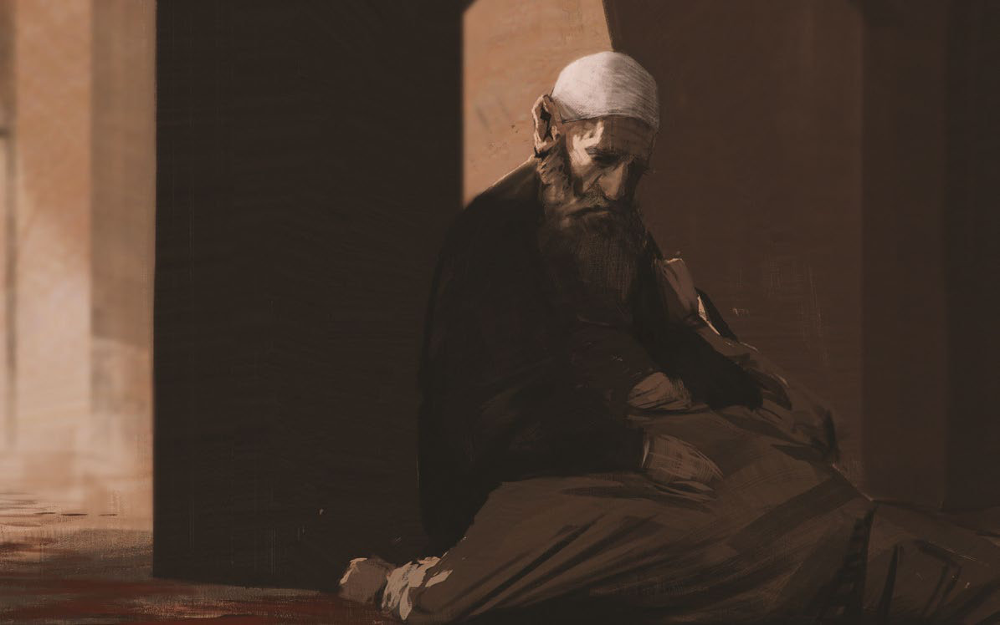

for perfection led to great purges of 
the unwashed and the unworthy from 
the streets of the city as they might 
offend the sight of the Angel.

hidden war that finally brought about 
the collapse of the great society itself. 
Others say the influence of malefac­
tors from jealous clans outside of the 
benevolent guidance of the Trinity 
caused the fall. Whatever the case, 
the Dream was dashed to nothing and 
the childer of Michael fled the city in 
despair.

brazen statues of gold bearing his 
image. All would be reshaped in his 
likeness. They began to summon to 
themselves the first of their followers.

Their philosophy of personal 
improvement did not entirely revolve 
around the pursuit of physical beauty. 
The childer of Michael competed 
among themselves to be the most 
pleasing to their great ancestor, to 
prove they were worthy of the blood 
of heaven. Within this selfish game, 
many mortals and Kindred alike 
were ensnared, moved as pieces on a 
board to enhance the image of their 
Toreador masters in the sight of 
Michael. They were forbidden to fight 
among themselves, though discord 
was invited from outside their ranks 
to test the strength of the Dream 
against alternative ideals and improve 
it accordingly.

The Seeds of 

the Garden

It was not until centuries later 
that they began, as though guided by 
some hidden hand, to seek each other 
out once more. As the modern nights 
cast a new darkness over the world 
and consigned the old to history, the 
Beckoning summoned still more of 
them together. United as one for the 
first time since the fall, the childer of 
Michael looked upon each other and 
knew they were the last scions and 
the last hope for the survival of his 
great plan.

“Take unto your lips the chalice. 
Feel the blood of the Angel coursing 
through the paltry clay of your imperfect 
form. Let it guide you, let it change you.”

—  Andreu La Torre, Bloodline of 
Michael, Clan Toreador

The Children of the Angel start­
ed as an almost exclusively Toreador 
affair and enjoyed a relatively steady 
pace of growth, given their pleasur­
able practices. When word began to 
spread of how these Nephilim could 
alter and beautify the normally static 
and unchanging Kindred, many inter­
ests were piqued, particularly some 
of the more desperate members of

However civil they were to each 
other in the open, their jealousy of 
one another was beyond compare. 
Many believe it was partly their

All of the world would come to 
recognize him for the divinity he was. 
All would bow their heads gratefully 
in the sight of endless cathedrals and

10 6

chapter two: Kindred Religions

Clan Nosferatu. Rumors persist that 
many members of that clan who fully 
embraced the love of the Nephilim 
have reverted to a more human ap­
pearance, albeit still ugly in com­
parison to vampires of other clans 
and the divinely beautiful Nephilim 
themselves.

becomes aware of it, though Clan 
Toreador remain, perhaps not so 
strangely, aloof on the matter.

no better than servants or beasts of 
burden. Only the mortal adherents 
who attend a temple but have not 
been inducted fully into the faith are 
beneath them; such kine have not yet 
earned a place within the Basilica.

With word of these glorious mir­
acles spreading, the Nephilim have 
gone from a petty underground orgy 
society to a well-established religion 
in their own right.

All of those mentioned are in a 
far loftier position than that in which 
those outside the grasp of the Nephil­
im are viewed. While they treat others 
with a form of kindness and attempt 
to attract them into the Temple, 
those who have taken the blood of the 
Nephilim into their unbeating hearts 
see those who have not as little more 
than ugly, unworthy stains on the per­
fection of the world. If they show no 
interest in improving themselves, then 
they are not even worth sneering at.

The seeds of this rite lie in the 
Blood Bond to a true Nephilim, a 
descendant of Michael. Imbibing the 
vitae of a Kindred separated from the 
Angel by no more than three Embrac­
es will beautify the drinker, subtly 
altering their physical appearance to 
an angelic form. Their skin softens 
and takes on a glow, their eyes glisten 
and imperfections and blemishes 
fade. Their teeth become the purest 
white and gleam in the light, and 
their bodies become toned and lean. 
While this is a poetic way of saying 
that, essentially, “it makes you look 
nicer,” the fact that it can even make 
the usually monstrous Nosferatu ap­
pear more like they did as mortals is a 
great attraction, and the clan does its 
best to stifle such rumors.

The Basilica of 

the Archangel

The Children of the Angel, de­
spite their chaotic appearance, exist 
in a strict social hierarchy that feeds 
down from Embrace to Embrace. 
They refer to this as the Basilica, 
represented by a segmented drawing 
of a cathedral’s facade. Occupying 
the apex of the Basilica are the true 
Nephilim themselves, direct descend­
ants of the Archangel separated from 
him by no more than three Embraces. 
Below them are the frescoes and art­
work adorning the Basilica’s frontage, 
their own childer. Not true Nephilim 
as they do not carry the blessing of 
Michael within their very vitae, none­
theless they still bear his legacy into 
the modern nights and the knowledge 
of the modern world back to the 
true Nephilim. Below this stratum 
stand the pillars of the Basilica, the 
adherents brought in from outside of 
the Blood of Michael. They feature 
both Toreador converts and those of 
other clans, save for the Nosferatu. 
The lowest members, columns, are 
the ghouls and mortal servants of 
Nephilim. Nosferatu adherents are 
the foundations of the Basilica, rep­
resented by the steps leading up to it. 
Their Blood prevents them from ever 
attaining the true beauty demanded 
by the Nephilim. However, they have 
at least chosen to walk the path of 
penance for their great sins against 
the beauty of the world. They are 
the foot soldiers, spies and some of 
the most firebrand preachers of the 
Nephilim to outsiders, but within 
the cult itself they remain second 
class members and are often treated

Lex Sanctorum 

Decis Angelorum

Known usually in short form as 
the Lex Angelorum, the Law of the 
Angels is the only code that matters 
to the Nephilim. It is learned by rote 
by all members and they can recite 
its seven tenets at a whim. They are 
as follows:

Due to the price of each drink, 
the Nephilim and their servants keep 
the secret power of their vitae hidden 
from outsiders. Those who submit 
themselves willingly to the Nephilim 
are certain to become little more than 
adoring slaves in their great plan. 
It is not just their faces and bodies 
that change; they lose all thought 
of their own personal pursuits and 
become almost mindlessly obsessed 
with pursuing the goals and desires 
of their Nephilim overlords. Unlike 
other Blood Bonds, it seems to be a 
servitude that cannot be broken by 
the mere passage of time and many 
who have been forcibly separated 
from their masters for even years at a 
time continue to cry out in the night 
and beg to be returned to their side, 
often calling out the name of Michael 
or Mary.

• 	
Thou shalt obey the Children of 
the Angel in all things

• 	
Thou shalt not sow discord 
among thyselves

• 	
Thou shalt tolerate not the ugly 
nor the wicked in the sight of 
the Nephilim

• 	
Thou shalt seek to bring all into 
the light of the Angel

• 	
Thou shalt not compromise the 
perfection of a Tabernacle or 
Temple

• 	
Thy Angel is thy savior, revere 
above all the one who brought 
you into the light

The thought of their entire clan 
falling prey to this predation disgusts 
and terrifies any Nosferatu who

• 	
Thou shalt not expose the nature 
of Angels to the mortal world, lest 
thee be purged by the fires of day

10 7

CULTS OF THE BLOOD GODS

Temples and tabernacles are 
always renovated and constantly kept 
clean to an obsessive degree. When 
the nightly debauch is concluded, 
foundation members immediately 
set to work preparing the premises 
for the following night. Column 
ghouls continue this work by day and 
ensure the place remains in pristine 
condition inside and out. To fail the 
inspection of a temple’s curator or 
the Nephilim inside of a tabernacle 
could result in a swift end for the 
people responsible.

NEPHILIM CONVICTIONS
Michael’s children focus predominantly on self-elevation and experi­
ence, maintaining a veneer of civility and class despite many of them be­
ing egomaniacs or lust-driven degenerates. Maintaining their Humanity 
would be a challenge, without Convictions allowing them to justify some 
of their behaviors to themselves:
• 	 Always obey Michael’s direct descendants
Michael’s vitae is divine. Never deny the will of his children; they are your 
saints.
• 	 Do not consort with the hideous
Ugliness has no place in the cult or your existence. Avoid disfigurements, 
disease, and ugly behavior. Hideousness is more than skin deep. There is 
no beauty in monstrous actions.
• 	 Never tolerate the desecration of a thing of beauty
Artifacts, temples, artistic creations, and so much more require preser­
vation and development. You serve Michael by protecting these things.
• 	 Always cultivate your own beauty
Your appearance and behavior are important as a standard for the cult 
and in emulation of the divine founder. You must always strive to look and 
appear your best. Let nobody witness any inner ugliness.
• 	 Reinvent yourself for every audience
So few vampires exhibit the ability to change with the times, but you will 
be the exception. Attending Elysium in the same outfit, always speaking 
with the same people, always drinking from the same blood doll, are all 
bad behaviors.
• 	 Delve into every sensation to expand your awareness
Pleasing or painful, experiences enlighten us and improve our under­
standing of the world. Both are important for empathy.

Rites of Pleasure 

and Perfection

The most outward-facing levels 
of the Nephilim are designed to 
draw wary outsiders in to progres­
sively deeper degrees. On the sur­
face, the cult seems like it wants to 
help Kindred to improve themselves. 
Once a Kindred is deep enough to 
know better, it is often too late. 
Their relationships with others 
have been severed and replaced 
with attachments to other cultists. 
They fear to lose what progress they 
have made into the Temple of the 
Archangel and are soon addicted to 
the aloof and distant leaders of the 
cult via the heady draught of their 
ancient vitae.

Many of the followers of the cult 
revere these laws even above the Tra­
ditions, though their overseers in the 
faith do well to keep such talk within 
their own temples and domains and 
out of Elysia.

night spots, fall into their hands and 
take their places as temples of the 
faith in turn.

In the most carnal and secretive 
circles of the Nephilim organiza­
tion, where only the most trusted 
go, it is said the oldest among the 
Children of the Angel feed on the 
blood of their own followers rather 
than the ready supply of mortals at 
their command.

The tabernacle within any city 
is always the seat of a true Nephilim 
and always receives far more atten­
tion and spending than any other 
dwelling the cult operates.

Places of Worship

The first and most sacred 
tabernacle is the one established in 
Istanbul — still referred to as Con­
stantinople by most vampires, who 
hold the old city name sacred due to 
its association with the Trinity. The 
Constantinople tabernacle is said to 
hold a vial of earth that soaked up the 
blood of the Archangel himself. Only 
Michael’s direct childer are permitted 
within, and none are known to be 
active these nights.

The Nephilim, when operating 
in any city, immediately begin by 
purchasing a suitable property which, 
once they have occupied it, they 
initially dedicate their time and re­
sources to converting into a veritable 
Garden of Eden, fit for the nightly 
revels of the Nephilim. They call 
these locations tabernacles. Once the 
cult becomes more established, other 
properties, often including popular

While the Nephilim are legend­
ary among young Kindred for their 
rites of carnal lust, many of their 
temples are also places where in­
struction in the arts both martial and 
aesthetic can take place. Gymnasiums 
and studios are common properties 
for cult members to hold or havens 
for them to inhabit.

10 8

chapter two: Kindred Religions

Limited Scope?

HERESY: THE ANGELS OF VENGEANCE
There are those within the Children of the Angel who do not wish to share 
the Dream with those who, both previously and now, only seek to cor­
rupt and destroy it. These are known, among themselves, as the Angels of 
Vengeance. While they practice many of the same rites as other Nephil­
im, they view anyone who refuses to live within the Dream as dangerous 
and a stain upon the world. While the majority of the cult’s zealots and 
leaders are content to wait until these subversive elements either fall in 
line or can be quietly disposed of, the Angels are not content to wait. They 
offer outsiders service only once and refusal means death.
Rumors of ritualistic killings and group suicides all around the world, 
marked with a common symbol, have begun to spring up in conspiracy 
theorists’ blogs, each one noting the image of a blood red sword with a 
winged crossguard being discovered at the scenes.
The main body of the cult dismisses any link to these atrocities, laying them 
at the door of some other crazed blood cult, likely remnants of the bestial 
Sabbat. The truth is that the cult’s leadership is well aware of the activities 
of the Angels of Vengeance and, while they do not openly support them, 
are content to allow them to continue.
More than this, the Angels of Vengeance wish to eliminate all those in­
volved in the fall of Constantinople and their descendants, as well as Clan 
Nosferatu in its entirety. They even desire to purge Nosferatu members 
of their own cult, though those in servitude to the Dream will be the last 
against the wall.
The Angels of Vengeance are zealots beyond compare. To them, the 
Dream does not need to be tested against outside beliefs, it must simply 
replace them. All who question the greatness of Michael’s vision must die 
in order for the world to be beautified by his light; there is no other course. 
Like the flaming sword of heaven they will sweep away the unclean and 
the unworthy. Only once there is not even a single thought out of tune with 
Michael’s divine chorus will the whole world be in harmony.

The goal of the Nephilim is to 
enfold all the world in their arms and 
guide it toward a shining and glorious 
future, following the vision of Michael. 
Some Kindred fear they can make this 
happen as more and more young vam­
pires, seeking respite from the crushing 
weight of their condition, find solace 
amid the writhing seas of bodies that 
often cover the floors of the cult’s tem­
ples. Many others point out that with 
only so many childer of Michael to go 
around, the chances of their mem­
bers bringing all Kindred into blood 
servitude are exceptionally small. Most 
see them as little more than a slightly 
troubling distraction for the young 
or for desperate Nosferatu seeking to 
escape some of the terror invoked each 
night by their own ravaged faces.

Enemies

The Nephilim have not yet 
cultivated any true enemies; however, 
senior members of Clan Nosferatu 
are already eyeing the Children of the 
Angel with great suspicion. Others 
whisper in the dark of what they 
might be able to do if they could get 
their clawed hands on some of the 
Nephilim’s legendary vitae.

Some of the cult’s members carry 
a set of small, polished silver knives, 
which they use to draw blood from 
vessels or simply to cleanly cut their 
clothes off. They believe biting a 
victim to feed reveals their snarling, 
bestial nature, and should be avoided 
at all costs.

Without fail, mortals targeted by 
the Children of the Angel for mem­
bership are physically beautiful in the 
eyes of whichever member identifies 
them. They are often people working 
toward some aspect of physical or 
artistic perfection. The cult is also 
extremely attractive to people who 
are vain, conceited or consumed with 
vices of lust and lechery.

Artifacts and Symbology

The symbols of the Nephilim 
vary wildly. Most feature images of 
angels or divine beings. Stained glass 
windows, statuary and paintings have 
all been commissioned by the cult’s 
members to try to embody the majes­
ty of the Dream, but only the genuine 
conversion of the world into that 
image could satisfy the true Nephilim 
as a symbol of Michael’s radiant glory.

Mortal Adherents

This heady cocktail makes for 
an interesting ride to anyone in the 
outer circles of the cult. While some 
of the adherents seem to have the ra-
ra attitude of summer camp counse­
lors or fitness instructors, others are 
narcissistic hedonists or even sadists 
who want nothing more than to be 
surrounded by beautiful people.

The Nephilim do not welcome 
mortals into their number; howev­
er, they do welcome them into the 
outer circles of the cult if only to 
convert them to their ways before the 
Embrace. The idea of living forever 
as a beautiful and perfect being is 
appealing to some.

The only true image that could 
be seen to represent the cult is the 
Basilica, and it is drawn differently 
depending on the artist. Many rendi­
tions of it exist.

10 9

CULTS OF THE BLOOD GODS

Nephilim Dreams: 

Johannesburg

domain each fortnight. Under his governance, the co­
operation zone exists to highlight the city’s beauty, and 
that of the vampires within it, when forced to inhabit 
parts of a domain and interact with individuals they’d 
barely ever stop to observe otherwise. On one night the 
Nephilim might set up a cooperation zone on Constitu­
tion Hill, and on the next occupy the Mandela Museum 
or the shanties in Soweto. To entice other vampires, the 
cult makes it clear everything in the cooperation zone 
is to be sampled freely, whether in the form of art or 
sustenance. The half-dozen Nephilim in Johannesburg 
keep the peace at these gatherings, pushing the vampire 
attendees to appreciate the world around them and the 
company they’re keeping.

A city of culture and street battles, of integration on 
one street and apartheid on the next, of opulent mansions 
in one quarter and gang-invaded tower blocks in another: 
Johannesburg is more than an Anarch domain — it’s a 
permanent warzone between Kindred, kine, and other, 
stranger creatures, and the Second Inquisition have yet 
to even touch the surface. In the thick of it, the Nephilim 
have dreams of making this city a new bastion of their 
faith, but it’s an uphill struggle. They view Jo’burg much 
as they once did Constantinople: as a place where hun­
dreds of viewpoints can come together in peace and every 
philosopher can reach a new state of enlightenment under 
the beneficent rule of Michael, or one of his descendants. 
Their cause is in vain, however, and their efforts may 
destroy the cult.

Pakourianis wants to shepherd the city’s Kindred, 
watch them, learn from them, and from their assorted 
views and disagreements form a philosophy that will 
make Johannesburg a domain of mixed but harmonious 
viewpoints. When blended together, with some edges 
shaved off and a little bit of Michael’s Dream added 
to the mix, he and the rest of the cult believe they can 
create a new utopia for Kindred in South Africa, and 
a possible template for further domains. The view is a 
grand one, despite the Dove’s prejudices against all who

Under the leadership of the Toreador named 
Pakourianis, sometimes titled “the Dove,” the city’s Ne­
philim guide the “cooperation zone” (what constitutes 
an Elysium in this domain) to different spots in the

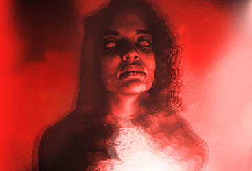

chapter two: Kindred Religions

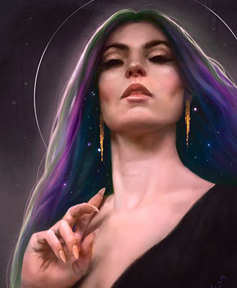

are, to his eyes, ugly in personality or features, and his 
consideration that they are some of the “edges” in need 
of shaving.

Just as Setites and infernalists helped bring down 
Michael’s Constantinople, Pakourianis’ Johannesburg 
has saboteurs chipping away at his grand plan. Due to 
Pakourianis’ status as a direct childe of Michael, if he 
fails, the entire faith may fall with him. That is of no 
concern to the Church of Caine, however, as the Gnos­
tics in Jo’burg consider Pakourianis’ cult a foul heresy. 
They take exception to the view of Michael as keeper of 
the Trinity, savior, or guiding light for Kindred. There 
should only be one angel in their view, and that angel 
is Caine. Led by a priest named Jabulani, the Gnostics 
aim to poison other Kindred against Pakourianis, citing 
his sire’s infamous fall, the Dove’s own predilections for 
feeding from other Kindred, and stoking the existing 
fires of conflict that Pakourianis just keeps below the 
surface. The Gnostics aren’t above enlisting mortals to 
disrupt cooperation zones so the Nephilim lose all trust.

Perspectives

MORTAL DAYS: PRIMA DONNA

Anarchs: Villains. Michael believed all Kindred must be 
welcome in a domain for true enlightenment to ever exist, but 
I make exception for these saboteurs. They know only how to 
destroy.

Anna was the only daughter of a minor aristocrat 
and a dancer in the Russian Ballet. Her earliest memo­
ries of childhood are watching her mother perform. She 
would twirl and leap through the air in a way that seemed 
to defy the laws of nature. Anna believed that there was 
nothing her mother could not do. One of the things she 
was unable to do, however, was prevent the swelling 
discontent among the people of her country toward the 
ruling classes.

Camarilla: They have a strong sense of what can be 
achieved with application and dedication to a cause. I just wish 
they had a sense of what it is to actually experience the world.

Clan Nosferatu: Our gifts could lessen their disastrous 
curse, if they would but listen to Michael’s words. Malachite 
was of their clan, do not forget, so the Nosferatu may make 
firm disciples yet.

Her father was certainly not a humble or pious man, 
but not the monster that many of those denouncing him 
from their pulpits made out. He couldn’t cast down the Tsar 
and undo centuries of tradition just to appease a mob.

Clan Toreador: If there truly is a clan not cursed but 
blessed, it is the Toreador. To share the vitae of Michael and be­
come ever-more enthralled by the beauty that exists and might 
yet exist in the world is a true blessing.

Anna remembers being scared in those nights 
and trying to soothe her mother’s terror by learning to 
dance. Instead, she found herself engrossed in the music 
to which the dances took place. Her father had tutors 
brought in from around the country and Anna proved 
prodigious, with a voice as clear as an angel’s bell. Her 
performances provided a stay of execution and she 
became known as the “Songbird of St. Petersburg.” For 
a time, publications spoke of her as the Russian Mozart, 
saying her music could unite the nation.

Hecata: Their morbid fascinations blind them to the beauty 
that exists in every waking step we take through the night. Why 
focus on the end when the present can be so much like heaven?

ANNA YUSUPOVA 

ANNA YUSUPOVA 

“ANNATOLIYA”
“ANNATOLIYA”

Epitaph: True Nephilim

With the assassination of Tsar Alexander, it became 
clear this would not be. No matter how talented she was, 
she could not sing away the reality in her country. She 
yearned for a way to save her parents but also to heal her 
wounded nation. A vampire offered her everything she 
wanted, at the cost of her life.

Quote: “I am the last of my line. My childer will not 
bear the blessing of the blood, but they will bear the 
promise of the Dream.”

Clan: Toreador

Embraced: 1881 (Born 1860)

111

CULTS OF THE BLOOD GODS

KINDRED NIGHTS: AWAKENING TO THE DREAM

Greece and finally Turkey. She adopted the name An­
natoliya, in homage to the beautiful land she now called 
home. She lived as a hermit songbird, going from town to 
town, entertaining, gaining what nourishment and money 
she could before moving on. It was a transient existence, 
but also her calling.

He introduced himself to her as “a Spaniard” but she 
came to know him as Andreu La Torre. With his exotic 
accent, devilish charm and handsome looks he seduced 
and Embraced the young Anna, giving her the power to 
enthrall and entrance the crowds.

Annatoliya found her way to Istanbul, arriving at 
what would become the first tabernacle of the Angel. 
Something in her blood called her to enter the sanctum 
and, once inside, bid her stay as others, including her sire, 
began to arrive.

Her abilities soared, though her parents and some 
others noticed how pale she had become, and how she 
was never seen during the day. Word spread among the 
people of the city and, before long, the Bolsheviks were 
decrying her father as a demon worshiper who had made 
pacts with devils.

Those who had gathered questioned the reason why. 
They discovered that they all had one thing in common: 
their link to the ancient known as Michael the Archangel. 
As they spent their time there in contemplation, each 
vampire received the same vision, of a light piercing the 
sky, a guiding hand reaching from the past and pointing 
the way to a glorious destiny.

The family home was burned with her parents inside. 
Only Anna was spared and spirited away by La Torre 
to his home in Spain. The journey took them across the 
Eastern and Western fronts of the Great War and Anna 
hoped things would get better once they reached Barcelo­
na. While their first years in Spain were relatively happy, 
she quickly lost the interest of her sire. La Torre became 
more interested in the politics of the city than he was in 
his young charge. The rising tensions of Franco’s civil war 
convinced her to abandon La Torre in search of peace in 
which to live with her art.

“Go forth,” it seemed to say, “bring my truth to the 
world!”

In that first conclave, the Nephilim were forged. 
They put aside old enmities and spoke of a hope and a 
restoration of what had once been. Anna would play her 
part, she would be a guiding light, leading the world to 
the place she had always wanted to live.

It seemed war and destruction followed her; Europe 
was on fire. She moved from Spain to Italy, then to

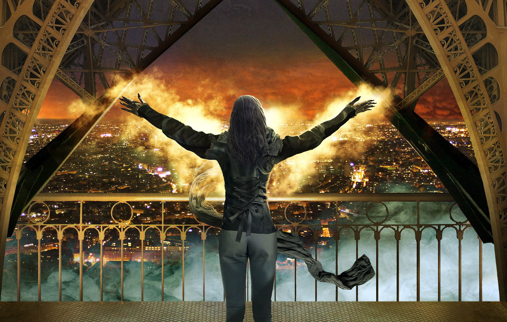

chapter two: Kindred Religions

PLOTS AND SCHEMES:

a test of their unity, she names the candidates and 
watches them closely for any violations of the Lex 
Angelorum. These are her most loyal and devoted 
followers and would kill to earn her Embrace.

• 	
Bring About the Dream: Annatoliya is a true Ne­
philim, revered by the followers she has gathered to 
herself. She will stop at nothing to turn the whole 
world into a reflection of the beauty she finds in 
song and dance.

• 	
Prodigious Talent (Resources 2) Annatoliya acts 
as patron to up-and-coming talents. The cellist, 
Bertrand Phelan, is garnering a great deal of interest 
and attention. His performances are a big draw at 
her concert hall and his performances elsewhere also 
bring potential new recruits to her notice.

• 	
Pleasing La Torre: Annatoliya herself is still en­
thralled by her sire and often takes on tasks, projects 
or performances aimed at pleasing him. She watches 
for any change in his whimsical mood and alters her 
appearance to suit. Any she thinks are stealing away 
the spotlight he shines upon her will earn her ire.

KINDRED RELATIONSHIPS:

• 	
Andreu La Torre (Changeable) La Torre has always 
been pleased with his choice of childe, even when 
she struck out on her own. The problem is that he is 
often too wrapped up in his own magnificence to pay 
much attention to her. He forgets to respond to her 
correspondence or simply can’t be bothered. Despite 
this whimsical nature, he remains a core focus of her 
quest for perfection. If he were to be destroyed, she 
may lose faith in the Dream as her forebears once did.

• 	
Bloodline Search: Her followers have spoken to her 
of Kindred known for their enchanting, perhaps 
hypnotic singing voices. Anna is interested in any 
mention of these reclusive and enigmatic vampires. 
What she wants with them is anyone’s guess.

DOMAIN AND HAVEN:

• 	
Nephilim Tabernacle (Haven 4, Herd 4, Influence 
(Artistic Community) 4, Resources 3, Retainers 4, 
Status 2) Anna’s haven is a large concert hall that 
holds performances of orchestras including operas and 
ballets. Its sprawling antechambers, side rooms and 
backstage areas provide a fitting venue for the more 
esoteric rites of her religion. The rear of the audito­
rium is occupied by a large pipe organ over which a 
permanently illuminated, stained glass representation 
of Michael the Archangel hangs, with a golden city at 
his back. Many of the employees of the auditorium are 
also members of the cult. She allows its use as an Elysi­
um if required, earning the respect of the Camarilla.

WHISPERS:

• 	
Solace of the Monstrous: Rumors of the mysterious 
qualities of Anna’s blood have reached the local Nos­
feratu and have set their minds racing with possibil­
ities. Some wish to submit themselves to her, others 
wish to take her gift by force. Such an assault would 
not be easy.

• 	
Hatred of Bolsheviks: Anna’s past has made her incred­
ibly distrustful of Bolsheviks. She will subtly attempt to 
undermine and oppose anything that indicates support 
for the works of Lenin. Many observers have noted the 
color red is never in her ensemble, never part of her mul­
ticolored hair, and absent from the décor in her haven.

• 	
Nephilim Temples (Domain 3, Herd 2, Retainers 2) 
The various other temples of her cult include a 24-
hour gym, a youth center offering various voluntary 
classes, an exclusive watersports club and a small, 
family-run restaurant. The adherents who operate 
these establishments are ghouls of hers, bonded to 
her will.

MASK AND MIEN:

• 	
Annatoliya is phenomenally beautiful. Even before 
her Embrace she was the belle of St. Petersburg. The 
vitae of the Nephilim flowing inside her keeps her 
features vital and alive. Each night, she dedicates an 
hour to preparing her appearance. Her hair is dyed 
a multifaceted array of glittering colors that seem to 
shift as she turns her head. Her body is scented with 
bespoke perfumes that beguile those who come near 
her. Everything about her is unnervingly divine, and all 
find themselves dumbfounded upon first viewing her.

THRALLS AND TOOLS:

• 	
Adherents of the Angel (Adversary 2, Herd 2, Influ­
ence 3) Through her many followers, Anna can direct 
a great deal of influence in her chosen city. While she 
defers to Princes and Primogen where appropriate, 
those in power understand and respect her pull and 
her word goes a long way at court. At least one of the 
Primogen of the city is growing tired of her.

• 	
Anna’s dress changes with her mood and the situa­
tion, which often makes her tardy for appointments. 
When she arrives, however, she is always on point for 
the mood of the event.

• 	
Potential Childer Annatoliya openly screens several 
of her adherents for the position of her childe. As

113

CULTS OF THE BLOOD GODS

• 	
Though she speaks many languages from her up­
bringing and travels, Anna still maintains a Russian 
accent. She can mimic other accents very effectively 
if the fancy takes her.

chapter. These other cults predominantly form around 
worship of a methuselah or Antediluvian, or around a 
concept such as the Beast, Golconda, or the Amaranth. 
Many have fallen into memory due to persecution, 
their membership being annihilated, or their long-lived 
members simply moving on to other pursuits and phi­
losophies. Others are localized, and so only affect their 
domain, or are new to the night.

• 	
Anna always introduces herself as Annatoliya to 
Kindred. She refers to herself and is referred to as 
“The Diva” by mortals. Some Kindred find her way 
of referring to herself in the third person as rather 
annoying, but others find it humorous and charming. 
Annatoliya acts as a weak disguise, but it has held up 
so far (Mask 1).

The most peculiar of these minor cults are those that 
emerge from the pages of history without any of their 
original members. Vampires are creatures of ritual, plac­
ing great importance on ancestry and myth, yet it is an 
oddity to see a religious order spring up in an apparently 
random domain in worship of an until-recently forgotten 
methuselah. Perhaps, muse some, these cults manifest 
when those methuselahs stir in their torpid slumber, or 
worse, when they wake.

Sire: Andreu La Torre

Ambition: Sing the dreamers to the Dream

Convictions: Make the world into the heaven I 
imagine; Be a worthy childe

Touchstones: Bertrand Phelan — Virtuoso Cellist; 
Sandra Dawn — Sound Engineer

Amaranthans

Humanity: 6

Generation: 7th

Worshipers of the ancient Toreador named Amaran­
tha, the purported first victim of diablerie, the Amaran­
thans have existed for millennia as hunters of vampire 
cannibals, operating without sectarian authority in their 
pursuit of diablerists. Established by Amarantha’s lovers 
among Clans Brujah, Nosferatu, and the Banu Haqim, the 
cult still largely consists of Kindred from those clans, few 
of whom remain in one domain for longer than it takes 
to kill their target and acquire a new one. The process of 
joining the Amaranthans isn’t one usually undertaken by 
choice, with mortals Embraced by members of the cult 
immediately indoctrinated into an existence of hunting 
vampire sinners. In that regard, there are few murder 
cults quite so driven as the Amaranthans.

Blood Potency: 4

Attributes: Strength 3, Dexterity 5, Stamina 4; Cha­
risma 5, Manipulation 4, Composure 4; Intelligence 
3, Wits 5, Resolve 4

Secondary Attributes: Health 7, Willpower 8

Skills: Athletics 2, Craft (Instruments) 2, Firearms 1, 
Melee (Fencing) 3, Stealth 2; Animal Ken (Horses) 
3, Etiquette (Elysium) 3, Insight 3, Intimidation 1, 
Leadership 4, Performance (Opera) 5, Persuasion 3, 
Subterfuge 4; Academics 2, Awareness 3, Finance 3, 
Occult 2, Politics (Camarilla) 4, Technology (Sound 
Production) 2

In past centuries, the cult’s coteries would gravitate 
toward rumors of diablerie, investigate, and then execute 
the guilty without trial. In these nights they follow 
similar practices, though many among them find satisfac­
tion in a secondary role as bearers of their victims’ final 
messages, harbingers of their last wills (providing they 
don’t run counter to the cult’s objectives), and have even 
granted mercy on a handful of occasions.

Disciplines: Auspex 3, Celerity 3, Presence 4

General Difficulties: 7/4

Minor Cults

“And some that were burying a man, saw the rovers, and 
cast the body into the sepulcher of Eliseus. And when it had 
touched the bones of Eliseus, the man came to life, and stood 
upon his feet.” (4 Kings 13:21, Douay-Rheims Edition)

Current Goals

The Amaranthans have been tolerated among the 
dominant sects for centuries due to Kindred society’s 
widely attested distaste for diablerie. As long as these 
Amaranthans commit their murders quietly and move 
on, they’re creating spaces in the hierarchy previously 
occupied by murderers, so most Kindred take the view 
that they’re a kind of religious pest control. This view is

— Nuno Domingo de Madrid, Lasombra Governor of 
Lima, final words

Up to a hundred Kindred cults exist in tonight’s 
World of Darkness, though few are as impressive in 
strength and size as those mentioned earlier in this

114

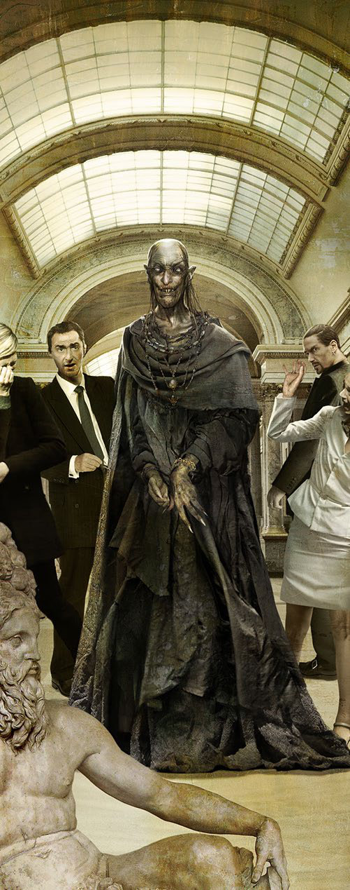

chapter two: Kindred Religions

gradually changing, however, since whereas the Ama­
ranthans used to primarily target Sabbat vampires, with 
that sect out of the picture and the cult having no desire 
to follow them on their Gehenna Crusade, they’ve since 
taken out a few high-profile Camarilla targets, including 
an Archon and two Princes.

The Amaranthans are dedicated to their goal even 
though they know it’s one without end. If their practice 
was a disincentive to commit diablerie, it surely would 
have stopped diablerists by now. The current objective 
of the already small cult is to survive renewed Camarilla 
and Anarch scrutiny while furthering their more esoteric 
aims, which if rumors are to believed, involve the dia­
blerie of some of their most dangerous targets. Supposed­
ly, the Amaranthans believe they can free or merge with 
Amarantha if they can finally consume her murderer, but 
that would entail consuming that vampire’s descendants, 
all of whom show a similar dedication to cannibalism.

Cleopatrans

Nosferatu tell tales of the wise, beautiful childe of 
their progenitor, named Yima, who was Embraced before 
Absimiliard — the clan founder — was cursed. She rode 
out God’s great storm and Caine’s ire through charm, 
love, and honesty.

Other Nosferatu tales tell of Yima being the one 
Nosferatu who stood between Caine and the Antedilu­
vian, bearing the full brunt of the clan’s monstrous bane 
as Absimiliard only took a fraction of the blow. Her love 
for her sire was such that she would die or be forever 
mutilated on his behalf.

Rather than receiving her sire’s affection and care, 
Absimiliard abandoned her to her monstrosity. Or, her 
beauty so awesome in his sight, Absimiliard could no 
longer bear to look upon her. The tales are contradictory, 
but what is known, is Yima became the clan’s holy grail as 
a figure of sympathy or aspiration.

The cult known as the Cleopatrans of Yima, or just 
the Cleopatrans, formed at the height of Caesar Augustus’ 
Rome, with rumors of Yima spreading widely in the wake 
of Cleopatra. This pharaoh, more powerful than any man, 
beautiful and deadly, bewitched the Roman Nosferatu 
imagination, and parallels were drawn between her and 
ancient Yima.

The Nosferatu started adorning their hideous faces 
and bodies with paint, baubles, masks, and elaborate 
outfits, to accentuate beauty and prove their purpose as 
more than horrors and lepers. The Cleopatrans selected 
only the canniest wits to make their cult of advisors and 
leaders, creating a bubble in time between the 1st and 
4th centuries CE where Nosferatu occupied rare places

CULTS OF THE BLOOD GODS

Current Goals

of prominence throughout Europe 
and North Africa. Every third 
domain held a Cleopatran in a place 
of importance. It was a rich time for 
the clan.

These vampires receive subsequent 
visions guiding them on how to 
exploit the weaknesses of local rulers, 
with most guidance proving success­
ful. It seems the Cleopatras have a 
patron, though it’s too soon to tell if 
it’s Yima, a poisoning of their Blood 
sent down from Absimiliard himself, 
or some Toreador messing with each 
of their heads for one big elaborate 
joke.

While the Cult of Isis’ cells have 
a shared name and agenda, little 
communication exists between the 
religion’s various groups. There is 
no central authority, and hierarchy 
changes from cell to cell, though 
some branches emulate the Bahari 
scale of seed, maiden, mother, and 
matron. Though some cells restrict 
membership based on gender, others 
find this attitude radical or outdated, 
leading to one of the only divides in 
the cult that causes inter-cell conflict.

The Cleopatrans were only 
powerful for that duration, however. 
With the fall of the Western Roman 
Empire, the cult dissolved, and tales 
of Yima and Cleopatra disappeared 
with them.

The Cult of Isis

Current Goals

In the early 20th century Kin­
dred society observed a convulsion 
in Clan Nosferatu, as once again the 
Sewer Rats started adorning them­
selves as lords and ladies, perfumed, 
well-dressed, and far above the 
station the Camarilla had assigned 
them for the first four centuries of 
its existence. This trend hasn’t disap­
peared, with “Cleopatras” appearing 
in random domains, sometimes 
among the ranks of resident Nos­
feratu, other times as outsiders 
freshly visiting a staid city. As they 
did almost two millennia before, 
these Cleopatras (dropping the “n” 
as the majority don’t recognize their 
cult as one of worship or lineage) 
attempt to seize roles above tradi­
tional Nosferatu standing. For many, 
their mix of self-belief, delusion, and 
confidence is enough to put them in 
positions of Herald, Primogen, or 
Sheriff. While no Cleopatras have 
become Princes yet, many believe it’s 
just a matter of time.

The Cult of Isis has undergone 
several transformations in the years 
since its founding, revering Isis as 
Lilith, Isis as Hathor, Isis as Mary, 
Isis as Aquarius, and Isis as countless 
other deities or deific female figures. 
All celebrate fertility, life, and cere­
monies of joining, making them an 
ostensibly strange cult for Kindred 
involvement, and indeed, for centu­
ries they’ve operated with minimal 
vampiric intervention. Only now, 
with the open resurgence of Kin­
dred faith, have vampires once again 
flocked to a religion that preaches 
veneration for health, magic, and 
marriage.

The Cult of Isis’ goal has broadly 
extended to the protection of aban­
doned fledglings, leading to a surge 
in Caitiff members. Unintentionally, 
its reverence of youth (in mortal and 
immortal terms) and the potency of 
Blood has created a swell in mem­
bership for this cult, and the elder 
members aren’t sure how to utilize 
this new army of angry youths, who 
all seem ready to fight someone or 
something. The cult has been based 
around protection and reaction to at­
tacks on sacred places and people for 
so long, that the idea of dispatching a 
militia to take a site or eliminate an 
enemy is new to them.

From its early days to tonight, 
the Cult of Isis is a religion of 
empowerment. The cultists don’t 
recognize Isis as an individual so 
much as a concept, with many mor­
tals focusing on Isis as nature and 
femininity, and vampires identifying 
Isis as the meaningful, compassion­
ate Embrace, and guardianship over 
sacred and magical places. In the 
latter respect, the Cult is fiercely 
militant, protecting with homicidal 
ferocity those areas where mages can 
more efficaciously practice their arts, 
where the Shroud (see p. XX) thins, 
and where the supernatural struggles 
to exist. They disdain areas of reli­
gious importance, however, reviling 
holy land and artifacts as much as 
any vampire.

These nights portend interest­
ing times for the Cult of Isis, as they 
could prove to become kingmakers or 
domain breakers, depending on how 
they use their swathe of new recruits.

Eyes of Malakai

Kindred scholars debate wheth­
er simply dressing up and taking on 
a sound-alike epithet is enough to 
constitute a revived cult, or a cult at 
all, but what none outside the most 
successful Cleopatras know is they’ve 
been receiving communal dreams, in­
cluding images possibly sent to them 
telepathically, of a great, gorgeous 
nude woman who caresses the Nos­
feratu, mending their disfigurements 
with her palm, before ordering them 
to take command of all Kindred.

An ancient cult of bizarre, 
destructive belief rarely seen in the 
modern nights, the Eyes of Malakai 
are often stamped out as soon as they 
appear, usually by Malkavians driven 
to oppose the cult without knowing 
their reasons for fighting against it.

The Eyes first emerged millen­
nia ago, supposedly as worshipers of 
Malkav’s twin sister — a vampire, 
god, or demon named Malakai. In 
legend, Lilith Embraced Malakai,

116

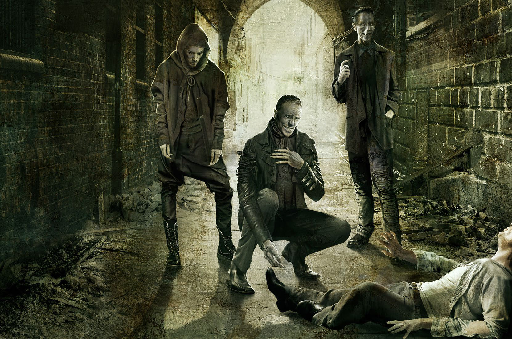

and according to Cainite theory, 
she would be of similar potency and 
age to her brother, were the two 
active and stable enough to pursue 
singular courses. Nobody is alive to 
know the truth of the Malakai tales, 
however. If she exists, she’s so old or 
torpid as to be unreachable in any 
meaningful way.

believe Malakai visits these vampires 
— often Malkavians — and provokes 
their existing conditions to a state of 
permanent mania. Others guess the 
Eyes’ Blood revolts in their bodies 
due to their Antediluvian’s sins. It’s 
all guesswork, however, as the Eyes 
of Malakai don’t know why they do 
what they do.

recorded behaviors of the Eyes, but 
none of their actions explain their 
objectives.

When vampires question the 
Eyes as to the meaning behind their 
new behaviors, they either lash 
out or passively respond they’re 
“the Eyes of Malakai,” apparently 
lacking the capacity to conceal their 
condition. Some vampires call them 
“incarnate madness” or “infected 
vitae.” The word “Eyes” makes other 
vampires assume these vampires 
are spies for someone, presumably 
Malakai, but the Eyes often enough 
just try to make other vampires’ 
existences miserable, or conspire to 
sabotage the Camarilla in a domain, 
making their ambitions something 
grander than just observing for a 
third party.

The Eyes do exist, however, and 
to a single vampire, they’re terrible, 
vicious predators with what appear 
to be few coherent motivations.

The awakening rapidly changes 
the Eyes. It would be incorrect to 
consider their change a devolution 
— some Eyes are wights, most are 
not — but they suddenly lose their 
sense of attachment to Touchstones 
and fellow Kindred, and become 
entirely predatory. Some start spying 
on and stalking former companions, 
others hunt solitary vampires and 
diablerize them as soon as they gain 
the opportunity. Some Eyes make 
copious notes on local Kindred 
society before burning the notes in a 
ritual fire, and then throwing them­
selves into the flames. These are all

Current Goals

Regardless of Malakai’s status 
or whereabouts, the vampires who 
become Eyes have appeared every 
few decades each century. These 
cultists were usually presentable, 
functioning members of Kindred 
society. Then, they undergo an awak­
ening. Some Kindred theologians

The Eyes of Malakai appear 
infrequently enough to become vam­
pire folklore, but when rumor enters 
a domain of Eyes emerging to spread

117

CULTS OF THE BLOOD GODS

Los Hijos de Si

ruin, it’s enough to mobilize Kindred 
into forming a hunting party.

over-feeding, or maintaining a 
retainer for too long, making their 
standards for elimination highly 
subjective.

Gorgo’s Nest

Los Hijos de Si, or “The Chil­
dren of Si,” is a Kindred cult oper­
ating throughout Peru and Bolivia 
with a history stretching back nearly 
1500 years to its founding by Illari, a 
Moche priestess of the moon goddess 
“Si.” Los Hijos have been active of 
late, quietly recruiting new members 
and expanding their influence. They 
seldom participate in the Gehenna 
War or the meaningless bickering 
of the Camarilla and Anarchs, their 
gaze firmly fixed on the moon above 
as they await the soothing darkness 
of salvation.

Vampires in Gorgo’s Nest 
detest comparisons to the Bahari. 
They maintain they are not lilin, 
and in fact their view of the Bahari 
is aggressive to the point of frenzy. 
They hate sharing a space with the 
lilin, and commonly war with the 
cult whenever they share a domain. 
These battles have gone on for cen­
turies, and Gorgo’s Nest is the cult 
that has taken the most grievous 
injuries in the contest. These nights, 
Gorgo’s Nest is a shadow of its 
former self.

Gorgo’s Nest, the Children of 
Gorgo, the Daughters of Gorgo, or 
simply the Gorgons, have pursued 
a path of eliminating tyrants, 
murderers, rapists, and monsters 
for centuries. They only have one 
restriction on whom they target: 
they are the slayers of men. Gorgo’s 
Nest formed around the stories of 
a Nosferatu methuselah who may 
have been the Medusa of Greek leg­
end or the famed Queen of Sparta, 
who was killed by a mortal hunter 
or the Nosferatu Antediluvian when 
he tried to eradicate his childer in 
a fit of rage. Whatever the genesis, 
Gorgo no longer exists, but her 
followers, not all of whom are Nos­
feratu, believe sincerely in avenging 
her and using their immortality to 
prevent men like Perseus, Absimil­
iard, and even Caine, from visiting 
harm on others.

Los Hijos serve the Machukuna, 
or “Ancient Ones,” revered enti­
ties from a prior age whose spirits 
persist into the present. The cult 
believes the Machukuna inhabit a 
shadowy parallel reality and were 
born of a nocturnal age lit only by 
moonlight. Their species died in 
fire upon the birth of the present 
age, but many endure, their ageless 
and desiccated bones concealed 
from the sun’s killing light in deep 
caves and lake bottoms. Only the 
Machukuna know their origins with 
certainty and Los Hijos are not 
inclined to doubt them.

The reasons behind the conflict 
between Gorgo’s Nest and the Bahari 
aren’t widely known, but consume 
the Gorgons’ modern agenda. In 
truth, the cult split off from the 
Bahari three centuries ago due to a 
bloody, personal feud between a Gor­
gon (one of the Nest’s high priests) 
and a matron of the Bahari. The feud 
spread to their followers, their com­
panions, and eventually, their wider 
cults. Since then, all because of a 
disagreement over whether a mortal 
under the Bahari’s protection should 
be pushed into an arranged marriage 
to a powerful nobleman, the cults 
have been at war.

There is no compassion among 
the vampires of Gorgo’s Nest. They 
have never attempted to save, aid, 
or care for victims of abuse. The 
vampires of this cult are almost all 
of a low Humanity and disconnected 
from Touchstones, pursuing the kill 
above all else. Their crusade contin­
ues when they become wights, with 
Gorgo’s Nest staking members fallen 
to the Beast, only to release them 
when they can be placed in a location 
rife with male targets.

The cult believes the Machuku­
na are avatars of the moon goddess 
Si, who holds the key to escaping 
the Kindred’s endless Jyhad, and 
perhaps reality itself. They defend 
the Machukuna’s ancient bones, bear 
their sacred word, and satiate their 
unquenchable hunger for blood, 
passion, and offerings. In return, the 
Machukuna provide wisdom, access 
to the potent dust of their bones, 
and the promise they will lead Los 
Hijos safely into an age where Si 
rules the skies alone, unencumbered 
by the sun.

Gorgo’s Nest have lost sight 
of their initial, murderous objec­
tive, and now persist in sabotaging 
Ba’ham Gardens. Vampires join 
the cult because they’re already 
rage-filled, so the cult directs them 
against the Bahari some nights, and 
men the rest of the time. When not 
delivering death, the sorority of the 
cult seeks to stabilize members at 
risk of succumbing permanently to 
the Beast, but this is sadly a latter 
concern these nights. To compound 
matters, the resurgent Lamiae also 
go by the title “the Gorgons” and 
take pleasure in sabotaging this cult 
when they can.

Current Goals

Most Kindred believe Gorgo’s 
Nest possesses a firebrand agenda, 
which is misplaced, misguided, and 
ultimately destructive. This view 
isn’t exclusive to male vampires, as 
Gorgo’s Nest dispatches killers to 
slay vampires guilty of the Embrace,

Until recently, the childer and 
descendants of the cult’s founder 
Illari made up the cult’s Kindred

118

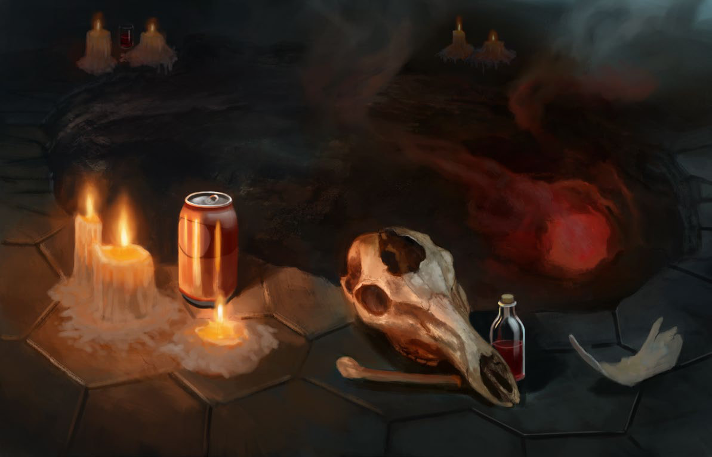

contingent. This changed with the 
induction of new coteries from the 
recently vacated Sabbat strong­
hold of Lima. These Kindred and 
their mortal counterparts work 
vigorously to fortify their Ma­
chukuna wards against time itself, 
always present, but seldom seen. 
They perpetuate false legends of 
the Machukuna, reducing them to 
folk tales easily explained away by 
mortals, defend their bones, and 
make sure their masters are well 
fed, cajoling humans and Kindred 
to propitiate them in return for 
Los Hijos’ favor.

salvation. A road every Hijo intends 
to walk.

activity and have fortified the cult’s 
mines with an astonishing array of 
defenses, transforming them into 
tunnels of death rivaling the Ama­
ganti Warren of Brasília.

Current Goals

As always, the cult seeks to 
accumulate additional power, food, 
and security for the Machukuna. 
High Priests Don Esteban and 
Giuliana work vigorously to expand 
their influence among the kine, 
while Illari’s childer walk unnoticed 
among the sick and poor mining 
communities of Peru, trading the 
vitae necessary to keep them alive in 
return for a steady supply of blood 
when demanded. They also ensure 
that the miners and villagers of the 
hinterlands leave proper sacrifices for 
the Machukuna and their servants. 
What the Machukuna do with ciga­
rettes, liquor, and food is unknown, 
but these offerings are stacked neatly 
before their desiccated skeletons deep 
underground and vanish before the 
Hijos return.

Los Hijos’ goals are a balance of 
reconstruction and expansion. The 
cult took significant losses in the cen­
turies where the Sabbat were domi­
nant in Lima, stretching its ability to 
protect the Machukuna. Illari and her 
childer actively seek to Embrace new 
Kindred to restore their numbers in 
addition to inducting new Kindred 
from afar.

In addition to replenishing 
her ranks, Illari places renewed 
emphasis on security. The Second 
Inquisition haunts Peru, thin-bloods 
walk the streets of Lima, and She 
Who Screams in the Forest is active 
in Brazil. The signs of Gehenna are 
everywhere and Los Hijos prepare 
to weather the storm. Lima’s Nosfer­
atu erase electronic records of Hijo

The Machukuna are the sacred 
beyond compare, creatures of dark­
ness from a more perfect age, repre­
sentatives of a better road forward 
than that offered by meaningless 
faiths, or seekers of Golconda. They 
are always watching, always waiting, 
and always pushing Los Hijos to 
greater acts of devotion, for they are 
the Si-given signposts on the road to

119

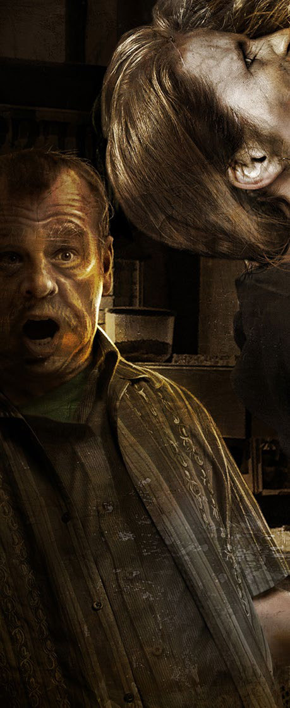

CULTS OF THE BLOOD GODS

Sons and 

Daughters of Helena

and puzzles to the lower level 
adherents, requesting they perform 
tasks on the cult’s behalf while 
intimating that by performing well, 
they’ll please Helena and earn her 
favor. The missions they set usually 
center on eliminating the cult’s 
enemies, obtaining or laundering 
money, seizing territory for higher 
ranking members, or expanding the 
cult. The initiates at the bottom 
are expected to dedicate their time 
to serving Helena, send tribute up 
the chain, and in return — if they 
please “her” — a nice bauble comes 
back down. Usually this takes the 
form of the elder council recruit­
ing other initiates to perform a 
task for the previous group, or 
more rarely, the elders might send 
down a vial of treated, potent vitae 
with the message to “use this only 
in times of extreme duress.” The 
vitae usually comes from the body 
of another captured vampire from 
outside the cult.

The essence of a methuselah 
cult dedicated to the accumula­
tion of wealth and influence, the 
Sons and Daughters of Helena pay 
tribute to their legendary icon, the 
vampire known variously as Helena, 
Helen, Helene, or — to those few 
who know her modern-nights 
Mask — Portia, in exchange for her 
blessings, direction, and supernat­
ural aid. Structured as a pyramid 
of worship, adherents are lured 
in with tales of Helena being the 
undead Helen of Troy: a figure 
of supreme beauty, intellect, and 
wit. They’re told tales of how she’s 
survived for millennia, manipulated 
armies to further her goals, orches­
trated the fall of Carthage, and is 
now the most powerful vampire 
in the USA. How much of this is 
true is debatable, but the Sons and 
Daughters use their Presence to 
attract recruits, make their words 
believable, and foster adoration 
from fresh initiates.

To the Sons and Daughters, 
their religion is a mystery cult from 
which they obtain more wisdom 
and enlightenment the more they 
dedicate themselves. To anyone who 
delves deeper into the cult’s inner 
workings, it’s about as mundane a 
cult as vampires could form. Yet, as 
with many con jobs, as long as the 
marks don’t realize they’re being 
milked for all they’re worth, the 
sense of belonging, purpose, and 
belief is enough to keep them from 
slipping to the Beast. The cult’s 
dissolution would lead to many vam­
pires greeting the dawn in humilia­
tion and despair.

Helena is indeed the individ­
ual prominent in the tales of the 
Trojan Wars, and she is the schemer 
and beauty icon her cult purports 
her to be. She’s even present in 
the United States and influences a 
small army of followers. However, 
these followers are not the Sons and 
Daughters, over whom she has min­
imal control and about whom she 
has little interest. Elders of Clans 
Ventrue, Toreador, and Brujah with 
no attachment to Helena formed 
this cult in her name to exploit the 
myths surrounding her and profit 
from fledgling gullibility.

The Meneleans

A confused cult with no lead­
ership in these modern nights, the 
Meneleans were once dedicated to 
rebuilding Carthage anew, revering 
the wisdom of the Brujah methuse­
lah who unknowingly founded their 
order, and fighting the servants of 
the Toreador methuselah Helena. In 
their recorded history, the Mene­
leans read stories of the frequent 
clashes between the vampire known

What little Helena knows of 
this cult amuses her, so she’s con­
tent to let it persist at least until 
it tarnishes her reputation. If that 
time comes, she’ll make a grand 
show of annihilating the elder 
council and stepping in to address 
the Sons and Daughters as their 
grateful goddess, picking up the 
cult’s devoted scraps.

Current Goals

A vampire pyramid scheme, 
the Sons and Daughters’ elder 
council sends abstract messages

12 0

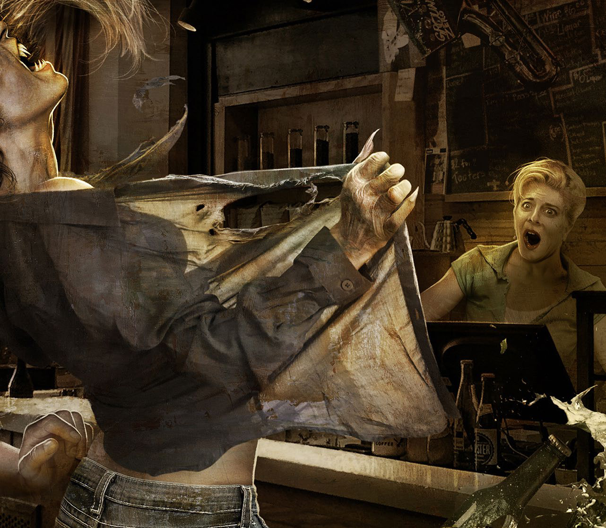

Current Goals

as Menele or Menelaus, and his rival 
Helena. The two fought using thou­
sands of mortal and undead proxies 
for millennia before finally reach­
ing the United States, where the 
two reached an ostensible stalemate 
and the war went underground.

Aside from Helena’s cultists, the 
Meneleans had no natural enemies. 
They furthered a cause of freedom 
without the vice of worshiping Set, 
spoke in favor of domains drenched 
not in bloodshed but in under­
standing, and strongly believed the 
pathway to Golconda was through 
perfect assimilation into mortal 
life. The only price was drinking a 
dose of Menele’s vitae every decade.

The great fraud of the Menel­
eans was that Menele enforced his 
will through his vitae. The cult op­
erated so successfully, and appeared 
so uniformly altruistic, because 
Menele wished it so. Whenever a 
cultist tried to pursue their personal 
interests, he or one of his childer 
intervened to correct the course 
through the Blood or destroy the 
bug in the system. Undoubtedly, the

In part dedicated to freeing 
vampires from elder subjugation 
and manipulation, while advocating 
closer bonds with the kine to help 
ground the cultists, the Menelean 
faith is one that’s not outwardly 
destructive like that of many cults.

Then Menele disappeared, prob­
ably Beckoned, and a hundred bonds 
snapped.

121

CULTS OF THE BLOOD GODS

cult’s followers achieved many great 
things in Anarch and Camarilla do­
mains alike, encouraging vampires 
on the cusp of becoming wights to 
fold into mortal society, softening 
a Prince’s tyranny, and influenc­
ing the building of new cities such 
as Milton Keynes in the United 
Kingdom and Songdo in South 
Korea specifically to cater to Kin­
dred needs. However, this was only 
sometimes the will of the vampires 
involved. Most of these schemes 
filtered down from on high.

it’s caused such a stir, there must 
be some validity to its words, right? 
Kindred track down the community 
centers, scout huts, and church halls 
advertised in the pamphlets and find 
themselves in the company of other 
interested vampires, creating a sense 
of camaraderie. After a brief wait, a 
speaker emerges and talks at length 
about the one true way to Golcon­
da, the steps one must take to reach 
the enlightened state, and after the 
speech — sometimes accompanied by 
PowerPoint presentations and team 
building activities — attendees are 
invited to share, without judgment, 
activities they’ve pursued that cause 
them shame or horror. The speaker 
then gives guidance from the certi­
fied one true way, which promises to 
help them in the future. The group 
disperses and most Kindred never 
return. Some, however, do. They buy 
in. They take the first step on the 
one true way to Golconda.

least one Antediluvian.

Meanwhile, the One True 
Way’s veracity is debatable. Long-
term cultists exhibit a changed 
persona, but this could be learned 
behavior as easily as it might be a 
radical change based on Golconda. 
These upper level cultists, com­
monly titled “Ones,” appear to 
gain impressive control over their 
Beasts, extending to their direct 
communion with the internal, 
hungry voice, but some Kindred 
report the cultists allow their 
Beasts to take over in unmatched 
displays of violence and sadism. 
The Ones explain the Beast cannot 
be snuffed, only silenced for a time, 
and that they have learned how to 
release it at opportune moments. It 
so happens these opportune times 
always occur around the cult’s most 
vehement enemies.

The question many free Menel­
eans now ask is whether they would 
have pursued the same goals were 
Menele not involved. They also 
want to know how much control 
Menele had over their pursuits, as 
for all they know they could have 
been receiving subtle pushes from 
Menele’s dreams, or dictates from 
a tyrant methuselah. The cult is in 
disarray, with their ancient grudge 
against Helena’s followers even 
put to the side as Meneleans come 
together and discuss how they’re 
going to act without their master’s 
vitae.

Servitors of Irad

Current Goals

According to Noddist history, 
Irad was the most bloodthirsty war­
monger of his time, his prowess on 
the battlefield and in commanding 
men earning the respect of the first 
murderer, and Caine’s Embrace. 
Irad joined the ranks of the Second 
Generation and led Caine’s armies 
for an unrecorded number of centu­
ries, always loyal to his sire and kin, 
as long as the battlefield could slake 
his unquenchable thirst.

The One True Way is a Golcon­
da cult established by a mysterious 
vampire going by the title “Master of 
Ravens,” not that many of the cult’s 
adherents ever encounter him. He 
might show up to impart wisdom 
directly if a powerful cult member 
experiences second thoughts, or to 
rally followers against an enemy 
that wishes to destroy the cult, but 
for the most part he works in the 
background.

The One True Way

A pamphlet occasionally ap­
pears in haven letterboxes, tram­
pled on the street outside Elysium, 
or folded between two books in a 
Tremere chantry. This pamphlet, 
printed like a flyer for a Christian 
group meeting that invites its read­
ers to “join and share over drinks 
and honesty to discuss Golconda,” 
is titled “The One True Way,” and 
has been banned in domains far 
and wide for what Princes perceive 
as a Masquerade risk, and others 
consider an obvious trap designed 
to lure vampires into a cult. In this 
respect, the word “cult” is used with 
all negative connotations.

Something changed in Irad 
when the Antediluvians rebelled 
against the Second Generation, 
however, with the handful of 
accounts from vampires who claim 
to remember the war agreeing 
Irad turned his armies to oppose 
Enoch, Zillah, and a controversial­
ly vague number of other Second 
Generation vampires. His motives 
for doing so are unclear to this 
night, though some posit he felt 
the Third Generation could bring 
him the blood he so craved in

The vampires who give them­
selves fully to this cult eventually 
find the group meetings are just the 
first step on a program. They then 
lead their own sessions, gathering 
secrets from confessing, troubled 
Kindred, and use them to pursue the 
cult’s ends. The Master of Ravens 
expects the cult leaders to use these 
disclosures to elevate their own sta­
tus too, however, as he uses the cult’s 
accumulated knowledge against his 
own ancient enemies, including at

Perhaps due to its negative 
reputation, vampires seek it out. If

12 2

chapter two: Kindred Religions

greater quantities than his sire and 
siblings, while others believe Caine 
snubbed him as nothing more than 
a killer, goading Irad into showing 
him what a killer he could be.

as Irad served them to drench the 
planet in blood, the Servitors shall 
do the same.

The Gehenna Crusade has 
revitalized the Servitors of Irad, 
who join the fight from every 
conceivable position, whether as 
manipulators pushing political 
buttons or as warriors in the field. 
The more philosophical branch of 
the cult wishes to consume a host of 
methuselahs while summoning their 
Antediluvian masters. The more po­
litically motivated Servitors want to 
deal a grievous blow to the Sabbat, 
who they feel are still rank amateurs 
at war when compared to the clan 
founders.

Current Goals

Whatever the case, Irad wasn’t 
exempt from the Third Generation’s 
attack on the Second, though some 
believe he fell last, his denouement 
coming as a surprise after everything 
he’d sacrificed for them.

The Servitors of Irad have ever 
waxed and waned in power and 
popularity, drawing Kindred who 
see themselves as divine killers or 
who lack purpose beyond destruc­
tion. During times of great war 
between the kine, the Servitors 
emerge to ride the tide of battle 
and drive increasing numbers of 
mortals into the jaws of death. 
During times of peace, they attempt 
to provoke war or needle vampires 
into territorial disputes, sectarian 
conflicts, or religious crusades. 
They are ever on the lookout for 
the grandest buffet, which inevita­
bly follows chaos and battle.

The cult that emerged in the 
millennia that followed openly 
claims to serve the will of Antedilu­
vians, which strikes Cainite scholars 
as odd, given their epithet as “Ser­
vitors of Irad.” The cultists respond 
that Irad is emblematic of all blood 
shed in glorious battle, crimes of 
passion, and subtle assassinations. 
The individual matters less than 
their service to the true warmon­
gers — the Antediluvians — and just

For obvious reasons, Servitors of 
Irad rarely declare their presence or 
openly recruit in peaceful domains, 
though with the Sabbat’s absence in 
many of its former domains, they 
look to propel the Camarilla and 
Anarchs into a fresh conflict absent 
for so many centuries.

12 3

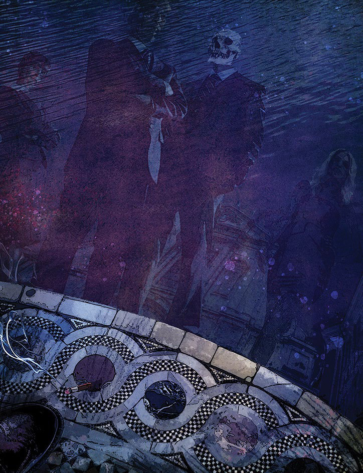

The Cult of Death 
The Cult of Death

chapter three
chapter three

and Undeath
and Undeath

“You may ask yourselves, why us? Why not any of the other sects who might embrace you to their bosom? 

“You may ask yourselves, why us? Why not any of the other sects who might embrace you to their bosom?

Ask yourself this instead, could any of those peons understand you like we do?”
Ask yourself this instead, could any of those peons understand you like we do?”

— 
— Excerpt from the introduction of the Capuchin the Anziani Council
Excerpt from the introduction of the Capuchin the Anziani Council

The Clan of Death is one of the biggest cults in the 
The Clan of Death is one of the biggest cults in the 
world, dedicated to the study, manipulation, and 
world, dedicated to the study, manipulation, and 
mastery of death and the dead. It is not the only clan to 
mastery of death and the dead. It is not the only clan to 
possess coordinated ambition or hierarchy, nor is it the 
possess coordinated ambition or hierarchy, nor is it the 
only one to possess an almost religious philosophy or 
only one to possess an almost religious philosophy or 
indoctrinated loyalty among its constituent members, 
indoctrinated loyalty among its constituent members, 
but what the Hecata have, is freedom. They are with­
but what the Hecata have, is freedom. They are with­
out sect-mates or permanent rivals. They are the only 
out sect-mates or permanent rivals. They are the only 
independent clan, and therefore are well-placed as both 
independent clan, and therefore are well-placed as both 
a family of vampires and cult of eschatologists to pursue 
a family of vampires and cult of eschatologists to pursue 
their aims and tip the scales of power as they see fit.
their aims and tip the scales of power as they see fit.

Let this be the first among the many lessons you 
Let this be the first among the many lessons you 
will learn with us: It’s about the family. We keep fam­
will learn with us: It’s about the family. We keep fam­
ily close, some may say too close at times. It’s about 
ily close, some may say too close at times. It’s about 
what the family needs, not about what you want. The 
what the family needs, not about what you want. The 
blood is important. It’s a lesson the Giovanni, we who 
blood is important. It’s a lesson the Giovanni, we who 
remain, are relearning now that we are a part of — a 
remain, are relearning now that we are a part of — a 
vital, important part of — the Hecata.
vital, important part of — the Hecata.

Not many on the outside will know, or care, about 
Not many on the outside will know, or care, about 
the difference. Use that. To those on the outside we 
the difference. Use that. To those on the outside we 
will be the Clan of Death; they might even call us Clan 
will be the Clan of Death; they might even call us Clan 
Giovanni until the new or, rather, old, branding sticks. 
Giovanni until the new or, rather, old, branding sticks. 
A wise childe will use that. There is a reason our name 
A wise childe will use that. There is a reason our name 
carries weight. No matter what you might hear from our 
carries weight. No matter what you might hear from our 
cousins in the Harbingers, the Samedi, or even the fucking 
cousins in the Harbingers, the Samedi, or even the fucking 
Cappadocians, the Hecata, and therefore our mutual 
Cappadocians, the Hecata, and therefore our mutual 
survival, would not be possible without us. The Giovanni. 
survival, would not be possible without us. The Giovanni. 
They may be the branches of this new family, but we are 
They may be the branches of this new family, but we are 
the trunk. We are still Giovanni. Even if your last name is 
the trunk. We are still Giovanni. Even if your last name is 
Dunsirn, Pisanob, or Milliner. Even if we call ourselves “of 
Dunsirn, Pisanob, or Milliner. Even if we call ourselves “of 
the Hecata” now. We won’t forget where we came from, 
the Hecata” now. We won’t forget where we came from, 
no matter where it is we may be going.
no matter where it is we may be going.

One of Us
One of Us

As spoken by Accorri Giovanni, Famiglia Giovanni of the 
As spoken by Accorri Giovanni, Famiglia Giovanni of the 
Hecata. Recorded by Matthew Sharkey, Hecata fledgling, at 
Hecata. Recorded by Matthew Sharkey, Hecata fledgling, at 
the behest of his patron.
the behest of his patron.

Let’s get this started; I don’t have a lot of time, but I 
Let’s get this started; I don’t have a lot of time, but I 
was “asked” to speak with you. What? You wanted to talk 
was “asked” to speak with you. What? You wanted to talk 
to Isabel? Well, that’s unfortunate. The Ministry has her. 
to Isabel? Well, that’s unfortunate. The Ministry has her. 
You get me instead. Aren’t you the lucky childe? 
You get me instead. Aren’t you the lucky childe?

1 2 5
1 2 5

CULTS OF THE BLOOD GODS

The Clan of Death has always 
been one of, oddly enough, change. 
The fucking Cappadocians? Yes. I 
did mention them. Yes, I did use an 
expletive. Now shut up and listen. 
Take them as an example. They 
killed themselves, we killed them, 
they came back.

some claim the terms are up soon. 
Did you know that? By the way, I 
highly suggest you not bring this 
particular event up to whoever 
you speak to from our relatives in 
the Harbingers. It’s a particularly 
sore point and they still despise 
the Camarilla for not having their 
backs.

the importance of hiding. It just 
wouldn’t do to have angry ghosts 
coming after us in public, now 
would it? And they are coming.

You have taken enough of my 
time, I should think. I am late for 
a meeting with my childe Kay. One 
last lesson from your uncle Accorri. 
One he had to learn the hard way. 
One that his own uncle Diego 
taught to him. Listen well: We’re all 
family in the end. We don’t have to 
like each other, we can even hate 
each other, but we are still family. 
Remember that, nephew. Now get 
out of my sight.

The Cappadocians, the holder 
of the Clan of Death title before 
the Giovanni, enveloped our family 
for our acumen with the dead. We 
helped to further the study of death 
and the dead for them. We helped 
them increase both their temporal 
power and their power over the 
dead. We have always been mer­
chants, either in coin or in death. 
They were, in the past, advisors and 
scholars extraordinaire. We, even­
tually, got tired of playing second 
fiddle and decided to bite the hand 
that fed. Literally.

Hated and needed in equal 
measure, the Giovanni have been 
around for ages and we will be for 
ages to come. We can trace our fam­
ily line back to the Roman Empire 
where we were known as Jovians. 
We were skilled in the manipulation 
of coin and the dead. We Giovanni 
have always venerated our elders 
and speaking to them from beyond 
the sudario wasn’t as stigmatized 
then as it is now. We have always 
kept close ties with family.

Masks and 

Murder and Plot

As spoken by Marchesa Liliana, 
Wearer of the Triple-Faced Mask, member 
of the Harbingers of Skulls, now the 
Harbingers. Recorded by Matthew 
Sharkey, Hecata fledgling, at the behest 
of his patron.

Now, with the tragic loss of so 
many of our elders in the Giovanni, 
who are we in these nights? I don’t 
know. Maybe you do. Now, what 
else do you want out of me?

While you may be new to the 
night, and the Hecata, even you have 
heard of us. The Venetian necroman­
cers, the Merchant Lords, the Devil 
Kindred, and less savory things as 
well, I would imagine. Most of it is 
true. We are all of those things and 
more. We have been the masters of 
the dead since before 1444. That’s the 
year our founder, Augustus Giovanni, 
wherever he is now, took the big bite 
out of the founder, known to some 
as Cappadocius, of the previous Clan 
of Death and ate his soul. Then we 
killed them all. Or so we thought. 
Some of our cousins hold to differ­
ent versions of this event. Some even 
believe Augustus didn’t finish the job 
properly.

The Underworld

Yes, I will speak with you as I 
have been requested to. No, re­
moving my mask will not make me 
“more comfortable.” Comfort is not 
important for us. Nor should it be 
important for you. There is little 
comfort among the dead.

What’s the sudario? I suppose 
the term is heading out of vogue 
among our young. It is the skin 
between this world and where the 
dead dwell. You will sometimes 
hear it referred to as the Shroud, 
in English. You will certainly learn 
more about it the further into your 
studies you wade.

You wish to know about our 
branch of the family, do you? You 
know nothing of the Harbingers of 
Skulls, but I will teach you in what 
time I have. I shall provide answers, 
for the Hecata would not be with­
out us. This all grew out of the rich 
soil the ashes of our hate nourished. 
We must be quick about it for there 
are whispers beyond that there 
will be a breach in the Shroud near 
Delhi soon, and I will need to be 
there.

Our art has been called many 
things over the years, but it all 
comes down to using our secret 
ways, combined with the Blood, to 
command the dead.

We were officially recognized 
as the Clan of Death in the form 
of the Promise of 1528. It was an 
agreement between the then nascent 
Camarilla and Clan Giovanni to not 
get involved in each other’s af­
fairs. The Camarilla agreed that we 
weren’t Sabbat and helpfully turned 
a blind eye while we hunted down 
the “last of the Cappadocians.” The 
Promise lasts into this night, but

With Augustus no long in the 
picture, having failed the Clan of 
Death, and having held our many 
enemies on the other side of the 
veil captive with his power, we 
will need this art, and each other, 
now more than ever. We are beset, 
and even though we are not bound 
to the Camarilla, we understand

Harbinger is what they call me, 
and Harbinger is what I am. We 
are the speakers to the dead and 
the rulers, conveying whispers to 
and from the former and the latter,

12 6

chapter three: the cult of death and undeath

throughout the ages. We, when we 
were whole, provided counsel and 
solace to the powerful, standing at 
the side of princes, bishops, kings, 
and gods. Some of us still do even in 
these nights.

IMMUNE TO THE CALL
Why the Hecata are immune to the Beckoning is a matter hotly debated 
within the clan. Some Necromancers theorize it’s because they’re the only 
line to successfully destroy their Antediluvian, but others retort Cappado­
cius went on to exist as a spectre and may still do so, so that claim is as 
arrogant as it is false. Others believe the clan’s routine internal purges 
have annihilated dozens or maybe hundreds of their methuselahs and 
elders, and this practice has resulted in insufficient vampires remaining to 
call their descendants. Another faction believes the Capuchin enacted a 
ritual to still — or kill — the clan’s Blood, disconnecting it from the source. 
This would go a long way to explaining the sterility in some Cappadocian 
and Harbinger vitae, but could the mysterious Hecata be that powerful?
Whatever the truth, few Kindred outside the Hecata know the clan did not 
succumb to the Beckoning, and the Clan of Death is happy to leave it that 
way. The Necromancer mindset is “let them think we’re weak” as they use 
their peers’ underestimation to further their ambitions.

We were always a part of and 
apart from the Cappadocians, our 
original clan, before our Father 
locked us away in Kaymakli, before 
the Giovanni drank our Father and 
slaughtered us, before the Camarilla 
turned their back on us, and before 
the Sabbat left us behind. To ask 
those of the original brood of the 
Cappadocians that somehow re­
main, we still are Cappadocian. An 
argument can be made for it. Death 
always comes in threes, after all. 
But, as I have told neonates before 
you, and will after, my truth is that I 
am a Harbinger. I am of the Hecata 
now, yes, but always a Harbinger.

had become as skulls. Yes, hence the 
masks. Thank whatever god holds 
your fancy that we no longer pass this 
affliction on with regularity to new 
initiates of the Hecata. I have long 
felt it is time to move on, decay and 
renew, and the Blood seems to agree.

Clan Giovanni who would not bend 
after Augustus Giovanni fell to our 
fangs, finally after all these years. We 
made way for the new growth, a return 
to old ways, and offered the Giovanni a 
measure of forgiveness to pair with our 
vengeance.

I told you the Hecata would not 
exist without our hate, and I meant 
it. We Harbingers hate. We are very 
good at it. We have every reason for 
it. Masks and murder and plot. We 
have nurtured that hate through 
every stage of our existence and sur­
vived to see our will done. We have 
survived every purge and were the 
instruments of the latest one. When 
our Father locked us away in that 
vast underground city, summoning 
the whole of the clan, not all of us 
answered, though most did. Those 
of us that did, he found wanting 
and sealed his failures inside. It was 
known as the Feast of Folly. Instead 
of withering away, we used our 
hate and our sadness to rip open 
ways into the lands of the dead and 
escaped. The mysterious Capuchin 
showed us the way, or so I am told. I 
have trouble remembering.

Those of us who emerged from 
our mass grave at the first possible 
opportunity arrived just in time to 
see our Father’s favored children, 
his pet project, the Giovanni, drink 
him down and slaughter our kin. 
Some of us turned to the Camarilla 
for protection, but the Giovanni 
reached them first and convinced 
the new sect to turn a blind eye to 
our extermination. Again, we were 
left with nothing, so some of us 
retreated to the Underworld while 
others flocked to the Sabbat.

You neonates will carry us 
forward into that future with the 
wisdom and support of the past. We 
come together, Samedi, Harbingers, 
Lamiae, Cappadocians, and even the 
Giovanni. Death has many names 
and comes in many forms. Our clan 
has a face for every manner of death, 
and more than I can list without 
boring you.

Nevertheless, we are all 
Harbingers still. Harbingers of 
what, now, remains to be seen.

…That You 

Do So Well

And then the Beckoning called 
that sect away to its damnable 
Gehenna War. A Beckoning we do 
not feel. You can ask others about 
why that might be. I have my theo­
ries but do not have the time.

As spoken by Josette, Speaker for 
the Baron Samedi. Recorded by Matthew 
Sharkey, Hecata fledgling, at the behest 
of his patron.

We were adrift until the Capuchin 
came back to us and presented us the 
key to our vengeance. To make us the 
knife that would cut out those who 
had been poisoning our Clan of Death. 
It is we Harbingers who took away 
the obstacles to progress, the elders of

Not all our kin had the mastery, 
but we spent untold centuries among 
the dead and found time to learn. We 
found our way back, ready to take 
revenge on the Father who hated us 
so. We found that our time in that 
place left its mark on us and our faces

Welcome, welcome. Yes, I know 
who you are. You have come a long 
way to meet with me, and travel is 
risky in these nights. The Baron has

12 7

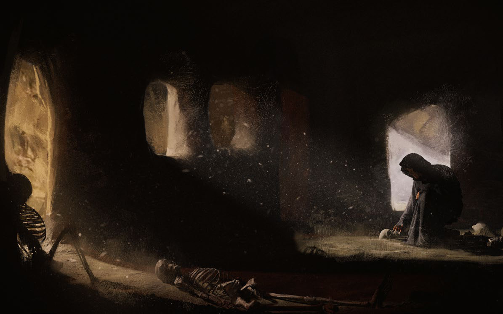

given me leave to speak with you on 
behalf of the Samedi and he would 
have me tell you of us. Kreyol pale, 
kreyol komprann.

know there are things that need to be 
done that others haven’t the strength 
to do. We took on the trappings we 
needed to get the job done. Vodun, 
Christianity, Noddism, and the rest. 
We ingratiated ourselves with the 
underbelly and used our power to 
speak with those departed on behalf 
of those that couldn’t. We under­
stand that the loa are ghosts, but not 
all ghosts are loa. We use honey over 
vinegar. We understand the deep 
secrets of the dead that even our 
cousins, who dismiss our knowledge 
because of their youth, do not under­
stand. We are here because of them.

deep. How do you think we found 
the Giovanni elders in their holes? 
The Baron tells me this audience is 
at an end. There is work to be done.

I see you blanch at my appear­
ance. It is fine. I am used to it. We 
are marked by the loa, and there are 
so many loa these nights. Our flesh 
rots, yet we abide.

Death Always 
Comes In Threes

The Samedi have been around for 
a long time, not as long as some of our 
fellow members of this cult we call the 
Hecata, but long enough. Many of our 
cousins probably have many theories 
and stories about where we come from. 
But you? All you need to know of our 
origins is that we owe our existence to 
Baron Samedi. We are his and he is his 
own. It is by his word and the will of 
the loa that we are part of this, and the 
Hecata would not exist without the 
Samedi. It is our relationship with the 
loa that keeps us ahead of the turmoil 
on the other side of the Shroud.

As spoken by Amr Salib, Hecata 
childe of an unknown Cappadocian. 
Recorded by Matthew Sharkey, Hecata 
fledgling, at the behest of his patron.

I have to say, antimi, it is good 
to spend some time with someone 
my own age, so to speak. I have spent 
much longer than I would like these 
past years among the truly dead and 
half-dead. My sire asked that I speak 
with you as she is still, I suppose the 
best word would be, “shy.” I am to be 
her bridge into the modern night. She 
has told me of our history and I am 
honored to be a part of such a storied 
line as the Cappadocians. She teaches

Augustus is gone. So many loa 
are freed. There is trouble across the 
divide and so many of the loa have 
invited us home.

We need each other, simply put. 
Look at me. We cannot hide in plain 
sight. The Hecata gives us protec­
tion and in turn we give them our 
knowledge and connections on the 
other side, from the ones who rest

We Samedi ruled the islands and 
spread around the world, because we

12 8

chapter three: the cult of death and undeath

me much and I, in turn, get to de­
light in watching her marvel at my 
cellphone, even if she does call them 
“devil-squares.” I will now read a let­
ter she penned for you, chronicler.

EAT THE RICH
For centuries the Giovanni have kept tight control over the process of the 
Embrace through the practice of the Proxy Kiss, a process of selecting 
favored children from the various families under the Giovanni purview 
and forcing them to become thralls. Councils of elders have controlled 
the process for a very long time, deciding who among them deserves the 
Embrace. Over time it became political and the abuse, and sometimes 
outright murder, of others’ prospective childer weakened the bonds of 
trust between sire and childe.
This breach of trust and ensuing discontent led many young Giovanni to 
throw off the shackles of the old ways of thought and tradition of their 
elders. They struck out on their own, and many of them made contact with 
the younger members of bloodlines and families who used the darker 
arts of the dead. Who better for a necromancer to commiserate with than 
other necromancers? 
This led to long-held prejudice being challenged, and young Giovanni 
from every family of the clan coming together with members of the Same­
di, the Harbingers, and some of the more obscure lines such as Cappa­
docians, Lamiae, and Nagaraja who came out of the darkness to make 
tentative contact with their cousins.
With new perspectives came new anger, new rage. It started a fire within 
the Giovanni as a whole. This fire was stoked by a combination of the 
elders of the Samedi, Harbingers, Cappadocians, and even some Gio­
vanni into an inferno that would burn out those in all factions who did not 
belong in the Clan of Death.

“The Cappadocians have 
known, we have always known and 
we prepared. We didn’t flee to the 
other side. We resisted the call to 
Kaymakli. We threw our invitation 
to the Feast of Folly away. We did 
not become Harbingers. We did not 
orchestrate wars and plagues, advise 
Princes, and hate as they did, though 
we understand their hate. We did not 
become con artists, and oracles, and 
mercenaries as our Samedi cousins 
did. We did not consume and strive 
and barter as Augustus Giovanni and 
his brood did. Instead, we hid among 
the graves and the dead, as we always 
have. We threw some of our brethren 
who could not see the future clearly 
into the maw of the Giovanni and we 
faded from memory. We studied. We 
waited. We watched. And when it 
was time, we returned.

The others have probably told 
you how each alone is responsi­
ble for the Hecata, how it would 
fall apart without them and their 
particular skills. They are all correct. 
This is how we survive the sects 
that would see us falter and fall. We 
will weather the fires of the Second 
Inquisition. We come together as 
the last truly independent clan, 
because we must. The Feast, The 
Promise, The Reunion. Death, Rot, 
Rebirth. The Three Faces.

I can see why you’d be confused, 
Ignazio, why all of this happening 
now might surprise you. And you 
have every right to be afraid. But this 
is what happens when you ignore 
your young and your different for so 
long. When punching down becomes 
a way of unlife. Sometimes they start 
asking questions and punch back.

all the fucking spectres that have 
been coming after all of us that have 
touched death?

Augustus is gone. All the angry 
spirits he held in captivity for his 
great work, they’ve come after all 
of us. His Endless Night, his grand 
quest to tear down the barrier 
between this world and the next? 
It’s over. From what I hear, Uncle 
Auggie didn’t work fast enough.

You see, we talk. Not through 
the dead where you can hear us. We 
meet up in person, we chat, we gos­
sip, and we share secrets. Some of us 
even dabble with encrypted emails. 
Even the young Samedi, Harbingers, 
and Cappadocians. There have 
been a few new ones in the modern 
nights who reached out to us. Fancy 
that, huh? And do you know what 
we all asked each other? We asked 
why we must carry the grudges of 
our elders. And do you know what 
we came up with great-uncle?

The Harbingers, the Samedi, 
and those Cappadocians who es­
caped probably killed him. They’re 
definitely killing most of your 
generation. Kind of a nice one-two 
punch, huh? Did you notice how so 
many of your contemporaries didn’t 
show up last April 4th? Or did you 
just not talk about it like an awk­
ward mortal Thanksgiving?

We survived and now we be­
come what we always were.

The Hecata. The Clan of Death.”

The Family 
Reunion

And your precious Promise 
of 1528? You fuckers never told us 
it had a time limit. Five hundred 
years is what we’re all hearing. 
Our non-aggression pact with the

As spoken by Monica Giovanni of 
the Hecata to her Great-Great-Uncle 
Ignazio Giovanni

We said we don’t fucking know. 
Besides, we had to come togeth­
er for protection — or did you miss

12 9

CULTS OF THE BLOOD GODS

Camarilla runs out, and what with kicking the Anarchs 
out into the cold and all of the clans clustering together 
under one banner or another, we had to band up.

sycophants to Augustus who hated to see anyone else 
succeed, who hated anything new or different. You’re 
done. You failed the family and the family took note. 
The young lit the fire and our grandparents came 
back to give us their guidance and their wisdom, and 
the aunts and uncles who remain are stepping aside. 
Whatever is calling the elders of the other clans away 
doesn’t seem to be affecting us. But we, the young, run 
the show. We’ve got the energy for it. The drive. We are 
all coming together. It’s our own little family reunion 
and there is no place at the table for the hardliners. No 
place for you.

You see, if we Giovanni were together as a family 
like we should have been, we could have taken them. If 
we didn’t shit on the Dunsirns, the Pisanob, and even 
the fucking Putanesca, this never would have happened. 
We would have stood against this tide of death. We’re 
Giovanni. We can do any goddamn thing if we’re togeth­
er. We could have done what you elders should have 
done so long ago: killed them all. But we weren’t togeth­
er. And it’s your fault. Now we’re doing it this way.

Oh, scratch that, I forgot. I did meet one 
Cappadocian. I met the one called the Capuchin. He’s 
the one who told me what you’d done to my sire. He’s 
the one who told us where to find you. He dredged up 
our original name and gave it back to us. Hecata.

So, while we’re talking, my coterie is killing all your 
ghouls and your favorite childe. Elders with a fucking 
head on their shoulders from the Giovanni are finally 
getting the recognition and power they deserve in the 
clan. The Samedi are crawling out of the woodwork 
because their loa told them to or some shit and boy do 
they have some things to teach us. They don’t command 
their ghosts, like we’ve always been taught. They let their 
loa ride them and commune. Their loa have taught us 
a few new things about how the other side works. Shit 
we’ve been trying to figure out for centuries. They can 
party too.

Now that I think about it, Uncle Auggie did bring 
about his Endless Night, in a way. It’s us. We are of the 
Hecata, now. We are the Endless Night.

Goodbye great-great-uncle.

The Other Side

Same with the Harbingers. They just walked over 
on that side for years and years, alternating between 
running from us and attacking us from the shadows. 
Hooked up with the Sabbat for a while too. They know 
how to dig into spirits to get what they want. Even 
heard that one or two can feed on a ghost. Some of ‘em 
can do some of that messed up shadow stuff I heard the 
Lasombra can do. They say it all comes from the same 
place, basically. I can’t tell if they’re old or not. I can’t 
tell any damn thing with those masks. Probably for the 
best. Some of ‘em still hate us. Hell, they might all still 
hate us, but we can work together. We have to.

A letter from Casius Aubespin, Haiti, 1999
My Harbinger friend, you of the Mask of 
Cerberus, I have walked as you taught me on the other 
side, but in my own way. The land of the loa. They 
called and I took its hand and stepped into the puddle 
and my world turned upside down. It was beautiful 
and terrible, as you said. The land before me was bare, 
but there stood buildings I had not seen in centuries. 
The loa who walked with me was made of shadow 
itself, wearing the face of a child. It asked me to walk 
deeper and I said I would.

And the Cappadocians? I haven’t met any of the 
original ones, yet, but some of their new childer. What they 
are calling their “tethers.” They seem good, if a bit haughty. 
They have learned more about our dark art in the span of a 
few years than I have in decades. Can’t wait to meet some 
of the old ones, but I’m sure they’re gun shy. Can’t blame 
them. We did try to kill their whole clan.

It took me to a place of perpetual storm and 
howling. It hurt. We did not stay long. I saw things in 
the mist and the rain made of glass and memory that 
will haunt me for the rest of my days, and I am of the 
Samedi. I look like a walking corpse.

The loa asked if I wished to go deeper, and I could 
not stop myself. I said yes.

And you know the funny thing? Most of the rest of 
the Kindred, from the Cams to the Anarchs to the Ashirra, 
probably aren’t even going to notice anything has changed. 
To them we’ll always just be the Clan of Death, or the Clan 
of Bankers, or the Clan of Gangsters, and I’m fine with 
that. They don’t care if their necromancer wears a mask, a 
white top hat, a robe, or a suit. They just want us to do our 
thing and get out. They’ll learn in time.

We were then in a place of twists and winding 
tunnels that bent my brain in a thousand ways. Angry 
ghosts harried us, whispering sins I had long forgotten, 
and the loa protected me. It told me this maze was wo­
ven as much to keep things in as it was to keep things 
out. It was a place of terror, and madness, and pain. The 
loa asked if I wished to go deeper and I asked it what 
could be past this. It said, revelation.

So, this is happening, great-great-uncle Ignazio. 
It’s the end of you fucks. You, and the rest of you

It told me we could walk to where the light of the 
world ends and can go no further. It would take me to

13 0

chapter three: the cult of death and undeath

the last place that exists before the end of all things. 
The infinite abyss that yawns before Oblivion. Its home. 
Its prison.

THE BECKONING AND THE BLOOD
Since the Family Reunion, the Blood has been acting 
strangely in the Hecata. In the modern nights, the 
childer of members of the various bloodlines that 
the massive death cult comprises have found that 
several new fledglings do not suffer from the same 
curses, afflictions, and Banes as their sires. The Sa­
medi are walking corpses, the Harbingers have no 
faces, and the Cappadocians suffer from a deathly 
pallor and otherworldly presence that frightens the 
living. However, some of the childer they Embrace 
are hale and whole, albeit suffering from a bite that 
does not bring pleasure, only pain. This was once 
known as Lamia’s Kiss, the curse of the Giovanni, 
and spreads to most new Hecata. Along with this, 
these new Hecata find themselves struggling to find 
the fires of passion. It is as though their feelings are 
deadened.
The elders of every clan, and even the rare Caitiff 
of thickened blood and low generation, find them­
selves pulled by mysterious forces from across the 
Earth in a phenomenon that has come to be called 
the Beckoning. Not so for the Hecata.
Many think the Beckoning signifies the Antediluvi­
ans calling their clans to them. That Gehenna, the 
vampiric version of apocalypse, is here. Elders of 
the Hecata who subscribe to this thought, espe­
cially the members of the Giovanni family, believe 
that the Clan of Death is the only clan with a truly 
dead Antediluvian. Cappadocius is said to have 
fallen to the fangs of Augustus Giovanni in April 
of 1444 as the Giovanni are very keen to remind 
everyone. 
The Harbingers believe that there is no Beckoning 
for the Hecata because they already had a Beck­
oning in the Feast of Folly. The Clan of Death has 
purged enough. 
The Giovanni believe it is because their founder, 
Augustus Giovanni, is on the run and does not need 
to call his children to him, as they are the ones hunt­
ing him.
Some surviving members of the Cappadocian line 
tell stories about how their founder’s soul was frag­
mented into three parts, one in Augustus, one which 
plummeted to the depths of the land of the dead, 
and one contained in a vessel, hidden somewhere 
on Earth.
If this is truly Gehenna, some of the Hecata figure 
it might be a good idea to find the fragments and 
restore them. After all, if the Antediluvians are wak­
ing, the Clan of Death should have one of their own 
if they want to survive. And what is dead to the Clan 
of Death, really?

Gods help me, I said yes. And the loa took my hand 
again and dropped its protection for the barest moment. 
I, blessedly, cannot remember what I saw, for I saw 
nothing in that place. I heard whispers, I think, whispers 
from all around. And one unending scream, stretching 
into forever. Cold. There was no light, no energy. It 
wanted me to just give up. To let go. I have had associa­
tions with the Lasombra, been struck by them and their 
shadows. It felt like that, and they describe their power 
much the same.

The loa came back then. I asked if we were to go 
deeper still and it told me, no. We cannot, for past the 
Abyss is Oblivion, and it wants us. It wants us all.

To put it as best I can, it’s like a black hole with a 
will surrounded by an infinite abyss (to continue the 
metaphor, mortal scientists would call it an accretion 
disk) of infinite depth and proportion, which contains 
beings trapped there in the absence of light. Trapped 
between being and non-being. It is all contained by 
a maze so twisting and chaotic and elaborate that it 
almost made me mad. And above all of that a perpetual 
storm and the echoes of cities and people and things 
where the dead dwell.

It bade me return and tell my new clan about what 
I saw here. I woke then this night and started to write 
this letter to you. I do not know what it meant by new 
clan, but I find myself with one word echoing in my 
head from this dream, Hecata. Does this mean anything 
to you?

With respect, I’ll not be using that ritual again, ei­
ther my way or yours. I do not know if there is any real 
truth to what I saw, or if I failed the ritual and this was 
simply a dream, but I suggest you teach it to no other.

The Capuchin

As spoken by Adisa, Lilin of the Hecata, sworn to Cerena 
St. Cyr, Cappadocian of the Hecata. Recorded by Matthew 
Sharkey, Hecata fledgling, at the behest of his patron.

You come to me to ask my patron about the 
Capuchin? She has no time for you. You may speak to me, 
you bold little one. There are few better teachers than a 
Gorgon, and I agree to teach you. Though I fear you may 
leave here less than satisfied.

Now, the entity known as the Capuchin is one 
shrouded in mystery. However, the Cainite — how I 
loathe that word — in friar’s robes is more active in 
the night since the formation, or reformation, of the 
Hecata.

131

CULTS OF THE BLOOD GODS

If you ask the different families 
of the Hecata about this creature 
you are likely to receive several dif­
ferent answers. Ask the Harbingers 
and he is a savior, the wearer of the 
Capuchin mask. They will say he led 
them into the Shadowlands circum­
venting their imprisonment in the 
underground city of Kaymalki by 
the Father, the Antediluvian known 
as Cappadocius. Ask the Samedi 
and he is a long-standing rival, 
friend, and confidante to their lead­
er, Baron Samedi. They have tales 
of the Capuchin trading stories and 
knowledge with the Baron long into 
the nights. Ask the Giovanni and 
he is either a demon come to harry 
them, or a dealer in antiquities who 
once traded Vatican tomes and se­
crets for necromantic ones. Ask the 
dead, and the dead suddenly find 
themselves with somewhere else to 
be. The remaining Cappadocians are 
all too happy to gossip about the 
Capuchin’s identity, should you be 
able to find them.

agent of some other unknowable 
thing. A few believe that it is simply 
a title traded about by several fig­
ures in the Clan of Death’s history.

their first Nosferatu. If it can be 
said that Clan Giovanni has one 
thing that the other branches of the 
Clan of Death truly lack, it is brand 
awareness.

One of the most popular 
current stories is that he is direct­
ly responsible for the death and 
diablerie of Augustus Giovanni, 
the patriarch of the former Clan 
Giovanni, who is currently missing. 
This would make the Capuchin ac­
countable for unleashing the storm 
of souls partially responsible for 
bringing the Clan of Death together.

Clan Giovanni is considerably 
more populous than the other clans, 
dominating the Hecata in terms of 
numbers even after the purge. It has 
been said that around half of Hecata 
Kindred hail from Giovanni ances­
try, but take it from me, those may 
be conservative estimates designed 
to keep their new allies from feeling 
intimidated and outnumbered. The 
Giovanni are still the cocks of the 
walk around here and that’s how 
it’ll stay as long as we’re smart. 
These others are in the club, but 
they’re not VIP members yet, most 
of them.

Yes, I understand you are 
leaving here with more questions 
than answers. I did warn you. 
Dissatisfaction is pain of a sort, one 
that might drive a soul forward to 
seek answers. You are most welcome 
for the lesson.

The Purge

The Giovanni 
Role

Within the family itself, the 
shakeup has been far more widely 
felt. Without Augustus ruling the 
roost, pointing out that your sur­
name is actually Giovanni, Giovani, 
di Giovanni, or whatever, is sud­
denly not the great decider it once 
was. As the clan’s activities began 
to rotate more around the financial 
centers of the world, the Italy-based 
Giovanni found themselves more 
and more distant from where the 
real business was being done. Those 
of us closer to London, New York, 
those sorts of places, made a killing; 
literally in some cases. You’d be 
surprised how much death there 
is around making money. Death, 
decay, the whole lot.

He is a figure relatively 
unknown to the younger of the 
Hecata, I would wager. But make 
no mistake, his anonymity has only 
ever been his ally. The Capuchin 
helps to guide the Hecata in the 
modern nights and, I suppose, is 
the closest thing we have to a leader 
in place of that wretch Augustus, 
though it is said he listens to the 
counsel of the infamous pioneer of 
necromantic rites and ceremonies, 
Ambrogino Giovanni. The Capuchin 
is the voice in the shadow, guiding 
from the background. He offers 
advice, the location of a rival, the 
haven of a traitor or anything else 
the Hecata may need.

As spoken by Euan Dunsirn, of the 
Family Dunsirn

Welcome to the Council, cous­
in. I know there are many here who 
have awaited your arrival with great 
interest. Let us waste few of our 
precious seconds on introductions. 
I am Euan Dunsirn of the Lairds o’ 
Stirling. Aye, those Dunsirns. My 
Dunsirns. I’m here to give you the 
introductory information on our 
new alliance and our role within it.

The Giovanni are, simply put, 
the acceptable face of the Clan of 
Death. Of course, this seems obvi­
ous, given that we have far more 
acceptable faces than our contem­
poraries. However, the truth goes 
beyond that. Many of the bloodlines 
that form our new family of clans 
are mere rumor among Kindred 
society at large. Their names are 
spoken of as bogeymen or even 
simply tall tales from fledglings 
who were spooked at the sight of

As you’ll no doubt be aware by 
now, those of us in the outer circles 
of the major family were suddenly 
given a bigger role in what was being 
done in Venice in our name. Augustus 
was a legend to us until then. What a 
fucking disappointment. We could see 
what his cronies couldn’t, that he was 
holding the lot of us back and that he

Whispers are traded around 
about the Capuchin like goods in an 
open-air market. Some believe him 
to be Lazarus, who was the first of 
Cappadocius’ direct childer to reject 
the invitation to the Feast of Folly. 
Some believe he is a creature from 
deep in the land of the dead or an

13 2

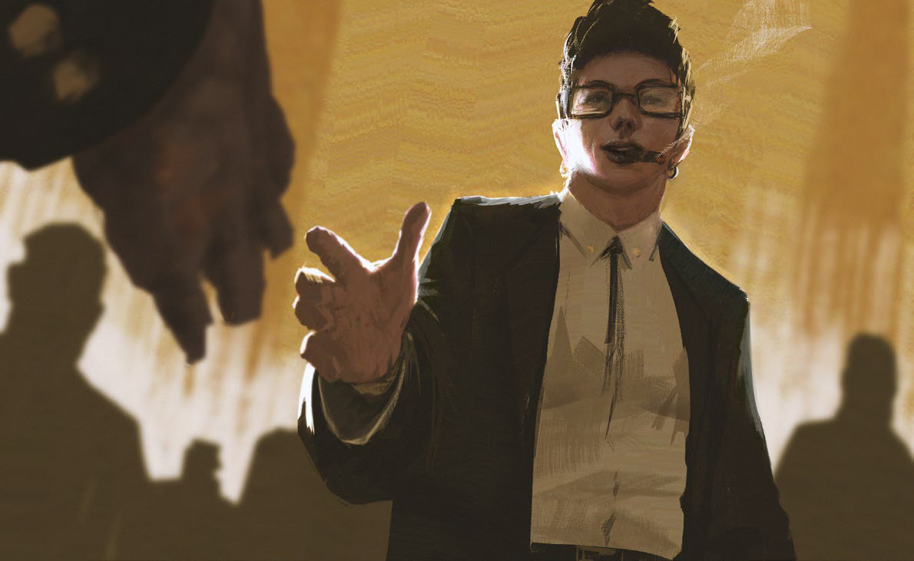

was the reason so many of our new­
found brethren were actively trying to 
put us on the other side of the Shroud. 
They had to go. Best not to ask how, 
it’s worked out pretty well for you. 
All that matters is that we knew new 
thinking was needed at the top or the 
bottom might just fall out, and some 
of us have been around long enough to 
have an idea of how that pans out.

The Promise of 1528 wasn’t just 
a promise we made to the Camarilla 
and they made to us. It was a prom­
ise that Augustus made to those of 
us who believed he wasn’t just a fat, 
bald fool with a God complex; those 
of us who knew he had the knowl­
edge of the arts to maybe pull off 
what he claimed he could. But 500 
years is a long time to wait to be 
proven wrong and we didn’t fancy 
him as the man to secure us the 
clout we need with an increasingly 
paranoid and fractious Camarilla 
or whatever will be left of it in the 
next ten years or so.

oldest and most powerful bank in 
the world. Not just one of money but 
of souls, spirits and secrets. The time 
has come to sweep out the old and 
bring in the new.

The Establishment

Now, don’t be put off by all this 
talk of big changes and kowtowing 
to these up-jumped necromancers. 
We’re not kneeling to everyone with 
a skull face and a few parlor tricks. 
They offered us knowledge and se­
crets we’ve been working to uncover 
for hundreds of years but, don’t 
forget, they embraced us because of 
what we knew that they didn’t. We 
let them think of this as a return to 
how things should have been, a re­
birth of our great founder’s ancient 
vision or simply an end of hostilities 
for a common good. What it really 
is, is consolidation. We’ve lost a 
whole load of useless clowns from 
the books and brought in people

A New Broom

It might surprise you to know 
that many of us had carried on  un­
der-the-table communications with 
hiding Cappadocians for a while. 
Some of us were even hiding them. 
Samedi were in negotiations with the 
Council over some artifact or other 
they claimed to have, Harbingers 
wanted us dead. Right? Of course, 
they only wanted some of us, the ones 
they stupidly thought were running 
the show around here. Well, we taught 
them better and now I’m teaching you.

That’s when the Capuchin 
turned up again. Always seems to 
turn up at the right time, that one. 
I’ll let one of the record keepers 
bring you up to date on what the 
Capuchin is; needless to say that it’s 
a better option than the fat load of 
nothing Augustus was offering.

This isn’t an empire, like he 
thought. This is a consortium, a 
company, a concern. This is the

13 3

CULTS OF THE BLOOD GODS

Family Business

who have survived against all odds and who have skills 
and knowledge we didn’t have access to before.

In return? Well, look around you. Where are we now? 
Whose hierarchy is it they’re hoping to climb? Whose 
house is it they’re living in… or underneath in some cases? 
They might have brought some innovations to the table, 
but we’re the establishment. If this is a merger, we’re the 
ones doing the buying. They can carry on under the um­
brella we’re holding, but they know we could take it away.

Our new associates will be joining your concern 
in the next week or so. I’ll need you to pass on the 
instructions as to how Hecata moving through the 
territory can reach you; obviously they need to make 
contact with you before they go through any Princes or 
whatever there is out in that featureless wilderness you 
hail from.

Sure, one of them is the figurehead now, but you’ll 
come to understand how things work around here. Like 
I said, this isn’t an empire.

Now, remember, these new folks are a bit weird. 
They’re not entirely like us. They won’t likely offer 
much on the business front, in fact you’ll probably have 
to keep them under wraps to some extent, but that’s 
for you to deal with. Treat them right and make use of 
what they bring to the table. As for your guys, they’ll be 
expected to carry out the traditional roles, making sure 
the local operation is well funded, housed and protect­
ed. If you have anyone working in the arts, any proteges 
you happen to be molding out there, they can probably 
learn a lot from our allies. Get them working closely 
together — if this all goes tits up, we want to get out 
with as much of their knowledge as we can. Until then, 
we proceed in good faith. Consider them part of the 
family for the purposes of Omertà. They don’t need to be 
locked out of the ritual chamber and kept away from the 
obsidian supply.

The Family’s Goals

Now that we’ve fixed our immediate problems, we 
go back to work. With so much of our estate now up for 
the claiming, we have a whole load of childer to bed-in 
to their new roles. The Camarilla might have questions, 
but until the term expires we don’t really need to worry 
about answering them, and our new situation makes us, 
I believe, the only clan in the night who is not actively 
at war with anyone else.

War, all around us. Endless, undead war. Sounds 
like something that might interest you, my friend? It 
certainly should if you’re half the Kindred your reputa­
tion suggests. Wars bring two things, death and profit. 
We need you and your, I’m sure, very capable progeny 
to find the ways to profit from the conflict in your own 
area.

Dealing with the Authorities

As for introducing your new guests to the powers 
that be, you’ll need to observe the rules of whoever that 
is. If you somehow happen to be in one of the places 
the Sabbat’s still holding, they don’t seem too both­
ered now the Harbingers are in the tent with the rest 
of us. As for the Camarilla, you’ll have to do the song 
and dance with the Prince. I always liked to introduce 
my new Embraces and arrivals together and travel as a 
group. Having said that, don’t take more than three at a 
time to Elysium with you; we don’t want them worry­
ing about the numbers game. I hear they’re all excited 
about how we seem to be in decline and retreat from 
some of the old strongholds. I envy you, you’ll get to see 
the look on the old Princes’ faces when you break it to 
them that it was just a short hiatus.

Be careful who you trust, even among your own. If 
they think they can step into your shoes just by bump­
ing you off then they will. Keep their eyes on the mys­
tery box. There’s a plan bigger than all of us out there 
and now we have the means to unravel its purpose, that 
sort of thing. They’re on a need-to-know basis, got it? 
As for you, do business with those people out there, 
let them know that we’re still a name they can trust 
and we’ll work with whoever runs things wherever we 
go. We don’t take sides unless we’re attacked. We don’t 
break a deal once it’s made. We do what we say we will 
do.

That, my friend, is why our name still means some­
thing in Kindred society. It’s the name that lives on, it’s 
the name that people remember and it should always be 
associated with promises kept.

Official line with them is that it’s business as usual. 
We’re still providing the standard services in finance 
and security as well as help in tracking down things, or 
childer, they’ve misplaced for whatever fee seems best 
to you. Make yourself useful to them and don’t become 
too much of a thorn. You know the score, you’ve been 
at this long enough to get a seat on the Council.

Of course, while that’s going on, we continue the 
great work of the rot and the renewal. Do you think 
you’ll be there when it all comes to an end? I don’t yet 
know how to perceive the action of entropy on some­
thing the size of the universe, but I know when I’ll be 
going at least.

13 4

chapter three: the cult of death and undeath

When the question is asked, and it will be, you 
play it with a straight bat. This is the way things are, 
they’re part of our arrangement and always have been, 
just now they’re more… what should we say… public 
facing? You’ll figure it out. You know the local yokels 
better than I do, I suspect. If they give you any trouble, 
we’ll try to shuffle the deck a bit, can’t have you getting 
embarrassed after making the big step up. It’s always 
fun to watch how a Prince reacts when the Hecata in 
their domain one night are different from the Hecata in 
their domain the next.

it is easy to manipulate conflict without getting one’s 
hands dirty, and thereby maintain a veneer of morality.

Yes, we have a history of dealing with death. Allow 
me to tell you about how we function in these nights.

The Timeline

I was never of the Sabbat, and I cannot speak as an 
expert on their current activities. What I can tell you, 
is the Harbingers joined the Sabbat largely in an effort 
to destabilize the Camarilla, but also to punish the 
Giovanni. I am often asked by younger Hecata such as 
yourself, “if the Harbingers were banished to Kaymakli 
by their clan founder, why were they so outraged at the 
Giovanni for killing him?” The answer is complex, so I 
will explain to you, little neonate:

No, don’t worry about it. I look after my friends 
well and my family even better. And we are family, 
right cousin? Now, I’ve got a few more people to in­
troduce you to before we can move in to the crucible. 
Don’t worry about them though, you’re here to keep 
faith with me. Don’t you forget it. Don’t forget who put 
you here, cousin.

• 	
The Harbingers were a favored Cappadocian 
faction of politicos, assassins, and saboteurs well 
before the Giovanni Embrace. Few could match 
their mastery over widespread and intimate deaths 
designed to alter the course of monarchies, em­
pires, and the fates.

The Harbinger Role

As recorded by Roger de Camden, Prince of Edinburgh, 
Pater of the Cult of Mithras, Wearer of the Death’s Head Mask

• 	
At some point, the clan founder (or his childer) 
decided the Harbingers (and other Cappadocians) 
weren’t worthy of the Blood any more, and decided 
to banish them to the Underworld.

My line — sometimes known as the Harbingers, 
other times known as the Cappadocians, though one 
is truly a subsect of the other, and I can say that with 
all expertise — should be dead. Don’t let arrogance 
convince you otherwise. If we were of any other line, 
we would be naught but ashes now.

• 	
Some Harbingers accepted the punishment, others 
fought, some never turned up for the hearing. In all 
cases, our resentment toward Father grew.

That’s the wisdom we need to retain to have a 
function in this new Hecata. The concept of “Hecata” 
is not new, however. If you believe our first clan name 
was “Cappadocian” or that Father’s name was tru­
ly “Cappadocius,” you’re a fool. Everything changes. 
Everything cycles.

• 	
The Giovanni, upon hearing how Father was 
prepared to punish even his favorite descendants, 
made plans to guarantee their survival. Namely, his 
death.

To an outsider looking in, the Clan of Death’s 
hierarchy is a shambles, and never more so than in the 
Middle Ages, when we looked like a collection of unaf­
filiated scholars with a messianic father figure perched 
over us like a vulture in a tree. What the outsiders 
couldn’t see, is we’ve always had structure. Once, it was 
schools of philosophy and later, proto-guilds, if you 
like. The Harbingers were councilors and saboteurs, 
their ambition one of disruption and misrule in service 
to delivering death in a myriad of ways. Plagues. Mass 
murders. Sieges that led to rulers more to our liking 
taking charge, and so on. You may ask, “I struggle to 
maintain my control and only feed when I must, so 
how could Harbingers even practice their trade and not 
devolve into wights?” and I must point out mortal pol­
iticians, generals, and religious leaders as evidence that

• 	
The purge commenced, starting with Cappadocius. 
The Giovanni then turned their gaze toward the 
rest of the non-Giovanni Cappadocians.

• 	
The Cappadocians (and some of the surviving 
Harbingers among them) turned to their long-
time allies among the Ventrue and other founding 
Camarilla clans for protection. The Camarilla in­
stead shut their doors to the Cappadocians, turning 
a blind eye to the internal conflict within the Clan 
of Death. Some Cappadocians banished themselves 
to the Underworld for protection, in exactly the 
same place Father banished their clanmates centu­
ries before.

• 	
(Some cynical Hecata might believe Father deliber­
ately banished the vampires he did to protect them

13 5

CULTS OF THE BLOOD GODS

New Blood in 

an Ancient Clan

from the Giovanni’s future 
actions, but that gifts an abu­
sive, manic Antediluvian with 
a great deal of foresight and 
benefit of the doubt)

a devastating assault on the 
Giovanni holdings in Venice, 
and surprisingly, enlisted many 
young Giovanni to aid them.

So you see, this timeline (which 
I believe is as accurate as any you’ll 
ever see or hear, though Marchesa 
Liliana disagrees on some points) 
leads us to tonight. All families 
have black sheep and all families 
have skeletons in their closet. The 
Harbingers are both, and only now 
making firm bonds with their wider 
clanmates despite historic enmities.

For a long time, the Harbingers 
could not Embrace new childer. 
Their vitae had gained a selective 
sterility after their long exile in the 
Underworld. As decades have passed 
since their emergence, however, 
the Blood is once again invigor­
ated, and you see new members 
of the clan. Fewer take on the 
name Cappadocian than they do 
Harbinger, and even more classify 
themselves as Hecata without any 
of the bloodline confusion, but the 
good news for the clan is fresh blood 
now enters play.

• 	
The Giovanni ruled the clan 
for close to half a millennium, 
before numerous Harbingers 
emerged from the Underworld, 
hungry for revenge. They wanted 
revenge against the Camarilla 
for abandoning the clan, they 
wanted vengeance against 
the Giovanni too, but not for 
hunting the Cappadocians to 
near-extinction. Remember 
most of the Harbingers were 
seen as failures to the wider 
Clan Cappadocian and they did 
not mourn the deaths of their 
clanmates. No, they wanted 
to persecute the Giovanni for 
destroying Cappadocius before 
they could.

How does this lead in to our 
role now, though? How does a clan 
so long kept in the dark achieve 
relevance tonight?

We use all our old gifts. Politics. 
Assassination. Mayhem. Epidemics. 
Choose one of the Four Horsemen 
and start riding with them. Tactics 
that worked well in centuries gone 
by still work damn well now.

The kind of existence a fledg­
ling or neonate Harbinger faces, 
however, is an unusual one. There’s 
a wider gulf between this clan’s sires 
and childer, in terms of age, than 
perhaps any other. Therefore, the 
clan commonly Embraces those with

But a further question. How 
does this apply to the fledgling 
Harbinger?

• 	
The Family Reunion took place 
after the Harbingers launched

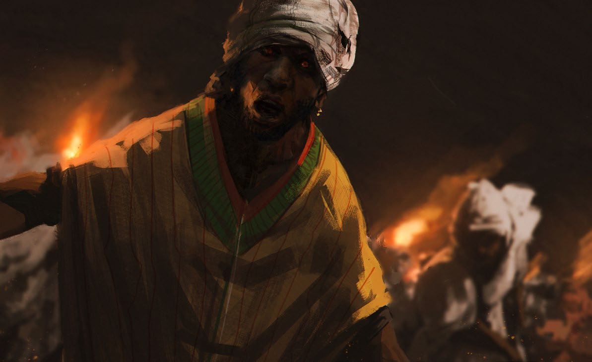

chapter three: the cult of death and undeath

a certain detachment from empathy 
and compassion (though not always, 
as it can make for an interesting 
case study), in order to utilize these 
new tools — sorry, childer — in 
ways appealing to the Harbinger 
ethos. That ethos being the study, 
mastery, and delivery of death on a 
grand scale.

No, the ambition of the 
Harbingers is one of subtlety. We 
know what the Giovanni excel at, 
and now that we’re working togeth­
er — except in those cases where old 
vendettas cannot be settled — we 
come in from an opposite angle. The 
Giovanni are perfect mercenaries, 
independent researchers, and frank­
ly, unparalleled necromancers. The 
Harbingers are still chamberlains, 
spies, and agitators, though these 
nights one might simply call them 
— or us, as I have been granted the 
Harbinger epithet despite never 
having received their curse myself — 
advisors to Princes.

start a war without leaving your 
fingerprints on the documents.

Factionalism

It is healthy for the Clan of 
Death to possess factions. We 
were always most functional when 
compartmentalized, and expecting 
a clan of individuals to march to 
the beat of a single drum is idi­
otic. Compare the Clan of Death 
to death’s many ways of touching 
people. When I ask you how your 
loved ones died, did they all go the 
same way? Or did they each have 
their own peculiarities, which made 
the events as distinct as they were 
memorable? So it is with the faces 
of our clan.

Not all Harbingers are socio­
paths and murderers, however. We 
know as well as any Kindred how 
easy it is to lose oneself to the Beast. 
We target pathologists, surgeons, 
soldiers who struggle to fit into 
everyday society, magnates, career 
criminals, and yes, the religious­
ly-inclined. Occultists these nights 
are hard to find, but any of the 
aforementioned professions tend to 
draw individuals well-suited to our 
aims.

The Camarilla and many 
Anarchs know the Giovanni. They 
know what to expect. They do not 
know what to expect from the 
Harbingers. When we enter their 
domains with secrets surrounding 
undeath, the Sabbat, and their 
enemies of the moment, and act 
as neutral parties for mediating 
conflicts… why, it’s almost as if we’re 
back to our old tricks, sitting beside 
or behind thrones.

Plans for the Giovanni

The relationship between elders 
and new blood within the Hecata 
is a strangely joyous sight, I must 
admit. For so long believed incapa­
ble of siring, the older Harbingers 
shower their young with care, 
tutelage, and firm direction as fresh 
vampires. This can edge into cod­
dling, making for some frustratingly 
entitled fledglings, and has from 
time to time entered into obsession, 
but for the most part the sire-childe 
relationship within our clan forms 
an impressive bond.

Let’s allow the Giovanni the 
numbers and the leadership role. 
They’ve held it for this long, why 
change now? But just as we put 
down roots in foreign domains and 
counsel Princes and Barons, we 
counsel our new Giovanni friends. 
We whisper words in their ears.

For all that the Tremere are 
powerhouses of knowledge and 
the Ventrue are political master­
minds, they do not know the inner 
workings of the Hecata. So pose as 
Caitiff, or even speak to a particu­
larly aged Ventrue and remind them 
of their once-reliable Cappadocian 
regent, and get into their good grac­
es. Work for them. Humble yourself 
to them. Speak to the Anarch Baron 
like they’re an old friend and you’ll 
bend over backwards to ensure 
they never suffer the crushing heel 
of the Camarilla again. Sprinkle 
your offers with enough truth to 
be believable, and worm your way 
into courts, Elysia, and powerful 
domains. They do not know we are 
aligned with the Giovanni. They 
barely remember who we are.

I cannot guarantee the status 
quo will remain as such for long, but 
what I can say is I’ve never antici­
pated such a productive future for 
our clan as I do tonight. “Productive” 
may not sound glamorous to one 
such as yourself, but what we intend 
to produce is a world better suited 
to our kind, and that includes the 
Giovanni.

I mentioned our aims before, so 
let’s move on.

Dead Aim

Apologies for the apparent con­
tradiction, but the Hecata’s Harbingers 
don’t just go around killing people, 
planting bombs, and spreading illness. 
If we did that, the other clans would 
have every right to destroy us. Perhaps 
that’s why Cappadocius was so unhap­
py with our actions in the Dark Ages? 
Who knows. He’s not around to answer 
questions, and believe me, plenty 
among us have tried to ask his spectre.

We must be careful to not fall 
into open war with ourselves so 
soon after cessation of hostilities. 
All childer must be educated that 
no matter what they might hear 
from their elders, they are not to 
attempt clandestine murders on 
another Hecata’s behalf. That is not 
how one achieves status within this 
clan. I understand Venice intends 
to mandate that killing on behalf of

Use that. Use them. Feed what­
ever information you can find back 
to the clan, and where possible,

13 7

CULTS OF THE BLOOD GODS

Hierarchy 

and Strains

another Hecata will soon result in 
torpor or final death, and that if a 
vampire of this clan truly does have 
a seething grudge in need of settling 
with violence, they must be prepared 
to wield the blade, gun, or torch 
themself. It’s an effective way of pre­
venting clan disunity, and surprising­
ly it was a Harbinger who proposed 
this in-clan law.

death with your fingertips” struggle, 
when not paired with fellows who 
received the same lecture.

The Samedi 
Role

We adopt much the same 
family hierarchy as exists within the 
Giovanni, it should be noted. We 
always called Cappadocius “Father,” 
and many Harbingers (and those 
still clinging to the Cappadocian 
name) use Latin or Ancient Greek 
terms, such as soror, pater, avus, 
and so forth. The religion to which I 
proudly subscribe makes similar use 
of the ancient tongue, and it also 
confuses the kine. Dead languages 
suit the Clan of Death, after all. We 
don masks for Harbinger-exclusive 
ceremonies, with more elaborate 
masks being awarded to Kindred of 
significant status, while fledglings 
wear simple death masks. It’s a fun­
ny form of pageantry, but it’s one of 
our oldest customs.

As explained by Lenelle, Mambo of 
Birmingham

Plans for the Samedi

Ignore the chatter about “three 
faces of death,” mate. That’s just a 
neat and tidy way of cutting out 
all the other faces. You’ll have read 
more than three names, but it’s the 
bosses who want you to think there 
are only three in charge. Giovanni. 
Harbingers. Samedi. Look, I ain’t 
arguing that it’s a plum position to 
be in the big three, but let’s get real: 
the Hecata’s one big stew, and at 
any time, a different face of death 
could rise to the surface.

Our relationship with the 
Samedi is a curious one, as depend­
ing on whom one might ask, they 
are vampires who fled the Feast of 
Folly, thereby making them close 
kin to the Harbingers; vampires 
who fled the Giovanni purge, like­
wise creating common cause; vam­
pires native to the Caribbean and 
Central America, with an unknown 
lineage; aberrant descendants of 
Clan Nosferatu — which I know is 
a long-shot, but many believe it; or 
not even vampires but corpses with 
spectres propping them up.

Our reliance on old parlance, 
rituals, and frankly the majority 
of our bloodline being considera­
bly older than those of most clans, 
strains the first few months or years 
of a Harbinger’s vampiric existence. 
It’s one thing to have a sire who 
barely knows what the internet is, 
it’s another to have one who’s still 
amazed at the concept of steam 
power.

Setting Down 

Religion

As scholars of death we wish to 
study the Samedi, but as they possess 
the ability to reason and say “no,” 
they tend to resent being poked 
and examined. Due to their centu­
ries-long agreement of peace with 
the Giovanni and all Kindred sects, 
while acting as effective mercenaries, 
they may well be pioneers of the 
Hecata way. They didn’t become so 
obsessed with vengeance or greed as 
the Cappadocians, Harbingers, and 
Giovanni, and instead pursued a 
way that strengthened their line and 
their studies.

If you have to stick with the 
trinity, because we know humans 
and loa both love putting things in 
threes, let’s say the Giovanni are 
the heart, the Harbingers are the 
skeleton, and the Samedi are the 
spirit. Hell, they’d probably shift it 
all around if they could, but sticking 
us with religion makes sense.

Despite the earlier mentioned 
close bonds between sires and 
childer, I do wonder at the break 
that might occur soon, if our elders 
can’t keep up with modernity or 
if more childer are not created to 
form kin for our fledglings. In the 
meantime, we pair our newcomers 
with young Giovanni and Samedi, 
and sometimes with vampires of 
the Lamiae or even the Nagaraja. 
There is something to be said for 
communal suffering and trauma 
creating a firm bond between vic­
tims. Individuals who were mortals 
last week and have now been told 
“you’re undead and can manipulate

The Giovanni are sacrilegious, 
holy icon-fucking bastards who will 
fold into whichever faith gives them 
the greatest access to spirits and 
bodies. They’re the heart because 
they’re defiant, ballsy, and willing to 
do anything to get what they want.

They must be respected, and it 
is to be expected that they maintain 
their mysteries, just as we do ours, 
and the Giovanni do theirs. I rec­
ommend befriending one of these 
rotting bodies, however, as loyalty 
to coterie tends to trump loyalty to 
bloodline, even among the Hecata.

The Harbingers, or 
Cappadocians, if you want, are 
pretty irreligious too. Oh, you 
probably heard about the ones who 
didn’t believe in God getting sealed 
up in a cave? I bet you £10 you don’t

13 8

chapter three: the cult of death and undeath

Religious Practice

even know which God. Neither 
did they. They were less likely to 
abuse religion than the Venetians, 
but more likely to shift with the 
winds and support the faith that 
most appealed to them at any given 
time. Whichever one offered their 
precious answers.

but do it in a way that feels impor­
tant to you. It’ll help soothe your 
soul, and if they’re out there and lis­
tening, it’ll soothe them too. Being 
dead is no picnic, so to have one of 
the living or undead singing songs 
for you, pouring out a drink, or 
telling tales of your living exploits, 
makes a friend of someone behind 
the curtain.

We Samedi have a few rites we 
practice with regularity. Trust me: 
doing these will make your unlives 
better, the dead happier, and might 
even draw some vessels to you when 
they think you’re fun or mystical or 
whatever.

Now you come to us. Samedi. 
Vodun. Vodou. Voodoo, if you’ve been 
watching too many movies. We’re 
about more than just dolls with pins 
in them, and face paint come time for 
a parade. But what we do have, is a 
deep-rooted faith. We believe in the loa. 
The loa speak to us. We’ve believed in 
them for centuries, and yes, it’s all mar­
ried to the Catholics, but we can see 
what awaits vampires on the other side. 
We know what’s waiting for us in the 
Underworld. The loa help protect us in 
exchange for sacrifices, partly because 
they want the rich tidings we send 
their way, partly because we’re the only 
vampires who talk to them regularly, 
and also, I suspect, because they know 
what shit awaits us when we die.

SACRIFICE

SERVICE

Killing animals, drinking their 
blood, then cooking their meat for 
sustenance is common among our 
mortal servants. Some of us can 
obviously indulge in animal blood, 
if we’re new to this undeath, while 
others make the sacrifice more… 
bipedal and sapient. Needless to 
say, making a murder of anything 
into a ritual, where you celebrate 
the meaning and importance of its 
death and dedicate its passing to 
another force, always goes down 
well with the loa.

We exist to serve. This applies 
to the living and the undead. We 
owe a hell of a lot to those who 
passed before us, so when a spirit 
makes the effort to ask a favor, you 
damn well better be sure you’re 
going to do it. And turning it down 
is better than accepting the task 
and then backing out of the deal. 
As long as you treat the dead with 
respect and do as they ask, they’ll 
tell you so many secrets and come to 
your aid when you need it the most. 
Trust me. I didn’t become a mambo 
by pissing the loa off.

VEVES

This is a rite I recommend 
all Samedi practice, as well as our 
brothers and sisters among the 
Hecata. Veves are inscriptions, 
sometimes called holy symbols, 
wards, summoning signs, or other 
carvings of importance to the dead. 
You mark them on your floor or 
your wall in the correct colors, 
materials, and depth, and the loa 
you’re calling will enter your body 
and take a ride for a while. Seems 
simple, but make sure you’ve placat­
ed this spirit first. You’re not going 
to enjoy playing host to an angry 
Papa Legba, but you might love it if 
you’ve shown him some love first.

While the Giovanni and the 
Harbingers campaign for the end of 
the world (or at least it seems that 
way), we’re laying down honest to 
goodness faith for our childer. We 
teach them to respect death and the 
dead, to always placate the spirits 
with gifts and occasionally blood 
sacrifice, and to fear the retribution 
of those you kill. As vampires, we 
stand to make a lot of angry spirits. 
The loa offer us some protection, 
but it’s better to win their support 
than piss them off with one drained 
vessel after another.

New to the Rot

You’re never going to be re­
garded as much more than a distant 
cousin to the Giovanni. Yeah, most 
of you don’t come equipped with the 
necrosis the older Stiffs exhibit, but 
the beliefs, the long-time removed 
nature of our line, and the fact our 
leader, the Baron never kneeled to 
Augustus or any of the rest of the 
Venetian Mafia (a ridiculous con­
cept, by the by), makes the Famiglia 
look at us like we’re wild horses 
ready to bolt or buck at any second.

I’m happy to say that many of 
our clanmates among the Hecata 
have adopted our practices in recent 
years. I suspect pragmatism drives 
them to it more than any pure 
belief, but I’m not complaining and 
neither are the loa. They don’t grow 
in power through faith alone: they 
want relics from our world passed 
through to theirs. In return, our 
existences become a lot easier.

They’re not far off the money. 
The Harbingers, the Cappadocians, 
the Giovanni, the Lamiae… they’ve 
all been connected like the big 
incestuous freaks they are since time 
immemorial. Us? We’ve always been 
the outsiders. I guess the Nagaraja 
are too, but I can count the number 
of them in the Hecata on my fingers 
and toes and still have change.

CELEBRATION

A lot of folk associate us with 
some kind of 24-hour party culture, 
and I can only blame New Orleans 
for that. A lot of us are a little more 
introspective than that, and so 
much of itis blatant commercialism 
these nights. No, I recommend you 
celebrate the dead on the regular,

13 9

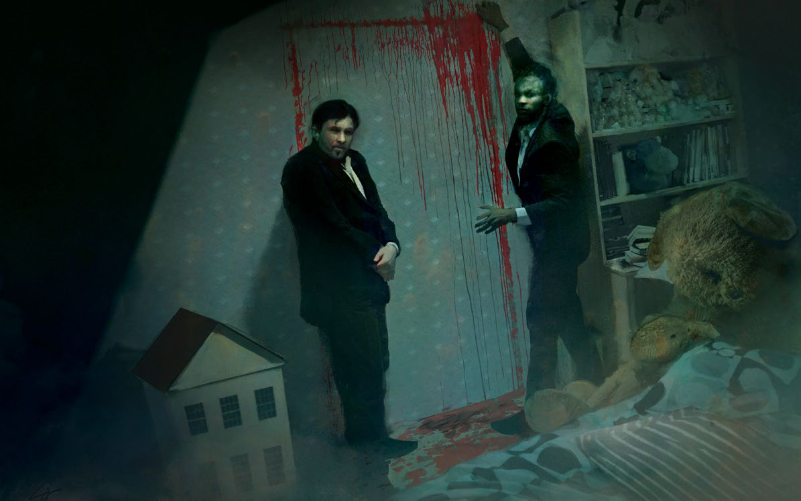

Where does this leave you, new 
blood? It leaves you serving the val­
uable purpose of neutrality in times 
of conflict, of spiritual counsel in 
times of crisis, and of murder when 
one of the families is getting out of 
line. If they wanted to, they could 
all rise up and crush us. But they 
don’t, because they know this wedge 
between them is valuable.

do. We tell our charges where they 
fucked up, then we offer them a way 
of fixing it. If it requires hot words, 
we’ll speak them. If it requires a new 
start, we’ll arrange it. If it requires a 
bullet, we’ll fire it.

do that. The best necromancers 
take their time to know the world 
beyond their own.

That raises an interesting topic 
though. There’s lots of shades of 
necromancy. The Giovanni have 
always been obsessed with spirits. The 
Cappadocians of old were more fo­
cused on the flesh. The Harbingers had 
some obsession with making dead bod­
ies take on the traits of the living. We 
would raise the dead as our servants. 
Yeah, Dawn of the Dead kind of stuff.

This is who you are now. You’re 
a step closer to death than any other 
clan, so you can witness it, touch it, 
wield it. You can face the end with 
certainty, and make everyone else’s 
denouement so much worse.

But you were just a priest when 
you were alive, weren’t you? Or a 
therapist, an undertaker, a bod­
yguard, or a good old-fashioned 
owner of a curiosity shop. How can 
you be expected to administer balm 
to feverish vampires when you’re so 
new to the Blood yourself?

Being a Samedi means being on 
the outside, but it also means surety 
of purpose and not having to kneel 
to Venetian or Camarilla pricks.

Necromancy comes in a ton 
of flavors, and you’re never going 
to experience them all. With the 
consolidation of the Hecata though, 
the different families have taken to 
sharing a little more than we used 
to. Now, a Samedi might have a 
Rosselini as a Mawla. A Harbinger 
might join the same coterie as a 
Milliner. We exchange secrets and 
suddenly, our clan is stronger. 
Working together has benefited us! 
Who’d have thought that possible.

Shifting Tides 

of Necromancy

With force of personality, my 
friend.

We’re not “there, there” hand-pat­
ters, we’re not going to tell them 
everything’s going to be all right, and 
we’re not going to offer them some 
sublime outcome like the Ministry, 
Bahari, and the rest of those charlatans

Reaching into the Underworld 
and hurling what you grab at an 
enemy is a good way to lose your 
hand to the great unknown. Don’t

14 0

chapter three: the cult of death and undeath

The Lamiae

Now, there’s some interesting 
developments in the realm of the so-
called “dark arts.” We’ve cultivated 
a ceremony that allows any Hecata 
with the right components and tute­
lage to take on one of the loa. We 
Samedi are becoming a little more 
interested in the spirit — as my talk 
earlier probably implies — than 
shambling corpses. The Giovanni are 
all about binding the dead, which 
greatly piques the Harbingers’ 
interests. Likewise, the Harbingers 
have taught others how to consume 
the stuff of ghosts when blood just 
won’t suffice.

with god complexes. You know: The 
Camarilla.

We’re the part of the Clan of 
Death that emphasizes rebirth. That 
part of the cycle is important, even 
if the other necromancers focus too 
heavily on the death and decay. We 
have to continue to develop our 
minds, motives, and activities if 
we’re to avoid stagnation, because 
trust me, in the locker room with 
the other members of the squad, the 
stink of rot is bloody overpowering.

In times past, we were the Clan 
of Death’s bodyguards. None of us 
male, all of us descended from the 
vampire Lazarus dubbed “Lamia.” 
Our prestige came through dedica­
tion to the clan, its principles, and 
our discovery of how humours in 
the blood might affect a vampire 
drinking them.

Yep, that was our discovery. It’s 
no hollow boast.

I suspect one part of the Clan 
of Death needs to make common 
cause with the Anarchs, or House 
Carna, and I can’t imagine a better 
faction than our own to do the 
job. We’ve many things in common 
with both groups, and a union of 
Anarchs, House Carna, the Lamiae, 
and the Bahari, with the Hecata 
profiting sounds like it may suit 
Lazarus’ goals too.

In any event, the Giovanni 
destroyed the last of us several 
centuries ago. The Lamiae were out 
of the picture for at least 200 years, 
maybe longer. It’s difficult to tell 
sometimes, when ancestors pop out 
of the ground only to be destroyed 
sooner than they can leave a note to 
say “hi, I’m here!”

Yeah, I can’t advocate that one.
My point is, as new schools of 
thought open to us, our clan chang­
es. And so the merry-go-round goes 
round and round and up and down, 
and the Clan of Death becomes 
something new, and exciting, and 
dangerous.

The question is, how are we 
here now, and what purpose do we 
serve?

Yeah, being undead sucks some­
times. But I’d rather know death 
personally, than stumble blindly 
into his grasp some night like an 
idiot from some other clan.

The Cappadocians

You might say we’re proof of 
the resurrecting power of vitae and 
Lazarus’ beneficence, or his dedica­
tion to whatever plans exist in his 
ancient skull. Before his vanishing 
(and the Giovanni maintain the 
Clan of Death does not feel the 
Beckoning), he Embraced another, 
a high priestess of the Bahari, and 
through nuance of the Blood we 
were born anew. All of her childer 
were mortal lilin, and all of their 
childer were likewise, and so on. 
There aren’t many of us at this time, 
and we’re far less inclined to act 
as unquestioning bodyguards to 
this clutch of necromancers, but 
our founder… well, she says she’s in 
communion with the spirit of Lamia 
herself. In turn, she says Lamia has a 
purpose for us. We’re to strengthen 
and fight against those who would 
control us. For now, that does not 
include the other Hecata, but it 
does mean we often act as hired 
guns for the Hecata against Sheriffs, 
Archons, Princes, and other assholes

The Harbingers would have 
you believe that they represent all 
Cappadocians and that the Clan of 
Death we once knew has changed 
nameplates or merged with their 
political, formerly Sabbat breth­
ren. This ain’t the case. I mean, not 
entirely.

The Role 

of Others

Cappadocians separate from 
the Harbingers still exist. Studious, 
morbid vampires, rarely bothering 
to use the Blush of Life to even 
imitate mortality, I wonder at how 
long these Kindred can survive 
in these modern nights. I believe 
when the Hecata formed, some 
benevolent-feeling Harbingers and 
Giovanni woke these Cappadocians 
from torpor, hoping to introduce 
them to a brave new world. Instead, 
these shell-shocked Graverobbers 
found a world in which they were 
forgotten, their name scrubbed 
from all records, and their methods 
of necromancy hopelessly outdated.

From the words of Zelda Booke, 
Lilin of the Lamiae

You’ve read the perspectives 
of members of the Giovanni, 
Harbingers, and Samedi, and I’m 
sure you feel at least somewhat ed­
ucated on the structure of this clan 
of ours. Giovanni on top directing 
operations, Harbingers wielding 
their ancient might and fraying 
enemies’ powerbases, and Samedi on 
the outside, providing sage counsel 
and ceremonial wisdom.

Where does that leave the rest 
of us? Allow me to fill in the blanks.

141

CULTS OF THE BLOOD GODS

One could feel pity, or consign 
them to the fire, but I’ve got a feeling 
the entire idea of Cappadocians-
as-reclusive-hermits is one hell of a 
good con. These vampires have lost 
none of their intellect, their skill 
in meddling with the Underworld 
and turning living flesh into crum­
bling ash. They’re waiting, they’re 
observing, and they’re calculating 
whether to depart the Hecata in 
favor of the Camarilla or launch a 
coup against the Giovanni in retri­
bution for centuries of persecution. 
My spies tell me they’re feverishly 
researching necromantic arts, and 
they’re not inclined to share their 
results. One informant even believes 
they’re responsible for Augustus’ 
disappearance.

they’re the drivers behind a lot of 
our actions tonight. Others (mostly 
of my line) say the Lamiae are the 
rebirth part. Others still — we call 
them “the eaters” — say the cycle is 
Cappadocians as feast, Giovanni as 
promise, Hecata as reunion. Then 
you’ve got the real activists called 
“Hecatites” (I know it’s confusing, 
but that’s philosophers for you) 
who say the Cappadocians somehow 
represented life, with the Giovanni 
as death, and the Hecata as rebirth! 
It’s a mess, and if Serena was still 
around tonight, and not off do­
ing whatever the hell she’s doing 
in Jerusalem, maybe we could ask 
whether it was a musing or a deep 
thought on her part. As it is, no 
Kindred volunteer to go to that 
part of the world. At least, not right 
now.

good thing, though it does make me 
wonder if they’re trying to keep us 
from something. I’ve heard they take 
on the roles of protectors, gatekeepers, 
or exploiters of the weakest parts of 
the Shroud between our world and 
that of the dead. The best method they 
find to make these city blocks and 
low-populated regions their territories 
is to hound the rest of us with spectral 
servants or spread the easy rumor 
among the living that a serial killer 
stalks the area.

Unlike the rest of us who 
suffer from the agonizing bite, the 
Nagaraja — who do share our weak­
ness — can’t even hide it behind a 
smile. Some have teeth like those 
of a shark or alligator, while others 
have teeth resembling needles. There 
are many reasons these bogeymen 
among necromancers are uncommon 
in Camarilla and Anarch domains, 
with horrific appearances and a 
predilection for eating their victims 
chief among them.

One thing I know for certain, 
is the Cappadocians who Embrace 
share the Harbinger devotion to 
schooling their childer, and it’s 
here that you recognize the fire of 
passion. These Cappadocians need a 
cause, a purpose, and following de 
Camden’s lead, some even position 
themselves in titled roles within the 
Ivory Tower. Maybe forging their 
own, separate path is what’s best for 
them.

The Nagaraja

There’s not much I can tell 
you about these flesh-eaters. I’m 
not even sure they’re a part of the 
Hecata, as they’ve never shown 
much of any interest in affiliating 
with the Clan of Death, beyond the 
occasional trade of secrets.

Consider all lines of the Hecata 
from a mortal perspective. Mortals 
understand family and hierarchy, so 
the shock of becoming Giovanni is 
lessened. Mortals understand plot­
ting and vengeance, so Harbingers 
are at least somewhat palatable. 
They understand reverence for the 
dead and celebration of life, so the 
Samedi’s activities make sense. Then 
look at the Nagaraja. Which mortal, 
Embraced into this line, could 
maintain their human core for long 
while resembling a dire beast and 
obliged to devour their victims?

In the meantime, of the 
Hecata’s lines, the Cappadocians 
cling pretty closely to the 
Harbingers. As far as I’m con­
cerned, they’re one and the same, 
and most of my kin agree. They’re 
appearing more and more in Hecata 
and Camarilla domains, so it’ll be 
interesting to see how their role 
shakes out.

What I do know, is the Nagaraja 
have a greater presence in Asia than 
they do any other part of the world. 
Asia is a large continent, of course, 
but as the Giovanni and Harbingers 
have struggled to make a foothold 
in India, China, and Japan, to name 
but a few great nations, it’s pretty 
common that the Hecata come to 
blows with these cannibal Kindred 
when wishing to explore mass grave 
sites, ancient temples, or even claim 
territory near hospitals, morgues, 
and cemeteries — our usual feeding 
grounds.

If you are to deal with a Nagaraja, 
for the love of Lilith take backup. 
These vampires terrify even the coldest, 
most iron-willed among us.

One thing worth noting: it was 
a Cappadocian, Serena Praha, who 
proposed the idea of the Hecata be­
ing representative of a cycle, though 
typically, every bloodline interprets 
the cycle theory differently. Most — 
sometimes called “Hecata Truists” 
— see the Cappadocians as death, 
the Giovanni as decay, and the 
Hecata as rebirth. The truists are a 
pretty firm cult within a cult and

And More Besides

Their role among we necromantic 
types is to exist as terroristic types to 
mortals, vampires, and wraiths alike. 
Few vampires so easily scare me as 
the Nagaraja. Their isolation is only a

A scholar of Kindred ancestry 
looks at the Ventrue, hums and 
haws, fills in some names on a fami­
ly tree and feels satisfied. That same

14 2

chapter three: the cult of death and undeath

scholar looks at the Gangrel, realizes 
there’s too many blank spaces to 
bother, and considers that clan a 
worthless study group. Then, the 
scholar moves on to the Hecata.

operate. While the Putanesca cling 
to the terms familiar to their crim­
inal past, such as Don or Soldato, 
others have their own regional 
versions and quirks. Above all of 
that, though, is the more rigid 
structure of those who fulfill what 
the clan sees as its true purpose: the 
study of “The Rot and the Renewal,” 
and the mastery of “the Arts,” or 
necromancy.

Council next week. The landscape has 
changed, as you predicted.”

— Euan Dunsirn to Ranald Dunsirn

Those Kindred who trace their 
siring back to Clan Giovanni have 
always existed in a structure all their 
own and continue to do so. With 
that in mind, it was natural this sys­
tem would continue on and become 
the basis of the nascent Hecata. 
While the other offshoots of the 
Clan of Death were far less formally 
structured, this convocation of clans, 
this reuniting of the disparate parts 
of Cappadocius’ ancient blood, re­
quired something more rigid to hold 
it together. As the most numerous 
of the survivors of previous purges 
of the unworthy from the Clan of 
Death, it is the structure of Clan 
Giovanni that was adopted when the 
agreements were made.

The scholar has never felt so 
confused.

Maybe a score of families, not all 
with the same progenitor, each with 
different preferences and practices, 
each with respective feuds. Somehow, 
the Clan of Death is the one most 
burgeoning with a form of life. 
Untangling our roots is an impossible 
task, so don’t bother. My clanmates 
often say “there are as many clans of 
death as there are ways to die” and 
they’re correct.

Who’s Your 

Daddy?

Hecata Kindred place a great 
deal of emphasis on trust and loyal­
ty. After all, when you have as many 
skeletons in your closet as these 
depraved vampires, literal skeletons 
in many cases, it pays to be able 
to keep secrets. For example, Clan 
Giovanni is more than just a loose 
association of Kindred with a com­
mon sire whom most of them don’t 
even know. They are a culture, one 
steeped in the history and traditions 
of their bloodlines and of peoples 
that existed long before many mod­
ern nation states, and even before 
Augustus Giovanni was offered the 
Embrace.

Beyond the ones you’ve already 
heard about, there are lines such as 
the Impundulu and Mla Watu, largely 
dominant in Sub-Saharan Africa. 
They’re not officially members of the 
Hecata (not that we have member­
ship cards), but I’m not denying their 
affinity for death magic.

For some of those outside the 
family, such a change is difficult 
and seems like an impinging upon 
their previous freedoms. Though, for 
many more of their clanmates, the 
rules and traditions of the Giovanni 
offered safety and a more elevated 
lifestyle. For the Giovanni them­
selves, casting off their previous 
management is not a call to cast off 
their traditions; traditions that they 
hold as dear as the Camarilla holds 
theirs; traditions based on bonds of 
blood beyond vampiric vitae, based 
as much on who gave birth to you as 
who sired you.

The Unhudo of South America 
resemble corpses much like the 
older Samedi, though theirs is a 
mummified appearance. Perhaps 
they’re also distant cousins to our 
clan. They remain common south 
of Nicaragua, though I’ve heard 
of some appearing in Phoenix in 
Arizona and one acting as a Sheriff 
in Albuquerque, New Mexico.

Those Embraced into the 
Hecata are often prepared for the 
event, even if they themselves did 
not know it. The vampires who 
grant them the so-called “proxy 
kiss” of ghouldom, or who actually 
Embrace them, will often be figures 
from their past who they have likely 
been aware of for much of their 
lives. For that reason, they will often 
continue to use those familial terms 
like Mother, Father, Uncle, Aunt, 
Niece, Nephew and Cousin when 
referring to one another, since that 
is what they are to each other.

I wouldn’t be surprised if further 
faces of death show up periodically, 
some ancient, some new. There’s a de­
lightful irony that perhaps the most 
fertile of clans is the one so preoccu­
pied with life’s end.

Unlike the Camarilla, the 
Giovanni family’s hierarchy is for­
malized not by domain and praxis, 
since they may not be present in 
every city in a country. It is far more 
linked to those who wield control 
of the family’s influence in an area. 
What form that influence takes 
is dictated by the desires of the 
Capuchin, the 1444 Chamber and 
the Council of Anziani. The exact 
names of the “ranks” are referred to 
in many ways by the various families 
and locales in which the Hecata

The Family 
Hierarchy

Childer in Clan Giovanni are 
extensions not just of their sires, 
but of the parents who begot them, 
a quirk some members of the other

“Uncle Ranald, the affairs of the 
Chamber have kept me long overdue, 
though I hope I won’t miss you at full

14 3

CULTS OF THE BLOOD GODS

Hecata bloodlines have begun to 
adopt themselves. Those born of 
outsiders, who were not bathed 
in the culture of the family from 
birth, whose loyalty and compe­
tency is not completely beyond 
question even before the Embrace, 
are regularly looked down on in 
favor of those with more rarefied 
breeding. Often, they are treated 
as outliers, relegated to performing 
menial tasks such as bodyguarding 
more important Kindred or simply 
providing a very specific boon to 
the local family.

expanding into the Far East were 
the Jesuit Della Passaglias of the 
earliest trade missions and the dy­
nastic Weng family. In West Africa, 
the Ghiberti were long-term agents 
of the Giovanni, brought into play 
for their long-standing loyalty and 
the influence they garnered in the 
continent.

not just the faces that have changed, 
taking on an often more hellish 
and undead façade, but the names. 
While before some Kindred would 
have only dealt with a Giovanni or 
a Rosselini, they will now hear far 
greater variation. While such change 
draws questions from observant out­
siders, the Hecata are not interested 
in answering them, especially when 
a clanmate changes their surname to 
“Cappadocius” or “di Cappadocian.” 
To the outside world, the Giovanni 
present a show of unity and con­
tinuity. Not only is this the way it 
is, it is the way it has always been, 
others simply did not have the wit 
to notice it.

All of these families and more 
have been blessed with the vitae 
poured down through the Giovanni 
family, and each has expanded their 
influence across the mortal and 
Kindred world. In these nights, the 
stranglehold of the Giovanni family 
has given way to a more mixed lead­
ership at the top of the rotting tree. 
Indeed, a new wave of families from 
across the globe are being consid­
ered as new additions to the reborn 
Hecata.

The Families

Coterie or Family Tree?

Originally only Embracing 
from within the Giovanni family 
itself, the clan was broadened with 
the inclusion of many others from 
near and afar. Their competitors 
both in mercantile ventures and the 
pursuit of the dark arts of necro­
mancy, the Rosselini family were 
brought into the fold in the 16th 
century, with some even having 
been Embraced by Cappadocians 
prior. The Sicilian Putanesca, whose 
criminal activities lend both muscle 
and a mafioso mask to the clan’s 
true intentions were added much 
later. The cannibalistic Dunsirns 
of Scotland were brought into the 
clan for their trade links to the 
New World and their knowledge 
of the entropic mysticism of the 
Nagaraja, an Indian bloodline 
with ties to the Ministry and the 
Underworld. The clan’s arrival in 
the United States eventually saw 
the financiers and political legacy 
of the Rothsteins and the Bostonian 
Milliners added, and the growth of 
Kindred influence in the burgeoning 
superpower has seen those families 
rise to greater prominence despite 
their younger membership. Tales 
from the conquistadors exploring 
South America told of the walking 
corpse that was Pochtli and led to 
the addition of the Pisanob family;

While coteries form out of 
necessity, mutual need or simple 
safety in numbers, Hecata coteries 
are often based around years-old 
friendships and alliances, ties to 
common sires, grandsires or even 
more ancient progenitors, or quite 
literal family ties. With the amount 
of inbreeding and interbreeding in 
the Giovanni families, almost any 
member of the clan is a blood rela­
tive to another.

Behind the closed doors of 
their manor houses and crumbling 
mausoleums, Giovanni boast of the 
young girl they have coming up 
through their ranks. “Why, she’s 
the great-great-great-great-grand­
daughter of Evangelista diGiovanni! 
She’s been raised from birth to 
understand her family was different! 
She’s been taught all she needed to 
be taught to prepare her for this 
moment! She’s going to set the night 
on fire and bring just the spark the 
local family is looking for, all she 
needs is a sponsor to bring her into 
the fold!”

Within the Hecata, the 
Giovanni are the most populous and 
prolific of the clans and also those 
with the most temporal power and 
wealth. They often act as the glue 
binding the disparate branches of 
the Clan of Death together, provid­
ing a haven and a mask of legitimacy 
that hides the terrifying studies and 
experiments that the members of a 
coterie conduct within. Members of 
the Hecata will very rarely seek to 
align themselves with those outside 
on a basis other than the purely 
mercenary. While they may be hap­
py to extend their protection and 
hospitality to any Kindred they en­
counter, such services are always for 
a price and the relationship remains 
strictly business unless sealed with a

Like an ancient statesman or 
merchant family looking to seal a 
merger or alliance, the Giovanni 
trade their children to each other 
for an Embrace that will ratify a 
pact, and write the blood of their 
own children on contracts that 
never end, promising unchecked 
familial loyalty until the end of the 
world.

With the addition of their 
old foes and former clanmates, 
the Giovanni talk of “expanding 
the gene pool.” Now when people 
encounter the Clan of Death, it is

14 4

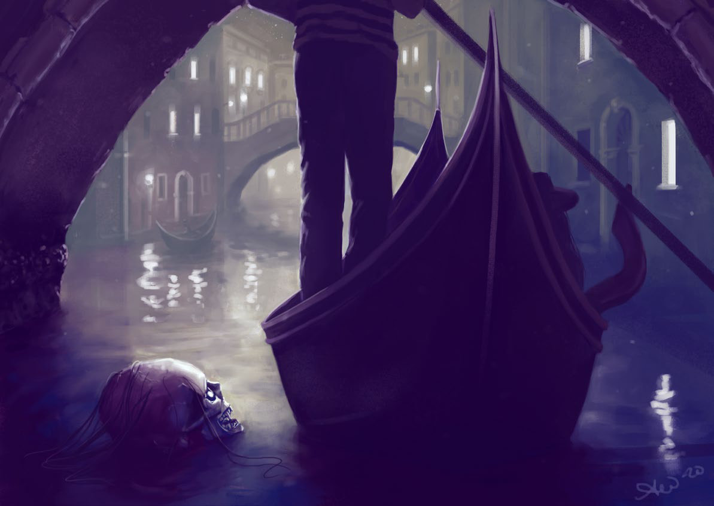

Blood Bond to ensure the loyalty of 
the supplicant. The code of silence, 
or Omertà, that surrounds the fam­
ily’s practices forbids submitting to 
Blood Bonds or sharing the deepest 
secrets of the clan with outsiders.

and takes note of where it can 
capitalize.

formalities of Boons, as these en­
trench them too deeply in Camarilla 
society), with unclaimed territory 
handed over to them, and through 
access to artifacts, sites, and people 
who might further their under­
standing of more esoteric matters.

The Hecata are, as well as the 
Clan of Death, a family of merce­
naries. By the Promise of 1528, they 
cannot officially involve themselves 
in the Jyhad between sects. Plenty 
of Necromancers test this, such 
as Roger de Camden, as Prince of 
Edinburgh, and Carlotta Rosselini, 
Baron of Naples, though to date 
no Giovanni hold such title. With 
the exceptions aside, the Hecata’s 
neutrality places them in prime 
position to act as mediators, advi­
sors, and killers, all impartial to the 
conflicts around them, of course. 
The only restriction is they may not 
benefit politically. They can, how­
ever, benefit monetarily, through 
favors to be repaid in the future 
(the Hecata shy away from the

Outward Facing 
Operations

The Hecata position makes 
them an easy target, as they have 
no official allies within the sects. 
It might seem strange then, that 
few coteries receive word from 
on high to assault the clan’s hold­
ings. Neonates may wonder at the 
“why,” given the Necromancers 
are apparently vulnerable. Mawlas 
with any wisdom tell them, “Attack 
an Anarch domain and you’ll get 
pecked at by a few angry, but 
disparate Brujah and thin-bloods. 
Attack a Hecata domain and you’ll 
have an entire, united clan bearing

Their position as the only in­
dependent clan of note in tonight’s 
Kindred society places the Hecata in 
a dangerous, yet potentially profita­
ble position. While a portion of the 
clan faces inward, studying philoso­
phy and ceremonies relating to their 
death magic, the Underworld, and 
their unhallowed ancestry, another 
portion looks outward at the world

14 5

CULTS OF THE BLOOD GODS

down on you for years afterward. Just leave them 
alone.” The Camarilla or the Anarchs could surely crush 
the Hecata if they could all pull in the same direction 
for more than a single night, but to date, such a united 
front seems unlikely. Meanwhile, the Hecata are always 
primed to fall into lockstep and counter-attack, though 
such skirmishes are rarely profitable.

and study of the Sudario, or Shroud, and the bizarre 
dimension beyond, the Shadowlands, the realm of the 
dead. To these individuals, nothing else matters and 
any Kindred would be wise to remember this when 
dealing with those who have climbed to the top of the 
Hecata’s ranks.

Gaining the attention of an anziani is a great boon 
for any Hecata looking to advance their station within 
the Clan of Death. However, it comes at a cost. While 
the missteps, mistakes and failures of less celebrated 
Kindred are treated with a sort of benign neglect, those 
who have shown promise are doubly punished when 
they fall short of what the clan expects of them. Just as 
the Cappadocians of old punished their kin by entomb­
ing them for centuries, the Giovanni have their own 
ways of handling failure.

Other than working as hired guns and diplomats, 
the Hecata field a wide array of experts on matters of 
money, death, and the dead. While the average Hecata 
knows little of the Underworld or its inhabitants, plen­
ty come from moneyed families and can act as lenders 
and sponsors for other Kindred activities, whether 
in the form of a long-term investment or short-term 
heist with quick returns. Others act as mediums when 
vampires want to speak with ghosts, enlist the dead as 
spies, or more rarely, as exorcists when Kindred want to 
banish a bothersome spirit. Of course, anything a ghost 
spy sees when in the employ of the Prince goes straight 
back to the Hecata as well as the domain ruler.

The Anziani Council

Foremost among the elders of the Clan of 
Death, the anziani sit in a great conclave within the 
Mausoleum and there set the policy the whole clan 
pursues. This gathering of ancient blood once rep­
resented those who had contributed the most to the 
Giovanni family’s great plan. It has now become a 
broader church, incorporating the overall leadership of 
the entire Hecata family.

The Venetian Ladder

“Our society is not so different from yours. We all want to 
take that next step. Sometimes it’s knowledge, sometimes it’s an 
artifact, a company, something the family needs, sometimes it’s 
just someone who needs to be stepped on.”

The council has many groups within it and small 
pockets of collective influence, though they are for­
bidden from working openly against each other. What 
the Hecata have that other clans lack is a certainty in 
the unity of their purpose. While they have pursued 
disparate aims in the past, their ultimate goals were 
always unified within the teachings of the Clan of 
Death itself.

— Lia Milliner, Money Launderer for the Boston Hecata

All childer Embraced into the Clan of Death 
are brought in with one thing in mind: to climb the 
Venetian Ladder. Only the most long-lived and storied 
necromancers in the clan may take their place as one 
of the respected elders, the anziani, whose guidance 
helps establish the policy of the entire organization. 
Such Kindred may not even be seen as the “leading” 
members of the clan in their area by those outside, 
but those within know the value and respect of Venice 
is won not with the grandest tithes, but with break­
throughs in the arts.

Some whisper of the Beckoning and question why 
so many of the older Kindred within the hallowed 
halls of their Venetian fortress remain. Is it due to the 
demise of their Antediluvian? Is it that they are dis­
connected from the true power that guides the other 
clans? Some Kindred scholars have speculated that the 
unification of the Hecata itself seems like a Beckoning 
of sorts, though others point to the great purges and 
schisms that have played out throughout the history of 
the Clan of Death for those who chronicle such dark 
matters.

The doors of the Mausoleum of Venice don’t open 
to just anyone with the right surname. To gain access 
to the inner sanctum of the Family requires acts of sac­
rifice and heinous depravity in the name of the greater 
cause that would shame even the most ardent cultist 
into fleeing their faith in terror. The Kindred within 
these walls are cold, callous monsters without excep­
tion. While they may present themselves as “refined” 
or even gregarious and friendly, their goals are always 
aligned with those of the Hecata in general: to gain 
increasing influence and power over others, Kindred 
and kine alike, and to further their understanding

Whatever the case, these elders remain undis­
turbed by the plagues that have beset their contempo­
raries, and continue to offer guidance to their branches 
situated around the world. Even the local Dons, whose 
power and wealth can seem obscene to an outsider, 
dream of holding a mere fraction of the influence held 
by the anziani.

14 6

chapter three: the cult of death and undeath

The 1444 Chamber

passes between those two states is not just a voyage in 
pursuit of power, wealth and influence, it is a voyage of 
self-discovery for a Kindred. Hecata know the answers 
to questions that plague all Kindred. Those with the 
stomach to look deeper soon learn, their lavish life­
styles and ghastly, death’s-head visages are merely masks 
behind which a truth is hidden. The Hecata are a cult of 
death and undeath.

Among the many groups existing within the 
Anziani Council, there is one whose membership is 
prized above all others. Nobody truly knows who the 
elite Kindred of the clan are, who hold their conclaves 
in the fabled 1444 Chamber, deep in the heart of the 
Mausoleum. The members of this group were once 
esteemed as Augustus’ most trusted advisors and the 
closest to him in necromantic power. Some even say 
they were his peers or his betters, depending on who 
you talk to.

The Hecata do not simply watch the dead and dy­
ing or fuck lifeless corpses with organs that no longer 
function. They worship death as a concept, they praise 
it as the ultimate reality. Through ritual and their 
Discipline of Oblivion, the Hecata have peered into 
the futures of countless lives, even their own, and 
they claim they have seen an end. What many of them 
want, including the Chamber, is to witness the ending 
of the world and the death of a universe, and what 
they believe to be its perfect rebirth as the precursor 
to aeons-long decay. They want to experience the 
ultimate expression of the infinite cycle of life as no 
mortal can.

In modern nights, the Chamber represents the 
true leadership of the Clan of Death. It is they who, in 
frustration with a leader who promised them absolute 
mastery over two worlds within 500 years, have enacted 
the great change that brought the legendary Capuchin 
to the fore and united the Hecata in its newly mint­
ed form. It is they who smelled the tide of revolution 
among the disaffected and disillusioned Dons below, 
threatening their very own Anarch-style schism.

To do so, they must traverse every night until then 
in an endless cycle of morbid survival that can only be 
halted by the termination of existence itself. The Hecata 
are pursuing the Endless Night. The Hecata are the 
Endless Night. Ironic, since it is only their most wise 
and powerful members who truly feel the end coming 
and rejoice that in the immortal span of a Kindred 
existence, that moment of their becoming one with the 
death of all is only a stone’s throw away.

The members of the Chamber are shrouded in 
mystery even among anziani. Few have openly spoken 
to others of their position and those that have, only to 
their most trusted family members. To ascend to the 
Chamber is recognition that one is among the most 
powerful necromancers who ever lived. Many think of 
them as the Board of Directors. They are the final arbi­
ters of the Chairman’s performance.

The Endless Night

Perspectives on Kindred Religions

It has been whispered throughout the history of 
the Clan of Death that they intended to bring some 
great catastrophe down upon the world and subjugate 
all their peers. Most Hecata would laugh at such rumors 
and dismiss them as the paranoid prattle of those who 
simply do not understand what it is the Hecata do. 
After all, their goal is simple, to study and understand 
death. Sure, it’s macabre, but is it dangerous to other 
Kindred? Not especially.

As the Clan of Death is itself a cult, its members 
have a unique perspective on the many spiritual move­
ments that have sprung up as the modern nights have 
progressed. These fictions that less enlightened minds 
cling to in order to justify what they are, what they 
are becoming, and the bizarre and terrible acts they 
perform are always of great amusement to the Hecata. 
The clan’s members love nothing more than to hear 
tell of the latest preachings of the new Kindred mes­
siah or hear what some methuselah is saying to stop 
his own clan from gathering together to do unto him 
what they have done to each great leader that thought 
they could personify their followers’ entire being.

Of course, that is what they would tell you. Indeed, 
the various branches of the Hecata have hatched 
various plots to kill or enslave all other Kindred, kill 
themselves, and even kill God. In the realms of dooms­
day plots, they are past masters. However, the modern 
Hecata sees such grandiose posturing as merely the 
rantings of a few mad-eyed elders with deity complexes. 
If there is an “Endless Night” to be achieved in these 
nights, it is simply the continuity of the Clan of Death’s 
original purpose. Understanding death, life and what

Followers of cults concerned with a prophesied 
doomsday or apocalypse event are of particular interest 
to the Clan of Death. Records of such movements are 
highly prized by the anziani and they look kindly on 
those members who procure this information for them.

14 7

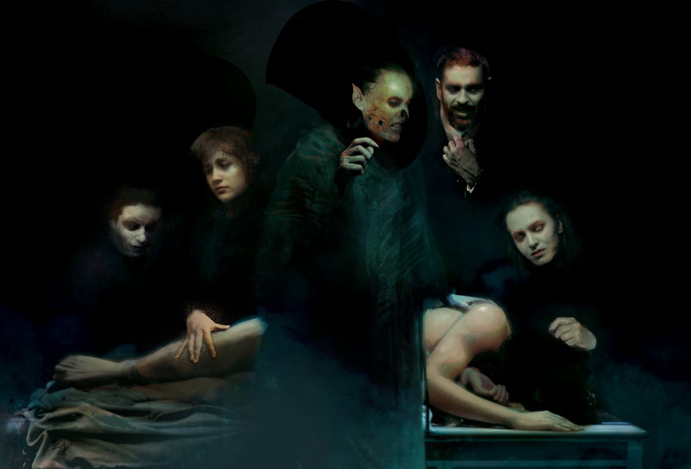

A Unique Cult

A vampire doesn’t choose to 
join the Hecata. This isn’t a religion 
Kindred adopt based on the appeal 
of doctrine or reward. The family 
chooses the cultists, rather than 
the other way around. A vampire 
— or indeed, a mortal — within 
the Hecata gains a family so tightly 
bound that they’d kill to protect 
their own, and interrogate the 
attacker’s corpse to find out who 
hired them. The vampire gains ac­
cess to knowledge forbidden or un­
known among most clans, but most 
importantly, gains purpose in un­
life. The clan seeks power in many 
forms, whether through wealth, 
influence, spreading the family line, 
the dark arts, or simple understand­
ing. Depending on a Hecata’s area 
of expertise, they might find any 
of these avenues open to them, and 
often have a Mawla to guide them 
to the path, if not down it.

Of course, the Hecata comes 
with its share of drawbacks. Just as 
the family is protective, it’s obsessive 
about not letting its children fly the 
coop. Hecata cannot just leave the 
clan and join a sect like the Anarchs. 
Even those rare Hecata with titles 
outside the clan are reporting back 
to the family or serving their Blood 
in some way. Betraying the clan in 
any way is a death sentence for most 
Kindred. Exile is never an option, as 
the Hecata’s secretive nature would 
not see the benefit of releasing a 
vampire or calling them Caitiff. 
When assessing one’s place within 
the Hecata, it’s the old decision of 
security versus liberty. If the first 
one is more important to the respec­
tive vampire, then they might feel at 
home among their kin. If they desire 
freedom more than anything else, 
they might enjoy it when working 
as envoy to a Camarilla domain or

The entire Hecata clan is built 
like a cult, though unlike most re­
ligions, most of its adherents don’t 
realize they’re worshipers, and 
worshipers of one of the largest an­
cestor and death cults in the world 
at that. The Hecata teaches its clan 
members to respect their elders, so 
one day they too might be worthy 
of respect and reverence. This isn’t 
so different from the Camarilla’s 
way of dangling bait above its 
neonates’ heads, except the elders in 
the Hecata are often blood rela­
tives, or have direct influence over 
the lower level cultists, who happen 
to be their descendants via vitae. 
The path to power is clearer within 
the Hecata, or at least the backs 
one needs to scratch are highly 
visible.

14 8

chapter three: the cult of death and undeath

explorer in distant lands, seeking a 
necromantic relic of some descrip­
tion, but eventually they always have 
to come back and report to mommy 
and daddy. Freedom is an illusion 
the clan extends only as much as is 
useful.

in which the coterie need to 
involve themselves in seizing 
influence over the city’s crime, 
finance, and dead.

for future favors due to the 
family.

• 	
Simple companionship outside 
clan lines, maybe forged while 
still mortal or rank fledglings, 
or directed by a Mawla within 
the Hecata.

• 	
The important role of grooming 
mortals for Hecata sires not in 
the coterie.

Hecata Chronicles

• 	
A story where the coterie must 
investigate and put down a 
suspected rebellion within the 
family.

• 	
An undercover operation where 
the clan has permitted the 
Hecata Kindred to act in fur­
therance of a Prince or Baron’s 
interests, so long as they don’t 
reveal their actual clan.

As with any clan, the variety of 
stories available to players of Hecata 
vampires is vast, though due to the 
clan’s structure, sometimes these 
tales work best when all players take 
on the role of a Hecata — wheth­
er all members of the same line, 
or a mixed coterie containing a 
Harbinger, Giovanni, and Samedi, 
for instance. This is not a limitation, 
but an opportunity to explore the 
importance of lineage in Vampire: 
The Masquerade, among many other 
themes and concepts. Story types 
might include:

• 	
Keeping the clan’s mortal con­
nections and relations in the 
dark as to the “family business” 
while still keeping them close 
enough should they be selected 
for the eventual Embrace.

• 	
Finding common cause with an­
other cult group, as both of you 
desire the truth behind some 
Noddist mysteries concerning 
your clan and others.

• 	
Visiting punishment on an 
entitled Camarilla coterie who 
saw fit to assault some young 
Hecata, due to their fear of get­
ting involved in the sectarian 
Jyhad.

• 	
Digging through the wreckage 
of a fallen Sabbat domain with 
Camarilla vampires, under the 
agreement that whatever each 
of you finds belongs to you.

• 	
A story in which the coterie 
hunts down an artifact sig­
nificant to the clan, or a dead 
individual of importance.

• 	
Brokering peace between 
Camarilla and Anarch war par­
ties, while still trying to turn a 
profit for the clan.

• 	
Offering protection to the mor­
tal contacts and companions 
of Anarch vampires, when the 
strict Baron told their followers 
they needed to let these kine go.

• 	
The experimentation and 
mastery of new Oblivion 
Ceremonies, in the fringe terri­
tories of an Anarch domain.

• 	
Assassinating the Prince’s ghoul 
so accomplished Necromancers 
within the clan might interro­
gate their spirit for secrets.

• 	
Using your ostensible neutrality 
to assist Anarchs in planting a 
bomb in a Camarilla domain. 
A hefty payment is of course 
required.

• 	
The unearthing of a Hecata an­
cestor, who is unfamiliar with 
the clan’s new structure.

The Hecata also work well in 
a coterie containing Kindred from 
other clans. Contrary to appearanc­
es the Hecata like to maintain, they 
are not entirely insular and inces­
tuous. To profit from the world, 
they must branch out, interact with 
other vampires, and make them­
selves useful in any domain. Stories 
involving the Hecata in these roles 
might include:

• 	
Working with Camarilla 
Kindred and telling your 
Hecata Mawla “you’re trying 
to find out the sect’s secrets,” 
when really you just enjoy their 
company.

• 	
A chronicle starting with a 
Prince’s promise to the coterie 
that they may claim part of 
the city as neutral domain if 
they perform one service to the 
Camarilla.

• 	
Offering to defect to a sect or 
other cult and provide Hecata 
secrets, but only if they serve 
you in some way first.

• 	
An exploration of a forgotten 
branch of the family, consist­
ing entirely of black sheep the 
Hecata wish to forget.

• 	
Working as hired guns to 
eliminate the enemies of a 
Baron who frequently hires the 
coterie.

• 	
Befriending vampires of an­
other group to gain a greater 
understanding of the Jyhad and 
the wars between sects.

• 	
The enrichment and growth of 
Hecata territory in a domain,

• 	
Extending a service to a mostly 
Camarilla coterie, in exchange

14 9

CULTS OF THE BLOOD GODS

• 	
Volunteering to assist in 
“Second Inquisition proofing” 
a Camarilla domain, to protect 
their interests and your own.

(a family ghoul), Fame Flaw: Dark 
Secret (family criminal connections)

176), other predators arise among 
the Necromancers. Hecata baggers 
typically gain a dot of Oblivion in 
place of Blood Sorcery at character 
creation.

Gatekeepers

New Coterie 
Types

When selecting the Bagger 
Predator Type, the player may 
choose Oblivion instead of Blood 
Sorcery for their additional 
Discipline dot.

“Our friends straddle the boundary 
between life and death.”

The gatekeepers coterie utilize 
their skills in communion with (and 
potentially control over) the dead to 
establish a type of coterie com­
mon among the Hecata and other 
Oblivion users, providing spiritual 
aid and counseling to some, spec­
tral assaults and sabotage against 
others. They are prestigious users 
of animated corpses and ghosts as 
servants.

Extortionist

As the only clan independent 
of the sects, the Hecata often form 
their own kinds of coterie. Though 
they’re perfectly capable of blend­
ing in with Camarilla and Anarch 
groups, many vampires in the Clan 
of Death prefer to stick to their 
own.

The extortionist likes to force 
their victims to bleed for them. 
Ostensibly, the extortionist acquires 
blood in exchange for services such 
as security or surveillance, but as 
many times as the need for pro­
tection is real, it is just as often a 
fiction engineered to make the deal 
feel acceptable.

• 	
Domain: Chasse (••), Lien (•), 
Portillon (•)

Family

• 	
Contacts: (••) (graverobbers, 
morticians)

• 	
Add a specialty: Intimidation 
(Coercion) or Larceny 
(Security)

“No matter how much I hate you 
right now, you’re my brother, and nobody 
does that to you.”

• 	
Resources: (•••) (stolen from the 
dead)

The family coterie is one of 
reliance, connection, and support 
networks. Vampires within this 
coterie may be related in a mortal 
sense as well as through the Blood, 
and they likely recruit mortal mem­
bers of their extended families to 
assist them in their plans.

• 	
Gain one dot of Dominate or 
Potence

• 	
Retainers: (•••) (a wraith serv­
ant and spy)

• 	
Spend three dots between 
the Contacts and Resources 
Backgrounds

• 	
Enemies: (••) (a vampire hunter 
who recognizes the coterie deal­
ing with the dead)

• 	
Gain the Enemy Flaw: (••) The 
police or a victim who escaped 
your extortion and now wants 
revenge

• 	
Status Flaw: (•) Notorious 
(dealings with dark entities)

• 	
Domain: Chasse (•), Lien (•), 
Portillon (•••)

Possible extras: Mawla (accom­
plished necromancer)

• 	
Ally: (•) (a connected mortal 
family member)

Predator Pool: Strength or 
Manipulation + Intimidation, you 
feed through coercion both subtle 
and painfully obvious.

New Predator 
Types

• 	
Contacts: (••) (family, extended 
family)

Graverobber

• 	
Resources: (••) (cash and assets 
on loan from the family)

The Hecata have their preferred 
ways of feeding, passed down from 
sire to childe. With their Bane (see 
p. XX) preventing an enjoyable 
Kiss, the Clan of Death are forced 
to find other methods of extracting 
blood. While some become baggers 
(see Vampire: The Masquerade, p.

• 	
Enemies: (••) (one or more 
mortals who oppose the family 
business)

Graverobbers often feed from 
fresh corpses, but despite their name, 
they prefer feeding from mourners in 
cemeteries and sad, frightened visitors 
and patients in hospitals. Melancholic 
Resonance in a victim’s blood appeals 
more than any other humour. This

Possible extras: Herd (extend­
ed family members), Influence 
(family business), Mawla (vampire 
within the same family), Retainers

15 0

chapter three: the cult of death and undeath

predator type often requires the vam­
pire to hold a haven in or connections 
to a church, hospital, or morgue.

• 	
Gain the Haven Advantage: (•)

blood. Moving among miserable 
mortals for a vulnerable bite uses 
Manipulation + Insight. A cold 
corpse can slake up to 3 Hunger, 
but suffers the same slake penalties 
as bagged blood. A body fed from 
soon before death, drained of blood 
afterwards, or missing parts will 
slake less.

• 	
Gain the Herd Flaw: (••) 
Obvious Predator (your cold 
nature makes you act in a 
deeply unsettling matter when 
hunting)

• 	
Add a specialty: Occult (Grave 
Rituals) or Medicine (Cadavers)

• 	
Gain one dot of Fortitude or 
Oblivion

Predator Pool: Resolve + 
Medicine, sifting through the quiet 
dead for a body bearing rancid

• 	
Gain the Feeding Merit: (•••) 
Iron Gullet

151

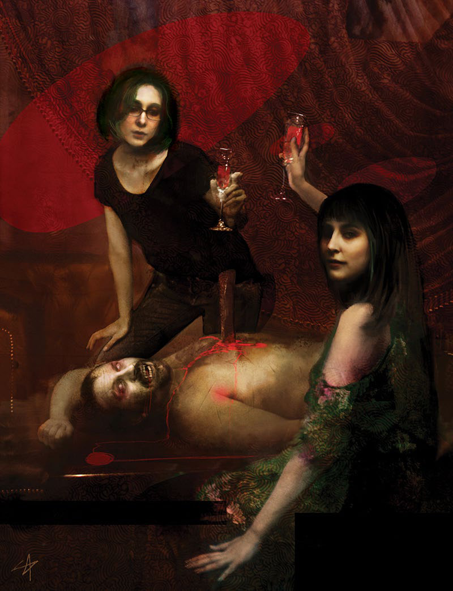

chapter four
chapter four

“As a boy you burned ants with a magnifying glass and stomped on snails, yes? 

This is how you should now think of the kine. They are pests, curiosities, and distractions.”

— Mason Ha of Clan Tremere to his new childe Joseph Dominguez

Humans have long sought the comfort of religion 
in the wake of death, and the newly Embraced are no 
different. Their catastrophic change in condition leads 
many a young lick to question the beliefs they held in 
life, and reach for new answers to provide solace and 
direction. When other Kindred can’t provide camarade­
rie in shared belief, the kine will do in their place, and 
the power of the vitae in their veins makes amassing 
followers a simple task for many a young, spiritually 
syncretic vampire. These heterodox groups can be nihil­
istic or joyful, cruel or cooperative, but beneath even the 
kindest vampire-led religions the Beast is waiting, ever 
hungry for the congregation’s life-giving blood.

regardless of proof. To an enterprising lick, creating a 
cult of adoring human worshipers looks almost too easy: 
make up some sermons, use a dose of vitae, and desper­
ately hope your elders and betters don’t kill you on the 
spot for breaching the Masquerade. It’s only that last 
caveat that prevents vampire cults from proliferating out 
of control.

Finally, the Kindred aren’t the only ones who have 
discovered the utility of faith. The first Inquisition was 
founded within a religion, one that kept its followers 
zealous in their task. While the modern intelligence 
agencies of the Second Inquisition prefer to skirt the 
issue of the supernatural, shrouding every phenomenon 
in science on their official reports, cults can be a useful 
tool in the war against the blankbodies. Whether they’re 
turning existing groups into deniable assets, tracking 
vampires through their human followers, or creating 
entirely new cults, the Second Inquisition is well versed 
in using people’s faith to serve their own ends.

To some Kindred, religion is more tool than calling. 
Many spiritual belief systems have promised what they 
themselves already have: life beyond death, reincarna­
tion, immunity to the ravages of time. The more direct 
Disciplines can be dressed up to look like miracles, proof 
of a connection to a higher power or an enlightened 
state of being. Subtler arts like Presence sway a crowd

1 5 3
1 5 3

CULTS OF THE BLOOD GODS

The House 

of Anteros

established themselves in a small 
domain, and began building a herd 
for indefinite sufficiency without 
needing to involve themselves in 
Elysium’s games.

pale shadow of the real thing, so share 
it. At worst, inhibited love makes a 
mockery of the term, and isn’t really 
love at all.

The Blood Bond is the truest 
form of love in existence, perfect 
selfless devotion enforced by spiritual 
power that makes it unbreakable, and 
thus stronger and better than mortal 
love. To be part of a one-sided Blood 
Bond is a wonderful thing, to be part 
of a mutual Blood Bond is a state of 
virtue that cannot be equaled.

The House of Anteros was 
founded on Virginia and Leonard’s 
personal spiritual beliefs, though 
both would admit to having dressed 
up the truth to make it more palat­
able to prospective members. In the 
1960s, they used the language of free 
love and peace, giving their followers 
flyers to hand out at concerts and 
nightclubs. Free “sharing circles” run 
out of cheap rented spaces within the 
vampires’ domain let them solidify 
a group of kine followers who could 
serve as both food and messengers, 
bringing their doctrine of love across 
vampiric borders.

“There’s no force in this world more 
powerful than true, radical, selfless love.”

— The Eaden Family

The House of Anteros advertises 
itself as a “self-help group phenom­
enon,” and offers free seminars and 
paid workshops on their radical 
philosophy. Followers are taught 
that love is the key to happiness, and 
that true love is completely selfless. 
Beautiful retreats, healthy food, and 
simple spiritual ceremonies make 
learning about love enjoyable, and 
initiates are given ample praise and 
a strong sense of community from 
existing members. As recruits are 
drawn deeper into the philosophy, 
the community becomes more and 
more encompassing. Members are 
encouraged to hand themselves over 
completely to the House, forfeiting 
personal possessions, identity, and 
eventually the very blood within their 
veins.

Love conquers all. Failure, illness, 
and unhappiness stem from an inabil­
ity to love completely. Perceived fail­
ure from someone in a mutual Blood 
Bond must be victory in disguise.

What is Love?

In the ‘90s, the House of An­
teros evolved to target unfulfilled 
white-collar workers, nihilistic 
college students, and bored couples, 
advertising on the early internet and 
through word-of-mouth. Having fully 
embraced technology, Virginia and 
Leonard are always looking for new 
ways to grow and change with the 
times, making the House of Anteros 
stronger and more flexible with every 
passing decade.

The House of Anteros sends 
a mixed message regarding love, 
preaching freedom to love whom 
one wishes, while advocating for true 
love, devotion, and servitude through 
love. They praise monogamous as well 
as polyamorous relationships. They 
treasure intimate unions between two 
individuals and revel in wild orgies. 
As more than one cultist has asked 
the Eadens, “what is love?”

History

The truth is impossible to define, 
and the Eadens know it. They tailor 
their message to their followers, 
but they really do believe their own 
tract, citing how love is different for 
all but the constants show that love 
emboldens, empowers, and triumphs. 
The meaning of love may vary from 
person to person, but so long as a 
cultist carries love in their heart and 
openly shows it, they’re welcome to 
participate in cult practices.

Doctrine

Virginia and Leonard Eaden 
were both born in the 1910s. They 
grew up together, fell in love togeth­
er, and died together, Embraced on 
the same night by members of the 
same coterie after short mortal lives 
full of dancing and saloons. Officially 
bowing to the local Camarilla, the 
two young licks stayed out of politics, 
preferring each other’s company to 
the complex treacheries of the court. 
This reclusive behavior was as much 
necessity as choice: the two vam­
pires formed a mutual Blood Bond 
almost immediately, and they were 
proud of it. Lacking understanding 
from their fellow Kindred, they 
sought like-minded souls among the 
kine instead. By the 1960s, they had

Love is everything: power, happi­
ness, and spiritual enlightenment all 
rolled into one. Learning how to love 
properly is the most important thing 
anyone can do with their life. Love is 
also a sort of divine force, not quite 
a god but often spoken of in similar 
terms.

The truest love is the most self­
less, the most freely shared, the most 
devoted. You must be willing to do 
anything for the one you love, leaving 
all your own wants and needs behind, 
to make the world and the lives of 
others better. Love that is in any way 
limited or conditional is, at best, a

Activities

The House of Anteros has 
branches in Chicago, St. Louis, 
Phoenix, Houston, New York, and 
Salt Lake City, five of which are 
staffed entirely by mortal followers.

15 4

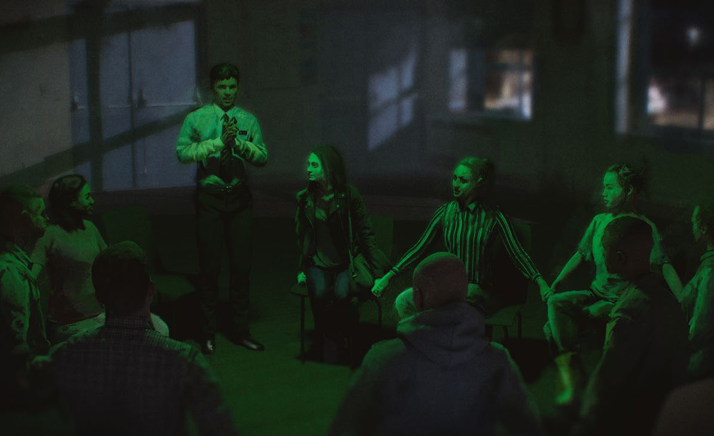

These distant offices focus on earning 
money from expensive weekend 
“wellness retreats,” funneling profits 
back to headquarters at the Anteros 
mansion, a huge suburban complex 
in Arizona with several buildings 
located in the middle of the Eadens’ 
domain. Retreats, and the group’s 
general philosophy, are advertised 
at free seminars open to the public; 
most hosted by senior members, with 
the Eadens going on tour once a year 
to speak in person across the country. 
Most House events are held in rented 
auditoriums or campgrounds, but the 
group owns two retreat properties 
outright: one in the Midwest and one 
near the US-Mexico border.

cars are sold, and money is moved 
into the House’s bank accounts, 
an act of selfless, trusting love that 
pushes acolytes further toward en­
lightenment. Recruits who hesitate or 
refuse aren’t pushed or punished, just 
quietly ostracized by House friends 
who are disappointed at their lack 
of selflessness. The House claims to 
want love that’s freely given, but the 
Eadens expect more than just affec­
tion if they’re providing protection 
and homes to their lovers.

think about vampire myths when 
participating, even when present­
ed to the Eadens for the first time. 
Members practice blood-sharing for 
decades before they learn about the 
Eadens true immortal nature, by then 
a glorious extension to everything 
they’ve already internalized.

Barring emergencies, the Eadens 
feed only in their main house, well 
within the official domain as granted 
by the Camarilla. They’ve also negoti­
ated for feeding rights at the House’s 
two campgrounds: they are off-limits 
to other Kindred, in exchange for 
a few won’t-be-missed attendees 
getting plucked off and delivered to 
local Princes by the senior members 
hosting retreats. Disowned college 
students, down-on-their-luck unem­
ployed singles, and people struggling 
with mental health are targeted for 
these disappearances, with House 
money used to cover them up and 
bribe local authorities into keeping 
the camps’ reputations untainted.

Those who accept are introduced 
to the idea of blood drinking slowly 
and carefully, first through blood­
letting rituals held between mortal 
members. Offering your blood to 
another is discussed as another way 
to devote yourself to them complete­
ly, and acolytes living at the mansion 
are encouraged to make small cuts on 
their arms to be licked clean by other 
followers, who will offer blood in ex­
change. Only one among a number of 
rituals that the outside world would 
deem distasteful, few acolytes even

Most people leave an Anteros 
workshop, either rejuvenated or 
ripped-off, and return to their daily 
lives, but a few come back again and 
again. These regulars are nudged 
toward meeting the Eadens in person, 
and encouraged to drop all their 
external ties and move into the com­
munal mansion property. Houses and

15 5

CULTS OF THE BLOOD GODS

Future Plans

law degree to protect the House’s 
interests. She fell in love with the 
feeling of being utterly worshiped, 
but had a hard time understanding 
the joy of selfless giving until her first 
experience with the Kiss. Now she’s 
hooked, but quietly frustrated that 
neither of the Eadens will share their 
blood with her in return.

already been introduced to the blood 
rites and spends hours most days 
alone with the Eadens. She’s a true 
believer, young and optimistic, and 
a promising candidate for induction 
into the House’s highest circles. Her 
worried parents have contacted the 
authorities over her apparent cult 
brainwashing, a potential threat to 
the House if words like “blood” and 
“immortality” ever make it into the 
federal investigation reports.

More than power, wealth, or 
even stability, the Eadens crave 
family. The House of Anteros isn’t 
just their belief system and their 
herd, it’s a method of searching for 
someone who shares their values, who 
can understand love on the same level 
that they do. Both vampires hope 
dearly to find such an individual 
and turn their paired bond into a 
three-way partnership, each Kindred 
bonded to the others. From there, 
they could become a quartet, and so 
on, spinning an ever-wider web of 
perfect, immortal love. They’ve had 
dozens of potential candidates over 
the years, but none who have lived up 
to the couple’s zealous scrutiny and 
obsessive need for perfect adoration. 
A third member of the Eaden family 
would share in every aspect of the 
House’s business, with full access to 
its bank accounts and larders.

Standard Dice Pools: Physical 
3, Social 4, Mental 5

Secondary Attributes: Health 
5, Willpower 6

Standard Dice Pools: Physical 
3, Social 4, Mental 3

Exceptional Dice Pools: 
Drive 4; Insight 5, Persuasion 7; 
Finance 6

Secondary Attributes: Health 
4, Willpower 8

Exceptional Dice Pools: 
Etiquette 5, Insight 6, Persuasion 
5; Academics 4, Occult 4

General Difficulties: 4/2

JACOB WRIGHTSON
JACOB WRIGHTSON

General Difficulties: 3/2

Jacob looks incredible for a man 
of sixty-five, since he’s been a ghoul 
for the last twenty years. A top inter­
national recruiter, he runs seminars 
around the world and occasionally 
plays interference for the Eaden cou­
ple in Kindred society. More interest­
ed in free love than true love, his high 
position in the House is due to hard 
work and natural charisma, not any 
deep faith in the group’s beliefs. The 
more he learns about wider vampire 
society, the more he yearns to be Em­
braced himself, but knows his current 
masters are unlikely to grant him that 
privilege.

The Eaden Family

Virginia and Leonard are both 
Kindred of Clan Ventrue, and have 
lived lives so intertwined that sepa­
rating them out into two individu­
als is nearly impossible. They sleep 
together, feed together, finish each 
other’s sentences, and come up with 
the same plans without saying a 
word. They even look alike: both pale 
and strong-boned, with jet black hair. 
In public appearances, they cultivate 
two identities: the original Eaden 
couple who founded the House, made 
up to appear to be in their mid-six­
ties, and their own now-adult twin 
children. Both like to present them­
selves as compassionate and caring 
people, invested in cooperating with 
anyone who doesn’t actively threaten 
them or their cult. They might even 
believe their own line, but they’re 
quick to turn against anyone they 
perceive might betray their generos­
ity, with or without evidence. Those 
who know them well might notice 
that Virginia takes the lead in long-
term planning, while Leonard tends 
to speak first in social situations.

In the meantime, the cult con­
tinues to expand. Though the Eadens 
have all the blood and money they 
need for a comfortable eternity, the 
House of Anteros is a true religious 
mission. Inserting themselves into 
more cities is a top priority, even if 
over-extension means increasing the 
risk of discovery. Two more facil­
ities are planned in smaller North 
American cities, one in a city that 
has recently fallen to the Anarchs. 
The Eadens are also planning a trip 
to Europe, hoping to scout out a new 
location and handle the associated 
Camarilla politics in person. They’re 
bringing a small army of followers 
with them: ghouls and blood-slaves 
to provide comfort, protection, and 
potential bribes to those they seek to 
court.

Standard Dice Pools: Physical 
5, Social 5, Mental 3

Secondary Attributes: Health 
6, Willpower 5

Exceptional Dice Pools: Eti­
quette 6, Leadership 6; Finance 
4, Politics 5

Disciplines: Presence 1

General Difficulties: 3/2

ANNABELLE JONES
ANNABELLE JONES

ALYSON KING
ALYSON KING

Annabelle joined the cult after 
her messy divorce. Once a fierce 
corporate lawyer, she now uses her

Alyson has only been with the 
group for a year and a half, but she’s

15 6

chapter four: mortal cults

VIRGINIA EADEN
VIRGINIA EADEN

Generation: 12th

that don’t directly assist them in 
being reunited. They are both 
Consensualists and their Ventrue 
Bane manifests to reinforce this, 
preventing them from drinking 
from anyone who doesn’t give 
their blood freely.

Blood Potency: 2

Clan: Ventrue

Attributes: Strength 3, Dexter­
ity 2, Stamina 3; Charisma 5, 
Manipulation 3, Composure 4; 
Intelligence 4, Wits 3, Resolve 4

Sire: James Acker

Embraced: 1933 (Born 1910)

Ambition: Don’t let other Kin­
dred discover the cult

Secondary Attributes: Health 
6, Willpower 8

Story Hook: 

Love in Death

Convictions: Always defend 
your loved ones; Never turn 
down a new experience

Skills: Brawl 4; Insight 4, 
Leadership 5, Performance 4, 
Persuasion 4, Subterfuge (Cult 
members) 2; Academics 2, 
Awareness 3, Finance 1, Occult 
3, Politics 2

Touchstones: Andrew Eaden — 
Virginia’s now adult son; Jacob 
Wrightson — sexually spectacu­
lar lover, and her favorite cultist

The player characters find the 
House of Anteros hosting self-help 
sessions on their territory, but with­
out the presence of the Eadens or any 
undead involvement. For an enter­
prising Kindred, the cult presents 
an opportunity to gain retainers, the 
procurement of a herd, or — if feeling 
savage — a one-stop shop for an 
indulgent night of feeding.

Disciplines: Dominate 2, Forti­
tude 2, Potence 1, Presence 4

Humanity: 6

Generation: 12th

General Difficulties: 5/3

Blood Potency: 2

Special: Both the Eadens suffer 
from a unique Codependency 
Flaw; when separated, they 
lose two dice from all actions

Attributes: Strength 3, Dexter­
ity 3, Stamina 2; Charisma 4, 
Manipulation 4, Composure 5; 
Intelligence 5, Wits 4, Resolve 4

Unless the player characters

Secondary Attributes: Health 
5, Willpower 9

Do you HATE yourself?

Skills: Melee 2; Insight 3, Lead­
ership 3, Performance 3, Persua­
sion 3, Subterfuge 3; Academics 
4, Awareness 3, Finance 3, 
Occult 5, Politics (Southwestern 
United States) 5, Technology 3

Many of us do. Life is hard, you don’t earn 
enough, and you’ve just seen another relationship 
fail. You blame yourself. So many of us blame our­
selves.

Disciplines: Auspex 2, Domi­
nate 2, Fortitude 1, Presence 3

We have the answers. This isn’t a scheme you 
have to pay into. This isn’t therapy. It isn’t religion. 
What we offer is an ear for your problems, under­
standing, and acceptance. We’ve all been where 
you’ve been. It might not comfort you to know it yet, 
but we promise you, none of us hate ourselves now.

General Difficulties: 5/3

LEONARD EADEN
LEONARD EADEN

Clan: Ventrue

Come by Starlin’s Gymnasium on 33rd Avenue 
on Tuesday 3rd and we’ll teach you the first steps to­
ward stopping the hate and starting to love yourself. 
If it doesn’t work out, we promise, you will never 
hear from us again.

Sire: James Acker

Embraced: 1933 (Born 1912)

Ambition: Expand the cult to 
new domains

Convictions: Never refuse 
someone’s affections

But it will work out. You have our word.

THE HOUSE

Touchstones: Nadia Eaden — 
Leonard’s now adult daughter

Humanity: 5

15 7

CULTS OF THE BLOOD GODS

scare the cult away, they return night after night, drawing 
a larger and larger crowd mainly consisting of single indi­
viduals on low income, who all leave feeling happier. The 
House acts as a form of Resonance alteration chamber, 
shifting the melancholic into the sanguine.

to protect himself, make himself invaluable, and quickly.

He found it in his voice, his sire’s accumulated 
wealth, and his old life’s history in advertising. With cha­
risma, good business sense, and a thorough understand­
ing of human nature, he began the Church as a means 
of assembling a loyal herd and a vast fortune as quickly 
as possible. The judicious application of Presence made 
finding converts easy, the trick was keeping things subtle 
enough to avoid breaching the Masquerade. Joseph copied 
heavily from the doctrines of kine churches and cults 
while creating his own, hiding himself in plain sight as 
just another fringe inspirational speaker. He used his seed 
money to hire a team of human assistants, including a 
convincing body double for daytime appearances, and let 
natural human greed replace the use of disciplines in al­
most every recruitment event. In many ways, the Church 
of Means was barely a vampire cult at all, though hints 
of Joseph’s personal beliefs about immortality inevitably 
colored the doctrines he wrote.

The further the player characters probe into the 
House of Anteros’ activities, the more likely it is the Ead­
ens will take notice and take action. If the characters have 
been respectful and show interest in the group’s message, 
the Eadens may attempt to lure the vampires further into 
the cult. If they’ve been nothing but predatory, the Ead­
ens will not stop in their attempts at visiting vengeance 
on their cultists’ abusers.

The Church of Means

“Do you believe in a higher power? Is your faith strong 
enough to put it all in His hands? Then you might be destined 
for RICHNESS ON THIS EARTH. Ask us how to become one 
of the prosperous, and LIVE FOREVER as a MILLIONAIRE.”

The Church of Means prospered quickly. Members 
were split evenly between those who were emotionally 
and spiritually moved by Joseph’s doctrine, and those 
who saw the Church as a chance to make money. The 
most ruthless congregated at the top, earning the title of 
priest, and forming a powerful and vicious inner circle of 
ghouls to protect their leader and exemplify the wealth he 
offered.

Only a few years old, the Church of Means is 
reaching an international audience through live internet 
broadcasts, a strong focus on proselytizing to friends 
and family, and the inhuman charisma of leader Joseph 
Dominguez. Presenting itself as a “nondenominational 
understanding of the divine and its plan for humankind,” 
the Church’s doctrine places a strong emphasis on the 
happiness derived from material wealth. Of course, to 
make money you have to spend money: new converts are 
expected to buy into the church, paying for pamphlets 
and workshops and proprietary devotional symbols. Suc­
cessful recruiters take home a share of the proceeds gen­
erated by those they register, a pyramid scheme gilded in 
faith. Slowly numbed to the atrocity of conning desperate 
people out of their money, top earners are encouraged to 
commit greater crimes, eventually luring people to the 
Church’s lavish enclaves as slaves and blood dolls. Eternal 
life, presented to recruits as a metaphor for success, is 
eventually revealed as the ultimate reward for those who 
serve the leader best, though their eternity as ghouls gives 
their master one more string on his leash of control.

Doctrine

There is a Higher Power, who is conflated with the 
highest force of every major world religion (the Abra­
hamic God, the concept of nirvana, the Supreme being, 
and so on.) This Higher Power is benevolent and wants 
everyone on Earth to be happy, but He also believes in 
free will; humans must choose to be happy for the Higher 
Power to act upon them.

Choosing to be happy involves signing up for the 
Church of Means and completing the exercises detailed 
in the books you buy from them; opening yourself to 
prosperity through meditation, mantras, and the like. 
After that, the best way you can signal your readiness to 
be happy is by recruiting others to the Church, sharing 
the good news. Their attempts to be happy will magnify 
your own.

History

Some techniques of the Church are secret, for the 
safety of the world at large. New initiates aren’t spiritually 
advanced enough to understand everything about how the 
Higher Power works, and learning about everything the 
priests do before understanding all the basic material could 
be harmful to your physical and emotional well-being.

Joseph Dominguez was a young vampire with a low 
generation and high ambitions. Not yet dead fifty years 
before his sire was called to the Gehenna War, he was 
left in a very unpleasant position in Kindred society: too 
potent to be ignored, but too disposable to stay out of the 
cross-hairs of his sire’s enemies. He needed to find a way

15 8

chapter four: mortal cults

Money can buy happiness, but only if it comes from 
the will of the Higher Power. If you complete all the 
exercises correctly and do everything in your power to 
recruit others, you will become both rich and happy. If 
you aren’t rich and happy, you’ve done something wrong, 
and you should return to the Church of Means’ teachings 
and redouble your efforts.

profit per worshiper with an ever-improving blend of 
hope and pressure. Most invested members of the Church 
are at or near the poverty line, if not when they start 
then certainly after a few months of trying to buy their 
way up to priesthood. When a priest notices someone at 
the bottom of the pile has lost the support of all their 
friends and family after sinking themselves too deeply 
into the Church, they see an opportunity to pick that 
won’t-be-missed preacher up and quietly deliver them to 
Dominguez himself, earning further favor.

Eternal life will come to those who are open to the 
Higher Power by way of good luck and medical advances. 
Though the Higher Power takes care of the faithful in the 
afterlife, His greatest gift to humanity is their time on 
Earth, and maximizing that time is what He wants for 
people.

Like any good pyramid scheme, risk flows down­
stream and money flows upstream, fueling the decadent 
lifestyle that the priests live as an example of what adher­
ing to Church doctrine can bring; penthouse apartments 
and luxury villas, extravagant parties full of beautiful 
people, fast cars, designer brand clothing, and all the sex 
and drugs money can buy. Spending money freely isn’t just 
allowed by the church, it’s actively encouraged as a way of 
demonstrating devotion to the Higher Power and giving 
thanks for the good things with which He has provided 
you. The Church’s website and promotional videos put 
all these amenities in the spotlight, selling a vision of a 
bacchanalian heaven on Earth that anyone can be a part of 
with enough hard work and faith.

Activities

The Church is still expanding rapidly, keeping its 
operations lean and flexible by renting space and working 
with third party manufacturers for publication and ship­
ment of their devotional materials. Independent members 
buy in to become preachers, proselytizing to local crowds 
around the world from auditoriums, coffee shop open mic 
nights, dingy apartments, and street corners. Hired risk 
management staff and programmers work on algorithms 
to target preachers who are ready to pay more or con­
sidering leaving, minimizing drop-outs and maximizing

New priests are ordained every few months, in an 
elaborate ceremony broadcast to every member that fo­
cuses on their life stories, how they’ve risen out of nothing

CULTS OF THE BLOOD GODS

Standard Dice Pools: Physical 
5, Social 4, Mental 3

and become millionaires through the 
Church’s teachings. The truth about 
Joseph’s vampiric nature comes after 
the ceremony, once he’s sure they’re in 
too deep to run. The revelation gives 
them a new goal to chase: true immor­
tality and superhuman power, through 
a taste of their leader’s blood. Only 
the best of the best are granted ghoul 
status, and those who have achieved it 
know their domitor can take it away, 
encouraging competition at every 
rung of the ladder. At the top, looking 
down, priests inevitably realize the 
truth: the only Higher Power granting 
them happiness is Joseph Dominguez, 
and everything they’ve earned will be 
lost if they turn against him.

the Kindred, trading favors here and 
there to see just how much a young 
upstart like him can get away with. 
The old ways are crumbling, and the 
places at the top of the new order will 
go to whoever can take them first. 
Potent blood and low generation 
were the tools of the old Princes and 
Barons, but Dominguez is wondering 
if his hired guns and herd of followers 
might be even better. All he needs is 
the right target, a city in the throes 
of a civil war calling out for a natural 
leader to take the reins. With all the 
traveling he does, he’s bound to find 
one sooner or later.

Secondary Attributes: Health 
6, Willpower 6

Exceptional Dice Pools: 
Athletics 6, Firearms 7, Melee 
6; Intimidation 5, Persuasion 6; 
Occult 4

Disciplines: Celerity 1

General Difficulties: 4/2

MORGAN BRANT
MORGAN BRANT

Morgan joined just a little too 
late to be a founder, and has regretted 
it ever since. Now well into his sixties, 
he bought his way up the ladder with 
his life savings, chasing dreams of 
enough money to ensure his children 
and grandchildren could always afford 
the best healthcare. The whole family 
is involved in the Church now, but 
only Morgan has been made a priest, 
and thus made aware of the cult’s true 
intentions. He’s shown no remorse 
for the people he’s climbed over to 
succeed, convinced he’s doing what’s 
best for his family and that’s all that 
matters. The next step is earning ghoul 
status for himself, and eventually his 
descendants, ensuring their prosperity 
for all eternity.

Financially, the cult is looking 
to diversify. Real estate has been an 
obvious choice, and Church mon­
ey has flown into a skyscraper of 
condominiums aimed at “night-shift 
workers,” with state-of-the-art UV 
and light-blocking window controls 
and facilities that operate on an af­
ter-dark schedule. Dominguez is quite 
interested in backing other vampiric 
endeavors, bringing start-up money 
to businesses that can’t go to the 
bank for funding. A small consulting 
firm of trusted mortal and ghoul cult 
members can even help older vam­
pires adapt their ideas to the modern 
world of algorithmic advertising and 
innovative technology.  If his resourc­
es help him gain more allies among 
the Kindred, backing his future bid 
for power, then all the better.

Dominguez himself participates 
in almost none of his supposed luxury 
life, sending subordinates and body 
doubles to events where his personal 
oversight isn’t required. With fame 
and fortune, Dominguez has put 
himself in the spotlight; he’s playing 
a dangerous game and knows it, so 
instead of having fun, he’s investing in 
security. Much of this investment goes 
to paying off the Princes and Barons of 
the cities where he lives, flitting from 
one to another to avoid accumulating 
grudges. So long as he can arrange 
for an Elysium night full of beautiful 
snacks and top-of-the-line security, 
and so long as his mortal fame makes 
taking him out a potential breach 
of the Masquerade, Joseph believes 
himself relatively safe from vampiric 
retribution. The Second Inquisition 
is another matter, one he handles 
through several layers of natural and 
one layer of supernatural security. 
Money buys him the best private 
army, security technology, and bribes 
to keep the feds away. Meanwhile, he 
trains his ghouls in secret to fight for 
his life, quite prepared to feed them to 
the wolves if he ever needs to get away.

Standard Dice Pools: Physical 
2, Social 5, Mental 4

Secondary Attributes: Health 
5, Willpower 7

MILLICENT JARVEY
MILLICENT JARVEY

Exceptional Dice Pools: Drive 
3; Etiquette 6, Persuasion 7; 
Investigation 5, Politics 6

Millicent likes to think of herself 
as a strong woman who’s broken into 
the boys’ club, a role model that oth­
er people should follow. She was one 
of the first to start kidnapping people 
for Joseph, and alleviates her guilt by 
imagining they would have done the 
same to her if they could. She’s at the 
top of the class learning how to use 
firearms, and expects to lead the team 
in taking down anyone who threatens 
their leader, and her immortal life 
with him.

General Difficulties: 4/2

MALIK LUGO
MALIK LUGO

Malik is the Church’s newest 
priest, the model of a Means success 
story. Born into poverty, he worked 
his way into business school, and 
used what he’d learned there to buy 
into the cult and recruit through 
networking and conferences. He

Future Plans

Joseph Dominguez is beginning 
to experiment with his power among

16 0

chapter four: mortal cults

Don’t Believe 

Everything You Read

So many people will tell you “this is how you make more money,” “this is where to invest 
your cash,” and “trust me with your savings, I’m a banker.” Don’t believe everything you 
read or hear. These shysters will rob you blind and leave you destitute. Every recession to 
date has been the fault of greedy brokers who don’t care for their clients’ wealth so long as

they take home fat bonuses.

Luckily, there’s another way.

Since time immemorial, the Church has been a safe pair of hands. The Catholics haven’t 
lined the Vatican with gold because they’re poor. In fact, they’ve been rich for 2000 years.

That’s longer than any other single group in the world. So, it’s time to open the doors and

allow people to once again invest in religion.

We are the Church of Means. We emulate the Catholic Church’s methods of sponsor­
ship, slow investment, and quick growth. We know we can make your money grow because

we’ve seen our own money grow. Don’t believe us? Stop by Campbell & Campbell on Lake

at any time between 9am and 8pm, and we’ll open our accounts for you.

We won’t ask you to trust us with your money. We won’t tell you to believe everything 
you’re reading here. We definitely won’t ask for thousands of your hard-earned dollars. 
What we will ask, is you hear us out. Come to Campbell & Campbell, and if you’re interest­

ed, drop as little as $10 and we’ll make your money grow in a week. That’s our guarantee,

or your $10 bill goes right back in your hand.

We hope to see you there and make you richer.

Secondary Attributes: Health 
5, Willpower 5

thought of the Church as a company 
like any other, an amoral entity he 
would work for blamelessly; if what 
he did was wrong, there would be 
laws against it. Now that he’s found 
out about the vampire behind the 
scenes, he’s starting to realize what 
he’s gotten himself involved with, 
but now there’s no way out: the cult 
owns his wealth and reputation, 
and if he tried to leave he’d surely 
run afoul in some “unfortunate 
accident.” His plan is to keep in the 
boss’s good books and look for an 
opportunity to escape without rais­
ing any red flags along the way.

anoia war within his heart, making 
him dangerously unpredictable: ex­
panding into new territory one night, 
retreating to his private penthouse 
and avoiding all outside contact the 
next. He speaks with a stammer he’s 
had since childhood.

Exceptional Dice Pools: 
Firearms 4, Survival 4; Insight 
6, Leadership 6, Persuasion 6; 
Finance 7

General Difficulties: 4/2

Clan: Tremere

Sire: Mason Ha

JOSEPH 

JOSEPH 

DOMINGUEZ
DOMINGUEZ

Embraced: 1989 (Born 1962)

Ambition: Locate a domain in 
the throes of civil war

Joseph is a handsome, athletic 
Spanish man who looks to be in his 
mid-forties. He’s of Clan Tremere, 
though not adept at the bloodline’s 
famed sorcery. Ambition and par­

Convictions: Never show fear 
to an aggressor

Touchstones: Millicent Jarvey 
— cultist and adept kidnapper

Standard Dice Pools: Physical 
3, Social 5, Mental 4

161

CULTS OF THE BLOOD GODS

Humanity: 5

to get the police involved, Joseph 
Dominguez reaches out and explains 
they’re interfering with his influence. 
He won’t offer the return of any lost 
funds, but will offer them an invest­
ment opportunity.

through music and fashion. She was 
never one to seek the spotlight, but 
people in the local scene saw Lilah 
as a friendly and helpful pillar of 
the community, the sort who would 
welcome in newcomers without 
passing judgment. She was also 
quite bright, earning a scholarship 
to the local university and pursuing 
a Bachelor of Social Work, hoping 
that helping others professionally 
might provide her with a sense of 
purpose in a world she so often 
found depressing. She was turned 
by mistake a year before gradua­
tion, by an inexperienced vampire 
who hadn’t sought his Prince’s 
permission, and abandoned as soon 
as she rose.

Generation: 11th

Blood Potency: 2

Attributes: Strength 3, Dexter­
ity 3, Stamina 2; Charisma 3, 
Manipulation 5, Composure 4; 
Intelligence 3, Wits 2, Resolve 4

Leah’s Circle

Secondary Attributes: Health 
5, Willpower 8

“Only monsters can give other 
monsters something to fear. Our dark 
angel can give you fangs, and together we 
will take back the night.”

Skills: Brawl (When Cornered) 
2, Firearms 4; Etiquette 4, Insight 
2, Leadership 4; Academics (Eco­
nomic Theory) 2, Awareness 4, 
Finance 5, Investigation 1, Occult 
2, Politics 3, Technology 2

In smoky clubs and dingy theme 
bars, alt fashion scene kids and occult 
enthusiasts meet with a purpose: 
saving the world, one act of vigilante 
justice at a time. They are creatures of 
the night, but not of evil, the chosen 
few empowered to protect the weak 
and innocent from those who would 
murder, rob, or violate those who 
walk the city streets after sunset. At 
their center is the dark angel Leah, 
a vampire abandoned by her sire, a 
blood-drinker with a noble heart.

Disciplines: Celerity 2, Domi­
nate 3, Presence 2

Awakening with no idea 
what had happened to her, Lilah 
had both the knowledge and the 
imagination to put two and two 
together and come up with “vam­
pire.” She also knew better than to 
tell everyone what had happened; 
if the supernatural was real, but 
hidden, there must be a good reason 
for it. But being a vampire felt 
good, better than anything she’d 
ever felt before. She finally had the 
strength to enforce her will upon 
the world, to make a real difference, 
and it changed her. Lilah chose the 
name Leah, angel of the night. She 
began piecing together a personal 
mythology through trial-and-error 
experiments, gut feelings, and a fair 
dose of pop culture that felt “right” 
enough it had to be true. A few 
weeks later, she introduced herself 
to some of her old friends, explain­
ing what had happened: she was a 
vampire now, and she planned to 
use her powers for good, but needed 
their help to stay connected to 
humanity and feed without getting 
someone killed. A few more exper­
iments, non-lethal largely by luck, 
taught her how she could share a 
portion of her own power with her 
friends through letting them drink 
her blood too.

General Difficulties: 6/4

Story Hook: 

Financial Drain

Many people show a marked 
dislike and distrust of the poor, 
obliging those on low income to take 
out loans, remortgage the house, and 
see bankruptcy as a real option, be­
cause in truth, there’s no other way 
out. When one of the player char­
acters’ Touchstones comes to them, 
cap in hand, they explain they’ve lost 
everything: the job, the house, the 
savings, even the kid’s college fund. 
At first the Touchstone is reticent to 
explain why and mutters that it was 
a gamble. With a push, they admit 
they invested in a start-up colleagues 
recommended, led by a city success 
story named Morgan Brant.

What no one in Leah’s circle 
knows is just how much they have all 
come under her thrall. As she feeds 
her blood to her friends to give them 
the strength to fight by her side, she’s 
turning them into puppets who can’t 
help but agree with her every plan. 
While she wrestles with her new 
bestial nature, she has unknowingly 
turned everyone close to her into 
a blood-slave, and the truth could 
destroy her carefully manufactured 
self-image as a righteous, avenging 
angel of the night.

History

If the player characters show 
concern toward the Touchstone 
and help them out of their financial 
bind, they willingly take the cote­
rie to Brant’s building, which has 
since closed down without leaving 
a forwarding address. The inves­
tigation leads to the truth behind 
Morgan Brant running a multitude 
of pyramid schemes throughout 
the city. If the player characters try

Born Lilah Hawkins, the young 
girl who would become Leah was a 
weird kid. Introverted and philo­
sophical, she started her goth phase 
young and never looked back, find­
ing peace in the ability to express 
the darkness she saw in the world

16 2

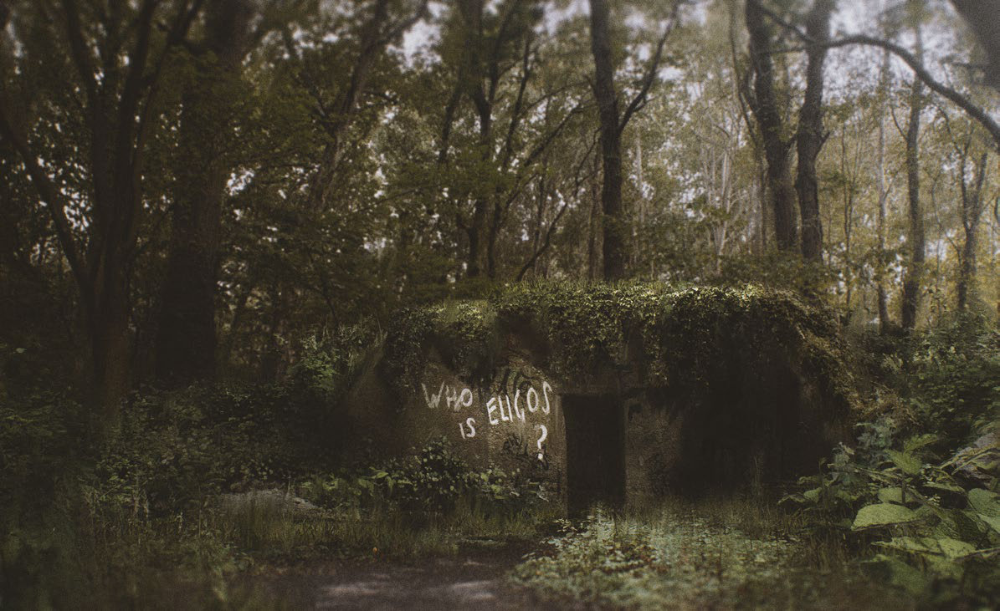

Activities

The group has continued to 
grow, but slowly, hindered by a 
healthy sense of paranoia about being 
discovered. Each new member is 
vetted carefully over several months, 
exposed to various vampire media 
franchises, and questioned about 
how they might react to meeting a 
real one. The city’s active goth scene 
provides the circle with natural cam­
ouflage, a community of people who 
see talking about real vampires as 
only mildly eccentric, a fun game of 
what-if to pass the time and inspire 
interesting narratives.

and monsters who would use the cov­
er of darkness to harm the innocent.

Vampires and their friends 
must remain hidden from the world. 
Humanity isn’t ready to know about 
their existence, and would react with 
fear and hostility. Other supernat­
ural forces might also want to hunt 
any vampires who make themselves 
known. Exposing a member of the 
group to outsiders is tantamount to 
murder.

Leah’s circle have a mission: 
protect the city at night from those 
who would do harm to innocents. 
Inspired by superheroes and vigilante 
pop culture vampires, they primar­
ily patrol the clubs and back alleys 
where their goth scene congregates 
on Friday and weekend nights, 
sometimes venturing further afield 
to known dangerous neighborhoods. 
Elaborate makeup, outfits, and code­
names help them hide their identi­
ties, to prevent retaliation and police 
reports. When they spot someone 
acting suspiciously, half-vampire 
circle members decide whether to 
interfere themselves, or contact Leah 
for help.

If you drink the blood of a will­
ing vampire, you become a “half-vam­
pire,” still alive but with some of 
a full vampire’s power. The effect 
wears off after a while, so becoming a 
half-vampire is harmless and com­
pletely reversible.

Doctrine

Vampires are real, natural crea­
tures of the night. Their appetites 
tempt them toward evil actions, but 
they are not inherently evil them­
selves.

It’s possible to become a vampire 
by drinking vampire blood while 
close to death, but only a small 
percentage of humans are capable 
of rising again, everyone else simply 
dies. Leah, a full vampire, is rare and 
special.

Most of the time, the circle 
intervenes with a few thrown fists 
and a demand to get lost and never 
try something like that again. Repeat 
offenders, and those the circle have 
deemed extremely dangerous, are

Good vampires are natural pro­
tectors of humanity, active at night 
to best defend against wicked people

16 3

CULTS OF THE BLOOD GODS

JAKE “DIABOLIC” MARTINS
JAKE “DIABOLIC” MARTINS

dealt with more permanently by Leah. She hasn’t con­
sciously noticed how all of her half-vampire followers are 
always willing to help her hide a body, while her human 
friends are a lot more unsettled, but she’s still taken to 
keeping the murderous side of her activities away from 
those who haven’t tasted her blood.

Jake used to date Leah, back before her death and 
resurrection. Chronically obsessed with coolness, he’s lev­
eraged this tenuous connection into a position as second 
in command. Being able to beat people up and get praised 
for it suits him very well, and Jake lives for his half-vam­
pire life as Diabolic, daydreaming through morning shifts 
as a line cook. He’s become convinced that he could 
survive the transformation into a full vampire, and has 
petitioned Leah to try, but so far she’s been too afraid of 
failing to grant his request.

On weeknights, when patrolling isn’t as necessary, 
the circle meets as friends and to discuss strategy. Leah 
is always at the group’s heart, adored to the point of 
near-worship by her ghouls. She’s tried to stay hum­
ble, but nearly everyone close to her is supernaturally 
bound to her will, and she doesn’t even know it. New 
doctrine is forming among the circle, fed by half-vam­
pire devotion and Leah’s growing ego. It’s only a 
matter of time before she becomes less of a leader, and 
more of a god.

Standard Dice Pools: Physical 5, Social 4, Mental 3

Secondary Attributes: Health 6, Willpower 6

Exceptional Dice Pools: Athletics 6, Brawl 8; Intim­
idation 5; Investigation 4

Future Plans

Disciplines: Potence 1

General Difficulties: 4/2

As the group grows, security is becoming more of a 
concern among Leah and her circle. The group has already 
gained some notoriety within their community; no one 
knows exactly who their new “night guardians” are, but 
the club scene is taking notice of a substantial drop in 
muggings, sexual assaults, and other violent crimes. Other 
people, like the local police, are noticing an uptick in 
missing persons among the career criminals who prey on 
the drunk and disoriented after the clubs close. This rec­
ognition is all the more threatening because Leah knows 
she’s ignorant of what forces are out to harm her. Do the 
police know that vampires exist, and do they have agents 
trained to fight them? If vampires are real, what other 
monsters are real too? Leah plans to direct resources away 
from her vigil and toward finding her sire, or anyone 
else who could help explain how this supernatural world 
really works.

MIKA BITTERMANN
MIKA BITTERMANN

Mikah was a friend of Leah’s back in college, a horror 
and occult movie fan who’d always daydreamed about 
meeting a real vampire. He’s been acting as the group’s 
administrator since the beginning, but a childhood 
accident and amputation left him without a right leg, or 
much interest in learning how to fight. As one of the only 
circle members who doesn’t regularly drink Leah’s blood, 
he’s starting to get worried about how everyone else is 
starting to act, but isn’t sure how to bring it up with the 
vampire without upsetting her.

Standard Dice Pools: Physical 3, Social 4, Mental 5

Secondary Attributes: Health 4, Willpower 7

Exceptional Dice Pools: Craft 4; Subterfuge 5; 
Academics 6, Occult 6, Technology 6

While Leah is looking for vampires, other vampires 
are looking for her. The city’s Sheriff has guessed that 
someone is hunting in the rack without permission, but 
would rather track down the perpetrator herself before 
mentioning the matter to the Prince. The sire who aban­
doned her is now realizing just how stupid it was to leave 
an illicit childe running free, one who could identify him 
by description. It’s a big city, and Leah is cautious about 
where and how she shows her face, but she’s determined 
enough to make a difference that she is bound to be 
found eventually. Whoever finds her first will also have to 
deal with her circle, an unexpected army of well-equipped 
ghouls who have devoted themselves to training for a 
fight against any evil, supernatural or otherwise, that 
might want to harm their angel of the night.

General Difficulties: 3/2

MELISSA “RAZOR” THOMSON
MELISSA “RAZOR” THOMSON

Razor has been chasing new thrills since she was a 
teenager. Drugs and warehouse raves gave way to kick­
boxing and roller derby as she grew up, finding steady 
employment as a personal trainer. The rush of endorphins 
and power that comes from Leah drinking her blood, 
then offering blood in return, is the best of both worlds, 
a drug-like high and the adrenaline she needs to feel alive. 
Razor leads the charge among the half-vampires, the first 
to get into fights and the one who’s teaching everyone else 
how to win them.

16 4

chapter four: mortal cults

Standard Dice Pools: Physical 6, Social 3, Mental 4

[DIABOLIC SIGNED IN]

Secondary Attributes: Health 7, Willpower 6

Diabolic: come on come on

Exceptional Dice Pools: Brawl 7, Survival 7; Intimi­
dation 5, Streetwise 5, Subterfuge 4

[RAZOR SIGNED IN]

Razor: Just got your message. What’s up?

Disciplines: Celerity 1

Diabolic: got a bead on a real bad cat who 
ferries victims to a drinker

General Difficulties: 4/2

LEAH
LEAH

Razor: Where?

Diabolic: often makes the drop off on the 
park southside near the fountain

Leah is too short and freckly to resemble the classic 
expectation of a vampire, though she does keep her hair 
dyed raven black and her eyes filled with red contact 
lenses. She’s clanless, not that she knows what a clan or 
a Caitiff is. A once-shy girl with newfound confidence, 
she’s prone to indecision, and overcompensating when 
she feels she’s made a mistake. She cut off all ties with 
her family after death, fearing for what they’d think of 
her, and now couch-surfs with the members of her circle, 
feeding off their blood and their money to fully immerse 
herself in her nocturnal life.

Diabolic: think we need to teach them the 
difference between good and bad

Razor: Okay have you ran this by Leah?

Diabolic: nah going to deal with this our­
selves earn our stripes ok?

Razor: I don’t know. She should be told.

Diabolic: come on raz where are your 
balls??

Clan: Caitiff

Razor: Yeah yeah. I know. All right. I’ll meet 
you. Where and when.

Sire: Unknown

Diabolic: if it’s good enough for them the 
fountain at 4?

Embraced: 2010 (Born 1991)

Ambition: Find my sire

Razor: 4AM? Fuck off man I’m asleep then.

Convictions: Always protect the innocent

Diabolic: these bastards come out at night 
come on

Touchstones: Mikah Bittermann — friend from 
school and cultist

Razor: No way. Maybe if Leah’s there, but 
4AM is well past my bedtime.

Humanity: 5

Generation: 13th

Diabolic: ffs i’ll do it myself

Blood Potency: 1

[RAZOR SIGNED OUT]

Attributes: Strength 2, Dexterity 3, Stamina 2; Cha­
risma 4, Manipulation 1, Composure 3; Intelligence 
3, Wits 2, Resolve 2

Diabolic: pathetic

[DIABOLIC SIGNED OUT]

Secondary Attributes: Health 5, Willpower 5

Skills: Athletics 1, Firearms 2, Stealth 2; Animal Ken 1, 
Etiquette 3, Insight 2, Intimidation 2, Leadership (Goth 
Subculture) 3, Persuasion 3; Academics 2, Awareness 
2, Investigation 1, Occult 2, Technology 1

why, the player characters discover the individual was 
hospitalized in the early hours of the morning, apparently 
mugged. If the player characters visit the individual in 
hospital, they explain that the muggers started threat­
ening violence if they didn’t disassociate from Kindred 
society. Not fully grasping the situation, the victim told 
the muggers to “fuck off,” at which point the circle beat 
them severely.

Disciplines: Celerity 2, Potence 1, Protean 1

General Difficulties: 4/2

Story Hook: Mugging Gone Wrong

The circle soon shifts their sights to the player char­
acters. They saw their target meeting with the characters 
and have been following at least one of them back to their 
haven. The player characters should have the chance to 
detect they’re being followed. If they interrogate their

In the middle of a chronicle the player characters 
are pursuing, a ghoul or mortal they’ve met in the story’s 
course fails to show up to a rendezvous. Investigating

16 5

CULTS OF THE BLOOD GODS

pursuer and find their way back to Leah, the young Cai­
tiff expresses honestly that the mugging went too far, and 
the circle is mostly interested in protecting the innocent 
while punishing the wicked. The player characters may 
see a possibility to influence or punish the hopelessly 
naïve vampire for her circle’s actions.

form of social support, the initial three agents were able 
to initiate twenty adherents after only three months. By 
the time the original timescale of the project was run­
ning up, Project Cathedral had made itself a real army, 
hundreds of adherents across three countries who were 
willing to do more-or-less whatever they were asked, all 
in the name of a fictional elder vampire.

The Dread 

Cult of Eligos

After reassessment panels and some serious ethical 
debate, Project Cathedral was given the green light to 
continue its experiment, assessing the limits of what hu­
mans could be convinced to do in a cult-like environment 
as a control group to measure against blankbody mental 
influence. The risk to the lives and mental well-being of 
the cult’s followers was deemed acceptable, and agents 
who disagreed with that assessment were quietly reas­
signed. Remaining agents were given permission to use 
the cult to further other SI goals; no sense letting a good 
brainwashed army go to waste.

“Blood for Eligos, blood for Eligos, blood for Eligos. 
Praise the dark master, worship the dark master, fear the 
dark master.”

Eligos has walked in darkness since before the dawn 
of written history. He drank from those who built the 
Parthenon, fanned the flames of crusade and grew bloated 
and content upon the blood that ran through the streets. 
He taught the infamous Countess Báthory the ritual of 
eternal youth, gave Vlad III the strength and cruelty he 
needed to crush his enemies. To the herds of humanity, El­
igos is a nightmare incarnate, the immortal monster who 
has spawned so many vampire myths. To the enlightened 
few who have chosen to worship him, he is a demanding 
taskmaster, but capable of granting his chosen few a por­
tion of his power. Under the shroud of night, his cabal of 
followers meet in secret, receiving orders from their dark 
master through a chosen few disciples before dispersing to 
commit the evil deeds their demonic king commands.

Doctrine

Might makes right, all other ethics are petty human 
contrivances of the weak and fearful. Working with oth­
ers for mutual benefit is useful, but in the end it’s every 
man for himself.

Eligos is the mightiest being in the world. To follow 
him means gaining a portion of his power, to disobey him 
means death.

Eligos speaks through his High Priests, with whom 
he has shared a portion of his power. They can read minds 
and perform magic spells through blood rites.

Fortunately for everyone involved, Eligos does not 
exist.

To become a High Priest, you must obey Eligos and 
his speakers’ commands. He will only share his power 
with those who know how to serve him, for to do other­
wise would be to risk his own downfall.

History

Activities

Only months after the Second Inquisition began, 
specialists within the Newburgh Group began to notice 
a pattern among the blankbodies: many were found 
surrounded by willing humans who had been convinced 
to become blood donors and even bodyguards through 
promises of power, ecstasy, blankbody transformation, or 
spiritual enlightenment. Project Cathedral was created to 
study this phenomenon, determining how much influence 
blankbody mind control had on such groups, and how 
much was simply human nature. To this end, they created 
a cult of their own.

Recruitment is an ongoing concern for the cult, who 
lose members to dissent and death at an unfortunate rate. 
Most new members are recruited from message boards and 
private email lists associated with a series of conspiracy 
theory and occult websites. Agents of the Newburgh Group 
pose as cult members online, answering questions and 
showering new members with attention and validation. 
Once someone has become part of the online community, 
they’re encouraged to join the group in real life, and those 
who pass on the opportunity face social exclusion. Liaisons 
with the local police department and MI5 keep civilian 
investigators at bay, even when a stray member reports the 
group’s obviously threatening nature.

The Dread Cult of Eligos worked almost too well. 
Targeted ads on fringe websites focused on European 
and North American white males ages 18-32 with a prior 
interest in violence, self-sufficiency, or the occult. Honing 
in on disenfranchised, angry candidates with no other

16 6

chapter four: mortal cults

Once made loyal, each member is given a task by 
the High Priests of the cult once every few weeks. Most 
tasks are small and only vaguely menacing — listen to this 
television channel at 8:00 PM on Monday for two hours, 
get your boss’s phone number and home address, deliver 
a parcel from one end of the city to the other. These jobs 
are a mix of busy work and real spy work that benefits 
the Newburgh Group, though the latter assignments tend 
to go to members who have a positive track record with 
meaningless tasks. Sometimes, a member is asked to do 
something obviously illegal — steal something, gather 
blackmail material, poison food at a grocery store, or 
commit murder with a provided weapon. These are part 
of agency tests to see how far a civilian will go when sub­
jected to mundane religious brainwashing, as compared 
to the supernatural influence of the blankbodies. While 
most are carefully controlled, set up to prevent any real 
loss of life, Project Cathedral has been called on to take 
illegal actions against known blankbody collaborators, 
working in conjunction with FIRSTLIGHT to coordinate 
their attacks. Members who succeed at their tasks, only to 
find their theft or poisoning or murder unreported on the 
news, are told the cover-up is the work of Eligos’ high-lev­
el influence on world events.

prayer, and trained members extract the blood of suppli­
cants with sanitized needles, an offering to Eligos. The High 
Priests forward donations to blood banks through back-al­
ley channels, reserving only a small amount for ritual use. 
New tasks are given out to members privately in small con­
fessional booths, and those who were previously assigned 
a job report their success or failure. The final phase of the 
meeting is a lavish dinner provided by the cult, a gift from 
Eligos to the loyal, but mostly a chance to make members 
socialize. Friendships and networking are encouraged, to 
better socially isolate anyone who decides to leave.

Future Plans

Three months ago, the cult’s primary site received an 
anonymous letter, warning it to cease and desist due to 
something called the “Masquerade.” Though the correspond­
ence has not been traced, contacts within FIRSTLIGHT be­
lieve it may have been a genuine attempt at communication 
from a blankbody, or more accurately a society of blank­
bodies. Has Eligos managed to fool even the real undead? 
Fearing a trap, the Newburgh Group has been reluctant to 
pursue contact, but the agents of Project Cathedral think 
it’s worth the risk. If the blankbodies think they’re writing 
to one of their own, how many secrets might they be tricked 
into revealing?

Church meetings are held every week, at secret loca­
tions that change frequently and are communicated through 
code on various conspiracy sites. Attendees engage in

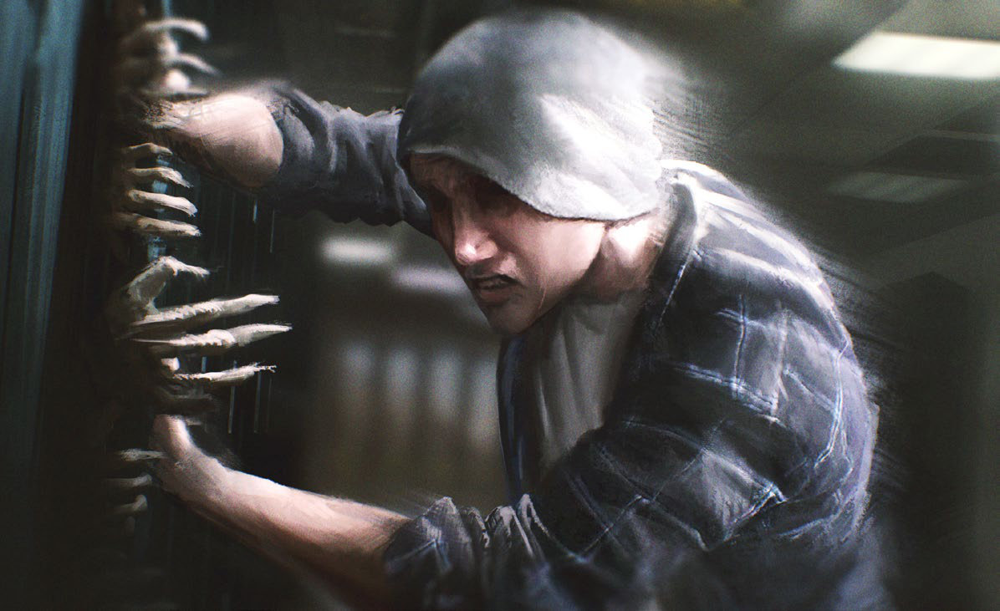

CULTS OF THE BLOOD GODS

JADEN MICHAELS
JADEN MICHAELS

Exceptional Dice Pools: Brawl 
6; Insight 5, Intimidation 6; Inves­
tigation 5

In the meantime, FIRSTLIGHT 
has asked for a contingent of cult 
members to complete tasks in Amer­
ica, and perhaps even set up a branch 
of the cult somewhere in the States. 
Less interested in the science experi­
ment than in the potential source of 
devoted off-the-books followers, the 
international organization is eager 
to adapt the model to multiple new 
countries. There’s also talk of train­
ing FIRSTLIGHT agents to better 
mimic real blankbody cult leaders, 
hoping to infiltrate their society 
deliberately through posing as one of 
their own.

Jaden was one of Project Cathe­
dral’s founders, a trained psychologist 
brought in to monitor the mental 
state of cult members and assist with 
efficient recruitment. He did his job 
well, but when it came time to extend 
the project, Jaden dissented. Going 
any further was unethical, he argued; 
they had to deprogram their recruits 
and help them return to society. A 
week later, he was “laterally promot­
ed” to a cushy position in MI5, with 
a nice pay raise and very few respon­
sibilities. He’s tried to keep his head 
down since, but what he did with the 
Dread Cult of Eligos still haunts him, 
and he lies awake at night wonder­
ing if blankbodies are really more 
monstrous than the people sworn to 
fight them.

General Difficulties: 3/2

RUPERT BRANT
RUPERT BRANT

Rupert was one of the cult’s 
first recruits, having found the group 
through one of the conspiracy web­
sites set up to attract members. He’s 
a dedicated true believer who’s taken 
the “might makes right” doctrine 
thoroughly to heart, spending every 
available moment outside his desk job 
and his cult activities training in mar­
tial arts and firearm use. Though he’s 
devoted to Eligos, he’s starting to get 
fed up with the High Priests. It’s high 
time an exemplary member like him 
got to meet the dark one in person, 
and gain access to the real power.

AMY MONTAGUE
AMY MONTAGUE

Amy is the agent who came 
up with the Eligos myth, and put 
together most of the symbolism and 
rituals. A trained intelligence opera­
tive with a dark creative streak, she’s 
secretly enjoying her role as High 
Priestess far more than she should 
be. She sometimes likes to pretend 
she really is a sexy, immortal vam­
pire, controlling her adoring masses 
with unnatural powers instead of 
technology and psychological tricks. 
It’s fun to see just how far she can 
push her slavish followers and get 
away with it, all in the name of 
“research.” An honest psychological 
assessment would make even the 
Newburgh Group’s dubious ethical 
advisors take her off the project in 
a heartbeat, so no one can ever find 
out how deep she’s sunk into the 
mythology she created. Within the 
cult, she’s known as High Priestess 
Jezebeth.

Standard Dice Pools: Physical 
4, Social 5, Mental 5

Standard Dice Pools: Physical 
3, Social 4, Mental 3

Secondary Attributes: Health 
6, Willpower 8

Secondary Attributes: Health 
5, Willpower 6

Exceptional Dice Pools: 
Firearms 6; Etiquette 6, Insight 7, 
Subterfuge 6; Science 6

Exceptional Dice Pools: Fire­
arms 5, Survival 4; Politics 4

General Difficulties: 3/2

General Difficulties: 4/2

TERESA MILES
TERESA MILES

FRANKLIN BRYANT
FRANKLIN BRYANT

Teresa joined the cult for the 
sake of her girlfriend, the 300-year-
old Sheriff of the city who wants 
to know what the hell is going on. 
The 50-year-old ghoul has slipped in 
unnoticed with a fake identity that 
hasn’t been checked too hard, but 
the longer she stays the more likely 
someone will check her history and 
discover it’s not all there. Until then, 
she plays her part, and tries to figure 
out just who this Eligos person is, and 
where he’d been hiding before his 
cult sprang up.

Franklin was numb to atroc­
ity long before he joined Project 
Cathedral. An expert in “enhanced 
interrogation techniques,” he’d been 
torturing civilians for decades for the 
DIA before FIRSTLIGHT headhunt­
ed him, trading him across the pond 
to work on the cult project. Aside 
from acting as a High Priest, he serves 
as the head of security within the cult, 
assessing risk to agents and coordinat­
ing assault missions carried out by the 
group’s members. Within the cult, he’s 
known as High Priest Agramon.

Standard Dice Pools: Physical 
5, Social 5, Mental 4

Secondary Attributes: Health 
7, Willpower 7

Exceptional Dice Pools: 
Firearms 6; Leadership 7, Perfor­
mance 6; Investigation 5, Occult 
5

Standard Dice Pools: Physical 
5, Social 6, Mental 4

Standard Dice Pools: Physical 
5, Social 4, Mental 4

Secondary Attributes: Health 
7, Willpower 8

Secondary Attributes: Health 
6, Willpower 6

General Difficulties: 4/2

16 8

chapter four: mortal cults

Kindred named “Eligos” is having 
their retainers draw blood from hap­
less vessels in church halls and other 
rented spaces, in a way that implies 
a very callous master with Bagger 
tendencies. They ask the player char­
acters to investigate who this Eligos 
is, and if they can find this Kindred, 
bring them to the court — willingly 
or staked, whichever is easier.

student members, a small army just 
waiting for instructions. The Order 
was infiltrated and transformed, its 
largely harmless members turned into 
unwitting servants of the cause. Some 
Society members find it distasteful, 
turning innocent college kids into as­
sassins, but a cardinal somewhere up 
the chain has decided that their lives 
are a small price to pay for ensuring 
human security.

We’re not alone in the dark.

You know it.

We know it.

It’s time to find out the truth. 

With whom do we share this world?

As the player characters look 
into the cult’s activities, they spot an­
other of the city’s Kindred hovering 
around the group’s fringes. In a case 
of mistaken identity, it’s possible the 
player characters believe this vampire 
is “Eligos” and attack them for their 
perceived Masquerade breach. In re­
ality, the vampire is just as concerned 
about the cult’s activities, especially 
as they’re taking place in a location 
this vampire considers their territory.

History

Are you between the ages 

of  18 and 35? If so, contact us:

Founded in 1835 by a group of 
bored Classics students, the Order of 
the Broken Branch was set from the 
beginning on maintaining the “secret” 
in secret society. Unlike other organ­
izations that had been discovered, or 
even made their presence known on 
campus, the Broken Branch char­
ter specified that the group was to 
remain hidden, and members were 
commanded to deny any knowledge 
of it when questioned. While not 
completely effective, the Order has 
managed to remain a rumor, oft-re­
peated but only sometimes believed.

dreadcultofeligos@sunburst.com

No more 

secrets.

The Order 

of the Broken 
Branch

Much of the group’s doctrine 
comes from that original charter, 
which shrouded the Order’s goals 
in poetic, Latin text. The struggle 
to gain knowledge and expose lies is 
described in metaphor as an army of 
knights-templar fighting an army of 
ignorance. The founding generation 
was quite satisfied with their writing, 
and spent years holding meetings in 
living rooms and bars, debating liter­
ature and politics and congratulating 
each other at the end of the night for 
a “fight well-won” with the demon 
Ignorance.

“Incendo flammam veritatis; let the 
fire of truth burn bright, and the demons 
of Ignorance will fall by our torch and 
blade.”

Before modern Greek fraterni­
ties, American university students 
formed all manner of secret societies. 
The Order of the Broken Branch is 
among the oldest, one part social 
club, one part exercise in getting 
away with something you’re not 
supposed to be doing. The secret 
society has always had an interest in 
mysticism and the occult, ostensibly 
as metaphors and tools for philosoph­
ical enlightenment and intellectual 
growth, which made them an early 
target for the Society of St. Leop­
old. Hoping for real vampire facts, 
the hunters instead found a team of 
smart, cooperative, semi-brainwashed

Exceptional Dice Pools: 
Stealth 6; Insight 7, Subterfuge 
7; Investigation 4, Occult 5, 
Technology 6

Disciplines: Auspex 1

General Difficulties: 4/2

In the ‘70s, members began to 
direct the club’s activities outward, 
organizing war protests and civic 
action campaigns. To justify the new 
approach, leaders cherry-picked 
journal entries from the found­
ers, reimagining them as activists 
themselves. Historical revisionism

Story Hook: Eligos’ Breach

Word reaches the player char­
acters of a new vampire in the city 
making waves, and the ruling vampire 
is less than happy. Apparently, this

16 9

CULTS OF THE BLOOD GODS

continued into doctrinal belief, with 
the metaphors of fighting ignorance 
being reframed as a command to act 
up and change the world. Blood ran 
hot, but as the decades went by and 
freshmen recruits gradually stopped 
remembering the ‘70s, future cohorts 
were never able to recapture that 
same fervor. Photos of protests and 
guerilla anti-government action were 
carefully preserved alongside the 
Order’s charter, oft-imitated since 
but never matched.

out its mission. When asked, mem­
bers must deny the existence of the 
Order. Those who break this edict are 
forever outcast.

or project. All current members are 
expected to attend each meeting, but 
alumni members are invited only on a 
case-by-case basis, involving only those 
who are necessary for that particular 
engagement.

The Order must always be led 
by current undergraduate students, 
though graduate students and alumni 
may participate in many activities. 
This keeps the organization young and 
focused, better able to hunt, and less 
likely to fall prey to ennui.

With the Society of St. Leopold 
controlling the Order from within, 
these special meetings usually involve 
a hunt for a particular Kindred or 
Kindred organization. Facts about the 
supernatural menace are passed on 
by the Society to the students, who 
are then asked to come up with ways 
to use that knowledge to hunt them. 
Often, alumni members — usual­
ly trained government agents and 
sometimes priests in disguise — carry 
out the student plans, reducing risk 
and casualties while still benefiting 
from the free student think-tank. 
Undergraduate members are only 
called upon for fieldwork when the 
Society needs an extra level of plau­
sible deniability. Guerilla assaults on 
respectable demon-owned homes and 
businesses are planned out as home 
invasions, with the perpetrators 
trained to give alternative motives 
to the police and media; political 
dissent, personal revenge, or what­
ever other story suits. Although the 
Society tries to protect these student 
soldiers from capture, those who do 
get caught are expected to deny the 
existence of the Order and go to jail 
quietly, comforted by the knowledge 
that they’ve made the world a better 
place.

Activities

The Society of St. Leopold became 
involved with the Order only a few 
years ago, when an alumni member got 
in touch through the right priest to 
ask about the potential for the Order 
to help their cause. Hunters young 
enough to pass as students joined the 
group, and were soon able to take over 
leadership as older members gradu­
ated and left. The active fervor of the 
‘70s was stirred again, but this time 
with a new enemy: literal demons, evil 
creatures of the night who have tried 
to keep humanity ignorant of their 
existence since history began. Just 
like previous generations, the Society 
borrowed from the charter to support 
their cause, suggesting a new read­
ing that posited the founders as the 
first demon hunters, and challenging 
current members to live up to their 
calling.

The Order keeps up some of its 
old activities as a smokescreen, dis­
cussing literature and current events 
academically with other members at 
weekly or bi-weekly meetings held 
in reserved library corners or dorm 
rooms. Anyone curious enough to 
try and track down the Order of the 
Broken Branch usually finds only one 
of these meetings, and walks away 
disappointed that the famous secret 
society is just a bunch of undergrads 
talking about books. These weekly 
get-togethers are open to all mem­
bers, past and present, allowing 
undergraduates to meet and network 
with successful alumni and securing 
the Order’s success through a chain 
of well-connected generations. Each 
weekly meeting opens with a reading 
from select portions of the charter, 
call-and-response between a meeting 
leader and the attending members. 
New members are expected to mem­
orize these responses within a month 
of joining, internalizing them in the 
process. Food, wine, and an atmos­
phere of colloquial collaboration help 
cement ties of loyalty and friendship, 
to other members and to the Order 
at large.

Doctrine

Ignorance exists in the world 
because of the forces of evil, manifest 
as demons who must be fought. The 
secret Order of the Broken Branch 
was created to lead that fight.

Future Plans

Due to the Order’s organiza­
tional structure, Society personnel 
working as undergrad members 
can only lead the project for one or 
two years, and finding experienced 
members who look young enough 
to be undergrads has become harder 
and harder. The current leader of the 
Order has stayed on for four years, 
taking a second undergraduate degree 
to meet the requirements, but dissent

The Order’s fight is of utmost 
importance to humankind: with­
out them fighting back Ignorance, 
everyone would become slaves to the 
demons. Sacrificing yourself in the 
name of the Order is the greatest 
good you can do with your life.

Real meetings are held off cam­
pus, at office space rented out for the 
Order by well-to-do alumni. Scheduled 
sporadically via coded emails, texts, 
and word-of-mouth, each meeting is 
run by a current undergraduate leader 
and is planned to address a single issue

The Order of the Broken Branch 
must remain secret in order to carry

17 0

chapter four: mortal cults

is growing among members who 
feels this violates the spirit of the 
charter. The easiest solution would 
be to change the Order’s rules for 
leadership, allowing a single agent 
to stay in charge indefinitely, but 
that idea is wildly unpopular among 
current and alumni members alike, 
who see it as disrespecting the club’s 
oldest tradition. Since the Society 
of St. Leopold usually regards this 
ingrained loyalty as a strong positive, 
dissolving it in this case will have to 
be done carefully.

soil terrorism as “demon fighting.” 
She’d love to put a stop to it, but first 
she has to prove it, and then find out 
who she can trust to help bring them 
down.

but forgotten, until reports started 
coming in about students from his 
old alma mater working for the Sec­
ond Inquisition. An affable Nosfer­
atu, well-liked by Kindred society, 
Sullivan is tracking down old haunts 
and history, trying to discover what’s 
happened to his old Order and how 
he can stop it.

Standard Dice Pools: Physical 
3, Social 5, Mental 5

Secondary Attributes: Health 
4, Willpower 8

Clan: Nosferatu

Exceptional Dice Pools: 
Stealth 5; Etiquette 6, Leadership 
6; Science 6, Technology 7

Sire: Hedwig

Embraced: 1823 (Born 1749)

General Difficulties: 4/2

Ambition: Discover what be­
came of the Order of the Broken 
Branch

The utility of the undergraduate 
members as a secret think tank had 
been underestimated, until recent cre­
ative hunting designs were presented 
to Society leadership. A group of phys­
ics students have a prototype device 
that can perfectly mimic sunlight, 
while a team of computer science and 
history majors are working together 
to sort through old documents and 
cross-referencing the names, locations, 
and physical descriptions of supposed 
historical “monsters” with modern so­
cial media data, rooting out suspected 
immortals. Creative, interdisciplinary 
innovation is hard to foster within the 
confines of the Catholic Church, even 
within secret societies such as the So­
ciety, so student ideas are starting to 
get more than a cursory glance. With 
more funding, perhaps the Order 
could extend itself to additional cam­
puses, targeting the best and brightest 
for recruitment worldwide.

SAMANTHA WATTS
SAMANTHA WATTS

Convictions: Always fight 
ignorance

Samantha gave up a promising 
career in the Vatican to work for the 
Society of St. Leopold after encoun­
tering a vampire firsthand. Her 
baby face got her into the Order as a 
“freshman” seven years ago, and she’s 
led the club since her third year back 
at school. Though she knows she’s 
doing good work, pretending to be a 
twentysomething student is draining, 
and not what she signed up for. She’d 
much rather be in the field, fighting 
the monsters who once stole her 
blood and her dignity.

Touchstones: Lars Magnusson 
— faithful mortal servant for the 
last 20 years

Humanity: 6

Generation: 10th

Blood Potency: 3

Attributes: Strength 3, Dexter­
ity 4, Stamina 3; Charisma 3, 
Manipulation 4, Composure 3; 
Intelligence 4, Wits 4, Resolve 3

Secondary Attributes: Health 
6, Willpower 6

Standard Dice Pools: Physical 
6, Social 4, Mental 4

Skills: Brawl 3, Craft 3, Lar­
ceny 4, Stealth 4; Animal Ken 
3, Etiquette (Kindred) 3, Insight 
2, Intimidation 2, Persuasion 
2, Subterfuge 3; Academics 3, 
Awareness 2, Finance 1, Inves­
tigation 2, Occult 3, Politics 1, 
Science 2

Secondary Attributes: Health 
5, Willpower 6

Exceptional Dice Pools: Intim­
idation 5, Persuasion 5; Investi­
gation 6, Occult 6

MARGARET THALES
MARGARET THALES

General Difficulties: 3/2

Margaret used to be president 
of the Order, until she graduated 
three years ago. Now working on 
her Master’s in Engineering, she’s 
stayed involved with her old club and 
outwardly supports its new direction. 
In private, she has serious doubts. 
Overheard conversations and unusual 
phone calls have her suspicious that 
one or more fellow alumni might be 
trying to turn the Order into govern­
ment agents, masking acts of home-

Disciplines: Animalism 1, Ob­
fuscate 3, Potence 2

EDWARD H. 

EDWARD H. 

SULLIVAN
SULLIVAN

General Difficulties: 6/4

Edward is quite certain that the 
Order of the Broken Branch is real. 
After all, he helped found it. He was 
Embraced long after graduation, 
brought into eternity as a man in 
his early seventies. Over nearly two 
centuries, his youthful misadventures 
founding a secret society had been all

Story Hook: 

God’s Weapons

Just last night, some well-mean­
ing cops interrupted a trade between 
high-up members of the Order of 
the Broken Branch and the Society

171

CULTS OF THE BLOOD GODS

Recording Number: 1190
Subject/s: Human
Pertinent Notes: Catholic order of blankbody hunters, the SoSL

RECORDING STARTS
RECORDING STARTS

Voice 1 (Father Harry Grainger, Suspected): 
Voice 1 (Father Harry Grainger, Suspected): — won’t fly any more.

Voice 2 (Unknown, Female?, Late 20s or 30s): 
Voice 2 (Unknown, Female?, Late 20s or 30s): I’m sorry. I really am sorry. I know 
how important it was that we get it, but the cops.

Voice 1: 
Voice 1: Where is it now?

Voice 2: 
Voice 2: Best guess is it’s still there. We can send someone to retrieve it now, if 
you give the word.

Voice 1: 
Voice 1: No. Todd says he saw a figure watching as he was led away. Maybe an un­
dead set the police onto the entire operation.

Voice 2: 
Voice 2: If they’re aware of the Order, then we need to close up shop. Immediately.

Voice 3 (Margaret Thales, Confirmed): 
Voice 3 (Margaret Thales, Confirmed): Father, how have you been?

Voice 1: 
Voice 1: Margaret! My goodness, I didn’t see you there. I’m well. I’m well. And have 
you met [indiscernible noise].

Voice 2: 
Voice 2: A pleasure.

Voice 1: 
Voice 1: We were just talking about some equipment we lost. A stupid thing.

Voice 3: 
Voice 3: Lost? Where?

Voice 1: 
Voice 1: A building site. Here. Let me show you the map on my phone. Here. One of 
our students dropped something of importance. Something the college owns. But the 
student can’t go back there because they’ve headed out of town.

Voice 3: 
Voice 3: Do you need me to go out and get it? I don’t mind. It’s not that far from 
where my boyfriend lives.

Voice 2: 
Voice 2: That would be wonderful. Thank you so much, Margaret!

Voice 1: 
Voice 1: You are an angel.

RECORDING TERMINATES
RECORDING TERMINATES

Other Cults

of St. Leopold held in a mobile office 
at a building site outside of town. 
The cops saw lights on at the aban­
doned site, and suspecting a drug 
deal, commenced a raid on the of­
fice. As the protesting cultists were 
led away, one of them coincidentally 
possessing a small bag of marijuana 
in their pocket, the cops left the 
most important prize: a sunlight 
caster. This device was constructed 
by student members of the Order of 
the Broken Branch, and now sits in 
a bag kicked into a cupboard in the 
mobile office.

The entire event would have 
passed Kindred society by, were it not 
for a nomadic Kindred who saw the 
whole thing go down, and who at Ely­
sium now laughs about the sight of a 
few priests and some students being 
led away by the city’s boys in blue. 
The event might draw the coterie’s 
curiosity, especially as the building 
site sits in unclaimed territory. Of 
course, eventually the Society or the 
Order is going to return to the build­
ing site to claim their device, capable 
of casting a beam of light said to be 
as potent against Kindred as the light 
of the sun.

The Black Blood Seekers believe 
in the historical truth of vampires. A 
loose network of jaded historians, con­
spiracy theorists, and people seeking 
an outlet for their darkest imaginings, 
the Seekers have communicated over 
the internet since the earliest usenet 
groups. According to their research, 
vampires ruled much of the Western 
world before a series of human upris­
ings wiped them out in the 12th-14th 
centuries. The blood-drinkers were 
highly intelligent philosopher kings

17 2

chapter four: mortal cults

with centuries of accumulated wisdom, 
beneficial to humankind even though 
their existence required the frequent 
sacrifice of less worthy lives. Whether 
or not any vampires survived the cull­
ing is a matter hotly debated between 
the Seekers, and members who do 
manage to make contact with a real 
one have never managed to produce 
enough proof to convince the group at 
large. Modern Kindred looking for a 
neatly prepackaged cult of supplicants 
nonetheless eye the Seekers with deep 
suspicion: a group that open about 
their theories on the internet has surely 
attracted the attention of the Second 
Inquisition, to whom the Seekers’ 
obsessive combing of news articles and 
rumors for evidence of vampire activi­
ty is a useful spot of free manpower.

His baser human desires were gone, 
replaced with a simpler Hunger that 
could be more completely understood. 
He preaches long fasting and hours of 
meditation to his students, and tries to 
follow his own advice. Unfortunately, 
a vampire fasting for too long leads to 
undesirable consequences, and more 
than one private meditation ceremony 
has ended with blood on the walls and 
a supplicant dead at Hong’s feet. Such 
accidents are regrettable, but Hong 
soothes himself with the belief that his 
victim’s karmaphala will be a pleasant 
rebirth, since their sacrifices have 
aided his quest for nirvana.

mouth, the group is getting popular 
enough that the Second Inquisition 
can’t be far behind.

The Order of St. Rose broke 
off from the Society of St. Leopold 
centuries ago, over a divine revelation 
received by their original leader and 
rejected by the main church. The Or­
der believes that spilling the blood of 
the undead upon the Earth serves only 
to corrupt the planet, transmuting 
the evil of the vampire into a cloud of 
darkness upon the souls of all human­
ity. Of course, they still mean to hunt, 
just with careful rituals around blood 
contamination and clean-up. Ideally, 
they capture vampires alive, and take 
them to a specially equipped facility 
where they can be drained dry into a 
consecrated silver basin, a process that 
takes hours of excruciating pain. The 
blood is then preserved in contain­
ers and prayed over daily to prevent 
it from infecting the Earth. Rumor 
among the Kindred holds that the vitae 
the Order preserves actually retains 
its power indefinitely, acting just like 
the fresh lifeblood of a vampire even 
when consumed months later. Once 
a year, a priest of the order is chosen 
to drink all the blood that its knights 
have accumulated, then set himself on 
fire at dawn. The priest’s burning death 
and the cleansing sunlight remove the 
dark taint of the executed vampires 
from the world for good.

The Church of Nigel, Reborn 
is a tiny, accidental movement that 
has sprung up around Thin-Blood 
vampire Nigel Hunt after he rose 
from the dead in the middle of a 
protestant church sermon. His pastor 
and a group of church elders have 
decided he was sent by God, and Nigel 
doesn’t want to disappoint them. He is 
capable of doing some pretty amazing 
things now, and the pastor seems to 
think that the bite marks he leaves on 
parishioners to perform miracles are a 
form of stigmata. In his small church, 
people are lining up to see him, offer­
ing their blood in exchange for happi­
ness and healing, the latter of which 
he has no idea how to provide. Though 
the only evangelizing the Church of 
Nigel does is through local word-of-

The Temple of Endings was creat­
ed by Yong-un Hong, a Seon Buddhist 
before his Embrace. Dying transformed 
him from vaguely religious to utterly 
devout, and he soon fixated on the 
vampire myth of Golconda, believing it 
to be a form of buddhahood achieved 
by the undead. He resolved to become 
an ascetic as the first step to achieving 
this enlightenment. Knowing he could 
not walk the Eightfold Path alone, he 
turned to the local Buddhist com­
munity, his blood-laced tongue easily 
talking many into following him. As 
an undead creature, he argued, he was 
closer than many to enlightenment.

173

chapter five
chapter five

“As I entered church today, I heard a few of you bemoaning your lack of cash. Your scarcity of capital. 

“As I entered church today, I heard a few of you bemoaning your lack of cash. Your scarcity of capital. 

Your absence of money. Well let me tell you, my friends: money does not occupy these seats. Money does not fill a heart. 

Your absence of money. Well let me tell you, my friends: money does not occupy these seats. Money does not fill a heart.

Money cannot hear my words. More important than money is the soul. And I see a lot of souls out there tonight. 

Money cannot hear my words. More important than money is the soul. And I see a lot of souls out there tonight.

Your souls are ripe and full of love and aspiration. Souls are all I need!”
Your souls are ripe and full of love and aspiration. Souls are all I need!”

— “Coach” Tyrone Soros, Motivational Speaker, Ministry, Indianapolis 
— “Coach” Tyrone Soros, Motivational Speaker, Ministry, Indianapolis

The Act of Creation
The Act of Creation

The majority of this book revolves around cults 
The majority of this book revolves around cults 
already in existence within the text of Vampire: The 
already in existence within the text of Vampire: The 
Masquerade. These are only a small fraction of the cults 
Masquerade. These are only a small fraction of the cults 
within the world, however. Small circles of Kindred, 
within the world, however. Small circles of Kindred, 
ghouls, and humans form their own religious move­
ghouls, and humans form their own religious move­
ments that either grow or splinter off into tiny subsects 
ments that either grow or splinter off into tiny subsects 
that eventually die. People ask themselves what the 
that eventually die. People ask themselves what the 
meaning of life is, and turn to charismatic leaders and 
meaning of life is, and turn to charismatic leaders and 
mystery rituals to find the answer. Cults give people 
mystery rituals to find the answer. Cults give people 
a sense of purpose — and since there are seven billion 
a sense of purpose — and since there are seven billion 
people on the planet, there are as many types of cults as 
people on the planet, there are as many types of cults as 
there are stars in the sky.
there are stars in the sky.

One could describe an organized religion as a cult 
One could describe an organized religion as a cult 
that’s received formal recognition. In truth, there’s 
that’s received formal recognition. In truth, there’s 
little to divide the two, beyond the word “cult” becom­
little to divide the two, beyond the word “cult” becom­
ing dirtier as organized religions consumed the world. 
ing dirtier as organized religions consumed the world. 
Neither cults nor religions are two-dimensional clubs 
Neither cults nor religions are two-dimensional clubs 
for wayward hobbyists. They’re families bound togeth­
for wayward hobbyists. They’re families bound togeth­
er by belief, values, and ideology. Over the past thirty 
er by belief, values, and ideology. Over the past thirty 
years, Kindred society has seen a glut of individual 
years, Kindred society has seen a glut of individual 
churches rise to the fore, which has created a sea of 
churches rise to the fore, which has created a sea of 
competing faiths. Players are encouraged to build their 
competing faiths. Players are encouraged to build their 
own coteries, cults, and spiritual covenants. The follow­
own coteries, cults, and spiritual covenants. The follow­
ing material helps customize a methodology and system 
ing material helps customize a methodology and system 
to put meat and flesh on the bones of an idea. In order 
to put meat and flesh on the bones of an idea. In order 
to get started, the players can ask themselves several 
to get started, the players can ask themselves several 
crucial questions:
crucial questions:

This chapter gives you the tools you need to create 
This chapter gives you the tools you need to create 
your own cult, religion, or organization, as well as 
your own cult, religion, or organization, as well as 
cult-related coteries. Note that this chapter deals with 
cult-related coteries. Note that this chapter deals with 
in-character perceptions of cults, as well as discussions 
in-character perceptions of cults, as well as discussions 
of love-bombing, grooming, and abuse.
of love-bombing, grooming, and abuse.

1 7 5
1 7 5

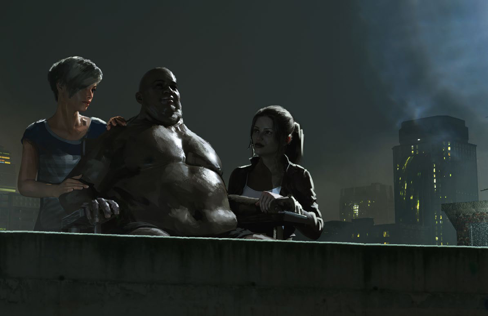

•	
What are the core tenets of this faith? What are its 
central mandates?

This can also help Storytellers create a framework 
that remains consistent despite the questions or chal­
lenges characters encounter. The more specific players 
are in their answers, the easier it is to understand what 
is and isn’t acceptable and who does or doesn’t call the 
shots in any given situation.

•	
What is the structure of the cult?

•	
How does the cult recruit members?

•	
What rituals, rites, ceremonies, and sacraments 
enhance the faith?

How to 

Build a Cult

•	
Are there any revered texts or protected relics?

•	
Are certain holidays or specific dates honored and 
celebrated?

Like any stable group, a cult requires three things: 
people, money, and time. In order to have a flock of 
fanatical worshipers, you need people to convert. You 
need time to convert those people, and rewrite their 
thought processes to be more in line with your doc­
trine. Finally, you’ll need money in order to house, feed, 
and clothe those people, and advertise your new group. 
It’s a lengthy process, and many find themselves with­
out enough of one of the three resources listed above to 
complete it.

•	
What symbols and colors represent the cult?

•	
Where does the cult meet?

•	
How do cult members live night to night?

A discussion or exploration of answers to these 
can turn a whisper of an idea into a three-dimensional 
organization with previously unimagined motivations. 
With each added layer of detail infused into the creation 
of a religious organization, storylines, chronicle hooks, and 
coterie possibilities emerge on their own.

Vampires, however, have access to as many people 
as they can get their hands on, all the time in the world,

176

chapter five: cult construction

Doubt, dissent, and questioning are discouraged, 
violently if necessary. In mainstream religions, there are 
ministers whose job it is to counsel the doubters among 
their faithful. If someone is a member of a cult, how­
ever, she is right, with a capital R. Questioning is not 
normal in a cult, it’s a sign of weak faith. Weak faith 
means the cultist has the potential to defect, and that 
cannot be tolerated. Leadership makes use of shame, 
withholding food or sleep, physical punishments like 
beatings or kneeling for hours, emotional abuse, and 
other methods to keep everyone in line. Anyone who 
questions is part of the out-group, and might poison 
the in-group. This cannot be allowed.

and plenty of ways to get money. Most don’t tend 
to play nice with others, but some decide to spread 
their reach and form cults, both to gain more mortal 
and Kindred followers, and to genuinely worship. A 
Vampire is a selfish creature, and so if she is devoted 
to an entity worthy of worship, others should be too. 
After all, who better to judge the situation?

Vampire cults are often stereotyped as the flock of 
blood dolls and ghouls eagerly awaiting their turn on 
the St. Andrew’s cross or the operating table, opening 
their veins and wallowing in depravity. While this is cer­
tainly true for some vampiric cults, others are not quite 
so gauche. Some Tremere chantries manage cults of 
eclectic occult practitioners, who they use to do research 
they don’t have time for and groom new members of the 
clan. Ventrue host cults of superstitious tech developers, 
fostering atheist discussion circles and solstice rituals 
without a focus, channeling that energy into themselves 
and their projects. There are dozens, maybe hundreds of 
iterations of the cult model all across the world.

The cult is the cultists’ world... Long-term mem­
bers of a cult cannot think of a life without it. All their 
time and energy goes into the cult’s activities: promo­
tion, worship, work, punishment. Even leisure time is 
spent doing cult-approved and cult-related activities. 
The outside world is full of sin and suffering, so why go 
out there when you can just stay in here? Even if all of 
her money and time is going toward the cult, a cultist 
sees it as a necessary sacrifice for whatever the cult 
promises her.

The Basics

...but not so for the leadership. Leaders of cults of­
ten hold some sort of mystical, even messianic, standing 
among the membership. They hold all of the wealth and 
power of the cult in their hands, and it’s not long be­
fore they’re using it to fuel their own vices. Some cults 
have true believers as leadership; some Bahari cults, for 
example, channel that centralized power into acquiring 
more knowledge and better teachers for their fellow 
cultists. Others, especially in more famous mortal cults, 
spend their followers’ money on drugs, booze, seven­
ty-bedroom mansions, swimming pools, and all sorts of 
other luxuries while their flocks live in squalor, seeing 
it as a divine hardship.

Whatever the cult’s use of money, people, and 
time ultimately looks like, there are several character­
istics that all cults share. These are, according to the 
International Cultic Studies Association, in no particu­
lar order:

The leadership dictates what members do, where 
they go, who they marry, and more. This may be small, 
such as recommending members only live in a certain 
part of town or telling them not to get involved with 
another race, gender, religion, or tax bracket. On the 
other end, it may involve arranged marriages, commu­
nal housing, disposal of all non-cult items, and sched­
uled mealtimes and meetings.

Cults do not think of themselves as evil. It is easy 
to judge a cult from the outside, to say that they’re all 
brain-damaged or pathetic or sadists. The truth is, cults 
are as complex as any other group of people, living or 
otherwise. Recruiters prey on the lost, the damaged, the 
lonely, and the depressed — what they, themselves, once 
were. Cults are insidious in that they build a space for 
people to feel accepted and part of something greater, 
a feeling they might not have had before. All the work 
they do, all the crimes they commit, everything they 
sacrifice is for this group that has shown them love and 
acceptance. That’s just human nature.

The group claims an exalted or privileged status in 
the world. Cults often claim to offer secret knowledge, 
the key to happiness, immortality of various kinds, and 
a place to belong. Humans, ghouls, and Kindred who 
feel lost, abandoned, or spiritually hungry are drawn to 
cults by these inducements. Some even receive what the 
cult promises.

Everything is presented as “us versus them.” The 
cult’s dialectic resembles battlefield strategy. It’s a way 
to get one over on those outside, those who don’t un­
derstand and who persecute the cultists because of it. A 
cultist is convinced she knows “what’s actually going on” 
and she has to keep that secret from the undeserving. 
The cult defines the in-group, or the people inside, and 
the out-group, the people who are not members of the 
cult and therefore are evil.

This is a difficult mindspace to get people into, 
especially in Western societies. Many American and 
European cultures have a strong thread of individualism 
running through them, and in any “normal” religious 
relationship, telling a devotee she can’t leave the church

17 7

CULTS OF THE BLOOD GODS

home except during certain times 
or she can’t speak to her family any 
more sparks outrage and backlash. 
There are some exceptions to this, 
monastic orders for example, but 
in that case the power relationship 
with the religion is consensual and 
up front.

New cultists are shiny and innocent 
and should be treated with kid gloves, 
but members who have been in the 
cult for weeks or months and still 
manage to commit transgressions 
against its doctrine, leadership, or 
other members need to be shown the 
error of their ways. It’s just a neces­
sary cycle of love and punishment.

tools, working on behalf of a single, 
ancient Kindred. Such cultists offer 
patronage to their church, hoping 
to appease their god and earn their 
attention. The most common list of 
deified methuselahs include:

•	
Banu Haqim: Mancheaka, 
Tegyrius, Ur-Shulgi

Cults recruit using a technique 
called “love-bombing.” Essentially, 
they find people who are struggling, 
lost, lonely, or grieving, and provide 
them with a space that uncondition­
ally affirms them. As the potential 
cultist is drawn further in, this af­
firmation slowly gives way to rules, 
demands, and punishments. The 
cultist craves that love she had been 
given, and so she acts in accordance 
with the cult’s rules, hoping to 
receive it once again. When she is in 
this space, she is the perfect adher­
ent: fanatical, refusing to care for 
herself, and sublimating her needs 
into serving the greater whole.

•	
Brujah: Altamira, Menele, Uga 
Dugud

Belief

•	
Gangrel: Enkidu, Matasuntha, 
Mictlantecuhtli, Odin the 
All-High

At its core, a shared system of 
belief binds a group together. Be it 
religious, ideological, or philosoph­
ical, this belief defines the identity 
of the organization. While mortal 
society may claim a difference be­
tween saintly churches and deviant 
cults, Kindred society makes few 
such distinctions. When it comes to 
“churches” and “cults,” the terms are 
largely interchangeable.

•	
Hecata: Augustus Giovanni, 
The Baron, The Capuchin, 
Japheth, Lamia, Lazarus

•	
Lasombra: Boukephos, 
Montano, Sybil

•	
Malkavian: The Eater, Malakai, 
Nissiku

Ancestral Worship

•	
Ministry: Nakhthorheb, Set

It’s important to note here 
that, once again, cults do not think 
of themselves as evil. While they 
may very well be, their members see 
love-bombing and punishments as 
necessary steps. Many cults use terms 
such as “religion,” “faith,” and “order” 
to reassure followers and themselves. 
Very few people want to be the next 
Charles Manson, nor do many people 
want to join the next Manson Family.

•	
Nosferatu: Azazel, Gorgo, Yima

The vast majority of Kindred 
cults worship a specific methuselah. 
Some followers seek to emulate 
these blood gods, while others 
commit themselves to the role of 
useful pawn. In general, Kindred 
suspect they are unknowing tools 
in a greater Jyhad, but members 
of an ancestral cult are voluntary

•	
Toreador: Amarantha, Beshter, 
Helena, Michael

•	
Tremere: Goratrix, Meerlinda, 
Tremere

•	
Ventrue: Hardestadt, Mithras, 
Artemis Orthia, Tiamat, Tinia

Secular Values

CULTS AND RELIGIONS
As mentioned in the text, there is little to no difference between a cult and 
a religion beyond the veneer of respectability and accepted practices. 
The public see cults as groups of brainwashed fanatics in service to some 
esoteric or violent purpose. The public see religions as groups of individu­
als who have made the choice to commit to faith, and while they may not 
understand the faith, they might respect the choice to follow it.
This chapter makes some rigid definitions of what a cult is or could be, but 
those definitions can apply equally to many religions. While many find 
comfort and cause within belief, others find control, deceit, and horror. 
We use the word “cults” because to some vampires, when freshly Em­
braced, these faiths represent exactly those horrifying, alien belief systems 
they’ve heard about. But one vampire’s cult soon becomes another vam­
pire’s religion, faith, or church.

Some churches center less 
on a specific individual and more 
around a particular concept. The 
Amaranthans hunt down diabler­
ists. The Eyes of Malakai believe 
madness is the only way toward 
absolute truth while the Nosferatu 
Cleopatras of Yima attempt to 
regain their beauty. There is no 
founding blood god to guide these 
churches, but rather a prime value 
crucial to their identity and unique 
to their organization.

178

chapter five: cult construction

Heresies

You Shall Not…

the same hierarchical structure. A 
single leader commands and the 
masses follow. Those masses are part 
of a ladder leading ever upward, 
elevating members based on merit, 
devotedness, seniority, education, 
charisma, gamesmanship, and other 
manipulations. Some churches focus 
on dedication of faith while others 
honor ability. Regardless of what 
promotion is based on, which is 
usually a combination of factors, the 
further someone climbs the lad­
der the more they are able to peek 
behind the curtain. Through their 
elevation, they gain greater under­
standing of the cult’s inner work­
ings and, at times, its hypocrisy.

Even among Kindred society, 
tolerance has its limits. Many circles 
tolerate cults like the Bahari or the 
Church of Caine. But other cults, 
especially those Gehenna cults who 
preach the end of the world, are too 
radical in the opinion of these same 
circles. At best, Kindred discourage 
these cults, or purge them outright 
at worst. Such organizations exist 
on the fringes of vampire society. 
They gather in secret behind closed 
and guarded doors. When discov­
ered, these heresies suffer swiftly 
and publicly, though more than one 
Prince has persecuted a local cult 
less on grounds of security and more 
out of political expedience.

By contrast, a cult should have 
at least one sin or prohibited action, 
but may have many, many more. A 
cult succeeds based on the amount 
of control it has over its members. 
So, a cult likely has a long list of 
“do’s” and “don’ts.” Some of these 
rules can be minor infractions 
requiring repentance and absolution 
if transgressed. Violating other rules 
might be impossible to forgive and 
demand the ultimate retribution. 
These directives may or may not 
conform to the sins of a given sect, 
so part of the fun in creating a cult 
is the Kindred involved may need to 
tread very carefully when navigating 
these two worlds at the same time.

Laity

The First Rule 

of Vampire Club

Mandates

Laity are members of a religious 
group who are not an ordained part 
of it. “Lay members” often refers to 
people who participate in a field 
without being professionals in that 
field. This can include volunteers 
and hobbyists.

Religions have commandments. 
Governments have laws. Sects have 
the Traditions. Every major organ­
ization, religious or secular, has a 
specific list of rules or forbidden 
actions to solidify their character.

The first rule of Vampire is 
don’t get caught. A Kindred can get 
away with anything they want until 
someone else catches them. That’s 
when consequences come knocking. 
Do they list this rule explicitly in 
the vampire handbook? No. Or at 
least, not as such. This is an implicit 
rule or a cultural norm, meaning 
there can be completely unwritten 
rules for a cult as well.

In relation to cults, these are 
the outermost ring of involved 
individuals. Time and circumstance, 
along with their doubt, misfortune, 
or naiveté has led them to it. Laity 
may still have misgivings, questions, 
or reservations with one foot in and 
one foot out, but for the moment, 
they are curious enough to contrib­
ute. For them, the cult represents 
a chance at peace, purpose, and 
community. There must be appeal 
or advantage to their participation 
for people who the cult often tasks 
with the most menial chores and 
obligations.

You Shall…

A well-crafted cult has at least 
one mandate which helps define 
who they are, what they want, and 
what they represent. These rules are 
very personal, and players should 
customize them for their cult. A 
good rule of thumb is to ask what 
each faith believes in and why. 
The cult of Mithras, for example, 
has deified the most powerful and 
famous Ventrue Prince in Kindred 
history. As a result, Mithraists 
place the honor of the lineage, or 
the greater community, above their 
own. Meanwhile, the Meneleans 
honor the memory of Carthage and 
have sworn vengeance against the 
Toreador whom they believe be­
trayed them during the Punic Wars.

These unwritten rules are 
mandates everyone seems to know, 
but usually have no idea where they 
came from or how they got started. 
Phrases like “it’s always been this 
way” and “we don’t do that here” are 
good indicators of cultural norms 
based on tradition rather than any­
thing to do with faith or doctrine.

These members are the weakest 
links in regard to security and secre­
cy, but are often the best vectors for 
pulling more people into the cult. 
They participate because of their 
love for the deity or passion for the 
espoused ideals of the organization, 
and their enthusiasm draws others 
in. Keeping these members happy

Hierarchy

The following groupings 
only serve as an example because 
terminology may change from cult 
to cult. But, most have roughly

17 9

(or seemingly so) with real or imagined benefits is 
important to the success of the cult.

Initiate

Inducted Initiates are the general rank-and-file 
within the cult. They understand the basic tenets of 
the faith and are both able and willing to carry out the 
commands of their superiors. Initiates have committed 
themselves to the cause, and while they may have lin­
gering concerns or questions, they are generally smart 
enough not to voice them openly. Initiates focus only 
on the positive aspects of the cult and tend to ignore 
or deny any doubts voiced by others.

Initiates who have committed to the cult’s agenda 
usually perform essential nightly tasks to keep the be­
lief machine running. Some function as preachers and 
messengers, traveling between cities in order to recruit 
new members and pass along communiqués from their 
superiors. Others participate in internal ceremonies, 
assisting leaders in their religious services. Finally, 
Initiates may serve as soldiers tasked with guard duty, 
city patrols, or offensive attacks.

Acolyte

Acolytes are the most fanatical members of the 
cult. They have followed its precepts, participated in 
its rites, and have been rewarded for their devotion. 
They spearhead short-term missions or coordinate 
some aspect of the cult. When a cult needs to get its 
hands bloody, an Acolyte tends to lead the charge. 
They are the first to volunteer their services and the 
first to put down dissent. For them the cult is their 
entire identity and the only real source of purpose in 
their life.

Specialized Acolytes take on specific positions 
ranging from shock troops to secretaries. They are the 
bread and butter of the cult. These people support the 
cult because they have tied their lives and livelihood 
to it.

Clergy

Clergy are leaders. They are the shepherds to the 
sheep. They can perform all of the major rites, handle 
internal disputes, and conduct religious services. 
Smaller cults may have a single Clergyperson who 
serves as the right hand of the highest authority. 
Larger cults may have more, with each focusing on 
an aspect like financial, organizational, or spiritual 
matters.

chapter five: cult construction

They can also function as an advisory council to 
the cult leader. Given their role and their understand­
ing of the cult’s inner workings, they are also the most 
likely to use it for their own personal agendas. A cultist 
who is the equivalent of Clergy likely has their life and 
the lives of others dependent on the successful execu­
tion of the cult’s objectives. Because of this, they can be 
enforcers of doctrine, the secret police, or propaganda 
artists who maintain the status quo.

take the form of ancient tales passed down to form a 
kind of living history. Cultists may, for example, base 
their prayers, what they do or don’t eat, or what they 
do on a particular day on such historical manuscripts.

Scriptures are for teaching, but the documents 
themselves can become holy relics. Holy books, sacred 
texts, and ancient tomes can become as important for 
their pages as for what those pages say. A cult that 
venerates knowledge might preserve books simply 
because they are books. Another cult might protect a 
letter written by the founder because they believe it has 
magical properties.

Prophets

Prophets are the people at the top. They are the 
charismatic cult leaders, the CEOs of the brand, and 
the visionaries who inspire a movement. Unless there 
is a particularly wily member of the cult or the struc­
ture is something other than a hierarchy, Prophets set 
the agenda for the cult. They can inspire or manipu­
late their followers because they are the heart of the 
cult and control the power it can wield. And, they use 
everyone underneath them. They make the decisions or 
set the goals those lower in the hierarchy execute.

Relics

Along with sacred texts, objects and artifacts can 
become holy relics. The ashes of a great Kindred, a 
sword once wielded by a blood god, or the home of a 
founder are all examples of relics. The most prized are 
the most protected. For many, being in the presence of 
a relic makes their worship feel more real. In a cultist, 
an object can inspire a feeling of connection to their 
leader or god and remind them of their faith.

Whether a rousing preacher, an inspirational 
thought leader, or the Pater of a blood cult, often they 
are the cult. Likewise, when something decapitates the 
cult by taking out the head, the whole organization can 
crumble. This is why cult leaders surround themselves 
with true believers and people who would give their 
lives to save them.

Services

While some more devout members may actually 
live in the temple, others may be more infrequent visi­
tors, only attending on holidays or during major events. 
Determining when the church gathers helps determine 
how active and cohesive its membership is. A regular 
worship service every month or every week creates a 
dependable schedule that followers can rely on.

Cult Practices

Strict rules often govern the night-to-night 
practices of a cult, but this is not always the case. A 
sense of community and rigorous indoctrination might 
be all anyone needs to remain dedicated to a cause. 
Indoctrination can come from techniques like brain 
washing and induced dependency, but followers can 
also come together because of the culture or lifestyle 
the cult provides.

Nightly activities, such as recruitment drives, 
training, and social events may not be religious services, 
but they do help solidify a group and assist in the over­
all growth of the cult. Meanwhile, weekly feasts may 
become formal occasions, with an additional half dozen 
holidays to augment the year.

Apparel

Religious practices are the building blocks of a 
cult’s culture and community. To some extent, every­
one in the cult participates in its practices. From the 
prayers they recite to the clothes they wear, these 
aspects create a group’s spiritual identity.

Not every cult has strict mandates when it comes 
to clothing. Some churches need to blend in with their 
surroundings to avoid drawing unwanted attention 
to themselves. Others are quite brazen in their faith, 
traveling together in groups wearing the same garments 
or color scheme. Clothing (or the lack of it) can easily 
become another one of those unwritten rules. But 
mostly, for the purposes of the cult, wearing the same 
clothes or having particular vestments adds to the over­
all indoctrination of followers.

Scripture

Not every religion has a single holy book, but many 
have stanzas, prayers, and songs. Scriptures capture key 
occasions, either developed over centuries or recorded 
by the faithful in the presence of their god. They can

181

CULTS OF THE BLOOD GODS

Rituals

significance. For vampires, holidays 
and religious observances come in 
several different forms.

their actual date of birth difficult 
to pin down. But, without birth, no 
Kindred would exist.

Acts of adoration, veneration, 
and homage are the cornerstones 
of any faith. To believe in a deity is 
one thing, but to properly express 
belief is something else. Cultures 
throughout history have developed 
intricate methods of worship and 
Kindred cults do the same. Rituals 
can be small nightly actions cultists 
take, like saying a prayer or lighting 
a candle, or larger ceremonies com­
bining the magical will of the group 
to perform massive feats.

Death Day: Dates of Embrace 
are more impactful the older the 
Kindred. The Embrace can be an 
occasion of celebration as much as 
horror, but it is a defining night for 
any Kindred.

Lunar

In many vampire cults, holidays 
are associated with the lunar calen­
dar. Given their nocturnal connec­
tion, the moon not only represents 
shifts in time, but also has specific 
meanings depending on its given 
phase.

True Death Day: Methuselahs 
do not die often, but when they do, 
it reverberates throughout Kindred 
society. Such true death days can 
be solemn occasions, marked by 
commemorations, sacrifices, and 
remembrances.

The New Moon: As the sun 
shines against the far side of the 
moon, new moons represent mo­
ments of renewal.

Blood: The primary ingredient 
in the rites of most Kindred cults. 
Consuming blood during feasts and 
sacrifices isn’t uncommon, nor is 
painting sigils of protection, bap­
tism, or curses in blood.

Major Events: The most com­
mon kind of historic holidays com­
memorate major events. The blood 
cult of Ur-Shulgi marks the moment 
Haqim created Alamut, home of 
the Banu Haqim. The Meneleans 
remember the date Carthage fell to 
the Romans.

The Waxing Moon: As the 
moon grows each night, so too do 
intention and preparation to act. 
Nights under the waxing moon are 
about growth and building.

Fire: Given the destructive 
nature of fire, Kindred cults tend 
to use it only on rare occasions. 
Conversely, the use of fire can be a 
punishment for wayward followers.

The Full Moon: Full moons are 
powerful, ceremonial, and climactic. 
Kindred cults might use the full 
moon for Embraces, coronations, 
and initiations into the cult.

Seasonal

Incense: Burning something to 
honor the gods is no new concept. 
Most use it as a means of purifica­
tion, suffuming a room or person 
with smoke from frankincense, 
myrrh, and benzoin.

Those Kindred cults closely tied 
to nature often use seasonal festivals 
to highlight their beliefs.

The Waning Moon: Sliding 
back toward the new moon, waning 
moons represent times of heal­
ing, self-reflection, and the end of 
something.

Midwinter: The winter sol­
stice is the longest night of the 
year in the Northern Hemisphere 
and the shortest in the Southern 
Hemisphere.

Construction: Creating works 
of art or feats of engineering are 
common enough shows of worship. 
Faith inspires many cultists to use 
their talents.

Historic

Vernal Equinox: The spring 
equinox takes place in March in 
the Northern Hemisphere and 
in September in the Southern 
Hemisphere. During the equinox, 
day and night are of equal length.

Some cults might center holi­
days on key events. As many prac­
tice some form of ancestral worship, 
the majority of these historic events 
focus on the progenitor’s birthday, 
death day, or in rare instances, their 
true death day. Other holidays cele­
brate key milestones such as praxis 
seizures, founding dates, and major 
victories.

Sacrifice: To prove their 
dedication to their ancestor, many 
cults conduct blood sacrifices. But 
sacrifice doesn’t have to be bloody. 
Rumors suggest the followers of 
Helena create works of exquisite art 
only to sacrifice them to her.

Midsummer: The summer 
solstice is the shortest night in the 
Northern Hemisphere and the long­
est in the Southern Hemisphere.

Holidays

Autumnal Equinox: The fall 
equinox, like the spring equinox, is 
when the day and night are equal. 
It takes place in September in the 
Northern Hemisphere and March in 
the Southern Hemisphere.

Birthday: Kindred largely ignore 
mortal birthdays. Ancestors tend to 
have little connection to their mortal 
mother or father, placing their vam­
pire sire above their blood parents. 
Some methuselahs are so old they pre-
date even the Julian calendar, making

Nights set aside for religious 
observances, holidays serve specific 
customs within a given cult. Used 
to celebrate or commemorate an 
event, holidays hold traditional

18 2

chapter five: cult construction

A Letter from Laylah Froud of the Bahari

Khal,
I’ve been thinking a lot about last week’s discussion on the differences between a witch 
and a priest, how each has different duties and methods. While I agree with you that the 
witch grows and prunes and the priest codifies, I think there’s a great deal more fluidity 
between the two roles than you allow. I am well aware that the Church of Set requires, 
well, set roles for all things, but there is no reason a priest couldn’t receive visions or a 
witch couldn’t set canon.

I suppose it’s our difference in upbringing, so to speak. I know the Church has the 
Order of Taweret, what I would call a Bahari sect within the Church itself. As a fol­
lower of Lilith, I find myself at home with your witches in the Order, the Kindred who 
mix growth and law. In a sense, you could say they are the counterbalance to the larger 
church, the life to your god of death.

(Let it be known, of course, that I do not revile Set in any way. Set is simply a 
new frontier, held by a masculine-presenting force, that I have yet to explore!)

I look forward to hearing more of your thoughts on the subject. I know you’re busy, 
so take your time in getting back to me.

Yours sincerely,
Laylah Froud

Methods of 

Recruitment

The Desperate

purpose, and a family. It’s an appeal­
ing prospect to a Kindred in pain. 
The leader who can take away pain, 
even for a moment, earns true loyal­
ty in return.

Kindred existence is often a 
lonely affair. Ennui grows, causing 
a vampire to become bored, listless, 
and disillusioned. After someone 
has fallen in love with someone or 
something, only to see it die with 
age, repeatedly over centuries, it’s 
understandable for a vampire to fall 
into despair. It’s a muted existence 
wrought with atrophy.

With a combination of charm 
and intimidation, a recruiter taps 
into a person’s fears, hopes, and 
dreams, and lures them into a belief 
system. Be they the desperate, the 
driven, or the indulgent, vampire 
cults capitalize on those in search of 
something more than a solitary life 
provides.

The Driven

Some Kindred join cults not 
out of desperation but out of drive. 
They seek to join a group larger than 
themselves either for protection, ca­
maraderie, or power. They play the 
game and they play it well, rising 
high enough in the ranks of the cult

For these individuals, a Kindred 
church can provide new meaning,

18 3

CULTS OF THE BLOOD GODS

cults are more nomadic. Rented 
spaces or temporary ones fill this 
need. Some examples might be a 
high school gymnasium after hours, 
a rented mortuary, the backroom of 
a bar, or a converted slaughterhouse 
complete with folding chairs and 
linoleum floors.

GROOMING, LOVE-BOMBING, AND DISCIPLINES
If you and your fellow players decide to tell a story about your coterie 
being inducted into a cult, be sure everyone knows what they’re getting 
into. Read over the rules for considerate play in Vampire: The Mas­
querade and use them as needed. Be ready to pull back on scenes if 
they are too much. Love-bombing is similar to partner grooming, and can 
be part of abuse patterns.
If you do decide to play a game like this, consider how Disciplines could 
be used to assist in love-bombing new members. Presence and Dominate 
are the obvious ones, but what about Animalism to win over their pets 
or Auspex to sense their motives before they realize them? Give it some 
thought — and again, be mindful of your players’ boundaries and desires.

Quick Cult 
Creation

The Temple

to use it for their own ends. Drawn 
more toward dominion than dogma, 
they must strive to stay atop the 
proverbial ladder.

Below are tables for rolling up 
your own cult. Use these for random 
rolls, or pick what you like from the 
tables and use them as inspiration. 
There is no wrong way to use these 
resources.

Those who choose to call a place 
their temple gather in a safe building, 
using it to pray, commune, or per­
form their religious rites. It’s a secure 
location, purchased outright and free 
from outsiders. Most cults utilize 
remodeled buildings or churches 
large enough to house their flock but 
small enough not to attract unwanted 
attention. Cults usually want to keep 
their prayers, blood rites, and other 
practices discrete. Temples also often 
serve as hostels for the cult, requir­
ing multiple sleeping quarters and 
daytime security systems.

The Indulgent

Backgrounds

Finally, Kindred with beliefs, 
tastes, or indulgences considered 
too deviant for polite society con­
duct themselves in secret far from 
prying eyes and always with one 
glance over their shoulder. They are 
often lonely creatures, angry at the 
world, or view themselves as morally 
superior. For such hedonists, certain 
cults represent a welcome release 
and an opportunity to express their 
true selves. These groups can also 
delve into the darker aspects of 
Kindred society, performing blood 
sacrifices and worshiping creatures 
deemed heretical to the undead 
community.

Cultists all need certain 
Backgrounds to make sure their cult 
is functioning as it should. Below 
are suggested uses of the some of the 
Backgrounds within a cult context.

Allies

Historic Site

•	
A cult recruiter who is willing 
to take care of you when you’re 
hurting, but needs you to also 
recruit new members of the 
cult.

A historic location connected 
to a cult’s deity is of personal value 
to the parishioners especially if it’s 
a place of ancestral significance. 
Perhaps it’s the place where their 
methuselah was born, Embraced, or 
killed. Perhaps it’s the former home 
of their progenitor or where they 
won a great battle. Cults can view 
such locations as vital to their iden­
tity, going to great lengths in order 
to financially secure them.

•	
One of the cult’s cooks who 
has access to the food supplies 
and knives.

Places of Worship

While the internet has allowed 
individuals to come together in 
massive numbers without actually 
ever being in the same room, cults 
require direct contact. Though they 
come in various forms, a physical 
place is necessary for meetings, reli­
gious services, and emergencies.

••	
Two mortal cult members 
with whom you’re close.

••	
A landlord who is a new mem­
ber of the cult, who lets the 
cult get away with not paying 
the rent in exchange for free 
counseling and protection 
from their shady past.

Anywhere and Nowhere

Not every church needs a 
permanent location. Some transient

18 4

chapter five: cult construction

Influence

•••	
A new member of the cult, 
who has a certain amount 
of influence within the local 
city’s politics.

governor or involved in the 
country’s legislative branch. 
They push really hard for 
legislation that benefits the 
cult, and manage to get funds 
directed to the cult.

•	
(Church) The cult holds 
meetings at a local house of 
worship, claiming to be a 
self-help group like Alcoholics 
Anonymous.

•••	
An established cultist, fanat­
ically loyal to the religion but 
less than functional in the 
outside world.

•••••	(Underworld) The cult has 
designated hitmen who take 
out their enemies, as well as 
money launderers, spies, and 
other criminals at their dis­
posal. Some of them may even 
be members of the cult. They 
control the equivalent of a big 
mafia family’s territory.

•	
(Street) The local gangs leave 
the abandoned home the cult 
squats in alone, unless they 
need something.

••••	 A ghoul or prestigious mortal 
within the cult who would die 
for you.

••	
(Bureaucracy) The cult can get 
forged IDs once every couple of 
months for members who have 
gotten in trouble with the law.

••••	 The cult’s elite members who 
will defend the organization to 
the hilt.

Haven

Contacts

••	
(Transportation) Some of the 
cult members work as taxi 
drivers for extra money and 
don’t charge fellow cultists fare.

•	
An abandoned house in an 
inner-city block. No running 
water or electricity, but room 
for all of the cultists.

•	
A cultist from another branch 
of the order.

•••	
(High Society) Several celeb­
rities are members of the cult 
and promote it whenever the 
cult tells them to.

•	
A new member in the cult 
with a decent grasp of the 
occult.

•	
Tents in the woods of a na­
tional park, moving whenever 
you’re discovered.

••	
A police dispatcher in a town 
unfriendly to the cult.

•••	
(Media) The cult has con­
tacts in several local (or one 
national) news outlets that 
allow them to run ads, and 
also be interviewed in special 
segments, on the regular.

••	
A nice two-bedroom apart­
ment with crash pads on the 
floor and a futon for cultists, 
and the beds for leadership.

••	
A ghoul researcher with a 
sizable library on the occult, 
willing to look things up for 
you.

••	
Rented space at a camp­
ground, held indefinitely.

••••	 (Industry) The cult makes and 
sells a product that has made 
them a formidable force in 
the market. Several high-up 
members of the cult are also 
infiltrating competitors to try 
and either force a merger or 
drive them out of business.

•••	
The leader of another 
branch of the cult, or a sec­
ond-in-command of the local 
cult.

•••	
An apartment building full 
of studios, with the cult’s sanc­
tuary on the ground floor. The 
building is managed by the 
leadership.

•••	
A cultist well-placed in the 
city emergency services.

•••	
A full campground owned by 
the cult, with a lodge and tents. 
Most of the space is rented out 
to families and backpackers, 
who you try to indoctrinate.

••••	 A celebrity who vocally 
supports the cult in a way 
that doesn’t damage the 
Masquerade.

••••	 (Police) The cops look the oth­
er way when the cultists drive 
drunk or people and animals 
go missing near the com­
pound. It’s too much trouble 
to get involved.

••••	 A suburban development 
owned by the cult, with the 
cult’s center of worship either 
in the community center or 
housed in its own building.

••••	 A cultist with impressive in­
fluence over the running of the 
city.

•••••	(Politics) One of the mem­
bers of the cult is a regional

18 5

CULTS OF THE BLOOD GODS

A Letter from Khaled al-Fakhani of the Church of Set

Honored Laylah Froud,

As much as I appreciate your views on the Walid al-Set, I think you lose 
something from not having a formal education within the ranks of the faithful. There 
is much to be found within the exploration of pain, but you are not bringing your 
work to the great scholars and either letting it stand up or watching it crumble. To 
be frank: you have no network of orthodoxy to fall back on, no one to objectively say 
that your communications with Lilith have been, indeed, with Lilith. That is why you 
don’t understand the priesthood.

I don’t mean to say, of course, that I disbelieve in the Typhonic Mother. Quite 
the opposite. One would be a fool to think that an entity called Lilith does not exist 
in some capacity. It would also be foolish, further, to think that this entity has not 
been speaking to you through some means. Looking at you with enough Auspex clears 
that up immediately. This letter is not about diminishing your own faith within the 
Order of Taweret, but you did ask for my thoughts, and unfortunately they come 
with a preamble.

Let us look at the largest religions in the world as of right now: Christianity and 
Islam. Within Christianity, the largest denomination is the Roman Catholic Church. 
In Islam, the Ahl as-Sunnah, or the Sunni Muslims, are almost 90% of the popu­
lation of the faithful. Why is that?

I posit to you it is the strong network each denomination possesses. You were 
raised in the United States, so perhaps Catholicism will be an easier comparison for 
you. The priest guides the spiritual well-being of his flock. The bishops guide their 
flock of priests. The cardinals guide their bishops, and the Pope is the Shepherd 
of all Shepherds, the throne of God on Earth. Doctrine is passed down from hand 
to hand, solidified and codified through the repetition of the faithful. There is, of 
course, personal gnosis, but you know when that revelation comes from your god — 
there are hundreds of texts and mountains of theology to look to.

This brings me to my second posit: a priest is a link in this network. To keep the 
faith strong and stable, to express the faith outwards and help others seek the truth 
— that is the duty of a priest.

This of course does not mean that witches don’t have their faith. A priest is meant 
to pull from the theology and canon set down by other priests before him. So it is in 
Catholic Christianity with the Bible and papal letters and bulls, so it is in Sunni 
Islam with the hadith and the Quran. A priest is a conduit for the faith as it is. A 
witch goes into the spirit of the faith itself and pulls out new meaning for herself

18 6

chapter five: cult construction

and others. She may not always be listened to — she may even be a heretic, and 
burned for it, as so many were — but a witch wields the power of the faith and 
grows it, whereas a priest tends to the faithful and the doctrine. A faith that is all 
witches is a philosophy, a faith that is all priests grows stagnant.

I hope this helps with your confusion. I remain, as always, your faithful friend.

In Set’s shadow,

Khaled al-Fakhani

••••	 A mountain lodge with cabins. Full ameni­
ties, so long as the members of the cult behave 
themselves.

••••	 A vampire Osiris who can find you teachers, al­
lies, contacts, and other useful people and things 
in and connected to the cult.

•••••	A massive house of worship situated downtown 
in a major city. There are public spaces, of course, 
but the private spaces are heavily locked down 
and controlled.

•••••	A vampire within the inner circle of the cult, who 
has taken you on as a special project. Their com­
bined resources and connections are formidable.

•••••	The Kindred behind the cult, who sees more use 
for you than others do.

••••• 	A network of comfortable safehouses throughout 
the country, all heavily decorated with cult ico­
nography and things that can be used as weapons. 
Each safe house has an alarm system.

Cult Names

Mawla

Naming things, especially groups, can be extreme­
ly difficult for even the most experienced storyteller. 
Below is a mix-and-match table of cult names. Add or 
remove prepositions and conjunctions, and pluralize as 
necessary.

•	
A Kindred cultist, one step above you in the 
order.

Church of
The Light
Journey

•	
A vampire who has been studying the cult from 
the outside.

Congregation of
The Darkness
Pilgrims

People’s
The Garden
Service

••	
A vampire well-practiced in recruiting for cults.

First
The Three Angels
Slaves

Heaven’s
Caine
Servants

••	
A vampire who holds title in the cult and the 
local Kindred government.

Children of 
Lilith
Bound To Serve

Family
Arikel
Worshipers

•••	
A Kindred member of the cult who has magical 
aptitude and has taken a shine to you.

Temple of
Ishtar
Disciples

Dominion of
Absimiliard
Faithful

•••	
A vampire who used to belong to the cult, and 
still knows many of its old secrets.

People of
Haqim
Apostles

Garden of
The Crone
Witches

Tree of
Veddartha
Saints

••••	 A Kindred member cultist with wealth, influence, 
and magical aptitude who will teach you some of 
the mystic secrets of the cult.

City of
Tremere
Citizens

Earth’s
Zhao-lat
Corpses

18 7

CULTS OF THE BLOOD GODS

Death’s
Saulot
Spirits

The Promised
Immortality/
Immortal

Secrets

Servants of
Enoch
Freedom

House of 
Spirit/Spiritual
Coven

Slaves of
Irad
Revolutionaries

Pilgrims of
Saint
Covenant

Lilith’s
Zillah
Lovers

Saint
Purity/Pure
Circle

Caine’s
The Lovers
Warriors

Shepherds of
Mourning/Mourn
Rebirth

The Abyss’s
The Martyr 
General

Soldiers

Dancers of/in
Morning
Sect

Repentant
Ennoia
Children

Blessing of
Evening
Religion

Penitents of 
Malkav
Literalists

United
Midnight
Union

Precious
Ravana
Scholars

One 
Daybreak
Consecration

Community of
Set
Gardeners

Two 
Resurrection
Bond

Songs of
Troile
Singers

Three
Open
Healers

Order of
Brujah
Dancers

Four
Special
Brethren

Local
Ilyes
Teachers

Five
Chosen
Fraternity

Disciples of
Al-Mahri
Warlocks

Six
Sacred
Sorority

Fundamentalist
Nergal
Of the Garden

Seven
Holy
In Silence

World
Ninmug
Of the Abyss

Sunrise
Royal
In Suffering

Unification
Loz
Of the Light

Sunset
Imperial
In Love

Mission of
Lucian
Of the Undying

Valley of
Suffering
In Truth

At the Heart of
Mekhet
Of the Word

Society of
Empathic
In Beauty

Fiat
Laodice
Of the Umbra

Holy
Service/Serving
In Knowledge

Fidelity of
Dracian
Of the Roses

The Way of
Kingdom
Triumphant

International 
Society of

Temple
Of the Mother

Sacred
Principality
Princes

Consecrated
Nation
Saints

Yearning for
Group Home
Of the Father

Bound
Shining
In Blood

Foundation for
Candlelight
Of the Blood

Happy
Repentant
Family

Ancient Mystical 
Order of

Vigil
Prayer

Neo-
Wild
Blood Brethren

Cainite
Raging
Movement

Apostolic
Malakai
Guardians

Kindred
Untamed
Philosophy

Brethren of
Insight
Of Enoch

Ghoul
Fallen
Army

Darkness
Song
Of the Second 
City

Shadow of
Silent
Heathens

Covenant of
Reborn
Heretics

Cyber-
Blood
Of the Third City

Traditional
Welcoming
Proclaimers

Esoteric
Promise
Of the First 
Garden

Traditions of
Warm
Believers

Insight
Sin
Of the Second 
Garden

Syncretic
Cold
Society

Heretical
Golden
Anonymous

Monastic Order of
Redemption
Of the Third 
Garden

All
Silver
Order

Circle of
Scarlet
Identity

Movement of/to
Prayer
Devotions

Alliance of
Dark
Theism

Moral
Worlds
Fundamentalists

Reformed
Pale
Anchorites

Blood of
Martyrs
Community

Saints
Crystalline
Mystics

Hands of
Thorns
Church

Council of
Final
Mediums

Nation of
Knives
March

Marriage of
Apocalyptic
Psychics

The New
Ashur
Promises

18 8

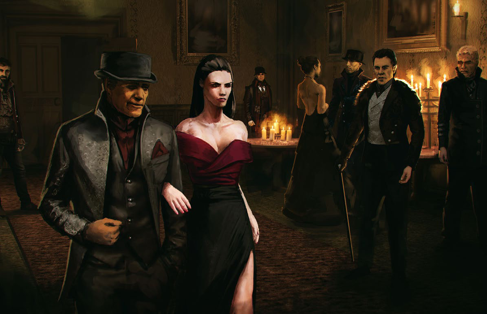

chapter five: cult construction

Colors

Gateways to
Starlight/Starlit
Celebrants/
Celebration

Final
Umbra/Umbral
Thought

Black
Authority, Darkness, Death, Elegance, 
Formality, Power, Sophistication, Strength

Beginnings of
Singing
Universal

Home of
Quiet
Academy

Blue
Coldness, Emotion, Honor, Integrity, 
Loyalty, Melancholia, Peace, Trust, Water

Antinomian
Still
Reason

Brown
Confidence, Earth, Endurance, Nature, 
Reliability

High
Low
Transcendence

Symbols

Gold
Achievement, Success, Triumph

Green
Balance, Calm, Growth, Honesty, Money, 
Nature, Relaxation, Safety

While not every church has a symbol, many do, 
and the following tables offer some basic meanings 
for colors, objects, and creatures. Storytellers and 
players can use them in combination to create a quick 
flag, crest, or icon as well as incorporate them into 
rituals and practices. For example, a cult dedicated to 
peace and integrity might use a combination of doves 
in blue and white, while a cult dedicated to war and 
victory might showcase a ram and arrow in black, red, 
or gold colors.

Grey
Intelligence, Neutrality, Seriousness, 
Tradition

Orange
Communication, Creativity, Optimism

Purple
Elegance, Imagination, Magic, Mystery, 
Royalty, Sophistication

Red
Action, Ambition, Anger, Courage, 
Determination, Energy, Love, Passion, 
Romance

Silver
Emotions, the Moon, Mystery

White
Innocence, Peace, Perfection, Purity, 
Winter

Yellow
Comfort, Cowardice, Energy, Impatience, 
Intellect

18 9

CULTS OF THE BLOOD GODS

Objects

Star
Fame, Inspiration, Majesty, Spirit, Triumph

Sword
Defense, Protection, Safety, Security, 
Strength

Air
Communication, Imagination, Intelligence, 
Perception, Travel

Water
Intuition, Life, Purification, Reflection, 
Transformation

All-Seeing Eye
Higher Knowledge, Inner Vision, Insight, 
Spiritual Sight

Wheel
Change, Destiny, Fate, Luck, Motion

Apple
Immortality, Knowledge, Luxury, Peace, 
Sexual Awakening

Wings
Flight, Release, Weightlessness

Wreath
Conquest, Success, Triumph, Victory

Arrow
Flight, Knowledge, Masculinity, Mortality, 
Power, Swiftness, War

Bell
Signals, The Expansion of Consciousness, 
The Mind, The Voice of God

Creatures

Book
Education, Faith, Knowledge, Learning, 
Secrets

Bear
Healing, Introspection, Strength

Caduceus
Authority, Harmony, Health, Infinity, 
Medicine, Supernatural Forces

Buffalo
Courage, Endurance, Sanctity

Butterfly
Hope, Resurrection, Transformation

Candle
Benevolence, Life, Light, Truth, Vigilance, 
Wisdom

Crow
Death, Prophecy, Wisdom

Chalice
Communion, Femininity, Forgiveness, 
Sacrament, Sharing, Water

Deer
Gentleness, Nobility, Power

Dove
Peace, Tranquility

Circle
Femininity, Magic, Perfection, Protection, 
Sacred Space, Unity, Wholeness

Dragon
Luck, Nobility, Power, Strength

Eagle
Divinity, Integrity, Nobility

Compass
Balance, Direction, Perfection, Spirit, Time

Elephant
Loyalty, Power, Stamina, Strength

Crescent Moon
Dreams, Intuition, New Beginnings

Fish
Fertility, Purification

Crown
Authority, Loyalty, Power, Royalty, 
Superiority, Wealth

Fox
Agility, Cunning, Intelligence

Earth
Dependability, Material Wealth, 
Orderliness, Prosperity, Sustenance, 
Wisdom

Griffin
Boldness, Courage, Strength

Lion
Leadership, Nobility, Strength

Mermaid
Emotion, Independence, Mystery, 
Perceptiveness, Seduction, Untamed 
Emotion

Egg
New Life, Resurrection, The Moon

Feather
Air, Balance, Communication, Flight, ice, 
Truth

Mouse
Innocence, Scrutiny, Survival

Fire
Anger, Creativity, Destruction, 
Knowledge, Transformation

Ouroboros
Continuity, Eternity, Motion, Purity, 
Rebirth, Renewal, Wholeness

Fruit
Earthly Pleasure, Overindulgence, 
Sexuality, Temptation

Owl
Fertility, Magic, Mystery, Wisdom

Phoenix
Immortality, Resurrection, Victory

Heart
Charity, Compassion, Love, Mercy

Rabbit
Fertility, Serenity, Virtue

Horseshoe
Fortune, Good Luck, Protection

Ram
Force, Glory, Innocence, Power

Hourglass
Death, Rebirth, Time

Scorpion
Death, Protection, Transformation

Key
Access, Freedom, Initiation, Spiritual 
Knowledge

Snake
Creation, Death, Power, Transmutation, 
Wisdom

Ladder
Ascension, Fulfillment of Potential, 
Transcendence

Sphinx
Guardian, Riddles, Wisdom

Spider
Construction, Divinity, Femininity, Patience

Lotus Flower
Beauty, Enlightenment, Purity, Reinvention

Tiger
Power, Protection, Royalty, 
Unpredictability

Lightning Bolt
Boldness, Energetic Action, Power, 
Salvation, Strength

Unicorn
Harmony, Innocence, Integrity, 
Purification, Truth, Wisdom

Mirror
Awareness, Gateways, Reflection

Scepter
Authority, Control, Royalty, Wealth

Wolf
Education, Guardianship, Instinct, Loyalty

Scythe
Collection, Death, Harvest, Loss, Ruin

Shell
Journey, Pilgrimage, Resurrection

19 0

chapter five: cult construction

Basic Cult Descriptions

• 	
A cult of ghouls who take a blood sacrament. They 
are all unbound to any one Kindred and swear 
allegiance only to each other.

Use these as the basis of a cult and build from 
there. These descriptions do not include any mechanics, 
so feel free to customize them as you like.

• 	
A cult of singers who meet in unlit places at night 
to placate Oblivion with their songs.

• 	
A Bahari cult. They grow urban gardens and pro­
vide job education for mortals, but they are also 
notorious for their less-regulated “education.”

• 	
A cult of elders who only drink blood from those 
with True Faith, in hopes this will cure their curse.

• 	
A cult dedicated to the three angels who visited 
Caine: Michael, Raphael, and Gabriel. They hope 
to be forgiven one day and raise their Humanity as 
high as possible in order to do so.

• 	
A heretical Ministry sect. They believe that Set’s 
murder of Osiris was not necessary, but is some­
thing that needs to be atoned for. This cult has 
its fingers in various funeral homes and performs 
strange rituals on the dead.

• 	
As the cult of the three angels above, but they seek 
to destroy or diablerize the three angels.

• 	
A Gehenna cult. They believe the Red Star event is 
a reminder of things to come.

• 	
A cult of personal transcendence that is really just 
a front for seeking out ideal candidates for the 
Ministry Embrace.

• 	
A cult of Arikel. Consisting of Toreador and their 
loveliest ghouls, this cult dedicates itself to physi­
cal perfection, reasoning that the struggle to attain 
the highest form of aesthetic attraction reflects 
itself in the soul.

• 	
A Brujah cult based on the Cult of the Supreme 
Being, with Troile as the Supreme Being. Virtues 
include honesty, physical prowess, and purity of 
intent.

• 	
A cult of Oblivion. They practice various shadow 
arts and blindfold themselves to worship.

• 	
A cult that seeks to corrupt society at the highest 
level through needless things and billionaires’ fear 
of the poor.

• 	
A cult of vampiric reason. Based on the writings of 
Dr. Netchurch, they seek out the scientific explana­
tions for vampirism and vampiric Disciplines, and 
perform horrific experiments on nonbelievers.

• 	
A UFO cult that believes the antediluvians were 
beings from another planet or a higher dimension 
and not the childer of the biblical Caine.

• 	
A cult of the Typhonic beast. They run under­
ground fight clubs and sell highly-trained human 
combat ghouls, but also rescue dogs.

• 	
A cult of news nightcrawlers who sell the informa­
tion they gather to flood the media with material 
to help fill time and distract from vampire life. 
They obsess over the coverage they get and feel 
touched by humanity from the stories they share.

• 	
A cult completely made up of humans who worship 
a Ventrue elder. They take “business acuity” classes 
and dress in rigid business formal every day.

• 	
A cult of former sun worshipers who miss dearly 
the light they once loved so much. They work to 
recreate their precious sun-soaked days with white 
linen outfits, bright lights, and sandals.

• 	
A teenage cult. They talk a big game about sacrific­
ing animals to Satan, but honestly they love their 
cats too much. Their leader is very disappointed.

• 	
A cult that runs a vegan pop-up restaurant to find 
clean blood for their rigorously health-conscious 
undead members.

• 	
A cult of personality around a single vampire. He 
gives his worshipers occasional blessings or gifts, 
but mostly the cultists serve him in any capacity he 
desires.

• 	
A sex cult with regular masked orgies.

• 	
A group of vampires obsessed with eating (in the 
mortal sense) even in unlife. They go so far as to 
willingly make themselves sick eating normal food 
just to get the taste. Less extreme members mix 
alcohol and herbs with their blood, or deliberately

• 	
A cult of Ravana. Its members practice strange 
uses of Presence and Obfuscate alongside other 
Disciplines in the hopes of finding a way to bring 
him back.

191

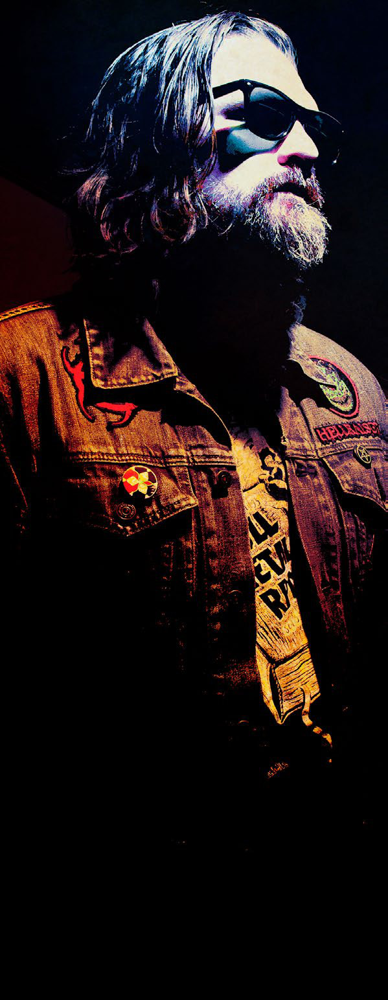

feed off people who have been fed strong-tasting 
food.

• 	
A cult of neonate vampires who worship the thrill 
of the hunt. They dress impeccably and treat feed­
ing like British nobility treat foxhunting.

• 	
A cult of vampires who worship the 1950s nuclear 
family and go so far as to have mock wedding and 
birth ceremonies. They’re extremely gendered and 
insist they draw power from that binary.

• 	
The Patmostine Order believes the Gehenna event was 
the evangelical Christian Rapture, and that no one was 
found worthy. They work to prepare Kindred society to 
be saved, whether they like it or not.

• 	
The Diamond Thunderbolt is an all-Kindred order 
that practices self-sacrifice and self-abnegation to 
bring forth a rain of “spiritual nectar” to bless and 
uplift the souls of humanity. They are divided as to 
whether or not this will extend to vampires.

• 	
A mysterious Nosferatu cult that believes it is their 
mission to mutate humanity to a higher state of being 
through disease and culling of weakness. Some of their 
more fanatical members also create blood plagues.

• 	
A cult of blood dolls who dress modestly and 
bleach their skin. They believe they honor their 
undead gods by doing so.

• 	
An Anarch cult that tries to find the common 
thread in all human religions. They seek to free 
themselves from the Beast by rigorous study and 
unlocking the riddle of unfettered spirituality.

• 	
An offshoot of the Church of Set, populated mostly 
by members of the Clan of Death. They perform 
elaborate rituals which follow the journey of Osiris 
and Sutekh through the underworld, sometimes even 
sailing on literal rivers in total darkness on flimsy 
barges.

• 	
A wild, hedonistic mystery cult of blood dolls and 
ghouls who dance themselves into unconsciousness 
so their regnants can feed on them. They say they 
have visions from the ecstasy.

• 	
A Gangrel cult whose members sacrificially and 
nonfatally immerse themselves in sand, the ocean, 
swamps, and other natural features to meditate.

• 	
A cult that only has one member in every city. 
They are meant to represent Caine, wandering in 
the wilderness with no friends.

chapter five: cult construction

• 	
A Bahari cult that follows the Revelations of the 
Dark Mother to the letter. They believe Lilith wants 
the unworthy dead, and so they steal knowledge 
and kill those who held it.

• 	
A ghoul who tortures misbehaving human cultists. 
She’s very pleasant to talk to when off the job.

• 	
Members of a revenant family who act as sextons 
and housekeepers for the cult.

• 	
A Banu Haqim cult that focuses on hand-to-hand 
combat. Their philosophy suggests that is the only 
way to truly grapple with your demons. They dia­
blerize everyone they kill.

• 	
A human celebrity who talks up the cult on day­
time TV. Somehow he maintains his charisma.

• 	
A single middle-aged human woman who flirts 
with all of her fellow cultists and then shares their 
secrets with the leadership.

• 	
A Clan of Death cult whose members spend all of their 
time preparing mortals to become powerful wraiths 
once they are inevitably destroyed by outside forces.

• 	
A grandfatherly type with a violent streak.

• 	
A vampire cult that ghouls only children to keep 
them in their state of innocence. They almost ex­
clusively feed off these children.

• 	
Children of human cultists. They have wide eyes 
and are constantly on alert.

• 	
A human who keeps a vampire’s schedule, drinks 
blood, and only eats raw meat. Their hair is falling 
out and their scalp is swollen, but they seem happy.

• 	
A cult of Tremere who worship Thaumaturgy as its 
own entity. They feel blessed to be chosen by the 
god they channel. Other Tremere think of them as 
fanatics at best.

• 	
A former teenage runaway who has become a prize 
ghoul.

• 	
A cult of twelve vampire elders who believe 
themselves to be the fallen twelve gods of Mount 
Olympus. Their servitors worship them with mys­
tery rituals and blood.

• 	
A ghoul with a “sacred familiar”: a snake, a raven, 
or something else.

• 	
A blood doll who plays at being modest and shy to 
be seen as worthy of being fed on more.

• 	
A cult of Malkavians who view trauma as the only 
true method of growth, and so regularly perform 
nonconsensual exposure therapy on themselves and 
others. They have keen Auspex senses that reveal 
strange beings.

• 	
A cultist at any stage of life or undeath who refuses 
to leave the compound, citing that “they” will get 
her.

• 	
A ghoul cult within the Church of Set that practic­
es snake-handling.

• 	
A human cultist who feels that the cult justifies the 
conspiracy theories she clings to.

• 	
A human member of the cult who ran away, came 
back, was punished, and holds her faith closer than 
ever.

Sample Cult Members

Below are a smattering of potential members of 
your cult. Whether human, ghoul, or vampire, they are 
all devoted to the cause.

• 	
A ghoul and a vampire who are deeply in love. It’s 
unclear who was in the cult first, but one of them 
pulled the other in.

Mortals

• 	
The cult’s online recruiter who is not particularly 
good at his job — he uses too much jargon.

•	
A human who holds down odd jobs when she’s 
not working for the cult for free. She doesn’t get 
enough sleep and her eyes are bloodshot.

• 	
A ghoul who does the cult’s laundry and is private­
ly a deep fanatic.

• 	
A human blood doll who wears his multiple sacrifi­
cial scars with pride.

• 	
A ghoul who “collects” foster children to induct 
into the cult. Some of them go missing.

• 	
A human who manages the weapons storage for the 
cult. She says she’s former military, but the branch 
keeps changing.

• 	
The human Sunday school teacher who takes care 
of the children and liaises with the adults.

19 3

CULTS OF THE BLOOD GODS

• 	
The ghoul chef who cooks for 
the humans of the cult and 
looks down on them.

own. Some might be ghouls, some 
might not be, it’s difficult to 
determine with the naked eye.

devoted, maybe even heretical, 
but she is still part of the cult 
and she is treated either like 
royalty or with resentment.

• 	
The human former therapist 
who constructed the cult’s 
regimen of love-bombing and 
gaslighting.

Vampires

• 	
The former Primogen who 
struggles with letting go and 
letting her faith carry her along 
with the cult’s practices.

• 	
An ancilla cultist who recently 
joined after escaping their abu­
sive sire, she has all the desper­
ate zeal of a new convert.

• 	
The former investigator who 
tried to remain detached but 
fell into the cult’s arms.

• 	
The cult’s resident vampire 
pyromaniac and fire-dancer.

• 	
A neonate who was Embraced 
into the cult and knows noth­
ing else.

• 	
A human who claims to be a 
psychic and medium. Maybe she 
is, maybe she isn’t. Her “chan­
neling” is always incoherent and 
esoteric.

• 	
A member of the Ministry who 
seems to link the cult to the 
story of Sutekh at every op­
portunity. Leadership tolerates 
him.

• 	
Twin Malkavian neonates who 
refuse to be farther than ten 
feet away from each other at all 
times.

• 	
A ghoul who always seems to 
get blamed for the problems in 
the cult.

• 	
A vampiric spiritual counse­
lor who practices Oblivion to 
lend an air of legitimacy to her 
sessions.

• 	
A Toreador who has taken a 
vow of silence.

• 	
The husband of a human cult 
member who seems terrified 
of everyone else in the cult. He 
takes great pains to be seen as a 
“normal” cultist.

•	
A self-abnegating neonate who 
strives for both physical and 
spiritual perfection in odd and 
concerning ways.

• 	
A Tremere ancilla who only 
believes in practical research, 
not theory.

• 	
A former teenage runaway who 
is now an ancilla with a youthful 
face and a saintly disposition.

• 	
A ghoul who only wears cloth­
ing she’s made and will only eat 
raw food.

Sample Cult: The 
Order of Taweret

• 	
A vampire neonate who keeps 
notes on everything everyone 
says.

• 	
A blood doll who resents any­
one the leadership talks to and 
jealously guards her access to 
them.

Description: The Church of Set 
is one of the single largest (per­
haps the largest of) Kindred faiths, 
spanning clans, age categories, and 
political groups. It is a wealthy 
institution and a powerful one, and 
some groups attach themselves to 
it out of convenience, safety, an 
agreement in doctrine, or a mix 
of the three. As a result, there are, 
of course, disagreements with the 
mainstream stance.

• 	
A vampire from the Clan of 
Death who is always playing 
with tarot cards, ouija boards, 
pendulums, etc.

• 	
A human cultist who was born 
into another cult, and as a 
consequence, clings to this one 
as part of her adult identity.

• 	
A Toreador who makes the 
cult’s sacred icons in ex­
change for blood and spiritual 
counseling.

• 	
A wild-haired, wild-eyed older 
human cultist who cheerfully 
explores the darker beliefs of 
the cult and talks about them 
as though they are normal and 
fine. He occasionally has sei­
zures, though whether those are 
“normal” or supernatural, no 
one seems to be able to tell.

• 	
A neonate who struggles with 
the cult’s doctrine even though 
she truly believes in its mission.

The Order of Taweret are one 
such group. Founded by a Ba’ham 
who fled to the Church of Set for 
protection, the Order are nom­
inally followers of the Church’s 
doctrine — but they focus on Lilith 
as Set’s progenitor, and not on Set 
himself.

• 	
A vampire ancilla who uses the 
human members of the cult as 
personal servants.

• 	
The animals of the cult. They are 
very suspicious of newcomers 
and seem to have minds of their

• 	
The childe of the vampire who 
founded the cult. She is less

19 4

chapter five: cult construction

In Egyptian mythology, 
Taweret is a goddess of childbirth 
(specifically of the struggle and pain 
of childbirth) and funeral rites. She 
is a liminal goddess, and one who 
guides humans through the two 
most potent transitions in their 
short lives. Taweret is also repre­
sented as a hippo-woman, and the 
mother of various Egyptian gods, 
including, in some cases, Set. Her 
links to growth, the Underworld, 
the river Nile, and children make 
her an obvious avatar of Lilith — at 
the very least for the hybrid Bahari 
who revere her in this form.

It is extremely rare to find 
more than one member of the 
Order of Taweret in any given 
domain. Sometimes they meet in 
person, but most often they leave 
markers on sites related to mater­
nity, such as hospitals and orphan­
ages, to say whether they’re present 
in the city or when they departed. 
As Lilith and Taweret walked their 
paths alone, with brief respites 
for company, so too do Order 
members.

working together, we have a chance at 
survival. I want to turn our differences 
into collective strengths.”

This group serves on diplomatic 
missions, functioning as negotiators 
and mediators between disparate 
parties. Most often, envoy cote­
ries form in the wake of conflicts 
between warring factions. When 
two or more cults come to a com­
promise, they sometimes task their 
younger members with forming 
such a coterie so shared service and 
common causes can transcend old 
grievances.

Concepts: Undead midwife, 
dictatorial project manager, urban 
gardener/farmer, fanatical Harpy, 
ceremonial Elysium Keeper, graffiti 
artist, millennial burnout hungry 
for more

•	
Domain: Chasse (•), Lien (•••)

The Order of Taweret is an odd 
construction. While they do keep 
the Oath of Lilith as described in 
the Revelations of the Dark Mother, 
that is about the extent of their ad­
herence to “typical” Bahari doctrine 
(if anything can be described as 
typical when it comes to the follow­
ers of Lilith). Order devotees keep 
urban gardens, usually on empty 
lots or in their apartments. They 
assist their Church of Set fellows 
in judging the ethos of humanity — 
but through this harsh and unfor­
giving judgment, they find those 
who have been chosen to walk the 
Path of Lilith. This is their strongest 
divergence from Church orthodoxy, 
the idea that those who suffer in 
their own imperfection can find a 
way out, instead of dying in it.

•	
Contacts: (•••) (mortals from 
diverse backgrounds and 
professions)

Recommended Backgrounds: 
Mawla, Influence (High Society), 
Influence (Politics), Influence 
(Bureaucracy), Mask, Status, Haven

•	
Resources: (••) (pooled cash and 
assets)

•	
Status Flaw: (•) Suspect

New Coterie 
Types

Possible extras: Mask (cover 
identities for different domains), 
No Haven (always on the move)

Think Tank

Over the last two decades, 
Kindred society has experienced 
unprecedented tectonic shifts. As 
Anarchs are routed and as Camarilla 
cities fall, the Second Inquisition 
makes short work of wayward 
Kindred who travel on their own. 
In response, Kindred have found 
strength in numbers, forming cote­
ries for the purposes of self-interest, 
shared beliefs, and mutual survival. 
Within those Kindred communi­
ties of faith, cohorts and coteries 
have taken on additional functions. 
Cerberi, Champion, Nomad, and 
Watchmen coteries are common, as 
are the examples below.

“Okay, but I’m gonna have to see 
the books.”

Consisting of old and more 
established Kindred, think tank 
coteries are advisors, strategists, 
and researchers for a given cult. 
Preferably, they are a small group 
of individuals who are part of the 
membership, but leaders sometimes 
hire think tanks when they are 
trying to take their faith to the next 
level.

Order members are spiritual 
midwives, torturers, shepherds, and 
psychopomps. Pain and love are 
both gifts to be given, and Order 
members only offer them to the 
genuinely willing and able. They 
offer spiritual counseling to mem­
bers of the Church of Set as well as 
unaffiliated vampires, keep tabs on 
the Church’s targets to see if any of 
them are worth rebuilding, and tend 
gardens, both physical and emotion­
al. They also shepherd the Embrace, 
encouraging it, grooming kine for 
rebirth into undeath, and making 
the entire process ritualistic.

A think tank can take a small 
cult and grow it into a powerful 
entity through their expertise. They 
tend to research the best ways to 
recruit in a particular city, how to 
disseminate information, and how 
to use the local laws to the cult’s ad­
vantage. They have almost unlimited 
access to the logistical aspects of the

Envoys

“We may view the world differently, 
and we may worship different gods, but

19 5

CULTS OF THE BLOOD GODS

An Accord Between Faiths

Khal,
I admit, it took me three fucking readings of your letter to read it without getting pissed. 
Being told I don’t know what I’m doing is a good way of getting to me — but I think 
you knew that when you wrote that letter. I would expect nothing less from a Priest of Set, 
especially one who knows I prefer to learn through, shall we say, visceral methods.

I agree with you that a religion which is all witches is more of a philosophy. Some people 
who read Dolium’s Revelations of the Dark Mother mistake the Bahari for an organized 
religion with pointlessly sadistic methods. Those people are fools. Each Ba’ham is a witch and 
a religion in her own right, her own temple and pope and sacred scripture. To destroy that is 
to destroy a precious resource. A cult of Bahari is like several different sects trying to work 
together on a long-term interfaith project. It can work, of course, but eventually we will leave to 
seek friends elsewhere. There is only so much one person can teach us — luckily I have a 
lot more to learn from you!

There is gnosis to be had here, and to be had elsewhere as well. A human can never fully 
know themself and their own depths — but as vampires, we have infinite time. I mean to 
learn and learn and learn until my very body is torn away and all that remains is the glory 
of the garden of knowledge that I will become. I understand that priests cannot have this 
experience, and for that I pity them.

A priest must be solid and stable. I cannot follow that route. I have never been able to 
follow that route, and I do not look nor hope to at any point. If I am to take on an appren­
tice or an acolyte, I might do that, but then they will change in their own way, and their faith 
will not be the same as mine. To see you with your childer is to watch you shaping clay, and 
while that is beautiful, I would much rather be planting and growing a tree. I want to see 
that life that they take on without me, without my name attached.

As always, thank you so much for allowing me a position within the Church of Set to 
continue practicing and discussing my faith in safety. It means so much more to me than you 
know.

I look forward to seeing you again next Elysium.

Yours sincerely,
Laylah Froud

19 6

chapter five: cult construction

•	
Haven: (•) (small office as base 
of operations)

church so they can create new pro­
cedures or policies for the benefit of 
the leadership.

efficiency experts, former bureau­
crats, marketing geniuses, or ex­
perts in a subject critical to a cult’s 
interests.

Possible extras: Resources 
(profits made from selling their 
services), Retainers (librarians, 
scholars)

Most think tanks are 
long-standing allies who have spent 
years working together, but some 
come together for a specific task 
and dissolve once they complete 
their goal. Members of think tanks 
are often procedural specialists,

•	
Domain: Chasse (•) and Lien 
(•••)

•	
Allies: (•••) (analysts, bureau­
crats, soldiers, etc.)

19 7

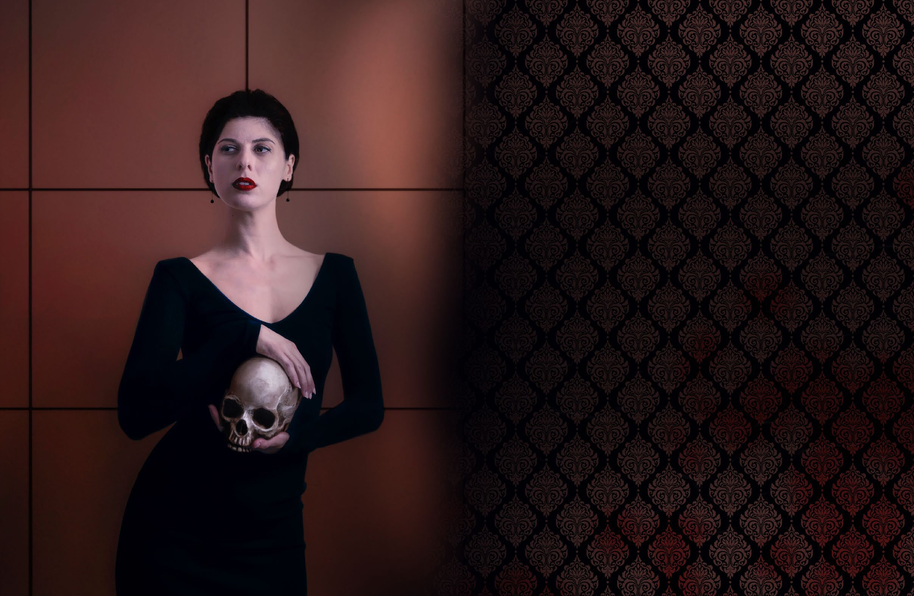

The Clan of Death, Necromancers, Graverobbers, 

The Family, Stiffs, Corpses, Devil-Kindred, Lazarenes

You feel it, don’t you? Just like all Kindred, you died 
You feel it, don’t you? Just like all Kindred, you died 
and came back. But when you died, your soul resisted 
and came back. But when you died, your soul resisted 
a little longer than that of your neighbor. You felt the 
a little longer than that of your neighbor. You felt the 
pull of Oblivion, and it fucked you up. You struggled 
pull of Oblivion, and it fucked you up. You struggled 
with the return to the mortal shell and you’re not sure 
with the return to the mortal shell and you’re not sure 
you’re happy to be back. You’re less and more than all 
you’re happy to be back. You’re less and more than all 
your undead kin. You already understand what it is to 
your undead kin. You already understand what it is to 
be dead, to experience the end, to know the fear of the 
be dead, to experience the end, to know the fear of the 
great nothingness. Welcome to the family.
great nothingness. Welcome to the family.

and the living. You’ll possess a power no other vampires 
and the living. You’ll possess a power no other vampires 
have the balls to harness.
have the balls to harness.

You’re now of a family, a clan, and a religion 
You’re now of a family, a clan, and a religion 
dedicated to enriching our lives, such as they are, and 
dedicated to enriching our lives, such as they are, and 
those of our mortal kin. Every member of this family is 
those of our mortal kin. Every member of this family is 
determined to master death. Maybe you’ll want to stave 
determined to master death. Maybe you’ll want to stave 
off the end for your loved ones, perhaps you’ll want to 
off the end for your loved ones, perhaps you’ll want to 
become a notorious necromancer and revive your dead 
become a notorious necromancer and revive your dead 
girlfriend, or maybe, just maybe, you’ll want to feel more 
girlfriend, or maybe, just maybe, you’ll want to feel more 
potent than you ever did in life.
potent than you ever did in life.

You’re one of us. You’re my cousin, his sister, and her 
You’re one of us. You’re my cousin, his sister, and her 
daughter. We’re connected not only by blood, and by vi­
daughter. We’re connected not only by blood, and by vi­
tae, but by that first-hand knowledge of death. Consider 
tae, but by that first-hand knowledge of death. Consider 
yourself awake now? When you died, you nearly stayed 
yourself awake now? When you died, you nearly stayed 
dead and you’re terrified. But I bet you’re turned on by 
dead and you’re terrified. But I bet you’re turned on by 
the thrill of it too. How exciting, to feel death and evade 
the thrill of it too. How exciting, to feel death and evade 
it. It’s like looping a belt around your neck and jerking 
it. It’s like looping a belt around your neck and jerking 
off while hanging in a wardrobe, and God you want that 
off while hanging in a wardrobe, and God you want that 
feeling again. It’s enticing, isn’t it, to know now you can 
feeling again. It’s enticing, isn’t it, to know now you can 
commune with death like its your brother, your aunt, or 
commune with death like its your brother, your aunt, or 
your father?
your father?

This didn’t happen by accident, okay? You were cho­
This didn’t happen by accident, okay? You were cho­
sen. Keep that in mind when you feel isolated from other 
sen. Keep that in mind when you feel isolated from other 
vampires. You were selected for the Embrace because 
vampires. You were selected for the Embrace because 
we know you’re capable of making your family prouder 
we know you’re capable of making your family prouder 
dead than you were alive.
dead than you were alive.

Listen, just like every family, there’s going to be 
Listen, just like every family, there’s going to be 
those you see every week, some you see every year, and 
those you see every week, some you see every year, and 
some you only hear of behind closed doors. The ones not 
some you only hear of behind closed doors. The ones not 
invited to parties. The black sheep. Well to some of us, 
invited to parties. The black sheep. Well to some of us, 
you’ll be one of them. But to others, you’ll be closer than 
you’ll be one of them. But to others, you’ll be closer than 
a living relative. 
a living relative.

Mystery. It’s a gorgeous word. The mystery of the 
Mystery. It’s a gorgeous word. The mystery of the 
missing treasure. The mysterious Mr. X. The murder 
missing treasure. The mysterious Mr. X. The murder 
mystery. The mystery of life after death. The greatest 
mystery. The mystery of life after death. The greatest 
mystery of God in heaven.
mystery of God in heaven.

We’re going to accomplish so much together, you 
We’re going to accomplish so much together, you 
know? You really are going to make your family proud. 
know? You really are going to make your family proud. 
Do right by us and we’ll take care of you.
Do right by us and we’ll take care of you.

You’ll work on studying and solving the darkest 
You’ll work on studying and solving the darkest 
mysteries, and forming new, forbidden ones. You belong 
mysteries, and forming new, forbidden ones. You belong 
to a family who want all the answers, because we’re 
to a family who want all the answers, because we’re 
greedy, and once we have them, we’ll use those answers 
greedy, and once we have them, we’ll use those answers 
against our enemies. You’ll gain mastery over the dead 
against our enemies. You’ll gain mastery over the dead

The rest though? All those pricks of other clans and 
The rest though? All those pricks of other clans and 
sects? 
sects?

Fuck them. Fuck anyone else breathing or not 
Fuck them. Fuck anyone else breathing or not 
breathing, if they’re not of our Blood.
breathing, if they’re not of our Blood.

19 9
19 9

CULTS OF THE BLOOD GODS

Who are 

the Hecata?

This is a time of great change, mother. Our family is larger 
now. No less dysfunctional, but larger. Safety in numbers becomes 
important when the Camarilla say, “You’re with us or against us, 
but you? You can never be with us.” Safety in numbers becomes 
important when vampire killers are looking for companies, prop­
erties, and accounts made in the name of some dead Giovanni or 
Dunsirn. The family comes together to outlast the winter storm.

Hecata sires favor mortals either 
from their own mortal families, or 
who provide links to outside fami­
lies from whom the Hecata would 
benefit. They prefer kine of a morbid, 
black-humored, or pragmatic bent, 
due to the clan’s death-dealing 
nature. They have little need for the 
compassionate or empathetic, unless 
it serves to satisfy a gap the clan — 
which in many ways is structured like 
an expanding corporation as much as 
it is a family — requires filled.

But just as the seasons change, death has many faces, as 
our cousins always say. Put aside your historic enmity for the 
Venetians, pocket your distrust for the Samedi, and recognize that 
death, no matter the mask it wears, is still death. We are death. 
We always have been, and always will be.

Remember, mother, how it feels the moment life leaves a victim. 
Their last gasp and rattle. Remember also how it feels to cheat 
fate and bestow your vitae unto another. Finally, remember how it 
feels when you speak with the dead, and they tell you the secrets 
of the Underworld. Our existences are ones of rich exploration and 
dark arts others fear to study.

The Hecata Embrace those 
who show a resolute willingness to 
do what needs to be done, for the 
good of the family, their block, their 
community, or their society, ahead of 
their own interests. The family must 
always come first, whether or not 
your surname is Giovanni. There are 
no other “independents” these nights, 
so it’s the Hecata versus everybody 
else. The Necromancers describe their 
Embrace tradition as “gifting the 
truly exceptional with membership 
in the most exclusive of households.” 
Spontaneous Embraces are very much 
frowned upon by the wider clan, the 
members of which favor the ritual­
istic approach of observing, groom­
ing, and voting on which mortals 
deserve immortality.

I understand you must feel disorientated, waking up to such a 
changed world. Just remember that your new family will help you 
become acclimated, will introduce you to whichever courts you need to 
visit, and will protect you against any outside knives stabbing in.

We still represent all that is glorious and squalid in death. 
We might counsel a Sheriff on methods of execution, solve a murder 
through interrogation of the victim, use the dead to spy on our enemies, 
celebrate the passing of a legendary vampire with the proclamation of 
memorial secrets, or have a spectre burn a Prince’s haven to the ground 
while we lie safely ensconced in our tombs. We might even bind the 
tortured souls of fallen enemies, stuck in the Underworld.

Kingpins, self-starters, individ­
uals who have faced or dealt death, 
and those with medical or occult 
knowledge all appeal to the Hecata. 
Anyone with a true, scientific inter­
est in death, the afterlife, and religion 
stands a chance of being approached 
for the Embrace, though academic 
theologians are more likely recipients 
of the bite than the blindly faithful. 
Many become vampires dedicated 
to serving the family, expanding 
its interests, and researching new 
mysteries associated with the cycle of 
life and death. Different fledglings set

Yes, the seasons change. It is winter for our kind. The 
Inquisition’s fires burn. The Gehenna War rages. Kindred fall 
by the hundred.

Only one clan can stand to profit, and there’s no shame in 
being a vulture or a rat on a battlefield.

This is our age. As once-unassailable vampires and their sects 
decay, death dominates all.

Roger de Camden, Prince of Edinburgh,

Pater of the Cult of Mithras, 

Wearer of the Death’s Head Mask

2 0 0

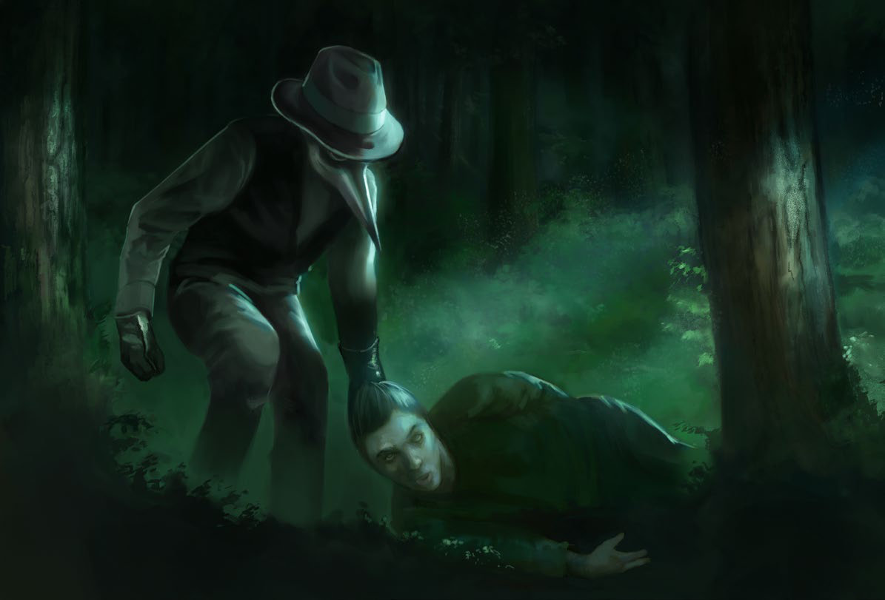

CHAPTER SIX: HECATA

to work handling the living, the dying, the dead, and the 
rotting, in the form of nurses and carers, morticians, and 
of course necromancers. Each adds something to the clan.

their entire hand to the outsiders. The champion bullshitter 
was Embraced for their ability to charm the doubters and 
present a believable façade for the clan’s activities.

The Hecata look for many childer among miscreants of 
all kinds. Though they do not control any widespread mortal 
crime empires, the clan appreciates the practiced killer, the 
cold-blooded money launderer, and the charming con artist. 
Their roles continue on once they receive the Embrace, 
complementing the clan’s legitimate businesses — investment 
banks, trading conglomerates, and private hospitals and care 
facilities — with a steady flow of illicit cash and bodies.

Forensic Specialist

The Clan of Death lives up to its title, with a great 
many of its members schooled in the passage of life to 
death. In the last century there’s been an upsurge in nurs­
es, surgeons, and laboratory staff being Embraced, with a 
special place set for medically trained individuals in law 
enforcement. This character was always one of the first to 
crime scenes, and was able to alter evidence, misfile re­
ports, or spin a narrative of death that protects the family, 
all while coming face-to-face with death on a regular basis.

Hecata Archetypes

Champion Bullshitter

Natural Necromancer

The Hecata may wave the banner of independence, 
but they still require vampires who can break bread with 
Camarilla courts and Anarch packs. This character could have 
been anything from a con artist to a diplomat in life, but the 
crucial thing is they know how to sell a deal without showing

Necromancers are pretty uncommon among the 
ranks of mortals, even those with blood connections to 
Clan Hecata. When a vampire from the Clan of Death 
finds a mortal with a genuine interest in, and aptitude for, 
death magic — whether through practice of seances, ghost

2 01

CULTS OF THE BLOOD GODS

hunting on vlogs, exorcisms, or study 
of occult rituals — they rarely go 
without long-term observation and 
the potential for an Embrace. These 
individuals sometimes harbor deviant 
practices, or an ethical remove when 
it comes to handling corpses and 
treating with the dead. The Hecata 
see this kind of behavior as ripe 
blackmail material, so if the nec­
romancer is unfit for the Embrace, 
they’ll serve as a mortal retainer.

SHIFTS IN THE BLOOD
The Hecata have long been interested in the malleability of the Blood, 
and how their favored Disciplines in these nights differ from those of their 
ancestors, and their ancestors before them. While they speculate it may 
be due to the formation of the Hecata and destruction of many Giovanni 
elders in recent years, Necromancers still guess at why some Giovanni 
favor forceful Disciplines, with Dominate often in the place of Auspex, 
and Samedi favor subterfuge, with Obfuscate in its place instead. Why 
the ability for heightened senses is the power so often lost, even the most 
accomplished Necromancers cannot say.
At the Storyteller’s discretion, Hecata of the Giovanni line may replace 
Auspex with Dominate, Samedi may replace Auspex with Obfuscate, La­
miae may replace Auspex with Potence, and Nagaraja may replace For­
titude with Dominate. Note that this option may make certain Amalgams 
unavailable to these vampires, so the default treatment and amalgams 
common to the Clan of Death treat Auspex, Fortitude, and Oblivion as 
their clan Disciplines.
Alternatively, the Storyteller may see fit to offer an exclusive 4-dot Merit 
which allows Hecata to purchase their bloodline’s replacement Discipline 
as a fourth in-clan.

Prodigal Child

The Hecata have a blind spot 
when it comes to their mortal 
descendants, sometimes Embracing 
inept family members simply because 
they share the same name. However, 
characters such as this one stand out, 
prove themselves to the clan, and end 
up with multiple prospective sires 
fighting for the right to Embrace. The 
prodigal child is often seen as a rising 
star, fit for important responsibilities 
within the family and clan. Growing 
up in such a twisted family has a way 
of fucking up such a mortal’s sensibil­
ities and boundaries, however.

Disciplines

meddling, detached in a sense from 
mortal fragility.

Oblivion: The ability to com­
mune with, manipulate, and control 
the energies of death and the dead. 
This power is among the most myste­
rious of Disciplines, as it reaches into 
the occult territory of the afterlife. 
Through its use, the Hecata might in­
terrogate a spectre or set it to attack 
a rival. They might rot a mortal’s flesh 
with a touch or practice a foul cere­
mony designed to drive a meddling 
kine to their just reward. Oblivion 
stains the user’s soul, but the Hecata 
see it as a necessary evil for under­
standing the mysteries of life, death, 
and undeath.

Auspex: The power to receive 
visions of fate’s intentions and speak 
without moving one’s lips. The 
Hecata believe fate has grand plans 
for their clan, and they do so enjoy 
meddling in the fates of others. They 
might predict a mortal’s death and 
prevent it, or they might hasten 
someone’s departure. The Hecata 
use Auspex to plan their moves — 
for this clan is cautious, and rarely 
strikes on impulse — and to catch 
glimpses of the restless dead, enabling 
the dread arts for which the clan is 
known.

Unscrupulous Banker

As far as the rest of Kindred soci­
ety is concerned, the Giovanni — and 
more broadly, the Hecata — are the 
bank. They’re Switzerland. They act as 
the neutral party, perfect for media­
tion and guaranteed to protect assets 
due to their unswerving dedication to 
non-involvement in the Jyhad. This 
character would be targeted for their 
willingness to do anything to cut a 
profit, whether that means invest­
ing in unethical concerns, accepting 
laundered funds, or playing guard 
to investments most banks wouldn’t 
touch — including blood, special kine, 
or torpid Kindred.

Fortitude: The ability to resist 
blows, bullets and fire. The Hecata 
believe they are closer to death than 
any other clan, and the way in which 
they manifest this Discipline may 
lend credence to that claim. They ab­
sorb injuries as a corpse might, with­
out feeling or consideration. As fists 
and blades rain down on them, the 
Necromancers shrug off such harm, 
inexorably approaching their target. 
Their minds are likewise resistant to

Compulsion

Hecata: Morbidity

The Hecata are possessed of a 
peculiar curiosity paired with detach­
ment from compassion and empathy, 
likely due to their frequent dealings 
with corpses and the wraiths of those

2 0 2

CHAPTER SIX: HECATA

who died tragic deaths. Their Blood 
urges them to study the individuals 
around them for signs of illness, 
frailty, or impending death. Until 
they have either predicted a death 
without supernatural means or solved 
the cause of a local one, the vampire 
suffers a three-dice penalty to other 
rolls until the scene ends. Note that 
their conclusions do not need to be 
absolutely correct, but should stay 
within the boundaries of the possible.

human traffickers servicing Kindred 
appetites — and commissions the deliv­
ery of mute or comatose vessels so they 
can’t cry out in pain during the feed.

“Please, my childe… Please. Leave 
me be. Please. Do not harm my link. 
Please. I’ll serve you again.”

Ambrogino smiled, his perpetually 
rotted teeth a mix of yellows and blacks, 
contrasted against his purple lips and 
pale skin. “If I were to threaten it, 
Lia Milliner, I can get the spirit to do 
whatever I want.”

Oblivion

Lia wasn’t an accomplished 
practitioner of her clan’s art, by any 
means, but she knew a master when she 
saw one. Delivering the brown parcel 
to Ambrogino, the elder Hecata stared 
blankly at the young Milliner and 
stroked the parcel before speaking. “You 
didn’t open it, did you?”

Nicknames: Obtenebration, 
Necromancy, Shadowboxing, Abyssal 
Mastery, Tenebrae Imperium, Mortis, 
the Dark Arts, Black Magic, Entropy

Bane

Oblivion is a mysterious, un­
palatable power that most vampires 
rightly fear to use, witness, or fall 
victim to. Only vampires of Clans 
Lasombra and Hecata wield it with 
any frequency, and even they do so 
tentatively. Oblivion requires cau­
tious masters who know the power’s 
risks, as no other Discipline reaches 
into the Underworld and allows 
its manipulator to extract tangible 
darkness or furious spectres. Oblivion 
is the darkest of arts.

Steeped in death, the fangs of 
the Hecata bring not bliss, but agony. 
Victims caught unawares will violent­
ly resist unless restrained, and few 
people submit willingly to the torture 
that is the Hecata Kiss.

Lia shook her head. She knew better. 
While she considered herself above the 
role of messenger, she wasn’t going to 
steal a look at this Giovanni’s mail. “No, 
it’s exactly as Josette left it when it came 
to me.”

When drinking directly from a 
victim, Hecata may only take harm­
ful drinks, resulting in blood loss 
(Vampire: The Masquerade, p.212). 
Unwilling mortals not restrained will 
try to escape, and even those coerced 
or willing must succeed in a Stamina 
+ Resolve test against Difficulty 2 + 
Bane Severity in order not to recoil. 
Coerced or willing vampire victims of 
the Hecata bite must make a frenzy 
test against Difficulty 3 to avoid fall­
ing into a terror frenzy.

“And are you curious about its 
contents?” The fingers on Ambrogino’s 
twisted and decayed left hand tapped 
on the heavy, wooden desk, creating a 
rhythmic drumming.

Notably, while the Lasombra are 
prone to expanding their repertoire 
of Oblivion powers, the Hecata 
focus their energies on developing 
Ceremonies (see p. XX). Ceremonies 
take longer, but are required for 
communing with and making passage 
through to the lands of the dead.

Was this a test? Should she express 
curiosity or respect for her elder? Again, 
honesty among family seemed the best 
course. “I would be interested to find out 
what I’ve traveled across the world to 
hand deliver, yes.”

Ambrogino slid a knife into the 
edge of the parcel, parting the seams. 
His healthy hand extracted a small clay 
sculpture. Though far from an expert, to 
Lia it looked Egyptian. Ambrogino held 
the sculpture in the light. “This is what’s 
known as a fetter. It binds a spirit to 
this mortal plane. If I were to destroy it, 
it might destroy the spirit. If I were to 
lock it away in a vault, the spirit might 
choose to owe me something in the future. 
If I were to threaten it, however…”

Characteristics

Feeding Methods

To circumvent their bane, some 
Hecata feed from blood bags and fresh 
corpses. Others develop methods of 
extracting blood from their vessels 
without the need to use their fangs, 
such as with a needle, or through 
bloodletting, neither of which are 
guaranteed to be pain-free. The Hecata 
habit of feeding on herds formed from 
members of their own family breeds 
a great deal of resentment and fear 
between vessel and drinker.

Oblivion allows for the manip­
ulation of creatures and substances 
originating from the Underworld. 
When the Hecata use this Discipline, 
they tend to channel the entropic 
nature of the Underworld and its 
surroundings, decaying flesh, calling 
forth spirits, and posing a dangerous 
risk to the living.

The Necromancer cut his thumb, 
and ran his own vitae over the sculpture, 
chanting in a dead language. He snuffed 
out the lights in the room with the press 
of a button. Lia stood there, awaiting 
some grand arrival. Instead, she heard a 
shaky, frail voice emerge into the room.

Oblivion projections and 
spirits sustain damage from fire 
and sunlight, counting as vam­
pires with Blood Potency 1 in this 
regard. They also take one level of 
Aggravated Health damage per round

In recent years, the Hecata 
have formed a special bond with the 
Circulatory System — a network of

2 0 3

CULTS OF THE BLOOD GODS

from bright, direct lights, and may 
also be damaged (Superficially or 
Aggravated) from blessed weapons 
and artifacts, depending on the 
strength of the blessing and whether 
the wielder has True Faith.

vitae to its body. This power does not 
work on vampires, but does work on 
animated cadavers.

smell, and their other senses. While 
this power is in use, the necroman­
cer is distracted from other activity 
around them, conveying a −2 penalty 
to Dexterity and Wits rolls.

Cost: One Rouse Check
Dice Pools: Stamina + Oblivion 
vs. Stamina + Medicine or Fortitude

Duration: Variable (see 
Difficulty effects)

Oblivion’s powers are ineffective 
in brightly lit areas. Daylight and 
rooms without shadows are prohib­
itive, preventing the Discipline’s 
successful function, though ultra­
violet light and infrared light place 
no restriction on the Discipline’s 
use. Moderately lit rooms apply a 
one-die penalty to the Discipline roll 
involved.

System: The vampire makes a 
Rouse Check to expend vitae, and 
introduces the vitae to the corpse. 
Unless the corpse is animated, the 
body disintegrates over three turns 
with no test necessary. If it is, the 
user rolls a contest of Stamina + 
Oblivion vs Stamina + Medicine 
(Corpses with Fortitude may resist 
with Stamina + Fortitude). If the user 
wins, the animated corpse dissolves 
in five turns, minus the margin (mini­
mum one, and disintegrating corpses 
suffer physical Impairment). On a 
critical win, the corpse disintegrates 
immediately. On a total failure, the 
corpse putrefies but does not disinte­
grate, and is subsequently immune to 
this power from any user.

Level 2

Fatal Precognition

Amalgam: Auspex 2
It is said by many necroman­
cers that the Lady of Fate rules the 
Underworld through her Stygian 
servants, and through communion 
with her certain death-dealers have 
learned this power. Fatal precogni­
tion allows a vampire to scry any 
non-vampire and experience a vision 
of their impending death, whether 
it’s due a minute from now or several 
decades away. The Kindred’s eyes 
turn black and they stand, sit, or lie 
completely still as the fate plays out 
in their mind. Fate can of course be 
cheated, though there’s a cost for 
doing so.

The use of Oblivion negatively 
affects the necromancer’s psyche, 
with many powers causing Stains as 
the vampire finds themselves per­
forming increasingly macabre acts in 
service to this Discipline.

Type: Mental
Masquerade threat: Medium-
High. Spirits rarely show up well on 
cameras but are obviously unnatural 
if witnessed in person.

Duration: Variable (see 
Difficulty effects)

Blood Resonance: Psychopaths 
and the emotionally detached. Blood 
empty of Resonance.

The Binding Fetter

Note: When making a Rouse 
check for an Oblivion power or 
Ceremony, a result of “1” or “10” 
results in a Stain, in addition to any 
Hunger gained. If the user’s Blood 
Potency allows for a re-roll on the 
Rouse check, they can pick either of 
the two results.

The vampire closes their eyes. 
Upon opening them, the irises of 
their eyes display a dull reflection of 
their surroundings and they can iden­
tify objects or locations important 
to ghosts. These “fetters” act as icons 
that bind the dead to their existence. 
Knowing if an object is a fetter allows 
a necromancer to better manipulate 
the ghost. Fetters emanate variable 
auras, some bursting with vitality and 
glowing gold light, others radiating 
decay, or odors important to the 
bound wraith, such as the smell of 
freshly baked bread, gasoline, or 
cigarette smoke.

Cost: One Rouse Check
Dice Pools: Resolve + Oblivion
System: The vampire must be 
able to see or hear their target when 
they use this power. After rolling 
Resolve + Oblivion (Difficulty 3 or 
more at the Storyteller’s discretion), 
the vampire becomes paralyzed in 
place as the vision plays out, prevent­
ing them from any form of physical 
or social interaction for that turn. 
The higher the margin, the clearer 
the vision. A win grants sight of 
the corpse, and with each point of 
margin an additional clue is provid­
ed, such as the manner of death, time 
and place of death, or the name and 
face of the first living person to find 
the corpse. A critical win on this roll 
grants the vampire a vision of crystal 
clarity, along with a sense of the

Level 1

Ashes to Ashes

Destroying evidence of feeding is 
a common necessity among vampires 
who leave screaming, resisting vessels, 
especially when those same vessels 
end up dead. This power enables a 
vampire to destroy a corpse — fresh 
or long dead — by introducing their

Cost: Free
Dice Pools: Wits + Oblivion
System: On activation, the user’s 
senses become supernaturally attuned 
to the energies of fetters, and they 
may identify these auras by sight,

2 0 4

CHAPTER SIX: HECATA

motive, if the target is intentionally killed. A total failure 
renders the vampire blind for the remainder of the scene, 
and unable to use this power on the same target again.

SHROUD 
DENSITY
POSSIBLE CAUSE
EFFECT

Frayed
A series of deaths took 
place here, necro­
mancers often enact 
Ceremonies here

−2 Difficulty on 
Oblivion rolls

If anyone attempts to subvert the  fate observed 
in this way, they find everything working against their 
hubristic ambition. Add one to all Difficulties while 
working to directly circumvent the precognition as cars 
break down, storms erupt from nowhere, and people be­
come hostile for no reason. This penalty applies until the 
prophecy is fulfilled or avoided, or the current story ends.

Absent
A necromancer used 
Split the Shroud (p.XX) 
here, spectres regularly 
pass through this part 
of the Shroud

−2 Difficulty on 
Oblivion rolls, 
wraiths can freely 
pass to and from 
the Shadowlands, 
mortals suffer two 
Superficial Health 
damage in this area 
that cannot be healed 
until they depart

Duration: Until fulfilled, avoided, or the story ends.

Where the Shroud Thins

Vampires with an affinity for Oblivion can sense 
locations where the Shroud between the world of the 
living and the Shadowlands thins. Though this Discipline 
doesn’t directly tell a vampire why the Shroud between 
worlds is thin in a certain place, it may be due to a grisly 
murder that took place there many years before, or be­
cause necromancers have frequently used the location to 
summon spirits, or it might be a location of holy or unho­
ly resonance, among other reasons. In locations where the 
Shroud is thinnest, mortal health suffers and use of the 
Oblivion Discipline becomes easier, if the vampire knows 
how to harness the gap in the Shroud.

Duration: One turn

Level 3

Aura of Decay

Kindred with a strong connection to Oblivion find 
the Discipline affecting the world around them, making 
plants wilt, animals and humans grow sick, and food go 
bad. Some harness this aura as a power, polluting vitality 
with rot, and speeding up the erosion of life. This power 
does not speed up the decay of dead bodies.

Cost: One Rouse Check
Dice Pools: Wits + Oblivion
System: Following a Rouse Check, the player rolls 
Wits + Oblivion (Difficulty 3) and on a win may deter­
mine the density of the Shroud in their nearby area, as 
large as an entire building or landmark. On a critical win, 
this roll reveals whether the Shroud’s density recently 
changed. On a total failure, the power backfires and gives 
a false reading. Without use of this power, Oblivion users 
cannot benefit from a thinning of the Shroud.

Cost: One Rouse Check
Dice Pools: Stamina + Oblivion vs. Stamina + 
Medicine or Fortitude

System: The vampire makes a Rouse Check. 
Following a Stamina + Oblivion roll (Difficulty 3), unin­
telligent organic and inorganic material within 5 yards/
meters of them suffers — plants turn black and die, food 
rots in its packaging, and even bricks start crumbling. 
Material affected in this way can become toxic to ingest, 
if for instance this power is used in a kitchen or a water 
supply. Such toxic food and drink, if consumed, can be 
expected to inflict two Superficial Health damage in the 
following scene to the individual who eats it, and for 
each scene thereafter until treated with an Intelligence + 
Medicine roll (Difficulty 3).

The following table expresses the different degrees of 
Shroud density, and the effects they have:

SHROUD 
DENSITY
POSSIBLE CAUSE
EFFECT

Impenetrable
No deaths took place 
here, consecrated land

Vampires and 
wraiths cannot 
cross the Shroud 
here

If anything living is caught in the aura, it makes a 
Stamina + Medicine (Those with Fortitude may resist 
with Stamina + Fortitude) contest against the vampire’s 
activation roll. For every point of margin the vampire 
has, the victim suffers one point of unhalved Superficial 
Health damage. This damage is slowly applied throughout 
the scene. Repeated applications of the power in the same 
scene have no effect on the Health of mortals already 
affected.

Thick
Long ago a death took 
place here, a place 
of joy

No effect

Thin
A death recently took 
place here, melanchol­
ic mortals often pass 
through this place

−1 Difficulty on 
Oblivion rolls

2 0 5

CULTS OF THE BLOOD GODS

System: A vampire with this power can drain a 
wraith of their passion. While in close proximity (three 
yards/meters or closer) to the wraith, they may roll a 
contest of Resolve + Oblivion vs. the wraith’s Resolve 
+ Composure. A win for the vampire inflicts one 
Aggravated Willpower damage to the wraith and reduces 
the vampire’s Hunger by one for the remainder of the 
night. That Hunger returns on the following night regard­
less of Rouse Checks, as the feeding is only a nepenthe to 
dull the vampire’s hungry urges. Feeding from a wraith 
may merit a Stain at the Storyteller’s discretion, as the 
consumed passion dulls the wraith’s reason for being, like­
ly sending them down a path to self-destructive acts. The 
Storyteller determines the number of passions a wraith 
possesses (though five or more is rare), and may deem that 
the wraith becomes an uncontrollable, murderous spectre 
once all passions have been consumed.

The power is an aura that lasts for an entire scene 
before it fades away. Anyone with a sense of smell can 
detect a rotting odor emanating from the vampire during 
the time the power is active, inflicting a two-dice penalty 
to any Social rolls the vampire makes in a positive or 
diplomatic context, if doing so in person.

Duration: One scene

Passion Feast

Amalgam: Fortitude 2
The relationship between vampires and their 
need for blood as sustenance is well known, but when 
a vampire needs to spend an extended period in the 
Shadowlands, or wishes to torment a spirit, this Oblivion 
power allows them to subsist on the passions of wraiths.

Wraiths have no bodies, nor do they have blood. 
Instead, their raw emotions drive them. Love, hatred, 
greed, or even a need for vengeance might keep a wraith 
around after their former body’s death. An accomplished 
necromancer can feed on these passions for a time, 
enabling them to survive without blood for longer than 
their fellow Kindred. The feeding manifests as a swirling 
vortex of power between the wraith and the vampire’s 
maw, as the vampire doesn’t need to actually bite down 
on anything to consume passions.

Duration: Passive

Level 4

Necrotic Plague

Kindred scholars claim Oblivion pollutes everything 
it touches, with this power as a prime example. Through 
touch alone, a vampire might poison a mortal victim’s 
blood, imbuing them with a disease that wracks and 
ravages their body. Most dangerously of all, this disease

Cost: Free
Dice Pools: Resolve + Oblivion vs. Resolve + 
Composure

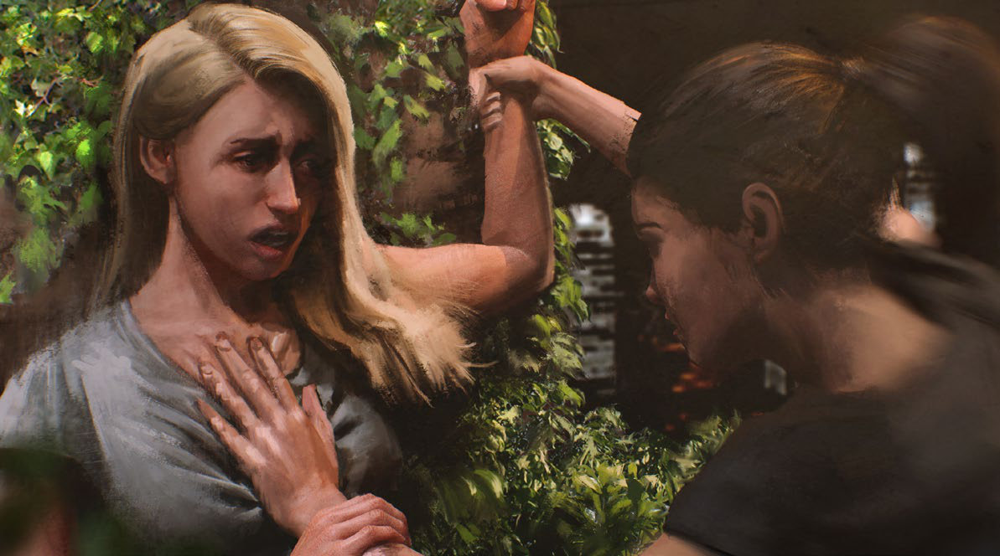

2 0 6

CHAPTER SIX: HECATA

Dice Pools: Stamina + Oblivion 
vs. Stamina + Medicine or Fortitude

runs the risk of being contagious, and 
might inflict the same harm to other 
mortals.

pours out of them and must make a 
Rouse Check.

Duration: One turn to activate, 
variable length of condition

System: The vampire makes two 
Rouse Checks as they expend suffi­
cient vitae to coat both their palms 
and their face with blood as they 
recall the faces of their victims. If the 
user succeeds in a contest of Stamina 
+ Oblivion vs. the victim’s Stamina 
+ Medicine (Those with Fortitude 
may resist with Stamina + Fortitude), 
the targeted individual is affected by 
a serious condition they’ve histor­
ically suffered and recovered from, 
such as treated cancer, a broken 
bone, or a disease — including one 
gained through Necrotic Plague (p. 
XX) — with any debilitating ef­
fects from this condition occurring 
immediately. The condition’s effects 
are for the Storyteller to determine, 
but they should be severe (See the 
Crippling Injuries table for inspira­
tion, Vampire: the Masquerade p.303). 
If the victim is a ghoul, this power 
removes their immunity to aging and 
eliminates any vitae in their system, 
potentially resulting in older ghouls 
dying or even disintegrating where 
they stand. On a critical win, this

Necromancers schooled in med­
icine have enough talent to make this 
power appear in the form of  specific 
illnesses, sometimes including those 
that died out in decades or centuries 
past. Regardless of how it manifests, 
the symptoms will eventually disap­
pear even without medical treatment, 
whether or not the victim survives.

Level 5

Skuld Fulfilled

Necromancers can be described 
as fate’s greatest meddlers, as they 
have a way of interfering with the 
destined paths of lives and spirits. 
Occasionally, however, necromancers 
may seek to serve fate by punishing 
those who cheat it. This power ena­
bles a vampire to reintroduce illness­
es to victims who recovered from 
them, break bones long-since healed, 
and eliminate the immunity to aging 
ghouls experience. While this power 
doesn’t work on vampires, it is an 
effective way of cutting through their 
servants and ensuring debts to fate 
are repaid, without having to come 
into contact with the recipient.

Cost: One Rouse Check, Two 
Stains

Dice Pools: Intelligence + 
Oblivion vs. Stamina + Medicine or 
Fortitude

System: The user makes a Rouse 
Check and then rolls Intelligence + 
Oblivion while touching their victim. 
If the victim is weak (a baby, elderly, 
unwell, recovering from an illness, 
dying, or with 3 unmarked Health 
boxes or less), they are automatical­
ly infected. If the victim is healthy, 
they roll Stamina + Medicine (those 
with Fortitude may use it in place 
of Medicine), resisting the disease 
if they roll more successes than the 
vampire. This power cannot be used 
on vampires. Storytellers may decide 
spreading such a horrific disease 
warrants Stains.

Cost: Two Rouse Checks

UNDERWORLD NOMENCLATURE
The lands of the dead go by many names, with terms such as “the Shad­
owlands,” “the Underworld,” “the Abyss,” and “Oblivion” used frequent­
ly among wraiths and necromancers. The Shadowlands are the deepest 
level of the Underworld vampires can enter using the Ceremonies in this 
book. The Shadowlands are layered over (or under) the world of the living 
— sometimes called the Skinlands — and reflect a distorted version of our 
reality, with locations of spiritual and passionate resonance grander or 
more imposing, the opposite being true for places of no real importance 
to anyone alive or dead.
The Underworld is where wraiths make their realms, known as necropo­
li. Vampires cannot enter the true Underworld (though they often refer to 
the Shadowlands as such) without incredibly advanced Ceremonies and 
wraith sponsorship. It’s a place few return from, with Augustus Giovanni 
— the family patriarch — last known to have ventured into the Underworld 
before disappearing.
Oblivion, the Abyss, the Void, the Labyrinth, and other such warm epithets 
are given to the absence of life that exists beneath and around the Under­
world. Necromancers believe they harness their entropic powers from this 
realm of nothingness, but nobody knows for sure, as to enter Oblivion is 
to vanish from existence.

Victims of the disease take one 
Aggravated Health damage at the 
start of every scene following their 
infection. The victim suffers from the 
disease for a number of scenes equal 
to the user’s Oblivion rating. The 
sickness cannot be medically treated, 
as it is supernatural in origin, but it is 
healed through drinking vitae.

If the player rolls a critical win 
when activating this power, they can 
choose to make the disease commu­
nicable via touch, with subsequent 
recipients suffering the disease for 
one turn fewer than the victim by 
whom they were infected. If the 
player rolls a total failure, the vam­
pire’s own vitae convulses as if poi­
soned. They suffer three Aggravated 
Health damage as the infected blood

2 0 7

CULTS OF THE BLOOD GODS

power may kill the victim by stopping their heart com­
pletely if the user wishes. On a total failure, the vampire 
cannot use this power against that individual again.

providing they meet the power prerequisite as well. 
Learning new Ceremonies during play requires both 
experience and time, as well as a teacher who knows the 
Ceremony already. Expect a Ceremony to take at least the 
square of its rating in weeks to learn.

Duration: Variable, dependent on whether the con­
dition is treatable

Note: Past and future products contain Oblivion 
Ceremonies and powers that may match well with those 
presented here. If these books are available, the Storyteller 
may feel free to suggest alternate pre-requisite powers.

Withering Spirit

This power channels raw entropy via rapid spiritual 
decay, affecting vampires as well as kine by targeting the 
victim’s spirit. A vampire using this power risks Stains, as 
it can completely obliterate the victim’s spirit, preventing 
return as a wraith.

Level 1

The Gift of False Life

Cost: Two Rouse Checks, Stains (variable amount)
Dice Pools: Resolve + Oblivion vs. Resolve + Occult 
or Fortitude

Through use of this Ceremony, a vampire can raise 
a corpse or group of corpses to perform simple, single or 
repetitive tasks.

System: The vampire makes two Rouse Checks to 
expend sufficient vitae to coat both hands, and touch­
es the victim. After rolling Resolve + Oblivion vs. the 
victim’s Resolve + Occult (Those with Fortitude may use 
it in place of Occult), the victim suffers two Aggravated 
Willpower damage for each point of the vampire’s mar­
gin. The attack erodes the victim’s spirit until they’re a 
broken husk, and if Impaired by this power they will not 
return as a wraith after death.

Prerequisite Power: Ashes to Ashes
Ingredients: A human body (or multiple bodies), a 
small concoction of blood, phlegm, and bile.

Process: After applying the concoction to the corpse 
or corpses and performing the Ceremony, the affected 
bodies animate into a form of false life. They follow a sin­
gle command from the vampire, providing it’s simple and 
the corpse is physically capable of performing it, such as 
“sweep the floor,” “hold this door shut,” or “walk around 
the house perimeter.” They have no ability to think or 
calculate, so conditional or complicated commands such 
as “attack the next person to walk through this archway,” 
“drive this car,” or “build a shack” do not work. They may 
be directed towards a specific target for attack or other 
action if the necromancer points at them.

Storytellers may decide that the spirit-destroying 
nature of this power warrants Stains, though as always, an 
appropriate Conviction may mitigate these.

Duration: One turn

Oblivion 

Ceremonies

System: The player makes their Ceremony roll and 
upon a win they raise a number of corpses equal to their 
Oblivion rating, or the number of bodies they have pre­
pared (whichever is lower). A critical win doubles their 
Oblivion rating for the purpose of determining corpses 
raised. The mindless corpse’s animation ends when it is 
destroyed or it concludes its task. These corpses do not 
defend themselves from attacks, and decay as normal; the 
Ceremony does not grant them any form of immunity to 
the elements or time.

Unless otherwise noted, performing a Ceremony requires a 
Rouse Check, five minutes per level to cast, and a winning 
Resolve + Oblivion test (Difficulty = Ceremony level + 
1). Ceremonies usually require additional ingredients or 
sacrifices to mingle the caster’s vitae with. Unless otherwise 
stated the caster can only perform beneficial Ceremonies 
on themselves. Ghouls of necromancers or thin-bloods 
drinking from empty temperaments gain temporary access 
to Oblivion powers, but not to Ceremonies.

MINDLESS CORPSE
MINDLESS CORPSE

Ceremonies each have a prerequisite Oblivion power. 
This requirement acts as a gateway for necromancers 
that blood sorcerers need not pass through. At character 
creation a player can choose one Level 1 Ceremony if they 
have at least one Oblivion power noted as a prerequisite 
for that Ceremony. Characters can buy new Ceremonies 
at the cost of the Ceremony’s level x 3 experience points,

Standard Dice Pools: Physical 2, Social 0, 
Mental 0

Secondary Attributes: Health 4, Willpower 0

Exceptional Dice Pools: Intimidation 4

2 0 8

CHAPTER SIX: HECATA

Special: Mindless corpses take Superficial and 
Aggravated damage in the same way as vampires, 
except they are immune to sunlight. They cannot heal 
or mend damage, and rot at least one Superficial 
Health damage each day. They cannot be mental­
ly dominated or influenced as they are bound to 
their master. They do not react to motion, words, or 
interference from anyone but their creator. Mindless 
corpses may always contribute to Teamwork (see 
Vampire: The Masquerade p. 122) for menial 
labor such as digging, lifting, or pushing even if they 
lack Skills.

CALLING THE DEAD
If all it takes to get a wraith’s attention is to interfere 
with their fetter, why learn a Ceremony to call it? 
Wraiths cannot pass through the Shroud without a 
Ceremony pulling them through, or without one of 
their own powers allowing the same. In some rare 
cases, wraiths are grateful for the summoning as it 
enables them to escape aggressors on their side 
of the Shroud. Just as in vampire society, wraiths 
do not always make for best friends just because 
they’ve shared a communal experience of death.

General Difficulties: 2/1

Level 2

Summon Spirit

This Ceremony enables a vampire to summon a spirit 
from the Underworld.

Awaken the Homuncular Servant

Prerequisite Power: The Binding Fetter
Ingredients: One of the targeted wraith’s fetters, a 
photo or other visual depiction of the wraith or their 
signed name, the caster’s vitae.

Necromancers use this Ceremony to create spies and 
stalkers out of body parts such as hands or skulls, or small 
dead animals like rats or foxes.

Process: The necromancer pours their vitae over a 
wraith’s fetter, and studying the picture or signature, 
calls out the wraith’s name. The wraith feels their fetter’s 
call, and begins a journey from their location in the 
Underworld to that of the caster. Though geography has 
differing scales in the Underworld, a journey may still 
take several nights if the spirit is on the other side of the 
world. If the Shroud is thin enough in the summoning 
location, the wraith is pulled through the veil between 
worlds by the fetter’s strength. The summoned wraith 
is under no obligation to serve the vampire upon being 
called and may act with hostility if they feel the vam­
pire is threatening their fetter, which may be an object, 
a building, or even a person. Alternatively, the wraith 
may be grateful for the summoning and the possibility of 
companionship.

Prerequisite Power: Where the Shroud Thins
Ingredients: The required body part or animal car­
cass, the weapon used to sever/kill it, a small concoction 
of urine, fecal matter, and semen.

Process: The caster coats a blade (or other device 
suited to the task) in a gross cocktail of bodily fluids, and 
uses it to cut the targeted appendage off its root limb or 
body, or kills the small animal (which cannot be larger 
than a small dog and cannot fly, regardless of whether it 
has wings). After massaging vitae into the target, it comes 
to life as a homuncular servant, unfailingly loyal to its 
master. The homunculus can scale walls, hop (even if it 
lacks the limbs to do so), and hide effectively. While it 
cannot speak or perform tasks requiring deep thought, 
it can telepathically communicate single images to its 
creator.

Wraiths summoned in this way do not manifest 
physically, but as shadows on the walls, quavering sil­
houettes of their living selves, from which voices might 
emerge. Wraiths speak the same languages they did in life, 
unless they’ve gone to the trouble of learning new ones in 
the Underworld.

System: The necromancer’s player makes an Oblivion 
Ceremony roll, and after doing so, gains a homuncular 
servant that will spy, follow, or intimidate at the necro­
mancer’s command. If it strays farther than 100 yards/
meters from the vampire, it falls inert, only awakening 
again once the vampire enters that range. Otherwise, it 
remains active for a number of nights equal to the num­
ber of successes rolled. A critical win on the roll keeps 
the servant active forever, while a total failure destroys all 
components involved in the Ceremony.

System: The caster daubs the fetter with their vitae and 
makes an Oblivion Ceremony roll. The wraith cannot pass 
through the Shroud if it’s impenetrable in the Ceremony lo­
cation (see p. XX), and moving the fetter after the Ceremony 
doesn’t help, as the wraith’s ability to pass through the 
Shroud disappears if the fetter leaves the Ceremony site. The 
wraith disappears at the end of the scene unless a separate 
Ceremony is used to compel or bind them.

2 0 9

CULTS OF THE BLOOD GODS

HOMUNCULAR SERVANT
HOMUNCULAR SERVANT

Standard Dice Pools: Physical 1, Social 0, 
Mental 1

Secondary Attributes: Health 3, Willpower 1

Exceptional Dice Pools: Athletics 4, Stealth 6; 
Intimidation 4

Special: Homuncular servants take Superficial and 
Aggravated damage in the same way as vampires, 
except they are immune to sunlight. They cannot 
heal or mend damage. They cannot be mentally 
dominated or influenced as they are bound to their 
master. They do not need eyes or ears to perceive 
everything around them as someone with unimped­
ed vision and hearing might. They can telepathically 
broadcast a single image per scene to their master.

General Difficulties: 3/1

Compel Spirit

This Ceremony allows a vampire to bend a wraith to 
their will.

Prerequisite Power: Where the Shroud Thins
Ingredients: A wraith’s fetter, the caster’s vitae, an 
item (or threat) sufficient to damage the fetter.

Process: The vampire must be in close proximity to 
a wraith in order to use this power, typically through use 
of Summon Spirit (see p. XX). The necromancer casts 
a handful of their own vitae in the wraith’s direction 
as they hold a destructive item to the fetter (a knife, a 
hammer, a gun, or potentially holding the fetter over a 
fire) or speak threatening words that the wraith believes. 
The vampire and wraith engage in a contest of wills. If 
the vampire gains domination over the wraith, the wraith 
must serve as the vampire decrees, at least temporarily. If 
the opposite occurs, the vampire is left mentally debilitat­
ed and the fetter disappears from their grasp.

sensibilities, etc.). On a critical win, the vampire can 
demand any action from the wraith, and it will try its best 
to complete the task. The wraith remains in the vampire’s 
service until the end of the chronicle or until it has fulfilled 
its master’s commands, at which point it returns to the 
Underworld with an eternal enmity for the necromancer.

System: The vampire’s player makes an Oblivion 
Ceremony roll vs. the wraith’s Resolve + Composure. If 
they have no way of physically threatening the fetter, the 
player must also make a Manipulation + Intimidation roll 
(Difficulty equal to the wraith’s Resolve + Composure).

If the wraith wins the contest, the vampire suffers 
the margin in Superficial Health damage. The wraith then 
re-enters the Underworld.

If the player rolls more successes than the wraith’s re­
sistance roll on their Oblivion Ceremony roll, the vampire 
can command the wraith to perform a number of moder­
ately difficulty tasks (spying, research, answering questions 
truthfully, etc.) equal to the number of successes rolled. 
For every two successes, the vampire can instead command 
the wraith to perform a difficult task (such as attacking 
someone, doing something repugnant to the wraith’s

The compulsion placed on the wraith ends immedi­
ately if the vampire attacks them. If the vampire harms the 
threatened fetter, the wraith suffers between one and three 
Aggravated Willpower damage (depending on the importance 
of the fetter) and the wraith is sent back to the Underworld 
to be tormented by, and possibly converted into, a murderous 
spectre (see Vampire: The Masquerade, p. 377).

210

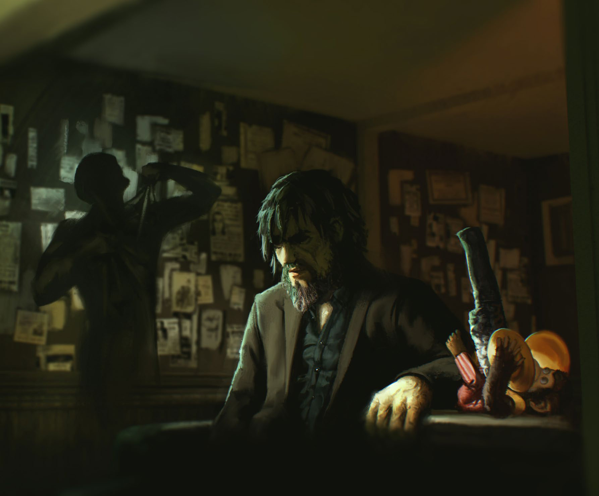

CHAPTER SIX: HECATA

Level 3

a tribute to the wraith, sometimes in the form of alcohol 
poured on the wraith’s gravesite, or a bag of coins to be 
buried in the earth, or even the freshly decapitated head 
of one of the wraith’s until-recently living enemies. The 
vampire then pulls two teeth from their mouth, usually 
with pliers, and bites into a parasite with their remain­
ing teeth. The vampire then opens their mouth and the 
wraith can choose to jump inside, inhabiting the vam­
pire’s body.

Host Spirit

This Ceremony allows a vampire to open their body 
to possession by a ghost.

Prerequisite Power: Aura of Decay
Ingredients: A gift to be made as tribute to a wraith 
(whether the wraith values it depends on the individual), 
a parasitic bug, two teeth extracted from the vampire’s 
mouth

The benefits of having a wraith ride one’s body come 
in the form of an enhanced physique, access to whichever 
memories the wraith chooses to share, and the wraith’s 
voice offering the vampire advice. The wraith can take 
complete possession of the vampire if they wish to, which 
some necromancers view as a blessing to be experienced, 
and others deem the main reason not to use this power.

Process: The vampire must be in close proximity to 
a wraith in order to use this power, typically through use 
of Summon Spirit (see p. XX). The necromancer presents

211

CULTS OF THE BLOOD GODS

Secondary Attributes: 
Health 6, Willpower 0

Process: The vampire must have 
a separate corpse in addition to a hu­
man prepared for sacrifice. The vam­
pire murders the sacrificial victim, 
spilling their blood on the corpse or 
corpses intended for animation. If the 
Ceremony is successful, the corpses 
stand (the recent sacrifice does not), 
revived with the fresh blood, and 
serve the vampire’s commands, even 
moderately complex orders such as 
“kill everyone who enters,” “groan 
if you see anyone pass this way,” or 
“terrorize that neighborhood.” Unlike 
the corpses raised using the Gift of 
False Life (see p. XX), these animated 
dead do not sit idle if left without 
commands, instead attacking anyone 
around them except for their master.

Allowing a wraith to control one’s 
actions for a night is an effective way 
of confusing and mollifying the Beast, 
as well as demonstrating physical 
prowess and knowledges the vampire 
may not usually possess.

Exceptional Dice Pools: 
Brawl 6; Intimidation 5

Special: Aggressive corpses 
take Superficial and Aggravated 
damage in the same way as 
vampires, except they are 
immune to sunlight. They cannot 
heal or mend damage. They 
cannot be mentally dominated 
or influenced as they are bound 
to their master. They do not 
need eyes or ears to perceive 
everything around them as 
someone with unimpeded vision 
and hearing might. Bites from 
the aggressive dead inflict +2 
Aggravated Health damage to 
mortals.

System: The vampire’s player 
makes a successful Oblivion Ceremony 
roll. If the wraith agrees to the prop­
osition, it then enters the vampire’s 
body and can remain for a number of 
scenes equal to the successes rolled on 
the Oblivion Ceremony roll. With the 
wraith inside them, the vampire gains 
+2 dice to all Physical Attribute rolls 
and +2 Health until the wraith departs. 
The vampire can hear the wraith in 
their head, with its advice, cajoling, 
or supportive words provided by the 
Storyteller.

System: The player makes their 
Ceremony roll, possibly incurring 
Stains in the process depending on the 
Chronicle Tenets and the Storyteller’s 
discretion. Due to the amount of blood 
spilled in this Ceremony, the caster must 
test to resist hunger frenzy (Difficulty 2). 
Upon a win a number of aggressive dead 
equal to the necromancer’s Oblivion 
rating or the number of prepared bodies 
(whichever is lower) receive the gift of 
animation. A critical win doubles their 
Oblivion rating for the purpose of deter­
mining corpses raised. Corpses animated 
this way do not decay and only enter 
repose if commanded to by the vampire, 
if the vampire meets final death, or if 
they are destroyed.

A wraith can choose to assert 
its possession instead of acting as a 
passenger. If the vampire resists, they 
make a Resolve + Composure roll vs. 
the wraith’s Resolve + Composure. If 
successful, the wraith’s influence is 
rejected. If failed, the wraith steers the 
vampire until the end of the scene, 
though it can’t make the vampire do 
anything self-destructive. On a critical 
win, the wraith is ejected entirely 
and returns to the Underworld. On 
a total failure, the wraith can make a 
vampire harm themself, but returns to 
the Underworld after the first injury is 
sustained.

General Difficulties: 3/2

Level 4

Bind the Spirit

Vampires with access to this 
Ceremony have the ability to bind 
wraiths to specified locations and 
people.

Prerequisite Power: Necrotic 
Plague

Ingredients: A wraith’s fetter, 
the caster’s vitae, the sacrifice of an 
innocent human, sufficient salt to 
surround a property or individual. If 
the target for haunting is an individ­
ual, the necromancer must possess 
something of their body, such as 
fingernails, hair, blood, or skin.

A vampire whose body succumbs 
or is voluntarily opened to the pos­
session attempt finds all Willpower 
damage healed once the wraith de­
parts, as the spirit subdues the Beast 
for as long as it is present.

As per the normal rules for 
temporary Advantages like these (see 
Vampire: The Masquerade p. 180), 
their continued usefulness beyond 
the current story must be ensured 
with Experience — such as through 
the Retainers Background (see 
Vampire: The Masquerade p. 196) — 
or the aggressive corpses may become 
unstable and unruly.

Shambling Hordes

Process: The vampire must 
already have a wraith under their 
control using Compel Spirit (see p. 
XX). The vampire kills an innocent 
human (though innocence is subjec­
tive, this tends to apply to the young, 
caregivers, and genuinely pious 
individuals) in or close to a location 
or person they want their wraith to

This Ceremony enables a necro­
mancer to raise a group of aggressive, 
walking dead minions.

AGGRESSIVE 
AGGRESSIVE 
CORPSE
CORPSE

Prerequisite Power: Aura of Decay
Ingredients: A human corpse 
(or multiple human corpses), a fresh 
human sacrifice.

Standard Dice Pools: 
Physical 4, Social 0, Mental 0

212

CHAPTER SIX: HECATA

Level 5

haunt. Subsequently, they mix their 
vitae with sufficient salt to surround 
the target for haunting, and paint a 
circle with the mixture. The wraith’s 
fetter is placed somewhere within the 
location or the target’s possession. 
From this point, the wraith is forever 
bound to the target, unless the vam­
pire cancels the Ceremony, the fetter 
ever moves from the location or 
individual’s possession, or the wraith 
is destroyed. Binding also ends if 
the necromancer attacks the wraith. 
Most wraiths bound in this way are 
furious or melancholic about their 
plight, and their mood affects the 
area around them. Many necroman­
cers use this method to defend their 
havens or haunt their enemies.

with the correct Ceremonies can 
physically enter the Shadowlands.

Prerequisite Power: Necrotic 
Plague

Ex Nihilo

Ingredients: A scalpel that’s been 
used to cut into someone living, chalk 
or charcoal, a silk sheet, a human 
sacrifice.

This Ceremony enables a vam­
pire and their coterie to migrate into 
the Shadowlands, though doing so 
comes at great risk.

Process: The vampire hangs a silk 
sheet over a wall in a place where the 
Shroud density (see p. XX) is stand­
ard, thin, or frayed. They then murder 
a human sacrifice against the sheet, 
usually via some manner of bloodlet­
ting, and as blood coats the sheet, cut 
it open with a scalpel. The Ceremony 
widens the portal between the world 
of the living — which wraiths call the 
Skinlands — and the Shadowlands. 
Wraiths who enter the Skinlands via 
this method take to haunting loca­
tions and people, indulging in their 
passions, and possess humans if their 
powers allow for it. Some treat the 
vampire with gratitude for splitting 
the Shroud, while others enjoy har­
assing the necromancer responsible.

Prerequisite Power: Withering 
Spirit

Ingredients: Masks for each par­
ticipant, a bowl containing sufficient 
quantity of the caster’s vitae so each 
participant might coat the soles of 
their feet in it, two coins of any value 
per participant.

Process: Few Ceremonies of 
Oblivion come with as much doubt 
and fear as Ex Nihilo, the ability 
to migrate into the Shadowlands. 
This Ceremony enables a physical 
crossing into the lands of entropy. 
Vampires who physically enter the 
Shadowlands may interact with 
wraiths as if they were solid, but 
cannot carry objects beyond those on 
their person with them. Vampires de­
stroyed in the Shadowlands disappear 
in a vortex of blood and ash, sucked 
into the false earth beneath their feet.

System: Following the steps of 
the Ceremony, the vampire may incur 
Stains from the murder depending 
on the Chronicle Tenets and the 
Storyteller’s discretion. They make 
an Oblivion Ceremony roll that 
cannot be resisted, as the wraith must 
already be compelled for this power 
to work.

System: The caster kills the 
human sacrifice, which may result in 
Stains depending on the Chronicle 
Tenets and the Storyteller’s discretion. 
When cutting the silk sheet with a scal­
pel, their player makes the Ceremony 
roll (with −1 Difficulty if the scalpel 
was used in the human sacrifice). Due 
to the amount of blood spilled in this 
Ceremony, the caster must roll to resist 
falling into hunger frenzy (Difficulty 
2). For every success on the Ceremony 
roll, the Shroud’s density reduces by a 
level, down to being absent.

The wraith is bound in perpe­
tuity to the location or individual 
targeted, with no duration applied to 
this Ceremony’s effects. Any emotion 
the wraith feels intensely during its 
binding affects the inhabitants of the 
location or the individual to whom 
it’s bound, with each person affected 
suffering −2 dice to all rolls made 
to resist acting or feeling the way 
the wraith feels. Therefore, an angry 
wraith may make vampires more 
inclined to frenzy, while a depressed 
wraith might make a mortal more 
likely to stop self-care. Bound wraiths 
have the same powers as spectres (see 
Vampire: The Masquerade, p. 377).

Ex Nihilo appeals to a great 
many necromancers and mystics 
who want to study the Shadowlands 
without the impediment of a time 
limit. It’s an unmatched method for 
interviewing ghosts and exploring the 
necropoli — the cities spirits inhabit. 
It’s also incredibly dangerous, as 
many wraiths — especially spectres 
— seek to destroy vampires, draining 
them of their Willpower, and there’s 
always the risk of meeting the ghost 
of someone the vampire slew years 
earlier. Such wraiths tend to hold a 
grudge.

Following this Ceremony, vam­
pires can access the Shadowlands with 
Ex Nihilo (see p. XX) more easily, but 
importantly, if the Shroud rating is re­
duced to absent, wraiths can spill into 
the Skinlands as they see fit for the 
remainder of the chapter. Once the 
chapter concludes, a Shroud density 
of absent increases to frayed and the 
gateway for wraiths closes.

Split the Shroud

The vampire must have used the 
Split the Shroud Ceremony within 
this chapter, in the location they’re 
currently occupying, in order for

This Ceremony allows a vampire 
to create a tear in the Shroud through 
which wraiths can pass and vampires

213

CULTS OF THE BLOOD GODS

Ex Nihilo to function. If the Shroud density is reduced 
to absent, the caster and any companions may enter the 
Shadowlands from that point, if they don masks to cover 
their faces, dip or paint their feet in the vampire’s vitae, 
and carry a coin in each hand.

• 	
Oblivion absorbs individuals who lose all Health 
or Willpower in the Shadowlands. They leave no 
wraiths if destroyed.

• 	
Vampires cannot bring wraiths out of the 
Shadowlands without a Ceremony such as Summon 
Spirit (see p. XX), which must be used in the land 
of the living to have this effect.

System: The user makes three Rouse Checks (suf­
ficient to expend the required vitae) and spends a turn 
concentrating, expending a Willpower point to prepare 
for the crossing. They then make their Ceremony roll. If 
successful, the vampire, a number of companions equal to 
the number of successes rolled, and any objects on their 
person may then enter the Shadowlands.

Duration: Until the power is deactivated or the 
vampire is destroyed

Lazarene Blessing

The Shadowlands follows several rules that do not 
exist in the world of the living:

This Ceremony enables a necromancer to bring a 
freshly-dead body back to life, though not how its rela­
tives and friends might remember it.

• 	
Wraiths are capable of physical attacks on vampires 
(see Vampire: The Masquerade, p. 377 for an average 
spectre’s stat block) but some are also capable of 
attacking a vampire’s Willpower specifically, as they 
drain a vampire’s passion. Defense pools against 
Willpower drain, which a wraith can attempt up to 
3 yards/meters from the vampire, are made up from 
the vampire’s Resolve + Composure, vs. the attack­
ing wraith’s Strength + Brawl. This attack inflicts 
Aggravated Willpower damage.

Pre-required Power: Skuld Fulfilled
Ingredients: One human sacrifice, incense, the heart 
of any mammal, powdered silver.

Process: The necromancer burns incense to perfume 
the air before performing an act of human sacrifice, 
cutting the heart of the victim out and replacing it with 
the heart of another mammal, though it doesn’t need to 
be stitched in and working for the Ceremony to function. 
After pouring a bag of powdered silver over the open eyes 
of the dying or dead mortal, the vampire invites a wraith 
to take the deceased mortal as a host. Wraiths cannot be 
forced to possess a body, but few refuse the opportunity 
to walk around in semi-living shoes again.

• 	
Though there is no sun (and therefore no daytime) 
in the Shadowlands, the vampire must still Rouse 
the Blood every 24 hours. With no sunlight, they are 
able to operate without rest.

System: Killing a mortal for this Ceremony may 
incur Stains, depending on the Chronicle Tenets. If the 
replacement heart was likewise taken from someone the 
vampire murdered, that murder might also incur Stains. 
Following a successful Ceremony roll, a wraith can enter 
the freshly-dead body and live in it as if it were their own. 
The wraith must be present during the act of sacrifice.

• 	
Vampires in the Shadowlands cannot interact with 
the world of the living in a meaningful way. They 
can only touch or speak with living creatures by 
ending this Ceremony, which takes the expenditure 
of a Willpower point and another Rouse Check in 
a place where the Shroud isn’t impenetrable. They 
can see snatches of motion through the Shroud, and 
a Discipline such as Auspex may enable them to spy 
from beyond the veil, but for the most part, any­
thing viewed has a Difficulty 4 or more to perceive.

The possessed corpse will wake bearing the wounds 
that killed it, though the replacement heart is functional 
(no matter its origin or placement) and the body heals 
one point of Health damage upon possession. The remain­
ing Health damage recovers with time. The body possesses 
the same Physical Attributes, Disciplines (if a ghoul), and 
Backgrounds it had in life. Social and Mental Attributes, 
Skills, and any form of morality rating match those of the 
wraith.

• 	
Vampires can use their Disciplines in the 
Shadowlands just as they can in the land of the 
living.

• 	
If a vampire is compelled to feed in the 
Shadowlands, they cannot obtain sustenance from 
wraiths without the Passion Feast power (see p. 
XX), but can feed from mortals or other vampires 
with them.

This possession lasts indefinitely, or until the pos­
sessed body dies again or the wraith is exorcised from 
the host. The body gains no special resistances to harm 
beyond Disciplines it might have possessed in life.

214

CHAPTER SIX: HECATA

Life in the Underworld

might be awash with the shadows of blood and body 
parts, and the captured wailing of mourning relatives, 
while a church where lovers unite in marriage may exist 
in a permanent state of heady joy and excitement. This 
world is alien to vampires, governed by laws they struggle 
to manipulate. Indeed, the Kindred who try often find 
the wraith population meeting their interference with a 
severe backlash.

An interstitial zone between the Underworld and 
the Skinlands, the Shadowlands are a place ghosts visit to 
spy on their loved ones and those who they wish to harm. 
Some also come here in the hope of being summoned, 
so they might experience the world of the living again. 
Deeper in the lands of the dead, in the Underworld and 
further still, wraiths have little contact with mortals or 
Kindred.

As noted in the Ex Nihilo Ceremony (see p. XX), the 
Shadowlands make for an effective temporary sanctuary 
or meeting place, but vampires must always be aware they 
are not the top predator in such a place. Here, mostly 
spectres, but even ghosts who haven’t fallen to consuming 
rage, can sap living will, leaving anyone foolish enough to 
remain in this place hollowed or destroyed.

Most vampires have few reasons to visit the 
Shadowlands, but for necromancers, it’s a realm of op­
portunity and exploration. Here, they might interrogate 
former friends and foes, observe secret meetings without 
fear of discovery, secrete items of rare importance, and 
fashion alliances with the dead. The world looks similar 
to that of the living, except the sun never rises, the moon 
and stars are absent, and the buildings, natural locations, 
and even people here are distorted through heights of 
emotion. A subway station frequently used for suicides

Though there are as many types of wraiths in the 
Shadowlands as there are living in the Skinlands, the fol­
lowing are examples of wraiths that might act as SPCs in 
your chronicles, to supplement the spectre (see Vampire: 
The Masquerade, p. 377). All of these examples abide by 
the same rules as spectres except where noted.

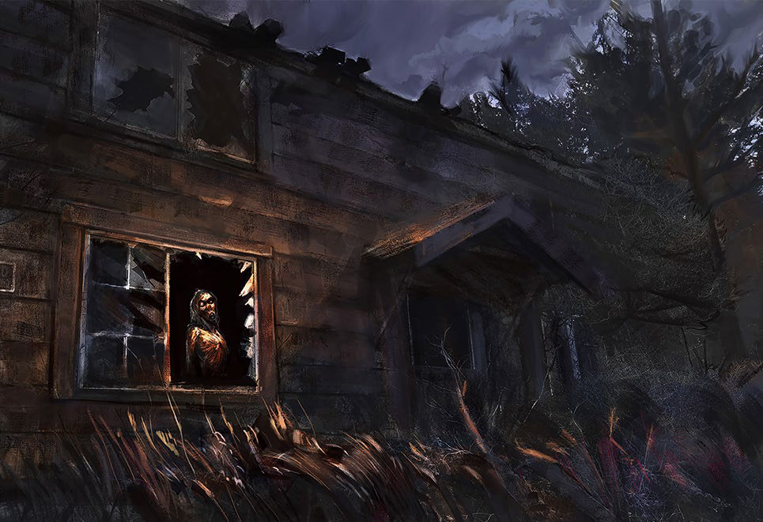

215

CULTS OF THE BLOOD GODS

GHOST IN THE MACHINE
GHOST IN THE MACHINE

using their own form, clawing with a pool of seven 
dice (their exceptional Brawl dice pool), deal­
ing non-halved Superficial damage (+2 damage 
modifier). They can also use the objects in the room 
to inflict additional or halved damage (from flung 
knives, television sets, etc.) though thrown weapons 
use six dice (their exceptional Athletics dice pool).

These are wraiths who in the Skinlands prefer to 
possess objects, speaking through computer screens, 
short-circuiting electronics, and making elevators crash 
with mortals inside, among other activities. In the 
Shadowlands, they exist as quiet, almost shy wraiths, 
uncomfortable with being seen.

General Difficulties: 3/2

Standard Dice Pools: Physical 3, Social 3, 
Mental 5

PUPPETEER
PUPPETEER

Secondary Attributes: Health 5, Willpower 4

Possession is where these wraiths specialize, enjoying 
the ability to enter the bodies of the weak-willed and 
pursue an ersatz life for a short while, before exorcism or 
the Shadowlands calls them back. Skilled puppeteers can 
imitate personality as well as controlling a flesh vessel, 
while wraiths newer to the calling make possessions 
inadvertently jerky and frightening. In the Shadowlands, 
puppeteers are deeply uncomfortable giving up control, 
and always attempt to negotiate from positions of power.

Exceptional Dice Pools: Craft 6, Drive 7, Stealth 
7; Intimidation 5; Science 6, Technology 7

Special: These wraiths cannot possess people. 
Instead, they possess machines. They use a pool of 
seven dice (their exceptional Technology or Drive 
dice pool, depending on the machine) to influence 
devices from computers to cars and televisions to 
elevators. These wraiths can make such devices 
broadcast messages from the wraith (if the device 
is equipped to transmit), malfunction, overheat, or 
indeed drive or operate as per the wraith’s will. If 
the machine is destroyed, the wraith is ejected.

Standard Dice Pools: Physical 4, Social 4, 
Mental 5

Secondary Attributes: Health 6, Willpower 6

Exceptional Dice Pools: Brawl 6, Drive 7, 
Stealth 6; Insight 7, Intimidation 6, Performance 7, 
Persuasion 6, Subterfuge 7; Awareness 6

General Difficulties: 3/2

POLTERGEIST
POLTERGEIST

Special: Poltergeists may physically influence the 
environment and any objects and people in it a 
number of times per scene equal to their Willpower. 
If they incur Aggravated Willpower damage, their 
number of actions decreases to match their current 
Willpower. These wraiths use the objects in the room to 
inflict additional or halved damage (from flung knives, 
television sets, etc.) with thrown weapons use six dice 
(their exceptional Athletics dice pool).

Poltergeists feel perpetually downtrodden. To their 
mind, it’s amusing to make life difficult for everybody 
else, because it’s shit enough for them being dead. They 
don’t have the patience to inhabit items or people, pre­
ferring to launch things around aggressively, write their 
names on the wall in scratch-marks or whatever fluid 
comes to hand, and terrify the inhabitants of old houses. 
In the Shadowlands, they’re bombastic, often hurling 
insults laced with self-deprecating commentary.

General Difficulties: 4/2

Standard Dice Pools: Physical 5, Social 3, 
Mental 2

SCREAMER
SCREAMER

Secondary Attributes: Health 7, Willpower 4

Mysterious and terrifying, the screaming dead are 
wraiths that manifest in the Skinlands as howls, roars, 
and groans, making houses weep, trees wail, and empty 
spaces shout insults at anyone who enters them. They 
aren’t quite spectres, but are filled with so much anger or 
fear that they exude it. In the Shadowlands their screams 
turn to siren songs, making them among the most charm­
ing and sweet wraiths. Their warm personalities can flip 
on a dime, however.

Exceptional Dice Pools: Athletics 6, Brawl 7, 
Larceny 6, Stealth 7; Intimidation 6

Special: These ghosts cannot possess people. 
Poltergeists may physically influence the environ­
ment and any objects and people in it (by marking 
walls, assaulting people, or launching items, as 
examples) a number of times per scene equal to 
their Willpower. If they incur Aggravated Willpower 
damage, their number of actions decreases to match 
their current Willpower. These wraiths can attack

Standard Dice Pools: Physical 3, Social 5, 
Mental 4

216

CHAPTER SIX: HECATA

Secondary Attributes: Health 5, Willpower 5

When a screamer uses this power, they roll eight 
dice (their exceptional Intimidation pool) against 
the victim’s Composure + Resolve, with the results 
emulating those of Dread Gaze without the visual 
requirement.

Exceptional Dice Pools: Stealth 5; Intimidation 
8, Performance 7, Persuasion 6, Subterfuge 6

Special: These wraiths cannot possess people. 
Their primary function is to terrify mortals with their 
screams, similar to the Dread Gaze Presence power 
(see Vampire: The Masquerade, p. 267).

General Difficulties: 4/2

217

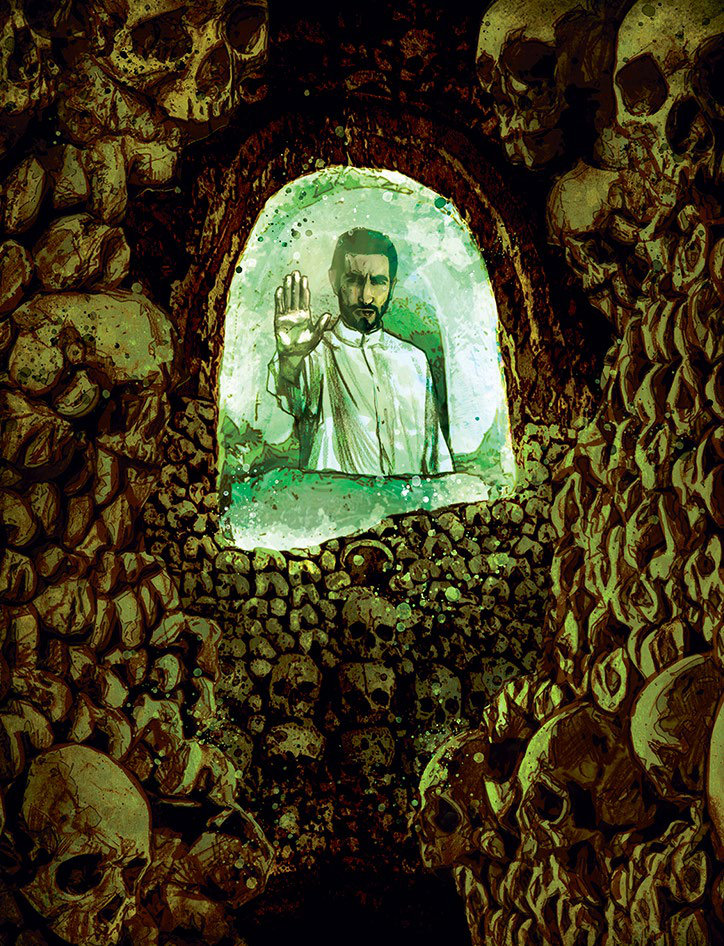

Bloodlines 
Bloodlines 
and Loresheets
and Loresheets

chapter seven
chapter seven

“Blood is everything, and we’re the only family that realizes this fact.”

— Zelda Booke, Lilin of the Lamiae

Bloodlines

of Helena” — Vampire: The Masquerade, p. 390-391) 
count as Bloodlines, allowing characters with those 
Loresheets to take an additional, non-lineage-related 
Loresheet.

Not all Hecata are made the same. The actions 
taken during the Family Reunion melded many dispa­
rate Kindred into a new whole, but some vampires retain 
their distinctive elements. Those who fully embrace the 
new unity become Hecata as detailed in this book, but 
other characters may seek to preserve some element of 
what they used to be.

BACKGROUND: BLOODLINE
You have been Embraced into a distinct blood­
line with unique qualities. This gives you access 
to a second Loresheet that only members of your 
bloodline possess. All other rules and limitations of 
the Loresheet Background (Vampire: The Mas­
querade, p. 190) apply — “Bloodline” is a dis­
tinct Background, and as such you can possess an 
Advantage from both it as well as the Loresheet 
Background.

Such Kindred can take a new Background called 
“Bloodline” to reflect this hybrid nature. It acts just 
like the Loresheet Background. Like Loresheet, you can 
only choose one Bloodline, although you can have one 
Bloodline and one Loresheet. Storytellers might decide 
that previously-published bloodline-related Loresheets 
(such as “Descendant of Hardestadt” and “Descendant

2 1 9
2 1 9

CULTS OF THE BLOOD GODS

B A N K E R S O F D U N S I R N

( B L O O D L I N E ; H E C A T A C H A R A C T E R S O N L Y )
S

ometime around the 18th century, the Giovanni 
wanted a foothold in the markets of the New World. 
But all of their attempts were constantly blocked by a 
Scottish family of bankers who owned several shipping ven­
tures. Impressed by their financial acumen, the Giovanni 
investigated bringing the family into the fold. What closed 
the deal was the discovery that the Dunsirn were cannibals 
as well as financiers. It was the perfect balance of money, 
depravity, and ability to keep a secret.

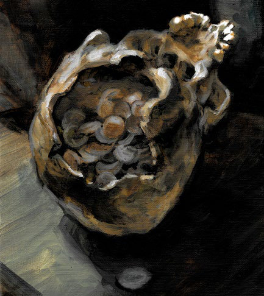

For centuries, the relationship between the two 
families was clear: The Dunsirn made the money, and the 
Giovanni family spent it like water. Surprisingly, even 
though mortal members of the Dunsirn family still indulge 
in the occasional bit of “long pork,” the Kindred don’t show 
much aptitude or interest in necromantic pursuits. Prior to 
the Family Reunion, there was an effort to force them into 
learning the ways of Oblivion, but now the Dunsirns are 
happy to go back to what they do best: bleeding people dry.

And this time, they don’t need to answer to the 
fucking Giovanni to do it, either.

LORE

Masquerade, p. 193), and 
can purchase dots in Resources 
at 2 experience points per dot, 
instead of the usual 3.

• Money Obfuscates: It’s 
hard to make money and not 
be noticed, but the Dunsirn 
have worked in the shadows for 
centuries. You’ve spread some 
of your family’s money around 
to make an alternate identity 
for yourself. You get two dots of 
the Mask Background for free, 
though you must maintain this 
Mask at least once per story.

••• Money Enhances: You 
always have access to the best 
that money can buy. Having 
access to quality products not 
only acts as a status symbol, it 
also makes everything a little 
easier. When making a roll in 
which you can use your own 
equipment, you get a bonus die 
to the roll.

••••• Money Dictates: You 
are the head of the Dunsirn 
family accounts. You have your 
undead finger on the pulse of 
the Hecata’s financial ac­
counts. And you make sure that 
everyone else knows it. You gain 
three free dots of Status in the 
Hecata. In addition, once per 
chronicle, you can either give 
every Hecata in the chronicle 
two additional dots of Resources 
or remove all Resource dots from 
every Hecata in the chronicle. 
These Resources additions or 
removals last for a single story, 
and if removed, generate a 
chronicle-length Adversary Flaw 
in the form of one of the robbed 
vampires.

•••• Money Multiplies: All 
the Hecata know the Dunsirn 
are bankers. But most of them 
think of it in the abstract, as 
if “banker” is just a different 
way of saying “someone with 
a lot of money.” But you are 
(or are directly related to) a 
legitimate investment banker. 
Gain three dots (up to five) in 
Resources. In addition, any­
one in your coterie loses the 
Destitute flaw (Vampire: The

••	 Money Talks: The 
Dunsirn find information in the 
most interesting places. All you 
have to do is spread a little mon­
ey around, and people jump 
out of the woodwork to tell you 
things. Once per story, you can 
find information as if you had 
the Contacts Background with 
a number of dots equal to your 
Resources. This ability lasts for a 
single scene.

2 2 0

Bloodlines

CHILDREN OF TENOCHTITLA N

( B L O O D L I N E ; H E C A T A C H A R A C T E R S O N L Y )
I

n the early sixteenth century, Spanish Giovanni met repre­
sentatives of the Aztec civilization as part of the Cortes ex­
peditions. In the city of Tenochtitlan (now part of Mexico 
City), these Giovanni were introduced to a massive, formalized 
necromantic tradition. So naturally they killed, enslaved, and 
converted the “heathens,” bringing them into the fold. The 
Giovanni called these converts pisanob, a Mayan term that 
roughly translates to “ghosts of the dead that walk the Earth” 
(the fact that the Aztecs weren’t Mayan didn’t concern the 
Europeans). That these vampires already had a name, a legacy, 
and their own beliefs mattered little to the Giovanni.

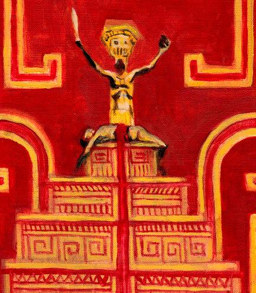

Their leader, Pochtli, was still in charge of the Pisanob 
up through the Family Reunion. However, the family had 
been whittled down to a bare few remaining Kindred after 
the ongoing attacks by the Harbingers of Skulls, although 
the reasons for the attacks were unknown. Pochtli offered 
his unlife to the Harbingers in exchange for an end to hos­
tilities, which the Harbingers accepted.

Now, the remaining children of Tenochtitlan are 
deciding on a new leader, while planning their revenge.

LORE

• Hiding from the Wolf: 
The remaining Pisanob survived 
because they are really, really 
good at hiding. You’ve learned 
all manner of techniques to 
remain out of sight of those that 
would hunt you… and those you 
would hunt. You get one extra 
die on any roll to hide, includ­
ing via the use of Disciplines or 
Ceremonies.

or destruction of ghosts.

mastery of necromantic ceremo­
nies is unparalleled. You get two 
automatic successes on any roll 
necessary for activating a necro­
mantic Oblivion Ceremony.

••• Forward Thinking: After 
years of being hunted down 
by the Harbingers of Skulls, 
you’ve learned to always plan 
ahead, turning potential tragedy 
into a triumph. Once per story, 
you can reroll any Skill roll. In 
addition, you always get one 
free Skill reroll in any scene in 
which you work against another 
Hecata. If the Hecata in question 
is a member of the Harbingers 
of Skulls, you get an additional 
success on that reroll.

••••• Next in Line: Now that 
Pochtli has sacrificed himself to 
the Hecata’s grand plan of unity, 
it is time for another to step up 
and lead the Pisanob to future 
glory. You are one such individ­
ual, wielding a balance of nec­
romantic skill and political savvy. 
You have an additional two 
dots of Status within the Hecata. 
Further, you have an ally among 
the anziani, who acts as a five-
dot Mawla once every other 
story. (You can purchase the 
Mawla Background as normal 
to make the character a more 
regular mentor or patron.)

•• Ghostly Instincts: The 
original Kindred embraced in 
Tenochtitlan were extremely 
talented necromancers, and they 
have carried on a wide variety 
of tips, tricks, and secrets among 
their brethren. You’ve learned 
some of those secrets, which 
give you two additional dice on 
any Oblivion Ceremony roll in­
volving the summoning, control,

•••• Necromantic Prodigy: 
The secrets of Oblivion are yours 
to command, whether through 
study, your ancient bloodline, or 
secrets you have acquired from 
your cousins over the years. Your

2 2 1

CULTS OF THE BLOOD GODS

DESCENDA NTS OF THE BA RON

( B L O O D L I N E ; H E C A T A C H A R A C T E R S O N L Y )
T

he descendants of Baron Samedi are a myste­
rious lot, and that’s just the way they like it. 
Prior to the Family Reunion, they universally 
had horrifying, rotting countenances, often making 
them easily confused for Nosferatu. Prior to the Family 
Reunion, their control of necromancy made them seem 
like a bastard offspring of the Cappadocians. Prior to the 
Family Reunion, if the Samedi talked about The Baron 
at all, they were just as likely to claim he was a loa as a 
vampire.

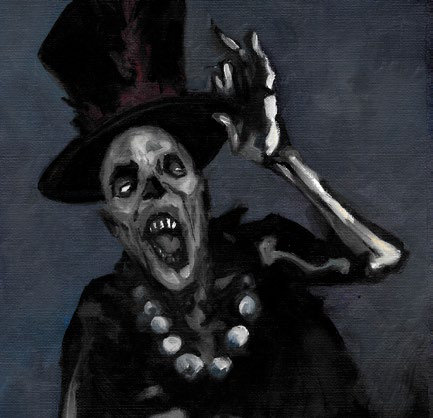

Now, the Hecata are one, big, happy family, right? 
The Samedi even got their looks back, although the 
rot and decay peek out whenever they feed. But these 
Kindred are steeped in vodou and hoodoo, and they 
know that everything comes with a price. Nothing comes 
for free. So they don silk hats, smoke fine cigars, and 
plan to enjoy the ride until the bill comes due. Laissez les 
bon temps rouler.

LORE

revealing errors, observers can 
make a Resolve + Awareness 
test against your Resolve as a 
Difficulty.

wayward Samedi or another 
Follower of Set. You can ask 
your friend for a favor once per 
story, which translates to the 
equivalent of three dots in ap­
propriate Backgrounds such as 
Allies, Influence, and Resources.

• CSI Shit: As one of the 
Baron’s children, you’ve learned 
a few tricks about death. One 
of them is knowing a lot about 
rot, decay, and how bodies die. 
By carefully examining a mortal 
corpse you can immediately 
know the cause of death. If the 
cause of death is supernaturally 
concealed, you gain the ability 
to roll despite that.

••• Hollow Inside: Sure, you 
and the Baron’s children don’t 
look like corpses anymore, 
but some of you still have the 
advantages of being one. Like 
the fact that corpses can’t feel 
much of anything anymore. You 
don’t lose two dice from relevant 
dice pools for being physically 
impaired, although you still 
retain the penalty for impaired 
Willpower.

••••• The Silk Hat: No one is 
entirely sure who The Baron is, 
but they do know you have his 
favor, and are the next in line 
to his barony. Whatever that is. 
You’re not entirely sure what will 
happen if you step up and claim 
the silk hat of The Baron. It may 
be a purely political position 
within the Hecata, or it may 
invest you with fantastic spiritual 
powers. It’ll certainly invest you 
with The Baron’s enemies. Before 
you accept the role, however, 
you have the effect of Mawla 
at five dots, although the help 
comes in cryptic ways and via 
mysterious actions.

•• Exquisite Corpse: At one 
time, the Samedi all looked like 
walking corpses, but thanks to 
the Family Reunion, they have 
brand-new respectable faces. 
But you can go back to looking 
like a corpse whenever you 
want. What’s more, you can 
look like someone else’s, if you 
try hard enough. Once per 
session you may take on the 
appearance of a corpse you’ve 
touched, including all the rot and 
smell of its current age. To notice

•••• My Setite Friend: The 
Samedi have a strange relation­
ship with the Ministry. There’s 
a lot of overlap in interest, and 
more than a few have decided 
to join the Ministry rather than 
stay with the Hecata. You have 
a connection with the Ministry, 
whether it’s one of those

2 2 2

Bloodlines

F L E S H - E A T E R S

( B L O O D L I N E ; H E C A T A C H A R A C T E R S O N L Y )
T

he Nagaraja are the most wayward of vampires 
in a clan now full of wayward vampires. They 
believe themselves to be the first ever necroman­
cers. They revel in the fact that their lineage is not easy 
to trace back to one of the known Antediluvians. They 
believe they once mastered the lands of the dead, having 
converted their Blood to live in such a place. And, per­
haps as a result of said Ceremony, they ate human flesh 
in lieu of drinking blood. They believe one night they 
can become masters of the Underworld again.

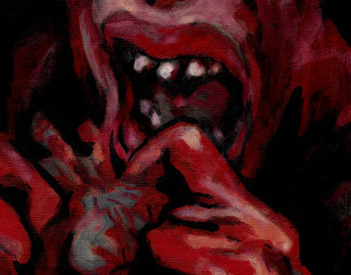

The Nagaraja are rightly seen as bogeymen, as they 
number but few and advocate for the horrible prac­
tice of capturing mortals and stripping them of flesh 
and blood night after night, while keeping them alive 
through first aid and gifts of vitae. As a disparate group, 
they have little that binds them as a society beyond their 
affinity for ghosts (most master Oblivion ahead of any 
other Discipline) and their belief that torment of the 
body and spirit brings any witnesses (or victims) closer 
to the mysteries of life, death, and undeath.

be some kind of radical form of Dunsirn, but while the 
bankers are hobbyists in the realm of cannibalism, the 
Nagaraja are experts. Years of avoiding attention from 
both mortals and Kindred society have honed them into 
efficient serial killers — quite useful to their new clan­
mates. They may no longer need flesh the way they did, 
but their skills are still useful in this new age. And some 
never lost the taste.

A handful of Nagaraja showed up to the Family 
Reunion, claiming some kind of catastrophe drove 
them out of their home. Initially they were believed to

LORE

spirits and ghosts. If you do have 
(or later acquire) Obfuscate, in­
stead all your Obfuscate powers 
work against ghosts and spirits 
in addition to their usual effects.

to study murder scenes or track 
down killers. In addition, you’ve 
worked with law officials (mor­
tal, Kindred, or both) on some 
cases, whether it’s through send­
ing them anonymous emails or 
as a direct consultant. You have 
three dots to spend between 
Contacts with the police force, 
Contacts with investigators in 
Kindred society, and Status.

• Viscus: You can still eat flesh 
in lieu of drinking blood — 
biting a mortal and causing an 
Aggravated wound acts in all 
other ways like drinking blood 
for you. You can also eat fresh 
corpses, although the taste is not 
as good.

••• The Perfect Murder: 
You have a lot of experience in 
planning murders. As long as 
you have at least a night to plan 
a cold-blooded, intentional mur­
der, you get one extra success 
on all rolls for that murder scene. 
These successes are negated 
by someone who possesses 
the Send a Murderer Bloodline 
ability (below).

•• Unseen Spirit: Some of the 
Nagaraja can make themselves 
unseen to ghosts and spirits. If 
you do not already have access 
to the Obfuscate Discipline, take 
Cloak of Shadows (Vampire: 
The Masquerade, p. 261) at 
no cost — you do not nec­
essarily have the Obfuscate 
Discipline, but rather a special 
power of your own. This power 
works like Cloak of Shadows, 
except that it only works against

••••• Monstrous Bite: When 
ready to attack or feed, your 
teeth extend to lengthy, splayed, 
and vicious daggers that pro­
trude from your mouth. When 
attacking with your bite, you 
suffer no called shot penalty, 
gain one extra success on all 
Intimidation rolls, and increase 
your bite damage to 3.

•••• Send a Murderer: You’re 
a serial killer, or maybe you’ve 
spent a lot of time studying them. 
You get two extra dice on rolls

2 2 3

CULTS OF THE BLOOD GODS

H A R B I N G E R S O F A S H U R

( B L O O D L I N E ; H E C A T A C H A R A C T E R S O N L Y )
H

olding the Jyhad’s longest grudge, the Cappadocians 
were the Clan of Death before they were usurped by the 
upstart Giovanni. Believed for centuries to be destroyed, 
the Cappadocians either took to wearing masks and calling them­
selves the “Harbingers of Skulls” or a subfaction of the clan named 
themselves “Harbingers” generations before. Whatever the truth, 
the majority joined the Sabbat and worked aggressively against 
Giovanni interests. For many years it was thought that both sides 
would never stop until one obliterated the other, but that appears 
to have changed with the Family Reunion.

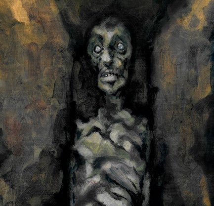

Despite the reconciliation and the acknowledgment of 
the remnants of the Cappadocian Kindred, the Harbingers 
of Skulls as they were could no longer exist. But neither 
could the Cappadocians return to their former state after 
so many centuries of anger. As such, these vampires respond 
to either name, but they have become some synthesis of the 
two. Like all things, the past form has died, and enriched 
the earth so that something new can grow.

LORE

hide your actions, and the actions 
of your coterie, as you explore 
death. You have the equivalent 
of four dots of Influence when 
attempting to cover up a death.

the training time if you have one 
anyway) due to your experi­
ence in the Underworld, but 
are vulnerable to effects which 
target ghosts (such as some 
Oblivion Ceremonies). You suffer 
a two-dice penalty to resist these 
effects, but gain a two-dice 
bonus when resisting effects that 
control your physical shell (such 
as Dominate).

• The Ashen Mask: You 
don a plain mask made of ash 
wood, for while you respect the 
traditions of the Harbingers, you 
care more about studying death 
than status, glory, or revenge. If 
a Touchstone of yours is dead or 
dies after you purchase this lore, 
study of their corpse allows you 
to transfer the Conviction they 
represent to another mortal (see 
Vampire: The Masquerade, 
p. 240) as if they died peacefully. 
If they actually did, gain a one-
die bonus to the Humanity test. If 
anybody else interferes with the 
corpse, you must test against fury 
frenzy at Difficulty 3.

••• The White Mask: You don 
a bone-white mask, with not 
a speck of dirt on it, because 
it is the mask of a respected 
Harbinger who was lost in one 
of the historic purges. You speak 
for the elders of your bloodline, 
and most Harbingers (and even 
other Hecata) listen to you. You 
get three dice to any social roll 
against another Harbinger, and 
two dice to any social roll against 
another Hecata.

••••• The Lazarene Mask: 
You don the mask engraved in 
the image of one of the clan 
founders, for you know the true 
secret of the Harbingers. Their 
crusade was never solely about 
destroying the Giovanni, but 
annihilating all those who serve 
the Clan of Death. The final stage 
of necromancy is for all who 
practice it to die, and become 
the masters of death. You incur no 
Stains for any action taken in the 
pursuit of killing another Hecata 
Kindred, or any character who 
serves the Hecata.

•• The Gold Mask: You don 
a rose gold mask, because you 
strive to balance your existence 
between the living and the dead. 
Gold has connections to both 
wealth and alchemy, with golden 
grave goods sitting in the perfect 
intersection between the two. As 
such, you have the capacity to

•••• The Obsidian Mask: 
You don a polished black mask, 
because you are more than just a 
vampire — you are truly half-
dead. You are a wraith that has 
inhabited a vampire’s body. You 
may learn Oblivion Ceremonies 
without a teacher (and with half

2 2 4

Bloodlines

L A FA M I G L I A G I OVA N N I

( B L O O D L I N E ; H E C A T A C H A R A C T E R S O N L Y )
U

ntil recently, whenever an outsider Kindred 
thought about the Clan of Death, they pictured 
the Giovanni family. Their origins stretch back 
before the Roman Empire (when they were known as the 
Ioveanus or Jovians), and the entire time they’ve had their 
hands in Kindred affairs. The original Giovanni family 
knows how to play the game better than anyone, crafting 
an identity as “Devil Kindred” to strike the right balance 
of fear and respect in their rivals — and their relatives.

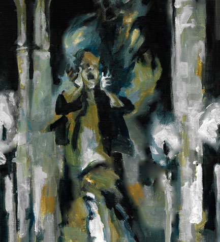

The Giovanni family and the clan of vampires known 
as the Giovanni are not identical, but it was a useful 
fiction for centuries. However, now that the Family 
Reunion has caused a restructuring of the Clan of Death, 
the original family refuses to be left out in the cold. As 
much as some cousins would like to see the backside of la 
famiglia, the “true” Giovanni aren’t just going to stand by 
and let thousands of years of family history get tossed out 
due to some political convenience. They are the top dogs, 
and they’ll murder to retain that position.

After all, no one fights like a family.

LORE

session, you can add one auto­
matic success to any social roll 
against another Hecata Kindred, 
ghoul, or retainer.

acts as a four-dot Effectiveness 
Ally, using the spectre stats in 
Vampire: The Masquerade, 
p. 377. The spectre wants noth­
ing more than to break the leash 
and devour your spirit. Until 
then, they can be summoned 
once per session and will arrive 
within 10 hours.

• A Cousin’s Ear: Even if fami­
ly members hate each other, the 
whole family lives by a certain 
code to share information — 
that’s how they’ve survived 
everything from the fall of the 
Roman Empire to the Second 
Inquisition. Once per session, 
you can ask a direct question of 
another member of the Giovanni 
family, and get a straight 
answer. However, you have to 
answer a question in return. You 
can also ask a favor of mortal 
members of the family once per 
story, as if you had the Allies 
Background at three dots.

••• Petty Cash: The Giovanni 
started as merchants, and they 
still know the power of cold, 
hard cash. As one of the favored 
childer of the family, you have 
access to a substantial bank 
account. You get four dots to 
spread among the Resources 
and Retainers Backgrounds 
for free, but these dots can be 
pulled back by elder members 
of the family at any time, espe­
cially if you cross them.

••••• Aspiring Anziani: You 
have managed to work your 
way through the hidden politics 
of the Family Reunion and come 
out on top. You’ve done so 
partially from political skill and 
ruthless zeal, but mostly because 
you know where the bodies are 
buried (in every sense). You get 
five dots of Status among the 
Hecata, and you can get a pri­
vate audience with the Capuchin 
every few stories. Just don’t 
push your luck, or you’ll join the 
corpses.

•• Faded Glamour: Being a 
Giovanni still means something, 
even if it’s not your name on 
the clan anymore. Old habits 
die hard, and the instinct to 
obey is still ingrained in much 
of the Clan of Death. Once per

•••• Spectre Servant: There’s 
a lot the family is good at, but 
in particular they’re excellent at 
enslaving the spirits of the dead 
to their will. You have inherited 
or personally captured a spectre 
to act as your servant. This

2 2 5

CULTS OF THE BLOOD GODS

T H E C R I M I NA L PU T TA N E SC A

( B L O O D L I N E ; H E C A T A C H A R A C T E R S O N L Y )
F

or a few decades, the Giovanni had a reputation 
as being nothing more than vampire mobsters. 
Savvy Hecata ancillae confronted by such ethnic 
stereotypes in Camarilla Elysia laugh and suggest the 
rumor started from too many late-night showings of 
The Godfather. And once the Hecata gets a chance to slip 
away, they call their cousins and ask what the fucking 
Puttanesca have done this time.

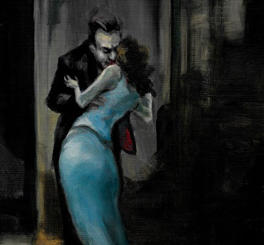

The fucking Puttanesca family, as they’re often 
called by other Hecata, were acquired from Sicily in 
the 1660s as talented street hustlers — perfect for dirty, 
low-level jobs that the more moneyed Giovanni couldn’t 
be bothered to handle. Over the years, these Puttanescas 
leaned into the mafioso stereotypes, because you might 
as well be a legbreaker if you break legs for a living. 
After the Family Reunion, any remaining connections 
to organized crime have been quickly shuffled over to 
the Puttanescas. The anziani say it’s a reward for loyal 
service. But the Puttanesca know it’s a way to put all the 
Hecata’s embarrassing assets in one place.

little guy before you get beat on by a bigger guy. But 
soon they’ll be the big guy, and it’ll be everyone else that 
gets fucked.

So if they’re going to be “the fucking Puttanesca,” 
that’s fine. This family knows all about beating on the

LORE

bonus dice to rolls to convince 
people not to hurt, endanger, or 
act against you.

This gang comprises any local 
Puttanesca Kindred, as well as 
mortals equivalent to five dots of 
Allies. You also get an automatic 
success in rolls to convince other 
characters that this beatdown is 
necessary.

• Friends in Low Places: 
Puttanesca Kindred have close 
ties to the street, and usually 
have a few side hustles happen­
ing at any one time. It’s easy to 
get your hands on a little bit of 
cash and a little bit of muscle 
whenever you need it. You get 
two dots to spread between 
Allies and Resources, and you 
can reallocate those two dots 
at the start of each story. These 
Advantages are immediately 
subject to police scrutiny.

••• Show Your Fists: On 
the other hand, it’s not all 
being pushed around. Some 
Puttanesca prefer to kick around 
those smaller than them. You 
need to show them who’s boss. 
Prick probably would’ve done 
something to piss you off any­
way, so better to get your licks in 
first. Against mortals you get two 
bonus dice for rolls to intimidate, 
and your unarmed damage 
modifier increases by one.

••••• The Don: Against all 
odds, you’ve kissed and kicked 
ass in equal measure to make 
your way to some amount of 
respect, wealth, and influence. 
Other Hecata might even stop 
insulting you to your face. You 
have three additional dots each 
in Contacts, Influence, and 
Resources, but they must be as­
signed to criminal enterprise and 
require careful maintenance to 
not draw the attention of groups 
such as the FBI, agents of which 
can become potent versions of 
the Enemy Flaw.

•• Show Your Belly: Some 
members of your family survive 
by looking as harmless as pos­
sible to people more powerful 
than them. Sure, it’s not digni­
fied, but if you can survive the 
night, that gives you time to get 
your revenge later. You get three

•••• Get the Squad 
Together: Occasionally you 
just need to get some people to­
gether for a good old ass-beat­
ing. Once per story, you can 
get a gang together for a brawl.

2 2 6

Bloodlines

T H E G O R G O N S

( B L O O D L I N E ; H E C A T A C H A R A C T E R S O N L Y )
T

he Lamiae were a bloodline of Kindred believed to 
be descended from Lilith as well as Caine — their 
founder and high priestess (named Lamia) claimed 
to be the daughter of the Dark Mother herself. In ancient 
times, a Cappadocian elder found Lamia performing sacred 
Bahari rites, and was so taken by her skin and resistance to 
pain that he Embraced her. From then on, the Lamiae were 
dedicated warriors protecting the Cappadocian clan, until 
the clan’s alleged destruction by the Giovanni. The last 
Lamia was believed destroyed in 1718.

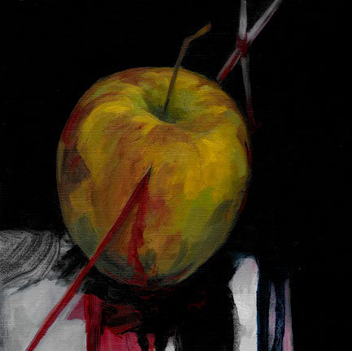

However, the Gorgons lived on, much like their Cappadocian 
charges. While the latter claimed the title “Harbingers of Skulls,” 
the Lamiae took the title of “Lilins,” spreading the word of Lilith 
and the Bahari faith while secretly uncovering the fate of the 
Cappadocians and undermining the Giovanni. Now, in the wake 
of the Family Reunion, these women stand proudly once again at 
the side of the Kindred that Embraced them — although they are 
less inclined to tolerate so-called “Cainites” that chastise their faith 
or insult their martial skill.

LORE

necessary. You gain a two-dice 
bonus when using the Block 
maneuver (see Vampire: The 
Masquerade, p. 297) to 
protect someone else.

mindless chaos and pain do not 
lead to education, so controlling 
accidental infliction of both is 
important. Once per session, 
you can convert a messy critical 
in combat into a critical.

• The Serpent’s Kiss: For cen­
turies, it was believed the bite 
of the Lamiae spread disease, 
a virulent pox like the Black 
Death (indeed, it might have 
been the Black Death) that was 
fatal after a few days. Whether 
that was true or not, these nights 
the bite of the Lamiae is no 
longer fatal, although a few like 
yourself have some remnants of 
the disease left in their system. 
Once per story, you can choose 
to infect your mortal prey with 
disease, causing them one 
Aggravated Health damage 
every night for three nights. 
This ability has no effect on 
vampires.

••• Four Humours: Many an­
cient Lamiae practice manipula­
tion of the four humors, allowing 
control over their victim’s body 
or mind. Once per story you 
may bite a mortal and inflict a 
two-dice penalty on all actions 
which don’t immediately further 
their current resonance, until the 
end of the night or their reso­
nance changes humours. If their 
blood contains a Dyscrasia, in­
crease this penalty to three-dice.

••••• Medusa’s Gaze: It was 
long believed that the nickname 
of “Gorgons” was given to the 
Lamiae for their terrifying prow­
ess and allegedly disease-rid­
den blood. But those members 
most steeped in the bloodline’s 
mysteries hold a private power 
that betrays a more literal mean­
ing behind their epithet than 
many realize. Once per session 
after you win an Intimidation 
or conflict roll, those who lost 
become unable to act on the 
following conflict turn. Outside 
of combat, they become unable 
to move for a scene unless they

•••• Controlling the Beast: 
Chaos and pain are key aspects 
of the Bahari faith (and, thus, the 
faith of many Lamiae). However,

•• Protection: You embody 
the original purpose of the 
Lamiae — the protection of 
your charges, by any means

2 2 7

CULTS OF THE BLOOD GODS

CALLING THE FAMILY REUNION

( H E C A T A C H A R A C T E R S O N L Y )
T

he Clan of Death, in all its forms, has always 
had a gift for understatement. The latest, the 
so-called “Family Reunion,” was a combina­
tion of the strategic removal of some high-profile 
elders, the burying of some ancient axes — sometimes 
in another vampire’s head — and the subsequent un­
leashing of millions of outraged and ungrateful ghosts 
taking out centuries of pent-up ire on any necroman­
cer they could find.

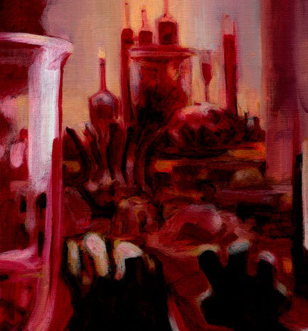

You are party to the hasty (by Kindred stand­
ards) discussion between ancient enemies of the ne­
cessity and utility of working together. You may have 
been involved in some of the acts that led to it, or 
you were present at the Reunion itself. In your own 
way, you’ve contributed to this new step in the Clan 
of Death. And even though you’ve become one big 
happy clan again, that doesn’t mean you just forgive 
and forget.

LORE

to make the reunification of the 
Hecata a success. You were a 
part of one of those deals, and 
an influential elder in the Hecata 
owes you as a result. That elder 
counts as a five-dot Mawla 
Background but will become a 
potent Adversary if the secrets 
are ever revealed.

• The Kids’ Table: You were 
present at the dinner where 
the final details of the Reunion 
were discussed. You didn’t 
have any significant impact 
in the discussion, but you 
know what was debated, so 
you’re familiar with all the old 
animosities and arguments. You 
get two dice on any Persuasion 
checks against another Hecata 
who tries to resurrect old 
disagreements.

••• Hiding the Bodies: Even 
the Clan of Death doesn’t have 
the luxury of flaunting all the 
corpses they’ve left along the 
way. You were involved in the 
cleanup of a key murder, and a 
Hecata elder is greatly in your 
debt as a result. Once per story, 
you may remind them of that debt 
to cash in the effects of a minor 
boon or less (see Vampire: The 
Masquerade, p. 315). Once 
per chronicle, you may clear the 
debt in return for the effects of 
a major boon. Call upon them 
more often, or for favors beyond 
their reach, and they will grudg­
ingly comply… only to become a 
persistent Adversary once your 
business concludes.

••••• Spiritual Assault: You 
were involved in the murder 
of Augustus Giovanni, the 
methuselah responsible for 
the alleged destruction of the 
Cappadocians. As such, you 
know it was Augustus’ death 
that unleashed the maelstrom of 
wraiths coming after the Hecata. 
Anytime you or someone who 
consults you uses an Oblivion 
Ceremony to deal with a spectre 
or other antagonistic ghost, you 
gain two automatic successes.

•• Updating the Rolodex: 
Not everyone gets along in the 
new-and-improved Hecata, but 
since you were present during 
the initial dealmaking, you now 
have access to a lot of new 
contacts. When asking for infor­
mation or small favors, you have 
the equivalent of three dots of 
Status within the Hecata clan.

•••• Dealmaker: For all the 
visible debates during the Family 
Reunion, there were just as many 
backroom deals made in order

2 2 8

Loresheets

CHILD OF THE ANGEL MICHAEL

( U N AVA I L A B L E T O N O S F E R A T U C H A R A C T E R S )
T

hat which is perfect is beautiful. That which is 
beautiful is good. That which is good leads to 
utopia. This is what the Nephilim believe — that 
if they can embody all that is beautiful and perfect, they 
can recreate the utopic dream of the perfect Kindred city: 
Constantinople. A recent cult chided in equal parts as a 
Toreador fever dream and an excuse for lavish parties, the 
Nephilim nevertheless draws in a large share of propo­
nents, eager to ogle the great and the good, or to find 
ways to improve themselves toward their personal ideal.

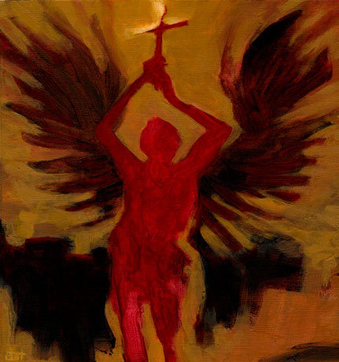

Of course, the pursuit of ideal perfection shouldn’t 
be sullied by base concerns like money or power. Those 
that give up all that they hold dear to the Nephilim will 
be rewarded, becoming more perfect and more beauti­
ful with each passing night. Besides, once the Dream of 
Constantinople comes to pass and all vampires are living 
in harmony, none of that will matter anyway. Right? 
You might be a seeker of beauty, or one of the beautiful 
yourself, but you’re definitely invested in the Dream, one 
way or another.

LORE

really disguise your appearance 
if you want to avoid attention. 
Inevitably, your face will be the 
one witnesses remember.

fringe cults have come together 
under one roof, as it were, you 
see it all as the sham it is. That 
won’t stop you from leveraging 
it for your own gain, however. 
Once per story, you can use all 
of a cult member’s appropriate 
Backgrounds as if they were 
your own.

• The Great and the Good: 
Even just being around perfect 
and beautiful people has its ad­
vantages, and you’ve been able 
to leverage your connection to 
fellow cultists into a few small 
gains yourself. You have two 
free dots to distribute between 
the Contacts, Fame, Herd, and 
Influence Backgrounds, though 
the kinds of followers you attract 
verge on the fanatical and dan­
gerous to you and your loved 
ones.

••• Hedonistic Pleasure: Of 
course, there’s no point being 
beautiful if you can’t enjoy it, 
right? Lots of long nights of 
excess have taught you a thing 
or two about having a good 
time, even when you’re not in a 
Nephilim temple. You gain two 
dice on any rolls to score drugs, 
get a date or sexual partner, or 
get yourself invited to a party. In 
addition, your exploits are leg­
endary — take either two dots in 
Fame or two dots in Status.

••••• Wiping Away the 
Stains: The most horrific and 
flawed parts of the Kindred are, 
of course, on the inside. Most of 
the cult claims they want inner 
beauty as well as outer perfec­
tion, but the sex and drugs tend 
to get in the way of true enlight­
enment. Luckily, you haven’t lost 
the true path. Once per story, 
you can spend a Willpower to 
remove a Stain from another 
vampire. The vampire must have 
sex with you, do drugs with you, 
or engage in some other hedon­
istic activity for at least an hour.

•• Outer Beauty: You make 
trips to the local Nephilim tem­
ple, and the accentuation of your 
“inner beauty” leads to outer 
effects. Your skin becomes clear, 
your hair gains luster, and your 
limbs become long and firm. You 
get the Looks Merit at four dots, 
even after character creation. 
The negative side is you have to

•••• Michael’s Calling: You’ve 
been in past cults in which 
the childer of Michael were 
worshiped to bring about the 
Dream. While it’s novel and 
convenient that all of these

2 2 9

CULTS OF THE BLOOD GODS

S E R V I T O R O F I R A D
A

ccording to the Book of Nod, Irad the Strong was 
the third childe of Caine, and he served as his 
sire’s enforcer and military leader in the First 
City. The Kindred of the Servitors of Irad seek to emulate 
that mythological vampire, who is said to have pledged 
to serve the Antediluvians in all things before his kin or 
his childer destroyed him. They hope that, if they spend 
their existence showing they serve the Antediluvians, they 
will be spared when the ancients rise. Irad believed it, but 
received the revelation too late to preserve himself.

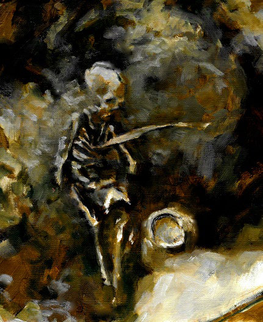

The cult doesn’t actually have any contact with the 
Third Generation, but they assume that the Antediluvians 
would want the elders of Kindred society to be weak and 
divided. As such, they infiltrate any vampiric organization 
they can find — Camarilla cities, Anarch gatherings, and 
even other cults — to sow dissension and shatter fragile 
alliances. And now you’re one such deep cover member. 
You’re cut off from the other members of your cult, trying 
to enact a hazily-understood plan set down by mytholog­
ical figures with whom you have no direct contact, with 
the knowledge that if any other vampire ever found out, 
you’d be immediately and painfully killed. But you have 
faith, and that’s enough.

LORE

even hear their voices in your 
head, or gain prophetic dreams 
from them. As long as you are a 
member of the cult, you can take 
an additional Conviction that 
is directly related to the goals 
of your infiltration (your mem­
bership in the cult acts as your 
“touchstone” for the purposes of 
this Conviction). If you infiltrate 
a new group, you can change 
your Conviction to reflect the 
new assignment.

it. The blood you have inherited 
from your clan founder is sec­
ondary to this higher purpose. 
Your clan Bane can be ignored 
once per story while you are a 
Servitor of Irad.

• Shield of Irad: You can’t do 
the work of the Antediluvians if 
you get discovered by oth­
ers. Luckily, you have a lot of 
experience shielding your true 
intentions from the gaze of 
outsiders. You gain an additional 
die on rolls involving lying to 
other Kindred.

••••• Kill Thy Brother: When 
the Third Generation eventual­
ly rise, you know that most of 
Caine’s errant childer will be 
destroyed. So, killing another 
vampire in the name of the 
Antediluvians just makes their 
job a little easier. Once per 
story, when using a weapon or 
power that inflicts Aggravated 
Health damage on a vampire, 
you gain two additional dice to 
your attack, and don’t need to 
roll to resist frenzy if that weap­
on or power involves fire.

•• Sword of Irad: Sometimes 
you must act decisively in the 
name of the Third Generation, 
and that conviction adds addi­
tional strength to your act. Once 
per story, you can add three 
dice to a roll that is integral to 
your cult’s plans.

•••• Do the Will of the 
Ancients: All actions are in ser­
vice to the Third Generation, the 
thirteen vampires that will some 
day rise and destroy the world. 
There is nothing you won’t do to 
fulfill that goal, and you have 
devoted your entire existence to

••• Know the Will of the 
Ancients: You are firmly 
convinced you know the will of 
the Antediluvians. Perhaps you

2 3 0

Loresheets

T H E P R O M I S E O F 152 8
A

fter the Giovanni engineered the fall of the 
Cappadocians (or so they thought), the up-and-
coming Camarilla expressed concerns about the 
so-called “Devil Clan.” The purge of the Cappadocians 
entered full force soon after the Anarch Revolt, and the 
Kindred of the Camarilla were worried that this was 
more of the same. With the upstart Anarchs forming 
into what would become the Sabbat, the Camarilla 
couldn’t afford a war on yet another front. So, Augustus 
Giovanni and the Inner Circle of the Camarilla met in 
Venice in 1528, and signed an agreement.

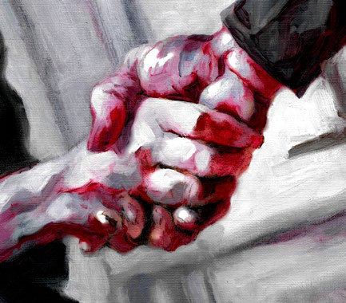

The problem is, no one really knows what’s in the 
agreement. For years, all that was known was that the 
Giovanni had some degree of autonomy in Camarilla 
domains, and that the clan was given ownership of 
the city of Venice (in exchange for the Inner Circle 
being allowed to hold their meetings there). After the 
Family Reunion, however, an additional detail has been 
revealed: The Promise has a limit of 500 years, meaning 
it will expire in 2028. Both the Camarilla and the Hecata

are scrambling to find out the details of the agreement, 
as well as the consequences once it expires.

LORE

the story, and may call in a ma­
jor boon (see Vampire: The 
Masquerade p. 315) from the 
vampire in future.

buried memories. But once in 
a while, snippets surface to 
help you at just the right time. 
Once per story, you can add 
three dice to an appropriate roll 
where memory of the Promise 
would help you.

• Legal Scholar: You are an 
active student of the Promise. 
You don’t know much, but that’s 
more than most Kindred know. 
Even the fact that you know such 
a document exists gives you 
leverage. In legal disputes with 
Camarilla Kindred or members 
of the Hecata, you gain two 
dice on Persuasion checks.

••• Tick Tock: You know, or 
believe you know, the conse­
quences of allowing the Promise 
to expire, and they aren’t good. 
Once per story, you can give 
advice to members of your local 
faction (the Camarilla court if 
you are a Camarilla Kindred, 
or the local family if you are 
Hecata) and expect to be 
taken seriously. You will get an 
audience, and two automatic 
successes on any rolls which 
leverage your knowledge during 
the meeting.

••••• Signatory: You are 
directly related to one of the sig­
natories of the Promise (or you 
are a signatory yourself). Once 
per chronicle, you can leverage 
your knowledge of the Promise 
to force a Camarilla Prince or a 
Hecata anziani to permanently 
change a ruling or local law in 
your favor, using your knowl­
edge of the Promise to give you 
political clout. However, you 
must decide why you are unable 
to ever speak of the details of 
the Promise — perhaps it’s a 
thaumaturgical compulsion, the 
spirit of a loved one threatened 
with eternal torment, or a lot of 
Ventrue Dominate.

•• Scrap of Information: 
You saw a scrap of a transcript 
of the Promise once. A lot of 
forgeries have circulated among 
the Kindred over the centuries, 
but you’re reasonably sure this 
one is genuine. This makes you 
a hot commodity among other 
Kindred who hunger to know 
what’s in the Promise. Once 
per story, if you allow Kindred 
access to your notes on the 
Promise fragment for research, 
you gain a temporary dot in 
Contacts, Herd, Influence, or 
Resources for the remainder of

•••• Faulty Memory: You 
read the Promise once, but for 
some reason you can never 
recall the text in full, even if you 
have advantages or powers 
that would normally allow you 
to remember things or uncover

2 3 1

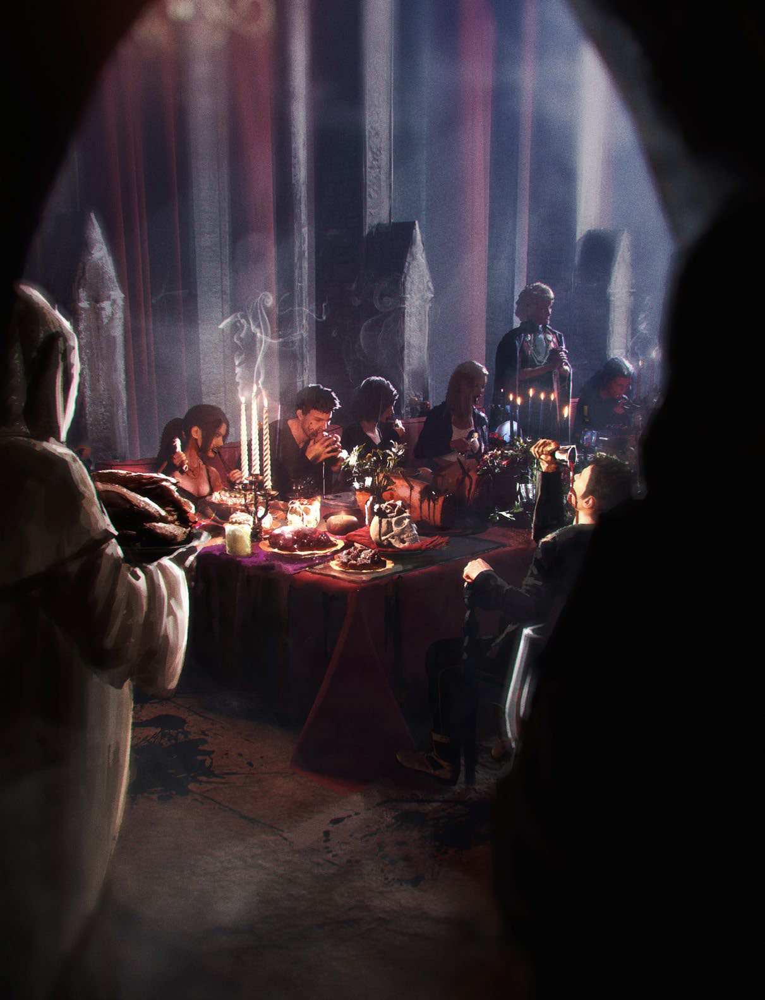

Styx and 
Styx and

chapter eight
chapter eight

Bones
Bones

“If you’re not comfortable around dead things, this family isn’t for you.”

— Anja Giovanni, Matron of Munich, to a group of aspiring neonates

Introduction
Introduction

The Hecata struggle to survive. When it comes to 
The Hecata struggle to survive. When it comes to 
the newly formed Clan of Death, the Camarilla and 
the newly formed Clan of Death, the Camarilla and 
Anarch Movement would like to finish eradicating the 
Anarch Movement would like to finish eradicating the 
troublesome independent clan, which from all appear­
troublesome independent clan, which from all appear­
ances seems to be on the ropes. However, in the German 
ances seems to be on the ropes. However, in the German 
city of Munich, they’ve carved out toleration under 
city of Munich, they’ve carved out toleration under 
the reign of the progressive Prince Ursula Eisenstadt. 
the reign of the progressive Prince Ursula Eisenstadt. 
Through the leadership of Anja Giovanni, Mother of 
Through the leadership of Anja Giovanni, Mother of 
the local Hecata, they’ve acquired territory on which to 
the local Hecata, they’ve acquired territory on which to 
build an estate. And, as long as they conduct themselves 
build an estate. And, as long as they conduct themselves 
peacefully, the extended family and their associates are 
peacefully, the extended family and their associates are 
able to meet there in relative safety.
able to meet there in relative safety.

Styx and Bones 
Styx and Bones is an exploration of the Hecata within 
is an exploration of the Hecata within 
the World of Darkness, and the logical continuation of 
the World of Darkness, and the logical continuation of 
the 
the Cults of the Blood Gods
Cults of the Blood Gods setting. This story centers 
 setting. This story centers 
on the Hecata as they exist in Munich, a Camarilla city 
on the Hecata as they exist in Munich, a Camarilla city 
that barely survived the Second Inquisition. As members 
that barely survived the Second Inquisition. As members 
of the Hecata or as their trusted allies, the players will 
of the Hecata or as their trusted allies, the players will 
explore two cults in the 
explore two cults in the World of Darkness
World of Darkness. They will 
. They will 
unearth old ghosts, investigate new dangers, and struggle 
unearth old ghosts, investigate new dangers, and struggle 
with the personal cost of Kindred warfare.
with the personal cost of Kindred warfare.

As they welcome a new minor family into the Clan 
As they welcome a new minor family into the Clan 
of Death, the Munich Hecata mend old grievances, pur­
of Death, the Munich Hecata mend old grievances, pur­
sue unrealized goals, and pledge their eternal fidelity to 
sue unrealized goals, and pledge their eternal fidelity to 
family. But, when bodies begin to pile, the Hecata must 
family. But, when bodies begin to pile, the Hecata must 
contend with a new foe while the Camarilla keeps the 
contend with a new foe while the Camarilla keeps the 
boot to their necks.
boot to their necks.

On p. XX, six ready-made characters are available 
On p. XX, six ready-made characters are available 
for this story. Player characters have at least a slight 
for this story. Player characters have at least a slight 
knowledge of one another before they start the prologue. 
knowledge of one another before they start the prologue. 
This is necessary for the needs and length of the story 
This is necessary for the needs and length of the story 
and will assist the players in creating a deeper connec­
and will assist the players in creating a deeper connec­
tion with each other.
tion with each other.

Starting on p. XX, you can find further, shorter 
Starting on p. XX, you can find further, shorter 
story hooks for running other stories relating to the cults 
story hooks for running other stories relating to the cults 
in this book.
in this book.

Players required: 
Players required: 4-6
4-6
Duration: 
Duration: 10-15 hours 
10-15 hours

2 31
2 31

CULTS OF THE BLOOD GODS

CHARACTERS
Player characters in this story likely hail from the Hecata, but there is no restriction on clans one might play. Likewise, 
while the story does not involve itself in the politics of the Camarilla or Anarch Movements, characters may still hold 
affiliation with either sect, or indeed a cult beyond the Hecata. While it may seem strange for the Hecata to involve 
non-clan members in their internal affairs, it does in fact serve multiple purposes: this plot highlights the apolitical 
veneer of the Hecata, allows the clan to find reliable mercenaries from outside the family, and enables them to forge 
close contacts with members of the other sects and cults without the need to pin their banner to any particular view 
or philosophy.
Characters in this story can be local to Munich and invited to the family dinner in the prologue due to prior history 
with the Hecata, or may be from outside the domain, summoned in to perform the task at hand. The Hecata are 
always happy to reward out-of-clan vampires with money and property, of which they hold plenty, with a harder 
bargain eking Oblivion knowledge out of a potential Mawla awarded for good service. If the vampires are from 
within the Hecata, it is their duty to serve the family and further the clan’s goals, knowing rewards should (in theory) 
trickle down from their elders for good, loyal service.

München mag Dich 
(Munich Loves You)

ecuted — a.k.a., he branded anybody who questioned his 
leadership a tool of the devil and staked them for the sun.

During the Thirty Years War, King Gustavus II of 
Sweden invaded the city. While Gustavus was probably 
part of some larger Jyhad between the Kindred elders of 
the Empire and those aligned with the Anti-Habsburg 
states, I doubt either one of them would claim responsi­
bility for the plague that followed. The younger Kindred 
residents of Munich tried to take advantage of the chaos 
and assassinate Jann Berger, but they couldn’t get it done. 
And so another series of ashy executions followed. It was 
only after Berger’s own childe smote him that his reign of 
terror finally ended. That childe was Jaroslav Pascek. You 
might have heard of him. The former Brujah Justicar?

Henry the Lion was a powerful prince in a time of 
competing families within the vast Holy Roman Empire 
when he founded Munich in 1158. But Emperor Freder­
ick I, who in turn granted the duchy to one of Henry’s 
rivals, Otto I, deposed him. As part of the House of 
Wittelsbach, Otto’s dynasty continued for the next seven 
hundred years.

In many ways, Munich isn’t all that different from 
other Camarilla cities within Europe. Many who claimed 
allegiance to the Fiefdoms of the Black Cross under the 
Ventrue Elder, Hardestadt, gathered here during the thir­
teenth century. This resulted in a series of false prophets, 
endless wars, and struggles for power. Mostly fought 
against the Brujah and Lasombra of Italy and the Courts 
of Love in France, not to mention the pervasive Lupines, 
the conflicts of the thirteenth and fourteenth centuries 
were particularly violent for Munich. I could provide 
you with a comprehensive list of Princes — a succession 
of rulers over the centuries, complete with an exhaustive 
list of deeds accomplished and contests won. I could do 
that. But such would do you little good. These names are 
obsolete. They are the bones and ash on which this praxis 
now stands.

Anyway, he was a fanatic, too, though I don’t know 
what his daddy issues were so I can’t say if it was personal 
or pontifical. And, as is so often the case, Berger’s depar­
ture from this immortal coil resulted in a series of violent 
gambits and failed coups. Few have the fortitude to claim 
a praxis from a sitting sovereign, but everyone lines up 
when that Prince trips on a stake. For the next century, 
Munich entered what you might describe as a transitional 
period.

But by the dissolution of the Holy Roman Empire 
and the birth of the Kingdom of Bavaria under Maxi­
milian I, the city of Munich finally had a stable Prince. 
Felix Ritter was an Austrian Tremere of some renown. 
He had served in a series of campaigns against the Sabbat 
in Eastern Europe and had a reputation for callousness. 
He was devoid of sentiment, a fact which allowed him 
to bargain when possible and butcher when needed. The 
various elders who surrounded Ritter aided his rule in no 
small part. Munich proved an excellent launching pad for 
their own agendas and careers within the Camarilla. They 
included Lethe, Ritter’s Malkavian Seneschal and sooth­
sayer. They included Maris Streck, who served the Prince 
of Munich as an investigator-for-hire and who later

Regardless of my thoughts though, you should prob­
ably know about the first Camarilla Prince of Munich, 
Jann Berger. The Brujah zealot claimed the title in the 
early sixteenth century and ruled for the next couple 
hundred years. Like so many other contemporaries of his 
day… or night, if you prefer… Berger was a dictator with 
some fucked up religious beliefs and fanaticism matched 
only by the Inquisition. Those who didn’t conform, he ex­

2 3 2

chapter eight: styx and bones

Where the 
Bodies Are 
Buried

Grenzschutzgruppe 10, Germa­
ny’s new secret police and part of the 
global war-on-the-damned, took out 
half of Munich’s Kindred population 
in one day. Within the span of a sin­
gle sunrise to sunset, we experienced 
what I might call a tactical cleansing. 
They say Ritter and his childer were 
the first to die. They exterminated 
the entire Giovanni presence within 
Munich, and most of the Anarchs 
fled. By the next day’s dawn, the bulk 
of us were dead, deep underground, 
or long gone.

served as the Malkavian Justicar. And 
they included Josef von Bauren, the 
Nosferatu of legend who, according 
to hearsay, spent his days underneath 
a decrepit and abandoned opera 
house here in Munich.

It was the golden age of the 
Camarilla. The Ivory Tower gleamed 
bright and the city of Munich stood 
as the paragon of Camarilla domi­
nance within the region. The Court of 
Munich forged alliances with neigh­
boring cities, the Anarch Movement, 
and with a German branch of the 
Giovanni known as the Königs. This 
period culminated in the Conclave 
of 1933, held here, which declared 
worldwide lextalionis against the 
villainous Kemintiri. And then, a few 
years later, the mortals reminded the 
immortals how powerless they really 
were.

In 2007, the Second Inquisi­
tion tore through the city like some 
ghastly juggernaut. Most of the old 
guard either fled the city or died in 
the night. Tonight, because of Prince 
Eisenstadt, Munich is once more a 
thriving city for the Camarilla. The 
Ivory Tower forged alliances with the 
local Anarch Movement and Inde­
pendent clans to secure the peace. 
And while old grudges remain, the 
peace holds.

Possibly a rumor, but they say 
there were some discussions with­
in the Inner Circle of abandoning 
Munich altogether. I can’t speak to its 
truth. Thankfully, one young Ventrue 
managed to pull our stomped-on 
asses from the fire. Ursula Eisenstadt 
was a fresh-faced twenty years dead 
when she planted her flag in Munich 
and called it hers. Who was here 
to stop her? She instituted security 
protocols, confiscated electronics, 
and kept us hidden from the Second 
Inquisition.

THE CAMARILLA

You can’t discuss the history 
of Munich without mentioning the 
Nazis. To do otherwise would be 
to ignore the havoc those assholes 
wrought and insult the weighty num­
ber of lives lost during the Holocaust. 
National Socialism was born in Mu­
nich. They called this city the Haupt­
stadt der Bewegung, the “Capital of 
the Movement.” We remember the 
treaty Neville Chamberlain signed 
here, and we remember the bombs 
that decimated us. When the U.S. 
Army assaulted the city, they took it 
with relative ease before liberating 
the concentration camp at Dachau 
in the process. Most Kindred I know 
kept their heads down during the 
whole affair. Ritter survived, and his 
newly established court assisted with 
the Wirtschaftswunder – the rapid 
reconstruction of West Germany. The 
Tremere continued to rule a rebuilt 
and prosperous Munich for another 
sixty years. We said goodbye to the 
twentieth century and ushered in a 
new millennium.

Ursula Eisenstadt is part of a 
new breed of Camarilla Princes. She 
rules not through fear, but rather 
through raw intelligence. She embrac­
es new ways of viewing the world, 
preferring practicality over individual 
pride. She punishes when she must, 
but much prefers to negotiate for the 
mutual benefit of all parties involved. 
At least, she does when it comes to 
Kindred within her domain. Any 
vampires outside Munich lack the 
rights of diplomacy afforded to those 
within.

What I think is the most in­
teresting aspect of her ascension to 
the throne is she didn’t abandon the 
old ways of thinking. Not entirely. 
It was more like an old-meets-new 
adaptation. She treated these modern 
threats as both real and immediate. 
As Prince, unlike so many of the 
elders, she recognized these dangers 
weren’t momentary storms, but life-
long realities.

A group of competent Kindred 
surround the Ventrue Prince and 
assist in her success. While they may 
personally despise each other, they 
respect Ursula Eisenstadt too much 
to see her overthrown. She hasn’t 
always made the right decision, but 
they see her as proof the Camarilla 
can succeed in the 21st century. This 
group includes Seneschal Mehmet 
Sumal, a Turkish Tremere of some 
age and flexible ethics.

Tonight, the city of Munich is 
prosperous once more, leading Ger­
many into the twenty-first century. 
We’re undoubtedly cautious and 
never too paranoid, but we’re also 
proud of what we have. This city is 
the heart of Germany and a center 
for art, culture, technology, and fi­
nance that elevates all of Europe. We 
are Kindred, after all. It’s not enough 
to simply survive.

Sumal represents the last rem­
nants of the old guard. He supports 
the Prince from the shadows and 
executes her bloody will when re­
quired. These duties often involve the

And then, for a second time, we 
were powerless in the face of organ­
ized mortals.

— Gerhard Röhrich, Sheriff of 
Munich

2 3 3

CULTS OF THE BLOOD GODS

MUNICH OR ELSEWHERE
While this story is set in the city of Munich, it can easily be transposed into another domain with minimal adjustment. 
We recommend that if you decide to move this story to another domain, you pick out a dozen locations of note from 
within the city, small and large. If for instance you wanted to set this in the domain of Dallas, the Sixth Floor Museum 
at Dealey Plaza is a site forever associated with the murder of JFK, making for an ominous Hecata meeting spot. The 
Dallas Arboretum and Botanical Gardens make for excellent neutral ground for meetings between the sects. Mean­
while, on a smaller scale the Nasher Sculpture Center makes for a bizarre setting to host a showdown, while one 
could easily state the Bishop Arts District is a territory firmly in Clan Toreador’s hands. Set dressing is key to making 
a city feel true to life.
The primary players have been created for this story, therefore names and clans can change, allowing the Prince to 
become a Malkavian, or even for the Hecata surroundings to become those of the Ministry or Tremere, given both 
clans share a sense of internal order. The necromantic element of this story could be replaced with Blood Sorcery or 
some arcane rituals another clan practices in secret.
We recommend you use Munich if you do not have a present domain for your stories, but if you have already 
fleshed out your setting, use it and migrate your personalities, sites, and events into this tale.

presence of Gerhard Röhrich, a native of Munich and the 
Nosferatu Sheriff. Like most in his profession, Röhrich 
has survived a number of violent skirmishes over the 
years, but much prefers to maintain the peace. He is loyal 
to Eisenstadt almost to a fault and acts not only as her 
primary investigator but also as her bodyguard. Rounding 
out the inner circle of Munich is Pearl. The American 
expatriate is a Toreador of exquisite taste who serves 
the court as its Herald. The city includes roughly twenty 
other Camarilla citizens of mention, which can be created 
per the needs of the individual Storyteller.

Straub, a charismatic figure who commands the Move­
ment as Baron, though he has never officially claimed 
the title. Unlike their compatriots in Berlin, the Munich 
Anarchs keep to an uneasy peace with Prince Eisenstadt, 
preferring security over the unpredictable impact of 
conflict.

THE SECOND INQUISITION

After the Munich massacre of 1972 that claimed the 
lives of eleven Israeli Olympians, the German government 
reevaluated their practice and policies regarding terror­
ism. As a result, the German Federal Police created a 
tactical unit known as Grenzschutzgruppe 9. Focused on 
kidnappings, hostage situations, and terrorist incidents, 
GSG 9 serves as the elite wing of the German Police.

THE HECATA

Between the Second Inquisition, internal struggles, 
and clandestine conflicts with the Camarilla, the Clan of 
Death has suffered in recent years, at least ostensibly. Like 
the rest of the newly formed clan, the Hecata of Munich 
are adjusting to their contemporary hierarchy. Anja Gio­
vanni, Mother of the city’s Cult of Death and Undeath, 
maintains the delicate alliance with the Camarilla. Two 
additional, powerful figures form a strange triumvirate 
within Munich. The first is Hiromitsu Asano, a newly 
arrived Japanese member of the Hecata who brings with 
him strong industrial ties. The second is Mora the Death 
Seer. Mora is a mysterious and androgynous Cappadocian 
who appears to operate with impunity. Asano and Mora 
were once rivals, but reconciled under the careful eye of 
the Giovanni who made room for the introduction of this 
new minor family.

With the rise of the Second Inquisition, a new 
Border Guard Group has emerged in Germany. Readied 
with a new mandate and secret orders, GSG 10 hunts and 
destroys all Kindred found within the Federal Republic of 
Germany. They are well armed, well funded, and most of 
all, patient.

Die Heimliche Hauptstadt 
(The Secret Capital)

“I tell you there’s nothing like Munich. Everything else is a 
waste of time in Germany.”

THE ANARCH MOVEMENT

With strong ties to Red Liberation out of Berlin, the 
Anarchs of Munich are both large and largely disorgan­
ized. Consisting of three or four individual gangs, the 
Movement controls Eastern Munich. Despite their cha­
otic assembly, they have managed to center upon Dieter

— Ernest Hemingway

A city of 1.5 million, Munich is the capital of the 
German federal state of Bavaria. It rests along the Isar 
River, just north of the Alps with an elevation of 520 me­

2 3 4

chapter eight: styx and bones

ters. Munich hosts seventeen universities, forty-six muse­
ums, forty-seven theaters, and various centers of industry. 
The European headquarters of Siemens AG, BMW, and 
Endron all call Munich home. Finally, Munich entertains 
the Franz Josef Strauss International Airport, extensive 
eco-friendly bike paths, and an interconnected network 
of Autobahn, U-Bahn, S-Bahn, and tram lines.

in Isarvorstadt offers traditional German food and allows 
for private and secure meetings.

SCHWABING & ENGLISH GARDEN

North of Maxvorstadt, Schwabing is an affluent 
neighborhood, home to fashion outlets, specialty book­
stores, and high-end art galleries. Famous residents 
include Vladimir Lenin, Werner Heisenberg, Wassily 
Kandinsky, and writers Thomas and Heinrich Mann. The 
English Garden, an urban park with several creeks and 
lakes, flanks it. On the northern edge of Schwabing sits 
the Allianz Arena, a football stadium with a capacity of 
75,000.

In the past two decades, Munich has become one of 
the safest cities in Germany. Extremely violent crimes 
are rare, and the full force of the Munich police usually 
descends on them quickly. As a result, the local Kindred 
population tends to tread carefully.

ALTSTADT-LEHEL

OLYMPIAGELÄNDE

The City Center of Munich is the old city fortifi­
cations, surrounded by the innermost ring road known 
as the Altstadtring. It includes the Marienplatz Cen­
tral Square, the New City Hall, and the world-famous 
Rathaus-Glockenspiel — a mechanical reenactment 
which, twice a day, tells two stories from the sixteenth 
century for passing crowds. Adjacent to the New City 
Hall is the Old City Hall, the former residence of the Ba­
varian kings, the Munich National Theater, the Bavarian 
National Museum, and the Frauenkirche Cathedral, home 
to the Catholic Archdiocese of Munich and Freising.

Built on Munich’s former airport, Oberwiesenfeld, 
this was the site of the 1972 Olympic Games. In modern 
nights, it’s used for outdoor concerts, and includes both 
the BMW headquarters and the BMW museum. Gren­
zschutzgruppe 10 holds several warehouses in the area not 
far from a memorial honoring the 1972 Munich massacre. 
The GSG 10 use the warehouses as their primary base of 
operations. This base includes a training area, forensics 
lab, barracks, and command center.

NEUHAUSEN-NYMPHENBURG

A quiet residential area, the district includes the 
Nymphenburg Palace, the primary summer residence for 
the royal House of Wittelsbach. In addition to entertain­
ing the Camarilla Conclave of 1933, Prince Ritter used 
Nymphenburg Palace for his public court gatherings.

MAXVORSTADT

Maxvorstadt is the artistic and academic heart of 
the city, located north of the City Center. In addition to 
various creative and scholastic institutions, the district 
houses the University of Munich, the Technische Uni­
versität München (TUM), the Pinakotheken museums, 
and Königsplatz Square. On the eastern border of the 
district sits the Odeonsplatz, a large central square which 
also houses the Feldherrnhalle. Not surprisingly, Prince 
Eisenstadt gifted Maxvorstadt to both Clan Toreador 
and Clan Tremere of Munich as part of a joint territory. 
While there have been squabbles between the two clans 
in the past, since the 2007 purge the two have cooperated 
amicably. They are the only vampires who can hunt in the 
district, and have been known to punish outsider mem­
bers of their own clans who hunt there without seeking 
approval from their resident opposite number.

AU-HAIDHAUSEN

The district around the Munich East station (Ost­
bahnhof) is well known for its bars and nightclubs. It’s 
also home to one of Munich’s largest breweries, the Mu­
nich Philharmonic Orchestra, Munich’s municipal library, 
and the Maximilianeum. After years of negotiation with 
Prince Eisenstadt, the Hecata have acquired an aban­
doned Protestant church in the area. After repurposing, it 
currently functions as both a temple and mausoleum.

EASTERN MUNICH

Bogenhausen, Berg am Laim, Trudering-Riem, and 
Ramersdorf-Perlach are the residential areas of East­
ern Munich. Parks run along the Isar River and the 
Hellabrunn Zoo which help add a cozy, small-town feel to 
this metropolis on the rise. The Anarchs claimed this ter­
ritory in their arrangement with Prince Eisenstadt and, as 
long as they maintain the Masquerade and commit zero 
public violence, she allows them to exist as they see fit. 
While there have been a handful of minor violations, to 
date, Dieter Straub has managed to maintain the peace.

LUDWIGSVORSTADT AND ISARVORSTADT

These two districts lie south of Maxvorstadt. With a 
large immigrant population, the area is home to nu­
merous cafés, bars, restaurants, and nightclubs. It also 
includes the Gärtnerplatz, an urban square arranged as a 
roundabout. While court gatherings are rare in Munich, 
when Prince Eisenstadt needs to speak with Kindred 
face-to-face, she uses Hänsel und Gretel. The restaurant

2 3 5

CULTS OF THE BLOOD GODS

Prologue: 

A Family Dinner

black waterfall cardigan, and with both hands, presents a 
cylinder wrapped in pastel-blue silk to Asano. He refuses 
it a customary three times. Each time in response, the 
Death Seer insists. Finally, he accepts, and in turn, pulls 
from his pocket a small wooden box.

He holds it out with both hands, offering it to Mora. 
“This is but a trivial gift….” It’s Mora’s turn to refuse. 
And they do three times, knowing they would eventually 
accept it. At the conclusion of the exchange, Mother Anja 
rings a small, high pitched bell. The two return to their 
seats to await dinner.

The Storyteller should read this section aloud or pass it 
around the table so each player has a chance to introduce a 
section of the Prologue

Moonlight pours through the stained-glass windows 
of a remodeled Gothic church, and in its basement, the 
dead dine with family. Mother Anja Giovanni, a tall and 
rail-thin woman, stands at the head of the table. Her steel 
gray hair and the slight crow’s feet at the edges of her pale 
eyes add sophistication to her elegant features. She holds 
her raised wine glass by the stem. “Family, I wish to thank 
you all for joining us. Across this continent, the Clan of 
Death gathers. We meet to bury old grudges and embark 
on new beginnings. For we are all Hecata, now. We are all 
family.”

From the wings come a series of mortals dressed 
in white, ranging in size, shape, and age. Each carries a 
carafe of treated blood for the Kindred and a portion of 
the first course — small bones speared into slices of rare 
steak and lamb — for the kine. After each serves a table, 
Mora prays aloud. “I am the end and the beginning. Dead 
flesh may cover my bones, and my bones may encase an 
unbeating heart, yet I remain. Ghosts may follow in my 
wake, and in my wake, may other ghosts soon join them. 
For I have chosen my path in famine, plague, and war and 
stand between the living and the dead. I am prepared. For 
I am Hecata. I am the beginning and the end. I remain. I 
remain. I remain.”

She inclines her head to the man sitting on the other 
end of the long banquet table reserved for local cult lead­
ership and their honored guests. Hiromitsu Asano wears 
a sprig of honeysuckle pinned to the lapel of his tailored 
Italian suit. The sweet smell of the trumpet-shaped white 
flowers permeates the room, layering a candy-like aroma 
over the coppery scent of blood. “Thank you for this wel­
come.” He raises his glass to Mother Anja in return.

A chorus of voices answer in response. “We remain.”
The still room comes to life as guests commence 
dining. Every course that follows is more decorative than 
the one before it. On serving platters, each course makes 
for an elaborately morbid presentation — flayed hands 
gripping rib-bone prison bars, the hands actually made 
from vegetables; blood coral tuile garnishing prettily 
plated organs made from puffed rice and dumplings; and 
giant roasts complementing soups served in skulls. Each 
dish is as much an unspoken threat as it is a statement of 
culinary artistry. Cross the Hecata and be devoured.

At smaller tables scattered around the basement, 
family clink glasses and drink to the Asano, who have 
joined the Hecata as the newest minor family. Those at 
the head table lift their glasses to the Asano patriarch as 
they offer quiet comments of welcome along with their 
congratulations. Once the murmurs in the room taper off 
naturally, Mother Anja sits and flicks a sharp glance to 
the individual on her right.

All indulge as they talk and reminisce well into the 
night. Once the dinner progresses into the more orgias­
tic than refined, Mother Anja Giovanni approaches the 
table occupied by the coterie. After making a bit of idle 
conversation, she provides a rough overview of the city 
and offers housing to those who require it. Eventually, she 
beckons Mora before posing a business opportunity to 
those seated.

“Asano-san.” Mora the Death Seer rises to their feet. 
Striking cheekbones emphasize their delicate lips and a 
receding chin as they speak. “Five centuries ago, Augustus 
and his brood systematically murdered the Cappado­
cians. Few of us survived, but all swore vengeance on the 
Giovanni usurpers. Your sire, Heinrich König fell at my 
hands. As did many Giovanni.” Their low voice braces 
at the spoken truth, but their broad-shouldered stature 
does not slink away from the responsibility. “The time 
for vendettas and bloodletting is over. Let us heal. Let 
us understand and be understood in turn. Please accept 
our condolences for your loss, and please accept our most 
sincere pledge to your continued well-being.”

“There is an article which would prove beneficial 
to the Hecata,” says Mother Anja. “And may prove an 
opportunity for you to provide for the clan. An Autarkis 
has recently traveled to Munich to host a private auction. 
Apparently, he has in his possession a burial jar said to 
have the power to recall a soul from the Tempest, a place 
of storms in the Underworld. Mora may then be able to 
place that soul into an empty shell. We suspect this jar to 
be of Cappadocian origin, though others will certainly be 
competing for its possession.”

Asano stands and bows slightly at the neck in re­
sponse. “I accept your apology. I, too, pledge myself to the 
well-being of our family.” Then, he moves from his chair 
to approach. Mora retrieves a gift from the folds of their

2 3 6

chapter eight: styx and bones

Chapter One: 

Body of Lies

AWKWARD FAMILY REUNIONS
It’s not every night vampires from across the world 
sit in a dining hall together. This is an excellent op­
portunity for a Storyteller to disseminate information 
about Munich and the world beyond its borders.
During the break between the ceremony and din­
ner, Storytellers can incorporate a cocktail hour 
where characters have the chance to engage Moth­
er Anja, Mora, or Asano as well as other visitors. If 
the coterie is new to the city, they can ask about 
territories, the Prince, or how Munich has fared 
against the Second Inquisition as some examples.

Regardless of whether the characters take Anja 
Giovanni up on her offer and sleep inside the Hecata 
temple, she, Mora, and the coterie reconvene there the 
next evening after sunset. Anja provides the characters 
with a file on the body they require and an invitation 
to the auction. She reminds the coterie Munich is a 
Camarilla city and the Masquerade is strictly enforced. 
She warns them to tread carefully, and not to do an­
ything to hinder relations between the Camarilla and 
the Hecata. Or, if they do, to not get caught. Further­
more, in addition to whatever the coterie may offer 
at the auction, Anja grants them access to one major 
boon to help secure the burial jar, despite her vocal 
distaste for the Camarilla’s system of boons.

“If successful,” interjects Mora as they approach the 
table. “We will be able to use this artifact to resurrect one 
of the great elders, Constancia, Priestess of Bones. All we 
lack, besides the burial jar, is a worthy vessel. We hap­
pen to know of such a specimen, being young, virile, and 
deserving of death.”

With the two handouts below, the characters may 
plan their course of action. They may choose to handle 
the auction first and Hildebrant after, or they can choose 
to split the party and address both items simultaneously.

“‘All that is dead carries the echoes of life’,” quotes 
Mother Anja. “‘All that lives hears the cry of its death’. 
Do this thing for the Hecata. Do this thing for me. Rest 
tonight and receive further instructions at tomorrow’s 
dusk.”

HANDOUT #1: THE AUCTION INVITATION
HANDOUT #1: THE AUCTION INVITATION

You are cordially invited to a private auction held in the Industrial Park 
South in Feldkirchen at 10:00PM. My agents will be waiting to escort you to and 
from the warehouse.

Up for auction is a burial jar of ancient origin, recently found during an ar­
chaeological dig in Venice. Its provenance has been accurately dated to the third 
century, and it was once possessed by Augustus Giovanni. According to documents 
found on site, he used the jar to call upon those dearly departed.

No violence will be permitted during the auction. Any found to be using their 
particular gifts in order to secure said item will be dealt with harshly. Please 
bring with your patience an open wallet and a worthy temperament.

Sincerely,

Mathieu Cassel

2 3 7

CULTS OF THE BLOOD GODS

HANDOUT #2: GÜNTER HILDEBRANT DOSSIER
HANDOUT #2: GÜNTER HILDEBRANT DOSSIER

NAME: GÜNTER HILDEBRANT

DATE OF BIRTH: OCTOBER 28TH, 1983

HEIGHT: 1.88 M	
	
EYES: BROWN

WEIGHT: 94 KG	
	
HAIR: BROWN

EDUCATION:

WILHELM’S GYMNASIUM — GRADUATED WITH HONORS, 2001

BUNDESWEHR DEPLOYMENT: AFGHANISTAN, 2002-2007

BUNDESWEHR DISCHARGE: HONORABLE DISCHARGE WITH THE RANK OF 
SERGEANT, 2007

UNIVERSITY OF BAYREUTH: GRADUATED WITH A DEGREE IN POLITICAL 
SCIENCE, 2012

THE LEON GROUP: 2014 - PRESENT

PLACES OF INTEREST:

ADDRESS: APARTMENT 14C, GRÜN STREET, GLOCKENBACH

PLACE OF BUSINESS: THE LEON GROUP, DENKMAL AVENUE, MAXVORSTADT

AREA OF INTEREST: ZUM WOLF COCKTAIL BAR, GLOCKENBACH

EVALUATION:

HILDEBRANT IS AN INTELLIGENT MAN WHO AFTER SERVING SEVERAL TOURS 
IN AFGHANISTAN ATTENDED THE UNIVERSITY OF BAYREUTH TO EARN A 
DEGREE IN POLITICAL SCIENCE. AFTERWARD, HE RETURNED TO MUNICH 
AND JOINED THE LEON GROUP, A LEFT-WING THINK TANK. HE IS A GIFTED 
HUNTER WITH SIX CONFIRMED KILLS. THE MAJORITY OF THOSE KILLS HAVE 
BEEN RESERVED FOR ANARCHS AND MEMBERS OF THE HECATA. AS SUCH, THE 
CAMARILLA HAVE PRIVATELY ALLOWED THE HUNTER TO OPERATE IN THE 
AREA.

HILDEBRANT WORKS LATE, LEAVING THE LEON GROUP MAIN OFFICE ON 
DENKMAL AVENUE BETWEEN 9:00PM AND 10:00PM. ON WEEKENDS, HE 
TRAVELS TO THE ZUM WOLF COCKTAIL BAR IN GLOCKENBACH AND SPENDS 
SEVERAL HOURS THERE BEFORE WALKING TO HIS APARTMENT LOCATED 
EIGHT BLOCKS AWAY. HE USUALLY LEAVES THE BAR BETWEEN MIDNIGHT 
AND 1:00AM. HILDEBRANT LIVES ALONE, BUT DOES ON OCCASION INVITE 
PEOPLE HE FINDS AT ZUM WOLF.

SPECIAL NOTE: WE REQUIRE THE BODY OF HILDEBRANT INTACT. REMOVE NO 
LIMBS AND LEAVE HIS FACE UNMARRED.

2 3 8

chapter eight: styx and bones

The Auction

Coterie Options

stark white shirt, and sapphire blue 
tie. He addresses the characters with 
respect as the Perses of the local Cult 
of Mithras. If asked what a Perses 
is, he will smile and note the title is 
synonymous with that of a knight.

Bargaining: The simplest means 
of securing the Venetian Jar is to 
purchase it outright at the auction 
through a combination of boons, 
favors, and resources. The characters 
hold one major boon from Mother 
Anja Giovanni via proxy, but may of­
fer their own in addition with pooled 
resources between the characters.

Northeast of Trudering-Riem is 
the municipality of Feldkirchen. Only 
6,000 residents live in this small area 
with industrial parks located in its 
southern tip and eastern side. Mathieu 
Cassel has secured a warehouse in the 
south for the auction. Once the coterie 
reaches the location, a sedan guides 
them to the warehouse either as passen­
gers if they arrived on foot, or acting as 
a lead vehicle if they arrived by car.

Finally, the host, Mathieu Cassel, 
stands near the table with two rather 
broody looking security specialists 
flanking him on either side. The 
French Autark is short and slight in 
stature. He’s a small man who has 
made his reputation less on his charm 
and more on his goods. Distinguides 
by heterochromia which gives him 
one black eye and one yellowish cat’s 
eye, his fingernails are black to match 
his dark suit and ebony skin, though 
a teal  tie adds a pop of color.

The bidding increases in in­
crements through a combination 
of minor boons, nebulous favors, 
major boons, and monetary resourc­
es. Everyone in the room increases 
the bid to two major boons. Then, 
the bidding becomes more heated. 
However, the Kindred in the room 
drop out in the following order 
while the ghouls representing other 
interests stop their bidding at totals 
in between.

They enter a loading door used 
for semi-trucks and pull up be­
side an array of other automobiles 
ranging from dirty hatchbacks to 
luxury crossovers. A few meters away, 
about a dozen folding chairs make a 
crescent moon shape around a single 
table. Harsh fluorescent lights reflect 
off a table’s shiny oak varnish. A red 
runner draped across it awaits display 
of the priceless artifact.

“Assembled agents, merchants, 
and collectors,” announces Cassel 
in a thick French accent. His voice 
is rough and dry from smoking too 
many Gauloises. “Thank you for 
joining me this evening. Detached 
professionalism is the hallmark of my 
trade, so I will avoid any prolonged 
preamble or intimate introductions. 
We are all personages and privileged 
guests, here to purchase that which 
transcends the imagination. There­
fore, we will move directly to the 
main attraction.”

• 	
Baron Dieter Straub ends his 
bids with two major boons and 
monies equal to two dots of 
Resources.

In addition to several ghouls, 
four other invited Kindred are pres­
ent. The first is Pearl, Herald of the 
Camarilla. The American Toreador 
is a study in monochrome with rich 
pink-colored hair that matches her 
hourglass-hugging wiggle dress in 
the same shade. As she speaks with 
Dieter Straub, the de facto Baron of 
Munich, she poses as if entirely sure 
whoever is in the room is looking at 
her. She tosses a flirty wink at those 
daring enough to not glance away 
when she catches them.

• 	
Herald Pearl bids three major 
boons, two minor boons, and 
cash equivalent to three dots of 
Resources.

With a snap of his fingers, his 
security specialists set a huge cube-
shaped case on the table. By unlatch­
ing the top, the sides fold out re­
vealing a large black jar. The pottery 
resembles an amphora container, two 
feet tall with barbotine decoration 
depicting a funeral scene.

• 	
Finally, Terrence Rusk bids four 
major boons, one minor boon, 
and three dots worth of Resourc­
es.

If the characters can bid more 
than Rusk, they will rightfully win 
the auction. Any Resources spent as 
a part of the auction are lost for the 
remainder of the story. Of the partic­
ipants, only Straub and Rusk appear 
aggravated by the loss. Herald Pearl 
lets out an effervescent laugh. The 
ghouls representing other interests 
remain solemn.

Straub looms over her like 
a giant with short red hair and a 
trimmed beard. In contrast to Pearl’s 
luxurious silk dress, the Anarch is in 
torn jeans, scuffed boots, and a heavy 
wool coat. He eyes the newcomers 
with suspicion as he listens to the 
ever-chattering Herald with resigned 
patience.

“The imprecisely named ‘Vene­
tian Jar’ has been carbon dated to the 
third century and is of Roman design. 
It was discovered at an archaeological 
site in Venice, found underneath the 
former haven of Augustus Giovanni. 
According to his private notes, the 
jar was used to communicate with 
the deceased. This is the only item up 
for bidding this evening, which will 
start at one major boon. Do I hear a 
second?”

Combat: Given the number of 
Kindred and ghouls in the building, 
robbing the auction directly will not 
go well for the characters. However, if 
the characters want to ambush Rusk 
after he’s won the item, that is within

An unknown man snakes 
through a few chairs toward the cote­
rie to introduce himself as Terrence 
Rusk. Rusk has neat salt-and-pepper 
hair and dresses in an ash gray suit,

2 3 9

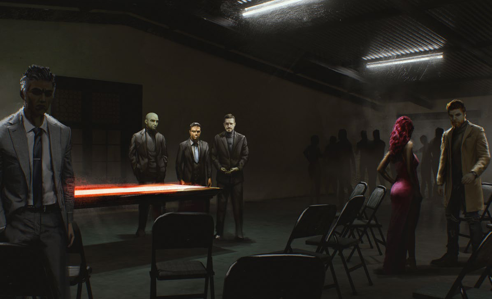

the realm of possibility. Rusk leaves with the Venetian 
Jar and gets in the back of an expensive Audi. His driver 
takes them toward Maxvorstadt where Rusk havens. If the 
characters have a vehicle or a means of keeping watch on 
Rusk’s vehicle, they can tail him with a Wits + Drive roll 
(Difficulty 4) or a substitution of an applicable Attribute 
+ Skill (Difficult 4).

which, per his dossier, is only eight blocks from his apartment. 
He drinks until 12:30 AM, after which he walks home.

Tall and lithe, Hildebrant is in excellent shape with 
muscles plugging the sleeves of his too-small gray business 
suit. Personable and aware of current events, Hildebrant 
is an excellent conversationalist and quite easy to like. He 
uses the “Police and Wayward Muscle” traits listed on p. 
XX, though he is not armed.

Otherwise, they can ambush him before he leaves 
the warehouse and the industrial park. The characters can 
then deal with Rusk as they see fit, stealing the Venetian 
Jar in the process. This will put a strain on any future 
relations with the Cult of Mithras, and if executed too 
vociferously, will draw police attention.

Coterie Options

Manipulation: The simplest solution for the characters 
is to seduce him at the bar with a Charisma + Persuasion 
roll (Difficulty 2) or a successful Manipulation + Subterfuge 
roll (Difficulty 3). Note if Hildebrant has been drinking for 
more than an hour, Difficulty rolls against him decrease by 1. 
Regardless, successful rolls convince Hildebrant to take the 
player character home with him, after which the characters 
may ambush Hildebrant at his apartment or en route.

Theft: A final option for the characters is to steal the 
Jar from Rusk unbeknownst to him from the trunk of the 
Audi, either through lock-picking the trunk or through 
some other, supernatural means. This can be achieved 
with a Wits + Larceny roll (Difficulty 4).

Approaching 

Günter Hildebrant

Combat: If the characters choose to ambush Hilde­
brant en route to his apartment, they may choose to act 
from a position of stealth. Glockenbach is an urban neigh­
borhood, but there are enough corners to provide suitable 
cover, and it’s late enough in the evening to lessen general 
foot traffic. A successful Dexterity + Stealth roll (Difficulty 
3) allows for one free surprise attack, which grants a com­
bat challenge against a static Difficulty 1.

Whether during or after the auction, the characters need 
to murder Hildebrant. He is at work at the Leon Group until 
10:00 PM. Afterward, a short cab ride delivers him to Zum Wolf

2 4 0

chapter eight: styx and bones
chapter eight: styx and bones

As an alternative, the characters may wish to break into 
Hildebrant’s apartment and lie in wait for him. An Intelli­
gence + Larceny roll (Difficulty 4) secures entry into the domi­
cile. Afterward, they may use the stealth roll listed above.

A disembodied shriek starts soft, but grows louder and 
louder until the cry is deafening. The candles burn more 
brightly and the body reels, erupting in spasms and a deep, 
garbled gasp. Latching onto the characters, the body of 
Hildebrant awakens. And while his face might be that of a 
man, the strength of his grip is an elder’s. The sanctuary goes 
silent. Mother Anja rings a hand bell, and on command, three 
nude mortals enter the pool. Like a freshly Embraced neonate, 
Constancia descends on the trio with violent abandon. Once 
satiated, the Priestess of Bones collapses into slumber.

The Ritual

The characters need to transport both the body and 
the Venetian Jar to the Hecata temple in Au-Haidhausen. 
Once near the property, Mother Anja dispatches ghouls 
to bring the body and jar inside. Within the Gothic 
church, they’re given time to rest, freshen up, and chat 
until 1:00AM, at which point the characters descend once 
again into the basement. Staff have removed the extra 
tables from the dinner, but the empty head table remains. 
Massive, carved wooden valves folded like French doors 
reveal an inner sanctuary beyond the space used as a 
dining hall.

While Mora tends to Constancia, Mother Anja 
Giovanni pulls the coterie aside to thank them for their 
efforts. She grants each of them a minor boon and free 
access to the Hecata temple for as long as they remain 
in Munich. The characters can then rest for the evening, 
having accomplished something rare and wonderful for 
the Clan of Death.

Chapter Two: 

Grave Digging

The Hecata sanctuary is a large marble room with 
a circular pool. Dimly lit by candle, the water appears 
black. The floors, walls, and ceiling glow bronze. The 
pungent smell of myrrh, mugwort, and wormwood wafts 
from braziers. Mother Anja and Mora stand next to the 
pool, waiting for the characters.

After the ceremony, the characters have a few nights 
to acclimate themselves to Munich if they’ve come from 
out of town, or meet with existing associates if they are 
residents of the domain. The following are locations Sto­
rytellers can use for additional side and sub plots.

Mora, skin covered in a thin film of dirt and holding 
the Venetian Jar in their hands, instructs the characters 
to stand in a circle. The Death Seer removes the lid before 
biting into their wrist, allowing the blood to flow freely 
into the jar. They instruct the coterie to do the same. Af­
ter all of the characters have bled, the Death Seer begins 
the ceremony. Mother Anja, Mora, and the coterie divest 
themselves of the bulk of their clothing before picking up 
the corpse of Günter Hildebrant and stepping into the 
pool. The body floats on the fingertips of the coterie as 
they encircle it.

Exploring the City

THE ANGEL OF PEACE

Situated in Maximilian Park on the eastern side 
of the Isar, the Friedensengel is a public fountain and 
overlook. It includes a thirty-eight-meter high Corinthi­
an style column, atop which stands a six meter angelic 
statue. The sects use this area as a neutral meeting place, 
especially between the Camarilla who control the western 
side of the Isar and the Anarchs who claim the east.

“I am the end and the beginning.” Mora raises the 
Venetian Jar toward the sigil inscribed on a ceiling dome 
above. “We reach beyond the Veil. We cast our net into 
the seas of the Underworld. We plead with the Tempest 
to deliver unto us one who is lost. We ask for Constancia, 
Priestess of Bones and childe of Japheth. We demand her 
freedom. We demand her memory. For we are Hecata. We 
are the beginning and the end. We remain. We remain. 
We remain.”

THE FIELD MARSHAL’S HALL

The Feldherrnhalle is a monument in Munich situat­
ed on a central square known as the Odeonsplatz. Com­
missioned in 1841 by King Ludwig I, it includes a pair 
of lion statues designed by Wilhelm von Rümann. The 
lions mimic the Medici lions of the Loggia dei Lanzi, and 
according to rumor, Clan Tremere has somehow devised a 
method of spying through a statue’s eyes.

Mother Anja, standing opposite Mora, looks to the 
coterie to provide the chorus response with her. “We 
remain.”

Mora moves with alacrity, reaching high into the air 
and snatching something invisible before slamming the 
flat of their hand onto Hildebrant’s chest above his heart. 
Then, they take the Venetian Jar and pour the collection 
of blood down the cadaver’s throat.

THE GLYPTOTHEK

Envisioned as a “German Athens,” the Glyptothek is 
the oldest public museum in Munich with exhibits from

2 41
2 41

CULTS OF THE BLOOD GODS

Coterie Havens: If any of the 
player characters are native to Mu­
nich or have the means of purchas­
ing a haven, the characters can stay 
there during the day.

the Archaic, Classical, Hellenistic, 
and Roman periods. Among the most 
famous pieces are busts of Dicta­
tor Sulla, and Emperors Augustus, 
Caligula, and Nero. Not surprisingly, 
the Glyptothek is within Toreador 
territory. The clan uses the museum 
for entertaining foreign dignitaries.

seeking to use the university must 
first speak with (and compensate) the 
Turkish Tremere.

Permanent

Lodgings

Public Space: Munich has 
numerous parks and cemeteries, not 
to mention public spaces for vans, 
shelters, and churches. This is risky, as 
pedestrians and vagrants may notice 
characters making use of the envi­
rons, but it remains an option.

THE ROYAL BREWERY

Hotel / Motel: Munich has 
plenty of hotels of various shapes, 
sizes, and price ranges. With a simple 
Intelligence + Security roll (Difficulty 
2) or an Intelligence + Streetwise roll 
(Difficulty 2), the characters should 
be able to locate a suitable place 
to rest for the day, and acquire the 
necessary materials to safeguard it 
during daylight hours.

Also known as the Staatliches 
Hofbräuhaus in München, the Bavar­
ian government owns the brewery. 
It is one of the oldest beer halls in 
Munich made famous by the Bavarian 
Beer Purity Law of 1516, which de­
creed the brewing process could only 
use natural ingredients. Hofbräuhaus 
gained world-wide renown in the 
aftermath of World War II. Today 
Hofbräuhaus exports their product 
all over the world, and its franchises 
include individual breweries on five 
of the seven continents. The Anarch 
Movement lays claim to the Hof­
bräuhaus and use it for their own 
purposes.

The First 

Nightmare

Days pass as the characters so­
lidify their holdings and get to know 
the city. On the third day after the 
resurrection of Constancia, the cote­
rie has a vision while they sleep. The 
nightmare is communal with each 
experiencing the same event.

The Hecata Temple: If the char­
acters so desire, they can take Mother 
Anja up on her offer and stay inside 
the Hecata Temple. The building is 
large enough to grant each character 
a small dormitory, but is somewhat 
lacking in terms of privacy.

THE MMA CLUB

NIGHTLY GRIND
In addition to their personal agendas, most Kindred spend their nights 
feeding, patrolling territory, and acquiring information on their friends 
and enemies. Storytellers can combine the locations in Exploring the City 
with these nightly activities so player characters can experience vampire 
existence in Munich. Note that events like patrolling are primarily for 
Kindred from Munich, though a coterie looking to impress the Camarilla 
might offer their services.
Feeding: With 1.5 million people, Munich has no shortage of feeding 
opportunities. Whether pursuing animals or humans, most urban hunting 
utilizes a basic Wits + Investigation roll (Difficulty 2) or a Wits + Animal 
Ken roll (Difficulty 2). 
Patrolling: Anarch territories to the east and Camarilla territories on the 
western side of the Isar flank the Hecata temple in Au-Haidhausen. The 
Hecata patrol this area nightly to identify potential threats. Most patrolling 
requires a Wits + Streetwise roll (Difficulty 3) or an Intelligence + Investi­
gation roll (Difficulty 3). SPCs may discover characters venturing into sect 
territories using these same rolls.
Gathering Intelligence: With agents of the Camarilla, Anarch Move­
ment, and independent parties conducting business throughout Munich, 
the characters can involve themselves in ongoing events. Some of these 
may require diplomacy while others may demand maneuvers that are 
more clandestine. Social introductions use a Manipulation + Etiquette roll 
(Difficulty 2), while spying and surveillance requires a successful Wits + 
Stealth roll (Difficulty 3).

The Mixed Munich Arts 
nightclub is located in a former 
power plant built during the 1930s. 
Located in Maxvorstadt, the main 
boiler hall has transformed into a 
dance floor with twenty-one-meter 
high walls and a space of 460 square 
meters. Since most of the facility 
is underground, the site provides a 
rough, dark atmosphere and features 
DJs from around the world. Young 
Kindred flock to the club as a prime 
feeding ground.

THE LUDWIG MAXIMILIAN 
UNIVERSITY OF MUNICH

Also referred to as LMU, the 
university has fifty thousand stu­
dents, twenty individual facilities, 
and an operating budget of 1.7 billion 
Euros. Considered one of the most 
prestigious universities in Germany, 
as of 2018 it has produced 42 Nobel 
laureates. Seneschal Mehmet Sumal 
has placed the Tremere chantry some­
where within the university. All those

2 4 2

chapter eight: styx and bones

Prince, though his tone warns of forceful 
arrest if they don’t accept.

Seated behind her in a back 
booth are Seneschal Mehmet Sumal 
and Herald Pearl. While the Herald 
takes handwritten notes, the ol­
ive-skinned Tremere eyes the coterie 
and worries a large gold coin in his 
hand.

Pervasive cold numbs your limbs. 
In the darkness, you pass through a 
snowy park and approach a gazebo-
like structure that appears Chinese in 
inspiration. Footfalls on snow make 
chomping sounds as you reach the first of 
five stories. You climb a spiral staircase 
to the upper levels and pass open air 
balconies, one built on top of the other 
to form a tower. Each step brings you 
closer to your intended prey. The smell of 
flesh and blood assaults your nostrils as 
he finally comes into view — a wealthy 
man with sandy blonde hair wearing a 
long wool coat leans against the balcony. 
He takes a long drag from a cigarette 
while he scrolls through a news feed on 
his phone.

If the characters attempt to flee, 
they’ll quickly find themselves out­
numbered and outgunned. The posse 
has orders to bring the characters in 
alive but are accustomed to violence 
and will use it if necessary. If the 
characters are at the Hecata temple, 
Mother Anja objects to this harass­
ment before ultimately permitting 
their arrest. She advises the coterie to 
report to her immediately after their 
conversation with the Prince.

Prince Eisenstadt lifts her head 
from some paperwork. After taking 
her time memorizing each of the 
characters’ faces, she nods. “Introduce 
yourselves.” She listens to their intro­
ductions without reaction or inter­
ruption. “Once upon a time, Kindred 
ruled the land seizing whatever they 
desired, fashioning their personal 
reality, and killing any who stood in 
their way. We were all blood gods. 
That was until ten years ago.

Agents of the Sheriff thoroughly 
search them with a security wand 
and pat-down. They confiscate any 
weapons, metallic items, or electrical 
devices, putting them in a duffle bag 
before shoving each character into 
an unobtrusive white van. For any 
character who may be keeping an eye 
on where security takes their posses­
sions, the duffle bag leaves with an 
agent taking a separate vehicle.

From surprise you strike, snatching 
one hand and twisting it hard. Bones 
and sinew snap as he yells in pain, drops 
his phone, and reels in horror. Before he 
realizes the true danger, his own shadow 
snakes around his throat, waistline, and 
free hand. He struggles against your 
attack, but lacks the immortal strength 
of a being such as you. Your fangs extend, 
and you bite hard into his throat. You 
gorge yourself on hot blood.

“The Second Inquisition gutted 
this city. The few of us who survived 
did so because of two things. Do you 
know what they are?” Not a rhetori­
cal question, she waits to see if any of 
the characters give it a guess. Regard­
less of silence or an answer, she says, 
“Caution and restraint.”

The Storyteller can use their dis­
cretion to determine if a character has 
the means of keeping track of their 
things. If so, the second vehicle drives 
in a different direction and parks 
in a random lot nowhere near the 
characters’ destination — Hänsel und 
Gretel, a restaurant in Isarvorstadt.

Eisenstadt opens a folder. Inside 
are photographs she spins around and 
slides to the far side of the table so 
the coterie can see. “Therefore, I will 
not abide acts like these.”

As the man’s heart slows, he goes 
limp. He’s powerless to stop you as you 
use the shadows to pull stretching flesh 
and bone. You tear a single arm from its 
socket, thrilling at the sound of ripping 
flesh and wrenching muscles. With his 
one arm in your hand, you toss the corpse 
from the tower and smile when it lands 
in the snow with a crunchy thud.

The series of photographs depict 
a dead man dressed in a long wool 
coat lying like a rag doll in red snow. 
He has a deep gash running through 
his neck as if someone tried to tear 
his head off. His left arm is broken 
at the wrist. He’s missing his right. 
The crime photos are graphic — 
taken during the day — and reflect 
the shared dream experienced by 
the characters. “His name is Stefan 
Schaumann, a public prosecutor. 
Someone killed him early this morn­
ing outside the Chinese Tower in 
English Garden. His arm was used to 
write this....”

Once inside the restaurant, 
Röhrich delivers them to a large back 
room. With polished stone floors, 
marble tables, and black and white 
drawings lining the wall depicting 
scenes from various tales of the Broth­
ers Grimm, the room is cold and un­
inviting. In addition to several armed 
ghouls, Ursula Eisenstadt, Prince of 
Munich, sits at one of the tables. She’s 
of average height and build, dressed in 
navy slacks, a sleeveless silver blouse, 
and matching flats. Her auburn hair 
is styled short with a blunt cut, which 
enhances her sharp features and hazel 
eyes. On her left arm is a sleeve tattoo 
stretching from her wrist to her shoul­
der. Vivid and imaginative, its lacy 
web traps different flying creatures, 
some mythological and others real.

Under Arrest

Suddenly, the coterie awakens 
from their nightmare to an uninvited 
guest. Whether havening on their own 
or housed at the Hecata temple, a dozen 
armed men are there. They’re dressed in 
business attire and are lead by Ger­
hard Röhrich, the Nosferatu Sheriff of 
Munich. With a shaved head and square 
features, he’s dressed in black tactical 
gear and armed with a holstered pistol. 
Röhrich invites the coterie to meet the

Eisenstadt shows another photo 
with the Hecata symbol drawn with 
blood in the snow. Schaumann’s 
severed arm is also in the photograph 
in its own small pool of melty red as

2 4 3

CULTS OF THE BLOOD GODS

Threats 

and Rumors

Clan Advice

if tossed haphazardly after use. The 
Prince of Munich gives the coterie a 
hard look. “If I believed you did this, 
you’d already be stacked like cord­
wood and set on fire. But clearly, this 
is one of yours at work or someone 
who wants me to think it is. So, I’m 
officially making this your problem. 
You’re going to find out who did 
this and bring the person or persons 
responsible to me. You will do this, 
and I will continue to believe the 
Hecata are worthy guests within my 
city. Otherwise, I will take no chances 
to rid myself of the issue. In this, 
Röhrich speaks with my voice. Now, 
get out.”

The characters are likely to reach 
out to their Hecata superiors for 
guidance. They may choose to keep 
their shared vision a secret as well as 
the threats against their Touchstones, 
but news of the English Garden mur­
der spreads quickly throughout the 
Kindred community of Munich. Most 
of the Hecata respond to inquiries 
with concern. Typical responses are 
as follows:

Over the course of Chapter 
Two, at any point after their meeting 
with the Prince until Chapter Three, 
a couple characters’ Touchstones 
reach out to them. Unknown parties 
are harassing and threatening them. 
While these attacks escalate in subse­
quent chapters, examples include:

• 	
Four bullets found outside the 
home of the Touchstone.

Mother Anja: “I find it difficult 
to believe our family is responsible 
for this, but I agree with the Prince. 
We need to look into this for our 
own security. Best to do that without 
the prying eyes of the Camarilla. You 
have whatever support I can muster 
to see it through. In the meantime, 
I will develop an exit strategy in 
case the Prince makes good on her 
threats.” Mother Anja exhales a 
thoughtful sigh. “I would advise you 
to investigate the victim. Perhaps a 
Kindred held some grudge against

• 	
Someone calling the Touchstone 
at odd hours and hanging up.

After the characters leave Hänsel 
und Gretel, they get into the van 
again and are driven to the parking 
lot with the second vehicle so the 
Sheriff’s agents can reunite them with 
their possessions. The vehicles depart 
leaving the coterie to find their own 
way home.

• 	
Dead flowers delivered to the 
Touchstone’s place of work with­
out a card attached.

• 	
The Touchstone worried some­
one has been following them 
during the day.

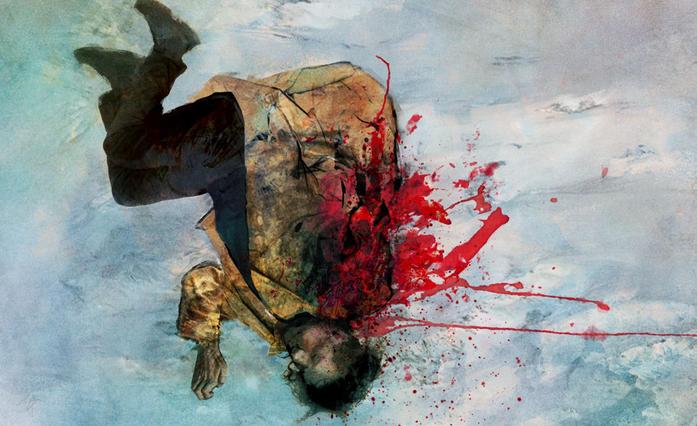

chapter eight: styx and bones

him, or perhaps someone holds a grudge against us. There 
must be a reason for this particular act. Why this Schau­
mann and not someone else? Munich is not accustomed 
to grisly murder. So time, as always, is not on our side.”

open-air stories, ranging in roof diameter from nineteen 
meters at the bottom to six meters at the top. The Chi­
nese Tower stands on the southern portion of the English 
Garden currently closed off by police tape. Blood stains 
still coat the snow, situated in front of the tower, and on 
the second story balcony from which the murderer hurled 
Schaumann.

Mora: The enigmatic Death Seer is in the Hecata 
temple. “I had the same vision you did. We are connected. 
Them, thee, and me. We used our blood to reach into the 
Underworld. It is not impossible when we rescued Con­
stancia… that something else used the gateway as well. 
Something that moves and acts as a Kindred with full 
access to our particular gifts. Perhaps a spectre, possessed 
of a burning rage seeking to unleash its wrath on some 
soul or souls. A vendetta, born of some grudge. So you 
must find this victim, this Stefan Schaumann, and learn 
everything you can about him. You find his crime and you 
may yet find his adversary.”

While there are no security cameras or witnesses, if 
the characters have access to Auspex or are able to commu­
nicate with animals via Animalism, they may discover the 
assailant appeared as a moving, humanoid shadow. Roughly 
six feet tall with four splayed shadowy arms, the figure 
clearly had access to Oblivion, the Discipline most often 
associated with the Lasombra and the Hecata. Calculating 
anger fueled the attacker. Driven by a need to cleanse and 
purify, it attacked Schaumann on the balcony, broke his 
left wrist, fed from his neck, and then tore off his arm. It 
then tossed the body onto the snow below before using 
the arm to draw the Hecata symbol in blood. Investigating 
Schaumann’s body at the morgue confirms this, but also 
reveals an estimated time of death between 3:00 AM and 
4:00 AM. Characters who possess any level of the Occult 
skill know this as the classic “Witching Hour.”

Asano: Asano is not present in the Hecata temple, 
and is not available for conversation or advice.

Constancia: Books surround the shell of Günter 
Hildebrant. The ancient vampire occupying his body 
smiles at the coterie, beckoning them inside. The Priest­
ess of Bones is slow to move and speak as she remembers 
how. While Constancia has no knowledge of the Schau­
mann murders, she can answer certain broad questions. 
“Everything is so strange. Familiar and yet…not? I remem­
ber fragments from my life so long ago. My sire, Japheth. 
My childer, Ambrogino and the one calling himself ‘de 
Camden.’ Augustus and his betrayal. I remember almost 
nothing of how I died or the Tempest, save shards of… it 
is difficult to describe. Like a song when you only know 
the melody and chorus. To know each and every one of 
them, sharing in their pain and they so very aware of 
mine. Connected and terrible. But this world! This new 
world. This new age so full of magic and wonder and awe. 
Mora has begun to illuminate me but it is all so over­
whelming. So much history. So much death and destruc­
tion. To have once been so powerful and now so small. So 
fragile. Lost in the voices.” The elder becomes distracted, 
returning to her books.

Through their own contacts or by way of allies inside 
the Munich police, the characters can gain access to Stefan 
Schaumann’s body and home address. He is thirty-nine years 
old, single, and living alone in an apartment in Schwabing. 
He was born in Frankfurt and studied legal theory at Julius 
Maximilian University of Würzburg. He completed his state 
examinations with the highest possible marks, for which 
he was awarded a Doctor of Law from the University of 
Würzburg in 2013. As a prosecutor for the city of Munich, 
he mostly handled non-violent financial crimes and earned 
a decent conviction record in the process. His most nota­
ble convictions include a pollution case against Endron, 
price-fixing against a pharmaceutical company, and financial 
crimes against day traders on the Frankfurt Stock Exchange. 
He was not religious, nor was he ever married. Puzzlingly, he 
comes off as rather unremarkable.

Storytellers can button the end of Chapter Two with 
an initial round of threats against the Touchstones of the 
characters or with additional acts of intimidation against 
them.

Investigating 

the First Attack

Chapter Three: 

The Price We Pay

The characters can investigate the murder at the Chi­
nese Tower in English Garden through different means. 
Either through police contacts, through allies at the city 
morgue, or by traveling to the site itself, the characters 
can learn about Stefan Schaumann.

The Chinesischer Turm, or “Chinese Tower,” is a 
twenty-five-meter high wooden structure constructed 
during the late eighteenth century. The tower has five

The next day, while the characters sleep, they have a sec­
ond vision. The nightmare is again in concert with each 
experiencing the same event.

2 4 5

CULTS OF THE BLOOD GODS

The Second 

Nightmare

Investigating the 
Second Attack

or in addition, they can speak with 
their fellow Hecata.

Mother Anja: If given a descrip­
tion of these violent events, Mother 
Anja responds immediately. “You’re 
describing Nordfriedhof. A cemetery 
in Schwabing-Freimann. Go! Now! 
Before it’s too late.”

Situated in the suburb of 
Schwabing-Freimann, Nordfriedhof, 
“the Northern Cemetery,” has 34,000 
burial plots and is marked as the larg­
est cemetery in Munich. In addition 
to the graves, the site houses a chapel, 
a mortuary, and a sixty-year-old 
columbarium.

A branch snaps under your foot. 
Out of a dense forest, tombstones and 
sepulchers emerge. They line a path 
dotted with stone crosses and angelic 
statues. You come to a building with 
a gated arch. Above the entrance, the 
phrase “Die Liebe hoeret nimmer auf” 
reminds visitors to the columbarium that 
love never stops loving. On the front steps 
of the memorial building, a pair of young 
lovers sit intertwined, bundled against 
the cold.

Mora: If the characters are at the 
Hecata temple, the Death Seer seeks 
them out. “I know. There has been 
another. I recognize the site as the 
Northern Cemetery. But the timing 
of it is suspicious. The attacks happen 
early in the morning, but we are only 
experiencing them while we sleep 
during the day. It is a kind of after­
shock or phantom memory, I think. 
But that also means we are twelve 
hours behind these attacks. I must 
take time to think on this.”

Arriving on the scene, the 
characters find several ghouls, dressed 
in casual jeans and winter coats, 
stationed around the building. While 
they are unfamiliar, they make no 
effort to bar the characters from 
entry into the area. Beyond them is 
the murder scene, complete with two 
fresh corpses and the symbol of the 
Hecata drawn in blood on the con­
crete in front of the entrance. Stand­
ing over the two bodies is Terrence 
Rusk with his hands shoved into the 
pockets of his long wool coat.

You crouch low to feel their heat 
and smell their blood. Hunger growls 
from within as you prepare to pounce. 
Patiently, you stalk your prey, allowing 
the two to continue their embrace while 
you blanket the area in darkness so thick 
it blocks the light from the moon and 
stars above. As they kiss and paw at each 
other, you slip your shadows around 
them like you’ve gifted each of them with 
an extra set of hands.

Asano: Asano is still not present 
in the Hecata temple and is not avail­
able for conversation or advice.

Constancia: The newly resur­
rected elder is in her room. As she 
grows accustomed to utilizing a man’s 
body, Constancia chooses different 
men’s garments from a rolling rack. 
She tries on a sport coat and smooths 
the lapels as she admires herself in 
a mirror. Attempts to ask her about 
the murders result in easy laughter. 
She teases the coterie about their soft 
hearts and queasy stomachs. “What 
have we become? When have we 
ever done the bidding of a Camarilla 
Prince? Foolish babies, you do not see 
what we can make of this.”

It’s possible the characters killed 
Terrence during their robbery in 
Chapter One. If this is the case, an­
other member of the Cult of Mithras, 
Anna Fleischer, can replace Rusk. But 
assuming Rusk survived, the Cult of 
Mithras will be surprisingly forgiving.

Slowly, you squeeze. Their heaving 
breathes become gasps under the strain. 
Then, violently you pull them apart from 
each other. They scream as you lift both 
high. Their feet scramble against air. Your 
first cut lacerates the man’s throat. The 
girl cries out in choked wails. With blood 
spraying across the columbarium gate, 
you bring the boy down hard, snapping 
bones in the process. Your second cut 
serrates the girl’s leg and side. More 
blood leaks from her onto the snow like 
a broken faucet, and as your shadows 
tighten around her throat, she too goes 
limp. You toss her next to her lover before 
your shadow arm — coated in blood — 
draws something on the concrete.

“Our time is limited,” notes the 
Ventrue. “We’ve delayed the author­
ities, but we must proceed quickly. 
I’ve already done my preliminary 
investigation. I suggest you do the 
same. Afterward, we can compare 
notes. The cemetery doesn’t get many 
visitors in the winter but my men 
won’t be able to hold pedestrians off 
for long.”

She remains unaffected by recent 
events, but if the coterie continues 
to question her, she’ll ask insistent 
questions of them about modern liv­
ing and technology. If there are men 
in the group, she’ll press them about 
how to be a man in the 21st century. 
Constancia is more interested in her 
own new existence than any issue 
facing the Hecata.

If the characters investigate, 
they recognize the two corpses killed 
outside the columbarium. The first 
is a young male in his twenties with 
shoulder-length brown hair. In his 
wallet, his identification marks him 
as Finn Laubenstein, a guitar instruc­
tor at MGI München. In addition to 
several broken limbs, he died from a

When the characters awaken, 
they realize a second attack has taken 
place. If they’re familiar with Mu­
nich, they may recognize the colum­
barium as belonging to Nordfriedhof 
(the Northern Cemetery). Otherwise,

2 4 6

chapter eight: styx and bones

single claw strike to his throat which 
lacerated his carotid artery and tra­
chea. Information on the girl is more 
difficult to come by. Player characters 
will need to find her purse, which 
she lost while she was kicking and 
screaming in the air.

been called on my employees. We 
need to go. Come with me.”

provided in this scene, but it won’t 
come from Rusk.

Otherwise, Terrence Rusk 
escorts the party out of the cemetery 
and into several models of Audi ve­
hicles. The caravan travels northwest 
into the district of Milbertshofen-Am 
Hart where they arrive at a small es­
tate. What Rusk refers to as a modest 
meeting place is, in actuality, a four 
hundred square meter piece of real 
estate worth several million Euros. 
Iron fences surround the two-story 
Neoclassical structure.

Getting to Know 
the Cult of Mithras

If they find it, they’ll identify 
her as Hannah Hagen, a nineteen-
year-old student at MGI München. 
She has a deep gouge, made by a claw, 
running along her side and into her 
leg. The attack shattered sections 
of her ribcage and cut her femoral 
artery on the inside of her thigh.

The section following assumes 
Rusk lived through his encounter 
with the coterie. If he did not, please 
reference the sidebar entitled: Rusk’s 
Murder

It’s likely the characters will not 
leave with Rusk because it seems like a 
trap. In a way, it is. Kindred have long 
memories, and eventually, Rusk will 
get his revenge. However, his priority 
is getting the Venetian Jar for the Cult 
of Mithras. He’s not prideful enough 
to have the treatment he received 
from the coterie stand in his way. He 
does his best to reassure them they are 
on the same team despite their first 
encounter, insisting Kindred existence 
doesn’t come without some risks, and 
he is no stranger to “awkward first 
impressions.” Mutual threats make 
strange bedfellows.

“Forgive the drive.” Rusk leads 
them inside. “We needed someplace 
we could talk privately, and this 
estate belongs to my family. We use 
it to entertain guests. And please, do 
not fear me. I have great respect for 
the Hecata, as my Pater, Lord Roger 
de Camden, is one of the most honor­
able Kindred I know.”

Once again, Auspex, Animalism, 
or other Disciplines may help piece 
together what occurred. As the area 
darkened under some supernatural 
power, shadows grappled the pair. 
The figure then attacked the two lov­
ers and sliced into them with clawed 
fingers resembling Protean claws. 
Spirit’s Touch highlights rage similar 
to that at the previous murder scene 
as well as the need to purify.

The interior is as stately as 
the exterior with clean white walls 
and vaulted ceilings. Rusk leads 
the way, taking them through the 
main portion of the home to a set 
of glass doors leading outside. They 
step onto an impressive veranda 
overlooking a meticulously planned 
garden blanketed in snow.

Through various social media 
applications, police allies, or general 
contacts, a successful Wits + Investiga­
tion roll (Difficulty 2) or an Intelli­
gence + Technology roll (Difficulty 3) 
reveals few clues. Finn Laubenstein 
was born and raised in Munich and 
has an apartment in Schwabing-West. 
He studied music at the Academy of 
Music and Performing Arts where 
he graduated with honors. Shortly 
thereafter, he began teaching at MGI 
München. Hannah Hagen is one of his 
students and according to social me­
dia, the two have been dating for three 
months. Hannah’s family is originally 
from Berlin but moved to Munich 
when she was twelve. She maintains an 
apartment near MGI München while 
her family lives in Trudering-Riem. 
Neither appears to have any overt 
connection to Stefan Schaumann, and 
for reference, the Nordfriedhof colum­
barium is four kilometers north of the 
Chinese Tower.

If the characters still refuse 
to leave with him, he departs the 
cemetery leaving the coterie at the 
columbarium. At the Storyteller’s 
discretion, the coterie may have other 
means of discovering the information

A statue stands in the center of 
each winter flower bed, and any Ventrue 
in the party will immediately recognize

RUSK’S MURDER
Anna Fleischer is the Cult of Mithras’ investigator into the murder of Rusk, 
and she has the coterie on her primary suspects list. Her demeanor and 
conversation should attempt to lure the characters into a false sense of 
security so they join her at the Cult of Mithras estate. She speaks as if Rusk 
is still alive making it seem as if no one is aware of his demise. 
Like Rusk, she is interested in the acquisition of the Venetian Jar. Therefore, 
she understands she can’t spook the coterie. She also wants to use the 
characters to find out who is committing the murders. So, her answers are 
similar to Rusk’s if they choose to join her. 
The Storyteller is encouraged to use Anna’s motivation as a subplot 
consequence of the player characters’ handling of Rusk. After she has 
obtained her primary objectives of acquiring the Venetian Jar and stop­
ping whoever is threatening the masquerade in Munich, she uses any 
evidence she’s collected about his murder to push for the Prince to punish 
the Hecata with prejudice.

The Ventrue’s phone chirps, 
prompting a frown. “The police have

2 4 7

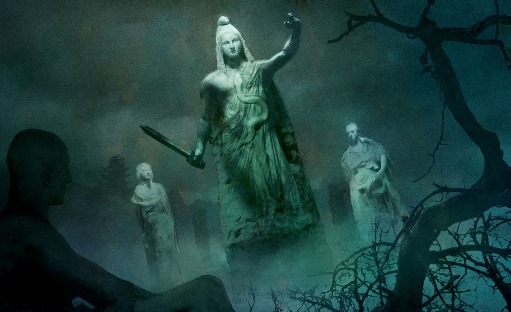

HOW DID YOU LEARN ABOUT THE ATTACK IN 
THE CEMETERY?

the figures sculpted from the marble. They include the elegant 
Anne Bowesley, the Duke and Duchess of Amber, Jan Pieterzo­
on, Julia Antasia, and both Hardestadt the Elder and Younger. 
The hands of masters most likely found among the Torea­
dor exquisitely carved these exalted Kindred. They all face a 
dominating central figure, classically handsome with shoul­
der-length hair. Even the non-Ventrue among the characters 
may recognize him as Mithras, the former Prince of London.

Rusk: “The Venetian Jar is used to resurrect the dead. 
When it ended up in the hands of the Hecata, I assumed you 
would use it in a cemetery somewhere. I’ve had my people 
monitor every one of them in Munich. They found the two 
bodies and kept the crime scene hidden long enough for me to 
investigate. You arrived shortly thereafter.”

Following are potential questions for Rusk and his answers:

WHAT DO YOU KNOW ABOUT THE VENETIAN 
JAR?

WHO ARE YOU?

Rusk: “I am Terrence Rusk. I represent the Cult of 
Mithras in Munich. As their Perses, I am their defender, 
empowered to act on their behalf.”

Rusk: “It was a tool used by Augustus Giovanni to raise 
the departed. According to legend, he used it to communicate 
with those Kindred who passed beyond the veil. In truth I’ve 
never seen it used before.”

WHAT IS THE CULT OF MITHRAS?

WHY DO YOU WANT THE VENETIAN JAR?

Rusk: “Mithras was the Prince of London, God-Emperor 
and Unconquered Sun. One of the most longstanding sovereigns 
in our history. He believed in unity, and we follow his laws to 
preserve unity.”

Rusk: “To search for Mithras, of course. Or one of his 
early disciples. Imagine what we could learn from history. 
What wisdom we might glean. The Venetian Jar you… 
acquired… is of great value to me and mine.”

WHAT ABOUT WHAT WE DID TO YOU EARLIER 
(ASSUMING THE CHARACTERS ROBBED OR 
HURT RUSK IN CHAPTER ONE)?

WHO DO YOU THINK IS RESPONSIBLE FOR 
THESE KILLINGS?

Rusk: “Make no mistake. You owe a debt to the Cult of 
Mithras for your transgression. But I am willing to put that aside 
for the moment. Neither of us can afford a killer running loose in 
the city. We deal with this. And then we will come to terms.”

Rusk: “At first, I assumed it was you. The killings began 
shortly after you obtained the jar. And given the Hecata symbol 
painted at each of the sites… I’m still not entirely convinced 
one of you isn’t responsible. But the fact that you are here, you

2 4 8

chapter eight: styx and bones

•	
Munich police arrest a Touchstone for possession of 
drugs in their home or workplace.

came to the site and Prince Eisenstadt doesn’t yet hold you 
personally responsible, I suspect someone else is at work here. 
Personally, I think you used the jar, and in doing whatever it is 
you did, unleashed something on the world. A ghost, or a Risen, 
or something tied to the Hecata.”

•	
An unseen sniper shoots a Touchstone.

Note, if a Touchstone is hurt or killed, the Storyteller 
should apply a frenzy test when the player character finds 
out. If the Touchstone is hurt, apply Difficulty 3. If the 
Touchstone is murdered, apply Difficulty 4. The Storytell­
er should also apply Stains (see the chart in Vampire: The 
Masquerade, p. 240).

WHAT’S A RISEN?

Rusk: “A ghost trapped in the body of a man. Something 
gone mad from years in the Underworld. Like us, they are cold 
to the touch and cannot eat or drink. But their motivations 
would be alien to us. Like trying to describe the makeup of the 
cosmos to a toddler.”

Depending on the severity of the attacks, the char­
acters may want to check in on their Touchstones or 
look into what’s happening to them. These attacks offer a 
wealth of side plot opportunities, which Storytellers can 
tailor to individual characters. From these investigations 
and encounters, the characters need to learn the descrip­
tions of a German man and woman who are professional 
operatives. The Storyteller can use any consistent descrip­
tion for them, but they are a well-trained team. One acts 
as support while the other is the trigger puller.

WHY DO YOU THINK THE MURDERER HAS 
TARGETED THESE PEOPLE?

Rusk: “A ceremony is at work here. These mortals must 
have significance. Perhaps some ghost or spirit is exacting their 
revenge. Or using their blood to fuel some strategy. What links 
these two attacks? Is there a familial relation? Are they pawns 
of some Kindred? You find out why, and we may yet find out 
whom.”

While Storytellers can tease leads, they should divert 
players from a confrontation that would eliminate this 
team. They need to appear again in Chapter Four.

SO WHAT NOW?

Rusk: “You have a choice. I want the Venetian Jar. You 
give it to me, and I’ll mobilize my substantial resources to help 
you solve this problem. Members of the Cult of Mithras stand 
among the ranks of the Camarilla and the Anarchs. We can 
be a valuable friend to you and yours. We can help you catch 
this killer. Refuse my offer, and you make an enemy of us. You 
decide.”

Chapter Four: 

A Family Affair

The characters’ first option is to accept Rusk’s deal. 
If they do, the Perses gives the coterie twenty-four hours 
to provide the artifact, at which point he will deploy his 
network of spies and assets. The Hecata temple currently 
houses the Venetian Jar. Mora refuses to hand it over, but 
theft of the item is possible, though it no doubt results in 
disciplinary consequences.

The Third and 

Fourth Nightmare

The second option is to refuse. If so, Rusk grows 
angry, calling them foolish. If the characters are itching 
for a fight, Rusk and his ghouls can attack the characters. 
Otherwise, Rusk simply ejects them from the estate.

Hunger moves you along the crushed stone path. In the 
dead of night, the smell of blood compels you forward. You 
trudge through deep snow as you move through a tree-filled 
area. Spikey branches scrape you. Ahead of you, on a cleared 
pathway, an older man walks his tiny dog. Balding, with a pair 
of thick glasses on his nose, the man allows the dog to guide 
him, unaware of the danger stalking him.

Threats and Attacks

In a blink, you close the distance between your hiding 
spot and the man. Your feet don’t touch the ground in a sprint, 
but rather, you simply materialize before him. Your first strike 
severs his right arm. The dog runs in terror. His leash bounces 
behind him as he disappears in the nighttime distance.

The Touchstones of the characters experience a new 
round of attacks. These attacks may vary in terms of 
lethality, but should absolutely escalate from those perpe­
trated in Chapter Two. Examples include:

•	
Someone sets a Touchstone’s home or place of busi­
ness on fire.

The old man howls half in shock and half in pain as you 
tower over him. With blood spurting out of his arm socket in 
rhythmic bursts, a second sweeping blow cuts out the man’s 
legs, sending him sprawling onto the path and screaming for 
help. A third and final blow crushes his throat and ends his life.

•	
Two unknown assailants beat a Touchstone badly 
enough to put them in the hospital.

2 4 9

CULTS OF THE BLOOD GODS

Darkness fills your dream and a 
fourth nightmare emerges.

ging. Tonight, the police have closed 
off the eastern half of the grounds. 
The victim, Leon Hummel, was sixty 
years old. His corpse lies on a mortu­
ary slab in Olympiagelände. Another 
bloody Hecata symbol remains at 
the scene. Interactions via Auspex, 
Animalism, or other Disciplines yield 
similar results to the previous attacks.

like threats against the Masquerade, 
especially given the tenuous agree­
ment he has with Prince Eisenstadt. 
The Gangrel Baron isn’t a reasonable 
person, but if the characters can 
convince him their only purpose is to 
investigate the murder site and they 
pay him, the Baron may be inclined 
to let them off with a warning.

A homeless woman sits on an island 
in the middle of the Isar River. Near the 
edge of the island, with the Deutsches 
Museum behind her and protected by 
several trees, the vagrant sets up a tent. 
She is haggard with oily long hair, a 
worn jacket, and tattered boots. From 
the edge of the water, you emerge. The 
same hunger burns as before. The same 
yearning and desire to purify.

Eastern Munich is under the 
control of the Anarch Movement. If 
the characters want to investigate the 
murder directly, they need to gain 
permission from Baron Straub. Oth­
erwise, they may encounter elements 
of the Movement, none of whom take 
kindly to trespassers. The Anarchs 
aware of the attack in their territory 
and are patrolling their streets with 
care. If the characters enter Bogen­
hausen without permission, one 
possible scenario is for the Anarchs 
to move on the characters before they 
reach Dinniger Anger. Lead by Baron 
Straub, a half dozen Anarchs on mo­
torcycles surround the characters and 
usher them into a deserted alley.

Investigating the 
Fourth Attack

Suddenly, you stand over the tent, 
plunge the scene into darkness, and use 
your shadows to reach inside for her 
ankles. As you drag her into the snow, 
her eyes are wide with terror and her 
mouth opens to scream. You shove your 
clawed hand into her gaping mouth. 
Her flimsy arms flail at you, fighting to 
survive even as she coughs and chokes on 
the blood filling her lungs. Flexing your 
fingers, you tug, removing the woman’s 
jaw from her face.

The German Museum of Mas­
terpieces of Science and Technology 
is the world’s largest science museum 
with 28,000 individual exhibits. Locat­
ed on a small island in the Isar River, 
the museum sits on the border be­
tween Isarvorstadt and Au-Haidhaus­
en. Tonight, the southern portion of 
the island is swarming with police. The 
police have not been able to identify 
the victim. The GSG 10 have moved 
her to Olympiagelände. Communicat­
ing with animals or other supernatural 
means may yield some answers but in 
order to get hands on the bodies the 
characters need to infiltrate the GSG 
10 facility.

Investigating the 
Third Attack

Coterie Options

Munich is not accustomed 
to serial murders and has already 
mobilized in force. By the time the 
characters awaken, GSG 10 have 
already taped off the crime scenes. 
A growing sense of panic in the city 
results in news outlets printing wild 
and outlandish stories. The morbidly 
curious flock to the locations of the 
murders. The GSG 10 collect all five 
bodies and deliver them to their base 
of operations in Olympiagelände. 
Meanwhile, officers continue to 
investigate the crime scenes. The 
characters need to collect their clues 
either through allies, influences, or 
creative solutions.

Combat: If the coterie uses 
violence or physical threats to get 
past the Anarch blockade, they 
have to fight Straub and five others. 
The Anarchs are fully fed and quite 
capable of defending their territory. 
Refer to Straub on p. XX, and use the 
“Peter Bohn, Anarch” statistics for his 
entourage.

Investigating 

GSG 10

Munich hosted the 1972 Olympic 
Games in its eleventh district of Mil­
bertshofen-Am Hart. Olympic Park 
is primarily for public recreation, 
music concerts, and cultural and re­
ligious events. While a vast complex, 
GSG 10 has requisitioned some of 
this land for their use. The GSG 10 fa­
cility is not a single fortress. Instead, 
it’s several individual buildings and 
warehouses interspersed among oth­
ers. This allows the GSG 10 to blend 
in with their surroundings in a busy 
area. There are four buildings in total: 
a command center, barracks, training 
center, and forensics lab.

Bribing: The Anarchs always 
need cash. Straub accepts bribery in 
the form of weapons, boons, or cash, 
though the amount needs to exceed 
two dots of Resources. The character 
loses the dots for the remainder of 
the story.

Manipulation: The characters 
need to win the Anarch over. They 
can accomplish this with a successful 
Charisma + Persuasion roll (Difficulty 
4) or a Manipulation + Intimidation 
roll (Difficulty 5). Straub doesn’t 
like trespassers but he also doesn’t

The site of the third attack is in 
Dinniger Anger, a large green area 
east of the Isar, located in Bogenhaus­
en. While not as popular as English 
Garden or Olympic Park, Dinniger 
Anger is a park for walking and jog­

2 5 0

chapter eight: styx and bones

Coterie Options

the murder site in Dinniger Anger is 
roughly four kilometers east of the 
Chinese Tower, and the Deutsches 
Museum is four kilometers south.

Asano is a shadow of his former 
self. He’s gaunt, ragged, and half mad 
with grief. Having lost his Touch­
stone, Günter Hildebrant, Asano has 
lost his Convictions and some of his 
Humanity. In his anger, he dispatched 
his own ghouls to harass and harm 
the player’s Touchstones. He and his 
entourage shoot to kill. During the 
attack, Asano reveals his connec­
tion to Günter Hildebrant by either 
screaming at one of the characters or 
weeping.

Stealth: A pair of technicians 
are in the forensics lab which has 
a state-of-the-art security system. 
Breaking inside requires a Dexterity 
+ Stealth roll (Difficulty 6) or a Wits 
+ Technology roll (Difficulty 5). From 
there the characters may gain access 
to the bodies of Leon Hummel and 
the unnamed woman.

Manipulation: GSG 10 techni­
cians are not likely to allow access to 
a restricted building, but the char­
acters are certainly welcome to try. 
If executed under the pretense of offi­
cial police business or if coupled with 
some manner of disguise, the coterie 
may achieve entry with an advan­
tageous Charisma + Persuasion roll 
(Difficulty 7) or a successful Manipu­
lation + Intimidation roll (Difficulty 
7). From there, the characters gain 
access to the same information listed 
above.

According to police reports, 
Leon Hummel is a sixty-year-old 
school teacher at Wilhelm-Hausen­
stein gymnasium. Leon had his right 
arm severed by some manner of 
sharp weapon with an elliptical edge. 
His legs suffered superficial wounds 
from a similar weapon, and he had a 
crushed throat. Like the first murder, 
photographs reveal his detached arm 
was the implement used to carve the 
Hecata symbol into the snow, though 
the police mark this down as some 
manner of occult symbol. Leon Hum­
mel is a widower who lived in the 
area for nearly twenty years. He has 
one adult daughter, Helena Hummel, 
who is currently attending the Freie 
Universität Berlin.

Coterie Options

Combat: Asano and his quartet 
are dangerous. The four ghouls use 
the “Police and Wayward Muscle” sta­
tistics listed on p. XX, and are armed 
with heavy pistols and shotguns. They 
all fight to the death or until Asano 
gives the command to stop.

Combat: While not recommend­
ed, the characters can attempt to 
storm the forensics lab through sheer 
force. Security cameras and alarms 
ring as a result, drawing unwanted 
and lethal attention. For while there 
are only two unarmed technicians in­
side the forensics lab, twenty armed 
and highly trained agents can be at 
the lab in two minutes. These officers 
use the “Grenzschutzgruppe 10” sta­
tistics listed on p. XX. Regardless, the 
characters have little time to glean 
the information listed above.

Escape: If the characters are 
on foot, they can escape via Celer­
ity and/or Obfuscate. A successful 
Strength + Athletics roll (Difficulty 
4), a Wits + Stealth roll (Difficulty 4), 
or a Dexterity + Streetwise roll (Diffi­
culty 4) can aid this. If the characters 
are in a vehicle when the ambush 
occurs they should be able to escape 
using back alleys and side streets with 
a successful Dexterity + Drive roll 
(Difficulty 4).

The GSG 10 identified the 
woman as Martina Rittberger, a 
forty-year-old who died shortly after 
having her jaw torn out, causing her 
to asphyxiate on her own blood. Her 
body accompanied a Hecata symbol 
drawn in blood on the ground. Her 
history shows a long history of men­
tal illness. Untreated, she slid into 
indigence and ended up on the street 
by 2016.

If the characters choose the 
stealth option and fail or if they 
aren’t successful in their manipu­
lations, GSG 10 responds with the 
combat scenario.

Manipulation: At this juncture, 
the characters are now suddenly 
aware Günter held some connection 
to Asano, and may try to reason with 
him. Asano is on the warpath and 
hungry for vengeance, but he may 
earn a moment’s pause if he realizes 
how the characters were duped. With 
a Charisma + Persuasion roll (Diffi­
culty 4) or a Manipulation + Intim­
idation roll (Difficulty 4), a success 
allows Asano to call for a cease fire 
and draw a close to Chapter Four.

Asano’s Ambush

After midnight but before 3:00 
AM Hiromitsu Asano ambushes 
the characters. This will likely take 
place outside the Hecata temple, but 
can be anywhere relatively secluded. 
Four ghouls dressed in business attire 
accompany Hiromitsu Asano. Two of 
them are the team noted in Chapter 
Three. These along with two others 
are responsible for the attacks on 
the Touchstones of the characters in 
Chapters Two and Three.

According to the coroner, both 
died sometime between 3:00 AM and 
4:00 AM. Using Spirit’s Touch on 
either body confirms the authenticity 
of the nightmares and reveals the 
same shadowy figure. The four vic­
tims to date, Stefan Schaumann, Finn 
Laubenstein, Hannah Hagen, Leon 
Hummel, and Martina Rittberger do 
not appear to be related or connected 
in any obvious fashion. However,

2 51

CULTS OF THE BLOOD GODS

Chapter Five: 

Rise and Fall

The murderer appears between 3:00 AM and 4:00 
AM and attacks the first living person who comes into 
view. The creature matches the same general shape and 
size of Günter Hildebrant, with constantly moving shad­
ows shrouding him. Constancia, or something pretending 
to be Constancia, powers the mortal frame and has full 
access to the Disciplines of the Hecata.

The file given to them by Mora in Chapter One was cho­
sen deliberately, and in spite of their pledge toward fidel­
ity, the Death Seer used the characters to attack Asano’s 
Touchstone. Unfortunately, both Mora and Constancia 
have fled the Hecata temple. Mother Anja, if made aware 
of what has transpired, grows concerned and grants the 
characters access to Mora’s personal room.

If the characters interrupt the ceremony, the Risen 
turns on the characters, fighting to the death. The Risen’s 
first action is to use their Oblivion Discipline to darken 
the area with Stygian Shroud. Afterward, it makes full 
use of Feral Weapons via Protean, Arms of Ahriman, and 
its basic levels of Celerity, Fortitude, and Potence. The 
battle is vicious and feels more like fighting an animal 
than fellow Kindred. But when the Risen loses their last 
Health level they die. A tortured scream echoes into 
the air as visible wisps of shadow evacuate the body of 
Günter Hildebrant. They float into the wind, transform 
into strings of ash, and disappear.

The Death Seer’s bedroom, normally spartan, has 
scattered clothes, papers, and belongings. Most are be­
nign, but several pages lie on the floor. They include maps 
of Munich, marked in bold red circles. They total five, 
including the four most recent attacks in English Garden, 
Nordfriedhof, Dinniger Anger, and Coal Island. They 
also include a fifth location at Saint Barbara’s Church 
in Schwabing-West. The five, together, form an X cross 
through the city.

Victorious, the coterie needs to vacate the scene 
quickly. The noise of combat has alarmed local residents. 
Asano requests to bury Hildebrant and doesn’t permit the 
characters to hand over the corpse to Prince Eisenstadt. 
As an alternative, the coterie can contact Sheriff Röhrich 
to report to him. Prince Eisenstadt may not appreciate the 
absence of a body but takes the characters at their word, 
offering a cold and polite thank you for their efforts.

Further investigation of Mora’s notes reveals the 
attacks were not targeting the victims, but rather their lo­
cations. By creating an ever-expanding pattern of crosses, 
the Death Seer hoped to create what they refer to in their 
notes as an Oblivion circle. By painting key locations in 
blood, the Death Seer might be able to use their particu­
lar Oblivion gifts on a city-wide scale. Her notes theorize 
the ability to shroud Munich in darkness. Another page 
asserts an exhaustive ceremony would allow the Hecata 
to not only perceive everything occurring within Munich 
but travel instantaneously within the city via Shadow 
Step.

Epilogue: Death is 

Certain, Life is Not

The Munich Waldfriedhof is a woodland cemetery hold­
ing 60,000 graves, and now prepares to house one more. 
Snow falls from a dark, overcast sky as mourners gather. 
Candlelight flickers across Asano’s face as he stands over 
the open grave of Günter Hildebrant. Mother Anja’s ex­
pression is solemn and thoughtful as the body rests beside 
his parents and grandfather, Alexander Hildebrant. Mora 
is not in view.

At this juncture, the characters know where the 
next attack is likely to take place. If Asano is alive, and 
the characters have briefed him on Mora’s culpability, he 
volunteers to assist them in hunting the Death Seer down. 
Furthermore, if the characters handed over the Venetian 
Jar to the Cult of Mithras, Terrence Rusk (or Anna Fleis­
cher) will also be available to assist the coterie.

Preventing the Fifth Attack

“Your grandfather was my dearest friend,” Asano 
says to the departed. “He showed me great kindness in 
a world that held little. He cared for me, and I cared for 
him. After he died, I honored his memory by protecting 
his children, and his children’s children. By protecting 
you.” His voice cracks with emotional, and Asano clears 
his throat.

Saint Barbara’s in Schwabing-West is a quaint Catho­
lic Church originally used to service soldiers during the 
First World War. From then on, it served as an annex for 
various institutions, including a short time as a military 
church for the Wehrmacht. Today, the single-story hall 
church has a simple design, complete with a mansard 
roof, surrounded by trees.

“I failed, but will atone for my sins and renew my 
vow to your sister, Laura. For out of this tragedy some 
good will come. It must. I dedicate my unlife to pre­

2 5 2

chapter eight: styx and bones

serving hers, and in so doing, your memory. And of my 
dearest friend Alexander.”

The mourners respond, “We remain.”
At the conclusion of the funeral, the gathered depart, 
wandering their way back toward their cars. The forested 
cemetery is softly silent. With an end to the murders, the 
Prince’s stranglehold on the Hecata has loosened. With 
the Risen destroyed, the Kindred return to their nightly 
agendas. But, as the characters reach their vehicles, a pri­
vate courier arrives to deliver a handwritten letter.

Mother Anja steps forward to speak. “I am the end 
and the beginning. Dead flesh may cover my bones, and 
my bones may encase an unbeating heart, yet I remain. 
Ghosts may follow me in my wake, and in my wake may 
other ghosts soon join them. To bear witness. To honor 
their memory. To live beyond them. For death is certain. 
Life is not. For I am Hecata. I am the beginning and the 
end. I remain. I remain. I remain.”

HANDOUT #3: A LETTER
HANDOUT #3: A LETTER

Family,

I trust you receive this letter in the spirit it is written. For I am Hecata and 
bear no ill will toward my family. I did deceive Asano, and I did use his dear 
Hildebrant for my own ends, but my actions were in furtherance of the clan.

Constancia almost succeeded in completing her ceremony. While this proves 
somewhat disappointing, it does invite further study. For if we Hecata have the 
means of monitoring an entire city or traveling across Munich via the shadows in the 
merest blink of an eye, then we have the means of redefining our destiny. We may yet 
emerge from the ashes of our past and reclaim our place in the Jyhad. We may yet 
escape from underneath the boot of the Camarilla and define, for ourselves, exactly who 
and what we are. The destiny I strive to create. I do not apologize for seeking to better 
my family, though I regret this inconvenienced so many in the interim.

I depart to continue my great work. Should our paths cross again, I will embrace 
you as my blood, and pray you understand the full depth of my actions. Until then, 
I bid you a goodnight. For we are the end and the beginning. And we yet remain 
from now and for all time.

Sincerely,

Mora

2 5 3

CULTS OF THE BLOOD GODS

Antagonist Stats

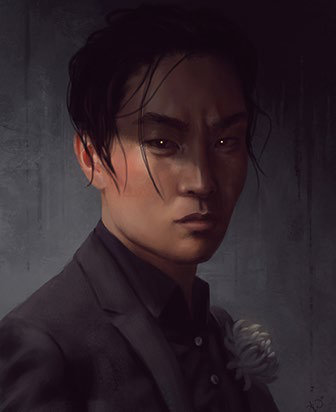

Those SPCs dedicated exclusively to Styx and Bones 
follow. They include traits for primary characters such as 
Hiromitsu Asano along with more generalized SPCs.

HIROMITSU ASANO
HIROMITSU ASANO

Epitaph: Ruthless Entrepreneur

Quote: “We do what we can for as long as we can 
until our fate is revealed to us. Then we quickly dis­
cover if we are men, or if we are nothing but beasts.”

Clan: Hecata

Embraced: 1956 (Born 1920)

MORTAL DAYS: THE DUTIFUL SON

Hiromitsu Asano was born in 1920 the son of an 
officer in the Imperial Japanese Navy. Asano’s father was 
a veteran of World War I and imposed strict discipline on 
his son. Asano’s mother was loving and instilled in him an 
appreciation for botany. While in school, Asano studied 
life sciences, but followed in the footsteps of his father to 
serve as a requisitions officer during World War II. After 
the Allied victory over Japan, Asano’s employer changed, 
but his profession did not.

were legal, they also included illegal drugs and weapons 
smuggling. Meanwhile, Hiromitsu Asano cultivated, 
thralled, and Embraced promising relations so the Asano 
could prosper within the ranks of the Giovanni as a yet 
unrecognized minor family.

As Japan rebuilt, Asano managed reconstruction logis­
tics which proved a profitable occupation. After regaining 
its sovereignty in 1952, Japan’s business interests expanded 
and Asano capitalized on Japan’s growing relationship with 
Germany. As part of his involvement with growing trade 
relations, Asano partnered with a German entrepreneur 
named Alexander Hildebrant. Their business expanded 
as their friendship deepened. Asano and Hildebrant took 
many trips to each other’s countries, and were often insep­
arable. Their success attracted the attention of Heinrich 
König. The German Giovanni thralled Asano and supported 
his business expansions, eventually embracing him in 1956.

But then, the Cappadocians returned, aligned with 
powerful interests, and struck in vengeance. All across 
Europe, they cut down Giovanni. One such Cappadocian, 
Mora, systematically murdered the Königs of Munich, 
including Asano’s sire Heinrich. For the next half decade, 
Asano invested millions of dollars in avenging Heinrich 
by hiring Anarch mercenaries and Banu Haqim assassins. 
All failed.

With the formation of the Hecata, Mother Anja has 
helped achieve a fragile reconciliation by promising to 
recognize the Asano as a family of the Hecata. She has 
personally invited Asano to Munich to mend matters 
between Mora and Asano and usher in a new age of 
cooperation among the Hecata. Only time will tell if she 
is successful.

KINDRED NIGHTS: THE DISCIPLINED EXECUTIVE

Alexander Hildebrant died in a car accident in 1964, 
devastating his dear friend and business partner. While 
Asano continued to handle Giovanni business interests in 
Japan, he funneled money back to Hildebrant’s family in 
Munich, to ensure the well-being of his wife and son (and 
eventual grandson).

PLOTS AND SCHEMES:

•	
Import / Export: Asano controls a sizable trans­
portation business and seeks to expand not only 
his reach but also his personal wealth. He is quietly 
buying up smaller logistics companies, offering his 
services to his fellow Hecata, the Camarilla, and the 
local Anarchs.

The Giovanni were never numerous in Japan, but 
managed to position themselves favorably among the 
competing sectarian interests of the Camarilla, Anarch 
Movement, and the Sabbat. Asano worked closely with 
his German sire, maintaining the flow of goods between 
Europe and East Asia. While the bulk of these shipments

2 5 4

chapter eight: styx and bones

DOMAIN AND HAVEN:

•	
Hostile Takeover: Asano is positioning himself 
against other transportation businesses in Munich, 
many of whom the Camarilla control.

•	
Bordeauxplatz Apartments (Haven 4, Resources 4) 
Asano maintains an immaculately kept penthouse 
in Au-Haidhausen overlooking Bordeauxplatz park. 
It includes a panic room, additional rooms for his 
ghouls, and a small outdoor garden.

MASK AND MIEN:

•	
Small of height and build, Asano has short black hair 
and slightly gaunt features. He appreciates stillness. 
With motions exact and delicate, his formality comes 
off as cold. But, beneath his stoic visage is a chasm 
of deep-rooted emotion. He prefers tailored Italian 
suits in dark or muted colors and wears flowers in 
his lapel to honor his mother.

THRALLS AND TOOLS:

•	
Transportation Service (Allies 4, Resources 4) Asano 
has a diverse portfolio with heavy investments in the 
freight and transportation industry. His assets in­
clude a private hangar at Franz Josef Strauss Interna­
tional Airport and enough cargo vehicles and vessels 
to conduct business throughout Europe.

•	
Asano’s legal passport names him as Heihachiro 
Anzai. He pays his taxes, obeys traffic laws, and oth­
erwise appears as completely legitimate (Mask 2).

•	
Mr. Katô and Ms. Yamashita (Retainers 2) Asano 
keeps two ghouls who act as his personal driver and 
bodyguard. They maintain the same hours as their 
regnant and are never far from his side.

Sire: Heinrich König

Ambition: To take over the export trade in Munich

Convictions: Never leave a debt unpaid

KINDRED RELATIONSHIPS

Touchstones: Günter Hildebrant — the grandson of 
his closest confidante

•	
Anja Giovanni (Respect) Asano genuinely respects 
Mother Anja, deferring to both her leadership and 
her judgment. The two have known each other for 
several decades, and she has proven herself a political 
leader.

Humanity: 4

Generation: 11th

Blood Potency: 2

Attributes: Strength 2, Dexterity 3, Stamina 2; Cha­
risma 3, Manipulation 4, Composure 2; Intelligence 
4, Wits 3, Resolve 4

•	
Mora (Rival) Asano has never forgiven Mora for the 
death of his sire. While Mother Anja has brought 
the two to the negotiating table, relations remain 
uneasy. Given the opportunity to hinder his rival, 
Asano takes it. He pledges loyalty to the Family, not 
Mora specifically, and he believes the Death Seer is a 
danger to the goals of the Hecata.

Secondary Attributes: Health 5, Willpower 6

Skills: Athletics 2, Firearms 2, Melee 3; Etiquette 
(Boardroom) 3, Insight 4, Intimidation 3, Leader­
ship 3, Persuasion (Negotiation) 4, Subterfuge 2; 
Academics 2, Awareness 3, Finance (Banking) 4, 
Technology 2

WHISPERS:

•	
Vendetta: The Japanese Hecata does not intend to 
reconcile his past feud. He is secretly plotting against 
the Death Seer and may be hiring the Banu Haqim to 
kill them.

Disciplines: Auspex 2, Celerity 1, Fortitude 4, 
Oblivion 3

General Difficulties: 6/4

2 5 5

CULTS OF THE BLOOD GODS

Kindred Citizens of Munich

Blood Potency: 2

Attributes: Strength 2, Dexterity 4, Stamina 2; Cha­
risma 3, Manipulation 3, Composure 3; Intelligence 
2, Wits 4, Resolve 3

With a city of 1.5 million people, Munich has a 
population of roughly 100 Kindred. Most fall under the 
Camarilla banner, but they are as varied, both in moti­
vations and experience, as any other Kindred communi­
ty. Use these examples for Kindred SPCs and adjust as 
needed.

Secondary Attributes: Health 5, Willpower 6

Skills: Athletics 2, Firearms (Pistol) 4, Larceny 
3, Stealth 2, Survival 1; Insight 2, Intimidation 2, 
Performance (Guitar) 4, Persuasion 3; Awareness 2, 
Investigation 3, Medicine 1, Technology 3 (Hacking)

TERRENCE RUSK, 

TERRENCE RUSK, 

PERSES OF THE CULT OF MITHRAS
PERSES OF THE CULT OF MITHRAS

Disciplines: Auspex 2, Fortitude 3, Presence 2

General Difficulties: 5/3

Clan: Ventrue

DIETER STRAUB, 

DIETER STRAUB, 

BARON OF MUNICH
BARON OF MUNICH

Sire: Peter Kleist

Embraced: 1880 (Born 1832)

Clan: Gangrel

Ambition: To strengthen the Cult of Mithras

Sire: Daryl Lutz

Convictions: Always uphold Mithras’ laws

Embraced: 1978 (Born 1949)

Touchstones: Werner Keitel — attendant and loyal 
ghoul

Ambition: Extend the Anarch reach into Munich

Humanity: 4

Convictions: None

Generation: 7th

Touchstones: None

Blood Potency: 3

Humanity: 4

Attributes: Strength 2, Dexterity 4, Stamina 4; Cha­
risma 2, Manipulation 2, Composure 2; Intelligence 
3, Wits 4, Resolve 4

Generation: 8th (through diablerie)

Blood Potency: 3

Attributes: Strength 4, Dexterity 3, Stamina 3; Cha­
risma 2, Manipulation 2, Composure 2; Intelligence 
2, Wits 3, Resolve 3

Secondary Attributes: Health 7, Willpower 6

Skills: Athletics 2, Brawl 3, Melee 3, Survival (Ur­
ban) 4; Intimidation (Interrogation) 4, Stealth (Tailing) 
3, Subterfuge 2; Awareness 4, Medicine 2

Secondary Attributes: Health 6, Willpower 5

Skills: Athletics 3, Brawl 4, Drive 3 (Motorcycles), 
Larceny 2, Stealth 3, Survival 3 (Urban); Animal Ken 
1, Insight 1, Intimidation 3, Leadership 3, Persuasion 
2, Streetwise 4, Subterfuge 3; Awareness 2, Investi­
gation 3, Medicine (Triage) 3, Technology 2

Disciplines: Dominate 3, Fortitude 4, Presence 3

General Difficulties: 6/4

ANNA FLEISCHER 

ANNA FLEISCHER 

OF THE CULT OF MITHRAS
OF THE CULT OF MITHRAS

Disciplines: Animalism 1, Celerity 2, Fortitude 3, 
Protean 4

Clan: Ventrue

General Difficulties: 5/4

Sire: Charice Fontaigne

PETER BOHN, ANARCH
PETER BOHN, ANARCH

Embraced: 1967 (Born 1910)

Ambition: Further my own position in the cult

Clan: Brujah

Convictions: Never lose self-control

Sire: Unknown

Touchstones: Magda Rathenau — mortal grand­
child

Embraced: 2012 (Born 1985)

Ambition: Mediate a treaty between Camarilla and 
Anarchs in Munich

Humanity: 5

Generation: 10th

Convictions: Always fight in the pursuit of peace

2 5 6

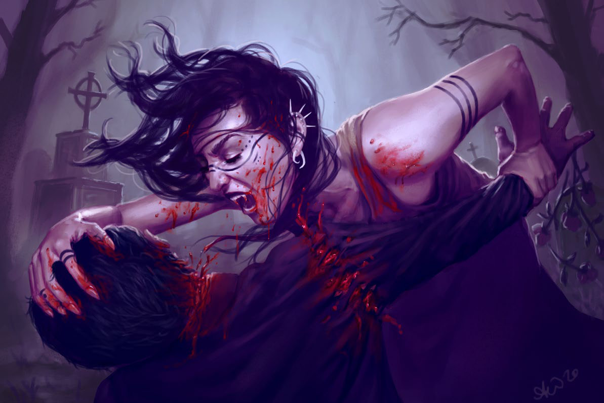

chapter eight: styx and bones

Touchstones: Kurt von Weber — best friend from 
college

tion of rage, loss, and cunning. The Risen is a powerful 
foe with full mastery over the Oblivion Discipline and 
with no regard for collateral damage. It defends itself for 
survival. Its traits are skewed away from those Constancia 
might have possessed when fully capable.

Humanity: 6

Generation: 13th

Blood Potency: 1

Clan: Hecata (nominally)

Attributes: Strength 3, Dexterity 3, Stamina 2; Cha­
risma 3, Manipulation 1, Composure 2; Intelligence 
2, Wits 3, Resolve 3

Sire: Japheth Cappadocius

Embraced: Unknown

Ambition: Usher the Horsemen into this city

Secondary Attributes: Health 7, Willpower 4

Convictions: None

Skills: Athletics 2, Brawl 4, Larceny (Lockpicking) 
4, Stealth (Stalking) 4, Survival 2; Animal Ken 1, 
Etiquette 2, Insight 1, Intimidation 3, Persuasion 2, 
Streetwise 4, Subterfuge 3; Academics (Law) 1, 
Awareness 2, Investigation 4, Technology 2

Touchstones: None

Humanity: 1

Generation: 5th

Blood Potency: 6

Disciplines: Celerity 2, Potence 3

Attributes: Strength 5, Dexterity 4, Stamina 5; Cha­
risma 1, Manipulation 1, Composure 4; Intelligence 
5, Wits 4, Resolve 4

General Difficulties: 4/3

THE RISEN
THE RISEN

Secondary Attributes: Health 8, Willpower 8

Skills: Athletics 3, Brawl (Brute Force) 5, Stealth 3, 
Survival 5; Etiquette 2, Insight (Fears) 4, Intimidation

The Constancia Risen is a soul gone mad stuffed 
into a mortal body. It holds the shattered memories of its 
former life, and those of Oblivion, forming an amalgama­

2 5 7

CULTS OF THE BLOOD GODS

POLICE AND 

POLICE AND 

WAYWARD MUSCLE
WAYWARD MUSCLE

4, Persuasion 2, Subterfuge 5; Academics (Linguis­
tics) 4, Awareness (Ambushes) 4, Medicine 4, Occult 
(Oblivion) 5

Disciplines: Auspex 2, Celerity 2, Fortitude 2, 
Oblivion 5, Potence 2, Protean 2

Germany adheres to the European Firearms Direc­
tive maintaining strong anti-gun legislation. Firearms 
are available for competitive shooting, hunting, and 
collecting, but the state constrains all three with heavy 
regulations. Nevertheless, firearms are present in Munich, 
either in the hands of the police or those of the criminal 
underworld.

General Difficulties: 7/5

Mortals of Munich

Standard Dice Pools: Physical 4, Social 2, Mental 
3

GRENZSCHUTZGRUPPE 10
GRENZSCHUTZGRUPPE 10

Secondary Attributes: Health 6, Willpower 5

GSG 10 are some of the best trained police in the 
world. They handle kidnappings, hostage situations, and 
terrorist incidents. They are highly trained and heavily 
armed.

Exceptional Dice Pools: Athletics 5, Brawl 5, Drive 
5, Firearms 5, Larceny 5; Streetwise 4; Investigation 
5

Weapons: Standard police arm themselves with 
pistols or shotguns (medium gunshot, +3 damage) or 
stun guns (light impact, +1 damage).

Standard Dice Pools: Physical 5, Social 3, Mental 
3

Secondary Attributes: Health 6, Willpower 6

General Difficulties: 4/2

Exceptional Dice Pools: Athletics 6, Brawl 6, Drive 
6, Firearms 6; Streetwise 5; Investigation 6

LIESCHEN MÜLLER/

LIESCHEN MÜLLER/

JANE Q. PUBLIC
JANE Q. PUBLIC

Weapons: GSG 10 arm themselves with pistols or 
shotguns (medium gunshot, +3 damage) or assault 
and sniper rifles (heavy gunshot, +4 damage). They 
also carry tactical armor providing them with 6 
armor.

This average mortal represents SPCs not otherwise 
mentioned in the book who may act as a hindrance to the 
coterie. They have no combat training.

General Difficulties: 4/3

Standard Dice Pools: Physical 3, Social 3, Mental 
3

Secondary Attributes: Health 6, Willpower 5

Exceptional Dice Pools: Insight 4, Streetwise 4; 
Academics 5, Awareness 4

General Difficulties: 3/2

2 5 8

chapter eight: styx and bones

Ready Made Characters

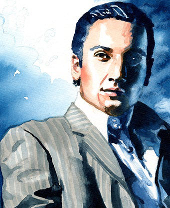

Styx and Bones includes the following ready-made char­
acters. Adjust as needed.

CHRISTOF GIOVANNI
CHRISTOF GIOVANNI

Concept: Wallet behind the Throne

Quote: “Money and means create power.”

Clan: Hecata

Embraced: 2011 (Born 1982)

MORTAL DAYS: GREED IS GOOD

The Giovanni raised Christof through various nan­
nies and tutors, which created in him a sense of isolation. 
One of his math tutors, Stefanie Knapp, showed Christof 
kindness. But, it was too little too late. Christof grew into 
a cruel man with an appreciation for numbers.

After going into finance, Christof traded on the 
Deutscher Aktienindex in Frankfurt. He was young, 
single, and absent morals, living a dangerous lifestyle of 
easy money, fast cars, and loose women. With the help of 
his family connections, he took up money laundering as 
a pastime. Reliable work and a few windfalls earned him 
the Embrace.

•	
Demperwolf Logistics (Influence 3) A Shell Compa­
ny with a well-paid board that assists in facilitating 
“financial maneuverings” on behalf of his clients.

•	
Munich Underworld (Contacts 3) Christof enjoys a 
dangerous lifestyle and can tap into his own client 
base to acquire things.

KINDRED NIGHTS: GREED IS GODHOOD

Christof traveled throughout Europe at his sire Anja 
Giovanni’s insistence. They engaged in a brief love affair, 
but she grew tired of his childish need to impress others 
and sent him away. Recently returned, he’s built a private 
hedge fund. His holdings keep the Munich Hecata in the 
black. They have instant access to money, means, and 
other economic opportunities. It’s one of the few reasons 
Mother Anja endures his presence. Christof acts like her 
disinterest doesn’t bother him, but he’s always one of the 
first to show up when she needs help.

MASK AND MIEN:

•	
The product of a Tunisian grandfather, Christof has 
olive skin and short dark hair. He is always dressed 
to impress.

•	
According to his passport, Christof is actually Chris­
topher Hamila (Mask 2).

Sire: Anja Giovanni

GUIDE TO PLAY:

Predator: Alleycat

• 	
Independent: As a Hecata, Christof has found an 
organization that appreciates his talents. He might 
not be the most accomplished member of the Cult 
of Death and Undeath, but he does recognize and 
support the need for strict hierarchy. It offers him 
protection in a world fraught with dangers.

Ambition: Earn the respect of the elite

Suggested Desire: To drive a Hennessey Venom 
F2 at three hundred miles an hour

Convictions: Do not let someone use you as a pawn

Touchstones: Stefanie Knapp — your last true friend

BACKGROUND DETAIL:

Humanity: 6

•	
The Sendling Lofts (Haven 3, Resources 4) Christof 
lives in a lavish apartment with a beautiful view of 
the Munich skyline in residential Sendling.

Generation: 11th

Blood Potency: 2

2 5 9

CULTS OF THE BLOOD GODS

Attributes: Strength 2, Dexterity 3, Stamina 2; Cha­
risma 3, Manipulation 4, Composure 3; Intelligence 
3, Wits 3, Resolve 2

Secondary Attributes: Health 6, Willpower 5

Skills: Athletics 2, Brawl (Grappling) 2, Larceny 3; 
Etiquette 2, Intimidation 1, Persuasion (Bargaining) 4, 
Streetwise 2, Subterfuge 3; Academics (Economics) 
4, Finance (Stock Market) 4, Technology 3

Disciplines: Auspex 1, Dominate 2, Fortitude 1, 
Oblivion 1, Potence 1

FRANZISKA (HOLLANDER) 
FRANZISKA (HOLLANDER) 
GIOVANNI
GIOVANNI

Concept: Cult Leader

Quote: “Faith isn’t about strength. It’s about surren­
der. Surrender and service.”

Clan: Hecata

Embraced: 2012 (Born 1979)

MORTAL DAYS: X MARKS THE SPOT

Franziska was born in the Dutch city of Rotterdam 
where she exhibited macabre tendencies. She’d often ex­
amine dead animals or visit graveyards. Her parents were 
concerned about her, putting her in therapy and attempt­
ing other methods of making their daughter “normal.” 
These efforts proved to be in vain.

GUIDE TO PLAY:

•	
The Church of Death and Undeath: Franziska is a 
devout follower of the cult fully committed to its 
doctrines and its practices. She has taken this a step 
further by building her own small following within 
Munich. While she has the utmost respect for her 
sire, she views herself as the natural successor to the 
Hecata temple, and is learning all she can for the 
night she claims the reins.

At the age of eighteen, Franziska left home. With 
the sole exception of her younger sister, she never looked 
back. She committed to the study of death — a journey 
which lead her to Bircham International University 
in Spain. After obtaining a degree in thanatology, she 
traveled extensively throughout Europe as a specialist in 
a field which had few. During a guest lecture in Mu­
nich, she drew the attention of Anja Giovanni. The two 
cultivated a friendship which eventually culminated into 
a full-throated partnership. Franziska served as Mother 
Anja’s loyal ghoul for a decade before the Embrace.

BACKGROUND DETAIL:

•	
The Church of the Transcendent (Fame 2, Cult 2, 
Herd 2) In addition to being a member of the Hecata 
temple, Franziska leads the Church of the Transcend­
ent. As its Mother, she has access to a half dozen 
like-minded individuals all of whom believe in the 
transcendent aspect of life and death.

KINDRED NIGHTS: FAITH AND FEEDING

In many ways, Franziska is a younger version of her 
sire. She is a disciple of the Cult of Death and Undeath 
and represents a new generation of younger, more tech­
nologically-savvy Hecata. Franziska tends to take herself 
way too seriously. Her rigorous attitude has led her to 
form her own cult, the Church of the Transcendent. 
There Franziska educates young women with an interest 
in the morbid and obscure. In the meantime, she serves as 
the spiritual heart of the coterie.

•	
The University of Munich (Contacts 2, Resources 2) 
With permission from the local Tremere, Franziska 
is a guest lecturer of thanatology at the University of 
Munich, teaching a pair of night classes each week. 
She has unrestricted access to the university’s archives 
and uses the campus to recruit members into her cult.

MASK AND MIEN:

•	
Franziska is exceptionally tall with short black hair 
and pale skin. She has an athletic build, preferring

2 6 0

chapter eight: styx and bones

KINDRED NIGHTS: THE DEATH KNIGHT

dresses when indoors and a long fur coat when she 
needs to venture out.

Jan adapted quickly to his immortal life, using the 
skills he learned as a soldier to benefit the Hecata. In 
2017, Mother Anja sent Niklas, Jan, and Heather Milli­
ner to Venice on her behalf. The younger Hecata were 
unaware of the particulars at the time, but she had tasked 
Niklas with locating a crypt belonging to the Giovan­
ni. One night while in Venice, Niklas disappeared and 
never returned. Jan spent several weeks trying to locate 
him before Mother Anja called him and Heather back 
to Munich. While he has no leads to follow, he remains 
committed to finding his sire. In the meantime, he looks 
after Heather and does what he must to protect the Clan 
of Death.

Sire: Anja Giovanni

Predator: Osiris

Ambition: To one night take over the Cult of Death 
and Undeath

Suggested Desire: To earn her sire’s respect

Convictions: Respect the Cult of Death and Undeath 
as sacred and obey its laws

Touchstones: Lea Dudenhoeffer — one of her fol­
lowers from the Church of the Transcendent

Humanity: 5

GUIDE TO PLAY:

Generation: 11th

• 	
Independent: Jan’s heart isn’t in the Cult of Death 
and Undeath, but he has a passion for protecting 
family. Jan is a loyal soldier who appreciates a clear 
chain of command and, perhaps unusual for a Kin­
dred (particularly a Puttanesca), he has a firm sense 
of right and wrong.

Blood Potency: 2

Attributes: Strength 2, Dexterity 2, Stamina 2; Cha­
risma 3, Manipulation 4, Composure 3; Intelligence 
3, Wits 2, Resolve 3

Secondary Attributes: Health 5, Willpower 6

Skills: Brawl 1, Firearms 2, Larceny 2, Stealth 2; 
Etiquette 2, Insight 4, Intimidation 2, Leadership 3, 
Persuasion 2; Academics (Linguistics) 3, Awareness 
2, Investigation 4, Medicine (Autopsies) 3, Occult 
(Thanatology) 3

BACKGROUND DETAIL:

• 	
Safe House (Haven 2) Jan has access to a safe house 
on the outskirts of Munich. The small apartment 
keeps out sunlight and includes a security door, a 
dedicated security system, and an emergency exit.

Disciplines: Auspex 3, Oblivion 3, Presence 1

JAN PUTTANESCA
JAN PUTTANESCA

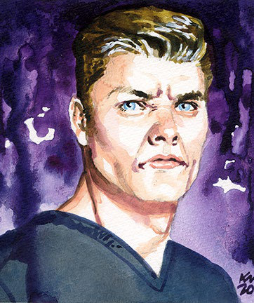

Concept: Stalwart Defender

Quote: “You’re fast. I’ll give you that. But when I pull 
this trigger, this incendiary round is going to move at 
eight hundred meters per second. And nobody, living 
or dead, is fast enough to dodge it.”

Clan: Hecata

Embraced: 2010 (Born 1983)

MORTAL DAYS: DOWN RANGE

Seeing an opportunity to serve both Germany and 
the world, Jan left school to enlist in the Bundeswehr. 
After five grueling years, he joined the elite Kommando 
Spezialkräfte (KSK). He fought primarily in Kunduz, a 
northern region of Afghanistan, participating in several 
battles and earning various honors. After he left military 
service, he returned to Munich and did a series of odd 
jobs before attracting the attention of a German-Italian 
Hecata named Niklas Puttanesca. Seeing the need for ad­
ditional muscle within the newly formed Clan of Death, 
Niklas adopted, educated, and eventually Embraced Jan.

2 61

CULTS OF THE BLOOD GODS

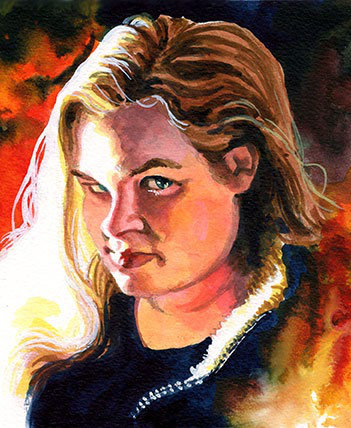

• 	
Underworld Armory (Allies 2) Jan has ties to certain 
private security companies operating in Munich 
with access to small and medium firearms. While 
they can’t procure an RPG for Jan, they can provide 
pistols, shotguns, and rifles.

MASK AND MIEN:

• 	
Jan prefers streetwear to blend in with the twen­
ty-somethings of Munich. This often includes sneak­
ers or boots, jeans, and a black t-shirt. He has crystal 
blue eyes and a semi-permanent scowl.

• 	
Jan carries a passport for Jan Haas and has the papers 
to prove his service to the KSK (Mask 2).

Sire: Niklas Puttanesca

Predator: Alleycat

Ambition: To transform the Hecata of Munich into a 
strong and powerful force

Suggested Desire: To teach a clanmate how to 
defend themself

Convictions: Protect the innocent from harm

Touchstones: Sabine Lauterbach — a fellow retired 
soldier and romantic entanglement in Munich

During her sophomore year of college, she transferred to 
Technische Universität München (TUM) for computa­
tional science and engineering. During that time, she fell 
in love with a local musician, and while the relationship 
didn’t last long, Heather stayed in Munich. She joined a 
white-hat cyber security firm for several years until it was 
time for her to say goodbye to daylight. Now, she main­
tains the Hecata temple’s digital security.

Humanity: 6

Generation: 11th

Blood Potency: 2

Attributes: Strength 3, Dexterity 4, Stamina 2; Cha­
risma 2, Manipulation 2, Composure 2; Intelligence 
2, Wits 3, Resolve 3

KINDRED NIGHTS:

DDOS (DISTRIBUTED DENIAL-OF-SERVICE)

Secondary Attributes: Health 8, Willpower 5

Skills: Athletics 3, Brawl (Grappling) 3, Firearms 
(Pistols) 4, Stealth 2, Survival 2; Intimidation 2, 
Streetwise 2; Awareness (Ambushes) 3, Investigation 
3, Medicine (Triage) 3

Like many newly Embraced Kindred, Heather’s ad­
justment was difficult. She withdrew from society and 
once again found herself spending most of her time 
on the internet. If it wasn’t for Jan, she might have 
fallen further into her depression. Instead, the soldier 
managed to show her the freedom of her new unlife 
and slowly guide her back into the world. In thanks, 
she sets aside time to comb the internet in search of 
Jan’s sire, Niklas.

Disciplines: Auspex 1, Fortitude 3, Oblivion 2, 
Potence 1

HEATHER MILLINER
HEATHER MILLINER

GUIDE TO PLAY:

Concept: Methodical Problem-Solver

Quote: “Every problem can be worked.”

•	
Independent: Heather believes in empirical evidence, 
which is why she is dedicated. She’s seen what the 
Hecata can accomplish with her own eyes.

Clan: Hecata

Embraced: 2014 (Born 1985)

BACKGROUND DETAIL:

MORTAL DAYS: OB1 (OFF BY ONE) ERROR

•	
Hacking Community (Allies 2, Contacts 2, Influence 
2) Heather is part of a mortal hacking community.

Born in Chillicothe, Ohio, Heather was a withdrawn 
child. With few friends, she adopted an online lifestyle.

2 6 2

chapter eight: styx and bones

While the group is unaware of her Kindred nature, 
she uses them to gain access to tools, information, 
and criminal elements.

MASK AND MIEN:

•	
Heather is short and somewhat stocky, with long 
auburn hair and brown eyes. So over the “hacker girl” 
stereotype, she refuses to dye her hair. She dresses in 
cozy oversized sweaters and leggings.

•	
Understanding the need for the Masquerade, Heath­
er carries a valid passport with the name Danielle 
Fabrizo (Mask 2).

Sire: Fenway Milliner

Predator: Bagger

Ambition: To become the cyber security lead for the 
Hecata

Suggested Desire: To assist your companions in 
regaining lost humanity

Convictions: Always stop to help someone in 
distress

Touchstones: Klara Gade — your former classmate 
whose popularity you continue to envy

MORTAL DAYS: NO MORE LET LIFE DIVIDE…

Named after the famed actress and singer, Marlene 
Dietrich, Marlene grew up in and around the London 
theatre scene. Her theatrical parents passed down an ap­
preciation for the classics, and Marlene took in every bit 
of it. She became a theatrical star, performing in London’s 
famed West End. Her skills attracted the admiration of an 
English Toreador. Alice Pike, a performer and sportsman, 
adopted Marlene as her protégé. She Embraced her a year 
later, and Marlene quickly became the darling of Lon­
don’s Camarilla court.

Humanity: 7

Generation: 12th

Blood Potency: 1

Attributes: Strength 2, Dexterity 2, Stamina 2; Cha­
risma 2, Manipulation 2, Composure 3; Intelligence 
4, Wits 3, Resolve 3

Secondary Attributes: Health 5, Willpower 6

Skills: Firearms 2, Stealth 1, Survival 2; Etiquette 1, 
Insight 2, Streetwise (Black Market) 2, Subterfuge 
2; Academics (Electrical Engineering) 2, Awareness 
2, Investigation 4, Technology (Hacking, Security 
Systems) 4

KINDRED NIGHTS: 

…WHAT DEATH CAN JOIN TOGETHER

In 2013, the Second Inquisition burned through 
London, killing Queen Anne Bowesley and much of her 
court. For her part, Alice Pike managed to hide her childe 
in the Thames in order to protect her. When Marlene 
lifted her head out of the freezing water, she saw her sire 
die — gunned down by a dark-haired SO13 officer. While 
she survived the night, the vision of her sire’s murder and 
the person responsible has never left her thoughts. Mar­
lene fell into despair and went on a search for answers 
regarding death, undeath, and the afterlife.

Disciplines: Auspex 4, Fortitude 1, Obfuscate 1, 
Oblivion 1

MARLENE DRAKE
MARLENE DRAKE

Concept: Broken Beauty

Quote: “Everyone hides a private pain, and every­
one yearns to share it. All I do is listen.”

Her journey led her to Mother Anja Giovanni of 
the Cult of Death and Undeath in Munich. After a short 
while, Marlene found herself a loyal disciple of the order. 
In public, she carries herself with a warm and welcoming 
smile, but in private, she’s more somber.

Clan: Toreador

Embraced: 2012 (Born 1988)

2 6 3

CULTS OF THE BLOOD GODS

JÜRGEN SCHWEIGER
JÜRGEN SCHWEIGER

GUIDE TO PLAY:

•	
The Church of Death and Undeath: Marlene is a young 
acolyte among the cult, still learning. Despite being a 
Toreador, she doesn’t view herself as an outsider. She’s 
learned how to grieve her losses and how death isn’t 
really the end of things but rather the beginning.

Concept: Street Survivor

Quote: “Be afraid of the person with nothing. They 
got nothing left to lose. It makes them willing to do 
anything.”

Clan: Thin-Blood

BACKGROUND DETAIL:

Embraced: 2017 (Born 1995)

•	
The Marlene Dietrich Society (Fame 1, Herd 2) The 
Toreador is part of a small club devoted to the famed 
actress Marlene Dietrich. She uses the club to feed 
and occasionally perform.

MORTAL DAYS: OUT OF THE GUTTER

Jürgen grew up bouncing between foster care and the 
father who beat him. These abuses hardened the young 
man who, at the age of sixteen, fled his situation to ped­
dle on the streets of Munich. While he occasionally stayed 
with boyfriends, the relationships never lasted long, and 
soon enough he’d find himself living on the street. Then, 
he found heroin, the only thing he ever loved. To feed 
his habit, he dealt narcotics, pickpocketed tourists, and 
robbed homes. One night he stole from the wrong house, 
was Embraced, and then abandoned.

•	
The Munich National Theatre (Allies 2, Contacts 
2) Marlene is a patron of the world-famous Munich 
National Theatre. The historic site is home to the 
Bavarian State Opera, the Bavarian State Orchestra, 
and the Bavarian State Ballet.

MASK AND MIEN:

•	
Marlene is a striking black woman of average height. 
She generally keeps her hair pulled back into a bun 
to show off her refined features and bright brown 
eyes. She wears heeled boots, denim jeans, and a 
short leather coat unless she’s preparing for a role. 
Part of her preparation involves incorporating gar­
ments her character might wear into her nightly life.

KINDRED NIGHTS: AND INTO THE NIGHT

Jürgen has no idea who his sire is or why she Em­
braced him. He almost fell into frenzy and wouldn’t have 
survived those first few nights if not for Christof Gio­
vanni. Realizing his Kindred nature, Christof took the 
Thin-Blood under his wing and helped him acclimate to 
his new life. The two have become friends in spite of their 
economic differences.

Sire: Alice Pike

Predator: Osiris

Tonight, Jürgen maintains one foot out the proverbi­
al door, ready to flee into the streets. But for the moment, 
he maintains a place among the Hecata, slowly learning 
how to trust them.

Ambition: To avenge your sire

Suggested Desire: To perform on a real stage, in 
front of a real audience

GUIDE TO PLAY:

Convictions: Stand up for women

Touchstones: Oskar Kretschmann — who reminds 
you of the man who killed your sire

•	
Independent: As a Thin-Blood with close ties to the 
Hecata, Jürgen is something of an anomaly. He isn’t 
bound to any particular sect or code of conduct. He 
sides with Hecata because they have proven to be 
good friends to him.

Humanity: 6

Generation: 12th

Blood Potency: 1

BACKGROUND DETAIL:

Attributes: Strength 2, Dexterity 3, Stamina 2; Cha­
risma 4, Manipulation 3, Composure 3; Intelligence 
2, Wits 3, Resolve 2

•	
The Street Sweepers (Allies 2, Resources 1) A group 
of pick-pockets and burglars, the Street Sweepers are 
a small gang of criminals.

Secondary Attributes: Health 5, Willpower 5

•	
Church of the Ascension (Contacts 3, Herd 3) Jürgen 
frequents a local soup kitchen and hostel, often gain­
ing information from the vagrants who eat there. He 
prefers not to feed on the poor, but does there when 
he must.

Skills: Athletics 1, Firearms 1, Melee 2, Stealth 
2; Etiquette 2, Insight 2, Performance 4 (Acting), 
Persuasion (Seduction) 3, Subterfuge (Sincerity) 3; 
Academics 1, Awareness 2, Investigation 2, Occult 3

Disciplines: Auspex 2, Celerity 2, Presence 3

2 6 4

chapter eight: styx and bones

THIN-BLOOD MERITS:

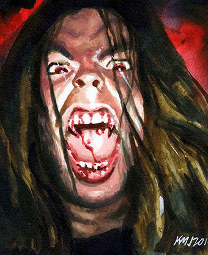

• 	
Thin-blood Alchemist

THIN-BLOOD FLAWS:

• 	
Bestial Temper

Matters of Faith

As in the mortal world, matters of faith divide 
Kindred. Those differences vary from minor philosoph­
ical disputes to open holy wars. The story hooks below 
illustrate this struggle and focus on a coterie of characters 
who all belong to, or are at least aligned with, the same 
cult. Should the players require a quick story with little 
preparation, the Storyteller can use the examples listed 
here and build new stories to expand Styx and Bones or 
stand on their own.

The Sleeping 

Sword of War

MASK AND MIEN:

•	
Jürgen is rail thin, weighing less than 60 kilos. His brown 
hair is generally unkempt, shoulder length, and tucked 
behind his pierced ears. Over his second-hand shirts and 
jeans, he wears a puffer coat and fingerless gloves.

In Act I Scene II of William Shakespeare’s Henry V, King 
Henry speaks with the Archbishop of Canterbury. “How 
you awake our sleeping sword of war: we charge you, in 
the name of God, take heed; for never two such kingdoms 
did contend without much fall of blood.” Ultimate­
ly, the English and French did go to war, as both held 
rival claims over territory. The same sense of competing 
interests fueled by ordained right permeates throughout 
history, often resulting in bloody conflicts between both 
individuals and ideologies. The following scenarios depict 
conflicts between different and competing cults.

Sire: Unknown woman

Predator: Sandman

Ambition: Find your sire

Suggested Desire: Get into trouble

Convictions: Take from the wealthy, give to the poor

Touchstones: Father Daniel Vogel — a Catholic priest 
who runs the Church of the Ascension soup kitchen

The Ghosts of Carthage

Humanity: 5

Generation: 14th

Cast: Mago of the Cult of Carthage
What Happened: Hannibal, the famed Carthaginian 
general, invaded Italy in 219 BCE and proceeded to anni­
hilate three hundred thousand Romans over two decades. 
Many Kindred believe Hannibal was a tool of Troile, used 
to wage war against the Ventrue of Rome. The Second Pu­
nic War ended at the Battle of Zama, with Scipio Africanus 
defeating the Carthaginian general. Since then, Hannibal, 
and his fabled city, have become a rallying cry not only 
among the Brujah, but also within the Anarch Movement.

Blood Potency: 0

Attributes: Strength 2, Dexterity 3, Stamina 2; Cha­
risma 2, Manipulation 3, Composure 2; Intelligence 
3, Wits 4, Resolve 3

Secondary Attributes: Health 5, Willpower 5

Skills: Athletics 2, Brawl 3, Firearms 1, Larceny 4 
(Lockpicking), Stealth 3 (Break-Ins), Survival 4 (Urban); 
Persuasion 2, Streetwise 4 (Scrounging), Subterfuge 3; 
Awareness 2, Investigation 2, Medicine 2, Technology 2

The Cult of Carthage is small but growing within the 
Anarchs. Mago stands among them, a young Brujah with

Disciplines: Thin-Blood Alchemy 3

2 6 5

CULTS OF THE BLOOD GODS

dreams of ancient times. The tenets of his faith demand 
retribution for ancient losses. He seeks to avenge fallen 
Carthage with Ventrue blood. Because of these beliefs, he 
challenges his fellow Anarchs. He calls on them to destroy 
the Ventrue of the Camarilla. His recruitment efforts 
have procured a number of followers, all of whom are on 
the verge of escalating to an all-out clan war.

Fallen Kingdom. This Gehenna cult believes mankind’s 
awareness of Kindred existence is inevitable and the only 
way to ensure the survival of the undead species is to 
expose themselves sooner rather than later. Only after 
the Masquerade is broken, and after the ensuing war to 
follow, can Kindred society rebuild.

While the Romero twins have something of a point, 
their methodology is flawed. They threaten the Mas­
querade with online postings, personal rants, and videos 
highlighting their vampire nature. One such video depicts 
the two jumping off a building and enduring lethal harm 
only to heal and smile for the camera.

WHAT COULD HAPPEN:

•	
The coterie joins Mago and convinces the Anarchs 
to rid the world of the Ventrue. This plunges the 
two sects into war as old grudges between Rome 
and Carthage play out once again in the twenty-first 
century.

The Prince has learned of these antics and is on the 
verge of declaring a Blood Hunt on the Romero twins, if the 
Second Inquisition doesn’t get to them first. Except, their 
sire Frank Watchfair is slavishly devoted to his childer, and 
approaches the player characters with an offer of payment 
and sponsorship if they help convince the Prince to turn a 
blind eye, or at least save the Romero twins from destruc­
tion for long enough that they might flee the domain.

•	
Calling on their own beliefs, the characters challenge 
Mago. Through logic, reason, social acumen, or brute 
strength, they do what they must to prevent war.

Attribute Focus: Social / Physical

MAGO
MAGO

WHAT COULD HAPPEN:

•	
The player characters recognize the Romero twins 
have blatantly violated the Masquerade and attempt 
to bring them into custody. By examining their vide­
os, the characters gain clues to likely locations to hunt 
for the pair. Catalina and Santino are unlikely to see 
reason and will rely on violence to protect themselves.

Clan: Brujah

Sire: Jayne Jonestown

Embraced: 2008 (Born 1979)

Ambition: To take down a Ventrue fat-cat

Convictions: Never kneel to a Ventrue

•	
The player characters petition the Prince to allow them 
to take care of the problem and use their connections 
and resources to push the Romero twins out of the city.

Touchstones: Billy Ockwell — trade union leader

Humanity: 7

Generation: 13th

•	
The player characters may either agree with the pair or 
feel sympathy for them and help them escape the city 
before the Prince calls the Blood Hunt. If they help 
them escape, Watchfair shows himself to be without 
funds for payment, but offers them a major boon.

Blood Potency: 1

Attributes: Strength 3, Dexterity 4, Stamina 2; Cha­
risma 4, Manipulation 2, Composure 2; Intelligence 
2, Wits 3, Resolve 3

Secondary Attributes: Health 5, Willpower 5

Attribute Focus: Social / Physical

Skills: Athletics 2, Brawl 1, Firearms (Pistol) 4, Lar­
ceny 3, Melee 1, Survival 2; Insight 2, Intimidation 
1, Leadership (Cult) 4, Persuasion 3; Awareness 1, 
Investigation 1, Politics 2, Technology 3

THE ROMERO TWINS
THE ROMERO TWINS

Clan: Toreador

Sire: Basil Watchfair

Disciplines: Celerity 2, Presence 3

Embraced: 2003 (Born 1981)

General Difficulties: 5/3

Ambition: To prepare Kindred society for the end of 
the world

Resignation of the Righteous

Convictions: Always tell and reveal the truth

Touchstones: Patricia Romero — their still-living 
mother

Cast: The Romero Twins
What Happened: The Romeros are a pair of siblings, 
Catalina and Santino, who belong to the Cult of the

Humanity: 3

2 6 6

chapter eight: styx and bones

Generation: 12th

down buildings, slay beloved leaders, and recruit other 
hellions to their cause.

Blood Potency: 2

As a result, the Prince or Baron of the territory has 
decided to crush all cult activity. In order to prove to the 
Prince not all cults are equal, the characters remove the 
Hellhounds of Satan so their own cult continues to thrive.

Attributes: Strength 2, Dexterity 3, Stamina 3; Cha­
risma 3, Manipulation 4, Composure 2; Intelligence 
4, Wits 4, Resolve 3

Secondary Attributes: Health 6, Willpower 5

WHAT COULD HAPPEN:

Skills: Athletics 2, Brawl 2, Firearms 2, Larceny 
(Lockpicking) 3; Insight 2, Intimidation 1, Leadership 
1, Performance (Daredevil Acts) 3, Persuasion 2, 
Streetwise 3; Awareness 2, Medicine 1, Occult 1, 
Technology (Social Media) 3

•	
The characters investigate the arson attacks and 
track down those responsible. By reviewing security 
cameras, speaking with witnesses, and searching for 
clues, the characters locate the haven used by the 
Hellhounds of Satan. They plan their assault, and 
remove the cult with extreme prejudice.

Disciplines: Auspex 3, Celerity 2, Fortitude 1

General Difficulties: 4/2

•	
The characters prevent further attacks and attempt 
to reform the cult either through persuasion or 
through the heavy-handed use of Disciplines. Parad­
ing the newly reformed cultists may earn the player 
characters the favor of the Prince or Baron.

Idle Hands

Cast: The Hellhounds of Satan
What Happened: The Hellhounds of Satan are a cult 
of vampires who worship the Devil and seek to usher in 
a demonic hierarchy ruling on Earth. Unfortunately for 
them, those demons are all in their heads, but this doesn’t 
stop them from pursuing their ambitions. They do this 
by attacking churches, synagogues, mosques, and other 
places of worship whether mortal or Kindred. They burn

Attribute Focus: Mental / Physical

HELLHOUNDS OF SATAN
HELLHOUNDS OF SATAN

Clan: Caitiff

Sire: Iqbal Blind

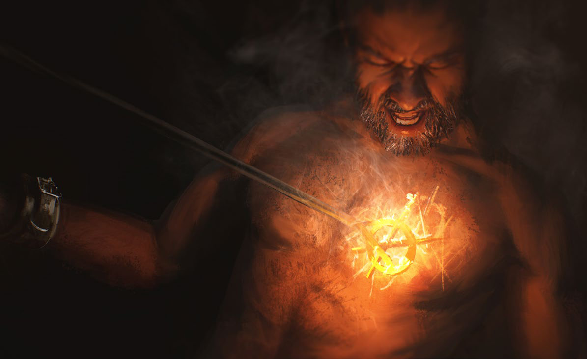

2 6 7

CULTS OF THE BLOOD GODS

Embraced: 1996 (Born 1970)

into their territory. A quiet feud 
fought through attacks of influence 
eventually erupts into a hot war 
fought on the streets. If the charac­
ters don’t do something, eventually 
the violence comes to their temple 
with acolytes of Helena fighting 
openly with Brujah Meneleans.

summons the entire court to their 
private estate. The territory includes 
a hundred acres of dense forests and 
open grasslands. After the court 
assembles, the Prince woos those 
present with a decadent party, then 
introduces a dozen mortals. The mon­
arch releases them onto the property 
grounds while commanding their 
court to hunt them down for sport, 
offering a major boon to the Kindred 
who kills the most prey.

Ambition: Destroy a place of 
religious importance

Convictions: None

Touchstones: None

Humanity: 2

Generation: 12th

WHAT COULD HAPPEN:

Blood Potency: 1

•	
The characters choose to 
intervene, placing themselves 
between the two warring fac­
tions. Taking on a millennia-old 
vendetta is no easy feat, but the 
coterie uses a combination of 
force and persuasion to gain a 
momentary lull in the fighting. 
From there they have a few pre­
cious minutes to make their case 
to end things diplomatically.

Attributes: Strength 3, Dexter­
ity 3, Stamina 3; Charisma 1, 
Manipulation 2, Composure 3; 
Intelligence 3, Wits 3, Resolve 3

WHAT COULD HAPPEN:

•	
The characters don’t have the 
manpower to stop the Prince by 
force. Instead, the coterie per­
suades them on ethical grounds. 
Characters plead on behalf of the 
mortals in public or private and 
face whatever hoops the Prince 
requires they jump through to 
succeed in attaining their goal.

Secondary Attributes: Health 
6, Willpower 6

Skills: Athletics 2, Brawl (Street 
Fighting) 4, Larceny 2, Stealth 2, 
Survival (Ambushes) 4; Intimida­
tion (Reputation) 4, Leadership 
2, Streetwise 2, Subterfuge 2; 
Academics 2, Awareness 3, 
Investigation 3, Occult 4

•	
The characters choose one side 
over the other. They help destroy, 
ruin, or otherwise eliminate ei­
ther the Helenaists or the Mene­
leans. Perhaps this ends in peace 
with the winning side, or perhaps 
they turn on the characters’ cult 
to dominate the entire city.

•	
The coterie endears themselves 
to the Prince by participating in 
the hunt, most likely acquiring 
Stains in the process.

Disciplines: Celerity 2, Domi­
nate 2, Oblivion 3

General Difficulties: 4/2

•	
The coterie feigns participa­
tion in the hunt, but instead of 
killing their prey, they rescue the 
mortals and ferret them away or 
safeguard their lives. They do this 
discreetly and with great care, 
lest the Prince discover their 
duplicity.

Family Feud

Attribute Focus: Social

Shades of Gray

Cast: The Cult of Helena and the 
Meneleans

What Happened: Whether on the 
streets of Verona or the Upper West 
Side, blood feuds between two war­
ring families can begin with conspicu­
ous violence and end with the Second 
Inquisition. The enmity between the 
Cult of Helena and the Meneleans is 
no different, with the former pledged 
to the Toreador methuselah and the 
latter sworn to the Brujah. Though 
Helena and Menelaus were suppos­
edly once lovers, their bitter rivalry 
sparked something of a holy war.

Every religion has their hierarchy of 
sins or specific dogmas that followers 
obey. While some are more forgiving 
than others, the world is almost never 
truly black and white. Most conflicts 
have many shades. The following 
hooks explore the nuances of ethics 
and morals as they relate to cults and 
how a cult’s membership might weigh 
or measure a situation, each accord­
ing to their individual character.

Attribute Focus: Mental / Social

PRINCE VAUGHN
PRINCE VAUGHN

Clan: Ventrue

Sire: Skinner

Embraced: 1962 (Born 1923)

Ambition: Win the loyalty of 
the court

Convictions: None

The Hunt Club

In this modern incarnation, the 
Meneleans and the Cult of Helena 
both populate the same city. The 
characters belong to a third separate 
religious institution minding their 
own business when the conflict spills

Touchstones: None

Humanity: 2

Cast: The Prince and her Court
What Happened: The Prince, 
a high priest of the cult of Enkidu,

Generation: 11th

Blood Potency: 2

2 6 8

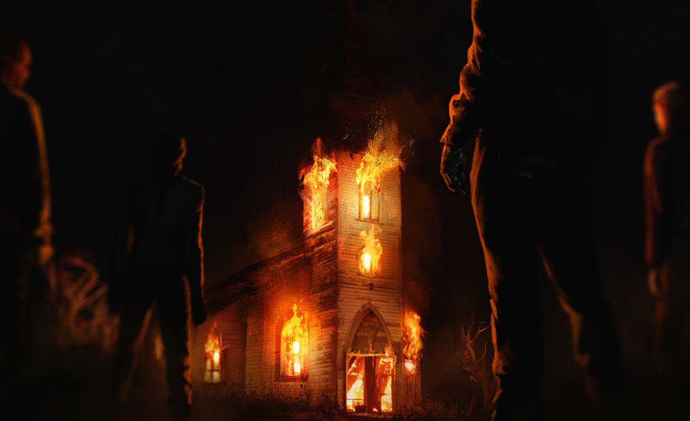

chapter eight: styx and bones

Attributes: Strength 2, Dexter­
ity 4, Stamina 4; Charisma 4, 
Manipulation 3, Composure 4; 
Intelligence 2, Wits 2, Resolve 3

to sell blood. Only, they are selling 
blood still in living vessels, through 
underground markets.

•	
The characters may decide to get 
involved in the Circulatory Sys­
tem in an attempt (wise or not) 
to dismantle the market from 
the inside.

Devotees of the Cult of Ishtar have 
assisted in the quiet arrival of a pair of 
traffickers advertising the sale of six 
unique specimens of superb quality sure 
to delight the taste buds of any discern­
ing connoisseur. They rent and refurbish 
a slaughterhouse on the outskirts of the 
city and set a date for the auction.

Secondary Attributes: Health 
7, Willpower 7

Attribute Focus: Mental / 
Physical

Skills: Athletics 2, Firearms 
(Shotgun) 3, Melee 1, Stealth 
2, Survival (Tracking) 4; Animal 
Ken (Hunting) 2, Intimidation 
3, Leadership 4, Persuasion 3; 
Awareness 3, Investigation 1, 
Occult 2, Politics (Camarilla) 3

Absolution

Cast: Ethan Clare
What Happened: The local An­
arch Movement does not take kindly 
to outsiders. A hundred years ago, 
Ethan Clare was an Archon of the 
Camarilla, responsible for the murder 
and execution of dozens of Anarchs. 
In recent years, however, Clare has 
joined the Church of the Third Eye, 
a cult preaching forgiveness and ab­
solution. As Clare enters the domain, 
the Anarch Movement discovers his 
presence and mobilizes to punish him 
for his past transgressions. But Clare 
moves to greet them, offering himself

WHAT COULD HAPPEN:

•	
Morally opposed to slavery, the 
characters try to purchase the six 
vessels outright. After their ac­
quisition, the coterie takes steps 
to rewrite their memories and 
allow them to return to society.

Disciplines: Celerity 3, Domi­
nate 1, Fortitude 1, Presence 4

General Difficulties: 5/3

Blood Trade

•	
Morally opposed to slavery but 
armed with a talent for mayhem, 
the characters force the issue. 
Through the threat of violence, 
they rescue the six mortals and 
execute the two Circulatory 
System agents.

Cast: Agents of the Circulatory 
System

What Happened: The Circulato­
ry System is a collection of Kindred 
smugglers, traveling between domains

2 6 9

CULTS OF THE BLOOD GODS

Touchstones: Charley Lang — a child in Ethan’s care

in penance. As a result, the Anarchs destroy Clare’s home, 
murder his Touchstones, and torture the former Archon 
in front of the entire Free State.

Humanity: 8

Generation: 9th

WHAT COULD HAPPEN:

Blood Potency: 3

•	
Recognizing someone has to atone for a dozen dead 
Anarchs, the characters side with the Movement. 
They support the punishment and assist in the tor­
ture, losing their Humanity in the process.

Attributes: Strength 4, Dexterity 2, Stamina 3; Cha­
risma 2, Manipulation 4, Composure 4; Intelligence 
3, Wits 3, Resolve 4

Secondary Attributes: Health 6, Willpower 8

•	
The coterie views the Anarch punishment as egre­
gious and the characters place themselves between 
Clare and the Movement. They argue on his behalf 
to convince the Movement there are other ways for 
Clare to atone for his sins.

Skills: Athletics 2, Brawl 3, Firearms 2, Melee (Staking) 
4, Stealth 3, Survival (Hostile Domains) 5; Insight (Sin) 3, 
Intimidation 2, Leadership 1, Persuasion 2; Awareness 3, 
Investigation 3, Occult 3, Politics 2, Technology 1

Disciplines: Obfuscate 4, Potence 4

Attribute Focus: Social

General Difficulties: 6/4

ETHAN CLARE
ETHAN CLARE

First Change Fiasco

Clan: Nosferatu

Sire: Shrug

Cast: Karen Shaw, First Change Werewolf
What Happened: Karen Shaw is a fifteen-year-old 
high school student who has endured the worst day of her 
young life. In addition to having to deal with peer pressure,

Embraced: 1910 (Born 1878)

Ambition: Earn a degree of forgiveness

Convictions: Always turn the other cheek

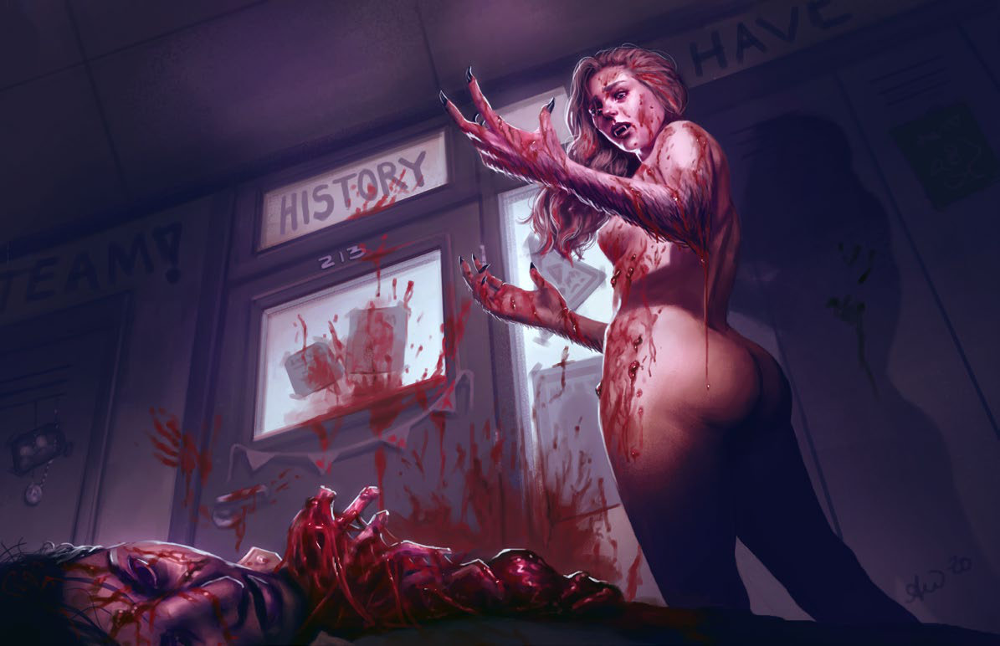

2 7 0

chapter eight: styx and bones

Tolerance and 

Persecution

puberty, and the stresses of being a teenager, Karen Shaw is 
also a werewolf. After a heated argument with her cheating 
“bae,” Shaw transforms into a werewolf for the first time. 
While in her frenzied state, she murders her former love. 
What she didn’t know at the time, but will surely find out 
soon, is that her dead ex was the Touchstone of the cult’s 
priest. Now the priest demands vengeance.

The rise of cults and churches has opened a new front 
in the Jyhad. Where Kindred once fought martial or politi­
cal battles, now they must also contend with spiritual con­
flicts. As a result, Princes, Barons, and others in positions of 
authority have begun to persecute those belonging to specif­
ic, key churches. The persecution story hooks present cults 
cities tolerate, and those which must endure persecution.

WHAT COULD HAPPEN:

•	
The characters put down Karen Shaw for good as their 
priest demands. With a reckless werewolf, one could ar­
gue killing her is an act of self-defense, if the characters 
are willing to potentially take a hit to their Humanity.

•	
The coterie subdues Karen Shaw to return her to her 
family. By rewriting her memories, they’re able to 
suppress her bloody killing-spree, but they still need 
to prove they got their pound of flesh for their priest. 
The coterie will need to figure out where the lupine 
line resides and hand over the very young and very 
confused Karen Shaw to her own kind, while finding 
some way to prove to their priest she got what was 
coming to her.

The Trinity

Cast: The Toreador Prince of the city, his Tremere 
Seneschal, and his Ventrue Sheriff

What Happened: During the Golden Age of Con­
stantinople, three Kindred ruled the city. They included 
Michael, the Dracon, and Antonius. The triumvirate mir­
rored the Christian Trinity and controlled the Byzantine 
Empire for several hundred years. Tonight, the Prince of a 
modern city seeks to reclaim the Constantinople Dream, 
ushering in a new age of prosperity and cooperation. By 
Princely decree, he commands all residents of the city to 
renounce their particular faiths and pledge themselves to 
the good of the praxis.

•	
The coterie subdues Karen Shaw and uses her to find 
out more about the werewolf community in and around 
their city. They can then use the information to rid 
themselves of the werewolves, or pass it along for some­
one else to use, whether the local Kindred or hunters.

Attribute Focus: Mental / Physical

WHAT COULD HAPPEN:

KAREN SHAW
KAREN SHAW

•	
The player characters persuade the Prince to allow in­
dividuals to continue their religious practices, so long 
as they meet the needs of the city. This show of toler­
ance may require boons or other means of bribery.

Attributes: Strength 2, Dexterity 3, Stamina 2; Cha­
risma 3, Manipulation 2, Composure 2; Intelligence 
2, Wits 3, Resolve 3

•	
The characters attempt to galvanize some of the oth­
er religious factions within the city to create a uni­
fied force to use as leverage against the Prince, or to 
take over the city in a violent coup d’etat. This could 
result in the Prince’s assassination and overthrow, or 
the coterie could face the direst of consequences for 
their involvement.

Secondary Attributes: Health 5, Willpower 5

Skills: Athletics (Escape) 2, Brawl 2, Drive 1, Surviv­
al 1; Insight 2, Intimidation (Feral) 1, Leadership 1, 
Streetwise 2; Academics (Biology) 2, Awareness 2, 
Politics 1, Technology 2

Disciplines: Celerity 2, Fortitude 2, Potence 2

Attribute Focus: Mental / Social

Special: Werewolves suffer aggravated damage 
from silver weapons and fire. They recover 1 Super­
ficial Health level per turn. Werewolves gain claws 
and teeth that deal Superficial Health damage (+3 
modifier), as well as +3 to all Physical Attributes when 
they shift into their half-wolf war form.

PRINCE BRUNO, 

PRINCE BRUNO, 

DESCENDANT OF MICHAEL
DESCENDANT OF MICHAEL

Clan: Toreador

General Difficulties: 6/4

Sire: Jezebel Locke

Embraced: 1982 (Born 1961)

Ambition: Prove my blessed lineage

2 71

CULTS OF THE BLOOD GODS

Convictions: Never allow a heresy to pass unchal­
lenged

to leave the cultists alone, or they could answer vio­
lence with violence.

Touchstones: Angelica Waterhouse — my innocent 
angel (an imprisoned chorister)

•	
The characters might decide they don’t want to live in 
a domain without toleration of faith. Either through 
social or physical means, they orchestrate a praxis sei­
zure. This could end with a more progressive Prince on 
the throne or one of the characters as ruler of the city 
curtailing the actions of the populace.

Humanity: 4

Generation: 11th

Blood Potency: 1

Attributes: Strength 2, Dexterity 3, Stamina 3; Cha­
risma 5, Manipulation 4, Composure 4; Intelligence 
2, Wits 2, Resolve 2

Attribute Focus: Mental / Social

Gladius Domini

Secondary Attributes: Health 6, Willpower 6

Skills: Athletics 1, Craft (Icons) 2, Stealth 3, Survival 
1; Animal Ken (Birds) 2, Intimidation 3, Leadership 
3, Persuasion 4; Awareness 1, Occult (Nephilim) 4, 
Politics (Camarilla) 3, Science (Chemistry) 3

Cast: Reverend Alfred Murray of the Society of St. 
Leopold

What Happened: Alfred Murray and his small cohort 
are members of the Society of St. Leopold — vampire 
killers who work directly for the Vatican. Equipped with 
state-of-the-art equipment, weaponry, and the power of 
True Faith, they are a terrifying force. Fed information 
by a local Kindred, Murray and his fellows hunt down 
the various cults within the city. They have succeeded in 
wiping out a church dedicated to Mithras and now focus 
their attentions on the characters themselves.

Disciplines: Auspex 3, Celerity 1, Presence 3

General Difficulties: 6/4

Praise (the Church of) Caine!

Cast: A small cluster of Gnostic scholars
What Happened: The Church of Caine, also known 
as the Cainite Heresy, circulates within Camarilla cities. 
Those Gnostic scholars who adhere to it believe Kindred 
are divine angels, chosen by God to safeguard humankind.

WHAT COULD HAPPEN:

•	
The simplest solution is for the characters to go to 
ground and wait out the attack or try to get out of 
the city to let the worst pass, but they’ll still need to 
see to their nightly needs like feeding.

However, in this particular city, the vampire pop­
ulation has begun forcing Gnostics to repent on pain 
of death. The mob has already executed three of them 
and have at least two more in their sights. The city’s 
laissez-faire leadership doesn’t care what happens to the 
Gnostics as long as the mob doesn’t break the Masquer­
ade.

•	
The characters could defend themselves. With a com­
bination of guile, combat skill, and a modicum of 
luck, the characters manage to turn the tables on the 
Society, removing them as a threat and then exposing 
the actions of the traitorous vampire.

WHAT COULD HAPPEN:

Attribute Focus: Physical

•	
While the characters are not Gnostics themselves, 
they view the persecution of the Church of Caine as 
a transgression against religious freedom. After all, if 
Kindred can persecute one faith so easily, what stops 
them from mistreating another? The player charac­
ters can take steps to safeguard the Gnostics. They 
might house them within their havens or get them 
out of the city either secretly or by pushing them out 
with force.

REVEREND ALFRED MURRAY
REVEREND ALFRED MURRAY

Standard Dice Pools: Physical 4, Social 4, Mental 5

Secondary Attributes: Health 6, Willpower 6

Exceptional Dice Pools: Firearms 5, Melee 5; 
Awareness 6, Investigation 7, Occult 7

Special: True Faith 3

•	
The characters could confront the mob directly. They 
could persuade, bargain with, or bribe the Kindred

General Difficulties: 6/3

2 7 2

chapter eight: styx and bones

High and Low

Attributes: Strength 2, Dexterity 3, Stamina 2; Cha­
risma 2, Manipulation 2, Composure 2; Intelligence 
2, Wits 3, Resolve 3

Cast: A Low Clan Prince and a lot of unhappy High 
Clan citizens

Secondary Attributes: Health 5, Willpower 5

Skills: Athletics 2, Brawl (Street Fighting) 3, Larceny 
(Lockpicking) 3, Stealth 2, Survival 2; Etiquette 1, 
Insight 2, Intimidation (Interrogations) 3, Persuasion 
2, Streetwise 3, Subterfuge 1; Awareness 2, Investi­
gation 4, Technology 2

What Happened: In some cities, Kindred still insist 
on the existence of High Clans and Low Clans. High 
Clans, which include the Lasombra, Toreador, Ventrue, 
and Hecata, carry a certain nobility which historically 
has allowed them to chastise and demean the Low Clans. 
The Gangrel, Malkavians, and Nosferatu have carried the 
brunt of this scorn, though the Brujah and Tremere have 
sometimes shared in their treatment.

Disciplines: Celerity 2, Potence 2

General Difficulties: 4/2

In a reversal of fortune, the Prince of the city, a 
stalwart Nosferatu with ties to Gorgo’s Nest, has come 
to power and demands additional taxes on the High 
Clans of his city. Claiming the persecution of his blood 
for centuries as pretense, the Prince employs Malkavian 
diplomats to bleed boons from the Ventrue and Torea­
dor. They use Gangrel enforcers to threaten the lives of 
the local Hecata. Many of the player characters suddenly 
find themselves extorted for no other reason than their 
pedigree.

THE INDUCTED INITIATE
THE INDUCTED INITIATE

Clan: Toreador

Humanity: 5

Generation: 11th

Blood Potency: 2

Attributes: Strength 2, Dexterity 4, Stamina 2; Cha­
risma 3, Manipulation 3, Composure 3; Intelligence 
2, Wits 4, Resolve 3

WHAT COULD HAPPEN:

Secondary Attributes: Health 5, Willpower 6

•	
The characters don’t have the muscle to overthrow 
the Prince, so instead they try a nuanced approach. 
They pay off the right people in order to gain access 
to the Prince, taking the night to make their case and 
plead on behalf of the High Clans.

Skills: Athletics 2, Craft (Sculpture) 3, Melee 2; 
Etiquette 3, Insight 3, Leadership 2, Persuasion 3, 
Streetwise 1, Subterfuge (Misdirection) 2; Academics 
(Art) 3, Awareness 2, Finance 2, Occult 1, Politics 1

Disciplines: Auspex 2, Celerity 3, Presence 1

•	
The characters formulate a campaign meant to un­
dermine and subvert the praxis. They lead a conspir­
acy to coordinate a rebellion among the city’s other 
High Clan members.

General Difficulties: 5/3

THE LOYAL ACOLYTE
THE LOYAL ACOLYTE

Attribute Focus: Mental / Social

Clan: Gangrel

Sample Cultists

Humanity: 4

Generation: 11th

Blood Potency: 3

Individual cultists come in various shapes and sizes. From 
the naive laity to the hardened zealot, all have a shared 
sense of faith. The Storyteller can use the following SPCs 
to populate a local storyline.

Attributes: Strength 3, Dexterity 2, Stamina 4; Cha­
risma 2, Manipulation 2, Composure 2; Intelligence 
3, Wits 3, Resolve 3

Secondary Attributes: Health 7, Willpower 5

THE NAIVE LAY MEMBER
THE NAIVE LAY MEMBER

Skills: Athletics 4, Brawl 4, Drive 2, Larceny 2, Stealth 
4, Survival 3; Animal Ken (Farm Animals) 2, Insight 2, 
Intimidation 3, Leadership 2; Investigation 3, Medicine 
(Field Medic) 2, Science 2, Technology 2

Clan: Brujah

Humanity: 5

Disciplines: Celerity 2, Fortitude 2, Protean 4

Generation: 12th

General Difficulties: 5/4

Blood Potency: 1

2 73

CULTS OF THE BLOOD GODS

THE TRUSTED TEMPLAR
THE TRUSTED TEMPLAR

THE DEVOUT CLERGY
THE DEVOUT CLERGY

Clan: Ventrue

Clan: Malkavian

Humanity: 4

Humanity: 4

Generation: 11th

Generation: 10th

Blood Potency: 3

Blood Potency: 4

Attributes: Strength 2, Dexterity 3, Stamina 4; Cha­
risma 2, Manipulation 2, Composure 3; Intelligence 
3, Wits 3, Resolve 3

Attributes: Strength 2, Dexterity 4, Stamina 2; Cha­
risma 2, Manipulation 4, Composure 3; Intelligence 
3, Wits 3, Resolve 3

Secondary Attributes: Health 7, Willpower 6

Secondary Attributes: Health 5, Willpower 6

Skills: Athletics (Foot Chases) 3, Brawl 1, Drive 
(Evasions) 3, Melee (Swords) 4, Survival 2; Etiquette 
2, Insight 2, Intimidation 2, Leadership 2, Persuasion 
2; Awareness 2, Investigation 3, Technology 2

Skills: Athletics 2, Craft (Embalming) 3, Drive 1, 
Firearms (Rifles) 4, Survival 2; Insight 4, Intimidation 
4, Leadership 3; Academics 2, Awareness 2, Investi­
gation 3, Medicine (Pathology) 4, Occult 3

Disciplines: Dominate 2, Fortitude 4, Presence 2

Disciplines: Auspex 4, Dominate 2, Obfuscate 4

General Difficulties: 6/3

General Difficulties: 6/5

THE GRAND INQUISITOR
THE GRAND INQUISITOR

THE CHARISMATIC PROPHET
THE CHARISMATIC PROPHET

Clan: Toreador

Clan: Lasombra

Humanity: 3

Humanity: 3

Generation: 10th

Generation: 9th

Blood Potency: 3

Blood Potency: 4

Attributes: Strength 2, Dexterity 4, Stamina 2; Cha­
risma 3, Manipulation 4, Composure 3; Intelligence 
4, Wits 3, Resolve 4

Attributes: Strength 4, Dexterity 2, Stamina 2; Cha­
risma 3, Manipulation 3, Composure 4; Intelligence 
4, Wits 4, Resolve 4

Secondary Attributes: Health 5, Willpower 7

Secondary Attributes: Health 6, Willpower 8

Skills: Athletics 1, Melee 2, Stealth 2, Survival 2; 
Etiquette 1, Insight 3, Intimidation (Interrogations) 4, 
Leadership 3; Academics 2, Awareness 3, Investiga­
tion 3, Occult 2, Science (Psychology) 4

Skills: Athletics 2, Drive 2, Melee (Broadsword) 
4, Stealth 2; Etiquette 2, Insight 2, Intimidation 4, 
Leadership (Oratory) 4, Persuasion 3, Subterfuge 3; 
Academics (History) 4, Medicine 3, Occult 4

Disciplines: Auspex 4, Celerity 2, Presence 4

Disciplines: Dominate 2, Fortitude 2, Oblivion 4, 
Potence 4

General Difficulties: 6/4

General Difficulties: 7/5

2 74

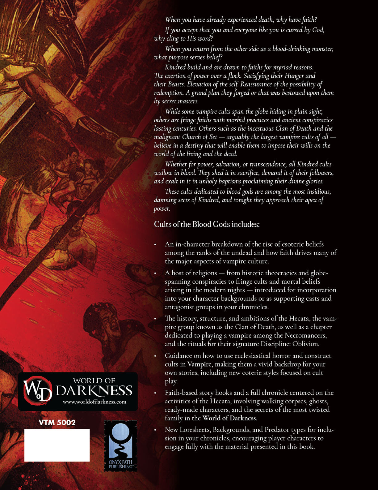
