**A SOURCEBOOK FOR VAMPIRE: THE MASQUERADE**

# 224mm 15.5 20

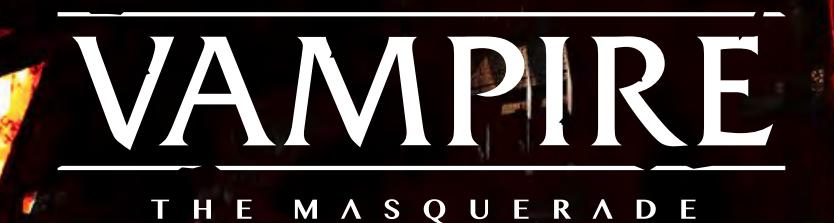

287mm

A Sourcebook for *Vampire: The Masquerade*

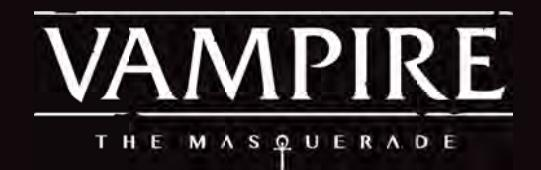

WRITTEN BY Cat Evans, Kenneth Hite, and Khaldoun Khelil EDITING AND DEVELOPMENT BY Kenneth Hite and Elisa Teague ART DIRECTOR: Trivia Fox and Elisa Teague COVER ART: Mark Kelly INTERIOR ART AND ILLUSTRATION: Nevzat Aydin, Raquel Cornejo, Trivia Fox, Mark Kelly, Violet Schrage, Elisa Teague GR A PHIC DESIGN AND LAYOUT: Joshua "HTTPaladin" Mendenhall CULTUR AL CONSULTANT EDITING: James Mendez Hodes

BRAND MANAGER: Sean Greaney BRAND CREATIVE LEAD: Justin Achilli BRAND ART DIRECTOR: Tomas Arfert BRAND EDITOR: Karim Muammar BRAND COMMUNITY DEVELOPER: Martyna "Outstar" Zych BRAND MARKETING MANAGER: Jason Carl

BUSINESS DEVELOPER: Dhaunae De Vir

PRESIDENT & PUBLISHER: Scott Gaeta VICE PRESIDENT SALES & MARKETING: Sara Erickson CONTROLLER: Robyn Gaeta DIRECTOR OF OPERATIONS: Leisha Cummins DIRECTOR, STR ATEGIC PARTNERSHIPS: Erika Conway SALES AND MARKETING PROGRAM MANAGER: Matt Holland SENIOR PRODUCER OF ROLEPLAYING GAMES: Elisa Teague ASSOCIATE PRODUCER OF ROLEPLAYING GAMES: Trivia Fox SENIOR PRODUCER OF BOARD & CARD GAMES: Dan Bojanowski ASSOCIATE PRODUCER OF BOARD & CARD GAMES: Jimmy Le

SENIOR GAME DESIGNER: Matt Hyra GAME DESIGNERS: Dan Blanchett & T.C. Petty III SENIOR CREATIVE LEADS OF BOARD & CARD GAMES: Anita Osburn & Jeanne Torres VIDEO PRODUCTION ASSOCIATE: Katie Schmitt CUSTOMER SERV ICE: Jenni Janikowski FINANCE CLERK: Minnie Nelson EVENT MANAGER: Chris Whitpan CREATIVE PRODUCTION: Noelle Lopez CREATIVE PRODUCTION: Todd Crapper

© 2021 Paradox Interactive® AB. Vampire: The Masquerade® – are trademarks and/or registered trademarks of Paradox Interactive AB in Europe, the U.S., and other countries.

Visit the World of Darkness online at www.worldofdarkness.com

# Оглавление

# Вступление**, 6**

Как пользоваться данной книгой, 7 Стиль рассказчика, 7 Тема и настроение, 8 Лексикон Второй Инквизиции, 10

# Глава первая: Охотникиубийцы **13**

Посредники и лица: Социальная Сфера, 13

Технологии и тайны: Ментальная сфера, 23 Ударники и оперативники: Физическая Сфера, 31

Колдуны и священники: Магическая Сфера, 37

Перебежчики, 46

Создание Оперативного Штаба, 51

# Глава вторая: Специальное оружие**, 69**

Вооружение и боевая техника, 69 Транспортные средства, 76 Цифровые технологии XTech, 79 Артефакты, 83

### Глава третья: Опасные игры**, 89**

Стандартные оперативные процедуры, 89 Тактика расследования, 90 Тактика канализирования, 96 Оперативные подходы, 101 Проекты Второй Инквизиции, 108 Алгоритм коалиционного реагирования, 112

# Глава четвертая: Огневые Группы**, 115**

США, 116 Великобритания, 123 Россия, 125 Бразилия, 128 Организации-партнеры, 137 Сельскохозяйственные команды, 140

# Глава пятая: Зеркальные лабиринты**, 147**

Элемент истории: Исторические структуры, 147 Элемент Сеттинга: Добро пожаловать в оккупацию, 151 Тематический Элемент: Огонь и меч, 153 Элемент Сеттинга: Театры военных Операций, 155 Тематический элемент: Ночь и туман, 156 Элемент истории: Стрелять или говорить?, 157 Тематический элемент: Зеркальные изображения, 158

Элемент Сеттинга: Враги моих врагов, 160

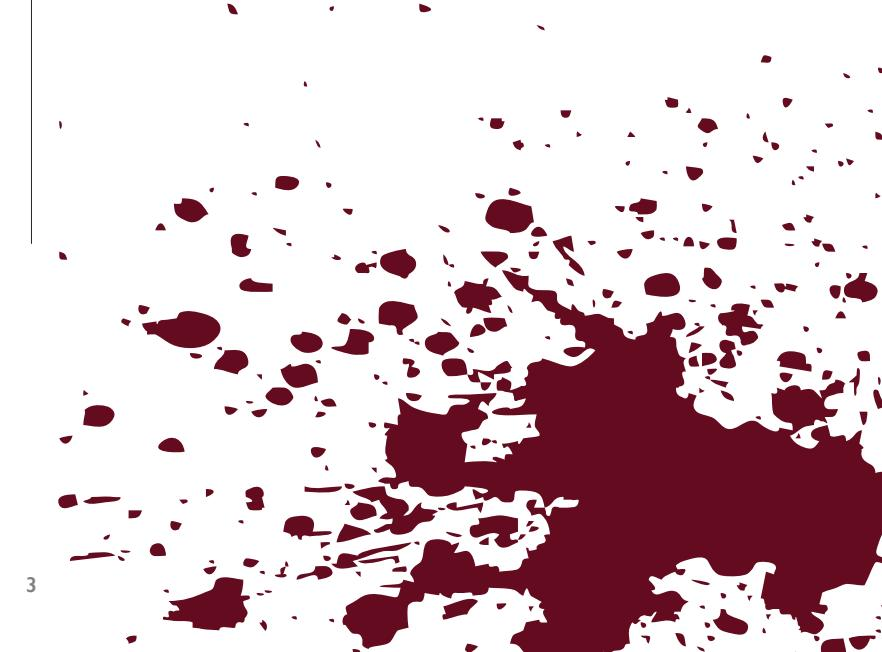

#### СОВЕРШЕННО СЕКРЕТНО // **FIRSTLIGHT** // **REL TO VATSSL** / **UKJTRG**,

VZBLLXRO93492 PP RUEHCHI RUEHCN RUEHDT RUEHHM DE RUEHIAO #0877/02 0361442 ZNY VVVVV ZZH P 000822V FEB 04 2021 FM <REDACTED> TO RUEHC/OPS LANGLEY PRIORITY 0022

#### КОНТРОЛЬ ПЕРЕХВАТ НАБЛЮДЕНИЯ

АКТИВЫ: <РЕДАКТИРОВАНО> ДАТА: ЯНВ 30/0701HR EST ЛОКАЦИЯ: 25.830500 / -80.180374 // МАЙАМИ, ШТАТ ФЛОРИДА, США

#### СУБЪЕКТЫ:

Мужчина Пустое тело Гарри "Twitch" Логан (**HTL**) Неизвестная женщина Пустое тело 2 (кодовое имя ШИРЛИ) (**SHR**) Неизвестный мужской Пустое тело 3 (кодовое имя ГРАССИ) (**GRS**) Пустое тело мужского пола "Доминик" (фамилия неизвестна) (**DOM**)

#### ПРОДОЛЖИТЕЛЬНОСТЬ: 05:02

#### ИНИЦИИРОВАНИЕ НАЖАТИЯ КНОПКИ УДАЛЕННОГО ТЕЛЕФОНА [Звук шагов] [Звук открываемой и закрываемой двери] HTL: Не волнуйтесь, я их потерял. SHR: Кого потерял? GRS: Где тебя носило? Уже почти утро, Пендехо. SHR: Кого потерял? HTL: Они, эти парни, я думаю, могли бы сделать меня вне клуба. Черные парни, выцветшие лица, выглядели сурово, как копы. Или на военных. GRS: Какой клуб, мудак? HTL: Алая улица, пошел ты. Слушай, я умирал с голоду, я всю ночь пытался забить на это дело и ничего, абсолютно сухой. Как твоя девушка. [Неразборчивые крики] SHR: Эти два парня - HTL: Как я уже сказал, я потерял их, они даже не видели, как я вошел в клуб, я знаю желтую дверь - GRS: Каждый житель Хайалеа знает желтую дверь, придурок, она есть на их гребаной странице TripAdvisor! HTL: Когда я вошел, их не было, только обычные мусорщики, Карлос и какой-то бездомный. SHR: Значит, бомж видел, как вы вошли. HTL: Нет! Я не знаю! Я не знаю, что он видел, он был не в себе, мужик, разговаривал сам с собой... SHR: Итак, после того как вы потеряли два отряда и вас обматерил бомж, вы отправились на Алую Улицу - GRS: Через дверь с придурью -

#### [Неразборчивые выкрики]

GRS: Ты жалкий панк-неудачник. HTL: Да пошел ты, чувак, я сегодня забил. Огромный, может быть, сгусток, я чувствую себя потрясающе. Горячо. Я подзаправился, я в порядке. Отлично, после закрытия на улицах вообще никого, я практически прилетел сюда, даже не знаю, зачем я об этом говорил. SHR: Твитч, ты в порядке? Ты выглядишь, ну, странно. Даже для тебя. Ты не притащил сюда этот чертов КОВИД сюда? HTL: Нет, детка, все в порядке, ничего такого, я просто чувствую себя прекрасно, действительно прекрасно, действительно очень прекрасно. SHR: Господи, он спотыкается о яйца! Черт, да он вспотел! Снимите с него пальто. [Громкий звук] DOM: Что это такое? HTL: Я, Я, Я.... – DOM: Это что, телефон? HTL: Это не мое, Дом, клянусь. GRS: Она выпала из твоего кармана, придурок. DOM: You know the rule about phones. HTL: Я хочу, я хочу, я не знаю, откуда он взялся, он не мой, клянусь Христом, я имею в виду Каина. GRS: Так как же оно попало в твое пальто, придурок? HTL: Я не знаю, может быть, девушка в клубе, она была довольно резвой, сняла с меня пальто, рубашку и... SHR: Эта девушка, вы кормились у нее? HTL: Да, я же говорил тебе, я попал в это дерьмо, так хорошо, супер хорошо, не в моей лиге, но я сделал это в клубе, выпил глубоко, вкусно, но я не хотел оставлять тело, как ты всегда говоришь, Дом, мы должны быть малозаметными и все такое, плюс, может быть, если она содержит свертывание, это может стоить чего-то, на вкус так хорошо, так охуенно хорошо **[**звуки рвоты**]**. **GRS**: Эй, следи за джинсами, ублюдок! **SHR**: К черту джинсы, нас развели! Ты что, не понимаешь? Эта девчонка была чертовой приманкой, козлом Иуды! Мы должны убираться отсюда! **GRS**: Как именно? Уже, блядь, рассвело, а наш так называемый Оракул слюнявит своей кровью-микки на мои сраные Джаккарды. Он не может спрятать даже кролика, не говоря уже о себе. **DOM**: Заткнитесь все. Хватай его за руки. У меня есть план. Первым делом... **HTL**: **[**Сплевывает, отплевывается**]** Эй, это был грузовик снаружи... **[**Звуки разбивающихся окон, взрывы гранат**]**

**[**Выстрелы, неразборчивые крики**]** УСТРОЙСТВО УНИЧТОЖЕНО

# ВСТУПЛЕНИЕ: ОТКРЫТИЕ ГАМБИТА

"Èáî âîò, íàñòóïàåò äåíü, êîòîðûé áóäåò ïûëàòü, êàê ïå÷ü. È âñå ãîðäûå, äà, âñå äåëàþùèå çëî, áóäóò êàê ñîëîìà â íåé. È äåíü ãðÿäóùèé ñîææåò èõ", - ãîâîðèò Ãîñïîäü Âñåâûøíèé. "Íè êîðíÿ, íè âåòâè íå îñòàíåòñÿ îò íèõ".

― ÌÀËÀÕÈß 4:1

Неназванный Тореадор придумал термин "Вторая инквизиция" для обозначения той бури дерьма, которая заслуженно обрушивается сейчас на Родство. Это, в буквальном смысле, художественный термин, а не конкретный указатель: вы не можете позвонить по телефону во Вторую Инквизицию или написать им по адресу @si.gov. (Хотя если вы посылаете письмо на это доменное имя, то кто-то его читает...) Ни у кого нет бланка "Вторая инквизиция" или крутого логотипа SI. Даже Ватикан считает, что это такая же инквизиция, как и та, которую они начали в XIII веке, только костры теперь пылают сильнее (и более высокотехнологичны), поскольку приближаются времена конца света.

Думайте о Второй инквизиции как о событии, а не как о самостоятельной организации. Это время Второй Инквизиции, новое время, когда Маскарад разгорается, а Сородичи снова должны бояться людей. В эти ночи охотящиеся на вампиров группировки всех размеров (и уровней финансирования и подготовки) собираются вместе и разжигают огонь.

Наиболее яркой разновидностью Второй инквизиции, которую обычно имеют в виду Сородичи, является нелегальный и тайный многонациональный заговор многих спецслужб и Ватикана по охоте на вампиров. Эта группа называет себя "Коалицией", когда неофициально говорит о своем составе. (На практике Коалиция состоит из двух пересекающихся заговорщических альянсов, одной крупной третьей силы и ряда тайных местных программ, которые иногда обмениваются информацией о целях.

Эта книга посвящена этим охотникам и их охоте, поскольку именно этот образец Второй Инквизиции представляет наибольшую опасность для общества Сородичей в целом. Но одна соседская церковная группа или местный профсоюз с токарным станком в гараже может уничтожить вас так же верно, как и многовековое воинствующее общество Ватикана или ударная группа подразделения DEVGRU.

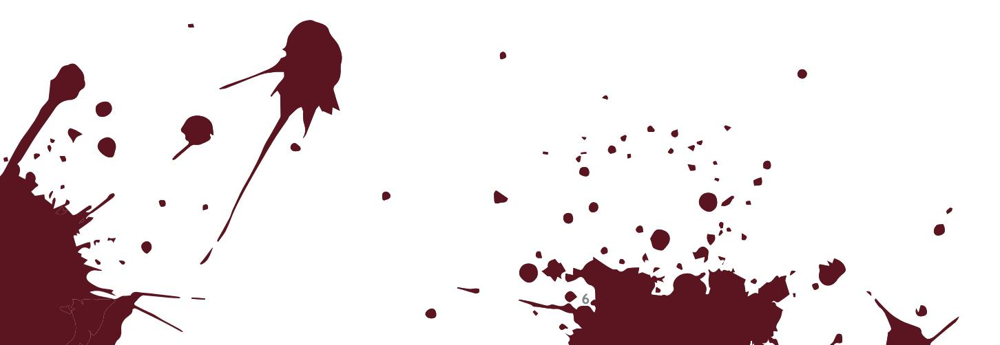

# Как пользоваться данной книгой

Это книга антагонистов для Vampire: The Masquerade. В ней нет систем для создания персонажей инквизиторов или охотников, а руководство по ролевому отыгрышу и созданию таких персонажей ориентировано на рассказчика. Зато в ней есть множество охотников "подставного типа", пригодных для любого типа состязаний в любой истории. Не только в историях, где секретные команды правительственных убийц могут ворваться в ваше убежище в любое утро, но и в историях, где люди ненавидят, боятся и возмущаются монстрами среди них, и все большее число из них вооружается, чтобы что-то с этим сделать. Итак, практически любая история в эти современные ночи.

Персонажи-рассказчики используют системы, артефакты, тактику и оружие, описанные в этой книге, против команды игроков. Рассказчики могут и должны ставить любые препятствия на пути персонажей игроков, если те пытаются их использовать или использовать их сами: вызов делает истории интересными, а если вы прикоснетесь к святой иконе без исследования (или к перчаткам из кожи трупа), вы заслуживаете ожога. Механически некоторые из этих систем намеренно завышены: они абстрагируются от обучения, сотрудничества, добычи информации и налогов с целью воспроизвести паранойю и опасность, которые испытывают Сородичи, когда поднимается Вторая Инквизиция.

# Стиль Рассказчика

Как и большинство мировых явлений, Вторая инквизиция предстает перед нами совершенно поразному в зависимости от того, как и где ее искать. Военные истории и шпионские истории зачастую больше похожи друг на друга, чем на реальных солдат и шпионов. Как и большинство историй в Vampire, вы можете выбирать, как будет выглядеть история Второй Инквизиции в вашей истории. Будет ли это ловкий шпионский триллер со сверхнасильственными элементами, жесткий шпионаж или полицейское шоу, или надвигающийся кошмар, который никак не может разрешиться?

Выбирайте из представленных типов антагонистов, подстраивая их под свою историю и свое чувство драматизма. Вам не нужно создавать тактическую ОПФОР или даже знать, что означает эта аббревиатура. (Мир может быть полон черных эскадронов смерти (эскадронов Истинной Смерти?), выжигающих убежища от Сиэтла до Сиднея, но в городе вашей истории может быть всего полдюжины Охотников под прикрытием в полицейском управлении, которые скрывают свою охоту, как их товарищи скрывают свои перестрелки или побочные делишки. Может быть, в восточной части города есть новый священник и несколько крепких парней, которые зависают в бразильском ресторане и смотрят футбол на своих телефонах...

Давать намеки и подсказки, приправляя их тем вкусом, который вы хотите получить от своей истории, когда она будет полностью готова. Расскажите о деталях, возможно, даже об особенностях личности, но без монологов и вываливания информации. (Противостояние с NSA - это то, как Сородичи вообще попали в эту передрягу). Не топите игроков в объяснениях: ужас лучше всего работает, когда все неизвестно и трудно понять. Пусть охотники будут страшными и значимыми, особенно если они приходят в убежище персонажей в кевларе и с кольями.

**7**

# Тема и настоение

Тема Второй Инквизиции - решительность, направленная на игроков. Как некий киборгубийца из будущего, Коалицию невозможно переубедить, с ней невозможно договориться. Она не испытывает ни жалости, ни угрызений совести, ни страха и абсолютно не собирается останавливаться. Никогда. С отдельными инквизиторами, солдатами, полицейскими или монахинями можно договориться и поторговаться. Большинство из них испытывают страх, некоторые - жалость, и даже некоторые - раскаяние. Все эти отклонения и человеческие моменты отличные истории, рябь на воде. Но повествование неумолимо размывает эти истории, заменяя каждого несовершенного или сломленного врага еще двумя - десятью жаждущими мести или спасения. Инквизиция в целом - и как заговор, и как движение, разжигающее этот заговор, - не остановится, пока не сгорит каждый Род. Передать безличную, непримиримую решимость гигантской бюрократии уничтожить персонажей игрока в 2020-х годах не только невозможно, но и должно быть очень эффективно.

Настроение Второй Инквизиции паранойя. Прошли те невинные времена, когда вампиры - или кто угодно - могли позвонить по телефону, зайти на сайт, отправить электронное письмо, купить книгу, понравиться симпатичному мальчику, и никто этого не видел. А кто-то это видит, потому что кто-то всегда наблюдает за вами, или может поднять данные и наблюдать за вами завтра. И в отличие от вас и ваших данных, ваши наблюдатели не оставляют следов, не имеют имен, кредитных реквизитов и статусов в Facebook. А некоторые из них наблюдают лично, из машин без опознавательных знаков, из снайперских гнезд или из толпы, в которой, как вы думали, можно спокойно охотиться. А потом они приближаются, и кто-то другой наблюдает за ними, стирая с вас пыль.

#### ÑÎÃËÀÑÈÅ È ÓÂÀÆÈÒÅËÜÍÎÅ ÎÒÍÎØÅÍÈÅ Ê ÈÃÐÅ

В книге "Вампир" затрагиваются взрослые темы и сюжетные элементы, которые могут показаться некоторым некомфортными или напомнить им о личных травмах. Методы, применяемые охотниками на вампиров во времена Второй инквизиции, жестоки, мучительны и ставят людей в ситуации, которые могут отражать дискриминацию и страдания в реальном мире.

Стоит оговориться, что это элементы и темы сюжета. Они не дают права травмировать игроков или злоупотреблять доверием между ними. Хотя персонажи истории, в которой участвует Вторая Инквизиция, вполне могут столкнуться с тяжелыми обстоятельствами, ни в коем случае нельзя допускать, чтобы подобные ситуации или методы применялись к участникам игры.

Подробнее о согласии и уважительном отношении к игре см. в Приложении **III** к игре **Vampire**: **The Masquerade**, с. 421-425.

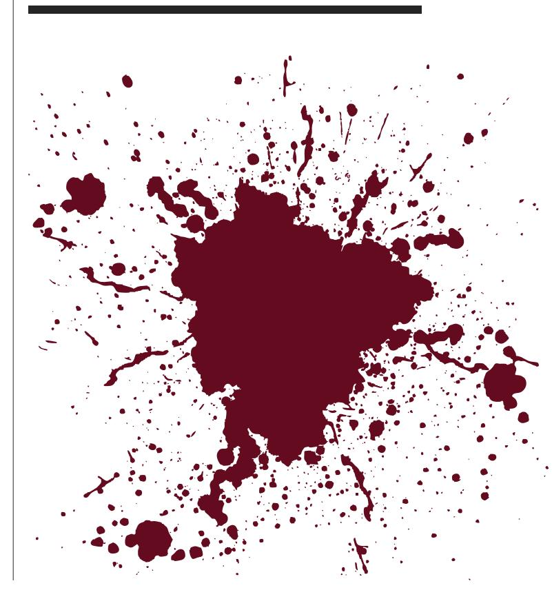

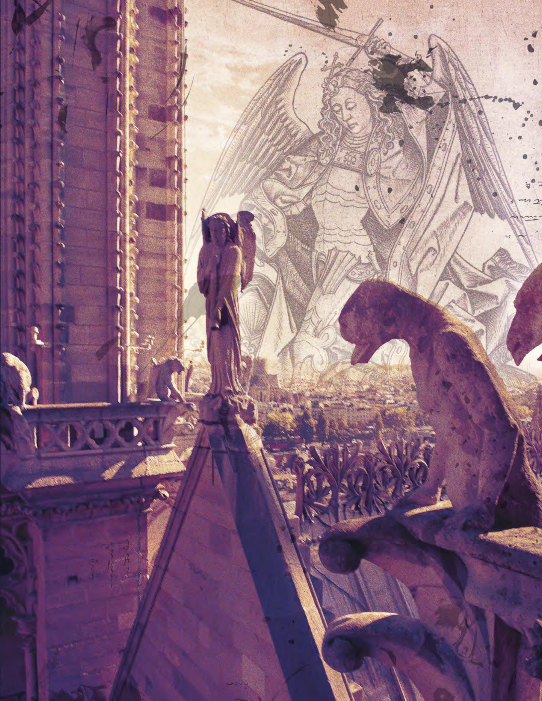

# ËÅÊÑÈÊÎÍ ÂÒÎÐÎÉ ÈÍÊÂÈÇÈÖÈÈ

Auto-da-Fé: Áóêâàëüíî "àêò âåðû", ïåðâîíà÷àëüíî ðèòóàëüíîå îñóæäåíèå è íàêàçàíèå åðåòèêà, èíîãäà ïóòåì ñîææåíèÿ íà êîñòðå; ñåé÷àñ - ïðèêàç ëåîïîëüäèòîâ î âûíåñåíèè ïðèãîâîðà (îáû÷íî î ïðåêðàùåíèè äåéñòâèÿ) â îòíîøåíèè îáúåêòà èëè ñóáúåêòà. Òàêæå èñïîëüçóåòñÿ äëÿ îáîçíà÷åíèÿ ðåéäà ""êîêòåéëü è âûïå÷êà"" (q.v.) èëè ëþáîé îïåðàöèè, ñâÿçàííîé ñ ïðèìåíåíèåì çàæèãàòåëüíûõ ñðåäñòâ.

BBZed: Ñîêðàùåíèå îò "Á.Á. Çåä" îçíà÷àåò "Ïóñòîå òåëî Çåðî" - òåðìèí JTRG, îáîçíà÷àþùèé æåëàåìûé ðåçóëüòàò åå îïåðàöèé â Áðèòàíèè. ×àñòî èñïîëüçóåòñÿ îõîòíèêàìè êîàëèöèè äëÿ ñîîáùåíèÿ îá óñïåøíîì âûïîëíåíèè çàäàíèÿ, à èíîãäà è î íåãàòèâíûõ ðåçóëüòàòàõ íàáëþäåíèÿ: "Ìû çàñåêëè ÁÁÇ íà 18-é óëèöå".

Áåëåçà: Îòëè÷íûé, êðàñèâûé, õîðîøî óïðàâëÿåìûé; ÷àñòî óïîòðåáëÿåòñÿ ñ ñàðêàçìîì. Áóêâàëüíî "êðàñîòà" íà áðàçèëüñêîì ïîðòóãàëüñêîì; ðàñïðîñòðàíèëîñü â ESOG è àìåðèêàíñêèõ ñïåöïîäðàçäåëåíèÿõ ÂÈ.

Áåëëà: Ñìåðòíûé, ïîäîçðåâàåìûé â ðàáîòå ñ âàìïèðàìè èëè íà íèõ. Èíîãäà îáîçíà÷àåò Ðåíôèëä.

Ïóñòûå òåëà (Áëàíêáîäè): Òåðìèí FIRSTLIGHT è SO13 äëÿ îáîçíà÷åíèÿ âàìïèðîâ, îçíà÷àþùèé èõ ïóñòûå ïîêàçàíèÿ íà èíôðàêðàñíûõ êàìåðàõ. Òàêæå Two-Bravos, B-Boys è BBs.

BOES: Batalhão de Operações Especiais Secretas; áðàçèëüñêàÿ âîåíèçèðîâàííàÿ ãðóïïà, çàíèìàþùàÿñÿ îõîòîé íà âàìïèðîâ. Îíè íàçûâàþò ñåáÿ os Sagrados, "Ñâÿòûå"."

Êåíàêóë: Ãðóïïà èíêâèçèòîðîâ-ëåîïîëüäèòîâ; èõ îïåðàöèîííîé áàçîé ÿâëÿåòñÿ Êåíàêóë.

Êîàëèöèÿ: Íåîôèöèàëüíîå íàçâàíèå, äàííîå Ïÿòüþ Ôàêåëàìè òàéíîìó óïðàâëåíèþ ïî îáùåìó ïëàíèðîâàíèþ è îïåðàöèÿì â ðàìêàõ ãëîáàëüíîé îõîòû íà âàìïèðîâ. Òî, ÷òî áîëüøèíñòâî Ñîðîäè÷åé èìåþò â âèäó, êîãäà ãîâîðÿò "Âòîðàÿ Èíêâèçèöèÿ".

Âîñüìîå íàïðàâëåíèå: Ãðóïïà, çàíèìàþùàÿñÿ îõîòîé íà âàìïèðîâ â ñîñòàâå Ïÿòîãî óïðàâëåíèÿ ÃÐÓ (âîåííàÿ ðàçâåäêà), òàêæå "Íàïðàâëåíèå 58" èëè ÃÐÓ-Í58.

ESOG: Ãðóïïà ñïåöèàëüíûõ îïåðàöèé Ýíòèòåòà; êîìïîíåíò ñïåöèàëüíûõ ñèë Îáùåñòâà Ñâÿòîãî Ëåîïîëüäà. (Íà èòàëüÿíñêîì ÿçûêå - Gruppo Operativo Speciali della Entità, èëè GOSE.) Òàêæå "Ãëàäèóñ Dei".

Îòåö Ëåî: Îáùåñòâî Ñâÿòîãî Ëåîïîëüäà èëè åãî ñîòðóäíèêè; â îñíîâíîì èñïîëüçóåòñÿ íå ëåîïîëüäèñòàìè. ("Îòåö Ëåî ðàçâåäàë äëÿ íàñ áîëüíèöó"). Òàêæå Ïàé Ëåî (áðàçèëåö), Îòåö Ëåâ (ðóññêèé).

FIRSTLIGHT: Ñîâìåñòíàÿ ïðîãðàììà ñïåöèàëüíîãî äîñòóïà ÖÐÓ è NASA ïî âûÿâëåíèþ, îáíàðóæåíèþ è óíè÷òîæåíèþ âàìïèðîâ.

Ïÿòü ôàêåëîâ: Ïÿòü îñíîâíûõ êîìïîíåíòîâ ïîäïîëüíîé êîàëèöèè îõîòíèêîâ íà âàìïèðîâ: FIRSTLIGHT (ÑØÀ), JTRG (Âåëèêîáðèòàíèÿ), ÃÐÓ-N58 (Ðîññèÿ), BOES (Áðàçèëèÿ) è Îáùåñòâî Ñâÿòîãî Ëåîïîëüäà.

×åòûðíàäöàòûé âåê: Ñîòíÿ "ñêðûòûõ" "ìîðñêèõ êîòèêîâ", êîòîðûì IAO ïîðó÷èëî ïðîâåäåíèå ñïåöîïåðàöèé ïðîòèâ "÷èñòûõ òåë". Òàêæå C14.

Çåëåíàÿ çîíà: Ðàéîí ãîðîäà, ñ÷èòàþùèéñÿ ñâîáîäíûì îò âàìïèðîâ.

Õåëüñèíã (èëè Âàí Õåëüñèíã): Îäèíî÷íûé îõîòíèê íà âàìïèðîâ; îáû÷íî èñïîëüçóåòñÿ ñíèñõîäèòåëüíî ÂÈ è ïðåíåáðåæèòåëüíî Ñîðîäè÷àì.

IAO: Óïðàâëåíèå èíôîðìàöèîííîé îñâåäîìëåííîñòè, ïåðâîíà÷àëüíî ïðîãðàììà Ïåíòàãîíà ïî ïðîãíîçèðîâàíèþ óãðîç, îôèöèàëüíî çàêðûòàÿ â îêòÿáðå 2003 ã.; â íàñòîÿùåå âðåìÿ - òåíåâîå êîìàíäîâàíèå âîîðóæåííûõ ñèë ÑØÀ, ó÷àñòâóþùèõ âî Âòîðîé èíêâèçèöèè.

In Partibus Sanguisugarum: " çåìëÿõ êðîâîñîñîâ", èñïîëüçóåòñÿ Îáùåñòâîì Ñâÿòîãî Ëåîïîëüäà äëÿ îáîçíà÷åíèÿ çàäàíèé è ìèññèé â ãîðîäàõ, ñ÷èòàþùèõñÿ êîíòðîëèðóåìûìè âàìïèðàìè. ESOG è äðóãèå ñïåöïîäðàçäåëåíèÿ ÷àñòî ñîêðàùàþò ýòî ñëîâî äî IPS, èëè "In Perfect (or Pure) Shit".

JTRG: Îáúåäèíåííàÿ ãðóïïà ðåàãèðîâàíèÿ íà óãðîçû â ñîñòàâå GCHQ (áðèòàíñêîé ñëóæáû ðàçâåäêè), â çàäà÷è êîòîðîé âõîäèò îáíàðóæåíèå âàìïèðîâ, èõ îòñëåæèâàíèå è íàöåëèâàíèå íà íèõ îïåðàöèé SO13.

Leech (ïèÿâêà): Âàìïèð. ×àñòî ïðîèçíîñèòñÿ ðóññêèìè îõîòíèêàìè êàê "êëåù", êàê ñîçâó÷íîå ñ ðóññêèì "êëåù". Ìóëàìáî: áåñïîðÿäî÷íûé, óðîäëèâûé. ("Ýòà îïåðàöèÿ áûëà ìóëàìáî ñ ñàìîãî íà÷àëà"). ïåðåâîäå ñ áðàçèëüñêîãî, ïîðòóãàëüñêîãî ýòî áóêâàëüíî "ëîõìîòüÿ"; â íàñòîÿùåå âðåìÿ èñïîëüçóåòñÿ BOES, ESOG è ìíîãèìè àìåðèêàíñêèìè îõîòíèêàìè äëÿ îáîçíà÷åíèÿ âñåãî, ÷òî ïîøëî íå òàê èëè íå óäàëîñü.

Íüþáóðãñêàÿ ãðóïïà: Íåîôèöèàëüíàÿ êîíñóëüòàòèâíàÿ ãðóïïà ïî îêêóëüòíûì óãðîçàì Âåëèêîáðèòàíèè, âîçãëàâëÿåìàÿ ñýðîì Ñàéìîíîì Íüþáóðãîì.

Íî÷íîé äîçîðíûé: êîðîòêèé ìå÷, èñïîëüçóåìûé ESOG, îïòèìèçèðîâàííûé äëÿ íàíåñåíèÿ îáåçãëàâëèâàþùèõ óäàðîâ.

Ïðîåêò "Ñóìåðêè" - íåîôèöèàëüíîå íàçâàíèå ñåòè îáìåíà èíôîðìàöèåé â ñòðóêòóðå àìåðèêàíñêèõ ñïåöñëóæá â 1980-1990-å ãîäû, êîòîðàÿ âåðèëà â ÷óäîâèù, ïðèçðàêîâ è "ïàðàäèãìû".

Ïèëîí: Ñìåðòíûé (îáû÷íî ãðàæäàíñêèé), ïðèñóòñòâóþùèé íà ìåñòå ïðîâåäåíèÿ îïåðàöèè; îáîçíà÷àåò êàê çàáûâ÷èâîñòü, òàê è íåâíèìàòåëüíîñòü. ("Çàäåðæèòå ãðàæäàíèíà â ïîäúåçäå íàïðîòèâ". "Áåëëà?" "Íåò, ïîõîæå, ïðîñòî ïèëîí").

Êðûñîìîðäûé: Âàìïèð íå÷åëîâå÷åñêîé âíåøíîñòè, îñîáåííî Íîñôåðàòó, âñå ÷àùå èñïîëüçóåòñÿ äëÿ îáîçíà÷åíèÿ âñåõ âàìïèðîâ.

Ðîëàð: "Ïîåõàëè!". Áðàçèëüñêèé âîåííûé ýêâèâàëåíò àìåðèêàíñêîãî âîåííîãî "Hooah!".

SAD: Îòäåë ïî îñîáûì äåëàì ÔÁÐ, çàíèìàþùèéñÿ ðàññëåäîâàíèåì "îêêóëüòíûõ ïðåñòóïëåíèé" ñ 1920-õ ãîäîâ è çàíèìàþùèéñÿ îõîòîé íà âàìïèðîâ ñ 2006 ãîäà.

Âñòðÿõíè è çàïåêè: Íàïàäåíèå íà öåëü ñ èñïîëüçîâàíèåì çàæèãàòåëüíûõ è âçðûâ÷àòûõ âåùåñòâ. Òàêæå Auto-da-Fé (q.v.).

SO13: Áûâøåå íàçâàíèå îòäåëåíèÿ ñïåöèàëüíûõ îïåðàöèé ïî áîðüáå ñ òåððîðèçìîì Ëîíäîíñêîé ãîðîäñêîé ïîëèöèè; ñ 2006 ã. - îáîçíà÷åíèå áðèòàíñêèõ ñèë ñïåöèàëüíûõ îïåðàöèé ïî îõîòå íà âàìïèðîâ.

Òàíãî (Tango): Îò àëôàâèòà ÍÀÒÎ, îáîçíà÷àþùåãî áóêâó "T"; èñïîëüçóåòñÿ äëÿ îáîçíà÷åíèÿ îáùåé öåëè èëè ÷àñòî äëÿ îáîçíà÷åíèÿ ïðåäïîëàãàåìîãî òåððîðèñòà.

Òðàíñèëüâàíèÿ: Îïàñíàÿ òåððèòîðèÿ, êîíòðîëèðóåìàÿ " ïóñòûìè òåëàìè".

UTR: "Íåîáû÷íûå óãðîçû" (Unusual Threat Response) - îáùåå áþðîêðàòè÷åñêîå èëè âîåííîå îáîçíà÷åíèå ñïåöèàëüíûõ ïîëèöåéñêèõ èëè âîåííûõ ïîäðàçäåëåíèé, ðàçâåðíóòûõ Êîàëèöèåé.

Âåëóì Ñàíêòóàðèé (Velum Sanctuarii): "Ñâÿòàÿ Âóàëü" êîäîâîå íàçâàíèå êðàñíîãî ãàçà, ïðèìåíÿåìîãî ESOG ïðîòèâ îñîáî âàæíûõ öåëåé èç ÷èñëà Ñîðîäè÷åé.

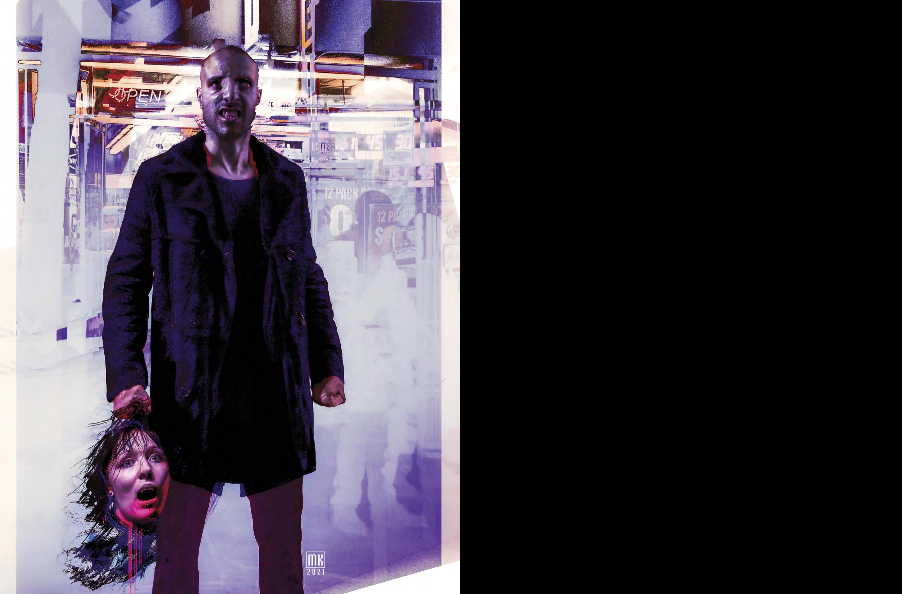

# Глава первая: Охотники-убийцы

Ñ ïåðâûì ðàññâåòîì äíÿ ïðîáóäè âñþ ñâîþ îòðåøåííîñòü

— ÌÀÉÎÐ. ÐÎÁÅÐÒ ÐÎÄÆÅÐÑ, "ÏÐÀÂÈËÀ ÁÎÐÜÁÛ"

Вопреки распространенному среди

"Сородичей" заблуждению, в Коалиции не все боевики с каменными лицами прячут мечи под плащами. Каждая операция и маневр требуют разнообразного набора навыков, и даже если все сотрудники выживут в первые несколько месяцев, их будет трудно заменить. Коалиция постоянно ищет и привлекает к работе тех, кто может привнести в нее новые подходы. (Монстры, на которых они охотятся, неукротимые манипуляторы, в распоряжении которых находится непостижимый набор сверхъестественных способностей; шаблонные тактики и массовые убийства не принесут победы в этой войне. Им нужна армия, способная сражаться на любом поле боя.

#### ÎÁÙÈÅ ÑËÎÆÍÎÑÒÈ

Значения общей сложности, указанные для каждого антагониста, позволяют рассказчику рассматривать их как простых антагонистов (**Corebook**, **p**. 370). Число перед косой чертой обозначает Сложность для победы над их самой сильной способностью, число после косой черты - Сложность для победы над ними в других испытаниях.

# Посредники и лица: Социальная Сфера

Коалиция понимает, что ""пустые тела" перемещаются по залам власти с неестественным изяществом и что их невозможно победить, если они не столкнутся с ней на поле боя. Посредники - это оперативники и союзники, обладающие властью, влиянием и связями в мире смертных. Полученные по наследству или благодаря амбициям, эти невидимые посредники во власти часто определяют, как заговорщики будут действовать в случае обнаружения угрозы со стороны "пустых тел". Большинство Посредников действуют в тени и могут стать неприятными противниками для более молодых " пустых тел", предпочитающих решать проблемы в лоб. Если Посредники являются частью более крупной операции, то они часто проводят свои операции из хорошо охраняемой конспиративной квартиры или охраняемого офисного здания.

Конечно, некоторые из самых важных Лиц, стоящих на передовой борьбы с вампирами, ведут свои операции из церквей, столовых, мечетей или ешив. Как и во времена первой инквизиции, во время второй инквизиции духовенство пылает праведностью. Для стандартных священников используйте Противники (Corebook, p. 371).

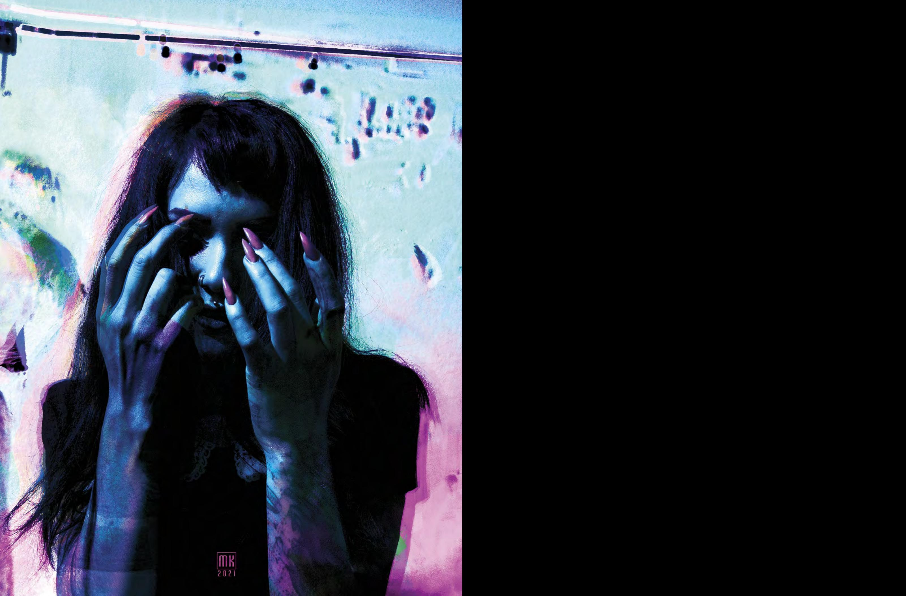

# Шантажист

Пустые тела - это паразиты, которые ценят смертных вокруг себя только как пешки и инструменты. Шантажист обращает эти пешки против их хозяев с помощью взяток и угроз. Шантажисты, являясь разновидностью посредников, обычно применяют практический

подход к превращению пешек в пустых тел. Общая сложность: 4/2

Стандартные пулы кубиков: Физический 3, Социальный 6, Ментальный 5

Вторичные атрибуты: Здоровье 5, Сила воли 7 Исключительные пулы кубиков: Огнестрельное оружие 5, Запугивание 8, Уличное чутье 7 Оборудование: Смартфон, компрометирующие

фотографии, налоговые документы

Особенность: Присутствие Шантажиста в операции делает более культовым использование пустых тел против охотников их местных союзников и контактов. Если вампир пытается использовать против охотников один из вышеперечисленных типов предпосылок, он должен сначала сделать бросок "Самообладание + Убеждение", оспариваемый пулом кубиков "Запугивание" шантажиста.

Поскольку шантажисты обычно принуждают своих жертв лично, они часто оставляют за собой более очевидные следы, чем другие посредники. Чтобы выследить шантажиста, требуется бросок Упорство + Уличное чутье, оспариваемый пулом кубиков Уличного чутья шантажиста. Количество успехов определяет, насколько полна раскрытая информация и как быстро она была раскрыта. Шантажисты обычно путешествуют с гангстером в качестве телохранителя (Corebook, p. 371).

#### Ðàçíîâèäíîñòü: Ìåäâåæèé êàïêàí

Не слишком опытный шантажист, намеренно оставляющий за собой грязные следы, "медвежий капкан" заманивает в ловушку трупы, которые в прошлом оказывались неуловимыми. "Медвежья ловушка" подвергает себя большому риску, а в ГРУ эта роль считается наказанием или даже смертным приговором.

#### Общая сложность: 3/2

Стандартный набор кубиков: Физический 3, Социальный 5, Ментальный 4

Вторичные атрибуты: Здоровье 5, Сила воли 6 Исключительные пулы кубиков: Огнестрельное оружие 6, Манипулирование 7, Уличное чутье 5

Оборудование: Смартфон, компрометирующие

фотографии, налоговая отчётность Особенность: Как и шантажист, за исключением того, что медвежий капкан обычно охраняется командой из четырех киллеров (с. 35) или воинов (с. 35). Их убежища также оснащены камерами слежения XScope и детекторами движения, а "медвежьи ловушки", работающие на Ватикан, имеют на своих убежищах мистические заслоны).

# Кукушка

Кукушка - агент под прикрытием. Они проникают в стада, культы пустых тел, круги поклонников и прочие группы прихлебателей, которые кишат вокруг нежити, как мухи на трупе.

Оперативники никогда не считают агентов под прикрытием полностью надежными, даже если они не общаются с кровососущими монстрами, обладающими способностью управлять сознанием. Они слишком близко подходят к своим объектам, начинают испытывать к ним симпатию. Они теряют себя в своем прикрытии. Добавьте сюда кровные узы и Величие, и товарищи Кукушки по команде, ее сеть поддержки, часто будут правы в своих подозрениях.

Еще хуже то, что "кукушки" оказываются изолированными и незащищенными. Если пустой тело догадается об их роли и не решит немедленно выкачать из их тела каждый миллилитр крови, то передать им плохую информацию не составит труда.

Все это говорит о том, что быть "кукушкой" - опасное и малодоходное занятие, но оно необходимо. "Кукушки" имеют доступ к информации, которой нет у других агентов, особенно в условиях, когда "пустые тела" все более осторожно относятся к электронным средствам связи.

#### Общая сложность: 3/2

Стандартные пулы кубиков: Физический 4, Социальный 6, Ментальный 5

Вторичные атрибуты: Здоровье 6, Сила воли 9 Исключительные наборы кубиков: Наблюдательность 6, Этикет (сородичи) 7, Расследование 7, Убеждение или Хитрость 7

Оборудование: Одноразовый блокнот, замаскированный под слащавую электронную книгу по

самосовершенствованию, разрывной передатчик, встроенный в сотовый телефон.

Особенность: Кукушки проходят интенсивную психологическую подготовку, прежде чем их выпускают в поле. Они получают 4 дополнительных кубика при попытках противостоять вампирическим дисциплинам. Некоторые кураторы FIRSTLIGHT и ГРУ предварительно привязывают кукушку к вампиру, находящемуся в заключении, в качестве превентивной защиты от приглашения выпить из пустого тела.

#### Ðàçíîâèäíîñòü: Êðîâàâàÿ êóêëà

Кровавую куклу недооценивают, она почти невидима. Их передают на вечеринках или обращаются с ними как с любимыми домашними животными. Они видят больше, чем следует, и считается, что они ничего не замечают, находясь под впечатлением от Поцелуя.

Общая сложность: 4/2 Стандартный набор кубиков: Физический 4, Социальный 4, Ментальный 5

Вторичные атрибуты: Здоровье 5, Сила воли 5 Исключительные пулы кубиков: Убеждение 8, Скрытность 8

Оборудование: Нет

Особенности: Кровавые куклы ненавязчивы. Пустые тела не обращают внимания ни на их лица, ни на имена и относятся к ним как к предмету мебели. Любая попытка, активная или пассивная, пробить их покров делается с +1 сложностью.

Особенно часто кукловоды JTRG и ГРУ используют Кровавых Кукол в качестве оружия, зараженного EV-H07 (с. 79) или одной из опасных Алхимических формул (с. 46).

# Депрограммист

Пустые тела умеют вызывать преданность у своих слуг. Они красивы, могущественны и держат в своих холодных руках власть над жизнью и смертью. Люди, попавшие в их орбиту, как правило, влюбляются в них, и очень сильно. Депрограммисты снимают с освобожденных ими людей все эти внушения, превращая их из пустых пешек с промытыми мозгами в информаторов или кукушек... или просто освобождая их, чтобы они попытались вернуться к нормальной жизни.

Методы работы различны, но, как правило, включают в себя закрытые комнаты и сильное психологическое и эмоциональное давление. Цель не в том, чтобы сделать испытуемого счастливым и здоровым, а в том, чтобы сделать его бесполезным и, если возможно, активизировать для Второй инквизиции.

Некоторые депрограммисты занимаются не только консультированием. Лучшие из них знают, как снять последствия Кровных уз и Доминирования с помощью переливания крови, сильных психиатрических препаратов и - в крайних случаях психохирургических операций. Небольшая потеря когнитивных функций - небольшая цена за свободу.

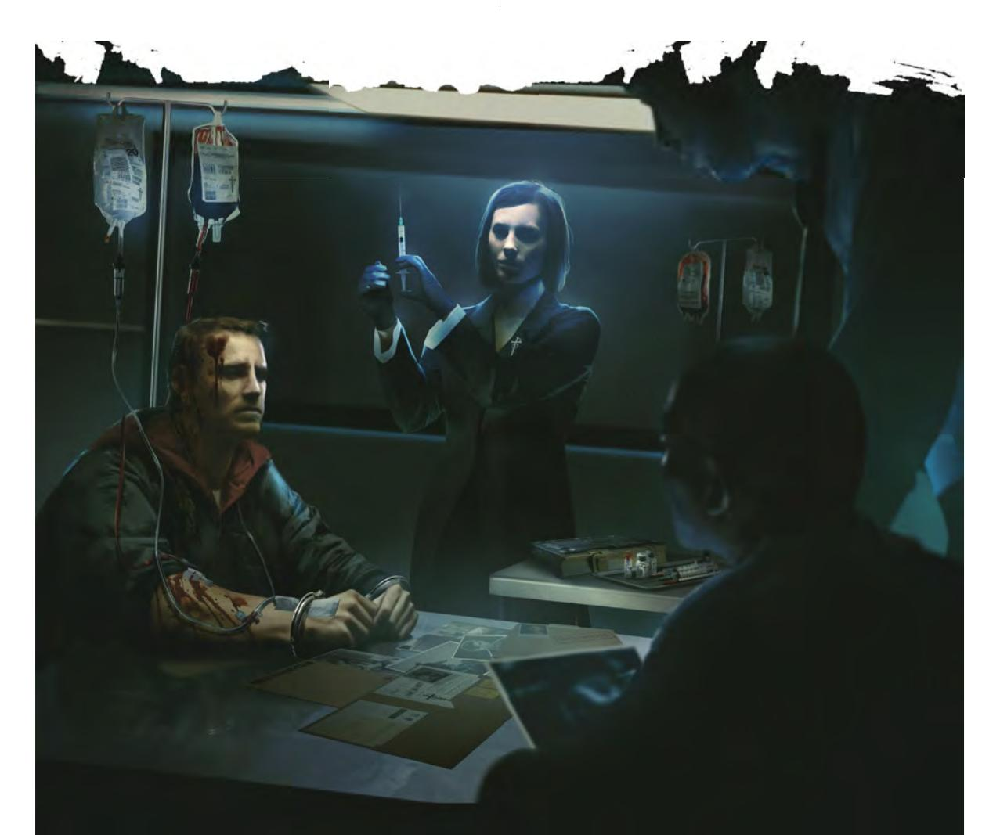

#### Общая сложность: 4/2

Стандартные пулы кубиков: Физический 4, Социальный 6, Ментальный 6

Вторичные атрибуты: Здоровье 6, Сила воли 7 Исключительные пулы кубиков: Гум.Науки 7, Медицина 7, Убеждение (депрограммирование) 8, Ест.Науки 7

#### Оборудование: N/A

Особенность: Депрограммист имеет доступ к наркотикам, религиозным обрядам или просто узкоспециализированным психологическим методам, облегчающим контроль над сознанием пустого тела. Для их эффективного использования требуется успешный бросок Интеллекта + Медицина (наркотики) или Гум.Науки (религия или психотерапия) на Сложность, равную наивысшему рейтингу Дисциплины влияющего вампира. Этот кратковременный эффект длится в течение одной сцены.

Длительное депрограммирование длится от трех дней до недели. Депрограммированный гуль или раб теряет один кубик из запаса смекалки, но сопротивляется своему бывшему хозяину с четырьмя дополнительными кубиками.

#### Ðàçíîâèäíîñòü: Îñâîáîäèòåëè

Иногда Коалиция позволяет другим врагам - гулям делать их грязную работу. Начиная с Польши, среди анархов зарождается движение, направленное на освобождение гулей от рабства. "Освободители" выполняют тяжелую и опасную работу, которая в основном не вознаграждается: гули находят способы уползти к своим хозяевам или найти новых. Или же они просто оказываются плохо приспособленными к нормальной смертной жизни после нескольких лет или десятилетий пребывания на мелководье гламурного, бессолнечного мира. Но эти Анархи все равно выполняют работу, потому что так надо.

Освободители не работают на Вторую Инквизицию. Время от времени они получают по "виноградной лозе" подсказки, которые дают им возможность выхватить гуля и приступить к работе над ним. Когда "Освободители" сделают свою работу и возьмут вину на себя, ПЕРВЫЙ СВЕТ или Отец Лео подбирают только что освобожденного гуля, оказывают ему сочувственный прием и вытягивают из него всю полезную информацию, которую только могут получить.

Этот профиль отражает новорожденного вампира на стороне движения "Освободителя".

#### Общая сложность: 4/3

Стандартные пулы кубиков: Физический 6, Социальный 6, Ментальный 6

Вторичные атрибуты: Здоровье 8, Сила воли 8 Исключительные пулы кубиков: Драка 8,

Скрытность 7, Уличное чутье 8, Убеждение 8 Снаряжение: Пистолет, Наручники, Хлороформ. Дисциплины: Анимализм 1, Стремительность 2, Могущество 2

Человечность: 7

Сила крови: 1

#### Ðàçíîâèäíîñòü: Õèðóðã-ýêñòðàñåíñ

Этот вариант депрограмматора разрывает связь между жертвой пустого тела и самим монстром. В 1990-х годах SAD и ГРУ-Н58 открыли так называемую "психическую хирургию", а Общество Святого Леопольда имеет собственные ритуалы "изгнания крови". Под любым названием разрыв кровной связи (или любой другой вампирической связи) причиняет физическую боль и оставляет неизгладимые эмоциональные шрамы.

Редкий дар, не встречающийся ни среди вампиров, ни среди тех, кто когда-либо употреблял кровь Сородичей, он может быть усилен тренировками, но не может быть - по-видимому, не может быть обучен на пустом месте. Некоторые вампиры-алхимики считают, что из крови Хирурга-экстрасенса можно изготовить эликсир, способный разрушить Кровные узы; обладатели этого дара редко афишируют его.

(С точки зрения игры, экстрасенсорная хирургия это заслуга, но поскольку персонажи игроков не могут

ее использовать, это не имеет значения). Общая сложность: 4/2

Стандартные пулы кубиков: Физический 4, Социальный 6, Ментальный 6

Вторичные атрибуты: Здоровье 6, Сила воли 8 Исключительные пулы кубиков: соответствующий пул психической хирургии 9

#### Оборудование: N/A

Особенности: Для разрыва кровных уз с помощью экстрасенсорной хирургии требуется расширенная проверка: один бросок в день, сложность - 5 × сила уз. Экстрасенс-хирург может снизить Сложность, нанеся испытуемому эквивалентное количество тяжелых повреждений: кровавый пот или стигматы, судороги, отказ селезенки и другие симптомы, проявляющиеся в таких случаях. Если субъект выживает, его Упорство навсегда уменьшается на 1.

Экзорцисты Общества Святого Леопольда используют Харизму + Убеждение; экстрасенсы ГРУ или SAD - Упорство + Ест. Науки (если они начинали как психиатры) или Манипуляцию + Оккультизм (если они начинали как уличные целители); "сребреники" Ньюбургской группы - Интеллект + Оккультизм. Недоброжелательные рабы или гули могут оспорить бросок, используя свою силу воли.

#### Ëîæíûé àãåíò

Ложный агент представляет себя как агента фракции " пустых тел", обычно Камарильи, для целей, политически отстраненных от этой фракции. В идеале, эту роль выполняют агенты "Отступников" или "Лордлессы", но таких агентов на местах крайне мало. Поэтому Коалиция чаще использует смертных оперативников, обученных сопротивляться ментальному принуждению. Ложные агенты предлагают объектам "миссии", которые якобы позволяют им войти в доверие к фракции, но на самом деле настраивают их против других "пустых тел". Конечная цель междоусобная война между местными "пустышками", в идеале - с большим количеством жертв. Затем куратор выводит " Ложного агента" и направляет группу оперативников для захвата оставшихся в живых.

#### Общая сложность: 4/3

Стандартные пулы кубиков: Физический 5, Социальный 7, Ментальный 6

Вторичные атрибуты: Здоровье 5, Сила воли 8 Исключительные пулы кубиков: Этикет 8,

Убеждение 8, Хитрость 8, Политика (местные пустые тела) 7

Оборудование: Смартфон, модный аксессуар с символикой фракции

Особенности: Ложный агент имеет прикрытие, эквивалентное Маске 2. Они также могут получать доступ к ресурсам и влиянию в каждом конкретном случае, чтобы доказать свою добросовестность. Ложный агент оспаривает способности Доминирование и Величия, используя силу воли.

# Джентрификатор

По своей природе территориальные монстры, извращающие окружающую среду в угоду своим порокам, с трудом выкорчевывают пустых тел из своих гнезд, не разрушив предварительно их системы раннего оповещения. Джентрификатор съедает активы и ресурсы пустых тел на их родной территории, превращая защиту и удобства их Домена в ловушку. Многие из них оказываются скорее самостоятельными охотниками, чем агентами тайного правительственного заговора. Независимые актеры или представители Коалиции, они, как правило, действуют "в Трансильвании" - в городах или районах с устоявшимся населением из пустых тел.

Основным оружием джентрификаторов являются деньги и кредиты: узнав, где "блатные" устраивают свои гнезда, они начинают нагнетать обстановку. Они выкупают пришедшие в негодность здания и перепродают их под квартиры. Они вкладывают деньги в старые предприятия, переоборудуя их самыми современными компьютерными системами безопасности. Они дергают за ниточки, чтобы отремонтировать уличные фонари, и устанавливают на них камеры наблюдения вместе с полицией или подозрительно хорошо финансируемыми группами "наблюдателей за соседями". Благотворительные взносы и политические льготы стимулируют полицию к более регулярному патрулированию улиц. Разрушительный побочный эффект, который джентрификация наносит смертельно опасным районам, не имеет никакого значения для цели джентрификатора. За считанные месяцы, а то и недели, кампания по джентрификации может превратить вампирский домен из места охоты в тюрьму.

#### Общая сложность: 3/2

Стандартные пулы кубиков: Физический 4, Социальный 6, Ментальный 5

Вторичные атрибуты: Здоровье 6, Сила воли 7 Исключительные наборы кубиков: Финансы

(недвижимость) 7, Расследование 7, Политика (местная) 7, Уличное чутье 7

Оборудование: Смартфон, идеальная кредитная

история, гарантии по кредитам

Особенность: Джентриферы наносят урон Доменам котерий, на которые они нацелены (Corebook, p. 195). Раз в неделю джентрификатор может сделать бросок "Финансы", против которого выступает Интеллект + Финансы + Портильон одного персонажа; за каждый дополнительный успех он снижает рейтинг Домена по Шассе и Льену на одну точку каждый. Как только Шассе и Льен домена снижаются до нуля, все оставшиеся успехи уменьшают Портильон домена по принципу "один к одному". После того как джентрификатор прекращает давление на домен, Котерия восстанавливает одну потерянную точку каждую неделю.

До тех пор, пока Домен поврежден Джентрификатором, соратники не могут вкладывать или снимать точки с Домена. Если группа покидает Домен, атакуемый Джентрификатором, она теряет все точки, вложенные в Домен, если не сможет убедить Джентрификатора отменить ущерб.

Джентрификаторы могут одновременно атаковать только один Домен.

Механику более долгосрочных или масштабных попыток джентрификации см. на с. 98.

#### Ðàçíîâèäíîñòü: Áðîêåð

Брокер - это "вырезка" из организованного преступного сообщества, и любой захваченный им актив сразу же используется для обогащения его покровителей. Домены, находящиеся под управлением брокера, быстро становятся местом поджогов, ограблений и открытых сделок с наркотиками. Присутствие полиции в районе также хаотично колеблется между ее полным отсутствием и

вооруженным захватом.

Общая сложность: 3/2

Стандартные пулы кубиков: Физический 4, Социальный 6, Ментальный 5

Вторичные атрибуты: Здоровье 6, Сила воли 7 Исключительные пулы кубиков: Расследование 7, Политика 7, Уличное чутье 7

Оборудование: Смартфон

Особенность: Как и у Джентрификатора, за исключением того, что в данном случае соревнуются уличное чутье Брокера против Упорства + уличного чутья + Портильона персонажа. Также, когда Брокер снижает до нуля точки Шассе и Льен Домена, все оставшиеся успехи уменьшают ресурсы, доступные всем членам Котерии, по принципу "один к одному". Брокеры обычно путешествуют с двумя бандитами в качестве телохранителей (Corebook, p. 371).

#### Ðàçíîâèäíîñòü: Äèëåð

Дилер открывает магазин вблизи района активности ""пустых тел"" и становится частью "серого" рынка, продавая там наркотики и другие запрещенные материалы смертным. Дилер нарабатывает обширную клиентскую базу и выбирает смертных, имеющих тесные связи с "пустым телом", чтобы заманить их в ловушку. Как только стадо блатных или другие смертные пешки оказываются в долгу у Дилера, их постепенно привлекают к выполнению мелких поручений в рамках операции, нарушающих доверие хозяина. В случае успеха Дилер выявляет и заманивает в ловушку смертную сеть поддержки пустого тела, нейтрализуя их ценность для вампира.

#### Общая сложность: 2/1

Стандартные пулы кубиков: Физический 3, Социальный 5, Ментальный 4

Вторичные атрибуты: Здоровье 5, Сила воли 5 Исключительные наборы кубиков: Воровство 5, Медицина 5, Фехтование 5, Уличное чутье (черные рынки) 5

Оборудование: Нож, смартфон, запрещенные наркотики или контрабанда

Особенность: Раз в неделю Дилер получает полезную информацию о своем районе: принадлежит ли смертный к какому-либо стаду пустых тел, используется ли данное место как убежище вампиров и т.д. Эта способность начинает приносить плоды только после того, как Дилер проработает в этом районе три недели, плюс одна неделя на точку в Портилона Домена. Для обнаружения особо защищенных убежищ может потребоваться дополнительная неделя на каждую точку в убежище (или меньше времени, если убежище имеет недостаток "Известное Местоположение" (Corebook, p. 193).

# Информатор

Информаторы - это слабые звенья: сотрудники, доверенные лица и связные, у которых есть обида на своего неживого работодателя, вызывающая чувство преданности, или слабость, которой охотники могут воспользоваться. Коалиция покупает информаторов деньгами, угрозами, шантажом или обещаниями вытащить из вампирической паутины. Они служат наглядным уроком того, почему нужно относиться к подчиненным с изяществом и уважением - и хорошо их вознаграждать.

Большинство информаторов - это люди низкого уровня: чем ближе сотрудник к настоящим секретам, тем лучше вампир обычно проверяет его. Поэтому важно иметь целую сеть информаторов - от стада вампира до его корпоративного офиса. Некоторые из них даже не знают, что работают на монстра. Именно поэтому большинство информаторов являются одноразовыми. С другой стороны, высокопоставленный информатор может быть на вес золота.

В данном случае речь идет об обычном

информаторе низкого уровня. Общая сложность: 3/1

Стандартные пулы кубиков: Физический 3, Социальный 4, Ментальный 3 Вторичные атрибуты: Здоровье 6, Сила воли 5 Исключительные наборы кубиков: Хитрость 7, Проницательность 6, Один специальный навык (например, Финансы, Гум.Науки, Вождение) на 7. Оборудование: Телефон-выжигатель.

Особенность: Информатор имеет прямую связь со своим куратором. Это может быть номер телефона, адрес электронной почты или закодированное сообщение на интернет-форуме. Если информатор чувствует себя небезопасно или у него есть информация, которую он может передать своему куратору, он может получить ее в течение часа. Быть информатором - опасная позиция. Если у пустого тела или кого-либо еще возникнут подозрения, то успешный бросок " Смекалка + Проницательность" или " Интеллект + Расследование" даст им достаточно доказательств, чтобы убедиться в позиции информатора. Сложность броска начинается с 5 и уменьшается на единицу за каждые полгода работы информатора с охотниками: чем дольше они работают, тем больше подозрений и доказательств.

#### Ðàçíîâèäíîñòü: Êàíàðåéêà

Канарейки близки к своему вампирскому работодателю. Они знают много секретов и регулярно получают информацию, причем не только по просьбе своего куратора. Канарейка очень ценна, и ее куратор

прилагает все усилия, чтобы защитить ее.

#### Общая сложность: 4/1

Стандартные пулы кубиков: Физический 3, Социальный 4, Ментальный 3

Вторичные атрибуты: Здоровье 6, Сила воли 5 Исключительные наборы кубиков: Хитрость 7, Проницательность 7, Один специальный навык (например, Финансы, Гум.Науки, Вождение) на 7. Оборудование: Телефон-выжигатель.

Особенность: Чем дольше работает информатор, тем большую ценность он представляет для Коалиции и тем больше доверия и привязанности возникает между информатором и его куратором. Канарейка может просить своего куратора об услугах, получая прибавку к любому параметру фона на одну точку в течение недели.

Канарейка также знает компрометирующие секреты по крайней мере еще об одном человеке из личной сети осведомителя вампира. Если их поймают и предъявят обвинения, они смогут свалить вину на другого связного, даже указав на несколько удобных косвенных улик.

# Политик

Политик ведет медленную и кропотливую войну с влиянием пустых тел в местной или региональной бюрократии. Редко кто из пустых тел имеет действительно национальное влияние на Западе - не в последнюю очередь потому, что, когда это происходит, Коалиция ставит своей приоритетной задачей их уничтожение.

Политики останавливают или подрывают вампирические проекты, отвлекая ресурсы или загоняя их в ловушку бюрократии. Они подрывают отношения с союзниками поддержка "пустых тел", даже неосознанная, чревата серьезными последствиями для других проектов. Они могут даже превратить район или город во враждебную для "пустых тел" среду: работать над тем, чтобы убрать с улиц людей, не имеющих жилья, изменить лицензионное законодательство, чтобы сократить число ночных клубов и других "кормушек", или перенести банк крови.

Политики могут быть "штатными" директорами Коалиции, принимающими активное участие в планировании и разработке стратегии проектов, близкими союзниками, знающими свое дело, или несведущими людьми, которые все же не хотят попасть впросак перед ЦРУ, МИ-6 и им подобными. Этот профиль подходит для полноценного актива Коалиции.

#### Общая сложность: 4/2

Стандартные пулы кубиков: Физический 3, Социальный 6, Ментальный 5

Вторичные атрибуты: Здоровье 6, Сила воли 7 Исключительные пулы кубиков: Этикет 8, Финансы 7, Лидерство 8, Политика 9, Убеждение 8

Оборудование: Лучший смартфон, победная улыбка. Особенности: Политики мешают вампирским проектам. Если в Коалиции есть политик, сложность всех проектов, связанных с бюрократией, финансами, требующих какихлибо разрешений или лицензий, увеличивается на 2. Не сразу становится ясно, что проект провален: просто он занимает больше времени, процессы поглощаются бюрократией, а люди теряют интерес или попадают под влияние сторонников иных интересов.

Политики также оказывают существенное влияние на долгосрочные проекты. Любой проект, который каким-либо образом взаимодействует с городскими или региональными властями, имеет прирост на один шаг (от часов до дней, от дней до недель и т.д.).

Если политик не занят активным противодействием плану или проекту "Пустого тела", его присутствие подрывает союзников и влияние. За каждый месяц, в течение которого Политик не занят другими делами, количество союзников, контактов или влияния вампира-мишени в политике, правоохранительных органах или на других гражданских должностях эффективно уменьшается на одну точку. Это уменьшение длится до тех пор, пока политик не покинет свой пост. Многие отдельные представители рода имеют свои клыки в мэрии, поэтому Политик редко концентрируется на одной цели в течение нескольких месяцев подряд.

Не так-то просто найти конкретного политика, который препятствует их интересам. Они скрываются за хитроумными махинациями и доверенными лицами, и чтобы выследить такого политика, требуется бросок "Расширенный интеллект + политика (необходимое количество успехов равно количеству Интеллекта + Политики политического деятеля), чтобы выследить такого политика. Политики, которым угрожает опасность со стороны пустых тел (или других врагов), имеют телохранителя или двух телохранителей (используйте Полицейский детектив, Corebook p. 371).

# Светский человек

Светские люли вхолят в лучшие списки и само их присутствие может сделать или разрушить вечеринку. Большинство светских людей Коалиции происходят из старого капитала или католического состояния, но FIRSTLIGHT и JTRG начали вербовать (или шантажировать) влиятельных людей из социальных сетей. Социальные работники играют непростую роль в конспирации Коалиции. В первую очередь они лишают "пустых" тел доступа к высшему эшелону общества, вовлекая их в компрометирующие социальные ситуации или очерняя их репутацию с помощью слухов, но также они должны завоевать доверие своего объекта. Для этого необходимо создать личность, которая будет одновременно и привлекательной, и правдоподобно наивной или некомпетентной.

#### Общая сложность: 4/2

Стандартный набор кубиков: Физический 3, Социальный 7, Ментальный 5

Вторичные атрибуты: Здоровье 5, Сила воли 7 Исключительные кубики: Наблюдательность 7, Этикет 8, Убеждение 8, Хитрость (ложь) 8

Оборудование: Смартфон, сногсшибательная одежда, приглашения на лучшие вечеринки

Особенность: Светский человек может получить доступ к любому мероприятию или месту, открытому для смертных, независимо от того, насколько эксклюзивным оно является для всех остальных. Бархатный канат никогда не преграждает им путь, а их поклонники следят за каждым их словом. Выиграв социальную битву с вампиром (или его активами), социалка может на неделю снизить один из фоновых уровней оппонента до нуля в дополнение к обычным преимуществам победы (Corebook, р. 304). Изгнание из общества может уменьшить Контакты, Славу или Влияние; ажиотаж в СМИ может уменьшить Убежище или Маску. Рассказчик определяет, какой фон будет уменьшен; через неделю уменьшенный фон возвращается в полном объеме, поскольку СМИ или общественный цирк продолжаются.

#### Разновидность: Сплетник

Сплетник (или сплетница) обладает коварным сочувствием и способен даже вскрыть мертвое сердце. Сплетники - это часто завербованные дознаватели и психологи, прикрывающиеся личиной богатого дилетанта или начинающего актера. Они пытаются получить рычаги влияния на "пустых" тел, выявляя точки давления, которые все еще дают о себе знать в их земной жизни.

#### Общая сложность: 4/1

Стандартные пулы кубиков: Физический 3, Социальный 7, Ментальный 5 Вторичные атрибуты: Здоровье 5, Сила воли 9 Исключительные пулы кубиков: Проницательность 9, Исполнение 9, Хитрость 9 Оборудование: Смартфон, заботливое выражение лица, друзья-журналисты. Особенность: Как у Светского человека, за исключением того, что Сплетник может узнать личность опоры пустого тела вместо того, чтобы получить любую другую выгоду от победы над ним в социальном бою. Иногла эта социальная борьба протекает настолько незаметно, что пустые тела даже не подозревают о своем поражении - до тех пор, пока их опора внезапно не перестает отвечать на их звонки.

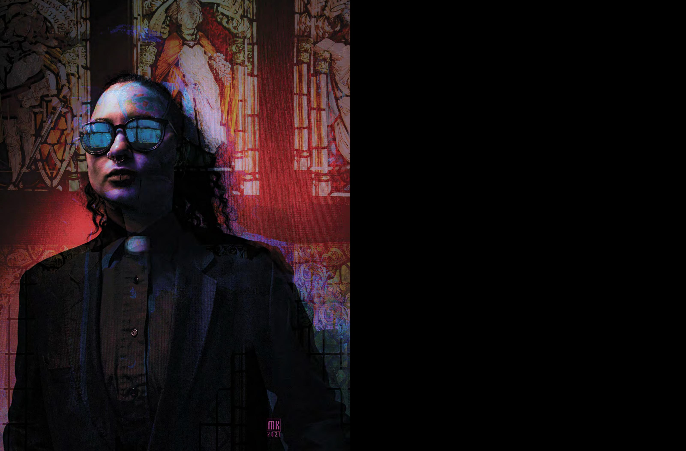

# Технологии и тайны: Ментальная сфера

Нечеловеческий разум, быстрее любого смертного, следит за городами мира с орбиты и из каждого банкомата: компьютеризированные системы наблюдения. Коалиция владеет этими технологиями и использует проверенные аналитические методы в охоте на нежить. Не каждая группа охотников зависит от таких систем, но вся Вторая Инквизиция как движение и явление пользуется услугами самых зорких из них: Аналитики и алгоритмы FIRSTLIGHT, архивариусы Ватикана, подслушивающие устройства ГРУ. Пустые тела больше не могут полагаться на тень и анонимность, чтобы скрыть свои преступления; Коалиция впустила свет, и приватность - это роскошь, которую мир больше не может позволить себе.

# Медведь-Лидер

Если раньше охота на вампиров была в основном одиночным занятием, то с появлением Второй инквизиции она превратилась в глобальный заговор в рамках византийской бюрократии. Логистика и организация, необходимая для объединения нескольких агентств с разной динамикой групп и формулировками задач, может быть очень сложной. Медведь-лидер (его еще называют организатором вечеринки) - это в равной степени менеджер проекта, квартирмейстер и психолог. Они понимают, как работают группы людей, и могут быстро превратить стаю соперников в слаженный отряд охотников. Это также дает Медведю-Лидеру почти неестественную способность улавливать групповую динамику тех, на кого он охотится. Ничто так не радует, как то, что план удается воплотить в жизнь.

#### Общая сложность: 4/2

Стандартный набор кубиков: Физические 4, Социальные 6, Ментальные 6

Вторичные атрибуты: Здоровье 6, Сила воли 8 Исключительный набор кубиков: Проницательность 8, Лидерство 8, Убеждение 8, Политика 8, Хитрость 8 Оборудование: Смартфон, ноутбук, доска, карты, канцелярские скрепки, красная нитка

Особенность: Когда организатор вечеринки проводит операцию, он может обратиться за помощью к другим организациям Коалиции (или к местным властям) с помощью броска "Политика". Сложность этого броска зависит от масштаба необходимой услуги. Прослушивание SIGINT или доступ к записям может быть Сложностью 2; полицейский рейд, увеличение бюджета или ускоренная конфиденциальная экспертиза - Сложностью 3; запрос сундука с фунтами стерлингов или получение реликвии из Ордена Святого Леопольда - Сложностью 4; немедленная отправка конкретного ветерана ГРУ-N58, взвода бойцов ESOG UTR или удар Хищников в пригороды Парижа - Сложностью 5. Персонажи игроков, имеющие связи с этой организацией, могут затормозить, отсрочить или полностью заблокировать заявку, используя свои Манипуляции + Политику (+ Влияние, если уместно) против Политики Медведя-Лидера.

Раз в неделю медвежьи вожаки могут также делать расширенный бросок "Озарение" с коэффициентом 10, чтобы определить базовую карту взаимоотношений вампирского сообщества, на которое они охотятся (Corebook, pg. 142). Показатель Портильона Домена обычно уменьшает этот набор кубиков, в то время как информация, полученная от подпольщиков, информаторов и других людей, может добавлять успехи по усмотрению рассказчика.

# Черные упаковщики

Понимание и сбор информации о цели до начала непосредственных действий против нее являются основополагающими для многих операций Второй Инквизиции. ГРУ, SAD, SO13 и FIRSTLIGHT регулярно используют технических специалистов, которые могут быстро проникнуть в помещение или автомобиль, установить скрытые подслушивающие устройства и удалиться, не оставив следов. Такие "черные упаковщики" позволяют группе UTR вести наблюдение за объектом и выявлять его сообщников с минимальным риском для самой группы. При проникновении в помещения "черных упаковщиков" необходимо соблюдать особую осторожность: сверхъестественные органы чувств способны обнаружить малейшие нарушения в их собственности, и многие "черные упаковщики" испытывают извращенное удовольствие от того, что ставят

ловушки, защищающие их убежища от вторжения. Общая сложность: 4/2

Стандартный набор кубиков: Физические 4, Социальные 3, Ментальные 6

Вторичные атрибуты: Здоровье 5, Сила воли 6 Пулы исключительных кубиков: Атлетика 6, Воровство (сигнализация) 8, Скрытность 7, Техника 7 Оборудование: Пистолет Максим 9 с подавлением, подслушивающие устройства, набор инструментов

#### Ðàçíîâèäíîñòü: Ìåõàíèê

Механики используют свои технические навыки, чтобы проникать туда, где им не место, а затем подстраивают их так, чтобы они взрывались по нажатию кнопки. Механики в душе являются ремесленниками и часто создают свои самодельные взрывные устройства в соответствии с требованиями задания. Хотя ограничение сопутствующего ущерба редко является их главной задачей, часто их устройства используются только для того, чтобы вывести из строя транспортное средство во время преследования или обезвредить спрятавшихся в укрытии пустых тел. Собрать подходящее устройство - это целое искусство, и механик хочет, чтобы его работа способствовала успеху команды UTR, не подвергая ее опасности.

#### Общая сложность: 4/1

Стандартные пулы кубиков: Физические 5, Социальные 3, Ментальные 5

Вторичные атрибуты: Здоровье 6, Сила воли 7 Исключительные кубики: Атлетика 7, Ремесло (взрывчатка) 8, Огнестрельное оружие 7, Воровство (сигнализация) 6, Скрытность 7 Оборудование: Ящик с инструментами, пластиковая взрывчатка, детонаторы, сотовый

#### телефон

Особенность: Транспортное средство, снаряженное механиком для взрыва, наносит повышенный урон (равный соответствующему запасу взрывчатки механика) всем, кто в нем находится, и половину этого урона всем, кто находится поблизости. Вампиры и смертные, успевшие предупредить о взрыве, могут сделать бросок на смекалку + самообладание, чтобы попытаться вовремя убраться и избежать взрыва. Каждый успех в этом броске уменьшает урон от взрыва на единицу, но не более чем на 2 уровня тяжелых повреждений.

# Копатель

Трудно исчезнуть полностью. Вампиры оставляют следы. Имена меняются, личности подделываются, но - и это главное - вампиры редко перемещаются.

При достаточном терпении и доступе к нужным частным библиотекам можно соединить разрозненные следы записей в картину монстра.

Копатель - это нечто среднее между библиотекарем и криминальным профайлером. Они собирают информацию, чтобы обнаружить ресурсы "пустых тел" (например, семейный дом, тайные личности), мотивы (например, постепенное расширение влияния на субкультуру или район) и даже предположить их сверхъестественные способности и ограничения. Копатель может проанализировать случаи нападения животных, неудачные попытки за четыре покупки и двадцать лет освоить участок земли, местный фольклор и прийти к выводу, что в городе существует проблема

#### гангрелов.

Общая сложность: 4/1 Стандартные пулы кубиков: Физический 3, Социальный 4, Ментальный 6 Вторичные атрибуты: Здоровье 6, Сила воли 6 Исключительные пулы кубиков: Гум.Наукт 9,

Проницательность 7, Расследование 8, Оккультизм 8 Оборудование: Ноутбук, заполненный непонятными исследовательскими материалами, - единственный инструмент, необходимый для Копателя. Когда их посылают в библиотеки, архивы или фонды, где им может угрожать опасность, они вооружены ТАЗЕРОМ. В случае серьезной опасности их сопровождает Одинокий Волк или другой оперативный сотрудник, который заставляет их надеть кевларовый жилет.

Особенности: Копатель систематически изучает и анализирует прошлую и настоящую жизнь пустого тела, чтобы разрушить ее. См. раздел Анализ данных: Академические специализации (с. 94), где описаны особенности механики.

#### Ðàçíîâèäíîñòü: Áóõãàëòåð-êðèìèíàëèñò

В современном мире личная история зачастую не так важна, как то, куда уходят деньги. Загляните в банковские счета, инвестиции и финансовые операции, и вы составите поразительно четкую картину чьего-либо существования. Это касается даже мертвых: конфиденциальность и безопасность стоят денег, персонал нуждается в зарплате, и большинство пустых тел, имеющих средства для приобретения убежища, так и поступают. На дворе XXI век: наличными уже почти никто не расплачивается, поэтому по каждой транзакции остается след, пусть и жестко зашифрованный.

Обнаружив след, криминалист начинает отрезать пустое тело от его денег, что влечет за собой разрыв других связей. Человек, привыкший к богатству и привилегиям, вдруг обнаруживает, что не может ничего сделать. Когда деньги перестают поступать, исчезают альянсы и закрываются проекты. Нет больше взяток, нет больше покупки влияния. Это может даже помешать Суррогатчику или Джентльмену получить свою порцию свежей крови.

#### Общая сложность: 4/1

Стандартные пулы кубиков: Физический 3, Социальный 4, Ментальный 6

Вторичные атрибуты: Здоровье 6, Сила воли 6 Исключительные пулы кубиков: Гум.Науки 7, Финансы 9, Расследования 8, Политика 7

Оборудование: Ноутбук с новейшим банковским программным обеспечением; логины (легитимные или иные) в налоговые органы по всему миру.

Особенность: Бухгалтер-криминалист определяет источники ресурсов пустого тела с помощью расширенного (один бросок в день) броска "Упорство + финансы", сложность которого равна 7 минус показатель Фона. Для уменьшения ресурсов требуется расширенный бросок Интеллект + Финансы со сложностью, равной 21 минус трехкратный рейтинг фона: легко снять немного денег с поддельного банковского счета, сложнее полностью уничтожить человека, не в последнюю очередь потому, что на нижнем конце шкалы некоторые из этих ресурсов существуют только в виде наличности.

Некоторые бухгалтеры-криминалисты считают забавным распределять изъятые ресурсы на благие цели. Например, Общество Святого Леопольда делает значительные пожертвования католическим благотворительным организациям. Другие просто вливают деньги в операционные бюджеты своих команд. А в BOES доходит до того, что хвастаются этим, делая крупные, демонстративные закупки новых боеприпасов сразу после того, как опустошат банковский счет цели.

# Детектив

Детектив - это опытный следователь с опытом работы на улице и умением мягко, не вызывая подозрений, выжимать из людей информацию - о сетях поддержки, местах укрытия, ключевых фигурах в различных подпольных сценах. Если для выхода на цель часто достаточно наличных денег и мягкого допроса, то детектив не боится идти по следу в заброшенный отель или подземный бункер.

О стандартном полицейском детективе, не знающем о вампирской угрозе, см. в разделе "Полицейский детектив" (Corebook, p. 371). Создайте более осведомленного или связанного детектива или шпиона с помощью Инквизитораследователя (Corebook, p. 372). В этой статье описывается Инквизитор-следователь, переживший несколько лет охоты на трупы.

#### Общая сложность: 3/2

Стандартные пулы кубиков: Физический 5, Социальный 5, Ментальный 5

Вторичные атрибуты: Здоровье 6, Сила воли 7 Исключительные броски кубиков: Наблюдательность 6, Огнестрельное оружие или Фехтование 7, Расследование 7, Воровство 6, Убеждение 7, Уличное чутье 7

Оборудование: Пистолет (Glock 17) или полицейская дубинка, смартфон, пачка денег (или полицейский жетон)

Особенность: Работая в одиночку или с помощью случайного уличного осведомителя, детектив, уже знающий о существовании пустых тел, может узнать о них то же самое, что и Дилер (с. 19). Разница заключается прежде всего в том, что детектив концентрируется на одном пустом теле, в то время как дилер охватывает целый домен. В отличие от Дилера, Детектив может начать собирать фрагменты воедино через неделю, плюс одна неделя на каждую точку в Маске цели. Особо защищенные Убежища могут потребовать дополнительной недели на каждую точку в Убежище (или меньше времени, если Убежище имеет недостаток "Известное Местоположение" (Corebook, p. 193).

#### Ðàçíîâèäíîñòü: Ìîëîò

"Молот" предпочитает применять насилие, чтобы заставить сеть поддержки пустого тела выдать своего хозяина. Их методы не отличаются изощренностью, и ВИ часто привлекают "Молот" к операции в качестве последнего средства, чтобы найти вампира, который ушел на дно, но, скорее всего, еще находится в этом районе. Прямая тактика, применяемая Молотом, лучше всего работает, когда пешки вампира уже не могут рассчитывать на защиту своего покровителя.

#### Общая сложность: 3/2

Стандартный набор кубиков: Физический 6, Социальный 4, Ментальный 4

Вторичные атрибуты: Здоровье 7, Сила воли 6 Исключительный набор кубиков: Драка 7, Огнестрельное оружие 7, Запугивание (угрозы) 7, Фехтование 7, Уличное чутье 7

Оборудование: Пистолет (Glock 17), смартфон, кастет, фирменное оружие ближнего боя (бейсбольная бита, когтистый молот и т.д.)

# Врач

Их призвание - сохранять человеческую жизнь, цель "пустых тел" - отравлять и уничтожать ее. Врачи - естественный компонент подразделений коалиции. Киллеры BOES, ГРУ и IAO часто имеют в своем составе санитара или медика; команды охотников SAD работают в тесном контакте с судмедэкспертами; FIRSTLIGHT финансирует целые гематологические исследовательские центры; Общество Святого Леопольда действует в рамках целой сети католических больниц. Любой грамотный "медвежатник" получает привилегии медицинского специалиста в местной больнице или, по крайней мере, имеет надежного врача в круглосуточном резерве.

Но врачи не всегда призываются или направляются на передовую Второй инквизиции иногда они становятся добровольцами. Город, полный вампиров, - это город загадочных смертей и странных травм, запасов крови, украденных у нуждающихся в ней пациентов, вызовов "скорой помощи", которые становятся еще более мрачными, чем обычно. Команды охотников, набранные в больницах - врачи скорой помощи, медсестры травматологических отделений, жители ночных смен, которые все видели за маскарадом, - могут быть более распространены, чем команды охотников, набранные в

полицейских управлениях. Общая сложность: 3/2

Стандартные пулы кубиков: Физический 4, Социальный 5, Ментальный 6

Вторичные атрибуты: Здоровье 6, Сила воли 7 Исключительные пулы кубиков: Гум.Науки 7, Проницательность 7, Медицина 8

Оборудование: Медицинская сумка, аварийный набор, хирургические ножи

Особенность: Врачи и медики, которые достаточно долго охотятся на вампиров, приобретают навыки работы с некоторыми заболеваниями и травмами, выходящими за рамки их специализации. Чтобы диагностировать, лечить или исцелять кровопотерю, анемию, колющие травмы (например, клыки или колья), заражение крови и т.п., добавьте два кубика к их баллам медицины.

# Хакер

В то время как FIRSTLIGHT, JTRG и российское ГРУ располагают армией программистов и аналитиков, прочесывающих мировые потоки данных, иногда для проведения операции требуется специалист, владеющий технологиями. Хакер берет под контроль окружающий цифровой мир и постоянно снабжает свою команду оперативной информацией о своих целях и их действиях в цифровом пространстве. Хакеры обладают невероятно мощным потенциалом, но истинную ценность для операции они приобретают тогда, когда их команда завладевает электронными устройствами " пустых тел". Хакеру требуется менее часа работы с ноутбуком, чтобы скопировать его для более глубокого анализа. Взлом смартфонов может оказаться сложной задачей для большинства хакеров, но оперативники FIRSTLIGHT и IAO имеют доступ к секретным уязвимостям, встроенным в операционные

системы большинства современных смартфонов. Общая сложность: 4/1

Стандартные пулы кубиков: Физический 3, Социальный 4, Ментальный 6

Вторичные атрибуты: Здоровье 5, Сила воли 6 Исключительные пулы кубиков: Проницательность 7, Воровство 5, Хитрость 7, Техника 8

Оборудование: Смартфон, ноутбук, мощное игровое

оборудование, VR-гарнитура Особенность: Хакеры, выполняющие задание при поддержке FIRSTLIGHT, JTRG или Восьмого направления, могут добавить три кубика к своему набору технологий для попыток взлома, что отражает поддержку NSA, GCHQ или ГРУ и их огромную организационную мощь в области кибервойны.

#### Ðàçíîâèäíîñòü: Òåëåôîííûé âçëîìùèê

Телефонный взломщик - это технический специалист по старым видам связи, таким как наземные линии, криптограммы и механические шифровальные устройства. В то время как "пустые тела" отступают от современных технологий, чтобы избежать Второй Инквизиции, хакеры 1980-х годов неожиданно вновь стали востребованы. Российское ГРУ, по общему признанию, располагает наиболее

квалифицированными "телефонными взломщиками" в Коалиции и часто направляет этих технических операторов в другие группы Коалиции, работающие в городских условиях с неразвитой технологической инфраструктурой.

#### Общая сложность: 4/2

Стандартные пулы кубиков: Физический 4, Социальный 3, Ментальный 5 Вторичные атрибуты: Здоровье 5, Сила воли 6

#### Исключительный набор кубиков: Ремесло 7, Воровство 8, Хитрость 8, Техника 7

Оборудование: Смартфон, кольцо-декодер, набор профессионального обходчика

Особенность: Телефонные взломщики не получают штрафов за работу с аналоговой или другой техникой XX века, а штрафы за работу с устройствами XIX века уменьшаются вдвое. Телефонные мошенники также знакомы с механической криптографией и при наличии достаточного количества времени могут с помощью броска "Ремесло" воссоздать механизм шифровальных устройств, таких как машина "Энигма" времен Второй мировой войны. Успехи в этом броске могут быть добавлены к любым вычислительным усилиям по взлому кодов, сгенерированных воссозданными ими шифровальными устройствами.

# Хвост

Хвост - это просто еще одно лицо в толпе, водитель Uber, ожидающий своего пассажира, или курьер, развозящий велосипед на углу улицы. Несмотря на то, что многие из их основных функций уже отменены современными технологиями, их задача одновременно проста и смертельно серьезна. Хвосты выслеживают "пустые тела", которые в прошлом успешно противостояли электронному наблюдению, но могут и не подозревать, что теперь Коалиция нацелена непосредственно на них. Хвосты следуют за своими целями, оставаясь в основном вне поля зрения, и общаются со своими кураторами только тогда, когда цели не могут их обнаружить. Хвосты часто используют маскировку при длительном слежении за объектами и всегда планируют пути отхода в случае их появления.

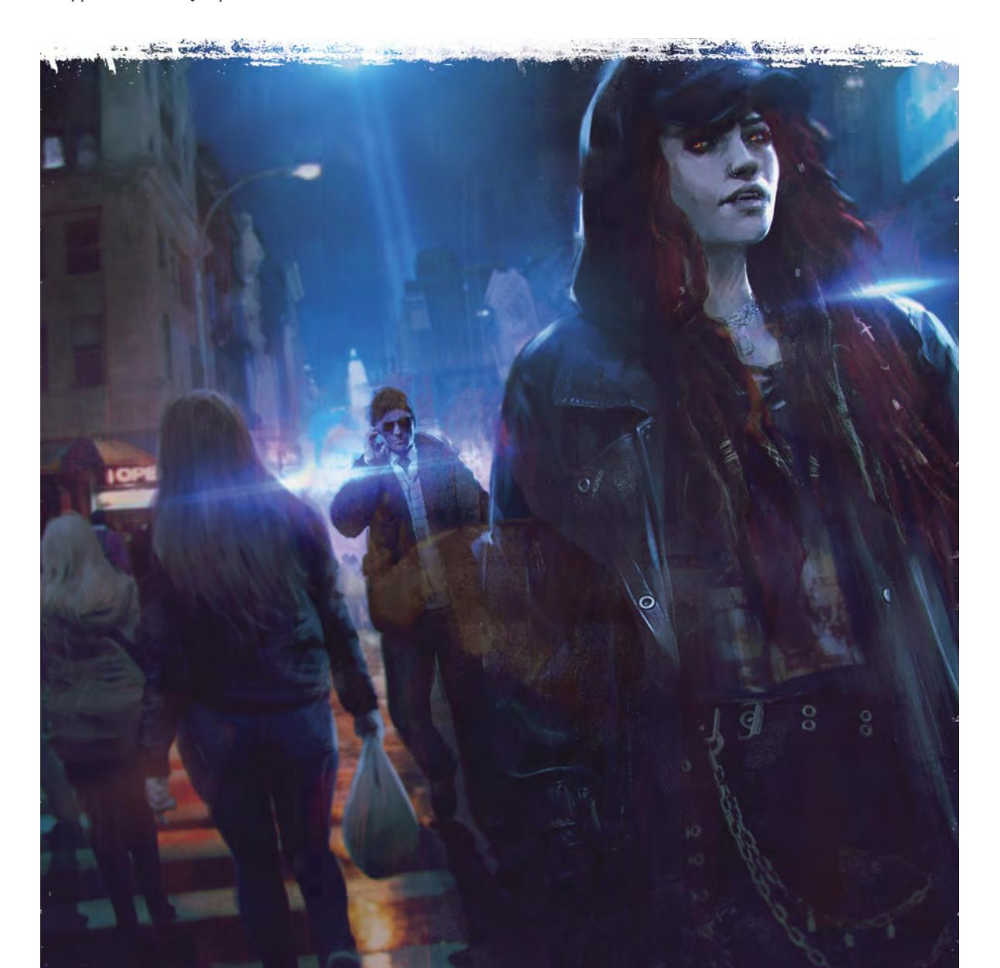

#### Общая сложность: 3/2

Стандартные пулы кубиков: Физический 4, Социальный 4, Ментальный 5

Вторичные атрибуты: Здоровье 5, Сила воли 6 Исключительные пулы кубиков: Атлетика 6, Наблюдательность 7, Вождение 7, Скрытность 7, Уличное чутье 6

Оборудование: Наушники, удобная, но неброская обувь

Особенности: Хвосты, имеющие радиосвязь, наблюдателей или напарников, получают бонус в два кубика ко всем небоевым броскам, когда участвуют в преследовании. Этот бонус также применяется, когда Хвост пытается отбросить преследователей.

#### Ðàçíîâèäíîñòü: Ôîíàðùèê

Фонарщики отмечают излюбленные места своих целей и устанавливают дистанционные устройства видеонаблюдения для слежения за ними. Эти устройства зачастую меньше теннисного мяча, имеют ограниченный радиус действия и оснащены простой технологией XScope для обнаружения пустых тел. Более традиционные "фанарщики" также работают в командах и используют "мертвые зоны" для связи со своими кураторами, если маршрут цели становится нестабильным.

#### Общая сложность: 3/2

Стандартные пулы кубиков: Физический 4, Социальный 4, Ментальный 5

Вторичные атрибуты: Здоровье 5, Сила воли 6 Исключительные пулы кубиков:

Наблюдательность 7, Воровство 7, Скрытность 7, Уличное чутье 7, Техника 7

Оборудование: Скрытое устройство микросвязи, дистанционные камеры XScope

Специальный: Как "Хвост", выше. Фонарщики хорошо умеют уходить от наблюдения, используя линии видимости и ослепительную маскировку, чтобы обмануть программы распознавания лиц. Чтобы избежать обнаружения активными или пассивными устройствами наблюдения, фонарщики могут бросить свой запас технологий. Этот бросок оспаривается (активным) или имеет Сложность, равную (пассивной) Упорства + Техника оператора.

#### Ðàçíîâèäíîñòü: Êóðèöà-ìàòü

Мать-курица отслеживает несколько целей, используя сеть местных платных информаторов и верных шпионов. Хотя это означает, что "Мать-курица" может "следить" сразу за несколькими "пустышками" и выявлять их групповую динамику, ее возможности по отслеживанию и расследованию отдельных "пустышек" остаются несколько ограниченными по сравнению с другими

"хвостами". Кроме того, в случае разоблачения "Матькурица" подвергается меньшей непосредственной опасности и при необходимости может прервать операцию и начать ее заново с новой командой.

#### Общая сложность: 4/2

Стандартные пулы кубиков: Физический 4, Социальный 4, Ментальный 6

Вторичные атрибуты: Здоровье 5, Сила воли 7 Исключительные пулы кубиков: Наблюдательность 7, Лидерство 7, Медицина 7, Политика 7, Уличное чутье 7

Оборудование: Ноутбук, дорогие часы

Особенность: Курица-мать может отслеживать перемещения известных ей пустых тел, выполняя бросок "Уличное чутье". Сложность этого броска равна количеству пустых тел, за которыми следит Курочка-мать. Если пустое тело попадает в Домен Котерии, рейтинг Портильона Домена вычитает успехи из первоначального броска Курочки-Матери. Если пустое тело узнает о слежке или предпринимает активные действия, чтобы избежать обнаружения, оно оспаривает бросок Уличного чутья Курицы-Матери соответствующим собственным броском (обычно Смекалка + Скрытность). И, наконец, слежка Матушки Курицы за целями редко происходит в реальном времени, а задержка в получении информации может составлять от нескольких минут до часа.

# Оружейник

В идеальном мире получить необходимое снаряжение для операции было бы так же просто, как заполнить нужную форму. В реальности же необходимо иметь в штате человека, способного за пару дней и на основе содержимого довольно посредственного оружейного шкафа собрать LRAD или дробовик с электрошокером.

Оружейник - не совсем подразделение Q Division, но это жизненно важный актив. Они приспосабливают пейнтбольное оружие к химическим или кислотным боеприпасам, изготавливают термобарические или пирофорные снаряды, а также подстраивают боекомплект команды под конкретное "пустое тело", с которым она сталкивается. Несмотря на то что лучшая работа выполняется в мастерской, Оружейник может быть полезен и в полевых условиях. Проникновение в гнездо пустых тел сопряжено с неожиданными проблемами, и способность импровизировать технические решения в полевых условиях или даже вернуть поврежденное оружие в рабочее состояние очень полезна.

Эта статья подходит для техников, работающих в полевых условиях.

#### Общая сложность: 4/2

Стандартные пулы кубиков: Физический 5, Социальный 4, Ментальный 6 Вторичные атрибуты: Здоровье 7, Сила воли 7 Исключительные пулы кубиков: Ремесло 8, Ест.Наука 8, Техника 9

Оборудование: Пистолет или дробовик, кевларовый жилет, ацетиленовый резак, набор инструментов, ассортимент полезных предметов/ компонентов

Особенности: Оружейник лучше всего проявляет себя в полевых условиях, возится с оборудованием, ломает и комбинирует его, чтобы создать то, что нужно команде в данный момент. За 10 минут, успешно проведя бросок "Смекалка + Техника" на сложность 3, имея в своем распоряжении несколько обычных бытовых или канцелярских принадлежностей и пару деталей механического или электронного оборудования, он может создать полезное приспособление, помогающее в выполнении одной ручной или следственной задачи: взлома замка, открытия двери, снятия отпечатков пальцев и т.д. Каждое очко преимущества при броске добавляет один кубик к заданиям с использованием этого приспособления до конца сцены.

#### Ðàçíîâèäíîñòü: Õ-òåõíèê

X-техник обладает особым даром. Они работают в одной из засекреченных лабораторий, имеющихся в распоряжении большинства из Пяти Факелов, хотя иногда они имеют больше общего с церковными склепами, чем со стерильными лабораториями. Именно они создают супероружие Коалиции, в частности, технологии, позволяющие использовать сверхъестественные преимущества пустых тел.

X-техники, как правило, слишком ценны, чтобы рисковать своими большими мозгами в полевых условиях, но иногда ценность перевешивает опасность. Если команда Коалиции сталкивается с незнакомым врагом, обладающим невиданными ранее способностями, способность X-Техника к импровизации может оказаться спасительной. Общая сложность: 4/2

Стандартный набор кубиков: Физические 4, Социальные 4, Ментальные 7

Вторичные атрибуты: Здоровье 7, Сила воли 8 Исключительные пулы кубиков: Ремесло 8, Ест.Наука 9, Техника 9

Оборудование: Программное обеспечение для проектирования, промышленный 3Dфабрикатор, предварительно напечатанные материнские платы и поверхности управления, набор полезных предметов/компонентов, один экземпляр X-Технологии (стр. 79).

Особенность: Если у X-Техника есть сутки и достаточная лабораторная база, он может создать устройство, противодействующее определенной Дисциплине или другой способности пустого тела: гранаты-крикуны, на несколько секунд разрушающие обостренные чувства, ловушку для путающихся ног, останавливающую сверхъестественно быстрых пустых тел, даже магнитное поле, препятствующее колдовству крови. Для развертывания этого устройства в полевых условиях требуется бросок "Смекалка + Техника" либо самого X-Техника (сложность 2), либо того, кто находится под его непосредственным руководством (сложность 3). В следующий раз, когда вампир использует эту Дисциплину рядом с устройством, он делает

свой бросок для его активации на один кубик меньше за каждое очко перевеса в броске X-Техника. Если Дисциплина обычно не требует броска для использования на смертных, то вампир должен сделать бросок для ее активации, но с половиной штрафа (округление вниз). Гаджет срабатывает один раз и тут же сгорает.

Если кто-то выживет после операции и сообщит Коалиция может запустить устройство в разработку, чтобы развернуть его в течение восемнадцати месяцев.

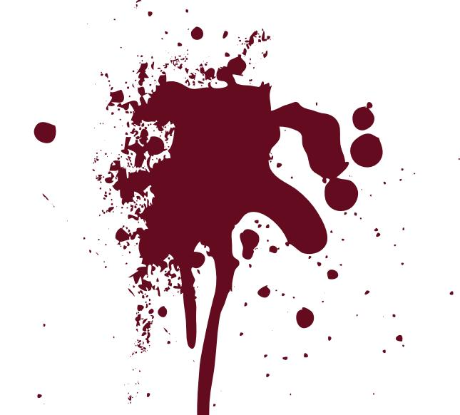

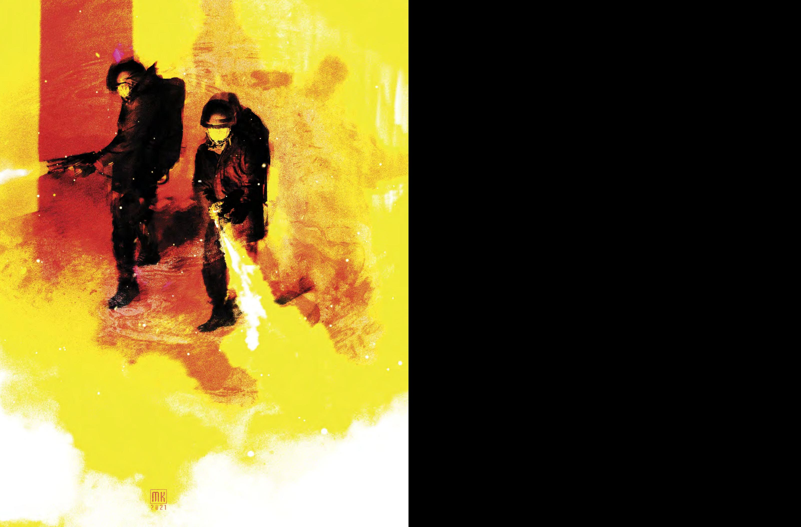

# Ударники и оперативники: Физическая сфера

В конце концов, Вторая Инквизиция охотится на монстров. Пустые тела сами по себе не сдадутся, с ними нужно бороться на местах. Местные герои и наводящие ужас бандиты могут отсеять из рядов пиявок медлительных, новоиспеченных и глупых. Но для охоты на более серьезные цели в течение нескольких месяцев или лет требуются солдаты, обладающие не только навыками противостояния такой угрозе, но и психической стойкостью, позволяющей хранить секреты движения и переступать через собственные моральные границы. К счастью для Коалиции, во многих странах были созданы глубокие резервы из таких солдат, воспитанных на евангелиях патриотизма и национальной безопасности.

Когда "Маскарад вампиров" начал давать трещины, естественным развитием событий стало привлечение в ряды охотников на вампиров военных и сотрудников спецслужб, прошедших подготовку в области борьбы с терроризмом и теневых спецопераций. Размещенные в качестве кадровых сотрудников в группах "реагирования на необычные угрозы", эти операторы составляют острие копья Коалиции. В качестве типового специального оператора UTR Коалиции можно использовать

Инквизитора Дельту (Corebook, p. 372).

# Любитель

Многие охотники на вампиров начинают свою деятельность как любители. Такие "охотники" часто работают в одиночку, но некоторые команды Коалиции UTR набирают перспективных местных любителей после тяжелых потерь. Любителям еще предстоит отточить навыки, необходимые для борьбы с более сильными "пустыми телами", и их команды обычно держат их на расстоянии вытянутой руки от эпицентра событий, пока они не наберутся опыта. В первых миссиях любители полагаются на смекалку и удачу, но лишь немногие из них доходят до конца.

Учитывая, что деятельность "Сородичей" пересекается с преступной деятельностью, многие Любители начинают как Гангстеры (см. Corebook, p.

#### 371).

#### Общая сложность: 3/2

Стандартные пулы кубиков: Физические 4, Социальные 3, Ментальные 3

Вторичные атрибуты: Здоровье 5, Сила воли 6

Исключительные пулы кубиков: Атлетика 6, Драка 6, Огнестрельное оружие 6, Фехтование (колья) 6, Оккультизм (вампиры) 4

Снаряжение: Дробовик, колья и молотки, газовый баллончик, зажигалка "Зиппо", футбольные щитки

(броня 1, нет защиты от баллисты).

Особенность: Когда здоровье любителя уменьшается до нуля, он становится недееспособным, но не умирает, если его специально не уничтожит враг или окружающая среда. При следующем появлении в истории у него появляется соответствующий шрам, и он становится воином, специалистом по разминированию, посредником или другим типом опасного охотника.

Самодельная взрывчатка опасна: при неудачном испытании на ее установку или детонацию любитель сам получает урон.

# Взломщик

Взломщики следят за тем, чтобы физические препятствия не замедляли работу их команды. С их помощью можно решить любую экологическую проблему: пробить дыры в стенах или толстых дверях, убедиться, что выходы из гнезда вампиров надежно заблокированы перед тем, как команда войдет туда для зачистки, и обезвредить ловушки. Без "Взломщика" численность группы UTR сократится еще до достижения цели, а то и вовсе не достигнет ее.

Взломщики на вес золота, когда нужно штурмовать убежище или уничтожить кормовую базу, и они неоценимы, когда пустотник устраивает свое логово в нестандартном месте, например, в разваливающейся часовой башне или лабиринте канализации. Они владеют техникой и знаниями, позволяющими быстро

и безопасно ориентироваться в таких местах. Общая сложность: 4/2

Стандартные пулы кубиков: Физический 5, Социальный 3, Ментальный 5

Вторичные атрибуты: Здоровье 8, Сила воли 7 Исключительные пулы кубиков: Атлетика 7, Ремесло 7, Огнестрельное оружие 7, Воровство 7, Ест.Наука

#### (Инженерия) 7, Техника 6

Экипировка: Кевларовый жилет, шлем (+1 к броне), топор, тактические наушники, таран или брейкер, пластиковая взрывчатка, термит, гранатомет с термобарическими боеприпасами, дробовик (заряжен разрывными патронами и пулями)

Особенность: Взломщики основательно привыкают к шуму и хаосу при взрывах. Они не обращают внимания на штрафы к проверкам чувствительности и самообладания, связанные с дымом, огнем или взрывами (но все же могут использовать уменьшенную дальность видимости, чтобы избежать встречи с глазами пустого тела).

Для взломщика разрушение стены или другого сооружения с помощью взрывчатки или термобарических боеприпасов требует следующего количества успехов в броске Интеллект + Воровство (или другого соответствующего броска; Corebook, p. 410):

- Внутренняя стена, автомобиль: 1
- Наружная/кирпичная стена, бронеавтомобиль, крупногабаритный автомобиль: 2
- Бетонная/армированная стена: 3
- Хранилище: 4 и более

В худшем случае захваченный Взломщик имеет при себе достаточно взрывчатки, чтобы обрушить здание, в котором он находится. Взорвав все, что у них есть, они создают один взрыв, достаточный для того, чтобы разрушить несколько этажей офисного здания или башни. Он наносит 10 уровней тяжелого урона всем, кто по несчастью оказался внутри. Нет необходимости говорить о том, что здание после этого становится нежизнеспособным и даже не стоит на месте.

# Специалист по разминированию

Облаченные в бронежилеты IV уровня, специалисты по разминированию представляют собой тяжелую огневую мощь в авангарде борьбы с вампирами. Когда группе UTR приходится пробиваться в гнездо вампиров во время активного цикла, специалисты по зачистке берут на себя инициативу, используя дробовики, заряженные снарядами "Дыхание дракона". Это не самые универсальные операторы, и их боекомплект часто оставляет мало возможностей для захвата, если им приходится вступать в бой с врагами. В состав большинства групп UTR IAO и ГРУ входят несколько специалистов по разминированию на случай возникновения проблем. Британская служба SO13 даже развертывает целые "эскадроны смерти", состоящие из этих оперативников, в рамках своей

#### доктрины искоренения.

Общая сложность: 4/2

Стандартные пулы кубиков: Физический 6, Социальный 4, Ментальный 4

Вторичные атрибуты: Здоровье 6, Сила воли 7 Исключительные пулы кубиков: Атлетика (гранаты) 6, Огнестрельное оружие 8, Запугивание 6, Фехтование 6, Техника 6

Снаряжение: Дробовик SA (Benelli M4), снаряды "Дыхание дракона", тяжелый бронежилет, топор, гранаты HE

#### Ðàçíîâèäíîñòü: Âûæèãàòåëü

Вооруженный экспериментальным огнеметом XM11, разработанным в 2005 г. на частные средства на основе классической конструкции M9, применявшейся во Вьетнаме, "Огненный ударник" расчищает укрепленные позиции и выталкивает трупы на открытое пространство. Огонь - великий уравнитель между смертными и чудовищами, и огнеметы обычно держат в резерве до тех пор, пока обстоятельства не заставят применить их навыки. Когда "огненный ударник" появляется на поле боя, надежда на захват "пустого тела" уже исчезает, и оперативники переходят к сокращению потерь и

предотвращению разоблачения команды. Общая сложность: 4/2

Стандартные пулы кубиков: Физический 6, Социальный 4, Ментальный 4

Вторичные атрибуты: Здоровье 6, Сила воли 7 Исключительные пулы кубиков: Атлетика 6, Огнестрельное оружие (огнемет) 8, Фехтование 6, Техника 6

Оборудование: Огнемет XM11, противогаз, тяжелые бронежилеты, термобарические гранаты, топор

# Одинокий волк

Эти универсалы работают в одиночку в силу предпочтений, привычки или отсутствия ресурсов, и для этого у них есть широкий набор навыков. Одинокий волк, владеющий ближним боем, огнестрельным оружием, техническими навыками и достаточным количеством шпионских навыков, может справиться с большинством ситуаций - или, по крайней мере, держать ситуацию под контролем до тех пор, пока не будет мобилизована полевая группа.

Привыкшие действовать в одиночку, многие "одинокие волки" с трудом передают управление более крупной команде или вливаются в нее. Они сами принимают решения и не очень любят пробовать незнакомые тактики. Если они находят команду, которая соответствует их взглядам, то становятся отличным

дополнением, дополняя недостающие навыки. Общая сложность: 4/3

Стандартные пулы кубиков: Физический 6, Социальный 5, Ментальный 5

Вторичные атрибуты: Здоровье 8, Сила воли 8 Исключительные наборы кубиков: Наблюдательность (ловушки) 8, Огнестрельное оружие 8, Запугивание 7, Воровство 7, Фехтование 8, Скрытность 7, Уличное чуите 6

Оборудование: Кевларовый жилет, арбалет, автоматический пистолет с бронебойными патронами, гранаты, болторезы, веревки

Особенность: Ни один агент, оказавшийся в одиночестве в полевых условиях, не выживает долго без обучения противостоянию вампирическому контролю сознания. Одинокие волки никогда не считаются

"неподготовленными" для целей этих Дисциплин. Они добавляют 3 кубика к своему Упорству, когда используют ее для сопротивления вампирической Дисциплине.

#### Ðàçíîâèäíîñòü: Èñòðåáèòåëü

Истребитель - самый одинокий из Одиноких Волков. Они либо не хотят рисковать теми, кто им дорог, либо уже потеряли их всех. Они живут ради охоты и являются безупречными охотниками. Их редко можно встретить в рядах Коалиции: они не подчиняются приказам и не работают в команде, а это бесполезно

для координированной операции.

Общая сложность: 4/3

Стандартные пулы кубиков: Физический 6, Социальный 4, Ментальный 5

Вторичные атрибуты: Здоровье 8, Сила воли 8 Исключительные броски кубиков: Наблюдательность (ловушки) 9, Огнестрельное оружие (арбалет) 9, Запугивание 7, Воровство 7, Фехтование (колья) 9, Скрытность 7, Уличное чутье 6

Снаряжение: Цепная бронза, арбалет, автоматический пистолет с бронебойными патронами, гранаты-вспышки, болторезы, веревки, святой символ, защитный амулет или талисман удачи на всякий случай, украденный XScope Особенность: Истребители обладают всеми теми же способностями, что и Одинокие Волки, и даже больше. Они добавляют 4 кубика к своему Упорству, когда используют ее для сопротивления вампирической Дисциплине. У них развита такая высокая болевая толерантность (или амплитудная зависимость), что они справляются с ранениями, которые вывели бы обычного смертного из боя: первый раз во время сцены, когда они получают тяжелый урон от колющего, режущего или баллистического оружия, он рассматривается как сверхфизический урон.

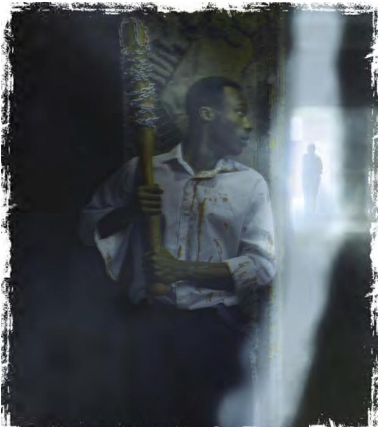

Сородичи, на которых охотится Истребитель, считают, что они сами по себе сверхъестественны. Так ли это на самом деле, или сородичные существа подсознательно тянут с ударами, Истребитель всегда может победить одного вампира (Corebook, p. 121).

# Похититель

Большинство охотников умеют стирать пыль с пустых тел. В этом и заключается их работа. Похититель (или "специалист по выдаче" в терминологии FIRSTLIGHT) знает, как брать пленных и как выжимать из них информацию. Это тайные оперативники, которые быстро входят и выходят, оставляя после себя минимум улик. Они сочетают навыки скрытности с тщательным и точным планированием, физическим мастерством и умением управлять автомобилем.

Коалиция прибегает к выдаче только особых целей: тех, кто может вывести ее на вампиров, представляющих еще большую ценность. Они либо обладают хорошими связями, либо влиятельны сами по себе, поэтому операции по выдаче вампиров являются одними из самых эффективных в арсенале Коалиции.

Похитители тесно координируют свои действия с "кукушками", "канарейками" или "фонарщиками", используя их подробные данные о цели, чтобы выбрать идеальное время для нанесения удара или

#### маневрирования на позиции.

Общая сложность: 4/2

Стандартные пулы кубиков: Физический 6, Социальный 4, Ментальный 4

Вторичные атрибуты: Здоровье 8, Сила воли 7 Исключительные пулы кубиков: Атлетика 8, Драка 9, Вождение 8, Воровство 8, Скрытность 8

Оборудование: Наручники на молнии, наручники, капюшон из цепной ткани, мешок для защиты от солнца, смирительные ремни; ТАЗЕР, дробовик (M26 MASS), кевларовый жилет, XTech в соответствии с известными способностями цели.

Особенности: Похитители FIRSTLIGHT и GRU тренировались на одинаковых зданиях и имеют опыт и специальные инструменты для отключения систем безопасности и взлома дверей или стен. Аналогично, у элитных похитителей при проникновении в убежище сложность не увеличивается за счет фона убежища.

#### Ðàçíîâèäíîñòü: Äîçíàâàòåëü

После того как объект выдачи возвращается на базу, за дело берется дознаватель. Для того чтобы как можно быстрее выбить из объекта информацию, он применяет различные тактики - от психологических манипуляций до откровенных физических пыток. К сожалению, при выдаче высока вероятность получения недостоверных данных: объект может сказать все, что угодно, лишь бы прекратить угрозу своим близким или своей жизни. Даже в рядах Коалиции дознаватели вызывают неприятные чувства у коллег-агентов. Они - "левая рука" Второй инквизиции, те, кто делает то, что другие не хотят или не могут. Между коллегами, настаивающими на том, что политика Коалиции должна заключаться в расстреле любого пустого тела на месте, и теми, кто предпочитает превращать полезных людей в актив, большинство членов Коалиции с нетерпением

ждут того дня, когда дознаватели отправятся на поиски динозавров.

Общая сложность: 4/2

Стандартные пулы кубиков: Физический 4, Социальный 6, Ментальный 5

Вторичные атрибуты: Здоровье 6, Сила воли 8 Исключительные пулы кубиков: Проницательность 8,

Запугивание 9, Медицина 7, Убеждение 8, Ест.науки 7 Особое: У допрашивающих - по крайней мере, у тех, кто пережил первый допрос, - есть хотя бы надежда на то, что они смогут направить бешенство своих жертв в русло речи, а не ярости. Они могут использовать стандартные методы допроса, включая пытки (Corebook, p. 415), на пустых телах. Если это происходит "на глазах", обязательно прочитайте раздел "Пытки" на стр. 102-103.

# Снайпер

Снайпер убивает на расстоянии, часто на очень большом расстоянии. Современные снайперские винтовки (и снайперская оптика) делают выстрелы на тысячу метров практически обычным делом. Большинство снайперов работают с корректировщиком, который отслеживает цель и следит за появлением недружественных сил на холме или крыше. Наводчик добавляет один кубик в копилку снайпера.

 Обычные военнослужащие не доверяют снайперам, которые убивают с гораздо меньшим риском, чем солдаты, хотя и ценят смертоносное наблюдение, когда оно на их стороне. Снайперы часто испытывают большее чувство боевой вины, чем рядовые военнослужащие, подсознательно считая, что снайперская работа больше похожа на убийство, чем на бой.

 В этой статье речь идет о снайпере полицейского спецназа, которому либо доверяет местная команда ВИ, либо не сообщает, в кого и во что он стреляет.

#### Общая сложность: 4/1

Стандартные пулы кубиков: Физический 6, Социальный 3, Ментальный 4

Вторичные атрибуты: Здоровье 6, Сила воли 7 Исключительные пулы кубиков: Наблюдательность 7, Драка 7, Огнестрельное оружие (Снайперская винтовка) 8

Оборудование: Снайперская винтовка (Heckler & Koch PSG1 7.62mm), оптический прицел Особенности: Попадание из снайперской винтовки в неподвижную туловищную цель без укрытия на средней дистанции (100 м) является для снайпера проверкой сложности 1 (Упорство + Огнестрельное оружие) (см. Corebook, стр.302). Изменение этих условий увеличивает Сложность. Снайпер, стреляющий зажигательными патронами через окна убежища (или 12,7-мм патронами NATO Raufoss через стены убежища), угрожает находящимся внутри сородичам, даже если он не видит их через разумно затемненные окна. Критический успех такого выстрела приводит к возгоранию всей комнаты, а в конечном итоге и здания.

Хотя большинство снайперских винтовок используют дозвуковые боеприпасы (а ВИ - глушители), род с повышенными чувствами (Ясновидение -) может сделать проверку на Смекалку + Наблюдательность (сложность 3), чтобы определить источник (направление и расстояние) снайперского выстрела, если он не уничтожит его. При критическом успехе можно даже заметить уличные фонари, мерцающие в прицеле.

#### Ðàçíîâèäíîñòü: Êèëëåð

Возможно, с военной подготовкой, но теперь работающие в частном секторе. Восьмое направление могло найти их через Организацию, Общество святого Леопольда - через посредничество Каморры, или NSA могло прослушивать их анонимные Gmail-аккаунты. Их оружие - это либо обычные одноразовые винтовки, либо очень дорогие изделия из керамики и пластика, разламывающиеся на безобидные для передвижения части. В любом случае они стремятся к меньшим дистанциям, но используют умеренно тяжелые боеприпасы (.308 или 7,62 мм) для гарантированного попадания в голову (-2 успеха).

Общая сложность: 4/2

Стандартные пулы кубиков: Физический 6, Социальный 4, Ментальный 5

Вторичные атрибуты: Здоровье 6, Сила воли 7 Исключительные наборы кубиков: Наблюдательность 7, Огнестрельное оружие (Снайперская винтовка) 8, Воровство (Сигнализация) 7, Фехтование 7, Скрытность 7, Уличное чутье 6

#### Ðàçíîâèäíîñòü: Æíåö

Привлеченные в Коалицию из "Дельта Форс", или "Спецназа", или какого-то другого подразделения, занимающегося обеспечением тишины. Спецназ, или другое подразделение, занимающееся вопросами тишины и смертоносности. Военные снайперы предпочитают более тяжелые винтовки, стреляющие более крупными патронами (12,7 мм) на большие

расстояния, чем полицейские снайперы. Общая сложность: 4/2 Стандартные пулы кубиков: Физический 7, Социальный 3, Ментальный 4

Вторичные атрибуты: Здоровье 8, Сила воли 8 Исключительные пулы кубиков: Атлетика 8, Наблюдательность 7, Драка 8, Огнестрельное оружие (Снайперская винтовка) 9, Фехтование 8, Скрытность 8 Оборудование: Снайперская винтовка (Barrett

M82A .50 калибр), оптический прицел

# Воин

Поскольку пустые тела, как известно, трудно уничтожить с помощью оружия, Коалиции срочно требуются операторы, способные справиться с ними в рукопашном бою. Общество Леопольда в Ватикане и ГРУ, похоже, располагают практически бесконечным запасом солдат с такими навыками, но FIRSTLIGHT приходится взаимодействовать с ЦРУ и контртеррористическими операциями SOCOM. Пока у правительства США не кончатся человеческие мишени, которых можно убивать вблизи, IAO придется довольствоваться теми немногими воинами, которых удастся выпросить, одолжить или украсть у

#### частного сектора.

Общая сложность: 4/2

Стандартный набор кубиков: Физические 6, Социальные 3, Ментальные 5

Вторичные атрибуты: Здоровье 7, Сила воли 8 Исключительные наборы кубиков: Атлетика 7, Наблюдательность 7, Драка 7, Огнестрельное оружие 7,

Фехтование (ножи) 9, Скрытность 7 Снаряжение: Пистолет (Glock 17), глушитель, боевой нож, гаррота, прибор ночного видения, камуфляжный

костюм Особенность: Воины могут использовать гарроту или

боевой нож для обезглавливания или расчленения жертвы (Corebook, p. 221).

#### Ðàçíîâèäíîñòè: Ëåîïîëüäèò Ñèêàðèóñ

Святые воины, сочетающие в себе лучшие тренировочные доктрины UTR и самое мощное мистическое оружие Ватикана, сикарии - это ветераны-истребители. Их доспехи и оружие благословлены одним из заместителей Общества. Их тело помазано молитвой и окутано благословением

Великого Магистра.

Общая сложность: 5/2

Стандартные пулы кубиков: Физический 6, Социальный 3, Ментальный 5

Вторичные атрибуты: Здоровье 7, Сила воли 8 Исключительные пулы кубиков: Атлетика 7, Наблюдательность 7, Огнестрельное оружие 7, Фехтование 8, Оккультизм (вампиры) 7, Скрытность 7

Оборудование: Пистолет (Glock 17), глушитель, короткий меч, ночное видение, камуфляжный костюм

Артефакт: Кинжал Аккада (стр. 87) Истинная вера: от 2 до 4

Особое: Сикарий невосприимчив к силам Обливиона. Выпив кровь Сикария, вампир получает 2 пункта тяжелого здоровья. Вампир может уменьшить этот урон по принципу "один к одному", добившись успеха в броске "Выносливость + Упорство".

#### ØÀÁËÎÍ ÃÓËß

Внесите следующие изменения в профиль любого другого антагониста, чтобы превратить его в гуля. Более подробный профиль гуля см. в Лордлесс, **p**. 50.

Общая сложность: +0/+1

Стандартный набор кубиков: Физические +1 Вторичные атрибуты: Здоровье +1 Дисциплины: Стремительность 1, Могущество 1 (или 2 точки по выбору рассказчика)

# Колдуны и священники:

# Магическая сфера

Оккультизм не ассоциируется у большинства обывателей ни с Коалицией, ни с теми, кто на них охотится. "Вторая инквизиция" вызывает в памяти аналитиков разведки и команды UTR, сожженные убежища и убитых союзников, падение Лондона и уничтожение Венского канцелярия. Но Коалиция добивается успеха, потому что она - прагматик: она использует любой инструмент, который оказывается эффективным. А таинственные, полупонятные секреты магии могут быть очень эффективными.

Несмотря на тяжелую историю бразильских репрессий в отношении их верований и практик, в Бразилии возникло взаимопонимание: некоторые бразильцы, практикующие кандомбле и умбанду, освящают оружие, проводят ритуалы и защищают своих коллег из BOES - силы, которая долгое время была их собственным историческим врагом; в Ньюбургской группе есть теурги, самопровозглашенные ведьмы и ученые-герметики; в Акритаи и Обществе святого Леопольда есть чудотворцы. ГРУ использует наработки советской эпохи в области психической войны, а SAD аккумулирует понемногу всего понемногу из отдаленных уголков Америки.

Тем не менее, специалисты в области магических искусств остаются редкими, особенно в полевых условиях, где они могут быть съедены или превращены в таких же колдовских болванчиков. В конце концов, Ватикан помнит историю Фауста, а цензоры Леопольдита до сих пор выискивают тех, кто соблазнился запретными искусствами внутри Общества. Большинство солдат Коалиции никогда не сталкивались с магией, которая не хотела бы выпить их кровь; существование специалистов по оккультизму даже среди многих леопольдитов остается скорее городской легендой, чем записью в техническом паспорте.

Об "универсальном" духовном охотнике см. в статье Охотник за верой (Corebook, p. 371).

# Хитрые люди

Хитрый маг приносит народную магию и колдовство на службу Второй инквизиции. Хитрых магов гораздо больше за пределами Коалиции, чем внутри нее: представители этой ветви магии не склонны к командной работе. (Общее исключение: Хитрые люди из Шотландии и Аппалачей часто служат в армии своей страны).

Они сильно индивидуалистичны, и во многих случаях стремление избавить мир от нежити является их единственной общей чертой с Коалицией. Они не являются поклонниками закона и порядка, а также религиозной ортодоксии.

Когда Коалиция сотрудничает с "Хитрыми людьми", отношения с ними часто строятся на расстоянии вытянутой руки по взаимному согласию. Они работают в качестве консультантов, помогая там, где это необходимо, но не вливаясь непосредственно в команду UTR. Конечно, бывают и исключения. Некоторые "хитрецы" - патриоты или просто современные люди, желающие сделать карьеру с хорошей зарплатой и льготами, но они далеко не всегда являются нормой.

"Пустые тела" часто считают, что "хитрецы" - менее непримиримый враг, чем основные силы Коалиции. В чем-то они правы: отряд Чемпионов, защищающий ведьмин квартал, или отряд Церберов, охраняющий магический артефакт, могут иметь больше общего с Хитрецами, чем IAO.

Хитрый маг использует магию ограды для различных проклятий и благословений, а также заимствует тела или

#### чувства своих животных-друзей.

Общая сложность: 3/2

Стандартные пулы кубиков: Физический 4, Социальный 4, Ментальный 5

#### Вторичные атрибуты: Здоровье 7, Сила воли 9

Исключительные пулы кубиков: Проницательность 7, Медицина 6, Оккультизм 8

Оборудование: Ритуальные инструменты, нож, защита шеи Особенности: Хитрый народ знает множество благословений и проклятий, каждое из которых требует предварительной подготовки к ритуалу, одного очка силы воли и успешного броска "Упорство + Оккультизм". Эти ритуалы направляют силу в талисман, амулет или другой материальный жетон, который носит с собой хитрый маг. Накопленная духовная сила может фокусировать механизмы: каждый дополнительный жетон, носимый после первого, вычитает один кубик из любого броска, сделанного Хитрецом при использовании техники (в том числе огнестрельного оружия). Распространенные эффекты включают:

■ Хорошее здоровье: Носитель жетона получает 2 дополнительных уровня здоровья

■ Удача: Носитель жетона добавляет 2 дополнительных кубика к броскам, использующим выбранный им атрибут.

■ Защита: Вампирам и другим сверхъестественным существам трудно прикоснуться к носителю жетона. Для этого они должны сделать бросок "Упорство + Самообладание" и получить не менее 2 успехов, чтобы причинить вред носителю.

■ Истинное зрение: Носитель жетона может видеть вампиров или других сверхъестественных существ, даже если они используют "Румянец жизни" или другую сверхъестественную силу, чтобы казаться смертными. Продолжительность действия этих преимуществ зависит от результата Хитрого Мага:

- Один успех = одна сцена
- Два успеха = один день (до следующего восхода солнца)
- Три и более успеха = два дня

Хитрый маг также может околдовать противника: для этого достаточно простого магического слова, жеста или даже взгляда. При успешном броске "Манипуляция + Оккультизм" и потраченном очке Силы воли хитрый маг накладывает штраф в 2 кубика на следующий бросок оппонента. При этом нельзя убрать из броска кубики голода.

#### Ðàçíîâèäíîñòü: Àíèìàëèñò

В отличие от вампирической дисциплины "Анимализм", Хитрецы-анималисты используют своих животных-друзей для наблюдения за другими, проносясь по ночам в виде птицы или рыская в виде крысы или кошки. Эти Хитрецы работают на Вторую Инквизицию в качестве шпионов, наблюдая и докладываяо происходящем из мест, куда не осмелится ступить обычный смертный.

#### Общая сложность: 4/2

Стандартные пулы кубиков: Физический 4, Социальный 4, Ментальный 5

Вторичные атрибуты: Здоровье 7, Сила воли 9 Исключительные Пулы Кубиков: Обращение с животными 8, Расследование 6, Оккультизм 8 Оборудование: Ритуальные инструменты, нож, защита для шеи, пища.

Особенности: Анималисты обладают способностью управлять животными, проецировать в них свои чувства или даже помещать свое сознание в тело животного.

 Чтобы управлять животными, внушая им верность или дружбу, страх или ярость, направленные на выбранную анималистом цель, он тратит одно очко силы воли и делает бросок Харизма + Обращение с животными против Упорства + Самообладания животного или, если животное контролируется другим существом, против Харизмы + Обращение с животными этого существа. Этот контроль длится один ход при одном успехе и одну сцену при двух или более успехах.

Чтобы проецировать свое зрение и слух через органы чувств животного, анималист тратит одно очко силы воли и бросает кубики "Смекалка + Обращение с животными". Бросаются три дополнительных кубика, если они проецируют свои органы чувств через обученного друга, и два дополнительных кубика с животным, которое их знает. За один успех они воспринимают чувства животного в течение одного хода, за два успеха до 10 минут, а за три и более успехов - сцену. При проецировании своих чувств тело анималиста слепо и глухо, пока он не разорвет связь с животным, что он может сделать в любой момент.

Анималист может проецировать все свое сознание в тело знакомого животного, не только заимствуя его органы чувств, но и управляя его телом так, как если бы оно было его собственным. Потратив одно очко силы воли и сделав бросок "Упорство + Обращение с животными", анималист на одну сцену получает контроль над телом своего знакомого.

Когда сознание анималиста находится в его знакомом, тело человека становится уязвимым, фактически впадая в коматозное состояние. Если тело повреждено, анималист может сделать бросок "Смекалка + Оккультизм", чтобы вернуться и пробудиться.

# Верный

Команды UTR, оказавшиеся обладателями реликвии, получают оружие только в том случае, если у них есть человек, достойный им владеть. Хотя проверить наличие Истинной Веры на практике невозможно, в боевых условиях она проявляется достаточно быстро. Таким образом, даже если Верный не обладает наилучшей меткостью в команде, в духовном смысле он имеет больший вес. В командах, где нет профильного оккультиста, они обычно играют роль "офицера сверхъестественной разведки". Общая сложность: 3/2 Стандартный набор кубиков: Физические 5, Социальные 4, Ментальные 5 Вторичные атрибуты: Здоровье 6, Сила воли 7

Исключительные пулы кубиков: Наблюдательность 6, Проницательность 6, Оккультизм 6 Оборудование: Бронежилет, стандартная комплектация, святой символ

Артефакт: лучший реликт, имеющийся в распоряжении команлы

Истинная вера: 2 или 3  $(Corebook, p. 222)$ Особенность: Верующий также знает местоположение любой святой земли (см. ниже) в зоне своего патрулирования и добавляет два кубика к любой попытке добраться до нее или направить к ней свой отряд.

### Флагеллант

Мистики, достигающие святого причастия через боль, флагелланты проходят мощные ритуалы, укрепляющие их кровь и заставляющие ее гореть верой. Флагелланты обычно действуют самостоятельно, но некоторые из них попали в команды ESOG и Akritai

Общая сложность: 4/2

Стандартные пулы кубиков: Физический 5, Социальный 4, Ментальный 5 Вторичные атрибуты: Здоровье 6, Сила воли 8 Исключительные наборы кубиков: Атлетика 7, Наблюдательность 7, Фехтование 7, Оккультизм 7 Снаряжение: Пистолет Desert Eagle (.50

Action Express), короткий меч, бронежилет

#### CBHTAH SEMIH

Некоторые места настолько долго и интенсивно впитывают духовную энергию верующих, что начинают излучать ее обратно. Места, где произошли значительные чудеса или значительные мученические смерти, могут в одночасье стать святыми местами. Эти места могут принадлежать к любой религиозной традиции и находиться в любом месте. Рассказчики могут сделать так, чтобы забытые места (камень, засыпанная церковь) продолжали святиться.

Настоящая святая земля имеет уровень рейтинга от одной до пяти точек. Интерполируйте конкретные значения Святой земли для мест в вашем городе истории из следующих данных:

• Соседнее религиозное сооружение, освященное кладбище

• • Большая мечеть, собор, храм или синагога

••• Почитаемые места: Гора Афон, Голубая мечеть, гробница святого или имама, Шесть дедов в Черных холмах, Южная Дакота

•••• Основные святыни: Собор Нотр-Дам (Париж), Дакшинесвар (Калькутта), мечеть Аль-Кадхимия (Багдад), гора Курама (близ Кёто), Храмовый комплекс Удан в Хубе (Китай), Улуру на территории Австралии. (Багдад), гора Курама (близ Кёто), Храмовый комплекс Вуданг в Хубе (Китай), Улуру на Северной территории (Австралия)

••••• Святая Святых: Стена Плача, Храм Гроба Господня, Купол Скалы (весь Иерусалим), Кааба (Мекка), Дашашвамедх Гхат (Варанаси), гора Кайласа (Гималаи), дворец Отни в Иле-Ифе (Нигерия)

Святая земля не оказывает никакого механического воздействия на вампиров или других сверхъестественных существ (за исключением тех, кто имеет соответствующий недостаток фольклорного блока (Corebook, p. 182), хотя может вызывать у них беспокойство или раздражение. До тех пор, пока на нее не встанет человек с Истинной Верой; в этом случае Верующий добавляет точки Святой Земли к своей собственной Истинной Вере.

Если верующий принадлежит к иной традиции, чем земля (например, католический священник в индуистском храме), он, как правило, не может добавить Святую землю к своей вере. Другие действия (например, перестрелка в буддийской ступе) могут помешать такому добавлению. Рассказчики должны определить, совместимы ли конкретный Верующий и конкретный участок Святой земли, и если да, то насколько.

Вампиры, особенно в Шабаше, могут стремиться осквернить святую землю. Специфика этих ритуалов или действий остается в руках Рассказчика, но обычно они включают в себя состязание (Упорство + Оккультизм, например) против Святой земли + Истинной веры ее самого верного защитника. За каждое пятно, полученное при попытке, вампиры добавляют по одному кубику; если побеждает Верный, то каждый вампир получает по 1 тяжелому урону за каждый дополнительный успех.

Особенность: Флагеллант добавляет четыре кубика к любому набору, чтобы противостоять или оспорить вампирическую Дисциплину, черпающую свою силу из Обливиона. Выпив кровь флагелланта, вампир получает 3 очка тяжелого здоровья. Вампир может уменьшить этот урон по принципу "один к одному", добившись успеха в броске "Выносливость + Упорство".

#### Ðàçíîâèäíîñòü: Àáñîëþòíûå

Святой воин культа монахов (см. с. 134), заключивший мир с этим и следующим миром. Обычно Абсолютные охраняют секретные ватиканские объекты мистического значения, которые слишком удалены или чувствительны, чтобы попасть на радар FIRSTLIGHT. Эти монахи понимают, что их, скорее всего, ждет смерть на службе Обществу Святого Леопольда.

#### Общая сложность: 4/2

Стандартные пулы кубиков: Физический 5, Социальный 4, Ментальный 5

Вторичные атрибуты: Здоровье 8, Сила воли 8 Исключительные наборы кубиков: Атлетика 7, Наблюдательность 7, Фехтование 7, Оккультизм 7 Снаряжение: Меч, бронежилет, гранаты HE, зажигательные гранаты

Особенности: Как и Флагеллант выше. Абсолютный может взорвать одну из имеющихся у него гранат сразу после того, как его здоровье уменьшится до 0.

# Нуллификатор

Некоторые люди могут стать или создать сверхъестественную "нулевую зону". Их точные методы различны: аколит Акритаи или Леопольдита опирается на молитвы и обращается к силам святых для защиты, особенно к святому Марцеллу Парижскому, который уничтожил вампира в Париже V века. Нуллификатор, прошедший обучение в Ньюбургской группе, скорее всего, начертит магический знак или повторит заклинание на энохианском языке. В то же время САД и ГРУ-58 иногда обучают оперативников активизации скрытых экстрасенсорных способностей для их подавления.

Методы меняются, но один факт остается неизменным: Нуллификаторы сохраняют жизнь своей команде. Когда клыкастые монстры проскальзывают между чувствами охотников или навязывают свою волю сознанию смертного, "нуллификатор" останавливает их на пути. Будучи обязанными держаться подальше от опасности, чтобы защитить команду, нуллифайеры обычно не слишком преуспевают в бою.

Они могут знать немного о первой помощи или другие полезные навыки, которые не позволят им быть "одноруким бандитом", но в основном их работа заключается в том, чтобы носить максимально надежную броню и прикрывать спину своей команды.

Вне боевых действий сидящий рядом Нуллификатор может пресечь попытку вампира стереть память жертвы о кормлении, помешать пустому телу соблазнить жертву с самого начала или не дать ему подкрасться к цели. По этой причине их иногда назначают телохранителями - осторожными для смертных, считающихся подверженными

вампирическому влиянию.

Общая сложность: 3/2

Стандартные пулы кубиков: Физический 3, Социальный 4, Ментальный 5

Вторичные атрибуты: Здоровье 6, Сила воли 9 Исключительные пулы кубиков: Наблюдательность 7, Оккультизм 7, Скрытность 6

Снаряжение: Кевларовый жилет, полуавтоматический пистолет, аптечка.

Особенности: Нуллификатор может просто остановить работу Дисциплин пустого тела и распространить этот эффект на своих коллег. Это требует больших умственных и физических усилий, а активация одной из способностей не только отнимает у Нуллификатора одно очко силы воли, но и наносит два очка легкого урона.

Когда пустое тело пытается использовать Доминирование, Сокрытие или Величие, Нуллификатор тратит дополнительное очко Силы воли и бросает бросок Упорство + Оккультизм против пула Дисциплины этого пустого тела. Каждые два успеха в броске уменьшают количество успехов пустого тела на 1. Если Нуллификатор выигрывает поединок, Дисциплина просто проваливается.

# Пси-разведчик

Выпускник программ подготовки экстрасенсов Восьмого направления (и, в меньшей степени, аналогичных программ ЦРУ и армии, возобновленных FIRSTLIGHT), Пси-разведчик обучается находить пустые тела или их убийц с помощью видений. Счастливчики могут делать это, находясь в безопасном месте, но большинство из них находятся на передовой, цепляясь за смутные ментальные впечатления, возникающие в их сознании при взгляде на старые выветрившиеся пятна крови или прикосновении к стенам в "комнате убийц".

Самые несчастные получают такие видения без подсказки и предупреждения: их внезапно настигает видение трупа, наложенного на, казалось бы, здорового, живого человека, или мелькание неизвестного пустого тела, вонзающего клыки в пульсирующую шею смертной жертвы. Первые видения не всегда полезны сами по себе, но они становятся первыми шагами на пути, который приводит Пси-разведчик к "пустым телам", о которых Коалиция могла бы и не подозревать.

Видения пси-разведчиков бывает трудно интерпретировать: означает ли этот пепел головы смерти над чьим-то лицом, что это пустое тело, что оно скоро станет жертвой смерти или что ему суждено стать таковым в будущем? Как и многие сотрудники Коалиции, занимающиеся расследованиями, пси-разведчики проводят кропотливые исследования, чтобы прояснить и подтвердить свои видения: поспешные выводы приводят к дорогостоящим ошибкам.

#### Общая сложность: 5/2

Стандартные пулы кубиков: Физический 4, Социальный 4, Ментальный 6 Вторичные атрибуты: Здоровье 7, Сила воли 7 Исключительные пулы кубиков: Наблюдательность 9, Расследование 7, Скрытность 7 Оборудование: Экспериментальные психотропные

препараты, карты Зенера или Таро Особенность: Пси-Разведчик может определять сверхъестественных существ, включая тех, кто использует "Румянец жизни" или подобную силу, чтобы выглядеть как смертные, при успешном прохождении проверки на Смекалку + Наблюдательность. С одним или несколькими успехами они определяют, что в человеке что-то "не так", но не то, к какому типу сверхъестественных существ он относится. С двумя успехами они могут опознать пустое тело, а с тремя и более - примерно догадаться, что это за существо (например, оборотень, кто-то с оккультными или магическими способностями, существо не от мира сего).

Пси-разведчик также может "читать" объекты и места, улавливая следы прошлых событий. Чем более эмоциональной была ситуация - например, вызвавшая сильный страх, страдание, страсть, - тем легче ее прочитать. Пси-разведчик может прикоснуться к предмету или человеку и при успешном броске Интеллект + Наблюдательность увидеть краткую вспышку одного значимого события, произошедшего с ним за последнюю неделю. Самым значимым событием почти всегда будет встреча с пустым телом или другим сверхъестественным существом, поэтому "прочитать" жертву, чтобы определить, кто ею питался, несложно (сложность 2). Разведчик видит, слышит и чувствует картину с точки зрения объекта.

Последняя способность разведчика - это одновременно и благословение, и проклятие: он может ощущать близость пустых тел. Сделав бросок "Упорство + Наблюдательность", они могут определить, есть ли в радиусе мили пустые тела. С тремя успехами они могут определить, насколько близко находится самое близкое из них, а с пятью успехами они могут определить местоположение конкретного пустого тела, если оно находится в пределах мили.

Все экстрасенсорные способности требуют от разведчика 1 силы воли.

# Пси-страйкер

Еще один выпускник лабораторий Коалиции по развитию экстрасенсорики, Пси-страйкер использует свои полуосознанные способности как оружие, хотя и непредсказуемое, которое может быть опасно как для коллег, так и для врагов. Страйкеры остаются в Коалиции, потому что любое оружие имеет ситуативное применение, и они не могут спокойно уйти в гражданскую жизнь. Они ввязываются в опасные стычки в городах, контролируемых вампирами, и наносят столько урона, сколько могут, прежде чем их неизбежно уничтожит какой-нибудь монстр с пустым телом.

Пси-страйкер - ценный актив. Они наносят серьезный ущерб, который не могут воспроизвести и к которому обычно не готовы бестелесные существа. Но даже в этом случае их коллеги испытывают облегчение, когда их нет. Находясь рядом со страйкером, он может вызвать эмоциональное кровотечение: когда он напряжен и зол, все его друзья тоже напряжены и злы. Это не способствует слаженной работе и стабильности коллектива.

#### Общая сложность: 4/2

Стандартные пулы кубиков: Физический 5, Социальный 4, Ментальный 5 Вторичные атрибуты: Здоровье 6, Сила воли 7 Исключительные пулы кубиков: Наблюдательность 8, Ест.Наука (парапсихология) 6

Оборудование: Кевларовый жилет, шлем,

экспериментальные психотропные препараты Особенности: Пси-страйкер манипулирует телекинетическими силами. Он может притянуть, толкнуть или бросить объект в пределах видимости с помощью телекинетической силы, сделав бросок Упорство + Наблюдательность и потратив одно очко Силы воли. Для оценки эффекта используйте таблицу "Подвиги силы" на с. 411 Corebook; каждый успех в броске означает одну точку телекинетической силы.

 Потратив одно очко Силы воли и добившись успеха в броске Упорство + Наблюдательность, пси-страйкер вызывает взрыв телекинетической силы, излучаемой вокруг себя. Дальность действия составляет примерно один метр на пункт Интеллекта, и все существа в пределах этой дальности должны парировать бросок ударника на Силу + Выносливость. Если они проигрывают, то падают на землю и получают 2 уровня легкого урона за каждый незначительный успех.

 Длительное пребывание рядом со пси-страйкером требует больших усилий. Эмоции пси-страйкера зашкаливают и выплескиваются на окружающих. Проведя одну сцену в компании пси-Страйкера, смертные и сверхъестественные существа теряют один кубик из набора кубиков самообладания до тех пор, пока они не будут находиться вдали от Страйкера хотя бы сутки.

#### Ðàçíîâèäíîñòü: Ïèðîêèíåòèê

Пирокинетик - это очень интеллектуальный огнемет. Вместо телекинетической силы они управляют теплом и создают огонь, что делает их супер-оружием в борьбе с пустым телом.

#### Общая сложность: 4/2

Стандартные пулы кубиков: Физический 5, Социальный 4, Ментальный 5

Вторичные атрибуты: Здоровье 6, Сила воли 7 Исключительные пулы кубиков:

Наблюдательность 8, Наука (парапсихология) 6 Снаряжение: Кевларовый жилет, шлем, экспериментальные психотропные препараты, сигареты, без зажигалки

Особенность: Взрыв пирокинетика представляет собой расширяющийся огненный круг, наносящий усиленный урон.

Кроме того, пирокинетик может вызывать огонь, затрачивая 1 силу воли, поджигая

легковоспламеняющиеся предметы, например одежду, и нанося 1 уровень отягчающего урона в раунд всем, кто находится в контакте с огнем, пока кто-нибудь не потратит ход на его тушение.

 Нахождение рядом с пирокинетиком вызывает такое же эмоциональное кровотечение и потерю самообладания, как и у обычного страйкера.

# Колдун

Колдовские способности проявляются по-разному: одержимость духами, молитвы и посты, длительное изучение древних книг, манипуляции с лей-энергией, энтеогенные химические стимуляторы, посвящение в древнюю традицию или просто странные синхронистические совпадения. Специфика зависит от колдуна, но механически они пересекаются: любая традиция может развивать целительную магию, заклятия и амулеты или любой другой специфический колдовской эффект. Если не указано иное, в качестве резерва для таких колдовских эффектов следует рассматривать Оккультизм, хотя каждая колдовская традиция называет его по-своему и активирует посвоему.

 В большей степени, чем в случае с другими антагонистами в этой книге, адаптируйте персонажейколдунов и их способности именно к вашей истории, настраивая их на противостояние и досаду. Смертный, способный к колдовству, должен стать для персонажей игроков таким же неприятным шоком, как вампир для обычного смертного. Рассматривайте цифры, приведенные в этом профиле, как отправные точки и рекомендации; аналогично относитесь и к меню возможных магических эффектов.

#### Общая сложность: 4/2

Стандартные пулы кубиков: Физический 4, Социальный 5, Ментальный 6 Вторичные атрибуты: Здоровье 7, Сила воли 9 Исключительные пулы кубиков: Гум.Науки 7, Наблюдательность 8, Оккультизм 9 Оборудование: Ритуальные инструменты, книга ритуалов, талисман или священный символ, метательный или ритуальный меч.

# Эффекты магии

Если их искусство дает им магический эффект, перечисленный ниже, колдун тратит одно очко силы воли и делает бросок на оккультизм. Если бросок удался, эффект срабатывает. Вычтите 1 кубик из броска, если колдун не провел предыдущие восемь часов в соответствующей ритуальной подготовке или деятельности; вычтите 2 кубика из броска, если он пытается использовать эффект во время боя или в другом напряженном и отвлеченном состоянии.

Колдун может одновременно использовать только один эффект. Колдуны, черпающие свои силы из божественного, часто обладают Истинной Верой; если это так, они могут добавить свою Истинную Веру к своему набору Оккультизма.Ни один колдун не владеет всеми (или даже очень многими) возможными колдовскими эффектами; эти примеры взяты из широкого перечня.

#### ÑÒÎßÒÜ

Повелительным словом колдун заставляет пустое тело не предпринимать никаких действий. Для этого требуется два очка силы воли и бросок "Харизма + Оккультизм" против силы воли пустого тела. Пустое тело не может совершать никаких действий, включая

перемещение, в течение одного хода.

#### ËÅ×ÅÍÈÅ

При успешном броске "Самообладание + Оккультизм" (сложность 4, или 5, если повреждения тяжелые) колдун может исцелить столько уровней здоровья, сколько у него успехов в броске. На исцеление каждого повреждения тратится одно очко силы воли.

#### CHPATATLCA OT ACTPEEA

На одну сцену колдун становится неуловимым для ритуалов "Колдовство крови" ("СВЕЧЕНИЕ СЛЕДОПЫТА") (Corebook, стр. 277) и "ОКО НОЧНОГО ЯСТРЕБА" (Corebook, стр. 280) и невосприимчивым к Дисциплинам, используемым

через ночного ястреба.

#### взгляд

Колдун чувствует поверхностные мысли и истинные намерения субъекта. Мысли, которые они читают, - это лишь вспышки поверхностных мыслей: любое сильное, осознанное намерение или образ, который стоит на первом месте в их сознании например, намерен ли субъект сопротивляться или сотрудничать, кто приходит ему на ум, когда Колдун угрожает кому-то, кто ему дорог. Может возникнуть озарение по поводу опоры. Они также знают, намеренно ли субъект лжет или вводит их в заблуждение.

Объект может противостоять этому эффекту, слелав успешный бросок Упорства + Хитрость со Сложностью, равной успехам колдуна в броске

Оккультизма.

#### **CBET**

Колдун тратит одно очко силы воли, делает бросок Упорство + Оккультизм (сложность 4) и создает искру света, яркую, как фонарик, которая длится до одной сцены. Колдун может потратить еще больше силы воли, чтобы заставить искру света расшириться до сферы, достаточно большой, чтобы заполнить комнату среднего размера. Этот свет действует подобно солнечному свету, нанося вампирам 1 уровень тяжелого урона за каждое дополнительное очко силы воли, и сгорает через один оборот.

#### BOCIIPMHMMATЬ COKPETOE

Колдун тратит дополнительное очко Силы воли и делает бросок Упорства + Оккультизм против Смекалки + Сокрытия пустого тела. Колдун может чувствовать персонажей под сокрытием, как обычно, до конца сцены.

#### ПРОТИВОСТОЯТЬ ОБЛИВИОНУ

На колдуна не действуют способности Обливиона (Chicago By Night, стр. 293-295) "Покров теней" и "Покров Стигии". Колдун автоматически обнаруживает пустое тело, занимающееся подсматриванием с помощью Взгляда из тени или Призыва тени, и может потратить дополнительное очко силы воли, чтобы отменить эти способности на несколько секунд (или на один ход боя), или 3 очка силы воли, чтобы отменить их на всю сцену. Они могут потратить 2 очка Силы воли, чтобы предотвратить использование Шага сквозь тень вампиром.

#### СКРЫТЫЙ

Если колдун обладает личным оружием, количеством крови цели (достаточным для заполнения пробирки) или одним из опор пустого тела, он может шпионить за текущей деятельностью цели. Они видят и слышат текущее местоположение цели, как будто заглядывают ей через плечо.

Ритуал действует в течение одной сцены. Он не может проникать через заслоны или оккультные барьеры, и пустое тело, обладающее Ясновидением или дисциплиной, позволяющей шпионить за другими на расстоянии (например, Колдовство крови, Обливион), знает, когда за ним подглядывают, даже

если оно не является целью ритуала.

#### **ОТСЛЕЖИВАНИЕ**

С помощью личного имущества, крови или опоры колдун определяет местонахождение цели и может указать ее на карте. Колдун не видит и не слышит, что делает цель, а точность зависит от количества успехов в броске "Оккультизм". При одном успехе ритуал определяет нужный район, при двух - квартал города, а при трех и более - здание, в котором находится цель. Этот ритуал не отслеживает движущуюся цель: она определяет местоположение только в момент

проведения ритуала.

#### ЗАЩИТА ОТ КОЛДОСТВА КРОВИ

Обнаруживать и противостоять магическим заклинаниям и кругам, наложенным с помощью "Колдовства крови" (Corebook, р. 275). Пока эта способность активна (одна сцена), колдун может бросить Интеллект + Оккультизм, чтобы заметить заслон, а проверка ритуала, чтобы активировать его

против него, делается с +1 сложностью.

#### МАГИЧЕСКИЙ БАРЬЕР

Колдун создает магический барьер, который не позволяет бестелесным существам и их гулям войти в комнату или шпионить за ней, используя свои Дисциплины. Чтобы преодолеть эту ритуальную защиту, пустое тело должно сделать бросок Упорство + Дисциплина со сложностью, равной успехам колдуна в броске Оккультизм. Защита действует в течение одной сцены или (при дополнительном очке силы воли) до следующего восхода солнца.

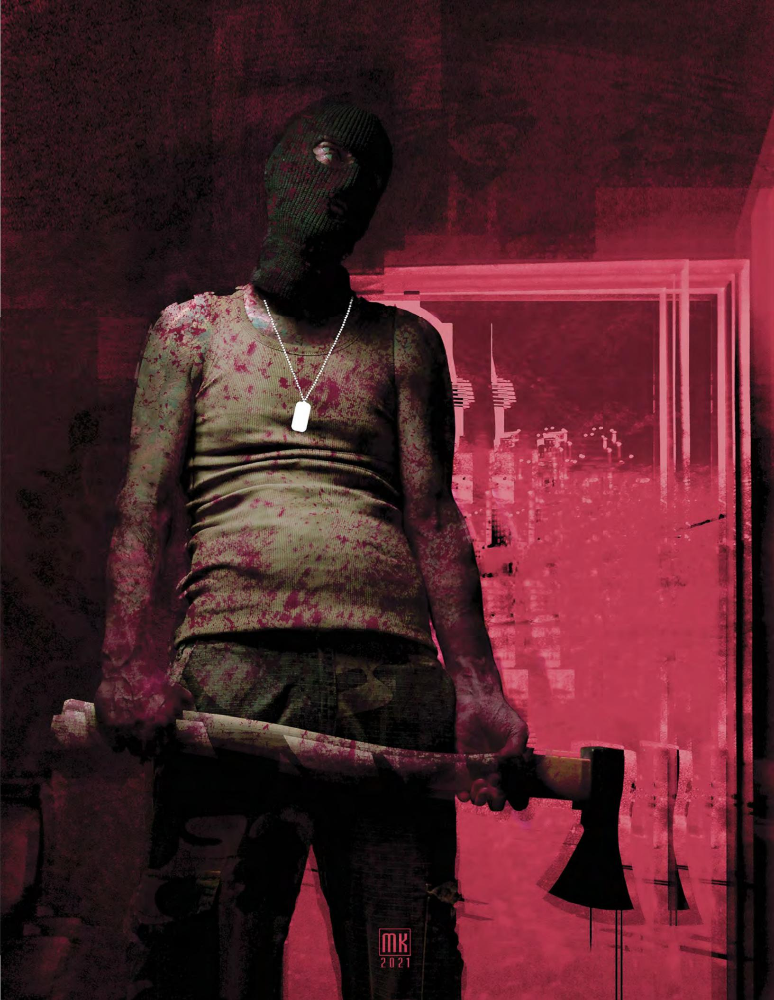

# Перебежчики

Коалиция не имеет единой позиции по использованию "пустых тел" в качестве активов. Некоторые сотрудники никогда не доверяют им, не верят в то, что у них есть общее дело, и отказываются работать с ними. Другие считают, что цель оправдывает средства: они могут не доверять своим удобным союзникам из числа бестелесных тел, но они скорее предпочтут сделать миссию успешной, чем придерживаться своих принципов. Другие считают, что даже у таких монстров есть шанс на раскаяние.

Экс-гулям гораздо легче найти признание. Не все охотники принимают их, но поверить в их историю

освобождения и мести гораздо легче.

# АЛХИМИК

Поиски лекарства (или месть) приводят многих алхимиков слабой крови в ряды Второй инквизиции. Инициативные агенты Коалиции иногда вербуют их угрозами или даже взывая к их патриотизму. Попав на службу, алхимики оказываются чрезвычайно полезными, создавая уникальные снадобья для преодоления сверхъестественных препятствий и

ослабления других пустых тел. Общая сложность: 4/3

Стандартные пулы кубиков: Физический 4, Социальный 5, Ментальный 6

Вторичные атрибуты: Здоровье 5, Сила воли 7 Исключительные пулы кубиков: Медицина

(Фармация) или Ест. Наука (Химия) 7, Уличное чутье 7, Техника 7

Оборудование: Пистолет, GPS-имплант Дисциплины: Алхимия слабой крови 4, одна точка в удивительно полезной Дисциплине, получаемой из того, что они пили последним.

#### Человечность: 6

#### Сила крови: 0

Особенности: Алхимик - это человек, решающий проблемы. В их распоряжении имеется широкий набор рецептов, и они умеют придумывать рецепты, когда их команда сталкивается со

сверхъестественными препятствиями. Алхимик может бросить "Медицина" или "Техника" в зависимости от характера мистической проблемы, чтобы попытаться найти решение.

Помимо алхимических дистилляций, описанных в Основном учебнике (стр. 283-287), Коалиция поощряет алхимиков к приготовлению нескольких эликсиров по индивидуальному заказу. При наличии ресурсов лабораторий ЦРУ, ГРУ или хранилищ Ватикана эти смеси могут получиться весьма необычными и мощными.

# Уровень 2 Формулы КРОВЬ МАНДУЛУАРА

Этот напиток может испортить все стадо, но должен быть выпит жертвой в течение

нескольких часов после дистилляции.

Ингредиенты: Кровь алхимика, кровь меланхоличного человека, кетамин или торазин, топленый человеческий жир, вердигри Стоимость активации: Одна проверка ИК Система: После приема этого состава стадо приобретает меланхоличный резонанс и становится вялым и невосприимчивым. Любой вампир, питающийся ими, пока они находятся в таком состоянии, должен сделать бросок "Самообладание + Упорство" против Сложности, равной Алхимии варщика, или погрузиться в сон без сновидений на час. Агрессивная встряска или пощечина дает вампиру еще один бросок на сопротивление оцепенению, а нанесение раны пробуждает его немедленно, хотя меланхоличный резонанс сохраняется.

Продолжительность: Препарат сохраняет активность в крови стада в течение трех суток после введения дозы.

#### ЗЕРКАЛО ИСТИНЫ

Эта смесь, выпитая алхимиком, лелает его убедительным и привлекательным, подавляя самообладание других пустых тел и побуждая их говорить честно и откровенно, особенно в ответ на прямые вопросы.

Ингредиенты: Кровь алхимика, кровь человекасангвиника, сыворотка правды, белая хризантема, взятая из могилы. Стоимость

активации: Одна проверка ИК Система: Алхимик получает 3 дополнительных кубика при бросках Убеждения или Запугивания, чтобы заставить другого человека или пустое тело быть честным с ним. Продолжительность: Один час

# Уровень 3 Формулы

#### КЛЫК-ЖАЛО

Этот яд может быть введен в кровь смертного, не причиняя ему вреда (благодаря чуду алхимической трансформации), но причиняя сильную боль питающемуся им пустому телу. Другие варианты вызывают различные эффекты: бессвязное бормотание (и невозможность использовать некоторые Дисциплины), безразличное спокойствие и т.д.

Ингредиенты: Кровь алхимика, холерическая кровь человека, наперстянка, абсент, стиральный порошок или фосген

Стоимость активации: Одна проверка ИК

Система: Жертва делает спорный бросок Выносливость + Упорство против Упорства + Алхимии алхимика (7 кубиков). Если жертва побеждает, сыворотка не действует. За каждый успех алхимика жертва получает 2 уровня тяжелого урона. Продолжительность: Один День

#### ОХЛАЖДАЮЩАЯ ЖИДКОСТЬ

При проглатывании или введении в тело вампира эта сыворотка замораживает его конечности, делая их неуклюжими и, возможно, даже беспомощными. Дерево впитывает ее, пластик остается инертным, а из металла она быстро вымывается. Охотники либо тайно впрыскивают ее своим целям, либо пропитывают ею свои колья. Чтобы не выпить его в напитке (сложность 2 для не пенящихся напитков; сложность 3 для пива), цель должна сделать бросок на Смекалку + Проницательность.

Ингредиенты: Кровь алхимика, кровь меланхолика и флегматика, эхинацея, ароматические железы опоссума, местный анестетик или рицин

Стоимость активации: Одна проверка ИК

Система: Жертва делает бросок "Выносливость + Упорство" против "Упорства + Алхимии" алхимика (7 кубиков). Если жертва побеждает, сыворотка не действует. За каждый успех алхимика жертва теряет 2 кубика из всех физических кубиков.

Продолжительность: Одна сцена

# **Брут**

Брут - это вампир, которого забирают из его нежизни, запирают на охраняемом объекте и достают, когда нужно уничтожить сложную цель. Часто они являются результатом экстраординарной выдачи, но некоторые из них были добровольными предателями, которых в свою очередь предали ВИ.

Зверя морят голодом, доводят до бешенства и превращают в бессвязное чудовище. Их буквально держат на поводке, обычно клеймят, заставляя подчиниться, и дразнят свежей кровью, прежде чем выпустить на свободу. Их выпускают на цель, чтобы вызвать максимальный шок и трепет. Это помогает, если будущие жертвы знали их до превращения в зверя: дезориентирует, даже разрывает сердце, когда видишь, как сын или ребенок превращается в атакующую собаку с клыками у твоего горла.

Это описание относится к вампиру-неонату, превратившемуся в Брута.

Общая сложность:  $5/2$ 

Стандартные пулы кубиков: Физический 6, Социальный 2, Ментальный 3

Вторичные атрибуты: Здоровье 10, Сила воли 3

Исключительные броски кубиков: Драка 8, Запугивание 8, Скрытность 9, Выживание 7

Экипировка: толстые кожаные доспехи

Дисциплины: Ясновидение 1, Стремительность 2, Могущество 2

Человечность: 1

#### Сила крови: 1

Особенности: Брут практически лишен разума, за исключением охотничьих инстинктов хищника. Он невосприимчив к Доминированию и Величию, и его невозможно запугать.

После фиаско в Детройте доктрина FIRSTLIGHT предусматривает вживление обезглавливающих бомб в шею "Брута" или, по крайней мере, заполнение сердцевины его поводка разрывным шнуром. При получении кодовой фразы оператор дистанционного управления приводит в действие взрывчатку, уничтожая тварь.

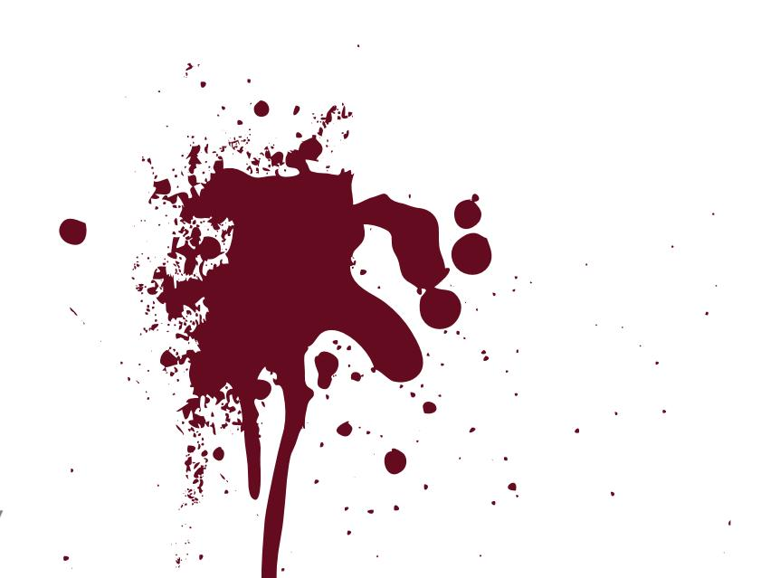

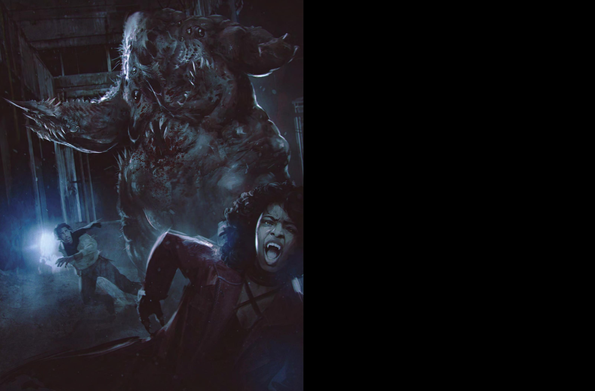

#### РАЗНОВИЛНОСТЬ: ПИМИСХОВОЕ ЧУЛОВИШЕ

У большинства брутов сохранились какие-то остатки личности. Если бы их спасли - или они обратились против своих подручных и проложили кровавый путь к свободе, - они могли бы вернуться к тому, чем были раньше. Чудовище зашло слишком далеко. Надежды на возвращение нет, и им все равно. Эти чудовища - разновидность воинов, и приобретаются они не путем выдачи, а охотой: это самые опасные пустые тела с точки зрения чистой жестокости, и на них легче всего охотиться, поскольку они лишены всякого интеллекта. Восьмая дивизия собирает их в мешки, запирает наглухо и выпускает в качестве ударных войск. Воины не выдерживают много миссий: гораздо проще уничтожить одного, чем пытаться подчинить его заново.

В этом профиле описывается умеренно сильный вампир-цимисх, превращенный в чудовище. Это существо больше не похоже на то, что когда-то имело человеческий облик: оно представляет собой щетинящуюся, истекающую слюной громаду, состоящую из мышц и шипов, с черными глазамибусинками, которые открываются и закрываются

везде, кроме тех мест, где должны быть глаза.

Общая сложность: 6/2

Стандартные пулы кубиков: Физический 7, Социальный 2, Ментальный 3

Вторичные атрибуты: Здоровье 15, Сила воли 3 Исключительные броски кубиков: Драка 9, Запугивание 8, Скрытность 8, Выживание 9

Дисциплины: Доминирование 2, Стойкость 3, Могущество 3, Метаморфозы 4

Человечность: 0

#### Сила крови: 3

Особенность: Единственный след крови Цимисхов в этом монстре - его собственническая натура. Вкусив крови своей жертвы, оно неустанно преследует ее и добавляет к броскам три дополнительных кубика.

Как и Брут, Чудовище практически лишено разума. Он невосприимчив к Доминированию и Величию, и его невозможно запугать.

# Клевер

Клевер - это вампир-актив или агент Коалиции, которому удалось скрыть свою истинную сущность от конспирологов. Возможно, он был вовлечен в вампиризм против своей воли во время работы в Коалиции, а возможно, является "спящим" агентом, оставшимся после предыдущего проникновения Камарильи в органы национальной безопасности или Ватикан.

Независимо от истории своего происхождения, в настоящее время Клевер делает все возможное, чтобы не высовываться и не выходить из дома.

Они выживают, скрываясь среди смертных и поддерживая железный маскарад. Будучи вампирами, они достаточно хорошо разбираются во внутренней политике вампиров, но должны быть осторожны, чтобы не выдать свою сущность остальным членам команды. Немногочисленные Клеверы, оставшиеся в Коалиции, выполняют роль проводников влияния и фиксеров, экономно используют свои сверхъестественные способности и преданно защищают свою смертную семью, а не вампирский клан. Нелояльные Клеверы быстро привлекают внимание контрразведки FIRSTLIGHT или SAD, а также цензоровлеопольдитов - и тогда их лояльность

окончательно решается. Общая сложность:  $5/3$ 

Стандартные пулы кубиков: Физический 5, Социальный 7, Ментальный 8

Вторичные атрибуты: Здоровье 5, Сила воли 7 Исключительные пулы кубиков: Фехтование 7, Скрытность 7

Оборудование: Каминная кочерга, смартфон Дисциплины: Ясновидение 3, Доминирование 3, Сокрытие 2

Человечность: 7

#### Сила крови: 2

Особенности: Клевер добавляет два кубика к любому набору, чтобы противостоять или оспорить любую попытку обнаружить его как вампира. Они также имеют следующие фоны: Влияние 4, Маска 2 (Сапожник) и Подручные 2.

# Дневные ходоки

Слабокровные, полные кипящей обиды на вампирскую иерархию, ненависти к своим непутевым или корыстным предкам, а также обиды на множество других так называемых Родов, которые их обидели, становятся легкой добычей для Коалиции. Многих можно легко привлечь на сторону охотников. Иногда они приходят по собственной воле.

Попав на борт, некоторые Дневные ходоки ведут двойную жизнь, передавая своим контактам в Коалиции информацию о конкретном вампире или целой группе. Когда удача заканчивается и их прикрытие раскрывается, они исчезают на секретном объекте, где им ничего не угрожает. Или их ждет кол в сердце или гаррота на шее. Коалиция не обязана поступать правильно по отношению к монстрам.

Некоторые Дневные ходоки приходят во Вторую Инквизицию не из-за обиды, а потому что презирают то, чем они являются. Они занимают странное, промежуточное место в иерархии Коалиции - если их не стирают в пыль в тот момент, когда они входят. Они не смертны, но, возможно, есть надежда на их искупление. Принятие Дневного Ходока в команду UTR сильно снижает сплоченность подразделения: новобранец становится либо опасным хищником, которого лучше держать на расстоянии, либо почти человеческой

жертвой, заслуживающей жалости и поддержки. Общая сложность: 4/3

Стандартные пулы кубиков: Физический 4, Социальный 6, Ментальный 5

Вторичные атрибуты: Здоровье 8, Сила воли 7 Исключительные пулы кубиков: Один боевой навык на 6, Политика (родство) 6, Уличное чутье 7, Хитрость 7 Экипировка: Солнцезащитный крем SPF 100, широкополая шляпа, солнцезащитные очки, пистолет или боевой нож, GPS-имплант.

Дисциплины: Могущество 1 или Ясновидение 1; Алхимия слабокровных 2

Человечность: 5

Сила крови: 0

# Лордлесс

Лордлесс - бывший гуль, который нарушил их узы и теперь ненавидит вампиров так же сильно, как когда-то любил их. Перейдя на другую сторону, они становятся могущественными союзниками Коалиции. В течение десятилетий, а в некоторых случаях и столетий, они находятся в сетях " пустых тел". Они видели больше, чем многие настоящие вампиры, и благодаря связям, которым так доверял их хозяин, они знают их секреты и слабости.

После того как Бесповелитель отомстит хозяину, которому служил, а может быть, и всей городской иерархии, его работа не будет закончена. Многие из их знаний можно перенести на другие места и операции. Они понимают иерархию и процессы Камарильи и Анарха, а также то, как их нарушить. У них есть все шансы установить контакт с другими гулями и обратить их в свою веру.

Описанный здесь Бесповелитель был когда-то гулем Анциллы или молодого Старейшины.

#### Общая сложность: 4/3

Стандартный набор кубиков: Физические 4, Социальные 6, Ментальные 5

Вторичные атрибуты: Здоровье 7, Сила воли 7

Исключительные пулы кубиков: Этикет (родство) 8, Финансы 6, Политика (оригинальная фракция) 8

Особенности: Беспокойный знает многое о политике своего родного города и фракции, из которой вышел его хозяин. Когда они помогают другому оперативнику ВИ расследовать дело "пустого тела", вести с ним переговоры или разрушать его планы, они добавляют 4 кубика к набору кубиков ведущего оперативника на своей территории и 2 кубика за работу с той же фракцией в других местах.

#### ÐÀÇÍÎÂÈÄÍÎÑÒÜ: ËÎÐÄËÅÑÑ ÓÁÈÉÖÀ

Этот экс-гуль не собирается разрушать жизнь своего хозяина обманом и манипуляциями. Они отправляются на охоту. Хуже того, хозяин обучил их сражаться и убивать. Лордлесс-Убийца теперь пьет из вампира в плаще, работающего на Коалицию (или из мучительного заключенного в охраняемом учреждении), временно становясь его гулем в обмен на крупицы силы, которые он может использовать для охоты на других пустых тел. Они говорят себе, что могут снова уйти из витэ, когда захотят. Возможно, это действительно так.

#### Общая сложность: 5/3

Стандартный набор кубиков: Физический 6, Социальный 3, Ментальный 5

Вторичные атрибуты: Здоровье 8, Сила воли 7 Исключительные пулы кубиков: Атлетика 7, Наблюдательность 6, Драка 7, Огнестрельное оружие 8, Скрытность 7, Техника 6

Снаряжение: Арбалет с деревянными кольями, гаррота, алхимический яд слабой крови, набор инструментов для взлома и проникновения.

Дисциплины: Стремительность или Могущество 1 Особенности: Беспощадный ассасин до сих пор имеет множество контактов среди фракции или двора своего хозяина. Некоторые из них до сих пор в долгу перед бывшим гулем или вспоминают его с нежностью. Во время охоты они могут превратить один неудачный бросок в удачный.

#### ÂÀÐÈÀÍÒ: ÍÀËÀÄ×ÈÊ ÂÈÒÝ

У некоторых гулей никогда не было хозяина. До них дошли слухи о вампирах, о том, что питье их крови дает силу, и они поверили. И они отправились на охоту за высшим кайфом. Большинство из них умерло. Некоторые - нет.

 В Лос-Анджелесе в 1990-х годах циклическая банда "Молодая кровь" построила себя на витэ, выкачанной из Сородичей, которые оказались медленнее мотоциклов.

Картели в конце концов расправились с "Молодой кровью", но достаточное их количество сбежало в другие города, чтобы сохранить мечту мечту о волшебной крови, которая делает тебя сверхчеловеком.

Как правило, витэльные наладчики так или иначе связаны с городской наркоторговлей. Они часто пересекаются с алхимиками слабой крови, которые часто общаются с теми же посредниками и делают покупки на том же рынке.

#### Общая сложность: 3/2

Стандартные пулы кубиков: Физический 6, Социальный 4, Ментальный 3

Вторичные атрибуты: Здоровье 8, Сила воли 5

Исключительные пулы кубиков: Драка 7, Вождение (мотоцикл) 7, Огнестрельное оружие 6, Фехтование 7, Техника (Ремонтный цикл) 6

Снаряжение: Мотоцикл, цепное лассо, отпиленный дробовик, большой тупой пистолет (Дигл или аналогичный), шлем, ланцет и вакуумный шприц флеботомиста

Дисциплины: Могущество 1, или другая точка по выбору Рассказчика

Специальный: Наладчики-Витэ охотятся стаями. За каждого дополнительного наладчика на мотоцикле или иным образом входящего в банду, добавьте один кубик к их начальной атаке или засаде. Уменьшите этот бонус вдвое, если вы продолжаете преследование, охоту и т.д.

#### Ïðèìåð

Котерия игроков сделала гуля из банкира, который отмывал деньги для преступников, связанных с российским ГРУ. Когда гуль был обнаружен и допрошен, его вычислила Вторая инквизиция. Поскольку в своей истории вы используете ГРУ, вы решили сделать из команды "Мокрый" (стр. 57) оперативный отряд. Это дает каждому охотнику в отряде "Маску 3" и преимущество "Обнуленный". Посмотрев на общий состав сил "Мокрой команды", вы решили, что в ее составе будут в основном воины и один "черный упаковщик". Просмотрев возможные дополнительные варианты, вы также решаете дать им доступ к стелс-вертолетам. Вы называете оперативный штаб "Чистая команда" и решаете, что это группа бывших киллеров мафии, которых ГРУ иногда привлекает, когда хочет отрицать свое участие в потенциально грязной операции.

# Создание оперативного штаба

OPFOR ("Силы противника") - это команда, которая охотится за персонажами-вампирами ваших игроков. При создании этих сил следует учитывать, какой части Коалиции они подчиняются и как персонажи игроков попали в их поле зрения. Каждый ОПФОР - это уникальный персонаж, со своей историей и образом действий, который формирует и направляет историю их охоты. Развернутая предыстория не только придает ОПФОР большее повествовательное значение, но и

помогает игрокам понять эту силу и противостоять ей.

# Фоны оперативного штаба

ОПФОР часто поставляются со встроенным фоном и даже достоинствами и недостатками. Эти характеристики являются общими для всех сил, а также две черты ("Радиус действия" и "Область действия"), которые помогают определить границы их возможностей в рамках операции. Они действуют подобно фоновым характеристикам группы (Corebook, p. 196); обычно предполагается, что командир группы имеет доступ к этим точкам, если это необходимо при броске.

Некоторые фоны зависят не от типа ОПФОР, а от его головной организации: Команды FIRSTLIGHT и IAO, как правило, могут обращаться к ресурсам ••••, в то время как другие "пять факелов" должны следить за своими бюджетами, а местные клубы охотников могут не иметь ничего, кроме панельного фургона и дробовиков.

Независимо от типа и головной организации, большинство ОПФОР оснащены оружием военного образца, например карабинами М4 или автоматами АК-74М, а также кольями, бронежилетами и прочными машинами для преследования. (В некоторых странах даже отряды "Чаф" и "Монстр" могут похвастаться внушительной огневой мощью). Более совершенное оружие или специализированные игрушки доступны отдельным противникам в зависимости от их роли антагониста, но некоторые типы ОПФОР дают доступ к специализированным боеприпасам или транспортным

средствам в своих возможных дополнениях.

#### Ðàäèóñ äåéñòâèÿ

Радиус действия - это характеристика, определяющая оперативные границы действия оперативного соединения. Хотя оперативное подразделение может действовать за пределами этого параметра, это решение не является легкомысленным, поскольку при работе за пределами зоны действия силы теряют все преимущества, которые обычно получают от своего типа.

Этот признак также отражает понимание ОПФОР своей стратегической роли в коалиции. Вы можете использовать Радиус действия в любом соответствующем ментальном пуле, прокаченном по ОПФОР в целом, чтобы представить брифинги, знакомство и гибкость в обучении.

#### Ралиус лействия

| • Местный, действует только в пределах города или провинции                              |
|------------------------------------------------------------------------------------------|
| •• Национальные, работают только в пределах страны или в очень специфических условиях |
| ••• Региональный, действует в рамках группы союзных или граничащих стран              |
| •••• Глобальность, границы и международное _______________________________________    |

право не препятствуют проведению операций

#### Область применения

Область применения определяет стандартные тактические приемы и готовность оперативного штаба. Выход за эти пределы требует прямого вмешательства начальника по сговору и расстраивает бойцов подразделения ОПФОР. Добавьте облать к боевому резерву подразделений ОПФОР в одноходовых боях (Corebook, pp. 298-299) или разделите ее между охотниками ОПФОР в более сложных боях. Рассказчики могут вычитать область из социальных кубиков, используемых ОПФОР в отношении человеческих целей: ни одному человеку не нравится, когда в его округе появляется отряд "черных оперативников"! Мудрый Оперативный штаб сначала получает Влияние, чтобы смягчить удар, или снижает видимую область охвата.

#### Область применения

• Юридические, использующие бюрократию, криминалистику и полицейские/военные силы

- •• Полулегальная, использует открытый поиск данных и соразмерную военную силу
- Незаконные, использующие хакерские атаки, пытки и неправомерное применение силы

•••• Сверхъестественное, использует оккультные способности, пророчества и мистические артефакты

# Состав сил оперативного штаба

ОПФОРы состоят из множества отдельных персонажей-рассказчиков. Для вампиров, на которых они охотятся, эти команды охотников могут показаться безликой группой штурмовиков, но у каждого из них есть своя история, которая привела их во Вторую Инквизицию. При создании этих команд начните с выбора типа ОПФОР, поскольку от этого зависит, какие антагонисты будут наиболее часто встречаться в команде, каковы их общие цели и какие инструменты будут в их распоряжении. Несмотря на то, что невозможно подробно описать каждого члена команды UTR, отправленной на поимку примогена Тремере, основные персонажи ОПФОР должны иметь определенную глубину, начиная с их роли антагонистов и организационной принадлежности в заговоре. Даже просто краткое упоминание о том, как эти персонажирассказчики стали вдохновителями Второй Инквизиции (или просто пошли туда, куда их послали за зарплатой), также может придать им большую глубину.

Стандартный ОПФОР UTR имеет численность от отряда (9-12 человек) до взвода малой численности (20-30 человек), обычно возглавляемого специалистом по социальным вопросам, с большим ядром физических операторов и любыми сверхъестественными специалистами, которых они могут получить. В состав ОПФОР также входит оператор или техник, занимающийся материальнотехническим обеспечением операции, и два-три следователя, как правило, из числа техников или ищеек. Приведенный общий состав сил для каждого типа ОПФОР относится только к наиболее вероятным членам, наиболее ключевым для выполнения указанной миссии. В каждом ОПФОР есть, например,

один или два "хиттера".

# Типы ОПФОР

Коалиция - это заговор из многих частей, и даже на первом этаже охотники находят бесчисленное множество способов самоорганизации. При создании ОПФОР выберите тип из приведенного ниже списка или придумайте свой собственный.

#### ПРИМЕР

Вы решаете, что "Чистая команда" будет состоять из 15 человек. Их лидер - бывший шантажист КГБ по имени Саша, который был завербован в "Восьмое направление", находясь в тюрьме. Чистая команда" состоит в основном из бывших преступников, с которыми Саша познакомился в тюрьме или которых шантажировал. Они представляют собой смесь воинов, снайперов и специалистов по разминированию. Хакер и детектив дополняют расследовательские возможности команды, а слабокровный дневной ходок по имени Первез иногда при необходимости привлекается к работе. И, наконец, политик по имени Майкл, который убирает за ОПФОРом в обмен на услуги российского правительства.

Для каждого типа указывается предполагаемый охват и сфера действия ОПФОР, а также некоторые вероятные преимущества. В описании перечислены наиболее распространенные типы антагонистов ОПФОР, а также общие резонансы их крови, хотя только самые глупые вампиры будут искать этих охотников ради этого. Наконец, возможные дополнения подчеркивают сюжетные элементы, снаряжение и транспортные средства, которые будут доступны ОПФОРу в большинстве миссий помимо стандартного снаряжения. Данные типы ОПФОР должны использоваться в качестве ориентиров и ни в

коем случае не являются исчерпывающими.

#### **АУЛИТОРЫ**

Пустые тела - мастера заражать смертные институты своими подхалимами и рабами крови. Хотя Коалиция вполне уверена в том, что ее собственные ряды не подвержены влиянию "пустых тел", опасность все же существует. Особенно это касается крупных бюрократических структур и правительств, за которыми невозможно осуществлять постоянный контроль. Аудиторы выявляют влияние "пустых тел" среди членов Коалиции и в других смертных институтах.

Когда они находят его, то вырывают с корнем и прослеживают коррупцию до ее источника. Их роль внутренних аудиторов, особенно в качестве внутренних аудиторов, принесла им мало друзей в коалиции и в других странах. Особо сообразительные "пустые тела" знают, что охотники за ними должны охотиться, когда те появляются поблизости. Команды аудиторов чаще всего формируются из рядов FIRSTLIGHT или SAD, а также из Общества цензоров Святого Леопольда.

- Радиус: ••• п
- Область: ••
- Союзники: ••
- Влияние: ••
- Враги:  $\blacksquare$

Общий состав сил: Медведь-Лидер, Шантажист, Копатель, Хакер Общие резонансы: Меланхолия, Сангвиник Возможные дополнения: XScopes, интенсивный поиск информации

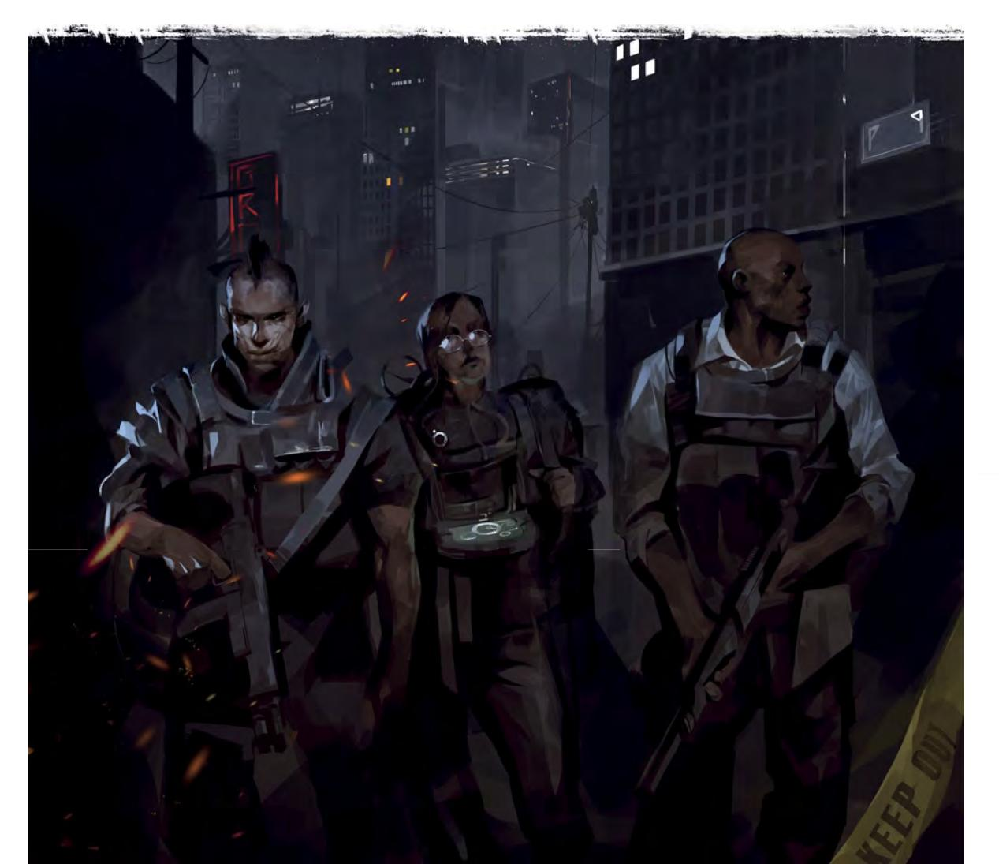

#### Кенакулы

Ватиканская организация Entity и Общество Святого Леопольда используют "Кенакулы" в качестве полигона для молодых охотников и дружинников, не привыкших работать в современных подразделениях. Новобранцы и охотники на вампиров, годами работавшие в одиночку, объединяются под руководством опытного охотника, который стремится сделать из них полноценную боевую единицу. В дневных рейдах "Кенакулы" часто нападают на более слабых "пустых", но, служа Обществу, они берутся за любое задание. Хотя из-за постоянной текучки новобранцев эти ОПФОРы редко достигают оперативного совершенства, они являются постоянным источником инноваций и экспериментов.

- $\blacksquare$  Радиус: или •
- $\blacksquare$  Облать: •
- $\blacksquare$  Союзники: ••
- $\blacksquare$  Контакты:  $\cdots$
- Особенность: Кенакулы имеют высокий уровень текучести кадров и не несут организационных наказаний, когда теряют или приобретают значительное количество новобранцев.

Общий состав сил: Любитель, Копатель, Одинокий Волк, Нуллификатор, если имеется

Общие резонансы: Холерик, Меланхолик Возможные дополнения: Сейфы, артефакты

(особенно регалии и реликвии)

#### ЧАФ

"Пять факелов" не могут реагировать на каждый сигнал тревоги полным составом ударной группы UTR. Иногда они посылают одного-двух оперативников, чтобы те завербовали или подчинили себе местный спецназ, ополченцев или уличную банду для борьбы с местными "пустышками", пока взрослые не приедут и не наведут порядок. ОПФОР "Чаф" не всегда даже знает, что борется с вампирами... поначалу.

- $\blacksquare$  Радиус: •
- Область: •
- $\blacksquare$  Союзники:  $\cdot \cdot$
- Особенность: Члены ОПФОР поначалу плохо противостоят вампирам; до тех пор, пока не будет получена кровь, ОПФОР должен делать проверку силы воли, чтобы оставаться в бою каждый раунд (бросок один раз против указанной силы воли для образца антагониста).

Общий состав сил: Любители, изредка снайпер или воин; возглавляет ВИ Медведь-Лидер или Одинокий Волк.

Общие резонансы: Холерик, Меланхолик Возможные дополнения: Самодельная взрывчатка или напалм

#### **MUHOTABP**

ОПФОРы "Минотавр", называемые также "стражами", охраняют важные объекты или секреты Коалиции. Хотя их оперативная задача - оборона, большинство минотавров стремятся к активному уничтожению "пустых тел" в зоне охраны. Общество кондотьеров Леопольда определяет этот тип ОПФОР.

- $\blacksquare$  Радиус: •
- $\blacksquare$  Облась:  $\cdots$
- $\blacksquare$  Влияние: ••
- Особенность: Добавить два кубика к пулам ОПФОР, чтобы противостоять обнаружению их базы или убежища, или чтобы защитить свой объект в бою или другими способами

Общий состав сил: Специалисты по зачистке, снайперы

Общие резонансы: Меланхолия, флегматичность Возможные дополнения: Мины "Клеймор",

лазерные устройства отключения

#### ОТРЯЛ МОНСТРОВ

Новичок в охоте на вампиров, возможно, незнакомый с Коалицией как с заговором, но, тем не менее, Отряд Монстров присоединился ко Второй Инквизиции. Отряд монстров может не знать о природе угрозы, на которую он охотится, или охотиться на несколько видов сверхъестественных существ. Отряд монстров редко покидает родной город, и их стремление уничтожить вампиров часто начинается с желания защитить своих соседей. Короче говоря, это группа любителей, решивших объединиться и попробовать свои силы в истреблении кровососов. Зачастую единственными их преимуществами являются удача и глубокое знание своей территории.

- $\blacksquare$  Радиус: •
- $\blacksquare$  Область: •
- $\blacksquare$  Контакты:  $\cdots$
- Особенность: Отряды монстров, спасаясь от вампиров, могут игнорировать показатель Портильона домена.

Общий состав сил: Дилетанты, Дилер или детектив, Оружейник

Общие резонансы: Холерик, Сангвиник Возможные дополнения: Сейфы, панельный фургон или большой мощный внедорожник, серебряные пули

#### ночной дозор

Эти команды занимаются поддержанием того, что осталось от Маскарада для Коалиции, но не для защиты вампиров, а для того, чтобы общество не остановилось. Команды "Ночного дозора" держатся достаточно стационарно, но выезжают для устранения особо крупных беспорядков. Взятки, угрозы, манипулирование СМИ - все это часть их работы, но они все равно остаются охотниками. Ничто так не оздоравливает Маскарад, как уничтожение сверхъестественных существ, разорвавших его ткань.

Наиболее эффективные ОПФОР "Ночной дозор" существуют в британском подразделении SO13, хотя их деятельность зачастую направлена не столько на защиту смертных, сколько на ликвидацию "пустых тел". Пожалуй, самая важная задача Ночного Дозора не допустить нормализации вампиризма. Единственное, что может быть опаснее, чем допустить господство пустых тел над человечеством, - это позволить им интегрироваться или заключить с нами мир.

- Радиус: или •
- Область: •
- Ресурсы:  $\cdots$  $\blacksquare$
- m. Влияние: • •
- Общий состав сил: Снайперы, хакеры, Джентрификаторы или политики
- Общие резонансы: Меланхолия, Флегматик
- Лополнительные возможности: Беспилотники, XScopes, быстрые машины преследования, убежища

#### Преторианцы

Этот ОПФОР специализируется на охране VIP-персон и особо важных для коалиции мест. В городах-"ежах" (стр. 155) практически постоянно присутствуют Преторианцы. Эти отряды очень ограничены в своих оперативных полномочиях, но имеют доступ ко всей мощи Второй Инквизиции. Только самые смертоносные орудия войны находятся вне пределов их досягаемости, но и они могут быть использованы в случае опасности для их подопечных. Кондотьеры Сен-Леопольда служат преторианцами Сущности; FIRSTLIGHT имеет (в недостаточном количестве) ячейки для чтения в Секретной службе США и Службе дипломатической безопасности.

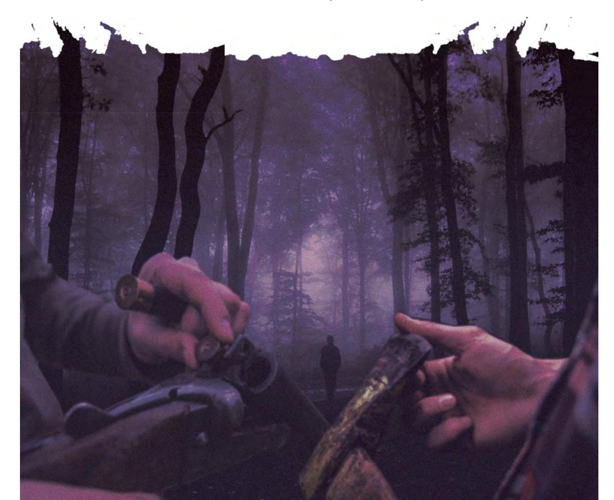

- Радиус: •
- Область: ••••
- Влияние: •••

Общий состав сил: Воин, специалист по разминированию, снайпер, светский человек Общие резонансы: Меланхолия Возможные дополнения: Беспилотники,

MRAP, убежища, тяжелое оружие, XScopes, артефакты, зажигательные боеприпасы

#### Ðåêñ

Прежде чем команды по уничтожению войск приступят к работе, кто-то должен найти их цели, и этот кто-то - Рекс, также известный как Разведка, Разведчики или Гончие. FIRSTLIGHT, ГРУ и JTRG вводят группы Рекс в города, где доминируют Сородичи, или в хорошо защищенные охотничьи угодья в открытых городах (стр. 149). BOES и Леопольд предпочитают строить Рекс на основе небольшого (один-два) штата специалистов, в основном используя местных охотников, хорошо знающих город.

- Радиус: •••
- Область: ••
- Контакты: добавить одну развернутую точку в месяц
- Влияние: ••

Общий состав сил: Копатель, Детектив, Дилер, Черный Упаковщик, Хвосты Общие резонансы: Сангвиник, Флегматик Возможные дополнения: Беспилотники, XScopes, конспиративные квартиры, сеть наблюдения

#### Ðîâåðû

FIRSTLIGHT, ГРУ и даже Ватикан держат на оперативной связи множество различных частных военных компаний (ЧВК) для решения проблем в местах, куда "пять факелов" не могут проникнуть легко и сразу. ESOG и бразильская PMEX часто комплектуют ОПФОР "Ровер" кадрами "специалистов по целям". Несмотря на их репутацию линчевателей и наемников, одно "авто-да-фе" обычно превращает "Роверы" в преданных сторонников Второй инквизиции. Роверы часто направляются для зачистки гнезд пустых тел, выросших в сельских районах, или для поддержки других ОПФОР, сильно уступающих в численности противнику.

- Радиус: ••••
- Область: ••
- Контакты: ••

Общий состав сил: Медведь-Лидер, Разрушитель, Одинокий Волк, Похититель, Воин

Общие резонансы: Флегматик, Сангвиник Возможные дополнения: Машины преследования, бронированные внедорожники, БТРы, тяжелые пулеметы, минометы, вертолеты

#### Ñïàñèòåëè

В то время как все охотники Второй Инквизиции желают очистить мир от пустых тел, Спасители понимают, что вампиры - это лишь симптом очень больного мира. Непопулярная доктрина в Коалиции, FIRSTLIGHT и Ньюбургская группа осуждают ее меньше всего. (В Обществе Святого Леопольда к этому типу относится так называемое движение Санбенито). Спасители считают, что с помощью вампиров они могут решить коренные проблемы мира, такие как изменение климата и экологический коллапс.

- Радиус: •••
- Область: ••
- Влияние: •••
- Враги: ••

Общий состав сил: Канарейка, Депрограмматор, Флагеллант, Похитители Общие резонансы: Холерик, Меланхолия

Возможные дополнения: Артефакты

#### ÑÏÅÖÈÀËÜÍÀß ÃÐÓÏÏÀ ÐÀÇÂÅÐÒÛÂÀÍÈß (SDT)

Эти группы UTR, известные также как отряды захвата, специализируются на захвате пустых тел и их транспортировке в безопасные места. Затем другие специализированные группы переброски доставляют цели на "черный" объект, где их обрабатывают и допрашивают. Эти группы делают ставку на захват особо ценных объектов в целости и сохранности, но при необходимости применяют смертоносную силу. Похитители часто ассоциируются с FIRSTLIGHT и SAD ФБР, но и Восьмое управление ГРУ также добилось определенных успехов в выдаче. Поскольку SDT регулярно действуют через государственные границы без правовой санкции, им часто приходится планировать свои операции с учетом действий враждебных местных правоохранительных органов.

- Радиус: ••••
- Область: ••
- Враги: ••

Общий состав сил: Похититель, Взломщик, Депрограмматор

Общие резонансы: Меланхолия, Сангвиник Возможные дополнения: Стелс-вертолеты,

бронированные внедорожники, роботы-собаки

#### Îïåðàòèâíàÿ ãðóïïà

Высшие эшелоны Коалиции поручают оперативной группе выполнение определенной миссии или поиска, как правило, в условиях строжайшей секретности. Часто оперативной группе приходится откладывать охоту на вампиров в поисках давно потерянного артефакта или могущественного секрета, который может дать заговору стратегическое преимущество. В отличие от других ОПФОР, оперативная группа часто старается не вступать в бой с "пустыми телами", чтобы не отвлекаться на достижение основной цели, какой бы она ни была. Оперативная группа дает рассказчику возможность поставить охотников в оборонительное положение, поскольку они пытаются сохранить свои секреты в тайне от персонажа игрока. ГРУ часто использует оперативные группы для поиска артефактов и других мистических объектов.

- Радиус: ••••
- Облать: •••
- Союзники: •••

Общий состав сил: Черный упаковщик, Копальщик, Детективы Общие резонансы: Холерик Возможные дополнения: Дроны, стелсвертолеты, XScopes

# ÒÐÀÉÒÎÐÛ

Этот ОПФОР тайно работает на вампиров, и они могут даже не знать об этом. Либо в команду внедрился некто "пустой", например, " Клевер" (стр. 49), либо они стали перерожденными на более высоком уровне. Возможно, они никогда не узнают правды, поскольку выполняют задания, направленные на достижение целей нежити. Взяв этот тип OPFOR, выберите другой тип в качестве прикрытия для этого типа.

- Радиус: ••••
- Область: •
- Особенность: Получают все преимущества и недостатки выбранного ими типа прикрытия OPFOR

Общий состав сил: Дилетант, Клевер, Посредник

Общие резонансы: Меланхолия, Сангвиник Возможные дополнения: Как выбранное ими прикрытие Тип ОПФОР.

#### ÌÎÊÐÀß ÊÎÌÀÍÄÀ

"Мокрые команды" - это отряды UTR, ориентированные на ликвидацию опасных " пустых тел" с помощью точного применения насилия. (Термин происходит от старого русского жаргона, обозначающего убийства, - "мокрое дело"). Известные также как "Пыльные команды", они ограничивают использование местных сил и средств и полагаются на собственное мастерство, чтобы подобраться к цели и уничтожить ее. В отличие от других ОПФОР, "мокрые" группы не захватывают объекты, когда им предоставляется такая возможность, и обычно выбирают для уничтожения только одно или два пустых тела, прежде чем покинуть район. Оперативники "мокрых" групп разрабатывают тщательно продуманные маскировочные документы, а их прежняя жизнь полностью обнуляется в цифровом формате.

- Радиус: ••••
- Область: •••
- Маска: ••• (Обнуление)

Общий состав сил: Воин, Флагеллант, Черный упаковщик

Общие резонансы: Флегматик Возможные дополнения: Стелс-вертолет, зажигательные боеприпасы и взрывчатка

# Пример оперативного штаба: Группа специального развертывания 'БЕЛАЯ ЛОШАДЬ'

FIRSTLIGHT в основном выполняет разведывательные задачи для ударных сил IAO и групп UTR, размещенных на американских базах по всему миру. Но, как и ЦРУ, с которым она взаимопроникает, FIRSTLIGHT любит иметь собственные резервные военизированные подразделения для проведения операций, которые являются слишком особенными, чтобы о них можно было рассказывать за пределами семьи.

Группа "Белая лошадь" объединяет группу политических действий с отрядом UTR, состоящим из ветеранов ЦРУ, передислоцированных спецназовцев и наемников. Военнослужащие UTR были ознакомлены с угрозой ""пустых тел"", но имеют ограниченное представление о глобальном охвате и стратегических союзах Коалиции.

FIRSTLIGHT обычно прибегает к помощи "Белой лошади" для пресечения импровизированных попыток неавторизованных "пустых тел" раскрыть свое существование общественности или захвата особо важных целей, идентифицированных как возникающие непосредственные угрозы. Миссии "Белой лошади" обязательно требуют сложного и оперативного управления. Если бы им нужно было только поджечь убежище, то для этого у FIRSTLIGHT есть ударные группы IAO или ФБР.

Сотрудники "Белой лошади" работают на передовых оперативных базах и в убежищах, которые позволяют им находиться на расстоянии удара от цели.

- Радиус: ••••
- Область: ••

#### ÏÎÐßÄÎÊ ÄÅÉÑÒÂÈÉ

Команды FIRSTLIGHT должны следовать перечню стандартных оперативных процедур при нейтрализации или задержании пустых тел, но длительное пребывание "Белой лошади" в полевых условиях и высокий процент успешных операций привели к тому, что им стало легче импровизировать. Они наводят порядок и пресекают быстро развивающиеся замыслы противника, направленные на подрыв прикрытия коалиции. Когда подразделение "Белая лошадь" активизируется, они понимают, что тактическая обстановка может быстро измениться от тайного захвата до открытых кинетических операций против хорошо вооруженных сверхъестественных противников.

"Белая лошадь" следует этому контрольному списку как можно лучше, но не боится идти коротким путем, если того требуют цели миссии;

1. Анализ данных: аналитик FIRSTLIGHT определяет наличие активной угрозы и проверяет потоки данных с помощью алгоритма "сердцебиение". Если сердцебиение определяет, что вероятность ложного срабатывания низка, то приказ о действии FIRSTLIGHT передается полевому супервайзеру "Белой лошади" в ЦРУ Лори Олсону. Олсон координирует свои действия с политическим связным Сезаром Уордом, чтобы определить, как подготовить оперативную зону к действиям. Ударная группа FIRSTLIGHT готовится и перебрасывается в загоризонтную зону для быстрого реагирования и ожидания.

- **2.** Разметить цели: Олсон набирает аналитиков, фиксеров и техников для работы с целями. Обычно это карьеристы ЦРУ или NSA, допущенные к работе на FIRSTLIGHT, но если операция проводится на территории США, Олсон привлекает к работе следователей SAD. Совместно с Олсоном они используют обработанные данные, предоставленные "Сердцебиением", для составления профиля и идентификации "пустых" тел на пути в оперативный район. Из этой команды формируется рабочая группа из трех человек для проведения зондирования и определения действий цели на этапе "Обратная связь".
- **3.** Обратная связь: Политический связной Сезар Уорд готовит местные власти к операции, придумывая легенду на случай, если ситуация станет громкой. Затем Олсон и Уорд направляют рабочую группу для наблюдения и проникновения в пространство принятия решений целевых " пустых" тел. Обычно это начинается с того, что Патрик Нгюен прослушивает их транспортные средства и личные пространства, а Минг Хьюитт с помощью своих уличных глаз отслеживает их перемещения. После того, как стада и убежища будут обнаружены, Мухаммед Кассим внедряется в их окружение в качестве "кровавой куклы".
- **4.** Развертывание: Отряд UTR отправляется на конспиративную квартиру вблизи оперативной зоны, полученной Олсоном и проинформированной Хьюиттом о своих целях. Уорд и Олсон отрезают потенциальные пути отхода "пустых тел", нацеливая на них свои средства и воздействуя с помощью местных помех. В этот момент Олсон информирует Аксу о ходе операции; затем Акса координирует свои действия с Мухаммедом Кассимом, чтобы испортить стадо " пустых тел". (Нгуен отключает все второстепенные транспортные средства, принадлежащие цели, и устанавливает взрывчатку на их основной автомобиль. Это страховка на случай, если " пустые тела" ускользнут от ударной группы. Если по заданию требуется прямая авиационная поддержка, Олсон запрашивает вертолет.
- **5.** Выполнение: Отряд UTR получает зеленый свет. Кассим и Акса отходят из оперативной зоны. Два бронированных внедорожника, в которых находится Олсон, отключают электричество и связь вокруг убежища пустых тел, используя свое местное влияние. По приказу Берна огневая группа WH "Альфа" берет на себя командование, входит в зону поражения и уничтожает все находящиеся там человекообразные цели.

Огневая группа WH "Браво" выступает в роли мобильного резерва, готового уничтожить любые пустые тела, покинувшие периметр. По приказу "Баг" "Браво" занимает позицию, а "Альфа" поддерживает периметр. Они укладывают все тела в мешки для защиты от солнца (Corebook, p. 378) и помещают их в усиленные гробовые отсеки внедорожника. В любом случае огневая группа "Дельта" обеспечивает наблюдение и, при необходимости, поддержку с воздуха, а третий бронированный внедорожник с огневой группой "Чарли" ждет в резерве на случай, если пустые тела попытаются затаиться. Уорд активизирует информационное прикрытие и размещает фальшивые сообщения в социальных сетях, где это необходимо. Обвиняется ситуация с захватом заложников или террористическое ополчение, а местная полиция перекрывает дороги в этот район.

6. Исчезновение: После того как ударная группа уничтожила (или обезопасила) цели, она встречается в заранее установленном месте эвакуации. При выполнении миссии "Баг" Олсон сообщает им район выдачи, обычно это взлетнопосадочная полоса за пределами оперативной зоны, уже находящаяся под контролем или прикрытием FIRSTLIGHT или ЦРУ. Из этого пункта FIRSTLIGHT по воздуху переправляет " пустые тела" в ближайшее "черное место". Уорд занимается ликвидацией последствий операции, а Олсон обеспечивает сохранность всех финансовых документов, оставленных "пустыми телами", для последующего расследования бухгалтерамикриминалистами FIRSTLIGHT.

#### ÊÎÌÀÍÄÀ SAC/PAG ËÎÐÈ ÎËÑÎÍ, ÐÓÊÎÂÎÄÈÒÅËÜ ÏÎËÅÂÎÉ ÑËÓÆÁÛ ÖÐÓ

Продвижение Лори в ЦРУ - заслуга ее амбиций, но компания FIRSTLIGHT обратилась к ней изза ее наследия. В начале своего существования FIRSTLIGHT отдавала предпочтение лояльности даже перед проверенными навыками. В лице Лори Олсон они нашли офицера с большой семейной историей, работавшего в отделе политических акций агентства. Работа в ЦРУ была у нее в крови, и FIRSTLIGHT использовала эту связь, чтобы привлечь ее к работе. С тех пор она зарекомендовала себя как способный менеджер, обладающий почти интуитивным чутьем на то, как пустые тела пробираются в теневые уголки финансов и политики.

Она рассматривает "Белую лошадь" как модель для операций Коалиции и считает других охотников потенциальным уязвимым местом, которое может разоблачить весь заговор. Она обратилась к нескольким "волшебникам" в других частях Коалиции с просьбой откомандировать их в состав "Белой лошади", если ситуация потребует сверхъестественной активности.

Лори старается найти баланс между быстрыми действиями и подготовкой. Вторжение и подрыв процесса принятия решений противником выводит его из равновесия, чтобы ее команда могла подойти и использовать его неожиданную слабость. Это означает, что нужно найти инструменты, с помощью которых пустые тела наделяют себя силой, и обратить их против монстров. Им нужны кровь и тьма. Поэтому она отравляет кровь и включает свет. Олсон понимает, что пустые тела используют трещины в системе, чтобы скрыть себя. Она также знает, что, хотя паранойя - необходимая добродетель в ее работе, доверие к своей команде - единственный способ добиться прогресса.

Лори Олсон - джентрификатор.

#### ÑÅÇÀÐ ÓÎÐÄ, ÏÎËÈÒÈ×ÅÑÊÈÉ ÑÂßÇÍÎÉ (ÀÍÁ  ÎÒÑÒÀÂÊÅ)

Почти 30 лет Сезар Уорд проработал в NSA в качестве аналитика, менеджера и программиста, а в начале 2000-х годов перешел в частный сектор, где заработал деньги как инвестор в технологические разработки. Сейчас он проводит большую часть времени на своем обширном ранчо в Вайоминге в окружении детей и внуков. Несмотря на длительный стаж работы в NSA, Уорд был принят на работу в FIRSTLIGHT только после выхода на пенсию. Его " ролевая карта" включает в себя широкий круг правительственных чиновников, шпионов и лидеров индустрии, что делает его "пиар-машиной". "Белая лошадь" полагается на его связи, чтобы замести следы и смазать колеса своих операций.

Уорд, как неизвестно FIRSTLIGHT, узнал об угрозе со стороны "пустых тел" в начале 1990-х годов, когда его дочь Летиция была превращена в гуля агентами Камарильи, внедрившимися в NSA. В течение десяти лет он помогал выслеживать их врагов, попеременно надеясь то на объятия дочери, то на ее смерть. Когда Летиция исчезла во время первой волны атак IAO в 2002 г., он перешел на работу в FIRSTLIGHT, прикрываясь пенсией. (Агенты SAD, оснащенные первоклассными системами безопасности и XScopes, охраняют его ранчо и оставшуюся семью).

Он упорно охотится за вампирами, одновременно пытаясь найти и защитить свою дочь, используя свой доступ к базам данных и каналам связи FIRSTLIGHT. Сезар Уорд - хакер с политикой 7, ресурсами 5 и

влиянием 3 (техническое сообщество).

#### ПАТРИК НТУЕН, ПОЛЕВОЙ ТЕХНИК ЦРУ

Пэт никогда не думал, что будет работать на правительство, тем более в глобальном заговоре по охоте на вампиров. Он всегда был любителем повозиться и вырос, разбирая и собирая вещи на семейной свалке в окрестностях Хьюстона. Он хотел стать инженером, но жизнь распорядилась иначе. Когда организованные преступники организовали на месте семейного бизнеса "чопшоп", Патрик быстро втянулся в эту суету. У него был талант разбирать машины, а деньги помогали ему мечтать об инженерном факультете. Он даже начал заниматься собственным бизнесом, модифицируя автомобили для уличных гонок с помощью сложных систем впрыска азота. К сожалению, его таланты не остались незамеченными полинией

Патрик впервые встретил Лори Олсон в техасской камере предварительного заключения. Она была холодна и бесцеремонна, предложив ему предложение, которое могло изменить его жизнь, и он ухватился за этот шанс. Тогда он еще не знал всех подробностей, но один из его клиентов был вампиром, и Лори хотела добавить в его "Бимер" кое-что новенькое. Та первая работа была самой трудной, но с тех пор он многому научился в агентстве и уже никогда не оглядывался назад. Когда Патрик думает о своих жертвах, он представляет себе выражение их лиц, когда они включают зажигание. Растерянность, когда двигатель автомобиля не работает ровно. Шок и осознание, когда они чувствуют жар и огонь сквозь доски пола. Первый раз было тяжело, но теперь он может только улыбаться.

> Патрик Нгуен - механик (Чёрный-Упаковщик).

#### МИНГ ХЬЮИТТ, ОПЕРАТИВНЫЙ СОТРУДНИК **OTIERA DIA**

Преждевременно состарившаяся за годы работы в военной разведке, Минг привыкла к тому, что ее не замечают. Она начала свою карьеру в качестве офицера в ONI, но ее талант к человеческой разведке привлек к ней внимание DIA, и вскоре она уже работала в Национальной объединенной оперативной группе по борьбе с терроризмом. В NJTTF она работала с офицерами из всех разведывательных служб США, и ее талант вербовать информаторов в цветных сообществах был оценен старыми специалистами, которые с подозрением относились к чрезмерному увлечению работой с сигналами. По иронии судьбы, именно технически подкованный Сезар Уорд привлек Минг в FIRSTLIGHT через свои связи в NSA в NJTTF.

Минг не сентиментальна в отношении своей работы. Она знает, что создание сетей платных шпионов и доносчиков в уязвимых слоях населения губительно для демократии, но она борется с чудовищами. Когда мир станет безопасным для "пустых тел" и остальных, будет время восстановить нанесенный ущерб. А пока она сосредоточена на выполнении залания.

Минг Хьюитт - мать-курица (хвост).

#### МУХАММЕД КАССИМ, ОПЕРАТИВНИК ЦРУ

Первоначально Мухаммед был завербован ЦРУ в качестве аналитика-целевика для составления профилей экстремистов в Северной Африке, но в 2008 г. он был ранен в полевых условиях и унесен в ночь, когда передовая оперативная база была захвачена стаей "пустых тел". Мухаммед и еще несколько человек были накормлены и доминированы "пустыми телами" в ходе ритуальной церемонии в глубокой пустыне. В то время как остальные члены его группы поддались доминированию, Мухаммед каким-то образом смог сопротивляться и со временем вернул себе полный контроль. Хотя ему пришлось одолеть и убить одного из своих бывших коллег, он смог подать сигнал силам FIRSTLIGHT, которые следили за пустыми телами. Большинство монстров сбежало, но Мухаммед стал новым рекрутом Второй Инквизиции.

Несмотря на несколько медицинских обследований, остается неясным, почему Мухаммед может противостоять подрывной силе крови пустых тел. Независимо от причин, время, проведенное в пустыне, изменило его. Мухаммед с удовольствием прячется среди стада нежити и получает извращенное удовольствие от чувства предательства и удовлетворения, которое возникает в нем всякий раз, когда они питаются его кровью.

Он тесно сотрудничает с Аксой, чувствуя с ней связь, близкую к той, что была у него с убийцамипустобрехами. Мухаммед часто является тем, кто непосредственно отравляет стада отварами Аксы.

Мухаммед Кассим - Кровавая кукла ("Кукушка") с чем-то вроде Короткой связи (Corebook, p. 181).

#### АКСА, АКТИВ ГУЛЯ ИЗ ЦРУ

В 1998 г. Акса была захвачена охотниками Общества Леопольда в окрестностях Орана и медленно отучалась от Витэ путем принудительного поста и постоянных молитв. Она направлялась в Египет вместе со своим хозяином, завербованным в начале войны в Геенне человеком, которого она знала как "эмира". В 2002 году ее показания оказались чрезвычайно убедительными для агентов американского ЦРУ, занимавшихся созданием FIRSTLIGHT. Общество передало ее в FIRSTLIGHT в качестве источника разведданных, и в 2004 г. она прервала пост на первом из нескольких захваченных в плен пустых тел. Рецидив вызывает у нее отвращение, но она говорит себе, что ничего не может с этим поделать - не помогает и стремление ее кураторов из FIRSTLIGHT использовать ее состояние в своих целях. Неудачная миссия FIRSTLIGHT в Каире разрушила ее прикрытие; за ней продолжает охотиться фракция

""пустых тел"", которую представляет Эмир. Олсон завербовал ее, пообещав окончательное, научное излечение от пагубной привычки, а также продемонстрировав необычную для операций ЦРУ компетентность. Акса считает, что FIRSTLIGHT, в отличие от Ватикана, отлавливает пустые тела, чтобы изучить и вылечить их. Решая проблемы команды, когда они сталкиваются со сверхъестественным, она погрузилась в изучение алхимии как возможного промежуточного звена между зависимостью от крови и обычной смертностью. Обычно она организует лабораторию на конспиративной квартире, приобретенной Олсоном, но вдали от остальных членов оперативной группы; по возможности она вступает в контакт с местными алхимиками, чтобы получить эликсиры в обмен на различные контролируемые вещества, которые ей предоставляют ее связи в ЦРУ. Она легко импровизирует в полевых условиях, когда группа сталкивается с уникальными угрозами или стандартные оперативные процедуры кажутся ей неадекватными.

Акса - гуль Х-техник (стр. 29) с Физикой 6 и Оккультизмом 8 (Алхимия) вместо Ест. Науки. Ее особая способность - изготовление эликсиров вместо гаджетов, с броском Оккультизма вместо Техники.

#### ЭЛЕМЕНТЫ УДАРНОЙ ГРУППЫ UTR/WH CEPXAHT PON BOYH: "EPABO", SOCOM

Тактический командир ударной группы "Белой лошади" UTR, FIRSTLIGHT завербовал сержанта Воуна после того, как тот был ранен на Балканах неопознанной сверхъестественной сущностью. Вон имеет характерный шрам на лице и обычно носит черную повязку на левом глазу. Он руководит операциями во главе огневой группы WH "Браво". В случае возникновения ситуации Воун руководит огнем своих групп поддержки "Чарли" и "Дельта", в то время как Лиланд Мосс и WH "Альфа" фиксируют противника на месте огнем на подавление.

Рой - специалист по клиренсу с уровнем Лидерства 7 и Маской 2.

#### ФАТИМА МЭНЕСС: БРАВО, ЦРУ

Фатима - молодой оператор, принятый в команду после недавнего ранения. Она мало общалась со сверхъестественным, но является ветераном тайных операций по захвату и похищению людей. Ей интересно посмотреть на "пустые тела" в действии, но она понимает, что это опасные и обманчивые существа. Фатима похитительница.

#### КЛИФФ КАРНЕС: БРАВО, ПМК

После увольнения из Военно-морских сил Клифф Карнес почти десять лет дрейфовал в серой пустоте частного военного бизнеса, пока не был завербован в FIRSTLIGHT. На поле боя Клифф обычно ведет себя спокойно, но недавняя гибель его товарища по отряду Малкома Фримена выбила его из колеи. Клифф использует фотографию Фримена и себя в качестве экрана блокировки на своем смартфоне. Клифф похититель.

#### KAHPAJ ΦΑΡИС AMEP: БРАВО, SOCOM

Ветеран Венской операции, капрал Амер веселый и популярный солдат, у которого на счету миллион боевых историй. Благодаря тому, что он прочесывал завалы венского гнезда и вычищал уцелевшие трупы, он стал фактическим экспертом по вампирам в подразделении. Фарис - похититель с оккультизмом (вампиры) 6.

#### ÑÅÐÆÀÍÒ ËÅËÀÍÄ ÌÎÑÑ: ÀËÜÔÀ, SOCOM

Командир группы WH Альфа, Леланд воевал с командующим силами Роем Воуном на Балканах и считал его погибшим, пока не был принят на службу в FIRSTLIGHT. Мосс немногословен, но не бросает своих людей в беде без необходимости. Он знает, что задача его команды состоит в том, чтобы зачистить все пустые места и прижать противника к земле, в то время как остальные члены команды будут обходить их с флангов. Это означает, что WH Альфа часто несет потери. Леланд - взломщик.

#### ÕÈÐÀÌ ÊÎÍÒÐÅÐÀÑ: WH ÀËÜÔÀ, ESOG

Поскольку команды FIRSTLIGHT имеют ограниченные знания о сверхъестественном, новобранцев ESOG иногда внедряют в команды UTR. Хирам - молодой, но незлобивый охотник. Его религиозные убеждения и склонность к рукопашному бою не всегда делали его популярным членом семьи "Белая лошадь". Хирам - флагеллант.

#### ÊËÀÉÄ ÏÅÉÄÆ: WH ÀËÜÔÀ, ÖÐÓ

Привлеченный в "Белую лошадь" по рекомендации высшего руководства ЦРУ, Пейдж оператор с влиятельными друзьями. Хотя неясно, почему Клайд хотел работать на передовой Второй инквизиции, его увлечение огнем граничит с психическим расстройством. На руках Пейджа видны следы старых химических ожогов, и хотя ему редко доводится использовать его, он тщательно следит за своим старинным огнеметом.

Клайд - огнеметчик (специалист по

разминированию) с огнеметом M9

#### ÝÂÀÍ ÓÎÒÊÈÍÑ: ÀËÜÔÀ, ÌÈÍÈÑÒÅÐÑÒÂÎ ÎÁÎÐÎÍÛ

Эван Уоткинс прошел долгий путь от разборки автомобилей в поисках контрабандных наркотиков и денег. Разбирая убежища для ПЕРВОЙ ИНКВИЗИЦИИ в поисках спрятавшихся в стенах вампиров, Эван воплотил свою мечту в жизнь. Зависимый от азартных игр, Эван был близок к концу своей жизни, когда Вторая Инквизиция наполнила его жизнь новым смыслом. Ничто не сравнится с захватывающей игрой в прятки с нежитью. Эван - Взломщик с навыком "Наблюдательность (скрытые предметы) 7".

#### ÎÌÀÐ ÄÝÉËÈ: WH ×ÀÐËÈ, ÖÐÓ

Убийство не было для Омара естественным, но он был нужен своей стране, и если ему пришлось пожертвовать своей моралью в ее защиту, то так тому и быть. Когда FIRSTLIGHT приняла его на работу из ЦРУ, он думал, что работа будет более сложной, но более легкой для его мозгов. На самом деле это была скука, поскольку он присматривал за тыловыми линиями на случай засады или контратаки. За время работы в "Белой лошади" он обезглавил три пустых тела и не понимает, почему все так боятся этих тварей.

Омар - воин.

#### ÝÉËÈÍ ÕÀÐÐÈÑÎÍ: WH ×ÀÐËÈ, ÖÐÓ

Переведенная на полевую работу из мастерской ЦРУ, Эйлин помогала разрабатывать новые огнеметы модели XM11 и дробовики для Второй инквизиции. Теперь ей поручено разработать и испытать новое поколение оружия, которое может быть скрытно внедрено в полевых условиях и применено в экстремальных ситуациях. Эйлин часто испытывает восторг от использования своих новых игрушек против пустых тел, поэтому она легко может упустить из виду сопутствующий ущерб, который наносит ее оружие.

Эйлин - оружейник с установленной на внедорожнике 20-мм автопушкой (урон +8, распределяется между несколькими целями в зоне обстрела). Она также может быть установлена на вертолете.

#### ÐÀÇÂÅÄ×ÈÊ ÄÆÎÍÀÒÀÍ ËÓÍÀ: WH ÄÅËÜÒÀ, SOCOM

Специалист Луна обеспечивает дальнюю поддержку своей группы при прорыве гнезд пустых тел. Во время большинства миссий он не делает ни одного выстрела, но при необходимости концентрирует огонь на целях, указанных Роем Воуном или его корректировщиком Арлин Кнудсон. Джон скептик, и ему до сих пор трудно смириться с тем, что вампиры существуют. Он начал собирать доказательства деятельности "Белой лошади" в полевых условиях в надежде выяснить истинную цель FIRSTLIGHT. Джон - снайпер.

#### КАПРАЛ АРЛИН КНУДСОН: ДЕЛЬТА, SOCOM

Капрал Кнудсон выполняет функции корректировщика и дублера Луны во время выполнения заданий. Ее основная задача предупреждать напарника о появлении подходящих целей и защищать их позиции от захвата. Арлин очень суеверна и страдает недиагностированным расстройством аутистического спектра. Перед выполнением заданий она повторяет про себя фразы и навязчиво повторяет такие простые действия, как завязывание шнурков.

Арлин - снайпер, но обычно носит с собой дробовик с патронами "Дыхание дракона". Имеет квалификацию пилота вертолета ("Вождение 5").

# Пример ОПФОР: Храм Святой Маргариты

Меняются лица членов капитула, все длиннее список имен, зачитываемых на ежегодном вечере памяти, но капитул Святой Маргариты существует с XVII века. Обладая прекрасным послужным списком и огромным опытом среди старших членов, капитул считается полигоном для талантливых, но неопытных агентов Леопольдита. Их регулярно сменяют друг друга, как для обучения более перспективных агентов, так и для того, чтобы "пустые тела" не узнавали оперативников в лицо.

Оперативное управление находится на конспиративной квартире вблизи городской черты, но оперативники Ценакля выполняют большую часть работы в полевых условиях.

- $\blacksquare$  Радиус:  $\cdot \cdot$
- $\blacksquare$  Область:  $\cdot \cdot$

#### ПОРЯДОК ДЕЙСТВИЙ

Общество святого Леопольда не выжило в течение восьми веков, привлекая к себе внимание. Ценакль Святой Маргариты движется медленно, продвигая свои операции равномерно, но почти незаметно. У них прочные связи с сетью местных контактов, отлаженные процессы передачи и получения информации от них, при необходимости они могут привлекать оперативную поддержку других организаций, связанных со Второй инквизицией. Если все идет хорошо, то операции протекают следующим образом:

1. Тревога: Информатор, сообщение в новостях или наводка от знакомых из FIRSTLIGHT (или другой соответствующей обстановке спецслужбы) инициирует расследование. Первым шагом всегда является проверка информации: перекрестная проверка с другими источниками, максимальная проверка, чтобы убедиться, что это не ловушка или простая ошибка.

- 2. Работа на месте: Сестра Дороти обращается к своей сети местных информаторов, подкладывая мясо на кости анализируемых ланных. Она отслеживает слухи на улицах, в мэрии и во всех соответствующих субкультурах, а Адриан использует свои связи в местной политике и высшем обществе.
- 3. Исследование: Найти обычных монстров сравнительно легко. Могущественные же всегда хорошо спрятаны. Здесь на помощь приходит Дэвид Колон, копающийся в местных архивах и сводах знаний. Где-то всегда есть записи, а вампиры - особенно могущественные - мало путешествуют. Сочетание генеалогии, денежного потока и других подходов, сопоставленных с полученными Дороти и Адрианом ссылками. Результаты, не имеющие прямого отношения к текущему делу, попадают в архивы Ценакля. Они становятся "общим знанием", позволяющим совершать логические скачки, что значительно ускоряет дальнейшее расследование. В базе данных Цензора хранится много непроверенных, но точных сведений о городских Сородичах.
- 4. Наблюдение: Хвост, подслушивание, наблюдение, любезно предоставленные Мэттом Лусарди. Документирование перемещений, распорядка дня, выявление других членов группы/близких союзников и убежища (убежищ).
- 5. Авто-да-фе: Быстрый, целенаправленный удар по выявленному пустому телу или -телам. Они предпочитают дневные рейды против умеренно сильных монстров, но иногда выбирают ночные удары по более слабым: так легче нанести удар по целому отряду одновременно. Команда "Гладиус Dei" берет пленных, предпочтительнее всего из числа приближенных или слабокровных: людей, в которых осталась хоть капля человечности и у которых есть причины предать настоящих монстров.

#### ÂÈÊÀÐÑ ÀÄÐÈÀÍ ÊËÅÐÌÎÍÒ

Согласно официальным документам, епископ Адриан Клермонт был отлучен от церкви семнадцать лет назад. Он громко заявляет о себе как о педике, чрезвычайно откровенен и в целом является пиар-катастрофой для консервативной церкви. Адриан - все это так, но его отлучение и открытое неприятие Церкви также служит прекрасным прикрытием для его работы в Обществе Леопольда. Никто не подозревает его в том, что он обладает глубокой верой или является солдатом Христа.

Отлучение Адриана от Церкви после его первой встречи с " пустым телом" послужило прикрытием для его вербовки в Общество. Он обучался у агентов FIRSTLIGHT и в группах IAO и поддерживает с ними хорошие отношения. Его навыки работы с оружием достаточно прочны: он может вести цель за собой, работать под прикрытием и иногда делать выстрелы в голову. Однако его настоящий талант - это взгляд с высоты птичьего полета. Он умеет расставлять приоритеты, распределять ресурсы и жонглировать обязательствами. Именно этим он и занимается в качестве аббата прихода Святой Маргариты. Он принимает важные решения о том, когда и как действовать, и держит на

ладони судьбу своей команды и пустых тел города. Адриан принимает личное участие в операциях только в тех случаях, когда требуются его связи в высшем обществе: он - известная личность, присутствует во всех списках гостей и попадает туда, куда сестра Дороти и мечтать не могла попасть.

Его главная слабость - заметность: если ктото свяжет его с Инквизицией, ему придется отступить на "черную площадку", отрезав важный источник информации о Ценакле. Адриан - медведь-лидер со славой 2.

#### ÑÅÑÒÐÀ ÄÎÐÎÒÈ ÌÅÐÔÈ

За шестьдесят семь лет своей жизни Дороти успела побывать во многих переделках: мошенницей, осужденной, монахинейкармелиткой, социальным работником, а теперь еще и агентом Второй инквизиции. Последние тридцать лет она одновременно является всеми тремя последними.

Сестра Дороти тесно сотрудничает с городским населением, не имеющим жилья, возглавляя легион добровольцев, работающих в столовых, дневных центрах и на улицах города, раздающих одеяла, туалетные принадлежности и еду. И она верит в это, страстно и преданно. Она получает от Общества святого Леопольда больше средств на эти цели, чем из любого другого источника, и использует их с пользой. А еще она оберегает этих людей от чудовищ, о которых знает уже почти сорок лет.

Дороти знает всех, кто пользуется ее приютами.

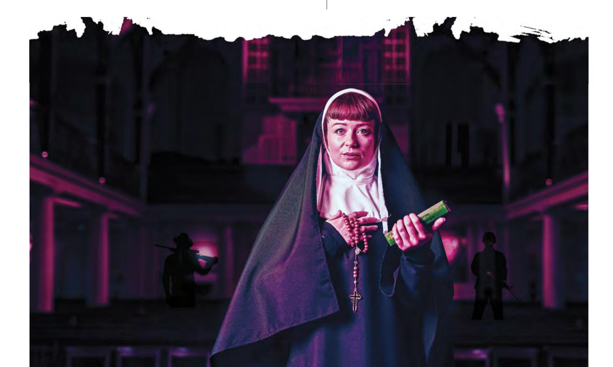

Она находится там днем и ночью и стремится завести друзей. Большинство пользователей ее услуг готовы умереть за свою миниатюрную, курящую, носящую шейный корсет ("для моего артрита") суррогатную бабушку с ее жестокой честностью и жесткой любовью. Она также знает всех кто имеет значение в городской бюрократии. Сестра Дороти сборщица информации и руководитель информаторов при храме Святой Маргариты. Как только поступает сигнал тревоги, ей приходится просеивать уличные слухи, задавать вопросы и связываться со своими знакомыми в мэрии.

Дороти обладает широким кругозором, но она слишком заботится о своих информаторах: не желает подвергать их опасности или оставлять в беде, что иногда ограничивает возможности их использования.

Сочетание пистолета Glock-42 (легкое извлечение, малая отдача) и истинной веры (•••) означает, что Дороти не является легкой мишенью, но если ее оставляют без присмотра в боевой ситуации, значит, что-то пошло не так. В этом случае подмога находится на расстоянии одной голосовой команды, поданной на ее смарт-часы.

Сестра Дороти - детектив, с проницательностью 8 и влиянием 2 в городе.

#### ЛЭВИЛ КОЛОН

Дэвиду почти шестьдесят, и за сорок лет работы в Ватикане, а затем в возрожденном Обществе святого Леопольда он насмотрелся на невообразимые ужасы. Полевые будни экзорциста и убийцы остались далеко позади, и он со своим синдромом C-PTSD (симптомы: трудности с регулированием эмоций, кошмары, воспоминания) вернулся к обучению в семинарии. Онархивариус и историк кенакла, копается в городских архивах и фондах университетских библиотек, чтобы найти информацию об объектах оперативного воздействия.

Нередко его находки обнаруживают вампирические владения в неожиданных местах: давно забытые связи с семьей начальника местной полиции, "семейный интерес" к местной художественной сцене или театру, владение зданиями и землей, сдаваемыми в аренду через сложную сеть холдинговых корпораций. Ресурсы, контакты, потенциальные убежища, иными словами. Поразительно, как часто пустые тела даже не удосуживаются сменить свое имя, и Дэвид может найти непрерывные записи за восемьдесят и более лет. До недавнего времени они были жирными, самодовольными паразитами, и Дэвиду от этого не по себе. Он намерен сделать так, чтобы вампиры вспомнили, что значит бояться.

"Бравые двойки" внимательно следят за материалами, которые могут раскрыть их секреты, а Дэвид - крайний параноик: каждый, с кем он общается в библиотеке, архиве или специальной коллекции, может оказаться Ренфилдом. Новые люди пугают его. а когда он напуган, то становится навязчивым, выискивая все, что можно узнать о предмете. Иногда это отвлекает его от поставленной задачи, и он может упустить что-то очевидное.

Дэвид - копатель, имеет Контакты 3 (архивариусы, библиотекари) и Союзников 3 (богатый меценат

частной оккультной библиотеки).

#### МАТТЕО ЛУСАРЛИ

Иногла Маттео жалеет, что у него нет визитной карточки, на которой он мог бы написать "хакер Ватикана". Он - техник храма Святой Маргариты. Маттео всегда занят - от прослушивания телефонов и подслушивающих устройств до взлома вампирских сетей связи и помощи Дэвилу в велении его базы данных. Слишком занят. Он слишком перегружен, и его начальство использует это как оправдание, чтобы продолжать полагаться на информаторов сестры Дороти, а не на его технические решения. Обычно он принимает участие в операции после того, как цель

определена и составлен профиль (этап 4).

Поступив в частный католический университет в Милане еще студентом, Маттео никогда не был никем иным, как активом Общества Святого Леопольда. У него никогда не было заметной, публичной жизни, и он никогда не знал о пустых телах. Ему кажется, что он что-то упустил: он наблюдает за жизнью обывателей и завидует их блаженному неведению. Однако он не чувствует с ними родства. Они - стадные животные, а Маттео - их пастух. Он никогда не признается в этом, но твердо уверен, что у него больше общего с хишниками-вампирами, охотяшимися на людей, чем с самими смертными-идиотами. На каком-то уровне он воспринимает пустых тел как равных, как две конкурирующие спецслужбы в гламурной шпионской драме. Ему кажется, что он способен заключать с ними союзы, действовать с профессиональным уважением.

Он сильно ошибается, и если местные сородичи узнают об этом заблуждении, последует похищение и, возможно, жестокое Объятие. Маттео - хакер с силой воли 4.

#### СПЕЦИАЛЬНЫЙ АТТАШЕ ЛИЗА КЛЯЙН

Лиза попала во Вторую Инквизицию тяжелым путем: в наручниках и смирительной рубашке, в руки оперативной группы "Гладиус Деи". Недавно ставшая Воплощенной, Лиза уже обратилась к религии, чтобы попытаться преодолеть свою чудовишную сушность. Она рассматривала свое пленение как шанс на спасение и убедила в этом Адриана Клермонта. Он всегда питал слабость к неудачникам.

До своей смерти Лиза была психиатром. Теперь она переквалифицировалась в депрограммиста. Ее понимание вампирических культов бесценно: она умеет разговаривать с захваченными гулями или слабокровными на их собственных условиях и завоевывать их доверие так, как мало кто умеет. Она умеет сопереживать или делать вид, что умеет. Она использует свой собственный опыт как обещание лучшего будущего - она не упоминает, что большую часть времени проводит запертой в подвале черного объекта, - и ломает своих подопечных до тех пор, пока они не выдадут свои секреты и не приведут к следующей цели кенакла. Она ценит и это. Каждый монстр, увидевший свет, - доказательство того, что ее собственная борьба за человечество - нечто большее,

чем просто обманчивый оптимизм.

Остальные члены капитула смотрят на нее как на пример силы Господа, чудо, воплощенное в плоть: вампир-слуга Бога. Их бы разорвало на части, если бы они узнали, что время от времени ее решимость ослабевает, и она тайком покидает помещение, чтобы подкрепиться чем-то более существенным, чем пакеты с кровью.

Лиза - депрограммист, с добавлением: Дисциплины: Ясновидение 2, Стойкость 1, Величие 2 Человечность: 7

Сила крови: 1

#### ВТОРОЙ ЭТАП

Ценакль Святой Маргариты работает как хорошо отлаженный механизм и является образцом терпения и дисциплины. Поэтому талантливых новобранцев отправляют туда на обучение, чаще всего под руководством Дороти или Дэвида, у которых они учатся управлять сетями или читать загадочные намеки в разваливающихся бумагах. В любой момент времени к Ценаклю прикреплены еще 2-3 оперативника с социальной или технической направленностью.

#### КАНОНЫ ГЛАДИУСА ДЕИ

Гладиус Деи - это передовой отряд Общества Леопольда. После завершения расследования и разработки плана именно они, рискуя жизнью, берутся за дело и уничтожают "пустые тела". Текучесть кадров высока: даже с реликвиями и самой лучшей информацией, которую могут предоставить Дороти, Дэвид и Маттео, невозможно обойти тот факт, что вампиры смертельно опасны.

Команда "Гладиус Деи" постоянно живет на черном объекте. Им опасно находиться в городе, ведь в любой момент их могут узнать по секундной записи с камеры или по столкновению с одним из тех редких монстров, которые выживают после встречи с ними.

Можно с уверенностью сказать, что вся команда страдает посттравматическим стрессовым расстройством, причем в разной степени и в разных формах. Дамиан Маршалл, являющийся их священником, делает все возможное, чтобы помочь им и поддержать их, но работа отнимает силы у каждого агента.

#### МАРИНА ФЕРРАРА

Марина возглавляет отряд "Гладиус Деи" при кенакле. Она воюет за Христа с шестнадцати лет в Манаусе, а в тридцать два года уже потеряла счет пыли. Марина непоколебима. Она пережила ловушки из пустых тел, видела ужасающие смерти товарищей по команде и извлекала уроки из каждого задания, успешного или провального. Она научилась думать и принимать решения в доли секунды, руководствуясь инстинктами, которые, по ее мнению, даны ей Богом.

Марина понимает, что ее работа имеет короткий срок службы и что, как бы хорошо ни была проведена предварительная разведка, ситуация на местах быстро меняется. Однако ее команда - это высококвалифицированная элита. Они не являются незаменимыми, но было бы большой потерей позволить им погибнуть, если это не приведет к существенному продвижению дела Леопольдита. Она может отказаться от участия в операции, если она становится слишком опасной... но она вернется. Марина - Воин.

#### ОУЭН БАЙРН

Если Марина спокойна и собранна, то ее второй помощник - горяч. Оуэн - бывший киллер ЦРУ, и его мир изменился, когда он понял, что в нем есть вещи похуже наркотиков и террористов. Оуэн всегда первым приходит на помощь и первым пускает кровь. Когда ему это удается, он дополняет стандартный арсенал команды, состоящий из пистолета и винтовки (со штыком: при достаточной сноровке можно проткнуть все, что угодно), двуручным мечом, который он освятил и который регулярно окропляет благословенным маслом.

Оуэн не любит проигрывать. Даже когда остальные члены команды готовы отступить, он предпочитает сражаться до последнего и надеяться, что еще один кровосос уйдет с ним.

Оуэн - воин.

#### РОБ КЕЛЛИ

Роб не успокоится, пока в тени не останется ни одного монстра. Он не кто иной, как фанатик, в глазах которого отражается огонь его любимого огнемета. Насколько можно судить, у Роба нет ни увлечений, ни интересов. Только огнемет и энциклопедические знания о местных кровососах, не уступающие знаниям Дэвида Колона.

Он читает молитвы, вступая в бой, шипит и шепчет на ломаной латыни, когда его священный огонь разгорается и готовится смести комнату. Последнее слово, которое слышат многие пустые тела, - это рычащее "Аминь". Роб - специалист по разминированию.

#### ЛЭМИАН МАРШАЛЛ

Дэмиан - огромный человек и огромный выпендрежник. Абсолютная гора мышц с мальчишеской ухмылкой, он является экспертом по подрыву боеприпасов и капелланом отряда. Бывший морской пехотинец, который нашел Бога, а затем его нашли ВИ, Дэмиан наслаждается своей работой. Возможно, даже больше, чем следовало бы. Приятно проделать большую дыру в стене и впустить в склеп солнечный свет. Еще большее удовлетворение доставляет то, что он поддерживает команду, поддерживает их дух молитвами и службами, а также любительскими консультациями. У него никогда не бывает недостатка в шутке или остроте, особенно когда настроение мрачное.

Дэмиан - единственный из команды "Гладиус Деи", у кого есть семья. Не в городе, конечно. Его бывшая жена и трое детей живут за пределами штата, и о них он не слышал уже пять лет. Но они есть, и это слабое место, которое только и ждет, чтобы им воспользовались.

Дэмиан - Взломщик.

#### ЭВАН ДЕ ВИТТ

Эван никогда не боялся темноты, она его просто завораживала. Он увлекался оккультизмом, когда его нашло и завербовало Общество святого Леопольда. Он живет и дышит магическими тайнами, проводя каждую свободную минуту в поисках новых ритуалов, позволяющих ему пробить вампирический оккультизм и иллюзии и распространить эту защиту на свою команду.

Эван выглядит неуместно в команде "Гладиус Деи": он бледен, худ, неуклюж и едва умеет обращаться с огнестрельным оружием. Но именно он не дает вампирам исчезнуть, внезапно появиться или запудрить мозги остальным членам команды, поэтому его нужно беречь, даже если он жутко молчалив и склонен к странным, весьма специфическим предсказаниям сульбы.

Исследования Эвана, а также рассказы испытуемых Лизы убелили его в том, что употребление крови вампира значительно увеличит его силы. Он еще не пробовал, но это очень заманчиво. Эван - Нуллификатор.

#### **HATAJM BACCETT**

Натали была потрясена, узнав, что ее история происхождения не уникальна и даже не необычна: ее сестра попала в секс-культ, который оказался культом крови, погибла, а Натали стала мстительницей, чтобы вбить кол в кажлого монстра, который входил в это общество. За ее плечами было уже шесть ударов, когда она наткнулась на операцию леопольдитов и едва не сорвала ее. Они завербовали ее, потому что это было безопаснее, чем позволить ей продолжать портить им жизнь, но она оказалась полезной. Натали самостоятельна (в меру) и универсальна, при необходимости может выполнять большинство функций.

Натали любит ночные бои и финишные схватки: она хочет видеть, как страдают монстры, как они умирают. Если нужна приманка, она первая приходит добровольцем.

Дважды получала выговоры за то, что продолжала заниматься самосудом, когда Ценакль двигался недостаточно быстро, чтобы ей это нравилось, но из Инквизиции очень трудно выгнать. Натали - олинокий волк.

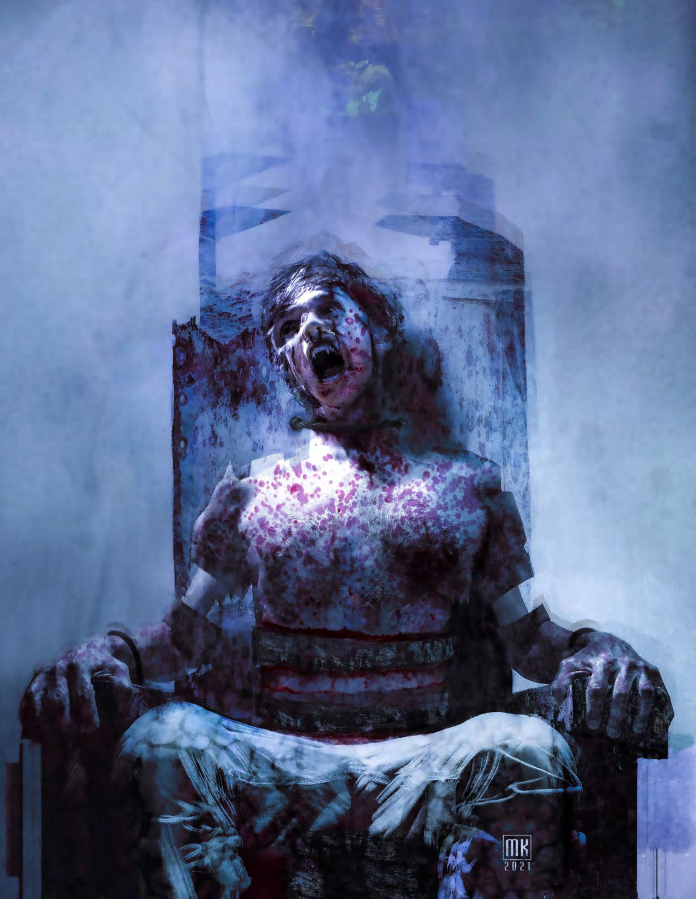

# Глава вторая: Специальное оружие

Ñàìîå ìîùíîå îðóæèå íà çåìëå - ýòî ãîðÿùàÿ äóøà ÷åëîâåêà. — ÌÀÐØÀË ÔÅÐÄÈÍÀÍÄ ÔÎØ

Работа в организации охотников позволяет получить доступ к лучшим инструментам для охоты. Подпольные агентства могут снабжать охотников оружием военного образца и новейшими технологиями, а мистические организации - артефактами и реликвиями, позволяющими выровнять шансы против сверхъестественных врагов. В этой главе представлена лишь малая толика тех замечательных игрушек, которые могут предложить "черные бюджеты" и многовековые магические сокровищницы.

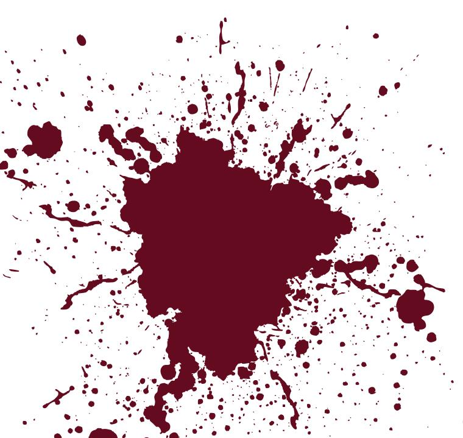

# Вооружение и боевая техника

Все, что представлено в этом разделе (и даже больше), существует, оплачивается из ваших налогов и используется публично или тайно. Полицейское и военное снаряжение все чаще пересекаются, и даже беглый просмотр новостей или сайтов, посвященных безопасности, позволяет обнаружить еще больше примеров.

# Îðóæèå

Хотя за ружьями и кольями стоят многовековые традиции борьбы с вампирами, нет необходимости в том, чтобы в вашем арсенале был только инструмент Стокера.

#### ÑÈÑÒÅÌÀ ÀÊÒÈÂÍÎÃÎ ÎÒÊÀÇÀ

Относительно новая разработка в области борьбы с массовыми беспорядками - система активного отказа (ADS), неофициально называемая "тепловым лучом". Установленная на транспортном средстве, она используется только для проведения операций на открытом воздухе и охраны периметра (например, для того, чтобы загнать убегающие пустые тела обратно в здание, подальше от гражданских лиц), например, оттеснение убегающих пустых тел в здание, подальше от гражданских лиц). ADS испускает высокоточный луч интенсивного тепла, вплоть до ожогов второй степени. Это только для борьбы с толпой: "Вторая инквизиция" усиливает жар.

**6 9**

ADS не наносит урона до третьего последовательного хода воздействия, после чего наносит 1 сверхфизический урон каждый ход. Любой человек (включая пустые тела), находящийся в зоне его лействия, должен слелать бросок "Упорство + Самообладание", чтобы не отступить (или не убежать); сложность увеличивается на единицу за каждый ход воздействия. Усиленная ADS наносит повышенный урон.

#### СОСТАВНОЙ АРБАЛЕТ

Арбалеты - это эффективный и проверенный временем способ доставки кола. Для увеличения мощности лука в составных арбалетах используется система тросов. При тяге до 200 фунтов они бьют сильно: достаточно сильно, чтобы раздробить грудину. Вызванный выстрел в сердце из составного арбалета не легче, но благодаря своей мощности, если вы попадете в орган, то раздробите его. Составные арбалеты наносят  $+2$  урона.

#### РЕАКТИВНЫЕ СНАРЯДЫ

Реактивные снаряды могут быть как в виде пистолета, так и в виде пусковой установки, прикрепленной к винтовке. В любом случае это стандартные по размеру стронциевые или калийные реактивные снаряды. Кальциевые сигнальные ракеты также легко доступны и полезны в подводной среде (закопченные склепы, городская канализация и т.д.). Они легальны и их относительно легко достать, поэтому, хотя команды UTR носят их с собой в качестве сигналов бедствия, к которым иногда прибегают как к оружию, сельскохозяйственные команды или любители могут сделать их основным оружием.

Ракетницы наносят 2 тяжелых повреждения. При использовании в замкнутом пространстве они также добавляют 1 сложность к проверкам на самообладание

#### и безумие на один ход.

#### **BAPMAHT: IOPOXHME OFHM**

Дорожные огни - отличные уличные зажигательные средства. После поджигания используйте силу + атлетику, чтобы бросить его в цель. Дорожный огонь наносит 1 урон с тяжелым повреждением. Если его не бросить сразу, он наносит владельцу 1 тяжелый урон,

так как расплавленные остатки капают ему на руку.

#### **TAPPOTA**

Гаррота военного образца состоит из отрезка рояльной проволоки между двумя деревянными ручками. Она способна обезглавливает цель одним плавным движением и одинаково эффективно действует как на пустые тела, так и на смертных.

При использовании боевой гарроты штраф за призванный выстрел для обезглавливания уменьшается на 1 кубик. Бонус к урону равен +0, но если пользователь может подкрасться к цели, выиграв состязание на ловкость + скрытность против смекалки + осведомленность, то для расчета урона он складывает перевес этого броска с перевесом броска атаки

#### АКУСТИЧЕСКОЕ УСТРОЙСТВО ДАЛЬНЕГО ДЕЙСТВИЯ

Акустическое устройство дальнего действия (LRAD) для борьбы с массовыми беспорядками иногда называют "звуковой пушкой". Его масса составляет 300 кг, поэтому обычно оно устанавливается на транспортном средстве и используется на открытых площадках. Взрыв LRAD вызывает головную боль, панику, ухудшение слуха и действует исключительно на пустые тела.

Любой человек, находящийся в зоне поражения LRAD, должен сделать проверку на выносливость + самообладание (сложность 4), чтобы противостоять 3 сверхфизическим повреждениям каждый раунд. В случае неудачи они впадают в панику (-2 кубика к проверкам самообладания и интеллекта) до тех пор, пока длится звук. Вампиры, находящиеся в панике в течение 3 раундов подряд, должны сделать проверку на бешенство.

#### Ночной дозорный

Ночной дозорный ESOG (Metronotte поитальянски) - это короткий меч, замаскированный под обычную дубинку. Его можно носить с собой, не опасаясь привлечь к себе внимание, в одно мгновение обнажить и использовать как обычный меч. Ночной дозорный - это ценная вещь, прошедшая со своим владельцем через ад и воду, и это часто отражается на его внешнем виде. На некоторых из них указывается количество трупов, на других - строки из Священного Писания, третьим просто присваивается имя святого или любимого человека.

Ночной дозорный также оптимизирован для нанесения ударов по голове: короткое прямое лезвие режет чисто. Штраф за бросок на обезглавливание снижается до -1 при использовании "Ночного дозорного". Он наносит +2 урона.

#### ПЕНОПЛАСТ РИОТА

Пенопласт замедляет грузовик, поэтому она, безусловно, будет препятствовать пустым телам, даже обладающим неестественной скоростью. Если только они не сильны, как грузовик.

Пенопласт не является предпочтительным инструментом для операторов UTR: им сложно точно попасть в цель, а значит, трудно заколоть или обезглавить пустое тело. К тому же она огнеупорна. поэтому ее невозможно даже сжечь. Конечно, некоторые агенты утверждают, что достаточное количество пены может обездвижить вампира и вы сможете оставить его на солнце, но это маловероятно. В основном она используется там, где есть значительная вероятность присутствия гражданских лиц, или там, где команде противостоит монстр с суперскоростью.

Пенопласт риота не наносит урона. Вместо этого скорость цели снижается до медленной скорости передвижения, или до скорости человеческой ходьбы для транспортных средств, пока она не будет очищена (наименее приятное применение детского масла). Вампиры, попавшие под пену, используют силу вместо ловкости при проверке атлетики, чтобы использовать

способность Стремительности.

#### **TA3EP**

Излюбленное средство самообороны ТАЗЕР представляет собой электроды, прикрепленные к самому пистолету, которые подают электрический заряд, прерывающий добровольный контроль над мышцами. Электрошокеры наносят сверхсильный урон, но их основная польза заключается в том, что они не дают цели убежать. На самом деле они обычно не дают цели сделать ничего, кроме как рухнуть на пол и дергаться.

Цель, пораженная ТАЗЕРОМ, должна сравняться или превысить полученный урон (после уменьшения вдвое, для вампиров) при броске "самообладание + упорство", либо быть неспособной действовать в течение следующего хода. ТАЗЕРы не причиняют особого вреда вампирам, мышцы которых не зависят от электрических импульсов, но на гулей они

действуют просто безотказно.

#### ВЫСОКОСКОРОСТНАЯ ВОДНАЯ ПУШКА

Называть это оружие для борьбы с массовыми беспорядками "водяными" пушками не совсем верно. Высокоскоростная пушка, установленная на автомобиле, может подавать на цель любую жидкость. Краситель - для последующего отслеживания и идентификации. Слезоточивый газ (правда, не очень полезный для трупов). Бензин - для создания града зажигательных пуль или удара "огненного оперативника".

Теоретически бак с водой можно освятить и использовать для святой воды, но для этого нужен оператор с истинной верой, что редкость даже в

#### Обществе святого Леопольда.

Водяные пушки наносят сверхсильный урон. Краска, выпущенная из них, сохраняется в течение нескольких лней

Покрытие цели бензином увеличивает последующий урон от огня на 2. Если каким-то чудом у охотников есть бак, полный святой воды, считайте это уроном от солнечного света.

## Áîåïðèïàñû

Помимо стандартных зажигательных боеприпасов "Дыхание дракона" и "Рауфосс" (Corebook, p. 380), в арсенале охотников имеется множество различных боеприпасов.

#### ÁÐÎÍÅÁÎÉÍÛÅ ÑÍÀÐßÄÛ

Бронебойные патроны изготавливаются из более твердого металла, менее склонного к деформации при ударе. Поскольку они сохраняют свою форму, они пробивают большинство видов бронежилетов, а не сжимаются и не останавливаются. Они так же неприхотливы к глухим телам, как и любые другие пули, но отлично подходят для нейтрализации бронированных телохранителей из числа смертных или гулей, которых многие вампиры считают постоянной частью своей свиты.

Бронебойные патроны снижают показатель брони цели на 2.

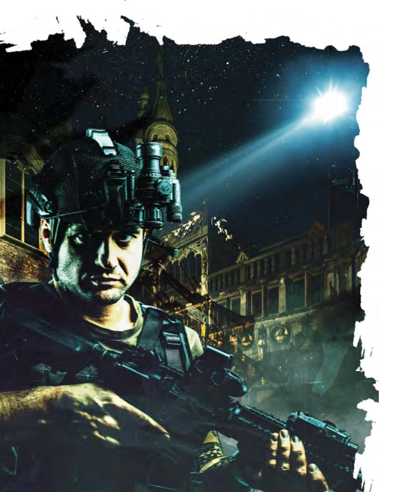

#### ÐÀÇÐÛÂÍÛÅ ÑÍÀÐßÄÛ

Проникающий патрон, также известный как "мастерключ", - это дробовой снаряд, предназначенный для разрушения при ударе. Он срывает замок или петли с двери, не причиняя вреда тем, кто находится за ней. Кроме того, если пуля попадает прямо в человекоподобное существо, она выбивает из него куски. Обычный дробовик наносит двери примерно такой же урон, поэтому команды UTR используют разрывные патроны в основном для экстракции: извлечения членов команды или информаторов, захваченных в плен пустыми телами, когда важно контролировать, кто именно пострадает.

Дробовик с разрывными патронами работает точно так же, как и со стандартными патронами, но при этом отсутствует вероятность поражения нескольких целей и рикошета.

#### ÑÂÅÒÎØÓÌÎÂÛÅ ÃÐÀÍÀÒÛ

Граната-вспышка, или оглушающая граната, создает кратковременную вспышку света и оглушительный взрыв, способный на несколько секунд ослепить и сбить с толку тех, кто ее видит. Команды UTR используют ее для дезориентации целей в начале рейда или для прикрытия отхода.

Используйте Ловкость + Атлетику, чтобы бросить вспышку, и сразитесь с ней броском Смекалка + Упорство. Если наблюдатель побеждает, он дезориентирован (-2 кубика к показателям Смекалки) только на один раунд. В противном случае он не может видеть вообще. Защита глаз добавляет 2 кубика к броску " Смекалка + Упорство".

#### ÏËÀÑÒÈ×ÍÛÅ ÂÇÐÛÂ×ÀÒÛÅ ÂÅÙÅÑÒÂÀ

Преимущество пластиковых взрывчатых веществ, таких как Semtex и C4, заключается в том, что они могут быть установлены заранее и приведены в действие на расстоянии с помощью детонирующего шнура или таймера: при воспламенении шнура или срабатывании таймера искра приводит в действие взрывчатку. Команды UTR используют их для прорыва зданий, где не помогают разрывные патроны, или в качестве ловушек. В качестве альтернативы, если пустые тела слишком опасны, можно использовать несколько кирпичей C4 и полностью разрушить здание над его "Убежищем".

Установка пластиковой взрывчатки требует броска Интеллект + Техника (но см. Corebook, p. 410). В качестве грубого ориентира по применению можно сказать, что 200 г пластиковой взрывчатки уничтожают автомобиль и наносят 7 уровней тяжелых повреждений. Добавьте еще 3 уровня повреждений за каждые дополнительные 200 грамм и соответственно увеличьте площадь взрыва.

#### РЕЗИНОВЫЕ ПУЛИ

"Менее смертоносные" снаряды, резиновые пули все же могут нанести серьезные ушибы, сломать кости или ослепить цель. Они иногда используются, когда команда UTR хочет взять гуля или смертного в плен, но почти бесполезны против пустых тел.

Огнестрельное оружие, заряженное резиновыми пулями, наносит поверхностный урон как смертным, так и вампирам.

Так называемые "деревянные пули", используемые для борьбы с толпой, представляют собой тупые диски, заряженные в гильзу дробовика, и также не наносят никому тяжелых повреждений. Можно выстрелить колом из ствола дробовика (заменив дробь в гильзе на пыж), но он пробивает грудину вампира только при выстреле почти в упор,

как из дробовика (Corebook, p. 381).

#### **TEPMUT**

Термит, представляющий собой смесь фосфора и оксида металла, горит при температуре 2 200° С. Он пробивает сталь и асфальт, сжигает плоть с костей. При длительном контакте кость превращается в пепел. Отсюда его прозвище на ВИ - "мгновенный крематорий".

Термит имеет очевидное применение ДЛЯ форсирования проникновения: это "липкая" взрывчатка, которую можно заложить, поджечь и оставить детонировать. Он также может быть задействован в специально сконструированных гранатах (для его воспламенения требуется магниевый запал). После воспламенения термит очень трудно потушить. Тушение неэффективно (необходимый кислород содержится в самом термите), равно как и погружение в воду. Термит горит до полуминуты.

Термит относительно легко изготовить (бросок Интеллект + Ест. Наука, сложность 3), его можно купить в небольших количествах в качестве запаса для сварки. Термит наносит 3 тяжелых повреждения каждый раунд в течение 3 раундов.

Ввести термит в спящее тело - мечта любого инквизитора, и у каждого охотника есть свой собственный фантастический метод. Например, смешать термит с банкой грязи Цимисхов...

#### ТЕРМОБАРИЧЕСКИЕ БОЕПРИПАСЫ

Термобарические боеприпасы, чаще всего встречающиеся в боекомплектах UTR в виде винтовочных гранат, производят более медленные и интенсивные взрывы, чем обычные взрывчатые вещества. Команды UTR считают их эффективным средством зачистки помещения или, по крайней мере. получения раннего преимущества за счет поджога всех находящихся в нем людей, а также форсирования входа: одна такая граната может нанести серьезный ущерб строению. Не зря их называют "разрушителями бункеров".

Термобарические гранаты наносят +5 тяжелых повреждений (по сравнению с +4 у обычных винтовочных гранат) и поджигают все, что в них попало. Они добавляют три кубика к броскам на повреждение строений.

#### **БЕЛЫЙ ФОСФОР**

Белый фосфор является пирофорным веществом: он воспламеняется при контакте с воздухом. Он используется в некоторых зажигательных гранатах, но в основном в дымовых гранатах. Как и гранатывспышки, отряды UTR используют его для прикрытия своего прибытия и отхода, а также для обеспечения преимущества против трупов, обладающих способностями, изменяющими сознание.

Белый фосфор уменьшает на 3 кубика количество кубиков, зависящих от зрения. Он делает неэффективными способности Доминирования, требующие зрительного контакта, и дает +2 кубика к

сопротивлению эффектам Величия.

#### Броня

В Послании к Ефесянам 6:11 Павел советует своим читателям "облечься во всеоружие Божие, чтобы противостоять коварству дьявола". Коалиция

предлагает добавить и другие доспехи.

#### ЦЕПНАЯ БРОНЯ

Цепная броня не так эффективна, как кевлар, но она дает о себе знать. Традиционная стальная кольчуга в основном говорит: "Я больше забочусь об эстетике, чем о защите", но современные альтернативы из титановых сплавов или других современных материалов находят свое применение. Общество святого Леопольда особенно любит цепную броню: ничто так не говорит о святом крестоносце, как полный доспех.

Стальная цепь имеет бронестойкость 3 (1 против пуль) и накладывает -2 кубика на проверку скрытности и -1 кубик на все остальные проверки ловкости. Более легкая современная цепь имеет ценность брони 3 (включая пули) и не имеет штрафа за ловкость.

Современная кольчуга обычно покрыта текстильным внешним слоем, который глушит звук (что сводит на нет штраф за невидимость), но некоторые агенты - в основном леопольдиты - предпочитают

величественный жест - видимую кольчугу.

#### КЕВЛАРОВЫЙ ЖИЛЕТ

Кевларовые жилеты, бронежилеты и другие подобные бронежилеты обеспечивают существенную защиту ("броня" 4), но за это приходится платить гибкостью и скоростью (-1 кубик при проверке ловкости). Кевлар также обладает огнестойкостью (броня 1 против огня), что означает, что его по умолчанию выбирают специалисты по зачистке, владеющие огнеметами, и

все, кто работает рядом с ними.

#### ЗАШИТА ШЕИ

Шейные зашитные шитки не отличаются особой защитой, но они незаметны. Стандартную мотоциклетную защиту шеи можно спрятать под громоздким пальто, а углепластиковую - под шарфом или высоким воротником. Они популярны среди охотников, не имеющих доступа к лучшему снаряжению, например, среди любителей и фермерских команд на стр. 142.

Мотоциклетная защита шеи или ее эквивалент или защита рук, или другая броня, закрывающая одну конкретную область тела, - имеет значение брони 1 (0 против пуль). Все шейные защитные щитки, в том числе из углепластика или других материалов, предназначенные для использования в спорте, добавляют 2 кубика к броскам "сила + драка", чтобы противостоять атаке укусом.

#### ШИТЫ

Щиты имеют массу преимуществ: их легко поставить, если по каким-то причинам агенту необходимо выдать себя за гражданское лицо. Кроме того, они являются оружием защиты: оттолкнуть нападающего с их помощью несложно. Изготовленные из прозрачного поликарбоната, они не мешают обзору.

Бронебойные щиты имеют бронестойкость 3 (0, если нападающий застигнут врасплох сзади) и 0 против баллистических снарядов. SAD и BOES предлагают несколько пуленепробиваемый вариант, обеспечивающий бронестойкость 1.

#### Мирское снаряжение

Просто материал, который вы можете найти в безопасном доме. Все организованные команды "Пяти факелов" имеют доступ ко всему этому; любителям для получения этого нужны Ресурсы.

#### **TAPAHK**

Полицейские тараны прилагают к дверным замкам усилие в 3 тонны, а для управления ими требуется всего один человек средней силы. Отмычки позволяют проникнуть в дом тише, но таран - это уже вход. Команды используют их, когда хотят навести шороху.

Тараны - излюбленный инструмент британской полиции, а в SO13 они известны под названием Enforcer.

Таран добавляет 3 кубика к любому тесту на силовое открытие двери.

#### СТОМАТОЛОГИЧЕСКИЕ ШИПЦЫ

Как только пустой труп притащили на допрос, клыкастые потрошители выходят наружу. Это просто разумное управление рисками. Кроме того, это отличная угроза: даже если пустотник рассчитывает выжить на допросе, его достоинство и гордость навсегда уничтожены.

Для удаления клыка требуется успешная проверка на силу + медицина или драка против сдерживаемой цели. Многие сотрудники Коалиции предпочитают заливать место удаления клыка расплавленным металлом или костной замазкой, полагая, что это препятствует регенерации клыков.

Удаление одного клыка наносит 1 уровень повреждений с тяжелым уроном. Удаление всех клыков и заполнение пустот в челюсти приводит к появлению

дефекта "Детские зубы" (Corebook, р. 182).

#### ФИБРООПТИЧЕСКИЙ ПРИЦЕЛ

Фиброоптический прицел - это гибкий пучок оптического волокна с линзой на одном конце, присоединенный к окуляру или камере. Они используются для заглядывания в небольшие пространства: внутрь замков, машин или даже внутрь тела. Команды UTR в основном используют их по первым двум причинам: они помогают взламывать замки, понимать и обезвреживать ловушки или меры безопасности, а также вести очень скрытое наблюдение, когда их вставляют под двери или вокруг оконных рам.

Фиброоптические прицелы добавляют 2 кубика к проверкам для любой из этих целей.

#### **GPS-TPEKEPH**

Коалиция использует GPS-трекеры для слежения за объектами наблюдения, а также за собственным персоналом, особенно за "Кукушками" и другими лицами, занимающими особо опасные позиции.

GPS-трекеры, прикрепляемые к транспортным средствам, обычно магнитные и размером меньше ладони. Для обнаружения такого устройства на транспортном средстве требуется успешная проверка на Смекалку + Уличное чутье или Техника, а удалить его очень просто. Персональные трекеры размером с циферблат часов обычно вшиты в одежду, носятся в обуви или приклеены к нижней стороне настоящих часов. Их поиск - это проверка на смекалку + уличное чутье/технику.

Активный GPS-трекер добавляет 4 кубика к любой проверке на определение местонахождения владельца.

#### **ГЕОРАЛАР**

Для получения изображения подповерхностных объектов и мест их расположения используются радиолокационные импульсы. Он проникает на метры в грязь, тверлый бетон и камень. Он находит путь в самую глубокую канализацию Носферату или склеп Цимисха, или за каменные стены самой надежной капеллы Тремере. Он обнаружит потайную комнату или бункер, а также проследит за линиями электропередач или водопроводами, ведущими к ним.

Работа с прибором проста и незаметна: группы, передвигающиеся с помощью газонокосилок, легко принять за геодезистов или работников коммунальных служб.

Для использования георадара требуется бросок на сложность 2 "Интеллект + Техника".

#### ЛАЗЕРНЫЙ МИКРОФОН

Этот маленький, легко скрываемый микрофон использует лазерный луч для "считывания" звуковых колебаний. Они миниатюрны и незаметны, и коалиция предпочитает использовать их для звукового наблюдения. Микрофон необходимо прикрепить к плоской поверхности, которая может вибрировать в ответ на звук - обычно это окно или картина. Окно идеальный вариант: микрофон даже не нужно размещать внутри помещения.

Дальность приема лазерных микрофонов ограничена: очень большое помещение может помешать им. Однако их трудно найти (бросок на смекалку + техника, сложность 5).

#### ПИСТОЛЕТ-ОТМЫЧКА

Для взлома замка требуется ловкая рука и серьезная подготовка. Или же требуется устройство, которое выстреливает стальным стержнем в замок, освобождает цилиндр и вставляет тонкий металлический стержень, чтобы открыть замок. Пистолет-отмычка гораздо быстрее, чем обычная отмычка, - открытие замка занимает считанные секунды. Кроме того, он работает тихо: раздается тихий звук удара и щелчка.

Пистолет-отмычка добавляет 4 кубика к броску на ловкость + воровство, чтобы взломать замок.

ОПТИЧЕСКИЕ ПРИБОРЫ НОЧНОГО ВИЛЕНИЯ

Оптика ночного видения, как правило, очки, но также камеры и записывающее оборудование, бывает двух видов: улучшающая освещенность или инфракрасная. Оптика, улучшающая освещенность, дешевле (это не важно для IAO, но определенно важно для фермерских команд), имеет большую дальность действия, но для ее работы необходимо освещение. Под землей или в помещении без окон они неэффективны. ИК-оптика имеет меньшую дальность действия, но работает везде. Новейшая американская система NVO - ENVG - сочетает в себе оба вида оптики. Снайперам, контролирующим обстановку, лучше использовать светоусилители, а группам, перемещающимся по гнезду или логову, ИК-оптика менее опасна.

Конечно, пустые тела не излучают в ИКдиапазоне; они не невидимы, но проявляются только на контрасте с фоном. Очки, работающие только в инфракрасном диапазоне, уменьшают на 1 кубик коэффициент наблюдательности при проверке на обнаружение вампиров. Конечно, кромешная тьма уменьшает этот показатель на 2 кубика...

Нападающие могут насильно снять приборы ночного видения при успешном захвате (Corebook, p.  $301$ ).

#### **ОГРАНИЧИТЕЛИ**

Трудно брать пленных без средств ограничения. Наручники на молнии - универсальный размер, и агент может носить с собой десятки или сотни таких наручников: они отлично подходят для захвата секты или партии смертных слуг. Для их разрыва требуется проверка на прочность (сложность 5), но их можно сравнительно легко перерезать ножом или когтями.

Наручники более прочные и многоразовые. Чтобы сломать их, требуется проверка на силу (сложность 6), а чтобы освободиться - бросок на ловкость + воровство (сложность 4).

Бродяги включают в себя прутья, которые удерживают запястья или лодыжки на фиксированном (при использовании металлического прута) или максимальном (при использовании нейлонового поводка) расстоянии друг от друга. Они используются в тех случаях, когда заключенного необходимо транспортировать, например, из автомобиля в помещение, и ему нельзя доверять ходить. Освобождение или побег имеют ту же сложность, что и наручники, или даже хуже, если кандалы имеют коалинию.

Капюшоны из цепной ткани предназначены специально для выполнения миссий по выдаче преступников. Цепной капюшон из арамидного волокна и керамики, изготовленный из микроволокна, перекрывает обзор объекта (и атаки Величия) и блокирует его укус и речь (и Доминирование) с помощью толстой арамидной прокладки. Арамидный шнур, армированный титаном, туго стягивается вокруг шеи субъекта, обеспечивая надежную фиксацию капюшона до тех пор, пока его руки остаются скованными. (Даже если руки не скованы, для снятия застегнутого капюшона требуется весь ход пользователя). Накидывание капюшона на безвольное тело - это вызов, снимающий два успеха с атаки "Ловкость + Борьба". Однако если персонаж подкрался к цели, победив в состязании "Ловкость + Скрытность против Смекалки + Наблюдательность", он добавляет преимущество этого броска к своему пулу для атаки капюшоном.

#### ТАКТИЧЕСКИЕ НАУШНИКИ

Тактические наушники сочетают в себе защиту слуха, что очень важно в условиях взрывов, стрельбы, а иногда и звукового оружия, такого как LRAD, с коммуникацией. Они балансируют звук, обеспечивая чистоту звучания, и оснащены микрофоном для четкой передачи речи. Наиболее продвинутые модели оснащены мониторами здоровья, сообщающими о состоянии здоровья оперативному командованию.

Тактические наушники также добавляют 1 кубик к проверке самообладания в боевой обстановке.

# Транспортые средства

Коалиция использует самые разнообразные транспортные средства и оружейные платформы для борьбы с "пустыми телами". Транспортные средства и беспилотники встречаются довольно часто, но несколько боевых орудий вступают в игру только в случае обнаружения крупного нашествия пустых тел или энергетического центра.

Для общих целей городского боя следует считать, что транспортные средства могут поглощать столько же усиленного урона, сколько их броня самого высокого уровня. Гражданские автомобили дают полную броню только персонажам, укрывающимся за блоком двигателя; другие автомобили дают больше защиты, как уже говорилось.

#### Транспорты

Эти машины перевозят подкрепления на охоту и пленных с нее.

#### ПОЛИЦЕЙСКИЙ АВТОМОБИЛЬ / АВТОМОБИЛЬ ПРЕСЛЕДОВАНИЯ

Местные охотники и правоохранительные органы используют эти прочные седаны для преследования трупов и доставки захваченных целей в центр обработки. Часто в багажники таких автомобилей кладут дробовик, бронежилеты, аптечки, портативный дефибриллятор и болторезы.

Блок двигателя гражданских автомобилей имеет броню 5, остальные части автомобиля - броню 2 (1 против пуль).

#### ФУРГОН С ВИДЕОНАБЛЮДЕНИЕМ

Классический белый фургон, напичканный аппаратурой наблюдения. Хотя они бывают разных видов, те, что используются Коалицией, обычно отслеживают звук сотовых телефонов, перехватывают текстовые сообщения и используют видеонаблюдение. Для обнаружения пустых тел они также несут тепловизоры или портативные камеры второго поколения XScope (с. 82). Команды IAO и FIRSTLIGHT также имеют доступ к системе XKEYSCORE, позволяющей осуществлять поиск по электронной почте, социальным сетям, текстам и видео в режиме реального времени с помощью алгоритма распознавания образов "сердцебиение".

#### **БРОНИРОВАННЫЙ ВНЕДОРОЖНИК**

Эти автомобили, часто используемые спецподразделениями и российскими мафиози, способны преодолевать большинство мягких препятствий, и вывести их из строя может только взрывчатка или сверхъестественные силы. Команды FIRSTLIGHT и ГРУ предпочитают использовать тяжело бронированные черные "Эскалейды" с двумячетырьмя звуконепроницаемыми отсеками в задней части для безопасной транспортировки тел захваченных преступников. Боковая и задняя броня составляет 8 единиц, передняя кабина и двигатель имеют броню 10 единиц.

#### **ETP / MRAP**

Бронетранспортеры и машины с противоминной защитой распространены среди милитаризованных полицейских сил в США и Южной Америке. В то время как на правоохранительных версиях этих машин часто устанавливаются прожекторы и LRAD (с. 70), на военных БТР/МRAP также устанавливаются крупнокалиберные пулеметы и гранатометы со слезоточивым газом. БТР имеют полную броню 8, MRAP - полную броню 10.

В частности, IAO перебросила на передовые базы коалиции в Северной Америке и Европе множество MRAP RG-33. Эти немаркированные MRAP могут перевозить отряд из шести-восьми операторов и имеют башню с дистанционно управляемой модифицированной системой вооружения CROWS, которая управляет пулеметом 50-го калибра (урон +5, набор кубиков Смекалка + Огнестрельное оружие может быть распределен между несколькими целями) с тепловизором дневного света, лазерным дальномером и прицелом XScope (добавьте 2 к

набору кубиков Огнестрельное оружие).

#### ВЕРТОЛЕТ ПОДДЕРЖКИ

Полицейские вертолеты имеют броню 3 и оснащены прожекторами, а вертолеты для борьбы с беспорядками еще и распылителями слезоточивого газа. Их наблюдение добавляет не менее 2 кубиков к любому пулу полицейских преследований.

Силы "Пяти факелов" используют крупнотоннажные военные вертолеты смешанного назначения, такие как американский "Черный ястреб" или российский Ми-24 "Хинд", для быстрого развертывания сил в "горячих точках". Они имеют "броню 8". В основном они используются для перевозки войск (каждый может перевозить отряд и снаряжение), но в условиях ограниченного пространства могут вести подавляющий огонь из крупнокалиберных пулеметов (урон +5). Некоторые вертолеты оснащены ракетными установками, способными выпускать залпы зажигательных мини-ракет  $(v_{\text{POH}} + 5)$ .

"При использовании вариантов "Стелс" все показатели обнаружения увеличиваются на +2.

#### **ЕЕСПИЛОТЕИКИ И РОБОТЫ**

Требуется пул проверки Смекалка + Техника для управления беспилотниками и беспилотными летательными аппаратами (БПЛА), как правило, через зашишенное, зашифрованное соелинение WiFi. Большинство гражданских и полицейских беспилотников могут "управляться" с помощью планшета; для военных беспилотников используются более специализированные каналы и средства управления.

#### ТАКТИЧЕСКИЙ БЕСПИЛОТНИК

Летающие переносные "ранцевые дроны", некоторые из которых размером с фрисби, можно запускать в воздух вручную. На них устанавливаются ультрафиолетовые видеокамеры ночного видения и тепловизоры. В проекте FIRSTLIGHT используется вариант нано-дрона Hornet - БПЛА малой дальности размером и формой с ручной фонарик. Небольшие беспилотники трудно поразить (3 балла или техника оператора, в зависимости от того, что выше), но легко сбить.

#### БЕСПИЛОТНИК "ЯСТРЕБ"

FIRSTLIGHT и IAO, способные осуществлять непрерывный полет над зонами боевых действий, используют видеопотоки с этих безоружных беспилотников для мониторинга и информирования коалиционных операций. При этом используются ультрафиолетовые видеокамеры ночного видения и тепловизоры.

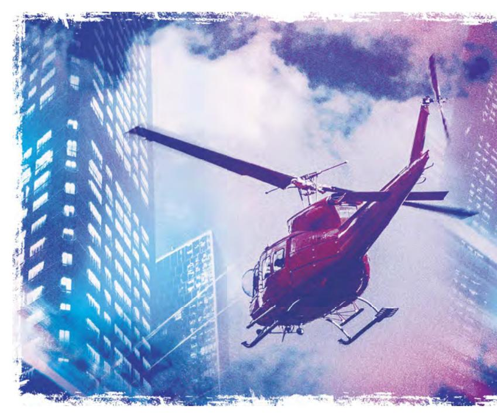

#### БЕСПИЛОТНЫЙ ЛЕТАТЕЛЬНЫЙ "ХИЩНИК"

Вооруженные беспилотники бывают нескольких видов. В настоящее время только FIRSTLIGHT и ГРУ используют это оружие для поддержки своих СИЛ Второй инквизиции. FIRSTLIGHT использует смертоносный беспилотник МQ9 Reaper, обычно вооруженный ракетой R9X "Меч" (урон + 8, специально разработанной для ограничения ущерба от столкновения и разрезания цели пополам. Беспилотник ГРУ "Орион" использует управляемые бомбы КАБ-20 (урон +10 с боезарядом, аналогичным ракете АGM-114 "Адский огонь").

#### ТАКТИЧЕСКИЙ РОБОТ-ПАУК

Небольшой многоногий робот размером с обеденную тарелку имеет эквивалент 2 здоровья и не имеет брони. SAD, SO13 и ESOG используют паукообразных роботов для разведки убежищ и других труднодоступных мест, а также для поиска мест отдыха пустых тел. Большинство из них оснащены ультрафиолетовым прибором ночного видения и тепловизором. Секретный вариант ГРУ может прикрепляться к жертве ("Драка" 5) и самоуничтожаться с помощью зажигательной взрывчатки (урон +2 с тяжелыми повреждениями).

#### "ТОЧЕЧНАЯ" РОБОТИЗИРОВАННАЯ СОБАКА

SAD, SO13 и ESOG развернули на шасси этого четырехногого робота, по форме напоминающего собаку, оснащенного видеокамерами и XScopes. В бою "пятнашки" могут толкаться и нападать ("Драка" 7), хотя их основное назначение - разведка. Броня - 3.

В отрядах FIRSTLIGHT Snatch добавлено модифицированное приспособление "палач" разворачиваемая с помощью кнопки проволочная петля, которая может зацепить конечность спящего вампира и вытащить его из убежища. ESOG и SO13 часто используют "палача", чтобы просто вытащить бездыханное тело на солнечный свет.

#### БЕСПИЛОТНЫЕ БОЕПРИПАСЫ ТИПА "РОЙ"

Обычно запускаемые с наземных транспортных средств или самолетов, эти небольшие автономные беспилотники бесшумно летают в режиме удержания вокруг территории, пока не будет обнаружена цель. Наполненные взрывчаткой, они врезаются в цель (урон +2 для каждого дрона. Только IAO и ГРУ-N58 имеют лоступ к этим оружейным платформам (AV Switchblade и Flock-93, соответственно).

#### ПОСЛЕДНИЕ МЕСТА ОТДЫХА

По мере того как война в Геенне разгорается, "пять факелов" не могут не разжигать пламя. Эти самолеты редко появляются над западными городами, но, как показала Вена, "редко" не значит "никогда". Мы не приводим значений повреждений и брони для этих апокалиптических систем вооружения, поскольку, если дело дошло до нулевого уровня, то уже слишком поздно.

#### АРТИЛЛЕРИЙСКИЙ КОРАБЛЬ AC-I30 SPECTRE

На этих массивных грузовых самолетах C-130, снятых с вооружения США, установлены две 20-мм пушки M61 Vulcan, одна 40-мм пушка L60 Bofors и 105-мм пушка M137. Способные часами кружить над целями, AC-130 обеспечивают точную и смертоносную поддержку с воздуха на поле боя. Заговорщики из IAO спасли несколько таких самолетов от списания и оснастили их зажигательными боеприпасами и ультрафиолетовыми ослепляющими лазерами. FIRSTLIGHT развертывает их против скоплений светлых тел в зонах активных боевых действий и в зонах, не подлежащих огласке. Только самые могущественные сверхъестественные существа могут выдержать их натиск.

#### CTEAC-BOMBAPINPOBINK B-2 SPIRIT

Пожалуй, это самый мощный инструмент в арсенале Второй Инквизиции. В-2 требует от IAO особой осторожности при использовании против "пустых тел", поскольку их действия тщательно контролируются, и это чревато разоблачением заговора FIRSTLIGHT перед всем миром. В-2 может нести практически любой набор фугасных бомб, но именно спаренные GBU-57A/B Massive Ordnance Penetrator делают его козырной картой в руках FIRSTLIGHT. Это оружие способно прокладывать тоннели глубоко под поверхностью и разрушать самые укрепленные склепы, пещеры и зиккураты.

# Цифровые технологии XTech

Только FIRSTLIGHT имеет бюджет и возможности для обеспечения доступности XTech, за редким исключением, упомянутым в описаниях специфических устройств. (Японский TID и несколько немецких корпоративных инквизиторов применяют подобные XTech в очень экстренных случаях; ГРУ может иметь на складе несколько вариантов, продающихся на черном рынке. Они дороги, редки и выдаются только тем командам, которые могут убедительно доказать свою необходимость.

#### МАСКИРУЮШЕЕ СРЕДСТВО ДЛЯ БАЗАЛЬНЫХ ГАНГЛИЕВ

Это нервно-паралитическое вещество действует на базальные ганглии - область мозга, отвечающую, помимо прочего, за управление двигательной активностью у людей. При попадании в мягкие ткани тела оно каким-то образом временно подавляет способность вампиров к полной или частичной трансформации. (Стандартная канистра BGMA полностью заполняет непроветриваемое пространство размером с большую комнату в начале раунда после ее высвобождения, и в этот момент все проверки на активацию протейских способностей имеют сложность +2.

При работе с ВGMA агентам следует надевать маски: она оказывает серьезное воздействие и на смертных (+2 к проверкам ловкости).

Некоторые полевые группы BOES и SO13 готовят свой собственный вариант "хранителя кожи" из волчьего лыка и других народных средств, размещая его в дымящихся бутылках; леопольдиты размещают как ВGMA, так и другие экспедиционные средства в качающихся кадильницах, сопровождаемых латинскими молитвами. Отвары, приготовленные травниками, увеличивают Сложности проверки силы метаморфоз на половину Оккультизма создателя (округление вниз).

При любом способе применения ВGMA рассеивается примерно за пять минут.

#### ЗАБОЛЕВАНИЯ И ПАРАЗИТЫ, ПЕРЕДАЮЩИЕСЯ ЧЕРЕЗ **KPOBL**

Инквизиторы стремятся уничтожить все преимущества нежити, включая свободу от инфекций и болезней. В закрытых лабораториях университетских городков и на подземных правительственных объектах ученые работают над созданием бактериальных инфекций и паразитов для уничтожения тел и мозгов нежити. ГРУ лидирует в разработке таких смесей, но FIRSTLIGHT не отстает.

Охотники вводят эти вещества через дозированные сосуды, зараженные запасы "мертвой" крови или через инъекцию - достаточно обычного дротика с транквилизатором. В настоящее время у ГРУ есть три любимых штамма, но их репертуар постоянно пасширяется

Для диагностики инфекции требуется бросок Интеллект + Медицина (сложность 3, 1, если пустое

тело ранее встречалось с данным штаммом).

#### C. HYDEII

Бактерия, передаваемая паразитическими грибами, С. hydeii разрушает мозг жертвы, снижая контроль нал импульсами, делая ее склонной к вспышкам ярости и даже безумию. Это проявляется в первую же ночь после приема препарата, так как мозг, находящийся в состоянии покоя, пробуждается. Это не только превращает изобретательного противника в чудовище, но и приводит к тому, что другие бестелесные существа часто спешат прикончить пораженного, пока он не нарушил маскарад. Проверки на интеллект, самообладание и безумие даются при сложности +2. Заражение "хайдом" проходит за 10 недель минус выносливость жертвы.

#### EV-HO7

Являясь результатом британских исследований копытно-ротовой болезни, этот модифицированный энтеровирус попадает в систему пустых тел через зараженную кровь. У смертных он вызывает нарколепсию и инверсию сна (-2 кубика от пула упорства в течение недели после заражения); у пустых тел он вызывает биомеханическое отключение, известное как оцепенение. Пустое тело, выпившее EV-НО7 в крови, должно выиграть проверку на выносливость + упорство против сложности, равной 1 + количество голода, утоленного напитком. В случае неудачи он впадает в оцепенение в течение часа, продолжающееся до следующего восхода солнца.

#### KOL-05

ГРУ вывело KOL-05 из ботулизма, и он вызывает схожие симптомы: мышечные судороги с последующим параличом. Полный паралич. Это мечта похитителя. Если не лечить инфекцию KOL-05, она проходит за 1d10 дней минус выносливость жертвы. Лечение требует переливания всей крови: опорожнения вен жертвы и повторного наполнения их свежей кровью. После завершения процесса тело жертвы находится в оцепенении в течение 24 часов. Сородичи также могут намеренно морить себя голодом на 5-м голоде в течение двух дней, полностью опустошая себя от крови. Это, конечно, сопряжено с определенными опасностями

#### КОКТЕЙЛЬ ИЗ НЕКРОФАГОВ

Некрофаги-паразиты пожирают мертвое тело изнутри - отличное средство для борьбы с сильным противником, с которым вы предпочитаете не сражаться напрямую. После введения паразита жертва каждую ночь по восходу делает проверку "Выносливость + Выносливость". В случае неудачи жертва получает один уровень тяжелого урона. Некрофаги остаются активными в течение 6 недель минус Выносливость.

#### GPS-ЧИПЫ

Обычные спецслужбы и правоохранительные органы пока не имеют доступа к имплантируемым GPS-чипам (имеющиеся на рынке решения слишком велики, да и время автономной работы проблематично), но FIRSTLIGHT и JTRG (а также многие другие западные агентства) имеют такой доступ. GPS-чипы достаточно малы для того, чтобы вживить их в тело вампира, и оставляют на месте вживления лишь мельчайший красный след - на теле вампира этот след быстро заживает. Пустые тела, возвращающиеся из FIRSTLIGHT или аналогичных учреждений, должны считать, что они были чипированы. Некоторые команды носят с собой "стингеры" размером с ушной пробойник, чтобы вживлять чипы испытуемым в полевых условиях.

Имплантация GPS-чипа с помощью стингера требует броска Ловкость + Медицина (сложность 1; сознательный, не желающий этого субъект может оспорить этот бросок с помощью Смекалки + Наблюдательность, чтобы заметить, что произошло нечто большее, чем обычная инъекция. После имплантации бросок Интеллект + Медицина (сложность 4) обнаруживает место имплантации, после чего бросок Ловкость + Медицина (сложность 2) удаляет его. Успешно имплантированный GPS-чип дает +2 успеха в проверках на определение

местонахождения субъекта.

#### ФАЗИРОВАННЫЙ ДЕТЕКТОР ДВИЖЕНИЯ (CKPMMEPH)

Пустые тела обладают удивительной способностью подкрадываться к смертному, исчезать с глаз долой или прятаться там, и вообще вести себя как жуткие существа. Фазированные детекторы движения непрерывно излучают микроволны и подают сигнал тревоги. Иногда сигнал поступает на монитор оператора, чаще - это пронзительный вопль, предупреждающий всех, кто находится поблизости, о появлении незримого тела. Разумеется, это сопровождается сообщением о точном местонахождении хищника, которое обычно выводится на смарт-часы агента или аналогичное многофункциональное устройство.

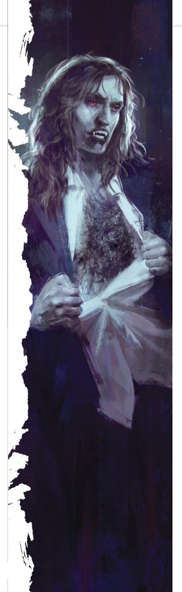

Как только кричалка сработает, все находящиеся поблизости могут сделать бросок "Смекалка + Наблюдательность" против "Упорство + Сокрытие" вампира. Если бросок удался, то они видят вампира, находящегося в состоянии сокрытия.

Для того чтобы заметить крикуна до того, как станет слишком поздно, требуется бросок Сложности 2 " Смекалка + Техника": они выглядят как незаметные черные коробки, прикрепленные к стене или брошенные на пол.

#### ÑÎËÍÅ×ÍÀß ÁÎÌÁÀ

Еще одна граната, и еще одно из самых гордых достижений FIRSTLIGHT. Восходная бомба (она же "чистка", "дневной поход" или "искатель солнца") имитирует солнечный свет, яркий, как экваториальный полдень, и покрывает площадь размером с бальный зал. Возможность применить " солнечную бомбу" - один из главных моментов ночного рейда: нет смысла их доставать, если вампиры укрыты в отдельных светонепроницаемых помещениях. Нет, лучше выпустить ее в Элизиум и посмотреть, как монстры разбегутся.

Бомбы "Восход" - это "приветственное" оружие: первый шквал. Команды охотников не рассчитывают уничтожить с их помощью вампиров, а просто отправляют их в панике и неподготовленности бежать в засады и на огневые рубежи. Иногда в буквальном смысле - с огнеметами.

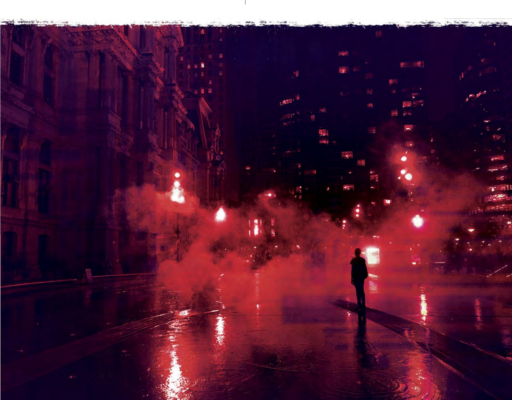

Бомбы "Восход" имитируют действие прямого солнечного света (Corebook, р. 221) и заставляют вампиров успешно пройти проверку самообладания или бежать через ближайший доступный выход. Накрытие гранаты перед взрывом предотвращает распространение света и наносит вампиру. сделавшему это, 7 уровней тяжелого урона, но не действует на смертных. Накрытие гранаты после взрыва ничего не дает.

#### ЛОВУШКА ДЛЯ ПУТАЮЩИХСЯ НОГ

Эти полезные устройства оснащены тонкими проводами, которые быстро разматываются и запутываются. Они срабатывают за долю секунды до прикосновения к ним, активизируясь по датчику движения. Они могут испортить ночь быстро движущемуся нападающему, заставив его споткнуться или оступиться и замедлить движение даже после того, как он пройдет мимо ловушки.

После срабатывания ловушки "клубок на ногах" цель получает +2 к сложности бросков на атлетику. Ловушка также делает неэффективными способности Стремительность - Быстрые рефлексы, Проворство и Быстрее ветра, пока объект не потратит полный ход на распутывание.

#### СВЯТАЯ ВУАЛЬ

Его официальное название - "Святая вуаль", но все, кроме самых высокопоставленных леопольдистов, называют его "Красным газом". Орден Святого Леопольда держит под строгим контролем это экспериментальное оружие, выпуская его только для самых ценных целей: Князья, Примогены, Элизиумы или Конклавы. Никто за пределами высших чинов Ордена не знает его истинной природы: одни предполагают, что оно происходит из самой святой материи, например, из могильной пыли Святого Петра под Ватиканом. Другие считают его чисто теургическим оружием.

Инквизиторы распыляют красный газ из баллоновраспылителей, которые переносятся людьми или распыляются из кузова грузовика, подъехавшего к двери запечатанного объекта. Незримые тела видят газ в виде красного тумана, слышат ужасающие вопли и крики, а их тела начинают увядать. Смертные не испытывают никаких эффектов, хотя бойцы BOES шепчут, что газ выглядит тем краснее, чем грешнее ваша натура. Красный газ наносит пустым телам 2 уровня тяжелого урона за каждый ход воздействия. Большинство пустых тел не задерживаются в зоне поражения достаточно долго, чтобы умереть от газа, но это, конечно, возможно. Чаще всего они бегут к поджидающей их ударной группе "Гладиус Деи", готовой сопроводить их в Окончательную Смерть.

#### CMCTEMA XSCOPE 3/SD

Вампиры знают XScope (Core Rulebook, p. 378) как громоздкое устройство, похожее на сканер в аэропорту. Это относится к первому поколению систем XScope 1, которые можно было обмануть с помощью "Румянца жизни"; XScope 2 больше похож на большую видеокамеру. Системы второго поколения XScope 3 сочетают в себе базовые показания с передовым медицинским программным обеспечением, требуют "румянца жизни" и состязания "самообладание + выносливость" против "упорства+ техники" оператора.

XScope 3/SD второго поколения весит двенадцать килограммов, крепится на плече и выводит показания на головной дисплей в окуляре. FIRSTLIGHT продолжает совершенствовать технологию XScope; ГРУ работает над миниатюризацией XScope до размеров монокуляра или винтовочного прицела. К счастью для "Сородичей", ГРУ в основном приходится обходиться разрешающим программным обеспечением первого поколения.

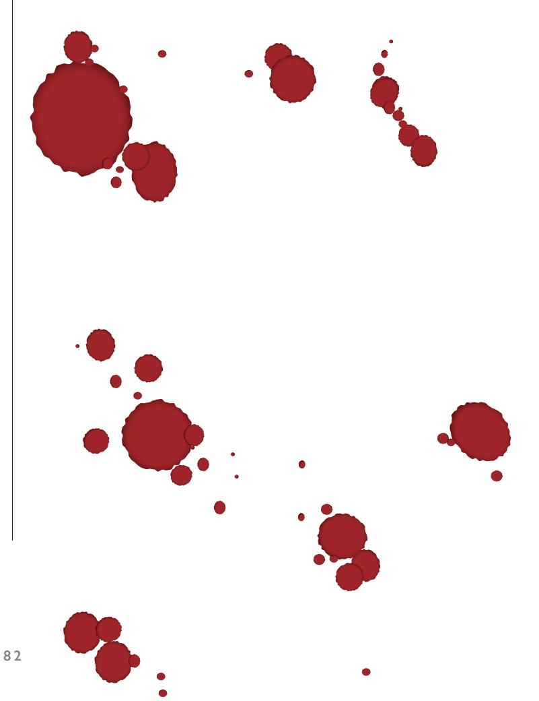

# Артефакты

На протяжении многих веков охотники находили предметы, обладающие мистической силой, которые расширяли их собственные возможности или защищали от порождений тьмы. Артефакты бывают разных видов, но поскольку коллекция Коалиции в основном хранится в запасниках ватиканского храма La Entità, ее артефакты, как правило, представляют собой предметы искусства или мощи умерших святых. Свои коллекции артефактов есть и у SAD ФБР, и у поддерживаемой Россией организации "Акритай", но они еще менее щедры на них, чем Ватикан. (Хозяева Кремля уничтожили большую часть артефактов, до которых смогли добраться, опустошив имперские российские хранилища). Артефакты отличаются по силе и редкости, но архивариусы Ватикана потратили столетия на их каталогизацию и подготовку в качестве тайного арсенала для сверхъестественной войны. Это лишь некоторые виды оружия из секретного арсенала Коалиции, и самые мощные из них еще предстоит раскрыть.

Используя или придумывая артефакты в истории, рассказчики должны стараться сделать их необычными, уникальными и индивидуальными. Не стоит относиться к ним как к типовому оружию или (что еще хуже) боеприпасам; каждая кость пальца святого должна обладать эффектами, напоминающими

о ее особом происхождении и характере святого.

## Èêîíû

Эти артефакты обычно имеют форму больших инсталляций или гобеленов, но поскольку камень лучше других материалов противостоит времени, многие сохранившиеся иконы представляют собой статуи или резные рельефы. Созданные мастерамимагии или с использованием мощных каббалистических геометрических соотношений, Иконы воздействуют на любого вампира, который их видит, а в некоторых случаях - на любого вампира, который пересекает их "взгляд". Обычные смертные не могут воспринимать их мощные мистические ауры, а вампиры часто могут, даже если не хотят этого.

Русские охотники и Акритай часто носят с собой инкрустированные, позолоченные или раскрашенные изображения святых, называемые иконами. Как и реликвии, они требуют Истинной Веры для использования, но в их конструкции обычно нет сохранившихся частей тела. Для использования икон используйте системы, описанные в разделе "Реликвии" (с. 84).

Хотя большинство икон защищают святилища от сверхъестественного, некоторые из них использовались для того, чтобы заманивать в ловушку или удерживать особо опасных монстров. В хранилище SAD хранятся предметы, отпугивающие не только вампиров, но и оборотней, и внепространственных существ. Коалиция подозревает, что иконы охраняют многие культовые сооружения на Ближнем Востоке и в Азии, но официально придерживается политики невмешательства в дела этих объектов. Тем не менее, FIRSTLIGHT направила тайные группы для спасения икон из древних мест, подвергающихся опасности со стороны вандалов ИГИЛ, и, возможно, они (или Арканум) разграбили другие иконы во время оккупации Ирака.

#### ÁÅÇËÈÊÈÉ ÀÍÃÅË ÁÅÐÍÈÍÈ

Этот набор моделей статуэток и эскизов, так и не завершенный при жизни скульптора, приписывается ему, хотя ни одна из планировочных работ не подписана. Изначально задуманная как массивная бронзовая статуя, построенная на множестве перекрывающихся сплющенных торов, даже модели произведения трудно полностью передать в трех измерениях. Топология и узоры произведения (так называемый "Крест Бернини") заставляют сверхъестественные существа чувствовать себя неуютно, но особенно восприимчивыми к ним кажутся вампиры. Иезуитские математики-вычислители отобразили узор "Безликий ангел" в виде проволочного каркаса, но он пока не поддается ни записи, ни трансляции, ни вообще двухмерной визуализации. Специальный ноутбук, запускающий диаграмму креста Бернини на мониторе глубокого поля, частично воспроизводит этот эффект, а в некоторых убежищах установлены системы Бернини, замаскированные под дорогие телевизоры

Система: Хотя все сверхъестественные существа признают образ Безликого Ангела опасным, вампиры, увидевшие его, должны немедленно пройти проверку на Безумие Ужаса со Сложностью 3. Вампиры, не поддавшиеся этому безумию, невосприимчивы к Безликому Ангелу до конца ночи, но в это время образ поет им едва уловимое и почти дразнящее жужжание, независимо от расстояния. Эта песня может мешать дневному сну вампира, но обычно исчезает с заходом солнца. Вампиры, столкнувшиеся с Безликим Ангелом, вместо этого проходят проверку на ярость и рискуют быть сраженными оглушительным хором, который призывает их уничтожить всех вампиров, находящихся на расстоянии вытянутой руки.

#### ÝÍÎÕÈÀÍÑÊÈÉ ÑÀÐÊÎÔÀÃ (ÓÍÈÊÀËÜÍÛÉ)

Странный и древний каменный гроб, покрытый гравюрами, которые кажутся вавилонскими или египетскими позднеимперскими; с момента обнаружения в 2000 г. он не поддается никаким попыткам открыть его. SAD хранит его в хранилище в Западной Вирджинии уже почти 15 лет, но очевидцы продолжают сообщать о том, что видели "Саркофаг" или, по крайней мере, слышали о нем от тех, кто его видел, по всей стране. Саркофаг тонко взывает к старшим вампирам за многие мили, сначала вторгаясь в их сны, а затем шепча им слова в часы бодрствования. Хотя сны никогда не раскрывают его содержимого, Энохианский Саркофаг обещает власть и исполнение желаний. Тремеры и Сетиты используют процесс Аль-Фараби, чтобы заглушить его зов в городах, где у них есть капеллы, но даже эта мера противодействия со временем разрушается.

Система: Когда эта икона активируется в городе, вампиры с силой крови 5 или выше (а также вентру с любой силой крови) немедленно ощущают ее присутствие. Эти вампиры больше не могут снизить свой голод ниже 1 никакими способами, если у них нет Саркофага. Пороговое значение силы крови для его действия снижается на 1 каждые шесть месяцев, в течение которых Саркофаг находится в городе.

#### ÎÊÊÓËÜÒÍÛÉ ÒÐÈÏÒÈÕ ÁÎØ (ÓÍÈÊÀËÜÍÛÉ)

Этот триптих, выполненный на трех лакированных панелях, соединенных между собой шарнирами, считается четвертой работой в алтарной группе Иеронима Босха. Из-за своей извращенной тематики картина была спрятана Ватиканом, но ее огромная сила против нежити была обнаружена, когда стая вампиров была уничтожена при попытке выкрасть ее из архива. Работа называется "Кающийся фермер" и изображает одинокую фигуру, путешествующую по пропитанному кровью сновидению, прежде чем найти утешение с божественной женской фигурой. Затем они становятся единым целым перед городом с фантастической утопической архитектурой. Эсхатологический смысл произведения является

тайной, хранящейся в La Entità, но его сила, направленная против проклятых, несомненна. Система: Вампиры, смотрящие на панель, горят внутренним огнем, который обугливает их сердца и движется по их мертвым артериям, пока не поглощает их, оставляя после себя кучку пепла. Каждый раунд они получают количество отягчающих ран, равное количеству пятен, которыми они обладают в данный момент.

Этот урон может быть уменьшен только с помощью силы Стойкости. Если несколько вампиров одновременно смотрят на панель, то урон, наносимый им по отдельности, равен всем Пятнам, которыми обладают собравшиеся вампиры. Вампиры-тореадоры могут отсрочить нанесение урона, полностью поддавшись внушению своего клана и застыв на месте. Их пятна все равно учитываются в общем ущербе, нанесенном Иконой, и они получают весь отложенный ущерб, как только их транс будет нарушен.

## Ðåëèêâèè

Общество Святого Леопольда снабжает своих Верных слуг (в том числе и BOES, а иногда даже FIRSTLIGHT или IAO) Реликвиями, созданными из останков святых, святых и (как утверждают некоторые нерелигиозные колдуны) сверхъестественных существ. Вместо костей святых Акритай использует иконы (с. 83), но эффект остается тем же. Реликвии концентрируют, а иногда и усиливают Истинную Веру, и без этого свойства становятся бесполезными кусками костей или мумифицированными кусками плоти. Реликвии, добавляющие очки Истинной Веры, никогда не добавляют их тем, кто не обладает этим признаком. Большинство реликвий также проклинают любого вампира (а иногда и любое нечеловеческое сверхъестественное существо), который попытается их использовать.

Охотник может получить преимущества только одной реликвии за сцену, независимо от того, сколько их у него с собой.

Приведенные примеры реликвий демонстрируют ряд эффектов реликвий, но, как и в случае со всеми артефактами, рассказчик должен представить конкретные, индивидуальные аспекты и способности любой реликвии в игре.

#### ПЕПЕЛ СВ. БОГАРДА

Святой Годар Руанский изгнал мертвецов из Руанского собора, и его прах до сих пор попадает в царство мертвых.

Система: Человек, отмеченный этим пеплом, может видеть бесплотных врагов, включая призраков и вампиров в туманной форме. Любое деревянное оружие, которым он владеет (например, кол), может наносить таким врагам обычные повреждения. Они добавляют одну точку к Истинной Вере.

#### СЕРДИЕ АВИЛЕННЫ

Мистик с Истинной Верой специально готовит эти мумифицированные сердца (по формулам, взятым из средневековых медицинских текстов, приписываемых персидскому философу Ибн Сине, и с броском 4 на Упорство+Оккультизм или Упорство + Медицина), и с молитвами хоронит их под порогом или очагом жилища. Когда вампир входит в эти места, сердце тихо бьется и отмечает нежить своими грехами.

Система: Войдя в жилище, защищенное Сердцем Авиценны, вампир теряет все преимущества от использования Румянца Жизни и приобретает все недостатки, связанные с человечностью 3 (Corebook, p. 238).

Это проклятие не изменяет личность вампира и его человеческий облик. Вампиры Министриев также страдают от Голода, увеличивающегося на +2, поскольку их собственное сердце начинает пульсировать и биться в такт с Сердцем Ибн Сины. Если при этом Голод увеличивается до 5, вампир получает Пятно и страдает от Навязчивого желания найти и завладеть скрытым сердцем, которое бьется в доме.

#### КРЕСТ ТЕРТУЛЛИАНА

Этот ревностный защитник веры встречал живых мертвецов и изгонял их словами Христа. Крест, сделанный из его позвонка, украшенный серебром и древесиной боярышника, обличает летей Каина.

Система: Вампир, которому вручен этот крест, вычитает текущее количество пятен (минимум одно) из всех своих бросков на сопротивление (или преодоление) Истинной Веры. Владелец креста добавляет одну точку к Истинной Вере.

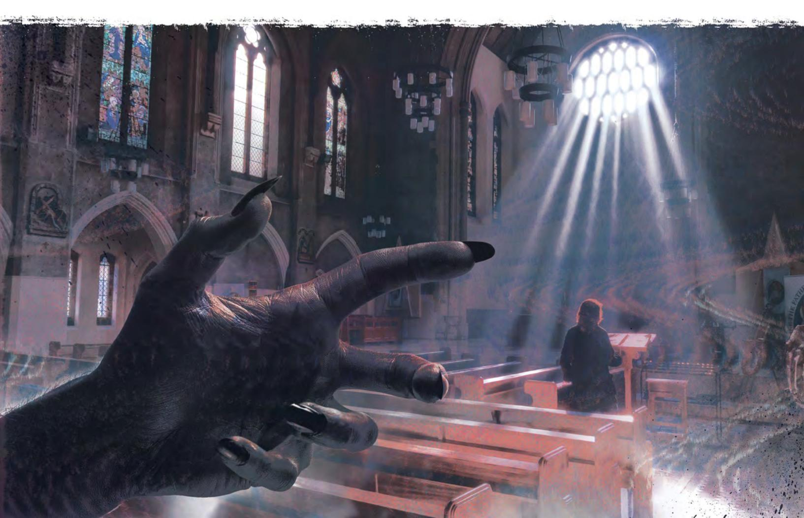

#### ÔÐÀÍÖÈÑÊÀÍÑÊÈÉ ÀÑÏÅÐÃÈËËÓÌ

В рукоятку этого аспергилла (приспособления для окропления святой водой) вделан осколок кости святого Франциска.

Система: При использовании этого прибора для окропления комнаты святой водой создается аура спокойствия. Вампиры выходят из состояния бешенства и не атакуют, если их не атакуют. Он добавляет 4 кубика к любой попытке лечения, сопротивления или смягчения безумия или сумасшествия, включая эффекты Дисциплин.

Владелец добавляет одну точку к Истинной Вере.

#### ÏÐÈ×ÀÑÒÈÅ ÑÂ. ÏÎËÈÊÀÐÏ

Когда гонители сжигали Поликарпа Смирнского на костре, огонь не смог его поглотить. Он и сегодня оказывает свое покровительство служителям Церкви, которые носят фрагменты его черепа.

Система: Охотник получает +3 брони против огня и 3 дополнительных уровня здоровья в присутствии огня. В присутствии огня они добавляют две точки к Истинной Вере.

#### ÊÎÂ×Åà ÀÃÈÎÑÀ ÍÈÊÎËÀß

Эти маленькие медальоны, созданные в результате обрядов Акритаи, ныне утраченных, позволяют волосам или зубам почитаемого охотника направлять и защищать владельца. Их сохранилось менее десятка. Система: Охотник, носящий эту реликвию, проходит сквозь магические щиты и защиты, не вызывая их срабатывания. Если охотник обнаруживает защиту, он добавляет три кубика к пулам, чтобы развеять или победить ее. Мирские и электронные защитные механизмы не затрагиваются. Если вампир питается охотником, носящим эту реликвию, он не получает никакой пищи и не может утолить голод, пока не отдаст незнакомцу что-то очень ценное.

#### ÏËÀÙÀÍÈÖÀ ÑÀÍÒ'ÝËËÅÐÎ

Святой Эллеро ди Галеата явил ламию нечестивцу Олибриусу, обратив его в веру Христову. Кусочки его плащаницы (около двух футов квадратных из темной домотканой ткани), приложенные к лицу, защищают от козней нежити и демонов.

Система: Охотник, накрывший лицо саваном, может видеть вампиров в их истинном облике

(противодействуя "Румянцу жизни", "Сокрытию", "Метаморфозам" и т.д.), представляя их как фигуру, светящуюся сквозь плетение савана.

Ношение савана не затрудняет прицеливание или опознание вампира, но вычитает два кубика при выполнении любой другой визуальной задачи. Носитель также получает +5 брони против любых сверхъестественных сил, черпающих силы из бездны, таких как Обливион. Он также невосприимчив к любой форме одержимости и добавляет две точки к Истинной Вере.

#### ÀÐÌÀÌÅÍÒÀ

Не обязательно оружие: в переводе с латинского armamentum означает просто "снаряжение" или "утварь". Они изготавливаются индивидуально или в очень ограниченном количестве, часто из чрезвычайно редких или смертельно опасных материалов, и не требуют специальной подготовки для использования. Однако у тех, кто не обладает экстраординарными способностями, они оказываются хлипкими, тугоплавкими или вовсе проклятыми. Как правило, любая полная неудача при использовании Armamenta обычными смертными наносит 1 очко тяжелого урона (здоровье или сила воли, в зависимости от того, что имеет значение в данный момент) владельцу или другой непреднамеренной цели.

#### ÊÀÄÈËÎ ÎÒÏÓÙÅÍÈß ÃÐÅÕÎÂ

Простая кадильница для воскурения благовоний, отделанная серебром; и кадильница, и благовония - Armamenta. При правильном поджигании из емкости вырывается темно-оранжевый дым. У смертных этот дым вызывает легкое раздражение, но вампиры и их рабы-кровопийцы заболевают, почувствовав в своих жилах ворованную кровь.

Система: После ритуального зажжения (ловкость + оккультизм) кадильница горит в течение всей сцены и заполняет дымом большую площадь. У всех вампиров, которые заканчивают раунд в дыму, голод увеличивается на +1, так как они начинают отхаркивать кровь (до максимального уровня голода 5). Длительное пребывание в дыму не увеличивает их Голод, но рвота убирает один кубик из всех резервов вампира. Гули в дыму должны сделать проверку силы воли (сложность 2) или потерять сознание от тошноты.

#### ÀÊÊÀÄÑÊÈÉ ÊÈÍÆÀË

Инструкции по изготовлению этого оружия были найдены на раскопках в Ираке в 1950-х годах, но Ватикан только недавно смог изготовить его ограниченное количество, используя ресурсы и технические методы, предоставленные "Акритаи" и IAO.

Система: Эти кинжалы наносят сверхъестественным существам урон, отягощенный здоровьем, и имеют значение урона +1. У вампиров, раненных этими кинжалами, обильно течет кровь, а их голод увеличивается на +1 в конце сцены (до максимума голода 5).

#### ÑÅÐÐÅ ÄÞ ÃÀÐÓ

Предположительно вырезанный из когтя оборотня, этот кинжал с жестоким крюком имеет длину чуть менее шести дюймов от кончика до рукояти из слоновой кости. Обычно кожаная обмотка не позволяет владельцу проткнуть им ладонь.

Система: Этот кинжал наносит сородичам тяжелый урон. Если клинок выставлен в свете полной луны, владелец может почувствовать любого представителя рода в радиусе трех метров от себя. Оборотни также могут почувствовать такой клинок и захотят забрать его у осквернителя-человека.

#### ÏÎÝÒÈÊÀ ÂÀÊÑÈÍÀ

SAD заперла образцы этого опасного красного воска в своем хранилище более пяти десятилетий назад в рамках расследования нераскрытого убийства с предполагаемым участием сверхъестественных сил. Недавно SAD вновь открыла это дело, когда вампир, называющий себя "поэтом", оставил еще одну обожженную жертву, заключенную в этот живой воск. В то время как оригинальные образцы остаются в хранилище, часть воска со второго места преступления была очищена для использования в полевых условиях.

Воск "оживает" при контакте с кровью, поэтому агенты SAD хранят его в хрупких двухкамерных канистрах, которые при разбивании смешивают оба компонента. При соприкосновении с кровью воск закипает и покрывает все, к чему прикасается, пока не исчерпает запас крови и быстро не остынет до инертной формы, обычно оставляя после себя жертву, заживо сваренную и покрытую нервирующим веществом.

Система: Активированный воск наносит 3 тяжедых повреждения здоровью в виде теплового урона каждый раз, когда касается жертвы, и продолжает расти до тех пор, пока находится в контакте с источником крови. Пятно воска размером с монету покрывает взрослого человека за два оборота и может быстро заполнить комнату, если жертв три или более. По усмотрению рассказчика огнетушители и другие замедляющие средства могут замедлить и уменьшить ущерб, наносимый воском.

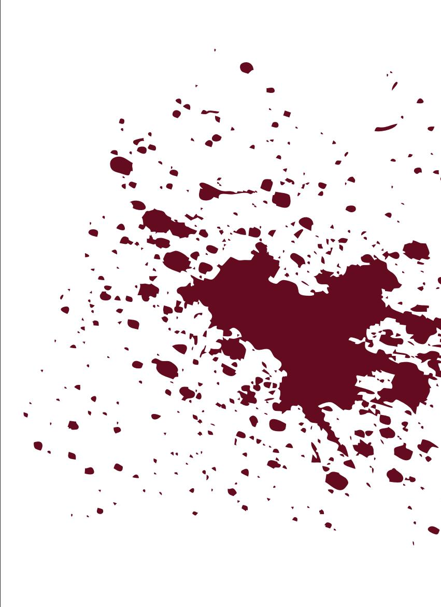

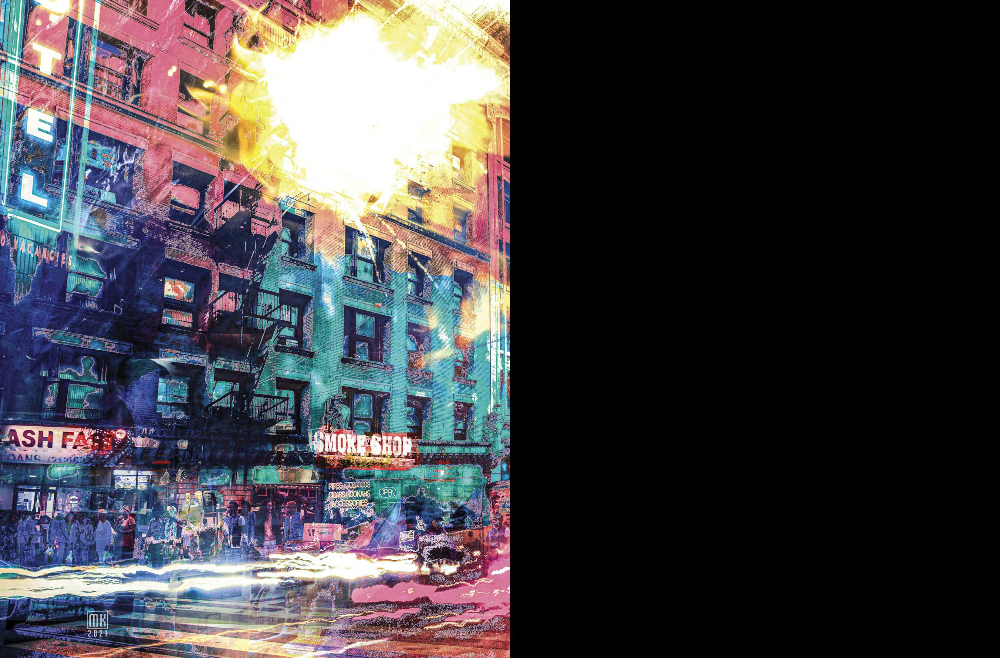

# Глава третья: Опасные игры

"×òî æ, âû çíàåòå, ñ ÷åì íàì ïðèõîäèòñÿ áîðîòüñÿ, íî ìû òîæå íå áåç ñèë. Íà íàøåé ñòîðîíå ñèëà îáúåäèíåíèÿ ñèëà, êîòîðîé ëèøåíû âàìïèðû; ó íàñ åñòü èñòî÷íèêè íàóêè; ìû ñâîáîäíû â ñâîèõ äåéñòâèÿõ è ìûñëÿõ; âðåìÿ äíÿ è íî÷è ïðèíàäëåæèò íàì â ðàâíîé ñòåïåíè. Ôàêòè÷åñêè, íàñêîëüêî ïðîñòèðàþòñÿ íàøè ñèëû, îíè íè÷åì íå îãðàíè÷åíû, è ìû âîëüíû èõ èñïîëüçîâàòü. Ó íàñ åñòü ñàìîîòâåðæåííîñòü â äåëå è öåëü, êîòîðàÿ íå ÿâëÿåòñÿ ýãîèñòè÷íîé. À ýòî óæå íåìàëî".

— ÂÀÍ ÕÅËÑÈÍÃ Â ÔÈËÜÌÅ "ÄÐÀÊÓËÀ"

Вторая Инквизиция заключает в свои праведные объятия шпионов всех мастей, техников и аналитиков, высококвалифицированные ударные отряды, а также тихих соседей по церкви с удивительно совершенной домашней мастерской по металлу. Во всех сферах деятельности " пустых тел" - от высшего общества до сырых и темных улиц, от высокотехнологичного и быстро меняющегося мира бизнеса и финансов до их теневых убежищ и Элизиумов - Коалиция разработала тактику их противодействия.

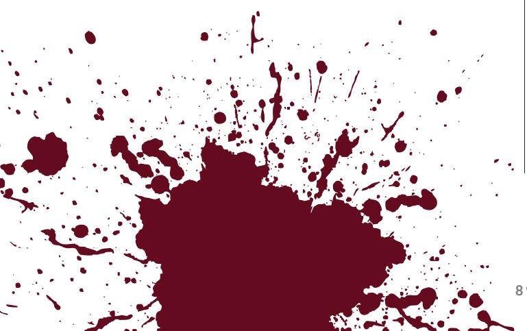

# Стандартные

# оперативные процедуры

Коалиция не полагается на какую-то одну тактику. Каждый из пяти факелов отличается от других, и каждая из их целей требует индивидуального подхода. Тем не менее, они черпают информацию из учебника проверенных тактик, переделывая и адаптируя их по мере необходимости, чтобы поразить конкретные слабые места цели. Если приведенные здесь тактические приемы кажутся неподходящими, создайте новые. Но эти подходы действительно работают.

Охотники находят свои цели одним из трех способов: через свою кормежку, деятельность группы или через сеть информаторов. То, как они определяют цель, влияет на их действия, поэтому в каждой описанной здесь тактике указывается, для каких типов хищников и соратников она особенно актуальна.

**8 9**

Некоторые из Пяти Факелов особенно любят или иногда не хотят использовать определенные тактики, и мы отмечаем это, а также все вариации, которые они обычно используют.

В конце главы вы найдете алгоритм реагирования (см. Анархи, с. 186-189), который поможет вам в процессе усиления давления и эскалации угрозы Второй Инквизиции, а также несколько проектов, отражающих менее драматичные аспекты их работы.

#### Уровень угрозы

Мощность, точность и темп работы групп охотников зависит от уровня угрозы, которую они представляют в вашей истории. Некоторые из приведенных здесь тактик подходят для всех уровней угрозы (например, анализ охотничьих моделей; информирование сообщества). Приберегите крупные, разрушительные, "авто-дафе" действия для истории, где охотники представляют активную или даже центральную угрозу.

Прежде всего, помните, что Вторая Инквизиция - это не молот для наказания или расстройства игроков. Это инструмент, позволяющий придать сюжету напряженность и драматизм и заставить вампирские кланы пересмотреть благодушное отношение к смертельным угрозам. С точки зрения игры, неинтересно и несправедливо вводить в игру антагонистов, которым персонажи не имеют надежды противостоять. В Мире Тьмы даже Коалиции приходится оправдывать свою тактику и ресурсы. Церковь не станет применять такое супероружие, как "Красный газ", против группы неуклюжих новорожденных, а способность команды UTR применить любую из этих тактик предполагает, что начальство объявило операцию достаточно приоритетной для них. В игровых терминах этот приоритет часто напрямую зависит от уровня угрозы, который вы определили, или от того, что группа продемонстрировала, что она этого заслуживает.

# Тактика расследования

Многие вампиры считают, что если они не будут высовываться и не будут делать ничего, что могло бы привлечь внимание Второй инквизиции, - участвовать в играх за власть, поддерживать высокий профессионализм, вступать в драки, - то они останутся вне поля зрения. Они ошибаются. Большинство расследований начинается с красного пятна. Заголовок в новостях, полицейский рапорт, едва заметная закономерность в медицинских данных или лискуссиях в социальных сетях, наводка от информатора. В современной ночи, где все записывается, отслеживается и допрашивается, ни одна тактика охоты не остается незамеченной.

Охотники смотрят на то, как вампир влияет на окружающий мир и людей, которые его населяют. Где-то есть зацепка, ниточка, за которую можно потянуть. Легче вычислить отдельных вампиров: количество может дать команде UTR преимущество. Однако легче выявить группу вампиров. Они оказывают большее влияние на

окружающий мир, они оставляют за собой слелы. Коалиция (и умная сельскохозяйственная команда)

всегда старается разбить группу на части, а не брать на себя всю группу. Они наблюдают и следят, собирая данные, которые говорят им о том, что вампир находится в убежище или охотится, и разрабатывают стратегию, основываясь на этой информации. Однако разные типы групп оставляют разные следы, и для всех них Коалиция разработала игровые схемы.

#### Анализ данных: особенности охоты

Большинство пустых тел имеют охотничьи шаблоны, и в этом случае анализ данных позволяет примерно предсказать, когда они нападут, где, и каков профиль предпочитаемой ими добычи.

Пустые тела, питающиеся животными, не так хитры, как кажется. Либо местная популяция диких животных или паразитов подозрительно мала (чтобы прокормить вампира, нужно много крыс, а объявления о пропаже домашних животных настоящая проблема), либо имеется большая популяция животных: городские вольеры, зоопарки, сумасшедшие кошатники.

#### HET KYEWKOB, ТОЛЬКО ОПАСНОСТЬ

Многие из этих тактик снабжены системами для определения их механического воздействия. Чтобы подчеркнуть неизвестность угрозы и создать ощущение случайности, некоторые из них требуют броска только от Рассказчика. Слишком большое количество таких тактик может замедлить темп игры и ослабить чувство самостоятельности игроков, превратив то, что должно быть игрой личного ужаса, в "пасьянс рассказчика". Чтобы побороть эту тенденцию, не стесняйтесь вводить цифры или выбирать результаты в зависимости от качества команды охотников: плохие результаты для любителей и новичков Коалиции, средние результаты для большинства охотников Коалиции или Леопольдитов или отличные результаты для действительно элитных противников. То же самое можно сделать и с бросками на состязание, превратив их в проверку на общие различия (или половину пулов способностей), приведенные в главе "Антагонисты".

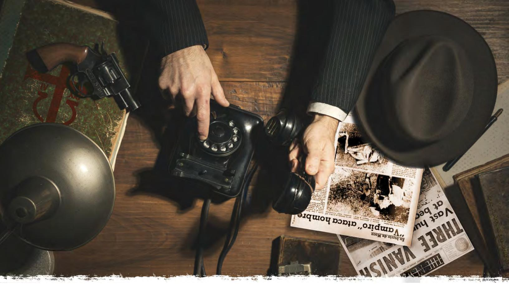

У животных есть люди, которым они небезразличны: зоопарки, ветеринары, благотворительные организации по спасению (они отлично подходят для поиска убежищ: соседи сообщат о шуме или пометах). У местных дезинсекторов есть своя линия о том, почему их работа становится легче. Любой из этих людей мог наблюдать хищника за работой в виде убегающей фигуры или подозрительного посетителя.

Анализ охотничьих моделей происходит так же быстро, как и прожорливость вампира. При каждом кормлении бестелесного тела ведущий аналитик делает бросок Интеллект + Техника (иногда Уличное чутье или Выживание, в зависимости от методики), чтобы выявить закономерность. По достижении 10 успехов они получают полное представление о хищнике и могут предвидеть, куда он нанесет следующий удар. Соответствующие контакты или союзники добавляют 2 кубика к общему числу.

Эффективно против: Пустых тел, исключающих добычу; фермеров; Коммандос котерий.

#### ÌÅÐÛ ÏÐÎÒÈÂÎÄÅÉÑÒÂÈß

Лучшее, что может сделать вампир, - это сознательно изменить свою модель охоты, учитывая собственные предубеждения и привычки. При этом анализ схемы охоты превращается в спорный бросок против Интеллекта + Скрытности или Выживания вампира. Каждый успех в броске вампира уменьшает успех аналитика на 1.

Если аналитик не получает ни одного успеха в трех проверках подряд, он теряет след и не может начать поиск заново по крайней мере в течение месяца, когда он мог бы обоснованно получить новые знания. Анализ начинается заново с нуля успехов.

Кроме того, фермеры могут перемещать добычу в свое убежище, но это не гарантирует, что они останутся незамеченными.

#### Îáùåñòâåííûå èíôîðìàòîðû

Хищников, которые перемещаются и наносят удары наугад, поймать сложнее. Они не всегда охотятся рядом с местом своего обитания, поэтому коалиция решила, что лучшим инструментом прогнозирования являются информаторы из числа местных жителей в местах охоты. Даже подготовленные оперативники не могут сами охватить достаточную территорию, но у местных жителей есть кусочки паззла. Набирайте команду на местах, заводите друзей и начинайте собирать картину.

Это также лучший подход к поимке "пустых тел", которые питаются спящей добычей. Их жертвы не знают, что с ними произошло, но знают, что чувствуют себя неважно. У них появляются странные отметины, которые они принимают за укусы насекомых, или анемия и упадок сил. Они обращаются к врачам или жалуются друзьям.

Возможно, нет никаких признаков того, что в их дом проникли, но что-то не так: не закрывается окно, есть ощущение, что за ними кто-то наблюдает. Жертвы страдают паранойей и ищут поддержки, и местная группа наблюдения за соседями или ассоциация домовладельцев может быстро обнаружить это.

Общественные информаторы работают не только в географических районах. Они не менее эффективны при вскрытии сцен и субкультур.

Иногда это работа для Кукушки, Светского человека или Детектива, но чаще она поручается Дилеру или Курице: сугубо закулисная роль, отвечающая за поддержание и добычу информации из сетей контактов.

Для укрепления доверия в обществе требуется бросок "Расширенное манипулирование + уличное чутье" или "Этикет" (один бросок в неделю). При 10 успехах сеть информаторов начинает приносить плоды, и команда ВИ определяет тип Хищника или Котерии, действующих в данном районе, их прошлые жертвы и вероятные следующие цели.

Эффективно против: Загонщиков; Церберов; Королей сцены; Банд Клыков

#### ÂÀÐÈÀÍÒÛ

Общество святого Леопольда легко заводит знакомства со священниками и их общинами, и это приносит свои плоды. Их информаторы принимают на себя не угрожающие личины, например, приезжих монахинь.

Ньюбургской группе нравится группа "Соседский дозор", и она прекрасно умеет манипулировать занятыми людьми среднего возраста, доводя их до состояния паранойи. Для них хорошо подходят маскировки под офицеров местной полиции или сотрудников местных органов власти. Аналогичным образом SAD действует в отношении товариществ собственников жилья.

Команды Восьмого направления часто сталкиваются с проблемой поиска информаторов: население бывших советских республик с подозрением относится к попыткам получить от него информацию. Православная церковь часто предоставляет возможности, и агенты иногда платят местной молодежи или другим людям, нуждающимся в деньгах, за то, чтобы они были бдительны в отношении необычной деятельности или странных слухов.

У BOES нет терпения для длительного сбора информации о населении. Они предпочитают использовать ресурсы местной полиции для сбора досье на свои вероятные цели. Развертывание BOES для несения службы теряет много времени, в течение которого "пустые тела" заняты убийством невинных прохожих.

#### ÌÅÐÛ ÏÐÎÒÈÂÎÄÅÉÑÒÂÈß

Контакты или союзники вампира в обществе затрудняют охотникам возможность закрепиться. Каждая точка в этих Преимуществах уменьшает набор кубиков противника. Эти контакты и союзники могут также предупредить вампира о подозрительных новичках, задающих вопросы.

Наиболее эффективный способ противостоять этой тактике - самому быть внедренным в сообщество и уметь заметить первые признаки интереса со стороны, прежде чем Коалиция получит какую-либо значимую

информацию.

#### Àíàëèç äàííûõ: ñòàäà è êóëüòû

Вампиры, охотящиеся на собственные культы, стада, членов семей, незаметны, но не исключено, что их можно обнаружить. Их питание оставляет медицинские следы (например, группы людей, склонных к простудным заболеваниям и другим нарушениям иммунной системы). Анализ данных позволяет выявить больные семейные линии по пропущенным рабочим дням, посещениям врачей, даже по покупкам, которые показывают высокую склонность к приобретению продуктов или добавок, содержащих железо.

Обнаружив такую семейную линию, коалиция сама идет по ней. Они находят наиболее недовольных членов семьи и вербуют или шантажируют их, или просто используют фонарики, чтобы найти места, где их неживой сородич отсыпается.

Тем временем некоторые бестелесные тела рассказывают своей жертве о том, что они делают... и тут же рассказывают об этом, криптографически или открыто. Обновление статуса "Я только что сдал кровь!" (если поблизости нет пункта приема крови), участие в онлайновых человеческих-сообществах или в оффлайновых игровых площадках - все это может вывести осведомленного наблюдателя на след. Жертвы, которые знают, в чем они участвуют, неизбежно хотят с кем-то поговорить об этом, и просто поразительно, какие сообщества можно найти на сайте Tumblr.

Анализ социальных сетей работает и в отношении "пустых тел", которые используют славу, чтобы окружить себя мелкими культами. Папарацци, таблоиды и блоги сплетен - лучший друг агента FIRSTLIGHT. Кроме того, у каждого знаменитого человека есть хотя бы один завистливый враг. Запустите слух о знаменитости, которую вы подозреваете, и посмотрите, что придет в ответ.

Хороший хакер является ядром этого набора тактик, но информаторы и депрограммисты проявляют себя, когда необходимо приблизиться к цели.

- Эта тактика работает только против пустых тел со стадом или, на усмотрение Рассказчика, против тех, у кого есть группа последователей и завистников, которыми они не питаются. Чтобы применить этот тип анализа данных, выполните бросок: Проверкe на расширенный интеллект + медицина для анализа медицинских данных. Сложность равна трехкратному рейтингу стада пустого тела (чем больше людей питается, тем незаметнее эффект). Первые три броска выполняются с интервалом в одну неделю, последующие - с интервалом в один день.
- Проверка на расширенный интеллект + техника (с двумя днями между бросками), чтобы собрать данные из Интернета и социальных сетей и скомпилировать их в содержательный анализ. Сложность равна трехкратному рейтингу стада пустого тела. Каждое очко Славы, которое есть у вампира, добавляет 1 кубик в копилку Аналитика, но каждое очко Влияния увеличивает Сложность на 1. Для того чтобы это задание было эффективным, у вас должно быть хотя бы одно очко Славы.

Превращение члена стада или культа в актив коалиции:

- Выполните расширенную проверку "Харизма + Убеждение", сложность которой равна силе воли цели. Обычно требуется какое-то материальное вознаграждение: деньги, наркотики - все, что может быть слабостью цели.
- Эффективен против: Семьянин; Джентльменов; Идолов; Культов крови;

#### ÂÀÐÈÀÍÒÛ

BOES стали ужасающе эффективны в этом плане. Несколько Тореадоров в Рио-де-Жанейро создали вокруг себя культы личности, прежде чем стало ясно, что это светящийся в темноте след. Аналитики BOES имеют настолько богатый опыт, чтобы отличить кровавый культ от кучки группировок, что добавляют три кубика к своему пулу для этой тактики. Мониторинг социальных сетей (и обычных СМИ) также позволяет найти странные истории из желтой прессы о борьбе оборотней с вампирами - как правило, ничего особенного, но иногда это лучший способ найти группу "Дневной дозор".

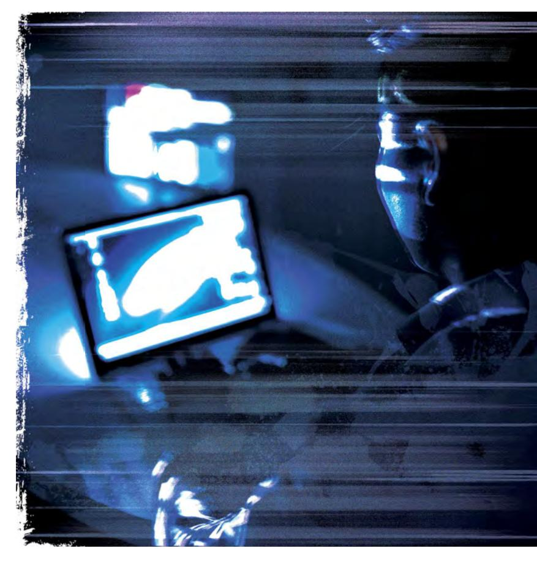

#### ÌÅÐÛ ÏÐÎÒÈÂÎÄÅÉÑÒÂÈß

Диверсифицировать. Заприте свое стадо: они оставляют большую часть своих следов при взаимодействии с внешним миром. Заставьте своих жертв замолчать или сделайте так, чтобы они забыли. Скрепите кровью долгосрочного партнера по игре.

Лучшая защита для известного или влиятельного вампира заключается в том, что Коалиция требует доказательств, прежде чем избавляться от публичной фигуры. Высокий профессионализм может сделать операцию настолько сложной, что в нее не стоит вкладывать деньги.

### Àíàëèç äàííûõ:

#### Àêàäåìè÷åñêèå ñïåöèàëèçàöèè

История. Генеалогия. Антропология. Фольклор. Криминалистическая бухгалтерия. Все эти разнообразные дисциплины вносят схожий вклад в охоту: Копатели кропотливо перебирают записи, выискивая несоответствия, которые не только свидетельствуют о деятельности "пустых тел", но и служат полезными ниточками, на которые их можно завязать, ослабив до тех пор, пока группа ESOG или другие силы фронта не смогут их нейтрализовать.

Эта тактика начинает применяться только после того, как информаторы, различные направления анализа данных или другие подходы позволят найти имя для расследования. По имени историки, генеалоги и фольклористы находят исторические данные о своей цели: возраст, наличие друзей и родственников, связи с другими известными " пустыми телами" и даже вероятность того, что они обладают каждой из сверхъестественных способностей - контроль сознания, сверхъестественная скорость и т.д., отслеживаемых специалистами. Психологическое профилирование остается развивающейся областью изучения бестелесных существ, поскольку бестелесные существа просто не мыслят так, как обычные люди. Но SAD (а с другой стороны - ГРУ) располагает обширными досье на убийц-психопатов, что позволяет постоянно совершенствовать свои находки.

Иногда в ходе этих исследований обнаруживаются вероятные "пустые тела", на которые не обращают внимания, поскольку они активны в дневное время. Коалиция только недавно узнала, что это не обязательно жесткая граница, которую можно провести.

Особенно часто копатели нацеливаются на "Опоры" пустых тел, что дает значительный рычаг влияния на пустого тела. Бухгалтеры-криминалисты (стр. 24) отслеживают денежные потоки и скрытые счета " пустых тел". Антропологи специализируются на вампирах, внедренных в сцены и субкультуры. Они отслеживают потоки влияния, роли, которые играют разные люди - или один и тот же человек под разными именами, - и выявляют людей, обладающих слишком большим контролем или слишком долго находящихся у власти. Историки и архивисты находят одни и те же лица на фотографиях, сделанных за несколько десятилетий до нашей эры: то это хлопальщица эпохи джаза, то лондонский модник, то хипстер из Шордича. Они разыскивают людей, лично общавшихся с вероятным "пустым телом", собирают сведения из первых рук, составляют профиль вероятных владений, целей и полномочий.

Эта тактика требует расширенного броска кубиков, причем один бросок в неделю. Характер исследования определяет набор кубиков и эффект:

- Выявление способностей Дисциплины: Интеллект + Оккультизм. Каждый успешный бросок определяет силу Дисциплины.
- Пробивать маски: Бросок "Интеллект + Расследование", требующий в 3 раза больше успехов, чем значение параметра "Маска", позволяет определить настоящую личность "пустого тела", а также информацию о его активах, принадлежащем ему имуществе и известных местах обитания.
- Идентифицировать Опоры: Интеллект + Гум.Науки или Проницательность; сложность 6. Каждый успешный бросок определяет одну Опору.
- Психологическое профилирование: Интеллект + Проницательность или Медицина (Психология); сложность 3. За каждый успешный бросок вы узнаете один из следующих параметров: Тип Охоты, Тип Котерии, Клана, Сира, Дитя, один показатель Атрибута.

Эффективен против: Семьянинов; Королевы сцены; Тремеры; Котерии Цербера; Дневные Дозорные

#### ÂÀÐÈÀÍÒÛ

Ньюбургская группа специализируется на определении способностей пустого тела, особенно хорошо выявляя способности к Обливиону, Некромантии или Колдовству Крови. SAD, как правило, сразу берется за банковский счет. BOES и Восьмое направление любят находить Опоры и угрожать им или брать их в заложники, чтобы привлечь к ним пустое тело.

Общество Святого Леопольда располагает огромным собственным архивом, и поскольку он всегда является первым пунктом назначения и печально неполным, когда речь идет о неевропейских вампирах, они работают медленнее других Огней: между двумя первыми бросками у них проходит дополнительная неделя.

#### ÌÅÐÛ ÏÐÎÒÈÂÎÄÅÉÑÒÂÈß

Каждая точка преимущества маски увеличивает сложность броска инквизитора на 1.

Вампир может скрыть свой след или удалить себя из физических и цифровых записей при успешном броске "Расширенный интеллект + Гум.Науки" или "Техника" (выберите меньшее). За каждые 3 успеха сложность броска охотника увеличивается на 1. Когда вампир достигает 10 баллов, он исчезает. Они получают преимущество "Обнуленная

маска" (Corebook, pg. 191).

## Èíòåëëåêòóàëüíûå àêòèâû

Коалиция неразрывно связана со шпионажем и разведкой, на базе которых она образовалась. Благодаря мощным связям с такими организациями, ей не нужно много работать самостоятельно. ЦРУ, JIC и другие ведомства уже отслеживают все угрозы национальной безопасности внутри страны и за рубежом. Благодаря обмену разведданными между странами-союзниками они располагают чрезвычайно подробной информацией о политических разногласиях, торговле оружием и наркотиками на высоком уровне, культах и любой другой деятельности, которая может быть истолкована как угроза национальной безопасности.

Хотя это не сразу наводит на мысль о деятельности ""пустых тел"", есть немало анархов, которые в какойто момент своей жизни находились или продолжают находиться под наблюдением, или общаются с теми, кто все еще находится под наблюдением. Равным образом, есть "пустые тела", которые привлекают культы личности или религии, а те, в свою очередь,

#### привлекают внимание.

После того как Фелисити Прайс освободилась от вампирического влияния, она добавила в алгоритмы мониторинга NSA и ECHELON ряд других "красных флажков" - на этот раз для отслеживания агентов спецслужб и результатов оперативной деятельности на предмет выявления любых проявлений поведения Прайс: скрытность, "баловство" в проектах, просьбы о назначении в определенные команды, высокая доля неоптимальных результатов, предполагающих утечку данных, и многое другое. Достаточно сказать, что "пустые тела", пытающиеся проникнуть в спецслужбы или повлиять на них, быстро выявляются и нейтрализуются.

Появление бестелесного тела в базе данных спецслужб происходит по усмотрению Рассказчика, на основании его действий во время истории, в его биографии или даже в земной жизни (для тех, кто недавно стал Воплощенным). Некоторые эффекты от использования баз данных легко поддаются количественной оценке, другие - нет.

- Провести проверку " Интеллект + Гум.Науки", чтобы установить либо известных сообщников, либо места, где цель часто была замечена. Этот процесс занимает неделю.
- С помощью броска " Интеллект + Расследование" можно определить и собрать воедино известные тактики, оружие и т.д. для пустого тела. При 3 или более успехах аналитик может даже сделать некоторые обоснованные предположения о дисциплинах. Это не влияет на броски кубиков, но гарантирует, что когда команда UTR встретится лицом к лицу с "пустым телом", она будет точно знать, какое снаряжение и персонал ей понадобятся для его уничтожения.
- При расследовании внутренних дел в отношении сотрудников разведки используйте Интеллект + Проницательность против Самообладания + Хитрость.

Эффективен против: Анархи; Носферату; некоторые Идолы; Чемпионы;

#### ÂÀÐÈÀÍÒÛ

Общество святого Леопольда не имеет тесной связи с конкретной спецслужбой; для выполнения такой работы им приходится работать через партнеров (обычно ЦРУ или итальянскую AISE), и это занимает вдвое больше времени. Это не относится к расследованиям "внутренних дел": цензоры Общества существуют специально для того, чтобы выявлять ересь и сверхъестественное влияние, и имеют

многовековую практику в этом деле.

#### ÌÅÐÛ ÏÐÎÒÈÂÎÄÅÉÑÒÂÈß

Лучшая защита от этой тактики - хорошая маска: каждая точка маски добавляет 1 очко сложности к броску аналитика. Союзник в соответствующем агентстве безопасности добавляет до 2 пунктов сложности.

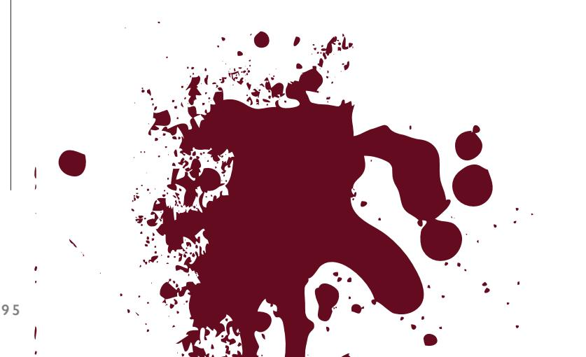

# Тактика канализирования

Найдя первую зацепку, охотники начинают действовать. Они оказывают социальное и экономическое давление, чтобы затруднить охоту, или проникают в вампирскую сеть и проникают в их убежище. В их распоряжении имеются учебники по всем способам, с помощью которых пустое тело может прокормить себя. Военные инквизиторы называют эту фазу "определением боевого пространства" или "канализированием", оказывая давление на противника, чтобы заставить его совершить ошибку или отказаться от боя.

Как только сеть начинает смыкаться, шансов на спасение практически нет. Лучшее, что может сделать вампир, - разорвать все связи со своим местом и перебраться в другой город. Следующее, что он может сделать, - это внимательно изучить свои привычки... и изменить их. Быстрота.

При любом броске Канализации охотники могут добавить один кубик за Информаторов в круге обитания вампира; добавить два кубика за Канарейку (с. 20).

## Îáåñïå÷åíèå êðîâüþ

Существует так много мест, где можно добыть кровь без охоты. Коалиция может отслеживать их все. С помощью информаторов, анализа данных, связей с правоохранительными органами и криминалом они выходят на местный черный рынок (пакеты крови, криминальные структуры, мясные лавки). Можно с уверенностью предположить, что тот, кто регулярно покупает кровь, - вампир или один из его слуг. Вычислив поставщиков, Коалиция либо сокращает поставки, либо загрязняет их, либо делает и то, и другое. Угрозы со стороны правоохранительных органов пугают участников цепочки поставок, заставляя их прекратить работу, уничтожить поставки (это может сделать даже изменение температуры, а также взрыв грузовика) или нанести ущерб поставщикам, что приводит к росту цен. Если поставки осуществляются из местного банка крови или больницы, саботаж или перебои в работе вынуждают заготовителей обращаться к подпольным поставщикам,

которых команде легче контролировать.

После того как у целей остается всего один или два приемлемых источника пакетированной крови, следующим шагом является их загрязнение. Излюбленными вариантами являются тяжелые металлы и полоний.

Агент Коалиции делает бросок "Манипуляция + Уличное чутье" за каждый обнаруженный источник крови (не более одного в неделю) со сложностью 3. За каждый успешный бросок купить кровь в мешках становится либо сложнее, либо дороже. Когда купить кровь становится сложнее, вампир, желающий купить ее, должен сделать бросок Манипуляция + Уличное чутье, причем сложность увеличивается на 1 каждый дополнительный раз, когда охотники ограничивают предложение. Когда кровь становится дороже, вампир должен иметь минимум 1 точку ресурсов для покупки. Потребность в ресурсах увеличивается на 1 каждый раз, когда охотники увеличивают расходы.

Отравление тяжелыми металлами - это медленный метод ослабления пустых тел. Каждый раз, когда человек питается зараженной кровью, его максимальное здоровье уменьшается на единицу. Они испытывают вялость и ноющий голод (не могут снизить голод до нуля). Диагностика затруднена: Интеллект + Медицина, сложность 3.

Отравление полонием - совсем другой зверь. Один пакет зараженной крови наносит 8 уровней повреждений, но пустой организм может понять, что что-то не так, после одного глотка, сделав бросок Интеллект + Ест.науки. Для снижения урона они бросают Выносливость, а если у них есть заслуга "Железная глотка", то дополнительно 2 кубика.

Эффективен против: Пакетщиков; иногда охотничьих групп.

#### ÂÀÐÈÀÍÒÛ

Восьмое направление особенно любит отравление полонием и ставит себе в заслугу его создание. SAD не только ограничивает поставки, но и заменяет их собственными поставщиками, заставляя вампиров влезать в долги за кровь. Пиявки, попавшие на крючок, часто называют оперативникам имена других пустых тел в обмен на еду.

BOES никогда не используют яд. Они перекрывают доступ к крови, вынуждая вампиров совершать открытые убийства ради пропитания. Это выдает их личность, что облегчает поиск их убежища и сжигание его дотла.

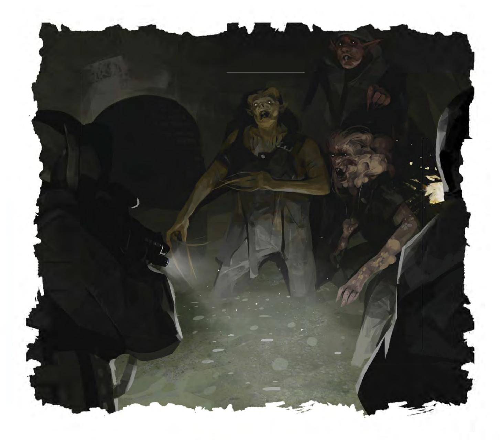

#### МЕРЫ ПРОТИВОДЕЙСТВИЯ

Лучшим ответом на эту тактику будет оказание вампиром собственного давления. Успешный бросок "Харизма + Запугивание" или "Ресурсы" (против сложности, равной запасу агента Коалиции) сводит на нет эффект от одного изменения рынка Коалиции.

Внедрить нового поставщика и держать охотников в неведении о нем - вполне жизнеспособный проект.

#### ПИКАНТНОЕ ПИТАНИЕ

Вентру и другие бестелесные существа с ограниченным рационом питания - легкая добыча для охотников. Они не могут просто переключиться на новый источник пищи, и обнаружить их схему легко. Какую бы тактику они ни использовали, когда агенты исследуют пустое тело с "Исключением добычи", они добавляют кубики, равные значению "Исключения добычи" или "Тяжести проклятья". Это также относится к котериям Охотничьей партии, которые специализируются на определенных видах добычи.

# Îáùèå âðàãè

Коалиция редко рассматривает возможность союза со своей добычей, но это не редкость. Столь же редко вампиры рассматривают возможность заключения договора, пусть даже краткосрочного, с теми, кто на них охотится. Однако нет ничего невозможного, и есть некоторые угрозы, с которыми пустым телам лучше всего справляться сообща.

Когда Коалиция инициирует контакт, обычно в виде письменного или цифрового сообщения, которое невозможно отследить, с инструкциями для ответа в виде "мертвой точки", это обычно происходит потому, что они сталкиваются с угрозой, с которой не могут справиться в одиночку, например, старейшина слишком хорошо защищен, чтобы смертные могли проникнуть через его защиту, или слишком хорошо спрятан, чтобы они могли его найти. Они обращаются к другому пустому телу, обычно амбициозному или разочарованному, которого уже вычислили их Кукушки и Хвосты, и убеждают его устроить игру за власть. Коалиция предоставляет инструменты, а пустое тело использует возможности. Коалиция справляется с серьезной угрозой, а пустое тело поднимается на ранг - или на несколько. Некоторые охотники соглашаются после этого забыть о существовании своего маленького помощника.

Некоторые из них даже делают это всерьез.

С другой стороны, вампиры иногда "бросают на растерзание волкам" тех, кто совершает самые отвратительные преступления - диаблеристов и предателей, или тех, кто стоит на пути князя. Тот, кого у правителей не хватает средств убрать самим, становится кормом для инквизиции.

В ходе этой работы появляются (или развиваются) такие оборотни, как Безбожник и Дневной Ходок.

Для идентификации объекта требуется бросок Интеллект + Уличное чутье. Для установления контакта требуется Харизма + Этикет или Скрытность. Для того чтобы убедить субъекта помочь, требуется Манипуляция + Убеждение. Если вы применяете эту тактику против персонажей игроков, не делайте бросков кубиков: сразу переходите к установлению контакта и определяйте результат в ролевой игре.

Эффективен против: Бестий; Старшие вампиры; Коммандос котерий; Банды клыкастых; Плюмаиры; Регентские группы

#### ÂÀÐÈÀÍÒÛ

BOES часто использует эту тактику как возможность послать снайпера или киллера против своего временного союзника, когда с ним будет покончено.

Ньюбургская группа часто требует определенного объема уличающей информации, будущего материала для шантажа, прежде чем согласиться на встречу с обратившимся к ним " пустым телом". Общество святого Леопольда затягивает этот процесс, проводя несколько все более рискованных обменов и встреч -

своего рода испытание веры.

#### ÌÅÐÛ ÏÐÎÒÈÂÎÄÅÉÑÒÂÈß

Самый эффективный способ противостоять этой тактике - не наживать себе врагов или продаться им первым. Удачи вам в этом.

## Äæåíòðèôèêàöèÿ

Вампирам, как и всем остальным, нравятся определенные удобства. Им нужны люди на улицах, будь то бармены или те, кому некуда пойти; хороший, высокий уровень преступности, не позволяющий полицейским реагировать на каждый мелкий инцидент; цинично говоря, им нужно, чтобы их окружали люди, на которых другим смертным наплевать. Что им не нужно, так это закон и порядок, сообщества, где люди проявляют слишком большой интерес к своим соседям, а также прекращение бездомности, наркотиков и мелкой преступности.

Поэтому, естественно, когда JTRG и FIRSTLIGHT хотят сделать территорию враждебной для пустых тел, они начинают с того, что делают ее действительно очень приятной для смертных. Во всяком случае, определенной части смертных - особенно состоятельным, обычно белым. Их политики и джентрификаторы заселяют район, очищая его от нежелательных элементов.

Джентрификация особенно хорошо работает в исторических или других отличительных районах - там, где люди готовы платить за то, чтобы первыми попасть в "перспективный" район. В районе с такими желательными характеристиками стоимость ресурсов для джентрификации на порядок ниже.

Часто первыми приезжают художники и студенты. Шикарная богема - легкая добыча для вампиров: они отказываются от традиций, живут опасно и пользуются страшной репутацией своего неблагополучного района.

Процесс джентрификации проходит по общим этапам:

- Продвижение. Сначала район рекламируется как место на грани процветания: "крутое", "аутентичное" и более доступное, чем другие варианты. Туда съезжаются новые люди, самоуверенные и, возможно, немного наивные. Вампирам, питающимся ими, становится легче охотиться, и на этом этапе, который длится 12 месяцев, часто снижаются сложности, за вычетом успехов джентрификатора в броске "Харизма + Политика".
- Одновременно с Продвижением давние жители покидают район. Это выгодно и пиявкам: о них перестают ходить слухи, а местная история забывается.
- Инвестиции. Даже FIRSTLIGHT не может позволить себе отстроить район своими силами. Сначала им нужно привлечь инвесторов - это шестимесячный процесс, требующий броска "Расширенная харизма + финансы". Появляются сетевые магазины, строятся новые квартиры и дома, а на смену первоначальной волне переселенцев из богемы приходят молодые семьи, ищущие доступное жилье. В этот момент Контакты и Влияние в местных группах или размер местного стада пустого тела снижаются на 2, до минимума в 1 точку. Если убежище пустого тела не было куплено и снесено застройщиками, оно теряет 2 точки своего рейтинга, поскольку территория вокруг него меняется.
- Чистота. Нет наркотиков, нет бездомных, нет продовольственных баз, нет легких охотничьих угодий. Сложность охоты увеличивается на 2. Закрываются ночные заведения, на улицах становится меньше людей.
- Охрана общественного порядка. Увеличиваются группы охраны общественного порядка, ассоциации домовладельцев, увеличивается присутствие полиции (и готовность жителей вызывать полицию). Охота увеличивается на 1 пункт сложности. По усмотрению рассказчика, некоторые бестелесные существа, у которых исключена добыча (например, наркоманы, представители определенной расы), могут вообще не найти пищи на своей территории.

Эффективен против: Королевы сцены; чемпионы - которые часто так рады изменениям в своей области, что не видят, что происходит, пока не становится слишком поздно; Кочевые котерии - трудно вернуться в место, которое сильно изменилось; Марешальские котерии

#### ÂÀÐÈÀÍÒÛ

Общество святого Леопольда предпочитает более приземленный подход. Они стараются работать не через политиков, а через местные церковные организации. Эффект схож: преступность, наркомания, бездомность снижаются, и в итоге район становится "чище". При таком подходе отсутствует как первая волна приезжих, так и крупные инвестиции. Прибежища остаются незатронутыми, но и пустые люди не получают удовольствия от короткой фазы легкой охоты.

Об операциях по джентрификации, направленных не на район в целом, а на конкретный Домен вампиров, см. раздел "Специальная система для джентрификатора" (с. 18).

#### ÌÅÐÛ ÏÐÎÒÈÂÎÄÅÉÑÒÂÈß

Вампиры с сильными местными контактами, союзниками или влиянием, которые начинают противодействовать джентрификации до того, как она перейдет в инвестиционную фазу, могут начать низовое движение, чтобы противостоять ей. Каждый месяц они бросают Харизму + наибольший из своих соответствующих Фонов, уменьшая на эту величину результат Харизма + Финансы джентрификатора. Если по истечении шести месяцев инвестирования джентрификатор получает менее пяти успехов, попытка джентрификации проваливается, и район возвращается в свое первоначальное состояние.

## Íàáëþäåíèå

Это очень простая и очень полезная тактика. Один или несколько детективов или фонарщиков выбирают "пустое тело", неделями или месяцами отслеживая его перемещения, собирая информацию о местах, которые оно посещает, людях, с которыми встречается, и вещах, которые для него важны. Иногда цель состоит в том, чтобы отследить "пустое тело" до его убежища, иногда - оценить лояльность новобранца, а иногда - просто составить схему движения энергии в городе.

Большинство команд предпочитают регулярно менять тень: нет ничего более подозрительного, чем видеть одно и то же лицо в толпе несколько раз в течение нескольких месяцев. Кроме того, у тени есть естественная тенденция к вовлечению в процесс. Иногда они начинают сочувствовать своим жертвам, а иногда считают своим долгом вмешаться, чтобы спасти их.

Тень бросает бросок "Смекалка + Расследование" каждую неделю, пока она следует за пустым телом. При любом броске, набравшем три или более успеха, они получают знания:

- Опору
- Сила Дисциплины
- Фон
- Личность другого пустого тела, с которым цель регулярно ассоциируется

Эффективна против: Кочевые котерии; котерии Марешаля как способ добраться до князя; Квестари; Вехме

#### ÂÀÐÈÀÍÒÛ

BOES применяет эту тактику с единственной целью - выявить Убежище (или, лучше, Элизиум или другое место встречи). Когда они набирают вдвое больше успехов, чем показатель " Убежища", они узнают его местоположение. За каждую дополнительную неделю наблюдения они узнают одну из особенностей убежища.

Эквивалентом слежки за локацией является наблюдение, которое чаще всего практикуется SAD и Восьмым направлением: "черный упаковщик" устанавливает устройства наблюдения, а команда прослушивает собранные разведданные. Замените "Смекалка + Техника" на "Расследование", но

результат будет тот же.

#### ÌÅÐÛ ÏÐÎÒÈÂÎÄÅÉÑÒÂÈß

Для того чтобы заметить тень, требуется бросок " Смекалка + Наблюдательность". В первую неделю наблюдения он начинается с 5-й сложности и снижается на единицу каждую неделю, до минимума 1. Как только тело обнаружит тень, дальнейшие броски будут иметь сложность 1, пока не пройдет целый месяц без наблюдения.

Для введения тени в заблуждение требуется бросок "Манипуляция + Скрытность" против еженедельного показателя " Смекалка + Расследование" ВИ. Если вампир побеждает, то тень не получает никакой информации за эту неделю. Вероятно, проще просто убить бедного, уязвимого оперативника, если только тело не хочет снабдить его специфической дезинформацией.

#### ÄÅÇÈÍÔÎÐÌÀÖÈß

"Пять факелов" постоянно внедряют инновации, разрабатывая новые технологии или перепрофилируя существующие инструменты. Их инструментарий постоянно расширяется, но для его наполнения требуются время и деньги. Исследования и разработки стоят дорого, а разговоры бесплатны: гораздо проще напугать пиявок разговорами о супероружии и сверхпродвинутых технологиях, чем создать их. Большинство из них не особо разбираются в технологиях, а те, кто разбирается, зачастую занимают слишком низкое положение, чтобы противостоять легковерным старейшинам и анциллам, распространяющим ложь.

Дезинформационные кампании "подталкивают": они направляют поведение пустых тел в выгодное для Коалиции русло. Текущие возможности включают:

- Убедить их в том, что 5**G** использует ту же частоту, что и **ADS**, и, следовательно, телефоны 5**G** могут быть использованы в качестве оружия, заставляя их использовать низкотехнологичные решения, такие как "мертвые капли" и стационарные телефоны, которые легко отслеживаются.
- Заявления о том, что в населенном пункте распространено заболевание, передающееся через кровь (передающееся пустым телам), чтобы подтолкнуть больше нежити к питанию через кровяные пакеты, где Коалиция может легко следить за ними.
- Утверждения о том, что в ловушках скорости установлены современные рентгеноскопы третьего поколения, не позволяют вампирам передвигаться по межгороду на автомобилях и, следовательно, держать их там, где Коалиция может их увидеть.
- Распространение дезинформации лучше всего осуществлять в рамках проекта (**Core Rulebook**, **p**. 415; пример работы см. на с. 108).

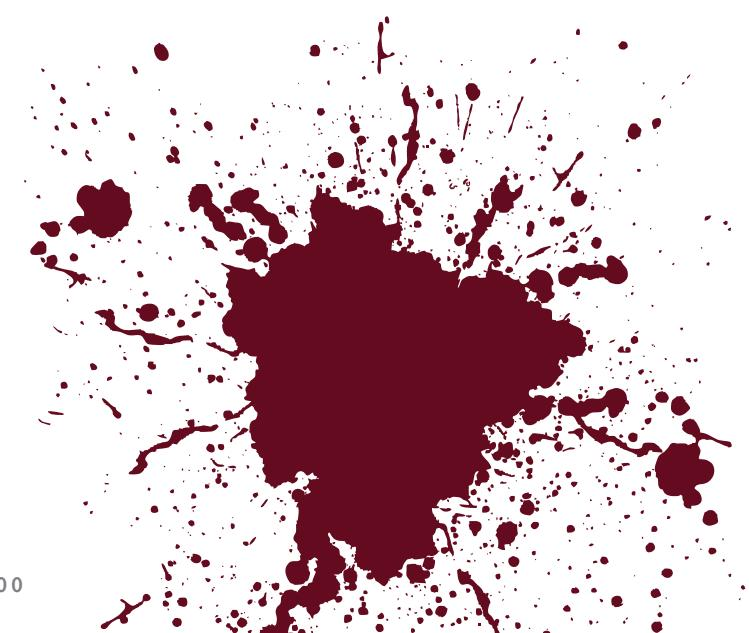

# Оперативные подходы

Когда расследование и социальные маневры завершены, наступает время удара. В ход идут "мокрые" рабочие бригады, в ход идут колья и специальное оружие, и местная популяция вампиров значительно сокращается. Эти подходы к борьбе различаются почти так же, как и тела, против которых они применяются. Ниже приведены примеры, и каждый из них должен быть адаптирован к конкретной цели. При разработке боевых операций следует помнить о том, что группа UTR уже узнала о своих целях в ходе разведки и наблюдения, и строить планы соответственно: это умные противники, и они используют любое преимущество.

В этой главе не могут быть рассмотрены такие крупные операции, как штурм Венской капеллы: они не соответствуют стандартным

оперативным процедурам.

## ÂÛÄÀ×À

Выдача - это просто модное слово, обозначающее похищение. Иногда ликвидация не является целью: охотнику нужны дополнительные сведения о сообщниках или проектах неизвестного. При наличии в распоряжении Коалиции информаторов и других тактических приемов, к выдаче прибегают только в случае острой необходимости получения информации и отсутствия альтернативы. FIRSTLIGHT выполняет или поручает подавляющее большинство операций по выдаче, и даже они сократили их до минимума после фиаско в Детройте в 2012 году. ГРУ-58 медленно наращивает темпы выдачи после резкого спада в 2008 году.

Выдача требует детального знания распорядка дня цели: сознательно нападать на целую группу вампиров только для того, чтобы поймать одного, - слишком большой риск.

 Наблюдение ведется до тех пор, пока есть возможность - не более нескольких дней, поскольку информация нужна команде как можно скорее. Когда фонарщик понимает, когда и как легче всего найти цель в одиночку, кукушка или малоопытный информатор заманивают ее туда, где команда сможет нанести удар.

- Один раз за сцену бросок Ловкость + Скрытность для наблюдения фонарщика против Ловкость + Наблюдательность.
- Бросок Харизма + Убеждение для приманки кукушки (или другой приманки), против Самообладания + Проницательности.

В отрядах похитителей всегда имеются полные комплекты ограничителей, включая капюшон из цепной ткани (с. 76). Пара воинов берет на себя цель, в идеале при поддержке Нуллификатора (с. 40). Цель захват, а не уничтожение, поэтому в качестве оружия используются колья, пущенные из арбалета или вбитые в грудь по старинке.

Заметим, что просто захват пленного в ходе операции другого типа, например, запихивание одинокого выжившего в кузов фургона, - это совсем другое дело, и оно не описывается и не рассматривается как выдача. Коалиция также не часто прибегает к подобным действиям: если они берут в плен группу пустых тел, то они пришли их ликвидировать.

За выдачей обычно следует допрос, а затем один из трех вариантов: вербовка, превращение в зверя (с. 47) или окончательная смерть. Хорошего исхода для вампира нет: даже если они вернутся с черной площадки, на которой их допрашивали, их собратьямонстры никогда больше не будут им доверять.

Эффективен против: Одиночки; люди, которые не будут скучать; новорожденные; котерии Регентства - относительно слабые пустые тела, занимающие выгодные позиции во власти

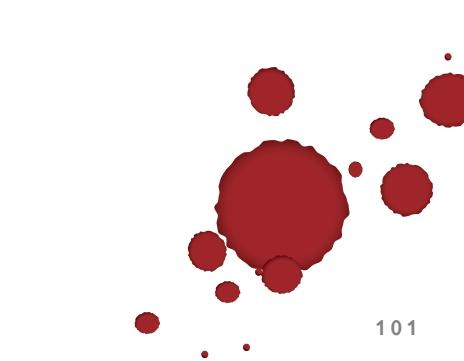

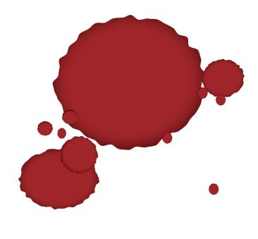

#### **ПЫТКИ**

Война с вампирами постоянно заставляет Орден Святого Леопольда и всех государственных деятелей (и множество частных операторов) Второй Инквизиции переступать все правовые и моральные границы. Некоторые из этих границ вообще не существовали: ЦРУ и ГРУ практически не играли по правилам даже друг против друга, а Инквизиция прямо разрешала подобные крайние меры с XV века. Шпионаж, вымогательство, шантаж, похищения, убийства и заключения в тюрьму - стандартная оперативная процедура для таких организаций, а пытки как людей, так и вампиров становятся все более распространенными в их рядах. Использование пыток обычная жесткая позиция пля многих групп. но если ваш рассказчик и игроки согласны изображать пытки или сталкиваться с ними в игре, то имейте в виду несколько моментов.

Пытки - это деликатная тема, к которой можно подходить в любом контексте. Особенно в игре с оперными ужасами и кинематографическими солдатами, избегайте представления пыток в карикатурной или ироничной манере. Пытки нарушают человека, причем по прямому умыслу. Военный кодекс США, Женевская конвенция, законы и нравы всех цивилизованных стран рассматривают пытки как преступление против человечности. В репрессивных и откровенно авторитарных государствах пытки применяются регулярно, но в развитых демократических странах они остаются в тени, прикрываются эвфемизмом, как, например, "расширенные методы допроса" в ЦРУ, или перекладываются на третьи стороны в рамках "чрезвычайной выдачи", или даже разрешены законом в условиях так называемой "обороны необходимости", как это происходит в Израиле.

#### НИКАКИХ ИСКЛЮЧЕНИЙ

Пытки не только преступны, но и неэффективны. Многочисленные исследования, посвященные применению пыток, показали, что, хотя информация всегда добывается, жертва часто говорит то, что хочет услышать обидчик, чтобы прекратить боль. Пытками невозможно заставить человека говорить правду, и в какой-то мере те, кто применяет пытки, знают об этом. Применение пыток действительно развращает государства и организации, заставляя их лгать, оправдывать жестокость или уклоняться от правды о своих действиях.

Так какой же цели служит преступный, эффективный и коррумпированный метод в игре "Вампиры"? Проще говоря, пытки вызывают отвращение и шок. Она вызывает экстремальную реакцию, а иногда история ужасов требует экстрима. Пытки также позволяют выявить злодеев в сюжете.

Персонажи, обремененные чудовищной природой, стоят перед моральным и этическим выбором - этот же выбор может сломить или развратить смертных, ввергнув их в разврат без оправдания Зверя. Пытки Второй инквизиции дают игрокам понять, что зло существует и за пределами их собственных недугов.

#### **BAMINPH KAK XEPTBH**

Изображение пыток лучше оставить для внеэкранных моментов и косвенных угроз. Для получения результатов против персонажей игрока используйте систему, описанную в Corebook (стр. 415). В идеале, остальные члены группы могут вывести захваченных сородичей из транспортного самолета или загона до того, как дело дойдет до этого. Тем не менее, чтобы прояснить, какого рода насилие Коалиция позволяет себе применять как против людей, так и против вампиров, мы приводим неполный список методов, адаптированных Коалицией из предыдущего опыта их покровителей в Чечне, Афганистане, Ираке, Ирландии и других местах.

Несмотря на преследование, изучение и истребление вампиров, многие охотники имеют лишь ограниченное представление об их слабых сторонах. Поскольку пытка - это тупой инструмент, то, как правило, их методы пыток ограничиваются тремя орудиями.

#### ОГОНЬ И СТРАХ

Вероятно, коалиционные силы обнаружили фобию пустых тел к огню во время первых запутанных миссий в 2002 году. В течение последующих двух десятилетий психологи FIRSTLIGHT и ГРУ медленно создавали рабочую теорию оперантного обусловливания, используя все, начиная от марок и раскаленных кочерг и заканчивая термоударами, чтобы медленно убедить своих подопечных в их беспомощности. (Обездвиживание объекта стоматологическими щипцами в значительной степени способствует такой реакции, когда это происходит). Это, конечно, не делает огненные угрозы более надежными, чем другие пытки.

#### СОЛНЕЧНАЯ ЛОСКА

"Солнечная доска", как эвфемистически называют пытки FIRSTLIGHT, - это любой сценарий, в котором солнечный свет используется для угрозы смерти вампирам. Подобно тому, как дознаватели используют "водяную доску", угрожая жертве утоплением, инквизиторы применяют солнечный свет для запугивания вампиров тяжелыми ранами или даже смертью, пока они не заговорят. Обычно для этого вампира удерживают и направляют на него тонкие лучи отраженного солнечного света, пока он не подчинится или не сгорит. Зачастую для этого используются самые простые средства, но особо садистские охотники изобретают приспособления, напоминающие железных дев, и заключают жертву в саркофаг, через который по мере необходимости пропускают небольшие лучи солнечного света. Наиболее сложным моментом в этой процедуре является поддержание вампира в бодрствующем состоянии в дневное время и в состоянии бешенства.

#### КРОВЯНОЕ ГОЛОДАНИЕ

Коалиция знает о вампирах одну вещь: они жаждут крови. Хотя они, возможно, не понимают, насколько постоянным или срочным является этот голод для большинства вампиров, они знают, что лишение тела крови причиняет им сильный дискомфорт и боль. С точки зрения охотника, это медленный, но относительно безопасный метод пыток. Охотники менее знакомы с особенностями бешенства, но голодный вампир за каплю крови расскажет вам все, что вы хотите услышать. Некоторые мучители оставляют блюдце с кровью в недоступном для сдерживаемого или запертого вампира месте на несколько дней, не имея возможности дотянуться до нее, пока она медленно портится и сворачивается на глазах. Другие же пускают кровь медленно, позволяя голоду заполнить пустоту, оставшуюся после вампира.

Голод пустого тела быстро увеличивается на 1 за каждый успех броска "Манипуляция + медицина" допрашивающего. При Голоде 5 пустое тело проверяется на Проклятье, как если бы оно потерпело звериное поражение. 1-9 - голод. 0 - клановое проклятье. Для каитиффа или слабокровного бросать не надо: результатом всегда будет Голод. Пустое тело под этим проклятьем сделает или скажет что угодно, чтобы утолить свой аппетит, и дознаватель быстро предложит пакет с кровью.

#### ÂÀÐÈÀÍÒÛ

Отряды FIRSTLIGHT Snatch Squads отличаются высокой квалификацией и хорошим оснащением, как правило, XTech, например, ловушкой "Путанная нога" (стр. 82).

Некоторые агенты Ньюбургской группы считают себя немного более искушенными, чем их соотечественники. Они организуют более сложные операции "Выдача", приманивая жертву, точно соответствующую вкусу пустого тела, с отравленной кровью (см. "Кровавая кукла", стр. 16), и нанося удар, когда цель слаба: травмирована или находится в заторможенном состоянии.

Приманка бросает Манипуляция + Хитрость против Смекалки + Упорства пустого тела, чтобы, по сути, соблазнить его на корм. На них надевают GPSтрекер и часто подслушивающее устройство (в зависимости от известной манеры питания вампира), чтобы команда могла быстро связаться с ними и вмешаться, если что-то пойдет не так. Если команда знает, где вампир будет кормиться, в нее часто включают снайпера, который располагается так, чтобы обеспечить безопасность приманки.

#### ÝÊÑÒÐÅÍÍÛÉ

"Победа сердец и умов" (Winning Hearts and Minds, WHAM) - распространенная фраза среди военных охотников, кредо которых заключается в обращении потенциальных врагов на сторону Второй Инквизиции. Их задача - выявить психологические и эмоциональные рычаги, движущие " пустым телом", и использовать их для превращения пленника в актив или пешку. Трюки, почерпнутые из темных уголков борьбы с повстанцами, хорошо помогают коалиции. Перед захватом Рода охотники выявляют смертных или домашних животных, которые важны для них, и, возможно, даже случайно обнаруживают их Опоры.

Затем охотники сообщают пленнику об этой идентификации, сопровождая это подразумеваемой (или явной) угрозой. Некоторые дознаватели ПЕРВОГО СВЕТА манипулируют записями этих ценных смертных, чтобы создать видимость пыток, слышимых из соседней камеры. Вампирические способности могут сделать эту тактику сложной, поскольку некоторые "пустые тела" обладают исключительным восприятием; дознаватели считают, что лучше всего предварительно морить испытуемых голодом и ослаблять их. Другие дознаватели для пущей убедительности захватывают опору.

#### ÌÅÐÛ ÏÐÎÒÈÂÎÄÅÉÑÒÂÈß

Не ходите в одиночку. Наденьте устройство слежения в надежде, что кто-нибудь найдет вас или хотя бы место, откуда вы были похищены. Тяните время.

Как только вампир оказывается в кузове черного фургона, эффективных мер противодействия не существует, разве что попытаться заключить сделку: чужая жизнь в обмен на свою или превращение в

своего агента и превращение в источник коалиции.

## Íàáîð ïåðñîíàëà

Коалиция нуждается в информаторах и шпионах на всех уровнях общества " пустых тел", а иногда даже позволяет перебежчикам стать полноценными операторами. Однако большинство полевых сотрудников по понятным причинам крайне неохотно вербуют и используют их. В октябре 2012 г. один "новобранец" (и еще неизвестное количество теоретически "безопасно заключенных" в плен бестелесных тел) выдал ключевых сотрудников офисов SAD и FIRSTLIGHT в трех штатах, предав операцию по расчистке города в Детройте и убив несколько десятков полицейских и бойцов UTR. Но иногда вербовка кажется единственно возможным способом добраться до цели, которая стоит больше, чем несколько десятков жизней.

Вербовка гулей (или, в особо ценных случаях, пустых тел) - это фактически тот же процесс, что и вербовка двойных агентов. Найдите слабое место, превратите его в рычаг и дергайте за него быстро или медленно. Кукушки, осведомители, зарыватели и прежние предатели-вампиры - все они поставляют информацию куратору Коалиции: месть и соперничество, проступки, которые могут стать материалом для шантажа, недовольство, эмоциональные связи и Опоры, или затянувшиеся религиозные убеждения - все это служит материалом для вербовки.

Кураторы комбинируют подходы: услуга агенту SAD или работа, предоставленная "Посредником", может стать материалом для шантажа. Эмоциональная связь с "кукушкой" может привести к недовольству или вендетте. Чем больше у куратора ниточек, за которые он может потянуть, тем лучше. Вербовка - это медленный и постепенный процесс, хотя для " пустого тела" он может показаться внезапным. Куратор постепенно подталкивает их к тому, чтобы они легко согласились на предательство; иногда они знают, что имеют дело со Второй инквизицией, а иногда предложение о вербовке поступает только при первой личной встрече.

В обычных условиях Коалиция не рассматривает возможность вербовки "ходячих", то есть тех, кто добровольно инициирует контакт. Достаточно сложно быть уверенным в лояльности тщательно отобранного специалистами рекрута. Невозможно поверить в мотивы, которыми руководствуется человек, обращаясь в организацию, желающую уничтожить всех себе подобных.

Эта тактика реализуется на следующих этапах:

- Наблюдение: Детектив или фонарщик, а иногда и кукушка в течение нескольких месяцев наблюдают за пустым телом, выясняя, является ли оно подходящим кандидатом для вербовки. Это происходит в форме броска "Расширенный интеллект + расследование", требующего 12 успехов. Броски выполняются с интервалом в один месяц. Наблюдение может продолжаться до 20 успехов, что снижает сложность манипулирования объектом.
- Манипулирование: Вампира постепенно ставят в уязвимое положение: у него заканчиваются деньги, и он вынужден заключить несколько невыгодных сделок; он почти прорывается в Маскарад, но новый контакт вытаскивает его за задницу; он узнает секрет старейшины, который может погубить его, если старейшина когданибудь узнает, что он знает; и т.п. Сделайте проверку "Расширенное манипулирование + политика", требующую 20 успехов, минус половина дополнительных успехов по Наблюдению. Броски проводятся с интервалом в один месяц. Манипуляция может продолжаться до 25 успехов, что облегчает подход.
- Подход: Куратор вступает в контакт и предлагает пустому телу место в своем агентстве и защиту. Бросок Манипуляция + Хитрость против Самообладание + Упорство. За каждый лишний успех в фазе Манипулирования куратор получает один дополнительный кубик.

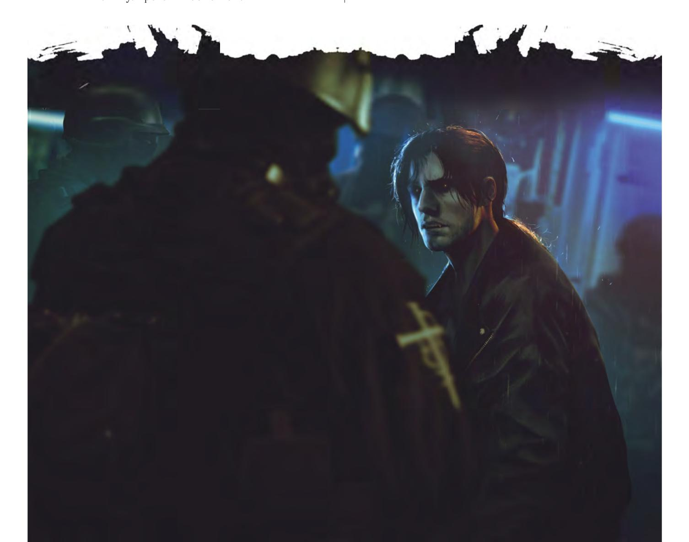

Рассказчик никогда не должен сводить вербовку героев истории к механике. Отыграйте подход и предоставьте решение о повороте игроку, а не кубикам. В зависимости от социального контракта группы, такую сюжетную линию, возможно, стоит обсудить со всеми игроками заранее: предатель в плеяде подходит не всем группам.

Эффективен против: Морфей; Слабокровные; котерии Цербера - иногда обращение человека внутрь является единственным способом получить доступ к реликвии; Сбирри.

#### **ВАРИАНТЫ**

BOES, как правило, не набирает пустых, хотя иногда рассматривает такую возможность для Слабокровных: их миссия - больше сжигать, чем превращать. Восьмое Направление не набирает бывших Анархов, и уж тем более Бруха. Россия только-только вылезла из-под влияния пиявок, и они не горят желанием принимать монстров обратно.

Общество Святого Леопольда в принципе не возражает против вербовки подходящих пустых тел, но они должны продемонстрировать свое раскаяние и покаяние, а также обязательство никогда не питаться

человечиной. Поэтому вербовка вентру маловероятна.

#### МЕРЫ ПРОТИВОДЕЙСТВИЯ

По тем же причинам набор протагонистов не сводится к механике, противопоставляя ее тому, что набор также зависит от ролевой игры.

### **Убийство**

Коалиция внедряет мокрых рабочих в Домен, кормовую базу или другое место, которое, как они знают, посетит целевой бланкет. ПЕРВЫЙ СВЕТ санкционирует убийство, когда просто слишком опасно штурмовать место днем, стреляя и сжигая: когда пустые тела достаточно осведомлены о местной операции Коалиции, чтобы провести репрессии, когда слишком много смертных фаворитов и слуг и кто-то выше решил, что не может оправдать сопутствующий ущерб, или когда единственная возможность добраться до цели - ночью среди мирных жителей.

Охотники также используют этот стиль работы против "пустых тел", прикрывающихся личностью, которая ставит их в центр внимания общественности: убийство "психа-одиночки" или "культа преследователей" становится поводом для появления материалов в СМИ, но оно не вызывает таких публичных расследований и привлечения адвокатов, как полноценный правительственный рейд.

В состав группы обычно входят один или два воина, иногда снайпер, который в крайнем случае может уничтожить убегающую цель. Если предполагается высокая степень безопасности или нет уверенности в том, что они знают местность, то с собой берется Одинокий Волк или Оружейник.

В идеале команда берет с собой ХТесһ или союзника с магическими или экстрасенсорными способностями, чтобы преодолеть очевидный риск сокрытия пустого тела.

Эффективно против: Одиночные цели; отдельные члены котерии Марешаля

#### МЕРЫ ПРОТИВОДЕЙСТВИЯ

Отбивайтесь; доберитесь до какого-нибудь людного места и надейтесь, что оно не попадет в поле зрения снайпера.

#### Лневная забастовка

Это единственная тактика охотников, которой боится каждый вампир: ударная группа прибывает в его убежище, когда он спит за дверью. В некоторых кошмарах они просыпаются достаточно надолго, чтобы увидеть кол, направленный им в грудь, или огонь, пожирающий их дом.

Дневные удары грязны, но очень заметны. Они не подходят для убежищ в красивой части города - если только команда заранее не согласовала свои действия с местными властями и правоохранительными органами, что сопряжено с риском предупреждения цели или другого "пустого тела". Для группы, которая держится вместе, это идеальный вариант: уничтожить пятьшесть пустых тел за один удар - слишком заманчиво; при такой стоимости последствия всегда можно сгладить.

В состав команды входят один или несколько Взломщиков для обеспечения безопасности, несколько Воинов или Одиноких Волков (по крайней мере, по одному на каждого "пустого тела") для выполнения грязной работы по установке и обезглавливанию, и, желательно, Нуллификатор для подавления некоторых ключевых дисциплин. В высокотехнологичных убежищах Хакер работает на базе или в бронированном фургоне неподалеку, подавляя любые сигналы тревоги и призывы о помощи. В большинстве случаев "черный киллер" уже давно велет наблюдение.

Политики и светские люди убирают за собой, сводя к минимуму волнения и расследования в СМИ.

Эффективен против: Большинство пустых тел; котерии/общие убежища.

#### ВАРИАНТЫ

BOES стала пионером стратегии "блок за блоком": несколько дневных ударов, скоординированных и продолжающихся до тех пор, пока группы не поразят все известные цели на карте. SO13 и Восьмое направление с большим одобрением наблюдали за этой тактикой и сами приняли ее на вооружение. Основным аргументом против нее является то, что она вызывает беспокойство у людей и попадает в новости, а агентства оказывают ловкое (и не очень) давление, чтобы контролировать этот элемент.

#### МЕРЫ ПРОТИВОДЕЙСТВИЯ

Лучшая контрмера - просто не присутствовать при ударе. Неизвестный может заранее заметить слежку (со стороны "черных упаковщиков" или "теней") или иметь нужные связи, чтобы узнать о готовящейся крупномасштабной операции, когда

правоохранительные органы и городские власти будут проинформированы заранее. Если этого не сделать, то лучшим средством защиты будет усиленная охрана с привлечением гулей и других лиц, бодрствующих в лневное время.

# Ночной удар

Это наиболее обеспеченный ресурсами и наиболее опасный вид деятельности охотников (см. "Ночь и туман", с. 156, о причинах, по которым ночные удары иногда одобряются, несмотря на их опасность). При работе с IAO или другими первоклассными исполнителями не жалеют средств и задействуют все возможные ресурсы. Для того чтобы посеять хаос и отвлечь внимание, пока взломщики и хакеры взламывают систему безопасности - или пока информатор или "кукушка" открывают двери, - в ход пускается "брут". Несколько групп UTR с тяжелым вооружением наносят одновременный удар, некоторые из них имеют конкретные цели, а другие просто хотят нанести как можно больший ущерб. Специалисты по зачистке поливают территорию белым огнем.

Группа использует сложные средства борьбы с толпой, чтобы вызвать панику, запутать и помешать своим целям. Специалисты по зачистке и зачистке уже вычислили все возможные выходы из здания по планам и наблюдениям, и у каждого из них их поджидают подготовленные убийцы.

Это высокоэффективная расправа, и хотя потери охотников могут быть высокими, это всегда оправлывает себя.

Эффективен против: Всевозможные сборища; Пламейры

#### МЕРЫ ПРОТИВОЛЕЙСТВИЯ

Эта операция - жемчужина в короне Коалиции. Остается надеяться, что в убежище есть выход, который охотники еще не нашли.

#### Авто-ла-Фе

ESOG и их протеже в BOES специализируются на "авто-да-фе". Команда не просто врывается в Убежище или Элизиум и уничтожает всех, кто там находится. Они сжигают его дотла в разгар полуденного солнца, преследуют и расстреливают бегуших, сгоревших выживших. Авто-да-фе - это не просто эффективная тактика, это угроза.

Лучше всего она работает, когда цель не только безопасна, но и хорошо известна в сородичных кругах. Поджог в скучном жилом квартале, где живет какойнибудь безродный каитифф, гораздо менее эффективен, чем подрыв убежища гарпий, потому что цель авто-да-фе - посеять ужас и повергнуть в панику тех, кто живет, чтобы быть его свидетелем.

В течение недели после авто-да-фе все пустые тела, знающие о нем, делают проверку самообладания на +1 сложность. Последующие недели огненного террора накладывают дополнительные штрафы, максимальный из которых составляет +3.

Эффективен против: Против кого угодно.

#### **ВАРИАНТЫ**

В то время как BOES любит быть вблизи и лично, когда они проводят автодафе, Восьмое направление предпочитает минометы на расстоянии. При

необходимости они могут разрушить целое здание.

#### МЕРЫ ПРОТИВОЛЕЙСТВИЯ

Если инквизиторы уже достаточно освоились и внедрились, чтобы совершить "ауто-да-фе", то уже слишком поздно. Этот наихудший сценарий происходит, когда Сородичи не справляются с угрозой достаточно быстро, и поэтому умные идут на все, чтобы остаться незамеченными.

# Проекты Второй Инквизиции

Некоторые действия, предпринимаемые Второй Инквизицией и против нее, являются частью долгой игры. Подобно борьбе с вредителями, они представляют собой постоянные, непрерывные усилия по снижению вреда. В таких случаях их лучше всего рассматривать как Проекты, используя правила, приведенные в Corebook (стр. 415-421). Ниже приведены примеры проектов, направленных против Коалиции, а также примеры проектов, осуществляемых Коалицией для противодействия сородичам.

# Íîâûå ñâåäåíèÿ: Îïåðàöèîííûå ðåñóðñû

Каждая команда или ячейка охотников имеет ограниченное количество людей, оружия, денег и времени. Все эти ограничения суммируются в показателе "Оперативные ресурсы" команды. Используйте его, чтобы определить, сколько проектов команда может вести одновременно: сельскохозяйственные команды, у которых мало денег и контактов, скорее всего, могут выслеживать только одно пустое тело за раз; команда FIRSTLIGHT в ключевом городе может работать над тем, чтобы склонить предателя на свою сторону, найти убежище Примогена и противодействовать пустому телу, налаживающему связи в мэрии.

Если вы планируете проводить проекты как в пользу, так и против Второй инквизиции, назначьте местным охотникам (или местным представителям Коалиции) общий балл оперативных ресурсов для этой цели. (Как правило, Оперативные ресурсы должны находиться в пределах одной точки от фона Досягаемости ОПФОРа). Затем решите, какую часть своих оперативных ресурсов они могут направить на реализацию данного проекта.

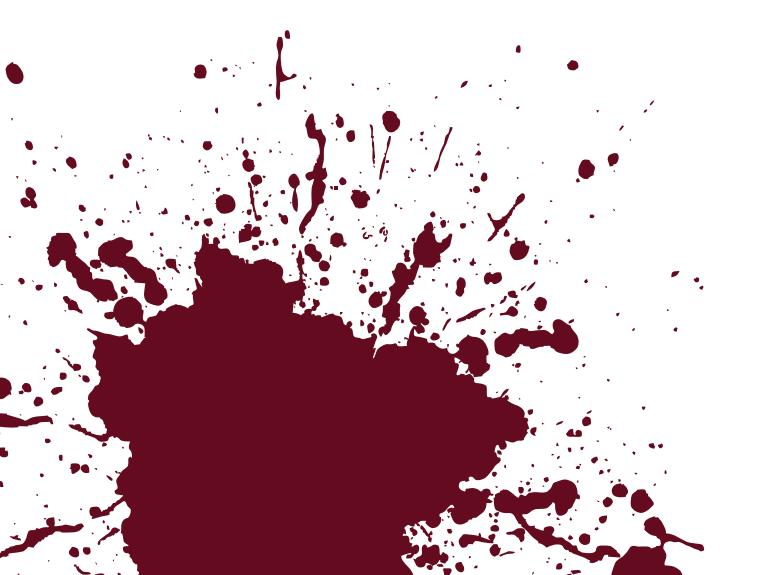

# Êàðòà Ñåòè Âàìïèðîâ

Причина, по которой FIRSTLIGHT, или Общество Святого Леопольда, или им подобные представляют опасность, заключается в том, что они понимают, что такое пустые тела. Они достаточно умны, чтобы правильно выполнять свою работу: они не просто уничтожают глупых монстров, которые сами становятся мишенью, они следят за ними, возвращаясь к их сородичам, сыновьям и городской иерархии. Будь то Анарх или Камарилья, знание того, как социальные узы города удерживают вампиров вместе, помогает Коалиции выявить возможных предателей, кандидатов на шантаж или запугивание, а также ценные цели, окончательная смерть которых дестабилизирует обстановку в городе и облегчит работу Коалиции.

Цель: создать точную карту сетей и структур власти в городе для последующего манипулирования (+5 кубиков при бросках на выявление связей, давление или манипулирование).

Наращивание: Обычно недели. Анархи, будучи менее иерархичными, чем Камарилья, могут занимать вдвое больше времени (увеличение в 2 недели).

Этапы: выявление наиболее заметных "пустых тел"; картирование связей первой степени; соединение сетей; профилирование слабых мест и уязвимостей.

Область применения: 3. Это интенсивный проект, который в случае успеха окупается долгосрочными выгодами в будущем. Запуск: Гум.Науки или техника + оперативные ресурсы, сложность 5

Фоны для участия: Оперативные ресурсы; по одной точке на Канарейку, Дилера или другого важного информатора (потеря точки приводит к их гибели или перевербовке

Предлагаемые целевые броски: Интеллект + Гум.Науки, Этикет или Политика; Смекалка + Хитрость.

Неудача: Если проект проваливается, команда не понимает, что такое связи, принимает видимость за силу или поддается на попытки "пустых тел" замаскировать свои союзы или вражду. Попытки манипулировать этими связями производятся с броском -2.

— Отсутствие ресурсов. Работа в темноте и без поддержки.

- -Крайне ограниченный. Несколько обрывков интеллекта и недостаточная оснащенность.
- •• Основной. Команда, имеющая конкретную миссию и ресурсы для ее выполнения.

••• Хорошо обеспечены ресурсами. Достаточно денег, оружия и людей для проведения одной крупной или нескольких мелких операций.

•••• Важная, опытная команда в месте с высоким приоритетом. Возможность одновременного выполнения более чем одной важной миссии.

••••• Приоритетная миссия. Что хочет команда, то и получает.

#### ПРОТИВОДЕЙСТВИЕ ЭТОМУ ПРОЕКТУ

Обнаружение: Сородичи с лучшими или большими личными связями с большей вероятностью поймут, что за ними наблюдают и задают вопросы. Бросок на то, что больше: Мавла или Статус + Расследование. Один успех показывает, что охотник ведет расследование; два или более показывают число на кубике проекта.

Воздействие: Вампир или группа подбрасывают ложные улики, преувеличивают (или преуменьшают) свою близость к другим местным жителям, придумывают вражду или союзы, чтобы сбить охотников со следа. Манипуляция + Убеждение, Этикет или Политика.

Использование: Группа может выставить себя незначительной или более могущественной, чем она есть на самом деле; может склонить охотников к тому, чтобы они обратились к одному из них как к возможному предателю и таким образом проникли в местную сеть ВИ. Обе эти цели требуют бросков Манипуляция + Хитрость.

### Подрыв основы

Главная цель Коалиции - ликвидация "пустых тел", но трудно исчезнуть человеку, находящемуся на виду у всех, имеющему миллионы долларов, влиятельных друзей и всемирную известность. Иногда единственный способ сделать цель жизнеспособной ослабить ее, отрезать от друзей и преимуществ. Так им будет сложнее заметить приближение охотников, сложнее действовать против них и меньше шансов убежать, когда группа захвата идет на поражение.

Цель: снизить фон целевого пустого тела на определенную величину. Обычно это ноль, но даже небольшое снижение может быть полезным.

Наращивание: Дни для снижения фона до 2 точек. Недели - для более существенных фонов.

Этапы: осмотр фонов; выбрать целевой фон; уничтожить его.

Масштаб: 1 + предполагаемое уменьшение фона. Бросок запуска: сильно зависит от затрагиваемого фона и используемой тактики. Например, финансы + оперативные ресурсы для уменьшения ресурсов; политика + оперативные ресурсы для уменьшения влияния; уличное чутье + оперативные ресурсы для уменьшения контактов; хитрость + оперативные ресурсы для уменьшения союзников или мавла; расследование + оперативные ресурсы для уменьшения маски Сложность 2 + масштаб.

Фоны для участия: Оперативные ресурсы; по одной точке на Джентрификатора, Политика или другого крупного влиятельного деятеля (потеря точки приводит к их превращению или гибели)

Предлагаемые целевые броски: Интеллект + Гум. Науки, Этикет или Политика; Смекалка + Хитрость.

Неудача: Если проект проваливается, ресурсы Коалиции увязают в распутывании этой неразберихи; на то, чтобы выпутаться из нее, уходят недели. Оперативные ресурсы уменьшаются на 1 точку за то же время, в течение которого проект находился в работе (например, проект, выполнявшийся 4 недели до неудачи, уменьшает оперативные ресурсы на тот же срок).

#### ПРОТИВОЛЕЙСТВИЕ ЭТОМУ ПРОЕКТУ

Обнаружение: Затронутый фон + Интеллект. Один успех раскрывает, что охотник ведет расследование; два или более раскрывают число на кубике проекта.

Влияние: Цель может перемещать ресурсы с помощью Интеллект + Финансы; укреплять союз с помощью Харизма + Убеждение; устраивать рекламные трюки для поддержания влияния или славы с помощью Манипуляция + Убеждение; сохранять уважение мавла с помощью Харизма + Этикет или Политика.

Использование: При тех же бросках, что и для воздействия на Проект, пустое тело может удерживать расследователей на протяжении вдвое большего времени, чем это было бы при неудаче. По усмотрению Рассказчика, они могут увеличить целевой фон на 1 точку: создать новость, которая сделает их более известными, перевести часть их денег на более безопасный, оффшорный счет, где они получат больше денег и т.д.

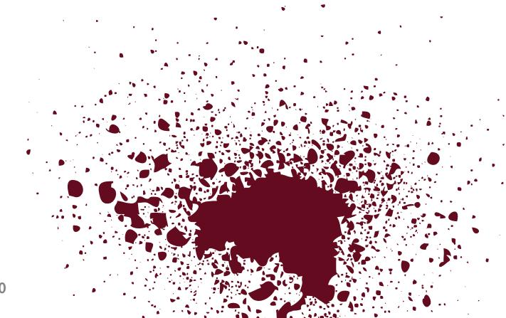

### Против инквизиции: Зачистка

Ускользнуть от внимания Инквизиции легче легкого. Неизвестный может сбить их со следа на некоторое время, применив одну тактику, но если он попадает в базы данных Коалиции, то остается там навсегда. Вторая инквизиция вернется, сколько бы раз ни ускользал от их внимания известный вампир. Медленно и кропотливо "пустое тело" может стереть все следы себя, но это опасно: если его обнаружат, оно взлетит вверх по списку целей Коалиции.

Цель: устранить известный недостаток вампира.

Наращивание: Месяцы. Этот проект не может быть начат, если Коалиция активно преследовала вампира в течение последнего месяца.

Этапы: Выявить все имеющиеся записи: найти слабое место (технологическое, кадровое или другое); постепенно удалять записи.

#### Область: 3

Бросок запуска: Ресурсы или Влияние + Расследование. Сложность 5. Предпосылки для совершения: Влияние, Союзники, Контакты, Статус.

Предлагаемые броски цели: Интеллект + Технология: Интеллект + Расследование: Манипуляция + Хитрость.

Неудача: Если персонаж игрока не справляется с броском цели или иным образом теряет контроль над проектом, он уменьшает количество фонов, вложенных в него (Corebook, p. 416). Это особенно опасный проект, и в случае неудачи вампира он подвергается дополнительному и немедленному преследованию со стороны Второй Инквизиции. Переместитесь на один шаг вверх по алгоритму реагирования.

Не делайте бросков на противодействие планам игрока, просто подкиньте ему несколько старых добрых сложностей по ходу игры.

### Против инквизиции:

#### Из холода

Что бы ни говорили сами организации, персонал, набранный во Вторую Инквизицию, небезупречен. Некоторых из них можно купить, других соблазнить или шантажировать, а у третьих влечение к манящей концепции вампиризма граничит с фетишем. Вполне возможно, что вампиру, которому есть что предложить, удастся превратить инквизитора в актив. Успешное завершение проекта не гарантирует дружбы или верности, но превращает агента Коалиции (или другого крупного охотника) в союзника... до тех пор, пока он не пожалеет о своем предательстве и не признается во всем своему начальству.

Цель: преобразовать агента коалиции в союзника с фоновым значением на единицу меньше, чем объем проекта.

Наращивание: Месяцы или годы.

Этапы: Определение цели; выявление слабых мест; установление контакта; оказание лавления.

Область: 1 + предполагаемый уровень фона. Пусковой бросок: Контакты, ресурсы или

влияние + манипуляция. Сложность 1 + Область.

Фоны для фиксации: Ресурсы, Влияние, Слава.

Предлагаемые броски цели: Интеллект + Проницательность или Расследование; Манипуляция + Убеждение, Хитрость или Убеждение.

Провал: Если проект проваливается, вампир теряет часть фонов, вложенных в проект. Он также может приобрести врага в лице агента, которого он пытался завербовать, или одного из его коллег и начальников. Кроме того, вампир может стать известным вампиром.

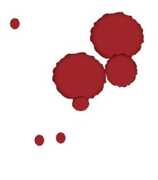

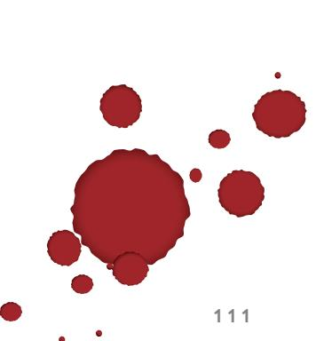

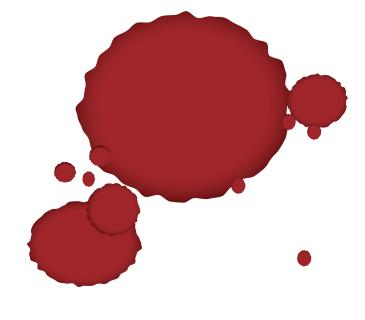

# АЛГОРИТМЫ коалиционного

# реагирования

Коалиция имеет установленные процессы эскалации ответных действий. Они знают, что работает, а что нет, и А неизбежно приводит к Б. Представленный здесь алгоритм реагирования (как и тот, что приведен на с. 186-189 книги "Анархи") помогает рассказчикам мыслить как команда UTR или региональный агент и давать адекватный ответ на действия, предпринимаемые персонажами игроков. Рассказчик может использовать ее постоянно, чтобы определить следующий шаг в сюжете, или использовать ее для поиска идей, или адаптировать ее к своему конкретному набору антагонистов Второй инквизинии

Многие из шагов алгоритма реагирования четко соответствуют тактике, представленной ранее в этой главе; некоторые не соответствуют и требуют дополнительных пояснений.

# Уровень 0: Под радаром

Представленный здесь алгоритм не описывает этот уровень, но он описывает среднего вампира или группу вампиров, которые еще не сделали ничего, что могло бы привлечь внимание инквизиторов.

# Уровень І: Наблюдение

#### АНАЛИЗ ДАННЫХ: ОСОБЕННОСТИ ОХОТЫ

Этот анализ указывает на тип хищника персонажа и, возможно, на цель его окружения. Как правило, персонажам, питающимся кровью из пакетов, стадами, животными или согласной добычей, присваивается более низкий уровень угрозы, чем тем, кто питается неосознанными или невольными смертными жертвами.

#### АНАЛИЗ ЛАННЫХ: НАУЧНЫЕ СПЕЦИАЛИЗАЦИИ

В результате анализа определяются такие количественные данные, как возраст персонажей, а значит, и оценка их силы, Дисциплины, возможно, Опорыи и Убеждения слабые стороны, которые Коалиция может использовать как для понимания, так и для нацеливания на них.

#### ИНФОРМАТОРЫ

Для сбора информации о деятельности персонажей, их амбициях, друзьях и врагах Коалиция использует свои сети осведомителей среди обществ пустых тел, преступного мира и других мест, где человечество сталкивается с пустыми телами.

#### АНАЛИЗ ЛАННЫХ: СТАЛА И КУЛЬТЫ

Пустые тела, собирающие вокруг себя смертных, дают Коалиции готовую фокус-группу, которая вольно или невольно вылает информацию о них. Аналитики изучают эти группы (обычно в Интернете) или связываются с ними (возможно, в качестве "ложных агентов"), чтобы собрать информацию о персонажах.

#### PASBEINBATEJLENE CPEICTBA

Коалиция проводит поиск упоминаний о персонажах в базах данных аффилированных с ней разведывательных организаций. Если на этом этапе обнаруживаются какие-либо записи, то персонажи сразу же переходят на более высокий уровень опасности: это существа, которые могут представлять угрозу национальной безопасности.

## Уровень 2: Расследование

#### СВЕЛЕНИЯ

Это первое средство, когда коалиция считает цель слишком опасной или недостаточно изученной для установления контакта. Начинается длительная операция по наблюдению с целью узнать, за какие рычаги могут потянуть лидеры "Медведей" на уровне 3:

"Истощение".

#### ОБШИЕ ВРАГИ

Коалиция обращается к врагам персонажей среди пустой городской иерархии, как правило, через муляжи или "Ложных агентов", и пытается агитировать их против персонажей или предоставить информацию об их слабых местах.

#### **ИНФИЛЬТРАЦИЯ**

Кукушка внедряется в стадо, сеть, а может быть, и в окружение пустых тел. Их цель двояка: оценить их на предмет возможной склонности к сотрудничеству с Коалицией против своих собратьев, а также определить их потребности и слабые места для подготовки к третьему уровню.

#### **ВЗАИМОЛЕЙСТВИЕ**

Коалиция захватывает соратников персонажей (Союзников или Опоры, если они их знают) либо путем ложного ареста, либо путем быстрого захвата в фургоне SAD, либо путем полноценной выдачи. Допрос преследует три цели: получить информацию о персонажах, оказать давление на персонажей, чтобы они нарушили свою схему и раскрыли себя, и, если возможно, завербовать соратника в качестве двойного агента

# Уровень З: Истощение

#### ДЕПРИВАТИЗАЦИЯ

Установив место персонажей в списке угроз, Коалиция начинает действовать против них. На этом этапе они начинают отнимать ресурсы, ограничивая кровоснабжение персонажей, опустошая банковские аккаунты, настраивая против них союзников и т.д. Цель - ограничить возможности персонажей по нанесению вреда смертным и сделать их уязвимыми лля лальнейших лействий инквизиции.

#### **ЛЖЕНТРИФИКАЦИЯ**

Команда Коалиции действует против Домена персонажей и их силовой базы, если таковая имеется. Лишение доступа к убежищам и контактным сетям должно заставить персонажей перейти в поспешное наступление или ослабить оборону; в любом случае, Коалиции будет легче противостоять им.

#### ДЕПРОГРАММИРОВАНИЕ

Если команда "Коалиции" определила персонажей (или их гулей) как потенциальных агентов, то они нацеливаются на одного или нескольких из них для депрограммирования и вербовки. Слабокровные персонажи часто становятся объектом такого внимания.

### Уровень 4: Противостояние

#### **ОПЕРАЦИЯ**

Дневной удар, ночной удар, покушение или "автодафе". Пустые тела продвинулись так далеко в списке целей Коалиции, что не остается иного выбора, кроме как уничтожить их. Более высокого уровня в этой ветви алгоритма не существует.

#### **ПРЕЛАТЕЛЬСТВО**

Поставленные перед выбором - собственная окончательная смерть или жизнь других людей, герои получают шанс спасти свою шкуру. Они сдают Коалиции союзников, старейшин, всех, кого могут, в обмен на выживание - а может быть, и на что-то большее?

# Уровень 5: Индукция

#### **HABOP PEKPYTOB**

Продав всех, кого они знают и кто им дорог, герои получают последний, трудный выбор: присоединиться ко Второй Инквизиции и подрывать сети "пустых тел" изнутри в качестве Кукушек, помогать депрограммировать других или стать Воинами во имя дела. Конечно, они могут отказаться, но этот путь быстро приведет их к окончательной смерти.

Этот уровень, по сути, существует только для персонажей игроков; вампиры персонажей рассказчиков почти всегда умирают без сожаления.

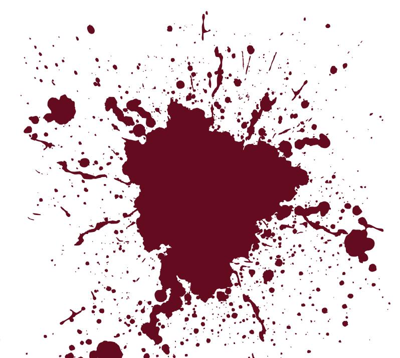

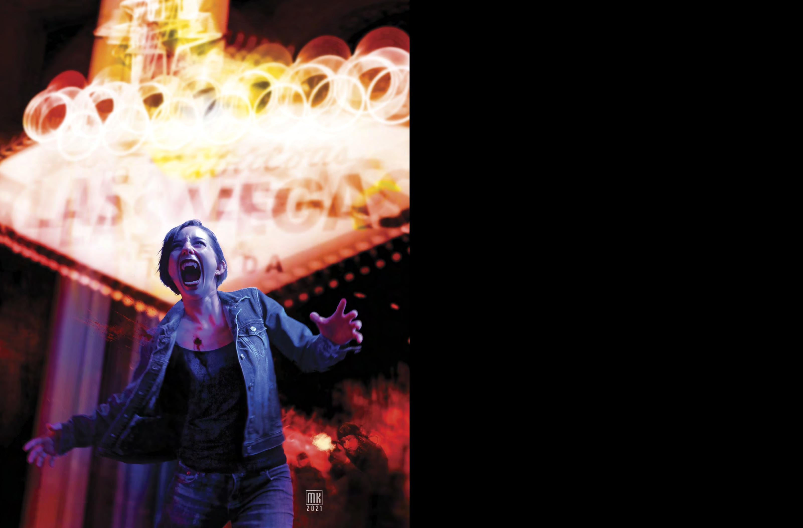

# Глава четвертая: Огневые Группы

Поэтому мы, поддерживаемые присутствием и властью нашего любезнейшего сына Фридриха, славнейшего императора римлян, всегда увеличивающего империю, с общим советом и рекомендацией наших братьев, а также других патриархов, архиепископов и многих принцев, собравшихся из разных частей света, выступаем против этих еретиков, которые носят разные имена...

Мы постановляем далее, чтобы все графы, бароны, губернаторы и консулы городов и других мест, во исполнение уговоров соответствующих архиепископов и епископов, обещали под присягой, что во всех этих случаях, когда от них потребуется, они будут мощно и эффективно помогать Церкви против еретиков и их

 $COOOHHHKOB$ 

### - ОТМЕНИТЬ, ПАПСКУЮ БУЛЛУ, ИЗДАННУЮ ПАПОЙ ЛУЦИЕМ І І, УЧРЕЖДАЮЩАЯ ЕПИСКОПАЛЬНУЮ ИНКВИЗИЦИЮ (II84)

Вторая инквизиция включает в себя множество заговоров. Каждый клуб по изучению Библии, каждая оружейная группировка, каждая ночная смена в больнице, каждая группа "мамочек" в Facebook, каждая полицейская смена, взявшаяся за дело, чтобы охотиться за невероятной угрозой, подразумевает наличие заговора. Некоторые из этих заговоров, неосознанно или случайно, переплетаются в рамках общего движения. Не все его участники используют одни и те же методы и даже преследуют одни и те же цели.

Однако на базовом уровне все они сгорают от внезапного прозрения, что вампиры существуют, и содрогаются от ужаса, который влечет за собой такая правда.

Заговоры в правительствах, спецслужбах и негосударственных структурах, обладающих наибольшей властью в движении, превращают этот ужас в организованные действия. Так называемые "пять факелов", находящиеся на самом верху движения, черпают огромные потоки информации и финансирования и преобразуют свою реакцию в организованные действия.

Эти пять партнеров, а также все большее число сторонних участников, союзников и активов называют себя коалицией. Правда, на публике они практически никогда не называют себя никак. Коалиция бюрократически маскирует необходимые ей операции по связи, планированию и взаимодействию за еще более анодиничными и непрозрачными аббревиатурами, такими как ML-CCTSP (Многосторонний комитет связи по планированию сценариев террористических актов на уровне конгресса, передан в рабочие группы в 2017 г.) или SMLCPASCE (Программа консультаций на субминистерском уровне по урегулированию кризисных событий стохастического характера, создана в конце 2016 г.).

Неизвестные сотрудники и военные среднего звена проводят скромные дневные совещания по вопросам логистики и финансирования на полях саммитов и учений. Они передают записки в залах заседаний на конференциях G20 и обмениваются предварительными материалами по биологии чистых тел на закрытых семинарах, проводимых раз в два года в рамках Всемирной конференции по военной медицине (одной из немногих международных организаций, в которых Ватикан является полноправным членом). Скучные бюрократы перетасовывают деньги в офисном здании со стеклянными стенами в Вене, официально приписанном к Управлению ООН по наркотикам и преступности. Изредка из Москвы, Вашингтона или Рима в здание заглядывают "эксперты по борьбе с повстанцами" или "аналитики по стратегическим угрозам", осмотрев руины "венского террористического объекта".

Бюрократия и привычка повысили эффективность их коллективной работы, но притупили ее целенаправленность. Национальные интересы и личные политические амбиции часто затмевают их стремление уничтожить вампирскую угрозу. Коалиция превратилась в гнездо пересекающихся заговоров, каждый из которых имеет свои собственные планы, паранойю и соперничество. Роль IAO, FIRSTLIGHT и ватиканской La Entità заключается в том, чтобы при планировании операций все были в курсе дела и ориентировались на долгосрочные цели заговора. Этот неформальный исполнительный комитет руководит оперативным планированием благодаря бездонному кошельку IAO, командноадминистративному управлению FIRSTLIGHT и почти монопольному праву La Entità на мистические контрмеры.

# США

Соединенные Штаты, пожалуй, самые могущественные из "пяти факелов", управляют десятками военных и разведывательных организаций при очень слабом надзоре и, казалось бы, безграничном финансировании. По крайней мере, некоторые подразделения в каждом американском военном ведомстве и отделы почти в каждой организации американского разведывательного сообщества знают о существовании сверхъестественной угрозы. Возможно, они даже поставили в известность об этом нескольких своих мнимых политических боссов. Пока эти различные американские ведомства договорились вести тайную войну со сверхъестественным, уделяя особое внимание бестелесным существам, поскольку они могут представлять экзистенциальную угрозу для США и активно пытаться подорвать американское правительство с помощью кровавого рабства и ментального доминирования. Для других крупных игроков коалиции США представляют собой единый фронт, но внутри страны солянка ведомств активно конкурирует друг с другом за юрисдикцию и финансирование.

## **FIRSTLIGHT**

FIRSTLIGHT - это кодовое название совместной разведывательной операции, которая собирает информацию и руководит действиями на местах против "пустых тел" и других сверхъестественных угроз, для большинства "посвященных" в северном полушарии синоним Второй инквизиции. Первоначально возглавляемая NSA и ЦРУ, FIRSTLIGHT обрела самостоятельную межведомственную жизнь, став заговором внутри аппарата безопасности Соединенных Штатов Америки. Разрозненность организации в рамках и без того секретного режима делает FIRSTLIGHT очень сложной для проникновения вампиров. Паранойя является отличительной чертой FIRSTLIGHT и затрагивает все аспекты их работы. В глобальной войне с паранормальными нет нашивок для солдат, и многие из тех, кто выполняет их приказы, никогда не узнают, были ли их жертвы смертными или нет.

Хотя уличный стереотип FIRSTLIGHT - это образ тактической группы, выбивающей дверь в убежище, их одержимость идеей оперативной маскировки заставляет их предпочитать бороться с угрозами дистанционно и из-за горизонта. В 99% случаев FIRSTLIGHT действует исключительно через IAO, SAD или другие ведомства, как зарубежные, так и отечественные, передавая разведданные о целях и задачах и обеспечивая поддержку наблюдения по запросу.

Когда FIRSTLIGHT не может положиться на своих обычных союзников, они часто обращаются к внештатным сотрудникам и охотникам-любителям, которые делают грязную работу, сливая достаточно информации для определения целей.

Но подобно тому, как ЦРУ в ходе войны с терроризмом создало собственную карманную армию для выполнения задач, которыми не хочет делиться с Пентагоном, FIRSTLIGHT приберегает несколько специальных миссий для себя. Когда ""пустое тело" представляется уникальной возможностью для захвата, обращения или изучения, FIRSTLIGHT активизирует специальную группу (стр. 57). Отряды захвата FIRSTLIGHT маскируются под группы **SOCOM** с помощью бронетехники, беспилотников и стелс-вертолетов. Хотя обычно эти группы компенсируют недостаток оккультных знаний внезапным и мощным огнем, планировщики миссий иногда привлекают специалистов из Ватикана или нелегальных "пустых тел" в каждом конкретном случае.

#### ТОЧКИ ДАВЛЕНИЯ

Поскольку FIRSTLIGHT много времени уделяет сокрытию фактов сверхъестественного и поиску признаков вампирического влияния в других подразделениях американского правительства и Коалиции в целом, они осторожно используют слабокровных, способных противостоять или обнаруживать психическое воздействие на пустые тела. Руководитель оперативного отдела FIRSTLIGHT Фелисити Прайс, предположительно, избежала контроля "крысиного лица" во время работы в NSA. Будучи убежденной противницей вербовки "пустых тел" в целом, она была вынуждена признать, что "слабокровные" представляют собой огромное потенциальное стратегическое преимущество в качестве двойных агентов. FIRSTLIGHT часто обещает таким вампирам излечение от их болезни в обмен на их службу, но по окончании срока службы Прайс предпочитает продавать их для экспериментов и изучения в пользу шведов или других заинтересованных в этом вторых лиц. FIRSTLIGHT не стесняется применять насилие, но на первом месте для нее всегда стоит возможность продолжать действовать без каких-либо значимых политических ограничений или информированного внимания общественности. Хотя они и пытаются скрыть себя от посторонних глаз, более серьезной проблемой для FIRSTLIGHT является обнародование факта существования сверхъестественного для общественности, а также то, что FIRSTLIGHT ведет глобальную войну с паранормальными явлениями в тайне.

#### FIRSTLIGHT (NSA) HOJEBON ATEHT

Полевой агент FIRSTLIGHT - это технический эксперт, имеющий высокоуровневый доступ к секретным алгоритмам и цифровым "черным ходам", которые обеспечивают ему беспрецедентный доступ к окружающему его информационному ландшафту.

#### Общая сложность: $4/2$

Стандартные пулы кубиков: Физический 4, Социальный 4, Ментальный 7

Вторичные атрибуты: Здоровье 5, Сила воли 7 Исключительные пулы кубиков: Наблюдательность 8. Огнестрельное оружие 5. Хитрость 6. Техника 8 Оборудование: Пистолет (Glock 17), громкая связь, ноутбук, скат, беспилотник "Глобал Ястреб" с **XScope** 

Особенность: Присутствуя в составе группы UTR, полевой агент оспаривает любую попытку "пустого тела" скрытно пройти через их зону действия с помощью набора кубиков "Техника" (9). Провал на три или более успеха означает, что команда UTR точно определила текущее местоположение нарушителей и отследила хотя бы часть их передвижения. Сверхъестественные способности, такие как Сокрытие, могут лишить команду UTR этого особого преимущества, в зависимости от обстоятельств и типа наблюдения, используемого командой UTR.

#### Управление информационной

#### осведомленности

ІАО руководит действиями американских вооруженных сил в ответ на сверхъестественные явления, обеспечивая командование и контроль за всеми операциями - от тайных внедрений в лагерь блаженных в Таиланде до неприкрытого удара "Хищника" по собранию саббатов в Мозамбике. Подводная лодка топит корабль на пути к войне в Геенне, контейнер с термобарическими боеголовками попадает в арсенал мексиканского картеля, миллиард долларов падает на больничную сеть Общества Святого Леопольда. В свободное от работы время IAO поддерживает проекты DARPA с антипаранормальными перспективами и запускает XScopes на спутниках-шпионах. IAO классифицирует все, а то, что не может классифицировать, маскирует под "учебные миссии" или "контртеррористические удары".

#### АЛГОРИТМ "СЕРДЦЕБИЕНИЕ"

IAO выросла из желания более эффективно обмениваться собранной информацией и фильтровать ее в рамках всего разведывательного сообщества США. Отчасти причина, по которой небольшая организация, затерявшаяся на последних страницах блок-схемы разведывательного сообщества, приобрела столь значительную силу, кроется в алгоритме, известном под кодовым названием "сердцебиение". Поначалу "Сердцебиение" было лишь частью стратегии IAO, которая собирала потоки данных от различных агентств, таких как ЦРУ, DIA и NSA. То, что значительная часть этих данных изначально была получена незаконным путем, также означало, что использование "Серпцебиение" было поступно лишь немногим, Теперь "Сердцебиение" просеивает нескончаемый водопад глобальных потоков данных ECHELON в режиме реального времени в поисках доказательств вампирической и иной сверхъестественной активности.

GPS-трекеры, сайты обмена фотографиями, WiFi камеры дверных звонков, полицейские скаты, биометрические данные фитнес-приложений, камеры смартфонов и программы распознавания лиц - все они являются невольными соучастниками "Сердцебиение" в бесконечной охоте за пустыми телами. Подобно тому, как правительство США может идентифицировать практикующего мусульманина или католика, собрав достаточное количество их личных метаданных, "Сердцебиение" находит общие черты в цифровом следе "пустого тела". Долгие часы дневного бездействия. Относительно малое количество посещений супермаркетов, аптек и других предприятий, поддерживающих жизнь. Частое посещение мест с повыщенным риском или низкой информативностью, где статистика пропавших людей, нападений и т.д. выше среднего.

FIRSTLIGHT неоднократно пыталась перехватить контроль над "Сердцебиением" у IAO, но так же, как FIRSTLIGHT хочет иметь собственные секретные ударные силы, IAO хочет иметь собственную систему сбора разведданных. Как правило, обе стороны договариваются об обмене сырыми продуктами "Сердцебиения", но не исключено, что определенные профили накапливаются в Перл-Харборе задолго до того, как они появляются на мониторах в Лэнгли и Форт-Миде. В случае с иностранными агентами IAO оказывается еще более скупым на информацию "Сердцебиение". Связь JTRG с GCHQ позволяет им предлагать определенный уровень взаимности, а Общество святого Леопольда обычно может получить желаемое в обмен на несколько мощей в филиппинском соборе. Однако в последнее время политическая напряженность заставляет IAO неохотно делиться с российскими партнерами разведывательной информацией, выходящей за рамки самых срочных данных. Хотя IAO утверждает, что им необходимо предотвратить получение сверхъестественными сущностями доступа к данным "Сердцебиения" от третьих лиц, большинство членов Коалиции полагают, что дело скорее в способе сбора информации. Слишком большой объем информации может позволить партнерам разработать уязвимости и "черные ходы", используемые американскими спецслужбами для сбора этой информации.

Вампиры ведут борьбу с сердцебиением каждую секунду своей жизни. Каждый торопливый телефонный звонок или снимок, сделанный камерой банкомата, создает потенциальную точку данных, которую сердцебиение может использовать в своих целях. Большинство доменов Камарильи практически полностью отказались от технологий и вернулись к методам тайной связи времен холодной войны, когда посыльные оставляли записки в мертвых зонах и шифровали их утраченными наполеоновскими шифрами. Анархи и другие вампиры используют более прямые меры противодействия. Они уничтожают уличные камеры, используют "горящие" телефоны, маскируя свои черты, и нацеливаются на местные правоохранительные органы, чтобы отомстить. Но в конечном итоге сердцебиение всегда побеждает, выстраивая идентифицируемую модель из контрмер и актов неповиновения. По извращенному самоисполняющемуся пророчеству, только свержение или доминирование IAO может положить конец деятельности главного в мире охотника за цифровыми вампирами.

Его руководитель, адмирал Роберто Фарриер, руководит IAO из Перл-Харбора, используя в основном силы ВМС и морской пехоты Тихоокеанского командования, но поддерживает широкую сеть контактов в армии и других географических командованиях, которые при возможности проводят операции вне штата. Когда они не могут этого сделать, Фарриер обращается за помощью к роте или двум наемникам, которых можно отмазать, или к иностранным военачальникам. которые хотят, чтобы ВМС США оказали им услугу.

Несмотря на то, что FIRSTLIGHT является главным представителем США на заседаниях по планированию коалиции, IAO сохраняет за собой огромное влияние на то, как противостоять "пустым телам" и преследовать их в глобальном масштабе. Частично это влияние обусловлено тем, что в ее послужном списке есть сгоревшие убежища и прекратившие свое существование пиявки, но в основном - деньгами. Мастерски манипулируя нераскрытым "черным бюджетом" правительства США, IAО может направлять миллиарды долларов прямых денежных выплат или гарантий по кредитам в казну любой организации, которая играет в мяч с Коалицией - и выполняет правила IAO.

#### ТОЧКИ ЛАВЛЕНИЯ

Военная доктрина США и вытекающая из нее доктрина IAO рассматривает подавляющую силу и полноспектральное доминирование как ключ к победе. Таким образом, IAO стремится решать проблемы под прикрытием военных (или милитаризованных правоохранительных) операций. Массивный след американской империи, ведущей бесконечную глобальную войну с терроризмом и наркотиками, позволяет им делать это с относительной легкостью. Это также означает, что IAO использует всю мощь американских вооруженных сил, когда их не сдерживает потенциальный удар по общественности или когда они отчаянно пытаются защитить собственный маскарад коалиции. Беспилотники "Жнец", вооруженные "адским огнем", крылатые ракеты, запускаемые с подводных лодок, ударные силы SOCOM и другие виды оружия обрушивают смертельный дождь на пустые тела, где бы они тайно ни собрались. Не считая Вены и одной-двух подобных операций, IAO не задействовала в своем арсенале еще более тяжелое оружие. Пока.

Сохранение в тайне методов сбора информации и связей с персоналом остается главным приоритетом IAO в тылу, поскольку данные и командиры, готовые их использовать, обеспечивают их институциональную и бюрократическую власть.

Например, ни одна миссия или цель не стоит того, чтобы ставить под угрозу "Сердцебиение", даже если это означает угрозу жизни их союзников и партнеров. IAO часто использует свою роль "копилки" коалиции для стимулирования соблюдения требований, когда партнеры и союзники, похоже, не воспринимают всерьез озабоченность IAO.

#### **IAO-Элимтный Спепназ**

ІАО использует элитных спецназовцев из всех родов войск США - столько, сколько может получить, учитывая другие приоритеты национального командования. Но особая ставка делается на засекреченный, формально безымянный отрял из 100 морских котиков. скрытый в личных делах других подразделений, которым командует капитан-лейтенант Джон Адамс Негуин. Официальная боевая численность DEVGRU составляет около 1300 человек, а дополнительные сотни "морских котиков" под командованием Негуина называют себя "Четырнадцатым веком", понимая средневековый характер своей миссии. Несмотря на то, что "С14" способна в течение десяти часов после объявления тревоги выступить с любой американской или союзнической военной базы или аэродрома по всему миру, тренировки и полготовка прохолят на солнечной военно-морской базе Сан-Диего.

#### Общая сложность: 4/2

Стандартные пулы кубиков: Физический 8, Социальный 4, Ментальный 6 Вторичные атрибуты: Здоровье 8, Сила воли 8 Исключительные пулы кубиков: Атлетика (плавание) 8, Фехтование (кол) 8, Скрытность 8 Снаряжение: Штурмовая винтовка (Heckler & Koch HK416), пистолет (SIG Sauer P226), приборы ночного видения ENVG, XScope 3/SM, термобарические винтовочные гранаты; буквально все, что может предоставить американская армия. Особенность: В дополнение к стандартной спецназовской подготовке по противодействию допросам операторы С14 проходят психологическую подготовку, позволяющую противостоять управлению сознанием с помощью пустых тел. Они никогда не считаются "неподготовленными" для целей Доминирования или Величия. Они добавляют 2 кубика к своему Упорству, когда используют ее для сопротивления вампирической Дисциплине.

#### Îòäåë ñïåöèàëüíûõ ðàññëåäîâàíèé ÔÁÐ

Созданный втайне директором ФБР Дж. Эдгаром Гувером для борьбы с мафией Джованни, а затем для противодействия оккультным силам в молодежных движениях левого толка, Отдел специальных дел ФБР (SAD) после смерти Гувера быстро утратил свою популярность. В те годы SAD установил тесные связи с Обществом Леопольда и другими охотниками, поддерживаемыми Ватиканом. Их отчеты в оранжевых бумажных переплетах с подробным описанием угроз со стороны коммунистических советов вампиров и контркультурных оборотней больше не попадали в Западное крыло. Несмотря на свою родословную, успехи SAD были невелики, и назначение в эту организацию часто рассматривалось как конец карьеры, не говоря уже о подозрительно высоком уровне смертности на службе.

Все изменилось после того, как IAO и FIRSTLIGHT начали искать желающих участвовать в заговоре среди американских контрразведчиков и правоохранительных органов. Хотя в самом Бюро SAD по-прежнему считается изгоем, теперь у него есть влиятельные друзья, присматривающие за ним на самом высоком уровне правительства США, и он с удовольствием играет роль ведущего следователя Коалиции, даже предоставляя специальных агентов иностранным службам, нуждающимся в их опыте. SAD использует современные методы психологического профилирования и криминалистики на месте преступления для выявления, задержания и обезвреживания "пустых" тел. В отличие от многих других подразделений Коалиции, SAD десятилетиями охотится на монстров, и вампиры являются их специализацией. Когда SAD сталкивается со сверхъестественной угрозой, они тщательно изучают свои цели и прочесывают десятилетия дел и накопленных улик в поисках мер противодействия. Они предпочитают элегантные и незаметные решения, использующие слабые стороны монстра в своих интересах, и оставляют "грязные" дела IAO.

#### ÒÎ×ÊÈ ÄÀÂËÅÍÈß

Будучи единственной организацией в составе USG, которая на протяжении десятилетий активно взаимодействовала с миром сверхъестественного, SAD располагает глубоким аналоговым архивом дел, отчетов о происшествиях и хранилищем конфискованной оккультной контрабанды. Если агенты SAD с неестественным удовольствием копаются в своей нецифровой библиотеке странных вещей, то в хранилище, напротив, вход строго запрещен, за исключением членов руководства SAD. За пределами Ватикана хранилище SAD является, пожалуй, самым крупным тайником мистических артефактов, которым располагает Коалиция, и нежелание SAD предоставить его содержимое в распоряжение FIRSTLIGHT и других организаций вызвало напряженность в отношениях с американскими агентствами-партнерами.

И IAO, и FIRSTLIGHT подозревают, что SAD скрывает в своем хранилище не только артефакты и что их связи с Ватиканом могут быть глубже, чем кто-либо предполагал. Способность SAD пополнять свой бюджет за счет конфискованных активов "пустых тел" также обеспечивает им определенную бюрократическую независимость от

кошельков IAO.

#### SAD ÑÏÅÖÈÀËÜÍÛÉ ÀÃÅÍÒ

Специальные агенты SAD - это передовые инквизиторы на территории США. Благодаря сочетанию полицейской науки и прикладного фольклора они разработали несколько надежных и незаметных методов допроса, позволяющих выявлять "пустые тела".

#### Общая сложность: 3/2

Стандартные пулы кубиков: Физический 5, Социальный 4, Ментальный 5

Вторичные атрибуты: Здоровье 5, Сила воли 7 Исключительные пулы кубиков:

Огнестрельное оружие 7, Проницательность 7, Расследование 7, Оккультизм (вампиры) 6 Оборудование: Пистолет (Glock 19M),

дубинка, значок ФБР, наручники, седан полицейского образца

Особенности: Специальные агенты SAD хорошо знакомы с вампирскими преданиями, и любая попытка выдать себя за смертного при допросе увеличивает сложность на +2. Вампиры с типом хищника Семьянин не страдают от этого недостатка, когда они находятся в своем убежище или среди своего стада.

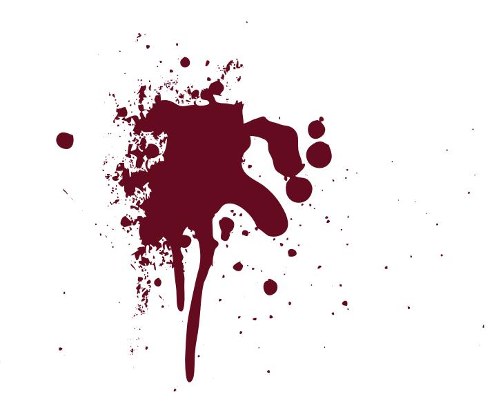

#### ARGARNTHER NHERNSNIING

Хотя FIRSTLIGHT - это заговор внутри заговора, не все охотники на вампиров в правительстве США (USG) знают о его существовании или действуют под его контролем. В то время как Камарилья затаилась, ее прагоценный Маскарал в некоторых частях Соединенных Штатов практически рухнул. Это привело к разрозненному пробуждению правды о вампирах в различных подразделениях USG. Неорганизованные, неуверенные в себе и плохо информированные, эти охотники за вампирами не могут оказать такого же воздействия на общество, но зачастую они лучше ориентируются в местном сообществе, и слишком жесткое обращение с ними может привлечь внимание "настоящих" охотников.

#### TOR

Иммиграционная и таможенная служба (ICE) - это организация, глубоко внедрившаяся в ряды заговорщиков FIRSTLIGHT, поскольку она занимается транснациональными преступлениями. Однако ICE настолько разрослась, что даже FIRSTLIGHT не подозревает, что не только они используют ресурсы ICE для охоты на вампиров. Агенты ICE, отвечающие за отлов и депортацию нелегальных иммигрантов, являются экспертами по проникновению в дома и удержанию большого количества заключенных. Их мандат также дает им чрезвычайные полномочия допрашивать и задерживать всех, кто находится в радиусе 100 миль от границы США, а это примерно 75% населения США. Независимые охотники на вампиров в ICE имеют свободный доступ к тяжелому оружию и организационную культуру, в которой особое внимание уделяется выполнению приказов. Вампиры, столкнувшиеся с охотниками из ICE, получают классический военизированный опыт: штурмовые винтовки, тараны, наручники и баллончики со слезоточивым газом.

#### **DEA**

Еще одно ведомство, в которое проникли сторонники FIRSTLIGHT, - Управление по борьбе с наркотиками ( Department of Drug Enforcement, DEA) - представляет собой странную смесь в структуре ГРУ, сочетающую в себе как военизированные структуры, так и специалистов по сбору разведданных. Несмотря на сходство с ICE в том, что его мандат касается незаконных материалов, пересекающих границу США, DEA сосредоточилось на борьбе с наркотиками, что позволило ему расширить свою деятельность более чем на 60 зарубежных стран, где наркотики и другие запрещенные вещества либо производятся, либо находятся в незаконном обороте. В отличие от ICE, корпоративная культура DEA в большей степени ориентирована на расследование уголовных дел, а не на кинетические операции и исправление ситуации. Хотя агенты DEA имеют доступ к стрелковому оружию, они часто работают с союзными военными за рубежом и местной полицией на территории США. Охотники, работающие в DEA, будут иметь доступ к очень высокому оборудованию для слежки, включая прослушивающие устройства, направленные микрофоны, микроточки слежения и скаты, способные перехватывать сотовые звонки и сообщения. Особо мотивированные охотники из DEA могли бы даже использовать свои знания о местных преступных организациях или картелях, чтобы подставить вампиров как потенциальных соперников и мишени.

#### **CDC**

Казалось бы, в организации, занимающейся биологической опасностью и инфекционными угрозами, полжно быть более чем постаточно охотников на вампиров, однако Центр по контролю заболеваний (CDC) - относительно небольшое и недостаточно финансируемое учреждение, не входящее в военноразведывательный комплекс ГРУ США. Немногочисленные независимые охотники на вампиров, работающие при СDC, сформировали секретную рабочую группу исследователей, известную под названием ECLIPSE. В первую очередь их интересует, как распространяется вампиризм, а также разработка вакцины, которая могла бы привить человека от вампиризма и полностью остановить размножение пустых тел. Исследователи ECLIPSE постоянно нуждаются в образцах крови и тканей пустых тел и охотно торгуют наркотиками и другими запрещенными веществами, чтобы получить их. По слухам, как минимум одна ячейка освобожденных гулей и охотников-любителей зарабатывает на жизнь, поставляя ECLIPSE необходимые им детали.

#### COG È ÃËÓÁÈÍÍÎÅ ÃÎÑÓÄÀÐÑÒÂÎ

Он называет себя **Cog** и утверждает, что является информатором, работающим на теневое "глубинное государство", которое контролирует несколько мировых правительств с помощью шантажа, магии крови и древнего договора с лунными пришельцами. Не предлагая никаких доказательств ни одному из этих диких утверждений, **Cog** изложил свой манифест в серии загадочных и наполненных тайнами эссе, которые до сих пор широко распространяются в темной сети. Первоначально опубликованный под ником **incognito** в виде серии скриншотов на **Youtube**-канале, посвященном НЛО-роботу Грендайзеру, **Cog** возложил вину за многочисленные террористические атаки в Европе и Азии на вампиров, крадущих лица и работающих на "глубинное государство". Из множества теорий заговора, получивших широкое распространение в обществе, теория **Cog**, в частности, привлекла к себе внимание широких слоев американцев, пытающихся объяснить необъяснимые действия собственного правительства.

Трещины в "Маскараде" разрастаются, поскольку вампиры стали политически разрозненными и на них открыто охотятся. В то время как правительства многих стран, участвующих в Коалиции, делают все возможное, чтобы скрыть следы сверхъестественного, темная паутина позволяет распространять слухи среди населения, не готового отличить правду от вымысла. Не имея возможности соотнести реальность с тем, что рассказывают СМИ, многие обращаются к теориям заговора, чтобы получить ответы на свои вопросы. Почему их города разрушаются, в то время как флотилии вооруженных беспилотников патрулируют мировое небо? Почему их политики не могут воевать за них, но так быстро отправляются на войну за границу? Почему никто не может просто объяснить им, что, черт возьми, происходит?

**Cog** заполнил этот пробел странной и разрозненной историей, спрятанной в виртуальной охоте за пасхальными яйцами на многочисленных сайтах и **USB**-тайниках. Хотя первые несколько страниц манифеста были обнародованы, они были неполными, но между строк были подсказки, где можно найти остальную часть его истории. Каждый раз, когда обнаруживается новый фрагмент манифеста, его последователи проводят дни, изучая текст и сопутствующие рисунки в надежде найти подсказки к следующей загадке. По словам **Cog**'а, в тени и темных уголках Земли уже идет великая духовная война. Все люди, а американцы в особенности, обязаны вооружиться для борьбы с этими инфернальными силами.

В своих более поздних сообщениях **Cog** даже подробно описывает сильные и слабые стороны нескольких вампирских семей, а также метод межзвездной связи с помощью зеркал. Если отбросить вампиров и лунных пришельцев, то главная загадка, которую надеются разгадать его последователи, - это личность **Cog**'а. Поскольку **Cog** так часто использует в своем манифесте термины "страна вкуса" и "мои восхитительные американские братья", многие считают, что он - ведущий прекращенного кулинарного реалити-шоу, ставший агентом ЦРУ или, возможно, одним из руководителей Объединенного комитета начальников штабов. Другие полагают, что кулинарные обороты речи могут намекать на то, почему вампиры объединились с теневым правительством.

# ВЕЛИКОБРИТАНИЯ

Хотя организации, входящие в британское отделение Коалиции, имеют ограниченное право голоса в вопросах управления глобальным заговором, их заметные успехи в Лондоне рассматриваются в качестве тестового примера того, как можно очистить другие крупные городские районы от " пустых тел". Объединенная группа реагирования на угрозы (JTRG) и их спонсоры из FIRSTLIGHT стремятся заложить основу для проведения учета и ликвидации " пустых тел" в ЕС по лондонскому образцу, однако выход Великобритании из европейского сообщества ("Брексит") серьезно осложнил эти усилия. По иронии судьбы, это отложило спор, который в будущем может расколоть конспирологию, поскольку немногие члены Коалиции за пределами США и Великобритании хотят, чтобы в их крупных городах действовали "Отряды

охотников за головами" SO13.

## JTRG

Объединенная группа реагирования на угрозы напрямую подчиняется рабочей группе Соединенного Королевства, отвечающей за руководство охотой на вампиров на территории Великобритании. JTRG - это небольшое подразделение сигнальной разведки, которое поддерживает всю деятельность Коалиции в Европе. Являясь глазами и ушами европейского отделения заговора, они используют биометрию, распознавание лиц и технологию XScope, чтобы отслеживать пустые тела и помечать их для казни. Этот список известен как "Меловая доска", он обновляется и передается всем "Пяти факелам" в режиме реального времени. Несмотря на то, что имена регулярно вычеркиваются, в списке обычно около 300 целей, а процент ложных срабатываний составляет менее 8%. В Лондоне они поддерживают масштабную программу наблюдения с помощью камер и сканеров XScope, что позволяет им направлять SO13 непосредственно к целям по мере их получения. JTRG тесно сотрудничает с FIRSTLIGHT и IAO, а в рамках глобальной программы наблюдения ECHELON они являются основными участниками программы "Сердебиение", хотя и не имеют прямого доступа к результатам работы алгоритма. Несмотря на то, что JTRG не способна к онлайновому анализу данных на том же уровне, что IAO, FIRSTLIGHT или даже российская ГРУ-N58, она не имеет себе равных в области видео- и аудиоконтроля, несмотря на свои относительно небольшие размеры.

#### ÒÎ×ÊÈ ÄÀÂËÅÍÈß

Полное уничтожение всех вампиров в Лондоне стало возможным благодаря тому, что JTRG воспользовалась навязчивой системой наблюдения и безопасности города. Не беспокоясь о неприкосновенности частной жизни, соблюдении конституции или реакции общественности, они предоставили разведданные, которые позволили "Охотникам за головами" из SO13 уничтожить всех вампиров в столице Великобритании. Достижение "нулевого уровня" ("BBZed") стало победой, превзошедшей самые смелые прогнозы коалиции. Теперь хозяева JTRG в Великобритании настаивают на том, чтобы аналогичная программа тотальной слежки была реализована в Евросоюзе, и американцы даже готовы за это заплатить. Пока что "Брексит" и мысль о том, что британские глаза тайно подглядывают за всеми гражданами ЕС, вызывают достаточное сопротивление, чтобы не допустить

исключения этого плана из повестки дня Коалиции. Еще большую тревогу вызывает состояние программы JTRG по BBZed в Лондоне. Они стали жертвой собственного успеха, так как любое увеличение популяции бестелесных существ сильно пошатнет их ограниченное влияние в Коалиции и поставит под угрозу финансирование IAO, в котором они отчаянно нуждаются, чтобы выжить. Каждый раз, когда в Лондоне или вблизи него обнаруживается гнездо бестелесных существ, JTRG бросает в бой охотников за головами, чтобы уничтожить вампиров до того, как их присутствие будет замечено за пределами Великобритании. Это также означает, что когда в канализации Лондона происходят сбои в работе систем, JTRG часто оставляет камеры темными на несколько недель в надежде сохранить иллюзию BBzed.

#### ÒÅÕÍÈÊ JTRG

Техник JTRG отвечает за поддержку группы UTR, которой приходится отключать или обходить меры безопасности, применяемые в гнезде с пустыми телами. Кроме того, он может взламывать зашифрованные данные и использовать доступ к локальному видео и XScope в режиме реального времени для отслеживания цели.

Общая сложность: 3/1 Стандартный набор кубиков: Физический 4, Социальный 4, Ментальный 6 Вторичные атрибуты: Здоровье 4, Сила воли 6 Исключительные пулы кубиков: Наблюдательность 8, Техника 8

Оборудование: Ноутбук, планшетный контроллер Spot, вариант палача для робота Spot "Собака" (с. 78) Особенность: Любой вампир, пытающийся уклониться от операции с помощью Уличное чутье или Скрытность, должен выиграть бросок Состязание против Пула технологических кубиков Техника JTRG (8).

## SO13

Несмотря на то, что SO13 существует менее десяти лет, на ее счету больше подтвержденных случаев уничтожения пустых тел, чем у любой другой организации Коалиции, за исключением Общества Леопольда. Смешанный прах некогда могущественного лондонского вампирского двора покоится в помятой жестяной урне, забытой в нижнем ящике стола в штаб-квартире SO13. Изначально SO13 была детищем теневой Ньюбургской группы, которая также руководит JTRG, и набрала основной состав из закаленных полицейских и военных ветеранов, лично пострадавших от пустых тел. Даже Ишак Хан, глава оперативного отдела SO13, по слухам, потерял всю свою близкую семью из-за стаи "пустых тел", когда был маленьким ребенком. Суровый бывший капитан полиции предпочитает руководить с передовой, и этот долг он вернул в сотни раз.

В то время как Структура Ватикана восхищается его рвением, остальные члены Коалиции признают SO13 как наиболее ярый элемент фракции искоренителей заговора.

Для охотников за головами SO13 бестелесные тела это недифференцированная и чудовищная масса, которая разлагает человека близостью к нему. Если бы они захотели, Коалиция расширила бы свой мандат на отлов или убийство уродливых рабов крови, так называемых "слабокровных" и даже членов стада вампиров. Принятие обезглавливания в качестве тактики террора, а также повсеместное использование масок на лицах не позволили руководству Коалиции подписать соглашение о распространении методов SO13 на остальную Европу.

#### ÒÎ×ÊÈ ÄÀÂËÅÍÈß

Хотя формально SO13 не является одним из основных участников Коалиции, ее значительные успехи в Лондоне позволяют рассматривать ее политику искоренения как возможную модель для заговора в целом. Хотя многие члены SO13 хотели бы, чтобы их методы применялись во всем мире, их личная преданность Ишаку Хану и недоверие к "более мягким" участникам заговора в ЕС заставляют их неохотно делиться деталями своих операций. Особую озабоченность SO13 вызывает использованиегулей и "слабокровных" FIRSTLIGHT и российским ГРУ. Отряды "Охотников за головами" обычно уничтожают этих личинок, чтобы предотвратить их метастазирование в более мощные угрозы в будущем. Хотя SO13 выделяет посильную рабочую силу для операций за пределами Великобритании, охотники за головами, скорее всего, взбунтуются, если их заставят работать вместе с вампиром или бывшим гулем.

#### ÀÐÊÀÍÓÌ

Арканум держит свое участие во Второй инквизиции в строжайшем секрете и устанавливает прямые каналы связи в Великобритании только с Ньюбургской группой и командиром **SO**13 Ханом. Оккультные ученые и дилетанты с многолетней историей изучения и борьбы со сверхъестественным, несколько видных представителей английской элиты считаются тайными членами Арканума. Под их влиянием была создана **JTRG**, и они оказывают посильную мистическую поддержку отрядам охотников за головами **SO**13. Хотя арканисты не так богаты оккультными артефактами, как Ватикан или даже **SAD** ФБР, они представляют собой, пожалуй, наиболее организованную силу практических магов в Европе. Их опыт был жизненно важен для обнаружения и преодоления магической защиты Венского гнезда и последующего обследования руин в поисках ценностей. Хотя библиотеки Арканума и получили прибыль от этой атаки, большую часть мистических трофеев забрали солдаты Ватикана.

На оперативном уровне арканисты оказывают поддержку, проводя брифинги по эзотерическим угрозам и иногда используя ритуальную магию для формирования боевой обстановки. Эта поддержка осуществляется тайно и только по запросу, чтобы скрыть свое участие от солдат, которые могут попасть в плен или в рабство к "пустым телам". Хотя они не признаются в этом своим союзникам, магические возможности Арканума весьма ограничены по сравнению с возможностями "пустых тел". Точная природа их магии неизвестна, но в основном они демонстрируют способность определять мистически скрытые места и снимать магические чары.

#### SOI3 "ОХОТНИК ЗА ГОЛОВАМИ"

Солдаты в масках, "очистившие" Лондон за один день. Оперативники SO13 считают, что любой вампир - это потенциальный "дневной ходок", и никогда не захватывают цели без прямого и специального приказа. Во время выполнения задания они используют зажигательные боеприпасы и термитные гранаты, но оперативно подтверждают попадание, собирая головы уничтоженных вампиров и гулей. За склонность к демонстрации этих голов они и получили свое жуткое прозвище.

#### Общая сложность: 4/2

Стандартный набор кубиков: Физический 6, Социальный 3, Ментальный 5

Вторичные атрибуты: Здоровье 6, Сила воли 7 Исключительные броски кубиков:

Наблюдательность 8, Огнестрельное оружие 8, Фехтование (кукри) 8, Скрытность 8 Снаряжение: Пистолет-пулемет (Heckler & Koch MP5), термитная граната AN, бронежилет, кукри с лезвием из высокоуглеродистой стали  $(+4$  урона), MRAP.

Особенности: Охотники за головами тренируются обезглавливать вампиров в ближнем бою. Если охотник за головами набирает пять или более успехов при ударе в ближнем бою клинковым обезглавливающим оружием (топор, катана, кукри, ночной дозорный) по вампиру, то вампир обезглавливается.

Охотники за головами обычно действуют только в светлое время суток и используют маски и кодовые имена, чтобы сохранить свою личность в тайне во время охоты. Любая попытка выяснить личность охотника за головами с помощью таких фонов, как "Контакты" или "Союзники", имеет повышенную сложность на  $+2.$ 

# Россия

Хотя российские военные уже более трех десятилетий безжалостно уничтожают вампиров на своей территории, их роль в Коалиции часто сводится к сдерживанию оперативных излишеств. Русские с опаской относятся к любым попыткам коалиционной оси США/Великобритания создать глобальные силы быстрого реагирования с объединенным командованием. Они знают, что такие силы быстро станут марионеткой FIRSTLIGHT и, скорее всего, будут игнорировать угрозы, которые в первую очередь угрожают российским интересам. Кроме того, русские лучше других знают, что вампиры - мастера подкупать институциональную власть в своих целях. Пока коалиция сохраняет отдельные центры управления, заговору сложнее быть обрашенным против себя или подорванным. Это особенно актуально в тех случаях, когда ресурсы Коалиции задействованы в зонах активных боевых действий, где зачастую неясно, действительно ли они используются для борьбы с вампирами. До сих пор Ватикан поддерживал эту позицию.

#### Восьмое направление ГРУ

ГРУ-Н58 (Восьмое направление Пятого управления) ведет свою историю от секретного подразделения военной разведки, созданного в Советской Красной Армии для искоренения влияния вампиров в собственных вооруженных силах. В итоге удалось обнаружить и уничтожить "кольцо вампиров", проникшее в важнейшие отрасли социалистической республики. Хотя подробности остаются государственной тайной, N58 считает себя самой успешной организацией по охоте на вампиров в рамках Второй Инквизиции и признает только группу ESOG Ватикана, действующую на том же уровне эффективности. Это часто приводит к оперативным разногласиям, когда приходится действовать вблизи российских зон влияния, так как ГРУ отказывается рисковать своими средствами, если ему не предоставлен полный доступ к необработанным разведданным FIRSTLIGHT. Это может привести к дополнительным задержкам, поскольку аналитики ГРУ перебирают те крохи, которыми обычно охотно делятся американцы.

На земле N58 предпочитает использовать хирургическое насилие. Доктрина подавляющей силы, примером которой являются FIRSTLIGHT и британская SO13, представляется русским контрпродуктивной, поскольку они считают себя профессионалами, которые всегда следят за ходом игры. Небольшие отряды N58 UTR, состоящие из хорошо скоординированных (и полностью проинструктированных) бойцов спецназа, уничтожают или захватывают свои цели, а затем часто подбрасывают захваченную атрибутику конкурирующей группировке " пустых тел". (Для сохранения правдоподобности N58 часто наносит удары перед самым рассветом. Операции под ложным флагом - специализация ГРУ, а N58, как известно, даже переодевается в форму местных военизированных или иностранных войск при выполнении задания.

#### ÒÎ×ÊÈ ÄÀÂËÅÍÈß

За отстраненной корпоративной культурой Восьмого направления скрывается стремление избавить Россию от вампирического контроля. Они знают, что, несмотря на дезинформацию польских реакционеров, утверждавших, что СССР был марионеточным государством бестелесных существ, ГРУ уничтожило несколько вампиров, влиявших на Политбюро, активизировав конкурирующие сверхъестественные группировки. Затем с помощью пси-операций и огневого поражения были отбиты попытки других вампиров занять их место.

Для русских остальной мир просто проснулся перед угрозой, с которой N58 и Ватикан боролись в одиночку в течение многих лет. Хотя они считают, что Коалиция служит их краткосрочным интересам, N58 также рассматривает информационное доминирование FIRSTLIGHT как потенциально большую угрозу для России, чем вампиры в долгосрочной перспективе. В координации с Акритай N58 начала сливать информацию Ватикану и некоторым другим партнерам в надежде подорвать их доверие к американской и британской частям Коалиции. В частности, в XScope появилось расширенное видео ударов беспилотников, нанесенных под оперативным руководством FIRSTLIGHT, в результате которых в Колумбии были убиты смертельно раненные повстанцы. N58 также проник в британскую программу JTRG "Меловая доска" и пришел к леденящему душу выводу, что она представляет собой список политических убийц, в котором очень мало вампиров.

#### GRU-N58 ÑÏÅÖÈÀËÈÑÒ ÏÎ ÏÑÈ-ÎÏÅÐÀÖÈßÌ

Специалист по пси-психологии обычно прикрепляется к тактическим группам с целью заметания следов и подбрасывания доказательств того, что за их действия ответственна другая группа. Зачастую это означает подставу другой страны, но иногда появляется возможность натравить друг на друга группировки "пустых тел". Акритаи и ГРУ располагают коллекцией еретических вампирских текстов, которые они модифицируют, добавляя в них ложные пророчества и вводя в заблуждение, чтобы вызвать конфликт.

#### Общая сложность: 3/2

Стандартные пулы кубиков: Физический 5, Социальный 6, Ментальный 5

Вторичные атрибуты: Здоровье 6, Сила воли 7 Исключительные пулы кубиков: Воровство 8, Огнестрельное оружие 7, Оккультизм (вампиры) 6, Скрытность 8, Хитрость (Дезинформация) 7 Оборудование: Штурмовая винтовка (АК-74М), нож, рваная нашивка SOCOM, стелс-вертолет KA-58 "Черный призрак"

Артефакты: Фрагменты Книги Нода ("подделка")

### Áëîê 242 Ñïåöèàëüíûå öåëè

Отряд 242 - военизированная организация с черным бюджетом, подчиняющаяся непосредственно высшим эшелонам российской военной разведки. Изначально в задачи Отряда 242 входило приобретение и каталогизация оккультных книг и предметов, изъятых у обезвреженных вампиров, но по мере расширения активного участия России в Коалиции за рубежом сфера деятельности Отряда 242 как тактической силы расширилась. U242 целенаправленно работает с руководством сообществ "пустых тел" и привлекает в свои ряды в основном представителей иностранных военизированных формирований, уже внедренных в спецназ ГРУ. Это дает U242 возможность отрицать свою вину в случае поимки или гибели операторов, поскольку Россия может легко дезавуировать их как иностранных террористов. Такая методика позволяет пополнять свои силы вампирами и другими сверхъестественными существами. Особо перспективных солдат забирают в черноморский тренировочный комплекс U242, и те, кто выдерживает классово жесткий протокол ZMEI, обретают многие способности вампиров, но лишь некоторые их слабости. Со временем у многих из них начинают проявляться фамильные черты и недостатки, присущие пустым телам, но они редко выживают достаточно долго, чтобы это стало проблемой.

#### ТОЧКИ ДАВЛЕНИЯ

Одной из сильных сторон "мокрых работников" протокола ZMEI является их способность действовать на контролируемых врагом территориях практически без поллержки. Они живут буквально за счет земли и питаются как смертными, так и вампирами. Это привело к тому, что группа охотников на вампиров превратилась в мощную диаблерийскую группировку. Некоторые из них даже пробыли в пустыне так долго, что переняли часть идеологии Шабаша "Война в Геенне". Для этих немногих каннибализм стал почти ритуальной потребностью, чтобы придать себе силы в борьбе с невидимыми богами крови.

#### ПРОТОКОЛ ЗМЕИ СЛАБОКРОВНЫЙ СПЕЦНАЗОВЕЦ

Не доверяя другим охотникам, ГРУ добилось больших успехов, используя слабокровных в качестве ударных отрядов. Те, кто может работать при солнечном свете, проходят специальную подготовку по влажной работе и направляются в гнезда "пустых тел", чтобы нарушить управление и контроль над ними, прежде чем обычные силы прибудут для их детального уничтожения. Хотя коммандос предпочитают съедать своих жертв, они не прочь расправиться с ними на расстоянии, если цель очень надежна.

#### Общая сложность: 5/3

 $\overline{7}$ 

Стандартные пулы кубиков: Физический 7. Социальный 4, Ментальный 7 Вторичные атрибуты: Здоровье 10, Сила воли

#### Исключительные пулы кубиков:

Наблюдательность 9, Драка 9, Огнестрельное оружие 9, Фехтование 9, Скрытность 9 Оборудование: Снайперская винтовка (Heckler & Koch PSG1 7.62mm), гаррота, нож Дисциплины: Стойкость 1 или одна точка в любой другой дисциплине.

Особенности: Коммандос - дневной ходок и может действовать при солнечном свете, не получая повреждений, но при этом он должен регулярно питаться кровью. Винтовка коммандос обычно заряжена зажигательными патронами.

#### **АКРИТАЙ**

Принадлежащие к православной церкви, охотники на ведьм Акритаи имеют древнюю родословную, восходящую, по крайней мере, к Византийской империи. Акритайцы имеют репутацию, сходную с ватиканским Обществом святого Леопольда, однако они предпочитают современное оружие и редко обращаются к оккультным силам. После Второй мировой войны российская развелка проникла в сердце ордена в Восточной Европе, очистив наиболее упорных во время коммунистического правления. Большинство оставшихся нерусских. независимых Акритай погибли во время столкновения с очень старым вампиром в Чехии в 2011 году.

Хотя орден продолжает представлять себя как независимая организация охотников за ведьмами, по сути, он является продолжением российской спецслужбы и ГРУ №58. Многие солдаты ордена не знают об этой подрывной деятельности, и N58 использует "Акритай" для получения доступа к странам - членам Коалиции, которые могут опасаться их прямого участия в операциях. Репутация "Акритай" особенно полезна для шпионажа ГРУ в самом Ватикане, поскольку церковь убеждена, что охотники на ведьм обладают несколькими реликвиями из Константинополя. Несмотря на то, что более десяти лет назад все артефакты "Акритаи" были конфискованы, переговоры с Ватиканом разрешено продолжать, если представится возможность превратить в шпиона высокопоставленного церковного деятеля.

Большая часть эзотерической подготовки Акртаев была утрачена со временем и в результате чисток; теперь орден уделяет больше внимания стандартным боевым тренировкам. За теми немногими колдунами, которые все еще практикуют внутри ордена, ГРУ ведет строгое наблюдение и разрешает им выезжать за пределы России только в том случае, если оперативные и политические выгоды очень высоки. (Некоторые колдуны "Акритаи" были допущены в Грузию и Сирию для раскопок мощных артефактов под прикрытием войн в этих странах). Хотя уловка с использованием акритайцев в качестве прикрытия опасна и сложна, в прошлом она приносила свои плоды. По крайней мере, один заговор с целью дестабилизации работы важнейшего нефтеперерабатывающего завода был свернут, когда к жрецам Акритаи обратились за поддержкой сверхъестественные террористы, полагавшие, что с ними заключен некий древний союз.

# Бразилия

Тесно сотрудничая с Ватиканом на оперативном уровне, бразильские войска не решаются принимать более активное участие в деятельности Коалиции за пределами Южной Америки. BOES десятилетиями тихо сражалась со сверхъестественными врагами, не получая никакой поддержки, кроме случайных охотников-леопольдитов. Внутри Коалиции они рассматриваются как продолжение ватиканской ветви заговора в Америке, и их одинокие годы, проведенные в борьбе с угрозой "пустых тел", в основном не принимаются во внимание.

## **BOES**

Бразильские батальоны специальных полицейских операций действуют как географически обособленные организации по всей стране. BOES - это программа межбатальонного командования и обучения, в рамках которой в SPOB набираются специальные отряды для использования в качестве охотников на вампиров. Хотя они уничтожают вампирские гнезда в городах и фавелах, основной задачей BOES является защита критически важных объектов инфраструктуры, таких как правительственные учреждения, военные объекты и нефтеперерабатывающие заводы, от влияния "пустых тел". Хотя BOES и подозревает, что в районе города могут быть распространены вампиры, они не хотят разжигать войну в разросшихся городских зонах, где солдаты SPOB часто рассматриваются как оккупационная сила. При подозрении на контакт с вампирами информаторы из обычных подразделений SPOB передают сигнал группам быстрого реагирования BOES, которые прибывают на место на вертолетах. Для идентификации целей используются рентгеновские и инфракрасные приборы, установленные на транспортных средствах, а сами SPOB очищают территорию от небоевых элементов, что позволяет BOES более гибко подходить к выбору боеприпасов с ограниченным числом жертв среди гражданского населения. Благодаря тесным связям с Ватиканом подразделения BOES часто используют редкие артефакты и другое духовное оружие, доступ к

которому обычно закрыт для ESOG.

При поиске "пустых тел" BOES обычно предпочитает работать в тандеме с силами Ватикана в качестве подкрепления, но SAD ФБР стал неожиданно надежным союзником в Рио и Браззавиле. Тактические отряды BOES активно используют зажигательные боеприпасы, если только они не действуют вблизи нефтехимических предприятий или если задача состоит в захвате конкретного "пустого тела", необходимого для допроса.

BOES ведет борьбу с удержанием в Южной Америке и зависит от Коалиции, которая должна предложить глобальное решение проблемы вампиров. В оперативном плане командиры BOES часто готовы смотреть на происходящее сквозь пальцы, пока "пустые тела" действуют только в маргинальных и бедных слоях общества. Это позволяет BOES сконцентрировать свои силы на защите более важных с политической точки зрения районов.

#### ÒÎ×ÊÈ ÄÀÂËÅÍÈß

BOES постоянно приходится делать трудный выбор в противостоянии вампирской угрозе в Бразилии. Несмотря на то, что военная полиция, из которой состоят ее бойцы, очень хорошо финансируется и имеет полную свободу действий в крупных городах, BOES опасается, что вампирские и криминальные организации все еще имеют большое влияние в SPOB, несмотря на все усилия по проверке своих сотрудников. Междоусобные войны между различными подразделениями SPOB были опасно близки к перерастанию в открытое насилие, и не один командир SPOB погиб при подозрительных обстоятельствах, связанных с организованными преступными элементами. Насколько коррупция в правительстве и армии подконтрольна вампирам, неизвестно, но она создает в BOES атмосферу, которая колеблется между решительным фатализмом и парализованной нерешительностью. Они тщательно выбирают свои сражения, поскольку никогда не знают, когда та или иная операция обнажит глубокое соперничество внутри армии и поставит под угрозу их положение в Коалиции. BOES ревностно охраняет свои тесные связи с Ватиканом и боится любого сценария, который может привести к разрыву этих связей или к тому, что FIRSTLIGHT начнет действовать в Бразилии без санкции BOES.

### Ýêñòåððèòîðèàëüíûå îïåðàöèè âîåííîé ïîëèöèè (PMEX)

Созданная по просьбе Ватикана на средства IAO для борьбы с "пустыми телами", спасающимися от операций Коалиции в Южной Америке, PMEX превратилась в отряд специальных операторов, специализирующихся на быстрой подготовке недостаточно оснащенных местных сил для охоты на вампиров. По закону PMEX не имеет права работать на территории Бразилии и зависит от командования и контроля Ватикана, который в последнее время стал охватывать все операционные зоны, где наблюдается резкий рост активности "пустых тел" без ответных мер со стороны Второй инквизиции.

Хотя РМЕХ избегает зон активных боевых действий и стран, входящих в сферу влияния США или России, сегодня она действует по всему миру, выбирая в качестве мишеней пограничные районы и другие международные "стыки".

Их офицеры связи обучают традиционным методам охоты на вампиров ополченцев и повстанцев, которые часто теряют своих родных и близких в результате нападения "пустых тел", терроризирующих их общины. Люди с мачете" из РМЕХ обучают их основам заклания и обезглавливания, а также созданию антивампирских контрмер для защиты передовых позиций в ночное время. В качестве таких противодействий часто используются зажигательные мины или ямы с катушками бритвенной проволоки. В отличие от большинства современных частей Второй Инквизиции. РМЕХ часто оказывается в невыгодном тактическом положении при столкновении с враждебными вампирами, и их успех зависит от умного использования собственных сил и использования мистических и психологических слабостей противника.

#### ТОЧКИ ДАВЛЕНИЯ

Операторы РМЕХ не являются равнодушными или невежественными к природе тех сил, которые они тренируют и консультируют. Террористы, повстанцы, ополченцы, военные преступники, торговцы людьми и дети-солдаты все они честные ученики для "Мачете Мен", если они хотят охотиться на вампиров. Хотя это вызвало трения как с FIRSTLIGHT, так и с ГРУ, до сих пор их финансирование и поддержка никогда не прерывались. РМЕХ отказывается ввязываться в политические или моральные споры о том, какие группы они обучают, а Ватикан считает положительным моментом их заметное предпочтение в подготовке так называемого христианского ополчения. По мнению РМЕХ, они просто извлекают пользу из плохой ситуации и используют имеющихся в их распоряжении солдат в тех местах, которые покинуты остальным миром. В их задачу не входит прекращение человеческих страданий или поддержание мира. Они уничтожают вампиров.

#### СОТРУДНИК ПО СВЯЗЯМ С ПЛАТЕЖНОЙ СИСТЕМОЙ **PMEX**

Офицер связи прикомандировывается к иностранным полицейским или военным силам, не обладающим достаточными возможностями для борьбы с вампирской угрозой. Офицер связи не скрывает своих навыков и того, на кого он охотится, но полагается, что Пай Лео или другая часть Коалиции наведет порядок после выполнения задания.

#### Общая сложность: 3/2

Стандартный набор кубиков: Физический 6, Социальный 4, Ментальный 3

Вторичные атрибуты: Здоровье 5, Сила воли 6 Исключительные наборы кубиков: Лидерство 6, Оккультизм (вампиры) 6. Уличное чутье 6. Выживание 6 Оборудование: Штурмовой карабин (Taurus Tavor TAR-21 5,56 мм), бронежилет, гранаты НЕ, кол, вертолет поддержки Eurocopter AS532 Cougar с XScope Артефакт: Кинжал Аккада, (см. стр. 87) Особенность: Смертные солдаты, находящиеся под командованием офицера связи, пользуются его знаниями о вампирах и сверхъестественном. При необходимости их солдаты могут использовать оккультные навыки офицера связи как свои собственные.

#### Ватикан

В их понимании Ватикан - это сердце Второй инквизиции и движущая сила многих наиболее успешных операций Коалиции. Хотя силы Ватикана, возможно, не всегда обладают самой современной и продуманной тактикой ведения боя, их знания о вампирской угрозе намного превосходят знания любого другого участника заговора. Предположительно, координационная группа Ватикана, занимающаяся охотой на вампиров. располагает архивом, содержащим более 800 лет исследований и подробных описаний сил и мотивов вампирских владык, которые, возможно, еще ходят по Земле. Не говоря уже о хранилище мистических артефактов, которые выдаются

удачливым охотникам в качестве трофеев и почетных знаков.

#### **LA ENTITA (OPTAHWSAUMA)**

Точный состав La Entità - лица, принимавшие решения о вовлечении Ватикана в Коалицию, остается загадкой даже для других участников заговора.

По слухам, руководство La Entità осуществляется девятью неизвестными людьми, выбранными из церковной иерархии. Такая схема позволяет оградить Святой Престол от прямого участия в сомнительном деле истребления

сверхъестественных существ. La Entità располагает огромными ресурсами, сетью религиозных убежищ по всему миру и глубоким штатом преданных охотников на вампиров. Хотя La Entità долгое время координировала работу Общества Святого Леопольда и других инквизиторских служб Ватикана, ее деятельность всегда была небольшой по масштабам и консервативной. Так называемый "Маскарад" вампиров оказался настолько успешным, что даже в Ватикане начали сомневаться в благом начинании своих предшественников, несмотря на множество доказательств, собранных ими за многие века. Они обсасывали края проблемы и наносили по ним удары, которые могли нанести в теневой войне с проклятыми, которая, как они надеялись, казалась им бесконечной и непобедимой.

До Второй инквизиции эксцессы и неудачи Первой инквизиции также тяготили руководителей La Entità и удерживали их от принятия более решительных мер по борьбе с вампирской угрозой.

Из собственных записей они знали, что их прошлые усилия по уничтожению вампиров были испорчены политическими и вселенскими интригами. Великое дело превратилось в оргию разрушения, в ходе которой жестоко расправлялись с женщинами и религиозными меньшинствами. В итоге это пятно подорвало их авторитет и позволило вампирам избежать суда, в то время как невинные сгорали тысячами. В темные века между двумя инквизициями La Entità оттягивала время и лелеяла позор своих грешных предшественников. Мало кто верил, что будет следующий раз, но если бы им снова представилась такая возможность, все было бы подругому.

Хотя лидеры La Entità отвергают критику, что первая инквизиция больше занималась устрашением политических противников, чем охотой на вампиров, они признают, что ошибки были допущены, и на этот раз вторая инквизиция не будет втянута в междоусобные конфликты. Теперь, когда они стоят в центре глобального предприятия беспрецедентной мощи, они видят свою роль в качестве компаса, постоянно направляющего своих партнеров к конечной цели. Им знаком соблазн злоупотребить властью Второй инквизиции в корыстных целях, поскольку именно эта ловушка привела к поражению их предшественников.

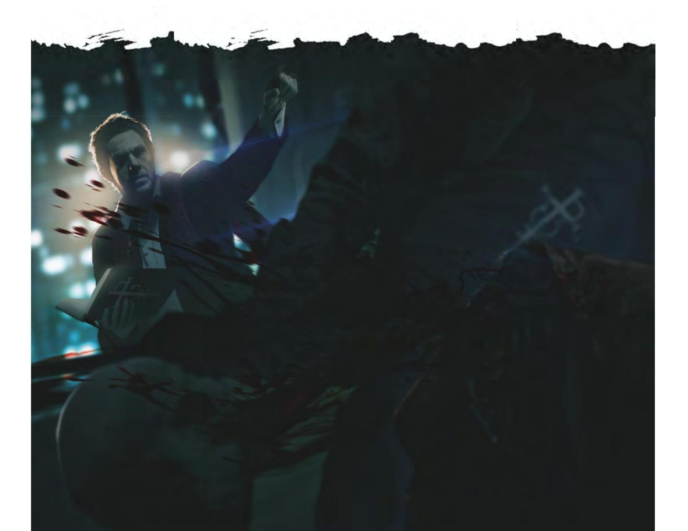

На плечи "La Entita" легло это бремя, и вот уже тысячелетие монстры пируют на человечестве, а в позолоченных залах эти люди шепчут слова "теа culpa". На этот раз пламя найдет последнего вампира. Хотя их соллаты ESOG могут быть рисковыми. La

Entità - это голос холодной осторожности в планировании операций. Они рассматривают свою работу как задачу поколения и знают, что если заговор будет раскрыт, это может дать вампирам время, необходимое им для перегруппировки и контратаки. Сущность редко привлекает свои силы для участия в смешанных операциях, предпочитая предлагать одиночных советников для выполнения отдельных миссий. Исключения делаются для бразильцев, учитывая их тесные связи, но они предпочитают иметь полный тактический контроль над операцией. По этой причине La Entità создала ESOG, чтобы обеспечить командные структуры даже в тех ситуациях, когда им приходится вступать в союз с другими национальными подразделениями.

#### ТОЧКИ ДАВЛЕНИЯ

La Entità считает себя сердцем Второй Инквизиции. В их глазах все остальные члены Коалиции - расходный материал для достижения цели. Но сердце должно продолжать биться. Как они пережили крах первой Инквизиции и долгие годы, когда вампиры возились с землей и уничтожали веру в божественное, так и La Entità переживет крах второй Инквизиции... и будет готовиться к третьей. Как и вампиры, с которыми они сражаются, Сущности понимают ход времени не в годах и десятилетиях, а в веках.

Поэтому" La Entita" всегда неохотно принимает участие в операциях в основном своими силами, предпочитая, чтобы основную нагрузку брали на себя ее российские или американские партнеры. Отчасти создание гибрида "Гладиус Деи" и ESOG было вызвано необходимостью увеличить присутствие ватиканских сил в операциях Второй инквизиции, не подвергая прямому риску подразделения, наиболее лояльные самой "La Entita". В то время как "Гладиус Деи" по большей части являются расходным материалом, ESOG слишком важны для того, чтобы ими командовал кто-то другой. В ESOG видят ключ к своему выживанию в случае краха Второй инквизиции или ее публичного разоблачения. Эти команды обученных истребителей - современные преторианцы.

#### АТТАШЕ-ОРГАНИЗАЦИЯ

Действуя под прикрытием дипломатической миссии Святого Престола, этот "культурный атташе" служит делу Структуры, следя за вампирическим влиянием в дипломатических, академических и художественных кругах и обеспечивая связь с другими оперативными сотрудниками Коалиции. Если у него появляется возможность провести небольшое незаметное исследование в местном оккультном архиве или даже позаимствовать текст, явно оставленный без защиты, он это делает.

#### Общая сложность: $3/1$

Стандартный набор кубиков: Физический 3. Социальный 7. Ментальный 6

Вторичные атрибуты: Здоровье 5, Сила воли 9 Исключительные пулы кубиков: Проницательность 8, Воровство 5, Оккультизм (вампиры) 7, Политика 7, Хитрость 8

Оборудование: Библия, одноразовый блокнот, распятие

Особенность: Атташе имеет десятилетний опыт пробивания вампирской лжи. При использовании в его присутствии способностей "Обливион" и "Сокрытие" их сложность увеличивается на +2. Кроме того, они могут попытаться пробить Сокрытие с помощью Озарения (8) со Сложностью, равной уровню используемой силы.

### Общество Святого Леопольда

Основанное Леопольдом Мурнауским и папой Григорием IX во времена первой инквизиции, недавно реканонизированное Общество Святого Леопольда провело предыдущее столетие как разрозненная группа независимых охотников за чудовищами. В прошлом их оперативники преследовали свои цели практически без официальной поддержки на случай, если их задержат смертные власти или обратит в свою веру могущественный кровопийца. Хотя такие охотники-одиночки все еще существуют и преследуют свои личные цели, они уже не являются нормой. С появлением Второй Инквизиции Общество и его многочисленные полразлеления стали теснее привязываться к La

Entità. Они все еще продолжают действовать как внештатные сотрудники, даже если действуют по данным разведки Коалиции или в качестве советников коалиционной группы UTR, но их собственные команды перешли на современную тактику отрядов.

Несмотря на то, что у каждого подразделения есть свои тактические доктрины, в целом Общество предпочитает действовать небольшими группами по шесть человек, вооруженных в основном стрелковым оружием и оружием ближнего боя. Если только они не работают с местными силами, эти группы обычно легко бронированы и скрытно одеты, что позволяет им подойти к цели незамеченными. Охотники общества легко экипированы, но иногда вооружены мощными артефактами, и даже колдуны, как известно, работают вместе с ними, когда официальные анафемы ослабевают.

#### подотряды леопольдитов

В обществе существует множество подпорядков, и хотя все они рассматривают вампиров как экзистенциальную и духовную угрозу человечеству, на протяжении веков они выработали множество различных философий и методов. (Некоторые подпорядки занимаются другими сверхъестественными существами и поэтому обычно не играют большой роли в деятельности Второй инквизиции.) Их можно найти везде, где действует Вторая инквизиция, поскольку Общество расширяет сферу своей деятельности.

#### ЛЕТИ ЛАЗАРЯ

Основанный вскоре после революции в Париже, этот орден фанатиков-охотников на вампиров в 1930-х годах вступил в союз с консервативной прелатурой "Опус Деи". С приходом к власти их союзника Папы Иоанна Павла II этот маневр принес свои плоды и сыграл важную закулисную роль в возрождении инквизиции при Ингрид Бауэр. Считая вампиров воплощенным кощунством, они возродили самые жестокие исторические тактики охоты на них и, в отличие от большинства подотрядов, широко распространили их. Их дикарский подход к охоте на вампиров "молотком и клещами" делает их плохим выбором для команды ESOG, но исключительно эффективными "волками-одиночками". Те, кого вербуют в ESOG, часто получают роль ударных отрядов на передовой. Являясь крупнейшим подразделением Общества, они взаимодействуют с отделениями "Опус Деи" в Европе и Северной Америке, но имеют свои собственные убежища и тренировочные базы в Африке, Индии, на Филиппинах и в Латинской Америке.

#### СМИРЕННЫЕ БРАТЬЯ ИЗ САН-РОККО

Хотя среди них много охотников, Братья Смиренные имеют особую миссию - заботиться о бедных и немощных, особенно о тех, кто стал инвалидом в результате чумы или психического заболевания. Они питают особую привязанность к животным и, как известно, ведут скрупулезные записи генеалогии различных вампирских семей из Европы и Малой Азии. Они редко практикуют теургию и другие искусства, а их тихая преданность делает их предпочтительными рекрутами для ESOG. Братья Хамбл, живущие в Венеции, принимают активное участие в восстановительных работах города, и мало кто так хорошо знает его каналы и закоулки. Их уличная хитрость сослужила им хорошую службу в прошлом веке, когда вампиры, контролировавшие город, практически вырезали их. Так называемые "крысы Венеции" получили свое имя, перехитрив своих врагов, и теперь монстры держатся в тени.

#### CECTPH CB. CEEACTLEHA

Небольшой орден эмансипированных монахинь, расположенный в Аддис-Абебе, Сестры Святого Себастьяна были приняты в Общество на основании секретной папской буллы, переданной Великому магистру в начале 1990-х годов. Это не первое сестринское братство, получившее членство в Обществе: у них сложились дружеские отношения с целительским сестричеством Сент-Клер. Сестры почитают чумных святых, охраняющих человечество от разрушительного действия Черной смерти и вампиризма. Эта практика возникла в связи с тем, что изначально монастырь был приютом для прокаженных и кататонически помешанных.

Члены монастыря используют редкие дары, испытывая болезненные пророческие видения, которые достигаются ценой здоровья. Самые сильные практикующие часто имеют шрамы от оспы и страшные гнойники. Они редко участвуют в командах ESOG, поскольку Ватикан отдает явное предпочтение кандидатам-мужчинам на эти должности, но сестры с особо сильными божественными дарами иногда помогают тактическим командам на индивидуальной основе. Сестры, выбранные для тактической службы, обладают почти сверхъестественной терпимостью к боли и душевным мукам.

#### ÎÐÄÅÍ ÑÀÍ-ÊÀÐËÎ

Орден Сан-Карло - один из старейших до сих пор существующих субордеров Общества - базируется в Севилье и ведет свое происхождение от испанской инквизиции. Не заботясь о вампирах, основатели Ордена Сан-Карло купили себе путь в залы власти за счет сокровищ, украденных у знатных семей, обвиненных в ереси и ложном обращении. И хотя сегодня орден не вспоминает о своем прошлом мучителей и воров, его преданность Второй инквизиции не вызывает сомнений. Они являются одним из самых богатых орденов Общества и содержат тайный тренировочный центр в испанском городе Константина с молчаливого согласия реакционных элементов в испанской армии. Благодаря своей родословной, финансированию и хорошо подготовленным оперативникам Орден Сан-Карло является лучшим местом для вербовки ESOG, а его охотники часто метят на командные должности.

Охотники предпочитают уничтожать цели во время дневных рейдов, но в случае вынужденного боя используют зажигательные устройства, чтобы спровоцировать вампиров на бешенство, а затем уничтожают их в упор из винтовок высокого калибра. Собранные трупы обычно сажают на кол, а затем сжигают, если для допроса не нужна ценная жертва.

#### ÎÐÄÅÍ ÑÀÎ ÏÀÓËÎ

Один из самых крупных новых подотрядов Общества, Орден Сан-Паулу базируется в одноименном бразильском городе. В орден набирается большое количество местного населения, а ветераны BOES часто находят вторую жизнь в качестве офицеров или советников в этом подразделении. Благодаря большой численности и налаженным связям с бразильскими военными они часто привлекаются в тактические группы ESOG. Некоторые из наиболее опасных артефактов, находящихся в распоряжении церкви, доверяются Ордену Сан-Паулу благодаря его трезвой корпоративной культуре и стремлению к установлению прочных связей между La Entità и бразильскими военными.

tives make it a prime recruiting ground for ESOG the Brazilian military make them common recruits

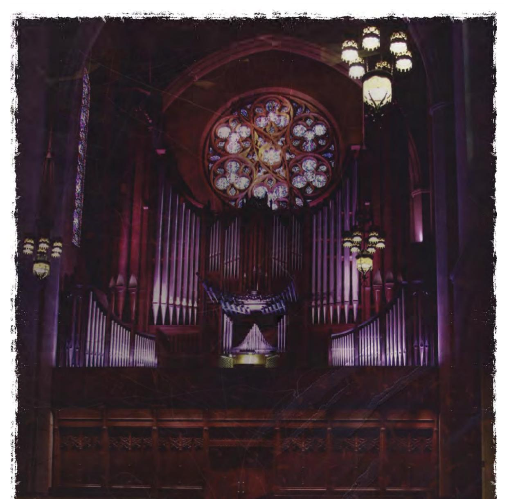

На земле Орден Сан-Паулу воспринимает свою роль рыцарей нового времени почти буквально, предпочитая в тактических ситуациях бронежилеты, баллистические щиты и тяжелое клинковое оружие.

#### **TABEJLCKWE MOHAXW**

Это небольшое братство, иногда называемое культом монахов, базируется в Загребе, но имеет отделения по всей Восточной Европе. Они известны своим навязчивым почитанием мученичества, граничащим с самоубийством. Это сделало их одним из самых успешных подразделений Общества одиноких волков, но совершенно непригодным для вербовки в ESOG. Монахи не являются безрассудными маньяками или психически неуравновешенными фанатиками. На самом деле они излучают спокойную преданность людей, смирившихся с тем, что их судьба находится в руках Божественного, и бороться с этим - просто гордыня. Когда монах вступает в орден, он принимает участие в ритуале, в ходе которого его символически убивают и воскрешают перед костями первого Великого Магистра ордена. С этого дня они мертвецы, служащие делу духовного освобождения человечества. Об отсутствии страха у монахов ходят легенды, и это делает их исключительно смертоносными охотниками, готовыми пожертвовать всем ради своей веры. Известно, что "Монахи" имеют тесные связи с российским "Акритаем", и " La Entità" часто полагается на этот подотряд как на "черный канал" связи с русскими, когда связь между

американцами и ГРУ нарушается.

#### ТОЧКИ ДАВЛЕНИЯ

Общество Леопольда - это разросшаяся организация, корни которой уходят глубоко в сердце Ватикана. Она никогда не ослабевала в своей миссии по выжиганию скверны вампиризма и сверхъестественного из всех уголков творения. Иногда ее рвение использовалось теми же силами или направлялось в ложном направлении человеческой жадностью и жестокостью, но Общество пережило эти промахи и, надеемся, стало сильнее и мудрее.

Но в действительности глубокие раны, нанесенные человечеству Инквизицией и ее Церковью, до сих пор не зажили. По мере того как Вторая Инквизиция набирает силу, она извращает правительства смертных, преследуя свои тайные цели, как и сами вампиры.

Например, Орден Сан-Карло с удовольствием готовит новое поколение инквизиторов, одновременно подкупая взятками и политическими льготами высшие эшелоны испанской армии. Они планируют, что в один прекрасный день к власти придет правительство. более подходящее для открытой войны с вампирами и опирающееся на тех же военных, которых они подстраивают под свои цели. В Венеции фанатики из числа "крыс" замышляют сжечь город дотла после десятилетий его терпеливой реставрации.

#### ЛАЗАРЕВСКИЙ ОХОТНИК НА ВЕЛЬМ

Охотник на ведьм - преданный солдат Общества святого Леопольда из Детей Лазаря. Вооруженный святыми реликвиями и обученный борьбе с силами тьмы. Охотник на вельм - это фронтовой солдат, выжигающий вампиров из тесных городских кварталов на открытом пространстве, где их могут уничтожить остальные члены его команды.

#### Общая сложность: 4/3

Стандартный набор кубиков: Физические 6, Социальные 6, Ментальные 5

Вторичные атрибуты: Здоровье 5, Сила воли 9 Исключительные наборы кубиков:

Проницательность 8, Запугивание 9, Оккультизм (вампиры) 7

Оборудование: Огнемет (ЛПО-50 советский 3-х зарядный), библия, крест, короткий меч ночного сторожа

Артефакт: Кадильница отпущения грехов (см. стр. 86)

Особенности: Охотник на ведьм невосприимчив к силам тьмы. При использовании в его присутствии способностей "Обливион" и "Сокрытие" их сложность увеличивается на +2. Кроме того, они могут попытаться пробить Сокрытие с помощью Озарения (8) со Сложностью, равной уровню используемой силы.

# Гладиус Dei / ESOG

Немногие вещи столь же запутаны, как организационные схемы Ватикана, и группа специальных операций Сущности (ESOG) представляет собой непредвиденный результат возрождения власти Сущности. Воины "Гладиус Деи", долгое время являвшиеся сильной рукой Общества Леопольда, составили кадровый состав новой группы специальных операций, когда Ингрид Бауэр заключила свою первую сделку с FIRSTLIGHT через Сущность.

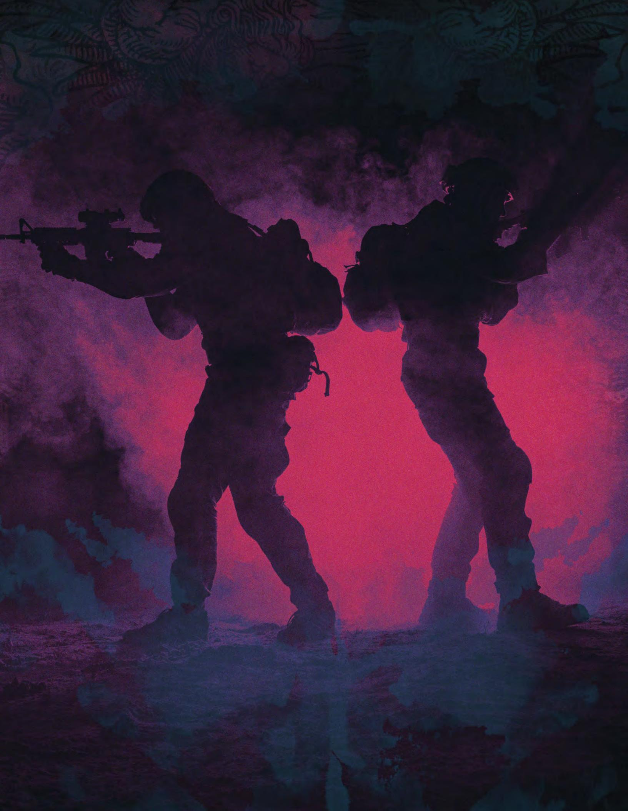

В результате "Гладиус Деи" служит тайным хозяевам " La Entità ", оставаясь в подчинении у Общества Святого Леопольда. Еще более запутанным является тот факт, что по мере того, как Структура набирает все больше ветеранов в свои команды ESOG, не все ESOG являются Гладиус Деи - и не все Гладиус Деи присоединились к ESOG. На деле это часто оказывается различием без разницы, поскольку очень немногие вампиры заинтересованы в том, чтобы проверять значки отряда UTR, охотящегося за ними в канализации.

По мере приближения к выходу в отставку Сущность вербует новых бойцов ESOG из других военных организаций. Ее критерии - католическая вера, опыт и боевой голод. Несмотря на то, что эти фанатики старше большинства солдат Коалиции, они стремятся в самое сердце событий, часто участвуя в операциях по борьбе с вампирами на их собственной территории. Общество часто набирает молодых, перспективных солдат из Италии, Аргентины и других католических армий в качестве членов "Гладиус Деи"; тех же, кто обладает паранормальными способностями, Сущность направляет в команду ESOG Team X. Это обычно означает, что новые охотники "Гладиус Деи" моложе и менее привычны к военной дисциплине, чем остальные члены их отряда ESOG, и приносят с собой доктринальные причуды своих подпорядков. Как в новых, так и в военизированных подразделениях ESOG эти различия воспринимаются как тактическая гибкость. Так, в отряде вооруженных штурмовыми винтовками бойцов ESOG в черной форме часто встречаются охотники со щитами и короткоствольными мечами.

Силы ESOG представляют собой попытку перенести уникальные способности ватиканских охотников на вампиров в современные отряды UTR, ставшие основой Коалиции. Как элитные силы они несут на себе самое современное и экспериментальное оружие, имеющееся в арсенале Конспирации. А как элитные силы Ватикана, они используют оружие, которого нет ни у кого в Коалиции, например, "Красный газ". Типичный отряд Gladius Dei/ESOG вооружен пистолетами-пулеметами и баллистическими щитами, но многие имеют при себе зажигательные гранаты и короткие мечи "Ночной дозорный", специально предназначенные для борьбы с вампирами. Эти охотники понимают, что пули могут замедлить или ослабить вампира, но для окончательного удара необходим огонь или расчленение.

В отличие от многих других солдат Коалиции, Gladius Dei/ESOG обычно вызывается, когда необходимо противостоять активной вампирской угрозе в течение активного ночного цикла и часто в неоптимальных условиях - например, выслеживая стаю существ по подземному туннелю или штурмуя вампирский опорный пункт. ESOG обычно действует в одиночку, но объединяется с силами BOES или IAO, когда миссия требует подавляющих сил. Такие крупные операции - единственное время, когда отряды Gladius Dei/ESOG действуют без Сущности на

вершине командной цепи.

#### ÒÎ×ÊÈ ÄÀÂËÅÍÈß

Силы Gladius Dei/ESOG все чаще направляются в зоны активных боевых действий, где участие вампиров не всегда однозначно. Сущность все больше обеспокоена тем, что ее силы используются для продвижения политических интересов вооруженных сил США, а не долгосрочных целей Второй Инквизиции. Их союзники в Акритаи подпитывают эту обеспокоенность, передавая Ватикану записи с беспилотников и другие собранные разведданные, подтверждающие эти подозрения. Коалиция стала настолько большой и могущественной, что Сущность не уверена в том, как она сможет переориентировать заговор на вампирскую угрозу, если он действительно сместится от цели.

Это все чаще заставляет Сущность задуматься о том, чтобы выступить со Второй Инквизицией в качестве последней попытки оказать давление на мировые правительства с целью истребить вампиров раз и навсегда. Конечно, с точки зрения Ватикана, публичный вариант - особенно опасный гамбит, поскольку единственное, чего они боятся больше, чем краха Второй инквизиции, - это если мировые державы решат прийти к какому-то взаимопониманию или разрядке с вампирами. В Сущности понимают, что природа вампирской угрозы заключается в духовном зле, но опасаются, что некоторые партнеры в Коалиции считают возможными другие решения, кроме истребления.

#### ÍÎÂÎÁÐÀÍÅÖ GLADIUS DEI/ESOG

Охотник на вампиров из Общества святого Леопольда, завербованный в Гладиус Деи для службы в тактическом отряде ESOG. Привыкший действовать самостоятельно и в составе небольших команд, новобранец чувствует себя как дома, пока охотится на вампиров. Он предпочитает рубить монстров своим клинком, пока его команда разбирается с рабами человеческой крови.

#### Общая сложность: 3/2

Стандартный набор кубиков: Физический 6, Социальный 3, Ментальный 4

Вторичные атрибуты: Здоровье 5, Сила воли 8 Исключительные пулы кубиков: Фехтование 8 (меч), Оккультизм (вампиры) 6

Экипировка: Меч, бронежилет, щит для защиты от беспорядков, зажигательная граната, пистолет

Артефакт: Пепел святого Годара (см. стр. 85)

#### ÑÎËÄÀÒ ÊÎÌÀÍÄÛ ESOG XIII

Солдат ESOG, завербованный из иностранной армии оперативником Ватикана благодаря своей военной подготовке и католической вере, лично предан тайным хозяевам Сущности.

Общая сложность: 4/2

Стандартные пулы кубиков: Физический 5, Социальный 4, Ментальный 5

Вторичные атрибуты: Здоровье 5, Сила воли 7 Исключительные пулы кубиков: Огнестрельное оружие 7, Лидерство 7, Фехтование 7 Снаряжение: Пистолет-пулемет (MP5),

бронежилет, щит для защиты от беспорядков, зажигательная граната, нож, распятие, MRAP Артефакт: Реликварий Агиос Николас, (см. стр. 86)

Особенности: Опытный ветеран охоты на вампиров, специалист ESOG может пересдать любую проваленную проверку или состязание на сопротивление бегству, сдаче или подчинению вампирическому влиянию.

# Организациипартнеры

Хотя только десять стран (или меньше) получают место за столом переговоров, когда коалиция планирует свою стратегию, несколько стран составляют более широкий заговор и имеют тактический вклад, когда действия происходят на их границах или при использовании их активов. Как и у многих вторых партнеров коалиции, у этих организаций есть своя внутренняя повестка дня и национальные интересы, которые часто превалируют над более широкими потребностями заговора.

# Åãèïåò: Îòå÷åñòâåííàÿ Ñïåöèàëüíàÿ ïðîãðàììà

HSP - секретная часть более крупной египетской службы внутренней безопасности - внедряется в культы "пустых тел" и сети их поддержки в Северной Африке и Европе для сбора столь необходимой человеческой информации. Поскольку за последние два десятилетия вампиры стали более ловко уклоняться от сбора разведывательных сигналов, потребность в сборе человеческой информации резко возросла. Вместо того чтобы засылать в эти сети подготовленных операторов под прикрытием, HSP обычно использует шантаж и угрозы, чтобы превратить союзников вампира из людей в актив. Финансовые долги, сексуальная ориентация и заключенные в тюрьму члены семьи - все это становится рычагами, которые HSP использует для того, чтобы превратить лояльного культиста в шпиона.

В то время как HSP оставляет фактический захват и выдачу подозреваемых в "вампиризме" IAO или FIRSTLIGHT, HSP поддерживает сеть "черных точек", где неизвестное количество вампиров со всего мира содержится для допросов и изучения. Эти "черные точки" представляют собой нераскрытые объекты, не обозначенные ни на одной официальной карте, но свободно открытые для партнеров по разведке, участвующих в коалиции. Хотя египетские спецслужбы давно применяют пытки к заключенным, Коалиция не разрешает HSP напрямую допрашивать иностранных "пустых", содержащихся в их "черных точках". Вместо этого для проведения допросов и, в некоторых случаях, пыток содержащихся там вампиров привлекаются подрядчики или оперативники из других стран-участниц.

Как ни странно, HSP имеет ограниченные операции на остальном Ближнем Востоке за пределами Египта и оккупированной Газы. В Газе они используют ту же тактику шантажа в координации с израильскими властями для подавления национальных устремлений палестинцев.

# Ôðàíöèÿ**: La Calcédoine**

Тесно связанная с FIRSTLIGHT и опирающаяся на систему идентификации угроз Emeraude, разработанную DGSE, La Calcédoine представляет собой прагматичную группу специалистов, которые прикрепляются к регулярным вооруженным силам или жандармам при подозрении на деятельность "пустых тел". Хотя La Calcédoine придерживается более широкой программы Коалиции, она считает, что вампиры являются частью большого сверхъестественного заговора, который они называют "тайной угрозой" (la menace secréte). Эти французские охотники часто действуют в тандеме с военными силами в Африке и известны как опытные дознаватели. Поэтому неудивительно, что La Calcédoine предпочитает захватывать "пустые тела" и выбивать из них признания об их роли в тайной угрозе. В настоящее время они являются единственным партнером второй стороны, настаивающим на открытой войне, поскольку, по данным их разведки, в скором времени появится могущественный предок вампиров и объединит нежить против человечества.

#### **LA CALCÉDOINE** Дîçíàâàòåëü

La Calcédoine располагает большим штатом дознавателей, специально обученных выбивать признания из пустых тел и их пособников-людей. До Коалиции они занимались борьбой с инсургентами в бывших колониях, но теперь их призвали обратно на родину.

Общая сложность: 4/1

Стандартный набор кубиков: Физический 3, Социальный 6, Ментальный 6 Вторичные атрибуты: Здоровье 5, Сила воли 7 Исключительные пулы кубиков: Этикет 8, Убеждение 8,

Медицина 8, Запугивание 9

Снаряжение: Нож, портсигар

Особенности: Дознаватели ведут свою деятельность в тюрьме или на охраняемом объекте, оборудованном специально разработанными орудиями пыток. Хотя Дознаватель прекрасно умеет добывать информацию и без специального оборудования, когда он получает доступ ко всем своим инструментам, он не позволяет своим жертвам восстанавливать или исцелять силу воли, пока они находятся под его властью.

### Èçðàèëü: Ïîäðàçäåëåíèå 8211

Несмотря на свою малочисленность, подразделение 8211 ценится за способность взламывать сложные и закрытые информационные системы без бюрократических и юридических проволочек, с которыми часто сталкиваются "пять факелов". Передача таких работ на исполнение "Подразделению 8211" позволяет операторам, которые в противном случае могли бы нарушить законы об авторском праве и шпионаже в своих странах, получить возможность отрицать свою вину. Обычно это означает, что хакер должен передать украденный смартфон или ноутбук в подразделение 8211, а затем вернуть устройство до того, как его отсутствие будет замечено. Циклы дневного сна "пустого тела" являются как преимуществом, так и осложнением при проведении подобных операций. Недостатком такой совместной работы является то, что подразделение "8211" может передавать любую другую информацию, собранную с этих устройств, в Аман (израильскую военную разведку) или Моссад, а также иностранным службам или негосударственным структурам, не участвующим в операции.

#### ßïîíèÿ: Òðåòüå ðàçâåäûâàòåëüíîå óïðàâëåíèå

В основном TID занимается проблемой притока вампиров в населенные пункты Японии, поскольку на них ведется охота, и они вынуждены покидать свои убежища в других частях Азии. Они в значительной степени полагаются на FIRSTLIGHT и IAO как в плане информации, так и в плане бюджета, но их оперативная безопасность делает их надежными и незаметными партнерами в любой операции. TID не имеет официальной санкции в японской разведывательной бюрократии, и отсутствие надзора часто привлекает ревностных агентов, считающих себя избранными для особой цели. Небольшая численность TID также означает, что для восполнения нехватки людей они в значительной степени полагаются на такие средства усиления, как беспилотники и роботы. Несмотря на свое рвение, они не рискуют личным составом, поскольку не имеют глубокого резерва новобранцев для восполнения потерь. Типичное развертывание TID сопровождается несколькими тактическими беспилотниками для обеспечения осведомленности о поле боя и как минимум одной роботизированной собакой для борьбы с сильно засевшими гнездами.

#### ÂÑÏÛØÊÈ ÏÎÆÀÐÎÂ

#### ÃÀÈÒÈ

Гаити, некогда бывшее открытым местом охоты для сородичей, превратилось в опасную страну для вампиров. Маскарад никогда не был в порядке на островном государстве, и теперь он практически распался перед лицом охотников на вампиров из Бригады Туссена. Охотники Гаити выросли из децентрализованной молодежной сети, первоначально организованной в поддержку национальной забастовки. Гаитянские сородичи жестоко отреагировали на эту угрозу своей власти, но, несмотря на убийство нескольких профессоров и представителей общественной интеллигенции из руководства движения, подростки продолжили свою кампанию. Перегруженное протестами государство уже не могло выполнять волю Сородичей, и несколько вампиров начали открыто использовать свои силы, чтобы заставить население вернуться к работе. Вскоре после этого молодые повстанцы объединились в ячейки и начали охоту на вампиров. Не имея возможности эффективно противостоять службам безопасности, новорожденные и анциллы массово бежали с Гаити, оставив спящих старших на произвол судьбы.

#### ßïîíèÿ

Долгое время считавшаяся относительно безопасным местом для ведения бизнеса Сородичей, Япония стала свидетелем наплыва вампиров, ищущих убежища, чтобы переждать Вторую Инквизицию. Хотя перенаселенность города сделала пропитание более трудным, только жестокое убийство токийского князя вооруженными охотниками-любителями из "**D**-**Club**" стало сигналом для Сородичей о том, что японский маскарад больше не в силе. И хотя теперь на власть в городе претендуют сразу несколько Сородичей, двор стремится сделать законным князем того, кто справится с охотниками.

## Ïîëüøà: Áþðî IX

Военизированное подразделение Управления внешней разведки Польши "Бюро IX" было официально создано в 2002 г. в ходе реорганизации спецслужб страны, однако его корни гораздо древнее. Некоторые сотрудники Бюро IX утверждают, что его основатели - это последние "проклятые солдаты", выступавшие против коммунистического режима в Польше после Второй мировой войны и виновные в жестоких преступлениях и геноциде во время войны. Верна ли эта связь или нет, не имеет значения, но этот миф привил руководству "Бюро IX" крайнее недоверие к левым политическим группам и российскому влиянию. Более того, некоторые из руководителей Бюро IX с 1990-х годов предупреждают США о сверхъестественном заговоре, контролирующем российское государство и международную коммунистическую партию. Бюро IX рассматривает свое участие в Коалиции как способ дальнейшей интеграции в аппарат безопасности США и НАТО, направленный против России. Они тесно связаны с Ватиканом и хотят расширить свою охотничью деятельность на территории Польши, но рассматривают нынешнюю демократическую систему как препятствие для эффективной защиты страны.

Разведка FIRSTLIGHT и финансирование IAO даже использовались для того, чтобы заручиться поддержкой лидеров бизнеса в вопросе переворота, который позволил бы Бюро IX более радикально реализовать свою антироссийскую и антивампирскую программу.

На оперативном уровне Бюро IX предпочитает бороться с вампирами в лоб и является одной из немногих организаций в Коалиции, которая охотно планирует ночные операции. Хотя это соответствует оперативной доктрине Ватикана, FIRSTLIGHT часто рассматривает это как большой риск, поскольку это может привести к огласке в СМИ. Несмотря на это, Бюро IX по-прежнему рассматривается как бесценный союзник коалиционной оси США/Великобритания, не в последнюю очередь благодаря своей готовности применять непроверенные технологии против "пустых тел".

## Øâåöèÿ: G-Kontoret

Родительская организация G-Kontoret (G-K), являвшаяся преданным партнером второй стороны Коалиции с первых дней существования заговора, специализировалась на экономическом шпионаже, но при краже секретов опиралась на оккультные силы. Несмотря на то, что у них сложились напряженные отношения с британской службой SO13, G-K тесно сотрудничает с JTRG и Ньюбургской группой. Фактически, G-Kontoret была основана членами Арканума, которые восстановили архив исчезнувшей оккультной исследовательской группы T-Kontoret времен Второй мировой войны с помощью черных стеклянных скользящих кругов.

Хотя это неизвестно их союзникам, G-Kontoret считает, что архивы их наследия указывают на мистическую слабость состояния "пустых тел", которая может позволить им разработать лечение от вампиризма. С этой целью они начали проводить эксперименты на захваченных слабокровных и добились определенных успехов в снижении силы проклятия в их крови. Для проведения этих исследований требуется бесконечное количество бестелесных тел. Поскольку попытки заставить вампира заражать других людей в неволе оказались ненадежными, G-K часто приходится прибегать к помощи FIRSTLIGHT и русских Акритай, чтобы поставлять новых испытуемых.

# Сельскохозяйственные команды

Вторая Инквизиция - это феномен, а не организация. Смена Фелисити Прайс с сотрудницы Носферату на мстительную охотницу положила ей начало и дала дом в мировом разведсообществе, но это движение выходит далеко за рамки первой и второй партийных составляющих Коалиции. Пока великие старейшины Камарильи приходят в себя от потрясений, вызванных тем, что Коалиция совершила в Лондоне и Вене, новорожденные должны быть в равной степени озабочены более мелкими и локальными проблемами.

Наличие доступа к оружию военного класса и внушительной сети аналитиков, не говоря уже о способности скрыть последствия практически любой операции, является абсолютным залогом успеха Коалиции. Однако на самом деле для охоты на вампиров нужны лишь интуиция и острый кол.

За пределами первой и второй партийных организаций находятся "сельскохозяйственные" команды: группы "младшей лиги", официально не связанные с коалицией, но являющиеся частью того же движения, того же культурного момента. Это могут быть самые разные группы - от местных правоохранителей, которые понимают, что в ряде недавних смертей есть что-то странное, до организованных преступников, чей бизнес пострадал от интересов непримиримого конкурента-нежити. Еще дальше, на периферии, находятся охотники за нежитью - едва организованные теоретики заговора и одинокие волки, которые увидели то, чего не должны были видеть, или потеряли близкого человека.

Сельскохозяйственные команды - отличные антагонисты для только что принявших родство. Они дают возможность показать атмосферу страха и угрозы, царящую в современных ночах, и позволяют новорожденным намочить ноги без серьезных последствий, связанных с привлечением внимания такой организации, как FIRSTLIGHT или Восьмое направление. Сельскохозяйственные команды могут служить агентствами по поиску талантов для этих более крупных организаций: местный полицейский или агент ФБР, встреченный на раннем этапе жизни вампира, может появиться позже, зная о своей цели, и в составе команды SAD.

#### Ïðàâîîõðàíèòåëüíûå îðãàíû

Там, где есть человек, есть и те, кто ее охраняет. Местные полицейские, агенты ФБР, Спецотдела, Европола и других организаций проявляют интерес к нападениям, убийствам, торговле людьми - все это может быть признаками вампирической деятельности. Даже малозаметные действия, которые не могли бы насторожить Коалицию, например, перестрелка между Подручными или последователями за кусок территории, могут привлечь внимание местных жителей. У них нет ни оборудования, ни, что особенно важно, информации, к которой имеют доступ группы "Пять факелов" UTR, но это не значит, что они не опасны. Они компенсируют это связями, знанием местности и упорством. Горе тому, кто недооценит местного детектива с его вниманием к деталям и паранойей.

Оборудование, которым располагают правоохранительные органы, сильно различается в разных странах мира. Если в Европе им приходится довольствоваться снаряжением для массовых беспорядков, средствами борьбы с толпой, такими как LRADы и резиновые пули (хотя, предупреждаем, из этого же оружия можно стрелять заостренными деревянными "пулями", и они функционально являются кольями) и наручниками, то в США и других странах полицейские имеют свободный доступ к автоматам, гранатам со вспышкой, настоящим гранатам и другой устрашающей военной технике. Однако они не всегда могут заказать это снаряжение, и существенное различие между правоохранительными органами и "Пятью факелами" заключается в том, что полицейские не могут сказать своему начальству, что им необходимо применить смертоносную силу против гнезда вампиров.

Правоохранительные органы, как и большинство сельскохозяйственных команд, не знают, что суеверия о чесноке, святой воде и тому подобных вещах - это всего лишь суеверия. Поначалу. Обычно достаточно одной удачной охоты, чтобы понять это. Поскольку слово на букву "в" практически немыслимо, большинство правоохранительных групп работают медленно. Им приходится проявлять терпение, обшаривая (каламбурно) подкормочные площадки, работая со своими контактами в других правоохранительных органах (полицейские нравов видят очень много), со своими информаторами и используя добрую волю общества, чтобы привлечь внимание людей к подозрительной активности. Конечно, в сообществах, привыкших к враждебным отношениям с полицией или федералами, копам трудно закрепиться.

Попасть в поле зрения правоохранительных органов - это смерть от тысячи порезов. На кормовых площадках принимаются меры по обеспечению безопасности, присутствие полиции делает улицы более безопасными для смертных, прихлебатели и поставщики (например, милый ночной портье, ворующий пакеты из банка крови) становятся менее склонны рисковать своей шеей или быть замеченными с кем-то, кто находится под подозрением. Поначалу их работа скорее разочаровывает, чем опасна для вампиров: все занимает чуть больше времени, и работать приходится чуть больше. Не стоит недооценивать тот ущерб, который визит федералов может нанести деловым отношениям, профессиональной репутации или положению в Камарилье. Со временем охотники становятся все смелее. Они приближаются к убежищу вампира или к его опорам и наносят удар. Неэкипированные и немногочисленные, они стараются работать при

дневном свете и никогда до конца не изучают местность. Если вампир или его помощники не заметят полицейских на этапе планирования, они могут так и не узнать о готовящемся ударе. Правоохранительные органы ничего не знают

о вампирском обществе, но их кропотливые расследования позволяют обнаружить связи в тайных кругах или в высших эшелонах городской иерархии. Лучше всего разобраться с ними до того, как они увидят слишком много и Маскарад пошатнется. Отступление за ширму смертных, ненавидящих правоохранительные органы, может стать для вампира лучшей стратегией борьбы с ними. Убить их было бы легко, но правоохранительные органы мобилизуются с неукротимой жаждой справедливости, когда кто-то причиняет вред их собственным.

Поспешное обращение к насилию создает больше проблем, чем решает. Убейте больше одного агента ФБР или Специального отдела - и вы быстро привлечете к себе внимание ядра Коалиции. С другой стороны, перевербовать их вполне реально. Сотрудники правоохранительных органов перегружены работой и им мало платят, и если вампир сможет убедить их, что это наименьшая из их проблем - он вредит только преступникам, питается по обоюдному согласию и т.д., - и сопроводить эти уговоры обычной взяткой, он часто может превратить врага в союзника. Если, конечно, эти агенты уже не получают чаевые и деньги от другого таинственного благодетеля, который выходит на связь только по ночам.

#### ÏÐÀÂÎÎÕÐÀÍÈÒÅËÜÍÛÅ ÎÐÃÀÍÛ (ÑÎÒÐÓÄÍÈÊ ÏÎËÈÖÈÈ) Общая сложность: 3/2

Стандартные пулы кубиков: Физический 5, Социальный 4, Ментальный 4

Вторичные атрибуты: Здоровье 7, Сила воли 6 Исключительные пулы кубиков: Драка 7, Огнестрельное оружие 7, Расследование 6, Уличное чутье 7

Оборудование: Ручной пистолет или электрошокер плюс дубинка. При предварительной подготовке: винтовки, бронежилеты, что-либо из раздела "Мирское снаряжение" главы 2. Для крупномасштабных операций: LRADы, ADS, пена для массовых беспорядков и водометы.

Особенности: Правоохранительные органы имеют сеть местных контактов, что дает им дополнительные 3 кубика при бросках на сбор информации в "своем" районе.

#### ÏÐÀÂÎÎÕÐÀÍÈÒÅËÜÍÀß ÄÅßÒÅËÜÍÎÑÒÜ (ÔÁÐ/ÑÏÅÖÎÒÄÅË/ÀÃÅÍÒ ÅÂÐÎÏÎËÀ)

Общая сложность: 3/3

Стандартные пулы кубиков: Физический 5, Социальный 5, Ментальный 6

Вторичные атрибуты: Здоровье 7, Сила воли 7 Исключительные пулы кубиков: Гум.Науки 7, Огнестрельное оружие 7, Расследование 7, Уличное чутье 7

Оборудование: Ручной пистолет. При предварительной подготовке: винтовки, бронежилеты, что-либо из раздела "Мирское снаряжение" главы 2. При сотрудничестве с местной полицией: Вертолеты, LRADы, ADS, пена для массовых беспорядков и водометы.

Особенности: Даже действуя вне рамок своих служебных обязанностей, оперативники могут привлекать спецназ и другие вооруженные силы, такие как взломщик (стр. 31) и снайпер (стр. 34).

# Îðãàíèçîâàííàÿ ïðåñòóïíîñòü

Организованная преступность может показаться не совсем подходящей историей происхождения охотников на вампиров, однако интересы преступников и вампиров часто пересекаются. Теневики контролируют доли в бизнес-империях, используют сообщества в качестве щита и банковских счетов, охотятся на уязвимых или зависимых людей, защищают свою территорию от посторонних. От печально известной мафии до российской "Братвы", наркотрафикантов или почтовых банд - для организованных преступников защита своих интересов стоит на первом месте. В их городе есть место только для одной группы хищников, преследующих их по ночам, и это не будет группа ходячих трупов.

Это не значит, что все преступники безжалостно аморальны. Многие из них, особенно из католических общин, считают вампиров преступниками против Божьего замысла или просто чудовищами. Некоторые действительно хотят избавить свои владения от ходячих кошмаров и считают это победой сил добра.

Но это не главная причина их беспокойства.

Организованные преступники отличаются от других сельскохозяйственных команд тем, что они вряд ли заметят вампира по его охоте. Этот аспект может их волновать или не волновать. Основная проблема, с которой они сталкиваются, - это то, что вампиры постоянно пытаются откусить кусочек от их бизнеса. Или же, в городах с мощной и давно сложившейся иерархией, они хотят откусить кусочек от бизнеса вампиров. Вентру прислушиваются к политикам и выкачивают деньги из наиболее прибыльных предприятий; тонкокожие прибирают к рукам торговлю наркотиками; Цимисхи придают новый смысл слову "территория"; стереотип "бандиты Бруха" имеет под собой почву - как и "дружинники Бруха".

Организованные преступники наиболее схожи с "пятью факелами" по методам своей деятельности. Они дергают за финансовые и социальные ниточки, подкупая союзников, чтобы те перешли на их сторону, или запугивая членов кровавого культа, чтобы те стали информаторами. В их команде обычно есть техники и хакеры, которые занимаются цифровым мошенничеством, собирают персональные данные или добывают материалы для шантажа. У них есть шантажисты. У них есть свои предатели, бегущие от вампирических хозяев.

Они также схожи с "Пятью факелами" по объему ресурсов, которыми они могут распоряжаться. Собрать нужный арсенал несложно, если знаешь нужных людей, а преступные организации обычно так и поступают. Хотя их карманы глубоки, бюджеты не безграничны, как и численность персонала. Одна дорогостоящая операция может вывести их из строя на пару месяцев. Но, с другой стороны, именно у них, как у сельскохозяйственной команды, скорее всего, найдется чертов танк с огнеметной установкой или умопомрачительное количество взрывчатки. Вполне возможно, что они даже купили его у тех же спецслужб, что и Коалиция, или напрямую у тех же поставщиков.

По определению, члены организованных преступных группировок существуют несколько вне закона. Если один или два из них погибают, правоохранительные органы списывают это на профессиональный риск. Если погибает несколько человек, правоохранительные органы начинают искать причину войны между бандами, и могут потратить недели или месяцы, чтобы понять, что причина не в этом, а к тому времени умные Сородичи уже залягут на дно. Это означает, что, в отличие от других сельскохозяйственных команд, насилие действительно может быть самой разумной стратегией. Опередить организованных преступников, дергая за социальные и финансовые рычаги, становится игрой в салочки: в какой-то момент одна из группировок сорвется и подожжет что-нибудь, и в интересах вампира не ждать слишком долго.

Охота на организованных преступников должна вызывать ужас: вампир наконец-то нашел такую же безжалостную и решительную группу, как и он сам. По этой причине она также должна быть отражением их собственного отражения. Могущественные лидеры командуют амбициозными солдатами и используют всех, кто ниже их по положению, чтобы получить преимущество. И, конечно, высшая сила - глава семьи, шериф города - может пойти навстречу враждующим группировкам и найти компромисс, от которого не выиграет никто на земле.

#### ÎÐÃÀÍÈÇÎÂÀÍÍÀß ÏÐÅÑÒÓÏÍÎÑÒÜ

Также смотрите раздел "Гангстеры" (см. Corebook, p. 371).

#### Общая сложность: 3/2

Стандартные пулы кубиков: Физический 5, Социальный 4, Ментальный 4

Вторичные атрибуты: Здоровье 7, Сила воли 6 Исключительные пулы кубиков: Драка 7, Огнестрельное оружие 7, Фехтование 6, Уличное чутье 7, Хитрость 6

Оборудование: Ручной пистолет и нож или бейсбольная бита. При предварительной подготовке: все, что есть в списке вооружения и материальных средств в главе 2, кроме XTech. Особенности: Организованные преступники знают свою территорию. Они не только имеют там союзников, но и знают каждый уголок. Они получают +2 кубика при бросках "Уличное чутье", +2 кубика при бросках "Скрытность", а все, кто пытается спрятаться или затаиться на их территории, получают -2 кубика при проверке на скрытность.

## Òåîðåòèêè çàãîâîðà

Когда интернет-сообщество вбирает что-то в свой коллективный разум, это опасно. Они идентифицируют - и неверно идентифицируют массовых стрелков и других разыскиваемых лиц, участвуют в розыске, основываясь лишь на нескольких минутах нечеткой видеосъемки, и накапливают базы знаний, не уступающие престижным университетам (черт возьми, Википедией пользуются чаще, чем хотели бы признать престижные университеты). Гораздо проще рассуждать о реальности вампиров и других чудовищ, сидя за щитом клавиатуры и высокоскоростного Интернета, чем делать это в одиночку, лицом к лицу со скептиками. Поэтому неудивительно, что в Интернете возникло несколько сообществ любителей охоты на вампиров. В условиях, когда Сородич все больше боится взаимодействовать с цифровым миром изза операций по мониторингу Коалиции, пресечь деятельность сообществ любителей теорий заговора становится как никогда сложно.

Для начала охоты эти сообщества используют слухи из Интернета, фотографии, местные городские легенды и любые другие улики. Некоторые даже просматривают форумы типа /r/ letsnotmeet в поисках достоверных сведений. Чаще всего они ошибаются на сто процентов: их наводки ни к чему не приводят, либо приводят к вымышленным историям или случайным мистификациям. Если бы таких людей была горстка, они бы ничего не добились, но их тысячи. По закону средних величин, время от времени они натыкаются на настоящего вампира.

Главное оружие конспирологов - Интернет. Используя смехотворную концепцию "мудрости толпы", они посвящают сотни человеко-часов решению таких задач, как определение местоположения на фотографии или в аккаунте, или составление точной картины передвижений "подозрительной" знаменитости, и получают ответы со скоростью, которой позавидовали бы разведывательные бюро. И это не считая того, что в работе обычно участвуют несколько человек, имеющих доступ к специализированным базам данных, таким как полицейские архивы или университетские архивы.

Большинство из них никогда не собираются встречаться с вампиром лицом к лицу, но даже небольшое число истинно верующих, вооруженных автоматами и не заботящихся о том, чтобы все было тихо, может доставить неприятности. Чаще всего они оповещают местные правоохранительные органы, спецназ "Убежище" или передают информацию в спецслужбы (где ее быстро выбрасывают). Большая часть этих усилий бесполезна, но Коалиция следит за наиболее старательными из них и часто берет на заметку расследования, которые выглядят многообещающе. Так же поступают и другие сельскохозяйственные команды, от правоохранительных органов до любителей.

Такие сообщества могут показаться вампиру идеальной целью для проникновения и перенаправления, но на практике мудрость толпы обычно пресекает такие попытки. Группа в целом быстро узнает правду о плохой наводке, затем учится не доверять аккаунту, который ее предоставил, и вообще не доверять новым или бросовым аккаунтам. Лучшая защита - просто скрыться... или выяснить, кто и где эти люди, подбросить им нелегальное оружие или оборудование для изготовления бомб, и пусть с ними разбираются земные власти.

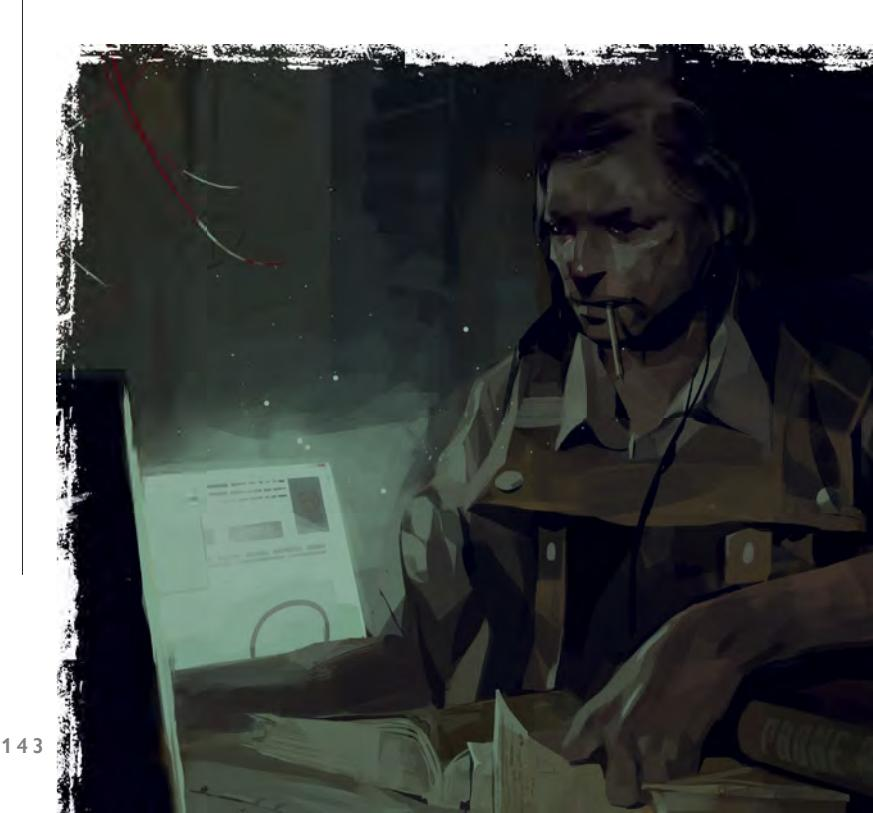

Охота за теоретиками заговора - это очень сложный опыт. Многие представители Сородичей даже не подозревают о том, что они стали объектом Реддита; те, у кого есть публичный профиль, могут получить оповещение от Google или ссылку на видеоролик или сообщение на форуме с предположениями о них. Для многих это просто паранойя. Кто-то сделал фото из проезжающей мимо машины? Сегодня вечером они видят много людей в серых футболках и темных очках, или у них повышенная чувствительность? Почему полиция стучится в дверь? Вампиры скорее найдут теоретиков заговора, если будут действовать в обратном порядке - вызовут спецназ в "Убежище" или внезапно завалят связного, - чем поймут, что за ними охотятся.

#### ÒÅÎÐÅÒÈÊ ÇÀÃÎÂÎÐÀ (ÊÎËËÅÊÒÈÂ)

Общая сложность: 4/2

Стандартные пулы кубиков: Физический N/A, Социальный 3, Ментальный 7 Вторичные атрибуты: Здоровье N/A, Сила воли 9

Исключительные пулы кубиков: Гум.Науки 8, Расследование 8, Политика (заговоры) 8, Уличное чутье 8, Техника 10

Оборудование: Много компьютеров и свободного времени.

Особенности: Сообщества теоретиков заговоров сокращают интервал между любыми Расширенными испытаниями, онлайн или вне их, на один шаг (с недель до дней, с дней до часов и т.д.).

# Ëþáèòåëè

Любители - это одиночки. В некотором смысле это классические охотники: они видели нечто, что оставило у них шрам, потеряли близкого человека, или их воспитали так, что они верят в чудовищ и узнают их, когда видят. Охотникилюбители не особенно опасны, но они упорны. Они представляют собой не столько физическую угрозу, сколько внешнюю: это люди, которым причинили боль, иногда даже тот самый вампир, на которого они охотятся. Да, убить их легко, но оправданно ли это? Что за чудовище отвечает родителю, жаждущему отомстить за смерть своего ребенка, еще одним кровавым убийством?

Для некоторых Сородичей охотники-любители это просто приятная возможность использовать свою силу на неподготовленном и гораздо более слабом противнике. И иногда это доставляет удовольствие. Зачем играть в монстра, наделенного вечной жизнью, если тебя постоянно сковывают правила и нравы живых? Но это не может не сказаться на человечности: убийство нельзя назвать самообороной, если жертва не может причинить тебе вреда. С другой стороны, что будет, если этот охотник причинит вред кому-то из ваших друзей? Ребенку? Слабокровного, менее способного защитить себя? Что будет, если он окажется удивительно плохим специалистом по обнаружению вампиров и в итоге станет серийным убийцей, затрудняющим охоту на настоящих вампиров? Охотники-любители - отличные противники для вампира с совестью.

Неудивительно, что у любителей не самое лучшее снаряжение. Большинство из них полагает, что оружие не поможет им в борьбе с вампирами, и они правы. У них есть молотки и колья, может быть, арбалет, если повезет. Некоторые делают взрывчатку из удобрений и отбеливателя. Не имея бронежилетов, они полагаются на спортивное снаряжение - хоккейные щитки и шейные скобы. Непропорционально большое число любителей имеет Истинную Веру, а некоторые обладают артефактами сверхъестественной силы (с. 83), что иногда делает их по-настоящему опасными против вампира-одиночки.

Тактика дилетантов столь же разнообразна, как и они сами, но в ней всегда присутствует элемент везения. Потенциальный охотник натыкается на тонкую операцию "наркотики и витэ". Многомесячное наблюдение за популярным ночным клубом дает в итоге нечто большее, чем пьяный парень из студенческого братства, нападающий на кого-то на танцполе. Они выходят на мелкую знаменитость, которую, как они понимают, можно увидеть только ночью. Они работают в одиночку, поэтому их возможности по сбору информации ограничены. Они быстро передвигаются и нападают на свою жертву при первой же возможности - а это может быть первая встреча. Некоторые из них, особенно те, кто испытывает личную неприязнь, действуют на публике: они полагают, что монстр может колебаться или избегать использования своих способностей в присутствии смертных. Да, после этого их, скорее всего, арестуют, но это небольшая цена за то, что на улицах станет на одного вампира меньше.

Охота на любителей очевидна и часто неудобна: как туалетная бумага, прилипшая к ботинку, или бродячая собака, преследующая вас. В одиночку они почти не раздражают, но появляются в самый неподходящий момент. Деликатные переговоры с конкурентом? Охотник. Скрытное наблюдение за гулем князя? Охотник. Заманчиво сыграть на этом, но на самом деле это наглядный урок "правильное планирование предотвращает плохое исполнение": охотник становится элементом-изгоем, который должен быть учтен в любом плане, пока вампир не будет вынужден окончательно с ним разобраться.

С другой стороны, противостоять охотникамлюбителям относительно просто. Часто они просто ищут цель, любую цель. Снабжая их информацией, лично или через доверенное лицо, можно перенаправить их на новую цель, возможно, на конкурента или врага. Вампир может также снабдить информацией и снарядить дилетанта, превратив его в опытного, опасного охотничьего пса или киллера. Это рискованно, но выгода от превращения в раба или гуля значительна, и для этого может хватить одного удара Доминирования или Величия.

Любители могут обладать любым набором навыков и статистических данных; о достаточно выносливом охотнике см. в разделе Любитель (стр. 31).

## Çàõâàòûâàþùèé îãîíü

Сами по себе сельскохозяйственные команды могут быть опасны. То, что им не хватает ресурсов, они часто компенсируют решимостью или глубокой сетью местных контактов. Но если сельскохозяйственная команда хорошо работает и набирает обороты, она может стать объектом внимания одного из Пяти Факелов.

Иногда это становится путем к привлечению некоторых или всех членов команды в ряды первых или вторых партнеров Коалиции. Они могут завербовать одного или двух, потому что не все охотники проявляют должную степень интеллекта, осмотрительности, сдержанности или мастерства, или потому, что только один из них выжил после особенно дерзкого удара. Чаще всего "Пять факелов" набирают сотрудников правоохранительных органов, чем других вероятных членов сельскохозяйственных команд: гораздо легче адаптировать сотрудника ФБР или спецотдела к порядку действий и субординации Коалиции, чем наркоторговца или конспиролога. Общество святого Леопольда делает больше исключений, чем другие, во всяком случае, для охотников-католиков.

Чаще всего "интерес" не заходит дальше того, что Коалиция использует "сельскохозяйственную" команду для проведения собственных операций или подменяет ее в тех местах, куда она не хотела бы направлять полный отряд. Если сельскохозяйственная команда кажется полезной, Коалиция начинает снабжать ее информацией, которая, судя по всему, поступает от их собственных информаторов или вышестоящих членов их организации. Вначале это случайная информация, которая помогает "сельскохозяйственной" команде выйти на неизвестного, с которым Коалиция хочет расправиться, а со временем может дойти до полного досье на человека, подсказок о его передвижениях и уязвимых местах или даже откровенного совета от полноценного оперативника Коалиции.

Если "сельскохозяйственная" команда докажет свою состоятельность, она может постепенно получить и более существенную материальную помощь. Оружие, броня, даже XTech могут в небольших количествах поступать к этим мелким местным операторам. Иногда им даже может быть предоставлен высококвалифицированный персонал, например, хакер или депрограммист, если этого заслуживает почерк цели. Такие займы всегда краткосрочны и рассчитаны на конкретную задачу, измеряемую днями, а иногда и часами.

Решение о помощи принимается в зависимости от того, представляет ли сельскохозяйственная команда угрозу для гражданских лиц или только для пустых тел. Кучка конспирологов, прыгающих по теням, не получит большого оружия. Вместо этого их, скорее всего, предупредят или даже казнят вампиры, которых Коалиция предупредила. Лучше никаких союзников, чем опасные и некомпетентные.

Далеко не каждая сельскохозяйственная команда, добившаяся успеха, получает хоть какой-то интерес: Коалиция могущественна, но не всезнающа. Некоторые вещи не попадают в поле их зрения, и небольшая группа охотников, действующая в захолустном городе или маленькой стране, может остаться незамеченной. Рассказчику не обязательно повышать уровень угрозы, особенно в истории, где Вторая Инквизиция существует лишь на заднем плане, но это всегда можно сделать. В равной степени может оказаться приятным позволить персонажам вновь столкнуться с сельскохозяйственной командой, которая раньше была бичом их существования, и раздавить ее, как жуков, когда эта группа стала более могущественной и более связанной.

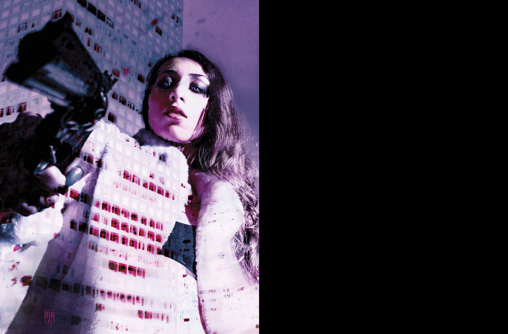

# Глава пятая: Зеркальные лабиринты

Òåðÿòü êðàñîòó â óæàñå, óæàñ â èíêâèçèöèè... ...óìíîæàòü ðàçíîîáðàçèå

 ïóñòûíå çåðêàë. — T. Ñ. ÝËÈÎÒ, ÃÅÐÎÍÒÈÎÍ

Все тактическое снаряжение и мистические реликвии, и даже самые особенные спецоператоры сами по себе не создают историю. Рассказчики смешивают эти элементы в своих историях: по своему усмотрению, тенью на границе или на переднем плане. Они настраивают их против персонажей, показывая им неудобные истины или предлагая неблаговидные сделки или, конечно, просто настраивая их на рассвет. Взаимодействие, борьба, перестрелка - когда бы и как бы ни встретились антагонисты с персонажами, именно тогда они становятся сюжетом. Приведенные ниже приемы, элементы и структуры помогут рассказчикам выбрать один из всех вариантов и знаний, описанных в этой книге, и применить их с максимальным эффектом.

# Элемент истории:исторические структуры

Вторая Инквизиция горит в сердцах сотен тысяч охотников по всему миру, в каждом городе, где вампиры думают властвовать. Коалиция и "Пять факелов" действуют на всех континентах, с глобальным размахом, на всех уровнях - от одиночных операторов, ведущих наблюдение и ожидание, до целых батальонов штурмовых отрядов, управляемых со спутника. Рассказчики могут также использовать Вторую Инквизицию и ее воплощения или Коалицию и ее агентов в любом масштабе. Каждый рассказчик должен создавать и настраивать свою историю под конкретный стол, и это, безусловно, включает в себя роли антагонистов.

В этом разделе представлены три основных подхода к формированию хроники Второй Инквизиции. Не стесняйтесь комбинировать их: хроника "Вершина кола" может превратиться в историю "Сопротивление и истощение", если команде игроков не удастся отбить первоначальный штурм. Если же они успешно ослабят оккупационные силы IAO, то история может превратиться в "Открытый город".

**147**

Даже если вы не собираетесь посвящать всю историю Второй Инквизиции, вы можете использовать любую из этих структур в качестве фона или как надвигающуюся возможность: Сородичи, базирующиеся в открытом городе Манчестере, могут просто взять быстрый ночной поезд и высадиться в полноценной зоне боевых действий Ливерпуля или в оккупированном и захваченном "чистом городе" Лондоне.

## Îñòðèå êîëà

Тайные операции бывают только тайными: когда FIRSTLIGHT посылает отряды UTR на вашу набережную или Общество святого Леопольда назначает ваш город для нового крестового похода, вы сразу же узнаете об этом. В истории " Острие кола" ваша история становится историей войны. Все ваши истории становятся военными историями, рассказанными на фоне того, как соперники и сородичи превращаются в пыль во время полуденных набегов или падают в огне. Инквизиторы выискивают человеческие связи между Родом и дневным миром: не только стада и орудия труда, но и контакты и Опоры становятся объектом допросов и даже хуже. Их паника или растерянность угрожает героям почти так же, как оружие и кресты захватчиков. Вторая Инквизиция тянет за каждую свободную ниточку в вашей истории, пытаясь вытащить вас на солнечный свет: они доминируют в истории. В крайнем случае, один или несколько из Пяти Факелов становятся вторым достоверным "большим злодеем", наряду с Князем, или противоборствующей фракцией, или тем, кто еще когда-то правил ночным городом.

#### ÈÑÒÎÐÈßÕ

Некоторые типы обществ (Core Rulebook, pp. 197-199) процветают (по крайней мере, с точки зрения повествования) на острие копья. Котериям Цербера, возможно, придется защищать свой отряд от Инквизиции или противостоять приказам Примогена отвлечь их внимание на вторжение. Коммандосами и Дневные дозорные имеют четкую роль на передовой, нанося ответные удары по отрядам поддержки и медиков военизированных формирований или сея смуту в их планах смелыми рейдами при свете солнца. Котерии "Марешаль" и "Регентство" оказываются перегруженными и пытаются сохранить свое положение при дворе, принимая тактические решения на основе слишком скудной информации и объединяя родственные народы города для сопротивления или отступления.

Кочевники, попавшие в пыль атаки, обнаруживают свою изменчивость как слабость, так и преимущество: сразу попав под подозрение городских Сородичей, они в то же время редко оказываются в списках целей инквизиторов.

Ожесточенный экшн задает очевидный тон истории "Острие копья", но это не обязательно должна быть безостановочная перестрелка. Вампирская политика внезапно становится вопросом жизни и смерти, разыгрываемым буквально по самым высоким ставкам. Срочность, туман битвы, внезапные предательства и потери, разрушение ложной верности - все это придает драматизм истории военного времени. Встряхните мир персонажей, нагнетайте напряжение, а затем каждые пару недель присылайте "эскадроны смерти", чтобы взорвать очередную часть обстановки и

подготовить следующую встряску.

#### ÂÎÂËÅ×ÅÍÈÅ Ê Ó×ÀÑÒÈÞ

Вы выбраны: Когда BOES прибывает в город вашей летописи, Примоген созывает игроков. В присутствии их мавлов и соперников князь предлагает им владения, по которым инквизиторы нанесли первый или неоднократный удар. Отказавшись от предложения, они могут быть обвинены в трусости и даже предательстве. Но принятие предложения сопряжено с определенными издержками. У дружины появляются новые обязанности, неизведанные охотничьи угодья и рушащаяся оборона, которую нужно отчаянно поддерживать. Выражает ли это предложение доверие князю - или он считает их расходным материалом, чтобы выиграть время для настоящих защитников? И что они будут делать, когда эти "настоящие защитники" явятся, чтобы отобрать у них новые владения?

Вы - мишень: По какой-то причине FIRSTLIGHT выбрала в качестве основной цели группу игроков. Что бы ни делало их группу особенной, это, очевидно, ключевая цель для Леопольда, русских или кого-то еще. Котерия Цербера, вероятно, догадывается об этом, но другим котериям, возможно, придется выяснить, как они попали в этот список. Может быть, чей-то сын был схвачен израильтянами на пути в Геенну? Их конкуренты (или мелкие недоброжелатели, которых они никогда не уважали настолько, чтобы подозревать) подкинули им денег? Если они сделали свои косточки в 1990-х годах, возможно, их имена хранятся где-то в архиве ShreckNET, и только удача алгоритма позволила им всплыть сегодня.

Сородичи Келли: SAD не нападает на окружение игроков - по крайней мере, поначалу. Они затаиваются в сторонке, когда рейд уничтожает их самого надоедливого соперника или ослабляет оборону вокруг их истинной амбиции. Задача Рассказчика в этом случае состоит в том, чтобы подбросить игрокам преимущества или сокровища, достаточно заманчивые, чтобы заставить их рискнуть быть уничтоженными побочным огнем - или сделать достаточно много шума, чтобы попасть в список запретов Святого Леопольда по-настоящему.

# Îòêðûòûé ãîðîä

Коалиция пока воздерживается от нападения на открытый город. Они не игнорируют город, но и не готовы нажать на курок полномасштабной чистки. Они держатся в тени, изучая и наблюдая, проникая в инфраструктуру и собирая информацию. Практически, команда UTR или инквизиторы-леопольдиты становятся одной фракцией из многих в городе, топором, готовым упасть... когда-нибудь, но не сегодня. Хроники "Открытого города" черпают вдохновение из шпионских фильмов и фантастики, предлагая истории о балансировании сил и операциях, которые можно скрыть. У Сородичей есть время узнать, кто именно держит факел - так же, как у Коалиции есть время узнать, где Сородичи прячутся от света костра.

#### ÈÑÒÎÐÈßÕ

Открытые города предоставляют множество возможностей для Котерий Банды Клыка, Плюмаира и Охотничьей компании играть на нескольких сторонах против середины и создавать базы власти и репутацию. Котериямчемпионам необходимо завоевывать человеческие сердца и умы, в то время как дозорные должны быть начеку при первых признаках крестового похода. Более отчаянно нуждаясь в неожиданных рычагах влияния, чем обычно, вампирская властная структура может внезапно поставить цель Квестари на первое место - и, возможно, наделить соперничающую с ней дружину полномочиями для ее достижения. Сбирри процветают в повествовательном и тематическом плане, хотя объективно Открытый город постоянно угрожает разоблачить их истинные планы.

В истории "Открытого города" политические маневры и Маскарад находятся в центре внимания. Примоген не может очистить местное население от анархов, не понеся при этом неприемлемых потерь, но и не может позволить Маскараду разгореться еще больше. Вовлеките окружение игроков в эти игры в "горячую картошку" и "последнюю метку", втяните их в мелкую вендетту и, возможно, иногда вознаграждайте их, исчезая с одним из их врагов в солнечных объятиях ЦРУ. Но чье имя с готовностью выдала противница, прежде чем ее забрал солнечный свет?

#### ÂÎÂËÅ×ÅÍÈÅ Ê Ó×ÀÑÒÈÞ

Ни один воробей не упадет: Общество святого Леопольда отправляет кенакль в город, в котором проживает котерия, и леопольдиты начинают подключаться к местной католической инфраструктуре: церквям, больницам, благотворительным организациям, полицейским управлениям, местной политике и так далее. Опора одного из персонажей работает или поклоняется в этой сфере, и леопольдиты хотят их завербовать. Это не просто случайное общение, это дружба и совет, карьерный рост и поддержка: все, что они хотят и, возможно, не могут получить от неживого монстра. Является ли это простым совпадением, или Общество намеренно нацеливается на персонажа через его Опору? А как быть, если Леопольдиты начинают помогать другой опоре Вампира?

#ACAI: Полицейское управление города из истории получило откуда-то загадочный (но щедрый) правительственный грант: новое оборудование и автомобили, более совершенные рации и компьютеры, беспилотники и машины для "борьбы с преступностью и массовыми беспорядками". Вместе с деньгами приехали один-два специалиста, в основном инструкторы и ремонтники; новый заместитель комиссара переехал из другого города и с нетерпением ждал начала работы. Сородичные союзники и связи в городском правительстве (или в полиции) начинают чувствовать жар. FIRSTLIGHT (или SO13, или BOES) внедряет свои кадры в полицию, планируя перевести все силы на службу Инквизиции.

Тени на ветру: За ширмой безвыходности медленно накапливаются смерти - и не по вине Сородичей. Независимые оккультные ученые в университете, один или два алхимика слабой крови, местный маг-хедж - все они оказываются мертвыми в запертых комнатах или со странным отсутствием органов. Оккультист-консультант Существа (или Ньюбургской группы, или SAD) отследил, что в город попала особая и могущественная книга, и она им нужна, и у них есть много знакомых, которые помогут ее заполучить. За книгой может охотиться группа Квестари или охранять ее группа Цербера; Тремере могут захотеть заполучить фолиант ради него самого, как и слабокровные, желающие повысить уровень своей алхимии. Никто не хочет, чтобы дело дошло до перестрелки - пожары для книг еще вреднее, чем для родни.

#### Ñîïðîòèâëåíèå è èñòîùåíèå

В истории "Сопротивления и истощения" битва проиграна - пока что. Некий аспект или фракция Второй Инквизиции доминирует в городе, наблюдение за ним интенсивное, патрули регулярные. Самое главное - они контролируют (или, по крайней мере, тщательно проникают) городские властные структуры. В городе, где преобладает католицизм, возможно, Общество святого Леопольда управляет архиепископской бюрократией, назначая священников и администраторов больниц, контролируя политическую машину, избирающую мэра. В других городах Коалиция может работать через "вырезанных" людей: бывших подрядчиков ЦРУ, пришедших в местную политику "для реальных перемен на местах", или олдерменов, чьи неблаговидные поступки хранятся на черном сервере где-нибудь в Челтенхеме или Мюнхене. В любом случае бескровный труп в переулке вызывает быструю реакцию. Маскарад превратился в подполье.

#### ÈÑÒÎÐÈßÕ

Котерии Культа Крови уже находились в подполье, и истории Сопротивления и Истощения смягчают угрозу репрессий со стороны Примогена или баронства; то же самое в целом относится и к котериям Банды Клыка. С другой стороны, котерию Вехме, осуществляющую именно такие репрессии, скорее всего, негласно поддерживает большинство Родов. Если старейшины ушли до того, как упал молот, то регентская группа вынуждена маневрировать репрессиями против сопротивления. Поощряет ли сбиррийская община в оккупированном городе репрессии? Дневной дозор становится еще более важным, когда ночью глаза города открываются шире.

Ритм истории "Сопротивления и истощения" напоминает транс, а не панк: медленно нарастающее чувство, а не стремительное насилие. Постоянное давление Коалиции сдерживает группу до тех пор, пока она не сделает драматический рывок - или не будет сломлена в ответ. "Нарастающее напряжение" должно быть главным словом рассказчика, а не "нарастающее действие". Более конкретные подходы к созданию такого рода обстановки см. ниже, в разделе "Добро пожаловать в оккупацию".

#### ÂÎÂËÅ×ÅÍÈÅ Ê Ó×ÀÑÒÈÞ

Холодное прошлое: В городе истории появляется род, каким-то образом связанный с группой игроков, но теперь он работает на Коалицию. (Выберите кого-нибудь вдохновляющего из "Отступников" на стр. 46-51.) До сих пор члены группы оставались вне поля зрения всех - но их возможности одновременно расширяются и сужаются. Сдать ли барону своего "старого друга"? Это будет означать, что они сами признают свою вину. Использовать ли старого друга в качестве канала связи с оккупантами, чтобы получить несколько важных преимуществ? Возможно, у старого друга есть для них выгода: помочь Коалиции смять сопротивление, а самим оказаться вне списка целей.

Охота на кротов: Инквизиторы знают очень много о том, как "Сородич" ведет себя в городе. Ни один из старых дампов данных ShreckNET больше не применяется: старые убежища и охотничьи угодья давно заброшены. Маскарад остается нетронутым, на удивление прочным; даже местные анархи и слабокровные охотно его соблюдают после нескольких неожиданных выдач. Так кто же снабжает информацией SAD, SO13 или Ватикан изнутри двора? Князь выбирает игроков для расследования - и если они ничего не найдут в ближайшее время, то это явно были они.

Пятый всадник: На пороге убежища одного из персонажей появляется курьер из другого города, тяжело раненный и даже отравленный каким-то русским токсином. Курьер должен укрыть ее от ГРУ и усилить охоту, чтобы прокормить ее (есть ли у курьера преимущество? знает ли он великую тайну? сулит ли он большую выгоду?) Тем временем оккупанты наводнили город, обыскивая его в поисках беженца. Эта сюжетная линия лучше всего подходит для котерии слабой крови или Анарха, у которых нет реальной возможности переложить свои проблемы на старших и более важных Сородичей. Или, возможно, члены этой группы знают, что старшие и более важные Сородичи убьют любого, кто услышит сообщение курьера раньше них.

# Элемент Сеттинга: Добро пожаловать в оккупацию

С наступлением нового тысячелетия Сородичи теряют власть над городом за городом - их вытесняют не конкурирующие вампиры, а их бывшая добыча. Инструменты, которые они когда-то использовали для того, чтобы загонять своих сородичей, оборачиваются против них самих: полиция с тайными планами, всевидящие глаза в ночи, нечеловеческие накопления знаний и таинственные смерти, выходящие из тени. Будущее, похоже, принадлежит этой Второй инквизиции - а в некоторых городах оно уже наступило.

#### Повествование об оккупации

Истории об оккупации имеют три важнейших элемента: выбор, место и угроза. Каждый персонаж, находящийся под оккупацией, - как игроки, так и рассказчик - каждый день делает выбор: сопротивляться или сотрудничать. Рассказчик должен помнить, что для подавляющего большинства смертных сотрудничество имеет не только прагматический, но и моральный смысл: вампиры - хищники и серийные убийцы, и на них действительно следует охотиться. Но и отдельные лики делают индивидуальный выбор - возможно, автаркису больше нравится уничтожать властного архонта, или слабокровный обижается на жестоких старейшин. Даже у признанной и принятой в обществе группы может возникнуть соблазн заключить сделку - ради Опоры или района, или просто ради спокойного дневного сна.

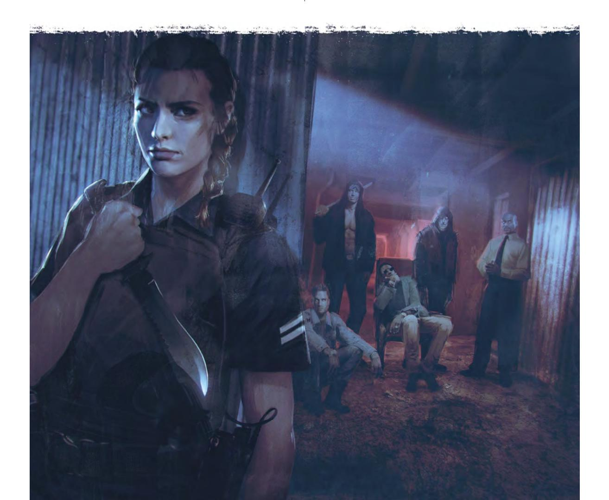

Среди других вариантов, с которыми сталкиваются главные герои (и другие представители рода), - выбор альянса: кому доверять в сопротивлении? Кому доверять в оккупации? Выбор тактики: сопротивляться или затаиться? Медленно подминать под себя оккупантов, рискуя скомпрометировать свою личность, или открыто бросить им вызов, рискуя оказаться в пыли в полдень? Охотиться или голодать? Остаться и встретить огонь, или уйти, если представится возможность? Защищать ли сопротивление, даже ценой своего дитя или Опоры? Драматично, что лучший выбор ставит в противоречие Убеждения двух персонажей - или заставляет одного каинита выбирать между двумя собственными Убеждениями. Дайте каждому важному выбору, который делают герои, мощную, правдоподобную альтернативу, в идеале олицетворяемую кем-то, кому они доверяют, кого любят или от кого зависят.

Все эти персонажи, со всеми этими повестками дня, формируют ваш город и определяют его развитие в ходе истории. Если персонаж второго плана начинает казаться скучным, знакомым или слишком надежным, он меняет свой выбор, умирает, сообщает о себе или бежит. По мере того как профессия меняет персонажей, она меняет и город. Добавьте элемент оккупации в каждую историю, какую-нибудь деталь фона или прошептанный слух, а то и целую сцену. Полицейские рейды разбивают охотничьи угодья, над головой кружат вертолеты и беспилотники, на углах улиц появляются немигающие камеры, на вышках сотовой связи появляются дополнительные антенны.

## Âàøà ëè÷íàÿ èíêâèçèöèÿ

История оккупации имеет тенденцию персонифицировать присутствие местной коалиции: идентификация местного начальника-леопольдита или аналитика FIRSTLIGHT знаменует собой молчаливую победу. На основе идентификации игроки ищут слабые и (надеемся, более тщательно) сильные стороны. Рассказчик должен иметь готовые ответы: полон ли аббат Леопольдит сомнений или подавленных вожделений? А надзиратель ПЕРВОЙ СВЯЗИ напыщен и самоуверен или жаждет мести? Если безликие охотники в тактических масках могут оставаться загадочными (а значит, страшными), то их боссы должны быть людьми, чтобы стать убедительными противниками. Они, как и персонажи, делают выбор: насколько правдоподобна эта информация? Является ли этот склад ловушкой? Можем ли мы сыграть одно пустое тело против другого или должны говорить только на языке огня? Искушение, изворотливость и поворот противника к нужному вам выбору - сильные стороны вампиров.

#### ÑËÓ×ÀÉÍÛÅ ÐÅÉÄÛ

На фоне всего остального, за чем приходится следить Рассказчику, управление профессией может затеряться в гуще событий. Один раз в игровой месяц проводите операцию коалиции: рейд, успешная джентрификация Домена, целевое уничтожение, что-то, что напомнит игрокам об угрозе. В зависимости от географии вашего города-истории вы можете иметь на примете определенное место, а можете определить цель случайным образом.

Большинство бумажных карт (и многие онлайновые) имеют наложенные на них сетки, служащие ключом к определению местоположения. Если таковой нет, то достаточно просто нарисовать сетку размером десять на десять на распечатанной или ксерокопированной карте. Бросьте два кубика и отправьте охотников в указанное место, повторно бросая кубики, если вы попали в невозможную цель, например, на середину озера. Если вам нужна другая методика, сделайте бросок "Расследование" для планировщика местной коалиции ("Медвежий лидер", с. 23) и используйте результат для определения опасности и ущерба для местных сородичей. Критический результат этого броска нацелен на Примогена или главную банду Анархов.

По мере усиления оккупации начинайте операции чаще: раз в три игровые недели, затем раз в две игровые недели. Частота раз в неделю свидетельствует о том, что Коалиция вошла в город или считает, что почти победила; скорее всего, после трех или более недель подряд крупных операций она снова ослабнет. Действия группы также могут изменять частоту атак: если они злят оккупантов, атаки усиливаются; если они сбивают их с толку или блефуют, коалиция немного сбавляет обороты.

# Тематический элемент: Огонь и Меч

Это инквизиция, даже та ее часть, которая управляется на компьютерах американскими адмиралами и русскими атеистами. Рассказчики должны обыгрывать эти готические, даже средневековые элементы наряду с паранойей наблюдения и технотриллером. Примеры:

■ Вряд ли персонаж игрока помнит первую инквизицию, но он может хранить предания, переданные ему по наследству или обнаруженные в пыльном пергаменте (Core Rulebook, p. 388). Когда старейшина рассказывает им о тех временах или они читают записи, оживите их с помощью монахов в капюшонах и мерцающих факелов. Если действие истории происходит в Европе или Латинской Америке, то центральное место займет место старого авто-да-фе. Запустите воспоминания с участием предков персонажей, чтобы раскрыть нечто ужасное из прошлого.

#### ÑÓÏÅÐÎÐÓÆÈÅ

Супер-оружие остается основным, возможно, главным элементом сюжета технотриллера с тех пор, как Жюль Верн придумал этот поджанр. Террор Робура, "Красный Октябрь" Советов, геликоптеры "Гидра" **INSIGHT**. Антагонисты создают его и угрожают им миру, а герои уничтожают или похищают его. Добавление супероружия в вампирскую историю может стать стержнем отдельной истории или кульминацией общегородской войны. Потенциальное супероружие ВИ включает в себя:

■

- Красный газ (стр. 82) это уже супероружие: оружейная святость, которая заполняет пространство, как газ, но не рассеивается, как газ. В качестве альтернативы можно рассмотреть химическое оружие, созданное на основе нанотехнологий, которое притягивается к аэрозолю витэ и течет через гавань ко ртам и носам Сородичей - чем больше они недавно питались, тем быстрее оно их достигнет.
- Высокоэнергетический проектор, излучающий волны мюонной плазмы. Когда волны ударяются о твердые стены, они проходят сквозь преграду и на короткое время освещают внутреннее пространство, как солнце. Его конденсаторы заряжаются в течение нескольких дней, а энергия высвобождается за один раз, но усовершенствованные модели должны быть запущены в ближайшее время, сразу после нескольких полевых испытаний... А очень большой проектор, который они строят в изолированном здании кампуса, может за наносекунду охватить весь город, освещая все внутренние поверхности сразу.
- Мощный обряд, вскипающий витэ в каждом, кто слышит его произнесение. Конечно, он есть только в одной книге и на мертвом языке, но даже неполный перевод оказывается очень эффективным. И каждый раз, когда кантор произносит ее, она становится все яснее, как будто Нечто хочет, чтобы она была произнесена.
- Биологическое и химическое оружие, Литардж, введенное в кровь невинных двадцатилетних граждан через фальсифицированные спортивные напитки. Оно действует на Сородичей, как бура на муравьев, накапливаясь в их жизненных силах и медленно усыпляя их голодом. Возможные варианты: радиоактивный маячок, позволяющий Коалиции отследить их до логова, или катализатор, вызывающий бешенство, когда в одном месте собирается достаточное количество зараженных "сородичей".
- Это просто очень большой резервуар или смертоносный вертолет, оснащенный "тепловыми копьями" и пушкой Гатлинга. Его броня неуязвима для любого 105-мм снаряда, его сенсорный пакет обвешан **XScop**'ами для наведения на цель, и он предвещает верную смерть любой гавани, против которой его развернут. Чтобы оправдать его появление, Коалиции достаточно устроить большой бунт. Подобное супероружие имеет смысл использовать в городе-истории, уже находящемся на краю (или в центре) зоны боевых действий, откуда **IAO** или ГРУ отвлекают его от смертельных целей.

Каким бы ни было супероружие, история разворачивается с помощью намеков и шепота. Персонажи слышат о его создании; возможно, они замечают (или мешают) посредникам, собирающим необходимые материалы, или отряду **UTR**, захватившему важного конструктора. Возможно, они проследили за строительством и увидели, что оно ведется, а затем их оттеснили чрезвычайно мощные защитные сооружения. Или они впервые увидели его, когда он разрушал другое убежище или уничтожал уличную банду анархов. Когда она движется против них, они сражаются с ней и проигрывают, оставаясь единственными выжившими. Теперь у них есть всего несколько ночей, чтобы найти его слабое место и уничтожить, прежде чем Коалиция натравит его на всех сородичей в их городе... а возможно, и во всем мире.

- Подчеркните сходство между средневековыми рыцарями и современными спецназовцами: громоздкие бронежилеты, щиты для борьбы с беспорядками, отблески уличного света на козырьке шлема, разноцветный пепел геральдического значка подразделения. ESOG даже приносит мечи на перестрелку, ради всего святого.
- К слову об ESOG, Общество Святого Леопольда буквально существует для того, чтобы усилить эту инквизиторскую тему. Даже если главный злодей в вашей истории использует морских котиков США или русский спецназ, каждый может взять с собой наблюдателя-леопольдита. В каждом городе западного мира есть католическая церковь, а на каждой машине скорой помощи красуется красный крест крестоносцев.
- Даже за пределами ESOG солдаты могут подхватить впечатляюще звучащие латинские фразы. Конечно, спецназ Канзас-Сити вряд ли будет скандировать «Deus vult» или «Nobiscum Deus» перед тем, как ударить по убежищу. Но полицейская бронемашина может похвастаться трафаретом «fugiet a vobis» («он уйдет от тебя»), а спецназовец - татуировкой «Vox Domini intercidentis fl ammam ignis» (Псалом 28:7), нарисованной в виде свитка на руке.

- Огонь, и много огня. Посмотрите кадры с огнем на YouTube или посмотрите Backdraft, чтобы получить визуальный язык огня, помимо «он яркий и оранжевый». Олицетворяйте его, когда он перепрыгивает со стены на стену и с гроба на гроб, как будто неустанно преследуя персонажа.
- На умирающих фабриках, складах в доках и городских насосных станциях не меньше колес, стеллажей и цепей, чем в подземелье Пиранези. Такой фон может начинаться как убежище Носферату - пока на него не совершат набег и не превратят в перевалочный пункт инквизиции и временный центр допросов.

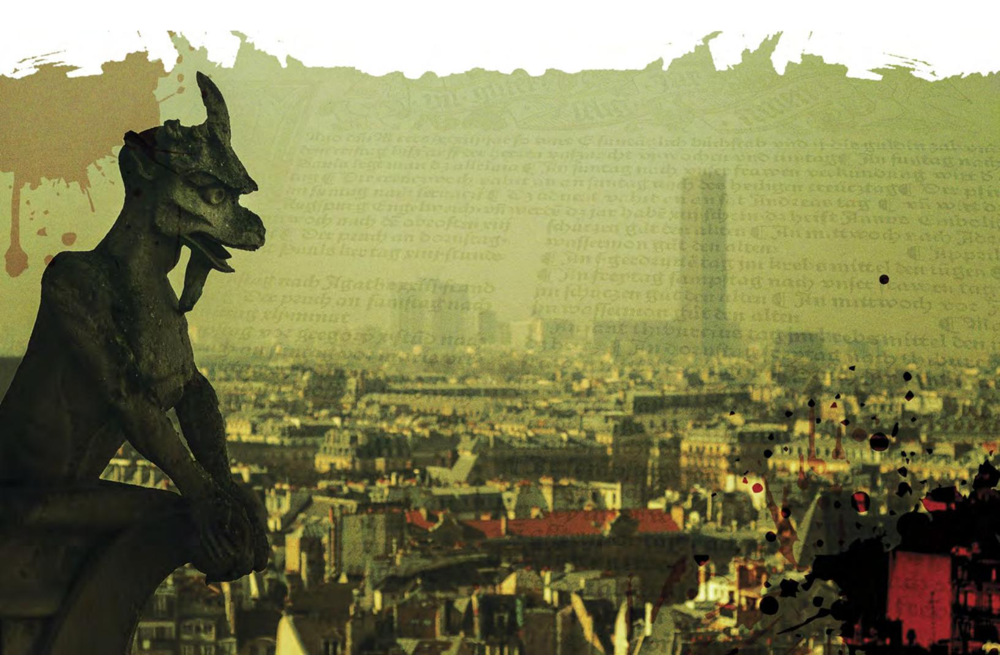

# Элемент Сеттинга: Театры военных операций

Как было сказано выше, коалиционный подход к городу помогает определить структуру истории. Наряду с этим чисто повествовательным элементом, понимание города FIRSTLIGHT или Леопольдитом также влияет на сеттинг истории. Считайте, что эти четыре типа AO («Область операций») являются «внутриигровой» стратегией,

дополняющей структуру рассказчика.

## Åæèê

В «ежах», или городах-крепостях, Коалиция агрессивно защищается от любого предполагаемого вторжения и уничтожает любую предполагаемую активность вампиров. Для обороны «ежей» требуются огромные ресурсы, что становится практически нецелесообразным при масштабах более нескольких миль. Часто Коалиция защищает «Зеленую зону» внутри менее безопасного города в виде ежа. Ватикан - это ежик в гораздо более крупном городе Риме, используемый как база для агрессивного патрулирования города леопольдитами, а также их союзниками и вырезанными из них карабинерами и AISI. FIRSTLIGHT хотел бы сделать Вашингтон настоящим ежом, но вынужден довольствоваться защитой федерального округа между Белым домом и Капитолием, здания ФБР и нескольких других ключевых объектов, таких как Смитсоновский институт. Кольцо ежей (Лэнгли, Форт-Мид, ВВС Эндрюс и Кэмп-Дэвид) окружает сам округ Колумбия, но огромный, лабиринтообразный Пентагон пока не может быть адекватно защищен.

Таким образом, в городе с ежом AO можно одновременно играть в «Сопротивление и истощение» в зоне ежа и в «Открытый город» или «История кончика кола» за ее пределами. Вход в ежа, даже в полностью оккупированном городе, кажется сородичам более опасным: любая камера может оказаться XScope, а в каждом автомобиле могут находиться три вооруженных кольями солдата «Дельта Форс» с капюшоном из цепной ткани и свободным местом в самолете на Гавайи. Истории, которые развиваются в ежике или через него, повторяют троп «путешествие в страх» из шпионских фильмов: усиливают паранойю и увеличивают количество проблем.

## Îâ÷àðíÿ

Коалиция считает победой несколько городов, "чистых городов" на жаргоне британских бюрократических охотников. Леопольдовцы называют эти города "овечьими пастбищами", где их стада могут спокойно пастись. Более старые и циничные американские операторы называют их "стратегическими деревнями", вспоминая аналогичную стратегию менее успешной войны. Лондон, Гонолулу и Лас-Вегас возглавляют список успешных овчарен, а Восьмое направление утверждает, что аналогичный успех сопутствует и важной базе Спецназа и военно-перевалочному пункту Ростов-на-Дону.

Но даже в Лондоне и Вегасе есть несколько Сородичей, скрывающихся под покровом, или разгуливающих по солнечным улицам в полубезопасном состоянии в своем Сумрачном обличье. Овчарочьи города лучше всего подходят для истории, где Коалиция всегда потенциально присутствует, но не находится там в данный момент своего рода Сопротивление в беспамятстве. И Коалиция, и Сородичи проводят только самые тайные операции, и как можно меньше. В чистом городе может развиться обычная история Сопротивления и Истощения, когда Коалиция медленно и неохотно осознает, что ее овцы не так уж безопасны, как ей казалось. Истории меньшей силы (слабокровные против бандитов, возможно) и чемпионские котерии хорошо работают в городах овчарни, как и враги "третьей силы", такие как фейри или смертные волшебники, которые не так громко бьют по радару ПЕРВОЙ СВЯЗИ, как оборотни.

# Ëèíèÿ ôðîíòà

Каждая рука Второй Инквизиции, а некоторые даже еще не связаны с телом, напрягает свои мускулы против Сородичей. Везде, где у Коалиции достаточно разведданных для проведения рейдов и вторжений, или достаточно средств для их проведения, они делают это во все возрастающем количестве. По мере того как длится тысячелетие и Маскарад разрывается, все больше городов оказываются на линии фронта: Прага, Богота, Ливерпуль, Марсель, Кигали, Луанда, Портленд и многие другие. Рио-де-Жанейро и Детройт, среди прочих, остаются на линии фронта с 2012 года.

Таким образом, город на линии фронта может принять историю «Вершина кола» или «Поздний» открытый город. Коалиция сделала свой ход, но еще не заключила сделку, поэтому импульс переходит к Сородичам. Шок уже прошел, но трепет еще не наступил. В городе на линии фронта, даже в открытом городе, может внезапно появиться приток инквизиторов, так как ПЕРВЫЙ СВЕТ бросает на проблему еще один миллиард. Персонажи могут уклониться от этого наплыва (или перенаправить его на своих противников) или быть отправлены «на передовую», чтобы нанести контрудар по центральному храму леопольдитов или зданию со стеклянными стенами возле аэропорта с очень

крутыми охранниками.

## ÷àñòÿõ ñàõàðà â êðîâè

Каждый город принадлежит Богу, говорят леопольдиты. Просто в некоторые из них он еще не перевез все свои вещи. В Темные века, когда мусульмане, викинги и конные кочевники захватывали древние епархии, Церковь называла эти епископства in partibus infidelium, «в землях неверных». Сегодня Общество называет города, которые оно еще не евангелизировало, in partibus sanguisugarum, «в руках кровопийц». FIRSTLIGHT просто оставляет точки этих городов красными на карте... пока.

Чикаго, Берлин и многие другие классические оплоты Сородичей по-прежнему считаются IPS, даже несмотря на то, что большинство из них имеют форпост Коалиции внутри границ или поблизости на малопосещаемой трассе. Рассмотрим эти «ранние» открытые города, где Коалиция все еще отдает предпочтение сбору разведданных и разведывательным миссиям перед полномасштабными огненными бурями. Шпионские истории в таких городах превращаются в контрразведывательные дуэли в стиле холодной войны, в ходе которых выискивается присутствие Коалиции и нейтрализуется как можно незаметнее. Котерии Дневного Дозора и Патруль и останавливают спецназовцев или уличных проповедников-леопольдитов, и все ждут ночи, чтобы начать войну.

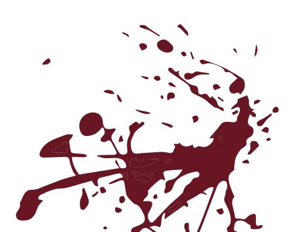

# Тематический элемент: Ночь и Туман

Любой разумный охотник на вампиров непременно нападает в полдень, сжигая свои мучительные цели из сородичей в их постелях под голубым небом и палящим солнцем. И действительно, все большее количество военных и шпионских триллеров XXI века включают в себя дневные рейды, полные ослепительных бликов и сверкающей пыли. Дневные рейды отлично подходят для нападения на других сородичей, которых можно обнаружить после пробуждения. Но персонажи игроков заслуживают сцен, которые питаются корнями вампирских и шпионских историй, а эти корни лучше всего растут ночью. Так почему же Вторая Инквизиция устраивает ночные рейды в вашей истории?

- Ценная цель не оставляет свой адрес без присмотра. Вы должны захватить их, когда они появятся, опираясь на информацию, полученную в последнюю минуту, которая быстро меняется и быстро истекает. Да, идеальный план держать цель в поле зрения и следовать за ней до ее убежища, но не так-то просто следить за тем, что может исчезнуть из виду, перепрыгнуть через ограждение циклона или превратиться в летучую мышь. Иногда быстрый удар под фонарем - это единственное, что вы получите.
- Охотники не могут легко найти пустотелых, не имея стабильных адресов или схем охоты, которые можно нанести на карту. Бандиты передвигаются по собственному желанию, а другие могут быть бездомными или скрываться от разгневанного барона. Для охоты на такие цели нужно расставить сеть наблюдения и ждать, пока цель сама в нее войдет - а цель ходит только ночью.
- Дневной рейд привлекает прохожих с мобильными телефонами, телевизионные новостные коптеры и, возможно, невольные подразделения полиции и пожарной службы. Гораздо труднее скрыть, что что-то горит в пятичасовых новостях, чем то, что горит в пять утра. В конце концов, коалиция должна поддерживать свою собственную завесу, и часто информационная безопасность превосходит другие виды безопасности.
- Дневные атаки также чреваты неприемлемым побочным ущербом: мимо этого убежища весь день ходят невинные покупатели, туристы или наркодилеры. Лучше провести день, как можно тщательнее разведав место, а вечером скрытно собрать команду. В лучшем случае вы полностью замените проходящих мимо граждан людьми, которым не отстрелят их глупые головы, когда шар взлетит вверх.

■ Если вы хотите набрать много пустотелых, нужно брать их, когда они вместе - когда они бодрствуют. Зацепка на Элизиуме, или сходка банды Анарха, или выставка искусств Тореадора, или съезд алхимиков окупаются гораздо лучше, если вы можете схватить или стереть в пыль всю их толпу. А это случается только ночью.

# Элемент истории: Стрелять или говорить?

В криминальном фильме Майкла Манна «Жара» представлены одни из самых захватывающих перестрелок во всем кинематографе. Но не менее важен и напряженный, подсознательно интенсивный диалог между грабителем и полицейским, в котором эмоциональные ставки сделаны для обоих персонажей. Рассказчики должны балансировать между действием и взаимодействием в истории, особенно с такими антагонистами, как Вторая Инквизиция.

### Глушители

По большому счету, чем больше вы знаете об антагонистах в хоррор-играх, тем менее страшными они становятся. Покажите их внезапными всплесками - теневые фигуры в громадных тактических доспехах прорываются в убежище - или таинственными вспышками - женщина в халате, держащая икону в руках перед тем, как все пошло прахом. Не просто дайте игрокам информацию о врагах, а заставьте их персонажей поработать на нее, проводя расследование и выживая (даже спасаясь бегством) после атак отряда UTR. Затем снова сломайте шаблон: измените время, эффекты и ресурсы, когда Коалиция отреагирует на расследование персонажей.

Оперативники и клирики Коалиции не объясняются с монстрами, на которых охотятся. Во многих случаях им это запрещено: не только монашеским обетом молчания, но и прожженной паранойей помощника директора NSA Прайса о доминировании, присутствии, искушении и прочих вещах, которые сородичи могут делать со своим голосом. Детройтская катастрофа все еще висит над американскими охотниками. Приказ «Никогда не говорить, никогда не слушать» остается постоянным для полевых операторов FIRSTLIGHT и IAO. Вместо полного молчания в черных операциях леопольдитский канонир или акритайский фанатик может заменить его белым магическим шумом: бесконечными песнопениями латинских экзорцизмов или пением гимнов.

#### **Выступления**

Но Вампир - это не просто игра в жанре хоррор, это игра с сюжетом. Сюжет требует драмы, то есть конфликтующих персонажей. Если персонажи - с потребностями, стремлениями и слабостями - выходят из теней Второй Инквизиции, то вместе с ними появляется и история. Возможно, большинство военизированных отрядов исчезают обратно в тени кроме одного раненого, оставшегося в живых. Женщина в халате никогда не говорит, но ее телохранитель из ESOG не может не похвастаться перед дрожащим Кровосом. По мере того как картина меняется, котерия постепенно собирает воедино командную структуру местной Коалиции, определяя ключевых игроков и точки давления на них.

Одно из мест, где инквизитор непременно общается, - это комната для допросов, пусть даже в виде вопросов. Персонажи, рискующие попасть в плен, могут многое узнать об убеждениях и целях своих противников. (Не зря в шпионских драмах сцены допросов используются как классические драматические возможности). Более безопасно, хотя обычно и медленнее, котерия может подтолкнуть судью-леопольдита или ответственного агента SAD к нетерпению или излишней самоуверенности. Если начальство Коалиции пока хранит молчание, возможно, их информаторов, или союзников, или инструменты можно убедить похвастаться, или пожаловаться, или потребовать, или поторговаться.

И сородичи, и Коалиция жаждут информации, и те и другие поддаются своему желанию, даже когда не должны этого делать. Каждый инквизитор чего-то хочет, хотя бы для того, чтобы подтвердить свою веру в свое дело. Жаждет ли солдат BOES праведной мести за потерянную сестру? А оккультист из Оксфорда жаждет повелевать сверхъестественным? Кто увлекается погоней, адреналином или скоростью? Узнать, чего хотят смертные, и предложить жестоко подслащенную пародию на их желания - в конце концов, это должно быть второй натурой для вампиров.

# Тематический элемент: Зеркальные изображения

Убийцы бродят по ночам, самые страшные из них убивают с религиозным рвением, наслаждаясь охотой. Эти убийцы укрываются за мощными институтами: правительствами, полицейскими департаментами, шпионскими службами, соборами. Хотя их раздирают внутренние фракции, они свято хранят свой кодекс тайны. Все их силы и способности остаются загадочными, возможно, даже для них самих. Никого не напоминает?

Ни Камарилья, ни подпольная Коалиция не замечают многочисленных параллелей между этими двумя организациями, но это лишь дает Рассказчику больше ироничного мяса. Расширьте параллели: Анархи видят свое собственное отражение в растущем числе независимых охотников, втянутых в жизнь, но избегаемых тремя первоначальными агентствами, которые руководствуются скорее уличной целесообразностью, чем формальными заданиями. Дальнейшие отголоски звучат по мере развития истории:

- Особенно в историях «Открытого города», где и сородичи, и инквизиторы играют в шпионские игры: мертвые точки, неуловимые коды, хвосты и подставы. «Игрок на другой стороне» начинается как абстракция и постепенно превращается в замысловатый танец ходов и контрходов. Когда игроки придумывают что-то хитроумное, их противникинквизитор возвращается с защитой - или использует ту же тактику против них.
- Хотя обмен пленниками строго запрещен как Башней, так и FIRSTLIGHT, он предоставляет сочные драматические возможности, а также устанавливает буквальное уравнение между инквизитором и вампиром. Кого стоит обменять? От кого отказаться? Как схватить лучшего аббата Леопольдита в городе - или забывчивого архиепископа - за двенадцать часов, не нарушая Маскарада? И можно ли доверять пленнику, которому другая сторона позволила жить?
- В «Дракуле» Брэма Стокера наука диктофоны, медицинский гипноз, паровые катера и железные дороги - противостоит чудовищу. Столетие спустя они смешиваются и пересекаются. Гангрел смотрит глазами сокола, неутомимый дрон передает изображение в фургон SAD. Ясновидение и XScopes, Кевлар и Стойкость, городской камуфляж и Сокрытие, охотник превращается в охотника и обратно. Эти крошечные красные огоньки - глаза Носферату или светодиоды на камере боевого шлема?

■ Подчеркните эмоциональное сходство между сородичами и их охотниками, особенно операторами на передовой. Оба проводят ночи в паранойе и экстазе, оба вынуждены игнорировать свою человечность, чтобы выжить («Стреляй той девочке в лицо! Она одна из них!»), оба убивают. Оба превозмогают свою зависимость от крови или адреналина (или боевых амфетаминов, во многих случаях); оба клянутся отомстить тем, кто уничтожил их товарищей. Рассказчики могут пересказать диалог, подслушанный во время рейда, или проникнуться слишком знакомым холодным отчаянием воина, сидящего за столиком закусочной на закате.

# Ãîðäûíÿ è Íåìåçèäà

В греческих мифах богиня Немезида противостояла гордыне, которая заключается в том, чтобы бросать вызов богам. Немезида олицетворяет не только справедливость, но и возмездие: она носит с собой и весы, и кнут. Рассказчики могут представить Вторую Инквизицию как заслуженный ответ на высокомерие Камарильи: они осмелились править человечеством несправедливо, и теперь человечество несет бедствие в свою очередь. Возможно, обыграйте слухи (особенно распространенные среди анархов) о том, что Камарилья (или конкретный князь) пыталась подставить анархов под 11 сентября, и их небрежные уловки обрушили на головы всех новую инквизицию.

Если говорить более конкретно, представьте присутствие Коалиции в городе историй как реакцию на самонадеянную глупость ее Примогена или баронов. Неужели их чрезмерная охота навела на след профи ФБР? Накопили ли они секретный архив, в который только что проникло NSA? Они шепнули леопольдитам о местонахождении близлежащего убежища шабаша? Не только высокопоставленные и могущественные сородичи навлекают на себя беду: однажды одна из котерий охотится на племянницу или подругу аналитика ЦРУ, и вдруг их сообщение попадает в папку входящих сообщений FIRSTLIGHT с уже утвержденным приказом о прекращении деятельности.

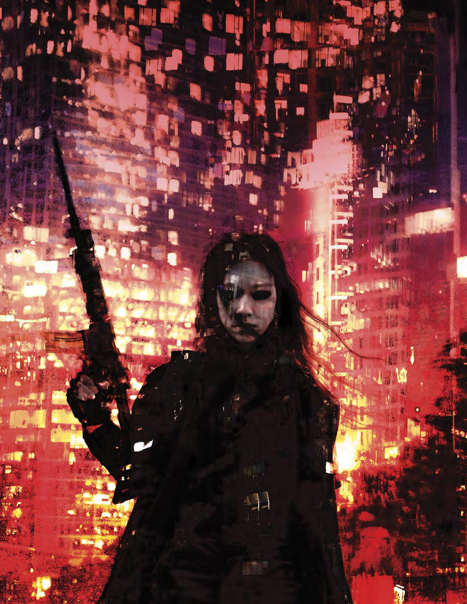

# Элемент Сеттинга: Враги моих врагов

Каждый каинит просыпается ночью в окружении врагов: соперничающие котерии, силовики из другой фракции, силовики из своей фракции (или и те, и другие, если речь идет о несвязанных Кровососов), Шабаш, Люпины или другие звероподобные чужаки. Вторая Инквизиция может даже не попасть в этот список, что делает заманчивой идею заставить их убрать из списка других вампиров.

Но как? Позвонить в местное отделение ФБР по стационарному телефону и надеяться, что трубку возьмет отдел по особым поручениям? Найти инквизитора в своем городе и пройти через смертный обряд? Явиться ли вам и встретиться лицом к лицу? Чем больше помощи вам требуется от Коалиции и чем быстрее вы в ней нуждаетесь, тем рискованнее становится ситуация. В самых тяжелых случаях вам, возможно, придется выйти на поле боя вместе с ними, повернувшись спиной к многочисленным бразильским штурмовикам с дробовиками наперевес. Тот факт, что многие ваши сородичи все еще кажутся вам опаснее, чем это решение, может быть самым худшим в игре «враг моего врага».

#### Ïîâåñòâîâàíèå Âðàãè âðàãîâ

В головах игроков и так достаточно сомнений и неуверенности: сделайте альянс Коалиции законным вариантом, если они пойдут на это. Даже если местный агент SAD планирует выступить против котерии, нет лучшего способа усыпить их бдительность, чем предложить им реальные сведения и реальную помощь на некоторое время. Если котерия придерживается относительно не убийственной этики (или они играют в «Чемпионов» или что-то подобное), инквизитор может даже прийти к ним первым с (относительно) честным предложением о совместной работе.

Это позволит вам погрузиться в паранойю и саспенс, которыми изобилуют сюжеты Второй Инквизиции. Когда произойдет внезапное и неизбежное предательство? Должны ли мы первыми войти в дверь? Недопонимание, потерянные сигналы, недостаточное подкрепление бюрократические проволочки или намеренная медлительность? Священник, разговаривающий с моей Опорой, - леопольдиец ли этот священник? Наше убежище прослушивается? Спецотдел утверждает, что они все-таки прослушивали убежище наших соперников...

Напряжение, вызванное предательством, может нарастать на протяжении всего сюжета, и, как и все темы, оно выигрывает от того, что его олицетворяют персонажи второго плана. Любой союз между Котерией и Инквизицией проходит через посредниковлюдей; обе стороны пытаются подкупить союзников, связных и сотрудников другой стороны. В процессе ролевого взаимодействия добавьте подергивания, паузы и взгляды в сторону. Вам не нужно сразу или вообще никогда не нужно решать, кто из персонажей второго плана будет верен вам. Смертный, на которого давят и инквизитор, и каинит, вполне может сломаться под воздействием стресса, став двойным или тройным агентом или просто помогая тому, кто попросит последним.

Последняя опасность сотрудничества со Второй Инквизицией - это не предательство... это объединение по-настоящему. Слабокровные и каитиффы, ненавидящие, когда к ним относятся снисходительно, анархи, ненавидящие Камарилью... многие сородичи могут решить, что возможность получить солнечную комнату лучше, чем уверенность в архонте или Кровавой охоте. Возможно, местные леопольдиты имеют склонность к Санбенито и предлагают котерии шанс на мученичество или даже искупление... в обмен на очень полное и подробное признание и несколько удивительно приятных актов жестокого покаяния.

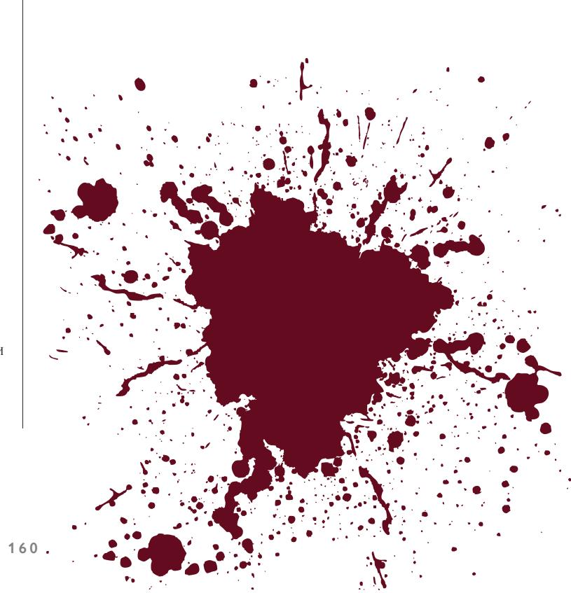

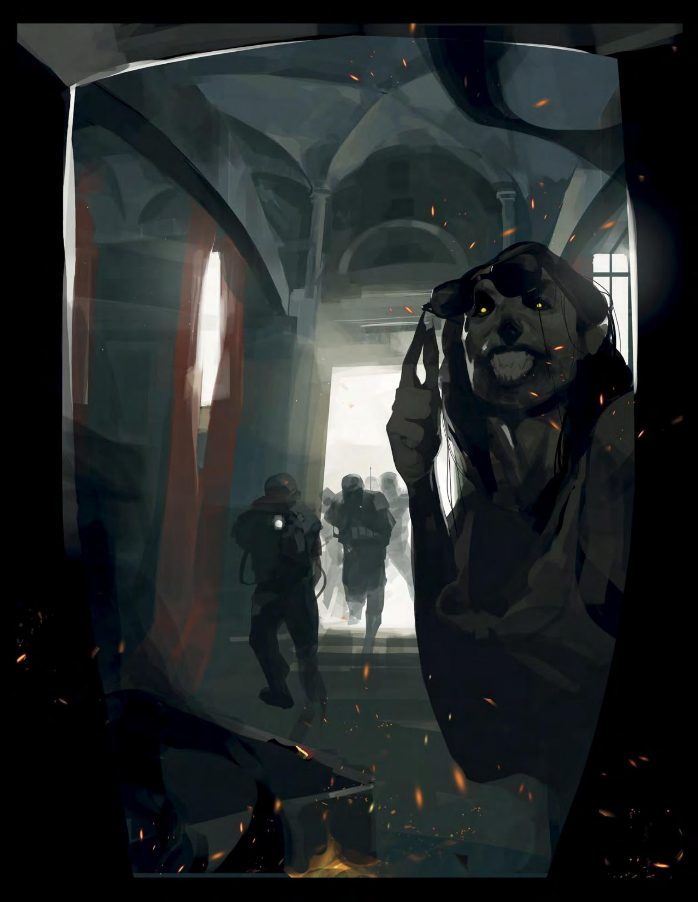

# Тайная церковь и скрытое государство, охота на охотников в городах и на континентах

Эта книга - руководство для антагонистов по восходящей Второй инквизиции: . Противники ваших сородичей, а также их специальные силы и оборудование . Информация о пожаре, разгорающемся против мировых вампиров, разжигаемом Обществом святого Леопольда и американской черной программой "ПЕРВЫЙ СВЕТ"

. Новые инструменты для расширения истории, включая эльдрические артефакты, десятки опасных антагонистов и тактические приемы, с помощью которых ваша котерия может дать отпор

**renegadegames.com**

**/PlayRGS @PlayRenegade @Renegade\_Game\_Studios**

Manufacturer: Renegade Games, LLC. 306N West El Norte Parkway #325, Escondido, California 92026. Importers: Renegade France 52 Avenue Pierre Semard 94200 Ivry sur Seine France. P:+33 (0)1 77 37 60 47. Renegade Games, LLC. Juxon House 100 St Paul's Churchyard, London, England EC4M 8BU. © 2021 Renegade Game Studios. All Rights Reserved. Paradox Interactive®, Vampire the Masquerade®, World of Darkness®, Copyright 2018 Paradox Interactive AB (publ). All Rights Reserved. Made in Seoul, Republic of Korea.

**Mature Advisory:** contains graphic and written content of a mature nature, including violence, sexual themes, and strong language. Reader discretion is advised.

