**A SOURCEBOOK FOR VAMPIRE: THE MASQUERADE**

# РУКОВОДСТВО ДЛЯ ИГРОКОВ

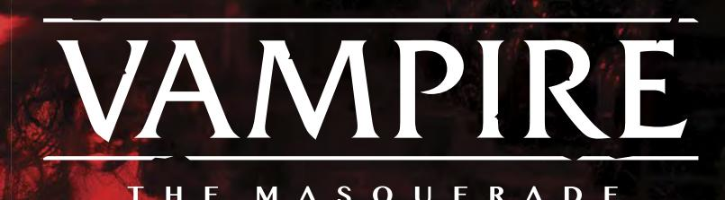

# Дети Каина

Дети ночи - в какие игры они играют! И в какие игры мы можем играть с ними?

Вампиры обитают среди нас с тех пор, как на берегу Евфрата возникли первые безымянные города. Они владеют могущественной силой и странной магией, охотятся необычными способами и даже собираются вместе, когда этого требуют времена.

В этой книге собраны новые варианты создания персонажей, силы, руководства по игре вдвоем, в одиночку и виртуально, а также новые способы использования старых правил. Идеальное дополнение к игре Vampire: The Masquerade.

Руководство для игроков "Вампиры" включает в себя: ^ Профили семи кланов Сородичей: Бану Хаким, Геката, Ласомбра, Министриев, Равнос, Салюбри и Цимисхов

^ Расширенные правила игры в кастомах: Каитифф, Слабокровные гули и смертные

^ Новые и объединенные силы Дисциплины, ритуалы Колдовства Крови и формулы Алхимии Слабой Крови, а также Дисциплина Обливиона и ее ритуалы

^ Системы и преимущества для котерий, включая лист учета котерий

^ Рекомендации и советы по ведению нетрадиционных историй, в том числе: все слабокровные, в стиле труппы, виртуальной игры и игры один на один. А также Обновленные правила для "Опор", "Воспоминание" и "Проектов"

**renegadegames.com**

/PlayRGS @PlayRenegade @Renegade\_Game\_Studios /RenegadeGameStudios

Manufacturer: Renegade Games, LLC. 306N West El Norte Parkway #325, Escondido, California 92026. Importers: Renegade France 52 Avenue Pierre Semard 94200 Ivry sur Seine France. P:+33 (0)1 77 37 60 47. Renegade Games, LLC. Solar House 915 High Road London, London, England N12 8QJ. © 2023 Renegade Game Studios. All Rights Reserved. Paradox Interactive®, Vampire: The Masquerade®, World of Darkness®, Copyright 2023 Paradox Interactive AB (publ). All Rights Reserved. Made in China

**Mature Advisory:** contains graphic and written content of a mature nature, including violence, sexual themes, and strong language. Reader discretion is advised.

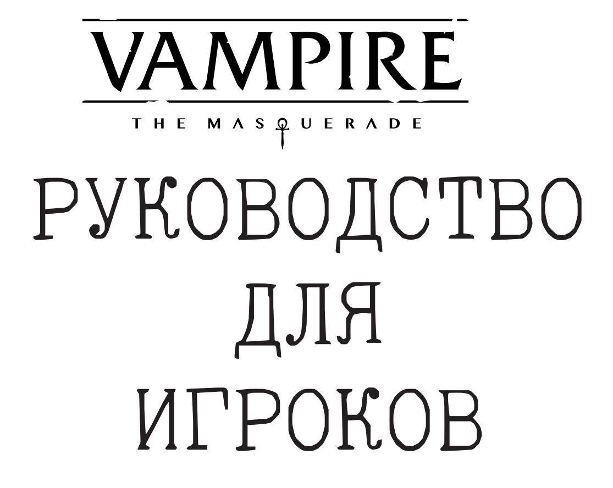

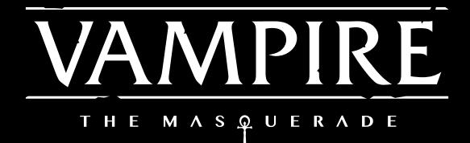

# PLAYERS GUIDE

**Written by Justin Achilli, James Mendez Hodes, Khaldoun Khelil, Saskia Liddick, Karim Muammar, Crystal Mazur, Martyna "Outstar" Zych, and Kenneth Hite Editing and Development by Kenneth Hite with Elisa Teague Cultural Consulting: James Mendez Hodes Producer: Kevin Schluter Art Director: Sarah Robinson Art Aquisition Manager: Trivia Fox Cover Art: Mark Kelly**

**Interior Art and Illustration: Tomas Arfert, Nevzat Aydin, Peter Bergting, John-Paul Bichard, Krzysztof Bieniawski, Raquel Cornejo, Kaitlin Cuthbertson, Martin Ericsson, Felipe Headley, Victor Herak, Mark Kelly, Anders Muammar, Maichol Quinto, and Martyna Zych Graphic Design and Layout: Sarah Robinson**

**Incorporates material from Vampire: The Masquerade** *Companion, Camarilla, Anarch, Chicago By Night***, and** *Cults of the Blood Gods*

**Vice President, World of Darkness: Sean Greaney Brand Creative Director: Justin Achilli Brand Art Director: Tomas Arfert Brand Editor: Karim Muammar Brand Community Developer: Martyna "Outstar" Zych Brand Marketing Manager: Jason Carl Partnerships Manager: Dhaunae De Vir Licensing Manager: Nikola Filipov**

**President & Publisher: Scott Gaeta Vice President Sales & Marketing: Sara Erickson Controller: Robyn Gaeta Director of Operations: Leisha Cummins Associate Project Manager: Katie Gjesdahl Sales Manager: Kaitlin Ellis E-Commerce: Nick Medinger Sales & Marketing Program Manager: Matt Holland Community Manager: Jordan Gaeta Senior Producer of Board & Card Games: Dan Bojanowski Producer, RPGs: Kevin Schluter Lead Developer, World of Darkness: Juhana Pettersson**

**Product Developer, RPGs: Jason Keeley Senior Game Designer: Matt Hyra Game Designers: Dan Blanchett & Christopher Chung Director of Visual Design: Anita Osburn Creative Director, Games: Jeanne Torres Creative Director, RPGs: Sarah Robinson Creative Production: Todd Crapper, Noelle Lopez, & Gordon Tucker Video Production Associate: Katie Schmitt Customer Service Manager: Jenni Janikowski Customer Service: Bethany Bauthues Finance Clerk: Madeline Minervini**

**© 2023 Renegade Game Studios. All Rights Reserved.** 

**Paradox Interactive®, Vampire: The Masquerade®, World of Darkness®, Copyright 2023 Paradox Interactive AB (publ). All rights reserved. Visit the World of Darkness online at www.worldofdarkness.com**

# ÏÎÈÑÊ ÈÍÔÎÐÌÀÖÈÈ

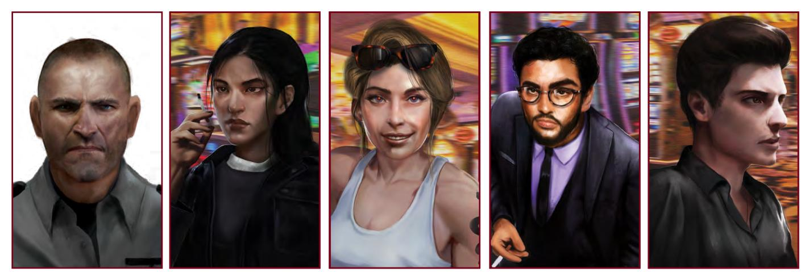

Гектор Карсон - жертва Подозреваемый 1 - "Джери" Подозреваемый 2 - "Ева" Подозреваемый 3 - "Далтон" Подозреваемый 4 - "Барри"

## ДЕТАЛИ

13 февраля 2022 года 44-летний Гектор Карсон работал охранником в казино Tangier в Северном Лас-Вегасе, штат Невада. Когда он не прошел регистрацию, его начальник обнаружил его тело за территорией казино со сломанной шеей и другими повреждениями, характерными для нападения с целью убийства.

Следователи распространили фотографии с камер наблюдения казино (см. выше) четырех человек, которые, как известно, столкнулись с Карсоном в тот вечер. С тех пор их не видели ни в одном казино Невады. На основании показаний свидетелей следователи составили следующие характеристики подозреваемых.

Подозреваемая 1 - женщина латиноамериканского или азиатско-американского происхождения, 20 лет, рост около 180 см, одета в большую кожаную куртку. Ее могут звать "Джери", "Герри" или прозвище "Дым", возможно, из-за ее привычки курить.

Подозреваемая 2 - белая женщина, 30 лет, рост около 170 см, вес 100-105 кг, татуировка змеи на левой руке. Может носить имя "Ава", "Ева" или прозвище "Змея".

Подозреваемый 3 - латиноамериканец или чернокожий мужчина, 40 лет, рост около 170 см, вес 120-125 кг, одет в черный костюм и галстук. Возможно, он носит имя "Далтон", имя или фамилия неизвестны.

Подозреваемый 4 - белый или испаноязычный мужчина, 20 лет, рост около 5,10", вес 150-165 фунтов. Может представиться именем "Барри" или "През". Его фотография соответствует описанию лица, подозреваемого в убийстве руководителя казино Херона Ставридиса 7 декабря 2021 года.

Судя по записям камер видеонаблюдения и собранным следователями данным, неизвестные подозреваемые, скорее всего, путешествуют вместе.

Всех, кто располагает информацией, просят позвонить по телефону "Горячей линии" 304-622-9069 или сообщить ее через Интернет по адресу cjisd-bb-tips@sad.fbi.gov. Вся информация будет принята к сведению и рассмотрена следователями. Звонящие могут оставаться анонимными.

Вы также можете обратиться в местное отделение ФБР или в ближайшее американское посольство или консульство.

Полевой офис: Лас-Вегас, штат Северная Каролина

## ОГЛАВЛЕНИЕ

## 11 Оглавление Брызги крови Кланы Слова, которыми не живут

3

7 **8**

## Бану Хаким

|                     |  |  | Кто такие Бану Хаким? |  |
|---------------------|--|--|-----------------------|--|
| Дисциплины          |  |  |                       |  |
| Проклятье           |  |  |                       |  |
| Изъян: Суждение     |  |  |                       |  |
| Бану Хаким Архетипы |  |  |                       |  |

## Геката

|                      |  | Кто такие Геката? |  |  |
|----------------------|--|-------------------|--|--|
| Дисиплины            |  |                   |  |  |
| Проклятье            |  |                   |  |  |
| Изъян: Болезненность |  |                   |  |  |
| Архетипы Геката      |  |                   |  |  |

## Ласомбра

|                   |  |  | Кто такие Ласомбра?   |  |
|-------------------|--|--|-----------------------|--|
| Дисциплины        |  |  |                       |  |
| Проклятье         |  |  |                       |  |
|                   |  |  | Изъян: безжалостность |  |
| Архетипы Ласомбра |  |  |                       |  |

## Министрии

|                     |  | Кто такие министрии? |  |  |
|---------------------|--|----------------------|--|--|
| Дисциплины          |  |                      |  |  |
| Проклятье           |  |                      |  |  |
| Изъян: Проступок    |  |                      |  |  |
| Архетипы Министриев |  |                      |  |  |
|                     |  |                      |  |  |

## Равносы

|                 |  |  | Кто такие Равнос? |                         | 41 |
|-----------------|--|--|-------------------|-------------------------|----|
| Дисциплины      |  |  |                   | 41                      |    |
| Проклятье       |  |  |                   | 42                      |    |
|                 |  |  |                   | Изъян: Искушение судьбы | 42 |
| Архетипы Равнос |  |  |                   |                         | 42 |

## Салюбри

|            | Кто такие Салюбри? | 46 |
|------------|--------------------|----|
| Дисциплины |                    | 47 |

|                                      | 47 |
|--------------------------------------|----|
|                                      | 48 |
|                                      | 48 |
|                                      |    |
|                                      |    |
|                                      | 52 |
|                                      | 53 |
|                                      | 54 |
|                                      | 54 |
|                                      | 54 |
|                                      |    |
| Клановые Проклятья                   |    |
| - Альтернативы                    | 56 |
| Бану Хаким: Ядовитая Кровь           | 56 |
| Бруха: Насилие                       | 56 |
| Гангрел: Инстинкты выживания         | 57 |
| Геката: Распад                       | 57 |
| Малкавиан: Неестественные проявления | 57 |
|                                      | 58 |
| Министрии: Хладнокровный             | 58 |
| Носферату: Заражение                 | 58 |
| Равнос: Нерожденное Имя              | 58 |
| Салюбри: Аскетизм                    |    |
| Тореадор: Мучительное сочувствие     | 59 |
| Тремер: Украденная кровь             | 59 |
| Цимисхи: Проклятая учтивость         | 59 |
| Вентру: Иерархия                     | 59 |
|                                      |    |

## Персонажи

61

| СВОДНАЯ ТАБЛИЦА ПРИЗНАКОВ И ТИПОВ ВАМПИРОВ | 62 |
|-----------------------------------------------|----|
| Атрибуты                                      | 62 |
| Навыки                                        | 62 |
| Дисциплины                                    | 63 |
| Фоны                                          | 63 |
| МГНОВЕННЫЕ ВАМПИРЫ                            | 66 |
| Стиль игры                                    | 66 |
| Мотивация                                     | 66 |
| Объятия                                       | 67 |
| СИЛЫ ДИСЦИПЛИН                                | 69 |
| Анимализм                                     | 69 |
| Ясновидение                                   | 70 |
| Стремительность                               | 72 |
| Доминирование                                 | 73 |
| Стойкость                                     | 74 |

|                   | 76         |
|-------------------|------------|
|                   | 79         |
|                   | 80         |
|                   | 81         |
|                   | 84         |
|                   | 91 98   |
|                   | 99         |
|                   | 103        |
|                   |            |
| Вымогатель        | 106 107 |
| Расхититель могил | 108        |
|                   | 108        |
|                   | 108        |
|                   | 108        |
|                   | 109        |
|                   | 109        |
|                   | 109        |
|                   | 110        |
|                   | 110        |
|                   | 111        |
|                   | 113        |
|                   | 113        |
|                   | 114        |
|                   | 114 115 |
|                   | 116        |
|                   | 116        |
|                   | 117        |
|                   |            |
|                   | 118        |
|                   | 120        |
|                   | 123        |
|                   | 124        |
|                   | 125        |
|                   | 126        |
|                   | 127        |
|                   | 128        |
|                   | 128        |
|                   | 130        |
|                   | 131        |
|                   |            |

## ОГЛАВЛЕНИЕ

| Слабокровные Архетипы Достоинства и недостатки слабокровок 135 В полумраке                  | 133 136                      |
|---------------------------------------------------------------------------------------------------|---------------------------------|
| Гули                                                                                              | 137                             |
| Роковая зависимость Роль гулей Архетипы гулей Создание гуля Особые ситуации персонажа | 137 137 138 139 142 |
| Смертные                                                                                          | 144                             |
| Зачем играть смертным? Дисбаланс Опасное притяжение                                         | 144 145 145 146        |
| Архетипы смертных                                                                                 | 146                             |
| Роль смертных Создание смертного                                                               | 148                             |
| Возможности рассказчика персонажа                                                                 | 151                             |
| КОТЕРИИ                                                                                           | 153                             |
| ВЕЛИКАЯ ЦЕЛЬ                                                                                      | 154                             |
| Персонажи игроков                                                                                 | 154                             |
| Котерия как облако                                                                                | 155                             |
|                                                                                                   |                                 |
| ТИПЫ КОТЕРИЙ                                                                                      | 156                             |
| Кровавый культ                                                                                    | 158                             |
| Церберы                                                                                           | 158                             |
| Чемпионы                                                                                          | 159                             |
| Коммандос                                                                                         | 159                             |
| Корпоративные                                                                                     | 160                             |
| Дневной дозор                                                                                     | 160                             |
| Посланники                                                                                        | 161                             |
| Семья                                                                                             | 161 162                      |
| Гангстеры                                                                                         | 162                             |
| Беглецы                                                                                           |                                 |
| Привратники                                                                                       | 163 163                      |
| Охотничья группа                                                                                  |                                 |
| Марешаль Кочевники                                                                             | 164 165                      |
| Плюмайры                                                                                          | 165                             |
| Квестари                                                                                          | 166                             |
| Регенты                                                                                           | 166                             |
| Диверсанты                                                                                        | 167                             |
| Сбиры                                                                                             | 167                             |
| Вехме Дозорные                                                                                 | 168                             |

|  | 169        |
|--|------------|
|  | 169        |
|  | 171        |
|  | 173        |
|  | 179        |
|  | 179        |
|  | 180        |
|  | 180        |
|  | 181        |
|  | 182        |
|  | 182 183 |
|  | 184        |
|  | 185        |
|  | 186        |
|  | 187        |
|  | 188        |
|  | 188        |
|  | 189        |
|  | 190        |
|  | 190        |
|  | 195        |
|  |            |
|  |            |
|  | 196        |
|  | 196 197 |
|  | 198        |
|  | 200        |
|  | 200        |
|  | 200        |
|  |            |
|  | 202        |
|  | 203        |
|  | 204        |
|  | 204        |
|  | 205        |
|  | 207        |
|  | 207        |
|  |            |
|  | 209        |
|  |            |
|  |            |
|  | 211        |
|  | 212        |

| 212 |
|-----|
|     |
| 213 |
|     |
| 213 |
| 214 |
|     |
| 214 |
| 214 |
| 215 |
|     |
| 216 |
|     |
| 216 |
| 216 |
| 217 |
|     |
| 219 |
|     |
|     |
| 220 |
|     |
| 222 |
| 223 |
|     |
| 224 |
| 225 |
| 226 |
| 227 |
| 228 |
| 229 |
|     |
| 230 |
|     |
| 239 |

ОБЪЕДИНЕННЫЕ АНТАГОНИСТЫ **241**

Цимисхи-прислужники-гули Призраки 

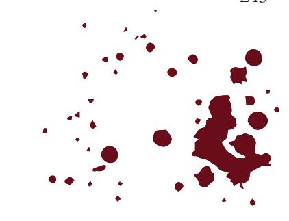

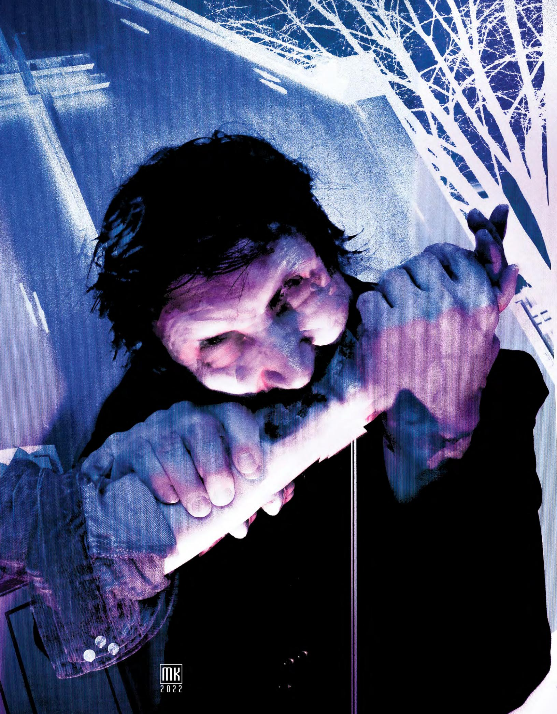

# Вступление*:*

# ÁÐÛÇÃÈ ÊÐÎÂÈ

Преступник, революционер, приверженец каббалы, член тайного общества, да и вообще еретики всех мастей обладают если не общительным, то весьма ассоциативным характером, и во всех их поступках заметен элемент игры.

— ÄÆÎÕÀÍ ÕÓÇÈÍÃÀ, Homo Ludens

Добро пожаловать в "Руководство для игроковвампиров". Обратите внимание, что в названии нет апострофа. Это не просто книга для одного игрока ("Руководство игрока") и даже не только для игроков ("Руководство игроков"), а руководство по самой игре, включая все виды игры, которые мы видели в эти новейшие ночи. Это руководство для игроков и рассказчиков, наблюдателей за игрой в сети и участников Discord, а также для всех, кто просто участвует в игре Vampire: The Masquerade, чтобы исследовать личный и политический ужас.

Это множество новых игроков и новых типов игроков. Эта книга предназначена для всех этих новых игроков и для всех игроков, которым интересно узнать о некоторых новых способах рассказывать истории о вампирах.

Она для игроков о вампирах. И она всегда и навсегда будет посвящена игрокам-вампирам, у которых теперь есть все оставшиеся кланы, собранные в одном месте, что звучит очень опасно, когда написано вот так. Если вампиров слишком много, мы также предлагаем руководства по игре смертными, гулям и слабокровным, а также смешанные истории со всеми вышеперечисленными.

При этом мы постарались сделать акцент в этой книге на вампирическом, а не на смертном мире новые способности Дисциплины, ритуалы, алхимические формулы и т.п., а не списки оружия или компьютеров. В любом случае, теперь у вас у всех есть Википедия.

Используя новые способности, оружие или Википедию, подумайте прежде всего о том, как они должны выглядеть в сюжете. Мы ставим драму на первое место и советуем вам поступать так же. Нашей общей целью должно быть углубление и улучшение опыта каждого игрока, а также углубление и улучшение общего опыта игроков, а не расширение возможностей игроков.

Именно поэтому мы включаем более подробные рекомендации по обдуманной игре, в том числе новые ограждения по некоторым серьезным темам.

Именно поэтому мы уделяем много страниц котериям, которые в прошлом были чем-то вроде "рыжих пасынков" "Вампира". (Забавный факт: во многих районах Балкан считалось, что рыжие пасынки после смерти превращаются в вампиров). Корни игры в котерии уходят глубоко в прошлое Vampire, и построение общей истории остается мощным и экономичным способом добиться от игроков как поддержки, так и отдачи.

Общая история: то, что мы все делаем, когда играем. И в идеале эта книга поможет всем нам, игрокам, сделать это.

## Ñëîâà, êîòîðûìè

## íå æèâóò

Сородичи используют множество слов, которые либо имеют для них дополнительное значение, либо приобретают совершенно иной смысл в их среде. Это не очередной лексикон камарильи или сленга анархов, а способ представить уже известные вам слова их глазами. Помните о них, когда будете вести диалог с персонажем и, возможно, размышлять об истории в перерывах между сессиями.

ЖИВОЙ, ПРОЖИВШИЙ и т.д.: Вампиры - нежить. Они ведут нежизненный образ жизни. Они существуют. Они устраивают свои убежища в определенных местах. Они нигде не живут и не видят, что может предложить жизнь.

ДЕНЬ: Ваш вампир убегает, чтобы сражаться еще одну ночь, а не день. Она проснется через три ночи. Дневное время относится только к буквальному дню, например, когда гули делают свои дела, а банки открыты.

ЛЮДИ: Сородичи считают себя людьми: возможно, более чистыми хищниками или более испорченными животными, но они цепляются за свою человечность до тех пор, пока могут верить хоть в какую-то ее частицу. Они используют слово "смертный" для обозначения людей, не являющихся вампирами.Сородич, каинит, слово "В": Камарилья говорит "сородич", как и большинство вампиров старше нескольких десятилетий. С возвращением каинитской ереси и зверствами Шабаша Ласомбра снова стала Сородичем. Ласомбры в общество Сородичей, термин "каинит" получил новое распространение. После 1800 г. термин "вампир" стал слишком вульгарным для самосознания Камарильи, и почти полностью использовался Каитиффом в ироническом ключе или в качестве укора своим так называемым старейшинам. В современные ночи все большее число Слабокровных возвращают себе слово на букву "В", что является еще одной причиной для отчаяния старших Сородичей по отношению к новому поколению.

КОНТРОЛЬ: Вампиры оказывают влияние. Они манипуляторы, а не диктаторы. Вампиры не могут контролировать даже свой собственный Голод. По сути, контроль означает полную власть над чем-либо. Вы управляете своим автомобилем или персонажем в видеоигре. Может ли кто-то по-настоящему контролировать полицию или местные СМИ? Маловероятно, но можно иметь значительное влияние на эти институты. Влияние. Это более подходящее слово, и оно также допускает различные степени и нюансы.

МАНИПУЛИРОВАТЬ: Мы только что сказали, что вампиры манипулируют, но им (или, по крайней мере, вам) следует несколько сузить это понятие: ведь они манипулируют всем, чем только могут. Чем и как они манипулируют в данном разговоре или в данном контексте? Не надо просто говорить "князь манипулировал протестующими". Были ли у нее агентыпровокаторы в толпе? Она заплатила их оргкомитету? Подговорила ли она местного полицейского сделать что-то возмутительное, из-за чего, как она знала, протестующие устроят беспорядки? Даже если князь будет придерживаться собственного мнения, другие смогут увидеть, какую пульсацию она оставила.

## КОРРУМПИРОВАННОСТЬ,

КОРРУПЦИЯ: Как и "манипуляция", коррупция, похоже, является стандартной установкой для вампиров. Таким образом, в данном контексте это слово означает... ну, ничего. Кто кого коррумпирует и для чего? Приходит ли коррупция извне: полицейский на побегушках? Или изнутри: менеджер казино обманывает? Или из системы, которая допускает к себе только влиятельных людей? Подумайте, кого вампиры должны перебить и в какой валюте.

### СЛУГИ, ОБСЛУЖИВАЮЩИЕ: Это

относится только к буквальным приспешникам: людям, таким как Подручные, гули и другие, которые делают именно то, что вы им говорите. Официант обслуживает вас. Имущество, обладающее большей свободой воли, может неосознанно служить какимлибо целям, но если вампир утверждает, что полиция служит ему, то он в лучшем случае проявляет великодушие, а в худшем тщеславие. В любом случае, он уязвим для врага, лучше разбирающегося во властных отношениях. И на этой ноте...

СЛУЖИТЬ СВОЕМУ КЛАНУ: Как Ваша фамилия? Служите ли Вы своему клану? Какова ваша национальность? Служите ли вы своей нации? Нет, вы просто человек. Вот что такое ваш клан - это просто еще одна характеристика. Даже Юстициары, служащие Камарилье, служат Башне из слоновой кости, а не своему клану. Тремеры совершили ошибку, поставив клан выше всех остальных соображений, и поплатились за нее после падения Вены. КЛАНЫ: Кланы не определяются и не ограничиваются географией, национальными границами или земными культурами, это совершенно разные вещи, но как внутренние, так и внешние люди часто совершают ошибку, смешивая их. Ваш клан - это не ваш работодатель и не ваш военачальник. В лучшем случае, это ваша расширенная семья, и после нескольких десятилетий, проведенных под влиянием капризов вашего предка, вы, вероятно, стараетесь, чтобы она была достаточно обширной. ■

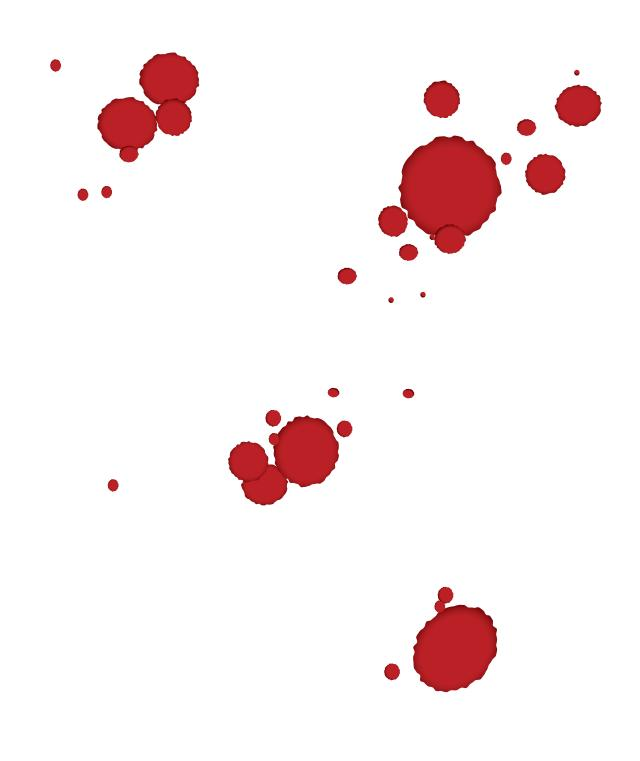

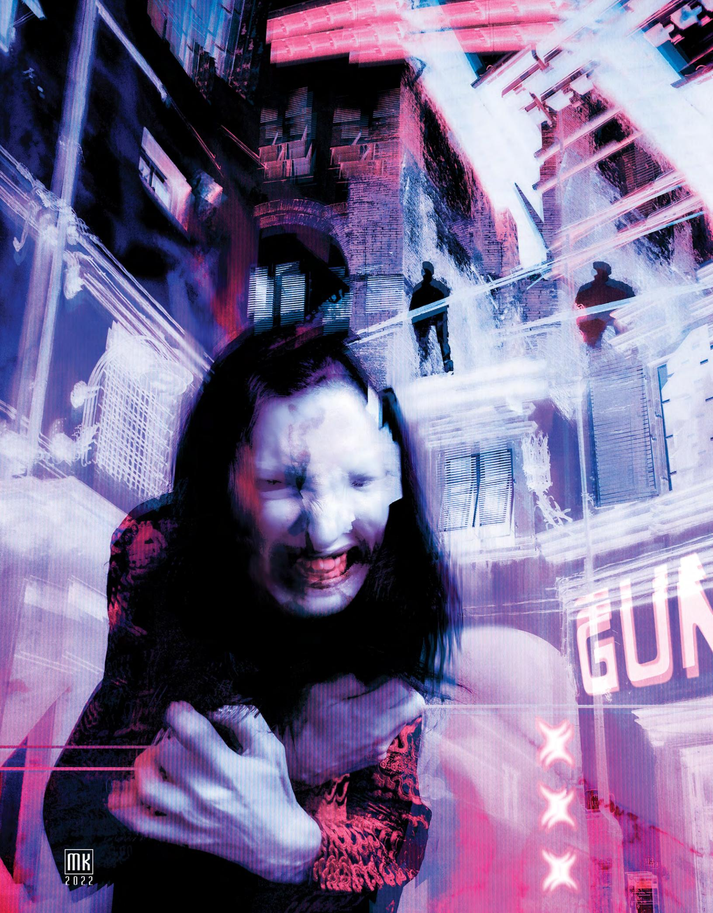

## ÃËÀÂÀ ÂÒÎÐÀß

# ÊËÀÍÛ

## Каждая несчастливая семья, несчастлива по-своему. —Ë.Í. Òîëñòîé, Àííà Êàðåíèíà

Новое столетие оказалось не самым лучшим для Сородичей. Правительства и линчеватели возобновили охоту на вампиров в рамках Второй инквизиции. Камарилья и Анархи вновь вцепились друг другу в глотки, а тем, кто не участвует в сражениях, приходится еще хуже.

Бану Хаким, как и Тремеры, стали свидетелями того, как их собственная неуязвимая крепость пала под ударами внешних и внутренних врагов. Те, кто пригласил их в Камарилью из паники и нужды, теперь эгоистично сомневаются в их ценности и даже в их присутствии. В Гекате полыхает пожар Второй Инквизиции, и Геенна, утверждающая, что их прародительница вырвала почву изпод ног уже лишившегося корней Равноса. Ярость Геенны ввергла Шабаш в религиозную манию такого извращенного накала, что даже многие Ласомбра и Цимисхи отшатнулись от Черной Руки.

Обиженные тем, что их вновь отвергла Камарилья, вампиры Министриев вкладывают деньги в новый хаос, надеясь получить от Анархов плоды, которые Башня из Слоновой Кости отказалась предоставить Последователям Сета. Лишь немногие Салюбри остались в живых, и по мере того, как мир смертных ополчается против всех Сородичей, Сородичи все больше ополчаются против тех, кто советует им примириться.

Но кланы все еще выживают. Каким-то образом их Кровь попрежнему течет, рассекая русла и меняя течения, устремляясь вниз по течению времени и судьбы, к завтрашней ночи и каждой последующей ночи.

*Chapter One: Clans*

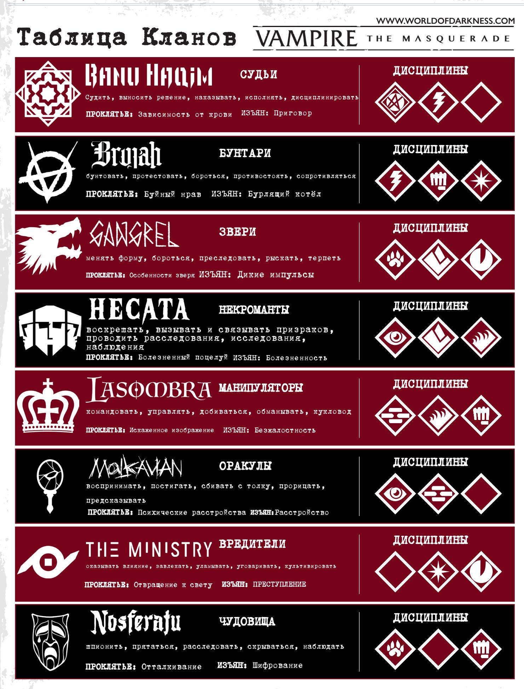

**1 2**

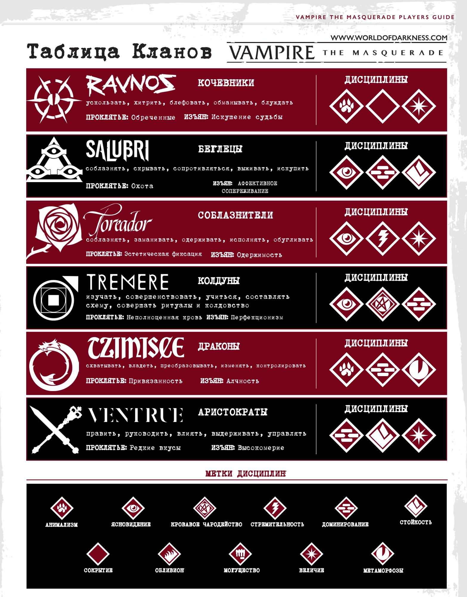

**1 3**

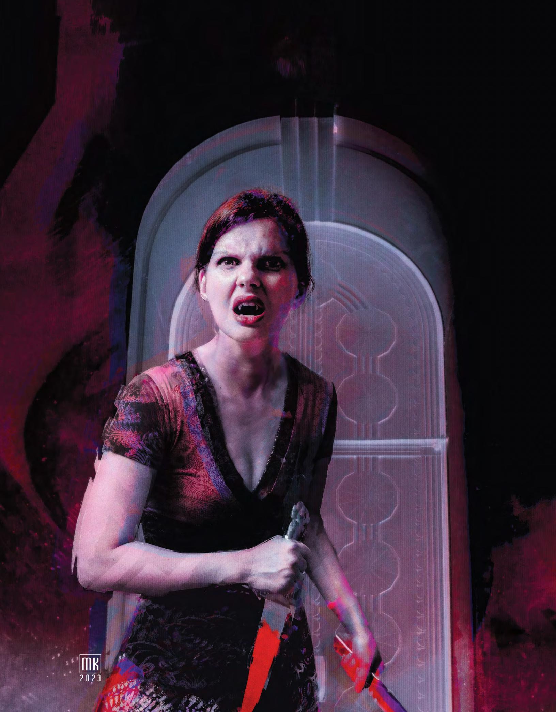

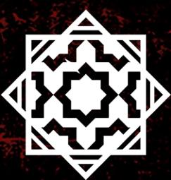

# BANDARAM Клан Охоты

Дети Хакима Посредники Судьи

Твоя Кровь показалась тебе невостребованной, но я уверен, что смогу найти ей достойное применение.

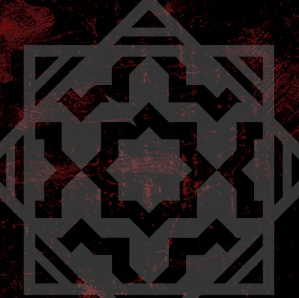

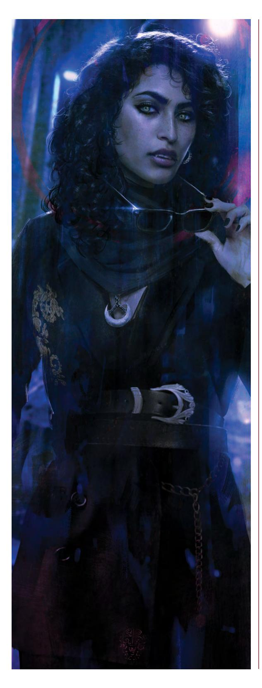

Судьи Бану Хаким разрываются между наследственной жаждой вампирской крови и страстью к правосудию. Суровые судьи, яростно отстаивающие моральный кодекс, они принимают смертных, способных оценивать и справляться с угрозами, следить за соблюдением законов и традиций и наказывать нарушителей.

С точки зрения Бану Хаким, Кровь - это закон сам по себе, передающий чувство долга тем, кто ее носит, в дополнение к проклятию вечно стоять на страже против Зверя. Бану Хаким из всех культур и правовых традиций находят, что их Кровь обязывает их к строгости и чести.

Бану Хаким тяготеют к упорядоченному обществу - по их мнению, Проклятым нужна структура (а значит, и судьи...), чтобы они не поддались своим низменным побуждениям и не превратили свои владения в залитые кровью адские просторы. И это не значит, что Бану Хаким слепо преданы какой-либо из сект. Камарилья в лучшем случае несовершенна, Аширра слишком часто связана беспрекословными традициями, Анархи выставляют себя в качестве ложных идолов, а Черная Рука - это не столько секта, сколько продолжающееся бедствие. Наиболее прагматичные из Судей отдают предпочтение наиболее привлекательному варианту среди множества проблемных институтов, каждый из которых по-своему уникален. И если кровь - это закон, то иногда лучшим вариантом для Бану Хаким является захват мантии справедливого лидера, по выражению их прародителя.

Понимание и структурирование состояния Рода выходит за рамки представлений о толковании законов и наказании мятежников для Бану Хаким. Ключом к пониманию законов Крови является понимание самой Крови, что склоняет не мало Детей Хакима к открытию ее свойств и управлению ими. А какая структура может быть более изящной, чем треугольник, для вытеснения порядка из беспорядка? Таким образом, Бану Хаким представляют собой тройственный род, состоящий из судей, магов крови и убийц убийц. Последнее, что может увидеть род, осужденный могущественным соперником, это лицо своего убийцы - если он решит раскрыть себя.

Такая точка зрения не всегда позволяет им легко находить союзников, поскольку Бану Хаким часто полагают, что они сами должны определять структуру сородичного общества, что заставляет сторонних наблюдателей воспринимать их как святош. Разумеется, ответ Бану Хаким заключается в том, чтобы устранить тех, кто ставит себя вне структур и защит общества Вампиров. Охотникам в эти ночи возрожденной инквизиции нужен только след, а грех Первого вампира практически приглашает к разврату.

# Êòî òàêèå Áàíó Õàêèìû?

Очевидный выбор для Бану Хаким - судьи, полицейские, законодатели и судебные исполнители, но в их философии есть нечто большее, чем тащить под покровом ночи случайных авторитетов. Для проницательного сира важнее всего потенциальный ребенок, обладающий видением, чтобы осознать необходимость порядка, и средствами, чтобы построить то, что достойно стоять вечно. Философы и поэты, колдуны и ученые занимают среди Детей Хакима такое же место, как и популярные в народе ассасины и неживые магистраты.

Судьи также имеют репутацию людей без юмора и стоических, не находящих себе места в развлечениях, несущих проклятие Каина как неумолимое бремя и требующих от других того же. В этом есть доля правды, ведь Бану Хаким считают состояние Сородичей ничем иным, как нечестивым сочетанием хищника и паразита. Однако наиболее проницательные мыслители из клана рассматривают все грани бытия Проклятых и могут оценить возвышенную тайну их потускневшей вечности, подобно тому как мозаичист может собрать из осколков цветного камня величайшее чудо. Бану Хаким могут построить обширную библиотеку на не совсем обычном этаже небоскреба или содержать прокуренный джентльменский клуб, торгующий самыми изысканными сосудами.

Родоначальники Бану Хаким ищут детей, обладающих особым талантом, который будет хорошо служить их представлениям об упорядоченном обществе, независимо от того, соответствует ли он сильным мира сего или является личным замыслом будущего родоначальника. Во многих случаях этот талант связан с устранением препятствий, включая способность ликвидировать цели по требованию или менее жестокую склонность к обеспечению бесперебойного выполнения планов.

Бану Хаким, хотя и не склонны добиваться важных должностей, часто гордятся полученными титулами и почестями, в какой бы секте они ни оказались. Неудивительно, что Камарилья является домом для многих Судей, которые находят ее традиции и нерушимую иерархию созвучными своим собственным. Действительно, самые известные роды Бану Хаким посвятили себя Башне из Слоновой Кости, а между Детьми Камарильи Хаким и "своенравными ублюдками" клана Анархов не угасает любовь.

## Äèñöèïëèíû

КОЛДОВСТВО КРОВИ: Различные хакимитские методы и философские концепции, касающиеся колдовства крови, отражают практическое применение этой дисциплины - от наделения ее практиков способностями к убийству до более универсальных ритуальных аспектов, позволяющих черпать секреты из собственной крови и крови других людей.

СТРЕМИТЕЛЬНОСТЬ: Дети Хакима используют Стремительность с ужасающим эффектом. Многие из них умеют пользоваться ею раньше других дисциплин, полагаясь на быстроту суждений, прежде чем сомнения смогут замедлить движение клинка к горлу. Во время еды некоторые Бану Хаким превращаются в настоящую черную дымку, проносясь мимо и поглощая пищу из своих излюбленных сосудов, а затем исчезая так же быстро, как и появились.

СОКРЫТИЕ: Бану Хаким преследуют свою жертву незаметно, чтобы незаметно подкормиться или окончательно добить цель, не подвергая ее ненужному риску столкновения с противником. Некоторые Бану Хаким используют эту дисциплину для того, чтобы наблюдать за тем, как объект совершает проступок, прежде чем вынести приговор.

## Ïðîêëÿòüå

Бану Хаким стремятся питаться теми, кто заслуживает наказания. Особенно это касается вампирской крови - самой сути проступка. Когда один из Судей пробует кровь другого каинита, ему очень трудно остановиться.

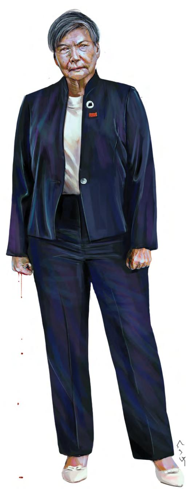

Утоление хотя бы одного уровня голода вампирской кровью провоцирует проверку на голодное безумие (см. Основные правила стр. 220) на Сложность 2 + Тяжесть проклятья. Если испытание провалено, они пытаются насытиться Кровью вампира, иногда до тех пор, пока не совершат диаблери над своей жертвой Сородича. Это создает много проблем для Бану Хаким, так как многие Сородичи считают Амарант анафемой, и это сильно расходится с порядком или упорядоченным поведением, которое Судьи предполагают поддерживать. И, конечно же, немало Бану Хаким корит себя за лицемерие собственных неудач.

## Êëàíîâûé èçúÿí: Ïðèãîâîð

Вампир вынужден наказывать всех, кто нарушает его личный кодекс, забирая их кровь в качестве справедливой мести за преступление.

В течение одной сцены вампир должен утолить хотя бы один голод любого человека, будь то друг или враг, который действует против его убеждений. (Помните, что убеждения не обязательно связаны с какой-либо культурой или сектой смертных; они могут быть сугубо личными для вампира). Если этого не сделать, то все броски будут оштрафованы на три кубика до тех пор, пока внушение не будет снято или сцена не закончится. (Если тот, от кого питаются, тоже вампир, не забудьте проверить на голодное безумие, вызванное проклятьем, как указано выше).

## Áàíó Õàêèì Àðõåòèïû

## Ïàëà÷

Повинуясь приказу августейших особ домена, Палач приносит окончательную смерть тем, кто безвозвратно нарушил устои Рода, будь то Традиции или указы светил домена. Имея престиж, подкрепленный "лицензией на убийство", Палач также готов браться за... несанкционированные контракты, если только они согласны с делом, которое ведет обиженный Род. Это может показаться противоречащим извращенной справедливости их титула, но судить виновного важнее, чем уважать процесс.

## Îáàÿòåëüíûé õîçÿèí

Обаятельный Хозяин ведет карточную игру в бальном зале престижного отеля, который, учитывая клиентуру стола (как вампирскую, так и людскую), ближе всего к "Элизиуму". Это не простая затея - игра идет без перерыва уже пять лет, в светлое время суток в ней участвуют доверенные лица, и пока обаятельный хозяин отсылает дань должным лицам, нет никаких причин, чтобы игра когда-нибудь закончилась. Фортуна приходит и уходит, и удача играет роль как за столом обаятельного хозяина, так и среди тех, кого он приглашает.

## Ãëàâà Ïðîôñîþçà

Знание того, когда нужно поставить ноги на улицы, когда вооружиться и схватить человека, а когда сдержаться и просто отказаться помогать властному Примогену, отличает это Дитя Хакима от его скрытного сира. Глава Профсоюза - выходец из той среды, где знание юридических лазеек и умение побудить других к действию было неотъемлемой частью успеха. И в последнее время они собирают все больше сторонников, которые видят возможность изменить ситуацию к лучшему для всех, но Главе Профсоюзу трудно найти баланс между некоторыми ожиданиями, которые возлагает на них устоявшееся общество Сородичей.

## Àðõèòåêòîð-ýçîòåðèê

Эзотерический архитектор видит свою роль в строительстве вещей, имеющих непреходящее значение. Они спланировали множество собственных убежищ, от неприметного приюта до комфортабельного кондоминиума в самом престижном районе города. Более того, они соорудили по всему городу множество ложных могил, в которых покоятся безжизненные тела пропавших без вести Сородичей. Одни из них были в разладе с тем или иным Примогеном, другие были новичками в эти неспокойные времена в политике домена. Остается вопрос, что определяет, кого Эзотерический Архитектор отправляет в усыпальницы, и как он решает, где их строить?

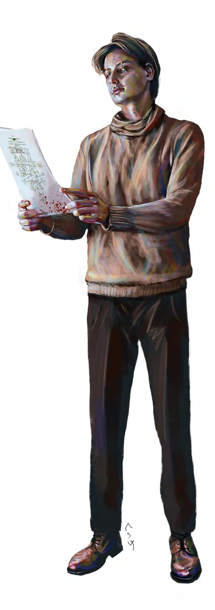

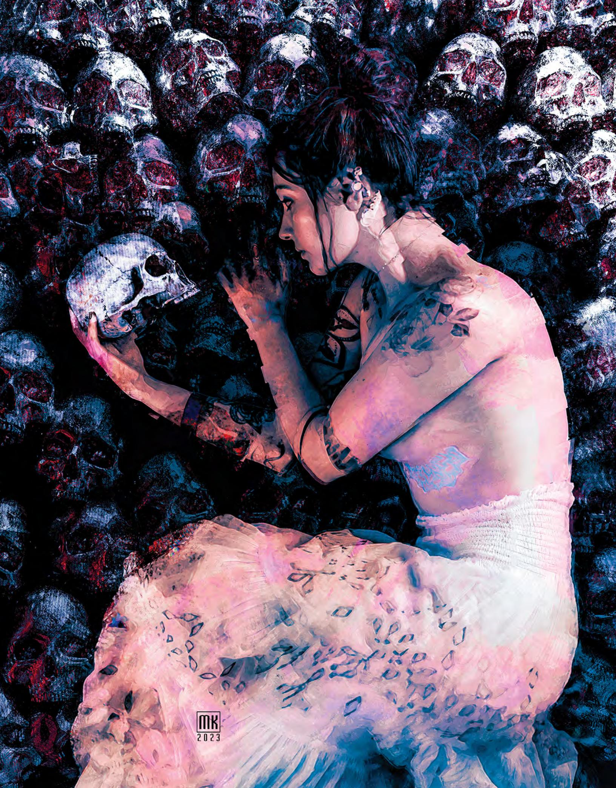

# HAROAU.

**Некроманты** С родни к двяволу Лазарены Клан Смерти

Сородичи - это просто одно из проявлений смерти, еще живое сознание, облаченное в плоть угасающей бледности или даже жизненной силы... И такие проявления могут быть переосмыслены, так сказать.

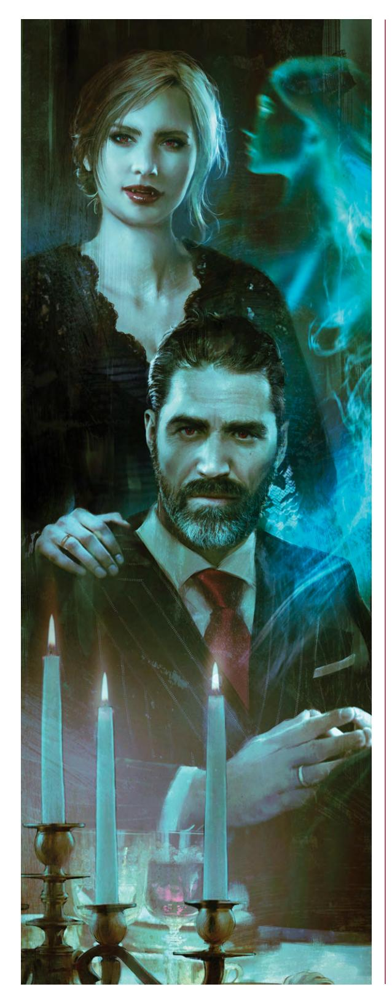

Пестрая коллекция некромантических и ампирных родословных, клан Геката объединен стремлением к единственному предмету: Смерть. Они изучают загробный мир и воскрешают мертвых - или даже хуже. Продавая свои услуги тому, кто больше заплатит, или действуя в собственных интересах, мало кто может скрыться от наблюдения тех, кто умеет вызывать и повелевать духами умерших.

Нечистые. Пожиратели плоти. Те, кто общается с мертвыми, и те, кто убеждает мертвых говорить от их имени.

Геката - аномальное явление среди кланов Сородичей, ведь это практически отдельная секта, клан, состоящий из странных родословных и даже некоторых настоящих семейных уз, построенных на почитании и покорности самой смерти. В клан Геката входят все - от поклоняющихся предкам преступных семей Старого Света до жрецов с чучелами и дегенеративных плотоядных монстров, - и все эти кровные линии объединяет нездоровое

увлечение смертной жизнью.

Недавно в результате нездорового ритуала эти разрозненные кровные связи были скреплены в "единый" клан, и эти разрозненные кровные связи делают клан больше похожим на секту, чем на традиционную родословную. Ни нечистые пристрастия клана, ни его склонность к игре всех остальных сторон друг против друга не вызывают особого расположения в обществе Сородичей. И тем не менее они до сих пор продолжают будоражить современные ночи своим неоспоримым некромантическим мастерством.

## Êòî òàêèå Ãåêàòà?

Быть Гекатой - значит унаследовать почти суеверный катехизис запретов, вины предков и ритуалов, которые определяют не только отношения членов клана друг с другом, но и с мертвыми. Для посторонних это непонятно, но для лазаренцев это семейная традиция. Что скажут старейшины, то и будет, ведь в основе клана лежит патриарх, который пожертвовал своей смертностью, чтобы его семья и все последующие поколения, смертные и родные, могли распоряжаться неприкосновенными дарами Проклятых.

С тех пор эта чудовищная "семья" сильно разрослась, приглашая в свои ряды других вампиров, чьи познания в тайнах смерти превосходят их собственные. Клан вобрал в свою сектоподобную структуру несколько потусторонних и погребальных родословных и культов, распространяясь, как некроз, по периферии вампирской культуры.

Геката придерживаются циклической философии в отношении Объятий, которые они символизируют тремя ликами Смерти, Гниения и Возрождения. Геката обладают способностью преодолевать различия между жизнью и смертью (и ее нюансами, например, не-смертью). Геката повелевает духами с тем же мастерством, с каким они "воскрешают" трупы, и с той же страстью, с какой они разгадывают причины смерти... и ее виновников. Это дает им возможность не только узнавать тайны, которые считаются благополучно ушедшими и похороненными, но и наблюдать за происходящим через призраков.

Само собой разумеется, что все эти вещи в менее гротескных обществах считаются запретными, поэтому Геката потратила немало усилий, чтобы добиться самодостаточности, которой позавидовали бы самые обеспеченные люди. Действительно, их понимание смерти и власть над ней приносят немалую прибыль при разумном использовании: они вечно засекречивают секреты преступлений, приносящих удачу, выясняют местонахождение давно забытых кладов, посылают беспокойных мертвецов, чтобы выудить или выпытать секреты у еще живых и тех, кто достаточно близок, чтобы считать.

Сиры Гекаты предпочитают смертных, принадлежащих к их собственным смертным семьям или фракциям, или тех, кто поддерживает связи с внешними группами, от которых потенциальный сир мог бы получить выгоду. Они предпочитают людей с болезненным, черным или прагматичным характером, и лишь немногие из них видят большую потребность в сострадании или сочувствии, если только это не служит удовлетворению особых потребностей, которые они хотят удовлетворить. Для одних геката клан - семья - это все, для других в лучшем случае на словах, хотя многие представители рода опираются на чувство вины, обязательства и семейного долга, чтобы заставить своих детей подчиниться, независимо от их собственных истинных чувств по этому поводу.

#### ÐÎÄÎÑËÎÂÍÛÅ ÃÅÊÀÒÛ

Клан Геката включает в себя множество различных родословных, от древних каппадокийцев до возрождающихся Насьон Сан Ан. Некоторые Гекаты считают, что когда-то эти кровные линии были полноценными кланами, но сегодня никто не знает и не заботится об этом, когда есть возможность получить прибыль и разгадать мрачные тайны. См. стр. 223-229, где приведены списки кровных линий Гекаты.

## Äèñöèïëèíû

ЯСНОВИДЕНИЕ: Геката часто рассматривает ясновидение как восприятие судьбы. Чтение ауры становится упражнением в определении того, как установки человека направляют его к своей судьбе; овладение телом ставит вампира у руля. Эта дисциплина также требует определенного мастерства от восприятия невидимых призраков до чтения духовной истории объекта... и часто игнорируется более грубыми членами клана.

СТОЙКОСТЬ: Кто может лучше превознести физическую прочность нежити? Стойкость может проявляться как в тщетности рубящих ударов по уже мертвому трупу, так и в великом мастерстве преодоления - и избегания - законов самой Смерти. ОБЛИВИОН: Обливион - одна из самых загадочных дисциплин, поскольку с его помощью можно проникнуть за завесу загробного мира. Используя его, Геката может допросить призрака или заставить его мучить соперника. Они могут одним прикосновением разложить плоть смертного или провести развратный обряд, чтобы загнать непутевого человека в безжалостную тюрьму. Обливион ставит под угрозу связь персонажа с его человечностью, но геката считают его необходимым инструментом для понимания взаимосвязи между жизнью, смертью и несмертью.

## Ïðîêëÿòüå

Геката наносит печально известный болезненный Поцелуй. Клыки Лазарен приносят не блаженство, а муки. Жертвы, застигнутые врасплох, будут яростно сопротивляться, если их не сдержать, и мало кто добровольно подчиняется пытке, которую представляет собой поцелуй Гекаты.

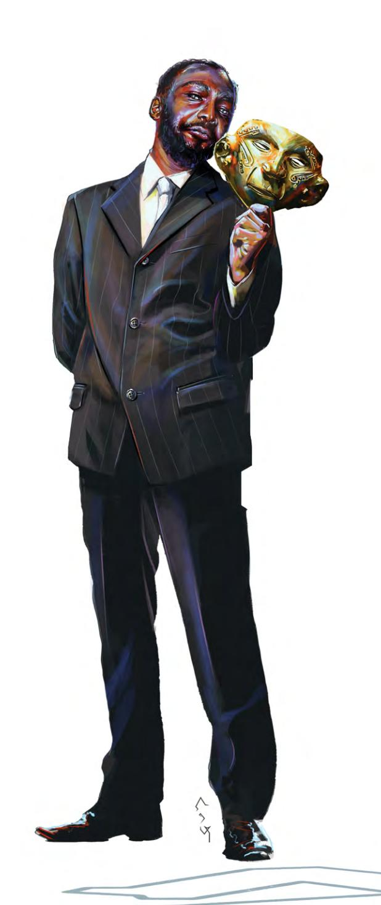

Выпивая непосредственно из жертвы, Геката может пить только вредные напитки, что приводит к потере крови (Vampire: The Masquerade, p. 212). Не желающие сдерживать себя смертные попытаются убежать, и даже те, кого принудили или кто готов это сделать, должны успешно пройти проверку на выносливость + упорство против сложности 2 + тяжесть проклятья, чтобы не напрягаться от боли. Принужденные или желающие вампиры, ставшие жертвами укуса Гекаты, должны сделать проверку на кровавую ярость против Сложности 3, чтобы не впасть в безумие ужаса.

## Êëàíîâûé èçúÿí: Áîëåçíåííîñòü

Вампир испытывает немедленную потребность перевести что-то из состояния жизни в состояние смерти или наоборот. Любое действие, не направленное на прекращение или воскрешение чего-либо, выполняется со штрафом в два кубика. Объект не обязательно должен быть человеком или даже живым существом, он может включать предметы или даже более абстрактные вещи, такие как идея или разговор. Внушение длится до тех пор, пока вампиру не удастся убить или вернуть что-то к жизни (в переносном или буквальном смысле).

## Àðõåòèïû Ãåêàò

## Ðåàíèìàòîð

Принесите их на плиту, и Реаниматор заставит их снова говорить. Если хотите, Реаниматор заставит их встать и танцевать, настоящий театральный спектакль. Хотите узнать, что знал труп перед смертью, - нет проблем. Хотите, чтобы он ковылял домой и обвиняюще тыкал в кого-то пальцем, получите. Реаниматор не выносит никаких суждений, приятель. И последнее: когда все будет сказано и сделано, вы должны оставить труп у Реаниматора. Они знают, что с ним делать.

#### Ñïåöèàëèñò ïî ÑóäÌåä ýêñïåðòèçàì

До Станровления судмедэксперт всегда одним из первых прибывал на место преступления, а после Становления использует свои знания и опыт для изменения улик, составления неправильных отчетов или создания версии смерти, защищающей интересы его окружения, и при этом регулярно сталкивается со смертью. В последнее время они испытывают противоречивые чувства лояльности, то становясь на сторону юных сородичей, с которыми они проводят многие ночи, то - на сторону странной семьи, принявшей их в свои жуткие, но могущественные ряды. Последняя, впрочем, выдвигает опасные требования, опирается на чувство вины и семейные обычаи, и среди них есть не один вампир, чьи повадки заставили бы судмедэксперта обратиться к начальству еще до того, как подробности их поведения попали бы в полевой отчет.

## Ïðèðîæäåííûé íåêðîìàíò

Обнаружив неподдельный интерес и склонность к магии смерти в результате просмотра сеансов в Темной Сети, охоты на призраков в видеороликах, экзорцизма и последующего изучения оккультных ритуалов, прирожденный некромант оказался не столько вовлеченным, сколько шантажированным в Гекату. Их сир планирует выяснить, стоит ли культивировать их способность к церемониям, или они просто будут вечно служить в качестве более компетентного, чем в среднем, прислужника. Однако у Прирожденного Некроманта есть свои планы, и он не намерен играть роль помощника какого-то второсортного вампира, который даже не соизволил изучить хитрости ремесла, прежде чем стать нежитью.

## Íåäîáðîñîâåñòíûé áàíêèð

Недобросовестный банкир - потомок Джованни или Дансирна из клана Геката - выступает в качестве нейтральной стороны для сородичных "инвесторов" в любом количестве незаконных фидуциарных сделок. Они позиционируют себя как "просто бизнес", идеальный голос для посредничества и гарантируют защиту активов благодаря своей непоколебимой приверженности неучастию в Вечной Борьбе. Недобросовестный банкир готов пойти на все, чтобы получить прибыль, будь то вложение средств в неэтичные компании, прием отмытых денег или охрана инвестиций, к которым большинство банков не прикоснется, - в том числе крови, особых людей или мучительной "посылки" сородичей, прибывшей из домена Аширра.

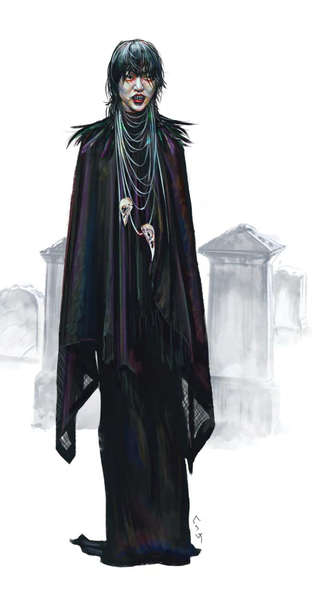

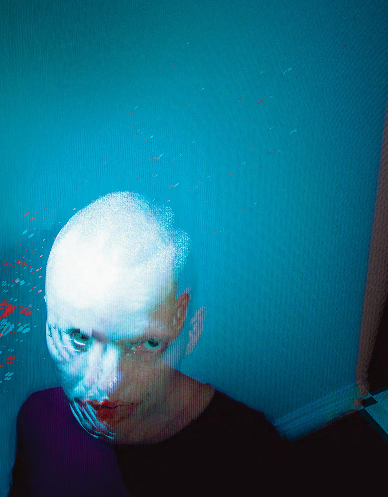

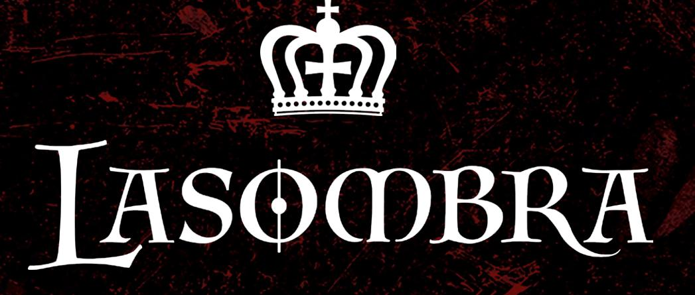

Клан Ночи Магистры Хранители Тени

Конечно, я всегда буду вашим союзником, но я должен уйти в тень, иначе они узнают, какую истинную угрозу представляет наша объединенная мощь.

. . . **. . . . . .** . .

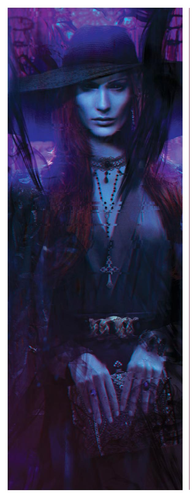

Вампиры Ласомбра - существа, неуловимо противоречащие обыденной реальности, от них ждут победы любой ценой. Безжалостность наиболее востребованная черта в потомстве, поэтому их репутация предательских интервентов вполне заслуженна. Большинство из них не ищут внимания, предпочитая выступать в роли кукловодов, силы, стоящей за пресловутым троном. Для Тени цель оправдывает любые средства.

Вампиры часто ассоциируются с тьмой, они порождения ночи, покинутые солнцем. Однако даже среди Сородичей сродство с тьмой присуще одному клану - Ласомбра. И из этих теней Хранители выстраивают свои планы, дергая за ниточки "меньших" Сородичей, манипулируя ими, как марионетками на ниточках, разыгрывая теневую игру Вечной Борьбы. Любой Род может претендовать на власть, титул и влияние, тяжелым грузом висит голова потенциальных князей и баронов - но кто имеет слух этих князей и баронов, кто говорит из невидимых подсобных помещений и залов власти Родов, мелких и великих? Магистры клана Ласомбра.

Ласомбра очень ценят достижения, особенно в делах, с помощью которых они могут получить власть над другими. Они не любят рисковать, и Хранители вполне заслуженно заслужили репутацию проницательных планировщиков и холодных расчетчиков. Вбивая кол в сердце упрямого врага или светски избивая соперника перед собранием старейшин и помощников, мудрый Ласомбра знает, на что рассчитывает. Более того, Магистры умеют вести за собой сородичей - или невольных дурочек - к желаемому результату. И, конечно, одна из важнейших стратегий манипулирования - знать, когда у человека нет преимущества, а значит, его просто лучше обмануть. Заявления о чести могут хорошо сыграть на Элизиуме, но честь - это лишь одно из оружий в портфеле Теней.

Исторически Ласомбра оказали влияние на все секты: первые повстанцы в Восстании Анархов, военачальники Шабаша в Америке, сомнительные рекруты Камарильи в современную эпоху Второй Инквизиции. Это клан со знаменитыми членами и долгой историей, но это также клан, к которому относятся с недоверием как к манипуляторам и которого боятся за то, что в тени движутся невидимые вещи, которые они вызывают на свет.

## Êòî òàêèå Ëàñîìáðà?

Пожалуй, больше, чем любой другой фактор личности, родоначальники Ласомбры поощряют честолюбие своих детей, а Магистры считают себя примером совершенства. То, в какой именно форме это совершенство проявляется, весьма обширно, поскольку в паутине личных амбиций может оказаться несколько поколений сородичей Ласомбры, действующих для выполнения (осознанно или нет) планов своего сира. В рядах Теней находят свое место и политически подкованные люди, и криминальные авторитеты, и люди с военным или правоохранительным опытом, и даже те, кто пережил трагедию. Некоторые Магистры были воплощены, чтобы руководить в течение одной ночи, в то время

как другие, подобно Теням своих родителей, служат вечно.

Если говорить шире, то многие ласомбры имеют богатое, влиятельное прошлое или опыт работы в религиозных организациях (хотя сами они не обязательно являются верующими). Некоторые даже происходят из полуаристократических родов. Как бы то ни было, родоначальники Ласомбры тяготеют к земной жизни, посвященной культивированию власти, - среде, в которой превосходство Магистров расцветает, как тень в сумерках. Будучи членом группы, они почти всегда считают себя самыми важными. Просто спросите их.

Честолюбие Ласомбры может заставить его стремиться к лидерству в обществе Рода или к значительному (пусть и незаметному) влиянию на смертных. В клане есть князья Башен Слоновой Кости, военачальники Анархов, сенешали, священники и даже морские рейдеры. В отличие от них, Хранители также являются прекрасными шпионами, лазутчиками и даже убийцами, благодаря своей способности скрываться в тени и собирать информацию или затаиваться, готовясь к мощному удару. Если их поймают, они смогут выпутаться

из сложной ситуации с помощью запугивания или драки.

## Äèñöèïëèíû

ДОМИНИРОВАНИЕ: Ласомбра полагаются на свою способность подавлять волю и приказывать повиноваться без тех благородных ухищрений, на которые претендуют некоторые Проклятые. Бессердечие, с которым они применяют эту Дисциплину к жертвам, часто вызывает антипатию со стороны других сородичей, однако мало кто отрицает способность Магистров промывать мозги и подчинять себе жертву. Ласомбра, не задумываясь, использует Доминирование, чтобы приказать жертве обнажить шею и приготовиться к кормлению.

ОБЛИВИОН: способность манипулировать тенями позволяет Ласомбре наблюдать, наносить удары и убегать, не сталкиваясь с жертвой, или использовать для той же цели сущности, более темные, чем смерть. Многие утверждают, что за использование Обливиона приходится расплачиваться душой, или что из-за чрезмерного увлечения им Ласомбра странно выглядят в отражениях и современных медиаформатах.

МОГУЩЕСТВО: Когда Магистры вынуждены прибегать к физическому насилию, они могут предпочесть пробить череп врага руками, пробить сапогом живот сопляка или сорвать дверь с петель, чтобы вызвать уважение и страх в других обстоятельствах. Немногие Ласомбра используют могущество для помощи в кормлении, считая вульгарным занятием вручную хватать и удерживать сосуд - но иногда Голод требует мгновенного удовлетворения.

## Ïðîêëÿòüå

Любой человек, увидевший отражение или запись (живую или иную) вампира Ласомбры, может мгновенно распознать его, при условии, что он знает, что ищет. Люди, не обладающие предварительными знаниями, поймут, что что-то не так, но, скорее всего, объяснят искажение неровностями отражающей поверхности или ошибками записи. Заметим, что это не позволит с уверенностью скрыть личность вампира: вероятность того, что Ласомбра попадет под наблюдение, не меньше, чем у любого другого вампира. Кроме того, использование современных коммуникационных технологий, включая простой телефонный звонок, требует проверки Техники на Сложность 2 + Тяжесть Проклятья, так как микрофоны имеют такие же проблемы с голосом Ласомбры, как и камеры с их изображением. Избегание электронных систем обнаружения вампиров также осуществляется со штрафом, равным тяжести Проклятью.

#### Клановый изъян: Безжалостность

Ласомбра презирают неудачи, ассоциируя их с плохим планированием или личным уклоном. Под влиянием этого изъяна их Кровь побуждает их к любым действиям, которые только можно себе представить, чтобы достичь цели, будь то в данный момент или через византийские заговоры, длящиеся столетиями.

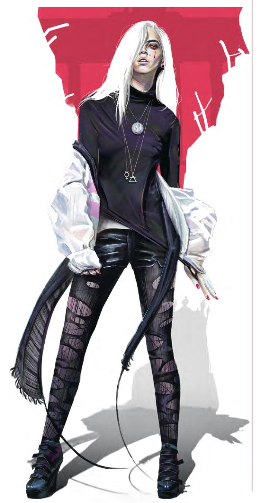

Магистр тяжело переживает любую неудачу и быстро переходит к самым безжалостным методам, пока не добьется своего.

В следующий раз, когда вампир не выполнит какое-либо действие, он получает штраф в два кубика ко всем броскам до тех пор, пока последующая попытка выполнить то же действие не увенчается успехом или сцена не закончится. Обратите внимание, что вышеуказанный штраф распространяется и на будущие попытки выполнить инициирующее действие.

#### ЛАСОМБРА И ТЕХНОЛОГИИ

Все вампиры при поглощении теряют нечто очень важное, но у Ласомбры признаки проклятия Каина проявляются особенно ярко. Если смотреть на отражающую поверхность или носитель записи, их изображение выглядит искаженным, иногда даже почти невидимым. Они могут казаться мерцающими, искаженными или прозрачными, и таким образом их отражение выдает их неживое состояние и, возможно, их клан. Аналогичным образом, современные технологии, основанные на осязании или других формах прямого взаимодействия, таких как голосовая активация, сенсорный экран или использование стилуса, склонны к сбоям или ненадежному действию для Магистров, а электронные системы обнаружения легко улавливают разрушительные признаки их ухода. Они как будто существуют на несколько иной частоте, чем другие существа, мерцая то там, то сям.

Пока новички Ласомбры отчаиваются от того, что технологии отказываются работать по их воле, находчивые Хранители быстро набирают смертных или завораживают гулей, чтобы те занимались такой работой, как прием вызовов и доставка их по назначению. В некоторых доменах эта тенденция настолько ярко выражена среди Магистров, что ласомбра, ведущие свои дела без личного помощника, считаются досадно немодными или даже неблагополучными.

## Архетипы Ласомбра

#### **Наставник**

Старая поговорка гласит: "Всегда торгуй вверх", и это особенно верно для Наставника, который сумел превратить едва заметное признание князя в одно из самых престижных охотничьих угодий в домене.

Как они обучают своих протеже - беря новых каждые десять лет или около того, с обещанием, что они перейдут в другой домен, чтобы помочь "расширить паутину" престиж является ключом к достижению, так как многие другие Сородичи готовы заплатить позже за то, что предлагается сегодня. А сегодня Наставник сидит на вершине горы благ и секретов, которые, выйдя из тени на свет Элизиума, вызвали бы небывалый хаос.

## Ïðîâîêàòîð

Провокатор, изначально предназначавшийся для жертвоприношения Второй инквизиции, перехитрил своего хозяина и привел Отдел специальных расследований в убежище своего хозяина. Таким образом, началась кампания охоты за наемными убийцами, которые подбрасывают улики и тем самым привлекают элиту ФБР для уничтожения врагов своего работодателя. Однако все это - часть более масштабных усилий, поскольку Провокатор нанимает только тех Сородичей, чьи цели совпадают с его собственными, и риск возрастает с каждой ночью по мере того, как SAD узнает все больше о том, как действует вампирская угроза в городе.

## Ìîäíûé ëåòîïèñåö

В последнее время, когда многие старейшины прислушиваются к призыву, среди подрастающих Анцилл, обнаруживших, что с возрастом забывают частички своей личной истории, вошел в моду Модный Летописец. Модный Летописец превращает их истории в материальные воспоминания - стихи, дневники, мемуары, апологетику, - чтобы эти Сородичи не потеряли навсегда свою собственную память. И то, что эти самодостаточные сородичи без проблем раскрывают свои секреты, свидетельствует об обаятельной личности Модного Летописца. Как там в сказке про лягушку и скорпиона?

## Âàëåò

Путешествуя на службе у богатого, но тугодумного аристократа, Валет незаметно перемещается среди тех слоев общества, которые никогда не обращают внимания на "прислугу", выведывая секреты высшего света по мере того, как они заботятся о своем подопечном. Любые подозрения, направленные в сторону этой пары, быстро рассеиваются, поскольку

оказывается, что аристократ слишком глуп, чтобы стоять за тем проступком, который привлек внимание дуэта. А когда Валет допоздна проводит

время среди обслуживающего персонала, который часто возмущается унаследованными привилегиями дворянства, он находит себе готовых сообщников, когда какому-нибудь высокомерному представителю праздных богачей нужно немного поквитаться.

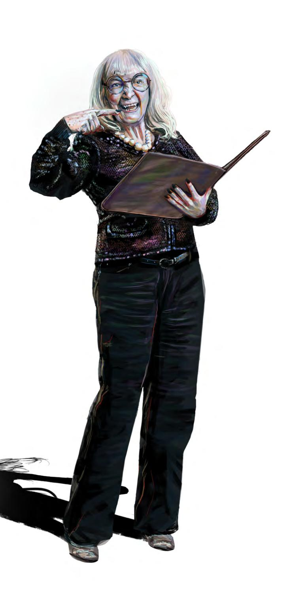

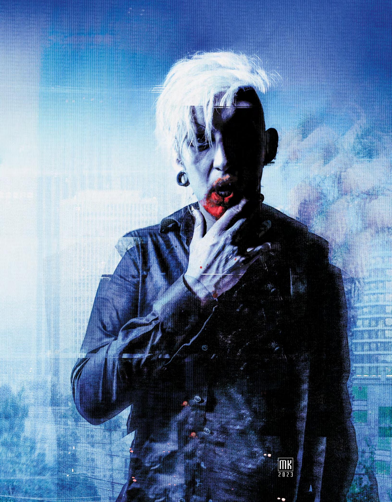

# ZOZ THE MINISTRY

Змеи Клан Веры Клан лжи Сетиты

Вы называете меня лжецом, искусителем и дегенератом, но все ваши мнимые оскорбления - это просто тяжесть цепей, в которые вы продолжаете заковывать себя.

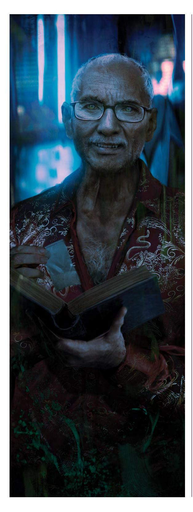

Министриям всегда есть что предложить. В этот часто культовый клан вербуют тех, кто способен использовать искушение как оружие. Они принимают в свои ряды тех, у кого есть желание и средства, чтобы одурманить, заманить в ловушку и в конце концов освободить свою жертву от всего, что она ищет: имущества, верности или даже веры. Для Змей все имеет свою цену.

Являясь отчасти кланом, отчасти культом, Министрии занимают странную нишу в обществе Сородичей. По их собственному мнению, Министрий служит цели освобождения людей от некритичного принятия бремени "греха", возложенного на них, будь то религиозная доктрина, общественное порицание или даже Традиции Проклятых. Недоброжелатели не имеют столь высокого мнения о них, зачастую считая их дегенеративными агитаторами, владеющими арсеналом корыстных ересей.

Улыбающийся священник, предлагающий легкое прощение, грязный толкач, предлагающий быстрое избавление от химикатов, бурлескный актер, предлагающий ночь беззаботности, харизматичный контрабандист, предлагающий сделать так, чтобы проблема просто ушла: Все это и многое другое представляет собой министриев демимонда, в котором проблемы и их решения являются собственной экосистемой. У вас есть проблема? Министрий с удовольствием поможет ее решить... и убедит вас в том, что на самом деле это не проблема, если только вы правильно оцените ситуацию. Разумеется, при таком подходе вы снова оказываетесь в том же положении, и министрий услужливо подталкивает вас по выбранной им спирали. Неудивительно, что это нередко вызывает гнев тех, кому выгодны сложившиеся обычаи или кто поддерживает свою значимость, диктуя общественные нравы.

Все это не означает, что Министрии аморальны совсем наоборот. Для министрийского сознания сомнение само по себе является таинством. Без греха какая ценность у праведности? И что такое осуждение греха, как не метод контроля? Путь Министрийсива это вызов господствующей морали, вопрос "Почему это запрещено?" и проверка достоинств того, что можно получить, нарушив общепринятую мораль. Если так случилось, что вызов запретному выявил слабость других, которую министрий может использовать в своих интересах, то это уже практически создание божества по своему образу и подобию.

Многие служители создают святилища, храмы, церкви и другие места, которые одновременно высмеивают традиционную религию и демонстрируют благочестие отдельного Змея. Это может быть что угодно - от укромного уголка в квартире с несколькими свечами, благовониями и иконами личного значения до настоящего храма, где общаются и поклоняются многие уважаемые Служители. Действительно, пожалуй, самая многочисленная фракция клана присвоила себе египетского бога Сета, с которым старейшины клана заявляют о родстве и даже кровном родстве.

## Êòî òàêèå ìèíèñòðèè?

Род Министрийства часто принимают в первую очередь за уверенность и готовность потенциального новичка пойти против большинства в чем-либо, будь то религиозный, социальный или иной авторитет. Действительно, некоторые Змеи так и не проходят через своего рода подростковое бунтарство, учитывая силу Крови и многочисленные теневые иерархии, в которые можно ткнуть носом. Однако по мере того, как Служители осознают реальность положения Рода, они видят в Крови возможность переделать вампирское общество, обратив его табу против него самого. Другие Сородичи могут видеть в них агентов дестабилизации или коррупции, но большинство Министриев точно знают, кому они противостоят и почему, будь то высокопоставленный Князь или вампир, который может стать полезным инструментом или козлом отпущения в ближайшую ночь.

Министрийство отдает предпочтение тем, у кого хватает уверенности, смелости или наглости поставить под сомнение то, что другие превозносят как "высшее благо". Высшее благо, по мнению кого? Ведь монстры, которые пьют кровь невинных, чтобы прокормить себя,

не имеют моральных преимуществ.

Бросая вызов господствующему набору убеждений, человек не становится автоматически образцом противоположной точки зрения.

Однако это не означает, что человек автоматически становится образцом противоположной точки зрения, и Род Министрийства часто - очень часто - поддается соблазну проступков, которые они выдают за освобождение. В клане можно встретить и наркоманов, и любителей острых ощущений, и других лицемерных самовозвеличивателей. Легкомысленные моральные суждения объявляют эти проступки грехом, но слишком часто они представляют собой неустойчивые убеждения.

Если Змей проявит недостаточную бдительность в отношении издержек "освобождения", он может оказаться поверженным на землю перед Зверем, имея в качестве доказательства только дорогие привычки. Однако Министрийство знает об этом, и именно эту слабость его более беспринципные члены стремятся использовать против других Родов. Змей не просто торговец пороком, он - личный организатор вашего падения к потворству и в их плен, аллегорический дьявол, с которым заключают сделку безрассудные сородичи.

Истинно набожные служители иногда считают себя хранителями, защитниками и даже солдатами против неких темных сил, превосходящих те, что существуют в современном мире в виде близоруких верований. Подобно тому, как Сородичи потакают загадке "Зверь я, чтобы зверем не стать", так и эти служители искушают и унижают тех, кто обязан защищать их от большего проклятия. Лучше коротать бессмертные ночи в VIP-секции ночного клуба, одурманенные наркотиками, предоставляемыми Змеем, чем служить вечно, потеряв себя для Вечной Борьбы. Разумеется, для

собственного блага.

Сородичные служители часто предпочитают украшения, аксессуары и другие абстрактные выражения религиозных мотивов или концепций, такие как символы вечной жизни или змеиная тематика. Такие символы могут носиться как с легкой иронией, так и в качестве заявления об искренней вере. Змеи осознают взаимосвязь между своими прозвищами, провозглашающими их кланом веры и кланом лжи, поскольку они могут быть двумя сторонами одной медали.

## Äèñöèïëèíû

СОКРЫТИЕ: Министрийские служители используют эту Дисциплину для выявления убеждений, взглядов и пороков как вампиров, так и смертных, чтобы облегчить их эксплуатацию и освобождение. Могущественные служители также часто надевают личины доверенных лиц и друзей, чтобы лучше заманить жертву в свои святилища и храмы или просто в ближайшее укромное место.

ВЕЛИЧИЕ: Для многих служителей современных ночей эта способность является излюбленной, предлагая силу с изяществом, которое удовлетворяет даже самозваных блюстителей Маскарада. Змеи используют Величие с большим мастерством, величественными жестами и звучными речами, которые проникают в сердца собравшихся на поклонение или одинокого заблудшего чужака.

МЕТАМОРФОЗЫ: Служители используют эту способность для того, чтобы внушать трепет наблюдателям, а также используют множество новых способов избежать вреда. Они часто принимают облик змеи, а не волка, но могут сливаться с землей, чтобы избежать солнца вместе

с любым гангрелом.

## Ïðîêëÿòüå

Кровь Министрия не приемлет света. При прямом освещении, естественном или искусственном, члены клана отшатываются. При попадании под яркий свет, направленный прямо на них, министры получают штраф, равный их тяжести Проклятья, ко всем броскам кубиков. Кроме того, они добавляют свою Тяжесть проклятия к усиленному урону, получаемому от солнечного света.

## Êëàíîâûé èçúÿí: Ïðåñòóïëåíèå

В Клане Веры (или Лжи...) принято считать, что разум и дух каждого человека скованы невидимыми цепями, созданными им самим. Кровь вампира томится в этих путах, и министрий испытывает жгучую потребность разорвать их. Вампир получает штраф в два кубика ко всем кубикам, не относящимся к соблазнению кого-либо (включая его самого) нарушить догмат истории или личное убеждение, что приводит к появлению хотя бы одного пятна человечности и прекращению действия этого наваждения.

## Àðõåòèïû Ìèíèñòðèåâ

## Öåëèòåëü âåðû

Целитель всегда считал, что легче всего установить доверительные отношения с людьми с помощью силы слова и веры. Будучи смертным, он был священником, убеждая окружающих своей добротой и силой убеждения, что все беды можно пережить. Став одним из Проклятых, они не слишком изменились. Теперь грех, против которого они проповедуют, - это Зверь, а не простые смертные побуждения. И это принесло свои плоды - с появлением Статуса в домене их верующие, сторонники и кающиеся многочисленны.

#### ÊÓËÜÒ ÑÅÒÀ

Влияние Министриев распространяется по всему миру в различных местах веры - от стен огромных религиозных учреждений до странных церемоний, проводимых несколькими отчаявшимися верующими в многоквартирных домах и заброшенных хижинах на склонах гор. Там, где можно найти кровь, можно найти и Сородича, а значит, и Министрия. Его культы многочисленны, разнообразны и широко распространены.

Несомненно, самой крупной фракцией в Министрийстве являются Последователи Сета, название которых часто используется как синоним Министриев в целом, о чем свидетельствует прозвище клана - Сетиты. Сетиты развивают (или подтверждают...) некоторые тайны Книги Нода, называя одного из ужасных антедилувийцев именем Сет. Смешивать древнеегипетское божество Сет с прародителем Министрийства кажется в лучшем случае кощунственным, но культы Клана Веры, очевидно, не чужды такого кощунства, ереси или любой другой догмы, которую они могут использовать для подрыва понятия греха.

Во многих доменах Сетиты представляют собой сумму присутствия Министриев, поскольку они могут быть единственной присутствующей конфессией Министрийства. В других доменах Культ Сета является лишь одним или ни одним из ликов Змей, и Служители могут проникать в существующие общины верующих, а также создавать свои собственные.

Кроме того, будьте уважительны, когда речь заходит о культуре реального мира и ее использовании в обществе вампиров. Если ваша группа предпочитает не использовать этот элемент египетской культуры как присвоенный нежитью, у Министриев есть множество других диверсий, которые могут появиться в истории без особых исключений.

## Ïîæèçíåííûå àôåðû

Мошенники, аферисты и шарлатаны быстро находят себе место в Министриях, если умеют избавлять других вампиров от тягостного чувства вины и девиантности. Будучи смертным, пожизненный аферист имел вымышленное имя, работу, для которой он не подходил, и ряд невыполнимых контрактов с партнерами по всей стране, говоря своим "коллегам" больше лжи, чем правды. Кровь наделила их способностями, позволяющими легко переезжать из города в город с чемоданом в руках, рекламируя возможность, которая, по их заверениям, окупится, по крайней мере, вдвое больше, чем вложит в нее их последняя метка.

## Îðàòîð äëÿ áîæåñòâåííîãî

Этот министрий смог услышать голос Бога до того, как его объяли. Пылкий в своей вере и умелый в направлении видений в действие, он преуспел в жизни, растил семью, вел бизнес, и его хорошо знали во всем родном городе. После "Объятья" голос Бога в " Ораторе Божественного" многократно усилился. Среди множества голосов, звучащих внутри них - Зверя, Крови и любых других, оставшихся от их жертв, - Говорящий за Божественное еще больше убедился в том, что он является проводником сознания, превосходящего жизнь и смерть.

## Àêòåð-áèòíèê

Карьера на дневном телевидении, в основном, с несколькими ролями в прайм-тайм шоу и ограниченным тиражом фильмов привела актера-битника в Министрия. У них была определенная атмосфера интереса, способность заставить людей чувствовать себя знакомыми с ними и комфортно рядом с ними. Этот кусочек неприкасаемой известности делает актёрабитника хорошим лицом для культа, предлагая возможность смешаться с полузнаменитыми людьми, а пока вы здесь, я хочу показать вам кое-что.....

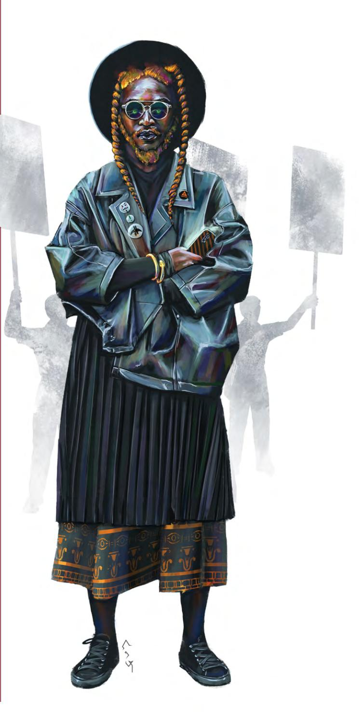

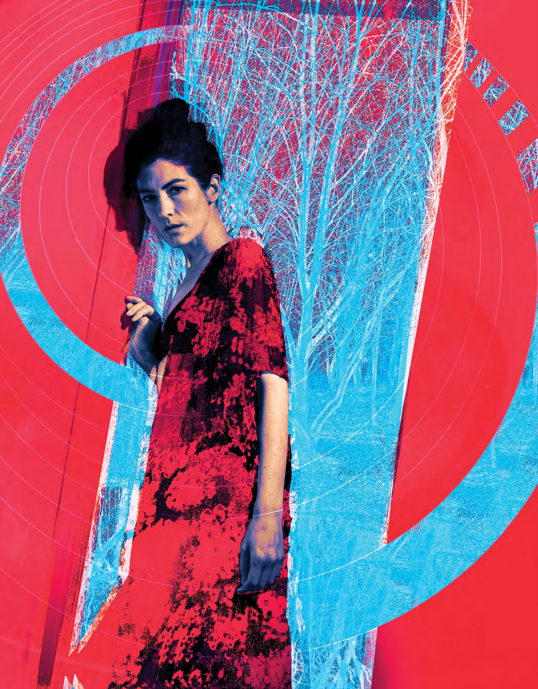

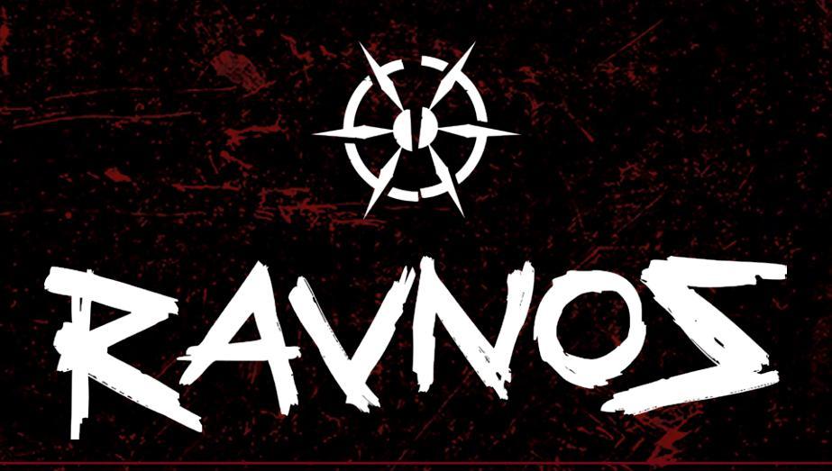

Проходимцы Вороны Сорвиголовы **Беспокойные** 

Жить яркой вспышкой и быстро  $\boldsymbol{y}$ rachyts - BeyHO B  $\boldsymbol{I}$ ytu, всегда в бегах

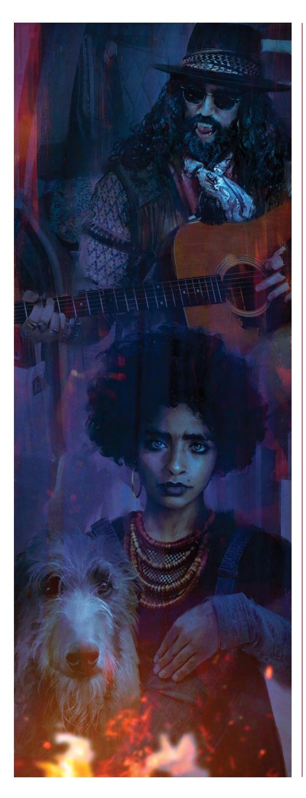

Мастера обмана, Равносы предпочитают не сражаться и не проливать кровь за то, что можно получить более хитрыми способами. Они способны очаровывать и исчезать в течение одного смертного вдоха, и те, кого однажды одурачили, быстро учатся сомневаться в своих чувствах, оказавшись в компании Воронов. Постоянно находясь в движении, Равносы никогда не могут долго оставаться на одном месте, чтобы их проклятие не подожгло их во время дремоты.

Клан, почти уничтоженный во время первого залпа войны Геенны, теперь с каждой ночью разгорается все ярче. Другие знают их как носителей посланий, странников и похитителей разума. Но сами Равносы знают, что их наследие гораздо значительнее, что в их Крови кипит пламя капризной божественности. Их методы - не грубая сила, не обожание толпы, не тщательно продуманные многовековые заговоры, а остроумие и панацея, искусное обаяние и откровенная иллюзия. Артисты доверия, наперсники, венчурные капиталисты, артисты перформанса, простые путники - все они составляют многоликий состав

клана Равнос в современной ночи.

Отношение Равносов к смертным различно. Исторически сложилось так, что они примыкают к различным подчиненным обществам, стремясь получить защитную окраску среди тех, кого уже подозревает респектабельное большинство. Многие вороны даже примыкают к странствующим коммерческим группам, таким как странствующие карнавалы, где они не только имеют постоянный круг добычи, но даже могут обратить свои таланты в прибыль. Как и в большинстве случаев взаимоотношений Рода со своими стадами, вампирическое влияние Проходимцев редко бывает благотворным, и если одни Равнодушные искренне заботятся о своих подопечных, то другие видят в них лишь инструмент или сосуд, который можно использовать и от которого можно избавиться. Корабль беженцев с одинаковой вероятностью может как дойти до порта, доставленный в целости и сохранности таинственным благодетелем, так и прибыть в порт пустым, кораблем-призраком с костями и пятнами крови в качестве единственных признаков его прошлых пассажиров.

## Êòî òàêèå Ðàâíîñû?

Мастера обмана, Вороны предпочитают не сражаться и не проливать кровь за то, что можно получить более изощренным способом. Они могут очаровать и исчезнуть в одно мгновение, и те, кого однажды одурачили, быстро учатся сомневаться в своих чувствах, оказавшись в компании Воронов. По этой причине вампиры Равноса редко афишируют свою сущность, а если их прикрытие раскрыто, то они быстро скрываются. Не то чтобы у них был большой выбор, ведь в их витэ таится неумолимая гибель, грозящая поглотить их, если они хоть раз придут в себя. Но пока в клане полыхают воспоминания о предполагаемом уничтожении их прародителя, новые поколения успевают опередить этот кровавый пожар и спокойно восстановить род.

Это не значит, что они безобидны или даже сочувственны, ведь для того, чтобы идти на риск, требуется сердце, не терпящее чужой беды, и не один Смельчак был "корыстен" еще до того, как стал ночным охотником, пьющим кровь. Тем не менее, это облегчает переход, и многие птенцы Равноса, уже разорвавшие связи с друзьями, семьей и обществом, принимают состояние нежити с большей легкостью,

чем представители других кланов. Хотя кочевые привычки (и даже требования) клана затрудняют создание какой-либо организации, среди более общительных членов клана формируется нечто вроде возрождения Равноса. Сложный набор знаков и сигналов, известных и изучаемых только членами клана, помогает им находить и опознавать друг друга, а также устраивать время от времени собрания для обмена слухами и информацией о состоянии дел в Роду в разных областях. Рассказывание историй очень популярно, и среди молодых Воронов возникает своеобразная мифология, в которой они называют себя потомками различных мифологических божествтрикстеров, доходя до того, что образуют котерии или выводки Объятий, посвященные тому или иному хитроумному богу. Не имея действующих предков, они придумывают своих, возводя свое ремесло в ранг божественного мандата.

Все большее число Смельчаков обходятся своими силами или борются со своим проклятием, пытаясь обосноваться в устоявшихся владениях. Чтобы избежать проклятия, они создают множество убежищ и часто используют не менее внушительное число смертных масок.

Ни один из кланов не умеет так ловко приспосабливаться к окружающему миру, как Равносы, и многие из них действуют под радаром сородичного сообщества домена или представляются безобидными каитиффами. Те же, кто все же носят цвета своего наследия, обычно занимают жесткую независимую позицию, продавая свои услуги в качестве шпионов, диверсантов и переговорщиков самым выгодным сектам. Однако лишь немногие Вороны могут долго сохранять такую позицию, и большинство из них в конце концов оказываются в положении курьеров. Вампиры Равноса всегда оказываются в бегах - будь то из-за скопления врагов, жертв, жаждущих мести, или обреченности, кипящей в самой их Крови. Это вполне устраивает большинство других Родов, которые не могут не видеть в равносах предостерегающего урока, поскольку они представляют собой наиболее окончательный итог войны Геенны.

## Äèñöèïëèíû

АНИМАЛИЗМ: Равносы поддерживают почти дружеские отношения с животными, особенно с воронами, лисами, койотами, пауками и обезьянами. (По усмотрению рассказчика, уменьшите сложность тестов на анимализм с участием этих животных на единицу и увеличьте ее для всех остальных видов животных). Используя этих животных в качестве шпионов, отвлекающих маневров и случайных спутников, равнос никогда не бывает одинок в пути.

СОКРЫТИЕ: В то время как многие Сорвиголовы умеют исчезать из поля зрения и оставаться незамеченными, представители клана также умеют расширять применение Сокрытия для создания сложных и продолжительных галлюцинаций, эффективно используя свое Величие для приведения в действие свойств Дисциплины, чтобы охватить не только свой собственный облик.

ВЕЛИЧИЕ: Этот метод используется, когда природного обаяния и убеждения недостаточно. Мало кто из Беспокойных не владеет этой Дисциплиной хотя бы в некоторой степени. Величие часто используется ими для привлечения жертв в случае необходимости, кроме того, эта дисциплина играет определенную роль в галлюцинаторных способностях.

## Ïðîêëÿòüå

Равносы обречены. Солнечный огонь, испепеливший их основателя, бушует в крови клана и вырывается из самой их плоти, если они надолго успокаиваются. Если они дремлют в одном и том же месте более одного раза за семь ночей, бросьте кубик, равный их тяжести проклятия.

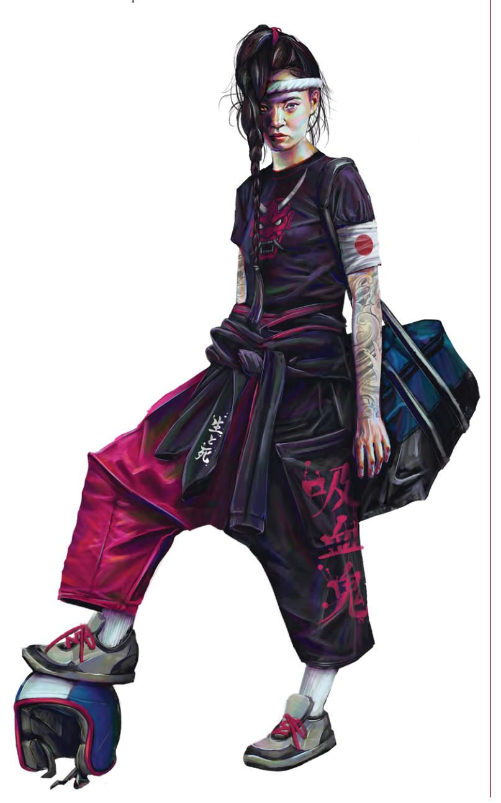

Они получают тяжелый урон, равный количеству брошенных 10 (критических результатов), поскольку сгорают изнутри. Это происходит каждый раз, когда они проводят день в месте, где они уже дремали менее недели назад, и распространяется также на Равноса в оцепенении.

Что считать местом в этом отношении, зависит от объема истории, но, если не указано иное, два места отдыха должны находиться на расстоянии не менее мили друг от друга, чтобы не вызвать Проклятье. Кроме того, передвижное убежище, например, грузовик, безопасно, если место, где он припаркован, находится не менее чем в миле от последнего места. Персонажи Равноса не могут получить недостаток "Нет убежища" при создании персонажа.

## Êëàíîâûé èçúÿí:

## Èñêóøåíèå ñóäüáû

Кровь побуждает вампира играть с огнём. Если за тобой по пятам уже и так следует праведное пламя, сжигающее представителей твоей родословной, почему бы и нет? В следующий раз, когда персонаж столкнётся с какой-либо проблемой, любой способ её решения, кроме самого дерзкого и опасного, уменьшит пул соответствующей проверки на 2d10. Рассказ-чик также вправе вознаградить особенно рискованные и яркие попытки увеличением пула. Сорвиголова может убедить своих сообщников присоединиться к плану, но с той же вероятностью он пойдёт на дело и в одиночку. Одержимость проходит, если проблема решена или если

у персонажа больше нет возможности с ней справиться.

## Àðõåòèïû Ðàâíîñîâ

## Íî÷íîé Êóðüåð

Когда необходимо доставить посылку в целости и сохранности, вовремя и в темноте ночи, за дело берется "Ночной курьер на мотоцикле". Курьер не зарегистрирован ни на одном известном сайте, но все известные люди, смертные и неживые, имеют его номер на быстром наборе. Курьер знает, по каким маршрутам следует ехать, когда разгорается война сект, чьи ладони нужно смазать, когда нужно пересечь границы доменов, и где затаиться, когда все рухнет. Прежде всего, у них есть выбор. Играя в городские игры, как бетонная Ёдзимбо, они, тем не менее, держат наготове заправленный незарегистрированный кросс-кантри мотоцикл. На всякий случай.

## Íà¸ìíûé àãåíò

Редкий зверь среди проходимцев: осмотрительный и профессиональный, а главное — ему можно доверять. Агент в соответствии со всеми указаниями выполнит любую задачу, будь то слежка, переговоры или — время от времени — убийство. Получив плату, он мгновенно удалится до следующего задания. Ни для кого не секрет, что агент работает на все стороны, но он слишком уж хорош, чтобы от него отказываться. К тому же никому не хочется обзавестись врагом в его лице. Чтобы застраховаться от такого поворота дел, многие покупают его дружбу. Агента всё устраивает.

## Òóðàãåíò

«Посмотреть на мир» — трудная и малопривлекательная задача для того, кто непроизвольно воспламеняется на солнце и за кем охотится вся военная разведка планеты. Такими трудными случаями и занимается тур-агент и его скромное предприятие. У агентства есть связи во всех уголках мира, и недостижимых мест для него нет. Клиенты знают, на что идут, — другого выбора всё равно нет. Им придётся провести тринадцать дней в авторефрижераторе или затаиться среди груза, который захватят пираты Гвинейского залива, — так или иначе турагент доставит клиента к месту назначения. Подобное путешествие может оказаться весьма неприятным, но это необходимый риск.

## Àíòèêâàð

Благодаря глубокому пониманию истории и пытливому взгляду антиквар всегда в шаге от нового открытия. Отчасти он работает ради прибыли, продавая находки музеям и частным коллекционерам, но в охоте на забытые артефакты у него есть и личные мотивы. Другая сторона его ремесла — поиск предметов, которые интересуют Сородичей, будь то безделушки, которые поднимут престиж отдельных кланов, или реликвии — наследие всех Проклятых. Если оно того стоит — антиквар найдёт и откопает для тебя что угодно… или, во всяком случае, убедит, что перед тобой именно то, что ты искал.

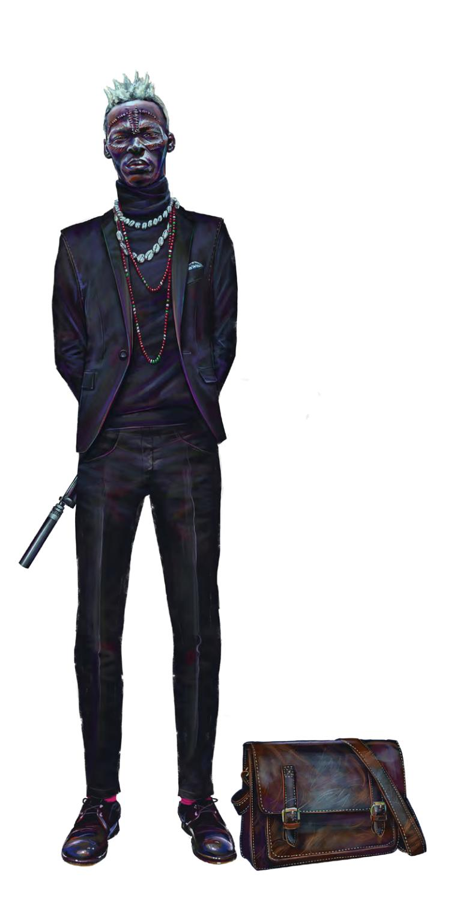

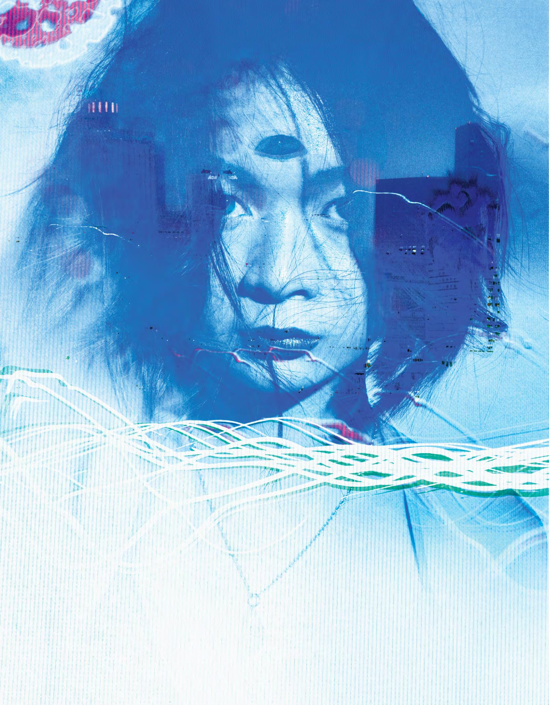

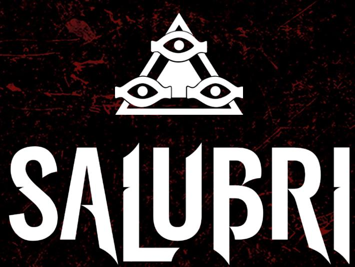

Циклопы Похитители душ Даджжали Потомство Саулота

Прибежище найти в юдоли скорби, вовек искать тернистый путь

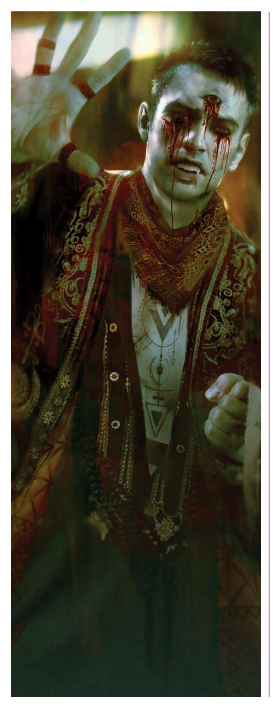

Кровь Салюбри, на которую охотятся вампиры, в большинстве своем потеряна из-за узурпаторовнежити, а для других вампиров она является весьма желанным призом. Из-за этого, а также из-за их нежелания вступать в объятия, они редко встречаются в современных ночах. Они часто вербуют тех, кто находится на краю гибели, полагая, что их проклятие может дать достойным второй шанс, и в их ряды входят самые гуманные вампиры.

В схемах Сородичей есть победители и проигравшие, и каждый победитель требует проигравшего, который расплачивается за этот успех. Так произошло и с Салюбри, много веков назад славившимися мудростью и эрудицией, а теперь ставшими лишь презренной сноской в планах Проклятых. Сегодня Салюбри, пожалуй, даже перестали быть кланом - их прародитель, как говорят, пал от клыков более амбициозного узурпатора, создавшего на похищенной Крови свой собственный клан Тремере. Их наследие - трагедия, но и горький урок тысячелетней Вечной Борьбы. Уничтожив их, соперники возложили вину на жертв, распространяя рассказы о похищении душ и более страшных истинах, скрытых за благочестивыми речами. Как бы усугубляя признание этой вины, каждый Салюбри носит в центре

лба третий глаз - индикатор своей родословной.

## Êòî òàêèå Ñàëþáðè?

Потомки Салюбри чрезвычайно малочисленны если верить слухам, одновременно их существует всего семеро, но можно лишь гадать, правда ли это на сегодняшний день. Согласно традиции, в этом клане сиры даруют Становление (и вместе с ним своё проклятие) только достигнув Голконды, но, опять же, нельзя сказать наверняка, не изменилось ли что-нибудь в современных реалиях. Поэтому выбор потомка для салюбри — чрезвычайно личный вопрос, ещё более деликатный, чем для остальных Сородичей. Они ищут любознательных и волевых, людей с благочестивыми убеждениями и, что не менее важно, тех, у кого есть незавершённое дело. Салюбри не даруют Становление по прихоти. Их преемником может стать смертельно больной человек, кто-то, чью семью постигла беда, или же тот, в ком неугасимо пылает желание исправить некую несправедливость. Говорят, что таинственный прародитель клана, Саулот, первым среди Сородичей достиг Голконды, и его дети до сих пор, века спустя после его смерти, стремятся пройти тот же путь.

Их нежизнь — мучение с надеждой на искупление, какой бы слабой та ни была. Салюбри бестрепетно исследуют тайну проклятия Каина, а порой помогают и другим найти избавление, своё для каждого.

Или совсем наоборот? Ту же самую силу можно использовать во зло, и немудрено начать сомневаться, услышав рассказы о похитителях душ, что якшаются с нечистью, рождённой на костях их клана. Не помогает и то, что некоторые салюбри не жалуют Сородичей и охотятся на каждого, кто, по их мнению, слишком близок к Зверю. Так что среди тех немногих, кто знает о существовании потомков Саулота, их репутация остаётся не самой лестной. Но можно ли верить этим слухам?

Принцы, как правило, не рады циклопам в своём домене, ведь те всегда с кем-то не в ладах. Даже Бароны Анархов редко дают приют таким беженцам, хоть и способны им посочувствовать. Доля салюбри — страдать от ненависти и преследований просто потому, что столетия назад их сиры якобы что-то совершили (но это не точно).

Их судьба безрадостна, но сами салюбри видят её с точки зрения, недоступной большинству Сородичей. Для многих из них вампиризм — проблема, требующая решения, а не дар, который нужно принять, и они готовы помочь другим, кто ступает тернистым путём Голконды. Некоторые, заручившись поддержкой единомышленников, клянутся искоренять худшие проявления природы Сородичей: потомки Саулота, если возможно, спасают, а если нет, уничтожают отродий, особенно бесчеловечных вампиров и в целом тех, кто упивается своим проклятием.

## Äèñöèïëèíû

ЯСНОВИДЕНИЕ: своей легендарной мудростью салюбри обязаны во многом тому, что их восприятие острее, чем у других Сородичей. Тайны истинного устройства мироздания послушно открываются перед философским взглядом салюбри.

ДОМИНИРОВАНИЕ: салюбри используют эту Дисциплину, чтобы облегчить ужасную ношу других вампиров или избавить окружающих от необходимости наблюдать зверства, на которые способны Сородичи. Они могут стереть тревожные воспоминания или помочь воздержаться от поступка, о котором ты наверняка пожалеешь. Как бы то ни было, потомки Саулота научились с помощью этих сил даровать утешение и унимать боль.

СТОЙКОСТЬ: тем, кого так сильно презирают, без навыков выживания не обойтись. Кроме того, салюбри способны усилием воли укреплять и исцелять нуждающихся, используя эту Дисциплину во благо ближних своих.

## Ïðîêëÿòüå

На салюбри охотятся. Остальным Сородичам их витэ очень… по вкусу. Когда представитель другого клана вкушает Кровь циклопа, ему сложно остановиться. Если вампир утоляет ей Голод, уменьшая его значение хотя бы на один пункт, он должен пройти проверку сопротивления голодной ярости (см. «Вампиры: Маскарад», cтр. 220) со сложностью, равной 2 + тяжести изъяна салюбри (3 + тяжести изъяна салюбри для представителей Бану Хаким). Проваливший проверку продолжает пить, и тому, кто захочет его остановить, вероятно, придётся применить силу.

Кроме того, всякий раз, когда салюбри дарует Становление, дитя обретает третий глаз посреди лба — сродни тому, что когда-то открылся у самого Саулота. Этот глаз не всегда напоминает человеческий: некоторые уверяют, что видели змеиный вертикальный зрачок или даже нечто вроде глазчатого пятна, как у гусениц.

И хотя третий глаз можно физически спрятать, надев бандану или подняв капюшон, он всегда остаётся на своём месте, и никакая сверхъестественная сила не способна его сокрыть. Когда салюбри прибегают к использованию Дисциплин, их третий глаз кровоточит, а объём истекающей витэ зависит от уровня используемой силы: от пары кровавых слёз до обильного потока. Если в этот момент поблизости есть другие Сородичи, источаемая кровь провоцирует проверку сопротивления голодной ярости у всех вампиров, чей Голод достиг 4 и выше.

## Êëàíîâûé èçúÿí:

#### ÀÔÔÅÊÒÈÂÍÎÅ ÑÎÏÅÐÅÆÈÂÀÍÈÅ

Когда салюбри становятся одержимыми, их переполняет сочувствие к личной беде кого-то, кто присутствует в сцене, и они стремятся помочь.

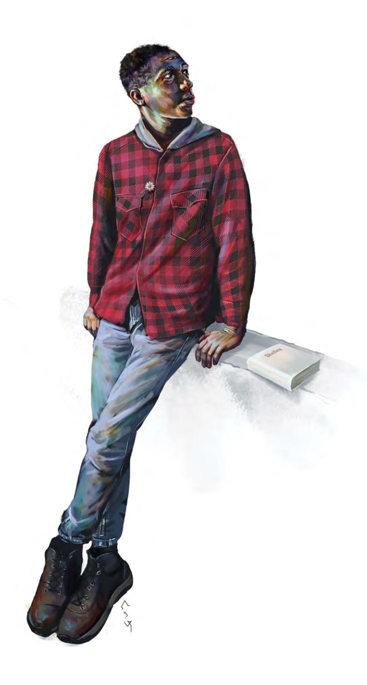

Масштаб проблемы не имеет значения: салюбри понимают, что порой страдания вызваны ситуацией в целом, а не обособленной причиной. Пул любых проверок, не направленных на облегчение страданий цели, уменьшается на 2d10. Одержимость проходит, если цели становится легче, или если внимание вампира захватывает гораздо более неотложная и серьёзная проблема, или же с концом сцены.

## Àðõåòèïû Ñàëþáðè

В наше время потомков Саулота осталось слишком мало, чтобы говорить о архетипах. Если в истории присутствует салюбри, тому есть веская причина.

## Èñêàòåëü èñòèíû

То ли под влиянием своего сира, то ли по единственной причине таинственного появления на лбу третьего глаза, возвращающегося даже после хирургического удаления или экстракции, - Искатель Истины просто знает, что во всем этом есть глубокий смысл, и посвящает свою жизнь грандиозному поиску ответов. Некогда студент философии, самопровозглашенный исследователь непознанного и "духовный авторитет", этот циклоп фокусируется на природе нежити, изучая собственное тело и наблюдая за его реакциями на внешние раздражители (ведет ли себя третий глаз так же, как два других?), ища просветления в письменных или устных высказываниях других сородичей и моря голодом своего зверя, чтобы раскрыть тайны Голконды. Там, где другие видят обыденность или риск, на который не стоит идти, Искатель Истины видит возможность учиться, даже ценой собственной безопасности.

## Íåâîëüíûé öåëèòåëü

Кто-то рождается для того, чтобы помогать другим, желая лишь лечить больных, успокаивать страждущих и протягивать заботливую руку помощи всем нуждающимся. Некоторые занимаются этим потому, что их семья оплатила медицинское образование (благо зарплата там неплохая). Какими бы ни были их мотивы, "Объятия" дали им новые инструменты: Теперь они могут восстанавливать живых - и даже неживых - с помощью своей крови. К сожалению, это не то, на что они подписывались. Оторванные от прежней работы и жизни, которую, как им казалось, они только ненавидели, невольные целители не хотят продолжать свое ремесло, но вынуждены делать это под влиянием своего предка, других сородичей и собственного эмпатического внушения. Измученные, они делают то, что должны, и при этом с нетерпением ждут, когда же их работа снова станет полезной.

## Ìîíñòð ïðîòèâ ìîíñòðîâ

Давайте посмотрим правде в глаза: Перспектива вечно маскировать свой лоб и бороться с Голодом - не совсем мечта. Вечно скрывающийся, не понимающий, зачем подвергать другого наказанию Объятий, Монстр против монстров переводит свое негодование в действие. Нежелательные в обществе Сородичей, они активно работают против него, служа анонимными осведомителями местной полиции или самостоятельно следя за другими хищниками, саботируя их попытки кормиться, когда это позволяет ситуация. Перспектива уничтожения нежити очень заманчива для них, но независимо от того, будет ли это сделано их собственными руками или в сотрудничестве со смертными, работающими против Сородича, это невероятно опасная игра.

## Íàåìíûé øïèîí

Чтобы спрятать глаз (и кровь, которая сочится из него в самый неподходящий момент), требуется практика и самоотверженность. Банданы, шапочки, повязки и пластыри, впитывающие ткани, тщательно приклеиваемые к коже и прячущиеся под одеждой, реалистичные силиконовые маски, держащиеся подальше от освещенных мест и камер.... При таком количестве мер предосторожности неудивительно, что шпион по найму всегда остается замаскированным, работая под прикрытием и не оставляя следов. Нанимать на негласную работу "высасывателя душ" для многих может показаться последним средством, но, поскольку их существование так зависит от того, чтобы лежать на дне, "салюбри" могут быть самыми надежными кандидатами для выполнения любых задач, требующих инкогнито. Если им гарантирована защита и конфиденциальность, то наемный шпион готов на любое задание разумеется, за хорошую цену.

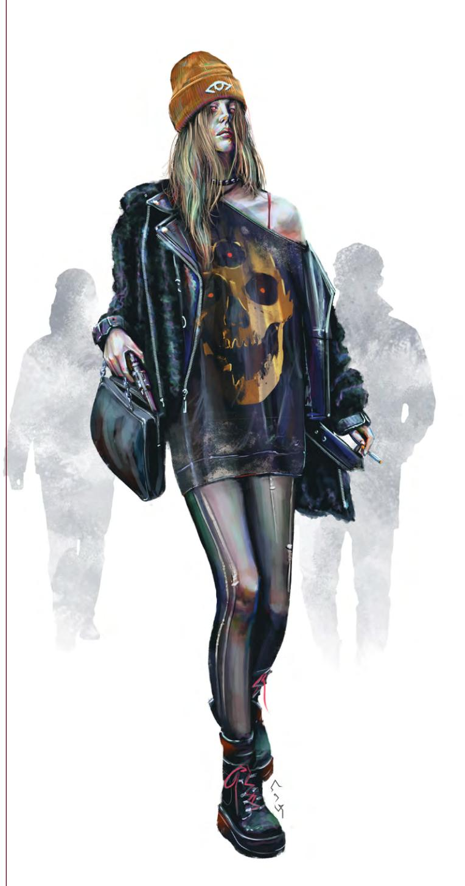

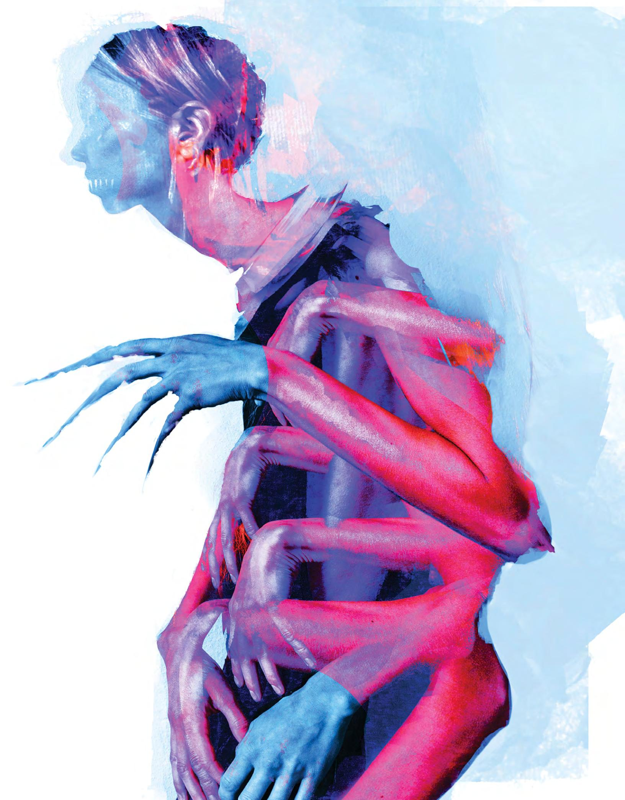

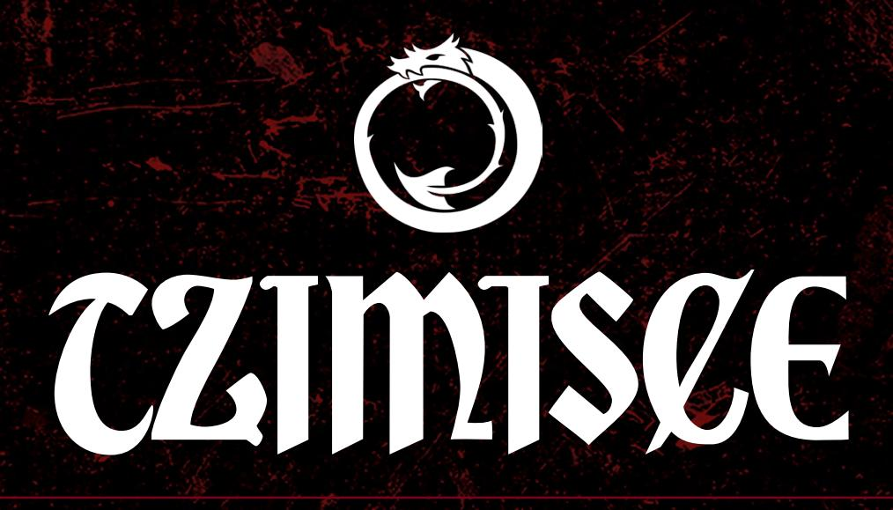

Драконы Старый клан **Воеводы** Стокеры

Не вести за собой победоносно, но править - владеть без остатка

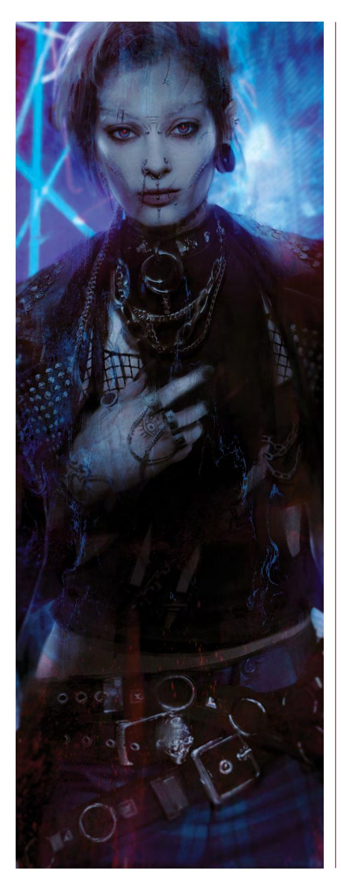

Для Цимисхов собственность — это всё. Они стремятся получить желаемое и владеть им, ревниво охраняя сокровища, подобно драконам, в чью честь их и прозвали. По традиции владения клана определялись географически, и к ним относились либо какие-то земли, либо местный народ. Грозный властелин замка, что высится среди скал, — вот типичный старейшина Цимисхов. Новые поколения, тем не менее, заметно расширили понятие владения: это может быть культ, торговая компания, уличная банда или даже военный отряд. Алчность драконов уравновешивается только отсутствием тяги к непомерному расширению зоны ответственности но если цимисх вцепился когтями в свою добычу, то его едва ли получится оторвать

Традиционно подопечные клана определялись географически, например, землей или региональным народом, но по мере сокращения трансильванских владений они распространяют свою одержимость на банды, цепочки предприятий и даже воинские части. Их жадность ограничивается лишь отсутствием возможностей, и, вцепившись в них когтями, их очень трудно выгнать.

Мало кто может так обидеться или возненавидеть старшего, как Цимисхи, и клан имеет множество членов как в Шабаше, так и в Анархах. Среди Черной Руки почти средневековый менталитет толкает хватких Драконов на уничтожение пешек презираемых древних. Аналогично, недоступность самых желанных владений часто толкает молодых Цимисхов на современные пути Анархов, и они переосмысливают себя и своих подопечных, чтобы претендовать на владения, актуальные для ночи. Некоторые Цимисхи, как правило, приверженцы традиций, находят привычный (некоторые скажут анахроничный или даже застойный...) комфорт в неофеодализме Камарильи, но это сравнительно редкие случаи, а большинство дворов Камарильи не любят их скупость. Немногие Цимисхи видят в секте нечто большее, чем средство достижения личной цели, и Камарилья не оказывает им должного доверия. В худшем случае Цимисхи тираны, лишенные чувства долга, которое обычно присуще дворянству.

## Êòî òàêèå Öèìèñõè?

Быть принятым в объятия Цимисхов означает владеть ради владения и любой ценой не допускать к нему посторонних. Фактически многие цимисхи рассматривают само Объятие как акт собственности и имеют вполне традиционные отношения со своими детьми, которых они в крайних случаях могут даже рассматривать как собственность.

Если их довести до предела, они скорее сгорят вместе со своим добром, чем позволят ему попасть в чужие руки; как Драконы, они прекрасно знают, что такое "выжженная земля". Даже сегодня они железный кулак, а бархатная перчатка совершенно необязательна. В некоторых случаях подданные соглашаются, но в большинстве случаев они живут в страхе перед отстраненным хозяином, которому нет дела до счастья своей добычи - лишь бы она принадлежала ему. Приезжие представители других кланов иногда бывают шокированы, видя запущенные, заброшенные или бесплодные владения Цимисхов, но потом вспоминают, что Драконам не обязательно заботиться о процветании своих подопечных, главное, чтобы они были в полной собственности. Ветхий домик с такой же вероятностью может быть владением Цимисхов,

как и роскошное поместье на родовых землях. Это неумолимое собственничество распространяется и на физическую форму - и не только - Цимисхи, которые считают себя полными хозяевами своих тел, даже за пределами ограничений самого Проклятия Каина. Многие драконы практикуют специализацию Метаморфозной дисциплины, известную как Изменчивость, которая позволяет им изменять свои тела и тела подданных и даже менее волевых жертв. И действительно, те, кто погружен в историю клана, помнят ранние ночи Изменчивости, когда Цимисхи отказались прислушаться к метаморфозным ограничениям, наложенным на формы волка и летучей мыши, и продвинули свое мастерство еще дальше. В те ночи они создали своих слуг из плоти - отвратительных шляхтов и ужасающих составных зверей, известных как вожди (их статистику см. в разделе

#### "Объединенные антагонисты", с. 241).

Даже не ограничиваясь практикой физического порока, Драконы охотно распространяют это мастерство на сферу разума и духа. Эти Цимисхи практикуют форму трансцендентализма, которая касается самих границ вампиризма. Они превращаются в статуи или иконы, изменяют половые признаки (такие вот рудиментарные смертные атрибуты...), выращивают свиты двойников, чтобы вытеснить собственную индивидуальность. По самым смешным рассказам, некоторые воеводские владыки сами становились единым целым со своими убежищами или даже вливались в родные земли, сливая свое сознание с самой почвой домена.

Что может быть лучше, чем стать собственником земли и ее народа, став этой самой землей и поддерживая грядущие поколения?

Как и следовало ожидать, это приводит к резкому разделению между молодыми Цимисхами, у которых зачастую мало что можно считать собственностью в традиционном понимании, и старшими Драконами, которые успели заявить о своих правах и удвоить свои драгоценные владения, и так было с незапамятных времен. Поэтому неудивительно, что Цимисхов принимали активное участие в восстании Анархов и были одним из клановоснователей Шабаша, восставших против тирании старейшин. Даже сегодня эта настороженность сохраняется, и драконы исключительно хитры, когда речь заходит об определении зарядов, на которые они претендуют, чтобы более покладистый воевода не присвоил себе этот предмет.

## Äèñöèïëèíû

АНИМАЛИЗМ: некоторые цимисхи прибегают к этой Дисциплине, чтобы ещё больше сродниться со своим доменом. Другие же видят в Анимализме инструмент: повелевая стаями зверей, владения легче контролировать. Как бы то ни было, драконы всегда чувствовали близость к диким обитателям их родовых земель.

ДОМИНИРОВАНИЕ: идеальная Дисциплина для тех, кто требует от других повиновения, ведь для этого достаточно одной силы мысли. Доминирование поможет не только завладеть желаемым, но и со временем превратить простого слугу в безукоризненного вестника своей неоспоримой воли.

МЕТАМОРФОЗЫ: цимисхи — властелины собственных тел. С помощью Метаморфоз они придают себе форму иных существ. Особенно часто это животные, которыми славятся родовые земли Старого клана, например волк или летучая мышь. Не удовлетворяясь привычными обликами, многие драконы используют Изменчивость, что позволяет им выйти за границы давно избитых форм Метаморфоз. Они обращаются с плотью, своей и своих подданных, как с глиной.

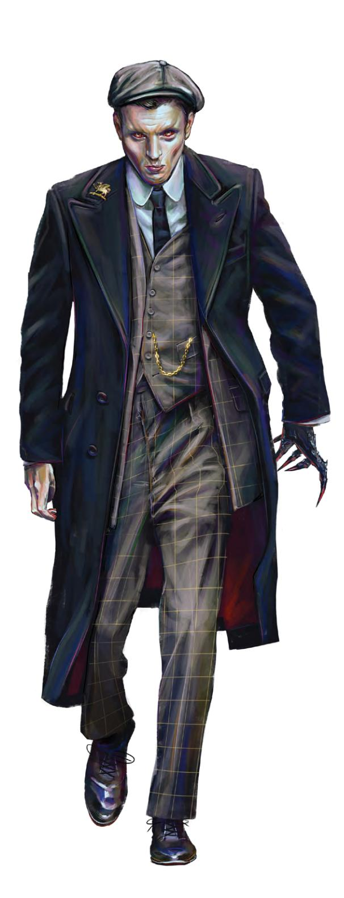

## Ïðîêëÿòüå

Цимисхам свойственна привязанность. Каждый дракон должен выбрать что-то, что он возьмёт под своё крыло, будь то домен, группа людей или организация. Подойдёт даже нечто менее стандартное, главное — чётко определить его суть и границы. Сородич должен спать вблизи того, к чему (или кому) он привязан. Раньше это чаще всего означало сон в почве собственного надела, но сейчас под этим требованием может подразумеваться многое: определённый тип людей, здание, непосредственно связанное с тем, чем одержим вампир, или, допустим, местная группа неформалов либо что-то ещё более необычное. Если цимисх не выполняет этого условия, на закате он испытывает тяжёлый стресс. Количество полученных пунктов стресса равно тяжести изъяна вампира.

## Êëàíîâûé Èçúÿí: Àë÷íîñòü

Цимисха одолевает неудержимое желание завладеть чем-то, что присутствует в сцене, и добавить добычу к своей пресловутой горе сокровищ. Это может быть что угодно, от предмета до места, а также кто угодно. Пул любых проверок, не направленных на обретение желаемого, уменьшается на 2d10. Одержимость проходит, когда её объект оказывается во владении вампира (что понимать под владением, если речь идёт о живых существах, решает рассказчик) или становится для него недостижимым.

## Àðõèòèïû Öèìèñõîâ

## Ñîáñòâåííèê

С начала времён стокеры были хозяевами доменов. В наше время, однако, образ владыки горного замка практически стёрся. Тем не менее, Цимисхи — клан изворотливый, и пускай родовые поместья Старого Света для драконов уже чаще мечта, чем реальность, так или иначе они получают власть над городскими доменами и сельской местностью. Дракон может заведовать как многоквартирником в трущобах, так и модным небоскрёбом, но исход всегда один: он высосет из жильцов деньги, будто кровь из жертв. Ведь для цимисха и то и другое — часть его собственности.

## Ãëàâàðü áàíäû

Они не то чтобы настоящая банда — это просто способ прикрыть друг другу спину в мире, который их отверг. Главарь банды старается показать всем, кто тяжело трудится ради чего-то, в чём им отказало общество, что желаемое нужно просто отнять. Он руководит подчинёнными не хуже уважаемых промышленных магнатов, но занимается крышеванием или наркоторговлей

## Çëîïûõàòåëü

Если у дракона есть домен, то есть и соперники, которые пытаются его отобрать. И, с точки зрения нелюдя, соперники — это вообще все. Особенную неприязнь цимисхи питают к тремерам, гангрелам и носферату. Воеводы видят в них не только узурпаторов Крови, но и нарушителей границ, которые топчут земли, когда-то по праву принадлежавшие драконам или их сирам. Каждую ночь злопыхатели просыпаются с целью хотя бы отчасти жестоко отомстить тем, кто однажды нанёс им обиду. Бремя вины передаётся вместе с проклятой Кровью, и стокеры могут охотиться даже на потомство потомков ненавистного им врага.

## Êîìàíäèð ñïåöîòðÿäà

Он привязан не к земельному владению, а к своему отряду, к которому питает безграничное уважение, а его подопечные, в свою очередь, готовы пойти за ним даже в адское пекло. Оттачивая навыки бойцов, командир выжидает подходящего момента: быть может, приняв участие в каком-нибудь восстании или подавив его, они смогут заявить права на собственный домен.

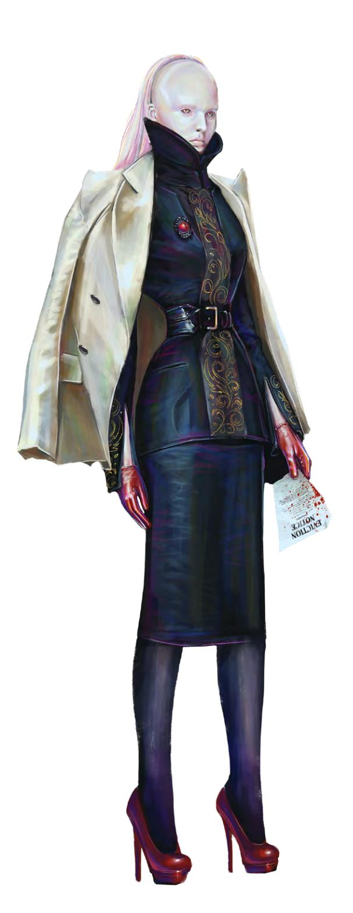

# Êëàíîâûå Ïðîêëÿòüÿ - Àëüòåðíàòèâû

Одной из основополагающих черт вампирских кланов является их Проклятие. Несмотря на то, что дисциплины, стереотипы и сферы жизни, к которым они тяготеют, пересекаются, каждое "проклятие" уникально - это в равной степени как характеристика, так и проклятие. В силу особенностей сюжета не все Проклятия окажут значительное влияние или, наоборот, сделают клан совершенно неиграбельным. В истории, написанной в стиле кочевников, Проклятие Равноса не будет иметь никакого значения, а в истории, посвященной выживанию в сточной канаве, Проклятие Тореадора может оказаться просто непомерным. В этой главе представлены альтернативные варианты проклятий для всех кланов, что позволяет группам менять их для поддержания свежести сеттинга или для того, чтобы все кланы оставались играбельными. Однако любые варианты Проклятий должны относиться ко всем кланам в целом, поскольку они являются отличительной чертой рода, а не индивидуальной причудой. (Это не относится к дефекту "Дважды проклятый" на с. 121, поскольку он представляет собой

расширение Проклятья, а не замену).

## Áàíó Õàêèì: ßäîâèòàÿ êðîâü

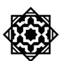

Смерть таится в крови так называемых ассасинов. Хотя на других вампиров она действует так же, как и любая другая витэ, для смертных она является ядом и рискует жизнью любого, кого Бану Хаким попытаются сделать своим гулем или кровной связью.

Смертный, выпивший кровь вампира Бану Хаким, получает тяжелый урон, равный тяжести проклятья вампира, за каждую проглоченную кровь. Кроме того, кровь Бану Хаким не может быть использована для исцеления смертельных ран (см. с. 139).

Бану Хаким витэ не обладает никакими другими токсическими свойствами; в количествах, не превышающих количество, необходимое для создания Кровной Связи, он не наносит вреда даже при введении, например,

непосредственно в кровоток.

Ýòîò âàðèàíò ïîëåçåí, êîãäà â èñòîðèè îñíîâíîå âíèìàíèå óäåëÿåòñÿ îáùåñòâó è âçàèìîäåéñòâèþ ñìåðòíûõ, à íå âàìïèðîâ. Ãóëè Áàíó Õàêèì áóäóò âñòðå÷àòüñÿ ðåäêî, è òîëüêî ñàìûå âûíîñëèâûå ñìåðòíûå ñìîãóò âûæèòü ïîä âîçäåéñòâèåì èõ èñïîð÷åííîé ñèëû.

## Áðóõà: Íàñèëèå

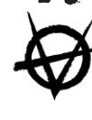

Живые импульса бунта, Бруха не могут не менять ситуацию - часто насильственно и не всегда в лучшую сторону. Хотя все вампиры обладают способностью к разрушению, голодный Бруха всегда наносит какой-то ущерб.

При беспорядочном критическом результате любой проверки умений вампир Бруха наносит объекту взаимодействия урон (физический или психический, в зависимости от ситуации), равный тяжести его Голода, в дополнение к любому другому результату броска кубиков Голода. Повреждения утяжеляются, если игрок не тратит очко силы воли, делая вместо этого повреждения легкими.

Ýòîò âàðèàíò èìååò ñìûñë â èñòîðèè, ãäå ßðîñòü - â òîì ÷èñëå è îáû÷íàÿ Áðóõà-Ïðîêëÿòèé - ðåäêî ïîÿâëÿåòñÿ â èãðå ëèáî èç-çà ñþæåòà, ëèáî èççà òîãî, ÷òî ãðóïïà ïðèäåðæèâàåòñÿ áîëåå ëåãêîãî ïîäõîäà ê ïðàâèëàì.

## Ãàíãðåë: Èíñòèíêòû Âûæèâàíèÿ

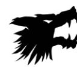

Для Животных нет ничего важнее выживания. Гангрелы - самые стойкие из всех вампирских кланов, они способны вынести практически все и процветать в самых суровых условиях.

Если Зверь часто ставит вампира в неблагоприятные ситуации, то инстинкты Гангрела выверены в первую очередь для того, чтобы убедиться, что он увидит еще одну ночь.

Вычтите из любого броска на сопротивление неистовству ярости кубики, равные тяжести проклятия Гангрела. При этом количество кубиков не может быть меньше одного.

Ýòîò âàðèàíò õîðîø äëÿ ïîëíûõ îïàñíîñòåé èñòîðèé, ãäå îãîíü è ñîëíå÷íûé ñâåò ÿâëÿþòñÿ ïîñòîÿííîé óãðîçîé, íî ãäå ïñèõè÷åñêèå è ñîöèàëüíûå êîíôëèêòû âñòðå÷àþòñÿ ðåæå, èëè åñëè ãðóïïà ïðîñòî íå õî÷åò âîçèòüñÿ ñ îòñëåæèâàíèåì âðåìåííûõ øòðàôîâ íà êóáèêàõ.

## Ãåêàòà: Ðàñïàä

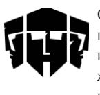

Связь Гекаты со смертью и энтропией приводит к тому, что они практически излучают распад, медленно разъедая все живое и неживое, находящееся поблизости.

Их убежища ветшают за считанные ночи, вокруг них увядают растения, и даже смертные становятся вялыми и хилыми от длительного воздействия. Некоторые гекаты смиряются с этим, обходясь ветхими убежищами и малым количеством смертных слуг, если таковые вообще имеются. Тем же, кто этого не делает, приходится тратить немало времени и сил на то, чтобы не дать своему имуществу разлагаться вокруг.

Вампиры Гекаты получают дополнительные точки в недостатках, равные их тяжести проклятия, которые распределяются по своему усмотрению между недостатками "Подручные", "Убежище" и "Ресурсы". Их можно либо взять при создании персонажа, либо "откупиться", заплатив вдвое больше фоновых точек. Кроме того, приобретение точек в этих Преимуществах требует дополнительного количества очков опыта,

равного Тяжести проклятия.

Åñëè â èñòîðèè íåò àêöåíòà íà ñöåíàõ êîðìëåíèÿ èëè ãåðîè ñïîñîáíû äîáûâàòü ñîñóäû áîëåå êîíòðîëèðóåìûìè ñïîñîáàìè, ýòîò âàðèàíò ìîæåò äàòü èíòåðåñíûé óãîë çðåíèÿ íà "Ãåêàòó".

## Ëàñîìáðà: ×åðñòâîñòü

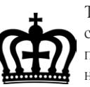

То ли из-за склонности выбирать особо безжалостных смертных для Объятья, то ли из-за чего-то, грызущего их психику, вампиры Ласомбры тяготеют к нечеловеческому, независимо от секты или образа жизни.

Что-то в них не так, и Ласомбра, заботящиеся о своем рассудке, должны быть особенно осторожны, чтобы их зверь не откусил еще кусочек от их человечности.

При выполнении броска "Раскаяние" вычтите количество кубиков, равное тяжести проклятия Ласомбры-вампира. Это не может уменьшить количество кубиков ниже одного.

Èñòîðèè, ïîñâÿùåííûå ÷åëîâå÷åñòâó è åãî óòðàòå, ìîãóò áûòü ïîëåçíû â ýòîì âàðèàíòå.

Ýòîò âàðèàíò ìîæåò áûòü ïîëåçåí êàê äëÿ èñòîðèè, òàê è äëÿ èñòîðè÷åñêèõ õðîíèê, â êîòîðûõ ìàëî òåõíîëîãèé.

## Ìàëêâàèàí: Íååñòåñòâåííûå ïðîÿâëåíèÿ

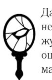

Даже самый обычный с виду оракул вызывает у окружающих неприятные ощущения, когда они используют силу своей жуткой Крови. Хотя смертные редко осознают источник этих ощущений, они с заметным беспокойством реагируют, когда малкавиан использует свои силы, а другие вампиры могут легко распознать присутствие своего собрата по нежити.

Когда малкавиан использует силу Дисциплины, смертные, находящиеся в непосредственной близости от него (примерно в одной комнате или эквивалентно), пугаются, и любое социальное взаимодействие с ними, кроме запугивания, получает штраф к кубикам, равный тяжести проклятия малкавиана. Это ощущение не разрушает маскарад, но смертный испытывает внезапный страх или неприязнь к вампиру, длящийся одну сцену. Другие вампиры испытывают аналогичные ощущения, мгновенно распознавая малкавианца как вампира, хотя при взаимодействии с ними никаких штрафов не применяется.

Åñëè ãðóïïà õî÷åò ïîä÷åðêíóòü îòòàëêèâàþùóþ ïðèðîäó ìàëêàâèàíöåâ è âûäåëèòü èõ ñòðàííîñòè, òî ýòîò âàðèàíò ìîæåò ïîäîéòè.

## Ìèíèñòðèé: Õëàäíîêðîâíûé

Кровь служителей, которую часто сравнивают со змеиной, холодна не только в одном отношении.

Без свежей, теплой крови в жилах им невозможно имитировать дыхание и сердцебиение смертного, да и то это требует значительных усилий.

Вампир Министриев может использовать "Румянец жизни" только в том случае, если он недавно питался из живого сосуда (в этой же сцене или примерно час назад - на усмотрение рассказчика), а когда он это делает, требуется не одна, а несколько проверок на

пробуждение, равных его тяжести проклятия.

Ñîöèàëüíûå è ñêðûòûå èñòîðèè, â êîòîðûõ ãëàäêîå âçàèìîäåéñòâèå ñî ñìåðòíûìè èìååò ïåðâîñòåïåííîå çíà÷åíèå, ìîãóò äîáàâèòü íàïðÿæåíèÿ â ýòîò âàðèàíò.

## Íîñôåðàòó: Çàðàæåíèå

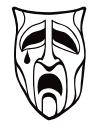

Куда бы они ни пошли или где бы ни попытались спрятаться, стаи паразитов преследуют носферату. Одни страдают от стай крыс, другие служат маяком для тараканов, третьи не могут избавиться от проклятых голубей и их остатков.

Во многих случаях все вышеперечисленное и даже больше. Независимо от того, где они устраивают свое убежище, они вскоре вытесняют всех остальных обитателей. Даже на короткой остановке могут появиться непрошеные гости, которые останутся надолго после ухода Канализационной Крысы.

Убежище носферату всегда кишит паразитами, что приводит к штрафу, равному двум плюс их тяжесть Проклятия, к любой попытке заняться деятельностью, требующей концентрации, а также к социальным проверкам по усмотрению Рассказчика. Кроме того, если вампир Носферату проводит сцену в закрытом помещении, заражение паразитами дает аналогичный эффект, хотя штраф равен только тяжести вампира. Любая попытка (временного) контроля паразитов с помощью Анимализма сопровождается штрафом, равным тяжести Проклятия.

Обратите внимание, что с этим проклятием носферату не обязательно деформируются, хотя при желании они могут иметь странную внешность.

Ïîïðîáóéòå ýòîò âàðèàíò Ïðîêëÿòüÿ, åñëè âû õîòèòå, ÷òîáû Íîñôåðàòó â âàøåé èñòîðèè áûëè îòòàëêèâàþùèìè íå òîëüêî âíåøíå, íî è èìåëè áîëåå çàìåòíîå ïðèñóòñòâèå. Èìåéòå â âèäó, ÷òî Íîñôåðàòó â ýòîé èñòîðèè âðÿä ëè áóäóò ïðèãëàøåíû â Ýëèçèóì, åñëè òîëüêî îíè íå ïðèâåäóò ñ ñîáîé ñîáñòâåííóþ êîìàíäó ïî áîðüáå ñ âðåäèòåëÿìè.

## Ðàâíîñ: Íåðîæäåííîå Èìÿ

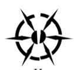

Вампиры Равноса полагаются на одну незыблемую истину, которая служит им опорой, когда они занимаются своим ремеслом на грани реального: их имя.

Какое бы имя они ни носили в момент своего Воплощения, Равносы тщательно скрывают его, поскольку любой, кто знает это "нерожденное имя", получает над ними власть.

Тот, кто произносит в лицо нерожденное имя равноса, получает бонус, равный тяжести проклятия равноса, к сопротивлению его способностям Дисциплины, а сам равнос получает равный штраф к сопротивлению сверхъестественным способностям, используемым

противником, носящим имя.

Åñëè îáû÷íîå Ïðîêëÿòüå áûëî áû ñëèøêîì äåñïîòè÷íûì èëè íåçíà÷èòåëüíûì (â î÷åíü ñòàöèîíàðíûõ èëè êî÷åâûõ èñòîðèÿõ ñîîòâåòñòâåííî), òî ýòîò âàðèàíò ìîæåò ïîìî÷ü îïðåäåëèòü êëàí Ðàâíîñ.

## Ñàëþáðè: Àñêåòèçì

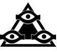

Что-то в Салюбри противится вампирическому состоянию, и чем больше они потакают своему Голоду, тем менее склонна их Кровь подчиняться им.

Только при воздержании они могут использовать все свои способности, так как вампиру Салюбри необходимы муки голода, чтобы не затормозить свои сверхъестественные способности.

Когда уровень голода ниже трех, вампиры Салюбри получают штраф, равный тяжести их проклятья, к любым броскам кубиков Дисциплины. Это дополнение к третьему глазу, описанному на с. 47.

Ýòîò âàðèàíò ïîçâîëÿåò îõàðàêòåðèçîâàòü Ñàëþáðè â òåõ èñòîðèÿõ, ãäå íà èõ îõîòíè÷üåì ñòàòóñå íåöåëåñîîáðàçíî èëè íåèíòåðåñíî çàîñòðÿòü âíèìàíèå, íàïðèìåð, êîãäà â îêðóæåíèè èãðîêà íàõîäèòñÿ áîëüøèíñòâî âàìïèðîâ â ýòîì äîìåíå.

## Òîðåàäîð: Ìó÷èòåëüíîå ñî÷óâñòâèå

Проклятие Тореадора заключается в том, что он слишком сильно - иногда буквально - чувствует окружающие его ощущения. Особенно в такие интимные моменты, как кормление, Дива физически испытывает муки, которые она причиняет смертному, а повреждения ее мертвого тела имитируют вред, причиняемый сосуду.

Когда вампир, питающийся Тореадором, наносит смертному урон, тот в ответ получает аналогичный (обычно тяжелый) урон, хотя одно кормление не может нанести больший урон, чем тяжесть его проклятия. Повреждение принимает форму непроизвольного внутреннего кровотечения, а вампир демонстрирует яркие синяки в местах,

соответствующих месту укуса жертвы.

Ïîñêîëüêó îáû÷íîå Ïðîêëÿòüå Òîðåàäîðà â çíà÷èòåëüíîé ñòåïåíè ïîäâåðæåíî âëèÿíèþ Ðàññêàç÷èêà, ýòîò âàðèàíò ìîæåò ïîäîéòè ãðóïïàì, æåëàþùèì áîëåå ñòðîãèõ ñèñòåì.

## Òðåìåðå: Óêðàäåííàÿ êðîâü

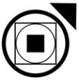

Происходящие от вампиров, присвоивших себе проклятие Каина, вампиры Тремере не могут использовать свою Кровь так же эффективно, как представители других кланов.

Хотя они и могут использовать его в Дисциплинах и анимации, присущая им способность совершать сверхчеловеческие подвиги дается Тремере гораздо труднее.

Когда вампир-тремере совершает прилив крови (Vampire: The Masquerade, p. 218), он должен сделать проверку ИК, равную его тяжести проклятия. Если эти проверки повышают уровень голода вампира до 5 или выше, то он может выбрать, отменить ли ему Силу Крови или выполнить ее и сразу же после этого

получить уровень голода 5.

Ýòîò âàðèàíò ïîëåçåí, åñëè â èñòîðèè îñíîâíîå âíèìàíèå óäåëÿåòñÿ îáùåñòâó è âçàèìîäåéñòâèþ âàìïèðîâ, à íå ñìåðòíûõ, èëè åñëè Êðîâíûå óçû ðåäêîñòü, êàê, íàïðèìåð, â íåêîòîðûõ äîìåíàõ Àíàðõîâ.

## Öèìèñõè: Ïðîêëÿòàÿ ó÷òèâîñòü

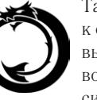

Так же, как многие Цимисхи смертельно серьезно относятся к собственному убежищу и имуществу, так же они вынуждены относиться и к чужому. Вампир-цимисх, вошедший в чужой дом без приглашения, испытывает сильнейший стресс и почти физическое желание уйти.

Вампир Цимисх, желающий войти без приглашения в какое-либо место жительства (как в дома, так и в убежища), должен потратить силу воли, равную тяжести его Проклятия, а также получить аналогичный штраф к кубикам своих Дисциплин на время пребывания. Приглашение должно быть сделано тем, кто живет (или не живет) в этом месте, поэтому этому условию соответствуют только реально обитаемые дома или убежища. Цимисхи могут свободно входить в общественные или заброшенные здания, а квартиры или апартаменты считаются для этого отдельными домами. Крайние случаи остаются на усмотрение Рассказчика.

Цимисх, использующий это Проклятье, не может использовать соответствующий Фольклорный блок в качестве недостатка.

Åñëè èñòîðèÿ âåäåòñÿ â óñòîÿâøåìñÿ äîìåíå ñ íåáîëüøèìè èçìåíåíèÿìè, åñëè òàêîâûå âîîáùå èìåëè ìåñòî, òî ýòîò âàðèàíò Ïðîêëÿòüÿ åùå áîëüøå ïîä÷åðêèâàåò îñîáåííîñòè Öèìèñõîâ.

## Âåíòðó: Èåðàðõèÿ

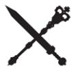

Хотя многие Вентру стремятся к лидерству, они также быстро подчиняются своему начальству. Во многих случаях, выбранные за прагматичный образ мышления, дети Вентру учатся слушаться своего сира, и инстинкты, заложенные в них Кровью, часто заставляют их подчиняться так же, как и любого вампира старшей Крови.

Вампир Вентру получает штраф к броскам Дисциплины, равный его Тяжести Проклятия, когда пытается использовать свои силы на вампире низшего поколения. Если вампир хочет напрямую атаковать вампира низшего поколения, он также должен потратить силу воли, равную тяжести его проклятия.

Åñëè â èñòîðèè íåò ñöåí êîðìëåíèÿ èëè ïåðñîíàæè ìîãóò äîáûâàòü ñîñóäû áîëåå êîíòðîëèðóåìûìè ñïîñîáàìè, òî ýòîò âàðèàíò ïîìîãàåò îïðåäåëèòü Âåíòðó êàê ëþäåé, ñîáëþäàþùèõ àíàõðîíè÷íûå ôåîäàëüíûå ñîöèàëüíûå êîäåêñû, èëè êàê áåññîâåñòíûõ ëèçîáëþäîâ. ■

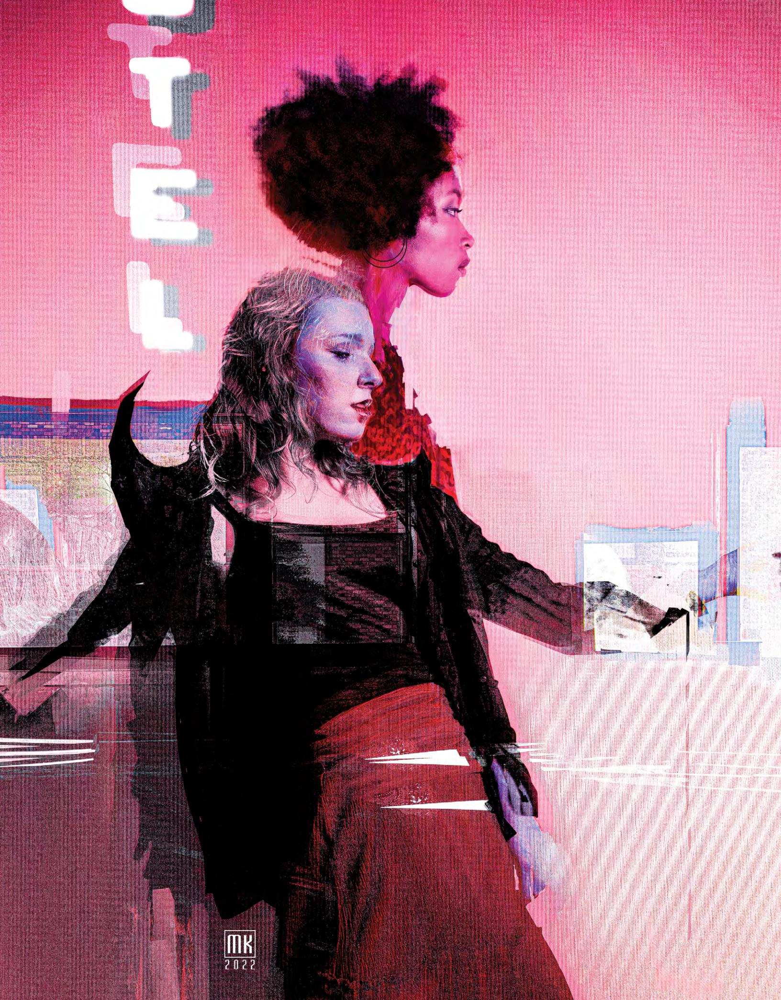

## ÃËÀÂÀ ÒÐÅÒÜß:

# ÏÅÐÑÎÍÀÆÈ

Õîòÿ ÿ è îáëàäàë ñïîñîáíîñòüþ äàðèòü îæèâëåíèå, íî ïîäãîòîâèòü êàðêàñ äëÿ åãî âîñïðèÿòèÿ, ñî âñåìè õèòðîñïëåòåíèÿìè âîëîêîí, ìûøö è âåí, îñòàâàëîñü äåëîì íåìûñëèìîé ñëîæíîñòè è òðóäà.

— ÌÝÐÈ ØÅËËÈ, ÔÐÀÍÊÅÍØÒÅÉÍ

Персонажи поддерживают мир. Они дают ему повод для существования. Мир истории вращается вокруг них, даже если они кажутся растерянными новичками, оказавшимися не в своей тарелке, или анциллами, оказавшимися не в своей стихии. Они являются центром сюжета, потому что за ними стоят игроки. Эти бумажные персонажи пьют жизненную силу и оригинальность, вкус и индивидуальность из игроков, и становятся чем-то другим, чем-то лучшим. Если бы это были не вампиры, мы бы сказали, что они оживают.

Но даже вампирам нужны скелеты, чтобы их поддерживать. Эти правила берут кости механики, поворачивают их в разные стороны, демонстрируют некоторые возможности, а затем... ну, что будет дальше, зависит от вас. Вы же игроки, в конце концов. Ваши персонажи проголодались.

Полный список преимуществ и недостатков приведен в Приложении, с. 232.

## Ñâîäíàÿ òàáëèöà ïðèçíàêîâ è òèïîâ âàìïèðîâ

Налетчик: Вы берете кровь силой или угрозой. (Стремительность или могущество) Суррогатчик: Вы добываете кровь с пакетов или мертвую кровь, а не охотитесь. (Колдовство крови или Сокрытие) Бестия: Вы питаетесь от других вампиров. (Стремительность или Метаморфозы) Семьянин: Вы тайно берете кровь у своих смертных родственников. (Доминирование или Анимализм) Джентельмен: Вы берете кровь с согласия. (Ясновидение или Стойкость) Вымогатель: Вы заставляете смертных платить вам кровью за ваши услуги или защиту. ("Доминирование" или "Могуществе") Фермер: Вы питаетесь животными. (Анимализм или Метаморфозы) Расхититель могил: Вы слоняетесь по больницам и моргам в поисках жертв (Стойкость или Обливион) Мрачный Жнец: Вы питаетесь теми, кто вотвот умрет. (Ясновидение или Обливион) Монтеро: Ваши помощники подгоняют к вам добычу. (Доминировать или Сокрытие) Идол: Вы питаетесь от своего культа или последователей. (Колдовство крови или Величие) Преследователь: Вы изучаете и выслеживаете свою жертву, прежде чем нанести удар (Анимализм или Ясновидение)

Морфей: Вы питаетесь спящими жертвами (Ясновидение или Сокрытие)

Тусовщик: Вы кормитесь за счет своей субкультуры или эксклюзивной группы. (Доминирование или Могущество)

Искуситель: Вы питаетесь, соблазняя своих жертв. (Стойкость или Величие)

Лазутчик: Вы затаились в своем гнезде и заманиваете в него добычу. (Метаморфозы или Сокрытие)

## Àòðèáóòû

## Ìåíòàëüíûå àòðèáóòû

ИНТЕЛЛЕКТ: Память, мышление, интеллект

СМЕКАЛКА: Быстрая реакция, интуиция, мгновенное принятие решений

УПОРСТВО: Сосредоточенность, концентрация, внимание

## Ôèçè÷åñêèå àòðèáóòû

СИЛА: Мускульная сила, урон в ближнем бою ЛОВКОСТЬ: Ловкость, грация, рефлексы ВЫНОСЛИВОСТЬ: выносливость, стойкость,

выносливость

## Ñîöèàëüíûå àòðèáóòû

ОБАЯНИЕ: обаяние, магнетизм, сила личности МАНИПУЛИРОВАНИЕ: словесное изящество, социальное коварство, гладкость САМООБЛАДАНИЕ: Контроль над собой,

хладнокровие, спокойная голова

## Ôèçè÷åñêèå íàâûêè

АТЛЕТИКА: Бег, прыжки, лазание ДРАКА: Бои без оружия всех видов РЕМЕСЛО: Ремесло, строительство, формовка ВОЖДЕНИЕ: управление транспортными средствами ОГНЕСТРЕЛЬНОЕ ОРУЖИЕ: Использование оружия дальнего боя, такого как пистолеты и луки

ВОРОВСТВО: Взлом и проникновение, защита от них

ФЕХТОВАНИЕ: вооруженный бой с применением холодного оружия

СКРЫТНОСТЬ: Не быть увиденным, услышанным или узнанным

ВЫЖИВАНИЕ: Остаться в живых в неблагоприятной обстановке

## Ñîöèàëüíûå íàâûêè

ОБРАЩЕНИЕ С ЖИВОТНЫМИ: Обращение с животными и общение с ними ЭТИКЕТ: Вежливость в социальной среде ПРОНИЦАТЕЛЬНОСТЬ: Определение душевных состояний и мотивов ЗАПУГИВАНИЕ: Заставить другого человека отступить ЛИДЕРСТВО: Направлять и вдохновлять других людей ИСПОЛНЕНИЕ: Выражение искусства лично перед аудиторией УБЕЖДЕНИЕ: Убеждение других словесно или эмоционально УЛИЧНОЕ ЧУТЬЕ: понимание особенностей криминальной среды и городского пространства

ХИТРОСТЬ: Обманом заставить других выполнить вашу волю

## Ìåíòàëüíûå íàâûêè

ГУМ.НАУКИ: Гуманитарные науки, обучение по книгам

НАБЛЮДАТЕЛЬНОСТЬ: Чувства, осознание окружающей обстановки, распознавание угроз ФИНАНСЫ: Обращение с деньгами, их перемещение и зарабатывание

РАССЛЕДОВАНИЕ: поиск улик, разгадывание тайн МЕДИЦИНА: исцеление травм, диагностика заболеваний

ОККУЛЬТИЗМ: Тайные знания, как реальные, так и нереальные

ПОЛИТИКА: Дипломатическая и бюрократическая хватка

ЕСТ.НАУКИ: Знания и теория физического мира ТЕХНИКА: Понимание и использование современных

технологий, компьютеров и работы в Интернете

АНИМАЛИЗМ: сверхъестественное родство с животными и контроль над ними (Гангрел, Носферату, Равнос)

ЯСНОВИДЕНИЕ: экстрасенсорное восприятие, осознание и предчувствия (Геката, Малкавиан, Тореадор, Тремере, Салюбри)

КРОВАВОЕ ЧАРОДЕЙСТВО: использование крови для совершения магических действий (Бану Хаким, Тремере)

СТРЕМИТЕЛЬНОСТЬ: сверхъестественная быстрота и рефлексы (Бану Хаким, Бруха, Тореадор) ДОМИНИРОВАНИЕ: контроль над разумом (малкавианцы, салюбри, тремеры, цимисхи, вентру) СТОЙКОСТЬ: Чудовищная прочность (Гангрел, Геката, Салюбри, Вентру) СОКРЫТИЕ: Оставаться неясным и незаметным (Малкавиан, Носферату, Равнос) ОБЛИВИОН: Некромантия и создание теней (Геката, Ласомбра) МОГУЩЕСТВО: Сверхъестественная физическая сила (Бруха, Ласомбра, Носферату) ВЕЛИЧИЕ: Привлекать, подавлять и контролировать эмоции (Бруха, Министрии, Равнос, Тореадор, Вентру) МЕТАМОРФОЗЫ: владение формой (Гангрел, Министрии, Цимисхи) АЛХИМИЯ СЛАБОКРОВНЫХ: смешивание крови, эмоций и других ингредиентов для создания мощных

эффектов (Слабокровные)

СОЮЗНИКИ: Смертные партнеры, обычно семья или друзья

ИНФОРМАТОРЫ: Источники информации, которыми

вы располагаете

СЛАВА: Насколько вы известны среди смертных.

УБЕЖИЩЕ: место, где можно безопасно спать днем

СТАДО: Сосуды, к которым у вас есть свободный и

безопасный доступ

ВЛИЯНИЕ: Ваша политическая власть в обществе смертных

СТРАНИЦЫ ИСТОРИИ: Ваша связь с тайной

историей Мира Тьмы

МАСКА: Фальшивая личность, сопровождаемая документами

МАВЛА: Родственник, который советует и

поддерживает вас: наставник, покровитель или

единомышленник.

РЕСУРСЫ: Богатство, имущество и доход.

ПОДРУЧНЫЕ: Последователи, охранники и слуги

СТАТУС: Ваше положение в обществе вампиров

## 1 ОСНОВНАЯ КОНЦЕПЦИЯ

Как зовут вашего персонажа?

Концепция персонажа может исходить из того, кем он был в жизни, или из того, чем он занимается сейчас, после своего Воплощения. Архетипы, приведенные в описании каждого клана, служат примером типичных концепций. Концепция может быть работой, социальной ролью или отношением (V:tM, pp. 141, 148).

## **2** КЛАН

Это сверхъестественная родословная вашего вампира, от которой он наследует силы и слабости. Список кланов, их Дисциплин и Запретов см. в Сводной таблице кланов на с. 12. Вампир, принявший вас в объятия, - ваш Сир - был членом вашего клана.

Помимо этих кланов, ваш персонаж может быть кастовым вампиром с сиром из любого клана:

Каитифф: Бесклановые (выберите любые две дисциплины для стартовых способностей) Изгои; они улучшают дисциплины медленнее, чем другие вампиры.

Слабокровные: Слабокровным (доступна алхимия слабой крови, дисциплина, соответствующая резонансу последней выпитой крови) Проклятий: нет, но см. V:tM (стр. 111-113), где подробно описаны их слабые и сильные стороны по сравнению с другими вампирами.

Исходя из своего клана, укажите свое Проклятье.

Назовите своего Сира или пока оставьте это имя пустым. Если вы назвали своего сира, добавьте его на Карту взаимоотношений.

#### СЕКРЕТЫ ВАМПИРОВ

Ваш клан может вовлечь вас в глобальную секту вампиров. Хотя каждый отдельный вампир может принадлежать к любой секте, большинство кланов делятся следующим образом:

Камарилья: Бану Хаким, Ласомбра, Малкавиан, Носферату, Тореадор, Тремере, Вентру, диссидент Бруха и Гангрел. Движение анархов: Бруха, Гангрел, Министрии, некоторые каитиффы, диссиденты из кланов Камарильи.

Другие: Геката, изгои Ласомбры, Равнос, Салуюбри, Слабокровные, Цимисхи, некоторые каитиффы.

Обычно котерия принадлежит к одной секте, по крайней мере, "официально".

Поэтому убедитесь, что вся котерия согласна с выбором секты.

## **3** ТИП ПИТАНИЯ

Как питается ваш вампир? Это тип питания, который определяет, как он выживает. См. список типов питания на с. 62.

Выберите свой тип питания (V:tM, с. 175-178 и с. 106) и примените его. Добавьте одну из перечисленных специальностей.

Добавьте одну точку к одной из перечисленных дисциплин.

Примените все связанные с ней Преимущества или Недостатки.

Слабокровные и другие новоиспеченные вампиры еще не определились с типом хищника. Слабокровные вампиры никогда не получают точки в Дисциплинах от Типа Питания.

## **4** Атрибуты

Это основные способности вашего вампира, такие как сила, обаяние и интеллект (V:tM, с. 155-157). См. список Атрибутов на с. 62. Каждый тип Атрибута (ментальный, физический, социальный) имеет черту "сила", черту "ловкость" и черту "сопротивление"; это следует иметь в виду, когда вы решаете, как ваш персонаж будет действовать в тех или иных ситуациях.

Возьмите свой лучший атрибут за 4 Возьмите худший атрибут за 1 Возьмите три атрибута по 3 Возьмите остальные атрибуты по 2

### Вторичные атрибуты

Здоровье: Выносливость + 3 Сила воли: Самообладание + Упорство

## **5** НАВЫКИ

Это выученные и природные способности вашего вампира, например, как хорошо он бьет и как ловко обращается с современными устройствами (V:tM, стр. 62). См. список умений на с. 62.

#### Выберите распределение навыков:

МАСТЕР НА ВСЕ РУКИ. Один навык: 3 пункта; ещё восемь навыков: 2 пункта; ещё десять навыков: 1 пункт.

ГАРМОНИЧНОЕ РАЗВИТИЕ. Три навыка: 3 пункта; ещё пять навыков: 2 пункта; ещё семь навыков: 1 пункт.

УЗКИЙ СПЕЦИАЛИСТ. Один навык: 4 пункта; ещё три навыка: 3 пункта; ещё три навыка: 2 пункта; ещё три навыка: 1 пункт

Выбери по одной бесплатной специализации для гуманитарных наук, естественных наук, исполнения и ремесла. Добавь ещё одну бесплатную специализацию для любого навыка. Специализацию можно выбрать только для навыков, которыми персонаж владеет хотя бы на минимальном уровне.

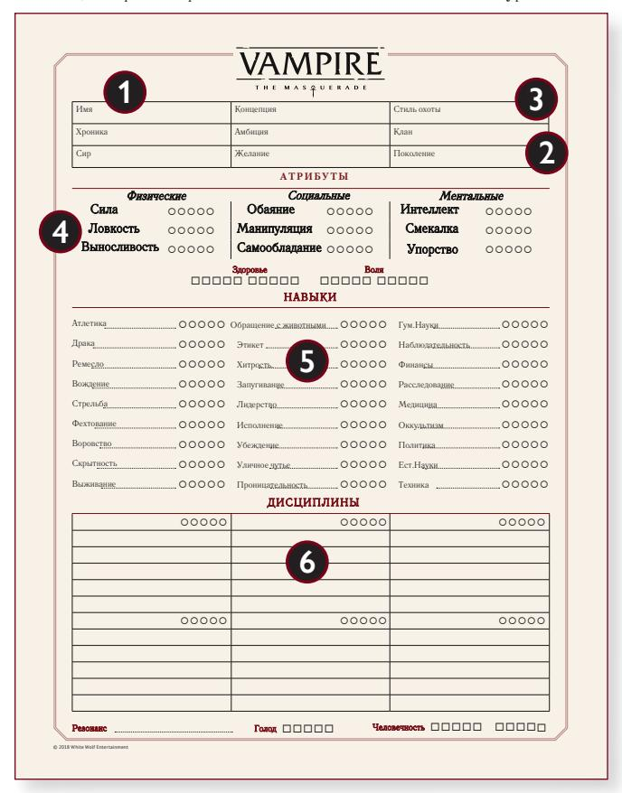

#### СБОРКИ НАВЫКОВ

**6 4**

Если вы не уверены в том, какое распределение навыков лучше всего подходит для вашего персонажа, то зачастую лучше выбрать Специалиста. Он не только наиболее прост в использовании, но и гарантирует, что у вас будет солидный запас кубиков как минимум в четырех Навыках. Навыки не используются для активации Дисциплин, но некоторые навыки становятся гораздо эффективнее в сочетании с определенными способностями. Хорошее эмпирическое правило - выбирать навыки, соответствующие вашему типу питания и дополняющие вашу Дисциплину: Обращение с животными и Анимализм, Драка и Могущетво, Скрытность и Сокрытие, или Наблюдательность и Ясновидение.

Это сверхъестественные способности вашего вампира. См. список Дисциплин на с. 62.

Выберите две дисциплины вашего клана. Поставьте две точки в одной и одну в другой.

Для Каитиффа выберите любые две Дисциплины. Поставьте две точки в одной и одну в другой.

Выберите по одной силе из каждого имеющегося у вас уровня Дисциплины, итого по одной силе на точку (V:tM, стр. 244-287 и стр. 69-106). Вы можете обменять силу более высокого уровня на силу более низкого уровня, но не наоборот. (Персонаж с двумя точками в Дисциплине может взять одну силу первого уровня и одну второго уровня, или две силы первого уровня. Однако они не могут взять две силы второго уровня).

Слабокровные не имеют собственных дисциплин, но могут поставить точку в "Алхимии слабокровных", если возьмут заслугу "Алхимик слабокровных" (V:tM, p. 184).

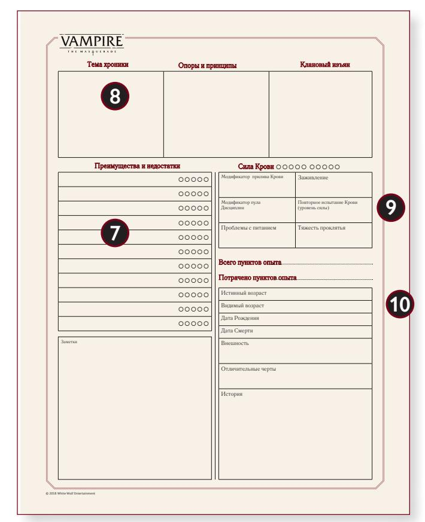

Предыстория, привязывающая вас к миру смертных, достоинства и недостатки (V:tM, с. 179-194, плюс новые достоинства и недостатки на с. 118, достоинства и недостатки каитиффов на с. 126 и достоинства кланов на с. 171). См. основной список Преимуществ на с. 232.

Потратьте 7 очков на Преимущества и отнимите 2 очка у Недостатков. Преимущества и недостатки, полученные от вашего типа питания, не учитываются в этом лимите.

Возможно, вы захотите сэкономить несколько очков преимуществ, чтобы использовать их в своей команде (стр. 171).

Слабокровные должны взять от одного до трех достоинств слабокровных и столько же недостатков слабокровных (V:tM, с. 182-184 и с. 134).

Добавьте на карту отношений всех союзников, контактов, мавлов, подручных или других вспомогательных игроков.

## **8** Убеждения

Убеждения - это руководящие принципы, которые помогают вампиру справляться со своими плохими решениями. Опоры - это смертные, которые поддерживают вас в ваших убеждениях.

Выберите от одного до трех Убеждений. (V:tM, pp. 146, 172; p. 205) Вы можете выбрать ноль убеждений (p. 212), но в этом случае ваш персонаж гораздо быстрее исчерпает свою человечность.

Создайте равное количество Опор (V:tM, pp. 146-147, 173; p. 207), каждый из которых связан с одной убежденностью. Добавьте Опору на Карту взаимоотношений.

## **9** ЧЕЛОВЕЧНОСТЬ И АМБИЦИИ

Ваша человечность равна 7. Проверьте, изменяет ли это число ваш тип питания.

Какова Ваша долгосрочная Амбиция? (V:tM, pp. 148, 173-174) Если хотите, выберите краткосрочное желание для этой сессии. (V:tM, pp. 174-175)

## **10** ПОКОЛЕНИЕ

По умолчанию возраст персонажей - Дитя, но если Рассказчик и другие игроки согласны, вы можете выбрать для игры более старшую группу вампиров (V:tM, с. 151). Обратите внимание на ваше поколение и силу крови в зависимости от вашего возраста.

#### Дитя

Принято в течение последних 15 лет. Поколение: 12-е или 13 е (сила крови 1) или слабокровные: 14-е, 15-е или 16-е поколение (Сила Крови 0).

## Неонаты

Становление произошло в период с 1940 г. по десятилетие назад. Поколение: 12-е или 13-е. (Сила крови 1) Каждый игрок тратит 15 очков опыта.

#### Анциллы

Становление было на вооружение между 1780 и 1940 гг. Поколение: 10-е или 11-е. (Сила крови 2)

Каждый игрок добавляет 2 точки преимуществ и 2 точки недостатков, вычитает 1 человечность и тратит 35 очков опыта.

**6 5**

## ОЧКИ ОПЫТА

Новый уровень **x** 5 Новый уровень **x** 3 3 Новый уровень **x** 5 Новый уровень **x** 7 Новый уровень **x** 6 Уровень ритуала **x** 3 Уровень формулы **x** 3 3 за точку Новый уровень **x** 10

## Ìãíîâåííûå âàìïèðû

Каждый вампир так же индивидуален, как и смертный, создавший его. Не существует типовых вампиров. Тем не менее, возможно, вы действительно хотите начать игру и не возражаете против того, чтобы индивидуальные детали проявились в процессе игры.

Этот раздел позволяет быстро создать архетипического персонажа-вампира всего за три шага: стиль, мотивация и объятия. Хотя эта система создает полноценного персонажа, готового к немедленной игре, она оставляет открытыми Карту отношений, детали клана и принципы хроник, которые игроки должны определить вместе.

Если вы получаете одну и ту же дисциплинарную силу от типа "Питания" и "Объятия", замените одну из них на другую.

## Ñòèëü èãðû

Как вы подходите к решению проблем? Выберите одну:

## Брут

#### Давайте перейдем к разбору. Все эти разговоры вызывают у меня раздражение.

Сила 4, Ловкость 3, Выносливость 3, Обаяние 2, Манипуляция 1, Самообладание 2 Интеллект 2, Смекалка 2, Упорство 3

Здоровье 6, Сила воли 5, Человечность 6 Навыки: Обращение с животными 2, Атлетика 3, Наблюдательность 1, Драка 4 ("захват"), Огнестрельное оружие 2, Запугивание 2, Лидерство 1, Фехтование 3, Запугивание 2, Уличное чутье 3, Выживание 1 Тип питания: Налётчик. Приобрести могущество 1:

Смертоносное тело и информаторы (преступники) 3 фона

## **Мастер**

Прежде всего, нам нужен план, чтобы в случае неудачи ничего не сорвалось.

Сила 1, Ловкость 2, Выносливость 2, Обаяние 2, Манипулирование 2, Самообладание 3 Интеллект 4, Смекалка 3, Упорство 3 Здоровье 5, Сила воли 6, Человечность 7

Навыки: Гум.Науки 1, Наблюдательность 3, Расследование 4, Воровство 2 ("Взлом замков"), Оккультизм 3, Политика 1, Огнестрельное оружие 2, Скрытность 2, Уличное чутье 1, Техника 3

Тип питания: Суррогатчик. Получает Сокрытие 1: Плащ Теней, кормовые фоны: Железный желудок 3 и недостаток врага 2

## **Лицо**

Давайте сохраним спокойствие и позволим мне вести разговор. Никто никогда не говорит мне "нет".

Сила 2, Ловкость 3, Выносливость 2, Обаяние 4, Манипулирование 3, Самообладание 3 Интеллект 1, Смекалка 2, Упорство 2

Здоровье 5, Сила воли 5, Человечность 7 Навыки: Наблюдательность 1, Вождение 2, Этикет 1, Огнестрельное оружие 3, Проницательность 2, Воровство 1, Лидерство 3, Убеждение 4 (Соблазнение), Политика 2, Хитрость 3 Тип питания: Искуситель. Получает Величие 1: Благоговение, Заслуга внешности: Красивый 2 и

Недостаток врага 1

## Ìîòèâàöèÿ

Что побуждает вас продолжать работу? Помните, что амбиции должны иметь конкретные цели, а не просто общие задачи. Названия мотиваций - это условные обозначения. Выберите одну мотивацию и адаптируйте ее:

## Возмездие

#### Теперь я могу заставить их заплатить.

Амбиции: Уничтожить тех, кто причинил мне боль (выбрать кого-то очень могущественного) Преимущества (недостатки): Убежище 2, Стадо 2, Подручные 3 (недостаток: Противник 2) Убеждения (Опоры): Никто не перечит тебе (Профессор Симс), Всегда наказывай виновных (Элизабет Фонд), Никогда не ставь деньги выше семьи (Халид)

Домен Котерии: +1 Шассе

## Мощь

#### Все, что я когда-либо хотел, находится в пределах досягаемости... Нужно только ухватиться за это.

Амбиции: Взять под контроль свои владения (выбрать что-то большое и хорошо защищенное)

Преимущества (недостатки): Влияние 2, Мавла 2, Ресурсы 3 (Темная тайна: Заговорщик 2) Убеждения (Опоры): Никто не говорит мне, что делать (гн Алькассим), Лучше быть мертвым, чем лжецом (Джуди Крамер), Всегда вставать на защиту слабых (доктор Кашани)

Домен Котерии: +1 Портильон

## Искупление

Мне был дан второй шанс, и я не собираюсь его упускать.

Амбиции: Исправить свои прошлые ошибки (выбрать что-то крайне неудачное, чтобы исправить) Преимущества (недостатки): Союзники 2, Маска 2, Убежище 3 (недостаток Убежища: Скомпрометирован 2) Убеждения (Опоры): Никогда не причинять вреда невинным (миссис Тернер), Всегда брать свое, но не больше (Бес), Никого не бросать (Фрэн Серрани)

Домен Котерии: +1 Льен

# Объятия

Почему ваш сир выбрал вас для объятий? Эти шаблоны имеют тематику арканов

Таро, как сокращение. Выберите один:

## Правосудие

Они сочли меня достойным их дара. Теперь я должен оправдать их вердикт.

Клан: Бану Хаким, 12-е поколение, Сила крови 1

## Дисциплины и Силы:

Стремительность 1: Кошачья грация, Стремительность 2: Проворство; Сокрытие 1: Безмолвие смерти

## Колесница

#### Мы собирались вместе изменить мир. Если понадобится, я сделаю это один.

Клан: Бруха, 13-е поколение, Сила крови 1

Дисциплины и силы: Могущество 1: Смертностность, Могущество 2: Сокрушение; Стремительность 1: Быстрая реакция

## Смерть

Они выбрали меня из числа своих живых кровных родственников. Что мертвые знают о нашей Крови?

Клан: Геката, 13-е поколение, сила крови 1 Дисциплины и силы: Обливион 1: Узреть оковы (с. 84), Обливион 2: Прорехи в саване (с. 87); Церемония 1-го уровня: Призвание духа (стр. 92); Ясновидение 1: Потустороннее зрение

## Императрица

Я готов взять на себя весь мир. Они дали мне свободу, и я никогда не вернусь назад. Клан: Гангрел, 13-е поколение, Сила крови 1 Дисциплины и силы: Метаморфозы 1: Глаза Зверя, Метаморфозы 2: Оружие Зверя; Стойкость 1: Сила Жизни

## Верховная жрица

Я должен был стать их сильной левой рукой, скрытой, но смертоносной. Я должен оставаться сильным и готовиться к удару.

Клан: Ласомбра, 13-е поколение, Сила крови 1 Дисциплины и способности: Могущество 1: Мощный прыжок, Могущество 2: Мертвая хватка (стр. 79); Обливион 1: Покров теней (стр. 85)

## Луна

Теперь я понимаю, зачем я им понадобился. Все это имеет смысл, но все это слишком ужасно, чтобы объяснить.

Клан: Малкавиан, 12-е поколение, Сила крови 1 Дисциплины и силы: Ясновидение1: Потустороннее зрение, Ясновидение 2: Предвестие; Доминирование 1: Провал в памяти

## Повешенный человек

Он призвал их заключить меня в объятия, чтобы я постиг Его истины.

Клан: Министрий, 12-е поколение, Сила крови 1 Дисциплины и Силы: Величие 1: Глаза змеи (стр. 80), Величие 1: Благоговение; Метаморфозы 1: Глаза зверя

## Отшельник

Они хотели, чтобы я получил урок о себе, но я не уверен, что готов к этому.

Клан: Носферату, 13-е поколение, Сила крови 1 Дисциплины и Силы: Сокрытие 1: Безмолвие смерти, Сокрытие 2: Незримая Поступь; Анимализм 1: Фамулус

## Дурак

Они встретили меня на пути и убили. Возродившись, я могу идти по пути куда угодно. Клан: Равнос, 13-е поколение, Сила крови 1 Дисциплины и способности: Сокрытие 1: Плащ Теней, Сокрытие 2: Химерия (стр. 76); Величие 1: Благоговение

## Умеренность

Они выбрали меня, чтобы залечить рану внутри себя и загладить шрамы, оставленные нашим родом.

Клан: Салюбри, 12-е поколение, Сила крови 1 Дисциплины и способности: Стойкость 1: Твердость духа, Стойкость 2: Валерен (стр. 75); Ясновидение 1: Потустороннее зрение

## Влюблённые

Они сказали, что мы будем вместе всегда. Как я справлюсь с этим в одиночку?

Клан: Тореадор, 12-е поколение, Сила крови 1 Дисциплины и силы: Величие 1: Устрашение, Величие 2: Незабываемый поцелуй; Стремительность 1: Кошачья грация

## Башня

Они выбрали меня, чтобы я стал частью чего-то большего. Теперь я должен восстановить его.

Клан: Тремере, 12-е поколение, Сила крови 1 Дисциплины и силы: Колдовство крови 1: Вкус крови, Колдовство крови 2: Поиск секретов (стр. 98); Ритуал 1 го уровня: Постижение Крови; Доминирование 1: Принуждение

## Дьявол

Они сказали, что я свободен... Мне просто нужно узнать, кем я хочу быть.

Клан: Цимисх, 12-е поколение, Сила крови 1 Дисциплины и силы: Метаморфозы 1: Легкость перышка, Метаморфозы 2: Оружие зверя; Доминирование 1: Принуждение

## Мир

Все принадлежит нам. Я покажу им, что тоже могу править.

Клан: Вентру, 12-е поколение, Сила крови 1 Дисциплины и силы: Доминирование 1: Внушение, Доминирование 2: Помешательство; Стойкость 1: Твердость духа

# Ñèëû äèñöèïëèí

## Уровень 2

#### ВЕСТНИК ЗВЕРЕЙ

#### Амальгами**:** Ясновидение 1

Фамулус вампира может передать короткое сообщение человеку, указанному его хозяином, при условии, что он сможет до него добраться. Те, кто находится в пределах слышимости, слышат сообщение так, как

будто Фамулус говорит голосом своего хозяина.

Стоимость: Одна проверка ИК за каждую ночь. Пулы кубиков: Нет, хотя Фамулус должен проверить Упорство + Уличное чутье / Выживание (или

эквивалент), если местоположение цели неизвестно. Система: Вампир шепчет Фамулусу одно предложение и называет цель. Если местонахождение адресата неизвестно, Фамулус должен выследить его, сделав проверку на выслеживание (см. выше) со сложностью 2, или сопротивляясь Интеллекту + Уличное чутье / Выживанию, если цель активно пытается скрыться (от Фамулуса или от других предполагаемых угроз). Попытка может быть предпринята один раз за ночь. Сообщение передается, как только фамулус устанавливает зрительный контакт с целью, после чего

она возвращается к своему хозяину. Продолжительность: Одна или несколько ночей в

зависимости от продолжительности поиска

## Уровень 3

#### ПРИКАЗ ВЕСТНИКА

Необходимые условия: Вестник зверей, Принуждение или Внушение

Амальгама**:** Доминирование 1

Вампир может использовать принуждение или внушение с помощью команды, передаваемой Фамулусом,

навязывая свою волю объекту послания.

#### Стоимость**:** Нет

Пулы кубиков: См. раздел ""Принуждение" или "Внушение", но уровень "Доминирования" не может превышать уровень "Анимализма" пользователя.

Система: См. раздел "Вестник зверей", выше. Проведите проверку на принуждение или внушение, как только Фамулус установит зрительный контакт с объектом.

Продолжительность: См. пункт "Вестник зверей".

## Уровень 3

## ЧУМА ЗВЕРЕЙ

Вампир может пометить человека, сделав его объектом пристального внимания животных. Какие бы звери или паразиты ни находились поблизости, они будут искать жертву, лаять, клевать, царапаться и вообще делать ее ночь несчастной. Хотя животные сохраняют достаточно инстинктов, чтобы не угрожать их самосохранению, жертве очень трудно что-либо

сделать, кроме как отбиваться от них.

Стоимость**:** Одна проверка ИК Пулы кубиков: Манипуляция + Анимализм vs Самообладание + Обращение с животными Система: Вампир выбирает цель в пределах прямой видимости и проверяет Манипуляцию + Анимализм против Самообладания + Обращение с животными цели. В случае победы цель становится центром внимания всех животных, находящихся поблизости, на всю оставшуюся ночь, получая штраф в кубиках ко всем навыкам, равный выигрышу, если только она не сможет физически изолироваться от местной фауны. Кроме того, цель становится легче выследить, а любой преследователь получает бонус, равный той же прибавке. Штраф за навык не распространяется на физические конфликты, поскольку животные не настолько самоубийственны, чтобы оставаться на месте, когда в ход идут кулаки и пули, хотя они возвращаются, когда пыль оседает.

Продолжительность**:** Одна ночь

## Уровень 4

## УПРАВЛЕНИЕ СТАЯМИ

Вампир может влиять на общее настроение животных на обширной территории. Хотя он не может контролировать конкретные действия зверей, он может направлять их поведение в любое русло - от сонного безразличия до беспорядочной агрессии. Использование этой силы может быть как незаметным, ничем не проявляющимся, кроме отсутствия пения птиц, так и может превратиться в настоящий бедлам: люди забаррикадируются в домах, на земле будут валяться трупы, а звери в бешенстве будут разрывать на части все, что движется.

Стоимость: Один или несколько проверок ИК Пулы кубиков: Самообладание + Анимализм Система: Вампир решает, какое поведение он хочет вызвать у местных животных, и делает проверку на самообладание + анимализм. Эффект зависит от количества успехов: При одном успехе на животных не оказывается заметного влияния, а при пяти - их поведение полностью подчиняется желаемому импульсу: успокоенные животные засыпают, а разъяренные нападают на всех или друг на друга без всякой провокации. Трудность любой мирской попытки контролировать животных возрастает в зависимости от количества успехов в проверке. Размер зоны воздействия примерно равен размеру футбольного поля, но может быть увеличен дополнительными проверками ИК, до пяти для небольшого города. Продолжительность**:** Одна Ночь

## Уровень 5

## УСМИРИТЬ ПЕНИЕМ ЗВЕРЯ

Вампир оказывает незаметное влияние на зверя всех присутствующих вампиров и способен разбудить или усмирить вампирические инстинкты всех сородичей, находящихся в непосредственной близости. Негромким пением, гудением или рычанием вампир воздействует на всех зверей, и в зависимости от его прихоти их темперамент повышается или понижается. Стоимость: Одна проверка ИК

Пулы кубиков: Манипуляция + Анимализм Система: Вампир решает, хочет ли он возбудить или успокоить, напевает беззвучную мелодию или подобный нежный звук и делает проверку "Манипуляция + Анимализм" на Сложность 3. Каждый успех в этом испытании повышает или понижает сложность противостояния бешенству на единицу для всех остальных вампиров, находящихся в пределах слышимости. Если сложность понижена, все вампиры, уже находящиеся в бешенстве, могут сделать новую проверку на сопротивление, и в случае успеха выходят из бешенства.

Продолжительность: Пока вампир продолжает напевать.

# ßñíîâèäåíèå Уровень 2

## ПАНАЦЕЯ

#### Амальгама**:** Стойкость 1

Вампир успокаивает психическое или эмоциональное потрясение своего подопечного, возвращая ему толику спокойствия. Особенно эффективно это средство для смертных - либо для того, чтобы помочь им пережить кратковременное беспокойство, либо для того, чтобы успокоить их перед употреблением в пищу.

Стоимость: Одна проверка на ИК и дополнительная сила воли в зависимости от обстоятельств.

Пул кубиков: Самообладание + Ясновидение Система: Вампир бросает кубик "Самообладание + Ясновидение" против Сложности 2 и восстанавливает количество уровней легкого урона силы воли, равное перевесу в броске. В качестве альтернативы, за каждые три успеха в броске вампир восстанавливает один уровень легкого урона силы воли.

При успешном применении на смертном Панацея также успокаивает его, если он находится в бурном эмоциональном состоянии, или успокаивает его в других случаях.

Использование этой силы занимает целый ход. Если вампир тратит на это целую сцену, уменьшите сложность до 0. Панацея должна быть использована не на вампире, вызывающем эту силу, а на ком-то другом. Объект может быть затронут силой только один раз за ночь.

Если пользователь успокаивает более одного субъекта за ночь, то за каждого дополнительного субъекта он получает легкое повреждение Силы воли, равное половине количества успехов в запасе, так как он принимает на себя бремя стольких испытаний.

Продолжительность**:**N/A

## ВЫЯВЛЕНИЕ ТЕМПЕРАМЕНТА

Вампир чувствует резонанс цели, а также любую дисцизию, которая содержится в его крови. Вампир также может учуять, что другой вампир недавно питался, а также резонанс (если таковой имеется) своей последней жертвы.

Стоимость: Одна проверка ИК Пулы кубиков: Интеллект + Ясновидение против Самообладание + Хитрость

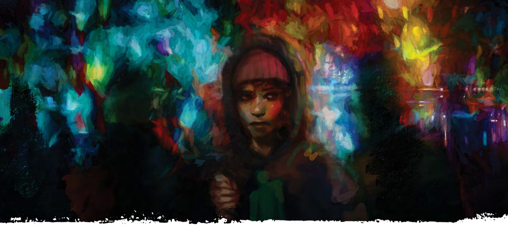

Система: Когда сила активна, пользователь может проверить Интеллект + Ясновидения против Самообладания + Хитрость. При победе выясняется Резонанс наблюдаемого смертного, а также любые другие особенности его крови, например, Диспраксия. При критической победе пользователь также получает бонус в два кубика к взаимодействию с целью в течение всей сцены, поскольку он может адаптировать свой подход к эмоциональному состоянию смертного. Против вампира победа раскрывает резонанс последнего смертного, которым он питался, а критическая победа дает более детальную картину сосуда в момент питания, раскрывая метод и тип питания вампира.

Продолжительность**:** Одна сцена

## Уровень 3

#### СМЕРТЕЛЬНАЯ ОШИБКА

#### Амальгама**:** Обливион 1

Все ломается, и вампир, использующий эту силу, может увидеть признаки этого еще до того, как это произойдет. Наблюдая за неуловимой работой энтропии, вампир может уловить "ахиллесову пяту" цели, будь то трещина в ее ментальном фасаде или слабое место в ее реальной броне.

#### Стомость**:** Одна проверка ИК

Пулы кубиков: Интеллект + Ясновидение против Самообладания или Выносливости + Хитрость Система: Пользователь тратит ход, внимательно наблюдая за целью, ища изъяны в ее защите, и проверяет Интеллект + Ясновидение против Самообладания цели (для психических слабостей) или Выносливости (для физических) + Хитрость.

Победа показывает, как лучше всего атаковать цель, выявляет наименьший пул защиты в любой категории и дает бонус в два кубика к атакам против этого пула. Если вампир сообщает кому-либо об этой слабости, он получает бонус в один кубик.

Продолжительность: Одна сцена

## Уровень 5

#### ОЧИЩЕНИЕ ПАДШЕЙ ДУШ

Амальгама**:** Доминирование 3

Необходимые условия: Панацея

Как искатели обещаний Голконды, некоторые вампиры ищут пути исправления неспокойных душ своих собратьев по Проклятию. Эта способность позволяет вампиру поделиться с раскаявшимся сородичем некоторой долей морального спокойствия, восстанавливая подобие раскаяния и одновременно удерживая Зверя в узде. Правда, для этого необходимо взять на себя часть разума и духа своего подопечного, подчинив его волю воле вампира. (Чаще всего эта способность встречается у Салюбри, что, несомненно, способствовало их репутации как чудовищных похитителей душ).

Стоимость: Две проверки на ИК, получение одного пятна

Пул кубиков: Самообладание + Ясновидение vs. Человечности

Система: Вампир проводит одну сцену в уединении с объектом и бросает кубики "Самообладание + Ясновиения" против Человечности объекта. За каждый успех вампир может снять с субъекта одно пятно или возвести психологический "щит", защищающий субъекта от будущих пятен один к одному.

Например, преимущество три, примененное к субъекту, не имеющему пятен, эффективно "аннулирует" до трех пятен, полученных позднее в ходе сессии.

При критической победе игрок может отказаться от вышеуказанных преимуществ, восстановив субъекту одно очко человечности, но ни один вампир не может получить это преимущество более одного раза.

Ослабление души зверя действует только на вампиров и автоматически проваливается, если субъект имеет более высокий уровень человечности, чем вампир.

Независимо от полученных преимуществ, в течение всего сеанса субъект находится в оцепенении, его разум частично сливается с сознанием игрока, и любые доминирующие способности, применяемые к нему пользователем этой силы, срабатывают автоматически, без необходимости зрительного контакта. Когда действие силы заканчивается, все психологические

"щиты", которые не были использованы, теряются, хотя пятна, снятые с субъекта, и человечность, полученная при первом применении, не восстанавливаются.

Продолжительность: Один сеанс

## Ñòðåìèòåëüíîñòü

## Уровень 2

#### ОПЕРАТИВНАЯ РАБОТА

Вампир может выполнять трудоемкие задачи с ослепительной быстротой, его пальцы и руки расплываются, когда он пишет, ремонтирует или строит вещи в рекордно короткие сроки. Хотя требуемая концентрация не позволяет использовать эту скорость в нападении, она позволяет быстрее достигать ненасильственных целей в условиях принуждения или прямого нападения.

Стоимость: Одна проверка ИК

#### Пулы кубиков: N/A

Система: В активном состоянии эта способность позволяет вампиру за несколько секунд выполнить задания, связанные с умениями, на которые в противном случае ушло бы несколько ходов, и может рассматривать полное действие как незначительное (Vampire: The Masquerade, p. 298).

Сила не может быть использована для ускорения атак, защиты или выполнения других активно сопротивляющихся действий, но позволяет вампиру, например, взломать замок или выстрелить из пистолета (последнее - со штрафом в два кубика, согласно правилам второстепенных действий).

Продолжительность: Одна сцена

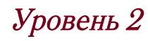

## ПРОПУЛЬСИЯ

Необходимые условия: Быстрая реакция Вампир, обладающий этой способностью, двигается достаточно быстро, чтобы воспринимать такие снаряды, как метательные ножи или пули, как медленные, и может спокойно уклоняться от них. Стоимость: Одна проверка ИК

#### Пулы кубиков: N/A

Система: При защите от нескольких дальних атак с использованием ловкости + атлетики игрок не страдает от уменьшения набора кубиков. Он также может добавить свой показатель Стремительности ко всем таким попыткам, пока эта сила активна.

Продолжительность: Одна сцена

## Уровень 4

## РАЗМЫТЫЙ ИМПУЛЬС

Движение вампира превращается в дрожащее размытое пятно, что делает крайне затруднительным нанесение по нему ударов, даже если он не замечает противника или активно защищается.

Стоимость: Одна проверка ИК за ход. Пулы кубиков: N/A

Система: Атаки, в которых количество успехов меньше, чем показатель скорости игрока, всегда промахиваются, независимо от результата проверки защиты или уклонения (если таковые были). Это также работает против внезапных атак или других атак, не допускающих проверки защиты, таких как "Молниеносный удар".

Активация этой силы требует одной проверки ИК, а ее продление - дополнительной проверки за каждый ход, в течение которого она остается активной.

Длительность: До тех пор, пока игрок не прекратит действие.

#### Незримый удар

Необходимые условия: Быстрее ветра Амальгама: Сокрытие 4

Эта смертоносная способность позволяет вампиру не только исчезать из поля зрения, но и мгновенно перемещаться к противнику и наносить ему смертельный удар. Вампир, владеющий этим искусством, может быстро переломить ситуацию, исчезнув на глазах у преследователей, и спасти не только свою жизнь, но и жизнь своей жертвы. Стоимость: Две проверки ИК

Пулы кубиков: Ловкость + Стремительность против Смекалка + Наблюдательность

Система: Эта способность сочетает в себе эффекты Быстрее ветра с элементами Сокрытие силы Бесследного Исчезновения. Зрителям кажется, что вампир исчезает, а цель оказывается застигнутой врасплох, становясь объектом внезапной атаки. Если жертва не успевает среагировать, победив в поединке Ловкость + Стремительноть игрока со своей Смекалкой + Наблюдательностью, он не может защититься от атаки, и она совершается с установленной Сложностью 1. (См. раздел "Внезапные атаки в Vampire: The Masquerade", с. 300). Если атакующий проваливает эту проверку, он все равно совершает обычную атаку, как и при использовании способности Быстрее ветра (Vampire: The Masquerade, p. 253), и на Незримый удар распространяются те же ограничения на передвижение, что и на Быстрее ветра. Длительность: Один ход

Äîìèíèðîâàíèå

## Уровень 1

## РАБСКАЯ ПРЕДАННОСТЬ

Амальгама: Стойкость 1

У тех, кто уже находится под ментальной властью вампира, разум укрепляется против вмешательства других сородичей.

Стоимость: Без дополнительных затрат Система: Любая попытка третьего лица применить Доминирование к персонажу, уже находящемуся под влиянием Доминирования вампира, получает штраф в кубиках, равный Стойкости вампира.

Длительность: Пассивный

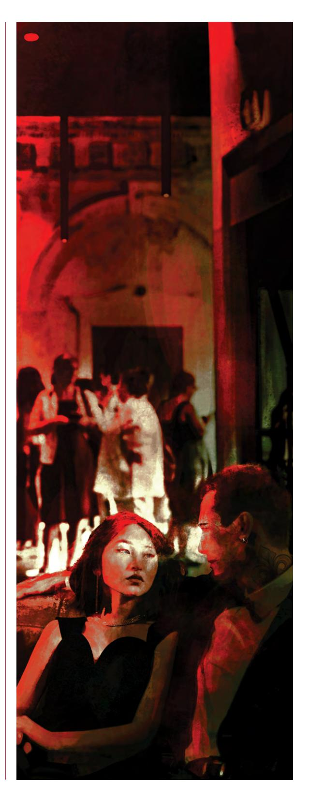

## Уровень 2

#### Милость доминтора

Сородичи не понаслышке знают о жестокой иронии, и название этой силы тому пример. Под воздействием Милости домитора вассалу, связанному узами крови, становится куда труднее перечить господину. Эту силу особенно ценят властные Цимисхи: благодаря ей они могут быть уверены в преданности слуг.

Стоимость: одно испытание Крови.

Система: если цель стала вассалом добровольно, пул её проверок неповиновения уменьшается на 3d10 и ей запрещается тратить на них пункты воли. Кроме того, если проверка заканчивается жестоким провалом, прочность уз крови не может снизиться в текущем месяце. Подробнее об узах крови и неповиновении см. «Вампиры: Маскарад», стр. 233–234.

Длительность: один месяц

## Уровень 4

#### НАСЛЕДСТВЕННОЕ ГОСПОДСТВО

Необходимые условия: Внушение

Амальгама: Колдовство крови 2 Вампиры большого возраста и силы находят возможность воздействовать на свою волю через кровь, без традиционной необходимости зрительного контакта и вербального общения с целью. Эта сила позволяет сородичу по крови заставить потомка совершить какое-либо действие от его имени, даже если в обычной ситуации он был бы против. Вампиры инстинктивно понимают, что предок манипулирует ими, если они подвержены этой силе.

Стоимость: Одна проверка ИК Пулы кубиков: Манипуляция + Доминирование против Упорства + Оккультизм Система: При успешной проверке Манипуляция + Доминирование против Упорство + Оккультизм жертва выполняет просьбу доминирующего предка, если это не влечет за собой вреда для нее самой. За каждое поколение, отделяющее вампира, использующего эту силу, от его цели, сопротивляющийся вампир получает дополнительный кубик к своему броску. Например, если вампир девятого поколения пытается применить эту силу на потомке одиннадцатого поколения, то потомок получает два дополнительных кубика защиты.

Сила не требует ни зрительного контакта, ни словесной команды - просьба передается от Крови к Крови беззвучно, - но на нее распространяются все остальные ограничения Доминирования.

Продолжительность: Пока команда не будет выполнена или сцена не закончится, в зависимости от того, что наступит раньше.

#### НОТА ВНЕДРЕНИЯ

#### Амальгама: Величие 1

Вампир обладает способностью изменять саму личность или взгляды субъекта, по крайней мере, временно. В то время как другие способности позволяют им управлять бездумными жертвами, эта сила позволяет им изменять намерения или страсти жертвы. Они могут заставить человека возжелать незнакомца, бросить семью, не доверять собственным убеждениям или просто захотеть пива. Вампиры, использующие эту способность без разбора, часто становятся изгоями среди своих сородичей, как от презрения, так и от страха.

Стоимость: Одна проверка ИК

Пулы кубиков: Манипуляция + Доминирование vs Самообладание + Упорство

Система: Для неподготовленной смертной жертвы проверка не требуется, но для подготовленной смертной или другого вампира требуется проверка Манипуляция + Доминирование против Самообладание + Упорство. Радикальные изменения

в основных убеждениях - например, заставить вегетарианца жаждать стейк или сделать пацифиста жестоким - также заслуживают попытки сопротивления, даже со стороны неподготовленных смертных. Внушение остается в силе в течение одной сцены, после чего жертва вырывается из него.

Продолжительность: Одна сцена

# Ñòîéêîñòü

## Уровень 2

#### СТОЙКОСТЬ ЗЕМЛИ

Вампира, обладающего этой силой, практически невозможно сдвинуть с места, когда он активен. Вампир использует силу земли, заземляясь и опираясь на ее постоянство, чтобы удержаться на месте.

#### Стоимость: Одна проверка ИК

Система: Когда эта способность активирована, вампир может двигаться только в том случае, если он решит сделать это самостоятельно. Это не делает его устойчивым к повреждениям, и вампир по-прежнему может быть раздавлен, разорван на части или разорван в клочья, как и пол, на котором он стоит.

Длительность: Одна сцена или до тех пор, пока персонаж не прекратит действие.

#### ВИТЭ ЖИЗНИ

#### Амальгама: Ясновидение 1

Вампир способен усилить способность своей крови скреплять смертную плоть и исцелять недуги. Живые существа, принявшие его кровь, восстанавливают здоровье с удивительной скоростью.

Стоимость: Не требуется, кроме проверок на ИК при даче крови.

#### Пулы кубиков: N/A

Система: Использование витэ для лечения живых существ (см. с. 139) позволяет получить три уровня тяделых повреждений за проверку ИК, а не только один. Другие эффекты (превращение в гуля, риск получить Кровь) остаются неизменными.

Длительность: Пассивный

## Уровень 3

#### ВАЛЕРЕН

Вампир направляет энергию Дисциплины вовне и силой собственной Крови исцеляет раны другого Сородича.

Амальгама: Ясновидение 1.

Стоимость: одно испытание Крови и возможные

повреждения.

Пул: интеллект + Стойкость.

Система: персонаж проходит проверку Интеллекта + Стойкости со сложностью 2 и лечит цель, избавляя её от лёгких повреждений в количестве, равном значению выигрыша. Вместо этого можно излечить по одному тяжёлому повреждению за каждые три успеха в выигрыше.

На применение этой силы уходит целый ход. Если персонаж уделяет этому всю сцену, сложность проверки уменьшается до 0. Валерен действует только на Сородичей, и вампир может стать целью этого эффекта лишь один раз за ночь. С помощью данной силы нельзя излечить собственные раны.

Если персонаж исцеляет более одной цели за ночь, он получает лёгкие повреждения в количестве, равном половине значения выигрыша. Вампир расплачивается таким образом за каждого нового подопечного после первого.

Продолжительность**:**N/A

Уровень 4

## ЧЕШУЯ ГОРГОНЫ

Резонанс крови в организме вампира дает ему различные средства защиты от сил других сородичей или защищает от обычных вампирских слабостей. Найти подходящий сосуд для немедленной защиты не всегда просто, но особенно жестокие вампиры, как известно, держат сосуды с различными Резонансами наготове, используя сложные манипулятивные схемы или обычные наркотики, чтобы сохранить яркость эмоций и готовность к их использованию.

Стоимость: Одна проверка ИК Пулы кубиков: N/A

Система: При активации вампир получает набор иммунитетов или сопротивлений, зависящих от резонанса крови, которой он недавно питался.

- Холерик: Кол, вбитый в сердце вампира, в конце сцены распадается или превращается в пепел, немедленно освобождая вампира от паралича. Резонанс при этом теряется.
- Меланхолия: Урон здоровью, нанесенный огнем, снижается до легкого. Резонанс теряется после снижения четырех уровней повреждений.
- Флегматик: Вампир получает бонус в четыре кубика к сопротивлению силам Ясновидения, которые могут раскрыть что-либо о нем или о том, что он знает. После активации силы она действует в течение одной сцены, после чего резонанс пропадает.
- Сангвиник: Урон здоровью, наносимый солнечным светом, снижается до легкого. Резонанс теряется после снижения четырех уровней повреждений.

Продолжительность: Пока сцена не закончится или резонанс не будет потерян, в зависимости от того, что наступит раньше.

## Уровень 2

#### ХИМЕРИЯ

Амальгама: Величие 1

Вампир способен создавать кратковременные, но яркие галлюцинации, отвлекающие и привлекающие внимание окружающих. Галлюцинация может затрагивать любое отдельное чувство - зрительное, слуховое, тактильное и т.д. - и длится достаточно долго, чтобы произвести впечатление, прежде чем прекратиться. Пользователь сам определяет специфику галлюцинации, хотя в силу своей кратковременности она не может передать больше, чем что-то мелькнувшее в уголке глаза или слабо слышимый голос (например, с ее помощью нельзя создать поддельное удостоверение личности).

Пулы кубиков: Манипуляция + Сокрытие против Самообладания + Смекалки Стоимость: Одна проверка ИК

Система: Вампир бросает свои манипуляции + сокрытие. Все, кто не готов к этому и находится в пределах видимости вампира и может испытать галлюцинацию (находясь в прямой видимости его проецируемого облика или будучи объектом тактильных ощущений), отвлекаются, теряя два кубика на следующее действие. Кроме того, те, кто не смог противостоять галлюцинации, используя самообладание + смекалку, теряют следующее активное действие при неудаче. (Однако они могут защищаться и сопротивляться, как обычно, со штрафом в два кубика). В отличие от большинства способностей Величия, Химерия может быть использована во время стрессового физического конфликта, например, в бою, однако воздействие на цель может быть оказано только один раз за конфликт.

Другие эффекты, возникающие в результате галлюцинации, зависят от рассказчика, но ему рекомендуется соблюдать осторожность.

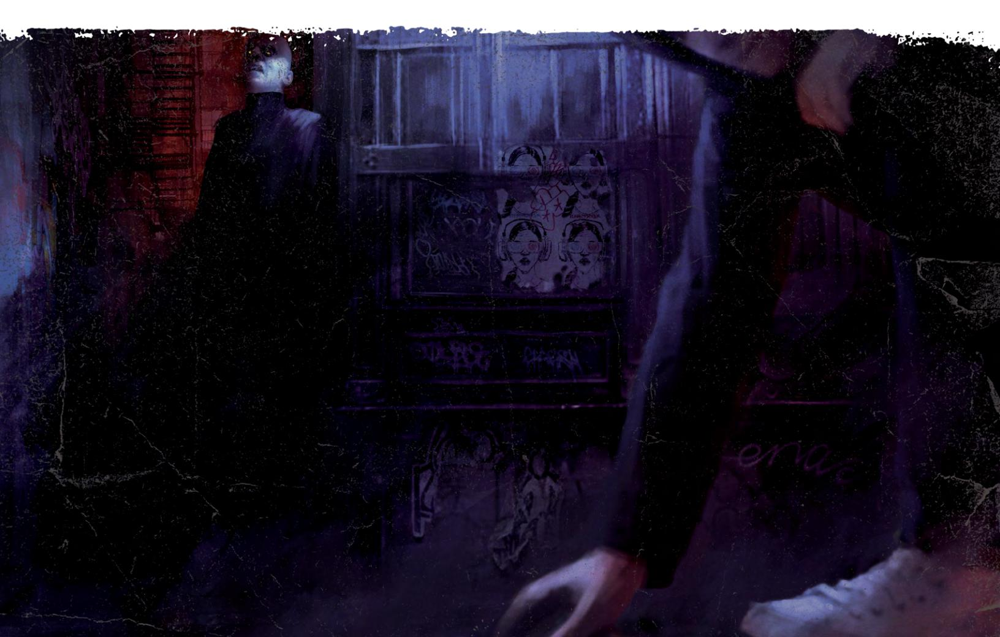

Эти галлюцинации невозможно записать или передать (например, с помощью дисциплины "Электронный призрак").

Продолжительность: 1 ход.

## Уровень 3

#### ФАТА МОРГАНА

#### Амальгама**:** Величие 2

Вампир может создавать сложные галлюцинации, заставляя всех находящихся поблизости субъектов видеть, слышать и чувствовать все, что он может придумать. Фата Моргана заставляет очевидцев видеть и пробовать на вкус содержимое контейнера, наполненного личинками и рисом, и громовые потоки вонючей, прогорклой крови, вырывающиеся из канализации.

Количество жертв, на которых можно воздействовать одновременно, не ограничено, но для того, чтобы попасть под действие Фата Морганы, субъект должен видеть пользователя или наоборот, хотя не обязательно активно осознавать это. Вампиру не обязательно присутствовать при воздействии на жертву.

Визуальные эффекты всегда являются отдельными объектами. Они не могут быть использованы для "маскировки" или иной маскировки предметов или людей и никогда не могут полностью перекрыть линию видимости. Галлюцинации Фата Морганы не могут влиять на окружающую реальность: Поток крови не смоет припаркованные на улице автомобили или пешеходов, а взрыв, созданный с помощью Фаты Морганы, не причинит никакого ущерба, галлюцинаторного или иного. Обрушившаяся лестница не повалит того, кто в данный момент спускается по ней. Сенсорные эффекты, создаваемые Фатой Морганой, не могут ослепить, оглушить или иным образом перегрузить органы чувств, даже сверхъестественно усиленные. Аналогично, галлюцинации не фиксируются на камеру или другие

записывающие устройства.

Стоимость**:** Одна проверка ИК

Пул кубиков: Манипулирование + Сокрытие Система: Игрок делает проверку "Манипуляция + Сокрытие" со сложностью, равной единице плюс количество органов чувств, на которые направлена галлюцинация. (Таким образом, аудиовизуальная галлюцинация будет иметь сложность 3, а полный пятисенсорный опыт - сложность 6).

Проще всего вызвать зрительные галлюцинации небольшого размера или незаметные - увеличьте Сложность на единицу для галлюцинаций размером с комнату, на две для галлюцинаций размером с дом и так далее. Дальнейшее усложнение может добавить дополнительную Сложность по усмотрению Рассказчика. Любая попытка имитировать внешность конкретного человека или иным образом обмануть его может потребовать дополнительных проверок на Исполнение или Хитрость, в зависимости от ситуации.

Вампиры и другие сверхъестественные существа имеют шанс не поверить в галлюцинацию, но смертные могут сделать это только в том случае, если у них есть основания подозревать, что она фальшивая. В обоих случаях они бросают Интеллект + Наблюдательность против Манипуляции + Величия персонажа. Успех означает, что галлюцинация больше не влияет на человека и фактически исчезает для него. Любая попытка взаимодействия с галлюцинацией также приводит к ее полному исчезновению, поскольку все присутствующие осознают ее нереальную природу (как в примере с рушащейся лестницей, если кто-то пользуется лестницей). Обратите внимание, что использование этой способности не является явным, поэтому даже если галлюцинация проявляется, то не очевидно, от кого она исходила.

Эти галлюцинации нельзя записать или передать (как, например, при использовании "Электронного призрака"). Если галлюцинация может вызвать у цели бешенство или аналогичную реакцию, проведите ту же проверку со сложностью на единицу ниже реальной.

Длительность: Одна сцена, если вампир не решит прекратить действие до этого.

#### МЕНТАЛЬНЫЙ ЛАБИРИНТ

#### Амальгама: Доминирование 1

Ментальный лабиринт - это способность лишать жертву чувства направления и местоположения, позволяя вампиру сделать свою цель пленницей в текущем окружении, например, в доме, ночном клубе или подвале вампира. Жертва обнаруживает, что ее местоположение складывается само собой, незаметно изменяя восприятие ранее посещенных комнат, убеждая, что реальный выход ведет только вглубь лабиринта, и в конце концов повергая жертву в состояние паники и неустойчивости.

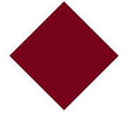

Стоимость: Одна или три проверки ИК Пулы кубиков: Обаяние + Сокрытие против Смекалки + Упорство

Система: Вампир устанавливает зрительный контакт со своей жертвой и делает бросок Обаяние + Сокрытие против Смекалки + Упорства цели, при этом вампиры низшего поколения могут отменить бросок очком Силы воли в соответствии с характеристиками Домината (Vampire: The Masquerade, p. 255).

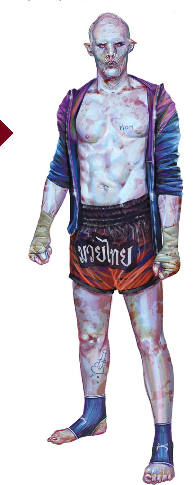

При победе жертва пытается найти выход из здания, в котором она находится. Дополнительные две проверки ИК позволяют использовать эту способность в одном помещении или в плотном окружении на открытом воздухе (например, на стройплощадке или в лесу).

Смертные не могут попытаться сбежать, но сверхъестественные существа могут делать проверку " Упорство + Наблюдательность" каждую сцену, используя начальные успехи вампира в качестве Сложности; в случае неудачи за каждый пропущенный успех наносится одно очко легкого повреждения силы воли. Этот бросок не может быть использован для командной работы, так как любое указание не соответствует тому, что видит жертва. Действие этой силы прекращается, если окружающая обстановка становится опасной (например, здание загорается), если только вампир не имеет "Приказа на Самоуничтожение" (Vampire: The Masquerade, p. 257).

Продолжительность**:** Одна Ночь

#### МАСКА РАЗУМА

#### Амальгама: Доминирование 2

Вампир может создавать иллюзию совершенно другой личности, скрывая свои истинные мысли и чувства от тех, кто использует сверхъестественные способности для чтения его психического состояния, ауры, мыслей или чего-то подобного. Те, кто заглядывает в его сознание, видят только то, что хочет увидеть вампир, и только самые искусные специалисты по сканированию могут пробить этот сложный фасад.

Стоимость: Одна проверка ИК Пулы кубиков: Интеллект + Сокрытие Система: Игрок бросает Интеллект + Сокрытие против Сложности от 1 до 3 (или более), в зависимости от сложности уловки, которую он хочет осуществить: 1 означает простую маскировку своего эмоционального состояния, 3 и более - сложные альтернативные личности с ложными мыслями и воспоминаниями. Запас выигрыша добавляется в качестве Сложности к любой попытке "прочесть" его. В случае неудачи читатель видит только созданную им ложную личность, без какого-либо намека на то, что его вводят в заблуждение. (Невозможность достичь даже стандартной Сложности не приводит ни к чему, как обычно, чтобы не выдать присутствие ложной личности).

Продолжительность: Одна Сцена

## Уровень 2

#### БЕЗЖАЛОСТНАЯ ХВАТКА

Хватка вампира становится неимоверно сильной, и, ухватившись за что-то, его практически невозможно вырвать, если только не расчленить.

Стоимость: Одна проверка ИК

#### Пулы кубиков: N/A

Система: Вампир добавляет свой показатель могущества в качестве автоматического успеха к любой попытке удержать что-либо. Сюда же относятся попытки удержать захват, хотя при первоначальной проверке захвата этот бонус не используется.

Длительность: Одна сцена

## Уровень 3

#### ГУБИТЕЛЬНОЕ СОКРУШЕНИЕ

#### Необходимые условия: Сокрушение

Вампир способен приложить неистовую, беспорядочную силу к неподвижному объекту, чтобы разбить, раздробить и уничтожить его. Хотя время, затрачиваемое на вызов этой силы, делает ее бесполезной в драке, она может пригодиться, когда дверь преграждает путь, машину нужно обездвижить, или нужно сделать наглядный пример из скульптуры, вызывающей недовольство.

#### Стоимость**:** Бесплатно

#### Пулы кубиков: N/A

Система: При использовании Сокрушения для силовых действий, связанных с повреждением или уничтожением неодушевленного предмета, пользователь дважды увеличивает свой показатель Могущества.

Продолжительность**:** одна сцена.

## Уровень 4

#### РАЗРУШИТЕЛЬНОЕ ПАДЕНИЕ

Необходимые условия: Мощный прыжок Отточив свои способности, вампир теперь с размаху приземляется в "Мощном прыжке". Вампир может безостановочно приземляться на свое место, нанося урон всем, на кого он приземлится или кто будет рядом.

Стоимость: Одна проверка ИК

Пул кубиков: Сила + Могущество

Система: После использования "Мощного прыжка" вампир может активировать "Обрушение" и нанести урон в небольшой области действия. Все, кто находится в радиусе трех метров, получают бросок атаки Сила + Могущество против Ловкости + Атлетика, получая легкий урон, равный перевесу. Тот, кто получил три или более уровней урона или полностью провалил проверку защиты, сбивается с ног (см. Vampire: The Masquerade, p. 122).

Длительность: N/A

## *Level 5*

## ЛОВКИЙ МОЛОТ

Каждая часть тела вампира, наделенная нечеловеческой силой, становится способной проецировать всю его мощь. Щелчок пальцами может передать силу удара всего тела, а удар носком ноги превращается в сокрушительный удар ногой. Обратите внимание, что эта способность не делает вампира сильнее, но он может использовать имеющуюся у него силу с помощью мелких, едва уловимых движений.

Стоимость: Бесплатно Пулы кубиков: N/A

Система: Выполнение атак ближнего боя без оружия или силовых приемов теперь засчитывается как второстепенные действия на два кубика (см. "Второстепенные действия в Vampire: The Masquerade", стр. 298). Однако за ход персонаж может выполнить только одно второстепенное действие "Ловкий молот" и не может совершать последующие атаки в тот же ход. Способность концентрировать всю свою силу в любой части тела имеет и другие преимущества, и любой силовой подвиг, где движение персонажа ограничено (например, освобождение от уз), получает бонус в четыре кубика или больше, на усмотрение рассказчика.

Продолжительность: Пассивное

## Уровень 1

#### Глаза змеи

Амальгама**:** Метаморфозы 1

Глаза вампира превращаются в змееподобные разрезы, способные заморозить смертного, встретившего взгляд вампира, на месте. С помощью этой силы вампир может завораживать других вампиров, хотя эффект недолговечен и может вызвать гнев жертвы.

#### Стоимость**:** Бесплатно

Пулы Кубиков**:** Обаяние + Величие против Смекалки + Самообладание

Система**:** Поймав взгляд смертного (см. избегание зрительного контакта на стр. 255 в Основной книге для жертв, активно пытающихся его избежать), вампир может обездвижить жертву, удерживая ее в застывшем положении до тех пор, пока они сами поддерживают зрительный контакт. Эффект может сохраняться только на одной жертве одновременно, и эффект заканчивается, если жертва получает повреждения или ее насильно отстраняют. Речь все еще возможна, но кричать нельзя. На странице 255, чтобы парализовать вампира таким же образом, пользователь должен победить в состязании Обаяние + Величие против смекалки + самообладание. Жертва вампира может выйти из паралича в любой ход после первого,

потратив одно очко силы воли Длительность**:** Пока зрительный контакт не прервется или сцена не закончится.

## Уровень 2

#### МЕЛЬПОМЕНА

Голос персонажа становится похожим на голос сирены, способный сам по себе, без присутствия персонажа, вводить в заблуждение или пугать. Голос может воздействовать на любого человека, находящегося в пределах слышимости, но не сохраняет своей способности при записи или передаче в электронном виде.

Стоимость: Бесплатно

Пулы кубиков: N/A

Система: Вампир может использовать

"Благоговение", "Угроза", "Устрашающий взор", и "Преклонение" только с помощью своего голоса. Им не нужно видеть цель, и цель не должна находиться в их присутствии, за исключением того, что она должна быть достаточно близко, чтобы услышать их голос.

Продолжительность: N/A

## Уровень 3

#### ГРОМОГЛАСНЫЙ ГОЛОС

Амальгама: Ясновидение 1

Вампир может заставить свой голос исходить из любой точки в пределах видимости, будь то шепот или крик. Голос слышен так, как будто вампир стоит на этом месте, и может быть услышан любым человеком, находящимся в пределах слышимости, в зависимости от силы. Голос также можно оставить на месте, продолжая приманивать или пугать тех, кто заблудился, в зависимости от используемой силы. Стоимость: Одна проверка ИК

#### Пулы кубиков: N/A

Система: Броски не требуются, за исключением проверки ИК. При использовании этой способности в сочетании с Притягательным голосом, Мельпомены или аналогичными способностями броски должны быть обычными.

Продолжительность: Одна сцена

## Уровень 4

#### ПРОНИЗЫВАНИЕ ЗДАНИЯ

Находясь в здании или подобном месте, вампир способен распространять силы "Благоговение", "Угроза", "Преклонение", через саму структуру здания. Любой человек, находящийся в здании или смотрящий на него, будет подвержен влиянию этих сил, реагируя на здание так, как если бы в нем находился сам вампир.

Стоимость: N/A

Пулы кубиков: зависит от уровня силы способностей

Система: Все, кто видит здание снаружи или находится внутри него, должны сопротивляться используемой силе так же, как если бы вампир присутствовал в нем, если только вампир не находится в пределах видимости, и тогда он сам становится фокусом. Поскольку в здании обычно не проводятся проверки на ловкость, примените бонусы к любой реакции жертвы на это место. В ночном клубе, находящемся под влиянием Благоговения, очереди будут тянуться через весь квартал, а в убежище, находящемся под влиянием Угрозы, будут отворачиваться все, кроме самых стойких исследователей. Использовать Величие нужно с особой осторожностью, так как результаты могут быть впечатляющими и непостоянными, намного превосходящими эффект от более изощренных способностей.

Продолжительность**:** зависит от уровня силы способностей

## Ìåòàìîðôîçû Уровень 2

#### ПРЕОБРАЖЕНИЕ

Амальгама: Доминирование 2 Эта сила позволяет вампиру повелевать собственной плотью. Кожа, мышцы и даже кости изменяют привычную форму, повинуясь его желаниям. Результат может с равной вероятностью оказаться как зловеще красивым, так и чудовищным. Сородичи, опытные в искусстве Преображения, способны обрести причудливые черты внешности или изменить себя целиком, однако серьёзные трансформации ложатся на тело тяжёлым бременем. Кто-то с помощью этой силы превратит часть себя в практичный инструмент, а кто-то обзаведётся выразительными украшениями.

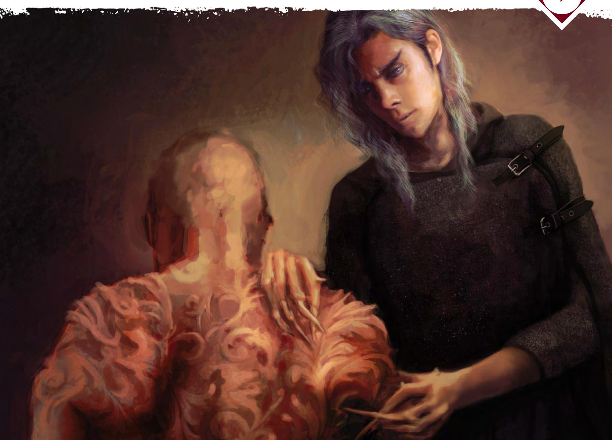

Стоимость**:** Одна проверка ИК Пул: упорство + Метаморфозы Система**:** персонаж должен пройти проверку Упорства + Метаморфоз. Каждый успех в выигрыше позволитпроизвести одно изменение в своём теле, но их количество не может превысить показатель Метаморфоз вампира. Любое изменение повлечёт за собой уменьшение одной физической характеристики, ведь материя не берётся из воздуха (показатель характеристики не может упасть ниже 1). На каждое изменение требуется целый ход. Ниже представлены возможные эффекты Преображения:

- Перераспределение: показатель одной физической характеристики персонажа повышается на один пункт. Этот эффект не может поднять показатель выше 5. Изменения в теле заметны, но не угрожают Маскараду.
- Оружие: на теле вампира появляются костные отростки или плотные хрящевые образования, равноценные лёгкому колюще-режущему или тяжёлому дробящему оружию (модификатор урона +2). В отличие от Оружия Зверя, этот эффект не даёт преимуществ в бою со сверхъестественными существами. Если, впрочем, вампир использует Преображение, его Оружие Зверя зачастую принимает форму шипов и лезвий из кости. На каждую цель с помощью этого эффекта можно воздействовать лишь один раз.
- Броня: один пункт характеристики превращается в два пункта брони (см. «Вампиры: Маскарад», стр. 304) вплоть до максимума в шесть пунктов брони. На теле это отражается по-разному: у кого-то укрепляются кости, у кого-то появляются новые слои жира и хрящевых тканей. С каждым потраченным ради этого пунктом характеристики изменения выглядят всё менее естественными.
- Внешность: персонаж изменяет свою внешность, чтобы повысить значение соответствующего достоинства быть неузнанным или принять чужой облик. Чтобы воспользоваться этим эффектом, нужно пройти проверку ловкости + ремесла, а сам процесс занимает целую сцену. Сложность проверки зависит от задачи. 3 для попытки скрыть свою личность, 4 для улучшения достоинства «внешность» (по одному пункту за каждое изменение) и 5, чтобы стать похожим на кого-то конкретного. В случае неудачи ничего не происходит (но пункт характеристики всё равно теряется), а в случае жестокого провала показатель достоинства уменьшается на один пункт и даже может обратиться в недостаток, если он был нулевым. Носферату способны использовать этот аспект силы исключительно для того, чтобы скрыть свою личность.

 Иные изменения: более изобретательные варианты применения этой силы (например, потайной карман в теле или изменение положения глаз) выходят за рамки предложенных правил. Рассказчик должен самостоятельно определить количество требующихся для этого изменений и пунктов характеристик, сложность проверки, а также необходимое количество времени. Основными проверками в таких случаях будут ловкость + ремесло и интеллект + медицина. Изменения можно «вылечить», как если бы они были тяжёлыми повреждениями, в соотношении один к одному. Потраченные пункты характеристик при этом тоже возвращаются.

Продолжительность: постоянная.

## Уровень 3

#### ИЗМЕНЕНИЕ ПЛОТИ

Амальгама: Доминирование 2

Необходимые условия: Преображение Искусные повелители плоти способны изменять и чужие тела. Этой силы боятся, и не без причины, ведь её часто используют для безжалостных пыток. Некоторые, тем не менее, применяют её с большой пользой, закаляя своих слуг и союзников.

Стоимость**:** Одна проверка ИК Пул: Упорство + Метаморфозы против Выносливости + упорства.

Система**:** прежде всего у вампира должна быть возможность работать без помех. Если цель не дала согласия на изменение, её нужно обездвижить. В случае с добровольцами применяются те же правила,что и для Преображения. Жертва может сопротивляться: для этого ей необходимо пройти состязание Выносливости + Упорства против Упорства + Метаморфоз вампира. Количество доступных изменений определяется значением выигрыша последнего. Использование этой силы занимает целую сцену. Как и прежде, количество изменений не может быть выше показателя Метаморфоз вампира. Если над телом работает несколько Сородичей, учитывается только самый высокий показатель Дисциплины.

Изменения можно «вылечить», как если бы они были тяжёлыми повреждениями, в соотношении один к одному (смертным понадобится сложная операция).

Длительность: постоянная.

## Уровень 4

#### ЧУДОВИЩНЫЙ ОБЛИК

Амальгама: Доминирование 2. Необходимые условия: Преображение совершенстве владея собственным телом, вампир способен преодолеть природные ограничения и принять по-настоящему ужасающий вид существа с опаснейшими когтями, оголёнными клыками, выступающими костями и канатами мускулов. И хотя от раза к разу черты могут отличаться, чаще всего Чудовищный облик узнаваем и индивидуален. Используя эту силу, вампир воплощает образ своего Зверя. Кто-то становится похож на невероятно искажённое животное, исчадие ада или нечто доисторическое, а чью-то форму и вовсе нельзя сравнить с чем-либо существующим или выдуманным. Многие заимствуют черты у природных вампиров (пиявок, летучих мышей, клещей, комаров), но в утрированном, гротескном виде.

#### Стоимость**:** Одна проверка ИК

Систему**:** на применение этой силы уходит целый ход, в течение которого персонаж способен только защищаться, используя свой обычный пул проверок. В Чудовищном облике вампиру доступно несколько эффектов Преображения (без дополнительной расплаты и потери пунктов характеристик), их количество определяется показателем Метаморфоз персонажа. Возможные изменения перераспределение, оружие и броня. Щедрые рассказчики вправе придумать иные интересные (но адекватные) варианты. К примеру, вампир может отрастить мембрану между руками и ногами, чтобы парить, или увеличить длину своих конечностей и стать смертоноснее на расстоянии. Тем не менее во время действия Чудовищного облика любой успех становится кровавым, а сложность проверок сопротивления ярости увеличивается на 2. В этом состоянии вампир теряет всякое сходство с человеком и способность говорить, он может лишь мычать, шипеть или реветь.

Длительность: одна сцена или меньше — по желанию вампира.

## Уровень 5

#### ЕДИНЕНИЕ С ЗЕМЛЁЙ

Амальгама: Анимализм 2.

Необходимые условия**:** Слияние с землёй. Обретя исключительное мастерство владения собственным обликом, Сородич способен стать частью своего домена. Он не просто погружается в землю, но и сверхъестественным образом чувствует всё, что происходит в её пределах.

Стоимость**:** Две проверки ИК

Система: аналогичны Слиянию с землёй, но в данном случае вампир не ограничен лишь природными поверхностями. Говорят, некоторые Сородичи таким образом сливались со стенами своего поместья, другие прятались в трухлявых половицах заброшенного дома, а кто-то даже

растворялся в водах тихого неглубокого пруда. Также вампир, если он того пожелает, может воспользоваться любыми способами восприятия в пределах одной мили во всех направлениях от того места, где он слился с землёй. Это позволит подслушать чужой разговор, насладиться играми двух любовников или учуять пожар, разведённый негодующей толпой. Эти ощущения доступны вампиру, когда рядом присутствуют животные любые, даже самые малые. Если происходящее пытаются намеренно скрыть или его характер сам по себе неприметен, Сородич должен пройти проверку Смекалки + Анимализма против подходящего для конкретной ситуации пула.

Чтобы выйти из этого состояния до заката следующего дня, необходимо пройти проверку Упорства + Метаморфоз со сложностью 4, при этом сам процесс занимает до одного часа. В случае триумфа, однако, вампир возвращается к своему телесному облику мгновенно.

Длительность: один день и более — либо пока вампира не потревожат.

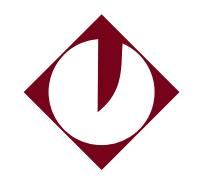

Внезапная вспышка жара, исходившая от пышущего бензином кардинала Рената, заставила Тэлли отступить назад, прикрыв глаза. Очень смертельный жест. Тэлли поправил себя и стал смотреть, как горит тело. Выследить Ренату, схватить ее и посадить на кол в конечном итоге сводилось к тому, кто из них лучше владеет искусством Ласомбры. Это была изнурительная, но не неприятная задача.

В тот момент, когда его гуль начал набирать на телефоне Тэлли "Готово", в переулке один за другим погасли несколько фонарей. Тени надвинулись, погружая все вокруг в черноту. Тэлли огляделся в поисках их источника, но ничего не нашел. Звук заставил его повернуться к огню. Тело кардинала исчезло, осталось только угасающее пламя. В золе покоился обрубок кола. "Может быть, мы встретимся раньше, чем планировали, мой дорогой".

Тэлли стряхнул пепел с куртки, когда его сообщник в другом конце аллеи заговорил. "По приказу Друзей Ночи вы следующий, сэр Тэлли". Тени по всему переулку стремительно надвигались на тамплиера, пробираясь вдоль стен и по земле, пока нападавшие держались на расстоянии. Тэлли наблюдал за приближением удлиняющихся теней, на секунду задумался, затем почтительно кивнул своему убийце и скрылся в темноте.

Ключевые слова: Обливион, Некромантия, Теневой ход, Мастерство Бездны, Властный мрак, Смерть, Темные искусства, Черная магия, Энтропия

Немногие сородичи за пределами клана Ласомбра и Гекаты знают Дисциплину Обливиона, и, с точки зрения Камарильи, это хорошо. В то время как Ласомбра предпочитают грубую силу Дисциплины, более склонные к некромантии Гекаты изучают ее ритуальное применение. С помощью этой силы вампиры могут использовать в качестве оружия саму тень и неживую природу. Одни называют источник силы Бездной, другие - Лабиринтом. Однозначно можно сказать, что Обливион - это канал темных искусств, откуда мертвые уходят умирать.

Мастера Обливиона призывают его, чтобы окутать себя ночью, поработить призраков или задушить жертву собственной тенью. Каждый раз, используя его, владелец рискует потерять свою душу и человечность для чего-то более темного, чем смерть, и вдвое более голодного.

## Характеристики

Способности Обливиона позволяют управлять силами или духами внепространственной стихии, происходящими из места смерти и небытия. При проявлении они появляются в виде двумерных теней на поверхности обычных объектов, либо сами по себе, либо как искажения уже имеющихся теней, расползающихся по земле, стенам, предметам или людям. Это делает их невозможными для атаки большинством физических средств, поскольку любой удар попадает только на поверхность, на которой они появляются, а не на сами тени.

Проекции и духи Обливиона получают урон от огня и солнечного света, считаясь в этом отношении с вампирами с Силой крови 1. Они также получают один уровень тяжелого урона в ход от яркого прямого света, а также могут получать урон (поверхностный или усиленный) от благословленного оружия и артефактов, в зависимости от силы благословения и Истинной Веры владельца.

Способности Обливиона неэффективны в ярко освещенных местах. Дневной свет и помещения без тени особенно сильно препятствуют успешному применению Дисциплины, хотя ультрафиолетовый и инфракрасный свет не накладывают никаких ограничений на ее использование. Умеренно освещенные помещения дают штраф в один кубик на бросок Дисциплины.

Использование этих способностей сильно сказывается на психике обладателя обливиона, и многие способности вызывают пятна человечности, так как оцепенение пустоты Обливиона

просачивается внутрь исполнителя.

Тип**:** Ментальный

Маскарадная угроза: Средне-высокая. Бездонные тени редко хорошо видны на фотоаппаратах, но при личном наблюдении выглядят явно неестественно.

Резонанс крови: Психопаты и эмоционально отстраненные. Кровь пуста от Резонанса.

Примечание: При проверке силы Обливиона на способность ИК результат "1" или "10" приводит к появлению пятна, в дополнение к полученному голоду. Если сила крови персонажа позволяет сделать повторный бросок при проверке ИК, он может выбрать любой из двух результатов.

## Уровень 1

## ПРАХ К ПРАХУ

Уничтожение следов питания - необходимость для вампиров, оставляющих после себя трупы. Эта способность позволяет вампиру уничтожить труп свежий или давно умерший - путем введения в его тело своей витэ. Эта способность не действует на вампиров, но может действовать на ожившие трупы, на усмотрение рассказчика.

Стоимость: Одна проверка ИК

Пулы кубиков: Выносливость + Обливион против Выносливости + Медицина или Стойкости Система: Вампир делает проверку ИК, чтобы потратить витэ, и вводит витэ в труп. Если труп не оживлен, он распадается в течение трех ходов без проверки. Если труп оживлен, то пользователь проводит состязание "Выносливость + Забвение" против Выносливости.

(Трупы, обладающие стойкостью, могут сопротивляться с помощью Выносливости + Стойкости). Если персонаж побеждает, оживленный труп растворяется за пять ходов, за вычетом перевеса (минимум один, а распадающиеся трупы получают физическое повреждение). При критической победе труп распадается немедленно. При полном поражении труп становится невосприимчивым к этой силе от любого вампира.

Продолжительность: Переменная

#### УЗРЕТЬ ОКОВЫ

Вампир может определять объекты или места, важные для призраков. Эти "оковы" действуют как значки, связывающие мертвых с их существованием. Оковы могут быть предметом, зданием или даже человеком. Знание того, является ли объект оковами, позволяет некроманту лучше манипулировать призраком. От оков исходят различные ауры: одни пылают жизненной силой и светятся золотым светом, другие излучают тление или важные для связанного призрака запахи, например, запах свежеиспеченного хлеба, бензина или сигаретного дыма.

#### Стоимость: Бесплатно

Пулы кубиков: Смекалка + Обливион Система: При активации способности, органы чувств вампира становятся сверхъестественно чувствительными к энергии оков, и он может определять эти ауры с помощью зрения, обоняния и других органов чувств. Во время использования этой способности вампир отвлекается на другие действия вокруг себя, что дает штраф -2 к броскам на ловкость и смекалку.

Длительность: Одна сцена

#### Взор бездны

Когда вампир закрывает глаза. Когда он открывает их, радужная оболочка его глаз становится черной на фоне белой склеры, и теперь он может ясно видеть в кромешной тьме и воспринимать призраков, которые не скрывают своего присутствия, правда можно

только видеть, но не прикасаться к ним.

#### Стоимость: Бесплатно

Система: При активации глаза пользователя становятся сверхъестественно настроенными на темноту, что позволяет ему игнорировать все штрафы за низкую освещенность, включая штрафы сверхъестественного происхождения. Глаза попрежнему нужны, чтобы видеть, и на них действуют повязки и тому подобное, как обычно. Если призрак присутствует и не пытается скрыться или использовать силу для сокрытия своего присутствия, дух становится видимым для вампира, использующего Взор Бездны. В таких случаях призраки предстают в том виде, в каком хотят, - в виде людей с ранами, ставшими причиной их смерти,

в виде призрачных чудовищ или в виде совершенно безупречных трупов. Призраки не осознают автоматически, когда вампир замечает их, но если это происходит, многие из них реагируют скорее страхом или гневом, чем пассивностью.

Его сила не дает возможности вступать в физический контакт с призраками.

Продолжительность: Одна сцена

## ПОКРОВ ТЕНЕЙ

Позволяет вампиру управлять тенями вокруг него, используя их для запугивания других или маскировки

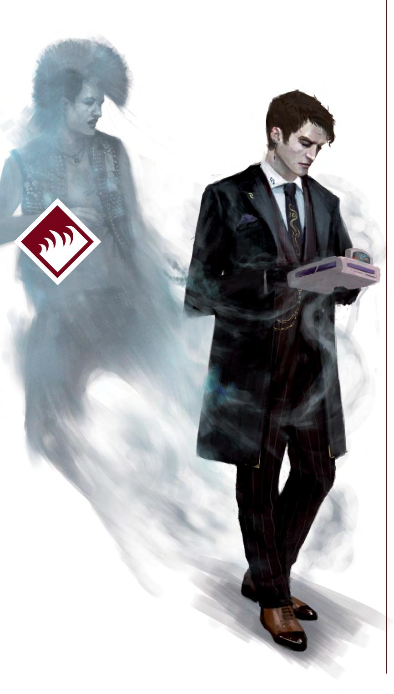

Стоимость: Бесплатно Система: Вампир получает +2 дайса на запугивание или скрытность.

Продолжительность: Пассивный

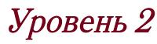

### РУКИ АРИМАНА

#### Амальгама: Могущество 2

Вампир вызывает руки бездны из неосвещенных мест в пределах прямой видимости. Местные тени искажаются, из них выходят мутные щупальца и сходятся к одной или нескольким незадачливым жертвам. Скользя по телу жертвы или вступая в мистическую схватку с ее собственной тенью, руки способны удержать ее на месте или задушить.

Стоимость: Одна проверка ИК

#### Кубы проверки: Смекалка + Обливион

Система: Персонаж делает один ход и платит стоимость, вызывая теневые руки. Используя их, вампир может каждый следующий ход наносить колющие и хватательные удары по удаленным целям. Дополнительные руки могут быть созданы путем разделения набора кубиков, что позволяет пользователю сражаться с несколькими противниками. (см. "Вампир: Маскарад", с. 125). Оружие использует Смекалку + Обливион вампира для атаки и нанесения легкого урона или захвата, добавляя половину показателей могущества пользователя (округлите вверх) в качестве бонуса к урону. Вампир не может делать ничего другого, кроме как управлять руками, пока эта сила активна. С их помощью можно выполнять простые действия (например, открывать двери и дергать за рычаги), но не такие сложные, как набор текста или управление транспортными средствами. Длина рук (в ярдах/метрах) равна двум точкам Обливиона пользователя. (Обратите внимание, что руки, будучи тенями, перемещаются по поверхности, а не по воздуху, и любые расстояния должны учитывать это).

Руки имеют три уровня здоровья и используют Смекалку + Обливион своего владельца, чтобы избежать атак и выдержать их. Как двумерные тени, они могут пострадать только от яркого света, например, от мощного факела или дневного света. Бросок

"Смекалка + Обливион" позволяет теням попытаться пробраться в темные углы комнаты или преодолеть свет на один ход, получив при этом уровень урона здоровья, но продолжая атаку.

Поскольку теневые хлысты сжимают и атакуют жертву с помощью магических средств, чтобы вырваться из них, требуется усилие воли. Зажатая жертва должна сделать бросок "Упорство + самообладание" и получить больше успехов, чем атакующий, чтобы просто пройти сквозь тени, не причинив вреда. Это действие не рассеивает Руки Аримана, которые могут атаковать снова в следующий ход, если владелец желает этого и цель все еще находится в пределах досягаемости.

Продолжительность: Одна сцена или до окончания или уничтожения

#### ЗНАМЕНИЕ СМЕРТИ

Амальгама: Ясновиление 2

Вампир может связать невидимые нити энтропии с выбранным смертным, увеличивая вероятность того, что он пострадает или даже умрет в течение ночи и дня. Эффект напоминает проклятие, но вампир не может вмешиваться в дела обреченного смертного, чтобы не нарушить эффект.

Стоимость: Одна проверка ИК Пулы кубиков: Упорство + Обливион против Смекалки + Оккультизм

Система: Вампир делает проверку " Упорство + Обливион" против "Смекалка + Оккультизм" смертной цели. За каждый успех на поле цель получает одно очко тяжелых повреждений в какойто момент в течение следующих 24 часов. Источником может быть что угодно - от внезапной болезни до несчастного случая, но ни в коем случае вампир не должен прямо или косвенно взаимодействовать с жертвой, так как это может свести на нет действие силы. (Рассказчик решает, где именно проходит граница "косвенного" взаимодействия, но такие вещи, как отправка подручных для "ускорения" результата, определенно входят в список). Использование этой силы незаметно, хотя посторонний наблюдатель может обнаружить некое ощущение нечестной игры, пройдя проверку на смекалку + оккультизм на сложности 3. Этой силой можно воздействовать только на смертных (включая гулей), поскольку вампиры уже мертвы и гораздо более устойчивы к подобным манипуляциям с энтропией.

Продолжительность: Ночь и день - 24 часа

#### ПРИЗЫВ ТЕНИ

Обливион могущественно, но часто может быть сорвано простым отсутствием подходящих теней, из которых его можно вызвать. Эта сила использует тьму внутри персонажа, чтобы спроецировать сверхъестественную тень, из которой можно проявить другие силы, независимо от окружающего освещения. Эта тень обычно имитирует движения и форму пользователя, но иногда может становиться искаженной и даже чудовищной, резонируя с текущим темпераментом своего владельца. Стоимость: Одна проверка ИК

Система: Активация силы вызывает сверхъестественную тень из тела вампира. Пока сила активна, персонаж отбрасывает эту тень, которую нельзя убрать иначе как прямым солнечным светом.

Любой свидетель, наблюдающий за практикой, замечает тень, отбрасываемую не видимым источником света, при броске на Смекалку + Наблюдательность (сложность 3). Вампир может направлять свою тень, удлиняя или искажая (но не отделяя) ее по своему желанию, хотя иногда она может действовать по собственному желанию, на усмотрение рассказчика. Для целей других способностей, таких как "Взгляд из тени", тень может быть удлинена до удвоенного показателя Обливиона практикующего в ярдах/метрах.

Для всех, кто стоит в пределах досягаемости тени, урон силы воли от социальных конфликтов увеличивается на 1. Стоять в тени Обливиона ужасающая перспектива.

Продолжительность: Одна сцена

#### ПРОРЕХИ В САВАНЕ

Вампиры, обладающие способностью к Обливиону, могут чувствовать, где завеса между миром живых и миром мертвых наиболее слаба. Однако эта способность не позволяет вампиру понять, почему завеса между мирами тонка в том или ином месте. В местах, где завеса наиболее тонкая, здоровье смертного страдает, и использовать

Дисциплину Обливиона становится проще. Стоимость: Одна проверка ИК Пулы кубиков: Интеллект + Обливион Система: После проверки ИК, игрок бросает Интеллект + Обливион (сложность 3) и в случае победы может определить плотность завесы в ближайшем окружении, вплоть до целого здания или достопримечательности. При критической победе этот бросок позволяет выяснить, изменилась ли плотность завесы в последнее время. При полном провале способность срабатывает и дает ложные результаты.

Без использования этой силы персонажи Обливиона не могут воспользоваться преимуществами завесы, хотя штрафы применяются по усмотрению Рассказчика. Продолжительность: Один ход

| Покров        | Возможная причина                         | Эфффект                                                                 |
|---------------|-------------------------------------------|-------------------------------------------------------------------------|
| Непроницаемый | Святая земля                              | Нельзя преодолеть Саван                                                 |
| Плотный       | Милое место, давно никто не умирал     | Нет оособых эффектов                                                    |
| Тонкий        | Недавняя смерть, много печальных людей | − 1 к сложностям Обливиона                                              |
| Рваный        | Несколько смертей, ритуалы некромантии | −2 к сложностям Обливиона                                               |
| Его нет       | Использование "Разрыва Савана"         | −2 к сложностям Обливиона. Смертные получают 2 уровня повреждения |

## ПРОРЕХИ В САВАНЕ

## Уровень 3

## АУРА РАЗЛОЖЕНИЯ

Сородичи, имеющие сильную связь с Обливионом, могут влиять на окружающий мир, заставляя растения вянуть, животных и людей болеть, а продукты портиться. Некоторые используют эту ауру как силу, загрязняя жизненную силу гнилью и ускоряя процесс разрушения жизни. Однако эта сила не

ускоряет разложение мертвых вещей.

Стоимость**:** Одна проверка ИК

Пулы кубиков: Выносливость + Обливион против Выносливости + Медицина или Стойкость Система: Вампир делает проверку ИК. После победы на броске "Выносливость + Обливион" (сложность 3) неразумный органический и неорганический материал в радиусе пяти ярдов/метров от него страдает растения чернеют и умирают, продукты гниют в упаковке, и даже кирпичи начинают крошиться. Материал, подвергшийся такому воздействию, может стать ядовитым для проглатывания, если, например, эта сила используется на кухне или в водопроводе. Такая ядовитая пища и напитки, если их употребить, могут нанести два легких повреждения здоровья в следующей сцене тому, кто их съест, и в каждой последующей сцене до тех пор, пока не будет сделан бросок Интеллект + Медицина (сложность 3). Если в ауру попадает что-либо живое, оно делает бросок "Выносливость + Медицина" против броска активации вампира. За каждое очко перевеса вампира жертва получает одно очко неснижаемого легкого урона здоровья.

Урон наносится медленно в течение всей сцены. Повторное применение силы в одной и той же сцене не влияет на здоровье уже пораженных смертных.

Сила представляет собой ауру, которая длится в течение всей сцены, после чего исчезает. Любой человек, обладающий обонянием, может обнаружить гнилостный запах, исходящий от вампира во время действия силы, что накладывает штраф в два кубика на

все социальные броски, которые делает вампир. Продолжительность**:** Одна сцена

## ПИР СТРАСТЕЙ

#### Амальгама**:** Стойкость 2

Когда вампиру необходимо провести длительное время в мире мертвых или помучить дух, эта сила Обливиона позволяет ему питаться не кровью, а страстями призраков. Опытный некромант может питаться этими страстями, что позволяет ему обходиться без крови

дольше, чем его сородичам.

Стоимость**:** Бесплатно Пулы кубиков: Упорство + Обливион против Упорство + Самообладание

Система: Вампир, обладающий этой силой, может лишить призрака его страсти. Находясь в непосредственной близости (три ярда/метра или ближе) от призрака, он может провести состязание " Упорство + Обливион" против "Упорство + Самообладание" призрака.

Победа вампира наносит призраку одно повреждение силы воли и уменьшает голод вампира на единицу. По усмотрению рассказчика, кормление от призрака может заслуживать пятна, так как поглощенная страсть притупляет смысл существования призрака и, скорее всего, направляет его на путь саморазрушения. Рассказчик определяет количество страстей, которыми обладает призрак (хотя пять и более - редкость), и может посчитать, что призрак становится неконтролируемым, убийственным призраком, когда все страсти уже израсходованы.

Продолжительноть**:** Пассивный

#### ВЗГЛЯД ИЗ ТЕНИ

Вампир может проецировать свои чувства в любую тень в пределах прямой видимости, видя и слыша так, как будто он прячется в любой ее части. В том числе и в свою собственную тень, которой можно

манипулировать с помощью Призыва тени (стр. 87). Стоимость**:** Одна проверка ИК

Система: После проверки голода присутствие вампира в тени невозможно обнаружить ничем, кроме сверхъестественных средств. (например,

"Потустороннее зрение"). Пока эта способность активна, вампир воспринимает как свое окружение, так и то, что можно понять взгляда из тени, как если бы он смотрел через экран или отверстие.

Продолжительность: До одной сцены

#### СЛУГА ТЕНИ

#### Амальгама**:** Ясновидение 1

Вампир дает независимую жизнь части своей тени и может использовать ее, чтобы шпионить за врагами

или нервировать их.

Стоимость**:** Одна проверка ИК

Пулы кубиков**:** Отсутствуют

Система: Тень передвигается со скоростью бегущего человека и может без труда проскальзывать под дверями, карабкаться по стенам, проникать в малейшие щели, но не может выдержать ярко освещенных мест. Она также может цепляться за движущиеся транспортные средства, а радиус ее действия ограничен только тем, какое расстояние она может преодолеть за одну ночь.

Он слышит и видит все, что находится поблизости, и может передать информацию, как только вновь погрузится в тень своего создателя. Изгнать слугу тени можно только ярким светом, например, от мощного факела или дневного света, но успешный бросок Смекалка + Обливион против сложности 3 позволяет слуге избежать света на один ход.

Длительность: Одна сцена

#### ПРИКОСНОВЕНИЕ ТЬМЫ

Вампир, использующий "Прикосновение тьмы", может одним прикосновением нанести вред и покалечить, катастрофически состарив пораженную часть тела. Оно может быть использовано для того, чтобы отрубить конечность, смять горло или ослепить пару глаз. При физическом контакте с жертвой уничтожающий элемент проходит через вампира и попадает в его жертву подобно электрическому току, только эффект заключается в физическом истощении целевой области. Прикосновение действует на любую часть тела, сокращая и укорачивая мышцы, разрывая сухожилия и делая кости хрупкими, что приводит к катастрофическому старению

пораженной части.

Стоимость**:** Одна проверка ИК

Система: После проверки ИК вампир захватывает жертву, для чего требуется бросок на силу + драка, если жертва пытается уклониться от вампира. После захвата жертва получает два уровня тяжелых повреждений, а также калечащую травму.

Если эта травма нанесена руке или ноге, то конечность становится калекой и в случае смертных требует длительной реабилитации, в то время как вампиры могут исправить повреждение как обычное тяжелое повреждение. Аналогичным образом Прикосновение тьмы может сделать цель немой, глухой или слепой. Механические подробности см. в разделе "Калечащие повреждения" (Vampire: The Masquerade, p. 303). Рассказчик может решить, что нанесение таких увечий требует наложения пятен.

Длительность: Один ход

## Уровень 4

## НЕКРО ЧУМА

Одним лишь прикосновением вампир может отравить кровь смертной жертвы, заразив ее болезнью, которая опустошает и разрушает ее тело. Эта болезнь также может стать заразной и передаваться другим смертным. Практики Обливиона, изучающие медицину, часто обладают достаточным талантом, чтобы заставить эту силу проявиться в виде конкретных болезней, иногда включая те, которые считались вымершими.

Стоимость**:** Одна проверка ИК Пулы кубиков: Интеллект + Обливион против Выносливости + Выносливость или Стойкости Система: Пользователь делает проверку ИК и затем бросает Интеллект + Обливион, прикасаясь к своей смертной жертве. Если жертва слаба (младенец, пожилой человек, нездоровый, выздоравливающий, умирающий или имеющий 3 не отмеченных квадратика здоровья или меньше), она автоматически заражается. Если жертва здорова, она делает проверку на выносливость (те, у кого есть стойкость, могут сопротивляться, используя выносливость + стойкость) и сопротивляется болезни, если у нее больше успехов, чем у вампира.

В начале каждой сцены, следующей за заражением, жертва болезни получает одно повреждение здоровья с тяжелыми последствиями. Жертва страдает от болезни в течение количества сцен, равного показателям Обливиона пользователя. Это повреждение не поддается медикаментозному лечению, так как имеет сверхъестественное происхождение, но может быть исцелено путем употребления витэ.

Если при активации этой способности игрок одерживает критическую победу, он может сделать болезнь передаваемой через прикосновение, при этом последующие получатели будут страдать от болезни на один ход меньше, чем жертва, от которой они были заражены.

Использование этой силы дает право на Пятна, по усмотрению Рассказчика.

Продолжительность: Один ход для активации, переменная продолжительность состояния

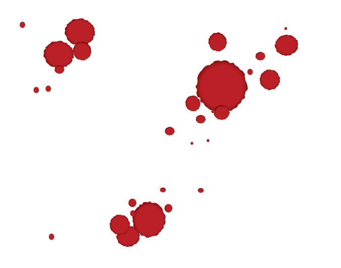

#### ПОКРОВ СТИГИИ

Тьма извергается из ближайшей тени, когда вампир покрывает все вокруг себя мраком, эквивалентным безлунной ночи, а звуки становятся приглушенными и неразборчивыми. Тот, кто наблюдает за эффектом со стороны, видит его как тень, распространяющуюся по всем поверхностям, включая тела всех жертв в округе. Все, кроме вызывающего, попавшие под эффект, с трудом видят и слышат окружающее, а смертные лишаются жизни под действием удушающей силы. Стоимость: Одна проверка ИК

Система: Персонаж делает проверку ИК и тратит ход на концентрацию, распространяя тень на нужные поверхности. Эффект охватывает круглую область с радиусом, равным удвоенному показателю Обливиона пользователя в ярдах/метрах. Область сосредоточена на пользователе или месте в его прямой видимости. Любой, попавший в Покров Стигии, получает штраф в три кубика ко всем броскам, если только они не обладают способностью видеть сквозь сверхъестественную тьму. Любой смертный, попавший в Покров Стигии, получает один уровень легкого урона за каждый ход пребывания в нем из-за удушающего действия силы.

P.S. За ход концентрации непроглядной тьмы покрывает радиус в Обливионе + х2 метров вокруг вампира, или

выбранной им точки в пределах видимости.

Продолжительность: Одна сцена

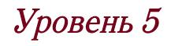

#### ШАГ СКВОЗЬ ТЕНЬ

Ступив в близлежащую тень, персонаж исчезает, чтобы вновь появиться из той же или другой тени еще дальше. Входят ли они в Лабиринт или просто проходят по его поверхности, многие ласомбры и гекаты строят догадки, но духовный урон, с которым они могут появиться, подразумевает, что они прикасаются к чему-то нечистому, когда используют эту силу.

#### Стоимость: Одна проверка ИК

Система: Вампир должен войти в тень, достаточно большую, чтобы накрыть его, и выйти из другой через один ход. Тень цели должна находиться в пределах видимости, хотя при желании ее можно увидеть с помощью мистических средств, таких как Взгляд из тени.

Можно провести через проход другого человека, но если тот не желает, его нужно удержать успешным захватом. Если в результате использования этой силы было получено Пятно, пассажир также получает его. Продолжительность: Один ход

#### ОБЕЩАНИЕ СКУЛЬД

Эта сила позволяет вампиру вновь вызывать болезни у жертв, которые от них оправились, ломать давно зажившие кости и лишать гуля иммунитета к старению. Хотя эта сила не действует на вампиров, она является эффективным способом избавиться от их слуг и обеспечить возвращение долгов судьбе, не вступая в

контакт с получателем.

#### Стоимость**:** Две проверки ИК

Пулы кубиков: Выносливость + Обливион против Выносливости + Выносливость или Стойкости Система: Вампир делает две проверки ИК, расходуя достаточное количество витэ, чтобы покрыть кровью ладони и лицо, вспоминая лица своих жертв. Если персонаж преуспевает в поединке Выносливость + Обливион против Выносливости жертвы x 2 (те, у кого есть Стойкость, могут сопротивляться с помощью Выносливости + Стойкости), на жертву накладывается серьезное заболевание, от которого она исторически страдала и выздоровела, например, рак, перелом кости или болезнь, в том числе полученная через Некро Чуму (стр. 90), причем любые ослабляющие эффекты от этого состояния наступают немедленно. Эффекты состояния определяет рассказчик, но они должны быть серьезными (см. таблицу "Калечащие травмы" для вдохновения, Vampire: The Masquerade, p. 303). Если жертва - гуль, то эта сила снимает с него иммунитет к старению и уничтожает всю витэ в его организме, что может привести к тому, что старые гули умрут или даже распадутся на части. При критической победе эта сила может убить жертву, полностью остановив ее сердце. В случае полного поражения вампир не может

использовать эту силу против данного человека. Продолжительность: Переменная, зависящая от того,

поддается ли состояние лечению

#### АВАТАР ТЬМЫ

Вампир обретает способность менять свою сущность, превращаясь в тень, становясь двухмерным пятном тьмы, способным скользить по любой поверхности и проникать сквозь мельчайшие щели и трещины. В этой форме вампиру вредит только огонь и солнечный свет. Стоимость: Две проверки ИК

Система: Трансформация занимает один ход, в течение которого вампир не может делать ничего другого. После завершения трансформации вампир может передвигаться по земле или вдоль стен со скоростью пешехода, препятствием служат только герметичные барьеры.

Вампиры, использующие Аватар Тьмы, могут окутывать жертв, заставляя жертву уменьшать все свои показатели на три и удушая смертных, как в случае с Покровом Стигии, описанном выше. Если вампир окружает смертного, он может питаться им, не протыкая кожу клыками.

Практикующие эту силу не получают урона от физических источников, но могут пострадать от огня и солнечного света, как обычно. Ментальные дисциплины все еще могут быть использованы по усмотрению рассказчика.

Продолжительность: Одна сцена или пока не закончится

#### ИССУШЕНИЕ ДУХА

Жертва, чья Сила Воли была полностью иссушена таким образом, больше не может стать призраком - сама суть ее духа уничтожена.

Стоимость: Две проверки ИК

Пулы кубиков: Упорство + Обливион против Упорства + Оккультизма

Система: После бросков испытания крови вампир кидает Упорство + Обливион, а его жертва Упорство + Оккультизм. С случае победы персонажа его жертва получает по 2 уровня тяжелых повреждений в Силу Воли за каждый уровень превышения вампира.

Продолжительность: Одна сцена

## Öåðåìîíèè Îáëèâèîíà

Церемонии являются эквивалентом ритуалов Обливиона в Колдовстве Крови и действуют аналогично, за указанными ниже исключениями.

Если не указано иное, то для проведения церемонии требуется проверка ИК, пять минут на каждый уровень и победа в проверке Упорство + Обливион (сложность = уровень церемонии +1). Церемонии обычно требуют дополнительных ингредиентов или жертвоприношений для смешивания жизненной силы заклинателя. Если не указано иное, мастер может проводить полезные Церемонии только над собой. Гули, практикующие Обливион, или слабокровные, могут получить временный доступ к силам Обливиона, но не к Церемониям.

Церемонии имеют обязательное условие - силу Обливиона. При создании персонажа игрок может выбрать одну Церемонию 1-го уровня, если у него есть хотя бы одна сила Обливиона, указанная как необходимое условие для этой Церемонии. Персонажи могут покупать новые Церемонии по цене уровня Церемонии x 3 очка опыта, если они удовлетворяют условию силы.

|   | Уровень Сила Обливиона               | Церемонии           |  |
|---|--------------------------------------|---------------------|--|
| 1 | Дар ложной жизни                     | Прах к Праху        |  |
| 1 | Призвание духа                       | Узреть оковы        |  |
| 2 | Слуга Гомункул                    | Прорехи в Саване |  |
| 2 | Подчинение духа                      | Прорехи в Саване |  |
| 3 | Вселение духа                        | Аура Разложения     |  |
| 3 | Шаркающие орды                       | Аура Разложения     |  |
| 4 | Сковать Дух                          | Некро Чума          |  |
| 4 | Разорвать покров                     | Некро Чума          |  |
| 5 | Благословение Лазаря Обещание Скульд |                     |  |

#### НЕОБХОДИМЫЕ УСЛОВИЯ ДЛЯ ПРОВЕДЕНИЯ ЦЕРЕМОНИИ

Изучение новых церемоний в процессе игры требует опыта и времени, а также учителя, который уже знает эту церемонию. Ожидайте, что на изучение Церемонии уйдет не менее стоимости равной уровню его силы в неделях.

## Уровень 1

## ДАР ЛОЖНОЙ ЖИЗНИ

Используя эту церемонию, вампир может поднять труп или группу трупов для выполнения простых, однократных или повторяющихся задач. Необходимая сила: Прах к Праху Ингредиенты: человеческое тело (или несколько тел, небольшая смесь крови, мокроты и желчи. Процесс: После нанесения состава на труп или трупы и проведения Церемонии пораженные тела оживают. Они выполняют одну простую команду вампира, если труп физически способен ее выполнить, например, "подмести пол", "закрыть дверь" или "обойти дом по периметру". Они не способны думать и рассчитывать, поэтому условные или сложные команды типа "напасть на следующего, кто пройдет через эту арку", "водить эту машину" или "построить хижину" не работают. Они могут быть направлены на определенную цель для атаки или другого действия, если пользователь укажет на цель.

Система: Вампир делает бросок Церемонии и в случае победы поднимает количество трупов, равное его показателю Обливиона или количеству подготовленных им тел (в зависимости от того, что меньше). Критическая победа удваивает показатель Обливиона для определения поднятых трупов. Оживление бездумного трупа заканчивается, когда его уничтожают или он завершает свою задачу. Эти трупы не защищают себя от атак и разлагаются обычным образом; Церемония не дает им никакого иммунитета к воздействию стихий или времени.

## БЕЗДУМНЫЙ ТРУП

Стандартные пулы кубиков: Физические 2, Социальные 0, Ментальные 0

Вторичные атрибуты: Здоровье 4, Сила воли 0 Исключительные пулы кубиков: Запугивание 4

Особенности: Безмозглые трупы получают легкие и тяжелые повреждения так же, как и вампиры, за исключением того, что они невосприимчивы к солнечному свету. Они не могут исцелять или исправлять повреждения, и каждый день гниют, нанося по меньшей мере один легкий урон здоровью. Они не поддаются ментальному воздействию, поскольку привязаны к своему хозяину.

Они не реагируют ни на движения, ни на слова, ни на вмешательство кого-либо, кроме своего реаниматора. Бездумные трупы всегда могут участвовать в командной работе (Vampire: The Masquerade, p. 122), выполняя рутинную работу, например, копать, поднимать или толкать, даже если у них нет навыков.

Общие сложности: 2/1

### ПРИЗВАНИЕ ДУХА

Эта церемония позволяет вампиру вызывать духа из подземного мира.

Необходимая сила: Узреть оковы

Ингредиенты**:** Один из оков (см. "Узреть оковы", стр. 85), фотография или другое визуальное изображение

окова, подписанное имя и витэ вампира. Процесс: Некромант наливает свою витэ на оковы призрака и, изучая рисунок или подпись, называет имя призрака. Призрак чувствует зов своей оковы и начинает путешествие из своего места в подземном мире в местоположение заклинателя.

Хотя география в подземном мире имеет разные масштабы, путешествие все равно может занять несколько ночей, если дух находится на другом конце света. Если завеса в месте вызова достаточно слабая, то под действием силы оков призрак протаскивает сквозь завесу между мирами. Вызванный призрак не обязан служить вампиру после вызова и может вести себя враждебно, если почувствует, что вампир угрожает его оковам. В противном случае призрак может быть благодарен за вызов и возможность

#### общения.

Система: Вампир смазывает путы своей витэ и делает бросок Церемонии Обливиона. Призрак не может пройти сквозь завесу, если она непроницаема в месте проведения церемонии (см. с. 88). Перемещение оковы после церемонии не поможет, так как способность призрака проходить сквозь завесу исчезает, если оковы покидают место церемонии. Призраки исчезают в конце сцены, если для их принуждения или связывания не используется отдельная Церемония.

Вызванные таким образом призраки не проявляются физически, но являются в виде теней на стенах, колышущихся силуэтов своих живых сущностей, из которых могут доноситься голоса. Призраки говорят на тех же языках, что и при жизни, если только им не

пришлось изучать новые языки в подземном мире.

## Уровень 2

#### СЛУГА ГОМУНКУЛ

Вампиры используют эту церемонию для создания слуг и шпионов из частей тела, таких как руки или черепа, или мелких мертвых животных, например крыс или лисиц. Некоторые некроманты работают почти исключительно с гомункулами, и их мастерские

заполнены бьющимися и тревожными существами. Необходимая сила: Прорехи в Саване

Ингредиенты**:** Требуемая часть тела или туша животного, оружие, используемое для его разрубания/ убийства, небольшая смесь мочи, фекалий или спермы.

Процесс: Вампир покрывает лезвие (или другое приспособление, подходящее для этой задачи) грубым коктейлем из телесных жидкостей и использует его, чтобы отрезать целевой отросток от его корневой конечности или тела, или убивает мелкое животное (которое не может быть больше маленькой собаки и не может летать, независимо от наличия у него крыльев).

После введения витэ в цель она оживает в виде гомункулярного слуги, безоговорочно преданного своему хозяину.

Система: Некромант делает бросок "Церемония Обливиона" и в случае победы получает гомункулярного слугу, который шпионит, следует за вампиром или запугивает его по команде некроманта. Если он удаляется от вампира на расстояние более 100 ярдов/метров, то становится бездейственным, пробуждаясь лишь тогда, когда вампир входит в это расстояние. В противном случае он остается активным в течение нескольких ночей, равных количеству успехов. Критическая победа в броске делает слугу активным навсегда, а полный провал уничтожает все компоненты, задействованные в Церемонии.

Большинство гомункулов могут преодолевать стены, прыгать (даже если у них нет для этого конечностей) и эффективно прятаться, хотя индивидуальные различия велики и зависят от задач, для выполнения которых они были созданы. Хотя он не может говорить или выполнять действия, требующие глубокого размышления, он может телепатически передавать своему создателю отдельные образы, запахи или звуки.

#### СЛУГА ГОМУНКУЛ

Стандартные пулы кубиков: Физический 1, Социальный 0, Ментальный 1

Вторичные атрибуты: Здоровье 3, Сила воли 1 Исключительные пулы кубиков: Атлетика 4, Скрытность 6; Запугивание 4

Особое: Гомункулярные слуги получают легкие и тяжелые повреждения так же, как и вампиры, за исключением того, что они невосприимчивы к солнечному свету. Они не могут исцелять или исправлять повреждения. Они не поддаются ментальному воздействию, так как привязаны к своему хозяину. Им не нужны глаза и уши, чтобы воспринимать все вокруг, как это мог бы делать человек с беспрепятственным зрением и слухом. Они могут телепатически передавать своему хозяину одно изображение в каждой сцене. Общие сложности: 3/1

#### ПОДЧИНЕНИЕ ДУХА

Эта церемония позволяет вампиру подчинить

призрака своей воле. Необходимая сила: Прорехи в Саване

Ингредиенты**:** оковы призрака, витэ заклинателя, предмет (или угроза), достаточный для повреждений оков.

Процесс: Вампир должен находиться в непосредственной близости от призрака, чтобы использовать эту церемонию, как правило, с помощью Призвание духа (см. с. 92). Некромант бросает в сторону призрака горсть своей витэ, при этом он подносит к оковам какой-либо разрушительный предмет (нож, молоток, пистолет или, возможно, держит оковы над огнем) или произносит угрожающие слова, в которые призрак верит. Вампир и призрак вступают в поединок воли. Если вампир побеждает, то призрак должен исполнять волю вампира, по крайней мере, временно. В случае поражения вампир остается психически

ослабленным, а оковы исчезают из его рук. Система: Сделайте бросок Церемонии Обливиона против Упорства + Самообладания призрака. Если у вампира нет возможности физически угрожать оковам, сделайте также бросок Манипуляция + Запугивание (сложность равна Упорству + Самообладанию призрака). Если некромант выиграет оба броска, он сможет приказать призраку выполнить ряд задач средней сложности (шпионаж, исследование, правдивые ответы на вопросы и т.д.), равных количеству успехов, полученных в броске "Церемония". За каждые два успеха вампир может вместо этого приказать призраку выполнить сложное задание (например, напасть на кого-то, сделать что-то, противоречащее чувствам призрака, и т.д.). При критической победе вампир может потребовать от призрака любого действия, и тот постарается выполнить задание. Призрак остается на службе у вампира до конца истории или до выполнения приказа своего хозяина, после чего возвращается в подземный мир с вечной враждой к

некроманту.

Если призрак побеждает в любом из этих поединков, вампир получает дополнительное повреждение здоровья, а призрак возвращается в подземный мир.

Принуждение, наложенное на призрака, немедленно прекращается, если вампир атакует его. Если вампир повредит оковы, находящиеся под угрозой, призрак получает от одного до трех повреждений силы воли (в зависимости от важности оков) и отправляется обратно в подземный мир, где его будут мучить и, возможно, превращать в призракаубийцу (Vampire: The Masquerade, p. 377).

## Уровень 3

#### ВСЕЛЕНИЕ ДУХА

Эта церемония позволяет вампиру открыть свое тело для

овладения призраком. Необходимая сила: Аура Разложения

Ингредиенты**:** Подарок, сделанный в качестве дани призраку, паразитический жук, два зуба, извлеченных изо-рта вампира.

Процесс: Для использования этой силы вампир должен находиться в непосредственной близости от призрака, как правило, с помощью заклинания Призвание духа (см. с. 92). Некромант преподносит призраку подношение, иногда в виде алкоголя, вылитого на могилу призрака, или мешочка с монетами, который нужно зарыть в землю, или даже свежеотрубленной головы одного из недавно живших врагов призрака. Затем вампир выдергивает изо рта два зуба, обычно с помощью щипцов, и оставшимися зубами вгрызается в паразита. После этого вампир открывает рот, и призрак может войти в него, вселяясь в тело вампира.

К преимуществам вселения в тело вампира можно отнести улучшенное телосложение, доступ к воспоминаниям, которыми вампир захочет поделиться, а также голос вампира, дающий ему советы. При желании призрак может полностью завладеть вампиром, что некоторые некроманты считают благословением, а другие - главной причиной, по которой не стоит использовать эту силу.

Позволяя призраку управлять своими действиями в течение ночи, он эффективно подчиняет себе зверя, а также демонстрирует физическое мастерство и знания,

которыми вампир обычно не обладает. Система: Сделайте успешный бросок "Церемония Обливиона". Если призрак соглашается с предложением, то он входит в тело вампира и может оставаться там в течение нескольких сцен, равных успехам броска "Церемонии Обливиона". Когда призрак находится внутри вампира, вампир получает два кубика ко всем броскам физических атрибутов и +2 здоровья до тех пор, пока призрак не покинет его. Вампир может слышать призрака в своей голове, давая ему советы, и по усмотрению рассказчика может заменять навыки призрака на свои собственные.

Призрак может решить заявить о своем владении вместо того, чтобы действовать как пассажир. Если вампир сопротивляется, он делает бросок Упорство + Самообладание против Упорства + Самообладание призрака. В случае успеха вампир отвергает влияние призрака. В случае неудачи призрак управляет вампиром до конца сцены, но не может заставить вампира совершить какой-либо саморазрушительный поступок.

#### ШАРКАЮЩИЕ ОРДЫ

Эта церемония позволяет вампиру выращивать группу

агрессивных ходячих мертвецов. Необходимая сила: Аура Разложения

Ингредиенты**:** человеческий труп (или несколько

человеческих трупов), свежая человеческая жертва. Процесс: Вампир должен иметь отдельный труп в дополнение к смертному, приготовленному для жертвоприношения. Вампир убивает жертву, проливая ее кровь на труп или трупы, предназначенные для оживления. Если церемония прошла успешно, трупы встают (недавняя жертва - нет) и выполняют команды вампира.

Система: Из-за большого количества крови, пролитой во время этой церемонии, вампир должен сначала пройти проверку на сопротивление голодному безумию ("Сложность 2"). Сделать бросок Церемонии, возможно, получив при этом Пятна, в зависимости от принципов истории и усмотрения Рассказчика. При победе количество агрессивных мертвецов, равное показателю Обливиона некроманта или количеству подготовленных тел (в зависимости от того, что меньше), получает дар оживления. Оживленные таким образом трупы не разлагаются и засыпают только по приказу вампира, в случае окончательной смерти

вампира или при его уничтожении.

Ожившие трупы способны воспринимать средней сложности приказы, такие как "убить всех, кто войдет", "стонать, если увидишь, что кто-то проходит по этой дороге" или "терроризировать этот район". В отличие от трупов, поднятых с помощью Дара ложной жизни (см. с. 92), эти ожившие мертвецы не сидят без дела, если их оставить без команды, они начнут нападать на всех вокруг, кроме своего хозяина.

Согласно правилам для подобных временных преимуществ (Vampire: The Masquerade, p. 180), их дальнейшая полезность после окончания текущего сюжета должна быть обеспечена Опытом - например, с помощью фона "Подручные" (Vampire: The Masquerade, p. 196; одна точка на один верный труп), иначе агрессивные трупы могут стать нестабильными и неуправляемыми.

#### АГРЕССИВНЫЙ ТРУП

Стандартный набор кубиков: Физические 4, Социальные 0, Ментальные 0 Вторичные атрибуты: Здоровье 6, Сила воли 0 Исключительные пулы кубиков: Драка 6; Запугивание 5

Особенности: Агрессивные трупы получают легкий и тяжелый урон так же, как и вампиры, за исключением того, что они невосприимчивы к солнечному свету. Они не могут исцелять или исправлять повреждения. Они не поддаются ментальному воздействию, так как привязаны к своему хозяину. Им не нужны глаза и уши, чтобы воспринимать все вокруг, как это мог бы делать человек с беспрепятственным зрением и слухом. Укусы агрессивных мертвецов наносят +2 урона здоровью, которые для смертных усугубляются. Общие сложности: 3/2

## Уровень 4

#### СКОВАТЬ ДУХ

Вампиры, обладающие доступом к этой Церемонии, могут приковывать призраков к

определенным местам и людям. Необходимая сила: Некро Чума

Ингредиенты**:** Оковы призрака, витэ заклинателя, жертва невинного человека, куча соли. Если целью вселения является человек, некромант должен обладать чем-то из его тела, например, ногтями, волосами, кровью или кожей.

Процесс: Вампир должен уже иметь под своим контролем призрака, использующего заклинание "Подчинение духа" (см. с. 93). Вампир убивает невинного смертного (хотя понятие "невинность" субъективно, оно, как правило, относится к молодым, опекунам и искренне набожным людям) в том месте или вблизи того человека, которого он хочет преследовать своим призраком. После этого витэ смешивают с достаточным количеством соли, чтобы окружить объект призрака, и рисуют этой смесью круг. Оковы призрака помещают где-нибудь в этом месте

или во владениях объекта.

Система: Следуя этапам церемонии, вампир может получить пятна от убийства в зависимости от принципов Истории и по усмотрению рассказчика. Вампир делает бросок Церемонии Обливиона, которому нельзя противостоять, так как для того, чтобы эта сила сработала, призрак уже должен быть подчинен.

Призрак привязывается к месту или человеку, на которого направлено действие этой церемонии, при этом срок ее действия не ограничен. Любая эмоция, которую призрак испытывает во время привязки, влияет на обитателей места или человека, к которому он привязан, причем каждый из них получает штраф в два кубика ко всем броскам на сопротивление действиям или чувствам, которые испытывает призрак. Таким образом, разгневанный призрак может сделать вампиров более склонными к безумию, а подавленный призрак может заставить смертного прекратить уход за собой. Связанные призраки обладают теми же способностями, что и привидения (Vampire: The

Masquerade, p. 377).

Призрак навсегда привязывается к цели, если только вампир не отменит церемонию, если оковы не переместятся из этого места или из владения человека, или если призрак не будет уничтожен. Привязка также прекращается, если некромант атакует призрака. Большинство привязанных таким образом призраков впадают в ярость или меланхолию от своей участи, и их настроение влияет на окружающее пространство. Многие некроманты используют этот способ для

защиты своих убежищ или преследования врагов.

#### РАЗОРВАТЬ ПОКРОВ

Эта церемония позволяет вампиру создать разрыв в завесе, через который могут пройти призраки. Призраки, попавшие в наш мир таким способом, начинают преследовать людей и места, предаваться своим страстям и овладевать смертными, если это позволяют их силы. Некоторые из них относятся к вампирам с благодарностью за разрыв завесы, а другие с удовольствием мучают виновных.

#### **VAMPIRE THE MASQUERADE PLAYERS GUIDE**

#### Необходимая сила: Некро Чума

Ингредиенты**:** Скальпель, который был для разрезания живой плоти, мел или уголь, шелковое полотно, человеческая жертва Процесс: Вампир вешает шелковую простыню на стену в том месте, где прорехи в саване (см. с. 88) стандартная, тонкая или потрепанная. Затем на простыне совершается человеческое жертвоприношение, и, когда кровь покрывает простыню, вампир разрезает ее лезвием. Церемония расширяет портал между миром живых и миром мертвых.

Система: Заклинатель совершает жертвоприношение, которое может привести к появлению пятен в зависимости от принципов истории и усмотрения Рассказчика. При разрезании шелковой простыни игрок делает бросок Церемонии. Из-за большого количества крови, пролитой во время этой церемонии, заклинатель должен сделать бросок на сопротивление голодному безумию (сложность 2). За каждый успех броска "Церемония" плотность завесы уменьшается на один уровень, вплоть до отсутствия (см. раздел "Прорехи в

#### саване" на с. 87).

Важно отметить, что если плотность завесы снижается до уровня "отсутствует", то в течение оставшейся части сеанса (или ночи) призраки могут проникать в физический мир. По окончании этого периода плотность завесы, равная отсутствию, увеличивается до рваной, и ворота для призраков закрываются.

## Уровень 5

## БЛАГОСЛОВЛЕНИЕ ЛАЗАРЯ

Эта церемония позволяет некроманту вернуть к жизни только что умершее тело, но не такое, каким его помнят родственники и друзья.

#### Необходимая сила: Обещание Скульд

Ингредиенты**:** Одна человеческая жертва, ладан, сердце любого млекопитающего, серебряная пудра.

Процесс: Перед совершением жертвоприношения некромант сжигает благовония, вырезает сердце жертвы и заменяет его сердцем другого млекопитающего, хотя оно не должно быть вшито и работать, чтобы Церемония могла функционировать. Высыпав на открытые глаза умирающего или мертвого смертного мешочек с порошкообразным серебром, вампир приглашает призрака взять умершего смертного в качестве хозяина. Призраков нельзя заставить завладеть телом, но мало кто отказывается от возможности снова ходить в полуживой обуви.

Система: Убийство смертного для этой церемонии может повлечь за собой пятна, в зависимости от принципов истории. Если сердце для замены было взято у того, кого вампир убил, это убийство также может повлечь за собой пятна. После успешного броска на церемонию Призрак может войти в свежеумершее тело и жить в нем, как в своем собственном. Призрак должен присутствовать во время акта жертвоприношения.

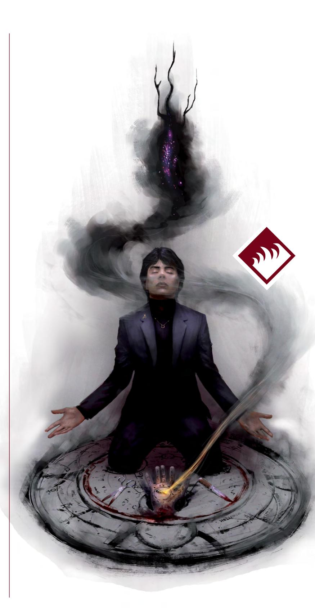

Одержимый труп просыпается с ранами, от которых он умер, хотя заменяющее его сердце функционирует (независимо от его происхождения или расположения), а тело при одержимости восстанавливает одно очко здоровья. Оставшийся урон здоровья восстанавливается со временем (как при вампирическом исцелении). Тело не получает никаких особых сопротивлений к повреждениям, кроме Дисциплин, которыми оно могло обладать при жизни. Тело обладает теми же физическими атрибутами, дисциплинами (если это гуль) и преимуществами, которые были у него при жизни. Социальные и ментальные атрибуты, навыки и любая форма оценки нравственности соответствуют таковым у призрака.

Одержимость длится неопределенное время, либо до тех пор, пока тело одержимого не умрет снова, либо призрак не будет изгнан из носителя.

## ШАГ В БЕЗДНУ

Эта церемония позволяет вампиру или его спутникам физически покинуть мир живых полностью и отправиться в мир теней. Необходимая сила: Шаг Сквозь Тень (Ласомбра)

Ингредиенты: Маски для каждого участника, чаша, содержащая достаточное количество витэ заклинателя, чтобы каждый участник мог покрыть ею подошвы своих ног, две монеты любой ценности на участника.

## Êðîâàâîå ÷àðîäåéñòâî

Кровавое чародейство использует природу крови для раскрытия истин, причинения вреда и других действий. Сама дисциплина обладает сравнительно небольшим количеством способностей, в большей степени она ориентирована на универсальность ритуалов. Более подробную информацию о Кровавом чародействе (а также о силах и ритуалах) можно найти в источнике "Кровавые Печати".

## Уровень 2

## ИСКАТЕЛЬ СЕКРЕТОВ

Колдун крови выпускает потоки своей крови, настроенные на поиск информации по выбранному им предмету. Кровь омывает объект поиска, позволяя Колдуну Крови в считанные минуты изучить огромное количество текстов и томов. После этого на объекте поиска остается заметное пятно крови.

Стоимость: Одна проверка ИК

Система: Персонааж делает проверку ИК и проверяет Интеллект + Кровавое Чародейство на сложность, заданную Рассказчиком: от 2 для одного письма в обычном офисе до 5 для зашифрованной информации, спрятанной в огромной библиотеке. Если информация была скрыта сверхъестественным образом, сложность еще более возрастает. Время, затрачиваемое на поиск, зависит от размера территории: Одна комната может быть обследована за несколько минут, в то время как библиотека требует нескольких часов, а то и целой ночи. Кроме того, сила не дает возможности разобрать информацию, если она получена на неизвестном языке или в виде шифра.

Если искомое знание хранится в неписьменном виде, например, в виде живописи, музыки или на старых дискетах, сила действует по усмотрению Рассказчика, хотя

Сложность, скорее всего, будет выше.

Продолжительность: Одна ночь или пока информация не будет найдена или поиск не закончится, в зависимости от того, что наступит раньше.

## Уровень 4

## КРОВЬ АЭГИСА

Вампир может использовать свою жизненную силу для создания физического защитного барьера. Барьер проявляется в виде дрожащего слоя Крови, жидкость движется сама по себе, перехватывая и ловя летящие снаряды.

Стоимость**:** Один или несколько проверок ИК Система: Персонаж тратит кровь, равную одной или нескольким проверкам ИК. За каждую проверку плавающий барьер может снизить урон от входящих атак на пять единиц. Эффект проявляется автоматически, так как витэ перехватывает каждый входящий снаряд в виде струи крови, которая восстанавливается до тех пор, пока сила остается активной. После того как защита будет израсходована, кровь становится инертной и растекается по зоне конфликта.

Длительность: Одна сцена или пока не будут израсходованы уровни урона, в зависимости от того, что наступит раньше.

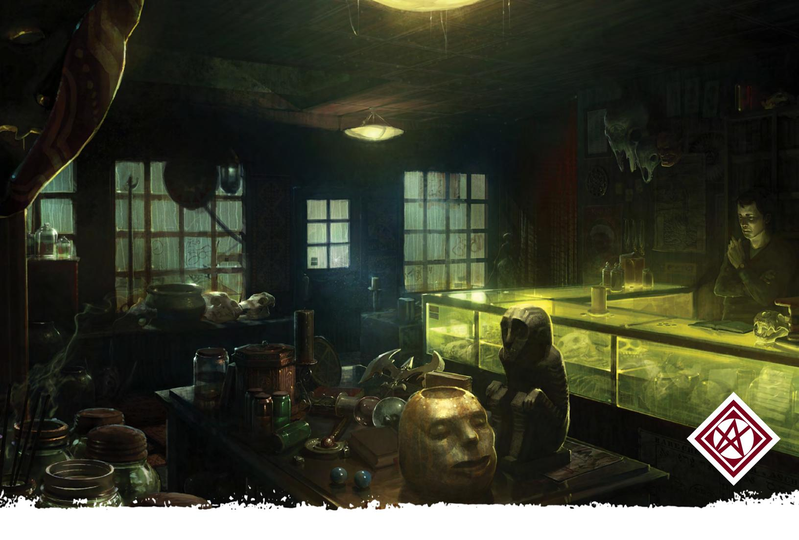

## Ðèòóàëû êðîâàâîãî ÷àðîäåéñòâà

## Уровень 1 Ритуалов

## УНИЧТОЖИТЬ СТРАХ ПЕРЕД ОГНЕМ

Этот ритуал позволяет заклинателю на короткое время избавиться от естественного вампирического страха перед огнем.

Ингредиенты: Священный предмет, например, распятие, Библия или Коран.

Процесс: Вампир должен поднести священный символ к пламени. Предмет не обязательно должен быть полностью уничтожен, достаточно лишь прикоснуться к нему огнем.

Система: Успешный бросок ритуала после сожжения святого предмета дает персонажу два дополнительных кубика на все броски, связанные с сопротивлением Бессилию. При критической победе персонажу вообще не нужно делать броски "Безумие ужаса". Эффект длится в течение одной ночи.

### ЗАПЕЧАТАТЬ КЛЕЙМО

Обычно татуировки, шрамы и другие изменения на плоти вампира исчезают во время дневного сна. Однако некоторые представители рода стремятся оставить след на своей плоти и сделать его неизменным.

Ингредиенты: Расплавленное серебро, вылитое на татуировку, клеймо или другую модификацию тела. Процесс: Вампир, проводящий ритуал, выливает расплавленное серебро на татуировку, клеймо или другую модификацию тела цели. Цель получает повреждения от расплавленного серебра, но после восстановления затронутая модификация остается постоянной.

Система: При успешном проведении ритуала цель получает постоянную модификацию тела. Эта модификация не может быть удалена никакими другими способами и теперь считается частью неизменного тела цели. Выливание расплавленного серебра на модификацию тела наносит один пункт легкого повреждения, которое может быть восстановлено обычным способом.

## Уровень 2 Ритуалов

### КАК ТУМАН ПО ВОДЕ

С помощью этого ритуала вампир способен преодолеть любой водоем, бесшумно ступая по нему, словно в невесомости, а от его шагов поднимается туман.

Ингредиенты: Кусок дерева с корабля и вода. Процесс: Вампир погружает кусок дерева в водоем, который он хочет пересечь, и выливает в него свою кровь.

Система: После успешного броска ритуала вампир может ходить по поверхности воды до конца ночи. Он может прекратить действие этого эффекта в любое время, но не сможет снова ходить по поверхности воды до тех пор, пока не проведет ритуал заново.

## КАЛЛИКС СЕКРЕТЮС

Колдун способен превратить обычный предмет во вместилище для своей Крови, позволяя хранить в нем удивительные количества ее, чтобы затем извлечь для использования.

Ингредиенты: Предмет, который помещается в руке заклинателя, и кровь заклинателя. Процесс: Заклинатель смачивает предмет своей кровью и произносит слова ритуала. После завершения ритуала предмет впитывает кровь. Система: Процесс занимает час. Сделайте бросок Ритуала, и в случае успеха вампир впитает в предмет некоторое количество Крови заклинателя. Если заклинатель хочет выпустить свою Кровь из предмета, ему нужно произнести командное слово. Количество хранящейся крови позволяет утолить один голод за каждые две проверки ИК, сделанные при хранении крови. (Хранение крови в течение одной проверки ИК позволяет гулю получить свою порцию или использовать ее в другом ритуале).

#### УСЫПЛЯЮЩЕЕ ПРИКОСНОВЕНИЕ

Колдун крови может превратить дозу собственной витэ в активируемый прикосновением наркотик, который делает жертву несдержанной и уязвимой для таких дисциплин, как "Величие" и "Доминирование", а также для попыток обычного манипулирования, принуждения или допроса.

Ингредиенты: Небольшое количество гашиша или другого наркотического вещества.

Процесс: Выбранное вещество смешивается с Кровью и растирается между пальцами во время чтения (или шепота) заклинания. Подготовка к ритуалу занимает всего несколько минут.

Система: Сделайте бросок Ритуала против Выносливости + Упорства цели, когда она вступит в контакт с пораженной витэ. В течение оставшейся части сцены жертва получает штраф в кубиках, равный перевесу победы в броске Ритуала, на все сопротивления, связанные с Самообладанием или Упорством. (Штраф применяется только один раз, если в броске задействованы оба атрибута). Наркотическое витэ сохраняет свою силу до тех пор,

пока к нему не прикоснутся, вплоть до конца сцены.

## Уровень 3 Ритуалов

### ПЛАМЯ В КРОВИ

Этот ритуал позволяет вампиру вызвать муки огня в крови жертвы. Полыхающий жар пронизывает вены жертвы и причиняет сильную боль. Этот ритуал отличается от силы "Котел крови" (Vampire: The Masquerade, p. 274) тем, что его можно использовать на расстоянии, и это более эффективный способ обезвредить, а не убить жертву.

Ингредиенты: Образец крови жертвы, визуальное изображение жертвы - фотография, картина или видеозапись, свеча из красного воска или железная зажигалка.

Процесс: Вампир концентрируется на визуальном изображении своей цели (это может быть человек собственной персоной) и сжигает над пламенем образец крови цели, обычно находящийся в чашке Петри, стеклянной бутылке или флаконе. Эффект наступает практически мгновенно, поскольку кровь жертвы нагревается в ее венах.

Система: После произнесения заклинания сделайте бросок "Ритуал" против Упорства + Оккультизм (или Упорства + Стойкости, если цель - существо с этой Дисциплиной). Каждое очко запаса заклинателя применяется как легкое повреждение здоровья, которое также причиняет жертве изматывающую боль, заставляя ее получать штраф в два кубика к физическим параметрам до конца сцены. При критической победе штраф увеличивается до трех кубиков. В связи с повреждением жизненной силы жертва сородичного клана должна сделать проверку ИК. Жертва может быть затронута этим ритуалом

только один раз за ночь.

#### ОДИН С ЛЕЗВИЕМ

Некоторые представители рода устанавливают тесные отношения с любимым оружием, в редких случаях нося его с собой на протяжении многих веков. Такое оружие никогда не ржавеет и не тускнеет, пока находится во владении вампира.

Если же кто-то другой физически присваивает его себе, оно быстро стареет, подобно гули, лишенному витэ.

Если после такой деградации оружие остается пригодным для использования, то оно может нанести серьезный вред своему первоначальному владельцу -

колдуну крови, если использовать его против него. Ингредиенты: Оружие ближнего боя и достаточное количество витэ заклинателя для полного погружения в него.

Процесс: Вампир погружает выбранное им оружие в собственную жизненную силу и произносит клятву, посвящая оружию свою жизнь. Оружие должно оставаться под водой без перерыва до следующего восхода солнца.

Система: Когда кровь собрана и оружие погружено в жидкость, сделайте бросок "Ритуал". В случае победы оружие становится мистически посвященным пользователю. Оно остается безупречного качества, если не подвергается намеренному вреду, когда находится вне владения мастера. Кроме того, если оружие вновь помазано кровью пользователя, оно получает бонус в два кубика при использовании в бою. Помазание длится один ход, требует проверки ИК и длится в течение всей сцены. Вампир не может владеть более чем одним оружием, посвященным таким образом. Для того чтобы провести этот ритуал с новым оружием, предыдущее оружие должно быть уничтожено. При использовании против своего владельца оно наносит усиленный урон, но не получает дополнительных кубиков.

## Уровень 4 Ритуалов

#### ПРАЗДНИК ПЕПЛА

Что может быть лучше, чем превратить кровь соперника в пепел? Сородичи, затронутые этим ритуалом, не могут пить кровь в течение одной ночи.

Ингредиенты: Кусок пергамента с написанным на нем и сожженным именем цели и пепел от сожженного свитка.

Процесс: Заклинатель пишет имя своей цели на куске пергамента и сжигает его. Он собирает пепел и использует свою кровь, смешанную с пеплом, для написания знаков, необходимых для проведения ритуала.

Система: Сделайте бросок на проведение ритуала против Упорства + Силы воли цели. При успешном броске цель не может употреблять кровь в течение одной ночи, ее рвет, как смертную пищу и питье. Только пепел утоляет голод и не может снизить его ниже 3, хотя немногие жертвы думают о том, чтобы есть

пепел, если им не рассказать об этом заклинании.

#### УПРАВЛЯЕМОЕ ВОСПОМИНАНИЕ

Впитав кровь сородича, вампир может заново пережить воспоминания донора, который проводит его через свой прошлый опыт. Это может позволить вампиру "вспомнить" воспоминания еще до своего рождения! Кроме того, такие путешествия могут открыть способности Дисциплины, заслуги и, возможно, другие дары крови донора.

Ингредиенты: Жизненная сила другого вампира, сушеный розмарин и свежие маки или незабудки. Процесс: Колдун сжигает цветы и розмарин, смешивает пепел с донорской витэ, затем выпивает кровь.

Система: Колдун выбирает цель "Воспоминания". (Vampire: The Masquerade, p. 312) или одну из целей ниже:

• Сила Дисциплины 1-го уровня; достоинство в одну точку

••Сила Дисциплины 2-го уровня; достоинство в две точки

••• Сила Дисциплины 3-го уровня; достоинство в виде трех точек

Сила может быть встречена во время Воспоминаний, или само воспоминание связано с тем, что донор узнал о силе. Заслуга может возникнуть из аналогичных обстоятельств или стать результатом раскрытия персонажем какого-либо секрета или потенциала в прошлом.

Хотя игрок может стремиться к определенной силе или заслуге, окончательное решение о том, какой дар он получит, остается за Рассказчиком.

Все дары управляемого воспоминания исчезают по мере того, как новые родные воспоминания накладываются на эти всплывшие и импортированные. Они действуют до конца сессии или (если управляемое Воспоминание произошла в конце сессии) до конца следующей сессии.

#### Силы

Эта сила не зависит от других сил колдуна и не учитывается при определении лимита сил, которыми он может владеть в одной Дисциплине, хотя при этом ему все равно необходимо выполнить требование по уровню Дисциплины. Эта сила не может быть использована в качестве требования для изучения другой силы, но персонаж может временно получить силу Амальгамы, если он уже знает другую необходимую силу.

#### Достоинства

Точки достоинств не могут быть распределены между различными достоинствами или добавлены к уже имеющимся у персонажа игрока достоинствам.

Вход в программу "Руководство Воспоминаниями" Воспоминания с наведением следуют всем тем же правилам, что и обычные воспоминания, за исключением того, что род, жертвующий кровь и воспоминания, делает необходимую проверку ИК. Донор остается присутствовать на протяжении всей сцены в качестве духовного или развоплощенного присутствия или проводника, с которым может взаимодействовать только род, проводящий панихиду. Все, кто переживает наведенную Воспоминаинями, должны принять предложенную Кровь.

Прогулка по воспоминаниям другого Рода является особенно неестественным опытом и накладывает штрафы в зависимости от того, насколько далеко в прошлое заходит путешествие. Кровь, предложенная родным донором, всегда считается глубоким напитком (Vampire: The Masquerade, p. 312), и бонусы, получаемые от нее, обычно компенсируют некоторые из этих штрафов.

#### Дополнительные модификаторы "Руководство Воспоминаниями"

- Действие происходит во время или после вашей земной жизни: потерять один кубик
- Место действия происходит менее чем за столетие до вашей земной жизни: потерять два кубика
- Сцена происходит за одно или два столетия до вашей смертной жизни: потерять четыре кубика
- Сцена происходит за три или более столетий до вашей смертной жизни: потерять шесть кубиков

#### НЕВИДИМЫЕ ЦЕПИ ПРИВЯЗАННОСТИ

Колдун крови связывает объект невидимыми цепями, приковывая его к одному месту на время проведения ритуала.

#### Ингредиенты: Звено цепи.

Процесс: Колдун наносит на цепь знаки, используя свою кровь. Процесс длится час, после чего звено цепи можно спрятать на себе, чтобы впоследствии использовать на цели, и тогда цепь будет брошена к его ногам.

Система: При бросании подготовленного звена в цель заклинатель делает бросок Ритуала против Силы + Упорство цели. Цель не может сдвинуться с места в течение одного часа за каждый успех броска, пока звено цепи остается целым и находится в пределах трех ярдов/метров от нее. Связанная цель получает штраф в четыре кубика к любым проверкам физической защиты, а также к действиям в драке и ближнем бою.

По окончании действия ритуала звено цепи превращается в пыль.

## Уровень 5 Ритуалов

#### АНТЕБРАХИЯ ИГНИУМ

Проводящий этот ритуал испускает голодное пламя из своей плоти, используя зачарованное покрытие из виты как буфер, и может поджигать предметы и людей с помощью огня.

Ингредиенты: Достаточное количество витэ (от любого вампира), чтобы покрыть им руки до локтей, и источник пламени (например, зажигалка).

Процесс: Вампир погружает руки в кровь и выдерживает желание питаться или неистовствовать. После извлечения рук воздействие пламени воспламеняет витэ, а не вампира, на которого она нанесена. После этого вампир может поджигать цели, используя огонь на своей коже.

Система: Если заклинатель находится на уровне голода 4 или выше, он должен сделать проверку на голодное бешенство на Сложности 3, чтобы не истощить ингредиенты. В любой момент в течение ночи вампир может подставить витэ под огонь и сделать бросок Ритуала. В случае успеха на руках и кистях вампира вспыхивает пламя, и это зрелище провоцирует проверку на безумие ужаса (сложность 2) у всех вампиров поблизости, кроме заклинателя. В физическом бою они могут коснуться других с ловкостью + драка, чтобы нанести им два урона здоровья с тяжелым уроном. При вступлении в схватку одежда обоих бойцов воспламеняется и продолжает повреждаться каждый ход, пока они не сделают бросок "Самообладание + Выживание" (сложность 3), чтобы затушить пламя.

Заклинатель устойчив к пламени только на руках, в остальных местах он горит как обычно. Огненные руки гаснут по желанию заклинателя или по

окончании сцены.

#### ДОМИНИРОВАНИЕ

Колдун крови делает себя властелином сверхъестественных сил в своей области, препятствуя использованию большинством вампирических способностей другими.

Ингредиенты: Печать из железа, наложенная на каждый дверной проем в здании.

Процесс: Проведение ритуала занимает три часа. В течение этого времени заклинатель должен вложить железные печати в каждый дверной проем, освятить их своей жизненной силой и вырезать на дверях знаки.

Система: При успешном броске Ритуала маг Крови прекращает любое использование Анимализма, Ясновидения, Доминирования или Величия, кроме как самостоятельно. Любое использование Дисциплин в здании попрежнему вызывает проверку на ИК, хотя количество Крови, затрачиваемое на проведение ритуала, варьируется - от проверки ИК для квартиры до пяти для большого поместья. Ритуал длится неопределенное время, но может быть нарушен уничтожением хотя бы одной печати.

## Àëõèìèÿ ñëàáîêðîâíûõ

Алхимия слабокровных заставляет колдовство крови выглядеть скучно и скованно. Самая новая из дисциплин, ее пользователи продолжают исследовать ее потенциал, новые формулы и новые концепции появляются, кажется, каждую ночь. Подробнее об алхимии слабой крови и новых формулах см. в источнике "Кровавые знаки".

Любой вампир со слабой кровью может изучить алхимию слабокровных по клановому коэффициенту опыта, даже если он не получил заслугу "Алхимия

слабокровных" при создании персонажа.

## Уровень 1 Формулы

## МЕРКУРИАНСКИЙ ЯЗЫК

Алхимик может говорить на родном языке смертного, чью кровь он использовал в формуле, и на родных языках тех, от кого он питается, до следующего сна.

Ингредиенты: Кровь алхимика, кровь смертного, говорящего на другом родном языке, чем алхимик, язык рыбы или птицы, острый соус из другой страны, медные опилки.

Стоимость активации: Одна проверка ИК Система: Алхимик может говорить на родном языке того смертного, чью кровь он использовал в формуле. Потратив одно очко силы воли и получив питание от смертного, он может переключить свой новый язык на родной язык этого смертного.

Длительность: Одна ночь, или пока алхимик не накормит кого-нибудь с тем же родным языком, что и алхимик.

#### РАЗЪЕМНОЕ СОЕДИНЕНИЕ

Алхимик способен вырабатывать из своего тела электрический ток низкого уровня, питающий лампы, зарядные устройства и другие приборы. Ингредиенты: Кровь алхимика, кровь сангвиника, жидкий азот, вольфрамовая стружка и сломанная батарейка.

Стоимость активации: Одна проверка ИК Пул кубиков: Упорство + Алхимия

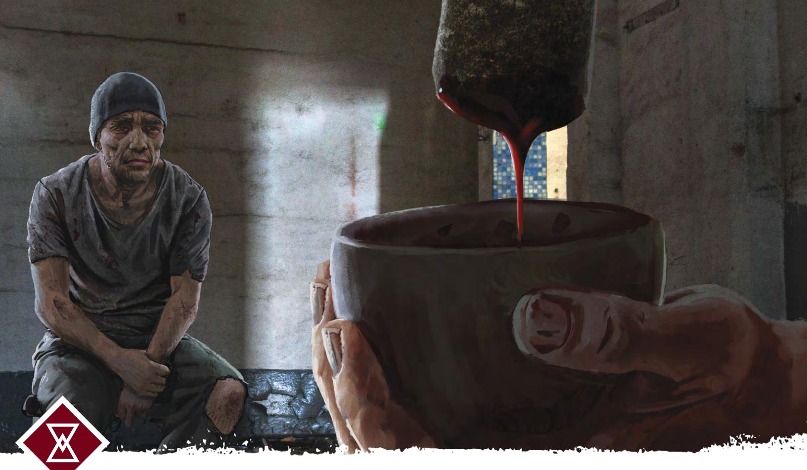

Система: Выполните проверку ""Упорство + алхимия" (сложность 2). В случае успеха алхимик наполняется электрическими токами, которые можно использовать для питания небольших устройств, таких как смартфон, персональный компьютер или лампочка. Эти токи питают предмет от прикосновения; при прекращении контакта он теряет энергию. Продолжительность: При освещении комнаты: одна сцена. При питании устройства - до достижения половины заряда батареи.

## Уровень 2 Формулы

#### СПИСОК ДРУЗЕЙ

Эта формула позволяет алхимику видеть связи между смертными и родственниками. Это проявляется в виде тонкой серебряной нити, соединяющей их, и дает алхимику представление о том, с кем смертный может быть связан.

Ингредиенты: Кровь алхимика, флегматическая кровь, глаза белобрюхого змея, совы или другой ночной птицы и серебряная нить.

Стоимость активации: Одна проверка ИК Пул кубиков: Интеллект + Алхимия

Система: При активации этой способности алхимик делает проверку Интеллект + Алхимия, чтобы увидеть тонкую серебряную нить, соединяющую смертного с вампиром, с которым у него есть какая-то связь. (Если вампир не находится физически рядом, алхимик может следовать за нитью.

Более сильные связи требуют меньшего количества успехов, чтобы их увидеть - гуль может получить только один успех, а дальний контакт или союзник - до пяти. У смертного, имеющего несколько связей с вампирами, сначала проявляется самая сильная нить, но алхимик может увидеть их все при достаточном количестве успехов.

Продолжительность**:** Одна сцена

## Уровень 3 Формулы

## МАНДАГЛОР

Алхимики, копирующие и корректирующие формулу, называют его "Фанк". Алхимик способен заставить свою кровь выделять ядовитый газ, вызывающий жесткий паралич как у смертных, так и у сверхъестественных существ.

Ингредиенты: Кровь алхимика, кровь флегматика, человеческий жир, свечной воск, эфир, кунжутное масло, железный купорос или вердигрис, бура.

Стоимость активации: Одна проверка ИК Пул кубиков: Выносливость + Алхимия против Выносливости + Упорство

Система: При прощупывании вены Атанора исходит резкое зловоние, заполняющее комнату (или дом при критической победе). Смертные, не сумевшие сопротивляться, впадают в состояние паралича всего тела, бодрствующую кому, до конца сцены. Сверхъестественные существа, потерпевшие неудачу, испытывают эффект трупного окоченения: штраф в два кубика ко всем броскам на физическую силу от сильных судорог.

Фиксация: Зелье можно подмешать в питье или еду в качестве яда или сжечь, чтобы оно действовало как парализующий аромат, см. выше.

#### Продолжительность: 3 хода

#### РУМОР

Алхимики часто используют эту формулу во время переговоров, пытаясь склонить на свою сторону хотя бы одного человека; впрочем, это легко заметить, если быть достаточно внимательным. Слухи позволяют алхимику сделать заявление и убедить одного человека согласиться с ним.

Ингредиенты: Кровь алхимика, кровь флегматика, перец, масло, графит или ртуть.

Стоимость активации: Одна проверка ИК Пул кубиков: Манипуляция + Алхимия против Смекалки + Наблюдательность

Система: При активации алхимик делает заявление и предлагает цели согласиться, например: "Я слышал, что вы планируете вложить деньги в новый морг в центре города. Это правда?". При победе цель соглашается и продолжает считать, что согласилась с заявлением по собственной воле. Для того чтобы заставить объект действительно действовать в соответствии со своим согласием (например, подписать инвестиционные бумаги), обычно требуется дополнительный состязание "Манипуляция + Хитрость" (или аналогичное), но алхимик может добавить свой выигрыш в состязании "Алхимия" к своему резерву в этом состязании.

Продолжительность: Одна сцена, и далее до тех пор, пока что-то (или кто-то) убедительно не опровергнет согласие цели ("Я бы ни за что на это не согласился! Меня, наверное, накачали наркотиками!").

#### ТАНК

Алхимик может использовать эту формулу для повышения устойчивости к повреждениям, хотя и на время.

Ингредиенты: Кровь алхимика, кровь холерика, выдержанное вино или бурбон, кевларовые волокна или цемент, или измельченный черепаховый панцирь.

Стоимость активации: Одна проверка ИК Система: В первый раз, когда алхимик получает урон в сцене, уменьшите его на пять. После этого действие формулы прекращается.

Длительность: Пока алхимик не получит урон или сцена не закончится.

## Уровень 4 Формулы

#### КОРОТКОЕ ЗАМЫКАНИЕ

Алхимик может использовать эту формулу для перегрузки батарей в любом электронном или электрическом оборудовании, включая автомобильные аккумуляторы или предохранители здания. Ингредиенты: Кровь алхимика, аккумуляторная кислота, кровь меланхолика и соленая вода. Стоимость активации: Одна проверка ИК Система: Сделав проверку ИК и прикоснувшись к оборудованию (или к металлу, соединенному с ним), алхимик автоматически и бесшумно отключает его. Это позволяет алхимику, например, вызвать отключение электричества в целом здании, прикоснувшись к розетке, или к автомобилю, прикоснувшись к его

Длительность: N/A

корпусу.

#### ТОКСИЧНЫЕ ПРИКОСНОВЕНИЯ

Алхимик выделяет из своих пор и отверстий мощную едкую желчь, разъедающую металлы, дерево и живые ткани. Алхимик, активирующий эту способность, может прикасаться к желчи и манипулировать ею, не подвергаясь ее воздействию.

Ингредиенты: Кровь алхимика, кровь холерика, поташ или щелок, селезенка животного, марля, йод. Стоимость активации: Одна или две проверки на пробуждение. Пулы кубиков: Сила или Ловкость + Алхимия против Ловкости + Атлетика

Система: В активном состоянии сила позволяет алхимику в считанные секунды разъедать любой материал простым контактом с ним и получать +2 урона при атаках драки, поскольку простое прикосновение превращается в кислоту. (Поскольку алхимик контролирует, как и где он выделяет кислоту, его собственная одежда обычно не подвергается воздействию).

Рассказчик является окончательным арбитром в определении степени нанесенного ущерба, но кислота сверхъестественно сильна и гораздо мощнее, чем та, которую производит Едкая Кровь (см. Vampire: The Masquerade, стр. 273).

Алхимик может сделать вторую проверку ИК, чтобы извергнуть желчь в качестве атаки (сила + алхимия в ближнем бою, ловкость + алхимия в дальнем бою). При победе желчь наносит запас +3 к легкому урону здоровью (смертным тяжелый).

Атханор Корпорис или Кальцинацио: Алхимик или сосуд может держать эту формулу после дистилляции только неделю, после чего начинает выглядеть нездоровым: на бледной коже проступают синие вены, а сама кожа обвисает на теле. Через месяц желчь разъедает сосуд Кальцинации, если его не пробовать.

Фиксация: Сосуд с желчью медленно коррозируется, полностью разрушаясь через 4 недели алхимии.

Продолжительность: Одна сцена

## Уровень 5

#### ЦВЕТУЩИЙ АМАРАНТ

При этой форме совместного диаблери алхимик и его помощники черпают жизненную силу из витэ полнокровного сородича.

Ингредиенты: Кровь алхимика и участвующих слабокровных (всего до трех слабокровных), сок красных цветов амаранта из растения, удобренного кровью, толченые пиявки, сероводород и неон. Стоимость активации: Каждый участник должен сделать один бросок на проверку ИК.

Пул кубиков: Упорство + Алхимия против Силы воли + Сила крови

Система: Алхимик и еще до двух участников обвязывают шелковый шнур вокруг своих запястий, соединяя их в треугольник, окружающий полнокровную сородичную цель, также связанную таким образом. Алхимик бросает Упорство + Алхимия; каждый дополнительный участник со слабой кровью может добавить один кубик к общему числу, потратив 2 силы воли.

Если полнокровный сопротивляется, он использует свой запас силы воли + сила крови. При победе участвующие слабокровные получают одну точку в одной из основных клановых дисциплин цели, определяемой случайным образом (при критической победе алхимик может выбрать дисциплину). Они не могут изучать или приобретать эту дисциплину выше первой точки, но в остальном могут использовать ее так же, как если бы они были полнокровными сородичами. Они не получают поколение, но теряют 1 человечность и приобретают ауру диаблери с черными прожилками.

#### МОМЕНТ ЯСНОСТИ

Алхимик способен на время отключить свои вампирические инстинкты, используя силу зверя для поддержки, а не для нарушения умственных способностей. На короткое время он может достичь сверхчеловеческого уровня интеллекта и концентрации, избегая при этом звериного вмешательства в свои действия.

Ингредиенты: Кровь алхимика, кровь флегматика, кадмий, ноотропы, пепел от сожженных страниц значимого для алхимика текста (священное писание, любимый роман детства).

Стоимость активации: Одна проверка ИК Система: При активации алхимик обретает ясность ума, его сообразительность обостряется, а зверь на время насыщается. Они добавляют четыре кубика к пулам умений и дисциплин, а также могут добавлять четыре кубика к проверкам ментального сопротивления против дисциплин, требующих этого: Доминирование, Анимализм, Величие, Ясновидение и их амальгамы. Они также невосприимчивы к беспорядочным критическим ударам и безумию, если подвержены последнему.

Продолжительность: Одна сцена

# ÒÈÏÛ ÏÈÒÀÍÈß

То, как род охотится на добычу, определяет его жизнь, пожалуй, больше, чем любой другой аспект его природы. Выбранный вами (или навязчивый) способ охоты, пожалуй, влияет на вас даже больше, чем ваш клан. В конце концов, вы можете никогда не увидеть соплеменника, но охотитесь вы каждую ночь, всегда.

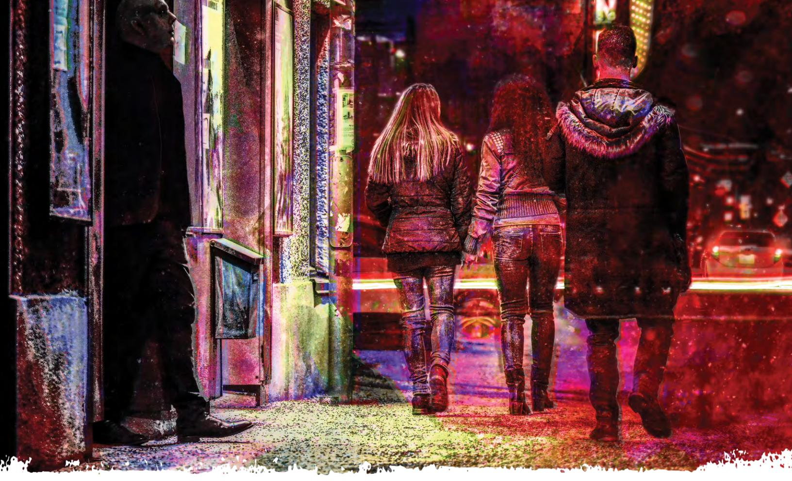

Вампиры, в конце концов, в основе своей хищники, которые должны убивать... или, по крайней мере, охотиться... чтобы выжить. Стили "Питания" в игре существуют для того, чтобы подчеркнуть эту суть и сфокусировать внимание игрока на ограничениях, которые накладывает на него его природа. Они не обязательно вписываются в каждую историю или работают со всеми возможными комбинациями игроков.

Если для вашей компании это проблема, просто добавьте по одной дополнительной точке к пулу котерии за каждого члена с "недостаточно мощным" или "неудобным" стилем охоты, определив это по своему усмотрению: по общему количеству очков опыта в пакете типов, по количеству точек чистого преимущества или по любой другой методике, которая, по вашему мнению, "разбалансирует" игру. В конце концов, менее яркий или вовлеченный стиль охоты означает больше времени и ресурсов для группы.

#### ЗАМЕЧАНИЯ ПО ДИСЦИПЛИНАМ ПИТАНИЯ

Помните, что ваш тип "Питания" может дать внеклановую точку Дисциплины. Голод может быть сильнее кровного родства.

Персонажи Бану Хаким могут взять Колдовство крови, имея тип Питания Суррогатчик или Идол.

## Вымогатель

Вымогатель любит заставлять жертву проливать за него кровь. Якобы вымогатель получает кровь в обмен на услуги, например, по охране или наблюдению, но сколько раз потребность в защите реальна, столько же раз она оказывается фикцией, придуманной для того, чтобы сделка казалась жертве приемлемой.

- Получить специализацию: Запугивание  $\blacksquare$ (ограбление) или Драка (захват).
- Получить одну точку в Стремительность или Мошь.
- Получить достоинство на три точки криминальные информаторы (информаторы в криминальных кругах).
- Получить недостаток "Враг": (••)  $\blacksquare$ полиция или жертва, которая избежала вашего вымогательства и теперь хочет отомстить

Бросок охоты: Сила + Драка (для питания силой) / Смекалка + Уличное чутье (для выслеживания преступников)

## Расхититель могил

Расхитители могил часто питаются свежими трупами, но, несмотря на свое название, они также питаются скорбящими на кладбищах, посетителями и пациентами в больницах. Меланхолический резонанс в крови жертвы привлекает их больше, чем любой другой юмор. Этот тип питания часто требует от вампира убежища в церкви, больнице или морге или поддержания связей с ними.

- Получить специализацию: Оккультизм (похоронные ритуалы) или медицина (трупы).
- Получить одну точку в Стойкость или Обливион.
- Получить достоинство: Крепкий желудок (три точки).
- Получить достоинство Убежище (одна точка).
- Получить недостаток «очевидный хищник»(повадки хищника) 2 точки (ваша холодная натура распугивает людей при охоте, штрафы от 1 до 2 кубов, это как противоположность достоинству стадо, вы не располагаете к себе, а наоборот отпугиваете, и не можете никогда получить стадо).

Бросок охоты: Упорство + Медицина (при питании из трупов) или Манипуляции + Проницательность (для питания из уязвимых беззащитных живых).

# Мрачный жнец

Известная также как чумная крыса, она питается только теми, кто скоро умрет. Вы ищете хосписные учреждения, дома престарелых и приюты. Это означает, что вы постоянно находитесь в движении в поисках новых жертв, находящихся на закате жизни, и зачастую сами не можете устроиться на новом месте.

- Добавить специализацию: Наблюдательность (Смерть) или Воровство (Подделка)
- Получите одну точку Ясновидения или Обливион
- Получите одну точку союзников или влияния в медицинском сообществе
- Получите одну точку Человечности
- Получает недостаток Кормления: (•) Исключение добычи: Здоровые смертные

Бросок охоты**:** Интеллект + Наблюдательность или Медицина. Вы также можете приобрести вкус к определенным болезням и легко определять их по вкусу.

# Монтеро

Со времен Средневековья аристократические испанцы устраивали "монтерию" - охоту на оленей, во время которой бригады загонщиков загоняли дичь на копья (а позже и на ружья) монтеро, егеря. Вы продолжаете эту традицию, используя упряжку, которая подгоняет жертву к вам для убийства. Современная монтерия может иметь форму длинной мошеннической аферы, флешмоба, протестного котла, бесконечной бюрократической волокиты или бессмысленной на первый взгляд бандитской погони.

 Добавить специализацию: Лидерство (Охотничья стая) или Скрытность (Разведка)

 Получите одну точку Доминирования или Сокрытия

Получить две точки Подручных

 Потерять одну точку человечности Бросок охоты**:** С опытной командой наемников охота сводится к планированию: Интеллект + Скрытность. При наличии хорошо отработанного плана охота сводится к терпеливому ожиданию появления дичи: Упорство + Скрытность.

# Преследователь

Некоторым людям никто не поверит, а другие никогда не пропадут. Вы изучаете свою жертву, узнаете, как она ведет себя, может ли она исчезнуть, не подняв шума и крика. Затем вы выслеживаете и преследуете жертву всю ночь, нанося удар только тогда, когда ваша чувствительность и ваш голод достигают своего наивысшего предела.

- Добавить специализацию: Расследование (профилирование) или Скрытность (тень)
- Получает одну точку Анимализма или Ясновидения
- Получите достоинство: "Ищейка" (Оно же чувство резонанса).
- Получите одну точку Контакта из числа нравственно податливых обитателей вашего охотничьего угодья: вышибалы в клубах, бездомные, ночные торговцы, уличные дельцы и т.д. Тот, кто ответит, когда вы спросите: "В какую сторону она пошла?".
- Потерять одну точку человечности

Бросок охоты**:** Интеллект + Расследование, чтобы найти жертву, которую никто не упустил, или Выносливость + Скрытность, чтобы долго

выслеживать неизвестную городскую добычу.

# Лазутчик

Как паук в люке, вы строите свое гнездо и заманиваете в него жертву. Вы можете скрываться в темном аттракционе парка развлечений или в парной турецкой бани, преследовать дом или управлять бойцовским клубом, но ваши жертвы приходят к вам в место силы. Там вы можете играть с ними в страшные игры, заключать в тюрьму и медленно опустошать, или просто пить до дна и отправлять в путь.

 Добавить специализацию: Убеждение (маркетинг) или Скрытность (засады или ловушки)

- Получите одну точку Метаморфоз или Сокрытия
- Получите одну точку фона Убежища

 Получите одну точку либо Подручные (ваш управляющий, начальник и т.д.), либо Стадо (постоянные посетители по какой-либо причине), либо вторую точку Убежища

- Получите один недостаток Убежища: Жуткое место
- (•) или Сверхъестественная проблема (•)

Бросок охоты**:** Обаяние + Скрытность, если ваши жертвы приходят в ваше логово, предвкушая веселую ночь, или Ловкость + Скрытность, если вы питаетесь нарушителями, исследователями города или другими прохожими. Для навигации по лабиринту внутри вашего логова требуется Смекалка +

Наблюдательность (но вы можете добавить свои точки Убежища в кубиках, раз уж вы так хорошо его знаете).

# Ôîíû

В книге "Занимая фоны" заложены прочные основы того, кем был вампир в своей земной жизни, и показано, какие части себя он решил сохранить или оставить после перехода в вечную жизнь. Это оружие в арсенале Рода, когда речь идет о мирских проблемах, с которыми вам придется столкнуться, а также о методах выживания и сохранения Маскарада. Даже если вы не брали точки фона, используя пул родовой общины, вы можете разделить с товарищами убежище, несколько ресурсов или даже стадо. Будьте благоразумны, решая, какой частью себя поделиться с союзниками-нежитью.

#### ÎÒÄÅËÜÍÛÅ ÍÅÄÎÑÒÀÒÊÈ

Помните, что для получения недостатка не требуется никаких очков заслуг в этом фоне. Это может сделать некоторые Фоны менее эффективными, но может привнести интересную ролевую игру и послужить топливом для развития сюжета. Другие игроки могут высказать свое мнение о понравившемся вам недостатке, посчитав его опасным (или невеселым) для вашей компании; определите вместе, насколько сильно ваша опасность или глупость должна определять сюжет группы. Ваш Рассказчик также помогает определить, как проявляются эти Недостатки, а также решить, насколько они достоверны и пригодны для своей истории.

Например, рассмотрим недостаток "Убежища": "Жуткое место", при отсутствии других точек на фоне " Убежища". Ваш вампир может знать заброшенный дом, потому что несколько лет назад там произошло убийство. Зная, что никогда не удаляемые пятна крови отпугивают случайных соглядатаев, ваш персонаж имеет несколько надежное место для отдыха. Но в игре всегда могут всплыть и недостатки, как решит Рассказчик.

Возможно, вначале вы возьмете эти недостатки только для того, чтобы придать изюминку своему персонажу, но со временем решите исправить их в игре и превратить в достоинства с помощью очков опыта. Конечно, ваш "жуткий дом убийц" - это некое спасение от ночлега на улице или под солнцем, но что, если вы почините заднюю дверь, чтобы она снова запиралась, или даже купите недвижимость через посредничество?

## Союзники

Союзники могут быть как сложными, вроде аналитического центра, который вампир может финансировать исподтишка, так и простыми, вроде друзей детства или членов семьи. Союзники появляются, чтобы помочь вам, разумеется, в пределах своих возможностей. От того, сколько точек вы вложите в союзников, будет зависеть, насколько надежными они окажутся в трудную минуту. Набирая любое количество точек в этом фоне, подумайте о других составляющих вашего персонажа, которые могли бы оправдать доступ к союзнику. Для сородича, чей тип питания - Искуситель, союзник может быть его агентом, который поможет ему познакомиться с новым Тореадором из Примогена на художественной выставке. А у вентру, чей архетип - Крестный отец, скорее всего, есть как союзники, так и враги: это и их преступная семья в жизни, и конкурирующая семья, которая переезжает к ним. Союзники - это не вампиры, независимо от их компетенции.

## Враги

С другой стороны от союзников находятся враги с фоновыми недостатками. Если ваши союзники управляют небольшим частным детективным агентством, то их враги могут стать вашими: банда воров, промышляющих кражами и грабежом, которые охотятся за своими клиентами (и вашим Доменом), или полицейское управление, использующее бюрократический аппарат для бесконечного требования бесполезных бумаг или изъятия улик, предназначенных для вас. У Вас также может просто не быть союзников, а только враги, которые стараются поставить на Вашем пути как можно больше препятствий.

Впрочем, можно попробовать использовать этот недостаток в своих интересах: манипулировать Врагами, используя одну из своих масок, чтобы незаметно отправить их за своими врагами, или подставить их для такого нападения на конкурента. Конечно, у Врагов и без того достаточно мотивов, чтобы отследить такое озорство до вас или вашего окружения - и вы рискуете навлечь на них враговсородичей. Обсудите такую тактику с Рассказчиком, а также с другими игроками в группе, поскольку этот недостаток может повлиять и на них. Как и союзники, враги - это всегда смертные, а в некоторых случаях и гули.

## Информаторы

Там, где союзники помогают вам делать то, что происходит, информаторы помогают вам узнавать о том, что происходит с другими. То, как вы получили доступ к тому или иному контакту, не обязательно должно сочетаться с вашей биографией или концепцией (в конце концов, у находчивых сородичей везде есть глаза и уши), но конкретная причина для этого контакта делает историю лучше и правдоподобнее. Уличные котерии могут использовать одно- и двухточечные Информаторы, которые предоставляют предметы и информацию уличного уровня как часть вашей общей среды.

Укажите имя и основную личность контакта на карте отношений или в заметках. Персонаж, работавший на радио, может знать техников из своей студии, а гробовщик может быть по-прежнему связан с похоронным бюро.

То, как ваша смерть изменила ваши отношения с ними или не изменила их вовсе, - обеспечивает сочный ролевой потенциал даже в быстрой сцене "покупки наркотиков". По мере того как вампир стареет и встречает новых смертных для пополнения своего арсенала, игра и меркантильность в отношении встреченных смертных могут создать новые Информаторы и открыть новые возможные сюжетные и ресурсные

возможности.

## Слава

Использование Славы в качестве фона обычно означает, что персонажи-рассказчики истории хотят иметь к вам доступ. В современных условиях вампир может получить Славу двумя способами, и каждый из них таит в себе свои опасности. Смертная слава и необходимость быть на виду у всех подвергают вампиров риску быть выслеженными инквизицией или подвергнуться шантажу со стороны недобросовестных сородичей. Выбор Славы среди Сородичей снижает этот риск, но означает, что члены других сект или фракций могут увидеть в вас потенциального союзника, или угрозу, или источник информации, или доступ к еще более известным Каинитам. Рассказчик может пожелать создать страницу истории вокруг Славы персонажа или предложить игроку взять свою Славу из существующей страницы истории группы или легенды.

Наличие Славы может затруднить незаметное передвижение по городу, поскольку за вами будут следить люди, желающие сделать с вами селфи, но в некоторых случаях она может и защитить вас. Сородичи рискуют нарушить маскарад, открыто причинив вред или напав на известного персонажа, а человеческие свиты и папарацци всегда начеку. Кроме того, от врагов можно скрыться в эксклюзивных клубах или отелях с многолетними очередями.

## Дурная слава

Другая сторона блестящей монеты славы, печальная известность, имеет свои плюсы и минусы. Прославившемуся вампиру может быть трудно найти общий язык с князем, а люди могут преследовать его во время ночных похождений. Однако другие недоброжелатели могут увидеть в вампире с дурной славой преимущество и с большей вероятностью помогут своему товарищу по несчастью. Хотя это, конечно, не способствует улучшению вашего общественного имиджа, другие нечистоплотные организации или лица считают вас одним из них, и вы можете иногда использовать это сочувствие для достижения цели. Только будьте осторожны, чтобы не разозлить их.

## Убежище

Один из самых полезных, а в некоторых историях и необходимых фонов в игре. Наличие надежного места, где можно укрыться от восхода солнца, жизненно важно для длительного выживания Рода, и не помешает, чтобы оно было красивым. Обычно сородичи строят общее убежище, но это не обязательно, особенно если оно противоречит другим фонам, которые вы выбрали для себя, или сюжету, который вы хотите разыграть.

Подумайте о своем убежище творчески, особенно если вы добавляете заслуги: в лаборатории есть едкие химикаты и раковина из анодированного металла, подходящая для дезинтеграции трупа или снятия серийных номеров с оружия. Ваш рассказчик может пойти вам навстречу, если вы хотите создать нестандартное убежище, например, морг: переделайте Машинный цех (стр. 112), чтобы в задней части можно было строить ожившие конструкции и чтобы там была удобная мусоросжигательная печь.

Помните, что если у вас нет точек убежища, а есть только недостаток (или недостатки) убежища, то у вас все равно есть доступ к убежищу. Это, вероятно, небезопасно, и это определенно некомфортно, но это защищает от солнца. Единственный способ не иметь места для ночлега выбрать недостаток "Нет убежища".

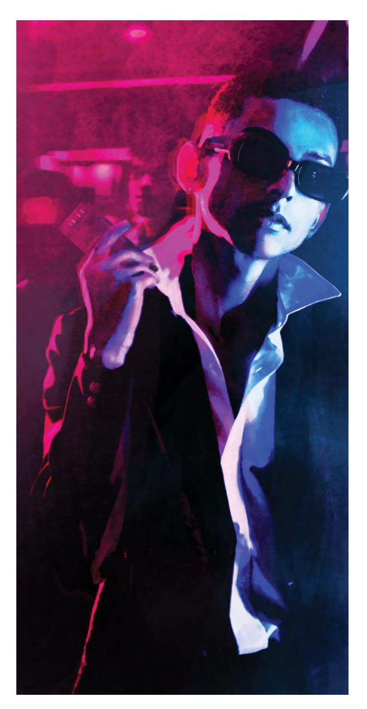

## Заслуги Достоинства Убежища

Как и в случае со всеми другими достоинствами убежища, котерии часто считают, что выгоднее приобрести их для отличного группового убежища, чем тратить то же количество очков (или больше!) на множество менее надежных личных убежищ.

#### КОММЕРЧЕСКОЕ ПРЕДПРИЯТИЕ •• ИЛИ •••

Вы сдаете свое убежище в аренду отдельному бизнесу: колл-центру, кофейне, прачечной или салону. Вы даже можете управлять бизнесом сами (или с помощью наемников) как корпоративная группа (с. 160), хотя рассказчику следует избегать превращения этой игры в личный ужас в игру в ужас управления бизнесом.

Люди живут своей повседневной жизнью, а вы спите в переоборудованном подвале или в одной из серверных комнат, где хранится все вышедшее из строя оборудование. Бизнес приносит ежемесячную арендную плату (или прибыль, если вы им владеете), обеспечивая вам постоянный приток средств.

Недостатки: Большое количество посторонних людей, общение с местными чиновниками и налоги на бизнес, которые могут привести к тому, что вы окажетесь в весьма затруднительном положении. Сдача в аренду преступникам избавляет от налогов и бумажной волокиты, но увеличивает риск столкновения с копами и другими менее сговорчивыми преступниками. Уменьшите количество точек в базовом убежище на одну для пулов, связанных с конфиденциальностью вашего убежища, и

для защиты от финансового или криминального вторжения (выбирается при выборе этого

#### достоинства).

Точки в этом достоинстве примерно равны эквиваленту ресурсов, и рассказчик может разрешить вам использовать ее точки вместо ресурсов, если такая замена имеет смысл. Она также добавляет два кубика к пулам для выполнения действий, связанных с деятельностью или основной компетенцией вашего предприятия, для взаимодействия с другими местными предприятиями и для проверки готовности к тому, что у вас уже есть то, что вам нужно в данный момент (Vampire: The Masquerade, p. 410). В конце концов, у предприятий есть инвентарь и шкафы с запасами.

Однако если с вашим "Убежищем" что-то случится, вы уже не будете иметь этих ресурсоподобных точек: в ваш бильярдный зал не поступят деньги, если он сгорит или если ФБР закроет его как место преступления. В качестве запасного варианта вы можете взять "обычные" точки Ресурсов. Они не суммируются: две точки "Бизнес-учреждение" плюс две точки "Ресурсы" означают, что у вас два потока доходов среднего класса; вы не станете богачом с четырьмя точками.

•• Ваш бизнес - это процветающий местный концерн или национальная сеть магазинов.

••• Ваш бизнес - это доминирующий местный концерн или офис международной компании. Возможно, у вас есть несколько этажей небоскреба, или офисное здание рядом с аэропортом, или даже пирс и склады в доках, где вы собираете плату с судов и грузоотправителей.

#### ÔÓÐÊÓÑ **•** ÈËÈ **•••**

Ваше убежище находится над узлом или развилкой в жилах Земли, или над изломом Завесы. Невидимое для обычного зрения (хотя, возможно, и не для Ясновидения или различных ритуалов), оно находится под заметным местом: вершиной лестницы, фонтаном в саду, центром комнаты (Архитектура (Гум.Наука) + Оккультизм могут позволить кому-то определить его местоположение, если он знает, что ищет). Сородичи чувствуют притяжение магических энергий в этом месте, а люди часто нервничают или испытывают тошноту. Ритуалы Колдовства Крови или Церемонии Обливиона (выберите, когда возьмете это Преимущество) используют силу фуркуса. Каждая точка в этой заслуге добавляет один кубик к пулам кубиков ритуала (или церемонии), используемых в фуркусе. (По усмотрению Рассказчика, она может также вычесть один кубик из социального набора, используемого для успокоения или соблазнения смертных, или добавить один кубик при общении со смертными магами изгороди или другими оккультными поклонниками). Звериные провалы в таких проверках могут также привести к особенно ужасным или эльдрическим результатам: энергия из фуркуса, причиняющая вред или проклинающая колдуна, случайный вызов сущности или явный магический импульс из места, где находится убежище. В зависимости от церемонии, полный или зверский провал может автоматически наложить на убежище недостаток "Сверхъестественная проблема".

#### МАШИНОСТРОИТЕЛЬНЫЙ ЦЕХ •+

В вашем убежище имеются самые современные инструменты, оборудование и машины в специально отведенном рабочем помещении, а также запасы нефти, промышленных химикатов, бензина и других предметов первой необходимости. Каждая точка этой заслуги добавляет один кубик к набору кубиков для бросков ремесла, или других проверок, связанных с постройкой, ремонтом или разборкой машин и оборудования: Интеллект + Огнестрельное оружие (Оружейное дело) для создания пистолета-пулемета Sten, Интеллект + Техника для изготовления арбалета с помощью трехмерного принтера, Интеллект + Ремесло (Инженерное дело) для ремонта автомобиля и т.д. Для особо сложных механизмов, возможно, придется объяснять, как вы их добыли, если у вас нет ресурсов • • • или лучше.

Маленькие убежища с этой заслугой могут пополнять пулы только по одной специальности ремесла: у них недостаточно места для общей механической мастерской или для работы с автомобилями. Машинный цех с тремя точками может включать в себя мусоросжигательную печь; машинный цех с тремя точками в большом убежище может включать в себя дробилку или компактор для автомобилей.

## Недостатки Убежища

#### ОБЩЕСТВО (• ИЛИ ••)

Ваше убежище не является полностью вашей собственностью. Другие сородичи, помимо вас и вашего окружения, имеют к нему доступ и могут принимать решения, не советуясь с вами. Определите конкретные условия и определите степень тяжести этого недостатка в зависимости от этих обстоятельств. Версия этого недостатка с одной точкой относится к совместным убежищам: например, у вас есть один или несколько соседей по дому из числа персонажей Рассказчика или вы с нелой клалкой птеннов поселились в заброшенном здании. Все проблемы, которые они принесут с собой в убежище, станут и вашими проблемами. Группа, которая вместе взяла убежище, не получает автоматически этот недостаток; совместное проживание с группой имеет только столько недостатков, сколько вы взаимно создаете в игре.

Дефект совместного использования с одной точкой также распространяется на краткосрочные убежища: вы остановились в посольстве, убежище или кемпинге с расчетом на то, что вы будете двигаться дальше, и на ваше место в любой момент может прибыть другой сородич.

Получение нового общего убежища в этом случае не стоит больше никаких точек, но вы можете потерять точки, вложенные в улучшение старого, в дополнение к перемещению всех ваших вещей и повторному обучению вашего стада, где появляться по ночам.

Версия этого недостатка с двумя точками означает, что у вас есть местный домовладелец. Другой представитель рода имеет права на эту собственность (либо фактический земельный титул, либо грант от местного князя или барона) и милостиво (или нет) разрешает вам там ночевать. После создания убежища вы должны обсудить с хозяином любые изменения, которые вы хотите внести в свое убежище. Хозяин может входить в убежище по своему желанию. Особенно старые сородичные хозяева могут обращаться к вам за помощью или грязной работой, обращаясь с вами как с вассалом или ставленником.

Песнопения Тремере, убежища Носферату и храмы Министриев могут быть общими убежищами на одну или две точки для персонажей соответствующего клана, в зависимости от соотношения сил между вами и другими сородичами.

## Стадо

Некоторые типы питания полагаются на этот фон в большей степени, чем другие, например, Джентльмен, а хищник типа Бестия вообще не сможет эффективно использовать этот фон. История также может помочь решить, как использовать Стада, если они вообще разрешены, поскольку спорные территории, домены в зонах военных действий или кочевые и беглые котерии затрудняют доступ к этому Фону. Стада также могут смешиваться с другими фонами, что позволяет использовать смертных в большей степени. Подручные и союзники могут быть связаны со стадом игрока, а Рассказчик может позволить игрокам использовать подобные

комбинации и с другими фонами.

## **Влияние**

Основанное на политической власти, Влияние добавляет в историю интриги и политические войны. Использование Влияния - это не просто абстрактное манипулирование политикой города или средствами массовой информации. Вампирам определенных кланов может быть легче, чем другим, добавлять и использовать Влияние в различных сферах. Так, например, Бруха склонны к связям с политическими активистами или местными ополченцами. Малкавианцы чаще всего оказывают влияние на странные коллективы или мистические круги.

Создавая Влияния и решая, как они связаны с персонажем, подумайте и о стиле Питания: Кем вы должны манипулировать, чтобы помочь вам в охоте? Влияние также обеспечивает резервную защиту Домена вашей группы. Внутри группы наличие широкого спектра Влияния (как и широкой сети Контактов) обеспечивает гибкость планирования и реакции на действия противника. Например, имея влияние в местном политическом управлении, вы не сможете так эффективно перекрывать уличное движение, как это может сделать полицейский участок, но управление городского совета может включить ваших охранников "Убежища" в список одобренных городом "молодежных групп".

## Презираемый и непопулярный

Эти два недостатка позволяют организовать интересный игровой процесс, если вы хотите усилить самостоятельность вампиров в их собственном Домене. Презрение настраивает одну группу или район города активно против вас, и даже нейтралы остаются холодными, в то время как Неприязнь заставляет всех быть против вас в равной степени - любой из этих недостатков можно использовать при сплочении своего района. Конечно, когда вы посылаете своих союзников и подручных в другие районы, они могут столкнуться с дополнительными проблемами, даже если эти недостатки не затрагивают их (или ваши Информаторы) напрямую.

Вы также можете столкнуться с этими последствиями во время ночной прогулки: Тореадор, которого невзлюбили за то, что он загрузил видео с осуждением местной футбольной команды, вступает в бесконечные спортивные споры, когда он просто хочет спокойно поесть. Можно даже сочетать презрение или неприязнь с обычным Влиянием: представитель городской администрации встречается с вами только на парковке и настаивает на оплате наличными, но при этом она все равно разрешает вашему ночному клубу

работать всю ночь и иметь погрузочную платформу.

## Страницы истории

Страницы историй существуют для того, чтобы подчеркнуть определенный аспект мира для заинтересованного игрока и рассказчика, не заставляя каждого игрока осваивать все тонкости вампирского сеттинга. Страницы истории акцентирует внимание на какой-то группе, историческом событии или старейшине, относящихся конкретно к игроку, поощряя его к ответственности за этот аспект и напоминая рассказчику, что вампирические арканы существуют для того, чтобы служить истории за столом сегодня, а не как обязательные уроки истории.

Линия крови - это особый вид страниц историй, который выступает в качестве собственного типа фона.

## Линия крови

Вы были вовлечены в особый род, обладающий уникальными качествами. Это дает вам доступ ко второму листу, которым обладают только члены вашей кровной линии. При этом действуют все остальные правила и ограничения фона Страниц историй (Vampire: The Masquerade, p. 190) - "Кровная линия" является отдельным фоном, и поэтому вы можете обладать преимуществом как от него, так и от фона Страниц историй. У большинства Гекаты также есть своя Кровная линия.

Как и Страницу истории, вы можете выбрать только одну линию крови, хотя у вас может быть одна линия крови и одна линия Страницы истории. Рассказчики могут решить, что ранее опубликованные страницы истории, связанные с кровной линией (например, "Потомок Хардештадта" и "Потомок Елены" из Vampire: The Masquerade, p. 390-391) считаются Кровными линиями, что позволяет персонажам с такими Кровными линиями взять дополнительную, не

связанную с родословной Кровную линию.

## Маска

Политические интриги и политический ужас предполагают смену или чередование личностей, что является ключевой частью данного фона. В базовом варианте этот фон позволяет иметь работу, водить машину, оплачивать телефонные счета, пользоваться банковскими картами и в остальном оставаться в некоторой степени привязанным к смертному обществу. История, в которой особое внимание уделяется смене или альтернативным личностям, может также позволить персонажу с несколькими Масками смягчить проблемы от славы или скрыться от противников - на некоторое время.

## Стертая личность и Фальсификатор

"Стертая личность" хорошо сочетается с персонажем, выступающим в роли шпиона или агента своей секты, призрака в машине для своих целей или целей своих покровителей. Фальификатор дает игроку возможность изготавливать маски для других за определенную плату и с небольшим риском. Этот фон является отличным побочным заработком и сюжетным ходом: персонажи могут продавать свое ремесло за деньги или благодеяния, одновременно создавая потенциальную опасность со стороны охотников и

врагов своих клиентов.

## Пустотелый и покойник

Как и другие фоновые недостатки, они не требуют наличия у персонажа точек на фоне маски. Они действуют как маскировочные средства, привлекая нежелательное внимание врагов и даже близких. Персонаж, старающийся избегать камер наблюдения или внимания служб безопасности, может оставаться под радаром Коалиции даже с "Пустотелым", но от "Покойника" труднее избавиться без активных способностей к маскировке.

Ваша знаменитая смерть делает вас уязвимым в любой момент, когда смертные обратят на вас внимание: возможно, Netflix снял документальный фильм о вашем убийстве по горячим следам, или активисты расклеили по городу ваше лицо во время молитвы при свечах. Баллотировались ли вы в местные органы власти? Ваша ухмылка украшала билборды с рекламой вашей юридической фирмы,

занимающейся преследованием скорой помощи?

## Мавла

Во многих случаях старшие или более опытные сородичи служат вашими мавлами. Прародитель, заботящийся о развитии своего ребенка, становится стандартным Мавлой, или какой-нибудь член фракции или секты, "завербовавшей" вас, назначается вашим замполитом или духовником, следящим за тем, чтобы вы не растратили потенциал, который разглядели в вас создатели. Однако у вас может быть и молодая Мавла: верный друг из ваших земных дней, также Воплощенный и удивительно надежный до сих пор.

Большее количество точек может означать, что Мавла занимает более ценное положение: новорожденный, который обычно стоит одну точку, может стоить две или даже три точки в качестве вашего информатора в личном окружении местного барона или князя. Рассказчик должен сам определить, стоит ли иметь шпиона в лагере врага больше или меньше, чем шпиона при дворе своего господина в этой истории.

## Конкурент

Поскольку конкурент может стать движущей силой сюжета в любой момент, рассказчику и игроку следует заранее и достаточно подробно обсудить его специфику: секта или фракция противника неизбежно будет играть важную роль в повествовании истории, поэтому лучше всего брать Конкурента, который уже вписывается в него. Более могущественные Конкуренты используют вас как рычаг давления на своего настоящего врага: вашего сира, мавла или другого номинального начальника.

Тем не менее, личный Конкурент может быть интересен: возможно, вы и ваш Конкурент были приняты в одно и то же время и с тех пор соперничаете за продвижение в своей секте. Или обратная перспектива: на самом деле вы - великий враг своего Конкурента. Возможно, они предали вас, подставили перед князем, изгнали со двора или отправили в ссылку. Теперь вы вернулись, и ваша

главная цель - уничтожить своего конкурента.

## Торговля долгами

В большинстве случаев Статус, Влияние, Мавла и другие Фоны в достаточной степени отражают социальные ресурсы персонажа, но в некоторых случаях сюжет требует более детального использования долгов и благодеяний (Vampire: The Masquerade, pp. 314-315), причитающихся конкретным людям: "Мой сир спас ваше убежище во время восстания, помните", - это более увлекательно и интригующе, чем точка в статусе. Это также менее полезно в целом, но дает более конкретные рычаги воздействия на конкретного вампира.

Отдельные персонажи могут приобретать разовые блага у других Сородичей во время генерации персонажа. Малые блага стоят половину очков (округление в большую сторону) от эквивалента Мавла (Vampire: The Masquerade, p. 193). Крупные блага стоят на одну точку больше, чем мелкие. Персонажи не могут приобретать жизненные блага при создании персонажа без явного согласия Рассказчика. Если рассказчик соглашается, то блага жизни стоит на три точки больше, чем эквивалентный бонусы малой силы.

| Малое благо | Крупное благо | Кредитор / Должник                  | Малый долг | Крупный долг | Долг жизни |
|-------------|---------------|-------------------------------------|------------|--------------|------------|
| •           | ••            | Неонат                              | (•)        | (•)          | (••)       |
| •           | ••            | Анцилла                             | (•)        | (•)          | (••)       |
| ••          | •••           | Старейшина                          | (•)        | (••)         | (••)       |
| ••          | •••           | Примоген или член Совета Анархов | (••)       | (••)         | (•••)      |
| •••         | ••••          | Князь или Барон                     | (••)       | (•••)        | (•••)      |

#### ÐÀÑÕÎÄÛ ÍÀ ÎÏËÀÒÓ ÒÐÓÄÀ È ÄÎËÃÀ

Долги дают гораздо меньше очков, если брать их как недостатки, чем они стоят как достоинства. Долги - это отстой, что тут скажешь. Однако быть в большом долгу (в долгу за большое благо) перед вампиром с более высоким статусом - это еще хуже. Один раз за историю кредитор персонажа или его приспешники могут попросить его об услуге, от которой он не может отказаться, не рискуя быть отвергнутым, подвергнуться охоте за кровью или еще чему-нибудь похуже. Услуга может принять любую форму и часто означает подвергнуть персонажа смертельной опасности или разрушить его репутацию.

Если персонаж оказывается в пожизненном долгу перед вампиром с высоким статусом, он может просто получить Кровные узы и увлечь за собой. Даже вампиры, не являющиеся каитиффами, могут испытывать такую задолженность как долговое порабощение (стр. 127).

Во всем остальном малые, большие и жизненные блага действуют в соответствии с описаниями, приведенными в Vampire: The Masquerade (с. 314-315). Отслеживайте все долги и блага по отдельности. Обратите внимание, что тривиальные блага, как простые, легко выполняемые обещания, в этой системе не отслеживаются.

Долги и блага нельзя приобрести или погасить за очки опыта. После создания персонажа они могут быть получены (или потеряны) только в результате действий персонажа в игре.

## Ресурсы

В МИРЕ ТЬМЫ и в мире живых деньги всегда говорят. Рассматривайте ресурсы как последнюю линию убеждения или допроса, когда обаяни не работает или когда другие фоны не могут достичь проблемы. Ресурсы всегда могут дотянуться до когото. Молодые вампиры, такие как вы, лучше понимают, что смертные могут сделать для вас, чем старые сородичи, которые видят в них только пищу или домашних животных.

И у вас есть и знания, и средства, чтобы их мотивировать. Возможно, вы не сможете остановить старейшину с помощью денег, но толстая пачка бенджаминов может убедить многих смертных поджигателей, репортеров или полицейских постараться сделать все возможное для этого.

Определите источник ваших ресурсов - чем он индивидуальнее, тем лучше для сюжета. Продаете ли вы малкавианские предсказания (с соответствующим редактированием) дневным трейдерам или живете на гонорары от десятилетней хитовой песни? Нашли ли вы в лесу большой мешок с деньгами мафии? Подумайте о своем стиле Питания как о возможном объяснении Ресурсов: вы даете десятину своим поклонникам, как Идол, или кидаете своих жертв на деньги или наркотики, как Налётчик?

Рассказчикам также следует помнить о возможности использования высоких (4+) значений Ресурсов. Получение доступа в эксклюзивный клуб становится гораздо менее интересным, если персонаж может просто купить помещение с

помощью телефонного звонка.

## Подручные

Подручные делают то, чего не делают союзники и контактеры, и часто даже совершают убийства и другие преступления. Смертные могут даже испытывать к вам достаточную любовь или преданность, чтобы совершать такие поступки, не будучи при этом гулями или рабами. Поскольку Подручные должны быть названы по имени, не помешает рассмотреть их мотивы и обусловленность, а рассказчику задать вопрос о том, что теоретически может разрушить эти отношения. Сами отношения могут быть разными. Некоторые Сородичи просто держат Подручных как надежных людей на побегушках, которые могут выходить на улицу при свете дня. Другие используют своего Подручного как доверенное лицо, сочувствующее ухо, помогающее нести бремя вечной жизни и сопутствующей ей печали. Какую бы ответственность вы ни чувствовали по отношению к своему Подручному, его обязанности по отношению к вам превосходят ее. В историях, написанных в стиле театральных постановок (стр. 198), игроки часто изображают Подручных других персонажей. Особенно в таких историях игрокам необходимо осознавать динамику власти и ролевые проблемы, связанные с этим (см. раздел "Различия в силе", с. 220).

## Преследователи

Соблазн при использовании этого недостатка, который рассказчик должен всячески поощрять, состоит в том, чтобы использовать преследователя в качестве "бесплатного" (хотя и несколько ненадежного) Подручного, который, конечно же, взорвется, как только вы начнете от него зависеть. Рассказчик должен настаивать на том, чтобы вы ответили на два основных вопроса, когда принимаете этот недостаток: что преследователь хочет от вас и почему вы просто не убили его? Напряжение между этими двумя ответами и будет определять сюжет преследователя.

Даже в большей степени, чем большинство недостатков, этот недостаток следует создавать совместно со всей группой, чтобы избежать неприятного отражения стрессов и проблем в реальной жизни другого игрока. Обязательно обсудите "Приёмы индивидуальной настройки" (Vampire: The Masquerade, p. 423) относительно того, когда разыгрывается преследователь, кто его разыгрывает и какова его роль (если таковая имеется) в игре. Сложнее придумать вариант преследователей с дефектами, за исключением, конечно, классического варианта "группа - это группа".

## Статус

Статус, как правило, не переходит из одной секты в другую, поскольку в каждой секте ценятся различные достижения и добродетели. Статус также может иметь более узкое применение, чем полноценная секта, например, обозначать ранг в храме Министриев или в капелле Тремеров. Статус и Слава в некоторой степени пересекаются, но статус, как правило, обеспечивает уважение. Вампир может получить Славу за драматическое убийство соперника, но воин Бану Хаким может также (или вместо этого) получить точку Статуса в своем клане за свой поступок. Статус может также пересекаться со Страницами истории, что может оправдать несколько мутный или туманный Статус: двойной агент Тео Белла может иметь реальный Статус в Совете Анархов, и Статус прикрытия, созданный в Камарилье путем некой теневой игры. Обсудите локальный, ограниченный или туманный Статус с Рассказчиком, чтобы убедиться, что его история фокусируется на проблемах, которым соответствует такой Статус, или на его вкусах.

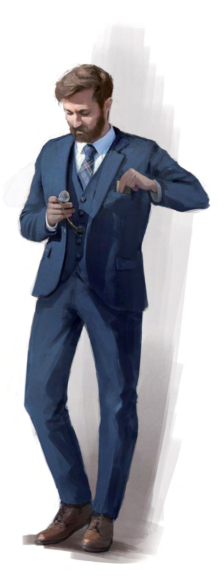

#### ГОРОДСКИЕ ТАЙНЫ •

Каким-то образом вы узнали страшную тайну о структуре власти Сородичей в городе, возможно, конкретно о ком-то в нем. Определите точный характер информации с Рассказчиком. Если секрет относится только к смертным делам («Мэр тайно трахается с солдатом русской мафии»), это всего лишь способ объяснить ваше Влияние. Несколько влиятельных игроков в городе знают, что у вас есть эта информация, или сильно подозревают ее. Надеюсь, вы приняли меры, чтобы тайна вышла наружу после вашего загадочного исчезновения. Вы можете продать эту информацию по высокой цене, но ее истинная ценность - защита: те, кто хочет, чтобы она оставалась в секрете, заинтересованы в том, чтобы вы были счастливы. Конечно, если вы испытаете удачу, они могут решить, что ваше молчание всегда имеет более высокий приоритет. В некоторых обстоятельствах это Дополнение больше похоже на Влияние, чем на Статус; Рассказчик должен определить, когда и как добавляется это к Социальному пулу или, возможно, к проверке Расследования или Проницательности. Вы можете взять эту точку фона не более трех раз, каждый раз с новым секретом.

## Новые Достоинства И Недостатки

Достоинства и недостатки могут помочь сделать характер более отчетливым и индивидуальным. Для получения дополнительной информации о достоинствах и недостатках см. 179 из Вампир: Маскарад.

Большинство этих новых Достоинств (те, что отмечены символом) относятся как к смертным, так и к гулям и Сородичам. В некоторых случаях Рассказчик (или игрок) должен придумать достаточно убедительное объяснение тому, что не-Сородичи могут иметь, например, кажущуюся сверхъестественной Удачу Дьявола. Чтобы узнать о конкретных преимуществах Каитиффов, Слабокровных и Гулей, см. соответствующие разделы (стр. 126, 134 и 141).

## Достоинства

## Достоинства внешности

## ИЗВЕСТНОЕ ЛИЦО .

Вы имеете случайное или очень близкое сходство с кем-то очень известным. Иногда это работает в вашу пользу. В других случаях это приводит к тому, что "Шарлиз Терон укусила того полицейского за шею!". Вы получаете два кубика к социальным проверкам в обстоятельствах, когда можете использовать свой статус двойника, но получаете штраф в два кубика, когда пытаетесь спрятаться в толпе или в других

местах, где вы хотите избежать узнавания.

#### \* AHTEN .

Вы выглядите совершенно невинным и безупречным, и окружающим гораздо легче поверить в ваши добрые намерения. Добавьте два кубика к любым броскам, связанным с избежанием подозрений или отведением вины, на усмотрение рассказчика.

## -3AMETATEJLHAR OCOEEHHOCTL .

Вы обладаете редкой, запоминающейся особенностью, такой как яркий цвет глаз, нетипичные зрачки или необычный цвет лица, дающей бонус в два кубика при общении с незнакомцами. (Новизна быстро исчезает.) Чтобы замаскироваться, возьмите штраф в один кубик.

## Достоинства питания

## - РАСПОЗНАВАНИЕ СОСУДОВ .

Один из простых способов разозлить род питаться его стадом. Сородич ревностно охраняет свои стада, и вы научились избегать их, умея по запаху определять, кто из смертных принадлежит к тому или иному стаду или является той или иной Кровавой куклой.

Победа в проверке "Упорство + Наблюдательность" на сложности 2 позволяет почувствовать, питался ли смертный в последнее время. Критическая победа позволяет почувствовать, что кормление повторяется, что, вероятно, делает его частью чьего-то стада.

## Мифические достоинства ДЬЯВОЛЬСКАЯ УДАЧА ....

За ваши промахи всегда будет отвечать кто-то другой, пока есть кому взять вину на себя. Благодаря любимому лицу, ангелу-хранителю или чему-то более мрачному, вам удается проскальзывать, кататься и уворачиваться от неприятностей, хотя вы постоянно нуждаетесь в новых друзьях, сжигая их как лесной пожар.

Один раз за сессию вы можете устроить несчастье нападение, обвинение, упрек или что-то среднее между ними - направленное на вас, чтобы оно постигло кого-то из ваших близких. Это может быть союзник, помощник, товарищ по дружине или даже Опору. Окончательное решение о том, что считать правильным несчастьем,

принимает Рассказчик.

#### **PEXMM HbDMT ..**

Ваше тело не возвращается автоматически в состояние смерти каждую ночь, что позволяет вам сохранять такие вещи, как новые прически, татуировки и другие модификации тела по вашему желанию. Однако вы все равно можете вернуться в исходное состояние смерти и исправить все последующие модификации, как если бы они были нанесены при тяжелых повреждениях. Это достоинство доступно только сородичам с силой крови 1 или ниже. (Если в какой-то момент ваша кровь становится более мощной, заслуга больше не дает никаких преимуществ, но если вы снова опускаетесь

до силы крови 1, она возвращается).

# Другие достоинства

## ПРОВЕРИТЬ СТВОЛ .

Наемникам и гастарбайтерам приходится держать под рукой инструменты для работы. Они никогда не знают, что может потребоваться в следующий раз, но стараются держать под рукой запас полезных инструментов. Каитифф, Равнос, Анарх и даже некоторые смертные особенно выигрывают от этой заслуги.

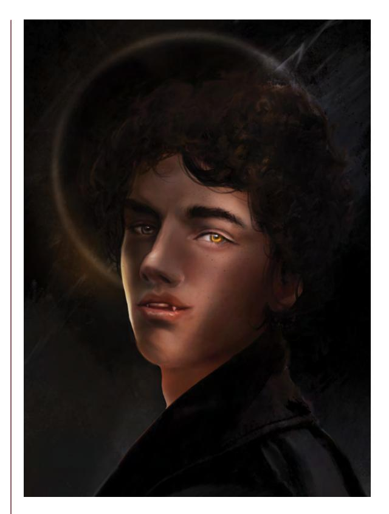

Вы имеете свободный доступ к арсеналу или тайнику с инструментами и оборудованием. Ни один из этих предметов не может превышать стоимость, доступную персонажу с Ресурсами 2. Обычно в тайнике можно найти обрез ружья, ржавые болторезы, половину рулона изоленты, самодельные колья, полупустые бутылки с жидкостью для зажигалок и все остальное, что позволит рассказчик. За предметы, входящие в эту группу ресурсов, возьмите дополнительно две точки в пуле готовность (Vampire: The Masquerade, р. 410). Потеря машины, убежища или другого места хранения может прервать действие этого достоинства, пока вы не создадите новый тайник.

## СТОРОННИЙ ХАСТЛЕР ..

Люди, оказавшиеся на периферии, вынуждены постоянно работать, чтобы сохранить то немногое, что у них есть. Жонглирование миллионом поручений, одолжений и долгов стало для них второй натурой.

Один раз за сессию вы можете получить в свои руки предмет, информацию или доступ к событию, как если бы у вас было две точки в соответствующих Ресурсах, Контактах или Фоне Влияния. (Предметы, полученные с помощью ресурсов, скорее всего, придется вернуть в целости и сохранности.) Часто для этого приходится тратить часть ночи на обзвон источников информации и нажимать на свою неформальную сеть.

## **ТЕМПЕРИРОВАННАЯ ВОЛЯ ...**

Ваш упрямый дух не умер во время объятий, и вы стали понимать, когда люди пытаются заставить вас сделать что-то против вашей воли.

Вы всегда знаете, когда кто-то использует против вас Доминирование и Величие. Один раз за сессию, сопротивляясь Доминированию или Величию, вы можете добавить два дополнительных кубика к своему запасу сопротивления. Этим достоинством может воспользоваться только тот, у кого нет точек ни в Доминировании, ни в Величии. (Если вы приобретете Дисциплины позже или временно, как слабокровные, достоинство больше не дает никаких преимуществ, пока вы ими владеете).

#### **НЕПРИКОСНОВЕННЫЙ .....**

Власти предержащие очень неохотно наказывают вас даже за самые вопиющие преступления. Возможно, вы - тайная сила, стоящая за троном, или обладаете проклятым шантажом местного барона, или являетесь тайным ребенком юстициара или другого политического деятеля. Один раз за историю вы можете избежать официального наказания за преступление, которое в противном случае привело бы к вашему уничтожению или изгнанию из вашей секты, хотя вы можете получить частное порицание или столкнуться с последствиями по неофициальным каналам. Суд или Совет часто не обращают внимания и на более мелкие преступления, но сородичи низшего уровня могут посчитаться с вами за ваши предполагаемые проступки и показную безнаказанность.

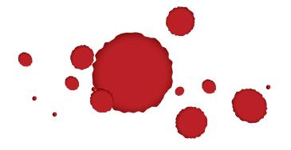

## Недостатки

## Недостатки внешности

#### **ЗЛОВОНИЕ** (•)

Ваш запах изо рта и тела сверхъестественно дурен, от него разит могилами и гниющей плотью. Даже Носферату возражают против вашего зловония. Вы можете предпринять незначительные меры, чтобы уменьшить вонь, например, обильно побрызгаться одеколоном, но это приводит к другим проблемам. Потеряйте один кубик при броске кубиков соблазнения и аналогичных социальных кубиков, а также два кубика при броске кубиков скрытности против противников, которые чувствуют запах, если только вы не находитесь с подветренной стороны.

## TPAHCHAPEHT (\*)

По какой-то причине вы не умеете врать, и это заметно. Либо у вас ужасное выражение лица, либо родители привили вам сильное желание быть правдивым, даже если это причиняет боль.

Потеряйте один кубик из любого пула, требующего Хитрость. Вы не можете набирать точки в "Хитрость".

## Недостаток питания

#### **ВЕНОЗНАЯ ЛЕНТА (\*)**

Вы считаете акт кормления чрезвычайно личным и не можете брать кровь у смертных, пока за вами наблюдают. Это означает, что вы часто питаетесь от неосознанных людей и стараетесь найти (или создать) жертву, находящуюся в состоянии наркотического опьянения или бессознательного состояния.

## Мифические недостатки

## УСТАРЕВАЮЩИЙ УПАДОК ••

Ваше неживое тело постоянно находится на грани превращения в труп, и только борьба с голодом удерживает вас от разложения.

В любой момент, когда уровень Голода становится равным 3 или выше, тело дряхлеет и разлагается, получая штраф в два кубика к физическим проверкам, а также к социальному взаимодействию со смертными, не говоря уже о риске для Маскарада.

#### Äâîéíîå ïðîêëÿòüå **••**

На вас наложено дополнительное проклятие Изъяна, заставляющее вас работать под дополнительным грузом, порожденным порочной природой основателя вашего клана.

Возьмите вариант Проклятия вашего клана (см. с. 56) в дополнение к своему обычному Проклятию. Рассказчик может запретить этот недостаток, если второй Изъян создаст проблемы или не окажет

должного влияния на историю.

# Другие недостатки

## ÆÀÆÄÓÙÈÉ ÇÍÀÍÈÉ **(•)**

Вы всегда боялись, что у вас не хватит времени, чтобы узнать все, что вы хотели, о том, что действительно важно. Что ж, одна проблема решена. Однако время учиться не всегда находится сейчас - вы с сожалением ставите закладку на учебу и занимаетесь более важными для жизни делами.

При создании персонажа выберите тему, которую он жаждет изучить. Когда персонаж натыкается на книги, обучающие видео, семинары в колледже или другие способы изучения выбранного предмета, сделайте бросок силы воли на Сложность 3, чтобы не поддаться своей одержимости.

#### ÄÎËÃÈ ÏÎ ÊÐÅÄÈÒÀÌ **(•)**

Вы задолжали другому сородичу (или двум другим) два незначительных блага. Должник обладает большей властью и влиянием, чем вы, в вампирском обществе, хотя и не обязательно в вашей секте. Они получают бонус в один кубик в социальных боях против вас, пока у них есть ваш маркер. Они могут призвать любой из этих долгов в любое время, но обычно они делают это тогда, когда вы действительно не хотите (или абсолютно не можете) их выплачивать. Однако если вам удастся успешно погасить оба долга, вам не придется брать еще один недостаток, чтобы "уравновесить" своего персонажа. Однако кредитору все равно нравится властвовать над вами, и он сохраняет бонус в один день.

Вы можете абсолютно точно взять этот недостаток вместе с одним или несколькими незначительными бонусами (Vampire: The Masquerade, стр. 193 и 315) при создании персонажа. Вы не можете взять этот недостаток, будучи обязанным персонажу другого игрока соответствующими бонусами.

Более подробная разбивка долгов и благ как фонов приведена в разделе Благи и долги, с. 115.

## ÐÈÑÊÎÂÛÉ ÈÃÐÎÊ **(•)**

Вы относитесь к тем людям, которые стремятся использовать любой шанс, чтобы ощутить жизнь в полной мере.

Когда Вам выпадает шанс поддаться рискованному искушению, которого Вы раньше не делали (например, нюхать новый наркотик, пить кровь вампира или брать в любовники сородича), Вы получаете штраф в два кубика ко всем действиям, пока либо не примете участие в новом опыте, либо сцена не закончится. Этот недостаток не заставляет вас совершать самоубийственные поступки... но вы не всегда можете точно предсказать все последствия своих действий.

## ÑËÀÁÀß ÂÎËß **(••)**

Вам трудно отстаивать свою индивидуальность, когда вы сталкиваетесь с чужой волей. Возможно, Вы не обязательно покорны; возможно, Вы чувствуете себя увереннее, когда следуете чужой воле. Вы можете быть частью свиты или стада вампира, но не обязательно преданы ему.

Против своего лидера или начальника возьмите штраф в один кубик к социальным броскам. Даже если вы знаете о попытке повлиять на вас ментально или эмоционально (например, с помощью Доминирования или Величия), вы не можете использовать системы активного сопротивления, чтобы избежать этих

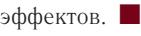

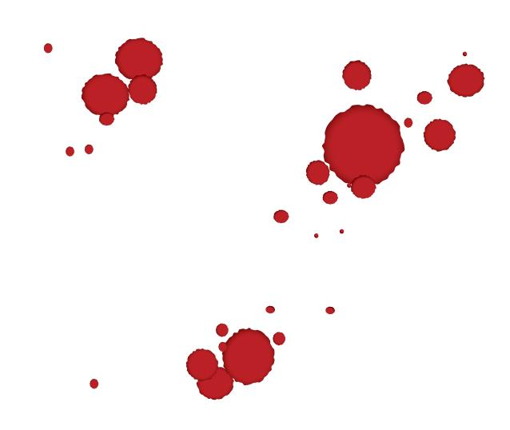

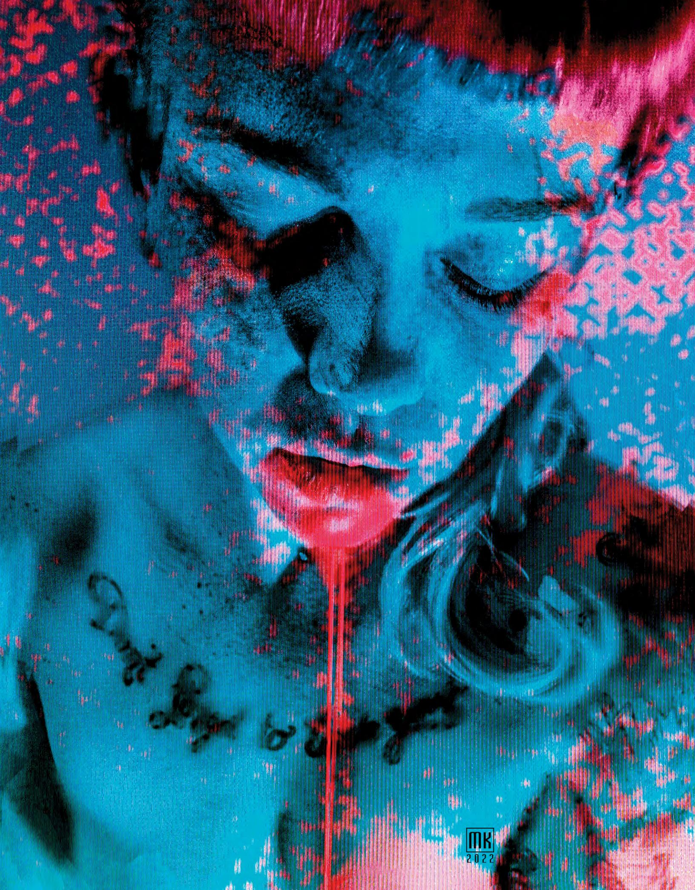

# ГЛАВА ЧЕТВЁРТАЯ

# КАСТОМЫ

Возможно, мы - выброшенные, а возможно, мы та часть, которую Он хранит. Эта тайна не дает нам покоя, чтобы узнать, что произойдет в следующей главе.

- ИСААК БАШЕВИС ПЕВЗНЕР

Вампиры думают, что управляют миром, или хотят сказать, что управляют. Те, кто видит их с трех шагов сзади, знают другое.

Казалось бы, у Сородичей и так достаточно врагов, чтобы создавать еще больше, проявляя презрение, жестокость, панику, пренебрежение и угнетение. Но они именно это и делают, изгоняя бесклановых, слабокровных, своих гулей и тех, без кого они действительно умрут, как не заслуживающих их внимания.

Они называют их изгоями или отбросами, пародиями на свое мнимое величие или существами, созданными лишь для того, чтобы служить и быть поданными в качестве пищи для своих ставленников.

Некоторые так называемые изгои принимают презрение и, как могут, поднимаются по лестнице Рода. Другие перерабатывают его в клинки. Многие делают и то, и другое. Еще большее число пытается выжить самостоятельно, не обращая внимания на высокомерный взгляд полнокровных... пока у них не остается иного выбора, кроме как оглянуться в гневе.

В этой главе речь пойдет о тех, кого Сородичи не желают замечать: о бесклановых каитиффах, зловещих слабокровных, недооцененных гулях и несчастных смертных, внезапно очнувшихся в мире тьмы.

# Сводная таблица Кастома

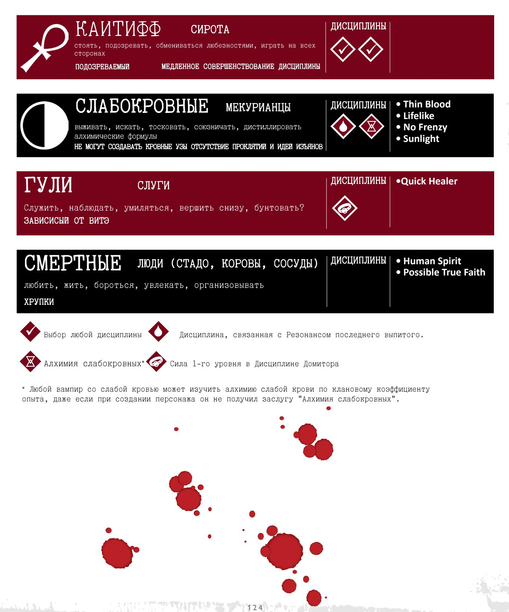

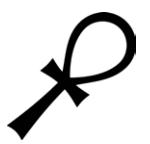

# КАИТИФФ

Каитиффы часто занимают свое место в обществе Сородичей в качестве наемных убийц. Однако их глубокое понимание слабой крови и улиц все чаще делает их востребованными бичами Камарильи и Аширры. Эти так называемые Пандоры добиваются уважения и власти, которых они были лишены в детстве, изгоняя своих сородичей слабой крови с территорий Башни из слоновой кости. Если Церковь Каина, возможно, никогда не примет вольного стрелка на проповедь, то Примогену всегда нужны те, кто не прочь пустить свежую кровь под ногти. Движению Анархов проще использовать каитиффов на передовой, чем спорить о том, заслуживают ли они такого же уважения, как Бруха или Гангрел, особенно с учетом притока в их ряды вампиров из бывшей Камарильи и Министрийства. Те каитиффы, которые преуспевают, могут даже стать любимыми питомцами князя Вентру или барона Цимисха. Не совсем семья, но инструмент, на который домен полагается, чтобы держать других в узде. Хотя в некоторых эмиратах Аширры и усыновили исключительных каитиффов, среди их союзников по Камарилье это вряд ли приживется. Даже в Аширре бесклановые чаще выполняют роль силовиков, чем офицеров.

Слабокровные и их собратья по клану бросают оскорбление "продажные" в адрес сирот, которые находят себе место среди других Родов, но у бесклановых мало времени на сожаления и упреки. Место, которое они себе отвоевали, может быть, и находится у подножия башни, но они помнят места и похуже, когда суеверные старейшины вопили об их уничтожении. Даже в эти ночи реакционные князья в некоторых владениях все еще охотятся на каитиффов ради развлечения, и все с радостью используют их в качестве козлов отпущения. Пандоры - выжившие, а не обращенные. Все каитиффы знают, что их жизнь зависит от того, насколько они полезны и не привлекают к себе внимания.

Хотя в эти ночи они могут оказаться в лучшем положении, чем слабокровные, это не потому, что они завоевали любовь и уважение кланов. Они приспособились к тому, чтобы стать частью системы, которая отвернулась бы от них, если бы не нуждалась в них, чтобы продолжать работать. Поэтому, хотя при дворе могут похвалить бескланового каинита, каитиффы знают, что никакой чести их там не ждет, независимо от их полезности и службы. Кланы не смотрят на них и не видят в них отражение своего Темного Отца. Напротив, самые набожные Сородичи

считают каитиффов предзнаменованием своего конца. Более могущественные, чем слабокровные, бесклановые, тем не менее, имеют много общих черт со своими почти вампирическими братьями и сестрами: адаптивность, выживание и инновации. То, что слабокровные добывают с помощью с таким трудом найденных алхимических формул, каитиффы, похоже, развивают интуитивно: новые способности, которые одновременно демонстрируют и подрывают их вампирскую природу. Несмотря на такое сходство, измученные каитиффы редко находят общий язык со слабокровными, которых они считают наивными и невежественными. Те каитиффы, которые все же приютили команду слабокровных, могут наслаждаться ролью старшего брата, но им трудно отказаться от нее, когда власть предержащие требуют кровавой жертвы. Но в Камарилье нет этики потребления и все такое, а за ближайшим углом всегда найдется новая банда слабых кровей, с которыми можно поиграть в веселого дядюшку.

Те непривязанные, кто не продался жестокому князю, мелочному барону или прагматичному эмиру, часто полностью выходят из игры. Те каитиффы, которые считали, что приход Анархов означает расширение их прав и возможностей, были быстро разуверились в этом, когда Министрии и Бруха взяли власть в свои руки, хотя большинство из них пришли на вечеринку с большим опозданием. Эти сгоревшие Каитиффы не заинтересованы в том, чтобы быть втянутыми в чужой Джихад. Они делают то, что должны, чтобы выжить, но отказываются верить во что-либо снова. Эти отставшие от жизни и бездельники знают всю ложь и лозунги, которыми их хотят задобрить. Несмотря на то, что втайне они радуются падению общества Сородичей, они знают, что даже это - игра для лохов. Эти каитиффы носят свой с таким трудом завоеванный цинизм как почетный знак - их единственной ошибкой было то, что они вообще во что-то верили.

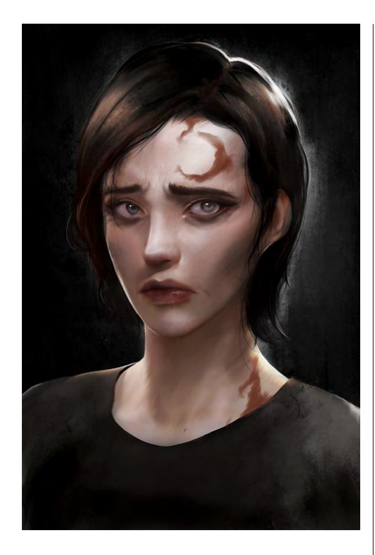

## Äîñòîèíñòâà êàèòèôôà

Эти достоинства доступны только персонажам Каитиффа.

## ЛЮБИМАЯ КРОВЬ **••••**

Вампирическая сила, не сдерживаемая проклятием Древних, течет через вас. Ваше интуитивное и легендарное владение вампирскими способностями, вероятно, внушает другим вампирам как благоговение, так и страх.

Вы можете приобрести точки в любой Дисциплине, даже если никогда не пробовали кровь другого вампира с этой Дисциплиной. Не может быть использован с недостатком "Мутная кровь" (см. с. 127).

## МЕТКА КАИНА **••**

Вы носите метку, физическую или духовную, которая заставляет других вампиров задуматься. Вампиры Камарильи и Аширры смотрят на ваш знак с опаской, а Анархи утверждают, что уважают вас за игру со старшими суевериями - но и они не слишком присматриваются к вашему знаку.

Даже каиниты Шабаша не решаются связываться с вами, хотя особо религиозные ноддисты могут привлечь к вам особое внимание.

Вы получаете два бонусных кубика при любой попытке запугать, задирать или корить других вампиров, придерживающихся мифа о Каине. Любой, кто пытается совершить над вами диаблери, не может добавить к броску свою силу крови, и любая неудача в

броске приводит к звериному провалу.

## ПЕРЕМЕШНИК **•••**

Сирот часто несправедливо называют ворами и диаблеристами, но некоторые из них действительно обладают способностью имитировать способности других вампиров, отведав их крови.

В течение одной ночи после того, как вы выпили кровь вампира на одну голодную смерть, вы можете выбрать и применить одну силу Дисциплины, которой обладает род, от которого вы питались. Эта сила не может быть на уровень выше, чем ваша высшая Дисциплина, хотя вам и не обязательно владеть той же Дисциплиной. Чтобы активировать эту силу, выполните обычные броски на пробуждение. Любые другие броски, необходимые для использования силы, используют уровень Дисциплины донора и ваши Атрибуты. В это время вы имитируете клановое проклятие донора с тем же уровнем тяжести, что и у донора. За ночь можно "одолжить" таким образом

только одну силу.

## СОЛНЦЕЗАЩИТНЫЙ **•••••**

Хотя среди родни распространен миф о том, что каитиффы и слабокровные могут ходить при солнечном свете, лишь немногие из них обладают чем-то похожим на эту способность. Этих немногих иногда называют дневными ходоками, а те каитиффы, которые обладают этой способностью, обычно держат ее в секрете, опасаясь охоты и людоедства со стороны других. Неудивительно, что изгои, способные ходить днем, могут оказаться востребованными благодаря своей особой способности и тем преимуществам, которые она дает им по сравнению с теми, кто вынужден дремать днем.

В первый ход сцены, когда вы находитесь под воздействием солнечного света, вы не получаете урона здоровья, получаете 1 урон силы воли и автоматически добиваетесь успеха при любых бросках на сопротивление безумию ужаса. В течение оставшейся части сцены все повреждения здоровья, полученные от солнечного света, мгновенно преобразуются в поверхностные повреждения.

## КЛЫКАСТЫЙ ДЯДЯ **•••**

Местные слабокровные знают вас как наставника и проводника. Каковы бы ни были ваши истинные мотивы, вы часто можете найти помощь среди слабокровных, не спрашивая дважды.

У вас есть легкий доступ к местной компании, состоящей из трех-пяти слабокровных. Они часто раньше других узнают, что происходит на улице, и иногда могут снабдить вас алхимическими снадобьями. Рассматривайте эту группу как группу союзников (Vampire: The Masquerade, p. 192), хотя, в отличие от обычных союзников, эта группа - нежить, хотя бы просто. Не может быть взята вместе с Ликвидатором

(стр. 127).

## Íåäîñòàòêè êàèòèôôà

### ЖИВОТНОЕ ВИТЭ **(••)**

Когда вы заключаете смертных в объятия или оставляете их умирать после кормления, Кровь превращает их в трупы-маньяков, испытывающих неутолимый голод.

Любой смертный, которого вы приняли или убили, накормив, возвращается через несколько ночей в виде отчаявшегося волка. Хотя эти несчастные часто слишком слабы, чтобы представлять большую угрозу (рассматриваются как гули; см. "Вампир: Маскарад", с. 372), иногда благодаря хитрости Крови из них вырастает настоящий монстр (рассматривается как волк; см. "Вампир: Маскарад", с. 375). Ваша жизнь это постоянная работа по наведению порядка, ведь как только местный князь или барон узнает о вашем состоянии, вы, скорее всего, получите личный (и

неизлечимый) визит от сильных мира сего.

#### ПРОКЛЯТИЕ КЛАНА **(••)**

Будучи каитиффом на волосок от гибели, вы все еще страдаете от проклятия клана своего сира. Хотя иногда это может помочь вам выдать себя за члена этого клана, чаще всего это лишь добавляет еще одну боль к вашему мучительному существованию.

Вы страдаете от проклятия клана вампиров по вашему выбору, скорее всего, клана вашего сира (если вы вообще знаете, кто он такой). Его тяжесть уменьшается вдвое (округлите в меньшую сторону,

минимум 1).

#### ДОЛГОВАЯ ЯМА **(••)**

Сиротам часто приходится продавать свои пресловутые души князьям и баронам, чтобы найти свое место в ночи.

Эти долги накапливаются, и лишь немногие каитиффы выходят из кармана власть имущих, поскольку система престижа разрушается, когда сородичное общество отказывается признавать политическое существование, а тем более права должника.

Вы задолжали несколько мелких или даже несколько крупных благодеяний вампиру с высоким статусом, возможно, первоначально полученным от вашего сира. Отслеживать эти долги бессмысленно, так как кредитор извлекает новые блага всякий раз, когда у него есть рычаги влияния на вас, и считает, что любое благодеяние погашено только тогда, когда к этому принуждают его коллеги. Они имеют бонус в два кубика к социальному бою против вас в присутствии других сородичей. Отказ от выполнения долга добавляет недостаток Изгоя (••) и даже может

привести к Кровавой охоте на вас.

## ЛИКВИДАТОР **(•)**

Слабокровные называют вас "пандором" и по возможности избегают вас. Они даже отказываются открыто разговаривать с вашими товарищами или другими соратниками. Возможно, вы служили бичом или проявляли особую жестокость, будучи членом отряда шерифа.

Применяйте штраф в два кубика ко всем своим социальным навыкам против слабокровных, кроме Запугивания. Не может быть

использовано вместе с "Клыкастым дядей" (с. 127).

## МУТНАЯ КРОВЬ **(•)**

Ваша Кровь не может вспомнить свою природу и должна напоминать о присущей ей силе каждый раз, когда вы хотите ее усилить.

Даже если вы уже владеете Дисциплиной, для приобретения точек в ней вам необходимо выпить кровь того, кто ею владеет. Не может быть использована вместе с заслугой "Любимая кровь" (см.

с. 126).

## ХОДЯЧИЙ ОМЕН **(••)**

Многие вампиры полагаются на предвидение или читают предзнаменования по ночам, а вы, как магнит, искажаете эти сверхъестественные компасы.

Любые гадания, предчувствия и другие виды предсказаний будущего в ваших владениях регулярно указывают на вас как на источник бед и несчастий. Хотя ваши близкие союзники научились не обращать на это внимания, другие оракулы выделяют вас, крича, когда за вами не охотятся те, кто хочет перенаправить будущее, которое, по их мнению, наступит от ваших рук.

Последствия этого недостатка в конечном итоге зависят от рассказчика, но он должен вызывать как минимум одну серьезную ссору за историю.

#### СЛОВА-КАРРИДЫ **(•)**

Ваше тело или его часть покрыты древними текстами вампирических преданий. Возможно, их начертал Ваш сир, или они появились сами по себе после Объятий. В любом случае, теневые силы пытаются использовать или уничтожить эти тексты.

Главный оккультный враг или сила в истории часто вмешивается в вашу жизнь, пытаясь заключить вас в тюрьму, околдовать, вытравить разум, связать кровью или нейтрализовать иным способом. (Они никогда бы не опустились до того, чтобы завербовать каитиффа, не будьте глупцом. Для них вы просто потерянная, непослушная книга.) Возможно, две такие силы борются за право редактировать вас! Любой другой персонаж, "прочитавший" полный текст на вашей коже, узнает страшную тайну, касающуюся Геенны, пророчества ноддистов, тайн Бахари и т.п. Вы и Рассказчик можете решить это вместе, или это может быть тайной для вас!

# ÑËÀÁÎÊÐÎÂÍÛÅ

Многие представители рода презирают слабокровных, считая их слабыми, или активно охотятся на них как на предвестников конца времен. Многие старейшины делали и то, и другое, и их наследники не видят причин отступать от этой традиции. Более слабые Анциллы переносят свой страх перед собственной слабостью на слабокровных, утверждая, что если позволить им разгуливать по улицам, то это ослабит город. Слабокровные тратят ценные ресурсы, а их растущая численность привлекает внимание Охотников. Кроме того, они не знают своего места и не уважают своих старейшин. Их присутствие создает невыносимый риск для полнокровных, настоящих вампиров. К черту это. Ты не просил втягивать тебя в их дерьмовое общество, и тебе точно не нужно их разрешение, чтобы остаться.

Но если вы собираетесь придерживаться такой позиции, вам нужны друзья или, по крайней мере, поддержка.

Игрокам, только начинающим знакомство с "Вампиром", будет полезно сыграть в историю "слабой крови". Персонажи слабой крови знают о мире, его истории и возможностях вампиров не больше, чем вы! Кроме того, такой взгляд со стороны позволяет игрокам старых изданий безболезненно перестроить свои ожидания от нового тысячелетия тьмы.

## ÈÑÒÎÐÈß ÑËÀÁÎÉ ÊÐÎÂÈ

Группа, состоящая из представителей слабой крови, имеет дело с совершенно иными элементами, нежели история преимущественно полнокровных сородичей. В центре повествования этой истории - ночные похождения слабокрвоных, их существование во враждебном им мире и их место в этом мире.

Слабокровные проводят свои ночи на окраинах общества Сородичей, и двери редко открываются для вступления в секту, если только секта не хочет что-то получить. Даже внутри секты слаокровные находят на весах старших когти, направленные против них. Власти предержащие редко позволяют слабокровным питаться в лучших местах без последствий, а когда им удается стать первопроходцами или взрастить желаемый участок территории, более могущественные вампиры прогоняют их оттуда. Некоторые представители слабой крови уединяются в кварталах, которые никому не нужны, или даже переселяются в небольшие города, как это сделали в прошлые века каитиффы.

Динамика взаимоотношений между слабыми кровями также смещается в сторону от более традиционных организаций. Вместо этого они органично развиваются в каждом конкретном месте: слабокровные либо держатся сами по себе, либо берут на себя роли, необходимые в городе. Многие представители слабой крови держатся в тени, их ночи мало чем отличаются от тех, когда они были живы, в то время как другие стремятся к общению с подобными вампирами. У каждого новичка есть своя причина для этого, что приводит к самым разным

взаимодействиям.

## Çà÷åì èãðàòü â ñëàáîêðîâíûå èñòîðèè?

У персонажей слабой крови совершенно иной взгляд на мир и заключенную в нем тьму. Слабокровные занимают "сладкое место" в повествовании среди окружающих их сверхъестественных ужасов: они достаточно сильны, чтобы привлекать их внимание, и достаточно слабы, чтобы постоянно находиться в опасности.

Эта борьба за выживание сопровождается таинственными поисками, а искра алхимии слабой крови дает им шанс вернуть свои позиции или хотя бы удержать их.

В истории слабокровных меньше внимания уделяется политике, поскольку слабокровным нелегко ориентироваться в политике города или секты. Котерии сосредотачиваются на своих ночных нуждах и краткосрочных проблемах, редко имея ресурсы или власть для решения долгосрочных или системных проблем, которые их сдерживают. Тон и действие смещаются в сторону уличных историй, не привязанных к жестким сюжетам или ожиданиям гарпий или идеологов. Преобладают темы командной работы, неуверенности и изгойства. Персонажи строят связи внутри своей команды и в своем районе, прежде чем выходить в большой мир. Охота и обучение максимальному использованию способностей одной точки в противостоянии с Сородичами создают множество кровавых проблем, как и случайные

нападения бичей или истребителей.

Некоторые игроки могут захотеть поэкспериментировать с различными аспектами вампиризма. Возможно, другие кланы покажутся им более строгими, чем клан слабокровных. История слабой крови позволяет игрокам влиять на то, что значит быть вампиром, позволяя им исследовать такие вещи, как алхимия слабой крови, несмерть, что значит быть в контакте со своим зверем, и даже экспериментировать с солнечным светом. Ведение истории со слабой кровью позволяет игрокам адаптироваться к своему миру с меньшими ограничениями и при этом играть в вампиров.

## Îðãàíèçàöèÿ ñëàáîêðîíûõ èñòîðèé

При выборе стиля игры котерия может рассмотреть несколько подходов к созданию истории слабой крови. Во время нулевой сессии Рассказчику и игрокам необходимо решить, какой тип истории они хотят исследовать в составе котерии "Слабой крови". Некоторые вопросы, над которыми следует подумать, таковы:

- С каким видом сверхъестественного ужаса вы хотели бы столкнуться?
- Стали бы ваши герои исследовать возможность "излечения" от вампиризма?

- Как вам больше нравится играть с высокой политикой Сородичей или с низким уличным экшеном?
- Как ваш персонаж относится к алхимии слабой крови?
- Какую цель преследует ваш персонаж?

Этот список не является исчерпывающим, и в процессе работы вы можете найти другие вопросы. Каждый игрок должен ответить на них как можно лучше. После того как рассказчик получит представление о персонажах и их мировоззрении, он может определить направление, в котором будет вести свою историю.

Сессия, на которой вы решаете, в каком городе будет происходить действие вашей истории, придумываете персонажей, устанавливаете средства защиты стола и делаете все остальное, что нужно сделать перед тем, как начать писать историю, называется нулевой сессией. (См. **Vampire**: **The Masquerade**, **pp**. 135-138.) Иногда нулевая сессия занимает больше одного сеанса. Это не проблема, ведь прежде чем возводить структуру, нужно заложить хороший фундамент.

## Ñëàáîêðîâíûå ñþæåòíûå

## çàâÿçêè

Рассказчик и игроки должны продумать различные сюжетные завязки для слабых кровей в своей истории. Используйте эти сюжетные завязки для того, чтобы ввести слабую кровь в историю, дополнить биографию персонажа для будущей интриги, или для того, чтобы заглянуть в нее во время истории, чтобы помочь совместными усилиями сделать игру насыщенной.

- Большую часть своей вампирической жизни вы провели в одиночестве, уединившись от других сородичей. Однако недавно вы узнали о существовании в вашем районе нескольких слабокровных, которые захотели, чтобы вы присоединились к ним и работали вместе, добывая ресурсы и выживая. Кроме того, они готовы рассказать вам больше о вампирах и мире, в котором вы сейчас живете.
- Вы только что сделали худшее из возможных открытий. Переехав в другой город, вы узнаете, что Камарилья собирается очистить город от всех вампиров, не признанных сектой, и уничтожать их на месте. Вам нужно решить, где вы будете прятаться или попытаетесь вступить в секту. Если последнее, то кого превратить в бичей, чтобы доказать свою преданность?

- Вы заразились или родились с неизвестной болезнью, вызывающей острую аллергию на солнечный свет и заставляющей вас пить кровь. Вместе с другими больными вы пытаетесь найти лекарство, скрываясь при этом от человекоподобных монстров со сверхъестественными способностями и политическими связями, охотящихся на вас за то, что вы такой, какой есть.
- Вы разгневали не того человека, и тот наложил на вас проклятие, лишившее вас силы, которую давала ваша кровь. В результате вы оказались среди слабокровных, напуганных, брошенных и слабых. Вам нет места в вашей бывшей секте, когда о вас узнали, и теперь вы должны понять, как выжить или снова усилить свою кровь.

## Îðãàíèçàöèÿ

Слабокровные не имеют централизованной организации, как некоторые кланы. У них нет ни общих ресурсов предков, чтобы обеспечить безопасность таких групп, ни политического капитала, чтобы интегрировать их в более крупное общество Сородичей. Вместо этого слабокровные собираются в каждом городе, причем степень организации и численность групп зависят от местных условий. Почти во всех городах есть хотя бы один слабокровный совет или банда саморадикализовавшихся анархов, возможно, даже признанная настоящим комитетом анархов в городе, но часто изолированная как политически, так и географически. В большом городе с большим количеством слабокровных, но мощным присутствием Камарильи возникает множество различных мелких банд и группировок; в маленьком городе с вакуумом власти возникает более крупная сеть слабокровных, которая в течение нескольких лет разделяется на фракции.

В вашем городе к таким зарождающимся группам можно отнести:

Алхимическая группировка: Ведущий алхимик города, обладающий слабой кровью, привлекает к себе клиентов, поклонников, коллег и, как правило, пару соперников со своими собственными персонами. Эта сцена напоминает нечто среднее между коктейльной культурой и хип-хоп клубом, в котором следят за миксерами и AJ и иногда устраивают кровавые разборки. Зная кого-либо из членов "позы", можно попасть в список приглашенных и даже получить место для ночевки.

Подвал: Названный в честь своего сабреддита r/ BasementDrinkin или своей промозглой штаб-квартиры, Подвал считает себя информационным центром местных Слабокровных и претендует на создание национальной распределенной сети подобных групп. Слово "блокчейн" часто употребляется. Благонамеренные слабокровные рассказывают Подвалу о том, что им удалось узнать о вампиризме, сверхъестественном или местной структуре власти, и это якобы архивируется. Действительно, некоторые из этих сведений передаются новичкам. Почти наверняка в Подвал проникают другие фракции, хотя бы с целью дезинформации, и Подвал предлагает NSA и

Камарилье уничтожить его или перевербовать.

Фолк: Свободное сообщество взаимопомощи, возникшее как группа любителей Плюмайра в фуррисообществе, но распространившееся по другим местам встреч, посвященных фэнтези-жизни. Большинство фолков организуется локально, в пределах одного города или района, но некоторые общаются на расстоянии, чтобы безопасно путешествовать. Они принимают у себя путешествующих "членов семьи", давая им приют на день, предоставляя важную информацию о городе и даже кровь, если это необходимо. Кроме того, во время путешествий они обмениваются информацией, помогая Фолкам узнать, что происходит с другими слабокровными кровями в других городах. Чтобы стать членом Фолка, достаточно связаться с ними в каждом городе, помогать, когда это необходимо, и быть готовым назвать себя хипповым именем "Фолк".

Группа "Мунди": Мунди" получили свое название от "Атанор Мунди" - радикального алхимического манифеста, опубликованного в сети Usenet анонимным "Филателием Доу" в 1990-х годах. Первоначальная цель Доу заключалась в том, чтобы с помощью алхимии пережечь всех каинитов в настоящий философский камень, подарив миру вечную жизнь и свободу от болезней и старости. После исчезновения Доу примерно в 2002 г. движение мунди раскололось. Теперь мунди верят, что слабокровные, по крайней мере, обязательно достигнут высшего состояния, возможно, с помощью алхимии, диаблерии или специальных коктейлей из крови и добавок. Группировки мунди могут представлять собой пустые банды хвастунов, дружелюбных наркоманов в футболках с надписью "Атанор Понедельник" или хитрых завсегдатаев, которые только и ждут, чтобы уговорить (или похитить) другого слабокровного на эксперименты. К счастью, они редко сотрудничают друг с другом: каждый гуру мунди считает себя прирожденным ницшеанским убервампиром.

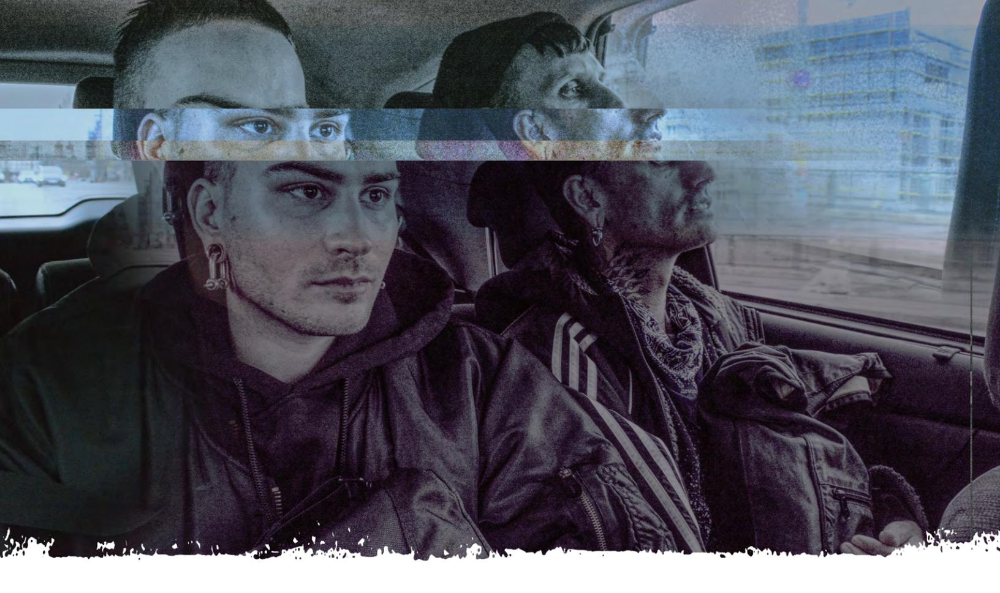

## Ñëàáîêðîâíûå è Ñåêòû

Мнения слабокровных относительно различных сект могут различаться, но большинство из них сходятся во мнении. Одинокий слабокровный может оказаться в выгодном положении в одной или нескольких сектах, но не каждый этим пользуется с таким комфортом. Счастливчик, нашедший учителя, передаст ему эту информацию, зная, что у него может быть совсем другой опыт.

## Àíàðõì

"Åñëè ÷åñòíî, ó íàñ áîëüøå øàíñîâ ñ Àíàðõàìè, ÷åì ñ ëþáîé äðóãîé ñåêòîé. Áîëüøèíñòâî èç íèõ íå çàäàþò ìíîãî âîïðîñîâ, ïîêà ìû íå ïîäíèìàåì øóìà. Õîòÿ ÿ äóìàþ, ÷òî îíè ìîãóò òåðïåòü íàñ ïðîñòî èç âðåäíîñòè".

Когда Анархи отступили против Камарильи и увели с собой большую часть Бруха и Гангрела, многие слабокровные увидели возможность наладить отношения с сектой и получить защиту более сильных по крови Сородичей. Анархи, в свою очередь, стали больше сотрудничать со слабокровными, просто чтобы насолить Камарилье.

Если человек слабой крови ищет защиты в какой-либо организации, то, скорее всего, именно в ней он чувствует себя наиболее комфортно. Банда слабой крови может получить статус Анарха, или слабая кровь может принять защиту Анарха в обмен на несколько одолжений. В целом слабокровные имеют лучший доступ к руководству Анарха, чем в других сектах. Анархи часто считают себя аутсайдерами и по этой причине симпатизируют слабой крови, но практические соображения выживания почти всегда берут верх над их верностью идеалам равенства. Каинитыанархи по-прежнему рассматривают Слабокровных как обузу, которая истощает ограниченные ресурсы, не давая при этом практически никакой силы.

Анархи принимают Слабокровных больше, чем Камарилья, но и клыки они умеют считать лучше, чем Башня из слоновой кости. Если численность слабокровных становится слишком большой, Анархи начинают опасаться их потенциального влияния и могут даже объявить чистку или мятеж, чтобы снизить соотношение. Бароны, настроенные на долгосрочную перспективу, активно вербуют слабокровных в особо опасные группировки, такие как Дневной дозор.

## Êàìàðèëüÿ

"Åñëè áû ìíå ïðèøëîñü âûáèðàòü ìåæäó ñåêòàìè, Êàìàðèëüÿ áûëà áû ïîñëåäíåé â ìîåì ñïèñêå. Ýòè ýëèòàðíûå óáëþäêè ñòàâÿò ñâîåé ëè÷íîé çàäà÷åé ñäåëàòü íàøå ñóùåñòâîâàíèå íàñòîëüêî æàëêèì, ÷òîáû ìû ñàìè ïîêîí÷èëè ñ æèçíüþ".

Любой представитель слабой крови, отправившийся в город, находящийся под контролем Камарильи (или пробудившийся в нем), должен быть начеку, чтобы не быть пойманным, либо представиться князю города и попросить разрешения остаться. Это сопряжено со значительным риском, если только слабокровный не обладает узкоспециализированными навыками или в городе нет необычайно открытого князя. Только вампиры, которым нечего терять, осмеливаются открыто нарушать общественные устои и безвкусно вступать в связь с отбросами слабой крови. Некоторые малкавианцы и носферату с особым удовольствием берут под свое крыло слабокровных, чтобы те пренебрегали общественными нормами, но слишком большое количество таких протеже вызывает презрение гарпий и социальную смерть.

Большинство меркурианцев предпочитают не высовываться и держаться на окраинах города или в неперспективных владениях. Таким образом, Бич часто становится главной точкой соприкосновения слабой крови с сильными мира сего в городе Камарильи. Эти исполнители воли князя колеблются между угрозами и указаниями слабокровавым членам общины оставаться в рамках городских традиций. В лучшем случае соратникам приходится иметь дело с неохотным хулиганом, который подает пример только по требованию князя или примогена. В худшем случае Бич - жестокий мясник, ищущий любой повод, чтобы разорвать Котерию и его членов на части.

Самая коварная угроза, с которой сталкивается слабокровка, действующая в домене Камарильи, - это соблазн самой Башни из слоновой кости. Камарилья понимает, насколько трудной может быть жизнь без системы поддержки, и может предложить многое перспективному вампиру, умеющему варить эликсиры, гулять под солнцем или иным образом проявить себя. Обещание легкой жизни и принятия в настоящий клан может оказаться трудновыполнимым для тех слабокровных, которые отказались от лечения своего состояния. Такие возможности выпадают нечасто, и слабокровные могут оказаться разорванными на части, когда их члены будут соперничать друг с другом за шанс присоединиться к Камарилье в качестве полноправного члена.

## Ñóäüáà êðîâè

Ночи, проведенные на слабой грани между смертным и бессмертным, оказываются непростыми для многих представителей слабой крови. Выбор между возвращением к солнцу и потерей бессмертия или попыткой усилить свою кровь и запятнать душу постоянно витает в их сознании. Однако, как и бессмертие, достижение любого из этих вариантов оказывается нелегким и может занять десятилетия.

Разработка проекта (с. 214) вместе с Рассказчиком отличный способ начать. Он позволяет игрокам продумать и разработать, как их персонаж превратится в смертного или усилит свою кровь, но это не единственный способ. Вы можете построить всю свою историю вокруг

попытки достичь одной или обеих этих целей.

## Ïîèñê Ñîëíöà

Перед игроками, желающими исследовать попытки изменить свою кровь и вновь обрести смертность, стоит цель длиной в историю, и она достойна исследования. Преследуют ли они Голконду, объединяются ли со смертным мистиком или священнослужителем, погружаются ли в древние колдовские предания или новые алхимические превращения, они встречают множество странных и опасных противников и, возможно, все больше сомневаются в ценности того, чтобы снова стать

хрупким и уязвимым.

## Óêðåïëåíèå êðîâè

Когда речь заходит об укреплении крови, Сородичи знают и боятся акта диаблери - питья у старших. Получить возможность доступа к полнокровной жиле, а тем более разрешение, может оказаться достаточно сложной задачей для рассказчика. Многие котерии слабой крови образуются только для того, чтобы отомстить вампиру, который их создал, выпив его досуха. Но успех влечет за собой клеймо: ни Камарилья, ни Анархи не одобряют подобных действий даже среди других полнокровных.

Сородичи не знают другого способа, но очень немногие из них владеют алхимией слабой крови. Постоянные эксперименты, исследования и вдохновение уже привели к созданию невозможных эликсиров и опасных формул: далеко ли еще до Истинного Красного Эликсира?

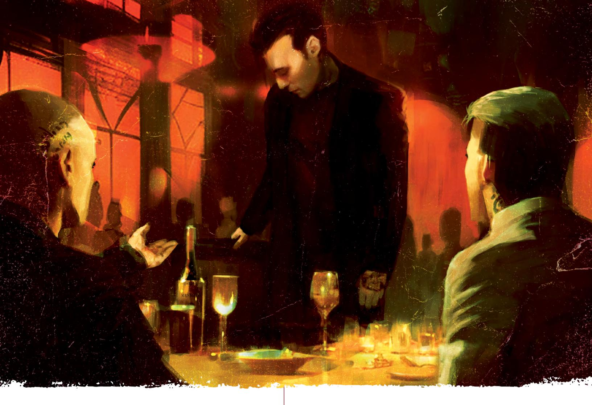

Игроки и рассказчики должны совместно разрабатывать любые идеи и сюжеты, которые могут возникнуть у персонажей. Не каждый эксперимент удается, но всегда есть шанс, что он будет успешным. Этих временных усилений может быть достаточно, чтобы помочь слабокровным выдать себя за полнокровных Сородичей в секте, или позволить им полностью превзойти секту.

Не каждый герой захочет пройти по этим двум линиям. Привлекательность секса, наркотиков, рок-н-ролла и вечной жизни также может подтолкнуть персонажа к экспериментам над собой по разным причинам. В любом случае, видимые эксперименты влекут за собой неприятности любого рода, причем не только для персонажа, но и для всех слабокровных в пределах досягаемости.

## Ñëàáîêðîâíûå àðõåòèïû

Слабокровные персонажи - это не просто продукт их объятий. Им интересно исследовать свое состояние, понять свое место в мире сверхъестественного и расширить свои возможности до предела. Помимо оригинальных архетипов (Vampire: The Masquerade, p. 110), вот несколько новых архетипов, которые можно исследовать в истории слабокровных.

## Õèìèê êðîâè

В прошлой жизни Химики Крови занимались созданием дизайнерских наркотиков, стремясь к различным видам химической романтики или психоделического кайфа. С новым обретением объятий их интерес сместился с наркотиков на различные формулы алхимии слабой крови. Они продолжают работать на модной наркосцене, чтобы заработать деньги и получить потенциально новые ингредиенты для потенциально новых формул, меняющих мир.

## Ñìîòðèòåëü

Смотритель берет на себя обязанность помогать другим людям, оказавшимся в тяжелой ситуации, как новообращенным, так и изгоям. Они помогают предоставить кров, кровь и знания, необходимые для выживания. Община и семья очень важны для них, и они стараются наращивать свои ресурсы, чтобы помочь тем, кто находится под их опекой, защищая и опекая их, как только могут. Некоторые Смотрители во имя милосердия и заботы о ближних совершают ужасно много того, что выглядит как хаос.

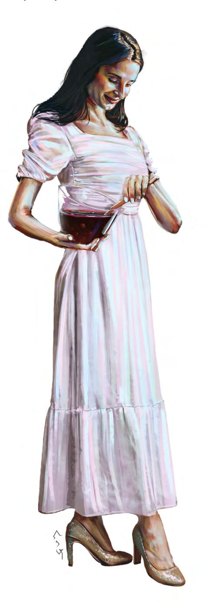

## Ïàðàíîðìàëüùèê

Если вампиры существуют, то что же еще есть на свете? Паранормалист охотно исследует этот мир тьмы, в котором он пробудился, собирая информацию и устанавливая информаторы с любыми и всеми сверхъестественными контактерами или, что еще лучше, со сверхъестественными существами. Они не знают (и не заботятся) о древнем соперничестве; главное - пополнить свои знания и оторваться от соперников-охотников за криптидами и теоретиков заговора на 4chan. Паранормалисты оставляют за собой след, но обычные люди (и старшие сородичи) находят его слишком запутанным (и нелепым), чтобы идти по нему. Пока Паранормалист не натыкается на настоящую тайну, конечно...

## Óëè÷íàÿ Êðûñà

Уличная крыса может и не осознавать, что она собой представляет, приписывая это какомунибудь паршивому наркотику, недолеченному заболеванию или даже дурному сну. Они рыщут по улицам в поисках безделушек, ценных вещей или выброшенных ценностей, которые могли бы принести им деньги. Крыса становится хорошим вором, попрошайничает, становится невидимой, когда это необходимо, или ее съедают.

## Èñêàòåëü ñîëíöà

Эти слабокровные не стремятся изменить свое вампирическое состояние. Вместо этого они хотят разработать способ пребывания на солнце без потери своих вампирических способностей. Искатель Солнца может попытаться убедить культ Бахари (Vampire: The Masquerade, p. 382) принять его в качестве соратника, но Лилины не так легко принимают слабокровных. Решение: найти артефакт, фолиант, метод или ритуал, который нужен бахари для их собственных целей, и договориться, чтобы это было выгодно всем Слабокровным.

## Íîâûå äîñòîèíñòâà è

#### íåäîñòàòêè Ñëàáîêðîâûõ

Эти Достоинства и Недостатки доступны только персонажам со слабой кровью. У них нет точечной стоимости; каждый Недостаток уравновешивает Достоинство и наоборот. Они не засчитываются в максимальное количество очков в Достоинствах и Недостатках, разрешенных при создании персонажа или приобретенных с опытом. Вы можете найти другие Достоинства и Недостатки Слабой Крови в Vampire:

The Masquerade (стр. 183).

## Íåäîñòàòêè ñëàáîêðîâíûõ

## ГЕЛИОФОБИЯ

Чрезмерно осторожный сир слишком сильно вдалбливал вам напоминание о том, что нужно избегать солнечного света, или вы видели, как кто-то загорелся на восходе солнца сразу после вашего Становления. В любом случае, вы боитесь солнечного света, как если бы вы были полным вампиром. Вы подвержены безумию ужаса от солнечного света.

#### НОЧНЫЕ КОШМАРЫ

Вы спите как обычно, не помня ни одного из снов, которые могли присниться вам в течение дня. Однако ночью эти сны приходят в самое неподходящее время. Во время стресса или когда ваш Зверь наиболее силен, кошмары вырываются наружу и кажутся мучительно реальными. Они могут быть бессвязными галлюцинациями, или они могут быть способом Рассказчика передать тему или предсказать события. Один раз за сессию у вас начинаются ночные страхи, и вы получаете штраф в один кубик ко всем действиям до конца сцены.

## НОСИТЕЛЬ ЧУМЫ

Вы по-прежнему восприимчивы к смертельным болезням: простуде, гриппу и другим более тяжелым инфекциям. Каждый раз, когда вы кормитесь, вы должны бросить кубик за каждый утоленный Голод, и если выпадет «1», вы подхватили что-то гадкое. (Эффект зависит от Рассказчика, но может варьироваться от штрафа за смерть до замедления снижения здоровья.) Лекарство смертных не лечит вас; только выпивание функционирующей иммунной системы путем утоления голода до 0 делает это. И, конечно же, вы рискуете заразить любого, кем питаетесь, используя тот же бросок кубика, что и выше.

## НЕАККУРАТНОЕ ПИТЬЕ

Ваш укус неосторожен, или ваши клыки плохо подходят проколоть кожу начисто. Во время кормления пройдите проверку Ловкости + Медицины со Сложностью, равной Голоду, утолив его, чтобы скрыть следы от кормления до того, как прольется слишком много крови. В случае провала рана слишком рваная, чтобы закрыться: смертный может истечь кровью из-за ран на шее, угрожающих Маскараду.

## ВЫРАКАННЫЙ НА СОЛНЦЕ

Вы не можете использовать способности Дисциплины, в том числе Алхимию Слабокроных, при солнечном свете, и активные способности прекращаются, когда вы входите в солнечный свет. Вы можете использовать их в помещении днем, со штрафом в два кубика, если вы избегаете любого намека на солнечный свет.

## СВЕРХЪЕСТЕСТВЕННОЕ ПРИСУТСТВИЕ

Будь то ваш запах, ваша аура или что-то еще более тонкое, другие сверхъестественные существа могут почувствовать ваше присутствие. Они могут быть любопытными, голодными или раздраженными, но они определенно наблюдают за вами. Потеряйте два кубика из пула Скрытности и тому подобного против сверхъестественных противников, включая других вампиров.

## СУМЕРОЧНОЕ ПРИСУТСТВИЕ

Вы делаете окружающих неудобными. Большинство смертных вообще не хотят находиться рядом с вами, а другие Сородичи ненавидят вас даже больше, чем обычных слабокровных. Только слабокровные могут приспособиться к твоему странному поведению. Потеряйте 1 кубик в Социальных пулах, в которых участвует любой, кроме

слабокровных.

## НЕПРЕРЫВНЫЙ ГОЛОД

Ваш Зверь всегда жаждет большего, никогда не находя пропитания меньшими глотками. При кормлении в сцене вы насыщаете на один Голод меньше, чем другие

слабокровные. Это применяется только один раз за сцену.

## Äîñòîèíñòâà ñëàáîêðîâíûõ

## ОТВРАТИТЕЛЬНАЯ КРОВЬ

Что-то в вашей Крови делает других вампиров неспособными это переварить. Будь то извращенная смесь жизни и нежити или ваша история сомнительной алхимии слабой крови, других вампиров тошнит и рвет, когда они пытаются пить из вас. Другие вампиры прекращают любые попытки укуса после первоначального повреждения, и любой, кто пытается продолжать пить из вас, должен тратить два пункта Силы Воли каждый ход, который они делают это. Эта аномалия не затрагивает смертных и алхимию слабой крови.

#### НАДЕЖНОСТЬ

Считаете ли вы себя атеистом или искренне религиозным человеком, вы слишком близки к смерти, чтобы Истинная Вера могла повлиять на вас.

#### НИЗКИЙ АППЕТИТ

Когда уровень голода равен 0 или 1, а также когда вы встаете на закате, бросьте два кубика на проверку ИК и выберите наибольшее из двух.

#### ОСОЗНАННЫЙ МЕЧТАТЕЛЬ

Большинство вампиров не видят сны, потому что не спят. Ты мечтаешь; вы можете вспоминать и даже иногда контролировать свои сны. Один раз за сеанс, если вы спите днем, вы можете попросить Рассказчика дать подсказку из воспоминаний прошлой ночи или намек на историю, подходящую для откровения во сне.

#### ОБРАЗ СМЕРТНЫХ

Твоя смертная природа все еще затмевает твоего Зверя. Ваша аура не выглядит вампирской или сверхъестественной; вместо этого он выглядит смертоносным для любого, кто способен обнаруживать сверхъестественных существ. Вы также можете добавить два кубика к любой попытке изобразить себя смертным в других отношениях, таких как макияж.

#### БЫСТРЫЙ ПИТАТЕЛЬ

Может быть, вы были флеботомистом в жизни или просто не любили беспорядок. Вы делаете глоток деликатно и быстро, аккуратно утоляя один Голод за один ход, включая зализывание раны. Это Достоинство можно использовать только один раз за сцену.

## Зачем играть гуля?

Истории Мира Тьмы обычно сфокусированы на Сородичах, в то время как роль смертных незначительна. Они лишь пешки в игре тех, кого мучит проклятие Каина и ярость Зверя. Гули, с другой стороны, могут стать необычным, но заманчивым вариантом персонажей. Занимая своеобразное промежуточное положение, гули довольствуются преимуществами смертных — возможностью жить под солнцем и быть полноценной частью человеческого общества, но в то же время они наделены толикой сверхъестественной силы Сородичей. И всё это благодаря Крови домитора.

Слово «доминтор», искаженное латинское слово dominus, означающее «господин» или «хозяин», описывает вампира, к которому привязан смертный. Вампиры, которые считают себя культурными или более утонченными, могут предпочесть более напыщенные термины для отношений, но, кроме семантики, это не меняет основной истины. Один подчиняется другому, а витэ является связующим звеном, связывающим их друг с другом.

Большинство смертных идут по жизни, не осознавая, что опасность и сила сосуществуют в тенях, пребывая в блаженном неведении о том, что скрывается за внешней видимостью нормальности, с которой они сталкиваются каждый день. Но ночью границы между тем, что воспринимается как реальность, и миром, лежащим под ней, стираются.

Может быть, вы наткнулись на вампира, питающегося попрошайкой в переулке, или вы были загипнотизированы существом невероятной красоты и магнетизма в клубе. Каким бы ни было побудительное событие, открывшее вам глаза, одно было несомненно: вы уловили лишь намек, взгляд на что-то более темное, что-то первобытное, и с тех пор не можете выкинуть это из головы.

## ïîëóìðàêå

Если вампиры нуждаются в смертных, чтобы продолжать существование, то есть и смертные, которых вампиры интересуют ничуть не меньше. Случается, какой-нибудь оккультист-любитель проявляет к Сородичам незамысловатый праздный интерес, в то время как для кого-то другого кровопийцы превращаются во всепоглощающую, разрушительную одержимость.

Одно дело — читать истории или смотреть фильмы о вампирах, совсем другое — осознать, что они действительно существуют, и задать себе вопрос: а вдруг? Вдруг они используют живых ради своих чудовищных целей?

Насколько далеко готовы зайти смертные, зависит от них самих. Обычно связь живых с обществом Сородичей приводит к тому, что первые принимают на себя роль агентов того или иного вампира, тем самым расширяя сферу его влияния, или даже становятся частью его верной свиты. Для них открывается ранее неведомый мир, где опасность ждёт за каждым углом и всегда нужно быть начеку, а между котериями, фракциями и отдельными Сородичами беспрерывно бушует борьба за власть в доменах. Всё это становится неотъемлемой частью их новой жизни, и некоторых она приводит к поступкам, которые раньше казались немыслимыми.

Представления о плохом и хорошем отходят на второй план, когда твоя задача - выжить и справиться с натиском мира, в котором безопасность осталась лишь лалёким воспоминанием.

# **ГУЛИ**

## Роковая зависимость

Любые отношения, в которых участвует Сородич, - паразитические, и отношения со смертными не исключение. Все друг друга используют. Люди используют людей — как и вампиры. Это замкнутый круг. Быть может, скорее симбиоз - так, во всяком случае, говорят гули, чтобы оправдать свою зависимость. Они могут сколько угодно уверять себя, будто у них есть «совесть» или «мораль», но факт остаётся фактом: есть вещи, ради которых они готовы отречься от этих убеждений. Ради того, чтобы отсрочить старость, при этом избежав бремени Проклятия, ради покровительства господина, ради ещё одного глотка витэ.

Впрочем, жизнь гуля тоже не обходится без трудностей. Они больше, чем просто смертные, но в глазах большинства Сородичей лаже в полмётки не голятся настоящим вампирам (хоть и сравнимы по силе с некоторыми слабокровками). Среди анархов отношение к гулям зачастую более прогрессивное, но любезности не изменят правды: гули вампирам не ровня.

Несомненно, есть те, кто, тем или иным образом узнав о существовании вампиров, искушает судьбу и намеренно ищет их общества. В мире Проклятых, впрочем, сложно оставаться «невинным» сторонним наблюдателем. На противоположной стороне - те, кто просто оказался не в то время не в том месте.

Или, скажем, кто-то, будучи на волоске от смерти, предстал перед выбором: либо погибнуть, либо неразрывно связать свою судьбу с вампиром. При каких бы обстоятельствах ни встретились гуль и его домитор, эти отношения с того дня будут играть значительную роль в жизни первого.

Гулям необходимо принять новую для себя реальность. Они зависят от существ, чья добыча - смертные: местное сообщество, друзья и ровесники, даже самые близкие и любимые люди. Через гулей у домитора появляется доступ к этим группам, среди которых он может выбрать себе стадо, чтобы насыщать свой голод. Сородичам нужна кровь смертных, а гулям нужна кровь Сородичей — это порочный круг.

Завеса приподнята, мир больше никогда не будет прежним.

Как и сам гуль

## Роль гулей

В обществе Сородичей гули занимают пограничное положение. Они живут на самом краю тайного мира вампиров, но играют в нём важную роль, хоть никто этого и не признаёт. Но не будь у вампиров глаз и ушей под солнцем, не будь у них проводников в современность, всё общество Проклятых пошатнулось бы на корню. Несмотря на то, что гули стоят ниже домиторов, а те зачастую относятся к ним как к расходному материалу, гули - незаменимая часть системы.

Нет нужды напоминать, что подавляющее большинство гулей порабощено всепоглощающей зависимостью от витэ, если не настоящими узами крови.

Как гуль справляется с новой реальностью, решать игроку. Насколько глубоко персонаж вовлечён в общество Проклятых? Оказался ли он тут по своей воле, или у него не было выбора? Некоторые гули смиряются со своим подчинённым положением. Порой даже те, кто не связан узами крови, начинают питать извращённую любовь к своим господам виной тому зависимость от витэ и неравенство отношений. Кто-то пытается жить в блаженном незнании, подавляя в памяти те ужасные поступки, которые совершает ради эфемерной похвалы или признания. Другим же удаётся обратить ситуацию себе на пользу: скажем, с помощью аккуратно выстроенных связей в обществе Сородичей они занимают положение всеми желанного союзника.

Если рассказчик не против того, чтобы кто-то играл гулей, ему стоит проследить, чтобы тема истории не ограничивала их. Они не просто слуги Сородичей. Каждый гуль — полноценная личность. Они оказались втянуты в неизвестный, чудовищный мир и стали частью его порочного круговорота. Волей или неволей, гули несут то же бремя вины, что и домиторы.

Как и у молодых вампиров, у гулей есть смертные друзья и семья, что может сыграть в истории весомую роль. Этот факт открывает простор для более тёмных сюжетов о шантаже и манипуляциях. Игра в роли гуля обещает быть напряжённой и эмоциональной: как найти баланс между приказаниями домитора и личными нуждами, желаниями и обязанностями? Готовься к непростым выборам и долгосрочным последствиям: повиноваться ли домитору или прислушаться к своей совести? Сколько отказов он вытерпит, прежде чем решит, что хлопот от такого слуги больше, чем пользы?

Подобные ситуации будут неизбежны. Находясь в услужении у порождений ночи и одновременно пытаясь удержаться за свою Человечность, гули ходят по лезвию ножа.

# Архетипы гулей Наивный подопытный

«Медицинский тест», — сказали они, только вот больницей там и не пахло, а сами ребята едва ли походили на врачей. Но публика явилась знакомая, да и деньги были приличные. Заставили подписать какие-то бумажки, но боялся ты не столько адвокатов, сколько парня у двери. Как бы там ни было, штука оказалась неслабая. Не отпускала всю ночь, как какая-нибудь первосортная экспериментальная химия с даркнета. Может, это она и была. Во второй раз добровольцев было меньше, заставили выполнять задания — «для статистики». Странно, но от таких денег пойди откажись, не говоря уже о кайфе. На третий раз вас осталось четверо, каждому дали список имён с указаниями. Интересно, сколько человек придёт в следующий раз?

## Профессиональный уборщик

Трапеза вампира — дело кровавое, и порой, когда он увлекается в порыве дьявольского голода, там или тут бывает нужна основательная уборка. Задача не из простых, и не всегда удаётся обойтись малым: просто завернуть тело в пластик и закинуть его в мусорку в какой-нибудь подворотне. Иногда необходимо стереть вообще все следы существования человека, а в крайних случаях — избавиться от свидетелей. Одним словом, профессия требовательная и не для слабонервных. Зато, если вдруг всё пойдёт вверх дном, ты по крайней мере знаешь, как прикрыть чью-то смерть — или инсценировать её.

## Курьер-мнемоник

Господа посылают за тобой, когда им нужно доставить что-то без шума и вдали от назойливых взглядов. Ты работаешь курьером всю жизнь: начал с наркотиков, от них перешёл к оружию, потом к экзотическим редкостям, а теперь ты доставляешь самый опасный товар из всех — информацию. С тобой секреты в полной сохранности, тем более когда ты сам о них ничего не знаешь. В памяти остаются лишь глаза господина, тошнота и ощущение падения. На месте назначения получателю необходимо сказать лишь одно слово. По команде послание покидает твои уста, а ты погружаешься в реку забвения. Будь то путешествие на другой конец города или в далёкую точку мира, повелители могут положиться на твои навыки и осмотрительность, но главное — на безупречную память и безотказную забывчивость.

## Белая ворона

Все остальные плывут по течению, бездумно выполняя любой приказ, — но не ты. Никто не знает, чего от тебя ожидать, тебе не интересны мода и тенденции. Ты не то чтобы такой уж бунтарь — просто сильная личность. С тобой приходится считаться, и ты не ведёшься на дешёвые манипуляции.

У этого есть свои плюсы и минусы. Да, домитор не знал, на что подписывался, зато теперь о твоей самостоятельности и прямоте толкует весь домен. Сохранять благосклонность домитора - задача важная, но у тебя есть жизнь и вне этих отношений, и она никак с ними не связана. И ты бы предпочёл, чтобы так оно и оставалось.

#### ИСПОЛЬЗОВАНИЕ ВИТЭ ДЛЯ ЛЕЧЕНИЯ ЖИВЫХ

Гули исцеляются в два раза быстрее обычных смертных, но вампир может дать дополнительную кровь, чтобы ускорить этот процесс. За каждую предоставленную Кровь живое существо (включая гулей) исцеляется на один уровень тяжелых

повреждений. На это уходит один ход на каждую проверку ИК и уровень исцеления. Для того чтобы кровь дала такой эффект, выпить свежей из вены, и если смертный впервые получает кровь таким образом, он, разумеется, становится гулем.

## Создание персонажа-

## гуля

## Концепция персонажа

Как и в случае с вампирами, количество возможных концепций персонажей-гулей ограничено только твоим воображением. Кто угодно может стать гулем, будь то врач, медийная личность или бесприютный беглец.

Причины, по которым домиторы предпочитают того или иного кандидата в гули, тоже бывают весьма разнообразны.

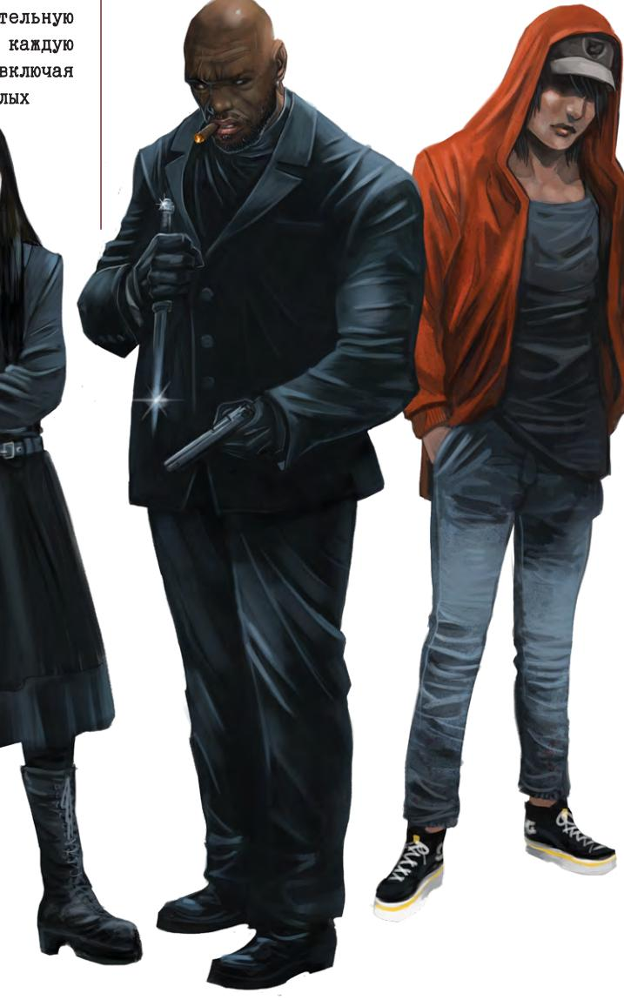

Вентру, например, наверняка выберут кого-нибудь, кто разделяет их политические или финансовые интересы, но при этом не занимает особенно высокого положения — чтобы не поднялось лишнего шума, когда придёт время от него избавиться.

Молодые Сородичи, бывает, питают отвращение к идее подобного подчинения смертных, но даже они осознают её пользу. Неонаты склонны общаться со своими гулями на равных (более или менее). Некоторые в своей наивности подают руку помощи так называемым «независимым гулям» (см. стр. 52), что редко заканчивается для таких альтруистов добром.

Базовая концепция гуля должна включать в себя род его деятельности (например, скромный библиотекарь или борец за права рабочих), общее мировоззрение, отношение к домитору, а также нечто, к чему он стремится и что им движет. Подумай над следующими вопросами:

- Осознаёт ли персонаж, во что он превратился?
- Испил ли он крови напрямую «из источника» или более невинным образом?
- Как он воспринимает произошедшую перемену?
- Стал ли он гулем добровольно, или же кто-то сделал этот выбор за него?

Отметим, что, хотя гули и зависят от своих домиторов (если только не обретут свободу благодаря чудесному стечению обстоятельств…), у них есть собственные цели, мысли и желания. Вне зависимости от того, кто возьмёт на себя роль домитора — другой игрок или рассказчик, не стоит забывать о правилах взаимного согласия (см. стр. 53) во время игры.

Гулям не нужно беспокоиться о Звере, но у них всё равно есть Человечность, и их поступки (будь то приказ домитора или независимое решение) могут негативно на ней сказаться. Моральное разложение смертного или гуля не заканчивается Воцарением Зверя, они всегда могут пасть ещё ниже — каждый по-своему. Пусть внутри гулей не таится первобытное чудовище, своё влечение к витэ они описывают на самый разный лад: от необходимости или зависимости до неумолимой, всепоглощающей одержимости, диктующей каждый их шаг.

Выбери цель и прихоть персонажа точно так же, как и при создании персонажа-вампира.

## Твои Характеристики

Перед тем как распределить пункты, вспомни о концепции персонажа, подумай, в чём он силён или слаб и в чём он просто более или менее компетентен. См. список атрибутов на с. 62.

- Лучшая характеристика: 4 пункта.
- Три характеристики: по 3 пункта каждая.
- Четыре характеристики: по 2 пункта каждая.
- Худшая характеристика: 1 пункт.
- Затем вычисли два дополнительных параметра:
- Добавь 3 к показателю выносливости, чтобы определить показатель здоровья персонажа.
- Сложи показатели упорства и самообладания, чтобы определить показатель его воли.

## Твои Навыки

Навыки персонажа поведают о его повседневной жизни и знаниях, о том, как он справляется с теми или иными задачами, или даже о том, как он относится к различным жизненным ситуациям. Свои навыки гуль мог получить в учебном заведении, на работе или же благодаря лихим поворотам судьбы. Будет мудро предположить, что домитор выбрал вашего персонажа не в последнюю очередь из-за его умений. Быть может, гуль владеет навыками, которых нет у самого вампира (например, уличным чутьём или техникой). Или, скажем, Сородич проявил интерес к его профессии или к чему-то другому, из сферы более личных увлечений. Ваш персонаж (вероятнее всего) не бездумный раб, но специально подобранный, доверенный слуга.

Подумайте, что навыки персонажа говорят о его биографии. Может, о политике он узнал одним летом, приняв участие в агитационной кампании за права масс? Или, скажем, он работает в аварийно-спасательной группе, оттачивая мастерство в области медицины? Конечно, быть первоклассным стрелком или могучим рукопашным бойцом очень полезно, но персонаж рискует показаться плоским, если эти умения ничем не обоснованы. Подумай, чем твой гуль занимается в свободное время. Есть ли у него хобби? Отрази это через навыки с более низкими показателями.

Чтобы решить, какими навыками будет обладать персонаж, ты можешь воспользоваться подборками по роду деятельности или способом быстрого распределения (см. «Вампиры: Маскарад», стр. 145 и стр. 147

соответственно), или используйте метод быстрого назначения навыков (стр. 64). А именно:

МАСТЕР НА ВСЕ РУКИ. Один навык: 3 пункта; ещё восемь навыков: 2 пункта; ещё десять навыков: 1 пункт. ГАРМОНИЧНОЕ РАЗВИТИЕ. Три навыка: 3 пункта; ещё пять навыков: 2 пункта; ещё семь навыков: 1 пункт. УЗКИЙ СПЕЦИАЛИСТ. Один навык: 4 пункта; ещё три навыка: 3 пункта; ещё три навыка: 2 пункта; ещё три навыка: 1 пункт

Выбери по одной бесплатной специализации для гуманитарных наук, естественных наук, исполнения и ремесла. Добавь ещё одну бесплатную специализацию для любого навыка. Специализацию можно выбрать только для навыков, которыми персонаж владеет хотя бы на минимальном уровне.

## Дисциплины и стиль охоты

Став гулем, персонаж получает одну силу первого уровня из Дисциплины, которой владеет его домитор. Гули могут приобретать новые силы первого уровня за счёт опыта, по 10 пунктов за каждую (домитор должен владеть соответствующей Дисциплиной, но той же силой обладать не обязан).

Гули не в состоянии приобретать за опыт пункты Дисциплин как таковые. Тем не менее, когда они применяют эти силы, уровень нужных Дисциплин приравнивается к 1 (в редких случаях он может временно повышаться, но только благодаря стороннему вмешательству, например с помощью Глотков).

У гулей нет стиля охоты.

## Преимущества

Гулям необходимо распределить 7 пунктов преимуществ и 2 пункта недостатков. Они не могут выбрать преимущества и недостатки вампиров, но им, как правило, доступны достоинства и недостатки смертных.

Как и обычным людям, гулям недоступны преимущества из следующих категорий: домен, пищевые привычки, стадо, а также достоинства и недостатки слабокровных. Им не запрещается выбрать убежище, хоть для них оно и будет выполнять иную функцию, нежели для вампиров. Гулям также доступен факт биографии «статус», однако он наверняка будет хотя бы отчасти зависеть от того, насколько уважаем их домитор. Более того, некоторые гули в мире Проклятых могут похвастаться по-настоящему дурной славой.

Игроки, желающие использовать для персонажейгулей эксклюзивные для Сородича страницу истории, скорее всего, получили свои знания благодаря связям своего домитора. Если их домитор - персонаж игрока, не имеющий такого преимущества Страницы Истории, объясните доступ гуля как-то иначе: предыдущий домитор? Источник в другом домене? Поработайте с рассказчиком, чтобы и персонаж, и история получили пользу от принятия этого фона.

Если не указано иное, достоинства и недостатки, приобретенные смертными, продолжают применяться к гулям.

## Новые достоинства гуля

Эти Достоинства применимы только к персонажам-гулям.

## СОПЕРЕЖИВАНИЕ КРОВИ **••**

Твоя связь с домитором особенно сильна: ты осведомлён об эмоциональном и психическом состоянии господина, даже если его нет рядом. Благодаря этой сверхъестественной проницательности ты «чувствуешь», когда домитору необходимо твоё присутствие или когда он в опасности, однако это не телепатия в полном смысле этого слова — вы не можете общаться на расстоянии. Сопереживание Крови связывает тебя с домитором, чью кровь ты вкушал в последний раз, и действует в пределах одной мили от него. Это достоинство не требует уз крови, но если они есть, то эффект будет сильнее.

## ПОТУСКНЕВШАЯ АУРА **••**

С тобой произошло что-то странное. Раньше твоя аура была живой и яркой, но из-за Крови она помутнела: её стало не отличить от ауры вампира. Окружающие склонны переоценивать тебя, что полезно, но рано или поздно ты наверняка окажешься из-за этого в неловкой ситуации.

## Новые недостатки гуля

Эти Недостатки применимы только к

персонажам-гулям.

## КРОВЬ С ИЗЪЯНОМ **(•** ДО **••)**

Из-за некоего непостижимого свойства Крови на тебя частично действует изъян господина.

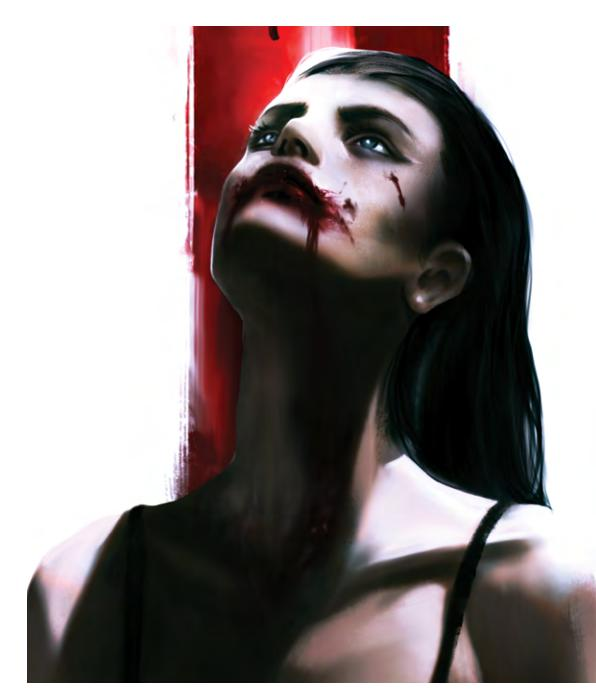

Твой первый домитор должен принадлежать к одному из следующих кланов: Апостолы, Ласомбра, Малкавиане, Носферату, Равнос, Салюбри или Тореадор. Даже если ты меняешь домитора, изъян

остаётся прежним.

За каждую точку в этом недостатке вы испытываете проклятье домитора на один уровень.

#### ПРОКЛЯТИЕ СТАРЕНИЯ (••)

Испив витэ вампира, ты состарился в мгновение ока. Ты выглядишь как минимум на десять лет старше, кроме этого, пострадало и твоё здоровье: соответствующая шкала уменьшается на одну ячейку. Эффекты этого недостатка исчезают, если ты получаешь Становление. Или же, по усмотрению рассказчика, они могут сохраниться (значит, проблема была не в Крови

домитора, а в тебе)

#### ПУГАЮЩИЕ КЛЫКИ (•)

Помимо привычных особенностей гуля, ты обзавёлся острыми клыками. Однако они не такие большие, как у вампиров, и, кажется, выросли как-то неправильно - это не самое приятное зрелище для тех, кто их замечает. Кто-нибудь наверняка подумает, что ты принадлежишь к какой-то сомнительной субкультуре (ага). Пул социальных проверок, связанных со смертными, уменьшается на 1d10, так как клыки их смущают.

## Принципы и опоры

Следуй той же схеме, что и при создании смертного персонажа. Выбери от одного до трёх принципов и соответствующее число опор. Более подробную информацию см. на с. 149. Гули начинают игру с уровнем человечности 7.

## Здоровье

Гули сильнее и выносливее смертных. В зависимости от клана и Дисциплин домитора они способны проявлять чудеса мощи, стойкости и стремительности за гранью человеческих

возможностей.

Для гулей механика лечения травм в целом аналогична правилам для смертных, но с

несколькими особенностями.

Гули оправляются от любых повреждений вдвое быстрее, чем смертные, за исключением урона от огня. Даже телу, укреплённому силой витэ, требуется значительное время, чтобы залечить ожоги.

Повторим, что в некоторых случаях гули способны использовать силы Дисциплин выше первого уровня (например, с помощью Глотка изящества или Алхимиислабокровных). Однако вместо испытания Крови расплатой за каждое их применение будет одно тяжёлое повреждение.

## Особые ситуации

Жизнь непредсказуема. В силу тех или иных событий судьба гуля и его отношения с миром могут разительно поменяться.

## Смена домитора

Связь между гулем и домитором глубока, и, помимо нужды в витэ, первый в той или иной степени также испытывает эмоциональную и психологическую зависимость от второго. В силу особенности таких отношений смена домитора не самая радостная перспектива для гулей.

Впрочем, иногда это неизбежно - например, когда домитор впадает в торпор. В таких случаях вампир может «освободить» гуля от обязанностей, но зависимость того от витэ никуда не денется. Так, бывает, слуга беспрестанно охраняет невольный покой своего господина, всё сильнее впадая в отчаяние.

Большинству гулей придётся не по нраву стремительный натиск времени. Порой они оказываются под покровительством ближайшего соратника домитора или даже в распоряжении его котерии или клана. В таких условиях легче принять перемену, но это, как ни крути, напряжённое и эмоциональное событие. И всё же даже малое утешение лучше, чем ничего, ведь далеко не всем гулям так же везёт в этом деле.

Столетиями гулей обменивали, продавали и проигрывали в азартных играх. Их соблазняли и похищали. Когда бушевали войны между фракциями, их захватывали в качестве трофеев. Вот ты верный слуга уважаемого Сородича, а вот — собственность безвестного изгоя. Ещё тяжелее тем, кто сталкивается с окончательной смертью домитора. Они предстают перед выбором: либо служить новому господину, либо отправиться вслед за старым. Всё это стоит иметь в виду, если ты столкнёшься с подобной ситуацией в игре. Подумай, что означает эта перемена для твоего персонажа. Не стоит недооценивать могущество уз крови — они способны пробудить в гуле сильные эмоции и значительно повлиять на его выбор.

## Гули и Становление

Итак, ты решил принять Становление. Впрочем, выбор наверняка сделали за тебя. Как бы там ни было, теперь тебе следует иметь в виду следующее:

- Новоиспечённый вампир теряет преимущества, доступные только гулям. Пункты преимуществ при этом возвращаются, и их необходимо распределить заново, обсудив свой выбор с рассказчиком. По усмотрению рассказчика бывший гуль может и сохранить свои преимущества.
- Поколение птенца зависит от поколения сира. Начальное значение силы Крови минимальное для поколения. Подробнее о силе Крови и поколениях см. «Вампиры: Маскарад», стр. 214.
- Показатель Человечности персонажа остаётся прежним.

Разумеется, всё это имеет значение, только если твоим сиром оказался не слабокровка. В противном случае молись, чтобы Становление вообще сработало, не убив тебя.

## Независимые гули

Волей-неволей многие гули приспосабливаются к сосуществованию с домиторами. За помощь с делами, которыми сам господин не в состоянии (или не в настроении) заняться, гули, как правило, могут надеяться на долю защиты и внимания, а также на жизненно необходимую кровь.

Не всем такая жизнь по вкусу. Некоторые гули не признают никаких господ и избегают уз крови. Одни добывают витэ, оказывая Сородичам услуги, другие же просто крадут её. С точки зрения Проклятых, так называемый независимый гуль — всё равно что шальная пуля. Помогать им себе дороже. И несмышлёные неонаты, и неразумные анциллы не раз наступали на эти грабли. В Камарилье считают, что независимые гули — угроза тщательно выстроенной иерархии общества, и потому их существование недопустимо. По мнению анархов, однако, такие свободные наёмники заслуживают уважения, так как им удалось обвести упырей вокруг пальца и перевернуть баланс сил вверх дном. Впрочем, даже впечатлённый анарх едва ли готов доверять независимому гулю.

Тем, кому по нраву эта непростая доля, не обойтись без влияния, союзников и собственной сети информаторов, не говоря уже о недюжинном упорстве и смекалке, чтобы всегда быть на шаг впереди соперника. Чтобы оставаться независимыми, гулям постоянно нужно искать новую витэ. Старожилы знают, что вкушать стоит только «остывшую» кровь: если пьёшь напрямую,рискуешь обзавестись новым «благодетелем» и узами крови. Те, кто в отчаянии пренебрегает этим правилом, становятся рабами тех самых оков, которых они пытались избежать.

Конечно, с таким подходом доверия масс не завоевать, и многие видят в бывалых независимых гулях лишь бол ьшую угрозу. Хищник не любит, когда добыча кусается, а господин — когда слуга смеет перечить.

#### СМЕРТНЫЕ И ГУЛИ В ВАРИАНТНЫХ ИСТОРИЯХ

Хотя Vampire: The Masquerade - это игра о вампирах, но многое можно почерпнуть из историй, в которых игроки сами не являются вампирами, по крайней мере, изначально. Можно испытать ужасы нежити со стороны, в качестве слуг, агентов или потенциальных жертв. Ниже приведены примеры того, как смертные или почти смертные могут быть использованы в истории с большим эффектом.

#### БЕССМЕРТНАЯ ИСТОРИЯ

Пусть каждый игрок создаст смертного персонажа, чтобы в какой-то момент он был вовлечен (превратив историю в вампирскую) или настроен против нежити. Или и то, и другое. Для многих новых игроков погружение с головой в Мир Тьмы и систему Рассказчика является достаточно сложной задачей без необходимости не нужно изучать тонкости и нюансы работы ночного охотника, живущей в заговоре. Аналогичным образом, опытные игроки часто радуются смене перспективы, позволяющей им увидеть Мир Тьмы в новом, как говорят, свете.

#### ГУЛИ, ГУЛИ, ГУЛИ

Злоключения свиты гулей очень хорошо подходят для игры в жанре истории. В отличие от многих вампиров, гули либо должны служить, либо (если они независимы) имеют четкую цель, которой они заняты в повседневной жизни. Будь то специалисты, поставленные перед нечистью хозяином, сулящим им вечность, или разношерстная группа подневольных, борющихся со смертельной зависимостью, - их дни и ночи никогда не будут скучными.

#### СМЕШАННАЯ СМЕРТНОСТЬ

Когда за одним столом оказываются смертные (включая гулей) и вампиры, динамика силы - это главное условие игры. Убедитесь, что игроки понимают, к чему может привести однобокое неравенство сил и перераспределение прожекторов. Ночью вампиры господствуют, и смертные, скорее всего, находятся по их приказу, а днем игроки вампиров подолгу бездействуют, и их жизнь зависит от действий смертных. Вы можете использовать игру в стиле театральной постановки (стр. 198), чтобы все игроки были активны, даже если не все их персонажи. Оговорите этот вариант со всеми игроками и соблюдайте правила внимательной игры (с. 216).

# ÑÌÅÐÒÍÛÅ

## Çà÷åì èãðàòü ñìåðòíûì?

Что движет смертными, которые ищут общества вампиров?Отношения между Сородичами и людьми обычно враждебны (хотя есть и исключения) и почти никогда не равны. У жизни есть неоспоримые преимущества: например, возможность найти настоящего друга, выпить чашечку свежесваренного кофе, любоваться восходом и закатом. Фокусируя внимание на смертных персонажах, можно подчеркнуть аспект экзистенциального ужаса в игре.

В распоряжении живых — ресурсы общества, построенного человеком для человека. Современный мир рассчитан не на вампиров, а на смертных (в особенности богатых), и Сородичи могут воспользоваться лишь незначительной частью благ цивилизации. Государства и корпорации начали пристальнее следить за населением, в таких условиях поддерживать Маскарад стало нелегко. Допустим, Сородич надеется сбежать от закона возмездия, известного как Лекс Талионис, в Мельбурн, проведя день в гробу на борту самолёта. Его ждёт неприятный сюрприз, когда охрана в аэропорту заметит расхождение между грузовой декларацией и тем, что показывает сканер.

С расцветом социальных сетей люди всегда остаются на связи друг с другом.

Появилось множество анонимных групп, следящих за местной нежитью: за последние два года немало Сородичей погибло от рук смертных, собравшихся в «соседские дозоры», а другие встретили свой конец оттого, что в куда более грязных людских делах вампиры — просто сопутствующий ущерб. За последнее десятилетие Маскарад заметно пошатнулся, чему лишь способствует суровый разрыв человечества с человечностью.

## Äèñáàëàíñ

В то время как ночи вампиров полны кровавой междоусобной вражды, для простых смертных главная проблема — взаимодействие со своим же обществом. Господствующая экономическая модель заставляет людей соперничать за возможность зарабатывать достаточно денег для комфортной жизни. Где-то в мире смертный работает сорок часов в неделю в колл-центре, пытаясь дожить до зарплаты, чтобы оплатить медицинские счета и аренду квартиры, но вампиры позабыли, каково это: даже в крайнем случае им достаточно просто поймать любого неудачника на

улице, чтобы утолить голод.

Сородичи мало заботятся о том, как Поцелуй или Доминирование сказывается на смертных — сотни людей (охранники, члены совета директоров, бухгалтеры, медицинские работники) лишились работы, не говоря уже о психическом здоровье, из-за небрежности, с которой некоторые вампиры используют свой дар. Зависимость современного человека от работы так сильна, что выход из строя чреват для него серьёзными последствиями. Для многих американцев, не имеющих доступа к надёжному здравоохранению, увольнение может привести к смерти — их самих или их близких. Какого менеджера устроит оправдание в духе «я не помню, что за люди пришли вчера ночью в офис»?

## Îïàñíîå ïðèòÿæåíèå

Значительная часть Сородичей ввиду своей бессердечности или просто наивности относится к смертным как к еде и не более, чувствуя над ними природное превосходство. Это губительный и вместе с тем распространённый образ мышления, но и люди не без греха. Вампиры для них — предмет любопытства и восхищения, во многом благодаря популярной культуре. Многих людей привлекает образ смертоносного хищника-искусителя.

Забывая, кому Проклятые обязаны потомством, некоторые Сородичи не утруждают себя любезностями и соблюдением приличий в общении с живыми — точно так же, как сами люди не сильно задумываются о животных, вскормленных на убой. Домашний скот, впрочем, для человека не угроза, чего не сказать об отношениях вампиров и смертных. Сородичи хорошо усвоили этот урок во времена Первой инквизиции, введя впоследствии традицию Маскарада. А если у кого в наши дни и оставались сомнения, успех Второй инквизиции должен был их развеять… Подобно льву, который до последнего момента не ожидает, что напорется на рог буйвола, хищники редко готовы к тому, что добыча будет защищаться.

Тем временем смертных влечёт к Сородичам по другой причине. Популярная культура пестрит соблазнительными образами вампиров, где подчёркивается чувственность их жажды и безупречная гладкость их тела. Каким же сильным может оказаться искушение отбросить страхи и сомнения и отдаться в холодные объятия… Жертвы голода Сородичей знают, что это лишь уловка, но при этом понимают, насколько привлекательна иллюзия бессмертия вампира.

Если Сородич вступает в какие-либо отношения со смертным, то они зачастую оказываются односторонними. У человека есть то, что нужно вампиру: кровь, возможность действовать днём или же что-то более замысловатое, например доступ к социальным и политическим организациям, не рассчитанным на Проклятых. Вампиры пользуются такими отношениями, чтобы укрепить свою власть и влияние, и порой даже вознаграждают живых за преданность — иногда честно, иногда со злым умыслом. Благосклонность вампира принимает разные формы, будь то деньги, роскошное жильё или рискованная возможность приобщиться к истине мира Сородичей.

Заигрывание с Проклятыми волнует и опьяняет смертных, как и любая близость к опасности. Большинство даже и не догадывается, каковы восторг и возбуждение, которые сулит прикосновение к жестокому миру этих бессмертных существ. Для тех немногих, кому довелось это испытать, связь с вампиром может стать ценной и значимой — и даже перерасти в искреннюю любовь. Сам Сородич порой чувствует привязанность к смертному, следующему за ним по пятам.

Но, как бы то ни было, первое и последнее слово в таких отношениях почти всегда остаётся за вампиром.

## Ñìåðòíûå àðõèòèïû

## Настороженный следователь

Ты не помнишь, что именно произошло. Вот ты в участке, заполняешь отчёт о таинственном нападении, а в следующий миг ты уже дома. Кто-то точно зашёл в твой кабинет поговорить. О чём говорили — никак не вспомнить, но, кажется, тебе велели о чём-то забыть. На следующий день начальница вызвала к себе, расспрашивала о пропавших документах. Теперь ты в неоплачиваемом отпуске. Кто бы то ни был, он не знает, что связался с бывалым полицейским. У тебя есть наводка: эта история точно как-то связана с недавно открывшимся ночным клубом, нужно лишь

разговорить его владельца.

## Обеспокоенный партнёр

С июля он сам не свой. Бледнее обычного, определённо не выглядит здоровым. Ты волнуешься, ведь вокруг бушует пандемия, к тому же он почти ничего не ест. К слову об этом когда вообще он полноценно питался в последний раз? И вот на прошлой неделе ты сказала ему, что хочешь знать, что происходит на самом деле, и либо он говорит правду, либо ноги твоей больше здесь не будет. И он рассказал. Всю правду. В это до сих пор трудно поверить, это же абсурд, никакой он не… дьявол, даже думая о слове на «в», чувствуешь себя нелепо. Как бы там ни было, после того разговора он как будто испарился. Но ты можешь поклясться, что иногда кто-то наблюдает за тобой по ночам, однако стоит тебе обернуться — и незнакомец исчезает из виду.

## Воздыхатель-оптимист

Когда ты только присоединился к семье, всё выглядело удивительно просто. Жить в большом доме, не беспокоиться о деньгах, налогах, о чём бы то ни было вообще. Думать нужно было только о ней: как ей угодить, как для неё выглядеть, как много существует способов её любить. Ты часть её семьи, и всё замечательно.

По ночам госпожа выбирает, кто сделает новое подношение, и если повезёт, это будешь ты. Нежность её прикосновения, её поцелуй на твоей шее — и ты уже не можешь дождаться следующей ночи. И всё же тебе есть к чему стремиться. Вас много, братьев и сестёр, но только один может быть Первым. В этом стыдно признаться, но ты завидуешь избранному, ведь он наслаждается истинной заботой и вниманием госпожи. Быть может, скоро ты тоже станешь Первым, если будешь достаточно преданным. Или где-то в мире найдётся другая госпожа, которая оценит тебя по достоинству?

## Разносчик **«**пиццы**»**

Прошлой ночью опять звонили. На том же месте, семнадцатый пирc. Та же посылка — «не твоё собачье дело». Несколько деревянных ящиков с надписью кириллицей — в одни руки, деньги — в другие, их часть — приятелю с другого конца трубки. Ты о нём ничего не знаешь, кроме имени (представился как Себ), но по акценту ясно, что он не местный. Где он берёт товар, ты тоже без понятия, это его дело. Ясно только одно: очень уж любит он тебе звонить. Оплата того стоит, впрочем. Но сделку можно и подсластить. Например, сегодня. Ты придёшь с друзьями, и, когда Себ явится, вы его пригласите на пару слов. Не кажется ли ему, что твою долю стоит увеличить?

## Ðîëü ñìåðòíûõ

С помощью представленных ниже правил игроки смогут создать персонажей-смертных для своей труппы (или, как знать, даже котерии), что позволит им подробнее исследовать отношения вампиров со смертными родственниками,

коллегами и даже опорами.

## Игра в роли опоры

Опора отражает непосредственную связь вампира со своей Человечностью и человечеством в целом. Из этого следуют интересные, многообещающие с точки зрения сюжета вопросы: что извлекает из таких отношений сам смертный? И знает ли он вообще о существовании этой связи и её важности для Сородича?

Игрок, осмелившийся взять на себя роль опоры, сперва должен решить, знает ли его персонаж о своей значимости для вампира (не стоит забывать, однако, что персонаж точно не знает о соответствующих правилах). Осведомлён ли он о природе Сородича? Некоторые вампиры предпочитают не раскрывать себя и наблюдают за своей опорой издалека. Представьте, например, как изувеченный носферату подкрадывается к окну, чтобы взглянуть, как поживает его бывшая невеста.

Вампир также может пытаться скрыть свою сверхъестественную суть: скажем,

новоиспечённая вентру решает не покидать совет директоров, чтобы быть рядом со своим стареющим отцом. Такой подход не из лёгких, так как опора когда-нибудь точно заметит, что время никак не сказывается на вампире.

Что чувствуют сами смертные? Кажется ли им, что их любимый человек исчез, а на его месте оказалось неизвестное чудовище со знакомым лицом? Если Сородич безмолвно наблюдает за ними издалека, чувствуют ли они, будто их преследуют?

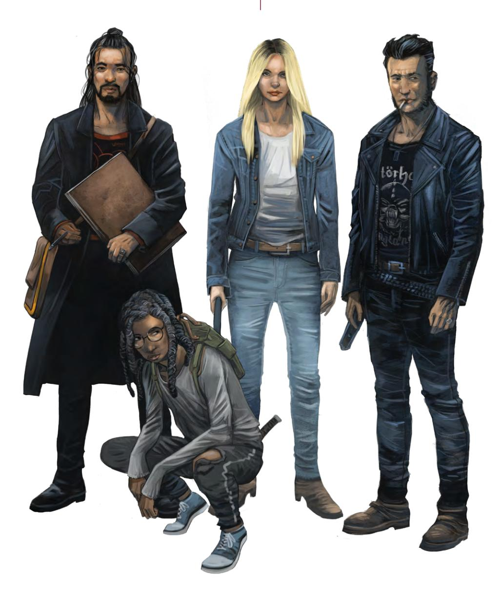

Что кто-то относится к ним не как в личности, а как к вещи, и унижает их достоинство? Кажется ли смертным, что любовь, которую старается выразить вампир, фальшива? Может, она их тревожит или даже вызывает отвращение? Боятся ли они, что теперь на них смотрит

не человек, но Зверь?

## Прелюдия к Становлению

Многообещающая идея для интересной истории начать играть смертных, которые впоследствии станут вампирами. Может, труппа решит уделить предыстории персонажей первые несколько игр истории или же только вступительную игровую встречу (см. «Вампиры: Маскарад», стр. 135 и 138). Станут ли персонажи Сородичами вместе или по отдельности, в течение истории

или только в прелюдии к ней — выбор за всеми вами. Или же, скажем, ты захочешь, чтобы твой смертный принял Становление от вампира, которого играет твой товарищ. Так отношения между персонажами будут развиваться органически. Было ли произошедшее последней отчаянной попыткой вампира ухватиться за остатки своего прошлого? Или виной тому стало

безнадёжное желание сохранить чью-то любовь?

## Ñîçäàíèå

## ïåðñîíàæà-ñìåðòíîãî

Процесс создания персонажа-смертного почти не отличается от создания вампира, за несколькими

важными исключениями.

## Концепция персонажа

Один из первых шагов в создании любого персонажа определить его базовую концепцию. Этот процесс в целом не отличается от изложенного для персонажей-вампиров в книге правил «Вампиры: Маскарад». Как и в случае с Сородичами, это краткое описание персонажа, отражающее его суть: кто он такой, что им движет? Также необходимо решить, знает ли он о существовании вампиров. Ниже представлены примеры концепций:

- Движимый местью юноша, который уверен, что его отца убил вампир.
- Безутешная супруга в поисках пропавшего мужа.
- Торговец людьми, который не осознаёт, во что на самом деле ввязался.
- Бывший охранник.
- Беззаботный студент.
- Адреналиновый маньяк.
- Сведущий в электронике хактивист.
- Агнец, которого заводит, когда из него пьют кровь. Выбери цель и прихоть персонажа точно так же, как и при создании вампира

## Клан и сир

Смертные начинают игру без клана и сира (но могут обзавестись ими, если примут Становление в течение истории).

## Характеристики

Перед тем как распределить пункты, вспомни о концепции персонажа, подумай, в чём он силён или слаб, в чём он просто более или менее компетентен. См. список атрибутов на с. 62.

- Лучшая характеристика: 4 пункта.
- Три характеристики: по 3 пункта каждая.
- Четыре характеристики: по 2 пункта каждая.
- Худшая характеристика: 1 пункт.
- Затем вычисли ещё два параметра
- Добавь 3 к показателю выносливости, чтобы определить показатель здоровья персонажа.
- Сложи показатели упорства и самообладания, чтобы определить показатель его воли.

## Навыки

При выборе навыков логичнее всего опираться на концепцию персонажа и его биографию. Как он живёт? Может, он успешный менеджер? Свежеиспечённый студент? Новичок, которого привлекает жизнь улиц?

В случае смертных используется способ быстрого распределения навыков:

- МАСТЕР НА ВСЕ РУКИ. Один навык: 3 пункта; ещё восемь навыков: 2 пункта; ещё десять навыков: 1 пункт.
- ГАРМОНИЧНОЕ РАЗВИТИЕ. Три навыка: 3 пункта; ещё пять навыков: 2 пункта; ещё семь навыков: 1 пункт.
- УЗКИЙ СПЕЦИАЛИСТ. Один навык: 4 пункта; ещё три навыка: 3 пункта; ещё три навыка: 2 пункта; ещё три навыка: 1 пункт

Выбери по одной бесплатной специализации для гуманитарных наук, естественных наук, исполнения и ремесла. Добавь ещё одну бесплатную специализацию для любого навыка. Специализацию можно выбрать только для навыков, которыми персонаж владеет хотя бы на минимальном уровне.

## Дисциплины и стиль охоты

Стиль охоты не применим по отношению к смертным, и они не способны научиться Дисциплинам.

## Преимущества

Смертным персонажам необходимо распределить 7 пунктов преимуществ и 2 пункта недостатков. Они не могут выбрать преимущества и недостатки вампиров и гулей, но, с другой стороны, есть достоинства и недостатки, доступные только живым.

Смертным недоступны преимущества из следующих категорий: анахронизм, домен, пищевые привычки, стадо, статус, фольклорные достоинства и недостатки, а также достоинства и недостатки слабокровных. Конечно, «убежище» для смертного — не совсем то же самое, что для вампира, тем не менее живые тоже могут выбрать это преимущество.

Если ты хочешь выбрать страницу истории Сородичей, обсуди это с рассказчиком. Впишется ли смертный с такими знаниями в историю? Кроме того, с точки зрения игровой механики твой персонаж не всегда сможет извлечь выгоду из той или иной страницы истории, ориентированной на вампиров.

## Принципы и опоры

Выбери от одного до трёх принципов и соответствующее число опор, отталкиваясь от базовой концепции персонажа и его личных ценностей (см. «Вампиры: Маскарад», стр. 172–173).

Отношение смертных к опорам иное, нежели у вампиров. Они ещё живут в человеческом обществе, поэтому для них выбор проще и очевиднее. Это может быть партнёр, родственники и друзья, коллеги, кумиры и даже знаменитости в силу однонаправленного характера таких отношений ничто не мешает одной и той же звезде быть опорой для нескольких персонажей.

Смертные начинают игру с показателем Человечности 7.

## Здоровье

Травмы — куда более серьёзная проблема для смертных, нежели для вампиров, тем более что вторые способны латать раны силой собственной крови. Живые получают лёгкие повреждения от столкновения с поверхностями и тупыми предметами (от удара кулаком, падения и т.д.), а тяжёлые — от более опасных ушибленных ран (от удара дубинкой или бейсбольной битой, от столкновения с автомобилем), от колющего, режущего и огнестрельного оружия или аналогичных травм, а также от любых других указанных в правилах источников (от огня, Оружия Зверя и т.д.). Смертные не боятся солнца.

Подробнее о том, как избавляться от лёгких и тяжёлых повреждений, см. «Вампиры: Маскарад», стр. 127.

Смертных также касается ещё несколько правил. Во время игровой встречи одно лёгкое повреждение проходит после четырёх дней отдыха (как и всегда, персонажи также восстанавливают пункты здоровья в начале встречи). Отдых может происходить за кадром с тем же эффектом: например, за 12 дней можно излечить 3 лёгких повреждения. Без профессиональной медицинской помощи одно тяжёлое повреждение проходит только через три недели. Эти сроки указаны лишь в качестве общего правила, и рассказчик вправе их изменить, но стоит помнить, что человек — хрупкое существо, особенно по сравнению с вампиром.

Иногда шрамы зарастают долго, а травмы остаются на всю жизнь. От таких последствий указанным способом оправиться нельзя. Рассказчик вправе решить, что особенно опасное ранение тем или иным образом навсегда скажется на теле смертного, например в виде ужасных шрамов или повреждения костей и суставов. Персонаж может получить по-добную травму от значительного единовременного урона или в тот момент, когда все ячейки на шкале его здоровья оказываются заполнены. В крайнем случае после реабилитации смертный потеряет один пункт какой-либо физической характеристики. Как бы то ни было, игроки ни в коем случае не должны чувствовать, что такой исход ничем не оправдан или что их наказывают. Как уже было сказано, смертные далеко не так устойчивы, как вампиры, и снижение параметра уместно лишь тогда, когда пережитое будет напоминать о невероятной опасности или великой жертве.

## Сила Воли

Подробнее о стрессе и том, как от него избавляться, см. «Вампиры: Маскарад» стр. 126.

Смертные могут потратить пункт воли, чтобы в течение одного хода игнорировать все модификаторы от полученных повреждений (в том числе изнурение). Это правило призвано отразить стойкость живых перед лицом невзгод, трагедий и тяжёлых телесных травм. Наверное, лучше всего описать её как «человеческий дух»: это та сила, что толкает людей на свершения. Быть может, виной тому осознание конечности своего существования — человек горит недолго, но ярко.

#### СМЕРТНЫЕ, ГУЛИ И ЧЕЛОВЕЧНОСТЬ

Одна из главных тем игры «Вампиры» борьба со Зверем и бремя этической ответственности за свои поступки. Поэтому у гулей и смертных тоже есть показатель Человечности, хотя на самом деле Человечность отражает желание Сородичей притворяться, что они всё ещё люди, — это своеобразный защитный механизм. В широком смысле у смертных нет параметра Человечности. Им не нужно притворяться. Другие игры, основанные на Мире Тьмы, исследуют иные темы, и в них «обычные» люди столкнутся с другими этическими проблемами, так что Человечность не является обязательным компонентом любых правил.

## Человечность

Смертные начинают игру с показателем

#### Человечности 7

Потеря Человечности так же опасна для людей, как и для вампиров, однако первые обходятся без Зверя. Живым не обвинить некое олицетворение внутренней природы в собственноручно совершённых зверствах — только они сами в ответе за свою ускользающую Человечность.

Этот процесс многогранен. Кто-то, совершая бесчеловечные поступки, обвиняет в них окружающий мир. Конечно же, неудивительно, если подобное самооправдание и приводит этого человека к первому шагу в пропасть. Некоторые винят во всём группы людей, над которыми склонны издеваться. Для кого-то неудовлетворённость жизнью станет поводом возненавидеть всех людей определённого пола или решить, что тот или иной слой населения не заслуживает ничего, кроме презрения, а кто-то направит всю свою злость на кого-то одного. Иные, теряя Человечность, становятся более отчуждёнными и лишаются способности (или желания) сочувствовать другим. Эгоизм, жестокость и отсутствие эмпатии — признаки морального разложения.

Когда показатель Человечности смертного опускается до 3 и ниже, рассказчик и игрок должны вместе выбрать одержимость для персонажа, чтобы отразить его падение. Можно как взять одну из одержимостей, описанных в книге правил «Вампиры: Маскарад», так и придумать новую. Когда какая-либо проверка заканчивается для персонажа жестоким провалом, одержимость вступает в свои права (подробнее см. «Вампиры: Маскарад» стр. 208). Стоит отметить, что смертные не способны тратить пункты воли, чтобы побороть одержимость, — для тех, кто пал так низко, она становится преобладающей чертой характера.

В отличие от вампиров, которых в конце пути ждёт Воцарение Зверя, смертные, потерявшие последние остатки Человечности, становятся рабами своей одержимости: любой их поступок диктуется только ею. При этом уже ничто не приносит им радости — если они и могут чувствовать хоть какие-то позитивные эмоции, то только от удовлетворения одержимости. Как и всегда, персонаж, чей показатель Человечности достиг 0, переходит под контроль рассказчика.

Смертный, проводящий много времени в окружении вампиров, может приобрести навязчивое желание преследовать и убивать, как серийный убийца. Это, безусловно, относится и к тем смертным, которые теряют человечность во время охоты на вампиров.

## Âîçìîæíîñòè Ðàññêàç÷èêà

Это совершенно необязательные правила. Сначала они требуют одобрения Рассказчика. Они вводятся в игру исключительно по усмотрению рассказчика и не обязательно должны применяться ко всем смертным в равной степени.

## Высокая Человечность

Смертный может начать игру с показателем человечности выше 7, если это обоснованно вытекает из концепции персонажа или его истории. Обратите внимание, что, поскольку у них нет зверя, смертные с высоким показателем Человечности не пользуются теми же системными преимуществами, что и вампиры с высоким показателем Человечности. Напротив, смертные с высоким показателем Человечности часто чувствуют себя вынужденными сохранять эту ценность ради нее самой или потому, что чувствуют высшее призвание.

Игроки, изображающие смертных с высокими показателями человечности, очевидно, хотят иметь дело с историями об искушении, искуплении или другими темами, связанными с сохранением высокой степени этики и сострадания.

## Порочное Становление

Когда смертный попадает в объятия, его человечность уменьшается на 1. Смертный может почувствовать, как часть его души обращается на себя, становится нечистой и требует внимания. Большинство Сородичей признает, что с момента Объятия зверь растет. Для новичка ощущение утраты жизненно важной части себя и замены ее чем-то неумолимым и неоспоримым, несомненно, остается, как и чувствительное напоминание о том, что часть его самого запятнана вампирской кровью. В них теперь живет Зверь, таящийся в глубинах сознания новичка, грызущий, похотливый, жаждущий поглотить еще больше. Во многих случаях такие вещи разыгрываются во время сцены, в которой происходит Объятие, но если игрок не хочет заострять внимание на этих деталях, их могут подменить системы. ■

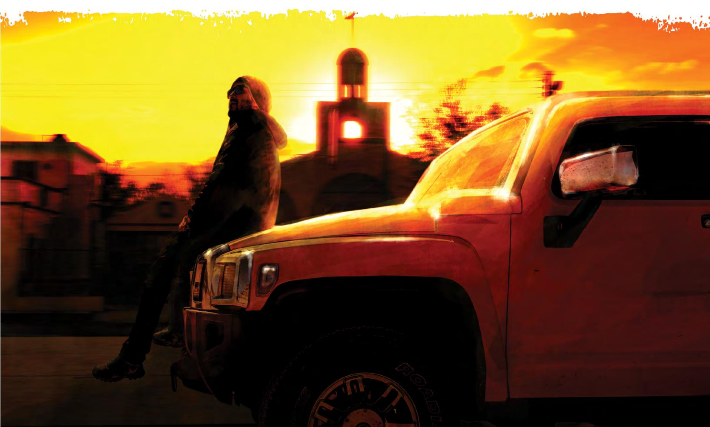

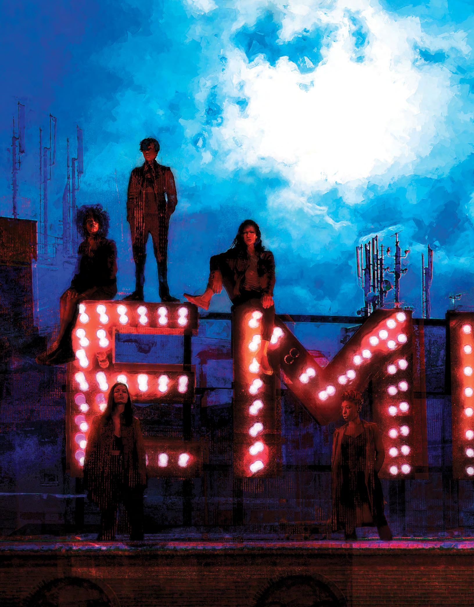

# ГЛАВА ПЯТАЯ*:*

# КОТЕРИИ

#### Преступники вместе. Мы в аду, мой маленький друг, и там никогда не бывает ошибок. Люди не прокляты просто так.

— ЖАН-ПОЛЬСАРТР, "Выхода нет"

Òåðìèí Êîòåðèè, âîçìîæíî, ïåðâîíà÷àëüíî èñïîëüçîâàëñÿ äëÿ îáîçíà÷åíèÿ íåáîëüøîé ãðóïïû âàìïèðîâ, êîòîðûå ðàáîòàþò âìåñòå, ïðåñëåäóÿ îäíó öåëü. îòëè÷èå îò ýòîãî, ñåêòà - ýòî áîëåå êðóïíàÿ ôðàêöèÿ âàìïèðîâ, ðàçäåëÿþùèõ îáùóþ ôèëîñîôèþ, à äâîð, äîìåí, òåððèòîðèÿ è äðóãèå òåðìèíû îáû÷íî îïðåäåëÿþò âñåõ ïðåäñòàâèòåëåé ðîäà â îäíîé ãåîãðàôè÷åñêîé òî÷êå. ñâÿçè ñ ýòèì, íåñìîòðÿ íà ñîâðåìåííóþ ðàñïðîñòðàíåííîñòü òåðìèíà, ìíîãèå âàìïèðû ñ÷èòàþò "êîòåðèè" àðõàè÷íûì âûðàæåíèåì.

Некоторые молодые вампиры считают, что слово "котерия" слишком отягощено аристократической идеологией Камарильи, и оно почти вышло из употребления в некоторых доменах Анарха, в пользу "местной", "банды" или уже устаревшего "советской". Молодые Сородичи, особенно молодые, часто обозначают разнородные группы вампиров стилистическими фразами, связанными с их многочисленностью или лидерством: банда Бруха или Равноса; нора Гангрела или Носферату; богомерзкий отряд Тремера (реже используется самими Тремерами, которые предпочитают школу), студия Тореадора, свита Вентру и т.д. Слабокровные могут даже не знать, что существует специальное слово "группа" или "команда".

Котерии иногда служат средством обеспечения зависимости между членами большого заговора, заменяя более целостные межличностные связи. Современные Сородичи могут образовывать котерии как предприятие, связанное с общими интересами, как ритуал товарищества среди вампировединомышленников или даже как выражение привязанности, если только Сородич может ее чувствовать. Котериям свойственна сильная традиционная роль, которую они играют в обществе Рода, а также потому, что ходить в одиночку в эти ночи становится все опаснее. Когда образуются группы, будь то социальные клики, семейные выводки, информационные сети или просто изгои, главным

ожиланием остается взаимная зашита.

## ВЕЛИКАЯ ЦЕЛЬ

Вампиры по природе своей хищные существа и боятся чудовищной природы друг друга, поэтому они редко вступают в настоящие доверительные отношения. Поэтому, как правило, котерии создаются для достижения какой-то одной цели или выполнения определенного плана. Котерии создаются с определенной целью.

Доверие, конечно, редкое и труднодостижимое чувство среди сородичных существ. Любой вампир, проведший время в нескольких котериях, может подтвердить, что все они имеют одну общую черту: Принадлежность к котерии меньше похожа на общение с друзьями и больше напоминает плавание с акулами.

Любые причины могут побудить вампиров объединиться в котерию, но независимо от них у каждого члена есть свои цели и задачи. Все вампиры чего-то хотят, все до единого, и в то же время еще не существовало ни одного объединения, в котором все Сородичи знали бы об истинных намерениях друг друга. Независимо от того, состоит ли группа из отдельных вампиров, стремящихся к крови, власти, магии, богатству, знаниям или социальному влиянию, эти вампиры всегда находятся в той или иной форме конкуренции друг с другом. Под взаимной защитой скрываются личные амбиции.

Несмотря на это, только недальновидный вампир не бросит своего соратника на произвол судьбы ради достижения личной цели. Вампиры, поступающие подобным образом, быстро приобретают дурную славу и наживают себе врагов.

Кроме обществ, созданных по социальным причинам, августейшие сородичи некоторых доменов иногда создают общества, преследующие вполне конкретные цели. В камарильском домене может быть создана дружина, состоящая из шерифа, помощников и гончих (или под их началом), цель которой - охрана своей территории. В домене отчаянных анархов может появиться стая, охотящаяся на люпинов и подчиняющаяся барону. Аширра может оказаться вынужденной проявлять особую бдительность в борьбе с Шабашом. Обстоятельства создают оправдание, которое удерживает дружину вместе, или одобрение сверху.

## Персонажи игроков

Для многих сородичных кланов котерии кажутся неестественными. Хищники-одиночки не образуют гармоничных социальных групп. Однако персонажи игроков имеют преимущество в том, что отношения между ними преобладают над этим. Социальная ячейка вокруг игрового стола помогает сформировать чувство принадлежности.

Однако это не обязательно должно быть так. Вампирское общество коварно, и некоторые группы могут наслаждаться некоторой долей подозрительности по отношению к своим товарищам по игре.

Будьте осторожны, когда игроки принимают концепцию предательства. Это может быть заманчиво играть вампира, наносящего удар за ударом, но обычно более полезно играть группой, которая ведет долгую игру, реализуя свои планы и создавая что-то долговременное, используя свою неожиданную солидарность, чтобы вместе нанести удар своим врагам. В отличие от персонажей рассказчиков, чьи действия часто служат целенаправленному повествованию, персонажи игроков обладают большей свободой воли, что делает возникающие между ними связи более ценными.

## Êîòåðèÿ êàê îáëàêî

Примеры типов котерий, приведенные в Vampire: The Masquerade (стр. 197-199) или в следующем разделе этой книги - это просто примеры. Типы котерий перетекают друг в друга, и даже названия типов служат скорее сокращением правил, чем универсальными терминами для соплеменников. Да, некоторые тореадорские модники называют свою дружину Плюмайрами, Квестари - это переработанный термин Тремеров, а шокдесантники Анарха иногда используют слово Коммандос в своем подразделении, но типы котерии- это не кланы.

Размывайте различия, смешивайте типы, стройте свою котерию, ориентируясь в первую очередь на свою команду, а во вторую - на правила.

Если вы решили играть в "экспертов по неразорвавшимся веществам", которых эмир вызывает, чтобы разобраться со спящим древним под стадионом, вы можете создать такую группу как "Цербер" или "Квестари" так же легко, как и группу "Регентство", и, возможно, вам захочется поменять местами те или иные необходимые условия среди перечисленных типов.

Аналогично, ваша группа может измениться после создания. Возможно, амбиции ваших персонажей изменились: князь возмутил вас, вы поклялись уничтожить его, вы стали Охотничьим отрядом для того, чтобы вырваться на рынок ее любимых групп крови. Возможно, изменился сюжет: ваш покровитель был разоблачен как лазутчик Шабаша, и теперь вы стали соратниками Беглеца, пытающимися очистить свои имена. Возможно, вас изменил собственный успех: ваша группа диверсантов свергла властную структуру, и теперь вы - группа Регентства или Марешаля, но только по названию. Свободно меняйте фоны и другие преимущества своей группы, чтобы соответствовать новой цели. В первую очередь важна история, а не симметрия. До тех пор, пока общее количество точек и стоимость очков остаются неизменными, и пока что-то в повествовании объясняет или оправдывает смену, механика партии не должна ограничивать игру.

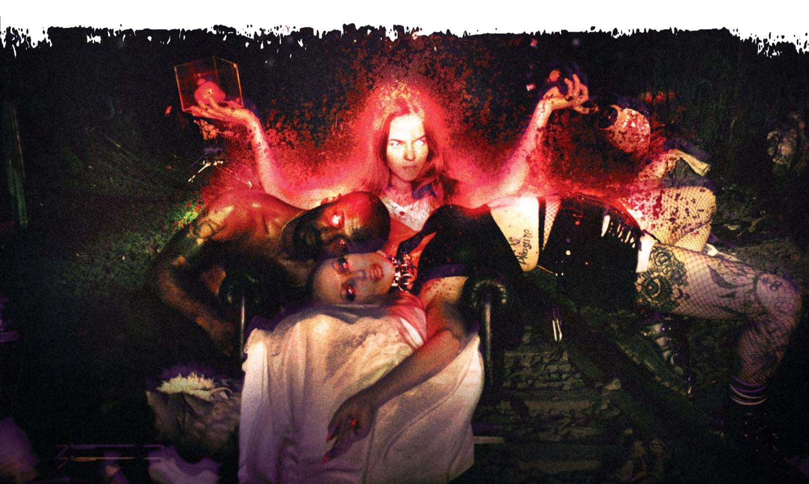

| Типы Котерии                                                                                                             |       |
|--------------------------------------------------------------------------------------------------------------------------|-------|
| ПРЕИМУЩЕСТВА ДОМЕНА                                                                                                      |       |
| Шассе: Размер и богатство доменных охотничьих угодий Льен: Насколько хорошо вы интегрированы в свой домен             |       |
| Портильон: Защита вашего домена от посторонних лиц                                                                       |       |
| КРОВАВЫЙ КУЛЬТ ТРЕПЕЩУЩИЕ БОГИ                                                                                        | ДОМЕН |
| Контролировать культ людей и кормить их, овладеть магией крови,                                                          |       |
| использовать культистов для получения власти                                                                             |       |
| СТАДО ••• ПОДОЗРЕВАЕМЫЙ (•)                                                                                              |       |
| ЦЕПНЫЕ ГОНЧИЕ ЦЕРБЕРЫ                                                                                                 | ДОМЕН |
| Охрана или защита значимого места, изучение его секретов, обмен доступа на власть                                     |       |
| УБЕЖИЩЕ ••                                                                                                               |       |
| МЕСТНЫЕ ГЕРОИ                                                                                                            | ДОМЕН |
| ЧЕМПИОНЫ Защищайте свои владения от хищников, боритесь с преступностью,                                               |       |
| старайтесь не терять надежды и Человечности                                                                              |       |
| СТАДО ••• ПОДОЗРЕВАЕМЫЙ (•)                                                                                              |       |
| ГРУППА СПЕЦНАЗА КОММАНДОС                                                                                             | ДОМЕН |
| Сражаться за мастера, изучать и использовать оборону противника,                                                         |       |
| поддерживать сплоченность подразделения, применять специальные силы МАВЛА ••• СТАТУС • ВРАГИ (••)                     |       |
| LLC                                                                                                                      | ДОМЕН |
| КОРПОРАТИВНЫЕ Заботиться о бизнесе, наращивать акционерную стоимость, вживаться в                                     |       |
| земные властные структуры, обдирать верхушку                                                                             |       |
| ВЛИЯНИЕ •• РЕСУРСЫ •••                                                                                                   |       |
| СОЛНЕЧНЫЕ СОЛДАТЫ ДНЕВНОЙ ДОЗОР                                                                                       | ДОМЕН |
| Охраняйте спящих нежитей от смертных, патрулируйте город, укрепляйте                                                     |       |
| свои позиции, пока никто не видит ВЛИЯНИЕ •• ВРАГИ (•••)                                                              |       |
| МИРОТВОРЦЫ                                                                                                               | ДОМЕН |
| ПОСЛАННИКИ Посредничество между фракциями, создание альянсов и общих позиций,                                         |       |
| определение общего врага                                                                                                 |       |
| ИНФОРМАТОРЫ ••• РЕСУРСЫ •• ПОДОЗРЕВАЕМЫЙ (•)                                                                             |       |
| КРОВНЫЕ ОТНОШЕНИЯ СЕМЬЯ                                                                                               | ДОМЕН |
| Поддерживать домашний очаг, выгодно расширять кровные связи,                                                             |       |
| поддерживать линию, договариваться о кровных браках с другими Семьями СОЮЗНИКИ • ИНФОРМАТОРЫ •• РЕСУРСЫ •• ВРАГИ (••) |       |
| ПРЕСТУПНАЯ ГРУППА                                                                                                        | ДОМЕН |
| ГАНГСТЕРЫ Будьте нежитью и совершайте преступления, находите цели и поражайте                                         |       |
| их, защищайте территорию от соперников                                                                                   |       |
| ИНФОРМАТОРЫ • ВРАГИ (••)                                                                                                 |       |
| В БЕГАХ БЕГЛЕЦЫ                                                                                                       | ДОМЕН |
| Скрывайтесь, двигайтесь, очищайте свое имя, заманивайте охотников в                                                      |       |
| засаду                                                                                                                   |       |

**156**

ИНФОРМАТОРЫ **•••** МАСКА **••** ПОДРУЧНЫЕ **•** ПРЕСЛЕДОВАНИЕ **(•+)**

| КЛАДБИЩЕНСКИЕ СМЕНЫ ПРИВРАТНИКИ                                                                                      | ДОМЕН |
|-------------------------------------------------------------------------------------------------------------------------|-------|
| Следить за Завесой, иметь дело с призраками, ловить призраков,                                                          |       |
| предотвращать несанкционированное ограбление могил, грабить могилы                                                      |       |
| ИНФОРМАТОРЫ •• ПОДРУЧНЫЕ ••• БЕСЧЕТЬЕ (•)                                                                               |       |
| БЕГУЩИЕ ПО КРОВИ ОХОТНИЧЬЯ ГРУППА Найдите лучшие источники крови, защитите их от браконьеров и продайте           | ДОМЕН |
| их кровь тому, кто больше заплатит.                                                                                     |       |
| СОЮЗНИКИ • ИЛИ МАВЛА •                                                                                                  |       |
| ГОРОДСКОЙ ЗАЛ МАРЕШАЛЬ                                                                                               | ДОМЕН |
| Служить и охранять владыку города, выполнять его грязную работу,                                                        |       |
| использовать свой доступ к власти СТАТУС •••                                                                         |       |
| ПОДВИЖНОЕ ПИТАНИЕ КОЧЕВНИКИ                                                                                          | ДОМЕН |
| Исследовать с опаской, выступить и пойти дальше, заручиться поддержкой                                                  |       |
| местных жителей, шоу должно продолжаться, найти настоящий дом? ИНФОРМАТОРЫ ••• ПОДРУНЫЕ •• ПОДОЗРЕВАЕМЫЕ (•)         |       |
|                                                                                                                         |       |
| ПТИЦЫ ОДНОГО ПЕРА ПЛЮМАЙРЫ                                                                                           | ДОМЕН |
| Общайтесь, занимайтесь своим общественным творчеством или интересами,                                                   |       |
| затмевайте конкурентов, выявляйте новые таланты, живите хорошо ИНФОРМАТОРЫ •••                                       |       |
| ИСКАТЕЛИ ПОСЛЕ УЖАСА КВЕСТАРИ                                                                                        | ДОМЕН |
| Исследуйте свои поиски, собирайте и сохраняйте книги и оборудование, изучайте слухи,                                    |       |
| разгадывайте тайны и головоломки, блокируйте соперников, отправляйте экспедиции ИНФОРМАТОРЫ ••                       |       |
| МЕСТОПОЛОЖЕНИЯ ДЛЯ МОЩНОСТИ РЕГЕНТЫ                                                                                  | ДОМЕН |
| Защищайте и укрепляйте свои позиции, делайте то же самое для города, следуйте                                           |       |
| политике старейшины, умиротворяйте соперничающие фракции, пока не нанесете удар. МАВЛА •• СТАТУС ••• ИЛИ ••••        |       |
|                                                                                                                         | ДОМЕН |
| ПОДЗЕМНЫЕ ВРАГИ ДИВЕРСАНТЫ Затаиться, ударить по врагу резко или коварно, подорвать врага политически или с       | ?     |
| помощью смертных, совершить государственный переворот?                                                                  | ?     |
| ИНФОРМАТОРЫ •• ВЛИЯНИЕ • МАВЛА •• МАСКА • РЕСУРСЫ •• ПРОТИВНИКИ (••)                                                    | ?     |
| ЛОЖНЫЕ ФЛАГИ СБИРЫ                                                                                                   | ДОМЕН |
| Раскройте свое прикрытие, собирайте разведданные, создавайте и                                                          |       |
| управляйте сетью предателей и шпионов                                                                                   |       |
| МАВЛА •• МАСКА •                                                                                                        |       |
| ТАЙНАЯ ПОЛИЦИЯ ВЕХМЕ Поддержание и защита Маскарада, поиск и пресечение действий                                  | ДОМЕН |
| нарушителей, привлечение их к суду, исполнение приговора                                                                |       |
| ВЛИЯНИЕ ••• СТАТУС •••                                                                                                  |       |
| ДОЗОРНЫЕ ГРАЖДАНСКИЕ ХРАНИТЕЛИ                                                                                       | ДОМЕН |
|                                                                                                                         |       |
| Патрулирование и защита, расширение власти и влияния секты, борьба с противниками секты и оборотнями, охота на Шабаш |       |

СТАТУС **••**

**157**

### Кровавый **KYJLT**

#### "Присоединяйтесь к нам, и наша кровь будет вечно неразделенной, ибо нет закона помимо нашей воли".

Культы крови заманивают добычу обещанием сверхъестественного зрелища или эзотерической истины. Они рискуют маскарадом ради легкого доступа к стаду и покорным слугам, ищущим спасения от испытаний земной жизни. Они могут верить в свою кровавую теологию или просто использовать ритуальные одежды для прикрытия простого хищничества.

Культы крови часто имеют смешанный состав, состоящий из сородичей и слабокровных, что само по себе подозрительно в глазах вампиров старшего поколения.

Культы крови обычно объединены в духовную иерархию, во главе которой стоит харизматичный или властный представитель рода с величественным титулом, например, Верховная жрица. Другие члены секты могут использовать семейные титулы, такие как отец, сестра или двоюродный брат. Хотя Культы Крови редко оценивают свою силу по территории, большинство из них имеют выделенное ритуальное пространство, охраняемое и поддерживаемое настоятельницей, сакристаном или хадимом.

### Необходимые условия:

- Домен: Льен и Портильон ••
- $C_{\text{TaIO}} \cdots$  $\blacksquare$
- a. Подозрительный (•)

Возможные дополнения: Убежище (храм или лагерь сектантов), Убежище: Фуркус, Подручные (вергеры, братья-миряне); Враги  $(\cdot \cdot)$ 

Предпочитаемые резонансы: Сангвиник Общие преимущества: На подхвате •;

Проклятие (разное), Мишень (•)

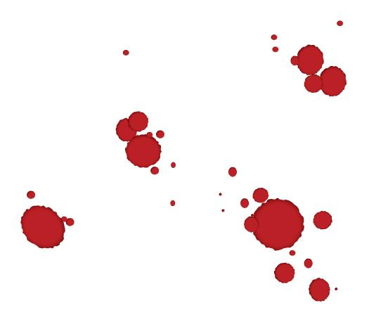

# Церберы

#### "Никто не видел, как ты входишь... никто не должен видеть, как ты уходишь".

В большинстве городов есть хотя бы одна дружина Церберов, которой князь поручает охранять территорию Элизиума или другие важные места в городе. Часто эта работа сопровождается клятвами или неявной угрозой: "Если что-то пойдет не так...". Члены Цербера иногда передают свои почетные (и обременительные) обязанности по наследству от сира к детям. Немногочисленные анархо-церберы обычно берут на себя эту работу после падения города Камарильи, часто в виде амбициозных комитетов добровольцев.

Котериям Церберов нужны как жесткие уличные бойцы, так и умелые политические операторы, и они держат свои дела внутри котерии. Они привлекают вампиров, которые ищут признания, искупления или славы в обмен на службу, например, Бану Хаким, Салюбри или Цимисхов.

- В дополнение к основной цели защите, котерии Цербера могут: выступать в качестве посредников между двором Рода и властными структурами смертных.
- Укреплять свои владения от вторжения и наблюдения.
- Поддерживать исторический или сверхъестественный характер своих владений.
- Последнее может вступать в конфликт с желанием защищать:

Возведение жутких баррикад или неприглядных рвов вокруг музея, достопримечательности или исторического объекта редко проходит гладко. Как и патрулирование территории крысами или

#### привидениями. Необходимые условия:

- Домен: Шасс и Портильон • •
- Убежище ••

Возможные дополнения: Убежище: Фуркус или сверхъестественная проблема, или оба, Подручные (стражи), Статус (для наследства); Противник

Предпочитаемые резонансы: Меланхоличный Общие преимущества: Привилегированные

• • •; Хулиганы (•), Хранители (••), Территориальные (•)

## Чемпионы

#### "Преступники - народ суеверный и трусливый".

Сородичи в этой компании все еще держатся за чтото в своей человечности, желая творить добро, в то время как их Зверь хочет убивать и терроризировать. В некоторых районах эти цели не сразу вступают в конфликт. Чемпионы не всегда являются мстителями: в некоторых котериях есть общественные организаторы или даже соседская стража.

Грабители прячутся в переулках? Наркоторговцы отравляют кормовую базу? Так или иначе, они исчезают в ночи. Какое-то время система работает, или кажется, что работает. В дополнение к таким простым санитарным мерам, чемпионы могут:

- Проводить ночные патрули и расследовать потенциальные угрозы.
- Выявление проблемных полицейских: жестоких, коррумпированных или слишком увлеченных охотой на вампиров.
- Поллерживать опасность на улицах, чтобы отпугнуть застройщиков, поддерживаемых Камарильей. В конце концов, ситуация может выйти из-под контроля.

Свидетели должны исчезать, хорошие полицейские или социальные работники должны отбивать охоту к расследованию, и в итоге чемпионы причиняют вред или убивают столько же невинных, сколько спасают. Даже если они в основном сдерживают свою жестокость, они наживают себе врагов на этом пути нельзя построить светлое будущее, не убив нескольких криминальных авторитетов. Они попадают в поле зрения более крупных акул: выбивает ли Братва откупные у местной банды Бруха? Считает ли Сенешаль, что самая большая сила Анархов может быть направлена на Чемпионов - или наоборот? Необходимые условия:

- Домен: Шасс и Льен •••
- Союзники
- Враги (••) (местные криминальные группы)
- Возможные дополнения: Информаторы, Убежище: Скрытая оружейная комната, Влияние (церковь или полиция); Противник

Предпочтительные резонансы: Холерик Общие преимущества: Отверстия для болтов (варьируется), Транспорт • •; Хранители (••), Мишень (•)

## Коммандос

#### "Чтобы добиться мира, готовьтесь к войне. Чтобы сделать деньги, найди неподготовленных".

Некоторые отряды коммандос служат князю или барону, сражаясь за секту. Некоторые могущественные сородичи назначают своего ребенка или внука капитаном, чтобы содержать личный отряд охраны. Более наемные отряды коммандос берут работу у любого покровителя, который может заплатить. Задания могут включать:

- $\mathbf{u}$  . Охота на слабокровных в городе.
- Быть нанятым для охраны бизнеса одного из городских чиновников.
- Сопровождение ценной цели через спорный или опасный район.
- Пополнить свой арсенал за счет торговли оружием или набегов на других, лучше вооруженных: бандитов, полицейских, арсенал Национальной гвардии.
- Выяснить, кто подстроил убийство старейшины.

Командные группы, как и группы специального назначения, состоят из специализированных ролей: капитан, сержант, тактик, переговорщик, специалист, "вышибала" и др. Большинство миссий требуют проведения и не боевых расследований: поиск свидетелей, сбор информации о цели, налаживание контактов с потенциальными клиентами или

влиятельными фигурами в суде. Необходимые условия:

- Домен: Шасс и Портильон ••
- $\mathbf{r}$ Мавла ••• (тот, кто поручает вам выполнение заданий)
- Статус• m.
- Враги  $(\bullet\bullet)$ m.

### Возможные дополнения: Убежище

(оперативная база), Убежище: Скрытая оружейная, Маска, Подручные (сержанты,

дополнительные войска); Противник

Предпочтительные резонансы: Холерик Общие преимущества: Транспорт ••;

Хулиганы (•), Военные преступники (••)

# Êîðïîðàòèâíûå

#### "В том-то и дело. Нового бизнеса не бывает. Весь наш бизнес это старый бизнес".

Корпоративные котерии используют современные методы ведения бизнеса, а также тактику силового давления и сверхъестественные манипуляции. Ультратрадиционалисты Камарильи по-прежнему считают их бестактными, но никто не отрицает их полезности в эти капиталистические ночи. Котерии анархов, пробующих пойти по корпоративному пути, часто распадаются из-за идеологической подозрительности или паралича, но харизматичные анархи, только что приехавшие из Силиконовой долины, все еще пытаются заново изобрести зал заседаний.

Корпоративные сообщества организуются в виде совета директоров, возглавляемого председателем, который избирается членами сообщества или назначается старейшиной. До тех пор пока они выплачивают существенные дивиденды своим (часто в буквальном смысле) акционерам, организация может делать все, что ей заблагорассудится.

Вместо того чтобы возиться с отчетами о прибылях и убытках, группа может абстрагироваться от реальной деятельности корпорации с помощью проектов или просто ресурсных точек. Остаются такие цели, как:

- Отпугивание конкурентов террором или манипулирование ими с целью слияния.
- Освоение рынков, богатых наличностью, например, преступниками или террористами.
- Расследование хищений или корпоративного шпионажа.
- Лоббирование (или иное уклонение) государственных следователей и регуляторов.

Стереотипно корпоративные котерии возглавляют Вентру, но для управления такими предприятиями требуются и ласомбрийские ловцы струн, и гекатские банкиры, и даже малкавианские провидцы. Независимо от этого, корпорации нужны высокопоставленные юристы (гули или просто подручные), чтобы смертные власти были довольны, как над, так и под столом.

#### Необходимые условия:

- Домен: Шасс и Льен ••
- Влияние •• (Бизнес сообщества)
- Ресурсы ••• (портфель ценных бумаг)

Возможные дополнения: Информаторы, Убежище: бизнес-учреждение, Стадо, Влияние

(корпоративное или политическое), Подручные

Предпочитаемые резонансы: Флегматик

Общие преимущества: Долг (••), Территориальные (•)

# Äíåâíîé äîçîð

"Мы нужны тебе на крыше. В основном потому, что, находясь на крыше, вы можете сгореть".

Котерия Дневного Дозора превращает слабокровных из бедных и расходных в хорошо оплачиваемых и расходных. Быть слабой кровью с заслугой Дневного Дозора кажется сложным требованием, чтобы стать частью этой стаи, но гибкость Рассказчика и игрока помогает воплотить эту концепцию в жизнь.

Поскольку вампиры передвигаются днем, Маскарад становится таким же огнеопасным, как и старейшина. Котерии Дневного Дозора, сохраняя свое инкогнито, пересекаются с потенциальными соперниками котериями Вехме, которые к тому же могут рассматривать Дневной Дозор как неоправданный риск.

Котерия постоянно взаимодействует со смертными и вынуждена переключать внимание на редких представителей рода, которым она служит и которых защищает. Сородичи возмущаются и подозревают "полукровок", которые общаются со смертными, пока порядочные каиниты спят.

Котерии Дневного Дозора выполняют различные функции: телохранителей Примогена или разведчиков, нацеленных на организованных охотников за вампирами. Нередко перед отрядом ставятся самоубийственные задачи: ведь слабокровные - на одно лицо. Выживший Дневной Дозор должен быть абсолютно лучшим. И если случится худшее, то члены группы могут обратить свой взор - и оружие - на полнокровных, которых они якобы призваны охранять.

#### Необходимые условия:

- Домен: Шасс и Портильон ••
- Влияние ••
- Враги (•••)

#### Возможные дополнения: Союзники,

Информаторы, Убежище, Мавла, Статус: Городские тайны, общая реликвия или ритуал, позволяющий вести дневную

#### деятельность

#### Предпочтительные резонансы: Все, что нужно

алхимику сегодня Общие преимущества "Котерии": Долг (•)

## Посланники

#### "Работая вместе, мы имеем шанс на выживание. Давайте превратим наши различия в коллективные достоинства".

Эта группа служит в дипломатических миссиях, выступая  $\, {\bf B}$ качестве посредников между враждующими сторонами. Чаще всего котерии формируются результате посланников  $\, {\bf B}$ междоусобных конфликтов. Когда воюющие стороны приходят к компромиссу или перемирию, они иногда поручают своим молодым членам создать такую котерию, чтобы решить оставшиеся спорные вопросы и, возможно, преодолеть старые обиды.

Цели группы посланников зависят от того, с кем они работают или ведут переговоры в данный момент. **Пели MOLAT** меняться, если меняются  $ux$ дипломатические миссии. Некоторые цели могут включать:

- $\mathbf{u}$  . Объединение двух организаций, культов, городов или сект для достижения общей цели.
- Усиление позиций или влияния конкретного человека

Координация проектов для достижения одних и тех же целей. Даже не имея официального задания, Посланники неофициально общаются с местными властными структурами, стремясь получить информацию о потенциальных партнерах, обеспечить безопасность достигнутых ранее договоренностей и использовать рычаги влияния для защиты своих

#### компромиссов.

#### Необходимые условия:

- Домен: Шасс •, Льен •••
- Информаторы ••• (смертные из разных слоев общества и разных профессий)
- Ресурсы •• (объединенные денежные средства и активы)
- Подозрительный (•)

Возможные дополнения: Маска (прикрытие личности для разных доменов); Нет убежища (всегда в движении) (•) или Общее убежище (посольство или

представительство) (•)

#### Предпочтительные резонансы: Сангвиники, Флегматики

Общие преимущества: Привилегированные • • •

## Семья

#### "Как бы я тебя сейчас ни ненавидел, ты мой брат, и никто так с тобой не поступает".

Синоним Гекаты, распространенный среди Вентру, Цимисхов и старших ветвей большинства других кланов, Семейная дружина связывает кровных сородичей с Кровью. Многие анциллы помнят времена, когда семья превалировала над всеми заботами как в жизни, так и в нежизни: впрочем, за пределами постмодернистского Запада она, как правило, и сейчас превалирует.

Семейные котерии часто привлекают смертных членов своих расширенных семей в качестве союзников, принимая в свои ряды наиболее перспективных для продолжения рода. Они могут иметь зависимые линии слуг или подручных, а также обычных родителей, бабушек и дедушек, братьев и сестер, кузенов и дальних родственников. Кровный брак (Камарилья, стр. 91-92) в прошлом может объяснить наличие нескольких кланов в одной Семье.

Цели Семейной дружины направлены на взаимоотношения как со смертными, так и с вампирами:

- Защищать интересы семьи, заключать смертные браки и обеспечивать успех будущих родственников.
- Планировать выгодные брачные союзы и кровные браки.
- Проследить свою генеалогию, чтобы найти потерянных членов семьи или обнаружить старые семейные могилы или реликвии.

Другие члены семьи могут быть выданы замуж, отдалены друг от друга или таинственно пропали. Семейные компании предоставляют множество возможностей для создания тревожных персонажей, которых нельзя просто убить - они же семья! Они создают серьезные конфликты для групп, которым нравится сталкивать друг друга в игре: неважно, к какому типу относится ваша группа - к "Сопрано" или к "Наследству", семья имеет значение.

#### Необходимые условия:

- Домен: Шасс •, Льен •, Портильон •••
- $\mathbf{u}$  . Союзники • (связанный с ним смертный член семьи)
- Информаторы •• (семья, расширенная семья)
- Ресурсы •• (ликвидные активы семьи)
- $\blacksquare$ Враги (••) (один или несколько смертных, выступающих против семейного бизнеса)

Возможные дополнения: Убежище (родовое поместье), Стадо (члены расширенной семьи), Влияние (семейный бизнес), Мавла (вампир в одной семье), Подручные (семейный гуль); Темная тайна (семейная дьявольщина или черная овца), Недостаток убежища: сверхъестественная проблема

Предпочитаемые резонансы: Сангвиники Общие преимущества: Отверстия для болтов (варьируется); Проклятый (семейное проклятие), Территориальный (родовое поместье)

# Ãàíãñòåðû

#### "За преступление не платят... вам. Она платит нам".

Бандиты, ставленники Синдиката или мошенники - Гангстеры предоставляет другим сородичам набор грязных навыков и вход в преступный мир. Их истории наполнены насилием, предательством, искушением и последствиями, которые несут жертвы и мишени всех вышеперечисленных преступлений. Знакомый по сотням фильмов и телепередач, этот тип группировки, пожалуй, самый простой для новых групп: подберите себе водителя и разведчика, киллера, бандита с оружием, взломщика, а может быть, лицо или организатора, и вы готовы к совершению преступлений.

Камарилье нет дела до того, что ее члены нарушают земные законы, а анархи любят бунтарей - до тех пор, пока Гангстеры не ступает на чужую территорию, не убивает ценного гуля или союзника или не устраивается на работу к ненавистному конкуренту игрока власти. Преступные истории становятся политическими, если Гангстеры становятся могущественными, но всегда есть другая банда, с которой можно потягаться, если банда

предпочитает оставаться на улице.

#### Необходимые условия:

- Домен: Шасс •, Льен •, и Портильон •
- Информаторы (скупщик краденого или кто-то подобный)
- Враги (••)

## Возможные дополнения: Убежище

(помещение клуба), Стадо(люди-члены/ жертвы вашей банды), Влияние (организованная преступность), Ресурсы (награбленное), Подручные, Статус (вероятно, у анархов)

- Предпочтительные резонансы: Холерики
- Общие преимущества: Мишень (•)

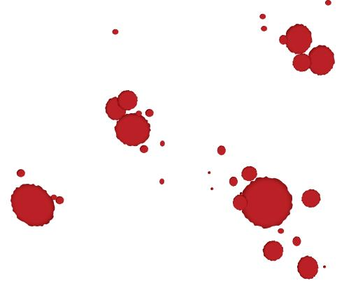

# Áåãëåöû

#### "Мы не можем остановиться. Мы даже не можем замедлиться. Мы пытаемся развернуться".

Вампиры находятся в бегах. FIRSTLIGHT нацелился на них. Суд объявляет Кровавую охоту. Анархи ищут их для вечеринки с кольями и сапогами. Преследователем может быть даже один сильный вампир. Редко когда охотятся на всех членов группы. Вместо этого один или два Сородича в бегах убеждают других пойти с ними по любви, товариществу или Узам Крови.

А может быть, члены группы выполнили работу, изза которой их отлучили от церкви, или узнали слишком много о ком-то могущественном. В любой опасности они доверяют только смертным, а их не так много. Возможно, их опоры составляют часть их свиты, или им приходится пытаться заручиться их защитой из укрытия или из другого города.

Истории беглых котерий обостряют паранойю: Кто охотится за нами? Предаст ли один из нас остальных? Они заканчиваются тем, что члены группы оказываются в плену или обращаются в бегство и сражаются в последнем обреченном бою. А может быть, и победой:

- Группа обнаруживает, кто их подставил, и доказывает это преследователям.
- Они успешно инсценируют свою окончательную смерть или перенаправляют своих преследователей на другую группу Сородичей - со смертными охотниками это проще, чем с Сородичными Гончими.
- Они находят защиту в другом месте, покупая ее своим опасным секретом или каким-либо другим козырем, который они раскрывают в своем бегстве.

Беглецы, которые пытаются очистить свое имя при любых обстоятельствах, должны придумать убедительные аргументы или еще более худший способ удержать своего обвинителя. В противном случае следует держать под рукой тайник с ресурсами

для еще одного быстрого побега.

#### Необходимые условия:

- Домен: Отсутствует
- Информаторы ••• (Помощь в побеге)
- Маска ••
- Подручные (Дневной водитель)
- Особые: Беглые котерии всегда имеют один или несколько недостатков, связанных с их преследователем: противник, враг, дурная слава, пустотелый, преследуемый

Возможные дополнения: Союзники, Фальсификатор •, Страница истории (когда за ним охотятся, потому что он слишком много знает), Ресурсы (наличные и легкие транспортные средства); Презираемый (••) Предпочтительные резонансы: Холерики Общие преимущества: Транспорт

••; Мишень (•)

# Ïðèâðàòíèêè

#### "Наши друзья находятся на границе между жизнью и смертью. Наши враги лежат прямо за ней".

Все еще редкие, но появляющиеся среди Гекаты, Ласомбры и других пользователей Обливиона, котерии Привратников общаются с мертвыми (и повелевают ими), часто в качестве услуги другим Родам. Некромантические способности и призрачные слуги придают значительный, потенциально отрицаемый, бросовый вес барону или князю, спонсирующему когорту Привратников в удалении.

Некоторые привратники решают вопросы на основе консенсуса, другие следуют за самым могущественным некромантом среди них - иногда его называют "церемониймейстером", или просто Гейтмастером. В котериях, где постоянно обитают духи или ходячие трупы, пономарь может контролировать и удерживать их в пределах своего владения.

Хотя они сторонятся слабокровных, они не проявляют враждебности к каитиффам, сумевшим познать силы Обливиона или обратившимся к ним за этим обучением. Обучение любого желающего сородича церемониям Обливиона дает ему важные бонусы или другие преимущества. Другие Сородичи заказывают их для того, чтобы усыпить опасных призраков, пообщаться с почитаемыми предками или найти могильные реликвии или другие секреты,

хранящиеся у истинно мертвых.

#### Необходимые условия:

- Домен: Шасс ••, Льен и Портильон •
- Информаторы •• (могильщики,
- гробовщики)
- Подручные ••• (прислужник и шпион Призрак)
- Бесчестье (•) (взаимоотношения с темными силами)

Возможные дополнения: Враги (охотники на вампиров, которые узнали, что члены общины имеют дело с мертвыми), Убежище: Фуркус (церемонии), Мавла (опытный некромант), Ресурсы (украденные у мертвых), Статус: Городские секреты (узнанные от мертвых).

Предпочитаемые резонансы: Нет

 Общие преимущества: Отверстия для болтов; Проклятие (разное), Территориальность (•)

## Îõîòíè÷üÿ ãðóïïà

#### "Я вижу, что вы покупатель со вкусом и утонченностью. Позвольте показать вам наш погреб для болельщиц".

Охотничьи группы знают резонанс, как свои пять пальцев, и часто точно знают, где его искать. Стадо носителей сгустка может изменить их эмоциональное состояние, поэтому управление свободными смертными - ключевой момент инвентаризации. Защищать эти активы очень важно, а делать это аккуратно - тем более. Смертных можно отлавливать снова и снова, но при повторных сборах возникает риск: внимание правоохранительных органов (или Второй инквизиции), выходки преследуемого смертного, вампирыбраконьеры, системное вмешательство со стороны конкурирующих отлавливателей, таких как Циркуляционная система или даже добросердечное окружение Чемпиона.

Как и в гангстерах, члены охотничьей котерии специализируются по набору навыков. В охотничьих группах ценятся сородичи, умеющие вынюхивать резонансы, а также гладиаторы с хорошими связями, способные торговаться с другими владельцами ранчо, чтобы выполнить заказ. Но исследователи, частные детективы, даже координаторы по сбору крови дают важные сведения о том, где в вашем городе находятся ценные жилы. Это могут быть как члены Рода, так и смертные, или и те, и другие. Охрана и инвентаризация смертных, пользующихся спросом, часто имеет более высокий приоритет, чем поиск новых сгустков крови, но новая богатая дизкразия, способная накормить самого могущественного вентру в городе, может в одночасье сделать состояние целой группы.

#### Необходимые условия:

- Домен: Шасс •••
- Союзники (приманка, торговец людьми) или Мавла • (кровный брокер)

Возможные дополнения: Стадо, Влияние (организованная преступность)

Предпочтительные резонансы: Все, что лучше продается

Общие преимущества: На подхвате ••

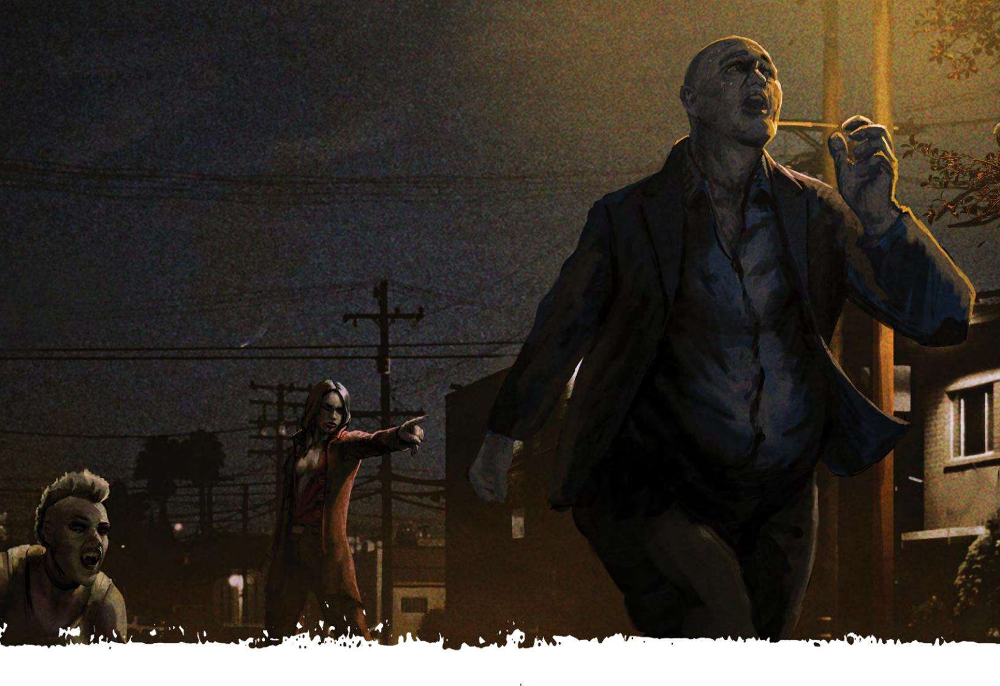

# Ìàðåøàëü

#### "Эмир настаивает на вашем присутствии сегодня вечером. Не будем заставлять их ждать".

Телохранители и преторианцы правителя города, члены котерии Марешаля представляют его личную власть и интересы, в отличие от Шерифа, который теоретически представляет суд, совет или даже город в целом. Престижная должность с возможностью доступа, членство в ней обычно отражает клановый состав городской сородичной структуры власти, поскольку влиятельные старейшины пытаются ввести в нее своих детей.

По традиции, князь или барон назначает капитана, а сам выбирает себе мастера по оружию - часто это военачальник и исполнительный офицер, а нередко и пожилой вампир-ветеран. Будучи напрямую связанными с правителем, члены котерии должны защищать своего покровителя от врагов и соперников, иначе они рискуют потерять территорию в пользу шерифа. Смелые члены котерии Марешаля могут перейти на сторону новых правителей перед переворотом, но если они ошибаются, то вскоре становятся в лучшем случае беглецами.

Аналогично этому, члены группировки должны глубоко скрывать или отрицать свои проступки, либо совершать их в отношении смертных, слабокровных или других групп, не обладающих властью и влиянием. Их поведение выплескивается на правителя, поэтому многие Марешали выполняют свои задачи в тени, появляясь при дворе только тогда, когда это необходимо, чтобы одолеть или победить какоголибо претендента.

#### Необходимые условия:

- Домен: Шасс •• и Портильон ••
- Статус •••

Возможные дополнения: Противники, Влияние, Мавла (князь/барон), Подручные, Статус

Предпочтительные резонансы: Холерики, Сангвиники

Общее преимущество: Транспорт •• ; Хулиганы (••)

## Кочевники

#### "С возвращением, друзья мои, на шоу, которое никогда не заканчивается... но оно продолжается".

Кочевые группы переезжают с места на место, принося с собой праздник. Некоторые кочевники (иногда их называют карнавальными котериями) выступают перед смертными, сородичами или теми и другими: привлекают старших нарочито анахроничными развлечениями, напоминающими цирки "Чаши пыли" или бурлески викторианской эпохи, устраивают репетиции Шекспира или EDMрейвы.

В карнавальных котериях выделяются роли: артист, ряженый или конферансье, работник сцены, менеджер, зазывала или вертухай. Другие кочевые группы просто дежурят вместе, все за одного и один за всех, достаточно долго, чтобы заправиться, залить кровь и отправиться в следующую ночь.

Цели кочевников варьируются в зависимости от квалификации их членов, например:

- Хватайте все, что можно; вас не будет здесь, чтобы попасть под разгром!
- Сатирически высмеивать местную структуру власти или скрывать каинитские обряды в представлениях.
- Предложите сторонний взгляд (или стороннее преимущество) зашедшим в тупик местным властям.
- Создать пропитанные резонансом возможности для кормления без стада.

Кочевники могут передавать секреты доверенным (или предательским) лицам на своем пути или искать компоненты для какого-то совершенно отдельного ритуала, который должен быть проведен в семи

городах за семь месяцев, чтобы он начал действовать. Необходимые условия:

- Домен: Отсутствует
- Инфораторы ••• (зрители, промоутеры, туристические брокеры и т.д.)
- Подручные •• (Дневная поддержка) ٠
- Подозреваемый (•)

Возможные дополнения: Союзники, Слава, Стадо (поклонники или попутчики), Ресурсы

• Предпочтительные резонансы:

Сангвиники, Животные общие

Преимущества Котерии: Транспорт ••

# Плюмайры

#### "Где мы были вчера вечером? Не волнуйся, ты бы не оценил, даже если бы тебя пустили".

Если жить хорошо - лучшая месть, то не жить лучше, чем другой Сородич, еще слаще. Плюмайры, "птицы одного пера", посвящают свои котерии лучшим вещам в нежизни: музыке, моде, искусству и всему тому, что освещает их бесконечные ночи. Помимо тореадорских модников, здесь можно встретить и вентруархитекторов, и малкавианских химиков-дизайнеров, и модников-бруха, и рокеров-гангрелов - вычурность, эгоизм и показуха естественны для представителей всех кланов. Даже Носферату может коллекционировать духи или наслаждаться инфразвуковым блэк-металом.

Как вампиры, они превращают радость в жестокость и конкуренцию: они должны быть, иметь и контролировать все самое лучшее, к чему стремятся, и должны позорить и сокрушать тех, кто осмеливается желать того же. То, что поддерживает котерии Плюмайры, сводится к этим двум элементам. После того как группа выбрала сферу интересов своей котерии, ее фокус, ее цели могут быть следующими:

- $\blacksquare$ Произвести впечатление на гарпий, для чего, возможно, придется убедить гарпий в том, что их специализация - это круто или вообще со вкусом.
- Подчинение или кровная связь с лучшим (или самым популярным) смертным, практикующим их фокус, с потенциальным риском для Маскарада.
- Издеваться над выступлением соперника или иным образом саботировать момент его выступления или его коллекцию.
- Искренне искать лучших представителей своего направления, чтобы попытаться вновь пробудить свою Человечность.
- Но что бы они ни делали, они должны делать это великолепно

#### Необходимые условия:

 $\blacksquare$  Домен: Шасс •• и Льен ••

Информаторы ••• (товарищи по субкультуре) Возможные дополнения: Противник или враг (соперничающая модница), слава (в субкультуре), статус (для высокопоставленных Плюмайеров) Предпочтительные резонансы: Сангвиники Общие преимущества: Транспорт  $\cdot \cdot$ ; Долг $(\cdot \cdot)$ 

# Êâåñòàðè

#### "Ищите, и вы найдете".

Квестари формируются для изучения тайн и загадок от древних легенд до "кто заложил барона?". Вампирские власти могут поручить им отследить мафусаила, или собрать редкие артефакты, чтобы продать их на рынке магии крови, или же они считают, что исследование само по себе является наградой. Некоторые собирают лишь для того, чтобы расширить свою коллекцию, становясь скорее институтом, чем исследователем, - явление настолько распространенное, что у Тремеров есть для него название: Ректорат.

Котерии Ректората в основном сидят дома и ревностно охраняют свою библиотеку, архив или музей, а бродячие квестари постоянно отправляются в экспедиции за пределы родного города, ища сокровища или правду по слухам. Многие квестари пытаются делать и то, и другое! И в том, и в другом случае могут появляться экранные враги, или же они играют на заднем плане как абстрактные проекты, а группа

переключает внимание, когда этого требует сюжет.

Квестари, занимающиеся раскрытием преступлений, нуждаются в рассказчике, готовом и способном предоставить ряд загадок; глубокая история Мира Тьмы предоставляет множество секретов для эзотериков. Группы, погружающиеся в эти глубины, скорее всего, сочтут квестари идеальной командой, позволяющей рассказчику объединить в одной истории персонажей с неясными или, казалось бы, не связанными между собой лор-листами. Квестари могут часто отстраняться от более жестокого политического ужаса Vampire: The Masquerade, для групп, которые сторонятся подобных вещей. Другие квестари собирают секреты, чтобы использовать их в качестве оружия именно в таких политических ужасах. Независимо от этого, их главными врагами могут оказаться соперники Квестари, стремящиеся к общим целям в постоянных битвах умов... а затем и клыков.

#### Необходимые условия:

- Домен: Шасс и Льен •••
- Информаторы ••

Возможные дополнения: Убежище с библиотекой, Мавла, Ресурсы (бюджет на исследования), Статус: Городские секреты

 Предпочтительные резонансы: Сангвиники, Флегматики

 Общие преимущества: Транспорт •• (грузовой самолет или Land Rover); Территориальные (•) (для типов Ректората)

# Ðåãåíòû

#### "Призыв призвал нашего старейшину на войну. Прискорбно, но это оставляет нас в подчинении".

Представители регентского круга, представляющие могущественных старейшин, пользуются уважением, страхом, а иногда и ненавистью многих, а зачастую и вовсе признаются лишь с неохотой. Унаследовать власть - значит унаследовать врагов, что может вбить клин в отношения между заговорщиками и бывшими покровителями или превратить старых противников в необходимых доверенных лиц. Котерию Регентства, сосредоточенную вокруг ныне здравствующего, но утратившего власть старейшины, насмешливо называют Сомнофилами, и у них свои проблемы с обеспечением актуальности и безопасности своего повелителя, а также с интерпретацией его приказов в странных снах и предзнаменованиях.

Регентства камарильи сталкиваются с нетерпением "помощи" со стороны придворных, стремящихся заменить их или превратить в марионеток. Регентства Анарха (обычно называемые Временными советами или Руководящими комитетами) имеют меньше поводов для маневров, но могут быть в любой момент

вычищены более радикальными фракциями Анарха. Каждую ночь, пока старейшина отсутствует, в умах врагов, если не в умах самой секты, встает вопрос о том, чтобы сделать регентство постоянным. Гражданские кризисы заставляют кутеристов импровизировать, удерживая их положение (и положение секты) от краха и все ближе подталкивая их к самостоятельным действиям. У котерии Регентства, унаследовавшей полгорода от старейшины, враждующего с другим старейшиной, есть свои проблемы, особенно если противоположный

старейшина проявляет признаки отклонения Призыва.

#### Необходимые условия:

- Домен: Шасс •• и Портильон •••
- Мавла •• (майор-домосед или зам.полит.)
- Статус •••• (или ••• для Анарх-регентств)
- Преимущества: Выберите до 10 точек, распределенных между преимуществами " Убежище", "Стадо", "Влияние", "Ресурсы", "Подручные", "Статус": Городские секреты, и/или Преимущества тайной организации
- Недостатки: Выберите столько же точек недостатков ("Противники", "известное местоположение", "Презираемый", "Враги", "Преследователи", "Недостатки котерии").

Предпочтительные резонансы: Флегматики Общие преимущества: Дыры в болтах; Хулиганы (•), Мишени (•), Военные преступления (••) (грехи старших)

# Äèâåðñàíòû

#### "Мы будем разрушать их домен кирпичик за кирпичиком".

У группы диверсантов нет непосредственной базы власти или корней в их новом владении. Вместо этого они пользуются поддержкой могущественного Рода, который хочет уничтожить или завоевать его. В земном смысле они больше всего напоминают террористические ячейки, но редко преследуют явные политические цели, превосходящие месть или фракционную борьбу. Некоторое исключение составляют радикально настроенные анархи-саботажники, называемые Авангардами, которые существуют для того, чтобы дестабилизировать баронство (или иногда двор) и затем привести себя к власти как "единственных, кто может решить эту проблему".

Противники - представители целевой секты или службы безопасности смертных - стараются узнать истинную миссию диверсантов. Пока они гадают, тайная группа действует:

- Проникновение в объект
- Сбор информации о слабых местах цели
- Подготовить решающий удар
- Подчинение смертных следователей и
- перенаправление их на целевую секту

Диверсанты могут специализироваться по навыкам и набору дисциплин: политические провокаторы, убийцы, создатели бомб, лазутчики. Слабокровные оказываются чрезвычайно полезными: организуют людей, устраивают дневные рейды, маскируясь под охотников, и т.п. Каждый диверсант должен изучить город на предмет слабых мест, путей отхода и скрытых опасностей, чтобы в "час ноль" вывести их на чистую воду.

#### Необходимые условия:

- Информаторы •• (бесправные, аутсайдеры и т.д.)
- Влияние (диверсионные организации)
- Мавла •• (манипулятор)
- Маска (идентификация покрытия)
- Противники (••) (не менее одного противника из числа сородичей)

Возможные дополнения: Ресурсы (ликвидная наличность), Подручные (рекруты и мускулы), Домен (если партия закрепилась в текущей местности, необходимо сначала купить Портильон); Подозреваемый (•) и более противников

 Предпочтительные резонансы: Меланхолики, Холерики

Общие преимущества: Отверстия для болтов

# Ñáèðû

#### "Может быть, мы сможем договориться? В конце концов, мы все на одной стороне".

Эта группа проникает в город или фракцию по приказу своих истинных хозяев: если диверсанты обозначают террористов, то сбиры - шпионов. Название пришло из Италии эпохи Возрождения, где оно обозначало приспешника знати, одетого в плащ с капюшоном (birro). Сбиры также скрывают свои истинные черты за традициями и целями другой разновидности тайной организации - прикрытия. При этом основной связной со своим куратором или покровителем не должен казаться лидером прикрытия.

Предыстория группы становится важнейшей частью игры, и Рассказчик и группа должны установить ее в нулевой сессии. Как они попали в нужный город и кто их ввел? Заменяют ли они предыдущую сеть Сбиров? Могут ли они доверять остаткам этой сети?

Группа может предпочесть вести свою деятельность по прикрытию в качестве Проектов на заднем плане, а основное время сосредоточить на своей тайной деятельности:

- Раскрыть политическую вражду и секреты при дворе, чтобы получить рычаги влияния.
- Незаметно углублять раскол и соперничество фракций, играя на обеих сторонах.
- Вербовать влиятельных сородичей или смертных на службу своему покровителю или под ложным флагом.
- Скрытно защищать другие активы и влияние своего покровителя в городе.
- Отключать или отвлекать подозрительных следователей, сородичей или смертных.

Сбиры интересуются теми, кто находится на периферии власти: слабокровными, каитиффами, обиженными храмовниками Министриями или просто теми, кого избегают гарпии. Общение с такими подозрительными личностями позволяет собрать немало секретов, но Сбиры должны следить за тем, чтобы ни одна грязь не попала на их собственный плащ.

#### Необходимые условия:

Домен: Как Котерия, которой подражают;

может потратить на одну точку меньше в целом Мавла •• (курьер или посыльный)

 Маска • Возможные дополнения: Противник Примогена целевого города (покупается как невольная Мавла), Статус: Городская тайна, другие преимущества от типа прикрытия; реальные противники, Темная тайна (••)

 Предпочтительные резонансы: Меланхолики или предпочитаемый тип прикрытия

 Общие преимущества: Дыры для болтов (варьируется), Шассе: задние аллеи

## Вехме

#### "Мы не платим вам за то, чтобы вы в это верили. Мы платим вам за то, чтобы вы написали это в Твиттере. #vamily"

По мере того как бушует Вторая Инквизиция, важность заметания следов Рода и соблюдения Маскарада становится еще более очевидной. Современные котерии Вехме редко утруждают себя обучением других Традициям или наказанием тех, кто слишком небрежно относится к своим ночным делам. Их единственная забота - сохранить вампиров в тайне от мира смертных, и Суд часто наделяет их широкими полномочиями для достижения этих целей.

Обычно это означает наведение порядка, манипулирование средствами массовой информации и правоохранительными органами, но в действительно вопиющих случаях Вехме привлекает к суду нарушителей Маскарада. Вентру исторически считали очистку города своей обязанностью, и в большинстве камарилий Вехме до сих пор есть члены Вентру, подключенные к городским сетям влияния. Анархские "чистильщики" работают более прямолинейно (и чаще в режиме онлайн), чем камарильские натягиватели струн, и нередко обе стороны сотрудничают в вопиющих или экстренных случаях. В некоторых городах барон и князь назначают совместную вехмскую команду, которая занимается

#### делами обеих сект. Необходимые условия:

- Домен: Шассе •
- Влияние: ••• (особенно в полиции и СМИ) Статус •••
- Возможные дополнения: Противники, Мавла (в Советах Примогена или Анарха)
- Предпочтительные резонансы: Сангвиники
- Общие преимущества:

Привилегированные •••; Хранители (••)

# Дозорные

#### "Эти следы не похожи на люпиновые, но на всякий случай достаньте серебро".

Дозорные защищают домен от конкретной угрозы или охраняют границы города от проникновения или вторжения. В их список могут попасть люпины, шабашисты, вражеские секты и даже смертные охотники. Правитель обычно наделяет Дозорных доменами на границе города или на опасных территориях, недавно перешедших под контроль их секты.

Дозорные не всегда получают достаточную поддержку при дворе: слишком сильные воины могут стать угрозой, а слишком успешные герои политическими пешками. Осторожные Дозорные собирают достаточно огневой мощи, чтобы выполнять свою работу вдали от Элизиума, избегая центра города и модных стоек. Неосторожные или амбициозные Дозорные внезапно теряют поддержку Марешалей или даже сталкиваются с тем, что их призывы о помощи

остаются без ответа в самый неподходящий момент.

Наиболее способный боец, как правило, занимает пост вождя или надзирателя; его секунданты борются за свое место и держат остальных членов команды в узде и натренированности. В отличие от большинства других котерий, служащих городу, Дозорные никогда не признают лидера, навязанного извне, а некоторые из них полагаются на полуритуальные поединки, чтобы определить, кто будет управлять шоу. Дозорные регулярно ставят на кон свою жизнь и не обращают внимания на предрассудки, с которыми другие относятся к каитиффам, слабокровным или кому-либо еще. Если ты готов сражаться и встретить окончательную смерть, то твоя кровь достаточно хороша для них.

#### Необходимые условия:

- Домен: Шассе Льен •• и Портильон •
- $\blacksquare$  Статус: •• (своя секта)

Возможные дополнения: Информаторы, Подручные

• Предпочитаемые резонансы: Животные, Меланхолики

• Общие преимущества: Транспорт  $\cdot \cdot$ ; Территориальность (•), В осаде (••)

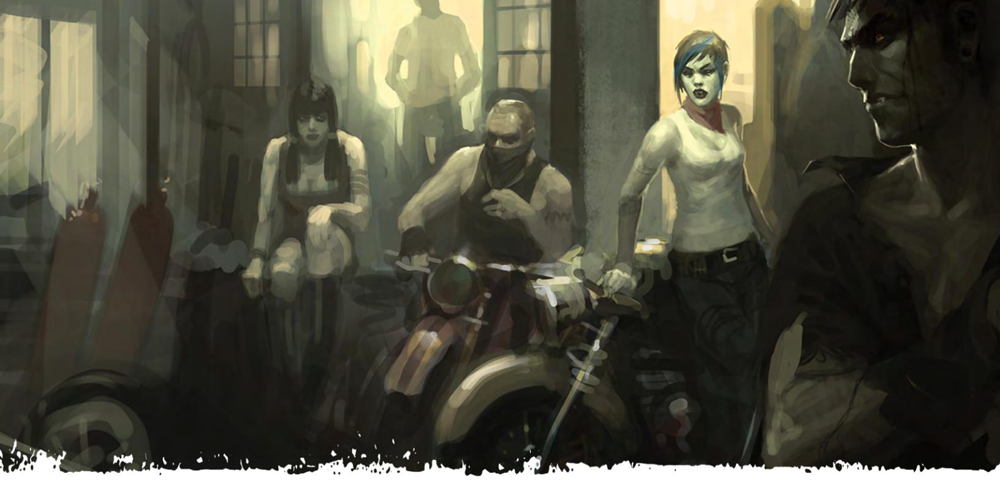

## Ñèñòåìà Êîòåðèé

Во многих отношениях создание котерии даже более важно, чем создание персонажа. Если игра происходит между персонажами, то соратники обеспечивают и определяют это "между". В этом разделе приведены некоторые дополнительные сведения и ингредиенты для создания группы и ведения игры внутри группы.

Вампиры обычно не просто встречаются в баре и решают создать свою группу, хотя и такое случается. Как правило, котерии возникают по определенной причине, часто до того, как нынешняя группа персонажей переехала, или была объята, или иным образом вычеркнута из истории. Когда вы определяете свою котерию в нулевой сессии, потратьте немного времени на то, чтобы решить, как долго она существовала до того, как ваши персонажи присоединились к ней. Они сами нашли ее? Кто-то из их предков? Не связанные с ними старшие члены должны незаметно исчезнуть как можно скорее: в центре внимания должны быть персонажи игроков и их фоновые персонажи, такие как Мавлы, Подручные и т.п.

Новые преимущества котерий заполняют некоторые фигуры перед фоновыми персонажами, а кланы персонажей теперь могут еще более непосредственно влиять на игру в котерии. Более глубокая система создания Доменов позволяет ответить на важный вопрос о том, где и что делают члены Котериума.

И, наконец, упрощенная сводка по созданию Котерии помещает все это в одно место, которое в итоге становится Листом Котерий в Приложении (с. 239).

Во всех этих системах, как здесь, так и в других главах, рассказчик может вводить все, что, по его мнению, обогащает игру. И игроки, и рассказчики всегда могут взять то, что им нужно, и исключить то, что, по их мнению, отвлекает от игры или меняет ее

на нечто иное, чем то, во что они хотят играть.

## Ñìåíà Êîòåðèé

Вампиры - социальные хищники и, как известно, непостоянны в своих связях. Несмотря на то, что котерии, возможно, не совсем похожи на смертные поликулы, социальные связи между вампирами постоянно меняются и эволюционируют по мере расширения их амбиций и угасания человечности. Очень немногие вампиры остаются в одной и той же котерии на протяжении всего своего существования, а многие не только регулярно меняют котерии, но и состоят сразу в нескольких. Слабокровные, в частности, смешивают и меняют кланы как вопрос выживания, пытаясь найти ту смесь союзов, которая позволит им дожить до следующей ночи.

Независимо от клана, такое меркантильное отношение к отношениям является характерной чертой общества Сородичей, и хотя к тем, кто открыто заявляет о своем членстве в нескольких котериях, может быть проявлено повышенное внимание, это редко приводит к изгнанию или насилию.

У всех вампиров есть конкурирующая лояльность к секте, клану или даже моральной философии, и балансирование между этими требованиями обычно является той частью жизни, которая заставляет вампиров искать помощи среди себе подобных. Вампир, связанный с несколькими котериями, может не вызывать полного доверия, но вампиры, умеющие играть в темные игры, рассматривают свои связи как ресурс, а не угрозу.

Когда персонаж покидает котерию, дополнительные очки преимущества, потраченные им на котерию, могут потребовать некоторого времени для восстановления (Vampire: The Masquerade, p. 180). Если персонаж не предпринимает попыток вернуть дополнительные очки Преимуществ, потраченные им на группу, то эти точки остаются под контролем группы.

#### СИЛЬНЫЕ КОТЕРИИ: ВАРИАНТ ПРАВИЛ

Стандартные союзы начинаются с одной свободной точки на персонажа игрока. Любые дополнительные точки должны быть получены из точек Преимуществ игрока или из Недостатков группы. Таким образом, создаются простые и голодные котерии, как и подобает простым и голодным персонажам. Но в историях со старыми унаследованными котериями или просто для игры с несколько более богатой экономикой точек, рассказчик может разрешить бонусы котерии (см. ниже) или просто увеличить стартовый пул свободных котерий на две или три точки. Как всегда, отдавайте предпочтение сюжетному потенциалу перед механической строгостью.

#### Бонусы компании Котерии

По усмотрению Рассказчика, некоторые типы союзов дают бонус в одну точку к одной из ваших доменных черт, если ваш союзник выполняет все предварительные условия этого союзов. Этот бонус не может поднять доменную черту выше пяти. Если котерия меняет тип и получает бонус, который поднимает доменную черту выше пяти, верните точку котерии или потраченный опыт персонажу игрока, который приобрел первоначальную пятую точку черты.

Котерии получают этот бонус к следующим доменным чертам: Шассе: Культ крови, Посланник, Гангстеры, Охотничья группа, Плюмайры, Квестари, Регенты, Сбиры. Льен: Чемпионы, Корпорация, Семья, Привратник, Вехме Портильон: Церберы, Коммандос, Дневной Дозор, Марешаль, Диверсанты, Дозорные

Котерии без доменов (Беглецы, Кочевники) могут добавить свою дополнительную точку к Информаторам или Подручным.

Если персонаж пытается вернуть свои преимущества, то по мере восстановления очков он постепенно теряет доступ к этим фонам и преимуществам, причем точное время определяется в игре Рассказчиком и тем, как персонаж отреагирует на возвращение своих преимуществ.

#### СОРОДИЧНЫЕ СВЯЗИ В НЕСКОЛЬКИХ КОТЕРИЯХ

Можете ли вы присоединиться к нескольким группам? Безусловно. Это была бы не игра о личном и политическом ужасе, если бы вы не могли создать для своего персонажа несколько конфликтующих союзов. Популярным сородичам может быть предложено вступить в несколько союзов. Это отнимает много времени и ресурсов, но по сути является комплиментом и обычно разрешается, если каждый из соратников знает о других. Однако тайное присоединение к другой котерии часто вызывает недоверие и подозрения.

Сородичи, состоящие более чем в одной котерии, неизбежно оказываются зажатыми, испытывают больший стресс и нехватку времени, чем те, кто имеет только один набор врагов и коллег, за которыми нужно следить. В связи с этим персонаж получает по одной точке (3 опыта) за каждую дополнительную группу: он может взять недостаток, чтобы заплатить за эту точку, даже если теоретически у него уже есть максимальное количество недостатков.

## Роспуск и разрушение

Если все оставшиеся члены согласятся на расформирование, то каждый из них получит свои Преимущества, и процесс, скорее всего, пойдет быстрее, поскольку институциональная сила инерции (или намеренная медлительность) не будет им противодействовать.

Когда член группы, вложивший в нее значительные средства, погибает, завещанные им Преимущества остаются в распоряжении группы, но, как уже говорилось выше, уже не имеют никакой защиты от заговора. Если эти завещанные преимущества будут повреждены, уничтожены или исчерпаны, их можно будет восполнить или восстановить только за счет новых затрат опыта новым персонажем игрока (Vampire: The Masquerade, p. 180).

#### КОТЕРИЯ В СРАВНЕНИИ С ЛИЧНЫМИ БИОГРАФИЯМИ

Котерия в целом обладает котерийными фонами, а не отдельные вампиры в ней (**Vampire**: **The Masquerade**, **p**. 196). Это может вызвать вопросы о том, что происходит, когда один из Сородичей использует личные и групповые фоны вместе. Личные и групповые фоны не суммируются. Однако, когда

персонаж обладает обоими, он обычно получает дополнительную попытку выполнить задание, связанное с фоном, или доступ к другой пассивной возможности. Например, если вампир обладает и общественной, и личной Славой, у него есть два шанса воспользоваться ею, чтобы получить привилегии в ночном клубе - но у других посетителей клуба будет в два раза больше возможностей узнать его. Этих дополнительных шансов не бывает, если оба фона охватывают разные Домены. Вампир из **Baby Chorus**, который также является известным физиком, имеет повышенные шансы быть узнанным только в том случае, если его группа выступает в Чикагском университете.

Отдельные вампиры, которые слишком часто пользуются своим фоном в группе, сами навлекают на себя расплату или еще что похуже со стороны своих товарищей по группе.

Котериальные фоны стоят и падают вместе. Если вы все дремлете в одном убежище, а оно сгорает от рук поджигателей, то ни у кого не остается убежища, в которое можно было бы вернуться. Если вы зависите от Маски своей группы, то, когда при поиске по базе данных **NSA** обнаруживается ваше поддельное удостоверение, все вместе попадают в систему.

## Ïðåèìóùåñòâà Äîìåíà

Достоинства котерии могут быть приобретены только за счет точек котерии или путем принятия недостатков котерии, компенсирующих их стоимость. Достоинства и недостатки влияют на всю группу в целом, а также на всех персонажей, которые открыто ассоциируют себя с группой. Вампиры, хранящие свою верность в строгом секрете, могут избежать некоторых последствий недостатков своей группы, но при этом лишаются возможности пользоваться преимуществами группы.

В отличие от преимуществ персонажа, преимущества, связанные с союзом, могут сохраняться даже в том случае, если персонаж, купивший эти достоинства или недостатки, уничтожен или больше не является его членом, хотя со временем эти преимущества угасают или деградируют, и рассказчику уже не нужно руководствоваться теми же соображениями при уничтожении этих преимуществ, поскольку они больше не связаны с активным персонажем игрока (Vampire: The Masquerade p. 180).

## Достоинства котерии

#### ОТВЕРСТИЯ ДЛЯ БОЛТОВ **•** ДО **•••**

Территория, на которой располагается группа, необычайно велика (или запутанна). Хотя контроль над столь обширной территорией порой представляет собой логистическую проблему, преимущества значительно перевешивают недостатки. Каждая точка в достоинстве "Болтовые отверстия" (не более трех) дает котерии бонусный кубик при попытке уйти от обнаружения или преследования в пределах своего домена.

По усмотрению Рассказчика это достоинство может играть в других наборах кубиков.

#### НА ПОДХВАТЕ **•** ДО **•••**

Ваше окружение прилагает все усилия, чтобы создать в своих владениях атмосферу, которая вызывает у вашей жертвы предпочтительный Резонанс. При получении этой заслуги выберите резонанс. Во время охоты в своих владениях вы можете добавить кубики, равные показателю этого достоинства, чтобы найти

жертву с указанным резонансом.

### ПРИВИЛЕГИРОВАННЫЙ **•••**

Котерия получила особые права, выходящие за рамки тех, что обычно предоставляются сородичам в их секте. Определите, каким выдающимся поступком вы или, возможно, один из ваших предков заслужили эту необычную милость. В идеале, свяжите его с типом вашей котерии: ваши Хранители могил изгнали опасного призрака, ваши Квестари раскрыли досадное убийство, не позволив Суду распасться в вендетте.

Независимо от причин, котерия не может быть наказана за конкретное преступление, за которое другие Сородичи были бы подвергнуты остракизму или уничтожены. Рассказчик последний судья, но в качестве примера можно привести разрешение кормиться в местах, запрещенных для других, разрешение открыто носить оружие в Элизиумах или даже полное разрешение принимать детей в своих владениях. Хотя этот иммунитет может быть аннулирован в случае злоупотребления им, до тех пор, пока общество поддерживает победителя, он обычно остается в силе даже при смене руководства города.

## ТРАНСПОРТ **••**

Передвижение по городу никогда не будет проблемой для членов Вашей группы. Небольшой парк роскошных автомобилей и водителей ("Вождение 6") предоставляется в распоряжение группы по первому требованию. Кроме того, один раз за историю группа может вызвать на ночь редкое или дорогое транспортное средство, например вертолет или пуленепробиваемый внедорожник. Гибель водителя или уничтожение слишком большого количества машин делает эту заслугу недоступной на короткое время, определяемое Рассказчиком.

## Недостатки котерий

## ХУЛИГАНЫ **(•)**

Ваша группа ассоциируется с темным временем, когда городом правил тиран-князь, коррумпированный барон или капризный эмир. Добровольно или по принуждению, ваша группа навязывала свою волю, и многие этого не забыли. При общении с другими вампирами в городе члены группы имеют штраф в один кубик на все социальные кубики (кроме Запугивания). Этот недостаток не распространяется на отношения с приближенными и приспешниками их старого хозяина.

#### ПРОКЛЯТЫЙ (ВАРЬИРУЕТСЯ)

Мистическое проклятие поражает всех членов группы, находящихся за пределами их владений. Котерия выбирает мифический недостаток (Vampire: The Masquerade, p. 182 и pp. 120-121) и берет столько же точек в Проклятии. Они могут выбрать несколько фольклорных блоков или запретов. (Для этих целей считайте, что Зловоние (стр. 120) также является мифическим недостатком). Когда они находятся за пределами своего домена, они страдают от

недостатков выбранного ими Мифического порока.

## ХРАНИТЕЛИ **(••)**

Сородичи, входящие в эту группу, несут в городе особо одиозную или неудобную ответственность. Хотя они не получают никакого статуса или вознаграждения за выполнение этих обязанностей, в случае неудачи или уклонения от них им грозит порицание, бесчестье или даже смерть. Точный характер обязанностей определяют сами члены группы и Рассказчик, но часто встречаются такие задания, как уборка после вечеринок в Элизиумах, проверка княжеских ворот перед рассветом, уход за старейшинами или другими немощными вампирами, нянька для птенцов политически влиятельного рода, оставление подношений на кладбищах или в храмах.

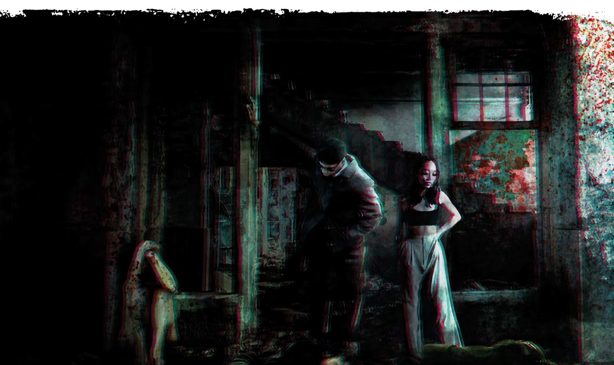

Если члены группы не справятся с заданием или откажутся его выполнять, они теряют одну точку от своего статуса в секте, пока не искупят свою вину и не вернутся на службу. (Сначала теряется статус группы, затем статус отдельных членов). Если они теряют весь статус, группа также становится Подозреваемой, но сохраняет и этот недостаток.

#### МИШЕНЬ **(•)**

Смертное агентство по охоте на вампиров или какаялибо другая угроза знает, что Сородич действует во владениях вашей группы и в прошлом проникал, по крайней мере, через некоторые из ваших защитных систем. Возможно, ваша группа даже находится в какой-нибудь картотеке Ватикана или в базе данных FIRSTLIGHT. Против этой угрозы показатель Портильон вашей котерии уменьшается вдвое

(округлите в большую сторону).

#### ТЕРРИТОРИЯ **(•)**

Власть этой группировки неразрывно связана с несколькими ключевыми участками территории, требующими ее постоянного присутствия. Если представители этой группы покидают город на длительное время или не поддерживают присутствие в своем домене, они деградируют или получают ущерб. За каждую неделю отсутствия в своем домене она получает штраф в одну точку ко всем характеристикам домена ("Шассе", "Льен", "Портильон"), хотя ни одна характеристика не может быть снижена ниже нуля таким образом. Если в городе остается только часть членов группы, они должны распределить свое время и внимание: оставшиеся члены группы могут каждую ночь уменьшать свои охотничьи ресурсы на один кубик (два кубика, если остался только один член), чтобы предотвратить этот штраф к доменному признаку. Если все доменные черты членов группы снижены до нуля или их отсутствие особенно продолжительно, они могут полностью потерять свою территорию по усмотрению Рассказчика. После возвращения котерии требуется месяц постоянного присутствия в пределах своего домена, чтобы восстановить все накопленные штрафы.

Котерии, не имеющие точек в чертах домена, не могут получить этот недостаток.

#### В ОСАДЕ **(••)**

На ваши владения совершено нападение, и сильные мира сего, похоже, не против того, чтобы вы справились с ним без их помощи. Характер антагонистов зависит от группы и рассказчика: люпины, Орден Святого Леопольда, Шабаш или другая противостоящая секта, или конкурирующая (и политически защищенная) группа вампиров. Эти захватчики постоянно испытывают на прочность вашу оборону и захватывают ключевые участки вашей территории, не прибегая к открытому насилию или нарушению Маскарада. Один раз за историю рассказчик может уменьшить одну из доменных черт вашей группы до одной точки или запретить использование одной из заслуг или биографий вашей группы, пока ваши соперники пытаются выбить у вас территорию из-под ног.

## Блага и Долги Котерий

Для получения благ и долгов для отдельных персонажей (стр. 115) используются те же затраты и системы, что и для благ и долгов для группы.

Когда общество обладает благом или долгом, любой член общества может призвать это благо, пострадать от долга или списать его.

## Ðàñøèðåííîå ñîçäàíèå

## äîìåíîâ

Общество определяется как своим доменом, так и целью. В этом разделе игрокам и рассказчикам предлагаются новые возможности для настройки своих охотничьих угодий. Территория группировки может охватывать несколько переулков или быть разбросанной по всему городу. Вампиры редко ограничивают свои амбиции линиями на карте. География города, конечно, может создавать трудности, но чаще смертные и институты, находящиеся в их владениях, определяют возможности и даже судьбу вампиров.

## Сородичные географии и типы доменов

Политическая карта города часто отличается от его географии, но некоторых реалий не может избежать даже нежить. Например, портовые и прибрежные города зависят от торговли, и в них постоянно меняется состав приезжих и рабочих, даже если тяжелая промышленность уступила место туризму или многоэтажным кондоминиумам. Влияние на рычаги власти в городе часто означает доступ к смертному политическому, экономическому и социальному руководству, но прежде всего именно поток крови на улицах является настоящей картой города.

Место сосредоточения смертных в городе определяется климатом и географией, хотя история и политика местных властей иногда также играют огромную роль. В центре города, разрушенном экономическим коллапсом, может быть много добычи, так как жители используют пустующие здания в качестве муниципального жилья, но отсутствие традиционных правоохранительных органов, которые могли бы проникнуть в город, может сделать его более сложным местом для охоты. Хотя население вампиров можно нанести на географическую карту города, зачастую лучше абстрагироваться от него по тому, как тот или иной район служит интересам сородичных существ, питающихся смертными и эксплуатирующих их. Редко можно четко разделить город на различные типы доменов, но они могут служить ориентиром как для игроков, так и для рассказчиков, когда они думают о том, где располагаются котерии и как они формируют окружающие их сообщества.

## ОКРАИНЫ И НИЧЕЙНАЯ ЗЕМЛЯ

Ничейные земли. Территории, находящиеся за пределами города или нежелательные для правящих сил. Здесь обычно располагаются кладбища, водоемы, бездорожные леса, трейлерные парки и заброшенные промышленные зоны. Те немногие Сородичи, которые претендуют на эти территории, как правило, независимы и отказываются подчиняться какой-либо секте. Низкая плотность смертного населения может сделать охоту небезопасной, но, с другой стороны, смертные правоохранительные органы также медленно реагируют на исчезновения людей. Переходные группы, такие как Беглецы, Привратники, Кочевники и Дозорные, чаще всего встречаются на окраинах городов, а Команндос могут базироваться здесь вдали от бдительных глаз. Семейный особняк может располагаться на обширном участке земли.

## ГРАНИЦЫ

Приграничные районы города, обычно обозначенные конечной остановкой общественного транспорта, усеяны пригородными поселками, крупными магазинами и иногда аэропортом. Эти зоны - места перехода, где вампирская секта начинает неопределенно претендовать на контроль и власть. Правящий класс зачастую больше заботится о порядке в этих областях, чем о дотошном толковании законов и традиций. Князь редко появляется в пограничных районах, но его более опасные слуги постоянно присутствуют там.

Городской бич делает приграничье своей игровой площадкой и подает пример всем, кто не желает очищать свои владения от слабокровных неугодников и прочих потенциальных нарушителей Маскарада. Охота на границе часто означает конкуренцию с кочевниками и слабокровными. Из-за скудости добычи в этих владениях стада приходится регулярно перемещать и охранять, чтобы избежать набегов конкурентов на кладовки. Пограничные домены не всегда находятся на краях карты: город с особенно оживленной железнодорожной станцией может иметь пограничный домен в самом центре. Эти домены привлекают тех, кому есть что скрывать или что доказывать, например, Культы крови, Чемпионы, Гангстеры, Кочевники, Вехме и Дозорные. В таких лиминальных пространствах, особенно вблизи аэропортов и вокзалов, могут располагаться и

#### Посланники.

#### СТОЙКА

Центр ночной жизни города, где смертные собираются, чтобы пообщаться и уйти от унылой жизни в Стойку. Бары, танцевальные клубы, театры и рестораны составляют большую часть заведений Стойки, но неформальная экосистема секса, наркотиков и насилия привлекает и живых, и мертвых, чей вкус стал более извращенным. Именно в "Стойке" многие вампиры впервые сталкиваются с шерифом или констеблем города, главным блюстителем порядка Маскарада.

Охота в Стойке обычно не представляет сложности для большинства вампиров, независимо от их привычек питания. Ночью смертных не только много, но они часто бродят по улицам в состоянии алкогольного опьянения или отвлекаясь от своих обычных страхов. Являясь очагом питания вампиров, эти домены порождают нарушения Маскарада, и они часто являются первым местом скопления охотников в поисках легких целей.

Сочетание богатства и опасности делает их идеальными доменами, которые князь или барон может отдать могущественным сородичам, которых правитель считает ценными союзниками, но которым, тем не менее, необходимо отвлечься от собственных амбиций. Такие сородичи иногда "сдают в субаренду" части Стойки амбициозным котериям, стремящимся проявить себя ценой ударов по двору. Дневной Дозор, Гангстеры, Охотничья Группа, сценические Плюмайры и Вехме - наиболее распространенные котерии этих типов доменов; Культы Крови и Сбиры находят Стойку хорошей маскировкой для своих

различных диверсий.

#### ПРЕСТИЖ

Социальные и культурные институты города часто разбросаны по всему мегаполису, но в некоторых городах есть районы, где сосредоточены музеи, университеты и другие достопримечательности. Для сородичных народов эти места не только привлекают смертных в их владения, но и являются символом их власти. Некоторые правители устраивают в них Элизиумы, другие держат их как "королевские заповедники", чтобы не портить репутацию города среди смертных.

Охота в этих владениях обычно весьма ограничена как из-за отсутствия добычи, так и из-за суровых наказаний, которым подвергаются представители рода, угрожающие маскараду в Элизиуме. Котерии Церберы и Плюмайры находят свои очаги в Престиже, там же может выступать и исполнительная котерия Кочевников. В некоторых городах здесь сосредоточены старинные особняки или палаццо богачей: Семейные котерии - тоже. Квестари могут располагаться на территории (или под территорией) университетского городка или в непосредственной близости от его исследовательских центров.

#### СЕРДЦЕ

Экономическое и политическое ядро города, "центральный деловой район" в градостроительной терминологии. Сердце города - это не обязательно центр города, но место, где физически расположены наиболее жизненно важные интересы. Только очень близкие к правящему классу слои населения получают свободный доступ или эксклюзивную территорию в центре. В крупных мегаполисах в центре города возвышаются многофункциональные небоскребы, увенчанные роскошными пентхаусами и вертолетными площадками. В некоторых городах после окончания рабочего дня "сердце" опустошается, превращаясь в вампирическую пищевую пустыню, в других - это процветающий район элитных магазинов и закусочных, рассчитанных на богатых людей. В городах с высокотехнологичным режимом наблюдения такие районы обычно тщательно контролируются, а бродяги и бездомные уничтожаются на месте. В этих районах также сосредоточены силы полиции и военизированных формирований, а в некоторых городах - частные телохранители, но их присутствие остается незаметным, за исключением случаев, когда

требуется демонстрация силы.

В небольших или экономически неблагополучных городах может не быть сердца, или же оно давно умерло - разумеется, оно все еще может покоиться на своем правителе-сородиче. Сердце города - это место, где находится трон. Старейшины, примогены и верхушка правящего класса имеют по крайней мере одно убежище в его пределах. Корпорация, Марешаль и, конечно же, Регентство - наиболее распространенные группы, которые можно встретить в сердце города, наряду с коммандос, готовыми отправиться куда угодно. В старых городах сомнофилы группируются вокруг прежнего Сердца, существовавшего много веков назад, которое теперь может быть туристическим районом или безымянной фабрикой.

Быстрая система корпоративного шпионажа: Превратите преимущество при бросках "Воровство" для проникновения в офис корпорации или "Техника" для взлома офиса в дополнительные кубики при проверке "Финансы" для подрыва этой корпорации.

## Доменные достоинства

В соответствии с этой альтернативной системой Доменных особенностей, группа может приобрести Доменное достоинство, которое повышает определенную Доменную особенность ("Шасс", "Льен" или "Портильон"), а также предоставляет другие преимущества и возможности для группы. Эти бонусы засчитываются при выполнении необходимых условий.

Если это не указано в описании, достоинство увеличивает соответствующий признак домена на его точечное значение: Например, "Квартирные башни" увеличивают "Шассе" домена на две точки. Заслуги в этой системе имеют как хорошие, так и плохие эффекты, которые в целом уравновешивают базовую систему доменных особенностей.

Хотя на территории данного домена могут находиться дискотеки, полицейские участки и кладбища независимо от заслуг, заслуги домена отражают степень доступа к этим элементам и их значимость в общественной жизни домена. Доменные достоинства обычно связаны со зданием или местом, и в каждой из них отмечается, какие Резонансы обычно произрастают в этих местах.

Доменные достоинства помогают котерии определить и персонализировать свою территорию таким образом, чтобы она наилучшим образом соответствовала ее стилю и охотничьим практикам. Котерия, тщательно следящая за своей территорией, может создать домен, который будет излучать ту смесь резонансов и охотничьих бонусов, которую она предпочитает. Это, конечно же, гораздо больше влечет игроков, когда голодные соперники (или

охотники) приходят и угрожают кровавой ферме котерии. Правитель города может исключить сородичей с

недостатками "Презираемый" (••), "Подозреваемый" (•) или аналогичными недостатками из числа обладателей таких ценных или престижных достоинств, как "Ночная жизнь", "Городской Зал" или "Культурная достопримечательность".

#### ДОСТОИНСТВА ШАССЕ

Особенность домена Шассе определяет его размер и удобство питания в нем. Определенные достопримечательности, учреждения или особенности домена могут усилить этот признак и усилить кормовые схемы, которые хорошо сочетаются с ним.

**•** ЖИЛЫЕ БАШНИ (ВСЕ): Несколько очень плотно застроенных жилых зданий, заполненных добычей со стандартным сочетанием Резонансов. Вампиры с типом хищника "Вымогатель" получают здесь один дополнительный кубик к их охотничьим пулам. Эти здания появляются практически в любой части города и часто становятся центром конфликтов между котериями с соседними доменами. Высокая текучесть означает, что вражеские наблюдатели могут легче проникнуть внутрь: вычтите один кубик из пула портильона вашего домена против наблюдения или слежки.

•• ПОДВОРОТНИ (ФЛЕГМАТИКИ): Хорошее место для ведения бизнеса, скрытое от глаз властей и излишне любопытных, обеспечивающее быстрый доступ к канализации, угольным туннелям, подвалам и прочей городской инфраструктуре. Вампиры с типами хищника Налётчик или Монтеро получают здесь один дополнительный кубик к своему охотничьему запасу. Популяция крыс добавляет один кубик к пулу анимализма любого сородича, шпионящего за вашим доменом.

• ПОГРЕБАЛЬНЫЙ (НЕТ/МЕЛАНХОЛИЯ): Часто это кладбище, похоронное бюро или специальный морг. Большинство умирающих здесь не имеют Резонанса, хотя скорбящие могут проявлять Меланхолию. Сородичи с типами хищников Суррогатчик или Расхититель могил получают здесь один дополнительный кубик в их охотничьих пулах. Некоторые вампиры считают сородичных существ, которые собираются и кормятся в таких местах, падальщиками, недостойными статуса или уважения, и в состязаниях с

высокопоставленными клановыми господами они теряют один кубик из социального пула.

**•** ЗАКРЫТЫЙ ПОСЕЛОК (МЕЛАНХОЛИЯ): Жилой район с ухоженными садами и специальной охраной. Базовая сложность для проверок на воровство и т.п. здесь равна ресурсным точкам для среднего жителя: у среднеклассового поселка сложность 2, у сверхбогатого - 5. Вступив в сообщество, хищники-морфеи добавляют один дополнительный кубик к своему охотничьему запасу. Смертные, живущие в этих поселениях, часто являются высокообразованными профессионалами или отставными военными и являются хорошим источником союзников, информаторов или наемников, обладающих специальными знаниями и навыками. Кроме того, они сами могут иметь связи в правоохранительных органах и с уважением выслушивать рассказы о странных красноглазых грабителях. Рассказчики могут отказать в этой заслуге людям, живущим в центре города.

**•** БОЛЬНИЦА (МЕЛАНХОЛИК/ФЛЕГМАТИК): Обычно это крупное медицинское учреждение с моргом и психиатрической лечебницей. В зависимости от места расположения группы, это может быть специализированная психиатрическая лечебница, медицинское исследовательское учреждение или обширный дом престарелых. Вампиры с типами Суррогатчик, Джентельмен, Мрачный Жнец или Хищник-лазутчик получают здесь дополнительный кубик в своих охотничьих раскладах, а также в раскладах на получение крови в мешках или медицинских препаратов. Группы охотников с религиозным или медицинским уклоном получают дополнительный кубик к своим пулам для проникновения в ваш домен.

#### ••• НОЧНАЯ ЖИЗНЬ (ХОЛЕРИК/

САНГВИНИК): Район, в котором расположены предприятия, предлагающие еду и развлечения, открытые до поздней ночи. Вампиры с типом хищника "Монтеро", "Преследователь", "Тусовщик", "Искуситель" или "Лазутчик" получают здесь дополнительный кубик к их охотничьим пулам. Сородичи с других территорий также могут быть готовы заплатить благодеяниями за доступ к этой территории. Любая 1, выпавшая в охотничьем раскладе здесь, означает, что в организме цели достаточно наркотиков или алкоголя, чтобы испортить ее кровь (Vampire: The Masquerade, p. 310). Городские власти и организованные преступные группировки имеют здесь дополнительные рычаги влияния: добавьте здесь одну точку к этим типам Влияния, как для вашей компании, так и для ваших врагов. Рассказчики могут отказать в этом достоинстве людям, находящимся на окраинах.

••ПРИЮТ (ХОЛЕРИК/МЕЛАНХОЛИК): Либо приют для бездомных, либо лагерь бездомных смертных. Вампиры с типом «Налётчик» или «Морфей» получают дополнительный кубик на свои охотничьи пулы в Домене. Любая 1, выпавшая здесь в охотничьем пуле, означает, что у цели есть наркотики или алкоголь, загрязняющие их кровь (Vampire: The Masquerade, стр. 310). Смертные, живущие в этих сообществах, часто много знают об уличной жизни и становятся хорошими союзниками, информаторами или подручными, обладающими специальными знаниями и навыками. Рассказчики могут отказать в этом Достоинстве котерии, расположенному в престижном районе города.

## ДОСТОИНСТВА ЛЬЕН

Особенность Льен управляет фишками котерии манипулировать, контролировать и взаимодействовать со смертными в их владениях. Многие из этих локаций дают бонусы в зависимости от типа действий, которые котерия требует от своих смертных субъектов.

#### ••• КАМПУС (ХОЛЕРИК/МЕЛАНХОЛИК):

Университет, крупная библиотека или исследовательский центр, ориентированный на академическую деятельность. Используя свои помещения в нерабочее время, он предоставляет эквивалент двух

точек в Библиотеке достоинств Убежища (Vampire: The Masquerade, p. 189), хотя доступ к ней ограничен в ночное время и требует взлома или наличия Маски, которая предоставляет обоснование и допуск. Группы охотников с религиозным или академическим образованием получают дополнительный кубик к своим пулам, чтобы проникнуть в ваш домен.

••• МЭРИЯ (ФЛЕГМАТИК): Местонахождение городского правительства или, возможно, офисное здание, где работает большая часть городской бюрократии. Котерия может использовать эти точки в политических или градостроительных проектах (Vampire: The Masquerade, p. 417). Доступ к записям дает котерию эквивалент одной точки в Маске на городские записи (права на землю, водительские права, налоговые документы и т.д.). Враги (смертные или сородичи), имеющие влияние на городские власти, добавляют одну точку к пулам, чтобы проникнуть в ваш домен. Рассказчики могут отказать в этом достоинстве котерии, не находящимся в Сердце города.

## •• КУЛЬТУРНАЯ ДОСТОПРИМЕЧАТЕЛЬНОСТЬ

(ХОЛЕРИК/САНГВИНИК): Обычно это культурные центры, художественные музеи, спортивные стадионы или известные достопримечательности, но могут быть и туристические ловушки, зоопарки или аквариумы. В часы проведения мероприятий Ваш Портильон понижается на одну точку, так как в Ваши владения стекаются толпы посторонних людей. Если на территории зоопарка содержатся животные, вампиры с типом "Фермер-хищник" получают здесь дополнительный кубик к своим охотничьим пулам. Члены Общества могут использовать свой доступ к этому месту для получения дополнительного кубика в соответствующих пулах социальных кубиков: попасть внутрь перед самым закрытием, устроить вечеринку, обменять билеты на престижное открытие (или роскошный быстрый проход) на незначительную выгоду и т.д. Если Элизиум регулярно встречается здесь, то это стоит дополнительную точку, но дает бонус в два кубика к броскам на этикет с вампирами вашей секты и ко всем проверкам на сплетни о сородичах. Рассказчики могут отказать в этом достоинстве котерии, расположенной на окраине города.

#### •• РЫНОЧНАЯ ПЛОЩАДЬ (МЕЛАНХОЛИКИ/

САНГВИНИКИ): Место торговли и коммерции, например, торговый центр, портовая гавань или торговый район. Котерия может заключать пари на эти точки в экономических проектах. (Vampire: The Masquerade, p. 417). Добавьте два кубика к соответствующим социальным или финансовым пулам: например, чтобы достать предмет или ингредиент, получить советы по акциям или другую инсайдерскую информацию, или спрятать тело (в портовом районе). Эти районы также усиленно патрулируются смертными правоохранительными органами и изобилуют электронным наблюдением; потеряйте два кубика из любого пула Скрытности или аналогичного параметра против охотников или противников Сородичей, имеющих связи с правоохранительными органами. Сородичи редко воюют за торговые центры, но организованные преступные группировки и федеральные власти очень чувствительны к любым нарушениям в работе порта или фондовой биржи.

•• ТОЛЬКО ДЛЯ ЧЛЕНОВ КЛУБА (САНГВИНИК):

Эксклюзивное заведение или клуб, обслуживающий преданных клиентов, которые платят за уединение и роскошь. Это может быть что угодно - от университетского клуба выпускников до сексподземелья. Любое убежище, созданное на территории клуба, получает одну точку в одном из этих достоинств убежища: Роскошь или Дозорные. Но, разумеется, любой недоброжелатель, получивший членство или приглашение, может безнаказанно проникнуть в ваше убежище.

•• ПЕРЕХОДЫ (МЕЛАНХОЛИЯ): Это дом на полпути или центр лечения наркомании, помогающий людям реинтегрироваться в общество. Общество получает одну точку в фоне стада, которая по умолчанию переходит в резонанс меланхолии. Группы охотников с религиозным или медицинским происхождением получают дополнительный кубик к своим пулам, чтобы проникнуть в ваш домен. Рассказчики могут отказать в этом достоинстве той котерии, которая находится в престижном районе города.

#### ДОСТОИНСТВА ПОРТИЛЬОНА

Система безопасности и раннего оповещения о вторжении в домен. Эти достоинства расширяют возможности группы при угрозе или защите своего убежища.

#### **•** ЗАБРОШЕННОЕ ЗДАНИЕ (МЕЛАНХОЛИЯ):

Это место представляет собой заброшенный склад или отчужденное предприятие.

Любое убежище, которое члены группы создают на территории этого объекта, получает одну точку в достоинствах ""Клетка" и "Запасной выход"", но всегда имеет недостаток - жуткое место. Если члены группы не используют свое Влияние, всегда существует риск, что это место будет снесено или реконструировано.

#### ••• ПОЖАРНАЯ ЧАСТЬ (ХОЛЕРИК/

МЕЛАНХОЛИК): В этой пожарной части находится целый экипаж пожарной машины, бдительно следящий за угрозами, направленными против убежища и владений вашей группы. Любые попытки сжечь убежище или уничтожить владения проваливаются или имеют очень ограниченный успех, если не нейтрализовать этот объект.

#### •• ПОЛИЦЕЙСКИЙ УЧАСТОК (ФЛЕГМАТИК/

САНГВИНИК): Полицейский участок, заполненный хорошо вооруженными полицейскими. К этому достоинству прилагается низкоуровневый канцелярский или IT-информатор в участке, который может добавить два кубика к пулам, пытающимся отследить проникновение лазутчиков в ваш домен. Однако если полиция (или агентство, действующее через полицию, например, ФБР в Америке) выступит против котерии, вычтите две точки из Достоинства Портильона и Достоинства Убежища домена, чтобы оказать сопротивление. Многие бароны Анарха особенно советуют не делать полицию главной линией обороны вашего домена.

#### •• ТЮРЬМА (ХОЛЕРИК/МЕЛАНХОЛИК):

Учреждение строгого режима, обычно переполненное, для содержания заключенных. Хотя она контролируется государством, преступным организациям негласно разрешено вести бизнес в ее стенах. Чтобы договориться с преступниками внутри или за пределами тюрьмы об услугах или иным образом использовать свой доступ, добавьте два кубика к показателям Уличного чутья. Эта заслуга включает в себя один (Сложность 3) способ входа и выхода, определяемый группой: подкупленный охранник, забытый ремонтный туннель, контракт с прачками и т.д. При полном провале этого броска начинается расследование, которое снижает Портильон домена на две точки до конца истории. Близость тюрьмы снижает Льен домена на одну точку для пугливых смертных и тех, кто считает ценность имущества самым важным видом. Рассказчик может отказать в этом достоинстве котерии, чей домен находится в центре города или в престижных районах.

• • ТРАНЗИТ (ФЛЕГМАТИК): Ряд туннелей, убежищ или забытых зданий, соединенных с действующей станцией общественного транспорта. Любое убежище, созданное в пределах этого объекта, получает две точки в достоинстве Запасной выход. Добавьте два кубика к пулам, чтобы уклониться от преследования в транспорте, вызвать крыс с помощью Анимализма или любой другой проверки, относящейся к туннелям метро. С другой стороны, Носферату и другие подземные опасности могут обойти эти две точки в достоинстве Портильона, когда проникают в ваши владения.

#### Кланы и Котерии

Каждый род индивидуален, но кланы представляют собой как преобладающие архетипы, так и социальные функции, с помощью которых вампиры ищут единомышленников. В следующих разделах описывается обобщенный взгляд на то, как члены каждого клана могут взаимодействовать с котериями, к которым они присоединяются.

## Достоинства членства

С этой целью каждый клан также включает в себя определенное достоинство, которое может приобрести представитель клана при создании персонажа или весь клан в целом при создании котерии. Преимущества этих достоинств могут быть активированы или использованы любым членом котерии, являясь своего рода групповым ресурсом, который может быть использован коллективно или приносить пользу всей котерии. В конце концов, группы существуют для того, чтобы обеспечить безопасность численности, несмотря на то, что могут подумать замкнутые старейшины или подозрительные анциллы, и эта безопасность численности иногда выражается в преимуществах, которые могут поставить вампиров на шаг впереди конкурентов. Обратите внимание, что в некоторых случаях только один член группы может использовать то или иное достоинство в течение сессии, по принципу "кому больше нало".

## Бану Хаким

Посторонние нередко воспринимают бану хаким как целеустремленных, мрачных и суровых вампиров. В целом дети Хакимов мало заинтересованы в том, чтобы опровергнуть это представление. Культура клана поощряет тех, кто ориентирован на достижение цели, что делает акцент на действиях и поступках.

Бану Хаким уважают за поступки, а не за превознесение родословной или почитание традиций ради них самих. Поэтому члены клана придерживаются прагматичного подхода, заключая союзников там, где это необходимо для достижения своих целей и реализации задуманного.

В клане Бану Хаким котериям уделяется большое внимание. У каждой группы есть своя цель, будь то роль судьи, исполнителя или влияние на тот или иной сектор земной инфраструктуры.

В более космополитичных котериях Бану Хаким могут оказаться признанной движущей силой в котерии. Они тяготеют к ролям, в которых определяют направление развития группы или интерпретируют общепринятые цели. Род Бану Хаким считает это лидерством - другие вампиры, однако, могут раздражаться тем, что им приказывают, особенно молодые роды, которые не всегда стремятся к упорядоченной или ориентированной на выполнение задач динамике в своих котериях. Взаимодействие с соратниками также сильно зависит от фракции, к которой принадлежит то или иное Дитя Хакима. Просто методы и приверженцы конфликтующих ортодоксий клана различны, и то, разделяет ли человек точку зрения ряда влиятельных представителей Бану Хаким, занимающих высокое положение в клане, также имеет значение.

Как всегда, индивидуальные мотивы различны, но та же нацеленность на конкретные цели часто означает, что членство в клане "Бану Хаким" может быть временным. Сродни серийному предпринимательству, Дитя Хакима может найти общий язык с другой, более подходящей для него группировкой. Сородичи, с которыми они раньше состояли в одной котерии, часто остаются ценными соратниками. Многие видят смысл в том, чтобы возобновить утраченные отношения с надежными сородичами, чтобы снова вступить в котерию или создать новое после выхода из него.

Для Клана Охоты новая добыча всегда на горизонте.

#### ДОСТОИНСТВО КЛАНА: ПРИЗЫВ К ЦЕЛИ $\bullet$

Один раз за сессию Бану Хаким мотивирует соратника, которого он видит, воодушевляющим заявлением, напоминающим о его Убеждениях, или даже пристальным взглядом, призывающим его к действию. Котерия получает эффект от одного очка силы воли, которое должно быть использовано немедленно, например, чтобы перебросить три кубика или на короткое время овладеть голодным безумием.

Это "очко силы воли" не отнимается у Бану Хаким и должно быть передано товарищу по котерии. Бану Хаким не могут использовать его на себя.

См. раздел "Вампир: The Masquerade, стр. 158, где содержится более подробная информация об использовании силы воли.

## Бруха

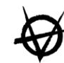

Род Бруха часто принимает объятия по прихоти, в порыве чувств или, казалось бы, без согласования с другими кланами. По апокрифическим данным, некоторые домены настолько изобилуют "Бродягами", что практически невозможно найти компанию, в которой не было бы хотя бы одного "Бруха"!

Возможно, этого и следовало ожидать, учитывая их историю. Бруха - потомки древних воинов-философов, бунтарей против угнетателей или крестоносцев, боровшихся с мнимой несправедливостью. В такие времена Бруха полагались на своих соратников, которые прикрывали их спины и плели заговоры, чтобы свалить тех, кто мог бы использовать власть против них. Сегодня этот принцип не изменился, будь то революционные ячейки, нацеленные на свержение коррумпированной социальной системы, или банды

байкеров, не подчиняющиеся никаким законам.

Это может навести на мысль о том, что они являются жесткими и одинокими иконоборцами, но это редко бывает так. Эмоциональный зов, который привел их в ночь, поддерживает их. Бруха смотрят на сородичные котерии как на товарищей по оружию или даже братьев и сестер. Котерия настолько близка к семье, насколько это возможно для вампиров.

Для Бруха не имеет значения, кто вы - носферату или малкавиан. Если вы надежны и заслуживаете доверия, они будут ездить за вами или умирать. Для Бруха зачастую важно, чтобы все члены группы тянулись в одном направлении (хотя это, возможно, и высокая цель, учитывая противоречивые наклонности Бруха...). Это не значит, что какие-то предпочтения или борьба за власть не существуют, какую бы форму ни принимало убежище. Но движение анархов растет, а состояние Бруха в современных ночах увеличивается, и пока отношение товарищей по группе не создает помех коллегам по Бруху, они готовы бороться с мудаками с кем угодно на своей стороне.

Те, кто вступает в котерию с Брухами, часто считают близость этих уз одним из самых запоминающихся и неотъемлемых факторов. Уникальная семейная связь, которую Бруха может привить (или спроецировать...) на группу, не похожа ни на один другой клан. Однако котерия для бруха - это не транзакционная "команда", а нечто большее. Заслужить доверие бруха, особенно того, кто особенно ценит верность, часто бывает достаточно, чтобы вдохновить этих вампиров на мощные проявления

единства.

#### ДОСТОИНСТВО КЛАНА: ЗАГРУЗКИ И СБОРЫ **•**

Иногда лучший выход из плохой ситуации попытаться еще раз, еще сильнее, пока склонный к безумию товарищ по котерии убеждает вас в ошибочности ваших действий. Один раз за сеанс Бруха вдохновляет отставшего соратника, и тот может перебросить все обычные кубики при неудачной проверке физического навыка.

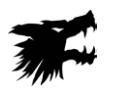

# Гангрел

Род настолько оторвался от своих корней, от своей первобытной природы, что уже не может выжить без зданий из кирпича и стекла. Род настолько избалован и зависим от роскоши, которую приносит ему современная ночь, что забыл, как выжить без нее. Гангрелы не забыли об этом. Звери признают свою истинную природу, отвоевывая себе территорию там, где это возможно в глобальном ландшафте, будь то опасные городские пространства или по-разному опасные неизвестные области между ними.

Для Гангрела котерия- это стая под другим названием, а стая - это группа вампиров, работающих на общее дело и обеспечивающих безопасность каждого. Как гласит пословица, одинокий волк погибает, а стая выживает. Хотя не все гангрелы считают котерию и стаю взаимозаменяемыми понятиями, даже они не могут отрицать сходства на практике. В случае возникновения физической угрозы любой котерии, в которой есть Гангрел, можно не опасаться, ведь немногие кланы так сильны и упорны, как Гангрелы в бою.

Помимо того, что Гангрелы несут на себе мощные зубы и когти, они иногда выполняют двойную функцию - следопытов, ищущих безопасный путь через заведомо опасные территории. В тех редких случаях, когда члены группировки решаются на путешествие за пределы позолоченных клеток городов, они отчетливо осознают, какие преимущества дает им членство в Гангреле.

#### ДОСТОИНСТВО КЛАНА: ТАКТИКА СТАИ •••

Одинокий волк против врага рискует многим, но стая волков, действуя сообща, может уничтожить даже самую крупную и опасную добычу. В бою, если рядом с вами находится еще один член вашей стаи, вы эффективнее преследуете вашего общего врага: любой, кто атакует того же врага, что и вы, добавляет один кубик к своему набору кубиков для атак в драке или ближнем бою. Эта заслуга не является накопительной; сколько бы гангрелов с ней ни набросились на какого-нибудь несчастного дурачка, она дает только один дополнительный кубик каждому из них.

#### Это может показаться транзакцией, и в какой-то степени так оно и есть, но ответственность за эти предположения лежит на Гекате. Как в своей некромантической деятельности, так и в отношениях с семьей Джованни. Геката стала воспринимать многие из своих ночных взаимодействий как обмен - то успокоение духа, то одолжение гарпии Тореадора.

## Геката

Геката сумели занять достойное место в бесчисленных владениях, но при этом их часто считают нежелательным присутствием. Хотя в целом Сородичи могут считать гекату неприятными, на них всегда можно рассчитывать, если не на честное, то на нелицеприятное мнение.

Возможно, именно благодаря своей узкой направленности прагматичные гекаты понимают, насколько сильно они зависят от других сородичей - как от общества в целом, так и от отдельных членов котерии. Благодаря своей близости к мертвым и способности разговаривать с духами они имеют доступ к информации, которую другие могли считать давно утерянной, и эта информация делает гекату ценными для других.

А поскольку в мире Проклятых информация является столь ценной валютой, многие котерии готовы терпеть социальные издержки, связанные с такими неприятными товарищами. Геката получает больше возможностей для общения с материальным миром, а ее соратники - доступ к потрясающей жиле секретов.

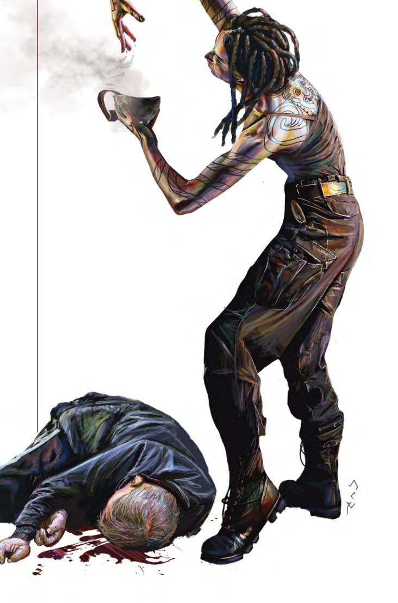

Такой расчетливый взгляд на вещи накладывает отпечаток на восприятие их другими членами общества, но от этого еще более значимыми становятся котерии, в которых их действительно принимают и понимают как личности, а не как инструменты. А те, кто окружает себя останками умерших, утешаются тем, что охотно идут на контакт с другими, где это возможно.

#### ДОСТОИНСТВО КЛАНА: ИСКУССТВО УМИРАТЬ **••**

Почти все члены клана Геката хотя бы бегло знакомы со смертью и мертвыми. Один раз за сессию некромант может замаскировать труп того, кто был убит членом клана. Они могут замаскировать нечестную игру в случае со смертным трупом или защитить Маскарад, сделав останки уничтоженного вампира (обычно это хрупкий скелет, если только вампир не был очень молод) менее привлекательными, обычно эффективно избавившись от них. Впрочем, это быстрые и грязные решения, и они не отвлекут того, кто уже сидит у них на хвосте, но могут обеспечить некоторую пресловутую передышку для членов группы.

Немногие кланы так безжалостно эффективны, как Ласомбра, когда речь идет о достижении целей. Сокрушая соперников или укрепляя свое влияние, Ласомбра не приемлют полумер. Стремление к успеху приводит к тому, что они становятся теми союзниками, которых все хотят, но никто не хочет признать, что они им нужны. С точки зрения классической экономики, Ласомбра рассматривают котерии как инструмент, средство достижения успеха. Успех, конечно, приносит вознаграждение, и даже неудача способствует росту через трудности. Сталь выковывается в огне испытаний.

Однако это не означает, что Ласомбра рассматривают людей в своих котериях как инструмент. Благодаря истории клана, в котором они занимали высокое положение и обладали церковной властью, старшие Ласомбра знакомы с запутанными сетями обязательств, благосклонности и выборного сотрудничества, на которых строится наследие, и эти уроки проникают в мифологию Магистров, даже в ряды новорожденных.

Хотя немногие Сородичи сегодня принимают своих сверстников в церквях в стиле барокко, отделанных черным мрамором, те же самые приличия между собратьями Проклятых могут быть совершены в бальном зале отеля или даже на полу ночного клуба. Качество отношений отмечается в церемонии их признания.

Хотя другие Сородичи могут с некоторой опаской относиться к приему Ласомбры в свою котерию, неоспоримо, что вампиры Ночного клана приносят с собой множество преимуществ. Склонность к тени и использование Обливиона делают их ценными для тех, кто предпочитает скрытность, шпионаж и скрытное передвижение. Истории о том, что Ласомбра готовы жертвовать товарищами ради собственной выгоды, вероятно, преувеличены... но, по иронии судьбы, "грехи отцов" - это бремя, которое многие Ласомбра несут, когда

речь идет о репутации.

#### ДОСТОИНСТВО КЛАНА: ЛЮБОЙ ЦЕНОЙ **••**

Магистр подает своим соратникам безжалостно эффективный пример. Один раз за сессию член клана Ласомбры может добавить два успеха к проведенной проверке. В этом случае проверка считается кровавым триумфом, что влечет за собой соответствующие

негативные последствия.

# Малкавиан

Мировоззрение каждого малкавианца настолько индивидуально и несовместимо с окружающими, даже внутри своего клана, что для такого вампира может стать серьезной проблемой найти человека, готового смотреть на мир с его уникальной точки зрения. Оракулы часто оптимистично относятся к котериям, видя в них возможность социального взаимодействия, которое в противном случае может быть затруднено. В результате возможность формирования социальных связей с другими членами группы может быть одновременно и захватывающей, и пугающей. Малкавианцы хотят общаться со своими сородичами, но их проклятие мешает им это делать.

Временами малкавианцы благодаря своим чувствам оказываются в центре внимания, получая возможность наслаждаться обожанием других вампиров, в то время как в другое время они испытывают непреодолимое желание отстраниться и отгородиться от окружающих.

Социальное взаимодействие может быть особенно требовательным для малкавианцев и сложным для других членов их окружения.

Не все вампиры, конечно, заинтересованы в том, чтобы уделять время созданию структуры эмоциональной поддержки малкавианских сородичей. Для некоторых вампиров их взгляд на проклятие малкавианцев окрашен теми предрассудками, которые они носили в земной жизни - общество сородичных вампиров изобилует страхами перед трудностями взаимоотношений малкавианцев.

Некоторые Сородичи, особенно выросшие в менее просвещенную эпоху, могут рассматривать проклятие малкавиан как наказание за их грехи, как плату за их "дары" проницательности или просто как инструмент, которым можно воспользоваться. Один апокрифический старец поместил малкавиан в обитый железом гроб, заколоченный и запечатанный на вечную ночь. Этот несчастный малкавианец выходит на свет только по прихоти жестокого соратника, после чего его снова замуровывают на Бог знает сколько времени. Мало кто из малкавианцев согласился бы участвовать в подобном соглашении, что делает его

весьма поучительным.

#### ДОСТОИНСТВО КЛАНА: ВСЕ ВЗАИМОСВЯЗАНО **•••**

Малкавиан способен извлекать секреты из самых маловероятных источников, например, узнать о местонахождении хранилища старейшины из случайного разговора о погоде или выведать самые сокровенные страхи противника по тому, как он поворачивает направо на перекрестке. Один раз за сессию малкавиан может позволить другому члену своей группы заменить один набор умений на другой по своему выбору (которым он обладает) в проверке, связанной со сбором информации. Оракул может интерпретировать результаты, получая ту же информацию, которую дал бы исходный набор, в зависимости от успеха, как обычно.

# Министрии

По словам одного из сотрудников министрийства, они могут привезти все, что угодно. Лексус с багажником, полным AR15. Если вам нужна витэ, они принесут вам кровь из сосудов, обдолбанных героином высшего сорта. Если вам нужно выбраться из страны, они знают парня с частным самолетом. Если вам нужно стадо, они дадут вам ключ от своей квартиры в центре города, где несколько неизвестных беженцев "занимаются каучсерфингом, пока не найдут постоянное место жительства".

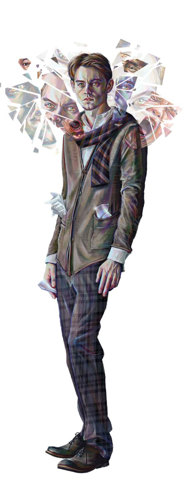

Зачастую это означает, что присутствие Сетита в обществе вносит элемент услужливости. Министрийство может обеспечивать своих собратьев, но взамен может ожидать одолжений и социальных льгот. Такой платой может быть расширение сети связей Искусителя или даже пополнение его духовной паствы. Для Министрийства это ни в коей мере не исключает социальных связей и не является исключением для создания союзов. Министрийство предпочитает иметь дело с местным сообществом, начиная с его котерий. Ведь что может быть лучше клиентов, чем люди, которые знают людей, которых знает человек?

Те, кто состоит в одной котерии с сотрудником Министрийства, как правило, прекрасно это понимают. Умные вампиры не преминут воспользоваться преимуществами связей с Сетитами, даже если они с осторожностью относятся к скрытым мотивам Министрийства. Некоторые вампиры могут отказаться от сотрудничества с Министрием, опасаясь, как бы Соблазнитель не затеял какуюнибудь махинацию прямо под носом у вампирской котерии. На самом же деле представители сородичного министрийства зачастую полностью откровенны и даже честны в своих намерениях. Ведь никто не хочет иметь дело с продавцом подержанных автомобилей. Если же Соблазнитель будет заниматься двурушничеством, предательством и интригами на протяжении всей своей жизни, он обнаружит, что его репутация догоняет его! Вряд ли они виноваты, если их клиент хочет, чтобы что-то оказалось правдой, а не то, что предлагает Сетит.

Пусть покупатель остерегается.

#### ДОСТОИНСТВО КЛАНА: ПРОНИЦАТЕЛЬНОСТЬ **•**

Один раз за сеанс род Министрийства может узнать что-то поверхностное, что хочет персонаж Рассказчика, если любой член рода разговаривал с этим персонажем во время сеанса, даже если Сетит не присутствовал при этом. Это может относиться к желаниям или амбициям персонажа или к конкретному действию, которое он предпринимал (но не должно раскрывать никаких глубоких планов или тайн, особенно если члены группы о них не знают). Персонаж, взаимодействовавший с данным персонажем-рассказчиком, описывает эту встречу.

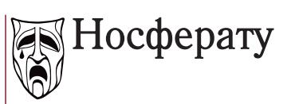

Для многих Носферату котерия - это импровизированная семья, а клан - это уже член одной из самых больших семейных единиц, которые только существуют. Связь Носферату с другими Канализационными Крысами потенциально уже сильна, что в немалой степени объясняется их природой изгоев среди Сородичного общества. Живя в подземных норах или отдаленных убежищах, многие Носферату воспринимают мир как двоичный: носители "презентабельных" Сородичей и они сами.

Такой прагматичный взгляд на вещи порождает интересное следствие: носферату, как правило, довольно непредвзято относятся к тому, к каким котериям они присоединяются. Один Носферату может даже быть членом нескольких котерий в один и тот же момент времени, причем каждый из них не знает об этом. Вероятно, в этом нет попытки двойничества, скорее, Носферату просто разделяет свои круги общения, считая одну группу ценной для одних целей, а другую - для других. Одна из таких групп может быть даже полностью состоящей из Носферату, не

зависящей от секты.

Предприимчивые Носферату на протяжении всей истории Рода выступали в роли информационных брокеров, и многие представители клана продолжают играть эту роль и сегодня. Однако то, как они используют информацию, может быть сугубо личным делом. Носферату могут свободно делиться информацией с товарищами по клану, просто ради возможности пообщаться с "прекрасной" частью мира. Это само по себе является огромным преимуществом для Носферату, принадлежащего к космополитическому кругу: Возможность просто потусоваться в ночном клубе или прогуляться по городским улицам под светом звезд может сделать чудеса, чтобы ослабить чувство отчужденности Орлока.

Конечно, не все котерии так благосклонно относятся к Носферату, а некоторые Канализационные Крысы просто не могут заставить себя доверять другим вампирам. Их уникальное родовое проклятие представляет собой социальный барьер, который многие Сородичи вынуждены преодолевать. В то время как каждый из Проклятых таит в себе зверя, проклятая кровь Носферату выставляет его на всеобщее обозрение.

### ДОСТОИНСТВО КЛАНА: КОНТЕКСТНЫЙ ИНФОРМАТОР ••

Сородичные Носферату часто знают о своих информаторах больше, чем сами информаторы, умея использовать нишевые навыки и скрытые таланты своих и чужих соратников. Один раз за сессию член группы, имеющий Носферату с этим достоинством, может добавить к одной проверке на восстановление или получение информации (например, восстановление удаленных данных, использование социальной инженерии для получения пароля для входа в систему или взлом физической картотеки) максимальный показатель Информатора другого члена группы. Информатор должен быть каким-то образом задействован, но проверка может выходить за рамки его обычной компетенции только для этой проверки. Информатор может быть использован для

этой цели только один раз в истории.

# • Равнос

Кочевая природа гангрелов пользуется преимуществом, поскольку их Кровь более дикая, чем у других. Равносы редко пользуются подобными преимуществами, и хотя Равносов можно встретить практически повсюду, они процветают в любой среде, более консервативные социальные структуры Рода часто рассматривают их как сорняки, которые необходимо вырвать из их тщательно ухоженных садов.

Одинокий Равнос - готовая мишень для кланов, которые свысока смотрят на его странствия. Хотя клан мало волнует мнение так называемых "высоких кланов", которые просто не понимают реалий жизни Равноса, многие Равносы признают, что они, возможно, правы: Корни - это лучше, чем их отсутствие. Если равнос хочет выжить, ему необходимо пойти на некоторые уступки. А что может быть лучше для развития корней, чем членство в котерии? Котерия - это ведь безопасность в количестве.

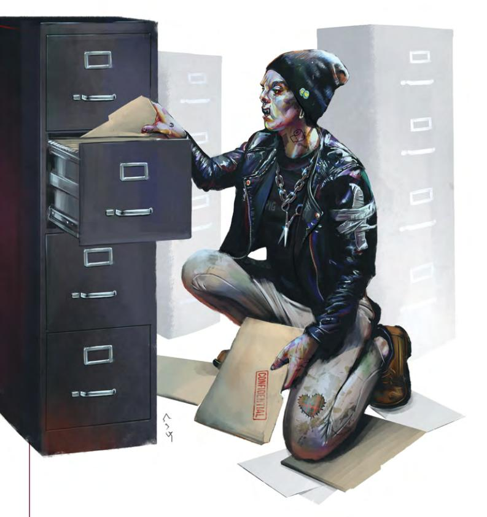

Когда речь заходит о котериях, странствующий характер Равноса может сделать его полезным членом. Они знают лучшие места, гле можно затаиться в том или ином ломене, обнаружив их во время бегства от своей гибели, и умеют выведывать секреты, будь то через подвластных животных или заманивая смертных. Эти секреты можно использовать в своих интересах. Ухо востро держится, и зачастую об угрозах становится известно задолго до того, как о них узнают более именитые и, соответственно, могущественные личности. Что бы ни думали о Равносах другие кланы, они часто способны прийти на помошь именно в тот момент, когла это необхолимо.

Как будто так и было задумано.

#### ДОСТОИНСТВО КЛАНА: КРИПТОКОЛЛЕКТИВ •••

Постоянно находясь в движении, приходится искать новые способы общения с союзниками. Используя кодированный язык, ономатопею и жесты, эта заслуга позволяет Равносам и его окружению иметь свой собственный язык для общения друг с другом - практически никто за пределами окружения не понимает его, кроме специалистов, находящихся под длительным наблюдением. Криптолект котерии не отличается красноречием и надежностью, но может использоваться для быстрой и безопасной передачи высокоуровневых понятий и не идентифицируется как какой-либо другой язык.

Кроме того, для его функционирования необходимо личное присутствие, поскольку при телефонном или видеообщении его жесты и знаки ослабевают. Уход из котерии или потеря члена Равноса означает, что Сородичи больше не в курсе криптолекта и не могут использовать его для последующего общения.

# Салюбри

Что может быть опаснее, чем член клана, за которым охотятся столпы сородичного общества? Почти во всех случаях в современную эпоху, особенно в ночи, следующие за Объятиями, Салюбри вступают в котерии для защиты. В противном случае шансы обычно складываются против них: Их клан пользуется несправедливой репутацией, а родоначальники салюбри часто сами устраивают свою окончательную смерть после передачи Объятий. Если салюбри не заведут ценных знакомств, причем быстро, то их ночи наверняка сочтены.

Салюбри многого требуют от общества, к которому принадлежат, явно или неявно. Несмотря на несправедливость репутации своего клана, Салюбри, проведшие хоть какое-то время среди Проклятых, прекрасно понимают, что могут запятнать своих соратников. В конце концов, любой род, готовый действовать в соответствии с предрассудками прошлых веков, скорее всего, не заботится о том, какие оправдания могут предложить соотечественники Похитителя душ. Нет нужды говорить о том, что это откровение может ухудшить отношения между сородичами, когда циклоп откроет им правду об их объятиях - при условии, что это будет сделано по желанию, а не когда перед ними будет стоять залитый

#### кровью Пожиратель.

Если предположить, что Салюбри пытаются сохранить себя в тайне, то, скорее всего, вопрос в том, когда, а не если, кто-то из других Родов узнает правду об их преследуемом клане. Мудрые соратники заранее продумают, как поступить в такой ситуации: сомкнуть ряды и защитить циклопов или бросить их на произвол судьбы в безжалостном социальном порядке.

Учитывая все это, кажется маловероятным, что какая-либо община вообще может принять соотечественника Салюбри. По большей части это так, но персонажи игроков, как всегда, являются вероятным исключением из застывших обычаев общества нежити. Некоторые ищут ответы на вопросы о состоянии сородичных существ или поддерживают свою связь с неизбежно сокращающимся человечеством, для чего темперамент салюбри может быть вполне подходящим. В некоторых случаях котерии, в которых есть Салюбри, "переворачивают сценарий", становясь охотниками на враждебных вампиров. Это может быть опасным подходом к жизни, поскольку Салюбри фактически становится приманкой, на которую группа выманивает своих врагов. Делают ли они это для того, чтобы плюнуть в глаза политике домена, или стремятся к искуплению через чистку от испорченных Сородичей - это вопрос выбора Котерии (не говоря уже о том, насколько

честны они сами с собой).

Конечно, не все Салюбри стремятся подорвать статус клана, некоторые с удовольствием опираются на его негативную репутацию. Если Роду нужен народный дьявол, то некоторые Похитители Душ готовы его подарить и утащить за собой в ад. Например, культ диаблеристов, возглавляемый Салюбри, терзал дворы Северной Италии в ночи перед тем, как стало широко известно о Призыве, а упорные слухи приписывают руководство неумолимой стаей Шабаша каиниту, обладающему несомненным третьим глазом. Учитывая репутацию салюбри, было бы неудивительно, если бы эти истории были раздуты до неузнаваемости, но опять же....

Как свидетельство странностей современной ночи, Салюбри иногда заключают странные союзы с теми, кто традиционно считался их врагами. Среди старейшин и даже подмастерьев традиции и пропаганда могут иметь силу, но для молодых соратников салюбри и тремере или салюбри и бану хаким вековые вендетты могут не иметь никакого значения и быть лишь еще одним способом, которым властные старейшины используют кланы для манипулирования Вечной борьбой.

## ДОСТОИНСТВО КЛАНА: СДЕРЖАННОСТЬ **•••**

То ли из-за суровой необходимости держаться в тени, то ли из-за истинных моральных убеждений, Салюбри часто являются образцами самоконтроля, и эта черта может передаться другим. Один раз за сессию циклоп может в своем присутствии сдержать зверя другого члена группы, позволяя ему бесплатно перебросить все (и только все) свои

кубики Голода в проверке.

# Тореадор

Если вам нужен эксклюзивный доступ к внутренним кругам власти или опасная близость к славе, обратите внимание на Тореадора. Дивы умеют подмечать желания других и обращать их в свою пользу. В то время как вентру любят хвастаться своими успехами и родословной, тореадоры наблюдают за происходящим издалека с чувством самодовольного удовлетворения. Иногда лучше показать, чем рассказать.

Немногие понимают социальные потребности Сородича лучше, чем самозваные вершители судеб культуры Сородича. Клан может похвастаться салонами, куда приглашают только гостей, список которых можно составить как "кто есть кто". Они имеют связи на всех уровнях общества, от вечно популярных до самых ярких восходящих звезд среди новорожденных, и могут свести вас с кем угодно. Их влияние распространяется и за пределы общества Сородичей, в мир смертных. Хотите встретиться со своим кумиром или попробовать его кровь? Дива может это устроить. Все, что вам нужно сделать, - это стать моделью для скульптуры или предаться ночи страсти. Такая

небольшая цена за открытые двери.

Для Тореадора "маленькие салоны", как некоторые любят называть котерии, являются привычной частью его существования. Это крошечные, но чрезвычайно ценные сообщества, в которых члены Клана Розы могут получить новые художественные знания или возродить угасающее вдохновение, а также продолжить развивать свою личную сеть. Каждый хотел бы быть Тореадором, но вместо того, чтобы обладать Прекрасной Кровью, часто достаточно иметь Тореадора в своем окружении. Чем важнее Дива для домена, тем лучше. Легче добиться успеха, когда можно приклонить слух высокопоставленных лиц и предложить им взамен блеск своей котерии. Если уметь терпеть пощечины сородичного общества и потакать приступам гнева Див, можно обрести сильного союзника со всеми связями, которые только могут понадобиться.

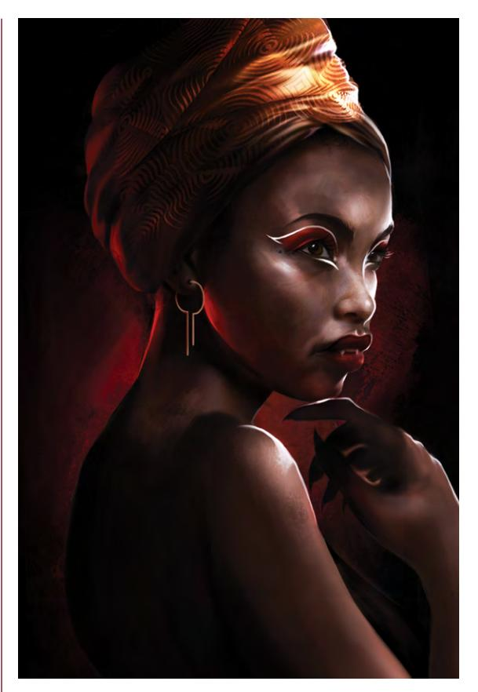

## ДОСТОИНСТВО КЛАНА: ПОЛНЫЙ ДОСТУП **•**

Будь то премьера фильма начинающего режиссера, гала-вечер по сбору средств для начинающего политика или бар, в котором внезапно ввели дресскод, потому что ему не нравится ваш внешний вид, вы знаете, как попасть внутрь - даже без приглашения. Один раз за игровую сессию, когда члены группы сталкиваются с препятствиями на входе на смертное мероприятие или в заведение, они могут обойти вышибал или охранников, будучи в списке гостей или имея связь с кем-либо из владельцев или покровителей. Это относится только к тем ситуациям, где есть персонал или список гостей; это не обходит системы безопасности, мистические заслоны и т.п. Рассказчик, конечно, может заблокировать вход, если это каким-то образом запутает сюжет (но тогда он должен предоставить игрокам сочную подсказку).

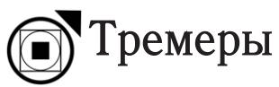

Трудно сказать, удача или проклятие для той или иной общины иметь в своих рядах Тремере. Многие Сородичи считают Узурпаторов более высокомерными, чем они имеют на то право, а Тремеры, в свою очередь, считают их хитрость и безжалостность в погоне за знаниями преимуществом, которое другие кланы склонны игнорировать. Тремеры знают, что они приносят в общество Родов: знания и подлинное владение определенными мистическими секретами.

Колдовство крови - это, пожалуй, самое сильное из преимуществ, к которым имеют доступ Тремеры и которые благоприятствуют их включению в котерии. На втором месте - способность быстро адаптироваться к меняющейся ситуации, используя свой острый ум для решения возникающих препятствий. Несомненно одно: Если в вашей котерии есть Тремере, то, скорее всего, на вашей стороне тщательный учет, планирование и управление ресурсами.

Тремере видят пользу в том, чтобы иметь связи с этими свободными объединениями "единомышленников". Нельзя сказать, что Узурпаторы особенно искусны в социальных вопросах, но их оккультные сети предлагают еще один способ получения знаний, будь то взаимный обмен или тщательно проведенные эксперименты, о которых их коллеги не знают, но которые, тем не менее, могут дать

своевременное преимущество.

#### ДОСТОИНСТВО КЛАНА: МНОГОУРОВНЕВОЕ КРАЕВЕДЕНИЕ ••

Несмотря на репутацию Тремере, ревностно хранящих оккультные знания, многие остатки пресловутой Пирамиды на самом деле способствуют обмену ими между исследователями запретного. Один раз за игровую сессию один род в союзе с Тремером, обладающий этой заслугой, может использовать преимущество по странице истории (или преимущество с меньшей точкой из той же страницы истории), которым обладает кто-то другой в союзе, включая клановые страницы истории, на усмотрение Рассказчика. Это дополнительное преимущество страницы истории может быть использовано только в течение игровой сессии, и любое знание, предполагаемое преимуществом страницы истории, не сохраняется впоследствии у заимствующего. Все остальные ограничения на преимущество сохраняются: например, преимущество "одно использование за сюжет" расходуется до конца сюжета, независимо от того, кто его использует.

# Цимисхи

Цимисхи представляют собой устрашающую силу для любой социальной группы, в немалой степени из-за их поведения. Большинство Драконов считали бы эту котерию своей, так же как поместье или домашнее хозяйство считали бы своим. Независимо от того, объявляете ли вы шесть блоков неприкосновенными владениями или осуществляете захват смертного дзайбацу, связь с миром, опережающим их, может представлять собой серьезное препятствие. Цимисхи, например, могут не видеть ничего плохого в том, чтобы управлять разумом множества смертных, и могут даже полагать, что это акт «хитрости», поскольку они не оставили после себя никаких тел. Конечно, социальная динамика большинства котерий основана на гораздо менее вертикальной модели, но даже в этом случае многие Сородичи могут увидеть ценность в полпитке эго Цимисхов.

Отдельные вампиры Цимисхов часто считают себя самыми важными из всех Сородичей, и хотя они могут наблюдать деликатное и чреватое гостеприимством в знак вежливости по отношению к своим собратьям, это часто является несколько очевидным фасадом. Драконы могут затаить обиду на других Цимисхов с таким сарказмом, что посрамят вендетту Тореадоров.

Чаще Цимисхи присоединяются к котериям с членами других кланов. Хотя воеводы и могут претендовать на некоторое превосходство над своими коллегами, это не исключает привязанности, какой бы странной она ни была. Взгляд Цимисхов широк, и они могут рассматривать членов котерии как товарищей, соперников, сородичей, слуг или даже вассалов, находящихся под их опекой.

Для некоторых Драконов котерии являются источником статуса: что-то, что нужно копить, культивировать и в конечном итоге использовать как знак чести. Эта анахроничная перспектива придает ценность признанию и престижу наличия окружения и, в конечном счете, ответственности за него, как это мог бы сделать лорд Старого Света.

У самих котерий есть все основания считать Цимисхов среди них. В конце концов, быть частью отряда Цимисхов означает, что вы находитесь под их защитой, как того требует обычай гостеприимства (или понятие собственности...). Для групп с особо крепким желудком сил, которыми может обладать Цимисх, часто бывает достаточно, чтобы поддержать притязания на территорию. Обладая склонностью к манипулированию телесными формами, Цимисхи часто столь же способны в Ужасной Форме, как и эстетические виртуозы, превращая товарищей по котерии в образцы

физической красоты.

#### ДОСТОИНСТВО КЛАНА: ДРЕВНЕЕ ГОСТЕПРИИМСТВО ••

Входите свободно и по своей воле. В начале сеанса все члены котерии, оставшиеся в убежище Цимисхов после завершения предыдущего сеанса, восстанавливают дополнительный уровень легкого урона Силы Воли. Это включает в себя общие убежища для котерий.

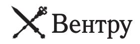

Те, у кого есть ключи от королевства, всегда стремятся расширить свой контроль, и если Сородичи из Клана Королей желают чего-то общего, так это способности извлекать больше власти из своего существующего капитала в ещё большую власть. Финансовые, политические, правительственные - они культивируют доступность во всех мыслимых источниках мирской власти, что делает их союзниками, которых хочет каждый, но цена ведения бизнеса с ними слишком высока для Крови многих. Сородичам из других кланов может быть трудно найти общий язык с Вентру, не чувствуя себя конкурентами или, что еще хуже, препятствиями.

Котерии, среди которых есть хотя бы одна Голубая кровь, быстро понимают, что означает фраза «близость к власти». Связи, которые развивает амбициозное Предприятие, часто являются их собственной наградой для товарищей по кругу Вентру, будь то талантливые и амбициозные вассалы, союзники с хорошими связями или роскошь обширных ресурсов.

Нужно перекрыть перекресток, чтобы перекрыть нарушение Маскарада? Выкупить убежище соперника? Отмывать деньги от сделки в порту? Сообразительный Вентру может сделать это и многое другое - все, что вам нужно сделать, это попросить.

И это не значит, что Вентру - волшебная палочка для решения временных проблем. Нельзя создать Клан Королей, тщательно выстраивая многовековые связи с гулями, добровольными смертными и новорожденными, служащими им глазами и ушами на всех уровнях мирового правительства и аристократии, выполняя поручения тех, кто менее способен, чем ты сам. В конце концов, Бог создал гулей и смертных, чтобы они выполняли работу. Предпосылкой участия вентру в котерии является занятие ценной позиции, и если в итоге "голубая кровь" превращает группу в добровольное дочернее предприятие Вентру, Іпс, что ж, котерии следовало бы сообщить об этом раньше, если бы у нее были проблемы с ценностным предложением.

#### ДОСТОИНСТВО КЛАНА: НАСЛЕДИЕ СОРОДИЧЕЙ ••

Вентру понимают, что наследие вампиров несет в себе отчет о деяниях их прародителей. У некоторых Голубых кровей это проявляется в письменных историях, в то время как у других могут быть знакомые определенные сиры или ученые. Как бы то ни было, один раз за сессию член котерии с Вентру, у которого есть это Достоинство, может попросить Рассказчика раскрыть важную информацию об истории одного вампира, с которым он контактировал. Это может быть что-то конкретное, например, «владелец министрийского сообщества контрабандой вывез беглых анархов из города после восстания в Лос-Анджелесе», или более таинственное, например, «обвинения, выдвинутые против прадеда этого Сородича, совершившего диаблери, не соответствуют действительности, но его дитя до сих пор несет позор в эти современные ночи.

# Каитифф

Быть Каитиффом — значит пребывать в вампирской загадке, упуская из виду особенность Крови, которая наделяет их специфическими недостатками, но в то же время оставляет их без ее различий. С одной стороны, Каитифф свободен от многих обременительных элементов происхождения Сородичей. С другой стороны, большая часть общества Сородичей придает большое значение такому происхождению, и отсутствие его означает, что вампир находится на неправильной стороне обычаев в этом почтенном обществе. После Становления Каитиффы могут оказаться в компании наркопритонов, сатанинских шабашей, временных анклавов или котерий недолеток, которые прикрывают друг друга спиной в мире бессмертных византийских предательств.

Само слово «каитифф» является устаревшей формой, означающей одновременно и пленника, и изгоя, на тот случай, если бесклановому индивидууму нужно напоминание о его положении в обществе Проклятых. С практической точки зрения, это общественное давление часто толкает бесклановых вампиров в одном из двух направлений. Те каитиффы, которые могут действовать самостоятельно, скорее всего, выберут это, отвергая то самое общество, которое их отвергает, и сохраняя собственную компанию. История Сородичей переплетаются бесклановыми Сородичами, настолько независимыми (или настолько чудовищными...), что они в любом случае могут приказать секте пойти нахуй. Хотя это скорее позиция самодостаточного, чем собственно

каитиффа, последний часто создает первое.

Однако в наши дни многие Каитиффы настолько молоды, что провели всю свою жизнь до Объятия, социализируясь в том или ином качестве. Для этих современных каитиффов котерии естественны, особенно среди культур аутсайдеров, из которых часто выходят бесклановые. Многие происходят из групп, уже находящихся на обочине общества, и, таким образом, уже имеют некоторый опыт в том, чтобы быть изгоями, поэтому быть изгоем среди другого общества, ну, то же самое дерьмо, другая ночь. Это приводит к тому, что эти вампиры принимают котерии из того же стремления к самосохранению, что и многие молодые Сородичи. К сожалению, те же виды затруднений, в которых посторонние оказываются в смертной жизни, часто кажутся правдой и для Каитиффа, создавая напряженные или даже порочные котерии.

Доверие часто бывает недолгим, поскольку каитиффы его испытывают, что может сделать их осторожными или даже неохотными членами котерий. Однако одна рука моет, а другую: если они увидят, что доверие не только существует, но и оказывается, Каитифф потенциально может стать самым искренним сторонником котерии.

#### ДОСТОИНСТВО КЛАНА: УНИВЕРСАЛЬНОЕ ВИТЭ **••**

Универсальность Каитиффа, являющего собой пример непоколебимой Крови, почти заразительна. Один раз за сессию Каитифф может повлиять на члена группы своей податливостью, позволяя ему использовать силу Дисциплины, которой он не владеет (если у него есть уровни Дисциплины и другие предпосылки для этого), на время сцены.

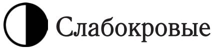

Великое и ужасное Проклятие Каина сохранилось в это Время Слабокровные, предвестник Конца Времен!

Конечно, такие витиеватые идеи могут иметь мало отношения к современным ночам, но если что-то и верно, так это то, что Становление передает получателям все меньше и меньше характеристик «чистокровных» Сородичей, чем дольше простирается родословная. И у тех, кто терпит эту разжиженную Кровь, есть свои беды, несмотря на переутомленное общество Проклятых. Конечно, достоверных данных о том, сколько вообще существует слабокровных, не существует, поэтому невозможно угадать, сколько из них составляют компанию друг другу, а сколько смешивается с более сильнокровными Сородичами старшего поколения. В дополнение к проблемам Каитиффа, разнокровные сталкиваются со своими собственными невзгодами.

Рожденные в сумраке, которые остаются среди своих, часто не владеют языком этого полнокровного общества Сородичей и редко используют слово «котерия» для описания своей социальной единицы. В зависимости от поведения группы, у них может даже не быть слова для обозначения своей социальной единицы, или они могут использовать термины, которые плюют на социальные нравы особенно на смертные социальные нравы, поскольку многие не обращают внимания на степень присутствия Сородичей.

Таким образом, нередко можно найти самопровозглашенные шабаши, стаи, прайды, банды, культы, команды и даже убийства Слабокровных. Они почти всегда имеют слабое представление о том, как функционирует высшее общество Сородичей, и существуют на периферии устоявшихся владений в неведении до того ужасного момента, когда глубина положения Сородичей обнаруживает себя в форме фактического претендента на территорию.

Для слабых кровей, оказавшихся в компании вампиров с более могущественной Кровью, это также слишком широко, чтобы дать какие-либо точные тенденции. Некоторые рожденные в сумраке скрывают «позор» своей сравнительно слабой Крови, пока могут, а учитывая, сколько других секретов может хранить котерия среди своих членов, этот секрет может быть в безопасности, пока трагические обстоятельства или даже окончательная смерть не разлучат их. Тем не менее, другие слабокровные не скрывают своего положения и полагаются на «настоящих вампиров», которые защищают их от самых жестоких импульсов общества Сородичей. Немало наставников-нежити и мавлов берут на себя эту роль, возможно, находя в ней отголосок родительского побуждения, хотя и извращенного Кровью. И, конечно же, другие не могут беспокоиться об этом, доверяя разбавленной крови, чтобы собрать свое дерьмо или закончить как пепел, пытаясь. Опять же, появление слабокровок в целом является слишком недавним развитием Сородичей, чтобы категорически

#### определить их этнографию.

В некоторых случаях слабокровные наследуют котерии почти так же, как первородный грех, превращаются в выводки или семьи, которые разделяют одного и того же сира... какой бы ни была нынешняя судьба этого сира. Они часто рождаются из-за несчастья: Котерия слабой крови возникает, когда молодой вампир без надлежащего обучения Традициям или путям нежизни случайно создает больше себе подобных; стая анархов приняла Становление, чтобы подорвать местную структуру власти только для того, чтобы эти сиры были уничтожены, пропали без вести или иным образом стали жертвами Войны веков; или трагически несведущий любовник втягивает свою возлюбленную в ряды Слабокровных дождливой ночью под бесчувственными электрическими огнями города.

Как бы то ни было, они идут по отчужденному пути, если не находят спасения в большом количестве, что часто означает игру в коварных интригах Проклятых.

#### ЛОСТОИСТВО КЛАНА: СМЕРТНОЕ СЕРДЦЕ ••

Просто своим существованием слабокровные доказывают, что возможен мост между смертными и нежитью, между Человечностью и Зверем. Один раз за сессию слабокровка может напомнить своей котерии о том, что значит быть живым, что позволяет им увеличить

свою человечность на одну точку за сцену.

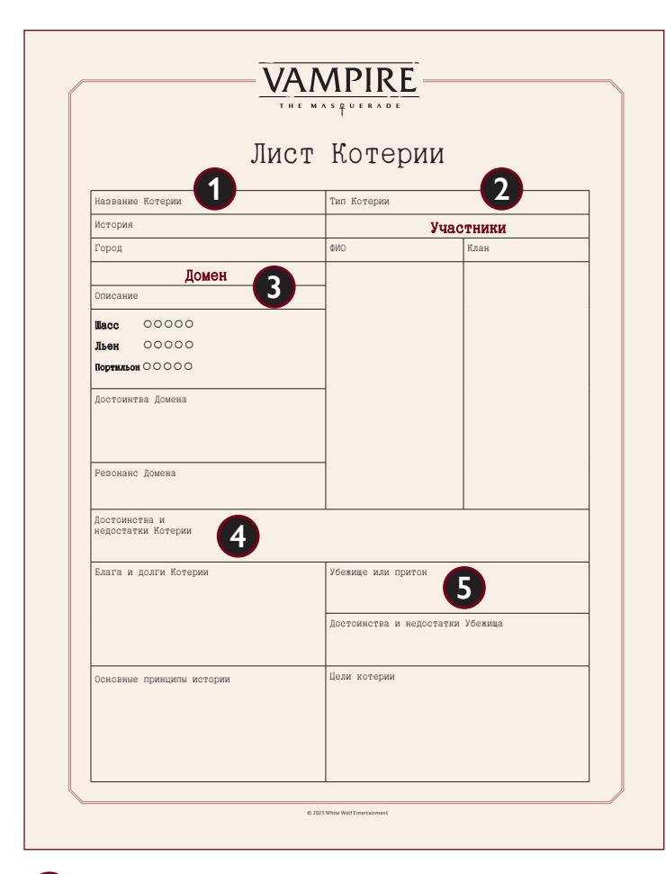

## **1** ОТПРАВНЫЕ ТОЧКИ

В каком городе происходит действие истории? Если вы дали название своей истории или своей котерии, внесите эти названия в Лист Котерии на стр. 239. Постройте стартовый пул Котерии: добавьте по одному очку на каждого персонажа игрока. В любой момент этого процесса игроки могут потратить очки преимущества из своих собственных пулов персонажей и добавить их в пул Котерии.

На очки Пула Котерии можно купить много чего, так что стройте тщательно! Как правило, наиболее важными вещами для покупки являются Домен и Убежище, чтобы у вас было разрешенное место для

охоты и надежное место для ночлега.

#### ДОПОЛНИТЕЛЬНО: СИЛЬНЫЕ КОТЕРИИ

См. раздел "Сильные котерии" (стр. 170), если ваш рассказчик позволяет использовать бонусные точки для пула котерий.

## **2** ТИП КОТЕРИИ

Здесь описывается, чем занимаетесь вы и другие персонажи, с какой целью они объединились.

См. список типов котерий на с. 156. В соответствии с типом вашей котерии (с. 158) распределите очки пула котерии между перечисленными предпосылками. Каждое очко, потраченное на недостаток, дает вам еще одно свободное очко, которое вы можете потратить на биографию или достоинства.

Если у вас недостаточно очков пула, вы можете не заполнять все предпосылки полностью. Но если вы не заполнили предварительные условия, вы не можете больше тратить очки на преимущества, фоны, черты домена или что-либо еще.

Если один из персонажей игрока слабокровный с заслугой "Дневной хищник", он может заменить одного Подручного Привилегии на себя и сэкономить стоимость точки.

Добавьте на карту отношений всех союзников, подручных или другие фоновые черты, полученные от Привилегий (см. основную книгу Vampire: The Masquerade, стр. 142).

#### ТИПИЧНЫЕ ТИПЫ СЕКТ И КОТЕРИЙ

Типичный - не значит всегда. Ваша хорошая идея сюжета превосходит вампирские стереотипы.

#### Камариля

Церберы, Коммандос, Дневной дозор, Посланники, Охотничья группа, Марешаль, Плюмайры, Квестари, Регенты, Сбиры, Вехме, Дозорные

#### АНАРХИ

**192**

Культ крови, Чемпионы, Коммандос, Гангстеры, Кочевники, Плюмайры, Квестари, Диверсанты, Сбиры, Дозорные

## **3** ДОМЕН

В каком районе города вы охотитесь? Где находится ваша операционная база? Это ваш домен, обычно предоставляемый вам более могущественными вампирами в вашем городе.

Если у вас есть дополнительные очки в копилке вампиров, вы можете потратить их на увеличение характеристик своего домена. Шасс - насколько велики и богаты ваши охотничьи угодья; Льен насколько хорошо вы интегрированы в свой домен; Портильон - защита вашего домена от вторжения. (См. Vampire: The Masquerade, с. 195-196.)

#### ДОПОЛНИТЕЛЬНО: ДОСТОИНСТВА ДОМЕНА

Это структуры, объекты и особенности вашего домена.

Если ваш Рассказчик позволяет использовать Достоинства Домена (стр. 175), вы можете купить их за очки Пула Котерии. Их точки считаются и как заслуги, и как черты: вам не нужно покупать две точки в Шассе, если вы купили достоинство домена Шассе с двумя точками!

Отмечайте важные места в вашем домене на Карте отношений.

#### Резонанс Домена

Резонанс - это преобладающий эмоциональный вкус смертной крови в вашем домене.

Подсчитайте Резонансы из заслуг вашего домена. Каждая заслуга учитывается один раз, но несколько Резонансов учитываются по одному разу за каждый Резонанс. ( Например, достоинство Холерик/Сангвиник добавляет одного Холерика и одного Сангвиника). Если один Резонанс имеет три или более заслуг, и у него больше заслуг, чем у любого другого Резонанса, то это и есть Резонанс вашего домена.

## **4** ДОСТОИНСТВА

Как и Достоинства персонажа, но доступ к ним имеют все члены группы.

Вы можете покупать фоны не по отдельности, а всей котерией (см. V:tM, стр. 196-197). Если некоторые персонажи приобрели индивидуальные фоны, которыми они предпочли бы поделиться с группой, игроки могут обменять их, а потраченные на них очки внести в фонд котерии.

После того как вы приобрели все необходимые условия для вашего типа сотворчества, потратьте оставшиеся у вас очки на фоны (см. Vampire: The Masquerade, стр. 184-195) или достоинства сотворчества.

Посмотрите в разделе "Возможные дополнения" описания вашего типа котерии, чтобы найти достоинства, которые хорошо сочетаются с вашим типом котерии.

Помните, что вы всегда можете купить Недостатки, чтобы сбалансировать очки, потраченные на Фоны и Достоинства. Убедитесь, что все (включая Рассказчика) согласны со всеми приобретаемыми недостатками!

Достоинства клана ("Клановая котерия"): Если ваш персонаж принадлежит к какому-либо клану, вы можете приобрести достоинства своего клана для своей котерии. У каитиффов есть "бесклановое" достоинство. (См. с. 190.)

См. также список достоинства котерий (с. 171) и недостатков котерий (с. 240).

Добавьте на Карту взаимоотношений всех противников, союзников, информаторов, врагов, мавлов, подручных и других важных персонажей.

## **5** УБЕЖИЩЕ

**193**

Где ваша группа проводит светлое время суток? Имеет ли каждый член вашей группы свое собственное убежище или вы хотите приобрести общее убежище для группы?

Этот фон настолько важен, что его стоит перепроверить на отдельном шаге. Помните, что вы можете обменять индивидуальные очки убежища на общее убежище, и, скорее всего, вы сэкономите очки на лучшее убежище, чем может позволить себе один персонаж.

Вы получили убежище по типу вашей группы или купили его на предыдущем этапе? Вы можете настроить его с помощью достоинств и недостатков Убежища (см. Vampire: The Masquerade, pp. 188-189; pp. 111-113).

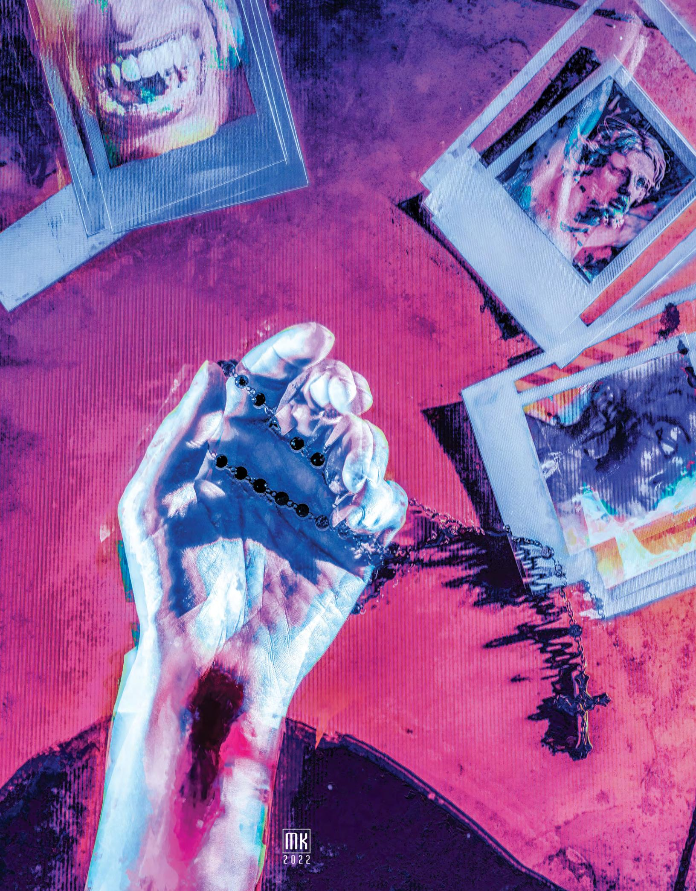

# ГЛАВА ШЕСТАЯ:

# ИСТОРИИ

Каждое тело - это книга крови; Где бы мы ни были открыты, мы

красные.

- КЛАЙВ БАРКЕР

Персонажи, как в одиночку, так и группами, являются движущей силой игры. Без них игра невозможна. То, что происходит, мы называем историей, независимо от того, спланировал ли ее Рассказчик (или умный игрок, или шесть игроков) заранее, или она возникла в игре и удивила всех, или мы поняли, что все это значит, только когда оглянулись назад.

В этой главе рассматривается, как индивидуальный и коллективный выбор персонажей и игроков приводит в движение эту историю, хронику. Выбор, сделанный игроками, - и стиля игры, и

продуманности действий, и убеждений, которые они планируют сосредоточить, - неизбежно меняет ход игры. Независимо от того, насколько тщательно кто-то спланировал это на Карте отношений. Или, может быть, это карта отношений на экране вашего ноутбука.

Вы, все вы, игроки, решаете сами. Ведь это ваша история.

#### ОДИН РАЗ ЗА СЕССИЮ

Записывайте каждое правило или событие, влияющее на персонажа (хорошее или плохое), один раз за сессию на карточку для заметок или помещайте для него значок в окно чата. Когда событие произойдет, переверните карточку или удалите значок. Это поможет и вам, и рассказчику следить за этими элементами.

## Äðóãèå Ôîðìû Èãðû

Vampire: The Masquerade изначально зародилась как настольная ролевая игра TTRPG. Традиционно это означает, что игроки и Рассказчик сидят за столом, рассказывают сюжет и диалоги своих персонажей, бросая кубики для решения действий персонажей. На протяжении десятилетий это был стандартный способ проведения ролевых игр, и многие люди до сих пор предпочитают этот стиль игры всем другим.

Но даже в самых ранних "Вампирских вечерах" некоторые люди играли в истории с более чем одним персонажем на игрока; кажущиеся нетрадиционными игры "в стиле труппы" на самом деле вышли из самых старых традиций "Вампира". Некоторые игроки играли в "Вампиров" в барах, театральных залах и на открытом воздухе, где жесты рук и доброжелательность заменяли кубики и толстые справочники. Появились новые типы и формы игры, поэтому в Vampire: Masquerade" на стр. 290-293 рассказывает об альтернативных сценах и способах игры. В этом разделе мы рассмотрим альтернативные Сцены и Режимы игры на стр. 290-293.

## Îäíîðàçîâàÿ Èãðà

Не каждая игра про вампиров должна быть многоэтажной эпопеей или большой историей. Даже сегодня многие игроки получают первый опыт ролевой игры в односеансовых или односюжетных играх. Игры на съезде, в "доме с привидениями" или других мистериях часто проходят более гладко, если заранее сгенерированные персонажи настроены на один конкретный сюжет и его драматические (и другие) задачи.

Это также помогает новым игрокам преодолеть трудности, связанные с тем, что они могут случайно создать слишком слабого или не подходящего для ночного приключения персонажа. С более опытными игроками рассказчик может представить "голые" версии персонажей с необходимыми для этой ночи правилами и, возможно, сразу же возникшим Желанием, и позволить игрокам развивать или настраивать другие способности, Преимущества и т.п.

В отличие от многих других игровых жанров, ролевые игры ужасов имеют долгую историю завершения сюжета за одну сессию. Очевидно, это связано с тем, что в играх ужасов частота гибели персонажей выше, чем в других ролевых играх, а одноразовая форма снимает с игрока напряжение, связанное с тем, что "ранняя" гибель персонажа может нанести ему ущерб в виде опыта или игрового времени. Хотя игроки не должны жертвовать своими персонажами без причины в одноразовой игре, отбросив заботы метаигры, они могут свободно выразить свой характер без этих соображений, даже если это приведет их к саморазрушению или самопожертвованию.

Это также означает, что в одноразовых сценах обычно присутствуют драматические сцены, и персонажи охотнее раскрывают свои внутренние конфликты без особых подсказок. Строгое ограничение количества сессий, отведенных игрокам на изучение персонажей и сюжета, освобождает их от естественной склонности тянуть время или ждать наиболее подходящего сценария для раскрытия истинной сущности

персонажа. Время идет, и есть только сейчас. Хотя стиль игры "одним выстрелом" не требует особых модификаций, может оказаться полезным активное использование таких систем правил, как взятие половины (Vampire: The Masquerade, стр. 123) и конфликты одного броска (Vampire: The Masquerade, стр. 296), если целью является действительно односеансовая игра "одним выстрелом". Эти системы делают упор на ролевую игру и драматические последствия действий персонажей. Хотя броски и статистика попрежнему важны, эти системы проясняют и ускоряют их выполнение, чтобы больше времени за столом уделять истории персонажа, а не мелочам, связанным с детальным рассмотрением его действий.

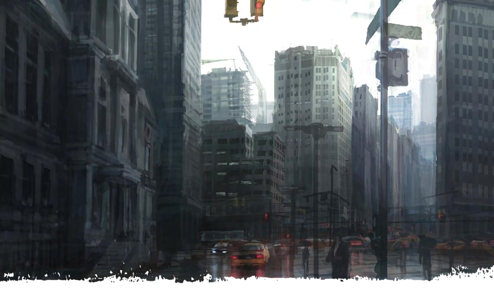

Пожалуй, самое важное, что необходимо учитывать при проведении или игре в режиме "один выстрел", - это планирование смерти персонажа. Хотя такой стиль игры не является оправданием для безжалостности, жестокости или беспечности, как игрок вы должны понимать, что смерть может быть более вероятной, когда драматизм игры включен на максимальную громкость. Полезно заранее обсудить с Рассказчиком, что произойдет, если персонаж умрет: сможет ли игрок переключиться на заранее выбранного (или случайно

# Èãðà Îäèí íà Îäèí

встреченного) персонажа Рассказчика?

Особо напряженный стиль игры, очень хорошо подходящий для "Мира тьмы", предполагает наличие только одного Рассказчика и одного игрока, либо сохраняющих одну и ту же роль на протяжении всего времени, либо сменяющих друг друга по сюжету связанной истории. Игра один на один может потребовать либо большого доверия, либо очень четко установленных границ между двумя участниками. Поскольку и игрок, и Рассказчик не имеют "свободного времени" друг от друга, их выбор в игре кажется сразу же личным, чего не могут избежать большие игровые группы.

При этом в центре внимания оказывается один игрок, который никогда не может передохнуть, пока действуют другие. Рассказчик же не может использовать межигровые дискуссии или ролевые игры как возможность отступить или импровизировать следующее действие.

Однако исследование мотивов и внутренней жизни персонажа может дойти до самого пола. Опоры и воспоминания, которые могут быть слишком личными или сложными, чтобы углубляться в них в других стилях игры, могут быть сосредоточены и использованы в качестве основы сюжета. По мере укрепления доверия между игроками, в результате проверок или взаимного восторга от полученных результатов, они могут даже начать чередовать роли по ходу повествования, что, возможно, придаст рассказу качество Рашомона - пересекающихся перспектив, которые никогда не объединяются в

единое повествование.

## Индивидуальные мастер-классы

В играх про вампиров часто исследуются внутренние дилеммы и то, как связь персонажа с его прошлым и человечностью трансформируется, повреждается или даже стирается под воздействием его неестественных желаний и обстоятельств.

Хотя в игровой группе важно поддерживать баланс внимания и осторожности, иногда игрок и Рассказчик могут разыграть личное путешествие персонажа вдали от группы в режиме "один на один".

Это может быть простой 15-минутный сеанс, когда игрок общается с Рассказчиком, получая информацию или новую точку зрения, которая ставит его перед дилеммой, если он поделится ею с остальными членами группы. Или же игрок и Рассказчик могут запланировать совершенно отдельную игровую сессию вне обычного расписания группы, возможно, по видеочату. В таких сессиях можно исследовать глубокие личные истории или продвигать одиночные планы: укрепить связь персонажа с помощью новой Опоры или погрузиться в его прошлое с помощью Воспоминания.

Хотя побочные сессии могут быть интересными и ценными, рассказчику следует использовать их осторожно, чтобы разделить группу таким образом, чтобы усилить драматизм, не настраивая их друг против друга без причины. Хорошее эмпирическое правило заключается в том, чтобы позволить игрокам самим решать, когда необходимо провести сеанс один на один или побочный сеанс, выходящий за рамки обычного хода игры. Не каждая тайная встреча с

теневым благодетелем игрока требует беседы в углу.

Частью построения доверия за столом является возможность играть в открытую со всеми, кто сидит за столом, и доверять им в том, что они будут соблюдать границы между знаниями в характере и вне его. Оставьте игру один на один для сюжетных элементов, которые поднимают личную драму персонажа и дают ему возможность вырасти, уменьшиться или трансформироваться перед лицом внутренней борьбы. То, как персонаж затем вернет эти новые знания за стол переговоров с группой, и есть истинная польза от этого метода.

## Èãðà â ñòèëå Òðóïïû

При игре в стиле труппы у каждого игрока есть свой главный персонаж Сородич, который занимает центральное место в течение одной сессии. Работая с картой взаимоотношений или просто сочиняя во время нулевой сессии, труппа создает ряд второстепенных персонажей: гулей, птенцов, подручных, союзников и т.д.

Или, в более мощной игре, у каждого игрока может быть главный персонаж-анцилла, а среди помощников могут быть новорожденные и птенцы. Или же основная группа полнокровные Сородичи с некоторыми помощниками и приспешниками слабой крови.

Труппа должна решить, насколько ей комфортно играть с Опорами друг друга. Если труппа определилась с играбельными Опорами постарайтесь расширить драматургические возможности Опор, чтобы они могли правдоподобно проявляться и участвовать более чем в одном типе сюжета.

На данном сеансе Рассказчик (или труппа в целом) решает, кто будет главным героем. Игрок, играющий за этого персонажа, берет на себя эту роль, а остальные игроки берут на себя управление второстепенными персонажами, меняя их в зависимости от сессии. В некоторых сессиях могут участвовать два и более главных персонажа, иногда в роли второго плана, иногда в более "командной" истории. А в официальных Элизиумах или других кульминационных моментах каждый игрок может изображать своего главного героя, как и в стандартной вампирской сессии. Но в целом в истории в стиле труппы ожидается параллельный набор сюжетных линий и повесток, каждая из которых разворачивается вокруг одного главного вампира, но освещает драму между ними с разных точек зрения.

В самом начале постарайтесь связать с каждым главным героем по крайней мере столько второстепенных персонажей, сколько игроков в труппе, чтобы эти "сольные" истории все равно затрагивали каждого игрока. Например, в группе с одним Рассказчиком и четырьмя игроками есть четыре главных Сородича. Каждый из этих главных героев должен иметь трех помощников, так или иначе связанных с ним, чтобы все четыре игрока могли взаимодействовать во время любой сессии. Некоторые второстепенные персонажи могут иметь несколько связей: например, надежного спутника, который сопровождает любого главного персонажа.

В модели с фолиантами каждый игрок имеет "свой" фолиант вспомогательных персонажей и играет "своего" помощника главного героя сессии, либо выбирает второстепенного персонажа, который, по его мнению, лучше всего подходит к текущему сюжету. В модели "пул" труппа держит всех персонажей второго плана вместе, и пока каждому игроку есть кого изображать, неважно, кто будет помогать центральному Сородичу в сессии. Многие группы делят разницу между собой: каждый придумывает новых персонажей для пула по мере их появления в игре, а отдельные игроки все активнее берут на себя ответственность за тех персонажей второго плана, которым им больше всего нравится играть.

## Преимущества и вызовы

Каждый сеанс вампир одного игрока управляет действием и оказывается в центре внимания, что позволяет глубоко погрузиться в игру и получить драматическую реакцию. Устранив необходимость бороться за центр внимания, остальные игроки получают разрешение подпитывать драму; более того, это может быть прямой ролью их персонажа в сцене! Результат часто позволяет всем участникам игры глубже понять персонажа, чем если бы они просто наблюдали за тем, как он выплескивает эмоции на рассказчика. Аналогичным образом, у игроков появляется больше возможностей для "игры на поражение", поскольку они могут позволить себе резко пожертвовать второстепенным персонажем или даже главным вампиром! - не теряя при этом связи с текущей историей.

Если в игре в стиле труппы персонажи более "расходны", они также часто становятся более сильными и лучше играют. Особенно второстепенные персонажи, которые в стандартной истории могут быть лишь вторыми лицами для рассказчика, становятся живыми (или неживыми) присутствиями за столом, со своими собственными планами и личностями, добавляющими богатства и зрелищности в происходящую историю.

Игра в стиле труппы хорошо подходит для групп, в которых вампиры не так активны и работают по личным планам, иногда даже друг против друга, доверяя смертным персонажам пачкать руки от имени вампиров. Главные персонажи могут противостоять друг другу и тайно маневрировать, используя смертных пешек для выполнения своей грязной работы. Если игроку, изображающему пешку, придется саботировать своего главного вампира, тем слаще будет месть, когда в следующем сеансе он обернет ее против своего врага!

Самая большая проблема игры в стиле труппы - это разобщенность: игроки постоянно получают массу информации, которой не владеет их главный герой. Кроме того, многие игроки не умеют разделять действия игроков против игроков, что процветает в игре в стиле труппы, хотя и не является неизбежным. Если разделение на группы является проблемной зоной для вашей труппы, то, возможно, будет разумнее избегать этой формы игры.

## Гостевой рассказ

Игра в стиле труппы хорошо подходит для гостевых рассказов. Игрок, не сопровождающий другого главного персонажа, может взять на себя роль Рассказчика за столом, если все остальные согласны. Это позволит рассказчику сыграть своего второстепенного персонажа - персонажа из пула, антагониста или другую "приглашенную звезду" - и включиться в сюжет. Обсудите это заранее за столом и убедитесь, что все игроки согласны на приглашение Рассказчика.

Очень важно также знать, как вступить в роль приглашенного рассказчика. Поймите, что вы играете в чужой песочнице, когда речь идет о городской обстановке, сюжетах и персонажах Рассказчика, и уважайте предыдущие события и проявления персонажей. Добавляйте новых персонажей рассказчиков или элементы обстановки, а не переделывайте старые в непривычном ключе. В некоторых труппах приглашенные рассказчики могут работать в другой обстановке или в другом аспекте: гостевая сессия проходит в Саутсайде, а "основная" история остается в Верхнем городе, где она обычно и происходит.

Логическим завершением гостевого Рассказа является ротационный Рассказ: у каждого игрока есть главный герой, и он по очереди рассказывает, когда его главный герой уходит со сцены. Элементы сюжета, персонажи Рассказчика, антагонисты и т.д. могут быть общими для всего города, храниться в личном деле каждого Рассказчика или сочетать в себе оба варианта. В таких играх труппа действительно превосходит любого игрока и должна принимать решения сообща, чтобы все согласились с основными правилами. Нельзя не подчеркнуть, что "Вампиры" - это совместная игра, поэтому все должны общаться, обсуждать и работать вместе, чтобы рассказать историю, которую все хотят видеть за столом.

## Ñîëî Ðîëåâàÿ èãðà

Чем дальше от традиционного ролевого стола, тем чаще можно встретить людей, играющих без поддержки Рассказчика или даже других игроков. Все способы самовыражения в персонаже могут считаться ролевой игрой, даже если в них не участвуют другие активные участники - от исследования личных сюжетных линий в текстовых ролевых играх до аккаунтов вымышленных персонажей в социальных сетях. То, что раньше считалось дополнением к ролевой игре или дополнительным способом вживания в образ, теперь само по себе стало способом ролевой игры. Составление плейлистов того, что слушает ваш министрий, решение онлайнвикторин с точки зрения вашей Гекаты или ведение Инстаграмм-аккаунта под именем вашего Тореадора - все это вполне приемлемые методы одиночной ролевой игры, которые можно сочетать с более традиционными способами рассказать историю Vampire: The Masquerade. Некоторые игроки используют видеоигры и интерактивные романы в качестве упражнений для дальнейшего развития своих историй, ставя своих персонажей в роль главных героев. Другие ищут похожих одиночек для совместной работы и вместе создают замечательные истории.

#### ВАМПИР АМА

- Соблюдали ли Вы какие-либо человеческие ритуалы, например, чистку зубов?
- Что Вы думали о (вымышленных) вампирах до того, как стали вампиром?
- По какой части человеческой жизни Вы скучаете больше всего?
- Какое самое странное место, где вы когда-либо погружались в дневной сон?
- Как вы думаете, подходит ли вам ваш клан?
- К чему труднее всего привыкнуть, будучи нежитью?

# Ñòèëè èãðû â Èíòåðíåòå

Современные технологии создали возможности для переноса игрового процесса за пределы стола во многие другие пространства, как по причине удобства, так и благодаря дополнительным инструментам, которые они предоставляют. В этом разделе рассматриваются некоторые из этих альтернативных стилей игры и даются советы, как получить от них максимальное удовольствие.

Отход от концепции группы людей, играющих вместе за одним столом с одним Рассказчиком, который ведет их по длинной истории, отнюдь не нов. От серверов MUD и MUSH, ролевых аккаунтов на VampireFreaks до использования всех новых чатов, приложений для обмена сообщениями, социальных сетей или массовых многопользовательских игр для создания своих персонажей - ролевики-вампиры находят способы адаптировать популярные инструменты под свои истории.

Времена меняются: дизайн персонажей в простых приложениях для переодевания уступает место Picrew или даже AI-решениям вроде ArtBreeder, статичные 2Dаватары превращаются в Vtube-персоны, а текстовые ролевые онлайн-инструменты обрастают интерактивными картами и системами освещения. Независимо от инструмента и стиля ролевой игры, ее цель остается неизменной: рассказать хорошую вампирскую историю. Если вы не чувствуете себя достаточно смелым, чтобы начать свой путь в качестве рассказчика или игрока (пока...), вы можете принять участие в коллективном опыте в качестве зрителя, как позволяет большинство этих стилей, и даже активно искать "зрителей", чтобы насладиться ролевыми усилиями.

## Ðåàëüíàÿ èãðà

Реальная игра (РИ) - это термин, используемый для обозначения процесса настольной ролевой игры, который транслируется на потоковой платформе или передается в виде аудиоподкаста. Независимо от того, транслируется ли реальная игра в прямом эфире или записывается, зрители наблюдают за ходом игровой сессии в качестве зрителей, видя и/или слыша все диалоги и действия персонажей по ходу игры. При прямой трансляции многие с удовольствием участвуют в чате, обсуждая события игры по мере их возникновения.

Для многих игроков Vampire: The Masquerade, LA by Night они впервые услышали слова "Камарилья" или "Малкавиан". Группа игроков сидит за столом в стильно освещенной студии, одетая по случаю, и вместе с Рассказчиком описывает очередную щекотливую ситуацию, в которую попала их компания. Это интимная история, в которой персонажи делятся моментами уязвимости, касаются друг друга руками, а спустя мгновение обнажают клыки. За всем этим наблюдают сотни тысяч людей, которые смотрят на игру, пишут комментарии в прямом эфире и обмениваются сообщениями, чтобы поделиться впечатлениями.

Популярные шоу реальных игр на Твитче и Ютубе часто задают высокий уровень ожиданий для рассказчиков и игроков за домашними столами, но не обязательно быть профессиональным актером или безупречным рассказчиком, чтобы самому весело провести время и развлечь аудиторию. Наличие студии - это роскошь, которая позволяет ролевикам взаимодействовать физически, обмениваясь взглядами, жестами и кивками, а рассказчику - лучше читать зал, как это делают традиционные ролевые столы. Однако это далеко не единственный способ трансляции "Вампира", и существует множество более доступных вариантов.

## Говорящие головы

Большинство реальных спектаклей проводится в стиле "говорящих голов", то есть игроки и рассказчик играют удаленно - подключаясь к сети из любой точки мира с помощью средств видеоконференцсвязи (например, Google Hangouts, Zoom или Discord). На экране у зрителей это создает видимость "говорящих голов в коробках". Некоторые из таких точек доступа также отличаются великолепным освещением, VFX и SFX, костюмами для персонажей и другими улучшениями, но все это не обязательно для того, чтобы получить удовольствие от игры в "Вампир" с друзьями в таком формате!

Хотя шоу "говорящих голов" по умолчанию визуально менее привлекательны, чем студийные записи, их рассказчики имеют широкий набор инструментов, чтобы сделать такое шоу увлекательным: накладки с именами персонажей и символами кланов, библиотеки музыки без авторских прав для усиления атмосферы, автоматические сменщики фона для веб-камер, чтобы скрыть комнаты за игроками, или расширения Twitch, позволяющие зрителям в прямом эфире голосовать и влиять на сюжет.

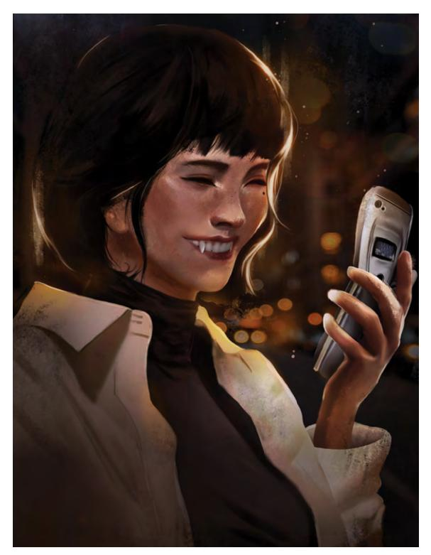

Многие из этих инструментов не требуют ничего, кроме времени, потраченного на поиск подходящих для вашей истории материалов - см. Pexels для фотографий и видео, StreamElements для оповещений о стримах и наложений, а также Free Music Archive или Soundtrack by Twitch для музыки.

Какими бы инструментами вы ни пользовались, не забывайте, что если вы не видите своих коллег по игре лично, вам будет сложнее уловить их реплики, язык тела и настроение за столом. Задержка звука и стеснительность могут привести к тому, что некоторые персонажи будут меньше участвовать в игре, и их могут затмить более разговорчивые товарищи. Всегда следите за тем, чтобы дать другим возможность высказаться и проявить себя, как в личном общении, так и в прямой трансляции или записи" ("Распространение прожекторов", в Vampire: The Masquerade, стр. 356, имеет здесь особое значение). Во время прямой трансляции важно

постоянно держать открытым групповой текстовый чат, чтобы читать потенциально важную нехарактерную информацию, сообщаемую другими участниками. Очень важно также провести после стрима дебрифинг, когда группа завершает работу в голосовом чате в приватной обстановке, без зрителей, свободно обсуждая все, что произошло, и убеждаясь, что все остались довольны проведенной сессией.

Потоковые игры не являются идеальным местом для экспериментов с персонажами, не принадлежащими к вашей культуре. Будьте особенно внимательны и максимально уважительны, когда изображаете такого персонажа в потоковой игре. Рассказчики, следите за тем, чтобы ваши антагонисты не были представителями одной группы или чтобы одна группа не выступала только в роли злодеев.

Старайтесь, чтобы любой региональный или национальный акцент был как можно более аутентичным. Не изображайте их ради смеха или унижения.

Не забывайте произносить вслух молитвы или исполнять религиозные обряды: за этим может наблюдать кто-то из верующих, и это может вызвать обиду даже при уважительном отношении. Если нужно, просто скажите, что ваш персонаж делает то-то и то-то, не делая этого в образе.

Чтение и исследования, безусловно, помогают в этом процессе, как и беседы с людьми из тех групп, которые вы хотите представить, но старайтесь читать авторитетную современную научную литературу.

## Виртуальные инструменты в стриминге

Один из способов превзойти визуальные ограничения игры в стиле "Говорящих голов" - использовать различные виртуальные инструменты, доступные игрокам в "Вампир", чтобы усилить иллюзию для зрителей (а чаще всего - для игроков за виртуальным столом). Vtubers - виртуальные аватары, имитирующие поведение пользователя в прямом эфире через веб-камеру, - направление, возникшее в Японии и быстро ставшее популярным во всем мире. Бесплатные инструменты позволяют любому желающему создать своего собственного виртуального персонажа, настраивая все - от прически до одежды, а некоторые даже включают клыки для создания более утрированного образа вампира.

Если использования аватара недостаточно, рассказчик может также использовать виртуальные среды для моделирования игрового мира. Создание локаций истории никогда не было таким простым будь то фотоманипуляция (Photoshop, GIMP), 3Dмоделирование (Blender) или даже создание интерактивных пространств с помощью программ для разработки игр (Unreal Engine, Unity) - существует множество готовых решений, руководств, учебников и бесплатных ресурсов, облегчающих этот процесс. Более простой подход не требует ничего, кроме статичных изображений посещаемых локаций, которые в сочетании с соответствующими звуковыми сигналами и музыкой могут работать просто волшебно. В большинстве случаев игры "Мир тьмы" не столь тактичны, как другие ролевые игры, но иногда бывает полезно увидеть визуальный индикатор того, кто ищет сосуд на танцполе ночного клуба, а кто только что обнаружил в кладовке спешно эвакуированную алхимическую лабораторию.

При планировании стрима важно помнить, что оно должно быть легко читаемым и понятным для вашей аудитории. Помните, что многие зрители могут присоединиться к вашей передаче на ее середине, и возможность быстро понять, что происходит, значительно улучшит их впечатления. Один из способов помочь в этом - использование инструментов виртуального стола с визуальными подсказками в виде листов персонажей, карт и бросков кубиков.

## Âèðòóàëüíàÿ ñòîëåøíèöû (VTT)

Если говорить просто, то инструменты VTT (такие, как Roll20 или FantasyGrounds) переносят настольные ролевые книги в цифровое пространство. Представьте себе все правила игры в одном месте, позволяющие одним щелчком мыши проверить, "о чем была данная страница истории?" или "к какому клану принадлежит этот персонаж-рассказчик?" - и все это вместе с бросками кубиков, листами персонажей, заметками, картами и другими удобными ресурсами находится в одном месте, доступном каждому участнику истории в любой момент времени. Конечно, рассказчики могут скрывать часть информации от своих игроков, сохраняя тайник, доступный только им самим, инструменты позволяют не раскрывать все карты сразу. В VTT часто предлагаются карты, на которых можно размещать жетоны, обозначающие позиции игроков, а некоторые добавляют еще один уровень удовольствия, используя системы динамического освещения - игроки могут вооружиться фонариками (или усиленными органами чувств) и исследовать чаще всего непонятные места.

## Îíëàéíîâàÿ òåêñòîâàÿ

## ðîëåâàÿ èãðà

Один из самых популярных и легкодоступных видов ролевых игр существует уже несколько десятилетий: текстовые онлайн-игры, которые проводятся на персональном компьютере или мобильном устройстве. Они существуют в самых разных форматах - от игры за постом до живого чата - и продолжают развиваться с появлением новых инструментов и приложений для обмена сообщениями.

Любое приложение, позволяющее пользователям взаимодействовать друг с другом, в той или иной мере может быть использовано в качестве инструмента для ролевых игр - даже социальные медиаплатформы, такие как Twitch или Facebook, включая группы и функции приватного обмена сообщениями в этих каналах. Нужно лишь найти подходящую группу, с которой можно поделиться историей - некоторые текстовые истории занимают больше времени, чем другие, а в некоторых предпочтение отдается игрокам, находящимся в одном часовом поясе (или, по крайней мере, в одно и то же время суток).

Некоторые вампирские истории, использующие этот формат, включают в себя сотни игроков и десятки рассказчиков, взаимодействующих в реальном времени, создавая впечатление "живого" города, состоящего из независимых персонажей, создающих бесчисленное множество личных историй. Для игроков, впервые столкнувшихся с ними, это может показаться несколько чрезмерным; к счастью, многие из них имеют обширные руководства, помогающие новичкам освоиться и почувствовать себя желанными гостями. Нелишним будет ознакомиться с политикой, правилами и основными положениями историй, чтобы убедиться, что они вам подходят.

Многие текстовые ролевые игры практически не нуждаются во взаимодействии или руководстве со стороны Рассказчика, поскольку сюжеты возникают органично и естественно из межличностной драмы и отношений между персонажами игроков, конфликтов и общих целей взаимодействия. Рассказчики часто действуют подобно модераторам, следя за тем, чтобы все хорошо проводили время, но при этом создавая последствия для любых действий, влияющих на ход повествования истории, например, частых нарушений Маскарада.

## Игра за постом

Стиль Игра за постом - это текстовый стиль онлайновых ролевых игр, который зародился на досках объявлений и форумах, но сегодня имеет свои собственные специализированные платформы. Поскольку каждый игрок делает по одному сообщению за раз, по очереди (обычно), этот стиль предлагает более медленный темп, чем истории, основанные на чате. Это может быть важно, если у вас ограниченное время на игру или если вы хотите писать более длинные и подробные описания действий и внутренних монологов своего персонажа, чем это обычно возможно в истории, в которой игроки участвуют синхронно.

Вместо этого вы можете играть в историю, находясь в автобусе, лежа в постели или в перерывах между различными повседневными обязанностями, одновременно практикуясь в написании текстов. В группах типа "Игра за постом" возможен довольно расслабленный темп, часто требуется один "заход" в день во время активной ролевой игры, допускаются частые перерывы. Многие истории "Игра за постом" предполагают, что одна игровая ночь проходит в течение одной недели реального времени, что позволяет игрокам распределять свое время для внесения вклада в сюжет. Многие серверы, работающие по такому принципу, можно найти на Discord, как с помощью собственного инструмента "Поиск", так и с помощью внешних поисковых систем, например Disboard. И, опять же, обязательно ознакомьтесь с правилами и рекомендациями истории, чтобы убедиться, что она соответствует вашим ожиданиям и потребностям.

Как и в других стилях, в текстовых ролевых играх очень важны согласие и внимательность. Преимущество традиционных сессий заключается в том, что они проводятся в течение определенного времени, позволяя игрокам постепенно входить в образ и выходить из него, а также обеспечивая послесессионный уход. Когда сюжет доступен в любое время с помощью телефона, расстояние между реальным миром и сюжетом становится меньше, что дает больше возможностей для "пролития крови" (см. боковую вкладку).

Кроме того, в текстовых ролевых играх часто возникает проблема описания действий другого игрока. Иногда очень важно упомянуть движения или реакции другого игрока, но в то же время легко навязать другому персонажу определенное поведение, поставив игрока в неудобную ситуацию ("Мой персонаж никогда не упустит из виду свою Опору!"). В любом случае, не забывайте всегда обсуждать OOC ("вне персонажа") со своими партнерами по ролевой игре и убеждаться в том, что ход действий является взаимоприемлемым.

#### НЕ ОБРАШАЙТЕ ВНИМАНИЯ НА ПРОЛИТИЕ КРОВИ!

Пролитие крови происходит, когда эмоции персонажа влияют на игрока и наоборот. Хотя в некоторых случаях кровотечение неизбежно и даже приветствуется (например, катарсическая грусть после окончательной смерти другого персонажа или радость по поводу достигнутой цели), оно может стать разрушительным, если разделение между игроком и персонажем не будет четким. Реальная злость на игрока, изображающего соперника, или смешение игровых отношений с реальными могут стать источником дискомфорта в истории. Предотвратить это помогает открытое, честное общение с другими игроками и установленные ритуалы входа в образ и выхода из него. Не забывайте всегда проверять свою группу, особенно после сильных эмоциональных сцен!

Более подробную информацию о согласии и внимательной игре можно найти в приложении на с. 421 KHИГИ Vampire: The Masquerade.

## Виртуальный ЛАРПинг

В таких видеоиграх, как Vampire: The Masquerade -Bloodhunt, в Элизиуме, зоне ожидания участников поединка, иногда можно встретить ролевиков. Используя все имеющиеся в их распоряжении инструменты - внутриигровой чат, окружение, кастомизацию персонажей и причудливые эмотиконы, - они рассказывают свои собственные вампирские истории, нередко затягивая время ожидания своей пары, чтобы продолжить общение и разгадать свои индивидуальные сюжеты. Этот стиль ролевой игры не требует ни кубиков, ни Рассказчика, как и многие другие стили, о которых мы упоминали в этой главе. Это не менее настоящая ролевая игра в стиле Vampire: The Masquerade, однако, часто наполнен действиями и последствиями, эмоциями и драматизмом.

Концепция создания собственной виртуальной персоны давно изучена в поп-культуре, и сейчас она стала как никогда доступной. Легко превратиться в виртуальный аватар, тщательно созданный в программе Vtuber Maker или с помощью системы настройки персонажа в игре. Несколькими щелчками мыши или с помощью элементов управления, входящих в комплект VR-гарнитуры, мы можем перевоплотиться в любого персонажа, а современные технологии позволяют при желании (и наличии необходимого оборудования) управлять всем его телом вплоть до кончиков пальцев.

В последние годы VR стала более доступной, а благодаря растущему сообществу VRChat общение внутри созданных аватаров стало популярным среди ролевиков и влиятельных людей.

Виртуальный ЛАРПинг гораздо старше: ролевые гильдии есть в каждой существующей MMORPG, а игроки используют для создания своих вампирских историй самые неожиданные видеоигры. Вы можете встретить людей, притворяющихся вампирами, не только в Second Life, IMVU и The Sims, но и в Grand

Theft Auto или даже Red Dead Redemption. В виртуальных LARP используются различные правила: одни берут пример с реальных LARP (например, театр "Глаз разума"), другие используют смесь обычных настольных правил и встроенных программных средств (например, бросание виртуальных кубиков в VRChat), третьи отказываются от всех механик, навязанных их более традиционными предшественниками, и предпочитают чисто персонажную импровизацию. Игроки могут натыкаться на специально организованные мероприятия, такие как заседания суда Камарильи или собрания Анархов, но чаще всего это свободное общение, когда в одном пространстве оказываются самые разные аватары Сородичей, и они наслаждаются возникающим в результате этого взаимодействия повествованием.

Вдохновившись вступительным текстом к этой главе, вы можете попробовать сыграть своего персонажа в Vampire: The Masquerade - Bloodhunt в следующий раз, когда попадете в Элизиум, - и кто знает, может быть, кто-то присоединится к вам, чтобы вместе рассказать историю!

## ТикТок Стиль

Это может показаться неожиданным, но эта социальная сеть, известная своими короткими и оперативными видеороликами, просматриваемыми на смартфоне, также является местом проведения ролевых игр с участием вампиров!.

TikTok - не единственное и не первое приложение такого рода, в котором ролевые сообщества используют видео как способ быстрого самовыражения персонажа. Тем не менее, это быстро развивающееся сообщество, в котором участвуют многие игроки Vampire: The Masquerade, и даже несколько "массовых многопользовательских виртуальных LARP", к которым может присоединиться любой, записавший всего одно видео. Это во многом отличается от реальных игр: Игроки не встречаются друг с другом, а разговаривают с камерой; взаимодействие между персонажами носит постановочный характер и происходит от одного видеокадра к другому в виде "стежков" и "дуэтов". Stitch включает в себя до 5 секунд чужого видео в начале своего. Это может быть ответом на вопрос другого пользователя, реакцией на его высказывание или ответом на предложенную им задачу. Дуэты позволяют записывать свое видео бок о бок с другим, и чаще всего используются для ролевых сцен. При хорошей синхронизации дуэты могут имитировать разговор двух персонажей или даже более драматичные сцены. Звук играет большую роль в стиле TikTok: от настроенческих музыкальных композиций,

дополняющих сцену своими текстами, до голосовых фрагментов, синхронизированных с голосом человека, снимающего видео. Для игроков с более традиционным опытом вида

Сородича, синхронизирующих движения рта с вырезанным диалогом из популярного реалити-шоу или танцующих под ремиксы на музыку из видеоигр, поначалу может показаться нелепым, но понимание этого может быть полезным для всех ролевиков, расширяя их образ мышления. ТикТокеры не столько играют в то, кем является их персонаж, сколько изображают то, что они находят в нем характерным. Это может быть сцена из недавно просмотренного фильма, которая идеально воплощает силу и доминирование персонажа Вентру, припев поп-рок песни, отражающий отношение мятежного Бруха, или забавное видео "О чем говорят библиотекари", подходящее для Тремера. При этом никогда не предполагается, что персонажи действительно говорят эти вещи в своих хрониках, скорее, они рассматриваются как часть культуры ремиксов празднования того, что представляют собой наши персонажи и что значит для них Vampire: The Masquerade - во всех формах, от серьезной, эмоциональной ролевой игры до откровенной пародии. И, честно говоря, это именно тот вид угрожающей Маскараду современной непочтительности, которой могли бы предаваться молодые Сородичи, хотя бы для того, чтобы оттолкнуть от себя более жесткие формы вампирского общества.

# Óáåæäåíèÿ

Убеждения персонажа, несмотря на их сходство с постулатами истории, имеют иное назначение в повествовательном, механическом и философском плане.

Догматы отрицают ("Не убий"), а Убеждения разрешают ("Защищай маргиналов"), создавая драматизм конфликта. В явном виде это проявляется в механике: Если вы нарушаете убеждение во имя своей убежденности, это уменьшает получаемые пятна на одно или более (Vampire: The Masquerade, p. 239). Они определяют, в чем ваши собственные убеждения могут расходиться или расходиться с убеждениями общества или даже товарищей.

Убеждения - это часто утверждения, начинающиеся со слов "всегда" или "никогда", они имеют дело с абсолютами, поскольку иллюстрируют основные столпы личности персонажа и то, что привязывает его к оставшейся человечности. Рассказчикам следует отказаться от слишком расплывчатых или открытых Убеждений. По сути, Убеждения должны быть короткими, вескими причинами, оправдывающими проступки Персонажей.

В идеале Убеждения также рассказывают историю персонажа, хотя и в несколько телеграфном стиле. Придумывая Убеждения, полезно задавать себе вопросы о земном прошлом персонажа и его первых ночах в качестве Сородича.

- За что они цепляются в своей земной жизни, что удерживает их от Голода?
- Что стало причиной их последнего пятна и как их совесть оправдывает их действия?
- Почему эти убеждения выжили в их объятиях?
- Что потребуется, чтобы они отказались от этих последних следов своей земной жизни?

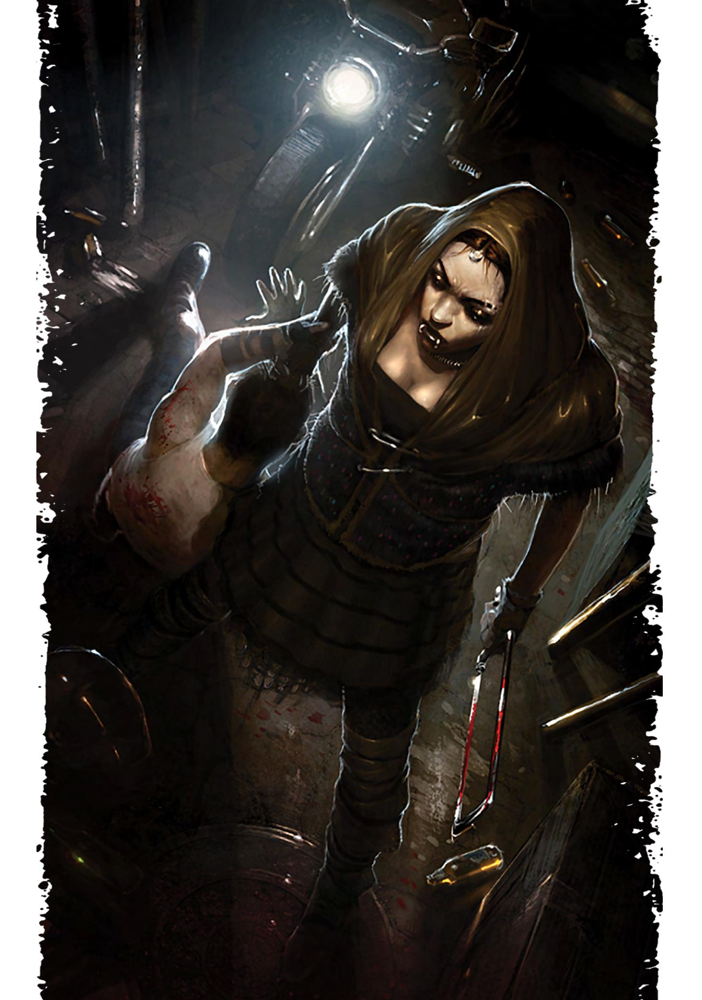

Хотя "Убеждения" должны быть краткими и завершенными, единственным реальным ограничением для них является то, что они должны придерживаться условий внимательной игры,

согласованных за столом, как по букве, так и по духу.

## Примеры Убеждений

Ниже приведено несколько примеров более длинных форм Убеждений, которые являются частью более крупной темы или пути. Если игрок решит использовать некоторые из них, он может выбирать из разных тем по своему усмотрению, группировка сделана для того, чтобы придать контекст каждому Убеждению и прояснить, как они

должны использоваться в Историях:

#### **MAMA**

- $\blacksquare$ Отдать все ради тех, кого любишь.
- Никогда не отступать, защищая слабых.
- Всегда ставьте свою семью на первое место.

#### ДЛЯ ОБЩЕСТВА

- Люди важнее правил.
- Злоупотребление властью самое страшное преступление.
- Служите слабым, бросайте вызов сильным.

#### **ИГРОМАН**

- Никогда не оставляйте ничего на столе. Не бойтесь добиваться большого вознаграждения.
- Собственность принадлежит тому, кто может ее сохранить.
- Никогда не отказывайте себе в том, что дается безвозмездно.

## ПРАВОСУДИЕ ДЛЯ ВСЕХ

- $\bullet$  OKO 3a OKO.
- Никогда не подчиняйтесь несправедливому закону.
- Всегда наказывайте виновных или коррупционеров.

## ЗАБОТА О ПЕРВОМ НОМЕРЕ

- Собственность неприкосновенна, воровство всегда неправильно.
- Самооборона оправдывает все.
- Никогда не забывайте о долге, каждый должен платить то, что ему причитается.я

## СОВРЕМЕННАЯ КОРОЛЕВСКАЯ ВЛАСТЬ

- Всегда брать на себя ответственность.
- Всегда платите по справедливости.
- Отплатите за предательство предательством.

## ДОГОВОР ЧЕСТИ

- Всегда возвращайте свои долги.
- Лояльность это все.
- Всегда держите свое слово.

#### **ЗАТВОРНИК**

- Конфиденциальность это святое.  $\mathbf{r}$  .
- Всегда доводите начатое до конца.
- Охраняйте то, что любите.

## СОЛДАТ УДАЧИ

- Сделка есть сделка, никогда не нарушай договор.
- Никогда не оставляйте товарища.
- Не ввязывайся в драку, за которую тебе не платят.

## СЕРДЦЕ ВЫЖИВШЕГО

- Никогда не отступайте перед испытаниями.
- $\blacksquare$ Выживание превыше всего.
- Всегда выполняйте угрозы.

# Опоры

Опоры служат вампирам связующим звеном. Они создают живую, смертную связь с их Убеждениями, кого-то, кто воплощает то, что вампир ценит, поддерживает или стремится быть. У вампира столько же Опор, сколько и Убеждений. Опоры - это не гули, не домашнее животное, не талисман, не абстрактная идея и не статуя.

Это должен быть живой, дышащий смертный, с которым у вампира есть связь, не имеющий вампирической крови. Именно через свою Опору вампир может соединиться со своей Человечностью и держать своего Зверя в цепях (Vampire: The Masquerade, p. 173). Опоры помогают создать противовес вампиру смертную оболочку, представляющую человеческий вариант, который вампир потерял или от которого отказался, за которого можно бороться или которого можно потерять, если он слишком далеко зайдет по наклонной.

Должна ли Опора знать о своих связях с вампиром? Это решают игрок и Рассказчик. Знал ли вампир их в земной жизни? Любуются ли они своими Опорами из укромного места или вступают в физический контакт, который ужасно напоминает им об их проклятии? Вампир может быть одержим знаменитостью, олицетворяющей его Убеждения, но разочароваться в реальном человеке - и решить "помочь ему вернуть его истинную сущность", а не отказываться от своих человеческих иллюзий.

Знание о существовании вампиров способно изменить человека и пробудить в нем совершенно новый мир, который был скрыт от него всю жизнь. Поэтому, если Опора узнает об истинной природе вампира, Рассказчик и игрок решают (или определяют в ролевой игре), искажает ли это знание их связь с Убеждением вампира.

## ÷åì çàêëþ÷àåòñÿ

## âçàèìîñâÿçü?

Отношения между вампиром и Опорой представляют собой связь между Зверем вампира и его Человечностью. Враг или соперник Опоры говорит о Роде нечто иное, чем возлюбленный или родной брат. Неважно, восхищаются ли они друг другом издалека или устанавливают личные отношения, присутствие вампира в жизни смертного в конце концов изматывает его. Вампир всегда идет по тонкой грани между пользой от Опоры и использованием или злоупотреблением отношениями. Вампир может иметь несколько типов отношений со своими Опорами, в зависимости от предпочтений игрока.

Игроки всегда контролируют, насколько далеко они хотят зайти в своих отношениях с Опорами. Вампир может затрагивать тяжелые или неудобные темы, в которых игрок может отказаться участвовать. Игроки устанавливают границы в отношениях с Опорами. Аналогичным образом, отношениям с Опорой, которые вызывают у Рассказчика дискомфорт, не место за столом. См. стр. 216 и **Vampire**: **The Masquerade** (с. 1 и 419) для получения дополнительной информации о механике внимательной игры, выборе игрока и о том, почему это важно.

## Издалека

Преимущество вампира, наблюдающего за своей Опорой издалека, заключается в том, что он не рискует случайно раскрыть свою истинную сущность.

Недостатком является то, что вампир теряет связь с теми мелочами, которые делают его человеком, такими как общение, разговоры без опасения подвергнуться опасности или случайные прикосновения. Сородичи легко забывают эти мелкие повседневные действия, когда живут дольше смертных, и погружаются в уединение или дистанцирование. К сожалению, Зверь процветает в этой изоляции, отделяя вампира от его прежнего "я" и заставляя его чувствовать себя одиноким.

Если вампир не будет осторожен, эта связь может превратиться в навязчивую идею. Преследование, вуайеризм и одержимость становятся реальными возможностями для персонажа, использующего свою Опору подобным образом. Однако случайное восхищение или игра с карьерой соперника не обязательно приводит к зацикливанию. Это приводит к другим вещам.

## Случайные

Опоры могут быть случайными знакомыми вампира, связывающими его лишь время от времени, как, например, продавец в продуктовом магазине, который обязательно запасается кофе определенной марки для своего покупателя. Вампир не видит их каждый вечер, но время от времени у него будут небольшие моменты для общения. При случайных связях сородич может по-прежнему испытывать нюансы социальных отношений с меньшим риском быть обнаруженным. Однако нечастые и случайные связи могут привести к тому, что вы будете пропускать сигналы, неправильно интерпретировать взаимодействие, удивляться важным событиям ("Извини, я забыл твой кофе, мой ребенок убежал вчера вечером") или скатываться к чистому манипулированию и использованию.

Со временем эти отношения могут разрушаться. Смертные часто меняют работу, переезжают или уходят из жизни, а вампир со случайной Опорой может узнать о таком изменении динамики лишь много позже. Таким образом, это реальная опасность для Человечности вампира.

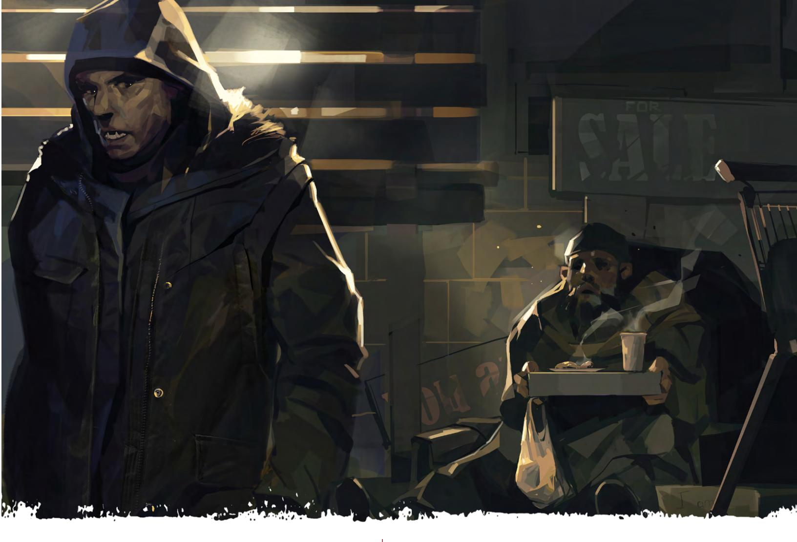

## Близкая связь

Вампир, который держит свою Опору рядом, имеет преимущество в том, что он внимательно следит за своей деятельностью, связями и повседневной жизнью. Для многих вампиров это выгодно, поскольку такие постоянные смертельные связи укрепляют их власть над своим Зверем. Недостатком, конечно, является то, что их вампирская драма - соперничество с сородичами, охотники, сопутствующее чудовище выплескивается обратно на Опору или постоянно грозит выплеснуться. Чем теснее связь, тем больше опасность и тем сильнее искушение рискнуть Маскарадом, раскрыв правду.

Тесные связи создают проблемы как для вампира, так и для Опоры, помимо угрозы Маскарада. Например, вампир может стать параноиком по отношению к своей Опоре и проявлять чрезмерную заботу о нем. Соперники и враги могут использовать его Опору против него, хотя бы для того, чтобы знать, где устроить засаду во вторник вечером.

## Èäåè Îïîð

Опоры могут появляться в разных местах, но они должны быть как-то связаны с вампиром. Например,

Опора может быть наставником вампира в его Убеждении, доверенным смертным, с которым он любит проводить время, или кем-то, связанным с его земной жизнью. Они являются связующим звеном, позволяющим вампиру отвечать за свои поступки, и

силой, способной изменить его путь. Vampire: The Masquerade (с. 173) есть хороший список основных Опор, над которыми можно подумать, но игрокам предлагается создать более глубокую связь. Существует множество других идей, которые игрок может рассмотреть, например:

- Парамедик с "отцовской фигурой", который любит шутки про отца и является готом из 80-х. Он следит за тем, чтобы у вас в квартире было достаточно еды, рассказывает папины шутки, чтобы вы посмеялись, и выручил вас, когда у вас сломалась машина.
- Друг, с которым вы учились в школе, но потеряли связь, пока не связались через социальные сети. Вам удалось возобновить дружбу, и они пригласили вас провести время с их семьей, поскольку вы живете один.

- Старый соперник по газете, для которого вы до сих пор готовите репортажи. Но вы не можете удержаться от того, чтобы не выставить их дураками, когда они пытаются объяснить своим редакторам, как они вышли на тропу, или не сорвать карьеру писателя, которую, как вы считали, они выиграли у вас в жизни.
- Официантка, которая сидит с вами в ночной закусочной и разговаривает, когда в ресторане нет других клиентов. Она выслушивает все, что вы хотите сказать, и дает советы, когда это необходимо. Она беспокоится о вас, но не хочет этого показывать.
- Создатель социальной сети, которого вы случайно встретили на улице и подружились с ним. Они живут прямо на соседней улице и часто приглашают вас пообщаться.
- Девочка-подросток, которой нужно всего лишь несколько удач, чтобы поступить в местный колледж на бейсбольную стипендию. Вы знали такую девушку, когда учились в колледже и играли в мяч, но у нее ничего не получилось. Это ваш шанс все исправить.
- Вы подружились с этой женщиной после того, как случайно убили ее мужа во время кормления. Она звонит вам еженедельно, чтобы поговорить. Чувство вины побудило Вас помочь ей исцелиться от своих действий, хотя она и не подозревает, что именно Вы были причиной ее боли.
- Лучший друг Вашей сестры, Ваша предыдущая Опора, связалась с Вами после смерти сестры и предложила поделиться с Вами историями о своих приключениях. Благодаря этому между вами завязалась дружба, и теперь вы стремитесь защитить свою последнюю связь с земной жизнью.

## Òî÷êè îïîðû íà Êàðòå

## âçàèìîîòíîøåíèé

Когда игроки помещают Опору на свою Карту отношений (Vampire: The Masquerade, стр. 142-144), они получают потенциальную социальную точку опоры. Опора может иметь свои собственные связи, линии, ведущие в мир смертных и, возможно, даже обратно к соперничающим Сородичам. Взгляд на карту может даже помочь концептуализировать потенциальные подходы соперничающих родов к их Опоре, как для игрока, так и для рассказчика.

Как и все в жизни вампира, он может использовать связи и отношения своей Опоры в своих интересах, рискуя в свою очередь отяготить или подвергнуть опасности Опору.

## Èñïîëüçîâàíèå Îïîð

## â âàøåé èñòîðèè

Как игроки, так и рассказчики должны использовать Опоры в рамках истории. Не сводите Опору только к простоям или, что еще хуже, к механическому устройству для вашего персонажа. Используйте их для более глубокой связи с личным ужасом, потому что если вы этого не сделаете, то это сделает ваш рассказчик. Используйте свои Опоры часто на протяжении всего игрового процесса и вместе с Рассказчиком решайте, как лучше представить эти моменты. Некоторые идеи использования Опор включают:

- Случайные встречи: Ваша нежизнь и жизнь вашей Опоры могут пересекаться: общие друзья, ночные клубы или политические цели. В любой момент вы можете случайно столкнуться со своей Опорой в сцене. Когда они спросят, кто ваши друзья, вы должны будете представить им свою компанию, дав понять, что этот смертный - не обед.
- Проекты: Включение Опоры в проект (или другую деятельность) может помочь вам достичь цели и укрепить вашу связь. Вы можете попросить свою Опору сделать что-то при свете дня: взять книгу в библиотеке или посетить предвыборный штаб политика. Если ваша "Опора" обладает реальными навыками исследователя или гладиатора, то, сделав его постоянной частью вашего проекта, вы сможете продвинуть его и помочь вам следить за ним!
- Резервное копирование: Брать с собой в бой Опору - не самая лучшая идея, но иногда от этого никуда не деться. Вы, возможно, захотите максимально оградить их от вреда, но Опора может захотеть помочь. Участие без опасности: если ваша Опора только что приобрела скоростной спортивный автомобиль, возможно, он сможет стать водителем, который будет убегать от вас при ограблении офисного парка Вентру.

- Спасение: Если вы назначили Опору на опасное дело (полицейский, пожарный, репортер из отдела по борьбе с организованной преступностью), то искушение спасти его может показаться постоянным. И действительно, это может быть редким радостным моментом - до тех пор, пока Опора не накричит на вас за вмешательство и не начнет интересоваться, как вы убереглись от пули. Именно тогда, когда вы пришли к разумному решению позволить им жить своей жизнью, Рассказчик может подкинуть им что-то очень плохое. Двойные преимущества, если это что-то действительно плохое будет отбито вашими сородичами.
- Политический соперник: нет ничего более личного, чем превращение Опоры в гуля или в вампира. Это рискованный шаг, но он может выбить вампира из колеи. Это может быть правдоподобная случайность или преднамеренный шахматный ход против вас, и чтобы выяснить, что это было, вам придется продолжать взаимодействовать с вашей Опорой, зная, что его лояльность изменилась.
- Невольный следователь: Создание умной и наблюдательной Опоры немного подпитывает тщеславие игрока, и такие смертные во многих случаях представляют собой лучшее, что есть в человечестве. Однако они также оказываются бесконечно настойчивыми исследователями тайны... вас! Необходимость избегать своей Опоры, чтобы сорвать намечающееся нарушение Маскарада, создает свои собственные проблемы. Но что, если они обратятся к тому пожилому парню, с которым видели вас, - бледному, с домашней крысой?
- Трагическая случайность: Вы, вероятно, прилагаете все усилия, чтобы сохранить свою Опору в безопасности. Но несчастные случаи (и даже хуже) случаются, и вам может потребоваться принять решение, чтобы спасти жизнь или потерять ее. Автокатастрофа, критическое ранение, выстрел, истекающий кровью Опора: исцелить его или дать ему умереть? В любом случае, вы теряете свою Опору; эта драма происходит полностью из уже построенных вами отношений, даже если она грозит разрушить их навсегда.

## Ïîòåðÿ Îïîðû

Вампиры теряют связь со своими Опорами по мере того, как они переживают окружающих их смертных. Такова природа безвозрастности. Но что происходит, когда эта связь теряется? Что происходит с убежденностью? Что происходит с вампиром? Как вампир находит новую Опору?

Вампир может потерять Опору разными способами. Во-первых, он может умереть от того, что просто является смертным. Смертные болеют, попадают в аварии, умирают от старости. Смертность - очень распространенное явление для Опоры. Во-вторых, вампир может изменить свои убеждения и больше не чувствовать связи с этим смертным. Узнав о чьей-то истинной сущности или личных чувствах, вампир может потерять связь с вампиром, узнав, что его Опора не воплощает его Убеждения. Наконец, Опора может быть испорчена в результате Становления или превращения в гуля. Достаточно ввести кровь вампира, чтобы изменить его природу и заставить вампира потерять свою Опору.

Вампир может по-разному относиться к потере Опоры, в зависимости от обстоятельств, сопутствующих этому событию. Эта связь не так сильна, как Кровные узы, но для некоторых вампиров она может стать очень сильным ударом, как канат, захлестнувший высоко в пропасти. С другой стороны, вампир, изменивший свои убеждения, может не сильно переживать из-за потери своей Опоры. Игрок и Рассказчик должны совместно продумать, как персонаж отреагирует на это изменение.

Поиск новой Опоры может оказаться непростой задачей. Опора должна олицетворять нечто родственное убеждениям, чтобы вампир смог установить с ним связь. Вампир может разгневаться и лишить жизни человека, а затем искать всех, кто связан с этим смертным, и использовать эту трагедию в качестве своей Опоры. Он может искать дальних родственников, чтобы общаться со своей смертной семьей. Установление связи с Опорой требует времени, но очень важно для вампира. В противном случае вампир постепенно теряет связь с человечеством и сползает к своему зверю. Это произойдет не сразу, но без связи с Опорой он не получит механической выгоды от общения с Человечеством.

## Îòñóòñòâóåò Îïîðà?

Вампир может решить пройти через всю жизнь без убеждений, а значит, и без Опор. Это может отражать вампира, находящегося в опасной близости от зверя, или того, кто ценой своей индивидуальности цепляется за общество Рода, следуя только принципам. Амбиции и желания попрежнему направляют их действия, но им трудно решить или предсказать, как далеко они могут зайти ради них. Кроме того, не имея Убеждений, объясняющих и смягчающих нарушения принципов, они склонны терять Человечность быстрее, чем другие Сородичи. Вместе с Рассказчиком определите, почему вашему персонажу не хватает Убежденности, и какие эффекты они видят в игре в результате этого.

# Âîñïîìèíàíèå

Вампиры могут жить на земле в течение многих жизней, но даже молодым Сородичам бывает трудно вспомнить свое прошлое, поскольку регулярные травмы вампирской жизни и неумолимая потеря Человечности разрушают их личность. Для того чтобы вспомнить конкретные события, иногда требуются особые усилия - этот процесс называется Воспоминание (Vampire: The Masquerade, pp. 311-314).

## Ôîðìèðîâàíèå

## âîñïîìèíàíèé

Текущий Голод вампира или его уровень человечности вампира часто формирует его опыт воспоминаний. Как и у смертных, воспоминания вампиров не являются точным воспроизведением событий прошлого. Воспоминания - это сплав воспоминаний, опыта и желаний, которые сшиваются вместе, создавая повествование, часто закрепляющее личность человека. Учитывая отсутствие старения, вампиры постоянно адаптируют, редактируют и подавляют воспоминания, чтобы они лучше служили их меняющемуся самоощущению. Особенно по мере того, как рушится их человеческая сущность, воспоминания о жизни смертного перестают соответствовать их новым желаниям и амбициям.

Вампир строит свои воспоминания, но иногда сам акт исследования и повторного переживания этих сконструированных реальностей может раскрыть скрытые смыслы или реальные события, на основе которых они были созданы. Некоторые воспоминания почти похожи на сон или эфемерны, поскольку они перемещаются по различным сценариям, но многие из них более конкретны и основаны на реальных событиях, даже если они сформированы под влиянием текущей личности и

перспективы вампира.

## Человечность

Неудивительно, что с изменением Человечности Рода меняется и внутренний ландшафт его психики. Если вампиру с высоким уровнем Человечности легче получить доступ к деталям своих земных дней, то нежить с низким уровнем Человечности может вообще не иметь доступа к своим земным воспоминаниям.

Вместо этого, когда они попадают в воспоминания, сосредоточенные на днях их жизни, они сталкиваются с теневым изображением своей жизни. Безликие смертные с полузабытыми именами сталкиваются с безвыигрышными сценариями. В целом, вампиры с низким уровнем человечности могут ожидать, что их Воспоминания будут иметь приглушенную цветовую палитру, часто только красный и зеленый цвета крови, крови и внутренностей выделяются на фоне бледных тонов их угасающих воспоминаний.

## Голод

Текущий Голод вампира часто влияет на Воспоминание и может определять реакцию других персонажей Рассказчика на персонажей игрока в этой сцене. Сородичные вампиры с высоким Голодом могут напугать или загнать в угол всех окружающих, в то время как более сытые вампиры могут вдохновить персонажей Рассказчика на более спокойное поведение. Иногда это может означать, что вампиру во время воспоминаний придется отбиваться от слишком заинтересованных смертных, чтобы не отвлекаться от задания, или убеждать их в своих добрых намерениях, чтобы получить нужную информацию. Воспоминания, в центре которых находятся смертные или информация, которой владеет смертный, часто заставляют сородича выйти за пределы своей зоны комфорта и бросают вызов заученному подходу к миру смертных.

## Âîñïðîèçâåäåíèå Âîñïîìèíàíèé

Несмотря на то, что существует множество вариантов проведения воспоминаний, один из них всегда должен быть верен - они предназначены для совместной игры, поскольку обычно включают в себя элементы предыстории персонажа игрока или даже его земной жизни. Это означает, что игроки могут рассчитывать на более весомое влияние на ход воспоминаний, даже если они играют с группой, которая обычно проводит более традиционные столы, управляемые рассказчиками. Некоторые режимы игры хорошо сочетаются с более совместной (и часто сновидческой) природой Воспоминаний.

Свободная форма (Vampire: The Masquerade, стр. 291) игры хорошо подходит для сцен Воспоминаний с низкими ставками или очень ограниченными целями. Поскольку воспоминания заканчиваются неудачей при невыполнении одной задачи, свободные воспоминания лучше всего работают, когда неудача не помешает ни игрокам, ни рассказчику доиграть сцену до наилучшего результата. Направленная свободная игра (Vampire: The Masquerade, p. 291) особенно хорошо подходит для воспоминаний, особенно тех, которые имеют высокие ставки или затрагивают важные аспекты предыстории персонажа.

# Îäíàêðàòíàÿ ïîäà÷à

# Âîñïîìèíàíèé

Одноролевые конфликты (Vampire: The Masquerade, p. 296, 298-99) могут быть адаптированы для использования в воспоминаниях точно так же, как и приведенные выше варианты свободной формы. Обычно бросок проводится в кульминационный момент сцены или истории Воспоминания, когда Рассказчик и игроки уже имеют представление о финальном кризисе. (Конечно, вы можете использовать один бросок воспоминаний для решения каждой задачи в рамках воспоминания, как и для любого соревнования или конфликта). Рассказчик устанавливает сложность воспоминания в зависимости от уровня цели, выбранной игроками, и, возможно, корректирует ее в сторону увеличения на один кубик для особо опасных противников или сложных препятствий в прошлом.

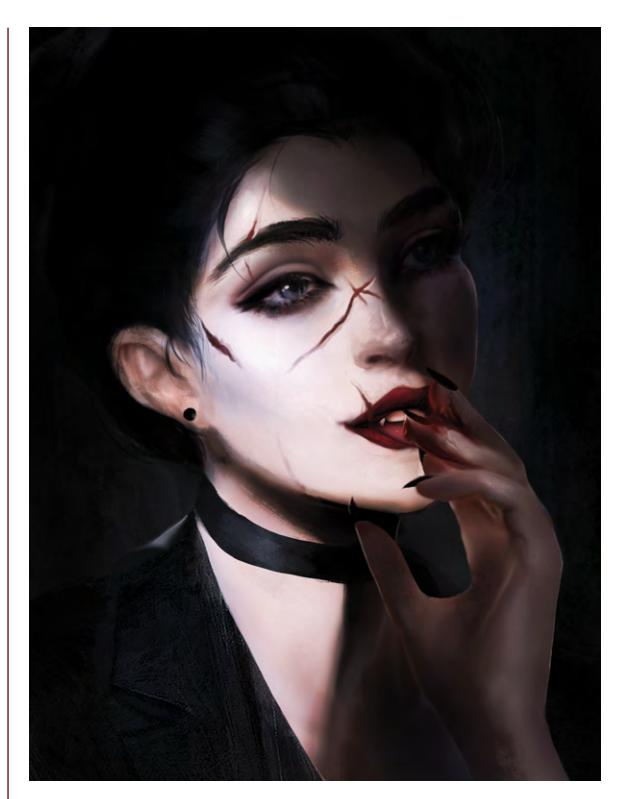

Затем каждый игрок, участвующий в воспоминаниях, делает один бросок кубика конфликта, основываясь на своем подходе к конфликту воспоминаний. Повторные броски силы воли и всплески крови не допускаются в одноходовых воспоминаниях.

Образец одно-пуловых сложностей для воспоминаний:

- Цель с одной точкой: сложность 2
- Цель с двумя точками: сложность 4
- Цель с тремя точками: сложность 6

Модификаторы воспоминаний корректируют пулы кубиков конфликта, как обычно, и каждый персонаж игрока получает урон по силе воли, равный разнице между его успехами и удвоенной сложностью одноходового броска воспоминаний. Этот урон не может быть уменьшен броней или сверхъестественными средствами. Степень повреждения зависит от противника и серьезности или отчаянности кульминационного испытания. По желанию, игроки могут смягчить этот урон, принимая "Пятна", когда они рискуют своей Человечностью, чтобы достичь цели с меньшими потерями для себя.

## Äîïîëíèòåëüíîå ïðàâèëî:

## Íåóäà÷íûå âîñïîìèíàíèÿ

Обычно неудача в воспоминаниях приводит лишь к разочарованию или наплыву неприятных воспоминаний. Если рассказчик (или игроки!) чувствует, что действительно облажался, или в какойто критический момент потерпел полное фиаско, не стесняйтесь добавить еще одно последствие.

Группа получает недостаток в одно или два очка, влияющий на всю группу до конца истории. Обычными последствиями неудачных воспоминаний являются появление нового противника или недостаток Убежища, такой как "сверхъестественная проблема" или "известное местоположение". В терминах повествования эти недостатки уже присутствовали, но Воспоминание либо усугубило, либо выявило их у персонажей.

# Ïðîåêòû

Проекты - это отличный способ для игроков выполнить определенную задачу или цель, на достижение которой может потребоваться несколько игровых сессий. Как описано в книге Vampire: The Masquerade (стр. 415), Рассказчик и игрок определяют несколько этапов проекта, бросая кубики на определенных этапах.

#### ОДНО-ПУЛОВЫЕ ПРОЕКТЫ

Рассказчики могут захотеть использовать только один бросок кубика для проекта. Попытки завершить проект с помощью одного броска кубика должны иметь значение 1-5. Рассказчики, использующие эту настройку, должны попросить игроков использовать свои кубики "Голода" для определения результата.

## Îïòèìèçèðîâàííàÿ

## ñèñòåìà ïðîåêòîâ

Некоторым группам может показаться, что правила Проектов более обширны, чем то, что они ищут в игре. В связи с этим более простая система, основанная на механике Проекта, может помочь упростить этот процесс. Однако игрокам все равно выгодно использовать эту систему без разработки сложного пути достижения своих целей с помощью Рассказчика.

Система оптимизированных проектов сосредоточена на сюжете и упрощает механику до нескольких бросков кубиков.

Если группа решит упростить правила проекта, вот альтернативная система, которую можно использовать вместо той, что есть в Vampire: The Masquerade. Эта система позволяет сократить количество бросков кубиков, необходимых для проекта, и сосредоточиться на повествовательных аспектах сюжета или цели. Используйте ее как способ упорядочить события вокруг задачи или цели, не делая ее центром внимания нескольких игровых сессий и не отвлекаясь от сюжета, на котором активно сосредоточены другие персонажи.

Чтобы использовать систему "Упорядоченный проект", игрокам необходимо определить, над какой целью они работают и что требует бросков кубиков. Эта цель влияет на лист персонажа, структуру города или статус домена, а также оказывает ролевое воздействие за столом. Кроме того, если над достижением цели работают несколько игроков, им необходимо определить, что делают их персонажи,

чтобы помочь продвижению проекта.

Затем Рассказчик определяет, сколько этапов необходимо пройти игрокам для достижения цели и сколько попыток они могут предпринять для достижения этого этапа. Количество этапов может варьироваться, но обычно находится в пределах 3-6, но для сложных проектов может быть и больше. Количество попыток может быть от 1 до 5.

После определения этапов игрок решает, какие действия результатов пулов лучше всего соответствуют цели, которую он хочет достичь. Если в проекте участвуют несколько игроков, то они сами выбирают, какой вклад они хотят внести в проект. Дисциплины допускаются, если игрок и Рассказчик договорились о своих бросках, хотя их провал может привести к другим проблемам. Для целей повествования используйте в этом броске кубики "Голод": два кубика для относительно безопасных проектов, три - для рискованных. При количестве кубиков, равном трем или менее, используйте один кубик Голода.

Если за отведенное количество попыток игроку выпало достаточно успехов для достижения или превышения контрольных точек проекта, его проект успешен. При грязном критическом выпадении кубика "Голод" персонаж получает успех, но в результате получает осложнение, с которым ему необходимо справиться. При зверском провале на кубиках Голода персонаж проваливает попытку и вынужден преодолевать значительные препятствия в работе над проектом.

Неудача определяется совместно игроком и Рассказчиком. Она может включать в себя такие осложнения, как нарушение Маскарада, проигрыш второй попытки проекта или удаление точек на листе персонажа.

При разработке проекта противника используются те же правила, что и при описании выше, за одним исключением. Рассказчик определяет количество попыток, которые есть у обоих персонажей-игроков, чтобы достичь своего рубежа. Тот, кто первым достигнет своей цели, выполнит задачу своего проекта. Если оба игрока достигают цели одновременно, то дальнейшие успехи определяют победителя. В противном случае оба игрока совместно с Рассказчиком определяют исход проекта.

После того как результат определен, игрок и рассказчик совместно рассказывают о проекте и его итогах. Осложнения могут быть решены в это время или использованы в будущих сюжетах и висеть над

персонажами, как дамоклов меч.

## Краткое руководство

- 1. Определите цель
- 2. Установить этапы: в среднем 2-6, но можно и больше
- 3. Определить попытки: от 1 до 5 попыток
- 4. Принять решение о пулах кубиков: добавить голодные кубики для повествования.
- 5. Выполнить броски кубиков
- 6. Определите успехи: грязный критический - успех, но осложнение; зверский провал неудачная попытка и значительная неудача в проекте.
- 7. Решите проект в описательной форме.

## Пример

Алекс решает, что хочет преодолеть свой недостаток "Неграмотность" (Vampire: The Masquerade, p. 179). Для этого рассказчик определяет, что Алексу необходимо пройти три этапа этого пути и сделать это в две попытки. Во-первых, Алекс использует свой Интеллект 2 и Гум.Науки 1. Во-вторых, они берут один кубик "Голода" из-за малого запаса. Первый бросок Алекс сделал с двумя успехами, но один из них оказался кровывам критическим.

Алекс решает, что однажды ночью во время занятий он расстроился и уничтожил свой компьютер, чтобы взять уроки. Чтобы преодолеть эту неудачу и продолжить работу, Алексу требуется 1 точка ресурсов. Вторая попытка Алекса увенчалась одним успехом, что позволило Алексу выполнить критерии проекта и преодолеть недостаток неграмотности.

Использование Проекта для того, чтобы игроки зарабатывали точки для своего листа, а не покупали их, является одним из вариантов. Рассказчик определяет, выполнил ли персонаж этапы проекта. Если он добился большего количества успехов, чем требовалось для выполнения этапа, он может позволить игроку заработать свою цель без использования очков опыта. Это правило может работать не во всех играх, и Рассказчик и игроки сами решают, использовать ли им это правило.

## Èäåè äëÿ Ïðîåêòîâ

Проекты могут использоваться за столом по-разному и определять игровой процесс для всех игроков за столом. Объем проектов может быть самым разным, в зависимости от целей персонажа, от того, какие личные цели он поставил перед собой, и от того, какие действия он совершил ранее.

Некоторые примеры проектов, которые может захотеть реализовать персонаж, включают:

- Персонаж хочет изготовить сложную вещь из редких материалов. Потребуется время и ресурсы, чтобы собрать эти материалы, а затем еще больше времени и умений, чтобы подготовить их для изготовления изделия.
- Котерия стремится распространить свое влияние на район города, находящийся под защитой другой котерии. Этот шаг позволяет занять более выгодную политическую позицию в будущем. Им придется работать вместе, чтобы наладить связи, установить доверие и закрепить свое присутствие в этом районе так, чтобы другая группа не заметила.
- Группа хочет организовать особое мероприятие: официальный бал-маскарад, алхимическую битву на чайниках, большой рок-концерт или сценическое представление, показ картин или модной одежды и т.п. Используйте систему Проектов, чтобы организовать специальное мероприятие с множеством более мелких событий. Успех означает, что мероприятие начнется вовремя и в соответствии с планом; неудача создает проблемы, которые хозяину необходимо преодолеть. Зверский провал чреват катастрофой, если компания не отменит мероприятие.

- Любимый сосуд вампира имеет Резонанс, работающий против изучения вампиром какой-либо дисциплины. Чтобы выровнять свой Резонанс, вампир решает сделать его Проектом, чтобы помочь изменить его на тот, который лучше подходит для его исследований. Такое использование позволяет избежать ролевых сценариев, которые могут противоречить принципам истории.
- Персонаж хочет стать кнутом гарпии, что даст ему доступ к многочисленным связям с правящим советом города. К сожалению, придется потрудиться, чтобы собрать достаточно информации, статуса и влияния, чтобы привлечь внимание гарпий, и еще больше потрудиться, чтобы заручиться их поддержкой на этой должности.
- Группа хочет вернуть часть города, захваченную стаей люпинов. Этот расширенный проект должен включать в себя Влияния, патрулирование, сбор информации и, возможно, боевые действия. Котерия берет на себя обширный Проект. Если проект удастся, то они смогут с относительной легкостью вернуть себе часть города. Однако если возникнут сложности или неудачи, возможно, придется сражаться с оборотнями, рискуя при этом многим.

## Ñîâìåñòíûå Ïðîåêòû

Проекты - это отличный способ совместного решения проблем, достижения коллективной цели или создания чего-то нового для игры. Например, в рамках совместной работы над созданием страницы истории, изменением структуры управления городом или защитой определенной части города. Все эти проекты используются для завершения, что упрощает работу группы и позволяет каждому работать вместе и вносить значимый вклад. Однако неудача означает неудачи или осложнения в работе над целью и даже может привести к серьезному конфликту игроков из-за результата.

# Ðåêîìåíäàöèè ïî Îñòîðîæíîé èãðå

Помните, что Рассказчик не является окончательным арбитром в вопросе о том, является ли что-то оскорбительным или нет. Если Вы - игрок, а другой игрок делает что-то, что заставляет Вас чувствовать себя неловко, то "он - Рассказчик/более опытный игрок, поэтому это должно быть нормально" не оправдывает его действий. Точно так же, если Вы - Рассказчик, не поддавайтесь желанию сказать себе: "Я должен просто сгладить ситуацию, иначе они подумают, что я веду плохую игру".

Тот факт, что вампиры - вымышленные персонажи, оправдание, что эти стереотипные изображения "просто такие, какие они есть" или "на самом деле правдивые" в контексте этого мира, или идея, что "Вампир" - это игра о плохих людях, совершающих плохие поступки, - все это не является оправданием для вас, игрока, использующего "Вампира" как средство для воссоздания вредных стереотипов. Мы изо всех сил стараемся не делать этого в нашем тексте, и вы можете помочь нам, не делая этого за своим столом.

Игры про вампиров по своему замыслу содержат мрачные сюжетные элементы, но важной частью игры про вампиров является понимание своей ответственности как игрока за создание благоприятной обстановки для всех остальных участников игры. Доверие бесценно, и его гораздо труднее создать, чем разрушить. Это особенно важно, если в вашей группе есть как новые, так и старые игроки. Самый простой способ укрепить доверие - это быть честным в своих намерениях и ограничениях и, в свою очередь, уважать то же самое, что говорят ваши товарищи по игре.

См. советы и методы внимательной игры на стр. 421-425 книги Vampire: The Masquerade.

## Êóëüòóðà è Ðåëèãèÿ

Можно создать персонажа, принадлежащего к реальной демографической группе, например, сирийского Тореадора или итальянскую Гекату. Но мы не рекомендуем делать из этого персонажа этнический или национальный стереотип. Также не забывайте, что такие кланы, как Бану Хаким и Равнос, выходят за рамки своей первоначальной версии, и мы призываем вас изображать этих персонажей как выходцев из любых стран мира.

Как и любая другая игра с образным содержанием, "Вампир" не может помешать недобросовестным игрокам воспользоваться средством или предлогом вымышленной игры о злых существах для распространения вредных заблуждений, хотя мы и сделали все возможное, чтобы затруднить им это. Если у вас нет плохих намерений, и вы действительно имеете хорошие намерения, то мы призываем вас играть в этой игре персонажами, не относящимися к вашей демографической группе - а если вы Рассказчик, то вам обязательно придется это делать. Если же вам придется, то уже сегодня вы можете сделать кое-что, чтобы избежать ошибок.

Игра за пределами своей демографической группы - это такой же навык, как и любой другой; вы становитесь лучше в нем с помощью осознанной практики. Можно начать с простого - создать персонажа, который будет "как все", а затем постепенно добавлять культурные признаки. Добавляйте их по одному и следите за реакцией группы; если сделанный выбор им не подходит, отмените его и двигайтесь в другом направлении. Стремитесь к аутентичности, а не к смеху или легким стереотипам.

Стремитесь дать персонажу концепцию, которая не ограничивалась бы только его демографическими категориями. Придумайте им профессии, хобби, моду, вкусы в искусстве или музыке. Это справедливо даже для тех случаев, когда вы импровизируете, выступая в роли рассказчика: представьте себе всего одну-две вещи, выходящие за рамки их расы и пола,

#### когда вы их придумаете.

Антагонисты и другие оппозиционные персонажи это, так сказать, высшая планка сложности для всего вышесказанного. Изображение жестоких амбиций как продукта или результата их системного угнетения - лишь один выбор из многих возможных: как бы вам ни нравился Магнето, старайтесь, чтобы ваши антагонисты были разнообразными, а их мотивы творческими и индивидуальными.

Кроме того, хотя играть против антагонистов, которые увековечивают системное угнетение, может быть весело, если все игроки явно дали на это согласие, вы должны дать своим игрокам возможность сказать "нет", использовать инструмент безопасности или перенаправить вас, если ваше изображение, скажем так, слишком реалистично.

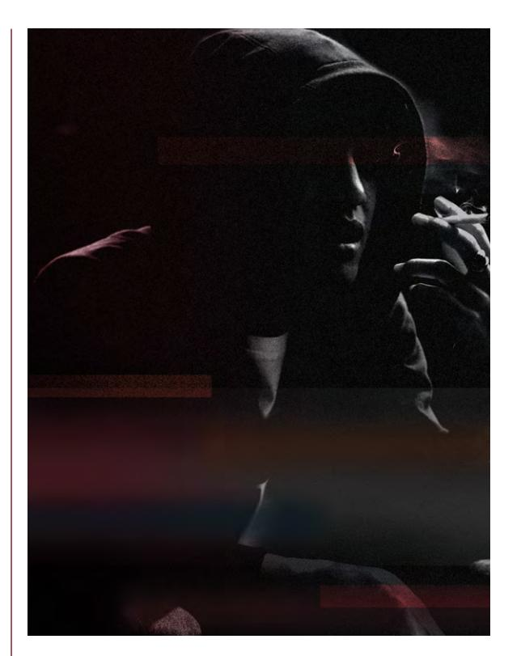

## Ðîìàíòèêà, Ñîáëàçíåíèå è ñåêñ

Романтика, соблазнение и секс - темы, которые постоянно встречаются в "Вампире", и их ответственное использование невероятно важно для согласия и комфорта всех участников. Игрокам и рассказчикам следует придерживаться нескольких рекомендаций при использовании этих тем в истории.

Помните, что рассказчики - тоже игроки. Их согласие и комфорт так же важны, как и для других участников. Если тема вызывает у рассказчика дискомфорт, он может сказать "нет" и не вести сцену на эту тему, либо закончить или изменить сцену, если неудобная тема возникла в ее середине. Каждый человек за столом

должен давать восторженное, осознанное согласие.

## Согласие

Согласие имеет первостепенное значение, даже является обязательным, когда игроки изображают персонажей, имеющих интимную связь с персонажем другого игрока. Изображение вампира (или смертного), имеющего интимную связь с персонажем другого игрока, требует значительного взаимодействия обоих игроков и признания со стороны Рассказчика.

Все участники должны дать согласие (в идеале устное и с энтузиазмом) на использование этих тем в игре. Вполне допустимо по желанию игроков направить игру в другое русло или установить жесткие ограничения на глубину раскрытия этих тем в игре или "на экране".

Признайте, что согласие не всегда бывает постоянным: игрок может внезапно обнаружить, что та или иная тема на самом деле его раздражает, и в любой момент отозвать свое согласие. Помните, что сесть за стол - это не восторженное согласие для любого сценария, но это приглашение спросить согласия в сценах, которые могут стать напряженными. Убедитесь, что ужасы и действия, происходящие за столом, остаются в игре и не приводят к тому, что игроки чувствуют себя некомфортно или небезопасно во время игры.

Не каждая сессия, сцена или событие требуют согласия, если игроки и Рассказчик за столом чувствуют себя комфортно и доверяют друг другу. Такие группы могут исследовать веселые, мрачные, ужасающие или сексуальные темы, лежащие в основе игры, с уверенностью в том, что никто за столом не желает причинить вред или токсичность. Наоборот, игровой стол становится веселым, гостеприимным, захватывающим и даже позитивным, несмотря на выпитую кровь. Глубокое погружение в сильные эмоции - это, в конце концов, бьющееся сердце "Вампира". Но так же, как вы вывешиваете предупреждающие знаки на досках для прыжков в воду, даже группы с высоким уровнем комфорта и доверия должны установить основные правила в нулевой сессии и оставаться открытыми для использования инструментов безопасности.

## Взаимное уважение

За столом все должны уважать ограничения друг друга. В то время как один человек может спокойно относиться к сексуальным контактам или соблазнению во время игры, другому игроку может быть неинтересно изучать или наблюдать за этим. Поэтому всем за столом необходимо договориться о том, как будут проходить сцены с романтикой, сексом и соблазнением. (Особенно хорошо здесь работают "Линии" и "Завесы"). Рассказчики должны проверять всех участников напряженных сцен, а игроки должны понимать, что они могут указать, когда начинают чувствовать себя некомфортно.

Даже если эти темы обсуждались на нулевой сессии, лучше всего возвращаться к ним во время затянувшихся сюжетных линий, напряженных сцен и новых вопросов, которые ранее не рассматривались. Анализ уровня комфорта каждого показывает уважение друг к другу, позволяет каждому заново оценить свое согласие и помогает рассказчикам сузить круг будущих сюжетов.

## Многопользовательское согласие

Часто в сценах участвуют более двух игроков, что усложняет процесс получения согласия на романтику, соблазнение и секс. Как быть, если некоторые игроки согласны на определенные сценарии, а один или несколько других - нет? Что делать группе, если один из участников сцены вдруг решил, что не может продолжать? Как рассказчик может управлять сценой, в которой разные игроки чувствуют себя по-разному, но все согласны на содержание? Навигация в таких сценах может быть непростой, но есть способы сделать это и позволить всем игрокам быть вовлеченными в процесс, уважая при этом ограничения каждого.

Первое правило, которое необходимо запомнить, это умолчание об игроке или игроках, которые не дают согласия на определенные темы. Если рассказчик или игрок не уверены в том, что тема может быть приемлемой за столом, или в том, что игроки не против выйти из сцен, чтобы другие могли играть, лучшей практикой для группы будет принятие решения о том уровне комфорта, который устраивает всех. Не включайте тему, если кто-то из игроков категорически против.

Если игроки и рассказчик согласны, то некоторые сцены можно проводить и без игроков, которым неприятны определенные темы. Игроки могут покинуть игровую зону или сесть и не участвовать в происходящем. Хотя это не самая лучшая и не самая инклюзивная практика, она позволяет всем проявить определенную гибкость. В идеале игроки, не участвующие в сцене, должны получать сцену самостоятельно, что позволит им развивать историю своих персонажей другими способами.

Рассказчик всегда должен убедиться, что игроки не против покинуть стол на время завершения сцены. Если игрок не согласен с этим, рассказчик должен снизить интенсивность игры до уровня, который устраивает игрока, и дать возможность остальным продолжить сцену. Это может включать в себя смягчение описательной лексики, упрощение действий или даже перевод сцены в другое русло.

Если игрок или Рассказчик не могут продолжить сцену и снимают свое согласие, то у стола есть несколько вариантов. Игроки могут предложить общую концовку сцены, позволяющую событиям произойти, но не раскрывающую деталей, или же сцена может "затухнуть". В этом случае детали сцены остаются на усмотрение игрока и не прорабатываются. Эти приемы театра разума позволяют сцене произойти, а сюжету - развиваться дальше.

Если игрок или рассказчик сильно расстроился во время сцены, лучше полностью остановиться и решить группой, произошли ли эти события на самом деле или сцену следует просто оставить и не заканчивать. При этом необходимо уважать выбор каждого человека, хочет ли он завершить сцену или нет при любом решении. Совместная работа всех игроков и

рассказчиков помогает в этом процессе.

## Èãðà ñ Ìàëêàâèàíöàìè

На протяжении всей истории Vampire: The Masquerade малкавианцы выполняли множество ролей: были и вольными стрелками, и разгадывателями загадок, и служителями хаоса. Игроки могут поразному представить влияние крови Малкава на сознание своих персонажей: воинственная радость Дэдпула, безжалостность Ривер Тэм, опасная гиперэмпатия Алой Ведьмы или многочисленные манипуляции Жанетты и Терезы Воерман (Vampire: the Masquerade, p. 394).

Другие игроки тратят время на изучение предсуществующих условий, реальных явлений пророческих случаев и черпают вдохновение для того, чтобы понять, как Малкавианское проклятье проявляется в их собственных персонажах.

Она просит прощения у каждого встречного, потому что стала свидетелем его окончательной смерти, но из страха прервать течение времени не может объяснить, почему она должна просить прощения после их встречи? Или же он склонен вырывать страницы из книг, выделять отрывки и оставлять их в потайных местах, чтобы его товарищи по группе могли их обнаружить, надеясь, что они смогут сложить слова "Примоген Баслоу продал нас", пока не станет слишком поздно? Как резонанс крови влияет на способ разделения и взаимодействия с их калейдоскопическим сознанием?

Узнайте об уровне комфорта игрока, который хочет изобразить малкавианца за вашим столом, и других игроков, которым придется с ним взаимодействовать. Малкавианцы в исполнении Рассказчика предоставляют больше возможностей продемонстрировать многогранность клана, и, соответственно, больше возможностей выяснить, насколько игрокам комфортно с темными или более поврежденными Оракулами. Заранее нарисованные линии и вуали вокруг таких тем позволяют Рассказчику и игрокам создавать Малкавиан, которые открывают новые возможности для истории, а не

останавливают игру.

Установите это согласие со всеми игроками за столом, даже если среди них нет потенциальных Провидцев. Направьте игроков, испытывающих дискомфорт при освещении психических заболеваний и включении их в игру, в сторону от традиционных методов создания малкавианского внушения. Будьте крайне осторожны и деликатны, если решите моделировать малкавианцев под кого-то, страдающего посттравматическим стрессовым расстройством, шизофренией или биполярным расстройством: это реальные болезни с реальными (и чаще всего просто изнурительными) последствиями, и другие подходы могут оказаться более плодотворными и менее усугубляющими. Подумайте о том, чтобы сосредоточиться на малкавианце, страдающем от пророческих снов, или верящем в то, что мертвые задают ему загадки, или убежденно верящем в радикальные, вампирические заговоры.

## Ðàçëè÷èÿ â Ñèëå

Со временем сородичные существа теряют способность к любви, нежности и даже сочувствию к судьбе смертных. В зависимости от возраста Сородича, он может даже забыть о хрупкости смертного, особенно того, кто отдает свое сердце вампиру. Природа Зверя и устремления самого Сородича остаются для смертных загадкой до тех пор, пока они сами не почувствуют на себе жгучую хватку Объятий. До этого момента смертные остаются безнадежно преданными или влюбленными, а гули стоят на ступеньку выше наркоманов, совершая гротескные поступки во имя еще одного глотка витэ. Не всегда эта несбалансированная сила выравнивается и после Объятья: начинающий вампир оказывается связанным кровью со своим сиром, который держит его под контролем, обучая правилам выживания и этикета, чего не мог сделать раньше.

В какой момент птенец и его сир становятся равными, однозначно сказать нельзя. Когда птенца втягивают в водоворот политики, его верность сиру будет подвергаться испытаниям, поскольку другие сородичи будут давать ложные обещания лучшего ухода, больших возможностей. Равенство может наступить после того, как он позволит ее витэ выйти из его организма и разорвет кровные узы. Или когда он, наконец, заслужит ее уважение и станет полностью признанным членом Камарильи. Это может произойти и до объятий, когда он решит, что с него хватит, и исчезнет из жизни своего сира, борясь с жаждой ее витэ в течение первых нескольких недель. Какие бы обстоятельства ни привели к тому, что разница в силе уравновесилась, до тех пор смертные всегда остаются для Рода ограниченными и хрупкими игрушками, которые они могут использовать как пешки в своих играх.

## Смертные

Особенно если речь идет о Сородичах, характер отношений между вампирами и смертными не является таким, который справедливо отражает интересы обеих сторон. Отношения между такими игроками требуют как согласия, так и понимания эмоциональных границ друг друга. Это подразумевает близость, которая лучше всего подходит для игроков, готовых уважать границы друг друга и знать, когда следует отступить, если взаимодействие становится слишком интенсивным.

Среди тем, возникающих при игре в "Опоры", могут быть предательство, преследование, одержимость и другие потенциально травмирующие переживания. Персонажи, которых готовят к "Объятиям", поднимают аналогичные вопросы травматизма и интенсивности. Ни в коем случае не следует удивлять игрока внутриигровыми отношениями с потенциальной эмоциональной интенсивностью, на которые он не давал предварительного согласия. И даже если игрок дал предварительное согласие, он имеет право в любой момент отозвать его, если этот опыт ему не нравится.

Вампир может наложить свое проклятие на смертного по любой причине. Психологический эффект от объятий любимого человека может быть ошеломляющим. Чувство обиды, предательства или оскорбления обычное явление для новичков, и тем более, если до этого существовали серьезные отношения. В связи с этим важно, чтобы все участники игры были осведомлены о развитии событий, которые могут возникнуть между их персонажами. Само Объятие - акт высасывания крови смертного и оживления его тела вампирической Жизнью - является исключительно интимным. Будьте очень осторожны, изображая насильственные объятия, и хотя персонаж может испытать насилие и предательство, игрок ни в коем случае не должен испытывать эти чувства сам. В конце концов, мало кто из новичков-сородичей, считавших, что им даровано великолепное бессмертие, осознал всю тяжесть проклятия Каина.

## Гули

Существование гуля сопряжено с трудным выбором, требующим полной зависимости от чудовищного существа, обеспечивающего выживание, и личной жертвы во имя долга. Унижение собственного достоинства - обычное дело, и многие гули с немым ужасом наблюдают, как рушится их жизнь ради того, чтобы угодить своему господину. Их могут призвать к совершению поступков, которые запятнали бы душу Рода, но это мало замедляет гуля в его стремлении получить одобрение господина - и больше витэ. Отношения неравноправны, и во многих случаях согласия между вовлеченными сторонами почти не требуется. То же самое нельзя сказать и об отношениях между игроками, играющими с такими персонажами.

Как и при игре вампиром, при игре гулем могут возникать сложные ситуации, когда персонаж может быть вынужден совершать поступки, которые лично ему могут показаться отвратительными, но которые вписываются в мотивацию и развитие гуля. Это особенно актуально в тех случаях, когда домитором является персонаж другого игрока. При работе с гулем и домитором за игровым столом очень важно, чтобы линии общения между игроками как в игровой сессии, так и вне ее - оставались открытыми и доброжелательными. Очень легко попасть в зависимость от динамики, когда гуль подчиняется своему домитору, вплоть до оскорблений.

При взаимодействии смертных и гулей не забывайте о принципах истории. Наличие за столом гуля (или двух!) во время истории может принести много пользы. Да, гули подчинены и часто подчиняются своему хозяину в принятии решений. Но это не так в ста процентах случаев, поэтому необходимо договариваться между игроками.

Не заблуждайтесь: Домиторы и другие Сородичи часто злоупотребляют своими гулями и даже относятся к ним не более чем к собственности, но злоупотребления за столом между игроками недопустимы. С согласия игрока жестокое обращение с персонажем допустимо, а с игроком - нет.

Заранее обсудите грань допустимого между игроками гуля и домитора, а также Рассказчиком, ориентируясь на уровень комфорта каждого игрока в отношении определенных тем. Персонажи-гули по собственной воле или по приказу своего домитора могут совершать действия, напоминающие о реальном насилии, угнетении, физических и психологических травмах, которые могут быть триггерными или сложными для них самих или других игроков. Обязательно проверьте игроков с помощью предпочтительной техники калибровки (Vampire: The Masquerade, p. 423), чтобы убедиться, что им комфортно продолжать, или если необходимо сделать перерыв в сессии, чтобы немного успокоиться. ■

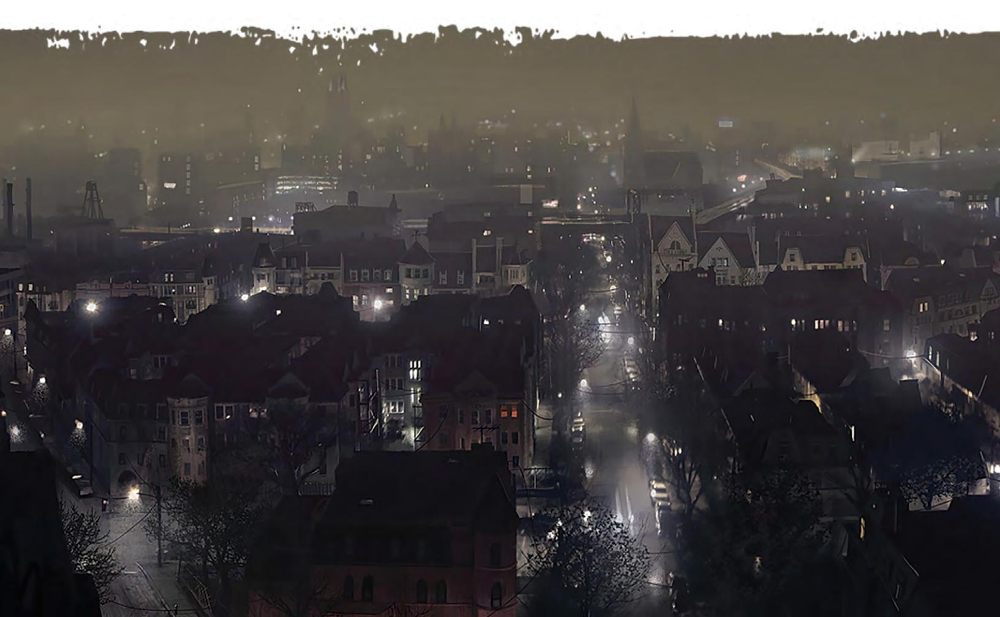

# CTPAHUH MCTOPMM

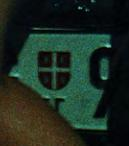

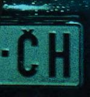

## БАНКИРЫ ДАНСИРНА (ЛИНИЯ КРОВИ; ТОЛЬКО ПЕРСОНАЖИ ГЕКАТЫ)

Примерно в XVIII веке Джованни захотели закрепиться на рынках Нового Света. Но все их попытки постоянно блокировались шотландской семьей банкиров, владевшей несколькими судоходными предприятиями. Впечатленные их финансовой хваткой, Джованни решили привлечь их к сотрудничеству. В итоге выяснилось, что Дансирны были не только финансистами, но и каннибалами. Это было идеальное сочетание денег, разврата и умения хранить секреты.

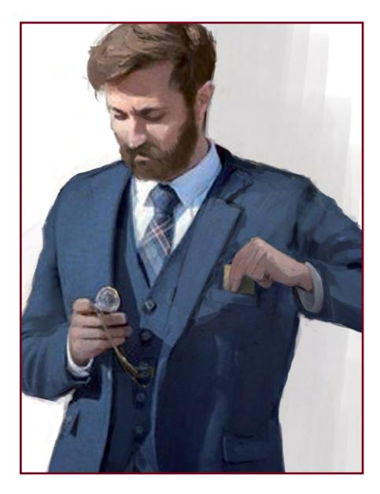

На протяжении многих веков отношения между двумя семьями были однозначными: Дансирны делали деньги, а семья Джованни тратила их как воду. Удивительно, но несмотря на то, что смертные члены семьи Дансирн до сих пор иногда балуются "длинной свининой", представители рода не проявляют особой склонности или интереса к некромантическим занятиям. До Воссоединения Семьи их пытались заставить освоить пути Обливиона, но теперь Дансирны с радостью вернулись к тому, что у них получается лучше всего: высасывать кровь из людей.

И на этот раз им не нужно отчитываться перед чертовым Джованни.

• Деньги мешают: Трудно делать деньги и оставаться незамеченным, но Дансирны веками работали в тени. Вы раздобыли часть денег своей семьи, чтобы создать для себя альтернативную личность. Вы получаете две точки фона Маски бесплатно, хотя должны поддерживать эту Маску хотя бы раз за историю.

•• Деньги говорят: Дансирны находят информацию в самых интересных местах. Достаточно разбросать по округе немного денег, и люди сами выскакивают на поверхность, чтобы рассказать вам о чем-то. Один раз за сюжет вы можете найти информацию, как если бы у вас был фон "Информатор" с количеством точек, равным вашим ресурсам. Эта способность действует в течение одной сцены.

••• Деньги улучшают: Вы всегда имеете доступ к лучшему, что можно купить за деньги. Доступ к качественным товарам не только является символом статуса, но и делает все немного проще. При выполнении броска, в котором вы можете использовать свое собственное оборудование, вы получаете бонусный кубик к броску.

**lore**

•••• Деньги умножаются: Все Гекаты знают, что Дансирны банкиры. Но большинство из них думают об этом абстрактно, как будто "банкир" - это просто другой способ сказать "тот, у кого много денег". Но вы являетесь (или состоите в прямом родстве) законным инвестиционным банкиром. Получите три точки (до пяти) в Ресурсах. Кроме того, все, кто состоит в вашей команде, теряют недостаток "Нищий" (Vampire: the Masquerade, p. 193) и могут приобретать точки в ресурсах по 2 очка опыта за точку вместо обычных 3.

#### ••••• Денежный диктат: Вы

возглавляете бухгалтерию семьи Дансирн. Вы держите руку нежити на пульсе финансовых счетов Гекаты. И вы следите за тем, чтобы все остальные знали об этом. Вы получаете три свободных точки статуса в Гекате. Кроме того, один раз за историю вы можете либо дать каждой Гекате в этой истории две дополнительные точки Ресурсов, либо снять все точки Ресурсов с каждой Гекаты в этой истории. Эти добавления или удаления ресурсов действуют в течение одной истории, и если они удалены, то генерируют недостаток противника длиной в историю в виде одного из ограбленных вампиров.

## ДЕТИ ТЕНОЧТИТЛАНА (ЛИНИЯ КРОВИ; ТОЛЬКО ПЕРСОНАЖИ ГЕКАТЫ)

В начале XVI века в составе экспедиций Кортеса испанцы Джованни встретились с представителями цивилизации ацтеков. В городе Теночтитлан (ныне часть Мехико) эти Джованни познакомились с массовой, формализованной некромантической традицией. Естественно, они убивали, порабощали и обращали в свою веру "язычников". Этих новообращенных Джованни называли пизаноб - термин майя, который примерно переводится как "призраки мертвых, которые ходят по земле" (то, что ацтеки не были майя, европейцев не волновало). То, что у этих вампиров уже было имя, наследие и собственные верования, мало волновало Джованни.

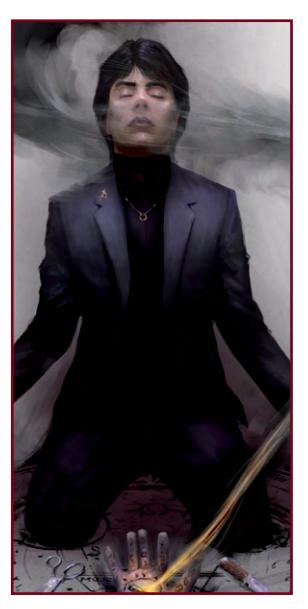

Их предводитель, Почтли, оставался во главе Писаноба вплоть до Воссоединения семьи. Однако после постоянных нападений Предвестников Черепов (см. с. 226) семья сократилась до небольшого числа сородичей, хотя причины нападений были неизвестны. Почтли предложил Предвестникам свою жизнь в обмен на прекращение военных действий, и Предвестники согласились.

Теперь оставшиеся дети Теночтитлана решают вопрос о новом вожде, планируя свою месть.

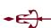

**lore**

• Прятки от волка: Оставшиеся в живых писанобы выжили потому, что они очень, очень хорошо умеют прятаться. Вы изучили всевозможные приемы, чтобы оставаться вне поля зрения тех, кто охотится на вас... и тех, на кого охотитесь вы. Вы получаете один дополнительный кубик при любом броске, чтобы спрятаться, в том числе с помощью дисциплин или церемоний.

#### •• Призрачные инстинкты:

Родоначальники, воплотившиеся в Теночтитлане, были очень талантливыми некромантами, и они передали среди своих собратьев множество советов, приемов и секретов. Вы узнали некоторые из этих секретов, которые дают вам два дополнительных кубика при любом броске Церемонии Обливиона, связанной с вызовом, контролем или уничтожением призраков.

••• Перспективное мышление: После многих лет охоты за Предвестниками Черепов вы научились всегда планировать наперед, превращая возможную трагедию в триумф. Один раз за историю вы можете перевернуть любой бросок навыка. Кроме того, вы всегда получаете один бесплатный повторный бросок навыка в любой сцене, где вы работаете против другой Гекаты. Если Геката - член Предвестников Черепа, то вы получаете дополнительный успех при повторном броске.

#### •••• Некромантическое

образование: Секреты Обливиона принадлежат вам, будь то благодаря изучению, вашей древней родословной или секретам, которые вы получили от своих кузенов в течение многих лет. Ваше мастерство в некромантических церемониях не имеет себе равных. Вы получаете два автоматических успеха при любом броске, необходимом для активации некромантической церемонии Обливиона.

#### ••••• Следующий в очереди:

Теперь, когда Почтли пожертвовал собой ради грандиозного плана Гекаты по объединению, настало время для другого человека, который должен встать во главе Пизаноба и привести его к будущей славе. Вы один из таких людей, обладающих некромантическим мастерством и политической смекалкой. У вас есть еще две точки статуса в Гекате. Кроме того, у вас есть союзник среди руководства Гекаты, который раз в две истории выступает в роли Мавлы с пятью точками. (Вы можете приобрести фон Мавла, как обычно, чтобы сделать этого персонажа более постоянным наставником или покровителем.

## ПОЖИРАТЕЛИ ПЛОТИ (ЛИНИЯ КРОВИ; ТОЛЬКО ПЕРСОНАЖИ ГЕКАТЫ)

Нагараджа - самые заблудшие вампиры в клане, где сейчас полно заблудших вампиров. Они считают себя первыми в истории некромантами. Они упиваются тем, что их родословную нелегко проследить до одного из известных Антедилувиан. Они верят, что когда-то овладели землями мертвых, обратив свою Кровь, чтобы жить в таком месте. И, возможно, в результате этой Церемонии, вместо крови они ели человеческую плоть. Они верят, что однажды ночью смогут снова стать хозяевами подземного мира.

Нагараджа по праву считаются гопниками, поскольку их немного, и они поддерживают ужасную практику захвата смертных и лишения их плоти и крови ночь за ночью, сохраняя им жизнь с помощью первой помощи и даров витэ. Как разрозненную группу, их мало что связывает как общество, кроме привязанности к призракам (большинство из них овладевают Обливионом лучше, чем любой другой дисциплиной) и веры в то, что мучения тела и духа

приближают свидетелей (или жертв) к тайнам жизни, смерти и не-смерти. Горстка нагараджей явилась на семейное собрание, заявив, что какая-то катастрофа изгнала их из родного дома. Первоначально считалось, что это некая радикальная форма Дансирна, но если банкиры - любители каннибализма, то нагараджи - эксперты. Годы избегания внимания со стороны смертных и общества Сородичей превратили их в эффективных серийных убийц - весьма полезных для их новых товарищей по клану. Возможно, они больше не нуждаются в плоти так, как раньше, но их навыки по-прежнему полезны в новом веке. А некоторые так и не утратили вкуса.

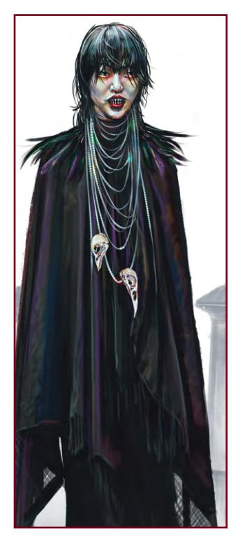

• Вискус: Вы по-прежнему можете есть плоть вместо того, чтобы пить кровь укус смертного и нанесение ему раны с тяжелыми последствиями во всех остальных отношениях приравнивается к питью крови. Вы также можете есть свежие трупы, хотя их вкус не так приятен.

•• Невидимый дух: Некоторые нагараджи могут делать себя невидимыми для призраков и духов. Если у вас еще нет доступа к дисциплине Сокрытие, бесплатно возьмите Плащ Теней (Vampire: The Masquerade, стр. 261) - вы не обязательно получите дисциплину Сокрытие, но скорее особую силу. Эта способность действует подобно Плащу Теней, но только против духов и призраков. Если у вас есть (или вы позже приобретете) Сокрытие, то все ваши способности Сокрытия будут работать против призраков и духов в дополнение к их обычным эффектам.

••• Идеальное убийство: У вас большой опыт в планировании убийств. Пока у вас есть хотя бы ночь на планирование хладнокровного, преднамеренного убийства, вы получаете один дополнительный успех на все броски для этого места убийства. Эти успехи могут быть сведены на нет человеком, обладающим способностью "Послать убийцу" (см. ниже).

**lore**

•••• Послать убийцу: Вы серийный убийца или, возможно, потратили много времени на их изучение. Вы получаете два дополнительных кубика при бросках на изучение мест убийств или выслеживание убийц. Кроме того, вы работали с представителями закона (смертными, сородичами или теми и другими) по некоторым делам, будь то отправка им анонимных писем или непосредственный консультант. У вас есть три точки, которые вы можете потратить между информаторами с полицией, информаторами со следователями в обществе Сородичей и статусом.

••••• Чудовищный укус: когда вы готовы атаковать или питаться, ваши зубы превращаются в длинные, раздвинутые и злобные кинжалы, торчащие изо рта. При атаке с помощью укуса вы не получаете штрафа за бросок, получаете один дополнительный успех при всех бросках на запугивание и увеличиваете урон от укуса до 3.

## ПРЕДВЕСТНИКИ ЧЕРЕПА (ЛИНИЯ КРОВИ; ТОЛЬКО ПЕРСОНАЖИ ГЕКАТЫ)

Каппадокийцы были кланом Смерти до того, как их узурпировал выскочка Джованни. Считая себя уничтоженными на протяжении многих веков, каппадокийцы либо стали носить маски и называть себя "Предвестниками черепов", либо за несколько поколений до этого одна из подфракций клана назвала себя "Предвестниками". Как бы то ни было, большинство присоединилось к Шабашу и агрессивно действовало против интересов Джованни. Долгие годы считалось, что обе стороны не остановятся, пока одна не уничтожит другую, но, похоже, ситуация изменилась после Воссоединения Семьи.

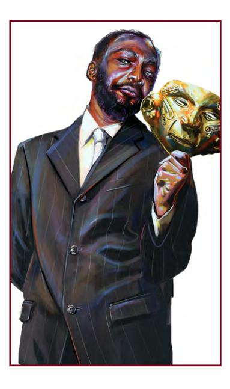

**Lore**

Несмотря на примирение и признание остатков каппадокийского рода, Предвестники Черепов в их прежнем виде больше не могли существовать. Но и каппадокийцы не могли вернуться в свое прежнее состояние после стольких веков гнева. Таким образом, эти вампиры откликаются на любое имя, но они стали неким синтезом обоих. Как и все остальное, прошлая форма умерла и обогатила землю, чтобы выросло что-то новое.

• Пепельная маска: Вы надеваете простую маску из ясеня, поскольку, уважая традиции Предвестников, вы больше заботитесь об изучении смерти, чем о статусе, славе или мести. Если ваша Опора мертва или умерла после того, как вы приобрели этот предмет, изучение его трупа позволит вам перенести Сознание, которое он представляет, на другого смертного (Vampire: The Masquerade, p. 240), как если бы он умер мирно. Если они действительно умерли, получите бонус к проверке на человечность в размере одного кубика. Если кто-то еще вмешивается в работу с трупом, вы должны пройти проверку на безумие ярости на Сложности 3.

•• Золотая маска: Вы носите маску из розового золота, поскольку стремитесь балансировать между живыми и мертвыми. Золото связано как с богатством, так и с алхимией, а золотые могильные предметы находятся на идеальном пересечении этих двух понятий. Таким образом, вы можете скрывать свои действия и действия своих приближенных, исследуя смерть. При попытке скрыть смерть вы имеете показатель Влияния, эквивалентный четырем точкам.

••• Белая маска: Вы надеваете костянобелую маску, на которой нет ни пятнышка грязи, потому что это маска уважаемого Предвестника, потерянная во время одной из исторических чисток. Вы говорите от имени старейшин своего рода, и большинство Предвестников (и даже другие Гекаты) прислушиваются к вам. Вы добавляете три кубика к любому социальному броску против другого Предвестника и два кубика к любому социальному броску против другой Гекаты. •••• Обсидиановая маска: Вы надеваете полированную черную маску, потому что вы не просто вампир - вы действительно полумертвый. Вы - фантик, вселившийся в тело вампира. Благодаря своему опыту в подземном мире вы можете изучать церемонии Обливиона без учителя (и с половиной времени обучения, если он у вас есть), но при этом вы уязвимы к эффектам, направленным на призраков (например, к некоторым церемониям Обливиона). Вы получаете штраф в два кубика при сопротивлении этим эффектам, но получаете бонус в два кубика при сопротивлении эффектам, контролирующим вашу физическую оболочку (например, Доминирование).

••••• Маска Лазарена: Вы надеваете маску, на которой выгравирован образ одного из основателей клана, ибо знаете истинную тайну Предвестников. Их крестовый поход никогда не был направлен только на уничтожение Джованни, но и на истребление всех, кто служит Клану Смерти. Конечная стадия некромантии - смерть всех, кто ее практикует, и превращение в хозяев смерти. Вы не несете никаких пятен за любые действия, совершенные в стремлении убить другого представителя рода Геката или любого персонажа, служащего Гекате.

# СЕМЬЯ ДЖОВАННИ (ЛИНИЯ КРОВИ; ТОЛЬКО ПЕРСОНАЖИ ГЕКАТЫ)

До недавнего времени при мысли о Клане Смерти посторонние люди представляли себе семью Джованни. Их происхождение восходит к временам Римской империи (когда они были известны как Ioveanus или Jovians), и все это время они были причастны к делам Сородичей. Изначально семья Джованни умела играть в эту игру лучше других, создав себе образ "Рода Дьявола", чтобы вызывать страх и уважение у своих соперников - и сородичей.

Отождествление семьи Джованни с Кланом Смерти было полезной фикцией на протяжении веков, пока Ватикан и ФБР не объединили свои усилия против клана - начиная с семьи.

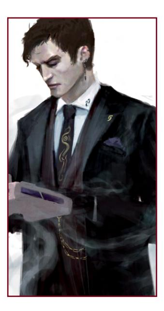

Репутация приходит с записями, и Вторая Инквизиция перелопатила все семейные гонорары и банковские счета, которые смогла найти. Когда в результате Воссоединения семей была проведена реструктуризация Клана Смерти, оставшиеся в живых Джованни обрели безопасность в новой анонимности. Но они возмущались тем, что им приходится скрываться, и еще больше возмущались тем, что новые родословные выкидывают годы семейной истории ради безопасности или, что еще хуже, ради политического удобства. Настоящие Джованни привыкли быть главными, и они будут убивать, чтобы сохранить это положение. В конце концов, никто не воюет так, как семья.

• Ухо кузена: Даже если члены семьи ненавидят друг друга, вся семья живет по определенному кодексу обмена информацией - так они пережили все, от падения Римской империи до Второй инквизиции. Один раз за сессию вы можете задать прямой вопрос другому члену семьи Джованни и получить прямой ответ. Однако в ответ вы должны ответить на вопрос. Вы также можете попросить об одолжении смертных членов семьи один раз за историю, как если бы у вас был фон "Союзники" с тремя точками. •• Увядший блеск: принадлежность к Джованни все еще что-то значит, даже если в клане больше нет вашего имени. Старые привычки умирают с трудом, и инстинкт повиновения все еще укоренился в большинстве членов Клана Смерти. Один раз за сессию вы можете добавить один автоматический успех к любому социальному броску против другого представителя рода Гекаты, гуля или подручного.

••• Мелкая наличность: Джованни начинали как купцы, и они до сих пор знают толк в холодной, твердой наличности. Как один из любимых детей семьи, вы имеете доступ к значительному банковскому счету. Вы бесплатно получаете четыре точки, которые можно распределить между фоновыми областями "Ресурсы" и "Подручные", но эти точки могут быть в любой момент оттянуты старшими членами семьи, особенно если вы им перейдете дорогу.

**lore**

•••• Призрачный Слуга: Семья много чего умеет, но в особенности она превосходна в порабощении духов умерших своей волей. Вы унаследовали или лично захватили призрака, чтобы он стал вашим слугой. Этот союзник использует статы призрака (Vampire: The Masquerade, p. 377). Призрак желает только одного - сорваться с поводка и поглотить ваш дух. До этого момента его можно вызывать один раз за сессию, и он прибывает в течение 10 часов.

#### ••••• Стремящийся к Анциано:

Вам удалось проложить себе путь через скрытую политику семейного собрания и выйти на первое место. Отчасти это удалось благодаря политическому мастерству и безжалостному рвению, но в основном потому, что Вы знаете, где зарыты тела (во всех смыслах). Вы получаете пять точек статуса среди Гекаты и можете получить приватную аудиенцию у Капуцина каждые несколько историй. Только не испытывайте судьбу, а то присоединитесь к трупам.

## ГОРГОНЫ (ЛИНИЯ КРОВИ; ТОЛЬКО ПЕРСОНАЖИ ГЕКАТЫ)

Ламии - род, который, как считается, произошел от Лилит и Каина. Их основательница и верховная жрица (по имени Ламия) утверждала, что является дочерью самой Темной Матери. В древности один каппадокийский старец застал Ламию за исполнением священных бахарских обрядов и был настолько восхищен ее кожей и устойчивостью к боли, что принял ее в свои объятия. С тех пор Ламии были преданными воинами, защищавшими род Каппадокийцев, вплоть до предполагаемого уничтожения клана Джованни. Считается, что последняя Ламия была уничтожена в 1718 году.

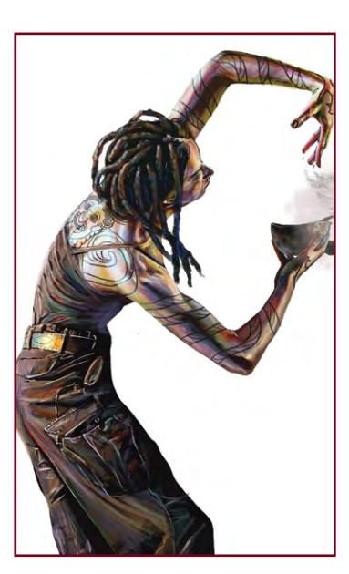

Однако Горгоны продолжали жить, как и их каппадокийские подопечные. Если последние претендовали на титул "Предвестники черепов", то Ламии приняли титул "Лилины", распространяя слово о Лилит и веру Бахари, тайно выясняя судьбу каппадокийцев и подрывая позиции Джованни. Теперь, после Воссоединения Семьи, эти женщины вновь гордо стоят на стороне принявшего их Рода, хотя и не столь склонны терпеть так называемых "каинитов", порицающих их веру.

• Поцелуй змеи: Легенда гласит, что укус ламий когда-то вызывал у их жертв чуму. В наши ночи укус ламии больше не смертелен, хотя у некоторых, как у вас, в организме остаются остатки болезни. Один раз за историю вы можете заразить свою смертную жертву болезнью, нанося ей одно повреждение здоровья с тяжелыми последствиями каждую ночь в течение трех ночей. Эта способность не действует на вампиров.

•• Защита: Вы воплощаете изначальное предназначение Ламий защита своих подопечных любыми средствами. Вы получаете бонус в два кубика при использовании маневра "Преграда" (Vampire: The Masquerade, стр. 297) для защиты другого человека.

••• Четыре гумора: Многие древние ламии практикуют манипуляции с четырьмя гуморами, позволяющие контролировать тело или разум жертвы. Один раз за историю вы можете укусить смертного и наложить штраф в два кубика на все действия, которые не способствуют немедленному развитию его текущего резонанса, до конца ночи или смены резонанса. Если в крови смертного содержится дизрафия, то штраф увеличивается до трех кубиков.

**lore**

•••• Контроль над зверем: Хаос и боль - ключевые аспекты веры бахари (и, соответственно, веры многих ламий). Однако бездумный хаос и боль не ведут к образованию, поэтому контроль над случайным их причинением очень важен. Один раз за сессию вы можете преобразовать кровавый критический удар в бою в критический.

••••• Взор Медузы: Ламии, наиболее глубоко погруженные в тайны рода, обладают личной силой, которая скрывает за их эпитетом более буквальный смысл, чем многие думают. Один раз за сессию после победы в броске Запугивания или конфликта проигравшие становятся неспособными действовать в следующий ход конфликта. Вне боя они не могут двигаться в течение одной сцены, если только им не удастся сделать бросок силы воли (сложность 5).

## НАСЬОН САН АН (ЛИНИЯ КРОВИ; ТОЛЬКО ПЕРСОНАЖИ ГЕКАТЫ)

Молодой род с черноатлантическими корнями и, по слухам, каппадокийскими связями, вампиры, некогда известные как Самеди, занимались бизнесом как наемные шпионы и некроманты, держали стада и доверенных лиц в религиозных кругах и держались в тени. Слухи и заблуждения окутывали их тайной, но на Воссоединении Семьи они вышли из лжи, чтобы войти в Клан Смерти.

До сих пор остаются вопросы без ответов, многие из которых посвящены их печально известному отцуфамилиасу, известному в современных ночах как Док Сан. Но времена меняются, Воду больше не прячутся, и они тоже. Насьон Сан Ан выходят в свет в пышных платьях, безупречно подобранной уличной одежде и даже в шелковых шляпах. От Баии до Иле-Иф и Нового Орлеана и далее - готовьте ром и сигары. Пусть наступят хорошие времена.

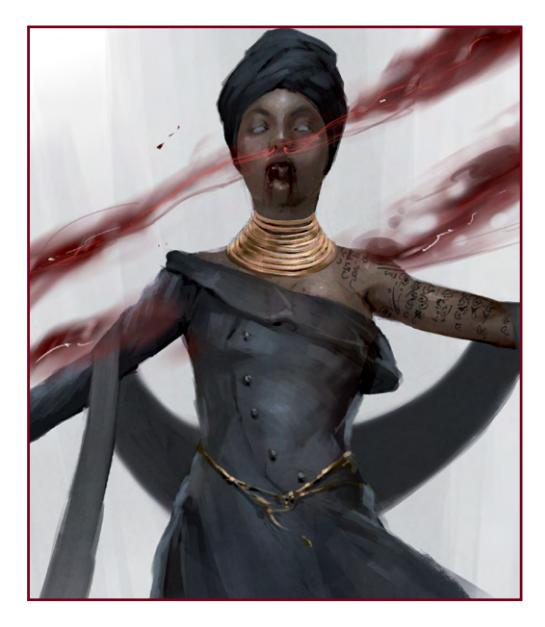

**lore**

• CSI Дерьмо: Будучи начинающим специалистом, вы научились нескольким хитростям, связанным со смертью. Один из них заключается в том, что вы многое знаете о гниении, разложении и о том, как умирают трупы. Внимательно изучив труп, вы можете сразу определить причину смерти. Если причина смерти скрыта сверхъестественным образом, вы получаете способность делать броски, несмотря на это.

•• Фунт плоти: Нечто от изначальной слабости вашего рода остается с вами, даже когда вы становитесь полноценной Гекатой. Более того, вы даже можете поделиться ею с другими. Если вы принимаете свободно переданный дар, то вы и тот, кто вам его передал, получаете штраф в три кубика от любого количества очков, используемых для любых действий друг против друга, до конца этой ночи.

••• Побалуйте себя: Вы переняли легендарный аппетит гедов. Раз в ночь вы можете побаловать себя едой, сигарой, алкогольным напитком или сексуальной связью, как это сделал бы человек, не обращая внимания ни на какие штрафы, которые может наложить человечность, и не испытывая никаких негативных эффектов с точки зрения Голода. Любому, кто обратит внимание на подобные вещи, ваше потребление покажется убедительно человеческим. •••• Мой друг Сетит: У вашего рода странные отношения с Министриями. Интересы во многом совпадают, и не один из них решил присоединиться к Министриям, а не оставаться с Гекатой. У вас есть связь с Министриями, будь то один из тех заблудших "самеди" или другой последователь Сета. Вы можете попросить своего друга об услуге один раз за историю, что эквивалентно трем точкам на соответствующих фонах, таких как "Союзники", "Влияние" и "Ресурсы".

••••• Шелковая шляпа: Никто не знает точно, кто такой Кровавый Доктор, но знают, что вы пользуетесь его благосклонностью и являетесь следующим в очереди на его практику. Что бы это ни было. Вы не совсем уверены в том, что произойдет, если вы сделаете шаг вперед и претендуете на шелковую шляпу Доктора. Возможно, это будет чисто политическая должность в Гекате, а возможно, она наделит вас фантастическими духовными способностями. И уж точно врагами Доктора. Однако прежде чем вы примете эту роль, вы получите эффект Мавлы в пять точек, хотя помощь приходит загадочными путями и через таинственные действия.

## ×åðòû è òèïû âàìïèðîâ Ñâîäíûé ëèñò

## Òèïû Ïèòàíèÿ

Налётчик: Вы берете кровь силой или угрозой. (Стремительность или Могущество) Суррогатчик: Вы добываете пакетную или мертвую кровь, а не охотитесь. (Колдовство крови или Сокрытие)

Бестия: Вы питаетесь кровью других вампиров. (Стремительность или Метаморфозы)

Семьянин: Вы тайно берете кровь у своих смертных родственников. (Доминирование или Анимализм)

Джентельмен: Вы берете кровь с согласия. (Ясновидение или Стойкость)

Вымогатель: вы заставляете смертных платить вам кровью за ваши услуги или защиту.( Доминирование или Могущество).

Фермер: Вы питаетесь от животных. (Анимализм или Метаморфозы) Расхититель могил: Вы бродите по больницам и моргам в поисках жертв. (Стойкость или

Обливион) Мрачный жнец: Вы питаетесь теми, кто скоро умрет. (Ясновидение или Обливион)

Монтеро: Ваши помощники загоняют к вам добычу. (Доминирование или Обливион) Идол: Вы питаетесь от своего культа или последователей. (Колдовство крови или Величие)

Преследователь: Вы изучаете и выслеживаете свою жертву, прежде чем нанести удар. (Анимализм или Ясновидение) Морфей: Вы питаетесь спящими жертвами. (Ясновидение или Сокрытие)

Тусовщик: Вы питаетесь своей субкультурой или эксклюзивной группой. (Доминирование или Могущество)

Искуситель: Вы питаетесь, соблазняя своих жертв. (Стойкость или Величие)

Лазутчик: Вы таитесь в своем гнезде и заманиваете в него добычу. (Метаморфозы или Сокрытие)

## Àòðèáóòû

## Ментальные атрибуты

Интеллект: Память, мышление, интеллект Смекалка: Быстрая реакция, интуиция, мгновенное принятие решений Упорство: Сосредоточенность, концентрация, внимание

## Физические атрибуты

Сила: Мускульная сила, урон в ближнем бою Ловкость: Ловкость, грация, рефлексы Выносливость: прочность, стойкость, живучесть

## Социальные атрибуты

Обаяние: Харизма, магнетизм, сила личности Манипулирование: Словесное изящество, социальное коварство, тонкость.

Самообладание: самоконтроль, хладнокровие,

спокойная голова

## Íàâûêè

## Физические навыки

АТЛЕТИКА: Бег, прыжки, лазание ДРАКА: Бои без оружия всех видов РЕМЕСЛО: Ремесло, строительство, формовка ВОЖДЕНИЕ: управление транспортными средствами ОГНЕСТРЕЛЬНОЕ ОРУЖИЕ: Использование оружия дальнего боя, такого как пистолеты и луки ВОРОВСТВО: Взлом и проникновение, защита от них ФЕХТОВАНИЕ: вооруженный бой с применением холодного оружия

СКРЫТНОСТЬ: Не быть увиденным, услышанным или узнанным

ВЫЖИВАНИЕ: Остаться в живых в неблагоприятной обстановке

## Социальные навыки

ОБРАЩЕНИЕ С ЖИВОТНЫМИ: Обращение с животными и общение с ними ЭТИКЕТ: Вежливость в социальной среде ПРОНИЦАТЕЛЬНОСТЬ: Определение душевных состояний и мотивов ЗАПУГИВАНИЕ: Заставить другого человека отступить

ЛИДЕРСТВО: Направлять и вдохновлять других людей ИСПОЛНЕНИЕ: Выражение искусства лично перед аудиторией

УБЕЖДЕНИЕ: Убеждение других словесно или эмоционально

УЛИЧНОЕ ЧУТЬЕ: понимание особенностей криминальной среды и городского пространства ХИТРОСТЬ: Обманом заставить других выполнить

вашу волю

## Ментальные навыки

ГУМ.НАУКИ: Гуманитарные науки, обучение по книгам

НАБЛЮДАТЕЛЬНОСТЬ: Чувства, осознание окружающей обстановки, распознавание угроз ФИНАНСЫ: Обращение с деньгами, их перемещение

и зарабатывание

РАССЛЕДОВАНИЕ: поиск улик, разгадывание тайн МЕДИЦИНА: исцеление травм, диагностика заболеваний

ОККУЛЬТИЗМ: Тайные знания, как реальные, так и нереальные

ПОЛИТИКА: Дипломатическая и бюрократическая хватка

ЕСТ.НАУКИ: Знания и теория физического мира ТЕХНИКА: Понимание и использование современных

технологий, компьютеров и работы в Интернете

## Äèñöèïëèíû

АНИМАЛИЗМ: сверхъестественное родство с животными и контроль над ними (Гангрел, Носферату, Равнос)

ЯСНОВИДЕНИЕ: экстрасенсорное восприятие, осознание и предчувствия (Геката, Малкавиан, Тореадор, Тремере, Салюбри)

КРОВАВОЕ ЧАРОДЕЙСТВО: использование крови для совершения магических действий (Бану Хаким,

Тремере)

СТРЕМИТЕЛЬНОСТЬ: сверхъестественная быстрота и рефлексы (Бану Хаким, Бруха, Тореадор)

ДОМИНИРОВАНИЕ: контроль над разумом (малкавианцы, салюбри, тремеры, цимисхи, вентру) СТОЙКОСТЬ: Чудовищная прочность (Гангрел, Геката, Салюбри, Вентру) СОКРЫТИЕ: Оставаться неясным и незаметным (Малкавиан, Носферату, Равнос) ОБЛИВИОН: Некромантия и создание теней (Геката, Ласомбра) МОГУЩЕСТВО: Сверхъестественная физическая сила (Бруха, Ласомбра, Носферату) ВЕЛИЧИЕ: Привлекать, подавлять и контролировать эмоции (Бруха, Министрии, Равнос, Тореадор, Вентру) МЕТАМОРФОЗЫ: владение формой (Гангрел, Министрии, Цимисхи) АЛХИМИЯ СЛАБОКРОВНЫХ: смешивание крови,

эмоций и других ингредиентов для создания мощных эффектов (Слабокровные)

## Ôîíû (Òî÷êè)

СОЮЗНИКИ: Смертные партнеры, обычно семья или

друзья

ИНФОРМАТОРЫ: Источники информации, которыми

вы располагаете

СЛАВА: Насколько вы известны среди смертных.

УБЕЖИЩЕ: место, где можно безопасно спать днем

СТАДО: Сосуды, к которым у вас есть свободный и

безопасный доступ

ВЛИЯНИЕ: Ваша политическая власть в обществе

смертных

СТРАНИЦЫ ИСТОРИИ: Ваша связь с тайной

историей Мира Тьмы

МАСКА: Фальшивая личность, сопровождаемая

документами

МАВЛА: Сородич, который советует и поддерживает

вас: наставник, покровитель или

единомышленник.

РЕСУРСЫ: Богатство, имущество и доход.

ПОДРУЧНЫЕ: Последователи, охранники и слуги

СТАТУС: Ваше положение в обществе вампиров

# Ìàñòåð-ëèñò ïðåèìóùåñòâ

Этот основной список преимуществ включает в себя фоны, достоинства и недостатки для Vampire: The Masquerade. В нем не перечислены все страницы истории. Если не указано, эти преимущества могут быть применены к любому вампиру. Преимущества со значком также доступны смертным и гулям.

## Ôîíû

СОЮЗНИКИ **•** ДО **••••••**

Смертные помощники и помощницы; V:tM, с. 184-185.

## КРОВНАЯ ЛИНИЯ **•** ДО **•••••**

Ваша родословная наделяет вас уникальными качествами; с. 112.

## ИНФОРМАТОРЫ **•** ДО **•••**

Смертные, предоставляющие информацию или предметы; V:tM, с. 186.

## СЛАВА **•** ДО **•••••**

Слава среди смертных (или сородичей); V:tM, p. 187.

УБЕЖИЩЕ **•** ДО **•••+** Место для дневного сна; V:tM, pp. 188-189. См. раздел "Достоинства и недостатки убежища".

СТАДО **•** ДО **•••••** Смертные, которыми вы питаетесь; V:tM, с. 189-190.

ВЛИЯНИЕ **•** ДО **•••••** Влияние и авторитет в смертном сообществе; V:tM,

pp. 187-188.

#### СТРАНИЦЫ ИСТОРИИ **•** ДО **•••••**

Информация об элементах более глубокой истории Мира Тьмы или доступ к ним; V:tM, с. 190. См. V:tM (с. 382-406), "Анарх" (с. 190-198), "Камарилья" (с. 184-190) и другие книги по вампирам, где описаны

конкретные страницы истории.

#### МАСКА **•** ДО **••**

Ложная личность; можно приобрести несколько масок; V:tM, с. 190.

## МАВЛА **•** ДО **•••••**

Сородичный покровитель, наставник или другой временный союзник; множественное число от слова мавла - мавали; V:tM, pp. 192-193.

МЕЛКИЙ ДОЛГ **•** ДО **•••**

Одолжения другим сородичам; V:tM, pp. 193, 315.

РЕСУРСЫ **•** ДО **•••••** Богатство или источник дохода; В:тМ, с. 193.

ПОДРУЧНЫЕ **•** ДО **•••** Верный слуга, например, гуль или раб; можно купить несколько Подручных; V:tM, p. 194.

СТАТУТС **•** ДО **•••••**

Статус и ранг в секте Сородичей; V:tM, с. 194.

## Äîñòîèíñòâà

КРАСИВЫЙ **••** Добавить один кубик к социальным пулам, зависящим от внешности; V:tM, с. 179.

#### ИЩЕЙКА **•**

Вы чувствуете запах Резонанса; V:tM, с. 182.

УСТОЙЧИВОСТЬ К УЗАМ **•** ДО **•••** Вы легче сопротивляетесь Кровным Узам; V:tM, p. 181.

ПРОВЕРИТЬ СТВОЛ **•** Бонус в два кубика к пулам кубиков готовности (V:tM, p. 410); p. 119.

ГОРОДСКИЕ СЕКРЕТЫ **•** Вы знаете страшную тайну о структуре власти в городе Сородичей; с. 118.

#### ФАЛЬСИФИКАТОР **•+**

Вы можете создавать маски, для этого требуется Маска ••; V:tM, стр. 192.

#### СПОСОБНОСТЬ ЕСТЬ ПИЩУ **••**

Вы можете употреблять обычную пищу; V:tM, с. 182.

## ИЗВЕСТНОЕ ЛИЦО **•**

Вы похожи на кого-то очень известного; с. 118.

ВЫСОКОФУНКЦИОНАЛЬНЫЙ НАРКОМАН **•** Вы добавляете кубик к одному типу пула, находясь на препарате; V:tM, p. 180.

АНГЕЛ **•** Добавьте два кубика к броскам, чтобы избежать подозрений; с. 118.

#### КРЕПКИЙ ЖЕЛУДОК **•••**

Вы можете питаться холодной кровью. Недоступно вентру; V:tM, p. 182.

ПОЛИГЛОТ **•+**

Один дополнительный язык на точку; V:tM, с. 179.

## ДЬВОЛЬСКАЯ УДАЧА **••••**

Другие берут на себя вину за ваши промахи; с. 119.

#### РЕЖИМ НЬЮИТ **••**

На теле могут сохраняться татуировки, стрижки и т.д. Недоступно при превышении Силы крови 1; стр. 119.

## ЗАМЕЧАТЕЛЬНАЯ ОСОБЕННОСТЬ **•**

Добавить два кубика к социальным броскам с незнакомцами, потерять один кубик из пула

скрытности; с. 118.

#### НЕУСТОЙЧИВЫЕ УЗЫ **••**

Кровные узы на вас распадаются быстрее; V:tM, p. 181.

## СТОРОННИЙ ХАСТЛЕР **••**

Один раз за сессию вы получаете что-то, как если бы у вас было две точки в Ресурсах, Информатора или

Влиянии через вашу сеть.

## ВОСХИТИТЕЛЬНЫЙ **••••**

Добавьте два кубика к социальным пулам, зависящим от внешности; V:tM, p. 179.

#### ТЕМПЕРИРОВАННАЯ ВОЛЯ **•••**

Добавьте кубик, чтобы противостоять Доминированию или Величию. Не может иметь точек ни в одной из дисциплин; стр. 120.

## НЕВОСПРИМЧИВОСТЬ К УЗАМ **•••••**

Не может быть связан узами крови; V:tM, p. 181.

НЕПРИКОСНОВЕННЫЙ **•••••** Избежать официального наказания один раз за историю; с. 120.

РАСПОЗНАВАНИЕ СУДОВ **•**

По запаху можно определить, наелся ли смертный; с.119.

СТЕРТАЯ ЛИЧНОСТЬ **•** Официально вы не существуете. Требуется маска

•• ; V:tM, p.187.

## Достоинства Убежища

Если не указано, заслуги Убежища приводятся в V:tM (стр. 189).

#### КОММЕРЧЕСКОЕ ПРЕДПРИЯТИЕ **••** ДО **•••**

Сдача в аренду (или ведение бизнеса) из своего убежища ценой некоторого отсутствия личного пространства; стр. 111.

## КЛЕТКА **•** ДО **•••••**

Минимальное Убежище в ••

ФУРКУС **•** ДО **•••**

Добавляет кубики к Ритуалам или Церемониям (выберите один); с. 212.

## ТАЙНИК С ОРУЖИЕМ **•+**

ЛАБОРАТОРИЯЯ **•+** Минимальное Убежище в ••

БИБЛИОТЕКА **•+** В Убежище допускается только одна точка •

ЭКСКЛЮЗИВНОЕ РАСПОЛОЖЕНИЕ **•**

### РОСКОШЬ **•**

#### МАШИНОСТРОИТЕЛЬНЫЙ ЦЕХ **•+**

Добавляет кубики в пулы ремесла, техники и т.д.; с. 112.

## ЗАПАСНОЙ ВЫХОД **•+**

Скрытый выход.

#### ПРОДВИНУТАЯ СИСТЕМА БЕЗОПАСНОСТИ **•+**

Сигнализации.

#### ОПЕРАЦИОННАЯ **•**

Минимальное Убежище в •• МАГИЧЕСКАЯ ЗАЩИТА **•+**

#### ОХРАНА **•+**

Патрули, охранники.

#### ДОСТОИНСТВА КАИТИФФОВ

Эти достоинства относятся только к персонажам Каитиффа. Они приведены на с. 126.

#### ЗАЩИТА ОТ СМЕРТИ **•**

Не может изучать Обливион, но имеет иммунитет к нему.

#### ЛЮБАМАЯ КРОВЬ **••••**

Может приобретать силы из любой Дисциплины, как внутри клана, при этом для амальгамы требуется

только одна необходимая сила.

#### МЕТКА КАИНА **••**

Две фантомные точки статуса для издевательств и запугивания других сородичей, труднее поддаются

диаблеризации.

#### ПЕРЕМЕШНИК **•••**

Может использовать силы Дисциплины других вампиров.

#### СОЛНЦЕЗАЩИТНЫЙ **•••••**

Менее подвержены воздействию солнечного света.

#### КЛАКАСТЫЙ ДЯДЯ **•••**

Группа союзников "Слабокровных".

## Достоинства Гулей

Эти достоинства относятся только к персонажамгулям. Они приведены на с. 141.

#### СОПЕРЕЖИВАНИЕ КРОВИ **••**

Может чувствовать эмоциональное состояние своего домитора на расстоянии.

#### ПОТУСКНЕВШАЯ АУРА **••**

Ваша аура напоминает ауру сородичей.

## Достоинства Слабокровных

Эти достоинства применимы только к персонажам слабой крови. Они не имеют точечного значения; каждый недостаток уравновешивает достоинство, и наоборот.

Слабокровные достоинства приведены в V:tM (с.

183-184) и на с. 135.

#### ОТВРАТИТЕЛЬНАЯ КРОВЬ

Другие сородичи не могут пить вашу кровь; с. 135.

#### ТОВАРИЩИ СРЕДИ АНАРХОВ

#### ПОКРОВИТЕЛЬ В КАМАРИЛЬЕ

#### ПОТЕНЦИАЛ КРОВИ

Вы можете создавать кровные узы и объятия.

#### ДНЕВНОЙ ХИЩНИК

Можно ходить при дневном свете.

#### СКЛОННОСТЬ К ДИСЦИПЛИНЕ

Получает точку в Дисциплине, как обычный вампир.

#### НАДЕЖНОСТЬ

Невосприимчивость к истинной вере; с. 136.

## ПОЛНЫЙ ЖИЗНИ

Медицинский смертный; можно есть, пить, трахаться и т.д.

## НИЗКИЙ АППЕТИТ

Бросить два кубика при некоторых проверках ИК; с. 136.

#### ОСОЗНАННЫЙ МЕЧТАТЕЛЬ

Вы видите сны и можете вспомнить соответствующие детали; с. 136.

#### ОБРАЗ СМЕРТНЫХ

Аура читается как смертная; с. 136.

#### БЫСТРЫЙ ПИТАТЕЛЬ

Уменьшить один голод за один ход, включая закрытие ран; с. 136.

## **VAMPIRE** THE MASQUERADE

#### **АЛХИМИК**

Вы можете взять "Алхимию слабокровных" в качестве дисциплины.

#### ЖИВУЧЕСТЬ ВАМПИРА

Вы получаете урон как обычный вампир.

## Недостатки

 $\frac{1}{\sqrt{2}}$   $\frac{1}{\sqrt{2}}$   $\frac{1}{\sqrt{2}}$   $\frac{1}{\sqrt{2}}$   $\frac{1}{\sqrt{2}}$   $\frac{1}{\sqrt{2}}$   $\frac{1}{\sqrt{2}}$   $\frac{1}{\sqrt{2}}$   $\frac{1}{\sqrt{2}}$   $\frac{1}{\sqrt{2}}$   $\frac{1}{\sqrt{2}}$   $\frac{1}{\sqrt{2}}$   $\frac{1}{\sqrt{2}}$   $\frac{1}{\sqrt{2}}$   $\frac{1}{\sqrt{2}}$   $\frac{1}{\sqrt{2}}$   $\frac{1}{\sqrt{2}}$  Потерять один кубик без исправления; V:tM, p. 180.

ПРОТИВНИК (• ТО •••) Сородич, который выступает против вас; V:tM, р. 193.

ХОДЯЧИЙ АНАХРОНИЗМ (\*\*) Невозможно использовать технику. Только Анциллы и старше; V:tM, р. 180.

ПРИСТРАСТИЕ К УЗАМ (•) Сложнее противостоять Узам Крови; V:tM, p. 181.

PAE KPOBABHX V3 (..) Легкая привязка к кровным узам; V:tM, p. 180.

СТРАШНАЯ ТАЙНА (• ДО ••••) Еди бы об этом узнали, на вас бы обрушилась позорная слава и охота; V:tM, p. 187.

ПРЕЗИРАЕМЫЙ (••) Ожна группа или район города презирает вас; с. 187. V:tM.

•• НИЩИЙ (•) Ни денег, ни дома; V:tM, р. 193.

•• ОДИОЗНАЯ ЛИЧНОСТЬ (•) Город в целом вас не любит; В:тМ, с. 187-188.

 $\ast$  BPATM ( $\cdot$  40  $\cdots$ ) Смертельные охотники и враги; V:tM, с. 184-185.

#### ФОЛЬКЛОРНЫЕ ПРОКЛЯТЬЯ (•)

Надуманная опасность (например, серебро, святая вода) наносит вам урон с тяжелыми повреждениями; V:tM, p. 182.

#### ФОЛЬКЛОРНЫЕ ПРЕПЯТСВИЯ (•)

Должен потратить силу воли, чтобы преодолеть надуманное препятствие (например, просыпанные

семена, проточная вода, святые символы); V:tM, p. 182.

**<del>★</del> ЗАВИСИМОСТЬ (••)** Выпадение двух игральных кубиков без возможности перекидывания; V:tM, с. 179.

**\* HETPAMOTHIM (\*\*)** V:tM, p. 179.

 $\ast$  BECYETLE ( $\cdot$   $10$   $\cdots$ )

Бесчестье среди смертных (или сородичей); V:tM, p. 187.

**\*\*** ЖАЖДУЩИЙ ЗНАНИЙ (\*) Должен сделать бросок силы воли, чтобы противостоять своему стремлению к изучению; стр. 121

ПУСТОТЕЛЫЙ (••) Биометрические данные в досье Второй инквизиции; V:tM, p. 190.

ПОКОЙНИК (•)

Ваша смерть хорошо известна; V:tM, р. 190.

РЕТРОГРАД (•) Устаревшие убеждения влекут за собой социальные штрафы. Только Анциллам и старше; V:tM, с. 180.

УСТОЙЧИВЫЕ УЗЫ (•) Кровные узы, связанная с вами, распадается медленнее; V:tM, p. 181.

ЖАЖДА МАФУСАИЛА (•) Полностью утолить голод можно только сверхъестественной кровью; V:tM, p. 181.

БЕЗ УБЕЖИЩА (•) Нет безопасного укрытия; V:tM, p. 188.

ПОВАДКИ ХИЩНИКА (\*\*) Вы пугаете смертных и не можете содержать стадо; V:tM, p. 189.

ПОЖИРАТЕЛЬ ОРГАНОВ (..) Питаться можно только человеческими органами; V:tM, p. 181.

#### ДОЛГИ ПО КРЕДИТАМ **(•)**

Вы должны два незначительных блага; стр. 115-116.

#### РАЗБОРЧИВОСТЬ **(•)**

Вы отказываетесь охотиться на конкретную добычу; V:tM, с. 181.

## ОМЕРЗИТЕЛЬНЫЙ **(••)**

Потерять два кубика из социальных пулов, зависящих от внешности; V:tM, с. 179.

## РИСКОВЫЙ ИГРОК **(•)**

Склонный к риску, штраф два кубика при сопротивлении рискованному поведению; с. 121.

#### ОТВЕРЖЕННЫЙ **(••)**

Ненавистен секте вампиров; V:tM, p. 194.

#### МИШЕНЬ ДЛЯ КОЛЬЕВ **(••)**

Удар колом в сердце приводит к окончательной смерти; V:tM, с. 182.

### ПРЕСЛЕДОВАТЕЛИ **(•)**

Надоедливые преследователи; В:тМ, с. 194.

#### УСТАРЕВАЮЩИЙ УПАДОК **(••)**

При голоде 3+ ваше тело распадается со штрафом в два кубика при физических испытаниях и при социальных

испытаниях со смертными; с. 120.

#### ЗЛОВОНИЕ **(•)**

Потерять один кубик из соответствующих социальных пулов, два кубика из соответствующих пулов

Скрытности; с. 120.

#### СТИГМАТЫ **(•)**

При голоде 4 у вас идет кровь из рук и ног; V:tM, p. 182.

#### ПОДОЗРИТЕЛЬНЫЙ **(•)**

Два кубика социальных штрафов в секте вампиров; V:tM, p. 194.

## ТРАНСПАРЕНТ **(•)** Штраф в один кубик к Хитрости. Не может набирать

точки в Хитростях; стр. 120.

#### ДВОЙНОЕ ПРОКЛЯТЬЕ **(••)**

Возьмите второй вариант Проклятия своего клана (стр. 56) в дополнение к своему обычному Проклятию; стр. 121.

## УРОДЛИВЫЙ **(•)**

Потерять один кубик из социальных пулов, зависящих от внешности; V:tM, p. 179.

#### ФЕРМЕР **(••)**

Ты питаешься только кровью животных; V:tM,

p. 181.

## ВЕНОЗНАЯ ЛЕНТА **(•)**

Нельзя брать кровь у смертных, находясь под наблюдением; с. 120.

## СЛАБАЯ ВОЛЯ **(••)**

Штраф в один кубик к социальному бою против вышестоящего, вы не можете использовать активное сопротивление против Доминирования или Величия; стр. 121.

## Недостатки Убежища

## ИЗВЕСТНОЕ МЕСТОПОЛОЖЕНИЕ **(••)**

*V:tM*, p. 188.

## ЖУТКОЕ МЕСТО **(•)**

*V:tM*, p. 188.

## СВЕРХЪЕСТЕСТВЕННАЯ ПРОБЛЕМА **(•+)**

*V:tM*, p. 188.

## ОБЩЕСТВО **(•** ДО **••)**

Другой сородич (или более) может использовать и изменять ваше убежище без спроса; с. 113.

## Недостатки Каитиффов

Эти недостатки применимы только к персонажам-каитиффам. Они приведены на с. 127.

#### ЖИВОТНОЕ ВИТЭ **(••)**

Твои объятия создают чудовищ.

### ПРОКЛЯТИЕ КЛАНА **(••)**

Вы все еще страдаете от проклятья клана вашего сира с половинной силой.

#### ДОЛГОВАЯ ЯМА **(••)** ЛИКВИДАДТОР **(•)**

Считается врагом слабокровных, штраф в два кубика к социальным пулам с ними.

МУТНАЯ КРОВЬ **(•)** Должен выпить кровь того, у кого есть Дисциплина, чтобы приобрести точки в ней.

ХОДЯЧИЙ ОМЕН **(••)** Сказительство, предчувствия, гадания указывают на вас как на причину несчастья.

СЛОВА-КАРРИДЫ **(•)** Кожа покрыта текстами по вампирской тематике, что делает вас оккультной мишенью.

## Недостатки гулей

Эти недостатки применимы только к персонажамгулям. Они приведены на с. 141.

#### КРОВЬ С ИЗЪЯНОМ **(•** ДО **••)**

Вы страдаете от проклятья клана вашего сира.

#### ПРОКЛЯТИЕ СТАРЕНИЯ **(••)**

Кровь состарила и ослабила вас, потеряйте одну единицу здоровья.

### ПУГАЮЩИЕ КЛЫКИ **(•)**

Потерять один кубик на социальных пулах со смертными.

## Недостатки слабокровных

Эти недостатки применимы только к персонажам слабокровным. Они не имеют точечного значения; каждый недостаток уравновешивает достоинство, и наоборот.

Дефекты слабокровных приведены в V:tM (с.

182-183) и на с. 135.

## БЕЗЗУБЫЙ

Клыков нет.

## "КЛЕЙМО КАМАРИЛЬИ"

КЛАНОВОЕ ПРОКЛЯТЬЕ

Выберите клановое проклятие.

МЕРТВАЯ ПЛОТЬ Вы медленно разлагаетесь.

ГЕЛИОФОБИЯ Безумие ужаса от солнечного света; с. 135.

СУБТИЛЬНОСТЬ СМЕРТНЫХ Вы исцеляетесь как смертный.

НОЧНЫЕ КОШМАРЫ Сны вторгаются в ночь бодрствования; с. 135.

НОСИТЕЛЬ ЧУМЫ Смертельная болезнь все еще влияет на вас; с. 135.

#### ОТВЕРЖЕННЫЙ СРЕДИ АНАРХОВ

НЕАККУРАТНОЕ ПИТЬЕ Ловкость + Медицина, чтобы не оставлять раны; с. 135.

ВЫРАКАННЫЙ НА СОЛНЦЕ Нет способностей к дисциплине при солнечном свете; с. 135.

### СВЕРЪЕСТЕСТВЕННОЕ ПРИСУТСТВИЕ

Сверхъестественные существа могут вас обнаружить; с. 135.

#### СУМЕРЕЧНОЕ ПРИСУТСТВИЕ

Вы заставляете смертных и полнокровных бояться вас; с. 135.

НЕПРИРЫВНЫЙ ГОЛОД Меньшее сопротивление голодному бешенству при питании; с. 135.

## ЗАВИСИМОСТЬ ОТ ВИТЭ

Для использования способностей необходимо выпить витэ.

## **/AMPIRE** THE MASQUERADE

## Преимущества Котерии

Может также включать фоны, см. выше.

## Достоинства Котерии

Достоинства котерии могут быть приобретены только в составе котерии, за очки котерии. Они приведены на c. 171.

#### ОТВЕРСТИЯ ДЛЯ БОЛТОВ • ДО •••

Добавьте по одному кубику за точку к попыткам

бегства и уклонения в ваших разросшихся владениях.

#### НА ПОДХВАТЕ • ДО •••

Автоматический поиск заданного резонанса в вашем домене.

#### ПРИВЕЛИГИРОВАННЫЙ •••

Особые права для котерии.

#### ТРАНСПОРТ ••

Комфортная поездка.

## Достоинства клана Котерии

Члены клана могут приобрести соответствующее достоинство клана либо при создании персонажа, либо во время создания клана. Эти достоинства могут быть использованы только товарищами по котерии и только один раз за сессию (кроме "Тактики стаи" и

"Криптолекта").

#### БАНУ ХАКИМ: ПРИЗЫВ К ЦЕЛИ ••

Свободное очко силы воли: с. 179.

#### БРУХА: ЗАГРУЗКИ И СБОРЫ •

Перебросить обычные кубики при неудачной проверке физической подготовки; с. 180.

#### ГАНГРЕЛ: ТАКТИКА СТАИ •••

Добавьте один кубик к Драке или Фехтованию против того же противника, что и Гангрел; с. 181.

#### ГЕКАТА: ИСКУССТВО УМИРАТЬ ••

Маска убитого вами трупа; с. 182.

#### ЛАСОМБРА: ЛЮБОЙ ЦЕНОЙ ••

Добавить два успеха к любой проверке на кровавый триумф значение; с. 182.

#### МАЛКАВИАН: ВСЕ ВЗАИМОСВЯЗАНО •••

Поменяйте любой пул умений на другой для сбора информации, Оракул интерпретирует результат; с. 183.

#### МИНИСТРИЙ: ПРОНИЦАТЕЛЬНОСТЬ •

Поговорите с любым другим сородичем, сетит определяет, чего он хочет; с. 184.

#### НОСФЕРАТУ: КОНТЕКСТНЫЙ ИНФОРМАТОР ••

Для получения информации добавьте к любой

проверке наивысшую отметку "Информаторы"; с. 185.

РАВНОС: КРИПТОКОЛЛЕКТИВ •••

Язык тайного культа; с. 185.

САЛЮБРИ: СДЕРЖАННОСТЬ •••

Перебросить все голодные кубики в проверке; с. 186.

#### ТОРЕАДОР: ПОЛНЫЙ ДОСТУП • Попасть на мероприятие или объект, потому что вы в списке или знаете человека; с. 187.

#### ТРЕМЕРЕ: МНОГОУРОВНЕВОЕ КРАЕВЕДЕНИЕ ••

Разделите преимущество страницы истории с котерией и соратником по группе; с. 188.

ЦИМИСХИ: ДРЕВНЕЕ ГОСТЕПРЕИМСТВО •• Восстанавливает дополнительный уровень легкого

повреждения силы воли в их убежище; с. 189.

## ВЕНТРУ: НАСЛЕДИЕ СОРОДИЧЕЙ •• Знать какую-либо информацию или сплетни о другом

сородиче; с. 189.

КАИТИФФ: УНИВЕРСАЛЬНОЕ ВИТЭ •• Использовать силу Дисциплины, которой вы не обладаете; стр. 190.

#### СЛАБОКРОВНЫЕ: СМЕРТНОЕ СЕРДЦЕ ••

Поднять человечность на одну точку выше; с. 191.

# Лист Котерии

| Название Котерии                 | Тип Котерии                      |      |
|----------------------------------|----------------------------------|------|
| История                          | Участники                        |      |
| Город                            | ФИО                              | Клан |
| Домен                            |                                  |      |
| Описание                         |                                  |      |
| ¡¡¡¡¡ Шасс                    |                                  |      |
| ¡¡¡¡¡ Льен                    |                                  |      |
| Портильон ¡¡¡¡¡                  |                                  |      |
| Достоинства Домена               |                                  |      |
|                                  |                                  |      |
|                                  |                                  |      |
|                                  |                                  |      |
| Резонанс Домена                  |                                  |      |
| Достоинства и недостатки Котерии |                                  |      |
|                                  |                                  |      |
|                                  |                                  |      |
| Блага и долги Котерии            | Убежище или притон               |      |
|                                  |                                  |      |
|                                  | Достоинства и недостатки убежища |      |
|                                  |                                  |      |
| Основные принципы истории        | Цели Котерии                     |      |
|                                  |                                  |      |
|                                  |                                  |      |
|                                  |                                  |      |
|                                  |                                  |      |

## ×åðòû äîìåíà Êîòåðèè è

### äîñòîèíñòâà

Дополнительные Достоинства Домена, относящиеся к каждому признаку, представлены здесь под его основным признаком, а также на с. 175. более подробно.

## Шасс• до •••••

Богатство и размеры охотничьих угодий; V:tM, с. 195-196.

#### ЖИЛЫЕ БАШНИ **••**

ПОДВОРОТНИ **••**

ПОГРЕБАЛЬНЫЙ **•**

ЗАКРЫТЫЙ ПОСЕЛОК **••**

БОЛЬНИЦА **••**

НОЧНАЯ ЖИЗНЬ **•••**

ПРИЮТ **••**

## Льен **•** до **•••••**

Насколько хорошо котерия вписывается в свой Домен; V:tM, с. 196.

#### КАМПУС **•••**

МЭРИЯ **•••**

КУЛЬТУРНАЯ ДОСТОПРИМЕЧАТЕЛЬНОСТЬ **••**

#### РЫНОЧНАЯ ПЛОЩАДЬ **••**

ТОЛЬКО ДЛЯ ЧЛЕНОВ КЛУБА **••**

ПЕРЕХОДЫ **••**

## Портильон **•** до **•••••**

Безопасность домена; V:tM, с. 196.

ЗАБРОШЕННОЕ ЗДАНИЕ **•** ПОЖАРНАЯ ЧАСТЬ **•••** ПОЛИЦЕЙСКИЙ УЧАСТОК **••** ТЮРЬМА **••** ТРАНЗИТ **••**

## Íåäîñòàòêè Êîòåðèè

Недостатки котерии могут быть приобретены только в качестве котерии, за очки котерии. Они приведены на с. 172.

## ХУЛИГАНЫ **(•)**

Обида на предыдущий режим, штраф в один кубик по социальным показателям (кроме

Запугивания) с вампирами.

#### ПРОКЛЯТЫЙ (ВАРЬИРУЕТСЯ) **(•+)**

Мифический недостаток (V:tM, стр. 182) действует на членов котерии за пределами их Домена.

## ХРАНИТЕЛИ **(••)**

Бесславная работа; при пренебрежении теряет статус.

#### МИШЕНЬ **(•)**

Котерия фигурирует в досье какого-то охотничьего агентства.

## ТЕРРИТОРИЯ **(•)**

Территория разрушается (штрафы за черту Домена), когда вы покидаете город.

#### В ОСАДЕ **(••)**

Вражеская угроза нацелена на ваши владения с кажущейся безнаказанностью.

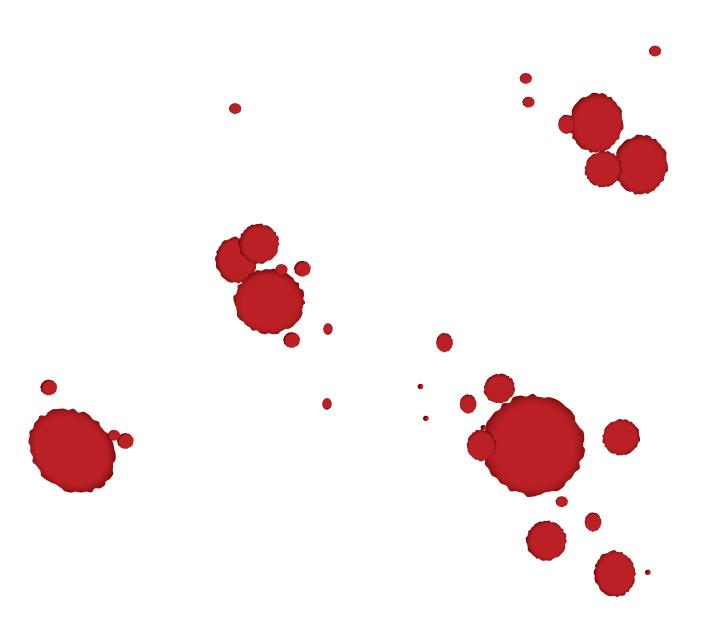

# Объединеные Антагонисы

## Цимисхи-Прислужники-Гули

Шляхта и вожди — не просто изувеченные жертвы. Печально известные гули Цимисхов появляются на свет с помощью древних ритуалов. Они гораздо преданнее вассала, связанного узами крови, а их тело — опасное оружие. Несмотря на то, что в наше время этих чудовищных существ почти не встретить, известно, что их порой используют нелюди-старейшины, хоть бы и в крайних случаях. А где-то в мире наверняка скрываются беспризорные слуги, которые охраняют убежище давно усопших Сородичей.

И, как будто этих ужасающих созданий недостаточно, поговаривают, что у древних старейшин, и у цимисхов в особенности, в услужении есть целые семьи гулей. Значит ли это, что на поддержание этих семей уходят реки крови древних вампиров, или же те изобрели какой-то способ передавать качества гуля по

наследству? Лучше пощадить своё воображение.

## Шляхта

Цимисхи предпочитают скорее причислять к шляхте в награду за искреннюю преданность, нежели внушать её в процессе. Перестраховаться, впрочем, никогда не помешает…

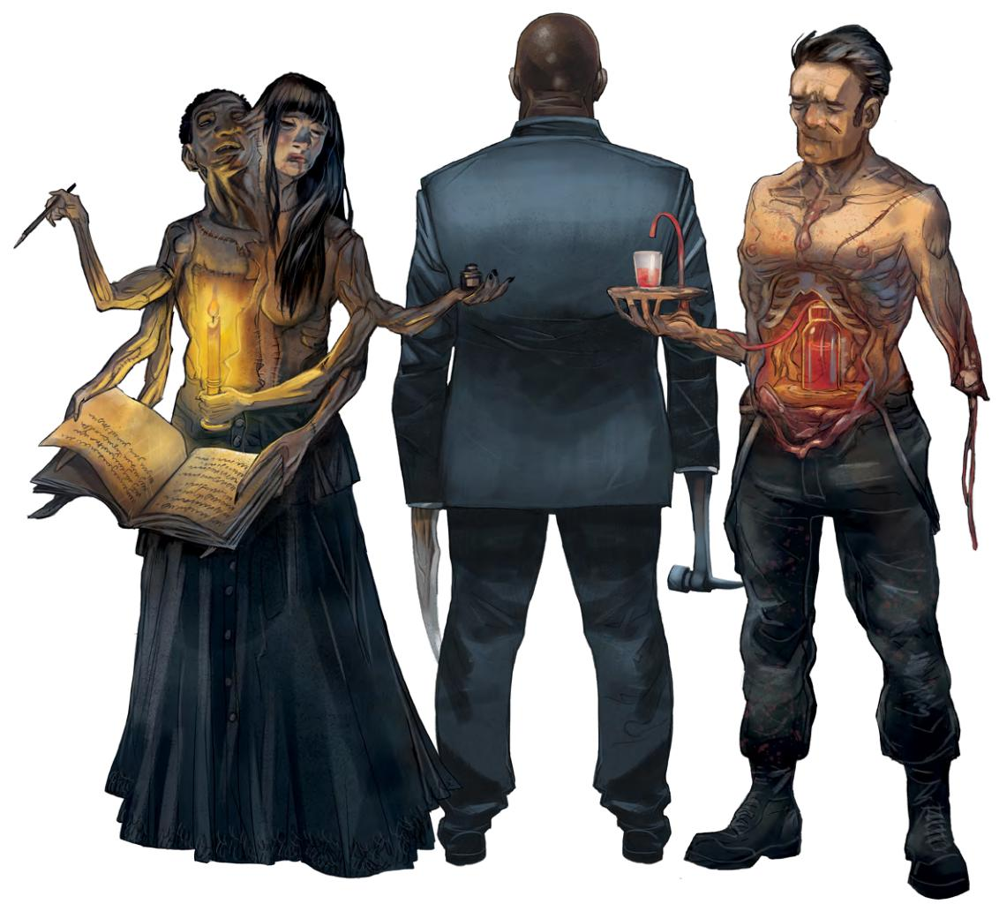

Шляхтичи принимают разнообразные формы, будь то самый обычный с виду дворецкий или собрание тел, слепленное специально для того, чтобы носить паланкин господина. У молодых цимисхов чаще получаются уникальные и приспособленные к современным условиям создания. Стоит сказать, впрочем, что у шляхты нет «типичных» представителей — ниже представлен шаблон слуги, который рассказчик вправе изменить, как того потребует история.

Универсальные пулы: физический 4, социальный 2, ментальный 4.

Производные характеристики: здоровье 10, воля 4.

#### Профессиональные навыки: один

специализированный навык 8. Дисциплины: две силы 1 уровня. Особенности: если слуга создаётся для сражений, его костные отростки в ходе ритуала наделяются свойствами, аналогичными Оружию Зверя. Некоторые шляхтичи, закалённые особенно жестокими методами, фактически неуязвимы для Доминирования, Величия и сил, которые влияют на разум.

## Вождь

Кошмарные великаны, сшитые из десятков шляхтичей с помощью Преображения и Кровавого Чародейства. Говорят, этих первобытных чудовищ используют в отдалённых уголках мира почти что как осадные орудия прошедших веков, где их главная цель — нести ужас и разрушение.

У вождя нет личности, он не в состоянии осознанно предать господина и не способен переосмыслить своё предназначение или выйти за его рамки. Это говорит о том, что его также нельзя обмануть. Впрочем, от вождя есть шанс убежать, его можно обойти стороной и даже, как бы безумно это ни звучало, победить. Кроме порции крови своего господина раз в месяц, ему не нужна пища, но его голод, тем не менее, едва ли можно утолить.

Не стесняйся изменять отдельные параметры, ведь каждый вождь уникален. Персонажи игроков, впрочем, вряд ли будут сталкиваться с ними достаточно часто, чтобы заметить подобные нюансы.

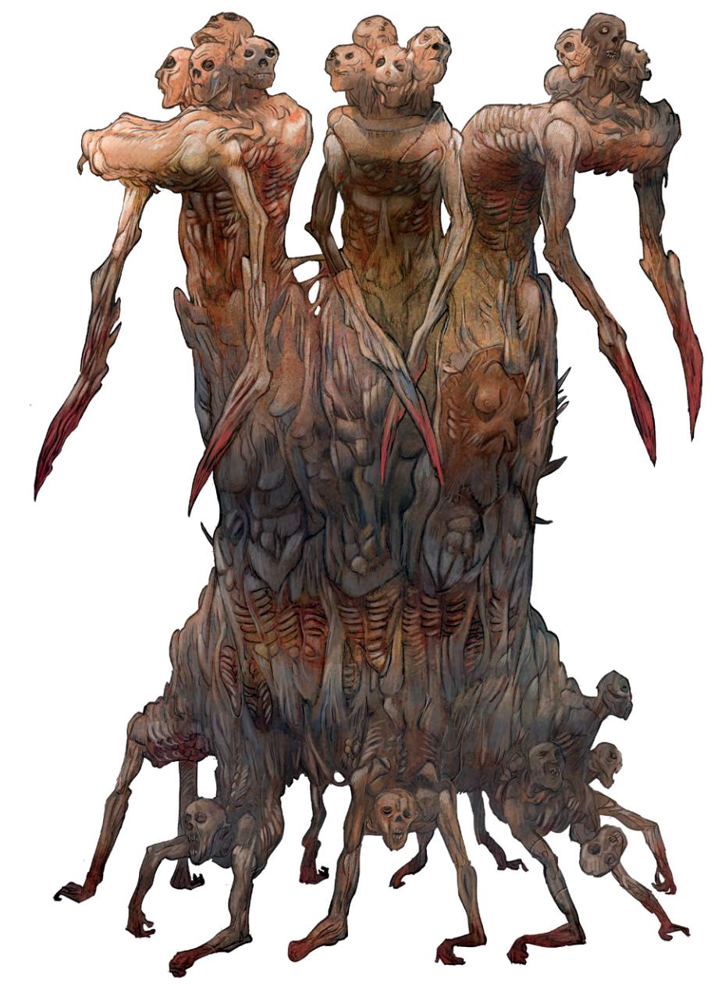

# Ревенанты

Некроманты используют обряды Обливиона для оживления этих трупов и их частей, но не всегда убирают за собой. Эти твари могут копошиться или шататься в темноте городских склепов, канализаций и сгоревших лабораторий

некромантов.

## Бездумный труп

Стандартный набор кубиков: Физические 2, Социальные 0, Ментальные 0 Вторичные атрибуты: Здоровье 4, Сила воли 0 Исключительные пулы кубиков: Запугивание 4 Особенности: Бездумные трупы получают поверхностный и усиленный урон так же, как и вампиры, за исключением того, что они невосприимчивы к солнечному свету. Они не могут исцелять или исправлять повреждения, и каждый день гниют, нанося по меньшей мере одно легкое повреждение здоровья. Они не поддаются ментальному воздействию, поскольку привязаны к своему хозяину. Они не реагируют ни на движения, ни на слова, ни на вмешательство кого-либо, кроме своего реаниматора. Бездумные трупы всегда могут участвовать в командной работе (Vampire: The Masquerade, p. 122), выполняя рутинную работу, например, копать, поднимать или толкать, даже если у них нет навыков.

Общие Сложности: 2/1

## Агрессивный Труп

Стандартный набор кубиков: Физические 4, Социальные 0, Ментальные 0 Вторичные атрибуты: Здоровье 6, Сила воли 0 Исключительные пулы кубиков: Драка 6; Запугивание 5 Особенности: Агрессивные трупы получают легкий и тяжелый урон так же, как и вампиры, за исключением того, что они невосприимчивы к солнечному свету. Они не могут исцелять или исправлять повреждения. Они не поддаются ментальному воздействию, так как привязаны к своему хозяину. Им не нужны глаза и уши, чтобы воспринимать все вокруг, как это мог бы делать человек с беспрепятственным зрением и слухом. Укусы агрессивных мертвецов наносят +2 урона здоровью, которые для смертных усугубляются. Общие сложности: 3/2

## Слуга Гомункул

Некроманты создают этих слуг и шпионов из частей тела, таких как руки или черепа, или из мелких мертвых животных, таких как крысы или лисы.

Большинство гомункулов могут преодолевать стены, прыгать (даже если у них нет для этого конечностей) и эффективно прятаться, хотя индивидуальные различия очень велики и зависят от задач, для выполнения которых они были созданы. Хотя гомункулы не могут говорить или выполнять действия, требующие глубокого размышления, они могут телепатически передавать своему создателю отдельные образы, запахи или звуки.

Стандартные пулы кубиков: Физический 1, Социальный 0, Ментальный 1

Вторичные атрибуты: Здоровье 3, Сила воли 1 Исключительные пулы кубиков: Атлетика 4, Скрытность 6; Запугивание 4

Особенности: Гомункулярные слуги получают легкие и тяжелые повреждения так же, как и вампиры, за исключением того, что они невосприимчивы к солнечному свету. Они не могут исцелять или исправлять повреждения. Они не поддаются ментальному воздействию, так как привязаны к своему хозяину. Им не нужны глаза и уши, чтобы воспринимать все вокруг, как это мог бы делать человек с беспрепятственным зрением и слухом. Они могут телепатически передавать своему хозяину одно изображение в каждой сцене.

Общие сложности: 3/1 ■

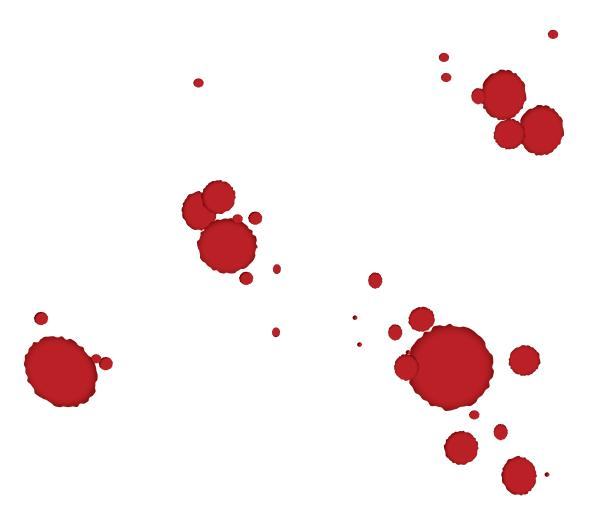

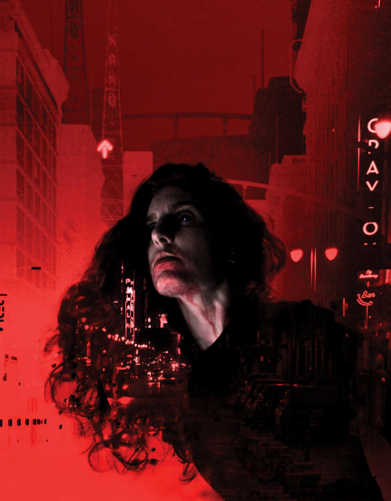