A SOURCEBOOK FOR VAMPIRE: THE MASQUERADE

V5-Sabbat.pdf-renegadegames.com-#a11397-103

A Sourcebook for 
Vampire: The Masquerade

V5-Sabbat.pdf-renegadegames.com-#a11397-103

Sabbat: The Black Hand

LEGAL AND CREDITS

WRITTEN BY Justin Achilli, Alan Alexander, Khaldoun Khelil, and Karim Muammar

EDITING, DIVERSITY READING, AND INDEXING: Stephanie Cohen

ART DIRECTOR: Tomas Arfert

COVER ART: Mark Kelly

INTERIOR ART AND ILLUSTRATION: Tomas Arfert, Krzysztof Bieniawski, Emilis Emka,

Mirko Failoni, Flyos Games (Vampire: The Masquerade – Chapters), Mark Kelly,

Ronja Melin, Anders Muammar, pexels.com (Gabby K, Kaique Rocha, Ivan Siarbolin,

David Skyrius), Roena I. Rosenberger, Marc Simonetti, Sally Thordarson,

Drew Tucker, Kim Van Deun, Sergey Vasnev, Martyna Zych

GRAPHIC DESIGN AND LAYOUT: Tomas Arfert

PROOFREADING: Jason Carl, Brian Holland

ORIGINAL SABBAT CONCEPT, DESIGN, AND DEVELOPMENT: Steven C. Brown and Andrew Greenberg

WORLD OF DARKNESS BRAND MANAGEMENT

BRAND MANAGER: Sean Greaney

BRAND CREATIVE LEAD: Justin Achilli

BRAND ART DIRECTOR: Tomas Arfert

BRAND EDITOR: Karim Muammar

BRAND COMMUNITY DEVELOPER: Martyna “Outstar” Zych

BRAND MARKETING MANAGER: Jason Carl

PARADOX LICENSING

BUSINESS DEVELOPER: Dhaunae De Vir

RENEGADE GAME STUDIOS

PRESIDENT & PUBLISHER: Scott Gaeta

SENIOR GAME DESIGNER: Matt Hyra

VICE PRESIDENT SALES & MARKETING: Sara Erickson

GAME DESIGNERS: Dan Blanchett & T.C. Petty III

CONTROLLER: Robyn Gaeta

SENIOR CREATIVE LEAD OF BOARD & CARD GAMES: Anita Osburn & Jeanne Torres

DIRECTOR OF OPERATIONS: Leisha Cummins

VIDEO PRODUCTION MANAGER: Desiree Love

DIRECTOR, STRATEGIC PARTNERSHIPS: Erika Conway

CUSTOMER SERVICE: Jenni Janikowski

FINANCE CLERK: Minnie Nelson

SALES AND MARKETING PROGRAM MANAGER: Matt Holland

SENIOR PRODUCER OF BOARD & CARD GAMES: Dan Bojanowski

EVENT MANAGER: Chris Whitpan

ASSOCIATE PRODUCER OF BOARD & CARD GAMES: Jimmy Le

CREATIVE PRODUCTION LEAD: Gordon Tucker

SENIOR PRODUCER OF ROLEPLAYING GAMES: Elisa Teague

CREATIVE PRODUCTION: Noelle Lopez

ASSOCIATE PRODUCER OF ROLEPLAYING GAMES: Trivia Fox

© 2021 Paradox Interactive® AB. Vampire: The Masquerade® – are trademarks and/or registered trademarks of  
Paradox Interactive AB in Europe, the U.S., and other countries. © 2021 Renegade Game Studios. All Rights Reserved.

Visit the World of Darkness online at www.worldofdarkness.com

V5-Sabbat.pdf-renegadegames.com-#a11397-103

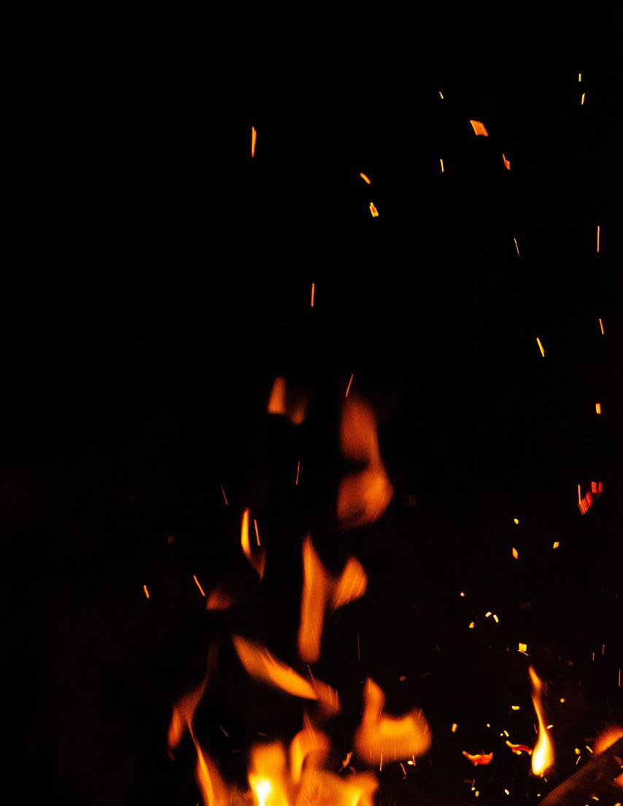

S

ome of you call me the Martyr of Caine. It is one of the many appellations I have 
worn in my thousand years as one of the undead.

I hope those one thousand years convince you of my bona fides. My position is not 
an empty appeal to my own authority. My voice is the voice of one who has seen 
firsthand the tumult of ages. I myself lit fires and drank blood in Silchester when the 
Anarchs rebelled. I myself touched the faces of the Eldest, have worn shackles in its 
Cathedral.

The world is ever-changing, and the Damned must change with it. The Sabbat must change 
with it. Centuries ago, our tools were blood and fire. Tonight, many of us continue to 
wage war with those same weapons. And the mortal world once took up fire against us in 
return.

Tonight, we have had our backs broken by our sires and grandsires, our hearts pierced 
by mortal hunters — hunters who themselves know that wooden stakes and torches, while 
still effective, give way to more effective tools. Swarms of death-spitting homunculi 
that hover in the sky. Weapons that outpace the rending of life that even the hoary  
koldun can coax from the ground.

The mortals have once again taken up fire. Our sires and grandsires likewise roar their 
fire against us. You have read the Book. You know the signs.

Our blood and fire do not hold back the night. From our vantage, fire is inadequate  
to even illuminate the night for any true duration.

Our dominion will not be realized by calling upon the same blood and fire we wielded 
against superstitious peasants as they shuddered on their crofts.

Our dominion will not be realized by seizing domain and reclining on its throne, like a 
pasha, like a Camarilla crow.

We shall realize our dominion not by lingering upon what we are, but by heeding what  
we must become.

This Damned form — this Cainite form — is but a chrysalis. It is mutable, mere flesh, 
mere clay. We have left our mortal clay behind, but our journey does not end with these 
vile bodies.

We must, then, ourselves become the night.

We must become.

For such is the will of Caine.

V5-Sabbat.pdf-renegadegames.com-#a11397-103

TABLE OF CONTENTS

Introduction	
6
How to use this Book	
7
Storyteller Style	
7
Theme and Mood	
7
Build Your Own Medieval Death Cult	
8

The Path of Death and the Soul	
24
	
Ethics	
25
	
In Chronicles	
25
	
Disciplines	
25
The Path of Power and the Inner Voice	
26
	
Ethics	
27
	
In Chronicles	
27
	
Disciplines	
27
The Path of the Sun	
28
	
Ethics	
30
	
In Chronicles	
30
	
Disciplines	
30
Forsaken Paths	
31
	
Path of the Beast	
31
	
Path of Honorable Accord	
31
	
Path of Lilith	
31
The Killing Time: Antagonists	
32
Constructing Conflict	
32
Portraying the Paths	
33
	
Path of Caine	
33
 	
Path of Cathari	
35
	
Path of Death and the Soul	
37
	
Path of Power and the Inner Voice	
40
	
Flotsam and Jetsam	
42
The Gifts of Caine: Disciplines	
46
	
Auspex	
46
	
Animalism	
47
	
Dominate	
47
	
Obfuscate	
48
	
Protean	
49
	
Oblivion	
49
	
Blood Sorcery	
49

Chapter One:  
Setting Fire	
11
The Righteous Supremacy of the Blood	
11
Beyond Mortal	
12
Power and Liability	
12
A Church Militant	
13
Shattered Domains	
13
Endless Conflict	
14
Forging Loyalty	
14
Legacy of Brutality	
15
Feeding the Beast	
15

Chapter Two:  
Apostates of a Cruel Church	
19
Paths of Enlightenment	
19
The Path of Caine	
20
	
Ethics	
20
	
In Chronicles	
21
	
Disciplines	
21
The Path of Cathari	
22
	
Ethics	
23
	
In Chronicles	
23
	
Disciplines	
23

V5-Sabbat.pdf-renegadegames.com-#a11397-103

Chapter Five:  
Storyteller Resources	
105
Setting Element: Sabbat Domains	
105
	
Surge	
106
	
Accord	
107
	
Entente 	
107
	
Crusade	
108
Story Elements: Chronicle Structures	
109
	
Blood and Fire	
109
	
Hearts and Minds	
110
	
Stoking Revolution	
111
	
Infiltration and Espionage	
112
Story Elements: Narrative Structures	
115
	
Rising Action	
115
	
Open Conflict	
116
	
Temptation	
117
	
The Enemy of My Enemy	
118
Story Element: Conflict Triangles	
120
	
Rival Sects	
120
Playing With Fire:  
The Second Inquisition	
120
Thematic Element: Inhumanities	
121 
Thematic Element:  
The Pack Hunts as One	
122
Setting Element: Sabbat Havens 	
122
	
Communal Havens	
123
Storytelling Technique:  
Paranoia and Red Herrings  	
124
Thematic Element: the Antediluvians 	
125
	
Enemy Unknown	
125
	
Stolen Blood	
126

Ceremonies	
52
Thin-Blood Alchemy	
53
Ritae: Keys to the Dominion of Caine	
55
	
The Role of Ritual	
55
	
Auctoritas Ritae	
56
	
Creation Rites	
57
	
Ignoblis Ritae	
64

Chapter Three:  
Burn Brightly	
71
Anatomy of a Death Cult	
71
Image Is Everything	
72
Strange Bedfellows	
72
Antitribu	
74
	
Overwriting the Individual	
75
	
Cultivating Conformity	
75
Catechism: Sabbat Objectives	
77
	
Ideological Enmity	
77
Path Realities	
79
	
Adopting a Path	
79
	
Changing Paths	
79
	
Leaving Paths	
79
Sabbat Titles	
80
Pack Patterns	
85

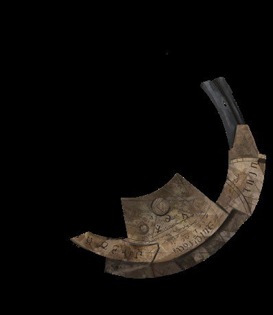

Chapter Four:  
The Gehenna War	
91
A Brief and Dirty History of the Sabbat	 91
	
Blood and Fire	
91
	
Anarchs Revolt	
92
From the Ashes of the Revolt	
93
Enlightenment in Blood	
93
The Beginning of the End of the World	
94
SITREP: The Gehenna War	
95
	
An Empire of Blood	
95
	
Mexico City	
97
	
Brazil: Civil War	
98
	
Russia and the Baltics	
100
	
The Maghreb and Alamut	
102
	
The Domain Next Door	
103

Index			
127

V5-Sabbat.pdf-renegadegames.com-#a11397-103

Introduction

Introduction

Introduction

We are each our own devil, and we make this world our hell.
―  OSCAR WILDE
N

o sect evokes such fear at its mention, such revulsion at its ideologies, 
as does the Sabbat. The self-styled Sword of Caine wages a war — a 
war of ages, a holy war, a Gehenna War — against the legendary 
progenitors of the clans, the Antediluvians. Citing the Book of Nod, 
the Sabbat seeks to avenge the ancient betrayal of Caine by his wayward childer, 
seeking nothing less than the destruction of the Antediluvians and the subjuga-
tion of the mortal world to a brutal hierarchy with vampires at its apex.

Other sects regard the Sabbat as heretical at best and apocalyptic at worst. 
Some outright deny the existence of Antediluvians, proclaiming them myth, al-
legory, or centuries dead. Others regard them as torpid, far-distant, or irrelevant 
in the modern nights.

That’s exactly what drives the fear other sects have of the Sabbat: Not only 
do they prosecute a fanatical agenda, they do so with little regard for themselves, 
and with the convictions of an era long past, a time of Long Night.

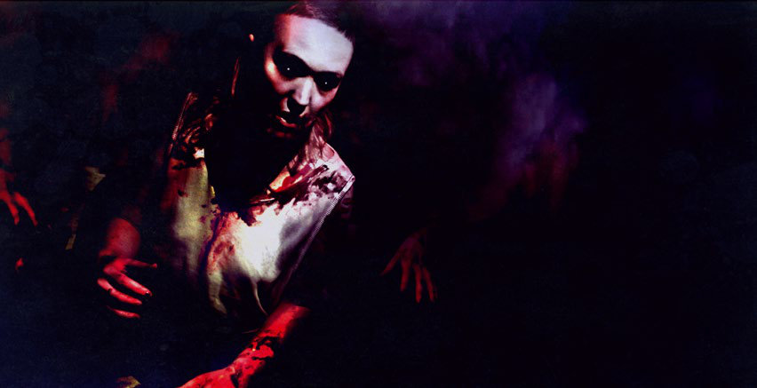

6

V5-Sabbat.pdf-renegadegames.com-#a11397-103

S A B B AT: T H E B L A C K H A N D

How to  
Use this Book

As a result, Storytellers have enormous leeway 
to present localized versions of the Sabbat that 
emphasize their own distinct themes. The Sabbat 
can appear in chronicles as redneck splatterpunk 
vampires marauding across remote Texas scrub, or 
as bloodthirsty sharks moving through the high-
life/low-life social circles of European capitals, or 
as harbingers of monstrous morality in the vaults 
of the Ancients themselves. The Sabbat takes many 
forms and provides points of conflict for innumer-
able stories.

Here is the most important sentence in this book: 
The function of the Sabbat in Vampire: The Mas-
querade stories is to threaten the status quo.

The presentation of the Sabbat for the Fifth 
Edition of Vampire is as antagonists. The Sword of 
Caine is undeniably a monstrous evil that even the 
Kindred fear, a sect of vampire supremacists who 
set aside the perspectives of the still-living, believing 
themselves to be more than mortals.

Except under certain circumstances, the Sabbat 
doesn’t claim domain as other Kindred consider the 
practice. Rather, the Sabbat remains ever-mobile, 
devouring what a domain has to offer like a swarm 
of locusts before chasing some cryptic secret or 
strange stimulus into the Gehenna War’s next 
theater. What is it chasing? Other Kindred can’t 
figure it out, entirely, and that disconnect means 
they have difficulty relating to and comprehending 
Sabbat motives.

This manifests as deliberate efforts by the Sabbat 
to crush individual identity and reshape it to the 
sect’s own apocalyptic ends. Ultimately, Sabbat 
vampires don’t have a choice in many of the actions 
they take. In giving themselves to the Beast, they’ve 
set aside that central riddle of the Kindred condi-
tion.

One of the core ironies — or hypocrisies, if 
you will — of being Sabbat is that it attempts to 
overthrow oppression through fanatical servility 
to Caine. As members of the Black Hand, Cainites 
yield individuality, ambition, autonomy. They are 
Blood Bound, indoctrinated, completely deindi-
viduated, and instilled with hatreds to which they 
turn no critical thought.

This book takes a big-picture look at the Sword 
of Caine, but it’s important to note that a big 
picture doesn’t exist in an entire locality anywhere 
in the world. Which is to say, a complete, local 
microcosm of the full Sabbat isn’t present in any 
single domain in the world (unless you overrule 
that, as Storyteller). The Sword of Caine in one 
domain may literally be the shattered remains of a 
single infiltrating pack, while a score of Black Hand 
vampires may vie with Camarilla courts and Anarch 
seditionists in another domain. The Sabbat exists to 
provide a scaling antagonist in any domain where 
you desire to set your chronicle.

To be clear, there are no systems or sugges-
tions included herein for portraying the Sabbat as 
a player’s character. This book includes Discipline 
powers, details for Sabbat rituals, information on 
the Paths of Enlightenment, etc., with the intention 
that Storytellers will use them to create compelling 
stories around opposing the Sabbat.

Theme and Mood

Storyteller Style

The theme of the Sabbat is desperation. Faced with 
a harrowing and self-destructive reality, the Sabbat 
seeks any functional method of its rejection, sink-
ing ever deeper into its own depravity as a way to 
fight back against the vampires’ reckoning. Sabbat 
desperation manifests in fanaticism, fundamen-
talism, violence, and monstrosity. The ultimate 
expression of fighting fire with fire — and fire is a 
powerful symbol both to and for the Sabbat — the

The Sabbat has endured a crippling collapse. From 
its abandonment by erstwhile leaders to the ravages 
of the Gehenna War to the fact that it makes a huge 
target of itself in the era of the Second Inquisition, 
the Sabbat has fractured, united only in its common 
hatred of the Antediluvians and the extremes to 
which it will go to defy and destroy them.

7

V5-Sabbat.pdf-renegadegames.com-#a11397-103

Introduction

One might encounter a pack of Sabbat commit-
ting a grandiose diablerie in a baroque Cathedral 
of Flesh, or one might find a pack reduced to its last 
two emaciated members desperately working Blood 
Sorcery in order to poison the frenzied elder about 
to drink them dry. The Sabbat in your domain 
might be all that remains after a gore-spattered raid 
by hunters in this era of the Second Inquisition, or 
it might be holed up in the cellar of a Buenos Aires 
veterinary clinic, trying to bring back a fallen pack-
mate from torpor.

Black Hand willingly chooses to define itself as 
worse than the enemies it opposes. When faced with 
the rising of cannibalistic blood gods, the Sword of 
Caine seeks to strike down those blood gods… and 
replace them, dragging the world into a Hell of the 
sect’s making.

The mood of the Sabbat is of alienation, of 
active inhumanity. The Sabbat turns its back on 
the very notion of Humanity, fanatically believing 
that the only way to truly realize the potential of 
the vampire is to give oneself wholly to the aspects 
of the Cainite condition that are unique to it. The 
Sword of Caine venerates the Beast, exults in the 
power of the Blood, and declares diablerie a sac-
rament. Sabbat vampires feel no compassion for 
mortals, and they certainly don’t pine for their by-
gone days of being mortal. In fact, Sabbat vampires 
don’t relate to mortals at all — and that also makes 
it profoundly difficult for them to relate to other 
vampires, as well. Cainites are entirely Other, true 
monsters, the vampires whom other vampires look 
over their shoulder and dread to see.

Remember, there’s nothing preventing players 
from knowing the information presented in this 
book. Where the mystery and personality emerge 
is in how you use the Black Hand as a storytelling 
tool. Challenge the status quo.

If it helps, think of the Sabbat as something oth-
er than a sect entirely, a disparate mob of blood-war 
revolutionaries with regional strengths, activities, 
and methods of tearing down Ancient tyranny. ■

Build Your Own Medieval 
Death Cult

CONSENT AND RESPECTFUL PLAY
Vampire deals with mature themes and story ele-
ments that some may find uncomfortable or that 
remind them of personal traumas. This can be es-
pecially true of the Sabbat, which deals overtly with 
violence, situations intended to harm the individual’s 
sense of self, and relationships with authority and 
personal boundaries.

The Sabbat has many faces but a single guiding 
philosophy.

One of the most important things to consider 
about the Black Hand is that it’s not a monolith. It’s 
decentralized, even fragmented, to the same degree 
that the Anarchs are, and since it’s actively fighting 
the Gehenna War, Sabbat rates of final death are 
even higher than those of other sects. What’s true of 
the Sabbat tonight, even locally, might not survive 
past the sunrise.

It’s worth calling out that these are story ele-
ments and themes. They are specifically not a license 
to traumatize players or abuse the trust between 
players. While the characters in a chronicle in which 
the Sabbat plays a part may well experience dire 
circumstances, by no means should such situations 
or techniques be visited upon the participants of the 
game.

The result is that the Sabbat is a “sect” only in 
that it has a common cause and a canon of specific 
rituals that unite it in packs. That aside, the Sabbat 
is extremely parochial. The nature of those packs, 
the responsibilities of the packs’ spiritual leaders, 
whether or not those leaders themselves have superi-
ors or if anyone pays them heed — all of these vary 
radically by location and by manifestation.

For more information on consent and respectful 
play, see Appendix III of Vampire: The Masquer-
ade, pp. 421-425.

8

V5-Sabbat.pdf-renegadegames.com-#a11397-103

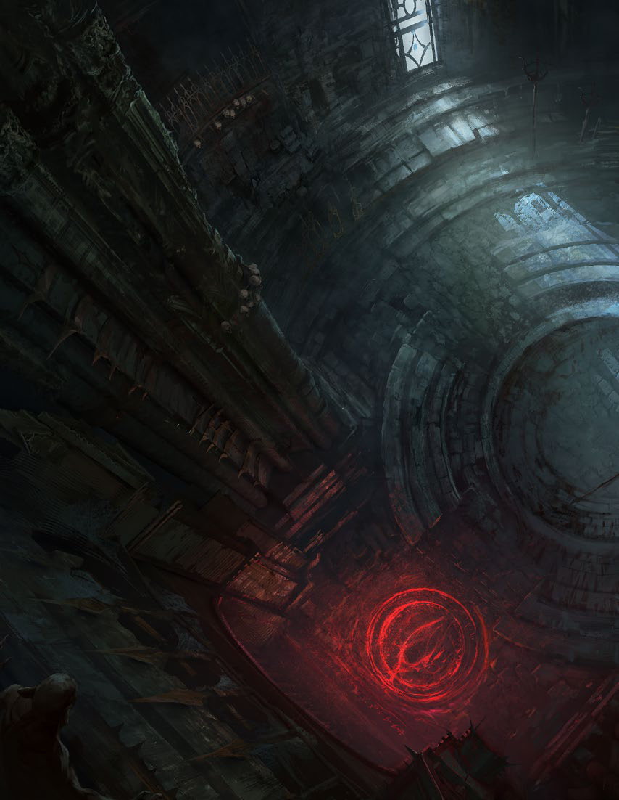

S A B B AT: T H E B L A C K H A N D

Sabbat Lexicon

Sabbat: The Sabbat is a singular it when 
referring to the sect; its members are a 
plural they. But “Sabbat” can also refer to 
members — one can be a Sabbat of the Sab-
bat, not that such a phrase would be spoken 
frequently.

Auctoritas Ritae: The recognized canon of 
the Sabbat, a set of high rituals prescribed 
for all Sabbat to heed

Black Hand, the: The Sabbat

Brothers and Sisters in Caine: The Sabbat

Cainite: A vampire; one of the progeny of 
Caine. Used among Sabbat to the exclusion 
of “Kindred,” which the Black Hand derides 
as a soft appellation

Shovelhead: A fledgling Sabbat vampire, 
generally Embraced en masse to serve as 
front-line fodder in an immediate conflict. 
May or may not have been dumped into a 
mass grave after being clubbed over the 
head with an actual shovel.

Cold War: Intrigue, spycraft, and other 
subtle movements against the servants of 
the Antediluvians, usually waged to destabi-
lize domains where non-Sabbat sects claim 
dominance

Sword of Caine, the: The Sabbat

Thin-blooded: Vampires of especially high 
generation, whose Blood carries little to no 
indication of their lineage. “The Time of Thin 
Blood,” when these vampires are present, 
is one of the omens of Gehenna presaged in 
the Book of Nod.

Gehenna War: The Eternal Struggle in its 
most urgent form, the resistance against the 
rising of the Antediluvians and their servitors

Hot War: Active fighting against the Antedi-
luvians in the Gehenna War

Vaulderie: A Sabbat ritus that shatters Blood 
Bonds and reinforces loyalty among pack 
members

Ignoblis Ritae: The local or pack-specific 
rites created by individual packs or domains 
to establish community or sanctify behavior

Vinculum: A specific type of Blood Bond that 
exists among members of a pack, subverting 
singular Blood Bonds (plural: vincula)

Pack: A Sabbat coterie, almost always rein-
forced with the ritus of the Vaulderie

Pack Priest: The spiritual and tactical leader 
of a Sabbat pack

Path of Enlightenment: A mental, emotion-
al, and spiritual conditioning that supplants 
Humanity, usually with the intent of height-
ening the priorities of vampiric supremacy

Ritae: Rituals forming the Sabbat catechism; 
singular ritus or rite

9

V5-Sabbat.pdf-renegadegames.com-#a11397-103

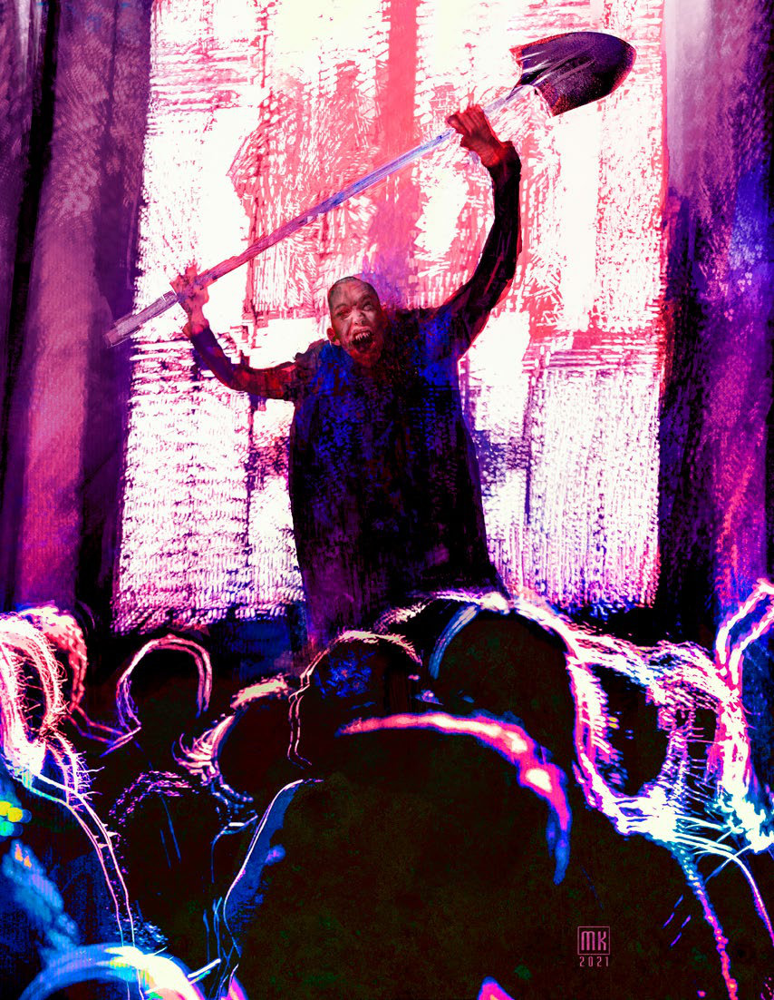

Introduction

1 0

V5-Sabbat.pdf-renegadegames.com-#a11397-103

S A B B AT: T H E B L A C K H A N D

Chapter One:
setting fire

The world has no end, and what is good among one

people is an abomination with others.

— CHINUA ACHEBE, THINGS FALL APART

F

The Righteous  
Supremacy of the

rom its origins as a medieval death cult 
to its modern incarnation as a fanatical 
shock-force on the front lines of the Ge-
henna War, the Sabbat is more than the 
bloody scourge the other sects describe it to be.

Blood

To wit, few Kindred outside of Sabbat domains 
have even met a Sabbat Cainite, and the sect’s repu-
tation is as much the propaganda of its rivals as it is 
an accurate summation. One will seldom see Cama-
rilla and Anarch rivals sweep previous grievances 
under the rug so quickly as when it is rumored that 
the Sabbat has an interest in the domain.

The mindset that distinguishes the Sabbat from 
other sects to a stark degree is the belief that becom-
ing a vampire fundamentally changes a person to 
such an extent that old notions of Humanity are 
no longer germane. From the Sabbat perspective, 
Humanity is at best a burden and at worst a prison, 
keeping vampires chained to bygone identity. It is a 
waste of the Blood to pretend that one is still mortal 
or must cling to human affectations.

At the same time, much of what the other sects 
know about the Sabbat is entirely accurate. The 
savvy Kindred is able to distinguish the Sword 
of Caine’s own extreme ideology from the horror 
stories the other sects repeat to discourage their 
members from looking any deeper. For the Cama-
rilla, steering Kindred away from the Black Hand is 
a matter of caution and safety. For the Anarchs, it’s 
a matter of realizing that Sabbat extremism is a form 
of control and an unrelenting oppression.

To the Sabbat way of thinking, the vampire is 
a creature above mere mortals, and must therefore 
rewrite their psyche with a purpose that allows the 
vampire to assume their supreme place. Indeed, 
“creature” is a word chosen deliberately — it implies 
that one is created, that becoming a vampire is 
apotheosis. Of course, whom that creator may be 
varies wildly among Sabbat, but the paramount 
message is that vampires fulfill a higher purpose,

For the Sabbat, however, it all comes down to 
unapologetically being a vampire.

1 1

V5-Sabbat.pdf-renegadegames.com-#a11397-103

Chapter One: Setting Fire

a calling, a metaphysical need, or a blood-soaked 
divine right.

ity to empathize with Humanity. Paragons of these 
Paths may be individually unnerving, repulsive, 
or wholly alien. The elusive elders of the sect liken 
these attempts to codify the moral elements of their 
undead existence to faiths or devotions, while at 
least one modern Sabbat fledgling of philosophical 
bent has described them as operating systems.

In practice, Cainites are effectively the creatures 
of their sires. What remains tonight of the Sabbat 
is a vicious echelon of remorseless vampires who see 
nothing wrong in creating hordes of lesser chat-
tel to hurl at their enemies. Very often these lesser 
vampires create their own broods, the better to 
form their own cadres to be directed against those 
same foes. The result is a sect that Embraces with 
abandon, but with an extremely short time to final 
death. Not all Sabbat meet their end so quickly, 
but the odds of survival grow increasingly poor the 
higher one’s generation is. And as to thin-blooded 
Sabbat — who knows how many of them even ex-
ist? Or how many survive for any appreciable length 
of time?

To outside perspectives, this reveals the mon-
strosity of the Sabbat, but to the Sabbat itself, it’s 
at least being honest — it’s the “Kindred” who lurk 
within mortal cohorts or who pretend to grandi-
ose schemes with mortal puppets who are the true 
atrocities, squandering the curse of Caine and wal-
lowing among the kine.

Power and Liability

Indeed, if the Camarilla is quick to exercise its 
connections as a way to solve problems, and the 
Anarchs rely on their own abilities, the Sabbat 
solves problems as a vampire “should.” Sabbat 
vampires use Disciplines. That is, if a Camarilla 
Kindred silences a Masquerade breach by calling in 
a favor to smother the story and an Anarch silences 
a Masquerade breach by browbeating the observer 
into silence, a Sabbat Cainite resolves the breach by 
driving witnesses mad with terror-inducing Pres-
ence or by tracking them with predatory Animalism 
and silencing them permanently.

Beyond Mortal

Without a doubt, Sabbat followers of these ideolo-
gies, these Paths of Enlightenment, strike fear into 
mortals (and many Kindred…) in their lack of abil-

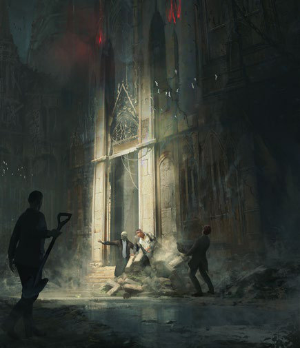

This lack of subtlety has had a side effect that 
the Black Hand willfully ignores: Hunters in this 
era of the Second Inquisition have the least trouble 
following the trail of the Sabbat, and have had the 
most success in reducing the sect’s ranks (at least in 
locales other than the front lines of the Gehenna 
War itself). Proud Sabbat try to spin this as a badge 
of honor, that the Camarilla and Anarchs deal with 
the era of the Second Inquisition by running and 
hiding rather than standing and fighting. That 
said, it’s hard to argue with how effective numerous 
vampire-hunting organizations have been in break-
ing the Sabbat’s domains and reducing its numbers.

1 2

V5-Sabbat.pdf-renegadegames.com-#a11397-103

S A B B AT: T H E B L A C K H A N D

Soldiers in the

And the Sabbat knows an additional secret that 
has so far eluded the other sects: The Gehenna 
War affects much more territory than what the 
Camarilla and Anarchs suspect. It isn’t confined 
to the cradle of civilization, where the original and 
most ancient vampires held sway. The intervening 
millennia have caused a great diaspora of peoples 
and the vampires who hide among them. Therefore, 
the Antediluvians have likewise traveled enormous 
distances, making the Gehenna War a worldwide 
theatre.

Gehenna War

At the center of its conviction is the Sabbat’s venera-
tion of whom the sect believes to be its Dark Father: 
Caine, the First Vampire. From Caine’s insidi-
ous childer spawned the clans as they are known 
tonight, and it is these hated Antediluvians against 
whom the Sabbat devotes its efforts.

According to the various catechisms of the Black 
Hand, Caine’s original progeny betrayed the purity 
of the Dark Father’s Embrace in pursuit of their 
own degenerate desires. Their endless selfish rival-
ries became what is known as the Eternal Struggle, 
spawning centuries of conflict, dooming countless 
vampires to Final Death in internecine struggles or 
forcing them to cower among mortals and masquer-
ade as their masters.

Shattered Domains

In correlation, the Sabbat itself holds little domain 
in a conventional sense. Whereas it once claimed 
and contested territories like the Anarchs and 
Camarilla, tonight Sabbat domains often have a 
strange-feeling absence of Cainites in them. Since 
so many obey the Beckoning, domains of the Black 
Hand are often underpopulated, at least in terms of 
vampiric presence.

The Sabbat hates these Antediluvians, seeking 
to become closer to the Dark Father and destroy 
his despicable childer. To other sects, clans may be 
esteemed lineages or indicators of prowess — to the 
Sabbat, they are the by-blows of Antediluvian sin, 
and many Cainites describe themselves as antitribu, 
apostates against the very idea of clans, despite the 
aptitudes they may confer.

This isn’t always the case, however, and no few 
domains experience huge surges and Mass Em-
braces as the front-line commanders of the Gehenna 
Crusade demand fresh conscripts to plunge into 
battle with the Antediluvians. It is again important 
to recognize the success the Second Inquisition has 
had in curtailing Sabbat influence.

A Church Militant

Despite all of its Embraces, the Sabbat appears 
to be a very small sect, owing largely to its high rate 
of final death. Among the massive Cainite casualties 
of the Gehenna War, the ruthless precision of the 
Second Inquisition, and the abhorrence other sects 
have for the Black Hand, the Sabbat’s enemies are 
many and its individual members’ nights are num-
bered from the moment of their Embrace.

No surprise, then, that perhaps more than the other 
sects, the Sabbat heeds the Beckoning, and indeed 
plunges itself headlong into the occulted conflicts 
of the Gehenna War. Other Kindred may resist the 
Beckoning, but the Sabbat is drawn to it, and even 
those who do not themselves hear it follow en-
thralled sires and zealous pack leaders.

Little news comes back from the war front, how-
ever, and even the deathless champions of the Sword 
of Caine surely find themselves tested in its cruci-
bles. What better way to martyr oneself and exult in 
the glories of Caine than to strike at the heart of the 
chthonic Third Generation itself?

1 3

V5-Sabbat.pdf-renegadegames.com-#a11397-103

Chapter One: Setting Fire

Rebels in the  
Eternal Struggle

ble conflicts, but at the same time, it needs redoubts 
to which to fall back and enjoy what blood-streaked 
freedom it can say to have won for itself.

Forging Loyalty

In centuries past, the Sabbat seemed to be at the 
forefront of the War of Ages, having formed after 
the vaunted diablerie of certain Antediluvians. 
Against the fiery backdrop of the original Anarch 
Revolt, the Sabbat hauled itself out of the ashes. 
It built around itself an identity of freedom from 
elder manipulations. In the intervening centuries, 
however, the Sword of Caine has taken a monstrous 
path in order to ensure its own freedom.

Ensuring loyalty among those cruelly invited into 
the sect is no mean feat. To this end, the Sabbat 
employs a variety of rituals, individuality-breaking 
psychological techniques, and a host of horrors to 
force all Brothers and Sisters in Caine to rely upon 
one another. Rarely does one see an individual Sab-
bat, for the sect’s vampires run in “packs,” and their 
goals and souls are cultivated by spiritual leaders 
known as Pack Priests.

To hear the sect tell it, the Sabbat seeks to eman-
cipate itself from the prison of living, to abandon 
the frail mortal coil and exult the Cainite condi-
tion. The reality is that the sect doesn’t do this in a 
manner that would uplift the world around it. To a 
fervent Cainite, the best outcome would be a world 
of eternal night, with mortal thralls forced into 
servitude or herded like cattle to slake the thirsts of 
their undead lords.

And this is ever more reason for the other 
sects’ hatred of the Sabbat. With its own shrinking 
domains and perpetual surveillance by Second In-
quisition agencies, the Sabbat also press-gangs other 
vampires into its ranks. Whether abducting existing 
Kindred and dropping them onto the front lines of 
the Gehenna War, or performing hit-and-run raids 
that precisely target the favored feeding candidates 
and personal entourages of rival sects, the Sabbat 
is desperate for soldiers and resorts to any means 
necessary to bolster its ranks.

Endless Conflict

This extreme outlook means that the Sabbat cannot 
help but forever find itself at war — at war with 
the mortals from whom the other sects hide, at war 
with the Antediluvians and their ruinous Gehenna, 
at war with the other sects for supremacy, and at 
war with itself over the survival of the sect. To the 
Black Hand, the world is conflict, and the Sabbat 
is a righteous rebellion standing fiercely against the 
forces that would keep it downtrodden. Born in an 
era of medieval turmoil, the Sabbat fights because 
fighting is all it knows and has known for the centu-
ries it has existed.

Ironic, then, that at the center of the Sabbat’s 
freedom and loyalty lies the Blood Bond. The Black 
Hand knows a special rite, the Vaulderie, that can 
destroy existing Blood Bonds, such as those to a 
domineering sire or a forlorn lover. But observing 
this rite forges a new Blood Bond in its place, among 
the vampires of the pack performing it, replacing 
one regnant with numerous others in mutuality.

Tonight, the Gehenna War evolves. Even as 
parts of the Sabbat still fight for the tombs of their 
hated progenitors, others follow the trails of those 
who left for distant lands. As noted above, Sabbat 
domains are in a state of flux and the theatre of war 
expands. The Black Hand needs its warfront do-
mains to continue providing grist for its innumera-

1 4

V5-Sabbat.pdf-renegadegames.com-#a11397-103

S A B B AT: T H E B L A C K H A N D

Rapturously Violent

would fail, the Black Hand blackmails, misdirects, 
or tempts, but all toward a predetermined conclu-
sion.

All of this adds up to a sect that is steeped in vio-
lence. A fledgling Sabbat’s first night may find them 
bludgeoned with a shovel, hastily Embraced, and 
dumped into a mass grave. Those with the bestial 
drive to claw their way out of the charnel pit are 
generally considered to have earned the right to call 
themselves Sabbat — and are often quickly thrown 
into the Gehenna War, conscripted into crusade 
against one of the other sects, or sent into the wilds 
to cause what havoc they can among whatever 
border threat the Sabbat perceives as encroaching 
upon its domain. Not every Sabbat becomes one of 
the Damned like this, but certainly enough do that 
the story makes its way into the popular perception, 
especially among other sects.

Usually the enemy is some sort of ideological an-
tagonist, such as the pawn of a hated Antediluvian 
or an adversary from a despised sect. Sometimes, 
though, the enemy is other Sabbat, perhaps a pack 
of glory-seeking shovelheads or a rival elder. The 
Sabbat has long abandoned subtler means of miti-
gating differences between ostensible comrades.

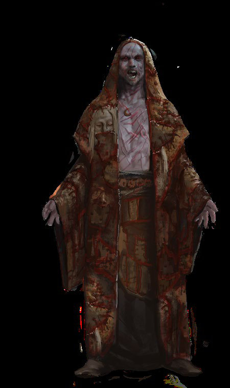

It is a dangerous release, this Sabbat willingness 
to entertain vampiric methods as 
a primary means of resolving 
conflicts. Many find it liberat-
ing, a way to ride the wave of 
frenzy and yoke themselves 
to the inexorable momen-
tum of the Beast. In most 
cases, though, violence 
begets violence, and 
those who win 
their spoils amid 
blood and fire usu-
ally see them crum-
ble away as the 
next conflict 
sees them 
dragged 
into a 
much-
deserved 
hell.

Legacy of Brutality

The horrific result is undeniable: The Black Hand 
luxuriates in cruelty. Given that it seeks to suborn 
human compassion, this cruelty can take many 
forms, such as the wanton destruction of a street 
gang unleashed or the consummate viciousness of a 
sculptor who works in the medium of pain.

Methodology, frequency, and intensity may 
vary, but ultimately, every Sabbat sees their compas-
sion and therefore Humanity broken under tides of 
incessant violence. Such is the legacy of the Beast; 
such is the original sin of the Dark Father. Under-
standing is the first step toward adopting a Path of 
Enlightenment.

Feeding the Beast

The Sabbat is a sect forever fighting something or 
someone, and that constant siege mentality shapes 
its’ members’ transition from mortal to Cainite. 
The Sabbat way is not usually one of esoteric ruses 
and centuries-spanning schemes. It prefers overt 
Disciplines and brutal force — Cainites prefer to 
dive into the maw of their foes, slashing and burn-
ing the whole way down. Where overt violence

1 5

V5-Sabbat.pdf-renegadegames.com-#a11397-103

Chapter One: Setting Fire

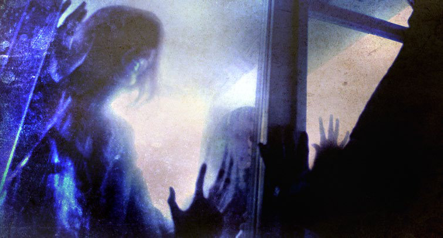

Cultic Legion

Some Sabbat believe that the Black Hand itself 
can have no consistent, doctrinaire ideology, that 
the very nature of the Sabbat is a chaotic swarm 
of spiritual philosophies that by definition cannot 
become orthodox. Others insist that the Sabbat is 
itself an experiment in finding which of its Beast-
venerating Paths is most effective, efficient, or shud-
dersome. Still others couldn’t care less, and heed 
the pack as it incites them down a fundamentalist 
course of blood and fire.

More than any other sect, the Sabbat is driven by a 
common purpose. A far cry from the neofeudal ex-
ceptionalism of the Camarilla and the revolutionary 
egalitarianism of the Anarchs, the Sabbat is united 
by its constant siege mentality against the despised 
Antediluvians. Whether compared to insatiably 
hungry sharks or the Biblical Legion of Gerasene 
demons, the Sabbat acts with existential zeal toward 
its goal. It is no surprise to find the Black Hand 
unifying in hatred of its myriad enemies, given its 
convictions.

Despite the multiplicity of Paths, though, a 
sense of oneness, of conformity — of shared des-
peration — finds a strident home. Most of the sect 
practices a body of prescribed — and profane — 
rituals, the better to reinforce trust and dependency. 
As well, various cults of personality emerge around 
hierophants of the Paths, so devoted are they to the 
righteousness of the sect itself. These harbingers of 
spiritual purity represent the worst tendencies of the 
Sabbat: self-defeating violence in the name of a self-
declared authority, all directed against a universally 
hated external enemy. ■

At least on the surface that appears to be the 
case. Dig deeper, though, and the sect reveals itself 
as a hive of conflicting approaches. Fostered by the 
various Paths of Enlightenment, the sect’s common 
purpose meanders viciously among its numerous 
methodologies.

1 6

V5-Sabbat.pdf-renegadegames.com-#a11397-103

S A B B AT: T H E B L A C K H A N D

The cloying smell of spilled drinks, long dried. Dark outside but the bar hadn’t opened yet.

“They don’t do it how we do. They’re different.” The Kindred next to me exhaled a ribbon 
of smoke. Smoking was one of the only times she pretended to breathe.

The barback let us in because he couldn’t not.

I had known her forever. Since the dawn of time. Since 2004 at least, since before  
Siberia closed, the original one at the 50th Street subway station, where I’d met her. She had

“What do you mean?” I croaked. Better for me to stay behind the curtain to the storeroom. 
You never know who might be in the place before they were supposed to be. Like us. “They

been under the night longer than I had.

still take it from the veins, yeah?”

Long pause.
“They don’t... they don’t hunt. There’s no back-and-forth. They don’t... seduce people and leave

them with a fumy head the next morning, wondering what happened.” A theatrical roll of her

hand at the wrist.

Another pause. “How do they do it, then?”
	
“They don’t hunt, they slaughter. You ever see a pack of hyenas take down a buffalo? Like 
on one of those nature shows? Or at Michael’s studio, that time those wild dogs killed his

goats. Just piling on, pulling them apart, all those cracking sounds, and spattering. Nothing

That wasn’t how I’d learned to do it. “Like, they just let it control them like that? How 
do they...? What lets them hold onto... onto themselves?”

left but scraps.”

Long pause again. Exhaling smoke.
	
“I don’t think they give a shit.”

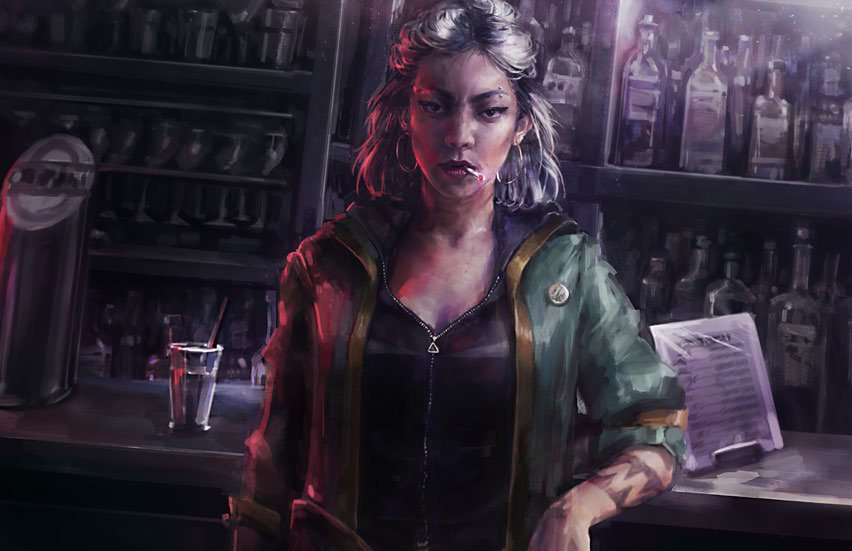

1 7

V5-Sabbat.pdf-renegadegames.com-#a11397-103

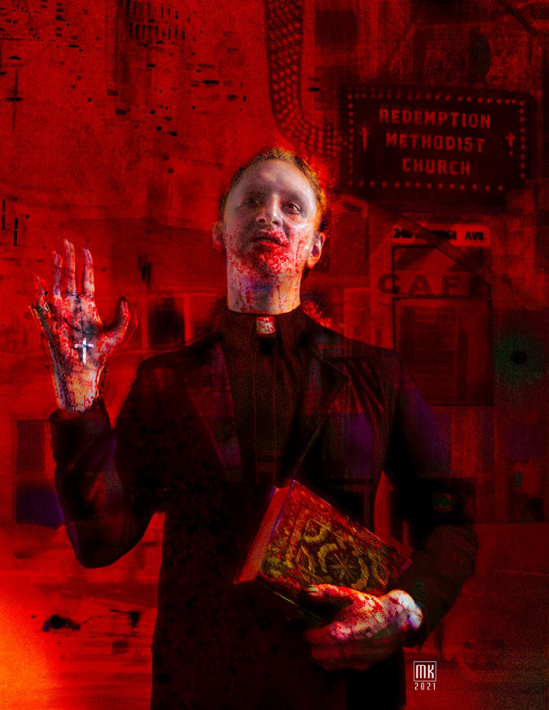

Chapter One: Setting Fire

1 8

V5-Sabbat.pdf-renegadegames.com-#a11397-103

S A B B AT: T H E B L A C K H A N D

Chapter Two:
apostates of a  
cruel church

Men will never be free until the last king is strangled

with the entrails of the last priest.

– DENIS DIDEROT, POÉSIES DIVERSES
I

Paths of  
Enlightenment

n the Final Nights, the Sabbat seems at once 
an unpredictable hive of clashing orthodoxies 
and a terrible, relentless monoculture. The 
apocalyptic Gehenna War has crippled its for-
mer leadership structure and robbed it of its most 
potent elders. The most venerable and respected 
among the Lasombra – once extremely influential 
in the sect, if not always its heart for centuries – 
have moved to abandon the Sabbat as a lost cause. 
Almost the entirety of the Black Hand’s former 
domains have been seized by rival sects, even as 
mortal hunters and agencies associated with the era 
of the Second Inquisition harry the Sword of Caine 
at all turns. Tonight, the Sabbat is smaller than it 
has been since its foundation, fighting a desperate 
war against enemy sects, mortal hunters, and the 
Antediluvians themselves..

By codifying the Cainites’ relationships with their 
Beasts, Paths of Enlightenment define the Sabbat, 
both as a sect and as individual members. Paths 
shape how Sabbat vampires interact with the world, 
how they fight the Gehenna War, how they wield 
the gifts of Caine to forge the world into their pre-
ferred image.

Sabbat packs form around the idea of Path 
observance. In the vast majority of cases, pack 
members all follow the same Path, ministered by 
each pack’s Priest. This helps not only in focusing 
pack efforts, but in the cultic subjugation of the 
individual, which shapes the other sects’ perception 
of the Sabbat as a hive consciousness.

All of which means tonight’s Sabbat has nothing 
left to lose.

This chapter includes a number of tools Story-
tellers can use to introduce the Sabbat into their 
troupe’s chronicles. From the Paths of Enlighten-
ment to sect rites to Discipline powers and ready-
to-frenzy antagonists, if you’re looking to get your 
hands dirty, this is the chapter for you.

Cainites primarily identify themselves by devo-
tion to their Path. While other sects may elevate 
their clans as foundations of identity, points of 
pride, or proof of sectarian entitlement, the Sabbat 
has no use for such, and even subverts the very idea 
of clan. For more information on the Sabbat’s no-
tions of antitribu, see p. 74.

1 9

V5-Sabbat.pdf-renegadegames.com-#a11397-103

Chapter Two: Apostates of a Cruel Church

THE PATH OF CAINE

Noddists, Devourers

2 0

V5-Sabbat.pdf-renegadegames.com-#a11397-103

S A B B AT: T H E B L A C K H A N D

T

he premise of the Path of Caine is to 
cultivate and refine the power inherent in 
the Blood so that individual vampires can 
realize their full potential. In the zealous parlance of 
the Path, anything one can do to “bring themselves 
closer to Caine” is deiform, which is a tacit rever-
ence for the act of diablerie. The Blood is all to the 
Noddists, who rarely pass up a chance to partake of 
puissant vitae, whether it’s of profound resonance, 
potent generation, or some other, stranger property. 
Indeed, followers of this Path may become dis-
tracted by opportunities to lower their generation or 
bring greater potency to their Blood. 
	
A desired emulation of the First Vampire is 
what distinguishes this Path from other Sabbat 
ideology. In the parables of Caine, the Dark Father 
had mastered the Beast, not to deny it, but in an un-
derstanding that his Curse was the eternal conflict 
between his lower and higher selves. The Beast is a 
servant, not to be feared, but to be respected and 
even nourished, for as the Beast grows in might, so 
grows the strength of the master required to direct 
it as desired.

Parcel to refining one’s Blood is using it to fur-
ther the Dark Father’s ends. Especially after availing 
themselves of potent vitae, Noddists often become 
eager to prove its value, and even overconfident. On 
the field of battle or in the sepulcher of an elder, 
followers of this Path seek to challenge themselves 
and prove to others their newfound might. This 
has absolutely made the difference in conflicts at 
the forefront of the Gehenna War, but in less overt 
circumstances, Noddists may find themselves 
overextended after the thrill of a heady 
feeding subsides. Only their righteous-
ness prevents this Path’s followers from 
being impulsive, as they seek to match the 
Dark Father’s ownership of his Beast.

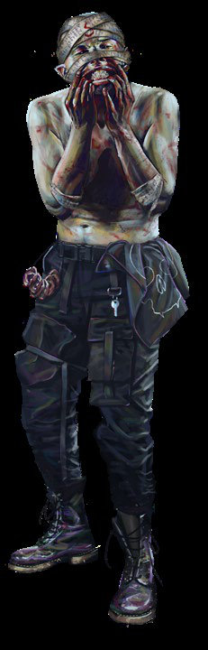

Notably, Noddists don’t suffer 
sunk costs. If one particular ap-
proach isn’t yielding results, it’s time 
to change tactics, and in many cases, 
that change of tactics may involve 
double-crossing an erstwhile ally in 
hopes of turning their failings into 
personal gain. This makes the more 
fervent Noddists unpopular in the Sab-
bat, because if one always has to keep 
an eye on one’s allies to stop them 
from opportunistic diablerie, that 
makes it hard to fight the actual 
enemy. From the Path of Caine per-
spective, though, if you’re not part 
of the solution, you’re dinner.

Ethics

■Lower one’s generation and concentrate the

power of one’s Blood to become closer to Caine 
and exult in the potency it yields.

■Partake of all blood, the better to understand

the power contained in it and to build wisdom 
from its nuances.

Disciplines

■Brook no failure from one’s leaders – be pre-

pared to commit diablerie upon them if their 
shortcomings hold the pack back.

Many followers of this Path have 
uncanny mastery of Blood Sor-
cery, with a number of powers and 
rituals virtually unknown outside 
the Sword of Caine. Animalism, 
Obfuscate, Potence, and Protean also 
see frequent use among the Noddists, 
because of their frightening effective-
ness when hunting other undead.

In Chronicles

Followers of the Path of Caine are relentless op-
ponents, pursuing their adversaries to eliminate 
them but also to take the power that is inherently 
theirs. Noddists not only consume the heartsblood 
of fallen Cainite enemies, they take trophies to 
demonstrate their growing puissance.

2 1

V5-Sabbat.pdf-renegadegames.com-#a11397-103

Chapter Two: Apostates of a Cruel Church

THE PATH 
OF CATHARI

Albigensians, Cathari,

Devils of the Flesh

2 2

V5-Sabbat.pdf-renegadegames.com-#a11397-103

S A B B AT: T H E B L A C K H A N D

T

he premise of the Path of Cathari is for its 
followers to heed the Beast as it drives them 
to luxuriate in what they are so they leave no 
atrocity unperformed. Its followers may come across 
as callow and hedonistic, indulging base urges, and 
surely, Cainites on this path do revel in their wicked 
nature. At its center, however, is a philosophy of 
a dualistic world in which vampires are one of its 
expressions of darkness. The Damned are, well, 
Damned, and it thus serves them to act like it.

holy places conducted in open mockery of any num-
ber of faiths, Albigensians enjoy events profaning 
themselves and the mortals who ultimately suffer in 
their wake. They will gleefully play to stereotypes 
of worldly evil, presenting themselves as covens of 
shrieking witches, lustful degenerates, Devil’s Night 
vandals, and so on.

As a sect, the Sabbat has little reservation about 
using the Albigensians as fodder for its various 
violent ends. The Albigensians are generally aware 
of this, and don’t readily disagree with it – they can 
always make more, and whether they survive or 
meet final death in any endeavor is already a matter 
of predestination. The Path’s philosophy implies 
a place and a purpose to every vampire’s actions, 
making every base act or self-destructive impulse 
meaningful. And of course, a zealot assured of their 
place in Hell is terrifying to those who run afoul of 
them, making them effective shock troops against 
unsuspecting mortals unknowingly in the path of 
the Gehenna War.

In the Sabbat, this Path has the most numer-
ous followers of all of the Paths. It is the easiest for 
a vampire whose Humanity has been destroyed 
by shovelheading to adopt; it at once justifies and 
encourages the horrors they have suffered. Its higher 
echelons and spiritual epiphanies often elude these 
Cainites, however. For those who are true paragons 
of the Path, the philosophy proposes a hierarchy 
of sins as elaborate as any Solomonic goety. Even 
though the ruck and run of the Albigensians may 
seem like caterwauling demons, every vileness serves 
a purpose, whether or not the individual purveyors 
of sin understand it. The Devils of the Flesh do not 
starve the Beast; they bathe it in excess.

Away from the war front, Albigensians are great 
tempters, dealers, and fixers who relish the opportu-
nity to debase the virtuous (or even the non-virtu-
ous…). The Sabbat isn’t normally heavily invested in 
intricate schemes and webs of debts, but, ironically, 
the iniquitous Albigensians often have any number 
of mortals and even Kindred who owe them favors 
for various delights provided in the past. Followers 
of this Path may even give themselves the flush of 
life to better enjoy a fleshly interlude, particularly 
if they can splash about in someone else’s misery 
afterward.

Ethics

■Experience every vice being Damned affords,

from instilling fear in others to performing acts 
of cruelty to ceding control to the Beast.

■One’s role as a creature outside mortal moral-

ity is predestined. Accept it and fulfill one’s 
purpose, and lead others into damnation or 
destruction.

Disciplines

■Indulge every temptation; give oneself wholly to

the wiles of the Beast.

Many followers of this path excel at the physical 
Disciplines, the better to perform monstrous feats 
that set them apart from frail mortals. As well, due 
to their nature as hedonists, infiltrators, and tempt-
ers, Cathari find ample opportunity to use Auspex, 
Obfuscate, and Presence.

In Chronicles

Followers of the Path of Cathari are not subtle 
(unless operating in a role of spying or infiltration), 
and the ritae they host as well as the unlives they 
lead are punctuated by glorious vulgarity. From a 
hedonistic orgy where Cainites gorge on drugged 
vessels to blood-soaked rituals held in desecrated

2 3

V5-Sabbat.pdf-renegadegames.com-#a11397-103

Chapter Two: Apostates of a Cruel Church

THE PATH OF 
DEATH AND THE

SOUL
Necronomists, Reapers

2 4

V5-Sabbat.pdf-renegadegames.com-#a11397-103

S A B B AT: T H E B L A C K H A N D

T

outcomes of their plans. They act with calculated 
precision, leaving as little to chance as possible, from 
knowing exactly who they’re sending into a conflict 
to projecting how many Cainites a tiny domain may 
sustain three decades after claiming it. Interactions 
with them are detached, even chilling, 
as they consider how best to use the 
people talking to them – or how their 
deaths could be turned to a Necrono-
mist’s advantage.

he premise of the Path of Death and the 
Soul is to study, understand, and master 
death so that destroyed enemies remain 
dead. As the Sabbat understands it, the hated 
Antediluvians “have power over life and death” 
according to the Book of Nod, raising the question 
of whether or not, should the Sabbat destroy one of 
the Third Generation, that vampire will stay dead. 
Those who follow this Path intend that they should 
do so, at whatever cost to themselves. In the Ge-
henna War, they are often strategists and engineers; 
away from the war front, they research and develop 
new ways to express the gifts of Caine.

Necronomists face 
the opposition on 
their own terms, 
choosing the theater 
of conflict when they 
can, and avoiding it 
altogether as the pre-
ferred option. Much 
better to send followers 
of other Paths to do the 
dirty work, and shovel-
head more replacements 
afterward. These Sabbat would 
rather destroy an enemy with 
a decisive ambush rather than 
an open battle. They certainly 
have no interest in a fair fight 
or any imagined honor among 
foes.

The Path of Death and the Soul is likely the 
most esoteric or academic of the Sabbat Paths of 
Enlightenment, concerned as it is with outward 
manifestations of the Kindred condition. As such, it 
is also the most precarious of the Paths for actually 
managing one’s Beast, which the Necronomists 
handle by trying to keep the Beast at arm’s length, 
unlike other Sabbat. This makes them no less ter-
rifying, of course – a Necronomist is perhaps most 
at ease when surrounded by mortals begging for 
their lives, because it means that, as a predator, he’s 
doing what he’s good at. Followers of the Path of 
Death and the Soul are also the most likely to have 
Embraced their childer traditionally, preferring a 
more discriminating choice of progeny than a Mass 
Embrace yields.

Ethics

Disciplines

■Leave no survivors at the conclusion of violent

Many followers of this path 
are especially adept at the 
binding and rebuking uses 
of Oblivion, as well as 
developing Ceremonies of 
their own. Auspex, Blood 
Sorcery, and Dominate 
also have a place in the 
Necronomists’ arsenal.

conflict.

■Investigate the relics and remains of death – per-

sonal, historical, occult – in order to discern the 
details of how the conflict ended and its existen-
tial outcomes.

■Hasten death’s arrival, from humblest insect to

the much-lamented flower of human life.

In Chronicles

Followers of the Path of Death and the Soul are sys-
tematic thinkers, and give great consideration to the

2 5

V5-Sabbat.pdf-renegadegames.com-#a11397-103

Chapter Two: Apostates of a Cruel Church

THE PATH OF  
POWER AND THE

INNER VOICE

Unifiers, Uhlans

2 6

V5-Sabbat.pdf-renegadegames.com-#a11397-103

S A B B AT: T H E B L A C K H A N D

T

he premise of the Path of Power and the In-
ner Voice is, unsurprisingly, the acquisition 
of might, by which they can impose their 
personal will upon the world around them. They 
seek to accumulate power and subjugate their lessers 
in a journey to become the apex predator. Indeed, 
even the Beast itself is held in subjugation by the 
most accomplished Unifiers, like a snarling hound 
at the end of a master’s chain.

mum success. Priests walk a fine line in these packs, 
as they need to remain the pack’s authority at the 
same time they foster the thirst for might among the 
rest of the vampires in the pack. A well-disciplined 
pack is a single-minded entity, with each member 
anticipating the needs of their vicious fellows. A 
dysfunctional pack is a bunch of me-first oppor-
tunists looking to fuck over everyone else in the 
pursuit of their own gain, heedless of the cost in 
blood or strategic advantage. Packs like these need 
new Priests, because they’ve probably murdered and 
committed diablerie upon the previous one.

That isn’t by accident. For the Unifiers, the Beast 
is a tool, and knowing when to loose it or when to 
let it pull them is part of mastering it. More than 
the other Paths, Unifiers court frenzy, trusting their 
ability to dominate the Beast, “riding the wave” at 
the edge of self-control and leaving someone else 
to clean up afterward. After all, what is the incho-
ate rage of a frenzy if not one more weapon at the 
disposal of the Damned?

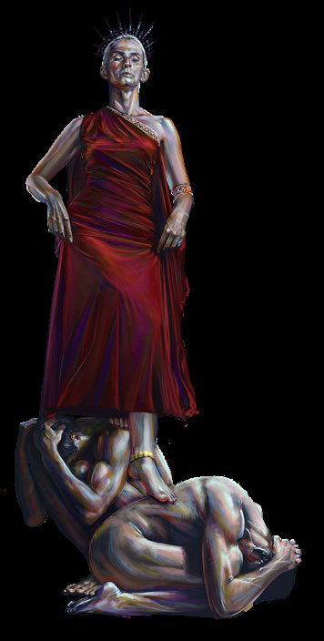

Disciplines

Many followers of this path 
focus on social or mental Dis-
ciplines, the better to convince 
less willful individuals to 
perform as the Unifier 
desires or to force 
them into compli-
ance. They culti-
vate their physi-
cal Disciplines as 
a close second, the 
better to prosecute 
the conflicts in which 
they inevitably find 
themselves. Domi-
nate, Fortitude, 
Potence, and Pres-
ence are hallmark 
Disciplines of the 
Unifiers.

Ethics

■Reward success and excoriate failure, including

one’s own.

■The world around the Cainite exists to be ex-

ploited to their benefit: The enlightened Cainite 
bends it to their will.

■Force those who are beneath one’s own position

into servitude using all the means at one’s com-
mand.

In Chronicles

Followers of the Path of Power and the Inner Voice 
are implacable foes, and whether they stand against 
individual enemies or structures that must be torn 
down, they are the most apt Sabbat at waging war 
and laying sieges. A pack of Unifiers is a team of 
specialists, from front-line fighters to stalking elders 
to destabilizing rival domains with campaigns of 
terror and propaganda. Given its power-accumu-
lating focus, this Path also lends itself to bullying, 
domineering priests and followers, as Cainites exert 
their will through force of personality.

Unifiers form extremely tight-knit packs that 
rely on the strength of the other Cainites for maxi-

2 7

V5-Sabbat.pdf-renegadegames.com-#a11397-103

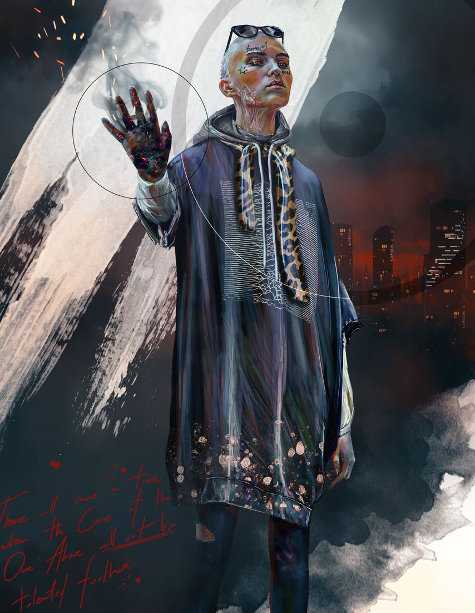

Chapter Two: Apostates of a Cruel Church

THE PATH  
OF THE SUN

Prometheans, Kindling

2 8

V5-Sabbat.pdf-renegadegames.com-#a11397-103

S A B B AT: T H E B L A C K H A N D

T

potent-Blooded vampires in the long term, but 
that’s not the point – the point is that thin-blooded 
followers of the Path see themselves as potentially 
on the cusp of being demigods, and the Path is as 
transformative as any of the more established Paths 
of Enlightenment. As yet, it has no codified tenets; 
the thin-bloods of the Sabbat are still defining what 
it means to be a harbinger of the Sabbat’s future 
rather than eidolons of its past. Some even forgo the 
Sabbat-venerated practice of diablerie, unwilling to 
sully themselves with the tainted blood of Ante-
diluvian lineages, a radical new perspective for the 
Sword of Caine.

hin-blooded Cainites don’t usually last long 
in the Sabbat. Either their vitae is too weak 
to see them through the Creation Rites 
(see p. 57) or the power differential they experience 
against more potent-blooded vampires puts them 
at a quickly fatal disadvantage, especially at the 
forefront of the Gehenna War.

That hasn’t stopped a certain – growing – subset 
of thin-blooded Sabbat from testing the limits of 
the curse of Caine, however. In the evolving ortho-
doxy of the Path of the Sun, thin-blooded Cainites 
(and Caitiff) are the only vampires truly free from 
the taint of the Antediluvians. Noddist literature 
makes no small reference to the thin-blooded, 
plainly stating that, when thin-bloods are present, 
“in this time [...] Gehenna will soon be upon you.” 
And with the Gehenna War raging nightly, few Sab-
bat would argue that event has yet to come.

While Priests of the more established Paths may 
deride the Path of the Sun as “not a real Path,” they 
would very likely be shocked to see the rate at which 
the Path has spread among those they consider 
lesser, the by-blows and collateral shovelhead dam-
age the Black Hand leaves in its wake. And not every 
adherent is a thin-blood: Some would be considered 
Caitiff in other sects, while yet others are of more 
potent vitae who see the Path of the Sun as a way to 
violently atone for the foulness in their own sires’ 
Blood.

It is the Time of Thin Blood.
With no discernible clan lineage, thin-bloods 
endure none of the overt influence of the Damned’s 
hated progenitors. As fervent early adopters of 
this emerging Path, they see themselves as the true 
heralds of the Sabbat, the “new dawn” of a “race of 
Cainites” who have inherited no mark of the Third 
Generation’s treachery.

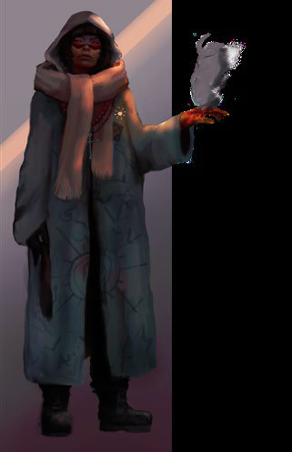

To that end, the traditional anathema of the 
undead, sunlight, has a diminished effect on thin-
blooded Cainites. Followers of this Path see it as 
part of their mandate to turn this to their advan-
tage, as they are able to meet the Dark Father’s 
threats during hours that normally see Cainites as 
having succumbed to the daysleep. Its followers 
are often easily recognized by the burn-scars and 
disfigurements they wear as badges of defiance and 
sufferance in Caine’s name.

The Path of the Sun is an imperfect Path. It is 
very much unproven, more of an emergent outlook 
among those fighting at the forefront of the Ge-
henna War, and practiced almost exclusively among 
the very youngest Sabbat. Indeed, it has only very 
recently come into being with enough rigor for cer-
tain Priests to consider it an actual Path at all.

Since the Beast is less inchoate among thin-
blooded Cainites, it likely won’t serve well for more

2 9

V5-Sabbat.pdf-renegadegames.com-#a11397-103

Chapter Two: Apostates of a Cruel Church

Ethics

fare as legion. They are eager to act against enemies 
during the forbidden hours of daylight, bundled up 
in hoodies, face masks, and other protection, and 
have been known to lure hunters into rivals’ havens 
before night comes.

The ethics of the Path of the Sun are evolving, 
changing nightly. Unlike the other, more established 
Paths, the Path of the Sun strays closer to being 
a quasi-religion than a true frame of mind. As it 
stands, the Paths’ ethics are inadequate to sustain a 
Cainite’s relationship with the Beast for an extended 
period of time, which is the second-greatest threat 
to the Path’s long-term viability. The first threat, of 
course, is the fact that the final death rate for thin-
blooded vampires in the Sabbat is critically high.

Followers of this Path are also likely to come into 
conflict with other Sabbat, who denigrate the Path 
of the Sun as mindless bravado or even heresy. In 
response, they are relentless proselytizers, and seek 
to convert their fellow Sabbat – as well as on-the-
outs Anarchs and disillusioned Camarilla fledglings 
who find themselves pushed into the margins of 
their home domains.

■Let neither one’s mortal nor Cainite heritage

limit one’s potential.

Disciplines

■Destroy Cainites but never consume them, leav-

ing oneself untainted.

■Do not allow other would-be Prometheans to

The Path of the Sun finds especially frequent use of 
the Alchemy with which the duskborn have affinity.

serve the polluted bloodlines of the Antediluvi-
ans.

In Chronicles

Whether as infiltrators, radicalizers, front-line fanat-
ics, or daylight assassins, Path of the Sun Cainites 
are very much a sign of the times.

Prometheans have a lot to prove, and may be 
found at the forefront in many Gehenna War 
theaters, willingly throwing themselves at threats 
beyond their individual capacity, to see how they

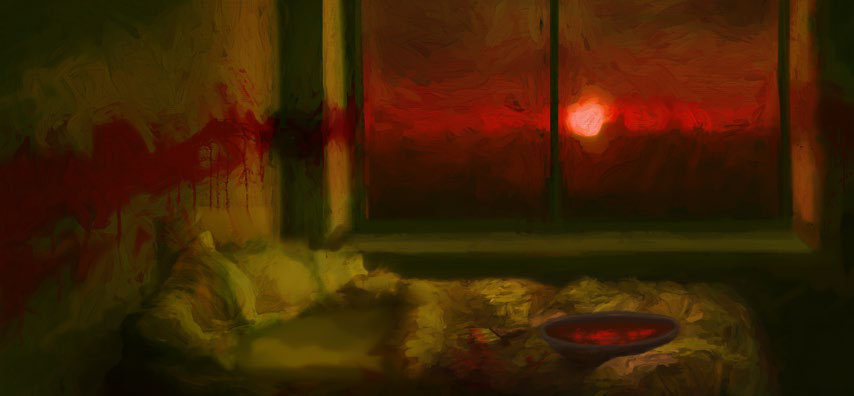

3 0

V5-Sabbat.pdf-renegadegames.com-#a11397-103

S A B B AT: T H E B L A C K H A N D

Forsaken Paths

ten bring it into conflict with the general Sabbat 
outlook on mortal society. Some Cainites believe 
that more than one tyrannical Camarilla Prince has 
followed the Path of Honorable Accord, as great 
age puts great distance between them and a tenu-
ous Humanity. This may be speculation, and surely 
some number of these anecdotal elders would have 
heard the Beckoning, forcing this Path further into 
the margins as an insufficiently modern perspective, 
as it seems to be more philosophy than Path.

The Sabbat’s spiritual journey is a significant, even 
defining aspect of sect membership. That said, not 
all of the Paths of Enlightenment followed tonight 
emerged contemporaneously. Further, not all Paths 
are equally functional or viable in the modern 
nights.

Ideas never die, however, and for all the Paths 
that are inadequate to serve a Cainite’s needs, some 
remain in regional practice. Whether relics of nights 
past, colloquial traditions, or philosophical aberra-
tions at odds with Sabbat dogma, some of the more 
marginal Paths haven’t vanished entirely. And not 
every Path follower is Sabbat….

Path of Lilith

According to the Book of Nod, Lilith offered Caine 
succor when he was cast out of the land of Nod. 
Followers of the Path of Lilith venerate “the Dark 
Mother,” and some even impute to her the creation 
of vampires, or mingle the origin of the vampire 
species to the shared parentage of Lilith and Caine. 
Veneration of Lilith often exalts her as a cultiva-
tor rather than a destroyer, but at the same time 
acknowledges that she is the “mother of monsters,” 
perhaps even spawning some of the other supernat-
ural creatures with whom vampires share the night. 
Historically, followers of the Path of Lilith had 
often been accused of heresy in the Caine-centric 
Sabbat, but the long and complicated relationship 
between the Path and the Black Hand persists to 
this night, where her cults can be found.

Path of the Beast

Followers of the Path of the Beast do not treat the 
Beast as a separate entity, but as their true selves. 
The Path of the Beast considers the mind a vestigial 
trait standing in the way of the Beast: The monster 
within replaces the conscious sense of self. Cainites 
who follow this Path tend to become powerful – 
and bestial – very quickly. It has fallen out of com-
mon practice due to its general inability to prevent 
Cainites from Wassail over the long term. Regional 
packs that follow it can still be found worldwide, 
both at the front of the Gehenna War and in espe-
cially violent domains.

Path of Honorable Accord

Rumored to have been practiced even before the 
foundation of the Sabbat, regional variations that 
amount to a “Path of Honorable Accord” emerge 
from any number of cultural traditions. It has been 
variously characterized as a spectrum including a 
bloody-minded chivalric perspective practiced by 
“paladins of Caine” to a rigid asceticism by which 
the Cainite forgoes any personal comforts to mor-
tify themselves into oneness with the Beast.

The Path has fallen out of common practice 
among the Black Hand because its precepts of-

3 1

V5-Sabbat.pdf-renegadegames.com-#a11397-103

Chapter Two: Apostates of a Cruel Church

The Killing Time:

the ones most likely to see encounters with the 
higher echelons of the sect.

Antagonists

Each Path either fulfills a different role or ap-
proaches a shared one from different angles. Here, 
examples are given for each Path as well as each situ-
ation, together with sample antagonists for all of the 
above. Note that in large-scale sieges or domains, 
encounters with Cainites of different Paths and 
packs become increasingly likely, so do not feel con-
strained by the Path-specific avenues of approach 
detailed here. These are springboards, not cages.

To the outside observer, a Sabbat pack acts with 
frightening coordination, displaying behavior eas-
ily mistaken for a shared consciousness among its 
members. Packmates may speak few words and even 
fewer sentences to one another, while animalistic 
howls, tic-like signs, and blood-spattered symbology 
take their place.

It is a testament to the effectiveness of the Paths 
that all of this stems from a likeness of mind, a 
singular way of aligning goals and methods, rather 
than some Blood-borne telepathy. However, while 
each Path has the same internal and external goals 
– leashing the mind to the Beast and creating a 
warrior-creature built to fight the Antediluvian 
pawns, respectively – they each go about them in 
different ways.

ROLL YOUR OWN
The antagonists described here will give numerous 
sessions and stories worth of conflict, but many 
Storytellers enjoy putting a personal touch on the 
antagonists who make unlife so difficult for their 
players’ coteries. By all means, do this!

Populate a pack and name its members, giving  
it a focus and a unique identity. See the Storyteller  
Resources chapter beginning on p. 105 for more 
tools to use for this.

Constructing Conflict

While it is impossible to describe every possible 
circumstance for encountering the Sabbat, the most 
common ones can be divided into the contexts of 
vanguard, siege, and dominion. These aren’t terms 
the Sabbat uses, but rather storytelling shorthand to 
help you plan story beats for your chronicle.

Create your own antagonists by defining only 
their relevant Traits – use these example antagonists 
as models. Storyteller characters don’t have the 
same interactions with the world that players’ char-
acters do, so don’t feel like you need to build them 
as a player would a character, or with all of the same 
traits a player’s character has.

■Vanguard situations are those in which players'

Vampire stories are unlikely to concern them-
selves with fluctuations in the moral state of Sabbat 
antagonists. Don’t bother keeping track of their 
Humanity scores; they don’t have any, and Paths 
don’t have a trait value governing them. Humanity 
continues to have paramount importance for play-
ers’ characters, however, especially to contrast them 
against the monstrousness of the Sabbat.

characters encounter lone Sabbat vampires or 
packs conducting solitary forays into hostile sect 
territory, with the purpose to scout, under-
mine, or otherwise probe the terrain, whether 
in preparation for a Crusade or in some form of 
support for the Gehenna War.

■In a siege, hot war is already underway and those

subject to the assault face the spearhead of the 
crusading force as well as packs dedicated to ter-
ror or sabotage.

■The rarest of the situations is dominion, in

which the players’ characters find themselves 
in Sabbat domains, and these situations are

3 2

V5-Sabbat.pdf-renegadegames.com-#a11397-103

S A B B AT: T H E B L A C K H A N D

Portraying the Paths

vanish, as much to nullify hostile retaliation as to 
avoid any ambitious brethren thirsting for newly 
invigorated heartsblood.

When you as the Storyteller engage with the play-
ers as a Sabbat vampire, a useful acting tool is to 
think of them as creatures, not people. The setting 
chapters seek to enforce this, likening sect members 
to sharks and emphasizing the alien nature  of their 
thought.

VANGUARD: The most common encounter with 
Devourers as vanguard finds them scouting hostile 
(or “prey”) domains for potential targets. This task 
usually falls to the youngest members of the pack, 
to avoid losing potent Blood or esoteric knowledge 
should they fall. Eschewing mortal agents, Nod-
dists often employ Blood Sorcery and animal spies 
to narrow down their search. The glimpse of an 
owl or a strange pair of eyes looking back through 
the mirror is often the only advance warning the 
mark gets. Weak vampires are fair game to the scout, 
while stronger rivals are noted and left for the pack 
as a whole, come siege.

The process of adopting a Path means hav-
ing one's mind torn apart, scoured clean through 
trauma. It means having the remains rebuilt from 
the ground up, clinging step by step to a new frame 
of self utterly devoid of mortal, human connection. 
No few Sabbat vampires spend years just learning 
to speak again, and once able  they do so only to lull 
their prey into a false sense of normalcy.

This does not mean that their emotional com-
pass, while skewed, is absent. An adherent of the 
Path of Caine who declines a chance at diablerie will 
feel shame equal to a humane individual betraying a 
close friend, and a follower of the Path of Power and 
the Inner Voice will grieve at submitting to a lesser 
in a way akin to a non-Sabbat causing the death of 
an innocent. Sabbat vampires still feel, and still bear 
the consequences of their choices. It’s just that the 
stimuli for their emotional responses are different 
than those of Kindred who maintain the illusion of 
Humanity.

SIEGE: During a siege, the Noddist pack takes 
to the streets, acting on the information collected 
by vanguard scouts. Resembling nothing so much 
as gruesome and disheveled militia – replacing 
firearms with heavy machetes for lopping off limbs 
– packs following the Path of Caine strike at havens 
with a precision and ruthlessness that put mortal 
SWAT teams to shame. Similarly, Noddist packs 
eagerly plunder or even heist rare texts or relics of 
suspected vampiric origin, either through force or 
in muted silence.

Lean into this to provide these adversaries with 
motivation and passions, and let it fuel the charac-
terization of these monsters. After all, just because 
they’ve chosen to become something other than a 
person doesn’t mean they lack personality.

DOMINION: In domains conquered by the 
Sabbat, the Path of Caine can be almost invisible. 
Devourers’ lack of interest in mortals other than 
as sustenance and their tendency to fall to inter- or 
intra-pack rivalries means that each Noddist is often 
occupied with their own security or plotting their 
next raid. Their havens protected to the point of 
paranoia either resemble actual vaults or are sorcer-
ous bastions that would put any Tremere to shame. 
In domains in accord or entente, followers of the 
Path of Caine often become their own worst enemy.

Path of Caine

Big-game hunters of the Damned, the 
Noddists are the honed edge of the 
Sword of Caine. They conduct their 
plans with single-minded focus, a murderous ef-
ficiency. Their zealous trajectory toward the Dark 
Father means the sect must constantly keep their 
attention upon outside prey, lest packs turn upon 
themselves. Unconcerned by trappings of status, 
they equip themselves to blend in, strike hard, and

USE OF GHOULS: Considering mortals beneath 
them, many Noddists instead experience a kinship 
with other top predators. Their familiarity with

3 3

V5-Sabbat.pdf-renegadegames.com-#a11397-103

Chapter Two: Apostates of a Cruel Church

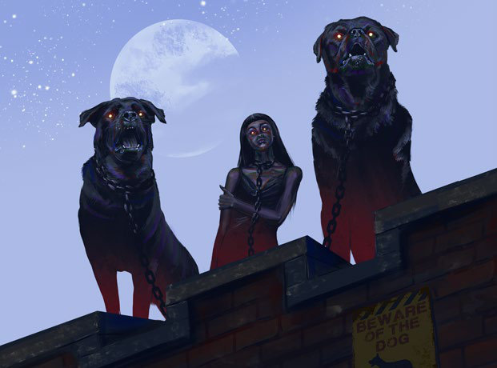

their own Beasts make them excellent practitioners 
of Animalism, enabling them to endow their feral 
servants with abilities rarely seen in animal retainers 
outside the Sabbat. Large dogs such as Rottweilers 
or German Shepherds are common, as are birds of 
prey such as owls. In a few cases, Devourers have 
raided zoos to subject even more exotic beasts of 
prey to the thralldom of the Blood. Often endowed 
with an unnerving ability to spot and track other 
vampires, these animals are not to be underesti-
mated.

Blood-Hound
A massive dog made even fiercer by vitae and 
supernatural conditioning, the Blood-hound serves 
its master by tracking Kindred prey, as well as their 
daylight guardian. Loyal unto death, the Blood-
hound nevertheless possesses enough cunning and 
self-preservation to avoid direct confrontation un-
less its master is threatened.
General Difficulty: 3/2
Standard Dice Pools: Physical 5, Social 1,  
Mental 2
Secondary Attributes: Health 6, Willpower 3
Exceptional Dice Pools: Awareness (Spotting Kin-
dred) 6, Survival (Tracking Kindred) 6, Stealth 6
Disciplines: Potence 1
Notes: Blood-hound bites do +2 damage, as their 
teeth and jaws are supernaturally strong.

PORTRAYAL: Avoid being seen until you strike. 
If forced into a conversation, speak in short, clipped 
sentences, your curtness rivalled only by your still-
ness. Survey everything and everyone, categorizing 
them either as prey or predator. Nothing else mat-
ters. When you have what you need, attack or flee 
without warning.

3 4

V5-Sabbat.pdf-renegadegames.com-#a11397-103

S A B B AT: T H E B L A C K H A N D

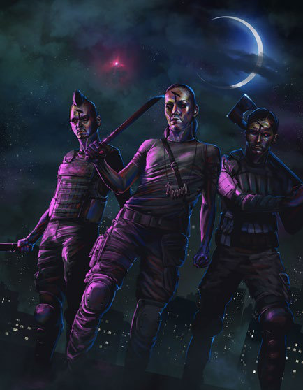

Path of Caine Tracker
This vampire is tasked with surveying and docu-
menting vampire activity in a prey domain, whether 
as a rite of passage or as a punishment for failure. 
Using avian spies to avoid detection, they approach 
only what they perceive as weak or weakened prey. 
Desperate to gain recognition among their peers, 
they might eschew prudence if the opportunity 
presents itself.
General Difficulty: 4/3
Standard Dice Pools: Physical 6, Social 2,  
Mental 4
Secondary Attributes: Health 7, Willpower 6
Exceptional Dice Pools: Melee (Kukri) 8, Aware-
ness 6, Disciplines 6
Disciplines: Animalism 2, Obfuscate 2, Potence 2 
Notes: Young and reckless, this vampire runs the 
risk of picking fights they cannot win when cor-
nered. At the risk of defeat they will frenzy and fight 
to final death. Their kukri does +3 damage.

Path of Caine Slayer
This is not their first siege. Murder incarnate, this 
Cainite stalks the streets, sewers and rooftops 
in their unerring hunt for Kindred to consume. 
Adorned with trophies of their past kills, their hunt 
is sacrament and holy purpose in one.
General Difficulty: 6/4
Standard Dice Pools: Physical 8, Social 3,  
Mental 5
Secondary Attributes: Health 8,  
Willpower 6
Exceptional Dice Pools: Brawl (Grapple) 10, Melee 
(Scimitar) 10, Stealth 10, Disciplines 8
Disciplines: Celerity 4, Potence 3, Blood Sorcery 3, 
Obfuscate 2
Notes: A terrifying enemy in themselves, the Slayer 
leads a pack of Devourer comrades, all of whom are 
at least the equal to the Tracker (above). The Slayer 
is armed with a reinforced scimitar conferring +4 
damage. They are among the most dangerous vam-
pires to face, and any direct encounter is likely to 
result in one-sided carnage. Coteries are advised to 
apply cunning, wits, and above all, caution.

Path of Cathari

Despite being perpetrators of atroci-
ties exceptional even among their 
own kind, the Devils of the Flesh can 
appear deceptively relatable when encoun-
tered face-to-face. The vices they rely on to 
sate their Beast often spring from the worst parts 
of their mortal heritage, and they are also the most 
likely of all Sabbat to surround themselves with 
the still-living: victims, toys, or plain prey (not that 
the distinction matters much to the Cathari.) More

3 5

V5-Sabbat.pdf-renegadegames.com-#a11397-103

Chapter Two: Apostates of a Cruel Church

than other Cainites, they are social creatures, and 
despite their inhumanity they play that game with 
relish and devilish skill.

USE OF GHOULS: Mortals not used and discard-
ed by the Catharites frequently become ghouls. The 
Devils’ liberal use of Blood Bonds and Presence, not 
to mention the addictive qualities of the Blood in 
itself, quickly turn these wretches into loyal but un-
stable disciples willing to perform any depravity in 
the service of their beloved masters. In a siege they 
may find themselves acting as bait, cover, or diver-
sions, drawing the attention away from the pinpoint 
terror acts of their domitors.

VANGUARD: Far ahead of other incursions, the 
Cathari are usually present in a domain months if 
not years ahead of the rest of the vanguard. Their 
ability to not only present themselves as but even 
attract humane vampires is invaluable, and they 
usually set up shop as cult leaders, revolutionary 
firebrands, or just “that weird woman on Crocker 
Street”, all the while radicalizing those caught in 
their orbit. Often paying lip service to the Anarch 
cause, their true allegiance only becomes apparent 
as their hangers-ons go missing or are “reborn” as 
newly converted members of the Path.

PORTRAYAL: Lick your lips. Assess everyone for 
signs of their vices, and for their use in sating yours. 
Toy with your prey and act the languid cat, a purr-
ing predator hiding claws like daggers. You might 
never reach the top, but your ability to drag anyone 
down is infallible.

SIEGE: Having sown the seeds of terror, come 
siege the Devils reap. Their infiltration bears fruit 
as they dismantle the mortal support mechanisms 
of the toppling domain. Informants are found dead 
by their own hand. Trusted allies are caught in 
“political violence.” Mortals beloved by Camarilla 
Primogen may be flayed alive, degraded for amuse-
ment, or anything in between, the atrocities posted 
and re-posted on YouTube. No wicked thirst is left 
unquenched as the dominoes set in place by the 
Devils of the Flesh aren’t simply toppled, but burnt 
to ash and spat upon for good measure.

Honeytrap
Easy prey and choice vessel in one convenient pack-
age; few vampires can resist the lure of this victim. 
The ghoul’s blood seethes with a potent mixture of 
inhibition-suppressing psychoactives and energizing 
stimulants, providing an unexpected kick to anyone 
who feeds on them. Kindred long dead have even 
found priapic anguish after a turnabout-liaison 
with the Honeytrap. While the Honeytrap can be 
used to draw out and identify potential vampires, 
their real use is to weaken selected Kindred, making 
them susceptible to whatever plans the Cathari have 
for them. 
General Difficulty: 3/2
Standard Dice Pools: Physical 3, Social 5,  
Mental 2
Secondary Attributes: Health: 5, Willpower: 4
Exceptional Dice Pools: Subterfuge (Entrapment) 
6, Larceny (Pickpocket) 5
Disciplines: Presence 1
Notes: Sating one Hunger or more causes an in-
tense rush as well as loss of inhibition in the feeding 
vampire. Treat the effect as a combination of meth 
and hallucinogens (see Vampire: The Masquerade, 
p. 310). They must also take a Compulsion. These 
effects last for the rest of the scene, though the Ca-
thari Cainites usually make their move before that.

DOMINION: Despite being the most numerous, 
the Albigensians seldom reach positions of power 
with the Sabbat. Their chosen Path demands too 
much instant gratification to allow for the kind of 
careful scheming conductive to those efforts. In-
stead, the Cathari gleefully ply their trade as terrors 
of the night. This single Path is likely responsible for 
most of the vampire-related plights of mortals in do-
mains conquered by the Black Hand. Their havens 
range from spattered flesh-pits to reeking abattoirs, 
though they are usually temporary, if for no other 
reason than the Cathari being veritable magnets for 
Second Inquisition agencies.

3 6

V5-Sabbat.pdf-renegadegames.com-#a11397-103

S A B B AT: T H E B L A C K H A N D

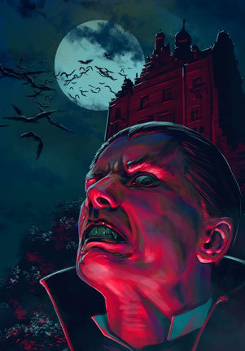

Path of Cathari Radicalizer
The Radicalizer is all about “The Movement.” 
Skirting the edges of an Anarch domain they at-
tract vampires with a grudge: those who have lost 
something, or at least believe themselves to have 
lost something. The Radicalizer promises a reckon-
ing and encourages the disenfranchised licks to act 
against their oppressors, to hurt them or those they 
care about. It’s all in the name of “The Movement” 
or “Your Rights as a Kindred.” Every lick deserves 
to be what Caine intended them to be, and damn 
anyone who tries to defang us!
General Difficulty: 4/3
Standard Dice Pools: Physical 3, Social 5,  
Mental 4
Secondary Attributes: Health 6, Willpower 7
Exceptional Dice Pools: Persuasion 8, Insight 
(Sore Spot) 8, Subterfuge (Fake Humanity) 8, 
Disciplines 6
Disciplines: Auspex 3, Presence 4, Protean 2
Notes: The Radicalizer is always interested in 
conversation, and is adept at masking the monster 
behind their facade  of passion and sympathy. They 
will not engage in a physical fight unless cornered, 
but are adept at most kinds of social conflict.

Exceptional Dice Pools: Performance (Acting like 
a vampire would act) 8, Occult 8, Disciplines 7
Disciplines: Dominate 4, Protean 4, Animalism 3
Notes: The Vampyre might come off as goofy at 
first, but they play the stereotype as if the director 
were seeking an X rating, and behind the doors of 
their haven they act out everything films only imply 
(which provides ample reason to change their cape 
nightly).

The Vampyre
Many Cathari revel in their bestial inner nature, 
but the Vampyre basks in superficial stereotypes 
instead. Adapting every popular trait from movies 
and literature, this Devil of the Flesh takes pride in 
being an affront to subtlety, as well as any attempt 
to hide from mortals. Their haven is a decrepit 
manor (bats included), their wardrobe a selection 
of tatterdemalion capes, their cellar hosts nightly 
blood sacrifices to Satan. Strangely, it works. While 
their fellow Cainites are struck down with hot lead 
and fire, nobody wants to risk looking stupid by 
raiding what is obviously a wannabe vampire man-
sion.
General Difficulty: 5/3
Standard Dice Pools: Physical 4, Social 7, Mental 5
Secondary Attributes: Health 6, Willpower 8

Path of Death and

the Soul

Agents of entropy, the work of the 
Necronomists literally precedes 
them. Originating as students of death 
– the ultimate end of all life – the Path 
has hence taken on a broader role for the Black 
Hand as what might be best described as an occult 
research and development function. To the Reap-

3 7

V5-Sabbat.pdf-renegadegames.com-#a11397-103

Chapter Two: Apostates of a Cruel Church

decades, unwilling to let the meticulous work put 
into them go to waste.

ers, study and execution are one and the same, and 
their work touches a prospective target domain long 
before they set foot there. Those who meet them 
can be sure that while they might not be the subject 
of the experiment, they’re certainly part of the 
equation.

PORTRAYAL: Speak in icy monotones and as if 
somewhat distracted. Cock your head and pause to 
do mental arithmetic, calculating the most efficient 
way to cause everything around you to just stop. 
Absently kill things: a fly, a lit candle, a conversa-
tion that strays from the subject. When you sense 
that your time is being wasted, leave and let your 
stratagem unfold behind you.

VANGUARD: Agents of Necronomists carefully 
prepare hostile domains prior to siege. With the 
help of Cathari infiltrators, Necronomists condition 
ghouls in key positions in the enemy sect. Profane 
rituals antagonize spectres and death-speakers strike 
bargains with post-life entities far worse, which 
await the call to mayhem. Packs of agents provoca-
teur disseminate sorcerous Blood-pathogens among 
choice mortals, infection vectors calculated to reach 
full bloom when the rites auspice their greatest ef-
fectiveness.

Sleeper
The sleeper has worked for many years as an 
obedient retainer, under Blood Bond to a trust-
ing domitor. They know the ins and outs of their 
master’s affairs: who they meet, who they fear, and 
on whom they feed. They’re unquestionably loyal, 
at least until the night when five cockroaches form a 
curious sigil on their bedroom floor. Then they will 
remember their true domitor and regnant. They 
will open the lead box and spike the drink of their 
false master’s favorite vessel. And wait.
General Difficulty: 3/2
Standard Dice Pools: Physical 2, Social 3,  
Mental 5
Secondary Attributes: Health: 5, Willpower 6 
Exceptional Dice Pools: Subterfuge (Bonded 
Devotion) 6, Etiquette 6
Disciplines: Obfuscate 1
Notes: Conditioned into a false identity, the Sleeper 
genuinely believes their own cover until post-hyp-
notically triggered. Only then do they risk revealing 
their true agenda.

SIEGE: Once the Blood starts to flow, the Reapers 
are content to observe, allowing their plans to play 
out while collating learnings from the results. They 
are not so detached as to avoid first-hand observa-
tions, however, but make sure to do so as a pack, or 
otherwise surround themselves with loyal security.

DOMINION: Death and the Soul Packs usually 
make their havens where subjects are plentiful but 
rarely missed. Slapdash laboratories crowd into ur-
ban concrete shelters or sprawl across multiple floors 
of a condemned school building, the surrounding 
area resisting any attempt at gentrification while 
the number of transients steadily drops. When the 
area finally resembles nothing so much as a decaying 
movie set, the pack moves on, usually as part of the 
next Crusade.

Path of Death and the Soul Piper
Some jobs require personal attention. The Piper 
scours the streets and alleys of the prey city, one 
ear forever tuned to the susurrus of the dead. They 
whisper to the victims, the ghosts and spectres of 
those who suffered and died at the hands of their 
secret undead masters. The Piper promises retribu-
tion, in the exchange for service. Soon, they will 
have an army.

USE OF GHOULS: Necronomists use expertly 
tailored ghouls, conditioned and crafted for specific 
purposes. Some become living weapons of germ 
warfare, slitting their wrists at water reservoirs to 
taint entire populaces, while others serve as anchors 
to voracious spectres, walking nexi of poltergeist ac-
tivity. Most are disposable, but in rare cases Reapers 
have kept useful servants around for years and even

3 8

V5-Sabbat.pdf-renegadegames.com-#a11397-103

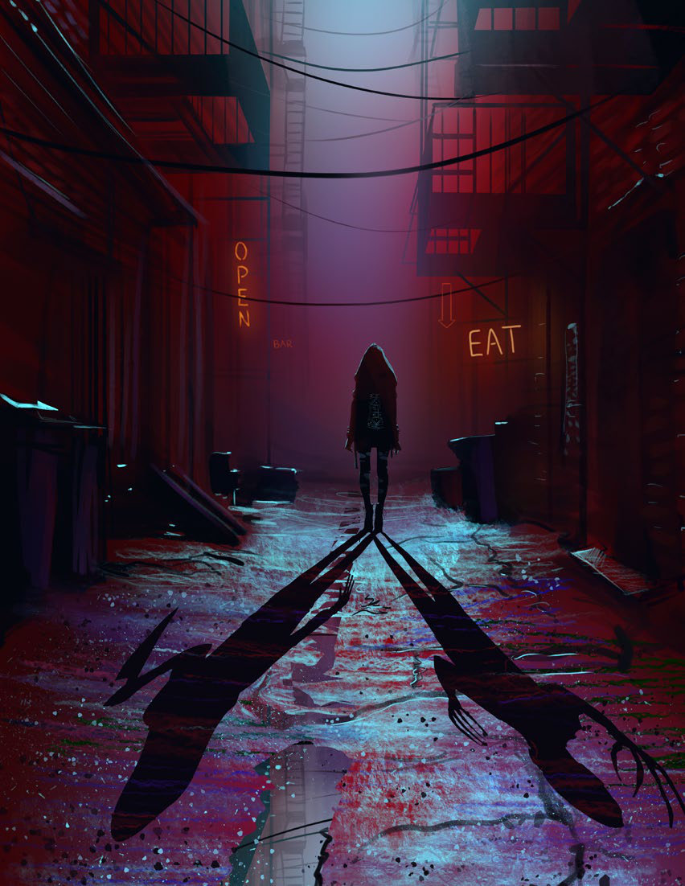

S A B B AT: T H E B L A C K H A N D

3 9

V5-Sabbat.pdf-renegadegames.com-#a11397-103

Chapter Two: Apostates of a Cruel Church

Masquerade, p. 310) but can also have more insidi-
ous long-term effects, to be devised by the Story-
teller.

General Difficulty: 4/3
Standard Dice Pools: Physical 3, Social 3,  
Mental 6
Secondary Attributes: Health: 6, Willpower: 7
Exceptional Dice Pools: Persuasion (Agitate) 7, 
Awareness (Ghostly phenomenon) 8, Occult 8, 
Disciplines 6
Disciplines: Auspex 3, Fortitude 1, Oblivion 4
Notes: The Piper is an accomplished user of 
Oblivion Ceremonies and knows at least four. They 
also have three spectres at their beck and call, each 
owing them a single service (See Vampire: The 
Masquerade, p. 377).
Path of Death and the  
Soul Lifecrafter
Nothing kills quite as effectively as life. The 
Lifecrafter has dedicated their undead existence to 
honing life in all its forms to perform this single 
function. Their workshop set up in a dilapidated 
sewing factory, the looms now stretch, sew and knit 
living hides instead, and the coloring vats bubble 
with fetid bacterial cultures. Whether coaxing 
mortality out of microbes or assembling monstrous 
assemblies of flesh, sinew, and bone, the Necrono-
mist is aware that while death is the final goal, the 
ends sometimes justifies the means.
General Difficulty: 5/3
Standard Dice Pools: Physical 3, Social 5,  
Mental 8
Secondary Attributes: Health: 6, Willpower: 8
Exceptional Dice Pools: Crafting (Living flesh) 9, 
Science (Microbiology) 9, Medicine 9, Disciplines 8
Disciplines: Dominate 4, Protean 4, Animalism 2, 
Auspex 2
Notes: The Lifecrafter is rarely encountered outside 
of their workshop, and upon those rare occasions 
they’re always accompanied by a number of their 
creations, the man-sized hidden under heavy cloaks 
and the minute dormant in vials, ready at a mo-
ment’s notice. Treat the ghoul creations as szlachta 
(see the Vampire: The Masquerade Companion, 
p. 22) while the enhanced microbes can have any 
number of effects, even on Kindred. Effects can  
approach Scorpion’s Touch (Vampire: The  
Masquerade, p. 273) or poison (Vampire: The

Path of Power

and the  
Inner Voice

To rule or be ruled is the only 
choice for the Unifiers, who rely on an 
unquestionable  
hierarchy to shackle their minds to the Beast. Uni-
fier packs usually evolve around an iron-wrought 
internal pecking  
order but work as a unit in their overarching ambi-
tion to lord over packs of “lesser” Paths. As such, if 
encountered at all they are usually found at the reins 
of a Crusade, as Uhlan packs would rather face final 
death than settle for less.

VANGUARD: Followers of this Path rarely engage 
in the base work of probing enemy domains. When 
they do, it’s usually to prove their superiority over 
other packs or individual Cainites, aiming to garner 
status by outperforming rivals or, failing that, sabo-
tage their efforts. This is another cause for attrition 
among this Path, but also ensures that the packs 
that do stick around are a cut above the rest, in the 
cruelest and most practical sense.

SIEGE: When battle is joined Unifiers take on the 
highest-profile targets. In contrast to the stealthy 
and pragmatic approach preferred by the Noddists, 
Uhlan strikes are intimidating shows of force. The 
Masquerade buckles as they spring into action, 
whether assaulting a Prince’s Centro high-rise in 
Madrid or descending on an Anarch Baron’s Juárez 
compound. More conquerors than destroyers, they 
subject their beaten foes to unthinkable humili-
ations and only when their victim acknowledges 
their superiority and submit may they find the 
release of the final death.

4 0

V5-Sabbat.pdf-renegadegames.com-#a11397-103

S A B B AT: T H E B L A C K H A N D

Disciplines: Fortitude 1
Notes: Armed with a M67 fragmentation grenade, 
the ghoul will attempt to cause as much damage 
as possible, moving toward the highest gathering 
of Kindred or retainers in Elysium. The blast does 
a base 12 points of damage, -1 per meter from the 
center of detonation. (Aggravated to mortals but 
not vampires. Well-supplied domitors may have in-
stead provided an incendiary grenade, doing a base 
8 fire damage.) The remains of the Broken Servant 
haven’t yet stained the ground before the waiting 
Uhlan pack strikes, having expended the hapless 
ghoul.
Path of Power and the  
Inner Voice Knight
They used to call themselves “Paladin,” but the 
looks they got made them change their moniker. 
Immaculately dressed in dark suit and tie and with 
an affected “European” accent, they would fit right 
in at a Jason Bourne villain audition or as the ninth 
Reservoir Dog. Now they’re part of a pack opera-
tion on hostile territory. Their mission: whatever 
other packs are doing but better, more vicious, and 
with greater style.
General Difficulty: 4/3
Standard Dice Pools: Physical 5, Social 4,  
Mental 3

DOMINION: Followers of this Path take great 
pleasure in conquest, and can spend many months 
repurposing the assets and networks of the taken 
domain in an ultimate expression of a “hostile 
takeover.” The result is something like a black reflec-
tion of the Ivory tower, with the pack Priest acting 
as Bishop and their subordinate Uhlans extensions 
of their will, luxuriating in their temporary power 
and bringing what is left of the vampiric power 
structure of the domain to heel. This rarely lasts as 
the resources are ravaged, and the internal tensions 
of the entente force another Crusade.

USE OF GHOULS: The lowest rung of the Uni-
fier ladder, ghouls to vampires following this Path 
know the meaning of servitude. Often minions of 
conquered foes, the twin vises of Dominate and 
Presence, not to mention plain violence, ensure that 
what’s left is utterly broken to the will of their new 
lords. They’re still expected to appear a cut above 
other servants, though, and eagerly subject other 
ghouls to abuse given a chance.

PORTRAYAL: Dominate any situation, acting the 
natural superior no matter the arena. Anyone defer-
ring to you receives an equal mixture of contempt 
and approval, and anyone questioning your author-
ity must break against your will. Should you be 
bested, immediately submit, accepting your place in 
the hierarchy. For now.

Broken Servant
This ghoul has lost everything. They used to be val-
ued, trusted, and comfortable. Above all they were 
important. Their new master has torn the scales 
from their eyes. They now know that they’re filth, 
fit only to yield their wretched life in one pure act of 
submission. They will pull the pin the moment they 
enter Elysium.
General Difficulty: 2
Standard Dice Pools: Physical 3, Social 4,  
Mental 3
Secondary Attributes: Health 5, Willpower 5
Exceptional Dice Pools: Etiquette (Elysium) 6, 
Subterfuge (I’m fine!) 6

4 1

V5-Sabbat.pdf-renegadegames.com-#a11397-103

Chapter Two: Apostates of a Cruel Church

Secondary Attributes: Health: 7, Willpower 7
Exceptional Dice Pools: Firearms (Submachine 
gun) 6, Intimidation 8, Investigation (Sabbat packs) 
6  Disciplines 6
Disciplines: Dominate 3, Fortitude 3, Auspex 2
Notes: Armed with a compact submachine gun 
(+3 Damage). The Knight and their pack have a 
tendency to butt in and disrupt the actions of other 
Sabbat, and a savvy Storyteller can use them to bail 
out player characters in a losing conflict with anoth-
er Cainite party. This should only be a temporary 
reprieve, as the Uhlan pack will quickly attempt to 
take over where the other pack left off.

service of the Damned. Below are some examples of 
this half-life and the castoffs it creates.

“Sabbat” and Hangarounds
Very often, when vampires of other sects get wind 
of a Sabbat presence, these are the kinds of vam-
pires responsible. They might be shovelheads too 
humane to tread a Path and left behind, if not 
simply malcontents labelling themselves “Sabbat” 
for imagined street cred. These fools usually pay 
the price for their presumption, struck down by 
wetworkers loyal to the domain rulers or by mortal 
vampire hunters with their ear to the ground. In 
the rare cases that they eventually come face to face 
with the real thing, these “Sabbat” are usually the 
first to flee.
General Difficulty: 3
Standard Dice Pools: Physical 4, Social 4,  
Mental 2
Secondary Attributes: Health 6, Willpower 4
Exceptional Dice Pools: Brawl 6, Streetwise 6, 
Disciplines 5
Disciplines: Celerity 2, Potence 2, Presence 1
Notes: While a pack of “Sabbat” is not to be trifled 
with, the main danger posed by these vampires is 
the attention they draw to themselves.

Bishop
The Bishop has it good. Set up in a 19th-century 
neo-Georgian town house belonging to a flunkie 
of the previous administration (the four high-rise 
floors belonging to the previous “Prince” are still 
being sanitized) they now communicate only 
with and through their chosen Prisci – competent 
members of their pack who also have the self-pres-
ervation instincts to know their place. But with the 
increased presence of unmarked vans and rumors 
of another pack of Unifiers muscling in, a new Cru-
sade will soon be required.
General Difficulty: 5/4
Standard Dice Pools: Physical 6, Social 6,  
Mental 6
Secondary Attributes: Health 8, Willpower 9
Exceptional Dice Pools: Melee (Cavalry saber) 9, 
Intimidation 9, Politics (Ruthless) 8, Disciplines 8
Disciplines: Dominate 5, Potence 5, Presence 3
Notes: Never caught alone, the Bishop always has 
their pack within reach. (Treat as Knight, above.) 
They are armed with a cavalry saber (+3 damage), a 
memento from their mortal days, itself an anomaly 
within the Black Hand.

Path of the Sun Heliophile
The Heliophile knows they are chosen. Embracing 
the sombrous existence of their thin-blood nature, 
they skirt the edges of vampire and mortal exist-
ence, belonging in neither but believing themselves 
superior to both. They hide their sun-inflicted 
burns under designer clothing and sport sunglasses 
day and night, both as an irreverent accessory and to 
hide the one blemish no blood will ever mend: eyes 
bloodshot and pitted from daylight and insomnia. 
The Heliophile burns the candle at both ends, and 
neither day nor night brings rest.
General Difficulty: 3/2
Standard Dice Pools: Physical 4, Social 4,  
Mental 3
Secondary Attributes: Health 5, Willpower 5
Exceptional Dice Pools: Firearms 5, Stealth 5, 
Disciplines 4

Flotsam and Jetsam

Facing the Black Hand means facing more than 
its members. The sect is surrounded by tools and 
detritus, creatures used and left discarded in the

4 2

V5-Sabbat.pdf-renegadegames.com-#a11397-103

S A B B AT: T H E B L A C K H A N D

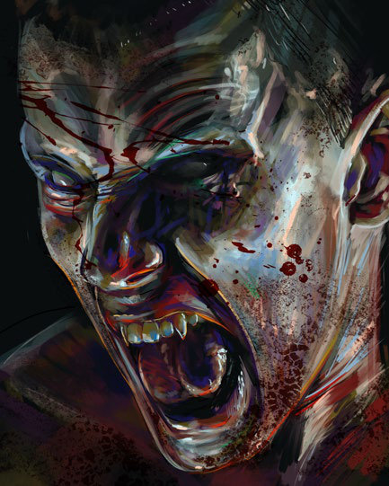

Disciplines: Fortitude 2, Thin-Blood Alchemy 3
Notes: Thin-bloods treading the Path of the Sun 
usually work closely in large packs, though their 
methods are far more subtle than those of other 
Sabbat. Prometheans take pride in their ability 
to blend in and to rise above the crude vampiric 
stereotypes of the “cadavers” and hangarounds of 
Kindred clans or Cainite Paths. They are quick to 
proselytize to other thin-bloods, whether low-
ranking Sabbat or marginal members of other sects, 
and the Path encourages a camaraderie that seems 
almost human – at least until they descend on a 
target’s haven like piranhas in Oakleys, minutes past 
dawn.

Unbirthed
Thin-bloods rarely last in the Black Hand. Too 
weak initially to survive the fierce crucible of 
Crusades, Path rivalries and the ongoing Gehenna 
War, they’re always among the first undead casual-
ties. Nevertheless, Necronomist practitioners have 
managed to weaponize the phenomena. By per-
forming a charnel ritual atop a mass grave, tearing 
a sacrificial fledgling asunder in the process, the 
buried are brought to a semblance of unlife as the 
vitae infuses their bodies. When the sun sets the 
crazed half-living cadavers dig themselves out, their 
decaying minds ravaged by Hunger, and descend 
upon anything living in the area. Lacking most 
self-preservation instincts, they rampage heedlessly 
until sunrise.
General Difficulty: 3
Standard Dice Pools: Physical 5, Social 1,  
Mental 2
Secondary Attributes: Health 7, Willpower 3
Exceptional Dice Pools: Brawl 6
Disciplines: Potence 2
Notes: Effectively thin-bloods, these poor creatures 
are Embraced well past their neurological expira-
tion, but some retain traces of memory and personal 
traits. Depending on circumstances of the ritual 
they can lie dormant and preserved for months 
or even years before some accursed circumstance 
causes them to rise. The sorcery that animates their

already dead bodies also accelerates the destruction 
of their cadaver once slain by the sun or violence.

Shackled
Walking vortices of spiritual ruin, the Shackled are 
ghouls subjected to horrifying rituals that make 
them into walking spectral anchors. Their entire 
bodies scarred, branded, and tattooed with potent 
sigils, they are constantly surrounded by vengeful 
spectres, the ghosts feeding off the ghouls’ life force 
as they mercilessly wreak havoc on the world around 
them. These ambulatory weapons of localized 
destruction are thankfully short-lived, as they age 
rapidly once their ghostly host is unleashed.

4 3

V5-Sabbat.pdf-renegadegames.com-#a11397-103

Chapter Two: Apostates of a Cruel Church

General Difficulty: 4/2
Standard Dice Pools: Physical 2(6), Social 3(1), 
Mental 4(2)
Secondary Attributes: Health 6, Willpower 8
Exceptional Dice Pools: Brawl (Spectral Blow): 8, 
Athletics (Spectral Throw) 8, Intimidation (Spec-
tral Manifestation) 8
Disciplines: Equivalent of Potence 3 and F 
ortitude 3
Notes: The Shackled are usually dressed from head 
to toe to conceal their scarred bodies, whether in 
their own shrouds-to-be or whatever can keep them 
temporarily unnoticed as part of a catastrophe in 
the making. Conditioned to the point of mindless-
ness, they will make their way to the target location 
before unleashing the spectres bound within them. 
Traits in parentheses, exceptional dice pools, and 
Discipline equivalents activate at this point. Once

loosed, the spectres will attack anyone and every-
thing around them with invisible talons or pol-
tergeist phenomena, but will prioritize protecting 
the Shackled as they are their anchor to this world. 
(Disciplines represent these powers, but especially 
strong spectres can also use the full statistics from 
Vampire: The Masquerade, p. 377.) The Shackled 
ages visibly from this point on, dying from acceler-
ated old age in roughly an hour, unless they’re killed 
(or rent asunder by unbound ghost-furies) first.

Fleshweld Ghouls
Things are not like they used to be. While the Sab-
bat made ample use of grotesque monstrosities in 
centuries past, time has made these “siege weapons” 
practically obsolete. Where a multi-jawed, three-
meter, spiderlimbed juggernaut made sense when 
assaulting a noble’s manse, modern technology is

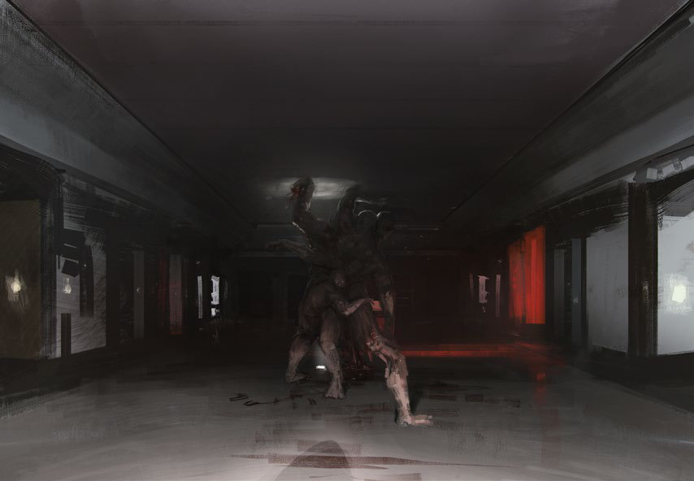

4 4

V5-Sabbat.pdf-renegadegames.com-#a11397-103

S A B B AT: T H E B L A C K H A N D

distinctly effective in turning them into offal. They 
may literally be seen a mile away, being the very 
definition of indiscreet.

into the fleshwelded form takes three turns, during 
which the ghouls strip naked and agglomerate in 
what a casual observer might mistake for a violent 
orgy. They are notably vulnerable and are unable 
to dodge or otherwise resist physical attacks while 
fleshwelding, and any damage sustained in this 
form is carried over to the fleshwelded form. On 
their own each ghoul is able to manifest parts of the 
fleshwelded form as Feral Weapons, paying the cost 
by sustaining aggravated damage as per p. 234 of 
Vampire: The Masquerade.

To address this problem, Sabbat Necronomists 
have been busy. Using methods derived from 
Tzimisce fleshcrafting and the remains of a now-
defunct vampire bloodline, they have brought forth 
fleshweld ghouls. Each group, or clutch, of these 
consists of a number of highly conditioned ghouls, 
able to merge their bodies into a single monstrosity 
reminiscent of the medieval vozhd. The transforma-
tion is quick but not reversible, and the clutch usu-
ally waits until it’s right upon its prey to maximize 
the element of terror and surprise. Once merged, the 
fleshweld monstrosity tears through its victims like 
a red hurricane, its continued existence hinging on 
consuming mortal flesh and vampire vitae.

Fleshwelded Form
Towering over men, the fleshwelded form is the rap-
turous zenith of the clutch. Driven by an insatiable 
hunger for flesh and vitae alike, it burns through the 
reserves of its physique at an alarming rate, expiring 
in minutes if it is unable to sate its ravening hunger. 
Most fleshwelded forms resemble many-limbed 
giants, their heads lolling in all directions or fused 
into multi-jawed leering visages, but larger clutches 
have been known to form stranger and utterly alien 
amalgams of flesh, bone, and teeth.

Clutch Ghoul
Each fleshweld clutch numbers three to a dozen 
members. Clutch ghouls are no longer thinking 
people so much as instruments molded to a single 
purpose. They usually appear completely inconspic-
uous, their task being to get as close as possible to 
their target before transforming, and thus are well-
suited to infiltration or “flash mob”-style mayhem.
Individual ghouls of a fleshweld clutch are eerily 
similar to each other, though certain groups are 
tailored to provide specific raw materials to the 
fleshweld form, in which one member provides the 
bulk of flesh, another the whipcord muscles, and so 
on. In all cases, clutch members share a certain im-
patience, aching for the final union that will provide 
the climax and meaning to their abused existence.
General Difficulty: 3/2
Standard Dice Pools: Physical 5, Social 3,  
Mental 4
Secondary Attributes: Health 6, Willpower 5
Exceptional Dice Pools: Brawl 6, Stealth (Hide in 
plain sight) 7, Subterfuge 5
Disciplines: Protean 2 
Notes: Clutch ghouls share a dim awareness of each 
other within the group, and instinctively know 
where the others are or if one of them is hurt, as well 
as when the time has come to merge. Transforming

Traits below are for a “smaller” form, consisting 
of a four- to six-member clutch.
General Difficulty: 5/3
Standard Dice Pools: Physical 9, Social 0, Mental 4
Secondary Attributes: Health 12, Willpower 5
Exceptional Dice Pools: Brawl 12, Intimidation 10
Disciplines: Potence 3, Fortitude 2, Protean 2
Notes: While active, the fleshwelded form can use 
Discipline powers without paying the cost in aggra-
vated damage. However, due to its grotesque super-
natural metabolism it sustains one level of aggravat-
ed damage every turn. This loss is alleviated for five 
turns if it consumes the equivalent of a human-sized 
victim in flesh, or gorges on five Hunger-levels of 
vitae. (It can employ Brutal Feed for this purpose, 
as per p. 264 of Vampire: The Masquerade.) Their 
behavior cannot be changed nor can their actions 
controlled by mental Disciplines. If members of 
the clutch are dead or otherwise absent before the 
transformation, reduce all dice pools by one to three 
(depending on clutch size) and Health by three for 
each missing, er, “participant.”

4 5

V5-Sabbat.pdf-renegadegames.com-#a11397-103

Chapter Two: Apostates of a Cruel Church

The Gifts of Caine:

Auspex

Disciplines

Level 2

UNERRING PURSUIT
Amalgam: Dominate 1

The gifts of Caine take on a unique cast when 
wielded by members of the Black Hand, for no sect 
so readily invokes the power of the Blood as does 
the Sabbat. Where lesser Kindred shy away from 
what they deem an “overreliance” on Disciplines, 
Cainites actively prefer to engage them, seeing in 
them the advantages deliberately bestowed by the 
Dark Father.

Locking eyes with a subject, the vampire coaxes 
forth a supernatural bond between themselves 
and the victim. For a number of nights, the user is 
able to view glimpses of the target and their envi-
ronment whenever the target sees themselves on a 
reflective surface. The target is generally unaware 
of the being so observed, but witnesses the presence 
of their pursuer as someone standing just behind 
them in their own reflection. While not exclusive 
to the Sabbat, this power is frequently used to track 
quarry, whether vampires marked as prey or mortal 
witnesses requiring silencing.
Cost:  One Rouse Check
Dice Pool: Resolve + Auspex
System: The user locks eyes with the target, if only 
for a split second, and rolls Resolve + Auspex. On a 
win, the effect lasts for one night, plus one for each 
success in the margin. (If used against a vampire, 
the Difficulty of the roll is 3.)

While I appreciate this line of thinking, those

versed in the Book of Nod will be the first to

acknowledge that these are not the gifts of Caine

but rather the endowments of Lilith, who gave

comfort to Caine after his banishment from

the land of Nod, and taught him mastery of his

rude form.

While the power is active the user can concen-
trate for a turn to gain a view of the last position of 
the target from the perspective of the target’s own 
reflection. Essentially, they view a mental impres-
sion of the most recent moment the victim saw 
themselves, intentionally or unintentionally, in a 
mirror or mirror-like surface (including polished 
chrome, shopping windows, or even someone’s 
sunglasses). Note that Obfuscate provides no pro-
tection from this power, as it relies on the victim’s 
self-perception.

–V.

Note that some of the systems for these Disciplines 
will see use only if employed by a player’s character. 
For example, the Stains the vampire acquires when 
using Reclamation of Vitae (see p. 50) don’t affect 
Sabbat vampires, because Paths don’t have values 
that are tracked the way Humanity is.

The user can recognize the surroundings of the 
target with an Intelligence + Streetwise (for urban 
areas) or Intelligence + Survival (for rural areas), 
the Difficulty depending on circumstances, such as 
being indoors, but should range from 2 to 4. The 
target can get a glimpse of their pursuer in their 
own reflection on a Wits + Awareness test at Dif-
ficulty 4, and only on a critical win will recognize

4 6

V5-Sabbat.pdf-renegadegames.com-#a11397-103

S A B B AT: T H E B L A C K H A N D

their face, or recall it from where the individual saw 
them if they don’t know them personally.
Duration: One night plus one for each success (or 
in the margin, in the case of a vampire target)

– in most cases, forever. Use of this power outside 
the Sabbat is rare, as even the most ruthless of the 
undead find it excessive. The Black Hand isn’t above 
taking this shortcut to ensure that a captive servant 
is made ready for conditioning or that a promising 
childe is remade to their tastes.
Cost: Two Rouse Checks
Dice Pool: Resolve + Dominate vs. Composure + 
Resolve
System: The user Rouses their Blood, holds the 
gaze of their victim, and must then engage in an 
extended conflict of Resolve + Dominate versus the 
victim’s Composure + Resolve, accumulating ten 
successes during an entire scene. The process must 
not be disturbed, and the victim must be restrained 
or otherwise submit during the act, as any break in 
concentration requires the conflict to be restarted 
(and another two Rouse Checks), as does a critical 
win on the part of the victim.

Animalism

Level 3

SCENT OF PREY
The mind-numbing fear of realizing one’s role as 
prey is unique, and vampires versed in sensing the 
Beast can learn to recognize it in those who experi-
ence it. This power allows a vampire to become 
aware of any mortal in an area projecting the 
distinct note of fear produced by prey animals hav-
ing come face to face with their predator, allowing 
them to quickly track and silence those who would 
threaten their clandestine presence.
Cost: One Rouse Check
Dice Pool: Resolve + Animalism
System: The vampire sniffs the air and rolls Resolve 
+ Animalism. Each success on the roll allows them 
to sense and track the position of a mortal who 
has witnessed what a Camarilla Kindred would 
call a “Masquerade violation.” (The user senses the 
closest mortal first if there are more than one and 
order matters.) The effect lasts for one scene, or one 
night on a critical win. The power is ineffective on 
mortals who are familiar enough with vampires to 
sublimate the note of fear, such as ghouls, vampire 
retainers, or dedicated hunters.
Duration: One scene or night

Once the process is complete, the victim is left a 
confused, slack-jawed shell. They lose memories of 
their name, history, and most of their old personal-
ity. They lose Convictions, Touchstones, and Ambi-
tion, and most of their Backgrounds become moot, 
as they forget how to access them. (These, together 
with other Advantages, are left to the Storyteller’s 
discretion – a Contact may remember them if they 
cross paths again, for example.) Attributes, Skills, 
and Disciplines remain, however. The memory 
loss is permanent, though on occasion a victim 
has regained some of their past when faced with a 
traumatic event involving a past Touchstone. (Test 
Resolve + Composure at Difficulty 5, for example 
when a former Touchstone is threatened, hurt, or 
killed while in their presence, at the Storyteller’s 
discretion.)

Dominate

A wiped victim is usually fed whatever lies are 
needed to keep them loyal, or quickly subjected to 
Path indoctrination. Use of this power is exceeding-
ly cruel, and should merit Stains in most chronicles. 
Duration: Permanent

Level 4

TABULA RASA
Less memory manipulation than eradication, this 
callous power does away with subtlety and wipes 
every trace of memory from a victim, leaving them 
a pliant effigy of themselves. While they retain most 
of their learned skills, they forget everything else – 
their experiences, friends, family, wants and wishes

4 7

V5-Sabbat.pdf-renegadegames.com-#a11397-103

Chapter Two: Apostates of a Cruel Church

Obfuscate

vs. Charisma + Insight test. On a win, the effect 
lasts for one night, plus one for each success in the 
margin. While under its effect, the victim is treated 
as employing Mask of a Thousand Faces, and is un-
able to be recognized by anyone. (The user can try 
to persuade friends and family with a Composure + 
Persuade test, but even when presenting proofs, the 
apprehension caused by this particular power will 
make it hard to convince them.)

Level 3

MASK OF ISOLATION
Amalgam: Dominate 1
Prerequisite: Mask of a Thousand Faces

Subtle but effective, this power forces the effect 
of Mask of a Thousand Faces on an unwitting sub-
ject. The victim will no longer be seen for who they 
are, even by those closest to them. Often employed 
over a longer period of time, the power is used by 
those who want to break their subject subtly but 
utterly, cutting them off from means and society to 
the point that they’ll do anything to escape such a 
fate.
Cost: One Rouse Check
Dice Pool: Manipulation + Obfuscate vs. Cha-
risma + Insight
System: The user locks eyes with the victim and 
must then succeed at a Manipulation + Obfuscate

If the subject is ever made aware of the power 
being used on them the effect ends, and the power 
cannot be employed on someone aware of its effects: 
It relies on the unconscious ignorance of the victim 
to remain active. As use of the power isn’t overt, it 
can be reapplied repeatedly though, so long as the 
user doesn’t reveal their intent.

In most chronicles, use of this power to break 
someone should merit Stains.
Duration: One night plus one additional night for 
each success in the margin

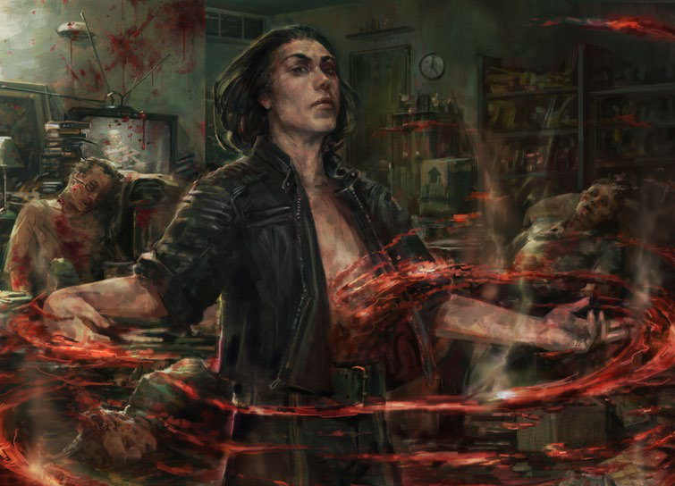

4 8

V5-Sabbat.pdf-renegadegames.com-#a11397-103

S A B B AT: T H E B L A C K H A N D

Protean

Oblivion

Level 3

Level 4

VISCERAL ABSORPTION
Amalgam: Blood Sorcery 2
A seldom-seen but unmistakably effective way to 
clean up a mess, this power turns the body of the 
vampire semi-permeable while drawing inert blood 
and viscera in the vicinity inside them, feeding 
their Beast and sating their Hunger. Other bodily 
remains, bereft of blood, crumble to ash or vanish 
in greasy smoke. While the vampire using the power 
draws blood and gore to themselves, the surround-
ing area is left remarkably clean, and the Sabbat able 
to employ this ability use it as a way to cover their 
tracks with great effect.
Cost: 1 Rouse Check
Dice Pool: Strength + Protean
System:  Use of this power requires at least one 
dead body in the area of effect, roughly an area 
extending 5 meters in all directions from the user. 
The vampire rolls Strength + Protean, and is able 
to absorb the blood and eradicate the remains of 
one body per success rolled. The state of the body 
is of no significance so long as it is fresh, and even 
“somebody” whose remains are little more than a 
red smear will be consumed.

UMBROUS CLUTCH
The user creates a temporary gate out of the victim’s 
own shadow, causing them to fall through Oblivion 
and into the waiting arms of the user. The victim 
will appear to fall into their own shadow, only to 
reappear falling out of the one cast by the user. The 
brief journey through the end of everything is usu-
ally enough to traumatize the victim into submis-
sion, though one must be prepared if the quarry 
responds violently in fear.
Cost: One Rouse Check, Gain one Stain
Dice Pool: Wits + Oblivion vs. Dexterity + Wits
System: In order to use this power, the vampire 
needs clear sight of both the victim and their 
shadow. The vampire’s player or Storyteller then 
rolls Wits + Oblivion vs. Dexterity + Wits to ma-
neuver the victim’s shadow beneath them, creating 
a supernatural rift into which they appear to fall. At 
the Storyteller’s discretion, a stationary victim not 
paying attention can be automatically caught.

A victim caught by this power will then reap-
pear, falling out of the shadow cast by the user. (As 
with similar powers, the power does not work if the 
caster is without a shadow.) An unprepared mortal 
victim will be terrified and likely catatonic, while 
a vampire must test for fury or fear frenzy, Story-
teller’s choice, at Difficulty 4.
Duration: Instant

The user sates one Hunger per body affected, 
but cannot sate more Hunger per use than their 
Blood Sorcery rating, nor can they reduce it below 
one through this power. Using this power takes one 
turn per body absorbed. It should also be noted 
that, while efficient in getting rid of evidence, the 
power is extremely overt while in use, as the user 
becomes a literal vortex of blood and viscera. 
Vampire remains aren’t affected by this power.
Duration: One turn per body

Blood Sorcery

Level 3

TRANSITIVE BOND
The user is able to extend the Blood Bonding 
properties of their vitae, enabling it to retain its 
ensnaring properties when stored, or even when 
present in the body of a ghoul. Anyone drinking the 
stored vitae or from the ghoul will be affected just 
as if they’d imbibed it directly from the user’s wrist. 
Developed by the Tremere in a failed attempt to

4 9

V5-Sabbat.pdf-renegadegames.com-#a11397-103

Chapter Two: Apostates of a Cruel Church

one outside the Sabbat, merit Stains to employ.
Duration: N/A
Rituals
Level 1

alleviate their Bane, the power has resurfaced in the 
Sabbat, where the Discipline is less limited by clan 
lineage, and has been used to great effect in some of 
their longer schemes.
Cost: One Rouse Check
Dice Pool: None
System: The user activates this power when calling 
upon their Blood, either for storing or when giv-
ing it to a ghoul. Each use empowers three Rouse 
Checks’ worth of Blood. Anyone ensnared by the 
Transitive Bond will be unaware of its effect until 
they lay eyes on their eventual Regnant, but they 
might become restless and catch glimpses of them 
in dream-like visions during daysleep. The Blood 
Bond otherwise functions as described in Vampire: 
The Masquerade, pp. 233-234).
Duration: N/A
Level 5

BEELZEBEATIT
This ritual causes lower-order living creatures to 
find the ritual area repellent. Animals avoid the 
area, vermin scuttle away from it, and even plants 
may take on a pitiful appearance. Used as a low-level 
precaution against Animalism spies, this ritual also 
prevents infestations of the sorts of creatures who 
would be drawn to gore, carrion, and the other sorts 
of remains the Sabbat often leaves in its wake. 
Ingredients: Vinegar or alcohol
Process: The ritualist sprinkles the vinegar or 
alcohol on the floor and turns counterclockwise, 
visually circumscribing the area in which the lesser 
creatures are to be expelled.
System: If the ritual is successful, living creatures of 
animal intellect and below hastily vacate the area of 
about a hundred meters square. Thereafter, noth-
ing prevents a directed or controlled creature from 
returning (but such things may be visible, and stand 
out due to their active expulsion), but such creatures 
won’t do it of their own volition unless enraged or 
no other option to traverse it exists. The effects last 
for one scene or one night, whichever comes first.
Level 3

RECLAMATION OF VITAE
No matter the distance, Blood calls to Blood. 
Working on that principle, this power allows a 
vampire to reclaim Blood that has been yielded to 
create ghouls, reclaiming that which has been given. 
Regardless of where they are, ghouls of the vampire 
will find the life-giving vitae in their veins rebelling 
within them, returning through mystical means 
to its source, while their bodies suffer catastrophic 
damage. Sabbat elders have been known to keep 
ghouls for this express purpose, an emergency 
reserve available anywhere at any time, at the trifling 
cost of a few mortal lives.
Cost: One or more Stains (when called to return)
Dice Pool: None
System: The user concentrates for a turn and choses 
which of their servants are to repay their Blood-
debt. The ghouls do not need to be present, and dis-
tance doesn’t matter. The vampire sates two Hunger 
for each ghoul, while the ghoul suffers five levels of 
aggravated damage as their body ages irregularly 
and rapidly, the undead Blood inside them feeling as 
if it were attempting to violently vacate them.

COMMUNAL VIGOR
Based on sanguinary properties similar to the 
Vaulderie, this Ritual allows a Pack Priest to share 
their Blood Potency with their pack, while strength-
ening their own ability to keep those packmates in 
line.
Ingredients: One fingernail of the Pack Priest
Process: The Priest tears a nail from their finger 
and breaks it into pieces, one for each member of 
the Pack. They place their own portion of the torn 
nail in the Vaulderie chalice, while the other mem-
bers place theirs under their tongue. If the Ritual

While the power does not require the vampire to 
Rouse the Blood it should, if ever learned by some-

5 0

V5-Sabbat.pdf-renegadegames.com-#a11397-103

S A B B AT: T H E B L A C K H A N D

is successful, the pieces of nail dissolve into the 
Vaulderie blood consumed.
System: In addition to the effects of the Vaulderie, 
the members of the Pack have their Blood Potency 
raised to the same level as the officiating Priest. 
Additionally, the Priest gains three dice on any 
Dominate or Presence tests against other members 
of the Pack. The effects last for one night.

to cross vast distances in mere moments. While only 
one instance is known so far, Blood-sorcerers of the 
Sabbat suspect that it is only a matter of time before 
they may construct more as means to perform 
devastating hit-and-run attacks in the heart of rival 
sects’ domains.
Ingredients: Anything required to build a copy of 
the target destination, including but not limited to 
sand, mortar, concrete, metal, and dirt. One vam-
pire sacrifice and a number of mortal ones equal to 
the number of travellers.
Process: In order to function, the gate needs to 
be an exact copy of the target location, whether 
a building, cellar, attic, or some other location 
equipped with a physical structure that can be 
designated as a portal. This requires spies to spend 
weeks documenting the target location, smuggling 
examples of materials and taking countless pictures 
or making sketches of the place. Meanwhile, the 
replica is built (the more remote, the more secure), 
and the area consecrated with blood – vast amounts 
of it. Preparing the portal requires at least one mor-
tal sacrifice per intended traveler, their remains to 
be scattered about the simulacrum edifice. The final 
activation calls for a vampire sacrifice. If a suitable 
victim isn’t on hand, the lot probably falls to the 
vampire present who’s the least able to resist being 
forced into the role, though ritualists have proposed 
Embracing a mortal sacrifice for this purpose.
System: If the Ritual Test is successful, the gate 
allows the desired number of vampires passage 
outward, and an equal number – not necessarily the 
same individuals – to return. Until that number has 
been matched, the gate remains open indefinitely, 
though nothing reveals the target location as such. 
Mortals cannot use the gate; to them it appears as 
nothing more than a repulsive monument.

GALVANIC RUINATION
This Ritual violently disrupts electrical currents 
in the area, shorting out or fusing all wiring in 
the vicinity. Used to kill alarms, surveillance, and 
artificial lighting, the element of stealth is often 
short-lived, as collateral damage in the form of fires 
usually follows. Many Sabbat packs consider this 
less a flaw than a feature, though.
Ingredient: A copper coin
Process: The caster smears their Blood on the coin, 
drops it to the ground and grinds their foot on it, as 
if they were extinguishing a cigarette. If the Ritual 
is successful, the coin shatters like porcelain as a 
Blood-borne current ravages the electrical systems 
of the surrounding area.
System: The Ritual instantly wrecks wiring in the 
vicinity to the extent that all electrical equipment 
ceases to function. This includes isolated circuits 
such as cars on batteries and any backup genera-
tors running or starting up within a minute of the 
casting. The area affected is equivalent to a large 
warehouse or a three-story building, though it can 
be extended at casting by adding a level of Difficulty 
for each additional building or building-equivalent. 
On a critical win the outage is relatively discreet, 
but will otherwise cause at least one fire, together 
with random bursts of static electricity raising hell 
with speakers, car alarms, and other loud electrical 
objects.
Level 5

SIMULACRUM GATE
A time-consuming and elaborate Ritual, this 
colossal undertaking allows the construction of a 
distance-defying portal allowing multiple vampires

5 1

V5-Sabbat.pdf-renegadegames.com-#a11397-103

Chapter Two: Apostates of a Cruel Church

Ceremonies
Level 2

terror and torture that ends with their death. But 
this is no mercy. The broken remains of their souls, 
scarcely more than fear-urges and sublime revul-
sion, are bound to the place, their bones buried in 
the ground, and made to share their torment with 
anyone who enters uninvited.
System: Mortals entering the vicinity (anything up 
to a two-story building) are beset by an irrational 
terror, requiring a Composure + Resolve test each 
turn to remain. If they fail they will indulge any 
excuse to leave, or run shrieking on a total failure. 
Vampires are less affected, but each scene spent in 
the location requires a test for fear frenzy. 
Level 4

BLINDING THE ALLOY EYE
Prerequisite: Shadow Cast
Striking a pact with a death-spirit, the caster buys 
themselves a short time of immunity to surveil-
lance, as the otherworldly entity scrambles cameras 
around the vampire.
Ingredient: A small piece of aluminum mesh
Process: The user spends a scene in isolation, con-
tacting the spectre and bonding it to the aluminum 
mesh. The mesh is then placed in a light-proof 
container, to be taken out when the effect is to be 
activated. Once removed and attached to a visible 
piece of flesh or garment of the caster, the effect is 
initiated. 
System: Do not make a Ritual roll until the effect 
is activated. If possible, the result of the test should 
be kept secret from the player. If successful, cam-
eras around the caster will end up scrambling their 
image, though they will pick up everything else 
normally. The effect lasts for a full scene, or until 
the mesh is removed.
Level 3

BEFOUL VESSEL
While many of the entropic effects of Oblivion 
are restricted to mortals, this Ceremony allows 
the wielder to infect the blood of a vessel, making 
an otherwise healthy-appearing mortal into pure 
poison to the children of Caine.
Prerequisite: Necrotic Touch 
Ingredient: The vampire’s saliva
Process: The vampire needs only introduce a drop 
of their spittle to the skin of their victim, either 
by feeding on them or by smearing it upon them 
through physical contact.
System: A victim befouled in this way shows no 
symptoms, and is unaware of the harm done to 
them or the danger they pose to the undead. Any-
one feeding on them will likewise be unaware of 
the effects apart from a rancid strangeness to their 
Blood. (Generous Storytellers can allow a Wits + 
Survival test at Difficulty 3 to notice that something 
is amiss, allowing the player to abort their feeding.) 
Once the feeding is done, the effect occurs: The 
feeding vampire gains Hunger instead of sating it, 
on a 1-for-1 basis. (A vampire who would’ve sated 
three Hunger would gain three Hunger.) This will 
likely risk hunger frenzy (see Vampire: The Mas-
querade p. 220).

HARROWHAUNT
Some places seem haunted, raising the hackles of 
mortal and vampire alike. A place Harrowhaunted 
is in a different league. Places subjected to this 
Ceremony convey a sense of such miasmic dread 
that most breathing creatures find it hard to, well, 
breathe, let alone stay. Sabbat vampires often use 
this to discourage unwanted visitors from linger-
ing in the proximity of their communal havens. 
While it won’t scare away encroaching vampires, 
most mortals will unconsciously take the long road 
around it, or make up excuses for why they’ll check 
up on the rumors surrounding the place “tomor-
row... probably.”
Prerequisite: Aura of Decay
Ingredient: Mortals subjected to abject terror and 
suffering. The more the merrier.
Process: It starts with a “party.” A number of 
mortals are confined to the place and inflicted with

No matter if they are fed on or not, the infected 
mortal dies in their sleep the following night, the 
only clue to their fate a patch of – mildew? – and 
acrid night-sweat.

5 2

V5-Sabbat.pdf-renegadegames.com-#a11397-103

S A B B AT: T H E B L A C K H A N D

Thin-Blood Alchemy
Level 1

mortal blood, gold shavings, mercury, as well as 
assorted halogens (usually chlorine or bromide). 
The formula also needs to be subjected to sunlight 
for several hours before use, and alchemists employ-
ing athanor corporis usually “juice up” on Portable 
Shade (see above) for this.
Activation Cost: One Rouse Check
Dice Pools: None
System: On activation, the alchemist becomes an 
unliving battery of sunlight with a single charge 
seething in their veins. They can unleash this charge 
at will, inflicting aggravated damage upon them-
selves and another vampire whom they’ve success-
fully achieved skin contact with, as their own skin 
smolders and blackens. The user takes two levels 
of aggravated damage, while the victim suffers an 
amount equal to their Bane Severity, as if exposed to 
daylight for a full turn. If the victim has the means 
to reduce the damage (such as through Fortitude) 
they can do so. If the formula isn’t activated before 
then, the power automatically activates at the first 
sunset after ingestion, causing two levels of aggra-
vated damage to the user.
Duration: Until unleashed or next sunset, which-
ever comes first.

PORTABLE SHADE
Portable Shade, or even more irreverently, “suntan 
lotion,” is a formula developed by Cainites on the 
Path of the Sun to augment a thin-blood’s already 
substantial resistance to sunlight to near mortal 
levels. While it doesn’t render the subject completely 
immune, it extends the time they can endure day-
light while masking immediate burns sustained by 
the sun.
Activation Cost: One Rouse Check
Ingredients: Blood of the Alchemist, sanguinic 
mortal blood, fresh plant leaves. Some alchemists 
also use various off-the-shelf sunblock ointments 
in the mix, though it is unknown whether they 
contribute significantly to the formula.
Dice Pools: Stamina + Alchemy
System: Make a Stamina + Alchemy test when 
ingesting the formula. The user is able to endure 
sunlight without taking damage for a number of 
hours equal to the number of successes on the test. 
At sunset, make another test with the same pool, 
this time with a Difficulty equal to the number of 
hours spent in daylight. A failure causes the user to 
sustain a level of aggravated damage, while a total 
failure has them sustain two, as the accumulated 
sunlight boils the Blood in their veins.
Duration: A number of hours equal to a Stamina + 
Alchemy test, or the next sunset, whichever comes 
first.
Level 3

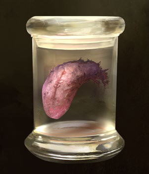

ON-DEMAND SUNBURN
A dread tool of the Path of the Sun, On-Demand 
Sunburn traps sunlight in the very body of its user, 
enabling them to unleash it as a destructive force 
through their own skin, searing themselves and 
their prey in a sizzling embrace. While the damage 
done by a single user is not enough to incinerate a 
vampire, a group of self-immolating Heliophiles can 
spell doom for fledglings and elders alike.
Ingredients: Blood of the Alchemist, choleric

5 3

V5-Sabbat.pdf-renegadegames.com-#a11397-103

Chapter Two: Apostates of a Cruel Church

5 4

V5-Sabbat.pdf-renegadegames.com-#a11397-103

S A B B AT: T H E B L A C K H A N D

Ritae: Keys to the 
Dominion of Caine

The Role of Ritual

The Auctoritas Ritae are universally recognized 
within the Sabbat as the rituals that unite them as 
a Sect. Bonds between individual packs are often 
formed during these rites. The Vaulderie is perhaps 
the most infamous of these ritae, but other sects’ 
fear of the Creation Rites makes a statement to the 
shadow of terror they cast – which is part of the 
point.

The Sabbat is more than a fanatical cult of vam-
pires, but ritual has become the core of their 
identity as an organization. Ritual and observance 
define the vampires of the Sabbat and bind them to 
each other, to their packs, and to the empty throne 
of Caine. The ties of Blood and clan are not easily 
replaced, and only Pack Priests truly understand 
how the power of the ritual forged the Sword of 
Caine into the instrument of destruction and terror 
it is in these final nights.

A Cainite Priest will often modify the details of 
these ritae to suit their pack’s specific spiritual and 
ideological beliefs and each Path of Enlightenment 
more frequently observes rites that exemplify the 
core tenets of its doctrines. Sabbat on the Path of 
Caine or Cathari, for instance, will often speak in 
tongues during their Ritae, lost in the rapture of 
intimate communion with Caine. Or so they say, at 
least.

Among the Sabbat, ritual can take many forms. 
Ritual can be a formalized but parochial observance 
of a Path of Enlightenment. Ritual can be a specific 
verbal greeting among packmates or a secret gesture 
that identifies every member of the Black Hand in 
Kiev to one another or a symbolic steganography 
that identifies secure temporary havens and servile 
ghouls. Ritual may be formal, such as the Auctori-
tas Ritae, or vernacular, such as the Ignoblis Ritae.

The Ignoblis Ritae are more informal practices 
often developed among individual packs as tests 
of courage, loyalty, faith, and dedication to one 
another. While young or modern packs may have 
only one or two such distinct ritae, packs that 
claim extended pedigrees may observe a prodigious 
number of rituals that commemorate everything 
from obscure vampiric “saints” to remembrances of 
deceased packmates.

This chapter includes systems for many of the 
Sabbat’s ritual observances. To make the Sabbat 
uniquely their own, Storytellers are encouraged to 
use these as springboards for the unique treatment 
of ritual in their chronicles. Without ritual, the 
Sabbat is nothing more than a pack of purposeless, 
crazed murderers.

One noteworthy distinction is the matter of  Ig-
noblis Ritae that develop around how packs satisfy 
their need for blood. These hunting ritae come in 
many forms but like most things are shaped by the 
Paths of Enlightenment that guide the pack and its 
Priest and in game terms can stand in for individual 
predator styles (see p. 65). Every pack finds a way to 
hunt together that best suits their needs and beliefs 
– and savvy coteries might be able to discern such 
identifiers among their victims.

Within us are the unfulfilled desires of

our sires and grandsires. We are their

tools and they shaped us for their

purpose. We choose to shape ourselves

into something that fulfills our own

ends. In pursuit of transformation we do

not stop at the flesh, for when we

mingle our blood, we free our souls.

5 5

V5-Sabbat.pdf-renegadegames.com-#a11397-103

Chapter Two: Apostates of a Cruel Church

Auctoritas Ritae

and a few lines of doggerel or a street prayer as its 
invocation.

All Cainites within the Sabbat recognize these 
grand rites – they represent a catechism that unites 
all Cainites under the Dark Father’s dominion. 
This common body of ritual is remarkable for the 
Sabbat, which is otherwise a morass of conflicting 
beliefs and methodologies and the monsters who 
uphold them. In this way, the ritae are a potent tool 
for the Sabbat, in that they help forge such disparate 
vampires into a singularly minded Sword of Caine.

Although initially weaker than singular Blood 
Bonds, these bonds among the pack, known as vin-
cula, can grow over time and can make individual 
Sabbat resilient to betraying their packmates, as 
their personal loyalty to their pack is girded by the 
supernatural power of the Blood.

Between the Vaulderie and their personal Paths 
of the Enlightenment, the Sabbat have a well-de-
served reputation for fanaticism. Their willingness 
to accept final death in service to their cause is why 
the Sword of Caine is often called a death cult. In 
most cases, only those vampires Embraced into the 
Sabbat or who have proven their loyalty beyond 
doubt are allowed to contribute their vitae during 
the Vaulderie. Shovelheads often must imbibe from 
the ritual chalice even if they may not yet contribute 
to it.

The performance of these Auctoritas Ritae 
brings together Sabbat under what is effectively a 
spiritual calendar. Nomadic packs and warbands 
may congregate to perform ritae together and then 
disperse once their obligations have been complet-
ed, or the entirety of a domain in entente may come 
together to observe it. The exact nature of this spir-
itual procession varies among the Sabbat of a given 
locale, and any number of rumors attribute an order 
to the observances. Some say they’re performed 
according to the timing of lunar cycles that have 
a subtle purchase on the tidal humors of Cainite 
Blood, while others mark “holy nights” based on 
events that have themselves been lost in the wake of 
the Gehenna War.

The Vaulderie is not only the Sabbat’s pledge 
of loyalty, it’s also its own reward as many Cainites 
experience genuine ecstasy in supping from their 
comrades’ commingled Blood. Refusing to partake 
of the Vaulderie is usually considered a brazen act 
of treason against Caine and the pack, with con-
sequences as dire as the pack and Priest choose to 
inflict. Sabbat captives who have gone for prolonged 
periods without the Vaulderie may even experience 
cruel symptoms of withdrawal.

The Vaulderie
The Vaulderie is the most infamous of the Sabbat's 
rituals and the secret that allowed the sect to emerge 
from the original Anarch Revolt as such a power-
ful and cohesive force. The Vaulderie is part Blood 
Sorcery, part artifice, and arguably the heart of the 
Sabbat.

IN STORIES
The Vaulderie is an extremely powerful ritus in 
terms of storytelling, in that it erases any question 
as to who the coterie might be dealing with. The 
players’ coterie may discover a rival coterie to be 
a Sabbat pack as they witness its Cainites sharing 
Blood from a styrofoam cooler poured down the 
barrel of a hunting rifle. Players may also be forced 
to participate in a Vaulderie if their situation is so 
dire that they’ve found themselves Sabbat captives.

To perform the Vaulderie, packs ritually spill 
their Blood into a common vessel and then imbibe 
the mixed result under the guidance of their Priest. 
Within the Vaulderie “chalice,” the pack's vitae is 
imbued with a power that allows them to simul-
taneously sever their past Blood Bonds and form 
new ones among each other. Here, the observance 
varies wildly, with some packs favoring ostenta-
tious chalices and Latin chants while others prefer a 
bear’s skull or a “lucky whiskey bottle” as the vessel

It’s also an opportunity to seed fear and doubt: 
Does a single Vaulderie break the Blood Bond? 
Or does it take three consecutive observances for 
vincula to form? The truth varies by the story the 
troupe is telling, but this powerful aspect of Sabbat

5 6

V5-Sabbat.pdf-renegadegames.com-#a11397-103

S A B B AT: T H E B L A C K H A N D

identity should always leave the coterie question-
ing how they’ve been affected by it, even if they 
haven’t partaken directly. And once they’ve seen 
one Vaulderie happen, they may well question if any 
other Kindred in their domain might have partici-
pated.

frenzy or otherwise succumb to the horror – that’s 
the point after all. Indulging in other indignities, 
though, might earn one a particularly odious nick-
name, which also helps break down individuality 
and build dependency on the pack and sect. Pity 
the poor shovelhead nicknamed Smear Body. Well, 
don’t pity them too much, since they’re probably 
frenzying.

Creation Rites
The act of creating a new vampire has special signif-
icance to the Sabbat, as its supremacist beliefs have 
elevated the Embrace to a high honor. The Creation 
Rites are a hellish series of torments designed to 
simultaneously strip a fledgling of their humanity, 
condition them to rely on their Beast for survival 
and, most importantly, prepare them to take their 
first steps on to one of the Sab-
bat's Paths of Enlightenment.

IN STORIES
Creation Rites have a tremendous value to Sabbat 
and Path identity, and they make a clear statement 
about the chronicle when they make an appearance. 
Creation Rites force an immediate call to action if 
the players’ coterie discovers the rite in action, urg-

SABBAT NAMES
From the moment of the Embrace through the Creation Rites, the fledg-
ling Cainite quickly learns that their mortal life is done. Setting aside the 
horrors of becoming undead, the recruit loses their old name – in that 
their new packmates often quickly bestow upon them some unpleasant 
nickname intended to bully them into compliance and break down any 
lingering sense of self. Names like Tatterface, Fucko, Scatterguts, Chunks, 
and You With the Missing Eye have all found use, as much out of overt 
cruelty as the need to refer to a specific fledgling. Don’t like your new 
nickname? Welcome to a beatdown and an even worse epithet.

The most common aspect 
of this ritae involves violently 
Embracing a group of potential 
recruits and then burying them 
as the last of their mortality 
seeps away. Those who can claw 
their way out of the grave are 
then subdued and indoctrinated 
into the Sabbat. These so-called 
shovelheads further sink into a 
downward spiral of humanity as 
they frenziedly fang and claw on 
the frontlines of the Gehenna 
War.

Provided they survive long enough to become True Sabbat, the nick-
name is often discarded, to be replaced by some other appellation. These 
new names emerge as a combination of the pack’s identity, the Path of 
Enlightenment the pack follows, and some amount of pack reputation. 
These aren’t usually imaginative (because what Sabbat has time for that?) 
but can be descriptive or even florid.

As with most ritae, the 
details vary by pack and loca-
tion. A Creation Rite may be a 
morbid procession of somber 
pomp, or it might be a “shovel-
party” bacchanal, in which 
Cainite onlookers drink intoxi-
cated bystanders dry and toss a 
few into the pit to see who digs 
themselves out.

A pack’s names might literally be numerals – all of the odd numbers 
from 9 through 17, say – or they might be designed to evoke fear in those 
who hear their names spoken. The sect has no shortage of Cainites nam-
ing themselves after the Four Horsemen of the Apocalypse, mythologi-
cal demons, crimes of which they are especially fond, or even the places 
where they were murdered and dragged screaming and deathless into the 
Black Hand. The point is to break any continuity with the person they 
were before.

In some cases, the new Sabbat is able to choose their own name, but 
even in these cases, they usually follow the pack. Appearances aside, if the 
pack members all have mortal sins as their Cainite names, being the odd 
vampire out creates dissonance and sets them aside, apart, as not one of 
the pack.

How one comports themself 
during their Creation Rites 
has some impact on a Cainite’s 
new unlife in the Sabbat. Most

5 7

V5-Sabbat.pdf-renegadegames.com-#a11397-103

Chapter Two: Apostates of a Cruel Church

domains with the misfortune of being within strik-
ing range.

ing them to act against the pack performing it and 
the berserk fledglings hauling themselves out of the 
grave.

Sabbat vampires who witness Monomacy are 
by custom unable to participate, though given the 
stakes, all kinds of scumbag cheating may well hap-
pen, such as among Sabbat with low morale or in 
desperate straits. It takes a lot to convince Sabbat to 
profane one of their esteemed rituals, but it hap-
pens, especially if outside influence is brought to 
bear.

As a more subtle function, though, the after-
math of a Creation Rite is very often the first clue 
that a Sabbat pack is present in a rival sect’s domain. 
A yawning charnel pit is worrisome enough when 
discovered in the potter’s field, but what about 
when one turns up in the well-manicured green 
space in the middle of the Rack? Or behind the 
Prince’s estate?

IN STORIES
Witnessing a Monomacy can make very clear indica-
tions as to Sabbat leadership or the change of such. 
Indeed, the incursion of the Sabbat into the coterie’s 
home domain may begin with Monomacy and the 
coterie’s awareness of it happening on a penthouse 
deck as the pack makes a rooftop assault to kick off a 
story or session.

Monomacy
The blood duel or symbel is a tradition older than 
the Anarch Revolt, but the Sabbat has formalized 
the practice of such trials by ordeal into the very 
fabric of its apocalyptic dogma. When a dispute be-
tween Sabbat cannot be settled by their Priest, one 
of the aggrieved may invoke Monomacy, by which 
the matter will be settled in combat or some other 
contest of skill.

The celebration of diablerie after a Monomacy 
duel (probably…) creates a stark contrast to the 
values players’ characters hold dear. It’s one thing to 
hear that “All Sabbat are diablerists,” but it’s quite 
another to witness the finality of such soul-sucking 
at the MC clubhouse when the “allied” biker gang 
reveals itself for what it is. Especially after the fact, 
when the new gang leader proudly displays her 
black-stained aura.

What makes the ritus of Monomacy remarkable 
is the stakes involved in invoking it. Specific terms 
may vary, but the winner of Monomacy commits 
diablerie upon the loser. It’s a brutal way to come 
to terms, but among fundamentalist Black Hand 
it is also seen as proof of Caine’s favor, a monstrous 
divine right.

Of the Auctoritas Ritae, Monomacy is the only 
ritus that any Sabbat can demand. Although most 
disputes are settled through a Priest’s arbitration, 
titles and leadership roles are often only decided by 
the rite of Monomacy. Not every dispute needs to 
be resolved via Monomacy – a challenge to the role 
of Pack Priest need not end in diablerie if the cur-
rent Priest stands down to make way for the chal-
lenger. When the stakes are higher, such as on the 
Gehenna War front or when a domain’s Sabbat lose 
faith in their Bishop, a formal duel and righteous 
subsequent diablerie are just ends. Leaders anointed 
by Monomacy most often find their authority 
unchallenged afterward and may find it easier to 
unite rival packs and factions against common 
external enemies. Thus transitions in leadership in 
the Sabbat often result in bloody raids against other

In extreme cases, players’ characters may actually 
participate in a Monomacy, willing or otherwise, 
if some situation occurs by which the Sabbat have 
cause to challenge them. A duel for the right to 
claim their stretch of rowhouses as domain might 
be the excuse a Sabbat uses to tempt the coterie into 
disaster – and you just know they’re not going to 
bear the loss honorably if their pack doesn’t win the 
duel.

Blood Feast
For the ritus of the Blood Feast, the assembled 
Sabbat gorge upon a great number of mortal vessels 
who have been kidnapped for the purposes of slak-
ing the Cainites’ thirsts. It is at once an expression 
of excess and supremacy, an ample demonstration of 
what the relationship between vampire and mortal

5 8

V5-Sabbat.pdf-renegadegames.com-#a11397-103

S A B B AT: T H E B L A C K H A N D

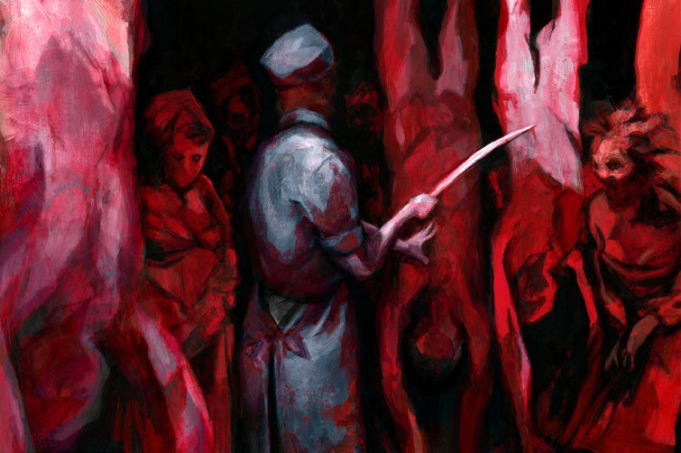

should be, from the Sabbat perspective. Undeniably, 
it’s one of the most brutal practices of the Black 
Hand.

perverse part of the reasoning behind this ritus, 
from the Bible’s book of Isaiah.

Realization of the Blood Feast varies, most 
importantly by how many Cainites are expected to 
participate, and therefore how many victims will 
be required. Mortal vessels may be ritually bled and 
butchered by a Priest in mockery of a formal dinner, 
or the event might be a degenerate free-for-all, with 
victims bound or trapped, effectively “on tap” for 
whomever chooses to exsanguinate them at their 
leisure.

IN STORIES
The most obvious call to action for a Blood Feast is 
to somehow stop it, and if that’s not possible, per-
haps even to recover some number of the victims. 
A Blood Feast is a true test of morality, for even 
if the players’ coterie isn’t a bunch of do-gooders, 
chronicle Tenets, personal Convictions, and the 
self-preservation functions of the Masquerade may 
urge characters to prevent innocents from meeting 
grim ends.

Blood Feasts often precede momentous occa-
sions for the sect, such as the ascension of a vicious 
warlord or spiritual leader, or in preparation for a 
suicide mission into a suspected Methuselah’s den. 
“Let us eat and drink, for tomorrow we die,” is a

Some victims might even be procured for nights 
before the Ritae’s culmination, and those close to 
them might notice that they’ve gone missing – often 
to little avail. Indeed, the Devils of the Flesh delight

5 9

V5-Sabbat.pdf-renegadegames.com-#a11397-103

Chapter Two: Apostates of a Cruel Church

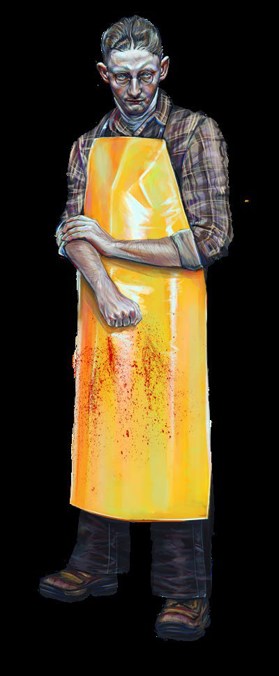

in targeting the Herds and Touchstones of known 
enemies when they seek victims to add to the Blood 
Feast’s offering.

The Sabbat also greatly enjoys temptation, 
whether in the form of a Cathari offering forbid-
den delights that would never be allowed under 
the tyranny of the Traditions, or in the form of the 
providence of the Black Hand, seeking to meet the 
needs of its Cainites. The Camarilla would have 
young Kindred starve! The Sabbat, on the other 
hand, invites all of the Children of Caine to partake 
of the mortal bounty – and such is the foundation 
of many efforts to turn young vampires away from 
the domain’s dominant sect.

Festival of the Dead
The Festival of the Dead, sometimes called Festivo 
dello Estinto, commemorates the Sabbat’s fallen 
comrades and for some packs, the original sacrifices 
of the Anarch Revolt. Tonight it also doubles as an 
occasion to reflect on the dangers of the first and 
Second Inquisition and the terrible losses that both 
have inflicted on the Children of Caine. Beyond 
remembrance, many Cainites also see the Festivo as 
an auspicious time to settle unfinished business and 
to initiate revenge against non-Sabbat.

This ritus often coincides with similar local or 
cultural holidays themed upon remembrance for 
the dead. It is generally a solemn affair, even when 
observed by raucous packs, accompanied by vari-
ous accouterments such as incense, candles, grave 
shrouds, and any religious iconography the pack 
may have appropriated or to which they may even 
feel a genuine attachment... or revulsion. Packs may 
go over the top in grand gothic fashion, convening 
in a cemetery (and harrowing any mortal onlook-
ers), or they may revisit the places where packmates 
have fallen, such as a skid row bolthole or a high-rise 
penthouse, generally heedless of anyone who might 
think they have a more just claim to the location.

6 0

V5-Sabbat.pdf-renegadegames.com-#a11397-103

S A B B AT: T H E B L A C K H A N D

other to hurl themselves through the conflagration 
– and occasionally screaming in pain as someone 
burns to a cinder. The rite can take place anywhere, 
from a city zoo to a construction site to an aban-
doned ranch in the middle of nowhere.

IN STORIES
The Festival of the Dead may be used narratively to 
place a lull in the intensity of action against the Sab-
bat, as rampaging Cainites inexplicably “go miss-
ing” while commemorating their own departed. 
It may also serve as an opportunity to reverse the 
roles of the pattern of conflict that may have been 
established for the chronicle thus far, giving the 
players’ coterie a chance to go on the attack while 
the Sabbat is on the defensive, owing to the spiritual 
observance.

IN STORIES
Fire dances are overt expressions of Sabbat presence 
and have a variety of uses, from framing action-ori-
ented scenes to foreshadowing momentous events, 
with the Fire Dance itself as a rally or celebration. 
Forcing outside participation is also extremely 
popular among the Sabbat, who readily promise a 
captive’s freedom if they can make it through the 
flames – whom they then trip into the flames, or 
simply murder if the victim does manage to survive 
the Fire Dance.

By contrast, Storytellers may wish to have the 
Sabbat go hard during the Festivo. Bolstered by 
the atmosphere of remembrance, bedecked with 
personal affectations of the fallen, Cainites observe 
the Festivo dello Estinto with indomitable will and 
the desire to succeed where their past efforts failed – 
and resulted in the final deaths of packmates.

Fire Dances also scale well. The ritus might be a 
small, intense “spike” of danger with only a few Sab-
bat performing it as the coterie watches from a dis-
tance. Or it might be a full-blown revel, with every 
local Sabbat and a few dozen more from neighbor-
ing domains roaring and jeering and “accidentally” 
bullying each other into the flames... where perhaps 
the proceedings might hide a little surreptitious 
liaison with members of the enemy sect.

Fire Dance
All vampires rightly fear fire, as its flames are a po-
tent bane to them. The Fire Dance not only forces 
Cainites to face their fear of it, but it shows their 
bravery to their packmates, instilling respect among 
them.

The Fire Dance is a simple rite. The pack ignites 
a bonfire or other great flame and the assembled 
Sabbat goad each other to dance and jump through 
the flames. Even Priests demonstrate their mettle be-
fore the flame and a failed vault through the flames 
can easily lead to a challenge of Monomacy or even 
final death.

Blood Bath
When Sabbat claim titles or positions of power 
beyond their pack, such as Bishop, the grand ritae 
of the Blood Bath honors the attainment of rank. 
In its simplest expression, the Blood Bath is a ritual 
anointing of the claimant, whether with a small, 
symbolic smear of blood on the brow to a full-throt-
tle dousing-in-blood akin to a classical taurobolium.

Pack philosophy often informs a greater symbol-
ism for the ritus. For example, a pack that follows 
the teachings of Death and the Soul might regard 
the fire as the veil between this world and the next, 
while for a pack of howling Albigensians, the fire 
marks a sublime relationship between pleasure and 
pain.

Although Sabbat titles and ranks have become 
informal against the backdrop of the Gehenna War 
and in the era of the Second Inquisition, waging 
a war requires a unified chain of command and 
soldiers that know their place. The Blood Bath has 
emerged as somewhat of a practical necessity given 
the decentralization of the Sword of Caine, and the 
high turnover among even its highest ranks.

Fire Dances are often held in conjunction with 
other ritae, such as a Blood Feast (see above) or Wild 
Hunt (see below), especially when dealing with fire 
might be a part of what happens following those 
rites. A Fire Dance is almost always a rowdy affair, 
with Sabbat vampires shrieking and taunting each

The specifics of the ritus are very personal ex-
pressions of the elevated Cainite’s outlook, agenda,

6 1

V5-Sabbat.pdf-renegadegames.com-#a11397-103

Chapter Two: Apostates of a Cruel Church

ment of religious mysteries: Within the Blood of 
elders and other minions of the masters of Gehenna 
are the secrets of their creators. If these blood gods 
have a fatal flaw, those closest to them will have 
glimpsed it.

and Path. A new leader may be skyclad as trusted 
packmates pour freshly collected blood over them, 
or a “field promotion” may hastily suffice, in which 
the old leader has recently met their end and the 
new leader might streak themselves with the spilled 
vitae of that predecessor, as circumstances may 
necessitate.

IN STORIES
It’s hard to overlook a War Party, as it’s one of the 
most overt ritae in the Sabbat catechism. As the 
bonfires cast sinister shadows and the howls of 
the Cainites ring through the alleys, any Kindred 
nearby will know not only that the Sabbat has 
arrived but is actively seeking immediate war and 
diablerie. As an invitation to immediate action, it’s 
now or never if the coterie discovers a War Party in 
progress.

In most cases, mortal blood is preferred, but 
animal sacrifices will suffice. For grandiose Blood 
Baths the Blood of a Kindred luminary adds gravity 
to the rite – all the more so if said Blood is col-
lected after committing diablerie upon that august 
individual. At the Blood Bath’s conclusion, those in 
attendance drink from the pooled vitae and pledge 
loyalty to Sabbat (though ambitious leaders may 
solicit pledges of loyalty to themselves, which some 
Cainites react to as apostasy).

The Sabbat isn’t foolish, however, and packs will 
perform reconnaissance on their intended target 
beforehand. Intrepid coteries may be able to deter-
mine whom the Sabbat intends to drink dry, how 
they plan to approach it, and even when. What they 
do with that information is of course up to them.

IN STORIES
Coteries are unlikely to participate in a Blood Bath 
or even observe one, but they are significant in that 
they make a significant declaration as to Sabbat 
leadership, and can thus make the players’ char-
acters aware of high-value targets. In an especially 
gruesome twist, the coterie might find itself targeted 
for capture and diablerie after their vitae is to be 
used as part of the sacrament of the Blood Bath.

Wild Hunt
The Wild Hunt is a demand for vengeance, and 
Priests invoke this rite when an enemy of the Black 
Hand has taken an action that demands symbolic 
and final retribution. Technically, anyone might be 
the subject of a Wild Hunt, but Pack Priests tend to 
reserve this vengeful fate for a particularly hated foe 
or the unthinkable: if a member of their pack has 
turned traitor.

Blood Baths with inadequate security might well 
be observed via drones or cameras – and whether 
that surveillance footage makes it into the hands of 
the players’ characters or fervent vampire-hunters 
will have huge consequences for a chronicle.

The Wild Hunt is the closest thing the Sabbat 
has to a Blood Hunt, and the prize is always the 
heartsblood of the doomed. Any pack present at the 
rite’s invocation can participate in the Wild Hunt, 
but word of such things spreads quickly among 
Cainites, and the Brothers and Sisters in Caine 
often eagerly support Wild Hunts and take up 
the cause themselves. So long as the subject meets 
vengeance, the rite is successful.

War Party
As the Gehenna War rages, this ritus in particular 
has acquired a newfound prominence within the 
Sabbat. The War Party celebrates the pursuit and 
destruction of great enemies of the Black Hand, 
and the Gehenna War all but ensures every enemy 
is a great enemy of the Sabbat. A pack or warband 
invokes this Ritae when they are confident a high-
value target is within striking distance and with its 
invocation the pack commits to nothing short of 
devouring the subject’s soul.

That vengeance is paramount, and the Wild 
Hunt concludes when the victim is destroyed and 
some proof of the act is brought back to the offici-
ant. Of course, what constitutes proof varies wildly.

The grandest War Parties take on a certain ele-

6 2

V5-Sabbat.pdf-renegadegames.com-#a11397-103

S A B B AT: T H E B L A C K H A N D

Rigorous Priests may demand the corroboration of 
a Necronomist who can confirm that the subject’s 
soul has been consumed, while less formal Priests 
may be satisfied by fresh black streaks in the claim-
ant’s aura.

THE BINDING
The most apt case of universal rite yielding to emer-
gent locality, the Binding is an oath of loyalty to the 
sect and all Brothers and Sisters in Caine. Modern 
expressions of the Binding are very regional, in most 
cases extending no further than individual packs.

Some packs observe as much as possible of the 
original wording, where they can remember it, 
as well as the high formality of the rite. For most 
packs, though, especially young packs, a quick but 
functional pack rally suffices. Priests often supple-
ment their chants or slogans with more physical 
rituals, such as:

IN STORIES
The subject of a Wild Hunt may be responsible for 
the destruction or capture of their pack, but it it’s 
not unheard of for a turncoat to seek refuge among 
the Kindred of a rival sect under a false identity or 
stolen face. Sabbat who have recently partaken of 
the Vaulderie with the traitor usually consider it a 
matter of pack duty to bring the target of a Wild 
Hunt to their deserved end. Such a fugitive may be a 
contact of the coterie, or may offer them something 
substantive for protection. If there’s enough of their 
individual identity left, they may even be fleeing the 
Sabbat in order to seek allegiance to another sect.

■“We hereby commit our Blood and bodies to the

Dark Father and all of our Brothers and Sisters 
in Caine.”

■“Woe to they who are about to be vanquished

in the name of Caine. We are the Sword of the 
Dark Father.”

Of course, if the coterie or one of its members 
proves to be a particularly infamous thorn in the 
Sabbat’s side, they may well find themselves declared 
as the prey of a Wild Hunt, in which case they will 
likely have no peace until the matter is settled or 
they’re consumed by vengeful Cainites.

■“Fuck all of y’all; here we come. On three –

ONE, TWO, THREE!”

GAMES OF INSTINCT
Similarly yielding to demonstrate the aptitudes and 
proclivities of individual packs, Games of Instinct 
are exhibitions of “sport” that allow vampires to 
mitigate stress and cooperate in some gratuitously 
cruel solidarity-building activity.

Lapsing Auctoritas Ritae
In nights past, the Sabbat observed as many as 13 
Auctoritas Ritae, but the rapid splintering and 
decentralization of the sect has forced many of these 
“universal” High Rites into extremely colloquial 
interpretations. As such, what were once Auctoritas 
Ritae have fallen into the status of Ignoblis Ritae 
(see p. 64), assuming local packs observe them at all.

■Demolition Derby: Packs set cars on fire with

captive passengers and crash them into pack-
mates’ cars, and the last Cainite to leave their car 
“wins.”

■Boarding Party: The pack violently and

This is a dangerous development for the Sabbat. 
On the one hand, it’s a sign of the erosion of its cus-
toms, and if the Black Hand loses the tools by which 
it directs its fanatics against the Antediluvians, the 
whole sect may crumble. On the other hand, it‘s a 
testament to Sabbat adaptivity – who knows what 
new horrors might emerge from the ashes of the old 
as the Sabbat’s new blasphemous cultus?

forcibly commandeers a boat, tractor-trailer, 
or aircraft. Sometimes they even use it to go 
somewhere afterward, but killing the “crew” is 
usually the point of the game.

■Dog Tagging: The pack hunts a Lupine with

intent of tagging its ear and turning it loose. 
Likely apocryphal, the activity usually takes the 
form terrorizing whatever location in which the 
pack thinks werewolves might be found.

6 3

V5-Sabbat.pdf-renegadegames.com-#a11397-103

Chapter Two: Apostates of a Cruel Church

Ignoblis Ritae

■Pandering: While intruding upon other sects’

domains, the pack seizes upon a “runt” or other 
outsider of Kindred society, making no secret 
of their pursuit of the victim with the specific 
intent of terrorizing them. This game almost al-
ways ends in diablerie as the pack culls the weak 
Kindred from the domain.

The lesser ritae observed by the Sword of Caine are 
informal rituals that vary greatly by pack identity, 
but often have similar themes depending on the 
pack’s history, geographic location, and especially 
which Path of Enlightenment guides them. Packs 
consist of vampires who share the same beliefs, and 
even those that have differing perspectives within 
their ranks tend to echo the doctrine established by 
their Pack Priest.

SERMONS OF CAINE
As the name implies, the rite involves a prepared 
sermon by the Pack Priest, often with direct refer-
ence to the Book of Nod and the parables the Priest 
chooses to highlight. The parochial nature in which 
Priests now conduct “services” – some packs have 
no access to the Book of Nod, even in verbal form, 
and Priests may or may not be able to deliver an 
accurate quotation – has made the Sabbat’s message 
inarguably vernacular.

Lesser ritae are almost never performed with 
other packs, as they express the values, experiences, 
and traditions of each pack itself.

The Path of Caine

Packs led by a Devourer often look to para-
bles from the Book of Nod when establish-
ing their Ignoblis Ritae. Rites and sermons 
that espouse vampiric superiority over 
mortals, Lupines and other creatures of the night 
are common. Noddist priests often incorporate a 
blade in the pack’s Ignoblis Ritae and use it to take 
Blood, with the blade symbolizing Caine’s will over 
all vampires.

PALLA GRANDE
The Palla Grande was often expressed as a high-
pageantry “Dance of the Dead” in mockery of 
Camarilla court formality. As Sabbat numbers have 
dwindled and Sabbat domains have been largely 
abandoned, it has fallen out of use.

While Caine is traditionally considered a 
patriarchal figure, many Devourers would disagree 
with such a rigid interpretation. Few in the Sabbat 
ascribe a fixed gender to Caine, the child of Adam 
who sacrificed hope, happiness, forgiveness and 
their own brother in pursuit of limitless freedom. 
Caine is no longer a man, but the Dark Father of all 
vampires.

INTO THE OUTSIDE
Certain ritae have found vitality outside the Sabbat, 
having been absorbed into the cultural practice of 
other factions. Kindred society has no few soothsay-
ers or demagogues who profiteer in the name of 
Caine, or who are genuine believers in philosophies 
that owe much to the orthodoxy of Sabbat spiritual-
ity. Some of these are blatant, such as the so-called 
“Church of Caine” seemingly having appropriated 
one version of the Sermons of Caine. Others are 
more insidious but less overt. And the truth may 
not be so clearly cut – for example, the Church of 
Caine claims a history that predates the Black Hand 
itself….

Symbols: Masonic tools, wheat, stones, rhombus, 
effigies joined at the hand

COMMON RITAE
Achieving altered states of consciousness is a fre-
quent tool for Noddist Ritae. While they are not 
above using drug-laced blood, Path of Caine Priests 
also use pain, stress positions, blood deprivation, 
and even Blood Sorcery to help their packmates 
find their way. Modified sweat lodges, cilices, and

6 4

V5-Sabbat.pdf-renegadegames.com-#a11397-103

S A B B AT: T H E B L A C K H A N D

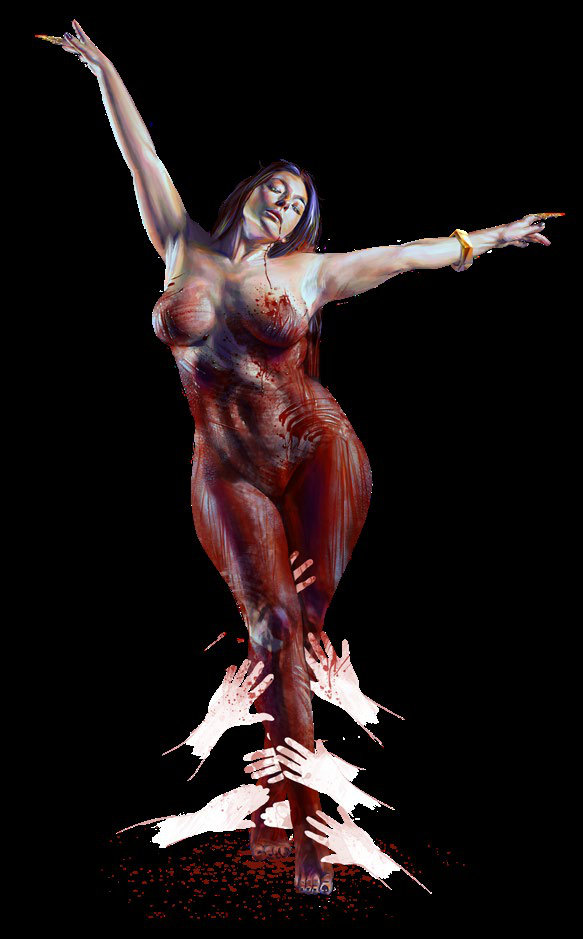

prolonged suspension by hooks may also be 
employed by Devourers. All of the curses of 
Caine must be overcome through steadfast 
perseverance, unwavering faith and ultimately by 
complete submission to the Dark Father’s will.

CONTRITION RITAE
Devourers prefer to teach even with their punish-
ments. While major transgressions that would 
demand final death are often settled through  
Monomacy, diablerie, or dismemberment, lesser 
crimes are often punished by echoing Caine’s trials 
in the land of Nod. Heated brands and crushing 
stones are common corrective implements among 
the Devourers.

HUNTING RITAE
Diablerie is an especially meaningful sacrament 
for those on the Path of Caine. Although the Book 
of Nod occasionally warns against drinking the 
heartsblood, Devourers often believe that covenant 
was broken when the Antediluvians rebelled against 
Caine’s will.

Noddists seek the Blood of other vampires when 
they hunt, especially that of the thin-blooded, 
whom they see as heralds of the Antediluvians. Such 
victims also have the benefit of not being missed 
by the powers that be, though when a true vampire 
falls into the clutches of the Noddists it is usually 
the Priest who ultimately decides whom among the 
Pack deserves the reward of devouring their prey’s 
soul. Although only one may take the soul, trophies 
taken from a notable victim lend an additional grav-
ity when the pack performs the Vaulderie or other 
communal ritae.

The Path of Cathari

The Cathari are hedonists without 
compare. Their unlives revolve around 
pushing the limits of excess and flaunting 
their depravity to mortal and Cainite alike. 
While to many they may seem crass and simple, 
beneath their wanton lusts lies a complex belief in 
their divine role as tempters and destroyers. Cer-
tainly, Albigensian Priests are able to illuminate

6 5

V5-Sabbat.pdf-renegadegames.com-#a11397-103

Chapter Two: Apostates of a Cruel Church

others as to the Manichean complexities of the 
Path of Cathari, but “lay members” often prefer to 
keep their secrets to themselves, sharing only their 
vulgarities with herds and harems.

When the pack does feed in earnest, they toy 
with their victims and will even hold out the temp-
tation of escape for the most entertaining mortals. 
More than one Cathari ghoul started their servitude 
as a “last girl or boy” who survived the horror of a 
hunting party.

Symbols: “Occult” paraphernalia, blood drops, dol-
lar signs, rams, goetic sigils

Devils of the flesh are especially keen to feed on, 
corrupt, or make ghouls of hunters in this era of the 
Second Inquisition. It’s a thrill to corrupt those who 
would overtly act against them, and some take pride 
in despoiling the self-styled agents of the divine. 
Needless to say, the feeding rituals of Cathari packs 
are often noticed quickly by mortal authorities.

COMMON RITAE
Cathari packs favor ecstatic rituals that tease out 
their Beasts and allow them to indulge their earthly 
vices. Unlike many other Sabbat, they regularly 
include unwitting mortals in Ignoblis Ritae and 
though these participants rarely survive, some may 
find themselves marked for the Embrace if they 
show enough enthusiasm for the higher function of 
temptation.

The Path of Death and the Soul

The Path of Death and the Soul com-

mands a pack to transcend the limits

Cathari ritae are the most stereotypically “oc-
cult” among the Sabbat and usually incorporate 
black candles, circles of spilled salt, and blood-
drawn sigils. Cathari ritae are typically dramatic 
and display the supernatural nature of the Cainites 
at the same time as they evoke base indulgence. 
Drinking from a mortal who’s just snorted cocaine 
off the bathroom sink? Sure, that’s a “ritual”; pass 
them around.

of death and unravel the secrets of 
immortality. To its followers, the Beast 
coexists before and beyond the door of 
mystery. Many Necronomist ritae demon-
strate the fragility of life and celebrate the perma-
nency of death. To  Reaper, there’s no such thing as 
a “meaningless killing” – every death is a lesson, a 
statement, or a declaration of supremacy.

Symbols: Skulls, hearts, pulled teeth, keys, a 
woman holding a key, rivers

CONTRITION RITAE
Forgiveness isn’t something in which Cathari see 
much value and Albigensian Priests go out of their 
way to devise painful methods of absolution for 
those among their pack who fall short in loyalty or 
even depravity. These largely serve the purpose of 
“corrective” browbeating and humiliation, however. 
For the most part, Cathari regard guilt as a useless 
emotion, making rituals of contrition few.

COMMON RITAE
Practical and scholarly Priests among the Reapers 
perform their Ritae with precision and many adhere 
to processional calendars of auspicious nights even 
when isolated from other Sabbat packs. Necrono-
mists Priests often seek places rich in the power or 
symbolism of death to conduct their ritae, making 
graveyards, morgues, and even slaughterhouses 
dangerous places to linger on nights of astrological 
importance. Corpses, ghosts, and the walking dead 
are regular fixtures of their ritae, as either observers 
or sacrifices.

HUNTING RITAE
Many Cathari take outsized pleasure in breaking 
the Masquerade, but when hunting they may hide 
their monstrous nature from their victims as long 
as possible. After the slaughter it’s often the first to 
“break character” and reveal themselves who is left 
to clean up the mess as an expression of postmeal 
thanks-giving.

CONTRITION RITAE
Reapers have no time for disloyalty and are quick 
to punish any packmate who displays cowardice

6 6

V5-Sabbat.pdf-renegadegames.com-#a11397-103

S A B B AT: T H E B L A C K H A N D

The Path of Power and the  
Inner Voice

or sympathy for the enemy. Their understandings 
of faith are often remarkably academic and Priests 
often engage in esoteric or metaphysical lines 
of questioning when administering methods of 
spiritual correction. Ritual re-burial, daysleep with 
the remains of one’s victims, and even being forced 
to carry a growing reliquary all have functions of 
contrition.

The Path of Power and the Inner Voice

attracts Cainites of singular focus and 
ambition. Although they recognize 
that the Black Hand must triumph over 
all other concerns, they also believe that the 
Blood of Caine has given them the power and the 
right to enact their will upon the world. Ignoblis 
Ritae for this Path thus often takes the form of tests 
of mettle, trials of endurance, and unifying compe-
titions.

HUNTING RITAE
Reapers understand they must feed on life, but it 
is death they wish to command. Packs on this path 
have desecrated burial sites, hospitals, and battle-
fields to feast on the blood of the recently deceased 
or the soon to expire. A few Reapers even claim they 
can draw sustenance from ghosts and subsist on 
blood stolen from dreams.

Packs that follow this Path understand that 
power creates authority and that only the powerful 
can command their respect and loyalty. While this 
might sound like a recipe for endless brinkmanship 
and infighting within a pack of vampires, the op-
posite is most often the case. Uhlans frequently test 
and gauge each other for weakness, but they rarely 
allow such trials to exceed their control.

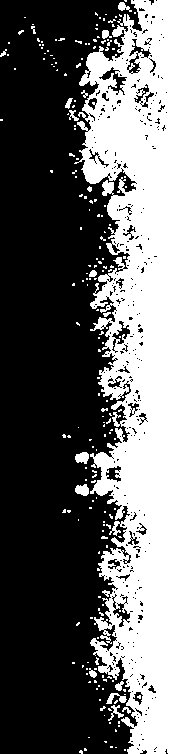

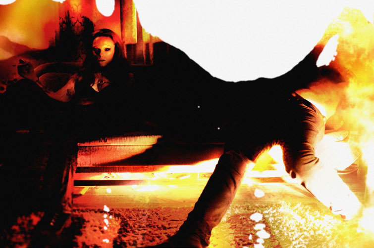

6 7

V5-Sabbat.pdf-renegadegames.com-#a11397-103

Chapter Two: Apostates of a Cruel Church

Between their common purpose and the 
observance of Ritae, contests of dominance and 
leadership in such packs are usually decided without 
combat. The strong give way to the weak, and the 
weak have the chance to grow strong. When no 
mediation is possible then an Ignoblis variant of 
Monomacy may settle the affair, though few Unifier 
Priests would allow such contests to result in Final 
Death.

CONTRITION RITAE
Those on the Path of Power and the Inner Voice do 
not believe in poetic justice and usually dispatch 
transgressors with the most efficient means at 
hands. Packmates who can be corrected often per-
form menial tasks and distasteful duties until they 
again prove themselves worthy in the pack’s eyes. 
(See “Cleaner” on p. 88.)  Since mortals are held in 
such low regard by Uhlans, managing and caring 
for the pack's ghouls or herd is often reserved for 
packmates who have lost face. Through service to 
the pack, they may regain the right to pursue their 
own ambitions again.

Unsurprisingly, turnover can be high for Priests 
of the Path of Power and the Inner Voice. Weak 
Priests do not last long in Uhlan Packs, and when 
one falls it’s not uncommon for the pack to destroy 
several replacements before someone suitable takes 
the reins.

HUNTING RITAE
Unlike many other packs, Uhlan packs often see the 
value in keeping a larder of blood dolls and other 
pliable mortals. When they must travel, such packs 
will often slaughter their human cattle with a Blood 
Feast as few have the resources or inclination to see 
to their transportation. Usually the lowliest mem-
ber of the pack is given the task of maintaining the 
pack’s access to this blood supply. New recruits may 
receive the dubious honor of being ritually conse-
crated as the pack’s “Rector,” a responsibility they 
might find difficulty eluding until they’ve proven 
themselves to the rest of the pack. ■

Symbols: Wolves, dogs, rods and scepters, riding 
crops, spiked collars

COMMON RITAE
Uhlans are ever aware of their status in the pack and 
their Priests will often test and challenge them to 
prove themselves worthy of greater responsibility. 
Often these Ritae will take the form of tests of will 
or cunning against a supernatural enemy, such as 
successfully shadowing an Anarch gang or gain-
ing a Camarilla vampire’s trust. When it comes to 
mortals, Uhlans think of them as cattle or tools, 
and occasionally use them in their ritae for those 
purposes, such as sharing a victim to open a ritual 
of trial by ordeal.

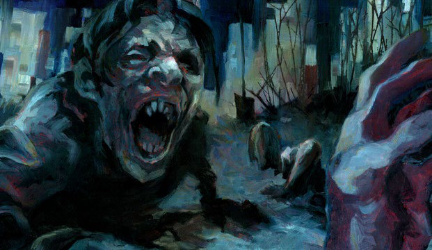

6 8

V5-Sabbat.pdf-renegadegames.com-#a11397-103

S A B B AT: T H E B L A C K H A N D

Let me tell you something, there’s this one bunch of licks that 
comes creeping into town every few months and I can’t figure out

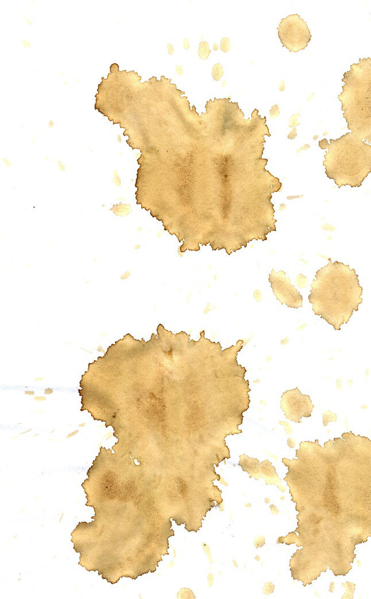

what they’re up to but I can damn well tell you that it’s no good.

Mostly I keep to myself, mostly, because I don’t want to stir up 
nothin’. You can have your prince or baron or grand high padishah,

but that’s none of my business on account of I mostly keep to my-

self.

But these licks, these licks ain’t that. Only reason I know 
they’re like us if you take my meaning is that I saw ’em once, and

they knocked this old guy down – he was just keeping to hisself,

and I watched the juice come out of him and pour itself into them.

It was the damnedest thing, no biting, no nothing, just whomp and

old grandpa’s on his ass and then next thing he’s a fountain and

they’re all sounding like a dog outside on a hot day that’s been let

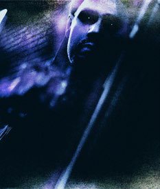

in to have a drink.

After that, though, after that it’s worse because clean as it 
was the way they ended this old man, they opened him up, broke him

up like a pomegranate for whatever of the stuff was still inside

and their boss lady dipped a finger into his guts and wrote some

kind of devil-language on all their heads.

Made no damn sense! All clean to make a meal like that and 
then dirty the tablecloth afterward, if you take my meaning.

One of ’em saw me, hell if I know how because I was working

the trick, but he looked right through it and he says to me,

he says

CLICKCLICKCLICKLCLICKCLICKCLICKCLICKLCLICKCLICK

Not even talking but obviously meaning something he wants 
understood but then I figured it wasn’t me he was talking to and I

bugged out of there, you can be damn well sure. Sounded like a frog

in the summer, or maybe one of those weird bugs they get in the

trees in the South.

Every couple of months I know they come back, but I don’t watch 
them anymore. I don’t want anything ta do with that. I make sure to

know when they get here and then I go stay down near Papa’s for

a few weeks, give ’em time to do what they’re doing and go back to

wherever.

I figure if someone knows they’re here, they might think I told 
someone they’re here, and they might come lookin’.

I don’t want anything ta do with that. Mostly I keep to myself.

V5-Sabbat.pdf-renegadegames.com-#a11397-103

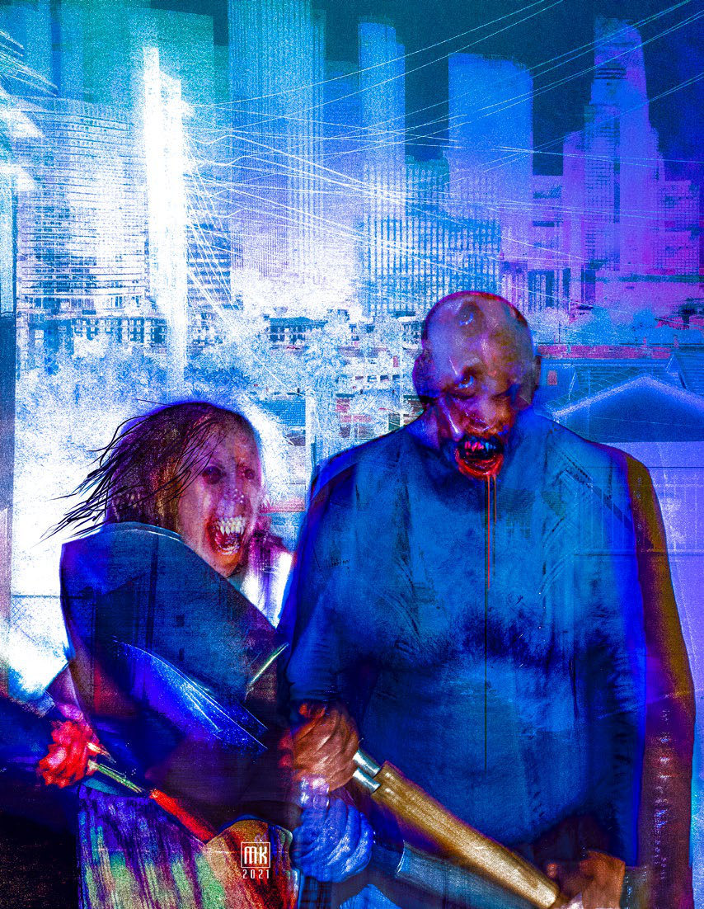

Chapter Two: Apostates of a Cruel Church

7 0

V5-Sabbat.pdf-renegadegames.com-#a11397-103

S A B B AT: T H E B L A C K H A N D

Chapter Three:
burn brightly

No man remains quite what he was when he recognizes himself.

– THOMAS MANN

I

n the Final Nights, the Sabbat is at once an 
unpredictable hive of clashing orthodoxies 
and a terrible, relentless monolith. The apoca-
lyptic Gehenna War has crippled its former 
leadership structure and robbed it of its most potent 
elders. Almost the entirety of the Black Hand’s for-
mer domains have been seized by rival sects, even as 
the Second Inquisition harries the Sword of Caine 
at all turns. Tonight, the Sabbat is smaller than it 
has been since its foundation, fighting a desperate 
war against enemy sects, mortal hunters, and the 
Antediluvians themselves.

The Cainites in ongoing, active conflict – the 
hot war –  generally comprise the larger of the two 
factions and consists of those Sabbat who have cho-
sen to fling themselves into the violence at the active 
front of the Gehenna War. Mostly, these Sabbat 
have abandoned the sect’s domains of the last five 
centuries to travel to the Middle East, Russia, South 
America, or other Gehenna hotspots around the 
world in a last-ditch effort to defeat the Antediluvi-
ans before they can arise and claim the full measure 
of their power. Their situation is dire and their 
cause perhaps doomed, but if nothing else, at least 
they will face final death gloriously in the service of 
Caine.

All of which means tonight’s Sabbat has nothing 
left to lose.

The Cainites prosecuting the cold war are those 
Sabbat who operate away from the war front, which 
is almost always in domains claimed by Kindred 
of other sects. These Cainites focus on infiltrating 
and undermining the most powerful pawns of the 
Antediluvians: the Camarilla, the Ashirra, and the 
Anarchs. By weakening the domains of the rival 
sects, the Sword of Caine aims to deprive the Ante-
diluvians of their most useful tools.

Anatomy of a Death Cult

As the Gehenna War rages, after the ruinous events 
of the Second Inquisition have rendered the sect 
desperate, what’s left of the Sabbat generally oper-
ates into two informal modalities: the waging of 
holy war, and a scorched-earth campaign of subver-
sion. Or as many Cainites would describe it, hot war 
and cold war.

From the outside, the distinction is largely moot. 
The Black Hand is the Black Hand, and its vampires

7 1

V5-Sabbat.pdf-renegadegames.com-#a11397-103

Chapter Three: Burn Brightly

want to diablerize you and destroy your haven so 
don’t give them an inch or they’ll burn down the 
whole fucking mile.

an elder to their haven in the Carpathians or selling 
guns to Anarchs in Chicago, it’s all working toward 
the same end.

When Cainites from outside the sect contem-
plate the dangers of the Sabbat, it’s often the cold 
war they imagine and fear. The hot war happens in 
isolated locales, with Black Hand Cainites bringing 
hell to remote points of undead interest where the 
Masquerade doesn’t matter and even less does any 
Kindred’s claim to domain.

Known to those within, though, is that the Sab-
bat is a decentralized resistance effort, and subject 
to rivalries among not only the Paths of Enlighten-
ment but also the way it fights the Gehenna War. 
Packs may move back and forth to and from the 
front, and may switch modalities any number of 
times, and it’s all incomprehensible to anyone not 
of the sect, which is why the Sabbat seems to have 
a hive mentality to outside onlookers. No one else 
reliably knows how to divine what they’re doing or 
how they’re fighting the war. That’s part of what 
makes them so fearful, so alien – their unsympa-
thetic urges and unpredictable strategies make them 
wholly other.

The cold war, then, can be everywhere and 
nowhere. Its tendrils can dig into the foundations 
of the sturdiest of Camarilla edifices and sinister 
Anarch backwaters. Its techniques range from 
Masquerade-smashing violence in Detroit to temp-
tation and degradation in Milan to esoteric magi-
cal practices that baffle and frighten even the most 
erudite Tremere.

Analysis: Subject has been ob-
served at security checkpoints 
in Ukraine, Latvia, Lithuania, 
Albania, Bulgaria, Montenegro, 
Italy, Spain, Canada, Mexico, 
Brazil, Ecuador, and Peru, all 
within the past 17 months.

Strange Bedfellows

Of course, while tension and rivalry may emerge 
between the hot- and cold-war Cainites, both are 
part of the same fanatical sect, and some overlap is 
to be expected. Most notably, when the architect of 
a cold-war destabilization effort is ready to topple an 
enemy domain, a Priest or Bishop will declare that 
the time has come for a Crusade. In this context, 
“Crusade” refers to an all-out attack that is preceded 
by a massive surge on shovelhead parties to provide 
as many shock troops as possible for the final battle 
(see “Sabbat Domains” on p. 105).

Image Is Everything

Those fighting the hot war often envision them-
selves as an army, while those prosecuting the cold 
war see themselves more as a subversive revolution-
ary movement, and neither modality heeds a central 
authority. In both cases, the pack model still pre-
vails, and Pack Priests may defer to the wisdom of 
Bishops and Archbishops (and often be dependent 
on their materiel support), or may operate on their 
own independently.

If the Crusade succeeds, those neonates who 
survive and earn the status of True Sabbat rarely 
stay in the conquered territory. Most pursue the 
momentum and strike out for the front lines of 
the Gehenna War, but some few remain and adopt 
cold-war tactics, or target some other domain to 
undermine.

Consequently, most packs function autono-
mously, whether as hot-war kill squads or cold-war 
sabotage cells, and many are essentially personality 
cults built around the Pack Priest’s vision for how 
best to pursue their Path of Enlightenment and the 
Gehenna War. Whether blood-starved and tracking

As regards the hot war, its tactics are fairly 
straightforward – kill the enemy and consume 
their heartsblood! Away from overt sites of con-
flict, though, it’s impossible to predict the tactics a 
cold-war cell might use to undermine a Camarilla or

7 2

V5-Sabbat.pdf-renegadegames.com-#a11397-103

S A B B AT: T H E B L A C K H A N D

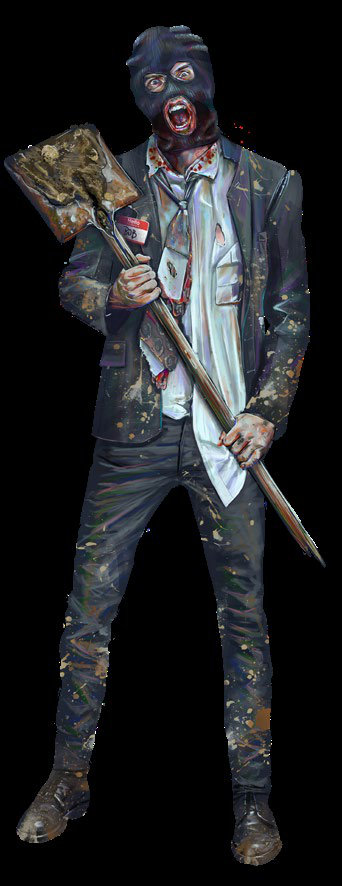

Anarch domain. Each pack is unique, a function of 
the personalities of its members and the Paths they 
follow.

■A pack devoted to the Path of Caine infiltrates

Warsaw in secret to scout out those Cainites 
of the most desirable Blood and target them 
for diablerie, while a fellow pack seeks out and 
recovers artifacts dating back to the First City 
that hot war allies use to bring low the Prince of 
Vilnius.

■A pack devoted to the Path of Cathari tears

through New York City in an orgy of mindless 
violence, with no goal except satiating their most 
decadent desires, and their bloody games shatter 
the Masquerade – so much the better. A fellow 
pack infiltrates the city to radicalize its malcon-
tents, at once to recruit new ranks and harry the 
repair of the Masquerade.

■A pack whose members follow the Path of Power

and the Inner Voice might use techniques either 
subtle or gross. Such a pack might infiltrate the 
domain with the goal of usurping its existing 
power structures... or it might roar into town on 
a fleet of motorcycles, looking for mortals it can 
shovelhead in order to bolster its own numbers.

■A pack that follows the Path of Death and the

Soul, its presence unobserved in the Panteón de 
Dolores, lays a trap, and the reason all of those 
graves have mysteriously been exhumed becomes 
frighteningly clear.

7 3

V5-Sabbat.pdf-renegadegames.com-#a11397-103

Chapter Three: Burn Brightly

Antitribu

What clan do I belong to? The clan that’s about to drink you dry.

– CHOPSHOP, FOLLOWER OF THE PATH OF CATHARI

From the Sabbat perspective, clan is an explicit 
legacy of the influence of the Antediluvians. With-
out Antediluvians, there are no clans, and Sabbat 
vampires aim to negate their connections to their 
despised progenitors.

Of course, Sabbat will eagerly exploit rivals’ 
banes (whether inside the sect or without) or credit 
aptitude with certain Disciplines over others. As 
much as they would prefer it not to be true, these 
are undeniable properties of the Blood.

With more nuance, different Antediluvians 
would have yielded different clans, which perhaps 
would not have yielded the Eternal Struggle that 
makes the Gehenna War necessary, but that’s moot. 
The Black Hand fosters an environment in which 
an individual’s clan is rarely acknowledged and 
never celebrated. Even for the visibly obvious Sabbat 
Nosferatu, other Sabbat just don’t care about the 
distinction.

In social situations involving the Sabbat and 
other sects, Cainites make no effort to hide the 
derision they have for clans, lineage, and any sort of 
expressed pride or identity that accompanies them. 
They spit on the suggestion of fealty to such wretch-
ed origins; they curse the despicable “families” that 
emerged from founders who turned their backs on 
the Dark Father. Black Hand converts from other 
sects may react with especial vitriol, to make a point 
of having turned away from what they once were 
– often as much to convince themselves of the cor-
rectness of their choice as any actual antipathy for 
clans – until an adopted Path relieves them of any 
lingering doubt, of course.

Where members of other sects may consider 
themselves in terms of clan, Sabbat members almost 
always consider themselves vampires first, Sabbat 
second, and followers of their own particular Path 
third. Clan almost never matters to their self-image. 
Thus, the philosophy of antitribu, or “anti-clans.” 
On those rare occasions when lineage comes into 
question, Sabbat append the word antitribu when 
they name clans, acknowledging the limited extent 
of its importance. For example, Archbishop Lucita 
of Madrid is Lasombra antitribu and Sascha Vykos, 
the martyr of Caine, is Tzimisce antitribu.

Unsurprisingly, this often makes it difficult for 
Sabbat vampires to hide among other sects. The 
cultural differences are often so great that would-be 
Black Hand infiltrators simply don’t understand the 
weight of clans on the society of the Ivory Tower. 
The Anarchs are generally less concerned with clan 
lineage, and the Anarchs are especially at risk of har-
boring Sabbat in their midst. Obviously, that’s one 
of the reasons the sect is so vulnerable to the Black 
Hand, compared to the lineage-obsessed Camarilla.

This attitude aids the suppression of individual 
identity among Sabbat and helps the sect build a 
notion of collective accomplishment. Brothers and 
sisters in Caine, the Sabbat has no need for internal 
social constructs that sow division. The idea of anti-
tribu is also part of what makes the Sword of Caine 
so alien to Kindred outside the sect. They find the 
Sabbat “hive” unrelatable, with little sense of self 
and none of lineage.

Which isn’t to say that it’s immediately obvi-
ous that an interloper is Sabbat (especially among 
creatures of such strange predilections as vampires). 
Rather, the subtle cues and prompts that other 
sects’ Kindred respond to in certain ways are absent 
among Sabbat, creating an almost uncanny valley 
when matters of clan arise.

7 4

V5-Sabbat.pdf-renegadegames.com-#a11397-103

S A B B AT: T H E B L A C K H A N D

Overwriting the Individual

replaced them, it’s because they were predestined by 
the quality of their Blood.

From the moment an individual joins the Sabbat, 
the sect devotes effort to minimizing that sense 
of “individual.” The sect is all, the Gehenna War 
needs fighting, destroying the Antediluvians is the 
only thing that matters. Insulated from the politics 
that characterize many other sects, Sabbat vampires 
lack context. The social interactions upon which 
other sects are built are very different for the Sab-
bat, which exists in a constant state of war on the 
world. Other vampires don’t relate to them, let alone 
mortals.

With adaptable local titles and hierarchies, 
rank-and-file Cainites quickly learn to seek authori-
tative direction. Most often this comes from the 
Pack Priest, each Sabbat coterie’s spiritual leader in 
matters related to both Paths of Enlightenment and 
nightly affairs.

Higher-ranking Sabbat also carry authority, in-
structing the Pack Priests on matters of sect policy. 
That hierarchy is mysterious and unknown in 
many cases, however, and any authority outside the 
domain or region might even be fabricated. Look to 
the Bishop or Archbishop to guide the Priest, and 
beyond that, who can say with any confidence?

“Shovelheading” is often the first step in this 
process, for the majority of Cainites who come to 
the sect in that manner. The first in a series of ongo-
ing traumas, shovelheading frames the vampire’s 
existence as a matter of ongoing tests of survival, a 
survival threatened by ancient blood gods who must 
be destroyed before they consume everyone.

Also serving to unite the sect in its common 
fanaticism are the ritae. Part sectarian rallies, part 
hazing rituals, the ritae exist to focus Sabbat atten-
tion on the matters sect leaders find valuable. Ritae 
include pledges of loyalty to Caine and the Black 
Hand – and to one’s own pack. Ritae also include 
opportunities for wild Cainites to demonstrate their 
prowess, dare themselves to take risks, and celebrate 
their status as vampires. (For more information on 
Sabbat Ritae, see p. 55)

Even those who are Embraced traditionally  
don’t have an easy time of it. These neonates are 
subsequently bullied into submission, repeatedly 
told that, despite any status their sire may have, 
they’re nothing without the sect. They are their 
sire’s chattel; their sire is the Sabbat’s in turn. This 
usually becomes abundantly clear the more the 
fledgling progresses along the Path their Sire has 
chosen for them.

Chillingly, it all works. The combination of  
accelerationism and righteous crusade provides 
what certain vampires need to give them purpose 
and a wicked face for the enemy. In centuries-long 
holy war, the cause is everything, and the individual 
is nothing more than a tool to accomplish it.'

Regardless of how they become vampires, Sab-
bat don’t dwell on the matter of clan. Harnessing 
one’s mind to the Beast or merging the two into a 
single whole, which is the function of the Paths, 
takes precedence over any recitation of who’s sire’s 
sire did what when. The Sword of Caine has more 
immediate needs than such pompous self-aggran-
dizing.

Cultivating Conformity

As a result, the Sabbat resembles little so much as 
a regional cult. Paths very quickly fulfill their own 
prophecy in this regard: If a leader fails, it’s because 
they just didn’t have what it takes, thereby justifying 
their diablerie. If the pack tore down its leader and

7 5

V5-Sabbat.pdf-renegadegames.com-#a11397-103

Chapter Three: Burn Brightly

POSTHUMANISM AND THE SWORD OF CAINE
Another reason for the sect’s indifference to clan affiliation arises from its 
elevation of Caine from “semi-mythical patriarch” to the status of “conquering 
blood-god,” and when younger Sabbat identify as members of the Black Hand, 
it’s the hand of Caine to which they refer. The four most recognized Paths that 
dominate the sect at present disagree on numerous philosophical points, but they 
are united in their beliefs about the absolute inferiority of mortals to the childer 
of Caine.

To say a Sabbat looks at the kine as a farmer looks at his cows is inaccurate, 
because at least the farmers must tend to their herds and see that the cattle live 
and remain healthy until it’s time for the slaughter. It is more accurate to com-
pare the Sabbat to a shiver of sharks making its way through a prosperous reef. 
If the sharks grow hungry – and sharks are always hungry – they simply choose 
adequate prey, devour the edible bits, and let the savaged remains sink to the 
bottom.

In this context, Sabbat philosophy is inherently posthuman. The Embrace is 
the mechanism by which prey are elevated into apex predators. Such an elevation 
does nothing to affect the predator-prey relationship save to reassign which of 
the two roles that a new inductee will play.

For this reason, what appears as wanton cruelty toward the kine is an essen-
tial part of Sabbat existence. When two rival packs agree to have a spot of fun by 
playing rugby with some mortal’s severed head as the ball, it’s not an example of 
Cainites acting the part of monstrous edgelords. Well, it’s not just that. It is also 
a reification of a central part of Sabbat philosophy: the idea that mortals simply 
don’t matter at all except for when they provide some transitory benefit to their 
betters.

7 6

V5-Sabbat.pdf-renegadegames.com-#a11397-103

S A B B AT: T H E B L A C K H A N D

Catechism:  
Sabbat Objectives

To those vampires outside the Sabbat, the sect is as 
mystifying as it is terrifying. The Black Hand has 
never been particularly interested in compromise 
with other sects. Thus, most Camarilla and Anarch 
Kindred might be forgiven for wondering about the 
Sabbat’s agenda. “What do they really want?”

To oversimplify, what the Sabbat wants is free-
dom: complete and total freedom.

This obsessive desire for total personal freedom 
at the expense of every other possible consideration 
starts (and arguably ends) with the Antediluvians. 
Sabbat dogma holds that not only are the Antedi-
luvians real, they are gods in every way that mat-
ters. Worse, they are not loving deities, but rather 
cannibal blood gods who see all lesser Cainites 
as food and nothing more. That this means the 
Antediluvians look upon the Sabbat in exactly the 
same way that much of the sect regards mortals is 
an irony best left unacknowledged. In any case, if 
the Antediluvians rise and cannot be stopped, they 
will exterminate all Cainites, if not all life, from this 
world. When one is tasked with killing an entire 
pantheon of gods, anything less than total devotion 
and total ruthlessness is a luxury.

Ideological Enmity

It’s complicated. In general “the Sabbat,” as a whole, 
doesn’t say or do anything specific. Made up as it is 
of a variety of nigh-fanatical outlooks, “the Sabbat” 
is more of a container of zealotry than it is a formal 
sect with consistent dogma.

This pathological fear and hatred of the An-
tediluvians trickles down into every other aspect 
of a Sabbat’s existence. The danger posed by the 
Antediluvians is so great and so transparently obvi-
ous that, in the mind of a Sabbat, refusing to take 
up arms against isn’t cowardice, it’s complicity. No, 
the refusal of the Camarilla, the Anarchs, and all 
vampires outside the Sabbat to act against the Third 
Generation can at best be complicity in ignorance or 
alliance in malice, a willful desire to aid the Ante-
diluvians. Whether through Anarch apathy or so 
many Camarilla vampires’ stratagem of pretending 
the Antediluvians don’t exist, thus do these “Kin-
dred” make pawns of themselves.

In general, however, almost all Sabbat share 
certain perspectives.

Overall, the Cainites of the Sabbat seek the sub-
ordination or destruction of the Camarilla because 
its fundamental nature is that of a controlling, 
authoritarian force bent on hiding the depravities 
of the Antediluvians. Therefore, fundamentally an 
enemy.

The Black Hand’s relationship with the Anarchs 
is more complex. In many Anarchs, they find a 
sympathetic take on the neofeudal tyranny of the

7 7

V5-Sabbat.pdf-renegadegames.com-#a11397-103

Chapter Three: Burn Brightly

Camarilla, even if their respective perceptions of the 
Ivory Tower’s motivations differ. Few Anarchs see 
the world in the eschatological context the Sabbat 
does, however.

In this context, the Black Hand wishes to 
destroy rival sects for their own good. At the very 
least, their leadership must be ripped out, root and 
stem. Only then will younger Kindred recognize the 
rightness of the Sabbat’s cause, and the urgent real-
ity of the Gehenna War.

These differences are somewhat fluid: The Sab-
bat sees fallow ground for recruitment among the 
Anarchs, and no few disillusioned Sabbat adopt an 
Anarch outlook when the constant cultic violence 
of the Black Hand exacts its toll on them. Obvious-
ly, no formal census exists, but anecdotal numbers 
bear out the “estranged siblings” outlook on Sabbat-
Anarch relations. No few Anarchs in LA were 
previously Sabbat who got the fuck out of Tijuana 
when the Black Hand threw itself into the Gehenna 
War; the Anarchs of Tangier have seen firsthand the 
servants of the Ancients and many have converted 
to the Black Hand on the spot.

With that basic principle understood, the rest of 
the Sabbat’s agenda becomes clear. The Masquerade 
must eventually be torn down because it is a shield 
for the Antediluvians. Rival sects must be torn 
down because they are instruments of the Antedilu-
vians. Every system of control used by both Kindred 
and kine must be torn down because, directly or 
indirectly, they all support the perfidious Ancients.

The enemy is everywhere, and its tools and 
weapons are always at the ready. Only when all else 
is ash will the Antediluvians stand naked, defense-
less, and ripe for their earned destruction.

Caine and Abel were brothers. Caine killed his brother, most likely

as a sacrifice to God. And God rewarded Caine for that bountiful

sacrifice by transforming him into a higher being with god

like powers of his own. God then set him to rule over the kine and

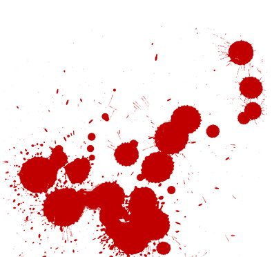

to prey upon the faithful so that they would be more fervent

in their devotion to God out of their fear of Caine’s hunger. Caine

then created three childer, as was his right as patriarch of the

vampire kind. But the Second Generation disobeyed Caine’s edict

and created childer of their own, the Third Generation. The Third

Generation, Embraced as they were in an act of disobedience, became

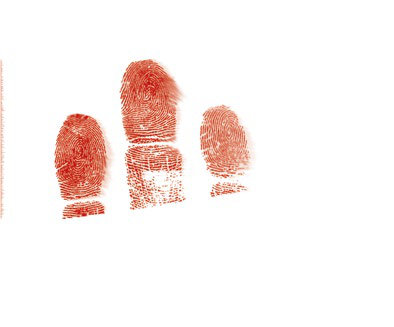

jealous of Caine’s perfected state and sought to emulate it

by destroying and consuming their sires, a crime for which

Caine punished the Third Generation and all of their descendants.

By destroying the false gods of the Third Generation, the Black

Hand of Caine will prove their devotion and their worthiness of

the Dark Father’s blessings.

Thereafter they will be rewarded by becoming perfected

themselves as Caine was and is.

7 8

V5-Sabbat.pdf-renegadegames.com-#a11397-103

S A B B AT: T H E B L A C K H A N D

Path Realities

ers relate to the Sabbat. For mortals and vampires 
who preserve their Humanity, Sabbat vampires are 
impossible to relate to. One might as well attempt to 
empathize with a shark.

Adopting a Path

To the Sabbat mind, though, empathizing with 
prey makes little sense. At best they’re cattle. At 
worst, they’re pretending to be cattle so they don’t 
accidentally feel the power they’ve been granted.

The Priest responsible for the vampire’s under-
standing of their Path brings them into a group of 
Cainites also following that Path: the pack. Packs 
are devoted not only to one specific Path of En-
lightenment, but also to some larger purpose, as 
mandated by a Bishop, Archbishop, or other leading 
figure. Some are soldiers in the Gehenna War, some 
are body-snatchers responsible for bolstering the 
sect’s ranks, some undermine the other sects’ claims 
to domain, and so on, according to the Sabbat’s 
interests in the region the pack calls its own.

Each Path has a distinct worldview and a sense 
for the vampire’s place in it. What they all have in 
common, though, is an understanding that the 
Beast resides within each vampire. Each Path, then, 
could be described as a way for each vampire to bind 
themselves to their Beast. It colors every aspect of 
the Cainite’s outlook, from the way they interact 
with each other to the way they see themselves, as 
well as the regard they have for anything “less” than 
a bloodthirsty childe of the Dark Father.

Whatever the case, the pack’s function is 
complemented by its Path; the outlook shapes how 
the pack undertakes its responsibilities. (Of course, 
for some packs, they are their own authority, and 
the devil take any Black Hand bigshot who tries to 
order them around. Or Sabbat influence in the area 
has collapsed, leaving a pack without any leadership 
other than its own ambition.)

Changing Paths

It is possible, though exceedingly rare, for Sabbat to 
change their Path of Enlightenment  after having 
been inculcated into one. The risk is obvious: The 
Cainite must again be broken down to the brink of 
wassail and then have one of the epiphanies of the 
new Path anchor them to self-control. It’s a pro-
cess few accomplished vampires would court, but 
for those who see more potential in another Path, 
changing the nature of one’s monstrosity may offer 
them a chance at apotheosis.

Which is to say, the pack is the Path and the Path 
is the pack. Cainites who share packs are of  like 
mind, even disturbingly so, as the sect’s reputation 
as a hive consciousness has grown. While this isn’t 
literally true, none could argue that pack unity isn’t 
the Sabbat’s greatest strength. Few who stumble 
into the domain of fanatical Albigensian would 
doubt their commitment to their foul purposes, for 
example.

Leaving Paths

The Path of Enlightenment replaces Human-
ity for the Sabbat. It shapes the way the Beast holds 
sway over the Cainite, unlike Humanity, which is 
a way of denying the Beast or keeping it in check. 
To the Sabbat way of thinking, the Beast is part of 
being a vampire, a relationship with oneself that 
must be cultivated, not subjugated. Every vampire 
upholding a Path of Enlightenment is a student of 
its ways and, for better or worse, tethered to the 
Beast. Where goes the Beast, goes the Cainite.

The notion of leaving Paths entirely provokes revul-
sion from the Sabbat. After all, no True Sabbat 
would turn their back on the sect to adopt such 
a feeble attitude of cowering among mortals and 
pretending to hold their values dear. Does the wolf 
secretly yearn to live as a swine? Risible.

Doing so is, not to put too fine a point on it, ex-
cruciating. Not only do all of the perils for changing 
Paths apply, but the re-adoption of mortal mores 
often proves irreconcilable for Cainites, who have 
spent massive amounts of emotional and psychic

To outside perspectives, this is an alien way 
of thinking, and this comes across in how oth-

7 9

V5-Sabbat.pdf-renegadegames.com-#a11397-103

Chapter Three: Burn Brightly

true on pain of death in one Black Hand territory 
might be entirely unheard of in another. Even those 
concepts that are universal to the sect are subject 
to regional and individual interpretation, such as 
ritae and Paths of Enlightenment. Included in these 
locational variations are the leadership structures 
and titles of the Sword of Caine.

effort to suborn them in the first place. It is exceed-
ingly likely that most attempts (of which there are 
likely an exceedingly small number in the first place) 
simply fail, leaving the Cainite a wight or… worse.

To be sure, the Sabbat has very little interest 
in “rehabilitating” Path members, as Paths are a 
defining characteristic of sect allegiance. Other sects 
are themselves often too paranoid about turncoats, 
deep-cover spies, hidden double-agents, and other 
perils of attempting to repatriate one-time Sabbat 
to place any faith in deprogramming. There’s no 
silver-bullet methodology or proven curriculum by 
which to make one’s way back from the terrors of 
the Paths.

As with its membership, the Sabbat has hol-
lowed out the middle of its hierarchy somewhat. It 
has a few high-ranking titles and literally no mid-
tier titles that outrank its lowest tiers. Some of this 
is simply practical reality: In a sect as decentralized 
and fractious as the Sabbat, there’s no such thing as 
middle managers and there’s no real orthodoxy for 
a middle rank to sustain. The highest ranks decide 
what they will and the rank and file either fight 
those battles or they don’t. With the Black Hand’s 
small size and extremely high rate of final death, 
what happens on the war front is the shape of the 
sect. On overview, the sect consists of a number 
of elders, a remarkable paucity of ancillae, and a 
massive proportion of fledglings among the shovel-
heads.

Which isn’t to say it can’t happen, just that it’s a 
lonely and dangerous road. Those who do succeed 
are themselves anomalies, individual cases. Leaving 
a Path and returning to the morality of Human-
ity may happen with the assistance of a mentor or 
while seeking atonement through Golconda – but 
whatever form it takes, each journey is unique, and 
uncertain to succeed.

Speculation among the Sword of Caine is 
rampant as regards the exodus of Lasombra from 
the sect. Some argue that many Lasombra upheld 
“Humanity-adjacent” Paths such as the Path of 
Honorable Accord, which weren’t really in line with 
Sabbat attitudes anyway, so their self-aggrandized 
“dark chivalries” didn’t actually have far to travel in 
order to realign with Humanity. Other Cainites, as 
with so many Sabbat perspectives, see the talons of 
the Antediluvians at work, suggesting that Lasom-
bra leadership of the sect was a centuries-long ruse 
orchestrated by the Ancients to leave the Sword of 
Caine abandoned as the Gehenna War gained mo-
mentum. Surely such hysteria is ill-founded – surely 
– but desperate times yield desperate explanations 
from those casting about for something to believe 
in.

Regent
The nature of many vampire institutions implies a 
top-down organization. From neofeudal Camarilla 
Princes to streetwise Anarch Barons, the individual 
figure evokes a supreme authority for that domain, 
or at least a no-bullshit, buck-stops-here attitude, 
even if the reality is much more nuanced. However, 
this is actually true of the hollowed-out hierarchy 
of the Sabbat, to an extent. Unlike the other major 
sects, the Black Hand has a single, sectwide leader, 
known as the Regent.

In practice, it’s not that simple, because among 
the Damned what ever is? Indeed, it is currently 
unknown who the Regent of the Sabbat is, or where 
they may be found.

In fact, many suspect that the Sabbat has no 
current Regent, that the guerrilla nature of the 
Gehenna War is best fought without a ponderous 
top-down hierarchy. Others opine that the absence 
of a single commanding figure illustrates the hive 
mentality of the Sword of Caine, or that it’s not a

Sabbat Titles

In the modern nights, the Sabbat has splintered, 
with conflicts scattered worldwide and a decen-
tralized approach to the Eternal Struggle. What is

8 0

V5-Sabbat.pdf-renegadegames.com-#a11397-103

S A B B AT: T H E B L A C K H A N D

come almost schools of thought for Sabbat of those 
Paths, and not always simpatico domains for those 
of other perspectives.

unified sect fighting a deluded crusade but rather a 
confederation of wild-eyed, malevolent cults. Espe-
cially among young Sabbat, the lack of a Regent is 
all they’ve ever known – which argues that the Sab-
bat doesn’t need a Regent, Pope, Vizier, or anything 
resembling such.

As with many Sabbat distinctions, the difference 
between the roles can be quarreled over bloodily, 
but a Bishop usually holds a single domain and an 
Archbishop holds multiple domains or one par-
ticularly important domain. In this sense, the role 
is conceptually similar to that of Prince or Baron: 
the most eminent Cainite in the domain who is 
regarded as its figurehead. Concomitant with the 
claim of the domain, of course, is the ability to hold 
it, and with no few external enemies and keen-eyed 
followers of various power-hungry Paths, those 
Cainites who have the ability to maintain praxis 
often prove to be terrifyingly competent.

Whatever the case, if there is a Regent tonight, 
no one’s telling who it is, and the Sabbat has plenty 
of momentum without them.

Archbishop and Bishop
Although the Sabbat cares little for the notion of 
domain the way other sects do, it nonetheless sees a 
value in maintaining various territories for the sake 
of recruitment and for strategic fallback points. As 
well, each city claimed and held is one that the toad-
ies of the other sects can’t have for their own, which 
is its own reward.

NOTABLE BISHOPS AND ARCHBISHOPS
Lucita de Aragón (Path of Night): Madrid is a 
Camarilla court. Or, rather, Madrid is a contested 
domain that would otherwise be a Camarilla 
court but for the presence of Archbishop Lucita de 
Aragón, whose pack is said to be a hundred strong, 
and who still wears her living name in mockery of 
Camarilla pride and mortal fear. Complicating mat-
ters, certain noteworthy Kindred claim that Lucita 
has met the final death – but if that’s true, who 
are her packmates following? The Path of Night 
appears to be a variant of the Path of Cathari, and 
Lucita its preeminent adherent.

Archbishops’ and Bishops’ primary respon-
sibility is maintaining domains to best serve the 
Gehenna War effort. This takes a variety of forms, 
from providing materiel to maintaining knowl-
edge repositories about what front-line fighters 
and scouts have found to providing safe haven for 
sabotage packs waging hit-and-run tactics on the 
war front or against rival domains. In this sense, 
domains claimed by Bishops and Archbishops may 
be “fall-back domains” or places where convoca-
tions of Necronomists research new rites to immo-
bilize the pawns of the Antediluvians. For example, 
the fleshweld ghouls (see p. 44) were developed in 
a Necronomist’s Carpathian Bishopric, and the 
one-time Archbishop of Mexico City assisted in the 
creation of what are tonight known as the Shackled 
(see p. 43).

The Doctor (Path of Power and the Inner 
Voice): Once the Bishop of Atlanta, Julius Sutphen 
was one of the earliest Sabbat to rally to the Gehen-
na War. As part of a triumvirate of Bishops holding 
the domain of Belgrade, The Doctor is instrumen-
tal to moving Cainites through that domain to the 
war front using his medical credentials. Since taking 
up his title in Belgrade, he has also become regarded 
as a wise voice among followers of the Path of Power 
and the Inner Voice.

Some amount of spiritual leadership resides with 
Bishops and Archbishops, if not outright author-
ity. Indeed, what Cainite culture exists in a city 
often takes on a timber informed by that Bishop 
or Archbishop’s Path. Authoritarian violence may 
characterize the domain of a Bishop who observes 
the Path of Power and the Inner Voice while a city’s 
sprawling cemeteries and opulent mausoleums may 
be points of macabre reverence for a Necronomist 
Archbishop. Unsurprisingly, these locales may be-

Cicatriz (Path of Caine): The Bishop of Tijuana is 
an accomplished commander in the Gehenna War, 
with an undead career of having personally discov-

8 1

V5-Sabbat.pdf-renegadegames.com-#a11397-103

Chapter Three: Burn Brightly

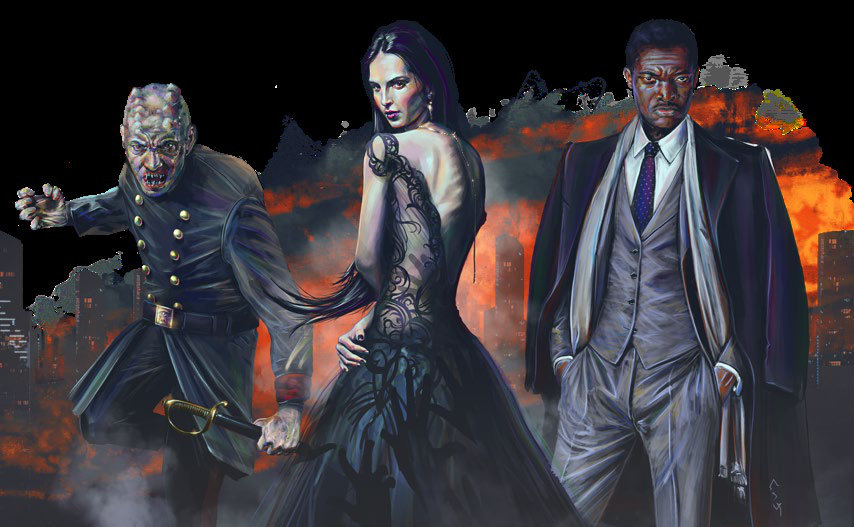

ered an elder’s tomb. Artifacts found in that grave 
have exposed the resting places of subsequent elders 
from the pre-Columbian era. Under Cicatriz’s lead-
ership, the Tijuana domain has become renowned 
for its Monomacy duels, almost an “officer’s school” 
from which Pack Priests emerge as exemplars of the 
Path of Caine, their Blood made more puissant by 
diablerie.

that pack follow the same Path of Enlightenment. A 
Priest serves as both the spiritual and tactical leader 
of individual Sabbat packs according to that Path’s 
precepts. They are the voice that brings the Beast to 
heel, the officiant of rites that bind the pack to-
gether, and the sergeant who ministers to the pack’s 
need for direction. Whether as a firebrand, inciting 
their packmates to feats of battlefield violence, or as 
a mentor, inspiring their packmates to rise and fight 
another night, the Priest’s duty is the cornerstone of 
the Sabbat.

Pack Priest
It often surprises outsiders to learn about the exis-
tential side of the Sabbat, to realize that the sect isn’t 
just about monstrosity and violence and brutality 
against mortals. Certainly, this is true of the Sabbat, 
but the Black Hand has philosophical reasons for 
doing what it does, and methods for dealing with 
the Curse of Caine guided by devotion to the Paths 
of Enlightenment. Foremost in realizing this charge 
is the role of the Pack Priest.

Priests appear in immense variety, often heav-
ily influenced by their locale, in how they perform 
their function. Some Priests take their titles literally, 
treating their Paths and guidance as a religious 
leader would. Some take on an aspect of witches, 
coaxing a shrieking coven against their foes. They 
may be hard-bitten veterans of undead war, know-
ing how critical a Path is to preventing one’s fellows 
from becoming ravening Wights. They may use

In most packs, all of the Cainites belonging to

8 2

V5-Sabbat.pdf-renegadegames.com-#a11397-103

S A B B AT: T H E B L A C K H A N D

Tadarida (Path of Death and the Soul): A 
Necronomist who specializes in the effects of 
Cainite vitae on living tissue, Tadarida and her pack 
often join other Sabbat packs into both hot- and 
cold-war situations. Her pack usually precedes a 
more substantial assault, confounding rival vam-
pires by killing, kidnapping, or making stranger 
things happen to ghouls in their employ. In particu-
lar, Tadarida’s pack possesses a blood agent that can 
cause seizures in ghouls and mastery of a Ceremony 
that can age a ghoul to a brittle husk in minutes.

holy icons or cultural symbols to motivate their 
packs, or they may rely on old-fashioned blood-and-
fire oratory.

NOTABLE PRIESTS
Mokhtar Sahnoun (Path of Caine): Let the 
other packs bellow and brawl – Mokhtar’s pack 
knows the value of logistics. With his sights set on 
the turbulent city of Marseille, Mokhtar has been 
quietly streaming a number of packs into the south 
of France. So far Mokhtar’s intention seems not to 
be a violent coup of praxis, but to deny Marseille 
as a point of ingress to non-Sabbat who would 
move through Western Europe. This is profoundly 
dangerous territory for Cainites, as France’s DGSE 
considers Marseille to have been purged of vampiric 
presence, but the city has too much strategic value 
for that to long be true, and Mokhtar’s pack may 
well have an insurmountable first-mover advantage.

Ballerino (Path of Cathari): Ballerino and his 
troupe promise forbidden delectations to those 
who receive invitations to their pleasure-circus. 
Whether courting mortals, who mysteriously gain 
sexually transmitted diseases that pass through their 
blood to vampires who feed on them, or Kindred, 
who surrender to a torpor borne of languor after a

8 3

V5-Sabbat.pdf-renegadegames.com-#a11397-103

Chapter Three: Burn Brightly

night of sensual bliss, Ballerino’s pack masterfully 
ensnares its victims in traps of their own lust.
True Sabbat, Brothers and  
Sisters in Caine
The title of True Sabbat belongs to all Cainites who 
have served their packs in some capacity and been 
thereafter honored with the ritus acknowledging 
them as a member of the sect. It confers no actual 
rank, therefore, but its power is in the concept of 
belonging. True Sabbat are no longer probationary, 
and they’re definitely a cut above tomorrow night’s 
shovelheads, even if they are themselves last night’s 
shovelheads. As shredded Humanity inexorably falls 
away, to be supplanted by a Path of Enlightenment, 
having the camaraderie of one’s fellow accursed 
night-creatures is one of the inhuman “comforts” 
they come to appreciate. Monstrosity loves com-
pany, and damnation positively revels in it.

Some few members of the Sword of Caine are 
still known to use the following titles. Whether or 
not the now much more decentralized sect chooses 
to later appoint others to these titles, or if the Sab-
bat’s new purpose means the sect has shed them 
entirely remains as yet unknown.

CARDINALS
With the outbreak of the Gehenna War, those call-
ing themselves Cardinals have ostensibly become 
the warlords of the Sword of Caine, counting 
among them various specialists from a number of 
different Paths and regional factions. A number of 
unconfirmed Cainites have also assumed the title of 
Cardinal, and these may or may not have formally 
been accorded these roles by Sabbat luminaries. In 
fact, it is probable that the ranks of the Cardinals 
have yielded to a bloody junta, with the more sub-
lime duties of the title falling by the wayside as the 
war effort pushes the Damned into open conflict.

Other Titles
In nights prior, the Sabbat had a much more sub-
stantial hierarchy of very formalized roles. Since the 
Second Inquisition has been so effective against the 
sect, and since the Gehenna War demands so much 
Cainite attention, however, many Cainites who had 
claimed these titles have gone missing leaving titles 
vacant and unfilled.

Those few Cardinals who remain and are recog-
nized occasionally organize regional congregations 
of their Paths of Enlightenment. These may take a 
number of forms, from “mobile domains” of Path 
fundamentalists to training camps hastily estab-
lished on the periphery of a Methuselah’s supposed 
resting place, in preparation for a strike. Cardinal 
Scarab’s pack marauding its way across Florida pre-

8 4

V5-Sabbat.pdf-renegadegames.com-#a11397-103

S A B B AT: T H E B L A C K H A N D

greatly fallen out of use, as the sect holds too few 
domains to recognize these titles sectwide anymore. 
Enterprising Sabbat occasionally claim this title for 
themselves, whether as a pack identity (“The South-
side Templars”) or as a personal moniker (“Euryale, 
Death’s Paladin”). In almost every case, this is done 
by Sabbat who had been Embraced before the Beck-
oning and the Gehenna War, to demand respect 
and bolster a reputation of seniority. Such habits 
are inconsistently effective, especially among the 
droves of new Sabbat who don’t have any idea what 
a Paladin is supposed to be.

sents itself as a religious revival, for example, even 
though Cardinal Scarab herself has fewer than ten 
years under the night.

PRISCUS
Every army needs its specialists and the Sabbat 
is no exception. While the majority of the sect is 
devoted to the war effort, the Prisci have emerged as 
a different aspect of the Black Hand. From spy-
masters organizing the infiltration of other sects 
to reconnaissance experts sneaking past the front 
lines to influential councilors with access to the 
Archbishops, the Prisci are often the minds back-
ing the arm wielding the Sword of Caine. On their 
own terms Prisci are accomplished Cainites, and the 
title broadly signifies a recognized expertise. They 
may align themselves with a particular domain and 
advise its Bishops, or they may roam, bringing their 
talents and assets wherever they believe they are 
needed.

DUCTUS
The responsibilities of pack leadership were once 
split between the Pack Priest, who tended to the 
spiritual needs of the pack, and the ductus, who was 
its tactical leader. With the urgency of the Gehenna 
War, however, which is itself a holy war, the distinc-
tion became one of little value. Tonight, ductus is 
used almost as derisive parlance for a Pack Priest 
of little spiritual rigor, though a few veteran pack 
leaders still use it to present a connotation of rank or 
experience.

The Prisci are very often the primary sources of 
information and intelligence the sect gathers, and 
realize the sects’s hatred for the Antediluvians in in-
direct ways. It may be a Priscus’ efforts to form and 
supply a pack that discovers the crypt of a torpid el-
der beneath the Rio Negro outside Manaus or turns 
over a Camarilla fugitive to the wary Anarchs in 
Tangier, the better to keep the sects at each other’s 
throats. The Tarantella Stylites of Argentina, a pack 
of scouts and spies, are led by a Priscus whose name 
none can remember after meeting her, only her title.

Pack Patterns

Members of successful Sabbat Packs fulfill a variety 
of roles and responsibilities, each according to their 
skills, abilities, or place in the internal pecking or-
der. While not formalized to the extent of sect titles, 
these roles share enough similarities across different 
Packs and Paths for a pattern to be established.

Prisci rarely have any specific responsibility or 
accountability, and typically no real geographical 
anchor, which sometimes results in the front-line 
soldiers fighting the Gehenna War having little 
respect for them. Truth be told, without the vari-
ous specializations of the Prisci, the Sabbat would 
almost certainly be less effective, much more of a 
blunt instrument. While other positions of author-
ity project a brutal Sabbat influence outward, the 
Prisci claw information and other resources inward.

The distribution of these roles varies signifi-
cantly, depending on pack size, its Path, and its 
function if part of a larger force. Small packs often 
have members who serve multiple roles, while the 
Priest usually enjoys their choice or has their hands 
full with Priestly duties.

Packs that fail to take advantage of their mem-
bers' affinities are usually short-lived, torn asunder 
by conflicting predilections, or disintegrating from 
sloppy logistics, but those that do emerge as well-
oiled infernal machines.

PALADIN OR TEMPLAR
At one time, these titles belonged to the personal 
retinues of esteemed Sabbat. Tonight, the title has

8 5

V5-Sabbat.pdf-renegadegames.com-#a11397-103

Chapter Three: Burn Brightly

Warrior
The Sabbat stereotype, the warrior gets shit done. 
For a sect perpetually at war, warriors are the back-
bone of whatever operation the Pack undertakes. 
While pack members in other roles can surely hold 
their own in a fight, the warriors aim to triumph.

IN STORIES: 
Liaisons are fighters like all Sabbat, but if encoun-
tered alone will usually not resort to violence if they 
believe they can bluff, fast talk, or seduce their way 
out of the situation. If they cannot gain the upper 
hand they will stall for time or try to escape if no 
backup is available.

Being so common, the warrior role also displays 
the most variety. Apart from the Path of Death and 
the Soul, where some Packs eschew direct conflict 
or delegate violence to their creations, the Paths 
contribute to a cavalcade of savagery. From crazed 
Cathari ravagers, to silent Noddist assassins, to pos-
turing Uhlan brutes, each warrior brings a distinct 
type of viciousness to the fray. For most vampires 
outside the Sabbat, they are the first and last thing 
they see of the sect.

Scout
Effective Packs often spend months or years care-
fully surveying their upcoming theater of opera-
tion. From mapping out the lines of opposition in a 
hostile domain to disentangling influence networks 
to pinpointing enemy havens, the scout’s responsi-
bility can see them lurking behind enemy lines for 
months at a time.

Socially apt scouts may go undercover, posing 
as local Unbound or Anarchs, trading in gossip or 
just skirting the edges. Others stick to the shadows, 
on nightly stakeouts of prime hunting grounds, 
alert for any signs of Kindred activity, perched like 
gargoyles over points of interest. Those with a pen-
chant for the arcane use more esoteric means, and 
scouts who also possess qualities of a liaison make 
for perfect radicalizers.

IN STORIES: 
When encountered, Sabbat in warrior roles are 
either on the warpath or set as guards of other Pack 
members or their haven. In either case they fight as 
fanatics – and probably to the final death, if there’s 
something to be gained by it.

Liaison
In the rare times that violence isn’t the answer, 
many packs have someone to fall back on to do 
the talking. This isn’t a role that just anyone can 
perform, as many Paths leave their adherents so de-
tached from the world outside the Black Hand that 
they have a hard time not simply brutalizing every 
stranger, let alone establishing rapport.

While this role often ends up as the duty of 
those at the bottom rung of the pack, it nevertheless 
demands a certain amount of trustworthiness, as 
the Cainite is expected to operate without regular 
observance of the Vaulderie. This can result in 
scouts feeling alienated from their packs, and going 
rogue or abandoning their duties entirely. Some-
times these deserters end up as autarkis or even 
defect if anyone can be bothered to bring them in 
from the cold, as it were.

Those Sabbat who do possess a gift for discourse 
can be ruthlessly proficient in the social arena. 
Unhampered by notions of reciprocity or empathy, 
they are masterful manipulators and liars, able to 
play Kindred and mortal alike like the devil does the 
fiddle.

IN STORIES: 
Often young, scouts are eager to prove themselves, 
and they rarely have their Pack to fall back on. This 
makes them prone to taking on bigger foes than 
they can handle if the opportunity presents itself. 
Scouts don’t often run unless they can escape with 
something of value, as a scout who can’t scout is 
likely torn apart by an unappreciative pack.

Cathari and Unifier packs are most likely to 
have Cainites of this specialty among their ranks, 
with the former being expert tempters and the latter 
exhibiting commanding demeanors that leave little 
room for dissent.

8 6

V5-Sabbat.pdf-renegadegames.com-#a11397-103

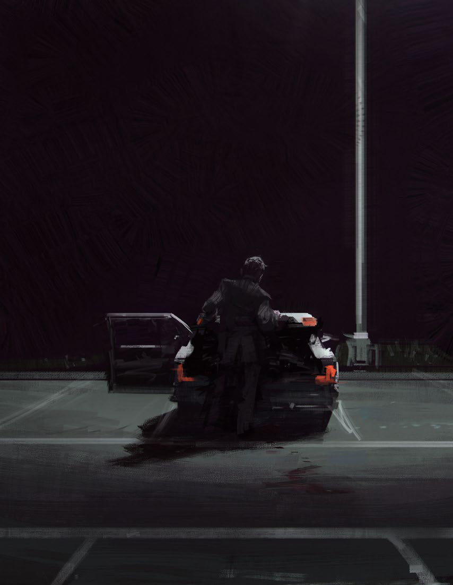

S A B B AT: T H E B L A C K H A N D

8 7

V5-Sabbat.pdf-renegadegames.com-#a11397-103

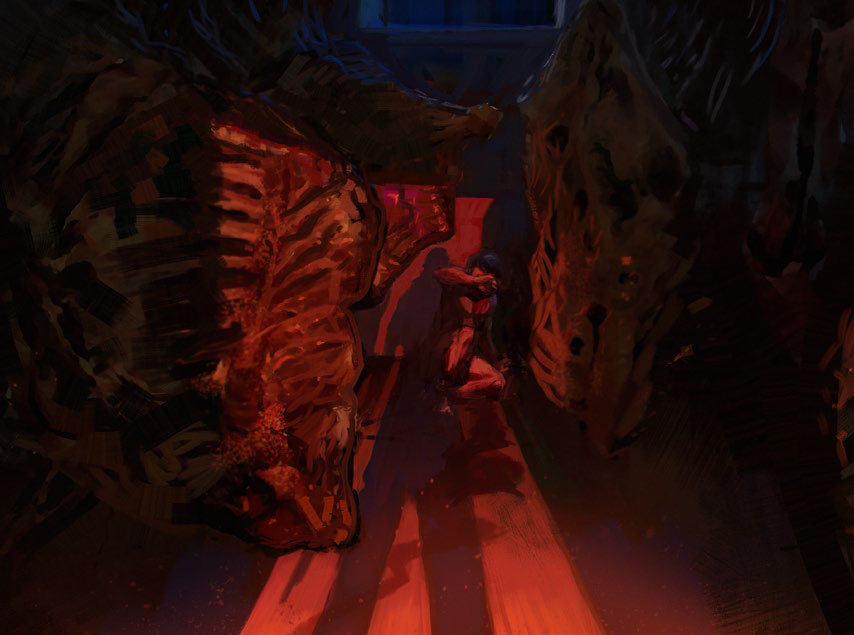

Chapter Three: Burn Brightly

Cleaner
Inevitably, things get messy and it's someone’s job to 
take care of it. That’s the cleaner. Duties range from 
scrubbing the scene of a massacre before the mortal 
authorities arrive to hunting the victim of a botched 
feeding to their home (and burning it down for 
good measure) to rounding up witnesses to a Rite 
that got out of hand.

tracks, but redirect them toward the opposition. 
This role is less common among Devourers and 
Unifiers, as both usually bully ghouls or as-yet-un-
proven recruits to deal with these inconveniences.

IN STORIES: 
If encountered, the cleaner has no time for this 
bullshit. If they risk being spotted by other vam-
pires they are likely to lay low, cunningly waiting for 
an opportunity to pin the present mess on whom-
ever’s careless enough to step in it.

Usually left to the youngest shovelheads of the 
pack, cleaner duty can also serve as hazing or as 
punishment. Some packs even rotate the duty, and 
no few Cathari are known to make debased sport 
of it.

Scholar
A rare few Sabbat vampires make themselves use-
ful not through their ability to engage with others 
(living or dead) but their aptitude for research and 
learning. Depending on the goals of the Pack they

Despite the ignominy of the task, packs blessed 
with a clever cleaner are not only able to cover their

8 8

V5-Sabbat.pdf-renegadegames.com-#a11397-103

S A B B AT: T H E B L A C K H A N D

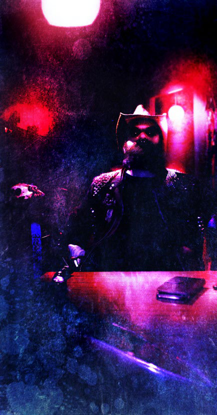

can be dedicated strategists relaying information to 
and coordinating an assault on an Elysium gather-
ing, translators holed up in reeking bunkers poring 
over pre-Akkadian architectural designs, or Blood 
Sorcerers on call for wardings in hostile territory.

Rarely encountered on active duty, the scholar’s 
role has myriad incarnations, from de-facto leader 
to a ridiculed Poindexter savant. Some Necronomist 
Packs consist of nothing but scholars, though they 
usually share other roles as well.

IN STORIES: 
Kindred encountering Sabbat are more likely to 
run into the creations of scholars than the scholars 
themselves, either in the form of the rest of the 
pack acting on their intelligence or by falling into 
any number of traps or stratagems, supernatural or 
otherwise. If cornered, scholars tend to have machi-
nations in place that yield them a quick final death, 
taking as many enemies as they can with them.

Procurer
From pimps and fixers to smugglers and engineers, 
dedicated procurers are the closest thing the Sabbat 
has to logistics. Examples include honey-tongued 
Cathari dealers, snatch-and-grab Noddist plunder-
ers, and despotic Unifier gang lieutenants. Only the 
Reapers can afford to ignore this job, and they often 
rely on servants or creations for most of their needs.

Since a procurer’s “goods” are just as likely to 
need to breathe as sit quietly on store shelves, many 
procurers are also adept at dealing with mortals, as 
most packs understand the value of a being behind a 
locked door before the screaming starts.

IN STORIES: 
Dealing with vessels and vendors, procurers are 
often in a position to make unlife difficult for 
Kindred wanting to minimize mortal involvement. 
If confronted, they have no problems sacrificing 
erstwhile goods to gain the upper hand, and being 
streetwise by necessity, they’re usually one step 
ahead of anyone who decides to ignore collateral 
damage. ■

8 9

V5-Sabbat.pdf-renegadegames.com-#a11397-103

Chapter Three: Burn Brightly

9 0

V5-Sabbat.pdf-renegadegames.com-#a11397-103

S A B B AT: T H E B L A C K H A N D

Chapter Four:
the gehenna

war

Satan's successes are the greatest when he appears

with the name of God on his lips.

— MAHATMA GANDHI

A Brief and Dirty 
History of the Sabbat
S

else has remained consistent about the Black Hand 
throughout the intervening centuries, this vicious 
fact has.

Blood and Fire

o far as anyone can remember, the Sabbat 
emerged from the fires of the (first) Inqui-
sition. Thus, the grand irony of Second 
Inquisition-era hunters being the most 
successful against the Sabbat, of all the sects.

Early in the 13th century, the Catholic Church 
began the Albigensian Crusade with the goal of 
destroying a mortal heresy. But in the course of 
exterminating what is tonight a barely remembered 
mortal religious movement, the Church uncov-
ered the truth of vampirism. Of course, legends of 
blood-sucking undead creatures had long been a 
part of every culture’s folklore, but the reality of 
an entire hidden conspiracy of such creatures who 
secretly preyed upon flocks from the shadows was 
something else entirely.

Prior to the Sabbat as a recognized sect, esbats of 
vampires — little more than localized cults, really 
— had adopted their own ways of dealing with the 
Beast. Before, or perhaps in parallel to the mutual 
understanding of humanitas, these dire broods did 
what they could to temper the urges of the Beast 
and codify an understanding of what vampires had 
become upon receiving the Embrace.

The Church responded with the creation of the 
Inquisition — the “First” Inquisition, in light of 
modern developments — which the Pontiff charged

None of these early esbats had any sympathy 
for the mortals upon whom they fed. If nothing

9 1

V5-Sabbat.pdf-renegadegames.com-#a11397-103

Chapter Four: The Gehenna War

Anarchs Revolt

with rooting out and destroying vampires and 
other supernatural monsters wherever they might 
be found. And for a time, the Inquisition was very 
good at its job.

By the end of the 14th century, young vampires, 
incensed at their callous mistreatment and fearful of 
being sacrificed to the Inquisition, rebelled against 
their sires. These Anarchs, as they had been termed 
by the fearful elders, rebuked the self-serving cus-
toms of their sires. In what became known as the 
Anarch Revolt, childer destroyed their sires, drank 
themselves delirious on the heartsblood of elders, 
and plunged many domains into upheaval. What-
ever local order had passed for Kindred society prior 
to the Inquisition teetered in the balance as the 
Anarchs rejected the ways of their sires. As domains 
burned, it may have been inquisitors or Anarchs 
who had hurled the torches — or both.

So good, in fact, that the Cainite elders of 
Europe were soon in a panic as a reactionary terror 
engulfed Europe and even the oldest and most pow-
erful Kindred were dragged from their resting place

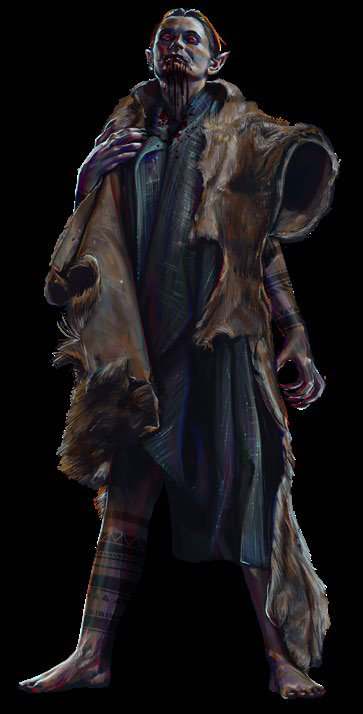

to meet the torch or the sun. In

their desperation to survive,

many elders sent out their own

offspring to meet final death

in their stead, using Blood

Bonds and super-

natural powers

to compel

their own

childer to

The prevailing myth is that the Anarch Revolt is

fight the 
Inquisi-
tors while the 
sires vanished 
into the shadows.

largely a European development, but that is

not the case. Certainly, the Anarchs had thrown

Europe into turmoil, but domains as far-flung as

Kyiv, domains that had belonged to the Seljuks

and before, and even the kingdom of Alodia, all

Some elders even

witnessed a contemporaneous revolt.

engaged in mass

Embraces to

protect them

against the

Elder attitudes regarding the Anarchs to be a mere 
annoyance changed precipitously when the founda-
tions of the Blood Bond itself came under fire. Its 
precise origins have been lost, but the prevailing 
wisdom suggests that Blood Sorcery proved the 
foundation for Vaulderie, a ritual by which Kindred 
could shatter Blood Bonds. Whether it originated 
with the Tzimisce koldun of the Carpathian do-
mains, in the sorcerous alembics of the Tremere, or 
from high Alamut no longer matters. Almost over-
night, the merciless cudgel upon which sires could 
rely to bludgeon wayward childer into submission 
had vanished.

Inquisition,

a precursor 
to the shov-
elhead tactics 
of the modern

Sabbat. Neonate

vampires of all 
clans met final

death while their

sires fled, hid,

or called upon

their mortal

influences to

Like the inquisitors’ fires, the Vaulderie spread 
from domain to domain, among the furtive esbats 
and the unbound Anarch alike. Now free of their 
supernatural enslavement to their sires and tied to

survive.

9 2

V5-Sabbat.pdf-renegadegames.com-#a11397-103

S A B B AT: T H E B L A C K H A N D

But not all. The next night, Anarchs rampaged 
against the city of Silchester as part of an intentional 
violation of the Masquerade. Marauding Anarchs 
and esbats were joined by Kindred who had been 
marked for death for their transgressions.

one another by unshakeable bonds of loyalty, the 
latest generation of Anarchs swiftly became an even 
more immediate threat to vampiric society.

Not long afterward, a spate of tales regarding 
destroyed Antediluvians rallied the Anarchs across 
Europe, the Levant, and northern Africa. Rebel-
lious childer claimed to have destroyed numerous 
Ancients, with the Lasombra and Tzimisce Ante-
diluvians purportedly the first to fall. At the time, 
though impossible to corroborate, the apparent 
destruction of the numerous Antediluvians elevated 
the status of the Anarchs even as it marked them as 
kinslayers in the eyes of a burgeoning conspiracy of 
elders who planned to bring the entire insurgency 
to heel.

The mortal survivors of Silchester described the 
attacking vampires as “sabbats of devils and witch-
es,” and the Cainites who participated seized upon 
that description to christen their new movement: 
the Sabbat. The notoriety — even infamy — of 
the bloodbath after the Convention of Thorns saw 
vampires from domains beyond count reject the old 
order of this “new” Camarilla and declare for what 
they were. And where the cowards of the Camarilla 
would hide behind their Masquerade and the veneer 
of false Humanity, the Sabbat would become the 
monsters that all Cainites were meant to be.

From the Ashes of  
the Revolt

Enlightenment in Blood

Despite its rising momentum, the Anarch Revolt 
ultimately faltered. A network of influential elders 
orchestrated a counter-rebellion, unsurprisingly 
using the very advantages under their sway that 
the Revolt had cast into stark relief. According to 
some sources, the elders even stoked the fires of the 
Inquisition itself, using it to burn down the havens 
of Anarch packs that had emancipated themselves 
via Vaulderie.

What had originally began as parochial cults of 
monstrous self-worship eventually emerged as some-
thing much more fearsome: a set of wholly vampiric 
outlooks that their undead followers observed 
with a nigh-fanatical zeal — because their survival 
depended on it.

Given the domineering Camarilla’s choice to ex-
alt lineage as the primary expression of a vampire’s 
character, the Sabbat instead rallied to these Paths 
of Enlightenment as its own declaration of virtue. 
One’s clan and lineage meant nothing to monsters 
attempting to build a world of eternal night in 
which mortals would rightly fear their blood-drink-
ing masters.

The organizers of the counter-revolution formal-
ized their conspiracy as an aristocracy of the night, 
a potent camarilla against rebellious fledglings and 
the medieval ritualism of the esbats. The conflict 
officially ended with the ratification of the Conven-
tion of Thorns in 1493. Most of the Anarch leaders 
present signed onto the peace treaty and acknowl-
edged the primacy of the Camarilla.

As the conflict between Path-driven packs and 
traditional domains stretched into the 16th century, 
Sabbat packs took up the cause not only against the 
Camarilla proper, but against that central tenet of 
Kindred society, the very notion of clans.

If those terms - officially, ratification, convention, 
primacy - sound weighted, well, there's a reason    
  for that. When you name yourself overtly after  
 the conspiracy you assembled to excruciate the  
  righteous....

Indeed, not only did the Sabbat reject clans, but 
the founders of the clans, the Antediluvians them-
selves. By the mid-16th century, the Sabbat — albeit 
as a decentralized confederation of esbats — had 
declared itself the champion of a pogrom against

9 3

V5-Sabbat.pdf-renegadegames.com-#a11397-103

Chapter Four: The Gehenna War

might, largely out of greed and complacency, the 
Sabbat found new purpose heralded by the omi-
nous rise of the Ancients.

those who had strayed from the virtues of Caine, 
the Dark Father.

From the Camarilla courts of Europe into the 
domains of the Ashirra and beyond, through the 
desperately defended mountain territories of the 
lands past the mountains, fire lit the night skies and 
elder heartsblood flowed again through the veins of 
insurgents. The rites of the packs and esbats stirring 
them to fervor, that most ancient of wars had new 
zealots prosecuting it.

The Gehenna War exacts a high cost, however. 
Domains that had been claimed by the Sabbat, 
from the Old World to the New, fell, or were 
actively abandoned as the Black Hand rallied to its 
apocalyptic call. Mexico City, Detroit, Madrid, and 
even New York had once been considered “Sabbat 
domain,” as had any number of other territories, 
but all of that burned away like so much chaff as the 
sect’s actual purpose hauled itself from its millen-
nial tombs, threatening to devour the entirety of the 
Damned.

The Beginning of the  
End of the World

Those who consider the situation wisely 
describe the Sabbat as having a sort of “hollowing-
out” since the Gehenna War ignited. Many Sabbat 
elders and ancillae heard the Beckoning and took 
up arms against the Antediluvians, while others 
demonstrated a fundamental cowardice by tak-
ing shelter among other sects, leaving a great many 
young Cainites without the structure that had 
existed in the Sabbat prior. Those few elders who 
hadn’t heeded the Beckoning turned the rest of the 
sect toward the inevitable conflict — and many of 
them subsequently vanished, whether as casualties 
or into other fates remains unknown.

From out of this crucible of the inquisitors’ fires 
and through the terrifying evolution of the Paths 
of Enlightenment, the Sabbat has ever been at the 
forefront of conflicts beyond counting. Intervening 
centuries saw petty gains here and Sabbat domains 
established there, but little to merit what the Sabbat 
tonight would consider accomplishment.

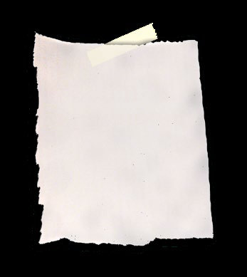

I contend that the glorious

Black Hand in fact made great

gains during these neglected

centuries, but that we squandered

Tonight, the Sabbat situation is one of despera-
tion, but a desperation that many of the sect either 
do not perceive or are unwilling to acknowledge. 
Spread out over three geographically disparate war 
fronts and two different theaters of retreat, the Sab-
bat has had to radically redefine its methods and tac-
tics on the fly. No longer content to “hold domain,” 
the Sword of Caine has become an active, guerrilla 
force. And even though its holdings are fewer and 
its Cainites probably less in number, the Sabbat has 
spread out its influence over a greater area than ever 
it has before.

the resources they yielded. There is

no shame in  eschewing the illusion

of empire, however. Let the Camarilla

Princes and Anarch Barons dance

to each other’s orchestras. Those

lesser, worldly claims will wither.

Ours is not to sit on thrones and

extract tithes - ours is the dominion

of the Dark Father.

That all changed as Gehenna dawned. As first the 
elders and then their ancilla progeny heard the Beck-
oning, and readily heeded its entreaty. Unlike the 
Kindred of other sects, who resisted as much as they

9 4

V5-Sabbat.pdf-renegadegames.com-#a11397-103

S A B B AT: T H E B L A C K H A N D

SITREP: The Gehenna War

Walking between life and death is the least of our dark gifts. We are the gods of

this world and we have left it in the hands of the least worthy for far too long.

— OZYMANDIAS, PRIEST OF THE PATH OF POWER AND THE INNER VOICE

An Empire of Blood

The Gehenna War is the latest incarnation of the 
500-year war the Sabbat has waged against the 
pawns of the Antediluvians. While the Camarilla 
is often still the primary target of the Sabbat’s ef-
forts, the Sword of Caine sees all who forsake the 
Vaulderie as potential tools in the service of the mas-
ters of Gehenna. The Anarchs were long regarded as 
potential converts to the cause, but in the modern 
nights they’ve shown their true colors as shortsight-
ed opportunists, eager to supplant the Ivory Tower 
but not willing to make the sacrifices necessary for 
true freedom.

Since the first compilation of the Book of Nod, what 
is tonight known as the Middle East has long been 
supposed as the origin point of the Cainites. When 
the Gehenna War went hot, little doubt existed 
among the Brothers and Sisters in Caine where they 
should seek the Blood of the eldest vampires.

It quickly became clear to the Sword of Caine 
that not all Noddist texts could be trusted as a map 
to unearth the Antediluvians, and that servants of 
these secret masters had the resources and time to 
bury their secrets wherever they wished. Almost 
as soon as it had started, the Gehenna War spread 
to distant locations across the Earth as the Sabbat 
pursued the clues wrested from the consumed souls 
of countless elders.

Now that the Black Hand has taken the fight 
directly to the sleeping Ancients, the veil has parted. 
Many in the Sabbat believe the Camarilla and 
Ashirra had long been secretly united in service 
to the Antediluvians, but that the losses of the 
Gehenna War forced that union to the fore. As the 
Gehenna War continues, many Sabbat in its central 
conflict zone believe the seemingly aloof and uncon-
cerned Ashirra to be less a sect of Muslim vampires 
and more akin to a devoted cult of ancestor-wor-
shippers.

While the Book of Nod remains a sacred collec-
tion of documents to many within the Sabbat, the 
realities of the Gehenna War have led to various 
manuscripts being regarded as having different de-
grees of authenticity. A few Sabbat even suspect that 
the scholars who compiled the original text may 
have been under the sway of the Antediluvians and 
that some of the clues within subsequent texts may 
actually be clever traps and bait versions designed 
to shield the masters of Gehenna from the Sword of 
Caine’s wrath.

For generations the Ashirra sat idly as the Cama-
rilla and Sabbat clawed at each other through mor-
tal pawns in Ashirra domains in the Middle East, 
North Africa, and the Balkans. It was only when 
the Black Hand began to unearth the secrets of the 
ancestors that the Beckoning first claimed the elders 
and Ashirra Kindred decided to intervene and risk 
their own Blood.

An Eternal Struggle
Although diablerie and murder are the Sabbat’s 
preferred tactics in waging the Gehenna War, packs 
still recognize the need for subtlety in pursuit of 
their greater goals. Centuries of fighting elder influ-

9 5

V5-Sabbat.pdf-renegadegames.com-#a11397-103

Chapter Four: The Gehenna War

already chipped away at their anachronistic founda-
tions, position themselves to swallow both rivals 
whole.

ence has taught the Black Hand that spilling blood 
alone won’t see them to victory and freedom. The 
Ancients are masters of deception and misdirection.

Even hunters have a role to play in this last act of 
creation. Many Sabbat, notably among the remain-
ing elders of the sect, regard the return of the Burn-
ing Times as a failsafe created by the Antediluvians. 
This particular line of conspiracy thinking posits 
that the Antediluvians have actually orchestrated 
the Second Inquisition through their Camarilla 
pawns to make use of mortal power in their efforts 
to hold the Sabbat at bay long enough to complete 
their preparations. Histrionic, to be sure, but 
understandable, given the paranoia that prosecuting 
centuries of the Eternal Struggle wreaks on Sab-
bat identity. Younger minds than theirs buy into 
stranger things.

The Camarilla wasn’t just a tool to prepare the 
world for Antediluvian conquest, it was an easy 
target for their enemies, a stalking horse that would 
not only reveal threats to them, but occupy and 
exhaust them until it was too late. While the Sabbat 
and Camarilla clashed over insignificant scraps of 
territory in Boston and Berlin, the night of Gehen-
na inched ever closer.

By refusing to accept and repeat this tired cycle, 
the Sabbat has changed the rules of the game and 
the masters of Gehenna have scrambled to move 
their pieces to follow suit. They have pulled the 
puppet strings taut and the elders have jumped to 
attention. The Camarilla has all but ruined its pre-
cious Masquerade in its death throes and the mori-
bund Ashirra suddenly finds common cause with its 
historic rival, while the emboldened Anarchs have

The Moonlit Jasmine Field
In the terms of eschatology and Sabbat faith, the 
Gehenna War is the Sword of Caine’s last chance 
to make sure the chains of Blood they broke so 
long ago are never reforged. Complacency and 
dull thinking had led them to the edge of ruin by 
wasting centuries in pointless territorial war against 
the straw-men of the Camarilla and in courtship of 
wayward Anarchs.

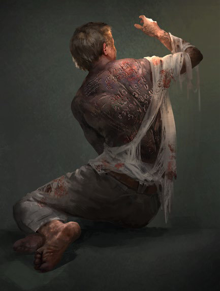

Perhaps Gehenna is inevitable and the promise 
of creating a world based on Caine’s vision of open 
vampiric rule will never come to pass. But as Caine 
would take no compromise or half measures, nei-
ther will the Sabbat who proudly proclaim his name 
as Cainites.

When it can, the Black Hand feasts on blood 
that flows back millennia, kindling dead memo-
ries in hopes of glimpsing a god’s weakness, no 
longer concerned with titles and petty differences 
in doctrine. In addition to fighting the catspaws 
of the Ancients, the Sword of Caine seeks to pierce 
the sublime threshold that separates them from the 
masters of Gehenna, and ultimately claim apothe-
osis.

The Gehenna War is the Sabbat’s redemption 
and sacrifice in the face of the impossible. One way 
or another, they will be free.

9 6

V5-Sabbat.pdf-renegadegames.com-#a11397-103

S A B B AT: T H E B L A C K H A N D

Mexico City

Look sharp, people.

Camarilla Kindred, hear me when I laud 
you as proud and deserving alcaldes 
laying claim to domains that shall be 
the glittering jewels in the crown.

Fresh intel this morning. Something 
weird to start your day.

Those persons of interest who Gutierrez 
and Marzouk have been keeping an eye 
on? Mexico City PD turned up positive 
on all of them.

Twenty-one million mortal vessels! 
Savor the prestige of dominion over 
twenty-one million mortal vessels.

Why on earth would the locusts of the 
Black Hand abandon such a prize? To 
say nothing of the roistering Anarchs, 
claiming what they will, clashing 
shamefully with the scions of our es-
teemed lineages. A revolt to be thrown 
down before it tarnishes that nighted 
crown.

Yeah, I know, good job, high-fives all 
around. That’s not the weird part, Mar-
zouk actually getting something done.

Weird part is that the positive IDs on 
them all match descriptions of known 
deceased. Even you should know that’s 
fishy, Hines, and you’re the worst god-
damn detective I’ve worked with in all 
my thirty years.

Their folly is our fortune.

—–– 
Opportunity!

Anyway, I’m going to turn it over to 
Agent Blunt of— Special Affairs Di-
vision, is it? Podium’s yours, Agent 
Blunt.

That’s a word we don’t hear enough as 
Kindred. Opportunity! We don’t hear it 
because it’s not often granted to us. 
The Camarilla won’t give us an opportu-
nity. And we won’t wait for it because 
it’s never coming from them. That’s 
what makes us Anarchs.

—––

how quickly the flies plunge themselves 
into the spider’s web

beware, little flies, for the silk-spun 
bundles spread throughout the web hold 
the remains of guests the spider wel-
comed before you

But the Sabbat has given us an opportu-
nity here. They run off to fight their 
war, their Gehenna War, and look at 
what they leave behind. Opportunity.

the silk conceals fleshweld
the silk conceals shackled
silk stocking
silk stalking
we spin silk
we dead

You want to set yourself up in luxury? 
Now’s your opportunity. You want silk 
sheets and fancy cars and vessels so 
hot they’ll make your dick hard even 
though you’re dead? You do it. You say, 
“Polanco is mine. All of Miguel Hidalgo 
is mine.” You take it, you back it up, 
you have that opportunity.

sticky strands suspend the spires of an 
ivory tower above the shadowed streets 
of those who would set themselves apart 
by stealing a circlet and singing sov-
ereignty

I have that opportunity, too. You want 
El Pedregal? You gotta take it from me. 
Hell, I might come take Polanco, too, 
while you’re drinking that hot young 
blood. Point is, the opportunity’s 
there.

how many pits seal slumbering stalkers 
— a score or more

each strand of the web, invisible, but 
carefully laid

Black Hand can go fight old dead things 
for a thousand years if they want. Me, 
I’m going to take this opportunity.

just because the fly does not see the 
spider does not mean the web is for-
saken

—––

9 7

V5-Sabbat.pdf-renegadegames.com-#a11397-103

Chapter Four: The Gehenna War

Brazil: Civil War

Yeah, I used to run with the Sabbat. 
Well, not exactly with. Hauled my ass 
out of the Creation Rites, but got 
knocked into the dirtnap pretty quick 
afterward. When I woke up, everything 
was different. I just laid low and hung 
around at the edges. Gotta be careful. 
Still, things are changing fast, and 
the nail that stands up gets hammered 
down. What year is it? I guess I’ve 
been undead undead undead for maybe 50 
years or so.

While the Priests and Bishops were set-
ting the trap, no one paid any atten-
tion to— look, no one was cleaning up 
after all the fallback actions or from 
the mass-grave time bombs the Black 
Hand left in its retreats.

Let me be honest: It’s crawling with 
thin-bloods here. Usually these fucks 
stay dormant in their graves or end up 
getting themselves torn apart by Be-
ing oblivious to what’s going on, but 
it’s different here now. They’re running 
some Cult of the Sun or some nonsense 
and they’re putting the Bite on “Broth-
ers and Sisters” they’re supposed to be 
working with to fuck over the Grand-
marilla and to kick the Anarchs into 
line.

Whole place used to be a battle-
ground between the Sabbat and Camaril-
la. Rio, São  Paulo, Brasilia, you name 
it. Ever since the Sabbat gave up that 
shadow war, trying to play against the 
Ivory Tower on its own terms, the Cama-
rilla has moved in with a vengeance.

Don’t get all worked up, I don’t want 
any part of any of it.

Don’t think of it as lost domain, 
though. That shit’s a sucker’s game. 
That’s how you get stasis, endlessly 
thinking about how to push that pretend 
territory line further out, or who’s 
trying to push yours back.

But to hear them tell it, they’re 
tired of being fucked over. They’re 
tired of being abandoned or being the 
canaries in the coal mine, and they 
know just what kind of Blood is down 
here for the taking and they don’t care 
who they take it from.

Look at what matters: This is one of 
the original cradles of civilization. 
You’d shit blood for a week if you knew 
how many elders have gone to ground 
here. How all those Camarilla courts 
filling in the vacuum are just more 
tools of the Eternal Struggle.

It’s bad, man. Lines’ve been drawn. 
Gauntlets’ve been thrown. You got vam-
pires with death magics beyond the ken, 
and while you’re trying to put them 
down, here come about fifty ravening 
Sun-worshippers taking your kill from 
you or dumping BOPE and C Op Esp into 
the hunting grounds, fucking up the 
process.

That’s what the Sabbat’s here for. 
Fuck them all up, burn it all down. 
Don’t try to hold the castle — yield 
the castle, and then when the enemy 
runs up their own flag, they spring the 
trap.

Can’t make any sense of it. They want 
the same things every Lick does, they 
want it the same way we want it. Some 
Sabbat even try to work with them, or 
at least with those who realize they’re 
Brothers and Sisters, too. But there

Should be simple, right? The ol’ 
bait-and-switch. Mouse takes the cheese 
and you zap them with the current.

Turns out it’s not so easy down here.

9 8

V5-Sabbat.pdf-renegadegames.com-#a11397-103

S A B B AT: T H E B L A C K H A N D

seem to be a lot of them — a whole lot 
of them — who don’t want to do it any 
way other than their way, and they don’t 
think twice if you get in their way. 
You’re a price that can be paid, whoever 
you are, Sabbat or whatever else.

“Sword of Caine.” There’s the big shots 
on one end, who don’t want to risk 
their stake. On the other end are a 
million and one of these Sun Cult fire 
ants — they keep making more when you 
can’t see them. Then there’s the foot-
soldiers, the glorious “True Sabbat!” 
The ones who are supposed to be do-
ing all the dirty work and setting the 
fires and tearing down the towers, but 
really they’re getting pinched between 
the fire ants and the pulpit.

Ants, man. Fire ants will take down a 
dog. One ant doesn’t matter. Enough of 
them, though, and it’s done. Never mind 
the cities — once you get off the high-
level maps? The in-between places? It’s 
all thin-bloods. Some places they out-
number the kine, I swear to God. Turn 
entire towns into factory farms. Broods 
of ’em. Families.

And they are fucking tired of get-
ting pinched.

I don’t give a fuck who the fire ants 
say they are, I just keep my head down 
and move on. But I know what they’d do 
to me. Happened all up and down the 
coast just a few weeks ago.

Bishops don’t want to touch them, 
though. Don’t want to crusade against 
their own.

I figure there’s some comfortable 
fucking Bishops out there who gave up a 
lot in the past couple of decades and 
don’t want to lose what they’ve built 
back up, that’s what I say.

Kill or be killed, that’s what the 
Sabbat is. Killing their own, whether 
it’s for the Dark Father or Here Comes 
the Sun. Makes it real hard for a Lick 
like me to get by.

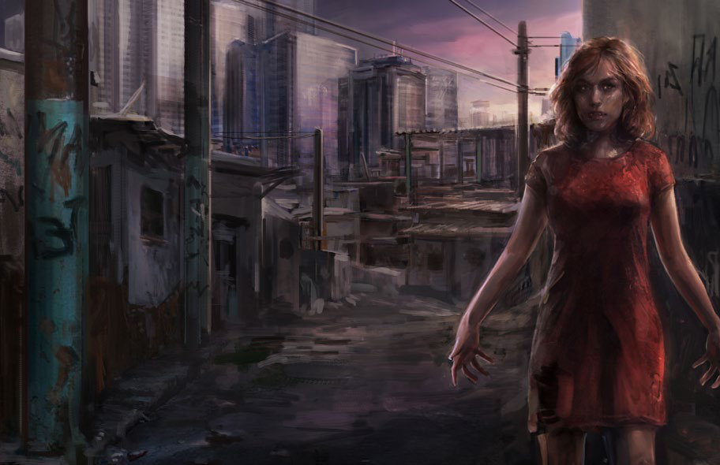

And that makes it what it is down 
here. There’s no “Sabbat.” There’s no

9 9

V5-Sabbat.pdf-renegadegames.com-#a11397-103

Chapter Four: The Gehenna War

Russia and the Baltics

To the Undisputed Baron of Whatever You’re Calling the Domain 
Tonight:

Been following up on that request for more info on Licks Un-
known we talked about a few months ago.

Sorry this took so long. Mistakes were made. Let me explain.

Contacts in Kyiv, Tallinn, and Riga were watching the same 
thing we were. Spikes in "itinerant Kindred" populations 
through late summer all the way through autumn, and with 
those spikes an uptick in domain violence. No reason to sug-
arcoat it; Riga got hairy for a while, not that I give a shit 
when some Camarilla court gets gutted. That’s nice smoke to 
see.

Back to the point, though.

We thought they were fellow Anarchs following mortal pat-
terns of refugee migration. That was mistake number one. They 
weren’t. Those Licks were migrating, all right, but not how 
we assumed they were.

A few fellow veterans from the Yugoslav disintegration con-
firmed some of the iconography of that era still being used 
that we saw moving through airports and other transpo cent-
ers. Black hands, fire symbols, variations on folk-magic sym-
bology.

And numbers would swell between security checkpoints. Eight 
moving up through Bucharest, twelve observed in Moldova as 
part of the same group, twenty-plus by the time they got to 
Odessa, but still the same group.

Sabbat, filling ranks.

And you know as well as I that they don’t just "pick up" 
Kindred here and there. If there were twenty by Odessa, who 
knows how many they’re leaving behind them, still buried, 
ash, or sleepers?

Usually that means somebody’s about to wake up for the night 
facing a crusade. Nobody’s an expert on this shit, but Sabbat 
don’t Embrace for love or loneliness. They Embrace to ram-
page.

Mistake number two: not a crusade, despite all evidence to 
the contrary.

By this point, we were biting our nails. Who’s the target?

The alternative media following in the path of this is a 
nightmare to cover up. We can keep it out of the newspapers

1 0 0

V5-Sabbat.pdf-renegadegames.com-#a11397-103

S A B B AT: T H E B L A C K H A N D

and off the news shows, but the shares on social networking 
sites and video archives are graphic and... well, weird. I’ve 
been killing people and drinking their blood for decades, and 
even before that I did a few ugly favors for a few ugly - but 
well-placed - Balkan "influencers," and this is shit even I 
don’t want to see. And you know as well as I do that the more 
distinct it gets, the more hunters’ eyes it attracts.

Then it hits me: it is a migratory pattern, but not a mortal 
one and not a crusade. It’s a retreat. Whatever’s happen-
ing in the Middle East, wherever these Black Hand shitbags 
are chasing the elders who have heard the Beckoning, all of 
the sudden they’re running from something, moving up through 
Eastern Europe to do it, and into Russia.

Remember, though, my Baltic contacts confirm similar movement 
through their regions. So I put the pins in my murder-board, 
and the lines are getting fatter the more they move east, the 
more they pick up membership. And the vector is starting to 
converge.

I have fewer contacts the further east things go, and eve-
rything dries up for me beyond an imaginary angle you could 
draw connecting St. Petersburg, Novgorod, and Donetsk.

Full disclosure, I’ve lost track of them, probably fifty-
strong by this point, and I’m sure this wasn’t a one-off. 
I’m sure other groups are moving as well, but I was too busy 
watching this particular pack to keep an eye open for others.

Mistake number three. It’s not 
a retreat, it’s a pursuit.

They’re chasing something. 
They’re chasing something into 
what looks like it’ll probably 
end up being Siberia.

Or, way worse, it’s already 
there and they’re converging on 
it.

I’m guessing they found some-
thing big. Big and old. Big and 
old and hateful.

We need to figure out what to 
do next. Because I’m not go-
ing to sit around and wait for 
whatever this is to pour hell-
fire on us.

1 0 1

V5-Sabbat.pdf-renegadegames.com-#a11397-103

Chapter Four: The Gehenna War

The Maghreb and Alamut

I cannot but faithfully report what the rafiqs have 
seen, as you have charged me, strange as some of it 
may seem: Alamut is lost.

are the nights of the Second Inquisition, a return of 
the Burning Times.

They have seen the glint of the hunters’ weap-
ons, for they are a prominent force in both Israel 
and the occupied Palestinian territories, and Kin-
dred tread carefully for fear of earning the hunters’ 
attentions. Unsurpisingly, the same funding and 
technology that enforces apartheid and occupation 
has been co-opted by these hunters to track and 
destroy their undead foes. Drones, facial recogni-
tion, IR imaging and AI-driven data collection make 
unlife difficult for those of the Blood to operate in the 
era of the Second Inquisition. Even Fatima will not 
brave it. I must assume that this is true for the Black 
Hand as well, for the fires of the Second Inquisition 
would burn them as readily as we.

It is in the clutches of an Ancient who was An-
cient when the children of Caine were young, a killer 
of killers.

It is in the clutches of a witch with three eyes 
whose vitae enthralls those who partake of it in but 
a single draught.

It is in the clutches of a cult that reveres yet 
dreads the rising of those who have been judged.

I myself have witnessed a single night at the foot 
of the mountain that spanned forty nights, so great 
is the sorcery that girds the fastness above.

Our rafiqs cannot approach; something forbids 
them. But I was among them when the mountaintop 
vanished into darkness and the laughing of dead 
and breathless voices rattled through the foothills. 
The next morning, the village was empty, a dead 
thing in the shadow of the devils’ mountain.

The revered scions among the Ashirra with 
whom I have corresponded insist that Egypt gives 
the blood god of Alamut no succor. And yet, strange-
ly, I see the rituals of the Sabbat in frightening 
parallel to those performed by the Church of Caine, 
which now has a foothold in Cairo. Twenty years 
prior one would not have heard these sermons of 
Caine there. Have the scions of the Ashirra capitu-
lated to the priests of the Black Hand?

I sought traces of blood, wondering that Ur-
Shulgi’s reavers must feed, and even they cannot be 
so precise as to spill not a drop. But not a drop did 
I find. The village was abandoned. I feared to see, 
though, the ceiling of the muezzin’s house, for sooty 
black footprints marred its ceiling, as if some blas-
phemous dance had been performed thereupon.

A single drop of blood on parchment will spread, 
finding minute channels in the surface and rolling in 
rivulets where it finds that resistance quickly yields.

I confess, these awful things frighten me. I do 
not understand them. I do not know what they mean 
or even how they might be accomplished. These are 
the things that would frighten folk of a more super-
stitious time, yet here they are before us.

We have known Alamut has been lost — it is 
the drop of blood from which the growing stain 
emanates. And everywhere we look, the spread is 
revealed. This is a war not only of blood and fire but 
also of the killing of minds.

The way they fight defies the term. How can one 
stand against a foe who tarnishes them, invisibly, 
from within? Until all that is left is a husk, dried 
and folded upon itself? I had learned to expect fire, 
but found instead a place where thought itself had 
become strange.

Not just Alamut bears these burdens. Our ghuls 
range far and wide, even in those places where we 
cannot. In the parlance of others of the Blood, these

1 0 2

V5-Sabbat.pdf-renegadegames.com-#a11397-103

S A B B AT: T H E B L A C K H A N D

The Domain Next Door

W

ell, hell. I survived a Sabbat incur-
sion. Once. That makes me the resi-
dent expert, I guess, since everyone else 
is either smoke on the wind or screaming about a 
Biblical reckoning and drinking the souls of the 
Kindred next to them. So I’ll share what I got, 
but it ain’t much.
	
Most of them are new. They lived, they died, 
and now they’re birthed by fire into a secret war 
against things they never knew existed and the 
only way to stop those imaginary Ancient dead 
things way over on that side of the world is to set 
everything they can find on fire over here.
	
There. That’s their basic training. If they 
think something wants to kill them or enslave 
them, they try to kill it first. And they think 
everything wants to kill or enslave them.
	
It feels like there are swarms of them, but 
I don’t think that’s actually true. There were 
maybe ten of them, back when my thing hap-
pened, maybe? Ten at a time, that is, or close to 
that. Hell, it might have been only a handful. 
They don’t exactly get up when you knock them 
down, they make more. And they didn’t seem too 
particular about who they turned. Just grabbed 
people off the street, screaming, or dragged them 
out of their apartments.
	
Last I dealt with them, they didn’t go after 
the high-profile targets. They didn’t swarm the 
Prince’s mansion, They didn’t touch Elysium. 
High-profile doesn’t mean high-value for their 
purposes, I don’t think. They’re after value. Bang-
for-the-buck sort of thing.
	
They didn’t need to take down any Pri-
mogen or whatever. They just picked the low-
hanging fruit. Anybody without some kind of

capital-letters title attached to their name, Black 
Hand went after ’em, drank ’em, left the ashes 
someplace someone in their coterie would find the 
mess.
	
I’m guessing it was a hearts-and-minds 
sort of premise. Show ’em that nobody with a 
title cares about ’em. Show ’em that the august 
personages are protecting their own assets and 
doing what the secret masters tell them to do. 
Kindred who want to dance to elder tunes can try 
to weather the storm and they’ll take them out 
drinking.
	
I heard they made some Licks offers. “Come 
join us where you’re not fodder.” Didn’t pass the 
smell test. Vampires who want to join ’em in tear-
ing it all down, they bring ’em back to whatever 
witch-house where they all sleep and they work 
some kind of hex to make you think about secret 
masters and hear elder tunes.
	
If you’re on the fence about them, you die.
	
One thing I noticed, they seemed to stay 
away from cops. Makes sense, but I’m not a 
blood-drenched killer maniac, so who knows 
what they’re actually thinking? I figured Sabbat 
would seek out the cops, but I guess they’re smart 
enough to know it’s not worth it. Nobody wants 
the added attention, and you’ll either end up 
killing them or dragging two decades’ worth of 
Gulf War surplus into the city.
	
Little victories, I guess.
	
How do you fight them? Hell, I don’t know. I 
didn’t survive by standing up to ’em.

1 0 3

V5-Sabbat.pdf-renegadegames.com-#a11397-103

Chapter Four: The Gehenna War

1 0 4

V5-Sabbat.pdf-renegadegames.com-#a11397-103

S A B B AT: T H E B L A C K H A N D

Chapter Five:
storyteller

resources

To a zealot every one of his own sect is a saint, while the most

upright of a different sect are to him children of perdition.

— HENRY HOME, LORD KAMES

I

predictable timing, the more effective they’ll be in 
their function as antagonists. Let them be motley, 
harrowing foes who strike unexpectedly rather than 
bad guys who show just because it’s time for some 
action.

n addition to the setting-focused materials 
presented throughout this book, Storytellers 
can avail themselves of certain techniques 
and tools to heighten the experience the Sab-
bat brings to a chronicle. Feel free to use as many of 
these in your chronicle as you choose, whether you 
want a subtle, off-screen element of suspense or an 
ever-increasing tension that culminates in a bloody 
conflagration.

Setting Element:

Sabbat Domains

Remember that a little goes a long way. The Sab-
bat is presented as an antagonist, and the more play-
ers know about antagonists, the less fearsome they 
become, especially in a horror game in which fear of 
the unknown is a central theme. The following in-
formation is to help provide context to the Sabbat, 
to aid Storytellers in planning setting elements and 
constructing narratives for their chronicles.

It is important to remember that very few Sabbat 
put down roots in any domain, no matter the state 
of those domains. For the majority of the Sabbat, 
movement to the war front or chasing down en-
emies is the sum of being a vampire. Certainly, this 
makes for a difficult unlife, and many Cainites meet 
their end on the move, crossing dangerous territory, 
or in the conflicts of the actual Gehenna War. And 
that’s reflected in much of the mythology of the

Storytellers should avoid heaping exposition on 
players. The more the Sabbat emerges as a collection 
of strange details, horrifying motivations, and un-

1 0 5

V5-Sabbat.pdf-renegadegames.com-#a11397-103

Chapter Four: The Gehenna War

Surge

Sabbat, from its own self-image to the harrowing 
reputation it has among the other sects. Whether a 
relentless scourge or a biblical plague of locusts, the 
Sabbat is always on the move in some capacity.

Domains in surge see the Sabbat rapidly bolstering 
its numbers with increased shovelheading efforts. 
These domains see a massive but brief uptick in vio-
lence, which can’t help but bleed over into mortal 
awareness, and just as quickly ceases. These recruit-
ment campaigns are effectively reigns of terror for 
the domains in which surges occur, with packs 
marauding and murdering with wanton abandon, 
effectively kidnapping and brutally brainwashing 
conscripts into the cultic sect, and gorging on the 
victims whose blood is required to sustain a ram-
paging brood of new vampires.

War comes down to logistics, however, and 
even a relentless scourge needs to supply itself, with 
recruits, blood, or other assets. Sabbat domains tend 
to exist in one of three states, based on what the 
sect needs from them at any given moment. Indeed, 
understanding that is key to understanding how 
the Sword of Caine sees the world: little more than 
a resource from which to extract materiel for the 
war against the hated Antediluvians. The number 
of Sabbat domains also isn’t static; domains turn 
over very quickly. The Sword of Caine is more than 
happy to take domains from its rivals, or to wear 
them down through endless conflict and attrition.

Practical — perhaps cynical — elements in surg-
ing domains usually explain away surges behind 
media campaigns decrying civil unrest, political

instability, or other mortal trends, the 
better to avoid unwelcome attention 
from the Second Inquisition and other 
entities savvy to the movements of super-
natural entities. In an era of omnipres-
ent surveillance and Internet-connected 
cameras in every pocket, however, these 
traditional methods are becoming less 
and less reliable, and the Masquerade 
strains to its limit.

STRONGHOLDS AND DOMAIN
Consider that in the modern nights, very few domains might 
be considered solely Sabbat territory. In almost every case, a 
“Sabbat domain” is the Sabbat portion of a contested domain, or 
even a deliberately short-lived occupation of some other sect’s 
territory, such as a surge to shovelhead new recruits. The Sabbat 
chews up domain and spits it out, staying only long enough to 
take what it wants. After that, it’s on the move, following where 
the Gehenna War takes it.

It is telling that the stereotypical 
Sabbat domain propagandized by other 
sects is one in constant, horrifying, gore-
spattered surge. In truth, surge happens 
only in intense “spikes” of a domain’s 
existence — though those are certainly 
among its most memorable times.

For a Storyteller‘s worldbuilding, this grants a great flexibility. 
A city may well be acknowledged as a Prince’s domain or an emi-
nent Barony at the same time it has a Bishop and their retinue 
occupying it, or that a specialized pack has a permanent presence 
in the city as Cainites search for Noddist lore.

Storytellers are encouraged to add Sabbat presence to the 
cities where their chronicles take place as they desire. We don’t 
want to declare “your city” a Sabbat-only city, since the Sabbat is 
presented as an antagonist faction.

In relatively recent history, notable 
Sabbat surges have occurred in Mexico 
City, Kiev, Budapest, Sarajevo, and 
Kansas City.

That said, Sabbat strongholds, even of a (probably semi-) 
permanent nature can exist across the world. A remote village 
besieged as a redoubt, a warfront camp with mortals imprisoned 
as cattle, or a historical site befouled by practitioners of Oblivion 
all have a sense of location that allows the Sabbat to fight its 
existential war.

1 0 6

V5-Sabbat.pdf-renegadegames.com-#a11397-103

S A B B AT: T H E B L A C K H A N D

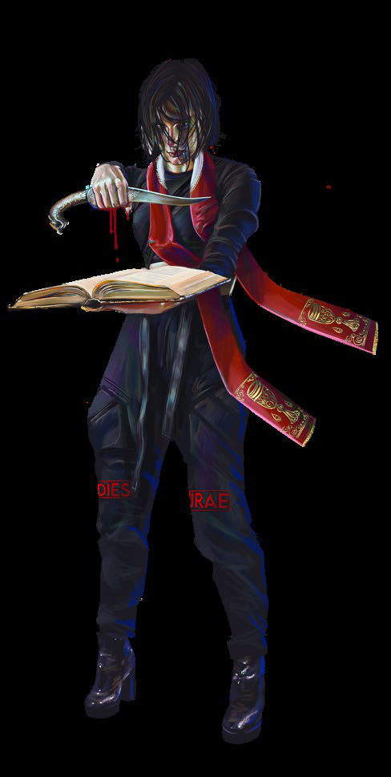

Accord

Domains in accord have exceptionally low Cainite 
populations, as most of the vampires Embraced 
during the surge have moved on to the fronts of the 
hot conflicts of the Gehenna War. Cities in accord 
have vampire populations notably below even the 
average of Kindred-to-mortal ratios. Sabbat pres-
ence in these cities exists mostly for the purposes of 
supporting the war effort or complicating claims 
of praxis by neighbors who might turn acquisitive 
eyes toward them. Few Camarilla luminaries would 
suffer qualms about seizing inadequately defended 
Sabbat territory, and many Anarch Barons have be-
come so by “liberating” Sabbat domains in accord.

In accord, the Sabbat vampires in a given 
domain are usually high-ranking figures in the sect 
hierarchy. In practice, for certain remote domains, 
this can mean literally one eminent Cainite per do-
main, or even a single figurehead claiming authority 
over multiple proximate domains. For example, the 
Bishop of Vilnius or the Archbishop of Lima and 
Cusco, or Archbishop Lucita of Madrid.

The majority of Sabbat domains spend most of 
their time in accord.

Entente

Entente domains are probably the most familiar to 
Kindred of other sects: Numerous vampires of the 
ascendant sect are present, each with some inter-
est or personal holding in which they participate. 
That’s where such similarity ends, as prominent 
Sabbat rarely have subtle and deeply rooted influ-
ence in a domain’s engines of industry. It all comes 
back to the blood for most Sabbat, whose interests 
lie in mortal herds and chattel for when a surge 
begins. Rare are the Sabbat minions deeply embed-
ded in corporate boardrooms, but Sabbat Cainites 
themselves have eyes on the cargo dispatches, 
airports, and docks, and anywhere transient popula-
tions can be easily recruited into the Gehenna War.

For a new Cainite in an entente domain, this is 
where a great deal of Black Hand indoctrination 
occurs. For every sociopathic Sabbat who relishes

1 0 7

V5-Sabbat.pdf-renegadegames.com-#a11397-103

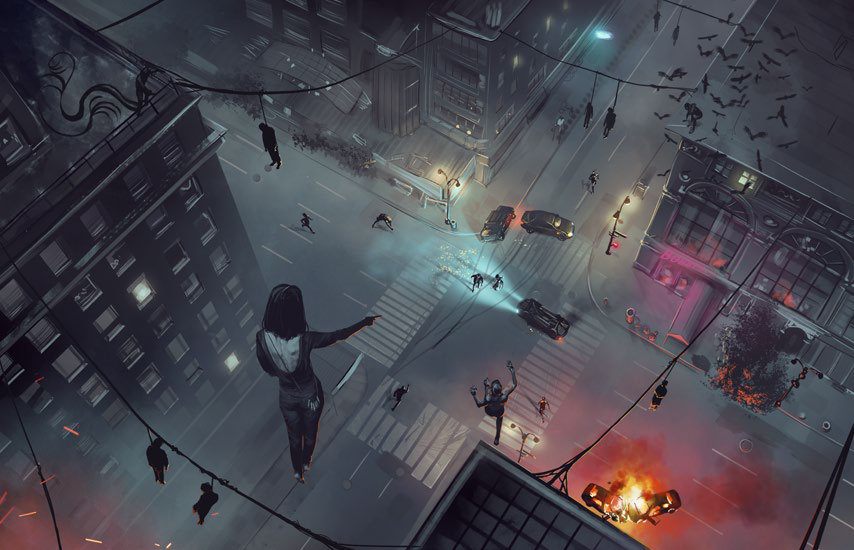

Chapter Four: The Gehenna War

Crusade

abusing the mortals and probationary sect members 
beneath them, there’s a lot of brainwashing, depriva-
tion, and just plain shit-eating during entente that 
quickly dispels the illusions of reigning in Hell. Sect 
hierarchy in domains in entente quickly reveals it-
self for the wicked and degrading deprogramming it 
is. Imagine being the “mighty Cainite” responsible 
for cleaning out the carnage from a pack haven after 
a night hosting a particularly debased ritus.

A crusade is when the Sabbat undertakes an ef-
fort to oust an existing sect presence in a domain. 
Crusades are events, not domain states themselves. 
They’re how the sect takes extant domains away 
from others, generally moving into a state of entente 
after the praxis seizure. This most often occurs 
after a surge in a nearby domain, but in poorly kept 
domains, Sabbat have been known to stage surges 
from within the domain that’s the target of the 
crusade.

Entente sometimes indicates defense against 
some threatening entity, whether a counter-action 
by minions of an Antediluvian, a praxis seizure by 
a rival sect, or even a skirmish against a ravaging 
Lupine. For most Sabbat, though, especially those 
shovelheaded in the midst of the Gehenna War, 
entente feels unbearably idle, putting Paths of En-
lightenment to the test as a restless Beast threatens 
its master’s self-control. The horrible truth is that 
Sabbat domains in Entente tend to tear themselves 
apart unless galvanized into another Crusade. For 
example, the Camarilla was able to wrest the do-
main of New York away from a fractious Sabbat just 
a few decades nigh.

In most cases, a domain under crusade is logisti-
cally important to a Gehenna War hotspot. Wheth-
er near to the rumored haven of a Methuselah or 
Antediluvian, or possessed of resources valuable to 
the war effort, such domains are at parlous risk of 
violence and misery. After all, if the Sabbat is will-
ing to devote time and vitae to usurp a domain, it’s 
obviously important to the war effort, and therefore 
worth the investment to attempt to wrest away.

1 0 8

V5-Sabbat.pdf-renegadegames.com-#a11397-103

S A B B AT: T H E B L A C K H A N D

Story Elements:

hated rival who’s attempting to overthrow the city 
to plunge it into ruin or claim it for themselves. 
From a single, unprepared pack overzealously de-
claring war on a domain to a well-coordinated siege 
waged by a dozen-plus veteran packs, the hallmark 
of Blood and Fire is ultraviolence and the many 
ways in which it can manifest, and how abruptly.

Chronicle  
Structures

This section explores how the Sabbat prosecutes its 
holy war and, most importantly, the ways in which 
players’ characters might run afoul of them.

To the Sabbat, violence is a tool. It’s a proving 
ground for the survival of the most vicious, and 
it's the cudgel that keeps the sect’s myriad enemies 
beaten down. Blood and fire are both means and 
end to the Sabbat.

Notably, Storytellers should feel free to combine 
any of the following approaches, or of course devise 
their own. A full-scale siege may be preceded by 
a tense period of undead spycraft, or the macabre 
discovery of not-yet-active mass graves could tip off 
the chronicle’s Kindred to an impending Sabbat 
effort to terrorize the local vampires before it picks 
up momentum. Remember that a chronicle consists 
of a number of stories, and one story of a given 
type can lead into another story type in the greater 
sequence of the chronicle.

Getting Involved

THE POWDER KEG EXPLODES: The chroni-
cle’s home domain is proximate to the Gehenna War 
front, and the Sabbat wants to wrest the city from 
the dominant sect in order to use it as a redoubt to 
which it can fall back if the war front becomes too 
hot itself. Throwing waves of shovelheads against 
prominent Kindred targets, the Sabbat aims to 
collapse the domain from the top down, hoping to 
break the morale of the rest of the domain’s vam-
pires by showing them how ill-equipped the would-
be elites are to stand against the Sword of Caine.

Blood and Fire

The most obvious way players’ characters might 
discover Sabbat activity is to find themselves in the 
middle of open conflict. For the most part, the Sab-
bat isn’t subtle, and when a Crusade comes to the 
domain (see p. 108), it’s likely to involve all of the 
city’s Kindred and then some. Similarly, if the Sab-
bat is in surge in the domain (see p. 106), the local 
Kindred will likely find a slew of enemies besetting 
them without having to look too far.

HEADHUNTERS: With the city under siege, 
numerous street-level packs vie for glory, observing 
an Ignoblis Ritus (see p. 64) they call “Taking Tro-
phies.” Starting with the domain’s most vulnerable 
Kindred and coteries, the competing Sabbat packs 
are trying to kill their way up the domain’s vampiric 
pecking order, collecting grisly proof of their kills as 
they do so. Depending upon their own accomplish-
ment and status, and how the Storyteller intends 
to pace the story, the players’ coterie may find itself 
targeted early on, or may uncover the ruinous 
remains of less prestigious coteries that reveal the 
presence of the Cainite invaders. Consider, too, the 
dawning horror when the coterie destroys one pack 
and only then learns that there are other packs out 
there, observing the same ritus and pursuing the 
same goals.

The ideological differences between the sects 
underscore the conflict and define its motivations. 
The Sabbat is the enemy because it is the Sabbat, 
and it represents a perversion or a subjugation or a 
burning-down of the veneer of civilization to which 
the Kindred cling. There’s no ambiguity here: The 
Sabbat will readily admit to that position as it wick-
edly commences slitting throats and setting fires.

IN CHRONICLES
Blood and fire conflicts can suit any number of 
chronicles, from a high-action running battle across 
the cityscape to the climax of a story arc pursuing a

1 0 9

V5-Sabbat.pdf-renegadegames.com-#a11397-103

Chapter Four: The Gehenna War

THE ENEMY OF MY ENEMY: Especially 
among young packs, glory-seeking is part of the 
Sabbat experience, and any given Kindred or coterie 
can be prey to two or more packs competing to 
be the executors of their destruction. Given the 
temperament of the Black Hand, there’s no guar-
antee that these rival pursuers won’t turn against 
each other in order to claim the kill. There’s room 
here for a quick-witted coterie to turn competing 
packs against one another, or to have them expend 
their efforts gaining advantage over the other. Then 
again, it’s also possible that the coterie fucks it all up 
and ends up the simultaneous hostage of rival packs 
looking to exploit them for the greatest gain.

IN CHRONICLES
The violence of the Sabbat need not always signify 
an action-oriented chronicle, as with Blood and 
Fire, above. True to the horror themes of Vampire, 
violence can take the form of brutal assault, ter-
rorizing executions, and the animalistic pursuit of 
marked targets instead of a tactical exercise. It can 
be used as a narrative descriptor, such as a fugitive 
Primogen’s humiliation and execution, or a set piece 
in metaphor, such as with a Bishop officiating a 
Blood Feast in a one-time abattoir.

Combat itself becomes staccato and punchy, a 
theater of injury and suffering rather than strategy 
and technique. Fights last three turns or fewer (see 
“Three Turns and Out” on p. 130 of Vampire: 
The Masquerade), and most damage comes in the 
form of victimhood, whether at the hands of a brute 
squad or as a participant in a ritual that leaves the 
Kindred mauled.

Hearts and Minds

By contrast to Blood and Fire, above, the ways of 
Hearts and Minds attempts to break down the 
Sabbat’s opposition by brutalizing those who stand 
against them. The Sword of Caine doesn’t necessar-
ily need to eliminate all opposition — instead it can 
force rival sect members to surrender, flee, or even 
convert to its cause. Winning hearts and minds, 
from the Sabbat perspective, is often a question of 
initiating self-fulfilling prophecy, and it does so by 
demonstrating that other sects’ methodologies are 
insufficient.

Getting Involved

JOIN OR DIE: As the siege overtakes the city, sur-
viving Kindred resist against a backdrop of terroriz-
ing ritae. They experience the breaking of holdings 
they once held dear, the suffering or death of Touch-
stones important to them. The Sabbat intends to 
shatter the will of Kindred who would stand against 
them or, even better, shred the Humanity of rival 
Kindred and introduce them to their own Paths 
of Enlightenment, bringing prestigious veterans 
into the Dark Father’s favor. In a story or chronicle 
with this focus, the test of the relationships among 
coterie-mates will be as compelling a conflict as the 
external Black Hand foes, if not more so.

Following the destruction (and surely diablerie) 
of high-profile enemies, the Sabbat makes a mock-
ery of the domain’s Traditions. What was once an 
erudite salon, Elysium becomes a Grand Guignol 
of Auctoritas Ritae. The opulent havens of pres-
tigious Kindred become communal pleasure dens 
for raucous packs to use until they become too hot, 
and then abandon, discarding all the trappings of 
the debauch. Black Hand kidnappers pit disenfran-
chised childer against their sires, an Accounting 
of the Accounting. The Masquerade itself tautens 
to its breaking point, drawing hunter attention 
to which the Sabbat itself seems heedless until it’s 
too late and then the whole domain suffers for the 
Cainites’ indiscretions — which the Sabbat uses as 
an object lesson in why there’s no sustainable coex-
istence with mortals by cowering in their shadows.

THE RESISTANCE: With the Sabbat indulging 
in a reign of terror, savvy vampires will recognize 
the Sabbat for what it’s attempting to do and go 
down fighting, and perhaps organize ample resist-
ance. Turning the premise of “spiky” violence 
against the Black Hand, the coterie joins or forms 
an opposing force, ambushing Cainites, sabotag-
ing Ritae, and baiting mortal hunters. Of course, 
in response, the Sabbat ratchets up its campaign 
of brutality — the monstrosity will continue until

1 1 0

V5-Sabbat.pdf-renegadegames.com-#a11397-103

S A B B AT: T H E B L A C K H A N D

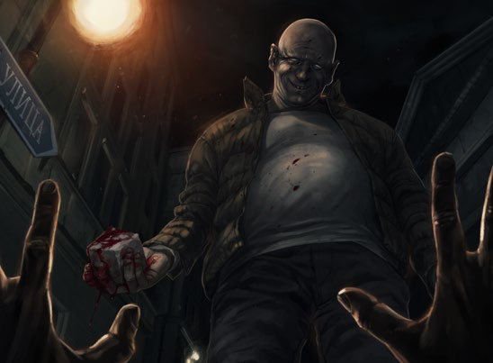

morale improves  — and for 
some vampires, the question of 
whether to endure the misery and 
fight back or retreat to a domain 
that’s not in the throes of torment 
arises. Or do the players’ charac-
ters resist by becoming greater 
monsters than the Sword of Caine 
itself?

KILLING FLOORS: Especially 
in surge or during a Crusade, the 
Sabbat needs blood, and a lot of it. 
While much of the vampire fanta-
sy revolves around the hunt itself, 
meeting needs in such a manner 
in volume can be inefficient for 
the Black Hand. As such, Cainite 
procurers gather victims to slake 
undead thirsts, whether for for-
malized ritae like a Blood Feast, 
or just as dehumanized wartime 
materiel. Unsurprisingly, it’s often easiest to procure 
such vessels from society’s most disadvantaged 
communities: a moral quandary for an individual 
upholding Humanity, but a matter of no concern 
at all for a Path follower. The players’ coterie can 
discover such a cache — literally mortals collectively 
imprisoned to await exsanguination — while inves-
tigating Sabbat activity, or during an active pursuit 
of Sabbat foes. From a derelict meatpacking plant 
where an unscrupulous coyote abandons his cargo 
to a dimly-lit truck-trailer shantytown peopled with 
itinerants and addicts to an hourly hotel adjacent 
to the finance district where sex workers have their 
passports confiscated by the complicit madam, 
these “juice farms” can have many appearances. 
This can be discovered as a preface to the violence, 
yielding an opportunity to do the right thing, or 
they can turn up mid-action or in the aftermath, as 
a coterie pursues a rampaging pack.

Stoking Revolution

The Sabbat has been a revolutionary sect for 
centuries, and arguably more successful at it than 
the Anarch Movement itself. With its message of 
throwing down elder tyranny and breaking apart 
the ossified claims of domain and privilege, Sabbat 
rhetoric in fact sounds a lot like Anarch rhetoric, at 
least until the apocalyptic quasi-religious element 
makes its appearance.

Eroding a sect’s ideological base in a domain 
starts small and grows across a span of years if not 
decades. Tonight some wild-eyed lick no one has 
seen before starts “just asking questions” about a lo-
cal eminence’s rise to power, and in five years it’s the 
Night of the Long Knives for everyone of Eighth 
Generation or below.

Sabbat seducers often initiate their conversion 
efforts among outliers in a domain’s social structure. 
They start with a loner Anarch or a sick-of-it-all 
autarkis who gets them access to a bygone coterie, 
then a prestigious salon or gentrified chantry, and 
before the local Kindred know it, the young ones

1 1 1

V5-Sabbat.pdf-renegadegames.com-#a11397-103

Chapter Four: The Gehenna War

that there’s a real threat, all of a sudden the ancillae 
and elders want to get to the bottom of it.

are seditionists and heretics to the last. To hear the 
established elites tell it, of course.

THE (DIS)LOYAL OPPOSITION: Kindred 
long under the night know that the Sabbat operates 
like a weed, pushing itself up through the cracks 
in the neighborhood domains where the sidewalks 
actually have cracks. Consider their unease, then, 
when one of their own begins with casual refer-
ences to what can only be considered heresy, casting 
aspersions on clan lineages, and even calling for the 
ouster of the Baron herself! And they’re not just 
playing it to shock their fellows: It turns out they 
have plenty of admirers and even followers among 
the riffraff. And now they’re talking about round-
ing up certain mortals into camps so they don’t have 
to bother with individual hunts. When did this 
happen?

IN CHRONICLES
While the propaganda image of the Cainite rebel 
is as a blood-streaked arsonist, Sabbat proselytizers 
are capable of much more nuance than open, fiery 
revolt suggests. Many Cainites are great tempters, 
particularly those whose Paths promise the satisfac-
tion of pleasure or power. Political rabble-rousers 
find audiences for their dissidence in even the most 
traditional domains: One may always find a sympa-
thetic ear among the young, whether they’re disil-
lusioned childer of grasping sires or unruly Anarchs 
who want more decisive action than the Movement 
offers.

The preferred method for Sabbat rebels is gener-
ally to find common ground first, building on the 
sense of injustice the potential sympathizer feels. 
Honeyed words and the exposure of privileged 
hypocrisy go farther than open calls for wanton 
destruction and diablerie — at least at first. Skilled 
dissenters can quickly encourage impression-
able Kindred to throw down their idols, and have 
them chanting Sabbat slogans without knowing 
that they’re championing the ideals of the Black 
Hand. Only then comes the opportunity to pledge 
allegiance to the Dark Father and explore the dark 
mysteries of a Path — after the potential recruit 
has already made themself a public enemy of their 
erstwhile sect’s order.

FORBIDDEN AMARANTH: The greatest of 
Kindred crimes is suddenly en vogue, surely the 
sign of degenerate times. What originally appeared 
to be an epidemic of idiotic neonates testing the 
boundaries of what they had newly become sud-
denly became an authoritative answer to individu-
als’ problems among all ranks of Kindred society. 
Within a few short months, the Kindred population 
of the domain had dwindled by half, with long-
standing domains suddenly masterless and the cruel 
détente of Harpies becoming a single, engorged 
grande dame. At the root of it all — depending on 
who you ask — is either that dirtbag preacher all 
the young licks once seemed ironically enamored 
of, or that wretched Primogen, forever surround-
ing herself in shadow. They’re both reciting poetry 
about “the Finger of God’s own hate” and “taking 
in Caine’s own bloody sacrament.” Something is 
very, very wrong in the domain, and nothing may 
now be able to stem the tide of heartsblood.

Getting Involved

YOUNG RADICALS: Down by the docks, at 
the tawdry end of the Rack, and in the immigrant 
neighborhoods, someone’s stirring up the neonates 
again. These things happen in cycles, and usually 
all it takes is the Sheriff cracking a few skulls or 
the Baron making a few empty concessions to get 
the whelps to pipe down. It’s different this time, 
though. Word has made it back up the chain that 
they’re drinking blood out of weird chalices and 
that one of those neonates, whose sire was just crow-
ing about her ironclad Blood Bond over him at Ely-
sium last month, staked her and drank her dry. Now

Infiltration and Espionage

Before the surges and sieges, before lighting any fires 
or dragging any elders under its fangs, the Sabbat 
knows it needs information. Or, rather, various lo-

1 1 2

V5-Sabbat.pdf-renegadegames.com-#a11397-103

S A B B AT: T H E B L A C K H A N D

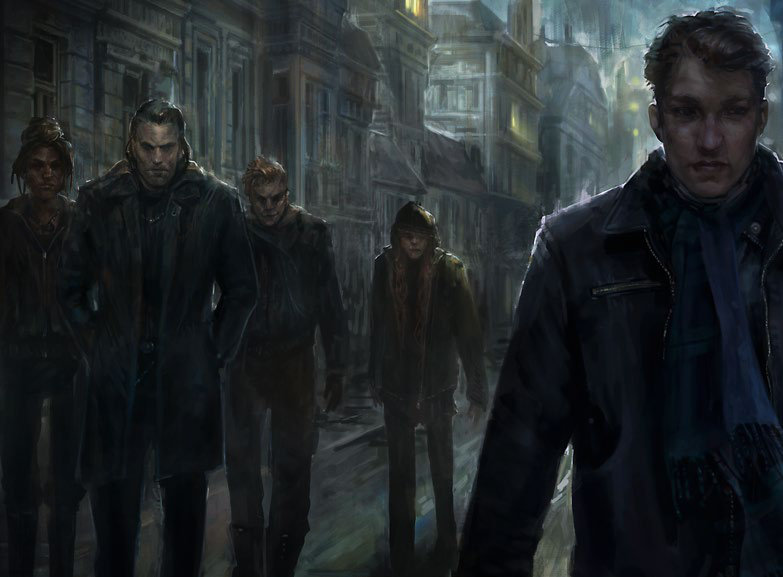

calized segments of the sect need information about 
the domains in which they hide or neighbor.

uting information are rapidly becoming some of the 
sect’s most prized assets. Knowing the movements 
of other sects has helped the Sabbat counter-maneu-
ver and maintain entente in domains like Madrid, 
and has allowed the Sabbat to gain Baltic redoubts 
as it creeps into the territory of longstanding Ivory 
Tower domains such as Riga. As such, delivering 
critical information will find a Cainite welcomed 
by Sabbat strategists  — and eliminating these 
messenger-spies is a prestigious accomplishment for 
Kindred of other sects.

Given the decentralization of the Black Hand, 
information gleaned from spies isn’t guaranteed 
to circulate through the entire sect. Indeed, it’s 
wholly possible that, especially in large or strategi-
cally important domains, different Sabbat spies 
have infiltrated the city, are unaware of each other’s 
presence, and are giving different information to 
different superiors, who themselves may or may not 
know of the others’ agents’ presence.

This fact has created an emergent role among the 
Sabbat, that of the messenger-spy pack. Cainites and 
their packs who specialize in collecting and distrib-

Storytellers can decide how heavily to play the 
tropes of espionage, from a tradecraft-heavy “spy 
thriller” heavily influenced by John Le Carre to a

1 1 3

V5-Sabbat.pdf-renegadegames.com-#a11397-103

Chapter Four: The Gehenna War

ing themselves when a prestigious rival — herself 
a Sabbat catspaw? — accuses them of Black Hand 
sympathies. The infinite dance of suspicion and 
acquittal can make for a remarkably suspenseful 
chronicle.

tale of street loyalties and opportunistic betrayal. 
The sects can loom large as ideological institutions 
or can fade into the background as the strength of 
relationships between the focal vampires comes into 
question.

Getting Involved

IN CHRONICLES
Among the undead, information is always a com-
modity. Even in domains without external threats, 
the Eternal Struggle ensures that some Kindred is 
always acting against another. Sabbat spies compli-
cate this, in that they may be collecting information 
for the Sword of Caine to strike against the domain, 
or they may be waging campaigns of muckraking 
and disinformation, using those internal struggles 
to keep the domain weak, heightening its Kindred’s 
conflicts among each other.

THE BOON-BUYERS: A coterie looking to 
make a splash in the domain has been buying up 
the prestation debts of various Kindred, and have 
proven remarkably resourceful in doing so. It all 
happened too quickly for anyone to notice, but now 
the domain’s social elite is on tenterhooks, having 
traded each other’s dirty laundry for short-term 
gains. The coterie buying up all of the boons is 
in fact a Sabbat pack — which the players’ coterie 
realizes as it discovers them preparing for a Mass 
Embrace. The pack’s plan is to reveal all of the 
boons it has acquired at Elysium, to set the local 
Kindred against each other with the revelation of 
all the malicious schemes and personal vendettas 
individual vampires have been waging, and then 
to raze the domain with shovelheads once the local 
vampires have already turned against each other in 
grievance.

Any vampire might be an informant, or an ac-
tive agent. The Brujah union delegate knows who 
the Toreador Harpy is trying to smuggle into town 
on that Lufthansa flight, and kicks that informa-
tion up to the Archbishop of Miami. The Kindred 
nightclub promoter in St. Louis survived a hunter 
raid and has since taken refuge in Kansas City, buy-
ing protection among the Cainites there with that 
information on SAD activity. The Sheriff of South 
London’s flunky is secretly a Noddist, feeding infor-
mation to a Pack Priest in Marseille.

REDOUBLING THE TRIPLE: Someone close to 
the coterie turns out to be a Sabbat informant. As 
the coterie follows them to meet with their contact, 
though, they recognize the contact as a highly-
placed Kindred from a neighboring domain. Which 
means either that the coterie’s ally is a double-agent, 
or the ally’s contact is the double-agent, or the ally’s 
contact is a re-doubled agent… turns out it’s not so 
clear-cut as a single smoking gun.

Of course, as mentioned elsewhere, the fear of 
Sabbat spies is a greater threat than Sabbat spies 
themselves — who are nothing to dismiss lightly. In 
a strange way, this heightened state of anxiety helps 
the Sabbat, as the other sects are so fearful that 
they’re rife with infiltrators, they devote much of 
their effort to investigating every whisper or rumor, 
bogging them down with suspicion and recrimina-
tion. At the same time, once an actual Sabbat spy 
gains attention, it’s probably just a matter of time 
before they’re actually discovered, or before they 
decide to go out in a blaze of bloody glory.

This is a double-edged sword for coteries of 
players’ characters. A series of stories in a chronicle 
might well be devoted to rooting out and ultimately 
destroying Sabbat infiltrators, while an equal num-
ber of subsequent stories might be spent exonerat-

1 1 4

V5-Sabbat.pdf-renegadegames.com-#a11397-103

S A B B AT: T H E B L A C K H A N D

Story Elements:  
Narrative Structures

time witnesses the whole thing. Do they attempt to 
break it up? Or do they pass on what they know to 
more capable vampires?

Violence, the hallmark of the Sabbat, happens 
in staccato bursts, whether the discovery of horrific 
treatment of mortals to the now-empty but tale-
telling site of a Mass Embrace and its grisly remains. 
Small but gruesome skirmishes occur, perhaps 
among the domain’s residents and intruding Sabbat, 
or between factions of vampires long on poor terms, 
with the tension in the domain boiling over. In any 
event, blood will flow, and that flow will steadily 
increase.

As antagonists, the Sabbat will cross the players’ 
paths in a variety of ways. The most obvious is 
of course open conflict, but as a versatile foil, the 
Sabbat is more than just the blood and fire its rivals 
portray it to be. The Sabbat will ever be the antago-
nist, but that antagonism is the substance of a great 
deal of narrative depth.

Rising Action

Storytelling Rising Action
Unless the chronicle begins in medias res, a good 
story structure provides for a readily increasing 
tension as the players’ characters learn that the 
Sabbat is present or soon will be. A logical narra-
tive progression begins with the parties unknown, 
progressing toward a realization that the Sabbat is 
active in the domain as the evidence of the sect’s 
presence mounts. As the action rises, conflicts 
emerge, and the players’ coterie may interact with 
individual vampires from an interloping pack, and 
may discover the predominant Path of Enlight-
enment practiced by the pack. A longstanding 
member of the domain might turn or remain an 
occulted double-agent, which the players’ characters 
can be instrumental in discovering. Some indication 
of the Black Hand’s agenda likely emerges as well, 
rewarding the players with knowledge for their in-
vestigations and allowing the players to plan how to 
(or if to…) foil the pack’s plans. Some kind of overt 
conflict also occurs, to whet the players’ appetites 
for the showdown to come, and these early conflicts 
need not be only physical violence. It’s important 
that the players see the Sabbat not only as foes to be 
beaten down, but as intelligent if alien rivals who 
can be negotiated with socially and contended with 
mentally.

The Sabbat may act insidiously or it may announce 
its arrival in a domain with a full crusade. However 
the Black Hand becomes involved in a domain, 
players’ characters should have the opportunity to 
expose their efforts and perhaps even stop them 
before all hell breaks loose.

The Sword of Caine may shovelhead shock 
troops in the coterie’s home domain. Rumors make 
it to connected vampires’ whisper networks and 
contacts push vital news into the possession of 
vampires who might be able to do something about 
the impending arrival of the Black Hand. Domains 
experience a steadily rising paranoia, fearful of the 
enemy on the doorstep, and new or unfamiliar Kin-
dred feel an unsubtle weight of suspicion. Elysium 
becomes a tense affair, as loyalties come into ques-
tion and longstanding grudges are openly relitigated 
in front of the assembled domain.

The Sabbat might also be staging a hearts-and-
minds operation (see above), attempting to woo 
young, disadvantaged Kindred against the injustice 
of the Camarilla or an Anarch presence that isn’t 
as egalitarian as it pretends to be. The War of Ages 
may heat up, stoked by the Black Hand in an effort 
to destabilize Kindred factions that would other-
wise exist in a state of mutual awareness.

An emboldened Sabbat may perform ritae in 
a coterie’s home domain, roiling its members into 
righteous fervor and terrorizing the mortal popu-
lace while someone at the right place at the right

Savor the rising action. It’s where the tone for 
the whole conflict is established, and it rewards 
player ingenuity and problem-solving, as well as 
letting a skilled Storyteller manage a web of secrets.

1 1 5

V5-Sabbat.pdf-renegadegames.com-#a11397-103

Chapter Four: The Gehenna War

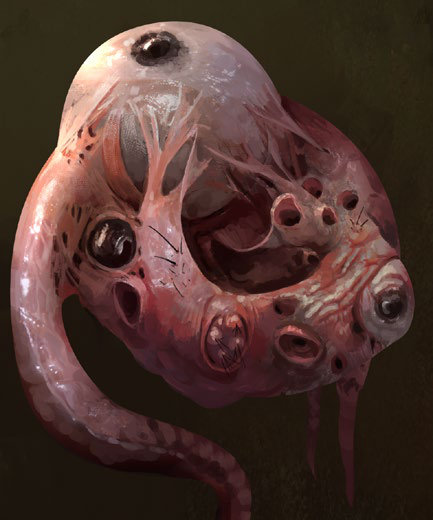

PATHS FROM THE OUTSIDE
How much do non-Sabbat know about the Sabbat’s 
Paths of Enlightenment?

This is an excellent question, and one for which 
you’ll want to make some decisions based on the 
type of chronicle you wish to run. Overall, assume 
that Kindred outside the sect actually know very lit-
tle about the Sabbat, let alone that Paths of Enlight-
enment even exist as a concept. Kindred wise in the 
ways of the Sabbat may know that Paths of Enlight-
enment exist, some characteristics of them, and may 
even know some of them by name.

Kindred who have faced Cainites in conflict 
before might even know some of the attitudes of the 
Paths, such as “Shovelheading the entire bordello? 
This seems like it might be a cult of Cathari” or 
“These symbols and ashes mean they ritually diabler-
ized the elder. We’re probably dealing with the Path 
of Caine.” Then again, such information might be 
imperfect, partial, or outright incorrect — “These 
symbols and ashes mean they diablerized the elder. 
We’re probably dealing with the Path of Night’s 
Power.” After all, the Sabbat isn’t especially effusive 
when sharing details about its cultic practices with 
outsiders, and gaining information about the enemy 
can be one of the primary activities of the chronicle.

As a Storyteller, decide beforehand how much 
information about the sect you’d like to reveal when 
the troupe considers the chronicle Tenets and you’re 
working on your chronicle’s themes. You might wish 
to reveal the sect’s dogma as part of the chronicle’s 
dawning horror, or you might wish to plunge the 
coterie into hot war with antagonists they can very 
quickly learn how to oppose and exploit.

The Sabbat isn’t a one-note sect; there’s much about 
exactly what face of the Sabbat the coterie will en-
counter that can surface during the rising tension.

Example Developments

■The Sabbat seeks to topple an at-risk Prince,

Baron, or other authority figure, or otherwise 
destabilize the domain, either to claim its re-
sources, or show the weakness of a rival sect

Open Conflict

■A sleeper cell, unknown to be Sabbat, about

In open conflict, the Sabbat is not only revealed, but 
acts in its primary idiom: catastrophic violence.

whom suspicion grows and grows until the do-
main’s Kindred are forced to take action

■Sabbat spies who are testing the domain and

Stories that feature the Gehenna War likely have 
a great deal of physical conflict among vampires, as 
the Cainites of the Black Hand attempt to destroy 
the Antediluvians and anyone they see as the

looking to compel new conscripts into the 
Gehenna War

1 1 6

V5-Sabbat.pdf-renegadegames.com-#a11397-103

S A B B AT: T H E B L A C K H A N D

minions of those despised Ancients. This can easily 
include Kindred of any other sect, as the Sabbat 
isn’t particular about collateral damage. And Black 
Hand vampires need not be the immediate partici-
pants of an open Gehenna War conflict. Kindred 
may be breaking up blood cults, sabotaging havens, 
or smuggling would-be vessels away from the front 
lines so that the Sword of Caine starves. Whether 
performing guerilla raids across the Eurasian taiga 
or battling to keep Black Hand zealots from break-
ing into the haven of a potent-Blooded autarkis, 
open conflict can happen anywhere, and is tied to 
the direct goals of the sect or individual packs.

ravening Wights; they choose their battles with 
purpose.

Example Developments

■The Sabbat raids the domain, dragging away

or performing diablerie on vulnerable Kindred 
who don’t have the connections or skills to 
protect them

■A Sabbat war pack rampages through the

domain, working itself up into a frenzy of blood 
and fire on the way to the Gehenna War front or 
a prized diablerie and “converting” new recruits 
to take with it

■A veteran pack returning from the Gehenna

Open conflict with the Sabbat can also be re-
lated to domain clashes and not the core conflict of 
the Gehenna War. Crusades to seize domain from 
established sects transpire nightly. Even something 
as small-scale as routing a single pack in an other-
wise stable domain can provide a horrific violent 
spike in a domain usually known for its intrigues 
and devastating social repartee.

War front, its bloodlust kindled by the conflict, 
goes berserk in a domain

■Cainites aggravate an old grudge between fac-

tions of the domain’s Kindred, then join the fray 
as “the corruption of the Antediluvians” pushes 
tensions between Kindred to a breaking point

Temptation

The Sabbat need not always be the attacker. 
Sabbat may find themselves pincered between a 
Gehenna War front and the diligent coterie that has 
tracked it into the Iberian badlands. They may need 
to hold a safe house in New York while an allied 
pack makes its way up from Miami.

Kindred dealing with the Sabbat can be surprised 
how lucid and even enticing the Black Hand can 
be. At the core of Sabbat philosophy is freedom: 
freedom from elder oppression, freedom from the 
Eternal Struggle, freedom from exploitation and 
anachronistic power dynamics — freedom from 
mortal notions of guilt and Humanity. “It’s not a 
death cult, it’s a revolutionary army.” That can all be 
quite appealing to young Kindred Embraced into 
neofeudal servitude or a coterie on the outs with the 
gangland politics of the prevailing Anarch power.

Storytelling Open Conflict
Open conflict is where the shit hits the fan. It’s 
where the highest traditional “action” plays out, 
for players who enjoy that aspect of the game, with 
combat and Disciplines and all of the overt mani-
festations of vampires kicking each other’s asses in 
interesting locations. Skilled Storytellers can weave 
open conflict in and out of other interactions with 
the Sabbat, managing a thrilling pace that alternates 
between cold and hot war.

Until one sees the brutality of the Sabbat or 
looks at its philosophy directly, it all sounds good. 
And that can make for a unique social dynamic 
in a domain with its own troubles. The instabil-
ity in LA, the purge of London, and the upheaval 
in Berlin— these all distress the Kindred dwelling 
there, so it’s no surprise to find (especially young) 
vampires willing to listen to the alternatives.

Inevitably, the Sabbat wants something. It doesn’t 
fight for the sake of fighting — the Black Hand is 
earnest about taking the fight to the Antediluvians, 
and minor turf wars are meaningless unless they 
help that effort. That said, it may not always be 
obvious what the sect wants, and figuring that out 
helps add context to an open conflict. Sabbat aren’t

The Sword of Caine’s honeyed words aren’t 
borne out by the truth of its domains and the Ge-
henna War, however. By the time a neonate has been

1 1 7

V5-Sabbat.pdf-renegadegames.com-#a11397-103

Chapter Four: The Gehenna War

Example Developments

inveigled to join the Black Hand, the truth comes 
out, the brainwashing begins, the abuse is under-
way and the tide of murderous violence has already 
caught them in its undertow.

■A Sabbat defector (perhaps a shovelhead who

had no choice in their Embrace or a disillusioned 
former convert) seeks to leave the sect upon 
realizing the horror of the Sabbat crusade, but 
can the coterie trust them? Does enough of 
their Humanity remain upon which to build a 
redemption?

There’s an ineluctable draw, however, to the 
promise the Sabbat makes when recruiting, or when 
undermining domains, as the other vampire sees it. 
A Kindred teetering on the brink between the devil 
they know and a promise of righteous liberty ex-
periences an internal and external conflict that can 
prove to be the most profound personal clash. And 
the Paths of Enlightenment, which variously suborn 
or indulge the Beast may prove a respite — horrifi-
cally, an illusory one — from a perceived eternity 
hiding from the Beast.

■An insidious Sabbat diplomat wants assistance

“just this one time” in a scheme that seems to 
offer everyone something they want

■A Kindred encounters a mortal family member,

now themselves a Cainite of the Sabbat, and 
personal tragedy ensues in a catastrophic “home-
coming”

Storytelling Temptation
Temptation is an opportunity for storytelling 
contrasts. Sabbat will readily lie to convince other 
vampires to join their sect, giving a great opportu-
nity for social conflict, subterfuge, and fact-finding. 
Of course, simply being seen in conversation with 
the Black Hand can dig a social grave for players’ 
characters that may take a while to dig themselves 
out of.

The Enemy of My Enemy

Politics makes strange bedfellows and Kindred 
politics are no different. The situation may arise 
in which the coterie simply has to cooperate with 
a Sabbat pack in order to oppose an even greater 
threat. A berserk Lupine may be threatening the 
coterie’s hunting ground, chased there by a nomadic 
pack, or a domineering Archon may be investigating 
the presence of Black Hand packs so overzealously 
that an Anarch coterie is caught in the crossfire. Or 
the Sabbat is hunting down a puissant deserter and 
the coterie sees an opportunity to resolve two prob-
lems with one swift response, using the one to get to 
the other before delivering the coup de grace.

The players’ characters themselves need not be 
the ones tempted by the Sabbat, as well. Perhaps a 
comrade is being courted by the Sabbat, or a mortal 
Touchstone is Embraced into the sect and must be 
“rescued” for any chance at redemption. Or maybe 
a high-ranking Kindred in the domain has bought 
into the Gehenna War fervor, leaving a power 
vacuum and freeing up a previously claimed sphere 
of influence.

Consider, too, that sects aren’t monolithic, and 
the Eternal Struggle might have a third component 
in the domain, such as the tense three-way “under-
standing” in Tangier. Nobody likes it, but nobody’s 
foolish enough to upset the delicate balance, and 
so the agreement holds for one more night… until it 
doesn’t.

As a Storyteller, be sure to handle temptation 
carefully. A philosophical conversation between 
a Path of Cathari Cainite and a player’s character 
about how similar their outlooks are should be 
played to convey a dawning revulsion (which may 
have been preceded by piquant sympathy…). You’re 
not actually trying to drive players into the antago-
nists’ sect.

Given the Sabbat’s fanaticism, it’s a question 
of when, not if, the Black Hand will turn on the 
coterie, but a great deal can happen in that intersti-
tial period.

1 1 8

V5-Sabbat.pdf-renegadegames.com-#a11397-103

S A B B AT: T H E B L A C K H A N D

Storytelling the Enemy of  
My Enemy
The function of this conflict is to cause players to 
question their priorities. When faced with Sabbat 
presence and something that’s an actual existential 
threat, what do the players do? Conflict is always 
more interesting when it requires decision-making 
rather than predefined opposition. (See Conflict 
Triangles, below.)

Example Developments

■Sabbat being hunted by a Second Inquisition

agency put a devil’s deal on the table: Aid the 
Black Hand, side with the hunters, or suffer the 
lesser (?) evil of not taking either side and bear-
ing the consequences

■A tattered Sabbat pack thrashes into the city

and is easily dealt with — but what was the pack 
running from?

■A sleeper cell, unknown to be Sabbat, keeps

As with temptation, then intent is not to send 
the coterie into the arms of the Sabbat. The most 
probable outcome of a brief alliance is the Sabbat 
turning on the players’ characters when they’re 
depleted after a significant conflict, anyway, so 
the tension engendered by this particular narra-
tive development builds on a sense of suspense and 
paranoia. Is the third party really the greater threat? 
What does the Sabbat pack think?

attracting suspicion until the domain’s Kindred 
are forced to take action

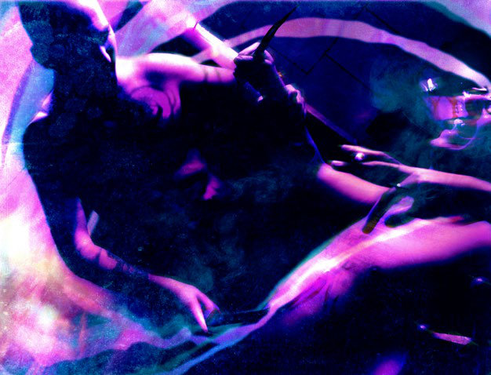

1 1 9

V5-Sabbat.pdf-renegadegames.com-#a11397-103

Chapter Four: The Gehenna War

Story Element:  
Conflict Triangles

Such deceptions can work both ways, of course. 
Perhaps an Anarch coterie sees an opportunity to 
undermine a Camarilla domain near the Sabbat’s 
Gehenna War front, staging false-flag operations 
intended to push the Camarilla and Cainites into 
open conflict, with the coterie ready to seize terri-
tory while its rivals are tearing each other to pieces.

The talent of the strategist is to  
identify the decisive point and to

Or perhaps the chronicle’s domain features the 
Hecata as an X-factor who might offer alliance to an 
Anarch domain that’s being threatened by a Sabbat 
Crusade. But what do the Devil-Kindred want in 
exchange? And are they making the same offer of 
allyship to the Sword of Caine?

concentrate everything on it,  
removing forces from secondary 
fronts and ignoring lesser objectives.

— CARL VON CLAUSEWITZ

Playing With Fire:  
The Second Inquisition

At some point, a Storyteller might want a chronicle 
with a conflict more complex than just “the coterie 
vs. the Sabbat,” and chronicles that position fac-
tions in a multifaceted conflict have rich potential. 
Conflict is always more interesting when it involves 
having to make a choice, or even figure out who 
among an array of possible antagonists is the truest 
foe, and whether or not a deal of opportunity can 
be brokered.

But the most dangerous and risky triangle is one 
involving the Sabbat, mortal vampire hunters, and 
one or more of the other sects. Many vampires 
regardless of affiliation believe that this new era of 
Inquisition was the result of the Camarilla trying to 
use mortal hunters against their enemies and botch-
ing the job. In the aftermath, every sect now stokes a 
growing fear in this renewed time of Inquisition.

As a Storyteller, setting up a conflict triangle 
will require that the players make hard choices, 
deciding on alliances to make and whether to honor 
them. (Of course, their “allies” might renege on 
agreements, as well….) These decisions can and 
should test individual players’ Convictions, and 
initiate the sorts of moral quandaries that good 
Vampire stories thrive upon. In a world where all 
choices have consequences, having to choose which 
monsters to support or ignore is its own measure of 
a Kindred’s self.

This is where a devil’s deal comes together. If 
mortal hunters have become alerted to the presence 
of vampires in the coterie’s locale, it might behoove 
Kindred of various allegiances to set aside their 
differences long enough to deal with the matter. 
Alternatively, in an Anarch or Camarilla domain, 
perhaps the local vampires have been engaged 
in a successful effort to conceal themselves from 
hunters, but now those efforts are at risk due to the 
emergence of Sabbat packs that have entered the 
domain with total — and gory — disregard for the 
Masquerade.

Rival Sects

Sectarian conflict is core to Vampire. Perhaps a 
Camarilla court and an Anarch domain are close 
enough together for a clever Sabbat pack to stage 
hit-and-run raids against one domain while posing 
as vampires from the other. Provoke enough con-
flict, and the Camarilla and Anarch domains might 
go to war, leaving the Black Hand to target the win-
ning sect once the other has been defeated.

In such chronicles, the players’ coterie might try 
to direct the hunters into conflict with the Sabbat 
or bait the Sabbat into attacking the hunters. Or 
perhaps it’s a Sabbat feint in the first place, drawing 
hunters to the domain and surreptitiously retreat-
ing, to deplete the resources (and vampires…) of the 
local sect.

1 2 0

V5-Sabbat.pdf-renegadegames.com-#a11397-103

S A B B AT: T H E B L A C K H A N D

The dangers are terribly high either way, but 
unless one of the enemy groups is removed from the 
board, the players risk being caught in the mid-
dle between both their most dangerous enemies. 
Whether the hunters in question are a small outfit 
of clued-in mortals or a well-equipped and -funded 
department of a political authority, all it takes is 
one overzealous Sabbat to shred the Masquerade 
and bring the world’s unwelcome attention to the 
domain, as the Kindred of Vienna can attest.

horror, or the pack may be a motley assembly of 
individual quirks.

■How the Sabbat vampires relate to and com-

municate with one another don’t conform to 
mortal or Kindred norms. Packs often chitter, 
croak, bark, or howl to one another in place of 
words. They may streak each other with blood 
to demonstrate affection or visualize their peck-
ing order. They may close their eyes and sense 
their surroundings by smell or sound, avoiding 
stumbling over each other with non-tactile cues.

■Cainites exhibit some mortal behaviors to an

Thematic Element:

extreme while others are absent, like talking 
over each other heedless of the interruption or 
remaining utterly silent in deference to superior 
packmates.

Inhumanities

■Perhaps giving rise to archaic myths about vam-

The Sabbat deliberately chooses alienation from 
both mortals and Kindred of other sects. Although 
they still appear humanoid in profile (mostly), Sab-
bat vampires should stand out as distinctly Other 
when players’ characters come in contact with them, 
to varying degrees. Some examples:

pires, Sabbat may fixate on some physical action 
at a given location, such as endlessly fidgeting 
with a door handle, plucking flies from the air, 
or tempting harm by passing their hand over a 
candle’s flame repeatedly. They may smash out a 
single pane of glass from every window or yank 
on a packmate’s jacket lapels or tear paper into 
strips and pass it through that packmate’s candle 
flame. Whatever they do, convey the impression 
that, however small, the action means something 
to them, and the coterie is simply unable to 
discern what.

■Sabbat vampires move in strange tandem, as if

anticipating each other’s movements, and the 
pack behaves less like a group of people navigat-
ing the actual environment and more like a pack 
of wolves or shiver of sharks. They loom and 
cluster, but strangely avoid actual contact with 
one another, eluding each other’s spatial pres-
ence in a near-liquid expression of moving out 
of each other’s way the moment before the next 
one of them occupies the space another one did 
less than a second ago. They may appropriate 
the gestures of other creatures, such as a cat’s 
languid stretching or simian grooming.

Naturally, those Sabbat with more social focus are 
better able for what passes as normal (at least among 
societies of undead nocturnal blood-drinkers), but 
for the bulk of the sect, observable difference is 
what helps make the Sabbat memorable and fear-
some. Lean into it.

■Individual physical features depart dramatically

from mortal human norms. A Sabbat vampire 
might have no whites to their eyes, or two rows 
of teeth, or their joints may snap in and out of 
location as they walk. Overall, they still have 
normal silhouettes, but something disturbing 
has had its way with individual aspects of their 
physical presence. A pack may share a single 
unsettling characteristic, making for a collective

1 2 1

V5-Sabbat.pdf-renegadegames.com-#a11397-103

Chapter Four: The Gehenna War

Thematic Element:

an overt denial of mortal materialism — when the 
cult demands that one mobilize to oppose wakening 
blood-gods, affectations and personal property are 
more burden than boon.

The Pack  
Hunts as One

More than anything else, the havens of Black 
Hand Cainites almost always have an air of haste, 
of being temporary. In practice, Sabbat simply 
take havens — if they find someplace they want to 
stay, they stay there, and if they’re able to sate their 
hunger while claiming a place to bed down for the 
night, more’s the better. Whether terrorizing urban 
gentrifiers and settling in their condominium, lying 
low in a hotel room on a floor that’s being too-
slowly renovated, or gorging on low-grade animal 
vitae in a farmhouse on a moor on the way to the 
Gehenna War front, Sabbat tend to regard havens as 
if they were disposable.

Given the deindividuation of the Sabbat and the 
fact that many of its Cainites are either behind 
enemy lines or in deep cover within hostile do-
mains, individual feeding is both inefficient and at 
high risk of drawing undesired attention. As such, 
Storytellers should adopt a single Predator Type to 
suit the stalking habits of the entire pack. The pack 
itself hunts as a single entity, affecting the methods 
of that Predator Type — which should be readily 
observable to a savvy coterie clued in to the feeding 
practices of vampires.

Naturally, this affects how players’ characters 
might encounter a Sabbat haven:

In terms of story functions, this serves a num-
ber of purposes. First, it allows the players’ coterie 
to either observe the hunt in action, or to piece 
together clues in its aftermath that tip them off to 
the fact that a group of vampires is not only present 
in the domain, but hunting in a way that may well 
feel antithetical to their own preferences. Second, 
it grants the pack an additional sense of (group) 
identity, highlighting their deindividuation. Third, 
it provides an opportunity to emphasize certain eso-
teric beliefs of the Sabbat through the correlation 
of Predator Type and the pack’s distinct collective 
personality.

■In a domain in entente, the coterie investigates

the Bishop’s haven, a once-opulent penthouse in 
a strange state of abandonment and squalor. A 
thick layer of dust obscures much of the living 
space, while the bedroom looks like it’s been in-
habited by feral animals, with blood spattering 
many of the room’s surfaces and monogrammed 
towels hastily duct-taped over the windows to 
serve as improvised blackout curtains. Pictures 
of the penthouse’s now-dead original residents 
still stand on shelves and hang on the walls.

■The run-down bodega off the beaten path has

More information on Predator Types is available 
on pp. 175-178 of Vampire: The Masquerade.

turned into a veritable spider’s web, and every 
now and then, a mortal fly stumbles into the 
store. The windows are partially boarded over, 
but not enough to say definitively that the 
bodega is closed; the flickering fluorescent light 
gives an antiseptic effect that belies the piled-up 
filth and spoiled foodstuffs. As a bonus, every 
now and then, the shelves supply an alchemical 
ingredient, such as rat poison, cleaning powder, 
or fresh maggots burrowing through what must 
once have been fruit. The tear-off calendar on 
the counter shows that the last time anyone paid 
attention to it was nine days ago.

Setting Element:

Sabbat Havens

Forever on the move, the Sabbat in general has little 
use for established havens. In fact, Cainites rarely 
bother to devote much effort to maintaining havens 
at all, other than domains in entente or accord (see 
p. 107). This is as much a matter of practicality as in

1 2 2

V5-Sabbat.pdf-renegadegames.com-#a11397-103

S A B B AT: T H E B L A C K H A N D

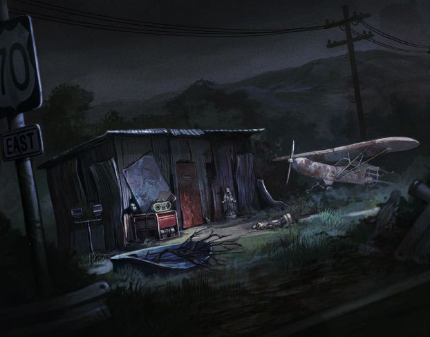

Communal Havens

■A corrugated metal building on a lonely stretch

of highway looks like it was very quickly thrown 
together and just as quickly neglected. There’s 
all kinds of weird shit in the place that doesn’t 
make any sense: two-thirds of a grubby Piper 
Cub assembled in the last century, a bunch of 
concrete garden knick-knacks sharing a vaguely 
religious motif, a plastic kiddie pool that looks 
like it had snakes or lizards in it at one point, a 
still-plugged-in CD player with a lonely new-
wave song infinitely repeating. Things that 
nobody would want to take with them if they’re 
on the run but that obviously have some mean-
ing to them while they’re here. Wait a minute, 
are they in here?

The social dynamics of the Sabbat mean that most 
Cainites spend the vast majority of their time with 
their pack. That the pack functions as a protective 
mechanism as much as it does a spiritual unit trans-
lates into the Sabbat practice of communal havens. 
Why spend effort traveling to and from each other’s 
crash space when the pack could sink into daysleep 
together each night and kill the fuck out of anyone 
who comes knocking, thinking they’ve found the 
place “a vampire” might go to ground? In fact, 
though no hard data exists, it’s probable that most 
Sabbat havens are communal havens.

This can be especially terrifying for non-Sabbat 
coteries to discover. Especially among more individ-
uated cultures and societies that value expressions

1 2 3

V5-Sabbat.pdf-renegadegames.com-#a11397-103

Chapter Four: The Gehenna War

able to the truth: that there’s a pack of monsters 
out there that sleep beneath the dirt when the 
sun comes up and they throw the bones of their 
victims where the copses of trees are the densest.

of clan aesthetics, a haven is an extremely personal 
thing. Communal havens destroy that notion, and 
on top of that are immediately dangerous because 
they’re nests of bloodthirsty fanatics who probably 
didn’t invite the Kindred into their home….

Ways in which a coterie might discover a pack 
haven:

Storytelling  
Technique: Paranoia

■Pursuing a threat they don’t know is a Sabbat

pack, the coterie discovers evidence of  squatters 
in the offices of a derelict downtown rec center. 
Heavy filing cabinets block most of the doors, 
cheap drywall has person-shaped holes in it, 
and a number of mummy-style sleeping bags are 
wadded up all over the place, some of them with 
remarkable amounts of strange-smelling dirt in 
them. The building is obviously abandoned, but 
while they’re searching, they hear a basketball 
bouncing in the court down the hall, as if some-
one is playing.

and Red Herrings

Part of the utility of the Sabbat comes in the fact 
that the fear of the Sabbat is often as effective as the 
actual, confrontational presence of the Sabbat. By 
dropping hints that point toward a Sabbat presence 
rather than evidential proof of an actual Sabbat 
presence, the Storyteller can impart thrilling, sus-
penseful elements to the chronicle that can realize 
in whatever manner they choose, from political 
potboiler to blood in the streets.

■The coterie has followed shambolic vagrants to

what appears to be a church-run shelter. With 
a taste for the affected and the blasphemous, a 
Sabbat pack has taken over the church. Reli-
gious trappings have been deliberately broken, 
inverted, or profaned — blood collected in a 
sacramental bowl has a layer of scum congealed 
across the top and red-brown handprints stain 
sheaves of printed religious literature. Reveling 
in the mockery of the vicar’s role, the Priest and 
her Pack treat the holy place with all the rever-
ence of a bus stop full of drunk kine in the mid-
dle of the night. And where did the people the 
coterie was following go?

This needn’t always be a situation of overt defec-
tion from one sect to another. Fear is a powerful 
emotion, and stoking it in the Kindred of a non-
Sabbat domain goes a long way toward realizing the 
Sabbat’s role as foils to the players’ characters. It also 
helps realize the Sabbat’s narrative promise, that the 
Black Hand engenders a dread that far outstrips the 
actual size and influence of the sect itself.

Using a system or story element that’s usually 
associated with the Sabbat can provoke significant 
questions in a chronicle. Indeed, it can stand in 
for the Black Hand itself, for when a Storyteller 
doesn’t actually want to have a Sabbat conflict as 
part of the chronicle, but wants to introduce an air 
of uncertainty that may result in a circular firing 
squad among the domain’s power elite or street-level 
operators.

■Everyone knows not to go to the park, especially

after dark. Urban legend has spun dangerous 
fantasies about it since half of the neighborhood 
kids’ parents were kids themselves. A murderer 
lives in the shed. Gangs do their initiations past 
the bike path. An alligator escaped the zoo and 
took over the duck pond. The playground is 
full of broken glass and the equipment is rusty 
and jagged. Police found a body out there, just 
past the picnic tables where the trees start to get 
thick. Any of these, honestly, would be prefer-

For example, the coterie may discover that a 
highly influential Lasombra Kindred in a Camarilla 
court follows a Path of Enlightenment — are they 
sympathetic to the Sabbat? Or have they simply 
lacked the rigor to leave the Path behind and uphold 
the virtues of Humanity? Or perhaps a Kindred

1 2 4

V5-Sabbat.pdf-renegadegames.com-#a11397-103

S A B B AT: T H E B L A C K H A N D

one that all but went unasked for centuries. The 
Dark Father’s grandchildren are believed to be the 
progenitors of the vampire clans, Third-Generation 
vampires cursed by Caine for the murder of their 
own creators.

knows a particularly useful Discipline power or rit-
ual of Sabbat origin. How’d they learn that? Whose 
blood did they drink or what favor do they owe to 
explain their facility with it? Perhaps the Sabbat has 
actually come and gone from the domain, having 
little interest in it, but having left a “time bomb” of 
Unbirthed (see p. 43) as a havoc-wreaking fuck-you 
to the city’s power structure out of spite.

The term Antediluvian itself means “before 
the Flood,” referring to the Biblical flooding of 
the world, which is itself enigmatic, as surely the 
Ancients predate Christianity themselves. Still, this 
may be a matter of perception.

Don’t overdo this. If every rumor is a red her-
ring, the coterie will soon grow disinterested in 
seeking actual information. But a healthy dose 
of situational doubt can discourage a group of 
headstrong vampires from acting first and thinking 
later, especially if a few early missteps bear sensible 
consequences.

Although it is traditionally believed that 13 
Antediluvians founded 13 clans as recounted in 
the Book of Nod, some scholars believe a few of the 
Clans may have been started by the same progenitor. 
Radicals among those scholars hasten to point out 
that at no point does the Book of Nod declare that 
only 13 clans exist — but that’s a matter for another 
night.

Thematic Element:

the Antediluvians

Enemy Unknown

Mortal once, but now they have moved beyond even 
immortality. They have acquired the properties of the 
Aeons through which they passed. Time has clad them 
in impenetrable armor, but they were mortal once.

They will rule with iron talons

They will wrench  
the hearts of all still alive

— SOURCE UNKNOWN

This brings up the difficult question of identify-
ing an Antediluvian. Precious few of the Damned 
have met an Antediluvian and survived to tell of it. 
Given the time period from which they purportedly 
hail, are they cursed neolithic humans? Are they 
mythological entities, on the order of gods, demi-
gods, or the like? Are they even anthropomorphic 
at all? Or are they themselves the curse that runs 
through their despised lineages — is [Malkav] the 
Blood-borne demiurge that rouses “Malkavians” to 
rise each night?

And the full sum of the

earth's living will come
and live in the Last City,

called Gehenna.

— THE BOOK OF NOD

Gehenna is the final act of the Eternal Struggle 
and the Sword of Caine is determined to see the 
Antediluvians destroyed before they consume their 
lineages. Now that Gehenna has come the Sabbat is 
focused on unravelling the secrets of the Antedilu-
vians as never before.

Even assuming the Sabbat have discerned the 
Antediluvians’ weaknesses, how do packs know 
when they’ve found one? This is a question that has 
vexed the Sabbat throughout the Gehenna War as 
many have claimed the destruction of one Ante-
diluvian or another only to be later proven false, a 
“mere” Methuselah or a lesser simulacrum.

Who or what are the Antediluvians? It is the 
question at the very core of the Sabbat, but also

1 2 5

V5-Sabbat.pdf-renegadegames.com-#a11397-103

Chapter Four: The Gehenna War

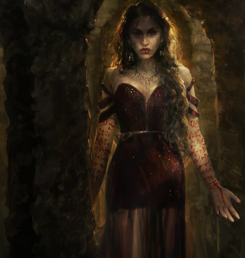

inestimable epochs has surely refined and trans-
muted them.

This is itself part of the riddle the Sabbat seeks 
to answer with its cannibal crusade. To understand 
what trials the Antediluvians endured to attain 
their divinity, to stand where their feet once stood, 
to feel their moments of victory and defeat. All 
this to know the Antediluvians as they once were, 
to conjure and contain them in a vessel that can be 
destroyed or perhaps to consume their power for 
themselves.

Stolen Blood

What of those vampires, such as the master of 
House Tremere or the Giovanni family, who never 
knew Caine but stole their power from others more 
ancient? Are these usurpers truly Antediluvians in 
the same manner as those monsters that have existed 
since before the flood? Can it even be certain they 
killed the Antediluvians from whom they stole their 
claim to the Third Generation?

These more recent “Antediluvians” may just be 
pawns of the true masters of Gehenna who have 
allowed them to steal a portion of their power as 
a way to enslave them. The heterodoxy that the 
Antediluvians cannot be destroyed by the common 
methods of dismemberment or diablerie has gained 
purchase within the Sabbat and casts doubt on the 
fabled but accepted triumphs of certain clans over 
their progenitors.

The Sabbat’s veneration and exercise of diablerie 
has shed some light on this question as they have 
devoured their way through entire lineages and a 
handful of Cainites have even caught glimpses of 
these clan founders from the Blood of their direct 
progeny. Indeed, more than one Malkavian mys-
tic has claimed the differences in their Blood that 
makes others perceive them as racked by prophetic 
vision is actually their founder's literal presence 
upon their soul. Innumerable accounts persist, 
such as nigh-folkloric tales of [Gangrel?] burrow-
ing through the crust of the Earth or of [Tzimisce] 
becoming a mycological eruption of flesh.

While this new dogma was difficult for many 
Sabbat to accept at the start of the Gehenna War, 
the Beckoning was interpreted by many as confir-
mation that none of the Antediluvians have yet to 
be dispatched. Can the last generation “with mas-
tery over life and death” even be destroyed should 
they wish against it? The power of true Antedilu-
vians may simply be too great to end under fang 
or claw, and even fire and sunlight might not be 
enough to finish them. Understanding the nature of 
these ancients will be critical to the Sabbat’s victory, 
or the root of its demise. ■

That the Antediluvians have transcended their 
mortal frames may well be certain. Just as Sabbat 
have shed their mortal identities, the Antediluvi-
ans have no need to take on human guises. They 
may have been mortal once — perhaps? — but the 
power of the Dark Father’s Blood and the passage of

1 2 6

V5-Sabbat.pdf-renegadegames.com-#a11397-103

S A B B AT: T H E B L A C K H A N D

INDEX

Devourers, 33, 64, 88
diablerie, 8, 21, 58, 62, 65, 110, 112, 
117
Disciplines, 46
Dog Tagging, 63, See Games of 
Instinct
Domains, 13-14, 33, 71, 92, 94, 105-
108
Dominate, 25, 47
dominion, 32, 33, 36, 38, 40
Ductus, 85, See Titles
Eastern Europe, 101 
Enemy of My Enemy, 118,  
See Narrative Structures
Egypt, 102 
elders, 12, 19, 27, 50, 71, 80, 82, 92-96
Embraces, 12, 13, 57, 92
Entente, 107-108, See Domains
esbats, 91-94 
Eternal Struggle, 13, 14, 74, 80, 114, 
117, 118, 125, See Gehenna War 
Festival of the Dead, 60-61 
	 Festivo dello Estinto, 61
Final Death, 8, 13, 92 
Fire Dance, 61 
fleshcrafting, 45 
fleshweld ghouls, 44-45
Forsaken Paths, 31 
Fortitude, 27
France, 83 
Galvanic Ruination, 51
Games of Instinct, 63
Gehenna War, 13-15, 91-96, 107-108, 
116-117, 
ghouls, 36, 38, 41, 43-45, 50  
Hangarounds, 42
Harrowhaunt, 52

Caine,  7, 13, 21-29, 46, 55-63, 78, 126
	 Cainite, 8, 57, 63, 81, 107-108, 
	 	 Cainites, 15, 23, 27, 29-30, 31, 	
	 	 56, 61-62, 71-72, 77, 121-122
Camarilla, 7, 12, 71, 77, 81, 93, 95-
100, 120 
Cardinal, 84, See Titles
Cathari, 23, 35-37, 65-66
Cathedral of Flesh, 8
Catholic Church, 91
Ceremonies, 52
Changing Paths, 79, See Paths of 
Enlightenment
Chronicle Structures, 109
Cicatriz, 81-82
Cleaner, 88, See Pack Patterns
Cold War, 71-72
Common Ritae, 64-68, See Ritae
Communal Havens, 123, See Setting 
Elements
Communal Vigor, 50
Conflict Triangles, 120
consent, 8
Contrition Ritae, 65-68, See Ritae
Convention of Thorns, 93
Convictions, 47, 59. 120 
Creation Rites, 57
Crusades, 32, 72, 108, 109, 111
Cult, 16, 116, 122
Damned, 15, 23, 125
Dark Father, 13, 21, 56, 94, 126, See 
Caine
Dark Mother, 31, See Lilith
Death and the Soul, 25, 37-40, 66-67
Demolition Derby, 63, See Games of 
Instinct
Devils of the Flesh, See Cathari

Accord, 107, See Domains
Africa, 93, 95
Albigensians, 23, 36, 61, See Cathari
Anarchs, 12-13, 77-78, 92-96
Animalism, 12, 21, 47
Antediluvians, 6, 65, 71, 74, 77, 93, 
95, 125, 126
antitribu, 13, 74
Archbishop, 72, 79, 81 
Ashirra, 95, 102
Auctoritas Ritae, 55, 56, 63 
Auspex, 23, 25, 46 
Ballerino, 83, See Priest
Beast, 15, 21, 23, 25, 27, 31, 79 
Beckoning, 13, 31, 94, 95, 126
Beelzebeatit, 50
Befoul Vessel, 52
Binding, the, 63
Bishop, 42, 81, See Titles
Black Hand, 9, 13-16, 95-96
Blinding the Alloy Eye, 52
Blood and Fire, 91, 109-110, See 
Chronicle Structures
Blood Bath, 61-62 
Blood Bond, 14, 38, 56, 92
Blood Bonding, 49
Blood Feast, 58-59
Blood Potency, 50, 51
Blood Sorcery, 25, 49, 56, 92 
Blood-hound, 34
Boarding Party, 63, See Games of 
Instinct
Book of Nod, 6, 25, 64, 65, 95, 125
Brazil, 98
Broken Servant, 41
Brothers and Sisters in Caine, 14, 62, 
63, 84, See Cainites

1 2 7

V5-Sabbat.pdf-renegadegames.com-#a11397-103

Index

Mask of Isolation, 48
Mass Embrace, 13, 114-115, See 
Embrace
Masquerade, the, 40, 59, 66, 72, 78, 
93, 106, 120-122
Methuselah, 59, 84, 125 
Mexico, 94, 97, 106
Mokhtar Sahnoun, 83, See Priest
Monomacy, 58, 61, 65, 68, 82 
Narrative Structures, 115
Necronomist, 25, 37-40, 66-67, 81
nickname, 57 
Noddists, 21, 33-35, 64-65
Nosferatu, 74 
On-Demand Sunburn, 53
Obfuscate, 21, 23, 48 
Oblivion, 25, 49, 52
occult, 25, 37, 66 
Open Conflict, 109, 116-117, 120, See 
Narrative Structures
Pack, 85-89, 109-114, 121-124
	 Pack Patterns, 85 
	 Pack Priest, 50, 58, 64, 82, 85, 114
	 The Pack Hunts as One, 122, See 	
	 Thematic Elements
Paladin, 85
Palestine, 102 
Palla Grande, 64 
Pandering, 64, See Games of Instinct

Hearts and Minds, 110, See Chronicle 
Structures
Hecata, 120
Heliophile, 42
Honeytrap, 36
Hot War, 32, 71-72
Humanity, 11, 32, 79, 80, 110, 111, 
117-118
Hunger, 35, 43, 45, 49, 50, 52
Hunting Ritae, 55, 65-68. See Ritae
Ignoblis Ritae, 55, 64-68 
Infiltration and Espionage, 112, See 
Chronicle Structures
Inhumanities, 121, See Thematic 
Elements
Inquisition, 91, 92, See Inquisition
Israel, 102
Ivory Tower, 41, 74, 95, 113 
Julius Sutphen, 81, See The Doctor
Kindred, 9
Knight, 41
koldun, 92 
Lasombra, 19, 80, 93
Leaving Paths, 79
Liaison, 86, See Pack Patterns
Lifecrafter, 40 
Lilith, 31 
Lucita de Aragón, 74, 81
Maghreb, 102

Paranoia and Red Herrings, 124, See 
Storytelling Technique
Paths of Enlightenment, 19-42 
	 Path of Caine, 20-21, 33-35, 64-65, 	
	 81
	 Path of Cathari, 22-23, 35-37,  
	 65-66
	 Path of Death and the Soul, 24-25, 	
	 37-40, 66-67, 83
	 Path of Enlightenment, 12, 15, 19,  
	 55, 57, 79, 116
	 Path of Honorable Accord, 31, 80
	 Path of Lilith, 31
	 Path of Power and the Inner Voice, 	
	 26-27, 40-42, 67-68
	 Path of the Sun, 28-30, 42, 98
	 Path Realities, 79 
	 Paths from the Outside, 116, See 	
	 Narrative Structures
Piper, 38
Playing With Fire, 120, See Conflict 
Triangles and The Second Inquisition 
Portable Shade, 53
Posthumanism, 76 
Potence, 21, 27
Presence, 23
Priscus, 85 
Procurer, 89, See Pack Patterns
Protean, 21, 49

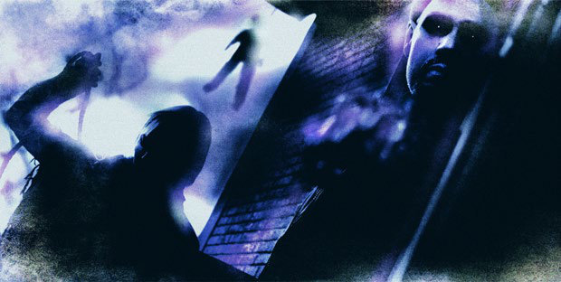

1 2 8

V5-Sabbat.pdf-renegadegames.com-#a11397-103

S A B B AT: T H E B L A C K H A N D

Thematic Elements, 121, 122 
Thin-blooded, 12, 29 
Third Generation, 13, 25, 29, 77-78, 
125-126 
Tijuana, 78, 81-82 
Titles, 58, 61, 80, 84  
Touchstone, 47, 60, 110
Tracker, 35
Traditions, 60, 110 
Transitive Bond, 49
Tremere, 49, 92, 126
Tzimisce, 45, 74, 92, 93, 126
Uhlan, 40-42, 67-68 
Umbrous Clutch, 49
Unbirthed, 43
Unerring Pursuit, 46
Unifiers, 27, 40-42 
Vampyre, 37
Vaulderie, 14, 50, 55, 56, 92
vincula, 9, 56, See also vinculum
Visceral Absorption, 49
vozhd, 45 
War of Ages, 14, 115 
War Party, 62 
Warrior, 86, See Pack Patterns
Wassail, 31, 79 
Western Europe, 83 
Wight, 80, 82, 117 
Wild Hunt, 61, 62, 63

Radicalizer, 37 
Reapers, 25, 37-40, 66-67 
Reclamation of Vitae, 50
Regent, 80
Rising Action, 115, See Narrative 
Structures
Ritae, 55-68
Rival Sects, 120, See Conflict  
Triangles
Russia, 71, 100
Sabbat, 7-8, 11-16, 19, 55-58, 74,  
91-94, 105-108, 109-114,  
115-119,122-123 See Black Hand, 
The, See Brothers and Sisters in 
Caine, See Cainites 
Sabbat Havens, 122-123, See Setting 
Elements
Scent of Prey, 47
Scholar, 88-89, See Pack Patterns
Scout, 86, See Pack Patterns
Second Inquisition, 7, 60, 61, 66, 71, 
91, 102, 120
Sermons of Caine, 64
Setting Element, 105, 122 
Shackled, 43-44, 81
Shovelhead, 56, 72, 75, 106, 115
Simulacrum Gate, 51
SITREP, 95 
Slayer, 35
Sleeper, 38
South America, 71
spectre, 38, 40, 43, 44, 52
Stains, 46-48, 50 
Stoking Revolution, 111,  
See Chronicle Structures
Stolen Blood, 126, See Thematic  
Elements, See Thematic Elements
Storytelling Technique, 124
Surge, 106, See Domains
Sword of Caine, 7, 13, 21, 33, 56, 71, 
76, 80, 95
szlachta, 40 
Tabula Rasa, 47
Tadarida, 83, See Priest
Templar, 85, See Titles
Temptation, 117-119, See Narrative 
Structures
Tenets, 59, 116
The Doctor, 81, See Julius Sutphen

1 2 9

V5-Sabbat.pdf-renegadegames.com-#a11397-103

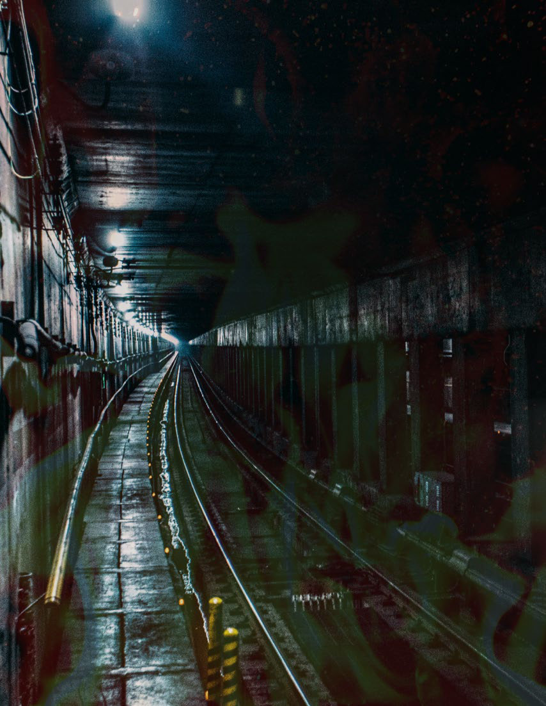

V5-Sabbat.pdf-renegadegames.com-#a11397-103

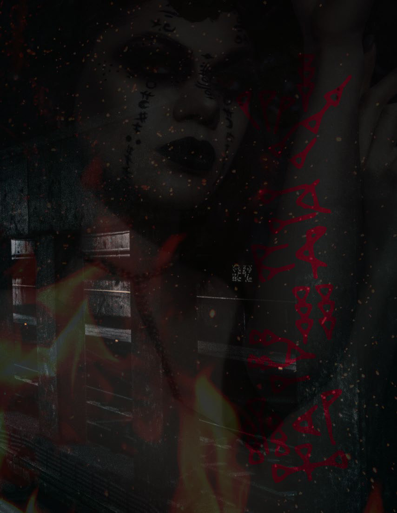

So, too, our Grandsires will rise from the ground
         They will break their fast on the first part of us
   They will consume us whole

– the book of nod

V5-Sabbat.pdf-renegadegames.com-#a11397-103

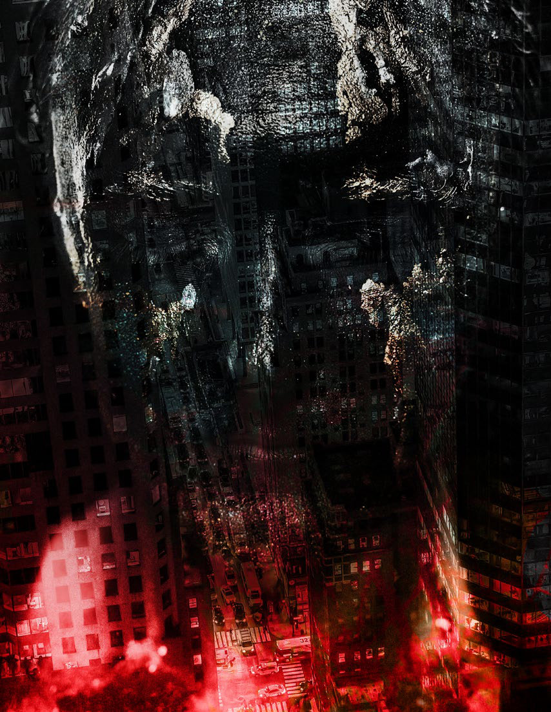

I gave a cry of anguish at this terrible curse  
	
       and tore at my flesh.
       I wept blood.
                    I caught the tears in a cup and drank them.

– the book of nod

V5-Sabbat.pdf-renegadegames.com-#a11397-103

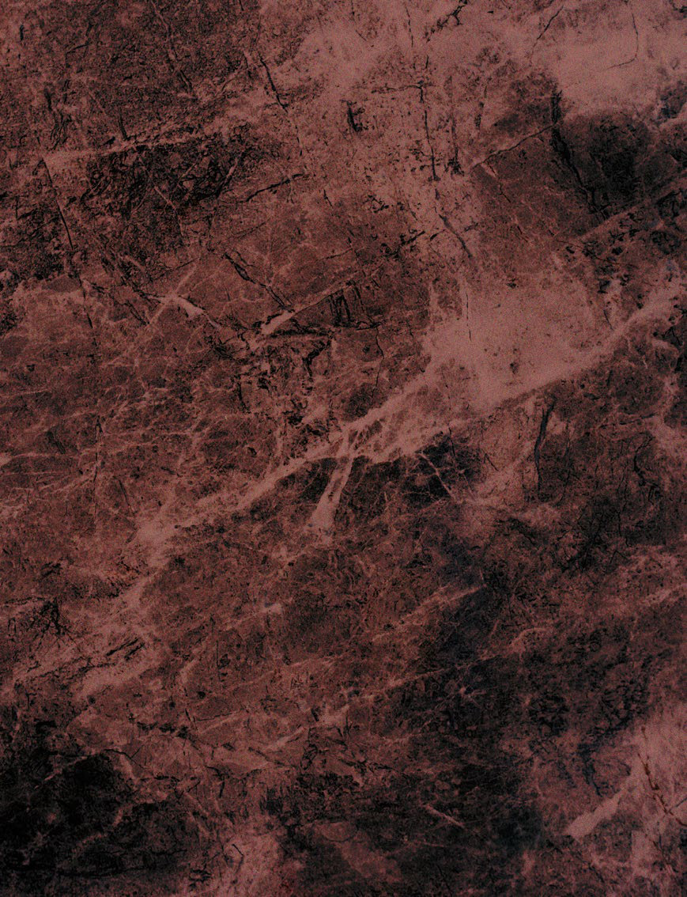

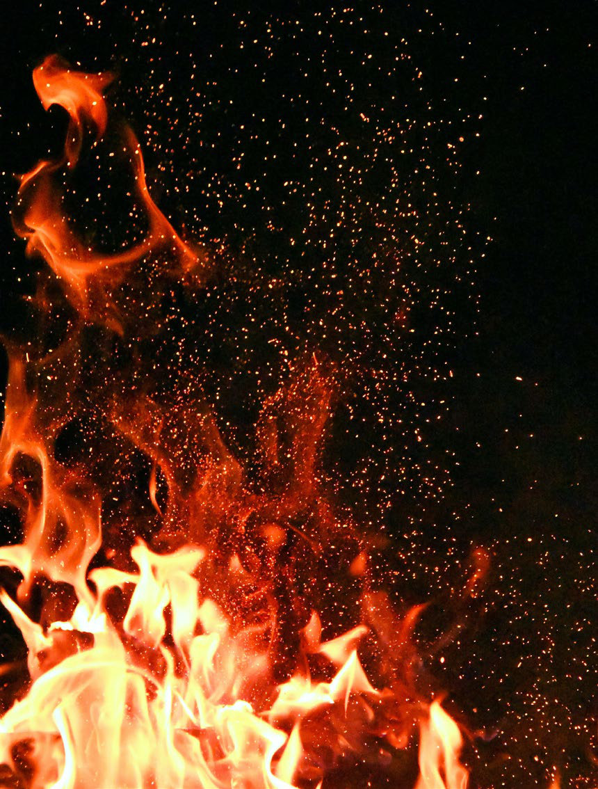

Brothers and Sisters in Caine, united under

the banner of the Dark Father

An antagonists’ guide to the cultic fanatics of the  
Sabbat, this book contains:

^	Descriptions of the Paths of Enlightenment, the 		
	
foundations of Sabbat identity

^	Information on the Gehenna War, and how the  
	
Sabbat opposes the dread Antediluvians

^	New tools to expand your chronicles, including  
	
Discipline powers, versatile antagonists, and the  
	
horrifying Ritae of the Black Hand

renegadegames.com

/PlayRGS          @PlayRenegade          @Renegade_Game_Studios

LOT# 041921-1

$45.00
Manufacturer: Renegade Games, LLC. 306N West El Norte Parkway #325, 
Escondido, California 92026. Importers: Renegade France 52 Avenue Pierre 
Semard 94200 Ivry sur Seine France. P:+33 (0)1 77 37 60 47. Renegade Games, 
LLC. Juxon House 100 St Paul’s Churchyard, London, England EC4M 8BU. 
© 2021 Renegade Game Studios. All Rights Reserved.
Paradox Interactive®, Vampire the Masquerade®, World of Darkness®, 
Copyright 2018 Paradox Interactive AB (publ). All Rights Reserved.
Made in Seoul, Republic of Korea.

54500>
ISBN 978-1-7359938-8-1

Mature Advisory: contains graphic and  
written content of a mature nature, including 
violence, sexual themes, and strong  
language. Reader discretion is advised.

9 781735 993881

V5-Sabbat.pdf-renegadegames.com-#a11397-103
