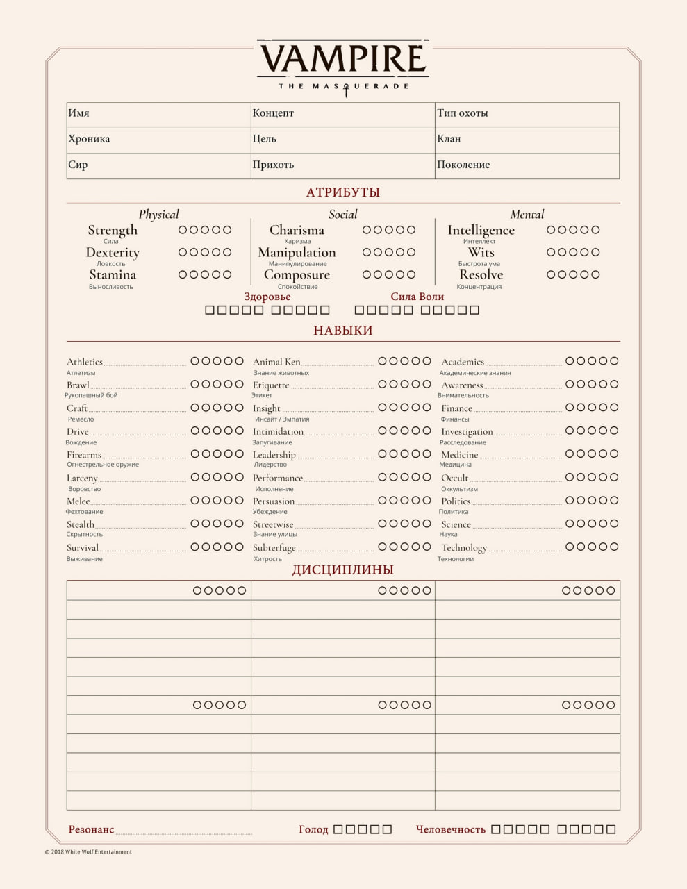
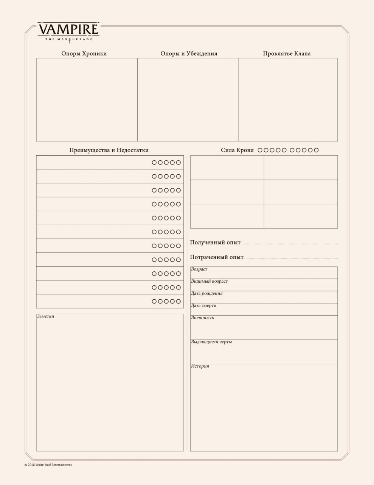

Это игра по мотивам Vampire The Masquerade: Bloodlines и [одноимённого веб-сериала](https://www.youtube.com/playlist?list=PLHy91_vd8BAM17yUmpgPr7ApLxsswJ1qy).

События игры происходят в [[Лос-Анджелес|Лос-Анджелесе]], в 2025 году.

Утром жители Лос-Анджелеса просыпаются, кто-то завтракает, а кто-то пропускает завтрак, спеша заняться работой, учёбой, заботой о близких или о собственном будущем. Они вливаются в километровые пробки, гонясь за своими делами, встречаясь за обедом в сотнях маленьких кафе и ресторанов, отбиваясь от промоутеров на забитых туристами улицах, обсуждая последние новости моды и знаменитостей, слоняясь рядом с голливудскими студиями в надежде увидеть кинозвезду или попытать шанс стать ей.

Все кроме вас, ведь ваши глаза были закрыты, ваши сердца не бились, а ваша кожа была холодной и серой.

Потому что вы мертвы.

Только после захода солнца вы приходите в движение, а ваши умы оказываются заняты совсем иными заботами.

## Создание персонажа

При создании персонажа вы можете воспользоваться правилами из [основной книги](https://drive.google.com/file/d/12hdmFgILvXD5CBzO6qHDkM47CQxF2iyv/view?usp=drive_link) по [пятой редакции](https://drive.google.com/drive/folders/1iniYOaPxiOGdN1CSVbjhIpXn4J7j0gQc?usp=drive_link), [руководством игрока](https://drive.google.com/file/d/1L569aQAcg6OYqOPg2GAdlnrXQM0U4CLJ/view?usp=drive_link), книге [Анархи](https://drive.google.com/file/d/1V9Dids6fpwnKuC4f34bB8BcJbSzU1sZx/view?usp=drive_link) и книге [Инквизиция](https://drive.google.com/file/d/1nXlqW61PhkWDd6F4eOMMfSL2s1HSXS_e/view?usp=drive_link), и если вы чувствуете себя особенно смело, [Малой Книги Знаний](https://drive.google.com/file/d/1HNHZzHN5g63C50a7GqSjCiv8QgVfWKn6/view?usp=drive_link).

Не все они обязательны к прочтению, знания основных правил достаточно.

В игру допускаются персонажи, получившие становление не раньше 1940 года - [[index#Краткое руководство|птенцы и неонаты]]. Пустой листочек для персонажа вы можете найти в [[index#Пустые листы персонажа|конце этого раздела]].

Подробная информация о создании персонажа, характеристиках, кланах, дисциплинах и прочем находится в [Компендиуме](https://lydian-romano-595.notion.site/V5-12690088c8f64c2ea6cf596d84631f13)

### Краткое руководство

#### **Концепт персонажа:**
Как зовут вашего Персонажа? Кем он был и чем занимался до Становления? Когда и как он получил Становление? Чем он занимается сейчас?

#### **Клан и Сир:**
Выберите Клан вашего Персонажа. Кто ваш Сир? Расскажите о нем.

#### **Атрибуты:**
Выберите **1** Атрибут на **4** точки - лучший Атрибутах вашего Персонажа;
Выберите **3** Атрибута на **3** точки -в этих Атрибутах ваш Персонаж также хорошо развит ;
Выберите **4** Атрибута на **2** точки - в этих Атрибутах вы мало отличаетесь от общей массы людей;
Выберите **1** Атрибут на **1** точку - худший Атрибут вашего Персонажа;

#### **Вторичные Атрибуты:**
По формулам вычислите и запишите ваши вторичные Атрибуты.
*Здоровье = Выносливость* + 3
*Сила воли = Самообладание* *+ Упорство*

#### **Навыки:**
Выберете один из способов распределения Навыков:

**Мастер на все руки**

- **1** Навык на **3** точки;
- **8** Навыков на **2** точки;
- **10** Навыков на **1** точку.

**Сбалансированный**

- **3** Навыка на **3** точки;
- **5** Навыков на **2** точки;
- **7** Навыков на **1** точку.

**Эксперт**

- **1** Навык на **4** точки;
- **3** Навыка на **3** точки;
- **3** Навыка на **2** точки;
- **3** Навыка на **1** точку.

Выберите бесплатную Специализацию для Навыков *Гуманитарные науки, Ремесло, Исполнение и* *Естественные науки* (если в них есть хотя бы 1 точка). Так же выберите бесплатную специализацию к любому Навыку вашего Персонажа.

#### **Дисциплины:**
Выберите **2** Клановые Дисциплины своего Клана. Вы можете отметить **2** точки в одной из них и **1** точку в другой.

Персонажи [_Каитифы_](https://www.notion.so/16514fa432cb41c08ceb964b4f970476?pvs=21) могут выбрать любые **2** Дисциплины.
Персонажи [_Слабокровные_](https://www.notion.so/94272d2db1984045990aadfdde964352?pvs=21) не имеют клановых Дисциплин и не выбирают их на этом этапе Создания Персонажа.

#### **Типы Хищника:**
Выберите один из *Типов Хищника* для своего персонажа и получите соответствующие черты.

#### **Преимущества:**
Потратьте **7** пунктов *Достоинств* и **2** пункта *Недостатков* в дополнение к тем что получил ваш персонаж за *Тип Хищника*.

*Слабокровные* персонажи должны выбрать **1-3** [_Достоинства Слабокровных_](https://www.notion.so/7267938819174ab98d3c4862d6894b17?pvs=21) и такое же количество [_Недостатков Слабокровных_](https://www.notion.so/7267938819174ab98d3c4862d6894b17?pvs=21).

#### **Опоры и принципы:**
Выберите **1-3** *Принципов* для вашего Персонажа. Для каждого из выбранных принципов создайте *Опоры*.

*Человечность* вашего персонажа равна **7** (может быть снижена из-за черт *Типов Хищника*).

#### **Возраст и Поколение:**
Совместно с Рассказчиком и другими Игроками решите какой возраст у ваших персонажей:

**Птенец:**
- Вы получили *Становление* в течении последних 15 лет.
- 14-ое, 15-ое, 16-ое *Поколения* ([_Слабокровный_](https://www.notion.so/94272d2db1984045990aadfdde964352?pvs=21)) - Сила крови **0**;
- 13-ое, 12-ое *Поколения* - Сила крови **1**.

**Неонат:**

- Вы получили *Становление* в период с 1940 года до десятилетия назад.
- 13-ое, 12-ое *Поколения* - Сила крови **1**.
- Все персонажи получают **15** *Очков Опыта.*

### Страницы истории
Некоторые персонажи, организации и локации обладают дополнительными возможностями, которые вы можете использовать. В их страницах описаны эти возможности, и указано, сколько точек Преимуществ следует потратить для их получения. Их количество не ограничено, количество разных персонажей, у которых вы их берёте, так же не ограничено, и они могут быть докуплены за опыт по стандартным правилам.

- [[Hollywood Forever]]

  Помощь хакера Митника в электронных взломах, эксцентричный гардероб от Ималии, знание подземных тоннелей, личное убежище в логове клана и возможность обмена информацией с бароном Гэри.

- [[The Last Round]]

  Специализация в боевых навыках, статус среди Анархов и союзников, наставничество Скелтера, доступ к убежищу с оружейной и стражей, а также особые знания о борьбе с оборотнями.

- [[The Wyrd Sisters]]

  Доступ к магической библиотеке, бонусы к броскам знаний, помощь в толковании снов и определении правды, компанию младшей сестры Киоко и возможность получить мистический артефакт от Хестер.

- [[Temple of Boom]]

  Работа в музыкальном лейбле с бонусами к Славе и Контактам, возможность получить аванс за привлечение новых талантов, использование имени Виктора для социальных бросков, право на открытие клуба-франшизы с бонусами к характеристикам и возможность получить крупную услугу от самого Виктора Темпла.

- [[Виктор Темпл]]

  Возможность сделать селфи с бароном для получения точки Славы, VIP-доступ в его клубы с безопасным убежищем, участие в музыкальном лейбле Temple of Boom с бонусом к Славе, команду из четырёх вооружённых охранников и право на убежище в Долине со статусом среди Анархов.

- [[Икс]]

  Специализация в музыкальном исполнении, авторитет среди бездомных, возможность потребовать крупную услугу от должника, силу Предчувствия без проверки Голода и личное предсказание будущего раз за хронику.

- [[Карвер]]

  Бонус к Запугиванию против Камарильи, эквивалент трёх точек Контактов для поиска редких вещей, возможность передать сообщение Карверу через анархистскую сеть, статус трёхточечного Мавла с изъяном Печально известный, и право на одну крупную услугу или эквивалент пяти точек в различных социальных преимуществах.

- [[Джаспер]]

  Уменьшение сложности социальных бросков с ним и его окружением, бонусные кубики к броскам Сокрытия и сбора информации, доступ к оккультной библиотеке, три дополнительные точки к Портильону Домена для защиты убежища и доступ в его тайный Лабиринт под парком Гриффит.

- [[Ева]]

  Дополнительный кубик к проверкам Человечности, безопасный проход через Гриффит-парк с небольшим убежищем, способность чувствовать опасность для близких, возможность проводить один ритуал Охраны без траты крови, а также получение трёхточечного Мавлы, точки Статуса (Анарх) и Врага (Камарилья).

- [[Нелли Гриффит]]

  Получение приглашений на эксклюзивные мероприятия, ежемесячный доступ к модной одежде с бонусом к социальным броскам, уникальный дизайнерский наряд с бонусом +3 к определённым социальным действиям, услуги личного гуля-телохранителя и возможность устранить одного смертного в Голливуде без следов раз за хронику.

- [[Хлоя Хадсон]]

  Визитка с номером Сети Архангела для социальных бонусов, три точки Союзников и Контактов как друзей в Сети, возможность сопротивляться приказам регнанта раз за сессию, доступ к помощи двух одарённых гулей раз за сюжет и возможность получить детальную информацию о вампире в обмен на витэ при личной встрече с Архангелом раз за сюжет.

- [[Рамона]]

  Легальный доступ в кампус UCLA через студенческое или преподавательское удостоверение, точные архитектурные зарисовки с бонусом к броскам Расследования, возможность передать сообщение любому сородичу, услуги Крысиной Стаи для шпионажа с бонусом к броскам и способность устроить разрушительное нашествие крыс на выбранное здание.

- [[Иб]]

  Бонусы к вождению и ремонту автомобилей, расширенную сеть информаторов с улучшенными Фонами, привилегированный доступ ко двору Камарильи для личных аудиенций, команду из четырёх вооружённых охранников для личной защиты и возможность провести одну тактическую операцию под её личным руководством за хронику.

- [[Айзек Абрамс]]

  VIP-доступ на голливудские мероприятия с бонусом к охоте, возможность узнать важный секрет о Лос-Анджелесе до 2021 года, доступ к киностудии для создания медиа-проекта, гарантированную встречу с любым бароном города и способность заставить барона скрыть любое нарушение Маскарада раз за хронику.

- [[Аннабель]]

  Получение точки Статуса (Анарх) и Врага (Камарилья), два дополнительных кубика к политическим броскам при упоминании её философии, два дополнительных кубика к сопротивлению Доминированию, эквивалент трёх точек Союзников среди анархов в любом домене и возможность получить значительную поддержку от её последователей раз за хронику.

- [[Эхо войны]]

  Прах анциллы для ритуалов, контакт с капитаном SWAT для вызова спецназа, аудиодневник Граута с секретами о сородичах, личную горгулью для защиты объектов (только для кровавых чародеев) и фрагмент оригинальной Книги Нод для совершения чудес раз за хронику.

### Баронства

[[Лос-Анджелес]] разделён между баронами - [[Анархи]] могут свободно охотиться и вести бизнес на территории своего барона, и свободно перемещаться по территориям других баронов, если не претендуют на сосуды или ресурсы их домена. Всего баронов шесть: [[Жаннет Ворман]], [[Гэри Голден]], [[Армандо Родригез]], [[Виктор Темпл]], [[Нелли Гриффит]] и [[Сикоракс]]. Каждый барон по-своему интерпретирует то, кому принадлежит тот или иной участок города, но им удавалось поддерживать шаткий мир, пока этому способствовал барон [[Айзек Абрамс]]. Когда он уехал на Зов, его домен между собой поделили Темпл и Гриффит, после чего территориальные споры возобновились.

[Карту баронств можно посмотреть по ссылке](https://www.google.com/maps/d/u/0/edit?mid=12UQZ1r_mBFQJs6_TrzVIeji2vOJutF4&usp=sharing)

[[Камарилья]] несколько раз пыталась подчинить себе город, каждый раз безуспешно - последнее такое вторжение окончилось смертью принца [[Себастьян Лакруа|Лакруа]], однако в наши ночи принц [[Ванневар Томас]] вновь желает рискнуть, воспользовавшись беспокойным временем.

Бывают столетия, в течение которых ничего не происходит, и ночи, в течение которых проходят столетия. В такие ночи судьба городов может оказаться в руках горстки сородичей, и может статься так, что именно вам придётся решить судьбу Лос-Анджелеса. Примкнуть к одному из Баронов, вступить в Камарилью или же выбрать район и самим его отстаивать - решение за вами.

## Пустые листы персонажа

