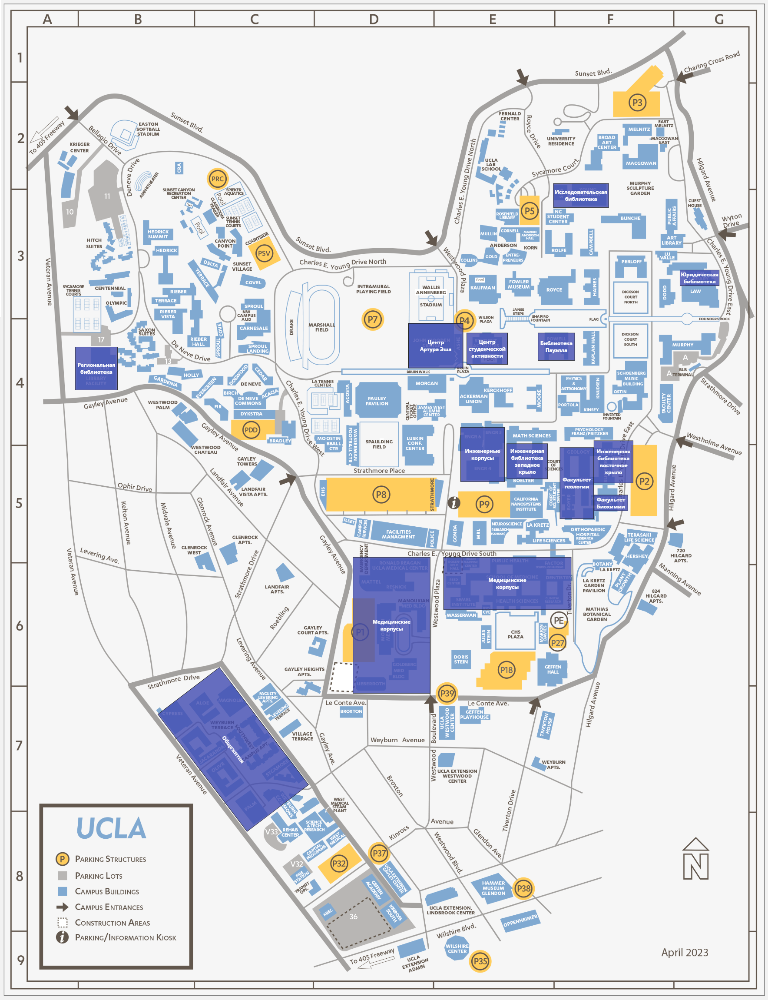

Весь Лос-Анджелес поделен на баронства между различными могущественными и старыми сородичами, и территорией, на которой охотитесь вы, управляет **Нелли Гриффит** — барон **Голливуда**. Ей принадлежат весьма обширные угодья от парка Гриффит на востоке до Бэл Эйра на западе, от автострады Вентура на севере до бульвара Санта Моника на юге.

Вашей котерии она доверила территорию университета UCLA в районе **Westwood**, находящегося в западной части её домена. Его кампусы, библиотеки, общежития, кафе, музеи и конечно центр Артура Эша - студенческий госпиталь университета - стали вашими охотничьими угодьями. Этим вечером каждому из вас пришло сообщение от барона Гриффит, требующего уделить внимание подозрительной активности в ваших угодьях.

# Перед игрой

Добро пожаловать на игру, я очень рад всех вас слышать, и видеть некоторых из вас.

Давайте мы все представимся друг другу. Меня зовут Никита, вы можете обращаться по имени, или же называть меня Рассказчик, мне комфортно и то, и другое. Так как мы с вами играем в первый раз, почему бы вам не рассказать друг другу немного о себе и о персонажах, которыми вы будете сегодня играть.

_Дать игрокам представиться_

Я хотел бы убедиться, что нас не подведёт техника.

- Микрофоны
- Камеры
- Музыка
- Кубики
- Загрузка сцен

Чудно. Поговорим немного об игре. Сегодня мы будем играть короткую историю, три-четыре часа максимум с перерывом примерно посередине. Для меня маскарад - это игра про людей, проклятых совершать чудовищные поступки, а поэтому в игре есть несколько слоёв табу, чтобы защитить нас от излишеств.

- Убеждения вашего персонажа, за нарушение которых персонаж получает пятна.
- Темы хроники - вещи, которые мы соглашаемся делать, как игроки, но при этом понимаем, что они аморальны и также могут привести к потере человечности.
- Красные флаги - вещи, которые мы делать не будем ни в коем случае.

Убеждения вы прописали сами, а вот о темах и флагах стоит поговорить.

_Если игроки не назовут темы сами, предложить им опоры хроники из списка:_

- Не лишать жизни смертных.
- Не идти на сделки с Камарильей.
- Не предавать котерию.

_Предложить им записать темы и красные флаги на страничку персонажа в фаундри, налить себе чая или покурить, и мы начнём._

# Вступление

Утром 1 октября 2025 года жители Лос-Анджелеса проснулись, кто-то позавтракал, а кто-то пропустил завтрак, спеша заняться работой, учёбой, заботой о близких или о собственном будущем. Они влились в километровые пробки, гонясь за своими делами, встречаясь за обедом в сотнях маленьких кафе и ресторанов, отбиваясь от промоутеров на забитых туристами улицах, обсуждая последние новости моды и знаменитостей, слоняясь рядом с голливудскими студиями в надежде увидеть кинозвезду или стать ей.

Но вы ничего из этого не делали, потому что ваши глаза были закрыты, ваши сердца не бились, а ваша кожа была холодной и серой. Потому что вы мертвы.

Только когда солнце скрылось за горизонтом, ваши тела пришли в движение, и вы занялись совершенно иными заботами, ведь каждому из вас пришло сообщение от барона Гриффит, требующей уделить внимание подозрительной активности в выданных вам угодьях. Этой ночью каждому из вас пришло сообщение от одного из гулей барона Голливуда:

> [!NOTE]
> В центре Артура Эша пропал запас плазмы для переливания за последние три дня. Пятеро студентов обратились со странными симптомами за прошедший месяц, причём симптомы заметно усилились в последнюю неделю.
> Приведите виновника к барону.

_Задать вопросы первому игроку, и остальных подбодрить, если не расскажут сами:_

- В каком настроении застаёт твоего персонажа сообщение от барона?
- Как ты одет, где ты?
- Проснувшись этим вечером, остался ли ты мёртв, или же пробудил свою кровь, чтобы почувствовать себя живым?

# Университет

Ночью калифорнийский университет так же полон жизнью, как и днём. По центральной площади Уилсона слоняются пьяные молодые люди в толстовках с логотипом местной футбольной команды, во дворах кампусов слышна музыка, а перед библиотекой на небольшой сцене выступает какая-то группа, играющая чудовищные каверы на Саймон и Гарфункель. Неясно, победила ли эта команда недавно или проиграла, потому что студенты устраивают вечеринки в любом случае.

_Медицинский центр, упомянутый в сообщении барона, находится рядом со стадионом, и занимает первый этаж здания студенческих клубов._

_Доступом к информации о больных студентах обладают только врачи, и они постараются не раскрывать её, чтобы сохранить врачебную тайну. Получить её можно, обманув одного из них или проникнув в один из кабинетов и взломав компьютер в нём. Камеры в коридорах клиники выводят картинку на монитор на стойке регистрации._

_**Хлоя Хадсон** (известная как **Архангел**) координирует расследование через свою сеть в медицинском центре. Эта высокая светловолосая женщина руководит Сетью Архангела — организацией, помогающей гулям и сородичам освободиться от кровавых уз. Учитывая характер инцидента с возможным принуждением студентов, она лично заинтересована в расследовании._

_Хлоя может предоставить доступ к медицинским записям и камерам наблюдения, а также связать игроков с информаторами среди персонала. Как свободный гуль с обширной сетью контактов, она представляет ценный ресурс, но потребует гарантий, что студенты будут защищены._

## Студенты

Двое из пяти обратившихся в клинику студентов — Лилия и Эндрю — работают в библиотеках, находящихся неподалёку. Луиза работает в кафе на первом этаже центра студенческой активности напротив, а Ван в общежитии — одном из нескольких пятиэтажных зданий на юго-западе. По их симптомам можно понять, что на них неаккуратно и слишком часто кормились. Судя по электронной почте, все они состоят в студенческом профсоюзе, и поиск в интернете даст понять, что месяц назад профсоюз организовал протест против студенческих кредитов, которыми их грабит университет, на бульваре Сансет 1 сентября, переросший в беспорядки с битыми машинами и витринами.

### Ён Ми

Cкрывается, но не слишком успешно — она не смогла избавиться от всей информации о себе, только лишь сорвав фото с формы пациента в клинике, когда воровала оттуда пакеты плазмы. Студенты, на которых она кормилась, по её просьбе не пошли на госпитализацию, однако их можно найти и допросить, и они выдадут её местоположение.

### Луиза

Познакомилась с Ён в кафе, посчитала её милой и застенчивой, и попыталась помочь ей раскрыться, познакомив со своими друзьями в студенческом профсоюзе. Они стали близкими подругами, и Ён надеется на развитие отношений.

### Лилия

Познакомилась с Ён и Луизой на кафедре. Она верная подруга и мудрая советчица, и беспокоится о своих друзьях. Свои отношения с Эндрю она стремится скрывать из-за страха перед реакцией своих родителей. Они - давние друзья и знакомы ещё со школы.

### Эндрю

В свою очередь, безбашенный сорвиголова, и во многом является двигателем студенческого протеста. Другие участники собираются в его библиотеке и в библиотеке Лилии, в зависимости от того, кто на смене этой ночью.

### Ван

Наименее замешан в делах профсоюза, и помогает другим студентам с технической стороны. Его туда затащила Ён, поддержав его в трудный момент, когда его донимали сверстники анонимными звонками. Общими усилиями они смогли узнать, кто это делал, деанонимизировать их и отомстить, отправив на их настоящие номера много-много спама.

## Связи персонажей

### Ён Ми и анархическое движение

Алхимические способности Ён делают её ценным активом для различных фракций:

- **Нелли Гриффит** видит в ней потенциального союзника для укрепления позиций Голливуда
- **Виктор Темпл** может предложить ресурсы **Temple of Boom** для развития её способностей
- **Ева** заинтересована в обучении Ён как альтернативе Пирамиде Тремер

### Студенческий профсоюз как политическая сила

Протест 1 сентября не был случайным событием — он отражает растущее социальное напряжение, которое могут использовать:

- **Армандо Родригез** и его анархи из Даунтауна для мобилизации масс
- **Вторая Инквизиция** для отслеживания сверхъестественной активности
- **Камарилья** для дискредитации анархов как "нестабильных"

### Информационная война

**Хлоя Хадсон** и **Сеть Архангела** видят в деле возможность:

- Расширить влияние среди студентов UCLA
- Создать сеть информаторов в медицинских учреждениях
- Противостоять принуждению гулей и потенциальных весперов

# Варианты поимки браконьера

## Медленные игроки 

В качестве более быстрого способа — можно позволить игрокам посетить **место становления Ён** на Сансет Бульваре. Несколько магазинов до сих пор обклеены полицейскими лентами после беспорядков.

**"Golden Pawn & Jewelry"** (6925 Sunset Blvd) выглядит заброшенным, но внимательный осмотр покажет:

- **Свежие следы** активности несмотря на "закрытие"
- **Подвал с пятнами крови** и узкое окошко для побега
- **Инструменты** и алхимическое оборудование в тёмной комнате, видной сквозь окно

**Свидетель-уборщик** работал в соседнем здании и видел:

- Как девушку (Ён) затащили в ломбард во время беспорядков
- Как она сбежала через окно подвала той же ночью
- Странную активность в "закрытом" магазине в последние дни
- Молодого парня (Чарли), которого привели туда недавно

**Дополнительные улики:**

- Камеры уличного наблюдения зафиксировали Чарли возле этого адреса
- Местные наркодилеры знают Ника и его ломбард
- Запись о последнем использовании карты Чарли в магазине через дорогу

## Социальное прохождение

Если игроки попались слишком умные и им не терпится пройти игру, можно сделать поимку сложнее. Чтобы найти Ён, игрокам надо найти и допросить хотя бы одного-двух NPC.

### Луиза

Это ответственный работник, которая нуждается в деньгах, приторговывая алхимическими снадобьями Ён. В карточке игроки узнают где она живет и работает.

Посещая комнату игроки найдут много конспектов и “бухгалтерскую книгу” которую она ведет. Эту информацию можно будет использовать чтобы шантажировать ее (если о ее маленьком бизнесе узнают, ее исключат). После этого игроки могут пойти к ней на работу и провести с ней диалог. Если на девушку немного надавить, то она согласится сказать местонахождение своего поставщика.

Если пойти напрямую в кофейню без посещения комнаты, то Луиза не скажет ничего про свою подругу (подумает что Ён хотят причинить вред). В таком случае игрокам надо устроить погром или начать распугивать клиентов.

Если игроки не отберут у девушки телефон, Ён будет предупреждена.

### Чарли Путт — пропавший спортсмен

**Дополнительная информация:** Исчезновение Чарли четыре дня назад создало переполох в спортивных кругах UCLA. Его:

- Ищет студенческая администрация
- Разыскивают тренеры спортивной команды
- Обсуждают в социальных сетях участники команды

Игроки могут использовать это для:

- Получения информации о последних местах, где видели Чарли
- Доступа к его общежитию и личным вещам
- Связи с другими членами команды, которые могут знать о странном поведении

**Конкретные зацепки о местонахождении:**

- **Последнее GPS-местоположение** телефона возле Hollywood Forever
- **Камеры безопасности UCLA** показывают его уход в сторону Сансет в компании с неизвестным в капюшоне
- **Свидетели из команды** видели его в последний раз 4 дня назад
- **Банковские записи** — последняя покупка в магазине напротив Golden Pawn
- **Записи в соцсетях** — геотеги фотографий в районе Сансет/Ла Бреа

**Осложнения:**

- Полиция может начать официальное расследование исчезновения
- **Вторая Инквизиция** может заинтересоваться "серийными исчезновениями" студентов
- Медиа-внимание к пропаже спортсмена повышает риск нарушения Маскарада

### Лилия и Эндрю

Милая пара которая скрывает свои отношения.

Посещая комнату игроки не найдут их, так как в комнатах будут сидеть пьяные после вечеринки подростки и не впустят их, но смогут сказать, что  Лилия и Эндрю зависают в библиотеке. В разговоре промелькнут такие фразы как “это странно что они вместе, они же не встречаются”, “Эта сладкая парочка всегда ходит вместе, на днях Эндрю чуть не пришиб футболиста, который трогал Лили”.

При агрессии подростки убегут и через минуту к комнате придут 2 охранника.

В библиотеке третьего этажа Лили и Эндрю в компании подростков из профсоюза заканчивают слушать выступление Кары Джонсон. Она рассказывает, как “Примерно по такой схеме они сделали меня должником… я должна теперь им в десять раз больше, а прошло уже 5 лет. Я все еще не могу в это поверить.” После обсуждения её истории, один из подростков поднимет тему произошедшего на протесте “Кстати, вы заметили, что на протесте были не только студенты, люди в масках пришли, смешались с толпой и начали провоцировать полицейских. После этого все пошло по плохому сценарию. Начали крушить магазины, в ход пошли перцовые баллончики.”

Лили и Эндрю можно увести от их друзей (иначе те заступятся за них) надавив или пригрозив одному из них, другой из-за страха потерять или причинить боль любимому, скажет где находиться Ён.

Если игроки не отберут телефоны и желательно не запрут подростков в комнате кафедры, Ён будет предупреждена.

### Ван

Вана можно будет найти только в его комнате, мирно спящим. Если игроки будут его тормошить, он не проснется. Его сможет разбудить только вите одного из вампиров и удачно прокинутая выносливость от Вана. На шее парня будет свежезализаная рана от которой остались кровавые разводы.

Компьютер парня будет работать. В нём можно найти переписку с Ён Ми, где она:

- Просит его остаться в комнате, так как сейчас придёт к нему
- Упоминает "место на Сансет, где всё началось"
- Предупреждает не ходить к "ювелирному магазину возле кладбища"

**Также в браузере:**

- Поиски "Golden Pawn Jewelry Sunset Boulevard"
- Карты маршрута от UCLA до Hollywood Forever
- Статьи о беспорядках с фотографиями разгромленных магазинов

От лица Вана можно написать сообщение девушке и найти её, либо использовать найденную информацию для прямого поиска логова.

# Веспер

Ён ещё не понимает до конца, что она такое, и основывает свои представления о вампирах на мифах и популярной культуре. Не зная, как именно люди становятся вампирами, она хочет поделиться со своими друзьями своими новыми способностями, надеясь что ей удастся сделать это не так травматично, как поступил с ней её сир.

Она помнит протест, помнит как попала под полицейские дубинки и была избита. Помнит, как спряталась в одном из магазинов, витрину которого разбили протестующие, и как кто-то оттащил её в какой-то подвал. Неожиданно боль ушла, а потом наступила темнота, и её сменил голод. В подвале она провела большую часть ночи, пока не пришёл мужчина в капюшоне и не бросил ей мальчишку лет пятнадцати.

«Твой обед», сказал он и запер дверь обратно.

Поддавшись голоду, она лишила мальчишку жизни, и это придало ей достаточно сил, чтобы выломать решётку на узком подвальном окошке и сбежать. Весь месяц она обращалась за помощью к своим друзьям из профсоюза, когда её одолевал голод, но недавно поняла, что её кормление вредит им, особенно когда голод усилился. Понимая, что причиняет им вред, она три дня назад украла несколько пакетов для переливания из медицинского центра Артура Эша.

За месяц своего посмертия Ён сумела разобраться в открывшихся новых способностях к алхимии, экспериментируя на кафедре биохимии с использованием лаборатории кафедры:

- Используя сухой лёд и кровь Луизы, она научилась создавать облака тумана, цепляющегося к её телу, окутывающего её и скрывающего её личность.
- На основе жидкого нейлона и крови Вана она сделала снадобье, дающее ей на время способности к телекинезу.
- С помощью материалов на кафедре и крови Лилии и Эндрю она смогла восстанавливать из пакетов для переливания настоящую кровь.

Она также заметила, что ей стало гораздо сложнее сдерживать свою ярость, и при малейшей провокации она начала срываться. Её друзья пытаются помочь ей научиться сдерживать себя, а сама она винит пережитую травму в изменениях своего поведения.

Этой информации будет достаточно, чтобы определить, кто становил Ён - не так много брух обитают в баронстве Гриффит, и несложно понять, кто из них потерпел ущерб во время студенческих протестов. Однако, определить дальнейшую судьбу студентки и её сира вне компетенции игроков. Барон Гриффит хотела, чтобы они доставили браконьера ему, и это ему решать, что делать дальше.

| ГУМОР           | ЭЛЕМЕНТ | ПСИХИЧЕСКАЯ ЗАЩИТА И ПОВЕДЕНИЕ | ГОРМОН                    | ЭМОЦИИ, СОСТОЯНИЯ И КАЧЕСТВА                                               |
| --------------- | ------- | ------------------------------ | ------------------------- | -------------------------------------------------------------------------- |
| Холерический    | Огонь   | Чувства                        | Адреналин                 | Сердитый, агрессивный, деспотичный, активный                               |
| Меланхолический | Земля   | Мышление                       | Гормоны щитовидной железы | Грустный, напуганный, задумчивый, депрессивный, прагматичный               |
| Флегматический  | Вода    | Интуиция                       | Гормон гипофиза           | Ленивый, апатичный, спокойный, сосредоточенный, сентиментальный            |
| Сангвинический  | Воздух  | Ощущение                       | Тестостерон/эстроген      | Похотливый, счастливый, одурманенный, активный, легкомысленный, увлечённый |

С помощью оккультизма и теста Айзенка другие игроки могут разобраться, что для создания своих рецептов Ён использует кровь разных резонансов:

- Луиза - холерик (нестабильный экстраверт)
- Лилия - меланхолик (стабильный интроверт)
- Ван - флегматик (нестабильный интроверт)
- Эндрю - сангвиник (стабильный экстраверт)

# Барон Гриффит

Встреча происходит в **студии Thorn** — сети бутиков и творческих пространств **Нелли Гриффит** на Голливудском бульваре. Главная студия занимает переоборудованное здание 1940-х годов. На первом этаже у него несколько ювелирных магазинов,
на втором, третьем и четвёртом шикарные апартаменты, а заканчивается лестница двойными дубовыми дверями, за которым находится
просторная комната, занимающая большую часть этажа, с балконом, нависающим над улицей. Много латуни, много красного дерева, много
ковров. На стенах развешаны эскизы коллекций, а между ними — карты разных районов Голливуда. Рабочий стол завален образцами тканей, фотографиями и сотней листочков, вырванных из разных блакнотов. На мраморных постаментах под стеклом расположились искусно выполненные предметы реквизита. У дальней стены от входа стол размером с авианосец, в лакированной столешнице которого отражается гигантская люстра.

**Нелли Гриффит** встречает котерию в своей мастерской на верхнем этаже. Эта элегантная женщина с темными волосами, собранными в художественный беспорядок, одета в собственную дизайнерскую одежду — узкое чёрное платье с кожанными вставками на плечах и на спине, на голове чёрный берет с золотой каймой, а на указательном пальце левой руки конструкция из золотых колец, образующая длинный острый коготь. По левую руку от неё на ветру развевается тюль - балконные двери открыты и шум и ветер с улицы залетает в комнату. Она встаёт и кивает гостям в приветствии.

Первое время она будет держаться формально в разговоре с сородичами своего баронства, но, поняв что перед ней совершенно свежий птенец, она смягчится и выразит желание помочь Ён найти её сира - отчасти потому, что подобные становления являются угрозой для маскарада, и его следует наказать, а отчасти потому что желает заручиться верностью веспера и воспользоваться ей, чтобы узнать секреты алхимии, доступные самым молодым сородичам этого города.

Во время разговора Ён может случайно упомянуть, что исследовала тему вампиризма вместе со своей подругой, которая полностью в курсе её состояния. **Нелли** ответит на её вопросы и вопросы других игроков, и предположит, что виноват в становлении **Ник** — носферату, формально подчиняющийся **Гэри Голдену**, и в собственных интересах промышляющий контрабандой.

**Политическая дилемма:** Нелли не может действовать на территории Гэри без его разрешения, но и не может игнорировать угрозу на своих границах. Она может предложить котерии действовать неофициально или попытаться получить согласие Гэри на совместную операцию.

# Ник

Ник - садист и контрабандист из клана **Носферату**, ведущий двойную игру. Формально он подчиняется **Гэри Голдену**, барону **Южного баронства**, но тайно действует на границе территорий, занимаясь нелегальной перевозкой драгоценных металлов, камней, людей и оружия. Его угодья занимают несколько ломбардов и ювелирных лавок на бульваре Сансет, недалеко от кладбища **Hollywood Forever** — сердца баронства Гэри.

**Политическая сложность:** Гэри не знает об экспериментах Ника с весперами и будет крайне недоволен, узнав, что его подчиненный компрометирует клан Носферату и создает проблемы для анархов. **Нелли Гриффит** находится в деликатной ситуации — она не может действовать на территории Гэри без его разрешения, но и не может игнорировать нарушения на своей границе.

Первоначально Гриффит считает, что Ник обратил студентку из мести за участие в протестов, повредивших его бизнес. Однако истинная причина гораздо серьезнее — он экспериментирует с созданием весперов-алхимиков на кровавых узах. Ён была одним из экспериментов носферату, которому стало известно об алхимии. Обращая новеньких и удерживая в своём подвале, он пытался заполучить себе весперов на узах, которые будут варить ему зелья.

В подвале, в котором он удерживал её, можно обнаружить **Чарли Путта** — недавно обращённого веспера, члена студенческой спортивной команды UCLA, являющейся стадом котерии игроков. Чарли находится в состоянии сильного замешательства, только начиная понимать, что с ним произошло. Ник держит его на кровавых узах, заставляя экспериментировать с алхимическими формулами. Ник обустроил ему комнату, и держит его в заперти, выпуская только под присмотром - для кормления, экспериментов и усиления уз.

Сам Ник в тот момент, когда игроки обнаружат подвал, будет охотиться, чтобы достать кровь со специфическими резонансами.

## Чарли Путт

Недавно обращённый веспер (менее недели) на кровавых узах у Ника (уровень 2-3). Защищает Ника, выполняет приказы, находится в состоянии смятения. Может сопротивляться явно саморазрушительным приказам. Чарли был становлён Ником всего несколько дней назад и ещё не успел осознать полную картину своего нового состояния. Как бывшее стадо котерии игроков, он представляет особую ценность и создаёт личную заинтересованность в расследовании.

### Алхимические эксперименты

Ник заставляет Чарли участвовать в создании алхимических формул, используя его кровь в сочетании с кровью смертных. Поскольку разные люди обладают разными резонансами, их совместная кровь позволяет создавать более сложные зелья.

### Варианты освобождения:

**Немедленные (временные):**

- Использование дисциплин для подавления уз (Доминирование, Присутствие)
- Физическое разделение на расстояние более мили на 24+ часов
- Эмоциональный шок (напоминание о прошлой жизни, друзьях из команды)

**Долгосрочные (постоянные):**

- Ритуалы **Евы** по разрыву кровавых уз (требует редкие компоненты)
- Процедуры **Сети Архангела** (психологическая реабилитация)
- Смерть домитора

Если игрокам удастся освободить Чарли от уз до финального противостояния с Ником:

### Информационные преимущества:

- Знание планировки логова Ника
- Информация о его режиме и привычках
- Местоположение алхимического оборудования
- Слабые места в защите подвала

### Боевые преимущества:

- Дополнительный союзник в бою (хотя и ослабленный)
- Знание тактик Ника и его возможных ловушек
- Моральное преимущество - освобождённый веспер против угнетателя

### Политические преимущества:

- Живой свидетель экспериментов Ника
- Доказательство принуждения и создания весперов против их воли
- Символ успешного противостояния власти клана Носферату

**Осложнения:** Чарли может испытывать Стокгольмский синдром или остаточное влияние уз, что создаст моральные дилеммы для игроков.

# Пути к логову Ника

## Основные маршруты расследования

### 1. Через Ён Ми (прямой путь)

Если игроки найдут Ён через студентов, она может рассказать о месте своего становления:

- **Магазин на Сансет Бульваре** где её схватили во время протеста
- **Подвал под магазином** где она провела первую ночь
- **Описание пути побега** через узкое окошко в переулок

**Зацепка:** Ён помнит запах полироли и металла из магазина наверху.

### 2. Через место становления (альтернативный путь)

Расследование магазина, пострадавшего во время протеста:

- **Полицейские ленты** до сих пор ограждают несколько магазинов
- **Свидетель-уборщик** видел, как девушку затащили внутрь
- **Следы крови** в подвале указывают на недавнее использование
- **Ювелирные инструменты** намекают на связь с ломбардом

### 3. Через контрабандную сеть (социальный путь)

Расследование деятельности Ника как контрабандиста:

- **Информаторы на улице** знают о Нике и его делах
- **Другие ломбарды** могут упомянуть конкурента на Сансет
- **Наркодилеры и скупщики** работали с Ником
- **Записи о сделках** в других криминальных логовах

### 4. Через исчезновение Чарли (эмоциональный путь)

Следуя по следам пропавшего спортсмена:

- **Камеры наблюдения UCLA** зафиксировали его уход в сторону Сансет
- **Свидетели из команды** видели его 4 дня назад
- **Мобильный телефон** Чарли дает последний сигнал возле Hollywood Forever
- **Кредитная карта** последний раз использовалась в магазине возле логова

## Конкретное местоположение

**Адрес:** 6925 Sunset Boulevard (между Оранж Драйв и Ла Бреа)
**Прикрытие:** "Golden Pawn & Jewelry" - ломбард с ювелирной мастерской
**Подвал:** Переоборудован под алхимическую лабораторию с камерами для пленников

### Планировка логова:

- **Главный этаж:** Обычный ломбард с витринами и кассой
- **Подсобка:** Ювелирная мастерская с инструментами
- **Подвал - уровень 1:** Алхимическая лаборатория с оборудованием
- **Подвал - уровень 2:** Камеры содержания (комната Чарли, бывшая камера Ён)
- **Аварийный выход:** Узкое окно в переулок (путь побега Ён)

### Улики в логове:

- **Алхимическое оборудование** с образцами крови разных резонансов
- **Дневник экспериментов** Ника с записями о весперах
- **Кровавые образцы** Чарли и неизвестных жертв, помеченные символами гуморов
- **Контрабандные товары** как доказательство основной деятельности
- **Карты территорий** с отмеченными местами охоты

## Аварийные зацепки (если игроки застряли)

Если игроки не могут найти логово через основные пути, ведущий может использовать:

### Прямые подсказки:

- **Нелли Гриффит** получает сводку о подозрительной активности возле Hollywood Forever
- **Хлоя Хадсон** находит медицинские записи о покупке крови в районе Сансет
- **Информатор Гэри** сообщает о "проблемах с одним из наших" в ломбарде

### Случайные встречи:

- **Местный наркодилер** предлагает информацию о Нике за услугу
- **Бездомный** видел странную активность в "закрытом" ломбарде
- **Полицейский патруль** упоминает жалобы на шум из подвала Golden Pawn

### Эскалация угрозы:

- **Ник** сам выходит на охоту и игроки могут проследить за ним
- **Сеть Архангела** перехватывает сообщения о торговле кровью
- **Второя Инквизиция** начинает расследование, создавая временное давление

# Политические последствия

## Связи с баронами

Дело Ён Ми может повлиять на отношения между баронствами:

- **Нелли Гриффит** должна показать, что контролирует свою территорию, особенно после недавних событий с нападением Инквизиции
- **Гэри Голден** может быть недоволен, что носферату из его клана действует без ведома, компрометируя репутацию Южного баронства
- **Виктор Темпл** заинтересован в весперах-алхимиках для своего бизнеса и может предложить Ён укрытие

## Потенциальные союзники

- **Хлоя Хадсон** может предложить Ён помощь Сети Архангела
- **Ева** (Тремер-анарх) заинтересуется алхимическими способностями Ён
- **The Wyrd Sisters** из Долины могут предложить обучение взамен на услуги

## Угрозы

- **Вторая Инквизиция** может использовать нарушения Маскарада для усиления контроля
- **Камарилья** может попытаться использовать ситуацию для дискредитации анархов
- **Чарли Путт**, теперь веспер на кровавых узах у Ника, создаёт критическую личную заинтересованность для котерии — спасение их бывшего стада может стать вопросом чести и выживания

# Альтернативные развития

## Вмешательство Гэри Голдена

Если игроки попытаются действовать на территории **Hollywood Forever** без разрешения, **Гэри Голден** может лично вмешаться. Как опытный носферату и барон Южного баронства, он будет заинтересован в том, чтобы "навести порядок в семье" собственными силами. Ник мог действовать с ведома одного из потомков Гэри — **Ималии**, **Митника** или **Барабуса**, что добавляет политическую интригу.

## Помощь ведьм-Тремер

**The Wyrd Sisters** (**Хестер**, **Виолет Луна** и **Киоко**) из **Мистического Круга** в Долине могут предложить помощь в понимании алхимических способностей Ён. **Виктор Темпл**, всегда готовый к выгодным инвестициям, может увидеть в весперах-алхимиках новую возможность для бизнеса **Temple of Boom**.

## Вмешательство Инквизиции

Беспорядки, студенческие протесты и нарушения Маскарада могут привлечь внимание **Второй Инквизиции**. Появление агентов СИ превратит охоту на браконьера в гонку на время и добавит элемент выживания для всех участников.

## Роль Евы

**Ева** (Тремер-анарх) из Гриффит-парка может заинтересоваться алхимическими способностями Ён как альтернативой традиционной магии крови Тремер. Её изгнанничество и оппозиция к **Максимилиану Штраусу** делают её естественным союзником для весперов-изгоев.

## Подключение других баронов

- **Жаннет Ворман** из **Asylum** может предложить Ён убежище в обмен на "интересные истории"
- **Армандо Родригез** и команда из **The Last Round** могут увидеть в деле символическую борьбу против угнетения
- **Сикоракс** и **Валькирии** могут предложить более радикальное решение проблемы Ника

## Долгосрочные последствия

### Развитие алхимии весперов

Успешное спасение и обучение Ён и Чарли может привести к:

- Созданию новых алхимических формул с использованием комбинированных резонансов двух весперов
- Развитию уникальных техник, основанных на опыте принуждения и освобождения
- Партнерству с **The Wyrd Sisters** для изучения альтернативной магии крови
- Созданию противоядий от алхимических формул принуждения
- Конфликту с традиционными Тремер, особенно **Максимилианом Штраусом**
- Привлечению внимания других весперов со всего побережья

### Политические изменения

Дело может повлиять на баланс сил между баронствами:

- Укрепление позиций **Нелли Гриффит** через демонстрацию контроля
- Потенциальный конфликт с **Гэри Голденом** из-за действий Ника
- Новые союзы между баронами для противостояния общим угрозам

### Подготовка к будущим угрозам

Инцидент может стать катализатором для:

- Создания системы раннего предупреждения о нарушениях Маскарада
- Координации между **Сетью Архангела** и баронами анархов
- Подготовки к возможному вмешательству **Второй Инквизиции**

# Истории болезни

