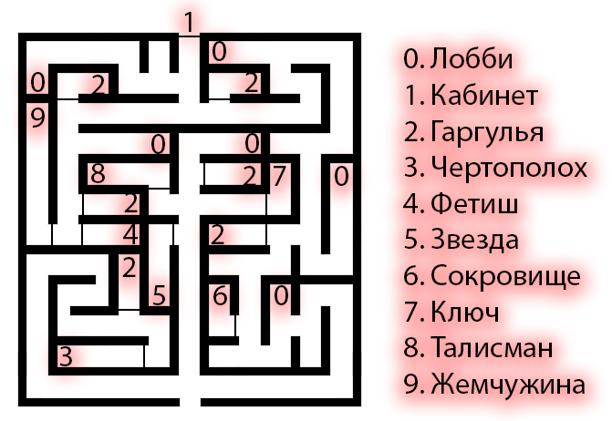

### Лабиринт

Для того, чтобы пройти во внутренние помещения капеллы из лобби, игрокам нужно преодолеть лабиринт коридоров. Стены, пол и потолок выглядят одинаково, и в зависимости от того, куда игроки поворачивают, они могут оказаться перед одним из альковов, в которых Штраус хранит свои магические предметы, перед его кабинетом или же столкнуться лицом к лицу с его гаргульей.

Гаргульи и артефакты находятся за закрытыми, но не запертыми дверьми - при открытии двери с гаргульей она просыпается и атакует игроков, при открытии двери с артефактом срабатывает ловушка с испытанием соответствующей характеристики персонажа. Гаргульи могут также проснуться от шума, если услышат его в радиусе 3 клеток. Дверь в кабинет заперта и требует 6 успехов испытания Силы или 8 успехов Ловкости для взлома, и шум от взлома также может разбудить гаргулий.

### Гаргулья

ХАРАКТЕРИСТИКИ: сила 5, ловкость 3, выносливость 5; обаяние 1, манипуляция 1, самообладание 1; интеллект 1, смекалка 4, упорство 2.

ПРОИЗВОДНЫЕ ХАРАКТЕРИСТИКИ: здоровье 8, воля 3.

НАВЫКИ: наблюдательность 5, расследование 4; атлетика 4, воровство 2, выживание 5, драка 4, скрытность 4, стрельба 1, фехтование 3; запугивание 4, обращение с животными 4, хитрость 2.

ДИСЦИПЛИНЫ: Анимализм 3, Стойкость 3, Стремительность 4, Мощь 4.

ЧЕЛОВЕЧНОСТЬ: 0. СИЛА КРОВИ: 3

### Шипы Чертополоха

При открытии двери несколько длинных, тонких словно иглы, щеп отделяются от двери и повисают в воздухе горизонтально заполняя собой коридор, становясь практически невидимыми, если смотреть на них прямо. Требуется испытание ловкости и атлетики по 6 сложности, чтобы пройти сквозь них, не поранившись. Каждый недостающий успех наносит 1 летальный урон здоровью персонажа. Щепы можно сдвинуть достаточно длинным и большим предметом, например шваброй. Если поджечь щепы, ближайшая гаргулья прибежит тушить пожар и нападёт на игроков.

### Голодные бинты

При открытии двери ничего не происходит, в комнате нет ловушек, но если игрок возьмёт бинты в руку, они попытаются вцепиться в него, забираясь под одежду и присасываясь к коже. Требуется испытание ловкости и борьбы по 6 сложности, чтобы не дать им выпить свою кровь, и если это не удастся, требуется испытание выносливости по 4 сложности, и каждый недостающий успех вызовет увеличение Голода на 1 пункт.

### Стук

При открытии двери становится виден красный полупрозрачный магический барьер, пульсирующий со звуком бьющегося сердца. Только игроки со включенной Искрой Жизни могут пересечь барьер, но если игрок возьмёт в руки Кровавую Звезду, эффект ИЖ пропадает. Звук бьющегося сердца исходит от артефакта и будит гаргулий в пределах 1 клетки.

### Фейские чары

При открытии двери игроки увидят залитый солнцем луг. Солнечный свет останавливается на границе двери и является иллюзорным, но для того, чтобы выйти на луг и забрать сокровище, им нужно будет преодолеть бросок Воли по 4 сложности или впасть в Ротшрек.

### Испытание стойкости

При открытии двери ничего не происходит, в комнате нет ловушек, но если игрок возьмёт ключ, персонаж ощущает, как его тело начинает каменеть. Требуется бросок выносливости по 7 сложности, чтобы не застыть на месте. Каждый недостающий успех — 1 ход паралича.

### Иллюзии прошлого

При открытии двери ничего не происходит, в комнате нет ловушек, но если игрок возьмёт талисман, персонаж видит галлюцинации — сцены из жизни предыдущего владельца, лондонского тремера Шри Сансы. Требуется бросок быстроты ума и оккультизма по 6 сложности, чтобы отличить реальность от иллюзии. Провал — персонаж действует по ложной информации, считая что его призывает Митра для посвящения в свой культ.

### Проклятье роскоши

На первый взгляд в комнате нет ничего подозрительного, но сняв жемчужину с пъедестала, на котором она стоит, начинает бить жемчужний фонтан, заполняя пол комнаты мелким скользким жемчугом. При движении в комнате игрокам нужно совершать броски Ловкости и Атлетики по 4 сложности, чтобы не упасть, при этом сложность будет увеличиваться за каждый ход, проведённый в комнате. Звук падения привлечёт ближайшую гаргулью.
