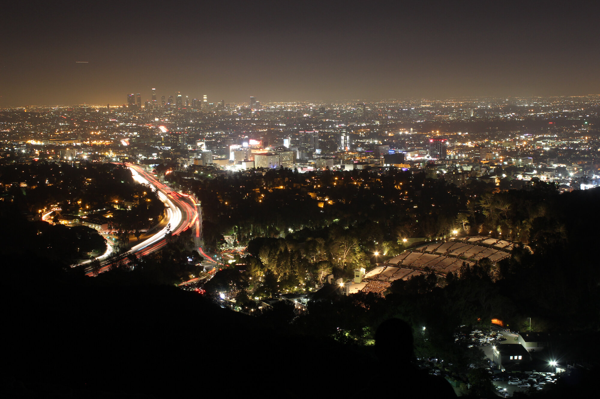

Что-то зловещее происходит в Тарзане. Сны о ночной охоте, семьи, таскающие домой дохлых животных, музыка, что играет всю ночь в пустом парке - все знаки указывают на падшего сородича, окончательно поддавшегося Зверю. Малкавиан и двое Гангрел должны объединиться: острое чутье безумца и звериные инстинкты хищников против того, кто забыл, что значит быть человеком.

Больше ста лет назад земли, на которых сейчас расположен этот пригород, приобрёл писатель Эдгар Райс Берроуз, автор книг о Тарзане, назвавший своё ранчо в честь своего героя. Когда сельская жизнь оказалась ему не по плечу, он поделил владение на земельные участки и распродал. Часть жителей респектабельного района была недовольна легкомысленным названием и пыталась добиться его смены, но в дальнейшем оно прижилось.

Район состоит из двух частей - Долины, в котором проживает большая часть населения, и Холмов, в котором в основном находятся парки. К нашим дням район потерял свой шик - плотная застройка в долине превратила её в бетонные джунгли, уронив цену на жильё, отчего сюда стали сходиться обедневшие жители из других районов и приехавшие на заработки мигранты. Хотя днём парки и остатки архитектуры из прошлого столетия и привлекают туристов, по ночам они так же темны и опасны, как и лес, в котором нашёл свой дом герой книги Берроуза.

Между тенистыми аллеями старого ранчо и современными торговыми центрами, смертные живут, не подозревая о ночных хищниках, что скрываются в тенях.

## Персонажи

### Лакшми - Малкавиан

Предки из Индии, учится в аспирантуре по психиатрии, собирает выборку для диссертации по пограничному личностному расстройству и любовным зависимостям, исследует мужчин и женщин. Ходят слухи, что крутит романы с преподавателями, но конкретно не была в этом замечена.

Становление произошло во время одного из её исследований - она изучала пациента с диссоциативным расстройством, когда поняла, что он не болен, а одержим чем-то большим. Её сир, старый Малкавиан по имени Ананда, увидел в ней потенциал для понимания человеческой психики через призму безумия. Теперь её прежние исследования приобрели новый, более глубокий смысл, а связь с Паутиной Безумия позволяет ей чувствовать эмоциональные сети между людьми.

Её видения часто принимают форму снов о событиях, которые ещё не произошли, но в которых она выступает в роли хищника. Это пугает её, потому что противоречит её желанию помогать людям.

Убеждения:

- Всегда помогай женщине, попавшей в беду
- Будь внутренне свободной

### Кейт - Гангрел

Родилась в Техасе. Отец — бывший офицер полиции, человек, для которого принципы значат больше слов. Прямой, жёсткий, практичный. Он учил её стрелять, сажал на лошадь, водил в тир, отдавал на курсы самообороны, и, наверное, всегда считал, что готовит к какому-то суровому будущему. Но росла с другой тягой — её были интересны системы, закономерности, исследования. Не порядок как дисциплина, а порядок как структура мира.

Поступила в хороший университет — по стипендии, сама. Училась на программе по биотехнологиям, ушла с головой в исследования, работала в лаборатории, готовила PhD. Были планы, настоящие взрослые планы: гранты, публикации, научное признание. И ни в одном из этих планов не было места для крови, ночи и чудовищ.

Становление случилось резко во время полевых исследований в горах Техаса. Её сир - одинокий Гангрел, защищавший территорию от вторжения корпорации, увидел в ней того, кто сможет использовать научный подход для защиты природы. Всё, что она помнит — это странная тишина перед нападением, то, как небо стало казаться слишком близким, боль, тьма и слова: "ты пригодишься природе больше, чем людям."

После становления её звериные черты проявляются в обострённых чувствах и способности чувствовать опасность на уровне инстинктов. Научное мышление помогает ей контролировать Зверя, но иногда логика отступает перед первобытными позывами.

Убеждения:

- Защищай тех, кто не может защитить себя
- Никогда не действуй без плана

### Вейла - Гангрел

Она родилась в небольшом городке, на окраине, у женщины, которую местные считали "странной" и диковатой. Она жила в уединении, по слухам - разговаривала с животными, не имела ветеринарного образования, но славилась тем, что могла излечивать некоторых животных. Жители городка побаивались ее и старались обходить стороной, но обращались к ней с просьбами, когда их питомцам не мог помочь местный ветеринар. Часто к ней прибегали дети, оставляя на пороге ее дома выпавшего из гнезда птенца или покалеченную собаку.

Отец был смертным, тайным оккультистом, интересовавшимся вампирами, духами и магией. Он был обаятельным, умным, но чем-то пугающим. Он исчез из её жизни довольно рано, когда ей было 10 лет. Через 9 лет исчезла мать.

Вейле всегда были близки животные, она росла среди них, часто наблюдала за матерью, которая делала "что-то" и животные выздоравливали. Но ей всегда хотелось быть не просто тайной целительницей, а "законным" ветеринаром, чтобы к ней обращались не в качестве последней меры, а регулярно и открыто. Помимо этого, хотелось совместить гиперчувствительность к животным, которая досталась от мамы, возможность их понимать и приручать с научным подходом и современными навыками врачевания.

Однажды она нашла раненого оленя, который явно был жертвой оккультного ритуала. И рядом - страницу с печатью, которую ставил отец в своих книгах. Вейла начала исследовать собственное прошлое и обнаружила, что её родители ей врали - они похитили её, когда она была ещё ребёнком, и воспитывали как свою. Её "мать" была вампиром-Гангрел, а её "отец" - гулем матери, её подчинённым. За нарушение Маскарада её отца убили, а матери пришлось бежать в лес.

Когда Вейла нашла её в глуши, полудикую и едва помнящую человеческую речь, мать призналась, что всегда планировала сделать её своей наследницей. Становление было болезненным, но необходимым - старая Гангрел чувствовала приближение окончательного впадения в дикость и хотела передать свои знания о природе кому-то, кто сумеет их сохранить.

Сейчас она по-прежнему живёт на границе города и леса, ведёт прием в своей маленькой клинике, тут же находится её небольшой приют для бездомных кошек. Иногда к ней приходит 15-летний мальчик Люк, чтобы помогать с приемом и заодно учиться (так он подрабатывает). Ей нравится, что он любит животных, и нравится обучать его тонкостям, которых никто не знает, кроме неё.

Убеждения:

- Всё живое заслуживает шанса на исцеление
- Передавай знания тем, кто готов их принять

# Перед игрой

Добро пожаловать на игру, я очень рад всех вас видеть. Вы можете обращаться по имени, или же называть меня Рассказчик, мне комфортно и то, и другое. Так как мы с вами играем в первый раз, почему бы вам не рассказать друг другу немного о персонажах, которыми вы будете сегодня играть.

_Дать игрокам представиться_

Я хотел бы убедиться, что нас не подведёт техника.

- Микрофоны
- Камеры
- Музыка
- Кубики
- Загрузка сцен

Чудно. Поговорим немного об игре. Сегодня мы будем играть короткую историю, три-четыре часа максимум с перерывом примерно посередине. Для меня маскарад - это игра про людей, проклятых совершать чудовищные поступки, а поэтому в игре есть несколько слоёв табу, чтобы защитить нас от излишеств.

- Убеждения вашего персонажа, за нарушение которых персонаж получает пятна.
- Темы хроники - вещи, которые мы соглашаемся делать, как игроки, но при этом понимаем, что они аморальны и также могут привести к потере человечности.
- Красные флаги - вещи, которые мы делать не будем ни в коем случае.

Убеждения вы прописали сами, а вот о темах и флагах стоит поговорить.

_Если игроки не назовут темы сами, предложить им опоры хроники из списка:_

- Защищать невинных от сверхъестественных угроз.
- Не убивать людей.
- Не поддаваться своему Зверю.

_Предложить им записать темы и красные флаги на страничку персонажа, налить себе чая или покурить, и мы начнём._
КФ:

- Излишние физиологические подробности

# Сюжет

### Голливуд

Днём Голливуд оживает. Туристы стекаются к бульвару Сансет, уличные артисты в костюмах супергероев позируют на Аллее Славы, а в кафе и студиях кипит работа — сценаристы сочиняют новые истории, продюсеры ищут будущих звёзд, операторы склеивают кадры, а на улицах мелькают съёмочные группы. В жилых кварталах жизнь течёт тише: пожилые соседи поливают лужайки, домработницы спешат к особнякам, курьеры развозят посылки, а экскурсионные автобусы показывают фасады домов знаменитостей, стараясь не слишком помешать им своим присутствием.

Всё это время вы лежите недвижимыми, безжизненными трупами. Ваша кожа холодная и серая, глаза закрыты а сердца не бьются.

Потому что вы мертвы.

Только к вечеру, когда пригородная суета уступает место тишине ночи, освещённой редкими уличными фонарями и светом из окон домов, с последними лучами уходящего солнца, вы вновь смогли пошевелиться. И этой ночью что-то не так. В воздухе висит напряжение, тревога... предчувствие грядущей опасности.

### Ветеринарная клиника 1

Небольшое одноэтажное здание на окраине Тарзаны, окружённое низкой изгородью и маленьким двориком, где свободно гуляют несколько кошек. Вывеска "Клиника доктора Вейлы" едва заметна в свете уличного фонаря, а окна светятся тёплым жёлтым светом. Внутри пахнет дезинфицирующими средствами и чем-то травяным, на стенах висят дипломы и фотографии вылеченных животных, а в углу стоят клетки для временного содержания пациентов.

_Дать Вейле описать своё пробуждение и начало ночи в клинике._

В ветеринарную клинику Вейлы обращается пожилой мужчина Чарли. Он возвращался в Топангу по Малхолланд Драйв на своей лошади Груше жемчужного оттенка, когда на дорогу сошёл оползень. Чарли в порядке, но лошадь серьёзно пострадала - хромая, они почти три часа добирались до ветклиники. Чарли много жалуется на жизнь, на невежливых туристов, плохо обращающихся с ним и с Грушей, и про громкую музыку, которую он слышал из парка Марвина Броуди.

Всё время, пока они шли мимо, из парка доносилась одна и та же песня, судя по всему зацикленная и игравшая снова и снова.

### Сон Лакшми

Лакшми во сне приходит видение ночной охоты - как будто она в парке крадётся к группе молодых парней, отдыхающих и громко слушающих музыку. Они не слышат её до последнего момента, когда она набрасывается и раздирает их глотки. Их крики тонут в громком ритмичном бите музыки. Парочка умудряется сбежать отмахиваясь горящими ветками, и, выждав, она пускается в погоню.

Проснувшись в ужасе и тошноте, она некоторое время не может прийти в себя, из-за того, как сильно отличается это от её обычного питания. Паутина Безумия шепчет ей, что это не просто сон, а видение чего-то, что происходит или произойдёт.

_Где-то рядом есть сородич, полностью поддавшийся Зверю, и его присутствие отзывается в её снах._

### Павильон Паули

Дождь барабанит по крыше общественного центра, превращая вечер в серую пелену. Капли стекают по широким стеклянным окнам здания в стиле модерн середины прошлого века, искажая уличные фонари в размытые жёлтые пятна. Мокрые ступени, ведущие к главному входу, блестят под тусклым светом, а лужи отражают неоновую вывеску "Community Center", половина букв которой мигает с перебоями.

Внутри просторный зал кажется ещё более унылым под флуоресцентным освещением, которое отбрасывает резкие тени в углах помещения и придаёт всем лицам болезненную бледность. Деревянные панели на стенах потемнели от времени, а в воздухе висит запах сырости, дешёвого кофе и едва уловимый аромат страха. Складные стулья расставлены в неровный круг, некоторые скрипят под весом сидящих. В центре небольшой столик с термосом кофе, печеньем в мятой упаковке и стопкой потрёпанных листовок.

Женщины сидят, сгорбившись, словно пытаясь стать меньше, незаметнее. Одна в поношенной куртке на несколько размеров больше, капюшон натянут так, что лица почти не видно. Другая нервно теребит рукава свитера, скрывающего синяки на запястьях. Третья одета аккуратно, но её взгляд постоянно метается к выходу, а пальцы сжимают ремешок сумки так крепко, что костяшки побелели.

Лакшми отправляется на встречу HEaL - Healing, Empowering, and Liberating, организации, занимающейся помощью людям, преимущественно женщинам, пережившим домашнее или сексуальное насилие. Дождь за окном усиливается, и звук капель создаёт мрачный фон для разговоров. Здесь она встречает Кейт, пришедшую, чтобы помочь обучить девушек безопасно обращаться с оружием - её военная выправка контрастирует с осторожными движениями остальных женщин.

На встрече есть новые девушки - пара сестёр Микейла и Таниша, пострадавших от того, что их отец связался с какой-то бандой в Тарзане, бедном районе на северо-западе города. Хуже всего то, что он теперь тащит домой трупы животных, сбитых на дороге, и отказывается выбрасывать, даже когда они начинают вонять.

_Задать вопросы первому игроку, и остальных подбодрить, если не расскажут сами:_

- В каком настроении сейчас твой персонаж?
- Как твой персонаж добрался в это место?
- Как ты одет?
- Проснувшись сегодня, остался ли ты мёртв, или же пробудил свою кровь, чтобы почувствовать себя живым?

_О семье: "Отец изменился после того, как связался с какими-то парнями. Теперь он приносит домой мёртвых животных, говорит, что это для еды, но мы их даже не готовим. Они просто лежат в гараже и воняют. А ещё он шьёт что-то из шкур, и куда-то их увозит..."_

_О банде: "Они называют себя как-то странно, у всех клички. Отец говорит, что работает с Толстым Джо и кем-то по кличке Змей. Они платят ему за какую-то работу, но он не говорит за какую."_

_Если использовать Прорицание или подобные способности, можно почувствовать страх и отчаяние, исходящие от сестёр, а также что-то ещё - отголосок запаха гнили и крови, словно они сами стали частью чего-то зловещего._

### Тарзана

Когда вы покидаете встречу и направляетесь к ветеринарной клинике, ночной Тарзана встречает вас совсем иной атмосферой, чем центральный Голливуд. Днём Тарзана - это лабиринт бетонных домов и асфальтированных дворов, где бегают дети, а взрослые торопятся на работу или в магазины. Школьные автобусы везут учеников через жилые кварталы, на детских площадках звучат голоса, а в кафе и небольших офисах размеренно течёт жизнь пригорода. В горах туристы гуляют по тропинкам парков, наслаждаются видами, фотографируют закаты, а местные жители выгуливают собак и занимаются спортом на свежем воздухе.

Ночью же здесь нет ярких огней и шумных толп туристов - вместо этого тихие жилые улицы погружены в мягкое свечение уличных фонарей, прерывающееся только редкими витринами круглосуточных магазинов и заправок. Лишь несколько баров и ресторанов продолжают светиться, привлекая ночных завсегдатаев. В отличие от центра города, здесь чувствуется дух старого пригорода - широкие улицы, засаженные пальмами и дубами, дома с просторными дворами, где ещё можно увидеть остатки былого величия ранчо Эдгара Райса Берроуза.

### Ветеринарная клиника 2

Кейт и Лакшми отправляются к Вейле, чтобы вместе разобраться с назревшими в их районе проблемами. Груша так же спокойно относится к Кейт и Вейле - животные чувствуют в них близость к природе, но приходит в ужас, завидев Лакшми. Звериные инстинкты Гангрел подсказывают им, что лошадь реагирует не на клан Малкавиан, а на что-то другое, что она почувствовала в Лакшми - отголосок того безумного хищника, чьи охоты отражаются в её снах.

_О музыке: "Всю дорогу одна и та же песня играла, будто кто-то поставил на повтор и забыл. Странная какая-то, ритмичная, но жуткая. Груша всё время дёргалась, когда мы мимо проходили."_

_О парке: "Раньше там тихо было по ночам, только иногда туристы приезжали. А теперь каждую ночь эта музыка, и странные люди там собираются. Днём никого нет, а как стемнеет - начинается."_

_Если персонажи голодны и признают власть барона Топанги, они могут поохотиться, но должны соблюдать её правила._

_Если персонажи захотят поохотиться, Вейла может предложить им альтернативы - банки с кровью от животных из клиники или контакты людей, готовых добровольно поделиться кровью за небольшую плату._

## Перерыв

_Время для обсуждения найденных улик, планирования дальнейших действий и, возможно, охоты или восстановления Воли._

_На этом этапе игроки должны понять связь между семьёй, которая таскает трупы животных, музыкой из парка и снами Лакшми. Если они не догадываются, можно дать дополнительные подсказки через обострённые чувства Гангрел или видения Малкавиан._

### Малхолланд Драйв

_Обсудив детали с Вейлой, котерия отправляется на Малхолланд Драйв._

Извилистая горная дорога, проложенная по хребту холмов Санта-Моники, откуда открывается вид на огни Лос-Анджелеса внизу. Построенная в 1924 году по проекту инженера Уильяма Малхолланда, эта дорога задумывалась как "самое великолепное шоссе в мире" - 21-мильная лента асфальта, соединяющая два участка шоссе 101 через вершины Санта-Монических гор. Густые заросли чапараля по обеим сторонам дороги шумят от ночного ветра, а редкие дома прячутся за поворотами, освещённые только собственными фонарями.

На въезде в парк котерия находит первые тела - пара бандитов, выглядящих так, словно бежали от кого-то. Их одежда изорвана, обуви не хватает, а на телах царапины и следы укусов, похожих на змеиные. Их следы ведут в сторону парка Марвина Броуди, откуда доносится музыка.

_Если персонажи осматривают тела:_

- На одном из них можно найти кошелёк с удостоверением - это Блондинчик, кореец лет 20
- На втором - татуировки на лице и шрамы - это MC69, чернокожий мужчина лет 55, в кошельке фото двух дочерей
- Следы крови ведут от тел обратно к парку, словно их сначала ранили там, а потом они пытались бежать
- Укусы на шеях явно вампирские, но слишком жестокие - обычно сородичи аккуратнее

_Проверка Прорицания позволяет почувствовать остаточные эмоции: животный ужас жертв и безумную ярость хищника, забывшего о пощаде._

### Парк Марвина Броуди

Ночью парк превращается в мрачное место - высокие деревья отбрасывают густые тени, а единственное освещение исходит от нескольких фонарей вдоль главной тропы. В глубине парка есть несколько полян, где можно разбить лагерь, и именно оттуда доносится навязчивая музыка. Глубокие каньоны и скалистые хребты создают естественные акустические камеры, где звуки отражаются и искажаются, создавая жуткие эхо.

Лагерь оставшихся бандитов в самом парке легко отыскать по музыке. Портативная колонка, подключённая к телефону, играет одну и ту же песню снова и снова - "Beast" от Rob Zombie, тяжёлые гитарные риффы эхом отражаются от деревьев. Костёр почти погас, угли ещё тлеют, но пламени нет. Разбросанные вокруг спальные мешки, пустые бутылки от пива и остатки еды говорят о том, что здесь недавно кто-то был.

На телах можно найти оружие и мобильные телефоны с контактами семи членов банды:

- Малыш Пит (самый молодой, низкорослый чернокожий подросток лет 15)
- Билли (отсутствует)
- Блондинчик (кореец лет 20, с серёжками и крашеными светлыми волосами)
- Толстый Джо (белый лет 40, с пятнистой кожей и опухшими диабетическими ногами)
- MC69 (самый старый в группе, чернокожий мужчина лет 55 с татуировками на лице)
- Донателло (бритый налысо мускулистый иранец, потерял по два пальца на обоих руках)
- Змей (отсутствует)

Пятерых из них можно опознать - Блондинчик и MC69 сбежали и были убиты на дороге, а Донателло, Малыш Пит и Толстый Джо лежат у потухшего костра. Рядом с ними можно найти пару холодильных ящиков - один с пивом а другой с телами животных. У Толстого Джо также можно найти сумку с подозрительным мелко фасованным порошком и швейным набором.

_Если персонажи осматривают лагерь:_

- Музыка играет уже несколько часов - телефон почти разрядился
- Тела животных в холодильнике частично съедены, но не приготовлены - кто-то ел их сырыми
- В швейном наборе Толстого Джо иглы для работы с кожей и сухожилиями, но также хирургические нити
- На одежде всех трупов следы когтей и клыков

_Если персонажи используют Прорицание:_

- Последние эмоции жертв - ужас и непонимание: они знали нападавшего
- В воздухе висит запах хищника - не человека, не обычного вампира, а чего-то дикого
- Направление, в котором скрылся убийца, ведёт к пещерам в холмах

Проверка компьютеров позволит проникнуть в шифрованное приложение на телефонах, через которые бандиты общались. По предыдущим сообщениям можно понять, что кто-то руководил группой, обещая наградить того из них, кто лучше всего покажет себя в течение месяца, и им оказался Билли. Отчитывались они с помощью геоточек - и последняя из них находится в пещере Ванальден.

_Взлом телефонов требует проверки Интеллект + Технологии (Сложность 4). При провале игроки могут попытаться становить любого из членов банды (получая пятна на Человечность) и допросить._

_Альтернативный путь: если игроки обратят внимание на швейный набор и порошок, они могут понять, что банда занималась транспортировкой наркотиков, используя трупы животных как укрытие для контрабанды. Это объясняет, почему отец сестёр таскал домой мёртвых зверей._

### Пещера Ванальден

_Небольшая природная пещера в холмах над Тарзаной, входящая в систему пещер **Vanalden Cave**, популярная среди туристов и местных жителей для коротких походов. Вход в пещеру частично скрыт зарослями маназниты и диких сумахов, характерных для чапараля Южной Калифорнии. Внутри прохладно и влажно круглый год._

Обычно здесь можно увидеть граффити туристов и следы костров от ночёвок, но сейчас в воздухе висит тяжёлый запах крови и разложения. Пещера уходит вглубь на несколько сотен футов, образуя естественные камеры и проходы. Глубже в пещере полная темнота, нарушаемая только отблесками от телефона или фонарика.

В пещере любой звук многократно отражается от стен, искажаясь до неузнаваемости. Известняковые наросты отбрасывают уродливые тени, напоминающие замершие человеческие силуэты.

Именно в этой естественной крепости Билли устроил свое логово, окружённое остатками своих жертв. Пещера соединяется с системой подземных ходов, ведущих к другим пещерам в Санта-Монических горах, что делает её идеальным убежищем для того, кто не хочет быть найденным.

Билли, наевшись бывших коллег, отдыхает в пещере. Он полностью поддался Зверю и превратился в вайта - вампира без человечности, способного только жрать. Члены банды стали для него лёгкой добычей, так как были знакомы ему вдоль и поперёк.

Внешне он больше не выглядит человеком: кожа побледнела до серо-синего оттенка, ногти удлинились и заострились, превратившись в когти, а клыки стали заметно длиннее. Глаза горят красным светом в темноте, а движения стали слишком быстрыми и резкими, как у дикого зверя. На его изорванной одежде засохшая кровь, а вокруг разбросаны обглоданные кости.

На шее у него талисман - четыре треугольника, помещённые друг в друга, символ Министри, а в кармане одежды всё ещё телефон, по которому его можно выследить, если он станет невидимым.

Игроки могут решить, что делать с ним - пытаться восстановить его человечность или убить его. В любом случае он будет агрессивен по отношению к ним и попытается применить силу.

**Способности Билли-вайта:**

- Сокрытие 2 (плащ теней и незримая поступь)
- Метаморфозы 3 (глаза зверя, оружие зверя и смена облика)
- Фактически неуязвим для обычного оружия
- Атакует когтями (3 дайса урона) и клыками (2 дайса + высасывание крови)
- Скорость и рефлексы значительно превышают человеческие

_Бой с вайтом должен быть опасным и напряжённым. Он использует темноту пещеры в свою пользу, нападает из засады и пытается разделить группу. Если его здоровье падает ниже половины, он пытается сбежать._

_Попытки восстановить его человечность требуют проверки Харизма + Убеждение (Сложность 8) и много времени. Большинство игроков предпочтут его уничтожить._

_Если Билли будет уничтожен, на его теле можно найти телефон с адресом в Даунтауне - клуб в котором он встретил Змея._

Только у него в телефоне есть данные, по которым можно найти Змея - он отправил ему сообщение, чтобы тот наведался в клуб в Даунтауне, когда придёт в себя. Если Билли останется жив, он сам расскажет, как найти Змея, но его рассказ будет бессвязным и полным звериных рычаний.

## Эпилог

После того как угроза Билли-вайта устранена или нейтрализована, котерии предстоит разобраться с последствиями. Семья девушек из HEaL нуждается в помощи - их отец либо мёртв (если он входил в банду), либо травмирован происходящим. Ветеринарная клиника Вейлы может стать временным убежищем для них.

**Чарли**, пожилой владелец лошади Груши, окажется благодарным свидетелем. Его рассказы о странной музыке и поведении животных помогли раскрыть преступление. **Груша**, всё ещё хромая, но выздоравливающая под заботой Вейлы, станет живым напоминанием о том, как звери чувствуют приближение зла раньше людей.

**Территория Топанги** остаётся под контролем анархов. Если персонажи действовали в рамках местных законов и защищали невинных, они могут рассчитывать на нейтралитет или даже благосклонность властей. Местные стражи, узнав о судьбе павшего сородича, проведут собственное расследование, чтобы понять, как такое могло произойти на их территории.

**Опыт:** Персонажи получают опыт за защиту невинных и разоблачение вайта, а также за сохранение Маскарада во время кровавых событий. Дополнительный опыт полагается за особенно изобретательные решения или попытки спасти Билли вместо его уничтожения.

**Последствия:** Действия персонажей в Тарзане не останутся незамеченными. Местные власти могут заинтересоваться пришельцами, показавшими такую эффективность. Другие анархи могут обратиться к котерии за помощью в похожих ситуациях. А где-то в городе **Змей** - последний член банды - всё ещё остается на свободе, и его история может стать началом новых приключений.

### Если полиция найдёт трупы

Если игроки не позаботятся о сокрытии тел жертв Билли, это приведёт к серьёзным последствиям:

- **Нарушение Маскарада:** Следы укусов и характер повреждений на телах явно указывают на сверхъестественное происхождение убийств. Это привлечёт внимание [[Вторая Инквизиция|Второй Инквизиции]].

- **Полицейское расследование:** Департамент полиции Лос-Анджелеса начнёт масштабное расследование серийных убийств. Детективы будут опрашивать местных жителей, что усложнит охоту для вампиров в районе.

- **Медиа-освещение:** Новости о жестоких убийствах попадут в СМИ. Журналисты наводнят район, усложняя соблюдение Маскарада для местных сородичей.

Чтобы избежать этих последствий, игроки могут:

- Инсценировать нападение диких животных
- Уничтожить тела с помощью огня или кислоты
- Переместить тела в другое место
- Использовать связи с полицией или СМИ для сокрытия правды
