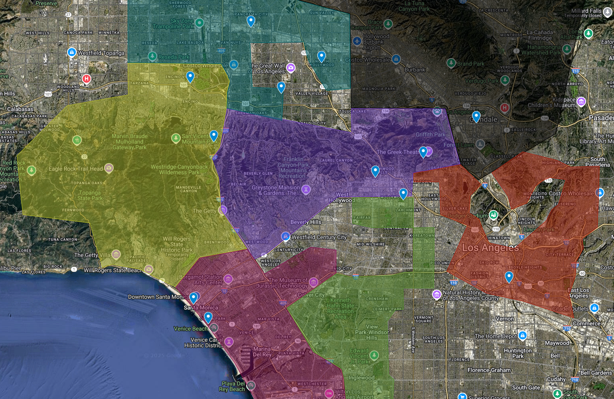

Беспокойный город.
В 1940-х молодые сородичи восстали, и улицы окрасились кровью старейшин. В муках родился Свободный Штат Анархов под лидерством легендарного Джереми МакНила. Анархи порезали город на баронства, давая обещание всем сородичам создать город равенства и справедливости среди немёртвых. Но как и с любыми обещаниями, болтать не мешки ворочать. В наши ночи город по-прежнему разделён на баронства - домены могущественных баронов-анархов, каждый из которых живёт по своим законам и подчиняется своему повелителю. Здесь власть не всегда видна на поверхности: она прячется в тенях небоскрёбов, в клубах на побережье, в лабиринтах катакомб и среди холмов, где шёпот предков слышен сквозь шум машин. Бароны и князья ведут свои игры, меняя маски и правила, но каждый из них держит свою территорию железной хваткой — кто-то через страх, кто-то через соблазн, кто-то через верность или компрометирующую информацию.

[Карту баронств можно посмотреть по ссылке](https://www.google.com/maps/d/u/0/edit?mid=12UQZ1r_mBFQJs6_TrzVIeji2vOJutF4&usp=sharing)

В Лос-Анджелесе можно с равными шансами обрести власть или погибнуть в борьбе за неё.

---

[[Анархи]] могут свободно охотиться и вести бизнес на территории своего барона, и свободно перемещаться по территориям других баронов, если не претендуют на сосуды или ресурсы их домена

## [[Даунтаун]]

Под контролем [[Армандо Родригез|барона Найнза]], харизматичного и прямолинейного [[Бруха|брухи]]-[[Анархи|Анарха]]. Его власть держится на уважении к свободе и силе, а улицы Даунтауна наполнены энергией борьбы, музыки и постоянного движения. Здесь нет места для слабых: каждый, кто решается бросить вызов системе, должен быть готов постоять за себя. Даунтаун — сердце города, где власть и уличные банды сталкиваются в вечной игре за выживание.

Ключевой локацией Даунтауна является бар [[The Last Round]].

## [[Голливуд]]

Вотчина [[Нелли Гриффит|барона Гриффит]], опасной и обаятельной [[Тореадор]], для которой этот район — сцена и подиум. Голливуд — территория соблазна, власти и иллюзий, где за блеском витрин скрываются интриги и борьба за влияние. Здесь выживают только те, кто умеет быть красивым и опасным, а каждый вечер превращается в спектакль, где на кону — судьбы и мечты.

Ключевой локацией Голливуда является студия [[Thorn]].

## [[Долина]]

Территория [[Виктор Темпл|Неоспоримого Барона Долины Виктора Темпла]], прагматичного и жёсткого [[Вентру]], для которого Долина — крепость и бизнес. Здесь ценят верность и силу, а каждый знает: за этими улицами стоит тот, кто не бросает своих. Долина — пространство свободы и независимости, где забота и сила идут рука об руку, а барон всегда рядом, чтобы защитить своих.

Ключевой локацией Долины является клуб [[Maharani]].

## [[Побережье]]

Владение [[Жаннет Ворман|барона Ворман]], эксцентричной и страстной [[Малкавиан|малкавианки]]. Побережье — это сцена для самых сладких игр, где волны шепчут секреты, а каждый клуб и пирс наполнен её присутствием. Здесь соблазн и опасность идут вместе, а сама Жаннет правит, играя и карая, превращая побережье в свой личный рай и арену для интриг.

Ключевой локацией Побережья является клуб [[Asylum]].

## [[Топанга]]

Земля [[Сикоракс]], суровой и суеверной [[Гангрел]], возглавляющей банду Валькирий. Топанга — дикие холмы, где корни уходят глубже бетона, а ночь наполнена запахом мха и крови. Здесь ценят верность и силу, а чужаки быстро становятся добычей. В Топанге закон диктует сама природа, а Сикоракс — её голос и судья.

Ключевой локацией Топанги является [[Валькирии|мастерская Loki's]]

## [[Юг]]

Подземный театр [[Гэри Голден|барона Голдена]], мастера информации и интриг из клана [[Носферату]]. Южные районы — закулисье города, где решаются настоящие судьбы. Здесь ценят дисциплину и информацию, а власть держится на сети агентов и умении видеть суть за фасадом. Гэри Голден — режиссёр этого теневого Голливуда, где каждый играет свою роль, даже не подозревая об этом.

Ключевой локацией Даунтауна является кладбище [[Hollywood Forever]].

---

[[Камарилья]] несколько раз пыталась подчинить себе город, каждый раз безуспешно - последнее такое вторжение окончилось смертью принца [[Себастьян Лакруа|Лакруа]], однако в наши ночи принц Томас вновь желает рискнуть, воспользовавшись беспокойным временем.

## [[Двор]]

Северный бастион [[Ванневар Томас|принца Ванневара]], аристократа-[[Вентру]] и безжалостного стратега [[Камарилья|Камарильи]]. Его власть ощущается в каждом перекрёстке, а земля помнит шаги тех, кто пытался бросить ему вызов. Двор — место, где древние легенды сталкиваются с современными амбициями, а истинная власть не нуждается в показухе: она пронизывает всё, от павильонов до заброшенных кладбищ.

Ключевой локацией Двора является [[Элизиум|музей неонового искусства]].

---

## Нейтральные территории

Вне власти баронов и князей, эти районы Лос-Анджелеса живут по своим законам. Здесь нет единого хозяина, но есть свои правила: уважение к истории, осторожность в делах и умение растворяться в толпе. Каждый квартал — отдельный мир, где смешиваются судьбы, языки и тени.

[[Adams-Normandie]] — район, где среди старых домов и тенистых улиц легко затеряться и найти уединение. Величественные особняки и храмы наполнены воспоминаниями о борьбе, надежде и страхах, а ночь хранит больше, чем кажется на первый взгляд.

[[Arlington Heights]] — место, где старые дома и библиотеки наблюдают за каждым шагом, а искусство и музыка рождаются из тьмы и света. Здесь смешались языки и судьбы, а ночь становится особенно долгой на перекрёстках, где страх и жадность оставляют свои следы.

[[Beverlywood]] — тихий уголок, где уютные улицы скрывают истории старых семей и новые амбиции. Здесь ценят покой, но за фасадами домов кипят свои страсти и интриги.

[[Carthay]] — район, где старинные театры и особняки соседствуют с современными кафе. Здесь прошлое и настоящее переплетаются в каждом переулке, а культурная жизнь не замирает даже ночью.

[[Central-Alameda]] — на узких улицах смешиваются ароматы кухни, музыка мариачи и вечный карнавал человеческих страстей. Старейшие дома помнят шаги первых поселенцев, а подземные туннели и музеи хранят забытые секреты.

[[Chesterfield Square]] — небольшой квартал, где каждый знает друг друга, а ночь приносит свои испытания. Здесь ценят осторожность и не любят лишних вопросов.

[[Chinatown]] — район, где прошлое и настоящее переплетаются в тенях переулков и под неоновыми вывесками. Здесь можно встретить потомков изгнанников, художников, искателей удачи и тех, кто прячет свои истинные лица за масками праздника.

[[East Hollywood]] — перекрёсток культур, где армянские, тайские и латиноамериканские традиции создают уникальную атмосферу. Здесь кипит ночная жизнь, а в переулках можно найти как вдохновение, так и опасность.

[[Elysian Park]] — зелёное сердце города, где парковые тропы ведут к уединению и старым тайнам. Здесь легко раствориться среди деревьев и забыть о суете мегаполиса.

[[Exposition Park]] — район музеев, стадионов и университетов. Здесь наука и спорт соседствуют с тенями прошлого, а каждый вечер приносит новые истории.

[[Fairfax]] — центр еврейской культуры и модных трендов. Здесь старые синагоги и современные магазины создают атмосферу вечного движения и перемен.

[[Florence]] — рабочий район, где жизнь идёт своим чередом. Здесь ценят труд и семейные традиции, а ночь приносит покой или новые испытания.

[[Gramercy Park]] — тихий квартал, где старые дома хранят семейные тайны, а улицы наполнены спокойствием и ожиданием перемен.

[[Hancock Park]] — оазис старого Лос-Анджелеса, где особняки и музеи соседствуют с тенями прошлого. Здесь роскошь и опасность идут рука об руку, а в тишине Ла-Бреа Тар Питс можно услышать отголоски доисторических охот.

[[Harvard Heights]] — район, где старинные особняки и церкви создают атмосферу уюта и тайны. Здесь ценят традиции и не любят перемен.

[[Harvard Park]] — зелёный уголок, где парки и школы становятся центром жизни района. Здесь уважают спорт, дружбу и осторожность.

[[Historic South-Central]] — район с богатой историей борьбы и перемен. Здесь старые здания помнят протесты и праздники, а новые поколения ищут свой путь.

[[Manchester Square]] — квартал, где пересекаются дороги и судьбы. Здесь каждый вечер может стать началом новой истории.

[[Mid-City]] — район, где смешались культуры и эпохи. Здесь можно найти как старые дома, так и современные здания, а жизнь не замирает ни днём, ни ночью.

[[Mount Washington]] — холмы, где тишина и уединение становятся главными ценностями. Здесь легко забыть о городе и услышать голос ветра.

[[Pico-Union]] — район, где история города ощущается в каждом кирпиче. Здесь смешались языки, традиции и судьбы, а на улицах после заката лучше не задерживаться.

[[Pico-Robertson]] — центр еврейской жизни, где традиции и современность идут рука об руку. Здесь уважают семейные ценности и поддерживают друг друга.

[[Sawtelle]] — японский квартал, где старые рестораны и современные магазины создают атмосферу уюта и гармонии.

[[South Park]] — район, где спортивные арены и жилые кварталы соседствуют с тенями прошлого. Здесь каждый вечер приносит новые возможности и опасности.

[[Toluca Lake]] — тихий уголок у воды, где старые дома и парки создают атмосферу покоя и уединения.

[[University Park]] — район студентов и профессоров, где университеты и музеи задают ритм жизни. Здесь кипит интеллектуальная жизнь, а ночь наполнена голосами будущих лидеров.

[[Valley Glen]] — зелёный район, где парки и школы становятся центром жизни. Здесь ценят спокойствие и семейные традиции.

[[Valley Village]] — уютный квартал, где старые дома и современные постройки создают атмосферу уюта и безопасности.

[[Vermont Knolls]], [[Vermont Square]], [[Vermont Vista]] — районы, где жизнь идёт своим чередом, а улицы наполнены голосами и историями местных жителей.

[[West Adams]] — исторический район, где старые особняки и церкви хранят память о прошлых эпохах. Здесь уважают традиции и ценят покой.

[[Westlake]] — район, где старые здания и современные офисы создают атмосферу перемен. Здесь кипит жизнь, а ночь приносит новые возможности.

[[Windsor Square]] — престижный квартал, где особняки и сады создают атмосферу уюта и безопасности. Здесь ценят покой и традиции.
