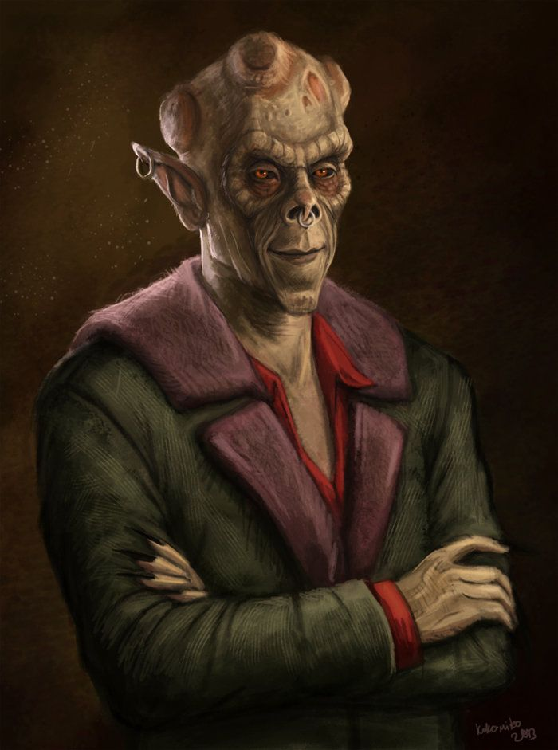

Крайне уродливый [[Носферату]] [[Santa Monica|Санта-Моники]], лояльный (хотя и не без оговорок) к [[Камарилья|Камарилье]].

Бертрам известен как мастер скрытности, взлома и компьютерных технологий, а также как выдающийся специалист по инфильтрации. Его считают одним из лучших информаторов и хакеров среди вампиров Лос-Анджелеса. В начале XXI века Бертрам был втянут в противостояние между Камарильей и Анархами, а также в интриги вокруг клуба [[Asylum]], которым управляет [[Жаннет Ворман|Жаннет]]. После того как Тереза покинула город, он поддерживает нейтралитет и иногда сотрудничает с анархами ради собственной выгоды.

Бертрам обладает глубокими познаниями в структуре сект и кланов Лос-Анджелеса, а также в политике [[Камарилья|Камарильи]]. Несмотря на верность своему клану и секте, он не стремится к власти и предпочитает действовать из тени, используя свои навыки для сбора информации и влияния на события.
