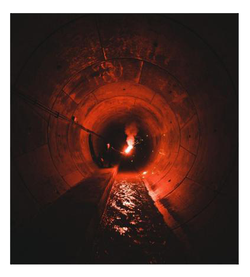

Одно из старейших и самых известных кладбищ Лос-Анджелеса, расположенное на бульваре Санта-Моника. Основанное в 1899 году, оно стало последним пристанищем для многих легенд Голливуда, а также местом силы для сородичей города. Здесь покоятся актёры, режиссёры, музыканты, а также влиятельные жители Лос-Анджелеса. Кладбище известно не только своей историей, но и как центр культурных событий: на его территории проходят ночные кинопоказы, концерты и празднования Дня мёртвых, собирающие множество смертных и вампиров.

## Культура и роль среди сородичей

Hollywood Forever занимает особое место в жизни вампирского общества Лос-Анджелеса. Обширная территория с уединёнными склепами, катакомбами и мавзолеями служит убежищем для представителей клана [[Носферату]], которые обустроили здесь свои логова и информационные центры. Кладбище часто становится ареной для тайных встреч, ритуалов и обмена сведениями между фракциями. Благодаря регулярным культурным мероприятиям, сородичи могут незаметно охотиться среди толпы смертных или использовать шумные события для прикрытия собственных дел.

В катакомбах под кладбищем действует сеть агентов и информаторов, связанных с бароном [[Гэри Голден|Гэри Голденом]]. Его потомки — [[Ималия]], [[Митник]] и [[Барабус]] — отвечают за сбор компромата, защиту информации и противодействие внешним угрозам, в первую очередь [[Вторая Инквизиция|Инквизиции]]. Здесь же можно встретить других представителей клана, поддерживающих связи с [[Анархи|анархами]] и [[Камарилья|Камарильей]].

## Связи с персонажами

- [[Гэри Голден]] — барон Голливуда, руководит сетью информаторов и контролирует катакомбы под кладбищем. Его влияние ощущается в политике анархов и информационных войнах города.
- [[Ималия]] — специалист по разоблачениям и компромату, действует как посредник между кланом и другими фракциями, отвечает за расследования и сбор сведений.
- [[Митник]] — хакер и мастер цифровой безопасности, поддерживает информационную инфраструктуру клана, помогает скрывать следы сородичей.
- [[Барабус]] — агент и специалист по защите информации, сотрудничает с [[Эш Риверс|Эшем Риверсом]] в борьбе с Инквизицией.
- [[Эш Риверс]] — бывший актёр и владелец клуба Asp Hole, связан с сетью Носферату и участвует в противостоянии внешним угрозам.

Кладбище Hollywood Forever скрывает вход в одну из самых больших тайн Лос-Анджелеса — логово Носферату, где обитает «Красавчик» Гэри Голден и его потомки. Как и многие другие Носферату, свита Hollywood Forever торгует секретами и информацией — самой ценной валютой среди сородичей. Несмотря на своё местоположение и проклятие клана, Носферату больше всего хотят, чтобы их воспринимали всерьёз, а не презирали, и Гэри нередко устраивает «ужины» для тех, кто готов спуститься под Лос-Анджелес и разделить с ним (очень плесневелый) хлеб. Те, кто уважает обычаи, часто выходят в выигрыше, а те, кто нет... Скажем так, официально в свите числятся только Гэри и двое его потомков. Но ведь это Носферату — кто знает, сколько ещё их скрывается в тени с ножом наготове.

⬤ **Кондор:** Хакер Митник согласился время от времени помогать тебе — у тебя есть одноразовый телефон со специальным софтом, позволяющим взламывать электронные системы с современными интерфейсами (проводными или беспроводными). Раз за сюжет ты можешь добавить две кости к броску Технологий или Воровства, если это связано с хакерством или обходом защиты. Телефон нужно быстро уничтожить и получить новый у Митника между сюжетами, чтобы не попасться властям.

⬤ ⬤ **Модница:** Ималия взялась за твой гардероб, и теперь он весьма... необычен. Колючая проволока, изогнутый металл, ржавая вилка — всё это может стать частью твоего образа. Наряд настолько вызывающий и странный, что даёт штраф к социальным броскам (на усмотрение Ведущего), но при этом служит скрытым лёгким колющим оружием (+2 Поверхностного урона в рукопашной). Оружие хорошо замаскировано — ты получаешь две кости к броскам Скрытности и Обмана, чтобы его спрятать. Ималия капризна — если не носить её творения хотя бы раз за сюжет, гардероб может внезапно исчезнуть.

⬤ ⬤ ⬤ **Плыви сюда:** Ты запомнил планировку большинства канализационных и технических тоннелей под городом. Ты получаешь две кости к броскам на навигацию, уход от погони/обнаружения или охоту в тоннелях. Гэри никогда не позволит составить письменную карту, так что полагайся только на память.

⬤ ⬤ ⬤ ⬤ **Кусочек логова (только для Носферату):** Гэри выделил тебе уголок в логове Носферату — это убежище с Базовым рейтингом 2, Потайным ходом 3, Системой безопасности 2 и Локацией, причём Локация даёт +4 к сложности попыток найти убежище. К сожалению, логово крайне жуткое и даёт штраф -4 к броскам вместо стандартных -2. Сородич с исключением жертвы «крысы» не допускаются — Гэри ждёт всех жильцов на семейных ужинах.

⬤ ⬤ ⬤ ⬤ ⬤ **Сплетник:** У тебя с Гэри взаимовыгодные отношения — ты даёшь ему что-то, он даёт тебе информацию. Раз за сессию ты можешь обратиться к Гэри и попытаться обменять сведения (ценность информации определяет Рассказчик, а вкусы у Гэри странные). Раз за сюжет ты можешь попросить Гэри узнать что-то конкретное — но он сам назначит цену, и она может оказаться выше, чем если бы ты искал ответ сам.
