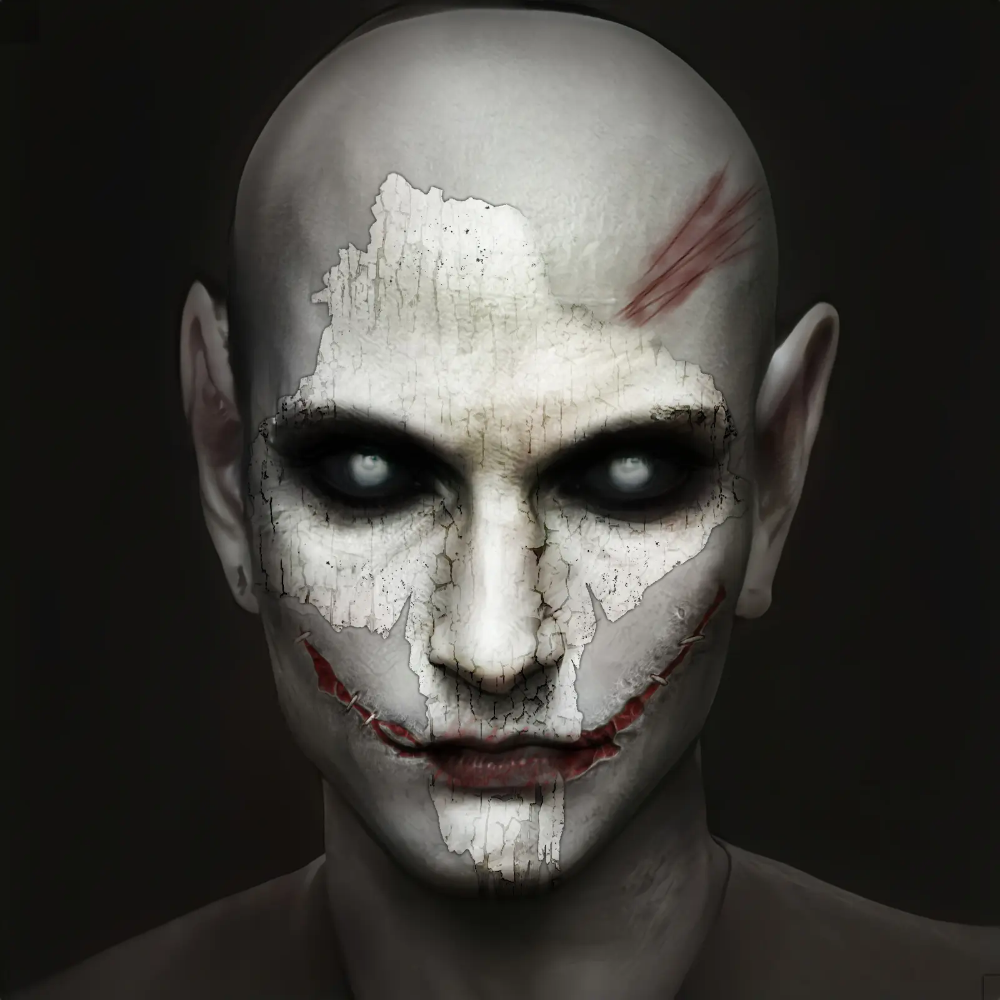

Ималия — представительница клана [[Носферату]], потомок [[Гэри Голден|Гэри Голдена]].

До становления Ималию знали как одну из самых ярких и провокационных моделей Лос-Анджелеса, чья карьера строилась на эпатаже и скандалах. Её исчезновение из мира людей было инсценировано: автомобиль найден разбитым, тело — сожжённым до неузнаваемости. После этого место Ималии в индустрии заняла Тауни Сешнс, что стало причиной личной вражды и зависти.

Гэри Голден выбрал Ималию в качестве потомка за её талант к разоблачениям и умение работать с информацией. В клане она известна как «Клеопатра» — бывшая красавица с непростым характером, что вызывает смешанные чувства у других Носферату. Ималию поддерживают другие потомки Гэри — [[Митник|Митник]] и [[Барабус|Барабус]], вместе с которыми она составляет ядро информационной сети клана и участвует в информационной войне против внешних угроз, в первую очередь [[Вторая Инквизиция|Инквизиции]].

В катакомбах Hollywood Forever Ималия отвечает за сбор компромата, разоблачения и расследования, часто выступает посредником между кланом и другими фракциями города. Она также известна своим эксцентричным подходом к стилю: берётся за гардероб доверенных лиц, создавая необычные наряды из колючей проволоки, металла и подручных предметов. Такой наряд даёт штраф к социальным броскам, но служит скрытым оружием (+2 поверхностного урона в рукопашной) и даёт бонус к броскам Скрытности и Обмана на его сокрытие. Ималия капризна — если не носить её творения хотя бы раз за сюжет, гардероб может исчезнуть.

Её методы иногда вызывают споры, но ценность информации, которую она добывает, неоспорима. Ималия сохраняет лояльность к [[Камарилья|Камарилье]], но действует в интересах клана и своих близких.
