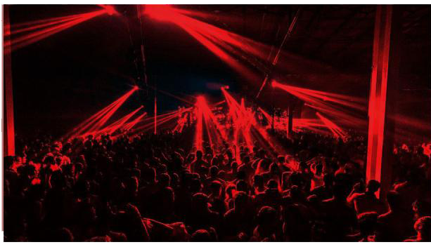

Виктор Темпл, по его собственным словам, — Неоспоримый Барон Долины. Этот Вентру контролирует самые крупные территории Анархов в Лос-Анджелесе, а возможно, и во всей Северной Америке. Среди его предприятий — несколько популярных ночных клубов и развивающийся музыкальный лейбл, который он продвигает под названием Temple of Boom.

Он также использует свою империю развлечений, чтобы скрывать свою нежизнь — прятаться на виду, как он любит говорить.

Виктор базируется в Лос-Анджелесе, но его влияние начинает выходить за пределы его домена: связь с Бароном может открыть возможности для богатства, власти и славы, если вы сохраняете лояльность самому Виктору Темплу и не принимаете его дружелюбие за самоуспокоенность.

**⬤ Chocolate Drop:**
Вы — новый сотрудник Temple of Boom, либо как исполнитель, либо как промоутер в вашем городе. Получите одну точку Славы и одну точку Контактов. У вашего нового статуса есть и обратная сторона: получите изъян Преследователь (Stalker Flaw).

**⬤ ⬤ У меня есть связи (I Got Connections):**
Temple of Boom всегда ищет новые таланты и не гнушается переманивать их у конкурентов. По усмотрению Ведущего, вы можете запросить аванс и добавить две точки Ресурсов или Контактов на оставшуюся часть текущей истории, если приведёте новый талант для Temple of Boom.

**⬤ ⬤ ⬤ Всё в порядке (This is Fine):**
Один раз за историю вы можете упомянуть имя Виктора Темпла и получить 3 дополнительных кубика к социальным броскам в бизнесе/развлечениях, например, чтобы попасть в ночной клуб, на оставшуюся часть сцены. Однако, если вы это сделаете, вы автоматически станете интересны кому-то, у кого есть счёты с Виктором Темплом или Temple of Boom в целом. Получите изъян Враг (Enemy Flaw) на одну точку до конца текущей истории.

**⬤ ⬤ ⬤ ⬤ Махараджа/Махарани (Maharaja/Maharani):**
Temple of Boom — это не только музыкальный лейбл, но и желанное имя в клубном бизнесе. Проявив лояльность к бизнес-семье Temple of Boom, Виктор Темпл даёт вам право открыть один из его клубов по франшизе в вашем городе. Ваши Убежище, Слава, Ресурсы и Стадо увеличиваются на одну точку, а также вы получаете специализацию либо в Финансах (бухгалтерия), либо в Исполнении (шоу). Из-за тактики Виктора Темпла «прятаться на виду» ваша связь с клубом даст вам изъян Скомпрометированное убежище (Compromised Haven Flaw).

**⬤ ⬤ ⬤ ⬤ ⬤ Если не сейчас, то когда? (If Not Now, When?):**
Виктор Темпл должен вам крупную услугу (Major Boon). Получили ли вы её лично от него или через передачи — это самая ценная валюта, которой вы обладаете. По усмотрению Ведущего, вы можете лично попросить что-то значительное у этого богатого и влиятельного Вентру, например, доступ к оружию Охотников или даже номер телефона местного Оборотня. Если вы это сделаете, Башня из Слоновой Кости (Ivory Tower) не сможет игнорировать вашу связь с движением Анархов. Получите изъян Изгнанник (Shunned (Camarilla) Flaw).
