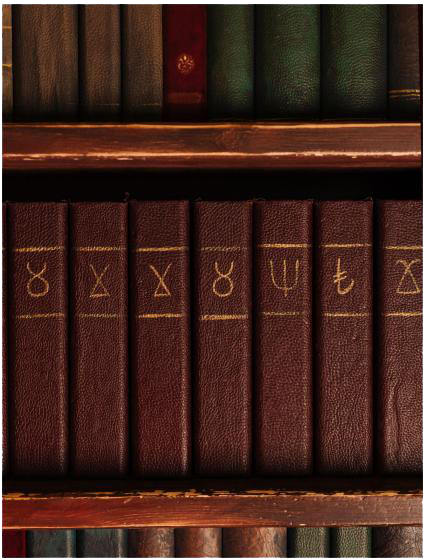

Когда Сан-Диего пал перед Второй Инквизицией, многие его сородичи бежали на север, в Лос-Анджелес. Среди них были три «сестры»-Тремере — Хестер, Виолет Луна и Кёко, независимые практики, поселившиеся в спорном домене барона [[Долина|Долины]] [[Виктор Темпл|Виктора Темпла]]. Управляя небольшим эзотерическим магазином и книжной лавкой «Мистический Круг», сёстры Вирд стараются не привлекать к себе внимания, усвоив суровый урок о том, что бывает с теми, кто попадает в поле зрения Инквизиции.

Будучи, возможно, единственной оставшейся в Лос-Анджелесе тремерской свитой, они часто оказываются востребованы, а Хестер и Виолет Луна прекрасно понимают природу общества сородичей и его негласные правила. Поэтому сёстры часто заключают сделки и предлагают услуги тем, кто готов им помочь и заслужить их доверие.

⬤ **Мистический кружок:** Ты достаточно втерся в доверие к сёстрам, чтобы иметь свободный доступ ко всем подсобкам их магазина. Магазин считается для тебя эквивалентом двухточечной Библиотеки (см. Убежище, V5 Core, стр. 189), хотя использовать его как убежище нельзя. Ты пользуешься этими томами по милости сестёр, и они могут отозвать это право или потребовать мелких услуг для его сохранения.

⬤⬤ **Книжный червь:** Ты заядлый читатель и проводишь много времени в «Мистическом Круге», читая всё подряд. Раз за сюжет ты можешь добавить две кости к любому броску Академических знаний, Оккультизма или Политики, если это связано с тем, что ты недавно прочитал и вдруг вспомнил в нужный момент. Какое везение!

⬤⬤⬤ **Ночи Фиолетовой Луны:** [[Виолет Луна]] — искусная прорицательница и ониромант, готовая за малую услугу истолковать твои видения или сны и дать полезную информацию, которую иначе ты бы не получил. Она также может с помощью своего магического черепа Германа определить, говорит ли кто-то в твоём присутствии правду (на одну сцену, раз за сюжет).

⬤⬤⬤⬤ **Особая К:** Ты подружился с младшей из сестёр, [[Киоко]], и иногда вы вместе выбираетесь в город. Раз за сюжет ты можешь пригласить Киоко на вечер (она редко выходит), и она составит тебе компанию под руководством Ведущего. Несмотря на наивность и склонность ляпать лишнее, она — мастер пиромантии, хоть и с не самой меткой рукой. Главное — береги её и возвращай домой за три часа до рассвета, иначе Хестер будет в ярости!

⬤⬤⬤⬤⬤ **Кузня Хестер:** [[Хестер]], своего рода матриарх, всегда благодарна тем, кто поддерживает их свиту и приходит на помощь. Раз за хронику она может создать для тебя предмет или артефакт чудесного качества либо починить сломанный мистический предмет, который у тебя уже есть. Характер и свойства предмета обсуждаются с Ведущим и могут быть взяты из другой Листки Знаний. Однако чудесная вещь не лишена недостатков, а жадность свойственна сородичам. Кто-то обязательно узнает об этом предмете и попытается его у тебя отнять — ты получаешь изъян «Враг на две точки», одержимый желанием завладеть этим предметом.
