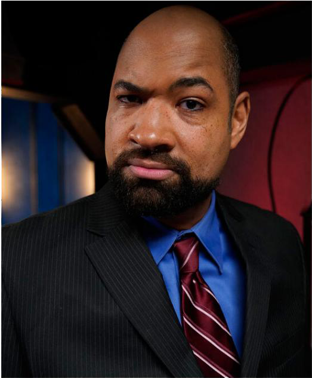

Виктор Темпл — представитель клана [[Вентру]], [[Анархи|барон]] [[Баронство Долина|Долины]].

Родился в 1940-х, до становления был успешным спортсменом и музыкальным продюсером, основал лейбл Temple of Boom и быстро стал заметной фигурой в ночной жизни Лос-Анджелеса. После своего становления в 1988 году стал камарильским [[Вентру]], но в 2019 году порвал с [[Камарилья|Камарильей]] и присоединился к [[Анархи|Анархам]].

В прошлом Виктор был женат и имел троих детей, но ради их безопасности дистанцировался от семьи. Когда многообещающая карьера Виктора в NBA была прервана несчастным случаем, он быстро сменил направление и основал Temple of Boom — звукозаписывающий бизнес, который стал любимцем музыкальной сцены Лос-Анджелеса. Именно этот успех привлёк его сира. Его сын [[Марк Темпл]] — заметная фигура среди анархов, связующее звено между группами города. Виктор поддерживает сложные отношения с бывшими союзниками: с [[Нелли Гриффит]] его связывает соперничество и общее прошлое в котерии, с [[Джаспер|Джаспером]] — союз по защите домена и борьбе с внешними угрозами. В прошлом Виктор и Джаспер вместе убили бывшего Шерифа, что окончательно отрезало его путь назад в Камарилью.

Виктор активно участвует в политике города, выступая против давления [[Камарилья|Камарильи]] и [[Вторая Инквизиция|Второй Инквизиции]]. Он известен как медиатор между фракциями, но не боится идти на жёсткие меры ради защиты своих людей. После разрушения его прежнего клуба и покушения на жизнь, Виктор построил новый клуб — [[Maharani]], который стал символом независимости и силы анархов Долины.

[[Temple of Boom]], основанный Виктором, стал не только музыкальным лейблом, но и инструментом расширения его влияния в Лос-Анджелесе и за его пределами. Виктор использует свою империю развлечений для маскировки нежизни, продвижения лояльных анархов и создания возможностей для союзников. Лояльность к Temple of Boom может принести значительные выгоды: ресурсы, славу, контакты, а также право открыть клуб по франшизе. Однако такие связи сопряжены с рисками — персонажи могут стать мишенью врагов Виктора или Камарильи, а также получить изъяны вроде Скомпрометированного убежища или Изгнанника.

Виктор известен как защитник изгоев и весперов: он предоставил убежище тремерам ([[Виолет Луна|Виолет]], [[Киоко]], [[Хестер]]), которые после бегства из Сан-Диего обосновались в Долине и открыли эзотерический магазин и книжную лавку «Мистический Круг». Их присутствие усилило мистическую составляющую домена и стало важным ресурсом для местных сородичей. Его музыкальный лейбл стал площадкой для таких артистов, как [[Вельвет Велюр]], чья музыка используется анархами для связи и пропаганды.

Среди анархов Виктор пользуется уважением за верность слову, готовность защищать слабых и умение строить альянсы. Его стиль управления сочетает прагматизм, дипломатичность и готовность к открытому противостоянию с врагами. Несмотря на репутацию «барона», Виктор остаётся близок к простым членам общины и часто лично участвует в решении конфликтов.

Виктор известен тем, что может предоставить крупную услугу (Major Boon) особо лояльным союзникам, что делает его одной из самых влиятельных фигур среди анархов. Однако получение такой услуги привлекает внимание и может привести к изгнанию из Камарильи.

Тактика Виктора — «прятаться на виду» — позволяет ему эффективно управлять своей сетью клубов и лейблом, оставаясь при этом в центре политической и культурной жизни города.

⬤ **Но сначала — селфи:** Вам удалось подобраться достаточно близко к Барону, чтобы сделать с ним селфи или даже попасть в одну из его знаменитых прямых трансляций. Ваша Слава увеличивается на одну точку (получите одну точку Славы, если у вас её не было, или увеличьте существующую на одну), а сложности на Социальные броски, связанные с Виктором или его окружением, уменьшаются на 1.

⬤ ⬤ **Очень важная персона:** Вы всегда в списке гостей всех ночных клубов Виктора, включая Maharani, жемчужину его баронства в Долине. Вам не нужно стоять в очереди! Вы всегда желанный гость в VIP-зоне этих клубов и имеете доступ к их особым функциям, таким как защищённые дневные комнаты и секретные пути для побега. Так как вы всегда желанный гость, считайте это как одноточечное Убежище (в дополнение к любому другому Убежищу, которое у вас есть).

⬤ ⬤ ⬤ **Temple of Boom:** Благодаря деловым отношениям или личной связи с Виктором вы являетесь заметной частью семьи «Храма Бума». Раз в историю у вас есть доступ к студиям звукозаписывающей компании, включая техническую и производственную помощь, и вы можете использовать их для создания, записи, распространения, продвижения и продажи оригинальной музыки. Ваша Слава или Контакты увеличиваются на три точки (не более 5), и эти точки сохраняются между историями.

⬤ ⬤ ⬤ ⬤ **Всё под контролем:** Виктор достаточно высоко вас ценит, чтобы позволить вам «одолжить» одну из его команд смертных охранников. Эта команда состоит из четырёх Одарённых Смертных, оснащённых бронированным внедорожником, лёгким вооружением и шифрованными средствами связи. Они будут следовать вашим указаниям, вплоть до того, чтобы принять пулю за вас, но не станут действовать против прямых приказов Виктора, и будут сообщать барону о ваших похождениях. Эта услуга длится на протяжении всей истории.

⬤ ⬤ ⬤ ⬤ ⬤ **Неоспоримый Барон Долины:** Возможно, благодаря положительным отношениям с Виктором или в счёт уплаты долга, раз в историю вы и ваша котерия можете заявить о праве на убежище и охотничьи угодья в Долине. Вы получаете Убежище с 5 точками, которые можно распределить по его характеристикам по вашему желанию. Эта привилегия действует до конца истории и не требует отказа от других доменов. Вы также получаете одну точку Статуса (Анарх) и две точки Врага (Камарилья).
