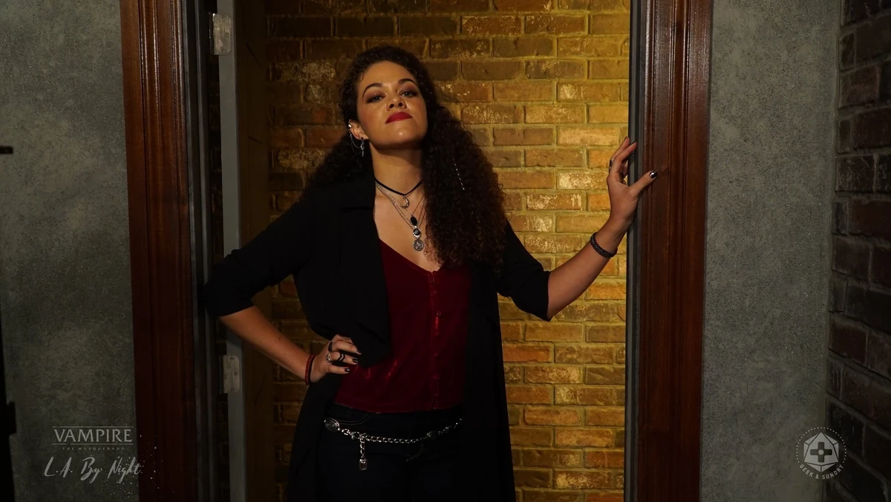

Виолет Луна — одна из трёх сестёр-Тремер, управляющих эзотерическим магазином и книжной лавкой «Мистический Круг» в [[Долина|Долине]] вместе с [[Хестер]] и [[Киоко]]. Днём магазином управляет [[Лидия Метц|Лидия]].

Виолет — искусная прорицательница и онейромант, готовая за малую услугу истолковать видения или сны, а также с помощью магического черепа Германа определять, говорит ли кто-то правду (на одну сцену, раз за сюжет). Она отличается умом, осторожностью и независимостью в принятии решений, проявляет заботу о сёстрах и умеет вести дела в обществе сородичей.

В прошлом вместе с сёстрами покинула Сан-Диего из-за угрозы со стороны [[Камарилья|Камарильи]] и [[Вторая Инквизиция|инквизиции]] и обосновалась в Лос-Анджелесе при поддержке [[Ева|Евы]] и [[Виктор Темпл|Виктора]], который предоставил им убежище и поддержку в Долине. Виолет часто заключает сделки и предлагает услуги тем, кто заслужил доверие сестёр.
