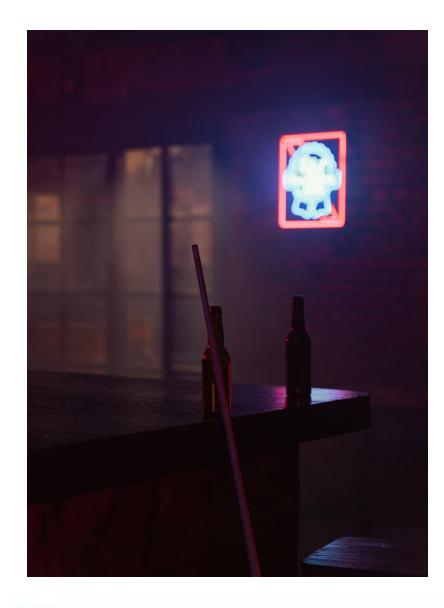

The Last Round — довольно неприметный бар [[Даунтаун|Даунтауна]], спрятанный под эстакадой I-10 и у самой реки Лос-Анджелес, ставший символом свободы и независимости среди [[Анархи|Анархов]] Лос-Анджелеса. Его расположение может вызвать ассоциации с троллем, охраняющим мост, но внутри скрывается настоящая стая львов. Найнс Родригес, человек, который неохотно называет Даунтаун своим баронством, стоит здесь на страже вместе со своей свитой, которую иногда в шутку называют «Последними Раундерами».

Хотя только Найнс был жив, когда Джереми МакНил основал Свободные Штаты Анархов, каждый из Раундеров заработал себе репутацию яростных защитников идеалов Анархов — никаких Принцев, никаких Традиций, только сородичи, идущие своим путём в бесконечной ночи. МакНила больше нет, но его мечта жива, и Свободные Штаты притягивают к себе всяких беглецов и изгоев, которых Найнс берёт под своё крыло, показывая им новый способ существования — без старейшин, держащих их на поводке.

Здесь собираются те, кто не приемлет диктатуру [[Камарилья|Камарильи]], обсуждают планы, заключают союзы и ведут споры о будущем города. Бар известен атмосферой открытых дебатов, где каждый может высказаться, а решения принимаются не по приказу, а по убеждению. Внутри — шум, музыка, бильярдные столы и офис на втором этаже, где проходят важные встречи.

## Культура и роль

The Last Round служит неформальным штабом анархов, местом, где формируются котерии, обсуждаются стратегии и решаются споры между группами. Здесь уважают личную свободу, равенство и готовность защищать слабых. Власть держится на авторитете и доверии, а не на страхе или иерархии. Бар открыт для всех, кто готов бороться за свои идеалы, но не терпит предательства и лицемерия. В стенах The Last Round часто появляются новые лидеры, а старые передают опыт молодым. Атмосфера клуба способствует обмену информацией и поддержке между разными районами города.

## Связи с персонажами

- [[Армандо Родригез|Найнз Родригез]] — владелец бара, харизматичный лидер анархов, вдохновляет молодых и объединяет разрозненные группы. Предпочитает убеждать, а не приказывать, и пользуется уважением даже среди врагов.
- [[Дамзел]] — правая рука Найнза, известна страстью к свободе и нетерпимостью к тирании. Активно защищает идеалы анархов и наставляет новое поколение.
- [[Скелтер]] — управляющий баром, ветеран войны, отличается прямолинейностью и готовностью встать на защиту убеждений. Один из ближайших соратников Найнза и Дамзел.
- [[Карвер]] — радикальный представитель [[Бруха]], поддерживает отношения с лидерами The Last Round, известен связями в подполье и защитой тонкокровных.
- [[Марк Темпл]] — стал вампиром после гибели [[Аннабель]], теперь выступает связующим звеном между группами анархов и поддерживает контакты между [[Maharani]] и The Last Round.
- [[Смеющийся Джек]] — легендарный вдохновитель анархов, поддерживал рост числа тонкокровных и был наставником для многих, включая Найнза.
- [[Аннабель]] — погибшая активистка, вдохновляла молодых анархов, её память продолжает объединять движение.
- [[Жаннет Ворман]] — барон [[Побережье|Побережья]], владелица клуба [[Asylum]], поддерживает горизонтальные связи с The Last Round и участвует в политике анархов.

The Last Round поддерживает связи с другими районами и клубами, такими как [[Asylum]] и [[Maharani]], и играет важную роль в судьбах изгоев, тонкокровных и всех, кто ищет свободы в Лос-Анджелесе.

⬤ **Первый раунд за мой счёт:** Ты провёл много времени, патрулируя и тренируясь с командой The Last Round, и поднабрался у них парочки приёмов. Получи две специализации в Огнестрельном оружии и/или Драке (обе могут быть в одном навыке, если хочешь). Как постоянный член банды, ты обязан помогать защищать бар и их территорию, когда тебя позовут, и они будут очень недовольны, если ты подведёшь их.

⬤ ⬤ **Кожанка:** Революционерка Дамзел прониклась к тебе симпатией, и вы вместе выходите на улицы, борясь за Дело и поднимая шум. Получи одну точку Статуса (Анархи) и распределяй ещё две точки между Статусом (Анархи), Союзниками, Контактами и Влиянием среди бунтарских групп. Однако ты наступил кому-то на больную мозоль и приобрёл врага на одну точку, которого разозлила твоя риторика.

⬤ ⬤ ⬤ **Хелтер Скелтер:** Ты привлёк внимание управляющего баром — Гангрелла(?) по прозвищу Скелтер. Он становится твоим Мавлой на три точки и раз за сюжет может прийти тебе на помощь — будь то драка или поиск укрытия от солнца в глуши. Но услуги не бесплатны даже для Анархов — он будет ждать, что ты выполнишь кое-какую работу для Раундеров, и это точно не будут лёгкие поручения.

⬤ ⬤ ⬤ ⬤ **Комната и стража:** Как доверенное лицо Раундеров, ты получил привилегию (и обязанность) охранять тайник или актив банды, а также использовать это место как временное убежище. В начале каждой истории ты можешь распределить пять точек по Убежищу (Базовый рейтинг, Тайная оружейная, Камера, Стражи, Локация, Потайной ход, Система безопасности) по согласованию с Рассказчиком. Где бы ни было это убежище, оно важно для Раундеров, и они обеспечили тебя средствами, силой и оружием для его защиты. Провалишься — пеняй на себя.

⬤ ⬤ ⬤ ⬤ ⬤ **Человек против мифа:** В какой-то момент Найнс посчитал нужным поделиться с тобой мудростью о лупинах. Может, ты помог ему в трудную минуту или был свидетелем его легендарной победы над лупином. Ты получаешь две дополнительные кости ко всем броскам в бою против лупинов, если знаешь, с кем имеешь дело, или одну кость к броскам на обнаружение, если чувствуешь, что тебя преследует лупин. Кроме того, раз за сюжет ты можешь автоматически исцелить дополнительный уровень Аггравированного урона, если оба уровня были получены от клыков или когтей лупина. К сожалению, твоя репутация охотника на лупинов идёт впереди тебя (заслуженно или нет), и ты получаешь изъян «Двухточечная дурная слава (Лупины)», что может привести к неприятностям.
