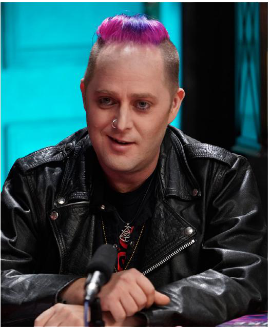

Карвер — кочующий агитатор, редко задерживающийся в одном городе надолго. В прошлом, будучи ещё смертным, он часто бывал в пещерах Мэнсона под Лос-Анджелесом, где оставил свой псевдоним на стенах. Даже после становления он иногда возвращается туда, устроив временное убежище. Карвер известен тем, что выполняет задания для Анархов по всей стране, а его появление в Лос-Анджелесе всегда связано с важными событиями для движения.

Считается, что именно Карвер стал сиром [[Аннабель]], когда спас её после нападения местного Носферату. После этого он надолго покинул город, но вернулся, чтобы оценить положение весперов и помочь своей потомке и её союзникам в борьбе с наркоторговцами. Позже Карвер вновь исчез, но спустя два года неожиданно объявился, чтобы наладить контакты между тонкокровными Лос-Анджелеса и других городов, предчувствуя надвигающуюся войну. В этот раз он задержался дольше и оказался втянут в нападение Второй Инквизиции.

Карвер известен как радикал, не признающий авторитетов и готовый идти на крайние меры ради свободы. Благодаря обширным контактам Карвер способен достать практически всё — от оружия до редких реликвий и зелий весперов, а его имя внушает Камарилье ужас.

## Связи и влияние

- [[Аннабель]] — потомок Карвера, вдохновляла молодых Анархов своим идеализмом, погибла в 2021 году от рук [[Вторая Инквизиция|Второй Инквизиции]].
- [[Делайла]] — бывшая [[Весперы|Веспер]], лидер сообщества Весперов, Карвер сыграл ключевую роль в её судьбе, подтолкнув к диаблерии и помогая наладить связи с другими тонкокровными.
- [[Эллеанора]] — возлюбленная Аннабель, после её гибели Карвер помог Эллеаноре и другим выжившим избежать преследования.
- [[Марк Темпл]] — после гибели Аннабель стал вампиром благодаря Карверу, теперь выступает связующим звеном между группами анархов.
- [[Армандо Родригез|Найнз]], [[Дамзел]], [[Скелтер]] — Карвер поддерживает отношения с лидерами и ветеранами Анархов, его методы вызывают опасения даже среди них.
- [[Нелли Гриффит]], [[Джаспер]] — через них Карвер косвенно влияет на политику анархов Голливуда и других районов.

⬤ **Репутация:** Некоторые анархи считают методы Карвера слишком провокационными. Но не вы: Карвер — ваш образец для подражания, и вы следуете его примеру дерзкой агрессии в достижении целей. Благодаря упоминанию Карвера в разговоре вы получаете два кубика к броскам Запугивания против любого сородича Камарильи, которые посчитают вас конченым отморозком.

⬤ ⬤ **Достать что угодно:** Как бы незаконна, редка или труднодоступна ни была вещь, Карвер знает, где её найти. Оружие, наркотики, страница из Книги Нод, новые рецепты Кровавой Алхимии, ключи от лимузина Принца — что угодно. И поскольку вы знаете Карвера — или того, кто знает того, кто его знает — вы получаете эквивалент трёх точек Контактов, которые помогут вам найти нужное. Получить желаемое — ваша задача, но вы знаете, с чего начать.

⬤ ⬤ ⬤ **Чего хочешь?:** Карвер всегда появляется в самый неподходящий момент. Связаться с ним в другое время почти невозможно. Но не для вас: через цепочку знакомых или иным способом вы можете передать Карверу просьбу о помощи. Ответит ли он и как именно — решает Рассказчик.

⬤ ⬤ ⬤ ⬤ **Кто тебя любит?:** Карвер доверяет вам, а может, просто использует. В любом случае он эквивалентен Мавле на 5 точек. Общение с ним может вызвать подозрения и враждебность со стороны многих других сородичей — от местной Камарильи до менее агрессивных анархов. Вы также получаете изъян Печально известный (Камарилья) и Печально известный (Анархи).

⬤ ⬤ ⬤ ⬤ ⬤ **Пока, детка:** У Карвера есть знакомые почти в каждом домене, и он должен многим из них услугу. Вы получили право на одну из этих услуг и можете потребовать, чтобы Карвер её выплатил. Раз за историю можете выбрать либо услугу, которую Карвер должен выполнить лично, либо эквивалент пяти точек, которые можно распределить между Союзниками, Контактами, Влиянием или Ресурсами в вашем домене, и 2 точки Враг. Эти точки сохраняются между историями.
