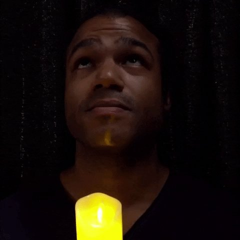

Марк Темпл — [[Бруха]], связанный с движением [[Анархи|Анархов]] Лос-Анджелеса, сын [[Виктор Темпл|Виктора Темпла]]. Учился в Griffith College, где познакомился и начал отношения с [[Аннабель]], которые продолжались даже после её становления, став её гулем. После гибели Аннабель в 2021 году от рук [[Вторая Инквизиция|Второй Инквизиции]] Марк добился становления от её сира [[Карвер|Карвера]].

После оказался вовлечён в противостояние с [[Камарилья|Камарильей]] и стал объектом интереса для врагов Анархов, так как выступает единственным оставшимся связующим звеном между [[Maharani]] и [[The Last Round]].
