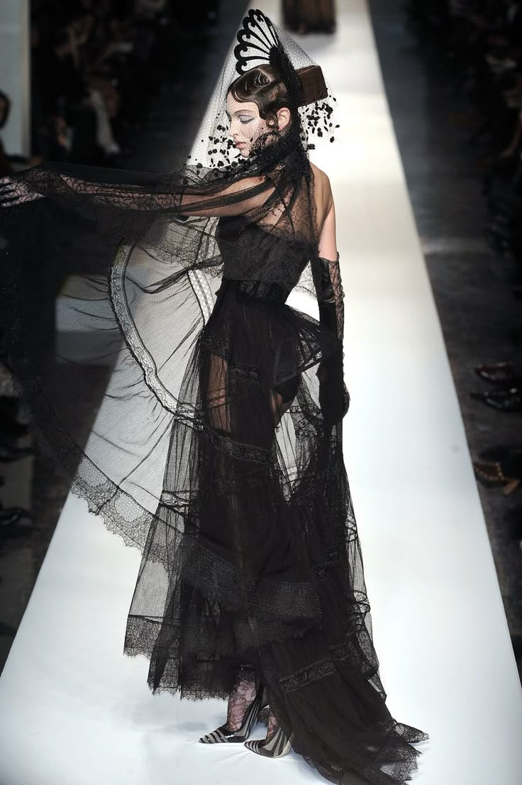

Thorn — сеть бутиков и студий, основанная [[Нелли Гриффит]], бароном [[Голливуд|Голливуда]] и представительницей клана [[Тореадор]]. Место быстро стало популярным среди творческой элиты Лос-Анджелеса благодаря авангардному подходу к моде и аксессуарам. Здесь появляются новые коллекции, обсуждаются идеи и заключаются союзы, влияющие на жизнь города.

## Культура и влияние

Thorn привлекает артистов, модельеров и музыкантов. В бутиках проходят закрытые показы и встречи, влияющие на культурную повестку Голливуда. Благодаря поддержке Нелли и её спонсоров, Thorn стал площадкой для молодых талантов и местом, где обсуждают вопросы моды и политики анархов. Здесь бывают представители клана [[Тореадор]] из разных сект, а также союзники и конкуренты барона Голливуда.

Особое место в жизни Thorn занимает [[Хлоя Хадсон|Хлоя Хадсон (Архангел)]], свободный гуль, известная как Архангел — основательница и лидер Сети Архангела, организации, помогающей гулям и сородичам освободиться от кровавых уз. Хлоя отвечает за информационную безопасность домена Голливуда и часто бывает в различных локациях Thorn, где собирает и распространяет важные сведения, а также поддерживает связь между членами домена и Сетью Архангела.

## Связи с персонажами

- [[Нелли Гриффит]] — основательница Thorn, барон Голливуда, вдохновитель творческой элиты. Благодаря её влиянию, Thorn стал частью жизни анархов и местом, где пересекаются интересы разных фракций.
- [[Джаспер]] — союзник Нелли, мастер разведки и информации, помогает защищать интересы домена и поддерживать порядок.
- [[Ева]] — ведьма из клана [[Тремер]], поддерживает тесные отношения с Нелли и её окружением, помогает решать сверхъестественные вопросы и защищает союзников от внешних угроз.
- [[Хлоя Хадсон]] — свободный гуль, Архангел, специалист по коммуникациям, управляет информационной стороной домена Голливуда.
