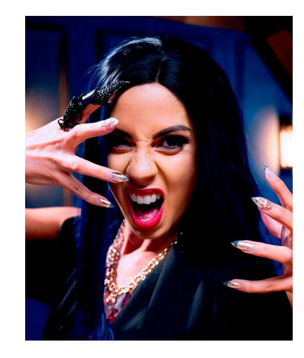

Нелли Гриффит — представительница клана [[Тореадор]], [[Анархи|барон]] [[Голливуд|Голливуда]], одна из ключевых фигур анархического движения Лос-Анджелеса. Потомок промышленника Гриффита Дж. Гриффита, в человеческой жизни была иконой моды и владелицей авангардной студии [[Thorn]], которая после её становления стала прикрытием для деятельности среди вампиров и местом сбора творческой элиты города.

Становление произошло в 2010 году от [[Чез Прайс|Чеза Прайса]] во время поездки в Сан-Франциско. Их отношения быстро закончились, а после трагических событий — диаблери другой потомка Чеза, Донны Кембридж, — Нелли была вынуждена бежать в Лос-Анджелес. Здесь она сблизилась с бывшим бароном [[Айзек Абрамс|Айзеком Абрамсом]], который стал её покровителем и доверенным лицом, а также поручал ей важные миссии, включая работу за пределами города и враждебных доменах.

В Лос-Анджелесе Нелли основала не только сеть бутиков Thorn, но и школу моды Griffith College, поддерживая и защищая её из тени. Благодаря влиянию и харизме, она быстро заняла важное место в политике анархов, в 2019 году с помощью котерии Нелли уничтожила своего сира Чеза Прайса, освободившись от его влияния, а после ухода Айзека Абрамса в 2020 году была назначена бароном Голливуда. Её стиль управления отличается гибкостью, скоростью принятия решений и умением лавировать между традициями и новыми веяниями. Несмотря на принадлежность к анархам, Нелли сохраняет черты, присущие [[Камарилья|Камарилье]]: уважение к иерархии, традициям и красоте.

Особое место среди союзников Нелли занимает [[Хлоя Хадсон|Хлоя Хадсон (Архангел)]], свободный гуль, основательница и лидер Сети Архангела — организации, помогающей гулям и сородичам освободиться от кровавых уз. Благодаря сотрудничеству с Хлоей и [[The Archangel network|Сетью Архангела]] Thorn и домен Голливуда обладают надёжной системой информационной безопасности и поддержкой для гулей и союзников.

Входила в состав знаменитой котерии анархов вместе с [[Виктор Темпл|Виктором Темплом]], с которым её связывает сложное партнёрство и соперничество, [[Джаспер|Джаспером Хартвудом]] — её союзником и мастером разведки, и [[Аннабель]], которая до своей гибели была её ученицей и вдохновляла своим идеализмом. После гибели Аннабель и ухода Абрамса, Нелли стала одной из самых влиятельных фигур среди анархов.

Среди её соперников — [[Вельвет Велюр]], которая претендовала на роль барона после ухода Абрамса, однако уступила Нелли. Несмотря на разногласия, обе продолжают влиять на творческую и политическую жизнь Голливуда.

Во время атаки Второй Инквизиции в 2021 году Нелли стала одной из приоритетных целей, но сумела выжить и даже уничтожить одного из охотников, приняв участие в контратаке на миссию Инквизиции в Сан-Фернандо. Её имя стало символом выживания и независимости анархов Голливуда.

⬤ **Великолепно, дорогая!:** Нелли видит в вас что-то интересное и достойное поощрения; вам даже не нужна личная связь, чтобы воспользоваться её вниманием. Раз за сессию она достаёт вам приглашение/билеты для до 4 человек/сородичей на самое горячее событие в Лос-Анджелесе. Вас впустят без вопросов, даже если мероприятие или место обычно закрыто, вы получите отличные места и полный доступ за кулисы.

⬤ ⬤ **Шопинг-тур:** Либо потому, что ей нравится ваш стиль, либо потому, что она считает, что вам нужно одеваться лучше, Нелли предоставляет вам доступ после закрытия в любой филиал её сети бутиков высокой моды. Вы также получаете услуги персонального стилиста и 1000 долларов в месяц на счету в магазине. Добавьте один кубик ко всем социальным броскам, основанным на внешности, когда вы носите одежду, полученную здесь.

⬤ ⬤ ⬤ **Индивидуальный кутюр:** В счёт уплаты долга, который она или её знакомый должны вам, Нелли создаёт для вас уникальный наряд высокой моды. Это единственный в своём роде наряд, несомненно, авторства Нелли, сшитый специально для вас. Ваши пулы кубиков для Соблазнения, Запугивания или Убеждения увеличиваются на 3 кубика, когда вы его носите.

⬤ ⬤ ⬤ ⬤ **Цветочный сад:** Нелли хочет, чтобы вы были в безопасности, и предоставляет вам услуги одного из своих известных гулей для вашей защиты на протяжении истории. Этот человек, который носит одно из фирменных цветочных имён Нелли, эквивалентен трёхточечному Ретейнеру. Гуль может выполнять другие услуги, если они не противоречат интересам Нелли, но ни при каких обстоятельствах не станет действовать против её прямых приказов.

⬤ ⬤ ⬤ ⬤ ⬤ **Чёрная магия:** Возможно, вы важны для Нелли, а может, у вас есть компромат на неё или кого-то, кто ей дорог. Поэтому она готова помочь вам, даже в ущерб своим интересам, когда всё идёт плохо. Раз за хронику она устраняет любого смертного по вашему выбору. В течение ночи этот смертный исчезнет. Действие не оставит следов, нарушающих Маскарад, но отсутствие человека может вызвать последствия. Цель должна находиться в Голливуде, а последствия определяет Рассказчик.
