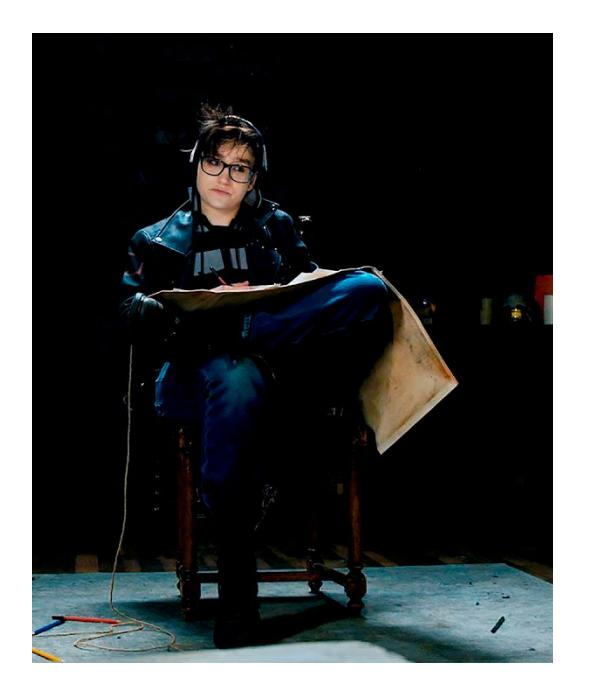

[[Гангрел]], которая работает с Валькириями, Рамона — уроженка Лос-Анджелеса, выглядящая как обращённая в позднем подростковом возрасте и ведущая себя соответственно. В 2022 была приглашена [[Кейси]] в ряды [[Валькирии|Валькирий]]. У неё особая связь с крысами, и она использует свою Крысиную Стаю как шпионов и посланников. Ездит на мотоцикле Kawasaki Ninja 400 2021 года в ярко-зелёном цвете.

Хотя она пережила худшие проявления как Камарильи, так и анархов в конце 1990-х, теперь она отказывается участвовать в политических интригах Камарильи или фанатичном рвении Шабаша. Она также открыто презирает лицемерие [[Анархи|баронов]] Лос-Анджелеса, указывая, что они не сдержали обещаний, и позволили Свободным Штатам прийти в упадок. Однако она восхищалась Аннабель, ведь молодая Бруха вновь зажгла огонь свободы среди анархов.

⬤ **Кампус ночью:** Если вы возвращаете его и не злоупотребляете, Рамона организует для вас получение студенческого или преподавательского удостоверения, дающего легальный доступ в университет UCLA. Вы можете свободно посещать кампус, не опасаясь охраны, студентов или преподавателей, которые могли бы возражать против вашего присутствия. На территории кампуса вы пользуетесь всеми удобствами и привилегиями, доступными студентам или преподавателям.

⬤ ⬤ **Альбом для эскизов:** Рамона специализируется на пейзажах и архитектурных зарисовках. Потому что вы ей нравитесь, Рамона сделает точный рисунок любого физического места по вашему выбору (возможно, с помощью своей Крысиной Стаи). Имея этот рисунок, вы получаете два кубика ко всем броскам Расследования, связанным с этим местом. Если Рамона не в том же районе, что и нужное место, Рассказчик определяет, что нужно для её визита.

⬤ ⬤ ⬤ **Неожиданные связи:**
Рамона познакомилась со многими сородичами в своих путешествиях. Она может надёжно передать сообщение любому персонажу. Кроме того, она может связаться с несколькими очень известными сородичами вроде Беккета, Тео Белла или Люситы Арагонской. Нет гарантии, что они ответят, и что они сделают, решает Рассказчик.

⬤ ⬤ ⬤ ⬤ **Крысиная стая:** Рамона соглашается попросить своих крыс шпионить для вас. Раз за историю Крысиная Стая проникнет в выбранное вами место, понаблюдает за происходящим и передаст информацию Рамоне, которая расскажет вам, что они видели. Информация может быть не совсем точной (иногда детали теряются при передаче от крысы к сородичу), но стая необычайно хорошо описывает увиденное и услышанное. Получите 2 кубика ко всем броскам, связанным с ситуацией или лицами, за которыми следили.

⬤ ⬤ ⬤ ⬤ ⬤ **Заражение:** Нет такого бизнеса или здания, которое нельзя было бы разрушить нашествием грызунов. Выберите цель: в течение недели это место пострадает от разрушительной чумы крыс. Если это частный бизнес, он будет закрыт навсегда из-за повреждений и нарушений санитарных норм. Если это государственное здание, оно будет закрыто на время истории. Если здание не в окрестностях Топанги, вам нужно связаться с Рамоной до использования этой привилегии, а последствия определяет Рассказчик.
