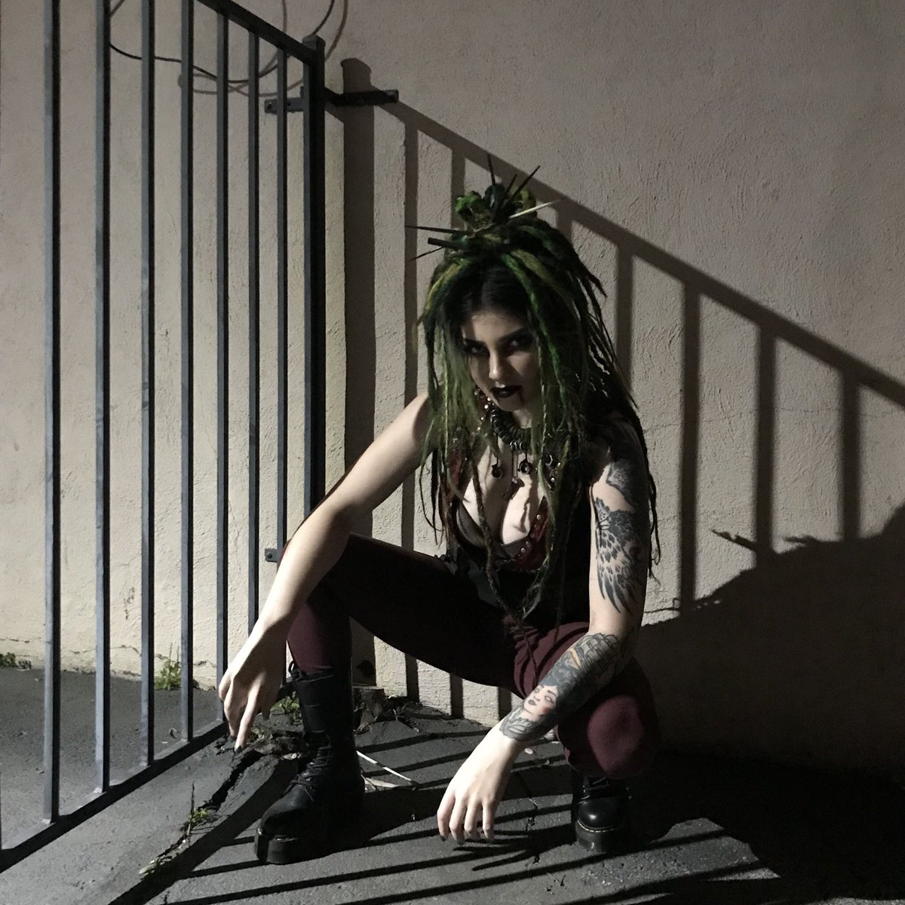

[[Гангрел]], харизматичный и жёсткий лидер, возглавляющая банду [[Валькирии|Валькирий]], обитающую в парке [[Баронство Топанга]] и окрестностях. В её отсутствие, когда она находилась в торпоре после нападения Авроры, управление баронством осуществляла [[Кейси]], её ближайшая соратница и одна из основательниц Валькирий. [[Валькирии]] включают также [[Вейла|Вейлу]] (духовная наставница и врач), [[Люцерия|Люцерию]] (гуль и информатор), [[Рамона|Рамону]] (лидер группы гулей, связана с животными) и [[Эллеанора|Эллеанору]] (самая молодая участница, вступившая вместе с Рамоной).

Сикоракс известна интересом к скандинавским рунам и мистике, а также репутацией беспощадного судьи для виновных. Ценит честность и верность, не терпит типичных игр среди вампиров. Придерживается философии крайней личной свободы и уверена в своей способности защищать свои интересы. Отличается интересом к скандинавским рунам и, возможно, имеет скандинавское происхождение.

Ездит на мотоцикле BSA Rocket III 1969 года.
