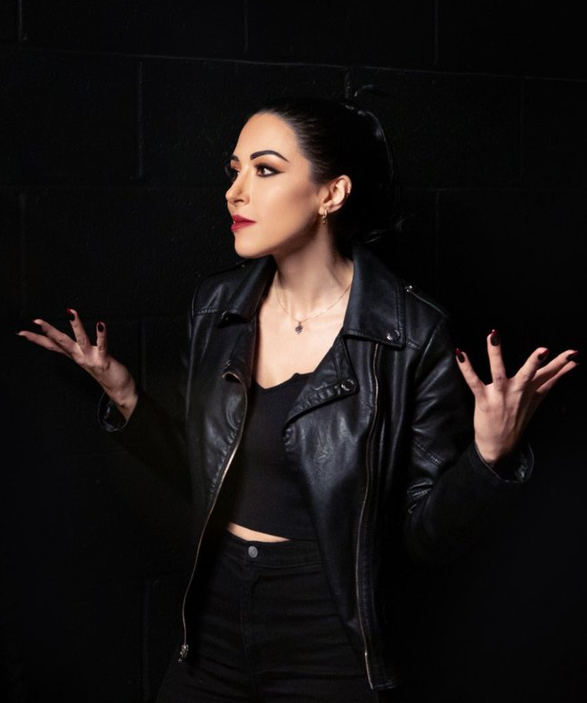

[[Ласомбра]], Шериф [[Камарилья|Камарильи]], бывший гуль Фиорензы Савонны.

Иб — загадочная и крайне профессиональная фигура при дворе, известная как личный телохранитель, водитель и исполнитель поручений для самых влиятельных представителей секты. Родом с Ближнего Востока, в начале XX века стала гулем могущественной Вентру Фиорензы Савонны и десятилетиями служила ей как оперативник и агент влияния. В Лос-Анджелесе Иб приобрела репутацию безупречного специалиста по безопасности, боевым искусствам и вождению, сопровождая и защищая представителей клана [[Вентру]] в самые опасные периоды.

В 2012 и 2021 годах, во время атак [[Вторая Инквизиция|Второй Инквизиции]], именно благодаря действиям Иб многие Вентру и их союзники сумели выжить и сохранить свои позиции. Её вклад был настолько значим, что после событий 2021 года она была становлена [[Аврора|Авророй]] и назначена шерифом Лос-Анджелеса. В этой роли Иб отвечает за безопасность двора князя [[Ванневар Томас|Ванневара Томаса]], поддерживает порядок и лично курирует расследования, связанные с угрозами для секты.

Иб поддерживает рабочие отношения с ключевыми фигурами Камарильи: сенешалем [[Сюзанна Рошель|Сюзанной]], Хранитеоем [[Максимилиан Штраус|Максимилианом]], примогеном [[Катя|Катей]] и судьёй Авророй. Несмотря на лояльность секте, она сохраняет независимость суждений и действует прежде всего в интересах безопасности, а не политических интриг. Её прошлое и связи с Фиорензой Савонной делают Иб объектом особого доверия среди старейшин Вентру, но и источником подозрений для представителей других кланов.

Считается, что Иб обладает обширной сетью контактов среди смертных и сородичей, а также способна организовать любую операцию — от сбора информации до силового вмешательства. Её присутствие при дворе Камарильи — гарантия того, что даже в самые опасные времена сородичи могут рассчитывать на профессиональную защиту и быструю реакцию на угрозы.

⬤ **Уроки вождения:** Как и Иб, вы прекрасно разбираетесь в автомобилях и отлично водите. Получите два кубика ко всем броскам Вождения или ремонта автомобилей, а сложность всех трюков и манёвров за рулём уменьшите на 1.

⬤ ⬤ **Сеть теней:** Как шериф Лос-Анджелеса, Иб поддерживает обширную сеть информаторов и агентов по всему городу. С её помощью вы можете распределить до трёх точек Союзников, Контактов или Влияния. Эти факты биографию работают на одну точку выше, когда используются против врагов Камарильи.

⬤ ⬤ ⬤ **Придворный:** Ваша связь с Иб даёт вам привилегированный доступ ко двору Камарильи. Раз за сессию вы можете запросить личную аудиенцию у принца Ванневера, сенешаля Сюзанны или судьи Авроры через Иб. Встреча гарантирована, но как старейшина отреагирует — решает Рассказчик.

⬤ ⬤ ⬤ ⬤ **Тень шерифа:** По приказу принца или по собственной инициативе Иб назначает своих людей для вашей личной защиты на время истории. Они будут охранять вас и ваше убежище, используя её ресурсы, но они прежде всего верна Камарилье и будет докладывать о ваших действиях двору. Эта команда состоит из четырёх Одарённых Смертных, оснащённых бронированным внедорожником, лёгким оружием и шифрованными средствами связи. Они будут следовать вашим указаниям, вплоть до того, чтобы принять пулю за вас, но не станут действовать против прямых приказов Иб.

⬤ ⬤ ⬤ ⬤ ⬤ **Ночной рейд:** Вы заслужили доверие и уважение Иб настолько, что раз за хронику она лично возглавит тактическую операцию по вашему поручению. Это может быть налёт на вражеское убежище, спасательная миссия или устранение угрозы. Хотя Иб не будет действовать против интересов Камарильи, она задействует все свои силы для достижения цели. Вы можете выбрать цель и желаемый результат, но Рассказчик решает, как проходит операция.
