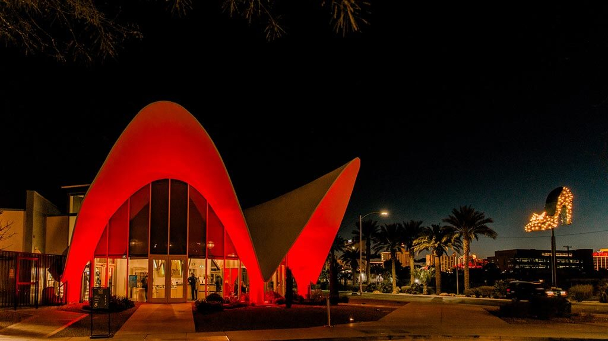

Элизиум в Музее неонового искусства — главное место собраний [[Камарилья|Камарильи]] в Лос-Анджелесе, расположенное в центре [[Glendale|Глендейла]] по адресу 216 S. Brand Blvd. Музей известен своей уникальной атмосферой: залы, наполненные историческими неоновыми вывесками и современными световыми инсталляциями, создают пространство, где прошлое и настоящее города сливаются в едином свете. Здесь проходят приёмы князя, дипломатические встречи и обсуждаются судьбы сородичей.

## Культура и правила

Элизиум — территория, где запрещены любые проявления насилия, использование дисциплин и открытые конфликты между сородичами. Здесь поддерживается строгий порядок: каждый посетитель обязан соблюдать уважение к традициям и иерархии секты. Музей неонового искусства выбран не случайно — его коллекция отражает историю города и служит напоминанием о хрупкости Маскарада. В залах Элизиума часто проходят выставки, посвящённые искусству и истории Лос-Анджелеса, а также закрытые собрания примогенов и судей. В последние годы, после атак Инквизиции, меры безопасности были усилены: вход осуществляется только по приглашениям, даты проведения Элизиума не регулярны и становятся известны только за пару ночей до его проведения, а за порядком следит шериф с группой доверенных агентов.

## Связанные персонажи

- [[Ванневар Томас]] — князь Лос-Анджелеса, принимает гостей и ведёт приёмы в Элизиуме, опираясь на поддержку сенешаля и примогенов.
- [[Сюзанна Рошель]] — сенешаль и дипломат, координирует работу двора, отвечает за организацию встреч и поддержание нейтралитета внутри Элизиума.
- [[Максимилиан Штраус]] — регент [[Тремер]], Хранитель Элизиума, отвечает за магическую защиту и соблюдение традиций, лично следит за безопасностью собраний.
- [[Катя]] — примоген Тремер, одна из ключевых фигур двора, участвует в стратегических советах и защите интересов клана.
- [[Роберт Гаррик]] — бывший примоген Тремер, чья судьба иллюстрирует жёсткие законы пирамиды и готовность клана жертвовать своими агентами ради баланса сил.
- [[Аврора]] — судья Камарильи, отвечает за соблюдение законов и разбор конфликтов, её отношения с другими членами двора остаются напряжёнными после событий 2021 года.
- [[Иб]] — шериф Камарильи, отвечает за безопасность Элизиума и оперативное реагирование на угрозы, поддерживает рабочие отношения с ключевыми фигурами двора.
