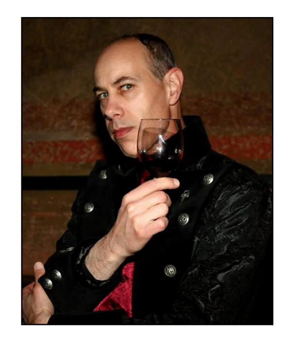

Самый старый [[Тореадор]] города, бывший [[Анархи|барон]] [[Голливуд|Голливуда]] и [[Долина|Долины]] и бывший кинопродюсер, обладавший значительным влиянием в индустрии развлечений города. Он известен своей рассудительностью, дипломатичностью и стремлением к порядку.

Айзек был одним из старейших и наиболее уважаемых представителей [[Анархи|анархов]] Лос-Анджелеса, выступал за мирное сосуществование между фракциями и предпочитал дипломатические методы решения конфликтов. Несмотря на анархические взгляды, сохранял уважение к традициям и иерархии, что сближало его с [[Камарилья|Камарильей]]. Айзек был известен как покровитель творческой элиты, поддерживал проекты в кино- и музыкальной индустрии, а также обеспечивал защиту и поддержку молодым и уязвимым сородичам. Его влияние ощущалось даже после отъезда, а имя стало символом порядка и дипломатии среди анархов.

Айзек заботился о безопасности своего домена и часто помогал другим вампирам, если это не угрожало его интересам. Его родной потомок — [[Эш Риверс]], бывший актёр, чья неустойчивая натура и проблемы с зависимостями стали причиной обращения. Айзек испытывал вину за судьбу Эша, их отношения со временем охладели, но сохранялись уважение и ответственность. Приёмная дочь Айзека — [[Вельвет Велюр|Вельвет Велюр]] (VV), владелица клуба Vesuvius, считала его отцом и тяжело переживала его отъезд, что сказалось на её публичной жизни и творчестве.

В 2020 году он покинул Голливуд и отправился в Италию по неотложному делу, оставив свой домен под совместное управление [[Нелли Гриффит|Нелли Гриффит]] и [[Виктор Темпл|Виктора Темпла]], надеясь, что союз представителей двух кланов поможет сохранить баланс в Голливуде. Однако их соперничество и внешние угрозы привели к новым конфликтам в городе.

⬤ **Красная дорожка:** Потому что вы ему понравились, вы были в личном VIP-списке Барона на голливудских мероприятиях. Хотя Айзек покинул Лос-Анджелес, Нелли и Виктор уважают его список. Будь то премьера фильма, открытие нового клуба, модный показ или съёмки блокбастера, вы всегда желанный гость. Все броски на охоту в этих местах уменьшаются на 1. Эта привилегия может быть передана сородичу или смертному по вашему выбору в этом городе (но если они облажаются, отвечаете вы).

⬤ ⬤ **Друг на высоте:** Ветеран Второго Анархистского Восстания и его последствий, Абрамс знает, где собака зарыта — часто буквально. Раз за историю вы можете попросить Рассказчика раскрыть вам секрет о Лос-Анджелесе и его сородичах до 2021 года. Этот секрет даёт вам преимущество в два кубика к любым броскам, связанным с этими сородичами.

⬤ ⬤ ⬤ **Бюджет на производство:** Потому что они видят художественную ценность в ваших идеях или должны вам или вашему знакомому, Нелли и Виктор предоставляют вам доступ к киностудии, телестудии или цифровой студии, включая смертных специалистов и команду, на время, достаточное для завершения короткого проекта (пилот ТВ, веб-сериал, подкаст, стрим и т.д.). Эта услуга включает возможность распространения и продвижения вашего проекта. Рассказчик решает, принесёт ли проект вам славу или печальную известность.

⬤ ⬤ ⬤ ⬤ **Парламент грачей:** Раз за историю вы можете использовать письмо от Айзека, чтобы получить личное знакомство и встречу с любым бароном Лос-Анджелеса. Ваша безопасность на встрече не гарантируется, но они уважают Айзека настолько, что не захотят, чтобы вам нанесли серьёзный вред.

⬤ ⬤ ⬤ ⬤ ⬤ **Маскарад:** Раз за хронику вы можете использовать письмо от Айзека, чтобы заставить любого барона Лос-Анджелеса принять меры по сокрытию риска для Маскарада, который вы или ваши знакомые создали. Использование этой услуги зависит от прочной связи с текущими баронами, которую вы и Рассказчик определяете вместе. Как бы вопиюще или катастрофично ни было происшествие, проблема исчезает: скрыта бюрократией, дезинформацией или иным способом. Смертные никогда не узнают, что произошло, но сородичи, связанные с выбранным бароном, могут узнать.
