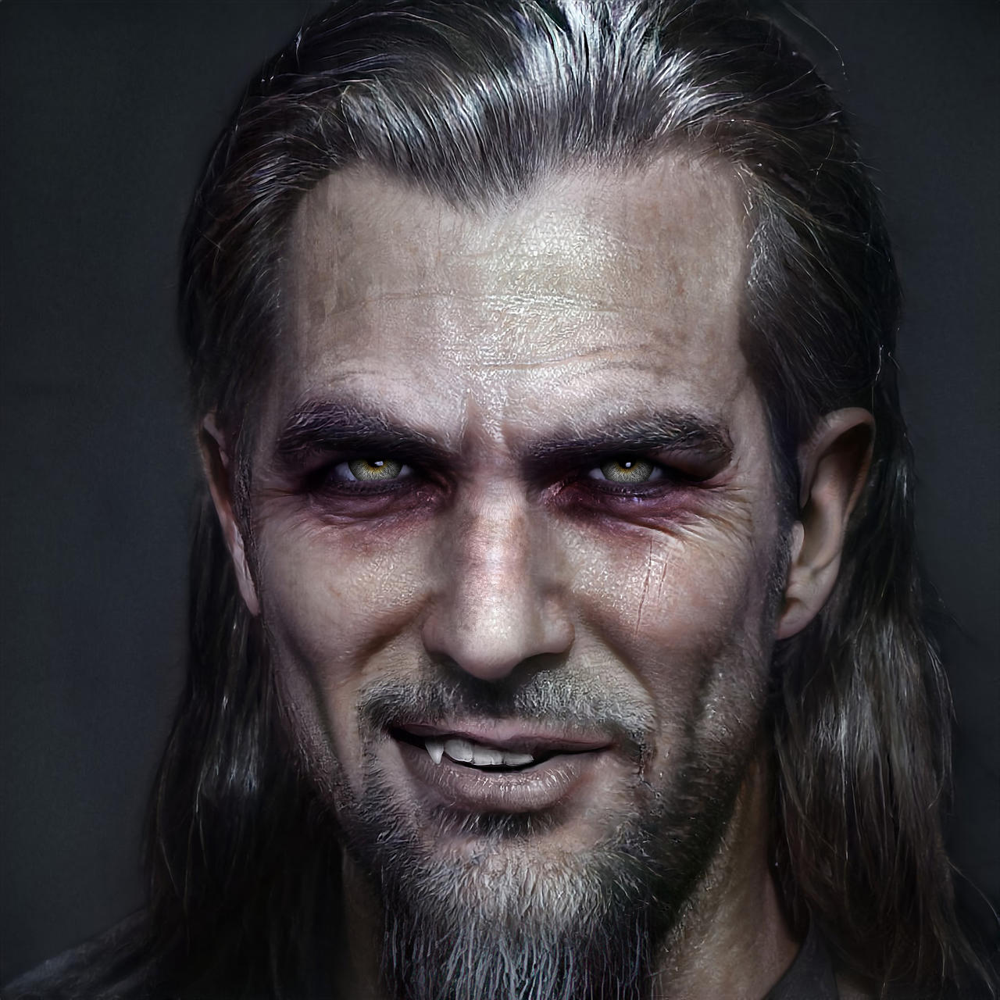

Смеющийся Джек — легендарный [[Бруха]], один из самых известных [[Анархи|Анархов]] Лос-Анджелеса и символ движения свободных вампиров. Внешне выглядит как мужчина лет сорока с дикой шевелюрой и небрежным видом, но за этим скрывается опытный стратег, мастер рукопашного боя и харизматичный вдохновитель молодых сородичей.

В смертной жизни Джек был пиратом и прославился буйным нравом, однако никогда не поднимался выше второго помощника капитана. После становления в 1654 году стал одним из самых активных борцов против тирании [[Камарилья|Камарильи]] и особенно ненавидил клан [[Вентру]]. Джек известен тем, что не стремился к формальной власти, предпочитая роль наставника и друга для молодых Анархов. Его влияние в движении было огромно, хотя он всегда избегал официальных титулов.

Смеющийся Джек сыграл ключевую роль в событиях, приведших к падению принца Лос-Анджелеса Себастьяна Лакруа, и поддерживал рост числа [[Тонкокровные|тонкокровных]], выступая против жесткой иерархии старейшин. После смерти Лакруа Джек покинул Лос-Анджелес и отправился в Либертатию (Восточная Африка).
