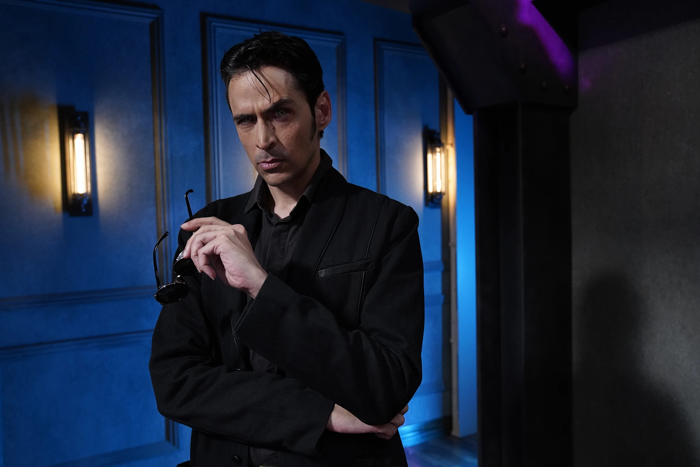

Чез Прайс — влиятельный [[Тореадор]], бывший Гарпия двора Сан-Франциско и Геральд при князе [[Ванневар Томас|Ванневаре Томасе]] в Лос-Анджелесе. Один из ключевых представителей Камарильи, известный своей жесткостью, амбициями и умением манипулировать как сородичами, так и смертными.

О прошлом Чеза известно немного, однако его статус подтверждается тем, что он имел нескольких потомков (в том числе [[Нелли Гриффит|Нелли Гриффит]] и Донну Кембридж), а также личную свиту из обученных гулей-телохранителей. После прибытия в Лос-Анджелес Прайс первым делом разыскал свою «непокорную» дочь Нелли, пытаясь использовать её положение для укрепления власти Камарильи в городе. Вскоре, заняв пост Геральда, он лично передал декларацию праксиса князя [[Ванневар Томас|Томаса]] всем баронам Лос-Анджелеса, что сделало его мишенью для анархов.

В 2019 году Чез Прайс был уничтожен анархами в Долине Сан-Фернандо — его диаблери стало символом сопротивления Камарилье и предупреждением для остальных представителей секты.
