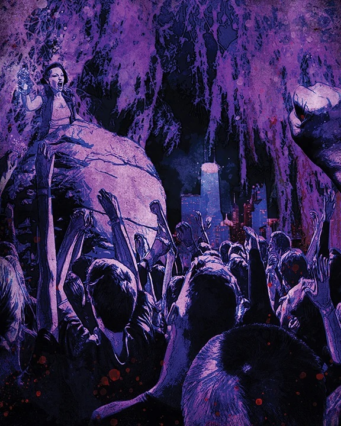

Как и после войн смертных, после сектантских войн остаётся много богатств для тех, кто достаточно ловок и беспринципен, чтобы их забрать. Не все трофеи достаются с павших — зачастую самая ценная добыча это информация или услуги, а не вещи. За каждое сокровище обычно появляются два врага — завистливый соперник и обиженный владелец, жаждущий мести. Трофеи не для слабонервных, но что вообще в этой бесконечной ночи для них?

⬤ **Прах к праху:** Во время одной из сектантских войн тебе удалось заполучить прах павшего анциллы. Может, ты был причастен к его смерти, а может и нет, но теперь он твой. Ты не знаешь, к какому клану он принадлежал — это знает только Рассказчик, — но прах может пригодиться для ритуалов или алхимии.

⬤ ⬤ **Наполеоновский контракт:** Бывший принц [[Себастьян Лакруа]] использовал LAPD как личный отряд убийц. У тебя, конечно, нет такой власти, но ты «унаследовал» его контакт с капитаном SWAT. Это контакт на две точки, который знает, кто ты такой, и раз за сюжет ты можешь воспользоваться статусом информатора, чтобы сообщить о преступлении и вызвать SWAT с ордером. Но будь осторожен: если отправишь их по ложному следу, они могут сами позвать Вторую Инквизицию.

⬤ ⬤ ⬤ **Дорогой дневник:** До того как его особняк сгорел, Алистер Граут записал серию аудиодневников с секретами о видных сородичах города. Один из дневников Малкавийского примогена оказался у тебя — раз за историю ты можешь расшифровать его и узнать скрытый секрет о сородиче, который был активен при Грауте. Это знание нельзя использовать как доказательство, но информация — сила в бесконечной ночи.

⬤ ⬤ ⬤ ⬤ **Личный голиаф (только для кровавых чародеев):** До того как капелла была заброшена, тебе удалось подчинить одну из горгулий [[Максимилиан Штраус|Штрауса]]. Это особый ретейнер на четыре точки, но он хорош только в одном — защите объекта. Раз за сюжет ты можешь приказать горгулье защищать место, и она будет делать это до смерти. Рассказчик может использовать характеристики Вайта (V5 Core, стр. 375), поменяв Силу и Ловкость местами, заменив Стремительность на Метаморфозы и снизив Кровавую мощь до 1. Но не стоит афишировать такого слугу — если Штраус или другие [[Тремер]] узнают, что ты сделал, весь клан придёт по твою голову, независимо от секты.

⬤ ⬤ ⬤ ⬤ ⬤ **Это то, о чём я думаю?:** Говорят, у [[Ванневар Томас|князя Томаса]] был фрагмент оригинальной [[Шабаш|Книги Нод]], вырезанный на енохианском. Ты знаешь, что это правда, потому что в момент во время нападения [[Вторая Инквизиция|инквизиции]] в 2021 году тебе удалось под шумок его украсть. Такой артефакт даёт статус, врагов, влияние, прозрение, пророчества — всё и сразу. Нет чётких правил, описывающих, что даёт обладание табличкой, которую, возможно, вырезал допотопный — решает Рассказчик. Раз за хронику табличку можно использовать для чуда: нового пророчества, усиления тонкой крови или чего-то ещё. Одно ясно — другие захотят её, и уничтожат тебя и всё, что с тобой связано, чтобы заполучить её. Осмелишься ли ты прикоснуться к самой истории?
