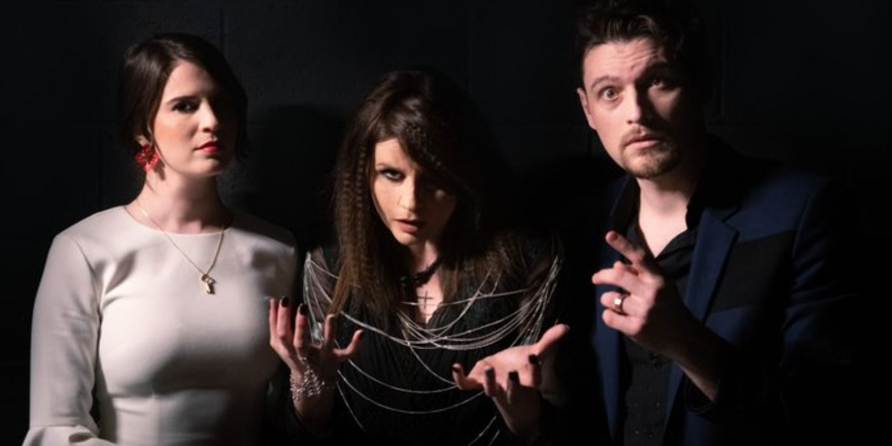

Секта Камарилья — самая организованная и влиятельная иерархия среди вампиров, известная как «Башня из слоновой кости». Её главная цель — сохранение Маскарада и контроль над смертными, а также поддержание порядка и традиций среди сородичей. Камарилья возникла в XV веке как ответ на угрозу Инквизиции и Анархического восстания, объединив старейшин и их сторонников в единую структуру. Власть в секте строится по феодальному принципу: города управляются князьями, опирающимися на совет примогенов, а также на должности сенешаля, хранителя Элизиума, шерифа и судьи. Внутренняя политика Камарильи пронизана интригами, системой долгов (престаций) и строгим соблюдением Традиций. В последние годы секта стала более закрытой: анархи, каитифы и весперы подвергаются преследованиям и изгнанию из её доменов.

## Культура и идеалы

Камарилья — общество традиций, иерархии и скрытности. Её члены верят, что только строгий порядок и контроль могут защитить сородичей от гибели и разоблачения. Главная ценность — Маскарад, закон, запрещающий раскрывать истинную природу вампиров смертным. Внутри секты процветают ритуалы, собрания (конклавы) и сложная система престижа и долгов. Кланы Камарильи делятся на патрицианские (элита: [[Вентру]], [[Тореадор]], [[Тремер]]) и плебейские (Малкавиан, Носферату, ранее Бруха и Гангрел), но власть и влияние зависят от личных заслуг и интриг. В последние годы к секте присоединились представители [[Ласомбра]], усилив внутренние конфликты. Камарилья враждует с [[Анархи|Анархами]], [[Шабаш|Шабашем]] и опасается [[Вторая Инквизиция|Второй Инквизиции]], но иногда вступает в вынужденные союзы ради выживания.

## Связи с персонажами

В Лос-Анджелесе Камарилья представлена рядом влиятельных фигур:

- [[Ванневар Томас]] — князь Лос-Анджелеса, бывший правитель Сан-Франциско, стратег и дипломат, чья власть держится на союзах и поддержке приближённых. Его сенешаль и возлюбленная — [[Сюзанна Рошель]], а среди союзников — такие фигуры, как [[Максимилиан Штраус]], [[Катя]], [[Роберт Гаррик]] и [[Иб]].
- [[Сюзанна Рошель]] — могущественная [[Тореадор]], сенешаль и возлюбленная князя, фактически возглавляла Камарилью в Лос-Анджелесе в период кризиса.
- [[Максимилиан Штраус]] — древний и могущественный [[Тремер]], регент Капеллы, Хранитель Элизиума, один из ключевых стратегов и чародеев секты. Был наставником и судьёй для других Тремер, лично наказал [[Катя|Катю]] и её чадо [[Ева|Еву]].
- [[Катя]] — примоген Тремер, сир Евы, вернулась в город после перевоспитания в Вене и заняла пост примогена после дискредитации [[Роберт Гаррик|Роберта Гаррика]].
- [[Роберт Гаррик]] — бывший примоген Тремер, фанатично преданный клану, стал козлом отпущения ради мира между Камарильей и анархами.
- [[Аврора]] — судья Лос-Анджелесской Камарильи, [[Ласомбра]], перебежавшая из Шабаша. Подозревается в предательстве после атаки Инквизиции.
- [[Иб]] — шериф Камарильи, бывший гуль, отвечала за безопасность Вентру во время атак Инквизиции.
- [[Себастьян Лакруа]] — бывший князь Лос-Анджелеса, французский аристократ, чьё правление стало символом тирании для анархов и примером политических интриг для Камарильи.

В Лос-Анджелеса Камарилья сосредоточена [[Княжество|на северо-востоке]] и проводит встречи в [[Элизиум|музее неонового искусства]].
